# خواننده تلگرام

<!-- TOP_NAV START -->

<a href="https://github.com/yerbeyer/aio-downloader/blob/main/telegram/content/archive_1.md" style="display:inline-block; padding:6px 12px; margin:0 4px; background-color:#2ea44f; color:white; text-decoration:none; border-radius:4px; font-weight:bold;">صفحه بعد</a>

<!-- TOP_NAV END -->

<!-- MSG START -->

---
📅 بروزرسانی: 1405/02/28 19:32
---

## VahidOOnLine — post 240821

  

اکسیوس به نقل از یک مقام ارشد آمریکایی و یک منبع مطلع گزارش داد تهران پیشنهاد تازه‌ای برای توافق به‌منظور پایان جنگ ارائه کرده، اما کاخ سفید این پیشنهاد را پیشرفت معناداری نمی‌داند و آن را برای دستیابی به توافق کافی ارزیابی نکرده است.

به گفته مقام‌های آمریکایی، دونالد ترامپ همچنان خواهان توافق برای پایان جنگ است، اما به‌دلیل رد بسیاری از خواسته‌های واشینگتن از سوی تهران و خودداری جمهوری اسلامی از ارائه امتیازهای قابل‌توجه در برنامه هسته‌ای، گزینه ازسرگیری حملات نظامی را نیز بررسی می‌کند.
‌🏁 🇬🇧 IranintlTV

🤖 @VahidOOnLine

## VahidOOnLine — post 240820

  

♦️رسانه آکسیوس به نقل از یک مقام آمریکایی گزارش کرد، اگر تهران مواضع خود را در مذاکرات تغییر ندهد، واشنگتن ناچار خواهد شد گفتگوها را «از طریق بمب‌ها» ادامه دهد.

آکسیوس به نقل از این مقام کاخ سفید که نامش فاش نشده نوشت زمان آن رسیده که طرف ایرانی چیزی فراتر از امتیازهای نمادین روی میز بگذارند: «ما به گفتگویی واقعی، جدی و جزئی‌نگر درباره برنامه هسته‌ای نیاز داریم. اگر چنین چیزی اتفاق نیفتد، گفتگو از طریق بمب‌ها انجام خواهد شد و این تأسف‌بار خواهد بود.»

مقام آمریکایی به آکسیوس گفت، ارائه پیشنهاد متقابل تازه از سوی ایران، با وجود تغییرات محدود در آن، نشان می‌دهد تهران نسبت به احتمال اقدام نظامی بیشتر از سوی آمریکا نگران است. او گفت فشار اکنون بر ایران است تا پاسخی ارائه دهد که بتواند مسیر مذاکرات را تغییر دهد.

به گفته این مقام آمریکایی، ارائه پیشنهاد متقابل تازه از سوی ایران، با وجود تغییرات محدود، نشان می‌دهد تهران نسبت به احتمال اقدامات نظامی بیشتر از سوی آمریکا نگران است.
‌🇸🇦 Indypersian

🤖 @VahidOOnLine

## VahidOOnLine — post 240819

  <a href="telegram/content/VahidOOnLine_240819_1779120174.mp4" target="_blank">🎬 Download video</a>

♦️محسن نقوی، وزیر کشور پاکستان، عصر دوشنبه ۲۸ اردیبهشت‌ماه در تهران با عباس عراقچی، وزیر خارجه جمهوری اسلامی، دیدار و گفتگو کرد.

بر اساس گزارش رسمی رسانه‌های ایران، دو طرف درباره روابط دوجانبه، تحولات منطقه‌ای و گسترش همکاری‌های مرزی گفتگو کردند. همچنین اسکندر مومنی، وزیر کشور جمهوری اسلامی و محسن نقوی بر تقویت روابط دو کشور و توسعه مبادلات مرزی تاکید کردند.

در این دیدار درباره اوضاع منطقه نیز بحث و تبادل نظر شد. این دومین دیدار مقام‌های ارشد دو کشور در دو روز گذشته است.

وزیر کشور پاکستان در سفر خود به تهران با مسعود پزشکیان، رئیس‌جمهوری اسلامی ایران، و محمدباقر قالیباف، رئیس مجلس شورای اسلامی نیز دیدار کرده است.
‌🇸🇦 Indypersian

🤖 @VahidOOnLine

## VahidOOnLine — post 240818

  

♦️ رسانه آکسیوس، روز دوشنبه ۲۸ اردیبهشت ماه، به نقل از یک مقام ارشد آمریکایی و یک منبع آگاه گزارش داد واشنگتن پیشنهاد به‌روز شده‌ تهران برای توافق پایان جنگ را دریافت کرده است، اما کاخ سفید معتقد است این پیشنهاد، «پیشرفت معناداری نیست و برای یک توافق کافی نیست».
بر اساس این گزارش، نسخه جدید شامل توضیحات بیشتری درباره تعهد ایران به دنبال نکردن سلاح هسته‌ای است، اما همچنان فاقد تعهدات مشخص درباره توقف غنی‌سازی اورانیوم یا واگذاری ذخایر کنونی اورانیوم با غنای بالا است: «این پیشنهاد جدید شامل کلمات بیشتری در مورد تعهد ایران به عدم پیگیری سلاح هسته‌ای است، اما هیچ تعهد دقیقی در مورد تعلیق غنی‌سازی اورانیوم یا تحویل ذخایر موجود اورانیوم با غنای بالا ارائه نمی‌دهد.»
در حالی که رسانه‌های حکومتی جمهوری اسلامی از موافقت ایالات متحده برای لغو برخی تحریم‌های نفتی علیه ایران در طول مذاکرات گزارش داده‌اند، آکسیوس به نقل از مقام آمریکایی نوشت: «هیچ کاهش تحریمی بدون اقدام متقابل ایران «رایگان» اتفاق نخواهد افتاد.»
آکسیوس همچنین نوشت کاخ سفید این پیشنهاد را برای دستیابی به توافق کافی نمی‌داند و معتقد است پیشرفت قابل‌توجهی در مذاکرات حاصل نشده است.
‌🇸🇦 Indypersian

🤖 @VahidOOnLine

## VahidOOnLine — post 240817

  <a href="telegram/content/VahidOOnLine_240817_1779120177.mp4" target="_blank">🎬 Download video</a>

تماسی از ایران:
«خانواده‌های بچه‌های دربند رو برای کمک‌رساندن دریابیم»
‌🏁 🇬🇧 ManotoTV

🤖 @VahidOOnLine

## VahidOOnLine — post 240816

  <a href="telegram/content/VahidOOnLine_240816_1779120180.mp4" target="_blank">🎬 Download video</a>

عفو بین‌الملل اعلام کرد شمار اعدام‌ها در جهان در سال ۲۰۲۵ به بالاترین سطح ثبت‌شده در ۴۴ سال گذشته رسیده و ایران با ثبت دست‌کم ۲۱۵۹ اعدام، عامل اصلی این افزایش بوده است.

بر اساس گزارش سالانه این سازمان، در مجموع دست‌کم ۲۷۰۷ نفر در ۱۷ کشور اعدام شده‌اند؛ آماری که نسبت به سال ۲۰۲۴ حدود ۷۸ درصد افزایش نشان می‌دهد.

عفو بین‌الملل اعلام کرد شمار اعدام‌ها در ایران بیش از دو برابر سال گذشته شده و ایران پس از چین، که آمار رسمی اعدام‌هایش منتشر نمی‌شود، در صدر کشورهای مجری اعدام قرار دارد.

در این گزارش آمده است عربستان سعودی با دست‌کم ۳۵۶ اعدام در رتبه بعدی قرار گرفته و بخش قابل توجهی از این احکام به جرایم مرتبط با مواد مخدر مربوط بوده است.

بر اساس این گزارش، آمریکا نیز شمار اعدام‌های خود را از ۲۵ مورد در سال ۲۰۲۴ به ۴۷ مورد در سال ۲۰۲۵ افزایش داده است. شمار اعدام‌ها در مصر، سنگاپور و کویت نیز نسبت به سال قبل افزایش یافته است.

عفو بین‌الملل همچنین اعلام کرد چین، مصر، جمهوری اسلامی، عراق، کره شمالی، عربستان سعودی، سومالی، آمریکا، ویتنام و یمن در پنج سال گذشته به‌طور مداوم اعدام انجام داده‌اند.
‌🏁 🇬🇧 ManotoTV

🤖 @VahidOOnLine

## VahidOOnLine — post 240815

  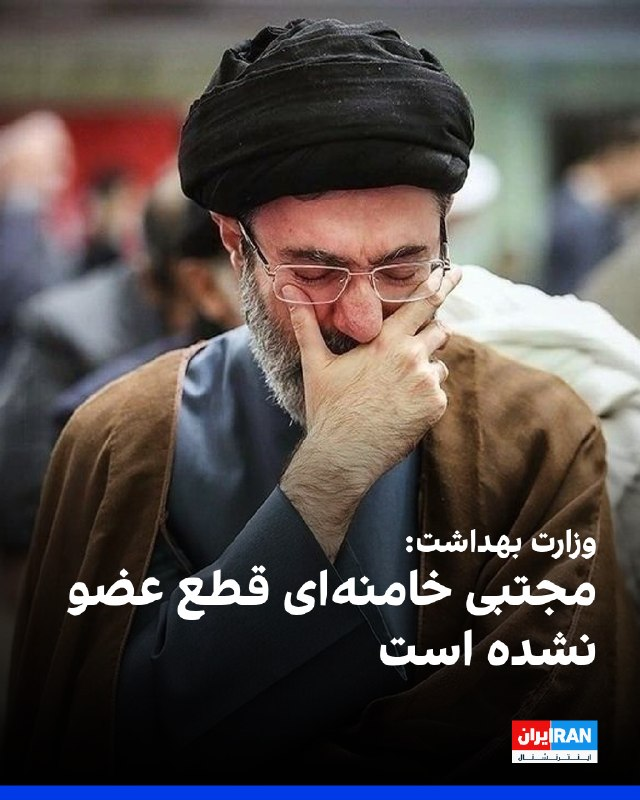

مدیر مرکز روابط عمومی و اطلاع‌رسانی وزارت بهداشت درباره وضعیت مجتبی خامنه‌ای گفت: «اتفاق خاصی برای او رخ نداده بود و صرفا چند زخم برداشته بودند.»
این مقام وزارت بهداشت تاکید کرد: «زخم‌ها از نوعی نبودند که چهره ایشان را مخدوش کنند» و اضافه کرد مجتبی خامنه‌ای جانباز نشده و قطع عضو نداشته و تنها در محل جراحت روی پای او چند بخیه زده شده است.
‌🏁 🇬🇧 IranintlTV

🤖 @VahidOOnLine

## VahidOOnLine — post 240814

  

دونالد ترامپ، رییس‌جمهور آمریکا در پستی در شبکه اجتماعی تروث سوشال از برخی رسانه‌ها و دموکرات‌ها در زمینه جنگ علیه جمهوری اسلامی انتقاد کرد.

او نوشت: «اگر ایران تسلیم شود، اعتراف کند که نیروی دریایی‌اش نابود شده و در کف دریا آرام گرفته است، و نیروی هوایی‌اش دیگر در میان ما نیست، و اگر کل ارتش آن‌ها در حالی که سلاح‌ها را زمین گذاشته و دست‌ها را بالا برده‌اند از تهران خارج شوند و هر کدام با فریاد "من تسلیم می‌شوم، من تسلیم می‌شوم" پرچم سفید تسلیم را به شدت تکان دهند، و اگر تمام رهبری باقی‌مانده آن‌ها همه «اسناد تسلیم» لازم را امضا کنند و شکست خود را در برابر قدرت و نیروی عظیم ایالات متحده باشکوه بپذیرند، آن‌وقت روزنامه شکست‌خورده نیویورک تایمز، چاینا استریت ژورنال (همان وال‌استریت ژورنال!)، سی‌ان‌انِ فاسد و اکنون بی‌اهمیت، و همه اعضای دیگر رسانه‌های اخبار جعلی (فیک نیوز)، تیتر خواهند زد که ایران یک پیروزی استادانه و درخشان بر ایالات متحده آمریکا داشته و اصلاً حتی نزدیک هم نبوده است.»

ترامپ افزود: «دموکرات‌های احمق و رسانه‌ها کاملا راه خود را گم کرده‌اند. آن‌ها کاملا دیوانه شده‌اند!!!»
‌🏁 🇬🇧 IranintlTV

🤖 @VahidOOnLine

## VahidOOnLine — post 240813

  

♦️لیندزی گراهام، سناتور جمهوری‌خواه آمریکا، روز دوشنبه ۲۸ اردیبهشت‌ماه در پیامی در شبکه اجتماعی اکس نوشت جمهوری اسلامی با وجود تضعیف شدید نظامی و اقتصادی، «جسورتر و پرخاشگرتر» شده است.

او نوشت اطمینان دارد دونالد ترامپ وضعیت جمهوری اسلامی را به‌خوبی درک می‌کند و دیگر «امتناع از مذاکره با حسن نیت» و اقدامات جمهوری اسلامی در تنگه هرمز و منطقه را تحمل نخواهد کرد.

گراهام افزود: «برای من کاملا روشن است که جمهوری اسلامی از نظر نظامی و اقتصادی بسیار ضعیف شده، اما همزمان جسورتر و پرخاشگرتر هم شده است.»

این سناتور آمریکایی تاکید کرد آمریکا باید از «موضع قدرت و تسلط» با جمهوری اسلامی مذاکره کند و گفت یک «پاسخ کوتاه اما قاطع» می‌تواند مسیر درگیری را تغییر دهد.
‌🇸🇦 Indypersian

🤖 @VahidOOnLine

## VahidOOnLine — post 240812

  

♦️دونالد ترامپ، رئیس‌جمهوری آمریکا، روز دوشنبه در پیامی در شبکه اجتماعی تروث سوشال نوشت: «حتی اگر ایران به‌طور کامل تسلیم شود، رسانه‌ها این وضعیت را به‌عنوان پیروزی تهران توصیف خواهند کرد.»
ترامپ در این پیام نوشت اگر ایران اعتراف کند نیروی دریایی‌اش نابود شده، نیروی هوایی‌اش دیگر وجود ندارد، همه نیروهای نظامی از تهران خارج شوند، پرچم سفید برافرازند و رهبران جمهوری اسلامی نیز اسناد تسلیم را امضا کنند، باز هم برخی رسانه‌های آمریکایی نتیجه را «پیروزی ایران» معرفی خواهند کرد.
رئیس جمهوری آمریکا در ادامه به‌شدت از رسانه‌هایی مانند نیویورک تایمز، وال‌استریت ژورنال و سی‌ان‌ان انتقاد کرد و آن‌ها را بخشی از «رسانه‌های اخبار جعلی» خواند.
‌🇸🇦 Indypersian

🤖 @VahidOOnLine

## VahidOOnLine — post 240811

  <a href="telegram/content/VahidOOnLine_240811_1779120184.mp4" target="_blank">🎬 Download video</a>

با تهدید «حق تیر داریم» مانع برگزاری مراسم زادروز بهار شاه‌مهری شدند

بر اساس ویدیوی ارسالی به منوتو، نیروهای حکومتی با تهدید خانواده بهار شاه‌مهری و گفتن جمله «ما حق تیر داریم»، اجازه برگزاری مراسم زادروز این جاویدنام را در ۱۹ اردیبهشت ندادند.

بهار شاه‌مهری، نوجوان ۱۷ ساله اهل نیشابور، غروب ۱۹ دی‌ماه ۱۴۰۴ در جریان انقلاب شیر و خورشید ایران، در کوچه‌ای خلوت از پشت سر هدف شلیک مستقیم تک‌تیرانداز نیروهای سرکوبگر جمهوری اسلامی قرار گرفت و جان باخت.

به گفته نزدیکان او، چند روز پیش از سالروز تولد بهار، اعضای خانواده‌اش بازداشت و بازجویی شدند و مسیرهای منتهی به مزار او در روز تولدش بسته شد تا از برگزاری مراسم جلوگیری شود.

همچنین گزارش شده است که سنگ مزار بهار شاه‌مهری روز دوم فروردین ۱۴۰۶ شکسته شده بود.
این فشارها بخشی از روند گسترده‌تر سرکوب خانواده‌های جان‌باختگان است؛ حتی بعد از کشتن، از گل گذاشتن و تولد گرفتن هم می‌ترسند. عجب شجاعتی، حکومت با سنگ قبر می‌جنگد.
‌🏁 🇬🇧 ManotoTV

🤖 @VahidOOnLine

## VahidOOnLine — post 240810

  <a href="telegram/content/VahidOOnLine_240810_1779120186.mp4" target="_blank">🎬 Download video</a>

دونالد ترامپ، رئیس‌جمهوری آمریکا، در پیامی در تروث‌سوشال ، رسانه‌های آمریکایی را متهم کرد که حتی در صورت «تسلیم کامل ایران» نیز آن را به‌عنوان پیروزی توصیف خواهند کرد.

ترامپ در این پیام نوشت اگر جمهوری اسلامی شکست خود را بپذیرد، نیروهای نظامی‌اش تسلیم شوند و رهبرانش «اسناد تسلیم» را امضا کنند، باز هم رسانه‌هایی چون نیویورک‌تایمز، وال‌استریت ژورنال و سی‌ان‌ان این اتفاق را «پیروزی ایران» جلوه خواهند داد.

او با اشاره به نابودی نیروی دریایی و نیروی هوایی ایران نوشت: «اگر ایران تسلیم شود، بپذیرد که نیروی دریایی‌اش در کف دریا نابود شده و نیروی هوایی‌اش دیگر وجود ندارد، و اگر نیروهای نظامی‌اش با دست‌های بالا و پرچم سفید از تهران خارج شوند، باز هم رسانه‌های فیک‌نیوز خواهند گفت ایران پیروزی درخشانی مقابل آمریکا به دست آورده است.»

ترامپ همچنین رسانه‌های جریان اصلی آمریکا را «فاسد» و «بی‌اهمیت» توصیف کرد و نوشت: «دموکرات‌ها و رسانه‌ها کاملا راه خود را گم کرده‌اند. آن‌ها کاملا دیوانه شده‌اند.»
‌🏁 🇬🇧 ManotoTV

🤖 @VahidOOnLine

## VahidOOnLine — post 240809

  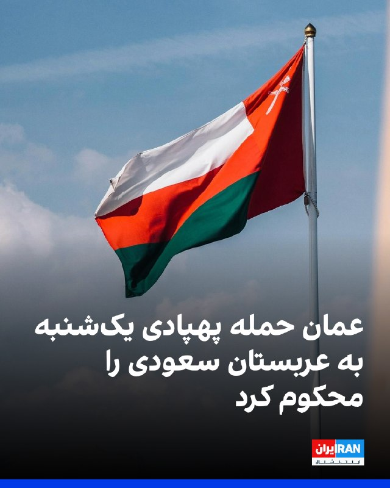

وزارت خارجه عمان حمله پهپادی یک‌شنبه به عربستان سعودی را محکوم کرد.
عمان در بیانیه‌ای اعلام کرد هرگونه اقدام خصمانه را مردود می‌داند و از عربستان سعودی برای حفظ امنیت و ثبات خود حمایت می‌کند.
مسقط همچنین بر خویشتنداری و حل مسائل منطقه‌ای از مسیرهای دیپلماتیک تاکید کرد.
‌🏁 🇬🇧 IranintlTV

🤖 @VahidOOnLine

## VahidOOnLine — post 240808

  

♦️سرگئی لاوروف، وزیر خارجه روسیه، در بحبوحه فشارهای دولت ترامپ بر تهران، روز دوشنبه ۲۸ اردیبهشت‌ماه اعلام کرد ایران مانند دیگر اعضای پیمان منع گسترش سلاح‌های هسته‌ای، «حق کامل» دارد برای اهداف صلح‌آمیز اورانیوم غنی‌سازی کند.

لاوروف در نشست خبری در مسکو گفت روسیه در روند مذاکرات میان واشنگتن و تهران دخالت نخواهد کرد و از هر توافقی که دو طرف بپذیرند، حمایت می‌کند.
‌🇸🇦 Indypersian

🤖 @VahidOOnLine

## VahidOOnLine — post 240807

  

فرماندهی مرکزی ایالات متحده، سنتکام، اعلام کرد از زمان آغاز محاصره دریایی بنادر و سواحل جنوبی ایران، ۸۴ کشتی تجاری مجبور به تغییر مسیر شده‌اند و چهار شناور دیگر نیز پس از هدف قرار گرفتن، از کار افتاده‌اند تا اجرای این محاصره تضمین شود.
‌🏁 🇬🇧 IranintlTV

🤖 @VahidOOnLine

## VahidOOnLine — post 240806

  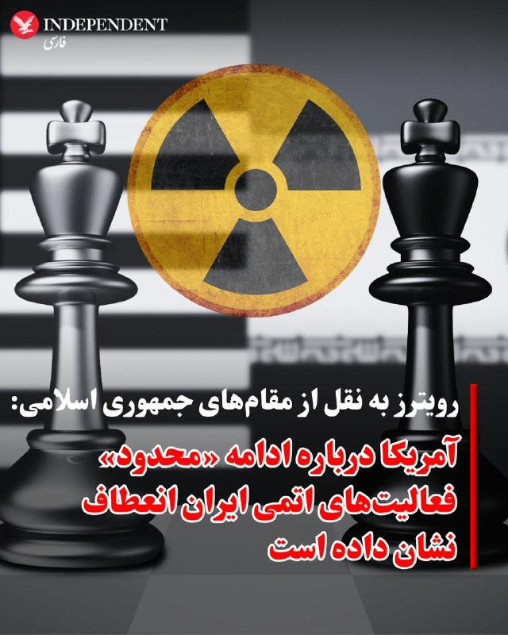

♦️رویترز به نقل از یک منبع ارشد ایرانی گزارش داد ایالات متحده درباره ادامه فعالیت‌های محدود هسته‌ای صلح‌آمیز ایران تحت نظارت آژانس بین‌المللی انرژی اتمی انعطاف نشان داده است.

این منبع روز دوشنبه ۲۸ اردیبهشت‌ماه به رویترز گفت واشنگتن تاکنون فقط با آزادسازی یک‌چهارم دارایی‌های مسدودشده ایران، آن هم بر اساس یک جدول زمانی مرحله‌ای، موافقت کرده و تهران خواستار بازنگری آمریکا در این مواضع شده است.

بر اساس این گزارش، ایران در پیشنهاد تازه خود بر پایان جنگ، بازگشایی تنگه هرمز و لغو تحریم‌های دریایی تمرکز کرده و موضوعات بحث‌برانگیزتر مانند غنی‌سازی اورانیوم و برنامه هسته‌ای را به مراحل بعدی مذاکرات موکول کرده است.
‌🇸🇦 Indypersian

🤖 @VahidOOnLine

## VahidOOnLine — post 240805

  

محمدجعفر قائم‌پناه، معاون اجرایی پزشکیان، گفت: «بر اساس نظرسنجی مرکز ریاست‌جمهوری، ۷۰ درصد مردم مخالف محدودیت اینترنت هستند.»

او افزود: «محدودیت‌ها در دی‌ماه و در زمان جنگ، با منطق مدیریت بحران، صیانت از امنیت ملی، جان و آرامش عمومی صورت گرفت.»

قائم‌پناه اضافه کرد: «جامعه‌ای که صادقانه با آن سخن گفته شود، تاب‌آورتر و همراه‌تر خواهد بود.»
‌🏁 🇬🇧 IranintlTV

🤖 @VahidOOnLine

## VahidOOnLine — post 240804

  

♦️دونالد ترامپ، رئیس جمهوری آمریکا، روز یکشنبه تصویری ساخته شده با هوش مصنوعی، از قدم زدن با یک موجود فضایی را در صفحه تروث سوشال به اشتراک گذاشت.

وزارت دفاع ایالات متحده، پیشتر در پی دستور مستقیم دونالد ترامپ، مجموعه‌ای از اسناد طبقه‌بندی‌شده و «دیده‌نشده» مربوط به اشیاء ناشناس پرنده (UFO) را که اکنون با نام رسمی «پدیده‌های ناهنجار ناشناخته» (UAP) معرفی می‌شوند، منتشر کرد.

پنتاگون گفته است، با دستور دونالد ترامپ از این پس شهروندان می‌توانند بدون نیاز به سطح دسترسی امنیتی، به ویدیوها، تصاویر و اسناد اصلی دولتی در این زمینه دسترسی داشته باشند.
‌🇸🇦 Indypersian

🤖 @VahidOOnLine

## VahidOOnLine — post 240803

  

ارتش اسرائیل می‌گوید در حمله‌ای هوایی به منطقه بعلبک در شرق لبنان، وائل محمود عبدالحلیم، فرمانده جهاد اسلامی در منطقه بقاع، کشته شده است. به گفته ارتش اسرائیل، او در هماهنگی عملیات‌های جهاد اسلامی در کنار حزب‌الله لبنان نقش داشته است.
‌🏁 🇬🇧 ManotoTV

🤖 @VahidOOnLine

## VahidOOnLine — post 240802

  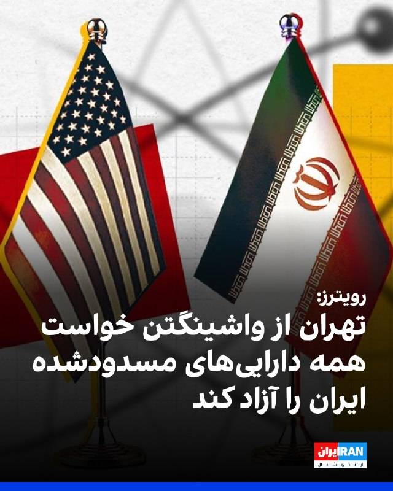

رویترز به نقل از یک مقام ارشد جمهوری اسلامی گزارش داد تهران از آمریکا خواسته همه دارایی‌ها و منابع مالی ایران را آزاد کند.

این مقام گفت پیشنهاد اصلاح‌شده تهران شامل پایان دائمی جنگ، لغو تحریم‌ها و بازگشایی تنگه هرمز است و موضوع هسته‌ای در مراحل بعدی مذاکرات مطرح خواهد شد.

او افزود واشینگتن تاکنون تنها با آزادسازی ۲۵ درصد از دارایی‌های مسدودشده ایران، آن هم بر اساس جدول زمانی مرحله‌ای، موافقت کرده است.
‌🏁 🇬🇧 IranintlTV

🤖 @VahidOOnLine

## WithYashar — post 11556

🚨🚨🚨🚨🚨🚨🚨🚨
رویترز: آمریکا پیشنهاد جدید ایران را رد کرد
@withyashar

## WithYashar — post 11555

  

علی‌ آقا عشقه ، چقدر راحت و خاکی‌ کانکت شدیم… بد یه عده … چی بگم… درست میشه اونم … در آخر هر چیزی فقط‌ مردمن که مهم هستند🙌🏾❤️‍🩹
@withyashar

## WithYashar — post 11554

کمی‌پیش ستون عظیم دود از جنوب تهران، دوربین به سمت : بزرگراه یادگار عمام، جنوب @withyashar

## WithYashar — post 11553

  

کمی‌پیش ستون عظیم دود از جنوب تهران، دوربین به سمت : بزرگراه یادگار عمام، جنوب
@withyashar

## WithYashar — post 11552

تسنیم به نقل از منبعی نزدیک به تیم مذاکره‌کننده ایران:

ایران بر لزوم پرداخت غرامت از سوی آمریکا به دلیل جنگ، اصرار جدی دارد.
واشنگتن باید درک کند که پایان دادن به جنگ، در ازای تعهدات هسته‌ای نخواهد بود.
@withyashar

## WithYashar — post 11551

  

ترامپ در تروث : اگر ایران تسلیم شود، بپذیرد که نیروی دریایی‌اش از بین رفته و در کف دریا آرمیده است، و نیروی هوایی‌اش دیگر همراه ما نیست، و اگر تمام ارتش آن از تهران خارج شود در حالی که سلاح‌ها را زمین گذاشته و دست‌ها را بالا برده‌اند و هر کدام فریاد می‌زنند «تسلیم می‌شوم، تسلیم می‌شوم» و با شتاب پرچم سفید را تکان می‌دهند، و اگر تمام رهبری باقی‌مانده آن همه اسناد لازمِ تسلیم را امضا کنند و شکست خود را در برابر قدرت و نیروی عظیم ایالات متحده آمریکا بپذیرند، آنگاه نیویورک تایمزِ شکست‌خورده، وال‌استریت ژورنال چین (وال‌استریت ژورنال!)، سی‌ان‌ان فاسد و اکنون بی‌اعتبار، و همه اعضای دیگر رسانه‌های جعلی، تیتر خواهند زد که ایران پیروزی‌ای استادانه و درخشان بر ایالات متحده آمریکا به دست آورده است؛ در حالی که اصلاً رقابت نزدیک هم نبوده است.

دموکرات‌ها و رسانه‌ها کاملاً راه خود را گم کرده‌اند. آن‌ها کاملاً دیوانه شده‌اند!!!
@withyashar

## WithYashar — post 11550

کانال ۱۳ تلویزیون اسرائیل: نتانیاهو برای دومین بار در ۲۴ ساعت گذشته با کابینه امنیتی تشکیل جلسه داد
@withyashar

## WithYashar — post 11549

رئیس‌جمهور کوبا: هر حمله نظامی به کوبا به حمام خون و عواقب غیرقابل پیش‌بینی منجر می‌شود
@withyashar

## WithYashar — post 11548

کی‌یر استارمر : من قصد ندارم کنار بکشم، باید به مردمی که به من رای دادند خدمت کنم!
@withyashar

## WithYashar — post 11547

خبر بد برای گیمرها
رضا احمدی، معاون نظارت بنیاد ملی بازی‌های رایانه‌ای:

طرحی برای سایتهای دانلود بازیهای کامپیوتری به تصویب رسیده که طبق اون، یک گیم سنتر مرکزی تشکیل میشه تا سایتهای دانلود بازی قبل اینکه لینک دانلود رو آپلود کنن باید اون لینکا رو به اون گیم سنتر ارسال کنن تا یه کمیته محتواش رو بررسی کنه و اگه تایید شد، اون سایت تازه اجازه داره لینکای دانلود رو برای گیمرها آپلود کنه!
@withyashar

## WithYashar — post 11546

آمریکا در متن جدید خود اسقاط تحریم‌های نفتی ایران را پذیرفته است

تسنیم : یک منبع نزدیک به تیم مذاکره‌کننده گفت که آمریکایی‌ها برخلاف متون پیشین خود، در متن جدید پذیرفته‌اند که در طول دوره مذاکره، تحریم‌های نفتی ایران را Wave کنند.

ایران تاکید دارد که لغو همه‌ی تحریم‌های ایران باید جزو تعهدات آمریکا باشد. آمریکا اما اسقاطی(OFAC) را تا زمان تفاهم نهایی مطرح کرده است.

اسقاط تحریم‌ها WAVE یعنی تحریم‌ها موقتاً یا عملاً اجرا نشوند اما به معنی حذف دائمی نیست
او‌فک (OFAC)مخفف:
Office of Foreign Assets Control
این یک نهاد در وزارت خزانه‌داری آمریکا است. کارش اجرای تحریم‌ها علیه کشورها، شرکت‌ها و افراد هست، به عبارتی کنترل اینکه چه کسی می‌تواند با چه کسی تجارت کند
@withyashar

## mwarmonitor — post 9257

🇺🇸🇨🇳رئیس‌جمهور ترامپ می‌گوید گفت‌وگوها با رئیس‌جمهور چین، شی جین‌پینگ، به توافق‌های جدیدی منجر شده که هدف آن‌ها «صلح و رفاه» میان آمریکا و چین است.

🔸از جمله توافق‌های گزارش‌شده: چین ۲۰۰ فروند هواپیمای بوئینگ خریداری خواهد کرد، طی سه سال آینده بیش از ۱۷ میلیارد دلار محصولات کشاورزی آمریکا را می‌خرد، مجوز فعالیت بیش از ۴۰۰ مرکز آمریکایی تولید گوشت گاو تمدید می‌شود و واردات گوشت مرغ از برخی ایالت‌های آمریکا از سر گرفته خواهد شد.

@mwarmonitor

## mwarmonitor — post 9255

🇺🇸🇮🇷 رویترز: آمریکا پیشنهاد جدید ایران را رد کرد.

@mwarmonitor

## mwarmonitor — post 9254

🚨 آمریکا جدیدترین پیشنهاد صلح ایران را رد کرد، پیش از جلسه روز سه‌شنبه در «اتاق وضعیت» (Situation Room). بلومبرگ

@mwarmonitor

## mwarmonitor — post 9253

🔴ایران پیشنهاد جدیدی ارائه داد؛ مقام ارشد آمریکایی: این پیشنهاد کافی نیست و خطر ازسرگیری جنگ را به همراه دارد

📝نویسنده: باراک راوید (AXIOS)

🔰ایران پیشنهاد به‌روزشده‌ای را برای دستیابی به توافقی جهت پایان دادن به جنگ ارائه کرده است، اما یک مقام ارشد آمریکایی و یک منبع آگاه از این موضوع به «آکسیوس» گفتند که کاخ سفید معتقد است این پیشنهاد پیشرفت معناداری به‌شمار نمی‌رود و برای دستیابی به توافق کافی نیست.

📌چرا این موضوع اهمیت دارد؟
مقامات آمریکایی می‌گویند پرزیدنت ترامپ خواهان توافقی برای پایان دادن به جنگ است، اما به دلیل رد بسیاری از خواسته‌های او از سوی ایران و امتناع این کشور از دادن امتیازات معنادار در برنامه هسته‌ای خود، در حال بررسی گزینه ازسرگیری جنگ است.

🔸به گفته دو مقام آمریکایی، انتظار می‌رود ترامپ روز سه‌شنبه تیم امنیت ملی خود را در «اتاق وضعیت» (Situation Room) کاخ سفید برای بررسی گزینه‌های نظامی تشکیل دهد.

🔹یک مقام ارشد آمریکایی گفت اگر ایران موضع خود را تغییر ندهد، ایالات متحده مجبور خواهد شد مذاکرات را «از طریق بمب‌ها» ادامه دهد.

🔸ترامپ روز یکشنبه در یک تماس تلفنی با آکسیوس (پیش از آنکه آمریکا پیشنهاد جدید ایران را دریافت کند) گفت: «زمان در حال از دست رفتن است» و اگر ایران انعطاف نشان ندهد، «ضربات بسیار سخت‌تری دریافت خواهند کرد.»

📌جزئیات بیشتر
این مقام ارشد آمریکایی گفت که پیش‌نویس پیشنهادیِ متقابل ایران، که یکشنبه‌شب از طریق میانجی‌های پاکستانی به دست آمریکا رسیده، تنها حاوی بهبودهای جزئی و نمادین نسبت به نسخه قبلی است.

🔸مسئله هسته‌ای: پیشنهاد جدید شامل عبارات و کلمات بیشتری درباره تعهد ایران به عدم تلاش برای دستیابی به سلاح هسته‌ای است، اما هیچ تعهد دقیقی درباره تعلیق غنی‌سازی اورانیوم یا تحویل ذخایر موجود اورانیوم با غنای بالا در آن دیده نمی‌شود.
مسئله تحریم‌ها: در حالی که رسانه‌های دولتی ایران گزارش دادند که آمریکا موافقت کرده است در طول مذاکرات برخی از تحریم‌های نفتی ایران را لغو کند، این مقام آمریکایی گفت که هیچ‌گونه لغو تحریمی «به صورت رایگان» و بدون اقدام متقابل از سوی ایران رخ نخواهد داد.

🔹اظهارات مقامات
این مقام ارشد آمریکایی گفت:
«ما واقعاً پیشرفت زیادی نداشته‌ایم. امروز در موقعیت بسیار حساسی قرار داریم. اکنون فشار روی آن‌هاست تا پاسخ مناسبی بدهند.»

🔰او در ادامه افزود:
«زمان آن رسیده که ایرانی‌ها امتیاز واقعی روی میز بگذارند. ما به یک گفتگوی واقعی، محکم و دقیق [در مورد برنامه هسته‌ای] نیاز داریم. اگر قرار نباشد این اتفاق بیفتد، ما از طریق بمب‌ها گفتگو خواهیم کرد که این مایه تاسف خواهد بود.»

📌پشت پرده
به گفته این مقام ارشد آمریکایی، ایالات متحده و ایران در حال حاضر مذاکرات مستقیمی روی متن و محتوای توافق ندارند، بلکه در حال انجام گفتگوهای غیرمستقیم هستند تا به یک اجماع درباره شکل و ساختار این مذاکرات دست یابند.
این مقام آمریکایی مدعی شد همین که ایران با وجود تغییرات بسیار ناچیز، پیشنهاد متقابل جدیدی ارائه کرده است، نشان می‌دهد ایرانی‌ها نگران اقدامات نظامی بیشتر از سوی ایالات متحده هستند. در مقابل، ایرانی‌ها مدت‌هاست ادعا می‌کنند این ترامپ است که برای توافق دستپاچه و عجول است و زمان به نفع آن‌ها (ایران) پیش می‌رود.

@mwarmonitor

## mwarmonitor — post 9252

  

🇺🇸ملوانان نیروی دریایی آمریکا در مرکز اطلاعات رزمی (CIC) ناو USS Delbert D. Black (DDG 119) در حال نگهبانی هستند، در حالی که این ناو در حال عبور از دریای عرب است و از «محاصره دریایی آمریکا علیه ایران» پشتیبانی می‌کند.

🔸طبق گزارش، تا ۱۸ مه، نیروهای فرماندهی مرکزی آمریکا (CENTCOM) مسیر ۸۴ کشتی تجاری را تغییر داده‌اند و ۴ فروند را از کار انداخته‌اند.

@mwarmonitor

## mwarmonitor — post 9251

اگر ایران تسلیم شود، اعتراف کند که نیروی دریایی‌اش نابود شده و در کف دریا آرام گرفته است، و نیروی هوایی‌اش دیگر در میان ما نیست، و اگر تمام ارتش آن‌ها با دست‌های بالا رفته و سلاح‌های زمین‌گذاشته از تهران خارج شوند و هر کدام در حالی که پرچم سفید نمادین را به شدت تکان می‌دهند فریاد بزنند «من تسلیم می‌شوم، من تسلیم می‌شوم»، و اگر تمام رهبران باقی‌مانده آن‌ها همه «اسناد تسلیم» لازم را امضا کنند و شکست خود را در برابر قدرت و نیروی عظیم ایالات متحده باشکوه آمریکا بپذیرند، [باز هم] «نیویورک تایمز در حال سقوط»، «چاینا استریت ژورنال (همان وال استریت ژورنال!)»، «سی‌ان‌انِ فاسد و اکنون بی‌اهمیت» و همه اعضای دیگر رسانه‌های اخبار جعلی، تیتر خواهند زد که ایران یک پیروزی استادانه و درخشان بر ایالات متحده آمریکا داشته است و [این رقابت] حتی نزدیک هم نبود. دموکرات‌ها و رسانه‌ها کاملاً راه خود را گم کرده‌اند. آن‌ها کاملاً دیوانه شده‌اند!!!

رئیس‌جمهور دونالد جی ترامپ (DJT)

@mwarmonitor

## mwarmonitor — post 9250

🇮🇷 منبع ایرانی به رویترز: آمریکا در مورد محدودیت‌های اعمال‌شده بر برنامه هسته‌ای انعطاف نشان داده است؛ ما موضوع هسته‌ای را در مراحل بعدی مورد بحث قرار خواهیم داد. @mwarmonitor

## mwarmonitor — post 9249

🔴 منبع آمریکایی به الجزیره: صبر رئیس‌جمهور ترامپ به‌دلیل عدم پیشرفت در پرونده ایران رو به پایان است.

@mwarmonitor

## mwarmonitor — post 9248

🔴پیشنهاد اصلاح‌شده تهران به آمریکا شامل پایان دائمی جنگ، لغو تحریم‌ها، بازگشایی تنگه هرمز و آزادسازی دارایی‌های بلوکه‌شده ایران است. 🔸گزارش‌ها حاکی است که ایران درباره برنامه هسته‌ای خود در مراحل بعدی مذاکرات گفت‌وگو خواهد کرد - رویترز @mwarmonitor

## mwarmonitor — post 9247

🇺🇸🇵🇰🇮🇷پاکستان شامگاه یکشنبه یک پیشنهاد اصلاح‌شده از سوی ایران را با ایالات متحده به اشتراک گذاشت که هدف آن پایان دادن به جنگ است — رویترز @mwarmonitor

## mwarmonitor — post 9246

🇮🇷🇺🇸ایران بنا بر گزارش‌ها با یک «فریز بلندمدت برنامه هسته‌ای» به‌جای برچیدن کامل آن موافقت کرده و در مقابل، به‌دنبال امتیازات اقتصادی به‌جای غرامت است؛ این موضوع طبق جزئیات افشاشده از پیشنهاد اصلاح‌شده ایران که توسط شبکه سعودی «العربیه» به دست آمده، گزارش شده است.

@mwarmonitor

## mwarmonitor — post 9245

  <a href="telegram/content/mwarmonitor_9245_1779120196.mp4" target="_blank">🎬 Download video</a>

📝این فاحشه‌خانه‌ی فکری و لجن‌زارِ متعفنِ صداوسیما، غایتِ وقاحت و مسخ‌شدگیِ جماعتی است که مغزشان با خون، خشونت و باروت شستشو داده شده است. موجودی متوهم با لبخندی کریه، ابزارِ آدم‌کشی و پهپاد انتحاری را به عنوان مهریه به زنی ذوب‌شده در حماقت پیشکش می‌کند؛ و در کنارشان، آن آخوندِ دوزاری و مجریِ جیره‌خوار که شغلِ شریفشان سال‌هاست شرعی‌سازیِ کثافت‌کاری‌ها، صیغه‌بازی و دلالتِ مذهبی است، با رذالتی مشمئزکننده برای قیمتِ این آلتِ قتل چرتکه می‌اندازند. این نمایشِ مالامال از نجاست، ویترینِ سقوطِ مطلقِ شرف و انسانیتِ قشری است که از فلاکت و مرگ تغذیه می‌کنند و حتی پیوند ازدواج را هم به گندِ ایدئولوژیِ خون‌بار و وحشیانه‌ی خود می‌کشند.

@mwarmonitor

## mwarmonitor — post 9244

🔴سناتور لیندسی گراهام ؛

🔸من کاملاً اطمینان دارم که رئیس‌جمهور ترامپ به‌طور کامل وضعیت مربوط به ایران را درک می‌کند و دیگر ادامه نخواهد داد که عدم تمایل به مذاکره با حسن نیت، همراه با اقدامات تهاجمی و سرکشانه ایران در تنگه هرمز و سراسر منطقه را تحمل کند.

🔸برای من کاملاً روشن است که ایران از نظر نظامی و اقتصادی به‌شدت تضعیف شده است. اما در عین حال، جسورتر و تهاجمی‌تر نیز شده است.

🔸یک پاسخ کوتاه اما قاطع در این مقطع می‌تواند کل این درگیری را به شکل درستی بازتنظیم کند.

🔸در مورد ایران، ضروری است که از موضع قدرت و برتری وارد مذاکره شویم. باید کاری را که آغاز کرده‌ایم به پایان برسانیم. من نگرانم که ادامه مذاکرات بدون یک پاسخ قاطع، این درگیری را طولانی‌تر کند، باعث تردید در میان متحدان ما شود و رژیم تروریستی ایران را بیش از پیش جسورتر سازد.

@mwarmonitor

## mwarmonitor — post 9243

  

🔴یک عکس منتشرشده در DVIDS در تاریخ ۷ مه، یک پرتابگر سامانه THAAD ارتش آمریکا را در منطقه مسئولیت فرماندهی مرکزی آمریکا (CENTCOM) نشان می‌دهد.

🔸به نظر می‌رسد این تصویر در واقع در محل استقرار THAAD در بیابان نقب اسرائیل گرفته شده باشد (مختصات: 31°30'04.5"N 34°48'33.3"E)، با توجه به تطابق زمین اطراف و دیوارهای بتنی ضد انفجار مشابه.

@mwarmonitor

## mwarmonitor — post 9242

  

🔴سیستم راکت‌انداز M142 HIMARS ارتش آمریکا در تصاویری که در وب‌سایت DVIDS منتشر شده و مربوط به ۱۴ مه و ۶ مه است، در منطقه تحت مسئولیت فرماندهی مرکزی آمریکا (CENTCOM) مشاهده شده است.

🔸این سامانه‌ها احتمالاً در بحرین یا کویت مستقر هستند؛ جایی که پیش‌تر نیز در جریان عملیات «Epic Fury» حملاتی علیه ایران انجام داده بودند.

@mwarmonitor

## mwarmonitor — post 9240

🇸🇦🇵🇰پاکستان در چارچوب یک پیمان دفاعی مشترک، ۸۰۰۰ سرباز، یک اسکادران جنگنده و یک سامانه پدافند هوایی را به عربستان سعودی اعزام کرده است. این اقدام همکاری نظامی اسلام‌آباد با ریاض را تقویت می‌کند، در حالی که اسلام‌آباد همچنان به‌عنوان میانجی اصلی در جنگ ایران عمل می‌کند. رویترز

@mwarmonitor

## mwarmonitor — post 9239

🇮🇱🇺🇸ایالات متحده و اسرائیل در حال انجام آماده‌سازی‌های فشرده‌ای هستند — بزرگ‌ترین سطح آماده‌سازی از زمان برقراری آتش‌بس — برای احتمال ازسرگیری حملات علیه ایران، که ممکن است از همین هفته آغاز شود، به گفته دو مقام خاورمیانه‌ای — نیویورک تایمز

@mwarmonitor

## FoxNewsTwitter — post 341877

  

Fox News (Twitter/X)

NEW: President Trump says talks with Chinese President Xi Jinping resulted in new agreements aimed at “peace and prosperity” between the U.S. and China.

Among the reported deals: China will buy 200 Boeing jets, purchase $17B+ in U.S. agricultural products over the next three years, renew listings for 400+ American beef facilities, and resume poultry imports from certain U.S. states.

## FoxNewsTwitter — post 341876

  

Fox News (Twitter/X)

NEW: U.S. Africa Command and Nigerian forces carry out a series of kinetic strikes against ISIS fighters in Northeastern Nigeria.

The strikes took place on May 17th, targeting ISIS militants without harming any U.S. or Nigerian forces.

## FoxNewsTwitter — post 341875

  <a href="telegram/content/FoxNewsTwitter_341875_1779120201.mp4" target="_blank">🎬 Download video</a>

Fox News (Twitter/X)

NEW VIDEO: Cameras inside the courtroom capture the moment New York State Supreme Court Judge Gregory Carro announces that some key pieces of evidence seized from Luigi Mangione’s backpack during his arrest at a Pennsylvania McDonald's are inadmissible at trial, while some of it can still be shown to jurors, including the suspected murder weapon.

## FoxNewsTwitter — post 341874

  <a href="telegram/content/FoxNewsTwitter_341874_1779120204.mp4" target="_blank">🎬 Download video</a>

Fox News (Twitter/X)

HAPPENING NOW: Former Epstein prison guard Tova Noel arrives at the House Oversight Committee’s closed-door transcribed interview.

The Metropolitan Correctional Center prison guard was on duty the night Jeffrey Epstein died in 2019 and believes she was the last person to see him alive at the facility.

Lawmakers are expected to question her about her actions during that shift and the prison’s security protocols as part of the ongoing congressional investigation into Epstein’s death.

## FoxNewsTwitter — post 341873

  

Fox News (Twitter/X)

BREAKING: Luigi Mangione scoring a partial victory in court as a judge rules that evidence recovered from the alleged UnitedHealthcare CEO killer’s backpack at a McDonald’s must be suppressed.

According to the ruling, that evidence includes a loaded gun magazine, a cellphone, a passport, a wallet, and a computer chip investigators allegedly recovered during the search at that time.

However, this ruling does not suppress the gun that police say was used to kill Brian Thompson, which was recovered from Mangione's backpack at a different time, from being entered as evidence.

@EricShawnTV breaks down the latest.

## FoxNewsTwitter — post 341872

  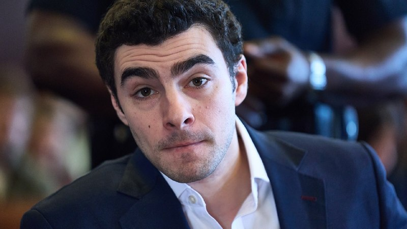

Fox News (Twitter/X)

🚨 BREAKING: Judge suppresses some items found in Luigi Mangione's backpack that was searched by police in Altoona, Pennsylvania

## FoxNewsTwitter — post 341871

  <a href="telegram/content/FoxNewsTwitter_341871_1779120209.mp4" target="_blank">🎬 Download video</a>

Fox News (Twitter/X)

“Your character will take you further than your resume. Continue to be kind. Continue to be humble.”

NBA legend Shaquille O'Neal shares an inspiring message with graduates during Louisiana State University’s commencement ceremony after receiving his own master’s degree from LSU.

The Hall of Famer laid out five key rules for the graduates to live by, emphasizing resilience, humility, and continuous learning.

O’Neal encouraged students to keep learning, embrace failure as motivation, and understand that persistence is essential to achieving success.

## FoxNewsTwitter — post 341870

  

Fox News (Twitter/X)

A 20-year-old Arkansas man was arrested after allegedly threatening to start a mass shooting at Walmart if the country shut down over hantavirus fears.

Authorities say the FBI tracked the threat through an online video game chat after another player recorded the conversation and sent it in.

Investigators say the gamer’s username and in-game recording helped lead agents directly to Aaron Bynum, who now faces terroristic threatening charges.

## pm_afshaa — post 90963

🔴اسرائیل هیوم: وزارت دفاع از نتانیاهو خواسته بودجه ارتش را 14میلیارد دلار افزایش دهد

💧 Rainbet.com the #1 Non-KYC Crypto Casino & Sportsbook @rainbetcom

😁 @Pm_Afshaa

## pm_afshaa — post 90962

  <a href="telegram/content/pm_afshaa_90962_1779120213.webm" target="_blank">🎬 Download video</a>

🔴رویترز: آمریکا پیشنهاد جدید ایران رو رد کرد.

💧 Rainbet.com the #1 Non-KYC Crypto Casino & Sportsbook @rainbetcom

😁 @Pm_Afshaa

## pm_afshaa — post 90961

  <a href="telegram/content/pm_afshaa_90961_1779120213.webm" target="_blank">🎬 Download video</a>

🔴تسنیم: ایران یه پیشنهاد 14 بندی اصلاح شده به پاکستان داد تا به آمریکا برسونه و اونا هم بررسیش کنن و جواب بدن. 
😁 @Pm_Afshaa

## pm_afshaa — post 90960

  <a href="telegram/content/pm_afshaa_90960_1779120214.webm" target="_blank">🎬 Download video</a>

🔴پست جدید ترامپ:

اگر ایران تسلیم شود، اعتراف کند که نیروی دریایی‌شان از بین رفته و در ته دریا است، و نیروی هوایی‌شان دیگر با ما نیست، و اگر کل ارتش‌شان از تهران خارج شود، سلاح‌ها را رها کرده و دست‌ها را بالا ببرند، هر کدام فریاد بزنند «من تسلیم می‌شوم، من تسلیم می‌شوم» در حالی که پرچم سفید نماینده را به شدت تکان می‌دهند، و اگر تمام رهبران باقی‌مانده‌شان همه «اسناد تسلیم» لازم را امضا کنند و شکست خود را در برابر قدرت و نیروی عظیم و باشکوه ایالات متحده آمریکا بپذیرند، روزنامه‌های در حال سقوط نیویورک تایمز، وال استریت ژورنال چین (WSJ!)، سی‌ان‌ان فاسد و اکنون بی‌اهمیت، و همه اعضای دیگر رسانه‌های خبری جعلی، تیتر خواهند زد که ایران پیروزی استادانه و درخشانی بر ایالات متحده آمریکا داشته است، حتی نزدیک هم نبود. دموکرات‌ها و رسانه‌ها کاملاً راه خود را گم کرده‌اند. آنها کاملاً دیوانه شده‌اند!!!

💧 Rainbet.com the #1 Non-KYC Crypto Casino & Sportsbook @rainbetcom

😁 @Pm_Afshaa

## pm_afshaa — post 90959

  <a href="telegram/content/pm_afshaa_90959_1779120215.webm" target="_blank">🎬 Download video</a>

🔴تسنیم: ایران یه پیشنهاد 14 بندی اصلاح شده به پاکستان داد تا به آمریکا برسونه و اونا هم بررسیش کنن و جواب بدن. 
😁 @Pm_Afshaa

## pm_afshaa — post 90958

  <a href="telegram/content/pm_afshaa_90958_1779120216.webm" target="_blank">🎬 Download video</a>

🔴کان نیوز: نتانیاهو امروز جلسه امنیتی محدودی با مقامات ارشد دفاعی و چند وزیر درباره ایران برگزار خواهد کرد.

💧 Rainbet.com the #1 Non-KYC Crypto Casino & Sportsbook @rainbetcom

😁 @Pm_Afshaa

## pm_afshaa — post 90957

  <a href="telegram/content/pm_afshaa_90957_1779120217.webm" target="_blank">🎬 Download video</a>

🔴الجزیره به نقل از یک منبع آمریکایی:
صبر ترامپ به خاطر اینکه با ایران پیشرفتی حاصل نشده داره تموم میشه؛ ترامپ حاضره دست به کار نظامی بزنه، مگر اینکه تو چند روز آینده یه چیزی از ایران بشنوه.

💧 Rainbet.com the #1 Non-KYC Crypto Casino & Sportsbook @rainbetcom

😁 @Pm_Afshaa

## pm_afshaa — post 90956

🔴رئیس‌جمهور کوبا: هر حمله نظامی به کوبا به حمام خون و عواقب غیرقابل پیش‌بینی منجر می‌شود

💧 Rainbet.com the #1 Non-KYC Crypto Casino & Sportsbook @rainbetcom

😁 @Pm_Afshaa

## pm_afshaa — post 90954

  

👩‍💻کانفیگ اضطراری موجود شد! 
🛍 series Basic • 1G 140 
💵 • 2G 280
💵 • 3G 420
💵 • 4G 560
💵 • 5G 700
💵 • 10G 1400
💵 • 20G 2800 
💵 • 30G 4200
💵 
📌مناسب استفاده روزمره و اقتصادی 
📌سرعت مناسب برای استفاده عادی 
📌پینگ 140تا350 
📌مناسب تلگرام.وب گردی . اینستاگرام 
❗️ممکنه…

## pm_afshaa — post 90952

👩‍💻کانفیگ اضطراری موجود شد!

🛍 series Basic

• 1G 140 
💵
• 2G 280
💵
• 3G 420
💵
• 4G 560
💵
• 5G 700
💵
• 10G 1400
💵
• 20G 2800 
💵
• 30G 4200
💵

📌مناسب استفاده روزمره و اقتصادی

📌سرعت مناسب برای استفاده عادی

📌پینگ 140تا350

📌مناسب تلگرام.وب گردی . اینستاگرام

❗️ممکنه در بعضی ساعات شلوغی افت سرعت داشته باشه

✔️ بدونه محدودیت زمان و کاربر هستن

✔️ساب لینک جهت دیدن حجم

✔️بدونه حتی ۱ درصد ضریب تمامی سرور ها

⚠️همه سرویس ضمانت بازگشت وجه دارند

@n9neebot

## pm_afshaa — post 90951

  <a href="telegram/content/pm_afshaa_90951_1779120218.webm" target="_blank">🎬 Download video</a>

🔴نیویورک تایمز: پنتاگون برای از سرگیری جنگ با ایران در روزهای آینده آماده می‌شود 
💧 Rainbet.com the #1 Non-KYC Crypto Casino & Sportsbook @rainbetcom 
😁 @Pm_Afshaa

## pm_afshaa — post 90950

  <a href="telegram/content/pm_afshaa_90950_1779120219.webm" target="_blank">🎬 Download video</a>

🔴سناتور لیندسی گراهام: من کاملاً اطمینان دارم که رئیس‌جمهور ترامپ به‌طور کامل وضعیت مربوط به ایران رو درک میکنه و دیگه عدم تمایل به مذاکره با حسن نیت، همراه با اقدامات تهاجمی و سرکشانه ایران تو تنگه هرمز و سراسر منطقه رو تحمل نخواهد کرد.

💧 Rainbet.com the #1 Non-KYC Crypto Casino & Sportsbook @rainbetcom

😁 @Pm_Afshaa

## pm_afshaa — post 90949

  <a href="telegram/content/pm_afshaa_90949_1779120220.webm" target="_blank">🎬 Download video</a>

🔴تسنیم به نقل از یک منبع نزدیک به تیم مذاکره‌کننده:

آمریکا در متن جدید خودش پذیرفته که تحریم‌های نفتی ایران رو در طول دوره مذاکرات به‌صورت موقت تعلیق (Waive) کنه.

طبق این گزارش، جمهوری اسلامی همچنان بر لغو کامل همه تحریم‌ها تاکید داره، اما آمریکا فعلا فقط معافیت موقت تحریم‌ها تا زمان رسیدن به تفاهم نهایی رو مطرح کرده.

💧 Rainbet.com the #1 Non-KYC Crypto Casino & Sportsbook @rainbetcom

😁 @Pm_Afshaa

## pm_afshaa — post 90948

🔴نیویورک تایمز: پنتاگون برای از سرگیری جنگ با ایران در روزهای آینده آماده می‌شود

💧 Rainbet.com the #1 Non-KYC Crypto Casino & Sportsbook @rainbetcom

😁 @Pm_Afshaa

## pm_afshaa — post 90947

  <a href="telegram/content/pm_afshaa_90947_1779120220.webm" target="_blank">🎬 Download video</a>

🔴رویترز: پاکستان 8 هزار نیروی نظامی به همراه یک اسکادران جنگنده و سامانه پدافند هوایی به عربستان سعودی اعزام کرده.

طبق این گزارش، این نیروها برای حمایت از عربستان در صورت ازسرگیری حملات احتمالی مستقر شدن. این تحرک در حالی انجام میشه که پاکستان همزمان نقش میانجی میان تهران و واشینگتن رو هم بر عهده داره.

💧 Rainbet.com the #1 Non-KYC Crypto Casino & Sportsbook @rainbetcom

😁 @Pm_Afshaa

## iaghapour — post 2618

  

⭕️ دیگه پول فیلترشکن نده! آموزش ساخت فیلترشکن شخصی و رایگان با سرعت بالا 😎

🔹در این آموزش قدم‌به‌قدم بهت یاد می‌دم که چطور بدون نیاز به دانش خاصی، یک فیلترشکن (VPN) شخصی، امن و کاملاً رایگان برای خودت بسازی. این روش روی تمام اینترنت‌ها جواب می‌ده و سرعت خوبی برای تماشای یوتیوب، وب‌گردی و … داره.

🔗 تماشا ویدیو در یوتیوب

🔗 دانلود ویدیو با لینک مستقیم (بزودی)

#آموزش #فیلترشکن #رایگان #novaproxy
برای دور زدن فیلترینگ و آموزش تکنولوژی و هوش مصنوعی ما رو دنبال کنید 💚
🆔@iaghapour

## DEJradio — post 4706

  <a href="telegram/content/DEJradio_4706_1779120222.mp4" target="_blank">🎬 Download video</a>

🚨
🔸 اشتباه محاسباتی همون جاییی که یک نقشه به‌ظاهر هوشمندانه، به یک شکست مفتضحانه ختم می‌شه!

پس پیش از آغاز یک حمله فقط دیدنِ حرکت‌های خودت کافی نیست؛ باید زنجیره‌ی واکنش‌های حریف رو هم دقیق حساب کنی!♟🧠

اما در دنیایی سیال و پر از فاکتورهای ناشناخته این محاسبه واقعا چطور ممکنه؟

در قسمت هفتم از «تمام‌رخ» می‌ریم سراغ قهرمان اشتباهات محاسباتی:
حکومت آخوندی ⚠️

#تمام_رخ #حکومت_آخوندی
@DEJradio

## DEJradio — post 4705

  <a href="telegram/content/DEJradio_4705_1779120226.mp4" target="_blank">🎬 Download video</a>

🤡
🔺 “مهریه خانمم پهپاد شاهد است!

در ادامه تبلیغات صدا و سیما برای بازارگرمی تجمعات شبانه و سازماندهی رزمی هوادارانش، با تبلیغ جفت‌گیری و صیغه، داماد حکومتی، روی آنتن زنده تلویزیون میگوید «مهریه خانمم پهپاد شاهده که ایشالا بخوره تو قلب تل‌آویو».

#صیغه #صداوسیما
@DEJradio

## DEJradio — post 4704

  <a href="telegram/content/DEJradio_4704_1779120229.mp4" target="_blank">🎬 Download video</a>

🔺🎥 پیام یک شهروند از تهران:
رژیم مردم رو انداخته به زباله‌گردی

یک شهروند از تهران با ارسال ویدیویی محله شمشیری تهران، می‌گوید رژیم ما رو انداخته به زباله‌گردی، نه عزت داریم نه احترام.

#زباله_گردی #تهران
@DEJradio

## DEJradio — post 4703

  <a href="telegram/content/DEJradio_4703_1779120231.mp4" target="_blank">🎬 Download video</a>

🤡
🔺 آمستردام؛ "مزدورای بدردنخور رژیم پرچم گرفتن دستشون"

یک از ایرانیان میهن‌دوست ساکن آمستردام با ارسال ودیدیویی از تجمع حامیان نظام می‌گوید: مزدورای بدردنخور حامی رژیم پرچم گرفتن دستشون"

#آمستردام #تجمعات_حکومتی
@DEJradio

## DEJradio — post 4702

  <a href="telegram/content/DEJradio_4702_1779120234.mp4" target="_blank">🎬 Download video</a>

🔺📢 پیام یک شهروند از نقده:
بانک‌ها زودتر موعود می‌بندند و عابر بانک‌ها کار نمی‌کنند

«ساکن شهرستان نقده در استان آذربایجان غربی هستم و این فیلم کوتاه رو براتون می‌فرستم.

امروز مشاهده کردم که این بانک هم مثل خیلی از بانک‌های دیگه زودتر از موعد درها رو به روی مراجعین بسته. چند شخص بازنشسته الان مدتی طولانی منتظر هستند ولی نه از باجه و نه از عابر بانک نمیتونن حقوقشون رو دریافت کنن.

این حکومت ضدملی با فساد و جنگ افروزی‌هاش اقتصاد و معاش مردم رو نابود کرده!»

#آذربایجان_غربی #ورشکستگی_اقتصادی
@DEJradio

## DEJradio — post 4701

  <a href="telegram/content/DEJradio_4701_1779120238.mp4" target="_blank">🎬 Download video</a>

🔺🎥 تصاویر منتشر شده از فراز تنگه هرمز از نگاه یک هواپیمای مسافربری.

#تنگه_هرمز
@DEJradio

## DEJradio — post 4700

  <a href="telegram/content/DEJradio_4700_1779120240.mp4" target="_blank">🎬 Download video</a>

🔺📢 یک شهروند از ورامین:
امیدوارم هرچه زودتر از دست مستبده رها بشیم

یک شهروند ساکن ورامین [جنوب تهران] با ارسال این ویدیو نوشت: «ما در کشوری غنی از منابع طبیعی و با نیروی انسانی سخت‌کوش زندگی می‌کنیم ولی جمهوری اسلامی با جنگ افروزی‌هاش اقتصاد کشور رو نابود و ملت رو به فقر و گرسنگی رسونده. امیدوارم هر چه زودتر از دست این حکومت فاسد و مستبد رها بشیم تا اقتصاد کشور و معاش مردم نجات پیدا کنه!»

#اقتصاد_ایران #تورم
@DEJradio

## mamlekate — post 103553

📝 رسانه‌های آمریکایی: ترامپ روز شنبه با مشاوران ارشد امنیت ملی خود درباره ایران جلسه گذاشت؛ سه‌شنبه نیز جلسه دیگری دارد

سایت خبری آکسیوس روز یک‌شنبه ۲۷ اردیبهشت گزارش داد که دونالد ترامپ، رئیس‌جمهوری آمریکا قرار است روز سه‌شنبه در «اتاق وضعیت» کاخ سفید با مشاوران ارشد امنیت ملی خود جلسه‌ای درباره ایران برگزار کند.

📝 ترامپ می‌گوید اگر ایران خیلی سریع توافق نکند، چیزی از آن باقی نخواهد ماند

ترامپ با انتشار چند تصویر مختلف گرافیکی که حاکی از هدف قرار دادن ایران و نیز آغاز دوباره جنگ با فشاردادن یک دکمه توسط او بود، تهدیدات خود علیه جمهوری اسلامی را تکرار کرد.

📝 گزارش‌ها از شروط ایران و آمریکا برای ازسرگیری مذاکرات

📝 رویترز: پاکستان «پیشنهاد اصلاح‌شده» تهران برای پایان درگیری را به واشنگتن تحویل داد

📝 تشدید محاصره نفتی ایران؛ ازدحام بی‌سابقه نفتکش‌ها در اطراف جزیره خارگ

در حالی که محاصره دریایی آمریکا علیه بنادر جمهوری اسلامی ایران ادامه دارد، تصاویر ماهواره‌ای از تجمع حدود ۲۳ نفتکش در نزدیکی جزیره خارگ، مهم‌ترین پایانه صادرات نفت ایران حکایت دارد، که بزرگ‌ترین تجمع شناورها در این منطقه از زمان آغاز این محاصره است.

📝 گزارش کاخ سفید از دستاوردهای سفر ترامپ به پکن؛ چین و آمریکا توافق کردند جمهوری اسلامی نباید در تنگه هرمز عوارض بگیرد

کاخ سفید، توضیحاتی درباره دستاوردهای سفر دونالد ترامپ، رئيس‌جمهوری آمریکا به چین و دیدارش با شی جین‌پینگ، رئيس‌جمهوری این کشور، منتشر کرد.

@mamlekate

## mamlekate — post 103552

  

سلام. من هیچ درخواستی برا اینترنت طبقاتی پرو ندادم. نه پروانه کسب دارم نه کارمندم. کلا اینترنتو بستن تا به اسم پرو گرونش کنن

@mamlekate

## mamlekate — post 103551

  <a href="telegram/content/mamlekate_103551_1779120243.mp4" target="_blank">🎬 Download video</a>

📞 این آموزش همگانی استفاده از تیربار تو صداوسیما دیگه کار موساده چون این یکی کلاش نیست اینو تو پایگاه به مزدورای خودشون میتونن آموزش بدن.

@mamlekate

## mamlekate — post 103550

  

💎 الو
سلام مملکته
این پیامو دارم می‌دم به همراه کلی فحش چون دیگه هیچ کاری از دستم برنمیاد و واقعا عصبی هستم، این ساعتی که تنظیم کردم و نصفه بیدار شدم به خاطر بنزین هست. لعنت به قبر اول و اخرشون، لعنت به مرده و زنده‌شون با این مملکتشون که زندگی برای مردم نذاشتن، این مدت دیگه از بس فحش دادم به اینا خسته شدم.
دیگه حتی خواب هم از مردم گرفتن، روز که مثل سگ داریم برای یه لقمه نون میدویم، الان کار به جایی رسیده باید ساعت بذاریم نصفه شب بریم توی صف بنزین و دیگه خواب شب هم نداشته باشیم.

📝 جیره‌بندی بنزین در ایران؛مسیر هموار شکل‌گیری بازار سیاه سوخت

در حالی که مقامات از مدیریت مصرف سخن می‌گویند، شواهد از سهمیه‌بندی پنهان، شکل‌گیری بازار سیاه و افت شدید کیفیت سوخت حکایت دارد؛ بحرانی زیرساختی که پیوند ناگسستنی سیاست خارجی و معیشت جامعه را عیان‌تر از همیشه می‌کند.

@mamlekate

## VahidOnline — post 75539

  

مدیر مرکز روابط عمومی وزارت بهداشت جمهوری اسلامی، روز دوشنبه ۲۸ اردیبهشت مدعی شد که در حمله اسراییل به بیت خامنه‌ای «اتفاق خاصی» برای مجتبی خامنه‌ای نیفتاده و زخم‌های او نه چهره‌اش را مخدوش کرده و نه به قطع عضو انجامیده است.
@VahidHeadline

📡 @VahidOnline

## VahidOnline — post 75538

  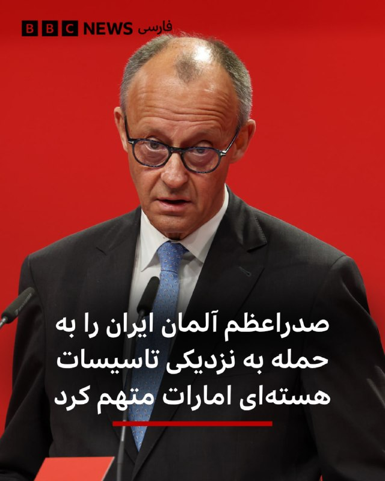

فردریش مرتس گفت که «ما حملات هوایی تازه ایران به امارات و دیگر شرکا را به‌شدت محکوم می‌کنیم.»

صدر‌اعظم آلمان در شبکه اجتماعی ایکس، حمله به «تاسیسات هسته‌ای» را تهدیدی برای ایمنی مردم سراسر منطقه خواند.

امارات متحده دیروز گفت که در حمله پهپادی، ژانراتور برق بیرون محوطه نیروگاه هسته‌ای براکه در نزدیکی ابوظبی آتش گرفته است. امارات در بیانیه‌هایش نامی از کشوری نبرد و فقط گفت پهپاد از «مرز غربی» وارد شده بود.

آقای مرتس در این پست نوشت که «ایران باید وارد مذاکره جدی با آمریکا شود، از تهدید همسایگان خود دست بردارد و تنگه هرمز را بدون هیچ محدودیتی مجددا باز کند.»

اظهارات آقای مرتس درباره مذاکرات ایران و آمریکا اخیرا به تنش لفظی او با دونالد ترامپ منجر شد. او گفته بود مذاکره‌کنندگان ایران آمریکا را «تحقیر» کرده‌اند.
@VahidHeadline

📡 @VahidOnline

## VahidOnline — post 75536

خبرگزاری تسنیم، وابسته به سپاه پاسداران، روز دوشنبه ۲۸ اردیبهشت ماه به نقل از «یک منبع نزدیک به تیم مذاکره‌کننده» جمهوری اسلامی نوشت که تهران «جدیدترین متن خود را در ۱۴ بند به واسطه پاکستانی تحویل داده است و میانجی پاکستانی آن را به آمریکایی‌ها ارائه می‌کند.»
ساعتی پیش از انتشار این خبر رویترز به نقل از یک مقام پاکستانی گزارش کرده بود که اسلام‌آباد یکشنبه شب طرح پیشنهادی اصلاح‌شده جمهوری اسلامی ایران را به واشنگتن تحویل داده است.
@VahidOOnLine
خبرگزاری العربیه، روز دوشنبه ۲۸ اردیبهشت ماه، بر اساس «جزئیات درزکرده» از آخرین نسخه پیشنهادی ایران به آمریکا، از مجموعه‌ای از خواسته‌ها و پیشنهادهای تازه تهران که بر آتش‌بس، تنگه هرمز و پرونده هسته‌ای تمرکز دارد، خبر داد.
طبق این گزارش، ایران خواستار یک آتش‌بس طولانی‌مدت و چندمرحله‌ای شده و همچنین درخواست کرده بازگشایی تنگه هرمز به‌صورت تدریجی و با تضمین‌های امنیتی انجام شود.
بر پایه این اطلاعات، تهران به‌جای برچیدن کامل برنامه هسته‌ای، با یک توقف طولانی‌مدت فعالیت‌های هسته‌ای موافقت کرده است. همچنین پیشنهاد شده انتقال ذخایر اورانیوم غنی‌شده به‌جای آمریکا، به‌صورت مشروط به روسیه انجام شود.
العربیه همچنین گزارش داده ایران از مطالبه دریافت غرامت عقب‌نشینی کرده، اما به‌جای آن خواستار تسهیلات و امتیازات اقتصادی شده است.
بر اساس این گزارش، ایران همچنین خواهان دریافت چندین تضمین بین‌المللی برای هرگونه توافق احتمالی است و تلاش دارد پرونده دریایی و موضوع تنگه هرمز را از پیچیدگی‌های مربوط به مذاکرات هسته‌ای جدا کند.
در بخش دیگری از این گزارش آمده است تهران خواستار نقش‌آفرینی پاکستان و عمان در مدیریت هرگونه تنش یا اصطکاک احتمالی در تنگه هرمز شده و همچنین بر استفاده از ادبیات و چارچوب سیاسی‌ای تاکید دارد که امکان «حفظ وجهه سیاسی جمهوری اسلامی» را فراهم کند
@VahidOOnLine

📡 @VahidOnline

## VahidOnline — post 75535

  

♦️خبرگزاری تسنیم وابسته به سپاه پاسداران، روز دوشنبه ۲۸ اردیبهشت، به نقل از یک منبع نزدیک به تیم مذاکره‌کننده گزارش داد آمریکا در متن جدید پیشنهادی خود، برخلاف متون پیشین، پذیرفته است تحریم‌های نفتی ایران را «در طول دوره مذاکرات» به‌طور موقت تعلیق کند.
به گفته این منبع، آمریکایی‌ها در متن جدید با «تعلیق موقت» (Waive) تحریم‌های نفتی ایران موافقت کرده‌اند. «ویو» به معنای معافیت یا چشم‌پوشی موقت از اجرای تحریم‌ها است و به معنای لغو کامل و دائمی آن‌ها محسوب نمی‌شود.
بر اساس این گزارش، تیم مذاکره‌کننده ایرانی همچنان بر این موضع تاکید دارد که لغو همه تحریم‌های ایران باید بخشی از تعهدات آمریکا باشد. در مقابل، واشنگتن پیشنهاد داده است معافیت‌های مرتبط با اوفک (دفتر کنترل دارایی‌های خارجی وزارت خزانه‌داری آمریکا) تنها تا زمان دستیابی به تفاهم نهایی اعمال شود.
به گزارش تسنیم، این تغییر در متن جدید آمریکا نسبت به پیشنهادهای قبلی، تحول تازه‌ای در روند مذاکرات به شمار می‌رود.
@VahidOOnLine

📡 @VahidOnline

## VahidOnline — post 75534

  

خبرگزاری رویترز به نقل از منابع آگاه گزارش داد پاکستان در چارچوب پیمان دفاعی خود با عربستان سعودی، ۸ هزار نیروی نظامی به همراه یک اسکادران جنگنده و سامانه پدافند هوایی به این کشور اعزام کرده است.

به گزارش رویترز، این نیروها از توان عملیاتی برخوردارند و با هدف حمایت از عربستان سعودی در صورت ازسرگیری حملات علیه این کشور مستقر شده‌اند.

این تحرک نظامی در حالی صورت می‌گیرد که پاکستان نقش اصلی میانجی‌گری میان تهران و واشینگتن را بر عهده دارد.
@VahidOOnLine

📡 @VahidOnline

## VahidOnline — post 75533

  

رئیس کل دادگستری آذربایجان غربی روز دوشنبه ۲۸ اردیبهشت از توقیف اموال ۱۲۹ نفر در این استان با اتهامات امنیتی خبر داد.

ناصر عتباتی از این افراد با عنوان «گروهک‌های ضدانقلاب و تجزیه‌طلب» نام برد و آن‌ها را به «اقدامات ضدامنیتی و همکاری با کشورهای متخاصم» متهم و اعلام کرد که اموال آن‌ها به «نفع ملت» مصادره شده است.

دادگستری آذربایجان غربی اسامی این افراد را اعلام نکرده و برای اتهامات علیه این افراد شواهد و مدارکی ارائه نداده است.

پیش از این نیز گزارش‌های متعددی از توقیف اموال شماری از روزنامه‌نگاران، فعالان سیاسی و مدنی، هنرمندان، ورزشکاران و چهره‌های شناخته‌شده با اتهامات مشابه منتشر شده بود.
@VahidHeadline

📡 @VahidOnline

## VahidOnline — post 75532

  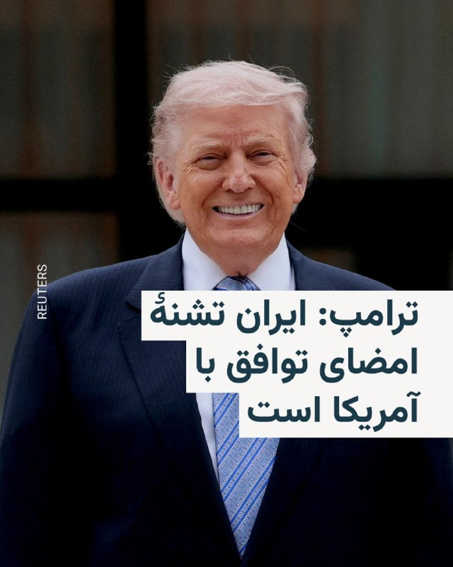

دونالد ترامپ، رئیس‌جمهور آمریکا می‌گوید مقامات حکومت ایران برای امضای توافق با آمریکا «می‌میرند».

او در گفت‌و‌گو با نشریه تجاری «فورچون» افزوده با این حال آنها در جریان مذاکرات، «روی یک چیزی توافق می‌کنند»، اما «بعد یک کاغذی برایتان می‌فرستند که هیچ ارتباطی با توافقی که کرده‌اید ندارد. من می‌گویم: ‘شما دیوانه‌اید؟’»

ترامپ در این گفت‌و‌گو همچنین بر این نکته تأکید کرده که مقامات جمهوری اسلامی «مدام فریاد می‌زنند» و سروصدا می‌کنند، اما در عمل «تشنه توافق» هستند.
@VahidHeadline

📡 @VahidOnline

## VahidOnline — post 75530

سخنگوی وزارت خارجه ایران می‌گوید روند مذاکرات تهران و واشینگتن، «ادامه‌دار» است و حکومت ایران از ایالات متحده، «اصلاحاتی» در پاسخ به طرح پیشنهادی خود دریافت کرده است.
اسماعیل بقائی در نشست خبری روز دوشنبه ۲۸ اردیبهشت گفت: هفته گذشته، علی‌رغم این‌که طرف‌های آمریکایی به‌صورت علنی اعلام کردند طرح پیشنهادی ایران مردود است «اما ما از طرف میانجی پاکستانی مجموعه نکات و ملاحظات اصلاحی را از نظر آن‌ها دریافت کردیم».
او افزود ایران بعد از این‌که طرح ۱۴ بندی خود را ارائه کرد، «طرف آمریکایی ملاحظاتش را مطرح کرد. متقابلاً ما نیز ملاحظات خود را مطرح کردیم. از روز بعد از ارسال نقطه‌نظر آمریکایی از طرف پاکستان، ما با مجموعه‌ای از پیشنهادات طرف مقابل مواجه شدیم که در این چند روز بررسی شد».
سخنگوی وزارت خارجه ایران به‌دلیل آنچه تبادل «نقطه‌نظرات متقابل» طرفین به یکدیگر نامیده، تأکید کرد که «بنابراین، روند [مذاکرات ]از طریق پاکستان ادامه دارد».
بقائی جزئیاتی در مورد اصلاحات مدنظر ایالات متحده ارائه نکرد.
@VahidHeadline
او همچنین آمریکا را به «خیانت به دیپلماسی» متهم کرد و گفت واشینگتن دیگر «به‌عنوان یک طرف معتبر» در عرصه بین‌المللی تلقی نمی‌شود.
سخنگوی وزارت خارجه جمهوری اسلامی تاکید کرد تهران در مذاکرات با آمریکا همچنان خواهان آزادسازی دارایی‌های بلوکه‌شده ایران و دریافت غرامت جنگی است و این مطالبات را «حق ایران» توصیف کرد.
بقایی همچنین درباره تردد کشتی‌ها در تنگه هرمز گفت موضوع ترتیبات جدید امنیتی در این آبراه صرفا «مالی» نیست و هدف اصلی، حفظ امنیت تردد دریایی و صیانت از «حاکمیت ملی ایران» است.
او همچنین در واکنش به گزارش حمله به یک کشتی کره جنوبی در تنگه هرمز، بدون اشاره مستقیم به عامل حمله گفت «نباید عملیات‌های پرچم دروغین را دست‌کم گرفت» و مدعی شد هنوز مشخص نیست این حادثه توسط چه بازیگری در منطقه انجام شده است.
@VahidHeadline
اسماعیل بقایی، سخنگوی وزارت خارجه جمهوری اسلامی، در پاسخ به پرسشی درباره گزارش‌ها از قصد امارات متحده عربی برای حمله به جمهوری اسلامی و سفر مقام‌های اسرائیلی به این کشور گفت: «ما قرار نیست با گزارش‌ها این واقعیت را از یاد ببریم که تهدید اصلی کدام طرف است.»
بقایی با تهدید کشورهای منطقه از جمله امارات متحده عربی گفت: « اماراتی‌ها از اتفاقاتی که در دو سه ماه اخیر افتاد باید درس بگیرند.»
@VahidOOnLine

📡 @VahidOnline

## VahidOnline — post 75529

  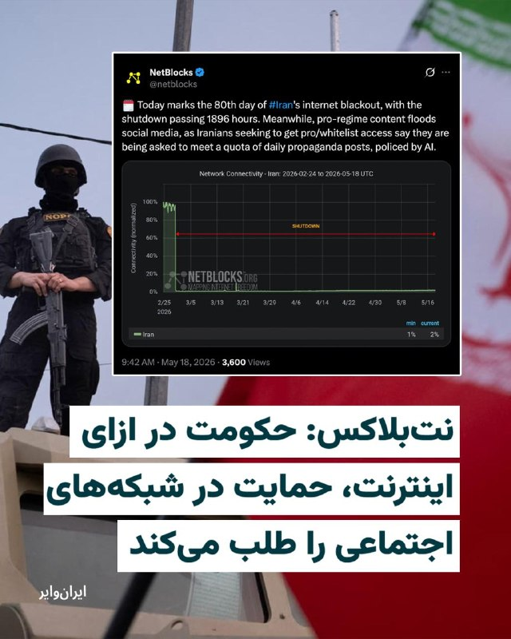

«نت‌بلاکس» نهاد ناظر بر آزادی اینترنت اعلام کرد قطعی و محدودیت اینترنت در ایران وارد هشتادمین روز خود شده و مدت این خاموشی تاکنون از ۱۸۹۶ ساعت عبور کرده است.

نت‌بلاکس همچنین گزارش داده که هم‌زمان با ادامه محدودیت‌های اینترنتی، محتواهایی در حمایت از حکومت، شبکه‌های اجتماعی در ایران را پر کرده است.

بر اساس این گزارش، برخی شهروندان ایرانی که تلاش کرده‌اند به اینترنت موسوم به «سیم کارت سفید» یا اینترنت ویژه (اینترنت پرو) دسترسی پیدا کنند، گفته‌اند از آن‌ها خواسته شده سهمیه مشخصی از پست‌های تبلیغاتی روزانه در حمایت از حکومت را در صفحات اجتماعی خود منتشر کنند.
@VahidHeadline

📡 @VahidOnline

## VahidOnline — post 75528

  

سازمان عفو بین‌الملل روز دوشنبه ۲۸ اردیبهشت گزارش داد که ایران در سال ۲۰۲۵ تعداد «بی‌سابقه» دو هزار و ۱۵۹ نفر را اعدام کرده است؛ رقمی که باعث افزایش آمار جهانی تا بالاترین سطح از سال ۱۹۸۱ به این سو شده است.

این سازمان مستقر در لندن اعلام کرد که در سال ۲۰۲۵ دست‌کم دو هزار و ۷۰۷ نفر در سراسر جهان اعدام شده‌اند، هرچند اعدام‌های انجام‌شده در چین در این آمار لحاظ نشده است.
عفو بین‌الملل گفت «هزاران اعدام» در چین، که بیشترین استفاده را از مجازات اعدام در جهان دارد، انجام شده، اما جزئیات به‌دلیل «محرمانه بودن داده‌های دولتی» در این کشور کمونیستی نامشخص است.

این سازمان افزود که آمار جهانی سال ۲۰۲۵، شامل اعدام‌ها در عربستان سعودی، کویت، مصر، یمن، سنگاپور و ایالات متحده، نسبت به مجموع سال ۲۰۲۴ بیش از دو سوم افزایش داشته است.

در این گزارش آمده است: «این روند بیشترین شدت را در کشورهایی داشته که مقامات در آن‌ها با محدود کردن فضای مدنی، خاموش کردن صداهای مخالف و بی‌اعتنایی به حمایت‌های مقرر در قوانین و استانداردهای بین‌المللی حقوق بشر، کنترل خود بر قدرت را تشدید کرده‌اند».
به نوشته عفو بین‌الملل، «افزایش بی‌سابقه اعدام‌های ثبت‌شده در ایران» در حالی رخ داده که مقام‌های جمهوری اسلامی، به‌ویژه پس از جنگ ۱۲ روزه تابستان پارسال با اسرائیل، «استفاده از مجازات اعدام را به‌عنوان ابزاری برای سرکوب و کنترل سیاسی تشدید کرده‌اند».
عفو بین‌الملل و دیگر گروه‌های حقوق بشری گفته‌اند که پس از اعتراضات گسترده ضدحکومتی در دی‌ماه پارسال و همچنین پس از آغاز جنگ با اسرائیل و ایالات متحده در اسفندماه، استفاده از مجازات اعدام در ایران افزایش یافته است.
@VahidHeadline

📡 @VahidOnline

## kianmeli1 — post 87463

  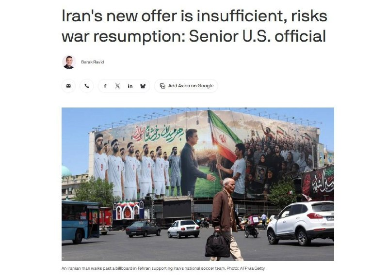

🔴کاخ سفید:
آخرین پیشنهاد ایران که امروز ارائه شد نیز به دلیل ناکافی‌ بودن به صورت کامل رد شد،
دیگر بمب ها مذاکره خواهند کرد.
https://t.me/kianmeli1

## kianmeli1 — post 87462

  <a href="telegram/content/kianmeli1_87462_1779120253.mp4" target="_blank">🎬 Download video</a>

🔴آموزش کار با اسلحه در مساجد توسط بسیج
https://t.me/kianmeli1

## kianmeli1 — post 87461

  

🔴خبرگزاری رویترز در گزارشی مدعی شد که پاکستان در طول جنگ ایران، ۸۰۰۰ نیرو، جت جنگنده، پهپاد و سامانه‌های پدافند هوایی را در عربستان سعودی مستقر کرده است. این نیرو شامل جت‌های JF-17، سامانه‌های HQ-9 چینی و تجهیزات تحت مدیریت پاکستان با تأمین مالی ریاض است. این ظرفیت اعزامی از پاکستان، آماده نبرد است و در صورت نیاز می‌تواند به ۸۰۰۰۰ نیرو افزایش یابد.

عربستان و پاکستان سال گذشته پیمان دفاعی مشترک امضا کردند. وزیر پاکستان بعد از آن اعلام کرد که «عربستان سعودی تحت چتر هسته‌ای پاکستان محافظت می‌شود.»
https://t.me/kianmeli1

## kianmeli1 — post 87459

🔴ارتش اسرائیل: IDF در طول شب (یکشنبه) به منطقه بعلبک حمله کرد و وائل محمود عبدالحلیم، که فرمانده جهاد اسلامی فلسطین در منطقه بقاع در لبنان بود را از بین برد.

تنها دو نفر از فرماندهان نظامی حماس که در 7 اکتبر شرکت داشتند زنده مانده‌اند، محمد عوده، رئیس ستاد اطلاعات، و عماد عاقل، رئیس ستاد جبهه داخلی.
https://t.me/kianmeli1

## IranIntlTV — post 337805

  <a href="telegram/content/IranIntlTV_337805_1779120257.mp4" target="_blank">🎬 Download video</a>

یک شهروند با ارسال پیامی به ایران‌اینترنشنال می‌گوید به دلیل قطعی اینترنت، حدود سه ماه است که بیکار شده است.

## IranIntlTV — post 337804

  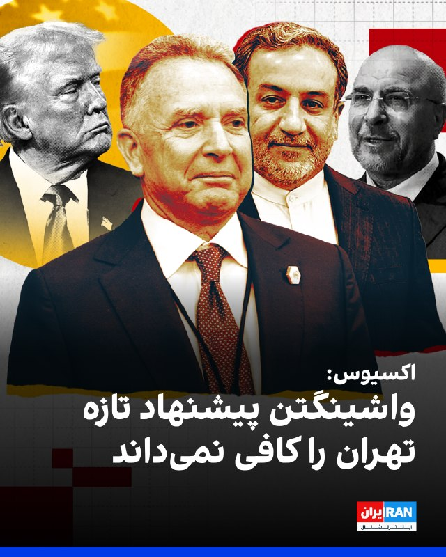

اکسیوس به نقل از یک مقام ارشد آمریکایی و یک منبع مطلع گزارش داد تهران پیشنهاد تازه‌ای برای توافق به‌منظور پایان جنگ ارائه کرده، اما کاخ سفید این پیشنهاد را پیشرفت معناداری نمی‌داند و آن را برای دستیابی به توافق کافی ارزیابی نکرده است.

به گفته مقام‌های آمریکایی، دونالد ترامپ همچنان خواهان توافق برای پایان جنگ است، اما به‌دلیل رد بسیاری از خواسته‌های واشینگتن از سوی تهران و خودداری جمهوری اسلامی از ارائه امتیازهای قابل‌توجه در برنامه هسته‌ای، گزینه ازسرگیری حملات نظامی را نیز بررسی می‌کند.
https://iranintl.com/202605182409

## IranIntlTV — post 337803

  

مدیر مرکز روابط عمومی و اطلاع‌رسانی وزارت بهداشت درباره وضعیت مجتبی خامنه‌ای گفت: «اتفاق خاصی برای او رخ نداده بود و صرفا چند زخم برداشته بودند.»
این مقام وزارت بهداشت تاکید کرد: «زخم‌ها از نوعی نبودند که چهره ایشان را مخدوش کنند» و اضافه کرد مجتبی خامنه‌ای جانباز نشده و قطع عضو نداشته و تنها در محل جراحت روی پای او چند بخیه زده شده است.
https://iranintl.com/202605189680

## IranIntlTV — post 337802

  

دونالد ترامپ، رییس‌جمهور آمریکا در پستی در شبکه اجتماعی تروث سوشال از برخی رسانه‌ها و دموکرات‌ها در زمینه جنگ علیه جمهوری اسلامی انتقاد کرد.

او نوشت: «اگر ایران تسلیم شود، اعتراف کند که نیروی دریایی‌اش نابود شده و در کف دریا آرام گرفته است، و نیروی هوایی‌اش دیگر در میان ما نیست، و اگر کل ارتش آن‌ها در حالی که سلاح‌ها را زمین گذاشته و دست‌ها را بالا برده‌اند از تهران خارج شوند و هر کدام با فریاد "من تسلیم می‌شوم، من تسلیم می‌شوم" پرچم سفید تسلیم را به شدت تکان دهند، و اگر تمام رهبری باقی‌مانده آن‌ها همه «اسناد تسلیم» لازم را امضا کنند و شکست خود را در برابر قدرت و نیروی عظیم ایالات متحده باشکوه بپذیرند، آن‌وقت روزنامه شکست‌خورده نیویورک تایمز، چاینا استریت ژورنال (همان وال‌استریت ژورنال!)، سی‌ان‌انِ فاسد و اکنون بی‌اهمیت، و همه اعضای دیگر رسانه‌های اخبار جعلی (فیک نیوز)، تیتر خواهند زد که ایران یک پیروزی استادانه و درخشان بر ایالات متحده آمریکا داشته و اصلاً حتی نزدیک هم نبوده است.»

ترامپ افزود: «دموکرات‌های احمق و رسانه‌ها کاملا راه خود را گم کرده‌اند. آن‌ها کاملا دیوانه شده‌اند!!!»
https://iranintl.com/20

## IranIntlTV — post 337801

  <a href="telegram/content/IranIntlTV_337801_1779120262.mp4" target="_blank">🎬 Download video</a>

مجله آتلانتیک در مقاله‌ای تحلیلی، نحوه حکمرانی جمهوری اسلامی و امارات را با یکدیگر مقایسه کرده است. این مقایسه فقط به سیاست محدود نمی‌شود و در آن اقتصاد، کیفیت زندگی و آینده مردم نیز بررسی شده است.

مهدی بیگی، عضو تحریریه ایران‌اینترنشنال، در «پیوست» امروز نگاهی دارد به آنچه آتلانتیک آن را «نبرد شاهین و لاشخور» نامیده است.
@iranintltv

## IranIntlTV — post 337800

  <a href="telegram/content/IranIntlTV_337800_1779120265.mp4" target="_blank">🎬 Download video</a>

یک دانش‌آموز با ارسال پیامی به ایران‌اینترنشنال می‌گوید: «نمی‌دانم باید امتحانات رو چکار کنم. یک اینترنت داخلی داریم که آن هم کار نمی‌کند تا بتوانیم درس بخوانیم.»

## IranIntlTV — post 337799

  <a href="telegram/content/IranIntlTV_337799_1779120267.mp4" target="_blank">🎬 Download video</a>

در میانه تلاش‌های میانجی‌گرانه پاکستان برای انتقال پیام‌ها میان جمهوری اسلامی و آمریکا، دونالد ترامپ به مجله فورچون گفت مقام‌های جمهوری اسلامی برای امضای توافق «بی‌تاب» هستند.

گفت‌وگو با سمیرا قرایی و بابک اسحاقی، خبرنگاران ایران‌اینترنشنال
@iranintltv

## IranIntlTV — post 337798

  <a href="telegram/content/IranIntlTV_337798_1779120270.mp4" target="_blank">🎬 Download video</a>

آژانس رسمی همکاری پلیس در اتحادیه اروپا اعلام کرد در یک عملیات هماهنگ، شبکه تبلیغاتی آنلاین مرتبط با سپاه پاسداران را هدف قرار داده است. یوروپل گزارش داد در جریان تحقیقات درباره این شبکه، محتوایی شامل ویدیوهای تولیدشده با هوش مصنوعی، پیام‌های تبلیغاتی و فراخوان‌هایی برای انتقام‌گیری از کشته شدن علی خامنه‌ای شناسایی شده است.

علی حسن‌پور، خبرنگار ایران‌اینترنشنال، گزارش می‌دهد
@iranintltv

## IranIntlTV — post 337797

  <a href="telegram/content/IranIntlTV_337797_1779120272.mp4" target="_blank">🎬 Download video</a>

آژانس رسمی همکاری پلیس در اتحادیه اروپا اعلام کرد در یک عملیات هماهنگ، شبکه تبلیغاتی آنلاین مرتبط با سپاه پاسداران را هدف قرار داده است. یوروپل گزارش داد در جریان تحقیقات درباره این شبکه، محتوایی شامل ویدیوهای تولیدشده با هوش مصنوعی، پیام‌های تبلیغاتی و فراخوان‌هایی برای انتقام‌گیری از کشته شدن علی خامنه‌ای شناسایی شده است.

علی حسن‌پور، خبرنگار ایران‌اینترنشنال، گزارش می‌دهد
@iranintltv

## IranIntlTV — post 337796

  

وزارت خارجه عمان حمله پهپادی یک‌شنبه به عربستان سعودی را محکوم کرد.
عمان در بیانیه‌ای اعلام کرد هرگونه اقدام خصمانه را مردود می‌داند و از عربستان سعودی برای حفظ امنیت و ثبات خود حمایت می‌کند.
مسقط همچنین بر خویشتنداری و حل مسائل منطقه‌ای از مسیرهای دیپلماتیک تاکید کرد.
https://iranintl.com/202605188454

## IranIntlTV — post 337795

  <a href="telegram/content/IranIntlTV_337795_1779120275.mp4" target="_blank">🎬 Download video</a>

سرخط خبرهای دوشنبه ۲۸ اردیبهشت
@iranintltv

## IranIntlTV — post 337794

  <a href="telegram/content/IranIntlTV_337794_1779120278.mp4" target="_blank">🎬 Download video</a>

🔻باشگاه استقلال در حالی مدت‌هاست مدیرعامل ندارد که علی تاجرنیا همه‌کاره این باشگاه است و انتشار سندهای مالی این باشگاه نشان می‌دهد که استقلال با بحران مالی شدید مواجه است و خطر توقیف اموال این باشگاه را تهدید می‌کند.

🔹توضیحات مزدک میرزایی، ایران‌اینترنشنال در برنامه هت‌تریک

🔹تماشای نسخه کامل هت‌تریک؛👇
https://youtu.be/gw3eJ0R9R5Y

@iranintltvsport

## IranIntlTV — post 337793

  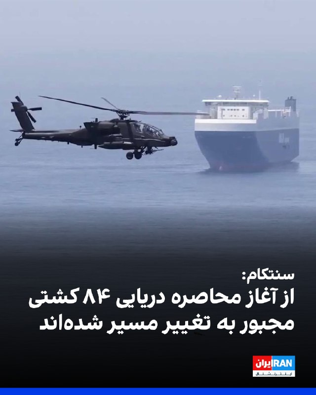

فرماندهی مرکزی ایالات متحده، سنتکام، اعلام کرد از زمان آغاز محاصره دریایی بنادر و سواحل جنوبی ایران، ۸۴ کشتی تجاری مجبور به تغییر مسیر شده‌اند و چهار شناور دیگر نیز پس از هدف قرار گرفتن، از کار افتاده‌اند تا اجرای این محاصره تضمین شود.
https://iranintl.com/202605181759

## IranIntlTV — post 337792

  <a href="telegram/content/IranIntlTV_337792_1779120281.mp4" target="_blank">🎬 Download video</a>

تیم ملی فوتبال برای برپایی آخرین اردوی آماده‌سازی پیش از حضور در جام جهانی ۲۰۲۶ وارد ترکیه شد. مهدی محمدنبی درباره وضعیت صدور ویزای اعضای تیم برای سفر به‌ آمریکا گفت در صورت صادر نشدن ویزای برخی بازیکنان، فدراسیون برنامه‌های مختلفی در نظر دارد.

گفت‌وگو با محمد تقوی، ایران‌اینترنشنال
@iranintltv

## IranIntlTV — post 337791

  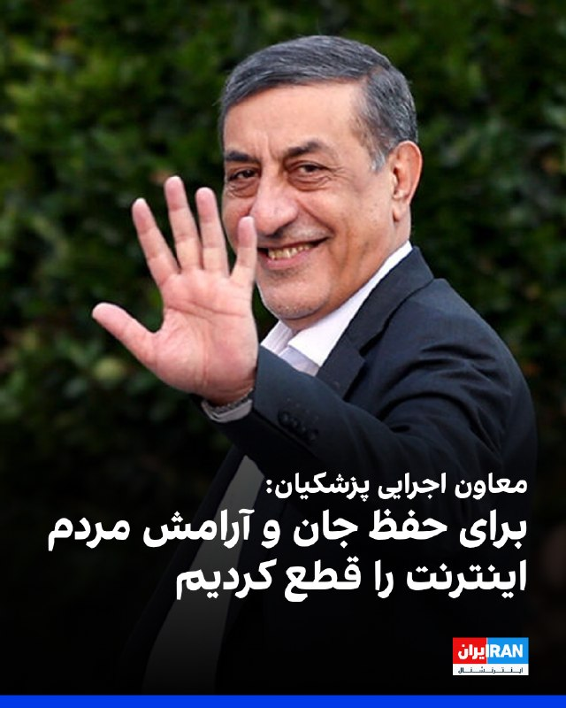

محمدجعفر قائم‌پناه، معاون اجرایی پزشکیان، گفت: «بر اساس نظرسنجی مرکز ریاست‌جمهوری، ۷۰ درصد مردم مخالف محدودیت اینترنت هستند.»

او افزود: «محدودیت‌ها در دی‌ماه و در زمان جنگ، با منطق مدیریت بحران، صیانت از امنیت ملی، جان و آرامش عمومی صورت گرفت.»

قائم‌پناه اضافه کرد: «جامعه‌ای که صادقانه با آن سخن گفته شود، تاب‌آورتر و همراه‌تر خواهد بود.»
https://iranintl.com/202605183897

## IranIntlTV — post 337790

  <a href="telegram/content/IranIntlTV_337790_1779120284.mp4" target="_blank">🎬 Download video</a>

وزیران اقتصاد گروه هفت، دوشنبه ۲۸ اردیبهشت در پاریس گردهم آمدند تا برای مقابله با تنش‌های اقتصاد جهانی گفت‌وگو کنند. وزیر خزانه‌داری آمریکا در حاشیه روز اول نشست، خواستار از کار انداختن ماشین جنگی جمهوری اسلامی شد.

گفت‌وگو با ساجده شریفی، روزنامه‌نگار
@iranintltv

## IranIntlTV — post 337789

  <a href="telegram/content/IranIntlTV_337789_1779120287.mp4" target="_blank">🎬 Download video</a>

وزارت دادگستری ایالات متحده اعلام کرد محمدباقر الساعدی، عضو ارشد کتائب حزب‌الله عراق، با ۶ اتهام تروریستی در نیویورک محاکمه می‌شود. حمله به کنسولگری آمریکا در تورنتو و دو حمله در کانادا، بخشی از اتهامات اوست.

گزارش مهسا مرتضوی، خبرنگار ایران‌اینترنشنال
@iranintltv

## IranIntlTV — post 337788

  <a href="telegram/content/IranIntlTV_337788_1779120289.mp4" target="_blank">🎬 Download video</a>

حذف سردار آزمون، مهاجم گلزن تیم فوتبال ایران، از فهرست نهایی امیر قلعه‌نویی، سرمربی «تیم ملی» فوتبال، بازتاب گسترده‌ای در رسانه‌های بین‌المللی داشته است.

گزارش فربد سروندی، عضو تحریریه ایران‌اینترنشنال
@iranintltv

## IranIntlTV — post 337787

  <a href="telegram/content/IranIntlTV_337787_1779120291.mp4" target="_blank">🎬 Download video</a>

بلومبرگ از تجمع ۲۳ نفتکش در نزدیکی پایانه صادرات نفت خارک خبر داد. این خبرگزاری به نقل از یک کارشناس نفتی نوشت تجمع این تعداد نفتکش در لنگرگاه‌های اطراف خارک، نشانه افزایش تاخیر و تنگناها در صادرات نفت ایران است.

گفت‌وگو با همایون فلک‌شاهی، کارشناس نفت و انرژی در موسسه کپلر
@iranintltv

## IranIntlTV — post 337786

  <a href="telegram/content/IranIntlTV_337786_1779120294.mp4" target="_blank">🎬 Download video</a>

یک دانش‌آموز با ارسال پیامی به ایران‌اینترنشنال می‌گوید: «به ما می‌گویند از حواشی آموزشی فاصله بگیرید و تمرکزتان را روی درس بگذارید. چطور این کار را انجام دهیم وقتی کل کشور شده حاشیه.»

## Shin_Persian — post 6063

Shin ✓ @hey_itsmyturn
Mon, 18 May 2026 14:45:44 UTC

President Trump @POTUS:
"If Iran surrenders, admits their Navy is gone and resting at the bottom of the sea, and their Air Force is no longer with us, and if their entire Military walks out of Tehran, weapons dropped and hands held high, each shouting “I surrender, I surrender” while wildly waving the representative White Flag, and if their entire remaining Leadership signs all necessary “Documents of Surrender,” and admit their defeat to the great power and force of the magnificent U.S.A., The Failing New York Times, The China Street Journal (WSJ!), Corrupt and now Irrelevant CNN, and all other members of the Fake News Media, will headline that Iran had a Masterful and Brilliant Victory over The United States of America, it wasn’t even close. The Dumacrats and Media have totally lost their way. They have gone absolutely CRAZY!!! President DJT"

فارسی

رئیس‌جمهور ترامپ @POTUS:

«اگر ایران تسلیم شود، اعتراف کند که نیروی دریایی‌شان نابود شده و در کف دریا آرمیده است، و نیروی هوایی‌شان دیگر در میان ما نیست، و اگر تمام نظامیانشان از تهران خارج شوند، در حالی که سلاح‌ها را زمین گذاشته و دست‌ها را بالا برده‌اند و هر یک فریاد می‌زنند "من تسلیم هستم، من تسلیم هستم" و همزمان پرچم سفیدِ نشان‌دهنده تسلیم را دیوانه‌وار تکان می‌دهند، و اگر تمام رهبریِ باقی‌مانده آن‌ها همه "اسناد تسلیم" لازم را امضا کنند، و شکست خود را در برابر قدرت و نیروی عظیم ایالات متحده (USA) باشکوه بپذیرند، نیویورک تایمزِ در حال شکست، چاینا استریت ژورنال (وال استریت ژورنال!)، سی‌ان‌انِ فاسد و حالا بی‌ارزش، و تمام دیگر اعضای رسانه‌های اخبار جعلی، تیتر خواهند زد که ایران پیروزی مقتدرانه و درخشانی بر ایالات متحده آمریکا داشته است و [شکست آمریکا] حتی نزدیک هم نبوده است. دموکرات‌ها و رسانه‌ها کاملاً راه خود را گم کرده‌اند. آن‌ها مطلقاً دیوانه شده‌اند!!! رئیس‌جمهور دی.جی.تی»

𝕏 · @shin_persian

## Shin_Persian — post 6062

  

Shin ✓ @hey_itsmyturn
Mon, 18 May 2026 13:07:22 UTC

1246Z
Smoke rising from southern Tehran,
Camera POV: Yadegar Highway -&gt; South

#Tehran Province, #Iran

فارسی

۱۲۴۶ زولو (۱۶:۱۶ به وقت تهران)
برخاستن دود از جنوب تهران،
زاویه دوربین: بزرگراه یادگار امام -> جنوب

#Tehran Province, #Iran

𝕏 · @shin_persian

## ManotoTV — post 105601

  <a href="telegram/content/ManotoTV_105601_1779120297.mp4" target="_blank">🎬 Download video</a>

تماسی از ایران:
«خانواده‌های بچه‌های دربند رو برای کمک‌رساندن دریابیم»

## ManotoTV — post 105600

  <a href="telegram/content/ManotoTV_105600_1779120300.mp4" target="_blank">🎬 Download video</a>

عفو بین‌الملل اعلام کرد شمار اعدام‌ها در جهان در سال ۲۰۲۵ به بالاترین سطح ثبت‌شده در ۴۴ سال گذشته رسیده و ایران با ثبت دست‌کم ۲۱۵۹ اعدام، عامل اصلی این افزایش بوده است.

بر اساس گزارش سالانه این سازمان، در مجموع دست‌کم ۲۷۰۷ نفر در ۱۷ کشور اعدام شده‌اند؛ آماری که نسبت به سال ۲۰۲۴ حدود ۷۸ درصد افزایش نشان می‌دهد.

عفو بین‌الملل اعلام کرد شمار اعدام‌ها در ایران بیش از دو برابر سال گذشته شده و ایران پس از چین، که آمار رسمی اعدام‌هایش منتشر نمی‌شود، در صدر کشورهای مجری اعدام قرار دارد.

در این گزارش آمده است عربستان سعودی با دست‌کم ۳۵۶ اعدام در رتبه بعدی قرار گرفته و بخش قابل توجهی از این احکام به جرایم مرتبط با مواد مخدر مربوط بوده است.

بر اساس این گزارش، آمریکا نیز شمار اعدام‌های خود را از ۲۵ مورد در سال ۲۰۲۴ به ۴۷ مورد در سال ۲۰۲۵ افزایش داده است. شمار اعدام‌ها در مصر، سنگاپور و کویت نیز نسبت به سال قبل افزایش یافته است.

عفو بین‌الملل همچنین اعلام کرد چین، مصر، جمهوری اسلامی، عراق، کره شمالی، عربستان سعودی، سومالی، آمریکا، ویتنام و یمن در پنج سال گذشته به‌طور مداوم اعدام انجام داده‌اند.

## ManotoTV — post 105599

  <a href="telegram/content/ManotoTV_105599_1779120302.mp4" target="_blank">🎬 Download video</a>

با تهدید «حق تیر داریم» مانع برگزاری مراسم زادروز بهار شاه‌مهری شدند

بر اساس ویدیوی ارسالی به منوتو، نیروهای حکومتی با تهدید خانواده بهار شاه‌مهری و گفتن جمله «ما حق تیر داریم»، اجازه برگزاری مراسم زادروز این جاویدنام را در ۱۹ اردیبهشت ندادند.

بهار شاه‌مهری، نوجوان ۱۷ ساله اهل نیشابور، غروب ۱۹ دی‌ماه ۱۴۰۴ در جریان انقلاب شیر و خورشید ایران، در کوچه‌ای خلوت از پشت سر هدف شلیک مستقیم تک‌تیرانداز نیروهای سرکوبگر جمهوری اسلامی قرار گرفت و جان باخت.

به گفته نزدیکان او، چند روز پیش از سالروز تولد بهار، اعضای خانواده‌اش بازداشت و بازجویی شدند و مسیرهای منتهی به مزار او در روز تولدش بسته شد تا از برگزاری مراسم جلوگیری شود.

همچنین گزارش شده است که سنگ مزار بهار شاه‌مهری روز دوم فروردین ۱۴۰۶ شکسته شده بود.
این فشارها بخشی از روند گسترده‌تر سرکوب خانواده‌های جان‌باختگان است؛ حتی بعد از کشتن، از گل گذاشتن و تولد گرفتن هم می‌ترسند. عجب شجاعتی، حکومت با سنگ قبر می‌جنگد.

## ManotoTV — post 105598

  <a href="telegram/content/ManotoTV_105598_1779120304.mp4" target="_blank">🎬 Download video</a>

دونالد ترامپ، رئیس‌جمهوری آمریکا، در پیامی در تروث‌سوشال ، رسانه‌های آمریکایی را متهم کرد که حتی در صورت «تسلیم کامل ایران» نیز آن را به‌عنوان پیروزی توصیف خواهند کرد.

ترامپ در این پیام نوشت اگر جمهوری اسلامی شکست خود را بپذیرد، نیروهای نظامی‌اش تسلیم شوند و رهبرانش «اسناد تسلیم» را امضا کنند، باز هم رسانه‌هایی چون نیویورک‌تایمز، وال‌استریت ژورنال و سی‌ان‌ان این اتفاق را «پیروزی ایران» جلوه خواهند داد.

او با اشاره به نابودی نیروی دریایی و نیروی هوایی ایران نوشت: «اگر ایران تسلیم شود، بپذیرد که نیروی دریایی‌اش در کف دریا نابود شده و نیروی هوایی‌اش دیگر وجود ندارد، و اگر نیروهای نظامی‌اش با دست‌های بالا و پرچم سفید از تهران خارج شوند، باز هم رسانه‌های فیک‌نیوز خواهند گفت ایران پیروزی درخشانی مقابل آمریکا به دست آورده است.»

ترامپ همچنین رسانه‌های جریان اصلی آمریکا را «فاسد» و «بی‌اهمیت» توصیف کرد و نوشت: «دموکرات‌ها و رسانه‌ها کاملا راه خود را گم کرده‌اند. آن‌ها کاملا دیوانه شده‌اند.»

## ManotoTV — post 105597

  

ارتش اسرائیل می‌گوید در حمله‌ای هوایی به منطقه بعلبک در شرق لبنان، وائل محمود عبدالحلیم، فرمانده جهاد اسلامی در منطقه بقاع، کشته شده است. به گفته ارتش اسرائیل، او در هماهنگی عملیات‌های جهاد اسلامی در کنار حزب‌الله لبنان نقش داشته است.

## ManotoTV — post 105596

  <a href="telegram/content/ManotoTV_105596_1779120306.mp4" target="_blank">🎬 Download video</a>

رویترز در گزارشی اختصاصی نوشت پاکستان در جریان جنگ ایران، هشت هزار نیرو، یک اسکادران جنگنده و یک سامانه پدافند هوایی به عربستان سعودی اعزام کرده است.

بر اساس این گزارش، این اعزام در چارچوب پیمان دفاعی دوجانبه اسلام‌آباد و ریاض انجام شده و شامل حدود ۱۶ جنگنده، عمدتا از نوع جی‌اف‌ـ۱۷ ساخت مشترک پاکستان و چین، دو اسکادران پهپاد و سامانه پدافند هوایی چینی اچ‌کیو‌ـ۹ است. منابع رویترز گفتند عربستان هزینه این اعزام را تامین می‌کند و تجهیزات را نیروهای پاکستانی اداره می‌کنند.

پنج منبع امنیتی و دولتی به رویترز گفتند این نیروها با هدف حمایت از ارتش عربستان در صورت حملات بیشتر به این کشور مستقر شده‌اند.

## ManotoTV — post 105595

  <a href="telegram/content/ManotoTV_105595_1779120307.mp4" target="_blank">🎬 Download video</a>

رسانه‌های ترکیه گزارش دادند فرخنده قائم‌مقامی، زن ایرانی ساکن منطقه مال‌تپه استانبول، پس از قتل، جسدش در استان قرشهر پیدا شده است.

بر اساس گزارش خبرگزاری «دمیراورن»، خانم قائم‌مقامی از ۲۲ فروردین ناپدید شده بود و نزدیکان او پس از بی‌خبری، در ۲۳ اردیبهشت گزارش مفقودی ثبت کردند.

پلیس ترکیه در تحقیقات خود «ارکان ب»، ۴۹ ساله، را به‌عنوان آخرین فردی شناسایی کرد که با این زن ایرانی در تماس بوده است. بنا بر این گزارش، او ابتدا اتهام‌ها را رد کرد، اما بعدا به قتل اعتراف کرد.

دمیراورن نوشت مظنون در اعترافات خود گفته است پس از مشاجره در خودرو، قائم‌مقامی را با قلاده سگش خفه کرده، جسد او را تکه‌تکه کرده و در زمینی خالی در شهرستان موجور استان قرشهر رها کرده است.

در ادامه تحقیقات، دو مظنون دیگر نیز بازداشت شدند. سه مظنون این پرونده پس از پایان بازجویی در اداره پلیس، به دادگاه منتقل شدند.

## ManotoTV — post 105594

  <a href="telegram/content/ManotoTV_105594_1779120307.mp4" target="_blank">🎬 Download video</a>

بر اساس گزارش رسانه‌های حقوق بشری، نیروهای حکومتی روز ۱۵ اردیبهشت با یورش به خانه «افسانه جذابی (راسخی)»، شهروند بهائی ساکن شیراز، منزل او را تفتیش کردند و بخشی از اموال شخصی او را با خود بردند.

در این گزارش‌ها آمده است یک زن و سه مرد با ارائه حکمی با عنوان «همکاری با اسرائیل» وارد خانه این خانواده شدند و خانم جذابی و مادر ۸۵ ساله او را مورد تهدید و تحقیر قرار دادند. خانم جذابی به‌تازگی همسر خود را از دست داده و از مادر سالخورده و بیمار خود مراقبت می‌کند.

به گفته این رسانه‌ها، ماموران حکومتی به او گفتند فرزندش در خارج از کشور در فضای مجازی و کمپین‌های حقوق بشری فعالیت می‌کند و تهدید کردند در صورت ادامه این فعالیت‌ها، «هم برای شما و هم برای آنها گران تمام می‌شود.» آنها همچنین این خانواده را به مصادره خانه تهدید کردند.

بر اساس این گزارش‌ها، نیروهای امنیتی همچنین این خانواده را با عباراتی مانند «فرقه» و «همدست اسرائیل» خطاب کردند و چند بار خانم جذابی را به دستبند زدن و انتقال به مکانی نامعلوم تهدید کردند.

این یورش چند ساعت ادامه داشت و در پایان، خانم جذابی و مادر سالخورده‌اش که دچار افت فشار خون شده بود، مجبور شدند برگه‌ای را امضا کنند که در آن نوشته شده بود هیچ خسارتی به خانه و وسایل وارد نشده است. در این رویداد هیچ‌یک از اعضای خانواده بازداشت نشدند.

## ManotoTV — post 105593

  <a href="telegram/content/ManotoTV_105593_1779120309.mp4" target="_blank">🎬 Download video</a>

روزنامه ایران وابسته به دولت جمهوری اسلامی در گزارشی نوشت محدودیت دسترسی به اینترنت بین‌الملل، بازار خرید و فروش سیم‌کارت‌های عراقی را در برخی مناطق مرزی غرب ایران رونق داده است.

بر اساس این گزارش، بیشترین متقاضیان این سیم‌کارت‌ها تجار، بازرگانان، صاحبان بار، رانندگان ترانزیتی و فعالان اقتصادی مرزی هستند که برای ارتباط با طرف‌های عراقی، ارسال اسناد، حواله‌های مالی، رسیدها، عکس و فیلم کالاها از پیام‌رسان‌هایی مانند واتس‌اپ و تلگرام استفاده می‌کنند.

نعیم احمدی، مدیر روابط عمومی استانداری خوزستان، به این روزنامه گفت این سیم‌کارت‌ها در عمق یک تا دو کیلومتری خاک ایران قابل استفاده‌اند و در مناطقی مانند شلمچه، چذابه، خرمشهر، اروندکنار و جزیره مینو به گزینه‌ای در دسترس برای فعالان اقتصادی تبدیل شده‌اند. به گفته او، ارزانی این سیم‌کارت‌ها در مقایسه با هزینه فیلترشکن‌ها از عوامل گرایش به آنهاست.

در همین حال، محمد شفیعی، فرماندار قصرشیرین، استفاده از سیم‌کارت‌های عراقی در کرمانشاه را عمدتا محدود به تجار، صاحبان بار، رانندگان ترانزیتی و فعالان اقتصادی دانست و فراگیر شدن آن در میان عموم مردم را رد کرد.

## ManotoTV — post 105592

  

فریدریش مرتس، صدراعظم آلمان، حملات تازه جمهوری اسلامی علیه کشورهای منطقه را به‌شدت محکوم کرد و گفت حمله به تأسیسات هسته‌ای «تهدیدی برای امنیت مردم در سراسر منطقه» است.

او در پیامی در ایکس تأکید کرد که نباید خشونت‌ها بیش از این تشدید شود و از جمهوری اسلامی خواست وارد مذاکرات جدی با آمریکا شود، تهدید همسایگانش را متوقف کند و تنگه هرمز را بدون محدودیت باز کند.

این موضع‌گیری پس از آن مطرح شد که امارات از آتش‌سوزی در محدوده نیروگاه هسته‌ای براکه پس از حمله پهپادی خبر داد. مقام‌های اماراتی اعلام کردند این حادثه تلفات جانی و خطر تشعشعاتی نداشته است. عربستان سعودی نیز هم‌زمان از رهگیری حملات پهپادی تازه خبر داده است.

فریدریش مرتس، صدراعظم آلمان، حملات تازه منسوب به جمهوری اسلامی علیه کشورهای منطقه را محکوم کرد و گفت حمله به تأسیسات هسته‌ای امنیت مردم منطقه را تهدید می‌کند.

او از جمهوری اسلامی خواست وارد مذاکرات جدی با آمریکا شود، تهدید همسایگانش را متوقف کند و تنگه هرمز را بدون محدودیت باز کند. این موضع‌گیری پس از حمله پهپادی به محدوده نیروگاه هسته‌ای براکه در امارات و رهگیری حملات پهپادی تازه از سوی عربستان مطرح شده است.

## FarsiVOA — post 218068

  <a href="telegram/content/FarsiVOA_218068_1779120311.mp4" target="_blank">🎬 Download video</a>

اگرچه جهان به روزنامه‌نگاری مستقل در ایران احترام می‌گذارد اما روزنامه‌نگاران ایرانی نه فقط از سوی جمهوری اسلامی سرکوب می‌شوند که هدف حملات برخی گروه‌های مخالف حکومت هم هستند. آیا این شرایط توانسته روایتگریِ روزنامه‌نگاران را متوقف کند؟

## FarsiVOA — post 218067

  <a href="telegram/content/FarsiVOA_218067_1779120313.mp4" target="_blank">🎬 Download video</a>

از نمایش پهپاد صورتی رنگ در تجمع‌های شبانه حکومتی تا پهپاد در عقدنامه ازدواج؛ در ادامه تبلیغات دوران آتش‌بس جمهوری اسلامی و تلاش برای مدیریت محتوا در اوج تنش، یک عروس و داماد حامی حکومت در برنامه صداوسیما اعلام کردند مهریه عروس یک «پهپاد شاهد» تعیین شده است.

این نوع محتوای تبلیغاتی شامل حضور زنان بی‌حجاب و نمایش تسلیحات جنگی در تجمع‌های شبانه‌ طرفداران حکومت، مجریان مسلح در صداوسیما، معرفی ابزار جنگ به عنوان مهریه و تلاش برای عادی‌سازی خشونت و ترویج فضای امنیتی در ایران واکنش‌های کاربران را در این باره برانگیخته است که چگونه جمهوری اسلامی از فاجعه جنگ برای خود تبلیغات درست می‌کند.

## FarsiVOA — post 218066

پگاه آهنگرانی با «تمرین‌هایی برای یک انقلاب» برنده جایزه ویژه هیئت داوران گلدن گلوب شد. این جایزه، که برای دومین سال متوالی در کن اهدا می‌شود، از فیلمسازانی تقدیر می‌کند که اثرشان روایتگری استثنایی و سهمی معنادار در سینمای مستند داشته باشد، به‌ویژه آثاری که به مسائل فوری جهانی و اجتماعی می‌پردازند.امسال جایزه «گلدن گلوب» به کارگردان فیلم «گراندزوِل» اهدا شد.

## FarsiVOA — post 218065

  

«یواس‌اس دلبرت دی. بلک» هنگام عبور از دریای عرب در حمایت از عملیات دریایی آمریکا علیه حوثی‌های مورد حمایت جمهوری اسلامی ایران در حال انجام ماموریت هستند.

سنتکام اعلام کرد تا روز ۲۸ اردیبهشت، نیروهای این فرماندهی مسیر ۸۴ کشتی تجاری را تغییر داده‌اند و چهار هدف را نیز از کار انداخته‌اند.

@FarsiVOA

## FarsiVOA — post 218064

🔺انتقاد پرزیدنت ترامپ از رویکرد برخی رسانه‌ها در رابطه با عملیات نظامی علیه رژیم ایران

▪️دونالد ترامپ، رئیس جمهوری ایالات متحده، روز دوشنبه ۲۸ اردیبهشت در پیامی در شبکه «تروت سوشال» ضمن تاکید دوباره بر شکست نظامی رژیم ایران، نوشت که رسانه‌های منتقد دولت او حتی در صورت تسلیم کامل جمهوری اسلامی نیز واقعیت را وارونه جلوه خواهند داد.

⬇️ بیشتر بخوانید:

https://ir.voanews.com/a/president-trump-truth-social-criticism-of-media-coverage-of-iran-war/8151224.html/?nocach=1

## FarsiVOA — post 218063

عراق دوباره در کانون تنش؛ حمله پهپادی به عربستان سعودی و بازگشت پرونده پهپادهای عراقی

## FarsiVOA — post 218062

نت‌بلاکس اعلام کرد خاموشی اینترنت در ایران وارد روز هشتادم شده و از مرز ۱۸۹۶ ساعت گذشته است. هم‌زمان رسانه‌های داخلی از ممنوعیت تبلیغ و فروش «اینترنت پرو» خبر دادند.

به گفته نت‌بلاکس، نهاد ناظر بر اختلالات اینترنت، هم‌زمان با قطع دسترسی گسترده کاربران ایرانی به اینترنت جهانی، محتوای حامی جمهوری اسلامی در شبکه‌های اجتماعی افزایش یافته است.

نت‌بلاکس همچنین نوشت برخی ایرانیانی که برای دریافت دسترسی ویژه یا قرار گرفتن در «فهرست سفید» اقدام کرده‌اند، می‌گویند از آنها خواسته شده برای حفظ این دسترسی، سهمیه‌ای از پست‌های تبلیغاتی روزانه منتشر کنند؛ روندی که به گفته این نهاد، با هوش مصنوعی کنترل می‌شود.

گزارش کامل را در وب‌سایت صدای آمریکا بخوانید.

@FarsiVOA

## FarsiVOA — post 218061

🔺کشته شدن یک فرمانده جهاد اسلامی در حمله ارتش اسرائیل به بقاع

▪️ارتش اسرائیل روز دوشنبه ۲۸ اردیبهشت، از کشته شدن وائل محمود عبدالحلیم، از فرماندهان جهاد اسلامی فلسطینی، در منطقه بقاع لبنان خبر داد.

⬇️ بیشتر بخوانید:

https://ir.voanews.com/a/palestinian-islamic-jihad-commander-israel-army-killed/8151197.html/?nocach=1

## FarsiVOA — post 218060

  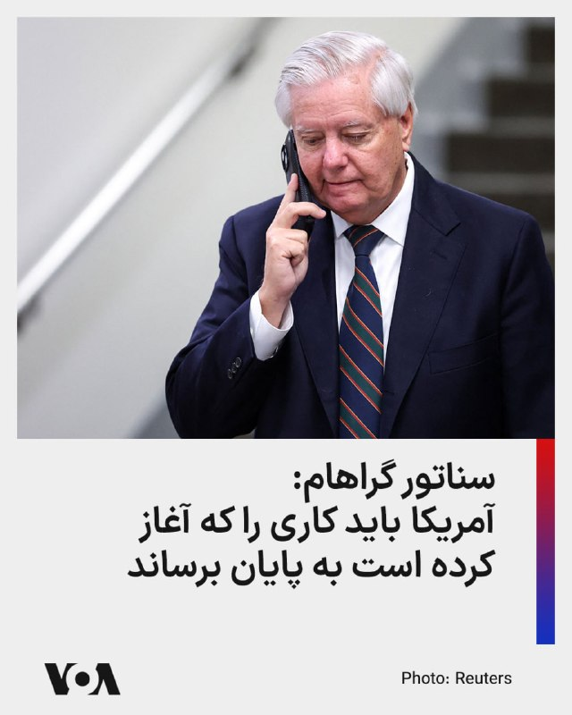

⚡️سناتور گراهام می‌گوید که رژیم جمهوری اسلامی به رغم ضعف شدید نظامی و اقتصادی «جسورتر و پرخاشگرتر شده‌ است» و آمریکا باید «کار را تمام کند.»

لیندزی گراهام، سناتور جمهوری‌خواه کنگره آمریکا، روز دوشنبه ۲۸ اردیبهشت، با انتشار پیامی در حساب کاربری خود در شبکه اجتماعی ایکس، گفت: «من کاملاً مطمئنم که دونالد ترامپ، رئیس جمهوری آمریکا، وضعیت [رژیم] ایران را کاملاً درک می‌کند و به تحمل امتناع از مذاکره با حسن‌نیت در کنار تجاوزگری‌های جسورانه [رژیم] ایران در تنگه هرمز و سراسر منطقه ادامه نخواهد داد.»

این سناتور ارشد ایالت کارولینای جنوبی در ادامه پیام خود نوشته است: «برای من کاملاً واضح است که [رژیم] ایران از نظر نظامی و اقتصادی بسیار ضعیف شده است، اما در عین حال، آنها جسورتر و پرخاشگرتر شده‌اند.»

او با اشاره به این که در حال حاضر یک «پاسخ کوتاه، اما قاطع» می‌تواند درگیری را «به شیوه‌ای درست از نو آغاز کند»، تاکید کرد: «وقتی صحبت از [رژیم] ایران می‌شود، ضروری است که ما [آمریکا] از موضع قدرت و تسلط مذاکره کنیم.»

## FarsiVOA — post 218059

🔺رویترز: پاکستان «پیشنهاد اصلاح‌شده» تهران برای پایان درگیری را به واشنگتن تحویل داد

▪️یک منبع پاکستانی روز دوشنبه ۲۸ اردیبهشت به خبرگزاری رویترز گفت پاکستان، که میانجی‌گری صلح بین تهران و واشنگتن را بر عهده دارد، «پیشنهاد اصلاح‌شده» حکومت ایران برای پایان دادن به جنگ در خاورمیانه را به ایالات متحده تحویل داده و هشدار داده است که دو طرف‌ «زمان زیادی» برای کاهش اختلافات خود ندارند.

⬇️ بیشتر بخوانید:

https://ir.voanews.com/a/reuters-pakistan-delivers-irans-revised-proposal-to-washington/8151203.html/?nocach=1

## FarsiVOA — post 218058

  <a href="telegram/content/FarsiVOA_218058_1779120317.mp4" target="_blank">🎬 Download video</a>

ارتش اسرائیل ویدیویی از انهدام انبار تسلیحات ضدزره حزب‌الله و فعالیت نیروهای تیپ ۷۶۹ در جنوب لبنان منتشر و اعلام کرد این نیروها «با پشتیبانی نیروی هوایی، در یک واکنش عملیاتی سریع، یک انبار سلاح‌های ضدزره را که توسط سازمان تروریستی حزب‌الله علیه نیروهای فعال در منطقه مورد استفاده قرار می‌گرفت، منهدم کردند.»

ارتش اسرائیل همچنین در یک عملیات دیگر در منطقه روستای الخیام، انبارهای تسلیحاتی و مراکز استقرار سازمان تروریستی حزب‌الله را منهدم کرد و مقادیری سلاح از جمله پرتابگرهای ضدزره، مواد منفجره و سلاح‌های سبک را کشف کردند.

## FarsiVOA — post 218057

خاموشی اینترنت مستقیما روی کار روزنامه‌نگاران ایرانی اثر گذاشته است؛ آن هم درست در روزهایی که گزارش‌گری مستقل و راستی‌آزمایی از همیشه ضرورتی‌تر است. تیم میدان در این داده‌نما به وضعیت روزنامه‌نگاری در ایران پرداخته است

## FarsiVOA — post 218056

  

فرماندهی مرکزی ایالات متحده، سنتکام، با انتشار این تصویر اعلام کرد یک جنگنده رادارگریز اف-۳۵ در جریان گشت‌زنی معمول بر فراز آب‌های منطقه خاورمیانه سوخت‌گیری هوایی کرده است.

@FarsiVOA

## FarsiVOA — post 218055

  <a href="telegram/content/FarsiVOA_218055_1779120320.mp4" target="_blank">🎬 Download video</a>

جمهوری اسلامی به عنوان یکی از حکومت‌های دشمن روزنامه‌نگاری شناخته می‌شود. با این حال، روزنامه‌نگاران ایرانی در این سال‌ها هرگز گزارش‌های میدانی، خبررسانی‌، پرده‌برداری‌ از حقیقت و مستندسازی دردهای اجتماعی را متوقف نکرده‌اند

## FarsiVOA — post 218054

  <a href="telegram/content/FarsiVOA_218054_1779120322.mp4" target="_blank">🎬 Download video</a>

فرماندهی آمریکا در آفریقا، آفریکام، اعلام کرد در هماهنگی با دولت نیجریه، روز ۲۷ اردیبهشت مواضع گروه داعش در شمال شرقی این کشور را هدف حملات هوایی قرار داده است.

به گفته آفریکام، در این عملیات هیچ‌یک از نیروهای آمریکایی یا نیجریه‌ای آسیب ندیدند.

@FarsiVOA

## FarsiVOA — post 218053

  

فرماندهی مرکزی ایالات متحده، سنتکام، با انتشار این تصویر اعلام کرد ملوانان آمریکایی در ناو هواپیمابر آبراهام لینکلن در دریای عرب از عملیات پروازی پشتیبانی می‌کنند.

سنتکام نوشت: «هر موفقیت عملیاتی در حوزه مسئولیت این فرماندهی با زنان و مردان آمریکایی در یونیفرم آغاز و پایان می‌یابد.»

@FarsiVOA

## DW_Farsi — post 124848

  

🔶 محمد عوده به عنوان رهبر حماس در غزه معرفی شد

سازمان تروریستی حماس محمد عوده را به‌عنوان جانشین عزالدین حداد و رهبر این گروه در نوار غزه منصوب کرد.

بر اساس گزارش پایگاه خبری سعودی الشرق الاوسط، محمد عوده، رئیس دستگاه اطلاعاتی حماس، به‌عنوان جانشین عزالدین حداد و رهبر این گروه در نوار غزه و فرمانده شاخه نظامی آن منصوب شده است.

عزالدین حداد روز جمعه در یک حمله اسرائیل کشته شد.

گفته می‌شود عوده که در زمان حملات ۷ اکتبر ۲۰۲۳ رئیس اطلاعات نظامی گردان‌های القسام بود، رابطه نزدیکی با حداد داشته و پس از ترور رهبران پیشین، محمد ضیف و محمد سنوار، برای بازسازی "ساختار سازمانی" حماس با او همکاری کرده است.

الشرق الاوسط به نقل از یک منبع آگاه گزارش داده است که عوده پس از کشته شدن سنوار در ماه مه سال گذشته، ابتدا برای رهبری گردان‌های القسام پیشنهاد شده بود، اما این مسئولیت را نپذیرفت.

طبق این گزارش، عوده مأمور جمع‌آوری اطلاعات درباره پایگاه‌های ارتش اسرائیل در نزدیکی مرز غزه و همچنین نقاط ضعف لشکر غزه پیش از حملات ۷ اکتبر بوده است.

پیش‌تر روزنامه اسرائیلی هیوم نوشته بود که محمد عوده، "فرمانده کهنه‌کار حماس که از ترور جان سالم به در برد، نباید مشکلی برای انتصاب به سمت فرماندهی داشته باشد".

طبق همین گزارش "عوده که گاهی به عنوان فرمانده تیپ در شاخه نظامی خدمت کرده از لحاظ تئوری گزینه ایده‌آلی برای فرماندهی قسام است".

@dw_farsi

## DW_Farsi — post 124847

🔶 هزینه ده میلیارد یورویی دولت آلمان برای تقویت دفاع غیرنظامی

به گزارش روزنامه بیلد، الکساندر دوبرینت، وزیر کشور آلمان، در حال برنامه‌ریزی برای اجرای یک برنامه چند میلیارد یورویی جهت توسعه حفاظت از مردم و دفاع غیرنظامی است.

این روزنامه آلمانی، به نقل از پیش‌نویس مصوبه کابینه گزارش داده است که برای این منظور ۱۰ میلیارد یورو اختصاص داده خواهد شد. این بودجه از جمله قرار است برای تجهیزات اضافی، ساختمان‌ها، نیروی انسانی و فناوری، از جمله برای سازمان امداد فنی آلمان، هزینه شود.

الکساندر دوبرینت به این روزنامه گفت: «ما در زمینه حفاظت از جمعیت و دفاع غیرنظامی در حال تقویت توان خود هستیم.» به گفته این وزیر سوسیال مسیحی، هدف "اتخاذ موضعی قاطع در برابر تهدیدات هیبریدی" و نیز "حمایت پیگیرانه از نیروهای داوطلب" است.

بر این اساس، قرار است در وزارت کشور آلمان یک واحد جدید با عنوان "فرماندهی دفاع غیرنظامی" ایجاد شود. این واحد همچنین مسئول هماهنگی همکاری با ارتش آلمان در صورت بروز تهدیدهای احتمالی خواهد بود.

@dw_farsi

## DW_Farsi — post 124846

🔶 اعزام اسکادران جنگنده و هزاران سرباز پاکستانی به عربستان

پاکستان در گرماگرم میانجی‌گری میان آمریکا و ایران به تقویت بی‌سابقه همکاری نظامی خود با عربستان پرداخته است. اسلام‌آباد در چارچوب یک پیمان دفاعی مشترک، ۸ هزار نیروی نظامی، یک اسکادران جنگنده و یک سامانه پدافند هوایی به عربستان سعودی اعزام کرده است.

خبرگزاری رویترز در گزارشی اختصاصی از ابعاد گسترده  همکاری‌های نظامی پاکستان و عربستان که بر مبنای توافقی در شهریور گذشته به اجرا درآمده است خبر داده است.

مضمون گزارش رویترز که "توسط سه مقام امنیتی و دو منبع دولتی تأیید شده" از جمله این است که نیروهای اعزام‌شده به عربستان  یک یگان "قابل‌توجه و آماده عملیات رزمی" هستند که هدف آن حمایت از ارتش عربستان در صورت حملات بیشتر به این کشور است.

جزئیات کامل توافق دفاعی که سال گذشته امضا شد محرمانه است، اما دو طرف پیش‌تر گفته‌اند که این توافق، پاکستان و عربستان را ملزم می‌کند در صورت حمله به یکی از آن‌ها، از یکدیگر دفاع کنند. خواجه آصف، وزیر دفاع پاکستان، پیش‌تر تلویحاً گفته بود که این توافق عربستان را زیر "چتر هسته‌ای" پاکستان قرار می‌دهد.

@dw_farsi

## DW_Farsi — post 124844

🔶 اعتراض به غول رسانه‌ای؛ بینوش و ۶۰۰ سینماگر در فهرست سیاه

در فرانسه این روزها نبردی فرهنگی بر سر سینمای ملی در جریان است. اوایل هفته و همزمان با افتتاح جشنواره فیلم کن، بیش از ۶۰۰ فعال حوزه سینما از طریق روزنامه "لیبراسیون" طوماری علیه ونسان بولوره، سرمایه‌دار راستگرا، امضا کردند. بولوره طی سال‌های گذشته امپراتوری رسانه‌ای گسترده‌ای ایجاد کرده که تا شرکت بزرگ سرگرمی کانال پلاس (Canal+) نیز امتداد یافته است.

در میان امضاکنندگان نام‌های شناخته‌شده‌ای همچون ژولیت بینوش و آدل انل از میان بازیگران، و نیز کارگردانانی مانند ریموند دپاردون و دومینیک مول دیده می‌شود. در این بیانیه آمده است: «اگر سینمای فرانسه را به دست یک مالک راست‌افراطی بسپاریم، نه تنها خطر همگن‌سازی فیلم‌ها را می‌پذیریم، بلکه با خطر تصرف فاشیستی تخیل جمعی نیز روبه‌رو خواهیم شد.»

اکنون مدیران کانال پلاس واکنش نشان داده‌اند. ماکسیم سعدا، مدیرعامل این شرکت، اعلام کرد که کانال پلاس در آینده دیگر با هنرمندانی که بیانیه علیه بولوره را امضا کرده‌اند همکاری نخواهد کرد. او گفت این طومار در حق کارکنان کانال پلاس که به گفته او، همواره برای استقلال در کار خود کوشیده‌اند، ناعادلانه است.

@dw_farsi

## DW_Farsi — post 124843

  

🔶 سازمان بین‌المللی کار: جنگ خاورمیانه می‌تواند میلیون‌ها شغل را از بین ببرد

سازمان بین‌المللی کار هشدار داد جنگ خاورمیانه می‌تواند در سال‌های ۲۰۲۶ و ۲۰۲۷ میلیون‌ها شغل را در جهان از بین ببرد و موجب کاهش دستمزدهای واقعی شود. به گفته این نهاد وابسته به سازمان ملل، پیامدهای این بحران بسیار فراتر از منطقه تحت درگیری خواهد بود.

این سازمان روز دوشنبه ۱۸ مه در گزارشی اعلام کرد افزایش بهای انرژی، اختلال در حمل‌ونقل، فشار بر زنجیره‌های تامین، کاهش گردشگری و افت تقاضا برای نیروی کار مهاجر، اقتصاد کشورهای مختلف را تحت تاثیر قرار داده است.

سازمان بین‌المللی کار در این گزارش پیش‌بینی کرده اگر قیمت نفت حدود ۵۰ درصد بالاتر از میانگین پیش از آغاز حملات آمریکا و اسرائیل به ایران در ۲۸ فوریه باقی بماند، میزان ساعات کار در جهان در سال ۲۰۲۶ حدود نیم درصد و در سال ۲۰۲۷ حدود ۱.۱ درصد کاهش خواهد یافت.

به گفته این نهاد، این کاهش معادل از بین رفتن ۱۴ میلیون شغل تمام‌وقت در سال جاری و ۴۳ میلیون شغل در سال ۲۰۲۷ میلادی است. همچنین نرخ بیکاری جهانی در سال ۲۰۲۶ حدود ۱.۰ درصد و در سال ۲۰۲۷ حدود ۵.۰ درصد افزایش خواهد یافت.

در گزارش سازمان بین‌المللی کار آمده است که درآمد واقعی نیروی کار نیز کاهش خواهد یافت؛ به‌طوری‌که دستمزدهای واقعی در سال جاری ۱.۱ درصد و در سال ۲۰۲۷ حدود سه درصد افت می‌کند.

@dw_farsi

## DW_Farsi — post 124842

🔶 نارضایتی سعودی‌ها از آمریکا و سیاستی چندجانبه در قبال ایران

گزارش  روزنامه آلمانی دی ولت با توضیح شروع می‌شود که عربستان در در میانه جنگ آمریکا و اسرائیل علیه ایران، هم از نظر ژئوپولیتیکی و هم امنیتی در حال بازتعریف جایگاه خود است. محور اصلی گزارش این است که ریاض دیگر مانند گذشته به حمایت مطلق آمریکا اطمینان ندارد و به‌دنبال تنوع‌بخشیدن به ائتلاف‌هایش است.
عربستان برای دورزدن پیامدهای بسته‌شدن تنگه هرمز، سال‌ها پیش زیرساخت جایگزین ایجاد کرده بود؛ از جمله خط لوله شرق به غرب و بندر نفتی ینبع در ساحل دریای سرخ. اکنون این بندر به شریان حیاتی صادرات نفت سعودی تبدیل شده است. در گزارش آمده است: « در ینبع محله‌های مسکونی جدید، فرودگاه و تأسیسات آب‌شیرین‌کنِ مجهز به انرژی خورشیدی ساخته شد. حتی در زمان جنگ خلیج فارس در سال ۱۹۹۰ نیز نگرانی زیادی وجود داشت که صدام حسین، دیکتاتور عراق، تنگه هرمز را مسدود یا میدان‌های نفتی آن منطقه را هدف قرار دهد، اما آن زمان تنگه بسته نشد.»

امروز عربستان سعودی می‌تواند روزانه تا هفت میلیون بشکه نفت را از طریق خط لوله شرق به غرب به بندر ینبع منتقل کند و از آنجا به عنوان محصولات فرآوری شده پتروشیمی یا به صورت نفت خام صادر کند.

@dw_farsi

## DW_Farsi — post 124832

📸 کن ۲۰۲۶ در قاب تصویر؛ سینماگران ایرانی در کنار ستاره‌های جهان

هفتادونهمین جشنواره فیلم کن ۲۰۲۶ به رسم هر سال با حضور چهره‌های مطرح سینمای جهان، فرش قرمز و نشست‌های خبری همراه بود. در این دوره، پگاه آهنگرانی نیز با فیلم "تمرین‌هایی برای یک انقلاب" در جشنواره حضور داشت و اثر خود را به نمایش گذاشت. برخی از مشهورترین چهره‌هایی را که در جشنواره امسال حضور یافته‌اند، ببینید.
@dw_farsi

## DW_Farsi — post 124830

  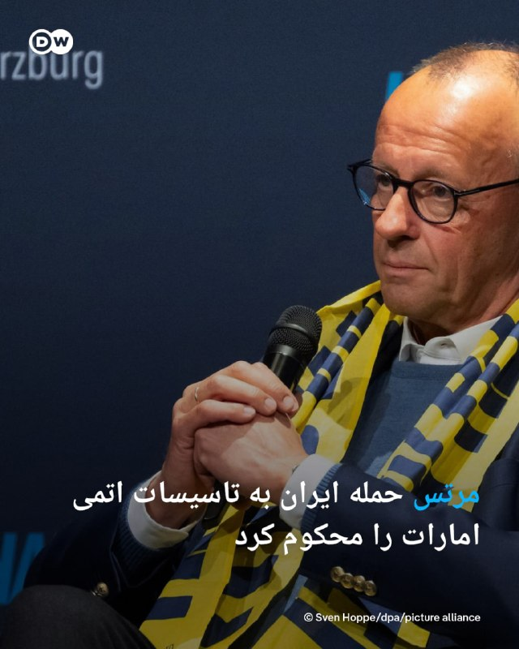

🔶 مرتس حمله ایران به تاسیسات اتمی امارات را محکوم کرد

فریدریش مرتس، صدراعظم آلمان، حمله به یک نیروگاه هسته‌ای در امارات متحده عربی را محکوم کرد. او روز دوشنبه در شبکه اجتماعی ایکس نوشت: «حملات هوایی دوباره ایران علیه امارات متحده عربی و دیگر شرکا را به‌شدت محکوم می‌کنیم. حمله به تأسیسات هسته‌ای تهدیدی برای امنیت مردم سراسر منطقه است.»

به گفته او، نباید هیچ تشدید خشونت دیگری رخ دهد.

روز یکشنبه، ۱۷ مه (۲۷ اردیبهشت) در پی حمله پهپادی به یک نیروگاه هسته‌ای در امارات، آتش‌سوزی رخ داد. مقام‌های اماراتی اعلام کردند که این حادثه هیچ مجروحی و هیچ افزایش غیرعادی در سطح تشعشعات نداشته است. وزارت خارجه امارات این حمله را "اقدامی تروریستی و بدون تحریک قبلی" توصیف و به‌شدت محکوم کرد، اما مستقیماً هیچ طرفی را مسئول ندانست.

جمهوری اسلامی نسبت به حمله به نیروگاه هسته‌ای امارات واکنش رسمی نشان نداده است.

مرتس در ادامه پیام خود در شبکه ایکس همچنین از رهبری ایران خواست وارد مذاکرات جدی برای پایان دادن به جنگ شود.

او همچنین خواستار آن شد که ایران "تهدید همسایگانش را متوقف کند و تنگه هرمز را بدون محدودیت بازگشایی کند".

در جنگی که با حملات هوایی آمریکا و اسرائیل علیه ایران آغاز شد، اکنون آتش‌بسی برقرار است، اما مذاکرات برای پایان دائمی درگیری‌ها تاکنون به نتیجه مشخصی نرسیده است.

@dw_farsi

## DW_Farsi — post 124829

🔶 سفر ترامپ به چین؛ آیا تهران در پی میانجی تازه است؟

اگر هدف سفر ترامپ به چین، رسیدن به یک تفاهم روشن و علنی با پکن بر سر ایران بود، دست‌کم در ظاهر چنین نتیجه‌ای حاصل نشد. نه بیانیه مشترکی منتشر شد و نه نشانه‌ای از یک توافق نهایی در موضوعات حساس دیده شد. با این حال، مجموعه پیام‌ها و واکنش‌ها نشان می‌دهد ایران یکی از محورهای مهم این سفر بوده است. در چنین فضایی، انتصاب فوری محمدباقر قالیباف به سمت نماینده ویژه ایران در امور چین، بیش از آنکه یک جابه‌جایی اداری ساده باشد، می‌تواند نشانه تلاش تهران برای بازتعریف کانال چین در میانه جنگ، فشار آمریکا و ابهام در آینده مذاکرات باشد.

به گزارش رویترز، جیمیسون گریر، نماینده تجاری ایالات متحده، گفت واشنگتن از چین نخواسته مستقیما برای بازگشایی تنگه هرمز وارد عمل شود، بلکه تمرکز اصلی بر این بوده که پکن از ارائه حمایت مادی به ایران خودداری کند. او همچنین گفت چین به دلیل وابستگی‌اش به مسیرهای انرژی و تجارت جهانی، به‌طور طبیعی از باز ماندن تنگه هرمز حمایت می‌کند. رویترز همچنین گزارش داده که موضع واشنگتن و پکن دست‌کم در مخالفت با محدودیت‌های تازه بر عبور و مرور در تنگه هرمز تا حدی به هم نزدیک شده است.

اما در سوی دیگر، موضع چین محتاط‌تر به نظر می‌رسد. همان گزارش‌ها نشان می‌دهد پکن بیش از آنکه به زبان فشار مستقیم علیه تهران سخن بگوید، بر کاهش تنش، باز ماندن مسیرهای انرژی و حل‌وفصل بحران از طریق دیپلماسی تاکید کرده است. این همان نقطه‌ای است که فاصله دیدگاه چین و آمریکا درباره ایران آشکار می‌شود: واشنگتن به‌دنبال مهار تهران از مسیر فشار و بازدارندگی است، اما چین ظاهرا هنوز می‌خواهد در چارچوب "مدیریت بحران" حرکت کند، نه در قالب همسویی آشکار با سیاست فشار آمریکا.

@dw_farsi

## DW_Farsi — post 124828

🔶 گفت‌وگوی تلفنی نتانیاهو و ترامپ درباره "حمله به ایران"

دفتر نخست‌وزیر اسرائیل در پاسخ به "تایمز اسرائیل" تأیید کرده است که بنیامین نتانیاهو، نخست‌وزیر این کشور، شامگاه یکشنبه ۱۷ مه (۲۷ اردیبهشت) در تماسی تلفنی با دونالد ترامپ، رئیس جمهور آمریکا، درباره جنگ با ایران گفت‌وگو کرده است.

بر اساس گزارش رسانه‌های عبری‌زبان، دو طرف درباره احتمال از سرگیری جنگ با ایران و همچنین سفر اخیر ترامپ به چین گفت‌وگو کرده‌اند.

به گزارش تایمز اسرائیل، نتانیاهو قرار بوده پس از این تماس، شماری از دستیاران ارشد و وزیران کابینه‌اش را برای یک نشست امنیتی در دفتر خود در اورشلیم گرد هم آورد.

چنین نشست‌هایی در دفتر نخست‌وزیری که اغلب "کابینه امنیتی کوچک" نامیده می‌شوند، معمولاً شامل گیدئون ساعر، وزیر خارجه، یسرائیل کاتس، وزیر دفاع، بتسالل اسموتریچ، وزیر دارایی، ایتامار بن‌گویر، وزیر امنیت ملی، و آریه درعی، رهبر حزب شاس، هستند.

هفته گذشته گزارش شده بود که اسرائیل و آمریکا در حال انجام آماده‌سازی‌های فشرده برای ازسرگیری حملات به ایران هستند و احتمال دارد این حملات حتی از همین هفته آغاز شوند. گفت‌وگوهای روز یکشنبه پس از آن انجام گرفته که حمله‌ای پهپادی نیروگاه هسته‌ای امارات متحده عربی را هدف قرار داد؛ کشوری که پس از اسرائیل، در جریان جنگ بیشترین ضربه‌ها را از ایران خورده است.

به گزارش اکسیوس به نقل از دو مقام آمریکایی، انتظار می‌رود ترامپ فردا سه‌شنبه نیز نشستی در "اتاق وضعیت" کاخ سفید با مشاوران ارشد امنیت ملی خود برای بررسی گزینه‌های نظامی علیه ایران برگزار کند.

@dw_farsi

## DW_Farsi — post 124827

  

🔶 ایران یک نهاد جدید برای مدیریت تنگه هرمز معرفی کرد

شورای عالی امنیت ملی ایران از تشکیل نهادی برای مدیریت تنگه هرمز خبر داد. این شورا روز دوشنبه با انتشار پستی در شبکه ایکس با اعلام راه‌اندازی حساب کاربری این نهاد تازه تأسیس با نام "مدیریت آبراه خلیج فارس" نوشت "به‌روز رسانی‌های لحظه‌ای در مورد عملیات تنگه هرمز و آخرین تحولات" در این رابطه از طریق این حساب منتشر خواهد شد.

با این حال تاکنون جزئیات بیشتری درباره ساختار، اختیارات یا مأموریت‌های دقیق این نهاد تازه ‌تأسیس منتشر نشده است.

این اقدام در حالی صورت می‌گیرد که تنگه هرمز در ماه‌های اخیر به یکی از کانون‌های اصلی تنش‌های منطقه‌ای تبدیل شده و نقش آن در امنیت انرژی و حمل‌ونقل جهانی اهمیت بیشتری یافته است.

@dw_farsi

## Persian_Trend_Official — post 14421

*هنوز جنگ تموم نشده

## Persian_Trend_Official — post 14420

هیچوقت قبل از تموم شدن ماجرا خوشحالی نکنید ! 📌 @persian_trend_official پرشین ترند | متفاوت‌ترین کانال نظامی

## Persian_Trend_Official — post 14419

  <a href="telegram/content/Persian_Trend_Official_14419_1779120327.mp4" target="_blank">🎬 Download video</a>

هیچوقت قبل از تموم شدن ماجرا خوشحالی نکنید !

📌 @persian_trend_official
پرشین ترند | متفاوت‌ترین کانال نظامی

## Persian_Trend_Official — post 14418

پست کنایه آمیز پرزیدنت ترامپ : اگر ایران تسلیم شود، اعتراف کند که نیروی دریایی‌اش نابود شده و در کف دریا آرمیده است، و نیروی هوایی‌اش دیگر وجود ندارد، و اگر تمام ارتش آن با انداختن سلاح‌ها و بالا بردن دست‌ها از تهران خارج شود و هر کدام فریاد بزنند «من تسلیم…

## Persian_Trend_Official — post 14417

  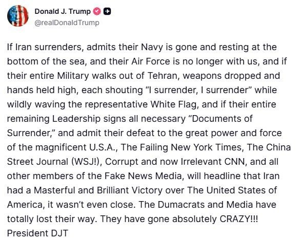

پست کنایه آمیز پرزیدنت ترامپ :
اگر ایران تسلیم شود، اعتراف کند که نیروی دریایی‌اش نابود شده و در کف دریا آرمیده است، و نیروی هوایی‌اش دیگر وجود ندارد، و اگر تمام ارتش آن با انداختن سلاح‌ها و بالا بردن دست‌ها از تهران خارج شود و هر کدام فریاد بزنند «من تسلیم می‌شوم، من تسلیم می‌شوم» در حالی که دیوانه‌وار پرچم سفید را تکان می‌دهند، و اگر تمام رهبران باقی‌مانده‌شان همه «اسناد تسلیم» لازم را امضا کنند و شکست خود را در برابر قدرت و نیروی عظیم و باشکوه ایالات متحده آمریکا بپذیرند، نیویورک تایمزِ شکست‌خورده، وال‌استریت ژورنالِ چینی (WSJ!)، سی‌ان‌انِ فاسد و حالا بی‌ربط، و تمام دیگر اعضای رسانه‌های اخبار جعلی تیتر خواهند زد که ایران یک پیروزی استادانه و درخشان بر ایالات متحده آمریکا به دست آورده است؛ حتی نزدیک هم نبود. دموکرات‌ها و رسانه‌ها کاملاً راه خود را گم کرده‌اند. آن‌ها کاملاً دیوانه شده‌اند!!!!

رئیس‌جمهور Donald John Trump

## Persian_Trend_Official — post 14416

  <a href="telegram/content/Persian_Trend_Official_14416_1779120330.webm" target="_blank">🎬 Download video</a>

💥
💥
💥

📰:کاخ سفید پیشنهاد تجدیدنظر شده ایران برای پایان دادن به درگیری جاری را رد کرده و آن را ناکافی دانسته است.

🇮🇷
🇺🇸مقامات آمریکایی هشدار داده‌اند که اگر تهران در برنامه هسته‌ای خود امتیازات عمده‌ای ندهد، ممکن است اقدامات نظامی از سر گرفته شود. (منبع Axios)

🦁Phantom
🦁

✉️@persian_trend_official
پرشین ترند | متفاوت‌ترین کانال نظامی

## Persian_Trend_Official — post 14415

  <a href="telegram/content/Persian_Trend_Official_14415_1779120331.webm" target="_blank">🎬 Download video</a>

⚠️ هشدار مهم!

یه تکنیک جدید هکرها پیدا شده که دارن از کپچا استفاده می‌کنن برای نفوذ به گوشی و کامپیوترت!

🔴 چطور کار می‌کنه؟

وقتی می‌خوای وارد یه سایت بشی، یه صفحه شبیه کپچای معمولی (با لوگوی Cloudflare) باز می‌شه. بعد ازت می‌خواد:
• کلیدهای Win + R رو فشار بدی
• یه دستور آماده رو پیست کنی
• اینتر بزنی

نتیجه؟ 🔥
بدون اینکه بفهمی، تروجان و جاسوس‌افزار روی سیستمت نصب می‌شه و اطلاعاتت به سرقت می‌ره!

📈 آمار ترسناک:
موارد این نوع حمله امسال ۵۶۳ درصد افزایش یافته!

✅ چطور تشخیص بدی؟
کپچای واقعی هیچ‌وقت ازت نمی‌خواد وارد Run ویندوز بشی یا دستوری اجرا کنی. هرچیزی غیر از انتخاب تصویر = تقلبی!

👆 مراقب باشید، به دوستاتون هم بگید!

📝 Nick

📌 @persian_trend_official
پرشین ترند | متفاوت‌ترین کانال نظامی

## Persian_Trend_Official — post 14414

  <a href="telegram/content/Persian_Trend_Official_14414_1779120331.webm" target="_blank">🎬 Download video</a>

⭕️بازسازی زیرساخت‌های آسیب‌دیده پارس جنوبی در ۲ سال

سخنگوی کمیسیون انرژی مجلس:
💢برای بازسازی و نوسازی زیرساخت‌های پالایشگاهی و پتروشیمی منطقه پارس جنوبی با تکیه بر دانش بومی برنامه‌ریزی شده است.

💢این مراکز با طراحی و فناوری‌های جدید و با ظرفیتی بیش از قبل، به مدار تولید بازخواهند گشت.

💢پیش‌بینی می‌شود حدود ۵۰ درصد از بازسازی‌ها تا پیش از آغاز فصل سرد سال به سرانجام برسد.

💢کل فرآیند آواربرداری، بازسازی و نوسازی زیرساخت‌ها در مدت حداکثر ۲ سال تکمیل شود.

🫆:Tony

📌 @persian_trend_official
پرشین ترند | متفاوت‌ترین کانال نظامی

## Persian_Trend_Official — post 14413

  <a href="telegram/content/Persian_Trend_Official_14413_1779120332.webm" target="_blank">🎬 Download video</a>

⭕️ وضعیت کم سابقه‌ی آسمان منطقه، از نظر خلوت بودن. (در عکس اول فقط پرواز های نظامی آمریکا و در عکس دوم تمام پرواز های نظامی) 📝 Nick 📌 @persian_trend_official پرشین ترند | متفاوت‌ترین کانال نظامی

## Persian_Trend_Official — post 14410

⭕️ وضعیت کم سابقه‌ی آسمان منطقه، از نظر خلوت بودن.

(در عکس اول فقط پرواز های نظامی آمریکا
و در عکس دوم تمام پرواز های نظامی)

📝 Nick

📌 @persian_trend_official
پرشین ترند | متفاوت‌ترین کانال نظامی

## RadioFarda — post 157315

🔸مدیر مرکز روابط عمومی و اطلاع‌رسانی وزارت بهداشت جمهوری اسلامی روز دوشنبه ادعا کرد که در حمله اسرائیل به بیت خامنه‌ای «اتفاق خاصی» برای مجتبی خامنه‌ای نیفتاده است. 🔸در روز ۹ اسفندماه سال گذشته که حمله اسرائیل به بیت علی خامنه‌ای در مرکز تهران جان او و ده‌ها…

## RadioFarda — post 157314

  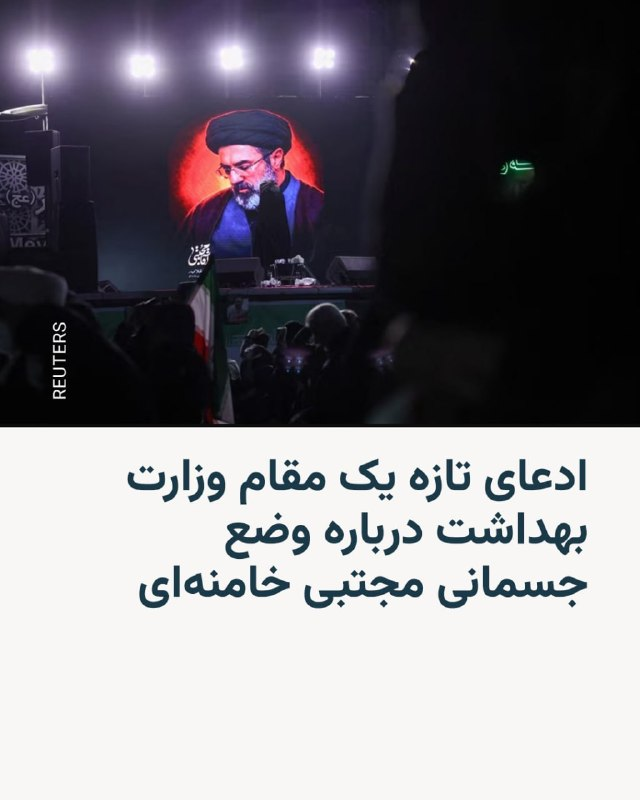

🔸مدیر مرکز روابط عمومی و اطلاع‌رسانی وزارت بهداشت جمهوری اسلامی روز دوشنبه ادعا کرد که در حمله اسرائیل به بیت خامنه‌ای «اتفاق خاصی» برای مجتبی خامنه‌ای نیفتاده است.

🔸در روز ۹ اسفندماه سال گذشته که حمله اسرائیل به بیت علی خامنه‌ای در مرکز تهران جان او و ده‌ها مقام ارشد حکومت را گرفت، مجتبی خامنه‌ای نیز در این محل حضور داشت و به‌شدت آسیب دید، اما به گفته حکومت زنده ماند.

🔸در بیش از دو ماه گذشته که نام او به عنوان رهبر سوم جمهوری اسلامی اعلام شد، نه فایلی صوتی از او منتشر شده و نه ویدئویی که تصویری تازه از او نشان دهد؛ این در حالی است که در و دیوار شهرها در کشور از عکس او پوشیده شده و حامیان حکومت گه‌گاه عکسی ساخته‌شده با هوش مصنوعی هم از او منتشر می‌کنند.

🔸با این همه خبرگزاری ایسنا به نقل از حسین کرمانپور نوشته است: «خوشبختانه اتفاق خاصی برای رهبر انقلاب نیفتاده بود. فردی که در محل چنین حادثه‌ای باشد، طبیعتا چندین زخم بر روی بدن خود خواهد داشت. این زخم‌ها نیز زخم‌هایی نبود که بخواهد چهره رهبر انقلاب را مخدوش کند یا اینکه همانند امام شهید ما جانبازی بگیرند یا قطع عضو داشته باشند.»

@RadioFarda

## RadioFarda — post 157313

  

🔸خبرگزاری رویترز روز دوشنبه، ۲۸ اردیبهشت، در گزارشی اختصاصی به نقل از سه مقام امنیتی و دو مقام دولتی که به نام‌شان اشاره نکرد خبر داد که پاکستان در عین میانجی‌گری میان ایران و‌ آمریکا، هزاران نیرو و تجهیزات نظامی به عربستان سعودی فرستاده است.

🔸خبر اعزام نیرو از پاکستان ماه گذشته منتشر شده، اما از جزئیات آن چیزی منتشر نشده بود.

🔸از زمان آغاز آتش‌بس میان ایران و آمریکا و پادرمیانی اسلام‌آباد برای رسیدن به صلح که بیش از یک ماه پیش برقرار شد، کارشناسان یکی از دلایل این اقدام پاکستان را پیمان دفاعی این کشور با عربستان سعودی عنوان کرده‌اند.

🔸بر اساس این پیمان، در صورت بالا گرفتن جنگ و حمله به عربستان سعودی توسط ایران، اسلام‌آباد مجبور خواهد بود به نفع ریاض در مقابل همسایه غربی خود یعنی ایران بایستد که می‌تواند برای خود پاکستان عواقبی سخت داشته باشد.

🔸حال در گزارش اختصاصی رویترز آمده است که اسلام‌آباد در عین تلاش برای برقرار کردن صلح میان تهران و واشینگتن، هشت هزار نفر نیروی نظامی، چند جت جنگنده و یک سامانه دفاع هوایی به عربستان اعزام کرده است.

@RadioFarda

## IranianMinds — post 20347

🔴 مقامات رژیم :

پالایشگاه و زیرساخت‌های پتروشیمی آسیب‌دیده در منطقه پارس جنوبی طی حدود دو سال بازسازی خواهند شد و انتظار می‌رود حدود نیمی از ظرفیت آن‌ها پیش از زمستان احیا شود.

مقام‌ها گفته‌اند این تأسیسات با فناوری ارتقایافته و ظرفیت تولید بالاتر دوباره به مدار بازخواهند گشت.

@IranianMunds

## IranianMinds — post 20346

🔴روزنامه ایران:

از وقتی اینترنت تو ایران قطع شده فروش سیمکارت عراقی زیاد شده؛
چون این سیمکارتا تا 2کیلومتری داخل ایران جواب میدن و مردم تو شهرهای مرزی با عراق میرن سیمکارت عراقی میخرن و میرن 2 کیلومتری مرز تا کارشونو انجام بدن.

@IranianMinds

## IranianMinds — post 20345

  <a href="telegram/content/IranianMinds_20345_1779120334.webm" target="_blank">🎬 Download video</a>

💥 با هر ثبت نام 
🅰️
🅰️
🅰️ هزار تومن جایزه بگیرید

✔️ میتونید شرط‌بندی کنید و بونوس را به موجودی واقعی تبدیل کنید

⚽️  پوشش کامل مسابقات ورزشی 

💯  پیش‌بینی با بهترین ضرایب 

⭐️ تجربه سریع و حرفه‌ای

💰پرداخت مستقیم و سریع بدون واسطه، بدون دردسر، واریز و برداشت در سریع‌ترین زمان ممکن

☑️ کانال تلگرام: 

➡️ @winro_io  

🎁 هدیه خود را با ثبت نام در سایت دریافت کنید: 

➡️ Winro.io
G28
سایت اصلی در روزهای آینده بازگشایی خواهد شد A
💎

## IranianMinds — post 20344

🔴 فوری - آکسیوس به نقل از مقامات آمریکایی:

آخرین پیشنهاد ایران توسط آمریکا رد شد.
این پیشنهاد حتی چیزی نزدیک به خواسته های آمریکا برای رسیدن به یک توافق نیست.

@IranianMinds

## IranianMinds — post 20343

🔴 فوری - یک مقام آمریکایی :

آمریکا مجبور است مذاکرات را از طریق بمب ها ادامه دهد

@IranianMinds

## IranianMinds — post 20342

  

🔴ترامپ:
«اگر ایران تسلیم شود، اعتراف کند که نیروی دریایی‌اش از بین رفته و در ته دریا است، و نیروی هوایی‌اش دیگر با ما نیست، و اگر کل ارتش‌شان از تهران خارج شود، سلاح‌ها را رها کرده و دست‌ها را بالا ببرند، هر کدام فریاد بزنند «من تسلیم می‌شوم، من تسلیم می‌شوم» در حالی که پرچم سفید نماینده را به شدت تکان می‌دهند، و اگر تمام رهبران باقی‌مانده‌شان همه «اسناد تسلیم» لازم را امضا کنند و شکست خود را در برابر قدرت و نیروی بزرگ و باشکوه ایالات متحده آمریکا بپذیرند، روزنامه‌های در حال سقوط نیویورک تایمز، وال استریت ژورنال چین (WSJ!)، سی‌ان‌ان فاسد و اکنون بی‌اهمیت، و همه اعضای دیگر رسانه‌های خبری جعلی، تیتر خواهند زد که ایران پیروزی استادانه و درخشانی بر ایالات متحده آمریکا داشته است، حتی نزدیک هم نبود. دموکرات‌ها و رسانه‌ها کاملاً راه خود را گم کرده‌اند. آنها کاملاً دیوانه شده‌اند!!!» رئیس‌جمهور دی‌جی‌تی

@IranianMinds

## IranianMinds — post 20341

🔴منبع آمریکایی به الجزیره:

صبر رئیس‌جمهور ترامپ به دلیل عدم پیشرفت در پرونده ایران، رو به پایان است.

@IranianMinds

## IranianMinds — post 20340

🔴رویترز:

پیشنهاد اصلاح شده تهران به آمریکا شامل:

۱- پایان دائمی جنگ.
۲- لغو تحریم‌ها.
۳- بازگشایی تنگه هرمز.
۴- آزاد‌سازی دارایی‌های بلوکه شده ایران.

گزارش‌ها حاکی است که ایران درباره برنامه هسته‌ای خود در مراحل بعدی مذاکرات گفت‌‌و‌گو خواهد کرد.

@IranianMinds

## IranianMinds — post 20339

🔴سناتور لیندسی گراهام:

من کاملأ اطمینان دارم که رئیس جمهور ترامپ به طور کامل، وضعیت مربوط به ایران را درک می‌کنه و دیگه عدم تمایل به مذاکره با حسن‌نیت، همراه با اقدامات تهاجمی و سرکشانه ایران در تنگه هرمز و سراسر منطقه را تحمل نخواهد کرد.

@IranianMinds

## IranianMinds — post 20336

  <a href="telegram/content/IranianMinds_20336_1779120335.mp4" target="_blank">🎬 Download video</a>

🔴 اسرائیل‌ همچنان داره لبنان رو‌ شخم میزنه

@IranianMinds

## IranianMinds — post 20335

  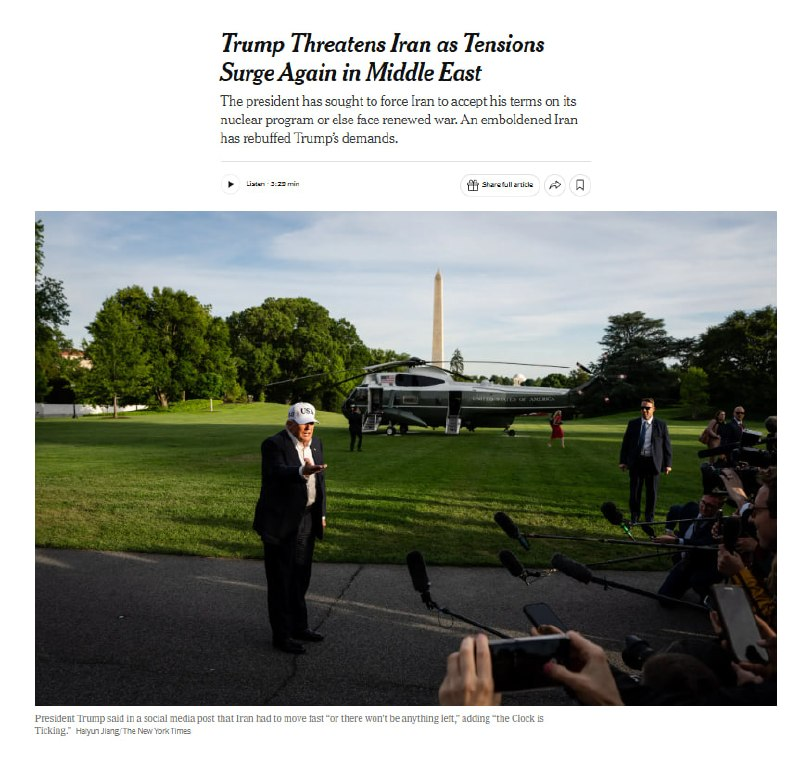

🔴 نیویورک تایمز:

آمریکا و اسرائیل در حال انجام شدیدترین آمادگی‌های خود از زمان آغاز آتش‌بس هستند، چرا که احتمال حملات مجدد به ایران حتی از همین هفته وجود دارد.

پنتاگون نیز خود را برای از سرگیری احتمالی «عملیات خشم‌ حماسی» آماده میکند.

@IranianMinds

## IranianMinds — post 20334

  <a href="telegram/content/IranianMinds_20334_1779120338.mp4" target="_blank">🎬 Download video</a>

🔴ناو‌شکن با صلابت و سرافراز به صورت عمودی غرق شد.
یادآوری😂😂😂

@IranianMinds

## IranianMinds — post 20333

  

🔴 ارتش اسرائیل :

امروز‌ فرمانده جهاد اسلامی فلسطین رو از بین بردیم.

@IranianMinds

## IranianMinds — post 20332

  

🔴 رویترز :

پاکستان در جریان جنگ ایران، طبق یک توافق پنهان دفاعی، ۸۰۰۰ نیرو، جنگنده، پهپاد و سیستم‌های دفاع هوایی به عربستان فرستاده است.

این نیروها شامل جنگنده‌های JF-17، سیستم‌های چینی HQ-9 و تجهیزات تحت عملیات پاکستان است که توسط ریاض تأمین مالی شده‌اند.

این استقرار آماده عملیات رزمی است و در صورت نیاز می‌تواند تا ۸۰,۰۰۰ نیرو گسترش یابد.

@IranianMinds

## IranianMinds — post 20331

🔴 خبرگزاری فوق معتبر تسنیم:

گفته میشه تو پیش‌نویس تازه مذاکرات، آمریکا موافقت کرده موقتا تحریم‌های نفتی ایران رو در طول مذاکرات برداره.

ایران می‌خواد همه تحریم‌ها کامل برداشته بشه، اما آمریکا فعلا فقط پیشنهاد معافیت موقت از تحریم‌های OFAC رو تا رسیدن به توافق نهایی داده

@IranianMinds

## BBCPersian — post 281384

یکی از این منابع گفت که پاکستان همچنین دو اسکادران پهپاد ارسال کرده است. هر پنج منبع به رویترز گفتند که ۸۰۰۰ سرباز در عربستان مستقر شدند و وعده داده شده است که در صورت نیاز تعداد بیشتری اعزام شود. به گفته این منابع، سیستم دفاع هوایی چینی اچ‌‌کیو-۹ هم به این کشور ارسال شده است.
بر اساس این گزارش، مسئولیت اداره تجهیزات بر عهده پرسنل پاکستانی است اما عربستان سعودی هزینه آن را می‌پردازد.
شهریور ماه گذشته، پاکستان و عربستان سعودی از امضای یک پیمان دفاعی خبر داده بودند که بر اساس آن، هرگونه تجاوز علیه هر یک از دو کشور به‌عنوان اقدامی خصمانه علیه هر دو تلقی می‌شود. در مقابل قرار شد که عربستان سعودی به پاکستان که یک قدرت هسته‌ای است، نفت ارزان و کمک مالی دهد.
افزایش همکاری نظامی پاکستان و عربستان در حالی است که اسلام‌آباد در جنگ آمریکا و اسرائیل با ایران نقش میانجی را بر عهده داشته است.

@BBCPersian

## BBCPersian — post 281383

  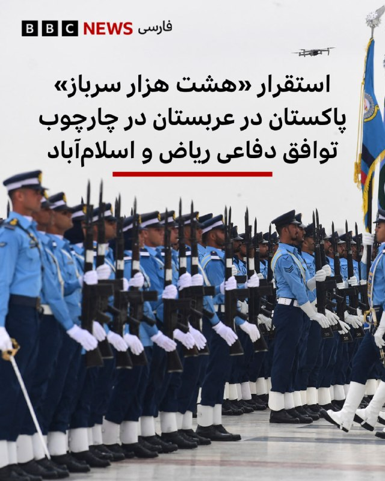

🔻خبرگزاری رویترز به نقل از دو منبع می‌گوید که پاکستان در چارچوب پیمان دفاعی خود با ریاض، ۸۰۰۰ نیرو،‌ یک اسکادران هواپیمای جنگی و یک سامانه پدافند هوایی در عربستان مستقر کرده است.

پیشتر وزارت دفاع عربستان بدون اشاره به جزئیات، استقرار شماری جنگنده و نیروی پاکستان در چارچوب توافق دو کشور را اعلام کرده بود اما حالا رویترز برای اولین بار جزییات بیشتری ارائه کرده است.

رویترز در گزارش اختصاصی خود، از سه مقام امنیتی و دو منبع دولتی نقل کرده است که نیروی مستقر شده دارای قابلیت رزمی است و هدف از اعزام آن، دفاع از عربستان در صورت حملات بیشتر به آن کشور است.

رویترز می‌گوید که وزارت خارجه و دفتر مطبوعاتی ارتش پاکستان و دفتر رسانه‌ای دولت عربستان سعودی به درخواست این خبرگزاری برای اظهارنظر پاسخی ندادند.

به گفته این منابع، هواپیماهای جنگی شامل حدود ۱۶ هواپیماست که عمدتا از جنگنده‌های «جی‌اف-۱۷» است که مشترکا با چین ساخته شده‌اند؛ این هواپیماها اوایل ماه آویل به پاکستان فرستاده شده بودند.

📷 AFP via Getty Images
https://bbc.in/49G1IjH
@BBCPersian

## BBCPersian — post 281382

🔻ایران: طرح خاصی درباره پیمان عدم تعرض از کشورهای منطقه دریافت نکردیم
ایران گزارش‌های اخیر درباره پیشنهاد عربستان سعودی برای امضای توافق منع تعرض را تکذیب کرد.

اسماعیل بقایی، سخنگوی وزارت خارجه ایران، در پاسخ به سوالی در این باره گفت: «نمی‌توانم بگویم طرح خاصی مطرح شده است.»

در روزهای اخیر گزارش‌هایی، از جمله در روزنامه آمریکایی وال‌استریت جورنال، منتشر شده بود که می‌گفت عربستان سعودی پیشنهاد امضای یک پیمان عدم تعرض بین ایران و کشورهای منطقه را مطرح کرده است.

ایران در جنگ با اسرائیل و آمریکا که نهم اسفند (۲۸ فوریه) آغاز شد، برخی اهداف در کشورهای منطقه را با موشک و پهپاد هدف قرار داد.

https://bbc.in/3R7PVV9
@BBCPersian

## BBCPersian — post 281381

  

🔻‌روسیه و بلاروس امروز رزمایش مشترک هسته‌ای برگزار کردند. به گفته وزارت دفاع بلاروس، در رزمایش امروز «تحویل مهمات هسته‌ای و آماده‌سازی برای استفاده از آن» تمرین می‌شود.

این وزارتخانه تاکید کرد که این آموزش از پیش برنامه‌ریزی شده است و «علیه کشورهای ثالث نیست و تهدیدی برای امنیت منطقه محسوب نمی‌شود.» نیروی هوایی و یگان‌های موشکی در این رزمایش شرکت داشتند.

این اولین رزمایش هسته‌ای مشترک دو کشور نیست؛ در دو سال گذشته دو کشور هر سال یک رزمایش هسته‌ای مشترک داشته‌اند.

روسیه سال گذشته موشک «اورشنیک»، جدیدترین موشک هایپرسونیک با قابلیت حمل کلاهک هسته‌‌ای، را در بلاروس مستقر کرد و تنش با ائتلاف کشورهای غربی را وارد مرحله‌ای حساس‌تر کرد.

وزارت دفاع بلاروس امروز گفت: «در جریان این رزمایش، برنامه‌ریزی این است که موضوعات مربوط به تحویل مهمات هسته‌ای و آماده‌سازی برای استفاده از آنها در همکاری با طرف روسی تمرین شود.»

ادامه خبر را از لینک زیر در وبسایت بی‌بی‌سی فارسی بخوانید.

شرح تصویر: عکسی که ارتش روسیه از رزمایش مشترک با بلاروس در سال ۲۰۲۴ منتشر کرد
📷 Russian Defense Ministry
https://bbc.in/4uSiQLf
@BBCPersian

## BBCPersian — post 281380

  <a href="telegram/content/BBCPersian_281380_1779120345.mp4" target="_blank">🎬 Download video</a>

🔻سرخط خبرهای دوشنبه ۲۸ اردیبهشت ۱۴۰۵
@BBCPersian

## BBCPersian — post 281379

🔻آژانس بین‌المللی انرژی در مورد کاهش سریع ذخایر تجاری نفت در جهان هشدار داد. فاتح بیرول، رئیس آژانس بین‌المللی انرژی، گفت که علی‌رغم آزاد شدن بخشی از ذخایر نفت استراتژیک دولت‌ها در سراسر جهان، ذخایر تجاری به‌دلیل اختلال در عرضه نفت در خلیج فارس، «بسیار سریع»…

## BBCPersian — post 281378

  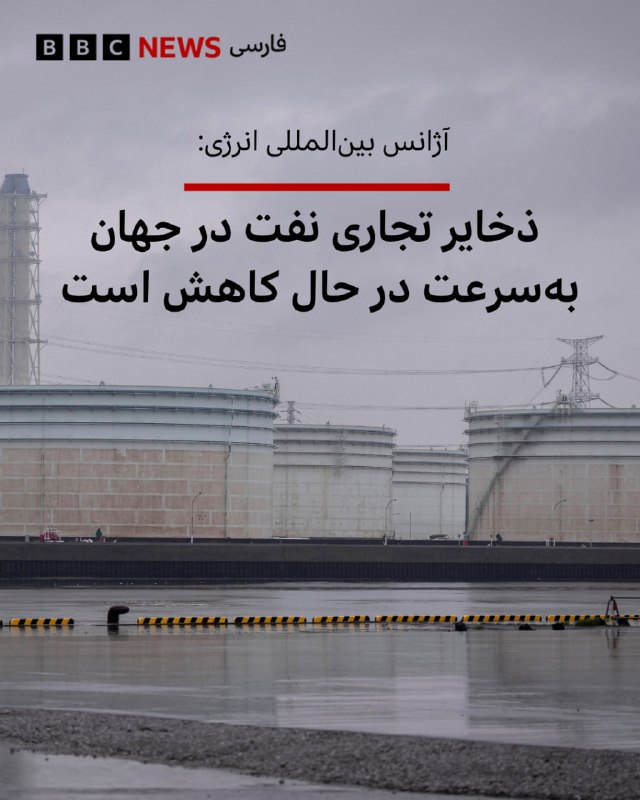

🔻آژانس بین‌المللی انرژی در مورد کاهش سریع ذخایر تجاری نفت در جهان هشدار داد.

فاتح بیرول، رئیس آژانس بین‌المللی انرژی، گفت که علی‌رغم آزاد شدن بخشی از ذخایر نفت استراتژیک دولت‌ها در سراسر جهان، ذخایر تجاری به‌دلیل اختلال در عرضه نفت در خلیج فارس، «بسیار سریع» در حال کاهش است.

با نزدیک شدن به فصل سفرهای تابستانی در نیمکره شمالی، نگرانی‌ درباره کمبود سوخت افزایش یافته است.

خطوط هوایی هشدار داده‌اند که در صورت تداوم اختلالات عرضه، در هفته‌های آینده با کمبود سوخت جت مواجه خواهند شد.

آقای بیرول هنگام ورود به نشست وزرای دارایی گروه هفت (جی-۷) در پاریس به خبرنگاران گفت: «موجودی‌های تجاری در حال کاهش است... فکر می‌کنم اکنون خیلی سریع در حال اتمام است.»

او گفت: «ما هنوز چند هفته فرصت داریم، اما باید از این واقعیت آگاه باشیم که ذخایر به‌سرعت در حال کاهش است.»

📷 AFP via Getty Images
https://bbc.in/4tJk5LV
@BBCPersian

## BBCPersian — post 281377

🔻فلج شدن حمل‌و‌نقل در کنیا، در پی اعتصاب به دلیل گرانی سوخت
اعتصاب کارکنان شبکه حمل‌و‌نقل کنیا در اعتراض به افزایش اخیر قیمت سوخت، باعث سرگردانی هزاران مسافر در این کشور شده است.

با ادامه بحران تنگه هرمز و گران شدن نفت، قیمت بنزین اخیرا در کنیا بیش از ۲۰ درصد افزایش یافته است.

اعتصاب امروز باعث خالی شدن خیابان‌های منتهی به نایروبی، پایتخت، شده و بسیاری از مردم ناچار شده‌‌اند با پای پیاده سر کار بروند؛ برخی از مغازه‌ها و کسبه هم کار خود را تعطیل کرده‌اند و مدارس از دانش‌آموزان خواسته‌اند که در خانه بمانند.

کنیا هم مانند بسیاری از کشورهای آفریقایی دیگر برای تامین سوخت خود به شدت به واردات از خلیج فارس وابسته است. اما جنگ آمریکا و اسرائیل با ایران و محدود شدن رفت‌و‌آمد در تنگه هرمز، این کشورها را با چالش مواجه کرده است.

https://bbc.in/4dOLHua
@BBCPersian

## BBCPersian — post 281376

🔻گزارش سالانه عفو بین‌الملل نشان می‌دهد که اعدام در سال ۲۰۲۵ به رقم بی‌سابقه‌ای رسیده است. بنابر این گزارش، این سازمان در سال گذشته میلادی ۲۷۰۷ مورد اعدام در ۱۷ کشور را ثبت کرده است که بالاترین رقم از سال ۱۹۸۱ است که عفو بین‌الملل ثبت آمار اعدام را آغاز کرد.…

## BBCPersian — post 281375

  

🔻گزارش سالانه عفو بین‌الملل نشان می‌دهد که اعدام در سال ۲۰۲۵ به رقم بی‌سابقه‌ای رسیده است.

بنابر این گزارش، این سازمان در سال گذشته میلادی ۲۷۰۷ مورد اعدام در ۱۷ کشور را ثبت کرده است که بالاترین رقم از سال ۱۹۸۱ است که عفو بین‌الملل ثبت آمار اعدام را آغاز کرد.

بنا بر آخرین گزارش عفو بین‌الملل، این افزایش چشمگیر به‌دلیل چند دولتی بوده است که می‌خواهند «از طریق ارعاب» حکومت کنند: «مقام‌های ایران عامل اصلی این جهش بودند که دست‌کم ۲۱۵۹ نفر را اعدام کردند، بیش از دو برابر آمار سال ۲۰۲۴.»

گزارش عفو بین‌الملل به چند کشور دیگر هم می‌پردازد: «عربستان سعودی شمار اعدام‌ را به دست‌کم ۳۵۶ مورد رساند، از مجازات اعدام برای جرایم مرتبط با مواد مخدر استفاده فراوانی کرد. تعداد اعدام‌ها در کویت تقریبا سه برابر شد (از ۶ به ۱۷)، و تقریبا دو برابر در مصر (از ۱۳ به ۲۳)، سنگاپور (از ۹ به ۱۷) و ایالات متحده آمریکا (از ۲۵ به ۴۷).

ادامه خبر را از لینک زیر در وبسایت بی‌بی‌سی فارسی بخوانید.

📷 NurPhoto via Getty Images
https://bbc.in/4ulEtDY
@BBCPersian

## idfinfarsi — post 11595

  <a href="telegram/content/idfinfarsi_11595_1779120349.mp4" target="_blank">🎬 Download video</a>

‼️مستند از انهدام انبار سلاح‌های ضدزره سازمان تروریستی حزب‌الله: نیروهای تیپ ۷۶۹ زیرساخت‌های تروریستی را منهدم کرده و تسلیحات را کشف کردند

⭕️نیروهای تیپ ۷۶۹ تحت فرماندهی لشکر ۹۱، به عملیات خود در جنوب خط دفاعی مقدم با هدف رفع تهدیدها علیه شهروندان کشور اسرائیل ادامه می‌دهند.

⭕️این نیروها با پشتیبانی نیروی هوایی، در یک واکنش عملیاتی سریع، یک انبار سلاح‌های ضدزره را که توسط سازمان تروریستی حزب‌الله علیه نیروهای فعال در منطقه مورد استفاده قرار می‌گرفت، منهدم کردند.

⭕️در یک عملیات دیگر در منطقه روستای الخیام، نیروها انبارهای تسلیحاتی و مراکز استقرار سازمان تروریستی حزب‌الله را منهدم کرده و مقادیری سلاح از جمله پرتابگرهای ضدزره، مواد منفجره و سلاح‌های سبک را کشف کردند.

## idfinfarsi — post 11594

  

❌در یک حمله دقیق در بعلبک: ارتش اسرائیل فرمانده جهاد اسلامی فلسطین در منطقه بقاع لبنان را به هلاکت رساند

‼️ارتش اسرائیل در‌طول شب (یکشنبه) در منطقه بعلبک حمله کرده و وائل محمود عبدالحلیم، فرمانده جهاد اسلامی فلسطین در منطقه بقاع لبنان را به هلاکت رساند.

⭕️عبدالحلیم رهبری پیوستن تروریست‌های سازمان تروریستی جهاد اسلامی فلسطین به نبرد در کنار تروریست‌های سازمان تروریستی حزب‌الله در لبنان را بر عهده داشت و در دوره اخیر برای پیشبرد طرح‌های تروریستی علیه نیروهای ارتش اسرائیل فعالیت می‌کرد.

## Dirty_Kids — post 389686

🔴 باراک راوید خبرنگار ارشد آکسیوس | axios:

یه مقام ارشد آمریکایی به من گفته که پیشنهاد جدید ایران به آمریکا کافی نیست و خطر شروع دوباره‌ی جنگ رو به همراه داره.

اگر جمهوری اسلامی موضع خودشو تغییر نده، آمریکا مجبوره مذاکرات رو از طریق بمب ادامه بده.

@Dirty_Kids 👻

## Dirty_Kids — post 389685

  

🔴 پست جدید شیر کارد به استخوان رسیده‌ی خدا در تروث‌سوشال در خصوص فیک‌نیوزهایی که کله‌ی شیر خدا رو کیری می‌کنن:

«حتی اگه رژیم شیعه‌سانان پدرخراب رافضی تسلیم شن و اعتراف کنن که نیروی دریایی‌‌شون [یا خدا شروع کرد خاطره گفتن] نابود شده و کف دریا جا خوش کرده، و بگه که نیروی هوایی‌‌شون دیگه وجود خارجی نداره و اگه تمام ارتش‌شون سلاح‌ها رو زمین بذارن و دست‌ها رو بالا ببرند، در حالی که پرچم سفید تسلیم رو به شدت تکون می‌دن و همگی ضجه‌بزنن «ما پدرخرابا تسلیمم، ما پدرقحبه‌ها تسلیمم» و از تهران بیرون برن؛

و اگه تمام رهبران مادرخراب باقی‌مانده‌شون پای تمام اسناد تسلیم رو امضا کنند و شکست‌شون رو در برابر قدرت عظیم و ارتش باشکوه ایالات متحده آمریکا بپذیرند،

باز هم روزنامه‌ی ورشکسته نیویورک تایمز و چاینا استریت ژورنال[ وال استریت ژورنال] و شبکه‌ی فاسد و الان دیگه مسشر سی‌ان‌ان و بقیه‌ی اعضای رسانه‌های دروغ‌پرداز، تیتر خواهند زد: رژیم قحبه‌ی روافض به یک پیروزی مقتدرانه و درخشان در برابر ایالات متحده آمریکا دست پیدا کرد و آمریکا حتی به گرد پاشونم هم نرسید».

دموکرات‌های قرمساق احمق و رسانه‌های قرمدنگ‌شون کاملاً مسیرشون رو گم کردن.

این پدرقحبه‌ها رسماً کسخل و دیوونه شدن.

رئيس‌جمهور دی‌جی‌تی، یل کارد به استخوان رسیده‌ی خاک‌سفید»

@Dirty_Kids 👻

## Dirty_Kids — post 389684

  <a href="telegram/content/Dirty_Kids_389684_1779120352.mp4" target="_blank">🎬 Download video</a>

احمد ایران‌دوست، بازیگر:
«مشروب می‌خورم، کلاب می‌رم، اون‌ور که هستم با شهناز تهرانی می‌رقصم، این‌ور که میام دست‌بوس حاج قاسم‌ام، نمی‌خوره بهم؟»

+ با همین فرمون جلو برن تو صداسیما خودشون شعار میدن #جاویدشاه

@Dirty_Kids 👻

## Dirty_Kids — post 389683

  <a href="telegram/content/Dirty_Kids_389683_1779120355.mp4" target="_blank">🎬 Download video</a>

جمهوری‌اسهالی مثل سگ از حمله زمینی ارتش آمریکا ترسیده و داره تو مساجد به حکومتی‌ها آموزش کار با اسلحه رو آموزش میده!

+ اینا اولین سرباز آمریکایی رو ببینن میرینن به خودشون و فرار میکنن😂😂

@Dirty_Kids 👻

## Dirty_Kids — post 389680

  

یک ن‍ــــــــه بزرگ به کیف.

@Dirty_Kids 👻

## Dirty_Kids — post 389679

  <a href="telegram/content/Dirty_Kids_389679_1779120358.mp4" target="_blank">🎬 Download video</a>

توقعی که از ایرانیای امریکا دارم

این تیم بی‌غیرتان سپاه رو اینجوری ادب نکنید و براشون جهنم نسازید، خیلی ازتون ناامید میشم

@Dirty_Kids 👻

## Dirty_Kids — post 389678

  <a href="telegram/content/Dirty_Kids_389678_1779120361.mp4" target="_blank">🎬 Download video</a>

یه فمبویِ مشهدی رفته حرم؛

اونجا هرکی از راه می‌رسه میگه شما چرا چادر نداری؟ اینم میگه بابا بخدا من پسرم...

@Dirty_Kids 👻

## Dirty_Kids — post 389677

  <a href="telegram/content/Dirty_Kids_389677_1779120363.mp4" target="_blank">🎬 Download video</a>

این خبرو این وسط خوندم خیلی خندیدم گفتم شماهم ببینید روحیه‌تون عوض شه:
تو ترکیه یه دستگاه گذاشتن به گربه ها غذا میده اتوماتیک با صدای میو کردن گربه؛ بعد این مرغ دریاییای پدرسوخته یادگرفتن میرن جلوش میو میو میکنن غذا بگیرن :)))

@Dirty_Kids 👻

## Dirty_Kids — post 389675

جورجینا (زن رونالدو) بلوند کرده

@Dirty_Kids 👻

## Dirty_Kids — post 389674

  <a href="telegram/content/Dirty_Kids_389674_1779120365.mp4" target="_blank">🎬 Download video</a>

نه داداش ببین...

@Dirty_Kids 👻

## Dirty_Kids — post 389673

  

از راست به چپ به ترتیب:
گلشیفته، نرگس محمدی، مصی علینژاد و لیلی بازرگان اگه رضاشاهِ اول نبود.

@Dirty_Kids 👻

## Hranews — post 113017

  

با حکم دادگاه تجدیدنظر استان آذربایجان شرقی؛ ۱۳ شهروند به حبس محکوم شدند

❗️
❗️
❗️
❗️
❗️– با حکم دادگاه تجدیدنظر استان آذربایجان شرقی، یوروش مهرعلی بیگلو، حامد یگانه‌پور، ابراهیم عوض‌زاده، آراز ابراهیم‌نژاد، حسین آزادی، امیرحسین آقایی، ناصر رزمجو، داوود شیری، جواد سودبر، مهرداد قادری، علی بابایی، مرتضی نورمحمدی و محمدرضا موحد، فعالان ترک (آذربایجانی)، مجموعا به ۸۱ سال و پنج ماه حبس محکوم شدند.

به گزارش خبرگزاری هرانا، ارگان خبری مجموعه فعالان حقوق بشر در ایران، رأی دادگاه تجدیدنظر استان آذربایجان شرقی به وکیل مدافع متهمان ابلاغ شده است.

این حکم روز شنبه ۲۶ اردیبهشت ماه توسط #دادگاه_تجدیدنظر استان آذربایجان شرقی، به وکیل این افراد ابلاغ شده است. طبق رای صادره، این افراد مجموعا به ۸۱ سال و پنج ماه حبس محکوم شدند.
شرح عناوین اتهامی هر یک از متهمان به همراه میزان محکومیت قطعی صادره به شرح زیر است:

ادامه مطلب

↘️
@hranews_bot تماس ✉️ -  @Hranews  کانال هرانا 🆑

## Hranews — post 113016

  

سخنگوی سازمان غذا و دارو اعلام کرد که زنجیره تامین مواد اولیه و واردات #دارو به کشور دچار اختلال شده است. به گفته محمد هاشمی، با توجه به اختلال در مسیرهای معمول تامین نهاده‌های دارویی، فعال‌سازی کریدورهای زمینی و ریلی منطقه‌ای در دستور کار سازمان غذا و دارو، وزارت راه و شهرسازی و دیگر دستگاه‌های ذی‌ربط قرار گرفته است.

↘️
@hranews_bot تماس ✉️ -  @Hranews  کانال هرانا 🆑

## Hranews — post 113015

خبرگزاری هرانا pinned a photo

## Hranews — post 113014

  

میان موشک و سرکوب؛ گزارش مجموعه فعالان حقوق بشر درباره مخاصمه نظامی ایالات متحده-اسرائیل و ایران منتشر شد

💥
💥
💥
💥
💥 – امروز، مجموعه فعالان حقوق بشر در ایران گزارش جدیدی را در ۲۴۰ صفحه و دو زبان منتشر کرد که به بررسی کارزار نظامی ایالات متحده و اسرائیل در ایران در فاصله ۹ اسفند ۱۴۰۴ تا ۱۹ فروردین ۱۴۰۵ (۲۸ فوریه تا ۸ آوریل ۲۰۲۶) می‌پردازد.

این گزارش بر پایه ۱۷۷ منبع تأییدشده ــ شامل گزارش‌های منابع آزاد و شبکه میدانی مجموعه فعالان حقوق بشر در داخل کشور ــ ۶٬۳۲۴ رویداد منحصربه‌فرد شامل ۱۲٬۷۹۸ حمله مجزا را مستندسازی کرده است.
مجموعه فعالان تاکید کرد این گزارش با هدف ارائه روایت جامع از کل درگیری تهیه نشده است. یافته‌های آن صرفاً به رویدادهایی محدود می‌شود که در داده‌های این نهاد مستندسازی و راستی‌آزمایی شده‌اند.

📊 یافته‌های کلیدی گزارش
◾️ ثبت ۶٬۳۲۴ رویداد منحصربه‌فرد و ۱۲٬۷۹۸ حمله مجزا
◾️ ۷۷ درصد رویدادها شامل آسیب به غیرنظامیان یا اماکن غیرنظامی
◾️ ثبت دست‌کم ۳٬۶۳۶ مورد مرگ، از جمله ۱٬۷۰۱ غیرنظامی
◾️ کشته شدن ۳۰۷ کودک و زخمی شدن ۲٬۲۱۳ کودک
◾️ تمرکز ۴۴٫۸۵ درصدی رویدادها در استان تهران
◾️ هدف قرار گرفتن یا آسیب دیدن مدارس، مراکز درمانی، مراکز فرهنگی و زیرساخت‌های حیاتی

⚠️ الگوهای نگران‌کننده
این گزارش چندین الگوی نگران‌کننده را برجسته می‌کند، از جمله:
◾️ ضعف در راستی‌آزمایی اهداف
◾️ استفاده محدود از نظارت انسانی در برخی فناوری‌های هدف‌گیری
◾️ هشدارهای ناکافی پیش از حملات
◾️ استفاده از تسلیحات انفجاری سنگین در مناطق پرجمعیت
◾️ حملات تکراری به برخی مناطق غیرنظامی
◾️ آسیب گسترده به زیرساخت‌های غیرنظامی

🚨 این گزارش همچنین به بازداشت گسترده شهروندان در ایران اشاره دارد؛ دست‌کم ۴٬۰۲۳ نفر با اتهامات مرتبط با امنیت ملی یا جنگ بازداشت شده‌اند.

از سوی دیگر تشدید محدودیت‌های امنیتی، گسترش ایست‌های بازرسی و محدودیت‌های گسترده اینترنت از دیگر پیامدهای مستندسازی‌شده عنوان شده است.

در همین بازه زمانی، ۵۰ مورد اعدام ثبت شده که ۳۲ مورد آن با اتهامات سیاسی و امنیتی مرتبط بوده است.

📎 ادامه گزارش به زبان فارسی

📎 دانلود مستقیم فایل پی دی اف گزارش از تلگرام

📎 Complete report in English

📎Direct download of the English PDF

↘️
@hranews_bot تماس ✉️ - @Hranews کانال هرانا 🆑

## Hranews — post 113013

دستکم ۳۲ نفر با اتهامات امنیتی در چند استان بازداشت شدند

❗️
❗️
❗️
❗️
❗️– سازمان اطلاعات سپاه از #بازداشت دستکم ۳۲ تن در استان‌های قزوین، کرمان و چهارمحال و بختیاری خبر داد. این نهاد، اتهامات مطرح‌ شده علیه این افراد را «جاسوسی، ارتباط با گروه‌های مخالف نظام، اقدامات تروریستی و خرابکارانه» عنوان کرده است.

ادامه مطلب

↘️
@hranews_bot تماس ✉️ -  @Hranews  کانال هرانا 🆑

## manototv — post 105601

  <a href="telegram/content/manototv_105601_1779120369.mp4" target="_blank">🎬 Download video</a>

تماسی از ایران:
«خانواده‌های بچه‌های دربند رو برای کمک‌رساندن دریابیم»

## manototv — post 105600

  <a href="telegram/content/manototv_105600_1779120372.mp4" target="_blank">🎬 Download video</a>

عفو بین‌الملل اعلام کرد شمار اعدام‌ها در جهان در سال ۲۰۲۵ به بالاترین سطح ثبت‌شده در ۴۴ سال گذشته رسیده و ایران با ثبت دست‌کم ۲۱۵۹ اعدام، عامل اصلی این افزایش بوده است.

بر اساس گزارش سالانه این سازمان، در مجموع دست‌کم ۲۷۰۷ نفر در ۱۷ کشور اعدام شده‌اند؛ آماری که نسبت به سال ۲۰۲۴ حدود ۷۸ درصد افزایش نشان می‌دهد.

عفو بین‌الملل اعلام کرد شمار اعدام‌ها در ایران بیش از دو برابر سال گذشته شده و ایران پس از چین، که آمار رسمی اعدام‌هایش منتشر نمی‌شود، در صدر کشورهای مجری اعدام قرار دارد.

در این گزارش آمده است عربستان سعودی با دست‌کم ۳۵۶ اعدام در رتبه بعدی قرار گرفته و بخش قابل توجهی از این احکام به جرایم مرتبط با مواد مخدر مربوط بوده است.

بر اساس این گزارش، آمریکا نیز شمار اعدام‌های خود را از ۲۵ مورد در سال ۲۰۲۴ به ۴۷ مورد در سال ۲۰۲۵ افزایش داده است. شمار اعدام‌ها در مصر، سنگاپور و کویت نیز نسبت به سال قبل افزایش یافته است.

عفو بین‌الملل همچنین اعلام کرد چین، مصر، جمهوری اسلامی، عراق، کره شمالی، عربستان سعودی، سومالی، آمریکا، ویتنام و یمن در پنج سال گذشته به‌طور مداوم اعدام انجام داده‌اند.

## manototv — post 105599

  <a href="telegram/content/manototv_105599_1779120374.mp4" target="_blank">🎬 Download video</a>

با تهدید «حق تیر داریم» مانع برگزاری مراسم زادروز بهار شاه‌مهری شدند

بر اساس ویدیوی ارسالی به منوتو، نیروهای حکومتی با تهدید خانواده بهار شاه‌مهری و گفتن جمله «ما حق تیر داریم»، اجازه برگزاری مراسم زادروز این جاویدنام را در ۱۹ اردیبهشت ندادند.

بهار شاه‌مهری، نوجوان ۱۷ ساله اهل نیشابور، غروب ۱۹ دی‌ماه ۱۴۰۴ در جریان انقلاب شیر و خورشید ایران، در کوچه‌ای خلوت از پشت سر هدف شلیک مستقیم تک‌تیرانداز نیروهای سرکوبگر جمهوری اسلامی قرار گرفت و جان باخت.

به گفته نزدیکان او، چند روز پیش از سالروز تولد بهار، اعضای خانواده‌اش بازداشت و بازجویی شدند و مسیرهای منتهی به مزار او در روز تولدش بسته شد تا از برگزاری مراسم جلوگیری شود.

همچنین گزارش شده است که سنگ مزار بهار شاه‌مهری روز دوم فروردین ۱۴۰۶ شکسته شده بود.
این فشارها بخشی از روند گسترده‌تر سرکوب خانواده‌های جان‌باختگان است؛ حتی بعد از کشتن، از گل گذاشتن و تولد گرفتن هم می‌ترسند. عجب شجاعتی، حکومت با سنگ قبر می‌جنگد.

## manototv — post 105598

  <a href="telegram/content/manototv_105598_1779120376.mp4" target="_blank">🎬 Download video</a>

دونالد ترامپ، رئیس‌جمهوری آمریکا، در پیامی در تروث‌سوشال ، رسانه‌های آمریکایی را متهم کرد که حتی در صورت «تسلیم کامل ایران» نیز آن را به‌عنوان پیروزی توصیف خواهند کرد.

ترامپ در این پیام نوشت اگر جمهوری اسلامی شکست خود را بپذیرد، نیروهای نظامی‌اش تسلیم شوند و رهبرانش «اسناد تسلیم» را امضا کنند، باز هم رسانه‌هایی چون نیویورک‌تایمز، وال‌استریت ژورنال و سی‌ان‌ان این اتفاق را «پیروزی ایران» جلوه خواهند داد.

او با اشاره به نابودی نیروی دریایی و نیروی هوایی ایران نوشت: «اگر ایران تسلیم شود، بپذیرد که نیروی دریایی‌اش در کف دریا نابود شده و نیروی هوایی‌اش دیگر وجود ندارد، و اگر نیروهای نظامی‌اش با دست‌های بالا و پرچم سفید از تهران خارج شوند، باز هم رسانه‌های فیک‌نیوز خواهند گفت ایران پیروزی درخشانی مقابل آمریکا به دست آورده است.»

ترامپ همچنین رسانه‌های جریان اصلی آمریکا را «فاسد» و «بی‌اهمیت» توصیف کرد و نوشت: «دموکرات‌ها و رسانه‌ها کاملا راه خود را گم کرده‌اند. آن‌ها کاملا دیوانه شده‌اند.»

## manototv — post 105597

  

ارتش اسرائیل می‌گوید در حمله‌ای هوایی به منطقه بعلبک در شرق لبنان، وائل محمود عبدالحلیم، فرمانده جهاد اسلامی در منطقه بقاع، کشته شده است. به گفته ارتش اسرائیل، او در هماهنگی عملیات‌های جهاد اسلامی در کنار حزب‌الله لبنان نقش داشته است.

## manototv — post 105596

  <a href="telegram/content/manototv_105596_1779120378.mp4" target="_blank">🎬 Download video</a>

رویترز در گزارشی اختصاصی نوشت پاکستان در جریان جنگ ایران، هشت هزار نیرو، یک اسکادران جنگنده و یک سامانه پدافند هوایی به عربستان سعودی اعزام کرده است.

بر اساس این گزارش، این اعزام در چارچوب پیمان دفاعی دوجانبه اسلام‌آباد و ریاض انجام شده و شامل حدود ۱۶ جنگنده، عمدتا از نوع جی‌اف‌ـ۱۷ ساخت مشترک پاکستان و چین، دو اسکادران پهپاد و سامانه پدافند هوایی چینی اچ‌کیو‌ـ۹ است. منابع رویترز گفتند عربستان هزینه این اعزام را تامین می‌کند و تجهیزات را نیروهای پاکستانی اداره می‌کنند.

پنج منبع امنیتی و دولتی به رویترز گفتند این نیروها با هدف حمایت از ارتش عربستان در صورت حملات بیشتر به این کشور مستقر شده‌اند.

## manototv — post 105595

  <a href="telegram/content/manototv_105595_1779120379.mp4" target="_blank">🎬 Download video</a>

رسانه‌های ترکیه گزارش دادند فرخنده قائم‌مقامی، زن ایرانی ساکن منطقه مال‌تپه استانبول، پس از قتل، جسدش در استان قرشهر پیدا شده است.

بر اساس گزارش خبرگزاری «دمیراورن»، خانم قائم‌مقامی از ۲۲ فروردین ناپدید شده بود و نزدیکان او پس از بی‌خبری، در ۲۳ اردیبهشت گزارش مفقودی ثبت کردند.

پلیس ترکیه در تحقیقات خود «ارکان ب»، ۴۹ ساله، را به‌عنوان آخرین فردی شناسایی کرد که با این زن ایرانی در تماس بوده است. بنا بر این گزارش، او ابتدا اتهام‌ها را رد کرد، اما بعدا به قتل اعتراف کرد.

دمیراورن نوشت مظنون در اعترافات خود گفته است پس از مشاجره در خودرو، قائم‌مقامی را با قلاده سگش خفه کرده، جسد او را تکه‌تکه کرده و در زمینی خالی در شهرستان موجور استان قرشهر رها کرده است.

در ادامه تحقیقات، دو مظنون دیگر نیز بازداشت شدند. سه مظنون این پرونده پس از پایان بازجویی در اداره پلیس، به دادگاه منتقل شدند.

## manototv — post 105594

  <a href="telegram/content/manototv_105594_1779120379.mp4" target="_blank">🎬 Download video</a>

بر اساس گزارش رسانه‌های حقوق بشری، نیروهای حکومتی روز ۱۵ اردیبهشت با یورش به خانه «افسانه جذابی (راسخی)»، شهروند بهائی ساکن شیراز، منزل او را تفتیش کردند و بخشی از اموال شخصی او را با خود بردند.

در این گزارش‌ها آمده است یک زن و سه مرد با ارائه حکمی با عنوان «همکاری با اسرائیل» وارد خانه این خانواده شدند و خانم جذابی و مادر ۸۵ ساله او را مورد تهدید و تحقیر قرار دادند. خانم جذابی به‌تازگی همسر خود را از دست داده و از مادر سالخورده و بیمار خود مراقبت می‌کند.

به گفته این رسانه‌ها، ماموران حکومتی به او گفتند فرزندش در خارج از کشور در فضای مجازی و کمپین‌های حقوق بشری فعالیت می‌کند و تهدید کردند در صورت ادامه این فعالیت‌ها، «هم برای شما و هم برای آنها گران تمام می‌شود.» آنها همچنین این خانواده را به مصادره خانه تهدید کردند.

بر اساس این گزارش‌ها، نیروهای امنیتی همچنین این خانواده را با عباراتی مانند «فرقه» و «همدست اسرائیل» خطاب کردند و چند بار خانم جذابی را به دستبند زدن و انتقال به مکانی نامعلوم تهدید کردند.

این یورش چند ساعت ادامه داشت و در پایان، خانم جذابی و مادر سالخورده‌اش که دچار افت فشار خون شده بود، مجبور شدند برگه‌ای را امضا کنند که در آن نوشته شده بود هیچ خسارتی به خانه و وسایل وارد نشده است. در این رویداد هیچ‌یک از اعضای خانواده بازداشت نشدند.

## manototv — post 105593

  <a href="telegram/content/manototv_105593_1779120381.mp4" target="_blank">🎬 Download video</a>

روزنامه ایران وابسته به دولت جمهوری اسلامی در گزارشی نوشت محدودیت دسترسی به اینترنت بین‌الملل، بازار خرید و فروش سیم‌کارت‌های عراقی را در برخی مناطق مرزی غرب ایران رونق داده است.

بر اساس این گزارش، بیشترین متقاضیان این سیم‌کارت‌ها تجار، بازرگانان، صاحبان بار، رانندگان ترانزیتی و فعالان اقتصادی مرزی هستند که برای ارتباط با طرف‌های عراقی، ارسال اسناد، حواله‌های مالی، رسیدها، عکس و فیلم کالاها از پیام‌رسان‌هایی مانند واتس‌اپ و تلگرام استفاده می‌کنند.

نعیم احمدی، مدیر روابط عمومی استانداری خوزستان، به این روزنامه گفت این سیم‌کارت‌ها در عمق یک تا دو کیلومتری خاک ایران قابل استفاده‌اند و در مناطقی مانند شلمچه، چذابه، خرمشهر، اروندکنار و جزیره مینو به گزینه‌ای در دسترس برای فعالان اقتصادی تبدیل شده‌اند. به گفته او، ارزانی این سیم‌کارت‌ها در مقایسه با هزینه فیلترشکن‌ها از عوامل گرایش به آنهاست.

در همین حال، محمد شفیعی، فرماندار قصرشیرین، استفاده از سیم‌کارت‌های عراقی در کرمانشاه را عمدتا محدود به تجار، صاحبان بار، رانندگان ترانزیتی و فعالان اقتصادی دانست و فراگیر شدن آن در میان عموم مردم را رد کرد.

## manototv — post 105592

  

فریدریش مرتس، صدراعظم آلمان، حملات تازه جمهوری اسلامی علیه کشورهای منطقه را به‌شدت محکوم کرد و گفت حمله به تأسیسات هسته‌ای «تهدیدی برای امنیت مردم در سراسر منطقه» است.

او در پیامی در ایکس تأکید کرد که نباید خشونت‌ها بیش از این تشدید شود و از جمهوری اسلامی خواست وارد مذاکرات جدی با آمریکا شود، تهدید همسایگانش را متوقف کند و تنگه هرمز را بدون محدودیت باز کند.

این موضع‌گیری پس از آن مطرح شد که امارات از آتش‌سوزی در محدوده نیروگاه هسته‌ای براکه پس از حمله پهپادی خبر داد. مقام‌های اماراتی اعلام کردند این حادثه تلفات جانی و خطر تشعشعاتی نداشته است. عربستان سعودی نیز هم‌زمان از رهگیری حملات پهپادی تازه خبر داده است.

فریدریش مرتس، صدراعظم آلمان، حملات تازه منسوب به جمهوری اسلامی علیه کشورهای منطقه را محکوم کرد و گفت حمله به تأسیسات هسته‌ای امنیت مردم منطقه را تهدید می‌کند.

او از جمهوری اسلامی خواست وارد مذاکرات جدی با آمریکا شود، تهدید همسایگانش را متوقف کند و تنگه هرمز را بدون محدودیت باز کند. این موضع‌گیری پس از حمله پهپادی به محدوده نیروگاه هسته‌ای براکه در امارات و رهگیری حملات پهپادی تازه از سوی عربستان مطرح شده است.

## alonews — post 120902

  <a href="telegram/content/alonews_120902_1779120383.webm" target="_blank">🎬 Download video</a>

👈رادیو ملی آمریکا (ان‌پی‌آر): عکس‌ها و ویدیوهای دریافتی از فرودگاه بین‌المللی تل‌آویو نشان می‌دهد که حدود ۴۰ تا ۵۰ فروند تانکر هوایی (هواپیمای سوخت‌رسان) نیروی هوایی آمریکا در محوطه پارکینگ فرودگاه حضور دارند.

🔴در چند هفته گذشته، حدود ۲۰ هواپیمای نظامی در فرودگاه اسرائیل مشاهده شده بود.

✅ @AloNews خبر جنگ

## alonews — post 120901

  <a href="telegram/content/alonews_120901_1779120384.webm" target="_blank">🎬 Download video</a>

👈 سردار طلایی‌نیک: بخش قابل توجهی از توانمندی‌های ما هنوز مورد استفاده قرار نگرفته.

🔴آمریکایی‌ها یا باید در برابر دیپلماسی و شروط ما تسلیم شوند یا در برابر قدرت موشکی ما

✅ @AloNews خبر جنگ

## alonews — post 120900

  <a href="telegram/content/alonews_120900_1779120384.webm" target="_blank">🎬 Download video</a>

👈خبرنگاران مستقر در اسلام‌آباد و واشینگتن گزارش داده‌اند که پیش از ارسال متن تازه از سوی ایران، درخواست و پیشنهادی از تیم ترامپ ارائه نشده بود و هنوز به متن تازه ایران نیز پاسخ داده نشده است.

✅ @AloNews خبر جنگ

## alonews — post 120899

  <a href="telegram/content/alonews_120899_1779120384.mp4" target="_blank">🎬 Download video</a>

👈دیدار وزیر کشور پاکستان با عراقچی

✅ @AloNews خبر جنگ

## alonews — post 120898

  <a href="telegram/content/alonews_120898_1779120386.webm" target="_blank">🎬 Download video</a>

👈اسرائیل هیوم: وزارت دفاع از نتانیاهو خواسته بودجه ارتش را 14میلیارد دلار افزایش دهد

✅ @AloNews خبر جنگ

## alonews — post 120897

  <a href="telegram/content/alonews_120897_1779120387.webm" target="_blank">🎬 Download video</a>

🔴فوری / رویترز: آمریکا پیشنهاد جدید ایران را رد کرد

✅ @AloNews خبر جنگ

## alonews — post 120896

  <a href="telegram/content/alonews_120896_1779120387.webm" target="_blank">🎬 Download video</a>

🔴فوری / آکسیوس: ترامپ در حال بررسی از سرگیری جنگ است

✅ @AloNews خبر جنگ

## alonews — post 120895

  <a href="telegram/content/alonews_120895_1779120387.webm" target="_blank">🎬 Download video</a>

👈کمیسر اقتصادی اتحادیه اروپا: در نتیجه جنگ با ایران با شوک رکود تورمی مواجه هستیم

✅ @AloNews خبر جنگ

## alonews — post 120894

  <a href="telegram/content/alonews_120894_1779120388.webm" target="_blank">🎬 Download video</a>

👈ادعای اکسیوس به نقل از یک مقام ارشد آمریکایی: ایران یک پیشنهاد به‌روز شده برای توافق جهت پایان دادن به جنگ ارائه کرده است، اما کاخ سفید معتقد است که این پیشنهاد، بهبود قابل توجهی نیست و برای حصول توافق کافی نیست

🔴پیشنهاد ایران که شامگاه یکشنبه از طریق میانجی‌های پاکستانی با آمریکا به اشتراک گذاشته شده، تنها بهبودهای نمادین نسبت به نسخه قبلی دارد.

🔴پیشنهاد جدید شامل کلمات بیشتری درباره تعهد ایران به عدم پیگیری سلاح هسته‌ای است، اما هیچ تعهد دقیقی درباره تعلیق غنی‌سازی اورانیوم یا تحویل ذخایر موجود اورانیوم با غنای بالا ندارد

✅ @AloNews خبر جنگ

## alonews — post 120893

  <a href="telegram/content/alonews_120893_1779120388.webm" target="_blank">🎬 Download video</a>

👈وزیر خارجه ترکیه: اولویت، حفظ آتش‌بس در جنگ ایران است

🔴هیچ دلیلی وجود ندارد که ایران و آمریکا نتوانند در مذاکرات بر روی یک زمینه مشترک به توافق برسند.

✅ @AloNews خبر جنگ

## alonews — post 120892

  <a href="telegram/content/alonews_120892_1779120388.webm" target="_blank">🎬 Download video</a>

👈پاول دوروف، مالک تلگرام: دلمان برای موشک‌های ایرانی در دبی تنگ شده. دبی پر از ترافیک شده است

✅ @AloNews خبر جنگ

## alonews — post 120891

  <a href="telegram/content/alonews_120891_1779120388.webm" target="_blank">🎬 Download video</a>

👈ترامپ: اگر ایران تسلیم شود، اعتراف کند که ناوگانشان نابود شده و در کف دریا آرام گرفته است، و نیروی هوایی‌شان دیگر وجود ندارد، و اگر تمام ارتششان تهران را ترک کند، اسلحه‌ها را رها کرده و دست‌هایشان را بالا ببرند و فریاد بزنند «من تسلیم می‌شوم، من تسلیم می‌شوم» و پرچم سفید نمادین را به شدت تکان دهند،

🔴 و اگر تمام رهبران باقی‌مانده همه «اسناد تسلیم» لازم را امضا کنند و شکست خود را در برابر قدرت بزرگ و عظمت ایالات متحده آمریکا بپذیرند، آنگاه روزنامه‌های The Failing New York Times، The China Street Journal (WSJ!)، شبکه فاسد و اکنون بی‌اهمیت CNN و همه نمایندگان دیگر رسانه‌های خبری جعلی اعلام خواهند کرد که ایران پیروزی درخشان و استادانه‌ای بر ایالات متحده آمریکا به دست آورده است، حتی قابل مقایسه هم نیست.

🔴 دموکرات‌ها و رسانه‌ها کاملاً از مسیر خارج شده‌اند. آنها کاملاً دیوانه شده‌اند!!! رئیس‌جمهور دونالد ج. ترامپ

✅ @AloNews خبر جنگ

## alonews — post 120890

  <a href="telegram/content/alonews_120890_1779120389.webm" target="_blank">🎬 Download video</a>

👈کابینه ارتش اسرائیل امشب تشکیل جلسه میده - طبق گزارش رسانه‌‌های اسرائیلی 
✅ @AloNews خبر جنگ

## alonews — post 120889

  <a href="telegram/content/alonews_120889_1779120389.webm" target="_blank">🎬 Download video</a>

👈کابینه ارتش اسرائیل امشب تشکیل جلسه میده - طبق گزارش رسانه‌‌های اسرائیلی

✅ @AloNews خبر جنگ

## alonews — post 120887

  <a href="telegram/content/alonews_120887_1779120389.mp4" target="_blank">🎬 Download video</a>

👈صحنه‌هایی از تول، جنوب لبنان، پس از حمله اسرائیل

✅ @AloNews خبر جنگ

## alonews — post 120886

  <a href="telegram/content/alonews_120886_1779120392.webm" target="_blank">🎬 Download video</a>

👈رویترز: جنگ آمریکا و اسرائیل با ایران تاکنون حداقل ۲۵ میلیارد دلار به شرکت‌ها در سراسر جهان هزینه تحمیل کرده است و با ورود درگیری به ماه سوم، این هزینه همچنان در حال افزایش است.

🔴دست‌کم ۲۷۹ شرکت از جنگ به عنوان عاملی برای اقدامات تدافعی خود نام برده‌اند، از جمله افزایش قیمت‌ها، کاهش تولید، تعلیق سود سهام و بازخرید سهام، مرخصی اجباری کارکنان، افزایش هزینه‌های سوخت و درخواست کمک اضطراری از دولت.

✅ @AloNews خبر جنگ

## alonews — post 120885

  <a href="telegram/content/alonews_120885_1779120392.webm" target="_blank">🎬 Download video</a>

👈منبع نزدیک به تیم مذاکره‌کننده به تسنیم:
علیرغم برخی تغییرات در متن جدید آمریکاییها، اما اختلافات اساسی که از زیاده‌خواهی و عدم واقع بینی آمریکاییها نشات می‌گیرد باقیست.

🔴عزم ایران درباره ضرورت پرداخت غرامت توسط آمریکاییها به دلیل تجاوز نظامی به ایران، بسیار جدی است. اما آمریکایی‌ها با وجود سخن از چیزی به نام تاسیس صندوق توسعه و بازسازی درباره عدد آن و بعضی موضوعات دیگر با خواسته ایران بسیار فاصله دارند.

🔴 آمریکاییها همچنان تلاش دارند مذاکرات پایان جنگ را به موضوع هسته‌ای گره بزنند، که این خلاف منطق است و ایران با آن موافقت نخواهد کرد. آمریکایی‌ها باید دریابند که ایران به هیچ وجه با اینکه پایان جنگ در مقابل تعهدات هسته‌ای باشد، موافقت نخواهد کرد

✅ @AloNews خبر جنگ

## alonews — post 120884

  <a href="telegram/content/alonews_120884_1779120392.webm" target="_blank">🎬 Download video</a>

👈 فرماندهی مرکزی ایالات متحده:
تا امروز، نیروهای سنتکام ۸۴ کشتی تجاری را تغییر مسیر داده و ۴ کشتی را از کار انداخته‌اند

✅ @AloNews خبر جنگ

## alonews — post 120883

  <a href="telegram/content/alonews_120883_1779120393.webm" target="_blank">🎬 Download video</a>

👈اتحادیه اروپا محدودیت‌های وارداتی پسته ایران را لغو کرد

✅ @AloNews خبر جنگ

<!-- MSG END -->

<!-- NAV START -->

<a href="https://github.com/yerbeyer/aio-downloader/blob/main/telegram/content/archive_1.md" style="display:inline-block; padding:6px 12px; margin:0 4px; background-color:#2ea44f; color:white; text-decoration:none; border-radius:4px; font-weight:bold;">صفحه بعد</a>

<!-- NAV END -->
