# خواننده تلگرام

<!-- TOP_NAV START -->

<a href="https://github.com/yerbeyer/aio-downloader/blob/main/telegram/content/archive_1.md" style="display:inline-block; padding:6px 12px; margin:0 4px; background-color:#2ea44f; color:white; text-decoration:none; border-radius:4px; font-weight:bold;">صفحه بعد</a>

<!-- TOP_NAV END -->

<!-- MSG START -->

---
📅 بروزرسانی: 1405/03/05 21:03
---

## VahidOOnLine — post 242318

  

مسعود پزشکیان در پیامی به مناسب عید قربان، نوشت که جمهوری اسلامی دست برادری به سوی کشورهای اسلامی دراز کرده و همزمان در صیانت از اقتدار خود ذره‌ای تردید ندارد.

او پیش‌تر نیز تلفنی با سران قطر، مصر، عمان، مالزی، ترکیه و جمهوری آذربایجان، گفت‌وگو کرد.
‌🏁 🇬🇧 IranintlTV

🤖 @VahidOOnLine

## VahidOOnLine — post 242317

  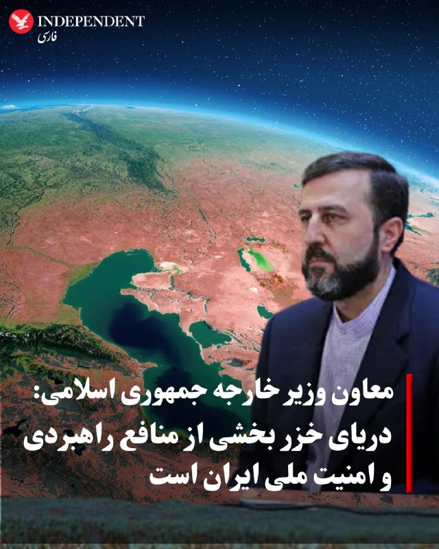

♦️کاظم غریب‌آبادی، معاون حقوقی و بین‌الملل وزارت خارجه جمهوری اسلامی، روز سه‌شنبه پنجم خردادماه اعلام کرد روند بررسی کنوانسیون رژیم حقوقی دریای خزر در نشست کمیسیون امنیت ملی و سیاست خارجی مجلس شورای اسلامی بررسی شده است.

غریب‌آبادی گفت در این جلسه گزارشی از روند طی‌شده درباره این کنوانسیون در سطوح داخلی و خارجی و در چارچوب تعاملات میان کشورهای عضو ارائه کرده و درباره ابعاد حقوقی، سیاسی، امنیتی و اقتصادی آن با نمایندگان مجلس گفتگو شده است.

او افزود لایحه مربوط به کنوانسیون رژیم حقوقی دریای خزر هم‌اکنون در دولت در حال بررسی است.

معاون وزیر خارجه جمهوری اسلامی همچنین تاکید کرد دریای خزر برای ایران «بخشی از منافع راهبردی، امنیت ملی، همکاری‌های منطقه‌ای و حقوق تاریخی» کشور به شمار می‌رود.
‌🇸🇦 Indypersian

🤖 @VahidOOnLine

## VahidOOnLine — post 242316

  

دونالد ترامپ در شبکه تروث سوشال نوشت معاینه شش‌ماهه خود را در مرکز پزشکی نظامی والتر رید به پایان رسانده و نتایج آن کاملا مطلوب بوده است. او از پزشکان و کارکنان این مرکز قدردانی کرد و گفت در حال بازگشت به کاخ سفید است.
‌🏁 🇬🇧 IranintlTV

🤖 @VahidOOnLine

## VahidOOnLine — post 242315

  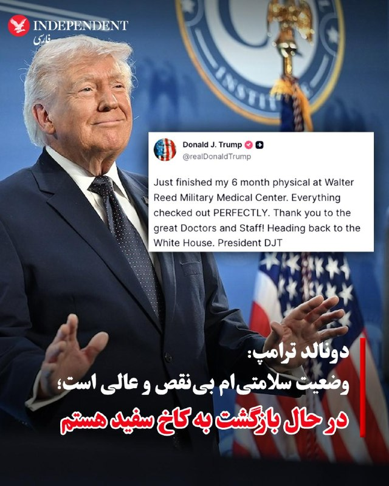

♦️دونالد ترامپ، رئیس‌جمهوری ایالات متحده، با انتشار پیامی در شبکه اجتماعی «تروث سوشال» از پایان آزمایش‌های پزشکی دوره شش ماهه خود خبر داد و نوشت: «همین حالا آزمایش‌های پزشکی شش ماهه خود را در مرکز درمانی نظامی والتر رید به پایان رساندم. وضعیت همه چیز به شکل بی‌نقصی عالی بود.» ترامپ در ادامه این پیام با تشکر از کادر درمان افزود: «در حال بازگشت به کاخ سفید هستم.»
‌🇸🇦 Indypersian

🤖 @VahidOOnLine

## VahidOOnLine — post 242314

  <a href="telegram/content/VahidOOnLine_242314_1779816786.mp4" target="_blank">🎬 Download video</a>

♦️خبرگزاری فارس روز سه‌شنبه پنجم خردادماه، گزارش داد هجوم گسترده ملخ‌های کوهان‌دار به تاغ‌زارهای زواره در شرق استان اصفهان، نگرانی‌هایی برای ساکنان و کشاورزان منطقه ایجاد کرده و تردد در برخی جاده‌های روستایی را با مشکل روبه‌رو کرده است.

مقام‌های منابع طبیعی شهرستان اردستان اعلام کردند از میان ۹۰ هزار هکتار تاغ‌زار منطقه، ۲۰ هزار هکتار آلوده شناسایی شده و حدود دو هزار هکتار با طغیان شدید روبه‌رو بوده است.

به گفته این مقام‌ها، عملیات سم‌پاشی و مقابله با این آفت با همکاری کشاورزان و بهره‌برداران محلی انجام شده و حدود ۷۰ درصد کانون‌های بحرانی پاکسازی شده‌اند.

مقام‌های جمهوری اسلامی همچنین گفتند ملخ‌های کوهان‌دار در صورت گسترش می‌توانند به مناطق مسکونی و شهرهایی مانند زواره نفوذ کنند، اما اکنون وضعیت تحت کنترل است.

تاغ‌زارهای زواره یکی از موانع طبیعی مقابله با بیابان‌زایی در مناطق کویری ایران به شمار می‌روند.

ملخ کوهان‌دار که با تغذیه از پوشش‌های گیاهی، مراتع و نهال‌ها موجب تخریب منابع طبیعی می‌شود، خطری جدی برای کشاورزی، دامداری و تنوع زیستی به شمار می‌رود.
‌🇸🇦 Indypersian

🤖 @VahidOOnLine

## VahidOOnLine — post 242313

  

گیدئون سعار، وزیر خارجه اسرائیل، در واکنش به پستی منتسب به مجتبی خامنه‌ای که موجودیت اسرائیل را تهدید کرده بود، در شبکه ایکس نوشت: «آشنا به نظر می‌رسد. یادم هست فردی با نام‌خانوادگی مشابه قبلا چنین حرف‌هایی می‌زد. راستی، کجایی؟»

علی خامنه‌ای، رهبر کشته‌شده جمهوری اسلامی، نیز ۱۸ شهریور ۱۳۹۴ گفته بود که اسرائیل، «۲۵ سال آینده را نخواهد دید.»
‌🏁 🇬🇧 IranintlTV

🤖 @VahidOOnLine

## VahidOOnLine — post 242312

  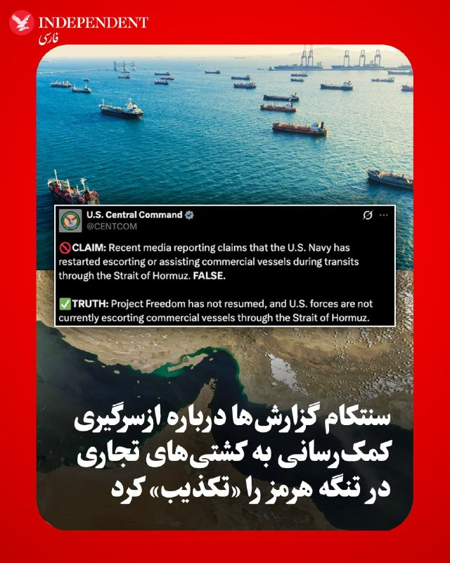

♦️فرماندهی مرکزی ایالات متحده (سنتکام) با انتشار بیانیه‌ای در اکس، روز سه‌شنبه، گزارش‌های منتشرشده مبنی بر ازسرگیری کمک‌رسانی (اسکورت) کشتی‌های تجاری در تنگه هرمز را تکذیب کرد و نوشت: «ادعای اخیر برخی رسانه‌ها درباره اینکه نیروی دریایی آمریکا هدایت یا کمک به کشتی‌های تجاری را حین عبور از تنگه هرمز آغاز کرده، نادرست است.» سنتکام در ادامه با رد این ادعاها تاکید کرد: «واقعیت این است که پروژه آزادی ازسر گرفته نشده و نیروهای آمریکایی در حال حاضر هیچ کشتی تجاری را در تنگه هرمز اسکورت نمی‌کنند.» این تکذیب در پی گزارش پیشین روزنامه وال‌استریت‌ژورنال صورت گرفت که ادعا کرده بود نیروی دریایی آمریکا هدایت نفت‌کش‌ها و کشتی‌های سرگردان را از مقابل سواحل ایران آغاز کرده و در نخستین اقدام، یک ابرنفت‌کش یونانی حامل دو میلیون بشکه نفت خام را با موفقیت از این آبراهه استراتژیک عبور داده است.
‌🇸🇦 Indypersian

🤖 @VahidOOnLine

## VahidOOnLine — post 242311

  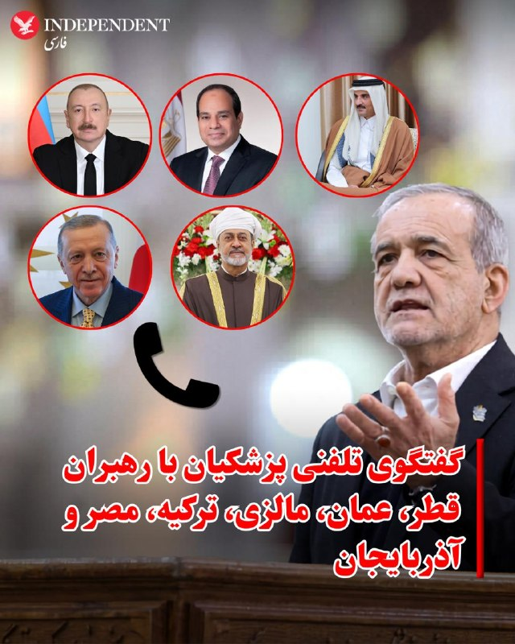

♦️مسعود پزشکیان، رئیس‌جمهوری اسلامی ایران، روز سه‌شنبه، پنجم خردادماه، در جریان چند گفتگوی تلفنی جداگانه با رجب طیب اردوغان، الهام علی‌اف و عبدالفتاح السیسی، رؤسای جمهوری ترکیه، آذربایجان و مصر، و همچنین شیخ تمیم بن حمد آل ثانی، امیر قطر، هیثم بن طارق، سلطان عمان و انور ابراهیم، نخست‌وزیر مالزی، درباره آخرین تحولات منطقه خاورمیانه رایزنی و تبادل نظر کرد.
پزشکیان در این رایزنی‌های فشرده، اقدامات نظامی ایران را در چارچوب «حق قانونی دفاع مشروع» و با هدف دفع حملات پایگاه‌های آمریکایی خواند و بر آمادگی تهران برای دستیابی به چارچوبی «عزتمندانه» جهت پایان دادن به تنش‌ها تاکید کرد؛ او همچنین در گفتگو با همتای مصری خود خواهان همگرایی منطقه‌ای بدون مداخله بیگانگان شد و در تماس با امیر قطر، خواستار اثبات اراده طرف مقابل در پایبندی به تعهدات بین‌المللی گردید. رئیس‌جمهوری اسلامی ایران در گفتگو با اردوغان نیز ضمن تقدیر از مواضع آنکارا در قبال حملات آمریکا و اسرائیل، بر ضرورت رفع موانع بازرگانی در مرزهای مشترک دو کشور پافشاری کرد؛ در مقابل، سران مصر، قطر و ترکیه نیز ضمن ابراز حمایت قاطع از روندهای دیپلماتیک و گفتگوهای جاری، بر تداوم نقش میانجی‌گرانه و تلاش‌های خود برای پایان‌بخشیدن به درگیری‌ها و برقراری صلح و ثبات پایدار در منطقه تاکید کردند.
‌🇸🇦 Indypersian

🤖 @VahidOOnLine

## VahidOOnLine — post 242310

  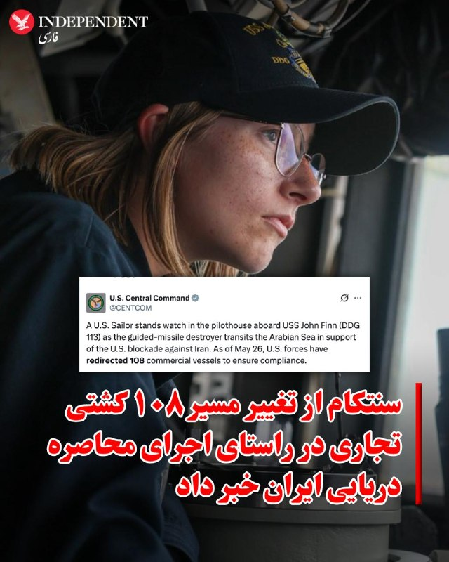

♦️فرماندهی مرکزی ایالات متحده (سنتکام) روز سه‌شنبه، با انتشار تصویری از یک ملوان آمریکایی در اتاق فرمان ناوشکن موشک‌انداز «یواس‌اس جان فین» (DDG 113) که مشغول نگهبانی است اعلام کرد که «یک ملوان آمریکایی در اتاق فرمان ناوشکن موشک‌انداز یواس‌اس جان فین در حال نگهبانی است؛ این ناوشکن در حمایت از محاصره ایران توسط ایالات متحده، در حال عبور از دریای عرب است.» سنتکام در ادامه این گزارش تاکید کرده است که «تا تاریخ ۲۶ مه، نیروهای آمریکایی مسیر ۱۰۸ فروند کشتی تجاری را برای تضمین پایبندی به این محاصره تغییر داده‌اند.»
‌🇸🇦 Indypersian

🤖 @VahidOOnLine

## VahidOOnLine — post 242309

♦️رابرت اف کندی، وزیر بهداشت آمریکا، ویدیویی در شبکه اجتماعی اینستاگرام منتشر کرد که در آن با دست خالی دو مار سیاه را شکارمی‌کند؛ ویدیویی که به‌سرعت در شبکه‌های اجتماعی خبرساز شد.

در این تصاویر، کندی تلاش می‌کند دو مار را که روی زمین در حال حرکت‌اند بگیرد و پس از موفق شدن، آنها را مقابل دوربین نگه می‌دارد. لحظاتی بعد یکی از مارها انگشت او را نیش می‌زند، اما او همچنان با خنده به فیلمبرداری ادامه می‌دهد.
‌🇸🇦 Indypersian

🤖 @VahidOOnLine

## VahidOOnLine — post 242308

  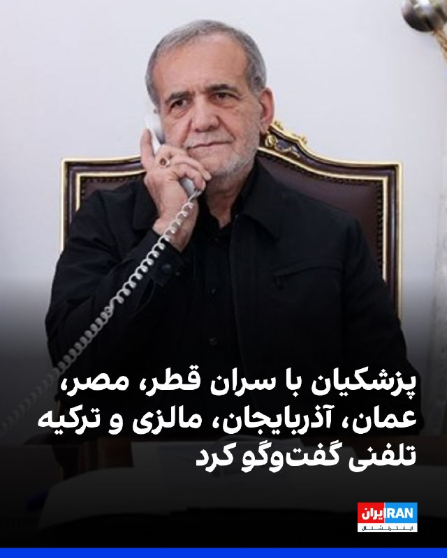

مسعود پزشکیان، رییس دولت جمهوری اسلامی، به‌صورت تلفنی با رجب طیب اردوغان، الهام علی‌اف و عبدالفتاح السیسی، روسای جمهور ترکیه، آذربایجان و مصر، شیخ تمیم بن حمد آل ثانی، امیر قطر، هیثم بن طارق، سلطان عمان و انور ابراهیم، نخست‌وزیر مالزی، درباره تحولات خاورمیانه گفت‌وگو کرد.
‌🏁 🇬🇧 IranintlTV

🤖 @VahidOOnLine

## VahidOOnLine — post 242307

  

الحدث به نقل از یک منبع آمریکایی گزارش داد اسرائیل در حال حاضر بر جلوگیری از تهدید عمق سرزمینی خود از سوی حزب‌الله تمرکز کرده است.

این منبع افزود هدف کنونی اسرائیل ورود به یک رویارویی جامع بر سر سلاح‌های حزب‌الله یا نقش داخلی این گروه نیست.

بر اساس این گزارش، اسرائیل ممکن است عملیات خود را فراتر از «خط زرد» و حتی به مناطق عمیق‌تر گسترش دهد.

یک منبع دیگر به الحدث گفت واشینگتن با هدف قرار دادن زیرساخت‌های نظامی حزب‌الله و کاهش توانمندی‌های آن از سوی اسرائیل مخالفتی ندارد و تشدید اخیر عملیات نظامی اسرائیل در جنوب لبنان را منفی ارزیابی نمی‌کند.

این منبع همچنین گفت اسرائیل با هدف بازگرداندن ساکنان مناطق شمالی به خانه‌هایشان اقدام می‌کند و افزود حزب‌الله با استفاده از پهپادها و سخنان اخیر نعیم قاسم مسئول فروپاشی روند کاهش تنش است.
‌🏁 🇬🇧 IranintlTV

🤖 @VahidOOnLine

## VahidOOnLine — post 242306

  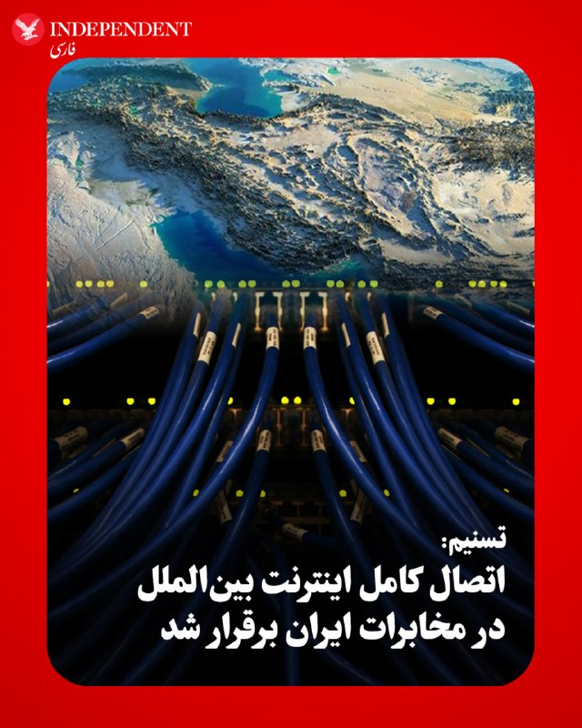

♦️تسنیم، خبرگزاری وابسته به سپاه، روز سه‌شنبه از «اتصال کامل اینترنت بین‌الملل در مخابرات ایران» خبر داد. تسنیم نوشت: «کاربران سرویس‌های پهن‌باند ثابت شامل اف‌تی‌تی‌اچ (FTTH)، وی‌دی‌اس‌ال (VDSL) و ای‌دی‌اس‌ال (ADSL) هم‌اکنون بدون محدودیت به شبکه جهانی اینترنت متصل هستند و امکان استفاده کامل از وب‌سایت‌ها و خدمات بین‌المللی برای آن‌ها فراهم شده است».
پیش از این، «نت‌بلاکس» که وضعیت اینترنت در جهان را رصد می‌کند با انتشار پیامی در اکس از «شاخص‌های زنده نشان‌دهنده بازگشت جزئی اتصال اینترنت در ایران پس از ۲۰۹۳ ساعت انزوای تقریبا کامل از شبکه‌های بین‌المللی» خبر داده بود.
‌🇸🇦 Indypersian

🤖 @VahidOOnLine

## VahidOOnLine — post 242305

♦️سی‌ویکمین جشنواره فرهنگی‌ورزشی عشایر آذربایجان شرقی روز جمعه با حضور حدود ۴۰۰ شرکت‌کننده در قشلاق هارنا از توابع شهرستان کلیبر برگزار شد.
این جشنواره شامل برنامه‌هایی مانند بازی‌های بومی‌محلی، سوارکاری و رقابت‌های سنتی بود و با هدف حفظ و معرفی فرهنگ عشایری برگزار شد.
جشنواره عشایر آذربایجان شرقی که بیش از سه دهه قدمت دارد، هر سال یکی از رویدادهای مهم فرهنگی و گردشگری منطقه به شمار می‌رود و شمار زیادی از بازدیدکنندگان را جذب می‌کند.
‌🇸🇦 Indypersian

🤖 @VahidOOnLine

## VahidOOnLine — post 242304

  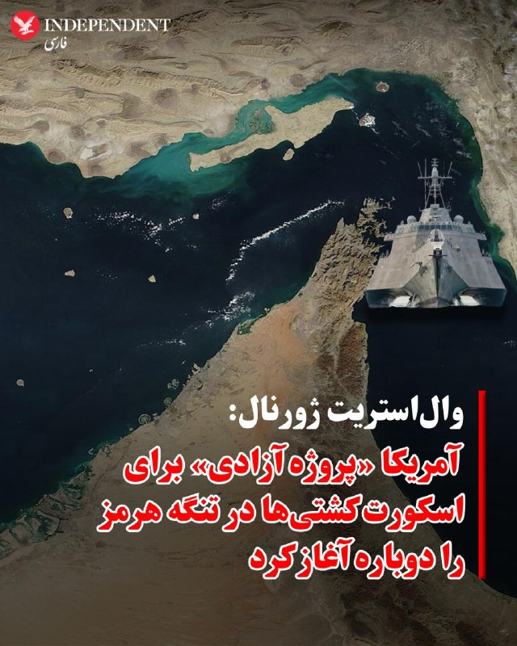

♦️ روزنامه وال‌استریت ژورنال روز چهارشنبه پنجم خردادماه، به نقل از مقام‌های نظامی آمریکا گزارش داد نیروی دریایی این کشور دوباره عملیات هدایت و اسکورت کشتی‌ها در تنگه هرمز را در قالب «پروژه آزادی» آغاز کرده است.

بر اساس این گزارش، یک ابرنفتکش یونانی حامل دو میلیون بشکه نفت خام هنگام عبور از آبراه نزدیک سواحل عمان توسط نیروی دریایی آمریکا هدایت شده است. این کشتی از اوایل ماه مارس در خلیج فارس متوقف مانده بود و اکنون به سمت هند حرکت می‌کند.

وال‌استریت ژورنال نوشت «پروژه آزادی» طرحی است که آمریکا پیش‌تر برای محافظت و هدایت کشتی‌ها در مسیر حیاتی تنگه هرمز آغاز کرده بود، اما حدود ۳۶ ساعت پس از شروع عملیات متوقف شد.

مقام‌های آمریکایی گفتند نیروی دریایی آمریکا در روزهای آینده به حدود ۱۲ کشتی، از جمله ابرنفتکش‌ها و کشتی‌های کانتینری، برای عبور از این آبراه کمک خواهد کرد.

این گزارش در حالی منتشر می‌شود که شبکه فاکس‌نیوز روز سه‌شنبه چهارم خردادماه به نقل از سخنگوی فرماندهی مرکزی ایالات متحده، سنتکام، گزارش داد نیروهای آمریکایی «در دفاع از خود در جنوب ایران» به محل‌های پرتاب موشک و قایق‌هایی که به گفته این نهاد در حال مین‌گذاری بودند حمله کرده‌اند.

سنتکام اعلام کرد ارتش آمریکا در حالی که در جریان آتش‌بس جاری «خویشتن‌داری» نشان می‌دهد، از نیروهای خود دفاع خواهد کرد.
‌🇸🇦 Indypersian

🤖 @VahidOOnLine

## VahidOOnLine — post 242303

  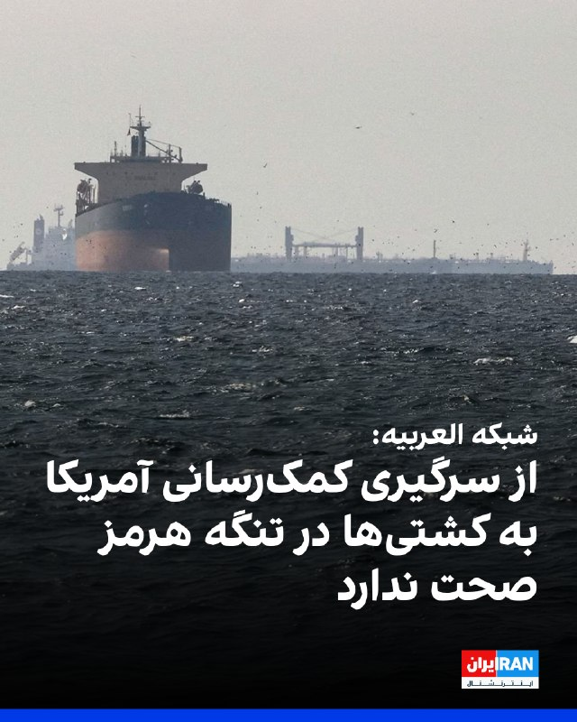

منابع آمریکایی در گفت‌وگو با العربیه گزارش‌ها درباره از سرگیری کمک‌رسانی در تنگه هرمز را تکذیب کردند.

پیشتر وال‌استریت‌ژورنال در گزارشی عنوان کرده بود که نیروی دریایی آمریکا کمک‌رسانی و هدایت کشتی‌ها در تنگه هرمز را از سر گرفته است.

‌🏁 🇬🇧 IranintlTV

🤖 @VahidOOnLine

## VahidOOnLine — post 242302

  <a href="telegram/content/VahidOOnLine_242302_1779816790.mp4" target="_blank">🎬 Download video</a>

♦️علی‌اکبر ایمانی، محیطزبان مازندرانی، ویدیویی از قدم زدن یک خرس قهوه‌ای در ارتفاعات سوادکوه منتشر کرده است.

سوادکوه در استان مازندران و در دامنه رشته‌کوه البرز قرار دارد و یکی از زیستگاه‌های مهم حیات‌وحش در شمال ایران به شمار می‌رود. خرس قهوه‌ای، پلنگ ایرانی، گرگ، گراز، شغال و مرال از جمله گونه‌هایی هستند که در جنگل‌ها و ارتفاعات این منطقه زندگی می‌کنند.

جزئیاتی درباره زمان دقیق ثبت این تصاویر منتشر نشده است.
‌🇸🇦 Indypersian

🤖 @VahidOOnLine

## VahidOOnLine — post 242301

  

سی‌بی‌اس‌نیوز به نقل از منابع آگاه گزارش داد دونالد ترامپ صبح چهارشنبه در کمپ دیوید نشست کابینه برگزار می‌کند. نیویورک‌پست نوشت همه اعضای کابینه حضور خواهند داشت و جنگ ایران محور اصلی گفت‌وگوهاست. کاخ سفید اعلام کرد تولسی گبرد نیز در این نشست شرکت می‌کند.
‌🏁 🇬🇧 IranintlTV

🤖 @VahidOOnLine

## VahidOOnLine — post 242300

  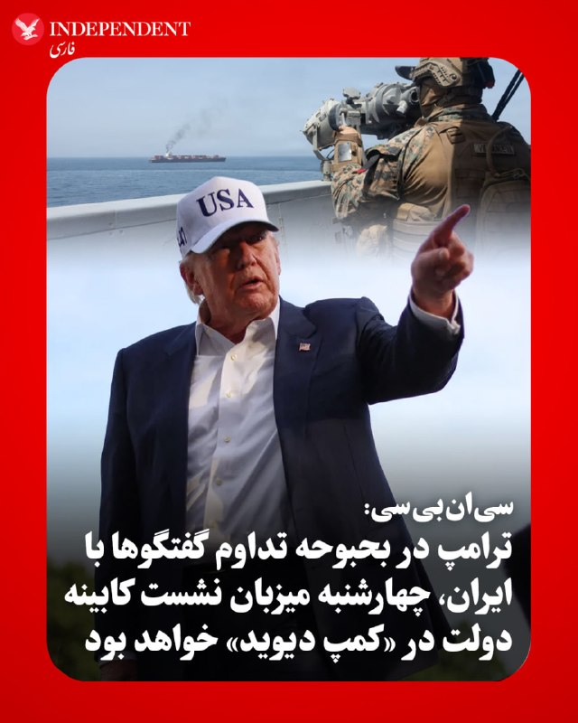

♦️شبکه «سی‌ان‌بی‌سی» به نقل از یک مقام کاخ سفید گزارش داد، دونالد ترامپ، رئیس‌جمهوری ایالات متحده، روز چهارشنبه، ششم خردادماه، به همراه تمامی اعضای کابینه خود در استراحتگاه «کمپ دیوید» تشکیل جلسه خواهد داد. این سفر و دیدار کم‌سابقه در شرایطی برنامه‌ریزی شده است که کمتر از یک روز از حملات جدید آمریکا به مواضعی در ایران می‌گذرد؛ اقدامی که گمانه‌زنی‌ها و نگرانی‌ها را درباره آینده توافق صلح احتمالی با تهران به شدت افزایش داده است.
بر اساس اعلام مقامات رسمی، هدف از این تجمع در این منطقه جنگلی مریلند، بحث و تبادل نظر پیرامون مسائل داخلی و خارجی، از جمله دستاوردهای اخیر دولت در حوزه‌های اقتصادی، مشاغل کوچک، مقابله با کلاهبرداری و همچنین بررسی آخرین تحولات سیاست خارجی خواهد بود؛ نکته قابل توجه در این نشست، حضور تولسی گبرد، مدیر اطلاعات ملی آمریکا است که هفته گذشته اعلام کرد در اواخر ژوئن از سمت خود استعفا می‌دهد.
‌🇸🇦 Indypersian

🤖 @VahidOOnLine

## VahidOOnLine — post 242299

  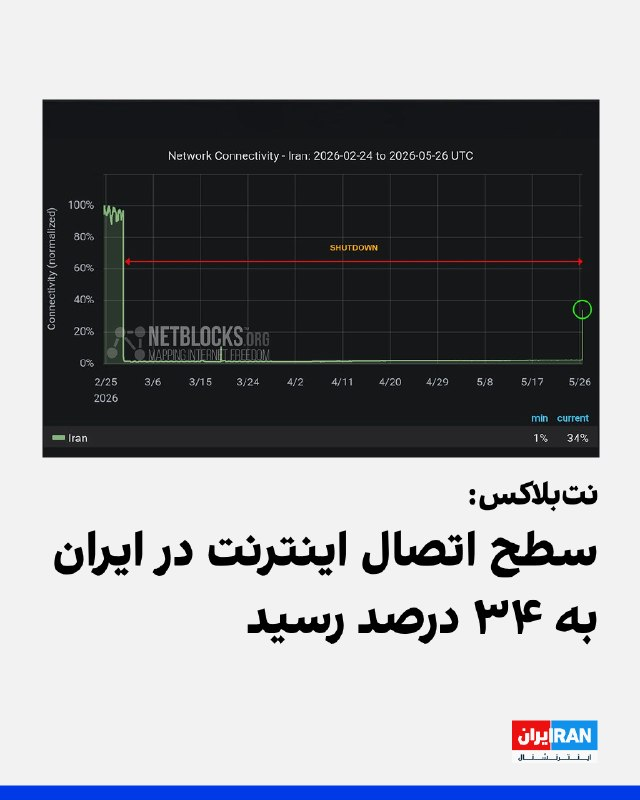

گروه نت‌بلاکس در حساب خود در شبکه اجتماعی ایکس اعلام کرد داده‌های زنده پایش اینترنت نشان می‌دهد پس از ۸۸ روز، اتصال به اینترنت در ایران به‌طور جزئی (۳۴ درصد) برقرار شده است. این قطع سراسری حدود ۲٬۰۹۳ ساعت طول کشید و طولانی‌ترین خاموشی اینترنت در سطح ملی در تاریخ مدرن به شمار می‌رود.
نت‌بلاکس افزود: هنوز مشخص نیست این بازگشت اتصال پایدار خواهد بود یا خیر.
‌🏁 🇬🇧 IranintlTV

🤖 @VahidOOnLine

## WithYashar — post 12590

  

مارک لوین : «بی بی، برو بزن بترکونشون!»
@withyashar

## WithYashar — post 12589

نت ها اوکی باشه لایو هم شروع میکنم که به امید خدا آخر هفته اگه زد زنده زارتان زورتان رو بگیرم 💥🌶️ این ۵ روز‌آینده بسیار روز های مهمیه ! ببینیم تکیفمون روشن میشههههههههه

## WithYashar — post 12588

## WithYashar — post 12587

## WithYashar — post 12586

نتانیاهو، در بیانیه‌ای اعلام کرد که نیروهای زمینی اسرائیل در حال «گسترش و تعمیق» عملیات این رژیم در لبنان هستند و «در حال تصرف مناطق وسیعی هستند»
@withyashar

## WithYashar — post 12585

کانال ۱۲ عبری:
آمریکا به اسرائیل هشدار داد که به هیچ شکلی به بیروت حمله نکند.
@withyashar 😐

## WithYashar — post 12584

  

ترامپ در تروث : همین الان معاینات پزشکی شش ماهه‌ام را در مرکز پزشکی نظامی والتر رید تمام کردم. همه چیز عالی بود. از پزشکان و کارکنان عالی متشکرم! به کاخ سفید برمی‌گردم. رئیس جمهور دی‌جی‌تی
@withyashar

## WithYashar — post 12583

معاون وزیر ارتباطات: سيستم عامل، مرورگر، آنتی‌ویروس، اپلیکیشن‌های بانکی و ابزارهای امنیتی خود را بروزرسانی کنید
@withyashar
چه دلسوز شدن. 🤣

## WithYashar — post 12582

https://t.me/boost/withyashar

بوست کنین ایومجی و استوری اضافه بشه ۵۴۴ بوست لازم داریم 🥲

## WithYashar — post 12581

سنتکام: پروژه آزادی از سر گرفته نشده و نیروهای آمریکایی در حال حاضر کشتی‌های تجاری رو از تنگه هرمز همراهی نمی‌کنند.
@withyashar
پروژه قایم موشک گویا شروع شده 😂

## WithYashar — post 12580

## WithYashar — post 12579

  <a href="telegram/content/WithYashar_12579_1779816794.mp4" target="_blank">🎬 Download video</a>

عزیمت ترامپ از کاخ سفید به بیمارستان
@withyashar

## WithYashar — post 12578

  <a href="telegram/content/WithYashar_12578_1779816795.mp4" target="_blank">🎬 Download video</a>

اتاق جنگ با یاشار : شله داوود
@withyashar

## WithYashar — post 12577

منابع عبری: در ساعات اخیر نتانیاهو مشاوره‌ای امنیتی در مورد وضعیت در جبهه های لبنان و ایران با رئیس ستاد ارتش اسرائیل، وزیر دفاع و دیگر سران نظامی ارتش اسرائیل برگزار کرده است.
@withyashar

## WithYashar — post 12576

بچه ها تلگرامتون رو آپدیت کنید سریع تا نظر سنجی‌ها رو ببینید

## WithYashar — post 12575

فک کنم ترامپ با پروژه آزادی پلاس داره کامبک میزنه 😂💥 @withyashar

## WithYashar — post 12574

نیویورک پست: ترامپ برای انجام سفری به کمپ دیوید است در حالی که تنش‌ها با ایران به دلیل حملات آمریکا افزایش یافته است ترامپ چهارشنبه به طور نادر به کمپ دیوید سفر خواهد کرد تا جلسه کابینه‌ای برگزار کند، زیرا مذاکرات صلح با ایران به زمان حساس خود نزدیک می‌شود،…

## WithYashar — post 12573

شرکت مخابرات: اتصال کامل اینترنت بین‌الملل مشترکان برقرار شد

کاربران سرویس‌های پهن‌باند ثابت شامل FTTH، VDSL و ADSL هم‌اکنون بدون محدودیت به شبکهٔ جهانی اینترنت متصل هستند و امکان استفاده کامل از وب‌سایت‌ها و خدمات بین‌المللی برای آن‌ها فراهم شده است.
@withyashar

## WithYashar — post 12572

آمار لحظه‌ای اتصال اینترنت کشور:

✅  مخابرات (منطقه ای)
✅  آسیاتک
✅  شاتل (منطقه ای)
✅  پیشگامان
✅  مبین نت TD-LTE
✅  صبانت
✅  پارس آنلاین
✅  زیتل
✅  افرانت
✅  ایرانسل (TD-LTE)
❌  ایرانسل (سیمکارت)
❌  همراه اول (سیمکارت)
❌  رایتل (سیمکارت)
❌  سامانتل (سیمکارت
@withyashar

## WithYashar — post 12571

ارتش اسرائیل اعلام کرد که زیرساخت‌هایی به طول 11 کیلومتر را در در شمال غزه منهدم کرده است.
@withyashar

## mwarmonitor — post 9753

  

✈️پرواز معنادار تانکرهای سوخت رسان آمریکا در نزدیکی مرزهای آبی ایران پس از برخاستن از تل‌آویو 🔸داده‌های راداری نشان می‌دهند دو فروند هواپیمای سوخت‌رسان راهبردی بوئینگ KC-46A Pegasus متعلق به نیروی هوایی آمریکا (USAF)، با پرواز در حریم هوایی امارات، در بخش…

## mwarmonitor — post 9752

  

❌هیچ نفتکش نفت خامی امروز در حال بارگیری نفت در جزیره خارگ ایران مشاهده نشده است .

@mwarmonitor

## mwarmonitor — post 9751

📌 دونالد ترامپ قرار است فردا جلسه کابینه خود را در کمپ دیوید برگزار کند؛ اقدامی نادر که شامل سفر به اقامتگاه ریاست‌جمهوری است (در صورت مساعد بودن هوا).

🔸به گفته یک مقام کاخ سفید، انتظار می‌رود تمام اعضای کابینه در این جلسه حضور داشته باشند. نیویورک پست

@mwarmonitor

## mwarmonitor — post 9750

🔴 ترامپ سقف پذیرش پناهندگان را به میزان ۱۰ هزار نفر افزایش می‌دهد تا امکان پذیرش تعداد بیشتری از سفیدپوستان آفریقای جنوبی فراهم شود.

@mwarmonitor

## mwarmonitor — post 9749

🔴(رویترز) – ارتش اسرائیل عملیات زمینی خود در جنوب لبنان را فراتر از خطی که خود اسرائیل چند کیلومتر داخل خاک لبنان و پس از آتش‌بس ۱۶ آوریل با حزب‌الله تعیین کرده بود، گسترش داده است. این موضوع را دو منبع روز سه‌شنبه اعلام کردند.

🔹این منابع جزئیات بیشتری درباره میزان پیشروی فراتر از به‌اصطلاح «خط زرد» ارائه نکردند.

🔹این خط، جدا از «خط آبی» تعیین‌شده توسط سازمان ملل است که مرز لبنان و اسرائیل را پس از عقب‌نشینی اسرائیل در سال ۲۰۰۰ مشخص می‌کند. خط زرد بخشی از طرح ایجاد یک منطقه حائل پیشنهادی به عمق ۵ تا ۱۰ کیلومتر در جنوب لبنان است؛ جایی که نیروهای اسرائیلی همچنان در ده‌ها روستای عمدتاً تخلیه‌شده عملیات انجام می‌دهند.

🔸این اقدام در حالی صورت گرفته که با وجود آتش‌بس اعلام‌شده چند هفته قبل، درگیری‌های مرزی همچنان در حال تشدید است.

@mwarmonitor

## mwarmonitor — post 9748

🔴نیروی دریایی آمریکا تحت طرحی تازه با نام «Project Freedom» دوباره هدایت کشتی‌ها را در تنگه هرمز آغاز کرده است.

🔸بر اساس گزارش وال‌استریت ژورنال، یک نفتکش فوق‌سنگین یونانی که ۲ میلیون بشکه نفت خام حمل می‌کرد، اولین کشتی‌ای بوده که از این مسیر عبور داده شده و انتظار می‌رود در روزهای آینده حدود ۱۲ کشتی دیگر نیز از این مسیر عبور کنند.

@mwarmonitor

## mwarmonitor — post 9747

🚨 آژیرهای هشدار قرمز در شمال اسرائیل، در نزدیکی مالکیا به صدا درآمد. i24

@mwarmonitor

## mwarmonitor — post 9746

🔴رویترز: قراردادهای آتی نفت خام برنت با افزایش ۴ دلار به ازای هر بشکه رشد کرد.

@mwarmonitor

## mwarmonitor — post 9745

  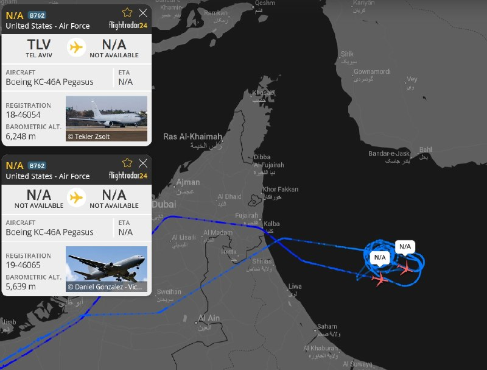

✈️پرواز معنادار تانکرهای سوخت رسان آمریکا در نزدیکی مرزهای آبی ایران پس از برخاستن از تل‌آویو

🔸داده‌های راداری نشان می‌دهند دو فروند هواپیمای سوخت‌رسان راهبردی بوئینگ KC-46A Pegasus متعلق به نیروی هوایی آمریکا (USAF)، با پرواز در حریم هوایی امارات، در بخش غربی دریای عمان (روبروی بندر جاسک) مستقر شده و مدار سوخت‌رسانی ایجاد کرده‌اند.

🔸نکته کلیدی در این رصد، ثبت فرودگاه بن‌گوریون تل‌آویو (TLV) به عنوان مبداء حرکت یکی از این دو تانکر پیشرفته است. استقرار این پلتفرم‌های لجستیکی در نزدیکی تنگه هرمز، نشان‌دهنده پشتیبانی هوایی فشرده و آماده‌باش برای سوخت‌رسانی به جنگنده‌ها یا گشت‌های هوایی سنتکام در منطقه است.

@mwarmonitor

## FoxNewsTwitter — post 342272

  <a href="telegram/content/FoxNewsTwitter_342272_1779816799.mp4" target="_blank">🎬 Download video</a>

Fox News (Twitter/X)

“Those are dangerous!”

HHS Secretary RFK Jr. sharing a wild video of himself grabbing two black racer snakes off Dr. Mehmet Oz’s patio while his wife Cheryl Hines repeatedly warns him to stop.

The snakes can be seen twisting around Kennedy’s hands and biting him multiple times while he tries to remove them from the property.

## FoxNewsTwitter — post 342271

  

Fox News (Twitter/X)

RT @foxnewspolitics: Dave Portnoy torches Maine Senate candidate's strategist after the operative pitched a Red Sox-themed ad collab — then discovered Portnoy, who is Jewish, had zero interest in promoting a candidate with a Nazi-linked tattoo.

The Barstool founder challenged Graham Platner to a 1-on-1 conversation and told strategist Jeff Coote to 'fire yourself for thinking I'd want to glamorize this clown.'

Meanwhile, Fenway-owned NESN yanked Platner's anti-private-equity ad mid-game over intellectual property concerns.

## FoxNewsTwitter — post 342270

Fox News (Twitter/X)

WATCH: Protesters clash with law enforcement officers outside an ICE facility in Newark, New Jersey, just a day after their initial demonstration turned chaotic.

ICE agents in riot gear arrived Monday afternoon to clear protesters blocking Delaney Hall’s entrance over concerns about detainee treatment. Tensions escalated as protesters formed a human chain, threw objects, and agents used pepper spray while trying to move a military-style vehicle.

Families of detainees began protesting this weekend over alleged poor conditions and inadequate medical care, with a larger organized group joining Monday.

## FoxNewsTwitter — post 342269

‌Fox News (Twitter/X)

Read more:

## FoxNewsTwitter — post 342268

  

Fox News (Twitter/X)

Conservatives say AI chatbots are being weaponized with left-wing media bias as millions rely on them each day.

Critics say today’s AI systems disproportionately pull from “left-wing media and politically charged sources” when generating responses for users, and they argue systems like ChatGPT, Google Gemini, and Claude often downplaying or excluding opposing perspectives altogether.

The concerns go beyond politics, AI systems are already known to sometimes “hallucinate” — confidently generating false but believable information that can quickly erode public trust.

One example that made previously made headlines was when ChatGPT, which is developed by OpenAI, insisted in January nobody named Charlie Kirk was ever assassinated and declared no credible evidence or reporting could substantiate such a claim.

## FoxNewsTwitter — post 342267

  

Fox News (Twitter/X)

JUST IN: President Trump shares results from his six month physical at Walter Reed:

"Everything checked out PERFECTLY. Thank you to the great Doctors and Staff! Heading back to the White House."

## FoxNewsTwitter — post 342266

Fox News (Twitter/X)

BREAKING: President Trump will convene a rare Cabinet meeting at Camp David on Wednesday as negotiations with Iran enter a critical phase.

All Cabinet members are expected to attend the meeting, Fox News has confirmed, including outgoing Director of National Intelligence Tulsi Gabbard.

The gathering comes as the administration weighs next steps in high-stakes negotiations aimed at securing a broader agreement with Tehran amid a fraying ceasefire.

## FoxNewsTwitter — post 342265

Fox News (Twitter/X)

BREAKING: A three-judge federal panel is temporarily blocking Alabama from using a newly proposed congressional map that Republicans hope would improve their chances in a key U.S. House race.

The court ordered the state to keep using the court-approved districts from the 2024 elections while the long-running redistricting case continues.

## FoxNewsTwitter — post 342264

  

Fox News (Twitter/X)

An Army veteran known locally for decorating his California home with pro-Trump banners and American flags has died days after a brutal assault outside the property, authorities said.

Kerry Sheron, 69, was allegedly attacked by a 32-year-old Navy veteran in what prosecutors described as an unprovoked beating.

The suspect, Thomas Caleb Butler, has pleaded not guilty and remains behind bars as prosecutors weigh upgraded charges following Sheron’s death. Authorities have not confirmed a political motive at this time.

## pm_afshaa — post 91556

  <a href="telegram/content/pm_afshaa_91556_1779816803.webm" target="_blank">🎬 Download video</a>

🔴کانال 14 اسرائیل به نقل از منابع:
حمله به ایران پس از دریافت «پیام مشخصی» از آمریکا، در این مرحله از دستور کار خارج شده.

💧 Rainbet.com the #1 Non-KYC Crypto Casino & Sportsbook @rainbetcom

😁 @Pm_Afshaa

## pm_afshaa — post 91555

  <a href="telegram/content/pm_afshaa_91555_1779816803.webm" target="_blank">🎬 Download video</a>

🔴صفحه‌ی اسرائیل به فارسی در X:
پیام جدید رهبر نامرئی جمهوری اسلامی: اسرائیل تا 15 سال دیگر وجود نخواهد داشت.

پدرش هم خیلی از این گنده‌گویی‌ها می‌کرد.

💧 Rainbet.com the #1 Non-KYC Crypto Casino & Sportsbook @rainbetcom

😁 @Pm_Afshaa

## pm_afshaa — post 91554

  <a href="telegram/content/pm_afshaa_91554_1779816804.webm" target="_blank">🎬 Download video</a>

🔴کانال 12 اسرائیل:
آمریکا به اسرائیل هشدار داده که به هیچ شکلی به بیروت حمله نکنه.

💧 Rainbet.com the #1 Non-KYC Crypto Casino & Sportsbook @rainbetcom

😁 @Pm_Afshaa

## pm_afshaa — post 91553

  <a href="telegram/content/pm_afshaa_91553_1779816804.webm" target="_blank">🎬 Download video</a>

🔴ترامپ: معاینات شش‌ماهه‌ام رو انجام دادم، نتایجش کاملا عالی و مطلوب بود.

💧 Rainbet.com the #1 Non-KYC Crypto Casino & Sportsbook @rainbetcom

😁 @Pm_Afshaa

## pm_afshaa — post 91552

  <a href="telegram/content/pm_afshaa_91552_1779816805.webm" target="_blank">🎬 Download video</a>

🔴نیویورک تایمز: ترامپ فردا به کمپ دیوید میره تا جلسه‌ای سطح بالا در مورد ایران با سران نظامی و سیاسی این کشور برگزار کنه.

💧 Rainbet.com the #1 Non-KYC Crypto Casino & Sportsbook @rainbetcom

😁 @Pm_Afshaa

## pm_afshaa — post 91551

ببین چیکار کردن که واسه طبیعی‌ترین و عادی‌ترین حقمون تو قرن ۲۱ باید خوشحال بشیم..

## pm_afshaa — post 91550

دلم تنگ شده بود براتون خوش برگشتین❤️
تلگرام بدون شما صفا نداشت..

## pm_afshaa — post 91549

اینترنت خط همراه هم داره وصل میشه.

💧 Rainbet.com the #1 Non-KYC Crypto Casino & Sportsbook @rainbetcom

😁 @Pm_Afshaa

## pm_afshaa — post 91548

  <a href="telegram/content/pm_afshaa_91548_1779816805.webm" target="_blank">🎬 Download video</a>

🔴اسرائیل به دستور نتانیاهو از دیروز حملات و پیشروی‌های خود در جنوب لبنان رو به‌طور قابل‌توجهی افزایش داده و حتی از محدوده‌ای که پیش‌تر به‌عنوان خط توقف تعیین شده بود هم عبور کرده.

طبق گزارش‌ها، هدف اصلی این عملیات، نابودی سایت‌های پهپادهای فیبرنوری در جنوب لبنانه؛ پهپادهایی که نیروهای اسرائیلی رو در منطقه هدف قرار می‌دادن. شدت حملات به حدی بوده که بسیاری از ساکنان جنوب لبنان در حال ترک مناطق مرزی هستن.

💧 Rainbet.com the #1 Non-KYC Crypto Casino & Sportsbook @rainbetcom

😁 @Pm_Afshaa

## pm_afshaa — post 91547

  <a href="telegram/content/pm_afshaa_91547_1779816806.webm" target="_blank">🎬 Download video</a>

🔴نتانیاهو: ما عملیات خود در لبنان رو تشدید می‌کنیم؛ نیروهای اسرائیل با نیروهای زمینی قابل توجهی در حال عملیات هستن و مواضع استراتژیک رو تثبیت می‌کنند!

💧 Rainbet.com the #1 Non-KYC Crypto Casino & Sportsbook @rainbetcom

😁 @Pm_Afshaa

## pm_afshaa — post 91546

  <a href="telegram/content/pm_afshaa_91546_1779816806.webm" target="_blank">🎬 Download video</a>

🔴وال استریت ژورنال: به گفته مقامات نظامی آمریکا، نیروی دریایی ایالات متحده کمک به عبور کشتی‌ها از تنگه هرمز رو دوباره آغاز کرده. این مقامات گفتن که یک ابرنفتکش یونانی حامل 2 میلیون بشکه نفت خام، هنگام عبور از این آبراه در سواحل عمان، توسط نیروی دریایی آمریکا…

## pm_afshaa — post 91545

  <a href="telegram/content/pm_afshaa_91545_1779816807.webm" target="_blank">🎬 Download video</a>

🔴حمید رسایی، نماینده مجلس:
بزرگترین خیانت به پیکر مطهر رهبر عزیزمان که هنوز به خاک سپرده نشده امروز رقم خورد؛ دشمن ما کنار آمریکا و اسراییل کسانی هستن که اینترنت رو وصل کردن.

💧 Rainbet.com the #1 Non-KYC Crypto Casino & Sportsbook @rainbetcom

😁 @Pm_Afshaa

## pm_afshaa — post 91544

  <a href="telegram/content/pm_afshaa_91544_1779816807.webm" target="_blank">🎬 Download video</a>

🔴بن‌گویر، وزیر امنیت داخلی اسرائیل:
اجازه نخواهیم داد ترامپ توافقی بد با جمهوری اسلامی امضا کنه.

💧 Rainbet.com the #1 Non-KYC Crypto Casino & Sportsbook @rainbetcom

😁 @Pm_Afshaa

## pm_afshaa — post 91543

  <a href="telegram/content/pm_afshaa_91543_1779816808.webm" target="_blank">🎬 Download video</a>

🔴وال استریت ژورنال:
به گفته مقامات نظامی آمریکا، نیروی دریایی ایالات متحده کمک به عبور کشتی‌ها از تنگه هرمز رو دوباره آغاز کرده.

این مقامات گفتن که یک ابرنفتکش یونانی حامل 2 میلیون بشکه نفت خام، هنگام عبور از این آبراه در سواحل عمان، توسط نیروی دریایی آمریکا هدایت شده.

💧 Rainbet.com the #1 Non-KYC Crypto Casino & Sportsbook @rainbetcom

😁 @Pm_Afshaa

## pm_afshaa — post 91542

  <a href="telegram/content/pm_afshaa_91542_1779816808.webm" target="_blank">🎬 Download video</a>

🔴طبق آمار نت بلاکس، در حال حاضر حدود 34 درصد از مردم ایران دوباره به اینترنت بین‌الملل متصل شدن.

💧 Rainbet.com the #1 Non-KYC Crypto Casino & Sportsbook @rainbetcom

😁 @Pm_Afshaa

## pm_afshaa — post 91541

  <a href="telegram/content/pm_afshaa_91541_1779816809.webm" target="_blank">🎬 Download video</a>

🔴عارف، معاون اول پزشکیان: گام نخست دسترسی آزاد به فضای مجازی برداشته شد.

💧 Rainbet.com the #1 Non-KYC Crypto Casino & Sportsbook @rainbetcom

😁 @Pm_Afshaa

## pm_afshaa — post 91540

بچه هایی که دوباره برگشتن خوش اومدین 🤍🤍

## iaghapour — post 2633

⭕️ چند خبر کوتاه از رسانه ها

🔸معاون وزیر ارتباطات در پاسخ به زومیت در خصوص زمان بازگشایی اینترنت سیار نیز گفت: «امروز اینترنت همراه نیز وصل خواهد شد.»

با توجه به این اظهارنظر باید منتظر بازگشایی اینترنت همراه تا پایان امروز، سه‌شنبه ۵ خردادماه، در دسترس کاربران قرار بگیرد. هم‌چنین، طبق اعلام‌های قبلی، تا فردا روند بازگشایی اینترنت به وضعیت پیش از دی‌ماه ۱۴۰۴ تکمیل خواهد شد.

🔹نت‌بلاکس بازگشت بخشی از اینترنت ایران را تایید کرد؛ سطح اتصال به ۳۴ درصد رسید

🔸چه ‌وب‌سایت‌هایی در دسترس قرار گرفته‌اند؟ /دیجیاتو
ویکی‌پدیا
اپ‌استور
پینترست (Pinterest)
کنوا (Canva)
نوشن (Notion)
تردز (Threads)
کالاف CallofDuty.com
پابجی (Pubg)
یاهو
دراپ باکس
پلی استیشن
ایکس‌باکس
استیم

🆔 @iAghapour

## iaghapour — post 2632

## DEJradio — post 4996

  <a href="telegram/content/DEJradio_4996_1779816809.mp4" target="_blank">🎬 Download video</a>

🔺🎥 پیام یک شهروند:
نوار بهداشتی زیر ۱۰۰ هزار تومن نیست! یک زمان نوار بهداشتی خارجی ۸۰ هزارتومان بود!

#تورم #نوار_بهداشتی
@DEJradio

## DEJradio — post 4995

  <a href="telegram/content/DEJradio_4995_1779816811.mp4" target="_blank">🎬 Download video</a>

⭕️🎥 مارکو روبیو، وزیر خارجۀ آمریکا، روز سه‌شنبه پنجم خرداد تأکید کرد موضع واشینگتن در قبال مذاکرات با تهران کاملاً شفاف است و گفت یا توافقی مطلوب حاصل می‌شود یا اساساً توافقی در کار نخواهد بود.

#مارکو_روبیو #مذاکرات
@DEJradio

## DEJradio — post 4994

⭕️ لاپید: توافق احتمالی تهران و واشینگتن اهداف اسرائیل از جنگ را برآورده نمی‌کند

یائیر لاپید، رهبر مخالفان دولت مستقر اسرائیل گفت تفاهمی که میان آمریکا و جمهوری اسلامی در حال شکل‌گیری است، برای اسرائیل، منطقه و مردم ایران توافقی بد به شمار می‌رود.
نخست‌وزیر پیشین اسرائیل گفت این توافق هیچ‌یک از اهداف اعلام‌شدۀ اسرائیل از جنگ، از جمله نابودی برنامۀ موشکی و هسته‌ای جمهوری اسلامی و پایان پشتیبانی تهران از گروه‌های نیابتی را برآورده نمی‌کند.
رهبر مخالفان دولت نتانیاهو تأکید کرد کشورش باید آزادی عمل خود را در موازات با عملکرد دولت ایالات متحده، حفظ کند.
مقامات آمریکایی پیش‌تر تأکید کردند توافق با جمهوری اسلامی یا کامل و معنادار انجام می‌شود، یا هیچ توافقی در کار نیست.

#خبر #دژ #مذاکرات #اسرائیل
@DEJradio

## DEJradio — post 4993

⭕️
🌐 نت‌بلاکس اعلام کرد با وجود بازگشت نسبی، اختلال گستردۀ اینترنت در ایران ادامه دارد

نت‌بلاکس روز سه‌شنبه اعلام کرد داده‌های مستقیم نشان داد اتصال به اینترنت در ایران به صورت نسبی برقرار شده است.
این نهاد جهانی پایش اینترنت از سویی نوشت با وجود ابلاغ مصوبۀ بازگشت اینترنت از سوی مسعود پزشکیان، اختلال گسترده در ایران همچنان ادامه دارد.
نت‌بلاکس گزارش داد ایران وارد هشتادوهشتمین روز «خاموشی دیجیتال» شده و بیش از ۲۰۸۸ ساعت انزوای ارتباطی را سپری کرده است.

#خبر #دژ #اینترنت
@DEJradio

## DEJradio — post 4992

⭕️ رسانۀ نزدیک به نهادهای امنیتی: جمهوری اسلامی به دنبال آزادسازی ۲۴ میلیارد دلار است

خبرگزاری حکومتی تسنیم، نزدیک به سپاه پاسداران به نقل از یک منبع آگاه گزارش داد جمهوری اسلامی در مذاکره با آمریکا در پی رفع انسداد از بیست و چهار میلیارد دلار از منابع است.
بر اساس این گزارش، تهران درخواست کرده دوازده میلیارد دلار از این مبلغ، همزمان با رونمایی از تفاهم‌نامۀ احتمالی آزاد شود و بقیه نیز طی شصت روز در دسترس قرار گیرد.
بنا بر ادعای این خبرگزاری نزدیک به نیروهای امنیتی، سفر محمدباقر قالیباف به قطر نیز در همین چارچوب و برای رایزنی درباره نحوۀ دسترسی به این منابع انجام شد.
قطر گزارش‌ها دربارۀ پیشنهاد وام دوازده میلیارد دلاری به جمهوری اسلامی برای تضمین توافق را «نادرست» خوانده است.

#خبر #دژ #قطر #مذاکرات
@DEJradio

## DEJradio — post 4991

⭕️ قوۀ قضائیه ۱۳ مدیر شرکت‌های پتروشیمی را احضار کرد

دادستانی تهران از احضار ۱۳ مدیر شرکت‌های پتروشیمی و سایر شرکت‌ها با اتهام «رفع نکردن تعهدات ارزی» خبر داد.
علی صالحی گفت برخی از این مدیران تفهیم اتهام شده‌اند و برخی دیگر متعهد شده‌اند ظرف مهلت تعیین‌شده، تعهدات ارزی خود را انجام دهند.
بنا بر ادعای دادستان تهران، تاکنون بیش از هفتاد درصد تعهدات ارزی این شرکت‌ها پرداخت شده است.
شماری از صادرکنندگان، ملزم‌اند ارز حاصل از صادرات را به درون کشور بازگردانند.

#خبر #دژ
@DEJradio

## DEJradio — post 4990

⭕️ انفجار و نشت سوخت یک نفتکش در سواحل عمان

به گفتۀ سازمان عملیات تجارت دریایی بریتانیا، داده‌هایی از وقوع انفجار در بخش چپ بدنۀ یک نفتکش در ۶۰ مایلی سواحل مسقط، گزارش شده است.
بر پایۀ گزارش‌ها خدمۀ کشتی سالم‌اند، اما بخشی از سوخت نفتکش به دریا نشت کرده است.
هنوز درمورد علت یا عامل انفجار اطلاعاتی منتشر نشده است.

#خبر #دژ #انفجار
@DEJradio

## DEJradio — post 4989

  <a href="telegram/content/DEJradio_4989_1779816812.webm" target="_blank">🎬 Download video</a>

🔺📢 آیا فضای مجازی بستری مناسب برای شکایت از یکدیگر است؟

کارشناس: پژمان گلچین، پژوهشگر فلسفه

#اینترنت #فضای_مجازی
@DEJradio

## VahidOnline — post 75738

  

دونالد ترامپ، رئیس‌جمهور آمریکا، قرار است روز چهارشنبه نشستی کم‌سابقه با اعضای کابینه خود در اقامتگاه ریاست‌جمهوری کمپ دیوید برگزار کند؛ نشستی که به گفته یک مقام کاخ سفید، همزمان با نزدیک شدن مذاکرات مربوط به ایران به مرحله‌ای حساس برگزار می‌شود.

خبرگزاری فرانسه با انتشار این خبر نوشت که انتخاب کمپ دیوید، اقامتگاهی دورافتاده در کوهستان‌های مریلند که ترامپ برخلاف بسیاری از رؤسای‌جمهور پیشین کمتر به آن رفت‌وآمد داشته، نشان‌دهنده حساسیت گفت‌وگوهای پیش رو ارزیابی شده است.

روزنامه نیویورک‌پست گزارش داده که موضوع ایران محور اصلی این نشست خواهد بود و همه اعضای کابینه [از جمله تولسی گابارد، مدیر مستعفی اطلاعات ملی] در آن حضور خواهند داشت. بر اساس این گزارش، مسائل اقتصادی نیز در دستور کار قرار دارد.

کمپ دیوید در گذشته صحنه چند تحول مهم دیپلماتیک به رهبری آمریکا بوده، از جمله توافق‌های سال ۱۹۷۸ میان اسرائیل و مصر در دوره جیمی کارتر و نشست ناکام اسرائیلی‌ـفلسطینی در سال ۲۰۰۰ در دوره بیل کلینتون.

این دومین سفر ترامپ به کمپ دیوید در دوره دوم ریاست‌جمهوری او خواهد بود؛ نخستین بار چند روز پیش از حملات آمریکا به برنامه هسته‌ای ایران در خرداد ۱۴۰۴ بود.
@VahidHeadline

📡 @VahidOnline

## VahidOnline — post 75737

  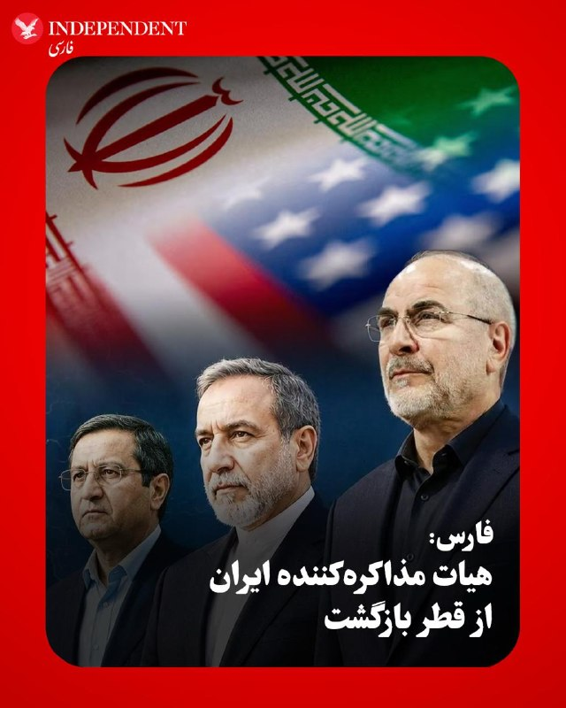

♦️به گزارش فارس، خبرگزاری وابسته به سپاه، محمدباقر قالیباف، رئیس هیات مذاکره‌کننده جمهوری اسلامی ایران که روز دوشنبه در راس هیاتی با همراهی عباس عراقچی، وزیر امور خارجه و عبدالناصر همتی، رئیس بانک مرکزی، برای رایزنی با مقامات قطری به دوحه سفر کرده بود، عصر سه‌شنبه، پنجم خردادماه، به ایران بازگشت. بر اساس این گزارش، محور اصلی گفتگوهای میان مقامات عالی تهران و دوحه در این سفر، رایزنی درباره بازگشت پول‌های مسدودشده ایران بوده است.
@VahidOOnLine

📡 @VahidOnline

## VahidOnline — post 75736

  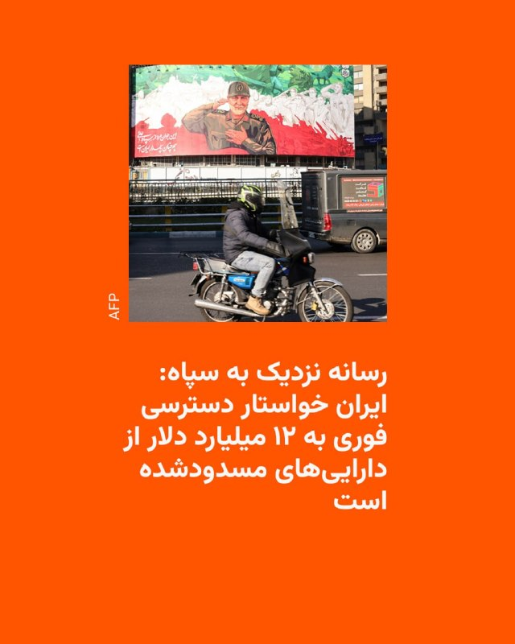

خبرگزاری تسنیم، روز سه‌شنبه، به نقل از منابع خود مدعی شد که طبق متن ۱۴ ماده‌ای یادداشت تفاهم بین ایران و آمریکا، منابع بلوکه‌شده ایران، به میزان ۲۴ میلیارد دلار باید در طول مذاکرات آزاد شود.

آنطور که این رسانه نزدیک به سپاه پاسداران از قول « یک منبع آگاه نزدیک به تیم مذاکره‌کننده» گزارش داده، ایران تأکید دارد که نصف این مبلغ باید با شروع مذاکرات، در دسترس قرار گیرد، و بقیه در طول ۶۰ روز منتقل شود.

این گزارش می‌گوید که سفر اخیر عباس عراقچی و محمدباقر قالیباف به قطر هم برای تفاهم دربارهٔ اجرایی‌سازی این مطالبه، و نحوه دسترسی به ۱۲ میلیارد دلار در گام اول و رفع موانع بوده است.

همزمان، احمد بخشایش اردستانی، عضو کمیسیون امنیت ملی مجلس، مدعی شد که چند روز پیش، قرار بود ۱۲ میلیارد دلار از منابع مسدودشده ایران، از طریق روسیه وارد شود، ولی آمریکایی‌ها مانع این انتقال شدند.

هنوز هیچ مقام رسمی در دولت آمریکا، این ادعاها را تأیید نکرده است.
@VahidHeadline

📡 @VahidOnline

## VahidOnline — post 75732

نت‌بلاکس، نهاد پایش وضعیت اینترنت در جهان، اعلام کرد داده‌های زنده این مجموعه نشان می‌دهد اتصال اینترنت در ایران در هشتاد و هشتمین روز قطعی گسترده، به صورت نسبی در حال بازگشت است؛ هرچند هنوز مشخص نیست این وضعیت پایدار خواهد ماند یا نه.
@VahidHeadline
ساعاتی پیش از این واقعه اخبار دیگری منتشر شده بود:

در حالی که مقام‌های دولت مسعود پزشکیان از آغاز روند اتصال کامل به اینترنت تا ۲۴ ساعت آینده خبر می‌دادند، دیوان عدالت اداری اعلام کرد دستور توقف اجرای مصوبه تشکیل «ستاد ویژه ساماندهی و راهبری فضای مجازی کشور» را صادر کرده است.

این دیوان ظهر سه‌شنبه پنجم خرداد اعلام کرد «به‌دنبال طرح شکایاتی، دستور به توقف مصوبهٔ ایجاد «ستاد ویژهٔ ساماندهی و راهبری فضای مجازی کشور» داده است» و افزود: «تا زمان رسیدگی نهایی به شکایات مطروحه، مصوبات و تصمیمات این ستاد قابل ترتیب اثر نخواهد بود.»

مرکز رسانه قوه قضاییه نیز اعلام کرد دستورات و مصوبات ستاد ویژه «به دلیل بررسی غیرقانونی بودن ساختار ستاد، تا زمان رسیدگی قانونی قابل اجرا نیست».
@VahidHeadline
بعدش:
همزمان با اعلام دیوان عدالت اداری مبنی بر صدور دستور توقف بازگشت اینترنت، ایسنا به نقل از «یک منبع مطلع»، روز سه‌شنبه، پنجم خردادماه، گزارش داد که با صدور دستور اتصال اینترنت از وزیر ارتباطات و فناوری اطلاعات فرآیند اتصال در حال انجام است و طی ۲۴ ساعت این امکان برای همه فراهم خواهد شد.

این درحالی اتفاق افتاد که تنها یک روز پس از مصوبه «ستاد ویژه ساماندهی فضای مجازی» برای «بازگشت اینترنت به وضعیت پیش از دی‌ماه ۱۴۰۴»، دیوان عدالت اداری با صدور دستور موقت، «اجرای مصوبه ایجاد ستاد ویژه ساماندهی فضای مجاری» را متوقف و مصوبات این ستاد را تا زمان رسیدگی نهایی، غیرقابل اجرا اعلام کرد.
همزمان، انتخاب نوشت که کامیار ثقفی، رضا تقی پور، رسول جلیلی و محمد حسن انتظاری تحت راهبری یک مقام ابقا شده دولت ابراهیم رئیسی، «شاکی قضایی» اتصال اینترنت بین‌الملل هستند.
ایران از زمان آغاز جنگ در نهم اسفند، به مدت ۸۸ روز، در خاموشی دیجیتال به سر می‌برد.
@VahidOOnLine
محمدرضا عارف، معاون اول پزشکیان، در شبکه ایکس نوشت پیرو دستور پزشکیان «گام نخست دسترسی آزاد و ضابطه‌مند به فضای مجازی برداشته شد.»
او افزود: «با بازگشایی اینترنت، خدمات هوشمند هموار و مطالبات مردمی که این‌چنین پای کار نظام و ایران ایستادند محقق و موانع توسعه دانش‌بنیان و مرجعیت علمی برداشته می‌شود.»
عارف در متن خود درباره «گام نخست» و وصل شدن اینترنت برای شهروندان توضیحی ارائه نداد.
این در حالی است که پیش‌تر فارس، رسانه وابسته به سپاه نوشت دیوان عدالت اداری اعلام کرد که در پی طرح شکایاتی درباره ابطال «سند ایجاد ستاد ویژه ساماندهی و راهبری فضای مجازی کشور»، هیات تخصصی صنایع و بازرگانی این دیوان، با احراز ضرورت و فوریت موضوع، دستور توقف اجرای این مصوبه را تا زمان رسیدگی به شکایت صادر کرد.
@VahidOOnLine

📡 @VahidOnline

## IranIntlTV — post 339129

  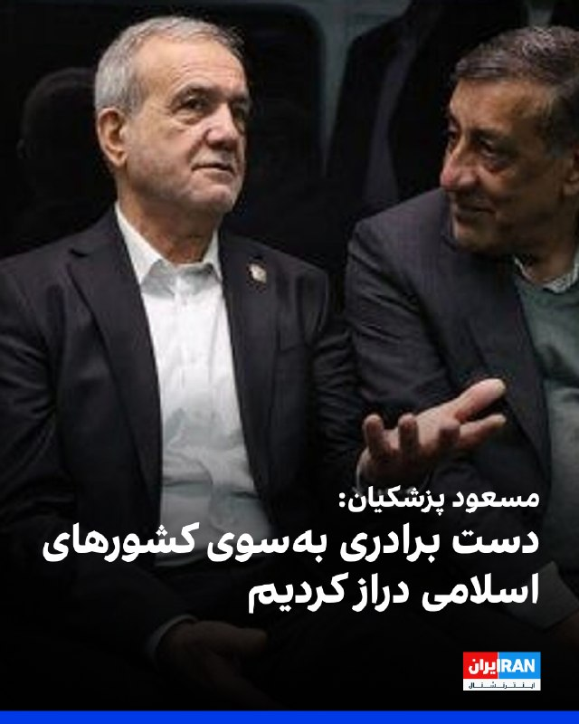

مسعود پزشکیان در پیامی به مناسبت عید قربان، نوشت که جمهوری اسلامی دست برادری به سوی کشورهای اسلامی دراز کرده و همزمان در صیانت از اقتدار خود ذره‌ای تردید ندارد.

او پیش‌تر نیز تلفنی با سران قطر، مصر، عمان، مالزی، ترکیه و جمهوری آذربایجان، گفت‌وگو کرد.
https://iranintl.com/202605263908

## IranIntlTV — post 339128

  

دونالد ترامپ در شبکه تروث سوشال نوشت معاینه شش‌ماهه خود را در مرکز پزشکی نظامی والتر رید به پایان رسانده و نتایج آن کاملا مطلوب بوده است. او از پزشکان و کارکنان این مرکز قدردانی کرد و گفت در حال بازگشت به کاخ سفید است.
https://iranintl.com/202605260974

## IranIntlTV — post 339127

  

🔻علیرضا فیروزجا، نماینده فرانسه در دور نخست رقابت‌های شطرنج نروژ موفق شد مگنوس کارلسن، مرد شماره یک شطرنج جهان را شکست دهد؛ آن هم در حالی که به دلیل آسیب‌دیدگی مچ پا با کمک صندلی مخصوص بازی می‌کرد.

🔹فیروزجا هفته گذشته پس از سقوط از روی سکو در مسابقات بخارست مصدوم شد.

@iranintltvsport

## IranIntlTV — post 339126

  <a href="telegram/content/IranIntlTV_339126_1779816815.mp4" target="_blank">🎬 Download video</a>

یک شهروند با ارسال پیامی به ایران اینترنشنال توافق احتمالی دونالد ترامپ با جمهوری اسلامی را خیانت به مردم ایران می‌داند. پیام او با هوش مصنوعی خوانده شده است.

## IranIntlTV — post 339125

  <a href="telegram/content/IranIntlTV_339125_1779816817.mp4" target="_blank">🎬 Download video</a>

یک شهروند با ارسال پیامی به ایران اینترنشنال خطاب به رییس‌جمهور آمریکا می‌گوید که باید مقابله با جمهوری اسلامی را به بنیامین نتانیاهو بسپرد. صدای او با هوش مصنوعی خوانده شده است.

## IranIntlTV — post 339124

  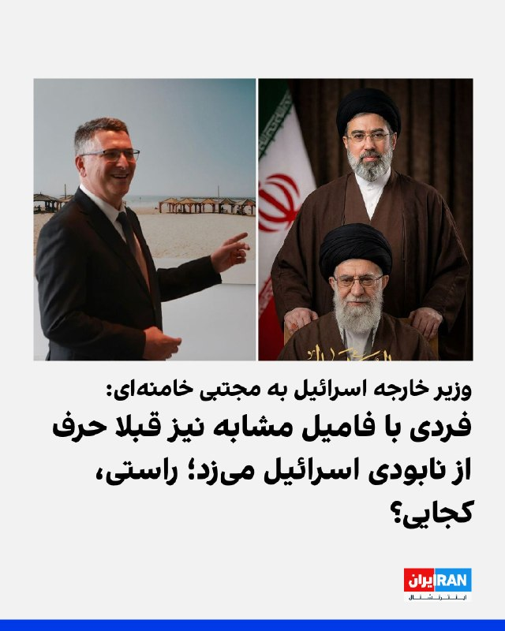

گیدئون سعار، وزیر خارجه اسرائیل، در واکنش به پستی منتسب به مجتبی خامنه‌ای که موجودیت اسرائیل را تهدید کرده بود، در شبکه ایکس نوشت: «آشنا به نظر می‌رسد. یادم هست فردی با نام‌خانوادگی مشابه قبلا چنین حرف‌هایی می‌زد. راستی، کجایی؟»

علی خامنه‌ای، رهبر کشته‌شده جمهوری اسلامی، نیز ۱۸ شهریور ۱۳۹۴ گفته بود که اسرائیل، «۲۵ سال آینده را نخواهد دید.»
https://iranintl.com/202605269198

## IranIntlTV — post 339123

  <a href="telegram/content/IranIntlTV_339123_1779816819.mp4" target="_blank">🎬 Download video</a>

تیتراول با نیوشا صارمی، سه‌شنبه ۵ خرداد
@iranintltv

## IranIntlTV — post 339122

  <a href="telegram/content/IranIntlTV_339122_1779816820.mp4" target="_blank">🎬 Download video</a>

دو نماینده عضو جبهه پایداری با انتقاد شدید از قالیباف و پزشکیان گفتند در متن توافق شده با آمریکا، خطوط قرمز مجتبی خامنه‌ای رعایت نشده. امیرحسین ثابتی گفت با توافق هم دوباره جنگ می‌شود و ترور مقامات ادامه می‌یابد. دلیل این مخالفت‌های برنامه‌ریزی شده چییست؟گزارشی از مجتبا پورمحسن
@iranintltv

## IranIntlTV — post 339121

  

مسعود پزشکیان، رییس دولت جمهوری اسلامی، به‌صورت تلفنی با رجب طیب اردوغان، الهام علی‌اف و عبدالفتاح السیسی، روسای جمهور ترکیه، آذربایجان و مصر، شیخ تمیم بن حمد آل ثانی، امیر قطر، هیثم بن طارق، سلطان عمان و انور ابراهیم، نخست‌وزیر مالزی، درباره تحولات خاورمیانه گفت‌وگو کرد.
https://iranintl.com/202605260356

## IranIntlTV — post 339120

  <a href="https://t.me/IranintlTV/339120" target="_blank">📎 Download file</a>

🎧نسخه صوتی اخبار شبانگاهی | سه‌شنبه ۵ خرداد
@iranintlTV

## IranIntlTV — post 339119

  

الحدث به نقل از یک منبع آمریکایی گزارش داد اسرائیل در حال حاضر بر جلوگیری از تهدید عمق سرزمینی خود از سوی حزب‌الله تمرکز کرده است.

این منبع افزود هدف کنونی اسرائیل ورود به یک رویارویی جامع بر سر سلاح‌های حزب‌الله یا نقش داخلی این گروه نیست.

بر اساس این گزارش، اسرائیل ممکن است عملیات خود را فراتر از «خط زرد» و حتی به مناطق عمیق‌تر گسترش دهد.

یک منبع دیگر به الحدث گفت واشینگتن با هدف قرار دادن زیرساخت‌های نظامی حزب‌الله و کاهش توانمندی‌های آن از سوی اسرائیل مخالفتی ندارد و تشدید اخیر عملیات نظامی اسرائیل در جنوب لبنان را منفی ارزیابی نمی‌کند.

این منبع همچنین گفت اسرائیل با هدف بازگرداندن ساکنان مناطق شمالی به خانه‌هایشان اقدام می‌کند و افزود حزب‌الله با استفاده از پهپادها و سخنان اخیر نعیم قاسم مسئول فروپاشی روند کاهش تنش است.
https://iranintl.com/202605262713

## IranIntlTV — post 339117

  

نت‌بلاکس، نهاد ناظر بر دسترسی آزاد به اینترنت و اختلال‌های شبکه، از بازگشت جزئی اتصال به اینترنت در ایران خبر داد.

اگر امشب اینترنت دارید، روی خط بیایید.

«برنامه» صدای شماست.

ما شما را، بدون نوبت، مستقیم از ایران روی خط می‌آوریم.

بیایید و روایت خود را برای همیشه ثبت کنید.

تاریخ با صدای شما نوشته می‌شود.

برای شرکت در برنامه، همین حالا در واتس‌اپ پیام بدهید: ۰۰۴۴۷۵۲۲۱۱۰۱۱۰

۰۰۴۴۷۵۴۴۱۱۰۱۱۰

۰۰۴۴۷۵۱۱۱۰۲۵۵۳

«برنامه با کامبیز حسینی»

«یک ایران صدای شما را می‌شنود»
@iranintltv

## IranIntlTV — post 339116

  

منابع آمریکایی در گفت‌وگو با العربیه گزارش‌ها درباره از سرگیری کمک‌رسانی در تنگه هرمز را تکذیب کردند.

پیشتر وال‌استریت‌ژورنال در گزارشی عنوان کرده بود که نیروی دریایی آمریکا کمک‌رسانی و هدایت کشتی‌ها در تنگه هرمز را از سر گرفته است.

https://iranintl.com/202605267877

## IranIntlTV — post 339115

  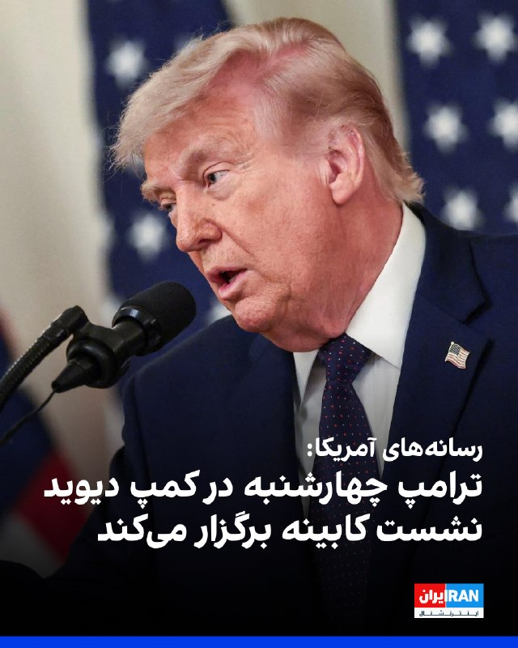

سی‌بی‌اس‌نیوز به نقل از منابع آگاه گزارش داد دونالد ترامپ صبح چهارشنبه در کمپ دیوید نشست کابینه برگزار می‌کند. نیویورک‌پست نوشت همه اعضای کابینه حضور خواهند داشت و جنگ ایران محور اصلی گفت‌وگوهاست. کاخ سفید اعلام کرد تولسی گبرد نیز در این نشست شرکت می‌کند.
https://iranintl.com/202605262754

## IranIntlTV — post 339114

  <a href="telegram/content/IranIntlTV_339114_1779816824.mp4" target="_blank">🎬 Download video</a>

بر اساس اطلاعات رسیده به ایران‌اینترنشنال، عباس یحیی‌بیگی، فوتبالیست اراکی و بازیکن پیشین لیگ برتر، از زمان اعتراضات دی‌ماه در بازداشت است. همزمان دو ملی‌پوش پیشین فوتبال اعلام کرده‌اند او به محاربه متهم شده و در خطر صدور حکم اعدام قرار دارد.
جزییات بیشتر با مهدی رستم‌پور، روزنامه‌نگار ورزشی
@iranintltv

## IranIntlTV — post 339113

  <a href="telegram/content/IranIntlTV_339113_1779816826.mp4" target="_blank">🎬 Download video</a>

یک شهروند با ارسال ویدیویی به ایران‌اینترنشنال از تعطیلی یک سیلوی گندم پس از جنگ و ادامه تعطیلی آن در بحران افزایش قیمت نان روایت می‌کند و می‌گوید: «حکومت به دنبال جنگ و مذاکره است و مردم دنبال پول و نان هستند.»

## IranIntlTV — post 339112

  <a href="telegram/content/IranIntlTV_339112_1779816827.mp4" target="_blank">🎬 Download video</a>

احسان چیت‌ساز، معاون وزارت ارتباطات، اعلام کرد روند اتصال به اینترنت جهانی به‌صورت تدریجی انجام خواهد شد. همزمان گزارش‌ها حاکی از آن است که پس از برقراری اینترنت دیتاسنترها، سرویس‌های خانگی و اپراتورهای موبایل نیز در حال اتصال به اینترنت بین‌المللی هستند.
گفت‌وگو با مهدی صارمی‌فر، روزنامه‌نگار علم و تکنولوژی

@iranintltv

## IranIntlTV — post 339111

  

گروه نت‌بلاکس در حساب خود در شبکه اجتماعی ایکس اعلام کرد داده‌های زنده پایش اینترنت نشان می‌دهد پس از ۸۸ روز، اتصال به اینترنت در ایران به‌طور جزئی (۳۴ درصد) برقرار شده است. این قطع سراسری حدود ۲٬۰۹۳ ساعت طول کشید و طولانی‌ترین خاموشی اینترنت در سطح ملی در تاریخ مدرن به شمار می‌رود.
نت‌بلاکس افزود: هنوز مشخص نیست این بازگشت اتصال پایدار خواهد بود یا خیر.
https://iranintl.com/202605265652

## IranIntlTV — post 339110

  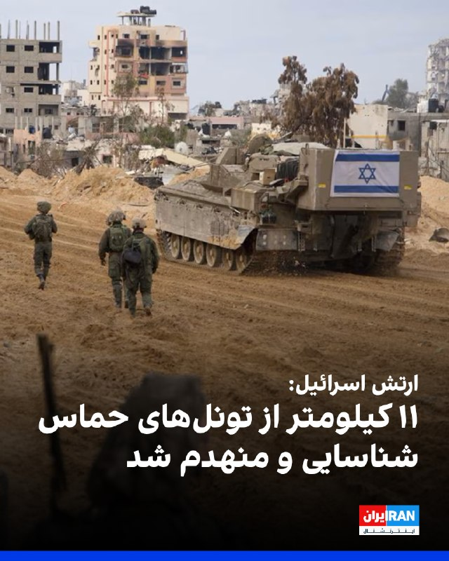

ارتش اسرائیل گزارش داد نیروهای این کشور یک عملیات را در منطقه بیت‌حانون در شمال غزه به پایان رسانده‌اند.
بر اساس این گزارش، طی این عملیات حدود ۱۱ کیلومتر از تونل‌های مورد استفاده حماس شناسایی و منهدم شده است.
همزمان، رسانه‌های اسرائیلی گزارش دادند ارتش این کشور عملیات زمینی خود در جنوب لبنان را فراتر از «خط زرد» گسترش داده است.
«خط زرد» اصطلاحی است که ارتش اسرائیل برای محدوده عملیاتی تعیین‌شده در جنوب لبنان به‌کار می‌برد.
https://iranintl.com/202605266611

## IranIntlTV — post 339109

  <a href="telegram/content/IranIntlTV_339109_1779816830.mp4" target="_blank">🎬 Download video</a>

سرخط خبرهای سه‌شنبه ۵ خرداد
@iranintltv

## Shin_Persian — post 6247

↩️ Quoted tweet: Fox News ✓ @FoxNews Tue, 26 May 2026 15:17:47 UTC BREAKING: President Trump will convene a rare Cabinet meeting at Camp David on Wednesday as negotiations with Iran enter a critical phase. All Cabinet members are expected to attend the…

## Shin_Persian — post 6246

↩️ Quoted tweet:
Fox News ✓ @FoxNews
Tue, 26 May 2026 15:17:47 UTC

BREAKING: President Trump will convene a rare Cabinet meeting at Camp David on Wednesday as negotiations with Iran enter a critical phase.

All Cabinet members are expected to attend the meeting, Fox News has confirmed, including outgoing Director of National Intelligence Tulsi

↩️ توییت نقل‌قول شده — برای پاسخ، پست زیر را ببینید.

فارسی

فوری: پرزیدنت ترامپ روز چهارشنبه در حالی که مذاکرات با ایران وارد مرحله‌ ای حیاتی می‌شود، یک جلسه نادر هیئت دولت را در کمپ دیوید برگزار خواهد کرد.

فاکس نیوز تایید کرده است که انتظار می‌رود تمام اعضای کابینه در این جلسه شرکت کنند، از جمله تولسی گبرد، مدیر آتی اطلاعات ملی (DNI).

𝕏 · @shin_persian

## Shin_Persian — post 6245

↩️ Quoted tweet: Amichai Stein ✓ @AmichaiStein1 Tue, 26 May 2026 15:09:36 UTC US official to @Jerusalem_Post: U.S. forces are not currently escorting commercial shipping through the Strait of Hormuz. ↩️ توییت نقل‌قول شده — برای پاسخ، پست زیر را ببینید.…

## Shin_Persian — post 6244

↩️ Quoted tweet:
Amichai Stein ✓ @AmichaiStein1
Tue, 26 May 2026 15:09:36 UTC

US official to @Jerusalem_Post: U.S. forces are not currently escorting commercial shipping through the Strait of Hormuz.

↩️ توییت نقل‌قول شده — برای پاسخ، پست زیر را ببینید.

فارسی

یک مقام آمریکایی به @Jerusalem_Post: نیروهای ایالات متحده در حال حاضر کشتی‌های تجاری را در حین عبور از تنگه هرمز اسکورت نمی‌کنند.

𝕏 · @shin_persian

## Shin_Persian — post 6243

OSINTtechnical ✓ @Osinttechnical
Tue, 26 May 2026 14:53:39 UTC

The US has restarted “Project Freedom,” the mission to escort vessels through the contested Strait of Hormuz -WSJ

Project Freedom had been suspended earlier this month after Iran responded by attacking the UAE.

فارسی

ایالات متحده «پروژه آزادی»، مأموریت اسکورت شناورها از طریق تنگه چالش‌برانگیز هرمز را از سر گرفته است. - وال‌استریت ژورنال

پروژه آزادی در اوایل این ماه پس از آنکه ایران با حمله به امارات متحده عربی به آن پاسخ داد، به حالت تعلیق درآمده بود.

𝕏 · @shin_persian

## FarsiVOA — post 218725

🔺شورای همکاری خلیج فارس: حزب‌الله با تمام اشکال و شاخه‌ها، یک گروه تروریستی به حساب می‌آید

▪️به دنبال انتقاد نعیم قاسم دبیرکل گروه تروریستی حزب‌الله لبنان از اقدامات دولت بحرین، جاسم بدیوی دبیرکل شورای همکاری خلیج فارس، شامگاه شب گذشته ۴ خرداد ۱۴۰۵، ضمن محکوم کردن این سخنان، واکنش تندی به آن نشان داد.

⬇️ بیشتر بخوانید:

https://ir.voanews.com/a/bahrain-lebanon-hezbollah-iran-proxy-war-/8154099.html/?nocach=1

## FarsiVOA — post 218724

  <a href="telegram/content/FarsiVOA_218724_1779816831.mp4" target="_blank">🎬 Download video</a>

ارتش اسرائیل ویدیویی از حملات هوایی به مواضع حزب‌الله در جنوب لبنان منتشر و تاکید کرد نیروهایش به هدف‌گیری زیرساخت‌های این سازمان تروریستی در جنوب لبنان ادامه می‌دهند.

ارتش اسرائیل در ادامه اعلام کرد «تروریست‌هایی که در حال پیشبرد طرح‌های تروریستی علیه نیروهای ما بودند به هلاکت رسیدند و زیرساخت‌هایی که برای شلیک راکت استفاده می‌شدند هدف قرار گرفتند.»

## FarsiVOA — post 218723

در میدان پرسیدیم: چرا ساواک پرویز قلیچ‌خانی، ستاره فوتبال ایران را بازداشت کرد؟

## FarsiVOA — post 218722

جنگ قدرت در مجلس جمهوری اسلامی؛ حمله رسایی و ثابتی به قالیباف و رهبر سوم غایب

## FarsiVOA — post 218721

وضعیت فوق بحرانی پنج «سد» در مناطق مختلف ایران، به‌رغم افزایشی اندک در میزان بارش سالانه گفت‌وگو با منصور سهرابی، متخصص محیط زیست و بوم شناسی

## FarsiVOA — post 218720

سایه جنگ پس از آتش‌بس؛ موج تازه حملات به اردوگاه‌های احزاب کردستان ایران در اقلیم

## FarsiVOA — post 218719

در فاصله شانزده روز تا آغاز جام جهانی ۲۰۲۶، تیم ملی جمهوری اسلامی همچنان با ابهام‌های جدی روبه‌روست؛ از انتقال کمپ از آمریکا به مکزیک گرفته تا بحث ویزا، محدودیت‌های سفر و فشارهای سیاسی.

## FarsiVOA — post 218718

در گفت‌وگو با سارا کرمانیان، پژوهشگر روابط بین‌الملل دانشگاه ساسکس، به حملات «دفاعی» سنتکام در تنگه هرمز و شکاف میان روایت رسانه‌های حکومتی و واکنش محدود میدانی جمهوری اسلامی پرداختیم و بررسی کردیم چگونه سیاست «صلح از طریق قدرت» دولت ترامپ مسیر مذاکرات پایان جنگ را شکل می‌دهد

## FarsiVOA — post 218717

  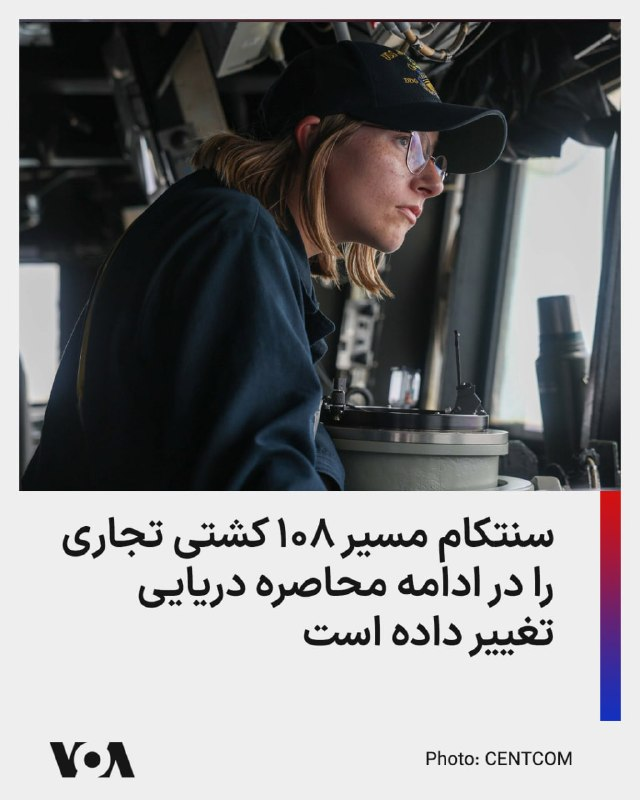

ستاد فرماندهی مرکزی ایالات متحده آمریکا، سنتکام، اعلام کرد در جریان اجرای محاصره دریایی آمریکا علیه جمهوری اسلامی، مسیر ۱۰۸ کشتی تجاری را تغییر داده است.

سنتکام این به‌روزرسانی را در شبکه اجتماعی ایکس همراه با تصویری از یک ملوان در حال نگهبانی بر ناوشکن یواس‌اس جان فین منتشر کرد.

ایالات متحده از اواخر فروردین ۱۴۰۵، محاصره دریایی علیه جمهوری اسلامی ایران را در واکنش به اقدام رژیم ایران در بستن تنگه هرمز آغاز کرده است.

## FarsiVOA — post 218716

🔺رئیس اف‌بی‌آی: آمریکا برای مقابله با قاچاق انسان در جام جهانی فوتبال آماده می‌شود

▪️کش پتل، رئیس پلیس فدرال آمریکا «اف‌بی‌آی»، اعلام کرد این نهاد امنیتی فعالیت‌های گسترده‌ای را برای مقابله با قاچاق انسان و سوءاستفاده جنسی در جریان مسابقات جام جهانی فوتبال آغاز کرده است، و هشدار داد شبکه‌های بین‌المللی قاچاق انسان ممکن است از این رویداد بزرگ ورزشی سوءاستفاده کنند.

⬇️ بیشتر بخوانید:

https://ir.voanews.com/a/kash-patel-fbi-breaking-human-trafficking-networks-during-fifa-world-cup/8154088.html/?nocach=1

## FarsiVOA — post 218715

مارکو روبیو با اشاره به حملات هوایی آمریکا به جمهوری اسلامی ایران: تنگه هرمز به هر نحوی باید باز بماند

## FarsiVOA — post 218714

پرویز قلیچ‌خانی، ستاره سرشناس فوتبال ایران پس از انقلاب ۵۷ ناگزیر به ترک کشور شد و دلشکستگی‌اش را با انتشار مجله «آرش» پاسخ داد

## FarsiVOA — post 218713

🔺بازگشایی قطره‌چکانی و ناپایدار اینترنت بر روی مردم ایران؛ ۸۸ روز خاموشی دیجیتال

◾️اخبار رسانه‌های داخلی و گزارش‌های کاربران نشان می‌دهد جمهوری اسلامی از عصر سه‌شنبه ۵ خرداد، بعد از ۸۸ روز قطع کامل اینترنت و خاموشی دیجیتال، به صورت محدود اتصال شماری از شهروندان ایرانی به اینترنت جهانی را میسر کرده است.

⬇️ بیشتر بخوانید:

https://ir.voanews.com/a/iran-internet-pezeshkian-blackout-connections-/8154073.html

## FarsiVOA — post 218712

در گفت‌وگو با حسن هاشمیان بررسی کردیم پیوند زدن توافق احتمالی آمریکا با جمهوری اسلامی به گسترش پیمان‌های ابراهیم چه پیامدی دارد و آیا گره خوردن عادی‌سازی روابط منطقه با اسرائیل به پرونده ایران به ثبات می‌انجامد یا معادلات امنیتی را پیچیده‌تر می‌کند

## FarsiVOA — post 218711

  <a href="telegram/content/FarsiVOA_218711_1779816833.mp4" target="_blank">🎬 Download video</a>

ارتش اسرائیل اعلام کرد درپی عملیات مهندسی چندماهه در بیت حانون در شمال غزه، حدود ۱۱ کیلومتر از تونل‌های حماس را کشف و نابود کرد.

لشکر ۲۵۲ از سپاه مهندسی رزمی ارتش اسرائیل، با حفر پی در پی در امتداد خط زرد مسیرهای زیرزمینی و صدها زیرساخت دیگر این گروه تروریستی را منهدم کردند.

## FarsiVOA — post 218710

🔺پرونده‌سازی در زندان؛ حشمت‌الله طبرزدی به ۳ سال حبس اضافه محکوم شد

▪️به گزارش وبسایت هرانا، حشمت‌الله طبرزدی که اکنون در زندان دستگرد اصفهان محبوس زندانی است، به سه سال زندان دیگر محکوم شده است.

⬇️ بیشتر بخوانید:

https://ir.voanews.com/a/heshmatollah-tabarzadi-extra-prison-sentence-prison/8154058.html/?nocach=1

## FarsiVOA — post 218709

یاد و خاطره پرویز قلیچ‌خانی در میدان: چگونه یک ستاره ورزشی می‌تواند همواره کنار مردم بایستد؟

## FarsiVOA — post 218708

  <a href="telegram/content/FarsiVOA_218708_1779816834.mp4" target="_blank">🎬 Download video</a>

ادامه حملات هوایی اسرائیل در جنوب لبنان؛ بعد از حملات پهپادی گروه تروریستی حزب‌الله به مناطق مرزی اسرائیل در شب گذشته، ارتش اسرائیل هشدار تخلیه تازه‌ای در روز سه‌شنبه ۵ خرداد برای ساکنان شهر نبطیه، از مهمترین شهرهای منطقه جبل‌علی لبنان صادر کرده بود.

## FarsiVOA — post 218707

  <a href="telegram/content/FarsiVOA_218707_1779816835.mp4" target="_blank">🎬 Download video</a>

یزدان شهدایی در میدان می‌گوید پرویز قلیچ‌خانی با «لایک» قهرمان نشده بود و علیرضا مرزبان اورا چهره‌ای می‌نامد که هرگز در برابر دیکتاتوری سر خم نکرد

## FarsiVOA — post 218706

🔺هشدار تخلیه ارتش اسرائیل به ساکنان نبطیه لبنان بعد از حملات حزب‌الله

◾️بعد از حملات پهپادی گروه تروریستی حزب‌الله به مناطق مرزی اسرائیل در شب گذشته، ارتش اسرائیل هشدار تخلیه تازه‌ای در روز سه‌شنبه ۵ خرداد برای ساکنان شهر نبطیه، از مهمترین شهرهای منطقه جبل‌عامل لبنان صادر کرد.

⬇️ بیشتر بخوانید:

https://ir.voanews.com/a/hezbollah-lebanon-israel-iran-war/8154050.html

## DW_Farsi — post 125170

  

🔶 نت‌بلاکس : نشانه‌های برگشت اینترنت در ایران دیده می‌شود

نت‌بلاکس، نهاد ناظر بر وضعیت اینترنت در جهان اعلام کرد، بالاخره بعد از ۲۰۹۳ ساعت قطعی، نشانه‌هایی از اتصال مجدد اینترنت در ایران دیده می‌شود.

نت‌بلاکس می‌گوید، در ۸۸مین روز و پس از ۲۰۹۳ ساعت قطعی، بخشی از اتصال اینترنت در ایران برقرار شده است.

این نهاد همچنین نوشت، این مدت خاموشی اینترنت در ایران "طولانی‌ترین قطع سراسری" این شبکه جهانی ارتباطی در تاریخ معاصر به شمار می‌رود.

نت‌بلاکس همچنین با ابراز تردید نسبت به ثبات اتصال اینترنت در ایران ادامه داد: «مشخص نیست که این بازگشت ارتباط، پایدار خواهد بود یا نه.»

@dw_farsi

## DW_Farsi — post 125169

  

🔶 وزارت خارجه جمهوری اسلامی: ارتش آمریکا آتش‌بس را نقض کرده است

وزارت خارجه ایران طی بیانیه‌ای حملات تازه آمریکا به جنوب کشور را محکوم کرد و آن را "نقض آتش‌بس" اعلام‌شده در ۱۹ فروردین خواند.

در این بیانیه آمده است که ارتش آمریکا با این حملات "مرتکب نقض فاحش آتش‌بس در منطقه هرمزگان شد".

صبح روز سه‌شنبه ۵ خرداد فرماندهی مرکزی ایالات متحده (سنتکام) اعلام کرد که ارتش این کشور در جنوب ایران در "دفاع از خود" عملیاتی انجام داده و مواضع پرتاب موشک و شناورهای ایرانی که "در حال تلاش برای مین‌گذاری بودند" را هدف قرار داده است.

سنتکام افزود که ارتش آمریکا در طول آتش‌بس جاری ضمن خویشتنداری، همچنان به دفاع از نیروهای خود ادامه خواهد داد.

در همین حال در بامداد سه‌شنبه برخی اخبار منتشره در شبکه‌های اجتماعی حاکی از شنیده شدن صدای انفجار و پدافند هوایی در بندرعباس، سیریک و جاسک بود.

رسانه‌های ایران نیز صبح همین روز از "حمله جنگنده‌های آمریکایی به چند شناور ایرانی در جنوب جزیره لارک" و "کشته شدن سه نفر در این حملات" خبر دادند.

@dw_farsi

## DW_Farsi — post 125168

  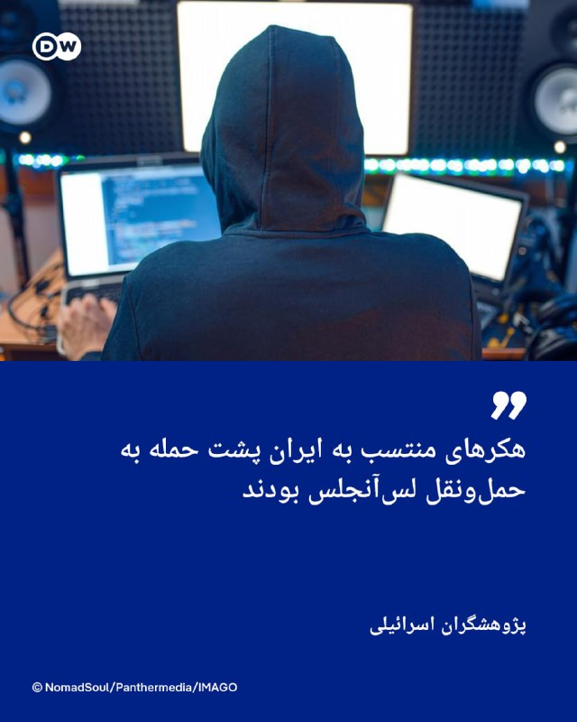

🔶 پژوهشگران اسرائيلی: هکرهای منتسب به ایران پشت حمله به حمل‌ونقل لس‌‌آنجلس بودند

پژوهشگران اسرائیلی می‌گویند، هکرهای منتسب به ایران مسئول یک حمله سایبری مخرب در ماه مارس بودند که باعث شد بخش‌هایی از شبکه حمل‌ونقل عمومی شهر لس‌آنجلس از کار بیفتد.

به گفته شرکت امنیت سایبری گمبیت سکیوریتی (Gambit Security) مستقر در تل‌آویو، مهاجمان دست‌کم ۷۰۰ گیگابایت ایمیل، نسخه‌های پشتیبان و سایر فایل‌ها را از سازمان حمل‌ونقل شهری لس‌آنجلس (LACMTA) ربودند.

این شرکت اعلام کرد که داده‌های به‌سرقت‌رفته را پس از آن کشف کرده که به‌طور ناخواسته در اینترنت افشا شدند.

این شرکت می‌گوید، شواهد دیجیتالی حاکی از آن است که سروری که داده‌ها روی آن پیدا شده، به یک عملیات هکری شناخته‌شده قبلی مرتبط بوده که مقام‌ها و پژوهشگران اسرائیلی آن را به تهران نسبت داده بودند.

رویترز که این خبر را منتشر کرده می‌گوید، نمایندگی ایران در سازمان ملل تا کنون به درخواست‌ها برای اظهارنظر پاسخی نداده است.

همچنین اداره ملی سایبری اسرائیل نیز این درخواست‌ها را بی‌پاسخ گذاشته است.

@dw_farsi

## DW_Farsi — post 125167

  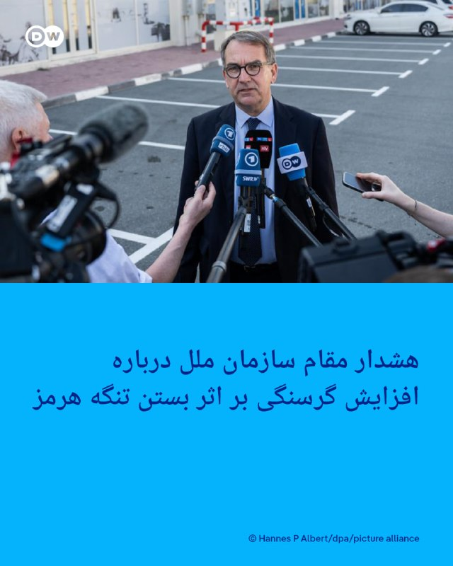

🔶 هشدار مقام سازمان ملل درباره افزایش گرسنگی بر اثر بستن تنگه هرمز

مارتین فریک، مدیر برنامه جهانی غذای سازمان ملل (WFP) در آلمان، اتریش و لیختن‌اشتاین در مورد پیامدهای انسانی و اقتصادی مسدود شدن تنگه هرمز هشداری جدی داده است.

به گزارش وب‌سایت روزنامه استاندارد، فریک در توضیح ابعاد موضوع گفت: «بسته شدن تنگه هرمز از نظر تأثیر، تقریبا به همان شکلی ما را تحت تأثیر قرار می‌دهد که همه‌گیری کووید [ویروس کرونا] یا جنگ تهاجمی روسیه علیه اوکراین ما را تحت تأثیر قرار داد.»

به گفته او، پیامدهای کامل این وضعیت هنوز به‌طور دقیق قابل پیش‌بینی نیست.

فریک به وضعیت اقتصادی شکننده در برخی کشورها اشاره کرده و می‌گوید: «سه میلیارد نفر در کشورهایی زندگی می‌کنند که آن‌قدر بدهکارند که هزینه بازپرداخت بدهی‌هایشان از بودجه‌ای که صرف آموزش یا بهداشت و درمان می‌کنند بیش‌تر است.»

این مقام سازمان ملل هشدار می‌دهد که اگر در چنین کشورهایی قیمت واردات بیش از این افزایش یابد، خانواده‌های بیشتری در معرض خطر سقوط به ورطه گرسنگی قرار خواهند گرفت.

@dw_farsi

## DW_Farsi — post 125166

🔶 دومین مورد تأییدشده ویروس هانتا در اسپانیا

حدود هشت هفته پس از شیوع ویروس هانتا در کشتی تفریحی "هوندیوس"، امروز سه‌شنبه ۲۶ مه (۵ خرداد) دومین مورد ابتلا به این ویروس در اسپانیا تأیید شد.

وزارت بهداشت این کشور اعلام کرد که نتیجه آزمایش یک مسافر اسپانیایی این کشتی کروز که اکنون در قرنطینه است، مثبت بوده است. همچنین تأکید شده است که این مورد جدید «هیچ تغییری در سطح خطر برای عموم مردم ایجاد نمی‌کند.»

بر اساس این گزارش، بیمار اکنون به بخش قرنطینه با سطح بالای حفاظت در یک بیمارستان نظامی منتقل شده است. پیش‌تر نیز نتیجه آزمایش یکی دیگر از مسافران اسپانیایی، اندکی پس از ترک کشتی "هوندیوس" مثبت اعلام شده بود.

در مجموع، پس از تخلیه کشتی، ۱۴ مسافر اسپانیایی "هوندیوس" به یک بیمارستان نظامی در مادرید منتقل و در آنجا بستری شده بودند.

سازمان بهداشت جهانی (WHO) شنبه گذشته اعلام کرد که از زمان شیوع ویروس هانتا در این کشتی تفریحی، در مجموع ۱۲ مورد قطعی یا مشکوک به ابتلا، به این سازمان گزارش شده است.

سه مسافر، از جمله یک زن آلمانی، در پی ابتلا به این ویروس جان باختند.

مقام‌های اسپانیا حدود دو هفته پیش با اجازه لنگر انداختن کشتی "هوندیوس" در نزدیکی جزیره تنریف، بزرگ‌ترین جزیره جزایر قناری، زمینه تخلیه آن را فراهم کردند و مسافران و خدمه از کشتی خارج شدند.

از آن زمان تاکنون، به دلیل دوره نهفتگی طولانی و احتمال مرگبار بودن ابتلا به ویروس هانتا، افراد درگیر در قرنطینه قرار گرفته و تحت مراقبت‌های پزشکی هستند.

شیوع این ویروس خطرناک در جریان سفر کشتی تفریحی "هوندیوس" از جنوبی‌ترین نقطه آرژانتین به مقصد جزایر "کیپ ورد" رخ داد.

ویروس‌های هانتا موجب بیماری‌های شدید تنفسی می‌شوند و هنوز هیچ واکسنی برای مقابله با آنها وجود ندارد. این ویروس‌ها معمولاً از طریق ادرار، مدفوع و بزاق جوندگان آلوده منتقل می‌شوند.

گونه ویروسی که در کشتی "هوندیوس" شیوع پیدا کرد، ویروس "آند" بود. این تنها گونه از ویروس هانتا است که انتقال آن از انسان به انسان به طور قطعی اثبات شده است.

گرچه ویروس‌های هانتا تقریباً در سراسر جهان وجود دارد و گزینه‌های امیدوارکننده‌ای نیز برای واکسن‌ها و روش‌های درمانی آنها در دست بررسی است، اما پژوهشگران برای رساندن آن به مرحله عرضه در بازار، به بودجه بیشتر و نیز شمار بیشتر بیماران نیاز دارند.

@dw_farsi

## DW_Farsi — post 125165

  

🔶 سازمان دریایی بریتانیا: سانحه‌‌ای در ۶۰ مایلی مسقط رخ داده است

سازمان عملیات تجارت دریایی بریتانیا (UKMTO ) از وقوع سانحه‌ای در فاصله ۶۰ مایلی دریایی شرق مسقط، پایتخت عمان خبر داده است.

به گزارش این سازمان، ناخدای یک نفتکش گزارش داده که یک انفجار خارجی در اطراف این کشتی رخ داده است.

بنا بر این گزارش، خدمه و کشتی در امنیت هستند، اما ناخدا گزارش داده که مقداری از سوخت کشتی به دریا نشت کرده است.

مقامات در حال بررسی این حادثه هستند.

سازمان عملیات تجارت دریایی بریتانیا به تمامی شناورها توصیه کرده که با احتیاط عبور کنند و هرگونه فعالیت مشکوک را به این سازمان گزارش دهند.

@dw_farsi

## Persian_Trend_Official — post 15083

⭕️لایو یوتیوب امشب ساعت ۲۲ برگزار میشود

🫆:Tony

📌 @persian_trend_official
پرشین ترند | متفاوت‌ترین کانال نظامی

## Persian_Trend_Official — post 15082

  <a href="telegram/content/Persian_Trend_Official_15082_1779816839.mp4" target="_blank">🎬 Download video</a>

تصاویری از لاشۀ پهپادی که دیروز با آتش سامانه جديد آرش‌های کمان‌گیر سپاه ساقط شد.

👩‍💻@PhantomDirective

🆔@persian_trend_official
پرشین ترند | متفاوت‌ترین کانال نظامی

## Persian_Trend_Official — post 15081

  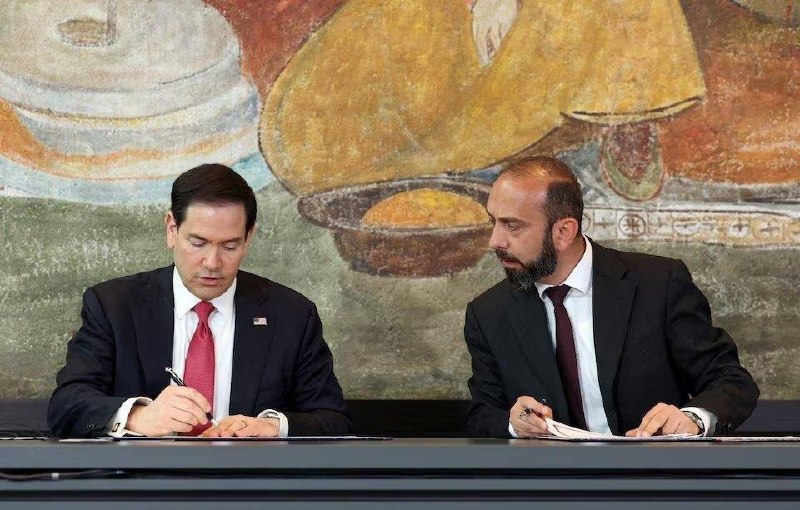

🔴 آمریکا و ارمنستان توافق شراکت راهبردی امضا کردند

▪️ آمریکا و ارمنستان در ایروان توافق شراکت راهبردی امضا کردند.

▪️ مارکو روبیو و آرارات میرزویان توافق‌هایی درباره مواد معدنی راهبردی و کریدور ترانزیتی ۴۳ کیلومتری میان نخجوان و ترکیه امضا کردند.

▪️ این توافق‌ها پیش از انتخابات پارلمانی ارمنستان و پس از تهدیدهای روسیه درباره افزایش قیمت گاز برای ایروان انجام شده است.

▪️ کریدور مورد بحث می‌تواند بخشی از مسیر ارتباطی میان آذربایجان و ترکیه باشد و اهمیت ژئوپلیتیکی بالایی در قفقاز دارد.

🫆:Tony

📌 @persian_trend_official
پرشین ترند | متفاوت‌ترین کانال نظامی

## Persian_Trend_Official — post 15080

⭕️بازگشت هیئت مذاکره کننده کشور از قطر

🔹رئیس مجلس و رئیس هئئت مذاکره کننده کشور که دیروز در راس هیئتی برای رایزنی با مقامات قطری به این کشور سفر کرده بود ساعتی پیش به کشور بازگشتند.
🫆:Tony

📌 @persian_trend_official
پرشین ترند | متفاوت‌ترین کانال نظامی

## RadioFarda — post 157586

  

🔸گزارش‌ها از ایران حاکی است که پس از برقراری اینترنت بین‌الملل روی برخی سرویس‌های ثابت، دسترسی کاربران تلفن همراه نیز به اینترنت جهانی به‌تدریج در حال بازگشت است.

🔸منابع خبری داخلی روز سه‌شنبه گزارش دادند که کاربران از برقراری اینترنت بین‌الملل روی تلفن‌های همراه خود خبر داده‌اند. همزمان گزارش‌هایی نیز از دسترسی دوباره به چت‌جی‌پی‌تی روی خطوط همراه اول و ایرانسل منتشر شده است.

🔸پیشتر وزارت ارتباطات اعلام کرده بود که «هماهنگی‌ها برای بازگشایی اینترنت همراه» در حال انجام است. معاون وزیر ارتباطات نیز روز سه‌شنبه گفته بود اینترنت همراه «امروز» وصل خواهد شد.

🔸ایسنا هم گزارش داده است که کاربران سرویس‌های پهن‌باند ثابت، از جمله اف‌تی‌تی‌اچ، وی‌دی‌اس‌ال و ای‌دی‌اس‌ال، اکنون بدون محدودیت به شبکه جهانی اینترنت متصل هستند و «امکان استفاده کامل از وب‌سایت‌ها و خدمات بین‌المللی برای آن‌ها فراهم شده است.» همچنین گزارش شده «اتصال کامل» اینترنت بین‌الملل در مخابرات ایران برقرار شده است.

@RadioFarda

## RadioFarda — post 157585

نتانیاهو: ارتش اسرائیل با «نیروهای گسترده زمینی» در جنوب لبنان عملیات می‌کند

🔸بنیامین نتانیاهو، نخست‌وزیر اسرائیل، روز سه‌شنبه ۵ خرداد گفت ارتش این کشور با «نیروهای گسترده بر روی زمین» در جنوب لبنان در حال عملیات است و «مناطق راهبردی» را در کنترل خود می‌گیرد.

🔸این اظهارات، بر اساس بیانیه‌ای رسمی، در آغاز نشست کابینه امنیتی اسرائیل بیان شد.

🔸سخنان نتانیاهو پس از آن مطرح می‌شود که ارتش اسرائیل عملیات زمینی خود در جنوب لبنان را به فراتر از خط مرزی‌ای گسترش داد که اسرائیل پس از آتش‌بس ۱۶ آوریل با حزب‌الله، چند کیلومتر در داخل خاک لبنان تعیین کرده بود.

🔸بنابر گزارش‌ها، روز سه‌شنبه، پس از هشدار اسرائیل برای تخلیه، چندین حمله شهر نَبَطیه در جنوب لبنان را هدف قرار داد.

🔸همزمان یک مقام نظامی اسرائیل تأیید کرد که عملیات زمینی این کشور به نقاط عمیق‌تری در خاک لبنان گسترش یافته است.

🔸این حملات پس از آن انجام شد که بنیامین نتانیاهو، نخست‌وزیر اسرائیل، روز دوشنبه به ارتش خود دستور داد حملات علیه حزب‌الله را برای «درهم کوبیدن» این گروه مورد حمایت ایران تشدید کند. همان روز در حمله‌ای در شرق لبنان دست‌کم ۱۱ نفر کشته شدند.

🔸به نوشتۀ خبرگزاری فرانسه، در نبطیه پس از هشدار تخلیه، حملات هوایی آغاز شد و ستون‌های دود از چند نقطه در داخل شهر برخاست.

🔸گزارش کامل را در وب‌سایت رادیوفردا بخوانید.

@RadioFarda

## RadioFarda — post 157584

  <a href="https://t.me/radiofarda/157584" target="_blank">📎 Download file</a>

📻بشنوید: ایستگاه ۱۹ با رادیوفردا، پنجم خرداد ۱۴۰۵

@RadioFarda

## RadioFarda — post 157583

  <a href="https://t.me/radiofarda/157583" target="_blank">📎 Download file</a>

روشن شدن آرامِ چراغ اینترنت؛ نشانه انسجام یا انشقاق؟ گفت‌وگو با علی افشاری

🔸ساعات اولیه بعدازظهر روز پنجم خرداد کشمکش رسانه‌ای بر سر اینترنت و وصل شدنِ مجدد آن به اوج رسید. دولت در ایران می‌گفت تا ۲۴ساعت دیگر اینترنت باز می‌شود؛ اما از آن سو دیوان عدالت اداری رای داد که «ستاد ویژه ساماندهی و راهبری فضای مجازی» که رای به اتصال مجدد اینترنت داده بود «ساختاری غیرقانونی» داشته و از این رو اجرای تصمیماتش باید متوقف شود. زورآزمایی دقیقه آخر اما به نظر می‌آید فعلا به نفع دولت پیش رفته و اتصال به اینترنت آغاز شده اما سرنوشت این اتصال مشخص نیست. ارزیابی علی افشاری تحلیلگر سیاسی ساکن واشینگتن دی‌سی را درباره نزاع بر سر موضوع اینترنت در ساختار قدرت ایران بشنوید.

@RadioFarda

## RadioFarda — post 157582

🔸دونالد ترامپ، رئیس‌جمهور آمریکا، قرار است روز چهارشنبه نشستی کم‌سابقه با اعضای کابینه خود در اقامتگاه ریاست‌جمهوری کمپ دیوید برگزار کند؛ نشستی که به گفته یک مقام کاخ سفید، همزمان با نزدیک شدن مذاکرات مربوط به ایران به مرحله‌ای حساس برگزار می‌شود. 🔸خبرگزاری…

## RadioFarda — post 157581

  

🔸دونالد ترامپ، رئیس‌جمهور آمریکا، قرار است روز چهارشنبه نشستی کم‌سابقه با اعضای کابینه خود در اقامتگاه ریاست‌جمهوری کمپ دیوید برگزار کند؛ نشستی که به گفته یک مقام کاخ سفید، همزمان با نزدیک شدن مذاکرات مربوط به ایران به مرحله‌ای حساس برگزار می‌شود.

🔸خبرگزاری فرانسه با انتشار این خبر نوشت که انتخاب کمپ دیوید، اقامتگاهی دورافتاده در کوهستان‌های مریلند که ترامپ برخلاف بسیاری از رؤسای‌جمهور پیشین کمتر به آن رفت‌وآمد داشته، نشان‌دهنده حساسیت گفت‌وگوهای پیش رو ارزیابی شده است.

🔸روزنامه نیویورک‌پست گزارش داده که موضوع ایران محور اصلی این نشست خواهد بود و همه اعضای کابینه در آن حضور خواهند داشت. بر اساس این گزارش، مسائل اقتصادی نیز در دستور کار قرار دارد.

🔸دونالد ترامپ روز شنبه گفته بود توافق با تهران برای پایان دادن به جنگ خاورمیانه نزدیک است، اما همزمان هشدار داد که در صورت شکست مذاکرات، حملات آمریکا به ایران می‌تواند از سر گرفته شود.

@RadioFarda

## RadioFarda — post 157580

  

🔸بهای نفت روز سه‌شنبه پس از حملات تازه آمریکا به مواضعی در ایران دوباره افزایش یافت و امیدها به اعلام قریب‌الوقوع توافق برای بازگشایی تنگه هرمز کمرنگ شد.

🔸به نوشته خبرگزار ی فرانسه، در این روز، نفت برنت دریای شمال، شاخص جهانی نفت، بیش از سه درصد بالا رفت و بار دیگر به نزدیکی ۱۰۰ دلار در هر بشکه رسید.

🔸یک روز پیش از آن، انتشار گزارش‌هایی درباره احتمال توافق ایران و آمریکا برای پایان دادن به جنگ و بازگشایی تنگه هرمز، باعث افت بهای نفت به زیر ۱۰۰ دلار و رشد بازارهای سهام شده بود.

🔸ارتش آمریکا اعلام کرده است که به پایگاه‌های موشکی در جنوب ایران و قایق‌هایی که در حال مین‌گذاری بودند حمله کرده است. واشینگتن این حملات را «دفاعی» خوانده، اما ایران آن را نقض آتش‌بس دانسته است.

🔸در بازارهای سهام، وال‌استریت روز سه‌شنبه با رشد محدود آغاز به کار کرد، اما بازارهای اروپایی وضعیتی متفاوت داشتند و شاخص‌های فرانکفورت و پاریس کاهش یافتند. همزمان ارزش دلار تقویت شد.

@RadioFarda

## RadioFarda — post 157579

  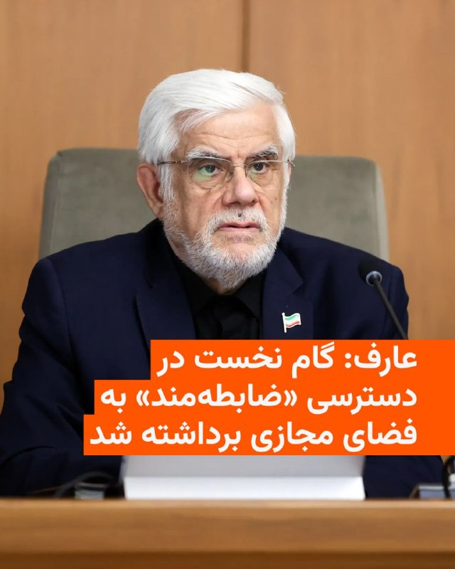

🔸روز سه‌شنبه ۵ خرداد، درپی وصل شدن محدود اینترنت جهانی در ایران، محمدرضا عارف، معاون اول رئیس جمهور، در پیامی گفت که این اقدام «پیرو مأموریت رئیس جمهور»‌ و به عنوان «گام نخست» در این راستا برداشته شده است.

🔸آقای عارف در پیام خود از این اقدام به‌عنوان گامی برای «دسترسی آزاد» به اینترنت جهانی یاد کرده، اما در ادامه، هدف آن را «دسترسی ضابطه‌مند به فضای مجازی» توصیف کرده است.

🔸او در مورد میزان این «ضابطه‌مندی» توضیحی نداده است.

🔸اینترنت در ایران، با وجودی که از قبل با سانسور و اعمال فیلترینگ گسترده روبه‌رو بود، از نهم اسفند پارسال همزمان با شروع جنگ آمریکا و اسرائیل با ایران و به بهانهٔ آن به‌طور کامل قطع شد.

@RadioFarda

## RadioFarda — post 157578

  <a href="https://t.me/radiofarda/157578" target="_blank">📎 Download file</a>

آیا ترامپ از موضع خود در قبال «غبار هسته‌ای» عقب‌نشینی کرد؟ گفت‌وگو با مهران مصطفوی

🔸دونالد ترامپ، رئیس‌جمهور آمریکا، می‌گوید اورانيوم غنی‌شده ایران یا آن‌طور که آن را «غبار هسته‌ای» می‌خواند يا فوری به ايالات متحده تحويل داده خواهد شد تا به آمريکا منتقل و نابود شود، يا ترجيحاً با همکاری و هماهنگی جمهوری اسلامی ايران، در همان محل يا در مکانی ديگر که مورد توافق باشد، نابود خواهد شد». این رویکرد آقای ترامپ و تاکید او به نقش یک نهاد بین‌المللی مانند آژانس بین‌المللی انرژی اتمی از سوی برخی از ناظران به عنوان یک عقب‌نشینی از سوی او ارزیابی شده است. این ناظران به رویکردهایی که پیشتر از سوی رئیس‌جمهور ایالات متحده ابراز شده بود اشاره می‌کنند که گفته بود ذخیره اورانیوم تنها باید به آمریکا تحویل داده شود. درباره این رویکرد تازه دونالد ترامپ ارزیابی مهران مصطفوی استاد فیزیک و شیمی در دانشگاه پاریس را بشنوید.

@RadioFarda

## RadioFarda — post 157577

  <a href="https://t.me/radiofarda/157577" target="_blank">📎 Download file</a>

مردم ایران چگونه می‌توانند آینده را به دست بگیرند؟ گفت‌وگو با نازیلا گلستان

🔸یکی از سناریوهای پیش رو در مسیر تهران و واشینگتن دستیابی به یک توافق یا تفاهم است؛ تفاهمی که مسیر مذاکره بیشتر میان ایران و آمریکا را باز کند و شاید به قراردادی جامع‌تر منجر شود. بعد از ۸۸ روز که از آغاز جنگ می‌گذرد، بسیاری می‌پرسند، مردم در کجای این روند پرنوسان دیپلماتیک قرار دارند، و وضعیت آزادی‌های سیاسی چه می‌شود؟ سرنوشت جمهوری اسلامی در مقابل جامعه مدنی به کجا خواهد انجامید؟ ارزیابی نازیلا گلستان، فعال سیاسی ساکن فرانسه را در این‌باره بشنوید.

@RadioFarda

## RadioFarda — post 157576

  

🔸خبرگزاری تسنیم، روز سه‌شنبه، به نقل از منابع خود مدعی شد که طبق متن ۱۴ ماده‌ای یادداشت تفاهم بین ایران و آمریکا، منابع بلوکه‌شده ایران، به میزان ۲۴ میلیارد دلار باید در طول مذاکرات آزاد شود.

🔸آنطور که این رسانه نزدیک به سپاه پاسداران از قول « یک منبع آگاه نزدیک به تیم مذاکره‌کننده» گزارش داده، ایران تأکید دارد که نصف این مبلغ باید با شروع مذاکرات، در دسترس قرار گیرد، و بقیه در طول ۶۰ روز منتقل شود.

🔸این گزارش می‌گوید که سفر اخیر عباس عراقچی و محمدباقر قالیباف به قطر هم برای تفاهم دربارهٔ اجرایی‌سازی این مطالبه، و نحوه دسترسی به ۱۲ میلیارد دلار در گام اول و رفع موانع بوده است.

🔸همزمان، احمد بخشایش اردستانی، عضو کمیسیون امنیت ملی مجلس، مدعی شد که چند روز پیش، قرار بود ۱۲ میلیارد دلار از منابع مسدودشده ایران، از طریق روسیه وارد شود، ولی آمریکایی‌ها مانع این انتقال شدند.

🔸هنوز هیچ مقام رسمی در دولت آمریکا، این ادعاها را تأیید نکرده است.

@RadioFarda

## IranianMinds — post 20828

  <a href="https://t.me/IranianMinds/20828" target="_blank">📎 Download file</a>

کانفیگ فوق العاده پرسرعت و قوی مخصوص اینستا و یوتیوب سرعت فضایی مخصوص همراه اول و مخابرات بقیه اینترنت ها هم تست کنید

آموزش اتصال در اندروید

آموزش اتصال در آیفون

حتما شیر بدید بقیه هم متصل شن لطفا دانلود سنگین هم نزنید ❤️‍🔥

@IranianMinds

## IranianMinds — post 20827

بچه ها نگران حجم نباشید نامحدوده شیر بدید فقط بقیه وصل شن کارشون راه بیوفته

## IranianMinds — post 20826

  <a href="https://t.me/IranianMinds/20826" target="_blank">📎 Download file</a>

کانفیگ فوق العاده پرسرعت و قوی مخصوص اینستا و یوتیوب سرعت فضایی مخصوص همراه اول و مخابرات بقیه اینترنت ها هم تست کنید

آموزش اتصال در اندروید

آموزش اتصال در آیفون

حتما شیر بدید بقیه هم متصل شن لطفا دانلود سنگین هم نزنید ❤️‍🔥

@IranianMinds

## IranianMinds — post 20825

‎⁨همراه اول عالی⁩.npvt

## IranianMinds — post 20824

  <a href="https://t.me/IranianMinds/20824" target="_blank">📎 Download file</a>

کانفیگ فوق العاده پرسرعت و قوی مخصوص اینستا و یوتیوب سرعت فضایی مخصوص همراه اول

آموزش اتصال در اندروید

آموزش اتصال در آیفون

حتما شیر بدید بقیه هم متصل شن لطفا دانلود سنگین هم نزنید ❤️‍🔥

@IranianMinds

## IranianMinds — post 20823

  

🔴پست سنتکام:

پروژه آزادی از سر گرفته نشده و نیروهای آمریکا فعلأ هیچ کشتی تجاری‌ای را از تنگه هرمز اسکورت نمی‌کنند.

@IranianMinds

## IranianMinds — post 20822

اینترنت داره برمیگرده به قبل از دی ماه

اما ما هرگز برنمیگردیم :)

@IranianMinds

## IranianMinds — post 20821

🔴 فرماندهی مرکزی ایالات متحده ادعا می کند که به عنوان بخشی از محاصره دریایی ایالات متحده علیه ایران که از 13 آوریل آغاز شد، 108 کشتی تجاری را تغییر مسیر داده و 4 فروند را از کار انداخته است.

@IranianMinds

## IranianMinds — post 20820

💯 اگر هنوز ۵۰۰ هزارتومان رو نگرفتی همین الان عضو شو‌ و جایزتو بگیر
نیازی هم به واریز نیست

👍 تنها سایت مورد #تایید ما با بونوس های واقعی

🌐 Winro.io

## IranianMinds — post 20819

  

⭕️ رایگان بدون واریز شرط های فوتبالی ببند از همون اول موجودی 500 هزارتومانه
❌

🎉 500 هزارتومن رایگان فقط با ثبت نام بدون هیچگونه واریزی!

💳 پرداخت مستقیم و سریع بدون واسطه، بدون دردسر، واریز و برداشت در سریع‌ترین زمان ممکن

⌛ پشتیبانی 24 ساعته

🌐 Winro.io

🌐 Winro.io
کانال بونوس های رایگان g5

📱 @winro_io

## IranianMinds — post 20818

🔴وال‌استریت‌ژورنال: نیروی دریایی آمریکا هدایت کشتی‌ها از طریق تنگه هرمز را از سر گرفت. @IranianMinds

## IranianMinds — post 20817

  <a href="telegram/content/IranianMinds_20817_1779816846.mp4" target="_blank">🎬 Download video</a>

🔴جلسه امنیتی نخست‌وزیر نتانیاهو با وزیر دفاع و رئیس ستاد کل ارتش.

@IranianMinds

## IranianMinds — post 20816

🔴وال‌استریت‌ژورنال:

نیروی دریایی آمریکا هدایت کشتی‌ها از طریق تنگه هرمز را از سر گرفت.

@IranianMinds

## IranianMinds — post 20815

🔴صدا و سیما از پایان مذاکرات هیئت ایرانی به ریاست قالیباف در دوحه و بازگشت آن به تهران خبر داد.

@IranianMinds

## IranianMinds — post 20814

🔴 شمارش معکوس برای حذف سوپر اپلیکیشن های داخلی

@IranianMinds

## BBCPersian — post 282123

  

🔻فرماندهی مرکزی ارتش ایالات متحده، سنتکام، گزارش رسانه‌ها درباره همراهی کشتی‌های تجاری برای عبور در تنگه هرمز را تکذیب کرده است.

این نهاد در پیامی که در شبکه اجتماعی ایکس منتشر کرده، نوشته است گزارش‌های اخیر رسانه‌ها درباره ازسرگیری اسکورت یا کمک به کشتی‌های تجاری در حین عبور از تنگه هرمز توسط ارتش ایالات متحده «نادرست» است.

در ادامه این پیام آمده است «پروژه آزادی از سر گرفته نشده است و نیروهای آمریکایی در حال حاضر، کشتی‌های تجاری را در تنگه هرمز اسکورت نمی‌کنند.»

آمریکا «پروژه آزادی» را پس از تلاش برای شکستن بن‌بست تنگه هرمز معرفی کرده بود.

این طرح یک روز پس از راه‌اندازی تعلیق شد.

@BBCPersian
📷 Getty Images

## BBCPersian — post 282121

🔻نت‌بلاکس، نهاد ناظر دسترسی به اینترنت در جهان، برقراری «نسبی» اینترنت در ایران را تایید کرده است. همچنین رسانه‌ها و‌گروهی از شهروندان هم از دسترسی دوباره به اینترنت جهانی خبر داده‌اند.

شما الان با اینترنت موبایل وصل شده‌اید یا خانگی؟ از چه شهری هستید و کدام اپراتورها و سرویس‌ها بهتر کار می‌کنند؟ سرعت اینترنت چطور است و از وی‌پی‌ان قدیمی استفاده می‌کنید یا جدید؟

برای ما بنویسید روزهای بدون اینترنت چه تاثیری روی زندگی، ارتباط با خانواده و دوستان، سبک زندگی و درآمدتان داشت. اگر هم کسب‌وکار آنلاین دارید، فکر می‌کنید باز شدن دوباره اینترنت جهانی چه تغییری در کار و درآمد شما ایجاد می‌کند.

می‌توانید دیدگاه و تجربه خود را با تلفن یا مستقیم برای ما بفرستید:

پیام‌های متنی، صوتی و ویدیویی خود را با هشتگ #اینترنت به پیامگیرهای تلگرام و واتس‌اپ ما بفرستید

پیامگیر تفلنی:
۰۰۴۴۳۳۰۱۲۳۰۲۱۰

تلگرام:
‏ @BBCShoma
واتس‌اپ:
۰۰۴۴۷۳۴۲۰۳۲۱۱۳

‏Getty Images 📸
‏ @BBCPersian

## BBCPersian — post 282120

🔻سازمان بهداشت جهانی می‌گوید دست‌کم ۶۰۸ نفر در لبنان از آغاز آتش‌بس در حملات اسرائیل کشته شده‌اند.

این در حالی است که وزارت بهداشت لبنان گفته است که تلفات کلی ناشی از حمله اسرائیل از دوم مارس تا ۲۶ مه به ۳۲۱۳ کشته و ۹۷۳۷ زخمی رسیده است.

ارتش اسرائیل هم اعلام کرده است که حزب‌الله از زمان آتش‌بس، پهپادهای انفجاری را به سمت سربازان اسرائیلی و شهرهای شمالی اسرائیل پرتاب کرده و حداقل ۱۱ سرباز را کشته است.

ارتش اسرائیل موج تازه‌ای از حملات هوایی را در سراسر لبنان آغاز کرده است.

بنیامین نتانیاهو با متهم کردن حزب‌الله به حمله پهپادی به نیروهای اسرائیلی گفت به ارتش دستور داده است تا با افزایش حملات خود در لبنان حزب‌الله را «در هم بکوبد.»

او افزود که اسرائیل «در حال جنگ» با این گروه است و در هفته‌های اخیر ۶۰۰ عضو حزب‌الله را کشته است.

@BBCPersian

## BBCPersian — post 282119

🔻قالیباف به ایران بازگشت

رسانه‌های ایران می‌گویند محمدباقر قالیباف، رئیس مجلس شورای اسلامی و مذاکره‌کننده ارشد ایران که دیروز به قطر رفته بود، امروز به ایران بازگشت.

عباس عراقچی، وزیر خارجه و عبدالناصر همتی، رئیس کل بانک مرکزی ایران آقای قالیباف را در این سفر همراهی کردند اما رسانه‌های ایران درباره بازگشت احتمالی آنها گزارشی منتشر نکرده‌اند.

بر اساس گزارش‌های رسمی، سفر گروه ایرانی به قطر با هدف مذاکره بر سر برخی از دارایی‌های ایران بوده که به دلیل تحریم‌های ایالات متحده مسدود شده است.

درباره نتایج این سفر گزارش رسمی منتشر نشده اما رسانه‌ها دیروز گفته بودند تفاهم‌هایی در این زمینه به دست آمده است.

@BBCPersian

## BBCPersian — post 282118

  <a href="https://t.me/bbcpersian/282118" target="_blank">📎 Download file</a>

جاناتان هکت: افسر پیشین تفنگداران دریایی آمریکا - گفت و گوی ویژه
جاناتان هکت، افسر پیشین تفنگداران دریایی آمریکا و نویسنده کتاب «سلاح‌های سایه‌ای ایران»، در این برنامه گفت‌وگو پرده از شبکه پیچیده «جنگ‌های پنهان» سپاه برمی‌دارد؛ جنگی که نه در میدان‌های نبرد،بلکه در سایه‌ها جریان دارد. جاناتان هکت در گفت وگو با فرنازقاضی زاده توضیح می دهد که چگونه سپاه با ایجاد فاصله میان خود و عملیات‌ها،مسئولیت‌گریزی را به یک ابزار تبدیل کرده و در عین حال، با بهره‌گیری از شبکه‌های اطلاعاتی و اقتصادی، تحریم‌ها را نه‌تنها بی‌اثر، بلکه به فرصتی برای تقویت خودبدل کرده است. همچنین به نقش این جنگ‌های پنهان در منطقه پرداخته می‌شود، این‌که چگونه خلأهای قدرت و تصمیمات استراتژیک غرب، به گسترش نفوذ ایران کمک کرده‌اند. در کنار آن، بحث مهم تنگه هرمز و تبدیل شدن آن به اهرم اقتصادی و ژئوپلیتیکی نیز بررسی می‌شود؛ آیا غرب ماهیت واقعی این «جنگ در سایه» را درک کرده است؟ گفت وگوی ویژه این هفته با جاناتان هکت.

@BBCPersian

## BBCPersian — post 282115

🔻گزارش‌ها از آسیب دیدن یک نفت‌کش بر اثر انفجار در نزدیکی سواحل عمان

یک نهاد وابسته به نیروی دریایی بریتانیا که بر مسیرهای کشتیرانی بین‌المللی نظارت دارد، می‌گوید که وقوع یک «انفجار خارجی»، به یک نفت‌کش در نزدیکی سواحل عمان آسیب وارد کرده است.

مرکز عملیات تجارت دریایی بریتانیا که بر مسیرهای کشتیرانی بین‌المللی نظارت دارد، گفت که «خدمه و نفت‌کش سالم هستند، هرچند کاپیتان گزارش داده است که مقداری از سوخت (کشتی) به دریا نشت کرده است.»

به گفته این نهاد ناظر، انفجار در فاصله ۶۰ مایل دریایی از مسقط اتفاق افتاده است.

گفته می‌شود که ایران بخش‌هایی از تنگه هرمز را مین‌گذاری کرده است.

یک پنجم نفت و گاز مایع جهان در شرایط عادی از این آب‌راه عبور می‌کند.

@BBCPersian

## idfinfarsi — post 11649

  <a href="telegram/content/idfinfarsi_11649_1779816848.mp4" target="_blank">🎬 Download video</a>

🎬 Video

## idfinfarsi — post 11648

  <a href="telegram/content/idfinfarsi_11648_1779816850.mp4" target="_blank">🎬 Download video</a>

🎬 Video

## idfinfarsi — post 11647

‼️ ارتش اسرائیل همچنان به حمله به زیرساخت‌های سازمان تروریستی حزب‌الله در جنوب لبنان ادامه می‌دهد: تروریست‌هایی که در حال پیشبرد طرح‌های تروریستی علیه نیروهای ما بودند به هلاکت رسیدند و زیرساخت‌هایی که برای شلیک راکت استفاده می‌شدند هدف قرار گرفتند

## idfinfarsi — post 11644

  <a href="telegram/content/idfinfarsi_11644_1779816851.mp4" target="_blank">🎬 Download video</a>

سخنگوی ارتش اسرائیل:

یک عملیات مهندسی گسترده در منطقه بیت حانون به پایان رسید: شناسایی و انهدام حدود ۱۱ کیلومتر مسیرهای زیرزمینی

نیروهای تیپ شمالی و یگان ویژه مهندسی تحت فرماندهی لشگر ۲۵۲، در ماه‌های اخیر در منطقه بیت حانون، در شرق خط زرد، برای انهدام سیستماتیک زیرساخت‌های تروریستی در سطح زمین و زیرزمین و دفاع از شهرک‌های نگب غربی فعالیت کرده اند.

در چارچوب این عملیات مهندسی، نیروها صدها حفاری سیستماتیک انجام دادند که از طریق آن بیش از ۱۱ کیلومتر مسیر زیرزمینی را شناسایی و منهدم کردند. همچنین صدها زیرساخت تروریستی در سطح زمین نیز نابود شد.
در جریان نبردهایی که در طول جنگ در این منطقه جریان داشت، سه کیلومتر دیگر از مسیرهای زیرزمینی نیز منهدم شد و تعداد زیادی تروریست توسط یگان‌های مختلفی که در منطقه فعالیت می‌کردند به هلاکت رسیدند.

منطقه بیت حانون در شمال نوار غزه یکی از کانون‌های اصلی و پیچیده نبرد در جریان عملیات زمینی بود. نیروها در این منطقه با تروریست‌ها درگیر شده، با شجاعت و دلاوری عمل کردند و در این راه، تعدادی از نیروهای ارتش اسرائیل در دفاع از شهرک‌های نگب غربی و در چارچوب شکست گردان بیت حانون جان خود را از دست دادند.
این منطقه طی سال‌ها به یکی از پایگاه‌های اصلی تروریستی سازمان تروریستی حماس تبدیل شده بود؛ جایی که تروریست‌های این سازمان از زیرساخت‌هایی که در دل جمعیت غیرنظامی تعبیه شده بود، فعالیت می‌کردند.
در زیر خانه‌های مسکونی، مراکز عمومی و مسیرهای تردد، شبکه‌ای گسترده از تونل‌ها ایجاد شده بود که برای اجرای عملیات‌های تروریستی علیه شهروندان اسرائیل و نیروهای ارتش این کشور مورد استفاده قرار می‌گرفت.

## Dirty_Kids — post 390258

  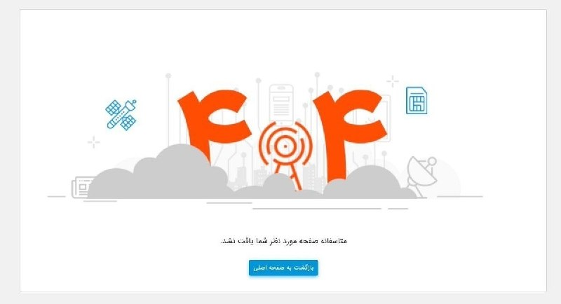

با مقاومت اکثریت ملت ایران پروژه سراسر کثافت اینترنت پرو، لغو و صفحه مربوط به آن در سایت همراه اول حذف شد.
و خوشبختانه اونایی که با عجله رفتن زیر کیر آخوند و اینترنت پرو خریدن هم به شکل فجیعی کیر شدن.

@Dirty_Kids 👻

## Dirty_Kids — post 390257

میدونید چرا خانواده‌های ایرانی افسردگی بچه‌هاشونو نمیفهمن؟ چون علائمی که همه جای دنیا نشون‌دهنده‌ی افسردگی شدیده واسه اینا سربه‌زیری و بچه‌ی صالح بودن محسوب میشه . اینکه همش خونه باشیم و با دوستامون وقت نگذرونیم و مسافرت نریم و ساکت و کم حرف باشیم و به خودمون نرسیم و ...

@Dirty_Kids 👻

## Dirty_Kids — post 390255

عکسهای جدید جنیفر لوپز برای فوت فتیشا

[۵۶ سالشههه]

@Dirty_Kids 👻

## Dirty_Kids — post 390254

  <a href="https://t.me/Dirty_Kids/390254" target="_blank">📎 Download file</a>

✅ اپلیکیشن اندروید سایت جهانی دربی بت

💰اولین سایت جهانی با امکان شارژ و برداشت ریالی(کارت به کارت)

🔗 برای ورود فیلترشکن روی کشور مناسب قرار دهید مانند فنلاند و المان و....

😀Telegram Channel
👇
https://t.me/+bcynkEgSW2dlYTc0

## Dirty_Kids — post 390253

  

😤دنبال یه سایت شرط بندی بین المللی بودی که به ایرانیا خدمات بده؟!
⛔

👍دربی بت همون انتخاب  100%

💎ویژگی های سایت جهانی Derby Bet:

⬅️امکان شارژ امن با کارت بانکی

⬅️واریز اول دوبل شارژ می شوید(بونوس۱۰۰٪)

⬅️پر اپشن ترین سایت فعال در ایران

⬅️تسویه حساب کمتر از 5 دقیقه

⬅️برگشت بخشی از باخت به صورت هفتگی

🚨کد هدیه ثبت نام:GG007

⚠️برای دانلود اپلکیشن کلیک کنید
👉

🔔کانال دربی بت :

🪙https://t.me/+bcynkEgSW2dlYTc0

## Dirty_Kids — post 390252

تجربه کانفیگ‌های ۱ گیگ و ۲ گیگی، خفت‌بارترین تجربه‌ کل عمرم بود

عجب حقارتی ...

@Dirty_Kids 👻

## Dirty_Kids — post 390251

چت جی پی تی هم رفع فیلتر شد

## Dirty_Kids — post 390250

  <a href="telegram/content/Dirty_Kids_390250_1779816854.mp4" target="_blank">🎬 Download video</a>

عمو مراد:

«خروج قالیباف از مخفیگاه و سفرش به قطر و علنی شدن حضور علی عبداللهی، فرمانده قرارگاه خاتم الانبیا، پس از چند ماه می‌تواند نشانه امان‌نامه غیر رسمی و موقت ترامپ به فرماندهان سپاه برای رسیدن به یک توافق احتمالی باشد. اگر توافق نشود این امان‌نامه می تواند توسط نیروی هوایی اسراییل باطل شود.»⁩

@Dirty_Kids 👻

## Dirty_Kids — post 390249

  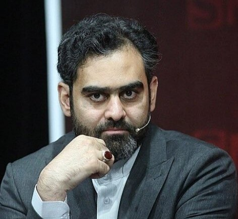

‏امیرحسین ثابتی، نماینده مجلس:
📍باید از روی جنازه من رد بشوید تا بتوانید اینترنت بین‌الملل را وصل کنید.

ایشالا به زودی همگی رد شیم از روی جنازه تو !

@Dirty_Kids 👻

## Dirty_Kids — post 390245

این پرستو‌هاشونو میبینید تعجب نکنید
تازه الان دارن میشن یکم شبیهه لبنان

هنوز یکم فاصله دارن ولی بزودی با نیم‌تنه و تاپ هم میان خیابون

@Dirty_Kids 👻

## Dirty_Kids — post 390244

  

این چه شکل و قیافه‌ایه؟
ابرو هاشونو باید با ماشین چمن زنی کوتاه کنی

@Dirty_Kids 👻

## Dirty_Kids — post 390243

  

بادبان با همراهی شما 90 هزار نفری شد!
🎉

🛒به این مناسبت، قیمت سرویس‌ها تا گیگی 150 هزار تومان کاهش پیدا کرد! 
🚀

🎁 کد تخفیف خرید اول دوباره ریست شد و همه میتونن ازش استفاده کنن:
BadBan4k

💸 با این کد، 50 هزار تومان تخفیف روی اولین خریدت بگیر!

🔥و مهم‌تر از همه...
سیستم معرفی بادبان فعال‌تر از همیشه‌ست!
از تمام خریدهای کاربرانی که معرفی میکنی، 10% خریدشون رو پورسانت دائمی دریافت کن و موجودی کیف پولت رو افزایش بده 
💼

وقتی بادبان داری،
هیچ بادی مانع نیست… حتی وقتی اینترنت ملیه
⛵️

G5

🛡@BadBan_VPN | کانال 

🤖@BadBan_VPNBot | ربات 

📞@BadBan_VPNSupport | پشتیبانی

## Dirty_Kids — post 390242

الان جاسوسه واتس‌اپشو باز می‌کنه پیام داره از دو ماه پیش. موساد: جواب بده پدسگ، گفتی ولیعصر بالاتر از پارک ملت چپ یا راست؟؟؟

@Dirty_Kids 👻

## Dirty_Kids — post 390241

واتساپ هم تو بعضی مناطق رفع فیلتر شده و با اینترنت‌های خونگی بالا میاد.

@Dirty_Kids 👻

## Dirty_Kids — post 390240

‏اقا نت وصل شد یا نه؟ برم دایرکت کانفیگ فروشم ایموجی عن بذارم بهش بگم مادرقحبه؟

@Dirty_Kids 👻

## Dirty_Kids — post 390239

  

مثل اینکه باز کردن اینترنتا کار پزشکیان نبوده، کار گلزار بود

@Dirty_Kids 👻

## Hranews — post 113183

همزمان با تفتیش منزل؛ محمود بهشتی به اداره اطلاعات احضار شد

❗️
❗️
❗️
❗️
❗️ – امروز سه شنبه، منزل محمود بهشتی لنگرودی، فعال صنفی معلمان توسط ماموران اطلاعات سپاه مورد تفتیش قرار گرفت. ماموران برخی از لوازم شخصی و دیجیتال آقای بهشتی را ضبط کردند. همزمان با این رویداد، وی به اداره اطلاعات لنگرود #احضار شد.

ادامه مطلب

#محمود_بهشتی_لنگرودی

↘️
@hranews_bot تماس ✉️ -  @Hranews  کانال هرانا 🆑

## Hranews — post 113182

گزارشی از تداوم بازداشت و بی‌خبری از وضعیت رضا امانی‌فر در بوشهر

❗️
❗️
❗️
❗️
❗️– رضا امانی‌فر، فعال صنفی معلمان بوشهر علیرغم گذشت ۵۳ روز از زمان بازداشت، در بلاتکلیفی به‌سر می‌برد. بی‌خبری از سرنوشت و وضعیت پرونده این شهروند، منجر به افزایش نگرانی‌های خانواده وی شده است.
#رضا_امانی‌فر

ادامه مطلب

↘️
@hranews_bot تماس ✉️ -  @Hranews  کانال هرانا 🆑

## Hranews — post 113181

اصغر حاجب از زندان آزاد شد

❗️
❗️
❗️
❗️
❗️– امروز سه شنبه، اصغر حاجب، عضو هیات مدیره کانون صنفی معلمان استان بوشهر با تودیع وثیقه از زندان آزاد شد.
#اصغر_حاجب

ادامه مطلب

↘️
@hranews_bot تماس ✉️ -  @Hranews  کانال هرانا 🆑

## Hranews — post 113180

  

مقایسه‌ی قانون جدید تشدید مجازات جاسوسی با قوانین قبلی/ سینا یوسفی

📡
📡
📡
📡
📡 – در نظام‌های حقوق کیفری معاصر، جرم جاسوسی همواره در زمره‌ی شدیدترین جرائم علیه امنیت کشور طبقه‌بندی شده است، زیرا موضوع آن، تعرض به منافع بنیادین دولت و افشای اطلاعاتی است که می‌تواند امنیت سیاسی، نظامی یا دیپلماتیک کشور را با خطر مواجه سازد. با این حال، شدت اهمیت این جرم هرگز به معنای بی‌نیازی آن از اصول بنیادین حقوق کیفری نبوده است. برعکس، هرچه مجازات‌ها شدیدتر و آثار کیفری گسترده‌تر باشند، ضرورت پایبندی قانون‌گذار به اصولی چون شفافیت، قطعیت، تفسیر مضیق و قابلیت پیش‌بینی قوانین کیفری بیش‌تر می‌شود. در سال‌های اخیر و به‌ویژه در سایه‌ی تشدید تنش‌های منطقه‌ای، گسترش منازعات امنیتی، افزایش اعتراضات مردمی و تشدید نگرانی حاکمیت نسبت به جنگ اطلاعاتی و رسانه‌ای، سیاست جنایی جمهوری اسلامی ایران نیز به‌ تدریج از الگوی سنتی مقابله با جاسوسی فاصله گرفته و به سمت توسعه قلمرو جرائم امنیتی حرکت کرده است. «قانون تشدید مجازات جاسوسی و همکاری با رژیم صهیونیستی و کشورهای متخاصم علیه امنیت و منافع ملی» را باید محصول همین فضای سیاسی و امنیتی دانست. قانونی که اگرچه ظاهراً با هدف مقابله با تهدیدات خارجی و کنترل اشکال نوین همکاری اطلاعاتی تصویب شده، اما در عمل، مفهوم «جاسوسی» را به نحو چشم‌گیری گسترش داده و آن را از یک جرم کلاسیک مبتنی بر انتقال اسرار محرمانه، به مفهومی سیال و موسع در حوزه‌ی امنیت ملی تبدیل کرده است.

در قوانین پیشین –به‌ویژه مواد ۵۰۱ تا ۵۰۵ قانون مجازات اسلامی (بخش تعزیرات)—، مفهوم جاسوسی هرچند خالی از ابهام نبود، اما هم‌چنان بر پایه‌ی عناصر نسبتاً مشخصی استوار بود. محور اصلی این مقررات، دسترسی، تحصیل یا انتقال اطلاعات و اسناد طبقه‌بندی‌شده به نفع دولت یا اشخاص خارجی بود و عنصر مادی جرم عمدتاً ناظر به افشای اسرار یا همکاری اطلاعاتی مستقیم تلقی می‌شد. در واقع، جاسوسی در معنای کلاسیک خود مستلزم نوعی رابطه‌ی مشخص میان مرتکب، اطلاعات محرمانه و طرف خارجی بود. اما قانون جدید این چارچوب سنتی را دگرگون کرده است. در این قانون، دیگر صرفاً انتقال اسناد محرمانه یا همکاری اطلاعاتی مستقیم موضوع جرم‌انگاری نیست، بلکه طیف متنوعی از رفتارهای ارتباطی، رسانه‌ای و فناورانه نیز در قلمرو تهدیدات امنیتی قرار گرفته‌اند. ارسال تصاویر و اطلاعات برای رسانه‌های «معاند»، استفاده از برخی ابزارهای ارتباطی مانند اینترنت ماهواره‌ای، یا حتی همکاری‌های غیرمستقیم با اشخاص و نهادهای مرتبط با دولت‌های متخاصم، همگی در ساختار جدید قانون ذیل منطق مقابله با جاسوسی و همکاری امنیتی تحلیل شده‌اند. نتیجه‌ی این تحول آن است که مرز سنتی میان جاسوسی، فعالیت رسانه‌ای، کنش سیاسی و ارتباطات فرامرزی تا حد زیادی کم‌رنگ شده و قلمرو جرم جاسوسی به حوزه‌هایی تسری یافته که پیش‌تر اساساً در چارچوب جرائم امنیتی کلاسیک قرار نمی‌گرفتند.
#سینا_یوسفی #جاسوسی

ادامه مطلب
لینک به مطلب در وبسایت خط صلح

↘️
@hranews_bot تماس ✉️ - @Hranews کانال هرانا 🆑

## Hranews — post 113178

  <a href="telegram/content/Hranews_113178_1779816858.mp4" target="_blank">🎬 Download video</a>

امروز سه‌شنبه ۵ خردادماه، گروهی از مال‌باختگان پروژه «نگین غرب» با برگزاری تجمعی مقابل دادسرای عمومی و انقلاب ناحیه پنج تهران، نسبت به ادامه بلاتکلیفی پرونده خود اعتراض کردند.

شهروندان معترض بعد از گذشت حدود ۲۲ سال از زمان سرمایه‌گذاریشان، کماکان در بلاتکلیفی بسر میبرند.
#تجمع

↘️
@hranews_bot تماس ✉️ -  @Hranews  کانال هرانا 🆑

## alonews — post 122884

  <a href="telegram/content/alonews_122884_1779816859.webm" target="_blank">🎬 Download video</a>

👈 نیروهای دفاعی اسرائیل دستورهای جدید تخلیه اجباری برای چندین شهر در سراسر جنوب لبنان صادر کرده‌اند:

🔴— خیرابت سلم

🔴— بیر السناسیل، قابریخا

🔴— مجدل سلم

🔴— قالاویه

🔴— کفر دونین

🔴— تولین

🔴— ساوانا

🔴— صلعا (صور)

🔴— برج قالاویه

🔴— جبیشیت

🔴— القصیبہ (نبطیه)

🔴— فرون

🔴— ابیا

🔴— دیر کیفه

🔴— کفر سعیر

🔴— صریفا

🔴— الغندوریه

🔴— النفخیه

🔴— ققیات الجسر

🔴— عدشیت الشقیف

✅ @AloNews خبر جنگ

## alonews — post 122883

  

کانفیگ فروشا وقتی می‌نويسن خوشحالیم که همتون وصل شدین❤️

[@AloTweet]

## alonews — post 122882

  <a href="telegram/content/alonews_122882_1779816860.webm" target="_blank">🎬 Download video</a>

👈ادعای عبدالخالق عبدالله مشاور سابق بن زاید و از چهره‌های بانفوذ امارات: امارات گام‌هایی محتاطانه و حساب‌شده را برای کاهش تنش با ایران برداشته است

✅ @AloNews خبر جنگ

## alonews — post 122880

  <a href="telegram/content/alonews_122880_1779816860.webm" target="_blank">🎬 Download video</a>

👈ساعتی پیش بورس آمریکا و بازار کریپتو به صورت غیرطبیعی با ریزش شدیدی رو به رو شدند

✅ @AloNews خبر جنگ

## alonews — post 122879

  <a href="telegram/content/alonews_122879_1779816860.webm" target="_blank">🎬 Download video</a>

👈کانال ۱۴ عبری: برآوردهایی در اسرائیل وجود دارد که توافق با ایران تقریباً به طور حتم لبنان را نیز در بر خواهد گرفت.

✅ @AloNews خبر جنگ

## alonews — post 122878

  <a href="telegram/content/alonews_122878_1779816860.webm" target="_blank">🎬 Download video</a>

👈کانال ۱۲ اسرائیل: آمریکا به اسرائیل نسبت به حمله به هر شکل به بیروت هشدار داده است.

✅ @AloNews خبر جنگ

## alonews — post 122877

خوش آمد میگم به رفقایی که تازه وصل شدن

## alonews — post 122876

  <a href="telegram/content/alonews_122876_1779816860.webm" target="_blank">🎬 Download video</a>

👈گویا اینترنت ایرانسل هم درست شد 
✅ @AloNews خبر جنگ

## alonews — post 122875

  <a href="telegram/content/alonews_122875_1779816861.webm" target="_blank">🎬 Download video</a>

👈گویا اینترنت ایرانسل هم درست شد

✅ @AloNews خبر جنگ

## alonews — post 122874

  <a href="telegram/content/alonews_122874_1779816861.webm" target="_blank">🎬 Download video</a>

👈 دفتر امیری قطر: امیر قطر در تماس با رئیس‌جمهور ایران درباره تلاش‌ها برای کاهش تنش و حفظ امنیت منطقه گفت‌وگو کرد

🔴 امیر قطر بر لزوم دور نگه داشتن منطقه از پیامدهای تنش و اهمیت راهکارهای مسالمت‌آمیز تأکید کرد.

🔴 امیر قطر بر موضع ثابت خود مبنی بر اولویت دادن به راهکارهای سیاسی و دیپلماتیک تأکید نمود.

✅ @AloNews خبر جنگ

## alonews — post 122873

  <a href="telegram/content/alonews_122873_1779816861.webm" target="_blank">🎬 Download video</a>

👈معاون وزیر ارتباطات: سيستم عامل، مرورگر، آنتی‌ویروس، اپلیکیشن‌های بانکی و ابزارهای امنیتی خود را بروزرسانی کنید

✅ @AloNews خبر جنگ

## alonews — post 122872

  <a href="telegram/content/alonews_122872_1779816861.webm" target="_blank">🎬 Download video</a>

👈یک منبع دیپلماتیک به الحدث گفت:
ایران در طول دوره مذاکرات خواستار آزادسازی دارایی‌های مسدود شده خود که حدود ۲۴ میلیارد دلار تخمین زده می‌شود، شد.

🔴ایران اصرار داشت که نیمی دیگر از دارایی‌های مسدود شده خود را ظرف ۶۰ روز دریافت کند

✅ @AloNews خبر جنگ

## alonews — post 122871

  <a href="telegram/content/alonews_122871_1779816862.mp4" target="_blank">🎬 Download video</a>

👈نتانیاهو: ما عملیات خود را در لبنان تشدید می‌کنیم. نیروهای دفاعی اسرائیل با نیروهای زمینی قابل توجهی فعالیت می‌کنند و موقعیت‌های استراتژیک را تأمین می‌کنند.

✅ @AloNews خبر جنگ

## alonews — post 122870

  <a href="telegram/content/alonews_122870_1779816863.webm" target="_blank">🎬 Download video</a>

👈ترامپ از طریق Truth Social:
تازه معاینه ۶ ماهه‌ام را در مرکز پزشکی نظامی والتر رید تمام کردم. همه چیز کاملاً عالی بود.

🔴از پزشکان و کارکنان عالی تشکر می‌کنم! به سمت کاخ سفید برمی‌گردم

✅ @AloNews خبر جنگ

## alonews — post 122869

  <a href="telegram/content/alonews_122869_1779816863.webm" target="_blank">🎬 Download video</a>

👈سنتکام : پروژه «آزادی» از سر گرفته نشده و نیروهای آمریکا فعلاً هیچ کشتی تجاری‌ای رو از تنگه هرمز اسکورت نمی‌کنند

✅ @AloNews خبر جنگ

## alonews — post 122868

  <a href="telegram/content/alonews_122868_1779816863.webm" target="_blank">🎬 Download video</a>

👈الجزیره به نقل از یک مقام آمریکایی:
گزارش‌ها درباره ازسرگیری اسکورت کشتی‌های تجاری در تنگه هرمز توسط نیروهای آمریکایی دقیق نیست

🔴 نیروهای آمریکایی در حال حاضر با محموله‌های دریایی تجاری در تنگه هرمز همراهی نمی‌کنند.

✅ @AloNews خبر جنگ

## alonews — post 122867

  <a href="telegram/content/alonews_122867_1779816863.webm" target="_blank">🎬 Download video</a>

👈دسترسی به ChatGPT روی خطوط همراه اول و ایرانسل برقرار شد

✅ @AloNews خبر جنگ

## alonews — post 122866

  <a href="telegram/content/alonews_122866_1779816864.webm" target="_blank">🎬 Download video</a>

👈واکنش سخنگوی دولت به اتصال اینترنت بین‌الملل

🔴تفاوت نگاه‌ها، در بزنگاه تصمیم‌ها روشن‌تر از همیشه دیده می‌شود.

🔴با دستور رئیس‌جمهور محترم، روند بازگشایی و تسهیل دسترسی به اینترنت آغاز شد؛ اقدامی در جهت پاسخ به مطالبات مردم، حمایت از کسب‌وکارهای دیجیتال و توسعه خدمات هوشمند؛ مسیری که دولت چهاردهم از ابتدا بر آن تأکید داشته و دارد.

✅ @AloNews خبر جنگ

## alonews — post 122865

  <a href="telegram/content/alonews_122865_1779816864.webm" target="_blank">🎬 Download video</a>

👈رابرت اف کندی، وزیر بهداشت آمریکا، ویدیویی تو اینستاگرام منتشر کرده که توش با دست خالی دو مار سیاه رو می‌گیره

✅ @AloNews خبر جنگ

---
📅 بروزرسانی: 1405/03/05 17:31
---

## VahidOOnLine — post 242291

  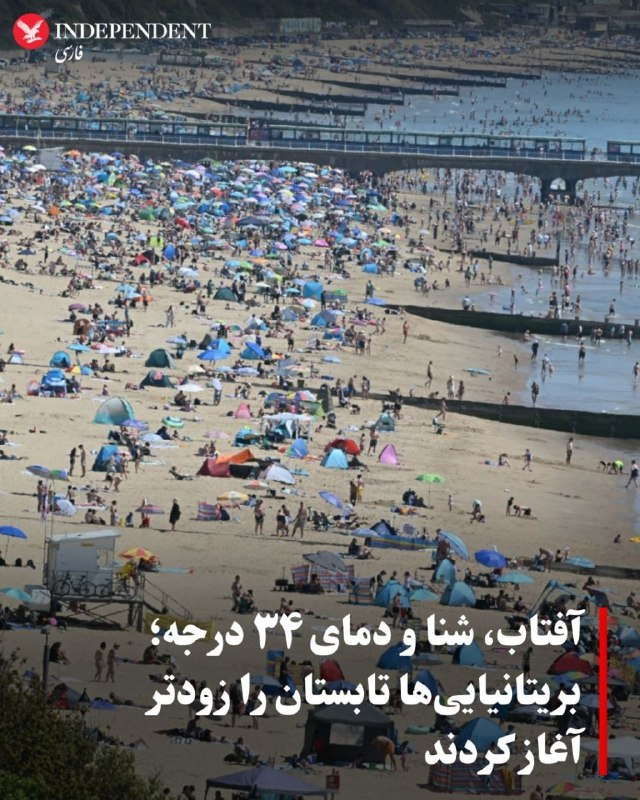

♦️موج گرمای کم‌سابقه بریتانیا  را در روزهای اخیر حتی از بعضی سواحل گردشگری جنوب اروپا نیز گرم‌تر کرد.
بر اساس گزارش‌ها، بریتانیا روز دوشنبه گرم‌ترین دمای ثبت‌شده ماه مه در تاریخ خود را تجربه کرد و دماسنج‌ها در نزدیکی لندن عدد ۳۴.۸ درجه سانتی‌گراد را نشان دادند.
هم‌زمان با ادامه هوای آفتابی، هزاران نفر راهی سواحل این کشور جزیره‌ای شدند تا از گرمای غیرمعمول هوا برای آفتاب‌گرفتن، شنا و تفریح کنار دریا استفاده کنند. ساحل بورنموث بیچ در جنوب انگلستان از جمله مناطقی بود که تصاویر آن مملو از جمعیت، چترهای ساحلی و شناگران منتشر شد.
کارشناسان هواشناسی می‌گویند چنین دماهایی در اواخر بهار برای بریتانیا کم‌سابقه است؛ کشوری که معمولا با آب‌وهوای خنک‌ و بارانی شناخته می‌شود.
‌🇸🇦 Indypersian

🤖 @VahidOOnLine

## VahidOOnLine — post 242290

  <a href="telegram/content/VahidOOnLine_242290_1779804071.mp4" target="_blank">🎬 Download video</a>

♦️مارکو روبیو، وزیر خارجه آمریکا، روز سه‌شنبه پنجم خردادماه گفت موضع واشنگتن درباره مذاکرات با تهران «کاملا روشن» است و تاکید کرد یا یک توافق خوب حاصل خواهد شد یا هیچ توافقی شکل نخواهد گرفت.

روبیو گفت دونالد ترامپ، رئیس‌جمهوری آمریکا، دو روز پیش تماس «بسیار مهم و تاریخی» با شماری از رهبران منطقه داشته و به گفته او، درباره چارچوب اولیه توافق «هماهنگی و توافق قوی» وجود دارد.

وزیر خارجه آمریکا افزود مذاکرات درباره جزئیات توافق همچنان ادامه دارد و حل اختلاف‌ها حتی بر سر «واژه‌ها و جمله‌ها» ممکن است چند روز زمان ببرد.

او تاکید کرد: «اگر قرار باشد توافقی شکل بگیرد، باید این مسائل حل شود؛ اما یا توافق خوبی خواهد بود یا اصلا توافقی در کار نخواهد بود.»
‌🇸🇦 Indypersian

🤖 @VahidOOnLine

## VahidOOnLine — post 242289

  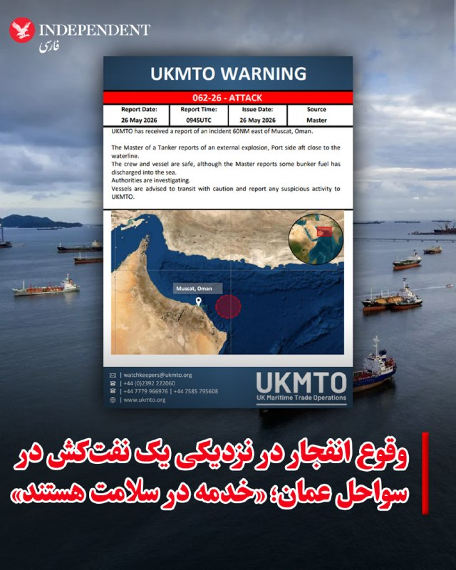

♦️سازمان عملیات تجارت دریایی بریتانیا (UKMTO) روز سه‌شنبه، پنجم خردادماه، با انتشار هشداری اعلام کرد که انفجاری در فاصله ۶۰ مایل دریایی (۱۱۱ کیلومتر) از سواحل مسقط در عمان و در نزدیکی یک نفت‌کش رخ داده است؛ بر اساس این گزارش، ناخدا این نفت‌کش از وقوع یک انفجار خارجی در بخش عقب سمت چپ کشتی و نزدیک به خط آب خبر داده، اما این سازمان تاکید کرده است که خدمه و شناور در سلامت کامل هستند، هرچند گزارش‌هایی مبنی بر نشت بخشی از سوخت کشتی به دریا دریافت شده و مقامات در حال بررسی این حادثه هستند.
‌🇸🇦 Indypersian

🤖 @VahidOOnLine

## VahidOOnLine — post 242288

  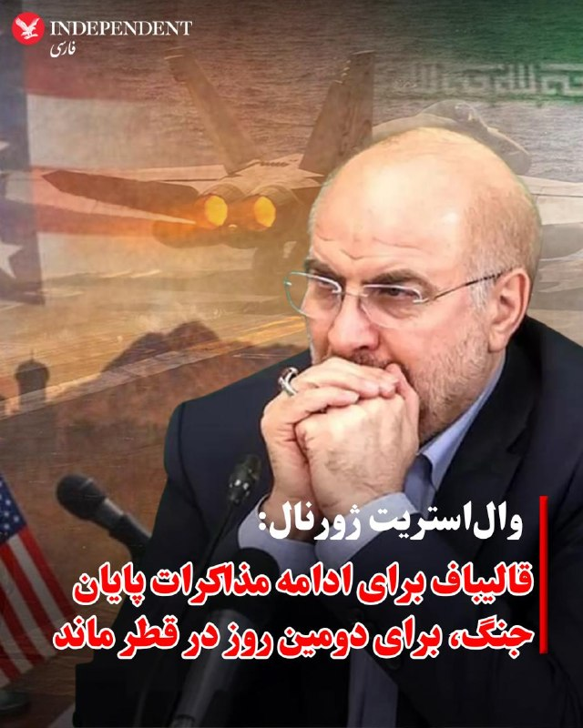

♦️روزنامه وال‌استریت ژورنال روز سه‌شنبه پنجم خرداد‌ماه، به نقل از مقام‌های ایرانی و میانجی‌گران عرب گزارش داد محمدباقر قالیباف، رئیس مجلس جمهوری اسلامی و رئیس هیئت مذاکره‌کننده جمهوری اسلامی، با وجود حمله مرگبار آمریکا به نیروهای ایرانی، برای دومین روز متوالی در قطر مانده است تا گفتگوها درباره توافق احتمالی برای پایان جنگ ادامه یابد.

بر اساس این گزارش، قالیباف روز دوشنبه برای حل اختلاف‌های باقی‌مانده در طرح صلح، از جمله آزادسازی دارایی‌های بلوکه‌شده ایران و جزئیات مربوط به بازگشایی تنگه هرمز، وارد قطر شد.

این گزارش می‌افزاید ساعاتی پس از آغاز این رایزنی‌ها، سنتکام اعلام کرد به قایق‌های تندرو ایرانی که به گفته این نهاد در حال مین‌گذاری بودند حمله کرده است. مقام‌های آگاه گفتند جمهوری اسلامی اعلام کشته شدن چند عضو سپاه پاسداران در این حمله را با هدف جلوگیری از آسیب دیدن روند مذاکرات به تاخیر انداخت.

فاطمه مهاجرانی، سخنگوی دولت جمهوری اسلامی، نیز روز سه‌شنبه گفت دیپلماسی احتمالا ادامه خواهد یافت، اما «تناقض‌گویی آمریکا» همچنان یکی از مشکلات روند مذاکرات است.
‌🇸🇦 Indypersian

🤖 @VahidOOnLine

## VahidOOnLine — post 242287

  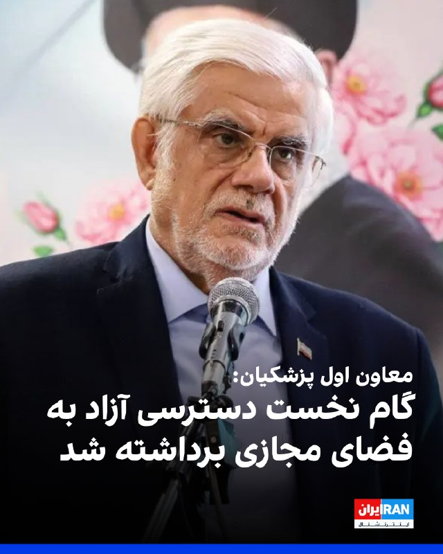

محمدرضا عارف، معاون اول پزشکیان، در شبکه ایکس نوشت پیرو دستور پزشکیان «گام نخست دسترسی آزاد و ضابطه‌مند به فضای مجازی برداشته شد.»
او افزود: «با بازگشایی اینترنت، خدمات هوشمند هموار و مطالبات مردمی که این‌چنین پای کار نظام و ایران ایستادند محقق و موانع توسعه دانش‌بنیان و مرجعیت علمی برداشته می‌شود.»

عارف در متن خود درباره «گام نخست» و وصل شدن اینترنت برای شهروندان توضیحی ارائه نداد.

این در حالی است که پیش‌تر فارس، رسانه وابسته به سپاه نوشت دیوان عدالت اداری اعلام کرد که در پی طرح شکایاتی درباره ابطال «سند ایجاد ستاد ویژه ساماندهی و راهبری فضای مجازی کشور»، هیات تخصصی صنایع و بازرگانی این دیوان، با احراز ضرورت و فوریت موضوع، دستور توقف اجرای این مصوبه را تا زمان رسیدگی به شکایت صادر کرد.
‌🏁 🇬🇧 IranintlTV

🤖 @VahidOOnLine

## VahidOOnLine — post 242286

  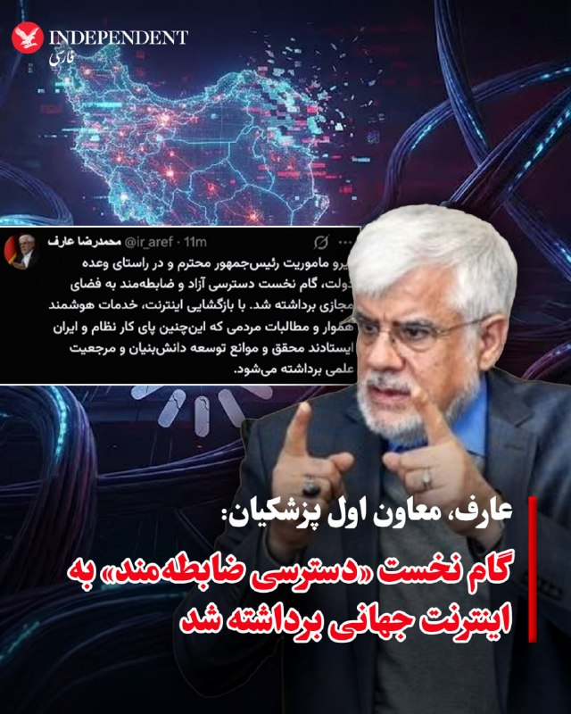

♦️محمدرضا عارف، معاون اول پزشکیان، با اشاره به رفع بخشی از محدودیت‌های اینترنتی اعلام کرد که «گام نخست دسترسی آزاد و ضابطه‌مند به فضای مجازی برداشته شد» تا «مطالبات مردمی محقق و موانع توسعه دانش‌بنیان برداشته شود»؛ این اظهارات هم‌زمان با گزارش سازمان بین‌المللی «نت‌بلاک‌س» مطرح می‌شود که از «بازگشت جزئی» اتصال اینترنت در ایران پس از ۲۰۹۳ ساعت (۸۸ روز) انزوای مطلق از شبکه‌های جهانی خبر داده و آن را «طولانی‌ترین قطع سراسری اینترنت در تاریخ مدرن» خوانده است.
‌🇸🇦 Indypersian

🤖 @VahidOOnLine

## VahidOOnLine — post 242285

  <a href="telegram/content/VahidOOnLine_242285_1779804074.mp4" target="_blank">🎬 Download video</a>

♦️دفتر بنیامین نتانیاهو روز سه‌شنبه پنجم خردادماه اعلام کرد نخست‌وزیر اسرائیل نشستی امنیتی را در مقر نظامی کریا در تل‌آویو با حضور یسرائیل کاتز، وزیر دفاع، و ایال زمیر، رئیس ستاد ارتش اسرائیل، برگزار کرده است.

بر اساس بیانیه دفتر نخست‌وزیر اسرائیل، این نشست همزمان با ادامه گفتگوهای واشنگتن و تهران درباره توافق احتمالی برای پایان جنگ برگزار شد.
‌🇸🇦 Indypersian

🤖 @VahidOOnLine

## VahidOOnLine — post 242284

  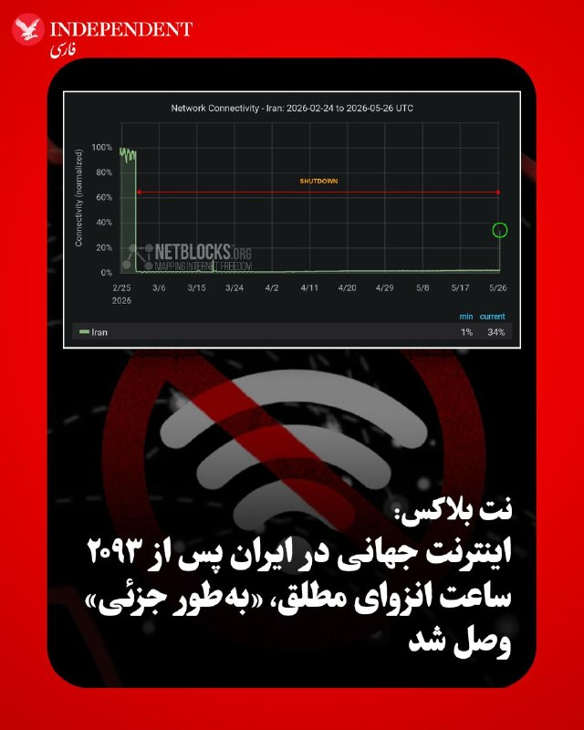

♦️«نت‌بلاکس» که وضعیت اینترنت در جهان را رصد می‌کند، روز سه‌شنبه، پنجم خرداد‌ماه، با انتشار پیامی در اکس از «شاخص‌های زنده نشان‌دهنده بازگشت جزئی اتصال اینترنت در ایران در روز هشتادوهشتم» خبر داد. نت بلاکس نوشت: «این اتفاق پس از ۲۰۹۳ ساعت انزوای تقریبا کامل از شبکه‌های بین‌المللی رخ می‌دهد که طولانی‌ترین قطع سراسری اینترنت در تاریخ مدرن به شمار می‌رود.» نت‌بلاکس با این حال تاکید کرد که «هنوز مشخص نیست آیا این اتصال پایدار خواهد ماند یا خیر.»
‌🇸🇦 Indypersian

🤖 @VahidOOnLine

## VahidOOnLine — post 242283

  

♦️براساس گزارش خبرگزاری رویترز به نقل از رسانه «ریا نووستی»، سرگی ریابکوف، معاون وزیر امور خارجه روسیه، اعلام کرد که سرگی لاوروف در جریان گفتگوی تلفنی روز دوشنبه خود با مارکو روبیو، همتای آمریکایی‌اش، دلایل تغییر موضع مسکو در قبال حملات به کی‌یف را تشریح کرده است؛ این اقدام پس از آن صورت گرفت که روسیه اعلام کرد در پاسخ به حمله پهپادی تعمدی اوکراین به یک خوابگاه دانشجویی در لوهانسک تحت کنترل روسیه که دست‌کم ۲۱ کشته برجای گذاشت، قصد دارد حملات سیستماتیکی را علیه اهداف مرتبط با ارتش اوکراین و مراکز تصمیم‌گیری در کی‌یف آغاز کند.
‌🇸🇦 Indypersian

🤖 @VahidOOnLine

## VahidOOnLine — post 242282

  

محمود نبویان، عضو کمیسیون امنیت ملی مجلس در شبکه ایکس نوشت: «توافقی که بازگشایی تنگه هرمز در ازای لغو محاصره بدون اعمال حاکمیت جمهوری اسلامی و اخذ عوارض، عدم تعیین غرامت، ابهام در لغو تحریم‌ها و… باشد، خلاف منافع ملی، عبور از شروط رهبری، بیانیه شعام و خسارت محض است.»

او پیش‌تر نیز گفته بود: «با وجود سابقه بدعهدی آمریکا و به ویژه حضور اصحاب توافق ذلت‌بار برجام به‌همراه قالیباف در مذاکرات، هیچ امیدی به مذاکره و توافق مطلوب برای جمهوری اسلامی وجود ندارد.»
‌🏁 🇬🇧 IranintlTV

🤖 @VahidOOnLine

## VahidOOnLine — post 242281

  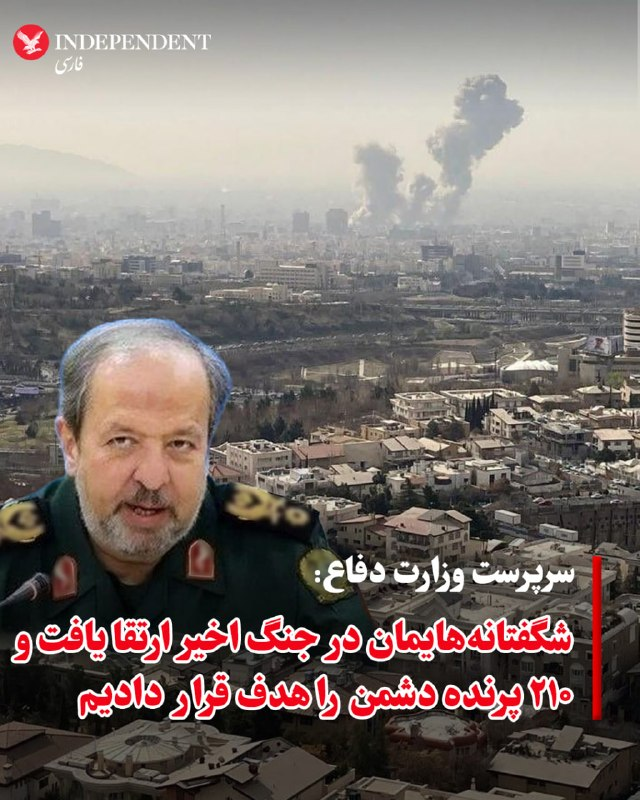

♦️مجید ابن‌الرضا، سرپرست وزارت دفاع، روز سه‌شنبه با اشاره به اینکه «شگفتانه‌های» جمهوری اسلامی در حوزه تکنیک و تاکتیک در «جنگ رمضان» ارتقا یافته‌تر از جنگ قبلی بود، گفت: «تعداد پرنده‌هایی که در جنگ ۱۲ روزه هدف قرار دادیم کمتر از انگشتان دست بود، اما در جنگ رمضان به فناوری دست پیدا کردیم که حدود ۲۱۰ پرنده دشمن را هدف قرار دادیم».
‌🇸🇦 Indypersian

🤖 @VahidOOnLine

## VahidOOnLine — post 242280

  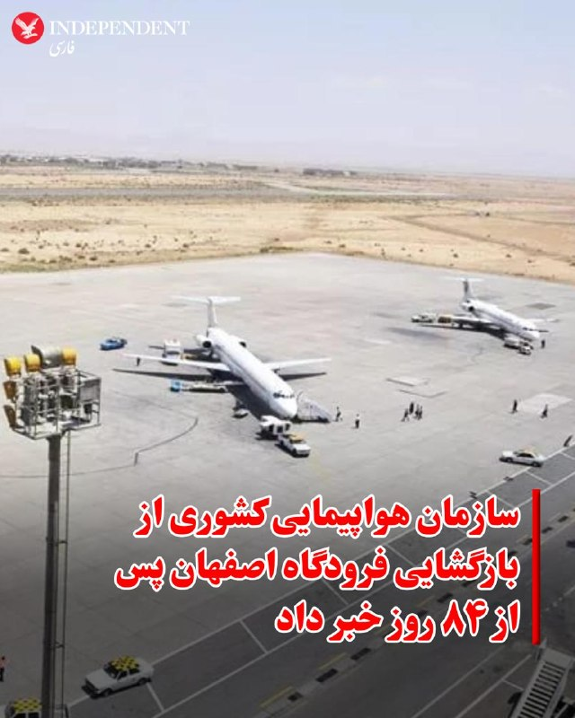

♦️خبرگزاری‌های جمهوری اسلامی به نقل از سازمان هواپیمایی کشوری گزارش دادند که فرودگاه بین‌المللی «بهشتی» اصفهان پس از ۸۴ روز توقف فعالیت، دوباره بازگشایی شده است.

بر اساس این گزارش، نخستین پرواز در مسیر اهواز ـ اصفهان ـ اهواز روز سه‌شنبه پنجم خرداد انجام شد و پروازها فعلا از طلوع تا غروب آفتاب برقرار خواهد بود.

سازمان هواپیمایی کشوری همچنین اعلام کرد فرودگاه‌های اردبیل و لامرد نیز در چارچوب بازگشایی تدریجی فضای هوایی کشور دوباره فعال شده‌اند.

حریم هوایی ایران از ۹ اسفندماه و همزمان با حملات اسرائیل و آمریکا به ایران بسته شده بود و پروازهای داخلی و بین‌المللی متوقف شده بودند.
‌🇸🇦 Indypersian

🤖 @VahidOOnLine

## VahidOOnLine — post 242279

  

سازمان عملیات تجارت دریایی بریتانیا اعلام کرد گزارشی از وقوع حادثه‌ای در فاصله ۶۰ مایل دریایی از مسقط عمان دریافت کرده است.

به گفته این نهاد، یک نفتکش از وقوع انفجاری خارجی در سمت چپ عقب کشتی و نزدیک خط آب خبر داده.

خدمه و کشتی سالم هستند، اما مقداری سوخت به دریا نشت کرده است.
‌🏁 🇬🇧 IranintlTV

🤖 @VahidOOnLine

## VahidOOnLine — post 242278

  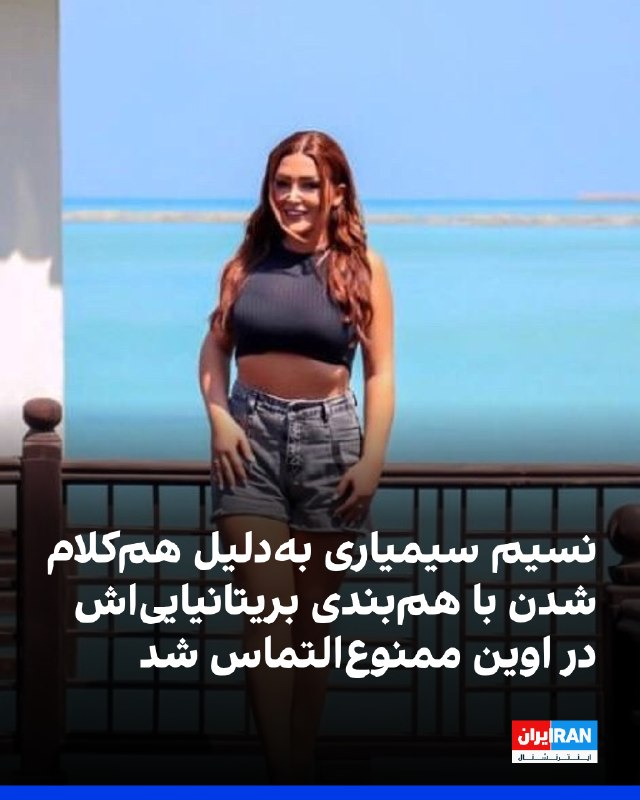

حساب اینستاگرام نسیم غلامی سیمیاری، زندانی سیاسی محبوس در زندان اوین و از بازداشت‌شدگان اعتراضات «زن، زندگی، آزادی»، اعلام کرد او به دلیل «هم‌کلام شدن» با لیندزی فورمن، شهروند بریتانیایی زندانی در اوین، به مدت یک هفته از حق تماس تلفنی محروم شده است.

بر اساس این گزارش، مسئولان زندان پیش‌تر نیز به سیمیاری گفته بودند به دلیل «پوشیدن شلوارک» در داخل بند زنان اوین، در این هفته از حق ملاقات محروم خواهد بود.

در این مطلب آمده است علاوه بر سیمیاری، گلرخ ایرایی، زهرا صفایی، مرضیه فارسی، شیوا اسماعیلی و سکینه پروانه، پنج زن زندانی سیاسی دیگر در بند زنان اوین نیز به دلیل شرکت در مراسمی در اعتراض به اعدام‌ها، از حق تماس تلفنی و ملاقات با خانواده‌هایشان محروم شده‌اند.
‌🏁 🇬🇧 IranintlTV

🤖 @VahidOOnLine

## VahidOOnLine — post 242277

  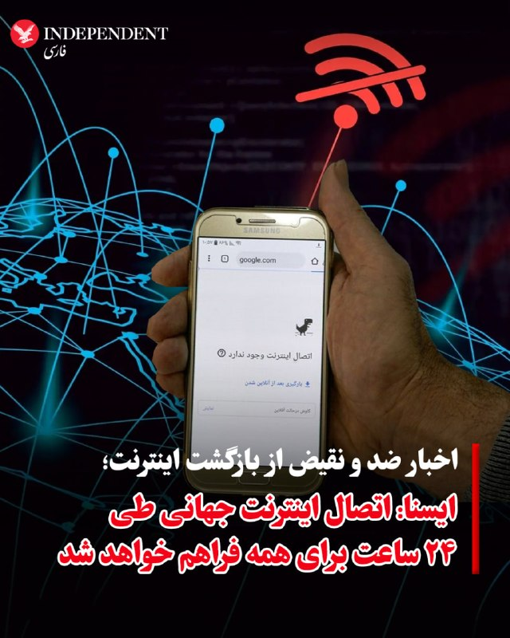

♦️همزمان با اعلام دیوان عدالت اداری مبنی بر صدور دستور توقف بازگشت اینترنت، ایسنا به نقل از «یک منبع مطلع»، روز سه‌شنبه، پنجم خردادماه، گزارش داد که با صدور دستور اتصال اینترنت از وزیر ارتباطات و فناوری اطلاعات فرآیند اتصال در حال انجام است و طی ۲۴ ساعت این امکان برای همه فراهم خواهد شد. این درحالی اتفاق افتاد که تنها یک روز پس از مصوبه «ستاد ویژه ساماندهی فضای مجازی» برای «بازگشت اینترنت به وضعیت پیش از دی‌ماه ۱۴۰۴»، دیوان عدالت اداری با صدور دستور موقت، «اجرای مصوبه ایجاد ستاد ویژه ساماندهی فضای مجاری» را متوقف و مصوبات این ستاد را تا زمان رسیدگی نهایی، غیرقابل اجرا اعلام کرد.
همزمان، انتخاب نوشت که کامیار ثقفی، رضا تقی پور، رسول جلیلی و محمد حسن انتظاری تحت راهبری یک مقام ابقا شده دولت ابراهیم رئیسی، «شاکی قضایی» اتصال اینترنت بین‌الملل هستند.
ایران از زمان آغاز جنگ در نهم اسفند، به مدت ۸۸ روز، در خاموشی دیجیتال به سر می‌برد.
‌🇸🇦 Indypersian

🤖 @VahidOOnLine

## VahidOOnLine — post 242276

  

علی‌اکبر صالحی، رییس پیشین سازمان انرژی اتمی جمهوری اسلامی گفت: «این یک واقعیت است که ما درون‌گرا و منزوی شدیم و تکلیف روابط بین‌الملل ما روشن نیست. خیلی از مشکلات ما ناشی از همین مسئله است، بنابراین باید از این هاله‌ای که برای خودمان ایجاد کردیم خارج بشویم و تکثرگرایی در داخل کشور را بسط دهیم.»

او ادامه داد: «نظام جمهوری اسلامی بیشتر میل به درون‌گرایی و دوری از تکثرگرایی در داخل داشته که امیدوارم با این اتفاقاتی که افتاده و به خصوص تحولات این دو سه‌ساله اخیر و حوادثی که رخ داده، این تمایل اصلاح بشود و به سمت اصلاح روابط بین‌الملل و خروج از انزوا برویم.»
‌🏁 🇬🇧 IranintlTV

🤖 @VahidOOnLine

## VahidOOnLine — post 242275

  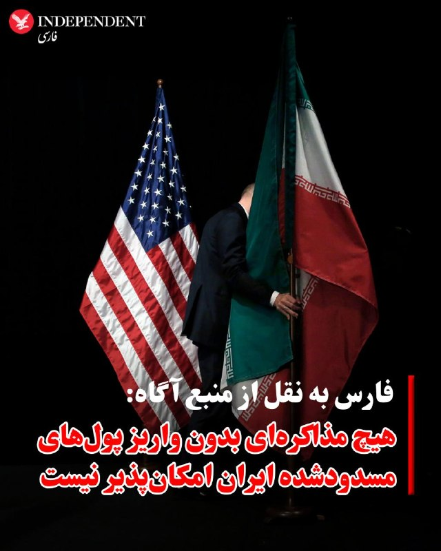

♦️خبرگزاری فارس، رسانه وابسته به سپاه، روز سه‌شنبه پنجم خردادماه به نقل از منبعی نزدیک به تیم مذاکره‌کننده جمهوری اسلامی گزارش داد که آخرین اختلاف جدی میان تهران و واشنگتن بر سر نحوه دسترسی به منابع مسدودشده ایران بوده است.

این منبع گفت جمهوری اسلامی به طرف آمریکایی اعلام کرده «تا زمانی که پول‌های مورد توافق واریز نشده باشد، هیچ مذاکره و توافقی امکان‌پذیر نیست».

بر اساس این گزارش، اختلاف بر سر این موضوع با میانجیگری قطر در حال برطرف‌ شدن است. فارس نوشت آمریکا پیش‌تر در اجرای تعهدات خود عقب‌نشینی کرده بود، اما پس از رایزنی‌ها در دوحه، پیشرفت‌هایی برای حل این اختلاف حاصل شده است.

این منبع همچنین تاکید کرد تیم مذاکره‌کننده جمهوری اسلامی با توجه به سابقه عهدشکنی آمریکا، تفاهمات کنونی را نهایی تلقی نمی‌کند و برای همه گزینه‌های محتمل آماده است.
‌🇸🇦 Indypersian

🤖 @VahidOOnLine

## VahidOOnLine — post 242274

  

مسعود پزشکیان، رییس دولت گفت که امروز باید شعار «بزن که خوب می‌زنی» در خیابان‌ها به شعار «بساز که خوب می‌سازی» تبدیل شود.

او افزود: «دولت به‌تنهایی قادر به حل همه مشکلات نیست، اما با همراهی مردم، عبور از شرایط دشوار امکان‌پذیر خواهد بود.»
iranintl
‌🏁 🇬🇧 IranintlTV

🤖 @VahidOOnLine

## VahidOOnLine — post 242273

  

مجید ابن‌الرضا، سرپرست وزارت دفاع، گفت که جمهوری اسلامی در جریان جنگ با آمریکا و اسرائیل، به فناوری‌ای دست یافته که امکان هدف قرار دادن ۲۱۰ «پرنده دشمن» را فراهم کرده است.

او افزود: «شگفتانه‌های ما در حوزه تکنیک و تاکتیک در جنگ اخیر به مراتب ارتقا یافته‌تر از جنگ قبلی بود.»

او ادامه داد: «تعداد پرنده‌هایی که در جنگ ۱۲ روزه هدف قرار دادیم کمتر از انگشتان دست بود، اما در جنگ اخیر این تعداد به ۲۱۰ پرنده رسید.»
iranintl
‌🏁 🇬🇧 IranintlTV

🤖 @VahidOOnLine

## VahidOOnLine — post 242272

  <a href="telegram/content/VahidOOnLine_242272_1779804081.mp4" target="_blank">🎬 Download video</a>

سپهر موسوی‌، جوان ۱۸ ساله ساکن فولادشهر، شامگاه ۱۹ دی‌ماه ۱۴۰۴ در این شهر هدف تیراندازی ماموران جمهوری اسلامی قرار گرفت و سپس با شلیک تیر خلاص کشته شد.
‌🏁 🇬🇧 IranintlTV

🤖 @VahidOOnLine

## WithYashar — post 12561

نیویورک پست:
ترامپ برای انجام سفری به کمپ دیوید در حالی که تنش‌ها با ایران به دلیل حملات آمریکا افزایش یافته است -
ترامپ چهارشنبه به طور نادر به کمپ دیوید سفر خواهد کرد تا جلسه کابینه‌ای برگزار کند، زیرا مذاکرات صلح با ایران به زمان حساس خود نزدیک می‌شود، روزنامه پست مطلع شده است.
محل برگزاری جلسه ممکن است به دلیل هوای نامساعد تغییر کند.
@withyashar

## WithYashar — post 12560

عارف: گام نخست دسترسی آزاد و ضابطه‌مند به فضای مجازی برداشته شد
@withyashar

## WithYashar — post 12559

مالکی: در قطر توافق شد که نیمی از پول‌های بلوکه شده ایران پرداخت شود
فداحسین مالکی، عضو کمیسیون امنیت ملی مجلس:
سفر آقای قالیباف به قطر در راستای موضوعات مذاکره، مسایل دوجانبه و موضوعات بین‌المللی است و آخرین تحولات بین‌المللی آنجا بررسی خواهد شد.
از آنجا که قطر مسئولیتی درباره پرداخت بدهی‌های ایران به عهده گرفته است، یکی از موضوعات سفر آقای عراقچی و قالیباف، موضوع بدهی جمهوری اسلامی ایران است.
طبق یکی از بندهای توافق‌نامه، قرار شده است که نیمی از پول‌های بلوکه شده که در اختیار قطر است به جمهوری اسلامی ایران داده شود.
@withyashar

## WithYashar — post 12558

  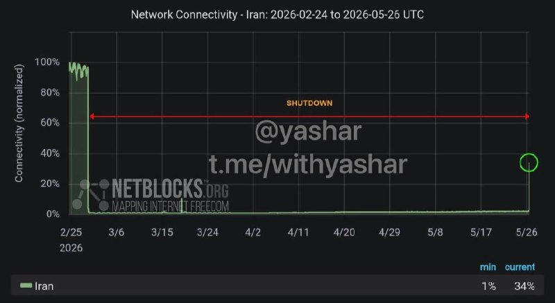

به گزارش نت بلاکس، بعد از 88 روز و 2093ساعت خاموشی تمام عیار اینترنت، همکنون نزدیک به 35% اینترنت ایران وصل شده.
@withyashar

## WithYashar — post 12557

وال استریت ژورنال: قالیباف برای گفتگو درباره پایان جنگ برای دومین روز متوالی در قطر مانده

وال استریت ژورنال مدعی شد مقامات ایرانی و میانجی‌گران عرب گفتند: «محمدباقر قالیباف» برای دومین روز متوالی در قطر مانده است تا درباره توافق پایان جنگ گفتگو کند.
@withyashar

## WithYashar — post 12556

  <a href="telegram/content/WithYashar_12556_1779804083.mp4" target="_blank">🎬 Download video</a>

بنیامین نتانیاهو ساعتی پیش تو مقر کریا با وزیر جنگ اسرائیل و رئیس ستاد ارتش جلسه امنیتی برگزار کرد
@withyashar

## WithYashar — post 12555

  <a href="telegram/content/WithYashar_12555_1779804085.mp4" target="_blank">🎬 Download video</a>

اینو استوری‌کرده بودم دیروز خیلی درخواست بالا بود که چنلم بزارم ❤️‍🩹🙌🏾
@withyashar

## WithYashar — post 12554

## WithYashar — post 12553

## WithYashar — post 12552

## WithYashar — post 12551

مملکت دیونه خونس یکی پاشو میزاره رو شلنگ بعد اونیکی میکشه …
خواهیم دید چه خواهد شد

## WithYashar — post 12550

اینترنت بین الملل روی مخابرات کامل باز شده
@withyashar

## WithYashar — post 12549

سایت دولتی سیتنا هم که ا‌ول خبر وصل شدن اینترنت رو پخش کرده بود فیلتر شد.
@withyashar

## WithYashar — post 12548

️ایسنا خبری که مربوط به متصل شدن اینترنت بود رو پاک کرد
@withyashar

## WithYashar — post 12547

موشتبی خامنه‌ای : اسرائیل 15 سال آینده رو نخواهد دید!

غدّه‌ی سرطانی اسرائیل به مراحل پایانی عمرش نزدیک شده و به فضل الهی و طبق آینده‌نگری 10 سال قبل پدرم، 25 سال بعد از اون تاریخ رو نخواهد دید، ان‌شاءالله.
@withyashar 😂

## WithYashar — post 12546

وزارت خارجه در بیانیه ای گفت:
نقض آتش‌بس توسط آمریکا بی‌پاسخ نمی‌ماند.
@withyashar

## WithYashar — post 12545

  <a href="https://t.me/withyashar/12545" target="_blank">📎 Download file</a>

کتاب «زمان انتخاب» نوشته شاهزاده رضا پهلوی
این کتاب مصاحبه ای است که میشل تبمن با رضا پهلوی انجام داده، گفت و گویی است متفاوت، بدون تعارف و رودربایستی، و آگاهی رسان! در گفت و گوی مورد بحث، رضا پهلوی با نهایت صراحت پرسش های مطرح شده، پاسخ های مفصل و قاطع ارائه داده و اصول برنامه مبارزاتی و معیارهای استراتژیک خود را در مورد نظام حاکم بر ایران، وضعیت اپوزیسیون و بسیاری از مسائل منطقه و جهان، ارائه نموده است

🌐 @withyashar

🌐 instagram.com/yashar

## WithYashar — post 12544

معاون وزیر ارتباطات: دقایقی دیگر اولین دسترسی ها به اینترنت بین الملل ایجاد می شود و رفته رفته مرم شاهد بازگشایی تدریجی اینترنت خواهند بود و تا ۲۴ ساعت دیگر همه مردم به اینترنت بین الملل متصل می شوند./خبر آنلاین @withyashar

## WithYashar — post 12543

ادعای آسوشیتدپرس: ایالات متحده و ایران دیروز در مورد مسئله دارایی‌های بلوکه‌شده به تفاهم رسیدند.

میانجیگری قطر با موفقیت به تفاهم آمریکایی-ایرانی درباره «دارایی‌های بلوکه‌شده» منجر شد.
به احتمال زیاد ایالات متحده و ایران امروز توافقی را در مورد «دارایی‌های بلوکه‌شده» اعلام خواهند کرد.
@withyashar

## WithYashar — post 12542

  

ترامپ در تروث : «رئیسِ معامله‌گرها، به ترامپ اعتماد کنید»
@withyashar

## mwarmonitor — post 9744

🔴پنتاگون بر سر افزایش قیمت استارلینک در جریان جنگ ایران با اسپیس‌ایکس درگیر شده است

🔰(رویترز) — در حالی که پهپادهای انتحاری آمریکا که با شبکه استارلینکِ ایلان ماسک هدایت می‌شدند، شروع به کسب دستاوردهای ملموس در جنگ علیه ایران کردند، مقامات ارشد اسپیس‌ایکس به یک جمع‌بندی رسیدند: پنتاگون باید برای دسترسی به شبکه اینترنت ماهواره‌ای آن‌ها هزینه بیشتری بپردازد.

🔸به گفته دو منبع آگاه و بر اساس اسناد پنتاگون که رویترز بررسی کرده، ظرف چند هفته پس از آغاز کارزار بمباران ایالات متحده، مدیران اسپیس‌ایکس با مقام‌های پنتاگون دیدار کردند و استدلال کردند که ارتش برای هر ترمینال حدود ۵ هزار دلار پرداخت می‌کند، در حالی که عملاً از سطح بالاتری از خدمات استفاده می‌شود که ارزش آن به حدود ۲۵ هزار دلار نزدیک است.

🔹این اختلاف‌نظر درباره استفاده از استارلینک روی پهپادهای انتحاری LUCAS — یک مدل ارزان آمریکایی که با پهپاد شاهد ایران قابل مقایسه است و می‌تواند بالای منطقه هدف گردش کند و سپس با شیرجه منفجر شود — بخشی از افزایش تنش‌ها میان اسپیس‌ایکس و پنتاگون بر سر قیمت‌گذاری استارلینک در ماه‌های اخیر است؛ موضوعی که بنا بر گفت‌وگو با پنج فرد مطلع و بررسی اسناد تأیید می‌شود.

@mwarmonitor

## mwarmonitor — post 9743

  <a href="telegram/content/mwarmonitor_9743_1779804088.mp4" target="_blank">🎬 Download video</a>

📝 تصاویری که می‌بینید، نه سیزده‌بدرِ پارک‌های خرم‌آباد، بلکه مراسم تدفینِ فرهنگ باپرستیژ اروپایی دیروز در دویسبورگ آلمان است. اوضاع در اروپا به قدری دارک شده که آن دیسیپلین، قانون‌مداری و اتوکشیدگی آلمانی، جایش را به یک آنارشیِ دودی داده است. مردمی که روزی آرزوی زندگی در اتوپیا آن‌ها را داشتیم، حالا وسط پارک‌ها با بشقاب پلاستیکی افتاده‌اند به جان منقل‌ها و با دود کردن زغال، به ریشِ تمام استانداردهای شهرنشینی اروپا می‌خندند. با دیدن این حجم از رهاشدگی و رقص و پایکوبیِ وسط دودِ سرطان‌زا، باید اعتراف کرد که آن تصویرِ شیک و فانتزی از اروپا رسماً سقط شده و جایش را به یک پیک‌نیکِ جهان‌سومی داده است؛ واقعاً که اوضاع آن‌جا خیلی خیته و مهد تمدن بدجور قافیه را باخته است!

@mwarmonitor

## mwarmonitor — post 9742

  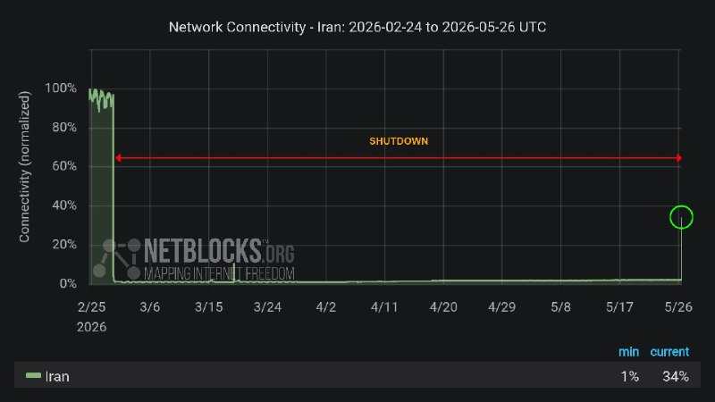

📈 تأیید شد: داده‌های زنده نشان می‌دهد که در روز ۸۸، پس از ۲۰۹۳ ساعت قطع تقریباً کامل ارتباط با شبکه‌های بین‌المللی، بخشی از اتصال اینترنت در ایران به‌طور محدود بازسازی شده است؛ طولانی‌ترین قطع سراسری اینترنت در تاریخ مدرن. هنوز مشخص نیست که این بازگشت اتصال پایدار خواهد بود یا خیر. نت بلاکس

@mwarmonitor

## mwarmonitor — post 9741

  <a href="telegram/content/mwarmonitor_9741_1779804090.mp4" target="_blank">🎬 Download video</a>

📝 این تفاله‌های خیابانی و زالوهای متعفن، لجن‌زار متحرکی هستند که بوی مشمئزکننده‌شان تمام فضا را پر کرده است. موجوداتی ماقبلِ‌حیوان که شرف و ناموسشان را در ازای یک کاسه لیسیدنیِ مجانی چوب حراج زده‌اند؛ اراذل و اوباشی بزدل که مثل موش‌های ترسو از کمترین خطری فرار می‌کنند، اما شب‌ها برای گدایی یک لقمه نانِ کثیف، به خیابان‌ها می‌ریزند تا نقش سگ‌های دست‌آموز و جیره‌خوار را بازی کنند.

🔸​این کرم‌های لجن‌خوار و بی‌هویت، ننگ بشریت و نجاست متحرک جامعه‌اند. نگاه به ریخت خفت‌بارشان، که برای چند ریال مواجب و توهم بهشت، هر پستی و ذلتی را با آغوش باز می‌پذیرند، چیزی جز حالت تهوع و انزجار مطلق ایجاد نمی‌کند. این موجودات طفیلی و بی‌نام‌وناموس، حتی لیاقت نام «انسان» را هم ندارند؛ لاشخورهایی حقیر که تمام وجودشان در بندگی، مزدوری و خیانت به خون انسان‌های شریف خلاصه شده است و جز تف و لعنت، سهمی از این دنیا نخواهند داشت.

@mwarmonitor

## mwarmonitor — post 9740

📌روسیه می‌گوید لاوروف در یک تماس تلفنی با روبیو توضیح داده است که چه عواملی باعث شد روسیه تصمیم به حمله به کی‌یف بگیرد - خبرگزاری RIA

@mwarmonitor

## mwarmonitor — post 9739

🔴فاکس نیوز: مارکو روبیو، وزیر خارجه، از ایران خواسته تنگه هرمز را باز کند و به حکومت هشدار داده است که این تنگه «به هر شکل ممکن» باز خواهد شد، اگر از تبعیت خودداری کنند.

🔸این اظهارات در حالی مطرح می‌شود که تنش‌ها میان آمریکا و جمهوری اسلامی ایران پس از یک دور حملات «دفاعی» انجام‌شده توسط ایالات متحده افزایش یافته است:

🔸«این تنگه‌ها باید باز باشند. در هر صورت باز خواهند شد، یک‌جوری یا جور دیگر... آنچه آنجا در حال رخ دادن است غیرقانونی است — این برای جهان غیرقابل‌دوام و غیرقابل‌قبول است.»

@mwarmonitor

## mwarmonitor — post 9738

  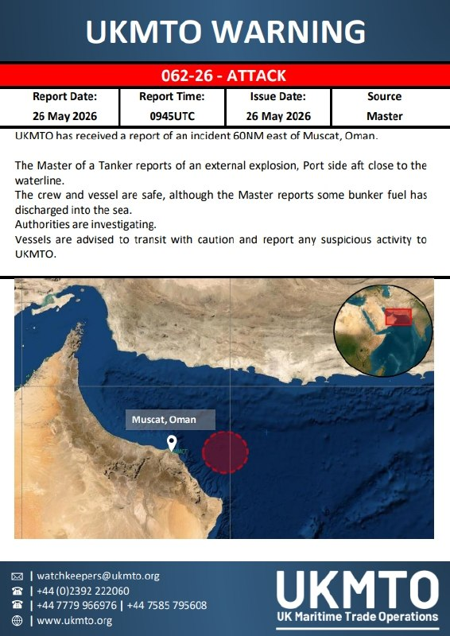

🔴سازمان UKMTO (مرکز عملیات تجارت دریایی بریتانیا) گزارشی درباره وقوع یک حادثه در ۶۰ مایل دریایی (NM) در شرق مسقط، عمان دریافت کرده است.
🔸ناخدای یک کشتی نفت‌کش، گزارشی از وقوع یک انفجار بیرونی در سمت چپ بخش عقب کشتی (Port side aft) و نزدیک به خط آب (waterline) داده است.
🔸خدمه و شناور در سلامت و امنیت هستند، اگرچه ناخدا گزارش داده است که مقداری از سوخت پشتیبان (bunker fuel) به داخل دریا نشت کرده است.
🔸مقامات در حال بررسی موضوع هستند.
به شناورها توصیه می‌شود که با احتیاط عبور کنند و هرگونه فعالیت مشکوک را به UKMTO گزارش دهند.

@mwarmonitor

## mwarmonitor — post 9737

  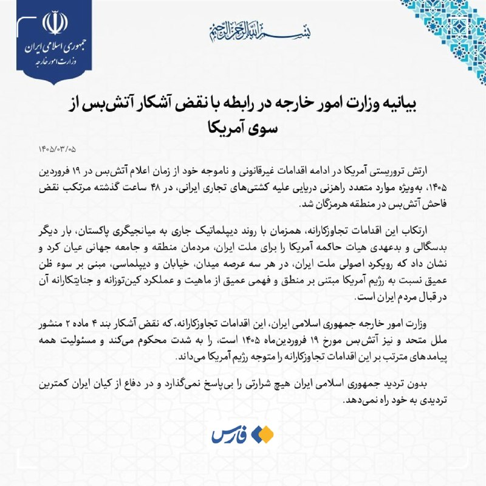

🔴 وزارت خارجه: نقض آتش‌بس توسط آمریکا بی‌پاسخ نمی‌ماند.

@mwarmonitor

## mwarmonitor — post 9736

🔴 روسیه قانونی را تصویب کرده است که اجازه مصادره اموال شهروندانی را می‌دهد که از کشور فرار کرده‌اند.
🔸دوما (مجلس سفلی پارلمان روسیه) قانونی را تصویب کرده است که بر اساس آن، امکان توقیف اموال روس‌هایی که به دلیل ارتکاب «اقداماتی علیه منافع روسیه» کشور را ترک کرده‌اند، فراهم می‌شود.
🔹بر اساس این قانون جدید، شهروندان روسی که از شرکت‌کنندگان در «عملیات نظامی ویژه» (اصطلاح رسمی روسیه برای جنگ اوکراین) انتقاد یا آن‌ها را توهین کنند، «تروریسم یا نازیسم را توجیه کنند» یا در خارج از کشور از ارتش روسیه انتقاد کنند، ممکن است تمام اموالشان در داخل روسیه مصادره شود.

📝 حکومت‌ها چه از مسکو اداره شوند و چه از تهران، در یک اصل زرین با هم تفاهم دارند: «مال تو، مال من است؛ مخصوصاً اگر با من موافق نباشی.»
🔹واقعاً چه همخوانی شگفت‌انگیزی میان ریش و عمامه با کت‌وشلوار و چشم‌های آبی وجود دارد! انگار هر دو نسخه از یک نرم‌افزارِ «دگراندیش‌کشی» استفاده می‌کنند؛ فقط یکی با طعمِ چای قندپهلو و دیگری با چاشنیِ ودکا. دوما به وضوح ثابت کرد که ارتشِ سایبری و دادگاه‌های انقلاب، مرز جغرافیایی نمی‌شناسند. پیام این قانونِ جدید، کمدی‌ترین شکلِ تراژدی است: «اگر به جنگِ ما انتقاد کنی، ما خانه و زندگی‌ات را فتح می‌کنیم تا جبههٔ داخلی تقویت شود!»
🔸در دنیای این دو نُطفه شیطانی ، آزادیِ بیان یعنی آزادیِ سکوت، و حقِ مالکیت یعنی تا زمانی که برای ما دم تکان می‌دهی، می‌توانی در خانه‌ات بخوابی. لعنت به این نبوغ مشترک که در آن، فرار از وطن هم جرم است و سهمت از خاکِ پدری، فقط مصادرهٔ اموال!

@mwarmonitor

## mwarmonitor — post 9735

‌
🔴دیوان عدالت اداری دستور توقف مصوبهٔ ایجاد ستاد فضای مجازی را صادر کرد

🔹دیوان عدالت اداری اعلام کرد: در پی طرح شکایاتی دربارهٔ ابطال «سند ایجاد ستاد ویژه ساماندهی و راهبری فضای مجازی کشور» هیئت تخصصی صنایع و بازرگانی دیوان عدالت اداری با احراز ضرورت و فوریت موضوع، دستور توقف اجرای این مصوبه را تا زمان رسیدگی به شکایت صادر کرد.

🔹براساس اعلام دیوان عدالت اداری، هیئت تخصصی صنایع و بازرگانی این دیوان اجرای مصوبهٔ مربوط به ایجاد «ستاد ویژه ساماندهی و راهبری فضای مجازی کشور» را متوقف کرده و تا زمان رسیدگی به شکایت، مصوبات این ستاد غیرقابل اجرا خواهد بود. خبرگزاری فارس

📝 آدم دلش می‌خواهد از شدت خشم سر به دیوار بکوبد وقتی می‌بیند سرنوشت اینترنت و زندگی‌اش دستمایهٔ خیمه‌شب‌بازیِ یک مشت دُگمِ عقل‌باخته و بوروکراتِ آویزان شده است؛ بچه شیعه که هنرش فقط گره زدنِ معیشت مردم به کلاف سردرگمِ تصمیماتِ الاکلنگی و مضحک‌شان است! این حجم از بلاهتِ سیستماتیک و مسخره‌بازیِ نهادهای موازی، دیگر تهوع‌آور شده و فقط نشان از حقارتِ فکریِ جماعتی دارد که تمام توانشان، سوهان کشیدن روی اعصاب و روان یک ملت است

@mwarmonitor

## mwarmonitor — post 9734

🔴اختصاصی آکسیوس: ارتقای مقام مشاور روبیو به یک سمت ارشد امنیت ملی در کاخ سفید

🔰مایک نیدهام، مشاور دیرینه مارکو روبیو، به یک سمت ارشد امنیت ملی در کاخ سفید منصوب شده است؛ خبری که اکسیوس (Axios) به آن دست یافته است.

📌چرا این موضوع اهمیت دارد؟
سمت جدید نیدهام به عنوان دستیار رئیس‌جمهور و معاون مشاور امنیت ملی، یکی از کلیدی‌ترین جایگاه‌ها در دولت ترامپ به شمار می‌رود؛ دولتی که در حال حاضر به شدت درگیر چالش‌های سیاست خارجی متعددی از جمله در قبال ایران، چین، کوبا و ونزوئلا است.

نگاهی دقیق‌تر
جانشینی: نیدهام جایگزین «رابرت گابریل» می‌شود؛ فردی که سوزی وایلز، رئیس کارکنان کاخ سفید، هفته گذشته او را «محرم اسرار و دوستی عزیز برای خود و همکارانش در کاخ سفید» نامیده بود.
روابط داخلی: نیدهام نیز مانند گابریل، روابط بسیار خوبی در کاخ سفید دارد، از جمله با تیم جی.دی. ونس (معاون رئیس‌جمهور).
نظر مقامات: یک مقام ارشد دولت در این باره گفت: «همه مایک را دوست دارند. او هم سیاست‌گذاری‌ها را خوب می‌فهمد و هم به بازی‌های سیاسی مسلط است.»
همکاری با روبیو: از آنجا که روبیو هم‌زمان مشاور امنیت ملی رئیس‌جمهور نیز هست، این جابه‌جایی نیدهام باعث می‌شود او همچنان در ارتباط نزدیک با وزیر امور خارجه باقی بماند.
مارکو روبیو در بیانیه‌ای اعلام کرد:
«مایک یکی از بازیگران کلیدی در تحقق موفقیت‌های چشمگیر سیاست خارجی پرزیدنت ترامپ بوده است. او در نقش جدید خود به عنوان معاون مشاور امنیت ملی، به اجرای دستور کار "اول آمریکا" پیاپی خواهد داد و بر پایه سوابق تاریخی شورای امنیت ملی ترامپ گام خواهد برداشت.»
پیشینه و سوابق
نیدهام در سال ۲۰۱۸ پس از ترک گروه سیاسی محافظه‌کار «هریتج اکشن» (Heritage Action)، به عنوان رئیس کارکنان دفتر روبیو در سنا وارد حلقه نزدیکان او شد. او سپس به همراه روبیو به دولت ترامپ پیوست تا به عنوان مشاور عالی (Counselor) وزارت امور خارجه خدمت کند.
جابه‌جایی‌های بعدی در وزارت امور خارجه
دن هالر: رئیس فعلی کارکنان روبیو، جایگزین نیدهام در سمت مشاور عالی وزارتخانه خواهد شد و هم‌زمان سرپرستی مدیریت برنامه‌ریزی سیاست‌گذاری را بر عهده خواهد گرفت. هالر پیش از این نیز همراه با نیدهام در دفتر سنای روبیو و موسسه هریتج اکشن فعالیت کرده بود.
مت رودز: رئیس فعلی کارکنان مشاور عالی، جایگزین هالر شده و سمت رئیس کارکنان وزارت امور خارجه را بر عهده می‌گیرد.

@mwarmonitor

## mwarmonitor — post 9733

🔴ارتش اسرائیل (IDF) به ساکنان شهر نباتیه در جنوب لبنان هشدار تخلیه صادر کرد و از آن‌ها خواست فوراً منطقه را ترک کرده و به شمال رودخانه زهرانی منتقل شوند.

🔸در این هشدار، ارتش اسرائیل اعلام کرده است که این اقدام به دلیل نقض آتش‌بس از سوی حزب‌الله انجام شده و به ساکنان هشدار داده شده که افراد نزدیک به مواضع این گروه در معرض خطر قرار دارند.

@mwarmonitor

## mwarmonitor — post 9732

🔸دادستان‌های اسرائیل در حال بررسی طرح اتهامات کیفری علیه رئیس دفتر بنیامین نتانیاهو، یعنی تساحی برافرمان هستند.

🔹این اتهامات احتمالی شامل تقلب، نقض اعتماد و مانع‌تراشی در روند عدالت است و به نشت ادعایی یک سند اطلاعاتی فوق‌محرمانه به روزنامه آلمانی بیلد مرتبط می‌شود.

@mwarmonitor

## mwarmonitor — post 9731

🔴خبرگزاری آسوشیتدپرس: میانجی‌گری قطر توانسته است به یک تفاهم میان آمریکا و ایران درباره «دارایی‌های مسدود شده» دست یابد.

🔸انتظار می‌رود ایالات متحده و ایران امروز توافقی را درباره «پول‌های مسدود شده» اعلام کنند.

@mwarmonitor

## mwarmonitor — post 9730

📝 واقعاً آدم دلش برای این پیرمرد مو نارنجی کباب می‌شود؛ طفلکی هر چه بیشتر تلاش می‌کند تا ادای یک غول بی‌شاخ‌ودمِ تحریم‌کننده را درآورد، بیشتر شبیه پدربزرگ مهربان و باگذشتی می‌شود که مأموریتش در زندگی فقط «نه نگفتن» به خواسته‌های تهران است. اصلاً این حجم از…

## mwarmonitor — post 9729

🔴رسانه‌های اسرائیلی: اسرائیل بسیج اضطراری نیروهای ذخیره را آغاز کرده است؛ از جمله یگان‌های توپخانه‌ای که به‌تازگی از خدمت ترخیص شده بودند. این اقدام در چارچوب افزایش آمادگی‌ها برای عملیات دفاعی گسترده در لبنان و در پی ادامه حملات حزب‌الله و نقض آتش‌بس انجام می‌شود.

@mwarmonitor

## FoxNewsTwitter — post 342263

  

Fox News (Twitter/X)

Mandatory Ebola screenings have expanded to Atlanta's International Airport.

Travelers arriving from the Democratic Republic of Congo, Uganda and South Sudan are now required to undergo temperature checks and complete a health questionnaire after landing in Atlanta.

If travelers pass the screening, they are cleared to leave the airport but will still be monitored for 21 days by a state health department at their final destination.

This move comes as the current Ebola outbreak overseas has caused at least 220 deaths around the world.

## FoxNewsTwitter — post 342262

  <a href="telegram/content/FoxNewsTwitter_342262_1779804093.mp4" target="_blank">🎬 Download video</a>

Fox News (Twitter/X)

Radical Senate candidate Graham Platner railed against CEOs and tried to win over working class voters while rallying with Bernie Sanders during the Vermont senator's "Fighting Oligarchy Tour."

Platner took aim at wealthy Americans as well as those he says are part of the "Epstein class."

“I believe that we should not be settling for scraps that they throw to us from the table, where they are dining with the Epstein class.”

“I believe that in our country, the voices of working people are far more important than the voices of those who merely have money.”

## FoxNewsTwitter — post 342261

  

Fox News (Twitter/X)

NBA star Kyle Kuzma reveals his massive bet on Spencer Pratt to be the next mayor of Los Angeles.

The former Lakers champion revealed he placed a $36,000 bet on the longtime reality TV star to win the Los Angeles mayoral race — a wager that could result in a whopping payout of more than $130,000.

Kuzma defended his support on social media, saying “LA has been cooked since Covid,” as Pratt continues to build momentum with outsider-style attacks on crime, homelessness and city leadership.

## FoxNewsTwitter — post 342260

  <a href="telegram/content/FoxNewsTwitter_342260_1779804096.mp4" target="_blank">🎬 Download video</a>

Fox News (Twitter/X)

NEW: Secretary Rubio demanding Iran open the Strait of Hormuz, warning the regime that the Strait will be open "one way or another" if they refuse to comply.

This comes as tensions rise between the U.S. and the Islamic Republic following a round of defensive strikes carried out by the United States:

"The straits have to be open. They're going to be opened one way or the other... What's happening there is unlawful — it's illegal, it's unsustainable for the world, and unacceptable."

## FoxNewsTwitter — post 342259

  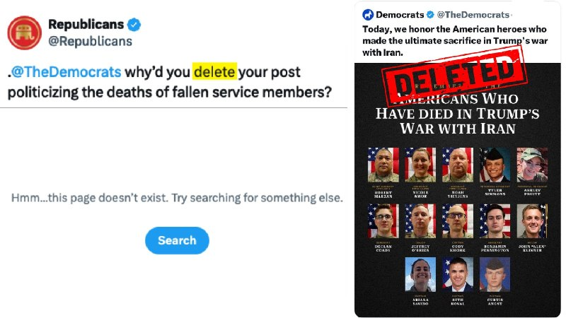

Fox News (Twitter/X)

Democrats are getting called out after trying to quietly delete a Memorial Day post that politicized fallen U.S. service members to take a jab at President Trump.

The post, made from the official Democrats account, originally featured a photo of the 13 service members who died in the ongoing war with Iran and was captioned “REMEMBERING THE AMERICANS WHO HAVE DIED IN TRUMP’S WAR WITH IRAN.”

Critics originally described the partisan post as “vile” and “disrespectful” as a new wave of scrutiny is calling out the party for trying to sweep the backlash under the rug.

## FoxNewsTwitter — post 342257

Fox News (Twitter/X)

JUST IN: The U.S. military carried out “self-defense strikes” in southern Iran Monday, targeting missile launch sites and Iranian boats in the Strait of Hormuz.

CENTCOM says the strikes were launched after Iranian forces were spotted laying mines in the Strait of Hormuz and a missile site targeted U.S. warplanes during an already fragile ceasefire in the region.

## pm_afshaa — post 91539

نت بلاکس:34 درصد مردم به اینترنت دسترسی پیدا کردن

💧 Rainbet.com the #1 Non-KYC Crypto Casino & Sportsbook @rainbetcom

😁 @Pm_Afshaa

## pm_afshaa — post 91538

پروکسی ها گویا با نت مخابرات وصل شدن

## pm_afshaa — post 91537

گویا اینترنت ها در حال باز شدنه

## pm_afshaa — post 91536

درود هموطنان عزیزم یک دختر 26 سال داره بجرم کشتن یکنفر که وارد خونش شده که بهش تعرض و تجاوز بکنه صبح 5 خرداد اعدام میشه، باید ۱۰ میلیارد جمع بشه که رضایت بدن تا حالا ۹ میلیارد جمع شده  همه چی داخل تصویر هست کسی خواست استعلام بگیره میدونم ایرانی ها آدم با…

## pm_afshaa — post 91535

  <a href="telegram/content/pm_afshaa_91535_1779804098.webm" target="_blank">🎬 Download video</a>

🔴اتاق جنگ اسرائیل:
مجتبی خامنه‌ای گفته که اسرائیل تو مراحل پایانی خودشه و ظرف 25 سال آینده از بین خواهد رفت؛ پدرش هم همیشه این حرف رو میزد اما یه روز، ناگهان سکوت کرد.

💧 Rainbet.com the #1 Non-KYC Crypto Casino & Sportsbook @rainbetcom

😁 @Pm_Afshaa

## pm_afshaa — post 91534

  <a href="telegram/content/pm_afshaa_91534_1779804098.webm" target="_blank">🎬 Download video</a>

🔴ارتش اسرائیل: بیش از 100 زیرساخت و نیروهای حزب‌الله در لبنان هدف قرار گرفت.

💧 Rainbet.com the #1 Non-KYC Crypto Casino & Sportsbook @rainbetcom

😁 @Pm_Afshaa

## pm_afshaa — post 91533

  <a href="telegram/content/pm_afshaa_91533_1779804099.webm" target="_blank">🎬 Download video</a>

🔴نیویورک پست: مقام‌های آمریکایی در حال بررسی روش‌هایی هستن که ایران بتونه ذخایر اورانیوم با غنای بالا رو بدون تحویل مستقیم به واشنگتن از بین ببره.

💧 Rainbet.com the #1 Non-KYC Crypto Casino & Sportsbook @rainbetcom

😁 @Pm_Afshaa

## pm_afshaa — post 91532

  <a href="telegram/content/pm_afshaa_91532_1779804099.webm" target="_blank">🎬 Download video</a>

🔴تسنیم: سفر قالیباف به قطر برای پیگیری آزادسازی بخشی از منابع ارزی انجام شده.

💧 Rainbet.com the #1 Non-KYC Crypto Casino & Sportsbook @rainbetcom

😁 @Pm_Afshaa

## pm_afshaa — post 91531

  <a href="telegram/content/pm_afshaa_91531_1779804100.webm" target="_blank">🎬 Download video</a>

بازگشایی اینترنت متوقف شد دیوان عدالت اداری دستور توقف مصوبهٔ ایجاد ستاد فضای مجازی را صادر کرد 
💧 Rainbet.com the #1 Non-KYC Crypto Casino & Sportsbook @rainbetcom 
😁 @Pm_Afshaa

## pm_afshaa — post 91529

🔴بن‌ گویر ، وزیر امنیت ملی اسرائیل :اسرائیل هرگز اجازه نخواهد داد ترامپ با جمهوری اسلامی یک توافق بد امضا کند

💧 Rainbet.com the #1 Non-KYC Crypto Casino & Sportsbook @rainbetcom

😁 @Pm_Afshaa

## pm_afshaa — post 91528

  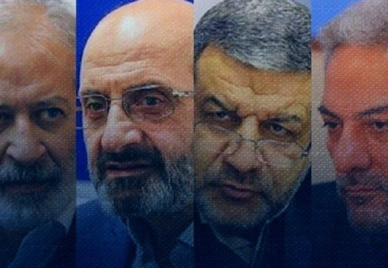

این چهارنفر شاکی حقیقی وصل شدن اینترنتن:
کامیار ثقفی
رضا تقی پور
رسول جلیلی
محمد حسن انتظاری

💧 Rainbet.com the #1 Non-KYC Crypto Casino & Sportsbook @rainbetcom

😁 @Pm_Afshaa

## pm_afshaa — post 91527

مدیرکل فرودگاه‌های استان اصفهان گفت: پروازهای فرودگاه بین‌المللی اصفهان پس از 84 روز وقفه دوباره برقرار شده

💧 Rainbet.com the #1 Non-KYC Crypto Casino & Sportsbook @rainbetcom

😁 @Pm_Afshaa

## pm_afshaa — post 91526

  

🚨اشتراک استارز ⭐️ فیلترشکن ایران وی پی ان

تعرفه های باور نکردنی فقط گیگی ۱۸۰🔮

سرورا بدون ضریب هستن و ساب دارن😎🔋

1 gig = 180t🚀

3 gig= 540t 🚀

5 gig= 900t🚀

7 gig = 1250t 🚀

10 gig= 1800t 🚀

قبل خرید میتونید تست بگیرید 🛜
بهترین و ارزون ترین سرور ایران دست ماست

🚨تمامی سرور ها کاربر نامحدود هستن و تاریخ انقضا ندارن✅

جهت خرید به ایدی زیر پیام بدین 👇

@IRAN_VPNADMIN
چنل رضایت

https://t.me/IRAN_VPNON

## pm_afshaa — post 91525

بازگشایی اینترنت متوقف شد دیوان عدالت اداری دستور توقف مصوبهٔ ایجاد ستاد فضای مجازی را صادر کرد 
💧 Rainbet.com the #1 Non-KYC Crypto Casino & Sportsbook @rainbetcom 
😁 @Pm_Afshaa

## pm_afshaa — post 91524

دیوان عالی کشور: باز شدن اینترنت سرش گرده 
💧 Rainbet.com the #1 Non-KYC Crypto Casino & Sportsbook @rainbetcom 
😁 @Pm_Afshaa

## pm_afshaa — post 91523

🔴قطر:هیچ پولی به رژیم جمهوری اسلامی نمیدیم

💧 Rainbet.com the #1 Non-KYC Crypto Casino & Sportsbook @rainbetcom

😁 @Pm_Afshaa

## pm_afshaa — post 91522

دیوان عالی کشور: باز شدن اینترنت سرش گرده

💧 Rainbet.com the #1 Non-KYC Crypto Casino & Sportsbook @rainbetcom

😁 @Pm_Afshaa

## pm_afshaa — post 91521

سپاه: حق پاسخ به حمله دیشب امریکایی رو برای خود محفوظ نگه میداریم

💧 Rainbet.com the #1 Non-KYC Crypto Casino & Sportsbook @rainbetcom

😁 @Pm_Afshaa

## pm_afshaa — post 91520

🔴کانال 14 اسراییل:
مجتبی خامنه‌ای، پسر رهبر ایران، روز سه‌شنبه تهدیدی مستقیم و شدید علیه اسرائیل و ایالات متحده مطرح کرد. رهبر ایران گفت: «اسرائیل به «پایان» موجودیت خود نزدیک می‌شود.» او همچنین تهدیدی علیه واشنگتن اضافه کرد: {کشورها و سرزمین‌های منطقه دیگر به عنوان سپری برای پایگاه‌های آمریکا عمل نخواهند کرد. ایالات متحده روز به روز از جایگاهی که در گذشته داشت، فاصله می‌گیرد}

💧 Rainbet.com the #1 Non-KYC Crypto Casino & Sportsbook @rainbetcom

😁 @Pm_Afshaa

## pm_afshaa — post 91519

  

غلامرضا خانی شکراب از معترضین دی ماه ، امروز با اذان صبح اعدام شد

💧 Rainbet.com the #1 Non-KYC Crypto Casino & Sportsbook @rainbetcom

😁 @Pm_Afshaa

## DEJradio — post 4988

  <a href="telegram/content/DEJradio_4988_1779804102.webm" target="_blank">🎬 Download video</a>

🔺📷 دیوان عدالت اداری اجرای بازگشایی اینترنت را موقتا متوقف کرد

پس از آنکه وزارت ارتباطات از رفع انسداد اینترنت طی ۲۴ ساعت آینده، و بر اساس مصوبه «ستاد ویژه ساماندهی و راهبری فضای مجازی» خبر داد، دیوان عدالت اداری وابسته به قوه قضاییه جلوی اجرای این مصوبه را گرفت.

در پی تصویب طرح بازگشایی اینترنت توسط «ستاد فضای مجازی»، دیوان عدالت اداری جمهوری اسلامی طی حکمی دستور توقف اجرای این مصوبه را صادر کرد.

دیوان عدالت اداری در بیانیه‌ای گفته است در پی طرح شکایاتی درباره ابطال «سند ایجاد ستاد ویژه ساماندهی و راهبری فضای مجازی کشور» هیئت تخصصی صنایع و بازرگانی این دیوان «با احراز ضرورت و فوریت موضوع، دستور توقف اجرای این مصوبه را تا زمان رسیدگی به شکایت صادر کرد.»
به گفته این نهاد، تا زمان رسیدگی به شکایت، مصوبات این ستاد غیرقابل اجرا خواهد بود.

گفته شد ستاد راهبری و ساماندهی فضای مجازی، به ریاست محمدرضا عارف، معاون اول مسعود پزشکیان، تشکیل جلسه داده و «بازگشت اینترنت به وضعیت پیش از دی‌ماه ۱۴۰۴» را تصویب کرده است.
در پی این مصوبه، مسعود پزشکیان نیز دستور بازگشایی اینترنت بین‌الملل را به وزیر ارتباطات ابلاغ کرده بود.

#اینترنت #قطع_اینترنت
@DEJradio

## DEJradio — post 4987

⭕️ نتانیاهو و کاتز نشستی امنیتی با محور جمهوری اسلامی و لبنان برگزار کردند

بنا بر گزارش الجزیرۀ قطر، بنیامین نتانیاهو، نخست‌وزیر اسرائیل، و یسرائیل کاتز، وزیر دفاع این کشور روز سه‌شنبه نشست‌هایی امنیتی را درمورد جبهه‌های نبرد با لبنان و جمهوری اسلامی برگزار کردند.
از سویی ایتامار بن‌گویر، وزیر امنیت داخلی اسرائیل اعلام کرد این کشور اجازه نمی‌دهد ترامپ توافقی بد با جمهوری اسلامی امضا کند.

#خبر #دژ #اسرائیل
@DEJradio

## DEJradio — post 4986

⭕️ وزارت خارجۀ جمهوری اسلامی حملات شامگاه دوشنبۀ آمریکا را «نقض آتش‌بس» خواند

وزارت امور خارجۀ دولت جمهوری اسلامی مدعی شد حملات تازۀ آمریکا در منطقۀ هرمزگان «نقض آشکار آتش‌بس» میان دو کشور به شمار می‌رود و محکوم است.
وزارت امور خارجۀ جمهوری اسلامی همچنین واشینگتن را مسئول «پیامدهای» این حملات معرفی کرد.
سنتکام تأیید کرد ارتش آمریکا در جنوب ایران قایق‌های در حال مین‌گذاری و سایت‌های پرتاب موشک را هدف قرار داده است.
در پی این حملات اعلام شد چهار پاسدار کشته شده‌اند.

#خبر #دژ #تنگه_هرمز
@DEJradio

## DEJradio — post 4985

⭕️ ترامپ با انتشار مطلبی بر صلح از مسیر قدرت تأکید کرد

دونالد ترامپ، رئیس‌ جمهوری آمریکا روز سه‌شنبه در شبکۀ تروث‌سوشال تصویری از خود را با شعار «صلح از راه قدرت» منتشر کرد.
سیاست صلح از راه قدرت، یک دکترین‌ اصلی در دولت ترامپ در قبال جمهوری اسلامی به شمار می‌رود.
بر اساس این رویکرد، دولت آمریکا برای رسیدن به صلح، توان نظامی جمهوری اسلامی در حوزه‌های موشکی، دریایی و هسته‌ای را تضعیف می‌کند.
ترامپ پیش‌تر اعلام کرده واشنگتن یا به یک توافق بزرگ و معنادار با تهران دست می‌یابد، یا هیچ توافقی در کار نیست.

#خبر #دز #ترامپ
@DEJradio

## DEJradio — post 4984

  <a href="telegram/content/DEJradio_4984_1779804103.webm" target="_blank">🎬 Download video</a>

🔺📢 زمان، برگ برنده آمریکا در برابر ایران؛

کارشناس: روح‌الله رحیم‌پور، تحلیلگر سیاسی

#جنگ #مذاکرات
@DEJradio

## DEJradio — post 4983

⭕️ رئیس‌ جمهوری مکزیک: آمریکا نمی‌خواست میزبان اردوی تیم جمهوری اسلامی باشد

کلودیا شین‌بام، رئیس‌ جمهوری مکزیک، اعلام کرد دولت آمریکا تمایلی به میزبانی اردوی تیم ملی فوتبال جمهوری اسلامی ایران برای جام جهانی ۲۰۲۶ نداشت.
او گفت در پی مخالفت واشینگتن، فیفا از مکزیک خواست میزبانی این اردو را برعهده بگیرد دولت مکزیک نیز موافقت کرد.
مهدی تاج، رئیس فدراسیون فوتبال جمهوری اسلامی پیش‌تر گفته بود اردوی «تیم ملی» از آمریکا به شهر تیخوانا در مکزیک منتقل شده است.
احمد دنیامالی، وزیر ورزش دولت جمهوری اسلامی مدعی شد فیفا «قول داده» همۀ بازیکنان و سایر اعضای تیم ویزای آمریکا را دریافت می‌کنند.
هر سه بازی تیم ملی فوتبال جمهوری اسلامی ایران در مرحلۀ گروهی جام جهانی در خاک آمریکا برگزار می‌شود.

#فوتبال #ترامپ #جام_جهانی
@DEJradio

## DEJradio — post 4982

  <a href="telegram/content/DEJradio_4982_1779804103.mp4" target="_blank">🎬 Download video</a>

🔺📢 "زندگی عادی بعد ۱۸ و ۱۹ دی‌ بی‌معناست...

سوشا مکانی دروازه‌بان پیشین تیم ملی

#دی۱۴۰۴
@DEJradio

## DEJradio — post 4981

  <a href="telegram/content/DEJradio_4981_1779804105.webm" target="_blank">🎬 Download video</a>

🚨
🔸 چرخه سرکوب؛ از کشتار تا ممنوعیت سوگواری

گزارش: آیسان قاسم‌پور

#سرکوب #ممنوعیت_سوگواری
@DEJradio

## DEJradio — post 4980

  <a href="telegram/content/DEJradio_4980_1779804105.webm" target="_blank">🎬 Download video</a>

🚨
⭕️ دونالد ترامپ:
ایران باید اورانیوم‌ها را تحویل دهد، از پول نقد خبری نیست

مهدی خانعلی کارشناس صداوسیمای حکومت و استاد دانشگاه، در «ایکس» نوشت ایالات متحده اعلام کرده که حاضر به رفع محاصره‌ی دریایی نیست و حتی پس از اعلام تفاهم‌نامه‌ی دوجانبه و بازگشایی تنگه‌ی هرمز، کشتی‌های ایرانی باید با هماهنگی ارتش آمریکا و با مجوز آن از منطقه خارج شوند.

همزمان دونالد ترامپ در پاسخ به لارنس‌بی جونز مجری مطرح فاکس‌نیوز شایعات مربوط به «توافق هسته‌ای ضعیف» را رد کرد و گفت هرگز «پول نقد» به تهران تحویل نخواهد داد.
رئیس‌جمهور ترامپ به این مجری گفته است «آیا واقعاً فکر می‌کنید که من بعد از همه آن حرف‌هایی که زده‌ام درباره اینکه ایران هرگز به سلاح هسته‌ای دست نخواهد یافت، رئیس‌جمهور بشوم و بعد فقط پول نقد به آنها بدهم؟»
ترامپ همچنین گفته ایران باید اورانیوم غنی‌شده خود را تحویل دهد یا تحت نظارت آمریکا رقیق‌سازی و نابود کند.

خبرگزاری تسنیم وابسته به سـ.ـپاه پاسداران تهدید کرده، مذاکره بدون واریز پول مسدود شده ممکن نیست.
درون حکومت بر سر مذاکره کردن یا نکردن با آمریکا اختلاف بسیار زیاد است. این اختلافات به سـ.ـپاه پاسداران و جریان‌های امنیتی هم رسیده است هرچند تلاش می‌شود «دولت پزشکیان» را عامل مذاکره معرفی‌ کنند اما اساساً همه‌چیز در سیطره سـ.ـپاه است.

در واکنش به اصرار جریان اصلی حکومت برای مذاکره با آمریکا، امیرحسین ثابتی، عضو مجلس شورای اسلامی، با انتقاد از سخنان مسعود پزشکیان که گفته بود «اگر مذاکره نکنیم، چه کنیم»، گفت: «مگر دفعات قبل وسط میز مذاکره جنگ نشد؟ پس بازهم دوست دارید مذاکره کنید تا جنگ شود و رهبر جدیدمان هم ترور شود؟»

#ترامپ #مذاکرات
@DEJradio

## DEJradio — post 4979

  <a href="telegram/content/DEJradio_4979_1779804106.mp4" target="_blank">🎬 Download video</a>

🤡
🔺 تجمعات شبانه حکومتی، همچنان دستمایه طنز کاربران!

#تجمعات_حکومتی #شیفت_شب
@DEJradio

## DEJradio — post 4978

  <a href="telegram/content/DEJradio_4978_1779804107.mp4" target="_blank">🎬 Download video</a>

🔺🎥 توزیع مرغ صدقه‌ای بین شهروندان محروم

#مرغ #تورم
@DEJradio

## DEJradio — post 4975

  <a href="telegram/content/DEJradio_4975_1779804109.webm" target="_blank">🎬 Download video</a>

🚨📢 منابع غیررسمی نیروی هوایی ارتش به افشای مواردی از فساد حمید واحدی فرمانده پیشین نیروی هوایی پرداخته‌اند.
واحدی معروف به «سوگولی عقیدتی» که اکنون مشاور فرمانده ارتش در امور هوایی است، آذرماه ۱۴۰۴ از فرماندهی کنار گذاشته شد و بهمن بهمرد جانشین او شد.

براساس اطلاعات تازه او در واپسین روزهای فرماندهی «درخواست بازسازی خانه شخصی خودش را به مهندسی رزمی داد که موافقت شد، سپس دستور داد معاون ارشد طوری فاکتورها را جابجا کند که لوازم خانگی داخل خانه هم عوض شوند.»
این در حالیست که پرسنل می‌گویند پول ساخت آشیانه‌های آسانسوری نیروی هوایی در دوران فرماندهی او گم شد.
همین منابع گزارش دادند با آغاز فرماندهی بهمرد، معاونت مهندسی بلافاصله عزل شد.

یک سال پیش حمید واحدی طی یک جریان حفاظتی، چند هکتار از زمین‌های مرغوب نیروی هوایی در چابهار را به امیرعلی حاجی‌زاده فرمانده پیشین هوافضای سـ.ـپاه هدیه داده است.
گفته می‌شود در جریان جنگ ۱۲ روزه ستاد فرماندهی نیروی هوایی ساعت ۷ صبح به پایگاه همدان اعلام کرد که تخلیه کوی سازمانی را شروع کنند اما چیزی به تبریز گفته نشد، بعدها مشخص شد که واحدی پیش‌بینی کرده بود به پایگاه تبریز حمله نمی‌شود، اما این پیش‌بینی اشتباه بود و پایگاه تبریز بیشترین خسارات‌ را در آن جنگ دید.

#حمید_واحدی #فساد
@DEJradio

## DEJradio — post 4974

⭕️ رهبر نامرئی جمهوری اسلامی مانند پدر کشته‌شدهٔ خود از نابودی اسرائیل گفت

در پیامی که به مجتبی خامنه‌ای منتسب شده، با اشاره به سخنان ۱۰ سال پیش علی خامنه‌ای، ادعا شد اسرائیل «به مراحل پایانی عمر» خود رسیده و «۲۵ سال بعد از آن تاریخ را نمی‌بیند».
این در حالی است که علی خامنه‌ای خود نتوانسته بود ۱۰ سال بعد از گفتن آن سخنان زنده بماند.
علی خامنه‌ای و شماری از اعضای خانواده‌ و مقامات نزدیک او در نخستین حملات اسرائیل کشته شدند و از تصویر یا صدای مجتبی خامنه‌ای نیز هنوز بعد از آن حملات رونمایی نشده است.
در پیام منتسب به مجتبی خامنه‌ای نوشته شد آمریکا دیگر نمی‌تواند نقطه‌ای امن را برای استقرار پایگاه نظامی در منطقه داشته باشد.
پیام مکتوب منتسب به مجتبی خامنه‌ای، به مناسبت مراسم حج منتشر شده است.
در این پیام همچنین ادعا شد که سرزمین‌های منطقه دیگر سپر پایگاه‌های آمریکایی نمی‌شود.
از زمان اعلام نام مجتبی خامنه‌ای به عنوان سومین رهبر جمهوری اسلامی، تاکنون تصویر یا صدایی از او منتشر نشده و رسانه‌های حکومتی فقط پیام‌هایی کتبی به نام او منتشر می‌کنند.

#خبر #دژ #موشتبا
@DEJradio

## DEJradio — post 4973

⭕️ قطر پیشنهاد ۱۲ میلیارد دلاری به جمهوری اسلامی را نادرست خواند

سخنگوی وزارت امور خارجهٔ قطر گزارش‌ها دربارهٔ پیشنهاد دوازده میلیارد دلاری دوحه به جمهوری اسلامی را برای نهایی شدن توافق با آمریکا «کاملا بی‌اساس» خواند.
ماجد الانصاری مدعی شد این روایت‌ها با هدف «برهم زدن توافق و تضعیف تلاش‌های دیپلماتیک» منتشر می‌شود.
خبرگزاری حکومتی تسنیم، گزارش داد جمهوری اسلامی در مذاکرات، بر آزادسازی بخشی از پول‌های بلوکه‌شدهٔ خود اصرار کرده است.
اخباری در مورد موافقت قطر با اهدای ۱۲ میلیارد دلار پول با پوشش وام، به جمهوری اسلامی منتشر شده است.
روز دوشنبه محمدباقر قالیباف، عباس عراقچی و رئیس کل بانک مرکزی جمهوری اسلامی سفری از پیش اعلام نشده به دوحه انجام دادند.
رویترز گزارش داد این سفر با موضوع احتمال آزادسازی دارایی‌های مسدودشدهٔ جمهوری اسلامی در چارچوب توافق احتمالی انجام شد.

#خبر #دژ #قطر #مذاکرات
@DEJradio

## DEJradio — post 4972

⭕️ روبیو: پیش از بررسی راه‌های دیگر علیه جمهوری اسلامی هنوز به دیپلماسی فرصت داده‌ایم

مارکو روبیو، وزیر امور خارجهٔ آمریکا، روز سه‌شنبه گفت واشینگتن پیش از بررسی «راه‌های دیگر» علیه رژیم حاکم بر ایران، به دیپلماسی کاملا فرصت می‌دهد.
به گفتهٔ روبیو دستیابی به توافق اولیه با تهران ممکن است چند روز طول بکشد.
او گفت دربارهٔ پیش‌نویس توافق «اتفاق‌نظر» وجود دارد، اما اختلاف بر سر برخی واژه‌ها و جملات هنوز ادامه دارد.
مارکو روبیو به‌سان دونالد ترامپ تأکید کرد یا یک توافق خوب رخ می‌دهد یا توافقی در کار نیست.

#مارکو_روبیو #خبر #دژ
@DEJradio

## DEJradio — post 4971

⭕️ ذخایر اورانیوم جمهوری اسلامی ممکن است زیر نظارت آژانس اتمی نابود شود

دونالد ترامپ، رئیس‌ جمهوری آمریکا گفت اورانیوم غنی‌شده در ایران احتمالا به آمریکا منتقل و نابود می‌شود.
او گفت در غیر این صورت ممکن است با هماهنگی جمهوری اسلامی، این ذخایر در محل یا در یک مکان مورد توافق دیگر، از بین برود.
ترامپ در تروث سوشال نوشت این روند زیر نظر آژانس بین‌المللی انرژی اتمی یا نهادی مشابه انجام می‌گیرد.
باراک راوید، خبرنگار ارشد اکسیوس، موضع تازهٔ ترامپ را عقب‌نشینی واشینگتن از خواستهٔ پیشین برای خروج کامل ذخایر اورانیوم از ایران عنوان کرد.
در همین راستا بنیامین نتانیاهو، نخست‌وزیر اسرائیل گفته است بدون خروج ذخایر اورانیوم غنی‌شده از ایران، جنگ پایان نمی‌یابد.

#خبر #ترامپ #اورانیوم
@DEJradio

## DEJradio — post 4970

  <a href="telegram/content/DEJradio_4970_1779804110.mp4" target="_blank">🎬 Download video</a>

🔺📢 یک جانباز جنگ ایران و عراق می‌گوید برای تامین معاش و زندگی روزمره با انبوهی مشکلات جسمی و حرکتی مجبور به مسافرکشی است.

#جانباز #جنگ_ایران_و_عراق
@DEJradio

## DEJradio — post 4969

  <a href="telegram/content/DEJradio_4969_1779804112.webm" target="_blank">🎬 Download video</a>

🔺
✍#یادداشت: فریبرز کرمی‌زند

اخباری منتشر می‌شود مبنی بر اینکه کشورهای حاشیه خلیج فارس تلاش می‌کنند به عنوان میانجی برای مذاکره عمل کنند اما سوال اینجاست؛ چرا کشورهایی که تا همین چند هفته قبل هدف حملات نظام بودند، امروزنگران بقای آن شده‌اند؟

واقعیت این است که نگران خود هستند زیرا از هر زوایه‌ای که بررسی شوند، به مانند اتاق‌هایی شیشه‌ای‌اند؛ هرگونه، بی‌ثباتی منطقه‌ای و ناامنی سرزمینی می‌تواند میلیاردها دلار به اقتصاد و آینده آنان ضربه بزند.
برآورد آنها این است که نظام در لحظات پایانی خود، رفتارهایی تهاجمی‌تری خواهد داشت و دامنه حملات را گسترش می‌دهد. موشک‌ها و پهپادهایی که نمی توانند به اهدافی در اسرائیل یا منافع آمریکا در منطقه اصابت کنند، با ضریب بسیار بالاتری می‌توانند این کشورها را مورد اصابت قرار دهند.

آنها تا چند دهه پیش در فقر به سر می‌بردند و شهروندانشان زندگی بدوی داشتند، امروز به ثروت و زندگی تجملاتی رسیده‌اند و تلاش می‌کنند این جایگاه را تثبیت کنند و می‌دانند که دوران نفت همیشگی نیست و برای حفظ جایگاه اقتصادی و جذب سرمایه‌گذاری، بیش از هرچیز به امنیت و ثبات نیاز دارند؛ به همین دلیل نیز نمی‌خواهند دوباره وارد چرخه ناامنی و درگیری‌های نظامی شوند.

همچنین آنان تصور می‌کنند نظام به دلیل ضرباتی که دریافت کرده و محاصره دریایی، در کنار تحریم‌ها با وضعیت اقتصادی بسیار وخیمی روبروست و حتی در صورت رسیدن به توافق تا مدت‌ها درگیر بحران‌ خواهد بود؛ در نتیجه ترجیح می‌دهند خطر نزدیکتر را با خطری دورتر جایگزین کنند.

در کنار همه این‌ها، در سال‌های گذشته به نظام برای دور زدن تحریم‌ها کمک می‌کردند و عملاً به دالانی برای انتقال پول تبدیل شده بودند، پس از این، دیگر این کار را نخواهند کرد و تلاش می‌کنند با افزایش فشار اقتصادی بر نظام، و تضعیف آن بخشی از انتقام و نگرانی‌های امنیتی خود را از این طریق جبران کنند.

اما واقعیت امر این است این کشورها وزنه سیاسی در عرصه بین‌المللی محسوب نمی‌شوند حتی بزرگترین آنان که عربستان است و تصمیمات سایرین بر اساس خواست آنها گرفته نمی‌شود.

#مذاکرات #خلیج_فارس
@DEJradio

## mamlekate — post 103586

📝 دیوان عدالت مصوبه ستاد فضای مجازی را متوقف کرد؛ وعده بازگشت اینترنت در ابهام

در حالی که مقام‌های دولت جمهوری اسلامی از آغاز روند بازگشایی اینترنت بین‌الملل و اتصال کامل مردم تا ۲۴ ساعت آینده خبر داده بودند، دیوان عدالت اداری (قوه قضاییه) اعلام کرد اجرای مصوبه مربوط به ایجاد «ستاد ویژه ساماندهی و راهبری فضای مجازی کشور» را متوقف کرده است.

@mamlekate

## VahidOnline — post 75731

  

Gerduo 📡 @VahidOnline

## VahidOnline — post 75729

رسانه‌های ایران روز سه‌شنبه پنجم خرداد پیامی منسوب به مجتبی خامنه‌ای، رهبر جمهوری اسلامی، را به‌مناسبت برگزاری مراسم حج منتشر کردند که در آن می‌گوید آمریکا از این پس «نقطه امنی برای استقرار پایگاه نظامی در منطقه نخواهد داشت».

او در این پیام توضیحی دربارهٔ پایگاه‌های آمریکایی مستقر در کشورهای خلیج فارس نکرد اما هشدار داد که «سرزمین‌های منطقه دیگر سپر پایگاه‌های آمریکایی نخواهد بود».

مجتبی خامنه‌ای همچنین با یادآوری ادعای ۱۰ سال پیش پدرش علی خامنه‌ای درباره اسرائیل، مدعی شد این کشور نیز «به مراحل پایانی عمر» خود نزدیک شده و «۲۵ سال بعد از آن تاریخ را نخواهد دید».

از زمان اعلام نام مجتبی خامنه‌ای، به عنوان سومین رهبر جمهوری اسلامی، تصویر یا صدایی از او منتشر نشده و رسانه‌های ایران فقط پیام‌های کتبی را از او منتشر می‌کنند.
@VahidHeadline
در پیام منتسب به مجتبی خامنه‌ای با اشاره به گفته‌های ۱۰ سال پیش علی خامنه‌ای، رهبر کشته شده جمهوری اسلامی، اسرائیل «رژیم متزلزل صهیونی و غده سرطانی» توصیف شده و آمده است: «اسرائیل به مراحل پایانی عمر منحوس خود نزدیک شده و به فضل الهی و مطابق با سخن قاطع و آینده‌نگرِ ده سال قبل رهبر عظیم‌الشأن شهید قدس‌الله‌نفسه‌الزکیه، ۲۵ سال بعد از آن تاریخ را نخواهد دید، ان‌شاءالله.»

این سخنان در حالی عنوان می‌شود که اسرائیل و آمریکا در یک سال گذشته در جریان دو جنگ، مقام‌های عالی‌رتبه سیاسی و نظامی حکومت ازجمله علی خامنه‌ای، رهبر پیشین جمهوری اسلامی، را کشتند، بخش بزرگی از برنامه هسته‌ای جمهوری اسلامی را نابود و تاسیسات و زیرساخت‌های نظامی و اقتصادی ایران را به‌شدت تضعیف کرده‌اند.
@VahidOOnLine

📡 @VahidOnline

## VahidOnline — post 75728

  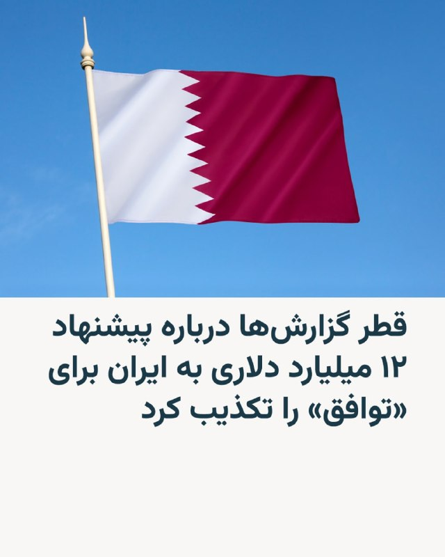

سخنگوی وزارت خارجه قطر می‌گوید گزارش‌هایی که ادعا می‌کنند دولت این کشور برای تضمین نهایی‌شدن توافق با ایران، ۱۲ میلیارد دلار به جمهوری اسلامی «پیشنهاد» داده، «کاملاً بی‌اساس» است.

ماجد الانصاری سه‌شنبه پنجم خرداد در شبکه ایکس نوشته که این گزارش‌ها «توسط طرف‌هایی منتشر می‌شوند که به دنبال برهم زدن توافق و تضعیف تلاش‌های دیپلماتیک با هدف کاهش تنش‌ها و تقویت ثبات در منطقه‌اند.»

او افزوده که تلاش‌های دیپلماتیک قطر که با «هماهنگی» شرکای منطقه‌ای انجام می‌شود، «شناخته‌شده و شفاف است».

ماجد الانصاری انتشار این دست روایت‌ها را «تلاش‌های مذبوحانه برای خدشه‌دار کردن اعتبار» دولت قطر نامیده که به گفته او به‌عنوان «یک بازیگر بین‌المللی قابل اعتماد در مسیر دستیابی به صلح» است.
@VahidHeadline

📡 @VahidOnline

## VahidOnline — post 75723

خبرگزاری میزان، وابسته به قوه قضائیه، اعلام کرد غلامرضا خانی‌شکرآب به اتهام «همکاری اطلاعاتی و جاسوسی به نفع اسرائیل» اعدام شده است.
میزان مدعی شده او «سرشبکه عملیاتی موساد» بوده و پس از تأیید حکم در دیوان عالی کشور اعدام شده است.

در روایت قوه‌قضائیه، اتهام‌های سنگینی به او نسبت داده شده است؛ از جمله جذب افراد برای عملیات خرابکارانه، دریافت پول نقد و ارز دیجیتال، تعرض و اسیدپاشی به خودروهای افراد مورد نظر موساد، آتش‌زدن اموال عمومی، تهیه بمب و ارسال آن به تهران، تصویربرداری از نقاط هدف و حتی مأموریت برای فراهم‌کردن مقدمات ترور یک خاخام یهودی در یکی از کشورهای منطقه.

ابهام اصلی پرونده، نحوه انتقال خانی‌شکرآب به ایران است. میزان نوشته او در خارج از کشور شناسایی و با «فریب اطلاعاتی» به داخل کشور هدایت و بازداشت شد.
@VahidHeadline
میزان نوشته است: بر اساس اعترافات متهم، یکی از مهم‌ترین مأموریت‌هایی که سرویس موساد برای وی طراحی کرده بود، اعزام او به یکی از کشورهای منطقه با هدف شناسایی و فراهم‌سازی مقدمات ترور یک خاخام یهودی بوده است.
@VahidHeadline

گزارش دستگاه قضایی اشاره‌ای به تاریخ بازداشت و محاکمهٔ متهم نکرده و در عین حال وی را «از اراذل و اوباش یکی از استان‌های کشور و دارای سوابق نزاع و شرارت» خوانده و ادعا کرده است که او «به دنبال جذب افراد و به‌کارگیری آن‌ها در داخل کشور برای اجرای اقدامات ضد امنیتی بوده است».

از روند محاکمه این متهم گزارشی منتشر نشده و گزارش قوه قضاییه نیز مدارک و مستنداتی از اتهامات ارائه نداده است.

دستگاه قضایی جمهوری اسلامی در ماه‌های اخیر به شکل تقریباً روزانه اقدام به اجرای احکام اعدام معترضان و یا افرادی می‌کند که آن‌ها را به همکاری با آمریکا و اسرائیل متهم می‌کند. برخی نهادهای حقوق‌بشری می‌گویند جمهوری اسلامی از اعدام برای ایجاد فضای ترس و به‌عنوان عامل سرکوب استفاده می‌کند.
@VahidHeadline

📡 @VahidOnline

## kianmeli1 — post 87684

  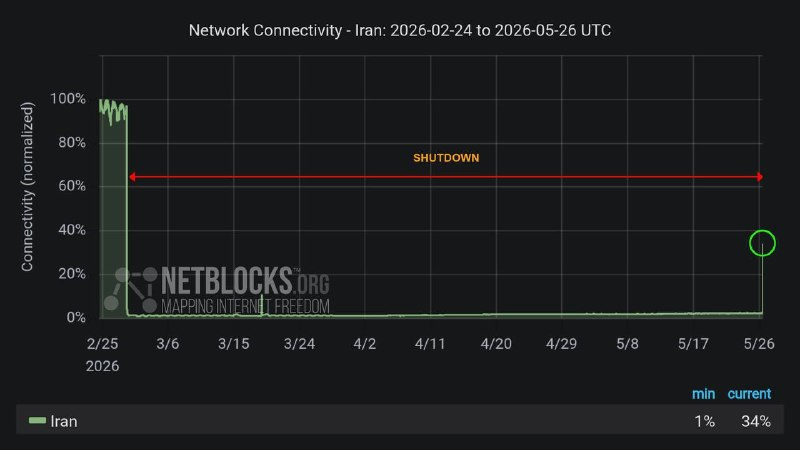

🔴بعد از ۸۸ روز و حدود ۲۰۹۳ ساعت قطعی و انزوای شدید از اینترنت جهانی، اتصال اینترنت در ایران تا حدی برگشته
- ولی هنوز معلوم نیست این وضعیت پایدار بمونه یا نه
https://t.me/kianmeli1

## kianmeli1 — post 87682

  <a href="telegram/content/kianmeli1_87682_1779804113.mp4" target="_blank">🎬 Download video</a>

🔴جان‌باختن علیرضا بیرانوند در بازداشت؛ ابهام در علت مرگ شاعر معترض اهل ایذه

#علیرضا_بیرانوند، شاعر معترض و فعال فرهنگی ۲۵ ساله اهل ایذه، در تاریخ ۱۵ اردیبهشت ۱۴۰۵ در تهران بازداشت شد و بنا بر گزارش‌های منتشرشده، در دوران بازداشت جان باخته است.
نهادهای رسمی علت مرگ او را «مسمومیت» اعلام کرده‌اند، اما فعالان مدنی و منابع مستقل، نسبت به این روایت ابراز تردید کرده و مرگ او را مشکوک و مرتبط با رفتار نهادهای امنیتی می‌دانند.
علیرضا بیرانوند پیش‌تر نیز در جریان اعتراضات سال‌های ۱۳۹۶ و ۱۴۰۱ سابقه بازداشت داشته و به‌عنوان شاعری معترض و فعال فرهنگی شناخته می‌شد.
ابهام در روند بازداشت، نحوه جان‌باختن و نبود شفافیت درباره جزئیات این پرونده، نگرانی‌ها و پرسش‌های بسیاری را در افکار عمومی ایجاد کرده است.

 🎥 ویدیو: گوشه‌ای از مراسم خاکسپاری زندانی #علیرضا_بیرانوند

همسر او، لیلا فتحی، که او هم از شاعران جوان ایذه است، ضمن انتشار این ویدئو نوشته: علیرضا هنوز باور نکردم...
 https://t.me/kianmeli1

## kianmeli1 — post 87681

  

🔴ایران پس از ماه‌ها محدودیت شدید و قطعی اینترنت، دسترسی به اینترنت بین‌المللی را برای مشاغل و کاربران خانگی وای‌فای برقرار کرد.
https://t.me/kianmeli1

## kianmeli1 — post 87680

🔴دستگاه قضایی غلامرضا خانی‌شکرآب را که خارج از ایران ربوده شده بود، اعدام کرد قوه قضائیه اعلام کرد غلامرضا خانی‌شکرآب به اتهام «همکاری اطلاعاتی و جاسوسی به نفع اسرائیل» اعدام شده است. ادعا شده که اتهام‌های منتسب به آقای خانی، از «اقرارهای متهم» مطرح شده؛…

## kianmeli1 — post 87679

  

‏🔴خبرگزاری تسنیم وابسته به سپاه گزارش داد غلامرضا خانی شکراب با اتهام همکاری اطلاعاتی و جاسوسی برای اسرائیل اعدام شده است https://t.me/kianmeli1

## kianmeli1 — post 87678

‏🔴خبرگزاری تسنیم وابسته به سپاه گزارش داد غلامرضا خانی شکراب با اتهام همکاری اطلاعاتی و جاسوسی برای اسرائیل اعدام شده است
https://t.me/kianmeli1

## kianmeli1 — post 87677

‏🔴فرماندار بوشهر اعلام کرد عملیات خنثی‌سازی مهمات عمل‌نکرده در اطراف نیروگاه اتمی بوشهر بین ساعت ۹ تا ۱۵ انجام می‌شود
https://t.me/kianmeli1

## kianmeli1 — post 87676

‏🔴خبرگزاری فارس: دیوان عدالت اداری دستور موقت توقف مصوبهٔ ستاد فضای مجازی را صادر کرد!

‏ستاد فضای مجازی اتصال مجدد اینترنت بین الملل را تصویب کرده بود و قرار بود تا ۲۴ ساعت آینده دسترسی به اینترنت بین الملل برقرار شود
https://t.me/kianmeli1

## kianmeli1 — post 87675

‏🔴معاون سیاست‌گذاری و برنامه‌ریزی توسعه فناوری و ارتباطات و اقتصاد دیجیتال وزارت ارتباطات گفت: دسترسی کامل کاربران تا ۲۴ ساعت آینده برقرار می‌شود
https://t.me/kianmeli1

## kianmeli1 — post 87674

‏🔴ارتش اسرائیل اعلام کرد بامداد گذشته بیش از ۱۰۰ هدف متعلق به حزب‌الله را در دره بقاع و مناطق مختلف جنوب لبنان هدف قرار داده است
https://t.me/kianmeli1

## kianmeli1 — post 87673

‏🔴مدیرکل فرودگاه‌های استان اصفهان گفت: پروازهای فرودگاه بین‌المللی اصفهان پس از ۸۴ روز وقفه دوباره برقرار شده است
https://t.me/kianmeli1

## kianmeli1 — post 87672

🔴 ‏فارس، خبرگزاری وابسته به سپاه، به نقل از یک منبع نزدیک به تیم مذاکره‌کننده نوشت: هیچ مذاکره‌ای بدون واریز پول‌های مسدودشدهٔ ایران امکان‌پذیر نیست
https://t.me/kianmeli1

## kianmeli1 — post 87671

🔴 ‏ایتامار بن‌گویر، وزیر امنیت داخلی اسرائیل: اجازه نخواهیم داد ترامپ توافقی بد با ایران امضا کند
https://t.me/kianmeli1

## IranIntlTV — post 339103

  <a href="telegram/content/IranIntlTV_339103_1779804116.mp4" target="_blank">🎬 Download video</a>

مارکو روبیو اعلام کرد گفت‌وگوها با جمهوری اسلامی در قطر ادامه دارد و نهایی‌کردن متن توافق ممکن است چند روز زمان ببرد. همزمان وال‌استریت ژورنال گزارش داد محمدباقر قالیباف برای دومین روز متوالی در دوحه مانده تا مذاکرات برای دستیابی به توافقی جهت پایان جنگ را ادامه دهد.
جزییات بیشتر با مریم رحمتی، خبرنگار ایران‌اینترنشنال
@iranintltv

## IranIntlTV — post 339102

  

محمدرضا عارف، معاون اول پزشکیان، در شبکه ایکس نوشت پیرو دستور پزشکیان «گام نخست دسترسی آزاد و ضابطه‌مند به فضای مجازی برداشته شد.»
او افزود: «با بازگشایی اینترنت، خدمات هوشمند هموار و مطالبات مردمی که این‌چنین پای کار نظام و ایران ایستادند محقق و موانع توسعه دانش‌بنیان و مرجعیت علمی برداشته می‌شود.»

عارف در متن خود درباره «گام نخست» و وصل شدن اینترنت برای شهروندان توضیحی ارائه نداد.

این در حالی است که پیش‌تر فارس، رسانه وابسته به سپاه نوشت دیوان عدالت اداری اعلام کرد که در پی طرح شکایاتی درباره ابطال «سند ایجاد ستاد ویژه ساماندهی و راهبری فضای مجازی کشور»، هیات تخصصی صنایع و بازرگانی این دیوان، با احراز ضرورت و فوریت موضوع، دستور توقف اجرای این مصوبه را تا زمان رسیدگی به شکایت صادر کرد.
https://iranintl.com/202605262673

## IranIntlTV — post 339101

  <a href="telegram/content/IranIntlTV_339101_1779804118.mp4" target="_blank">🎬 Download video</a>

پس از اعلام خبر صدور حکم اعدام برای چهار متهم پرونده اکباتان توسط دادگاه انقلاب تهران، موجی از واکنش‌ها در شبکه‌های اجتماعی شکل گرفته است. کاربران با اشاره به تناقض در احکام و تغییرات اخیر در روند رسیدگی، درباره شدت برخوردهای قضایی در این پرونده ابراز نگرانی کردند.
آیه دریس، عضو تحریریه ایران‌اینترنشنال، به واکنش کاربران می‌پردازد
@iranintltv

## IranIntlTV — post 339100

  <a href="telegram/content/IranIntlTV_339100_1779804120.mp4" target="_blank">🎬 Download video</a>

یک شهروند با ارسال پیام به ایران‌اینترنشنال می‌گوید: «چه با کمک، چه بی‌کمک آمریکا و اسرائیل، جمهوری آدمکش و ننگین اسلامی باید سرنگون شود. ما باید امید را در خودمان زنده نگه داریم، به خودمان باور داشته باشیم و منتظر فراخوان باشیم.»

## IranIntlTV — post 339099

  <a href="telegram/content/IranIntlTV_339099_1779804121.mp4" target="_blank">🎬 Download video</a>

در حالی که آمار رسمی از تورم سه‌رقمی خوراکی‌ها و تشدید بحران معیشتی خبر می‌دهد، مسعود پزشکیان در نشست با مدیران صداوسیما با دفاع از سیاست دولت گفت در صورت عدم حذف ارز ترجیحی، کشور با کمبود و قحطی کالاهای اساسی روبه‌رو می‌شد.
ارزیابی آرش آزرمی، دبیر بخش اقتصادی ایران‌اینترنشنال
@iranintltv

## IranIntlTV — post 339098

  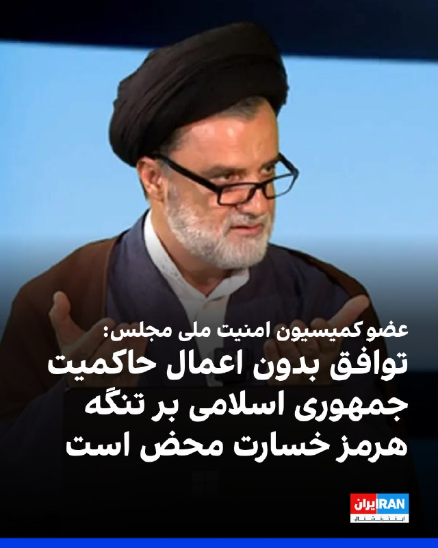

محمود نبویان، عضو کمیسیون امنیت ملی مجلس در شبکه ایکس نوشت: «توافقی که بازگشایی تنگه هرمز در ازای لغو محاصره بدون اعمال حاکمیت جمهوری اسلامی و اخذ عوارض، عدم تعیین غرامت، ابهام در لغو تحریم‌ها و… باشد، خلاف منافع ملی، عبور از شروط رهبری، بیانیه شعام و خسارت محض است.»

او پیش‌تر نیز گفته بود: «با وجود سابقه بدعهدی آمریکا و به ویژه حضور اصحاب توافق ذلت‌بار برجام به‌همراه قالیباف در مذاکرات، هیچ امیدی به مذاکره و توافق مطلوب برای جمهوری اسلامی وجود ندارد.»
https://iranintl.com/202605266092

## IranIntlTV — post 339097

  

سازمان عملیات تجارت دریایی بریتانیا اعلام کرد گزارشی از وقوع حادثه‌ای در فاصله ۶۰ مایل دریایی از مسقط عمان دریافت کرده است.

به گفته این نهاد، یک نفتکش از وقوع انفجاری خارجی در سمت چپ عقب کشتی و نزدیک خط آب خبر داده.

خدمه و کشتی سالم هستند، اما مقداری سوخت به دریا نشت کرده است.
https://iranintl.com/202605266370

## IranIntlTV — post 339096

  

حساب اینستاگرام نسیم غلامی سیمیاری، زندانی سیاسی محبوس در زندان اوین و از بازداشت‌شدگان اعتراضات «زن، زندگی، آزادی»، اعلام کرد او به دلیل «هم‌کلام شدن» با لیندزی فورمن، شهروند بریتانیایی زندانی در اوین، به مدت یک هفته از حق تماس تلفنی محروم شده است.

بر اساس این گزارش، مسئولان زندان پیش‌تر نیز به سیمیاری گفته بودند به دلیل «پوشیدن شلوارک» در داخل بند زنان اوین، در این هفته از حق ملاقات محروم خواهد بود.

در این مطلب آمده است علاوه بر سیمیاری، گلرخ ایرایی، زهرا صفایی، مرضیه فارسی، شیوا اسماعیلی و سکینه پروانه، پنج زن زندانی سیاسی دیگر در بند زنان اوین نیز به دلیل شرکت در مراسمی در اعتراض به اعدام‌ها، از حق تماس تلفنی و ملاقات با خانواده‌هایشان محروم شده‌اند.
https://iranintl.com/202605269690

## IranIntlTV — post 339095

  

علی‌اکبر صالحی، رییس پیشین سازمان انرژی اتمی جمهوری اسلامی گفت: «این یک واقعیت است که ما درون‌گرا و منزوی شدیم و تکلیف روابط بین‌الملل ما روشن نیست. خیلی از مشکلات ما ناشی از همین مسئله است، بنابراین باید از این هاله‌ای که برای خودمان ایجاد کردیم خارج بشویم و تکثرگرایی در داخل کشور را بسط دهیم.»

او ادامه داد: «نظام جمهوری اسلامی بیشتر میل به درون‌گرایی و دوری از تکثرگرایی در داخل داشته که امیدوارم با این اتفاقاتی که افتاده و به خصوص تحولات این دو سه‌ساله اخیر و حوادثی که رخ داده، این تمایل اصلاح بشود و به سمت اصلاح روابط بین‌الملل و خروج از انزوا برویم.»
https://iranintl.com/202605261607

## IranIntlTV — post 339094

  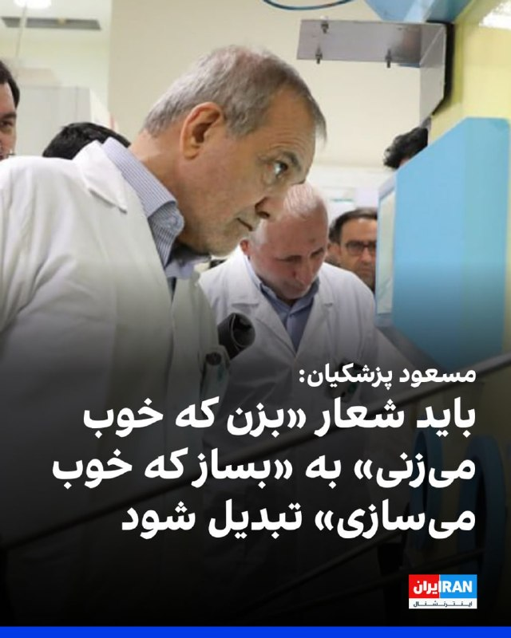

مسعود پزشکیان، رییس دولت گفت که امروز باید شعار «بزن که خوب می‌زنی» در خیابان‌ها به شعار «بساز که خوب می‌سازی» تبدیل شود.

او افزود: «دولت به‌تنهایی قادر به حل همه مشکلات نیست، اما با همراهی مردم، عبور از شرایط دشوار امکان‌پذیر خواهد بود.»
iranintl.com/202605266381

## IranIntlTV — post 339093

  <a href="https://t.me/IranintlTV/339093" target="_blank">📎 Download file</a>

🎧نسخه صوتی اخبار نیم‌روزی | سه‌شنبه ۵ خرداد
@iranintlTV

## IranIntlTV — post 339092

  <a href="telegram/content/IranIntlTV_339092_1779804126.mp4" target="_blank">🎬 Download video</a>

دیوان عدالت اداری ایران اجرای مصوبه ستاد ویژه ساماندهی و راهبری فضای مجازی برای اتصال به اینترنت جهانی را متوقف کرد. این تصمیم در پی ثبت شکایتی درباره ابطال سند تشکیل این ستاد و تا زمان رسیدگی نهایی به پرونده اتخاذ شد.
گفت‌وگو با نیما اکبرپور، کارشناس فناوری
@iranintltv

## IranIntlTV — post 339091

  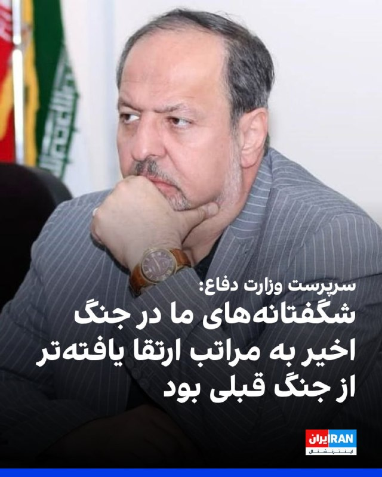

مجید ابن‌الرضا، سرپرست وزارت دفاع، گفت که جمهوری اسلامی در جریان جنگ با آمریکا و اسرائیل، به فناوری‌ای دست یافته که امکان هدف قرار دادن ۲۱۰ «پرنده دشمن» را فراهم کرده است.

او افزود: «شگفتانه‌های ما در حوزه تکنیک و تاکتیک در جنگ اخیر به مراتب ارتقا یافته‌تر از جنگ قبلی بود.»

او ادامه داد: «تعداد پرنده‌هایی که در جنگ ۱۲ روزه هدف قرار دادیم کمتر از انگشتان دست بود، اما در جنگ اخیر این تعداد به ۲۱۰ پرنده رسید.»
iranintl.com/202605260339

## IranIntlTV — post 339090

  <a href="telegram/content/IranIntlTV_339090_1779804128.mp4" target="_blank">🎬 Download video</a>

سپهر موسوی‌، جوان ۱۸ ساله ساکن فولادشهر، شامگاه ۱۹ دی‌ماه ۱۴۰۴ در این شهر هدف تیراندازی ماموران جمهوری اسلامی قرار گرفت و سپس با شلیک تیر خلاص کشته شد.

## IranIntlTV — post 339089

  

علی یزدی‌خواه، نماینده مجلس، گفت دونالد ترامپ «ثبات رفتاری» ندارد و مواضع او متناقض، هیجانی و بدون پشتوانه عقلی است.

او افزود رییس‌جمهوری آمریکا در ماه‌های اخیر بیشتر «آرزوهای خود» را از طریق شبکه‌های اجتماعی مطرح کرده است.

یزدی‌خواه همچنین گفت استفاده صلح‌آمیز از فناوری هسته‌ای حق همه کشورهاست و این حق را نمی‌توان از جمهوری اسلامی سلب کرد.
iranintl.com/202605260163

## IranIntlTV — post 339088

  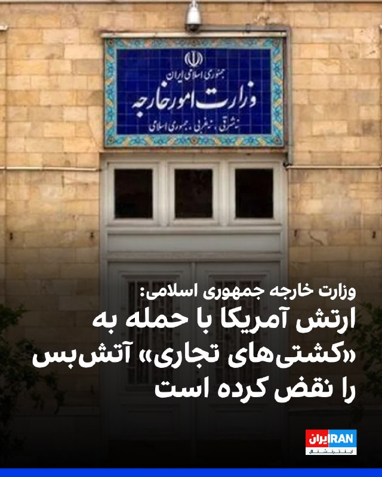

وزارت خارجه جمهوری اسلامی در بیانیه‌ای اعلام کرد که ارتش آمریکا با حمله به کشتی‌های تجاری ایران در ۴۸ ساعت گذشته، آتش‌بس را نقض کرده است.

در این بیانیه آمده این اقدام در حالی انجام شده که روند دیپلماتیک با میانجی‌گری پاکستان در جریان بوده و تهران آن را نشانه «بدعهدی» آمریکا می‌داند.

وزارت خارجه جمهوری اسلامی این اقدام را محکوم کرد و مسئولیت پیامدهای آن را متوجه آمریکا دانست و نوشت: «جمهوری اسلامی در دفاع از منافع خود تردید نخواهد کرد.»
https://iranintl.com/202605266175

## IranIntlTV — post 339087

ویدیوی رسیده به ایران‌اینترنشنال، کودکانی را با لباس ماموران سرکوبگر و باتون به دست نشان می‌دهد که در ایست و بازرسی بندرعباس حضور دارند.

## IranIntlTV — post 339086

  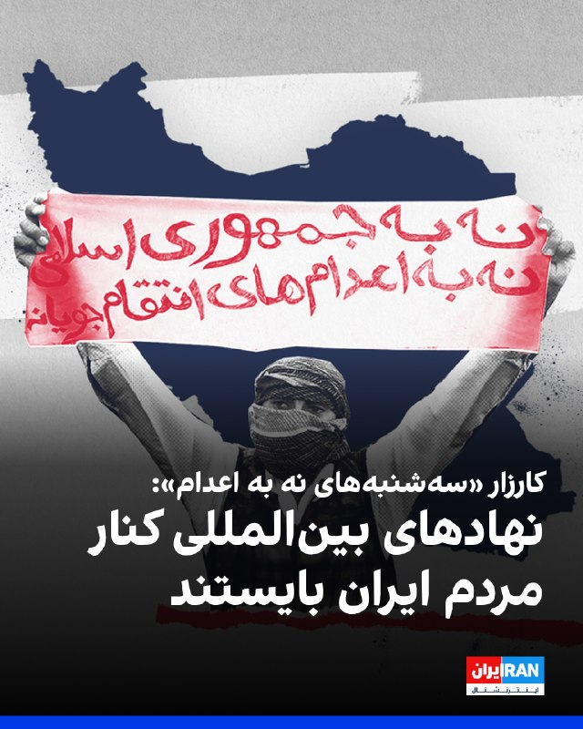

کارزار «سه‌شنبه‌های نه به اعدام» از ارگان‌های حقوق بشری بین‌المللی و «وجدان‌های بیدار» خواست با به‌کارگیری اقدامات موثر مانع تداوم اعدام‌ها شوند و در «تراژدی اعدام‌ها» کنار مردم ایران و خواست آنان برای آزادی، عدالت و لغو حکم اعدام بایستند.

این کارزار اعلام کرد زندانیان معترض به مجازات اعدام، سه‌شنبه پنجم خرداد برای صدوبیست‌ودومین هفته متوالی در ۵۶ زندان ایران دست به اعتصاب غذا زدند.

کارزار «سه‌شنبه‌های نه به اعدام» با اشاره به موج تازه اعدام زندانیان سیاسی و تداوم اعتراض زندانیان، از جمله زنان زندانی در بند زنان اوین، اعلام کرد شماری از این زندانیان به دلیل اعتراض به اعدام‌ها از ملاقات و تماس تلفنی با خانواده محروم شده‌اند.

اعضای این کارزار تاکید کردند: «در کارزار سه‌شنبه‌های نه به اعدام نیز زنان مقاوم در زندان‌های مختلف همواره صدای آزادی و حق حیات سر داده‌اند. حکومت حتی نمی‌تواند صدای زنان را تحمل کند، چرا که زن‌ستیزی یکی از پایه‌های اصلی حاکمیت از روز اول است.»
https://iranintl.com/202605269770

## IranIntlTV — post 339085

  <a href="telegram/content/IranIntlTV_339085_1779804132.mp4" target="_blank">🎬 Download video</a>

مروری بر رسانه‌ها و خبرگزاری‌ها در ایران، سه‌شنبه ۵ خرداد، با مجتبی هاشمی، روزنامه‌نگار

@iranintltv

## IranIntlTV — post 339084

  <a href="telegram/content/IranIntlTV_339084_1779804134.mp4" target="_blank">🎬 Download video</a>

هفته دوم دادگاه رسیدگی به پرونده متهمان حمله به پوریا زراعتی، مجری تلویزیون ایران‌اینترنشنال، در لندن آغاز شد. دادستان این پرونده گفت مهاجمان «به نیابت از جمهوری اسلامی» و با هدف آسیب رساندن به پوریا زراعتی این حمله را انجام دادند.

گزارش تاج‌الدین سروش، خبرنگار ایران‌اینترنشنال
@iranintltv

## Shin_Persian — post 6242

↩️ Quoted tweet: Shin ✓ @hey_itsmyturn Wed, 11 Mar 2026 18:40:56 UTC If you're out of Iran you may easily install @PsiphonConduit and provide uncensored internet to Iranian people. It's easily installable on your phone, computer and server. Please do. …

## Shin_Persian — post 6241

↩️ Quoted tweet:
Shin ✓ @hey_itsmyturn
Wed, 11 Mar 2026 18:40:56 UTC

If you're out of Iran you may easily install @PsiphonConduit and provide uncensored internet to Iranian people. It's easily installable on your phone, computer and server.
Please do.
https://conduit.psiphon.ca/en/
Windows:
https://apps.microsoft.com/detail/9p89sj33m3jp?utm_source=conduit_site&hl=en-US&gl=TR
Android:
https://play.google.com/store/apps/details?id=ca.psiphon.conduit
MacOS:

↩️ توییت نقل‌قول شده — برای پاسخ، پست زیر را ببینید.

فارسی

اگر خارج از ایران هستید، می‌توانید به راحتی @PsiphonConduit را نصب کرده و اینترنت بدون سانسور را در اختیار مردم ایران قرار دهید. این برنامه به سادگی بر روی گوشی، کامپیوتر و سرور شما قابل نصب است.
لطفاً این کار را انجام دهید.
https://conduit.psiphon.ca/en/
ویندوز:
https://apps.microsoft.com/detail/9p89sj33m3jp?utm_source=conduit_site&hl=en-US&gl=TR
اندروید:
https://play.google.com/store/apps/details?id=ca.psiphon.conduit
مک‌بوک:

𝕏 · @shin_persian

## Shin_Persian — post 6240

  

NetBlocks ✓ @netblocks Tue, 26 May 2026 12:54:34 UTC 📈 Confirmed: Live metrics show a partial restoration to internet connectivity in #Iran on day 88, after 2093 hours of near-total isolation from international networks, the longest nationwide internet shutdown…

## Shin_Persian — post 6239

NetBlocks ✓ @netblocks
Tue, 26 May 2026 12:54:34 UTC

📈 Confirmed: Live metrics show a partial restoration to internet connectivity in #Iran on day 88, after 2093 hours of near-total isolation from international networks, the longest nationwide internet shutdown in modern history. It is unclear if the restoration will be sustained.

فارسی

📈 تایید شد: معیارهای لحظه‌ای نشان می‌دهند که در روز ۸۸ام، پس از ۲۰۹۳ ساعت انزوای تقریباً کامل از شبکه‌های بین‌المللی، اتصال به اینترنت در #ایران به طور جزئی برقرار شده است؛ این طولانی‌ترین قطعی سراسری اینترنت در تاریخ مدرن است. هنوز مشخص نیست که آیا این برقراری اتصال پایدار خواهد بود یا خیر.

𝕏 · @shin_persian

## Shin_Persian — post 6238

  

UKMTO Operations Centre @UK_MTO
Tue, 26 May 2026 12:20:56 UTC

UKMTO WARNING 062-26

Click here to view the full warning ⤵️
http://www.ukmto.org/-/media/ukmto/products/20260526-ukmto_warning_062_26.pdf?rev=c6fe9b7b5c8f427fab4d765caf5f8574

#MaritimeSecurity #MarSec

فارسی

هشدار UKMTO 062-26

برای مشاهده متن کامل هشدار اینجا کلیک کنید ⤵️
http://www.ukmto.org/-/media/ukmto/products/20260526-ukmto_warning_062_26.pdf?rev=c6fe9b7b5c8f427fab4d765caf5f8574

#MaritimeSecurity #MarSec

𝕏 · @shin_persian

## Shin_Persian — post 6237

  

↩️ Quoted tweet: DefenceGeek 🇬🇧 ✓ @DefenceGeek Tue, 26 May 2026 09:11:22 UTC Summary of overnight events in CENTCOM --- Operation EPIC FURY / Project FREEDOM --- Ok so not 100% sure if this is all in the right order, but from what I've gathered: - IRGC…

## Shin_Persian — post 6236

↩️ Quoted tweet:
DefenceGeek 🇬🇧 ✓ @DefenceGeek
Tue, 26 May 2026 09:11:22 UTC

Summary of overnight events in CENTCOM
--- Operation EPIC FURY / Project FREEDOM ---

Ok so not 100% sure if this is all in the right order, but from what I've gathered:

- IRGC boats in the gulf were identified approaching commercial shipping and/or trying to lay mines in the

↩️ توییت نقل‌قول شده — برای پاسخ، پست زیر را ببینید.

فارسی

خلاصه‌ای از حوادث شبانه در سنتکام (ستاد فرماندهی مرکزی ایالات متحده - CENTCOM)
--- عملیات خشم حماسی / پروژه آزادی ---

بسیار خب، ۱۰۰٪ مطمئن نیستم که همه این‌ها به ترتیب درست باشند، اما طبق آنچه گردآوری کرده‌ام:

- قایق‌های سپاه پاسداران انقلاب اسلامی (IRGC) در خلیج [فارس] شناسایی شدند که در حال نزدیک شدن به کشتی‌های تجاری و/یا تلاش برای مین‌گذاری در

𝕏 · @shin_persian

## FarsiVOA — post 218704

  <a href="telegram/content/FarsiVOA_218704_1779804136.mp4" target="_blank">🎬 Download video</a>

بامداد سه‌شنبه، پنجم خرداد ۱۴۰۵، یک قطار با مینی‌بوس مدرسه در شمال بلژیک برخورد کرد. در این حادثه چهار نفر از جمله دو دانش‌آموز کشته و پنج دانش‌آموز دیگر مصدوم شدند.

به گزارش رسانه‌های محلی، هفت دانش‌آموز، یک همراه و راننده مینی‌بوس در زمان وقوع حادثه در محل تقاطع جاده و راه‌آهن بودند. دو سرنشین ۱۲ و ۱۵ ساله، راننده مینی‌بوس و یک همراه، قربانیان این تصادف بودند.

ویدیو بی‌صدا است.

## FarsiVOA — post 218702

  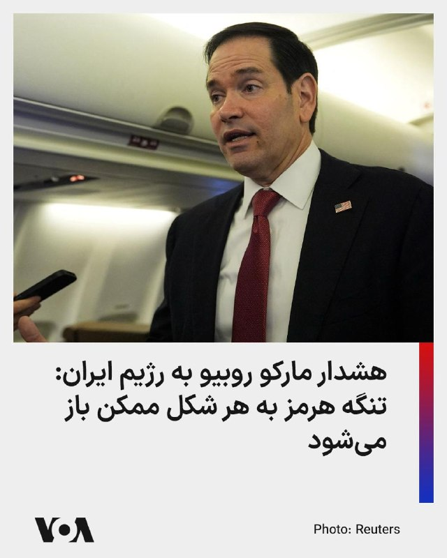

مارکو روبیو، وزیر امور خارجه ایالات متحده، خواستار بازگشایی تنگه هرمز شد و به رژیم ایران هشدار داد که اگر از این خواسته سرپیچی کند، تنگه «به هر طریق ممکن» باز خواهد شد.
آقای روبیو که برای شرکت در مجمع چهارجانبه امنیتی به دهلی‌نو رفته است در هواپیما به خبرنگاران گفت: «تنگه‌ها باید باز باشند. آن‌ها به هر طریق ممکن باز خواهند شد... آنچه در آنجا اتفاق می‌افتد غیرقانونی است؛ این کار غیرقانونی و برای جهان ناپایدار و غیرقابل‌پذیرش است.»

## FarsiVOA — post 218701

حکم اعدام عباس اکبری فیض‌آبادی، از بازداشت‌شدگان اعتراضات دی، در نائین اصفهان اجرا شد. گزارش‌ها همچنین از صدور حکم اعدام برای چهار متهم پرونده شهرک اکباتان خبر می‌دهند.

## FarsiVOA — post 218699

سال‌ها بعد از خیزش زن، زندگی، آزادی، نام بعضی مکان‌ها به‌دلیل لحظه‌هایی که در حافظه یک جامعه ثبت کرده‌اند زنده‌اند. اکباتان یکی از همان نام‌هاست. جایی که اعتراض، از خیابان عبور کرد و وارد پنجره‌ها، بالکن‌ها و زندگی روزمره مردم شد

## FarsiVOA — post 218698

  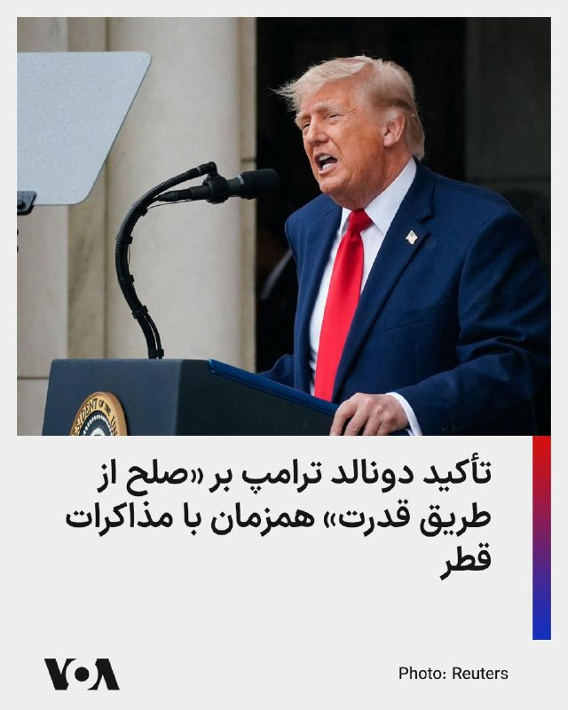

🔴 در حالی که مذاکره‌کنندگان جمهوری اسلامی در قطر به سر می‌برند، دونالد ترامپ، رئیس‌جمهوری آمریکا، در شبکه تروث‌سوشال عکسی از خود همراه با نوشته «صلح از طریق قدرت» منتشر کرد.

سیاست «صلح مقتدرانه» از جمله دکترین اصلی سیاست خارجی دولت کنونی آمریکا در قبال جمهوری اسلامی است، به طوری که رئیس‌چمهوری آمریکا معتقد است برای برقراری صلح راهی جز تخریب توان نظامی جمهوری اسلامی در حوزه‌های دریایی، موشکی و هسته‌ای وجود ندارد.

نظریه‌ «صلح از طریق قدرت» بر این ایده استوار است که یک نیروی نظامی به‌قدر کافی قدرتمند می‌تواند به عنوان عامل صلح عمل کند.

پیشتر پرزیدنت ترامپ با دفاع از روند مذاکرات کنونی با جمهوری اسلامی، اعلام کرد که واشنگتن یا به یک «توافق بزرگ و معنادار» دست خواهد یافت یا هیچ توافقی انجام نخواهد شد.

## FarsiVOA — post 218697

🔺ادعای خبرگزاری سپاه: آخرین اختلاف جدی با آمریکا «در حال برطرف ‌شدن است»

▪️خبرگزاری فارس، وابسته به سپاه پاسداران ادعا کرد که «آخرین اختلاف جدی» میان رژیم ایران و آمریکا مربوط به نحوه دسترسی به پول‌های مسدودشده جمهوری اسلامی است که به ابتکار قطر «در حال برطرف شدن است».

▪️این خبرگزاری روز سه‌شنبه ۵ خرداد به نقل از یک منبع آگاه ادعا کرد: «هیچ مذاکره‌ای بدون واریز پول‌های مسدودشدهٔ ایران امکان‌پذیر نیست».

▪️هنوز مقامات قطر و آمریکا این ادعا را تآیید نکرده‌اند.

▪️پیشتر دونالد ترامپ اعلام کرده که اگر با رژیم ایران توافقی انجام دهد، توافقی خوب و مناسب خواهد بود، «نه مانند توافقی که اوباما انجام داد و به [رژیم] ایران مقادیر زیادی پول نقد و مسیری روشن و باز به سوی سلاح هسته‌ای داد.»

⬇️ بیشتر بخوانید:
https://ir.voanews.com/a/unfreezing-of-iran-funds-is-the-last-serious-sticking-point-with-us-being-resolved-fars/8154034.html

## FarsiVOA — post 218696

  <a href="telegram/content/FarsiVOA_218696_1779804139.mp4" target="_blank">🎬 Download video</a>

بازگشت کهنه‌سرباز جنگ جهانی دوم به ساحل نورماندی در «روز یادبود»؛

به مناسبت «روز یادبود»، یکی از کهنه‌سربازان جنگ جهانی دوم پس از سال‌ها به «ساحل یوتا» بازگشت؛ ساحلی در منطقه نورماندی فرانسه که در سال ۱۹۴۴ شاهد آغاز عملیات بزرگ و تاریخی «روز دی» بود.

عملیات «روز دی» که در ۶ ژوئن ۱۹۴۴ جریان جنگ جهانی دوم را تغییر داد، بزرگ‌ترین حمله آبی-خاکی تاریخ به شمار می‌رود.

در این روز، نیروهای متفقین متشکل از ارتش‌های آمریکا، بریتانیا و کانادا، با پیاده شدن در سواحل منطقه نورماندی فرانسه که در اشغال آلمان نازی بود، خطوط دفاعی دشمن را در هم شکستند؛ عملیاتی سرنوشت‌ساز که با تلفات سنگین همراه بود اما در نهایت به آزادسازی اروپای غربی و سقوط رژیم هیتلر منجر شد.
@FarsiVOA

## FarsiVOA — post 218695

  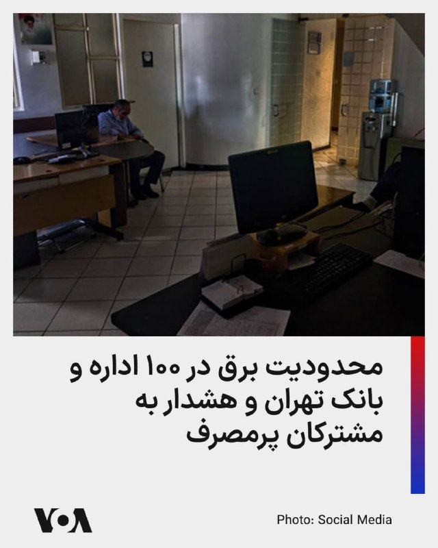

مدیرعامل شرکت توزیع نیروی برق تهران اعلام کرد برق ۱۰۰ اداره و بانک در پایتخت به دلیل رعایت نکردن الگوی مصرف محدود شده است.

به گفته کامبیز ناظریان، ادارات و بانک‌ها موظف به کاهش ۳۰ درصدی مصرف برق نسبت به سال گذشته هستند و باید یک ساعت پیش از پایان وقت اداری سامانه‌های سرمایشی خود را خاموش کنند.

وی با اشاره به رصد لحظه‌ای مصرف از طریق سامانه‌های هوشمند افزود در صورت عدم رعایت الگوی مصرف، برق این مراکز قطع خواهد شد و در صورت تکرار، اسامی متخلفان منتشر می‌شود.

ناظریان افزود که مشترکان پرمصرف خانگی نیز شناسایی شده و در صورت ادامه مصرف بالا در فصل گرم، با محدودیت یا قطع برق مواجه خواهند شد.

پیشتر اسماعیل سقاب ‌اصفهانی، معاون رئیس‌جمهور و رئیس سازمان بهینه‌سازی انرژی، با اشاره به آسیب‌های واردشده به زیرساخت‌های انرژی گفت ایران در حوزه برق، گاز و بنزین «سال سختی» در پیش دارد و بازگشت به شرایط پیش از جنگ ممکن است تا دو سال زمان ببرد.

مقام‌های دولتی می‌گویند برنامه‌هایی برای مدیریت مصرف انرژی در دست بررسی است و ناترازی برق و گاز نسبت به سال‌های گذشته تشدید شده است.
@FarsiVOA

## FarsiVOA — post 218694

  <a href="telegram/content/FarsiVOA_218694_1779804141.mp4" target="_blank">🎬 Download video</a>

سخنگوی ارتش اسرائیل اعلام کرد نیروهای این کشور در طول شب بیش از ۱۰۰ زیرساخت تروریستی و عناصر حزب‌الله را در منطقه بقاع و سراسر جنوب لبنان هدف قرار داده‌اند.

بر اساس این گزارش، در چندین حمله در بقاع، زیرساخت‌های تروریستی و انبارهای سلاح حزب‌الله هدف قرار گرفت. هم‌زمان در جنوب لبنان نیز بیش از ۹۰ هدف وابسته به این گروه، از جمله انبارهای تسلیحاتی، مراکز فرماندهی، ایستگاه‌های دیده‌بانی و زیرساخت‌هایی که برای طراحی و اجرای حملات علیه ارتش اسرائیل و شهروندان این کشور استفاده می‌شد، بمباران شد.

سخنگوی ارتش اسرائیل همچنین به ویدئویی از حمله شبانه در منطقه مشعره اشاره کرد و گفت در این تصاویر، چندین حمله پیاپی در فاصله چند ثانیه دیده می‌شود که زیرساخت‌های محل فعالیت عناصر حزب‌الله را نابود کرده است.

این موج گسترده حملات پس از هشدارهای تخلیه به ساکنان برخی مناطق جنوب لبنان انجام شد؛ هشدارهایی که ارتش اسرائیل پیش از آغاز عملیات برای دور کردن غیرنظامیان از اطراف مواضع حزب‌الله صادر کرده بود.
@FarsiVOA

## FarsiVOA — post 218693

  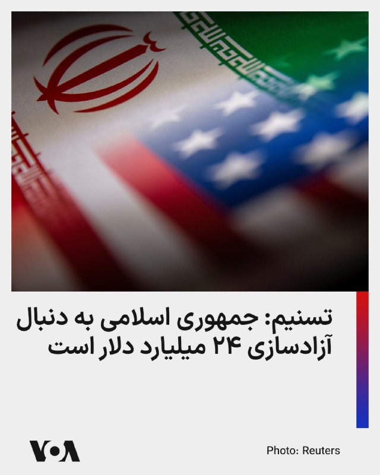

خبرگزاری تسنیم وابسته به سپاه پاسداران به نقل از یک منبع آگاه نزدیک به تیم مذاکره‌کننده حکومت ایران گزارش داد که مذاکره‌کنندگان جمهوری اسلامی به دنبال آزادسازی ۲۴ میلیارد دلار در چارچوب یادداشت تفاهم احتمالی با آمریکا هستند.

این خبرگزاری به نقل از این منبع که نامش را ذکر نکرد، نوشت: «طبق متن ۱۴ ماده‌ای یادداشت تفاهم، منابع بلوکه شده ایران باید در طول ‌مذاکرات آزاد شود که این مبلغ ۲۴ میلیارد دلار برآورد شده است.»

تسنیم افزود جمهوری اسلامی «تأکید دارد که نصف این مبلغ باید با شروع اعلام یادداشت تفاهم در دسترس قرار گیرد و بقیه در طول ۶۰ روز منتقل شود و سفر قالیباف به قطر هم برای تفاهم درباره اجرایی‌سازی این مطالبه ایران و نحوه دسترسی به ۱۲ میلیارد دلار در گام اول و رفع موانع بوده است.»

دونالد ترامپ اعلام کرده که اگر با رژیم ایران توافقی انجام دهد، توافقی خوب و مناسب خواهد بود، «نه مانند توافقی که اوباما انجام داد و به [رژیم] ایران مقادیر زیادی پول نقد و مسیری روشن و باز به سوی سلاح هسته‌ای داد.»
@FarsiVOA

## FarsiVOA — post 218692

  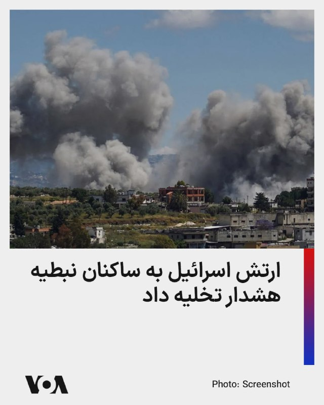

ارتش اسرائیل پیش از حمله به زیرساخت‌های حزب‌الله، برای شهر نبطیه در جنوب لبنان هشدار تخلیه صادر کرد.

بر اساس گزارش تایمز اسرائیل، از ساکنان این شهر خواسته شده به سمت شمال رود زهرانی تخلیه کنند. سخنگوی ارتش اسرائیل اعلام کرد که به دلیل نقض توافق آتش‌بس از سوی حزب‌الله، ارتش ناچار به اقدام نظامی شده و قصد آسیب زدن به غیرنظامیان را ندارد.

این هشدار در شرایطی صادر شده که تنش‌ها در مرز لبنان و اسرائیل افزایش یافته و گزارش‌هایی از حملات پهپادی حزب‌الله به شمال اسرائیل منتشر شده است. ارتش اسرائیل می‌گوید هدف حملات پیش‌رو، زیرساخت‌های حزب‌الله در جنوب لبنان است؛ منطقه‌ای که این گروه سال‌ها از آن برای تهدید مرزهای اسرائیل استفاده کرده است.
@FarsiVOA

## FarsiVOA — post 218691

  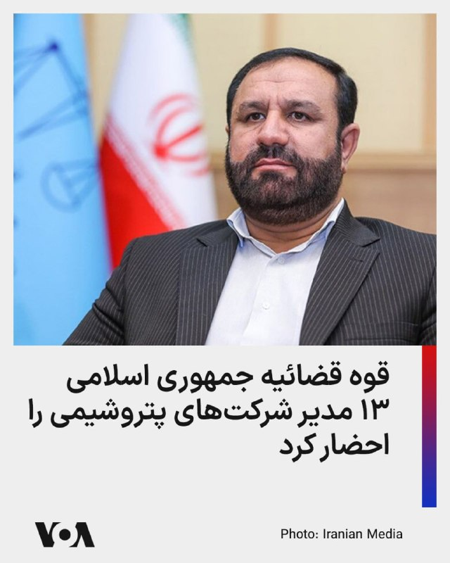

دادستان تهران از احضار ۱۳ مدیر شرکت‌های پتروشیمی و سایر شرکت‌ها به اتهام «عدم رفع تعهدات ارزی» خبر داد.

علی صالحی سه‌شنبه اعلام کرد که برخی از این مدیران «تفهیم اتهام شده و برخی دیگر نیز متعهد شده‌اند ظرف مهلت تعیین‌شده نسبت به رفع تعهدات ارزی خود اقدام کنند». او افزود: این شرکت‌ها تاکنون «بیش از ۷۰ درصد تعهدات ارزی» خود را پرداخت کرده‌اند.

به گفته دادستان تهران، هم‌اکنون «۵۸۳ فقره پرونده در دادسرای ویژه رسیدگی به جرایم اقتصادی تهران» تشکیل و «۶۲ برگ جلب» و «۳۷۴ فقره احضاریه» در این پرونده‌ها صادر شده است.
@FarsiVOA

## FarsiVOA — post 218690

🔺دیوان عدالت مصوبه ستاد فضای مجازی را متوقف کرد؛ وعده بازگشت اینترنت در ابهام

▪️در حالی که مقام‌های دولت جمهوری اسلامی از آغاز روند بازگشایی اینترنت بین‌الملل و اتصال کامل مردم تا ۲۴ ساعت آینده خبر داده بودند، دیوان عدالت اداری اعلام کرد اجرای مصوبه مربوط به ایجاد «ستاد ویژه ساماندهی و راهبری فضای مجازی کشور» را متوقف کرده است.

▪️این تصمیم وعده دولت برای رفع حصر دیجیتال را با ابهام تازه‌ای روبه‌رو کرد.

▪️ساعاتی پیش احسان چیت‌ساز، معاون سیاست‌گذاری و برنامه‌ریزی توسعه فاوا و اقتصاد دیجیتال وزارت ارتباطات، گفته بود با دستور رئیس‌جمهور و وزیر ارتباطات، اتصال اینترنت بین‌الملل از دقایقی دیگر آغاز می‌شود و دسترسی کامل مردم تا ۲۴ ساعت آینده برقرار خواهد شد.

⬇️ بیشتر بخوانید:
https://ir.voanews.com/a/8154030.html

## FarsiVOA — post 218689

  <a href="telegram/content/FarsiVOA_218689_1779804144.mp4" target="_blank">🎬 Download video</a>

ارسالی شما | گلایه یک شهروند از محدودیت‌های جدید و ناگهانی در استفاده از کارت‌های سوخت؛

یکی از مخاطبان صدای آمریکا با ارسال ویدیویی از یک جایگاه سوخت، از محدودیت‌های جدید در فرآیند سوخت‌گیری گلایه کرده و نوشته است: «من همیشه در این پمپ‌ بنزین با کارت سوخت شخصی خودم بنزین می‌زدم، اما حالا دیگر حتی این کارت هم برای دریافت بنزین معمولی کافی نیست؛ از طرفی در جایگاه هم اجازه استفاده از کارت سوخت آزاد را به ما نمی‌دهند. در چنین شرایطی ما چطور باید هزینه و نیاز بنزین خود را تأمین کنیم؟»

گزارش‌های داخلی ظرفیت تولید بنزین را حدود ۱۰۵ تا ۱۱۰ میلیون لیتر و مصرف روزانه را حدود ۱۳۰ تا ۱۳۵ میلیون لیتر برآورد کرده‌اند؛ یعنی شکافی حدود ۲۰ تا ۲۵ میلیون لیتر در روز که معمولاً با واردات یا فشار بر مصرف جبران می‌شود.

در همین رابطه، سخنگوی دولت جمهوری اسلامی می‌گوید ایران در جریان جنگ اخیر آسیب‌هایی دیده و این موضوع «قابل انکار نیست». او با اشاره به ظرفیت حدود ۱۰۰ میلیون لیتر تولید داخلی بنزین در روز تأکید کرد همین حجم در اختیار مردم قرار می‌گیرد و باید با «اصلاح الگوی مصرف» مدیریت شود.
@FarsiVOA

## FarsiVOA — post 218688

  

در حالی که یک مقام آموزش و پرورش می‌گوید کنکور دانشگاه فرهنگیان حدود یک ماه دیگر و به طور مستقل از کنکور سراسری برگزاری می‌شود، سازمان سنجش به عنوان مجری اصلی این آزمون، تصمیم‌گیری در این باره را رد کرد.

دبیر شورای‌ آموزش‌ و پرورش برگزاری این آزمون را در تاریخ ۱۱ تیرماه ۱۴۰۵ عنوان کرده، اما مدیر روابط عمومی سازمان سنجش می‌گوید تا کنون تصمیم جدیدی درباره تفکیک آزمون سراسری و آزمون دانشجو معلمان گرفته نشده است.

به گفته مسئولان سازمان سنجش، هرگونه تغییر در روند برگزاری آزمون‌های سراسری، پس از نهایی شدن تصمیمات به ‌صورت رسمی اطلاع‌رسانی خواهد شد.
@FarsiVOA

## FarsiVOA — post 218687

  

مسئولان حوزه مدیریت بحران آب نسبت به وضعیت منابع آبی در برخی از مهم‌ترین شهرهای کشور از جمله تهران، کرج، مشهد هشدار دادند.

رئیس مرکز ملی مدیریت بحران سازمان هواشناسی با بیان اینکه برخی بارش‌ها را در منطقه داشته ایم هشدار داد که این موضوع نتوانسته وضعیت آب در این شهرها را بهبود دهد.

احمد وظیفه با اشاره به اینکه شهرهای ساوه و اراک نیز در وضعیت تنش آبی قرار گرفته‌اند، اعلام کرد: تهران و کرج به دلیل استفاده از یک حوضه مشترک آبی در شرایط تنش و بحران قرار دارند.

در همین حال، تازه‌ترین آمار شرکت مدیریت منابع آب ایران نشان می‌دهد میزان پرشدگی برخی سدهای مهم کشور از جمله لار، دوستی، پانزده ‌خرداد، بارزو و ساوه به کمتر از ۱۰ درصد رسیده است؛ موضوعی که بر شدت نگرانی‌ها درباره آینده تأمین آب در این مناطق افزوده است
@FarsiVOA

## FarsiVOA — post 218686

  <a href="telegram/content/FarsiVOA_218686_1779804147.mp4" target="_blank">🎬 Download video</a>

لحظه رهگیری و سقوط موشک کروز روسی روی زمین تنیس در کی‌یف؛

ویدیوی منتشرشده در شبکه‌های اجتماعی، لحظه مستقیم رهگیری یک موشک کروز «خا-۱۰۱» روسیه را دقیقاً از بالای سر یک فیلم‌بردار در کی‌یف و سقوط آن بر روی زمین تنیس در همان نزدیکی نشان می‌دهد. این موشک پس از برخورد منفجر نشد و تنها سوخت آن در آتش سوخت.

حملات گسترده موشکی و پهپادی ارتش روسیه به مناطق مسکونی و اهداف غیرنظامی در کی‌یف، پایتخت اوکراین، در چند روز گذشته ادامه داشته است.
@FarsiVOA

## FarsiVOA — post 218685

  

سارا سپهری، شهروند بهایی ساکن شیراز، با گذشت بیش از یک ماه از زمان بازداشت همچنان در زندان عادل‌آباد این شهر به ‌صورت بلاتکلیف نگهداری می‌شود.

براساس گزارش هرانا، این شهروند بهایی در دوران بازداشت با مشکلات جسمانی از جمله خونریزی معده و تشدید بیماری چشمی مواجه شده است.

هرانا به نقل از یک منبع نزدیک به خانواده سپهری نوشته است که به دلیل فشار بازجویی‌های طولانی ‌مدت و عدم دسترسی به دارو و درمان مناسب، وضعیت جسمی و روحی او رو به وخامت رفته است.

این منبع تأکید کرده است که سارا سپهری نیازمند رسیدگی فوری پزشکی و اعزام به مراکز درمانی خارج از زندان است.

سارا سپهری در فروردین‌ماه امسال در منزل خود در شیراز توسط نیروهای امنیتی بازداشت و سپس به زندان عادل‌آباد منتقل شد. در جریان این بازداشت، محل سکونت او و مادرش نیز مورد بازرسی قرار گرفته و برخی وسایل شخصی و دیجیتال ضبط شده است.

تا این لحظه، دلیل بازداشت و اتهامات مطرح‌شده علیه این شهروند بهائی به‌طور رسمی اعلام نشده است.
@FarsiVOA

## FarsiVOA — post 218684

  

رسانه‌های ایران پیامی منتسب به مجتبی خامنه‌ای که به عنوان رهبر جمهوری اسلامی معرفی شده منتشر کردند که در آن، تهدید شده که آمریکا دیگر «نقطه امنی برای استقرار پایگاه نظامی در منطقه نخواهد داشت».

در این پیام که روز سه‌شنبه پنجم خرداد منتشر شد، ادعا شده است: «عقربه زمان به عقب برنمی‌گردد و ملت‌ها و سرزمین‌های منطقه، دیگر سپر پایگاه‌های آمریکایی نخواهند بود.»

بیانیه منتسب به مجتبی خامنه‌ای چند ساعت پس از آن منتشر شد که نیروهای آمریکا به سایت‌های موشکی در جنوب ایران و قایق‌هایی که در حال کارگذاری مین بودند حمله کردند. همچنین این پیام در شرایطی است که تهران و واشنگتن درباره چارچوبی برای پایان دادن به جنگ گفت‌وگو می‌کنند.

در طول جنگ، چندین پایگاه آمریکا در خاورمیانه از سوی نیروهای جمهوری اسلامی و گروه‌های نیابتی‌اش هدف حمله قرار گرفت.

مجتبی خامنه‌ای از زمان معرفی به عنوان رهبر جمهوری اسلامی، به صورت عمومی ظاهر نشده و تنها بیانیه‌های کتبی منتشر کرده است. همچنین پس از گزارش‌ها درباره مجروح شدن او در حملات، گمانه‌زنی‌ها درباره وضعیت سلامتی‌اش افزایش یافته است.
@FarsiVOA

## FarsiVOA — post 218683

🔺دولت در مرز بحران سوخت؛ مهاجرانی: تولید روزانه ۱۰۰ میلیون لیتر باید مدیریت شود

▪️سخنگوی دولت جمهوری اسلامی می‌گوید ایران در جریان جنگ اخیر آسیب‌هایی دیده و این موضوع «قابل انکار نیست».

▪️او با اشاره به ظرفیت حدود ۱۰۰ میلیون لیتر تولید داخلی بنزین در روز تأکید کرد همین حجم در اختیار مردم قرار می‌گیرد و باید با «اصلاح الگوی مصرف» مدیریت شود. او افزود که «هیچ موضوعی درباره عدد و رقم قیمت بنزین در دولت مطرح نشده است.»

▪️گزارش‌های داخلی ظرفیت تولید بنزین را حدود ۱۰۵ تا ۱۱۰ میلیون لیتر و مصرف روزانه را حدود ۱۳۰ تا ۱۳۵ میلیون لیتر برآورد کرده‌اند؛ یعنی شکافی حدود ۲۰ تا ۲۵ میلیون لیتر در روز که معمولاً با واردات یا فشار بر مصرف جبران می‌شود.

⬇️ بیشتر بخوانید:
https://ir.voanews.com/a/8154029.html

## DW_Farsi — post 125164

  

🔶 شرکت بزرگ دفاعی اسرائيل: قرارداد ۱.۴ میلیاردی با یک کشور اروپایی بستیم

شرکت بزرگ دفاعی "البیت سیستمز" (Elbit Systems) اسرائيل اعلام کرده که قراردادی به ارزش ۱.۴ میلیارد دلار با یک کشور اروپایی که نامش فاش نشده بسته تا این کشور، به مجموعه گسترده‌ای از سامانه‌های پیشرفته مجهز شده و از نظر نظامی نوسازی شود.

به گزارش رسانه‌ها، این قرارداد طی یک دوره پنج‌ساله اجرا خواهد شد. هدف از این قرارداد نیز افزایش توان مانور عملیاتی و بقاپذیری نیروها در میدان نبرد عنوان شده است.

بر اساس این قرارداد، کشور اروپایی یادشده به مجموعه‌ای از تجهیزات شامل وسایل نقلیه بدون سرنشین خودکار، سامانه‌های جنگ الکترونیک زمینی، مهمات هدایت‌شونده دقیق توپخانه و حملات هوا به زمین، سامانه‌های نشانه‌گذاری الکترو اپتیکی و سامانه‌های شناسایی مجهز خواهد شد.

تمام این تجهیزات از طریق رادیوهای نرم‌افزار محور(SDR) به یکدیگر متصل خواهند بود.

شرکت هوافضای البیت در بیانیه‌ای اعلام کرد که این سامانه‌ها اثربخشی عملیاتی این کشور را افزایش داده و آن را به سمت تبدیل شدن به یک ارتش پیشرفته و مدرن هدایت خواهند کرد.

@dw_farsi

## DW_Farsi — post 125163

  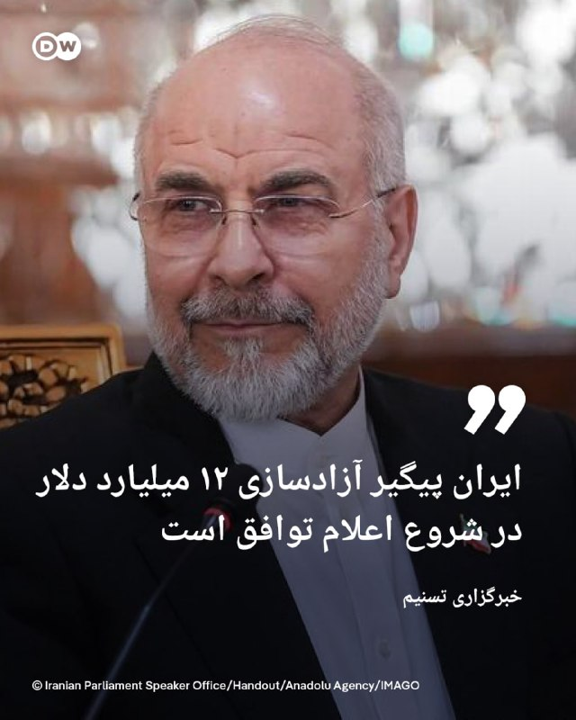

🔶 تسنیم: ایران پیگیر آزادسازی ۱۲ میلیارد دلار در شروع اعلام توافق است

تسنیم در خبری اختصاصی به نقل از یک منبع آگاه از تیم مذاکره‌کننده جمهوری اسلامی نوشت که ایران پیگیر آزادسازی ۱۲ میلیارد دلار در شروع اعلام یادداشت تفاهم است.

این خبرگزاری نزدیک به سپاه پاسداران می‌نویسد، این منبع گفته است: «طبق متن ۱۴ ماده‌ای یادداشت تفاهم، منابع بلوکه‌شده ایران باید در طول مذاکرات آزاد شود که این مبلغ ۲۴ میلیارد دلار برآورد شده است.»

به گفته این منبع، جمهوری اسلامی تاکید دارد که نصف این مبلغ یعنی ۱۲ میلیارد دلار باید با شروع اعلام یادداشت تفاهم یا توافق در دسترس قرار گیرد و بقیه در طول ۶۰ روز منتقل شود.

این منبع همچنین گفت که سفر محمدباقر قالیباف، رئیس تیم مذاکره‌کننده ایران به قطر هم "برای تفاهم درباره اجرایی‌سازی این مطالبه و نحوه دسترسی به ۱۲ میلیارد دلار در گام اول و رفع موانع بوده است".

تسنیم به نقل از این منبع ادامه داد: «با توجه به تجربه تفاهم بر سر آزادسازی پول‌های ایران در کره جنوبی و قطر، تاکید بر این بود که مراحل اجرایی با دقت پیگیری شود تا این تجربه مجدد تکرار نشود.»

@dw_farsi

## DW_Farsi — post 125162

  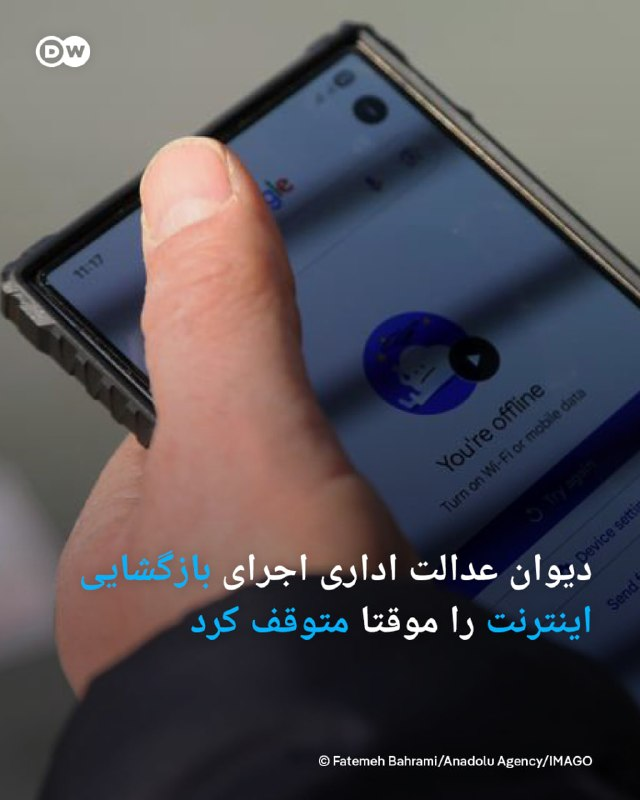

🔶 دیوان عدالت اداری اجرای بازگشایی اینترنت را موقتا متوقف کرد

در حالی که مقام‌های حکومت ایران خبر از دستور رئیس‌ جمهور برای اجرای مصوبه بازگشایی اینترنت بین‌الملل داده‌اند دیوان عدالت اداری اعلام کرده که دستور توقف موقت اجرای مصوبه "ایجاد ستاد ویژه ساماندهی و راهبری فضای مجازی کشور" را صادر کرده است.

مطابق گزارش خبرگزاری میزان، دیوان عدالت اداری تأکید کرده که این تصمیم را "در پی طرح شکایاتی با خواسته ابطال سند ایجاد این ستاد" اتخاذ کرده و تا زمان رسیدگی نهایی به این شکایات، مصوبات و تصمیمات ستاد ویژه ساماندهی و راهبری فضای مجازی کشور قابل ترتیب اثر نخواهد بود.

روز گذشته بعد از این که خبر تصویب بازگشایی اینترنت بین‌الملل و بازگشت آن به وضعیت دی‌ماه ۱۴۰۴ از سوی این ستاد منتشر شد رسانه‌های ایران از ابلاغ دستور اجرای این مصوبه از سوی مسعود پزشکیان، رئیس‌ دولت جمهوری اسلامی به وزارت ارتباطات خبر دادند.

@dw_farsi

## DW_Farsi — post 125161

🔶 یورش پلیس در ازمیر؛ بازداشت یک شهردار دیگر اپوزیسیون ترکیه

پس از برکناری اوزگور اوزل، رهبر اپوزیسیون ترکیه، از سمت خود توسط دادگاهی در این کشور، افراد بیشتری، از جمله یک شهردار در ازمیر، بازداشت شده‌اند.

به گزارش خبرگزاری ترکیه‌ای دمیرورن، مصطفی گونی، شهردار منطقه گوزل‌باغچه در کلان‌شهر ازمیر از حزب جمهوری‌خواه خلق (CHP) در میان بازداشت‌شدگان است.

طبق گزارش‌ها، پلیس ساختمان شهرداری را مورد بازرسی قرار داده است. همچنین اعلام شده که این یورش در چارچوب تحقیقاتی درباره تخلفات احتمالی در حوزه ساخت‌وساز انجام شده است. رئیس اداره ساخت‌وساز و نیز همسر مصطفی گونی نیز بازداشت شده‌اند.

دادگاهی در آنکارا هفته گذشته کنگره سال ۲۰۲۳ حزب را، که در آن اوزگور اوزل به ریاست حزب جمهوری‌خواه خلق انتخاب شده بود، به دلیل تخلفات احتمالی باطل اعلام کرده و اوزل را از سمتش برکنار کرد.

@dw_farsi

## DW_Farsi — post 125160

🔶 از باتری تا آنتی‌بیوتیک؛ اتکای آلمان به چین در کالاهای حیاتی

بر اساس یک مطالعه جدید، وابستگی آلمان به چین در زمینه کالاهای راهبردی مهمی مانند باتری‌ها، پنل‌های خورشیدی و آنتی‌بیوتیک‌ها در حال افزایش است.

بنا بر اعلام بنیاد "فریدریش ناومان برای آزادی" با استناد به داده‌های اولیه اداره فدرال آمار آلمان، از نظر وزنی، در سال گذشته حدود دو سوم واردات مستقیم باتری‌های یون−لیتیوم این کشور، از چین تأمین شده است. این در حالی است که دو سال پیش این سهم، اندکی کمتر از نصف واردات را تشکیل می‌داد.

بر اساس این گزارش، سهم چین در واردات پنل‌های خورشیدی به آلمان نیز از حدود ۸۹ درصد به نزدیک ۹۳ درصد و در مورد آنتی‌بیوتیک‌ها از بیش از ۶۵ درصد به حدود ۷۳ درصد افزایش یافته است.

@dw_farsi

## DW_Farsi — post 125159

  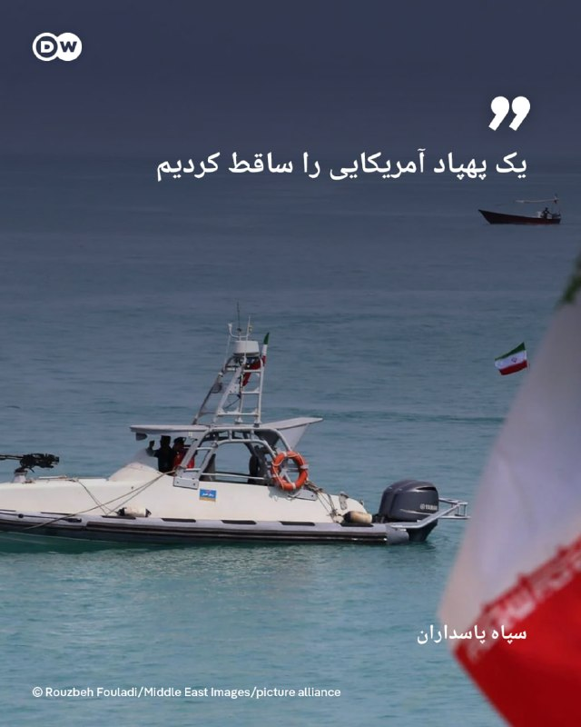

🔶 سپاه پاسداران: یک پهپاد آمریکایی را ساقط کردیم

سپاه پاسداران از شناسایی و "انهدام" یک پهپاد آمریکایی خبر داده و گفت یگان‌های پدافندی سپاه همچنین به یک پهپاد و یک جنگنده آمریکایی نیز که وارد حریم هوایی ایران شده بودند، "شلیک" کرده‌‌ است.

در بیانیه سپاه که روز سه‌شنبه پنجم خرداد منتشر شده، ادعا شده است نیروهای سپاه "یک فروند پهپاد MQ9 را شناسایی و ساقط" کردند و "با شلیک به یک فروند پهپاد RQ4 و جنگنده متجاوز F35 آنان را وادار به فرار و خروج از حریم سرزمینی کردند".

سپاه نسبت به نقض آتش‌بس از سوی آمریکا هشدار داده و تأکید کرده است که "حق پاسخ متقابل" را برای خود محفوظ می‌دارد.

در بیانیه سپاه مشخص نشده است که این حوادث چه زمانی رخ داده‌اند.

ارتش آمریکا هنوز به این ادعا واکنشی نشان نداده است.

ستاد فرماندهی مرکزی آمریکا، سنتکام، پیش‌تر با صدور بیانیه‌ای اعلام کرده بود که ارتش آمریکا روز دوشنبه چندین سایت موشکی و شناور را در جنوب ایران که در "حال تلاش برای مین‌گذاری بودند" هدف حمله قرار داده است.

رسانه‌های ایران گزارش داده‌اند که دستکم سه تن از اعضای سپاه در این حملات کشته شدند.

@dw_farsi

## DW_Farsi — post 125158

  

🔶 قوه قضائیه غلامرضا خانی شکراب را به اتهام "همکاری با موساد" اعدام کرد

خبرگزاری میزان از اعدام یک زندانی به نام غلامرضا خانی شکراب به اتهام "همکاری با موساد" در صبح سه‌شنبه، پنجم خرداد (۲۶ مه) خبر داد. در گزارش میزان از این فرد به عنوان "یکی از سرشبکه‌های موساد در خارج از کشور" نام برده و ادعا شده است که او "به دنبال جذب افراد و بکارگیری آن‌ها در داخل کشور برای اجرای اقدامات ضد امنیتی" بوده است.

خبرگزاری قوه قضائیه با استناد به "اعترافات" متهم مدعی شده است که غلامرضا خانی همچنین از طرف موساد برای "ترور یک خاخام یهودی در یک کشور منطقه" مأموریت داشته و پس از "جمع‌آوری اطلاعات" و "ارسال" آنها برای افسر موساد، "با ورود سرویس امنیتی کشور مقصد ناکام مانده و بازداشت شده، اما با نفوذ موساد پس از مدتی آزاد شده است".

در این گزارش گفته شده است که غلامرضا خانی "طی یک عملیات پیچیده و با استفاده از حربه فریب اطلاعاتی" به داخل کشور کشانده شده و توسط "سربازان گمنام امام زمان" بازداشت شده است. به نوشته میزان، حکم اعدام در دیوان عالی کشور تأیید شده بود.

قوه قضائیه جزئیاتی درباره زمان و مکان بازداشت، روند محاکمه، دسترسی به وکیل و شرایط بازجویی و نحوه اخذ اعترافات غلامرضا خانی شکراب منتشر نکرده است.

@dw_farsi

## DW_Farsi — post 125157

🔶 بخشودگی ۱۳۴ هزار دلاری بدهی؛ وعده پوتین برای جذب نیروی جنگ

کرملین چهار سال است نیروهایش را به جنگ علیه اوکراین می‌فرستد؛ جنگی که تلفات سنگینی برای ارتش این کشور به همراه داشته است.

اکنون ولادیمیر پوتین، رئیس جمهور روسیه، برای جبران کمبود نیرو، فرمانی را برای بخشودگی بدهی سربازان جدید و خانواده‌های آنان امضا کرده است.

کرملین شامگاه دوشنبه ۲۵ مه (۴ خرداد) اعلام کرد افرادی که از اول ماه جاری میلادی، مه، قراردادی را با وزارت دفاع روسیه امضا کرده باشند، به همراه همسرانشان از بدهی‌های خود تا سقف ۱۰ میلیون روبل (حدود ۱۳۴ هزار دلار) معاف خواهند شد.

پیش‌شرط این طرح آن است که پیش از این تاریخ، ادعای قانونی برای وصول بدهی‌ها وجود داشته و قرارداد خدمت نیز دست‌کم برای یک سال امضا شده باشد.

@dw_farsi

## DW_Farsi — post 125156

🔶 بازگشت دومین گروه از زنان استرالیایی مرتبط با داعش به کشور

مقام‌های استرالیا امروز سه‌شنبه ۲۶ مه (۵ خرداد) به وقت محلی، اعلام کردند که بازگشت گروهی به این کشور، شامل هفت زن استرالیایی و ۱۲ کودک که با گروه تروریستی "دولت اسلامی" (داعش) مرتبط بوده‌اند، برنامه‌ریزی شده است. این دومین گروه استرالیایی خواهد بود که در ماه جاری یک اردوگاه پناهجویان در سوریه را ترک می‌کند.

تونی برک، وزیر کشور استرالیا، گفت که دولت در روند سفر آنها کمکی ارائه نمی‌کند و هر فردی که مرتکب جرمی شده باشد «می‌تواند انتظار داشته باشد که با تمام قدرت قانون روبه‌رو شود.»

برک در بیانیه‌ای گفت: «اینها افرادی هستند که تصمیم هولناک پیوستن به یک سازمان تروریستی خطرناک را گرفتند و کودکان خود را در وضعیتی غیرقابل توصیف قرار دادند.»

برک نگفته است که این گروه دوم چه زمانی وارد استرالیا خواهد شد. دفتر او نیز تاکنون به درخواست رویترز برای ارائه جزئیات بیشتر پاسخی نداده است.

بنگاه خبررسانی استرالیا گزارش داد که این افراد پنج‌شنبه گذشته اردوگاهی در شمال شرق سوریه را ترک کرده‌اند و ممکن است طی روزهای آینده وارد این کشور شوند.

@dw_farsi

## DW_Farsi — post 125155

  

🔶 مجتبی خامنه‌ای: آمریکا دیگر نقطه امنی برای استقرار پایگاه در منطقه نخواهد داشت

همزمان با آغاز برگزاری مراسم حج رسانه‌های ایران صبح سه‌شنبه، پنجم خرداد، پیامی منتسب به مجتبی خامنه‌ای را منتشر کردند که در آن تهدید کرده است "آمریکا دیگر نقطه امنی برای استقرار پایگاه نظامی در منطقه نخواهد داشت".

رهبر جمهوری اسلامی بدون نام بردن از کشورها یا پایگاه‌های نظامی آمریکا مستقر در خاورمیانه گفته است که "ملت‌ها و سرزمین‌های منطقه، دیگر سپر پایگاه‌های آمریکایی نخواهند بود".

مجتبی خامنه‌ای همچنین با اشاره به اظهارات ده سال پیش پدرش، علی خامنه‌ای، در مورد نابودی اسرائیل هشدار داده است که اسرائیل "به مراحل پایانی عمر خود" نزدیک شده است و "۲۵ سال بعد از آن را نخواهد دید".

رهبر پیشین جمهوری اسلامی سال ۱۳۹۴ در یک سخنرانی مدعی شده بود که اسرائیل "تا ۲۵ سال دیگر در منطقه وجود نخواهد داشت". وبسایت علی خامنه‌ای این جمله را "مهمترین جمله رهبر" در آن سال انتخاب کرد و در پی آن، این شعار از آن پس در تبلیغات حکومتی متعدد به کار گرفته شد و یک تابلوی روزشمار با مضمون "نابودی اسرائیل" نیز در تهران نصب شد.

مجتبی خامنه‌ای پس از کشته شدن پدر، همسر و برخی دیگر از اعضای خانواده‌اش در حملات نهم اسفند آمریکا و اسرائیل به بیت رهبری، در انظار عموم دیده نشده است و تا کنون هیچ پیام صوتی یا تصویری نیز از منتشر نشده است.

غلامعلی حداد عادل، پدر همسر مجتبی خامنه‌ای، اواخر اردیبهشت در یک برنامه تلویزیونی در شبکه خبر، در پاسخ به مجری برنامه که از او خواسته بود تا به مجتبی خامنه‌ای سلام برساند، در واکنشی غیرمنظره گفته بود: «من هم از همین طریق صدا و سیما سلام شما را به ایشان منتقل می‌کنم و امیدوارم برنامه ما را ببینند.»

@dw_farsi

## DW_Farsi — post 125154

  

📸 عکس روز: پناه بردن از خورشید به "دختر خدای خورشید"

رود تاوی منبع اصلی تأمین آب آشامیدنی، مصارف خانگی و کشاورزی برای کل شهر جاموی هند است. تاوی در میان اهالی، رودخانه‌ای است مقدس و بر آن "دختر خدای خورشید" (سوریا پوتری) نام نهاده‌اند. تابش خورشید حالا اما در جامو به حدی است که زنی را واداشته برای خنک شدن به آب تاوی پناه ببرد.

@dw_farsi

## DW_Farsi — post 125152

  

🔶 افزایش قیمت نفت همزمان با حملات جدید آمریکا و تردیدها نسبت به توافق

در پی حملات هوایی جدید آمریکا به جنوب ایران و کاهش خوش‌بینی‌ها نسبت به دستیابی به یک توافق میان ایران و آمریکا، قیمت نفت صبح سه‌شنبه بار دیگر افزایش یافت و بازار سهام نیز دستخوش نوسان شد.

به گزارش رویترز قیمت قراردادهای آتی نفت برنت در معاملات اولیه آسیا بیش از ۱ درصد افزایش پیدا کرد و به ۹۷.۳۲ دلار در هر بشکه رسید. نفت خام وست تگزاس اینترمدیت آمریکا (WTI) نیز نسبت به آخرین قیمت معامله‌شده در روز دوشنبه اندکی افزایش داشت، اما همچنان ۵.۵ درصد پایین‌تر از قیمت پایانی روز جمعه بود.

بانک مرکزی سریلانکا برای مهار تورم و کاهش فشار شدید بر ارز، نرخ بهره پایه را به ۱۰۰ واحد افزایش داد.

معاون رئیس بانک مرکزی ژاپن نیز اعلام کرد که تحولات خاورمیانه در برنامه‌ریزی این بانک برای افزایش نرخ بهره تأثیرگذار خواهد بود.

این احتمال مطرح می‌شود که بانک مرکزی آمریکا تا ماه دسامبر نرخ بهره پایه را ۲۵ واحد افزایش دهد و بانک مرکزی اروپا و بانک انگلستان نیز سیاست‌های پولی خود را انقباضی‌تر کنند.

@dw_farsi

## DW_Farsi — post 125150

  

🔶 انتقال نتانیاهو به بیمارستان به دلیل "درمان دندان‌"

بنا بر گزارش‌ها نخست‌وزیر اسرائیل دوشنبه چهارم خرداد (۲۵ مه) به بیمارستان منتقل شده است. طبق گزارش رسانه‌های اسرائیلی به نقل از دفتر بنیامین نتانیاهو، او اواخر شب به یک بیمارستان در اورشلیم (بیت‌المقدس) منتقل شده تا تحت یک "درمان دندان‌پزشکی" قرار گیرد. جزئیات دقیق این درمان اعلام نشده است.

نتانیاهو که ۷۶ سال دارد، حدود یک ماه پیش با انتشار متنی در شبکه‌های اجتماعی برای نخستین بار از پرتودرمانی موفقیت‌آمیز خود برای یک تومور بدخیم پروستات خبر داده و اعلام کرده بود که در حال حاضر سالم است. او گفته بود انتشار گزارش مربوط به وضعیت سلامتی‌اش را به تأخیر انداخته تا از بهره‌برداری تبلیغاتی جمهوری اسلامی از این موضوع در جریان جنگ جلوگیری کند.

اعلام این موضوع از سوی نتانیاهو همراه با انتشار گزارش سالانه سلامت او و همچنین سندی جداگانه درباره تشخیص و درمان سرطانش صورت گرفت. با این حال به نوشته "تایمز اسرائیل"، این گزارش تنها نیم‌ صفحه و شامل پنج نکته کلی و مبهم بود که حتی مشخص نمی‌کرد این اطلاعات مربوط به چه سالی است. روی هیچ‌یک از این اسناد نشان بیمارستان درج نشده بود و هیچ نشانه‌ای مبنی بر رسمی بودن آنها به عنوان گزارش پزشکی مشاهده نمی‌شد.

@dw_farsi

## Persian_Trend_Official — post 15079

لطفا از عبارت "اینترنت داره به حالت عادی برمیگرده" استفاده نکنید.

ما هیچوقت اینترنت عادی نداشتیم.

در بهترین حالت یه فیلترنت بوده با هزاران محدودیت و مشکل.

📝 Nick

📌 @persian_trend_official
پرشین ترند | متفاوت‌ترین کانال نظامی

## Persian_Trend_Official — post 15078

  <a href="telegram/content/Persian_Trend_Official_15078_1779804155.webm" target="_blank">🎬 Download video</a>

⭕️رخ‌دادن زلزله ۳ و یک دهم ریشتری در خراسان رضوی؛ ۱۶ کیلومتری مشهد

🫆:Tony

📌 @persian_trend_official
پرشین ترند | متفاوت‌ترین کانال نظامی

## Persian_Trend_Official — post 15077

  <a href="telegram/content/Persian_Trend_Official_15077_1779804155.webm" target="_blank">🎬 Download video</a>

💢 نت‌بلاکس تأیید کرد که اینترنت ایران به حدود ۳۴٪ اتصال بازگشته است.

▪️این در روز ۸۸ پس از ۲۰۹۳ ساعت انزوای تقریباً کامل جهانی رخ داده و طولانی‌ترین قطعی سراسری اینترنت در تاریخ مدرن به شمار می‌رود.

🫆:Tony

📌 @persian_trend_official
پرشین ترند | متفاوت‌ترین کانال نظامی

## Persian_Trend_Official — post 15075

  <a href="telegram/content/Persian_Trend_Official_15075_1779804156.webm" target="_blank">🎬 Download video</a>

🔴سازمان UKMTO هشدار صادر کرده است . طبق این هشدار، یک انفجار خارجی روی یک نفتکش در فاصله ۶۰ مایل دریایی شرق مسقط (عمان) در ساعت ۰۹:۴۵ UTC روز ۲۶ مه ۲۰۲۶ رخ داده است.

💢کاپیتان کشتی تأیید کرده که خدمه و خود کشتی در وضعیت امن هستند، هرچند مقداری سوخت کشتی پس از انفجار در قسمت عقب سمت چپ کشتی به دریا ریخته شده است.

💢مقامات در حال تحقیق درباره این حادثه هستند. به همه شناورها در منطقه توصیه می‌شود با احتیاط عبور کنند و هرگونه فعالیت مشکوک را مستقیماً به UKMTO گزارش دهند.

🫆:Tony

📌 @persian_trend_official
پرشین ترند | متفاوت‌ترین کانال نظامی

## Persian_Trend_Official — post 15074

▪️گزارش هایی وجود دارد که

🔴اینترنت بین الملل روی مخابرات باز شد

🫆:Tony

📌 @persian_trend_official
پرشین ترند | متفاوت‌ترین کانال نظامی

## Persian_Trend_Official — post 15073

  <a href="telegram/content/Persian_Trend_Official_15073_1779804156.webm" target="_blank">🎬 Download video</a>

مراحل بازگشایی اینترنت، حسب دستور رئیس جمهور در حال انجام است /بازگشایی ثابت شروع شد

🔹در پی دستور رییس جمهور به وزیر ارتباطات برای بازگشایی اینترنت بین الملل، پیگیری‌های سیتنا تا ساعت ۱۵ امروز سه شنبه (۵ خردادماه) حاکی از ادامه روند بازگشایی است و توقفی در اجرای حکم رئیس جمهور صورت نگرفته است، در همین حال بازگشایی اینترنت بین‌الملل در حوزه ثابت شده است. /سیتنا

🫆:Tony

📌 @persian_trend_official
پرشین ترند | متفاوت‌ترین کانال نظامی

## Persian_Trend_Official — post 15072

  

ایسنا
💢اتصال اینترنت بین الملل در حال پیگیری است

طبق اعلام یک منبع مطلع به ایسنا:
🔹با صدور دستور اتصال اینترنت از وزیر ارتباطات و فناوری اطلاعات پروسه اتصال در حال انجام است و طی 24 ساعت آینده این امکان برای همه فراهم خواهد شد.

🫆:Tony

📌 @persian_trend_official
پرشین ترند | متفاوت‌ترین کانال نظامی

## Persian_Trend_Official — post 15071

  

کامیار ثقفی، رضا تقی پور، رسول جلیلی محمد حسن انتظاری. ▪️شاکیان اتصال اینترنت بین المللی لینک خبر لینک خبر 🫆:Tony 📌 @persian_trend_official پرشین ترند | متفاوت‌ترین کانال نظامی

## Persian_Trend_Official — post 15070

  

🔻رضا تقی پور ♦️وی موتورهای جستجوی خارجی را ابزارهای جاسوسی بیگانگان می‌داند و به دلیل اومانیستی و لیبرالیستی بودن مبنای اینترنت فعلی معتقد است: ▪️این اینترنت برای جوامع، خطرناک است و نیاز به باز تعریف دارد… در نوامبر سال ۲۰۱۲ خبرگزاری‌ها از اضافه شدن نام…

## Persian_Trend_Official — post 15069

  

مدیر صنایع امنیت مخابرات – گروه صنایع مخابرات, سراسری (از ۱۳۶۹ تا ۱۳۷۵) مدیرعامل صنایع الکترونیک شیراز, استان فارس (از ۱۳۷۵ تا ۱۳۸۱) مدیر عامل صنایع مخابرات, سراسری (از ۱۳۸۱ تا ۱۳۸۶) معاون وزیر و رئیس سازمان فضایی کشور, سراسری (از ۱۳۸۶ تا مرداد ۱۳۸۸) وزیر…

## Persian_Trend_Official — post 15068

  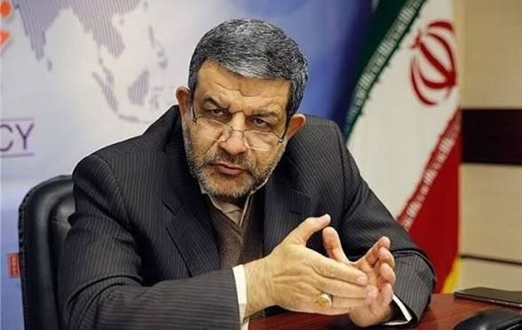

مدیر صنایع امنیت مخابرات – گروه صنایع مخابرات, سراسری (از ۱۳۶۹ تا ۱۳۷۵)
مدیرعامل صنایع الکترونیک شیراز, استان فارس (از ۱۳۷۵ تا ۱۳۸۱)
مدیر عامل صنایع مخابرات, سراسری (از ۱۳۸۱ تا ۱۳۸۶)
معاون وزیر و رئیس سازمان فضایی کشور, سراسری (از ۱۳۸۶ تا مرداد ۱۳۸۸)
وزیر ارتباطات و فناوری اطلاعات, سراسری (از مرداد ۱۳۸۸ تا آذر ۱۳۹۱)
موارد نقض حقوق بشر: مشارکت در سرکوب اعتراضات از طریق سانسور، شنود و اختلال در سیستم های ارتباطی (از مرداد ۱۳۸۸ تا آذر ۱۳۹۱) بیشتر بخوانید
عضو شورای عالی فضای مجازی, سراسری (از بهمن ۱۳۹۱‍ تاکنون)
موارد نقض حقوق بشر: مشارکت در کنترل، سانسور، فیلترینگ و تعقیب کاربران فضای مجازی (از بهمن ۱۳۹۱‍ تاکنون) بیشتر بخوانید
عضو شورای شهر تهران, استان تهران (از خرداد ۱۳۹۲ تا کنون)

## Persian_Trend_Official — post 15067

  

کامیار ثقفی، رضا تقی پور، رسول جلیلی محمد حسن انتظاری. ▪️شاکیان اتصال اینترنت بین المللی لینک خبر لینک خبر 🫆:Tony 📌 @persian_trend_official پرشین ترند | متفاوت‌ترین کانال نظامی

## Persian_Trend_Official — post 15066

  

کامیار ثقفی، رضا تقی پور، رسول جلیلی محمد حسن انتظاری. ▪️شاکیان اتصال اینترنت بین المللی لینک خبر لینک خبر 🫆:Tony 📌 @persian_trend_official پرشین ترند | متفاوت‌ترین کانال نظامی

## Persian_Trend_Official — post 15065

  

♦️ این ۴ نفر، شاکی قضایی «اتصال اینترنت بین‌الملل» هستند / این افراد تحت راهبری یک مقام ابقا شده‌ دولت مرحوم رئیسی دست به شکایت زده‌اند ♦️خبرنگار «انتخاب» دقایقی پیش کسب اطلاع کرد که ۴ نفر شاکی حقیقیِ «توقف اتصال اینترنت بین‌الملل» هستند. این ۴ نفر که گرایش…

## Persian_Trend_Official — post 15064

♦️ این ۴ نفر، شاکی قضایی «اتصال اینترنت بین‌الملل» هستند / این افراد تحت راهبری یک مقام ابقا شده‌ دولت مرحوم رئیسی دست به شکایت زده‌اند

♦️خبرنگار «انتخاب» دقایقی پیش کسب اطلاع کرد که ۴ نفر شاکی حقیقیِ «توقف اتصال اینترنت بین‌الملل» هستند. این ۴ نفر که گرایش سیاسی آن‌ها کاملاً مشخص است و تحت راهبری یک مقام ابقا شده‌ی دولت رییسی، دست به شکایت زده‌اند، عبارتند از
کامیار ثقفی،
رضا تقی پور،
رسول جلیلی
محمد حسن انتظاری.

🫆:Tony

📌 @persian_trend_official
پرشین ترند | متفاوت‌ترین کانال نظامی

## Persian_Trend_Official — post 15063

⭕️دیوان عدالت اداری دستور توقف مصوبهٔ ایجاد ستاد فضای مجازی را صادر کرد

♦️دیوان عدالت اداری اعلام کرد: در پی طرح شکایاتی دربارهٔ ابطال «سند ایجاد ستاد ویژه ساماندهی و راهبری فضای مجازی کشور» هیئت تخصصی صنایع و بازرگانی دیوان عدالت اداری با احراز ضرورت و فوریت موضوع، دستور توقف اجرای این مصوبه را تا زمان رسیدگی به شکایت صادر کرد.

♦️پیش‌تر پزشکیان، با ایجاد این ستاد و معرفی محمدرضا عارف به عنوان رییس آن، خواستار تعیین تکلیف وضعیت اینترنت شده بود و روز دوشنبه این ستاد مصوب کرد که اینترنت بین‌المللی در ایران، به شرایط پیش از دی‌ماه ۱۴۰۴ بازگردد.

پ ن : بعد بگید مملکت قانون نداره ...

🫆:Tony

📌 @persian_trend_official
پرشین ترند | متفاوت‌ترین کانال نظامی

## Persian_Trend_Official — post 15061

  <a href="telegram/content/Persian_Trend_Official_15061_1779804160.mp4" target="_blank">🎬 Download video</a>

حملات شبانه در منطقه مشغره، در این فیلم دیده میشود که چندین حمله در عرض چند ثانیه علیه سایت‌های زیرساختی حزب‌الله که فعالیت تروریستی در آن‌ها شناسایی شده بود،انجام شده و در طول حمله تروریست‌ها از بین رفتند.

👩‍💻@PhantomDirective

🆔@persian_trend_official
پرشین ترند | متفاوت‌ترین کانال نظامی

## Persian_Trend_Official — post 15060

  <a href="telegram/content/Persian_Trend_Official_15060_1779804162.webm" target="_blank">🎬 Download video</a>

📰اورشلیم پست:«مذاکرات بین ایران و ایالات متحده کند شده است؛ میانجی‌ها به وال‌استریت ژورنال گفتند که بحث‌ها درباره برنامه هسته‌ای ایران و کاهش تحریم‌ها، روند مذاکرات را متوقف کرده است.»

👩‍💻@PhantomDirective

🆔@persian_trend_official
پرشین ترند | متفاوت‌ترین کانال نظامی

## Persian_Trend_Official — post 15058

ورود معاون دبیر شعام به مسکو

باقری برای شرکت در چهاردهمین کنفرانس بین‌المللی مقامات عالی امنیتی به مسکو عزیمت کرده و علاوه بر سخنرانی‌ در این کنفرانس، با تعدادی از مقامات سیاسی و امنیتی روسیه نیز دیدار خواهد بود.

👩‍💻@PhantomDirective

🆔@persian_trend_official
پرشین ترند | متفاوت‌ترین کانال نظامی

## RadioFarda — post 157575

  

🔸نهاد پایش وضعیت اینترنت در جهان،نت‌بلاکس، اعلام کرد داده‌های زنده شبکه نشان می‌دهد بخشی از دسترسی به اینترنت در ایران در هشتاد و هشتمین روز قطع گسترده و نزدیک به «انزوای کامل» از شبکه جهانی، دوباره برقرار شده است.

🔸نت‌بلاکس در شبکه ایکس نوشت این اختلال که بیش از ۲۰۹۳ ساعت ادامه داشت، طولانی‌ترین قطع سراسری اینترنت در تاریخ مدرن است.

🔸این نهاد همچنین اعلام کرد هنوز مشخص نیست بازگشت دسترسی به اینترنت پایدار خواهد ماند یا نه.

🔸 مقام‌های دولت مسعود پزشکیان از آغاز روند اتصال کامل به اینترنت تا ۲۴ ساعت آینده خبر داده‌اند با این حال دیوان عدالت اداری اعلام کرد دستور توقف اجرای مصوبه تشکیل «ستاد ویژه ساماندهی و راهبری فضای مجازی کشور» را صادر کرده است.

🔸اینترنت در ایران، به‌رغم سانسور و اعمال فیلترینگ گسترده، از نهم اسفند پارسال همزمان با شروع جنگ آمریکا و اسرائیل با ایران و به بهانهٔ آن به‌طور کامل قطع شد.

@RadioFarda

## RadioFarda — post 157574

  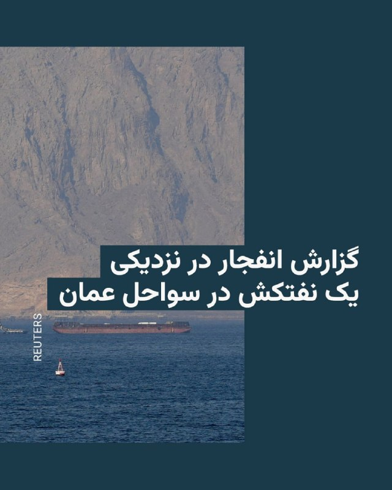

🔸سازمان عملیات تجارت دریایی بریتانیا (UKMTO) اعلام کرد یک نفتکش در ۶۰ مایل دریایی سواحل مسقط، پایتخت عمان، وقوع انفجاری در بخش چپ بدنه کشتی و نزدیک خط آب را گزارش کرده است.

🔸این سازمان روز سه‌شنبه پنجم خرداد اعلام کرد خدمه و خود نفتکش در امنیت هستند، اما بخشی از سوخت کشتی به دریا نشت کرده است.

🔸درباره علت انفجار یا جزئیات بیشتر این حادثه هنوز اطلاعاتی منتشر نشده است.

@RadioFarda

## RadioFarda — post 157573

  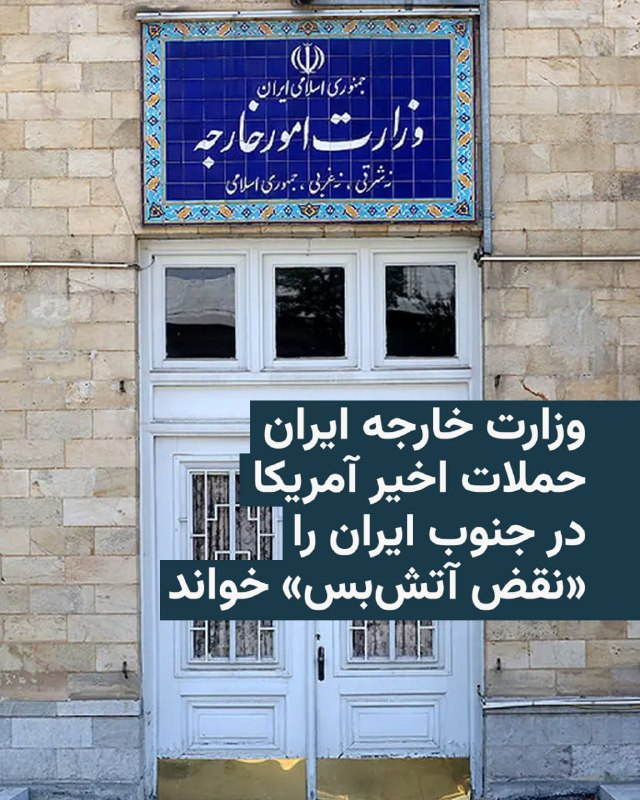

🔸وزارت خارجه جمهوری اسلامی ایران حملات اخیر آمریکا «در منطقه هرمزگان» را «نقض آشکار آتش‌بس» میان دو کشور توصیف و آن را محکوم کرد.

🔸این وزارتخانه روز سه‌شنبه پنجم خرداد در بیانیه‌ای اعلام کرد که آمریکا پس از اعلام آتش‌بس در ۱۹ فروردین، «اقدامات غیرقانونی» از جمله آنچه را «راهزنی دریایی علیه کشتی‌های تجاری ایرانی» خواند، ادامه داده است.

🔸وزارت خارجه ایران همچنین حملات ۴۸ ساعت گذشته آمریکا در منطقه هرمزگان را «تجاوزکارانه» خواند و ایالات متحده را مسئول «پیامدهای» این اقدامات دانست.

🔸ستاد فرماندهی مرکزی آمریکا، سنتکام، پیش‌تر اعلام کرده بود که ارتش ایالات متحده روز دوشنبه در جنوب ایران حملاتی را علیه اهدافی «از جمله قایق‌هایی که در تلاش برای کارگذاری مین بودند و همچنین سایت‌های پرتاب موشک» انجام داده است.

🔸سنتکام این حملات را «اقدامی دفاعی» توصیف کرده و گفته بود آتش‌بس میان دو کشور همچنان ادامه دارد.

@RadioFarda

## RadioFarda — post 157572

هشدار لاوروف به روبیو: شهروندان آمریکایی را از کی‌یف خارج کنید

🔸سرگئی لاوروف، وزیر خارجهٔ روسیه، به مارکو روبیو، وزیر خارجهٔ آمریکا، هشدار داد شهروندان آمریکایی را از کی‌یف خارج کند. هم‌زمان مسکو اعلام کرد حملات «منظم و پیوسته‌ای» را علیه پایتخت اوکراین انجام خواهد داد.

🔸این هشدار یک روز پس از آن مطرح شد که روسیه منطقهٔ کی‌یف را با صدها پهپاد و یک موشک مافوق صوت جدید هدف قرار داد.

🔸وزارت خارجهٔ روسیه روز دوشنبه چهارم خرداد اعلام کرد آقای لاوروف در تماس تلفنی با مارکو روبیو توصیه کرده است کارکنان دیپلماتیک آمریکا و شهروندان آمریکایی کی‌یف را ترک کنند.

🔸مسکو افزایش تهدیدهای خود را به حملهٔ هفتهٔ گذشته به خوابگاه یک مدرسه در منطقهٔ لوهانسک اوکراین که تحت اشغال روسیه است، مرتبط دانسته است. مقام‌های محلی گفته‌اند در این حمله بیش از ۲۰ نفر در شهر استاروبیلسک کشته شدند. روسیه اوکراین را متهم کرده که عمداً یک مرکز غیرنظامی را هدف قرار داده است.

🔸ولادیمیر پوتین، رئیس‌جمهور روسیه، نیز هفتهٔ گذشته در سخنانی با لحنی تند، کی‌یف را به «تروریسم» متهم کرد.

🔸در مقابل، مقام‌های نظامی اوکراین گفته‌اند نیروهای این کشور مقر یک واحد پهپادی روسیه را هدف قرار داده‌اند و ادعای حمله به تأسیسات غیرنظامی را رد کرده‌اند.

🔸کی‌یف و چند شهر دیگر اوکراین روز چهارم خرداد هدف یکی از گسترده‌ترین حملات پهپادی و موشکی ماه‌های اخیر قرار گرفتند. در این حملات دست‌کم سه نفر کشته و ده‌ها نفر زخمی شدند.

🔸روسیه همچنین یک موشک جدید با قابلیت حمل کلاهک هسته‌ای به نام «اورشنیک» را به‌سوی شهری در جنوب کی‌یف شلیک کرد؛ اقدامی که به نظر می‌رسد پیامی هشدارآمیز برای اوکراین بوده است.

🔸گزارش کامل را در وب‌سایت رادیوفردا بخوانید.

@RadioFarda

## RadioFarda — post 157571

  

🔸سخنگوی دولت جمهوری اسلامی می‌گوید آن بخش از بازسازی مراکز خسارت‌دیده در جنگ ۴۰ روزه که فوریت دارد، با استفاده از منابع داخلی قابل انجام است اما برای سایر بخش‌ها «به دنبال منابعی هستیم که در موضوع مذاکرات نیز دنبال می‌شود».

🔸فاطمه مهاجرانی روز سه‌شنبه پنجم خرداد در پاسخ به پرسشی دربارهٔ برآورد دولت از میزان آسیب‌های واردشده به زیرساخت‌های صنعت، از اعلام اعداد و ارقام خودداری کرد و گفت ارزیابی خسارت‌های مراکز صنعتی به‌صورت تخصصی در دست بررسی است.

🔸سخنگوی دولت پزشکیان در ادامه گفت: «بخشی از بازسازی‌ها که فوریت دارد، با استفاده از منابع داخلی قابل انجام است و برای سایر بخش‌ها به دنبال منابعی هستیم که در موضوع مذاکرات نیز دنبال می‌شود.»

🔸در گزارش‌های متعدد و متفاوت تأییدنشده‌ای که در روزهای اخیر از متن تفاهم‌نامهٔ مورد بحث ایران و آمریکا منتشر شده، به موضوع دریافت غرامت اشاره‌ای نشده، همزمان اکسیوس گزارش داده که در صورت امضای تفاهم‌نامه برای پایان جنگ، در دورهٔ ۶۰ روزه‌ای که برای مذاکرات در نظر گرفته شده، آزادسازی دارایی‌های مسدودشدهٔ ایران نیز بررسی خواهد شد.

@Radiofarda

## RadioFarda — post 157570

  <a href="https://t.me/radiofarda/157570" target="_blank">📎 Download file</a>

📻بشنوید: ساعت ۱۴ با رادیوفردا، پنجم خرداد ۱۴۰۵‌

@Radiofarda

## RadioFarda — post 157569

زیردریایی‌های هسته‌ای کره جنوبی، «با موافقت آمریکا»، در داخل کشور ساخته خواهد شد

🔸کره جنوبی اعلام کرد این کشور زیردریایی‌های هسته‌ای خود را در داخل کشور خواهد ساخت و قصد دارد نخستین فروند را اواسط دههٔ ۲۰۳۰ به آب بیندازد.

🔸وزیر دفاع کره جنوبی روز سه‌شنبه پنجم خرداد در نشست راهبرد دفاعی با حضور لی جه میونگ، رئیس‌جمهور این کشور، گفت: «ما زیردریایی‌های هسته‌ای را با فناوری خودمان توسعه داده و خواهیم ساخت تا نخستین فروند آن نیمه دوم دههٔ ۲۰۳۰ وارد خدمت عملیاتی خواهد شد.»

🔸کره جنوبی مدت‌ها است در پی دستیابی به زیردریایی هسته‌ای برای مقابله با تهدیدهای فزایندهٔ نظامی کره شمالی است، اما توافق همکاری هسته‌ای کره جنوبی با آمریکا تاکنون محدودیت‌هایی برای این برنامه ایجاد کرده بود.

🔸لی جه میونگ در ماه نوامبر گفته بود سئول در چارچوب توافق امنیتی و تجاری مورد انتظار دو کشور، موافقت واشینگتن را برای ساخت زیردریایی هسته‌ای دریافت کرده است.

🔸این توافق شامل موافقت آمریکا با غنی‌سازی اورانیوم و بازفرآوری سوخت مصرف‌شده نیز می‌شود.

🔸با این حال، هنوز نشانهٔ قطعی دربارهٔ محل ساخت این زیردریایی‌ها وجود نداشت و دونالد ترامپ گفته بود آن‌ها «در همین آمریکای خوب و قدیمی» ساخته خواهند شد.

🔸کره جنوبی که دارای رآکتورهای هسته‌ای است، اعلام کرده در تمام مراحل تأمین و مدیریت اورانیوم با غنای پایین مورد نیاز این زیردریایی‌ها به تعهدات خود در زمینهٔ منع گسترش سلاح‌های هسته‌ای پایبند خواهد بود.

🔸آن گیو بکَ وزیر دفاع این کشور، گفت: «جمهوری کره موضعی قاطع دارد که هیچ نوع سلاح هسته‌ای در اختیار ندارد و آن را توسعه نیز نخواهد داد.»

🔸لی جه میونگ نیز پس از ارائهٔ گزارش وزیر دفاع گفت زیردریایی‌های هسته‌ای «نماد عزم ما برای پذیرش مسئولیت صلح و امنیت در شبه‌جزیرهٔ کره» خواهند بود.

🔸فناوری زیردریایی هسته‌ای آمریکا از حساس‌ترین و به‌شدت محافظت‌شده‌ترین اسرار نظامی این کشور به شمار می‌رود.

🔸نسخه کامل این گزارش را در وب‌سایت رادیوفردا بخوانید.

@RadioFarda

## RadioFarda — post 157568

🔸در حالی که مقام‌های دولت مسعود پزشکیان از آغاز روند اتصال کامل به اینترنت تا ۲۴ ساعت آینده خبر می‌دادند، دیوان عدالت اداری اعلام کرد دستور توقف اجرای مصوبه تشکیل «ستاد ویژه ساماندهی و راهبری فضای مجازی کشور» را صادر کرده است.

🔸این دیوان ظهر سه‌شنبه پنجم خرداد اعلام کرد «به‌دنبال طرح شکایاتی، دستور به توقف مصوبهٔ ایجاد «ستاد ویژهٔ ساماندهی و راهبری فضای مجازی کشور» داده است» و افزود: «تا زمان رسیدگی نهایی به شکایات مطروحه، مصوبات و تصمیمات این ستاد قابل ترتیب اثر نخواهد بود.»

🔸این بیانیه به جزئیات این شکایت از جمله هویت شاکیان و نیز دلیل شکایت اشاره‌ای نکرده است.

🔸مرکز رسانه قوه قضاییه نیز اعلام کرد دستورات و مصوبات ستاد ویژه «به دلیل بررسی غیرقانونی بودن ساختار ستاد، تا زمان رسیدگی قانونی قابل اجرا نیست».

🔸فاطمه مهاجرانی، سخنگوی دولت، هم در همین روز اعلام کرده بود ستاد ویژه فضای مجازی با دستور مسعود پزشکیان و به ریاست محمدرضا عارف تشکیل شده و این ستاد به جمع‌بندی رسیده که «بازگشایی اینترنت انجام شود».

@RadioFarda

## RadioFarda — post 157567

  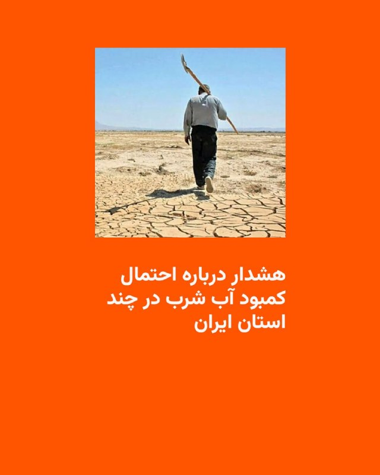

🔸یک مقام سازمان هواشناسی ایران می‌گوید تنش آبی در برخی مناطق به‌اندازه‌ای جدی است که در صورت بی‌توجهی به مقوله صرفه‌جویی، برای تأمین آب شرب این مناطق مسئله ایجاد خواهد شد.

🔸احد وظیفه، رئیس مرکز ملی اقلیم و مدیریت بحران سازمان هواشناسی، روز سه شنبه پنجم خرداد با اشاره به وجود تنش آبی طولانی‌مدت در برخی کلانشهرها مانند تهران، کرج، مشهد و اصفهان بر لزوم صرفه‌جویی در مصرف آب در این مناطق تأکید کرد.

🔸او گفت که لازم است ساکنان شهرهای مشهد، تهران، ساوه، اراک و کرج حداکثر صرفه جویی را انجام دهند، «در غیر این صورت پیش‌بینی می‌شود در این شهرها با کمبود آب شرب مواجه شویم».

🔸این هشدار در شرایطی اعلام شده که به گفته این مقام مسئول، در مجموع ماه‌های فروردین و اردیبهشت امسال خیلی پربارش بود و بارش طی این دوماه، «حدود چهار درصد نسبت به شرایط نرمال بالاتر بوده است».

🔸استان تهران سال گذشته آبی را هم تقریباً با ۵۰ درصد کم‌بارشی به پایان برد و در سال جاری هم رکورددار کم‌بارشی است.

@RadioFarda

## RadioFarda — post 157566

🔸وزرای امور خارجه ایالات متحده، هند، ژاپن و استرالیا روز سه‌شنبه پنجم خرداد در دهلی نو دیدار کردند تا در بحبوحه نگرانی‌های مشترک در مورد امنیت منطقه‌ای و نفوذ فزاینده چین، روند همکاری‌های چهارجانبه را احیا کنند.

🔸به گزارش رویترز مارکو روبیو، وزیر امور خارجه ایالات متحده در این نشست گفت که این چهار کشور «قابلیت‌های منحصر به فردی» برای مقابله با چالش‌های جهانی، از جمله امنیت انرژی، زنجیره‌های تأمین و آزادی ناوبری دارند و این امر تکرار درخواست‌های قبلی برای همکاری عملی‌تر است.

🔸این دیدار بین دیپلمات‌های ارشد این کشورها، پنی وانگ وزیر امور خارجه استرالیا، اس. جایشانکار وزیر امور خارجه هند، توشیمیتسو موتگی وزیر امور خارجه ژاپن و مارکو روبیو، وزیر امور خارجه ایالات متحده، سومین گردهمایی از این دست از سپتامبر ۲۰۲۴ است.

🔸این چهار کشور قرار بود سال گذشته اجلاسی در هند برگزار کنند، اما در بحبوحه تنش‌ها بین ترامپ و نارندرا مودی، نخست‌وزیر هند بر سر تعرفه‌های واشنگتن و سایر مسائل، این نشست برگزار نشد.

@RadioFarda

## RadioFarda — post 157565

  

🔸سپاه پاسداران انقلاب اسلامی روز سه‌شنبه پنجم خرداد مدعی شد که یک پهپاد آمریکایی را «ساقط» کرده و به سوی چند پهپاد آمریکایی دیگر که وارد حریم هوایی کشور شده بودند، «شلیک» کرده است.

🔸در بیانیه سپاه آمده بعد از اینکه هواپیماهای نظامی آمریکا وارد حریم هوایی ایران در منطقه خلیج فارس شدند، یگان‌های پدافند هوایی سپاه «یک پهپاد ام‌.کیو ۹ را شناسایی و سرنگون کردند».

🔸در این بیانیه آمده است که نیروهای سپاه «همچنین به سوی یک پهپاد آر.کیو۴ و یک جنگنده نفوذی اف۳۵ شلیک کردند».

🔸در این بیانیه به زمان وقوع این حوادث اشاره‌ای نشده است.

🔸این بیانیه پس از آن منتشر می‌شود که ستاد فرماندهی مرکزی آمریکا، سنتکام، اعلام کرد که ارتش ایالات متحده روز دوشنبه در جنوب ایران حملاتی را علیه اهدافی «از جمله قایق‌هایی که در تلاش برای کارگذاری مین بودند و همچنین سایت‌های پرتاب موشک» انجام داده است.

🔸رسانه‌های ایران بامداد سه‌شنبه گزارش دادند که «جنگنده‌های آمریکایی چند شناور ایرانی را در جنوب جزیره لارک هدف قرار دادند» و از کشته شدن دست‌کم سه تن نیز در این حمله خبر دادند.

@RadioFarda

## RadioFarda — post 157564

  

🔸دستگاه قضایی جمهوری اسلامی روز سه‌شنبه پنجم خرداد از اعدام یک شهروند دیگر به اتهام جاسوسی برای اسرائیل خبر داد.

🔸خبرگزاری قوه قضاییه هویت فرد اعدام‌شده را غلامرضا خانی شکراب معرفی و ادعا کرده است که او «سرشبکهٔ سرویس جاسوسی اسرائیل» بوده است.

🔸گزارش دستگاه قضایی اشاره‌ای به تاریخ بازداشت، محاکمه و روز اعدام متهم نکرده و این در حالی است که خبرگزاری فارس روز گذشته، دوشنبه چهارم خرداد، از صدور حکم اعدام برای او خبر داده بود.

🔸دستگاه قضایی، در گزارش خود، غلامرضا خانی شکراب را «از اراذل و اوباش یکی از استان‌های کشور و دارای سوابق نزاع و شرارت» خوانده و ادعا کرده است که او «به دنبال جذب افراد و به‌کارگیری آن‌ها در داخل کشور برای اجرای اقدامات ضد امنیتی بوده است».

🔸دستگاه قضایی جمهوری اسلامی در ماه‌های اخیر به شکل تقریباً روزانه اقدام به اجرای احکام اعدام معترضان و یا افرادی می‌کند که آن‌ها را به همکاری با آمریکا و اسرائیل متهم می‌کند. برخی نهادهای حقوق‌بشری می‌گویند جمهوری اسلامی از اعدام برای ایجاد فضای ترس و به‌عنوان عامل سرکوب استفاده می‌کند.

@RadioFarda

## RadioFarda — post 157563

  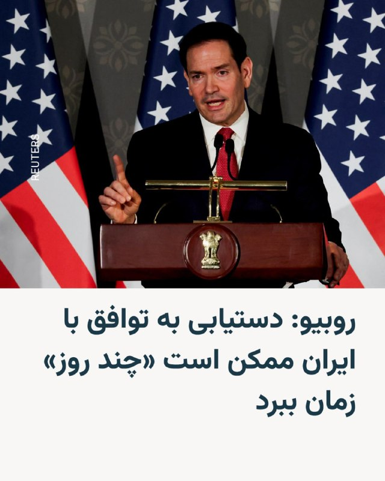

🔸مارکو روبیو، وزیر خارجه آمریکا، روز سه‌شنبه پنجم خرداد گفت دستیابی به توافق با ایران ممکن است «چند روز» زمان ببرد و تأکید کرد واشینگتن پیش از بررسی «راه‌های دیگر»، به دیپلماسی فرصت کامل خواهد داد.

🔸روبیو در توضیح حملاتی که سنتکام اعلام کرد روز گذشته علیه اهدافی در جنوب ایران از جمله قایق‌های در حال مین‌گذاری و پایگاه‌های پرتاب موشک انجام داده است، گفت تنگه هرمز باید «به هر شکل ممکن» باز بماند.

🔸وزیر خارجه ایالات متحده درباره گفت‌وگوهای جاری بین ایران و آمریکا برای دستیابی توافق گفت: «یک اتفاق‌نظر بسیار قوی و پیش‌نویس اولیهٔ یک توافق وجود دارد. همان‌گونه که در این‌گونه موارد پیش می‌آید، حل‌وفصل برخی اختلاف‌ها دربارهٔ یک کلمه یا یک جمله ممکن است چند روز طول بکشد تا به یک توافق برسیم. بنابراین باید برای حل این اختلاف‌ها تلاش کنیم. از این رو، یا یک توافق خوب خواهیم داشت یا توافق نخواهیم کرد.»

@RadioFarda

## RadioFarda — post 157562

  

🔸رسانه‌های ایران روز سه‌شنبه پنجم خرداد پیامی منسوب به مجتبی خامنه‌ای، رهبر جمهوری اسلامی، را به‌مناسبت برگزاری مراسم حج منتشر کردند که در آن می‌گوید آمریکا از این پس «نقطه امنی برای استقرار پایگاه نظامی در منطقه نخواهد داشت».

🔸او در این پیام توضیحی دربارهٔ پایگاه‌های آمریکایی مستقر در کشورهای خلیج فارس نکرد اما هشدار داد که «سرزمین‌های منطقه دیگر سپر پایگاه‌های آمریکایی نخواهد بود».

🔸مجتبی خامنه‌ای همچنین با یادآوری ادعای ۱۰ سال پیش پدرش علی خامنه‌ای درباره اسرائیل، مدعی شد این کشور نیز «به مراحل پایانی عمر» خود نزدیک شده و «۲۵ سال بعد از آن تاریخ را نخواهد دید».

🔸رهبر پیشین جمهوری اسلامی در سال ۱۳۹۴ و پس از امضای توافق هسته‌ای موسوم به برجام وعدهٔ نابودی اسرائیل را داده و گفته بود «اسرائیل ۲۵ سال آینده را نخواهد دید».

🔸از زمان اعلام نام مجتبی خامنه‌ای، به عنوان سومین رهبر جمهوری اسلامی، تصویر یا صدایی از او منتشر نشده و رسانه‌های ایران فقط پیام‌های کتبی را از او منتشر می‌کنند.

@RadioFarda

## RadioFarda — post 157561

  

🔸سخنگوی وزارت خارجه قطر می‌گوید گزارش‌هایی که ادعا می‌کنند دولت این کشور برای تضمین نهایی‌شدن توافق با ایران، ۱۲ میلیارد دلار به جمهوری اسلامی «پیشنهاد» داده، «کاملاً بی‌اساس» است.

🔸ماجد الانصاری سه‌شنبه پنجم خرداد در شبکه ایکس نوشته که این گزارش‌ها «توسط طرف‌هایی منتشر می‌شوند که به دنبال برهم زدن توافق و تضعیف تلاش‌های دیپلماتیک با هدف کاهش تنش‌ها و تقویت ثبات در منطقه‌اند.»

🔸او افزوده که تلاش‌های دیپلماتیک قطر که با «هماهنگی» شرکای منطقه‌ای انجام می‌شود، «شناخته‌شده و شفاف است».

🔸ماجد الانصاری انتشار این دست روایت‌ها را «تلاش‌های مذبوحانه برای خدشه‌دار کردن اعتبار» دولت قطر نامیده که به گفته او به‌عنوان «یک بازیگر بین‌المللی قابل اعتماد در مسیر دستیابی به صلح» است.

🔸این موضع‌گیری اندکی پس از آن اعلام می‌شود که روز دوشنبه، چهارم خرداد، هیئت نمایندگی ایران به ریاست محمدباقر قالیباف، رئیس مجلس، و با همراهی عباس عراقچی، وزیر خارجه، در سفری غیرمنتظره وارد قطر شد.

🔸قطر در جریان جنگ ایران، بارها توسط جمهوری اسلامی مورد حملات موشکی و پهپادی قرار گرفته بود.

@RadioFarda

## IranianMinds — post 20813

🔴 فوری

ارتش اسرائیل در لبنان فراتر از خط زرد عملیات زمینی را آغاز کرد

@IranianMinds

## IranianMinds — post 20812

  

🔴 نت بلاکس:

ُسطح دسترسی به اینترنت در ایران در حال افزایش هست.

@IranianMinds

## IranianMinds — post 20811

  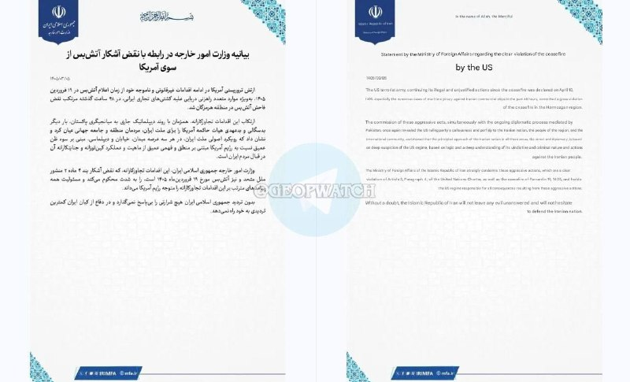

🔴وزارت خارجه ایران در بیانیه‌ای نوشت که ارتش آمریکا با حمله به کشتی‌های تجاری ایران در ۴۸ ساعت گذشته، آتش‌بس اعلام شده در ۱۹ فروردین را نقض کرده است و بدون تردید، ایران هیچ شرارتی را بی‌پاسخ نمی‌گذارد.

@IranianMinds

## IranianMinds — post 20810

🔴 اتحادیه کانفیگ فروشان ایرانی بیانیه داد:

کار جمهوری اسلامی ایران بسیار زشت بود. تاکید میکنم بسیار زشت! آن‌ها اینترنت را باز کردند و حمله‌ای شدید به دارایی ما زدند! تا 24 ساعت آینده مهلت میدهیم که اینترنت را قطع کنند. اگر نکنند آن‌ها را به عصر حجر. برمیگردونیم. خواهیم دید چه میشود.

## IranianMinds — post 20808

🔴 گوگل پلی روی مخابرات و برخی وایفای ها وصل شد

@IranianMinds

## IranianMinds — post 20807

حداقل اینترنت دخترارو وصل کنید.

## IranianMinds — post 20806

🔴 مسعود پزشکیان:

به یکی از وعده هام عمل کردم و اینترنت رو 10 دقیقه براتون باز کردم

## IranianMinds — post 20805

چک کنید ببینید گوگل پلی بازه براتون ؟

## IranianMinds — post 20804

🔴 سیتنا :

روند بازگشایی اینترنت متوقف نشده و در حال اجراست , طبق پیگیری‌ها، الان اینترنت‌های خونگی مثل ADSL و فیبر دارن کم‌کم وصل میشن و به مرور بقیه اپراتورها هم وارد روند بازگشایی میشن.

@IranianMinds

## IranianMinds — post 20803

بستن دوباره ایپیارو 😂😂 خب کصکشا مگه نمیخواید وصل کنید

## IranianMinds — post 20802

قطع شد مبارک خیلیا

## IranianMinds — post 20795

🔴پزشکیان:

باید شعار بزن که خوب می‌زنی را به شعار بساز که خوب می‌سازی تبدیل کنیم.

@IranianMinds

## IranianMinds — post 20794

  

🔴 بن‌ گویر ، وزیر امنیت ملی اسرائیل :

اسرائیل هرگز اجازه نخواهد داد ترامپ با جمهوری اسلامی یک توافق بد امضا کند.

@IranianMinds

## IranianMinds — post 20793

دیگه فحشمم‌ نمیاد بدم الان چیشد تکلیفتونو مشخص کنید

🔴 خبرگزاری ایسنا به نقل از یک منبع مطلع :
با صدور دستور اتصال اینترنت از وزیر ارتباطات و فناوری اطلاعات پروسه اتصال در حال انجام است و طی 24 ساعت آینده این امکان برای همه فراهم خواهد شد.

@IranianMinds

## IranianMinds — post 20792

  

🔴 چهار مادرقهبه ای که شاکی وصل شدن اینترنت بین الملل هستن : خبرنگار «انتخاب» دقایقی پیش کسب اطلاع کرد که ۴ نفر شاکی حقیقیِ «توقف اتصال اینترنت بین‌الملل» هستند. این ۴ نفر که گرایش سیاسی آن‌ها کاملاً مشخص است و تحت راهبری یک مقام ابقا شده‌ی دولت رییسی، دست…

## IranianMinds — post 20791

🔴 چهار مادرقهبه ای که شاکی وصل شدن اینترنت بین الملل هستن :

خبرنگار «انتخاب» دقایقی پیش کسب اطلاع کرد که ۴ نفر شاکی حقیقیِ «توقف اتصال اینترنت بین‌الملل» هستند. این ۴ نفر که گرایش سیاسی آن‌ها کاملاً مشخص است و تحت راهبری یک مقام ابقا شده‌ی دولت رییسی، دست به شکایت زده‌اند، عبارتند از کامیار ثقفی، رضا تقی پور، رسول جلیلی و محمد حسن انتظاری.

@IranianMinds

## IranianMinds — post 20788

🔴 حملات اسرائیل به لبنان

@IranianMinds

## IranianMinds — post 20787

  <a href="telegram/content/IranianMinds_20787_1779804169.mp4" target="_blank">🎬 Download video</a>

🔴 فیلمی که به تازگی از اعتراضات دی ماه منتشر شده، یه پسر جوون به عنوان تک تیرانداز به مردم شلیک میکنه و مامانش کنارش داره آمار میده که کیو بزنه!

@IranianMinds

## BBCPersian — post 282114

  <a href="telegram/content/BBCPersian_282114_1779804171.mp4" target="_blank">🎬 Download video</a>

هر سال صدها نفر از تپه‌ای با شیب تند در ولز پایین می‌دوند و می‌غلتند تا پنیر ۳/۵ کیلویی دایره‌ای شکلی به ارزش ۷۵ پوند را تصاحب کنند.
 
 مسابقه سالانه «جشنواره غلتاندن پنیر تپه کوپرز» به اوایل قرن ۱۹ برمی‌گردد و در تعطیلات دوم بهاری (اواخر ماه مه) برگزار می‌شود.
 
این جشنواره امروز به شکل ورزشی هیجانی در آمده که می تواند خطرناک هم باشد.
 
این مسابقه، برنامه‌گذار رسمی ندارد و قوانین چندانی هم بر آن حاکم نیست. یک قالب گرد سه کیلویی پنیر را از بالای تپه‌ای پر شیب به پایین غلت می‌دهند و شرکت‌کنندگان دنبال این پنیر، که سرعت آن به حدود ۱۱۰ کیلومتر در ساعت می‌رسد، می‌دوند.
 
برنده امسال این مسابقه، یوتوبری آلمانی به اسم تام کوپکه است که ۲۴ سال سن دارد و سومین سالی است که برنده این مسابقه شده است. برنده زن امسال این مسابقه هم الیس اوگا نام دارد که فرانسوی است.
 
فراوری پنیر  «دابل گلاستر» که در این مسابقه استفاده می‌شود، چندین ساعت زمان می‌برد. این پنیر باید دست‌کم پنج ماه هم در دمای اتاق نگهداری شود تا مقاومت لازم را پیدا کند.

@bbcpersian

## BBCPersian — post 282113

  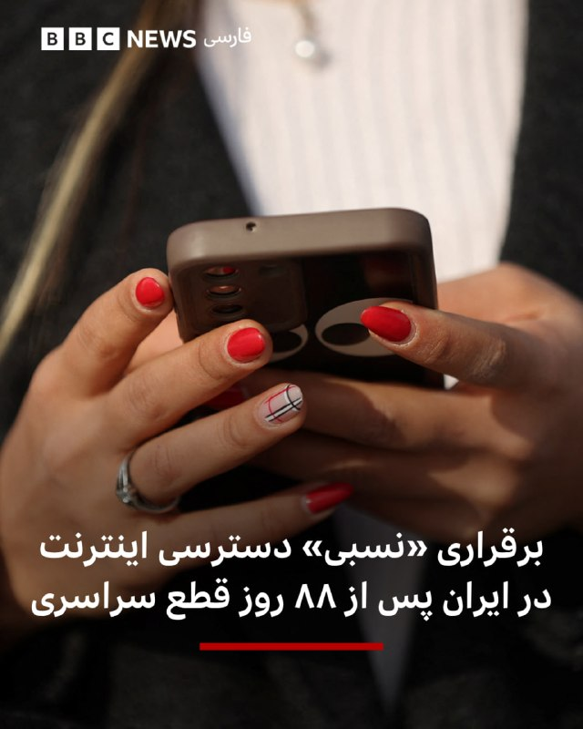

🔻نت‌بلاکس، نهاد ناظر دسترسی به اینترنت در جهان، برقراری «نسبی» اینترنت در ایران را تائید کرده است.

این نهاد گفته است که بر اساس «معیارهای زنده»، اتصال اینترنت در ایران پس از هشتاد و هشت روز ( ۲۰۹۳ ساعت) قطع «تقریبا کامل» که طولانی‌ترین قطع سراسری اینترنت در تاریخ مدرن است، تا حدی برقرار شده است.

نت‌بلاکس گفته است: «مشخص نیست که آیا این اتصال پایدار خواهد بود یا خیر.»

محمدرضا عارف، معاون اول مسعود پزشکیان، گفته است: «گام نخست دسترسی آزاد و ضابطه‌مند به فضای مجازی برداشته شد.»

پیشتر رسانه‌های ایران گزارش داده بودند که دیوان عدالت اداری در ایران دستوری صادر کرده است که بر اساس آن، ابلاغیه رئیس‌جمهور ایران برای اتصال مجدد اینترنت فعلا غیرقابل اجرا می‌شود.

مقام‌های دولت ایران پیشتر گفته بودند که قطع اینترنت مصوبه شورای عالی امنیت ملی است و با تصمیم آن دوباره وصل می شود.

ریاست این شورا با رئیس‌جمهور ایران است.

@BBCPersian
📷 REUTERS

## BBCPersian — post 282112

  <a href="telegram/content/BBCPersian_282112_1779804173.mp4" target="_blank">🎬 Download video</a>

🔻سرخط خبرها، سه‌شنبه ۵ خرداد ۱۴۰۵

@BBCPersian

## BBCPersian — post 282111

فاطمه مهاجرانی، سخنگوی دولت ایران در پاسخ به پرسش خبرنگاری درباره پلمب برخی اماکن به دلیل حجاب گفت: «رویکرد ما، رویکرد پذیرش همه مردم است. دولت چنین قراری ندارد و طبیعتا چنین کاری را بررسی می‌کنیم.» پس از آغاز جنگ آمریکا و اسرائیل با ایران، رسانه‌های نزدیک…

## BBCPersian — post 282110

  <a href="telegram/content/BBCPersian_282110_1779804174.mp4" target="_blank">🎬 Download video</a>

فاطمه مهاجرانی، سخنگوی دولت ایران در پاسخ به پرسش خبرنگاری درباره پلمب برخی اماکن به دلیل حجاب گفت: «رویکرد ما، رویکرد پذیرش همه مردم است. دولت چنین قراری ندارد و طبیعتا چنین کاری را بررسی می‌کنیم.»
پس از آغاز جنگ آمریکا و اسرائیل با ایران، رسانه‌های نزدیک به سپاه و حکومت تصاویر متعددی از زنان بدون روسری در تجمع‌های شبانه محکومیت جنگ و حمایت از حکومت منتشر کرده‌اند. از سوی دیگر، همچنان اماکنی از جمله کافه‌ها به دلیل رعایت نکردن حجاب اسلامی پلمب می‌شوند. رویکردهای متناقض حکومت ایران در موضوع حجاب در سال‌های اخیر بحث‌برانگیز بوده است.

خانم مهاجرانی در بخش دیگری از نشست رسانه‌ای هفتگی که امروز پنجم خرداد برگزار شد، در پاسخ به پرسشی درباره تورم، کمبود دارو و مشکلات درمان گفت: «صد در صد تلاش دولت معطوف به معیشت مردم است ولی بدیهی است در شرایط جنگی و در کشوری که تحت سخت‌ترین و خشن‌ترین تحریم‌هاست این اتفاق می‌افتد.»

## BBCPersian — post 282109

  <a href="https://t.me/bbcpersian/282109" target="_blank">📎 Download file</a>

سرخط خبرهای سه‌شنبه ۵ خرداد ۱۴۰۵ از رادیو بی‌بی‌سی

## BBCPersian — post 282108

🔻آغاز مناسک حج با حضور بیش از ۱/۵ میلیون زائر خارجی علی‌رغم بیم از جنگ ایران

🖌دیوید گریتن, بی‌بی‌سی

مسلمانان در حالی مناسک حج سالانه را در عربستان سعودی آغاز کرده‌اند که منطقه عمیقا تحت تاثیر جنگ ایران است.

مقامات سعودی هفته گذشته اعلام کردند که حدود یک میلیون و ۵۱۰ هزار زائر از خارج وارد این کشور شده‌اند.

https://bbc.in/4v9L0Bw
@BBCPersian

## BBCPersian — post 282106

🔻دیوان عدالت اداری در ایران دستوری صادر کرده است که بر اساس آن، ابلاغیه رئیس‌جمهور ایران برای اتصال مجدد اینترنت فعلا غیرقابل اجرا می‌شود.

دیوان عدالت اداری در دستور موقت خود، تشکیل «ستاد ویژه ساماندهی و راهبری فضای مجازی کشور» را غیرقانونی ارزیابی کرده و گفته است تا زمان بررسی نهایی موضوع، دستورات و تصمیم‌های این ستاد نیز قابل اجرا نیست.

دیوان عدالت اداری از مراجع قضایی در ایران است که افراد می توانند از تصمیم‌های دولت یا ماموران دولتی به آنجا شکایت کنند.

مسعود پزشکیان، رئیس‌جمهور ایران، دیروز مصوبه این ستاد را برای اتصال مجدد اینترنت به وزارت ارتباطات ابلاغ کرد و سخنگوی دولت امروز، پیش از دستور دیوان عدالت اداری، وعده داده بود که این مصوبه به‌زودی اجرا می‌شود.

اینترنت ایران که در دی‌ و در جریان سرکوب خونین اعتراضات قطع شد، از نهم اسفند (۲۸ فوریه) و همزمان با حملات اسرائیل و آمریکا دوباره قطع شده که تاکنون ادامه دارد.

📸 Getty

https://bbc.in/4u071Sq
@BBCPersian

## BBCPersian — post 282105

  

🔻ابوذر ضیایی، مدیرکل فرودگاه‌های استان اصفهان از برقراری مجدد پروازها در فرودگاه بین‌المللی «شهید بهشتی» اصفهان خبر داده است.

این فرودگاه به مدت ۸۴ روز پس از آغاز جنگ آمریکا و اسرائیل با ایران بسته مانده بود.

آقای ضایی گفته است اولین پرواز در مسیر اهواز- اصفهان و مسیر برگشت آن امروز سه‌شنبه (پنجم خرداد) انجام شده است.

فعالیت این فرودگاه البته با محدودیت ساعت روبروست و در حال حاضر از طلوع تا غروب آفتاب پروازها برقرار است.

پروازهای خارجی از ایران هم که از زمان شروع جنگ در نهم اسفند سال گذشته متوقف شده بود، در اوایل اردیبهشت از سر گرفته شد.

حدود دو هفته پیش فرودگاه «امام خمینی» تهران اعلام کرده بود که ۱۳ شرکت هواپیمایی داخلی به ۲۰ مقصد پرواز دارند.

آمریکا و اسرائیل در طول جنگ شماری از فرودگاه‌ها و هواپیماها را در ایران هدف حملات هوایی قرار دادند.

📸 مهر

https://bbc.in/4u071Sq
@BBCPersian

## BBCPersian — post 282103

🔻‌ارتش اسرائیل موج تازه‌ای از حملات هوایی را در سراسر لبنان آغاز کرده است. این موج تازه پس از سخنان دیروز، ۴ خرداد بنیامین نتانیاهو صورت گرفت. بر اساس تصاویر و گزارش‌ها، «مواضع حزب‌الله در دره بقاع در شرق لبنان» از  جمله اهداف این حملات بوده است..

آقای نتانیاهو با متهم کردن حمله پهپادی حزب‌الله به نیروهای اسرائیلی گفت به ارتش دستور داده تا با افزایش حملات خود در لبنان حزب‌الله را «در هم بکوبد.» او افزود که اسرائیل «در حال جنگ» با این گروه است و در هفته‌های اخیر ۶۰۰ عضو حزب‌الله را کشته است.

حزب‌الله هم در چند هفته گذشته به حملات پهپادی خود به مواضع ارتش اسرائیل ادامه داده است.

@‌‌BBCPersian

## BBCPersian — post 282101

  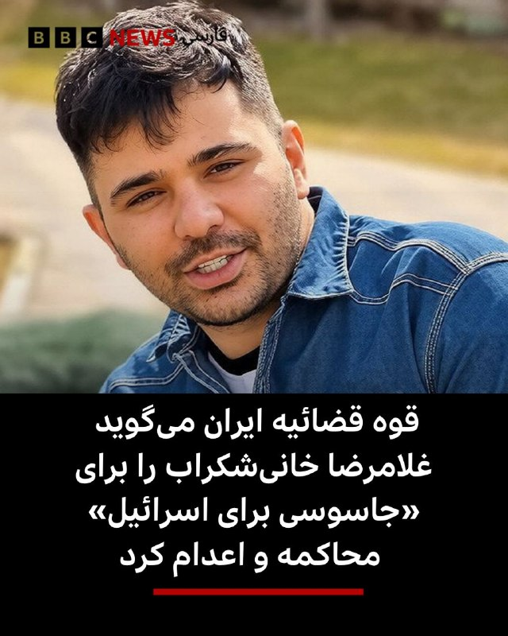

🔻قوهٔ قضائیه ایران اعلام کرده است که غلامرضا خانی‌شکراب پس از محاکمه به اتهام جاسوسی برای اسرائیل و تأیید حکم اعدامش در دیوان عالی کشور، اعدام شده است.

خبرگزاری میزان، وابسته به قوهٔ قضائیه، گفته است که این فرد «از اراذل‌واوباش یکی از استان‌های کشور و دارای سوابق نزاع و شرارت بوده است.»

میزان نوشته است: «بر اساس اعترافات متهم، یکی از مهم‌ترین مأموریت‌هایی که سرویس موساد برای وی طراحی کرده بود، اعزام او به یکی از کشورهای منطقه با هدف شناسایی و فراهم‌سازی مقدمات ترور یک خاخام یهودی بوده است.»

خبرگزاری قوه قضائیه ایران گفته است این فرد «طی یک عملیات پیچیده و با استفاده از حربه فریب اطلاعاتی به داخل کشور هدایت شده و توسط سربازان گمنام امام زمان در سپاه پاسداران انقلاب اسلامی دستگیر شد.»

تاکنون بیش از ۳۰ زندانی مرتبط با مسائل سیاسی و امنیتی در ایران، پس از آغاز جنگ آمریکا و اسرائیل اعدام شده‌اند.

نهادهای حقوق بشری درباره رعایت آیین دادرسی و محاکمهٔ عادلانهٔ این افراد، از جمله دسترسی مناسب به وکیل، تردیدهای جدی مطرح می‌کنند.

📸 UGC

https://bbc.in/4u071Sq
@BBCPersian

## BBCPersian — post 282099

🔻نت‌بلاکس که وضعیت اینترنت در جهان را ارزیابی می‌کند، می‌گوید داده‌های فنی نشان می‌دهد با وجود دستور روز گذشته رئیس‌جمهور ایران برای بازگرداندن دسترسی به اینترنت، این اختلال گسترده همچنان ادامه دارد.

نت‌بلاکس می‌گوید: «اتصال اینترنت در ایران همچنان قطع است و اکنون هشتادوهشتمین روز خاموشی دیجیتال در این کشور آغاز شده؛ وضعیتی که بیش از ۲۰۸۸ ساعت انزوای ارتباطی از جهان خارج را رقم زده است.»

مسعود پزشکیان روز گذشته مصوبه اتصال مجدد اینترنت ایران را به وزارت ارتباطات ابلاغ کرد.

مقام‌های دولتی وعده‌ای درباره زمان پایان محدودیت‌ها نداده‌اند. فاطمه مهاجرانی، سخنگوی دولت گفته است «امیدواریم طی روزهای آینده» اینترنت وصل شود.

اینترنت ایران که در جریان اعتراضات دی ماه هم قطع شده بود، با حملات اسرائیل و آمریکا که نزدیک به سه ماه از آن می‌گذرد، مجددا قطع شد و همچنان ادامه دارد.

📸 Getty

https://bbc.in/4u071Sq
@BBCPersian

## BBCPersian — post 282093

🖌بخش مانیتورینگ, بی‌بی‌سی:

🔻رسانه‌های اسرائیلی روز دوشنبه ۲۵ مه گزارش‌هایی درباره نگرانی‌ها درباره توافق در حال شکل‌گیری میان آمریکا و ایران منتشر کردند و گفتند منافع اسرائیل در جریان مذاکرات دو طرف در نظر گرفته نشده است.

روزنامه لیبرال هاآرتص گزارش داد که مقام‌های دفاعی اسرائیل از رهبران سیاسی خواسته‌اند بر روند توافق اعمال نفوذ کنند تا مفادی در آن گنجانده نشود که بر ادامه درگیری‌ها در لبنان اثر بگذارد.

این روزنامه به نقل از منابع ارتش اسرائیل نوشت که آن‌ها همچنین نگران‌اند این توافق به تفاهم‌هایی در نوار غزه منجر شود که برخلاف مواضع مقام‌های امنیتی اسرائیل باشد.

در همین حال، کانال ۱۴، شبکه راست‌گرای تلویزیونی اسرائیل، بر آنچه «مذاکرات مرموز» میان آمریکا و ایران خواند تمرکز کرد و گفت پیام‌های ردوبدل‌شده این پرسش را ایجاد کرده که آیا ایران آماده دادن امتیازهای واقعی است یا صرفا می‌کوشد در سایه فشارهای اقتصادی جاری زمان بخرد.

📸GettyImages/ Reuters/ EPA/Shutterstock/ AFP via Getty Images/ Yideot Ahronot

https://bbc.in/3RulpoE
@BBCPersian

## Dirty_Kids — post 390236

اگر احیانا وصل شد نگید اینترنت وصل شده، درستش اینه: فیلترنت وصل شد.
همونی که همیشه بوده و بدون فیلترشکن عملا هیچ کاری نمی‌کنه.

@Dirty_Kids 👻

## Dirty_Kids — post 390235

من خودم کانفینگ فروشم ولی الان بحث بحثه وطنه لطفا نتو ببندید😭❤️

@Dirty_Kids 👻

## Dirty_Kids — post 390234

  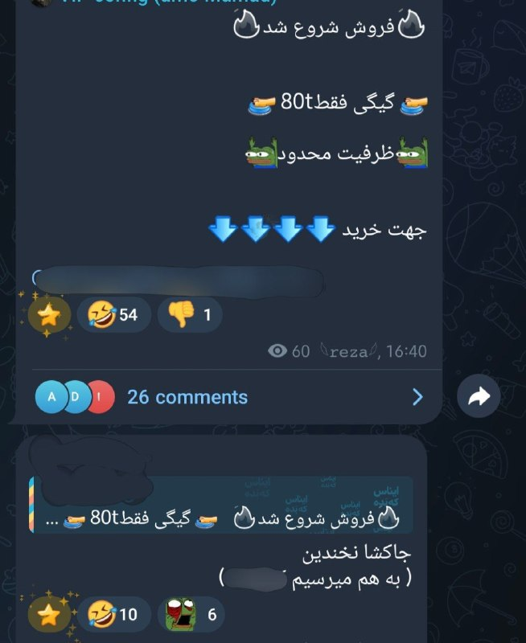

وضعیت کانفیگ فروشا 😂

@Dirty_Kids 👻

## Dirty_Kids — post 390233

🔴 اینترنت دیتاسنترها در حال باز شدنه
نت بلاکس هم تایید کرده

@Dirty_Kids 👻

## Dirty_Kids — post 390232

  <a href="telegram/content/Dirty_Kids_390232_1779804178.mp4" target="_blank">🎬 Download video</a>

وضعیت بله، روبیکا و vpn فروشا:

@Dirty_Kids 👻

## Dirty_Kids — post 390231

  

طبق تحقیقات جدید، اسپنک زدن به پارتنرتون می‌تونه باعث افزایش آرامش، شادی و کاهش استرس بشه 
🍑

@Dirty_Kids 👻

## Dirty_Kids — post 390230

  <a href="telegram/content/Dirty_Kids_390230_1779804179.mp4" target="_blank">🎬 Download video</a>

این میزان شادی دیگه یکم زیاده روی نیست تو این وضعیت!؟

@Dirty_Kids 👻

## Dirty_Kids — post 390229

  <a href="telegram/content/Dirty_Kids_390229_1779804180.webm" target="_blank">🎬 Download video</a>

🔴 «جیمیل | Gmail» 
🔍 روی اکثر اینترنتا در دسترس قرار گرفته.

گوگل پلی
🕹 هم روی بعضی مودم‌های خونگی در دسترس قرار گرفته و بدون فیلترشکن بالا میاد.

@Dirty_Kids 👻

## Dirty_Kids — post 390228

  <a href="telegram/content/Dirty_Kids_390228_1779804181.mp4" target="_blank">🎬 Download video</a>

دلار ۳۰ هزار تومن 🤦‍♂️
مملکت دست چه گوسفنداییه

@Dirty_Kids 👻

## Dirty_Kids — post 390227

  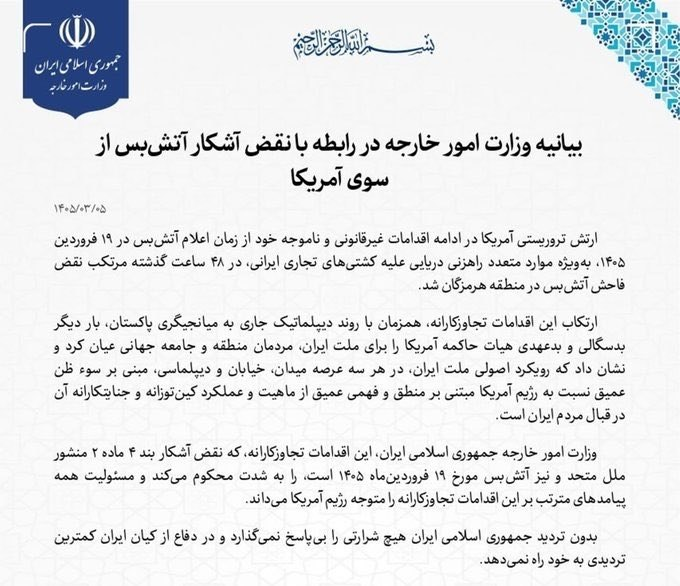

فعلاً خبر خاصی نیست جز اینکه رسانه‌های حکومتی قحبه نوشتن که داستان وصل کردن اینترنت به دستور پوزیده‌ی زن‌هزارتختخوابی به دلیل اینکه دیوان کسکش اداری جلوش رو گرفته فعلاً سرش گرده و حرومیای پدرقحبه دعوای زرگری راه انداختن چون فکر کردن همه مثه اینا کسمغزن و گول این پدرقحبه‌ها رو می‌خورن،

از طرفی دیگه وزارت خارجه‌ی روافض در بیانیه‌ای کیری گفته نقض آتش‌بس توسط آمریکا و کسپر کردن عوامل تروریستی سپه رو که در حین مذاکرات اتفاق افتاده بی‌پاسخ نمی‌ذاریم.

@Dirty_Kids 👻

## Dirty_Kids — post 390226

  <a href="telegram/content/Dirty_Kids_390226_1779804183.mp4" target="_blank">🎬 Download video</a>

روحت شاد #مهسا_امینی 🖤

اکران قسمت ۶ سریال گل‌سنگ و امضا گرفتن یسری آدم از بازیگر-پرستو الناز ملک، فاطمه مسعودی‌فر در پردیس کوروش

@Dirty_Kids 👻

## Dirty_Kids — post 390225

  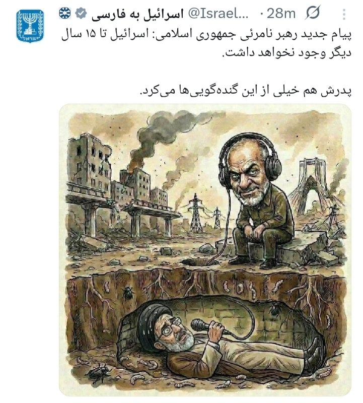

مجتبی یه پیام جدید داده

واکنش اکانت اسرائیل به فارسی:

@Dirty_Kids 👻

## Dirty_Kids — post 390224

  <a href="https://t.me/Dirty_Kids/390224" target="_blank">📎 Download file</a>

📱 اپلیکیشن اندروید بدون فیلتر ریتزوبت

➖➖➖➖➖

🔹 ثبت نام آسان 
✅
🔹 رابط کاربری بسیار راحت و سریع 
✅
🔹 درگاه پرداخت کارت به کارت 
✅
🔹 درگاه پرداخت دلاری سریع 
✅
🔹 بونوس ۱۰۰ درصدی اولین واریز 
✅
🔹 بونوس ۱۰۰ درصدی واریز یکشنبه ها 
✅

➖➖➖➖➖
🌐 https://RitzoBet.com

⚡️ @RitzoBet_ir

## Dirty_Kids — post 390223

  

⚠️ برای #شرطبندی های فوتبال از سایت معتبر و بین المللی استفاده کنید ✅

سایت #ریتزوبت ، چهار سال هستش داخل ایران فعالیت میکنه 
✅

لایسنس بین المللی داره ، روش های شارژ و برداشت متنوع داره و بونوس 100% ورزشی و کش بک های جذاب
💎

⏪ اپلیکیشن بدون فیلتر ریتزوبت 
📱
⏩
R5

✅ لینک بدون‌ فیلتر ریتزوبت
🤣

🆔 @RitzoBet_ir 
🇮🇷

## Dirty_Kids — post 390222

  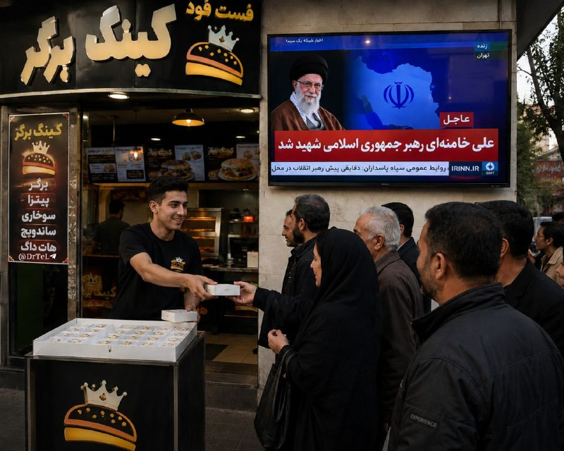

یه مرده تو تهران به علت اینکه شبِ کشته شدن علی خامنه‌ای، شیرینی پخش کرده بود، به 2 سال حبس محکوم شد!

دادگاه،"شاد بودن" این شهروند رو مصداق ارتكاب جرم دونسته.

خود طرف میگه من به علت افتتاح مغازه فست فودم، شیرینی پخش کردم...

@Dirty_Kids 👻

## Dirty_Kids — post 390221

خبرگزاری ایسنا: اینترنت وصل میشه
خبرگزاری فارس: اینترنت وصل نمیشه
دولت: اینترنت وصل میشه
قوه قضاییه: اینترنت وصل نمیشه

@Dirty_Kids 👻

## Dirty_Kids — post 390220

  

خاک تو سرتون فقط لب و دهنید

بریزید بیرون اعتراض کنید که این آتش بس قبول نیست و باید دوباره جنگ شه.
مطالبه "اعدام ظریف و روحانی " هم فک کنم یادتون رفته. اونم بی زحمت ترتیب اثر بدید

@Dirty_Kids 👻

## Dirty_Kids — post 390219

  <a href="telegram/content/Dirty_Kids_390219_1779804186.mp4" target="_blank">🎬 Download video</a>

دختر شایسته ی وین کانتی ایالت میشیگان🥴

یعنی خدیجه البنت الجنده‌ها رو ریختن تو میشیگان ها!

@Dirty_Kids 👻

## Dirty_Kids — post 390218

  

بادبان با همراهی شما 90 هزار نفری شد!
🎉

🛒به این مناسبت، قیمت سرویس‌ها تا گیگی 150 هزار تومان کاهش پیدا کرد! 
🚀

🎁 کد تخفیف خرید اول دوباره ریست شد و همه میتونن ازش استفاده کنن:
BadBan4k

💸 با این کد، 50 هزار تومان تخفیف روی اولین خریدت بگیر!

🔥و مهم‌تر از همه...
سیستم معرفی بادبان فعال‌تر از همیشه‌ست!
از تمام خریدهای کاربرانی که معرفی میکنی، 10% خریدشون رو پورسانت دائمی دریافت کن و موجودی کیف پولت رو افزایش بده 
💼

وقتی بادبان داری،
هیچ بادی مانع نیست… حتی وقتی اینترنت ملیه
⛵️
A5

🛡@BadBan_VPN | کانال 

🤖@BadBan_VPNBot | ربات 

📞@BadBan_VPNSupport | پشتیبانی

## Dirty_Kids — post 390217

  

امروز روزِ نود گرفتن از کسیه که روش کراشی.

@Dirty_Kids 👻

## Hranews — post 113177

  

نت‌بلاکس در آخرین به‌روزرسانی خود از وضعیت #اینترنت در ایران نوشت بر اساس داده‌های زنده، در هشتاد و هشتمین روز از قطع اینترنت، اتصال در ایران به‌صورت جزئی در حال بازیابی است؛ این رویداد پس از ۲۰۹۳ ساعت انزوای تقریباً کامل از شبکه‌های بین‌المللی رخ داده است که طولانی‌ترین قطع سراسری اینترنت در تاریخ مدرن محسوب می‌شود. این نهاد ناظر بر وضعیت اینترنت در جهان تاکید می‌کند که هنوز مشخص نیست آیا این بازگشت اتصال پایدار خواهد ماند یا نه.

↘️
@hranews_bot تماس ✉️ -  @Hranews  کانال هرانا 🆑

## Hranews — post 113176

  

تداوم بازداشت و بلاتکلیفی ماندانا و مهسا ستوده، شهروندان بهائی در زندان عادل آباد

❗️
❗️
❗️
❗️
❗️– ماندانا ستوده و مهسا ستوده دو خواهر بهائی ساکن شیراز نزدیک به دو ماه است که بازداشت شدند و کماکان به صورت بلاتکلیف در زندان عادل آباد شیراز به‌سر می‌برند.

به گزارش خبرگزاری هرانا، ارگان خبری مجموعه فعالان حقوق بشر در ایران، ماندانا ستوده و مهسا ستوده شهروندان بهائی کماکان در بازداشت به سر میبرند.

ماندانا ستوده و مهسا ستوده دو خواهر #بهائی علیرغم گذشت نزدیک به دو ماه از زمان بازداشت کماکان به صورت بلاتکلیف در زندان عادل آباد شیراز نگهداری می شوند.

با وجود پیگیری‌های خانواده این شهروندان از مراجع قضایی، تاکنون رسیدگی مؤثر و نتیجه‌بخشی به پرونده آنان صورت نگرفته است.
#ماندانا_ستوده #مهسا_ستوده

ادامه مطلب

↘️
@hranews_bot تماس ✉️ -  @Hranews  کانال هرانا 🆑

## Hranews — post 113175

  

بند زنان زندان اوین؛ نسیم سیمیاری از دسترسی به تماس تلفنی محروم شد

❗️
❗️
❗️
❗️
❗️– نسیم غلامی سیمیاری، زندانی سیاسی محبوس در زندان اوین، به صورت تنبیهی از حق استفاده از تلفن زندان محروم شد. این زندانی همچنین پیش از این نیز از حق ملاقات حضوری با خانواده و وکلای خود به مدت یک هفته محروم شده است.

به گزارش خبرگزاری هرانا، ارگان خبری مجموعه فعالان حقوق بشر در ایران، نسیم غلامی سیمیاری ، زندانی سیاسی محبوس در زندان اوین از حق استفاده از تلفن زندان محروم شد.

یک منبع مطلع در این خصوص به هرانا گفت: نسیم غلامی سیمیاری به دلیل مکالمه با لیندزی فورمن، به صورت تنبیهی از امکان دسترسی و استفاده از تلفن زندان منع شده است. همچنین مسئولین زندان پیشتر نیز این زندانی سیاسی را به دلیل «پوشیدن شلوارک» به مدت یک هفته از حق ملاقات حضوری با خانواده و وکلای خود محروم کرده‌اند.
#نسیم_غلامی_سیمیاری

ادامه مطلب

↘️
@hranews_bot تماس ✉️ -  @Hranews  کانال هرانا 🆑

## Hranews — post 113174

  

دادگاه انقلاب؛ سیدمحمدرضا رضوی فرد، وکیل دادگستری محاکمه شد

❗️
❗️
❗️
❗️
❗️– امروز سه شنبه ۵ خردادماه، جلسه دادگاه رسیدگی به اتهام سیدمحمدرضا رضوی فرد، وکیل دادگستری در شعبه اول دادگاه انقلاب شهرستان قم برگزار شد.

به گزارش خبرگزاری هرانا، ارگان خبری مجموعه فعالان حقوق بشر در ایران، سیدمحمدرضا رضوی فرد، وکیل دادگستری محاکمه شد.

آقای رضوی‌فرد امروز سه‌شنبه ۵ خردادماه، در شعبه اول دادگاه انقلاب قم از بابت اتهام تبلیغ علیه نظام از خود دفاع کرد.

بر اساس اطلاعات دریافتی، این پرونده با استناد به ماده ۴ قانون تشدید تشکیل شده است؛ ماده‌ای که برخی فعالیت‌های سیاسی، فرهنگی، رسانه‌ای و تبلیغی، از جمله تولید یا انتشار محتواهایی را که به تشخیص دادگاه علیه امنیت ملی تلقی شود، جرم‌انگاری می‌کند. این ماده همچنین ارسال فیلم، تصویر یا اطلاعات به رسانه‌ها و صفحات مجازی بیگانه یا معاند را در صورت تشخیص مغایرت با امنیت ملی، مشمول مجازات می‌داند.
#سیدمحمدرضا_رضوی_فرد

ادامه مطلب

↘️
@hranews_bot تماس ✉️ -  @Hranews  کانال هرانا 🆑

## Hranews — post 113173

  

نادیا صدق‌علی از زندان وکیل‌آباد مشهد آزاد شد

❗️
❗️
❗️
❗️
❗️– نادیا صدق‌علی، شهروند بازداشتی ساکن مشهد، با قرار کفالت از زندان وکیل‌آباد این شهرستان آزاد شد.

به گزارش خبرگزاری هرانا، ارگان خبری مجموعه فعالان حقوق بشر در ایران، نادیا صدق‌علی آزاد شد.

بر اساس اطلاعات دریافتی هرانا، آزادی خانم صدق‌علی، اخیراً با قرار کفالت از زندان وکیل‌آباد مشهد صورت گرفته است.
#نادیا_صدق‌علی

ادامه مطلب

↘️
@hranews_bot تماس ✉️ -  @Hranews  کانال هرانا 🆑

## Hranews — post 113172

  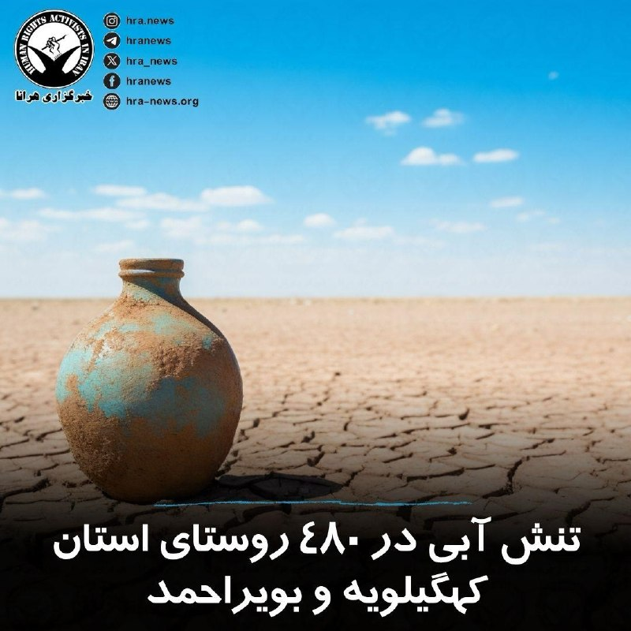

یدالله رحمانی، استاندار کهگیلویه و بویراحمد، با تاکید بر لزوم مدیریت مصرف آب در بخش‌های کشاورزی، شرب و صنعت اعلام کرد که براساس آمار آبفا، ۶۰۰ روستا در این استان با #تنش_آبی مواجه بودند که از این تعداد ۱۲۰ روستا از تنش آبی خارج شدند و برای ۴۸۰ روستای باقی‌مانده، باید برنامه زمان‌بندی دقیقی ارائه شود تا طی سال‌های ۱۴۰۵ و ۱۴۰۶، سالانه ۲۴۰ روستا به تفکیک شهرستان از تنش آبی خارج شوند.

↘️
@hranews_bot تماس ✉️ -  @Hranews  کانال هرانا 🆑

## Hranews — post 113171

  

بر اساس آخرین داده‌های نت‌بلاکس، اکنون هشتادوهشتمین روز متوالی قطع #اینترنت در ایران است؛ محدودیتی که بیش از ۲۰۸۸ ساعت ادامه داشته است.

↘️
@hranews_bot تماس ✉️ -  @Hranews  کانال هرانا 🆑

## Hranews — post 113170

  

علی احمدزاده، کارگردان، فیلمنامه‌نویس و تهیه‌کننده ایرانی، با انتشار مطلبی اعلام کرد که با وجود گذشت حدود ۱۰ ماه از تفتیش منزل و ضبط وسایل شخصی و مدارک هویتی‌اش توسط نهادهای امنیتی، تاکنون موفق به بازپس‌گیری آنها نشده است. این در حالی است که به گفته احمدزاده، برای بازگرداندن این اقلام حکم قضایی صادر شده است.

به گفته وی، ماموران وسایلی به ارزش “چندین میلیارد” تومان، از جمله مدارک شناسایی، کارت‌های بانکی و گذرنامه‌اش را ضبط کرده‌اند. احمدزاده همچنین عنوان کرد که وزارت اطلاعات به او اعلام کرده است تمامی این اقلام ضبط شده و او باید “بدون مدارک هویتی” به زندگی ادامه دهد. او در ادامه، با اشاره به پیگیری‌های قضایی خود نوشت که قاضی پرونده نیز به وی گفته است: “از دست ما دیگر کاری برنمی‌آید، مملکت را ماموران امنیتی می‌گردانند.”
#علی_احمدزاده

↘️
@hranews_bot تماس ✉️ -  @Hranews  کانال هرانا 🆑

## Hranews — post 113169

  

غلامرضا خانی شکراب به اتهام «جاسوسی» اعدام شد

❗️
❗️
❗️
❗️
❗️– مرکز رسانه قوه قضاییه از اجرای حکم اعدام غلامرضا خانی شکراب، زندانی متهم به جاسوسی و فعالیت اطلاعاتی به نفع اسرائیل خبر داد. این حکم پس از تایید در دیوان عالی کشور به اجرا درآمد. بر اساس داده‌های گردآوری‌شده توسط هرانا، همزمان با آغاز درگیری‌های نظامی، روند صدور و اجرای احکام اعدام در پرونده‌های سیاسی و امنیتی افزایش یافته و تاکنون ۳۷ زندانی با این اتهامات در این بازه زمانی اعدام شده‌اند.
#غلامرضا_خانی_شکراب #اعدام

ادامه مطلب

↘️
@hranews_bot تماس ✉️ -  @Hranews  کانال هرانا 🆑

## Hranews — post 113168

  

عدم رسیدگی پزشکی؛ تداوم بازداشت سارا سپهری، شهروند بهائی در زندان عادل آباد

❗️
❗️
❗️
❗️
❗️– سارا سپهری، شهروند بهائی ساکن شیراز علیرغم گذشت بیش از یک ماه از زمان دستگیری، کماکان به صورت بلاتکلیف در زندان عادل آباد این شهر به‌سر می برد. همچنین وی دچار مشکلات جسمانی بوده و از دریافت رسیدگی مناسب پزشکی محروم مانده است.

به گزارش خبرگزاری هرانا، ارگان خبری مجموعه فعالان حقوق بشر در ایران، سارا سپهری، شهروند #بهائی در زندان عادل آباد شیراز در بازداشت و بلاتکلیفی بهسر می برد.

یک منبع مطلع نزدیک به خانواده این شهروند بهائی، ضمن تایید این خبر به هرانا گفت: “سارا سپهری ۴۷ روز است که در زندان عادل‌آباد شیراز به‌صورت بلاتکلیف نگهداری می‌شود. او در طول بازداشت دچار خونریزی معده شده و فشار ناشی از بازجویی‌های طولانی‌مدت، بیماری چشمی‌اش را تشدید کرده است. همچنین، عدم دسترسی به دارو و درمان مناسب در هفته‌های اخیر، به وخامت وضعیت جسمی و روحی وی انجامیده و او نیازمند رسیدگی تخصصی پزشکی و اعزام به مراکز درمانی خارج از زندان است.”

ادامه مطلب

#سارا_سپهری

↘️
@hranews_bot تماس ✉️ -  @Hranews  کانال هرانا 🆑

## Hranews — post 113167

  

احسان چیت‌ساز، معاون سیاست‌گذاری و برنامه‌ریزی توسعه فاوا و اقتصاد دیجیتال وزارت ارتباطات، اعلام کرد که مصوبه بازگشت #اینترنت کشور به وضعیت پیش از دی‌ماه ۱۴۰۴، توسط رییس‌جمهور تایید و برای اجرا به وزارت ارتباطات ابلاغ شده است.

روز گذشته، ستاد راهبری و ساماندهی فضای مجازی، بازگشت اینترنت به وضعیت پیش از دی‌ماه ۱۴۰۴ را تصویب و برای تایید به رییس‌جمهور ارسال کرده بود.

↘️
@hranews_bot تماس ✉️ -  @Hranews  کانال هرانا 🆑

## alonews — post 122827

  <a href="telegram/content/alonews_122827_1779804195.webm" target="_blank">🎬 Download video</a>

👈ارتش اسرائیل (IDF) در لبنان فراتر از خط زرد (خط توافق شده در قرارداد صلح سازمان ملل) عملیات زمینی را آغاز کرد.

✅ @AloNews خبر جنگ

## alonews — post 122826

  <a href="telegram/content/alonews_122826_1779804195.webm" target="_blank">🎬 Download video</a>

👈روزنامه هاآرتص به نقل از یک منبع آگاه نوشت: ارتش اسرائیل عملیات زمینی خود را در جنوب لبنان گسترش می‌دهد تا کسانی را که حملات پهپادی (FPV) انجام می‌دهند، عقب براند.

✅ @AloNews خبر جنگ

## alonews — post 122825

  <a href="telegram/content/alonews_122825_1779804195.webm" target="_blank">🎬 Download video</a>

👈نیرو زمینی اسرائیل دستور تخلیه اجباری برای شهرهای مشغره و سحمر در دره بقاع شرقی لبنان صادر کرده‌اند.

✅ @AloNews خبر جنگ

## alonews — post 122824

  <a href="telegram/content/alonews_122824_1779804195.webm" target="_blank">🎬 Download video</a>

👈طبق گزارش ها ایران ارتباطات رادیویی را در مناطق خاصی در داخل روسیه و گرجستان قطع کرد — و برخی از ارتباطات در ایران به دلایل نامعلومی قطع شده است.

✅ @AloNews خبر جنگ

## alonews — post 122821

  <a href="telegram/content/alonews_122821_1779804196.webm" target="_blank">🎬 Download video</a>

👈 جنگنده‌های اسرائیلی حملات هوایی به کفرتبنت، خربت سلم و زوطر الغربیة در جنوب لبنان انجام دادند.

✅ @AloNews خبر جنگ

## alonews — post 122820

  <a href="telegram/content/alonews_122820_1779804196.webm" target="_blank">🎬 Download video</a>

👈تسنیم : ترامپ به بیمارستان اعزام شد 
✅ @AloNews خبر جنگ

## alonews — post 122819

  <a href="telegram/content/alonews_122819_1779804196.webm" target="_blank">🎬 Download video</a>

👈عارف: گام نخست دسترسی آزاد و ضابطه‌مند به فضای مجازی برداشته شد

✅ @AloNews خبر جنگ

## alonews — post 122818

  <a href="telegram/content/alonews_122818_1779804196.webm" target="_blank">🎬 Download video</a>

👈صحنه‌هایی از معرکه، جنوب لبنان، پس از حمله اسرائیل

✅ @AloNews خبر جنگ

## alonews — post 122817

  <a href="telegram/content/alonews_122817_1779804196.webm" target="_blank">🎬 Download video</a>

👈تسنیم : ترامپ به بیمارستان اعزام شد

✅ @AloNews خبر جنگ

## alonews — post 122816

  <a href="telegram/content/alonews_122816_1779804196.webm" target="_blank">🎬 Download video</a>

🔴فوری / گزارش ها از زلزله در مشهد 
✅ @AloNews خبر جنگ

## alonews — post 122814

  <a href="telegram/content/alonews_122814_1779804196.webm" target="_blank">🎬 Download video</a>

👈پست های جدید ترامپ در تروث سوشال

✅ @AloNews خبر جنگ

## alonews — post 122813

  <a href="telegram/content/alonews_122813_1779804197.webm" target="_blank">🎬 Download video</a>

👈فعلا پروکسیا و یک سری VPN ها روی مخابرات،شاتل و بقیه مودم ها وصل شدند،نت موبایل هنوز باز نشده

✅ @AloNews خبر جنگ

## alonews — post 122812

  <a href="telegram/content/alonews_122812_1779804197.webm" target="_blank">🎬 Download video</a>

👈وضعیت کسب و کارهای اینترنتی بعد وصل شدن اینترنت

✅ @AloNews خبر جنگ

## alonews — post 122811

  <a href="telegram/content/alonews_122811_1779804197.webm" target="_blank">🎬 Download video</a>

👈تکلیف اونایی که پرو خریدن چی میشه؟

✅ @AloNews خبر جنگ

## alonews — post 122810

  <a href="telegram/content/alonews_122810_1779804197.webm" target="_blank">🎬 Download video</a>

👈بعد از ۸۸ روز و حدود ۲۰۹۳ ساعت قطعی و انزوای شدید از اینترنت جهانی، اتصال اینترنت تو ایران تا حدی برگشته
- ولی هنوز معلوم نیست این وضعیت پایدار بمونه یا نه

✅ @AloNews خبر جنگ

## alonews — post 122809

  <a href="telegram/content/alonews_122809_1779804197.webm" target="_blank">🎬 Download video</a>

👈 ادعای وزیر دارایی اسرائیل: ما در حال تغییر خاورمیانه هستیم

🔴 ایران امروز بسیار ضعیف‌تر است، حتی اگر هنوز فرو نپاشیده باشد

🔴این هم هدفی است که با کمک خدا به آن خواهیم رسید.

🔴 نگاهی به وضعیت غزه بیندازید. نگاهی به وضعیت لبنان بیندازید.

🔴 ما کاملاً معادلات را تغییر می‌دهیم.

✅ @AloNews خبر جنگ

## alonews — post 122808

  <a href="telegram/content/alonews_122808_1779804197.webm" target="_blank">🎬 Download video</a>

👈وال استریت ژورنال: قالیباف برای گفتگو درباره پایان جنگ برای دومین روز متوالی در قطر مانده

🔴وال استریت ژورنال مدعی شد مقامات ایرانی و میانجی‌گران عرب گفتند: «محمدباقر قالیباف» برای دومین روز متوالی در قطر مانده است تا درباره توافق پایان جنگ گفتگو کند.

✅ @AloNews خبر جنگ

<!-- MSG END -->

<!-- NAV START -->

<a href="https://github.com/yerbeyer/aio-downloader/blob/main/telegram/content/archive_1.md" style="display:inline-block; padding:6px 12px; margin:0 4px; background-color:#2ea44f; color:white; text-decoration:none; border-radius:4px; font-weight:bold;">صفحه بعد</a>

<!-- NAV END -->
