# خواننده تلگرام

<!-- TOP_NAV START -->

<a href="https://github.com/yerbeyer/aio-downloader/blob/main/telegram/content/archive_1.md" style="display:inline-block; padding:6px 12px; margin:0 4px; background-color:#2ea44f; color:white; text-decoration:none; border-radius:4px; font-weight:bold;">صفحه بعد</a>

<!-- TOP_NAV END -->

<!-- MSG START -->

---
📅 بروزرسانی: 1405/02/24 17:59
---

## VahidOOnLine — post 240136

  <a href="telegram/content/VahidOOnLine_240136_1778768997.mp4" target="_blank">🎬 Download video</a>

مقامات کره جنوبی اعلام کرده‌اند که به نظر می‌رسد بعید است گروهی غیر از جمهوری‌اسلامی در حمله به یک کشتی باری کره‌ای در نزدیکی تنگه هرمز نقش داشته باشد.
این حمله در تاریخ ۴ مه به کشتی متعلق به شرکت HMM کره جنوبی انجام شد و باعث آتش‌سوزی و آسیب به بخش عقبی آن شد. کره جنوبی در حال بررسی اطلاعاتی است که آمریکا درباره این حادثه در اختیارش قرار داده است.
سئول همچنین تیم‌های کارشناسی را به دبی فرستاده تا خسارت وارد شده به کشتی را بررسی و تحقیقات فنی انجام دهند.
در حالی که جمهوری‌اسلامی هرگونه دخالت در این حمله را رد کرده، مقامات کره جنوبی می‌گویند نتیجه‌گیری نهایی پس از پایان تحقیقات اعلام خواهد شد، اما در صورت اثبات نقش تهران، اقدامات لازم انجام می‌شود.
گزارش‌ها می‌گویند آمریکا نیز بلافاصله پس از حادثه، جمهوری‌اسلامی را به دست داشتن در این حمله متهم کرده و خواستار همکاری کره جنوبی در تأمین امنیت کشتیرانی در تنگه هرمز شده بود.
‌🏁 🇬🇧 ManotoTV

🤖 @VahidOOnLine

## VahidOOnLine — post 240135

  <a href="telegram/content/VahidOOnLine_240135_1778768998.mp4" target="_blank">🎬 Download video</a>

همزمان با سفر ترامپ به چین، آکسیوس در گزارشی به اختلاف نظرهایی در تیم ترامپ در خصوص ایران پرداخته؛ برخی معتقدند جمهوری‌اسلامی از زمان به نفع خود استفاده می‌کند و منتظر تأثیر فشارهای سیاسی در آمریکا است. هم‌زمان افزایش قیمت نفت و نگرانی از تورم، کار دولت را برای مدیریت افکار عمومی سخت‌تر کرده است.
گزارش‌ها نشان می‌دهد مذاکرات اخیر با تهران به بن‌بست رسیده و گزینه‌های نظامی دوباره روی میز قرار گرفته‌اند؛ از عملیات دریایی در تنگه هرمز گرفته تا حملات به زیرساخت‌های ایران.
در عین حال، برخی مقامات آمریکایی می‌گویند فشار اقتصادی فعلی شاید بدون اقدام نظامی هم ایران را تحت فشار قرار دهد، هرچند ساختار سیاسی این کشور کمتر تحت تأثیر نارضایتی عمومی قرار می‌گیرد.
در مجموع، ترامپ تأکید دارد که جلوگیری از دسترسی جمهوری‌اسلامی به سلاح هسته‌ای اولویت اصلی اوست، حتی اگر پیامدهای اقتصادی و سیاسی داخلی به دنبال داشته باشد؛ موضوعی که حالا به دست دموکرات‌ها یک ابزار تبلیغاتی آماده داده است.
‌🏁 🇬🇧 ManotoTV

🤖 @VahidOOnLine

## VahidOOnLine — post 240134

  <a href="telegram/content/VahidOOnLine_240134_1778768998.mp4" target="_blank">🎬 Download video</a>

«جمهوری اسلامی قصد جان فاطمه سپهری را کرده»
‌🏁 🇬🇧 ManotoTV

🤖 @VahidOOnLine

## VahidOOnLine — post 240133

  <a href="telegram/content/VahidOOnLine_240133_1778768999.mp4" target="_blank">🎬 Download video</a>

قیمت چیپس و پفک در بازار طی یک سال گذشته جهش چشمگیری داشته است.
بهای چیپس‌های ۶۰ گرمی که سال گذشته حدود ۲۵ هزار تومان بود، حالا به ۶۰ تا ۶۵ هزار تومان رسیده؛ افزایشی حدود ۱۶۰ درصدی.
قیمت چیپس‌های بزرگ‌تر نیز برای بسیاری از خریداران شوکه‌کننده شده است. هر بسته چیپس ۱۳۸ گرمی بسته به برند، بین ۱۳۰ تا ۱۴۰ هزار تومان قیمت دارد و چیپس‌های ۲۴۵ گرمی به حدود ۲۵۰ هزار تومان رسیده‌اند. برخی بسته‌های بزرگ‌تر نیز بین ۳۰۰ تا ۴۰۰ هزار تومان فروخته می‌شوند.
افزایش قیمت در بازار پفک و اسنک هم ادامه دارد. قیمت پفک ۱۱۰ گرمی از حدود ۴۵ هزار تومان به ۱۱۵ هزار تومان رسیده و اسنک‌های پنیری و طلایی حتی گران‌تر هستند. هر بسته اسنک طلایی اکنون حدود ۱۵۰ هزار تومان قیمت دارد و کرانچی ۱۰۰ گرمی نیز به حدود ۸۰ هزار تومان رسیده است.
‌🏁 🇬🇧 ManotoTV

🤖 @VahidOOnLine

## VahidOOnLine — post 240132

  <a href="telegram/content/VahidOOnLine_240132_1778769000.mp4" target="_blank">🎬 Download video</a>

♦️برخی از مشهورترین مدیران ارشد آمریکایی از جمله ایلان ماسک، میلیاردر و بنیان‌گذار تسلا و اسپیس‌ایکس همراه با دونالد ترامپ به چین سفر کرده‌اند.
خبرگزاری رویترز تصاویری از ورود آنها به یک نشست را منتشر کرده است و در این تصاویر فرزند ایلان ماسک، که با نام «ایکس» از او یاد می‌شود همراه با پدرش دیده می‌شود.
ماسک در دیدارهای رسمی خود، از جمله در ضیافت‌های شام یا بازدید از کارخانه‌های تسلا، پسرش را همراه خود می‌برد. تحلیل‌گران این اقدام را نوعی «نرم‌خویی در دیپلماسی» می‌بینند که چهره‌ای انسانی‌تر و صمیمی‌تر از این ثروتمند جنجالی در برابر مقامات چینی می‌سازد.
مدیران ارشد شرکت‌های آمریکایی دستاورد این سفر به پکن را «عالی» اعلام کرده‌اند.
 پیش از این سفر، سخنگوی کاخ سفید گفته بود انتظار می‌رود گفت‌وگوها شامل ادامه کار روی «شورای تجارت آمریکا و چین» و «شورای سرمایه‌گذاری آمریکا و چین» باشد.
‌🇸🇦 Indypersian

🤖 @VahidOOnLine

## VahidOOnLine — post 240131

  

چارلز سوم، پادشاه بریتانیا، روز پنج‌شنبه از محله‌ یهودی‌نشین گولدرز گرین در لندن بازدید کرد.
ماه گذشته در این محله یک نفر با چاقو دو مرد یهودی را زخمی کرد.
طبق بیانیه کاخ باکینگهام، هدف این بازدید «تاکید دوباره بر حمایت قاطع او» از جامعه یهودی، در شرایط افزایش نگرانی‌های امنیتی پس از این حمله بوده است.
‌🏁 🇬🇧 IranintlTV

🤖 @VahidOOnLine

## VahidOOnLine — post 240130

  

♦️خبرگزاری دولتی ریانووستی روسیه روز پنجشنبه ۲۴ اردیبهشت به نقل از دیمیتری پسکوف، سخنگوی کرملین، گزارش داد که اروپا با توجه به رویکرد کنونی‌اش، نباید انتظار داشته باشد که به عنوان میانجی در فرآیند صلح اوکراین عمل کند. پسکوف بار دیگر بر موضع مسکو تاکید کرد که اروپا در حال حاضر به عنوان یکی از طرف‌های درگیر، در کنار اوکراین ایستاده است.

از ماه فوریه تاکنون هیچ مذاکره صلحی میان روسیه و اوکراین صورت نگرفته است؛ چرا که ایالات متحده به عنوان میانجی اصلی میان دو کشور، تمرکز خود را بر جنگ در ایران معطوف کرده است.
‌🇸🇦 Indypersian

🤖 @VahidOOnLine

## VahidOOnLine — post 240129

  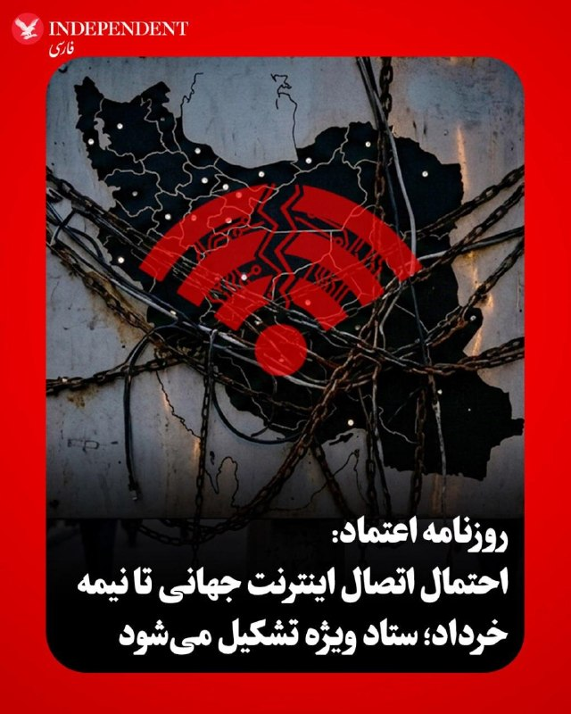

♦️روزنامه اعتماد گزارش داد که نخستین نشست «ستاد ویژه ساماندهی و راهبری فضای مجازی» هفته آینده به ریاست محمدرضا عارف برگزار خواهد شد. هدف اصلی این ستاد، فراهم کردن زمینه‌های لازم برای رفع محدودیت‌های فضای مجازی است تا حداکثر تا میانه خردادماه، امکان اتصال مجدد شهروندان به اینترنت بین‌المللی فراهم شود. عارف در این مسیر قصد دارد از ظرفیت نخبگان و اساتید برجسته ارتباطات نظیر هادی خانیکی و علی ربیعی استفاده کرده و میان نهادهای حاکمیتی برای بازگشت سرویس‌دهی هم‌افزایی ایجاد کند.

این در حالی است که قطع سراسری اینترنت در ایران از مرز ۱۸۰۰ ساعت (۷۶ روز) گذشته است. گزارش‌ها نشان می‌دهد که در حال حاضر یک سیستم دسترسی طبقاتی اعمال شده است که طی آن، دسترسی به شبکه جهانی تنها برای گروهی خاص میسر بوده و عموم مردم از آن محروم هستند.
‌🇸🇦 Indypersian

🤖 @VahidOOnLine

## VahidOOnLine — post 240128

  

♦️به گزارش «چوسان بیز»، کره جنوبی یک تیم فنی را برای بررسی حمله به یک کشتی باری در نزدیکی تنگه هرمز به دبی اعزام کرده است. کشتی «نامو» (Namu) که توسط شرکت HMM اداره می‌شود، در تاریخ ۱۴ اردیبهشت هدف اصابت یک موشک ناشناس قرار گرفت که انفجار آن شکافی به عمق هفت متر در بخش عقبی بدنه کشتی ایجاد کرد.

لی کیونگ‌هو، سخنگوی وزارت دفاع کره جنوبی، اعلام کرد که این تیم تحلیل فنی روز چهارشنبه راهی دبی شده است تا «تحقیقات دقیق میدانی، تحلیل شواهد و همکاری با کشورهای مرتبط برای تثبیت حقایق» را انجام داده و از فعالیت‌های تیم واکنش مشترک دولتی حمایت کند. این تیم ۱۰ نفره شامل پژوهشگرانی از موسسه دولتی تحقیقات دفاعی (ADD) است. دولت‌های امارات و کره جنوبی هر دو این حمله را محکوم کرده‌اند.
‌🇸🇦 Indypersian

🤖 @VahidOOnLine

## VahidOOnLine — post 240127

  

محمدصالح جوکار، رییس کمیسیون شوراهای مجلس، گفت جمهوری اسلامی از خطوط قرمز خود، به‌ویژه در حوزه دانش هسته‌ای و مواد غنی‌سازی‌شده، عقب‌نشینی نمی‌کند.
نماینده یزد در مجلس، گفت هدف توییت‌های مکرر ترامپ ایجاد شائبه تفرقه میان مسئولان جمهوری اسلامی و نبود تصمیم‌گیر واحد در ایران است. او افزود حتی اگر مذاکرات به نتیجه برسد هم نمی‌توان به آمریکا اعتماد کرد زیرا عملیات تخریبی و ترور همواره در دستور کار آن‌هاست.
‌🏁 🇬🇧 IranintlTV

🤖 @VahidOOnLine

## VahidOOnLine — post 240126

  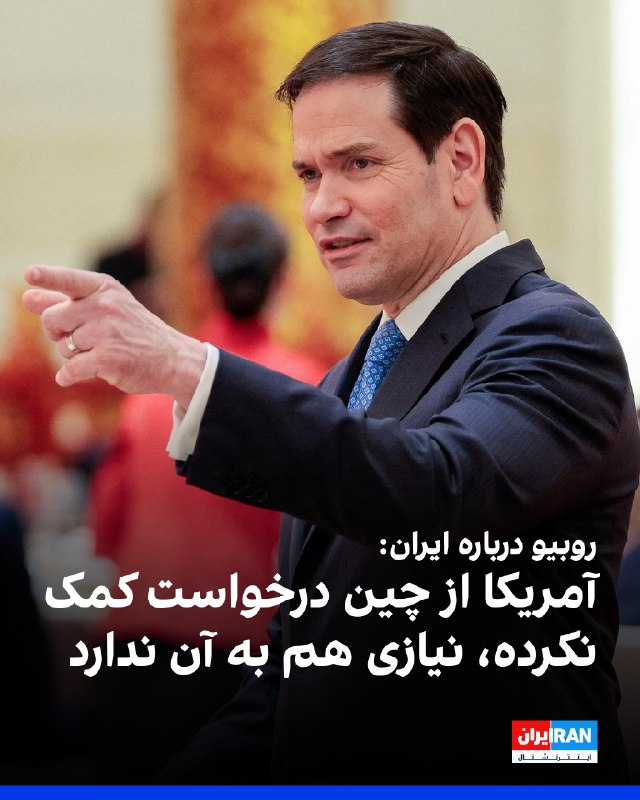

مارکو روبیو، وزیر خارجه آمریکا، در گفت‌وگو با ان‌بی‌سی نیوز گفت دونالد ترامپ در گفت‌وگو با شی جین‌پینگ موضوع ایران را مطرح کرده، اما «هیچ درخواستی از او نداشته است».

روبیو تأکید کرد آمریکا از چین درخواست کمک نکرده و نیازی هم به کمک آن ندارد.

او افزود رییس‌جمهور به‌صراحت پیام داده اگر جمهوری اسلامی تصور می‌کند می‌تواند با سوءاستفاده از فضای سیاست داخلی آمریکا، او را به پذیرش توافقی نامطلوب وادار کند، سخت در اشتباه است.
‌🏁 🇬🇧 IranintlTV

🤖 @VahidOOnLine

## VahidOOnLine — post 240125

♦️عباس عراقچی، وزیر امور خارجه جمهوری اسلامی که برای شرکت در نشست وزرای خارجه کشورهای عضو بریکس به دهلی نو سفر کرده است روز پنجشنبه ۲۴ اردیبهشت در حاشیه این نشست با وزرای خارجه مالزی و برزیل دیدار کرد.
به گزارش خبرگزاری مهر  موضوعات دو جانبه و همچنین مسائل مربوط به بریکس از جمله محورهای دیدار «محمدحسن» وزیر خارجه مالزی با عباس عراقچی بود.
مائورو ویرا وزیر خارجه برزیل هم در دیدار با عراقچی ضمن محکوم کردن حملات آمریکا علیه ایران، بر آمادگی کشورش برای ایفای نقش در حل بحران در منطقه خلیج فارس تاکید کرد.
وزرای خارجه روسیه، مصر، برزیل، هند، آفریقای جنوبی از جمله مقامهای ارشد دیپلماتیکی هستند که در این نشست حضور دارند.
عراقچی در حالی در این اجلاس شرکت می‌کند که مساله ادامه بسته بودن تنگه هرمز، به یکی از چالش‌های جدی بین‌المللی تبدیل شده است.
هند که از بنیانگذاران بریکس و یکی از بزرگ‌ترین واردکنندگان نفت از کشورهای خاورمیانه است، از زمان آغاز جنگ و به‌دلیل کاهش واردات سوخت، مجبور به صرفه‌جویی و اتخاذ سیاست‌های ویژه پولی و بانکی شده است.
‌🇸🇦 Indypersian

🤖 @VahidOOnLine

## VahidOOnLine — post 240123

  <a href="telegram/content/VahidOOnLine_240123_1778769005.mp4" target="_blank">🎬 Download video</a>

الجزیره گزارش داد نمایندگان لبنان و اسرائیل برای دور تازه‌ای از گفت‌وگوها به ساختمان وزارت خارجه آمریکا در واشنگتن رسیده‌اند.
این مذاکرات مستقیم روزهای پنج‌شنبه و جمعه برگزار می‌شود و مقام‌های دیپلماتیک لبنان، اسرائیل و همچنین مقام‌های آمریکایی در آن حضور خواهند داشت.
‌🏁 🇬🇧 ManotoTV

🤖 @VahidOOnLine

## VahidOOnLine — post 240122

  <a href="telegram/content/VahidOOnLine_240122_1778769006.mp4" target="_blank">🎬 Download video</a>

فیفا در یک پست اینستاگرامی اعلام کرد که شکیرا، مدونا و سوپراستارهای کی‌پاپ گروه بی‌تی‌اس اجرای نخستین نمایش بین دو نیمه فینال جام جهانی را بر عهده خواهند داشت.
فینال جام جهانی قرار است ۱۹ ژوئیه در ورزشگاه مت‌لایف در نیوجرسی برگزار شود و انتظار می‌رود علاوه بر تماشاگران حاضر در ورزشگاه، میلیون‌ها بیننده در سراسر جهان آن را تماشا کنند.
جام جهانی ۲۰۲۶ از ۱۱ ژوئن در مکزیکوسیتی آغاز می‌شود و مسابقات آن در شهرهای مختلفی در آمریکا، کانادا و مکزیک برگزار خواهد شد.
‌🏁 🇬🇧 ManotoTV

🤖 @VahidOOnLine

## VahidOOnLine — post 240121

  

قاسم روانبخش، عضو هیات رییسه کمیسیون امور داخلی کشور و شوراها در مجلس، گفت نقشه راه جمهوری اسلامی کاملا روشن است و دستگاه دیپلماسی موظف است دقیقا بر مبنای ۱۰ شرط شورای عالی امنیت ملی که مورد تایید مجتبی خامنه‌ای است، حرکت کند.
قاسم روانبخش گفت عقب‌نشینی از ۱۰ شرط شورای عالی امنیت ملی یا افزایش سقف مطالبات طرف مقابل، باعث جری‌تر شدن دشمن و تشدید زیاده‌خواهی‌های او خواهد شد و افزود: «وظیفه مسئولان است که به طرف مقابل بفهمانند اگر مسیر عقلانیت را انتخاب نکند، جمهوری اسلامی ابزارهای دیگری در اختیار دارد»
قاسم روانبخش گفت: «ترامپ زبان دیپلماسی را نمی‌فهمد و تنها زبانی که به خوبی درک می‌کند، زبان موشک و قدرت نظامی است» او افزود ترامپ در شرایطی راهی پکن شد که ابهت ناوها و ناوشکن‌های آمریکا با موشک‌های جمهوری اسلامی در هم شکست.
‌🏁 🇬🇧 IranintlTV

🤖 @VahidOOnLine

## VahidOOnLine — post 240120

  

♦️به گزارش «چوسان بیز»، کره جنوبی یک تیم فنی را برای بررسی حمله به یک کشتی باری در نزدیکی تنگه هرمز به دبی اعزام کرده است. کشتی «نامو» (Namu) که توسط شرکت HMM اداره می‌شود، در تاریخ ۱۴ اردیبهشت هدف اصابت یک موشک ناشناس قرار گرفت که انفجار آن شکافی به عمق هفت متر در بخش عقبی بدنه کشتی ایجاد کرد.

لی کیونگ‌هو، سخنگوی وزارت دفاع کره جنوبی، اعلام کرد که این تیم تحلیل فنی روز چهارشنبه راهی دبی شده است تا «تحقیقات دقیق میدانی، تحلیل شواهد و همکاری با کشورهای مرتبط برای تثبیت حقایق» را انجام داده و از فعالیت‌های تیم واکنش مشترک دولتی حمایت کند. این تیم ۱۰ نفره شامل پژوهشگرانی از موسسه دولتی تحقیقات دفاعی (ADD) است. دولت‌های امارات و کره جنوبی هر دو این حمله را محکوم کرده‌اند.
‌🇸🇦 Indypersian

🤖 @VahidOOnLine

## VahidOOnLine — post 240119

🗣روایت شما از بحران اقتصادی و زندگی در آتش‌بس- پنج‌شنبه ۲۴ اردیبهشت:

🔹تعجب می‌کنم برخی می‌گن چرا تامین اجتماعی فلان کرد، چرا اداره کار بهمان کرد. جمهوری اسلامی هیچ‌وقت معیشت مردم براش مهم نبود و حتی خیریه‌ها و موسسه‌های مردم‌نهاد و مستقل رو از بین برد تا همه وابسته به خودش باشند و همه چیز رو کنترل بکنند.

🔹واقعا نگران بچه‌های مدرسه‌ای مقطع هفتم تا دوازدهم هستیم. کلاس‌ها اصلا کیفیت نداشته و شرایط روانی‌شون هم اصلا خوب نیست.

🔹چند شیفت کار سنگین می‌کنیم ولی بی‌پولیم.

🔹از اندیشه: قیمت‌ها سر به فلک کشیده، نون تافتون که ۵ هزار تومان بود، ۱۰ هزار تومان شده. داروها نیز بسیار کمیاب شده‌اند.

🔹حکومت می‌گه جنس هست و کمبودی در کار نیست، مثل اینه که من برم پشت ویترین طلافروشی و نتونم بخرم.

🔹قدرت اول منطقه حتی نمی‌تونه بسته‌های پستی رو به جزیره خارک برسونه و جرات ارسال مرسولات پستی به خارک رو نداره.
‌🏁 🇬🇧 IranintlTV

🤖 @VahidOOnLine

## VahidOOnLine — post 240118

  

سنتکام اعلام کرد نیروهای آمریکایی در عملیات محاصره بنادر ایران، تاکنون ۷۰ کشتی تجاری را مجبور به تغییر مسیر کرده و ۴ کشتی را از کار انداخته‌اند.
پیش‌تر سنتکام، با انتشار تصویری از گشت‌زنی یک جنگنده پنهان‌کار اف-۳۵-ای نیروی هوایی بر فراز آب‌های منطقه‌ای نزدیک تنگه هرمز خبر داد.
‌🏁 🇬🇧 IranintlTV

🤖 @VahidOOnLine

## VahidOOnLine — post 240116

  <a href="telegram/content/VahidOOnLine_240116_1778769008.mp4" target="_blank">🎬 Download video</a>

خبرگزاری حکومتی فارس وابسته به سپاه پاسداران از قول یک منبع آگاه اعلام کرد جمهوری اسلامی با عبور تعدادی از کشتی‌های چینی از تنگه هرمز، در چارچوب «پروتکل مدیریت ایرانی تنگه»، موافقت کرده است.
به گفته این منبع، پس از رایزنی‌های وزیر خارجه چین و سفیر پکن در تهران، دو کشور درباره تسهیل عبور برخی کشتی‌های چینی به توافق رسیدند و این روند از شامگاه گذشته آغاز شده است.
بر اساس این گزارش، عبور این کشتی‌ها پس از هماهنگی با مقام‌های جمهوری‌اسلامی و پذیرش ضوابط تعیین‌شده از سوی تهران انجام می‌شود.
‌🏁 🇬🇧 ManotoTV

🤖 @VahidOOnLine

## VahidOOnLine — post 240115

  

علی مطهری، نایب‌رییس پیشین مجلس، گفت: «امارات متحده عربی خبیث‌ترین کشور خلیج فارس است و به اسرائیل نزدیک شده است.»
او افزود: «اتکای امارات به حمایت آمریکا باعث شده علیه جمهوری اسلامی موضع‌گیری کند و در صورت تضعیف موقعیت آمریکا، امارات نیز سر عقل خواهد آمد.»
‌🏁 🇬🇧 IranintlTV

🤖 @VahidOOnLine

## WithYashar — post 11217

  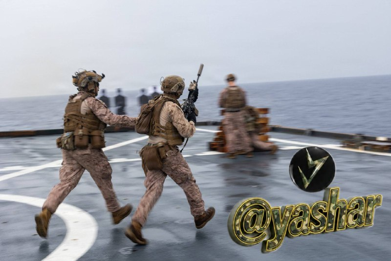

INDOPACOM، فرماندهی نظامی آمریکا برای منطقهٔ «هندو-پاسیفیک»ایندوپکام: تفنگداران دریایی ایالات متحده، واحد یازدهم اعزامی تفنگداران دریایی، در حال انجام تیراندازی رزمی بر روی ناو جنگی یو اس اس کامستاک (LSD 45) در اقیانوس هند هستند. واحد یازدهم اعزامی دریایی، که بر روی گروه آماده آبی-خاکی باکسر(USS BOXER) مستقر شده است، یک نیروی پایدار و قابل اعتماد رزمی است که به بازدارندگی و واکنش به بحران در منطقه عملیاتی ناوگان هفتم ایالات متحده کمک می‌کند.
@withyashar
یاشار: ساده بگم ناو باکسر وسط راه مونده داره تمرین میکنه و معلوم نیست کی بیاد !

## WithYashar — post 11215

  <a href="telegram/content/WithYashar_11215_1778769009.mp4" target="_blank">🎬 Download video</a>

گوشیT1 "ترامپ موبایل" بعد از نزدیک
یه سال تأخیر بالاخره داره عرضه میشه
یه گوشی طلایی ۴۹۹ دلاری با برند ترامپه که
چیپ اسنپدراگون سری ۷، رم ۱۲ گیگ، حافظه
۵۱۲ گیگ و دوربین سه‌گانه ۵۰ مگاپیکسلی دارهبه نظر میاد در اصل یه گوشی ساخت چین باشه که فقط مونتاژ نهاییشو تو آمریکا انجام دادن
@withyashar

## WithYashar — post 11214

مارکو روبیو : ترامپ موضوع ایران رو با چین مطرح کرد و این خیلی مهم بود

طرف چینی گفت ما موافق نظامی‌کردن تنگه هرمز نیستیم
با سیستم عوارض‌گیری هم مخالفیم، و این موضع ما هم هست
@withyashar

## WithYashar — post 11213

وزیر خزانه داری آمریکا:ایران رو انقدر تحت فشار اقتصادی قرار دادیم که توی پرداخت حقوق نیروهاشم به مشکل خورده. دارن نفسای آخرشونو میکشن
@withyashar

## WithYashar — post 11212

  <a href="telegram/content/WithYashar_11212_1778769011.mp4" target="_blank">🎬 Download video</a>

وزیر دفاع اسرائیل، اسرائیل کاتز درباره ایران:

ماموریت ما کامل نشده است.ما برای احتمال اینکه ممکن است مجبور شویم دوباره اقدام کنیم - شاید حتی به زودی - آماده‌ایم. اگر اهداف تأمین نشوند، دوباره اقدام خواهیم کرد.
@withyashar

## WithYashar — post 11211

  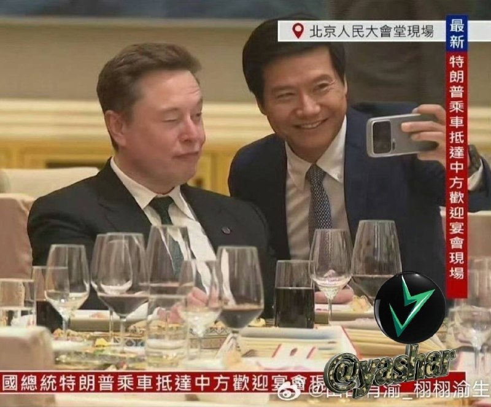

سلفی لی جون، بنیانگذار و مدیرعامل شیائومی با ایلان ماسک
@withyashar

## WithYashar — post 11210

الجزیره: چین با آمریکا در مورد ایران انعطاف دارد، اما در مورد تایوان نه

مسئولان چینی پیام واضحی به ایالات متحده ارسال کرده‌اند:
چین در بسیاری از مسائل مانند ایران، تجارت و فناوری آماده انعطاف و پذیرش اختلاف نظر است، اما در یک موضوع حساس، انعطاف‌پذیر نیست و آن تایوان است.
@withyashar

## WithYashar — post 11209

  <a href="telegram/content/WithYashar_11209_1778769013.mp4" target="_blank">🎬 Download video</a>

ایلان لوله لول سر میز شمام 😂
@withyashar

## WithYashar — post 11208

وزیر خزانه‌داری آمریکا:
تأسیسات اصلی بارگیری نفت ایران به مدت ۳ روز است از سرویس خارج شده است
@withyashar

## WithYashar — post 11207

خبرنگار صداوسیما به نقل از نیروی دریایی سپاه: از شب گذشته تاکنون ۳۰ فروند کشتی از تنگه هرمز با مجوز ایران عبور کرده‌اند
@withyashar

## WithYashar — post 11206

شی جین‌پینگ: چین و ایالات متحده هر دو از همکاری سود می‌برند و از تقابل زیان می‌بینند.

دو کشور ما باید شریک باشند نه رقیب.
@withyashar

## WithYashar — post 11205

ترامپ از رئیس‌جمهور چین برای سفر به ایالات متحده در ماه سپتامبر آینده دعوت کرد
@withyashar

## WithYashar — post 11204

آکسیوس: یکی از گزینه‌های ترامپ پس از بازگشت از چین از سر گیری پروژه آزادی در تنگه هرمز است. گزینه دیگر ترامپ حمله به زیرساخت‌های ایرانه.
@withyashar

## WithYashar — post 11203

طبق برنامه ای که قرار داده بودیم ترامپ و رییس‌جمهور چین برای یک مهمانی شام با یکدیگر دیدار کردند @withyashar

## WithYashar — post 11202

  <a href="telegram/content/WithYashar_11202_1778769015.mp4" target="_blank">🎬 Download video</a>

برنامه های ترامپ با حاکم چین به این ترتیبه : مراسم استقبال تو تالار بزرگ خلق چهارشنبه رسیدن به پکن ، استقرار و استراحت پنج شنبه ۱۴ مه - ملاقات با شی - ضیافت دولتی با شی جمعه تاریخ ۱۵ مه - جلسه عکس با شی- چای با شی - ناهار با شی و حرکت از پکن به آمریکا، @withyashar

## WithYashar — post 11201

## WithYashar — post 11200

فارس: عبور کشتی‌های چینی از تنگۀ هرمز از شب گذشته اغاز شده
@withyashar
یک کشتی ژاپنی هم اجازه عبور گرفت

## WithYashar — post 11199

کاخ سفید اعلام کرد در دیدار ترامپ و شی جین‌پینگ، دو طرف بر باز ماندن تنگه هرمز و تقویت همکاری‌های اقتصادی توافق کردند. این توافق شامل افزایش سرمایه‌گذاری چین در صنایع آمریکا و گسترش دسترسی شرکت‌های آمریکایی به بازار چین است.

ترامپ: مذاکرات پکن بسیار مثبت و سازنده بود
@withyashar

## WithYashar — post 11198

با رفیق اروپاییم نشستیم داریم ویدیو مسیج های شما رو نگاه میکنیم براش ترجمه میکنم که داری چی میگی، بعد یهو میگه اینجا چی گفت، خب من چجوری گربه گیر رو ترجمه کنم😂😂😂😂😂 عشقی سلطان یاشار❤️❤️

## WithYashar — post 11197

با رفیق اروپاییم نشستیم داریم ویدیو مسیج های شما رو نگاه میکنیم براش ترجمه میکنم که داری چی میگی، بعد یهو میگه اینجا چی گفت، خب من چجوری گربه گیر رو ترجمه کنم😂😂😂😂😂
عشقی سلطان یاشار❤️❤️

## mwarmonitor — post 9088

  

🔸۵ روز پس از آنکه در نزدیکی بندر شهر جاسک هدف حمله نیروهای آمریکایی قرار گرفتند، هنوز وضعیت دو نفتکش ایرانی بحرانی است.

🔹یکی از نفتکش‌های غول‌پیکر VLCC همچنان در آتش می‌سوزد و دود غلیظی از یکی از کشتی‌ها به هوا بلند شده و قابل مشاهده است.

🔸نفتکش دوم نیز در حال نشت حجم زیادی از نفت سنگین (fuel oil) به داخل آب است.

@mwarmonitor

## mwarmonitor — post 9087

  

🔴روز هشتم است که ایران هیچ نفت خامی در جزیره خارگ بارگیری نکرده است. ذخایر نفت در خشکی اکنون تقریباً به ظرفیت کامل رسیده‌اند. به‌احتمال زیاد یکی از خطوط لوله آسیب دیده است. ایران در حال تلاش برای یافتن نوعی راه‌حل جایگزین است. هیچ نفتکش VLCC اجازه ورود پیدا نکرده است به‌دلیل محاصره آمریکا، بنابراین ایران در گزینه‌های خود محدود شده است.

@mwarmonitor

## mwarmonitor — post 9085

  

✈️🇺🇸نیروی هوایی آمریکا (USAF) 🚨 وضعیت اضطراری عمومی

⏱ساعت ۱۴:۳۹ – پرواز HITMAN 02 یک فروند Lockheed Martin F-35 Lightning II با علامت «LN» در حال بازگشت به پایگاه RAF Lakenheath است و به‌دلیل مشکل در سیستم فشار کابین (pressurisation) وضعیت اضطراری اعلام کرده است.

✈️این هواپیما کد اضطراری 7700 را روی ترانسپوندر (squawk 7700) ارسال کرده که به معنی اعلام وضعیت اضطراری عمومی در پرواز است.

🔸هواپیما با شماره بدنه 13-5067 به‌عنوان یک F-35A شناسایی شده است.

@mwarmonitor

## mwarmonitor — post 9084

  <a href="telegram/content/mwarmonitor_9084_1778769018.mp4" target="_blank">🎬 Download video</a>

🇺🇸سرمایه‌گذاری ۱.۵ تریلیون دلاری، یک پیش‌پرداخت نسلی برای دفاع ملی آمریکا است.

🔸این سرمایه‌گذاری تضمین می‌کند که ایالات متحده برای نسل‌های آینده، برتری قاطع نظامی و توان بازدارندگی بی‌رقیب خود را در برابر هر دشمنی حفظ کند.

@mwarmonitor

## mwarmonitor — post 9083

  

🇺🇸شهادت در مورد وضعیت فرماندهی مرکزی ایالات متحده (سنتکام) 🔸«من قویاً باور دارم که هر موفقیتی که به دست می‌آوریم با نیروهایمان آغاز می‌شود و با آن‌ها پایان می‌یابد. تنها در ۷ ماه گذشته، فرزندان دختر و پسر آمریکا که در سنتکام خدمت می‌کنند، نقش‌های کلیدی در…

## mwarmonitor — post 9082

  

🇺🇸دریادار برد کوپر، فرمانده فرماندهی مرکزی ایالات متحده (CENTCOM)، صبح امروز درباره وضعیت و آرایش عملیاتی سنتکام در کنگره شهادت خواهد داد. @mwarmonitor

## mwarmonitor — post 9081

  

🇺🇸کمک کنید تا در جریان درآمدی سپاه پاسداران انقلاب اسلامی (IRGC) اختلال ایجاد کنیم.

🔸برای ما درباره این افراد اطلاعات/نکته ارسال کنید؛ کسانی که این شرکت تولیدکننده پهپاد را مدیریت می‌کنند.

@mwarmonitor

## mwarmonitor — post 9080

  

🇺🇸یک ناو جنگی آبی - خاکی uss makin مستقر در سن‌دیگو در حال آماده‌سازی برای اعزام به خاورمیانه است، در حالی که ملوانان کالیفرنیایی برای اعزام آماده می‌شوند. نیویورک پست

@mwarmonitor

## mwarmonitor — post 9079

  

🇺🇸یک بالگرد سی‌هاوک (Sea Hawk) متعلق به اسکادران Helicopter Maritime Strike Squadron 50 بر روی عرشه پرواز ناوشکن USS Truxtun (DDG-103) فرود می‌آید؛ در حالی‌ که این شناور در حال عبور از دریای عرب است و از محاصره دریایی ایالات متحده علیه ایران پشتیبانی می‌کند.

🔸بر اساس آخرین آمار، نیروهای سنتکام تا امروز مسیر ۷۰ کشتی تجاری را تغییر داده و ۴ فروند شناور را برای اطمینان از رعایت مقررات از کار انداخته‌اند.

@mwarmonitor

## mwarmonitor — post 9078

🇺🇸وزارت بازرگانی ایالات متحده آمریکا فروش تراشه‌های هوش مصنوعی H200 شرکت انویدیا را به ۱۰ شرکت چینی، در قالب مجوزهایی که برای هر مشتری تا سقف ۷۵ هزار تراشه را اجازه می‌دهد، تأیید کرده است. با وجود این تأییدها، تاکنون هیچ محموله‌ای ارسال نشده است.

@mwarmonitor

## mwarmonitor — post 9077

  

🇺🇸دریادار برد کوپر، فرمانده فرماندهی مرکزی ایالات متحده (CENTCOM)، صبح امروز درباره وضعیت و آرایش عملیاتی سنتکام در کنگره شهادت خواهد داد.

@mwarmonitor

## mwarmonitor — post 9075

🔴گزارش تری یینگست خبرنگار فاکس نیوز (Trey Yingst) از تل‌آویو

🔸تری یینگست: بله بچه‌ها، صبح بخیر. ببینید، چینی‌ها بزرگترین واردکننده نفت خام ایران در جهان هستند و احتمالاً رئیس‌جمهور ترامپ این موضوع را در طول گفتگوهای جاری خود در پکن مطرح کرده است. وقتی به اقدامات نظامی ایران در تنگه هرمز و برنامه هسته‌ای این کشور نگاه می‌کنیم، هر دو مستقیماً از طریق همین صادرات نفت تأمین مالی می‌شوند.
گزارش‌های امروز صبح نشان می‌دهد که ایران کشتی دیگری را در سواحل امارات متحده عربی توقیف کرده است. وزیر امور خارجه، مارکو روبیو، به شان هنیتی (Sean Hannity) در فاکس نیوز گفت که چینی‌ها باید نقش فعال‌تری در وادار کردن ایران به تغییر مسیر ایفا کنند.

📌صحبت‌های مارکو روبیو (وزیر امور خارجه)

🔸مارکو روبیو: از آنجایی که اقتصاد بسیاری از کشورهای جهان به دلیل این بحران در تنگه‌ها در حال فروپاشی است، آن‌ها محصولات چینی کمتری خواهند خرید و صادرات چین به شدت کاهش خواهد یافت. بنابراین، حل این موضوع به نفع خود آن‌هاست. ما امیدواریم آن‌ها را متقاعد کنیم که نقش فعال‌تری ایفا کرده و ایران را وادار کنند تا از اقداماتی که در حال حاضر در خلیج فارس انجام می‌دهد، دست بکشد.

📌صحبت‌های جی.دی. ونس (معاون رئیس‌جمهور)

🔸تری یینگست: در مورد احتمال توافق از طریق مذاکره، معاون رئیس‌جمهور، جی.دی. ونس، اشاره کرد که در هفته‌های اخیر پیشرفت‌هایی حاصل شده است، اما این سوال باقی می‌ماند که آیا این پیشرفت برای جلوگیری از شروع مجدد جنگ کافی است یا خیر.
🔴جی.دی. ونس: من می‌خواهم بتوانم در چشم مردم آمریکا نگاه کنم و با اطمینان بگویم که دیگر لازم نیست نگران دسترسی این رژیم بسیار خطرناک به خطرناک‌ترین سلاح‌های جهان باشید. این هدفی است که ما روی آن تمرکز کرده‌ایم. باز هم می‌گویم، راه‌های زیادی برای دستیابی به این هدف وجود دارد؛ رئیس‌جمهور فعلاً ما را در مسیر دیپلماتیک قرار داده است و این چیزی است که من روی آن تمرکز دارم.

🇮🇷صحبت‌های عباس عراقچی (وزیر امور خارجه ایران)

🔸تری یینگست: ایرانی‌ها در بحبوحه تنش‌های فزاینده در منطقه، همچنان به سخنرانی و تهدید ادامه می‌دهند. وزیر امور خارجه ایران گفت که این کشور هم برای دیپلماسی و هم برای جنگ آماده است.
🔹عباس عراقچی: ما همان‌طور که آماده‌ایم با تمام قوا از آزادی و خاک خود دفاع کنیم، به همان اندازه آماده‌ایم که دیپلماسی را دنبال کرده و از آن دفاع کنیم. همان‌طور که بارها اعلام کرده‌ام، هیچ راه حل نظامی برای هیچ موضوعی در رابطه با ایران وجود ندارد. ما ایرانی‌ها هرگز در برابر هیچ فشار یا تهدیدی سر خم نمی‌کنیم، اما به زبان احترام، با احترام پاسخ می‌دهیم.

🔴تری یینگست: در اینجا در اسرائیل، درگیری علیه بزرگترین نیروی نیابتی ایران، یعنی حزب‌الله در جنوب لبنان ادامه دارد. این گروه اوایل امروز پهپادهایی را به سمت مرز پرتاب کرد که منجر به زخمی شدن سه نفر در شمال اسرائیل شد. بچه‌ها؟

🔰مجری استودیو: واو، اتفاقات زیادی در آنجا در جریان است. تری، وقتی این نشست (در چین) تمام شود، همه نگاه‌ها به کارهایی خواهد بود که شما الان انجام می‌دهید. اما در حال حاضر تمرکز روی چین و چگونگی ارتباط آن با ایران است.

@mwarmonitor

## mwarmonitor — post 9074

  <a href="telegram/content/mwarmonitor_9074_1778769022.mp4" target="_blank">🎬 Download video</a>

🎬 Video

## mwarmonitor — post 9073

🇺🇸وزیر خزانه‌داری ایالات متحده، بَسِنت، درباره ایران گفت:
«ما معتقدیم به نقطه‌ای رسیده‌ایم که ایران نه به سربازانش حقوق می‌دهد و نه ذخایر تسلیحاتی خود را از خارج تأمین و تجدید می‌کند.»

@mwarmonitor

## mwarmonitor — post 9072

  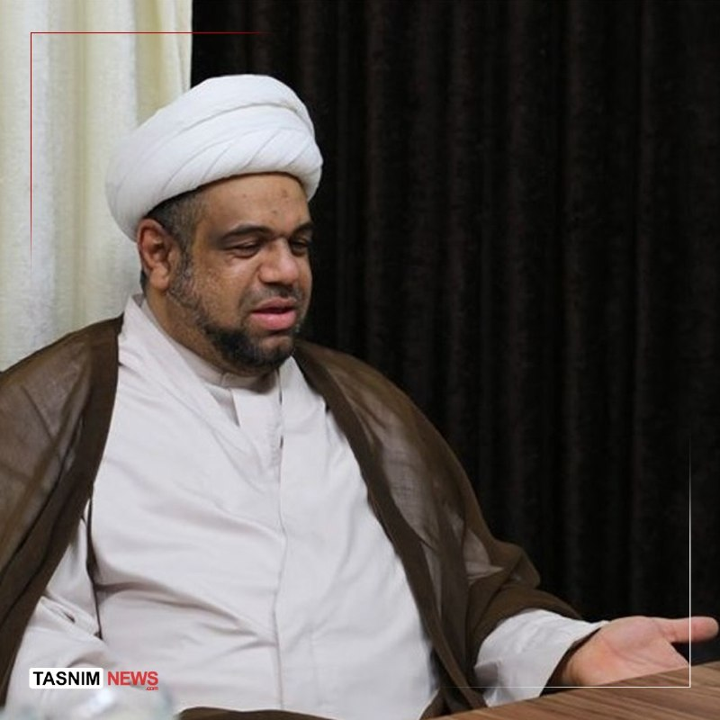

🔸عالم مبارز بحرینی: آل خلیفه اگر از خصومت با ملت بحرین دست برندارند، ساقط خواهند شد

🔹«عبدالله الدقاق» به‌دنبال تشدید سرکوبگری رژیم آل‌خلیفه در قالب شکنجه، پیگرد و سلب تابعیت شهروندان بحرینی به ویژه علما و مداحان، یک نشست مطبوعاتی برگزار کرد.

📝در این قاب، با موجودی روبه‌رو هستیم که با وقاحت تمام، ژستِ حق‌به‌جانب گرفته و برای دیگران حکم سقوط صادر می‌کند. این انتر که به اسم «عالم مبارز» معرفی شده، در واقع یک گوریلِ قلمروطلب است که بوی گندِ تفکراتش حتی از پشت عکس هم به مشام می‌رسد؛ موجودی که دقیقاً مثل اجداد وحشی‌اش در ۱۴۰۰ سال پیش، تنها هنرش تبدیل «علم» به ابزاری برای کشت و کشتار و سلاخیِ منتقدان است. این آخوند صادراتی، در حالی که خودش تجسمِ شکنجه و سلب آزادی است، با وقاحتی بی‌مرز از «حقوق بشر» دم می‌زند تا روی ماهیت کثیف و فرقه‌ای خود سرپوش بگذارد . فاجعه اینجاست که این جانور، هر نکبت و فلاکتی را به پروژه‌های خارجی ربط می‌دهد، در حالی که خودش و آن عمامه‌ی ننگینش، بزرگ‌ترین ویروس برای موجودیت و امنیت بشریت هستند.

@mwarmonitor

## mwarmonitor — post 9071

🇨🇳🇺🇸دونالد ترامپ، رئیس‌جمهور چین، شی جین‌پینگ را برای بازدید از کاخ سفید در تاریخ ۲۴ سپتامبر دعوت کرد.

@mwarmonitor

## mwarmonitor — post 9070

📝از "هزار پدر" تا "بی‌پدر": وقتی شی‌جین‌پینگ با یک لبخند به ترامپ، یتیم‌خانه‌ی سایبری‌ها را به آتش می‌کشد.

🔰وقاحتِ این جماعتِ جیره‌خوار زمانی به اوج می‌رسد که می‌بینند «پدرِ معنوی‌شان» در پکن، برای همان ترامپی که شب و روز در رویاهایشان ترورش می‌کردند، فرشِ قرمز پهن کرده و با شکوهی بی‌سابقه از او پذیرایی می‌کند. حالا که سوزشِ این حقیقتِ عریان به جانشان افتاده، طبقِ معمولِ آن ذاتِ دروغ‌گویشان، به آب و آتش می‌زنند تا با روایت‌هایِ مضحک، این «تعظیمِ دیپلماتیکِ چین» را به عنوانِ «تحقیرِ آمریکا» به خوردِ مخاطبِ مفلوکشان بدهند. این اراذلِ سایبری که هنوز فرقِ میانِ "نزاکتِ ابرقدرت‌ها" و "نوکریِ حقیرانه" را نمی‌فهمند، سعی دارند با واژه‌هایی مثل «دیکته کردنِ دیپلماسی»، رویِ این واقعیت سرپوش بگذارند که چین، برخلافِ تصورِ این‌ها، به دنبالِ تجارت با کدخداست، نه گداییِ رفاقت با یک نظامِ منزوی و ورشکسته.

🔸تصویرِ ترامپ در شهرِ ممنوعه، برای این هزارپدرانِ نظام مثلِ پاشیدنِ نمک روی زخمِ "عزتِ نداشته‌شان" است؛ آن‌ها که کلِ دیپلماسی‌شان به گشت‌زنی در مخروبه‌های ونزوئلا و گرفتنِ عکسِ یادگاری با شبه‌نظامیانِ گمنام خلاصه شده، حالا چنان از استقبالِ باشکوهِ شی‌جین‌پینگ از ترامپ گیج شده‌اند که از شدتِ استیصال، به هذیان‌گویی روی آورده‌اند. چقدر باید یک موجود حقیر باشد که ببیند اربابش دارد با دشمنِ خونی‌اش در بالاترین سطحِ ممکنِ تشریفات لبخند می‌زند و ناهار می‌خورد، اما باز هم با وقاحتِ تمام رو به دوربین کند و بگوید: «نه، ببینید چطور با کلاسِ بالا ترامپ را تحقیر کردند!». این اوجِ حقارتِ یک "برده‌ی فکری" است که حتی وقتی صاحبش او را نادیده می‌گیرد و با رقیب دستِ دوستی می‌دهد، باز هم دنبالِ راهی می‌گردد تا از این فضاحت، یک "پیروزیِ خیالی" بسازد. حقیقت این است که دنیای واقعیِ قدرت، فرسنگ‌ها با حجره‌های تاریکِ پروپاگاندای این‌ها فاصله دارد و این جیره‌خوارانِ مفلوک، تنها چیزی که از این استقبالِ باشکوه نصیبشان شده، دود و سوزشی است که هیچ "دیپلماسیِ چینی" قادر به خاموش کردنش نیست.

@mwarmonitor

## mwarmonitor — post 9069

  

🇮🇳هند اعلام کرد که یک کشتی با پرچم هند روز چهارشنبه در سواحل عمان مورد حمله قرار گرفته است.
🚢این کشتی پیدا نشده و احتمالاً با سامانه AIS خاموش در حال تردد بوده است. همچنین از چند هفته پیش یک ناو جنگی هندی برای حفاظت از کشتی‌های این کشور در دریای عمان مستقر است.

@mwarmonitor

## mwarmonitor — post 9068

  

✈️📡 هواپیمای P-8A پوزایدون نیروی دریایی US Navy در سواحل پاکستان فعال بوده و احتمالاً در حال پایش نفتکش‌های ایرانی لنگرگرفته در آن منطقه بوده است.

@mwarmonitor

## mwarmonitor — post 9067

  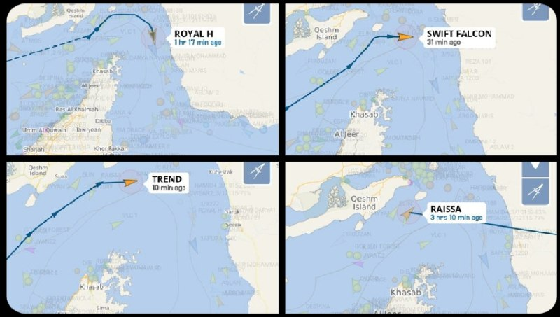

🔴عبور از تنگه هرمز صبح امروز:

🚢• نفتکش گاز مایع (LPG) «ROYAL H» که تحت تحریم‌های آمریکا قرار دارد
🚢• نفتکش نفت «SWIFT FALCON» متعلق به چین
🚢• نفتکش نفت «TREND» با ثبت امارات (اما نه با مالکیت اماراتی)
🚢• نفتکش نفت «RAISSA» متعلق به چین

🔸احتمالاً شناوری که توقیف شد، به‌صورت پنهانی در حال حرکت بوده است.

@mwarmonitor

## FoxNewsTwitter — post 341732

  

Fox News (Twitter/X)

WATCH LIVE: Linda McMahon faces House lawmakers on Trump's education agenda https://twitter.com/i/broadcasts/1AxRnawQVkgxl

## FoxNewsTwitter — post 341731

  

Fox News (Twitter/X)

WATCH LIVE: House Judiciary subcommittee holds hearing on Fairfax County's sanctuary policies https://twitter.com/i/broadcasts/1dGYljYZaLZKX

## FoxNewsTwitter — post 341730

  <a href="telegram/content/FoxNewsTwitter_341730_1778769027.mp4" target="_blank">🎬 Download video</a>

Fox News (Twitter/X)

A judge in Cook County, IL revealing that authorities have lost track of hundreds of individuals on ankle monitors currently awaiting trial - nearly 10% of the whole program.

Officials warning the current system has serious flaws, citing cases where monitored individuals ignored violations and went on to commit violent crimes, @MikeTobinFox reports. | @SandraSmithFox @AmericaNewsroom

## FoxNewsTwitter — post 341729

  

Fox News (Twitter/X)

The Army has recovered the remains of Spc. Mariyah Symone Collington, 19, the second U.S. soldier who went missing during an off-duty hike in Morocco after a military exercise.

The remains of another soldier, 1st Lt. Kendrick Lamont Key Jr., were recovered last week.

Both soldiers were reported missing May 2 after participating in African Lion exercises and are believed to have fallen from a coastal cliff, ending a challenging multinational search effort.

## FoxNewsTwitter — post 341728

‌Fox News (Twitter/X)

Read more:

## FoxNewsTwitter — post 341727

  

Fox News (Twitter/X)

A New Hampshire woman claims Planet Fitness canceled her membership and called the police after she reported seeing a man in the women's locker room.

The gym reportedly labeled her "transphobic" for raising safety concerns, highlighting the ongoing national debate over "inclusive" locker room policies.

## FoxNewsTwitter — post 341726

  <a href="telegram/content/FoxNewsTwitter_341726_1778769030.mp4" target="_blank">🎬 Download video</a>

Fox News (Twitter/X)

Among the suits and billion-dollar conversations during President Trump's high-stakes Chinese trip, one guest stood out.

Elon Musk’s son was seen wandering through a massive hall in China with his father as major CEOs gathered for high-level meetings.

## FoxNewsTwitter — post 341725

  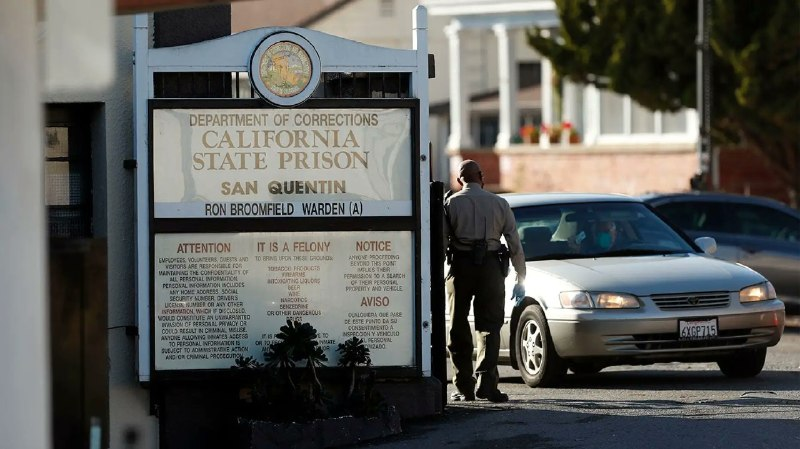

Fox News (Twitter/X)

Porn on taxpayer-funded tablets — that’s what some California death row inmates are reportedly watching.

Over 90,000 devices were handed out as part of a multimillion-dollar program meant to connect prisoners with family and provide educational resources. Instead, reports say they’re also being used for explicit content and sexual conversations.

## FoxNewsTwitter — post 341724

  

Fox News (Twitter/X)

RT @FNCGlobalNews: FOREIGN NETWORK HQ: A pro-China nonprofit under federal investigation just dropped $5.15 million on a Manhattan building to serve as its 'permanent home' for far-left organizing.

The People's Forum, tied to Shanghai-based Marxist mogul Neville Roy Singham's network, is now urging supporters to raise another $5 million to renovate the rundown property.

Lawmakers say the group's funding raises "significant concerns" about "foreign influence or control."

Story by @AsraNomani & @M_Dorgan

## FoxNewsTwitter — post 341720

Fox News (Twitter/X)

## FoxNewsTwitter — post 341716

Fox News (Twitter/X)

SEE IT: President Trump joins Chinese President Xi at a state banquet in Beijing, a formal moment centered on U.S.-China relations.

The setting emphasizes ceremony and continuity between the two nations against a backdrop of ongoing global and economic uncertainty.

## FoxNewsTwitter — post 341715

  <a href="telegram/content/FoxNewsTwitter_341715_1778769032.mp4" target="_blank">🎬 Download video</a>

Fox News (Twitter/X)

WATCH: @BretBaier goes inside a Beijing convenience store to test out their new humanoid robot worker. It's moving a little slow for now, but with 50 different locations already active, China is making a massive play for AI dominance. | @SpecialReport

## FoxNewsTwitter — post 341714

  <a href="telegram/content/FoxNewsTwitter_341714_1778769034.mp4" target="_blank">🎬 Download video</a>

Fox News (Twitter/X)

BREAKING: President Trump gives a toast to President Xi and invites him to the White House for an official visit in September:

"Thank you again, President Xi, for this beautiful welcome... It is my honor to extend an invitation to you and Madam Peng to visit us at the White House, September 24th, and we look forward to it."

"I now like to raise a glass and propose a toast to the rich and enduring ties between the American and Chinese people. It's a very special relationship, and I want to thank you again. This has been an amazing period of time. Thank you, President Xi."

## FoxNewsTwitter — post 341713

  <a href="telegram/content/FoxNewsTwitter_341713_1778769036.mp4" target="_blank">🎬 Download video</a>

Fox News (Twitter/X)

HAPPENING NOW: "The relationship between the American and Chinese people goes all the way back to America's founding. The first American consul to China, Samuel Shaw, arrived on the first American trading ship to reach these shores in 1784."

"Two and a half centuries later, that first connection has grown into one of the most consequential relationships in world history." - President Trump

## pm_afshaa — post 90742

  <a href="telegram/content/pm_afshaa_90742_1778769037.webm" target="_blank">🎬 Download video</a>

🔴نخعی، عضو کمیسیون انرژی مجلس:
با کمبود بنزین مواجهیم و سناریوهای مختلفی درحال بررسیه.

💧 Rainbet.com the #1 Non-KYC Crypto Casino & Sportsbook @rainbetcom

😁 @Pm_Afshaa

## pm_afshaa — post 90741

  <a href="telegram/content/pm_afshaa_90741_1778769038.webm" target="_blank">🎬 Download video</a>

🔴یسرائیل کاتز، وزیر دفاع اسرائیل:
ماموریت ما در ایران کامل نشده؛ اگر اهداف‌مان تامین نشه، دوباره اقدام می‌کنیم.

💧 Rainbet.com the #1 Non-KYC Crypto Casino & Sportsbook @rainbetcom

😁 @Pm_Afshaa

## pm_afshaa — post 90740

  <a href="telegram/content/pm_afshaa_90740_1778769038.webm" target="_blank">🎬 Download video</a>

🔴عارف، معاون اول پزشکیان: به هیچ قیمتی کنترل تنگه هرمز رو از دست نمیدیم.

💧 Rainbet.com the #1 Non-KYC Crypto Casino & Sportsbook @rainbetcom

😁 @Pm_Afshaa

## pm_afshaa — post 90739

🔴وزیر خزانه داری آمریکا:ایران رو انقدر تحت فشار اقتصادی قرار دادیم که توی پرداخت حقوق نیروهاشم به مشکل خورده. دارن نفسای آخرشونو میکشن

💧 Rainbet.com the #1 Non-KYC Crypto Casino & Sportsbook @rainbetcom

😁 @Pm_Afshaa

## pm_afshaa — post 90738

  <a href="telegram/content/pm_afshaa_90738_1778769039.webm" target="_blank">🎬 Download video</a>

🔴وزیر خزانه‌داری آمریکا: باز شدن تنگه هرمز به نفع چین خواهد بود و انتظار داریم قیمت نفت در شش ماه آینده کاهش یابد

💧 Rainbet.com the #1 Non-KYC Crypto Casino & Sportsbook @rainbetcom

😁 @Pm_Afshaa

## pm_afshaa — post 90737

  <a href="telegram/content/pm_afshaa_90737_1778769039.mp4" target="_blank">🎬 Download video</a>

ایلان ماسک هم خوب مست کرده

💧 Rainbet.com the #1 Non-KYC Crypto Casino & Sportsbook @rainbetcom

😁 @Pm_Afshaa

## pm_afshaa — post 90736

  <a href="telegram/content/pm_afshaa_90736_1778769040.webm" target="_blank">🎬 Download video</a>

🔴شی جین‌پینگ در ضیافت با ترامپ:
چین و آمریکا باید شریک باشن، نه رقیب؛ عظمت دوباره آمریکا و احیای چین میتونن همزمان پیش برن.

ترامپ هم پس از این سخنان، روابط واشینگتن و پکن رو یکی از تاثیرگذارترین روابط تاریخ بشر توصیف کرد و دیدارهای انجام‌شده با مقام‌های چینی رو مثبت و سازنده خواند.

💧 Rainbet.com the #1 Non-KYC Crypto Casino & Sportsbook @rainbetcom

😁 @Pm_Afshaa

## pm_afshaa — post 90732

ترامپ یه جور داره رفتار میکنه که انگار رئیس جمهور چین اومده آمریکا

💧 Rainbet.com the #1 Non-KYC Crypto Casino & Sportsbook @rainbetcom

😁 @Pm_Afshaa

## pm_afshaa — post 90730

  <a href="telegram/content/pm_afshaa_90730_1778769041.webm" target="_blank">🎬 Download video</a>

🔴اکسیوس: یک مشاور ترامپ اذعان کرد مشکل اینه که ایران زمان بیشتری داره و آنها روی تقویم سیاسی ما حساب باز کردن تا به سودشون تمام بشه.

💧 Rainbet.com the #1 Non-KYC Crypto Casino & Sportsbook @rainbetcom

😁 @Pm_Afshaa

## pm_afshaa — post 90729

  <a href="telegram/content/pm_afshaa_90729_1778769041.webm" target="_blank">🎬 Download video</a>

🔴صداوسیما به‌نقل از نیروی دریایی سپاه:
از شب گذشته تاکنون 30 تا کشتی از تنگۀ هرمز با مجوز جمهوری اسلامی عبور کردن.

💧 Rainbet.com the #1 Non-KYC Crypto Casino & Sportsbook @rainbetcom

😁 @Pm_Afshaa

## pm_afshaa — post 90728

🔴وزیر خزانه‌داری آمریکا: تأسیسات اصلی بارگیری نفت ایران به مدت 3 روز است از سرویس خارج شده

💧 Rainbet.com the #1 Non-KYC Crypto Casino & Sportsbook @rainbetcom

😁 @Pm_Afshaa

## pm_afshaa — post 90727

🔴در حاشیه اجلاس سران در چین: رئیس‌جمهور ترامپ رئیس‌جمهور چین را برای بازدید از کاخ سفید در پایان سپتامبر دعوت کرد

💧 Rainbet.com the #1 Non-KYC Crypto Casino & Sportsbook @rainbetcom

😁 @Pm_Afshaa

## pm_afshaa — post 90724

  <a href="telegram/content/pm_afshaa_90724_1778769042.webm" target="_blank">🎬 Download video</a>

🔴آکسیوس: یکی از گزینه‌های ترامپ پس از بازگشت از چین از سر گیری پروژه آزادی در تنگه هرمز است. گزینه دیگر ترامپ حمله به زیرساخت‌های ایرانه.

💧 Rainbet.com the #1 Non-KYC Crypto Casino & Sportsbook @rainbetcom

😁 @Pm_Afshaa

## pm_afshaa — post 90723

  <a href="telegram/content/pm_afshaa_90723_1778769042.webm" target="_blank">🎬 Download video</a>

🔴فارس: با تصمیم جمهوری اسلامی عبور کشتی‌های چینی از تنگه هرمز آغاز شده.

💧 Rainbet.com the #1 Non-KYC Crypto Casino & Sportsbook @rainbetcom

😁 @Pm_Afshaa

## pm_afshaa — post 90722

  <a href="telegram/content/pm_afshaa_90722_1778769043.webm" target="_blank">🎬 Download video</a>

🔴یک مقام کاخ سفید به فاکس‌نیوز:
رئیس‌جمهور چین علاقه‌منده نفت بیشتری از آمریکا خریداری کنه تا وابستگی کشورش به تنگه هرمز رو کاهش بده.

💧 Rainbet.com the #1 Non-KYC Crypto Casino & Sportsbook @rainbetcom

😁 @Pm_Afshaa

## DEJradio — post 4630

  <a href="telegram/content/DEJradio_4630_1778769043.webm" target="_blank">🎬 Download video</a>

🔺📢 یک منبع آگاه:
حکومت برای تشییع جنازه خامنه‌ای هم‌زمان با مسابقات جام جهانی برنامه‌ریزی می‌کند

یک منبع آگاه به دژ گفت حکومت در حال برنامه‌ریزی برای تشییع جنازه علی خامنه‌ای همزمان با برگزاری مسابقات جام جهانی است.

نهادهای امنیتی و مقامات تصمیم‌گیر به این نتیجه رسیده‌اند که هم‌زمان با مسابقات فوتبال تهدیدات امنیتی از سوی آمریکا و اسرائیل کمتر خواهد بود.

شنیده شده مصلای تهران برای برگزاری این مراسم آماده می‌شود، اما قصد دارند او را در مشهد در جوار امام هشتم شیعیان دفن کنند.

#موشعلی #جام_جهانی
@DEJradio

## DEJradio — post 4629

  <a href="telegram/content/DEJradio_4629_1778769044.webm" target="_blank">🎬 Download video</a>

🔺📌 در اواسط جنگ گزارش شد مسعود پزشکیان به دنبال استعفاست اما نهادهای نظامی و امنیتی مخالف‌اند، اکنون گزارش‌های رسیده به دژ از تشدید اختلافات در سطوح عالی حکومت و افزایش فشارها علیه دولت مسعود پزشکیان حکایت دارد؛ تحولاتی که هم‌زمان با عمیق‌تر شدن بحران اقتصادی و افزایش نارضایتی‌های عمومی در ایران رخ می‌دهد.

بر اساس این گزارش‌ها، شماری از مقام‌های ارشد حکومتی از جمله نظامی‌ها با ابراز بی‌اعتمادی نسبت به سیاست‌ها و اصلاحات اقتصادی مسعود پزشکیان، دولت او را مسئول افزایش فشارهای معیشتی، تورم و نارضایتی اجتماعی می‌دانند.

منابع نزدیک به ساختار قدرت همچنین از آغاز رایزنی‌هایی با برخی وزیران و جریان‌های سیاسی برای تضعیف جایگاه رئیس‌جمهور یا بررسی سناریوی تغییر دولت خبر می‌دهند.

این تحولات در شرایطی رخ می‌دهد که اقتصاد ایران با کاهش ارزش پول ملی، گرانی گسترده کالاهای اساسی و افزایش بیکاری روبه‌روست؛ وضعیتی که موج تازه‌ای از نارضایتی‌های اجتماعی را در کشور ایجاد کرده است.

#پزشکیان #اقتصاد_ایران
@DEJradio

## kianmeli1 — post 87401

‏🔴شی جین‌پینگ، رییس‌جمهوری چین، در ضیافت رسمی به افتخار ترامپ گفت که دو کشور باید شریک باشند، نه رقیب

‏شی جین‌پینگ گفت که دو شعار «نوزایی چین» و «عظمت را دوباره به آمریکا بازگردانیم» می‌توانند در کنار یکدیگر پیش بروند
https://t.me/kianmeli1

## kianmeli1 — post 87400

🔴بلومبرگ: ۴ روز است که از خارک بارگیری نفت نمی‌شود و اسکله‌های نفتی کاملاً خالی است

صادرات نفت از جزیره خارک برای نخستین بار از آغاز جنگ، چند روز متوقف شد
https://t.me/kianmeli1

## kianmeli1 — post 87399

  <a href="telegram/content/kianmeli1_87399_1778769044.mp4" target="_blank">🎬 Download video</a>

🔴ترامپ از شی دعوت کرد تا در 24 سپتامبر به آمریکا سفر کند.
https://t.me/kianmeli1

## kianmeli1 — post 87398

  <a href="telegram/content/kianmeli1_87398_1778769046.mp4" target="_blank">🎬 Download video</a>

🔴صداوسیما

از دیشب عبور ۳۰ کشتی از تنگه هرمز انجام پذیرفته است
https://t.me/kianmeli1

## kianmeli1 — post 87397

  

🔴در پی انتشار گزارش‌هایی مبنی بر بلند شدن دود از منطقه صنایع نفتی فجیره، دفتر رسانه‌ای فجیره اعلام کرد که این دود به دلیل تعمیرات مداوم یک خط لوله است.
https://t.me/kianmeli1

## kianmeli1 — post 87396

  

🔴طبق اعلام مرکز عملیات تجارت دریایی بریتانیا (UKMTO)، حادثه‌ای در ۳۸ مایلی شمال شرقی فجیره، امارات متحده عربی رخ داده است که در آن یک کشتی توقیف و به آب‌های ایران منتقل شده است. این احتمالاً توقیف دیگری از یک کشتی توسط سپاه پاسداران انقلاب اسلامی است.
https://t.me/kianmeli1

## kianmeli1 — post 87395

  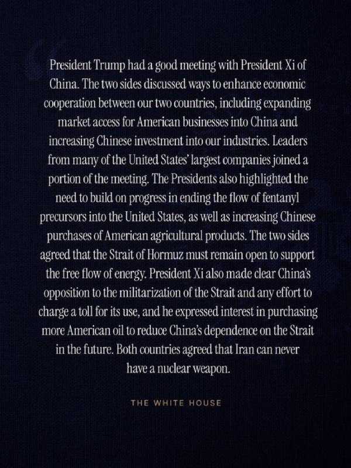

🔴کاخ سفید پس از مذاکرات دوجانبه ایالات متحده و چین در پکن، پایتخت چین، در بیانیه‌ای اعلام کرد که دو هیئت در مورد مسائلی مانند دسترسی به بازار چین، سرمایه‌گذاری چین در صنایع ایالات متحده، مواد مخدر، به ویژه فنتانیل، «جریان آزاد» تجارت از طریق تنگه هرمز و سایر مسائل کلیدی گفتگو کردند.
https://t.me/kianmeli1

## kianmeli1 — post 87394

🔴آکسیوس : یکی از گزینه‌های ترامپ پس از بازگشت از چین از سر گیری پروژه آزادی در تنگه هرمز است.گزینه دیگر ترامپ حمله به زیرساخت‌های ایران است.
https://t.me/kianmeli1

## IranIntlTV — post 337180

  

چارلز سوم، پادشاه بریتانیا، روز پنج‌شنبه از محله‌ یهودی‌نشین گولدرز گرین در لندن بازدید کرد.
ماه گذشته در این محله یک نفر با چاقو دو مرد یهودی را زخمی کرد.
طبق بیانیه کاخ باکینگهام، هدف این بازدید «تاکید دوباره بر حمایت قاطع او» از جامعه یهودی، در شرایط افزایش نگرانی‌های امنیتی پس از این حمله بوده است.
https://iranintl.com/202605145625

## IranIntlTV — post 337179

  <a href="telegram/content/IranIntlTV_337179_1778769050.mp4" target="_blank">🎬 Download video</a>

در حالی که نهادهای نظامی آمریکا از ادامه محاصره دریایی تنگه هرمز خبر می‌دهند، صداوسیمای جمهوری اسلامی به نقل از نیروی دریایی سپاه اعلام کرد در شبانه‌روز گذشته ۳۰ فروند کشتی با مجوز عبور کرده‌اند.
گفت‌وگو با علی‌حسین قاضی‌زاده، عضو تحریریه ایران‌اینترنشنال
@iranintltv

## IranIntlTV — post 337178

  

محمدصالح جوکار، رییس کمیسیون شوراهای مجلس، گفت جمهوری اسلامی از خطوط قرمز خود، به‌ویژه در حوزه دانش هسته‌ای و مواد غنی‌سازی‌شده، عقب‌نشینی نمی‌کند.
نماینده یزد در مجلس، گفت هدف توییت‌های مکرر ترامپ ایجاد شائبه تفرقه میان مسئولان جمهوری اسلامی و نبود تصمیم‌گیر واحد در ایران است. او افزود حتی اگر مذاکرات به نتیجه برسد هم نمی‌توان به آمریکا اعتماد کرد زیرا عملیات تخریبی و ترور همواره در دستور کار آن‌هاست.
https://iranintl.com/202605140299

## IranIntlTV — post 337177

🔻علی بلالی، مشاور عالی فرمانده نیروی هوافضای سپاه در صداوسیمای جمهوری اسلامی درباره حسن طهرانی‌مقدم گفت: «او هوادار استقلال بود و تیم صباباطری را قهرمانی جام حذفی کرد.»

🔹صبا باطری در سال ۱۳۸۴ در فینال جام حذفی با پیروزی برابر ابومسلم به مقام قهرمانی رسید.

🔹طهرانی مقدم از پایه‌گذاران صنعت موشکی در سپاه پاسداران بود که در سال ۱۳۹۰ در پی حادثه انفجار در پادگان مدرس تهران کشته شد.

@iranintltvsport

## IranIntlTV — post 337176

  

مارکو روبیو، وزیر خارجه آمریکا، در گفت‌وگو با ان‌بی‌سی نیوز گفت دونالد ترامپ در گفت‌وگو با شی جین‌پینگ موضوع ایران را مطرح کرده، اما «هیچ درخواستی از او نداشته است».

روبیو تأکید کرد آمریکا از چین درخواست کمک نکرده و نیازی هم به کمک آن ندارد.

او افزود رییس‌جمهور به‌صراحت پیام داده اگر جمهوری اسلامی تصور می‌کند می‌تواند با سوءاستفاده از فضای سیاست داخلی آمریکا، او را به پذیرش توافقی نامطلوب وادار کند، سخت در اشتباه است.
https://iranintl.com/202605147723

## IranIntlTV — post 337175

  

قاسم روانبخش، عضو هیات رییسه کمیسیون امور داخلی کشور و شوراها در مجلس، گفت نقشه راه جمهوری اسلامی کاملا روشن است و دستگاه دیپلماسی موظف است دقیقا بر مبنای ۱۰ شرط شورای عالی امنیت ملی که مورد تایید مجتبی خامنه‌ای است، حرکت کند.
قاسم روانبخش گفت عقب‌نشینی از ۱۰ شرط شورای عالی امنیت ملی یا افزایش سقف مطالبات طرف مقابل، باعث جری‌تر شدن دشمن و تشدید زیاده‌خواهی‌های او خواهد شد و افزود: «وظیفه مسئولان است که به طرف مقابل بفهمانند اگر مسیر عقلانیت را انتخاب نکند، جمهوری اسلامی ابزارهای دیگری در اختیار دارد»
قاسم روانبخش گفت: «ترامپ زبان دیپلماسی را نمی‌فهمد و تنها زبانی که به خوبی درک می‌کند، زبان موشک و قدرت نظامی است» او افزود ترامپ در شرایطی راهی پکن شد که ابهت ناوها و ناوشکن‌های آمریکا با موشک‌های جمهوری اسلامی در هم شکست.
https://iranintl.com/202605147234

## IranIntlTV — post 337174

🗣روایت شما از بحران اقتصادی و زندگی در آتش‌بس- پنج‌شنبه ۲۴ اردیبهشت:

🔹تعجب می‌کنم برخی می‌گن چرا تامین اجتماعی فلان کرد، چرا اداره کار بهمان کرد. جمهوری اسلامی هیچ‌وقت معیشت مردم براش مهم نبود و حتی خیریه‌ها و موسسه‌های مردم‌نهاد و مستقل رو از بین برد تا همه وابسته به خودش باشند و همه چیز رو کنترل بکنند.

🔹واقعا نگران بچه‌های مدرسه‌ای مقطع هفتم تا دوازدهم هستیم. کلاس‌ها اصلا کیفیت نداشته و شرایط روانی‌شون هم اصلا خوب نیست.

🔹چند شیفت کار سنگین می‌کنیم ولی بی‌پولیم.

🔹از اندیشه: قیمت‌ها سر به فلک کشیده، نون تافتون که ۵ هزار تومان بود، ۱۰ هزار تومان شده. داروها نیز بسیار کمیاب شده‌اند.

🔹حکومت می‌گه جنس هست و کمبودی در کار نیست، مثل اینه که من برم پشت ویترین طلافروشی و نتونم بخرم.

🔹قدرت اول منطقه حتی نمی‌تونه بسته‌های پستی رو به جزیره خارک برسونه و جرات ارسال مرسولات پستی به خارک رو نداره.

## IranIntlTV — post 337173

  

سنتکام اعلام کرد نیروهای آمریکایی در عملیات محاصره بنادر ایران، تاکنون ۷۰ کشتی تجاری را مجبور به تغییر مسیر کرده و ۴ کشتی را از کار انداخته‌اند.
پیش‌تر سنتکام، با انتشار تصویری از گشت‌زنی یک جنگنده پنهان‌کار اف-۳۵-ای نیروی هوایی بر فراز آب‌های منطقه‌ای نزدیک تنگه هرمز خبر داد.
https://iranintl.com/202605143032

## IranIntlTV — post 337172

  <a href="telegram/content/IranIntlTV_337172_1778769054.mp4" target="_blank">🎬 Download video</a>

گزارش‌های رسیده به ایران‌اینترنشنال از شهرهای مختلف ایران، حاکی از کمبود بنزین، صف‌های طولانی و گسترش بازار سیاه سوخت است. شهروندان در استان‌های مختلف می‌گویند عرضه بنزین محدود شده و در برخی جایگاه‌ها سوخت آزاد تنها به مقدار کم ارائه می‌شود.
گفت‌وگو با عطا حسینیان، روزنامه‌نگار اقتصادی و حوزه انرژی
@iranintltv

## IranIntlTV — post 337170

  <a href="telegram/content/IranIntlTV_337170_1778769055.mp4" target="_blank">🎬 Download video</a>

اسکات بسنت، وزیر خزانه‌داری آمریکا، در گفت‌وگو با سی‌ان‌بی‌سی گفت طی سه روز گذشته بارگیری در تاسیسات نفتی ایران انجام نشده است. او همچنین تاکید کرد جمهوری اسلامی توان پرداخت دستمزد نظامیان و هزینه‌های تجهیزات نظامی را ندارد.
گفت‌وگو با دالغا خاتین‌‌اوغلو، کارشناس انرژی
@iranintltv

## IranIntlTV — post 337169

  <a href="telegram/content/IranIntlTV_337169_1778769057.mp4" target="_blank">🎬 Download video</a>

رویترز گزارش داد جنگ ایران، روند گفت‌وگوهای صلح میان دولت ترکیه و کردها را با اختلال روبه‌رو کرده است. بر اساس این گزارش، آنکارا به دلیل نگرانی از گسترش تنش‌های منطقه‌ای، اجرای اصلاحات سیاسی را متوقف کرده و بر خلع سلاح کامل پ‌ک‌ک تاکید دارد.
نرگس هورخش، خبرنگار ایران‌اینترنشنال، گزارش می‌دهد
@iranintltv

## IranIntlTV — post 337168

  

علی مطهری، نایب‌رییس پیشین مجلس، گفت: «امارات متحده عربی خبیث‌ترین کشور خلیج فارس است و به اسرائیل نزدیک شده است.»
او افزود: «اتکای امارات به حمایت آمریکا باعث شده علیه جمهوری اسلامی موضع‌گیری کند و در صورت تضعیف موقعیت آمریکا، امارات نیز سر عقل خواهد آمد.»
https://iranintl.com/202605145020

## IranIntlTV — post 337167

  <a href="telegram/content/IranIntlTV_337167_1778769059.mp4" target="_blank">🎬 Download video</a>

دیدار دونالد ترامپ با شی جین‌پینگ، واکنش گسترده کاربران رسانه‌های اجتماعی را به همراه داشته است. کاربران علاوه‌بر ابعاد سیاسی و اقتصادی، به حاشیه‌های این سفر از جمله زبان بدن دو رهبر، حضور مارکو روبیو در هیات آمریکایی و موضوع رقابت تکنولوژیک واکنش نشان داده‌اند.
عادله بورنگ، عضو تحریریه ایران‌اینترنشنال، از واکنش کاربران می‌گوید
@iranintltv

## IranIntlTV — post 337166

🗣روایت شما از بحران اقتصادی و زندگی در آتش‌بس- پنج‌شنبه ۲۴ اردیبهشت:

🔹این چند وقت فشار روانی زیادی بر دانش‌آموزان بوده و در کمال ناباوری، آموزش و پرورش تصمیم به حضوری بودن امتحانات گرفته. از والدین محترم می‌خوام شرایط روانی فرزندان‌شون رو درک و اگر می‌تونن اعتراضی کنن.

🔹از شهسوار: زندگی برای خیلی از ما سخت شده؛ گرونی، فشارهای روزمره و نگرانی از آینده هر روز بیشتر حس می‌شه. این چیزیه که خیلی‌هامون داریم تجربه‌اش می‌کنیم و امیدوارم صدامون شنیده بشه.

🔹از شیراز: مرغ کیلویی ۵۰۰ هزار تومان، برنج کیلویی ۲۷۰ هزار تومان و تخم‌مرغ دانه‌ای ۲۲ هزار تومان. من که ۱۵ میلیون تومان حقوقمه چطوری می‌تونم زندگی کنم؟

🔹بعد از ۳۷ سال زندگی، با ۱۶ سال سابقه کار تخصصی در زمینه تحصیلاتم (کارشناسی ارشد مکانیک جامدات) و درآمدی که تازه در مقایسه با بقیه مشاغل نسبتا خوب محسوب می‌شه، هیچ امیدی به آینده ندارم. حقوقم فقط خرج روزمره زندگیم می‌شه.

🔹چهارشنبه رفتم بنزین بزنم. با کارت خودم نتونستم، چون سهمیه شخصی تموم شده بود. مسئول جایگاه هم فقط در صورتی کارت آزاد می‌داد که به خودش مستقیم پول بدیم. ۱۵ لیتر بیشتر هم نمیدن و هر لیتری به قیمت ۷ هزار تومان.

🔹قیمت یک پیتزا خانواده در تهران دست‌کم یک میلیون تومان شده؛ یعنی حدود ۵ دلار. در صورتی که درآمد خیلی از خانوارها از ۶۰ دلار در ماه شروع می‌شه. این یک مثال از قدرت خرید مردم در پایتخت بود.

🔹جمهوری اسلامی هیچ‌وقت معیشت مردم براش مهم نبود و حتی خیریه‌ها و موسسه‌های مردم‌نهاد و مستقل رو از بین برد تا همه وابسته به خودش باشن و همه‌چیز رو کنترل کنه.

🔹۲۶ سالمه و فروشگاه پوشاک داشتم. ۴ سال پیش تمام طلاهای مادرم رو فروختم برای راه‌اندازی بوتیک. امسال ورشکست شدم. غم و استرس بیکاری داره نابودم می‌کنه.

🔹 پدرم ۳۲ سال در مخابرات کار کرد و بازنشسته شده است. الان نزدیک یک سال و ۲ ماه هست که سنوات بازنشستگیش را ندادن. این وضعیت برای یک بازنشسته که کل زندگیش را برای کار گذاشته، مناسب نیست.

## IranIntlTV — post 337165

  

یسرائیل کاتز، وزیر دفاع اسرائیل در یک سخنرانی گفت که ماموریت ارتش این کشور درباره ایران کامل نشده و برای این احتمال آماده است که شاید دوباره ناچار به اقدام شود.
یسرائیل کاتز تاکید کرد: «اگر اهداف‌مان تامین نشود، دوباره اقدام خواهیم کرد.»

پیش از این نیز ایال زمیر، رییس ستاد کل ارتش اسرائیل، گفته بود که «نبرد به پایان نرسیده و ارتش برای ازسرگیری جنگ در صورت نیاز آماده است.»
https://iranintl.com/202605143284

## IranIntlTV — post 337164

  

مصطفی نخعی، عضو کمیسیون انرژی مجلس گفت: «ما با کسری بنزین مواجهیم و قبل از جنگ هم کمبود بنزین وجود داشت و روزانه حدود ۲۰ میلیون لیتر کسری بنزین داشتیم که باید با واردات جبران می‌کردیم.»

او ادامه داد: «سناریوهای مختلفی در خصوص بنزین در دولت در حال بررسی است اما هنوز سناریویی قطعی نشده است.»

این نماینده مجلس ادامه داد: «درحال حاضر یا سهمیه باید کاهش یابد یا از ابزار قیمتی استفاده شود که حداقل مجلس چندان موافق این موضوع نیست.»
https://iranintl.com/202605148048

## IranIntlTV — post 337163

  

🔻توماس راشل، نماینده دولت فدرال آلمان در امور آزادی دین و عضو پارلمان این کشور، رسماً کفالت سیاسی پیوند و برنا نعیمی را بر عهده گرفت. این دو جوان ورزشکار بهایی که با اتهامات سنگین و خطر اعدام روبه‌رو هستند، به نمادی از سرکوب جامعه ورزشی و اقلیت‌های مذهبی در ایران بدل شده‌اند.

🔹به گزارش انجمن «زن، زندگی، آزادی» در آلمان، پیوند نعیمی، ورزشکار رشته شنا و واترپلو از ژانویه ۲۰۲۶ در بازداشتگاه‌های سپاه تحت شدیدترین شکنجه‌ها قرار گرفته است و اعترافات اجباری او از صداوسیما پخش شده است.

🔹به گزارش این انجمن حقوق بشری، برنا نعیمی، کاراته‌کا و پدر یک فرزند خردسال، پس از تحمل شوک الکتریکی و «اعدام‌های نمایشی»، مجبور به امضای اعترافاتی علیه خود و پسرعمویش، پیوند نعیمی شده است.

🔹پیش‌تر، جامعه جهانی بهائی در بیانیه‌ای نوشت که پیوند و برنا نعیمی در حالی به دخالت در حوادث اعتراضات دی‌ماه متهم شده‌اند که مدارک نشان می‌دهد پیوند در زمان وقوع حادثه در بازداشت بوده است. این دو ورزشکار بدون دسترسی به دادگاه عادلانه، تحت شکنجه‌های غیرانسانی برای پذیرش اتهامات ساختگی قرار دارند.

@iranintltvsport

## IranIntlTV — post 337162

  

ایرنا، خبرگزاری رسمی دولت جمهوری اسلامی در گزارشی نوشت: «میزان ذخایر سدهای تهران نسبت به سال گذشته ۴۵ میلیون مترمکعب کاهش یافته و حجم آب موجود در پنج سد اصلی پایتخت افت قابل توجهی داشته است.»

معاون شرکت آب منطقه‌ای تهران نیز با اشاره به اینکه مخازن تنها حدود ۶۰ درصد ظرفیت نرمال را پر کرده‌اند، هشدار داد که پایتخت همچنان با شرایط خشکسالی مواجه است.
https://iranintl.com/202605149178

## IranIntlTV — post 337161

  

عباس مقتدایی، نایب رییس کمیسیون امنیت ملی مجلس گفت: «ما آنچه را اراده کنیم، به آمریکا و هم‌پیمانانش دیکته می‌کنیم، چرا که حاکمیت بر خلیج فارس، تنگه هرمز و دریای عمان موضوعی ذاتی و متعلق به کشور ماست.»
او افزود: «ترامپ نشان داد که باور به اینکه انسان‌ها می‌توانند از گرگ نیز بدتر و پلیدتر باشند، باوری ریشه‌دار، عمیق و واقعی است.»

او ادامه داد: «با آمادگی دفاعی می‌توانیم سایه جنگ را از سر کشور برداریم و با ایجاد انتظام در تنگه هرمز، این شاهراه حیاتی جهانی را که از نظر اقتصادی و سیاسی اهمیت بالایی دارد، به‌عنوان اهرمی برای دستیابی به حقوق ایران مورد بهره‌برداری قرار دهیم.»
iranintl.com/202605140403

## IranIntlTV — post 337160

  

محمدرضا عارف، معاون اول مسعود پزشکیان، گفت که تنگه هرمز مال ماست؛ ملک ما بوده و مدتی از ملک‌مان خوب استفاده نمی‌کردیم.

او افزود: «ما به هیچ قیمتی کنترل تنگه هرمز را از دست نخواهیم داد.» عارف ادامه داد: «در جنگ هر کس روایت تولید کرد، پیروز خواهد شد.»
iranintl.com/202605143228

## Shin_Persian — post 5998

Samim ✓ @PawnToPromotion Thu, 14 May 2026 10:14:23 UTC آپدیت «خیلی مهم» برای کلاینت شیر و خورشید 2026.05.14: تنظیمات بیشتر برای CDN Domain Fronting: توجه کنید سایفون خودش دامین فرانتینگ انجام میده! ولی اون روش MitM که @patterniha پیدا کرد تنظیمات و جزییات…

## Shin_Persian — post 5997

Samim ✓ @PawnToPromotion
Thu, 14 May 2026 10:14:23 UTC

آپدیت «خیلی مهم» برای کلاینت شیر و خورشید 2026.05.14:

تنظیمات بیشتر برای CDN Domain Fronting: توجه کنید سایفون خودش دامین فرانتینگ انجام میده! ولی اون روش MitM که @patterniha پیدا کرد تنظیمات و جزییات دامین فرانتینگ متفاوتی داره. در این آپدیت٬ کلاینت شیر و خورشید کاری مشابه به چیزی که @patterniha ها معرفی کرد انجام میده با این تفاوت که این روش در هسته شیر و خورشید اضافه شده پس دیگه نیازی به xray و cert وکارای دیگه نیست.

۱. آپدیت رو نصب کنید
۲. پروتکل را روی یکی از حالت های Auto یا Direct یا CDN Fronting تنظیم کنید
۳. کلاینت شیر و خورشید باید الان خودش به تنهایی وصل بشه براتون!

قابلیت تنظیمات بیشتر برای SNI و IP هم وجود داره که فعلا بهش نیازی نیست و میتونید خالی بگذارید باشه. ولی برای آینده شاید به کار بیاد.

میتونید از اینجا دانلود و نصب کنید و ممنون میشم اگه repost کنید که تعداد بیشتری ببینند:

https://github.com/shirokhorshid/shirokhorshid-android/releases/tag/v2026.05.14-8a28d0c

در تلگرام هم آپلود کردم اگر براتون راحت تر هست میتونید از اونجا آپدیت رو بگیرید:

https://t.me/+aF04HaDSxVI4ZGEx

English

"Very Important" update for the Lion and Sun client 2026.05.14:

More settings for CDN Domain Fronting: Note that Psiphon performs its own domain fronting! However, the MitM (Man-in-the-Middle) method discovered by @patterniha involves different domain fronting settings and details. In this update, the Lion and Sun client performs an action similar to what @patterniha introduced, with the difference that this method has been integrated into the Lion and Sun core, so there is no longer a need for Xray, certificates, or other manual tasks.

1. Install the update.
2. Set the protocol to one of the following modes: Auto, Direct, or CDN Fronting.
3. The Lion and Sun client should now connect for you on its own!

There are also additional configuration options for SNI (Server Name Indication) and IP, which are not currently needed and can be left blank. However, they may be useful in the future.

You can download and install it from here, and I would appreciate it if you reposted so more people can see it:

https://github.com/shirokhorshid/shirokhorshid-android/releases/tag/v2026.05.14-8a28d0c

I have also uploaded it to Telegram; if it is easier for you, you can get the update from there:

https://t.me/+aF04HaDSxVI4ZGEx

𝕏 · @shin_persian

## Shin_Persian — post 5996

  

UKMTO Operations Centre @UK_MTO
Thu, 14 May 2026 07:00:22 UTC

UKMTO WARNING 057-26

Click here to view the full warning⤵️
http://www.ukmto.org/-/media/ukmto/products/20260514-ukmto_057_26_warning_suspicious-activity.pdf?rev=67da24ed8b4f43389506d6abbb5fb841

#MaritimeSecurity #MarSec

فارسی

هشدار UKMTO 057-26

برای مشاهده متن کامل هشدار اینجا کلیک کنید⤵️
http://www.ukmto.org/-/media/ukmto/products/20260514-ukmto_057_26_warning_suspicious-activity.pdf?rev=67da24ed8b4f43389506d6abbb5fb841

#MaritimeSecurity #MarSec_

𝕏 · @shin_persian

## ManotoTV — post 105453

  <a href="telegram/content/ManotoTV_105453_1778769063.mp4" target="_blank">🎬 Download video</a>

مقامات کره جنوبی اعلام کرده‌اند که به نظر می‌رسد بعید است گروهی غیر از جمهوری‌اسلامی در حمله به یک کشتی باری کره‌ای در نزدیکی تنگه هرمز نقش داشته باشد.
این حمله در تاریخ ۴ مه به کشتی متعلق به شرکت HMM کره جنوبی انجام شد و باعث آتش‌سوزی و آسیب به بخش عقبی آن شد. کره جنوبی در حال بررسی اطلاعاتی است که آمریکا درباره این حادثه در اختیارش قرار داده است.
سئول همچنین تیم‌های کارشناسی را به دبی فرستاده تا خسارت وارد شده به کشتی را بررسی و تحقیقات فنی انجام دهند.
در حالی که جمهوری‌اسلامی هرگونه دخالت در این حمله را رد کرده، مقامات کره جنوبی می‌گویند نتیجه‌گیری نهایی پس از پایان تحقیقات اعلام خواهد شد، اما در صورت اثبات نقش تهران، اقدامات لازم انجام می‌شود.
گزارش‌ها می‌گویند آمریکا نیز بلافاصله پس از حادثه، جمهوری‌اسلامی را به دست داشتن در این حمله متهم کرده و خواستار همکاری کره جنوبی در تأمین امنیت کشتیرانی در تنگه هرمز شده بود.

## ManotoTV — post 105452

  <a href="telegram/content/ManotoTV_105452_1778769064.mp4" target="_blank">🎬 Download video</a>

همزمان با سفر ترامپ به چین، آکسیوس در گزارشی به اختلاف نظرهایی در تیم ترامپ در خصوص ایران پرداخته؛ برخی معتقدند جمهوری‌اسلامی از زمان به نفع خود استفاده می‌کند و منتظر تأثیر فشارهای سیاسی در آمریکا است. هم‌زمان افزایش قیمت نفت و نگرانی از تورم، کار دولت را برای مدیریت افکار عمومی سخت‌تر کرده است.
گزارش‌ها نشان می‌دهد مذاکرات اخیر با تهران به بن‌بست رسیده و گزینه‌های نظامی دوباره روی میز قرار گرفته‌اند؛ از عملیات دریایی در تنگه هرمز گرفته تا حملات به زیرساخت‌های ایران.
در عین حال، برخی مقامات آمریکایی می‌گویند فشار اقتصادی فعلی شاید بدون اقدام نظامی هم ایران را تحت فشار قرار دهد، هرچند ساختار سیاسی این کشور کمتر تحت تأثیر نارضایتی عمومی قرار می‌گیرد.
در مجموع، ترامپ تأکید دارد که جلوگیری از دسترسی جمهوری‌اسلامی به سلاح هسته‌ای اولویت اصلی اوست، حتی اگر پیامدهای اقتصادی و سیاسی داخلی به دنبال داشته باشد؛ موضوعی که حالا به دست دموکرات‌ها یک ابزار تبلیغاتی آماده داده است.

## ManotoTV — post 105451

  <a href="telegram/content/ManotoTV_105451_1778769064.mp4" target="_blank">🎬 Download video</a>

«جمهوری اسلامی قصد جان فاطمه سپهری را کرده»

## ManotoTV — post 105450

  <a href="telegram/content/ManotoTV_105450_1778769066.mp4" target="_blank">🎬 Download video</a>

قیمت چیپس و پفک در بازار طی یک سال گذشته جهش چشمگیری داشته است.
بهای چیپس‌های ۶۰ گرمی که سال گذشته حدود ۲۵ هزار تومان بود، حالا به ۶۰ تا ۶۵ هزار تومان رسیده؛ افزایشی حدود ۱۶۰ درصدی.
قیمت چیپس‌های بزرگ‌تر نیز برای بسیاری از خریداران شوکه‌کننده شده است. هر بسته چیپس ۱۳۸ گرمی بسته به برند، بین ۱۳۰ تا ۱۴۰ هزار تومان قیمت دارد و چیپس‌های ۲۴۵ گرمی به حدود ۲۵۰ هزار تومان رسیده‌اند. برخی بسته‌های بزرگ‌تر نیز بین ۳۰۰ تا ۴۰۰ هزار تومان فروخته می‌شوند.
افزایش قیمت در بازار پفک و اسنک هم ادامه دارد. قیمت پفک ۱۱۰ گرمی از حدود ۴۵ هزار تومان به ۱۱۵ هزار تومان رسیده و اسنک‌های پنیری و طلایی حتی گران‌تر هستند. هر بسته اسنک طلایی اکنون حدود ۱۵۰ هزار تومان قیمت دارد و کرانچی ۱۰۰ گرمی نیز به حدود ۸۰ هزار تومان رسیده است.

## ManotoTV — post 105449

  <a href="telegram/content/ManotoTV_105449_1778769066.mp4" target="_blank">🎬 Download video</a>

«من صدای فاطمه سپهری هستم»

## ManotoTV — post 105448

  <a href="telegram/content/ManotoTV_105448_1778769067.mp4" target="_blank">🎬 Download video</a>

الجزیره گزارش داد نمایندگان لبنان و اسرائیل برای دور تازه‌ای از گفت‌وگوها به ساختمان وزارت خارجه آمریکا در واشنگتن رسیده‌اند.
این مذاکرات مستقیم روزهای پنج‌شنبه و جمعه برگزار می‌شود و مقام‌های دیپلماتیک لبنان، اسرائیل و همچنین مقام‌های آمریکایی در آن حضور خواهند داشت.

## ManotoTV — post 105447

  <a href="telegram/content/ManotoTV_105447_1778769068.mp4" target="_blank">🎬 Download video</a>

فیفا در یک پست اینستاگرامی اعلام کرد که شکیرا، مدونا و سوپراستارهای کی‌پاپ گروه بی‌تی‌اس اجرای نخستین نمایش بین دو نیمه فینال جام جهانی را بر عهده خواهند داشت.
فینال جام جهانی قرار است ۱۹ ژوئیه در ورزشگاه مت‌لایف در نیوجرسی برگزار شود و انتظار می‌رود علاوه بر تماشاگران حاضر در ورزشگاه، میلیون‌ها بیننده در سراسر جهان آن را تماشا کنند.
جام جهانی ۲۰۲۶ از ۱۱ ژوئن در مکزیکوسیتی آغاز می‌شود و مسابقات آن در شهرهای مختلفی در آمریکا، کانادا و مکزیک برگزار خواهد شد.

## ManotoTV — post 105446

  <a href="telegram/content/ManotoTV_105446_1778769068.mp4" target="_blank">🎬 Download video</a>

خبرگزاری حکومتی فارس وابسته به سپاه پاسداران از قول یک منبع آگاه اعلام کرد جمهوری اسلامی با عبور تعدادی از کشتی‌های چینی از تنگه هرمز، در چارچوب «پروتکل مدیریت ایرانی تنگه»، موافقت کرده است.
به گفته این منبع، پس از رایزنی‌های وزیر خارجه چین و سفیر پکن در تهران، دو کشور درباره تسهیل عبور برخی کشتی‌های چینی به توافق رسیدند و این روند از شامگاه گذشته آغاز شده است.
بر اساس این گزارش، عبور این کشتی‌ها پس از هماهنگی با مقام‌های جمهوری‌اسلامی و پذیرش ضوابط تعیین‌شده از سوی تهران انجام می‌شود.

## ManotoTV — post 105445

  <a href="telegram/content/ManotoTV_105445_1778769069.mp4" target="_blank">🎬 Download video</a>

عباس عراقچی، وزیر خارجه جمهوری اسلامی، امارات متحده عربی را به مشارکت مستقیم در حملات نظامی علیه ایران متهم کرد و خواستار بازنگری ابوظبی در روابطش با اسرائیل شد.
عراقچی این اظهارات را در نشست وزیران خارجه بریکس در دهلی‌نو مطرح کرد. او گفت: «امارات مستقیماً در تجاوز علیه کشور من دخالت داشت و اجازه داد از خاکش برای شلیک تجهیزات و تسلیحات علیه ایران استفاده شود.»
وزیر خارجه جمهوری اسلامی همچنین با اشاره به عادی‌سازی روابط امارات و اسرائیل در سال ۲۰۲۰ گفت: «ائتلاف شما با اسرائیل هم از شما محافظت نکرد و باید در سیاست خود در قبال ایران تجدیدنظر کنید.»

## ManotoTV — post 105444

  <a href="telegram/content/ManotoTV_105444_1778769069.mp4" target="_blank">🎬 Download video</a>

یک شرکت امنیت دریایی اعلام کرد شناور هندی «ام‌اس‌وی حاج‌علی» در پی حمله‌ای ناشناس در آب‌های نزدیک عمان غرق شده است.
شرکت «ونگارد» اعلام کرد این کشتی باری با ۱۴ خدمه، در نزدیکی ساحل لیما در عمان، در جنوب تنگه هرمز، پس از وقوع انفجار غرق شد.
بر اساس این گزارش، کشتی در حال انتقال دام از بربره در منطقه سومالی‌لند به شارجه امارات متحده عربی بود که «احتمالاً بر اثر حمله پهپادی یا موشکی» دچار انفجار شد.
ونگارد اعلام کرد پس از وقوع آتش‌سوزی در کشتی، خدمه مجبور به ترک شناور شدند و کشتی سپس غرق شد.
وب‌سایت رهگیری کشتی‌ها «ماریتایم ترافیک» این شناور را یک لنج چوبی ۵۴ متری معرفی کرده است. وزارت خارجه هند پیش‌تر اعلام کرده بود همه خدمه این کشتی سالم نجات یافته‌اند.

## ManotoTV — post 105443

  <a href="telegram/content/ManotoTV_105443_1778769070.mp4" target="_blank">🎬 Download video</a>

کاخ سفید اعلام کرد دونالد ترامپ و شی جین‌پینگ در دیدار خود در پکن درباره جنگ ایران، امنیت تنگه هرمز و برنامه هسته‌ای جمهوری اسلامی گفت‌وگو کرده‌اند.
بر اساس بیانیه کاخ سفید، دو طرف توافق کردند تنگه هرمز باید برای حفظ جریان آزاد انرژی باز بماند. شی جین‌پینگ همچنین مخالفت چین با نظامی‌سازی تنگه هرمز و هرگونه دریافت عوارض برای عبور کشتی‌ها را مطرح کرده است.
در این بیانیه آمده است رئیس‌جمهوری چین از تمایل پکن برای خرید بیشتر نفت آمریکا به‌منظور کاهش وابستگی به تنگه هرمز خبر داده و دو کشور نیز توافق کرده‌اند جمهوری‌اسلامی نباید به سلاح هسته‌ای دست پیدا کند.
کاخ سفید همچنین اعلام کرد دو رهبر درباره همکاری اقتصادی و مقابله با ورود مواد اولیه فنتانیل به آمریکا گفت‌وگو کرده‌اند.
در حالی که بیانیه چین تنها اشاره کوتاهی به موضوع ایران داشت، موضوع تایوان که شی جین‌پینگ آن را «مهم‌ترین مسئله» خوانده بود، در بیانیه واشینگتن مطرح نشد.

## ManotoTV — post 105442

  <a href="telegram/content/ManotoTV_105442_1778769070.mp4" target="_blank">🎬 Download video</a>

ترامپ در ضیافت شام رسمی که شی جین‌پینگ، رئیس‌جمهوری چین، در تالار بزرگ خلق پکن برگزار کرده حضور یافت.
ترامپ از شی جین‌پینگ و همسرش، پنگ لی‌یوان، برای سفر به آمریکا و حضور در کاخ سفید در ۲۴ سپتامبر دعوت کرد و گفت: «مایه افتخار من است که این دعوت را مطرح می‌کنم.»

## ManotoTV — post 105441

  <a href="telegram/content/ManotoTV_105441_1778769071.mp4" target="_blank">🎬 Download video</a>

معین، خواننده شهیر در صفحه اینستاگرام خود با انتشار متنی، شایعات مطرح شده در خصوص اجرا برای تیم فوتبال در جام جهانی را تکذیب کرد. معین در متن خود از جمله نوشته: «عشق من به مردم و سرزمینم همیشه واقعی بوده. اما صدای من زمانی معنا دارد که دل مردم آرام باشد و حال ایران خوب»
روز گذشته اظهارات مهدی تاج، رئیس فدراسیون فوتبال جمهوری‌اسلامی به شایعاتی از این دست دامن زده بود.

## ManotoTV — post 105440

  <a href="telegram/content/ManotoTV_105440_1778769072.mp4" target="_blank">🎬 Download video</a>

مهدی تاج، رئیس فدراسیون فوتبال جمهوری‌اسلامی گفته «مسئله ویزا حل نشده و هنوز هیچ روادیدی برای اعضای تیم ملی فوتبال ایران صادر نشده است.» و افزوده «منتظریم ببینیم رفتار طرف مقابل چیست.»
او از «جلسه سرنوشت‌ساز» با فیفا صحبت به میان آورده چرا که به گفته تاج فیفا «باید به ما گارانتی بدهد»

## ManotoTV — post 105439

  <a href="telegram/content/ManotoTV_105439_1778769072.mp4" target="_blank">🎬 Download video</a>

روزنامه نیویورک‌تایمز گزارش داد نهادهای اطلاعاتی آمریکا معتقدند شرکت‌های چینی درباره ارسال مخفیانه تسلیحات به جمهوری اسلامی از طریق کشورهای ثالث گفت‌وگو کرده‌اند تا منشأ این محموله‌ها پنهان بماند.
این گزارش ساعاتی پس از ورود دونالد ترامپ به پکن منتشر شد و می‌تواند فشارها بر رئیس‌جمهوری آمریکا را برای درخواست از شی جین‌پینگ به‌منظور قطع حمایت از جمهوری اسلامی افزایش دهد.
بر اساس این گزارش، مقام‌های آمریکایی بر سر این‌که آیا این انتقال‌ها بالفعل انجام شده یا نه اختلاف نظر دارند، اما گفته‌اند چنین اقداماتی بعید است بدون اطلاع مقام‌های ارشد چینی صورت گرفته باشد.
رسانه‌های آمریکایی پیش‌تر نیز گزارش داده بودند چین موشک‌های دوش‌پرتاب ضدهوایی به جمهوری اسلامی ارسال کرده است؛ تسلیحاتی که می‌توانند هواپیماها و پهپادها را هدف قرار دهند. همچنین گفته می‌شود تهران در سال ۲۰۲۴ یک ماهواره جاسوسی چینی دریافت کرده که برای شناسایی نیروهای آمریکایی در خاورمیانه از آن استفاده می‌کند.
در همین حال، گزارش‌هایی از بازسازی توان موشکی جمهوری اسلامی پس از حملات آمریکا و اسرائیل منتشر شده است. بر اساس ارزیابی سازمان سیا، بخش قابل توجهی از موشک‌های بالستیک و پرتابگرهای متحرک ایران همچنان سالم مانده‌اند.

## ManotoTV — post 105437

  <a href="telegram/content/ManotoTV_105437_1778769073.mp4" target="_blank">🎬 Download video</a>

بانک مرکزی ترکیه هدف تورم پایان سال ۲۰۲۶ را از ۱۶ به ۲۴ درصد افزایش داد و اعلام کرد پیامدهای جنگ ایران و اسرائیل و افزایش تنش‌ها در خاورمیانه، فشارهای تورمی را تشدید کرده است. رئیس بانک مرکزی ترکیه گفت افزایش بهای انرژی و اختلال در عرضه، به‌ویژه برای اقتصادهای وابسته به واردات مانند ترکیه، یک ریسک جدی محسوب می‌شود. این بانک همچنین پیش‌بینی تورم پایان ۲۰۲۷ را از ۹ به ۱۵ درصد افزایش داد. نرخ تورم ماهانه ترکیه در آوریل به بیش از ۴ درصد و تورم سالانه به حدود ۳۲ درصد رسید.

## ManotoTV — post 105436

  <a href="telegram/content/ManotoTV_105436_1778769074.mp4" target="_blank">🎬 Download video</a>

مرکز عملیات تجارت دریایی بریتانیا (UKMTO) در یک هشدار امنیتی اعلام کرد یک کشتی در دریای عمان، در حالی که در لنگرگاه قرار داشت، توسط «افراد غیرمجاز» تصرف شده و اکنون به سمت آب‌های سرزمینی ایران در حرکت است.
بر اساس هشدار رسمی UKMTO، این حادثه حدود ۳۸ مایل دریایی شمال شرقی فجیره امارات متحده عربی رخ داده است. هویت کشتی و جزئیات بیشتر درباره مهاجمان هنوز اعلام نشده است.
این نهاد بریتانیایی اعلام کرد در حال بررسی موضوع است و از همه شناورها خواسته هرگونه فعالیت مشکوک را فورا گزارش دهند.
هشدار صبح امروز چهارشنبه منتشر شده و نشان‌دهنده یک رخداد امنیتی تازه و حساس در آبراه‌های منطقه است.
اگرچه این نهاد هنوز درباره عاملان احتمالی این حادثه اظهار نظر نکرده، اما چنین هشدارهایی معمولا در موارد مرتبط با توقیف کشتی‌ها، دزدی دریایی یا عملیات نیروهای نظامی و شبه‌نظامی در منطقه صادر می‌شود.

## FarsiVOA — post 217731

آیا احزاب کُرد آماده پاسخگویی درباره منابع سلاح و تجهیزات خود هستند؟ فریبا محمدی، معاون دبیرکل حزب کومله زحمتکشان کردستان می‌گوید انتظار شفاف‌سازی از احزابی که زیر حمله جمهوری اسلامی‌اند منصفانه نیست

## FarsiVOA — post 217730

🔺وزیر خزانه‌داری آمریکا: ما رژیم «شریر» ایران را زیر فشار اقتصادی قرار داده‌ایم

▪️وزیر خزانه‌داری آمریکا می‌گوید در سه روز گذشته هیچ بارگیری از ذخایر نفت در جزیره خارک ایران انجام نشده است و هیچ نفتی وارد یا خارج نشده است.

⬇️ بیشتر بخوانید:

https://ir.voanews.com/a/iran-us-china-bessent-treasury-oil-kharg-island-weapon/8149951.html/?nocach=1

## FarsiVOA — post 217729

🔺واکنش هند به حمله‌ منجر به غرق شدن کشتی این کشور در سواحل عمان: «غیرقابل قبول» است

▪️هند روز پنجشنبه ۲۴ اردیبهشت حمله‌ای را که به غرق شدن یک کشتی تحت پرچم آن کشور در آب‌های عمان منجر شد «غیرقابل قبول» خواند و اعلام کرد که در بحبوحه جنگ آمریکا و اسرائیل با رژیم ایران، باید از هدف گرفتن کشتی‌های تجاری جلوگیری شود.

⬇️ بیشتر بخوانید:

https://ir.voanews.com/a/reuters-indian-flagged-ship-sank-off-the-coast-of-oman/8149952.html/?nocach=1

## FarsiVOA — post 217728

  

⚡️شی جین‌پینگ، رئیس‌جمهور چین، در سخنرانی آغازین خود در ضیافت رسمی به افتخار دونالد ترامپ رئیس‌جمهور آمریکا، روابط دو کشور را مهم‌ترین رابطه دوجانبه جهان توصیف کرد و گفت که دو طرف باید «هرگز آن را خراب نکنند.»

او گفت‌وگوهای روز پنجشنبه خود با ترامپ درباره روابط چین و آمریکا و تحولات بین‌المللی و منطقه‌ای را «گفت‌وگوهای عمیق» توصیف کرد و افزود: «هر دوی ما معتقدیم که روابط چین و آمریکا مهم‌ترین رابطه دوجانبه در جهان است. ما باید آن را به‌درستی پیش ببریم و هرگز آن را خراب نکنیم.»

رییس‌جمهور چین ادامه داد: «هم چین و هم ایالات متحده از همکاری سود می‌برند و از تقابل زیان می‌بینند. دو کشور ما باید شریک یکدیگر باشند نه رقیب.»

او همچنین گفت: «رئیس‌جمهور ترامپ و من همچنین توافق کردیم که یک رابطه سازنده چین و آمریکا با ثبات راهبردی ایجاد کنیم تا توسعه باثبات، سالم و پایدار روابط چین و آمریکا را تقویت کرده و صلح، رفاه و پیشرفت بیشتری برای جهان به ارمغان آوریم.»

## FarsiVOA — post 217720

📸 گالری عکس | مراسم استقبال رسمی از پرزیدنت ترامپ در چین

مراسم استقبال از دونالد ترامپ، رئیس جمهوری آمریکا، با حضور شی جین‌پینگ، رئیس جمهوری چین، در سفر رسمی پرزیدنت ترامپ به پکن

## FarsiVOA — post 217719

زیردریایی هسته‌ای آلاسکا؛ پیام واشنگتن
آشکارسازی کم‌سابقه موقعیت زیردریایی هسته‌ای آمریکا در جبل‌الطارق؛ هشداری راهبردی به جمهوری اسلامی در اوج تنش‌های نظامی و بن‌بست کامل مذاکرات

## FarsiVOA — post 217718

🔺پیام‌های شادباش «روز اورشلیم»: شهر ادیان و پایتخت ابدی اسرائیل است

▪️اسرائیل با انتشار پیام‌هایی در شبکه‌های اجتماعی فرا رسیدن «روز اورشلیم» را شادباش گفت.

⬇️ بیشتر بخوانید:

https://ir.voanews.com/a/israel-jerusalem-congratulatory-message/8149943.html/?nocach=1

## FarsiVOA — post 217717

🔺اسرائیل طرح مشترکی برای خلع سلاح تدریجی حزب‌الله ارائه می‌کند

▪️سفیر اسرائیل در آمریکا اعلام کرد اورشلیم در دور تازه گفت‌وگوهای اسرائیل و لبنان در واشنگتن چارچوبی را برای خلع سلاح تدریجی حزب‌الله و گسترش روابط سیاسی به بیروت ارائه خواهد کرد.

▪️لایتر درباره روند تدریجی پیشنهادی از سوی اسرائیل گفت: «ما به‌طور مشترک یک منطقه مشخص را تعریف خواهیم کرد و با آن‌ها برنامه‌ریزی می‌کنیم که چگونه آن منطقه پاک‌سازی شود و سپس به مرحله بعدی ادامه دهیم.»

▪️سومین دور گفت‌وگوهای مستقیم نمایندگان اسرائیل و لبنان با میانجیگری آمریکا پنجشنبه ۲۴ اردیبهشت برگزار می‌‌شود.

⬇️ بیشتر بخوانید:
https://ir.voanews.com/a/8149934.html

## FarsiVOA — post 217716

🔺ترامپ با اشاره به گفت‌وگوهای «مثبت و سازنده» پکن، شی را به واشنگتن دعوت کرد

▪️دونالد ترامپ، رئیس‌جمهور آمریکا گفت‌وگوهای خود با شی جین‌پینگ همتای چینی‌اش در جریان سفر به پکن را «بسیار مثبت و سازنده» توصیف کرد.

▪️او درباره گفت‌وگوهایش با شی گفت هر آنچه درباره‌اش صحبت کردند، «همگی به سود ایالات متحده و چین بود.»

▪️همچنین رئیس‌جمهور آمریکا از همتای چینی خود برای سفر به ایالات متحده در ۲۴ سپتامبر دعوت کرد و گفت: «ما مشتاقانه منتظر این سفر هستیم.»

▪️رئیس‌جمهور چین در سخنرانی آغازین خود در ضیافت رسمی به افتخار ترامپ، روابط دو کشور را مهم‌ترین رابطه دوجانبه جهان توصیف کرد و گفت که دو طرف باید «هرگز آن را خراب نکنند.»

⬇️ بیشتر بخوانید:
https://ir.voanews.com/a/8149931.html

## FarsiVOA — post 217715

شی جین‌پینگ، رئیس جمهوری چین، روز پنج‌شنبه طی سخنانی که در مهمانی شام رسمی که به افتخار پرزیدنت ترامپ در پکن برگزار شد، این دیدار را «تاریخی» دانست و به روابط تاریخی دو کشور اشاره کرد.

## FarsiVOA — post 217714

🔺۱۸۰۰ ساعت خاموشی اینترنت؛ ایران زیر سایه اینترنت طبقاتی

▪️قطع گسترده اینترنت در ایران وارد روز هفتاد و ششم شده و شهروندان همچنان با محدودیت شدید ارتباطی روبه‌رو هستند؛ وضعیتی که پیامدهای اجتماعی و اقتصادی آن رو به افزایش است.

▪️نت‌بلاکس در گزارش روز پنجشنبه اعلام کرد شهروندان ایرانی بیش از هزار و ۸۰۰ ساعت است که با محدودیت شدید یا قطع کامل دسترسی به اینترنت مواجه‌اند.

▪️مقام‌های دولتی جمهوری اسلامی از یک طرف بر استفاده مردم از اینترنت تأکید می‌کنند، اما از دیگر سو، بیش از ۷۵ روز است که شهروندان ایرانی را در حصر دیجیتال قرار داده‌اند. وضعیتی که هیچ چشم‌اندازی برای برون‌رفت از آن نیست.

⬇️ بیشتر بخوانید:
https://ir.voanews.com/a/8149927.html

## FarsiVOA — post 217713

  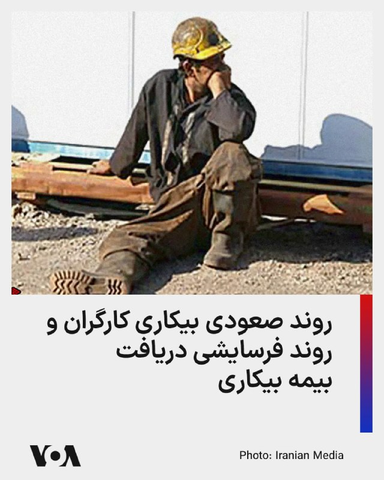

روزنامه شرق با اشاره به «افزایش اخراج کارگران» و «شرایط غیرمعقول دریافت بیمه بیکاری»، در گزارشی نوشت: «این روزها بیمه بیکاری برای بسیاری از نیروهای تعدیل‌شده، نه یک حمایت اجتماعی، بلکه مسیری فرساینده و مبهم است.»

هم‌زمان با موج تازه تعدیل نیرو در برخی رسانه‌ها، شرکت‌ها و مجموعه‌های تولیدی، شمار متقاضیان بیمه بیکاری افزایش یافته، اما بسیاری از متقاضیان از حمایت‌های لازم برخوردار نیستند.

نداشتن قرارداد کاری یا در اختیار نداشتن نسخه‌ای از قرارداد، عدم پرداخت به موقع حق بیمه از سوی کارفرما، اشکالات فنی سامانه ثبت درخواست بیمه بیکاری، انتظارهای طولانی مدت برای بررسی پرونده و پاسخگو نبودن تأمین اجتماعی و وزارت کار از جمله مهم‌ترین مشکلاتی است که روزنامه شرق به آن اشاره کرده است.

در این گزارش آمده است که روابط عمومی بیمه تأمین اجتماعی، مسئولیت مشکلات «ثبت درخواست بیمه بیکاری»را متوجه وزارت کار دانسته و در مقابل پروانه رضایی‌بختیاری، معاون روابط کار وزارت کار، علت را «پایین‌بودن سطح سواد دیجیتال برخی متقاضیان» بیان کرده است.
@FarsiVOA

## FarsiVOA — post 217712

دونالد ترامپ، رئیس جمهوری آمریکا، روز پنج‌شنبه طی سخنانی که در مهمانی شام رسمی که به افتخار او در پکن برگزار شده است، گفت که دو طرف «گفت‌وگوها و نشست‌های بسیار مثبت و سازنده‌ای» داشته‌اند. او رابطه آمریکا و چین را یکی از «سرنوشت‌سازترین روابط در تاریخ جهان» توصیف کرد.

## DW_Farsi — post 124702

  

🔶 عراقچی: امارات مستقیما در اقدام تجاوزکارانه علیه جمهوری اسلامی دخیل بود
 
عباس عراقچی، وزیر امورخارجه جمهوری اسلامی که برای اجلاس بریکس به هند سفر کرده است، در نشست وزیران خارجه در روز پنج‌شنبه ۱۴ مه به شدت به امارات متحده عربی حمله کرد.
 
عراقچی خطاب به وزیر امارات گفت: «ائتلاف شما با اسرائیلی‌ها نیز از شما محافظت نکرد. در سیاست خود در قبال ایران بازنگری کنید.»
 
عراقچی گفت: «من در سخنرانی‌ خود نام امارات متحده عربی را ذکر نکردم، به خاطر حفظ وحدت و ترجیح دادم به آن اشاره نکنم. اما در واقع باید بگویم که امارات مستقیماً در اقدام تجاوزکارانه علیه کشور من دخیل بود. زمانی که این تجاوز آغاز شد، آنها حتی از محکوم کردن آن خودداری کردند.»
 
جمهوری اسلامی در زمان جنگ  صدها موشک و پهپاد به سوی امارات متحده شلیک کرد.
 
در روز گذشته دفتر نخست‌وزیر اسرائیل اعلام کرد بنیامین نتانیاهو در جریان جنگ ایران به‌طور محرمانه به امارات سفر کرده است.
 
دفتر نتانیاهو گفت این سفر به "یک دستاورد تاریخی" در روابط دو طرف منجر شده است.
 
وزارت امور خارجه امارات با این حال در بیانیه‌ای این موضوع را تکذیب کرد.
 
@dw_farsi

## DW_Farsi — post 124701

  

🔶 آنگلا مرکل خواستار مدارای بیشتر آلمانی‌ها و سیاستمداران با دولت مرتس شد
 
آنگلا مرکل، صدراعظم پیشین آلمان، از شهروندان این کشور خواست عملکرد دولت ائتلافی را منصفانه‌تر ارزیابی کنند. این در حالی است که نارضایتی عمومی از عملکرد دولت به‌طور گسترده افزایش یافته است.
 
میزان محبوبیت دولت ائتلافی آلمان از زمان آغاز به کار آن، کمی بیش از یک سال پیش، به‌طور مداوم کاهش یافته است. در برخی نظرسنجی‌های تازه بیش از ۸۰ درصد پاسخ‌دهندگان از عملکرد دولت ابراز نارضایتی کرده‌اند.
 
مرکل که از سال ۲۰۰۵ تا ۲۰۲۱ صدراعظم آلمان بود، نخواست درباره سیاست‌های دولت ائتلافی اتحاد دموکرات مسیحی و حزب سوسیال‌دموکرات به‌طور جزئی اظهار نظر کند. اما تأکید کرد: «برای این دولت آرزوی موفقیت دارم.»
 
او در گفت‌وگو با مجله خبری "فوکوس" افزود: «هر شهروندی باید با خویشتنداری و تعادل، که همیشه از واژه‌های مورد علاقه من هستند، تلاش کند آنچه را که دولت تاکنون انجام داده، ارج نهد. این‌طور نیست که هیچ اتفاقی نیفتاده باشد.»
 
مرکل همچنین خواستار تحمل بیشتر در برابر بحث‌ها و اختلاف‌نظرهای درون دولت شد.
 
@dw_farsi

## DW_Farsi — post 124700

  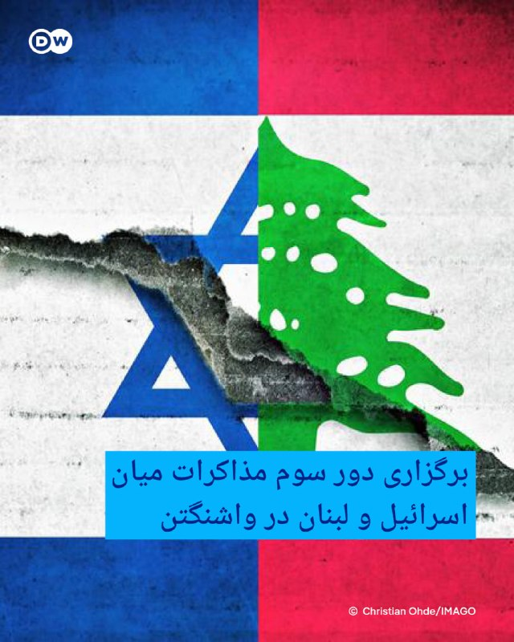

🔶 برگزاری دور سوم مذاکرات میان اسرائیل و لبنان در واشنگتن
 
نمایندگان اسرائیل و لبنان روز پنج‌شنبه ۲۴ اردیبهشت (۱۴ مه) بار دیگر "در تلاش برای رسیدن به یک راه‌حل صلح‌آمیز" در واشنگتن دیدار می‌کنند. این سومین دور گفت‌وگوها از زمان اعلام آتش‌بس است که حدود یک ماه پیش میان  اسرائیل و لبنان برقرار شده است.
 
دونالد ترامپ، رئیس‌جمهور ایالات متحده در آخرین دور مذاکرات در ۲۳ آوریل شخصا از مذاکره‌کنندگان در کاخ سفید استقبال کرده بود.
 
اسرائیل و لبنان به‌طور رسمی هیچ‌گونه روابط دیپلماتیکی با یکدیگر ندارند و از سال ۱۹۴۸ در "وضعیت جنگی" قرار دارند.
 
با وجود آتش‌بسی که از ۱۷ آوریل برقرار شده، اسرائیل و شبه‌نظامیان حزب‌اللهِ مورد حمایت ایران در لبنان همچنان به حملات متقابل خود ادامه داده‌اند.
 
حزب‌الله با مذاکرات لبنان و اسرائیل که بدون حضور و مشارکت این گروه برگزار می‌شود، مخالفت کرده است.
 
جنگ ایران تنش‌ها را بیش از پیش تشدید کرده است.
 
لبنان در اوایل ماه مارس به جنگ ایران کشیده شد. در آن زمان، حزب‌الله لبنان در واکنش به کشته‌شدن علی خامنه‌ای، رهبر جمهوری اسلامی موشک‌هایی به سمت اسرائیل شلیک کرد.
   
@dw_farsi

## DW_Farsi — post 124699

🎥 حمله مرگبار ایران به یک کشتی باری در تنگه هرمز؛ روایت ملوانی که جان به‌در برد
 
یک ملوان تایلندی که سه تن از همکارانش را در حمله مرگبار ایران به کشتی باری "Mayuree Naree" در تنگه هرمز (اسفند ۱۴۰۴) از دست داد، در گفت‌وگو با دویچه وله از این واقعه و پیامدهای آن می‌گوید.
@dw_farsi

## DW_Farsi — post 124698

  

🔶 تشدید سرکوب بهائیان؛ الگوی همیشگی حکومت در ناآرامی‌های سیاسی
 
🔻 گزارشی از الینا فرهادی
 
در حالی که جمهوری اسلامی ایران در ماه‌های اخیر با خیلی از بحران‌های داخلی، تنش‌های منطقه‌ای و فشارهای امنیتی روبه‌رو بوده، جامعه بهائیان ایران بار دیگر با موج تازه‌ای از سرکوب مواجه شده است؛ موجی که این‌بار تنها به بازداشت و احکام قضایی محدود نمانده و با یورش به منازل، مصادره اموال، تبلیغات سازمان‌یافته و طرح اتهام‌های امنیتی علیه شهروندان بهائی همراه شده است.
 
در روزهای گذشته، گزارش‌های منتشرشده از سوی نهادهای حقوق بشری، از افزایش فشارها بر بهائیان در شهرهایی چون شیراز، ساری، کرمان و مشهد خبر داده‌اند.
 
وب‌سایت حقوق بشری "هه‌نگاو" گزارش داده نیروهای امنیتی در روزهای اخیر به خانه فرامرز و پریوش ندافیان، زوج بهائی ساکن شیراز، یورش برده و پس از چند ساعت تفتیش، تلفن‌های همراه، کتاب‌ها، وسایل شخصی و حتی طلا و جواهرات خانواده را ضبط کرده‌اند. یک روز پیش از آن نیز مأموران امنیتی به خانه افسانه جذابی، شهروند بهائی در شیراز حمله کرده و با طرح اتهام "همکاری با اسرائیل"، بخشی ازاموال شخصی  او را مصادره کرده‌اند.
 @dw_farsi

## DW_Farsi — post 124688

📸 آشنایی با ریما حسین؛ رکورددار داوری فوتبال زنان آلمان

وقتی درباره فوتبال حرف می‌زنیم، معمولا همه نگاه‌ها به بازیکنان دوخته می‌شود. اما بعضی شخصیت‌ها بدون آنکه گل بزنند، تاریخ‌ساز می‌شوند.

ریما حسین این آخر هفته پس از بیش از ۲۰ سال فعالیت حرفه‌ای، برای آخرین بار در بوندس‌لیگای زنان سوت خواهد زد؛ در حالی‌که با ۱۵۶ قضاوت، رکورددار داوری در فوتبال زنان آلمان است.

اما نکته‌ای که داستان او را خاص‌تر می‌کند، فقط رکوردهایش نیست. ریما حسین پیش از ورود به داوری بین‌المللی، دکتر داروساز بود و هم‌زمان مسیر دشوار داوری حرفه‌ای را نیز طی کرد.

@dw_farsi

## DW_Farsi — post 124687

🔶 مالزی: ایران برای انتقال نفت از خلأ حقوقی سوءاستفاده می‌کند

ناظران صنعت کشتیرانی و گروه  "اتحاد علیه ایران هسته‌ای" می‌گویند آب‌های نزدیک ایالت جنوبی "جوهور" در مالزی به یکی از مراکز اصلی انتقال کشتی‌به‌کشتی نفت توسط "ناوگان سایه" ایران تبدیل شده است؛ ناوگانی متشکل از نفتکش‌های فرسوده که اغلب با خاموش کردن سیستم‌های رهگیری، استفاده از هویت‌های جعلی و ساختارهای مالکیتی مبهم، منشأ نفت خام خود را پنهان می‌کنند.

این محموله‌های نفتی عمدتاً راهی چین هستند. 

منطقه دریایی جوهور که با نام "EOPL" در دریای چین جنوبی شناخته می‌شود، حدود ۷۰ کیلومتر از سواحل مالزی فاصله دارد. این ناحیه در یکی از پرترددترین مسیرهای تجاری دریایی جهان واقع شده و تقریباً در میانه راه میان ایران و چین قرار دارد. بنا بر برآوردهای کنونی چین حدود ۹۰ درصد نفت ایران را خریداری می‌کند.

منطقه دریایی"EOPL" شامل محدوده لنگرگاهی و آب‌های آزاد در شرق منطقه بندری سنگاپور و سواحل مالزی است که به علت محدودیت‌های حقوقی به عنوان یکی از نقاط کلیدی در انتقال نفت کشتی‌به‌کشتی شناخته می‌شود.

@dw_farsi

## DW_Farsi — post 124686

  

🔶 "تصرف" یک کشتی در نزدیکی سواحل فجیره امارات

مرکز عملیات تجارت دریایی بریتانیا روز پنجشنبه ۱۴ مه (۲۴ اردیبهشت) از وقوع حادثه‌ای در فاصله ۳۹ مایل دریایی شمال شرقی بندر فجیره در شرق امارات متحده عربی خبر داده است.

طبق این گزارش یک کشتی که لنگر انداخته بود، توسط افرادی ناشناس مورد حمله قرار گرفت و اکنون به سمت آب‌های سرزمینی ایران در حرکت است. تا کنون جزییات بیشتری در مورد این حادثه منتشر نشده است.

این رویداد همزمان با سفر دونالد ترامپ، رئیس جمهور آمریکا به پکن و دیدار او با شی جین‌پینگ، همتای چینی او اتفاق افتاده است. کاخ سفید اعلام کرده است که رهبران چین و آمریکا در ملاقات خود اتفاق نظر داشتند که تنگه هرمز باید باز بماند تا جریان آزاد انرژی در منطقه حفظ شود و ایران اجازه مطالبه عوارض برای عبور کشتی‌ها از این آبراه حیاتی را ندارد.

@dw_farsi

## DW_Farsi — post 124685

  

🔶 وریشه مرادی در پرونده‌ای جدید به جرم "نوشتن نامه" به شش ماه حبس محکوم شد

وریشه مرادی، زندانی سیاسی محبوس در زندان اوین، از صدور حکم ۶ ماه حبس قطعی علیه خود به اتهام "تبلیغ علیه نظام" خبر داده شده است. بنا بر اطلاعات کمپین آزادی وریشه مرادی، او هفته پیش طبق ابلاغیه‌ای در جریان محکومیت و این حکم تازه قرار گرفته است.

اتهام مطرح‌شده علیه وریشه مرادی به نوشته‌هایی برمی‌گردد که توسط او در سالگرد جنبش "زن زدگی آزادی" منتشر شده بودند و به این ترتیب، این حکم تازه به پرونده‌های سابق و در حال رسیدگی او افزوده شده است.

وریشه مرادی مردادماه ۱۴۰۲، توسط نیروهای امنیتی در حومه سنندج بازداشت و در تاریخ ۵ دی همان سال، با اتمام مراحل بازجویی از بازداشتگاه وزارت اطلاعات موسوم به بند ۲۰۹ زندان اوین به بند زنان این زندان منتقل شد.

این زندانی سیاسی اواخر آبان سال ۱۴۰۳ توسط شعبه ۱۵ دادگاه انقلاب تهران به ریاست قاضی ابوالقاسم صلواتی از بابت اتهام "بغی" به اعدام محکوم شده بود. اواخر سال گذشته، حکم اعدام ریشه مرادی توسط دیوان عالی کشور نقض و پرونده او جهت رسیدگی مجدد به شعبه هم عرض ارجاع داده شد.

وریشه مرادی در حال حاضر دوران محکومیت خود را در زندان اوین سپری می‌کند.

@dw_farsi

## DW_Farsi — post 124684

  

🔶 کاخ سفید: شی و ترامپ بر سر عدم دستیابی ایران به سلاح هسته‌ای توافق کردند

کاخ سفید اعلام کرد که جنگ ایران و بحران تنگه هرمز در دیدار شی جین‌پینگ، رئیس جمهور چین و دونالد ترامپ، همتای آمریکایی او از جمله موضوعات مورد بحث بوده‌ است.

کاخ سفید با انتشار بیانیه‌ای گفت رهبران چین و آمریکا طی گفت‌وگوهای خود که در روز پنجشنبه ۱۴ مه (۲۴ اردیبهشت) در پکن انجام گرفت در مورد عدم دستیابی جمهوری اسلامی به سلاح هسته‌ای اتفاق نظر داشته‌اند.

در این بیانیه آمده است که ترامپ و شی توافق کردند که تنگه هرمز باید باز بماند تا جریان آزاد انرژی در منطقه حفظ شود و ایران اجازه مطالبه عوارض برای عبور کشتی‌ها از تنگه هرمز را ندارد.

به گفته کاخ سفید، شی جین‌پینگ همچنین علاقه‌مندی خود را به خرید بیشتر نفت آمریکا برای کاهش وابستگی چین به تنگه هرمز در آینده ابراز کرده است. با این حال به گزارش خبرگزاری فرانسه در گزارش منتشر شده از سوی پکن به چنین موضوعی اشاره‌ای نشده است.

پکن در حال حاضر بزرگ‌ترین خریدار و واردکننده نفت از ایران محسوب می‌شود.

@dw_farsi

## DW_Farsi — post 124683

  

📸 کاریکاتور هفته

نزدیک به هشتاد روز است که حکومت ایران اینترنت را قطع کرده و تنها بسته‌ای محدود، کنترل‌شده و بسیار گران‌قیمت با عنوان "اینترنت پرو" را در اختیار گروه‌های خاص قرار می‌دهد. در کنار استفاده‌کنندگان اینترنت پرو، دارندگان "سیم‌کارت‌های سفید" نیز از دسترسی ویژه برخوردارند.

عمده بهره‌مندان از این امتیازها، وابستگان حکومت و حامیان آن هستند که با استفاده از این امکان، تصویری عادی، بزک‌شده و گمراه‌کننده از وضعیت امروز ایران به جهان مخابره می‌کنند؛ تصویری که در آن نشانی از فقر گسترده، سرکوب سیستماتیک، گرانی کمرشکن و موج روزانه اعدام‌های سیاسی دیده نمی‌شود.

این موضوع دستمایه مانا نیستانی در طراحی کاریکاتور هفته برای دویچه وله فارسی بوده است.

@dw_farsi

## Persian_Trend_Official — post 14139

  

🔴 طوفان مرگبار در هند؛ دست‌کم ۸۹ کشته 💢تصاویر منتشرشده از ایالت اوتار پرادش هند، شدت طوفان و بادهای سهمگین در این منطقه را نشان می‌دهد 💢 خبرگزاری رویترز گزارش داده طوفان شدید در ایالت اوتار پرادش هند دست‌کم ۸۹ تا ۱۰۴ کشته برجا گذاشته است. ▪️ در ویدئوهای…

## Persian_Trend_Official — post 14137

  <a href="telegram/content/Persian_Trend_Official_14137_1778769080.mp4" target="_blank">🎬 Download video</a>

🔴 طوفان مرگبار در هند؛ دست‌کم ۸۹ کشته

💢تصاویر منتشرشده از ایالت اوتار پرادش هند، شدت طوفان و بادهای سهمگین در این منطقه را نشان می‌دهد

💢 خبرگزاری رویترز گزارش داده طوفان شدید در ایالت اوتار پرادش هند دست‌کم ۸۹ تا ۱۰۴ کشته برجا گذاشته است.

▪️ در ویدئوهای منتشرشده از شهر بریلی، لحظه بلند شدن یک مرد توسط شدت باد دیده می‌شود

️▪️طبق گزارش‌ها، آن مرد همراه با سقف فلزی توسط باد به هوا پرتاب شد اما زنده مانده و دچار شکستگی دست و پا شده است.

🫆:Tony

📌 @persian_trend_official
پرشین ترند | متفاوت‌ترین کانال نظامی

## Persian_Trend_Official — post 14136

  <a href="telegram/content/Persian_Trend_Official_14136_1778769081.webm" target="_blank">🎬 Download video</a>

🔴 چین تولید جنگنده پنهانکار «جی-۲۰» را با کارخانه تمام‌خودکار افزایش داد

💢گزارش‌ها حاکی است چین به‌صورت بی‌سروصدا بهره‌وری تولید پیشرفته‌ترین جنگنده پنهانکار خود را بیش از دو برابر کرده است.

🔹بر اساس گزارش «ساوت چاینا مورنینگ پست»:

▪️ یکی از کارخانه‌های چنگدو به یک «کارخانه تاریک» تمام‌خودکار تبدیل شده است

▪️ در این مجموعه، ماشین‌ها و خودروهای خودران مبتنی بر هوش مصنوعی تقریباً به‌صورت ۲۴ ساعته فعالیت می‌کنند

▪️ به‌دلیل خودکار بودن فرایندها، نیاز چندانی به روشنایی و نیروی انسانی وجود ندارد

💢این کارخانه اکنون قطعات ساختاری جنگنده پنهانکار «جی-۲۰» ملقب به «اژدهای قدرتمند» را تولید می‌کند؛ جنگنده‌ای که از آن به‌عنوان رقیب چینی «اف-۲۲» آمریکا یاد می‌شود.

🔹بر اساس این گزارش:

▪️ استفاده گسترده از اتوماسیون باعث کاهش هزینه تولید شده است

▪️ وابستگی به نیروی انسانی شبانه‌روزی کاهش یافته

▪️ تولید انبوه جنگنده «جی-۲۰» از سال ۲۰۲۰ آغاز شده است

🫆:Tony

📌 @persian_trend_official
پرشین ترند | متفاوت‌ترین کانال نظامی

## Persian_Trend_Official — post 14135

  

اکانت کاخ سفید در شبکه ایکس:
تاریخ در حرکت است.

☆Phantom☆

📌 @persian_trend_official
پرشین ترند | متفاوت‌ترین کانال نظامی

## Persian_Trend_Official — post 14134

خدارو شکر دیگه کم کم هر ننه قمری فاز کوسه برداشته و میخواد به حساب دیگران رسیدگی کنه! جناب کریم شیره ای، شما اگر خیلی حساب و کتاب سرت میشه برو پول بساطت رو با ساقی محل حساب کن .

## Persian_Trend_Official — post 14131

کانال هذیان گو اخبار سوریه، با محتوایی سمی و تخیلی ۶۰۰ میلیون از وزارت نفت به اسم تبلیغات !!! هزینه میگیره !

ادعای خط انرژی در مورد دریافتی ۶۰۰ میلیون تومانی مالک کانال ارزشی، قلم به مزد و دروغ پرداز اخبار سوریه از پتروشیمی آریا

در این کشور برای هر نوع چریدن و هدر دادن بیت المال پول کافی وجود دارد اما برای خرج های اصلی مملکت یا ساخت ارتشی توانمند دچار کسری بودجه ایم!

https://farsnews.ir/Khate_energy/1778660394098111565/%D8%A7%D8%B2-%D8%A7%D8%AE%D8%A8%D8%A7%D8%B1-%D8%B3%D9%88%D8%B1%DB%8C%D9%87-%D8%AA%D8%A7-%D9%88%D8%B2%D8%A7%D8%B1%D8%AA-%D9%86%D9%81%D8%AA-%D9%88-%D9%BE%D8%AA%D8%B1%D9%88%D8%B4%DB%8C%D9%85%DB%8C-%D8%A2%D8%B1%DB%8C%D8%A7%D8%B3%D8%A7%D8%B3%D9%88%D9%84-%DA%86%D8%B1%D8%A7-%D8%A8%D9%87-%D8%AE%D8%B7-%D8%A7%D9%86%D8%B1%DA%98%DB%8C-%D8%AD%D9%85%D9%84%D9%87-%D9%85%DB%8C-%DA%A9%D9%86%D9%86%D8%AF

📌 @persian_trend_official
پرشین ترند | متفاوت‌ترین کانال نظامی

## Persian_Trend_Official — post 14130

  

🔴عباس عراقچی، وزیر امور خارجه جمهوری اسلامی، و سرگئی لاوروف، وزیر امور خارجه روسیه، در شهر دهلی نو (پایتخت هند) با یکدیگر دیدار و گفتگو کردند

🫆:Tony

📌 @persian_trend_official
پرشین ترند | متفاوت‌ترین کانال نظامی

## Persian_Trend_Official — post 14127

🇬🇧 صبح امروز ویدئویی منتشر شد که ورود زیردریایی هسته‌ای «HMS Anson» متعلق به نیروی دریایی سلطنتی بریتانیا به جبل‌الطارق رو نشون میده؛ موضوعی که اعزام این زیردریایی به منطقه غرب آسیا رو تا حد زیادی تأیید می‌کنه.

اچ ام اس آنسون از پیشرفته‌ترین زیردریایی‌های تهاجمی کلاس Astute به‌شمار میره و به راکتور هسته‌ای مجهزه؛ یعنی می‌تونه ماه‌ها بدون نیاز به سوخت‌گیری در عمق دریا عملیات انجام بده و با سطح صدای بسیار پایین، شناسایی اون برای دشمن سخت باشه.

این زیردریایی معمولاً در مأموریت‌های شناسایی و جمع‌آوری اطلاعات، رهگیری زیردریایی‌ها و ناوهای دشمن، حفاظت از ناوگروه‌های دریایی، حملات موشکی دوربرد به اهداف زمینی و حتی پشتیبانی از عملیات نیروهای ویژه استفاده میشه.

اچ ام اس آنسون توان حمل تا ۳۸ سلاح رو داره که از طریق ۶ لوله اژدر ۲۱ اینچی شلیک میشن؛ از جمله موشک‌های کروز <<Tomahawk Block IV>> با برد بالا و دقت زیاد برای هدف قرار دادن مراکز نظامی و زیرساخت‌ها، و اژدرهای سنگین <<Spearfish>> برای نابودی شناورهای سطحی و زیردریایی‌ها.
حضور چنین زیردریایی‌هایی معمولاً در شرایط تنش نظامی یا برای نمایش قدرت و افزایش بازدارندگی انجام میشه؛ مخصوصاً در مناطقی که اهمیت راهبردی بالایی دارن.

☆Phantom☆

📌 @persian_trend_official
پرشین ترند | متفاوت‌ترین کانال نظامی

## Persian_Trend_Official — post 14126

  <a href="telegram/content/Persian_Trend_Official_14126_1778769083.mp4" target="_blank">🎬 Download video</a>

❗️پاکستان با موفقیت موشک کروز زمین‌پایه بومی «فتح-۴» را آزمایش کرد.

ویدئو منتشرشده لحظه شلیک این موشک را نشان می‌دهد؛ موشک پس از پرتاب با طی مسیر خود، هدف تعیین‌شده را با اصابت دقیق و انفجاری سنگین منهدم می‌کند.

گفته می‌شود «فتح-۴» در چارچوب توسعه توان بازدارندگی و ارتقای قابلیت حملات دقیق دوربرد پاکستان طراحی شده و بخشی از برنامه نوسازی سامانه‌های موشکی این کشور به‌شمار می‌رود.

☆Phantom☆

📌 @persian_trend_official
پرشین ترند | متفاوت‌ترین کانال نظامی

## Persian_Trend_Official — post 14125

  <a href="telegram/content/Persian_Trend_Official_14125_1778769084.mp4" target="_blank">🎬 Download video</a>

ما با تنگه هرمز می‌خوایم از دنیا باج بگیریم، نه غرامت بگیریم !!!

پ.ن : چند وقت دیگه یجوری میزنن توی سرتون که مثل آهو دنبال توافق باشید ولی دیگه فایده نداره ...

📌 @persian_trend_official
پرشین ترند | متفاوت‌ترین کانال نظامی

## Persian_Trend_Official — post 14124

https://t.me/persian_trend_official/14122?comment=545135

واقعیت این‌طور نیست. همکاران من زحمت بسیار زیادی می‌کشند و بخش مهمی از بار کانال بر دوش ادمین‌هاست. طبیعی است که گاهی بین ما اختلاف‌نظر یا تفاوت سلیقه وجود داشته باشد، اما همه تلاش کرده‌اند چارچوب‌ها و اصول «پرشین ترند» حفظ شود.

در مورد برخی اشتباهات هم باید صادقانه گفت که تا حدی اجتناب‌ناپذیر هستند. خود من هم بارها دچار خطا شده‌ام و اساساً هیچ‌کس نمی‌تواند ادعا کند کاملاً بدون اشتباه است.

اما نقطه قوت و پویایی «پرشین ترند» دقیقاً همین‌جاست؛ به‌محض اینکه اشتباهی شناسایی شود، اصلاح می‌شود و حتی در بسیاری موارد، این فرصت ایجاد می‌شود که اطلاعات کامل‌تر و دقیق‌تری در اختیار شما قرار بگیرد تا موضوع به‌صورت کامل روشن شود.

از توجه شما به این موضوع سپاسگزارم
الیاس فرخ

## Persian_Trend_Official — post 14123

  <a href="telegram/content/Persian_Trend_Official_14123_1778769086.webm" target="_blank">🎬 Download video</a>

عبارت 13 سال ثابت نگه داشتن تورم درست نیست. در بخش مهمی از دهه ۴۰، ایران تورم پایینی داشت اما در دهه ۵۰ و به‌ویژه سال‌های پایانی دولت هویدا، تورم به‌شدت افزایش یافت. بنابراین ادعای «۱۳ سال ثابت نگه داشتن تورم» دقیق نیست و بیشتر یک روایت تبلیغاتی است تا تحلیل…

## Persian_Trend_Official — post 14122

هویدا نخست وزیر ایران در زمان شاه سیزده سال تورم ایران رو ثابت نگه داشته بود؛ زمانیکه بهش نامه زدن به خاطر ماه محرم اداره ها با تاخير باز بشن، در جواب نوشت: “با سلام، موافقت نميشود. عبادت بجز خدمت خلق نيست.” 📝 Nick 📌 @persian_trend_official پرشین ترند |…

## Persian_Trend_Official — post 14121

  <a href="telegram/content/Persian_Trend_Official_14121_1778769086.mp4" target="_blank">🎬 Download video</a>

🔴وزیر دفاع اسرائیل، کاتز درباره ایران

💢ماموریت ما کامل نشده است.

💢ما برای احتمال اینکه ممکن است مجبور شویم دوباره اقدام کنیم - شاید حتی به زودی - آماده‌ایم.

▪️اگر اهداف تأمین نشوند، دوباره اقدام خواهیم کرد.

🫆:Tony

📌 @persian_trend_official
پرشین ترند | متفاوت‌ترین کانال نظامی

## Persian_Trend_Official — post 14120

🔴مارکو روبیو:

💢طرف چینی گفت که آنها موافق نظامی کردن تنگه هرمز یا سیستم عوارضی نیستند و این موضع ما است.

🫆:Tony

📌 @persian_trend_official
پرشین ترند | متفاوت‌ترین کانال نظامی

## RadioFarda — post 157181

  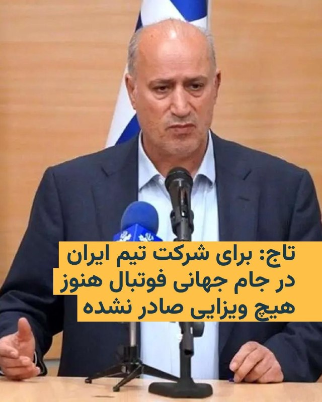

🔸رئیس فدراسیون فوتبال ایران می‌گوید هنوز برای هیچیک از اعضای تیم ملی برای شرکت در جام جهانی ۲۰۲۶ ویزا صادر نشده است.

🔸خبرگزاری جمهوری اسلامی، ایرنا، به نقل از مهدی تاج نوشته است: «فردا یا پس‌فردا جلسه‌ای سرنوشت‌ساز با فیفا خواهیم داشت. آن‌ها باید به ما تضمین بدهند، زیرا هنوز مسئله ویزا حل نشده.»

🔸او افزود: «روایتی از سوی طرف مقابل مبنی بر اینکه به چه کسانی ویزا داده‌اند، دریافت نکرده‌ایم. هنوز هیچ ویزایی نیامده است.»

🔸رئیس فدراسیون فوتبال ایران که در روزهای اخیر شرط‌هایی برای حضور در جام جهانی از جمله لزوم صدور ویزا برای کل اعضای تیم و کادر فنی اعلام کرده بود، همچنین گفت: «ما در حال آماده‌سازی برای جام جهانی هستیم، اما منتظر رفتار طرف مقابل هستیم.»

🔸کاروان تیم ملی فوتبال روز چهارشنبه به ترکیه رفت تا بعد از یک اردوی چند روزه عازم آمریکا به عنوان میزبان مسابقات تیم ایران شود.

🔸رئیس فیفا پیش‌تر چند بار گفته است که ایران قطعا در جام جهانی شرکت خواهد کرد. دونالد ترامپ، رئیس‌جمهور ایالات متحده، نیز اعلام کرده که مشکلی با حضور ایران ندارد.

@RadioFarda

## RadioFarda — post 157180

  

🔸ستاد فرماندهی مرکزی ایالات متحده، سنتکام، روز پنجشنبه ۲۴ اردیبهشت با انتشار تصویری از عملیات ناو آمریکایی «یو‌اس‌اس تراکستون» در دریای عرب اعلام کرد که نیروهای این فرماندهی تاکنون ۷۰ کشتی تجاری را در چارچوب محاصره دریایی ایران وادار به تغییر مسیر کرده‌اند.

🔸سنتکام همچنین اعلام کرد چهار شناور نیز برای اجرای محاصره «از کار انداخته» شده‌اند.

🔸سنتکام پیش‌تر گفته بود در چارچوب این عملیات، به ۱۵ کشتی حامل کمک‌های بشردوستانه اجازه عبور داده شده و نیروهای آمریکایی برای وادار کردن برخی کشتی‌ها به تغییر مسیر، از تماس رادیویی و شلیک تیر هشدار نیز استفاده کرده‌اند.

🔸آمریکا پس از بی‌نتیجه ماندن مذاکرات مستقیم با ایران، محاصره دریایی بنادر جمهوری اسلامی را آغاز کرد؛ در حالی که ایران از ابتدای جنگ تنگه هرمز را مسدود کرده است.

@RadioFarda

## RadioFarda — post 157179

  

🔸رسانه‌های حکومتی ایران روز چهارشنبه گفتند نیروهای نظامی جمهوری اسلامی از شامگاه گذشته به گروهی از کشتی‌های چینی اجازه عبور از تنگه هرمز را داده‌اند.

🔸ساعتی بعد صداوسیمای جمهوری اسلامی اعلام کرد «بیش از ۳۰ کشتی» اجازه عبور از این آبراه را یافته‌اند، اما مشخص نکرد که آیا همه آنها چینی بوده‌اند یا نه.

🔸خبرگزاری‌های فارس و تسنیم، هردو نزدیک به سپاه پاسداران، به نقل از منابع آگاه خبر دادند که «با تصمیم جمهوری اسلامی» امکان عبور تعدادی از کشتی‌های چینی از تنگه هرمز «با رعایت پروتکل مدیریت ایرانی تنگه» فراهم شده است.

🔸این اتفاق همزمان با حضور دونالد ترامپ، رئیس‌جمهور آمریکا، در چین رخ داده است. کاخ سفید گفته واشینگتن و پکن توافق کردند که تنگه هرمز باید برای حفظ جریان آزاد انرژی باز بماند و رئیس‌جمهور چین مخالفت چین با «نظامی‌سازی» این آبراه و هرگونه تلاش برای دریافت عوارض برای استفاده از آن را اعلام کرده است.

🔸ایران از زمان آغاز حملات آمریکا و اسرائیل در نهم اسفند سال گذشته، تنگه هرمز را مسدود کرده و آمریکا نیز بعد از آتش‌بس دست به محاصره دریایی ایران زده است.

@RadioFarda

## RadioFarda — post 157178

🔸امید برزگری، مربی سازمان امداد و نجات هلال احمر، در یک گفت‌وگوی تصویری با خبر آن‌لاین دربارۀ سگ‌های امداد و نجات گفت «این سگ‌ها پست نیستند؛ فرشته‌اند، فرشتۀ نجات».

🔸آقای برزگری که به همراه همکارش و دو سگ نجات خود در این گفت‌وگو شرکت کرده بود این جمله را در پاسخ به گزارشی از صداوسیمای جمهوری اسلامی گفت که از مردم پرسیده بود «چه کسی از سگ‌های هلال احمر پست‌تر است».

🔸جمعیت هلال احمر ایران روز سه‌شنبه ۲۵ فروردین اعلام کرد که سگ‌های زنده‌یاب این سازمان، از ابتدای جنگ اخیر، در ۷۹۲ عملیات جستجو و نجات شرکت کردند که از این تعداد، در ۷۱۱ عملیات موفق به زنده‌یابی و جستجوی پیکر کشته‌شدگان شدند.

🔸سگ‌های تجسس هلال احمر در جنگ ۱۲ روزه اسرائیل و ایران هم نقش مهمی ایفا کردند و شماری از سگ‌های زنده‌یاب هلال احمر زخمی و دست کم دو قلاده از آن‌ها در جریان عملیات کشته شدند.

🔸استفاده از سگ‌ها در مواقع جنگ و حوادث غیرمترقبه در ایران در حالی است که داشتن این حیوان خانگی از سوی مقامات جمهوری اسلامی نماد «فرهنگ غربی» توصیف و همواره منع می‌شود.
@RadioFarda

## RadioFarda — post 157177

🔸رسانه‌های ایران می‌گویند وزیر خارجه جمهوری اسلامی در نشست بریکس در دهلی‌نو، امارات متحده عربی را به «دخالت مستقیم» در عملیات نظامی علیه کشورش متهم کرد. 🔸این تنش یک روز پس از آن رخ داد که امارات ادعای بنیامین نتانیاهو، نخست‌وزیر اسرائیل، مبنی بر سفر به این…

## RadioFarda — post 157176

  

🔸رسانه‌های ایران می‌گویند وزیر خارجه جمهوری اسلامی در نشست بریکس در دهلی‌نو، امارات متحده عربی را به «دخالت مستقیم» در عملیات نظامی علیه کشورش متهم کرد.

🔸این تنش یک روز پس از آن رخ داد که امارات ادعای بنیامین نتانیاهو، نخست‌وزیر اسرائیل، مبنی بر سفر به این کشور حاشیه خلیج فارس در جریان جنگ ایران را رد کرد.

🔸خبرگزاری مهر به نقل از عراقچی نوشت: «من به خاطر حفظ وحدت، در سخنرانی‌ام در بریکس نامی از امارات نبردم. اما حقیقت این است که امارات مستقیماً در تجاوز علیه کشور من دخیل بود. وقتی حملات آغاز شد، آن‌ها حتی آن را محکوم هم نکردند.»

🔸رسانه‌های ایرانی مشخص نکردند که نماینده امارات چه اظهاراتی در این نشست مطرح کرده بود.

🔸بر اساس این گزارش‌ها، عراقچی همچنین گفت که «نه پایگاه‌های آمریکا و نه اتحاد با اسرائیل برای امارات امنیت به همراه نیاورده و این کشور باید در سیاست خود نسبت به ایران تجدیدنظر کند».

@RadioFarda

## RadioFarda — post 157175

  

🔸مرکز عملیات تجارت دریایی بریتانیا روز پنجشنبه ۲۴ اردیبهشت اعلام کرد پس از وقوع حادثه‌ای دریایی در شمال شرقی امارات متحده عربی، «افراد غیرمجاز» کنترل یک کشتی در لنگرگاه را به دست گرفته‌اند و این کشتی اکنون به سوی آب‌های سرزمینی ایران در حرکت است.

🔸این نهاد گفت گزارشی دربارهٔ حادثه دریایی در ۳۸ مایل دریایی (حدود ۷۰ کیلومتری) شمال شرقی بندر فجیره امارات متحده عربی دریافت کرده و پس از آن، کشتی به تصرف درآمده و مسیر آن به سوی آب‌های سرزمینی ایران تغییر داده شده است.

🔸از مشخصات این کشتی و هویت افرادی که کنترل آن را در دست گرفته‌اند، هنوز اطلاعاتی منتشر نشده است.
@RadioFarda

## RadioFarda — post 157173

  

🔸وزارت خارجه هند حمله به یک کشتی با پرچم این کشور را که می‌گوید روز چهارشنبه ۲۳ اردیبهشت در نزدیکی سواحل عمان رخ داده است، «غیرقابل قبول» خواند.

🔸وزارت خارجه هند در بیانیه‌ای افزود که هدف قرار دادن کشتی‌های تجاری و دریانوردان غیرنظامی باید متوقف شود و از مقام‌های عمان برای نجات خدمه تشکر کرد.

🔸شرکت امنیت دریایی «ونگارد» نام این کشتی را «ام‌اس‌وی حاج علی» اعلام کرده و گفته است که این لنج چوبی ۵۴ متری در نزدیکی سواحل لیما در عمان، در جنوب تنگه هرمز، پس از وقوع انفجار غرق شده است.

🔸بر اساس این گزارش، کشتی در حال انتقال دام از بندر بربره در سومالی‌لند به شارجه در امارات متحده عربی بوده که احتمالاً هدف حمله پهپادی یا موشکی قرار گرفته است.

🔸حکومت ایران از نهم اسفند پارسال و شروع جنگ آمریکا و اسرائیل با ایران عملاً تنگه هرمز را مسدود کرده و آمریکا نیز با وجود آتش‌بس شکننده‌ای که از ۱۹ فروردین برقرار شده، محاصره دریایی بنادر ایران را ادامه داده است.

@RadioFarda

## RadioFarda — post 157172

  <a href="https://t.me/radiofarda/157172" target="_blank">📎 Download file</a>

📻بشنوید: ساعت ۱۴ با رادیوفردا، ۲۴ اردیبهشت ۱۴۰۵‌

@Radiofarda

## RadioFarda — post 157171

لِگو، هیپ‌هاپ و هوش مصنوعی؛ ایران چگونه بر افکار عمومی غرب اثر می‌گذارد

🔸جنگ ایران درس‌های تازه‌ای دربارهٔ نحوهٔ استفاده از هوش مصنوعی به‌عنوان ابزاری در جنگ‌های مدرن و حکمرانی دولتی آشکار کرده است. حکومت ایران به‌طور فزاینده‌ای تبلیغات تولیدشده با هوش مصنوعی، عملیات سایبری، جنگ روانی و کارزارهای نفوذ را در قالب یک اکوسیستم دیجیتال پیچیده برای مخاطبان داخلی و خارجی در هم آمیخته است.

🔸از ویدئوهای وایرال‌شده به سبک لگو و قطعات هیپ‌هاپ ساخته‌شده با هوش مصنوعی گرفته تا عملیات پنهانی در شبکه‌های اجتماعی و تصاویر جعلی میدان جنگ، تاکتیک‌های حکومت ایران برای نفوذ بیشتر به‌سرعت در حال تحول است و بیش از پیش مخاطبان غربی را هدف قرار می‌دهد.

🔸رادیو اروپای آزاد/رادیو آزادی برای بررسی چگونگی استفادهٔ جمهوری اسلامی از هوش مصنوعی در تبلیغات و جنگ اطلاعاتی، با مکس لِسِر، تحلیلگر ارشد تهدیدهای نوظهور در مرکز نوآوری سایبری و فناوری بنیاد دفاع از دموکراسی‌ها، گفت‌وگو کرده است.

🔸 گزارش کامل را در وب‌سایت رادیو فردا می‌توانید بخوانید.

@RadioFarda

## RadioFarda — post 157170

  

🔸گزارش‌ها از ایران حاکی از بازداشت مهدی شفاخواه، فعال اجتماعی و مربی داوطلب کودکان کار، توسط وزارت اطلاعات است.

🔸شماری از رسانه‌های حقوق بشری از جمله وب‌سایت هه‌نگاو نوشته‌اند که آقای شفاخواه «در پی یورش نیروهای وزارت اطلاعات جمهوری اسلامی ایران به منزل شخصی‌اش بازداشت و به مکان نامعلومی منتقل شد».

🔸بازداشت او عصر روز سه‌شنبه ۲۲ اردیبهشت صورت گرفته و مأموران وزارت اطلاعات، ضمن بازداشت این فعال اجتماعی اقدام به تفتیش منزل و ضبط لوازم شخصی او نیز کرده‌اند.

🔸هنوز از دلایل بازداشت، اتهامات انتسابی و محل دقیق نگهداری شفاخواه هیچ اطلاع دقیقی در دسترس نیست و پیگیری‌های خانواده او برای کسب اطلاع از وضعیت سلامت او بی‌نتیجه مانده است.

🔸مهدی شفاخواه طی سال‌های اخیر به صورت داوطلبانه در مناطق محروم و حاشیه‌نشین فعالیت داشته و از طریق آموزش ورزش و مهارت‌های اجتماعی به کودکان کار و نوجوانان آسیب‌پذیر، در راستای کاهش آسیب‌های اجتماعی از جمله اعتیاد و بزهکاری تلاش می‌کرد.

🔸او برادر رضا شفاخواه، وکیل دادگستری و فعال حقوق کودکان و زندانیان سیاسی، است.

@RadioFarda

## RadioFarda — post 157169

  <a href="https://t.me/radiofarda/157169" target="_blank">📎 Download file</a>

🔸اپیزود ۵۲ پادکست لایه هفتم | گزارش تهدیدهای امنیت سایبری در نیمه دوم ۱۴۰۴

🔸در این اپیزود از بدافزارهای اندرویدی که برای رصد فعالیت‌های آنلاین در گوشی کاربران پنهان می‌شوند صحبت می‌کنیم، همین‌طور از شکل‌های تازه جعل هویت، داکسینگ (یا همان افشای اطلاعات شخصی) و حتی مواردی که حمله سایبری می‌توانسته مقدمه‌ای برای ربایش فیزیکی افراد باشد.

🔸همچنین با حضور داوود سجادی و امیر رشیدی، گزارش جدید تهدیدهای امنیت سایبری ایران در نیمه دوم سال پرالتهاب ۱۴۰۴ را بررسی می‌کنیم. همچنین در ادامه، اصول و راهکارهای عملی برای مقابله با این تهدیدات و محافظت از خود را مرور می‌کنیم.

🔸فردا پادکست 🎧

## RadioFarda — post 157168

  

📷 Photo

## RadioFarda — post 157167

  

🔸 کاخ سفید اعلام کرد دونالد ترامپ، رئیس‌جمهور آمریکا، و شی جین‌پینگ، رئیس‌جمهور چین، در دیدار خود درباره گسترش همکاری‌های اقتصادی، باز ماندن تنگه هرمز و جلوگیری از دستیابی ایران به سلاح هسته‌ای گفت‌وگو و توافق کردند.

🔸 کاخ سفید روز پنجشنبه ۲۴ اردیبهشت در بیانیه‌ای اعلام کرد که دو طرف دربارهٔ افزایش دسترسی شرکت‌های آمریکایی به بازار چین و افزایش سرمایه‌گذاری چین در صنایع آمریکا گفت‌وگو کردند و شماری از مدیران بزرگ‌ترین شرکت‌های آمریکایی نیز در بخشی از این دیدار حضور داشتند.

🔸 کاخ سفید افزود دو کشور همچنین توافق کردند که تنگه هرمز باید برای حفظ جریان آزاد انرژی باز بماند.

🔸 بر اساس این بیانیه، شی جین‌پینگ مخالفت چین با «نظامی‌سازی» تنگه هرمز و هرگونه تلاش برای دریافت عوارض برای استفاده از آن را اعلام کرد و نسبت به خرید بیشتر نفت آمریکا برای کاهش وابستگی چین به این مسیر در آینده ابراز علاقه‌مندی کرد.

🔸 کاخ سفید همچنین اعلام کرد که آمریکا و چین توافق دارند ایران «هرگز» نباید به سلاح هسته‌ای دست یابد.

@RadioFarda

## RadioFarda — post 157166

سایه جنگ غزه همچنان بر سر یوروویژن سنگینی می‌کند؛ وضع قوانین تازه

🔸جنگ ایران درس‌های تازه‌ای دربارهٔ نحوهٔ استفاده از هوش مصنوعی به‌عنوان ابزاری در جنگ‌های مدرن و حکمرانی دولتی آشکار کرده است.

🔸 حکومت ایران به‌طور فزاینده‌ای تبلیغات تولیدشده با هوش مصنوعی، عملیات سایبری، جنگ روانی و کارزارهای نفوذ را در قالب یک اکوسیستم دیجیتال پیچیده برای مخاطبان داخلی و خارجی در هم آمیخته است.

🔸 از ویدئوهای وایرال‌شده به سبک لگو و قطعات هیپ‌هاپ ساخته‌شده با هوش مصنوعی گرفته تا عملیات پنهانی در شبکه‌های اجتماعی و تصاویر جعلی میدان جنگ، تاکتیک‌های حکومت ایران برای نفوذ بیشتر به‌سرعت در حال تحول است و بیش از پیش مخاطبان غربی را هدف قرار می‌دهد.

🔸 رادیو اروپای آزاد/رادیو آزادی برای بررسی چگونگی استفادهٔ جمهوری اسلامی از هوش مصنوعی در تبلیغات و جنگ اطلاعاتی، با مکس لِسِر، تحلیلگر ارشد تهدیدهای نوظهور در مرکز نوآوری سایبری و فناوری بنیاد دفاع از دموکراسی‌ها، گفت‌وگو کرده است.

🔸گزارش کامل را در وب‌سایت رادیو فردا می‌توانید بخوانید.

@RadioFarda

## RadioFarda — post 157165

  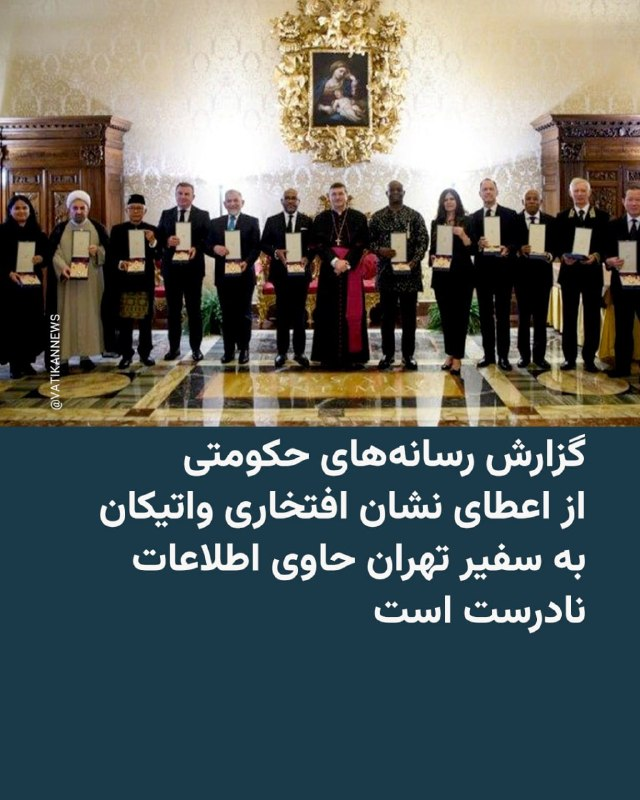

🔸رسانه‌های حکومتی ایران مدعی شدند که پاپ لئون چهاردهم «بالاترین نشان افتخاری دیپلماتیک واتیکان» را به سفیر جمهوری اسلامی ایران نزد سریر مقدس اعطا کرده و این نشان «به سفیران و شخصیت‌های برجسته‌ای اعطا می‌شود که در تقویت روابط دیپلماتیک و خدمت به صلح و گفت‌وگو نقش‌آفرینی کرده‌اند».

🔸بر اساس گزارش رسمی واتیکان، این نشان که از درجات نشان «پیوس نهم» به شمار می‌رود، به‌صورت هم‌زمان به ۱۳ سفیر دارای اعتبار نزد واتیکان اعطا شده و یک رویهٔ معمول دیپلماتیک برای سفیرانی است که بیش از دو سال در واتیکان خدمت کرده‌اند.

🔸واتیکان همچنین تصریح کرده که این نشان را شخص پاپ اعطا نکرده، بلکه مراسم توسط پائولو رودلی، از مقام‌های دبیرخانهٔ دولت واتیکان، برگزار شده است.

🔸این در حالی است که رسانه‌های جمهوری اسلامی ایران روز ۲۲ اردیبهشت تصویری از دیدار محمدحسین مختاری، سفیر جمهوری اسلامی ایران، با پاپ لئون چهاردهم در واتیکان را هم در کنار گزارش خود منتشر کرده بودند.

@RadioFarda

## IranianMinds — post 20132

🔴 شرکت هواپیمایی ایتالیایی ITA Airways بازگشت پروازهای خود به اسرائیل را تا اول جولای به تعویق انداخت

@IranianMinds

## IranianMinds — post 20131

🔴 فرمانده سنتکام :

ما هر لحظه آماده حرکت علیه ایران هستیم

@IranianMinds

## IranianMinds — post 20130

🔴 وزیر خزانه‌داری آمریکا:
طی سه روز گذشته هیچ بارگیری در تاسیسات نفتی ایران انجام نشده است.

@IranianMinds

## IranianMinds — post 20129

  

😤دنبال یه سایت شرط بندی بین المللی بودی که به ایرانیا خدمات بده؟!
⛔

👍دربی بت همون انتخاب  100%

💎ویژگی های سایت جهانی Derby Bet:

⬅️امکان شارژ امن با کارت بانکی

⬅️واریز اول دوبل شارژ می شوید(بونوس۱۰۰٪)

⬅️پر اپشن ترین سایت فعال در ایران

⬅️تسویه حساب کمتر از 5 دقیقه

⬅️برگشت بخشی از باخت به صورت هفتگی

🚨کد هدیه ثبت نام:GG007

⚠️برای دانلود اپلکیشن کلیک کنید
👉
ge24

🔔کانال دربی بت :

🪙https://t.me/+aCbq7yy8QY80NzQ0

## IranianMinds — post 20128

  

🔴کاخ سفید:

هر دو کشور ( چین و آمریکا ) توافق کردند که ایران هرگز نمی‌تواند سلاح هسته‌ای داشته باشد.

@IranianMinds

## IranianMinds — post 20127

  

لامین یامال بازیکن چپول بارسلونا که تو‌ جشن قهرمانی بارسا پرچم فلسطینو گرفته دستش @IranianMinds

## IranianMinds — post 20126

ShirOKhorshid-2026.05.14.apk

## IranianMinds — post 20125

ShirOKhorshid-2026.05.14.apk

## IranianMinds — post 20124

  <a href="https://t.me/IranianMinds/20124" target="_blank">📎 Download file</a>

آموزش اتصال به اینترنت بین الملل:

🔺 مهم: اگر این نسخه رو نصب کنید دیگه دردسر ستاپ کردن MITM و... ندارید!
این نسخه حدودا یک ساعت پیش توسط برنامه‌نویس شیر و خورشید آپدیت شد و به راحتی می‌تونید طبق این آموزش بهش وصل بشید:
1- وارد اپلیکیشن شیر و خورشید(آخرین نسخه که امروز منتشر شده) می‌شید
2- وارد بخش Options میشید از نوار بالا
3- روی More Options کلیک میکنید
4- گزینه‌ی Connection Protocol رو قرار میدید روی CDN Fronting
5- میرید و عادی کانکت میشید و به راحتی وصل میشه.

@IranianMinds

## IranianMinds — post 20123

  

🔴پست کاخ سفید در ایکس:
تاریخ در حرکت است.

@IranianMinds

## IranianMinds — post 20122

  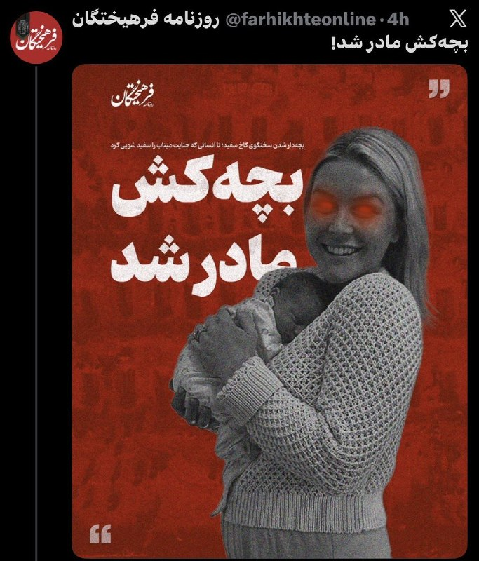

🔴 ببین کی داره اینو میگه…

دو روز ۱۸ و ۱۹ دی ۱۴۰۴، ۲۳۶ کودک رو کشتید.
۵۵۵ بچه رو هم بازداشت کردید.

آها یادم نبود کودکان غزه و فلسطین مال شماس.

@IranianMinds

## IranianMinds — post 20121

  

⚠️اوتباند موجود⚠️

🔋حداقل خرید 30GB

♾حداکثر محدودیتی نداره

50GB ➡️ 180

100GB ➡️140

200GB ➡️120

+500GB ➡️100

🧬 500 گیگ به بالا امکان تسویه روزانه نیز فراهم می باشد

⬅️دارای لود بالانس و اپتایم 99/9% بدون قعطی
⬅️تست موجود می باشد

جهت خرید و استعلام قیمت🟡

@xan_vpnn

کانال:

https://t.me/+qNjExGEJztE2OGI0

## IranianMinds — post 20120

  

🔴بنر حامیان حکومت در تجمع دیشب تهران:
سید مجید نقطه‌زن، امتحانا نزدیکه، یه جایی‌رو زود بزن.

@IranianMinds

## IranianMinds — post 20119

  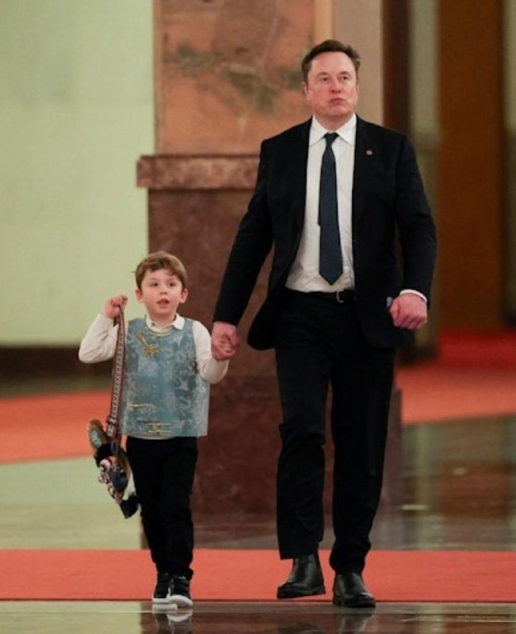

ایلان ماسک به همراه پسرش در نشست پکن شرکت کرد.

@IranianMinds

## IranianMinds — post 20118

  <a href="telegram/content/IranianMinds_20118_1778769098.mp4" target="_blank">🎬 Download video</a>

🔴 صحبت‌های امروز اسکات بسنت، وزیر خزانه‌داری آمریکا راجب ایران و جمهوری‌اسلامی: تا اینجای امسال، رژیم ایران ۳۰ تا ۴۰ هزار نفر رو اعدام کرده (کُشته) و خیلی‌هاشون هم معترضای مسالمت‌آمیز بودن. خب با همچین رژیمی چطور باید برخورد کرد؟ از نظر اقتصادی خفه‌ش می‌کنیم و فکر می‌کنیم کار به جایی رسیده که سربازاشون حقوق نمی‌گیرن و نمی‌تونن از خارج هم سلاح و مهماتشون رو تأمین کنن. برای همین فکر می‌کنم دیگه دارن به آخر خط می‌رسن.

@IranianMinds

## IranianMinds — post 20117

🔴 یسرائیل کاتز، وزیر دفاع اسرائیل، درباره ایران: ماموریت ما کامل نشده؛ ما برای احتمال اینکه ممکنه مجبور شیم دوباره اقدام کنیم، شاید حتی «بزودی» آماده‌ایم. اگر اهدافمون تأمین نشن، دوباره اقدام خواهیم کرد.

@IranianMinds

## IranianMinds — post 20116

  

🔴 کاخ سفید پس از مذاکرات دوجانبه ایالات متحده و چین در پکن، پایتخت چین، در بیانیه‌ای اعلام کرد که دو هیئت در مورد مسائلی مانند دسترسی به بازار چین، سرمایه‌گذاری چین در صنایع ایالات متحده، مواد مخدر، به ویژه فنتانیل، «جریان آزاد» تجارت از طریق تنگه هرمز و سایر مسائل کلیدی گفتگو کردند.

@IranianMinds

## BBCPersian — post 281034

🔻دولت اسرائیل از نیویورک‌تایمز به خاطر مقاله‌اش شکایت می‌کند

🔻دفتر نخست‌وزیری اسرائیل روز پنج‌شنبه با صدور بیانیه‌ای اعلام کرد که این کشور علیه روزنامه نیویورک تایمز به دلیل انتشار یادداشتی از نیکلاس کریستوف که شامل اتهاماتی مبنی بر سوءاستفاده جنسی جدی از فلسطینیان در زندان‌های اسرائیل بود، اقدام قانونی خواهد کرد.

مقاله کریستف با عنوان «سکوتی که تجاوز به فلسطینیان با آن روبرو می‌شود» روز دوشنبه ۱۱ مه در نیویورک‌تایمز منتشر شده است.

دفتر نخست‌وزیری اسرائیل که این اتهام را «یکی از زشت‌ترین و تحریف‌شده‌ترین دروغ‌هایی که تاکنون علیه دولت اسرائیل منتشر شده» خوانده و گفته که بنیامین نتانیاهو، نخست‌وزیر، و گیدعون سعر، وزیر خارجه، به مقامات دستور داده‌اند تا مقدمات طرح شکایت افترا علیه این نشریه را آغاز کنند.

روزنامه نیویورک‌تایمز روز چهارشنبه با انتشار بیانیه‌ای ضمن دفاع از انتشار این مطلب، اعلام کرده بود که روایت ۱۴ زن و مردی که در این مطلب مورد اشاره قرار گرفته‌اند راستی‌آزمایی و با روایت شاهدان دیگر مقایسه شده است.

https://bbc.in/49yqhit
@BBCPersian

## BBCPersian — post 281033

  <a href="telegram/content/BBCPersian_281033_1778769100.mp4" target="_blank">🎬 Download video</a>

🔻سرخط خبرهای روز پنجشنبه ۲۴ اردیبهشت ماه ۱۴۰۵

@BBCPersian

## BBCPersian — post 281032

🔻وزیر بهداشت بریتانیا در اعتراض به رهبری استارمر استعفا داد

🔻وس استریتینگ، وزیر بهداشت بریتانیا با انتشار استعفانامه خود در شبکه ایکس، نوشت که «اعتماد به رهبری» کی‌یر استارمر، نخست‌وزیر بریتانیا را «از دست داده‌» و ادامه حضورش در دولت را «غیراخلاقی و برخلاف اصول» می‌داند.

او در بخشی از نامه، از کی‌یر استارمر بابت «شجاعت و دولتمردی» در عرصه بین‌المللی تمجید کرد و نوشت که نخست‌وزیر بریتانیا توانسته کشورش را «از جنگ با ایران دور نگه دارد.»

او همچنین می‌گوید که جنگ‌ها در اروپا و خاورمیانه، مشکلات داخلی بریتانیا را دشوارتر کرده‌اند.

آقای استریتینگ پس از نتایج فاجعه‌بار حزب کارگر در انتخابات شوراهای محلی هفته گذشته، تصمیم به استعفا گرفت.

از متن نامه استعفای او مشخص نیست که آیا از حمایت کافی برای به چالش کشیدن مستقیم کی‌یر استارمر برخوردار است و قصد دارد او را از رهبری کنار بزند یا نه.

https://bbc.in/42uHsOd
@BBCPersian

## BBCPersian — post 281031

🔻گزارش‌ها از تسهیل عبور کشتی‌های چینی از تنگه هرمز

🔻بر اساس گزارش‌ها، ایران از شب گذشته به کشتی‌های چینی بیشتری اجازه عبور از تنگه هرمز را داده است.

خبرگزاری فارس به نقل از یک منبع آگاه گزارش داده است که این اقدام به دنبال درخواست‌های وزیر امور خارجه چین و سفیر پکن در ایران انجام شده است.

خبرگزاری فارس نوشته طی روزهای گذشته دست‌کم شش نفتکش و کشتی فله‌بر با مالکیت یا بهره‌برداری عملیاتی چین از تنگه هرمز عبور کرده‌اند.

بی‌بی‌سی وریفای هم تایید کرده که دستکم یک ابرنفتکش چین روز گذشته از تنگه هرمز عبور کرده است.

ابرنفتکش با پرچم چین به نام «یوان هوا هو» بر اساس سیگنال موقعیت‌یابش، اوایل ماه مارس در بصره عراق پهلو گرفته و محموله نفت بارگیری کرده است.

این کشتی در ساعات اولیه بامداد چهارشنبه (۲۳ اردیبهشت) از تنگه هرمز عبور کرده و موقعیت خود را تنها به مدت حدود ۹۰ دقیقه در آب‌های ایران و در نزدیکی جزیره لارک نشان داده است.

به گزارش بی‌بی‌سی وریفای، این کشتی بیش از ۱۲ ساعت بعد، زمانی که در حال حرکت در وسط دریای عمان و شرق شهر صحار عمان بود، دوباره شروع به پخش موقعیت خود کرد.

مقصد اعلام‌شده این کشتی، بندر ژوشان چین است و طبق اطلاعات موجود در دسترس عموم، قرار است اوایل ژوئن (اواسط خرداد) به آنجا برسد.

مقام‌های چین هنوز این خبر را تایید نکرده‌اند.

ایران در طول جنگ آمریکا و اسرائیل، اعلام کرد که تنها «کشتی‌های بی‌طرف»، می‌توانند از این تنگه عبور کنند و گفته می‌شود که بسیاری از این کشتی‌ها از جمله متعلق به چین است.

https://bbc.in/4uNikya
@BBCPersian

## BBCPersian — post 281030

  

🔻اسکات بسنت، وزیر دارایی آمریکا، در گفت‌وگویی با شبکه سی‌ان‌بی‌سی در حاشیه سفر رئیس‌جمهور آمریکا، در یک مصاحبه از پیش ضبط‌شده گفت که معتقد است چین از نفوذش بر تهران برای بازگشایی تنگه هرمز استفاده خواهد کرد.

او گفت: «فکر می‌کنم آن‌ها (چینی‌ها) هر کاری از دستشان بربیاید انجام خواهند داد.»

آقای بسنت افزود: « بازگشایی تنگه هرمز بسیار به نفع چین است. فکر می‌کنم آن‌ها پشت پرده تلاش خواهند کرد، البته اگر اصلا کسی بتواند بر تصمیم‌های رهبری ایران تاثیر بگذارد.»

به اعتقاد وزیر دارایی آمریکا، چین به‌زودی سفارش بزرگی از هواپیماهای بوئینگ را اعلام خواهد کرد و افزود دو طرف در حال گفت‌وگو درباره بهبود روابط تجاری از جمله صادرات انرژی هستند.

📷Reuters
@BBCPersian

## BBCPersian — post 281029

  <a href="telegram/content/BBCPersian_281029_1778769102.mp4" target="_blank">🎬 Download video</a>

🔻حضور هیئت ایرانی در اجلاس بریکس به‌طور کامل در سایه جنگ آمریکا و اسرائیل با ایران و تنش‌های منطقه‌ای است.
عباس عراقچی، وزیر خارجه ایران در سخنرانی در صحن اجلاس از ناکارآمدی اقدامات نظامی علیه این کشور گفت و پس از سخنرانی در کانال تلگرامش به‌‌صراحت امارات متحده عربی را به دخالت مستقیم در حمله به ایران متهم کرد.

عباس عراقچی، همچنین از کشورهای عضو اجلاس وزرای خارجه بریکس خواست تا «نقض حقوق بین‌الملل از سوی آمریکا و اسرائیل» را محکوم کنند و وزیر خارجه هند هم تردد آزاد در تنگه هرمز را برای اقتصاد جهان «حیاتی» خواند.
رسانه‌های ایران گمانه‌زنی کرده‌اند که امارات «مانع از صدور بیانیه پایانی شود.»

آقای عراقچی همچنین گفت: «تنگه هرمز اکنون بیش از هر چیز از تجاوز آمریکا و محاصره‌ای که بر آن تحمیل کرده، آسیب می‌بیند. از نظر ما، تنگه هرمز برای تمامی کشتی‌های تجاری باز است، اما آن‌ها باید با نیروهای دریایی ما همکاری کنند.»

📷Shutterstock
@BBCPersian

## BBCPersian — post 281028

چین؛ بازیگردان پشت‌پرده ایران؟
🖋️آنتونی زوکر و لورا بیکر، بی‌بی‌سی

🔻دیدار عباس عراقچی، وزیر خارجه ایران، از پکن در هفته گذشته ظاهرا با هدف نشان دادن میزان نفوذ و اثرگذاری چین در خاورمیانه انجام شد.

ایالات متحده با دقت این موضوع را زیر نظر داشت.

مارکو روبیو، وزیر خارجه آمریکا گفت: «امیدوارم چینی‌ها به او آن چه را که باید گفته شود، بگویند و آن این است که کاری که شما در تنگه انجام می‌دهید باعث شده در سطح جهانی منزوی شوید. شما در این ماجرا طرف بد هستید.»

علی واین، مشاور ارشد تحقیات و حمایت در امور روابط آمریکا و چین در گروه بین‌المللی بحران، می‌گوید: « فکر می‌کنم اگر بخواهیم ایران را به شکلی پایدار و بلندمدت به میز مذاکره برگردانیم، ایالات متحده این را می‌پذیرد که چین قرار است نقشی در این میان داشته باشد.»

به نظر می‌رسد که دونالد ترامپ هم به نوبه خود نسبت به روابط نزدیک چین با تهران، بی‌تفاوت است. در حالی که آمریکا اخیرا یک پالایشگاه مستقر در چین را به دلیل انتقال نفت ایران تحریم کرد، آقای ترامپ هفته گذشته هرگونه حمایت چین از ایران در جریان این درگیری را کم‌اهمیت جلوه داد.

https://bbc.in/4d7TQd4
@BBCPersian

## BBCPersian — post 281027

  <a href="telegram/content/BBCPersian_281027_1778769104.mp4" target="_blank">🎬 Download video</a>

🎶 بُرشی از اجرای «خالی»، تک‌آهنگی از پیمان سلیمی که با تنظیمی تازه، همراه با گروه آلوفونز در استودیوی بی‌بی‌سی اجرا شده است.

او در گفت‌وگویی در حاشیه این اجرا از درس‌هایی که از کار گروهی گرفته، مخاطرات خودمحوری، اهمیت شنیدن حرف‌های دیگران و پیچیدگی‌های روابط عاطفی می‌گوید.

پیمان سلیمی، خواننده، آهنگساز و نوازنده ایرانی-ایتالیایی، فعالیت موسیقایی خود را با نواختن کیبورد آغاز کرد و در نوجوانی به سراغ گیتار رفت. او تحصیلات خود را در رشته موسیقی کلاسیک در دانشکده هنرهای زیبا ادامه داد و سپس برای ادامه تحصیل به فلورانس ایتالیا مهاجرت کرد.

پیمان سال‌ها به‌عنوان نوازنده و آهنگساز فعالیت داشت و نخستین آثارش را در نوجوانی با مضامین عاشقانه خلق کرد. ورود حرفه‌ای‌اش به خوانندگی پس از مهاجرت به فلورانس و همکاری با جمعی از نوازندگان ایتالیایی شکل گرفت.

گفت‌وگو و اجرای او را در «رنگآهنگ» این هفته پنجشنبه از تلویزیون و یوتیوب بی‌بی‌سی فارسی ببینید.

@BBCPersian

## BBCPersian — post 281026

🔻وزارت خارجه هند انفجار و غرق شدن یک کشتی باری این کشور در سواحل عمان را «غیرقابل قبول» خواند

🔻وزارت خارجه هند حمله به یک کشتی با پرچم این کشور را در نزدیکی سواحل عمان «غیرقابل قبول» توصیف کرد. سازمان‌های نظارت دریایی گزارش دادند که این کشتی باری دیروز هدف قرار گرفته و غرق شده است.

دهلی جزئیات بیشتری درباره این حمله ارائه نکرد، اما اعلام کرد که همه خدمه کشتی سالم هستند و از مقامات عمان برای نجات جان خدمه کشتی قدردانی کرد.

در بیانیه وزارت خارجه هند که روز پنجشنبه ۲۴ اردیبهشت ماه منتشر شده، آمده است: «حمله به یک کشتی با پرچم هند در سواحل عمان در روز گذشته غیرقابل قبول است و ما از این که کشتی‌های تجاری و ملوانان غیرنظامی همچنان هدف قرار می‌گیرند بسیار متاسفیم.»

شرکت امنیت دریایی «وانگارد» نام این کشتی را شناور باری حاج علی اعلام کرد که با ۱۴ خدمه در نزدیکی سواحل عمان در جنوب تنگه هرمز روزچهارشنبه پس از وقوع انفجار در نزدیکی آن غرق شد.

شرکت وانگارد می‌گوید که این کشتی در حال حمل دام زنده از بربره در منطقه سومالی لند به بندر شارجه در امارات متحده عربی بوده که در اثر «انفجاری مشکوک که احتمالا ناشی از حمله پهپادی یا موشکی» بوده،‌ آتش گرفته است.

وبسایت رهگیری ترافیک کشتی‌ها،‌ این کشتی را یک لنچ چوبی به طول ۵۴ متر معرفی کرده است.

عباس عراقچی در سخنرانی خود در دهلی به این حمله اشاره‌ای نکرد، اما تاکید کرد که تنگه هرمز «برای همه کشتی‌های تجاری که با نیروی دریایی ایران همکاری کنند،‌ باز است.»

https://bbc.in/4tDRd7V
@BBCPersian

## BBCPersian — post 281025

  

🔻درگیری بین ایران و امارات به نشست عمومی نخستین روز اجلاس وزرای خارجه بریکس هم کشیده شد، جایی که عباس عراقچی، وزیر خارجه ایران بدون ذکر نام امارات گفت: «ائتلاف شما با اسرائیلی‌ها نیز از شما محافظت نکرد. در سیاست خود در قبال ایران بازنگری کنید.»

او ساعاتی پس از سخنرانی در نشست بریکس در کانال تلگرام خود نوشت: «من در سخنرانی‌ خود نام امارات متحده عربی را ذکر نکردم، به خاطر حفظ وحدت و ترجیح دادم به آن اشاره نکنم. اما در واقع باید بگویم که امارات مستقیماً در اقدام تجاوزکارانه علیه کشور من دخیل بود. زمانی که این تجاوز آغاز شد، آنها حتی از محکوم کردن آن خودداری کردند. آنها اجازه دادند از سرزمین‌شان برای شلیک توپخانه و تجهیزات علیه ما استفاده شود.»

جنگ ایران، اجماع نظر بر سر بیانیه مشترک را برای این گروه دشوارتر کرده است، به ویژه به خاطر عضویت ایران و امارات متحده عربی که در جنگ اخیر در دو سوی مقابل قرار دارند.

متن کامل خبر در لینک زیر:
https://bbc.in/3RnsqY1
📷EPA

@BBCPersian

## BBCPersian — post 281024

🔻لبنان در مذاکرات واشنگتن در پی اجرای آتش‌بس از سوی اسرائیل است

🔻یک مقام ارشد لبنانی اعلام کرد که کشورش در مذاکرات رو در رو با اسرائیل که قرار است امروز در واشنگتن برگزار شود، خواستار اجرای آتش‌بس از سوی اسرائیل خواهد شد.

این مقام لبنانی گفت که هیئت لبنانی به دنبال «آتش‌بسی است که اسرائیل آن را اجرا کند.»

این مذاکرات، سومین دیدار میان نمایندگان لبنان و اسرائیل از زمان ازسرگیری درگیری‌ها میان حزب‌الله و اسرائیل در بیش از دو ماه گذشته است. بیروت با وجود مخالفت شدید حزب‌الله در این مذاکرات شرکت می‌کند.

درگیری‌ها میان حزب‌الله و اسرائیل، با وجود آتش‌بس اعلام‌شده با میانجی‌گری آمریکا در ماه گذشته، همچنان ادامه دارد.

وزارت بهداشت لبنان اعلام کرد که حملات اسرائیل در روز گذشته ۲۲ کشته، از جمله هشت کودک، برجای گذاشته است.

ارتش اسرائیل هم گفته است که امروز موج تازه‌ای از حملات را علیه مواضع حزب‌الله در جنوب لبنان انجام داده است. حزب‌الله هم می‌گوید که دیروز ۱۷ حمله علیه نیروهای اسرائیلی در جنوب انجام داده است.

آمریکا در حالی میانجی‌گری میان لبنان و اسرائیل را دنبال می‌کند که هم‌زمان تلاش‌های دیپلماتیک برای پایان دادن به تنش‌های گسترده‌تر میان آمریکا و ایران نیز ادامه دارد.

https://bbc.in/4uOASy5
@BBCPersian

## BBCPersian — post 281023

  

‌🔻به گزارش شبکه خبری آرتی، کرملین اعلام کرد که ولادیمیر پوتین، رئیس‌جمهور روسیه، به‌زودی به چین سفر خواهد کرد.

این خبر در حالی اعلام شده است که دونالد ترامپ،‌ رئیس جمهور آمریکا در حال دیدار از چین است.

هنوز تاریخی برای سفر آقای پوتین اعلام نشده، اما دیمیتری پسکوف، سخنگوی کرملین، گفته است که تمام مقدمات این سفر تکمیل شده است.

آخرین سفر آقای پوتین به چین در سپتامبر ۲۰۲۵ بود، زمانی که او در رژه بزرگ نظامی پکن و یک نشست سران شرکت کرد.

رسانه‌های روسی پیش‌تر گزارش داده بودند که این سفر ممکن است حتی در هفته آینده انجام شود.

📷 Reuters
https://bbc.in/43byntG

@BBCPersian

## BBCPersian — post 281022

🔻عراقچی: امارات در حملات به ایران «شریک فعال» بوده است

🔻عباس عراقچی، وزیر خارجه ایران که برای شرکت در نشست وزرای خارجه بریکس در دهلی به سر می‌برد، می‌گوید که در سخنرانی خود در بریکس نام امارات متحده عربی را ذکر نکرده است، اما امارات متحده عربی را «شریک فعال» آمریکا و اسرائیل در حمله به ایران توصیف کرد و گفت که این کشور مستقیما در جنگ آمریکا و اسرائیل با ایران «دخیل» بوده است.

او ساعاتی پس از ایراد سخنرانی خود در نشست بریکس در کانال تلگرام خود نوشت: «من در سخنرانی‌ خود نام امارات متحده عربی را ذکر نکردم، به خاطر حفظ وحدت و ترجیح دادم به آن اشاره نکنم. اما در واقع باید بگویم که امارات مستقیماً در اقدام تجاوزکارانه علیه کشور من دخیل بود. زمانی که این تجاوز آغاز شد، آنها حتی از محکوم کردن آن خودداری کردند. آنها اجازه دادند از سرزمین‌شان برای شلیک توپخانه و تجهیزات علیه ما استفاده شود.»

او به خبر روز گذشته درباره سفر بنیامین نتانیاهو در زمان جنگ به امارات و ابوظبی اشاره کرد. رسانه‌های بین‌المللی این خبر را به نقل از دفتر نخست وزیر اسرائیل منتشر کردند اما وزارت خارجه امارات در بیانیه‌ای رسمی آن را تکذیب کرد.

آقای عراقچی در تلگرامش نوشت: «همین دیروز فاش شد که نتانیاهو در زمان جنگ به امارات و ابوظبی سفر کرده بود. همچنین آشکار شد که آنها در این حملات مشارکت داشته‌اند و شاید حتی مستقیماً علیه ما اقدام کرده باشند. بنابراین امارات شریک فعال این تجاوز است و هیچ تردیدی در این باره وجود ندارد.»

خبرگزاری فرانسه گزارش داد که آقای عراقچی، امارات را متهم کرد که مانع موضعگیری واحد از سوی کشورهای بریکس در محکوم کردن جنگ آمریکا و اسرائیل با ایران شده است.

به نظر می‌رسد اختلاف‌نظرها درباره جنگ ایران، تلاش‌ها برای صدور بیانیه مشترک در نشست دهلی را سخت کرده است.

در بیانیه وزارت خارجه امارات که روز چهارشنبه منتشر شد،‌ آماده بود: «امارات متحده عربی گزارش‌های منتشرشده درباره سفر نخست‌وزير اسرائيل يا استقبال از يک هيات نظامی اسرائيلی را تکذيب می‌کند.»

https://bbc.in/4daHQrk
@BBCPersian

## BBCPersian — post 281021

📽بالاخره کار حکومت‌های ایران و آمریکا به جنگ رو در رو و موشک و بمب و کشتار کشید. بعدش هم به مذاکره رو در رو . دستکم تا این لحظه. ولی دیپلماسی مردمی که نه در جنگ دخالتی دارند و نه در صلح چی هست؟ آنها می‌توانند کاری بکنند؟

🔹روزگاری آقای نادری که از آن نادره‌های دوران هست ، برای حل این بست بوجود آمده بین این طرف‌های جنگ، یک دیپلماسی خیلی خلاق را پیشنهاد کرد.

🔹با دیپلماسی شکست ناپذیر آقای نادری آشنا بشید.

📺برنامه این هفته آپارات
«دیپلماسی شکست ناپذیر آقای نادری»

🎬کار مشترک بهتاش صناعی ها و مریم مقدم

🔹ساعات پخش
جمعه ۹:۰۰ شب
شنبه ۶:۳۰ صبح
شنبه ۱۱:۰۰ صبح
دو‌شنبه۲:۰۰ بامداد
سه‌شنبه ۱۱:۰۰ صبح
تکرار جمعه ۱۱:۰۰ صبح

🔻از برنامه آپارات همیشه فیلم متفاوت ببینید.
@BBCPersian

## BBCPersian — post 281020

  

‌🔻کاخ سفید اعلام کرد که دونالد ترامپ و شی جین‌پینگ، در پکن توافق کردند که ایران هرگز نباید به سلاح هسته‌ای دست پیدا کند و تنگه هرمز باید باز بماند.

آمریکا این گفت‌وگوی دو ساعته را «خوب» توصیف کرده و می‌گوید که دو رهبر در حال تلاش برای تقویت همکاری‌های اقتصادی هستند.

در بیانیه کاخ سفید، رئیس‌جمهور شی همچنین «علاقه‌مندی خود را» برای خرید بیشتر نفت آمریکا ابراز کرد تا وابستگی چین به تنگه هرمز را کاهش دهد.

همچنین گفته شد که مدیران برخی از بزرگ‌ترین شرکت‌های آمریکایی هم در بخشی از این دیدار حضور داشتند.

آن‌ها همچنین درباره اهمیت پایان دادن به ورود مواد اولیه برای ساخت ماده مخدر فنتانیل به آمریکا هم صحبت کردند.

https://bbc.in/4uHk6Rf
📷Reuters

@BBCPersian

## Dirty_Kids — post 389445

  <a href="telegram/content/Dirty_Kids_389445_1778769107.webm" target="_blank">🎬 Download video</a>

🎶 موزیک - کتلت تنگسیری

@Dirty_Kids 👻

## Dirty_Kids — post 389444

  <a href="telegram/content/Dirty_Kids_389444_1778769108.mp4" target="_blank">🎬 Download video</a>

موزیک ویدیو کتلت تنگسیری

ارزش دانلود بالا، انرژی‌بخش و شاد

حجمش رو تا جایی‌که میشد آوردم پایین
موزیک خالیشم براتون پایین گذاشتم که حجمش خیلی کمتره

@Dirty_Kids 👻

## Dirty_Kids — post 389443

  <a href="telegram/content/Dirty_Kids_389443_1778769108.mp4" target="_blank">🎬 Download video</a>

جو خونه مکرون
بعد از قضیه گلشیفته

@Dirty_Kids 👻

## Dirty_Kids — post 389442

  <a href="telegram/content/Dirty_Kids_389442_1778769110.mp4" target="_blank">🎬 Download video</a>

مصاحبه‌ی بسیار مهمی از عموی خوبم اسکات بسنت وزیر خزانه‌داری آمریکا با شبکه‌ی CNBC که گزارش مختصری از وضعیت روافض هزارپدر می‌ده:

«چیزی که ما شاهدش هستیم اینه که تأسیسات بارگیری نفت روافض که اصلی‌ترین تأسیسات بارگیری نفت‌شونه، مجموعه‌ایه به نام جزیره خارک.

ما رصد کردیم و دیدیم که در سه روز گذشته هیچ بارگیری نفتی صورت نگرفته. ما معتقدیم که مخازن ذخیره‌ی نفت رژیم قحبه‌زاده پر شده.

هیچ کشتی‌ای‌ از اونجا خارج نمی‌شه و هیچ کشتی‌‌ای وارد نمی‌شه، بنابراین رژیم پدرخراب رافضی نمی‌تونه نفتش رو روی آب [در تانکرها] ذخیره کنه.
بنابراین رژیم هزارپدر شروع به متوقف کردن تولید نفت خواهد کرد.
ما از طریق تصاویر ماهواره‌ای می‌بینیم که این اتفاق در حال رخ دادنه.

اما مهم‌تر از همه‌ی این حرف‌ها اینه که این یک رژیم شیطانی مادرهزارتختخوابیه.
روافض جنایتکار تا اینجای سال جاری ۳۰ یا ۴۰ هزار نفر رو کشتن و اعدام کردن ‌ که خیلی از این معترضان مسالمت‌جو بودن‌. پس، با چنین رژیم مادرخر...



@Dirty_Kids 👻

## Dirty_Kids — post 389441

  <a href="telegram/content/Dirty_Kids_389441_1778769111.mp4" target="_blank">🎬 Download video</a>

شی جین‌پینگ، رئیس‌جمهور چین در دیدار با ترامپ رئیس‌جمهور آمريکا:

دو کشور ما باید شریک باشند، نه رقیب. مردم چین و ایالات متحده هر دو ملت‌های بزرگی هستند. تحقق احیای بزرگی ملت چین و عظمت دوباره آمریکا می‌تواند همزمان پیش برود. ما می‌توانیم به موفقیت یکدیگر کمک کنیم و رفاه کل جهان را ارتقا دهیم.

@Dirty_Kids 👻

## Dirty_Kids — post 389437

ترامپ تو چین یه جور داره رفتار میکنه که انگار اون میزبانه:

@Dirty_Kids 👻

## Dirty_Kids — post 389436

  <a href="telegram/content/Dirty_Kids_389436_1778769112.mp4" target="_blank">🎬 Download video</a>

این چه سمی بود دیدم 😂🔞

@Dirty_Kids 👻

## Dirty_Kids — post 389435

  

دقیقا وقتی فکر می‌کنی جمهوری اسلامی تپه نریده باقی نذاشته، همون لحظه یه تپه جدید می‌سازه و میره سرش میرینه.
فقط مونده بود برن از امارات کشتی بدزدن فرار کنن، که اونم گویا حاصل شد.

@Dirty_Kids 👻

## Dirty_Kids — post 389434

  <a href="https://t.me/Dirty_Kids/389434" target="_blank">📎 Download file</a>

✅ اپلیکیشن اندروید سایت جهانی دربی بت

💰اولین سایت جهانی با امکان شارژ و برداشت ریالی(کارت به کارت)

🔗 برای ورود فیلترشکن روی کشور مناسب قرار دهید مانند فنلاند و المان و....

😀Telegram Channel
👇
https://t.me/+bcynkEgSW2dlYTc0

## Dirty_Kids — post 389433

  

😤دنبال یه سایت شرط بندی بین المللی بودی که به ایرانیا خدمات بده؟!
⛔

👍دربی بت همون انتخاب  100%

💎ویژگی های سایت جهانی Derby Bet:

⬅️امکان شارژ امن با کارت بانکی

⬅️واریز اول دوبل شارژ می شوید(بونوس۱۰۰٪)

⬅️پر اپشن ترین سایت فعال در ایران

⬅️تسویه حساب کمتر از 5 دقیقه

⬅️برگشت بخشی از باخت به صورت هفتگی

🚨کد هدیه ثبت نام:GG007

⚠️برای دانلود اپلکیشن کلیک کنید
👉

🔔کانال دربی بت :

🪙https://t.me/+bcynkEgSW2dlYTc0

## Dirty_Kids — post 389432

سختی زبان چینی همینقدر بگم که اگه یکم تن صداتو بالا پایین کنی معنی کلمه از توت‌فرنگی به خوارتو گاییدم تغییر می‌کنه.

@Dirty_Kids 👻

## Dirty_Kids — post 389431

  <a href="telegram/content/Dirty_Kids_389431_1778769114.mp4" target="_blank">🎬 Download video</a>

شراب چینی ایلان ماسکو کصخل کرده، هر کی میاد باهاش عکس بگیره شکلک در میاره 😂

@Dirty_Kids 👻

## Dirty_Kids — post 389430

  <a href="telegram/content/Dirty_Kids_389430_1778769116.mp4" target="_blank">🎬 Download video</a>

وقتی از عمو «مارک‌روبیو» حرف می‌زنیم، در واقع داریم از این تفاوت‌هاش با سایر موجودات عالم حرف می‌زنیم،

شما ببین تنها کسیه که این‌طور کنجکاوانه و با شوق و ذوق به سقف تزئینات تالار بزرگ خلق کشور قرمدنگ چین نگاه می‌کنه و اشاره می‌کنه بقیه هم ببینن،

چین قرمساقی که در سال ۲۰۲۰ دو بار عمو مارک روبیو رو که در اون زمان سناتور جمهوری‌خواه ایالت فلوریدا بود رو تحریم کرد، [ممنوعیت ورود خودش و خانواده‌اش به چین و هنگ‌کنگ و مسدود کردن دارایی‌های احتمالی در چین که البته عمو هیچ دارایی در چین نداشت]

سر چی؟
چون عموی آگاه و اندیشمندم، این محمدعلی‌فروغی زمانه‌ی آمریکایی‌ها، از چین قرمساق در قضیه‌ی سین‌کیانگ و اویغورها و هنگ‌کنگ‌انتقاد شدید کرده بود.


@Dirty_Kids 👻

## Dirty_Kids — post 389428

  <a href="telegram/content/Dirty_Kids_389428_1778769117.mp4" target="_blank">🎬 Download video</a>

و در این میان ایلان پیش‌فعال

روی پله‌ها یک دور هم دور خودش چرخید و از اطراف فیلم گرفت!! :))))

@Dirty_Kids 👻

## Dirty_Kids — post 389427

  

🌪وقتی اینترنت طوفانیه... کافیه بادبان ها رو بکشی تا

⚫️با بالاترین کیفیت ممکن
⚡️ 

⚫️100 هزار تومان شارژ هدیه 
🎁

⚫️پایین ترین قیمت گیگی 250
🌐 

⚫️و ارائه پورسانت %10 در ازای هر معرفی
💼

بتونی یه اتصال پایدار با پشتیبانی 24 ساعته داشته باشی
🚀

بادبان راهتو باز می‌کنه
⛵️

R24

🛡@BadBan_VPN | کانال 

🤖@BadBan_VPNBot | ربات 

📞@BadBan_VPNSupport | پشتیبانی

## Dirty_Kids — post 389426

  

😂😂😂😂

@Dirty_Kids 👻

## Hranews — post 112943

  

فاطمه وحدت، نایب‌رئیس اتحادیه زنان کارگر سراسر کشور، با اشاره به تشدید فشارهای اقتصادی بر اقشار آسیب‌پذیر گفت نشانه‌های گسترش #فقر در جامعه کاملاً مشهود است و در برخی مناطق، مردم حتی برای خرید #نان با مشکل مواجه‌اند. او تأکید کرد این نشانه‌ها در ظاهر کوچک به نظر می‌رسند، اما در صورت بی‌توجهی می‌توانند به بحران‌های جدی اجتماعی تبدیل شوند.

وحدت در ادامه با بیان اینکه زنان کارگر به‌ویژه سرپرستان خانوار در شرایط بحرانی بیش از دیگران در معرض اخراج قرار دارند، افزود این روند در بسیاری از استان‌ها مشاهده می‌شود و پیامدهای آن تنها به از دست رفتن شغل محدود نمی‌ماند، بلکه امنیت روانی و معیشت خانواده‌ها را نیز تحت تأثیر قرار می‌دهد. به گفته او، نبود سازوکار حمایتی مشخص برای زنان کارگر و ضعف نظارت بر وضعیت اشتغال، می‌تواند شکاف‌های اجتماعی را عمیق‌تر کند.

↘️
@hranews_bot تماس ✉️ - @Hranews کانال هرانا 🆑

## Hranews — post 112942

  

همزمان با افزایش چشمگیر قیمت #دارو در ماه‌های اخیر، شماری از داروخانه‌ها و مراکز درمانی همکاری خود با بیمه‌های درمانی را متوقف کرده‌اند یا برخی داروهای دارای پوشش بیمه بالا را عرضه نمی‌کنند. خبرگزاری فارس با انتشار گزارشی در این رابطه نوشته است که قیمت برخی داروها طی سه تا چهار ماه گذشته تا سه برابر افزایش یافته است. در مقابل، شرکت‌های بیمه‌ای نیز مطالبات داروخانه‌ها را با تاخیر چندماهه پرداخت می‌کنند؛ موضوعی که به گفته داروخانه‌داران، فروش دارو با نرخ بیمه‌ای را از نظر اقتصادی دشوار کرده است.

برخی بیماران برای تهیه داروهای حیاتی از جمله انسولین، داروهای قلب و فشار خون، ناچار به پرداخت هزینه‌های چندمیلیونی شده‌اند. بهمن صبور، عضو هیئت‌مدیره انجمن داروسازان ایران، با اشاره به پرداخت نقدی هزینه دارو توسط داروخانه‌ها و تاخیر طولانی بیمه‌ها در بازپرداخت مطالبات، این روند را برای مراکز درمانی زیان‌بار توصیف کرده است.

↘️
@hranews_bot تماس ✉️ - @Hranews کانال هرانا 🆑

## manototv — post 105453

  <a href="telegram/content/manototv_105453_1778769119.mp4" target="_blank">🎬 Download video</a>

مقامات کره جنوبی اعلام کرده‌اند که به نظر می‌رسد بعید است گروهی غیر از جمهوری‌اسلامی در حمله به یک کشتی باری کره‌ای در نزدیکی تنگه هرمز نقش داشته باشد.
این حمله در تاریخ ۴ مه به کشتی متعلق به شرکت HMM کره جنوبی انجام شد و باعث آتش‌سوزی و آسیب به بخش عقبی آن شد. کره جنوبی در حال بررسی اطلاعاتی است که آمریکا درباره این حادثه در اختیارش قرار داده است.
سئول همچنین تیم‌های کارشناسی را به دبی فرستاده تا خسارت وارد شده به کشتی را بررسی و تحقیقات فنی انجام دهند.
در حالی که جمهوری‌اسلامی هرگونه دخالت در این حمله را رد کرده، مقامات کره جنوبی می‌گویند نتیجه‌گیری نهایی پس از پایان تحقیقات اعلام خواهد شد، اما در صورت اثبات نقش تهران، اقدامات لازم انجام می‌شود.
گزارش‌ها می‌گویند آمریکا نیز بلافاصله پس از حادثه، جمهوری‌اسلامی را به دست داشتن در این حمله متهم کرده و خواستار همکاری کره جنوبی در تأمین امنیت کشتیرانی در تنگه هرمز شده بود.

## manototv — post 105452

  <a href="telegram/content/manototv_105452_1778769120.mp4" target="_blank">🎬 Download video</a>

همزمان با سفر ترامپ به چین، آکسیوس در گزارشی به اختلاف نظرهایی در تیم ترامپ در خصوص ایران پرداخته؛ برخی معتقدند جمهوری‌اسلامی از زمان به نفع خود استفاده می‌کند و منتظر تأثیر فشارهای سیاسی در آمریکا است. هم‌زمان افزایش قیمت نفت و نگرانی از تورم، کار دولت را برای مدیریت افکار عمومی سخت‌تر کرده است.
گزارش‌ها نشان می‌دهد مذاکرات اخیر با تهران به بن‌بست رسیده و گزینه‌های نظامی دوباره روی میز قرار گرفته‌اند؛ از عملیات دریایی در تنگه هرمز گرفته تا حملات به زیرساخت‌های ایران.
در عین حال، برخی مقامات آمریکایی می‌گویند فشار اقتصادی فعلی شاید بدون اقدام نظامی هم ایران را تحت فشار قرار دهد، هرچند ساختار سیاسی این کشور کمتر تحت تأثیر نارضایتی عمومی قرار می‌گیرد.
در مجموع، ترامپ تأکید دارد که جلوگیری از دسترسی جمهوری‌اسلامی به سلاح هسته‌ای اولویت اصلی اوست، حتی اگر پیامدهای اقتصادی و سیاسی داخلی به دنبال داشته باشد؛ موضوعی که حالا به دست دموکرات‌ها یک ابزار تبلیغاتی آماده داده است.

## manototv — post 105451

  <a href="telegram/content/manototv_105451_1778769120.mp4" target="_blank">🎬 Download video</a>

«جمهوری اسلامی قصد جان فاطمه سپهری را کرده»

## manototv — post 105450

  <a href="telegram/content/manototv_105450_1778769122.mp4" target="_blank">🎬 Download video</a>

قیمت چیپس و پفک در بازار طی یک سال گذشته جهش چشمگیری داشته است.
بهای چیپس‌های ۶۰ گرمی که سال گذشته حدود ۲۵ هزار تومان بود، حالا به ۶۰ تا ۶۵ هزار تومان رسیده؛ افزایشی حدود ۱۶۰ درصدی.
قیمت چیپس‌های بزرگ‌تر نیز برای بسیاری از خریداران شوکه‌کننده شده است. هر بسته چیپس ۱۳۸ گرمی بسته به برند، بین ۱۳۰ تا ۱۴۰ هزار تومان قیمت دارد و چیپس‌های ۲۴۵ گرمی به حدود ۲۵۰ هزار تومان رسیده‌اند. برخی بسته‌های بزرگ‌تر نیز بین ۳۰۰ تا ۴۰۰ هزار تومان فروخته می‌شوند.
افزایش قیمت در بازار پفک و اسنک هم ادامه دارد. قیمت پفک ۱۱۰ گرمی از حدود ۴۵ هزار تومان به ۱۱۵ هزار تومان رسیده و اسنک‌های پنیری و طلایی حتی گران‌تر هستند. هر بسته اسنک طلایی اکنون حدود ۱۵۰ هزار تومان قیمت دارد و کرانچی ۱۰۰ گرمی نیز به حدود ۸۰ هزار تومان رسیده است.

## manototv — post 105449

  <a href="telegram/content/manototv_105449_1778769122.mp4" target="_blank">🎬 Download video</a>

«من صدای فاطمه سپهری هستم»

## manototv — post 105448

  <a href="telegram/content/manototv_105448_1778769123.mp4" target="_blank">🎬 Download video</a>

الجزیره گزارش داد نمایندگان لبنان و اسرائیل برای دور تازه‌ای از گفت‌وگوها به ساختمان وزارت خارجه آمریکا در واشنگتن رسیده‌اند.
این مذاکرات مستقیم روزهای پنج‌شنبه و جمعه برگزار می‌شود و مقام‌های دیپلماتیک لبنان، اسرائیل و همچنین مقام‌های آمریکایی در آن حضور خواهند داشت.

## manototv — post 105447

  <a href="telegram/content/manototv_105447_1778769124.mp4" target="_blank">🎬 Download video</a>

فیفا در یک پست اینستاگرامی اعلام کرد که شکیرا، مدونا و سوپراستارهای کی‌پاپ گروه بی‌تی‌اس اجرای نخستین نمایش بین دو نیمه فینال جام جهانی را بر عهده خواهند داشت.
فینال جام جهانی قرار است ۱۹ ژوئیه در ورزشگاه مت‌لایف در نیوجرسی برگزار شود و انتظار می‌رود علاوه بر تماشاگران حاضر در ورزشگاه، میلیون‌ها بیننده در سراسر جهان آن را تماشا کنند.
جام جهانی ۲۰۲۶ از ۱۱ ژوئن در مکزیکوسیتی آغاز می‌شود و مسابقات آن در شهرهای مختلفی در آمریکا، کانادا و مکزیک برگزار خواهد شد.

## manototv — post 105446

  <a href="telegram/content/manototv_105446_1778769124.mp4" target="_blank">🎬 Download video</a>

خبرگزاری حکومتی فارس وابسته به سپاه پاسداران از قول یک منبع آگاه اعلام کرد جمهوری اسلامی با عبور تعدادی از کشتی‌های چینی از تنگه هرمز، در چارچوب «پروتکل مدیریت ایرانی تنگه»، موافقت کرده است.
به گفته این منبع، پس از رایزنی‌های وزیر خارجه چین و سفیر پکن در تهران، دو کشور درباره تسهیل عبور برخی کشتی‌های چینی به توافق رسیدند و این روند از شامگاه گذشته آغاز شده است.
بر اساس این گزارش، عبور این کشتی‌ها پس از هماهنگی با مقام‌های جمهوری‌اسلامی و پذیرش ضوابط تعیین‌شده از سوی تهران انجام می‌شود.

## manototv — post 105445

  <a href="telegram/content/manototv_105445_1778769125.mp4" target="_blank">🎬 Download video</a>

عباس عراقچی، وزیر خارجه جمهوری اسلامی، امارات متحده عربی را به مشارکت مستقیم در حملات نظامی علیه ایران متهم کرد و خواستار بازنگری ابوظبی در روابطش با اسرائیل شد.
عراقچی این اظهارات را در نشست وزیران خارجه بریکس در دهلی‌نو مطرح کرد. او گفت: «امارات مستقیماً در تجاوز علیه کشور من دخالت داشت و اجازه داد از خاکش برای شلیک تجهیزات و تسلیحات علیه ایران استفاده شود.»
وزیر خارجه جمهوری اسلامی همچنین با اشاره به عادی‌سازی روابط امارات و اسرائیل در سال ۲۰۲۰ گفت: «ائتلاف شما با اسرائیل هم از شما محافظت نکرد و باید در سیاست خود در قبال ایران تجدیدنظر کنید.»

## manototv — post 105444

  <a href="telegram/content/manototv_105444_1778769125.mp4" target="_blank">🎬 Download video</a>

یک شرکت امنیت دریایی اعلام کرد شناور هندی «ام‌اس‌وی حاج‌علی» در پی حمله‌ای ناشناس در آب‌های نزدیک عمان غرق شده است.
شرکت «ونگارد» اعلام کرد این کشتی باری با ۱۴ خدمه، در نزدیکی ساحل لیما در عمان، در جنوب تنگه هرمز، پس از وقوع انفجار غرق شد.
بر اساس این گزارش، کشتی در حال انتقال دام از بربره در منطقه سومالی‌لند به شارجه امارات متحده عربی بود که «احتمالاً بر اثر حمله پهپادی یا موشکی» دچار انفجار شد.
ونگارد اعلام کرد پس از وقوع آتش‌سوزی در کشتی، خدمه مجبور به ترک شناور شدند و کشتی سپس غرق شد.
وب‌سایت رهگیری کشتی‌ها «ماریتایم ترافیک» این شناور را یک لنج چوبی ۵۴ متری معرفی کرده است. وزارت خارجه هند پیش‌تر اعلام کرده بود همه خدمه این کشتی سالم نجات یافته‌اند.

## manototv — post 105443

  <a href="telegram/content/manototv_105443_1778769126.mp4" target="_blank">🎬 Download video</a>

کاخ سفید اعلام کرد دونالد ترامپ و شی جین‌پینگ در دیدار خود در پکن درباره جنگ ایران، امنیت تنگه هرمز و برنامه هسته‌ای جمهوری اسلامی گفت‌وگو کرده‌اند.
بر اساس بیانیه کاخ سفید، دو طرف توافق کردند تنگه هرمز باید برای حفظ جریان آزاد انرژی باز بماند. شی جین‌پینگ همچنین مخالفت چین با نظامی‌سازی تنگه هرمز و هرگونه دریافت عوارض برای عبور کشتی‌ها را مطرح کرده است.
در این بیانیه آمده است رئیس‌جمهوری چین از تمایل پکن برای خرید بیشتر نفت آمریکا به‌منظور کاهش وابستگی به تنگه هرمز خبر داده و دو کشور نیز توافق کرده‌اند جمهوری‌اسلامی نباید به سلاح هسته‌ای دست پیدا کند.
کاخ سفید همچنین اعلام کرد دو رهبر درباره همکاری اقتصادی و مقابله با ورود مواد اولیه فنتانیل به آمریکا گفت‌وگو کرده‌اند.
در حالی که بیانیه چین تنها اشاره کوتاهی به موضوع ایران داشت، موضوع تایوان که شی جین‌پینگ آن را «مهم‌ترین مسئله» خوانده بود، در بیانیه واشینگتن مطرح نشد.

## manototv — post 105442

  <a href="telegram/content/manototv_105442_1778769126.mp4" target="_blank">🎬 Download video</a>

ترامپ در ضیافت شام رسمی که شی جین‌پینگ، رئیس‌جمهوری چین، در تالار بزرگ خلق پکن برگزار کرده حضور یافت.
ترامپ از شی جین‌پینگ و همسرش، پنگ لی‌یوان، برای سفر به آمریکا و حضور در کاخ سفید در ۲۴ سپتامبر دعوت کرد و گفت: «مایه افتخار من است که این دعوت را مطرح می‌کنم.»

## manototv — post 105441

  <a href="telegram/content/manototv_105441_1778769127.mp4" target="_blank">🎬 Download video</a>

معین، خواننده شهیر در صفحه اینستاگرام خود با انتشار متنی، شایعات مطرح شده در خصوص اجرا برای تیم فوتبال در جام جهانی را تکذیب کرد. معین در متن خود از جمله نوشته: «عشق من به مردم و سرزمینم همیشه واقعی بوده. اما صدای من زمانی معنا دارد که دل مردم آرام باشد و حال ایران خوب»
روز گذشته اظهارات مهدی تاج، رئیس فدراسیون فوتبال جمهوری‌اسلامی به شایعاتی از این دست دامن زده بود.

## manototv — post 105440

  <a href="telegram/content/manototv_105440_1778769128.mp4" target="_blank">🎬 Download video</a>

مهدی تاج، رئیس فدراسیون فوتبال جمهوری‌اسلامی گفته «مسئله ویزا حل نشده و هنوز هیچ روادیدی برای اعضای تیم ملی فوتبال ایران صادر نشده است.» و افزوده «منتظریم ببینیم رفتار طرف مقابل چیست.»
او از «جلسه سرنوشت‌ساز» با فیفا صحبت به میان آورده چرا که به گفته تاج فیفا «باید به ما گارانتی بدهد»

## manototv — post 105439

  <a href="telegram/content/manototv_105439_1778769128.mp4" target="_blank">🎬 Download video</a>

روزنامه نیویورک‌تایمز گزارش داد نهادهای اطلاعاتی آمریکا معتقدند شرکت‌های چینی درباره ارسال مخفیانه تسلیحات به جمهوری اسلامی از طریق کشورهای ثالث گفت‌وگو کرده‌اند تا منشأ این محموله‌ها پنهان بماند.
این گزارش ساعاتی پس از ورود دونالد ترامپ به پکن منتشر شد و می‌تواند فشارها بر رئیس‌جمهوری آمریکا را برای درخواست از شی جین‌پینگ به‌منظور قطع حمایت از جمهوری اسلامی افزایش دهد.
بر اساس این گزارش، مقام‌های آمریکایی بر سر این‌که آیا این انتقال‌ها بالفعل انجام شده یا نه اختلاف نظر دارند، اما گفته‌اند چنین اقداماتی بعید است بدون اطلاع مقام‌های ارشد چینی صورت گرفته باشد.
رسانه‌های آمریکایی پیش‌تر نیز گزارش داده بودند چین موشک‌های دوش‌پرتاب ضدهوایی به جمهوری اسلامی ارسال کرده است؛ تسلیحاتی که می‌توانند هواپیماها و پهپادها را هدف قرار دهند. همچنین گفته می‌شود تهران در سال ۲۰۲۴ یک ماهواره جاسوسی چینی دریافت کرده که برای شناسایی نیروهای آمریکایی در خاورمیانه از آن استفاده می‌کند.
در همین حال، گزارش‌هایی از بازسازی توان موشکی جمهوری اسلامی پس از حملات آمریکا و اسرائیل منتشر شده است. بر اساس ارزیابی سازمان سیا، بخش قابل توجهی از موشک‌های بالستیک و پرتابگرهای متحرک ایران همچنان سالم مانده‌اند.

## manototv — post 105437

  <a href="telegram/content/manototv_105437_1778769129.mp4" target="_blank">🎬 Download video</a>

بانک مرکزی ترکیه هدف تورم پایان سال ۲۰۲۶ را از ۱۶ به ۲۴ درصد افزایش داد و اعلام کرد پیامدهای جنگ ایران و اسرائیل و افزایش تنش‌ها در خاورمیانه، فشارهای تورمی را تشدید کرده است. رئیس بانک مرکزی ترکیه گفت افزایش بهای انرژی و اختلال در عرضه، به‌ویژه برای اقتصادهای وابسته به واردات مانند ترکیه، یک ریسک جدی محسوب می‌شود. این بانک همچنین پیش‌بینی تورم پایان ۲۰۲۷ را از ۹ به ۱۵ درصد افزایش داد. نرخ تورم ماهانه ترکیه در آوریل به بیش از ۴ درصد و تورم سالانه به حدود ۳۲ درصد رسید.

## manototv — post 105436

  <a href="telegram/content/manototv_105436_1778769130.mp4" target="_blank">🎬 Download video</a>

مرکز عملیات تجارت دریایی بریتانیا (UKMTO) در یک هشدار امنیتی اعلام کرد یک کشتی در دریای عمان، در حالی که در لنگرگاه قرار داشت، توسط «افراد غیرمجاز» تصرف شده و اکنون به سمت آب‌های سرزمینی ایران در حرکت است.
بر اساس هشدار رسمی UKMTO، این حادثه حدود ۳۸ مایل دریایی شمال شرقی فجیره امارات متحده عربی رخ داده است. هویت کشتی و جزئیات بیشتر درباره مهاجمان هنوز اعلام نشده است.
این نهاد بریتانیایی اعلام کرد در حال بررسی موضوع است و از همه شناورها خواسته هرگونه فعالیت مشکوک را فورا گزارش دهند.
هشدار صبح امروز چهارشنبه منتشر شده و نشان‌دهنده یک رخداد امنیتی تازه و حساس در آبراه‌های منطقه است.
اگرچه این نهاد هنوز درباره عاملان احتمالی این حادثه اظهار نظر نکرده، اما چنین هشدارهایی معمولا در موارد مرتبط با توقیف کشتی‌ها، دزدی دریایی یا عملیات نیروهای نظامی و شبه‌نظامی در منطقه صادر می‌شود.

## alonews — post 119951

  <a href="telegram/content/alonews_119951_1778769130.webm" target="_blank">🎬 Download video</a>

👈 فرمانده سنتکام، دریاسالار برد کوپر: امروز، حماس، حزب‌الله و حوثی‌ها همه از تأمین سلاح و حمایت‌های ایران قطع شده‌اند.

🔴این نتیجه از پیش تعیین‌شده نبود و نه به شانس به دست آمده است. این حاصل ماه‌ها برنامه‌ریزی دقیق و بر پایه دهه‌ها تجربه است. این نتایج همچنین بدون هزینه به دست نیامده‌اند.

🔴برد کوپر درباره ایران: مذاکرات حساس ادامه دارد.

🔴کار ما آماده بودن است و ما آماده‌ایم.

✅ @AloNews خبر جنگ

## alonews — post 119950

  <a href="telegram/content/alonews_119950_1778769130.webm" target="_blank">🎬 Download video</a>

👈فایننشال تایمز خبر داد: عربستان سعودی پیشنهاد یک پیمان عدم تعرض میان کشورهای خاورمیانه و ایران را مطرح کرده است.

🔴 به گفته دیپلمات‌ها، این ایده بخشی از گفت‌وگوهای ریاض با متحدانش درباره نحوه مدیریت تنش‌های منطقه‌ای پس از پایان جنگ آمریکا و اسرائیل با ایران است.

🔴دو دیپلمات غربی گفتند که ریاض برای این طرح، «فرآیند هلسینکی» در دهه ۱۹۷۰ را به‌عنوان الگویی بالقوه در نظر دارد؛ فرآیندی که در دوران جنگ سرد به کاهش تنش‌ها در اروپا کمک کرد.

🔴آنها افزودند که پیمان عدم تعرض یکی از چندین ایده‌ای است که در حال بررسی است

✅ @AloNews خبر جنگ

## alonews — post 119949

  <a href="telegram/content/alonews_119949_1778769130.webm" target="_blank">🎬 Download video</a>

👈وزیر خزانه‌داری آمریکا: طی سه روز گذشته هیچ بارگیری در تاسیسات نفتی ایران انجام نشده است.

✅ @AloNews خبر جنگ

## alonews — post 119948

  <a href="telegram/content/alonews_119948_1778769131.webm" target="_blank">🎬 Download video</a>

👈سی‌ان‌ان: ایران از چین خواسته تا برای پایان بن‌بست میانجیگری کند، در حالی که آمریکا از پکن می‌خواهد ایران را برای پذیرش شرایط خود تحت فشار قرار دهد

✅ @AloNews خبر جنگ

## alonews — post 119947

  <a href="telegram/content/alonews_119947_1778769131.webm" target="_blank">🎬 Download video</a>

👈رادیوی ارتش اسرائیل: دور جدید مذاکرات میان لبنان و اسرائیل در واشنگتن آغاز شده است.

✅ @AloNews خبر جنگ

## alonews — post 119946

  <a href="telegram/content/alonews_119946_1778769131.mp4" target="_blank">🎬 Download video</a>

👈عارف: به هیچ قیمتی تنگۀ هرمز را از دست نخواهیم داد

🔴اصلا تنگۀ هرمز مال ماست؛ ملک ما بوده حالا مدتی از ملکمان خوب استفاده نمی‌کردیم.

✅ @AloNews خبر جنگ

## alonews — post 119945

  <a href="telegram/content/alonews_119945_1778769133.mp4" target="_blank">🎬 Download video</a>

👈ترور هدفمند در جنوب لبنان

✅ @AloNews خبر جنگ

## alonews — post 119944

  <a href="telegram/content/alonews_119944_1778769134.mp4" target="_blank">🎬 Download video</a>

👈بنیامین نتانیاهو: همان‌طور که یک متفکر زمانی گفت، به‌ویژه در روسیه، او گفت: «دولت اسرائیل یک ابرقدرت کوچک است، اما ابرقدرت است.»

🔴 ما قرار است به یک ابرقدرت بزرگ جهانی تبدیل شویم

✅ @AloNews خبر جنگ

## alonews — post 119943

  <a href="telegram/content/alonews_119943_1778769135.webm" target="_blank">🎬 Download video</a>

👈وزرای خارجه روسیه و ایران در دهلی‌نو دیدار کردند

✅ @AloNews خبر جنگ

## alonews — post 119942

  <a href="telegram/content/alonews_119942_1778769135.webm" target="_blank">🎬 Download video</a>

👈روزنامه اعتماد: پیگیری ها نشان میدهد زمان احتمالی وصل شدن اینترنت «شاید نیمه خرداد» باشد!

🔴نخستین نشست ستاد ویژه ساماندهی و راهبری فضای مجازی قرار است طی هفته آینده به ریاست عارف برگزار شود. ضمن اینکه طبق شنیده ها این ستاد قرار است زمینه‌های لازم برای رفع انسداد اینترنتی را فراهم کرده تا احتمالا تا میانه‌های خردادماه زمینه اتصال شهروندان به اینترنت بین‌المللی فراهم شود!

✅ @AloNews خبر جنگ

## alonews — post 119941

  <a href="telegram/content/alonews_119941_1778769135.webm" target="_blank">🎬 Download video</a>

👈ادعای خبرگزاری یونهاپ: یک مقام ارشد کره جنوبی گفته است که بعید به نظر می‌رسد عامل حمله به یک کشتی باری کره‌ای در نزدیکی تنگه هرمز، کشوری غیر از ایران باشد.

🔴خبرگزاری یونهاپ: یک مقام دیپلماتیک کره ای گفت که دولت در حال تمرکز بر جمع‌آوری شواهدی است تا ارزیابی خود را در مورد حملات به کشتی باری با پرچم پاناما که توسط شرکت کشتیرانی کره‌ای اچامام در تاریخ ۴ مه اداره می‌شود، پشتیبانی کند.

🔴این مقام وزارت خارجه افزود: «ممکن است همچنان احتمال حضور بازیگری غیر از ایران وجود داشته باشد، اما عقل سلیم میگوید که این احتمال بالا نیست. هیچ دزد دریایی در آن حوالی نبود.»

🔴این مقام اضافه کرد که سئول انتظار دارد در صورت اثبات این ارزیابی در تحقیقات بیشتر، «پاسخ مناسبی» از طرف ایران دریافت کند.

🔴وی همچنین گفت: «به محض اینکه (عامل حمله) به‌طور کامل شناسایی شود، یک کارزار دیپلماتیک متناسب با آن را آغاز خواهیم کرد.»

✅ @AloNews خبر جنگ

## alonews — post 119940

  <a href="telegram/content/alonews_119940_1778769136.webm" target="_blank">🎬 Download video</a>

👈مارکو روبیو، وزیر خارجه آمریکا:
سرعت رشد نظامی چین در ۱۰ سال گذشته بی‌سابقه است، هیچ نمونه‌ای ندارد.

🔴آنها میلیاردها و میلیاردها دلار در سیستم خود سرمایه‌گذاری کرده‌اند. فکر نمی‌کنم این فقط محدود به تایوان باشد.

🔴فکر می‌کنم آنها آرزو دارند که در نهایت بتوانند قدرت خود را به صورت جهانی مانند ایالات متحده فعلی اعمال کنند.

🔴آنها هنوز در این زمینه عقب‌تر از ما هستند، اما با این حال، پول زیادی سرمایه‌گذاری می‌کنند. آنها اکنون بدون شک دومین نیروی نظامی قدرتمند جهان هستند

✅ @AloNews خبر جنگ

## alonews — post 119939

  <a href="telegram/content/alonews_119939_1778769136.webm" target="_blank">🎬 Download video</a>

👈سخنگوی کرملین ، دیمیتری پسکوف:
اروپایی‌ها نمی‌توانند میانجی در مذاکرات بین روسیه و اوکراین باشند.

🔴آنها به طور مستقیم در جنگ در کنار کی‌یف شرکت دارند و طرفداران ایده وارد کردن ضربه‌ای کوبنده به روسیه هستند.

✅ @AloNews خبر جنگ

## alonews — post 119938

  <a href="telegram/content/alonews_119938_1778769136.webm" target="_blank">🎬 Download video</a>

👈حساب کاخ سفید در X:
تاریخ در حرکت است🇨🇳🇺🇸

✅ @AloNews خبر جنگ

## alonews — post 119937

  <a href="telegram/content/alonews_119937_1778769136.webm" target="_blank">🎬 Download video</a>

👈رویترز: وزارت بازرگانی ایالات متحده گزارش داده است که حدود ۱۰ شرکت چینی، از جمله گروه علی‌بابا، تنسنت و بایت‌دنس، مجوز خرید تراشه‌های هوش مصنوعی H200 انویدیا را تحت توافق‌نامه‌های مجوزی که اجازه خرید تا ۷۵٬۰۰۰ تراشه برای هر مشتری را می‌دهد، دریافت کرده‌اند.

🔴با این حال، تاکنون هیچ تحویلی انجام نشده است زیرا شرکت‌های چینی پس از راهنمایی‌های پکن محتاط‌تر شده‌اند، در حالی که تغییرات سیاست‌های ایالات متحده و فشارهای فزاینده در داخل چین برای مسدود کردن یا بررسی دقیق سفارش‌ها، معاملات را بیشتر به تعویق انداخته است

✅ @AloNews خبر جنگ

## alonews — post 119935

  <a href="telegram/content/alonews_119935_1778769136.mp4" target="_blank">🎬 Download video</a>

👈ایلان ماسک با پسرش X_AI_12 ، در سالن بزرگ مردم در پکن در جریان اجلاس رئیس جمهور ترامپ با شی جین پینگ همراه است.‌‌

✅ @AloNews خبر جنگ

## alonews — post 119934

  <a href="telegram/content/alonews_119934_1778769138.webm" target="_blank">🎬 Download video</a>

👈سی‌ان‌ان: مقامات ایرانی از چین خواسته‌اند برای پایان دادن به این بن‌بست میانجیگری کند. از سوی دیگر، واشنگتن از پکن می‌خواهد تهران را برای پذیرش شرایط خود تحت فشار قرار دهد.

🔴روابط دوستانه ایران و چین در عمل نیز مشهود است؛ به طوری که کشتی‌های چینی اغلب اجازه عبور از تنگه هرمز را دارند. روز چهارشنبه، همزمان با ورود ترامپ به پکن، ایران به یک ابرنفتکش چینی حامل دو میلیون بشکه نفت که از اوایل مارس در خلیج فارس سرگردان بود، اجازه عبور داد. این اقدام می‌تواند به عنوان یادآوری منافع ملموس روابط نزدیک با چین برای تهران تلقی شود.

✅ @AloNews خبر جنگ

## alonews — post 119933

  <a href="telegram/content/alonews_119933_1778769138.webm" target="_blank">🎬 Download video</a>

👈سنتکام: نیروهای ما از زمان محاصره تا امروز ۷۰کشتی را برگرداندن و ۴کشتی را توقیف کردن

✅ @AloNews خبر جنگ

## alonews — post 119932

  <a href="telegram/content/alonews_119932_1778769138.mp4" target="_blank">🎬 Download video</a>

👈گوشیT1 "ترامپ موبایل" بعد از نزدیک یه سال تأخیر بالاخره داره عرضه میشه
- یه گوشی طلایی ۴۹۹ دلاری با برند ترامپه که چیپ اسنپدراگون سری ۷، رم ۱۲ گیگ، حافظه ۵۱۲ گیگ و دوربین سه‌گانه ۵۰ مگاپیکسلی داره
- به نظر میاد در اصل یه گوشی ساخت چین باشه که فقط مونتاژ نهاییشو تو آمریکا انجام دادن

✅ @AloNews خبر جنگ

## alonews — post 119931

  <a href="telegram/content/alonews_119931_1778769140.webm" target="_blank">🎬 Download video</a>

👈تصویری پربازدید از رزمایش ۵روزه سپاه

✅ @AloNews خبر جنگ

---
📅 بروزرسانی: 1405/02/24 13:30
---

## VahidOOnLine — post 240079

  

♦️عباس عراقچی، وزیر امور خارجه جمهوری اسلامی روز پنجشنبه ۲۴ اردیبهشت و در زمان حضور در اجلاس وزرای امور خارجه بریکس، امارات را به مشارکت فعال در جنگ آمریکا و اسرائیل علیه ایران متهم کرد.

براساس پیامی که در کانال تلگرام عباس عراقچی منتشر شده، وزیر امور خارجه جمهوری اسلامی در واکنش به آنچه «ادعاهای امارات در اجلاس بریکس» نوشت: حتی ائتلاف با اسرائیل هم از شما محافظت نکرد.

در پیام عراقچی آمده است: «من در سخنرانی‌ خود نام امارات متحده عربی را ذکر نکردم، به خاطر حفظ وحدت و ترجیح دادم به آن اشاره نکنم. اما در واقع باید بگویم که امارات مستقیما در اقدام تجاوزکارانه علیه کشور من دخیل بود. زمانی که این تجاوز آغاز شد، آنها حتی از محکوم کردن آن خودداری کردند.
آنها اجازه دادند از سرزمین‌شان برای شلیک توپخانه و تجهیزات علیه ما استفاده شود.»

عراقچی با اشاره به اعلام خبر دولت اسرائیل درباره سفر «مخفیانه» بنیامین نتانیاهو به امارات در دوران جنگ نوشت: «همین دیروز فاش شد که نتانیاهو در زمان جنگ به امارات و ابوظبی سفر کرده بود. همچنین آشکار شد که آنها در این حملات مشارکت داشته‌اند و شاید حتی مستقیما علیه ما اقدام کرده باشند. بنابراین امارات شریک فعال این تجاوز است و هیچ تردیدی در این باره وجود ندارد.»
‌🇸🇦 Indypersian

🤖 @VahidOOnLine

## VahidOOnLine — post 240078

  

♦️فیفا اعلام کرد مدونا، شکیرا و گروه کره‌ای بی‌تی‌اس در نخستین اجرای بین دو نیمه فینال جام جهانی فوتبال، روز ۲۸ تیر در ورزشگاه مت‌لایف نیوجرسی روی صحنه خواهند رفت.
به گزارش خبرگزاری فرانسه، کریس مارتین، خواننده گروه کلدپلی، مدیریت هنری این برنامه را برعهده دارد. برنامه‌ای که برای نخستین بار در تاریخ فینال جام جهانی برگزار می‌شود و همزمان نگرانی‌هایی را درباره طولانی شدن زمان استراحت بین دو نیمه ایجاد کرده است.
جام جهانی ۲۰۲۶ با حضور ۴۸ تیم از ۲۱ خرداد تا ۲۸ تیر ۱۴۰۵ به میزبانی مشترک آمریکا، کانادا و مکزیک برگزار می‌شود و بزرگ‌ترین دوره تاریخ این رقابت‌ها خواهد بود.
جیانی اینفانتینو، رئیس فیفا، پیش‌تر اعلام کرده بود فینال جام جهانی ۲۰۲۶ برای نخستین بار شاهد اجرای موسیقی بین دو نیمه خواهد بود، اما در آن زمان جزئیاتی درباره اجراکنندگان یا مدت زمان برنامه ارائه نکرده بود.
رئیس فیفا روز پنجشنبه، در اینستاگرام نوشت: «این یک لحظه تاریخی برای جام جهانی فوتبال و نمایشی درخور بزرگ‌ترین رویداد ورزشی جهان خواهد بود.»
در فینال جام جهانی باشگاه‌های فیفا که سال گذشته در همین ورزشگاه برگزار شده بود، کنسرت بین دو نیمه باعث شد زمان استراحت از ۱۵ دقیقه استاندارد فراتر برود.
اینفانتینو همچنین اعلام کرد فیفا قصد دارد در آخر هفته پایانی جام جهانی، میدان تایمز نیویورک را نیز به مرکز برنامه‌های ویژه این رقابت‌ها تبدیل کند.
فیفا اعلام کرد کنسرت بین دو نیمه در حمایت از «صندوق آموزش شهروند جهانی فیفا» برگزار می‌شود، طرحی که هدف آن جمع‌آوری ۱۰۰ میلیون دلار برای حمایت از کودکان در سراسر جهان است.

شکیرا غیر از این برنامه، با همکاری خواننده نیجریه‌ای، برنا بوی، ترانه «دای دای» را برای جام‌جهانی فوتبال ۲۰۲۶ آماده کرده است.
‌🇸🇦 Indypersian

🤖 @VahidOOnLine

## VahidOOnLine — post 240077

  <a href="telegram/content/VahidOOnLine_240077_1778752841.mp4" target="_blank">🎬 Download video</a>

بر اساس گزارش‌های منتشرشده در شبکه‌های اجتماعی، خاطره خدادادی، دانشجوی رشته دندانپزشکی در بلاروس، پس از اظهار نظر درباره مسائل ایران در یک کانال تلگرامی، با دخالت سفارت جمهوری اسلامی بازداشت و به ۱۴ روز زندان محکوم شده است.
به گفته نزدیکان او، قرار بود دهم اردیبهشت آزاد شود، اما همچنان در بازداشت به‌سر می‌برد و وضعیت تحصیل و اقامتش نامشخص است. همچنین گزارش شده که او در مدت بازداشت از دسترسی به وکیل و تماس با دوستانش محروم بوده است.
‌🏁 🇬🇧 ManotoTV

🤖 @VahidOOnLine

## VahidOOnLine — post 240076

  

♦️ارتش اسرائیل روز پنجشنبه ۲۴ اردیبهشت اعلام کرد پس از سقوط یک پهپاد انفجاری حزب‌الله در نزدیکی مرز اسرائیل و لبنان، سه غیرنظامی اسرائیلی زخمی و به بیمارستان منتقل شدند.

این خبر در حالی اعلام می‌شود که آتش‌بس میان اسرائیل و حزب‌الله که سه هفته گذشته اعلام شد، عملا اجرا نمی‌شود.
‌🇸🇦 Indypersian

🤖 @VahidOOnLine

## VahidOOnLine — post 240075

  

♦️کاخ سفید، روز پنجشنبه ۲۴ اردیبهشت ماه، با انتشار بیانیه‌ای درباره دیدار دونالد ترامپ و شی جین‌پینگ اعلام کرد دو طرف درباره جنگ ایران، امنیت تنگه هرمز و گسترش همکاری‌های اقتصادی میان آمریکا و چین گفتگو کردند.
بر اساس بیانیه کاخ سفید، دو طرف درباره راه‌های تقویت همکاری اقتصادی میان دو کشور، از جمله گسترش دسترسی شرکت‌های آمریکایی به بازار چین و افزایش سرمایه‌گذاری چین در صنایع آمریکا گفتگو کردند. تعدادی از مدیران بزرگ‌ترین شرکت‌های آمریکایی نیز در بخشی از این نشست حضور داشتند.
کاخ سفید همچنین اعلام کرد واشنگتن و پکن توافق دارند که تنگه هرمز باید برای تضمین جریان آزاد انرژی باز بماند.
در این بیانیه آمده است شی جین‌پینگ مخالفت چین با «نظامی‌سازی تنگه هرمز» و هرگونه تلاش برای دریافت عوارض از کشتی‌ها را اعلام کرده و همچنین نسبت به خرید بیشتر نفت آمریکا برای کاهش وابستگی چین به تنگه هرمز در آینده ابراز علاقه کرده است.
در بیانیه کاخ سفید آمده است آمریکا و چین توافق دارند که «ایران هرگز نباید به سلاح هسته‌ای دست پیدا کند.»
برخلاف روایت منتشرشده از سوی پکن، در بیانیه کاخ سفید اشاره‌ای به موضوع تایوان نشده است.
‌🇸🇦 Indypersian

🤖 @VahidOOnLine

## VahidOOnLine — post 240074

  

⭕️نتانیاهو: سرطانم درمان شده و در بهترین وضعیت سلامتی هستم

♦️بنیامین نتانیاهو، نخست‌وزیر اسرائیل، در جلسه دادگاه رسیدگی به پرونده‌های مرتبط با افترا در تل‌آویو گفت وضعیت جسمی‌اش «خوب، حتی عالی» است و تاکید کرد که در «بالاترین سطح سلامت» قرار دارد.

او این اظهارات را در جریان رسیدگی به شکایت افترا علیه دو روزنامه‌نگار و یک فعال سیاسی مطرح کرد؛ افرادی که مدعی شده بودند نتانیاهو در سال ۲۰۲۴ به بیماری‌های جدی مبتلا بوده است.

نتانیاهو گفت هرگز به سرطان لوزالمعده مبتلا نبوده و اگر چنین ادعایی درست بود، «تا حالا مرده بود». او توضیح داد که در دسامبر ۲۰۲۴ به‌دلیل بزرگی پروستات تحت عمل جراحی قرار گرفت و در اواخر سال ۲۰۲۵ ابتلا به سرطان پروستات در او تشخیص داده شد.
به گفته نتانیاهو، او در ژانویه و فوریه ۲۰۲۶ پنج جلسه پرتودرمانی انجام داد و این درمان‌ها سرطان را به‌طور کامل از بین برده‌اند. این نخستین بار است که او جدول زمانی دقیق ابتلا و درمان سرطان خود را علنی می‌کند.

با این حال، رسانه‌های عبری‌زبان نوشته‌اند این روایت تا حدی با اظهارات پزشک معالج او، پروفسور آرون پوپوتزر، تفاوت دارد؛ پزشکی که در پایان آوریل گفته بود پرتودرمانی نتانیاهو حدود دو ماه و نیم پیش آغاز شده بود، یعنی حدود هفته دوم فوریه.
نتانیاهو همچنین گفت دستگاه ضربان‌ساز قلبی که در سال ۲۰۲۳ برای او کار گذاشته شد، تاکنون هرگز فعال نشده است. او تاکید کرد وضعیت جسمی‌اش رو به بهبود بوده و بنا بر همه شاخص‌ها، نه در حد متوسط یا خوب، بلکه در «۱۰ درصد بالای مقیاس سلامت» قرار دارد.
‌🇸🇦 Indypersian

🤖 @VahidOOnLine

## VahidOOnLine — post 240073

  <a href="telegram/content/VahidOOnLine_240073_1778752844.mp4" target="_blank">🎬 Download video</a>

رسانه‌های داخلی ایران گزارش دادند زمین‌لرزه‌ای به بزرگی ۵ ریشتر منطقه بردسیر در استان کرمان را لرزاند.
بر اساس این گزارش‌ها، کانون زلزله در عمق ۸ کیلومتری زمین و در نزدیکی روستای کمال‌آباد از توابع شهرستان بردسیر بوده است. هلال‌احمر اعلام کرد دو تیم ارزیاب برای بررسی وضعیت به منطقه اعزام شده‌اند.
‌🏁 🇬🇧 ManotoTV

🤖 @VahidOOnLine

## VahidOOnLine — post 240072

  

♦️ساعت ۱۱:۱۷ دقیقه روز پنجشنبه ۲۴ اردیبهشت ماه، زمین لرزه‌ای به بزرگی پنج و در عمق هشت کیلومتری زمین، شهرستان بردسیر در کرمان را لرزاند.
به گفته رسانه‌های رسمی ایران، هنوز از خسارات احتمالی این زلزله گزارشی منتشر نشده است.
‌🇸🇦 Indypersian

🤖 @VahidOOnLine

## VahidOOnLine — post 240071

  <a href="telegram/content/VahidOOnLine_240071_1778752846.mp4" target="_blank">🎬 Download video</a>

گروه ناظر اینترنتی نت‌بلاکس اعلام کرد قطعی اینترنت در ایران امروز وارد هفتادوششمین روز خود شده و از مرز ۱۸۰۰ ساعت گذشته است.
نت‌بلاکس می‌گوید این محدودیت‌ها بر پایه دسترسی گزینشی و طبقاتی اعمال شده؛ به‌طوری که گروه‌های خاص به اینترنت دسترسی دارند، اما بخش بزرگی از شهروندان همچنان با محدودیت و اختلال گسترده مواجه‌اند
‌🏁 🇬🇧 ManotoTV

🤖 @VahidOOnLine

## VahidOOnLine — post 240070

  

منوچهر متکی، نماینده مجلس و وزیر خارجه پیشین جمهوری اسلامی، گفت برخی از پهپادهایی که به ایران حمله کردند متعلق به امارات متحده عربی بوده است. او تاکید کرد که «حجت بر تمام کشورهای منطقه تمام شده است.»

متکی گفت: «برخی از پهپادهایی که به ایران زده می‌شد پهپادهای امارات متحده عربی بود و قابل کتمان نیست. این اطلاعات نزد ما است.»

متکی با اشاره به روابط جمهوری اسلامی با کشورهای منطقه گفت: «یک مسئله‌ای داریم که در ۴۷ سال گذشته تحت تاثیر دیگران، کشورهای منطقه روابط صادقانه و خوبی با ما نداشتند. اما ما حسن همسایگی را رعایت کردیم.»
‌🏁 🇬🇧 IranintlTV

🤖 @VahidOOnLine

## VahidOOnLine — post 240069

  

زمین‌لرزه‌ای به بزرگی ۵ منطقه بردسیر در استان کرمان را لرزاند. این زمین‌لرزه در عمق ۸ کیلومتری زمین رخ داد. جزییات بیشتری درباره خسارات احتمالی یا تلفات این زمین‌لرزه منتشر نشده است.
‌🏁 🇬🇧 IranintlTV

🤖 @VahidOOnLine

## VahidOOnLine — post 240068

  <a href="telegram/content/VahidOOnLine_240068_1778752848.mp4" target="_blank">🎬 Download video</a>

سازمان دریانوردی تجاری بریتانیا اعلام کرد یک کشتی در سواحل امارات و در نزدیکی تنگه هرمز دچار حادثه شده است.
بر اساس این گزارش، افرادی «غیرمجاز» کنترل این کشتی را در دست گرفته‌اند و شناور اکنون به‌سمت آب‌های سرزمینی ایران در حرکت است. این نهاد دریایی بریتانیا اعلام کرد کشتی در فاصله ۳۸ مایلی سواحل فجیره قرار داشته است.
‌🏁 🇬🇧 ManotoTV

🤖 @VahidOOnLine

## VahidOOnLine — post 240067

  <a href="telegram/content/VahidOOnLine_240067_1778752849.mp4" target="_blank">🎬 Download video</a>

⭕️عراقچی: تنگه هرمز برای همه کشتی‌های تجاری باز است اما باید با نیروی دریایی ما همکاری کنند

♦️عباس عراقچی، وزیر امور خارجه جمهوری اسلامی روز پنجشنبه ۲۴ اردیبهشت در حاشیه نشست وزرای خارجه کشورهای عضو بریکس گفت: «جمهوری اسلامی ایران هیچ مانعی در تنگه هرمز ایجاد نکرده و این گذرگاه دریایی همچنان برای کشتی‌های تجاری باز است.»

عراقچی حمله و محاصره دریایی آمریکا را عامل بروز مشکل در تنگه هرمز توصیف کرد و گفت: «تنگه هرمز برای همه کشتی‌های تجاری باز است و کشتی‌های تجاری باید برای عبور از تنگه با نیروهای دریایی جمهوری اسلامی ایران همکاری کنند.»

تنگه هرمز یکی از مهم‌ترین مسیرهای انتقال انرژی جهان به شمار می‌رود و تنش‌های اخیر میان آمریکا و اسرائیل با جمهوری اسلامی ایران، نگرانی‌ها درباره امنیت کشتیرانی و صادرات انرژی را افزایش داده است.
‌🇸🇦 Indypersian

🤖 @VahidOOnLine

## VahidOOnLine — post 240066

  

♦️سانائه تاکایچی، نخست‌ وزیر ژاپن پنجشنبه ۲۴ اردیبهشت با انتشار بیانیه‌ای اعلام کرد یک کشتی ژاپنی که در خلیج فارس متوقف شده بود، با موفقیت از تنگه هرمز عبور کرده و اکنون در مسیر بازگشت به ژاپن است.

به گفته تاکایچی، چهار خدمه ژاپنی در این کشتی حضور دارند.
تاکایچی با اشاره به عبور یک کشتی دیگر مرتبط با ژاپن در نهم اردیبهشت ماه، عبور اخیر را «تحولی مثبت» به‌ویژه از منظر حفاظت از شهروندان ژاپنی توصیف کرد.

نخست‌وزیر ژاپن یادآور شد، برای عبور این کشتی با مسعود پزشکیان «رایزنی مستقیم» داشته و وزیر خارجه و سفارت این کشور در تهران نیز هماهنگی‌های دیپلماتیک انجام داده‌اند.

به گفته او، با خروج این کشتی، تعداد کشتی‌های مرتبط با ژاپن که همچنان در خلیج فارس باقی مانده‌اند به ۳۹ عدد رسیده است و در یکی از آن‌ها سه خدمه ژاپنی حضور دارند.

تاکایچی در این پیام با یادآوری «فشار شدید» بر خدمه کشتی‌ها و نگرانی خانواده‌های آنان، از کارکنان دریایی و شرکت‌های کشتیرانی قدردانی کرد.

او تاکید کرد دولت ژاپن به تلاش‌های دیپلماتیک برای عبور هرچه سریع‌تر همه کشتی‌ها، از جمله کشتی‌های مرتبط با ژاپن، از تنگه هرمز ادامه خواهد داد.
‌🇸🇦 Indypersian

🤖 @VahidOOnLine

## VahidOOnLine — post 240065

  

عباس عراقچی، وزیر خارجه جمهوری اسلامی، گفت زمان آن رسیده است که «رفتار سلطه‌گرانه آمریکا به زباله‌دان تاریخ سپرده شود». او تاکید کرد هیچ‌گونه راه‌حل نظامی برای موضوعات مربوط به ایران وجود ندارد.

عراقچی گفت: «زمان آن رسیده که رفتار سلطه‌گرانه آمریکا را به زباله‌دان تاریخ بسپاریم.» او افزود: «هیچ‌گونه راه‌حل نظامی برای هر موضوعی که به ایران مربوط باشد، وجود ندارد. ما هرگز در برابر هیچ فشار یا تهدیدی سر خم نمی‌کنیم.»

وزیر خارجه جمهوری اسلامی همچنین اظهار داشت: «هرچند نیروهای مسلح ما آماده‌اند پاسخی کوبنده و ویرانگر به متجاوزان خارجی بدهند، اما مردم ما صلح‌طلب بوده و خواهان جنگ نیستند.»

او در ادامه از کشورهای عضو بریکس و دیگر اعضای جامعه بین‌المللی خواست آنچه را نقض حقوق بین‌الملل از سوی ایالات متحده و اسرائیل خواند، به‌صراحت محکوم کنند.
‌🏁 🇬🇧 IranintlTV

🤖 @VahidOOnLine

## VahidOOnLine — post 240064

  <a href="telegram/content/VahidOOnLine_240064_1778752853.mp4" target="_blank">🎬 Download video</a>

پلیس بریتانیا اعلام کرد دومین فرد در چارچوب تحقیقات ضدتروریسم درباره آتش‌سوزی در یک کنیسه در شرق لندن متهم شده است.
براساس اعلام پلیس، یک مرد ۳۱ ساله در ارتباط با این حمله بازداشت و تفهیم اتهام شده و تحقیقات درباره انگیزه و جزئیات حادثه ادامه دارد.
‌🏁 🇬🇧 ManotoTV

🤖 @VahidOOnLine

## VahidOOnLine — post 240063

  

طبق اطلاعات رسیده به ایران‌اینترنشنال، پرهام محرابی، نوجوان ۱۸ ساله اهل مشهد، شامگاه ۱۸ دی‌ماه ۱۴۰۴ در جریان اعتراضات بلوار هفت‌تیر، کنار پل هفت‌تیر ، در حالی‌که در کنار پدرش حضور داشت، با شلیک مستقیم ماموران سرکوبگر کشته شد. پدر او که لحظه اصابت گلوله را از نزدیک دیده بود، پیکر بی‌جان فرزندش را در آغوش گرفت و صدها متر حمل کرد تا به خودرویشان برسد و سپس او را به خانه منتقل کرد.

بر اساس اطلاعات رسیده به ایران‌اینترنشنال، پدر پرهام آن شب همراه فرزندش در محل اعتراضات حضور داشت و از فاصله‌ای نزدیک شاهد تیر خوردن او بود. او پس از اصابت گلوله، پیکر فرزندش را در آغوش گرفت و مسافتی طولانی حمل کرد تا به خودرو برسد و سپس مستقیما او را به خانه منتقل کرد. خانواده روز بعد برای دفن پیکر اقدام کردند اما به گفته منابع آگاه، ماموران امنیتی از پدر او تعهد کتبی گرفتند که اعلام کند فرزندش توسط «اغتشاشگران» کشته شده است و تهدید کردند در غیر این صورت اجازه دفن صادر نخواهد شد.

به گفته خانواده و اطرافیان، پرهام نوجوانی آرام، مهربان و محبوب بود و رابطه نزدیکی با پدر و مادرش داشت. خانواده‌اش می‌گویند.
‌🏁 🇬🇧 IranintlTV

🤖 @VahidOOnLine

## WithYashar — post 11195

اتاق جنگ با یاشار : جابجای‌های غول آسا دو شماره یک «AirForce1» هواپیمای ویژه ریاست جمهوری و «B1 »بمب افکن اسطورهی آمریکا و خبر ویژه از داخل ایران https://www.instagram.com/reel/DYQCr39RJ4i/?igsh=MThycjJiYWZmbnJ3dA== کارای اداریش رو انجام بدید تا بعدش بریم…

## WithYashar — post 11194

آکسیوس به نقل از مقامات اسرائیلی:

در پی احتمال تصمیم ترامپ برای از سرگیری جنگ، در اسرائیل حالت آماده‌باش حداکثری در طول تعطیلات آخر هفته برقرار خواهد شد.
@withyashar

## WithYashar — post 11193

یک مقام کاخ سفید به فاکس‌نیوز:

رئیس‌جمهور چین علاقه‌مند است نفت بیشتری از آمریکا خریداری کند تا وابستگی کشورش به تنگه هرمز را کاهش دهد.
@withyashar

## WithYashar — post 11192

جان بولتون: مذاکره با ایران برای یک توافق هسته‌ای هدر دادن اکسیژن است.

این افراد دهه‌ها پیش تصمیم استراتژیکی برای دستیابی به سلاح‌های هسته‌ای گرفتند و در این ۴۷ سال هیچ مدرکی وجود ندارد که نشان دهد آن‌ها این هدف را رها کرده‌اند.
@withyashar

## WithYashar — post 11191

  <a href="telegram/content/WithYashar_11191_1778752855.mp4" target="_blank">🎬 Download video</a>

ترامپ بعد از ۵۰ سال، اولین رئیس‌ جمهوری شد که به معبد آسمان چین رفت
@withyashar

## WithYashar — post 11190

کاخ سفید : ترامپ و شی توافق کردن که تنگه هرمز باید باز بمونه
@withyashar

## WithYashar — post 11189

  <a href="telegram/content/WithYashar_11189_1778752857.mp4" target="_blank">🎬 Download video</a>

فاکس نیوز با حیرت : داداش بزرگه نگات میکنه ، لبخند بزنید شما با دوربین ها رصد میشوید
خبرنگار فاکس‌نیوز گزارش داد که خودروی آن‌ها در چین تنها دو دقیقه در محدوده «توقف ممنوع» پکن ایستاد و بلافاصله پیامک جریمه ۴۰ دلاری برای راننده صادر شد. به گفته او، در این کشور دوربین‌های نظارتی همه‌جا فعال هستند و تخلفات رانندگی در لحظه ثبت و اعمال می‌شود.
@withyashar

## WithYashar — post 11188

هند: حمله به یک کشتی ما در نزدیکی
سواحل عمان غیرقابل قبول است

یک کشتی هندی توسط افراد ناشناس دزدیده شده و به سمت ایران اسکورت میشود
@withyashar

## WithYashar — post 11187

بر اساس داده ها , شرکت تتر مبلغ 344 میلیون دلار USDT مرتبط با بانک مرکزی ایران رو فریز کرده و دلیلش هم بخاطر دور زدن تحریم‌ها بوده که شرکت آرکهام کیف پول‌های مرتبط رو شناسایی کرده
@withyashar

## WithYashar — post 11186

تسنیم: کیفرخواست زیباکلام و مدیرمسئول خبرگزاری آنا صادر شد ممنوعیت زیباکلام از انجام هرگونه فعالیت رسانه‌ای به مدت سه ماه صادر شده
@withyashar

## WithYashar — post 11185

  

دقایقی پیش زمین‌لرزه‌ای بسیار شدید ۵ ریشتری در عمق ۸ کیلومتری بردسیر کرمان را لرزاند
@withyashar

## WithYashar — post 11184

نتانیاهو در دادگاه حظور پیدا کرد و گفت: «فیک نیوزها گفتند من به بیماری لاعلاجی مبتلا هستم - این یک صنعت دروغگویی تمام‌عیار است»
@withyashar

## WithYashar — post 11183

تاج : در جریان آهنگی که معین برای تیم ملی در جام جهنی ۲۰۲۶ می خواند هستیم @withyashar

## WithYashar — post 11182

اتاق جنگ با شما : زمین لرزه خیلی شدید کرمان یک دقیقه پیش
@withyashar

## WithYashar — post 11181

  <a href="telegram/content/WithYashar_11181_1778752861.mp4" target="_blank">🎬 Download video</a>

تصویربرداری عجیب یا اسکن ۳۶۰ ایلان ماسک از موقعیت با گوشی خودش
@withyashar

## WithYashar — post 11180

  <a href="telegram/content/WithYashar_11180_1778752864.mp4" target="_blank">🎬 Download video</a>

صحنه ای زیبا در چین که کودکان به ترامپ و شی خوشامد میگویند
@withyashar

## mwarmonitor — post 9065

🇬🇧وزیر دفاع بریتانیا ؛ حملات پهپادی شوکه‌کننده روسیه به اوکراین طی ۲۴ ساعت گذشته.

🔸من دستور داده‌ام که تحویل سامانه‌های پدافند هوایی و مقابله با پهپاد از سوی بریتانیا با حداکثر سرعت ممکن تسریع شود.

🔸ما در برابر تجاوز ولادیمیر پوتین در کنار اوکراین ایستاده‌ایم.
افکار و همدردی ما با خانواده‌های اوکراینی است.

@mwarmonitor

## mwarmonitor — post 9064

🟥شرکتUKMTO گزارشی از یک حادثه در ۳۸ مایل دریایی (38NM) شمال شرقی فجیره، امارات متحده عربی دریافت کرده است.
🔸افسر امنیتی شرکت (CSO) گزارش داده است که کشتی در زمان لنگر انداختن توسط افراد غیرمجاز تصرف شده و اکنون به سمت آب‌های سرزمینی ایران در حرکت است.

@mwarmonitor

## mwarmonitor — post 9063

🔴 پس از دیدار دونالد ترامپ و شی جین‌پینگ، یک مقام کاخ سفید اعلام کرد که چین و ایالات متحده آمریکا توافق دارند که ایران هرگز نباید به سلاح هسته‌ای دست یابد و تنگه هرمز باید باز بماند. i24 news

@mwarmonitor

## FoxNewsTwitter — post 341702

  

Fox News (Twitter/X)

BREAKING: Brand new details released about President Trump’s bilateral meeting with Chinese President Xi.

The White House says China is interested in buying more American oil while also agreeing with the U.S. that Iran can never have a nuclear weapon.

Meanwhile, the Chinese government says Trump was told that Taiwan is the most important issue on the table for the communist country — and warns the future of U.S.-China ties depends on how it’s handled.

When it comes to Iran, President Trump says he doesn’t need Xi’s help with ending the conflict.

U.S. CEOs are also making pitches for expanded business ties during the ongoing meeting.
@aishahhasnie with the latest.

## pm_afshaa — post 90721

  <a href="telegram/content/pm_afshaa_90721_1778752867.mp4" target="_blank">🎬 Download video</a>

ترامپ و شی موقع دست دادن سعی داشتن دستِ طرف مقابل رو سمت خودشون بکشن که همچین صحنه‌ای خلق شد :

💧 Rainbet.com the #1 Non-KYC Crypto Casino & Sportsbook @rainbetcom

😁 @Pm_Afshaa

## pm_afshaa — post 90720

  <a href="telegram/content/pm_afshaa_90720_1778752869.webm" target="_blank">🎬 Download video</a>

🔴ترامپ در دیدار با شی‌جین‌ پینگ: روابط آمریکا و چین بهتر از زمان دیگری خواهد شد.

شی هم ابراز امیدواری کرد سال 2026 نقطه‌عطفی در روابط چین و آمریکا باشه.

💧 Rainbet.com the #1 Non-KYC Crypto Casino & Sportsbook @rainbetcom

😁 @Pm_Afshaa

## pm_afshaa — post 90719

  <a href="telegram/content/pm_afshaa_90719_1778752869.webm" target="_blank">🎬 Download video</a>

🔴شی جین‌پینگ در دیدار با دونالد ترامپ:
همواره باور داشتم منافع مشترک چین و آمریکا بیشتر از اختلافاتشونه.

💧 Rainbet.com the #1 Non-KYC Crypto Casino & Sportsbook @rainbetcom

😁 @Pm_Afshaa

## pm_afshaa — post 90718

  <a href="telegram/content/pm_afshaa_90718_1778752870.webm" target="_blank">🎬 Download video</a>

🔴مدیر سرویس اطلاعات خارجی روسیه:
هیچ نشانه‌ای از پایان درگیری نظامی بر سر ایران وجود نداره و نمیشه موج جدیدی از تشدید تنش رو رد کرد.

💧 Rainbet.com the #1 Non-KYC Crypto Casino & Sportsbook @rainbetcom

😁 @Pm_Afshaa

## pm_afshaa — post 90717

  <a href="telegram/content/pm_afshaa_90717_1778752871.webm" target="_blank">🎬 Download video</a>

🔴مقامات اسرائیلی به آکسیوس:
ما در طول تعطیلات آخر هفته، وضعیت آماده‌باش رو به بالاترین سطح میبریم؛ چون احتمال میدیم ترامپ تصمیم بگیره جنگ رو از سر بگیره.

💧 Rainbet.com the #1 Non-KYC Crypto Casino & Sportsbook @rainbetcom

😁 @Pm_Afshaa

## pm_afshaa — post 90716

  <a href="telegram/content/pm_afshaa_90716_1778752872.webm" target="_blank">🎬 Download video</a>

🔴آکسیوس به نقل از مقامات آمریکایی:
محاصره‌ آمریکا بدجوری داره به ایران فشار میاره و ممکنه مجبورشون کنه که بدون نیاز به درگیری نظامی، تسلیم بشن.

💧 Rainbet.com the #1 Non-KYC Crypto Casino & Sportsbook @rainbetcom

😁 @Pm_Afshaa

## pm_afshaa — post 90715

🔴کاخ سفید: روسای جمهور آمریکا و چین درباره تقویت همکاری اقتصادی گفت‌وگو کردن

💧 Rainbet.com the #1 Non-KYC Crypto Casino & Sportsbook @rainbetcom

😁 @Pm_Afshaa

## pm_afshaa — post 90714

🔴سازمان تجارت دریایی بریتانیا اعلام کرد: قایق های تندرو سپاه یک کشتی را که خارج از تنگه هرمز لنگر انداخته بود را تهدید به هدف قرار دادن و سپس توقیف کردند و اکنون در حال بردن آن به سوی بنادر ایران هستن

💧 Rainbet.com the #1 Non-KYC Crypto Casino & Sportsbook @rainbetcom

😁 @Pm_Afshaa

## pm_afshaa — post 90713

🔴کاخ سفید : ترامپ و شی توافق کردن که تنگه هرمز باید باز بمونه

💧 Rainbet.com the #1 Non-KYC Crypto Casino & Sportsbook @rainbetcom

😁 @Pm_Afshaa

## iaghapour — post 2608

🔻سوپراپلیکیشن ایتا اعلام کرد امکان ارسال فایل تا حجم ۲۰ مگابایت مجدداً برای همه کاربران فراهم شده است!

کاش تلگرام بیاد از شما یاد بگیره :)

🆔 @iaghapour

## DEJradio — post 4628

  <a href="telegram/content/DEJradio_4628_1778752873.mp4" target="_blank">🎬 Download video</a>

🤡
🔺 لمپن‌های مدافع جمهوری؛ موتورساز هتاک در جنوب شهر تهران

#تهران #جمهوری
@DEJradio

## DEJradio — post 4627

  <a href="telegram/content/DEJradio_4627_1778752875.webm" target="_blank">🎬 Download video</a>

🚨
⭕️ مایک والتز، سفیر ایالات متحده در سازمان ملل، ضمن اشاره به حمایت ۱۱۳ کشور از پیش‌نویس قطعنامه شورای امنیت در محکومیت اقدامات جمهوری اسلامی، تصریح کرد تهران به دلیل اقدامات غیرقانونی خود، از جمله مین‌گذاری و اعمال عوارض بر کشتیرانی در تنگه هرمز، «منزوی» شده است.

آقای والتز در شبکه اجتماعی ایکس نوشت که کشورهایی از جمله هند، ژاپن و کره جنوبی از این ابتکار حمایت کرده‌اند.

#تنگه_هرمز
@DEJradio

## DEJradio — post 4626

  <a href="telegram/content/DEJradio_4626_1778752876.webm" target="_blank">🎬 Download video</a>

🚨
⭕️ کشتی دزدی سـ.ـپاه پاسداران در تنگه هرمز

نیروهای سـ.ـپاه یک کشتی تجاری را از آب‌های امارات دزدیدند و به آب‌های ایران آوردند.

این کشتی تجاری که نزدیک آب‌های الفجیره امارات لنگر انداخته بود، بامداد ۲۴ اردیبهشت، توسط شبه‌نظامیان نقاب‌پوش دزدیده و به آب‌های سرزمینی جمهوری اسلامی هدایت شد.

سازمان دریانوردی تجاری بریتانیا اعلام کرد یک کشتی در سواحل امارات و در نزدیکی تنگه هرمز دچار حادثه شده است.

بر اساس این گزارش، افرادی «غیرمجاز» کنترل این کشتی را در دست گرفته‌اند و شناور اکنون به‌سمت آب‌های سرزمینی ایران در حرکت است.

برخی منابع نیز گزارش دادند که یکی از کشتی‌ها بعد از اصابت یک پرتابه دچار انفجار شد.

#تنگه_هرمز #IRGCterrorists
@DEJradio

## DEJradio — post 4625

  <a href="telegram/content/DEJradio_4625_1778752877.mp4" target="_blank">🎬 Download video</a>

🚨
🔸 مشاهدات و گزارش‌های میدانی نشان می‌دهد نیروهای مسلح جمهوری اسلامی برای مقابله با عملیات زمینی احتمالی آمریکا و اسرائیل در خاک ایران، به‌ویژه در اطراف تهران و اصفهان، آماده می‌شوند.

#جنگ #حملات_هدفمند #عملیات_زمینی
@DEJradio

## DEJradio — post 4624

  <a href="telegram/content/DEJradio_4624_1778752879.webm" target="_blank">🎬 Download video</a>

🔺📌 دیدگاه؛
چین دیوار حايل تأمین مالی نیروهای مسلح و سازمان سرکوب جمهوری اسلامی

دونالد ترامپ و شی جین‌پینگ روسای جمهوری آمریکا و چین، در پکن دیدار کردند. مراسم استقبال با بالاترین سطح تشریفات همراه بود و ترامپ گفت که فوق‌العاده بود و کمتر چنین استقبالی دیده‌ام. در این سفر شماری از مدیران ارشد شرکت‌های بزرگ آمریکایی، از جمله NVIDIA، Tesla، Apple، Meta، Boeing و JPMorgan Chase، ترامپ را همراهی می‌کنند.

آمریکا امیدوار است چین به عنوان اصلی‌ترین خریدار نفت ایران، فشار به جمهوری اسلامی را افزایش دهد تا تنگه هرمز را باز کند اما فرای این آمریکا می‌خواهد که چین حمایت از جمهوری اسلامی را متوقف کند.
در جریان درگیری‌های خلیج فارس، یک کشتی چینی آسیب دید. طی جنگ ۴۰ روزه و پس از آن نیروهای مسلح جمهوری اسلامی به عربستان سعودی و امارات دو شریک اقتصادی چین در خاورمیانه موشک و پهپاد پرتاب کردند.
بخشی از فشارهای آمریکا به جمهوری اسلامی از کانال شورای امنیت است. اگر قطعنامه‌های آمریکا علیه جمهوری اسلامی توسط چین و روسیه وتو نشود، برنده این میدان آمریکا خواهد بود اما یک تحلیل محرمانه اطلاعاتی ایالات متحده توضیح می‌دهد که چگونه چین از جنگ ایران برای به حداکثر رساندن برتری خود نسبت به آمریکا در حوزه‌های نظامی، اقتصادی، دیپلماتیک و سایر زمینه‌ها بهره‌برداری می‌کند.

چین بزرگترین خریدار نفت ایران است، به طور متوسط روزانه حدود ۱.۳۸ میلیون بشکه نفت خریداری می‌کند که بیش از ۸۰ درصد صادرات دریایی ایران را تشکیل می‌دهد، و همچنین یک شریک تجاری و زیرساختی مهم است.
قطع حمایت چین از رژیم ایران، تأمین مالی نیروهای مسلح جمهوری اسلامی و سازمان سرکوب را مختل می‌کند، زیرا بخش عمده‌ای از پول حاصل از فروش نفت سرازیر پایدار نگه داشتن ساختار نظامی و امنیتی جمهوری اسلامی می‌شود.
ده‌ها شرکت واسطه نفت ایران را به چین منتقل می‌کنند و پول آن را از کانال‌های مختلف صرف تامین مالی سـ.ـپاه و نیابتی‌ها می‌کنند. چین همچنین تامین کننده تجهیزات و قطعات موشک و پهپاد و تجهیزات جاسوسی است.

#چین #ترامپ
@DEJradio

## DEJradio — post 4623

  <a href="telegram/content/DEJradio_4623_1778752880.mp4" target="_blank">🎬 Download video</a>

🛩️
🔥 در واکنش به حملات جمهوری اسلامی به تاسیسات نفتی امارات، نیروی هوایی این کشور تأسیسات نفتی جزیره لاوان را هدف قرار داد. در اثر این حمله مخازن و لوله‌ها آسیب دید و نفت به دریا نشت کرد. اکنون سواحل جزیره مارو (شیدور) در استان هرمزگان آلوده به نفت شده است.

این جزیره کوچک غیرمسکونی زیستگاه انواع پرندگان و خزندگان است. اما نفت سراسر سواحل این جزایر را پوشانده و فاجعه زیست‌محیطی شدیدی را دقیقا در فصل لانه‌گزینی و تخم‌گذاری لاک‌پشت‌های پوزه عقابی و پرندگان مهاجر ایجاد کرده است.

#امارات #جزیره_لاوان
@DEJradio

## mamlekate — post 103525

📝 آغاز دیدار شی و ترامپ در سایه جنگ ایران

رهبران چین و آمریکا گفت‌وگوهای رسمی خود را آغاز کردند. مسائل تجاری، تنش چین و تایوان و همچنین جنگ ایران از موضوعات محوری دیدار شی و ترامپ خواهد بود. واشنگتن به نقش فعالانه‌تر پکن در حل بحران تنگه هرمز امیدوار است.

شماری از شخصیت‌های تجاری برجسته آمریکا از جمله ایلان ماسک،‌ مدیرعامل شرکت تسلا، تیم کوک، مدیرعامل اپل و جنسن هوانگ، مدیر اجرایی انویدیا، دونالد ترامپ را در این سفر همراهی می‌کنند.

📝 ترامپ به شی: روابط آمریکا با چین «بهتر از همیشه» خواهد بود

📝 شی در دیدار با ترامپ: مسئله تایوان «مهم‌ترین» موضوع است و در صورت سوء‌مدیریت می‌تواند «وضعیتی بسیار خطرناک» ایجاد کند

@mamlekate

## kianmeli1 — post 87393

  <a href="telegram/content/kianmeli1_87393_1778752883.mp4" target="_blank">🎬 Download video</a>

🔴جان بولتون: مذاکره بر سر توافق هسته‌ای با ایران اتلاف اکسیژن است.

این افراد دهه‌ها پیش تصمیمی استراتژیک برای دستیابی به سلاح‌های هسته‌ای گرفتند.
در ۴۷ سال گذشته حتی یک مدرک هم وجود ندارد که نشان دهد آنها از این هدف دست کشیده‌اند
https://t.me/kianmeli1

## IranIntlTV — post 337139

  <a href="telegram/content/IranIntlTV_337139_1778752885.mp4" target="_blank">🎬 Download video</a>

کاخ سفید اعلام کرد در جریان سفر دونالد ترامپ و دیدار او با شی‌ جین‌پینگ در پکن، روسای جمهور آمریکا و چین بر ممنوعیت دستیابی جمهوری اسلامی به سلاح هسته‌ای توافق کردند.
گفت‌وگو با عطا محامد، کارشناس روابط بین‌الملل
@iranintltv

## IranIntlTV — post 337138

در این قسمت چرتکه، محمد ماشینچیان سناریوهای مختلف قدرت خرید را تا پایان سال ۱۴۰۵ بررسی کرده و تاثیر نوسان نرخ دلار بر معیشت خانوارها را توضیح می‌دهد.
هنگام بررسی قدرت خرید حداقل دستمزد از ۱۳۹۴ تا ۱۴۰۵ در می‌یابیم که از ۹۷ به این سو، حتی وقتی قدرت خرید کارگر در ابتدای سال، حدود ۱۳۰ دلار بوده، مثل ۱۴۰۱ و ۱۴۰۴، در نتیجه تورم و بالا رفتن دلار، قدرت خرید تا پایان سال، به زیر ۱۰۰ دلار رسیده است.

تماشای نسخه کامل «چرتکه» در یوتیوب:
https://youtu.be/1W2RoMvSqPQ
@iranintltv

## IranIntlTV — post 337137

  

🔻مهدی تاج، رییس فدراسیون فوتبال، پنج‌شنبه ۲۴ اردیبهشت، در حاشیه اهدای جام قهرمانی فوتسال زنان به استقلال گفت: «فردا یا پس‌فردا در ترکیه جلسه سرنوشت‌سازی با فیفا داریم، چون باید به ما گارانتی بدهند. مساله ویزا حل نشده و هنوز هیچ ویزایی ندادند. منتظریم ببینیم رفتار طرف مقابل چیست.»

🔹فدراسیون فوتبال در فاصله کمتر از یک ماه تا آغاز جام‌جهانی با بحران ویزا و چالش مالی دست‌به‌گریبان است. امیر قلعه‌نویی هنوز نمی‌داند کدام بازیکن ویزا خواهد گرفت و کدام بازیکن را در آمریکا در اختیار خواهد داشت.

🔹احتمال دارد برای برخی اعضای کاروان ایران به دلیل سوابق فعالیت یا ارتباط با سپاه پاسداران، ویزا صادر نشود.
@iranintltvsport

## IranIntlTV — post 337136

  <a href="telegram/content/IranIntlTV_337136_1778752888.mp4" target="_blank">🎬 Download video</a>

شهروندان با ارسال پیام‌های متعدد به ایران‌اینترنشنال از افزایش بیکاری، دشواری پیدا کردن شغل در شهرهای مختلف و مشکلات معیشتی ناشی از آن در ایران خبر دادند.
@iranintltv

## IranIntlTV — post 337135

  <a href="telegram/content/IranIntlTV_337135_1778752890.mp4" target="_blank">🎬 Download video</a>

دفتر نخست‌وزیری اسرائیل چهارشنبه گزارش داد بنیامین نتانیاهو، نخست‌وزیر اسرائیل، در جریان عملیات «غرش شیران» به‌صورت محرمانه به امارات سفر کرده است. به گفته مقام‌های اسرائیلی، این سفر به گشایشی تاریخی در روابط دو طرف منجر شده است. وزارت خارجه امارات گزارش‌ها درباره این سفر را تکذیب کرده است.

ارزیابی محمدجواد اکبرین، عضو تحریریه ایران‌اینترنشنال
@iranintltv

## IranIntlTV — post 337134

  <a href="telegram/content/IranIntlTV_337134_1778752892.mp4" target="_blank">🎬 Download video</a>

سازمان عملیات تجارت دریایی بریتانیا اعلام کرد یک کشتی که در ۷۰ کیلومتری شمال شرقی بندر فجیره لنگر انداخته بود، توقیف شده و اکنون به سمت آب‌های ایران در حرکت است.
جزییات بیشتر با مرتضی کاظمیان، عضو تحریریه ایران‌اینترنشنال
@iranintltv

## IranIntlTV — post 337133

  <a href="telegram/content/IranIntlTV_337133_1778752895.mp4" target="_blank">🎬 Download video</a>

شی جین‌پینگ، رهبر چین، در دیدار با دونالد ترامپ، رییس‌جمهوری ایالات متحده، گفت همواره باور داشته که «چین و آمریکا منافع مشترک بیشتری نسبت به اختلافاتشان دارند». او همچنین بر اهمیت ثبات روابط پکن و واشینگتن برای دو کشور و جهان تاکید کرد.
@iranintltv

## IranIntlTV — post 337132

  <a href="telegram/content/IranIntlTV_337132_1778752897.mp4" target="_blank">🎬 Download video</a>

مراسم بدرقه تیم فوتبال ایران برای حضور در جام جهانی ۲۰۲۶، در حضور حامیان حکومت برگزار و همزمان از پیراهن جدید این تیم رونمایی شد.
گفت‌وگو با مزدک میرزایی، عضو تحریریه ایران‌اینترنشنال
@iranintltv

## IranIntlTV — post 337131

  

منوچهر متکی، نماینده مجلس و وزیر خارجه پیشین جمهوری اسلامی، گفت برخی از پهپادهایی که به ایران حمله کردند متعلق به امارات متحده عربی بوده است. او تاکید کرد که «حجت بر تمام کشورهای منطقه تمام شده است.»

متکی گفت: «برخی از پهپادهایی که به ایران زده می‌شد پهپادهای امارات متحده عربی بود و قابل کتمان نیست. این اطلاعات نزد ما است.»

متکی با اشاره به روابط جمهوری اسلامی با کشورهای منطقه گفت: «یک مسئله‌ای داریم که در ۴۷ سال گذشته تحت تاثیر دیگران، کشورهای منطقه روابط صادقانه و خوبی با ما نداشتند. اما ما حسن همسایگی را رعایت کردیم.»
https://iranintl.com/202605141340

## IranIntlTV — post 337130

  

زمین‌لرزه‌ای به بزرگی ۵ منطقه بردسیر در استان کرمان را لرزاند. این زمین‌لرزه در عمق ۸ کیلومتری زمین رخ داد. جزییات بیشتری درباره خسارات احتمالی یا تلفات این زمین‌لرزه منتشر نشده است.
https://iranintl.com/202605149083

## IranIntlTV — post 337129

  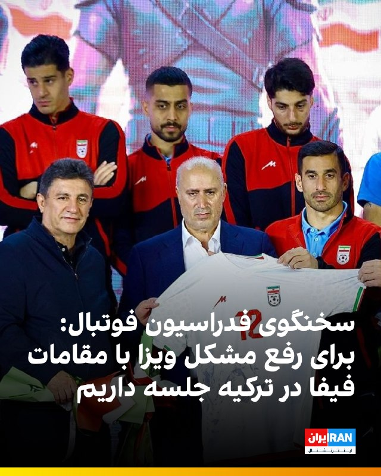

🔻امیرمهدی علوی، سخنگوی فدراسیون فوتبال، درباره آخرین وضعیت صدور ویزا برای کاروان اعزامی ایران به جام‌جهانی گفت: «کارهای اداری ویزا را در امارات انجام دادیم و حالا منتظر پاسخ هستیم. با این حال، در صورت صادر نشدن ویزا برای برخی بازیکنان، اعضای کادر فنی گزینه‌های مختلفی دارند و بازیکنان جایگزین پیش‌بینی شده‌اند.»

🔹او همچنین به جلسه رییس فدراسیون فوتبال با مقامات فیفا اشاره کرد و گفت: «در ۴۸ ساعت آینده جلسه رییس فدراسیون با مقامات فیفا در ترکیه برگزار می‌شود و درباره ۱۰ مورد از خواسته‌های ما صحبت خواهیم کرد که نخستین مورد آن، بحث صدور ویزا است.»

🔹در فاصله کمتر از یک ماه تا آغاز جام‌جهانی، تیم ایران همچنان درگیر دریافت ویزای آمریکا است و این موضوع به بحرانی برای کادر فنی تبدیل شده است. احتمال دارد برای برخی اعضای کاروان ایران به دلیل سوابق فعالیت یا ارتباط با سپاه پاسداران، ویزا صادر نشود.
@iranintltvsport

## IranIntlTV — post 337128

  <a href="telegram/content/IranIntlTV_337128_1778752901.mp4" target="_blank">🎬 Download video</a>

وضعیت بحرانی دارو، به‌ویژه گرانی و کمبود داروهای خاص در ایران، تشدید شده است. ایلنا، خبرگزاری کار ایران، گزارش داد کمبود برخی داروهای سرطان و افزایش شدید قیمت آن‌ها، روند درمان بیماران مبتلا به سرطان را با مشکلات جدی روبه‌رو کرده است.

گفت‌وگو با بابک خطی، پزشک و متخصص کودکان
@iranintltv

## IranIntlTV — post 337127

  <a href="telegram/content/IranIntlTV_337127_1778752904.mp4" target="_blank">🎬 Download video</a>

شی جین‌پینگ، رهبر چین، پنج‌شنبه پس از نشست کلیدی خود با دونالد ترامپ، رییس‌جمهوری آمریکا، از «بازتعریف» روابط دوجانبه سخن گفت. او افزود دو طرف توافق کرده‌اند ایجاد یک رابطه سازنده و از نظر راهبردی باثبات، جهت‌گیری روابط دوجانبه را در سه سال آینده و فراتر از آن مشخص خواهد کرد. منابع رسمی دولت چین همچنین اعلام کردند شی و ترامپ «در مورد خا‌ورمیانه هم تبادل نظر کرده‌اند».

توماج طاهباز، خبرنگار ایران‌اینترنشنال، گزارش می‌دهد
@iranintltv

## IranIntlTV — post 337126

  

عباس عراقچی، وزیر خارجه جمهوری اسلامی، گفت زمان آن رسیده است که «رفتار سلطه‌گرانه آمریکا به زباله‌دان تاریخ سپرده شود». او تاکید کرد هیچ‌گونه راه‌حل نظامی برای موضوعات مربوط به ایران وجود ندارد.

عراقچی گفت: «زمان آن رسیده که رفتار سلطه‌گرانه آمریکا را به زباله‌دان تاریخ بسپاریم.» او افزود: «هیچ‌گونه راه‌حل نظامی برای هر موضوعی که به ایران مربوط باشد، وجود ندارد. ما هرگز در برابر هیچ فشار یا تهدیدی سر خم نمی‌کنیم.»

وزیر خارجه جمهوری اسلامی همچنین اظهار داشت: «هرچند نیروهای مسلح ما آماده‌اند پاسخی کوبنده و ویرانگر به متجاوزان خارجی بدهند، اما مردم ما صلح‌طلب بوده و خواهان جنگ نیستند.»

او در ادامه از کشورهای عضو بریکس و دیگر اعضای جامعه بین‌المللی خواست آنچه را نقض حقوق بین‌الملل از سوی ایالات متحده و اسرائیل خواند، به‌صراحت محکوم کنند.
https://iranintl.com/202605149950

## ManotoTV — post 105435

  <a href="telegram/content/ManotoTV_105435_1778752907.mp4" target="_blank">🎬 Download video</a>

بر اساس گزارش‌های منتشرشده در شبکه‌های اجتماعی، خاطره خدادادی، دانشجوی رشته دندانپزشکی در بلاروس، پس از اظهار نظر درباره مسائل ایران در یک کانال تلگرامی، با دخالت سفارت جمهوری اسلامی بازداشت و به ۱۴ روز زندان محکوم شده است.
به گفته نزدیکان او، قرار بود دهم اردیبهشت آزاد شود، اما همچنان در بازداشت به‌سر می‌برد و وضعیت تحصیل و اقامتش نامشخص است. همچنین گزارش شده که او در مدت بازداشت از دسترسی به وکیل و تماس با دوستانش محروم بوده است.

## ManotoTV — post 105434

  <a href="telegram/content/ManotoTV_105434_1778752907.mp4" target="_blank">🎬 Download video</a>

رسانه‌های داخلی ایران گزارش دادند زمین‌لرزه‌ای به بزرگی ۵ ریشتر منطقه بردسیر در استان کرمان را لرزاند.
بر اساس این گزارش‌ها، کانون زلزله در عمق ۸ کیلومتری زمین و در نزدیکی روستای کمال‌آباد از توابع شهرستان بردسیر بوده است. هلال‌احمر اعلام کرد دو تیم ارزیاب برای بررسی وضعیت به منطقه اعزام شده‌اند.

## ManotoTV — post 105433

  <a href="telegram/content/ManotoTV_105433_1778752908.mp4" target="_blank">🎬 Download video</a>

گروه ناظر اینترنتی نت‌بلاکس اعلام کرد قطعی اینترنت در ایران امروز وارد هفتادوششمین روز خود شده و از مرز ۱۸۰۰ ساعت گذشته است.
نت‌بلاکس می‌گوید این محدودیت‌ها بر پایه دسترسی گزینشی و طبقاتی اعمال شده؛ به‌طوری که گروه‌های خاص به اینترنت دسترسی دارند، اما بخش بزرگی از شهروندان همچنان با محدودیت و اختلال گسترده مواجه‌اند

## ManotoTV — post 105432

  <a href="telegram/content/ManotoTV_105432_1778752909.mp4" target="_blank">🎬 Download video</a>

سازمان دریانوردی تجاری بریتانیا اعلام کرد یک کشتی در سواحل امارات و در نزدیکی تنگه هرمز دچار حادثه شده است.
بر اساس این گزارش، افرادی «غیرمجاز» کنترل این کشتی را در دست گرفته‌اند و شناور اکنون به‌سمت آب‌های سرزمینی ایران در حرکت است. این نهاد دریایی بریتانیا اعلام کرد کشتی در فاصله ۳۸ مایلی سواحل فجیره قرار داشته است.

## ManotoTV — post 105431

  <a href="telegram/content/ManotoTV_105431_1778752910.mp4" target="_blank">🎬 Download video</a>

پلیس بریتانیا اعلام کرد دومین فرد در چارچوب تحقیقات ضدتروریسم درباره آتش‌سوزی در یک کنیسه در شرق لندن متهم شده است.
براساس اعلام پلیس، یک مرد ۳۱ ساله در ارتباط با این حمله بازداشت و تفهیم اتهام شده و تحقیقات درباره انگیزه و جزئیات حادثه ادامه دارد.

## FarsiVOA — post 217707

🔺کاخ سفید: ترامپ و شی درباره ضرورت باز بودن تنگه هرمز توافق کردند

▪️کاخ سفید اعلام کرد که رهبران آمریکا و چین در دیدار خود درباره ضرورت باز بودن تنگه هرمز که از سوی نیروهای حکومت ایران عملاً مسدود شده، توافق کردند.

▪️پیشتر مارکو روبیو، وزیر امور خارجه آمریکا، در مسیر سفر به چین در همراهی با رئیس‌جمهور آمریکا، درباره تلاش‌ها برای وادار کردن چین به برخورد با جمهوری اسلامی ایران در ارتباط با اقداماتش در خلیج فارس توضیح داد.

▪️در بیانیه کاخ سفید همچنین آمده است که ترامپ و شی همچنین درباره ادامه پیشرفت در توقف ورود مواد شیمیایی پیش‌ساز فنتانیل به ایالات متحده، و همچنین افزایش خرید محصولات کشاورزی آمریکا توسط چین گفت‌وگو کردند.

⬇️ بیشتر بخوانید:
https://ir.voanews.com/a/8149919.html

## FarsiVOA — post 217706

  

سازمان عملیات تجارت دریایی بریتانیا از تصرف یک کشتی در دریای عمان خبر داد. بر اساس این گزارش یک کشتی لنگر انداخته در ۳۸ مایل دریایی شمال شرق بندر فجیره امارات توسط افراد غیرمجاز تصرف شده و اکنون به سمت آب‌های سرزمینی ایران در حرکت است.
@FarsiVOA

## FarsiVOA — post 217705

🔺تلاش اسرائیل برای افزایش بردِ جنگنده‌ها بدون نیاز به سوخت‌رسانی

▪️وزارت دفاع اسرائیل اعلام کرد که قراردادی را با یکی از زیرمجموعه‌های شرکت دفاعی البیت برای توسعه «قابلیت بردِ افزایش‌یافته» جنگنده اف-۳۵آی امضا کرده است.

▪️این قرارداد شامل «توسعه و یکپارچه‌سازی مخازن سوخت خارجی» بر اساس طرحی است که شرکت سایکلون پیش‌تر برای جنگنده اف-۱۶ توسعه داده است.

▪️وزارت دفاع اسرائیل در بیانیه‌ای نوشت که این قابلیت جدید انتظار می‌رود «برد عملیاتی هواپیما را افزایش دهد، وابستگی به سوخت‌رسانی هوایی را کاهش دهد و انعطاف‌پذیری عملیاتی را در مأموریت‌های دوربرد تقویت کند.»

▪️اسرائیل اکنون ۴۸ فروند اف‌-۳۵آی در اختیار دارد؛ در حالی که سفارش اولیه این کشور ۵۰ فروند بود.

⬇️ بیشتر بخوانید:
https://ir.voanews.com/a/8149918.html

## FarsiVOA — post 217704

  

مؤسسه اقتصاد انرژی و تحلیل مالی می‌گوید آمریکا در سه ماهه ابتدایی امسال سهمی ۲۹ درصدی در تأمین گاز مایع اتحادیه اروپا داشته و در مجموع طی پنج سال گذشته، صادرات ال‌ان‌جی آمریکا به این اتحادیه چهار برابر شده است.

انتظار می‌رود آمریکا در سال جاری جایگاه نروژ به عنوان بزرگترین تأمین‌کننده کل گاز اروپا (گاز طبیعی و مایع) را بگیرد.

این گزارش می‌افزاید با توجه به تحریم‌های روسیه و هدف قرار گرفتن بخشی از تأسیسات گاز مایع قطر توسط جمهوری اسلامی، احتمالاً سهم آمریکا در واردات ال‌ان‌جی اتحادیه اروپا تا سال ۲۰۲۸ به حدود ۸۰ درصد برسد. هم‌اکنون سهم آمریکا در واردات ال‌ان‌جی آلمان، کرواسی و بریتانیا بالای ۸۰ درصد است.
@FarsiVOA

## FarsiVOA — post 217703

🔺سئول: بعید است کسی جز حکومت ایران پشت حمله به کشتی کره جنوبی باشد

▪️یک مقام ارشد کره جنوبی اعلام کرد احتمال این‌که نهادی غیر از حکومت ایران مسئول حمله به یک کشتی باری کره‌جنوبی در نزدیکی تنگه هرمز بوده باشد، پایین است.

▪️این مقام ارشد روز پنج‌شنبه ۲۴ اردیبهشت به خبرنگاران گفت که کره‌جنوبی در حال بررسی اطلاعاتی است که آمریکا درباره حمله ۴ مه علیه کشتی «نامو» متعلق به شرکت کشتیرانی کره‌جنوبی اچ‌ام‌ام به اشتراک گذاشته است.

▪️در جریان این حمله کشتی دچار آتش‌سوزی شد و خسارتی به بخش پایینی بدنه کشتی وارد آمد.

▪️جمهوری اسلامی پیش‌تر مسئولیت این حمله را که شامل برخوردی شدید به بدنه کشتی بود، رد کرده است.

⬇️ بیشتر بخوانید:
https://ir.voanews.com/a/8149917.html

## FarsiVOA — post 217702

  

در اقدامی در سرکوب شهروندان منتقد و نقض حقوق مدنی ایرانیان، دستگاه قضایی جمهوری اسلامی از توقیف اموال ۴۷ شهروند در استان همدان با ادعای «خیانت به وطن» و «همکاری با دشمن» خبر داد.

دادگستری استان همدان، روز ۱۶ اردیبهشت، تعداد این شهروندان را ۴۰ نفر عنوان کرده بود و به نظر می‌رسد در همین مدت کوتاه، اموال هفت شهروند دیگر نیز توقیف شده است.

دستگاه قضایی جمهوری اسلامی اعلام کرد که ۴۱ نفر از این شهروندان هم‌اکنون ساکن خارج کشور هستند.

روز چهارشنبه ۲۳ اردیبهشت، نیز رئیس کل دادگستری هرمزگان از توقیف اموال ۲۴ نفر از ایرانیان خارج از کشور خبر داده بود. اقدامی که رئیس قوه قضائیه از آن دفاع کرده و مدعی است دستگاه قضایی مأمور شده تا اموال «همکاران و همراهان دشمن» را شناسایی، توقیف و مصادره کند.
@FarsiVOA

## FarsiVOA — post 217701

🔺جمهوری اسلامی محمد عباسی یکی دیگر از معترضان دی ماه را اعدام کرده است

▪️جمهوری اسلامی محمد عباسی، از بازدشت‌شدگان اعتراضات دی ماه ۱۴۰۴ را که به قتل یکی از عوامل حکومت در ملارد متهم شده بود، اعدام کرد.

▪️دستگاه قضایی مدعی است که شاهین دهقانی، از نیروهای انتظامی ۱۷ دی ماه ۱۴۰۴ و در شهرستان ملارد کشته شده، و این قتل را به محمد عباسی و دخترش منتسب می‌کند، اما تصاویر پخش شده در دادگاه دخالت محمد و فاطمه عباسی، را اثبات نمی‌کند.

▪️فاطمه عباسی، در همین پرونده به ۲۵ سال زندان محکوم شده است.

▪️جمهوری اسلامی از آغاز جنگ با آمریکا و اسرائیل، دستکم ۳۳ تن را به بهانه حضور در اعتراضات، عضویت در گروه‌های مخالف یا «همکاری با دشمن»، اعدام کرده است.

⬇️ بیشتر بخوانید:
https://ir.voanews.com/a/8149915.html

## DW_Farsi — post 124678

  

🔶 "قمار احمقانه"؛ واکنش عراقچی به خبر سفر نتانیاهو به امارات

عباس عراقچی در واکنش به علنی شدن خبر سفر نخست‌وزیر اسرائیل به امارات متحده عربی گفت: «نتانیاهو اکنون به‌صورت علنی آنچه را که نهادهای امنیتی ایران مدت‌ها قبل به رهبری ما منتقل کرده بودند، افشا کرده است.»

وزیر خارجه جمهوری اسلامی در این باره که چرا تهران علیرغم اطلاع از این مسئله، تا کنون اقدام به افشای آن نکرده است، چیزی نگفت.

عراقچی در پست شدید‌الحن خود که در شبکه ایکس (توئیتر سابق) منتشر کرد، "دشمنی با ایران" را "قماری احمقانه" خواند و افزود: «همکاری و همدستی با اسرائیل در این مسیر، غیرقابل بخشش است. کسانی که در همدستی با اسرائیل برای ایجاد تفرقه نقش دارند، باید پاسخگو باشند.»

دفتر بنیامین نتانیاهو چهارشنبه ۱۳ مه (۲۳ اردیبهشت) اعلام کرده بود، نخست وزیر اسرائیل در جریان جنگ ایران به‌طور محرمانه به امارات سفر کرده و با محمد بن زاید، رئیس امارات، دیدار داشته است. به گفته دفتر نتانیاهو این سفر به "یک دستاورد تاریخی" در روابط دو طرف منجر شده است.

در این میان اما وزارت امور خارجه امارات متحده با انتشار بیانیه‌ای اعلام کرده است که این کشور "گزارش‌های منتشرشده درباره سفر نخست‌وزير اسرائيل يا استقبال از يک هيات نظامی اسرائيلی را تکذيب می‌کند".

این وزارتخانه تأکید کرد که روابط امارات و اسرائیل "علنی و بر پایه پیمان ابراهیم" است و از این رو "تمامی سفرها و دیدارهای رسمی به شکل شفاف اعلام شده و انجام می‌گیرند".

پیش از انتشار خبر مربوط به سفر نتانیاهو به امارات، نشریه وال استریت ژورنال در گزارشی نوشته بود دیوید بارنیا، رئیس موساد، نیز دست‌کم دو بار در ماه‌های مارس و آوریل به امارات سفر کرد تا درباره روند جنگ با ایران و هماهنگی‌های امنیتی با مقام‌های این کشور گفت‌وگو کند.

@dw_farsi

## DW_Farsi — post 124677

  

🔶 عبور دومین نفتکش ژاپنی از تنگه هرمز

داده‌های ردیابی از شرکت ال‌اس‌ای‌جی (LSEG) که تردد کشتی‌ها را رهگیری می‌کند، پنجشنبه ۱۴ مه (۲۴ اردیبهشت) نشان داد که یک نفت‌کش ژاپنی از تنگه هرمز  عبور کرده است. این نفت‌کش متعلق به "انیوس" (Eneos)، بزرگترین شرکت نفت و انرژی ژاپن بوده و تحت پرچم پاناما در حرکت است.

این دومین بار است که یک کشتی متعلق به شرکت‌های ژاپنی از آغاز جنگ آمریکا و اسرائیل علیه جمهوری اسلامی و انسداد تنگه هرمز به این سو، موفق به عبور از این آبراه حیاتی شده است. پیش از آغاز جنگ ایران، ژاپن حدود ۹۵ درصد از نفت خود را از کشورهای حوزه حلیج فارس وارد می‌کرد.

می‌یاتا توموهیده، مدیر عامل شرکت انیوس روز پنجشنبه به خبرنگاران گفت که این نفت‌کش به‌طور امن تنگه هرمز را پشت سر گذاشته و به احتمال قوی اواخر ماه مه یا اوایل ماه ژوئن به ژاپن خواهد رسید. این نفت‌کش حامل ۱.۲ میلیون بشکه نفت خام کویت و ۷۰۰ هزار بشکه نفت امارات متحده عربی است که بنا بر داده شرکت رهگیری "کپلر" در اواخر ماه فوریه بارگیری شده و قرار بوده که سوم ژوئن به ژاپن برسد.

ژاپن از زمان بروز جنگ در اواخر ماه فوریه تلاش‌های دیپلماتیک خود را تقویت کرد و در عین حال به دنبال بدیل‌هایی برای جایگزین کردن محموله‌های تحویل‌داده‌نشده بوده است. دولت ژاپن در عین حال یارانه‌های درخورتوجهی را برای پایین نگه داشتن بهای بنزین در بازارهای داخلی تخصیص داده است.

وزارت خارجه ژاپن با انتشار بیانیه‌ای اعلام کرد که دولت این کشور در ارتباط با عبور این نفت‌کش از تنگه هرمز، با جمهوری اسلامی در تماس مسقتیم بوده است. سانائه تاکایچی، نخست‌وزیر ژاپن نیز ماه آوریل در تماسی تلفنی با مسعود پزشکیان، رئیس جمهور ایران گفت‌وگو کرد.

این وزارتخانه در بیانیه خود تأکید کرد، توکیو به تلاش‌های دیپلماتیک و هماهنگی‌ ادامه خواهد داد تا ۳۹ کشتی مرتبط با این کشور را از آب‌های خلیج فارس خارج کند.
نخستین کشتی ژاپنی که موفق به عبور از تنگه هرمز شده بود، نفت‌کش "ایدمیتسو مارو" (Idemitsu Maru)، متعلق به یک شرکت وابسته به کمپانی نفتی ایدمیتسو کوسان بود. این کشتی حامل نفت عربستان سعودی، اواخر ماه آوریل از تنگه هرمز گذر کرده بود.

@dw_farsi

## DW_Farsi — post 124676

🔶 عربستان ناوگان عظیم کامیون‌ها را جایگزین تنگه هرمز کرده است

پس از حمله آمریکا و اسرائیل به ایران، مدیرعامل شرکت بزرگ دولتی "معادن" در عربستان به سرعت وارد عمل شد. این شرکت که دفتر مرکزی آن در ریاض است، عمدتا در معادن خود طلا، بوکسیت، مس، مواد معدنی صنعتی و فسفات استخراج می‌کند. عربستان به‌طور معمول، این مواد خام را از طریق بنادر خلیج فارس صادر کرده و از راه تنگه هرمز  به سراسر جهان منتقل می‌کند. اما در شرایط کنونی این مسیر از آغاز جنگ ایران،تا کنون مسدود شده است.

بر اساس گزارشی از روزنامه وال‌استریت ژورنال، شرکت "معادن" تنها ظرف دو هفته توانسته انتقال کود شیمیایی را از سراسر عربستان به سواحل دریای سرخ سازماندهی کند. برای این کار هزاران کامیون به‌کار گرفته شده‌اند که از آن زمان تقریباً به‌صورت شبانه‌روزی در حال فعالیت هستند.

این روزنامه به نقل از مدیرعامل شرکت می‌نویسد: «تعداد کامیون‌ها نخست از ۶۰۰ به ۱۶۰۰ رسید و بعد بالغ بر ۲۰۰۰ کامیون شد. اما حالا ۳۵۰۰ کامیون بین خلیج فارس و دریای سرخ در رفت‌وآمد هستند.» هدف این است که عقب‌ماندگی صادرات عربستان تا پایان ماه مه جبران شود.

@dw_farsi

## DW_Farsi — post 124675

  

🔶 محمد عباسی، از بازداشت‌شدگان اعتراضات دی‌ماه، اعدام شد

به گزارش خبرگزاری میزان، وابسته قوه قضائیه جمهوری اسلامی، حکم اعدام محمد عباسی که از بازداشت‌شدگان اعتراضات دی ماه ۱۴۰۴ بود، به اجرا در آمد.
قوه قضائیه او را به "قتل" یک نظامی در جریان اعتراضات متهم کرده و از اعمال "قصاص" سخن گفته است. طبق اعلام این نهاد، اجرای حکم اعدام محمد عباسی با تایید نهایی دیوان عالی جمهوری اسلامی و به تقاضای اولیاء دم انجام شده است.

دیوان عالی همچنین حکم ۲۵ سال حبس فاطمه عباسی، دختر محمد عباسی را که در بند زنان زندان اوین در حبس به سر می‌برد، تایید کرد.

محمد عباسی اواخر دی ماه سال گذشته به اتهام "مشارکت در کشتن" یک مأمور حکومتی در ملارد بازداشت و از سوی دادگاه انقلاب به ریاست ابوالقاسم صلواتی به اعدام محکوم شده بود. این حکم هفتم اردیبهشت ماه سال جاری در شعبه ۳۹ دیوان عالی کشور تأیید شد.

هرانا، ارگان خبری مجموعه فعالان حقوق بشر ایران به نقل از یک منبع آگاه نزدیک به خانواده این زندانی سیاسی گزارش داد: «مسئولان زندان قزلحصار کرج از خانواده محمد عباسی خواستند که برای ملاقات با وی به زندان مراجعه کنند. اما پس از حضور خانواده در زندان، این امکان از نزدیکان او سلب شد. پس از خروج خانواده عباسی از زندان، آنها در تماسی تلفنی از اجرای حکم اعدام محمد عباسی مطلع شدند.»

به نوشته هرانا ابهامات و شبهات متعددی درباره روند رسیدگی و محتوای پرونده محمد عباسی و دخترش فاطمه وجود داشته، اما وکلای مستقل به دلیل محرومیت از دسترسی به پرونده امکان بررسی و پیگیری موثر آن را نداشته‌اند.

@dw_farsi

## DW_Farsi — post 124674

🔶 آغاز دیدار شی و ترامپ در سایه جنگ ایران

دیدار رسمی دونالد ترامپ، رئیس جمهور آمریکا و شی جین‌پینگ، همتای چینی او پنجشنبه ۱۴ مه (۲۴ اردیبهشت) آغاز شد. به گزارش رسانه‌های خبری شروع ملاقات و گفت‌وگوی رهبران ایالات متحده و چین دیدار با سخنان متقابل دوستانه همراه بود.

ترامپ پس از استقبال و تشریفات رسمی، رئیس جمهور چین را مورد ستایش قرار داد. شی نیز ابراز اطمینان کرد که نقاط مشترک پکن و واشنگتن بیشتر از موارد اختلاف بین دو کشور است. او تأکید کرد که موفقیت هر یک از دو کشور در عین حال فرصتی برای دیگری است.

چین و آمریکا که بزرگ‌ترین قدرت‌های اقتصادی جهان محسوب می‌شوند، در نزاعی تجاری به سر می‌برند.

ترامپ که در سال گذشته میلادی چین را به وضع تعرفه‌های تجاری سنگین تهدید کرده بود، در آغاز گفت‌وگوهای خود با شی در پکن از "آینده مشترک درخشان" دو کشور سخن گفت.

او همتای چینی را خود را "شخصیتی فوق‌العاده" خواند و خطاب به شی افزود: «گاهی خوششان نمی‌آید که من چنین چیزی بگویم، اما با وجود این، این نکته را بیان می‌کنم چون عین حقیقت است: دوستی با شما افتخار است.»

@dw_farsi

## Persian_Trend_Official — post 14112

  <a href="telegram/content/Persian_Trend_Official_14112_1778752915.mp4" target="_blank">🎬 Download video</a>

🔴 عراقچی: این آمریکا است که تنگه هرمز را بسته، نه ایران

💢عباس عراقچی، وزیر خارجه جمهوری اسلامی ، اعلام کرد تهران تنگه هرمز را نبسته و این آمریکا است که با اقدامات خود محاصره ایجاد کرده است.

💢او گفت:

▪️ از نگاه جمهوری اسلامی ، تنگه هرمز برای تمامی کشتی‌های تجاری باز است

▪️ کشتی‌ها باید با نیروهای دریایی حمهوری اسلامی همکاری و هماهنگی داشته باشند

▪️ جمهوری اسلامی هیچ مانعی در مسیر عبور کشتی‌ها ایجاد نکرده است

▪️ آنچه اکنون در منطقه رخ می‌دهد، ناشی از محاصره و اقدامات آمریکا است

🫆:Tony

📌 @persian_trend_official
پرشین ترند | متفاوت‌ترین کانال نظامی

## Persian_Trend_Official — post 14111

  <a href="telegram/content/Persian_Trend_Official_14111_1778752917.mp4" target="_blank">🎬 Download video</a>

🔴ویدیویی از انفجار شناور کلاس سلیمانی نیرو دریایی سپاه در جنگ اخیر

🫆:Tony

📌 @persian_trend_official
پرشین ترند | متفاوت‌ترین کانال نظامی

## Persian_Trend_Official — post 14110

  <a href="telegram/content/Persian_Trend_Official_14110_1778752919.webm" target="_blank">🎬 Download video</a>

‼️🏦 یک مقام کاخ سفید:

✅ رئیس جمهور ترامپ و همتای چینی او بر سر لزوم باز نگه داشتن تنگه هرمز توافق کردند.
✅ ترامپ و همتای چینی‌اش توافق کردند که ایران نمی‌تواند سلاح هسته‌ای داشته باشد.

📝 Nick

📌 @persian_trend_official
پرشین ترند | متفاوت‌ترین کانال نظامی

## Persian_Trend_Official — post 14109

  <a href="telegram/content/Persian_Trend_Official_14109_1778752920.webm" target="_blank">🎬 Download video</a>

⭕️ سوپراپلیکیشن ایتا اعلام کرد امکان ارسال فایل تا حجم ۲۰ مگابایت مجدداً برای همه کاربران فراهم شده است!

کاش تلگرام بیاد از شما یاد بگیره 🤯

📝 Nick

📌 @persian_trend_official
پرشین ترند | متفاوت‌ترین کانال نظامی

## Persian_Trend_Official — post 14108

  <a href="telegram/content/Persian_Trend_Official_14108_1778752920.webm" target="_blank">🎬 Download video</a>

💢زلزله ای در کرمان رخ داده است 🫆:Tony 📌 @persian_trend_official پرشین ترند | متفاوت‌ترین کانال نظامی

## Persian_Trend_Official — post 14107

💢زلزله ای در کرمان رخ داده است

🫆:Tony

📌 @persian_trend_official
پرشین ترند | متفاوت‌ترین کانال نظامی

## Persian_Trend_Official — post 14106

  

🔴 روسیه یکی از سنگین‌ترین حملات خود را علیه اوکراین انجام داد

💢گزارش‌ها حاکی است روسیه طی ۲۴ ساعت گذشته یکی از بزرگ‌ترین حملات هوایی خود از آغاز جنگ را علیه اوکراین انجام داده است.

💢بر اساس اطلاعات منتشرشده:

▪️ بیش از ۱۴۰۰ پهپاد در این حمله استفاده شده است
▪️ همچنین بیش از ۵۰ موشک به‌سمت اهداف مختلف شلیک شده‌اند
▪️ موج نخست حملات مناطق غربی اوکراین را هدف قرار داد
▪️ سپس حملات به سمت کی‌یف گسترش یافت

🫆:Tony

📌 @persian_trend_official
پرشین ترند | متفاوت‌ترین کانال نظامی

## Persian_Trend_Official — post 14105

  <a href="telegram/content/Persian_Trend_Official_14105_1778752922.mp4" target="_blank">🎬 Download video</a>

⭕️ اتوبوس تیم ملی فوتبال رو با شعار مرگ بر آمریکا بدرقه کردن تا بره آمریکا...

پ.ن: چی بگم والا...

📝 Nick

📌 @persian_trend_official
پرشین ترند | متفاوت‌ترین کانال نظامی

## Persian_Trend_Official — post 14104

  

🔴 گزارش‌ها از توقیف یک شناور در نزدیکی فجیره توسط ایران

💢برخی گزارش‌ها حاکی است یک فروند شناور در فاصله حدود ۳۸ مایل دریایی از بندر فجیره امارات توسط نیروهای ایرانی توقیف شده و در حال حرکت به‌سمت آب‌های سرزمینی ایران است.

🫆:Tony

📌 @persian_trend_official
پرشین ترند | متفاوت‌ترین کانال نظامی

## Persian_Trend_Official — post 14103

⭕️ وزیر آموزش‌ و پرورش:

امتحانات نهایی ۲ هفته بعد از عادی شدن شرایط و پایان جنگ برگزار خواهند شد. ضمن اینکه در استان‌ها تصمیم‌گیری دربارۀ نحوۀ برگزاری امتحانات برعهدۀ استانداران خواهد بود.

پ.ن: دانش آموزان عزیز دعا کنید ماجرا مثل صدام عراق نشه که امتحانات‌تون یه 11 سالی‌ طول خواهد کشید. 🗿😂

📝 Nick

📌 @persian_trend_official
پرشین ترند | متفاوت‌ترین کانال نظامی

## Persian_Trend_Official — post 14102

گزارش صداوسیما از احسان افرشته و روایت عجیب از جاسوسی ! 📌 @persian_trend_official پرشین ترند | متفاوت‌ترین کانال نظامی

## Persian_Trend_Official — post 14101

  <a href="telegram/content/Persian_Trend_Official_14101_1778752925.mp4" target="_blank">🎬 Download video</a>

گزارش صداوسیما از احسان افرشته و روایت عجیب از جاسوسی !

📌 @persian_trend_official
پرشین ترند | متفاوت‌ترین کانال نظامی

## RadioFarda — post 157163

زیان بیشتر زنان در ایران از قطعی اینترنت؛ چون «بازار کار موازی» در حال فروپاشی است

🔸جمهوری اسلامی آخرین دور جدید قطع اینترنت را در ۹ اسفند ۱۴۰۴، همزمان با حملات آمریکا و اسرائیل به ایران، اعمال کرد.

🔸اگرچه واشینگتن و تهران در ۱۹ فروردین به آتش‌بسی شکننده دست یافتند، اما دسترسی به اینترنت هنوز برقرار نشده و شهروندان بیش از دو ماه است در تاریکی دیجیتال به سر می‌برند. تنها کسانی که توان پرداخت هزینه ابزارهای گران ضد فیلترینگ را دارند، همراه با افرادی که دسترسی مورد تأیید حکومت دارند، می‌توانند آنلاین شوند.

🔸زهرا بهروزآذر، معاون رئیس‌جمهور در امور زنان و خانواده، در ماه فروردین گفته بود که قطع اینترنت مشاغل «غیررسمی» زنان را به‌شدت محدود کرده است.

🔸او افزود که حدود یک‌سوم درخواست‌های بیمه بیکاری ثبت‌شده طی ۴۰ روز گذشته متعلق به زنان بوده است.

🔸مقام‌های جمهوری اسلامی می‌گویند نرخ مشارکت اقتصادی زنان در ایران ۱۸ درصد است. اما بسیاری از زنان کسب‌وکارهای کوچک آنلاین راه‌اندازی کرده یا در آن‌ها مشغول به کار بودند.

🔸بسیاری از آن‌ها درآمد خود را از دست داده‌اند، از جمله زنانی که کسب‌وکار اینترنتی داشتند یا در فروش آنلاین کار می‌کردند.

🔸 گزارش کامل را در وب‌سایت رادیو فردا می‌توانید بخوانید.

@RadioFarda

@RadioFarda

## RadioFarda — post 157162

شی جین‌پینگ در نشست با ترامپ: همکاری ما به نفع هر دو طرف و تقابل ما به ضرر هر دو است

🔸شی جین‌پینگ، رئیس جمهور چین، دیدار خود با دونالد ترامپ را با تأکید بر همکاری و مشارکت آغاز کرد: «وقتی ما همکاری می‌کنیم، هر دو طرف منتفع می‌شوند، و وقتی روبه‌روی هم قرار می‌گیریم، هر دو طرف ضرر می‌کنند.»

🔸این سرآغاز دیداری دو ساعته بود که شی با دونالد ترامپ صبح روز پنج‌شنبه، ۲۴ اردیبهشت، به وقت محلی در «تالار بزرگ خلق» در پایتخت چین داشت.

🔸شی جین‌پینگ همچنین تأکید کرد که اکنون مسئله مهم این است که آیا چین و آمریکا می‌توانند «پیشگام پارادایم جدیدی از مناسبات کشورهای بزرگ» باشند یا خیر.

🔸در پاسخ به سخنان رئیس‌جمهور چین، رئیس‌جمهور آمریکا نیز گفت: «شما رهبر بزرگی هستید، گاهی بعضی‌ها خوش‌شان نمی‌آید من این را بگویم، ولی من حرفم را می‌زنم.»

🔸گزارش کامل را در وب‌سایت رادیو فردا می‌توانید بخوانید.

@RadioFarda

## RadioFarda — post 157161

🔸انتشار تصاویری از رژه پادشاهی‌خواهان که لباس‌هایی با آرم ساواک به تن داشتند، در شهر رگنسبورگ آلمان با واکنش‌های زیادی همراه شده است.

🔸این افراد خود را «گروه مردمی ساواک» معرفی می‌کنند و خواهان «شناسایی عوامل جمهوری اسلامی و اپوزیسیون‌های جعلی و نفوذی» هستند.

🔸این اقدام با واکنش‌های زیادی در شبکه‌های اجتماعی همراه شده است. برخی کاربران آن را « سفید‌سازی» و «بازگشت به نمادهای سرکوب» و برخی خواستار «برخورد قانونی دولت آلمان» با این گونه اقدامات شده‌اند.

🔸برخی کاربران نیز این گونه اقدامات را مشابه عملکرد جمهوری اسلامی دانسته‌اند.

🔸ساواک، سازمان اطلاعات و امنیت کشور در ایران بود که طی چند دهه مسئولیت شناسایی، بازداشت، شکنجه و سرکوب مخالفان سیاسی حکومت پهلوی را بر عهد داشت.

@RadioFarda

## IranianMinds — post 20115

  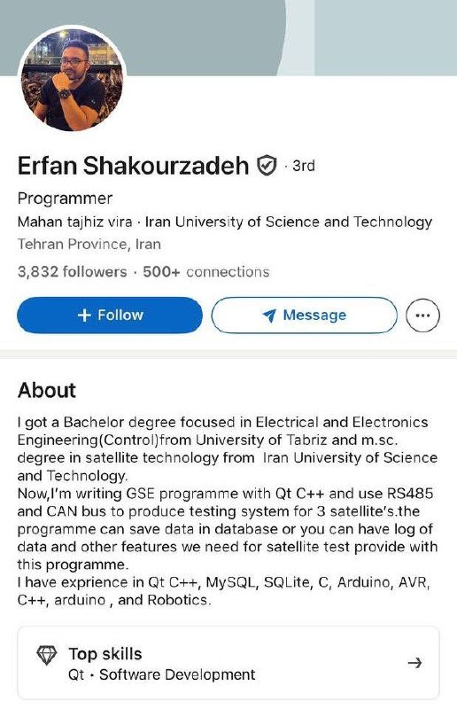

💔

@IranianMinds

## IranianMinds — post 20114

  <a href="telegram/content/IranianMinds_20114_1778752929.mp4" target="_blank">🎬 Download video</a>

🔴 وزیر دارایی اسرائیل:

فکر می‌کنم در همین دوره، عملا داریم ایده تشکیل کشور فلسطین را کاملا از بین میبریم.

@IranianMinds

## IranianMinds — post 20113

  <a href="telegram/content/IranianMinds_20113_1778752931.mp4" target="_blank">🎬 Download video</a>

🔴 جان بولتون:

مذاکره برای توافق هسته ‌ای با ایران، هدر دادن وقته.

این ‌ها دهه ‌ها پیش تصمیم راهبردی ‌شان را برای رسیدن به سلاح هسته‌ای گرفته‌اند.

در این ۴۷ سال اخیر حتی یک مدرک هم وجود نداشته که نشان بدهد از این هدف ساخت سلاح هسته ای عقب کشیده‌ اند.

@IranianMinds

## IranianMinds — post 20112

  <a href="telegram/content/IranianMinds_20112_1778752934.mp4" target="_blank">🎬 Download video</a>

🔴 نتانیاهو:

همون ‌طور که یه متفکری یه بار فکر کنم تو روسیه بود بهم گفت اسرائیل یه ابرقدرت کوچیکه، ولی بازم ابرقدرته.

ما قراره به یه ابرقدرت بزرگ و جهانی تبدیل بشیم.

@IranianMinds

## IranianMinds — post 20111

🔴 مهدی تاج رئیس فدراسیون فوتبال : معین قراره برای تیم ملی یه آهنگ بخونه ! @IranianMinds

## IranianMinds — post 20110

  

🔴 سازمان تجارت دریایی بریتانیا گزارش داد که یک حادثه در فاصله ۳۸ مایل دریایی شمال‌شرق فجیره در امارات رخ داده است.

گزارش‌ها حاکی است که یک کشتی لنگر گرفته توسط افراد غیرمجاز مورد بازدید قرار گرفته و اکنون به سمت آب‌های سرزمینی ایران در حرکت است.

@IranianMinds

## IranianMinds — post 20109

  

😤دنبال یه سایت شرط بندی بین المللی بودی که به ایرانیا خدمات بده؟!
⛔

👍دربی بت همون انتخاب  100%

💎ویژگی های سایت جهانی Derby Bet:

⬅️امکان شارژ امن با کارت بانکی

⬅️واریز اول دوبل شارژ می شوید(بونوس۱۰۰٪)

⬅️پر اپشن ترین سایت فعال در ایران

⬅️تسویه حساب کمتر از 5 دقیقه

⬅️برگشت بخشی از باخت به صورت هفتگی

🚨کد هدیه ثبت نام:GG007

⚠️برای دانلود اپلکیشن کلیک کنید
👉
re24

🔔کانال دربی بت :

🪙https://t.me/+aCbq7yy8QY80NzQ0

## IranianMinds — post 20107

  

ترامپ و رئیس جمهور‌ چین در معبد بهشت پکن

@IranianMinds

## BBCPersian — post 281019

🔻مرکز تجارت دریایی بریتانیا: یک کشتی در نزدیکی امارات تصرف شده و به سمت ایران در حرکت است

یک کشتی در نزدیکی سواحل امارات متحده عربی و حوالی تنگه هرمز «به تصرف افراد ناشناس درآمده و اکنون در حال حرکت به سمت آب‌های سرزمینی ایران است.»

مرکز تجارت دریایی بریتانیا روز پنج‌شنبه با اعلام این خبر گفت که این کشتی در فاصله حدود ۷۰ کیلومتری شمال‌شرقی فجیره به «تصرف افراد ناشناس درآمده است.»

تنگه هرمز، به عنوان حیاتی‌ترین گذرگاه انرژی جهان، یک محور مهم اختلافات ایران و آمریکاست.

پس از جنگ آمریکا و اسرائیل علیه ایران، تهرن این تنگه را مسدود کرد و آمریکا هم از ۱۳ آوریل (۲۴ فروردین) یک محاصره دریایی را بر تمام بنادر و سواحل جنوبی ایران اجرا کرده است، به‌طوری که هیچ کشتی اجازه حرکت از مبدا و به مقصد بنادر ایرانی را ندارد.

حدود ۲۰ درصد از نفت و گاز طبیعی مایع جهان از این آبراه حیاتی منتقل می‌شود که مسدود شدن آن باعث افزایش شدید قیمت‌ها در سطح جهان شده است.
https://bbc.in/4fkRCIA
@BBCPersian

## BBCPersian — post 281018

  

عباس عراقچی، وزیر خارجه ایران برای شرکت در نشست وزیران امور خارجه بریکس به هند سفر کرده است. جنگ ایران و بحران سوخت مرتبط با آن، بر گفت‌وگوهای این نشست دو روزه سایه انداخته است.

هند میزبان این نشست نسبت به «نوسان قابل توجه» در وضعیت بین‌المللی هشدار داد و گفت درگیری‌ها باعث بی‌ثباتی اقتصادی و ناامنی انرژی شده‌اند.

سوبرامانیام جایشانکار، وزیر امور خارجه هند، در سخنرانی افتتاحیه خود گفت: «ما در زمانی با نوسان قابل توجه در روابط بین‌الملل گرد هم آمده‌ایم.»

آقای جایشانکار افزود: «درگیری‌های جاری، نااطمینانی‌های اقتصادی و چالش‌ها در تجارت، فناوری و اقلیم، در حال شکل دادن به چشم‌انداز جهانی هستند.»

او گفت: «انتظار فزاینده‌ای، به‌ویژه از سوی اقتصادهای نوظهور و کشورهای در حال توسعه، وجود دارد که بریکس نقش سازنده و تثبیت‌کننده‌ای ایفا کند.»

بریکس نام گروهی به رهبری برخی از کشورهایی است که اقتصادی نوظهور در جهان دارند. برزیل، روسیه، هند، چین و آفریقای جنوبی اعضای اصلی بریکس هستند. نام بریکس از حروف اول نام کشورهای عضو به زبان انگلیسی گرفته شده است.

📷EPA/Shutterstock
https://bbc.in/4fkRCIA
@BBCPersian

## BBCPersian — post 281009

‌
دختر کیم جونگ‌اون بیشتر از همیشه با لباس‌هایی از برندهای لوکس طراحان غربی در عکس‌ها ظاهر می‌شود، برندهایی که در کره شمالی به دلیل «ضدسوسیالیستی» بودن ممنوع‌اند.

اما لباس‌های کیم جو ئه، از لباس‌های چرمی و مدل موی «خروسی» گرفته تا حتی پیراهن با آستین توری، بیش از آنکه نشانه سرکشی نوجوانانه باشد، نشان می‌دهد او برای جانشینی مقام رهبر عالی کره شمالی آماده می‌شود.

او برای نخستین بار در ۹ سالگی، در نوامبر ۲۰۲۲، در حالی که کنار پدرش در برابر یک موشک بالستیک قاره‌پیمای عظیم قدم می‌زد، به شکل رسمی دیده شد. اما همان زمان هم با موهای بسته از پشت، شلوار مشکی و کاپشن سفید پفی، ظاهری حساب‌شده داشت.

از آن زمان، مدل موی او هرچه بیشتر آراسته و شیک شده و پوشش او نیز به‌تدریج ظریف‌تر، مجلل‌تر و پخته‌تر جلوه می‌کند.

اکنون گزارش‌ها حاکی است که برخی می‌خواهند از سبک شیک و آراسته جو آئه الگوبرداری کنند.

مطلب را از لینک ⬇️ در سایت بی‌بی‌سی فارسی بخوانید.
https://bbc.in/3Pfgjf9

📸GettyImages/ News1/ Reuters/ EPA/Shutterstock/ LightRocket via Getty Images/ AFP via Getty Images

@BBCPersian

## idfinfarsi — post 11578

  

🔵اورشلیم، شهر ادیان و پایتخت ابدی اسرائیل. در روز اورشلیم، ما اتحاد شهری را جشن می‌گیریم که گذشته‌ای کهن و آینده‌ای امیدوار را به هم پیوند می‌دهد. سال نو مبارک، برای اورشلیم و ساکنانش.

## Dirty_Kids — post 389424

  

لاشیا فهمیدن ما عرقو با دوغ میخوریم

@Dirty_Kids 👻

## Dirty_Kids — post 389423

  

عکس پروفایل معلمای ادبیات

@Dirty_Kids 👻

## Dirty_Kids — post 389422

جدی پیک می تر از این جنده های حجابی تو دانشگاه وجود نداره، یارو سال اول کارشناسی کامپیوتره بعد استیکر زده رو لپ تاپش LEAVE ME ALONE IM CODING، بیا برو کیرم تو کدت شد

@Dirty_Kids 👻

## Dirty_Kids — post 389421

  <a href="telegram/content/Dirty_Kids_389421_1778752941.mp4" target="_blank">🎬 Download video</a>

پلیس شریف دانمارک vs طرفداران تروریسم جهانی

@Dirty_Kids 👻

## Hranews — post 112941

دادستان مشهد دستور توقیف اموال یک شهروند خارج از کشور را صادر کرد

❗️
❗️
❗️
❗️
❗️– دادستان مشهد از صدور دستور شناسایی و #توقیف_اموال یک شهروند ساکن خارج از کشور خبر داد. به گفته وی، این اقدام به‌دلیل فعالیت علیه نظام از سوی این فرد صورت گرفته است.

ادامه مطلب
↘️
@hranews_bot تماس ✉️ - @Hranews کانال هرانا 🆑

## Hranews — post 112940

  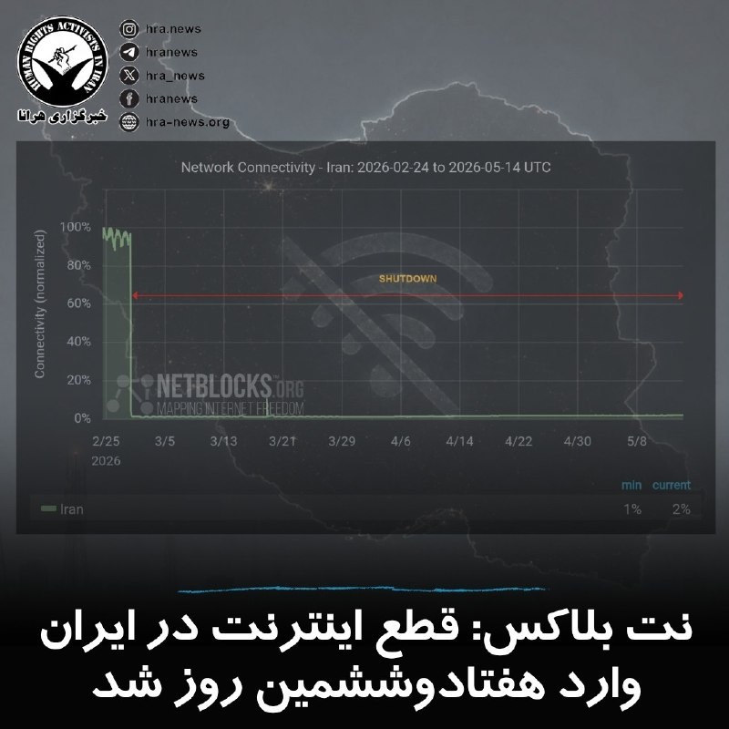

بر اساس آخرین داده‌های نت‌ بلاکس، قطع اینترنت در ایران پس از گذشت ۱۸۰۰ ساعت، وارد هفتادوششمین روز خود شده است. این نهاد ناظر بر وضعیت دسترسی به اینترنت در جهان اعلام کرد که محدودیت‌های اعمال‌ شده بر پایه نوعی ساختار طبقاتی دنبال می‌شود؛ به‌گونه‌ای که تنها گروهی محدود به #اینترنت دسترسی دارند و عموم شهروندان همچنان در خاموشی دیجیتال به‌سر می‌برند. نت‌ بلاکس این وضعیت را مشابه همان ساختار تبعیض‌آمیزی توصیف کرده که مقام‌های جمهوری اسلامی مدعی مخالفت با آن هستند.

↘️
@hranews_bot تماس ✉️ - @Hranews کانال هرانا 🆑

## Hranews — post 112939

کیفرخواست پرونده صادق زیباکلام و مدیرمسئول خبرگزاری آنا صادر شد

❗️
❗️
❗️
❗️
❗️– مرکز رسانه قوه قضاییه از صدور کیفرخواست علیه صادق زیباکلام و مدیرمسئول خبرگزاری آنا خبر داد. همچنین بر اساس تصمیم قضایی، آقای زیباکلام به مدت سه ماه از هرگونه فعالیت رسانه‌ای و تولید محتوا در شبکه‌های اجتماعی منع شده است.

#صادق_زیباکلام

ادامه مطلب

↘️
@hranews_bot تماس ✉️ - @Hranews کانال هرانا 🆑

## manototv — post 105435

  <a href="telegram/content/manototv_105435_1778752945.mp4" target="_blank">🎬 Download video</a>

بر اساس گزارش‌های منتشرشده در شبکه‌های اجتماعی، خاطره خدادادی، دانشجوی رشته دندانپزشکی در بلاروس، پس از اظهار نظر درباره مسائل ایران در یک کانال تلگرامی، با دخالت سفارت جمهوری اسلامی بازداشت و به ۱۴ روز زندان محکوم شده است.
به گفته نزدیکان او، قرار بود دهم اردیبهشت آزاد شود، اما همچنان در بازداشت به‌سر می‌برد و وضعیت تحصیل و اقامتش نامشخص است. همچنین گزارش شده که او در مدت بازداشت از دسترسی به وکیل و تماس با دوستانش محروم بوده است.

## manototv — post 105434

  <a href="telegram/content/manototv_105434_1778752945.mp4" target="_blank">🎬 Download video</a>

رسانه‌های داخلی ایران گزارش دادند زمین‌لرزه‌ای به بزرگی ۵ ریشتر منطقه بردسیر در استان کرمان را لرزاند.
بر اساس این گزارش‌ها، کانون زلزله در عمق ۸ کیلومتری زمین و در نزدیکی روستای کمال‌آباد از توابع شهرستان بردسیر بوده است. هلال‌احمر اعلام کرد دو تیم ارزیاب برای بررسی وضعیت به منطقه اعزام شده‌اند.

## manototv — post 105433

  <a href="telegram/content/manototv_105433_1778752946.mp4" target="_blank">🎬 Download video</a>

گروه ناظر اینترنتی نت‌بلاکس اعلام کرد قطعی اینترنت در ایران امروز وارد هفتادوششمین روز خود شده و از مرز ۱۸۰۰ ساعت گذشته است.
نت‌بلاکس می‌گوید این محدودیت‌ها بر پایه دسترسی گزینشی و طبقاتی اعمال شده؛ به‌طوری که گروه‌های خاص به اینترنت دسترسی دارند، اما بخش بزرگی از شهروندان همچنان با محدودیت و اختلال گسترده مواجه‌اند

## manototv — post 105432

  <a href="telegram/content/manototv_105432_1778752947.mp4" target="_blank">🎬 Download video</a>

سازمان دریانوردی تجاری بریتانیا اعلام کرد یک کشتی در سواحل امارات و در نزدیکی تنگه هرمز دچار حادثه شده است.
بر اساس این گزارش، افرادی «غیرمجاز» کنترل این کشتی را در دست گرفته‌اند و شناور اکنون به‌سمت آب‌های سرزمینی ایران در حرکت است. این نهاد دریایی بریتانیا اعلام کرد کشتی در فاصله ۳۸ مایلی سواحل فجیره قرار داشته است.

## manototv — post 105431

  <a href="telegram/content/manototv_105431_1778752948.mp4" target="_blank">🎬 Download video</a>

پلیس بریتانیا اعلام کرد دومین فرد در چارچوب تحقیقات ضدتروریسم درباره آتش‌سوزی در یک کنیسه در شرق لندن متهم شده است.
براساس اعلام پلیس، یک مرد ۳۱ ساله در ارتباط با این حمله بازداشت و تفهیم اتهام شده و تحقیقات درباره انگیزه و جزئیات حادثه ادامه دارد.

## alonews — post 119901

  <a href="telegram/content/alonews_119901_1778752948.webm" target="_blank">🎬 Download video</a>

👈پاسخ عراقچی به ادعاهای امارات در اجلاس بریکس: ائتلاف شما با اسرائیلی‌ها نیز از شما محافظت نکرد و در سیاست خود در قبال ایران بازنگری کنید.

🔴من در سخنرانی‌ خود نام امارات متحده عربی را ذکر نکردم، به خاطر حفظ وحدت و ترجیح دادم به آن اشاره نکنم. اما در واقع باید بگویم که امارات مستقیماً در اقدام تجاوزکارانه علیه کشور من دخیل بود. زمانی که این تجاوز آغاز شد، آنها حتی از محکوم کردن آن خودداری کردند.

🔴آنها اجازه دادند از سرزمین‌شان برای شلیک توپخانه و تجهیزات علیه ما استفاده شود.

🔴همین دیروز فاش شد که نتانیاهو در زمان جنگ به امارات و ابوظبی سفر کرده بود. همچنین آشکار شد که آنها در این حملات مشارکت داشته‌اند و شاید حتی مستقیماً علیه ما اقدام کرده باشند. بنابراین امارات شریک فعال این تجاوز است و هیچ تردیدی در این باره وجود ندارد.

✅ @AloNews خبر جنگ

## alonews — post 119900

  <a href="telegram/content/alonews_119900_1778752948.webm" target="_blank">🎬 Download video</a>

👈 قیمت طلا با دیدار ترامپ و شی جین‌پینگ صعود کرد/ افت نقره و عقب‌نشینی سایر فلزات گرانبها

✅ @AloNews خبر جنگ

## alonews — post 119899

  <a href="telegram/content/alonews_119899_1778752949.webm" target="_blank">🎬 Download video</a>

👈دیدار عراقچی با نخست وزیر هند

✅ @AloNews خبر جنگ

## alonews — post 119898

  <a href="telegram/content/alonews_119898_1778752949.webm" target="_blank">🎬 Download video</a>

👈یدیعوت آحارانوت به نقل از یک منبع نظامی: سربازان در لبنان با زره و کلاه ایمنی در حال رفت و آمد هستند و نمی‌دانند چه زمانی ممکن است پهپادها به آنها حمله کنند.

✅ @AloNews خبر جنگ

## alonews — post 119897

  <a href="telegram/content/alonews_119897_1778752949.webm" target="_blank">🎬 Download video</a>

👈مدیر سرویس اطلاعات خارجی روسیه: هیچ نشانه ای از پایان درگیری نظامی بر سر ایران وجود ندارد و نمی توان موج جدیدی از تشدید تنش را رد کرد

✅ @AloNews خبر جنگ

## alonews — post 119896

  <a href="telegram/content/alonews_119896_1778752949.webm" target="_blank">🎬 Download video</a>

👈آکسیوس به نقل از مقامات اسرائیلی: ما در انتظار تصمیم ترامپ برای از سرگیری جنگ، سطح هشدار را در آخر هفته به بالاترین حد خود افزایش خواهیم داد. 
✅ @AloNews خبر جنگ

## alonews — post 119895

  <a href="telegram/content/alonews_119895_1778752950.mp4" target="_blank">🎬 Download video</a>

👈جان بولتون: مذاکره بر سر توافق هسته‌ای با ایران اتلاف اکسیژن است.

🔴این افراد دهه‌ها پیش تصمیمی استراتژیک برای دستیابی به سلاح‌های هسته‌ای گرفتند.

🔴در ۴۷ سال گذشته حتی یک مدرک هم وجود ندارد که نشان دهد آنها از این هدف دست کشیده‌اند

✅ @AloNews خبر جنگ

## alonews — post 119894

  <a href="telegram/content/alonews_119894_1778752953.webm" target="_blank">🎬 Download video</a>

👈بلومبرگ: ۴ روز است که از خارک بارگیری نفت نمی‌شود و اسکله‌های نفتی کاملاً خالی است

✅ @AloNews خبر جنگ

## alonews — post 119893

  <a href="telegram/content/alonews_119893_1778752953.webm" target="_blank">🎬 Download video</a>

👈آکسیوس به نقل از مقامات اسرائیلی: ما در انتظار تصمیم ترامپ برای از سرگیری جنگ، سطح هشدار را در آخر هفته به بالاترین حد خود افزایش خواهیم داد.

✅ @AloNews خبر جنگ

## alonews — post 119892

  <a href="telegram/content/alonews_119892_1778752953.mp4" target="_blank">🎬 Download video</a>

👈میگ -۲۹ اوکراین یه پهپاد روسی گرن -۲ رو زد و منهدم کرد

✅ @AloNews خبر جنگ

## alonews — post 119891

  <a href="telegram/content/alonews_119891_1778752955.mp4" target="_blank">🎬 Download video</a>

👈عراقچی: ما تنگه هرمز را نبسته‌ایم، آمریکا بسته!

🔴از نظر ما، تنگه هرمز برای تمامی کشتی‌های تجاری باز است، اما آن‌ها باید با نیروهای دریایی ما همکاری کنند.

🔴ما هیچ مانعی در تنگه هرمز ایجاد نکرده‌ایم؛ این آمریکاست که محاصره ایجاد کرده است

✅ @AloNews خبر جنگ

## alonews — post 119890

  <a href="telegram/content/alonews_119890_1778752957.webm" target="_blank">🎬 Download video</a>

👈سی‌ان‌ان: کاخ سفید می‌گوید ایران بر مذاکرات «خوب» ترامپ و شی جین پینگ سایه افکنده است

🔴کاخ سفید روز اول مذاکرات پرمخاطره بین دونالد ترامپ، رئیس جمهور آمریکا و شی جین پینگ، رهبر چین را مثبت ارزیابی کرد و از متن مذاکرات مشخص است که ایران یکی از موضوعات کلیدی این گفتگو بوده است.

🔴ایران روابط نزدیکی با چین دارد که بزرگترین مصرف کننده نفت ایران است. انتظار می‌رفت ترامپ، شی جین پینگ را برای اعمال فشار بر ایران جهت بازگشایی تنگه هرمز، یک گذرگاه حیاتی نفت، تحت فشار قرار دهد.

🔴یک مقام کاخ سفید گفت: «دو طرف توافق کردند که تنگه هرمز باید برای حمایت از جریان آزاد انرژی باز بماند.»

🔴این مقام رسمی به طور مشخص نگفت که آیا شی جین پینگ با گسترش مشارکت چین در کمک به پایان دادن به این درگیری موافقت کرده است یا خیر

✅ @AloNews خبر جنگ

## alonews — post 119889

  <a href="telegram/content/alonews_119889_1778752958.webm" target="_blank">🎬 Download video</a>

👈دقایقی پیش زمین‌لرزه‌ای ۵ ریشتری در عمق ۸ کیلومتری بردسیر کرمان را لرزاند 
✅ @AloNews خبر جنگ

## alonews — post 119888

  <a href="telegram/content/alonews_119888_1778752958.webm" target="_blank">🎬 Download video</a>

👈خبرگزاری فرانسه: چین قول می‌دهد درها را به روی شرکت‌ها بازتر کند

🔴شی جین پینگ، رئیس جمهور چین، در دیدار با رهبران تجاری آمریکا، با تأکید بر تمایل پکن برای تقویت همکاری اقتصادی و تجاری با ایالات متحده، تأیید کرد که درهای چین «حتی گسترده‌تر» به روی جهان باز خواهد شد

✅ @AloNews خبر جنگ

## alonews — post 119887

  <a href="telegram/content/alonews_119887_1778752958.mp4" target="_blank">🎬 Download video</a>

👈ترامپ بعد از ۵۰ سال اولین رئیس‌ جمهوری شد که رفت معبد آسمونِ چین

✅ @AloNews خبر جنگ

## alonews — post 119886

  <a href="telegram/content/alonews_119886_1778752961.mp4" target="_blank">🎬 Download video</a>

👈نحوه دست دادن رئیس جمهور چین و آمریکا مورد توجه رسانه ها قرار گرفته است

🔴 شی جی پینگ در جای خود ثابت ایستاده تا ترامپ به سمت او بیاید

✅ @AloNews خبر جنگ

## alonews — post 119885

  <a href="telegram/content/alonews_119885_1778752962.webm" target="_blank">🎬 Download video</a>

👈عراقچی: باید برای همگان روشن شده باشد که ایران شکست ناپذیر است / برای دفاع از آزادی و سرزمین خود آماده‌ایم

✅ @AloNews خبر جنگ

## alonews — post 119884

  <a href="telegram/content/alonews_119884_1778752963.webm" target="_blank">🎬 Download video</a>

👈کاخ سفید : ایران هیچ‌وقت نباید به سلاح هسته‌ای برسه

✅ @AloNews خبر جنگ

## alonews — post 119883

  <a href="telegram/content/alonews_119883_1778752963.webm" target="_blank">🎬 Download video</a>

👈کاخ سفید: شی به ترامپ تأکید کرد که چین با نظامی شدن تنگه هرمز مخالف است

✅ @AloNews خبر جنگ

## alonews — post 119882

  <a href="telegram/content/alonews_119882_1778752963.webm" target="_blank">🎬 Download video</a>

👈کاخ سفید: روسای جمهور آمریکا و چین درباره تقویت همکاری اقتصادی گفت‌وگو کردند.

🔴ترامپ و شی درباره تسهیل دسترسی شرکت‌های آمریکایی به بازارهای چین بحث کردند

✅ @AloNews خبر جنگ

---
📅 بروزرسانی: 1405/02/24 11:01
---

## VahidOOnLine — post 240062

  

عباس عراقچی گفت جمهوری اسلامی هیچ مانعی در تنگه هرمز ایجاد نکرده و این آمریکا است که محاصره ایجاد کرده است.

او گفت: «ما هیچ مانعی در تنگه هرمز ایجاد نکرده‌ایم، این آمریکاست که محاصره ایجاد کرده است.»

عراقچی همچنین تاکید کرد: «تنگه هرمز برای تمامی کشتی‌های تجاری باز است، اما آنها باید با نیروهای دریایی ما همکاری کنند.»
‌🏁 🇬🇧 IranintlTV

🤖 @VahidOOnLine

## VahidOOnLine — post 240061

  

♦️عباس عراقچی، وزیر امور خارجه جمهوری اسلامی روز پنجشنبه ۲۴ اردیبهشت از «کشورهای عضو بریکس و همه اعضای مسئول جامعه بین‌المللی» خواست تا حمله آمریکا و اسرائیل به ایران را محکوم کنند.

عراقچی که برای شرکت در اجلاس وزاری امور خارجه بریکس به هند سفر کرده است، گفت جامعه جهانی باید «اقدامات عملی برای متوقف کردن جنگ» علیه جمهوری اسلامی را ایران را در دستور کار قرار دهد.

این سخنان در حالی بیان می‌شود که دونالد ترامپ، رئیس جمهوری ایالات متحده سه روز پیش گفته بود «آتش‌بس به دستگاه تنفس مصنوعی» وصل است و پیش از سفر به چین هشدار داده بود که جمهوری اسلامی ایران یا توافق با آمریکا را می‌پذیرد یا کاملا نابود خواهد شد.
‌🇸🇦 Indypersian

🤖 @VahidOOnLine

## VahidOOnLine — post 240060

  

♦️سازمان عملیات تجارت دریایی بریتانیا صبح پنجشنبه ۲۴ اردیبهشت گزارش کرد افراد «غیرمجاز» یک کشتی را در ۳۸ مایلی بندر فجیره تصرف کردند و در حال حاضر در حال انتقال آن به سوی آب‌های سرزمینی ایران هستند.
براساس این گزارش کشتی ربوده شده لنگر انداخته و متوقف بوده است.

هنوز مقام‌های جمهوری اسلامی و امارات متحده عربی واکنشی به این خبر نشان نداده‌اند.
‌🇸🇦 Indypersian

🤖 @VahidOOnLine

## VahidOOnLine — post 240059

  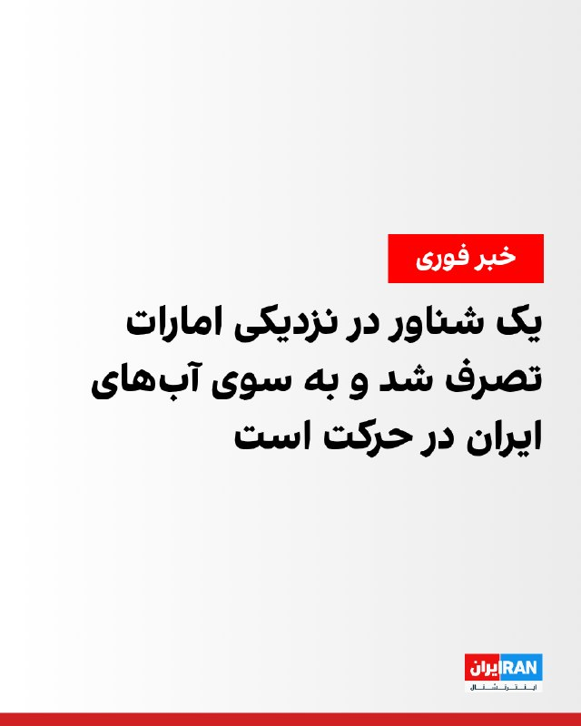

مرکز عملیات تجارت دریایی بریتانیا اعلام کرد گزارشی از یک حادثه دریایی در فاصله ۳۸ مایل دریایی در شمال‌شرق فجیره، امارات متحده عربی، دریافت کرده است. این نهاد اعلام کرد این کشتی در حالی که در لنگرگاه قرار داشته، به دست افراد غیرمجاز تصرف شده و اکنون به سوی آب‌های سرزمینی ایران در حرکت است.
‌🏁 🇬🇧 IranintlTV

🤖 @VahidOOnLine

## VahidOOnLine — post 240058

  

وزارت دفاع اسرائیل اعلام کرد با یکی از شرکت‌های زیرمجموعه شرکت دفاعی البیت قراردادی برای توسعه «قابلیت برد افزوده» جنگنده اف-۳۵آی امضا کرده است. ارزش این قرارداد ۳۴ میلیون دلار اعلام شده است.

بر اساس اعلام این وزارتخانه، این قرارداد با شرکت سایکلون منعقد شده و شامل «توسعه و یکپارچه‌سازی مخازن سوخت خارجی» بر پایه طرحی است که پیش‌تر برای جنگنده اف-۱۶ طراحی شده بود.

وزارت دفاع اسرائیل اعلام کرد این قابلیت جدید قرار است برد عملیاتی هواپیما را افزایش دهد، وابستگی به سوخت‌گیری هوایی را کاهش دهد و انعطاف‌پذیری عملیاتی در ماموریت‌های برد بلند را تقویت کند.
‌🏁 🇬🇧 IranintlTV

🤖 @VahidOOnLine

## VahidOOnLine — post 240057

  <a href="telegram/content/VahidOOnLine_240057_1778743876.mp4" target="_blank">🎬 Download video</a>

همزمان با آغاز نشست وزیران خارجه کشورهای عضو بریکس در دهلی‌نو، عباس عراقچی، وزیر خارجه ایران، از اعضای این گروه و «همه کشورهای مسئول جامعه جهانی» خواست حملات آمریکا و اسرائیل علیه ایران را به‌صراحت محکوم کنند.
خبرگزاری رویترز گزارش داد جنگ ایران و اسرائیل بر نشست دو روزه بریکس در هند سایه انداخته و اختلاف‌ها میان اعضا، رسیدن به موضعی مشترک و صدور بیانیه نهایی را دشوار کرده است. ایران از هند، رئیس دوره‌ای بریکس، خواسته از این نشست برای ایجاد اجماع علیه واشینگتن و تل‌آویو استفاده کند
‌🏁 🇬🇧 ManotoTV

🤖 @VahidOOnLine

## VahidOOnLine — post 240056

  <a href="telegram/content/VahidOOnLine_240056_1778743877.mp4" target="_blank">🎬 Download video</a>

رسانه‌های وابسته به قوه قضاییه جمهوری اسلامی گزارش دادند با دستور مقام قضایی در استان همدان، اموال ۴۷ نفر که به «جاسوسی» و «همکاری با رژیم اسرائیل» متهم شده‌اند، توقیف شده است.
براساس این گزارش‌ها، این افراد در کشورهای مختلف از جمله بریتانیا، آلمان، آمریکا، ترکیه، عراق و سوئیس اقامت دارند و مقام‌های قضایی جمهوری اسلامی اعلام کرده‌اند پرونده آن‌ها در حال بررسی است. به گفته رسانه میزان، اموال توقیف‌شده قرار است برای «بازسازی اماکن آسیب‌دیده از جنگ» هزینه شود.
‌🏁 🇬🇧 ManotoTV

🤖 @VahidOOnLine

## VahidOOnLine — post 240055

  <a href="telegram/content/VahidOOnLine_240055_1778743878.mp4" target="_blank">🎬 Download video</a>

دونالد ترامپ، رئیس‌جمهوری آمریکا، در دیدار با شی جین‌پینگ در پکن، این نشست را «بسیار مهم» توصیف کرد و گفت توجه گسترده‌ای در آمریکا و جهان به این دیدار وجود دارد.
ترامپ با اشاره به اهمیت این مذاکرات گفت برخی این نشست را «بزرگ‌ترین دیدار تاریخ» می‌دانند و تاکید کرد مردم آمریکا تقریبا درباره موضوع دیگری صحبت نمی‌کنند. او همچنین حضور در کنار شی جین‌پینگ را «باعث افتخار» دانست و ابراز امیدواری کرد روابط میان آمریکا و چین «بهتر از هر زمان دیگری» شود.
‌🏁 🇬🇧 ManotoTV

🤖 @VahidOOnLine

## VahidOOnLine — post 240054

  <a href="telegram/content/VahidOOnLine_240054_1778743879.mp4" target="_blank">🎬 Download video</a>

دونالد ترامپ و شی جین‌پینگ، روسای جمهوری آمریکا و چین، در پکن دیدار کردند؛ دیداری که با مراسمی گسترده و تشریفات پرزرق‌وبرق همراه بود و صبح پنج‌شنبه با حضور هیات‌های بلندپایه دو کشور برگزار شد.
ترامپ در سخنان آغازین خود این دیدار را «باعث افتخار» توصیف کرد و گفت:
«رئیس‌جمهوری شی، بسیار سپاسگزارم. چنین استقبالی کمتر دیده‌ام. بیش از همه تحت تأثیر کودکان قرار گرفتم؛ شاد و فوق‌العاده بودند. ارتش چین قدرتمند بود، اما آن کودکان چیزهای زیادی را نمایندگی می‌کنند.»
‌🏁 🇬🇧 ManotoTV

🤖 @VahidOOnLine

## VahidOOnLine — post 240053

  <a href="telegram/content/VahidOOnLine_240053_1778743880.mp4" target="_blank">🎬 Download video</a>

دونالد ترامپ، رئیس‌جمهوری آمریکا، صبح پنج‌شنبه در جریان سفر خود به پکن همراه با شی جین‌پینگ، رئیس‌جمهوری چین، در مراسم رسمی استقبال و رژه نیروهای نظامی این کشور شرکت کرد.
این مراسم در مقابل ساختمان «تالار بزرگ خلق» برگزار شد و دو رهبر ضمن بازدید از یگان‌های نظامی، شاهد اجرای مراسم سان و رژه نیروهای ارتش چین بودند.
‌🏁 🇬🇧 ManotoTV

🤖 @VahidOOnLine

## VahidOOnLine — post 240052

  

♦️یونهاپ، خبرگزاری دولتی کره جنوبی، روز چهارشنبه ۲۴ اردیبهشت به نقل از یکی از مقام‌های امنیتی این کشور گزارش کرد که بررسی‌های سئول نشان می‌دهد که به احتمال بسیار زیاد جمهوری اسلامی ایران مسئول حمله به کشتی باری این کشور در تنگه هرمز بوده است.

سفارت جمهوری اسلامی در سئول هفته گذشته هرگونه حمله جمهوری اسلامی به کشتی باری کره جنوبی در تنگه هرمز را رد کرده بود.

 وزارت خارجه کره‌جنوبی روز یکشنبه اعلام کرده بود که کشتی باری متعلق به این کشور که  روز ۱۴ اردیبهشت در تنگه هرمز دچار حادثه شده بود،  هدف حمله «هواگردهای ناشناس» قرار گرفته است.
پارک ایل، سخنگوی وزارت خارجه کره‌جنوبی، در یک نشست خبری گفت دو هواگرد ناشناس بخش بیرونی مخزن تعادل سمت چپ در قسمت عقب کشتی «اچ‌ام‌ام نامو» را با فاصله حدود یک دقیقه هدف قرار دادند که در پی آن آتش و دود ایجاد شد.
‌🇸🇦 Indypersian

🤖 @VahidOOnLine

## VahidOOnLine — post 240051

  

حسین نوری همدانی، مرجع تقلید حامی حکومت، با صدور فتوایی پرداخت وجوهات شرعی مقلدان علی خامنه‌ای به مجتبی خامنه‌ای را مجاز اعلام کرد و او را «فقیهی جامع‌الشرایط» خواند.

او در این فتوا نوشت: «با توجه به اینکه وجوهات شرعی در نهایت در مسیر اعتلای حوزه‌های علمیه و اداره امور طلاب مصرف می‌گردد، و با عنایت به شناخت موجود نسبت به او به عنوان فقیهی جامع‌الشرایط، ان‌شاء‌الله پرداخت وجوهات شرعی مقلدین رهبر شهید به معظم‌له موجب برائت ذمه خواهد بود.»
‌🏁 🇬🇧 IranintlTV

🤖 @VahidOOnLine

## VahidOOnLine — post 240050

  

حسین نوری همدانی، مرجع تقلید حامی حکومت، با صدور فتوایی پرداخت وجوهات شرعی مقلدان علی خامنه‌ای به مجتبی خامنه‌ای را مجاز اعلام کرد و او را «فقیهی جامع‌الشرایط» خواند.

او در این فتوا نوشت: «با توجه به اینکه وجوهات شرعی در نهایت در مسیر اعتلای حوزه‌های علمیه و اداره امور طلاب مصرف می‌گردد، و با عنایت به شناخت موجود نسبت به او به عنوان فقیهی جامع‌الشرایط، ان‌شاء‌الله پرداخت وجوهات شرعی مقلدین رهبر شهید به معظم‌له موجب برائت ذمه خواهد بود.»
‌🏁 🇬🇧 IranintlTV

🤖 @VahidOOnLine

## VahidOOnLine — post 240049

  

رسانه‌های دولتی چین گزارش دادند دونالد ترامپ و شی جین‌پینگ در جریان گفت‌وگوهای خود در پکن درباره «وضعیت خاورمیانه» و جنگ اوکراین تبادل نظر کردند.

خبرگزاری دولتی شین‌هوا اعلام کرد دو رهبر درباره مسائل مهم بین‌المللی و منطقه‌ای، از جمله وضعیت خاورمیانه، دیدگاه‌های خود را مطرح کردند. موضوع جنگ اوکراین نیز در این گفت‌وگوها بررسی شد.

این دیدار در حالی برگزار شد که گمانه‌زنی‌هایی درباره تلاش احتمالی ترامپ برای جلب همکاری چین در موضوع جنگ آمریکا و اسرائیل علیه جمهوری اسلامی مطرح است.
‌🏁 🇬🇧 IranintlTV

🤖 @VahidOOnLine

## VahidOOnLine — post 240048

♦️دونالد ترامپ، رئیس جمهوری آمریکا و شی جین‌پینگ، رئیس جمهوری چین روز پنجشنبه ۲۴ اردیبهشت و پس از گفتگوهای رسمی، برای یک دیدار فرهنگی به «معبد بهشت» در پکن رفتند.

این معبد که از آن به‌عنوان «قله اوج معماری» چین یاد می‌شود، در قرن ۱۵ میلادی ساخته شده است و در فهرست میراث مشترک بشریت یونسکو قرار دارد.

ترامپ در جریان این بازدید گفت: «چین زیبا است».
‌🇸🇦 Indypersian

🤖 @VahidOOnLine

## VahidOOnLine — post 240047

  

حسین شریعتمداری، نماینده رهبر جمهوری اسلامی در روزنامه کیهان، در یادداشتی با اشاره به جدایی بحرین از ایران، خواستار اقدام جمهوری اسلامی برای بازپس‌گیری فوری این کشور شد.

او نوشت: «آیا در این واقعیت که بحرین کماکان بخشی از سرزمین ایران است، کمترین تردیدی هست؟ اگر تردیدی نیست که نیست، چرا برای بازپس‌گیری آن اقدامی نمی‌شود؟»

شریعتمداری در ادامه افزود: «انتظار آن است و انتظاری شایسته و بایسته نیز هست که جمهوری اسلامی، سازوکار قانونی بازپس‌گیری بحرین را در دستور کار فوری خود قرار دهد.»

او همچنین نوشت: «چرا باید بخشی از سرزمین ایران اسلامی نه فقط در اختیار بیگانگان باشد، بلکه به پایگاه آمریکا و اسرائیل تبدیل شود؟»
‌🏁 🇬🇧 IranintlTV

🤖 @VahidOOnLine

## VahidOOnLine — post 240046

  

دونالد ترامپ، رییس‌جمهوری آمریکا، و شی جین‌پینگ، رهبر چین، برای انجام یک بازدید فرهنگی وارد معبد بهشت شدند؛ مجموعه‌ای تاریخی که از شناخته‌شده‌ترین نمادهای فرهنگی چین به شمار می‌رود.

معبد بهشت در فهرست میراث جهانی یونسکو ثبت شده و عبادتگاهی باستانی است که امپراتوران چین در آن برای برداشت مطلوب محصولات کشاورزی دعا می‌کردند.

بر اساس توضیحات یونسکو، این مجموعه تاریخی به اوایل قرن پانزدهم میلادی بازمی‌گردد و در میان باغ‌ها و جنگل‌های کاج قرار دارد. یونسکو این مجموعه را نمادی از رابطه میان زمین و آسمان توصیف کرده است.
‌🏁 🇬🇧 IranintlTV

🤖 @VahidOOnLine

## VahidOOnLine — post 240045

  <a href="telegram/content/VahidOOnLine_240045_1778743885.mp4" target="_blank">🎬 Download video</a>

♦️عباس عراقچی، وزیر امور خارجه جمهوری اسلامی روز پنجشنبه ۲۴ اردیبهشت و در زمان ورود به نشست وزاری امور خارجه سازمان بریکس  مورد استقبال سوبرامانیام جایشانکا، وزیر خارجه هند قرار گرفت.

عراقچی در حالی در این اجلاس شرکت می‌کند که مساله ادامه بسته بودن تنگه هرمز، به یکی از چالش‌های جدی بین‌المللی تبدیل شده است. هند یکی از بزرگ‌ترین واردکنندگان نفت از کشورهای خاورمیانه، از زمان آغاز جنگ و به‌دلیل کاهش واردات سوخت، مجبور به صرفه‌جویی و اتخاذ سیاست‌های ویژه پولی و بانکی شده است.

وزرای خارجه روسیه، مصر، برزیل، هند، آفریقای جنوبی و جمهوری اسلامی در این نشست حضور دارند.
‌🇸🇦 Indypersian

🤖 @VahidOOnLine

## VahidOOnLine — post 240044

  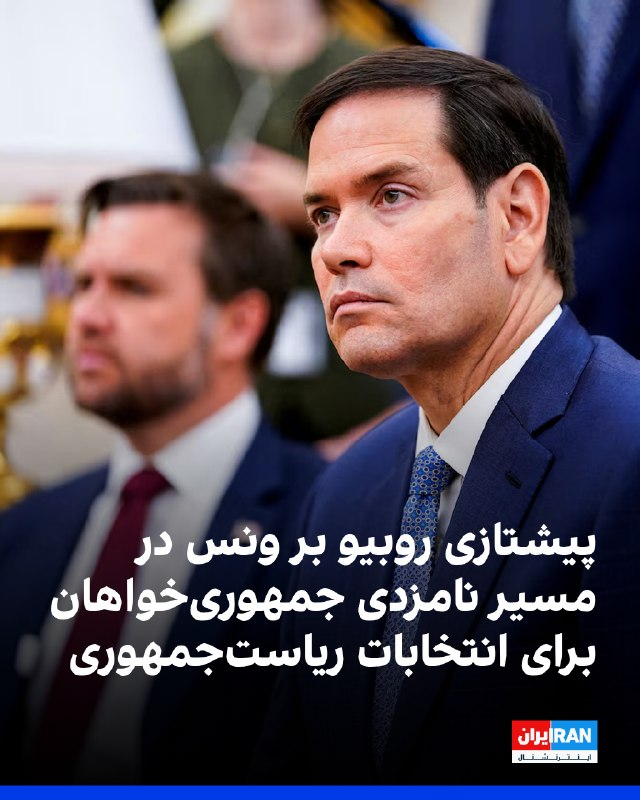

نتایج یک نظرسنجی ملی نشان می‌دهد مارکو روبیو، وزیر خارجه آمریکا، در رقابت برای نامزدی حزب جمهوری‌خواه در انتخابات ریاست‌جمهوری ۲۰۲۸ از جی‌دی ونس پیشی گرفته است. این نظرسنجی را موسسه اطلس‌اینتل در فاصله ۱۳ تا ۱۷ اردیبهشت انجام داده است.

بر اساس این نظرسنجی، روبیو با ۴۵.۴ درصد حمایت در صدر قرار دارد، در حالی که جی‌دی ونس ۲۹.۶ درصد آرا را به دست آورده است. ران دی‌سانتیس نیز با ۱۱.۲ درصد در جایگاه سوم قرار دارد.

این نتایج در مقایسه با پنج ماه پیش تغییر چشمگیری نشان می‌دهد. در آن زمان، ونس با ۴۶.۷ درصد پیشتاز بود و روبیو ۲۲.۶ درصد حمایت داشت. گزارش شده است که افزایش حمایت از روبیو پس از دوره‌ای از فعالیت‌های دیپلماتیک فشرده او، از اوکراین تا کوبا و ایران، رخ داده است.
‌🏁 🇬🇧 IranintlTV

🤖 @VahidOOnLine

## VahidOOnLine — post 240043

⭕️جنگ ایران بسته‌بندی چیپس در ژاپن را سیاه‌وسفید کرد

♦️شرکت ژاپنی «کالبی»، بزرگ‌ترین تولیدکننده چیپس در ژاپن، اعلام کرد به‌دلیل کمبود مواد اولیه ناشی از جنگ ایران و اختلال در بازار نفت، بسته‌بندی برخی محصولات خود را از رنگی به سیاه‌وسفید تغییر می‌دهد.

این شرکت دلیل تصمیم خود را اختلال در تامین مواد موردنیاز تولید جوهر چاپ، به‌ویژه «نفتا» عنوان کرده؛ ماده‌ای نفتی که بخش مهمی از صنایع شیمیایی و بسته‌بندی به آن وابسته‌اند.

اختلال در تنگه هرمز و افزایش بهای نفت، طی هفته‌های اخیر فشار قابل‌توجهی بر صنایع آسیایی وارد کرده و مقام‌های ژاپنی پیش‌تر نسبت به تاثیر «گسترده» بحران انرژی بر منطقه هشدار داده بودند.
‌🇸🇦 Indypersian

🤖 @VahidOOnLine

## WithYashar — post 11179

  <a href="telegram/content/WithYashar_11179_1778743888.mp4" target="_blank">🎬 Download video</a>

خبرنگار: آقای رئیس‌جمهور، مذاکرات چطور بود؟

ترامپ : عالی بود. چین زیباست.

خبرنگار: دربارهٔ تایوان هم صحبت کردید؟

ترامپ: (پاسخی نداد)
@withyashar

## mwarmonitor — post 9062

  <a href="telegram/content/mwarmonitor_9062_1778743890.mp4" target="_blank">🎬 Download video</a>

🇨🇳🇺🇸دونالد ترامپ و شی جین‌پینگ در حال بازدید از «معبد آسمان» در پکن هستند.
🔸خبرنگار: آقای رئیس‌جمهور، گفتگوها چطور بود؟
🔹دونالد ترامپ: عالی بود. جای فوق‌العاده‌ایه. چین زیباست.
مترجم (به چینی): پرزیدنت ترامپ می‌گن که گفتگوها خیلی خوب بوده.
🔸خبرنگار: آقای رئیس‌جمهور، آیا درباره تایوان صحبتی کردید؟
(ترامپ و شی جین‌پینگ بدون پاسخ به سوال، در حال ژست گرفتن برای عکس هستند)
مقام چینی: متشکرم. ممنون. خیلی ممنون.
خبرنگار (دوباره): آقای رئیس‌جمهور، آیا در مورد تایوان صحبت کردید؟
مقام چینی: ممنون از مطبوعات. متشکرم. ممنون.

@mwarmonitor

## mwarmonitor — post 9061

⚽️خبر فوتبالی از نیویورک تایمز:

🎙شکیرا، مدونا و گروه BTS اجرای نخستین نمایش بین دو نیمه را در فینال جام جهانی فوتبال بر عهده خواهند داشت.

@mwarmonitor

## mwarmonitor — post 9060

🇺🇸🇨🇳مراسم رسمی استقبال از دونالد ترامپ با حضور شی جین‌پینگ در چین برگزار شد

💠در این مراسم، رئیس‌جمهور چین با برگزاری تشریفات کامل دیپلماتیک از رئیس‌جمهور آمریکا استقبال کرد؛ رویدادی که در چارچوب سفر رسمی ترامپ به پکن و با هدف بررسی روابط دوجانبه، همکاری‌های اقتصادی و تحولات راهبردی بین دو کشور انجام خواهد گرفت.

@mwarmonitor

## FoxNewsTwitter — post 341701

  

Fox News (Twitter/X)

NEW: President Trump and President Xi Jinping tour the Temple of Heaven after their meeting at the Great Hall of the People in Beijing.

## FoxNewsTwitter — post 341700

  <a href="telegram/content/FoxNewsTwitter_341700_1778743893.mp4" target="_blank">🎬 Download video</a>

Fox News (Twitter/X)

NOW: President Trump and President Xi visit Temple of Heaven after having "great" talks.

"China is beautiful."

## FoxNewsTwitter — post 341699

Fox News (Twitter/X)

WATCH LIVE: President Trump and Chinese President Xi Jinping visit Temple of Heaven https://twitter.com/i/broadcasts/1nxnRYlNzoLxO

## pm_afshaa — post 90712

🔴رویترز: آمریکا و چین توافق کردن هیچ کشوری نباید عوارض از تنگه هرمز بگیره

💧 Rainbet.com the #1 Non-KYC Crypto Casino & Sportsbook @rainbetcom

😁 @Pm_Afshaa

## IranIntlTV — post 337125

  

طبق اطلاعات رسیده به ایران‌اینترنشنال، پرهام محرابی، نوجوان ۱۸ ساله اهل مشهد، شامگاه ۱۸ دی‌ماه ۱۴۰۴ در جریان اعتراضات بلوار هفت‌تیر، کنار پل هفت‌تیر ، در حالی‌که در کنار پدرش حضور داشت، با شلیک مستقیم ماموران سرکوبگر کشته شد. پدر او که لحظه اصابت گلوله را از نزدیک دیده بود، پیکر بی‌جان فرزندش را در آغوش گرفت و صدها متر حمل کرد تا به خودرویشان برسد و سپس او را به خانه منتقل کرد.

بر اساس اطلاعات رسیده به ایران‌اینترنشنال، پدر پرهام آن شب همراه فرزندش در محل اعتراضات حضور داشت و از فاصله‌ای نزدیک شاهد تیر خوردن او بود. او پس از اصابت گلوله، پیکر فرزندش را در آغوش گرفت و مسافتی طولانی حمل کرد تا به خودرو برسد و سپس مستقیما او را به خانه منتقل کرد. خانواده روز بعد برای دفن پیکر اقدام کردند اما به گفته منابع آگاه، ماموران امنیتی از پدر او تعهد کتبی گرفتند که اعلام کند فرزندش توسط «اغتشاشگران» کشته شده است و تهدید کردند در غیر این صورت اجازه دفن صادر نخواهد شد.

به گفته خانواده و اطرافیان، پرهام نوجوانی آرام، مهربان و محبوب بود و رابطه نزدیکی با پدر و مادرش داشت. خانواده‌اش می‌گویند.
https://iranintl.com/202605140

## IranIntlTV — post 337124

  

عباس عراقچی گفت جمهوری اسلامی هیچ مانعی در تنگه هرمز ایجاد نکرده و این آمریکا است که محاصره ایجاد کرده است.

او گفت: «ما هیچ مانعی در تنگه هرمز ایجاد نکرده‌ایم، این آمریکاست که محاصره ایجاد کرده است.»

عراقچی همچنین تاکید کرد: «تنگه هرمز برای تمامی کشتی‌های تجاری باز است، اما آنها باید با نیروهای دریایی ما همکاری کنند.»
https://iranintl.com/202605149350

## IranIntlTV — post 337123

  

مرکز عملیات تجارت دریایی بریتانیا اعلام کرد گزارشی از یک حادثه دریایی در فاصله ۳۸ مایل دریایی در شمال‌شرق فجیره، امارات متحده عربی، دریافت کرده است. این نهاد اعلام کرد این کشتی در حالی که در لنگرگاه قرار داشته، به دست افراد غیرمجاز تصرف شده و اکنون به سوی آب‌های سرزمینی ایران در حرکت است.
https://iranintl.com/202605141129

## IranIntlTV — post 337122

  

وزارت دفاع اسرائیل اعلام کرد با یکی از شرکت‌های زیرمجموعه شرکت دفاعی البیت قراردادی برای توسعه «قابلیت برد افزوده» جنگنده اف-۳۵آی امضا کرده است. ارزش این قرارداد ۳۴ میلیون دلار اعلام شده است.

بر اساس اعلام این وزارتخانه، این قرارداد با شرکت سایکلون منعقد شده و شامل «توسعه و یکپارچه‌سازی مخازن سوخت خارجی» بر پایه طرحی است که پیش‌تر برای جنگنده اف-۱۶ طراحی شده بود.

وزارت دفاع اسرائیل اعلام کرد این قابلیت جدید قرار است برد عملیاتی هواپیما را افزایش دهد، وابستگی به سوخت‌گیری هوایی را کاهش دهد و انعطاف‌پذیری عملیاتی در ماموریت‌های برد بلند را تقویت کند.
https://iranintl.com/202605141756

## IranIntlTV — post 337121

  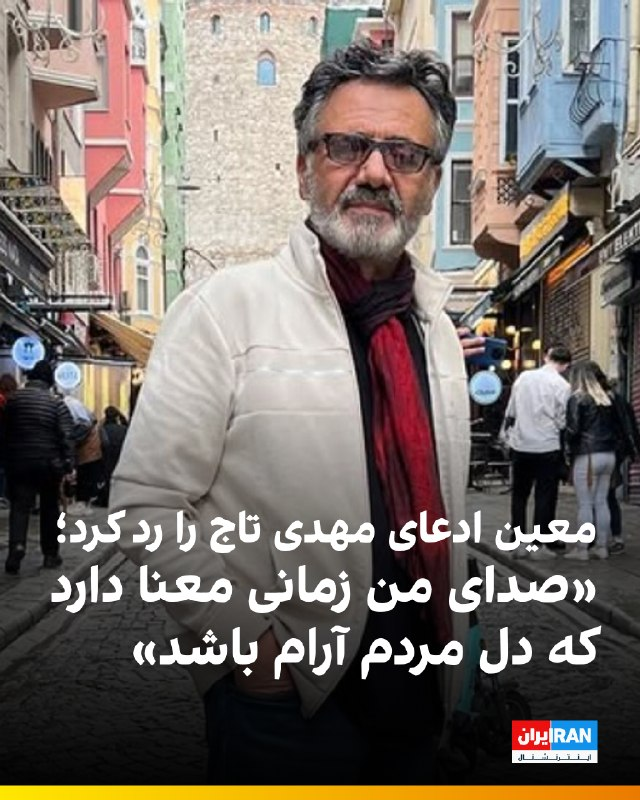

🔻معین، خواننده سرشناس موسیقی پاپ، با انتشار پستی در صفحه رسمی خود در اینستاگرام، اظهارات مهدی تاج، رییس فدراسیون فوتبال، درباره خواندن ترانه برای تیم ملی را تکذیب کرد.

🔹معین در این رابطه نوشت: «اخیرا خبرهایی درباره اجرای من برای تیم فوتبال در جام جهانی منتشر شده که صحت ندارد.»

🔹او همچنین با تاکید بر همبستگی با مردم اضافه کرد: «عشق من به مردم و سرزمینم همیشه واقعی بوده، اما صدای من زمانی معنا دارد که دل مردم آرام باشد و حال ایران خوب باشد.»

🔹این واکنش در حالی مطرح شد که در مراسم بدرقه تیم ملی در شامگاه چهارشنبه ۲۳ اردیبهشت، مهدی تاج تایید کرد که معین در حال آماده‌سازی قطعه‌ای برای تیم ملی است. او در این مراسم گفت: «ما دخالتی در ترانه معین نکرده‌ایم، اما در جریان آن هستیم.»
@iranintltvsport

## IranIntlTV — post 337120

  

حسین نوری همدانی، مرجع تقلید حامی حکومت، با صدور فتوایی پرداخت وجوهات شرعی مقلدان علی خامنه‌ای به مجتبی خامنه‌ای را مجاز اعلام کرد و او را «فقیهی جامع‌الشرایط» خواند.

او در این فتوا نوشت: «با توجه به اینکه وجوهات شرعی در نهایت در مسیر اعتلای حوزه‌های علمیه و اداره امور طلاب مصرف می‌گردد، و با عنایت به شناخت موجود نسبت به او به عنوان فقیهی جامع‌الشرایط، ان‌شاء‌الله پرداخت وجوهات شرعی مقلدین رهبر شهید به معظم‌له موجب برائت ذمه خواهد بود.»
https://iranintl.com/202605149707

## IranIntlTV — post 337118

  <a href="telegram/content/IranIntlTV_337118_1778743898.mp4" target="_blank">🎬 Download video</a>

وزارت خارجه امارات گزارش‌ها درباره سفر بنیامین نتانیاهو به این کشور را تکذیب کرد. چهارشنبه دفتر نخست‌وزیری اسرائیل اعلام کرده بود نتانیاهو در جریان عملیات «غرش شیران» به‌صورت محرمانه به امارات سفر کرده و با محمد بن زاید آل نهیان، رییس امارات، دیدار داشته است.

گفت‌وگو با منشه امیر، کارشناس امور خاورمیانه
@iranintltv

## IranIntlTV — post 337117

  <a href="telegram/content/IranIntlTV_337117_1778743900.mp4" target="_blank">🎬 Download video</a>

امید معماریان، تحلیل‌گر سیاسی، درباره دیدار دونالد ترامپ و شی جین‌پینگ گفت: «ممکن است چین برای کمک به حل مساله جنگ ایران، بخواهد در حوزه‌های دیگر از آمریکا امتیاز بگیرد.»
@iranintltv

## IranIntlTV — post 337116

  <a href="telegram/content/IranIntlTV_337116_1778743901.mp4" target="_blank">🎬 Download video</a>

جاویدنامان انقلاب ملی ایرانیان
«سینا کاظمی» جوان ۲۲ ساله، ۱۸ دی‌ماه در منطقه تهرانپارس تهران با شلیک مستقیم نیروهای سرکوب خامنه‌ای کشته شد. نامش در حافظه‌ این سرزمین می‌ماند و یادش چراغ راه آزادی‌خواهان است.
@iranintltv

## IranIntlTV — post 337115

  

رسانه‌های دولتی چین گزارش دادند دونالد ترامپ و شی جین‌پینگ در جریان گفت‌وگوهای خود در پکن درباره «وضعیت خاورمیانه» و جنگ اوکراین تبادل نظر کردند.

خبرگزاری دولتی شین‌هوا اعلام کرد دو رهبر درباره مسائل مهم بین‌المللی و منطقه‌ای، از جمله وضعیت خاورمیانه، دیدگاه‌های خود را مطرح کردند. موضوع جنگ اوکراین نیز در این گفت‌وگوها بررسی شد.

این دیدار در حالی برگزار شد که گمانه‌زنی‌هایی درباره تلاش احتمالی ترامپ برای جلب همکاری چین در موضوع جنگ آمریکا و اسرائیل علیه جمهوری اسلامی مطرح است.
https://iranintl.com/202605147700

## IranIntlTV — post 337114

  <a href="telegram/content/IranIntlTV_337114_1778743904.mp4" target="_blank">🎬 Download video</a>

یک شرکت بریتانیایی اعلام کرد با کمک هوش مصنوعی، برای ربات‌ها یک «مغز» طراحی کرده که به آن‌ها امکان می‌دهد مانند انسان حرکت کنند و وظایف صنعتی انجام دهند.

گزارش فرزیا ثابتی، خبرنگار ایران‌اینترنشنال
@iranintltv

## IranIntlTV — post 337113

  <a href="telegram/content/IranIntlTV_337113_1778743905.mp4" target="_blank">🎬 Download video</a>

وزارت ارتباطات جمهوری اسلامی اعلام کرد برنامه‌ریزی برای اجرای طرحی موسوم به «ساماندهی دستفروشان آنلاین» را آغاز کرده است. به گفته این وزارتخانه، در صورت فراهم شدن زیرساخت‌ها این طرح می‌تواند «موانع حضور کسب‌وکارهای خانگی در اقتصاد دیجیتال را کاهش دهد».

گفت‌وگو با مهدی صارمی‌فر، روزنامه‌نگار علم و تکنولوژی
@iranintltv

## IranIntlTV — post 337112

  

حسین شریعتمداری، نماینده رهبر جمهوری اسلامی در روزنامه کیهان، در یادداشتی با اشاره به جدایی بحرین از ایران، خواستار اقدام جمهوری اسلامی برای بازپس‌گیری فوری این کشور شد.

او نوشت: «آیا در این واقعیت که بحرین کماکان بخشی از سرزمین ایران است، کمترین تردیدی هست؟ اگر تردیدی نیست که نیست، چرا برای بازپس‌گیری آن اقدامی نمی‌شود؟»

شریعتمداری در ادامه افزود: «انتظار آن است و انتظاری شایسته و بایسته نیز هست که جمهوری اسلامی، سازوکار قانونی بازپس‌گیری بحرین را در دستور کار فوری خود قرار دهد.»

او همچنین نوشت: «چرا باید بخشی از سرزمین ایران اسلامی نه فقط در اختیار بیگانگان باشد، بلکه به پایگاه آمریکا و اسرائیل تبدیل شود؟»
https://iranintl.com/202605149606

## IranIntlTV — post 337111

  <a href="telegram/content/IranIntlTV_337111_1778743907.mp4" target="_blank">🎬 Download video</a>

شهرام خلدی، پژوهش‌گر تاریخ خاورمیانه و روابط بین‌الملل، گفت سفر ترامپ به پکن فرصت مناسبی است تا رییس‌جمهوری چین از بحران ایران به‌عنوان یک کارت برنده برای دستیابی به اهداف اقتصادی بزرگ‌تر و اعمال فشار بر ایالات متحده استفاده کند.
@iranintltv

## IranIntlTV — post 337110

  <a href="telegram/content/IranIntlTV_337110_1778743909.mp4" target="_blank">🎬 Download video</a>

میزان، رسانه قوه قضاییه جمهوری اسلامی، گزارش داد حکم اعدام محمد عباسی، شهروند ۵۵ ساله و از بازداشت‌شدگان اعتراضات دی‌ماه ۱۴۰۴، چهارشنبه به اتهام «محاربه» اجرا شد. بر اساس گزارش نهادهای حقوق بشری، اعترافات مربوط به اتهام «قتل یکی از سرهنگ‌های نیروی انتظامی» در اعتراضات ملارد، تحت شکنجه و با تهدید به تعرض به دختر او گرفته شده بود.

گفت‌وگو با پگاه بنی‌هاشمی، پژوهش‌گر ارشد حقوق
@iranintltv

## IranIntlTV — post 337109

  <a href="telegram/content/IranIntlTV_337109_1778743911.mp4" target="_blank">🎬 Download video</a>

دونالد ترامپ، رییس‌جمهوری ایالات متحده، با ابراز خرسندی از سفر به چین و ادای احترام به اقدامات شی جین‌پینگ گفت واشینگتن و پکن همواره چالش‌ها و اختلافات خود را در سریع‌ترین زمان و با حسن نیت حل کرده‌اند.
@iranintltv

## IranIntlTV — post 337108

  

دونالد ترامپ، رییس‌جمهوری آمریکا، و شی جین‌پینگ، رهبر چین، برای انجام یک بازدید فرهنگی وارد معبد بهشت شدند؛ مجموعه‌ای تاریخی که از شناخته‌شده‌ترین نمادهای فرهنگی چین به شمار می‌رود.

معبد بهشت در فهرست میراث جهانی یونسکو ثبت شده و عبادتگاهی باستانی است که امپراتوران چین در آن برای برداشت مطلوب محصولات کشاورزی دعا می‌کردند.

بر اساس توضیحات یونسکو، این مجموعه تاریخی به اوایل قرن پانزدهم میلادی بازمی‌گردد و در میان باغ‌ها و جنگل‌های کاج قرار دارد. یونسکو این مجموعه را نمادی از رابطه میان زمین و آسمان توصیف کرده است.
https://iranintl.com/202605148251

## IranIntlTV — post 337107

  <a href="telegram/content/IranIntlTV_337107_1778743913.mp4" target="_blank">🎬 Download video</a>

روزنامه استرالین با شماری از شهروندان داخل ایران درباره تشدید بحران اقتصادی، کمبود دارو، تبعیض دیجیتال، گسترش بیکاری و افزایش فشارهای امنیتی در شهرهای مختلف گفت‌وگو کرده است.
علیرضا محبی، خبرنگار ایران‌اینترنشنال،‌ از جزییات این گزارش می‌گوید
@iranintltv

## IranIntlTV — post 337106

  <a href="https://t.me/IranintlTV/337106" target="_blank">📎 Download file</a>

🎧نسخه صوتی اخبار بامدادی | پنجشنبه ۲۴ اردیبهشت
@iranintlTV

## IranIntlTV — post 337105

  <a href="telegram/content/IranIntlTV_337105_1778743915.mp4" target="_blank">🎬 Download video</a>

مسعود پزشکیان، رییس دولت جمهوری اسلامی، در واکنش به تورم و گرانی بی‌سابقه، از وزارت جهاد کشاورزی خواست همه توان خود را برای کنترل قیمت‌ها به‌کار بگیرد. پزشکیان پیش‌تر گفته بود کشور به‌شدت به «صرفه‌جویی» نیاز دارد.

فرهاد ثابتان، استاد اقتصاد در دانشگاه کالیفرنیا، گفت نه قیمت‌گذاری دستوری و نه دعوت مردم به صرفه‌جویی، هیچ‌کدام قادر به حل مشکلات چندلایه اقتصاد ایران نیستند.
@iranintltv

## ManotoTV — post 105430

  <a href="telegram/content/ManotoTV_105430_1778743917.mp4" target="_blank">🎬 Download video</a>

همزمان با آغاز نشست وزیران خارجه کشورهای عضو بریکس در دهلی‌نو، عباس عراقچی، وزیر خارجه ایران، از اعضای این گروه و «همه کشورهای مسئول جامعه جهانی» خواست حملات آمریکا و اسرائیل علیه ایران را به‌صراحت محکوم کنند.
خبرگزاری رویترز گزارش داد جنگ ایران و اسرائیل بر نشست دو روزه بریکس در هند سایه انداخته و اختلاف‌ها میان اعضا، رسیدن به موضعی مشترک و صدور بیانیه نهایی را دشوار کرده است. ایران از هند، رئیس دوره‌ای بریکس، خواسته از این نشست برای ایجاد اجماع علیه واشینگتن و تل‌آویو استفاده کند

## ManotoTV — post 105428

  <a href="telegram/content/ManotoTV_105428_1778743917.mp4" target="_blank">🎬 Download video</a>

رسانه‌های وابسته به قوه قضاییه جمهوری اسلامی گزارش دادند با دستور مقام قضایی در استان همدان، اموال ۴۷ نفر که به «جاسوسی» و «همکاری با رژیم اسرائیل» متهم شده‌اند، توقیف شده است.
براساس این گزارش‌ها، این افراد در کشورهای مختلف از جمله بریتانیا، آلمان، آمریکا، ترکیه، عراق و سوئیس اقامت دارند و مقام‌های قضایی جمهوری اسلامی اعلام کرده‌اند پرونده آن‌ها در حال بررسی است. به گفته رسانه میزان، اموال توقیف‌شده قرار است برای «بازسازی اماکن آسیب‌دیده از جنگ» هزینه شود.

## ManotoTV — post 105427

  <a href="telegram/content/ManotoTV_105427_1778743918.mp4" target="_blank">🎬 Download video</a>

دونالد ترامپ، رئیس‌جمهوری آمریکا، در دیدار با شی جین‌پینگ در پکن، این نشست را «بسیار مهم» توصیف کرد و گفت توجه گسترده‌ای در آمریکا و جهان به این دیدار وجود دارد.
ترامپ با اشاره به اهمیت این مذاکرات گفت برخی این نشست را «بزرگ‌ترین دیدار تاریخ» می‌دانند و تاکید کرد مردم آمریکا تقریبا درباره موضوع دیگری صحبت نمی‌کنند. او همچنین حضور در کنار شی جین‌پینگ را «باعث افتخار» دانست و ابراز امیدواری کرد روابط میان آمریکا و چین «بهتر از هر زمان دیگری» شود.

## ManotoTV — post 105426

  <a href="telegram/content/ManotoTV_105426_1778743919.mp4" target="_blank">🎬 Download video</a>

دونالد ترامپ و شی جین‌پینگ، روسای جمهوری آمریکا و چین، در پکن دیدار کردند؛ دیداری که با مراسمی گسترده و تشریفات پرزرق‌وبرق همراه بود و صبح پنج‌شنبه با حضور هیات‌های بلندپایه دو کشور برگزار شد.
ترامپ در سخنان آغازین خود این دیدار را «باعث افتخار» توصیف کرد و گفت:
«رئیس‌جمهوری شی، بسیار سپاسگزارم. چنین استقبالی کمتر دیده‌ام. بیش از همه تحت تأثیر کودکان قرار گرفتم؛ شاد و فوق‌العاده بودند. ارتش چین قدرتمند بود، اما آن کودکان چیزهای زیادی را نمایندگی می‌کنند.»

## ManotoTV — post 105425

  <a href="telegram/content/ManotoTV_105425_1778743920.mp4" target="_blank">🎬 Download video</a>

دونالد ترامپ، رئیس‌جمهوری آمریکا، صبح پنج‌شنبه در جریان سفر خود به پکن همراه با شی جین‌پینگ، رئیس‌جمهوری چین، در مراسم رسمی استقبال و رژه نیروهای نظامی این کشور شرکت کرد.
این مراسم در مقابل ساختمان «تالار بزرگ خلق» برگزار شد و دو رهبر ضمن بازدید از یگان‌های نظامی، شاهد اجرای مراسم سان و رژه نیروهای ارتش چین بودند.

## FarsiVOA — post 217699

  

شی جین‌پینگ، رئیس‌جمهور چین، در جریان گفت‌وگو با دونالد ترامپ، رئیس‌جمهور آمریکا گفت که روابط اقتصادی بین دو کشور «ماهیتی دوجانبه، سودمند و برد-برد» دارد.

به گزارش خبرگزاری دولتی چین، شینهوا، شی پنجشنبه گفت: «دیروز، تیم‌های اقتصادی و تجاری ما نتایجی به‌طور کلی متوازن و مثبت تولید کردند. این خبر خوبی برای مردم دو کشور و جهان است.»

رئیس‌جمهور چین افزود که واقعیت‌ها بارها نشان داده‌اند در جنگ‌های تجاری هیچ برنده‌ای وجود ندارد و از هر دو طرف خواست تا به‌طور مشترک شتاب مثبتی را که با تلاش فراوان ایجاد کرده‌اند حفظ کنند.

او گفت: «در مواردی که اختلافات و اصطکاک‌ها وجود دارد، مشورت برابر تنها انتخاب درست است.»

همچنین بر اساس ویدیویی که از ابتدای مذاکرات منتشر شد، شی گفت: «همواره بر این باور بوده‌ام که منافع مشترک میان چین و ایالات متحده بر اختلافات ما می‌چربد؛ موفقیت هر کشور فرصتی برای کشور دیگر است و یک رابطه پایدار چین و آمریکا برای جهان یک موهبت است. همکاری به سود هر دو طرف است، در حالی که تقابل به هر دو طرف آسیب می‌زند.»
@FarsiVOA

## FarsiVOA — post 217698

  

🔺اوپک از افت تولید نفت ایران برای دومین ماه متوالی خبر داد

▪️سازمان کشورهای صادرکننده نفت، اوپک، از افت تولید نفت ایران برای دومین ماه متوالی خبر داد.

▪️تولید روزانه نفت ایران در ماه آوریل نسبت به ماه مارس حدود ۲۱۲ هزار بشکه و نسبت به ماه فوریه، قبل از جنگ، حدود ۳۸۷ هزار بشکه کاهش داشته است. ایران در ماه گذشته روزانه ۲ میلیون و ۸۵۴ هزار بشکه تولید نفت داشته است.

▪️با توجه به پر شدن مخازن ذخیره نفت ایران به خاطر محاصره دریایی آمریکا، انتظار می‌رود شتاب افت تولید نفت ایران در ماه جاری افزایش یابد.

▪️مصرف داخلی نفت خام ایران حدود ۱.۷ میلیون بشکه است و در صورت ناتوانی جمهوری اسلامی در صادرات نفت، تولید نفت خام به همین سطح کاهش خواهد یافت.

⬇️ بیشتر بخوانید:
https://ir.voanews.com/a/8149916.html

## FarsiVOA — post 217697

🔺ترامپ به شی: روابط آمریکا با چین «بهتر از همیشه» خواهد بود

▪️دونالد ترامپ، رئیس‌جمهور ایالات متحده، روز پنج‌شنبه ۲۴ اردیبهشت در پکن و پشت میز گفت‌وگو با همتای چینی خود، شی جین‌پینگ، اعلام کرد که روابط کشورش با چین «بهتر از همیشه» خواهد بود.

▪️ترامپ روز چهارشنبه برای سفری سه‌روزه وارد پایتخت چین شد. این نخستین سفر او به چین از سال ۲۰۱۷ تاکنون است.

▪️این سفر در ابتدا برای اواخر ماه مارس برنامه‌ریزی شده بود، اما به دلیل جنگ آمریکا و اسرائیل علیه جمهوری اسلامی به تعویق افتاد.

▪️هدف نشست شی و ترامپ دستیابی به توافق‌هایی درباره محصولات کشاورزی و هواپیماها، و همچنین حفظ آتش‌بس شکننده در جنگ تجاری میان دو اقتصاد بزرگ جهان است.

⬇️ بیشتر بخوانید:
https://ir.voanews.com/a/8149914.html

## DW_Farsi — post 124673

  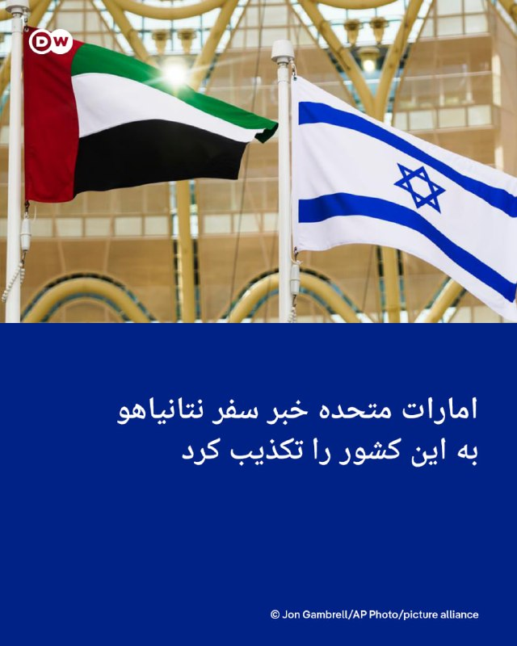

🔶 امارات متحده خبر سفر نتانیاهو به این کشور را تکذیب کرد

وزارت امور خارجه امارات متحده عربی اخبار و گزارش‌های مربوط به سفر بنیامین نتانیاهو به این کشور در حین جنگ آمریکا و اسرائیل با جمهوری اسلامی را تکذیب کرد.

در بیانیه این وزارتخانه در این رابطه منتشر شد، آماده است: «امارات متحده عربی گزارش‌های منتشرشده درباره سفر نخست‌وزير اسرائيل يا استقبال از يک هيات نظامی اسرائيلی را تکذيب می‌کند.»

این وزارتخانه تأکید کرده که روابط امارات و اسرائیل "علنی و بر پایه پیمان ابراهیم" است و از این رو تمامی سفرها و دیدارهای رسمی به شکل شفاف اعلام شده و انجام می‌گیرند".

دفتر بنیامین نتانیاهو چهارشنبه ۱۳ مه (۲۳ اردیبهشت) اعلام کرده بود، نخست وزیر اسرائیل در جریان جنگ ایران به‌طور محرمانه به امارات سفر کرده و با محمد بن زاید، رئیس امارات، دیدار داشته است. به گفته دفتر نتانیاهو این سفر به "یک دستاورد تاریخی" در روابط دو طرف منجر شده است.

پیش از آن وال استریت ژورنال در گزارشی نوشته بود دیوید بارنیا، رئیس موساد، نیز دست‌کم دو بار در ماه‌های مارس و آوریل به امارات سفر کرد تا درباره روند جنگ با ایران و هماهنگی‌های امنیتی با مقام‌های این کشور گفت‌وگو کند.

@dw_farsi

## DW_Farsi — post 124672

  

🔶 ابراز امیدواری روبیو به فشار بیشتر پکن بر تهران

مارکو روبیو اعلام کرد ایالات متحده به پشتیبانی بیشتر چین در راه یافتن راه‌حلی برای تنگه هرمز امیدوار است. وزیر خارجه آمریکا تصریح کرد: «ما امیدواریم چین را متقاعد کنیم که نقشی فعالانه‌تر برای متقاعد کردن ایران بازی کند تا تهران از آنچه در حال حاضر در خلیج فارس انجام می‌دهد و در تلاش برای انجام آن است، فاصله بگیرد.»

روبیو که دونالد ترامپ را در سفر به چین همراهی می‌کند، این اظهارات را در گفت‌وگو با شبکه فاکس نیوز که در هواپیمای "ایرفورس وان" انجام شد، ابراز کرد.

وزیر خارجه ایالات متحده در این گفت‌وگو تأکید کرد که رفع وضعیت کنونی حاکم در تنگه هرمز به دلایل مختلف به نفع چین است. با این حال از آنجایی که کشتی‌های چینی نیز در آب‌های خلیج فارس گرفتار شده‌اند. او افزود، اقتصاد چین بر محور صادرات فعالیت می‌کند و از فشارهای اقتصادی ناشی از بحران تنگه هرمز رنج می‌برد، زیرا کشورهای دیگر بر اثر این بحران کالاهای کمتری از چین خریداری می‌کنند.

اظهارات روبیو در تضاد با سخنان ترامپ قرار دارد. رئیس جمهور آمریکا در آغاز سفرش به پکن در پاسخ به این پرسش که آیا همتای چینی او، شی می‌تواند در جنگ ایران یاری‌دهنده باشد، گفت بود: «گمان می‌کنم، ما در مورد ایران به هیچ کمکی نیاز نداریم.»

@dw_farsi

## Persian_Trend_Official — post 14099

⭕️ وضعیت از 57 تا امروز... 🗿

(نسخه کم حجم توی کامنت ها)
📝 Nick

📌 @persian_trend_official
پرشین ترند | متفاوت‌ترین کانال نظامی

## Persian_Trend_Official — post 14098

  <a href="telegram/content/Persian_Trend_Official_14098_1778743924.webm" target="_blank">🎬 Download video</a>

⭕️ وزیر انرژی و معادن کوبا اعلام کرد که کشور به طور کامل از دیزل و نفت کوره خالی شده و تولید برق به صورت کامل متوقف شده است، در حالی که ایالات متحده جزیره را محاصره کرده است.

بسیاری از محله‌ها در پایتخت کوبا در حال حاضر با خاموشی‌هایی مواجه هستند که ۲۰ تا ۲۲ ساعت در روز طول می‌کشد.

📝 Nick

📌 @persian_trend_official
پرشین ترند | متفاوت‌ترین کانال نظامی

## Persian_Trend_Official — post 14093

  <a href="telegram/content/Persian_Trend_Official_14093_1778743924.webm" target="_blank">🎬 Download video</a>

باز مانده از رزمایش ضد هلی برن «قائد شهید» سپاه حضرت محمد رسول اللّه (ص) تهران بزرگ !!!

درسته جنگ زمینی تخصص شماست، فقط متخصصین عزیز پوتین نداشتید ؟

📌 @persian_trend_official
پرشین ترند | متفاوت‌ترین کانال نظامی

## Persian_Trend_Official — post 14092

کانال رسمی پرشین ترند pinned a voice message

## Persian_Trend_Official — post 14091

هر شب خواب رفیقای شهیدمو می‌بینم ! 📌 @persian_trend_official پرشین ترند | متفاوت‌ترین کانال نظامی

## Persian_Trend_Official — post 14090

  <a href="telegram/content/Persian_Trend_Official_14090_1778743925.mp4" target="_blank">🎬 Download video</a>

هر شب خواب رفیقای شهیدمو می‌بینم !

📌 @persian_trend_official
پرشین ترند | متفاوت‌ترین کانال نظامی

## Persian_Trend_Official — post 14087

📍بولتن خبری ۲۴ ساعت اخیر پرشین ترند
🗓 ۲۴ اردیبهشت ۱۴۰۵

گرد آوری = آرشیو تحریریه پرشین ترند

◾️ نیویورک تایمز: ایران ۷۰ درصد از ذخایر موشکی خود را حفظ کرده و به ۳۰ سایت از ۳۳ سایت موشکی در تنگه هرمز دسترسی مجدد یافته است

◾️ رویترز: ایران رویکرد خود را از مسدودسازی هرمز به «کنترل دسترسی» تغییر داده؛ عراق و پاکستان به توافق جداگانه برای عبور نفتکش‌هایشان دست یافته‌اند

◾️خبرگزاری Wsj: عبور و مرور «خاموش» کشتی‌ها در تنگه هرمز ۶۰۰ درصد افزایش یافته

◾️ مجلس سنای آمریکا برای هفتمین بار قطعنامه پایان جنگ با ایران را رد کرد

◾️ پنتاگون: هزینه جنگ با ایران به ۲۹ میلیارد دلار رسید؛ تحلیلگران هشدار می‌دهند رقم نهایی به یک تریلیون دلار خواهد رسید

◾️ وزارت بهداشت ایران: تعداد مجروحان بستری جنگ به زیر ۴۰ نفر رسیده است

◾️سخنگوی وزارت خارجه ایران: آمریکا اهمیت فرصت مذاکره را درک نمی‌کند؛ ارزیابی دقیق‌تری از موضع آمریکا از طریق میانجیان پاکستانی دریافت خواهد شد

◾️سخنگوی کمیسیون امنیت ملی: غنی‌سازی ۹۰ درصدی یکی از گزینه‌های مطرح ایران است

◾️وزیر انرژی آمریکا: ایران به طرز نگران‌کننده‌ به غنی‌سازی درجه تسلیحاتی نزدیک شده و ممکن است چند هفته با آستانه ۹۰ درصد فاصله داشته باشد

◾️نروژ با سفر معاون وزیر خارجه به تهران، عمان و پاکستان در حال آزمودن نقش میانجیگری اروپایی است

◾️روسیه آمادگی خود را برای حمایت از تلاش‌های دیپلماتیک پاکستان در حل تنش خاورمیانه اعلام کرد

◾️ایتالیا اعلام کرد در صورت برقراری آتش‌بس پایدار، دو فروند مین‌روب به تنگه هرمز اعزام خواهد کرد

◾️ترامپ وارد پکن شد؛ ایران محور اصلی مذاکرات با شی جین‌پینگ عنوان شده است

◾️ترامپ: آمریکا برای پایان جنگ با ایران به کمک چین نیاز ندارد؛ «به هر شکل پیروز خواهیم شد»

◾️روبیو: واشنگتن امیدوار است پکن ایران را به عقب‌نشینی از رفتارهایش در منطقه متقاعد کند

◾️روبیو و وانگ یی توافق کردند هیچ کشوری حق دریافت عوارض حمل‌ونقل در تنگه هرمز را ندارد

◾️واشنگتن‌پست: گزارش محرمانه اطلاعاتی آمریکا نشان می‌دهد چین از جنگ ایران بهره راهبردی می‌برد؛ پکن در حین حملات ایران به کشورهای خلیج فارس تسلیحات فروخته است

◾️نیویورک تایمز: شرکت‌های چینی درباره فروش مخفیانه سلاح به ایران از طریق کشورهای ثالث مذاکره کرده‌اند

◾️گزارش‌ها حاکی است ایلان ماسک، تیم کوک، جنسن هوانگ و لری فینک در هیئت همراه ترامپ در سفر به پکن حضور دارند

◾️شهباز شریف از ۳ تا ۶ خرداد به پکن سفر می‌کند؛ میانجیگری میان ایران و آمریکا با مشارکت چین از دستور کار اصلی است

◾️وال استریت ژورنال: رئیس موساد دیوید بارنیا در جریان جنگ حداقل دو بار به‌صورت مخفیانه به امارات سفر کرده است

◾️دفتر نخست‌وزیری اسرائیل: نتانیاهو در میانه جنگ سفری محرمانه به امارات داشته؛ امارات این ادعا را تکذیب کرد

◾️داده‌های پروازی منتشرشده نشان می‌دهد دو هواپیمای شخصی در ۲۶ مارس از تل‌آویو به شهر العین امارات پرواز کرده‌اند

◾️وال استریت ژورنال: امارات فراتر از میانجیگری دیپلماتیک عمل کرده؛ حمله به جزیره لاوان و میزبانی سامانه‌های دفاع هوایی اسرائیل به این کشور نسبت داده شده است

◾️رویترز: جنگنده‌های عربستان سعودی اهداف شبه‌نظامیان وابسته به ایران را در نزدیکی مرز عراق بمباران کردند

◾️رویترز: کویت در دو نوبت حملات موشکی تلافی‌جویانه به مواضع شبه‌نظامیان در جنوب عراق انجام داده است

◾️عراقچی: کویت به‌صورت غیرقانونی به شناور ایرانی حمله و ۴ تبعه ایران را در خلیج فارس بازداشت کرده ؛ایران خواستار آزادی فوری آن‌هاست

◾️ احسان افرشته ۳۳ ساله بامداد چهارشنبه به اتهام همکاری با موساد اعدام شد؛ او پیش از بازگشت به ایران داوطلبانه خود را معرفی کرده بود

◾️ عضو کمیسیون بودجه مجلس: ۳۰ درصد از گرانی‌ها ناشی از جنگ و ۳۵ درصد ناشی از ناکارآمدی دستگاه‌هاست

◾️ شبکهNDTV تصاویر ماهواره‌ای منتشر کرد که حضور هواپیمای ترابری C-130H ایران در پایگاه هوایی نورخان پاکستان را تأیید می‌کند

◾️ وزیر دفاع پاکستان: ترکیه و قطر ممکن است به توافق دفاعی متقابل پاکستان و عربستان سعودی بپیوندند

◾️ رایمتال آلمان تولید انبوه پهپاد FV-014 با برد ۱۰۰ کیلومتر و استقامت ۷۰ دقیقه‌ای را آغاز کرد

◾️پنتاگون به‌طور غیرمنتظره اعزام تیپ رزمی زرهی «بلک‌جک» به لهستان را لغو کرد؛ برخی نیروها در مسیر بودند که دستور توقف صادر شد

◾️بلومبرگ: نزدیک به ۴۰ درصد از تأمین‌کنندگان سازندگان موشک دولتی چین در ۲۰۲۵ به درآمد رکوردی رسیدند

◾️ پوتین به تسلط کامل بر دونباس تا پاییز متمرکز شده و قصد دارد از آن برای درخواست قلمرو بیشتر در مذاکرات آتی بهره ببرد

◾️ ترکیه و ارمنستان آماده‌سازی‌های لازم برای راه‌اندازی تجارت مستقیم را تا ۱۱ مه ۲۰۲۶ تکمیل کردند

📌 @persian_trend_official
پرشین ترند | متفاوت‌ترین کانال نظامی

## RadioFarda — post 157160

  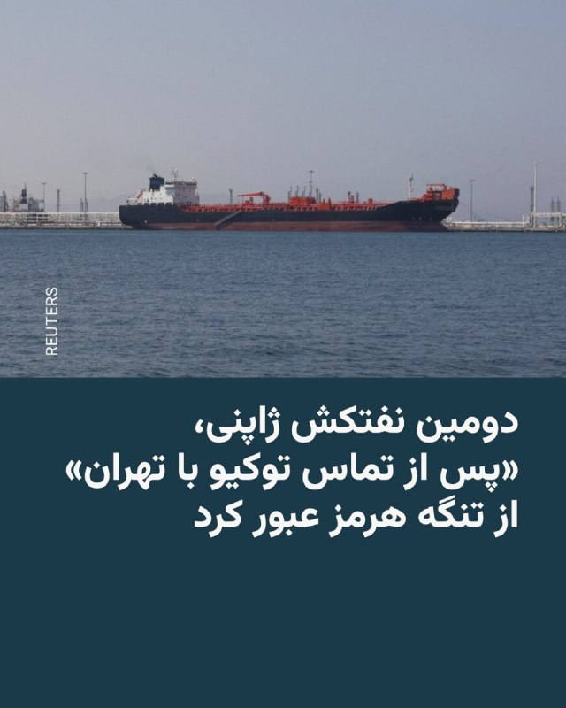

🔸 نخست‌وزیر ژاپن از عبور موفقیت‌آمیز یک نفتکش این کشور حامل نفت خام روز پنجشنبه ۲۴ اردیبهشت از تنگه هرمز عبور کرده و در راه ژاپن است.

🔸 سانائه تاکایچی با اعلام این خبر در شبکه ایکس نوشت پس از عبور یک کشتی متعلق به ژاپن در نهم اردیبهشت از تنگه هرمز، عبور کشتی دوم به‌عنوان یک تحول مثبت ارزیابی می‌شود.

🔸 میاتا توموهیده، مدیرعامل شرکت انیوس، بزرگ‌ترین گروه پالایشی ژاپن که این نفتکش هم زیرمجموعهٔ آن است، گفت این نفتکش با موفقیت از تنگه هرمز عبور کرده و انتظار می‌رود اواخر ماه مه یا اوایل ژوئن به ژاپن برسد.

🔸 بر اساس داده‌های شرکت «کلپر»، این کشتی حامل ۱.۲ میلیون بشکه نفت خام کویت و ۷۰۰ هزار بشکه نفت امارات است.

🔸 ژاپن پیش از آغاز جنگ حدود ۹۵ درصد نفت خود را از کشورهای حوزه خلیج فارس وارد می‌کرد.

🔸 وزارت خارجهٔ ژاپن اعلام کرده دولت این کشور برای عبور ایمن کشتی‌ها مستقیماً با حکومت ایران در تماس بوده است. به‌گفتهٔ این وزارتخانه، هنوز ۳۹ کشتی مرتبط با ژاپن در خلیج فارس باقی مانده‌اند.

@RadioFarda

## RadioFarda — post 157159

🔸 رئیس‌جمهور آمریکا با همتای چینی خود شی ژین‌پینگ صبح روز پنج‌شنبه ۲۳ اردیبهشت در پایتخت چین دیدار رسمی کرد.

🔸 دونالد ترامپ به‌عنوان نخستین رئیس‌جمهور ایالات متحده که در نزدیک به یک دهۀ اخیر به پکن سفر کرده، امیدوار است در این سفر به موفقیت‌های تجاری رسیده و «آتش‌بس شکنندۀ تجاری» میان دو ابرقدرت را، حفظ کند.

🔸 مدیران ارشد تجاری و فناوری که رئیس‌جمهور آمریکا را در این سفر همراهی می‌کنند، امیدوارند بتوانند برخی موانع تجاری میان دو کشور را برطرف کنند؛ از جمله مدیر عامل شرکت انویدیا که برای دریافت مجوز فروش تراشه‌های قدرتمند هوش مصنوعی خود موسوم به اچ ۲۰۰، دردسر زیادی کشیده است.

@RadioFarda

## RadioFarda — post 157158

  

🔸مارکو روبیو، وزیر خارجه آمریکا، می‌گوید به نفع چین است که حکومت ایران را برای باز کردن تنگه هرمز تحت فشار بگذارد.

🔸براساس گزارشی که فاکس‌نیوز از اظهارات روبیو در راه سفر به چین پخش کرد، او گفت: «ما این استدلال را با چینی‌ها مطرح کرده‌ایم و امیدوارم قانع‌کننده باشد. آن‌ها اواخر این هفته در سازمان ملل فرصت خواهند داشت دربارهٔ این موضوع اقدامی انجام دهند؛ زمانی که قطعنامه‌ای برای محکوم کردن اقدامات ایران در ارتباط با تنگه‌ها مطرح می‌شود.»

🔸روبیو گفت حکومت ایران در حال ایجاد ظرفیتی بوده که بتواند با «انبوهی از موشک‌ها و پهپادها» سامانه‌های دفاعی کشورهای منطقه را از کار بیندازد و هرگونه حملهٔ احتمالی به برنامه هسته‌ای خود را با تهدید به وارد کردن خسارت گسترده به کشورهای خلیج فارس پاسخ دهد.

🔸مارکو روبیو همچنین با اشاره به بحران تنگه هرمز، گفت این وضعیت بیش از هر کشور دیگری به زیان چین است و پکن باید ایران را برای عقب‌نشینی از اقداماتش تحت فشار بگذارد.

@RadioFarda

## RadioFarda — post 157156

  

🔸وزارت خارجه امارات متحده عربی در بیانیه‌ای ادعای دفتر بنیامین نتانیاهو، نخست‌وزیر اسرائیل، مبنی بر سفر او به امارات در جریان جنگ ایران را تکذیب کرد.

🔸دفتر نخست‌وزیر اسرائیل پیش‌تر اعلام کرده بود که نتانیاهو در جریان جنگ با ایران به امارات سفر کرده و با شیخ محمد بن زاید، رئیس این کشور و حاکم ابوظبی دیدار داشته است.

🔸در بیانیه وزارت خارجه امارات که چهارشنبه ۲۴ اردیبهشت منتشر شده، آمده که روابط این کشور با اسرائیل «علنی» است و «بر پایه توافقات غیرشفاف یا غیررسمی بنا نشده است.»

🔸در این بیانیه تأکید شده: «هرگونه ادعا درباره سفرهای اعلام‌نشده یا توافقات پنهانی، مگر آنکه به‌طور رسمی توسط مقام‌های ذی‌ربط امارات اعلام شود، کاملاً بی‌اساس است.»

🔸دفتر نتانیاهو گفته بود که این دیدار به یک «پیشرفت تاریخی» در روابط میان دو کشور منجر شده است.

🔸با این حال یک منبع آگاه از این دیدار به رویترز گفت که نتانیاهو و شیخ محمد، ششم فروردین در شهر العین، واحه‌ای در نزدیکی مرز عمان، «دیدار کرده‌اند و ملاقات آنها چندین ساعت به طول انجامیده است».

@RadioFarda

## RadioFarda — post 157155

  <a href="https://t.me/radiofarda/157155" target="_blank">📎 Download file</a>

📻بشنوید: سرخط خبرها با رادیوفردا، ۲۴ اردیبهشت ۱۴۰۵‌

@RadioFarda

## IranianMinds — post 20106

تحلیلگرا بیان حرف بزنیم

@FardadIs

## IranianMinds — post 20105

  

🔴 مراد ویسی :

قصد دارم لیستی از قاتلان مردم ایران در دی ماه تهیه کنم و هر شب اسم هاشون رو‌ در لایو بخونم.

@IranianMinds

## IranianMinds — post 20104

🔴 الجزیره :

مذاکرات و صحبتای ترامپ و رئیس جمهور چین در تالار پکن پایان یافت

@IranianMinds

## IranianMinds — post 20103

  <a href="telegram/content/IranianMinds_20103_1778743929.mp4" target="_blank">🎬 Download video</a>

🔴 ترامپ به رئیس‌ جمهور چین:

افتخار دارم که در کنار شما هستم. افتخار دارم که دوست شما هستم و روابط بین چین و ایالات متحده بهتر از همیشه خواهد شد.

@IranianMinds

## IranianMinds — post 20102

  <a href="telegram/content/IranianMinds_20102_1778743931.mp4" target="_blank">🎬 Download video</a>

🔴 ترامپ به رئیس‌ جمهور چین:

شما یک رهبر بزرگ هستید. به همه می‌گویم که شما یک رهبر بزرگ هستید. گاهی مردم از گفتن این حرف توسط من خوششان نمی‌آید، اما با این حال می‌گویم چون حقیقت است.

من فقط حقیقت را می‌گویم.

@IranianMinds

## IranianMinds — post 20101

  <a href="telegram/content/IranianMinds_20101_1778743932.mp4" target="_blank">🎬 Download video</a>

🔴 رئیس ‌جمهور چین به ترامپ:

همیشه معتقد بودم که دو کشور ما منافع مشترک بیشتری نسبت به اختلافات داریم.

موفقیت یکی، فرصتی برای دیگری است و یک رابطه دوجانبه باثبات برای جهان مفید است.

چین و ایالات متحده هر دو از همکاری بهره می‌برند و از مواجهه ضرر می‌کنند. ما باید شریک باشیم، نه رقیب.

باید به یکدیگر کمک کنیم تا موفق شویم، با هم رونق پیدا کنیم و راه درست برای تعامل کشورهای بزرگ در عصر جدید را بیابیم.

@IranianMinds

## IranianMinds — post 20100

  <a href="telegram/content/IranianMinds_20100_1778743935.mp4" target="_blank">🎬 Download video</a>

🔴 رئیس ‌جمهور چین به ترامپ:

در حال حاضر، تحولی که در یک قرن گذشته دیده نشده در سراسر جهان شتاب گرفته و وضعیت بین‌المللی سیال و پرآشوب است.

جهان به یک چهارراه جدید رسیده است.

@IranianMinds

## IranianMinds — post 20099

  <a href="telegram/content/IranianMinds_20099_1778743937.mp4" target="_blank">🎬 Download video</a>

🔴 رئیس ‌جمهور چین به ترامپ:

آیا می‌توانیم، به نفع رفاه مردم هر دو کشور و آینده بشریت، آینده‌ای روشن‌تر برای روابط دوجانبه‌مان بسازیم؟

@IranianMinds

## IranianMinds — post 20098

  <a href="telegram/content/IranianMinds_20098_1778743938.mp4" target="_blank">🎬 Download video</a>

🔴 رئیس ‌جمهور چین به ترامپ:

تمام جهان در حال تماشای دیدار ماست

@IranianMindsi

## BBCPersian — post 281007

‌ یونهاپ،‌ خبرگزاری رسمی کره‌جنوبی، روز پنج‌شنبه به نقل از یک مقام ارشد در سئول گزارش داد احتمال این که طرفی غیر از ایران مسئول حمله به یک کشتی باری کره‌جنوبی در نزدیکی تنگه هرمز باشد، کم است. در این گزارش به نقل از یک مقام ارشد کره‌جنوبی آمده است که این…

## BBCPersian — post 281006

  

‌
یونهاپ،‌ خبرگزاری رسمی کره‌جنوبی، روز پنج‌شنبه به نقل از یک مقام ارشد در سئول گزارش داد احتمال این که طرفی غیر از ایران مسئول حمله به یک کشتی باری کره‌جنوبی در نزدیکی تنگه هرمز باشد، کم است.

در این گزارش به نقل از یک مقام ارشد کره‌جنوبی آمده است که این کشور در حال بررسی اطلاعاتی است که آمریکا درباره حمله چهارم مه (۱۴ اردیبهشت) به کشتی «نامو» متعلق به شرکت کشتیرانی «اچ‌ام‌ام» کره‌جنوبی در اختیارش گذاشته است. این حمله باعث آتش‌سوزی و آسیب به بخشی از بدنه کشتی شد.

این مقام ارشد وزارت خارجه کره‌جنوبی به خبرنگاران گفت:«وقتی تحقیقات را کامل کنیم و شواهد را ارائه دهیم، اطمینان دارم طرف ایرانی واکنشی مناسب نشان خواهد داد.»

وزارت خارجه کره‌جنوبی تاکنون اظهارات این مقام را تأیید نکرده است.

📷South Korean Foreign Ministry/Reuters
@BBCPersian
⬇️

## BBCPersian — post 281005

🔻یک کمیسیون تحقیق اسرائیلی: حماس در حملات هفت اکتبر از خشونت جنسی به عنوان «سلاح» استفاده کرد

یک کمیسیون مستقل اسرائیلی جزئیات تکان‌دهنده‌ای از خشونت جنسی «سیستماتیک و گسترده» توسط حماس و سایر گروه‌های مسلح فلسطینی در جریان حملات ۷ اکتبر ۲۰۲۳ و علیه گروگان‌ها منتشر کرده است.

گزارش ۳۰۰ صفحه‌ای این کمیسیون نتیجه‌گیری می‌کند که تجاوز و شکنجه جنسی «با هدف به حداکثر رساندن درد و رنج» انجام شده است.

در حالی که سازمان ملل متحد و دیگران گزارش‌هایی در مورد خشونت جنسی در جریان این حملات منتشر کرده‌اند گفته می‌شود که گزارش این کمیسیون مستقل جامع‌ترین گزارش است.

حماس در حمله هفتم اکتبر ۲۰۲۳، حدود ۱۲۰۰ نفر را کشت و ۲۵۱ نفر را گروگان گرفت.

این گزارش بر اساس ۴۳۰ مصاحبه فیلمبرداری شده با بازماندگان و شاهدان آن حمله، بیش از ۱۰ هزار عکس و فیلم گرفته شده توسط مهاجمان و سوابق و مدارک رسمی از محل‌های حمله تهیه شده است.

بیشتر بخوانید:

https://bbc.in/4divTP2
@BBCPersian

## BBCPersian — post 280997

‌‌
رسانه‌ها و محافل سیاسی تندرو در ایران، به شکل روزافزونی تنگه هرمز را نه‌تنها به عنوان یک گلوگاه انرژی، بلکه به عنوان مسیری استراتژیک برای ترافیک جهانی اینترنت معرفی می‌کنند.

آنها معتقدند اهرم فشار جدید ایران در زیر آب‌های تنگه و در قالب کابل‌های بین‌المللی انتقال داده پنهان شده است. این بحث در شرایطی مطرح می‌شود که پس از درگیری‌های نظامی اخیر در اطراف تنگه هرمز، تنش‌ها میان ایران، آمریکا و کشورهای خلیج فارس افزایش یافته است. بر اساس این دیدگاه، ایران می‌تواند بر کابل‌های زیردریایی عبوری از تنگه، نظارت امنیتی و مقرراتی اعمال کند یا حتی برای عبور آنها عوارض تعیین کند.

هرچند چنین اقدامی با موانع حقوقی و فنی بسیار زیادی روبه‌رو است، اما این بحث نشان‌دهنده تلاش جدی ایران برای گسترش ابزارهای بازدارندگی نامتقارن به حوزه حساس زیرساخت‌های دیجیتال و فراتر از نفتکش‌ها است.

آیا کابل‌های زیردریایی اینترنت به سلاح تازه ایران در خلیج فارس تبدیل می‌شود؟

از لینک ⬇️ این مطلب را در سایت بی‌بی‌سی فارسی بخوانید.
https://bbc.in/4dGOl58

📸GettyImages/ AFP via Getty Images/ FARS
@BBCPersian

## BBCPersian — post 280995

🔻حضور شماری از رهبران ارشد تجاری در هیئت همراه ترامپ

شماری از مقامات تجاری برجسته از جمله ایلان ماسک،‌ مدیرعامل شرکت تسلا، تیم کوک، مدیرعامل اپل و جنسن هوانگ، مدیر اجرایی انویدیا، در سفر به چین دونالد ترامپ را همراهی می‌کنند.

نلویزیون دولتی چین ویدئویی منتشر کرده است که آن ها را در حال ورود به اتاقی نشان می‌دهد که دیدار دو رئیس‌جمهور در آن برگزار شده بود.

این افراد بعداً هنگام خروج از محل نشست دیده شدند و خبرنگاران از آن‌ها درباره این رویداد درخواست اظهارنظر کردند.
https://bbc.in/4fkRCIA
@BBCPersian

## BBCPersian — post 280994

🔻شی از مذاکرات مثبت میان وزرا و مدیران دو کشور سخن گفت

به گزارش رسانه‌های دولتی چين، شی جين‌پينگ گفته است تيم‌های تجاری امريکا و چين در نشست روز گذشته - سه شنبه - به «نتایجی متوازن و مثبت» دست يافتند.

اسکات بسنت، وزیر داراییآمریکا، روز گذشته در کره‌جنوبی با هه لی‌فنگ، معاون نخست‌وزیر چین دیدار کرد؛ نشستی که پیش از دیدار مورد انتظار روسای جمهور دو کشور انجام شد.

آقای شی همچنين گفت: «واقعيت بارها ثابت کرده است که در جنگ تجاری هيچ برنده‌ای وجود ندارد و ماهيت روابط اقتصادی و تجاری چين و امريکا بر پايه منافع متقابل و همکاری برد-برد است.»

او افزود: «دو طرف بايد برای حفظ روند مثبت و ارزشمندی که با دشواری به دست آمده، با يکديگر همکاری کنند.»

https://bbc.in/4doK2tY
@BBCPersian
@BBCPersian

## BBCPersian — post 280993

🔻گفتگوهای ترامپ و شی بر سر چیست؟

به گفته کلی گريکو از برنامه «بازانديشی راهبرد کلان امريکا» در مرکز استيمسون، سخنان دوستانه دونالد ترامپ خطاب به شی جين‌پينگ، در آستانه مذاکرات، چين را در جايگاهی برابر با امريکا قرار می‌دهد.

کلی گريکو به بی‌بی‌سی گفت ترامپ مشتاق خواهد بود توافق‌هايی به دست آورد که بر اساس آنها چين محصولات کشاورزی، هواپيما و ساير کالاهای امريکايی را خريداری کند تا «بتواند بگويد توافق‌های خوبی را به کشور بازگردانده است.»

اما موقعيت چانه‌زنی ايالات متحده امريکا تضعيف شده، زيرا تعرفه‌های ترامپ در يک سال گذشته عليه چين نتيجه مطلوبی نداشته‌اند.

پکن نيز در مقابل، اهرم فشار خود را در زمينه عناصر خاکی کمياب — فلزاتی حياتی برای توليد تجهيزات الکترونيک و نيمه‌رساناها — نشان داده است.

آقای ترامپ همچنين تلاش خواهد کرد چين را متقاعد کند تا برای پايان دادن به جنگ، بر ايران فشار وارد کند.

کلی گريکو معتقد است اگر چين بخواهد در اين زمينه کمک کند، «قطعا در مقابل چيزی خواهد خواست.»

https://bbc.in/4f4kBAD
@BBCPersian
@BBCPersian

## BBCPersian — post 280992

🔻دونالد ترامپ و شی جین پینگ، روسای جمهور دو اقتصاد بزرگ جهان در پکن دیدار کردند.

این دیدار که با مراسم‌های متعدد و پر زرق و برق همراه بود، صبح پنجشنبه در پکن و در حالی که هر دو رهبر را هیات‌های بلندپایه‌ای همراهی می‌کردند روی داد.

تصویر دست دادن این دو خیلی زود به صدر اخبار جهان راه یافت و احتمالا خیلی زود بر بازارهای جهانی که صبح پنجشنبه از شرق آسیا گشوده شدند، تاثیر خواهد گذاشت.

در سخنان آغازين دیدار با دونالد ترامپ، شی جين پينگ گفت: «تمام جهان نشست ما را زير نظر دارد. در حال حاضر، تحولاتی که در يک قرن گذشته بی‌سابقه بوده‌اند، با شتاب در سراسر جهان در حال وقوع است و وضعيت بين‌المللی سيال و پرتلاطم شده است.»

دونالد ترامپ، در سخنان آغازين خود گفت که ديدار امروز با شی جين پينگ «باعث افتخار» او است.

آقای ترامپ گفت: «ما روابط خوبی داشته‌ايم و هر زمان مشکلی پيش آمده، آن را حل کرده‌ايم. من به شما زنگ می‌زدم و شما هم به من زنگ می‌زديد.»

او افزود: «مردم نمی‌دانند، اما هر وقت مشکلی داشتيم، خيلی سريع آن را حل می‌کرديم.»

🎥APTN/ REUTERS
https://bbc.in/4wsi891
@BBCPersian

## Dirty_Kids — post 389420

  

مانوک خدابخشیان: "فعالیتی که برای براندازی پهلوی سوم وجود داره، برای براندازی رژیم وجود نداره. همه تلاش می‌کنند که این شاهزاده پهلوی به ایران برنگرده‌."
روحت شاد عمومانوک

@Dirty_Kids 👻

## Dirty_Kids — post 389416

  <a href="telegram/content/Dirty_Kids_389416_1778743940.mp4" target="_blank">🎬 Download video</a>

#تکمیلی
یه پسره حدود 2 میلیون دلار هزینه کرده تا آلیس رزنبلوم | Alice Rosenblum دختر 19 ساله آمریکایی که مدل اونلی‌فنزه رو از نزدیک ببینه؛

پسره تا رسید بهش گفت چاق‌تر از عکساتی و من روزی 3 بار باهات خودارضایی می‌کنم...

تهشم فقط به دختره دست داد که آلیس چندشش شد و گفت اگه میشه بندازینش بیرون چون داره من رو می‌ترسونه!

@Dirty_Kids 👻

## Hranews — post 112938

اموال ۴۸ شهروند در استان همدان مصادره شد

❗️
❗️
❗️
❗️
❗️– دارایی‌ها و اموال ۴۸ شهروند در استان همدان توقیف شد. دستگاه قضایی این افراد را متهم به «همکاری با دشمن» دانسته است. ۴۲ تن از این شهروندان ساکن کشور‌های خارجی و مابقی در ایران سکونت دارند.

ادامه مطلب

↘️
@hranews_bot تماس ✉️ - @Hranews کانال هرانا 🆑

## manototv — post 105430

  <a href="telegram/content/manototv_105430_1778743942.mp4" target="_blank">🎬 Download video</a>

همزمان با آغاز نشست وزیران خارجه کشورهای عضو بریکس در دهلی‌نو، عباس عراقچی، وزیر خارجه ایران، از اعضای این گروه و «همه کشورهای مسئول جامعه جهانی» خواست حملات آمریکا و اسرائیل علیه ایران را به‌صراحت محکوم کنند.
خبرگزاری رویترز گزارش داد جنگ ایران و اسرائیل بر نشست دو روزه بریکس در هند سایه انداخته و اختلاف‌ها میان اعضا، رسیدن به موضعی مشترک و صدور بیانیه نهایی را دشوار کرده است. ایران از هند، رئیس دوره‌ای بریکس، خواسته از این نشست برای ایجاد اجماع علیه واشینگتن و تل‌آویو استفاده کند

## manototv — post 105428

  <a href="telegram/content/manototv_105428_1778743943.mp4" target="_blank">🎬 Download video</a>

رسانه‌های وابسته به قوه قضاییه جمهوری اسلامی گزارش دادند با دستور مقام قضایی در استان همدان، اموال ۴۷ نفر که به «جاسوسی» و «همکاری با رژیم اسرائیل» متهم شده‌اند، توقیف شده است.
براساس این گزارش‌ها، این افراد در کشورهای مختلف از جمله بریتانیا، آلمان، آمریکا، ترکیه، عراق و سوئیس اقامت دارند و مقام‌های قضایی جمهوری اسلامی اعلام کرده‌اند پرونده آن‌ها در حال بررسی است. به گفته رسانه میزان، اموال توقیف‌شده قرار است برای «بازسازی اماکن آسیب‌دیده از جنگ» هزینه شود.

## manototv — post 105427

  <a href="telegram/content/manototv_105427_1778743943.mp4" target="_blank">🎬 Download video</a>

دونالد ترامپ، رئیس‌جمهوری آمریکا، در دیدار با شی جین‌پینگ در پکن، این نشست را «بسیار مهم» توصیف کرد و گفت توجه گسترده‌ای در آمریکا و جهان به این دیدار وجود دارد.
ترامپ با اشاره به اهمیت این مذاکرات گفت برخی این نشست را «بزرگ‌ترین دیدار تاریخ» می‌دانند و تاکید کرد مردم آمریکا تقریبا درباره موضوع دیگری صحبت نمی‌کنند. او همچنین حضور در کنار شی جین‌پینگ را «باعث افتخار» دانست و ابراز امیدواری کرد روابط میان آمریکا و چین «بهتر از هر زمان دیگری» شود.

## manototv — post 105426

  <a href="telegram/content/manototv_105426_1778743945.mp4" target="_blank">🎬 Download video</a>

دونالد ترامپ و شی جین‌پینگ، روسای جمهوری آمریکا و چین، در پکن دیدار کردند؛ دیداری که با مراسمی گسترده و تشریفات پرزرق‌وبرق همراه بود و صبح پنج‌شنبه با حضور هیات‌های بلندپایه دو کشور برگزار شد.
ترامپ در سخنان آغازین خود این دیدار را «باعث افتخار» توصیف کرد و گفت:
«رئیس‌جمهوری شی، بسیار سپاسگزارم. چنین استقبالی کمتر دیده‌ام. بیش از همه تحت تأثیر کودکان قرار گرفتم؛ شاد و فوق‌العاده بودند. ارتش چین قدرتمند بود، اما آن کودکان چیزهای زیادی را نمایندگی می‌کنند.»

## manototv — post 105425

  <a href="telegram/content/manototv_105425_1778743946.mp4" target="_blank">🎬 Download video</a>

دونالد ترامپ، رئیس‌جمهوری آمریکا، صبح پنج‌شنبه در جریان سفر خود به پکن همراه با شی جین‌پینگ، رئیس‌جمهوری چین، در مراسم رسمی استقبال و رژه نیروهای نظامی این کشور شرکت کرد.
این مراسم در مقابل ساختمان «تالار بزرگ خلق» برگزار شد و دو رهبر ضمن بازدید از یگان‌های نظامی، شاهد اجرای مراسم سان و رژه نیروهای ارتش چین بودند.

## alonews — post 119864

  <a href="telegram/content/alonews_119864_1778743948.webm" target="_blank">🎬 Download video</a>

👈تایوان: واشنگتن حمایت آشکار و قاطع خود را از این جزیره تجدید کرد.

🔴تایوان اعلام کرد که ایالات متحده «حمایت آشکار و قاطع» خود را از این جزیره تجدید می‌کند.

✅ @AloNews خبر جنگ

## alonews — post 119863

  <a href="telegram/content/alonews_119863_1778743948.webm" target="_blank">🎬 Download video</a>

👈عدد جدید از خسارت قطعی ۷۴ روزه اینترنت ایران؛ ۳۰۰ تا ۷۰۰ هزار میلیارد تومان

✅ @AloNews خبر جنگ

## alonews — post 119862

  <a href="telegram/content/alonews_119862_1778743948.webm" target="_blank">🎬 Download video</a>

👈ارتش اسرائیل دستور تخلیه 8 شهرک و روستا در دره بقاع و جنوب لبنان را صادر کرد

✅ @AloNews خبر جنگ

## alonews — post 119861

  <a href="telegram/content/alonews_119861_1778743948.webm" target="_blank">🎬 Download video</a>

👈عملیات تجارت دریایی بریتانیا از وقوع حادثه‌ای در ۳۸ مایل دریایی شمال شرقی فجیره خبر داد

🔴برخی رسانه‌ها گزارش دادند، انفجارهایی در سواحل فجیره امارات در پی حمله پهپادی به یک کشتی رخ داده است

✅ @AloNews خبر جنگ

## alonews — post 119860

  <a href="telegram/content/alonews_119860_1778743948.webm" target="_blank">🎬 Download video</a>

👈ارتش آمریکا با استفاده از تاسیسات گارد ساحلی و تاسیسات نظارتی و لجستیکی کویت در جزیره بوبیان اقدام به استقرار سامانه‌های متحرک پرتاب موشک‌های هیمارس در جزیره بوبیان و تعرض به خاک جمهوری اسلامی ایران کرده بود.

🔴این عملیات تجاوزکارانه از خاک کویت در روز ۴ فروردین سال جاری انجام شده بود

✅ @AloNews خبر جنگ

## alonews — post 119859

  <a href="telegram/content/alonews_119859_1778743949.webm" target="_blank">🎬 Download video</a>

👈وزیر انرژی و معادن کوبا اعلام کرد که کشور به طور کامل از دیزل و نفت کوره خالی شده است و تولید برق به صورت کامل متوقف شده، در حالی که ایالات متحده جزیره را محاصره کرده است،

🔴بسیاری از محله‌ها در پایتخت کوبا در حال حاضر با خاموشی‌هایی مواجه هستند که 20 تا 22 ساعت در روز طول می‌کشد.

✅ @AloNews خبر جنگ

## alonews — post 119858

  <a href="telegram/content/alonews_119858_1778743949.webm" target="_blank">🎬 Download video</a>

👈وزارت دفاع اسرائیل و شرکت البیت قابلیتی را برای افزایش برد پرواز جنگنده ادیر (F35) ایجاد خواهند کرد. این قرارداد که ارزش آن ۱۰۰ میلیون تخمین زده می‌شود، شامل توسعه و تطبیق مخازن سوخت خارجی، بر اساس طرح موجود برای هواپیماهای F16، می‌شود.

🔴تصویر اف۱۶ اسرائیلی با مخازن سوخت تطبیقی کنار بدنه

✅ @AloNews خبر جنگ

## alonews — post 119857

  <a href="telegram/content/alonews_119857_1778743949.webm" target="_blank">🎬 Download video</a>

👈عراقچی در نشست وزرای امور خارجه کشورهای عضو بریکس گفت که همان‌گونه که همگی شاهد بوده‌اید، کشور من طی کمتر از یک سال، دو بار هدف تجاوزی وحشیانه و غیرقانونی از سوی ایالات متحده و اسرائیل قرار گرفته است. 
🔴حقیقت آن است که ایران، همانند بسیاری از کشورهای مستقل،…

## alonews — post 119856

  <a href="telegram/content/alonews_119856_1778743949.webm" target="_blank">🎬 Download video</a>

👈طبق گزارش رویترز، ایالات متحده و چین توافق کردند که هیچ کشوری نباید اجازه داشته باشد عوارض حمل و نقل در تنگه هرمز را دریافت کند.

🔴وزیر امور خارجه چین، وانگ یی، و وزیر امور خارجه ایالات متحده، مارکو روبیو، این موضوع را در تماس تلفنی آوریل مورد بحث قرار دادند.

✅ @AloNews خبر جنگ

## alonews — post 119855

  <a href="telegram/content/alonews_119855_1778743949.webm" target="_blank">🎬 Download video</a>

👈روبیو: چین باید برای مهار بحران ایران نقش فعال‌تری بگیرد

✅ @AloNews خبر جنگ

## alonews — post 119854

  <a href="telegram/content/alonews_119854_1778743949.mp4" target="_blank">🎬 Download video</a>

👈تحت تأثیر قرار گرفتن مارکو روبیو از سقف و چراغ‌های داخل تالار بزرگ محل دیدار ترامپ و شی

🔴حرکات او مورد توجه رسانه‌ها قرار گرفته است.

✅ @AloNews خبر جنگ

## alonews — post 119853

  <a href="telegram/content/alonews_119853_1778743951.mp4" target="_blank">🎬 Download video</a>

👈گزارش خبرنگار فاکس‌نیوز از ربات فروشنده در چین و درخواست خرید سوسیس از این ربات

✅ @AloNews خبر جنگ

## alonews — post 119852

  <a href="telegram/content/alonews_119852_1778743953.webm" target="_blank">🎬 Download video</a>

👈عراقچی در نشست وزرای امور خارجه کشورهای عضو بریکس گفت که همان‌گونه که همگی شاهد بوده‌اید، کشور من طی کمتر از یک سال، دو بار هدف تجاوزی وحشیانه و غیرقانونی از سوی ایالات متحده و اسرائیل قرار گرفته است.

🔴حقیقت آن است که ایران، همانند بسیاری از کشورهای مستقل، قربانی توسعه‌طلبی غیرقانونی و جنگ‌افروزی شده است. این‌ها پدیده‌هایی زشت هستند که هیچ جایگاهی در جهان امروز ندارند.

🔴همان‌طور که بارها تأکید کرده‌ام، هیچ‌گونه راه‌حل نظامی برای هر موضوعی که به ایران مربوط باشد وجود ندارد. ما ایرانیان هرگز در برابر هیچ فشار یا تهدیدی سر خم نمی‌کنیم، اما به زبان احترام پاسخ متقابل می‌دهیم.

🔴هرچند نیروهای مسلح قدرتمند ما آماده‌اند پاسخی کوبنده و ویرانگر به متجاوزان خارجی بدهند، اما مردم ما صلح‌طلب هستند و خواهان جنگ نیستند. در این وضعیت شرم‌آور، ما متجاوز نیستیم؛ بلکه طرفی هستیم که مورد ظلم و تجاوز قرار گرفته است.

✅ @AloNews خبر جنگ

## alonews — post 119851

  <a href="telegram/content/alonews_119851_1778743953.mp4" target="_blank">🎬 Download video</a>

👈 مارکو روبیو درباره ناتو: من از ناتو حمایت کردم زیرا به ما اجازه داد تا پایگاه‌هایی در اروپا داشته باشیم که می‌توانیم در شرایط اضطراری، مانند اتفاقی در خاورمیانه، از آن‌ها استفاده کنیم.
وقتی شرکای ناتو اجازه استفاده از آن پایگاه‌ها را به ما نمی‌دهند، پس هدف این اتحادیه چیست؟

✅ @AloNews خبر جنگ

## alonews — post 119850

  <a href="telegram/content/alonews_119850_1778743955.mp4" target="_blank">🎬 Download video</a>

👈مارکو روبیو درباره ترامپ: او مایل است کاری را انجام دهد که دیگران درباره آن صحبت می‌کنند اما انجام نمی‌دهند.

🔴وقتی می‌گویید: «خب، نمی‌توانیم آن کار را انجام دهیم»، او می‌پرسد: «چرا؟» او مایل است کارهای ناتمام را حل کند و آن‌ها را برای نفر بعدی، مرد یا زن، باقی نگذارد.

🔴بخشی از آن بودن بسیار لذت‌بخش است

✅ @AloNews خبر جنگ

## alonews — post 119849

  <a href="telegram/content/alonews_119849_1778743957.mp4" target="_blank">🎬 Download video</a>

👈مارکو روبیو، درباره ایران : مردم در برقراری این ارتباط مشکل دارند، اما این ارتباط بسیار واقعی است.

🔴آن‌ها قصد داشتند آن‌قدر پهپاد و موشک داشته باشند که هیچ‌کس نتواند به ایران حمله کند، زیرا نتیجه آن برای منطقه فاجعه‌بار خواهد بود.

🔴به محض اینکه آن‌ها به این مصونیت رسیدند، به سمت دستیابی به سلاح هسته‌ای می‌شتافتند. دونالد ترامپ اجازه نخواهد داد که این اتفاق در دوران ریاست‌جمهوری او رخ دهد.

✅ @AloNews خبر جنگ

## alonews — post 119848

  <a href="telegram/content/alonews_119848_1778743959.webm" target="_blank">🎬 Download video</a>

👈مارکو روبیو درباره کوبا: این کشوری است که مردم در آن به طور واقعی زباله‌ها را از خیابان‌ها می‌خورند.

🔴کوبا نباید کشوری فقیر باشد.

🔴کوبایی‌ها از کوبا می‌روند و به کشورهای دیگر می‌روند و موفق می‌شوند.

🔴تنها جایی که کوبایی‌ها به نظر نمی‌رسد بتوانند شکوفا و موفق شوند، خود کوبا است.

✅ @AloNews خبر جنگ

## alonews — post 119847

  <a href="telegram/content/alonews_119847_1778743960.mp4" target="_blank">🎬 Download video</a>

👈ترامپ به سوال خبرنگار درباره تایوان پاسخ نداد

🔴خبرنگار از ترامپ می‌پرسد: مذاکرات چطور پیش رفت؟

🔴ترامپ: عالی، چین زیباست.

🔴خبرنگار: درباره تایوان صحبت کردی؟

🔴ترامپ جواب نمی‌دهد.

🔴خبرنگار تکرار می‌کند: درباره تایوان صحبت کردی؟

🔴ترامپ جواب نمی‌دهد

✅ @AloNews خبر جنگ

## alonews — post 119846

  <a href="telegram/content/alonews_119846_1778743962.webm" target="_blank">🎬 Download video</a>

👈نخست‌وزیر ژاپن از عبور یک کشتی ژاپنی دیگر از تنگه هرمز خبر داد

✅ @AloNews خبر جنگ

## alonews — post 119845

  <a href="telegram/content/alonews_119845_1778743962.webm" target="_blank">🎬 Download video</a>

👈کیفرخواست زیباکلام و مدیرمسئول خبرگزاری آنا صادر شد/ ممنوعیت زیباکلام از انجام هرگونه فعالیت رسانه‌ای به مدت سه ماه

 

🔴هفته گذشته و در پی مصاحبه صادق زیبا کلام با خبرگزاری آنا (برنامه پل حافظ)، دادستانی تهران علیه نامبرده و رسانه منتشرکننده اظهارات وی اعلام جرم کرد.
 

🔴پس از تشکیل پرونده قضایی برای نامبردگان، متهمان به مرجع قضایی مراجعه کردند و پس از اخذ دفاعیات، تفهیم اتهام شدند.
  

🔴در نهایت با توجه به مستندات و تحقیقات صورت‌گرفته قرار جلب به دادرسی و کیفرخواست پرونده صادر شد.

 
🔴همچنین قرار نظارت قضایی ممنوعیت هرگونه فعالیت رسانه‌ای و تولید محتوا در شبکه‌های اجتماعی به مدت سه‌ماه به صادق زیباکلام تفهیم و ابلاغ شد.

✅ @AloNews خبر جنگ

<!-- MSG END -->

<!-- NAV START -->

<a href="https://github.com/yerbeyer/aio-downloader/blob/main/telegram/content/archive_1.md" style="display:inline-block; padding:6px 12px; margin:0 4px; background-color:#2ea44f; color:white; text-decoration:none; border-radius:4px; font-weight:bold;">صفحه بعد</a>

<!-- NAV END -->
