# خواننده تلگرام

<!-- TOP_NAV START -->

<a href="https://github.com/yerbeyer/aio-downloader/blob/main/telegram/content/archive_1.md" style="display:inline-block; padding:6px 12px; margin:0 4px; background-color:#2ea44f; color:white; text-decoration:none; border-radius:4px; font-weight:bold;">صفحه بعد</a>

<!-- TOP_NAV END -->

<!-- MSG START -->

---
📅 بروزرسانی: 1405/02/25 12:03
---

## VahidOOnLine — post 240265

  <a href="telegram/content/VahidOOnLine_240265_1778834013.mp4" target="_blank">🎬 Download video</a>

یکی از مخاطبان ایران‌اینترنشنال که دانش‌آموز پایه دهم انسانی است می‌گوید با وجود نهایی نبودن امتحان‌های امسال، نگران سال آینده است، چون به گفته او کیفیت آموزش و شرایط یادگیری در سال جاری «افتضاح» بوده و دانش‌آموزان عملا چیزی یاد نگرفته‌اند. او می‌گوید در مدرسه غیردولتی تحصیل می‌کند.
این پیام با هوش مصنوعی خوانده شده است.
‌🏁 🇬🇧 IranintlTV

🤖 @VahidOOnLine

## VahidOOnLine — post 240264

  <a href="telegram/content/VahidOOnLine_240264_1778834015.mp4" target="_blank">🎬 Download video</a>

دفتر رسانه‌ای دولت ابوظبی روز جمعه ۲۵ اردیبهشت اعلام کرد امارات متحده عربی ساخت یک خط لوله نفتی تازه را برای افزایش صادرات از مسیر فجیره تسریع می‌کند.

این پروژه قرار است تا سال ۲۰۲۷ ظرفیت صادرات نفت امارات از فجیره را دو برابر کند و توان این کشور برای دور زدن تنگه هرمز را افزایش دهد.

فجیره در ساحل دریای عمان قرار دارد و نفتکش‌ها از این مسیر می‌توانند بدون عبور از تنگه هرمز بارگیری کنند.
‌🏁 🇬🇧 ManotoTV

🤖 @VahidOOnLine

## VahidOOnLine — post 240263

  <a href="telegram/content/VahidOOnLine_240263_1778834015.mp4" target="_blank">🎬 Download video</a>

گروه ناظر اینترنتی نت‌بلاکس اعلام کرد قطعی اینترنت در ایران امروز وارد هفتادوهفتمین روز خود شده و از مرز ۱۸۲۴ ساعت گذشته است.
نت‌بلاکس هشدار داده ادامه این محدودیت‌ها می‌تواند به یک خطر فزاینده برای سلامت روان شهروندان تبدیل شود؛ شهروندانی که تا حد زیادی از پلتفرم‌های آنلاین، ارتباطات و تعامل عادی با جهان خارج محروم شده‌اند.
‌🏁 🇬🇧 ManotoTV

🤖 @VahidOOnLine

## VahidOOnLine — post 240262

  <a href="telegram/content/VahidOOnLine_240262_1778834016.mp4" target="_blank">🎬 Download video</a>

دونالد ترامپ، رئیس‌جمهوری آمریکا، پس از پایان سفر دو روزه خود به چین، روز جمعه پکن را ترک کرد.
ترامپ با هواپیمای اختصاصی ریاست‌جمهوری آمریکا «ایر فورس وان» از چین خارج شد و وانگ یی، وزیر امور خارجه چین، به همراه هیاتی دیپلماتیک او را بدرقه کرد.
‌🏁 🇬🇧 ManotoTV

🤖 @VahidOOnLine

## VahidOOnLine — post 240261

🗣روایت شما از زندگی در آتش‌بس- جمعه ۲۶ اردیبهشت ۱۴۰۵

🔹از مشهد پیام می‌دهم. واقعاً ما از این بلاتکلیفی خسته شدیم، گرانی بیداد می‌کند، دخل و خرج‌مان با هم همخوانی ندارد، باید ده نفر کار کنیم که یک نفر بتواند بخورد.

🔹یادم هست اینترنت غزه فقط چند روز قطع بود، کل دنیا و سازمان ملل گفتند جنایت جنگی است، علیه بشریت است و کلی فشار آوردند به اسرائیل و گفتند می‌خواهد حقایق جنگ در غزه را سرکوب کند. هی روزگار.

🔹یک عدد مرغ یک‌میلیون تومان شده است، ما چند ماه پیش با این رقم چهار عدد مرغ خریداری می‌کردیم، دیگر نمی‌دانم چه بگویم، باز ارزشی‌ها بروند بیرون شعار بدهند.

🔹از ملارد تهران، ما خیلی بدبختیم، به کی بگوییم آخه آب را روزی سه مرتبه قطع می‌کنند، بعدازظهرها از ساعت ۶ تا فردا ۶ صبح کلاً قطع می‌کنند، با این همه بارندگی باز می‌گویند آب کم است. با همه این قطعی‌ها قبض آب نجومی می‌آید.

🔹در مشهد، محله‌ی دلاوران. به هزار و یک بدبختی توانستیم وصل شویم، اینترنت نداریم، بنزین نداریم. از دوازده شب به بعد باید تو صف بنزین بایستی، شاید بنزین گیرت آمد، الان حتی بنزین پنج‌تومانی هم نمی‌دهند.

🔹من از تهران پیام می‌دهم، اوضاع واقعاً داغون است، شرکت‌ها همه تعطیل شدند و تعدیل نیرو می‌کنند، شرکت سیماران از ۶۰۰ پرسنل فقط ۵۰ نفر را نگه داشتند و بقیه را اخراج کردند.
‌🏁 🇬🇧 IranintlTV

🤖 @VahidOOnLine

## VahidOOnLine — post 240260

  

یک پژوهشگر مسائل چین در گفت‌وگو با سی‌ان‌ان نشست دونالد ترامپ و شی جین‌پینگ را «۹.۹۹ از ۱۰» ارزیابی کرد و آن را رویدادی تاریخی توصیف کرد.

ویکتور گائو، مترجم پیشین انگلیسی دنگ شیائوپینگ، رییس‌جمهور پیشین چین، و استاد ممتاز دانشگاه سوچو، گفت: «بسیار موفق، با برنامه‌ریزی دقیق، اما در عین حال همراه با خودجوشی و هیجان فراوان.»

او افزود: «چین بهترین عملکرد خود را ارائه داد. مقام‌های دولتی آمریکا و همچنین رهبران تجاری نیز کار درست را انجام دادند. بنابراین این واقعا یک لحظه تاریخی است.»

گائو همچنین از اقدام دونالد ترامپ برای از سرگیری سفرهای ریاست‌جمهوری آمریکا به چین استقبال کرد و آن را «گامی مهم در مسیر درست» برای روابط دو کشور دانست. او یادآور شد روسای‌جمهوری آمریکا از زمان رونالد ریگان دست‌کم یک بار در دوره مسئولیت خود به چین سفر کرده بودند، اما جو بایدن، رییس‌جمهوری سابق آمریکا، در فاصله ژانویه ۲۰۲۱ تا ژانویه ۲۰۲۵ چنین سفری انجام نداد.

این پژوهشگر انتخاب معبد بهشت در پکن برای دیدار دو رهبر را نیز معنادار خواند و گفت در گذشته امپراتورها در آنجا برای برداشت خوب، صلح و ثبات دعا می‌کردند.
‌🏁 🇬🇧 IranintlTV

🤖 @VahidOOnLine

## VahidOOnLine — post 240259

  

دفتر رسانه‌ای دولت ابوظبی روز جمعه اعلام کرد امارات متحده عربی ساخت یک خط لوله جدید نفت را برای دو برابر کردن ظرفیت صادراتی خود از طریق فجیره تا سال ۲۰۲۷ تسریع می‌کند؛ اقدامی که توان این کشور برای دور زدن تنگه هرمز را به طور چشمگیری افزایش می‌دهد.

بر اساس اعلام این دفتر، شیخ خالد بن محمد بن زاید، ولیعهد ابوظبی، در نشست کمیته اجرایی به شرکت ملی نفت ابوظبی، ادنوک، دستور داد پروژه خط لوله غرب-شرق را با سرعت بیشتری پیش ببرد. این دفتر افزود این خط لوله در حال ساخت است و انتظار می‌رود در سال ۲۰۲۷ آغاز به کار کند. در این گزارش به جدول زمانی اولیه اجرای پروژه اشاره‌ای نشده است.

خط لوله موجود نفت خام ابوظبی که با نام خط لوله حبشان-فجیره نیز شناخته می‌شود، توان انتقال روزانه تا ۱.۸ میلیون بشکه نفت را دارد و در شرایطی که این کشور در پی افزایش صادرات مستقیم از سواحل خلیج عمان است، نقشی حیاتی ایفا کرده است.
‌🏁 🇬🇧 IranintlTV

🤖 @VahidOOnLine

## VahidOOnLine — post 240258

  

بر اساس این گزارش، در رایزنی‌های اخیر گزینه انجام حملات محدود و هدفمند آمریکا علیه تاسیسات سوخت و انرژی در ایران مطرح شده است.

کانال ۱۱ افزود اسرائیل برای چنین سناریویی در حال آماده‌سازی است؛ از جمله آمادگی برای واکنش احتمالی جمهوری اسلامی و ازسرگیری حملات موشکی به سوی اسرائیل.
‌🏁 🇬🇧 IranintlTV

🤖 @VahidOOnLine

## VahidOOnLine — post 240257

  

♦️وزارت خارجه چین روز جمعه ۲۵ اردیبهشت ماه، در بیانیه‌ای خواستار برقراری آتش‌بسی پایدار در خاورمیانه و بازگشایی هرچه سریع‌تر مسیرهای کشتیرانی شد.
وزارت خارجه چین در واکنش به پرسش‌هایی درباره گفتگوهای دونالد ترامپ و شی جین‌پینگ اعلام کرد پکن امیدوار است «در سریع‌ترین زمان ممکن» آتش‌بسی پایدار برقرار شود تا صلح و ثبات به خاورمیانه بازگردد.
این وزارتخانه همچنین تاکید کرد: «مسیرهای کشتیرانی باید در پاسخ به درخواست جامعه جهانی هرچه سریع‌تر بازگشایی شوند.»
در بیانیه وزارت خارجه چین درباره بحران خاورمیانه آمده است: «ادامه این درگیری که اساسا نباید رخ می‌داد، هیچ فایده‌ای ندارد.»
به گزارش خبرگزاری فرانسه، این بیانیه پس از آن منتشر شد که دونالد ترامپ به شبکه فاکس نیوز گفت در مورد احتمال دستیابی به یک توافق صلح با ایران «دیگر خیلی صبور نخواهد ماند.» ترامپ پس از نخستین روز گفتگو با همتای چینی‌اش، در گفتگو با فاکس‌نیوز افزود شی به او اطمینان داده که چین قصد ندارد کمک نظامی به ایران ارائه کند.
تنگه هرمز در شرایط عادی مسیر انتقال حدود یک‌پنجم نفت و گاز طبیعی مایع جهان و دیگر کالاهای راهبردی است. در همین حال سپاه پاسداران روز پنج‌شنبه اعلام کرد نیروهای دریایی ایران از چهارشنبه شب به تعدادی از کشتی‌های چینی اجازه عبور از تنگه هرمز را داده‌اند.
‌🇸🇦 Indypersian

🤖 @VahidOOnLine

## VahidOOnLine — post 240256

  

دونالد ترامپ، رییس‌جمهوری آمریکا، روز جمعه پس از سفری دو روزه سوار هواپیمای اختصاصی ریاست‌جمهوری آمریکا «ایر فورس وان» شد و پکن را ترک کرد. وانگ یی، وزیر امور خارجه چین، ترامپ را پیش از سوار شدن به هواپیما همراه با هیاتی دیپلماتیک بدرقه کرد.

شی جین‌پینگ، رییس‌جمهوری چین، در سخنرانی خود در مراسم ضیافت رسمی به مناسبت سفر دونالد ترامپ، این سفر را «تاریخی» خواند و گفت: «دو شعار "احیای چین" و "عظمت را به آمریکا بازگردانیم" می‌توانند در کنار یکدیگر پیش بروند.»
‌🏁 🇬🇧 IranintlTV

🤖 @VahidOOnLine

## VahidOOnLine — post 240255

  <a href="telegram/content/VahidOOnLine_240255_1778834020.mp4" target="_blank">🎬 Download video</a>

اف‌بی‌آی اعلام کرد برای دریافت اطلاعاتی که به شناسایی و بازداشت «مونیکا ویت»، مامور سابق ضدجاسوسی و متخصص اطلاعاتی نیروی هوایی آمریکا، منجر شود ۲۰۰ هزار دلار جایزه تعیین کرده است.
بر اساس بیانیه اف‌بی‌آی، ویت بین سال‌های ۱۹۹۷ تا ۲۰۰۸ در نیروی هوایی آمریکا خدمت کرده و سپس تا سال ۲۰۱۰ به‌عنوان پیمانکار دولت آمریکا فعالیت داشته است. او به اطلاعات محرمانه و فوق‌محرمانه، از جمله هویت نیروهای مخفی جامعه اطلاعاتی آمریکا، دسترسی داشته است. مقام‌های آمریکایی می‌گویند او پس از شرکت در نشست‌هایی مرتبط با برنامه «افق نو» در تهران، به ایران پناهنده شد و اطلاعات حساسی را در اختیار جمهوری اسلامی قرار داد.
وزارت دادگستری آمریکا پیش‌تر او را به همکاری در عملیات جاسوسی سایبری، افشای اطلاعات محرمانه و به خطر انداختن جان نیروهای آمریکایی و خانواده‌هایشان متهم کرده بود. اف‌بی‌آی می‌گوید مونیکا ویت همچنان متواری است و احتمال می‌دهد افرادی از محل اختفای او اطلاع داشته باشند.
‌🏁 🇬🇧 ManotoTV

🤖 @VahidOOnLine

## VahidOOnLine — post 240254

  <a href="telegram/content/VahidOOnLine_240254_1778834021.mp4" target="_blank">🎬 Download video</a>

ارتش اسرائیل اعلام کرد در پی فعال شدن آژیر هشدار در مناطق مسد و عیلابون، یک پرتابه شلیک‌شده از خاک لبنان به سوی اسرائیل رهگیری شده است. به گفته ارتش اسرائیل، این اقدام «نقض دیگری از تفاهم‌های آتش‌بس» از سوی حزب‌الله به شمار می‌رود.
همزمان ارتش اسرائیل اعلام کرد یک سرباز این کشور شب گذشته بر اثر شلیک خمپاره حزب‌الله در جنوب لبنان کشته شده است. سرباز کشته‌شده، گروهبان دوم نگو داگان، ۲۰ ساله، از گردان دوازدهم تیپ گولانی و اهل شهرک دکل در جنوب اسرائیل معرفی شده است.
ارتش اسرائیل همچنین اعلام کرد شب گذشته سکوی پرتابی را که حزب‌الله از آن چندین راکت به سوی منطقه کریات شمونا شلیک کرده بود، در منطقه زبدین در جنوب لبنان هدف قرار داده و منهدم کرده است. به گفته ارتش، چندین ساختمان مورد استفاده حزب‌الله برای اهداف نظامی نیز در این حملات هدف قرار گرفته‌اند.
‌🏁 🇬🇧 ManotoTV

🤖 @VahidOOnLine

## VahidOOnLine — post 240253

  <a href="telegram/content/VahidOOnLine_240253_1778834022.mp4" target="_blank">🎬 Download video</a>

ویدئویی از قدم زدن دونالد ترامپ و شی جین‌پینگ در باغ‌های مجموعه حکومتی ژونگ‌نان‌های در پکن منتشر شده است.
در این ویدئو، ترامپ از رئیس‌جمهوری چین می‌پرسد: «وقتی دیگر رؤسای کشورها به دیدارتان می‌آیند، آن‌ها را هم اینجا می‌پذیرید؟»
شی جین‌پینگ در پاسخ می‌گوید: «به ندرت می‌آیند».
‌🏁 🇬🇧 ManotoTV

🤖 @VahidOOnLine

## VahidOOnLine — post 240252

  <a href="telegram/content/VahidOOnLine_240252_1778834023.mp4" target="_blank">🎬 Download video</a>

دونالد ترامپ پس از دیدار با شی جین‌پینگ اعلام کرد آمریکا و چین درباره ایران دیدگاه‌های «بسیار مشابهی» دارند و هر دو خواهان پایان تنش‌ها و باز ماندن تنگه هرمز هستند.
ترامپ گفت: «نمی‌خواهیم ایران به سلاح هسته‌ای دست پیدا کند.» او همچنین وضعیت کنونی را «دیوانه‌وار» توصیف کرد و افزود واشینگتن خواهان پایان بحران است.
رئیس‌جمهوری آمریکا همچنین با اشاره به روابط خود با شی جین‌پینگ گفت دو طرف طی سال‌های گذشته توانسته‌اند مشکلاتی را حل کنند که دیگران قادر به حل آن‌ها نبودند و تاکید کرد روابط میان واشینگتن و پکن همچنان «بسیار قوی» است.
‌🏁 🇬🇧 ManotoTV

🤖 @VahidOOnLine

## VahidOOnLine — post 240251

  <a href="telegram/content/VahidOOnLine_240251_1778834025.mp4" target="_blank">🎬 Download video</a>

مقام‌های فنلاند روز جمعه درباره فعالیت مشکوک پهپادی در منطقه پایتخت هشدار دادند و فرودگاه هلسینکی اعلام کرد پروازها به‌طور موقت متوقف شده است.
پتری اورپو، نخست‌وزیر فنلاند، در پیامی در شبکه اجتماعی ایکس اعلام کرد: «مقام‌ها در حال اقدام هستند. نیروهای مسلح نیز توان نظارتی و واکنش خود را تقویت کرده‌اند. از همه می‌خواهم اطلاعیه‌های رسمی را دنبال کنند.
‌🏁 🇬🇧 ManotoTV

🤖 @VahidOOnLine

## VahidOOnLine — post 240250

♦️دونالد ترامپ، رئیس‌جمهوری ایالات متحده، روز جمعه در پایان سفر رسمی دو روزه به چین و دیدار با شی جین‌پینگ، رئیس‌جمهوری این کشور، پکن را ترک کرد.
دونالد ترامپ پس از مراسم رسمی بدرقه ‌در فرودگاه بین‌المللی پکن، با هواپیمای ریاست‌جمهوری آمریکا، «ایرفورس وان» به واشنگتن بازگشت.
‌🇸🇦 Indypersian

🤖 @VahidOOnLine

## VahidOOnLine — post 240249

  <a href="telegram/content/VahidOOnLine_240249_1778834025.mp4" target="_blank">🎬 Download video</a>

⭕️پرواز خودروی متهم فراری در جریان تعقیب و گریز پلیس در آمریکا

♦️مقام‌های پلیس در ایالت ویسکانسین آمریکا، ویدیویی منتشر کرده‌اند که لحظه پرتاب شدن خودروی یک مظنون روی خودرویی دیگر را هنگام تلاش برای فرار نشان می‌دهد.

بر اساس این ویدیو، خودروی مظنون هنگام فرار با سرعت از روی بخشی از بزرگراه به هوا پرتاب شد و پس از عبور از بالای یک خودروی دیگر، در یک مزرعه فرود آمد.

به گفته مقام‌ها، مظنون پس از توقف خودرو تلاش کرد پیاده فرار کند، اما پس از یک تعقیب و گریز کوتاه بازداشت شد. مقام‌های محلی اعلام کردند او اکنون با چندین اتهام روبه‌رو است.
‌🇸🇦 Indypersian

🤖 @VahidOOnLine

## VahidOOnLine — post 240248

  

⭕️عراقچی و وزیر خارجه هند درباره وضعیت تنگه هرمز و آتش‌بس میان تهران و واشنگتن رایزنی کردند

♦️عباس عراقچی، در حاشیه اجلاس وزیران امورخارجه بریکس، در دیدار با همتای هندی خود درباره آخرین تحولات پس از جنگ ایران و ائتلاف آمریکا و اسرائیل، وضعیت آتش‌بس شکننده جاری و روند مذاکرات مرتبط با پایان جنگ گفتگو کرد.

به گزارش میزان، عراقچی در این دیدار همتای هندی خود را در جریان آخرین تحولات سیاسی و امنیتی منطقه قرار داد و درباره روند مذاکرات مرتبط با خاتمه جنگ توضیحاتی ارائه کرد. وزیر امور خارجه هند نیز بر حمایت کشورش از راهکارهای دیپلماتیک برای حل‌وفصل مسائل و اختلافات بین‌المللی تاکید کرد.

دو طرف همچنین درباره آخرین وضعیت تنگه هرمز و تحولات مرتبط با امنیت دریایی و ثبات منطقه‌ای رایزنی و تبادل نظر کردند، موضوعی که در هفته‌های اخیر به‌دلیل تنش‌های منطقه‌ای و نگرانی‌ها درباره امنیت مسیرهای کشتیرانی، اهمیت بیشتری یافته است.
‌🇸🇦 Indypersian

🤖 @VahidOOnLine

## VahidOOnLine — post 240247

  

سنتکام، ستاد فرماندهی مرکزی آمریکا، تصویری از یک جنگنده اف-۱۶ نیروی هوایی آمریکا منتشر کرد و اعلام کرد این جنگنده برای پرواز شبانه از پایگاهی در خاورمیانه به پرواز درآمده است.

سنتکام نوشت: «جنگنده‌های نیروی هوایی آمریکا به طور منظم در حمایت از امنیت منطقه‌ای، آسمان خاورمیانه را گشت‌زنی می‌کنند.»
‌🏁 🇬🇧 IranintlTV

🤖 @VahidOOnLine

## VahidOOnLine — post 240246

  

عباس عراقچی، وزیر خارجه جمهوری اسلامی، در نشست وزیران خارجه بریکس خواستار اصلاح ساختار سازمان ملل و «نمایندگی عادلانه» همه مناطق جهان در شورای امنیت شد.

او در این نشست گفت: «جمهوری اسلامی خواستار اصلاح ساختار سازمان ملل و نمایندگی عادلانه همه مناطق جهان در شورای امنیت است.»

وزیر خارجه جمهوری اسلامی همچنین تحریم‌های «یکجانبه» را سلاحی علیه حقوق انسان‌ها توصیف کرد و افزود: «تحریم‌های یکجانبه به سلاحی علیه حقوق انسان‌ها تبدیل شده‌اند و مقابله با تروریسم اقتصادی ماموریت ضروری بریکس است.»
‌🏁 🇬🇧 IranintlTV

🤖 @VahidOOnLine

## WithYashar — post 11268

هم‌اکنون حمله سنگین جمهوری اسلامی به مقر گروه های مخالف در عراق
@withyashar

## WithYashar — post 11267

طبق گزارش روزنامه «ساوت چاینا مورنینگ پست» و بازنشر آن توسط «بلومبرگ»، انتظار می‌رود «ولادیمیر پوتین» در حدود ۲۰ مه به «پکن» سفر کند؛ تنها حدود ۵ روز پس از دیدار «شی جین‌پینگ» و «دونالد ترامپ» در پکن.

رسانه‌ها می‌گویند این سفر احتمالاً فقط یک روز طول می‌کشد و بیشتر در قالب یک دیدار کاری و هماهنگی سیاسی انجام می‌شود. همچنین برخلاف سفر ترامپ، ظاهراً خبری از تشریفات بزرگ، رژه رسمی یا استقبال بسیار گسترده نخواهد بود و این سفر در سطحی ساده‌تر و کم‌نمایش‌تر برگزار می‌شود
@withyashar

## WithYashar — post 11266

@withyashar part2

## WithYashar — post 11265

ترامپ در تروث : «وقتی رئیس‌جمهور شی با بیانی بسیار سنجیده از ایالات متحده به‌عنوان کشوری که شاید در حال افول باشد یاد کرد، منظور او آسیب عظیمی بود که ما در چهار سال دوران جو بایدنِ خواب‌آلود و دولت بایدن متحمل شدیم؛ و در این مورد، او صددرصد درست می‌گفت. کشور…

## WithYashar — post 11264

@withyashar part1

## WithYashar — post 11263

  <a href="telegram/content/WithYashar_11263_1778834029.mp4" target="_blank">🎬 Download video</a>

@withyashar منتظر ری اکشننن

## WithYashar — post 11262

نظرت چیه؟قبل جام جهانی میزنع یا بعد؟

## WithYashar — post 11261

کانال 13 اسرائیل:اسرائیل انتظار دارد حمله احتمالی آمریکا در ایران از فردا با بازگشت ترامپ از چین آغاز شود
@withyashar

## WithYashar — post 11260

  <a href="telegram/content/WithYashar_11260_1778834031.mp4" target="_blank">🎬 Download video</a>

پایان سفر ترامپ به چین

دونالد ترامپ، رئیس جمهور آمریکا، پکن را ترک کرد و سفر خود به جمهوری خلق چین را به پایان رساند.

شی جین‌پینگ، رئیس‌جمهور چین در آخرین روز سفر رئیس جمهور ایالات متحده گفت که دونالد ترامپ به دنبال بازگرداندن عظمت آمریکا است و او نیز متعهد به هدایت مردم چین برای تحقق رستاخیز ملی است.

شی جین‌پینگ همچنین تأکید کرده است که چین و آمریکا می‌توانند از طریق تقویت همکاری‌ها، روند توسعه و پیشرفت خود را تسریع کنند.
@withyashar

## WithYashar — post 11259

  <a href="telegram/content/WithYashar_11259_1778834033.mp4" target="_blank">🎬 Download video</a>

ترامپ: امیدوارم ایران تماشا کند. ما دقیقاً می‌دانیم چه چیزی را آماده کرده‌اند. می‌دانید، آن‌ها کمی استراحت داشتند، بنابراین سعی دارند چند چیز را با هم جمع کنند. آن‌ها موشک‌هایی را از زیر زمین بیرون آورده‌اند. همه این‌ها در یک روز از بین خواهند رفت. امیدوارم این رو ببینند چون همه کارهایی که در چهار هفته گذشته انجام داده‌اند، در یک روز از بین خواهد رفت.
@withyashar
یاشار:خوب دیگه رسمأ داره میگه جنگ میشه و هم داره میگه حمله خیلی سریع و محکم انجام میشه همانطور که گفتیم

## WithYashar — post 11258

آمریکا پیشنهاد ۱۴ ماده‌ای ایران را رد کرد

طبق اطلاعات رسیده به تهران تایمز، دولت آمریکا پاسخ پیشنهاد مکتوب ایران درباره پایان جنگ را داده است.

گفتنی است ایران پیشنهاد خود را مبتنی بر مذاکرات دو مرحله ای ارائه کرده بود که در مرحله اول منجر به پایان جنگ در همه جبهه ها شده و در صورت تحقق شروط ایران، مرحله دوم مذاکرات که درباره موضوع هسته ای بود، آغاز می شد
@withyashar

## WithYashar — post 11257

مجلس نمایندگان آمریکا برای سومین بار طرح دموکرات‌ها جهت محدود کردن اختیارات نظامی ترامپ علیه جمهوری اسلامی رو رد کرد.

این طرح با نتیجه ۲۱۲ در برابر ۲۱۲ به تساوی رسید و در نهایت با اختلاف یک رای شکست خورد.
@withyashar

## WithYashar — post 11256

ترامپ، به شبکه فاکس نیوز: مذاکره با ایران درباره کنار گذاشتن غبار هسته‌ای به دلیل تضاد در تصمیمات ایران، رفت و برگشت دارد تأسیسات هسته‌ای ایران تحت نظارت مداوم ۹ دوربین، ۲۴ ساعته قرار دارند. هرگونه تحرک ایرانی در داخل تأسیسات هسته‌ای با واکنش مستقیم نظامی…

## WithYashar — post 11255

  <a href="telegram/content/WithYashar_11255_1778834034.mp4" target="_blank">🎬 Download video</a>

‏ ترامپ: ما مشکلات زیادی را حل کرده‌ایم که دیگران قادر نبودند و این رابطه یک رابطه بسیار قوی است. فکر می‌کنم در مورد ایران کارهای فوق‌العاده‌ای انجام داده‌ایم، ما هم صحبت کردیم.

‏ما در مورد ایران بسیار مشابه‌ایم، می‌خواهیم این وضعیت پایان یابد. نمی‌خواهیم آن‌ها به سلاح هسته‌ای دست پیدا کنند. می‌خواهیم تنگه‌ها باز باشند و ما آن را برایشان می‌بندیم، آن‌ها تنها تنگه را بستند و بعد ما هم روی سرشان بستیم.
@withyashar

## WithYashar — post 11254

ترامپ، به شبکه فاکس نیوز: مذاکره با ایران درباره کنار گذاشتن غبار هسته‌ای به دلیل تضاد در تصمیمات ایران، رفت و برگشت دارد
تأسیسات هسته‌ای ایران تحت نظارت مداوم ۹ دوربین، ۲۴ ساعته قرار دارند.
هرگونه تحرک ایرانی در داخل تأسیسات هسته‌ای با واکنش مستقیم نظامی مواجه خواهد شد.
@withyashar

## mwarmonitor — post 9108

علی هاشم خبرنگار الجزیره:

🇮🇷«یک منبع آگاه ایرانی به من گفته است که تهران به‌طور رسمی پاسخ آمریکا به پیشنهاد ایران را دریافت کرده و واشنگتن تمامی شروط ایران را به‌طور کامل رد کرده است.

🔸تیم مذاکره‌کننده ایران پنج شرط را برای ورود به گفت‌وگو درباره پرونده هسته‌ای مطرح کرده بود:

1. پایان دادن به جنگ در همه جبهه‌ها

2. لغو کامل تمامی تحریم‌ها

3. آزادسازی دارایی‌های مسدودشده

4. جبران خسارات و تلفات ناشی از جنگ

5. به‌رسمیت شناختن حق حاکمیت ایران بر تنگه هرمز»

@mwarmonitor

## mwarmonitor — post 9107

  <a href="telegram/content/mwarmonitor_9107_1778834036.mp4" target="_blank">🎬 Download video</a>

🔴«جزیره خارک به سقف ظرفیت ذخیره‌سازی خود نرسیده است. اگر چنین بود، نزدیک‌ترین نفتکش‌های در دسترس را به‌کار می‌گرفتند و آن‌ها را کاملاً بارگیری می‌کردند. در عوض، تولید نفت کاهش یافته تا با افت بارگیری نفتکش‌ها هم‌خوان شود. همچنان تعداد زیادی نفتکش وجود دارد که می‌توان آن‌ها را بارگیری کرد.» TANKER TRACKER

@mwarmonitor

## mwarmonitor — post 9106

  

✈️🇺🇸نیروی هوایی ایالات متحده|جابجایی تانکرها ادامه دارد

✈️همان‌طور که در بیشتر روزهای آتش‌بس دیده شده، ناوگان تانکرهای هوایی ایالات متحده (با بیش از ۲۲۰ فروند هواپیما) در سراسر اروپا و حوزه سنتکام همچنان در حال جابجایی است؛ به‌طوری‌که هواپیماهایی که فشار کاری بیشتری داشته‌اند، به‌تدریج خارج و با نمونه‌های دیگر جایگزین می‌شوند. تا این لحظه امروز:

KC-135R «RCH736» 57-1486 AE041D (از EGUN به LLBG)
KC-135R «؟» 61-0300 AE0689 (از LLBG به EDDS)
KC-135R «RCH314» 62-3521 AE0485 (از LFOA به EDDS و سپس نامشخص)
KC-135T «RCH559» 59-1471 AE07A5 (از CONUS به EDDS)

@mwarmonitor

## mwarmonitor — post 9105

  <a href="telegram/content/mwarmonitor_9105_1778834039.mp4" target="_blank">🎬 Download video</a>

✈️«اکنون: رئیس‌جمهور ترامپ با هواپیمای ایرفورس وان چین را ترک کرد و به نشست دو روزه خود با رئیس‌جمهور چین، شی جین‌پینگ، پایان داد.

🔹پیش از پرواز بازگشت به ایالات متحده، مراسمی کوتاه در باند فرودگاه برگزار شد.

🇺🇸🇨🇳ترامپ پس از این دیدارها از «توافق‌های تجاری فوق‌العاده» سخن گفت و اعلام کرد که دو رهبر درباره ایران هم‌نظر هستند.»

@mwarmonitor

## FoxNewsTwitter — post 341768

  <a href="telegram/content/FoxNewsTwitter_341768_1778834041.mp4" target="_blank">🎬 Download video</a>

Fox News (Twitter/X)

NOW: President Trump departed China aboard Air Force One, wrapping up his two-day summit with Chinese President Xi Jinping.

A brief ceremony was held on the tarmac before his return flight to the U.S.

Trump touted “fantastic trade deals” following his meetings and said the two leaders were aligned on Iran.

## FoxNewsTwitter — post 341767

  <a href="telegram/content/FoxNewsTwitter_341767_1778834042.mp4" target="_blank">🎬 Download video</a>

Fox News (Twitter/X)

NOW: President Trump gives a fist pump as he departs China after a series of crucial meetings with President Xi Jinping on the Iran war, trade tensions, technology, and Taiwan.

Ahead of his departure, Trump met with Xi and expressed optimism about hosting him in the U.S. this September.

“You're going to walk away hopefully very impressed, like I'm very impressed with China."

## FoxNewsTwitter — post 341766

  <a href="telegram/content/FoxNewsTwitter_341766_1778834045.mp4" target="_blank">🎬 Download video</a>

Fox News (Twitter/X)

NOW: President Trump exits the Beast to fanfare and pumps his fist during a departure ceremony at Beijing Capital International Airport.

Ahead of his departure, Trump met with Chinese President Xi Jinping and expressed optimism about hosting him in the U.S. this September.

“You're going to walk away hopefully very impressed, like I'm very impressed with China."

## FoxNewsTwitter — post 341765

  

Fox News (Twitter/X)

WATCH LIVE: President Trump departs Beijing after summit with President Xi https://twitter.com/i/broadcasts/1XxygmDlakEGM

## pm_afshaa — post 90768

🔴ترامپ به فاکس‌ نیوز : من از الان دیگه آدم صبوری نیستم و صبر بیشتری به ایران نشان نخواهم داد

💧 Rainbet.com the #1 Non-KYC Crypto Casino & Sportsbook @rainbetcom

😁 @Pm_Afshaa

## pm_afshaa — post 90767

  <a href="telegram/content/pm_afshaa_90767_1778834047.mp4" target="_blank">🎬 Download video</a>

ترامپ رفت به شهر ممنوعه چین جایی که رهبرای خیلی کمی تو دنیا به اونجا رفتن و هر کسی رو راه نمیدن اونجا

💧 Rainbet.com the #1 Non-KYC Crypto Casino & Sportsbook @rainbetcom

😁 @Pm_Afshaa

## pm_afshaa — post 90766

🔴کانال 13 اسرائیل:اسرائیل انتظار دارد حمله احتمالی آمریکا در ایران از فردا با بازگشت ترامپ از چین آغاز شود

💧 Rainbet.com the #1 Non-KYC Crypto Casino & Sportsbook @rainbetcom

😁 @Pm_Afshaa

## pm_afshaa — post 90765

🔴ترامپ به فاکس نیوز:امیدوارم ایران در حال تماشا باشد. ما دقیقاً می‌دانیم چه چیزی را به نمایش گذاشته‌اند.

می‌دانید، آنها کمی استراحت داشتند، بنابراین سعی می‌کنند چند چیز را جمع کنند. آنها چند موشک را از زیر زمین برداشته‌اند. همه آن‌ها در یک روز از بین خواهد رفت.

هر کاری که در چهار هفته گذشته انجام داده‌اند، در یک روز از بین خواهد رفت

💧 Rainbet.com the #1 Non-KYC Crypto Casino & Sportsbook @rainbetcom

😁 @Pm_Afshaa

## pm_afshaa — post 90764

🔴توییت جدید ترامپ:جنگ با ایران ادامه خواهد داشت

💧 Rainbet.com the #1 Non-KYC Crypto Casino & Sportsbook @rainbetcom

😁 @Pm_Afshaa

## DEJradio — post 4639

  <a href="telegram/content/DEJradio_4639_1778834049.webm" target="_blank">🎬 Download video</a>

🔺📌 با تخریب گسترده کلانتری‌ها و مقرهای نیروی انتظامی در جنگ ۴۰ روزه، ماموران با مشکل «مکان» مواجه‌اند. راه‌حل‌ موقت استقرار کانکس‌ و استقرار در مینی‌بوس و اتوبوس و افزایش ماموریت‌های گشتی گوشه و کنار شهرها بود اما روزنامه «اعتماد» به نقل از یک منبع آگاه در دانشگاه تربیت مدرس گزارش داد که نیروهای انتظامی برای دومین بار طی سه هفته اخیر وارد پردیس بابایی، محل استقرار پارک علم و فناوری این دانشگاه، شده و خواستار تخلیه و واگذاری این زمین ۶۰ هکتاری به نیروی انتظامی شده‌اند.

بر اساس این گزارش، ماموران بدون ارائه مجوز قضایی وارد محوطه شده و اقدام به استقرار کانکس و تجهیزات در بخشی از پردیس کرده‌اند؛ اقدامی که به تنش میان نیروهای حاضر و کارکنان دانشگاه انجامیده است.

پیش‌تر روابط عمومی دانشگاه تربیت مدرس نیز اعلام کرده بود که شامگاه پنجم اردیبهشت، افرادی ناشناس وارد پردیس بابایی شده و با برپایی چادر در محوطه مستقر شده‌اند. دانشگاه گفته بود که از طریق مراجع قانونی در حال پیگیری موضوع است.

پردیس بابایی پارک علم و فناوری دانشگاه تربیت مدرس در شمال بزرگراه شهید بابایی قرار دارد و میزبان ۱۶ شرکت دانش‌بنیان در حوزه‌هایی از جمله تجهیزات پزشکی، صنایع دارویی، انرژی‌های پاک، فناوری زیستی، کشاورزی و تصفیه آب است.

منبع آگاه مورد استناد روزنامه اعتماد، اقدام نیروهای انتظامی را بخشی از تلاش برای تغییر کاربری این مجموعه علمی و واگذاری آن به نهادهای امنیتی و انتظامی توصیف کرده است.

#نیروی_انتظامی #جنگ۴۰روزه
@DEJradio

## DEJradio — post 4638

  <a href="telegram/content/DEJradio_4638_1778834050.webm" target="_blank">🎬 Download video</a>

🔺📢 دونالد ترامپ رئیس‌جمهوری آمریکا درباره «توافق» با جمهوری اسلامی، به شبکه فاکس‌نیوز، گفت: «من دیگر خیلی بیشتر صبر نخواهم کرد.» او افزود: «آن‌ها باید توافق کنند.»

او بار دیگر از عملیات نظامی علیه جمهوری اسلامی دفاع کرد و گفت حکومت ایران بخش عمده توان نظامی خود را از دست داده و واشنگتن در صورت لزوم می‌تواند باقی‌مانده زیرساخت‌های نظامی تهران را نیز به سرعت نابود کند.

ترامپ در این مصاحبه که در جریان سفر او به چین انجام شد، گفت: «ایران از نظر نظامی نابود شده است. فقط مسئله زمان است.»
رییس‌جمهوری آمریکا با تاکید بر اینکه آمریکا «دیگر قرار نیست خیلی بیشتر درباره ایران صبر کند» گفت: «آن‌ها باید توافق کنند او رهبران فعلی حکومت ایران را که واشینگتن با آن‌ها در تماس است، افرادی «منطقی» توصیف کرد.

تعدادی از رهبران فعلی جمهوری اسلامی مخالف توافق‌اند. محمدعلی (عزیز) جعفری فرمانده پیشین سـ.ـپاه پاسداران که مدت‌ها در عرصه عمومی کمتر درباره سیاست صحبت می‌کرد، مدتی است به صحنه بازگشته است.
او در مصاحبه با خبرگزاری تسنیم گفت، ایران بدون انجام پیش‌شرط‌ها و اقدامات اعتمادساز توسط آمریکا وارد مذاکرات نمی‌شود.
جعفری تاکید می‌کند تا زمانی که جنگ در همه جبهه‌ها پایان نیافته، تحریم‌ها برداشته نشده، پول‌های بلوکه‌شده آزاد نشده، خسارت‌های ناشی از جنگ جبران نشده و حق حاکمیت ایران بر تنگه هرمز به رسمیت شناخته نشده باشد، هیچ مذاکره دیگری در کار نیست. اینها در واقع شروطی است که طی این مدت دونالد ترامپ نپذیرفته است.

#ترامپ #توافق #مذاکرات
@DEJradio

## IranIntlTV — post 337280

  <a href="telegram/content/IranIntlTV_337280_1778834050.mp4" target="_blank">🎬 Download video</a>

یکی از مخاطبان ایران‌اینترنشنال که دانش‌آموز پایه دهم انسانی است می‌گوید با وجود نهایی نبودن امتحان‌های امسال، نگران سال آینده است، چون به گفته او کیفیت آموزش و شرایط یادگیری در سال جاری «افتضاح» بوده و دانش‌آموزان عملا چیزی یاد نگرفته‌اند. او می‌گوید در مدرسه غیردولتی تحصیل می‌کند.
این پیام با هوش مصنوعی خوانده شده است.

## IranIntlTV — post 337279

🗣روایت شما از زندگی در آتش‌بس- جمعه ۲۵ اردیبهشت ۱۴۰۵

🔹از مشهد پیام می‌دهم. واقعاً ما از این بلاتکلیفی خسته شدیم، گرانی بیداد می‌کند، دخل و خرج‌مان با هم همخوانی ندارد، باید ده نفر کار کنیم که یک نفر بتواند بخورد.

🔹یادم هست اینترنت غزه فقط چند روز قطع بود، کل دنیا و سازمان ملل گفتند جنایت جنگی است، علیه بشریت است و کلی فشار آوردند به اسرائیل و گفتند می‌خواهد حقایق جنگ در غزه را سرکوب کند. هی روزگار.

🔹یک عدد مرغ یک‌میلیون تومان شده است، ما چند ماه پیش با این رقم چهار عدد مرغ خریداری می‌کردیم، دیگر نمی‌دانم چه بگویم، باز ارزشی‌ها بروند بیرون شعار بدهند.

🔹از ملارد تهران، ما خیلی بدبختیم، به کی بگوییم آخه آب را روزی سه مرتبه قطع می‌کنند، بعدازظهرها از ساعت ۶ تا فردا ۶ صبح کلاً قطع می‌کنند، با این همه بارندگی باز می‌گویند آب کم است. با همه این قطعی‌ها قبض آب نجومی می‌آید.

🔹در مشهد، محله‌ی دلاوران. به هزار و یک بدبختی توانستیم وصل شویم، اینترنت نداریم، بنزین نداریم. از دوازده شب به بعد باید تو صف بنزین بایستی، شاید بنزین گیرت آمد، الان حتی بنزین پنج‌تومانی هم نمی‌دهند.

🔹من از تهران پیام می‌دهم، اوضاع واقعاً داغون است، شرکت‌ها همه تعطیل شدند و تعدیل نیرو می‌کنند، شرکت سیماران از ۶۰۰ پرسنل فقط ۵۰ نفر را نگه داشتند و بقیه را اخراج کردند.

## IranIntlTV — post 337278

  <a href="telegram/content/IranIntlTV_337278_1778834052.mp4" target="_blank">🎬 Download video</a>

🔻خبرگزاری مهر، وابسته به سازمان تبلیغات اسلامی در ویدیویی که از بدرقه تیم ملی در میدان انقلاب در بین طرفداران حکومت منتشر کرده، پرچم گروه حزب‌الله لبنان را سانسور کرده است. این سانسور با واکنش کاربران رسانه‌های اجتماعی روبه‌رو شده است‌.

@iranintltvsport

## IranIntlTV — post 337277

  

🔻ایسنا گزارش داده که انتشار جدیدترین صورت‌های مالی باشگاه استقلال در سامانه کدال، از بحران حقوقی این باشگاه خبر می‌دهد و نشان می‌دهد استقلال هم‌اکنون با ۶ پرونده حقوقی سنگین در فدراسیون جهانی فوتبال، فیفا و دیوان حکمیت ورزش (CAS) روبه‌رو است.

🔹در صورت محکومیت، بیش از ۳ میلیون و ۳۰۰ هزار دلار تعهد مالی به همراه یک ادعای ریالی ۲۸۸ میلیارد تومانی به این باشگاه تحمیل خواهد شد.

🔹اگرچه این پرونده‌ها هنوز به مرحله صدور رای قطعی نرسیده‌اند و بدهی قطعی محسوب نمی‌شوند، اما جزییات آن‌ها ابعاد سوءمدیریت‌های گذشته را آشکار می‌کند.

🔹بخش عمده این بحران مالی به دو بازیکن بوسنیایی مربوط می‌شود که در نقل‌وانتقالات تابستانی و در دوران مدیریت احمد شهریاری و فرشید سمیعی و سرمربی‌گری جواد نکونام به استقلال پیوستند.

🔹آلمدین زیلیکیچ پس از سه هفته حضور و بدون انجام حتی یک دقیقه بازی، قراردادش را فسخ کرد و اکنون شکایتی ۸۹۶ هزار دلاری ثبت کرده است.

🔹جزییات بیشتر را اینجا بخوانید

@iranintltvsport

## IranIntlTV — post 337276

  

یک پژوهشگر مسائل چین در گفت‌وگو با سی‌ان‌ان نشست دونالد ترامپ و شی جین‌پینگ را «۹.۹۹ از ۱۰» ارزیابی کرد و آن را رویدادی تاریخی توصیف کرد.

ویکتور گائو، مترجم پیشین انگلیسی دنگ شیائوپینگ، رییس‌جمهور پیشین چین، و استاد ممتاز دانشگاه سوچو، گفت: «بسیار موفق، با برنامه‌ریزی دقیق، اما در عین حال همراه با خودجوشی و هیجان فراوان.»

او افزود: «چین بهترین عملکرد خود را ارائه داد. مقام‌های دولتی آمریکا و همچنین رهبران تجاری نیز کار درست را انجام دادند. بنابراین این واقعا یک لحظه تاریخی است.»

گائو همچنین از اقدام دونالد ترامپ برای از سرگیری سفرهای ریاست‌جمهوری آمریکا به چین استقبال کرد و آن را «گامی مهم در مسیر درست» برای روابط دو کشور دانست. او یادآور شد روسای‌جمهوری آمریکا از زمان رونالد ریگان دست‌کم یک بار در دوره مسئولیت خود به چین سفر کرده بودند، اما جو بایدن، رییس‌جمهوری سابق آمریکا، در فاصله ژانویه ۲۰۲۱ تا ژانویه ۲۰۲۵ چنین سفری انجام نداد.

این پژوهشگر انتخاب معبد بهشت در پکن برای دیدار دو رهبر را نیز معنادار خواند و گفت در گذشته امپراتورها در آنجا برای برداشت خوب، صلح و ثبات دعا می‌کردند.
https://iranintl.com/2

## IranIntlTV — post 337275

  

دفتر رسانه‌ای دولت ابوظبی روز جمعه اعلام کرد امارات متحده عربی ساخت یک خط لوله جدید نفت را برای دو برابر کردن ظرفیت صادراتی خود از طریق فجیره تا سال ۲۰۲۷ تسریع می‌کند؛ اقدامی که توان این کشور برای دور زدن تنگه هرمز را به طور چشمگیری افزایش می‌دهد.

بر اساس اعلام این دفتر، شیخ خالد بن محمد بن زاید، ولیعهد ابوظبی، در نشست کمیته اجرایی به شرکت ملی نفت ابوظبی، ادنوک، دستور داد پروژه خط لوله غرب-شرق را با سرعت بیشتری پیش ببرد. این دفتر افزود این خط لوله در حال ساخت است و انتظار می‌رود در سال ۲۰۲۷ آغاز به کار کند. در این گزارش به جدول زمانی اولیه اجرای پروژه اشاره‌ای نشده است.

خط لوله موجود نفت خام ابوظبی که با نام خط لوله حبشان-فجیره نیز شناخته می‌شود، توان انتقال روزانه تا ۱.۸ میلیون بشکه نفت را دارد و در شرایطی که این کشور در پی افزایش صادرات مستقیم از سواحل خلیج عمان است، نقشی حیاتی ایفا کرده است.
https://iranintl.com/202605157635

## IranIntlTV — post 337274

  

کانال ۱۱ اسرائیل به نقل از منابع آمریکایی و اسرائیلی گزارش داد اورشلیم در «پیامی روشن» به واشینگتن اعلام کرده خواهان ازسرگیری کارزار نظامی علیه جمهوری اسلامی است. هدف این حملات، وادار کردن جمهوری اسلامی به بازگشت به میز مذاکره و عقب‌نشینی در پرونده هسته‌ای عنوان شده است.

بر اساس این گزارش، در رایزنی‌های اخیر گزینه انجام حملات محدود و هدفمند آمریکا علیه تاسیسات سوخت و انرژی در ایران مطرح شده است.

کانال ۱۱ افزود اسرائیل برای چنین سناریویی در حال آماده‌سازی است؛ از جمله آمادگی برای واکنش احتمالی جمهوری اسلامی و ازسرگیری حملات موشکی به سوی اسرائیل.
https://iranintl.com/202605155749

## IranIntlTV — post 337273

  <a href="telegram/content/IranIntlTV_337273_1778834056.mp4" target="_blank">🎬 Download video</a>

دونالد ترامپ گفت شی جین‌پینگ در مورد جمهوری اسلامی با او هم‌نظر است و معتقد است تهران هرگز نباید به سلاح هسته‌ای دست یابد. از سوی دیگر، وزارت خارجه چین، خواستار راه‌حلی فوری برای پایان دادن به جنگ با جمهوری اسلامی شده است.

توماج طاهباز، خبرنگار ایران‌اینترنشنال، گزارش می‌دهد
@iranintltv

## IranIntlTV — post 337272

  <a href="telegram/content/IranIntlTV_337272_1778834058.mp4" target="_blank">🎬 Download video</a>

یک شهروند با ارسال پیامی به ایران اینترنشنال با مقایسه قطع اینترنت در ایران و غزه گفت که در مورد غزه مواضع جهانی دیده شد. پیام این مخاطب با هوش مصنوعی خوانده شده است.

## IranIntlTV — post 337271

  

دونالد ترامپ، رییس‌جمهوری آمریکا، روز جمعه پس از سفری دو روزه سوار هواپیمای اختصاصی ریاست‌جمهوری آمریکا «ایر فورس وان» شد و پکن را ترک کرد. وانگ یی، وزیر امور خارجه چین، ترامپ را پیش از سوار شدن به هواپیما همراه با هیاتی دیپلماتیک بدرقه کرد.

شی جین‌پینگ، رییس‌جمهوری چین، در سخنرانی خود در مراسم ضیافت رسمی به مناسبت سفر دونالد ترامپ، این سفر را «تاریخی» خواند و گفت: «دو شعار "احیای چین" و "عظمت را به آمریکا بازگردانیم" می‌توانند در کنار یکدیگر پیش بروند.»
https://iranintl.com/202605150729

## IranIntlTV — post 337270

  <a href="telegram/content/IranIntlTV_337270_1778834061.mp4" target="_blank">🎬 Download video</a>

عباس عراقچی، وزیر خارجه جمهوری اسلامی، در دومین روز نشست وزیران خارجه کشورهای عضو بریکس، خواستار اصلاح ساختار سازمان ملل و «نمایندگی عادلانه» همه مناطق جهان در شورای امنیت شد.

جواد همدانی، خبرنگار ایران‌اینترنشنال، گزارش می‌دهد
@iranintltv

## IranIntlTV — post 337269

یک دانش‌آموز با ارسال پیامی به ایران اینترنشنال با روایت تاثیرات روحی کشتار معترضان در دی‌ماه و حمله به جمهوری اسلامی پس از آن می‌گوید وقتی صدای بمباران و انفجار نمی‌شنیدیم ناراحت می‌شدیم. صدای او با هوش مصنوعی تغییر یافته است.

## IranIntlTV — post 337268

  <a href="telegram/content/IranIntlTV_337268_1778834063.mp4" target="_blank">🎬 Download video</a>

هوشنگ حسن‌یاری، کارشناس خاورمیانه و امور نظامی، گفت جمهوری اسلامی با بستن تنگه هرمز، خود را در یک تنگنای دیپلماتیک قرار داده و باعث شکل‌گیری ائتلافی بین‌المللی علیه خود شده است.
@iranintltv

## IranIntlTV — post 337267

  <a href="telegram/content/IranIntlTV_337267_1778834065.mp4" target="_blank">🎬 Download video</a>

جاویدنامان انقلاب ملی ایرانیان
«حمید مهدوی»، آتش‌نشان، شامگاه ۱۸ دی‌ماه در حالی که مشغول به امدادرسانی به مجروحان بود مورد اصابت مستقیم گلوله قرار گرفت. نامش در حافظه‌ این سرزمین می‌ماند و یادش چراغ راه آزادی‌خواهان است.
@iranintltv

## IranIntlTV — post 337266

  <a href="https://t.me/IranintlTV/337266" target="_blank">📎 Download file</a>

🎧نسخه صوتی اخبار بامدادی | جمعه ۲۵ اردیبهشت
@iranintlTV

## IranIntlTV — post 337265

  <a href="telegram/content/IranIntlTV_337265_1778834066.mp4" target="_blank">🎬 Download video</a>

شهروندان چینی با نگاهی محتاطانه اما امیدوار، گفت‌وگوها میان ایالات متحده و چین را دنبال می‌کنند؛ گفت‌وگوهایی که به باور آن‌ها می‌تواند بر آینده اقتصاد و روابط جهانی تاثیرگذار باشد.

گزارش راضیه دانش، خبرنگار ایران‌اینترنشنال
@iranintltv

## IranIntlTV — post 337264

  <a href="telegram/content/IranIntlTV_337264_1778834068.mp4" target="_blank">🎬 Download video</a>

محسن جوادی، معاون امور فرهنگی وزارت فرهنگ و ارشاد اسلامی و رییس نمایشگاه بین‌المللی کتاب تهران، اعلام کرد این نمایشگاه کتاب به‌صورت مجازی برگزار خواهد شد.

گفت‌وگو با تهمینه رستمی، عضو تحریریه ایران‌اینترنشنال
@iranintltv

## IranIntlTV — post 337263

  <a href="telegram/content/IranIntlTV_337263_1778834069.mp4" target="_blank">🎬 Download video</a>

نمایشگاهی دیجیتال در یونان با استفاده از فناوری تصویرسازی سه‌بعدی، بازدیدکنندگان را وارد جهان شخصی و هنری فریدا کالو کرده است. این نمایشگاه زندگی، درد و تخیل این نقاش مشهور مکزیکی را فراتر از بوم نقاشی روایت می‌کند.

گزارش فرزیا ثابتی، خبرنگار ایران‌اینترنشنال
@iranintltv

## IranIntlTV — post 337262

  <a href="telegram/content/IranIntlTV_337262_1778834071.mp4" target="_blank">🎬 Download video</a>

۲۵ اردیبهشت در تقویم رسمی ایران به نام روز بزرگداشت ابوالقاسم فردوسی و پاسداشت زبان فارسی ثبت شده است. بر اساس آنچه فردوسی در شاهنامه آورده، سرودن این اثر در ۲۵ اسفند به پایان رسیده، اما به‌دلیل هم‌زمانی این تاریخ با تعطیلات نوروز، ۲۵ اردیبهشت به‌عنوان روز فردوسی در تقویم رسمی ثبت شده است.

گفت‌وگو با شکوه میرزادگی، نویسنده و موسس بنیاد میراث پاسارگاد
@iranintltv

## IranIntlTV — post 337261

  

سنتکام، ستاد فرماندهی مرکزی آمریکا، تصویری از یک جنگنده اف-۱۶ نیروی هوایی آمریکا منتشر کرد و اعلام کرد این جنگنده برای پرواز شبانه از پایگاهی در خاورمیانه به پرواز درآمده است.

سنتکام نوشت: «جنگنده‌های نیروی هوایی آمریکا به طور منظم در حمایت از امنیت منطقه‌ای، آسمان خاورمیانه را گشت‌زنی می‌کنند.»
https://iranintl.com/202605159752

## Shin_Persian — post 6006

  

NetBlocks ✓ @netblocks
Fri, 15 May 2026 07:37:19 UTC

🌍 #Iran's digital isolation is now entering its 77th day as the internet blackout passes 1824 hours. The measure presents an emerging mental health risk to the public, who are largely cut off from online platforms, communications, and normal interaction with the outside world.

فارسی

🌍 انزوای دیجیتال #ایران اکنون در حالی وارد هفتاد و هفتمین روز خود می‌شود که خاموشی اینترنت از ۱۸۲۴ ساعت فراتر رفته است. این اقدام ریسک نوظهوری را برای سلامت روان مردمی که تا حد زیادی از پلتفرم‌های آنلاین، ارتباطات و تعامل عادی با دنیای خارج محروم شده‌اند، ایجاد می‌کند.

𝕏 · @shin_persian

## ManotoTV — post 105475

  <a href="telegram/content/ManotoTV_105475_1778834074.mp4" target="_blank">🎬 Download video</a>

دفتر رسانه‌ای دولت ابوظبی روز جمعه ۲۵ اردیبهشت اعلام کرد امارات متحده عربی ساخت یک خط لوله نفتی تازه را برای افزایش صادرات از مسیر فجیره تسریع می‌کند.

این پروژه قرار است تا سال ۲۰۲۷ ظرفیت صادرات نفت امارات از فجیره را دو برابر کند و توان این کشور برای دور زدن تنگه هرمز را افزایش دهد.

فجیره در ساحل دریای عمان قرار دارد و نفتکش‌ها از این مسیر می‌توانند بدون عبور از تنگه هرمز بارگیری کنند.

## ManotoTV — post 105474

  <a href="telegram/content/ManotoTV_105474_1778834074.mp4" target="_blank">🎬 Download video</a>

گروه ناظر اینترنتی نت‌بلاکس اعلام کرد قطعی اینترنت در ایران امروز وارد هفتادوهفتمین روز خود شده و از مرز ۱۸۲۴ ساعت گذشته است.
نت‌بلاکس هشدار داده ادامه این محدودیت‌ها می‌تواند به یک خطر فزاینده برای سلامت روان شهروندان تبدیل شود؛ شهروندانی که تا حد زیادی از پلتفرم‌های آنلاین، ارتباطات و تعامل عادی با جهان خارج محروم شده‌اند.

## ManotoTV — post 105473

  <a href="telegram/content/ManotoTV_105473_1778834075.mp4" target="_blank">🎬 Download video</a>

دونالد ترامپ، رئیس‌جمهوری آمریکا، پس از پایان سفر دو روزه خود به چین، روز جمعه پکن را ترک کرد.
ترامپ با هواپیمای اختصاصی ریاست‌جمهوری آمریکا «ایر فورس وان» از چین خارج شد و وانگ یی، وزیر امور خارجه چین، به همراه هیاتی دیپلماتیک او را بدرقه کرد.

## ManotoTV — post 105472

  <a href="telegram/content/ManotoTV_105472_1778834076.mp4" target="_blank">🎬 Download video</a>

اف‌بی‌آی اعلام کرد برای دریافت اطلاعاتی که به شناسایی و بازداشت «مونیکا ویت»، مامور سابق ضدجاسوسی و متخصص اطلاعاتی نیروی هوایی آمریکا، منجر شود ۲۰۰ هزار دلار جایزه تعیین کرده است.
بر اساس بیانیه اف‌بی‌آی، ویت بین سال‌های ۱۹۹۷ تا ۲۰۰۸ در نیروی هوایی آمریکا خدمت کرده و سپس تا سال ۲۰۱۰ به‌عنوان پیمانکار دولت آمریکا فعالیت داشته است. او به اطلاعات محرمانه و فوق‌محرمانه، از جمله هویت نیروهای مخفی جامعه اطلاعاتی آمریکا، دسترسی داشته است. مقام‌های آمریکایی می‌گویند او پس از شرکت در نشست‌هایی مرتبط با برنامه «افق نو» در تهران، به ایران پناهنده شد و اطلاعات حساسی را در اختیار جمهوری اسلامی قرار داد.
وزارت دادگستری آمریکا پیش‌تر او را به همکاری در عملیات جاسوسی سایبری، افشای اطلاعات محرمانه و به خطر انداختن جان نیروهای آمریکایی و خانواده‌هایشان متهم کرده بود. اف‌بی‌آی می‌گوید مونیکا ویت همچنان متواری است و احتمال می‌دهد افرادی از محل اختفای او اطلاع داشته باشند.

## ManotoTV — post 105471

  <a href="telegram/content/ManotoTV_105471_1778834076.mp4" target="_blank">🎬 Download video</a>

ارتش اسرائیل اعلام کرد در پی فعال شدن آژیر هشدار در مناطق مسد و عیلابون، یک پرتابه شلیک‌شده از خاک لبنان به سوی اسرائیل رهگیری شده است. به گفته ارتش اسرائیل، این اقدام «نقض دیگری از تفاهم‌های آتش‌بس» از سوی حزب‌الله به شمار می‌رود.
همزمان ارتش اسرائیل اعلام کرد یک سرباز این کشور شب گذشته بر اثر شلیک خمپاره حزب‌الله در جنوب لبنان کشته شده است. سرباز کشته‌شده، گروهبان دوم نگو داگان، ۲۰ ساله، از گردان دوازدهم تیپ گولانی و اهل شهرک دکل در جنوب اسرائیل معرفی شده است.
ارتش اسرائیل همچنین اعلام کرد شب گذشته سکوی پرتابی را که حزب‌الله از آن چندین راکت به سوی منطقه کریات شمونا شلیک کرده بود، در منطقه زبدین در جنوب لبنان هدف قرار داده و منهدم کرده است. به گفته ارتش، چندین ساختمان مورد استفاده حزب‌الله برای اهداف نظامی نیز در این حملات هدف قرار گرفته‌اند.

## ManotoTV — post 105470

  <a href="telegram/content/ManotoTV_105470_1778834077.mp4" target="_blank">🎬 Download video</a>

ویدئویی از قدم زدن دونالد ترامپ و شی جین‌پینگ در باغ‌های مجموعه حکومتی ژونگ‌نان‌های در پکن منتشر شده است.
در این ویدئو، ترامپ از رئیس‌جمهوری چین می‌پرسد: «وقتی دیگر رؤسای کشورها به دیدارتان می‌آیند، آن‌ها را هم اینجا می‌پذیرید؟»
شی جین‌پینگ در پاسخ می‌گوید: «به ندرت می‌آیند».

## ManotoTV — post 105469

  <a href="telegram/content/ManotoTV_105469_1778834079.mp4" target="_blank">🎬 Download video</a>

دونالد ترامپ پس از دیدار با شی جین‌پینگ اعلام کرد آمریکا و چین درباره ایران دیدگاه‌های «بسیار مشابهی» دارند و هر دو خواهان پایان تنش‌ها و باز ماندن تنگه هرمز هستند.
ترامپ گفت: «نمی‌خواهیم ایران به سلاح هسته‌ای دست پیدا کند.» او همچنین وضعیت کنونی را «دیوانه‌وار» توصیف کرد و افزود واشینگتن خواهان پایان بحران است.
رئیس‌جمهوری آمریکا همچنین با اشاره به روابط خود با شی جین‌پینگ گفت دو طرف طی سال‌های گذشته توانسته‌اند مشکلاتی را حل کنند که دیگران قادر به حل آن‌ها نبودند و تاکید کرد روابط میان واشینگتن و پکن همچنان «بسیار قوی» است.

## ManotoTV — post 105468

  <a href="telegram/content/ManotoTV_105468_1778834080.mp4" target="_blank">🎬 Download video</a>

مقام‌های فنلاند روز جمعه درباره فعالیت مشکوک پهپادی در منطقه پایتخت هشدار دادند و فرودگاه هلسینکی اعلام کرد پروازها به‌طور موقت متوقف شده است.
پتری اورپو، نخست‌وزیر فنلاند، در پیامی در شبکه اجتماعی ایکس اعلام کرد: «مقام‌ها در حال اقدام هستند. نیروهای مسلح نیز توان نظارتی و واکنش خود را تقویت کرده‌اند. از همه می‌خواهم اطلاعیه‌های رسمی را دنبال کنند.

## FarsiVOA — post 217806

  

بنیاد بین‌المللی زنان رسانه، الناز و الهه محمدی، دو روزنامه‌نگار ایرانی را به عنوان برندگان جایزه شجاعت در روزنامه ‌نگاری سال ۲۰۲۶ اعلام کرد.

این بنیاد در بیانیه‌ای اعلام کرد که خواهران محمدی به همراه جورجیا فورت، روزنامه‌‌نگار آمریکایی و نای مین، نی (نام مستعار) روزنامه‌نگار اهل میانمار، «به ‌دلیل افشای حقیقت در شرایط خطرناک» برنده این جایزه مهم شدند.

الهه محمدی خبرنگاری است که با انتشار گزارش‌های اختصاصی از مراسم خاکسپاری مهسا امینی، به همراه نیلوفر حامدی در سال ۱۴۰۱ به دلیل این افشاگری‌ها مدتی از سوی عوامل امنیتی جمهوری اسلامی بازداشت شد.

الناز محمدی، بر اساس اعلام بنیاد بین‌المللی زنان رسانه، گزارش‌های متعددی درباره حقوق بشر، حقوق زنان و مسائل اجتماعی، منتشر کرده است. سازمان گزارشگران بدون مرز نیز اعلام کرده که الناز محمدی در فهرست نامزدهای جایزه «شجاعت» این نهاد برای سال ۲۰۲۶ قرار دارد.
@FarsiVOA

## FarsiVOA — post 217805

🔺ترامپ پکن را به مقصد واشنگتن ترک کرد

▪️دونالد ترامپ، رئیس‌جمهور آمریکا روز جمعه با پایان دادن به سفر سه‌روزه خود به چین، سوار بر هواپیمای ایر فورس وان شد و پکن را به مقصد واشنگتن ترک کرد.

▪️سفر سه‌روزه ترامپ به چین شامل یک ضیافت رسمی دولتی، بازدید از مکان‌های تاریخی، صرف چای دوجانبه و یک ناهار کاری بود.

▪️دو روز گفت‌وگو میان رئیس‌جمهور آمریکا و رهبر چین تاکنون به توافق‌هایی منجر شده و مقام‌ها اشاره کرده‌اند که ممکن است توافق‌های بیشتری در ادامه حاصل شود.

▪️رئیس‌جمهور آمریکا روز جمعه اعلام کرد که او درباره ایران با شی گفت‌وگو کرده و هر دو رهبر درباره عدم دستیابی تهران به سلاح هسته‌ای و باز بودن تنگه‌ها نظر مشابهی دارند.

⬇️ بیشتر بخوانید:
https://ir.voanews.com/a/8150366.html

## FarsiVOA — post 217804

  

ارتش اسرائیل با صدور اطلاعیه‌ای به ساکنان مناطق شبریحا، حمادیه (صور)، زقوق المفدی، معشوق، الحوش، در لبنان هشدار داد تا برای حفظ امنیت، فوراً خانه‌های خود را تخلیه کنند.

این هشدار در پی نقض توافق آتش‌بس از سوی «حزب‌الله» صادر شد و ارتش اسرائیل اعلام کرد که ناچار است با قدرت علیه این امر اقدام کند.

در اطلاعیه ارتش اسرائيل آمده است که شهروندان دست‌کم تا فاصله ۱۰۰۰ متری از این مناطق دور شده و به مناطق باز و امن پناه ببرند. هر کسی که در نزدیکی نیروهای حزب‌الله، تأسیسات و تجهیزات نظامی آن حضور داشته باشد، جان خود را در معرض خطر قرار می‌دهد.

شامگاه پنجشنبه ۲۴ اردیبهشت، «گروهبان نقب داگان»، ۲۰ ساله، سرباز ارتش اسرائیل بر اثر خمپاره‌ای حزب‌الله در جنوب لبنان کشته شد.
@FarsiVOA

## DW_Farsi — post 124716

  

📸 عکس روز: شنا در رود راین

گرچه در بسیاری از مناطق شنا کردن در رود راین خطرناک و به همین دلیل ممنوع است، اما بنا به یک سنت ۵۰ ساله در شهر کلن، امسال ۱۰۰ زن و مرد تن به آب زدند. این شنا در روز معراج عیسی مسیح که در آلمان روز پدر نیز هست هر ساله برگزار می‌شود. شرایط شنا در رود راین در کلن برای همه شناگران یکسان است: یک ساعت در آب، عبور از زیر چهار پل، و خروج دوباره از رود راین.

@dw_farsi

## DW_Farsi — post 124715

  

🔶 فرمانده سنتکام: توان تهاجمی ایران محدود شده، اما کاملا از بین نرفته

برد کوپر، فرماندهی منطقه‌ای ایالات متحده آمریکا (سنتکام)، گزارش‌های منتشرشده در خصوص سالم ماندن بخشی از مواضع موشکی جمهوری اسلامی را رد کرد.

کوپر، فرمانده سنتکام، در جلسه‌ای در کنگره آمریکا گفت ارقامی که در حال انتشار هستند، از نگاه او نادرست‌اند. او همچنین گفت در ارزیابی توان تهاجمی ایران، موضوع اصلی بیشتر بحث ساختارهای فرماندهی و کنترل است که نابود شده‌اند. کوپر اذعان کرد توانایی‌های ایران برای مسدود کردن تنگه هرمز تضعیف شده، اما از بین نرفته است.

پیش از این، روزنامه نیویورک تایمز گزارش داده بود که زرادخانه موشکی ایران در مقایسه با ادعای دولت آمریکا در این زمینه، در وضعیت بسیار بهتری قرار دارد.

فرمانده سنتکام در این جلسه همچنین به اقدامات جمهوری اسلامی در تنگه هرمز  نیز اشاره کرد و گفت: «توانایی [حکومت ایران] به شکل قابل توجهی تضعیف شده است. اگر فقط از تجربه حرفه‌ای خودم استفاده کنم، در ۱۰۰ بار عبور از تنگه هرمز، معمولا ۲۰ تا ۴۰ قایق تندرو می‌دیدید؛ اما اخیرا فقط دو یا سه قایق دیده‌ایم..»

@dw_farsi

## DW_Farsi — post 124714

  

🔶 کنگره آمریکا طرح محدودسازی اختیارات ترامپ در ایران را رد کرد

مجلس نمایندگان ایالات متحده آمریکا که جمهوری‌خواهان در آن اکثریت دارند، با اختلافی بسیار اندک قطعنامه‌ای را که دموکرات‌ها برای توقف جنگ با جمهوری اسلامی ارائه کرده بودند رد کرد.

این قطعنامه با هدف متوقف کردن جنگ تا زمان دریافت مجوز رسمی از کنگره ارائه شده بود، اما تلاش ارائه‌دهندگان آن برای محدود کردن کارزار نظامی دونالد ترامپ، رئیس ‌جمهور آمریکا، با کمترین اختلاف ممکن شکست خورد.

مجلس نمایندگان با ۲۱۲ رای موافق در برابر ۲۱۲ به این قطعنامه رای مخالف داد؛ در نتیجه اکثریتی به دست نیامد و این طرح شکست خورد.

این سومین مورد رای‌گیری مجلس نمایندگان در سال جاری درباره قطعنامه اختیارات جنگی مربوط به ایران محسوب می‌شود و همچنین نخستین رای‌گیری پس از آن است که در اول ماه مه، مهلت ۶۰ روزه برای مراجعه ترامپ به کنگره درباره جنگ ایران به پایان رسید.

ترامپ در آن زمان اعلام کرد که آتش‌بس، عملیات نظامی علیه جمهوری اسلامی را پایان داده است. با این حال به نظر می‌رسد که اکنون اختلاف آرا به تدریج کمتر شده است و جمهوری‌خواهان هم‌حزبی ترامپ، تنها اکثریتی شکننده را در اختیار دارند.

قطعنامه قبلی درباره اختیارات جنگی در ۱۶ آوریل با نتیجه ۲۱۳ رای مخالف در برابر ۲۱۴ رای موافق شکست خورده بود و یک نماینده نیز رای ممتنع داده بود.

اختلاف آرا در سنای آمریکا نیز کمتر شده است؛ روز چهارشنبه، یک قطعنامه مرتبط با اختیارات جنگی با نتیجه ۵۰ رای مخالف در برابر ۴۹ رای موافق متوقف شد. در آن رای‌گیری، سه جمهوری‌خواه همراه با تمام دموکرات‌ها به جز یک نفر، به پیشبرد این طرح رای داده بودند.

@dw_farsi

## DW_Farsi — post 124713

  

🔶 ترامپ: دیگر بیش از این درباره ایران صبر نخواهم کرد

دونالد ترامپ، رئیس‌ جمهور ایالات متحده آمریکا، در مصاحبه با برنامه "هانیتی" شبکه فاکس‌نیوز که پنجشنبه شب پخش شد گفت که دیگر "بیش از این" در قبال ایران صبر نخواهد کرد.

او با تکرار درخواست خود از حکومت ایران مبنی بر لزوم توافق با واشنگتن، به تلاش برای خارج کردن اورانیوم غنی‌شده از ایران اشاره کرد و گفت: «من قرار نیست خیلی بیشتر صبر کنم. آن‌ها باید توافق کنند.»

رئیس جمهور آمریکا در پاسخ به سوالی درباره ضرورت خارج کردن اورانیوم غنی‌شده از ایران نیز گفت: «فکر نمی‌کنم این کار ضروری باشد، مگر از جنبه نمایشی.»

ترامپ افزود: «البته اگر آن را به دست بیاورم احساس بهتری دارم. اما فکر می‌کنم این موضوع بیشتر جنبه تبلیغاتی دارد تا هر چیز دیگری.»

ایالات متحده آمریکا در جریان مذاکرات اتمی اخیر اصرار داشته است که جمهوری اسلامی ذخایر اورانیوم با غنای بالای خود را به خارج منتقل کند و از غنی‌سازی داخلی صرف‌نظر کند.

ترامپ در حال حاضر برای بازدید رسمی از چین و دیدار با شی جین‌پینگ، رهبر چین در پکن به سر می‌برد. بر اساس اعلام کاخ سفید، ترامپ و شی جین‌پینگ پیش از ضیافت رسمی به مدت دو ساعت و نیم با یکدیگر دیدار کردند و درباره نفت، جنگدر ایران، تنگه هرمز، افزایش دسترسی ایالات متحده آمریکا به بازارهای چین و متوقف کردن انتقال مواد اولیه تولید فنتانیل به ایالات متحده گفت‌وگو کردند.

بر اساس اعلام کاخ سفید، دو طرف توافق کردند که ایران نباید به سلاح هسته‌ای دست پیدا کند و تنگه هرمز باید باز بماند. ترامپ نیز با تایید این خبر گفت که دو طرف درباره ایران با یکدیگر گفت‌وگو کردند و توافق داشتند که این کشور نباید به سلاح هسته‌ای دست پیدا کند.

@dw_farsi

## Persian_Trend_Official — post 14178

🔴 ترامپ پکن را ترک کرد؛ پایان سفر رئیس‌جمهور آمریکا به چین

💢دونالد ترامپ پس از پایان سفر خود به چین، سوار بر هواپیمای ریاست‌جمهوری آمریکا پکن را ترک کرد.

در مراسم بدرقه:

▪️ فرش قرمز برای رئیس‌جمهور آمریکا پهن شده بود
▪️ حاضران پرچم‌های آمریکا و چین را در دست داشتند
▪️ یک گروه موسیقی نظامی نیز در مراسم خداحافظی اجرا داشت

💢سفر ترامپ به چین با دیدارهای مهم با شی جین‌پینگ و گفت‌وگو درباره موضوعاتی از جمله ایران، تایوان، تجارت و تنگه هرمز همراه بود.

🫆:Tony

📌 @persian_trend_official
پرشین ترند | متفاوت‌ترین کانال نظامی

## Persian_Trend_Official — post 14177

🔴 ارتش اسرائیل مدعی انهدام پرتابگر راکتی حزب‌الله شد

💢ارتش اسرائیل اعلام کرد یک سکوی پرتاب راکت متعلق به حزب‌الله را که برای شلیک به شمال اسرائیل استفاده شده بود، هدف قرار داده و منهدم کرده است.

بر اساس ادعای ارتش اسرائیل:

▪️ این پرتابگر در منطقه «زبقین» در جنوب لبنان قرار داشته است
▪️ حمله پس از شلیک راکت‌ها به سمت شمال اسرائیل انجام شده
▪️ این موضع متعلق به نیروهای حزب‌الله بوده است

🫆:Tony

📌 @persian_trend_official
پرشین ترند | متفاوت‌ترین کانال نظامی

## Persian_Trend_Official — post 14176

  <a href="telegram/content/Persian_Trend_Official_14176_1778834084.webm" target="_blank">🎬 Download video</a>

🔴 چین خواستار مذاکره برای پایان جنگ ایران شد

💢وزارت خارجه چین اعلام کرد ثبات در خلیج فارس و خاورمیانه در شرایط کنونی مهم‌ترین مسئله است و ادامه جنگ ایران پیامدهای خطرناکی برای منطقه به‌دنبال دارد.

💢سخنگوی وزارت خارجه چین تأکید کرد:

▪️ باید هرچه سریع‌تر راهی برای پایان جنگ پیدا شود
▪️ فرصت آغاز مذاکرات و پایان درگیری‌ها نباید از دست برود
▪️ بازگشایی و حفظ تردد آزاد در تنگه هرمز ضروری است
▪️ گفت‌وگو و مذاکره تنها مسیر مناسب برای حل بحران محسوب می‌شود

💢پکن همچنین هشدار داد هرگونه اختلال در تنگه هرمز می‌تواند تبعات گسترده‌ای برای اقتصاد و امنیت جهانی داشته باشد.

🫆:Tony

📌 @persian_trend_official
پرشین ترند | متفاوت‌ترین کانال نظامی

## Persian_Trend_Official — post 14175

  

🔴 امارات ظرفیت صادرات نفت بدون عبور از تنگه هرمز را دو برابر می‌کند

💢امارات متحده عربی اعلام کرد تا سال ۲۰۲۷ ظرفیت صادرات نفت خام خود بدون نیاز به عبور از تنگه هرمز را دو برابر خواهد کرد.

بر اساس گزارش‌ها:

▪️ شرکت ملی نفت ابوظبی در حال ساخت خط لوله جدیدی به بندر فجیره در دریای عمان است
▪️ هدف این پروژه کاهش وابستگی به تنگه هرمز عنوان شده است
▪️ بسته‌شدن مسیر هرمز در جریان جنگ ایران، بازارهای جهانی را دچار بحران کرده است

💢امارات هم‌اکنون نیز یک خط لوله با ظرفیت روزانه ۱.۵ میلیون بشکه از میادین نفتی داخلی به بندر فجیره در اختیار دارد؛ مسیری که در جریان تنش‌های اخیر نقش حیاتی برای صادرات نفت این کشور ایفا کرده است.

🫆:Tony

📌 @persian_trend_official
پرشین ترند | متفاوت‌ترین کانال نظامی

## Persian_Trend_Official — post 14174

  <a href="telegram/content/Persian_Trend_Official_14174_1778834085.webm" target="_blank">🎬 Download video</a>

کم کم داره جدی میشه !!!!

## RadioFarda — post 157201

نمایشگاه مجازی کتاب تهران؛ دولت چه می‌کند، ناشران چه می‌گویند؟

🔸در حالی که صنعت نشر و بازار کتاب ایران زیر فشار بحران‌های اقتصادی، گرانی کاغذ، پیامدهای جنگ و سانسور دولتی همچنان برای بقا تلاش می‌کند، قرار است هفتمین دورهٔ نمایشگاه مجازی کتاب تهران هم در عین قطع اینترنت برگزار شود.

🔸نمایشگاه مجازی کتاب تهران با شعار «بخوانیم برای ایران» از روز ۲۶ اردیبهشت آغاز به کار می‌کند و تا دوم خرداد ادامه دارد.

🔸به‌گفتۀ مسئولان نمایشگاه، حدود ۲۲۹۶ ناشر داخلی ثبت‌نام کرده‌اند و مشخصات بیش از ۸۰ درصد کتاب‌ها در سامانهٔ نمایشگاه بارگذاری شده است.

🔸ابراهیم حیدری، مدیرعامل خانهٔ کتاب و ادبیات ایران و قائم‌مقام هفتمین نمایشگاه مجازی کتاب تهران، روز چهارشنبه ۲۳ اردیبهشت در نشست خبری این نمایشگاه اعلام کرد که در این دوره برای حمایت از خریداران، تمامی کتاب‌ها با ۱۵ درصد تخفیف عرضه می‌شوند و همچنین برای هر خریدار مبلغ ۱۰۰ هزار تومان بن خرید مجازی در نظر گرفته شده تا بخشی از هزینه‌های خرید کتاب کاهش یابد.

🔸نمایشگاه مجازی کتاب تهران که با پشتیبانی اینترانت یا همان اینترنت داخلی فعالیت می‌کند، در شرایط قطع اینترنت جهانی در ایران به بهانهٔ جنگ است که بیش از ۷۶ روز از آن می‌گذرد.

🔸این قطعی اخلال گسترده‌ای در کار ناشران ایرانی نیز پدید آورده است. به‌عنوان نمونه، امیر حسین‌زادگان، مدیر انتشارات ققنوس، یکی از ناشران بزرگ تهران، اعلام کرده که چند وقتی است این انتشارات «به حالت تعطیل» درآمده و به دلیل قطع اینترنت «ارتباط نشر با نویسندگان و مترجمان، چه در داخل و چه خارج از ایران، قطع شده است.»

🔸نسخه کامل این گزارش را در وب‌سایت رادیوفردا بخوانید.

@RadioFarda

## RadioFarda — post 157200

  

🔸یک نمایندهٔ مجلس شورای اسلامی می‌گوید واگذاری «اینترنت کسب‌وکارها» که به‌عنوان «اینترنت پرو» یا «طبقاتی» مشهور شده، مصوبهٔ شورای عالی امنیت ملی بوده و در اجرا به «قلکی برای همراه اول، ایرانسل و رایتل» تبدیل شده است.

🔸مصطفی پوردهقان، عضو کمیسیون صنایع و معادن مجلس، روز پنجشنبه ۲۴ اردیبهشت به باشگاه خبرنگاران جوان گفت مصوبهٔ شورای عالی امنیت ملی «که به اسم مصوبهٔ باز شدن اینترنت برای کسب‌وکارهای اینترنتی بود، در اجرا به قلکی برای همراه اول، ایرانسل و رایتل تبدیل شد تا بیایند با آن اینترنت بسازند، بعد هم خودشان یک اسم عجیب اختراع کنند و اسم اینترنت پرو را روی آن بگذارند.»

🔸حکومت ایران اینترنت را از نهم اسفند پارسال، روز شروع جنگ آمریکا و اسرائیل با ایران، قطع کرد و به‌رغم گذشت ۷۶ روز هنوز برای عموم مردم قطع است و اخیراً اپراتورها اقدام به ثبت‌نام و فروش گران‌قیمت اینترنت تحت عنوان «پرو» به برخی طبقات کرده‌اند که واکنش‌های گسترده‌ای در پی داشته است.

@RadioFarda

## RadioFarda — post 157199

  

🔸محمدعلی جعفری، فرمانده کل اسبق سپاه پاسداران انقلاب اسلامی، در مصاحبه‌ای با خبرگزاری تسنیم، وابسته به سپاه، با تأکید بر آن چه «شروط اصلی» ایران خوانده می‌شود گفت: «تا زمانی که جنگ در همه جبهه‌ها پایان نیافته، تحریم‌ها برداشته نشده، پول‌های بلوکه‌شده آزاد نشده، خسارت‌های ناشی از جنگ جبران نشده و حق حاکمیت ایران بر تنگه هرمز به رسمیت شناخته نشده باشد، هیچ مذاکره دیگری در کار نیست.»

🔸این روزها تابلوهایی تبلیغاتی در سراسر شهر تهران به چشم می‌خورد که در آنها از «پنج شرط اصلی ایران برای پایان جنگ» یاد شده است.

🔸آن چه جعفری بر آنها تأکید کرده همان شروطی است که در این تابلوها آمده است.

🔸به گفته این مقام سابق سپاه، از آنجا که ایران دو بار در میانه مذاکره با آمریکا هدف حمله قرار گرفته،‌ «ما کاملاً نسبت به دشمن بی‌اعتمادیم» و «بدعهدی‌ها و عهدشکنی‌هایی که دشمن با آغاز جنگ در میانه مذاکره مرتکب شده، باید برای او تاوان داشته باشد.»

🔸شرایط مورد اشاره این مقام سابق سپاه همان مفاد طرح تازه ایران است که در هفته گذشته به دست دولت آمریکا رسید و دونالد ترامپ آن را «احمقانه» و «غیر قابل قبول» خواند.

@RadioFarda

## RadioFarda — post 157198

ترامپ می‌گوید خارج کردن اورانیوم غنی‌شده از ایران بیشتر جنبه «روابط عمومی» دارد

🔸دونالد ترامپ، که در ادامهٔ سفر خود به چین و در آستانهٔ دیدار دوباره با شی جین‌پینگ، گفت فکر نمی‌کند خارج کردن اورانیوم غنی‌شده از ایران ضروری باشد و بیشتر جنبهٔ «روابط عمومی» دارد.

🔸آقای ترامپ در مصاحبه با شبکهٔ فاکس‌نیوز که بامداد جمعه ۲۵ اردیبهشت پخش شد، دربارهٔ اورانیوم غنی‌شدهٔ مدفون در سایت‌های هسته‌ای ایران افزود: «به‌دست آوردن آن پروژهٔ بزرگی است، واقعاً پروژهٔ بزرگی است.»

🔸ارتش آمریکا در جریان جنگ ۱۲ روزهٔ اسرائیل با ایران در سال گذشته، سه سایت اصلی هسته‌ای ایران را بمباران کرد و بیش از ۴۰۰ کیلوگرم اورانیوم با غنای ۶۰ درصدی در تأسیسات بمباران‌شده مدفون مانده است.

🔸رئیس‌جمهور ایالات متحده گفت: «اوایل به انجام این کار فکر می‌کردیم، اما زمان می‌برد؛ حدود یک هفته و نیم طول می‌کشید، و این مدت زیادی است که در قلمرو دشمن باشید.»

🔸او گفت فکر نمی‌کند خارج کردن آن مواد از ایران «ضروری باشد، مگر از نظر روابط عمومی. به‌نظرم برای رسانه‌های جعلی مهم است که ما آن را به‌دست بیاوریم. من همان کسی بودم که گفتم آن را به‌دست خواهیم آورد، و به‌دستش هم می‌آوریم. حواس‌مان به آن هست.»

🔸توقف برنامه هسته‌ای تهران و نیز خارج کردن اورانیوم غنی‌شده از ایران یکی از محورهای اصلی خواسته‌های آمریکا از حکومت ایران در مذاکراتی است که به نتیجه نرسیده است. مقامات جمهوری اسلامی این خواستهٔ آمریکا را «زیاده‌خواهی» خوانده و می‌گویند به آن تن نمی‌دهند.

🔸نسخه کامل این گزارش را در وب‌سایت رادیوفردا بخوانید.

@RadioFarda

## IranianMinds — post 20167

🔴 ترامپ به فاکس‌ نیوز :

من از الان دیگه آدم صبوری نیستم و صبر بیشتری به ایران نشان نخواهم داد!

@IranianMinds

## IranianMinds — post 20166

  

🔴 ترامپ :

من و رئیس جمهور چین درباره ایران صحبت کردیم. احساساتمان بسیار شبیه هم است. ما می‌خواهیم تنگه‌ هرمز باز باشد و هدف ما یکیه.

@IranianMinds

## IranianMinds — post 20165

  <a href="telegram/content/IranianMinds_20165_1778834087.mp4" target="_blank">🎬 Download video</a>

🔴 نتانیاهو:

امروز، ۶۰٪ از نوار غزه تحت کنترل ماست. ولی فردا باید ببینیم…

@IranianMinds

## IranianMinds — post 20164

  <a href="telegram/content/IranianMinds_20164_1778834090.mp4" target="_blank">🎬 Download video</a>

چه عظمتی داره هواپیماش

لحظه ی خروج هواپیمای ریاست جمهوری ایالات متحده از چین

@IranianMinds

## IranianMinds — post 20163

  

ترامپ چین رو‌‌ ترک‌ کرد

@IranianMinds

## BBCPersian — post 281119

🔻سفر ترامپ با تشریفات فراوان و دستاوردهای سیاسی اندک همراه بود

🖌لورا بیکر- بی‌بی‌سی

این سفر بیشتر بر تشریفات و نمایش‌های رسمی متمرکز بود، اما تا اینجا توافق‌های سیاسی بسیار کمی میان دو طرف حاصل شده است.

به نظر می‌رسد که جنگ ایران بر نشستی سایه انداخت که قرار بود محور اصلی آن تجارت باشد.

دونالد ترامپ مدعی شده است که شی جین‌پینگ متعهد شده از ارسال تجهیزات نظامی به ایران خودداری کند. وزارت خارجه چین هم بیانیه‌ای منتشر کرده که در آن آمده پکن «بی‌وقفه» برای کمک به پایان دادن به این درگیری تلاش کرده است.موضوعی که نشان می‌دهد مقامات چینی پشت‌پرده در حال تلاش هستند تا متحد خود ایران را به سمت میز مذاکره سوق دهند.

آقای ترامپ همچنین گفته است که چین در حال گفت‌وگو برای خرید ۲۰۰ فروند هواپیمای بوئینگ و حتی احتمالاً نفت آمریکا است.

انتظار می‌رود که اعلام شود که دو طرف همچنین توافق کرده‌اند آتش‌بس تجاری‌ای را که در اکتبر گذشته در بوسان حاصل شده بود، ادامه دهند.

شاید دستاورد واقعی این باشد که اصلاً این مذاکرات انجام شده است.

https://bbc.in/3R12525
@BBCPersian

## BBCPersian — post 281118

🔻ارتش اسرائیل برای پنج روستا در جنوب لبنان دستور تخلیه صادر کرد

ارتش اسرائیل روز جمعه از ساکنان پنج روستا در جنوب لبنان خواست تا فوراً این مناطق را تخلیه کنند. اقدامی که در آستانه حملات احتمالی علیه حزب‌الله و با وجود آتش‌بسی که برای توقف درگیری‌ها برقرار شده بود، انجام می‌شود.

آویخای ادرعی، سخنگوی عرب‌زبان ارتش اسرائیلدر شبکه اجتماعی ایکس اعلام کرد که «با توجه به نقض توافق آتش‌بس از سوی حزب‌الله، ارتش ناچار به اقدام قاطع علیه آن است» و نام پنج روستا در نزدیکی شهر صور در ساحل جنوبی لبنان را منتشر کرد.

او همچنین هشدار داد: «برای حفظ جان خود، فوراً خانه‌هایتان را تخلیه کنید و حداقل هزار متر از این مناطق فاصله بگیرید.»

https://bbc.in/3R12525
@BBCPersian

## BBCPersian — post 281117

  

🔻اکنون گزارشی از رسانه‌های دولتی چین درباره دور نهایی گفت‌وگوها میان شی جین‌پینگ، رهبر چین و دونالد ترامپ، رئیس جمهور آمریکا در ژونگ‌نان‌های منتشر شده است.

شی جین‌پینگ این دیدار را «تاریخی و مهم» توصیف کرده و گفته است دو رهبر «جایگاه جدیدی برای روابط سازنده، استراتژیک و باثبات» میان دو کشور خود ایجاد کرده‌اند.

او در ادامه گفته است: «رئیس‌جمهور ترامپ امیدوار است آمریکا را دوباره بزرگ کند و من نیز متعهد هستم مردم چین را برای تحقق احیای عظمت ملت چین رهبری کنم» و افزوده که دو طرف باید «اجماع مهم» حاصل‌شده را اجرا کنند.

در همین حال، بر اساس روایت رسانه‌های چینی، آقای ترامپ این سفر را «بسیار موفق، شناخته‌شده در سطح جهانی و فراموش‌نشدنی» توصیف کرده و شی جین‌پینگ را «دوستی قدیمی» خوانده و گفته است: «احترام زیادی برای او قائلم.»

او همچنین گفته است که مایل است «ارتباط صمیمانه و عمیق را با شی جین‌پینگ حفظ کند و مشتاق است میزبان او در واشنگتن باشد.»

📸 Reuters

https://bbc.in/3R12525
@BBCPersian

## BBCPersian — post 281116

🔻این هفته در پرگار: سلامت روانی

🔻سلامت روانی چیست و عوامل موثر در حفظ آن چه هستند؟ سلامت روانی شاخص‌های شناخته شده‌ی جهانی دارد یا متاثر از محیط فرهنگی و اجتماعی است؟

میهمان‌ها:
نازی اکبری، متخصص در روان درمانی بین فرهنگی
رضا کاظم زاده، روانشناس بالینی
ارشیا صدیق، متخصص مغز و اعصاب

این برنامه یک بار دیگر پیش از این پخش شده است.

@BBCPersian

## BBCPersian — post 281109

🖌پاول آکسیونوف, تحلیلگر نظامی بخش روسی بی‌بی‌سی:

🔻روسیه از موفقیت‌آمیز بودن آزمایش موشک بالستیک قاره‌پیمای «سارمات» خبر داد. سرگی کاراکایف، فرمانده نیروهای موشکی راهبردی، این موضوع را در گزارشی به ولادیمیر پوتین اطلاع داده است. هم‌زمان، وزارت دفاع روسیه ویدیویی از لحظه پرتاب این موشک منتشر کرده است.

منابع مستقل غربی هنوز درباره پرتاب این موشک روسی اظهارنظر نکرده‌اند. مسیر پرواز آن نیز نامشخص است.

این دومین آزمایش موفق موشک بالستیک سنگین جدید است. نخستین پرتاب در سال ۲۰۲۲ انجام شد.

📸GettyImages/ HANDOUT/EPA/Shutterstock/ Anadolu via Getty Images/ Planet Labs/ AFP via Getty Images/ Official channel of the Russian Ministry of Defense

https://bbc.in/4395RJj
@BBCPersian

## BBCPersian — post 281108

  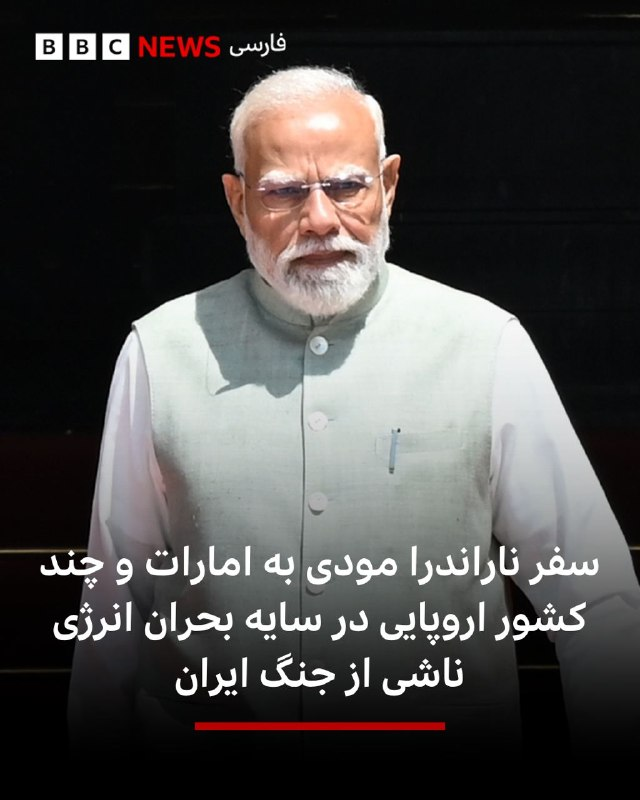

🔻نارندرا مودی، نخست‌وزیر هند، روز جمعه سفر خود به پنج کشور را آغاز می‌کند؛ این سفر با ورود به امارات متحده عربی شروع می‌شود و سپس با دیدار از کشورهای اروپایی ادامه می‌یابد. این سفر در حالی انجام می‌شود که نگرانی‌ها درباره انرژی و اختلال در زنجیره تأمین به‌دلیل جنگ ایران افزایش یافته است.

اختلال در مسیر کشتیرانی در تنگه هرمز همچنان باعث نوسان در بازارهای نفت و گاز است و فشار بیشتری بر کشورهای واردکننده انرژی، از جمله هند، وارد می‌کند.

اما این سفر همچنین نشان دهنده تلاش گسترده‌تر هند برای تنوع بخشیدن به مشارکت‌های اقتصادی و استراتژیک است، در حالی که خود را به عنوان یک مرکز بزرگ تولید و فناوری معرفی می‌کند.

این سفر شش‌روزه که شامل دیدار از هلند، سوئد، نروژ و ایتالیا هم خواهد بود، پس از آن انجام می‌شود که هند و اتحادیه اروپا در ماه ژانویه یک توافق تجارت آزاد امضا کردند؛ توافقی که نارندرا مودی از آن با عنوان «مادر همه توافق‌ها» یاد کرده است.

این سفر فشرده با امارات متحده عربی آغاز می‌شود؛ کشوری که میزبان جامعه‌ حدود ۴.۵ میلیون نفری از هندی‌هاست.

📸 Getty

https://bbc.in/3R12525
@BBCPersian

## BBCPersian — post 281107

  

🔻فاطمه وحدت، نایب رئیس اتحادیه زنان کارگر سراسر ایران در مورد تاثیرات جنگ بر وضعیت اشتغال زنان گفت که در شرایط بحرانی «زنان کارگر بیشتر در معرض اخراج قرار می‌گیرند و زنانی که سرپرست خانوار هستند، بیشترین آسیب را متحمل می‌شوند.»

به گفته خانم وحدت ادامه این روند می‌تواند پیامدهای اجتماعی گسترده‌ای داشته باشد.

نایب رئیس اتحادیه زنان کارگر ضمن انتقاد از نبود حمایت کافی برای زنان کارگر تاکید کرد که «بسیاری از مسئولان از شرایط فعلی اطلاع دارند، اما نظارت جدی در این مورد وجود ندارد.»

او همچنین گفت که نشانه‌های گسترده فقر در جامعه مشهود است و برخی از مردم حتی برای خرید نان مشکل دارند.

📸 Getty

https://bbc.in/3R12525
@BBCPersian

## BBCPersian — post 281104

🔻دونالد ترامپ، رئیس جمهور آمریکا و شی جین‌پینگ،‌ رهبر چین بار دیگر امروز با هم دیدار و گفتگو کردند.

دو رهبر پیش از مذاکرات امروز صبح، در ژونگ‌نان‌های، مجتمعی که رهبری مرکزی چین در آن اقامت دارد، قدم زدند.

📸 Reuters

https://bbc.in/3R12525
@BBCPersian

## Dirty_Kids — post 389484

  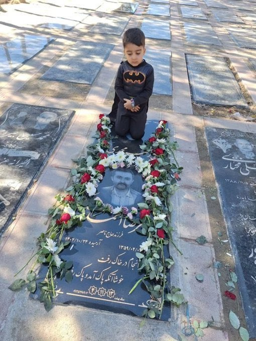

هیچ کودکی نباید اول قصه‌اش از کنار قبر پدرش شروع شود…
در ایران اما این سرنوشت خیلی از کودکان است.
#علیرضا_احمدی

@Dirty_Kids 👻

## Dirty_Kids — post 389483

  

پستِ خواهرِ جاویدنام سپهر ابراهیمی نشون میده که سپهر هم یه پادشاهی خواه بود ❤️
این انقلاب و پادشاهی خواها با خونشون به ثمر میرسونن.

@Dirty_Kids 👻

## Dirty_Kids — post 389482

  

زندگی تو ایران که استرس نداره بابا
ممد ۲۰ ساله:

@Dirty_Kids 👻

## Dirty_Kids — post 389481

کاش حداقل خودمون ریده بودیم تو زندگیمون. درس خوندیم، کار کردیم، زحمت کشیدیم و نهایتا دستاوردش چی بوده؟ کیرخر

@Dirty_Kids 👻

## Dirty_Kids — post 389480

  

امیدوارم برسه به دست ترامپ.
عمویم خریت بچه ‌شیعه:

@Dirty_Kids 👻

## Hranews — post 112949

  

شیروان؛ هادی عباسیان توسط نیروهای امنیتی بازداشت شد

❗️
❗️
❗️
❗️
❗️– هادی عباسیان، شهروند اهل شهرستان شیروان روز چهارشنبه ۲۳ اردیبهشت‌ماه توسط نیروهای امنیتی بازداشت و به زندان این شهر منتقل شده است.

به گزارش خبرگزاری هرانا، ارگان خبری مجموعه فعالان حقوق بشر در ایران، هادی عباسیان بازداشت شد.

براساس اطلاعات دریافتی هرانا،‌ آقای عباسیان روز چهارشنبه ۲۳ اردیبهشت‌ماه در محله فرهنگ شهرستان شیروان بازداشت و پس از یک روز به زندان این شهر منتقل شده است.
#هادی_عباسیان

ادامه مطلب

↘️
@hranews_bot تماس ✉️ - @Hranews کانال هرانا 🆑

## Hranews — post 112948

  

آخرین داده‌های نت بلاکس نشان می‌دهد که قطع #اینترنت در ایران با گذشت ۱۸۲۴ ساعت، وارد هفتاد و هفتمین روز خود شده است. این نهاد ناظر بر وضعیت دسترسی به اینترنت در جهان همچنین اعلام کرد: این وضعیت خطری نوظهور برای سلامت روان عموم مردم ایجاد می‌کند، مردمی که عمدتاً از پلتفرم‌های آنلاین، ارتباطات و تعامل عادی با دنیای خارج جدا شده‌اند.

↘️
@hranews_bot تماس ✉️ - @Hranews کانال هرانا 🆑

## manototv — post 105475

  <a href="telegram/content/manototv_105475_1778834096.mp4" target="_blank">🎬 Download video</a>

دفتر رسانه‌ای دولت ابوظبی روز جمعه ۲۵ اردیبهشت اعلام کرد امارات متحده عربی ساخت یک خط لوله نفتی تازه را برای افزایش صادرات از مسیر فجیره تسریع می‌کند.

این پروژه قرار است تا سال ۲۰۲۷ ظرفیت صادرات نفت امارات از فجیره را دو برابر کند و توان این کشور برای دور زدن تنگه هرمز را افزایش دهد.

فجیره در ساحل دریای عمان قرار دارد و نفتکش‌ها از این مسیر می‌توانند بدون عبور از تنگه هرمز بارگیری کنند.

## manototv — post 105474

  <a href="telegram/content/manototv_105474_1778834096.mp4" target="_blank">🎬 Download video</a>

گروه ناظر اینترنتی نت‌بلاکس اعلام کرد قطعی اینترنت در ایران امروز وارد هفتادوهفتمین روز خود شده و از مرز ۱۸۲۴ ساعت گذشته است.
نت‌بلاکس هشدار داده ادامه این محدودیت‌ها می‌تواند به یک خطر فزاینده برای سلامت روان شهروندان تبدیل شود؛ شهروندانی که تا حد زیادی از پلتفرم‌های آنلاین، ارتباطات و تعامل عادی با جهان خارج محروم شده‌اند.

## manototv — post 105473

  <a href="telegram/content/manototv_105473_1778834097.mp4" target="_blank">🎬 Download video</a>

دونالد ترامپ، رئیس‌جمهوری آمریکا، پس از پایان سفر دو روزه خود به چین، روز جمعه پکن را ترک کرد.
ترامپ با هواپیمای اختصاصی ریاست‌جمهوری آمریکا «ایر فورس وان» از چین خارج شد و وانگ یی، وزیر امور خارجه چین، به همراه هیاتی دیپلماتیک او را بدرقه کرد.

## manototv — post 105472

  <a href="telegram/content/manototv_105472_1778834098.mp4" target="_blank">🎬 Download video</a>

اف‌بی‌آی اعلام کرد برای دریافت اطلاعاتی که به شناسایی و بازداشت «مونیکا ویت»، مامور سابق ضدجاسوسی و متخصص اطلاعاتی نیروی هوایی آمریکا، منجر شود ۲۰۰ هزار دلار جایزه تعیین کرده است.
بر اساس بیانیه اف‌بی‌آی، ویت بین سال‌های ۱۹۹۷ تا ۲۰۰۸ در نیروی هوایی آمریکا خدمت کرده و سپس تا سال ۲۰۱۰ به‌عنوان پیمانکار دولت آمریکا فعالیت داشته است. او به اطلاعات محرمانه و فوق‌محرمانه، از جمله هویت نیروهای مخفی جامعه اطلاعاتی آمریکا، دسترسی داشته است. مقام‌های آمریکایی می‌گویند او پس از شرکت در نشست‌هایی مرتبط با برنامه «افق نو» در تهران، به ایران پناهنده شد و اطلاعات حساسی را در اختیار جمهوری اسلامی قرار داد.
وزارت دادگستری آمریکا پیش‌تر او را به همکاری در عملیات جاسوسی سایبری، افشای اطلاعات محرمانه و به خطر انداختن جان نیروهای آمریکایی و خانواده‌هایشان متهم کرده بود. اف‌بی‌آی می‌گوید مونیکا ویت همچنان متواری است و احتمال می‌دهد افرادی از محل اختفای او اطلاع داشته باشند.

## manototv — post 105471

  <a href="telegram/content/manototv_105471_1778834098.mp4" target="_blank">🎬 Download video</a>

ارتش اسرائیل اعلام کرد در پی فعال شدن آژیر هشدار در مناطق مسد و عیلابون، یک پرتابه شلیک‌شده از خاک لبنان به سوی اسرائیل رهگیری شده است. به گفته ارتش اسرائیل، این اقدام «نقض دیگری از تفاهم‌های آتش‌بس» از سوی حزب‌الله به شمار می‌رود.
همزمان ارتش اسرائیل اعلام کرد یک سرباز این کشور شب گذشته بر اثر شلیک خمپاره حزب‌الله در جنوب لبنان کشته شده است. سرباز کشته‌شده، گروهبان دوم نگو داگان، ۲۰ ساله، از گردان دوازدهم تیپ گولانی و اهل شهرک دکل در جنوب اسرائیل معرفی شده است.
ارتش اسرائیل همچنین اعلام کرد شب گذشته سکوی پرتابی را که حزب‌الله از آن چندین راکت به سوی منطقه کریات شمونا شلیک کرده بود، در منطقه زبدین در جنوب لبنان هدف قرار داده و منهدم کرده است. به گفته ارتش، چندین ساختمان مورد استفاده حزب‌الله برای اهداف نظامی نیز در این حملات هدف قرار گرفته‌اند.

## manototv — post 105470

  <a href="telegram/content/manototv_105470_1778834099.mp4" target="_blank">🎬 Download video</a>

ویدئویی از قدم زدن دونالد ترامپ و شی جین‌پینگ در باغ‌های مجموعه حکومتی ژونگ‌نان‌های در پکن منتشر شده است.
در این ویدئو، ترامپ از رئیس‌جمهوری چین می‌پرسد: «وقتی دیگر رؤسای کشورها به دیدارتان می‌آیند، آن‌ها را هم اینجا می‌پذیرید؟»
شی جین‌پینگ در پاسخ می‌گوید: «به ندرت می‌آیند».

## manototv — post 105469

  <a href="telegram/content/manototv_105469_1778834101.mp4" target="_blank">🎬 Download video</a>

دونالد ترامپ پس از دیدار با شی جین‌پینگ اعلام کرد آمریکا و چین درباره ایران دیدگاه‌های «بسیار مشابهی» دارند و هر دو خواهان پایان تنش‌ها و باز ماندن تنگه هرمز هستند.
ترامپ گفت: «نمی‌خواهیم ایران به سلاح هسته‌ای دست پیدا کند.» او همچنین وضعیت کنونی را «دیوانه‌وار» توصیف کرد و افزود واشینگتن خواهان پایان بحران است.
رئیس‌جمهوری آمریکا همچنین با اشاره به روابط خود با شی جین‌پینگ گفت دو طرف طی سال‌های گذشته توانسته‌اند مشکلاتی را حل کنند که دیگران قادر به حل آن‌ها نبودند و تاکید کرد روابط میان واشینگتن و پکن همچنان «بسیار قوی» است.

## manototv — post 105468

  <a href="telegram/content/manototv_105468_1778834102.mp4" target="_blank">🎬 Download video</a>

مقام‌های فنلاند روز جمعه درباره فعالیت مشکوک پهپادی در منطقه پایتخت هشدار دادند و فرودگاه هلسینکی اعلام کرد پروازها به‌طور موقت متوقف شده است.
پتری اورپو، نخست‌وزیر فنلاند، در پیامی در شبکه اجتماعی ایکس اعلام کرد: «مقام‌ها در حال اقدام هستند. نیروهای مسلح نیز توان نظارتی و واکنش خود را تقویت کرده‌اند. از همه می‌خواهم اطلاعیه‌های رسمی را دنبال کنند.

## alonews — post 120112

  <a href="telegram/content/alonews_120112_1778834102.webm" target="_blank">🎬 Download video</a>

👈صدای چند انفجار در اربیل 
✅ @AloNews خبر جنگ

## alonews — post 120111

  <a href="telegram/content/alonews_120111_1778834103.webm" target="_blank">🎬 Download video</a>

👈سخنگوی وزارت امور خارجه چین: درگیری بین ایران و ایالات متحده از همان ابتدا هرگز نباید رخ می‌داد و نیازی به ادامه آن نیست

🔴یافتن راه‌حل در اسرع وقت به نفع ایالات متحده، ایران، کشورهای منطقه و جهان است

✅ @AloNews خبر جنگ

## alonews — post 120110

  <a href="telegram/content/alonews_120110_1778834103.webm" target="_blank">🎬 Download video</a>

👈سازمان پخش اسرائیل: ایال زمیر، رئیس ستاد کل ارتش اسرائیل، در طول جنگ با ایران مخفیانه از امارات متحده عربی بازدید و با محمد بن زاید، دیدار کرد

✅ @AloNews خبر جنگ

## alonews — post 120109

  <a href="telegram/content/alonews_120109_1778834103.webm" target="_blank">🎬 Download video</a>

👈سخنگوی صنعت آب: ناچار به مدیریت مصرف به روش‌های مختلف هستیم تا بتوانیم آب را تأمین کنیم، از جمله افت فشار آب

✅ @AloNews خبر جنگ

## alonews — post 120108

  <a href="telegram/content/alonews_120108_1778834103.webm" target="_blank">🎬 Download video</a>

👈صدای چند انفجار در اربیل

✅ @AloNews خبر جنگ

## alonews — post 120107

  <a href="telegram/content/alonews_120107_1778834103.webm" target="_blank">🎬 Download video</a>

👈رسایی: جلسات مجلس به طرز بی‌سابقه‌ای تعطیل شده تا در مذاکرات دخالت نکنیم

🔴 دبیر شورای عالی امنیت در نامه‌ای اعلام کردند مصلحت نیست جلسات مجلس برگزار شود.

✅ @AloNews خبر جنگ

## alonews — post 120106

  <a href="telegram/content/alonews_120106_1778834104.mp4" target="_blank">🎬 Download video</a>

▪️خبرنگار:
امیرعلی چرا اومدی تجمع؟!
▪️امیرعلی:
به عشق رهبرم.
▪️خبرنگار:
مامان و بابات مجبورت کردن که بیای تجمعات؟!
▪️امیرعلی:
آره

[@AloTweet]

## alonews — post 120105

اخبار جنگ الونیوز AloNews pinned a photo

## alonews — post 120104

  <a href="telegram/content/alonews_120104_1778834105.webm" target="_blank">🎬 Download video</a>

👈فایننشال‌تایمز به‌نقل از دنیس وایلدر، رئیس سابق بخش تحلیل چین در سیا نوشت: بسیار قابل توجه است که گزارش‌های رسمی چین تاکنون هیچ اشاره‌ای به توافق آمریکا و چین بر سر «ایران غیرهسته‌ای» یا مخالفت با «مالکیت ایران بر تنگهٔ هرمز» نکرده‌اند.

🔴این سکوت، سوالات جدی را دربارهٔ این ایجاد می‌کند که آیا واقعاً صحبت‌های ترامپ به‌نقل از چینی‌ها در این‌ موارد درست است یا خیر.

✅ @AloNews خبر جنگ

## alonews — post 120103

  <a href="telegram/content/alonews_120103_1778834105.webm" target="_blank">🎬 Download video</a>

👈نیویورک پست: اداره تحقیقات فدرال آمریکا (FBI) اعلام کرده است که برای پیدا کردن و دستگیری «مونیکا ویت» مأمور سابق اطلاعاتی نیروی هوایی ایالات متحده که به جاسوسی برای ایران متهم شده است، ۲۰۰ هزار دلار جایزه تعیین کرده است.

🔴گفته شده اون از سال ۲۰۱۹ رسما به فعالیت جاسوسی برای ایران پرداخته است

✅ @AloNews خبر جنگ

## alonews — post 120102

👈لاوروف یک روزنامه‌نگار را از نشست خبری بیرون کرد!

🔴به گزارش اسپوتنیک، این فرد دو بار با مکالمه تلفنی‌اش صحبت لاوروف را قطع کرد.

🔴وزیر امور خارجه روسیه به زبان انگلیسی از روزنامه‌نگار خواست که محل کنفرانس را ترک کند

✅ @AloNews خبر جنگ

## alonews — post 120101

  <a href="telegram/content/alonews_120101_1778834106.mp4" target="_blank">🎬 Download video</a>

👈ترامپ درباره به‌دست آوردن اورانیوم غنی‌شده ایران: فکر نمی‌کنم این کار ضروری باشد مگر از نظر روابط عمومی. فکر می‌کنم برای اخبار جعلی مهم است که ما آن را به‌دست آوریم. من کسی هستم که گفتم ما آن را به‌دست خواهیم آورد و واقعاً به‌دست خواهیم آورد.

🔴چشم‌مان به آن است. به آن‌ها گفتم اگر نیرویی آنجا بفرستند تا آن را بازیابی کنند، ما فقط با چند بمب به آن حمله خواهیم کرد و این پایان کار خواهد بود. آن‌ها این کار را نخواهند کرد.

🔴ما ۹ دوربین روی این سه سایت داریم، ۲۴ ساعت شبانه‌روز. واقعاً اگر آن را به‌دست می‌آوردم احساس بهتری داشتم. اما فکر می‌کنم این بیشتر برای روابط عمومی است تا هر چیز دیگری.

✅ @AloNews خبر جنگ

## alonews — post 120100

  <a href="telegram/content/alonews_120100_1778834108.webm" target="_blank">🎬 Download video</a>

👈واردات بدون انتقال ارز برای خودرو کلید خورد

✅ @AloNews خبر جنگ

## alonews — post 120099

  <a href="telegram/content/alonews_120099_1778834108.webm" target="_blank">🎬 Download video</a>

👈لاوروف، وزیر خارجه روسیه: باید جنگ در ایران فوراً متوقف شود و به آتش‌بس دست یافت.

🔴مداخله غرب، چه نظامی باشد و چه از طریق تغییر رژیم‌ها، وضعیت را در خاورمیانه و شمال آفریقا پیچیده‌تر می‌کند.

🔴برای رسیدگی به بحران مربوط به ایران، لازم است علت اصلی بحران درک شود؛ یعنی «تجاوز غیرموجه آمریکا و اسرائیل».

🔴ضروری است که هیچ‌گونه مشکل یا مانعی در تنگه هرمز وجود نداشته باشد.

✅ @AloNews خبر جنگ

## alonews — post 120098

  <a href="telegram/content/alonews_120098_1778834109.webm" target="_blank">🎬 Download video</a>

👈 آموزش و پرورش: امتحانات پایه‌های هفتم تا دهم با مجوز شورای تأمین هر استان و بصورت حضوری یا غیر حضوری برگزار می‌شه.

✅ @AloNews خبر جنگ

## alonews — post 120097

  <a href="telegram/content/alonews_120097_1778834109.webm" target="_blank">🎬 Download video</a>

🔴فوری / ترامپ : من صبر بیشتری نسبت به ایران نشان نخواهم داد

✅ @AloNews خبر جنگ

## alonews — post 120096

  <a href="telegram/content/alonews_120096_1778834109.webm" target="_blank">🎬 Download video</a>

👈پوتین ۳۰ اردیبهشت به چین می‌رود

✅ @AloNews خبر جنگ

## alonews — post 120095

  <a href="telegram/content/alonews_120095_1778834109.webm" target="_blank">🎬 Download video</a>

👈وزارت خارجه چین: در مسئله هسته‌ای ایران، استفاده از زور به بن‌بست رسیده است

✅ @AloNews خبر جنگ

## alonews — post 120094

  <a href="telegram/content/alonews_120094_1778834109.webm" target="_blank">🎬 Download video</a>

👈کانال 13 اسرائیل:اسرائیل انتظار دارد حمله احتمالی آمریکا در ایران با بازگشت ترامپ از چین آغاز شود

✅ @AloNews خبر جنگ

## alonews — post 120093

  <a href="telegram/content/alonews_120093_1778834110.webm" target="_blank">🎬 Download video</a>

‌

👈ریزش ادامه‌دار قیمت انس جهانی

هم اکنون 4573$

✅ @AloNews خبر جنگ
‌

---
📅 بروزرسانی: 1405/02/25 09:12
---

## VahidOOnLine — post 240245

⭕️ترامپ در حضور شی: درباره ایران احساس مشترکی داریم، نمی‌خواهیم سلاح هسته‌ای داشته باشد و تنگه هرمز باید باز باشد

📌وزارت خارجه چین می‌گوید تنگه هرمز باید باز باشد و آتش‌بس حفظ شود

♦️دونالد ترامپ، رئیس‌جمهوری آمریکا صبح روز جمعه، در دومین روز سفر به چین همراه با اعضای ارشد کابینه خود برای دیدار دوباره با شی‌ جین‌پینگ، رئیس‌جمهوری چین وارد مجموعه «ژونگ‌نانهای» در پکن شد. رهبر چین شخصا باغ رز این مجموعه را به ترامپ نشان داد و پس از اینکه دید توجه رئیس‌جمهوری آمریکا به این رزها جلب شده، دستور داد که بذر این گیاهان که بیش از ۴۰۰ سال عمر دارند را به ترامپ هدیه دهند.

بیشتر بخوانید...
‌🇸🇦 Indypersian

🤖 @VahidOOnLine

## VahidOOnLine — post 240244

⭕️اصغر فرهادی با «داستان‌های موازی» بر فرش قرمز کن قدم گذاشت

♦️عوامل فیلم «داستان‌های موازی» به کارگردانی اصغر فرهادی، شامگاه پنجشنبه در هفتادونهمین جشنواره فیلم کن روی فرش قرمز حاضر شدند؛ فیلمی که با حضور گروهی از سرشناس‌ترین بازیگران سینمای فرانسه ساخته شده است.

در این مراسم، کاترین دونو، ونسان کسل، ایزابل اوپر و پی‌یر نینی، از بازیگران اصلی فیلم، در کنار فرهادی روی فرش قرمز جشنواره کن حضور یافتند.

«داستان‌های موازی» تازه‌ترین ساخته اصغر فرهادی، فیلمساز ایرانی برنده دو جایزه اسکار است. این فیلم «چندین داستان درهم‌تنیده در گوشه‌ای از پاریس» را روایت می‌کند.
‌🇸🇦 Indypersian

🤖 @VahidOOnLine

## VahidOOnLine — post 240243

♦️پس از گفت‌وگوی خصوصی ترامپ و شی در صبح روز جمعه که حدود ۱۰ دقیقه طول کشید و دور از حضور رسانه‌ها انجام شد، دو رهبر در باغ‌های ژونگ‌نانهای قدم زدند.
ترامپ گفت: «این‌ها زیباترین رزهایی هستند که کسی تا به حال دیده است.»
وقتی خبرنگاری از او پرسید آیا از سفرش لذت می‌برد، ترامپ در حالی که مسئولان چینی می‌گفتند «سوال نپرسید»، با بالا بردن انگشت شست واکنش نشان داد.
آن دو از میان گذرگاهی سرپوشیده با ستون‌های سبز و طاق‌هایی که روی آن‌ها تصاویر پرندگان و مناظر سنتی کوهستانی چین نقاشی شده بود عبور کردند و به میدان کوچکی رسیدند که در آنجا برای عکس یادگاری مقابل دوربین‌ها ایستادند.
ترامپ و شی بعدا در یک آلاچیق مجلل نشستند؛ جایی که شی از طریق مترجم درباره تاریخ ژونگ‌نانهای توضیح داد. پیت هگست، وزیر جنگ آمریکا، مارکو روبیو، وزیر خارجه، و اسکات بسنت، وزیر خزانه‌داری، نیز حضور داشتند.
شی گفت بذر گل‌های رز را برای ترامپ خواهد فرستاد.
ترامپ نیز افزود که دو طرف به «توافق‌های تجاری فوق‌العاده‌ای» دست یافته‌اند.
‌🇸🇦 Indypersian

🤖 @VahidOOnLine

## VahidOOnLine — post 240242

  

ترامپ در گفت‌وگو با فاکس‌نیوز در پکن با اشاره به اینکه گسترش همکاری‌های تجاری میان آمریکا و چین می‌تواند به نفع هر دو طرف باشد، گفت چین خواهان خرید نفت از ایالات‌متحده است.
او با اشاره به روابط بسیار خوب خود با شی گفت: «زمانی چین از آمریکا سوءاستفاده می‌کرد، اما حالا ما با چین عملکرد بسیار خوبی داریم.»
ترامپ با اشاره به همراهی ۳۰ نفر از بزرگ‌ترین صاحبان‌کسب‌وکار آمریکا در سفر به چین گفت بسیاری از این مدیران برای نخستین‌بار با شی جین‌پینگ دیدار کردند. او این دیدارها را مثبت ارزیابی کرد.
او همچنین افزود در دیدار با مقام‌های چینی، موضوع دسترسی بیشتر شرکت ویزا به بازار کارت‌های اعتباری چین را مطرح کرده است.
ترامپ درباره رئیس‌جمهوری چین گفت: «وقتی درباره برخی رهبران خوب صحبت می‌کنم، از من انتقاد می‌شود، اما او نزدیک به یک‌ونیم میلیارد نفر را برای مدت طولانی رهبری کرده و مورد احترام است.»

‌🏁 🇬🇧 IranintlTV

🤖 @VahidOOnLine

## VahidOOnLine — post 240241

  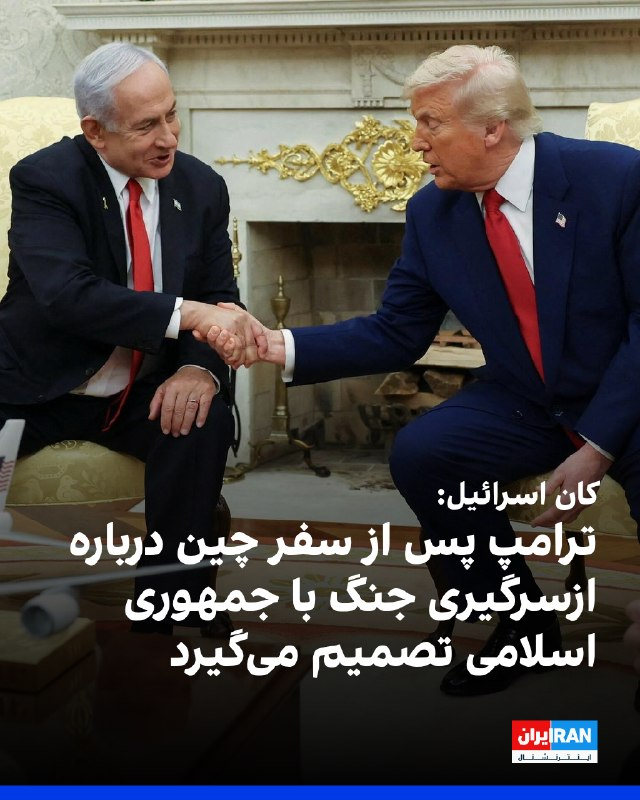

شبکه کان اسرائیل گزارش داد دونالد ترامپ، رییس‌جمهوری آمریکا، پس از بازگشت از سفر به چین درباره ازسرگیری جنگ علیه جمهوری اسلامی یا تمدید محاصره تنگه هرمز تصمیم‌گیری خواهد کرد.
به گفته منابع اسرائیلی، در روزهای اخیر رایزنی‌هایی میان مقام‌های ارشد ارتش اسرائیل و فرماندهی مرکزی ایالات متحده (سنتکام) انجام شده است. این منابع افزودند اسرائیل خواهان بازگشت به کارزار نظامی علیه جمهوری اسلامی است و بنیامین نتانیاهو، نخست‌وزیر اسرائیل، چندین بار بر این موضع تاکید کرده است.
هم‌زمان روزنامه هاآرتص نوشت هرچند نشانه‌ای از هشدار امنیتی غیرمعمول مشاهده نشده، اما احتمال ازسرگیری درگیری‌ها در روزهای آینده مطرح است.

‌🏁 🇬🇧 IranintlTV

🤖 @VahidOOnLine

## VahidOOnLine — post 240240

  

وزارت خارجه چین با اشاره به تنش‌های جاری میان جمهوری اسلامی و آمریکا، خواستار بازگشایی هرچه سریع‌تر کانال‌های گفت‌وگو و دستیابی فوری به «آتش‌بس جامع و پایدار» شد و تاکید کرد دستیابی سریع به یک راه‌حل سیاسی، به نفع تهران، واشینگتن و کشورهای منطقه است.
‌🏁 🇬🇧 IranintlTV

🤖 @VahidOOnLine

## VahidOOnLine — post 240239

♦️کاروان خودرویی دونالد ترامپ، رئیس‌جمهوری آمریکا، صبح جمعه وارد مجموعه ژونگ‌نانهای شد تا او آخرین روز دیدارهایش با شی جین‌پینگ، رهبر چین، را آغاز کند.
قرار است دو رهبر با یکدیگر دست بدهند و برای عکس یادگاری مقابل دوربین‌ها بایستند، سپس در یک دیدار دوجانبه همراه چای و یک ناهار کاری شرکت کنند.
ترامپ قرار است حدود سه ساعت در ژونگ‌نانهای باقی بماند.
‌🇸🇦 Indypersian

🤖 @VahidOOnLine

## VahidOOnLine — post 240238

  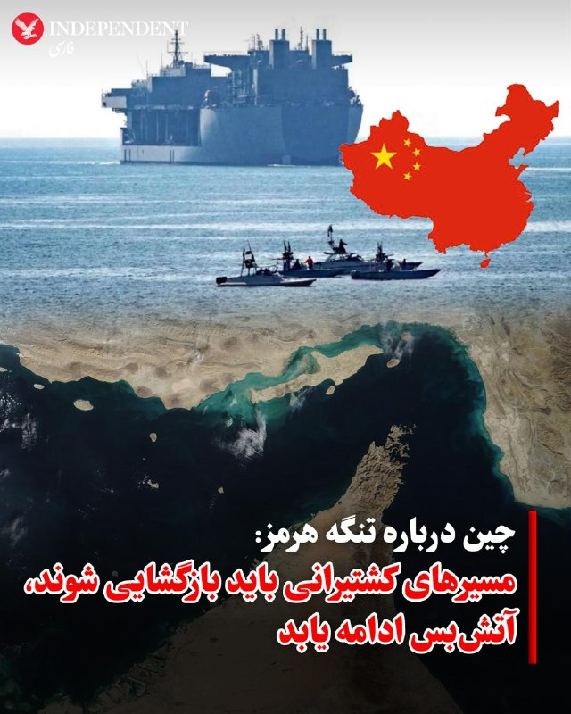

♦️وزارت خارجه چین روز جمعه خواستار ادامه آتش‌بس در جنگ ایران شد و اعلام کرد این جنگ اساسا نباید آغاز می‌شد و مسیرهای کشتیرانی باید دوباره باز شوند.
به گزارش سی‌ان‌ان، سخنگوی وزارت خارجه چین در پاسخ به پرسشی درباره رایزنی‌های ترامپ و شی جین‌پینگ درباره ایران، بار دیگر موضع پکن درباره این درگیری را تکرار کرد.
این سخنگو، بنا بر گزارش تلویزیون دولتی چین، گفت: «این جنگ که هرگز نباید رخ می‌داد، نیازی به ادامه یافتن ندارد.»
او افزود: «یافتن راه‌حلی سریع برای پایان دادن به این بحران، هم به نفع آمریکا و ایران است و هم به سود کشورهای منطقه و کل جهان.»
سخنگوی وزارت خارجه چین گفت اکنون که آتش‌بس امکان مذاکره را فراهم کرده، این مسیر «نباید دوباره بسته شود.»
او ادامه داد: «مسیرهای دریایی باید هرچه سریع‌تر در پاسخ به درخواست جامعه جهانی بازگشایی شوند و باید تلاش‌های مشترکی برای حفظ ثبات و عملکرد روان زنجیره‌های جهانی تولید و تامین انجام گیرد.»
وزارت خارجه چین همچنین اعلام کرد شی و ترامپ درباره «مسائل مهم مربوط به دو کشور و جهان» گفت‌وگو کرده و به «مجموعه‌ای از تفاهم‌های جدید» دست یافته‌اند.
‌🇸🇦 Indypersian

🤖 @VahidOOnLine

## VahidOOnLine — post 240237

  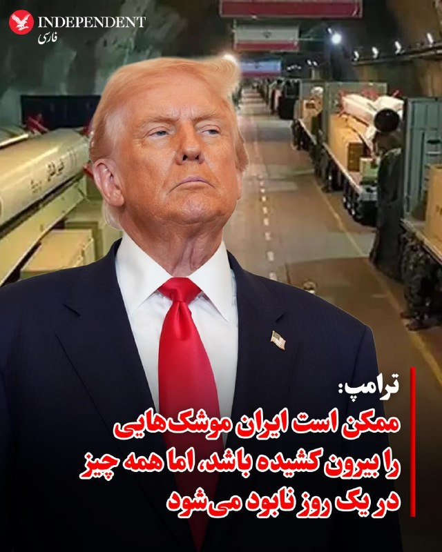

♦️درحالی که برخی گزارش‌ها حاکی از آن است که رژیم ایران از فرصت آتش‌بس برای بیرون کشیدن موشک‌ها و پرتابگر‌ها از زیر آوار استفاده کرده و بخش قابل توجهی از ظرفیت موشکی و پرتابگر‌ها را حفظ کرده است، دونالد ترامپ به فاکس گفت که همه‌چیز را کاملا زیرنظر داریم و ممکن است ایران برای خارج کردن بخشی از موشک ها از زیر زمین تلاش کرده باشد. اما همه آنچه در این چهار هفته انجام داده می‌تواند در یک روز از بین برود و نابود شود.
‌🇸🇦 Indypersian

🤖 @VahidOOnLine

## VahidOOnLine — post 240236

  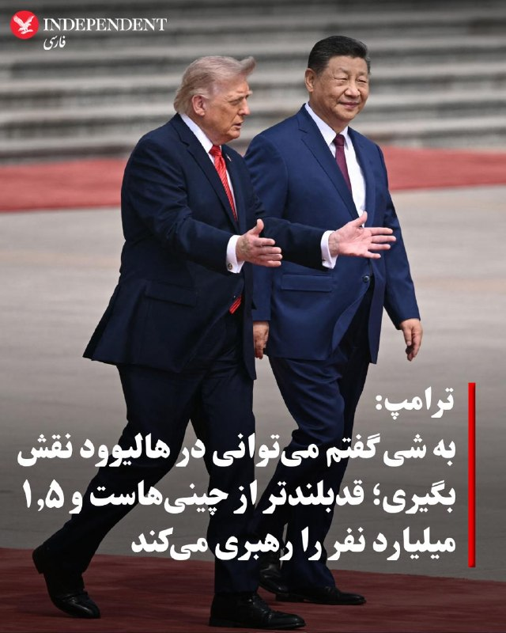

♦️دونالد ترامپ درباره شی‌جین پینگ، رئیس‌جمهوری چین گفت که وقتی چیزهای خوبی درباره رهبران خاصی از جمله رهبر چین می‌گویم، از من انتقاد می‌کنند. اما او کسی است که ۱.۵ میلیارد نفر را رهبری می‌کند و مورد احترام است. ترامپ به ظاهر شی نیز اشاره کرد و گفت حتی از نظر فیزیکی هم قدبلندتر از میانگین قد چینی‌هاست. ترامپ گفت به شی گفتم «اگر به هالیوود بروی می‌توانی نقش یک رهبر چینی را بازی کنی». ترامپ همچنین به سرمایه‌گذاری چندصد میلیارد دلاری چین در شرکت‌هایی اشاره کرد که روسای آنها همراه با رئیس‌جمهوری آمریکا به پکن سفر کرده‌اند.
‌🇸🇦 Indypersian

🤖 @VahidOOnLine

## VahidOOnLine — post 240235

  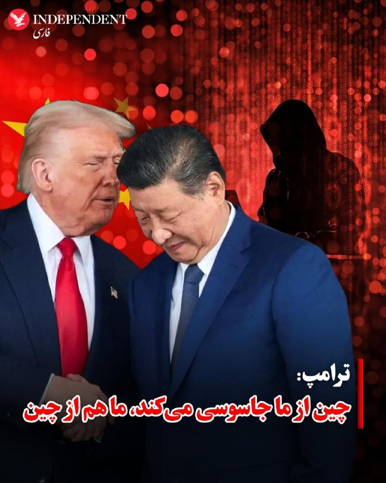

♦️دونالد ترامپ، رئیس‌جمهوری آمریکا که در چین حضور دارد در مصاحبه با فاکس با گزارش‌های رسانه‌ها درباره جاسوسی و دزدی اطلاعات چین از آمریکا اشاره کرد و گفت از من در این زمینه پرسیدند و گفتم، آنها جاسوسی می‌کنند، خب ما هم از آنها جاسوسی می‌کنیم. آنها کارهایی انجام می‌دهند و ما هم کارهایی انجام می‌دهیم. ترامپ افزود: این موضوعی است که با شی جین پینگ درباره آن صحبت کردم و می‌خواهم به آن رسیدگی شود. اما آنها ۵۰ سال است که دارند این کار را می‌کنند.
‌🇸🇦 Indypersian

🤖 @VahidOOnLine

## VahidOOnLine — post 240234

  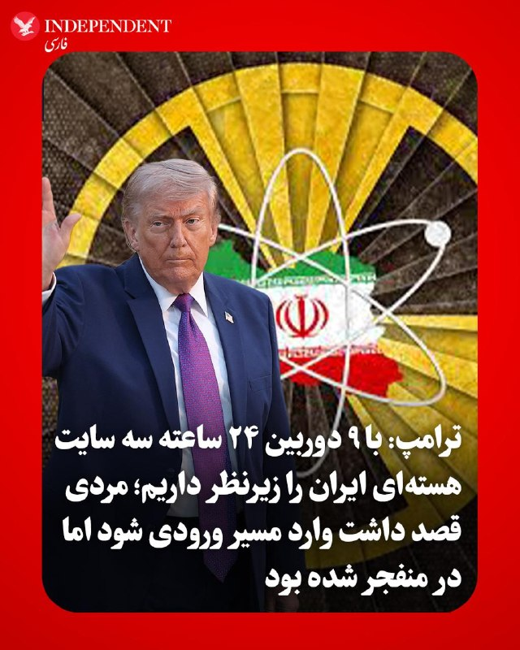

♦️دونالد ترامپ، رئیس‌جمهوری آمریکا با تاکید بر اینکه آمریکا مواد هسته‌ای (ذخایر اورانیوم غنی‌شده که گفته می‌شود زیر آوار سایت‌های هسته‌ای مدفون شده) ایران را رصد می‌کند هشدار داد که آمریکا به‌دقت سایت‌های هسته‌ای ایران و هرگونه تلاش برای خارج کردن این مواد را زیر نظر دارد.
ترامپ به فاکس گفت: «ما آن را زیر نظر داریم. ما دقیقا می‌دانیم آنجا چه می‌گذرد.»
او همچنین گفت مردی «سعی کرده وارد مسیر ورودی شود»، اما «دری که آنجا بود کاملا منفجر شده بود».
ترامپ افزود: «اگر بخواهند جابه‌جا کنند ـ و من هم به آن‌ها گفته‌ام ـ اگر نیرویی بفرستند برای این کار... تنها کاری که ما می‌کنیم این است که چند بمب به آن‌ها بزنیم و ماجرا تمام می‌شود. آن‌ها این کار را نمی‌کنند.»
او اضافه کرد که آمریکا «۹ دوربین» در سه سایت هسته‌ای ایران دارد که «۲۴ ساعت شبانه‌روز» آن‌ها را زیر نظر دارند.
ترامپ گفت: «ما دقیقا می‌دانیم چه می‌گذرد. هیچ‌کس حتی نزدیک آن هم نشده است.» دونالد ترامپ بار دیگر تاکید کرد که بر بازپس‌گیری اورانیوم غنی‌شده ایران ـ که او آن را «غبار هسته‌ای» توصیف کرد ـ اصرار دارد و گفت این موضوع یک اولویت اصلی است، هرچند خودش معتقد نیست واقعا از نظر عملی ضروری باشد.
ترامپ در مصاحبه‌ای با شان هَنیتی از فاکس‌نیوز در روز پنجشنبه گفت این مواد هسته‌ای «می‌تواند» در زیر زمین دفن شود، اما افزود: «ترجیح می‌دهم آن را به دست بیاوریم.»
او گفت: «نه، فکر نمی‌کنم ضروری باشد، مگر از منظر روابط عمومی. فکر می‌کنم برای رسانه‌های دروغین مهم است که ما آن را به دست بیاوریم. من کسی بودم که گفتم ما آن را به دست خواهیم آورد و همین کار را هم خواهیم کرد. ما آن را زیر نظر داریم.»
ترامپ در ادامه با اشاره به عملیات آمریکا نظامی خردادماه علیه سه سایت هسته‌ای، گفت تنها آمریکا و شاید چین توانایی بازیابی مواد هسته‌ای ایران را دارند.
‌🇸🇦 Indypersian

🤖 @VahidOOnLine

## VahidOOnLine — post 240233

  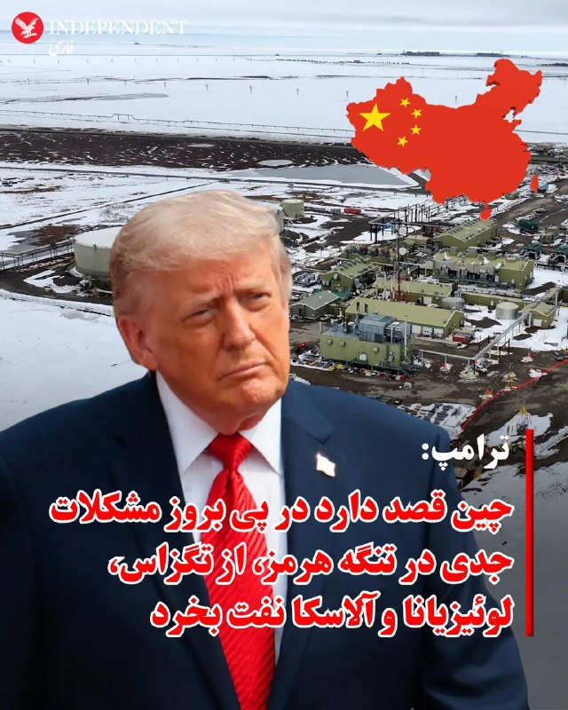

♦️دونالد ترامپ، رئیس‌جمهوری آمریکا که در چین حضور دارد با اشاره به مشکلات در تنگه هرمز به فاکس و اینکه چین ۴۰ درصد نفت خود را از طریق تنگه هرمز وارد می‌کند، گفت: «ما قرار است شروع کنیم به فرستادن کشتی‌های چینی به تگزاس. و به لوئیزیانا. و به آلاسکا!»
ترامپ افزود: «فکر می‌کنم ما یک توافق انجام خواهیم داد… همه‌چیز مربوط به انرژی. این همان چیزی است که واقعا به آن نیاز دارند: انرژی… و ما انرژی نامحدود داریم.»
‌🇸🇦 Indypersian

🤖 @VahidOOnLine

## VahidOOnLine — post 240232

  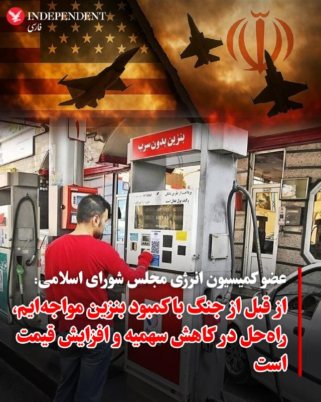

♦️یک نماینده مجلس شورای اسلامی گفت: ما با کسری بنزین مواجه هستیم و قبل از جنگ هم کمبود بنزین وجود داشت و روزانه حدود ۲۰ میلیون لیتر کسری بنزین داشتیم که باید با واردات جبران می کردیم.
به گزارش خبرآنلاین، مصطفی نخعی، عضو کمیسیون انرژی مجلس گفت: هنوز تصمیمی در خصوص تغییر سهمیه‌بندی بنزین گرفته نشده و مذاکرات در این‌باره در حال انجام است. در واقع، سناریوهای مختلفی در دولت در حال بررسی است که هنوز سناریویی قطعی نشده است.
این نماینده مجلس گفت: درحال حاضر یا سهمیه باید کاهش یابد یا از ابزار قیمتی استفاده شود که حداقل مجلس چندان موافق این موضوع نیست. اخیرا برخی گزارش‌ها نیز مبنی بر افزایش قیمت بنزین به لیتری ۱۵ تا ۲۰ هزار تومان مطرح است.
‌🇸🇦 Indypersian

🤖 @VahidOOnLine

## VahidOOnLine — post 240231

  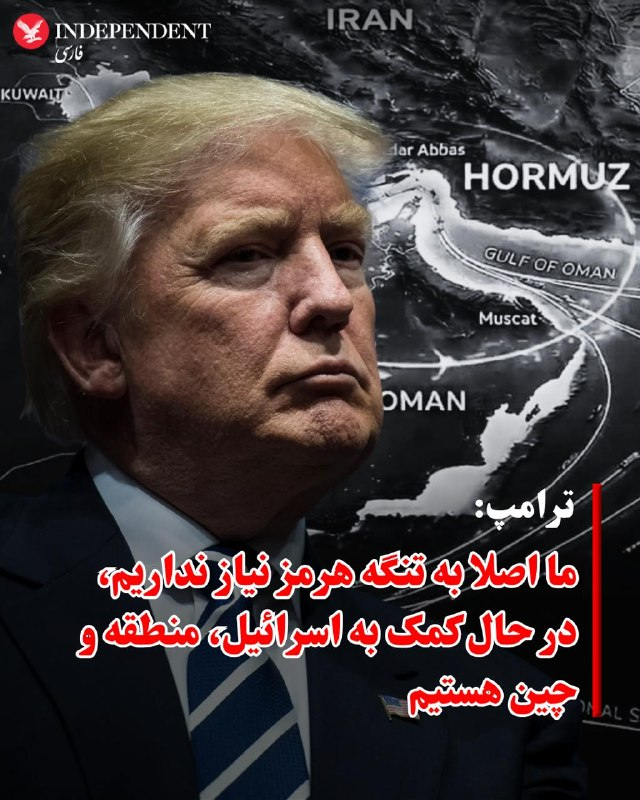

♦️دونالد ترامپ، رئیس‌جمهوری آمریکا، تاکید کرد که ایالات متحده اصلا نیازی به باز شدن تنگه هرمز ندارد ـ یا دست‌کم به اندازه چین به آن نیاز ندارد ـ و تلاش‌های نظامی آمریکا در منطقه را نوعی خدمت عمومی به کشورهای دیگر توصیف کرد.
ترامپ عصر پنجشنبه به فاکس گفت: «ما اصلا به آن نیاز نداریم. اصلا به آن نیاز نداریم.»
او ادامه داد: «می‌شود گفت، می‌دانید، چرا اصلا ما داریم این کار را می‌کنیم؟ ما این کار را برای کمک به اسرائیل انجام می‌دهیم، برای کمک به عربستان سعودی، قطر، امارات، کویت و کشورهای دیگر، بحرین.»
ترامپ با اشاره به دیدارش با شی جین‌پینگ گفت: «امروز به او گفتم: می‌دانید، ما داریم به شما کمک می‌کنیم.»
مارکو روبیو، وزیر خارجه آمریکا، در مصاحبه‌ای با شبکه ان‌بی‌سی نیوز که امروز پخش شد نیز گفت: «ایران قرار نیست از این موضوع به‌عنوان اهرم فشار علیه ما استفاده کند.»
‌🇸🇦 Indypersian

🤖 @VahidOOnLine

## VahidOOnLine — post 240230

  

مارکو روبیو، وزیر خارجه آمریکا، در گفت‌وگو با شبکه ان‌بی‌سی نیوز گفت تنگه هرمز حتما باز خواهد شد و قیمت انرژی هم کاهش خواهد یافت. او در عین حال تاکید کرد که تلاش جمهوری اسلامی در تحقق یک «ایران هسته‌ای» برایش بسیار گران تمام خواهد شد.
روبیو همچنین هشدار داد که اگر حکومت ایران به سلاح هسته‌ای دست یابد، هیچ چیز مانع کنترل تنگه هرمز از سوی آن نخواهد بود و این وضعیت می‌تواند به بحرانی دائمی برای جهان تبدیل شود.

‌🏁 🇬🇧 IranintlTV

🤖 @VahidOOnLine

## VahidOOnLine — post 240229

  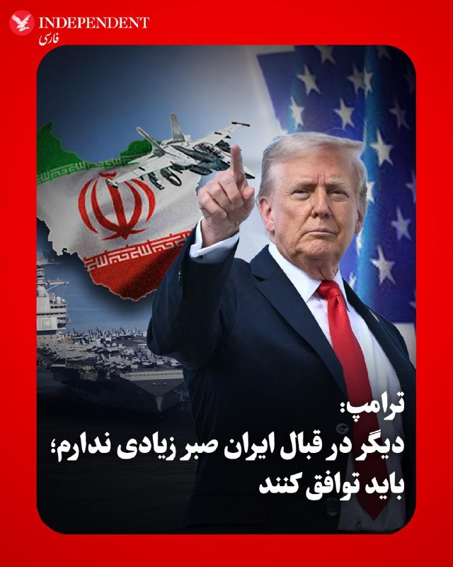

♦️به گزارش رویترز، دونالد ترامپ، رئیس‌جمهوری ایالات متحده، در مصاحبه‌ای با برنامه «هانیتی» در شبکه فاکس‌نیوز که پنجشنبه شب ۲۴ اردیبهشت پخش شد، خطاب به تهران گفت: «من قرار نیست خیلی صبورتر از این باشم.» ترامپ با تاکید بر اینکه مقامات ایران باید با واشنگتن به یک توافق دست یابند، اعلام کرد که دیگر صبر چندانی در قبال آن‌ها نخواهد داشت.
‌🇸🇦 Indypersian

🤖 @VahidOOnLine

## VahidOOnLine — post 240228

  

ترامپ در مورد جمهوری اسلامی به فاکس‌نیوز گفت شی جین‌پینگ احتمالا توانایی تأثیرگذاری بر حکومت ایران را دارد. ترامپ رهبران ایران را که با آن‌ها مذاکره می‌شود «معقول» توصیف کرد، اما هشدار داد: «دیگر قرار نیست خیلی بیشتر صبر کنم. آن‌ها باید به توافق برسند.»
ترامپ گفت اورانیوم غنی‌شده ایران می‌تواند «دفن و مهر و موم» شود، اما او ترجیح می‌دهد آمریکا آن را در اختیار بگیرد. ترامپ افزود گرفتن این اورانیوم «بیش از هر چیز جنبه روابط عمومی دارد.»

‌🏁 🇬🇧 IranintlTV

🤖 @VahidOOnLine

## VahidOOnLine — post 240227

  

رسانه‌های آمریکایی از درگیری‌های فیزیکی در پشت صحنه دیدار ترامپ و شی در پکن خبر دادند. این تنش‌ها پس از آن رخ داد که مقام‌های چینی مانع ورود یک مامور سرویس مخفی آمریکا به منطقه حفاظت‌شده شدند و به خبرنگاران آمریکایی نیز اجازه ندادند به کاروان خودروهای ترامپ بپیوندند.
خبرنگار فاکس نیوز گزارش داد ماموران سرویس مخفی آمریکا در جریان سفر ترامپ با پلیس چین وارد درگیری‌های فیزیکی شدید شدند. این درگیری‌ها پس از آن صورت گرفت که ماموران چینی تلاش کردند مانع ورود یک مامور آمریکایی همراه با سلاحش به محل اجلاس شوند.
نیویورک‌پست نیز در گزارشی با تشریح این درگیری‌ها، نوشت خبرنگاران آمریکایی همچنین در نشست پکن با محدودیت‌های شدید روبه‌رو شدند و به سرویس‌های بهداشتی، امکانات ضبط خبر و بطری‌های آب دسترسی بسیار محدودی داشتند.

‌🏁 🇬🇧 IranintlTV

🤖 @VahidOOnLine

## VahidOOnLine — post 240226

  

♦️رئیس اسبق مرکز «ملی» فضای مجازی با انتقاد شدید از رویکرد فعلی در اعمال محدودیت‌های اینترنتی، روش «فهرست سفید» (باز بودن فقط سایت‌های تأیید شده) را کاری بیهوده دانست و تأکید کرد که اگر ملاک محدودیت‌ها امنیت ملی باشد، گوگل از هر حیث خطرناک‌تر از شبکه‌های اجتماعی است.
به گزارش خبرآنلاین، فیروزآبادی، در واکنش به تداوم مسدودسازی سایت‌های علمی و مرجع جهانی و عدم دسترسی آزاد مردم به منابع اینترنتی پایه، به سیتن گفت: «قرار بر این بود که ما بر اساس “لیست سیاه” فعالیت کنیم، اما اکنون شاهد یک انقلاب مدام هستیم که دوستان می‌خواهند بر اساس “لیست سفید” کار کنند؛ این اقدام به نظر من رسما یک کار عبث و بیهوده است. من متوجه نظام استدلالی آقایان نیستم. تا به حال هیچ‌کس هم توضیح نداده که دلیل این نوع برخوردها چیست. وقتی نظام استدلالی مشخصی وجود ندارد، نمی‌توان آن را بررسی کرد.»
‌
فیروزآبادی با به چالش کشیدن توجیهات امنیتی برای فیلترینگ، افزود: «اینکه بگویند این کار برای حفظ امنیت ملی است، استدلال محسوب نمی‌شود؛ چون با این منطق برای امنیت بیشتر باید برق، آب، پست و تلفن را هم قطع کرد! اگر واقعا بحث امنیت مطرح باشد، گوگل به دلیل مالکیت سیستم‌عامل اندروید، گزارش‌گیری مداوم از گوشی‌ها و آنلاین بودن همیشگی، خطرناک‌ترین سایت است؛ پس چرا گوگل باز است؟»
‌
دبیر اسبق شورای عالی فضای مجازی در پایان خاطرنشان کرد که وقتی پلتفرمی مانند گوگل با این سطح از دسترسی به اطلاعات کاربران باز است، مسدود ماندن سایر ظرفیت‌های اینترنتی با منطق امنیتی همخوانی ندارد.
‌🇸🇦 Indypersian

🤖 @VahidOOnLine

## FoxNewsTwitter — post 341764

  

Fox News (Twitter/X)

President Trump took a stroll through Zhongnanhai Garden, part of a powerful Chinese government complex, with President Xi Jinping on his second day of meetings in Beijing.

## FoxNewsTwitter — post 341763

  <a href="telegram/content/FoxNewsTwitter_341763_1778823764.mp4" target="_blank">🎬 Download video</a>

Fox News (Twitter/X)

NOW: President Trump tours Zhongnanhai Garden with Chinese President Xi Jinping.

## FoxNewsTwitter — post 341762

  <a href="telegram/content/FoxNewsTwitter_341762_1778823765.mp4" target="_blank">🎬 Download video</a>

Fox News (Twitter/X)

NOW: President Trump says he and Chinese President Xi "feel very similar on Iran."

"We want that to end. We don't want them to have a nuclear weapon. We want the straits open."

## FoxNewsTwitter — post 341761

  <a href="telegram/content/FoxNewsTwitter_341761_1778823767.mp4" target="_blank">🎬 Download video</a>

Fox News (Twitter/X)

NOW: President Trump says he and Chinese President Xi agree they do not want Iran to obtain a nuclear weapon and want the Strait of Hormuz to remain open.

## FoxNewsTwitter — post 341760

  

Fox News (Twitter/X)

MOMENTS AGO: President Trump meets with President Xi Jinping in China https://twitter.com/i/broadcasts/1RJjpznjbDVKw

## FoxNewsTwitter — post 341759

  <a href="telegram/content/FoxNewsTwitter_341759_1778823769.mp4" target="_blank">🎬 Download video</a>

Fox News (Twitter/X)

NOW: President Trump arrives at Zhongnanhai Garden to meet with Chinese President Xi.

## FoxNewsTwitter — post 341758

  <a href="telegram/content/FoxNewsTwitter_341758_1778823770.mp4" target="_blank">🎬 Download video</a>

Fox News (Twitter/X)

President Trump says he came up with a nickname, "Dumocrats," after talking about top Democratic leader Hakeem Jeffries. || @seanhannity

## VahidOnline — post 75471

دونالد ترامپ، رئیس جمهوری آمریکا در مصاحبه‌ای که با فاکس نیوز انجام داد گفت او درباره ایران با چین صحبت کرده است.

ترامپ افزود فکر نمی‌کند که چین هم خواهان این باشد که جمهوری اسلامی به سلاح هسته‌ای دست پیدا کند.

او گفت جمهوری اسلامی می‌تواند یا «توافق کند و یا «نابود» شود. رئیس جمهوری آمریکا گفت نمی‌خواهد چنین کاری کند اما آمریکا قوی‌ترین ارتش جهان را دارد.

ترامپ گفت ما در جمهوری اسلامی با «رده سوم» رهبرانش طرف هستیم. او گفت رده اول و دوم رهبری نابود شدند و فکر می‌کند رده سوم از رده اول و دوم «که دیگر با ما نیستند» «منطقی‌تر» و از لحاظی «باهوش‌تر» هستند.

او این تغییر را به‌نوعی با یک «تغییر رژیم» مقایسه کرد.

ترامپ با اشاره به اینکه جمهوری اسلامی «پنج روز» زمان صرف کرد تا به پیشنهاد آمریکا که «یک ساعت» هم زمان نمی‌برد پاسخ دهد، افزود جمهوری اسلامی در داخل خود «آشوب فراوان» دارد و «چیزی به جز آشوب» ندارند.

ترامپ در مورد حمایت چین از جمهوری اسلامی گفت که رئيس جمهوری چین، شی جین‌پینگ قویا گفت که به جمهوری اسلامی سلاح نخواهد داد.
...
او افزود «امیدوارم» جمهوری اسلامی این مصاحبه را ببیند چرا که آمریکا می‌تواند به سرعت همه تسلیحاتی که آن‌ها در طول آتش‌بس ممکن است به آن‌ها دست یافته باشند به سرعت نابود ‌کند. ترامپ گفت «ما دقیقا می‌دانیم چه کاری می‌کنند...و هر کاری که در چهار هفته گذشته انجام داده‌اند ما آن‌ها را در یک روز از بین می‌بریم.»

رئیس جمهوری آمریکا گفت جنگ را می‌توانست «چند هفته بیشتر» ادامه دهد و ماجرا تمام می‌شد اما به درخواست چند کشور آن را متوقف کرد. ترامپ گفت جمهوری اسلامی دو گزینه دارد: «یا توافق کند و یا نابود شود.»

ترامپ همچنین درباره خارج کردن اورانیوم غنی‌شده از ایران گفت این کار را بیشتر برای «روابط عمومی» انجام خواهد داد و او احساس بهتری خواهد داشت که آن مواد از ایران خارج شود.

رئیس جمهوری آمریکا افزود «به‌دست آوردنش پروژه بزرگی است، واقعاً پروژه بزرگی است.»

او گفت: «اوایل به انجام این کار فکر می‌کردیم، اما زمان می‌برد؛ حدود یک هفته و نیم طول می‌کشید، و این مدت زیادی است که در قلمرو دشمن باشید.»

دونالد ترامپ توضیح داد که «باید این حجم عظیم گرانیت را جابه‌جا کنید. می‌دانید، آنجا گرانیت است. گرانیت سخت‌ترین سنگ است. واقعاً شگفت‌انگیز است، چون بمب‌هایی که استفاده کردیم فوق‌العاده قدرتمند بودند. و یادتان نرود که علاوه بر آن، با موشک‌های تاماهاوک هم آنجا را زدیم.»

او گفت فکر نمی‌کند خارج کردن آن مواد از ایران «لازم باشد، مگر از نظر روابط عمومی. به نظرم برای رسانه‌های جعلی مهم است که ما آن را به‌دست بیاوریم. من همان کسی بودم که گفتم آن را به‌دست خواهیم آورد، و به‌دستش هم می‌آوریم. حواسمان به آن هست.»

ترامپ اشاره کرد که با «نیروی فضایی» آمریکا که ابتکار او بود همه تحرکات در اطراف سایت‌های هسته‌ای در ایران زیر نظر آمریکا است.

او گفت «من ترجیح می‌دهم آن را به‌دست بیاوریم، اما مراقبش هستیم. دقیقاً می‌دانیم آنجا چه اتفاقی می‌افتد. چند روز پیش مردی تلاش کرد وارد آن گذرگاه شود. دیدیم دری کاملاً متلاشی شده بود. و ما از همه‌چیز خبر داریم. اگر هرگز حرکتی انجام دهند، و این را هم به آن‌ها گفته‌ام، اگر نیرویی بفرستند و ببینم کسی تلاش می‌کند، تنها کاری که می‌کنیم این است که با چند بمب دیگر آنجا را می‌زنیم و کار تمام می‌شود. آن‌ها چنین کاری نخواهند کرد.»

ترامپ گفت: «به آن‌ها گفتم ما در آن محل، در آن سه سایت، ۲۴ ساعته ۹ دوربین داریم. دقیقاً می‌دانیم چه می‌گذرد. هیچ‌کس حتی به آن نزدیک هم نشده است. در ابتدا بررسی کردند و گفتند هیچ راهی وجود ندارد که کسی بتواند به آن غبار هسته‌ای برسد. اما با این حال، من ترجیح می‌دهم آن را داشته باشیم. ترجیح می‌دهم به‌دستش بیاوریم.»

@VahidHeadline

📡 @VahidOnline

## IranIntlTV — post 337259

  <a href="telegram/content/IranIntlTV_337259_1778823772.mp4" target="_blank">🎬 Download video</a>

فیلم «داستان‌های موازی»، ساخته اصغر فرهادی، جمعه به‌طور رسمی در بخش مسابقه اصلی جشنواره فیلم کن به نمایش درمی‌آید.
سینمای مستقل، مهاجرت، تبعید و همچنین حضور فیلم‌سازان ایرانی در بخش‌های مختلف، از محورهای مورد توجه جشنواره امسال است.

گزارش لی‌لی نیکفر، خبرنگار ایران‌اینترنشنال
@iranintltv

## IranIntlTV — post 337258

  <a href="telegram/content/IranIntlTV_337258_1778823773.mp4" target="_blank">🎬 Download video</a>

دونالد ترامپ، رییس‌جمهوری آمریکا، پس از دیدار با شی جین‌پینگ در پکن، به شبکه فاکس نیوز گفت رییس‌جمهوری چین پیشنهاد داده برای کمک به بازگشایی تنگه هرمز همکاری کند. هم‌زمان وزارت خارجه چین نیز اعلام کرد: «تنگه هرمز باید هرچه زودتر بازگشایی شود.»

توماج طاهباز و امیر گیتی، خبرنگاران ایران‌اینترنشنال، گزارش می‌دهند
@iranintltv

## IranIntlTV — post 337257

  

ترامپ در گفت‌وگو با فاکس‌نیوز در پکن با اشاره به اینکه گسترش همکاری‌های تجاری میان آمریکا و چین می‌تواند به نفع هر دو طرف باشد، گفت چین خواهان خرید نفت از ایالات‌متحده است.
او با اشاره به روابط بسیار خوب خود با شی گفت: «زمانی چین از آمریکا سوءاستفاده می‌کرد، اما حالا ما با چین عملکرد بسیار خوبی داریم.»
ترامپ با اشاره به همراهی ۳۰ نفر از بزرگ‌ترین صاحبان‌کسب‌وکار آمریکا در سفر به چین گفت بسیاری از این مدیران برای نخستین‌بار با شی جین‌پینگ دیدار کردند. او این دیدارها را مثبت ارزیابی کرد.
او همچنین افزود در دیدار با مقام‌های چینی، موضوع دسترسی بیشتر شرکت ویزا به بازار کارت‌های اعتباری چین را مطرح کرده است.
ترامپ درباره رئیس‌جمهوری چین گفت: «وقتی درباره برخی رهبران خوب صحبت می‌کنم، از من انتقاد می‌شود، اما او نزدیک به یک‌ونیم میلیارد نفر را برای مدت طولانی رهبری کرده و مورد احترام است.»

https://iranintl.com/202605154928

## IranIntlTV — post 337256

  <a href="telegram/content/IranIntlTV_337256_1778823775.mp4" target="_blank">🎬 Download video</a>

سرخط خبرهای جمعه ۲۵ اردیبهشت
@iranintltv

## IranIntlTV — post 337255

  

شبکه کان اسرائیل گزارش داد دونالد ترامپ، رییس‌جمهوری آمریکا، پس از بازگشت از سفر به چین درباره ازسرگیری جنگ علیه جمهوری اسلامی یا تمدید محاصره تنگه هرمز تصمیم‌گیری خواهد کرد.
به گفته منابع اسرائیلی، در روزهای اخیر رایزنی‌هایی میان مقام‌های ارشد ارتش اسرائیل و فرماندهی مرکزی ایالات متحده (سنتکام) انجام شده است. این منابع افزودند اسرائیل خواهان بازگشت به کارزار نظامی علیه جمهوری اسلامی است و بنیامین نتانیاهو، نخست‌وزیر اسرائیل، چندین بار بر این موضع تاکید کرده است.
هم‌زمان روزنامه هاآرتص نوشت هرچند نشانه‌ای از هشدار امنیتی غیرمعمول مشاهده نشده، اما احتمال ازسرگیری درگیری‌ها در روزهای آینده مطرح است.

https://iranintl.com/202605159751

## IranIntlTV — post 337254

  

وزارت خارجه چین با اشاره به تنش‌های جاری میان جمهوری اسلامی و آمریکا، خواستار بازگشایی هرچه سریع‌تر کانال‌های گفت‌وگو و دستیابی فوری به «آتش‌بس جامع و پایدار» شد و تاکید کرد دستیابی سریع به یک راه‌حل سیاسی، به نفع تهران، واشینگتن و کشورهای منطقه است.
https://iranintl.com/202605150200

## IranIntlTV — post 337253

  

مارکو روبیو، وزیر خارجه آمریکا، در گفت‌وگو با شبکه ان‌بی‌سی نیوز گفت تنگه هرمز حتما باز خواهد شد و قیمت انرژی هم کاهش خواهد یافت. او در عین حال تاکید کرد که تلاش جمهوری اسلامی در تحقق یک «ایران هسته‌ای» برایش بسیار گران تمام خواهد شد.
روبیو همچنین هشدار داد که اگر حکومت ایران به سلاح هسته‌ای دست یابد، هیچ چیز مانع کنترل تنگه هرمز از سوی آن نخواهد بود و این وضعیت می‌تواند به بحرانی دائمی برای جهان تبدیل شود.

https://iranintl.com/202605156991

## IranIntlTV — post 337252

  

ترامپ در مورد جمهوری اسلامی به فاکس‌نیوز گفت شی جین‌پینگ احتمالا توانایی تأثیرگذاری بر حکومت ایران را دارد. ترامپ رهبران ایران را که با آن‌ها مذاکره می‌شود «معقول» توصیف کرد، اما هشدار داد: «دیگر قرار نیست خیلی بیشتر صبر کنم. آن‌ها باید به توافق برسند.»
ترامپ گفت اورانیوم غنی‌شده ایران می‌تواند «دفن و مهر و موم» شود، اما او ترجیح می‌دهد آمریکا آن را در اختیار بگیرد. ترامپ افزود گرفتن این اورانیوم «بیش از هر چیز جنبه روابط عمومی دارد.»

https://iranintl.com/202605150652

## IranIntlTV — post 337251

  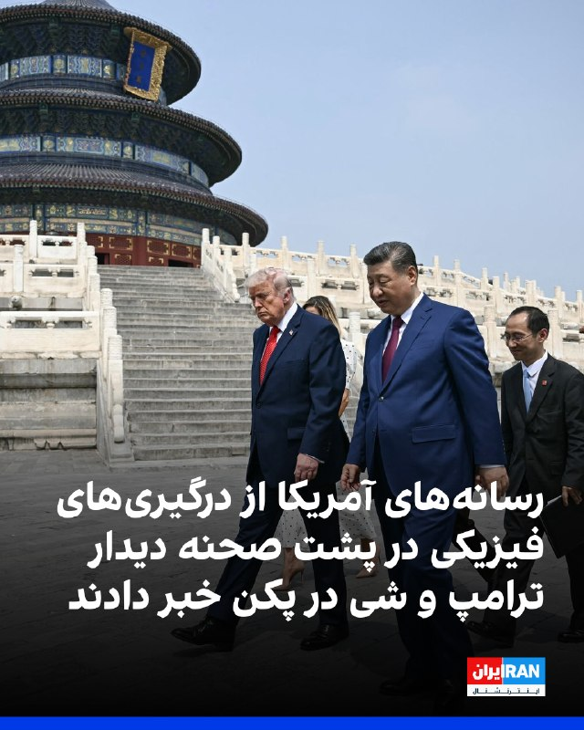

رسانه‌های آمریکایی از درگیری‌های فیزیکی در پشت صحنه دیدار ترامپ و شی در پکن خبر دادند. این تنش‌ها پس از آن رخ داد که مقام‌های چینی مانع ورود یک مامور سرویس مخفی آمریکا به منطقه حفاظت‌شده شدند و به خبرنگاران آمریکایی نیز اجازه ندادند به کاروان خودروهای ترامپ بپیوندند.
خبرنگار فاکس نیوز گزارش داد ماموران سرویس مخفی آمریکا در جریان سفر ترامپ با پلیس چین وارد درگیری‌های فیزیکی شدید شدند. این درگیری‌ها پس از آن صورت گرفت که ماموران چینی تلاش کردند مانع ورود یک مامور آمریکایی همراه با سلاحش به محل اجلاس شوند.
نیویورک‌پست نیز در گزارشی با تشریح این درگیری‌ها، نوشت خبرنگاران آمریکایی همچنین در نشست پکن با محدودیت‌های شدید روبه‌رو شدند و به سرویس‌های بهداشتی، امکانات ضبط خبر و بطری‌های آب دسترسی بسیار محدودی داشتند.

https://iranintl.com/202605150526

## FarsiVOA — post 217803

  

مدیر کل آژانس دریانوردی مالزی، با رد اتهاماتی مبنی بر چشم‌پوشی مقامات این کشور از استفاده جمهوری اسلامی از آب‌های مالزی برای دور زدن تحریم‌های نفتی آمریکا گفته است مشکل در «خلأهای حقوقی» است.

به گفته محمد رُسلی عبدالله، عملیات انتقال کشتی به کشتی محموله‌های نفت تحریمی ایران اغلب خارج از آب‌های سرزمینی و پوشش راداری مالزی انجام می‌شود؛ به‌ویژه در نقاطی نزدیک به مرزهای دریایی یا مسیرهای بین‌المللی کشتی‌رانی.

پیشتر شرکت اطلاعات کالا، کپلر، به صدای آمریکا گفته بود که بیش از نیمی از نفت جمهوری اسلامی تحت نام نفت مالزی راهی چین می‌شود؛ موضوعی که آمارهای گمرکی چین نیز آن را تأیید می‌کند.

مقام‌های آمریکایی نیز بارها اعلام کرده‌اند که صادرات نفت ایران به‌شدت به ارائه‌دهندگان خدمات دریایی و انتقال نفت از کشتی به کشتی در نزدیکی آب‌های مالزی متکی است.
@FarsiVOA

## FarsiVOA — post 217802

  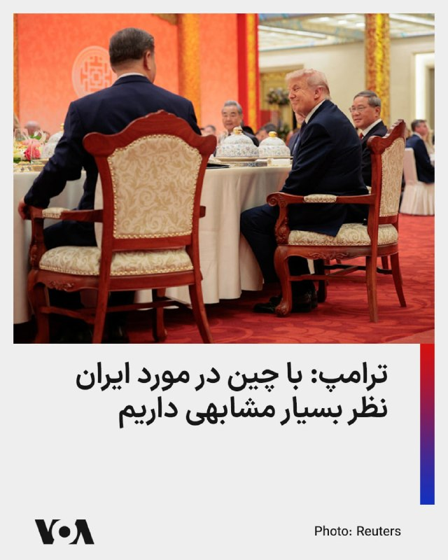

🔺ترامپ: با چین درباره دست نیافتن تهران به سلاح هسته‌ای و باز ماندن تنگه‌ها هم‌نظریم

▪️دونالد ترامپ، رئیس‌جمهور آمریکا، اعلام کرد که او درباره ایران با شی جین‌پینگ، رئیس‌جمهور چین، گفت‌وگو کرده و هر دو رهبر درباره عدم دستیابی تهران به سلاح هسته‌ای و باز بودن تنگه‌ها نظر مشابهی دارند.

▪️آقای ترامپ گفت: «ما درباره این‌که می‌خواهیم این موضوع چگونه پایان یابد، نظر بسیار مشابهی داریم؛ نمی‌خواهیم آن‌ها سلاح هسته‌ای داشته باشند، می‌خواهیم تنگه‌ها باز باشند.»

▪️او اقدام جمهوری اسلامی در بستن تنگه هرمز را «کاری دیوانه‌وار» توصیف کرد و تاکید کرد که جمهوری اسلامی نمی‌تواند سلاح اتمی داشته باشد.

⬇️ بیشتر بخوانید:
https://ir.voanews.com/a/8150358.html

## FarsiVOA — post 217801

  <a href="telegram/content/FarsiVOA_217801_1778823780.mp4" target="_blank">🎬 Download video</a>

⚡️گزارش فرهاد فلاحی، خبرنگار بخش فارسی صدای آمریکا، از تدابیر امنیتی در چین و محدودیت‌های رسانه‌ای
@FarsiVOA

## FarsiVOA — post 217800

⚡️گفت‌و‌گو با شاهین نژاد درباره ابعاد سیاسی و اقتصادی سفر پرزیدنت ترامپ به چین
@FarsiVOA

## FarsiVOA — post 217799

  <a href="telegram/content/FarsiVOA_217799_1778823781.mp4" target="_blank">🎬 Download video</a>

⚡️پیاده‌روی دونالد ترامپ و شی جین‌پینگ
@FarsiVOA

## FarsiVOA — post 217798

  <a href="telegram/content/FarsiVOA_217798_1778823781.mp4" target="_blank">🎬 Download video</a>

⚡️دونالد ترامپ: آمریکا و چین خواهان بازشدن تنگه هرمز هستند
@FarsiVOA

## FarsiVOA — post 217797

⚡️رهبران کدام شرکت‌های بزرگ آمریکایی دونالد ترامپ را در سفر به چین همراهی کردند؟
@FarsiVOA

## FarsiVOA — post 217796

⚡️گفت‌وگو با علی معموری و درویش رنجبر درباره مواضع چین و آمریکا در قبال شرایط تنگه هرمز
@FarsiVOA

## FarsiVOA — post 217795

⚡️گفت‌وگو با علی معموری و درویش رنجبر درباره موضع چین در قبال برنامه تسلیحاتی هسته‌ای جمهوری اسلامی
@FarsiVOA

## FarsiVOA — post 217794

  

دومین دیدار دونالد ترامپ رئیس‌جمهور آمریکا، و شی جین‌پینگ رهبر چین، در «جونگ‌نان‌های» آغاز شده است.

سی‌ان‌ان می‌گوید جونگ‌نان‌های مقر رهبری حزب کمونیست چین است و اغلب با کاخ سفید در آمریکا مقایسه می‌شود. این مجموعه حدود ۱۵۰۰ هکتار وسعت دارد که شامل ۷۰۰ هکتار دریاچه، و همچنین آلاچیق‌ها، باغ‌ها و دفاتر اداری است.

این مکان که با دیوارهایی به رنگ قرمز محصور شده، از محرمانه‌ترین نقاط چین است؛ جایی که دوربین‌های مداربسته‌ی بی‌شماری بر فراز آن نظاره‌گر هستند و نیروهای امنیتی، با لباس‌های شخصی و نظامی، با دقت و وسواس در آن گشت‌زنی می‌کنند.

صبح جمعه، شی در این مکان از رئیس‌جمهور آمریکا استقبال کرد و دو رهبر در حال گفت‌وگو در برابر دوربین‌ها دیده شدند؛ پیش از آنکه از خبرنگاران خواسته شود فاصله بگیرند و اعلام شود که رهبران دو کشور قصد دارند یک گفت‌وگوی خصوصی داشته باشند.
@FarsiVOA

## FarsiVOA — post 217793

⚡️گزارش فرهاد فلاحی، خبرنگار بخش فارسی صدای آمریکا از ادامه سفر رئیس جمهوری آمریکا به چین
@FarsiVOA

## FarsiVOA — post 217792

⚡️گزارش خبرنگار بخش چینی صدای آمریکا از سفر پرزیدنت ترامپ به چین
@FarsiVOA

## FarsiVOA — post 217791

  

نماینده تجاری ایالات متحده، روز جمعه اعلام کرد که چین به آمریکا اعلام کرده است که خواهان بازگشایی تنگه هرمز بدون هیچ‌گونه محدودیت یا عوارض است.

جیمیسون گریر همچنین اشاره کرد که پکن با رویکردی واقع‌گرایانه، سیگنال‌هایی مبنی بر محدود کردن حمایت‌های نظامی از ایران ارسال کرده است.

او در گفت‌وگویی با تلویزیون بلومبرگ در پکن، جایی که در مذاکرات میان ترامپ و شی جین‌پینگ حضور داشت، گفت: «از دیدگاه ما چینی‌ها بسیار عمل‌گرایانه رفتار می‌کنند و نمی‌خواهند در سمت اشتباه این ماجرا قرار بگیرند. آن‌ها خواهان برقراری صلح در آن منطقه هستند... بنابراین ما اطمینان زیادی داریم که آن‌ها هر آنچه در توان دارند انجام خواهند داد تا هرگونه حمایت مادی از ایران را محدود کنند.»

گریر همچنین اضافه کرد که در پی سفر ترامپ، انتظار می‌رود توافقی برای فروش محصولات کشاورزی آمریکا به چین به ارزش ده‌ها میلیارد دلار (عدد دو رقمی به میلیارد) حاصل شود.
@FarsiVOA

## FarsiVOA — post 217790

  <a href="telegram/content/FarsiVOA_217790_1778823783.mp4" target="_blank">🎬 Download video</a>

⚡️تصاویر اختصاصی صدای آمریکا از حضور اصغر فرهادی و عوامل فیلم «داستان‌های موازی» روی فرش قرمز فستیوال فیلم کن
@FarsiVOA

## FarsiVOA — post 217789

  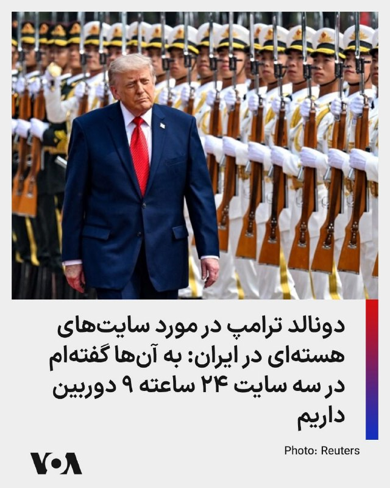

دونالد ترامپ، رئیس جمهوری آمریکا، در مصاحبه‌ای با فاکس نیوز در باره خارج کردن اورانیوم غنی‌شده از ایران گفت این کار را بیشتر برای «روابط عمومی» انجام خواهد داد و او احساس بهتری خواهد داشت که آن مواد از ایران خارج شود.

رئیس جمهوری آمریکا افزود «به‌دست آوردنش پروژه بزرگی است، واقعاً پروژه بزرگی است.»

او گفت: «اوایل به انجام این کار فکر می‌کردیم، اما زمان می‌برد؛ حدود یک هفته و نیم طول می‌کشید، و این مدت زیادی است که در قلمرو دشمن باشید.»

دونالد ترامپ توضیح داد که «باید این حجم عظیم گرانیت را جابه‌جا کنید. می‌دانید، آنجا گرانیت است. گرانیت سخت‌ترین سنگ است. واقعاً شگفت‌انگیز است، چون بمب‌هایی که استفاده کردیم فوق‌العاده قدرتمند بودند. و یادتان نرود که علاوه بر آن، با موشک‌های تاماهاوک هم آنجا را زدیم.»

او گفت فکر نمی‌کند خارج کردن آن مواد از ایران «لازم باشد، مگر از نظر روابط عمومی. به نظرم برای رسانه‌های جعلی مهم است که ما آن را به‌دست بیاوریم. من همان کسی بودم که گفتم آن را به‌دست خواهیم آورد، و به‌دستش هم می‌آوریم. حواسمان به آن هست.»

@FarsiVOA

## FarsiVOA — post 217788

🔺دونالد ترامپ: جمهوری اسلامی یا می‌تواند توافق کند یا حذف شود؛ دقیقا می‌دانیم در چهار هفته گذشته چه کرده‌اند

▪️دونالد ترامپ، رئیس جمهوری آمریکا در مصاحبه‌ای که با فاکس نیوز انجام داد گفت او درباره ایران با چین صحبت کرده است.

⬇️ بیشتر بخوانید:
https://ir.voanews.com/a/8150331.html
@FarsiVOA

## FarsiVOA — post 217787

⚡️گفت‌وگو با حسین رئیسی درباره تداوم توقیف و مصادره اموال ایرانیان مخالف جمهوری اسلامی
@FarsiVOA

## FarsiVOA — post 217785

🔺دونالد ترامپ: هالیوود نمی‌تواند کسی مثل شی جین‌پینگ برای ایفای نقش او پیدا کند

▪️دونالد ترامپ، رئیس‌جمهوری‌ آمریکا، در مصاحبه‌ای با شان هنیتی مجری فاکس‌نیوز، با تمجید از شی جین‌پینگ، رئیس‌جمهوری چین، او را رهبری «مورد احترام» توصیف کرد و گفت اگر هالیوود به‌دنبال بازیگری برای ایفای نقش رهبر چین باشد، «نمی‌تواند کسی مثل او پیدا کند.»

⬇️ بیشتر بخوانید:
https://ir.voanews.com/a/8150329.html
@FarsiVOA

## Persian_Trend_Official — post 14173

  <a href="telegram/content/Persian_Trend_Official_14173_1778823783.mp4" target="_blank">🎬 Download video</a>

صبحتون بخیر ☕️😆

📝 Nick
📌 @persian_trend_official
پرشین ترند | متفاوت‌ترین کانال نظامی

## RadioFarda — post 157197

  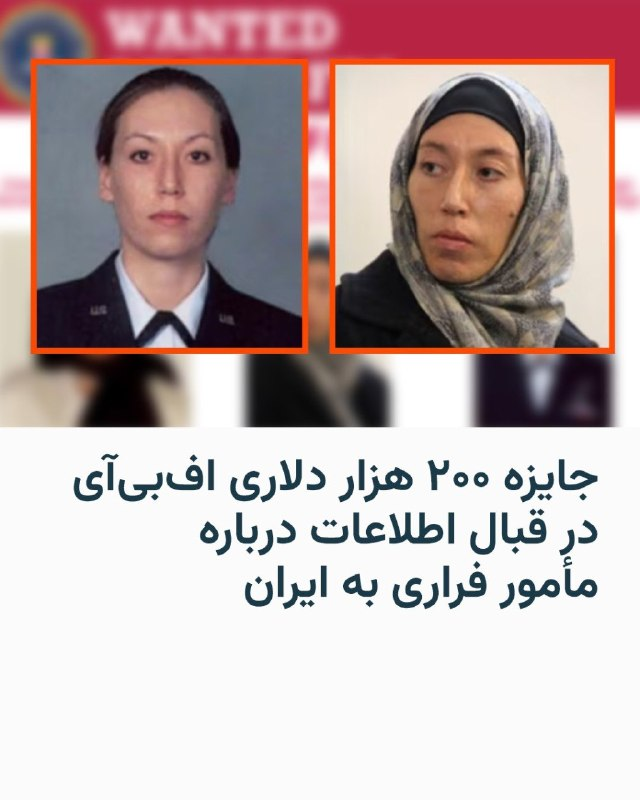

🔸اف‌بی‌آی، اداره پلیس فدرال آمریکا، روز پنج‌شنبه، ۲۴ اردیبهشت، اعلام کرد که در ازای هر گونه اطلاعاتی که به دستگیری یک جاسوس فراری به ایران منجر شود ۲۰۰ هزار دلار جایزه می‌دهد.

🔸شبکه تلویزیونی سی‌ان‌ان به نقل از بیانیه اف‌بی‌آی نوشت که این اداره فدرال هم‌چنان در پی یافتن مونیکا ویت، افسر اطلاعاتی نیروی هوایی آمریکا، است که گفته می‌شود در سال ۲۰۱۹ به ایران گریخته است.

🔸به گفته مقامات آمریکایی در سال ۱۳۹۷، مونیکا ویت که در آن زمان ۳۹ ساله بود پس از شرکت در دو کنفرانس در تهران که توسط شرکت «افق نو» وابسته به سپاه پاسداران ترتیب داده شده بود توسط نهادهای امنیتی ایران جذب شده است.

🔸وزارت دادگستری آمریکا در بهمن‌ماه همین سال علیه ویت به عنوان افسر سابق بخش ضد اطلاعات نیروی هوایی آمریکا به جرم کمک به ایران در جاسوسی سایبری از پرسنل نیروی هوایی اعلام جرم کرد.

🔸در بیانیه تازه اف‌بی‌آی تأکید شده که این اداره فدرال مونکا ویت را فراموش نکرده و معتقد است که «در این لحظه حیاتی از تاریخ ایران» حتما کسانی هستند که از محل اختفای مونیکا ویت خبر دارند.

@RadioFarda

## RadioFarda — post 157196

  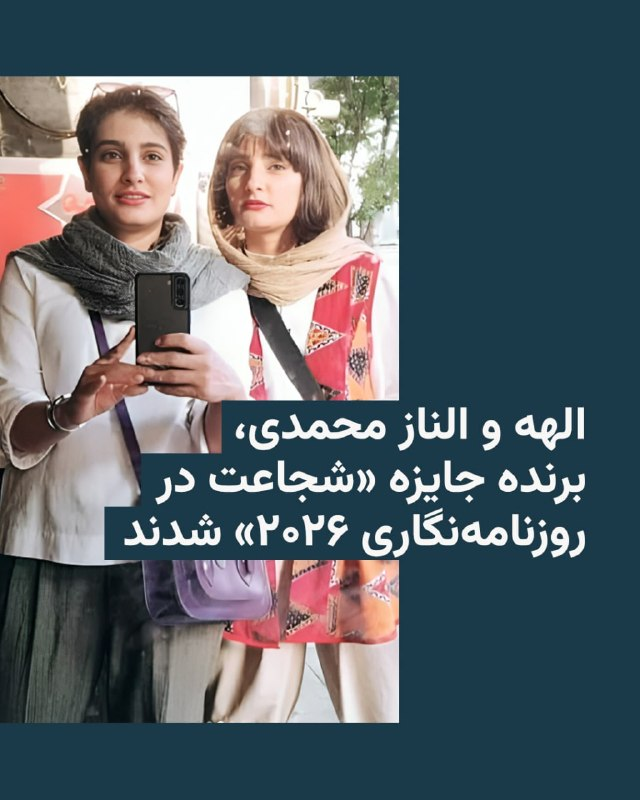

🔸بنیاد بین‌المللی رسانه‌های زنان (IWMF)، برندگان سی و هفتمین دوره جوایز سالانه «شجاعت در روزنامه‌نگاری» را اعلام کرد.

🔸این بنیاد روز پنج‌شنبه ۲۴ اردیبهشت در بیانیه‌ای اعلام کرد که زنان روزنامه‌نگار از ایران، میانمار، فیلیپین و ایالات متحده به خاطر «گزارش‌دهی در بحبوحه افزایش خطر و به‌دلیل افشای حقیقت در شرایط خطرناک» به‌عنوان برندگان این جایزه انتخاب شدند.

🔸بر اساس اعلام بنیاد بین‌المللی رسانه‌های زنان، برندگان سال ۲۰۲۶ شامل خواهران ایرانی و خبرنگاران رسانه‌های چاپی الهه و الناز محمدی؛ جورجیا فورت، روزنامه‌نگار پخش از ایالات متحده؛ و نای مین نی (نام مستعار)، روزنامه‌نگار دیجیتال از میانمار هستند.

🔸الیسا لیس مونوز، رئیس این بنیاد گفت: «جرم‌انگاری حقیقت‌گویی همان چیزی است که شجاعت را به آینده روزنامه‌نگاری تبدیل می‌کند. برای زنانی که جرات گزارش دادن دارند، روزنامه‌نگاری به‌عنوان یک عمل قابل مجازات در حال تغییر شکل است.»

@RadioFarda

## RadioFarda — post 157194

  <a href="https://t.me/radiofarda/157194" target="_blank">📎 Download file</a>

📻بشنوید: سرخط خبرها با رادیوفردا، ۲۵ اردیبهشت ۱۴۰۵‌

@RadioFarda

## BBCPersian — post 281096

🖌نسرین حاطوم, خبرنگار بی‌بی‌سی عربی در امور خلیج فارس

🔻در پی هدف قرار گرفتن امارات با موشک‌های بالستیک و پهپاد در روزهای اخیر، که مقام‌های امارات آن را به ایران نسبت داده‌اند، تماس تلفنی بنیامین نتانیاهو، نخست‌وزیر اسرائیل، با محمد بن زاید آل نهیان، رئیس امارات متحده عربی، توجه‌ها را به خود جلب کرد.

آقای نتانیاهو در این تماس گفت که اسرائیل در کنار «نزدیک‌ترین متحدانش» ایستاده است و بر تعهد کشورش به تلاش مشترک برای صلح و امنیت تاکید کرد. بر اساس بیانیه سفارت اسرائیل در امارات، او در این گفت‌وگو حملات ایران علیه غیرنظامیان و زیرساخت‌های امارات را محکوم کرد و آن را «نقض جدی حاکمیت و تهدیدی برای ثبات منطقه‌ای» خواند.

وزارت دفاع امارات اعلام کرده بود که سامانه‌های پدافند هوایی این کشور طی روزهای گذشته چندین موشک و پهپاد ایرانی را رهگیری کرده‌اند.

📸GettyImages/ AFP via Getty Images/ NurPhoto via Getty Images/ Bloomberg via Getty Images

https://bbc.in/4dL0TbK
@BBCPersian

## BBCPersian — post 281095

🔻ارتش اسرائیل از کشته شدن یکی از نیروهایش در جنوب لبنان خبر داد

ارتش اسرائیل روز جمعه اعلام کرد که یکی از نیروهایش در جریان درگیری‌ها در جنوب لبنان کشته شده است. به این ترتیب شمار تلفات این کشور از آغاز جنگ با حزب‌الله در اوایل ماه مارس به ۲۰ نفر رسیده است.

ارتش بدون ارائه اطلاعات بیشتر اعلام کرد که گروهبان دوم نگب داگان، ۲۰ ساله، «در جریان نبرد در جنوب لبنان کشته شده است.»

از زمان آغاز این جنگ تاکنون، ۱۹ سرباز اسرائیلی و یک پیمانکار غیرنظامی کشته شده‌اند.

https://bbc.in/3R12525
@BBCPersian

## BBCPersian — post 281094

🔻چین: بی‌وقفه برای پایان جنگ ایران تلاش می‌کنیم

🖌لورا بیکر- بی‌بی‌سی

دولت چین گفته است که «بی‌وقفه» برای پایان دادن به درگیری‌ها در خاورمیانه تلاش می‌کند و امیدوار است با «حمایت بیشتر از مذاکرات صلح، نقشی سازنده در دستیابی به صلحی پایدار ایفا کند.»

این بیانیه که از سوی رسانه‌های دولتی چین منتشر شده، پس از آن مطرح شد که دونالد ترامپ به شبکه فاکس نیوز گفت که در مورد احتمال دستیابی به یک توافق صلح با ایران «دیگر خیلی صبور نخواهد ماند.»

رئیس‌جمهور آمریکا همچنین گفت که شی جین‌پینگ پیشنهاد داده است که چین برای رسیدن به نوعی توافق به ایران کمک کند.

پکن یکی از متحدان نزدیک تهران به شمار می‌رود. چین بزرگ‌ترین خریدار نفت ایران و بزرگ‌ترین شریک تجاری این کشور است.

دولت ترامپ امیدوار بود که شی جین‌پینگ از نفوذ اقتصادی و سیاسی خود استفاده کند تا تهران را به میز مذاکره بیاورد.

در بیانیه چین گفته شده است که این درگیری «هرگز نباید رخ می‌داد» و «هیچ دلیلی برای ادامه آن وجود ندارد»، درعین حال به‌طور قابل توجهی از انتقاد مستقیم از آمریکا خودداری شده است.

از نظر اقتصادی، این جنگ باعث فشار بر کارخانه‌های چین شده است زیرا آن‌ها مجبورند برای محصولات نفتی هزینه بیشتری بپردازند، اما از نظر دیپلماتیک و سیاسی، این وضعیت یک پیروزی برای شی جین‌پینگ محسوب می‌شود؛ زیرا او اکنون احساس می‌کند با دونالد ترامپی روبه‌رو است که در اثر جنگ تضعیف شده است.

در مقابل، شی جین‌پینگ می‌تواند در نقش یک صلح‌طلب ظاهر شود؛ نشانه‌ای از این‌که چین دیگر فقط در مرکز اقتصاد جهانی قرار ندارد، بلکه به‌طور فزاینده‌ای در مرکز قدرت جهانی هم قرار گرفته است.

https://bbc.in/3R12525
@BBCPersian

## BBCPersian — post 281093

  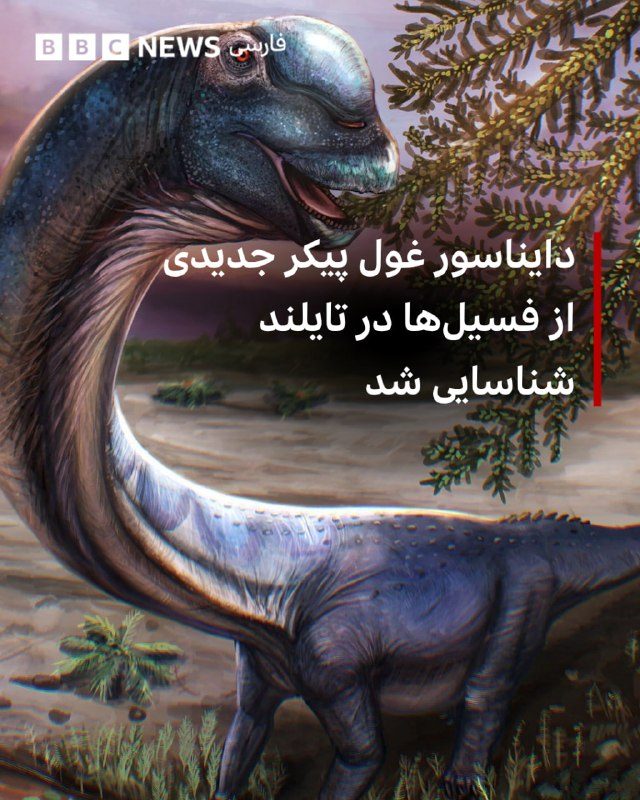

‌ ‌ ‌
دانشمندان نوع جدیدی از دایناسور غول‌پیکر گردن‌دراز را از بقایای کشف‌شده در تایلند شناسایی کرده‌اند.

ناگاتیتان، بزرگترین دایناسور کشف‌شده در جنوب شرقی آسیا، ۲۷ تن وزن داشت که به اندازه ۹ فیل آسیایی بالغ می‌شود و طول آن ۲۷ متر بود که از یک دیپلودوکوس بلندتر است. مانند آن دایناسور، این دایناسور نیز به خانواده ساروپود از گیاهخواران گردن‌دراز تعلق دارد.

تیمی از محققان بریتانیا و تایلند این گونه را از فسیل‌هایی که یک دهه پیش در کنار برکه‌ای در شمال شرقی تایلند یافت شده بود، شناسایی کردند.

آنها می‌گویند این کشف روشن می‌کند که چگونه تغییرات در شرایط آب و هوایی باستان به دایناسورهای غول‌پیکر اجازه رشد داده است.

نام کامل این دایناسور ناگاتیتان چایاپهومنسیس است، که «ناگا» در فرهنگ عامه جنوب شرقی آسیا به یک مار اشاره دارد، «تیتان» هم در اساطیر یونانی به خدایان اشاره دارد و چایاپهومنسیس به معنای «از چایاپوم» است که نام استانی است که فسیل‌ها در آن کشف شده‌ است.

این دایناسور بین ۱۰۰ تا ۱۲۰ میلیون سال پیش، حدود ۴۰ میلیون سال زودتر از تیرانوسوروس رکس، زندگی می‌کرد.

📷Reuters
@BBCPersian

## BBCPersian — post 281083

‌ ‌ ‌ ‌
شی جین‌پینگ در نخستین روز سفر دونالد ترامپ، که می‌تواند روابط میان این دو ابرقدرت رقیب را از نو تنظیم کند، استقبالی باشکوه از او ترتیب داد.

گارد تشریفات نظامی در بیرون تالار بزرگ خلق برای استقبال ازآقای ترامپ صف کشیده بود. همراه با شلیک توپ و گروه موسیقی که سرود ملی آمریکا را می‌نواخت. رئیس‌جمهور آمریکا دو بار توقف کرد تا به دانش‌آموزانی که با پرچم‌های چین و آمریکا ابراز احساسات می‌کردند، سلام کند.

او هنگام دست دادن با شی، به جلو خم شد و به نظر می‌رسید برای ابراز صمیمیت، دستش را روی بازوی او گذاشت. سپس میزبانش را با تمجید فراوان ستود.

https://bbc.in/4eJjypq
📷:‌Getty/ Reuters
@BBCPersian

## alonews — post 120066

  <a href="telegram/content/alonews_120066_1778823787.mp4" target="_blank">🎬 Download video</a>

👈ترامپ در مصاحبه با فاکس‌نیوز: افزایش قیمت بنزین، بهایی است که آمریکایی‌ها باید برای جلوگیری از دستیابی ایران به سلاح هسته‌ای بپردازند.

✅ @AloNews خبر جنگ

## alonews — post 120065

  <a href="telegram/content/alonews_120065_1778823788.webm" target="_blank">🎬 Download video</a>

👈نیروهای دفاعی اسرائیل هشدار تخلیه برای چندین شهر در منطقه صور در جنوب لبنان صادر کرده‌اند و نسبت به حملات احتمالی اسرائیل هشدار داده‌اند.

🔴 از ساکنان خواسته شده حداقل ۱ کیلومتر از مناطق مشخص شده فاصله بگیرند

✅ @AloNews خبر جنگ

## alonews — post 120064

  <a href="telegram/content/alonews_120064_1778823789.webm" target="_blank">🎬 Download video</a>

👈خبرنگار المیادین در پکن: بسیاری از اظهارات آمریکایی ها می گویند که ترامپ چین را متقاعد کرد که موضع خود را در قبال ایران تغییر دهد و این درست نیست.

🔴موضع چین در قبال ایران روشن، ثابت است و تغییری نکرده است. دیروز به طور کامل از صحبت در این مورد خودداری کرد و هر آنچه خلاف آن شایعه می شود کذب محض است.

🔴 چین صبح امروز تصمیم گرفت موضع خود را از طریق بیانیه کامل وزارت خارجه منتشر کند تا تمام حقیقت روشن شود

✅ @AloNews خبر جنگ

## alonews — post 120063

  <a href="telegram/content/alonews_120063_1778823789.webm" target="_blank">🎬 Download video</a>

👈رویترز: ترامپ مدعی شد «توافق‌های تجاری فوق‌العاده‌ای» با چین حاصل شده است

✅ @AloNews خبر جنگ

## alonews — post 120062

  <a href="telegram/content/alonews_120062_1778823789.webm" target="_blank">🎬 Download video</a>

👈ترامپ: رئیس‌جمهور چین می‌خواهد شاهد توافق با ایران باشد و برای کمک به این کار اعلام آمادگی کرده است

✅ @AloNews خبر جنگ

## alonews — post 120061

  <a href="telegram/content/alonews_120061_1778823789.webm" target="_blank">🎬 Download video</a>

👈قیمت جهانی نفت روز جمعه پس از آن افزایش یافت که دونالد ترامپ اعلام کرد چین پس از گفت‌وگوهای او با شی جین‌پینگ، با خرید نفت از آمریکا موافقت کرده است.

🔴 با این حال، پکن تاکنون این ادعا را تأیید نکرده و به درخواست رسانه‌ها برای اظهار نظر نیز پاسخی نداده است

✅ @AloNews خبر جنگ

## alonews — post 120060

  <a href="telegram/content/alonews_120060_1778823789.webm" target="_blank">🎬 Download video</a>

👈ترامپ، به شبکه فاکس نیوز: مذاکره با ایران درباره کنار گذاشتن غبار هسته‌ای به دلیل تضاد در تصمیمات ایران، رفت و برگشت دارد

🔴تأسیسات هسته‌ای ایران تحت نظارت مداوم ۹ دوربین، ۲۴ ساعته قرار دارند.

🔴هرگونه تحرک ایرانی در داخل تأسیسات هسته‌ای با واکنش مستقیم نظامی مواجه خواهد شد.

✅ @AloNews خبر جنگ

## alonews — post 120059

  <a href="telegram/content/alonews_120059_1778823789.webm" target="_blank">🎬 Download video</a>

👈ترامپ: توافق‌های تجاری فوق‌العاده‌ای با چین انجام شد

🔴دونالد ترامپ، با اشاره به نتایج مثبت سفر خود اعلام کرد توافق‌های تجاری بسیار خوبی حاصل شده که برای هر دو کشور عالی است.

🔴وی با ابراز احترام نسبت به شی جین‌پینگ، به سابقه آشنایی ۱۲ ساله و حل مشکلات پیچیده‌ای اشاره کرد که دیگران قادر به رفع آن‌ها نبودند. ترامپ این رابطه را بسیار قوی توصیف کرد و کارهای انجام شده را فوق‌العاده دانست.

✅ @AloNews خبر جنگ

## alonews — post 120058

  <a href="telegram/content/alonews_120058_1778823789.webm" target="_blank">🎬 Download video</a>

👈مارکو روبیو: مردم کوبا باید بدانند که در حال حاضر ۱۰۰ میلیون دلار غذا و دارو برای آن‌ها موجود است و تنها دلیلی که این کمک‌ها به دستشان نمی‌رسد، رژیم کوبا است

✅ @AloNews خبر جنگ

## alonews — post 120057

  <a href="telegram/content/alonews_120057_1778823789.mp4" target="_blank">🎬 Download video</a>

👈اسرائیل در حملات بامداد امروز علیه حزب الله از سلاح فسفری استفاده کرد

✅ @AloNews خبر جنگ

## alonews — post 120056

  <a href="telegram/content/alonews_120056_1778823790.webm" target="_blank">🎬 Download video</a>

👈مجلس نمایندگان آمریکا برای سومین بار در تصویب قطعنامهای با هدف محدود کردن اختیارات رئیس‌جمهور در ارتباط با جنگ با ایران ناکام ماند‌‌

✅ @AloNews خبر جنگ

---
📅 بروزرسانی: 1405/02/25 05:03
---

## VahidOOnLine — post 240224

  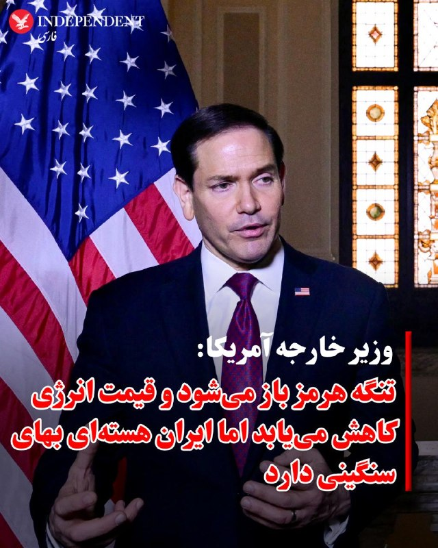

♦️مارکو روبیو، وزیر امور خارجه ایالات متحده، روز پنجشنبه ۲۴ اردیبهشت‌ماه در گفتگو با شبکه ان‌بی‌سی نیوز، در جریان سفر خود به پکن، گفت تنگه هرمز باز خواهد شد و قیمت نفت و گاز کاهش می‌یابد، اما هشدار داد ایران هسته‌ای «بهای سنگینی» خواهد داشت.

روبیو گفت: «ما اقدام‌های فوق‌العاده‌ای انجام داده‌ایم تا قیمت گاز از آنچه در برخی نقاط دیگر جهان دیده می‌شود پایین‌تر بماند، و این قیمت‌ها باز هم کاهش خواهد یافت.»

او افزود: «آن تنگه‌ها باز خواهند شد و شاهد کاهش این قیمت‌ها خواهیم بود.»

وزیر امور خارجه آمریکا گفت به‌دلیل متوقف ماندن صادرات و انباشت نفت جمهوری اسلامی، حجم بزرگی از نفت هنوز وارد بازار جهانی نشده و با بازگشت این نفت به بازار، قیمت جهانی انرژی کاهش خواهد یافت.

روبیو همچنین هشدار داد دستیابی جمهوری اسلامی به سلاح هسته‌ای می‌تواند به تهران امکان دهد مسیرهای حیاتی کشتیرانی و انتقال نفت، از جمله تنگه هرمز، را تحت فشار یا کنترل خود قرار دهد؛ موضوعی که به گفته او می‌تواند امنیت انرژی جهان را با بحران روبه‌رو کند.
‌🇸🇦 Indypersian

🤖 @VahidOOnLine

## VahidOOnLine — post 240223

  

جمیسون گرر، نماینده تجاری آمریکا، جمعه در پکن به بلومبرگ گفت مقام‌های چینی در نشست سران آمریکا و چین به‌روشنی اعلام کردند که خواهان بازگشایی تنگه هرمز بدون محدودیت یا اخذ عوارض هستند و پکن به‌صورت عملگرایانه برای محدود کردن حمایت نظامی از ایران اقدام خواهد کرد.
گرر گفت: «برای چین بسیار مهم است که تنگه هرمز باز باشد، هیچ عوارضی دریافت نشود و هیچ کنترل نظامی وجود نداشته باشد و این موضوع در نشست روشن بود. بنابراین از آن استقبال می‌کنیم.»
او افزود: «در مورد نقش چین در قبال ایران، دیدگاه ما این است که چینی‌ها بسیار عملگرا رفتار می‌کنند و نمی‌خواهند در سوی نادرست این موضوع قرار بگیرند. آنها خواهان صلح در آن منطقه هستند. دونالد ترامپ نیز خواهان صلح در آن منطقه است. بنابراین اطمینان زیادی داریم که آنها هر کاری بتوانند انجام خواهند داد تا هرگونه حمایت مادی از ایران را محدود کنند.»

‌🏁 🇬🇧 IranintlTV

🤖 @VahidOOnLine

## VahidOOnLine — post 240222

  <a href="telegram/content/VahidOOnLine_240222_1778808804.mp4" target="_blank">🎬 Download video</a>

♦️خبرگزاری رویترز گزارش داد یک هیات آمریکایی به ریاست «جان رتکلیف» رئیس سازمان اطلاعات مرکزی آمریکا (سیا)، پنجشنبه ۲۴ اردیبهشت‌ماه در هاوانا با مقام‌های ارشد کوبایی دیدار کرده است.

این گزارش پس از آن منتشر شد که ویدیوی خروج یک هواپیمای دولتی آمریکا از فرودگاه بین‌المللی هاوانا به دست رویترز رسید. یک شاهد عینی نیز به این خبرگزاری گفت این هواپیما عصر پنجشنبه فرودگاه را ترک کرده است.

دولت کوبا در بیانیه‌ای که در رسانه دولتی «کوبا دباته» منتشر شد اعلام کرد هیات آمریکایی به ریاست رئیس سیا با همتایان خود در وزارت کشور کوبا دیدار و درباره همکاری‌های امنیتی گفتگو کرده‌اند.

در این بیانیه آمده است: «دو طرف بر علاقه خود برای توسعه همکاری دوجانبه میان نهادهای مجری قانون، در راستای امنیت دو کشور و همچنین امنیت منطقه‌ای و بین‌المللی تاکید کردند.»

دولت کوبا همچنین اعلام کرد به هیات آمریکایی گفته است که کوبا تهدیدی برای امنیت ملی ایالات متحده به شمار نمی‌رود.

فاکس نیوز به نقل از یک مقام آمریکایی گزارش داد جان رتکلیف در این سفر، پیام دونالد ترامپ، رئیس‌جمهوری آمریکا، را «شخصا» منتقل کرده است.

بر اساس این گزارش، در پیام ترامپ آمده بود: «ایالات متحده آماده است در مسائل اقتصادی و امنیتی کوبا به‌طور جدی وارد تعامل شود، اما تنها در صورتی که کوبا تغییرات بنیادین انجام دهد.»

حساب کاربری سیا نیز تصاویری از دیدارهای رتکلیف در هاوانا منتشر کرد.

دونالد ترامپ پیش‌تر و در چندین نوبت، با اشاره به عملیات نظامی «خشم حماسی» علیه جمهوری اسلامی گفته بود پس از حکومت ایران، «نوبت کوبا است.»

کوبا در ماه‌های اخیر با بحران شدید تامین سوخت روبه‌رو بوده است.

این دیدار چند روز پس از آن انجام شد که ترامپ گفته بود آمریکا و کوبا، «قرار است گفتگو کنند.»
‌🇸🇦 Indypersian

🤖 @VahidOOnLine

## VahidOOnLine — post 240221

♦️امید برزگری، مربی سازمان امداد و نجات هلال‌احمر، در گفتگویی تصویری با خبرآنلاین درباره سگ‌های امداد و نجات گفت: «این سگ‌ها پست نیستند؛ فرشته‌اند، فرشته نجات.»
او این اظهارات را در واکنش به گزارشی از صداوسیمای جمهوری اسلامی مطرح کرد که در آن از مردم پرسیده شده بود: «کدامیک از سگ‌های هلال‌احمر پست‌تر است؟»
جمعیت هلال‌احمر ایران اعلام کرده سگ‌های زنده‌یاب این سازمان از ابتدای جنگ اخیر در ۷۹۲ عملیات جستجو و نجات شرکت کرده‌اند و در ۷۱۱ عملیات موفق به زنده‌یابی یا جستجوی پیکر کشته‌شدگان شده‌اند.
‌🇸🇦 Indypersian

🤖 @VahidOOnLine

## VahidOOnLine — post 240220

  

♦️ برنامه «پاداش برای عدالت» وابسته به وزارت خارجه آمریکا اعلام کرد برای دریافت اطلاعات درباره اعضا و فعالیت‌های شرکت «کیمیا پارت سیوان» (کیپاس)، که از آن به‌عنوان یکی از شبکه‌های تامین و تولید پهپاد نیروی قدس سپاه پاسداران یاد شده، تا ۱۵ میلیون دلار پاداش پرداخت می‌کند.

در اطلاعیه منتشرشده در شبکه اجتماعی اکس آمده است این پاداش به اطلاعاتی تعلق می‌گیرد که بتواند به شناسایی یا مختل کردن سازوکارهای مالی سپاه پاسداران کمک کند. ایالات متحده سپاه پاسداران را در فهرست سازمان‌های تروریستی قرار داده است.

بر اساس این بیانیه، شرکت کیپاس یکی از بازوهای تولید پهپاد نیروی قدس سپاه پاسداران به شمار می‌رود و اعضا و مقام‌های آن در آزمایش‌های پروازی پهپادها و پشتیبانی فنی پهپادهای عملیاتی نیروی قدس که به عراق منتقل شده‌اند نقش داشته‌اند.

برنامه «پاداش برای عدالت» همچنین اعلام کرد این شرکت قطعات پهپاد را از شرکت‌های خارجی تهیه می‌کرده تا در اختیار سپاه پاسداران قرار گیرد.

در بیانیه دولت آمریکا که چهارشنبه ۲۴ اردیبهشت‌ماه منتشر شد، از «حسن آرامبونژاد»، «ابوالفضل رمضان‌زاده مشکانی»، «مهدی غفاری نقنه»، «رضا نهاردانی»، «عباس سرتاجی» و «هادی جمشیدی زوارکی» به‌عنوان اعضای اصلی این شبکه نام برده شده است.

در این بیانیه آمده این افراد در توسعه، آزمایش و تامین پهپادها برای گروه‌های همسو با جمهوری اسلامی در عراق، یمن و سوریه مشارکت داشته‌اند.

وزارت خزانه‌داری آمریکا دو سال پیش شرکت کیپاس و اعضای اصلی آن را در فهرست تحریم‌های خود قرار داده بود.
‌🇸🇦 Indypersian

🤖 @VahidOOnLine

## VahidOOnLine — post 240211

هر کدام از این نام‌ها، روایت جوانی‌ست که می‌توانست زندگی کند، کار کند، عاشق شود و آینده‌ای بسازد؛ اما گلوله سرکوب مسیر زندگی‌شان را قطع کرد.
جاویدنامان انقلاب ملی ایرانیان فقط نام‌های ثبت‌شده در یک فهرست نیستند؛ حافظه زخمی نسلی‌اند که بهای آزادی را با جان خود پرداخت.<
عرفان علیزاده، علی‌اصغر محمدی چمستان، مبین فیلی، علیرضا موسی‌نیا، محمدامین قبادی، علی زنگنه، امیررضا حسنوند و محمدرضا سعیدی؛
نام‌هایی که از خیابان‌های ایران پاک نشدند و در حافظه جمعی این سرزمین باقی خواهند ماند.<
#جاویدنامان_انقلاب_ملی_ایرانیان
‌🏁 🇬🇧 IranintlTV

🤖 @VahidOOnLine

## VahidOOnLine — post 240210

  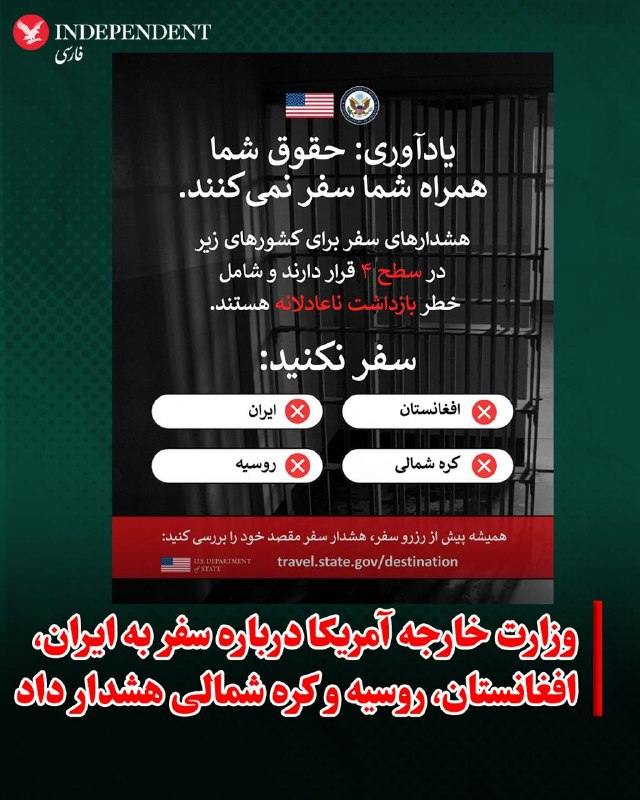

♦️صفحه فارسی وزارت خارجه آمریکا، پنجشنبه ۲۴ اردیبهشت با انتشار پیامی اعلام کرد ایران، افغانستان، روسیه و کره شمالی در سطح ۴ هشدار سفر آمریکا، یعنی «سفر نکنید»، قرار دارند.
در این پیام آمده است این کشورها دارای شاخص خطر «بازداشت ناعادلانه شهروندان آمریکایی» هستند و شهروندان آمریکا باید پیش از رزرو سفر، هشدارهای مقصد خود را بررسی کنند.
وزارت خارجه آمریکا همچنین نوشت: «حقوق شما همراه شما سفر نمی‌کنند» و تاکید کرد سفارتخانه‌ها و کنسولگری‌های آمریکا خدمات مربوط به حمایت و حفاظت از شهروندان آمریکایی در خارج از کشور را ارائه می‌کنند.
‌🇸🇦 Indypersian

🤖 @VahidOOnLine

## FoxNewsTwitter — post 341757

  

Fox News (Twitter/X)

FOX NEWS REPORT: President Trump and President Xi Jinping sat for an over two-hour meeting in Beijing for a discussion on key topics, including trade and Taiwan.

Secretary of State Rubio says Washington's stance on Taiwan remains the same, @BillMelugin_ reports.

## pm_afshaa — post 90763

  <a href="telegram/content/pm_afshaa_90763_1778808806.webm" target="_blank">🎬 Download video</a>

🔴مجلس آمریکا امروز طرحی رو با عنوان «توقف جنگ علیه ایران» رای گیری کرد که این طرح با 212 رای موافق و 212 رای مخالف تصویب نشد.

💧 Rainbet.com the #1 Non-KYC Crypto Casino & Sportsbook @rainbetcom

😁 @Pm_Afshaa

## pm_afshaa — post 90762

  <a href="telegram/content/pm_afshaa_90762_1778808806.webm" target="_blank">🎬 Download video</a>

🔴کان نیوز: مقامات ارشد ارتش اسرائیل و سنتکام هفته گذشته جلسه داشتن و منتظرن ببینن فردا ترامپ بعد اتمام سفرش چه تصمیمی میگیره.

💧 Rainbet.com the #1 Non-KYC Crypto Casino & Sportsbook @rainbetcom

😁 @Pm_Afshaa

## pm_afshaa — post 90761

  <a href="telegram/content/pm_afshaa_90761_1778808807.webm" target="_blank">🎬 Download video</a>

🔴عزیزی، رئیس کمیسیون امنیت ملی و سیاست خارجی: پیش بینی کردیم هرکس که ترامپ رو به قتل برسونه، 50 میلیون یورو پاداش دریافت کنه.

💧 Rainbet.com the #1 Non-KYC Crypto Casino & Sportsbook @rainbetcom

😁 @Pm_Afshaa

## pm_afshaa — post 90760

  <a href="telegram/content/pm_afshaa_90760_1778808807.webm" target="_blank">🎬 Download video</a>

🔴نتانیاهو: خطر وجودی بمب اتمی و موشک‌های بالستیک رو از خودمون دور کردیم. اگه این کار رو نمی‌کردیم، امروز جمهوری اسلامی یه بمب اتمی داشت.

💧 Rainbet.com the #1 Non-KYC Crypto Casino & Sportsbook @rainbetcom

😁 @Pm_Afshaa

## pm_afshaa — post 90759

  <a href="telegram/content/pm_afshaa_90759_1778808808.webm" target="_blank">🎬 Download video</a>

🔴نتانیاهو: دشمنان ما به دنبال نابودی همه ما هستند؛ همه ما آنها بین راست و چپ، سکولار و مذهبی، یهودی و عرب تفاوتی قائل نمیشن.

اورشلیم رو تحت حاکمیت اسرائیل برای همیشه حفظ خواهیم کرد.

💧 Rainbet.com the #1 Non-KYC Crypto Casino & Sportsbook @rainbetcom

😁 @Pm_Afshaa

## IranIntlTV — post 337250

  

جمیسون گرر، نماینده تجاری آمریکا، جمعه در پکن به بلومبرگ گفت مقام‌های چینی در نشست سران آمریکا و چین به‌روشنی اعلام کردند که خواهان بازگشایی تنگه هرمز بدون محدودیت یا اخذ عوارض هستند و پکن به‌صورت عملگرایانه برای محدود کردن حمایت نظامی از ایران اقدام خواهد کرد.
گرر گفت: «برای چین بسیار مهم است که تنگه هرمز باز باشد، هیچ عوارضی دریافت نشود و هیچ کنترل نظامی وجود نداشته باشد و این موضوع در نشست روشن بود. بنابراین از آن استقبال می‌کنیم.»
او افزود: «در مورد نقش چین در قبال ایران، دیدگاه ما این است که چینی‌ها بسیار عملگرا رفتار می‌کنند و نمی‌خواهند در سوی نادرست این موضوع قرار بگیرند. آنها خواهان صلح در آن منطقه هستند. دونالد ترامپ نیز خواهان صلح در آن منطقه است. بنابراین اطمینان زیادی داریم که آنها هر کاری بتوانند انجام خواهند داد تا هرگونه حمایت مادی از ایران را محدود کنند.»

https://iranintl.com/202605157555

## IranIntlTV — post 337249

  <a href="telegram/content/IranIntlTV_337249_1778808809.mp4" target="_blank">🎬 Download video</a>

اینترنت؛ رانت تازهٔ جمهوری اسلامی
شرط دسترسی به اینترنت: انتشار تصاویر خامنه‌ای

در حالی‌ که قطع و محدودیت اینترنت خسارت‌های سنگینی به زندگی و کسب‌وکار مردم وارد کرده، حکومت نه‌تنها محدودیت‌ها را کاهش نداده، بلکه با طرح‌هایی مانند «اینترنت پرو» و «سیم‌کارت سفید»، نگرانی‌ها دربارهٔ اینترنت طبقاتی را افزایش داده است.

گزارش‌هایی منتشر شده که نشان می‌دهد برخی شهروندان، پس از انتقاد از حکومت یا فعالیت در شبکه‌های اجتماعی، با قطع سیم‌کارت و اینترنت مواجه شده‌اند و برای وصل دوباره، مجبور به ارائهٔ تعهد یا فعالیت حمایتی به نفع حکومت شده‌اند.

جمهوری اسلامی اینترنت را به ابزاری برای کنترل سیاسی و سنجش وفاداری شهروندان تبدیل کرده است؛ وضعیتی که برای بسیاری از مردم فقط یک معنا دارد:
هرجا اینترنت نیست، آزادی هم نیست.

کامبیز حسینی در «برنامه» به این موضوع می‌پردازد.

«یک ایران صدای شما را می‌شنود»
دوشنبه تا پنجشنبه ۱۱ شب تهران
از تلویزیون ایران اینترنشنال

تماشای نسخه کامل این قسمت از «برنامه» در یوتیوب:
https://youtu.be/9CC8wX4Bim0
@iranintltv

## IranIntlTV — post 337240

هر کدام از این نام‌ها، روایت جوانی‌ست که می‌توانست زندگی کند، کار کند، عاشق شود و آینده‌ای بسازد؛ اما گلوله سرکوب مسیر زندگی‌شان را قطع کرد.
جاویدنامان انقلاب ملی ایرانیان فقط نام‌های ثبت‌شده در یک فهرست نیستند؛ حافظه زخمی نسلی‌اند که بهای آزادی را با جان خود پرداخت.
عرفان علیزاده، علی‌اصغر محمدی چمستان، مبین فیلی، علیرضا موسی‌نیا، محمدامین قبادی، علی زنگنه، امیررضا حسنوند و محمدرضا سعیدی؛
نام‌هایی که از خیابان‌های ایران پاک نشدند و در حافظه جمعی این سرزمین باقی خواهند ماند.
#جاویدنامان_انقلاب_ملی_ایرانیان

## IranIntlTV — post 337239

  <a href="telegram/content/IranIntlTV_337239_1778808811.mp4" target="_blank">🎬 Download video</a>

مریم از پاریس: نگران حال فاطمه سپهری هستم و امیدوارم پوشش خبری بیشتری درباره ایشان داده شود

«یک ایران صدای شما را می‌شنود»
دوشنبه تا پنجشنبه ۱۱ شب تهران
از تلویزیون ایران اینترنشنال

تماشای نسخه کامل این قسمت از «برنامه» در یوتیوب:
https://youtu.be/9CC8wX4Bim0
@iranintltv

## IranIntlTV — post 337238

  <a href="telegram/content/IranIntlTV_337238_1778808812.mp4" target="_blank">🎬 Download video</a>

دریا از لندن: با زور و اعتراف اجباری، زندانی بی‌گناه را به اعدام محکوم می‌کنند

«یک ایران صدای شما را می‌شنود»
دوشنبه تا پنجشنبه ۱۱ شب تهران
از تلویزیون ایران اینترنشنال

تماشای نسخه کامل این قسمت از «برنامه» در یوتیوب:
https://youtu.be/9CC8wX4Bim0
@iranintltv

## IranIntlTV — post 337237

  <a href="telegram/content/IranIntlTV_337237_1778808813.mp4" target="_blank">🎬 Download video</a>

عسل از اصفهان: جنگ اوضاع را تغییر نداد؛ حالا خودمان باید تغییرش بدهیم

«یک ایران صدای شما را می‌شنود»
دوشنبه تا پنجشنبه ۱۱ شب تهران
از تلویزیون ایران اینترنشنال

تماشای نسخه کامل این قسمت از «برنامه» در یوتیوب:
https://youtu.be/9CC8wX4Bim0
@iranintltv

## IranIntlTV — post 337236

  <a href="telegram/content/IranIntlTV_337236_1778808815.mp4" target="_blank">🎬 Download video</a>

سهراب از تهران: «درود بر وی‌پی‌ان‌فروشِ حلال‌خور!»

«یک ایران صدای شما را می‌شنود»
دوشنبه تا پنجشنبه ۱۱ شب تهران
از تلویزیون ایران اینترنشنال

تماشای نسخه کامل این قسمت از «برنامه» در یوتیوب:
https://youtu.be/9CC8wX4Bim0
@iranintltv

## IranIntlTV — post 337235

  <a href="telegram/content/IranIntlTV_337235_1778808816.mp4" target="_blank">🎬 Download video</a>

امیر از چالوس: حواستان به سلامت روانتان باشد؛ ایران با شهروندان افسرده آباد نمی‌شود

«یک ایران صدای شما را می‌شنود»
دوشنبه تا پنجشنبه ۱۱ شب تهران
از تلویزیون ایران اینترنشنال
تماشای نسخه کامل این قسمت از «برنامه» در یوتیوب:
https://youtu.be/9CC8wX4Bim0
@iranintltv

## Shin_Persian — post 6005

  

U.S. Central Command ✓ @CENTCOM
Fri, 15 May 2026 00:38:22 UTC

A U.S. Air Force F-16 takes off from a base in the Middle East for a night flight. Air Force fighter aircraft regularly patrol the skies over the Middle East in support of regional security.

فارسی

یک فروند اف-۱۶ نیروی هوایی ایالات متحده (USAF) برای یک پرواز شبانه از پایگاهی در خاورمیانه به هوا برمی‌خیزد. جنگنده‌های نیروی هوایی به طور منظم در حمایت از امنیت منطقه‌ای، در آسمان‌های خاورمیانه گشت‌زنی می‌کنند.

𝕏 · @shin_persian

## Shin_Persian — post 6003

Shin ✓ @hey_itsmyturn
Thu, 14 May 2026 23:41:52 UTC

Jet activity over Mosul, #Iraq 🇮🇶

فارسی

فعالیت جنگنده‌ها برفراز موصل، #Iraq 🇮🇶

𝕏 · @shin_persian

## FarsiVOA — post 217782

⚡️حساب کاربری سازمان اطلاعات مرکزی آمریکا (سیا) شامگاه پنج‌شنبه تصاویری از سفر نادر جان رتکلیف، رئیس این سازمان، به کوبا را منتشر کرد. رتکلیف در این سفر پیام رئیس‌جمهوری ایالات متحده،‌ دونالد ترامپ را به مقامات کوبایی منتقل کرد.
@FarsiVOA

## FarsiVOA — post 217781

⚡️ماجرای تکذیب همکاری معین با تیم ملی فوتبال جمهوری اسلامی، تصویری کوچک از یک سازوکار بزرگ‌ است که در آن سپاه پاسداران گاه با استفاده از نام هنرمندان، پیش از وقوع هر اتفاقی، روایت مطلوب خود را می‌سازد.
@FarsiVOA

## Persian_Trend_Official — post 14172

  

💢اسماعیل بقایی

«کسی که در خفا خیانت کند، در برابر افکار عمومی رسوا خواهد شد»

🫆:Tony

📌 @persian_trend_official
پرشین ترند | متفاوت‌ترین کانال نظامی

## Persian_Trend_Official — post 14171

  <a href="telegram/content/Persian_Trend_Official_14171_1778808818.mp4" target="_blank">🎬 Download video</a>

💢خلاقیت و نوآوری با کمترین هزینه را از اوکراین بخواهید ❗️

💢اپراتورای پهپاد اوکراینی با یه پهپاد FPV که روی آن تفنگ ساچمه زن بستن، دارن پهپادهای FPV روسی رو می‌زنن

🫆:Tony

📌 @persian_trend_official
پرشین ترند | متفاوت‌ترین کانال نظامی

## Persian_Trend_Official — post 14170

  <a href="telegram/content/Persian_Trend_Official_14170_1778808819.mp4" target="_blank">🎬 Download video</a>

🔴یک نیروی حزب‌الله تا از محل اختفا خودش بیرون آمد توسط نیرو های تیپ گولانی هدف قرار گرفت و کشته شد.

🫆:Tony

📌 @persian_trend_official
پرشین ترند | متفاوت‌ترین کانال نظامی

## IranianMinds — post 20162

🔴 تروث جدید ترامپ در مورد شی، رئیس‌جمهور چین:

وقتی شی جین‌پینگ خیلی شیک و محترمانه از آمریکا به‌عنوان کشوری در حال افول یاد کرد، منظورش خسارت وحشتناکی بود که تو دوران جو خواب‌آلود بایدن و دولتش به کشورمون وارد شد؛ و تو این مورد، صددرصد حق با اون بود. کشور ما به خاطر مرزهای باز، مالیات‌های سنگین، ترویج ترنس‌ها برای همه، حضور مردها تو ورزش زنان، سیاست‌های DEI، قراردادهای تجاری افتضاح، افزایش جرم و جنایت و کلی چیز دیگه ضربه شدیدی خورد.

اما شی جین‌پینگ منظورش اون پیشرفت فوق‌العاده‌ای نبود که آمریکا تو ۱۶ ماه درخشان دولت ترامپ به دنیا نشون داده. پیشرفتی که شامل رکورد تاریخی بازار بورس و صندوق‌های بازنشستگی 401K، پیروزی‌های نظامی، رابطه عالی با ونزوئلا، نابود کردن قدرت نظامی ایران (که ادامه هم داره!)، قوی‌ترین ارتش دنیا، تبدیل شدن دوباره آمریکا به ابرقدرت اقتصادی و سرمایه‌گذاری رکوردشکن ۱۸ تریلیون دلاری تو آمریکاست. همین‌طور بهترین بازار کار تاریخ آمریکا، با بیشترین تعداد افراد شاغل در تاریخ کشور، پایان دادن به سیاست‌های نابودکننده DEI و خیلی موفقیت‌های دیگه. در واقع، شی جین‌پینگ تو مدت کوتاهی بابت این همه موفقیت به من تبریک گفت.

دو سال پیش، ما واقعاً کشوری در حال سقوط بودیم و من کاملاً با شی جین‌پینگ موافق بودم! ولی الان آمریکا داغ‌ترین و قدرتمندترین کشور دنیاست و امیدوارم رابطه‌مون با چین از همیشه قوی‌تر و بهتر بشه.

@IranianMinds

## IranianMinds — post 20161

  <a href="telegram/content/IranianMinds_20161_1778808820.mp4" target="_blank">🎬 Download video</a>

بچه ها اسم این بازی عبور مرغ از خیابون  هست ویدئو نگاه کنید خیلی راحت 8 میلیون ازش سود گرفتیم😍

😤اگ توم دوس داری خیلی راحت از بازی های انلاین پول در بیاری حتما عضو کازینو شبانه شو✅

توی کازینو شبانه بهت اموزش میدیم از بازی های انلاین پول دربیاری👌

کازینو شبانه راهی برای چند برابر کردن سرمایت 🤷‍♂

کسب درامد انلاین با یه ادم حرفه ای یاد بگیر و‌ پول دربیار 💵
ae24
🎯همین حالا عضو شو و شروع کن👇
https://t.me/+OS-QBvyDO4M2ZGY0
https://t.me/+OS-QBvyDO4M2ZGY0

## BBCPersian — post 281063

  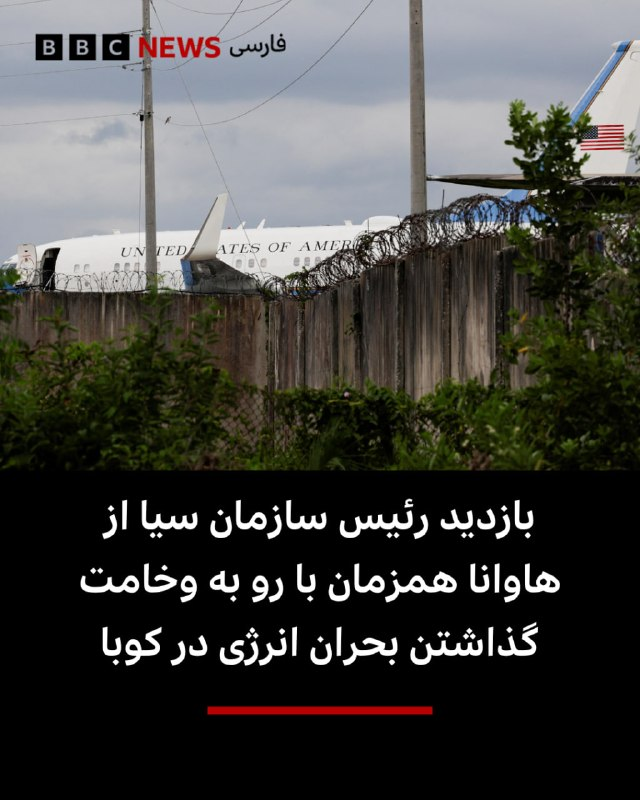

‌ ‌ ‌
دولت کوبا اعلام کرد که جان رتکلیف، رئیس سازمان سیا، پس از تمدید پیشنهاد کمک ۱۰۰ میلیون دلاری ایالات متحده برای کاهش اثرات محاصره نفتی، با همتای کوبایی خود در وزارت کشور در هاوانا دیدار کرده است.

در بیانیه‌ای که از سوی دولت کوبا منتشر شده گفته شده این دیدار تلاشی برای بهبود گفتگو بوده و به مقامات آمریکایی گفته شده است که هاوانا تهدیدی برای امنیت ملی ایالات متحده نیست.

کمبود سوخت مانند گازوئیل و نفت کوره، به دلیل فشار اعمال شده از سوی ایالات متحده بر تامین مواد ضروری این کشور کمونیستی تشدید شده و باعث شده بیمارستان‌های کوبا نتوانند به طور عادی کار کنند و مدارس و ادارات دولتی تعطیل شوند.

به طور جداگانه، میگل دیاز-کانل، رئیس جمهور کوبا، گفت که به جای ارائه کمک، اگر ایالات متحده محاصره خود را لغو کند، شرایط می‌تواند سریع‌تر بهبود یابد.

در بیانیه کوبا آمده است: «هر دو طرف همچنین بر علاقه خود به توسعه همکاری‌های دوجانبه بین سازمان‌های مجری قانون به نفع امنیت هر دو کشور و همچنین امنیت منطقه‌ای و بین‌المللی تاکید کردند.»

https://bbc.in/4wuy5vF
📷Reuters
@BBCPersian

## BBCPersian — post 281062

  

‌ ‌ ‌
وزارت خارجه ایتالیا اعلام کرد که پنج شهروند این کشور در یک حادثه غواصی در مالدیو جان باختند.

این وزارتخانه با بیان اینکه این اتفاق در جزیره واوو آتول رخ داده است، اعلام کرد: «گمان می‌رود غواصان هنگام تلاش برای کاوش غارها در عمق ۵۰ متری جان خود را از دست داده‌اند.»

ارتش مالدیو اعلام کرد که یک جسد در غاری در حدود ۶۰ متری زیر آب پیدا شده و گمان می‌رود چهار غواص دیگر نیز در آنجا باشند.

به گفته ارتش مالدیو غواصانی با تجهیزات ویژه به منطقه اعزام شده‌اند و عملیات جستجو را بسیار پرخطر توصیف کرده است.

اعتقاد بر این است که این حادثه بدترین حادثه غواصی در این کشور کوچک اقیانوس هند است که به دلیل رشته جزایر مرجانی خود، یک مقصد گردشگری محبوب است.

خدمه کشتی که غواص‌ها با آن سفر می‌کردند، پس از آنکه نتوانستند با غواص‌ها تماس برقرار کنند و آنها به سطح آب بازنگشتند، مفقود شدن آنها را گزارش کردند.

📷 Reinhard Dirscherl/ullstein bild via Getty Images
@BBCPersian

---
📅 بروزرسانی: 1405/02/25 03:11
---

## VahidOOnLine — post 240209

  

♦️تام کاتن، سناتور جمهوریخواه در واکنش به موج گزارش‌هایی که اخیرا در رسانه‌های جریان اصلی آمریکا به نقل از منابع ناشناس منتشر می‌شود و در آن به دسترسی به اطلاعات جاسوسی و محرمانه اشاره می‌شود در پیامی در اکس نوشت: «چند گزارش اخیر رسانه‌ای به «اطلاعات» درباره ایران، چین و موضوعات دیگر استناد کرده‌اند. من از گیومه استفاده می‌کنم، چون این «اطلاعات» که برخلاف این خبرنگاران لیبرال، خودم آن‌ها را خوانده‌ام اغلب بر پایه چیزهایی مانند داده‌های اقتصادی در دسترس عموم، بیانیه‌های دیپلماتیک، اطلاعات وزارت کشاورزی، شبکه‌های اجتماعی و بله، گزارش‌های رسانه‌ای استوار است. به عبارت دیگر، این‌ها اطلاعات واقعی حاصل از فعالیت جاسوس‌ها یا اطلاعات محرمانه نیستند. بنابراین وقتی عناصر دولت عمیق به‌صورت گزینشی مطالبی را به رسانه‌های لیبرال درز می‌دهند که تمام پیش‌داوری‌های از سر ترس، نرمش‌طلبانه و ضدآمریکایی آن‌ها را تایید می‌کند، پیشنهاد می‌کنم با دیده تردید به آن نگاه کنید»
‌🇸🇦 Indypersian

🤖 @VahidOOnLine

## VahidOOnLine — post 240208

  

تد باد، سناتور جمهوری‌خواه آمریکا، در حساب کاربری خود در ایکس نوشت جمهوری اسلامی بیش از ۴۷ سال به آمریکا و متحدانش حمله کرده و شهروندان آمریکایی را کشته است.
تد باد افزود در حالی که روسای‌جمهوری پیشین این موضوع را به تعویق می‌انداختند، دونالد ترامپ، رییس‌جمهوری آمریکا، در حال انجام کاری است که آن‌ها حاضر به انجامش نبودند.
او در عین حال تاکید کرد که آمریکا اکنون «در مسیری قرار گرفته که می‌تواند تهدید موشک‌های بالستیک و برنامه غنی‌سازی هسته‌ای جمهوری اسلامی را برای همیشه از بین ببرد.»

‌🏁 🇬🇧 IranintlTV

🤖 @VahidOOnLine

## VahidOOnLine — post 240207

  

گزارش‌ها حاکی است یک کشتی لنگر انداخته در نزدیکی بندر فجیره امارات متحده عربی توسط افراد ناشناس سوار شده و به سمت آب‌های ایران هدایت شده است.
به گزارش رویترز، شرکت امنیت دریایی وندگارد گفته است این اقدام احتمالا از سوی نیروهای ایرانی انجام شده و پیش از آن نیز نهاد دریایی «یو‌کی‌ام‌تی‌او»از ورود افراد غیرمجاز به این کشتی خبر داده بود.
هم‌زمان منابع دریایی از افزایش تحرکات در تنگه هرمز خبر داده‌اند. بر اساس گزارش‌ها، چندین کشتی از جمله نفتکش‌ها و کشتی‌های تجاری در روزهای اخیر با هماهنگی‌های محدود از این مسیر عبور کرده‌اند، در حالی که پیش‌تر تعداد عبور روزانه به شکل محسوسی کاهش یافته بود.
همچنین گزارش شده است نیروهای سپاه پاسداران اعلام کرده‌اند شمار بیشتری از شناورها در روزهای اخیر از تنگه هرمز عبور کرده‌اند؛ موضوعی که نشان‌دهنده تغییر تدریجی در وضعیت عبور و مرور دریایی در این آبراه راهبردی است.

‌🏁 🇬🇧 IranintlTV

🤖 @VahidOOnLine

## VahidOOnLine — post 240206

  

♦️دونالد ترامپ، رئیس‌جمهوری آمریکا، پنجشنبه شب با انتشار پیامی در شبکه اجتماعی «تروث سوشال» اعلام کرد روند «تضعیف نظامی جمهوری اسلامی» که به گفته او در دوره ریاست‌جمهوری‌اش آغاز شده، ادامه خواهد یافت.
ترامپ در این پیام، در کنار اشاره به آنچه دستاوردهای اقتصادی و نظامی دولت خود خواند، از «نابودی نظامی جمهوری اسلامی» نام برد و نوشت این روند «ادامه خواهد داشت».
او همچنین نوشت دولتش آمریکا را دوباره به یک قدرت اقتصادی و نظامی تبدیل کرده است
‌🇸🇦 Indypersian

🤖 @VahidOOnLine

## VahidOOnLine — post 240205

  

♦️اسکات بسنت، وزیر خزانه‌داری ایالات متحده، در گفتگو با شبکه سی‌ان‌بی‌سی گفت جمهوری اسلامی به‌دلیل فشارهای اقتصادی و محدودیت صادرات نفت، در «آخرین مراحل ضعف و فروپاشی» قرار دارد.

او با اشاره به محاصره بنادر جنوبی ایران از سوی آمریکا و تاسیسات نفتی جزیره خارک گفت: «در سه روز گذشته هیچ بارگیری‌ای انجام نشده است. ما معتقدیم مخازن ذخیره‌سازی آنها پر شده و دیگر نمی‌توانند نفت را روی آب ذخیره کنند. هیچ کشتی‌ای خارج یا وارد نمی‌شود و به‌زودی مجبور خواهند شد تولید نفت را کاهش دهند.»

بسنت افزود تصاویر ماهواره‌ای نشان می‌دهد این روند در حال وقوع است و تاکید کرد: «این یک حکومت شیطانی است. تا اینجای سال، بین ۳۰ تا ۴۰ هزار نفر را کشته‌اند که بسیاری از آنها معترضان مسالمت‌آمیز بوده‌اند.»

وزیر خزانه‌داری آمریکا گفت: «چگونه با چنین حکومتی برخورد می‌کنید؟ از نظر اقتصادی آن را تحت فشار قرار می‌دهید و ما معتقدیم به نقطه‌ای رسیده‌اند که سربازانشان حقوق دریافت نمی‌کنند و قادر نیستند ذخایر تسلیحاتی خود را از خارج تامین کنند.»

او در پایان گفت محاصره‌ای که دونالد ترامپ علیه جمهوری اسلامی اعمال کرده «موفقیتی بزرگ و قاطع» بوده است.
‌🇸🇦 Indypersian

🤖 @VahidOOnLine

## VahidOOnLine — post 240204

  

♦️مجلس نمایندگان آمریکا برای سومین بار به طرحی رای منفی داد که هدف آن محدود کردن اختیارات نظامی دونالد ترامپ در قبال ایران بود. این طرح که از سوی دموکرات‌ها ارائه شده بود، با نتیجه  ۲۱۲ رای موافق در برابر ۲۱۲ رای مخالف و به دلیل به حد نصاب نرسیدن آرا شکست خورد.
به گزارش سی‌بی‌اس، بر اساس این طرح، رئیس‌جمهوری آمریکا موظف می‌شد حداکثر ظرف ۳۰ روز پس از آغاز درگیری‌ها، نیروهای آمریکایی را از جنگ خارج کند؛ مگر اینکه کنگره مجوز ادامه عملیات را صادر کند.
جاش گاتهیمر، نماینده دموکرات نیوجرسی، در جریان جلسه بررسی این طرح گفت از اقدام دولت ترامپ علیه جمهوری اسلامی حمایت می‌کند، اما از اینکه دولت بدون ارائه توضیحات رسمی به کنگره عمل کرده، انتقاد کرد.
این رای‌گیری در شرایطی انجام شد که دولت ترامپ اعلام کرده آتش‌بس میان آمریکا و جمهوری اسلامی، مهلت قانونی ۶۰ روزه تعیین‌شده در قانون اختیارات جنگی را متوقف کرده است.
‌🇸🇦 Indypersian

🤖 @VahidOOnLine

## VahidOOnLine — post 240203

  

دونالد ترامپ، رییس‌جمهوری آمریکا، در پستی در شبکه اجتماعی تروث سوشال تاکید کرد «تضعیف نظامی حکومت ایران» در دوره دولت او است که انجام شده است.
ترامپ این موفقیت را در کنار مجموعه‌ای از دستاوردهای دولت خود ذکر و تاکید کرد این روند درباره جمهوری اسلامی همچنان «ادامه خواهد داشت».

‌🏁 🇬🇧 IranintlTV

🤖 @VahidOOnLine

## FoxNewsTwitter — post 341756

  

Fox News (Twitter/X)

NEW: President Trump says China’s leader was right about America’s decline under President Biden — but argues the U.S. has completely rebounded under his administration.

In a lengthy post, Trump touted booming markets, record investment, the "ending" of DEI, and what he called the “strongest military on earth by far,” while predicting a stronger relationship with China moving forward.

## mamlekate — post 103526

  

❓ جنگ اخیر، ۲۸ فوریه شروع شد و تا آتش‌بس یعنی ۸ آپریل ادامه پیدا کرد. این لیست تمامی زلزله‌های بالای ۴.۵ ریشتر تو ایران توی سایت USGS از ابتدای سال ۲۰۲۶ میلادی هست. دقیقا از تاریخ ۲۸ فوریه تا ۸ آپریل زلزله‌ای با شدت ۴.۵ و بیشتر ثبت نشده، ولی تعداد زیادی قبل و بعدش وجود داره. این همزمانی اگر چه می‌تونه «تصادفی» باشه اما می‌تونه هم مربوط به «فعالیت‌های جمهوری اسلامی» توی این بازه باشه.

@mamlekate

## IranIntlTV — post 337234

  

تد باد، سناتور جمهوری‌خواه آمریکا، در حساب کاربری خود در ایکس نوشت جمهوری اسلامی بیش از ۴۷ سال به آمریکا و متحدانش حمله کرده و شهروندان آمریکایی را کشته است.
تد باد افزود در حالی که روسای‌جمهوری پیشین این موضوع را به تعویق می‌انداختند، دونالد ترامپ، رییس‌جمهوری آمریکا، در حال انجام کاری است که آن‌ها حاضر به انجامش نبودند.
او در عین حال تاکید کرد که آمریکا اکنون «در مسیری قرار گرفته که می‌تواند تهدید موشک‌های بالستیک و برنامه غنی‌سازی هسته‌ای جمهوری اسلامی را برای همیشه از بین ببرد.»

https://iranintl.com/202605147923

## IranIntlTV — post 337233

  

گزارش‌ها حاکی است یک کشتی لنگر انداخته در نزدیکی بندر فجیره امارات متحده عربی توسط افراد ناشناس سوار شده و به سمت آب‌های ایران هدایت شده است.
به گزارش رویترز، شرکت امنیت دریایی وندگارد گفته است این اقدام احتمالا از سوی نیروهای ایرانی انجام شده و پیش از آن نیز نهاد دریایی «یو‌کی‌ام‌تی‌او»از ورود افراد غیرمجاز به این کشتی خبر داده بود.
هم‌زمان منابع دریایی از افزایش تحرکات در تنگه هرمز خبر داده‌اند. بر اساس گزارش‌ها، چندین کشتی از جمله نفتکش‌ها و کشتی‌های تجاری در روزهای اخیر با هماهنگی‌های محدود از این مسیر عبور کرده‌اند، در حالی که پیش‌تر تعداد عبور روزانه به شکل محسوسی کاهش یافته بود.
همچنین گزارش شده است نیروهای سپاه پاسداران اعلام کرده‌اند شمار بیشتری از شناورها در روزهای اخیر از تنگه هرمز عبور کرده‌اند؛ موضوعی که نشان‌دهنده تغییر تدریجی در وضعیت عبور و مرور دریایی در این آبراه راهبردی است.

https://iranintl.com/202605147292

## IranIntlTV — post 337232

  <a href="telegram/content/IranIntlTV_337232_1778802096.mp4" target="_blank">🎬 Download video</a>

پنج هفته پس از نصب دیوارنگاره‌ای با نشان جمهوری اسلامی و در حمایت از سپاه پاسداران در محله وست‌وود لس‌آنجلس، واکنش‌ها در میان ایرانیان ساکن این منطقه ادامه دارد.

گزارش نیلوفر منصوری، خبرنگار ایران‌اینترنشنال
@iranintltv

## IranIntlTV — post 337231

  

دونالد ترامپ، رییس‌جمهوری آمریکا، در پستی در شبکه اجتماعی تروث سوشال تاکید کرد «تضعیف نظامی حکومت ایران» در دوره دولت او است که انجام شده است.
ترامپ این موفقیت را در کنار مجموعه‌ای از دستاوردهای دولت خود ذکر و تاکید کرد این روند درباره جمهوری اسلامی همچنان «ادامه خواهد داشت».

https://iranintl.com/202605148199

## FarsiVOA — post 217780

🔺سفر نادر رئیس سیا به کوبا و انتقال پیام رئیس‌جمهوری آمریکا

▪️جان رتکلیف رئیس سازمان اطلاعات مرکزی آمریکا، سیا، روز پنج‌شنبه در سفری «سطح بالا» به کوبا، با مقام‌های ارشد وزارت کشور این کشور دیدار و گفت‌وگو کرد.

⬇️ بیشتر بخوانید:
https://ir.voanews.com/a/8150103.html
@FarsiVOA

## FarsiVOA — post 217779

⚡️شک مقام‌های جمهوری اسلامی به یکدیگر شکاف در حکومت را عمیق‌تر کرد؛ جنگ تهدیدها و تهمت‌ها

@FarsiVOA

## FarsiVOA — post 217778

⚡️نگرانی مسکو از گسترش تروریسم در افغانستان و پیامدهای آن برای ایران و دیگر کشورها
@FarsiVOA

## IranianMinds — post 20160

  

🔴 محمد قنطری، سرپرست جدید امور سوریه در واشنگتن دی‌سی.

@IranianMinds

## BBCPersian — post 281061

  

‌ ‌ ‌ ‌
الناز و الهه محمدی، خبرنگاران ایرانی از سوی بنیاد بین‌المللی زنان رسانه که در واشنگتن آمریکاست، به عنوان برندگان جایزه سال ۲۰۲۶ در زمینه «شجاعت در روزنامه‌نگاری» شدند.

این بنیاد روز پنجشنبه - ۱۴ مه / ۲۴ اردیبهشت - در بیانیه اعلام برندگان جوایز امسال گفت: «ما با افتخار فراوان اعلام می‌کنیم که برندگان جوایز «شجاعت در روزنامه‌نگاری» سال ۲۰۲۶ عبارتند از الهه محمدی و الناز محمدی از ایران.»

الهه محمدی، خبرنگار روزنامه هم‌میهن در سال ۱۴۰۱ به محل خاکسپاری مهسا امینی رفت و گزارشی از آن منتشر نمود و با شروع اعتراضات سراسری آن سال در ایران به همراه نیلوفر حامدی بازداشت و محاکمه شدند و بیش از یکسال در زندان بودند. خواهر او، الناز محمدی هم دبیر گروه جامعه روزنامه هم میهن است.

https://bbc.in/4eMEfRt
📷@parsaee_d
@BBCPersian

## BBCPersian — post 281060

🔻 راستی‌آزمایی بی‌بی‌سی؛ ادعاهای گمراه‌کننده درباره تشریفات لحظه رسیدن ترامپ و اوباما به پکن

ادعاهای گمراه‌کننده درباره مقایسه استقبال فرش قرمز از رئیس‌جمهور آمریکا، دونالد ترامپ، در سفر رسمی این هفته به پکن با استقبال کم‌تشریفات‌تر از باراک اوباما در سفرش به چین، میلیون‌ها بار در اینترنت دیده شده است.

بنی جانسون، مفسر محافظه‌کار آمریکایی، در شبکه ایکس نوشت: «وقتی اوباما به چین رفت، حتی برایش پله هم پای هواپیما نیاوردند»، و افزود: «ترامپ با استقبال قهرمانانه و فرش قرمز روبه‌رو شد.» این پست بیش از پنج میلیون بازدید داشته است.

بنی جانسون ویدیویی را نیز منتشر کرد که اوباما را هنگام پیاده شدن از پله‌های داخلی هواپیمای ایر فورس وان در زمان ورود به پکن در سال ۲۰۱۶ نشان می‌دهد.

اما آن سفر مربوط به نشست گروه ۲۰ بود که چین در همان سال میزبانی آن را بر عهده داشت؛ نه یک سفر رسمی دولتی مانند سفر کنونی دونالد ترامپ، که معمولا با تشریفات و مراسم بیشتری برای رهبران آمریکا همراه است.

مقایسه مناسب‌تر، سفر رسمی اوباما به چین در سال ۲۰۰۹ است. در آن سفر نیز مراسم استقبالی مشابه سفر آقای ترامپ برگزار شد؛ جایی که رئیس‌جمهور وقت آمریکا از پله‌های اصلی هوایپمای خصوصی روسای جمهوری آمریکا - ایر فورس وان - پایین آمد و توسط گارد احترام نظامی مورد استقبال قرار گرفت.

https://bbc.in/4ds1ttM
@BBCPersian

## Dirty_Kids — post 389479

  <a href="telegram/content/Dirty_Kids_389479_1778802099.webm" target="_blank">🎬 Download video</a>

☢️خفن ترین و‌ قدیمی ترین  انالیزور  ایران ینی دکتر بت 
👍 
🔴هیچ سایت بتی دوست نداره شما کانال دکتر بت رو پیدا کنین چون خیلی سود میکنید🤷‍♂ رایگان بهترین شرط هارو براتون میذاره حتی هزار تومن هم دریافت نمیکنه روزانه میتونی از پیش بینی فوتبال باهاش پول در بیاری…

## Dirty_Kids — post 389478

  <a href="telegram/content/Dirty_Kids_389478_1778802099.webm" target="_blank">🎬 Download video</a>

☢️خفن ترین و‌ قدیمی ترین  انالیزور  ایران ینی دکتر بت 
👍

🔴هیچ سایت بتی دوست نداره شما کانال دکتر بت رو پیدا کنین چون خیلی سود میکنید🤷‍♂

رایگان بهترین شرط هارو براتون میذاره
حتی هزار تومن هم دریافت نمیکنه
روزانه میتونی از پیش بینی فوتبال باهاش پول در بیاری 👌
A24
اگ اهل پیش بینی فوتبالی این کانال اصلا از دست ندین👇

✅https://t.me/+4_ADqwB9e-QwYjlk

✅https://t.me/+4_ADqwB9e-QwYjlk

## Dirty_Kids — post 389477

  

#بخوابیم

@Dirty_Kids 👻

## Dirty_Kids — post 389476

قضیه السیسی اگه نمیدونی این ویدیو کمکت میکنه

@Dirty_Kids 👻

## Dirty_Kids — post 389475

  

آیفونیا با کانفیگ پولی در حال خوندن پستای اندرویدیا که با وپن شیر 🌞 وصل شدن:

@Dirty_Kids 👻

## Dirty_Kids — post 389474

  <a href="telegram/content/Dirty_Kids_389474_1778802100.mp4" target="_blank">🎬 Download video</a>

🎙️خبرنگار : امیرعلی چرا اومدی تجمع؟
🧑امیرعلی : به عشق رهبر

🎙️خبرنگار : امیرعلی، مامان و بابات مجبورت کردن که بیای تجمعات؟

🧑امیرعلی : آره

@Dirty_Kids 👻

## Dirty_Kids — post 389473

  

کصمادرتون…
نسلتون رو ✌🏽 بار گائیدم…

@Dirty_Kids 👻

## alonews — post 120055

  

🌐 اینترنت رایگان و آزاد برای همه مردم

⚡ VPN رایگان
⚡ کانفیگ تست‌شده و پرسرعت
⚡ آپدیت روزانه
⚡ بدون قطعی و دردسر

@NetaazaadVPN
@NetaazaadVPN

اینجا فقط وصل میشی و راحت استفاده میکنی 🫡

👇
@NetaazaadVPN
@NetaazaadVPN
@NetaazaadVPN

## alonews — post 120054

  

🔴احتمالا ویزا مهدی طارمی به علت خدمت در سپاه صادر نشود
‼️

@AloSport

---
📅 بروزرسانی: 1405/02/25 02:13
---

## VahidOOnLine — post 240202

  

تام کاتن، سناتور جمهوری‌خواه آمریکا، در حساب کاربری ایکس خود نوشت «توافق‌های فاجعه‌بار» دوران باراک اوباما مسیر جاه‌طلبی‌های هسته‌ای جمهوری اسلامی را هموار کرد، اما ترامپ به این جاه‌طلبی‌ها پایان داد.
این سناتور نزدیک به دونالد ترامپ همچنین گفت: جمهوری اسلامی اکنون نسبت به ۱۰ ماه پیش «به‌مراتب ضعیف‌تر» شده است.

‌🏁 🇬🇧 IranintlTV

🤖 @VahidOOnLine

## VahidOOnLine — post 240201

  

مجلس نمایندگان آمریکا برای سومین بار به طرحی رای منفی داد که هدف آن محدود کردن اختیارات نظامی دونالد ترامپ در قبال حکومت ایران بود. این طرح در قالب قطعنامه‌ای از سوی دموکرات‌ها ارائه شده بود.
رای‌گیری روز پنجشنبه با نتیجه ۲۱۲ در برابر ۲۱۲ به تساوی رسید و در نهایت با اختلاف یک رای نتوانست به اکثریت لازم برسد و رد شد.
این سومین بار است که چنین ابتکاری برای مهار اختیارات نظامی رییس‌جمهوری در مجلس نمایندگان آمریکا شکست می‌خورد.
در جریان بررسی این طرح، جو گاتهایمر، نماینده دموکرات ایالت نیوجرسی، گفت از فشار بر حکومت ایران حمایت می‌کند اما دولت را به نگه داشتن کنگره «در تاریکی» بدون جلسات توجیهی رسمی، متهم کرد.

‌🏁 🇬🇧 IranintlTV

🤖 @VahidOOnLine

## VahidOOnLine — post 240200

  <a href="telegram/content/VahidOOnLine_240200_1778798639.mp4" target="_blank">🎬 Download video</a>

♦️یسرائیل کاتز، وزیر دفاع اسرائیل، پنجشنبه ۲۴ اردیبهشت‌ماه گفت کشورش برای احتمال انجام دوباره اقدام نظامی در ایران آمادگی دارد و «ماموریت اسرائیل هنوز تمام نشده است.»

او گفت: «ما باید اهداف این نبرد را به شکلی تکمیل کنیم که تضمین کند ایران دیگر هرگز تهدیدی برای موجودیت دولت اسرائیل، نیروهای ایالات متحده و کل دنیای آزاد در نسل‌های آینده نخواهد بود.»

وزیر دفاع اسرائیل افزود: «همان‌طور که پیش‌تر نیز گفته‌ام، ما آماده‌ایم و این احتمال وجود دارد که حتی در آینده‌ای نزدیک، بار دیگر برای تضمین تحقق این اهداف، دست به اقدام نظامی بزنیم.»

کاتز همچنین گفت جمهوری اسلامی در یک سال گذشته «ضربات بسیار سنگینی» متحمل شده است، اما اسرائیل همچنان به دنبال تکمیل اهداف عملیات خود است.
‌🇸🇦 Indypersian

🤖 @VahidOOnLine

## VahidOOnLine — post 240199

  <a href="telegram/content/VahidOOnLine_240199_1778798640.mp4" target="_blank">🎬 Download video</a>

مجلس نمایندگان آمریکا برای سومین بار قطعنامه‌ای را که هدف آن محدود کردن اختیارات جنگی دونالد ترامپ در جنگ با جمهوری اسلامی بود، رد کرد.

این قطعنامه دموکرات‌ها با نتیجه ۲۱۲ رأی موافق در برابر ۲۱۲ رأی مخالف، نتوانست اکثریت لازم را به دست آورد.

طرح مورد نظر که در ماه مارس ارائه شده بود، دولت ترامپ را ملزم می‌کرد حداکثر ظرف ۳۰ روز پس از آغاز جنگ، نیروهای آمریکایی را از درگیری خارج کند. جنگ میان آمریکا و جمهوری اسلامی از ۲۸ فوریه آغاز شده بود.

جاش گاتهیمر، نماینده دموکرات، گفت از «در هم کوبیدن رژیم ایران» حمایت می‌کند، اما دولت ترامپ را به پنهان نگه داشتن اطلاعات از کنگره متهم کرد.

بر اساس قانون اختیارات جنگی آمریکا مصوب ۱۹۷۳، رئیس‌جمهوری باید ظرف ۶۰ روز پس از آغاز درگیری، در صورت نداشتن مجوز کنگره، نیروهای نظامی را خارج کند.

دولت ترامپ اما اعلام کرده آتش‌بس ۷ آوریل باعث توقف شمارش این مهلت شده، زیرا از آن زمان «تبادل آتش» میان دو طرف رخ نداده است.

با این حال، تنش‌ها بر سر تنگه هرمز باعث شده آتش‌بس شکننده توصیف شود.

سه نماینده جمهوری‌خواه این بار به قطعنامه رأی مثبت دادند و در سنا نیز شماری از جمهوری‌خواهان به حمایت از طرح‌های محدودکننده اختیارات جنگی ترامپ نزدیک‌تر شده‌اند.

دموکرات‌ها گفته‌اند به طرح دوباره این قطعنامه‌ها ادامه خواهند داد. تیم کین، سناتور دموکرات، گفت: «روزی خواهد رسید که سنا به رئیس‌جمهوری خواهد گفت این جنگ را متوقف کن.»
‌🏁 🇬🇧 ManotoTV

🤖 @VahidOOnLine

## VahidOOnLine — post 240198

  

♦️به گزارش کانال ۱۴ تلویزیون اسرائیل، با وجود فروپاشی مذاکرات و اظهارات علنی دونالد ترامپ؛ عباس عراقچی، وزیر امور خارجه جمهوری اسلامی، همچنان در تماس مستقیم با مقام‌های آمریکایی است.
بر اساس اطلاعات کانال ۱۴، تهران اکنون خواستار برداشته‌شدن محاصره آمریکا به‌عنوان نخستین گام شده است.
در مقابل، جمهوری اسلامی دو گزینه را پیشنهاد داده است:
کاهش محدودیت‌های خود در تنگه هرمز، در حالی که همچنان هزینه عبور کشتی‌ها را دریافت کند
یا، آزادگذاشتن کامل عبور و مرور در تنگه هرمز در ازای دریافت صدها میلیارد دلار غرامت از آمریکا.
کانال ۱۴ می گوید، جمهوری اسلامی به‌شدت به پول نیاز دارد، اما تا این لحظه آمریکایی‌ها حاضر به پذیرش این پیشنهاد نشده‌اند.
‌🇸🇦 Indypersian

🤖 @VahidOOnLine

## VahidOOnLine — post 240197

  <a href="telegram/content/VahidOOnLine_240197_1778798642.mp4" target="_blank">🎬 Download video</a>

‌
مارکو روبیو، وزیر خارجه آمریکا، در گفت‌وگو با ان‌بی‌سی نیوز گفت دولت دونالد ترامپ اجازه نخواهد داد جمهوری اسلامی از فشارهای داخلی آمریکا برای تحمیل یک «توافق بد» استفاده کند.

روبیو گفت: «آنچه رئیس‌جمهوری روشن می‌کند این است که اگر ایرانی‌ها فکر می‌کنند می‌توانند از سیاست داخلی ما برای تحت فشار قرار دادن او جهت پذیرش یک توافق بد استفاده کنند، چنین اتفاقی نخواهد افتاد.»

او با اشاره به افزایش قیمت انرژی در آمریکا افزود واشنگتن اجازه نخواهد داد جمهوری اسلامی از موضوع تنگه هرمز و بازار نفت به‌عنوان اهرم فشار استفاده کند.

وزیر خارجه آمریکا همچنین گفت در صورت باز ماندن تنگه هرمز و ورود دوباره نفت ایران به بازار، قیمت نفت و بنزین کاهش خواهد یافت.

روبیو در ادامه هشدار داد دستیابی جمهوری اسلامی به سلاح هسته‌ای می‌تواند به کنترل دائمی تنگه هرمز از سوی تهران منجر شود.

او گفت: «اگر ایران به سلاح هسته‌ای دست پیدا کند، دیگر مسئله یک بحران سه‌ماهه یا شش‌ماهه نخواهد بود؛ ممکن است به یک مشکل دائمی تبدیل شود.»
‌🏁 🇬🇧 ManotoTV

🤖 @VahidOOnLine

## VahidOOnLine — post 240196

  <a href="telegram/content/VahidOOnLine_240196_1778798643.mp4" target="_blank">🎬 Download video</a>

صندوق بین‌المللی پول هشدار داد ادامه اختلال‌ها ناشی از جنگ ایران، اقتصاد جهانی را به سمت «سناریوی نامطلوب» سوق می‌دهد؛ سناریویی که با کاهش رشد اقتصادی و افزایش خطر تورم همراه خواهد بود.

این نهاد بین‌المللی اعلام کرد در صورت ادامه‌دار شدن جنگ و تداوم افزایش قیمت نفت، چشم‌انداز اقتصاد جهان می‌تواند به‌مراتب بدتر شود.

صندوق بین‌المللی پول پیش‌تر در گزارش «چشم‌انداز اقتصاد جهانی» پیش‌بینی کرده بود رشد اقتصاد جهان در سال ۲۰۲۶ در سناریوی پایه به ۳.۱ درصد برسد.

اما بر اساس اعلام این نهاد، در سناریوی «نامطلوب» —شامل بالا ماندن طولانی‌مدت قیمت نفت، بی‌ثبات شدن انتظارات تورمی و سخت‌تر شدن شرایط مالی — رشد جهانی ممکن است تا ۲.۵ درصد کاهش پیدا کند.
‌🏁 🇬🇧 ManotoTV

🤖 @VahidOOnLine

## VahidOOnLine — post 240195

  

♦️دونالد ترامپ، رئیس‌جمهوری ایالات متحده، با انتشار پیامی در شبکه اجتماعی «تروث سوشال» نوشت وقتی شی جین‌پینگ «بسیار مودبانه» از آمریکا به‌عنوان کشوری که «شاید در حال افول باشد» یاد کرد، منظور او آسیبی بود که ایالات متحده در چهار سال دولت جو بایدن متحمل شد.

ترامپ نوشت: «کشور ما به‌دلیل مرزهای باز، مالیات‌های بالا، ترویج تغییر جنسیت، حضور مردان در ورزش زنان، سیاست‌های تنوع و برابری و شمول، توافق‌های تجاری فاجعه‌بار، افزایش گسترده جرم‌وجنایت و خیلی چیزهای دیگر، آسیب عظیمی دید.»

او افزود شی جین‌پینگ درباره «رشد فوق‌العاده» آمریکا در ۱۶ ماه دولت ترامپ صحبت نمی‌کرد؛ دوره‌ای که به گفته او شامل «رکوردشکنی بازار سهام و حساب‌های پس‌انداز بازنشستگی، پیروزی نظامی و روابط رو‌به‌رشد در ونزوئلا، درهم‌کوبیدن نظامی ایران (ادامه دارد!)، قدرتمندترین ارتش جهان، بازگشت آمریکا به جایگاه قدرت اقتصادی، سرمایه‌گذاری ۱۸ تریلیون دلاری در آمریکا، بهترین بازار کار تاریخ ایالات متحده با بیشترین تعداد شاغلان و پایان دادن به سیاست‌های تنوع و شمول» بوده است.

ترامپ همچنین نوشت: «در واقع، رئیس‌جمهوری شی بابت این همه موفقیت بزرگ در چنین مدت کوتاهی به من تبریک گفت.»

او در پایان تاکید کرد: «دو سال پیش، ما واقعا کشوری در حال افول بودیم. در این مورد کاملا با رئیس‌جمهوری شی موافقم. اما حالا ایالات متحده داغ‌ترین و پررونق‌ترین کشور جهان است و امیدوارم روابط ما با چین قوی‌تر و بهتر از هر زمان دیگری شود.»
‌🇸🇦 Indypersian

🤖 @VahidOOnLine

## VahidOOnLine — post 240194

  

♦️عبدالحلیم خان، امام جماعت ۵۴ ساله ساکن شرق لندن، به دلیل سال‌ها آزار جنسی و تجاوز به هفت زن و دختر، از جمله کودکان ۱۳ ساله، به حبس ابد محکوم شد. این امام جماعت که بین سال‌های ۲۰۰۵ تا ۲۰۱۴ از جایگاه مذهبی خود سوءاستفاده می‌کرد، با ادعای تسخیر شدن توسط «جن» و داشتن قدرت‌های ماورایی، قربانیان را به مکان‌های خلوت می‌کشاند و آن‌ها را مورد تعرض قرار می‌داد. دادستانی بریتانیا فاش کرد که او با ارعاب قربانیان و تهدید به استفاده از «جادوی سیاه» علیه خانواده‌هایشان، آن‌ها را سال‌ها به سکوت واداشته بود. قاضی دادگاه «اسنرز‌بروک» با «هیولاوار» خواندن اقدامات این مرد، تاکید کرد که او پشت نقاب دینداری، از اعتماد زنان برای ارضای جنسی خود سوءاستفاده کرده است. این پرونده زمانی فاش شد که کوچک‌ترین قربانی در سال ۲۰۱۸ موضوع را به معلم مدرسه‌اش گزارش داد. عبدالحلیم خان که به ۲۱ فقره جرم از جمله تجاوز به کودکان زیر ۱۳ سال محکوم شده، باید حداقل ۲۰ سال از دوران حبس خود را پیش از امکان درخواست تخفیف، در زندان سپری کند.
‌🇸🇦 Indypersian

🤖 @VahidOOnLine

## VahidOOnLine — post 240193

  

بنیامین نتانیاهو در مراسم روز اورشلیم در «تپه مهمات» اعلام کرد جمهوری اسلامی «ضعیف‌تر از همیشه» شده است و اسرائیل به مقابله قاطع با «تهدیدهای اسلام افراطی» ادامه خواهد داد.
نخست‌وزیر اسرائیل همچنین گفت اگر اسرائیل در سال ۲۰۲۵ و اوایل امسال به برنامه‌های هسته‌ای و موشکی ایران حمله نکرده بود، حکومت ایران اکنون به سلاح هسته‌ای دست یافته بود.
نتانیاهو با اشاره به درگیری‌های اخیر با جمهوری اسلامی، حماس و حزب‌الله گفت اقدامات نظامی اسرائیل و همکاری نزدیک‌تر با دولت ترامپ «چهره خاورمیانه را تغییر داده است.»
او همچنین تاکید کرد اورشلیم «برای همیشه» تحت کنترل اسرائیل باقی خواهد ماند.

‌🏁 🇬🇧 IranintlTV

🤖 @VahidOOnLine

## WithYashar — post 11253

https://t.me/boost/withyashar

## WithYashar — post 11252

آقا ما استیکر حامله میخوایم

## WithYashar — post 11251

ترامپ در تروث : «وقتی رئیس‌جمهور شی با بیانی بسیار سنجیده از ایالات متحده به‌عنوان کشوری که شاید در حال افول باشد یاد کرد، منظور او آسیب عظیمی بود که ما در چهار سال دوران جو بایدنِ خواب‌آلود و دولت بایدن متحمل شدیم؛ و در این مورد، او صددرصد درست می‌گفت.

کشور ما با مرزهای باز، مالیات‌های سنگین، ترویج تغییر جنسیت برای همه، حضور مردان در ورزش زنان، سیاست‌های موسوم به تنوع و شمول، توافق‌های تجاری وحشتناک، جرم و جنایت گسترده و بسیاری مسائل دیگر، آسیب غیرقابل‌تصوری دید!
@withyashar
رئیس‌جمهور شی به هیچ‌وجه به رشد شگفت‌انگیزی اشاره نمی‌کرد که ایالات متحده در طول شانزده ماه فوق‌العاده دولت ترامپ به جهان نشان داده است؛ دورانی که شامل رکورد تاریخی بازار بورس و صندوق‌های بازنشستگی، پیروزی نظامی و روابط شکوفا با ونزوئلا، درهم‌کوبیدن نظامی ایران (ادامه دارد!)، قدرتمندترین ارتش جهان با اختلاف بسیار زیاد، تبدیل دوباره آمریکا به یک قدرت اقتصادی عظیم، جذب رکورد هجده تریلیون دلار سرمایه‌گذاری خارجی در آمریکا، بهترین بازار کار تاریخ ایالات متحده با بیشترین تعداد شاغلان تاریخ کشور، پایان دادن به سیاست‌های ویرانگر موسوم به تنوع و شمول و بسیاری موفقیت‌های دیگر بوده که فهرست کردن همه آنها ممکن نیست.

در حقیقت، رئیس‌جمهور شی بابت این همه موفقیت بزرگ در چنین مدت کوتاهی به من تبریک گفت.

دو سال پیش، ما واقعاً کشوری در حال افول بودیم. در این مورد کاملاً با رئیس‌جمهور شی موافقم! اما حالا ایالات متحده داغ‌ترین و پررونق‌ترین کشور جهان است و امیدوارم رابطه ما با چین از همیشه قوی‌تر و بهتر باشد!»
@withyashar

## mwarmonitor — post 9104

🇨🇳شی جین پینگ: رئیس‌جمهور ترامپ، از ملاقات با شما در پکن بسیار خوشحالم. پس از نه سال، به چین خوش آمدید. تمام دنیا نظاره‌گر ملاقات ما هستند. در حال حاضر، دگرگونی‌هایی که در یک قرن اخیر دیده نشده، در سراسر جهان در حال شتاب گرفتن است و وضعیت بین‌المللی متغیر…

## mwarmonitor — post 9103

🇨🇳شی جین پینگ: رئیس‌جمهور ترامپ، از ملاقات با شما در پکن بسیار خوشحالم. پس از نه سال، به چین خوش آمدید.
تمام دنیا نظاره‌گر ملاقات ما هستند. در حال حاضر، دگرگونی‌هایی که در یک قرن اخیر دیده نشده، در سراسر جهان در حال شتاب گرفتن است و وضعیت بین‌المللی متغیر و پر از تلاطم است. جهان به یک دوراهی جدید رسیده است.
آیا چین و ایالات متحده می‌توانند بر **«تله توسیدید» غلبه کنند؟
آیا می‌توانیم الگوی جدیدی از روابط میان کشورهای بزرگ ایجاد کنیم؟
آیا می‌توانیم با هم با چالش‌های جهانی مقابله کرده و ثبات بیشتری برای جهان فراهم کنیم؟
آیا می‌توانیم در راستای رفاه دو ملت و آینده بشریت، آینده‌ای روشن‌تر برای روابط دوجانبه‌مان بسازیم؟ این‌ها سوالات حیاتی برای تاریخ، جهان و مردم هستند. این‌ها سوالات زمانه ما هستند که من و شما به عنوان رهبران کشورهای بزرگ باید به آن‌ها پاسخ دهیم.
امسال دویست و پنجاهمین سالگرد استقلال آمریکا است. این مناسبت را به شما و مردم آمریکا تبریک می‌گویم. من همیشه معتقدم که منافع مشترک دو کشور ما بیشتر از اختلافاتمان است.
موفقیت در یکی، فرصتی برای دیگری است و یک رابطه دوجانبه پایدار به نفع جهان است.
چین و ایالات متحده هر دو از همکاری سود می‌برند و از تقابل آسیب می‌بینند. ما باید شریک باشیم، نه رقیب. باید به موفقیت یکدیگر کمک کنیم و با هم شکوفا شویم و راه صحیح تعامل کشورهای بزرگ با یکدیگر را در عصر جدید بیابیم.
آقای رئیس‌جمهور، من مشتاقانه منتظر گفتگوهایمان درباره مسائل مهم برای دو کشور و جهان هستم. همچنین مشتاق همکاری با شما برای تعیین مسیر و هدایت کشتی عظیم روابط چین و آمریکا هستم تا سال ۲۰۲۶ را به یک سال تاریخی و ماندگار تبدیل کنیم که فصل جدیدی در روابط دو کشور باز می‌کند.
در اینجا مکث می‌کنم و سخن را به شما می‌سپارم، آقای رئیس‌جمهور. متشکرم.

**«تله توسیدید» (Thucydides Trap) یک اصطلاح در علوم سیاسی و روابط بین‌الملل است که به وضعیتی خطرناک اشاره دارد: وقتی یک قدرت نوظهور (مثل چین) تهدیدی برای جایگزینی یک قدرت حاکم (مثل آمریکا) ایجاد می‌کند، احتمال وقوع جنگ بین آن‌ها بسیار بالا می‌رود.

@mwarmonitor

## mwarmonitor — post 9102

  <a href="telegram/content/mwarmonitor_9102_1778798645.mp4" target="_blank">🎬 Download video</a>

🎬 Video

## mwarmonitor — post 9101

🔴ترامپ در سوشال تروث

زمانی که پرزیدنت شی (رئیس‌جمهور چین) خیلی باظرافت به ایالات متحده به عنوان کشوری اشاره کرد که شاید در حال زوال باشد، منظورش آسیب‌های عظیمی بود که ما طی چهار سالِ «جوی بایدن خواب‌آلود» و دولت بایدن متحمل شدیم؛ و در این مورد، او ۱۰۰ درصد درست می‌گفت. کشور ما با مرزهای باز، مالیات‌های بالا، [ترویج] تراجنسیتی برای همه، حضور مردان در ورزش‌های زنان، DEI (برنامه‌های تنوع، برابری و فراگیری)، قراردادهای تجاری وحشتناک، جرم و جنایت افسارگسیخته و موارد بسیار دیگر، آسیب‌های بی‌شماری دید!
پرزیدنت شی به رشد فوق‌العاده‌ای که ایالات متحده طی ۱۶ ماه درخشانِ دولت ترامپ به جهان نشان داده است، اشاره نمی‌کرد؛ دوره‌ای که شامل اوج‌گیری همیشگی بازار سهام و حساب‌های بازنشستگی (401K)، پیروزی نظامی و رابطه شکوفا در ونزوئلا، و درهم‌کوبیدن نظامی ایران (ادامه دارد!) بود — قوی‌ترین ارتش روی زمین با فاصله زیاد، تبدیل شدن دوباره به یک قدرت اقتصادی با رکورد ۱۸ تریلیون دلار سرمایه‌گذاری دیگران در ایالات متحده، بهترین بازار کار در تاریخ ایالات متحده با بیشترین تعداد افراد شاغل در کشور نسبت به هر زمان دیگری، پایان دادن به طرح‌های مخرب کشور (DEI) و بسیاری چیزهای دیگر که فهرست کردن سریع آن‌ها غیرممکن است. در واقع، پرزیدنت شی بابت موفقیت‌های عظیمِ بسیار در چنین مدت کوتاهی به من تبریک گفت.
دو سال پیش، ما در واقع ملتی در حال زوال بودیم. در این مورد، من کاملاً با پرزیدنت شی موافقم! اما اکنون، ایالات متحده جذاب‌ترین (داغ‌ترین) کشور در هر کجای جهان است و امیدوارم رابطه ما با چین قوی‌تر و بهتر از همیشه باشد!

@mwarmonitor

## FoxNewsTwitter — post 341755

  <a href="telegram/content/FoxNewsTwitter_341755_1778798647.mp4" target="_blank">🎬 Download video</a>

Fox News (Twitter/X)

“People can’t feed themselves.”

AOC ripped the Trump administration over spending on the National Mall reflecting pool and the planned White House ballroom, arguing that Americans are struggling to afford groceries, rent, and mortgages.

She called the priorities “deeply out of touch” and “insulting” to everyday people.

## DEJradio — post 4637

  <a href="telegram/content/DEJradio_4637_1778798649.mp4" target="_blank">🎬 Download video</a>

🚨
🔸 خبر ۲۱
پنجشنبه ۲۴ اردیبهشت ۱۴۰۵

#خبر۲۱
@DEJradio

## VahidOnline — post 75470

  

پست ترامپ درباره سخنان رئیس‌جمهور چین: آمریکا دیگر در حال افول نیست

ترجمه ماشین: وقتی رئیس‌جمهور شی با ظرافت بسیار از ایالات متحده به‌عنوان کشوری که شاید در حال افول باشد یاد کرد، منظور او خسارت عظیمی بود که ما در چهار سال دوران جو بایدن خواب‌آلود و دولت بایدن متحمل شدیم؛ و از این نظر، او ۱۰۰ درصد درست می‌گفت. کشور ما با مرزهای باز، مالیات‌های بالا، تراجنسیتی‌سازی برای همه، حضور مردان در ورزش زنان، DEI، توافق‌های تجاری وحشتناک، جرم و جنایت گسترده و بسیاری چیزهای دیگر، به‌شدت آسیب دید!

رئیس‌جمهور شی به خیزش شگفت‌انگیزی اشاره نمی‌کرد که ایالات متحده در ۱۶ ماه تماشایی دولت ترامپ به جهان نشان داده است؛ از جمله رکوردهای تاریخی در بازار سهام و حساب‌های بازنشستگی 401K، پیروزی نظامی و روابط شکوفا در ونزوئلا، نابودی نظامی ایران — که ادامه خواهد داشت! — قدرتمندترین ارتش روی زمین با فاصله‌ای بسیار زیاد، تبدیل دوباره آمریکا به یک ابرقدرت اقتصادی، با سرمایه‌گذاری بی‌سابقه ۱۸ تریلیون دلاری دیگران در ایالات متحده، بهترین بازار کار تاریخ آمریکا، با شمار افرادی که اکنون در ایالات متحده کار می‌کنند بیش از هر زمان دیگری، پایان دادن به DEI ویرانگر کشور، و آن‌قدر دستاوردهای دیگر که فهرست کردن فوری آن‌ها ناممکن است. در واقع، رئیس‌جمهور شی به‌خاطر موفقیت‌های عظیم بسیار در چنین مدت کوتاهی به من تبریک گفت.

دو سال پیش، ما در واقع ملتی در حال افول بودیم. در این مورد، من کاملاً با رئیس‌جمهور شی موافقم! اما اکنون، ایالات متحده داغ‌ترین کشور در هر جای جهان است، و امیدوارم رابطه ما با چین از همیشه قوی‌تر و بهتر شود!
realDonaldTrump

📡 @VahidOnline

## VahidOnline — post 75469

  

همزمان با سفر «دونالد ترامپ» رییس‌جمهور آمریکا به چین، رهبران ۲۶کشور دیگر نیز روز پنجشنبه ۲۴اردیبهشت۱۴۰۵ در بیانیه‌ای مشترک خواهان بازگشت وضعیت عادی دریانوردی در تنگه هرمز شدند.

این بیانیه که توسط کشورهایی مانند بریتانیا، فرانسه، بحرین، کانادا، آلمان، ژاپن، قطر و کره جنوبی امضا شده است بر «تعهد خود به استفاده از ظرفیت‌های جمعی دیپلماتیک، اقتصادی و نظامی برای حمایت از آزادی ناوبری در تنگه هرمز» تأکید کردند.

در این بیانیه آمده است: «کشتیرانی باید آزاد باشد، مطابق با مفاد کنوانسیون سازمان ملل متحد درباره حقوق دریاهاو حقوق بین‌الملل.»
@VahidHeadline

📡 @VahidOnline

## IranIntlTV — post 337230

  

تام کاتن، سناتور جمهوری‌خواه آمریکا، در حساب کاربری ایکس خود نوشت «توافق‌های فاجعه‌بار» دوران باراک اوباما مسیر جاه‌طلبی‌های هسته‌ای جمهوری اسلامی را هموار کرد، اما ترامپ به این جاه‌طلبی‌ها پایان داد.
این سناتور نزدیک به دونالد ترامپ همچنین گفت: جمهوری اسلامی اکنون نسبت به ۱۰ ماه پیش «به‌مراتب ضعیف‌تر» شده است.

https://iranintl.com/202605140230

## IranIntlTV — post 337229

  <a href="telegram/content/IranIntlTV_337229_1778798652.mp4" target="_blank">🎬 Download video</a>

همزمان با آغاز دور جدید مذاکرات مستقیم اسرائیل و لبنان، مقام‌های لبنانی بر آتش‌بس فوری و توقف حملات اسرائیل به جنوب لبنان به‌عنوان اولویت اصلی تاکید کردند.

این مذاکرات در شرایطی برگزار می‌شود که آتش‌بس پیشین همچنان شکننده است و تنش‌ها در جنوب لبنان ادامه دارد.

گفت‌وگو با منشه امیر، کارشناس امور خاورمیانه
@iranintltv

## IranIntlTV — post 337228

  <a href="telegram/content/IranIntlTV_337228_1778798653.mp4" target="_blank">🎬 Download video</a>

دونالد ترامپ پس از دیدار با شی جین‌پینگ پیشنهاد داد چین برای بازگشایی تنگه هرمز کمک کند.

ترامپ همچنین گفت شی به او اطمینان داده چین تجهیزات نظامی در اختیار تهران قرار نخواهد داد.

گزارش امیر گیتی، عضو تحریریه ایران‌اینترنشنال
@iranintltv

## IranIntlTV — post 337227

  

مجلس نمایندگان آمریکا برای سومین بار به طرحی رای منفی داد که هدف آن محدود کردن اختیارات نظامی دونالد ترامپ در قبال حکومت ایران بود. این طرح در قالب قطعنامه‌ای از سوی دموکرات‌ها ارائه شده بود.
رای‌گیری روز پنجشنبه با نتیجه ۲۱۲ در برابر ۲۱۲ به تساوی رسید و در نهایت با اختلاف یک رای نتوانست به اکثریت لازم برسد و رد شد.
این سومین بار است که چنین ابتکاری برای مهار اختیارات نظامی رییس‌جمهوری در مجلس نمایندگان آمریکا شکست می‌خورد.
در جریان بررسی این طرح، جو گاتهایمر، نماینده دموکرات ایالت نیوجرسی، گفت از فشار بر حکومت ایران حمایت می‌کند اما دولت را به نگه داشتن کنگره «در تاریکی» بدون جلسات توجیهی رسمی، متهم کرد.

https://iranintl.com/202605146155

## IranIntlTV — post 337226

  <a href="https://t.me/IranintlTV/337226" target="_blank">📎 Download file</a>

🎧نسخه صوتی برنامه با کامبیز حسینی؛ اگر یک جمله فرصت داشتید با ایران حرف بزنید، چه می‌گفتید؟
@iranintlTV

## IranIntlTV — post 337225

  

بنیامین نتانیاهو در مراسم روز اورشلیم در «تپه مهمات» اعلام کرد جمهوری اسلامی «ضعیف‌تر از همیشه» شده است و اسرائیل به مقابله قاطع با «تهدیدهای اسلام افراطی» ادامه خواهد داد.
نخست‌وزیر اسرائیل همچنین گفت اگر اسرائیل در سال ۲۰۲۵ و اوایل امسال به برنامه‌های هسته‌ای و موشکی ایران حمله نکرده بود، حکومت ایران اکنون به سلاح هسته‌ای دست یافته بود.
نتانیاهو با اشاره به درگیری‌های اخیر با جمهوری اسلامی، حماس و حزب‌الله گفت اقدامات نظامی اسرائیل و همکاری نزدیک‌تر با دولت ترامپ «چهره خاورمیانه را تغییر داده است.»
او همچنین تاکید کرد اورشلیم «برای همیشه» تحت کنترل اسرائیل باقی خواهد ماند.

https://iranintl.com/202605146830

## Shin_Persian — post 6002

  

Shin ✓ @hey_itsmyturn Thu, 14 May 2026 21:45:19 UTC President Trump @POTUS: "When President Xi very elegantly referred to the United States as perhaps being a declining nation, he was referring to the tremendous damage we suffered during the four years of…

## Shin_Persian — post 6001

Shin ✓ @hey_itsmyturn
Thu, 14 May 2026 21:45:19 UTC

President Trump @POTUS:
"When President Xi very elegantly referred to the United States as perhaps being a declining nation, he was referring to the tremendous damage we suffered during the four years of Sleepy Joe Biden and the Biden Administration, and on that score, he was 100% correct. Our Country suffered immeasurably with open borders, high taxes, transgender for everybody, men in women’s sports, DEI, horrible trade deals, rampant crime, and so much more! President Xi was not referring to the incredible rise that the United States has displayed to the world during the 16 spectacular months of the Trump Administration, which includes all-time high stock markets and 401K’s, military victory and thriving relationship in Venezuela, the military decimation of Iran (to be continued!) — Strongest military on earth by far, economic powerhouse again, with a record 18 trillion dollars being invested into the United States by others, best U.S. job market in history, with more people working in the United States right now than ever before, ending country destroying DEI, and so many other things that it would be impossible to readily list. In fact, President Xi congratulated me on so many tremendous successes in such a short period of time.Two years ago, we were, in fact, a Nation in decline. On that, I fully agree with President Xi! But now, the United States is the hottest Nation anywhere in the world, and hopefully our relationship with China will be stronger and better than ever before!"

ترجمه فارسی در بخش نظرات

𝕏 · @shin_persian

## ManotoTV — post 105467

  <a href="telegram/content/ManotoTV_105467_1778798657.mp4" target="_blank">🎬 Download video</a>

مجلس نمایندگان آمریکا برای سومین بار قطعنامه‌ای را که هدف آن محدود کردن اختیارات جنگی دونالد ترامپ در جنگ با جمهوری اسلامی بود، رد کرد.

این قطعنامه دموکرات‌ها با نتیجه ۲۱۲ رأی موافق در برابر ۲۱۲ رأی مخالف، نتوانست اکثریت لازم را به دست آورد.

طرح مورد نظر که در ماه مارس ارائه شده بود، دولت ترامپ را ملزم می‌کرد حداکثر ظرف ۳۰ روز پس از آغاز جنگ، نیروهای آمریکایی را از درگیری خارج کند. جنگ میان آمریکا و جمهوری اسلامی از ۲۸ فوریه آغاز شده بود.

جاش گاتهیمر، نماینده دموکرات، گفت از «در هم کوبیدن رژیم ایران» حمایت می‌کند، اما دولت ترامپ را به پنهان نگه داشتن اطلاعات از کنگره متهم کرد.

بر اساس قانون اختیارات جنگی آمریکا مصوب ۱۹۷۳، رئیس‌جمهوری باید ظرف ۶۰ روز پس از آغاز درگیری، در صورت نداشتن مجوز کنگره، نیروهای نظامی را خارج کند.

دولت ترامپ اما اعلام کرده آتش‌بس ۷ آوریل باعث توقف شمارش این مهلت شده، زیرا از آن زمان «تبادل آتش» میان دو طرف رخ نداده است.

با این حال، تنش‌ها بر سر تنگه هرمز باعث شده آتش‌بس شکننده توصیف شود.

سه نماینده جمهوری‌خواه این بار به قطعنامه رأی مثبت دادند و در سنا نیز شماری از جمهوری‌خواهان به حمایت از طرح‌های محدودکننده اختیارات جنگی ترامپ نزدیک‌تر شده‌اند.

دموکرات‌ها گفته‌اند به طرح دوباره این قطعنامه‌ها ادامه خواهند داد. تیم کین، سناتور دموکرات، گفت: «روزی خواهد رسید که سنا به رئیس‌جمهوری خواهد گفت این جنگ را متوقف کن.»

## ManotoTV — post 105466

  <a href="telegram/content/ManotoTV_105466_1778798657.mp4" target="_blank">🎬 Download video</a>

‌
مارکو روبیو، وزیر خارجه آمریکا، در گفت‌وگو با ان‌بی‌سی نیوز گفت دولت دونالد ترامپ اجازه نخواهد داد جمهوری اسلامی از فشارهای داخلی آمریکا برای تحمیل یک «توافق بد» استفاده کند.

روبیو گفت: «آنچه رئیس‌جمهوری روشن می‌کند این است که اگر ایرانی‌ها فکر می‌کنند می‌توانند از سیاست داخلی ما برای تحت فشار قرار دادن او جهت پذیرش یک توافق بد استفاده کنند، چنین اتفاقی نخواهد افتاد.»

او با اشاره به افزایش قیمت انرژی در آمریکا افزود واشنگتن اجازه نخواهد داد جمهوری اسلامی از موضوع تنگه هرمز و بازار نفت به‌عنوان اهرم فشار استفاده کند.

وزیر خارجه آمریکا همچنین گفت در صورت باز ماندن تنگه هرمز و ورود دوباره نفت ایران به بازار، قیمت نفت و بنزین کاهش خواهد یافت.

روبیو در ادامه هشدار داد دستیابی جمهوری اسلامی به سلاح هسته‌ای می‌تواند به کنترل دائمی تنگه هرمز از سوی تهران منجر شود.

او گفت: «اگر ایران به سلاح هسته‌ای دست پیدا کند، دیگر مسئله یک بحران سه‌ماهه یا شش‌ماهه نخواهد بود؛ ممکن است به یک مشکل دائمی تبدیل شود.»

## ManotoTV — post 105465

  <a href="telegram/content/ManotoTV_105465_1778798659.mp4" target="_blank">🎬 Download video</a>

صندوق بین‌المللی پول هشدار داد ادامه اختلال‌ها ناشی از جنگ ایران، اقتصاد جهانی را به سمت «سناریوی نامطلوب» سوق می‌دهد؛ سناریویی که با کاهش رشد اقتصادی و افزایش خطر تورم همراه خواهد بود.

این نهاد بین‌المللی اعلام کرد در صورت ادامه‌دار شدن جنگ و تداوم افزایش قیمت نفت، چشم‌انداز اقتصاد جهان می‌تواند به‌مراتب بدتر شود.

صندوق بین‌المللی پول پیش‌تر در گزارش «چشم‌انداز اقتصاد جهانی» پیش‌بینی کرده بود رشد اقتصاد جهان در سال ۲۰۲۶ در سناریوی پایه به ۳.۱ درصد برسد.

اما بر اساس اعلام این نهاد، در سناریوی «نامطلوب» —شامل بالا ماندن طولانی‌مدت قیمت نفت، بی‌ثبات شدن انتظارات تورمی و سخت‌تر شدن شرایط مالی — رشد جهانی ممکن است تا ۲.۵ درصد کاهش پیدا کند.

## FarsiVOA — post 217777

🔺دونالد ترامپ: نابودی نظامی جمهوری اسلامی ادامه خواهد یافت

◾️دونالد ترامپ، رئیس جمهوری آمریکا در پستی که در شکبه اجتماعی تروت‌سوشال منتشر کرد گفت نابودی نظامی جمهوری اسلامی ایران «ادامه» خواهد یافت.

⬇️ بیشتر بخوانید:
https://ir.voanews.com/a/8150091.html
@FarsiVOA

## FarsiVOA — post 217776

🔺وزارت امور خارجه آمریکا: ماموریت امحا اورانیوم غنی‌شده ونزوئلا به‌طور کامل اجرا شد

◾️وزارت امور خارجه آمریکا روز پنجشنبه ۲۴ اردیبهشت در بیانیه‌ای اعلام کرد، اورانیوم‌های غنی شده ونزوئلا با درجه خلوص بالا که اوایل ماه جاری میلادی از ونزوئلا به آمریکا منتقل شده بود، در تاسیسات «ساوانا ریور سایت» متعلق به وزارت انرژی آمریکا در کارولینای جنوبی، امحا شد.

⬇️ بیشتر بخوانید:
https://ir.voanews.com/a/8150089.html
@FarsiVOA

## IranianMinds — post 20159

  

🔴پست جدید ترامپ:

ایالت 243ام.

@IranianMinds

## IranianMinds — post 20158

92.122.123.128 65.109.34.234 94.130.70.160 63.141.252.203 94.130.50.12 50.7.5.83 142.54.178.211 94.130.33.41 144.76.1.88 138.201.54.122 95.216.69.37 94.130.13.19 این ایپی هارو‌ هم تست کنید @IranianMinds

## IranianMinds — post 20157

  

🔴 ترامپ :

وقتی رئیس‌جمهور شی به‌ طور محترمانه آمریکا را کشور در حال افول نامید، منظورش آسیب‌های عظیمی بود که طی چهار سال حکومت «جو خواب‌آلود» و دولت بایدن متحمل شدیم: مرزهای باز، مالیات‌های بالا، ورود ترنس‌ها به همه‌جا، مردان در ورزش‌های زنان، DEI، توافق‌های تجاری وحشتناک، جرم و جنایت گسترده و خیلی چیزهای دیگر!.

دو سال پیش، ما واقعاً در حال افول بودیم، در این مورد با رئیس‌جمهور شی کاملاً موافقم! اما حالا آمریکا داغ‌ترین کشور جهان است و امیدوارم روابط ما با چین قوی‌تر و بهتر از همیشه باشد!

@IranianMinds

## IranianMinds — post 20155

ارسالی شما : اگر شیر و خورشید وصل نمیشه براتون، طبق راهنمای زیر عمل کنید. وارد بخش Options اپلیکیشن بشید، گزینه‌ی More Options رو انتخاب کنید و در قسمت CDN Edge IPs، آی‌پی زیر و در قسمت CDN SNI Hostname، نام دامنه زیر رو وارد کنید بعد OK رو بزنید. CDN…

## IranianMinds — post 20154

ارسالی شما :

اگر شیر و خورشید وصل نمیشه براتون، طبق راهنمای زیر عمل کنید.

وارد بخش Options اپلیکیشن بشید، گزینه‌ی More Options رو انتخاب کنید و در قسمت CDN Edge IPs، آی‌پی زیر و در قسمت CDN SNI Hostname، نام دامنه زیر رو وارد کنید بعد OK رو بزنید.

CDN Edge IPs: 151.101.192.223
CDN SNI Hostname: python.org

سپس به صفحه ی اصلی برگردید و START رو بزنید

@IranianMinds

## BBCPersian — post 281059

  

‌ ‌ ‌ ‌
دادگاه وابسته به سازمان ملل متحد درخواست آزادی راتکو ملادیچ، جنایتکار جنگی صرب بوسنیایی، را به دلیل نزدیک بودن به پایان عمرش رد کرد.

قاضی گراسیلا گاتی سانتانا ضمن پذیرش اینکه او «در مراحل پایانی زندگی خود» است، گفت که شرایط زندان سازمان ملل و بیمارستان آن در لاهه «از چنان کیفیت بالایی برخوردار است که می‌توان آسایش ملادیچ را به حداکثر برساند.»

او گفت: «هیچ درمان اضافی دیگری که در هلند در دسترس نباشد، در جای دیگری در دسترس نیست.»

ملادیچ، ۸۴ ساله، در سال ۲۰۱۷ به جرم نسل‌کشی، جنایات جنگی و جنایات علیه بشریت در طول جنگ‌های یوگسلاوی سابق در سال‌های ۱۹۹۲ تا ۱۹۹۵ به حبس ابد محکوم شد.

حکم او که به «قصاب بوسنی» معروف است، در سال ۲۰۲۱ در دادگاه تجدیدنظر تایید شد.

قاضی گاتی سانتانا روز پنجشنبه در حکمی کتبی اذعان کرد که «وضعیت فعلی ملادیچ وخیم است.»

اما او افزود که آقای ملادیچ «همچنان از سوی پزشکان، پرستاران و کارکنان زندان واجد شرایط، تحت درمان جامع و دلسوزانه قرار دارد.»

https://bbc.in/49BVSQn
📷Reuters
@BBCPersian

## Dirty_Kids — post 389472

  

تو خیابون حل اشکال ریاضی میزارن بعد رتبه یک کنکور رو اعدام میکنن.
اینجا، ایران جان..

@Dirty_Kids 👻

## Dirty_Kids — post 389471

‏تو آسانسور از دختره پرسیدم کدوم طبقه میری ؟
گفت : فرقی نمیکنه.

@Dirty_Kids 👻

## Dirty_Kids — post 389470

  

ملانیا واقعا خوشتیپه

@Dirty_Kids 👻

## manototv — post 105467

  <a href="telegram/content/manototv_105467_1778798662.mp4" target="_blank">🎬 Download video</a>

مجلس نمایندگان آمریکا برای سومین بار قطعنامه‌ای را که هدف آن محدود کردن اختیارات جنگی دونالد ترامپ در جنگ با جمهوری اسلامی بود، رد کرد.

این قطعنامه دموکرات‌ها با نتیجه ۲۱۲ رأی موافق در برابر ۲۱۲ رأی مخالف، نتوانست اکثریت لازم را به دست آورد.

طرح مورد نظر که در ماه مارس ارائه شده بود، دولت ترامپ را ملزم می‌کرد حداکثر ظرف ۳۰ روز پس از آغاز جنگ، نیروهای آمریکایی را از درگیری خارج کند. جنگ میان آمریکا و جمهوری اسلامی از ۲۸ فوریه آغاز شده بود.

جاش گاتهیمر، نماینده دموکرات، گفت از «در هم کوبیدن رژیم ایران» حمایت می‌کند، اما دولت ترامپ را به پنهان نگه داشتن اطلاعات از کنگره متهم کرد.

بر اساس قانون اختیارات جنگی آمریکا مصوب ۱۹۷۳، رئیس‌جمهوری باید ظرف ۶۰ روز پس از آغاز درگیری، در صورت نداشتن مجوز کنگره، نیروهای نظامی را خارج کند.

دولت ترامپ اما اعلام کرده آتش‌بس ۷ آوریل باعث توقف شمارش این مهلت شده، زیرا از آن زمان «تبادل آتش» میان دو طرف رخ نداده است.

با این حال، تنش‌ها بر سر تنگه هرمز باعث شده آتش‌بس شکننده توصیف شود.

سه نماینده جمهوری‌خواه این بار به قطعنامه رأی مثبت دادند و در سنا نیز شماری از جمهوری‌خواهان به حمایت از طرح‌های محدودکننده اختیارات جنگی ترامپ نزدیک‌تر شده‌اند.

دموکرات‌ها گفته‌اند به طرح دوباره این قطعنامه‌ها ادامه خواهند داد. تیم کین، سناتور دموکرات، گفت: «روزی خواهد رسید که سنا به رئیس‌جمهوری خواهد گفت این جنگ را متوقف کن.»

## manototv — post 105466

  <a href="telegram/content/manototv_105466_1778798663.mp4" target="_blank">🎬 Download video</a>

‌
مارکو روبیو، وزیر خارجه آمریکا، در گفت‌وگو با ان‌بی‌سی نیوز گفت دولت دونالد ترامپ اجازه نخواهد داد جمهوری اسلامی از فشارهای داخلی آمریکا برای تحمیل یک «توافق بد» استفاده کند.

روبیو گفت: «آنچه رئیس‌جمهوری روشن می‌کند این است که اگر ایرانی‌ها فکر می‌کنند می‌توانند از سیاست داخلی ما برای تحت فشار قرار دادن او جهت پذیرش یک توافق بد استفاده کنند، چنین اتفاقی نخواهد افتاد.»

او با اشاره به افزایش قیمت انرژی در آمریکا افزود واشنگتن اجازه نخواهد داد جمهوری اسلامی از موضوع تنگه هرمز و بازار نفت به‌عنوان اهرم فشار استفاده کند.

وزیر خارجه آمریکا همچنین گفت در صورت باز ماندن تنگه هرمز و ورود دوباره نفت ایران به بازار، قیمت نفت و بنزین کاهش خواهد یافت.

روبیو در ادامه هشدار داد دستیابی جمهوری اسلامی به سلاح هسته‌ای می‌تواند به کنترل دائمی تنگه هرمز از سوی تهران منجر شود.

او گفت: «اگر ایران به سلاح هسته‌ای دست پیدا کند، دیگر مسئله یک بحران سه‌ماهه یا شش‌ماهه نخواهد بود؛ ممکن است به یک مشکل دائمی تبدیل شود.»

## manototv — post 105465

  <a href="telegram/content/manototv_105465_1778798664.mp4" target="_blank">🎬 Download video</a>

صندوق بین‌المللی پول هشدار داد ادامه اختلال‌ها ناشی از جنگ ایران، اقتصاد جهانی را به سمت «سناریوی نامطلوب» سوق می‌دهد؛ سناریویی که با کاهش رشد اقتصادی و افزایش خطر تورم همراه خواهد بود.

این نهاد بین‌المللی اعلام کرد در صورت ادامه‌دار شدن جنگ و تداوم افزایش قیمت نفت، چشم‌انداز اقتصاد جهان می‌تواند به‌مراتب بدتر شود.

صندوق بین‌المللی پول پیش‌تر در گزارش «چشم‌انداز اقتصاد جهانی» پیش‌بینی کرده بود رشد اقتصاد جهان در سال ۲۰۲۶ در سناریوی پایه به ۳.۱ درصد برسد.

اما بر اساس اعلام این نهاد، در سناریوی «نامطلوب» —شامل بالا ماندن طولانی‌مدت قیمت نفت، بی‌ثبات شدن انتظارات تورمی و سخت‌تر شدن شرایط مالی — رشد جهانی ممکن است تا ۲.۵ درصد کاهش پیدا کند.

## alonews — post 120053

  <a href="telegram/content/alonews_120053_1778798665.webm" target="_blank">🎬 Download video</a>

🔴فوری/ترامپ:
نابودی نظامی ایران ادامه خواهد یافت‌‌

✅ @AloNews خبر جنگ

## alonews — post 120052

  <a href="telegram/content/alonews_120052_1778798665.webm" target="_blank">🎬 Download video</a>

👈توئیت جدید ترامپ:

🔴وقتی رئیس‌جمهور شی به‌طرز بسیار ظریفی ایالات متحده را کشوری در حال افول نامید، احتمالاً منظورش آسیب عظیمی بود که ما در چهار سال دولت جو خواب‌آلود بایدن و دولت بایدن متحمل شدیم، و در این مورد او صد در صد درست می‌گفت. کشور ما به‌طور غیرقابل اندازه‌گیری از مرزهای باز، مالیات‌های بالا، تراجنسی بودن برای همه، مردان در ورزش زنان، DEI، توافقات تجاری وحشتناک، افزایش جرم و جنایت و خیلی چیزهای دیگر آسیب دیده است!

🔴رئیس‌جمهور شی منظورش صعود شگفت‌انگیزی نبود که ایالات متحده در 16 ماه چشمگیر دولت ترامپ به جهان نشان داد، از جمله بازارهای سهام رکوردشکن و 401K، پیروزی نظامی و روابط شکوفا در ونزوئلا، شکست نظامی ایران (ادامه دارد!) — قوی‌ترین ارتش روی زمین، دوباره ابرقدرت اقتصادی با رکورد ۱۸ تریلیون دلار سرمایه‌گذاری شده در آمریکا توسط کشورهای دیگر، بهترین بازار کار در تاریخ آمریکا، با تعداد بیشتری از افراد شاغل نسبت به همیشه، پایان دادن به DEI که کشور را تخریب می‌کرد و بسیاری چیزهای دیگر که به‌راحتی نمی‌توان فهرست کرد. در واقع، رئیس‌جمهور شی مرا به خاطر این همه موفقیت بزرگ در مدت زمان کوتاه تبریک گفت.

🔴دو سال پیش ما واقعاً کشوری در حال افول بودیم. در این مورد کاملاً با رئیس‌جمهور شی موافقم! اما اکنون ایالات متحده داغ‌ترین کشور جهان است و امیدوارم روابط ما با چین قوی‌تر و بهتر از همیشه شود!



✅ @AloNews خبر جنگ

## alonews — post 120051

  <a href="telegram/content/alonews_120051_1778798665.mp4" target="_blank">🎬 Download video</a>

👈فاکس نیوز :تو سفر ترامپ، بین مأموران سرویس مخفی آمریکا و پلیس چین، تنش ایجاد شده و درگیری لفظی و حتی فیزیکی هم پیش اومده

✅ @AloNews خبر جنگ

<!-- MSG END -->

<!-- NAV START -->

<a href="https://github.com/yerbeyer/aio-downloader/blob/main/telegram/content/archive_1.md" style="display:inline-block; padding:6px 12px; margin:0 4px; background-color:#2ea44f; color:white; text-decoration:none; border-radius:4px; font-weight:bold;">صفحه بعد</a>

<!-- NAV END -->
