# خواننده تلگرام

<!-- TOP_NAV START -->

<a href="https://github.com/yerbeyer/aio-downloader/blob/main/telegram/content/archive_1.md" style="display:inline-block; padding:6px 12px; margin:0 4px; background-color:#2ea44f; color:white; text-decoration:none; border-radius:4px; font-weight:bold;">صفحه بعد</a>

<!-- TOP_NAV END -->

<!-- MSG START -->

---
📅 بروزرسانی: 1405/02/29 17:20
---

## VahidOOnLine — post 240963

  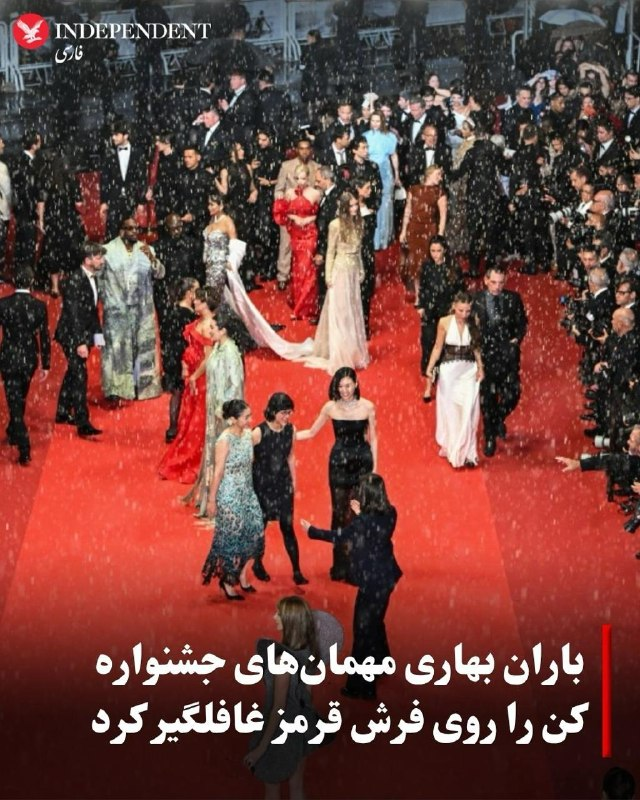

♦️جشنواره فیلم کن ۲۰۲۶ در فرش قرمز شامگاه ۲۸ اردیبهشت (۱۸ مه) با بارش ناگهانی باران بهاری غافلگیر شد؛ بارانی که برای دقایقی حال‌وهوای همیشگی فرش قرمز را تغییر داد و ورود ستاره‌ها را با چتر، دویدن میان قطره‌های باران و تلاش برای رسیدن به پله‌های کاخ جشنواره همراه کرد.
با وجود بارش شدید، بسیاری از مهمانان ترجیح دادند بی‌توجه به باران مقابل دوربین عکاسان توقف کنند و ژست بگیرند؛ صحنه‌ای که به یکی از تصاویر متفاوت جشنواره امسال تبدیل شد.
‌🇸🇦 Indypersian

🤖 @VahidOOnLine

## VahidOOnLine — post 240962

♦️در ادامه تبلیغات حکومتی در دوران آتش‌بس و تلاش جمهوری اسلامی برای مدیریت فضای رسانه‌ای، در چندین شهر ایران مراسم عروسی خیابانی برگزار شد و عروس و دامادها سوار بر خودروهای جنگی مجهز به تیربار دوشکا در خیابان‌ها رژه رفتند.

خبرگزاری فرانسه تصاویری منتشر کرده است که نشان می‌دهد خودروها با بادکنک‌های سفید و صورتی تزئین شده‌اند و کاروان‌های عروسی با بوق‌زدن و حرکت در خیابان‌ها، تجمع‌های شبانه حکومتی را همراهی می‌کنند. در بخشی از این مراسم نیز یک جیپ و ماکت صورتی‌رنگ موشک «خیبرشکن» دیده می‌شود.

بر اساس این تصاویر، عروس و دامادهای ایرانی در مراسم ازدواج جمعی در میدان امام حسین تهران، سوار بر خودروهای نظامی در یک رژه خیابانی شرکت کردند.
‌🇸🇦 Indypersian

🤖 @VahidOOnLine

## VahidOOnLine — post 240961

  

خبرگزاری آسوشیتدپرس با استناد به تصاویر ماهواره‌ای تایید کرد در جریان حملات علیه جمهوری اسلامی، نشت نفت در آب‌های خلیج فارس به سواحل جزیره شیدور سرایت کرده است. این خبرگزاری نوشت حمله به پالایشگاه لاوان عامل این آلودگی بوده است.

در روزهای گذشته ویدیویی در شبکه‌های اجتماعی منتشر شد که در آن پرنده و خرچنگی بی‌جان پوشیده از نفت در ساحل جزیره دیده می‌شوند و مردی نیز ماهی مرده‌ای را نشان می‌دهد.

تصاویر ثبت‌شده در ۱۰ آوریل توسط ماهواره با وضوح بالا و تحلیل‌شده از سوی آسوشیتدپرس نشان می‌دهد آتش‌سوزی پالایشگاه لاوان دو روز پس از حمله همچنان ادامه داشته است. همچنین لکه نفتی گسترده‌ای آب‌های اطراف را آلوده کرده و جزیره شیدور، که با نام محلی مارو نیز شناخته می‌شود، را دربر گرفته است.
‌🏁 🇬🇧 IranintlTV

🤖 @VahidOOnLine

## VahidOOnLine — post 240960

  

در پی تیراندازی مرگبار روز دوشنبه ۲۸ اردیبهشت، در بزرگ‌ترین مسجد و مرکز اسلامی شهر سن‌دیگو، سه نفر جان خود را از دست دادند. این حادثه در مجتمع آموزشی این مرکز رخ داد. در میان جان‌باختگان، نام امین عبدالله، نگهبان این مرکز و پدر هشت فرزند، تایید شده است.

نیروهای پلیس مدتی بعد جسد دو نوجوان را در خودرویی نزدیکی محل حادثه پیدا کردند که شواهد اولیه از خودکشی آن‌ها حکایت دارد. یکی از این افراد کین کلارک ۱۷ ساله شناسایی شده است. نکته حائز اهمیت در این پرونده، هشدار مادر کلارک به پلیس ساعاتی پیش از وقوع فاجعه است؛ او گزارش داده بود که پسرش به همراه فرد دیگری، با لباس‌های استتار و سه قبضه سلاح ناپدید شده‌اند و تمایلات خودکشی دارند.

مقامات قضایی و پلیس سن‌دیگو با استناد به نوشته‌های کشف‌شده روی یکی از سلاح‌ها و یادداشت خودکشی که حاوی مضامین برتری نژادی و نفرت‌پراکنی بوده، این حمله را به عنوان یک جنایت ناشی از نفرت تحت پیگرد قرار داده‌اند. اگرچه در این دست‌نوشته‌ها تهدید مستقیمی علیه این مسجد خاص مطرح نشده بود، اما گستردگی محتوای نژادپرستانه آن، ورود تیم‌های تخصصی اف‌بی‌آی و دادستان‌های ایالتی را به پرونده به همراه داشته است تا احتمال وجود همدستان یا شبکه‌های مرتبط با مظنونان به دقت بررسی شود. در حادثه‌ای همزمان، شلیک به سمت یک باغبان در موقعیتی دیگر نیز گزارش شد که به شکلی معجزه‌آسا، برخورد گلوله به کلاه ایمنی مانع از مرگ او
‌🇸🇦 Indypersian

🤖 @VahidOOnLine

## VahidOOnLine — post 240959

  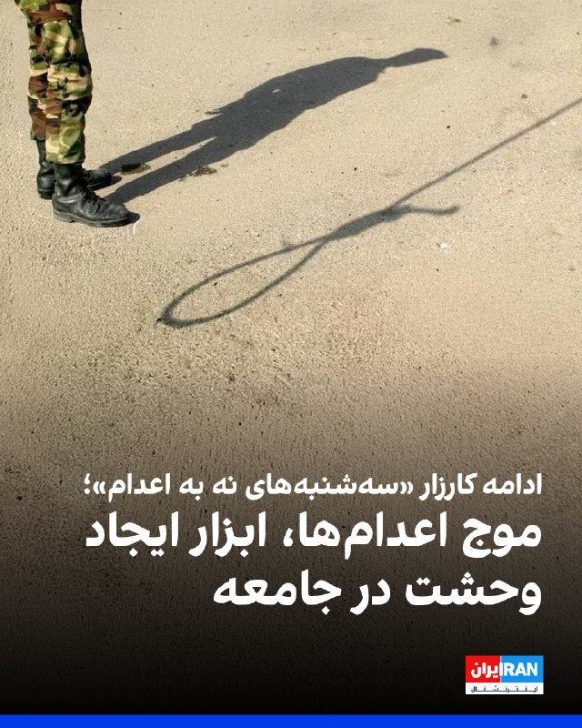

کارزار «سه‌شنبه‌های نه به اعدام» اعلام کرد زندانیان معترض به مجازات اعدام، سه‌شنبه ۲۹ اردیبهشت برای صدوبیست‌ویکمین هفته متوالی در ۵۶ زندان ایران دست به اعتصاب غذا زدند. این اقدام در شرایط تشدید موج اعدام‌ها و افزایش نگرانی‌های جهانی درباره وضعیت حقوق بشر در ایران انجام شد.

در بیانیه این کارزار آمده است حکومت جمهوری اسلامی در هفته‌های اخیر، هم‌زمان با گسترش فضای امنیتی و حضور نیروهای وابسته به حکومت در خیابان‌ها، بر اجرای احکام اعدام نیز افزوده است.

این کارزار، به اعدام عبدالجلیل شه‌بخش، زندانی سیاسی بلوچ، در زندان زاهدان و همچنین محمد عباسی، از بازداشت‌شدگان اعتراضات دی‌ماه ۱۴۰۴، اشاره کرد و در بیانیه خود نوشت که حکومت با استفاده از مجازات اعدام، در پی «ایجاد ترس و وحشت در جامعه» است.

کارزار «سه‌شنبه‌های نه به اعدام» تاکید کرد که اعدام صرفا یک مجازات قضایی نیست، بلکه «مهم‌ترین ابزار سرکوب و قتل حکومتی» است که برای وادار کردن جامعه به سکوت و تسلیم به کار گرفته می‌شود.

ادامه این گزارش را در وبسایت ایران‌اینترنشنال بخوانید
‌🏁 🇬🇧 IranintlTV

🤖 @VahidOOnLine

## VahidOOnLine — post 240958

  

سنتکام تصویری از یک ملوان نیروی دریایی آمریکا بر عرشه ناو هواپیمابر آبراهام لینکلن منتشر کرد که در حال عبور از دریای عرب نگهبانی می‌داد. سنتکام نوشت نیروهای این فرماندهی برای اطمینان از اجرای کامل مقررات، ۸۸ کشتی تجاری را تغییر مسیر داده و چهار کشتی را از کار انداخته‌اند.
‌🏁 🇬🇧 IranintlTV

🤖 @VahidOOnLine

## VahidOOnLine — post 240957

  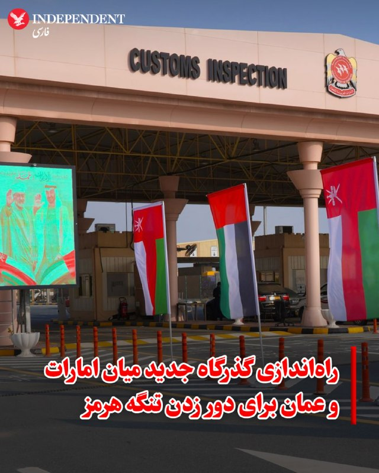

♦️ مقامات امارات متحده عربی از راه‌اندازی یک «گذرگاه لجستیکی» جدید میان بندر شارجه و بندر صحار در عمان به عنوان مسیری جایگزین برای دور زدن تنگه هرمز خبر دادند. طبق اعلام اداره گمرک شارجه، در این شاهراه زمینی که از ۲۴ اردیبهشت آغاز به کار کرده است، کامیون‌ها بار و کالاهای تجاری را میان دو کشور جابه‌جا می‌کنند.

این تصمیم در پی بحران در تنگه هرمز اتخاذ شده است که به دلیل درگیری‌ها میان جمهوری اسلامی با آمریکا و اسرائیل، تردد دریایی در آن با سقوطی ۹۰ درصدی مواجه شده و قیمت جهانی نفت را ۴۰ درصد افزایش داده است. پیش از این، حدود ۲۰ درصد از نفت خام جهان از این آبراه عبور می‌کرد.

مسئولان تاکید کرده‌اند که این گذرگاه زمینی جدید، برای حمل نفت و گاز نیست، بلکه عمدتا برای جابه‌جایی کالاهای مصرفی، مواد غذایی، اقلام دارویی و محموله‌های صنعتی که نیاز به شناورهای غول‌پیکر ندارند، طراحی شده است تا زنجیره تامین این کالاها در منطقه تضمین شود.
‌🇸🇦 Indypersian

🤖 @VahidOOnLine

## VahidOOnLine — post 240956

♦️کرملین پیش از سفر ولادیمیر پوتین به پکن، روز سه‌شنبه ۲۹ اردیبهشت‌ماه، پیام ویدیویی رئیس‌جمهوری روسیه را منتشر کرد؛ پیامی که در آن پوتین از روابط «بی‌سابقه» مسکو و پکن تمجید کرد و شی جین‌پینگ را «دوست قدیمی و خوب» خود خواند.

پوتین با استقبال از لغو متقابل ویزا میان دو کشور گفت روسیه و چین بدون ائتلاف علیه کسی، در پی «صلح و رفاه همگانی» هستند و به‌صورت هماهنگ از حقوق بین‌الملل و منشور سازمان ملل دفاع می‌کنند.

این سفر تنها چند روز پس از میزبانی شی جین‌پینگ از دونالد ترامپ انجام می‌شود و بیست‌وپنجمین سفر پوتین به چین است.
‌🇸🇦 Indypersian

🤖 @VahidOOnLine

## VahidOOnLine — post 240955

  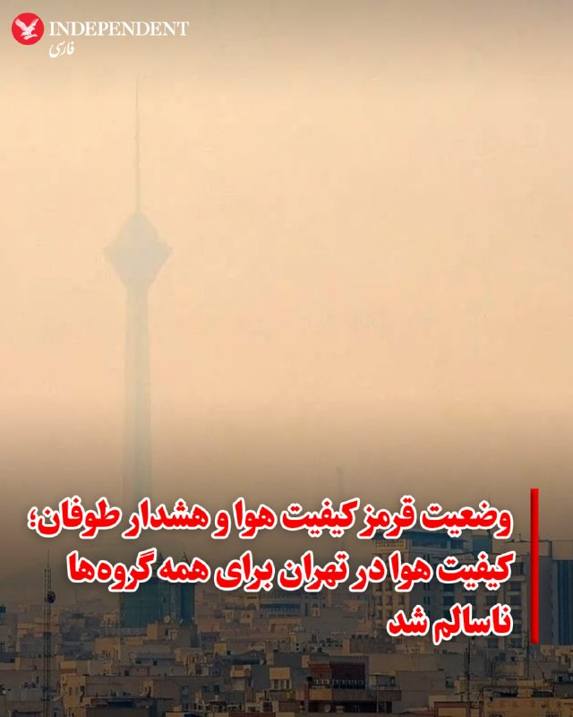

♦️ بر اساس گزارش شرکت کنترل کیفیت هوای تهران، کیفیت هوای پایتخت امروز ۲۹ اردیبهشت با تغییر آلاینده شاخص، در وضعیت قرمز و ناسالم برای همه قرار گرفته است. در حالی که طی ۲۴ ساعت گذشته آلاینده اصلی ذرات معلق کمتر از ۲.۵ میکرون بود، در حال حاضر میزان ذرات معلق کمتر از ۱۰ میکرون به میانگین ۱۸۰ رسیده است.

اداره کل هواشناسی استان تهران نیز با صدور هشدار، اعلام کرد که از بعدازظهر امروز تا چهارشنبه، وزش باد بسیار شدید و احتمال وقوع طوفان در مناطق مرکزی و جنوبی استان دور از انتظار نیست. این پدیده جوی منجر به خیزش گردوخاک و کاهش شدید شعاع دید و کیفیت هوا خواهد شد.

طبق توصیه‌های بهداشتی، بیماران قلبی و ریوی، سالمندان و کودکان باید از هرگونه فعالیت خارج از منزل خودداری کنند. سایر شهروندان نیز موظفند فعالیت‌های طولانی و سنگین فضای باز را به حداقل برسانند. با توجه به تداوم وزش باد شدید، رعایت نکات ایمنی در تردد شهری و خودداری از توقف در کنار ساختمان‌های نیمه‌کاره و درختان فرسوده ضروری است.
‌🇸🇦 Indypersian

🤖 @VahidOOnLine

## VahidOOnLine — post 240954

  <a href="telegram/content/VahidOOnLine_240954_1779198648.mp4" target="_blank">🎬 Download video</a>

خبرگزاری رویترز گزارش داد پالایشگاه‌های دولتی چین از زمان آغاز جنگ ایران، تولید خود را بیش از یک میلیون بشکه در روز کاهش داده‌اند.
بر اساس این گزارش، اختلال در تامین نفت خاورمیانه و کاهش سودآوری پالایشگاه‌ها باعث شده شرکت‌های بزرگ نفتی چین از جمله سینوپک و پتروچاینا ظرفیت پالایش خود را کاهش دهند.
داده‌ها نشان می‌دهد میزان پالایش نفت خام در چین از حدود ۱۰ میلیون بشکه در روز پیش از حملات آمریکا و اسرائیل به ایران، به حدود ۸.۴ میلیون بشکه در ماه مه رسیده است.
رویترز همچنین گزارش داد افزایش قیمت نفت و کاهش تقاضا برای سوخت، حاشیه سود پالایشگاه‌های چینی را به‌شدت کاهش داده و همزمان محدودیت‌های دولت چین بر صادرات سوخت، باعث افزایش ذخایر داخلی بنزین و گازوئیل شده است.
‌🏁 🇬🇧 ManotoTV

🤖 @VahidOOnLine

## VahidOOnLine — post 240953

  

وزیران دارایی کشورهای عضو گروه ۷ که در پاریس گرد هم آمده‌اند، با انتشار بیانیه‌ای مشترک بر ضرورت بازگشایی تنگه هرمز تاکید کردند.

آن‌ها همچنین بار دیگر بر تعهد خود به همکاری‌های چندجانبه برای مقابله با ریسک‌های پیش‌روی اقتصاد جهانی تاکید کردند.

وزیران دارایی کانادا، فرانسه، آلمان، ایتالیا، ژاپن، بریتانیا و ایالات متحده اعلام کردند به حفظ ثبات بازارهای انرژی پایبند هستند و از تمامی کشورها خواستند از اعمال محدودیت‌های خودسرانه بر صادرات خودداری کنند.
‌🏁 🇬🇧 IranintlTV

🤖 @VahidOOnLine

## VahidOOnLine — post 240952

  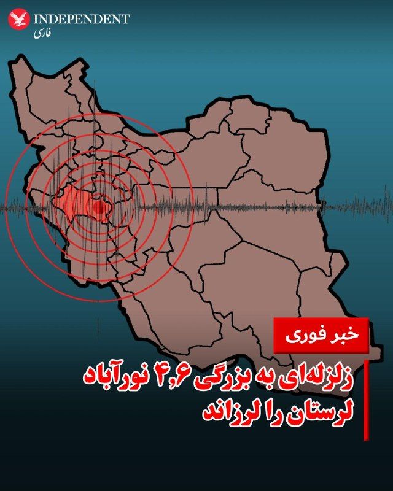

♦️روزنامه همشهری گزارش داد زمین‌لرزه‌ای به بزرگی ۴.۶، روز سه‌شنبه ۲۹ اردیبهشت‌ماه نورآباد در استان لرستان را لرزاند.
بر اساس این گزارش، این زمین‌لرزه دقایقی پیش رخ داده و هنوز جزییاتی درباره خسارات احتمالی یا تلفات آن منتشر نشده است.
‌🇸🇦 Indypersian

🤖 @VahidOOnLine

## VahidOOnLine — post 240951

  

احمد بخشایش اردستانی، عضو کمیسیون امنیت ملی مجلس، در مصاحبه با ایلنا گفت: «من فکر نمی‌کنم آمریکا به ایران حمله کند، چرا که در حمله نظامی چیزی به دست نخواهد آورد؛ اما اگر حمله کند، به خارک و اصفهان حمله خواهد کرد.»

او افزود: «حمله به اصفهان هم برای این است که آن ۴۰۰ کیلو اورانیوم را به دست بیاورد؛ چیزی که قبلا در دستیابی به آن ناکام ماندند.»

اردستانی ادامه داد: «به اعتقاد من، وضعیت "نه صلح، نه جنگ" باقی خواهد ماند، چرا که آمریکا دنبال ناآرامی است و فکر می‌کند که وضعیت اقتصاد ایران با ادامه این وضعیت جامعه را به سمت ناآرامی جلو خواهد برد.»

او تهدید کرد: «اگر این بار دشمنان به ما حمله کنند، ما به چاه‌ها و تاسیسات نفتی آنان حمله خواهیم کرد. اگر قرار باشد آنها کاری کنند که ما نفتی نداشته باشیم، به لوله‌هایشان حمله نخواهیم کرد؛ به چاه‌ها حمله خواهیم کرد تا آن‌ها هم نفت نداشته باشند و سوخت برای دنیا گران شود.»
‌🏁 🇬🇧 IranintlTV

🤖 @VahidOOnLine

## VahidOOnLine — post 240950

  

♦️یک روز پس از آنکه دونالد ترامپ اعلام کرد حمله گسترده به ایران را برای چند روز به تعویق می‌انداز، قیمت نفت در بازارهای جهانی حدود یک درصد کاهش یافت.

روز سه‌شنبه هر بشکه نفت خام دریای برنت با حدود ۳۰ سنت کاهش، در کانال ۱۱۰ دلار به فروش می‌رسد.

همزمان با توقف روند افزایشی قیمت نفت، شاخص بورس‌های آسیایی و اروپایی هم اندکی افزایش یافت.
‌🇸🇦 Indypersian

🤖 @VahidOOnLine

## VahidOOnLine — post 240949

  <a href="telegram/content/VahidOOnLine_240949_1779198652.mp4" target="_blank">🎬 Download video</a>

ولی‌الله حیاتی، معاون امنیتی استانداری خوزستان، بعدازظهر سه‌شنبه ۲۹ اردیبهشت گفت سقوط یک «پرتابه» یا «شی ناشناس» در یک منطقه مسکونی اندیمشک چهار مصدوم بر جا گذاشت.

به گزارش ایرنا، این مقام محلی گفت این حادثه به یک باب مغازه و دو خودرو خسارت وارد کرده و بازتاب گسترده‌ای در شبکه‌های اجتماعی این شهرستان داشته است.

حیاتی در توضیح جداگانه‌ای درباره صداهای شنیده‌شده در آسمان اندیمشک گفت: «صدای شلیک‌های اخیر در آسمان اندیمشک به دلیل تست پدافند هوایی است، لذا مردم نگران نباشند.»

با این حال رسانه‌های داخلی و مقام‌های جمهوری اسلامی هنوز توضیحی درباره ماهیت «شی ناشناس» یا «پرتابه» سقوط‌کرده ارائه نکرده‌اند و مشخص نیست این حادثه ارتباطی با تست پدافند هوایی داشته است یا نه.
‌🏁 🇬🇧 ManotoTV

🤖 @VahidOOnLine

## VahidOOnLine — post 240948

  <a href="telegram/content/VahidOOnLine_240948_1779198652.mp4" target="_blank">🎬 Download video</a>

سخنگوی وزارت خارجه قطر اعلام کرد دوحه همچنان با واشنگتن و تهران در تماس است و این رایزنی‌ها ادامه خواهد داشت.
ماجد الانصاری، در واکنش به تصمیم دونالد ترامپ برای تعویق حمله برنامه‌ریزی‌شده به ایران به درخواست قطر، عربستان سعودی و امارات، گفت این اقدام «نشانه پاسخ مثبت» بوده است.
او همچنین با اشاره به مذاکرات میان آمریکا و جمهوری‌اسلامی گفت قطر از تلاش‌های دیپلماتیک پاکستان برای نزدیک کردن طرف‌ها و یافتن راه‌حل حمایت می‌کند و این روند «به زمان بیشتری نیاز دارد».
الانصاری درباره روابط دوحه و تهران گفت قطر همچنان روابط مثبتی با جمهوری‌اسلامی دارد، اما در عین حال افزود حمله جمهوری‌اسلامی به قطر «تهدیدی برای روابط دو کشور» به شمار می‌رود
‌🏁 🇬🇧 ManotoTV

🤖 @VahidOOnLine

## VahidOOnLine — post 240947

  <a href="telegram/content/VahidOOnLine_240947_1779198653.mp4" target="_blank">🎬 Download video</a>

«صدای رشید مظاهری باشید»
‌🏁 🇬🇧 ManotoTV

🤖 @VahidOOnLine

## VahidOOnLine — post 240946

  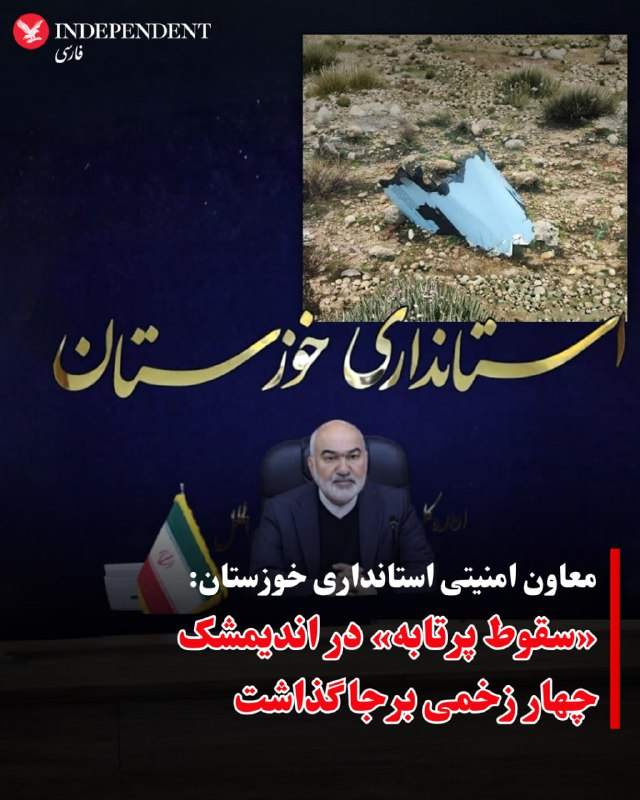

♦️ولی‌الله حیاتی، معاون امنیتی استانداری خوزستان بعدازظهر سه‌شنبه ۲۹ اردیبهشت‌ماه گفت در پی سقوط «پرتابه» ناشناس در یک منطقه مسکونی در اندیمشک، چهار نفر مصدوم شدند.

به گزارش ایرنا، این مقام محلی گفت: «سقوط شی ناشناس در مناطق مسکونی اندیمشک که منجر به خسارت به یک باب مغازه و دو خودرو و مصدومیت چهار نفر شد دقایقی پیش در شبکه های اجتماعی این شهرستان بازتاب گسترده داشت.

همین مقام امنیتی گفته است: «صدای شلیک های اخیر در آسمان اندیمشک بدلیل تست پدافند هوایی است لذا مردم نگران نباشند.»

رسانه‌های داخلی و مقام‌های جمهوری اسلامی هنوز جزئیاتی درباره «شی ناشناس» یا «پرتابه» نداده‌اند.
‌🇸🇦 Indypersian

🤖 @VahidOOnLine

## VahidOOnLine — post 240945

  <a href="telegram/content/VahidOOnLine_240945_1779198656.mp4" target="_blank">🎬 Download video</a>

«صدای فاطمه سپهری باشیم»
‌🏁 🇬🇧 ManotoTV

🤖 @VahidOOnLine

## VahidOOnLine — post 240944

  <a href="telegram/content/VahidOOnLine_240944_1779198658.mp4" target="_blank">🎬 Download video</a>

بر اساس گزارش‌ رسانه‌های حکومتی حمید خانی، پاسدار بازنشسته اهل شهرستان بروجن، در جریان عملیات خنثی‌سازی بمب‌های عمل‌نکرده باقی‌مانده از جنگ اخیر در تهران کشته شد. بر اساس گزارش‌ها، او به‌صورت داوطلبانه در بخش مهندسی قرارگاه خاتم‌الانبیا فعالیت می‌کرد.
‌🏁 🇬🇧 ManotoTV

🤖 @VahidOOnLine

## WithYashar — post 11657

ریکلین فاش خبرنگار اسرائیلی:

نیروهای ویژه ارتش اسرائیل دارن برای نفوذ به تأسیسات هسته ایی اصفهان تمرین می‌کنن تا اورانیوم غنی‌شده رو خارج کنن
مواد هسته‌ای اون‌قدرا هم عمیق دفن نشده و بعد از ورود به سایت، میشه منتقلش کرد
@withyashar

## WithYashar — post 11656

  <a href="telegram/content/WithYashar_11656_1779198659.mp4" target="_blank">🎬 Download video</a>

سنتکام : ‏هزاران آمریکایی شجاع در لباس نظامی همچنان در سراسر خاورمیانه خدمت می‌کنند.
@withyashar

## WithYashar — post 11655

فرماندهی مرکزی ایالات متحده: 88 کشتی را در جریان محاصره دریایی ایران مجبور به تغییر مسیر کردیم.
@withyashar

## WithYashar — post 11654

ارتش اسرائیل : در ساعات اخیر، ۲۵ انبار و سکوی پرتاب موشک متعلق به حزب‌الله را در جنوب لبنان نابود کردیم
@withyashar

## WithYashar — post 11653

یک منبع آمریکایی به الجزیره:

بحث امنیتی که برای امروز در کاخ سفید درباره ایران برنامه‌ریزی شده بود، پس از اعلام ترامپ مبنی بر تعویق حمله برنامه‌ریزی شده، به تعویق افتاد
@withyashar

## WithYashar — post 11652

زلزله لرستان 4.6 ریشتر
@withyashar

## WithYashar — post 11651

رئیس روس اتم: قادریم برنامه بازگرداندن کارکنان نیروگاه بوشهر را اجرایی کنیم
@withyashar

## WithYashar — post 11650

سازمان عفو بین‌الملل اعلام کرد تعداد اعدام‌ها در جهان طی سال 2025 به بالاترین سطح در 44 سال گذشته رسیده.

طبق این گزارش، جمهوری اسلامی اصلی‌ترین عامل افزایش آمار اعدام‌ها در جهان بوده.
@withyashar

## WithYashar — post 11649

رویترز: پیشنهاد جدید ایران به آمریکا برای پایان درگیری‌ها :

- عقب نشینی نیروهای آمریکایی از منطقه
- پرداخت غرامت توسط آمریکا
- رفع تحریم‌ها
- آزادسازی اموال بلوکه شده توسط آمریکا
- پایان محاصره آمریکا علیه بنادر
@withyashar

## WithYashar — post 11648

معاون امنیتی استان خوزستان :

امروز داشتیم پدافند هامونو تست میکردیم که به اشتباه یکی از پرتابه ها خورد به یک ساختمون مسکونی و چندین نفر زخمی شدن.
@withyashar

## WithYashar — post 11647

افشاگری وال‌استریت ژورنال : چند مقام خلیج فارس از برخی کشورهایی که ترامپ به آن‌ها اشاره کرده بود گفتند از طرح قریب‌الوقوعی که او درباره حمله به ایران توصیف کرده بود، اطلاعی نداشتند.
@withyashar

## WithYashar — post 11646

  <a href="https://t.me/withyashar/11646" target="_blank">📎 Download file</a>

کتاب ممنوعه «در پشت پرده های انقلاب»، اعترافات «جعفر شفیع زاده» فرمانده پیشین واحد مخصوص انقلاب اسلامی ایران و محافظ آیت الله خمینی در نوفل لوشاتو و تهران.
@withyashar

## WithYashar — post 11645

مهر: تو قشم صدای انفجار شنیده شد
@withyashar

## mwarmonitor — post 9307

🔴«پیشنهاد جدید ایران به ایالات متحده برای پایان دادن به جنگ شامل موارد زیر است:

🔸خروج نیروهای آمریکایی از مناطق نزدیک به ایران

🔸پرداخت غرامت‌های جنگی از سوی آمریکا

🔸لغو تحریم‌ها علیه ایران

🔸آزادسازی دارایی‌های مسدودشده ایران

🔸پایان دادن به محاصره (بلاکاد) آمریکا

رویترز

@mwarmonitor

## mwarmonitor — post 9306

  

🔴دریاسالار برد کوپر، فرمانده فرماندهی مرکزی ایالات متحده (سنتکام)، قرار است صبح امروز درباره وضعیت و آرایش سنتکام در برابر کمیته نیروهای مسلح مجلس نمایندگان آمریکا شهادت بدهد.

🔴 پخش زنده: از طریق یوتیوب

@mwarmonitor

## mwarmonitor — post 9305

🔴 «وزیر خزانه‌داری آمریکا : انتظار می‌رود شرکای اروپایی از تحریم‌های اعمال‌شده علیه ایران حمایت کنند؛ از جمله با جلوگیری از فعالیت تأمین‌کنندگان مالی آن، بستن شعب بانکی‌اش و افشای شرکت‌های پوششی آن.»

@mwarmonitor

## mwarmonitor — post 9304

  

🔴دیروز هتل تاریخی عامریها کاشان را به خاطر «حجاب» پلمب کردند؛ مسافران سرگردان شدند و ۹۰ نفر از پرسنل بیکار

📝 به شهربازی بزرگ تناقضات خوش آمدید؛ جایی که خط‌کش‌های قانون، پلاستیکی هستند و متناسب با زاویه دوربین مصلحت، کش می‌آیند. یک روز قفل سنگین پلمب را بر درِ هتل تاریخی عامری‌ها می‌کوبند و ۹۰ کارگر را به جرم دیدن چند تار مو آواره می‌کنند، و روز دیگر در میدان‌های شهر، بلندگوها شعار سوزناک «بی‌حجاب هم خواهر ماست» سر می‌دهند. این دیگر نه شریعت است و نه قانون، بلکه یک دکانداریِ عریان است؛ تار موی شما اگر در حال زندگی عادی باشد، جرم مشهود و مستوجب نابودی است، اما اگر جلو لنز صداوسیما و روی جیپ‌های صورتیِ کارناوال‌های سفارشی باشد، جلوه‌ای از همبستگی ملی! مرز بین مجرم و شهروند نمونه در این سیستم، فقط به یک چیز بستگی دارد: اینکه چقدر ویترین تبلیغاتی آقایان را پر کنید. پرده‌های این سیرک سال‌هاست افتاده، اما بازیگرانش هنوز فکر می‌کنند مردم محو تماشای شعبده‌بازیِ ناشیانه‌شان هستند.

@mwarmonitor

## mwarmonitor — post 9303

🔴چند مقام خلیج فارس از برخی کشورهایی که ترامپ به آن‌ها اشاره کرده بود گفتند از طرح قریب‌الوقوعی که او درباره حمله به ایران توصیف کرده بود، اطلاعی نداشتند. وال‌استریت ژورنال @mwarmonitor

## mwarmonitor — post 9302

🔴چند مقام خلیج فارس از برخی کشورهایی که ترامپ به آن‌ها اشاره کرده بود گفتند از طرح قریب‌الوقوعی که او درباره حمله به ایران توصیف کرده بود، اطلاعی نداشتند. وال‌استریت ژورنال

@mwarmonitor

## mwarmonitor — post 9301

🇹🇷ترکیه به دنبال نشست سران ناتو برای دستیابی به یک پیشرفت در زمینه نهایی شدن خرید جنگنده‌های F-35 از آمریکا است.

@mwarmonitor

## mwarmonitor — post 9300

صدای انفجار در قشم

## FoxNewsTwitter — post 341927

  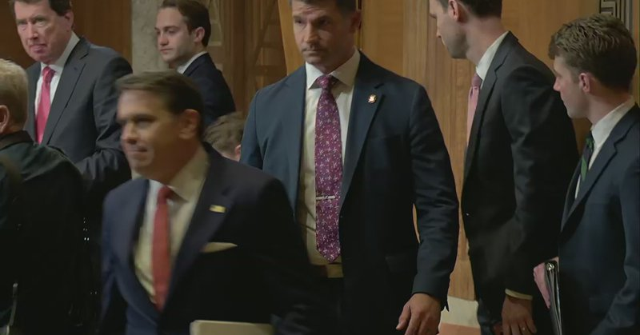

Fox News (Twitter/X)

WATCH LIVE: Acting AG Todd Blanche faces lawmakers at first Senate hearing since taking over DOJ https://twitter.com/i/broadcasts/1AKEmOpZDMoKL

## FoxNewsTwitter — post 341926

  

Fox News (Twitter/X)

The head of the World Health Organization warning over 130 people have already died of suspected Ebola cases around the world since the latest outbreak began.

The W.H.O. also sounding the alarm about the rapid "scale and speed" of the surging Ebola infections in eastern Congo and Uganda, with over 500 suspected cases.

This comes after an American man working as a medical missionary in the Democratic Republic of Congo tested positive for the deadly virus.

## FoxNewsTwitter — post 341925

  

Fox News (Twitter/X)

A $1.776 BILLION federal fund is being created for Americans who say they were politically targeted by the government.

The DOJ agreed to launch the “Anti-Weaponization Fund” as part of a settlement after President Trump and his sons sued the IRS for $10 billion over alleged political targeting, misconduct, and abuse of power.

Trump agreed to drop the lawsuit. The DOJ agreed to issue a formal apology. Trump and his sons cannot receive money from the fund.

Supporters say it’s long-overdue. Critics say taxpayers could end up funding it with unclear standards.

The bigger question: Should the federal government compensate people who claim they were politically targeted — and who gets to decide where that line is?

## FoxNewsTwitter — post 341924

  <a href="telegram/content/FoxNewsTwitter_341924_1779198666.mp4" target="_blank">🎬 Download video</a>

Fox News (Twitter/X)

NEW: U.S. Attorney Jeanine Pirro threatens to lock up parents and children over violent “teen takeovers” that are spreading across the nation’s capital.

“Parents have a fundamental responsibility to control their children. It's their children, not the government's children.”

“If parents do not step up and stand in the place of their children, then we're going to prosecute the parents and the children... I've got a lot of opportunities to go after these parents, and no one is going to stop me from doing that.” | @foxandfriends

## FoxNewsTwitter — post 341923

  <a href="telegram/content/FoxNewsTwitter_341923_1779198670.mp4" target="_blank">🎬 Download video</a>

Fox News (Twitter/X)

“We’re very much trying to run an NFL model.”

Bill Belichick explains on "Hang Out With Sean Hannity" why he left the NFL for North Carolina, saying he always wanted to coach in college but never had the opportunity until UNC came calling.

Belichick says the program is being rebuilt with a pro-style structure — complete with a general manager, scouting department, player development system, strength program, and recruiting operation modeled after the NFL.

At one point, he says the goal is bigger than just wins: helping players develop into future NFL talent while turning UNC into what many fans believe it “should be” as a football program.

You can watch the full interview Tuesday at 10am eastern. | @seanhannity

## FoxNewsTwitter — post 341922

  <a href="telegram/content/FoxNewsTwitter_341922_1779198673.mp4" target="_blank">🎬 Download video</a>

Fox News (Twitter/X)

Music’s biggest stars are set to gather next week for the 52nd annual American Music Awards in Las Vegas.

Whose song will win the American Music Award for Song of the Year?

Our sponsor Kalshi’s prediction market shows:
— Back to Friends: 81%
— Golden: 35%
— The Fate of Ophelia: 34%

@foxandfriends

## FoxNewsTwitter — post 341921

  

Fox News (Twitter/X)

WATCH LIVE: NTSB holds hearing on deadly UPS cargo plane crash https://twitter.com/i/broadcasts/1AxRnaOWzmjxl

## FoxNewsTwitter — post 341920

  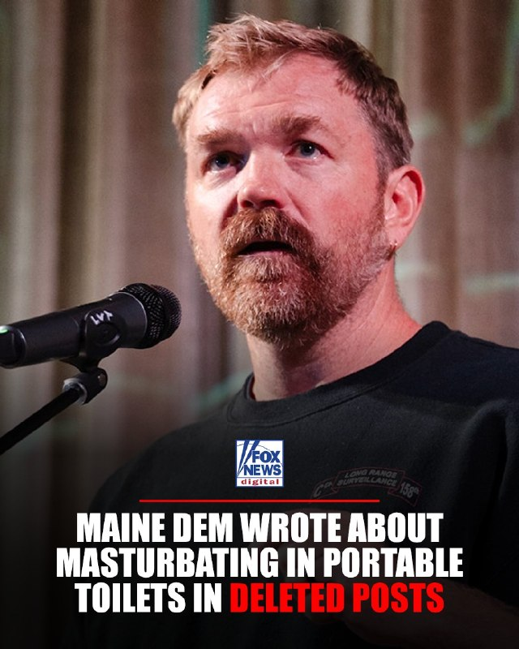

Fox News (Twitter/X)

RT @foxnewspolitics: FIRST ON FOX: Democratic Maine Senate candidate Graham Platner's deleted Reddit account reveals graphic posts about masturbating in portable toilets and praising explicit military restroom graffiti — the latest in a growing trail of vulgar comments that could define his race against Susan Collins.

Platner has dismissed past controversies as 'joking' and 's***posting,' but GOP strategists say the pattern raises fundamental questions about his judgment and fitness for office.

He became Democrats' presumptive nominee after Gov. Janet Mills dropped out last month.

## FoxNewsTwitter — post 341916

Fox News (Twitter/X)

Firefighters spring into action as a dust fire rapidly spreads in Southern California, triggering evacuations.

By Monday afternoon, crews said the fire had already grown to more than 800 acres before nearly doubling in size.

Around 500 personnel were battling the flames alongside five helicopters and three air tankers as residents were ordered to evacuate and thick smoke filled the sky.

## FoxNewsTwitter — post 341915

  <a href="telegram/content/FoxNewsTwitter_341915_1779198677.mp4" target="_blank">🎬 Download video</a>

Fox News (Twitter/X)

NEW: The clock is still ticking on Iran.

President Trump is giving Tehran more time after requests came in from regime officials to delay military action and continue negotiations, but he’s still threatening a massive strike if a deal falls apart.

The U.S. is now in what officials are calling a “temporary pause” to see whether diplomacy can still work.

Iran says “dialogue does not equal surrender” and is mocking President Trump for repeatedly setting deadlines and then extending them.

@TreyYingst reports.

## pm_afshaa — post 91027

  <a href="telegram/content/pm_afshaa_91027_1779198680.webm" target="_blank">🎬 Download video</a>

🔴سازمان عفو بین‌الملل اعلام کرد تعداد اعدام‌ها در جهان طی سال 2025 به بالاترین سطح در 44 سال گذشته رسیده.

طبق این گزارش، جمهوری اسلامی اصلی‌ترین عامل افزایش آمار اعدام‌ها در جهان بوده.

💧 Rainbet.com the #1 Non-KYC Crypto Casino & Sportsbook @rainbetcom

😁 @Pm_Afshaa

## pm_afshaa — post 91026

  <a href="telegram/content/pm_afshaa_91026_1779198680.webm" target="_blank">🎬 Download video</a>

🔴رویترز: پیشنهاد جدید ایران به آمریکا برای پایان درگیری‌ها :

- عقب نشینی نیروهای آمریکایی از منطقه
- پرداخت غرامت توسط آمریکا
- رفع تحریم‌ها
- آزادسازی اموال بلوکه شده توسط آمریکا
- پایان محاصره آمریکا علیه بنادر

💧 Rainbet.com the #1 Non-KYC Crypto Casino & Sportsbook @rainbetcom

😁 @Pm_Afshaa

## pm_afshaa — post 91025

🔴تایمز انگلیس: اگه تنگه هرمز بسته بمونه، دنیا خیلی سریع داره میره سمت یه بحران جهانی غذا

💧 Rainbet.com the #1 Non-KYC Crypto Casino & Sportsbook @rainbetcom

😁 @Pm_Afshaa

## pm_afshaa — post 91023

زلزله شدید در خرم اباد لرستان

💧 Rainbet.com the #1 Non-KYC Crypto Casino & Sportsbook @rainbetcom

😁 @Pm_Afshaa

## pm_afshaa — post 91022

  <a href="telegram/content/pm_afshaa_91022_1779198681.webm" target="_blank">🎬 Download video</a>

🔴وال استریت ژورنال: برخلاف صحبت‌های ترامپ کشور های عربی اعلام کردند از برنامه آمریکا برای حمله به ایران خبر نداشتند!

💧 Rainbet.com the #1 Non-KYC Crypto Casino & Sportsbook @rainbetcom

😁 @Pm_Afshaa

## pm_afshaa — post 91021

حیاتی، معاون امنیتی خوزستان :امروز تو اندیمشک داشتیم سامانه پدافند هوایی رو تست می‌کردیم که یه پرتابه‌اش به یه ساختمون مسکونی خورد و 4 نفر زخمی شدن

💧 Rainbet.com the #1 Non-KYC Crypto Casino & Sportsbook @rainbetcom

😁 @Pm_Afshaa

## DEJradio — post 4736

  <a href="telegram/content/DEJradio_4736_1779198682.mp4" target="_blank">🎬 Download video</a>

🔺📢 پیام یک شهروند:
ما چیزی برای خوردن نداریم...

#تورم #فقر
@DEJradio

## DEJradio — post 4735

  <a href="telegram/content/DEJradio_4735_1779198684.webm" target="_blank">🎬 Download video</a>

🚨📢 طبق اعلام مدیرکل تعزیرات حکومتی استان فارس، ۹۰۰ تُن مرغ منجمد احتکار شده در یکی از سردخانه‌های شیراز کشف شد.

احتکار حجم سنگینی از مواد خوراکی سودجویی سازمان یافته است که نمی‌تواند بدون پشتوانه بالادستی باشد. این در حالی است که مراجع قضایی حکومت بارها در مورد برخورد با احتکار هشدار داده بودند و برای مقابله با آن قرارگاه ویژه تاسیس شده است.
احتکار از عوامل اصلی کمیابی کالا و گرانی است.

#فارس #احتکار_مرغ
@DEJradio

## DEJradio — post 4734

🚨 هر توافقی با جمهوری اسلامی باید به تأیید کنگرۀ آمریکا برسد

لیندزی گراهام، سناتور جمهوری‌خواه آمریکایی تأکید کرد هر توافقی میان واشینگتن و جمهوری اسلامی باید برای تأیید به کنگره ارائه شود.
او همچنین خواستار پایان غنی‌سازی اورانیوم و توقف پشتیبانی جمهوری اسلامی از گروه‌های نیابتی شد.
دونالد ترامپ اعلام کرده حملۀ برنامه‌ریزی‌شده علیه جمهوری اسلامی را به درخواست رهبران چند کشور عربی به تعویق انداخته است.

#ترامپ #توافق #لیندسی_گراهام
@DEJradio

## DEJradio — post 4733

  <a href="telegram/content/DEJradio_4733_1779198685.webm" target="_blank">🎬 Download video</a>

🚨📢 ‏بر اساس گزارش منابع میدانی روز سه‎شنبه ۲۹ اردیبهشت ۱۴۰۵ توپ‌های ضدهوایی و راکت‌های پدافند در یزد، دزفول، بوشهر، اهواز و اندیمشک فعال شدند. منابع محلی می‌گویند در آسمان صدای پهپاد شنیدند. هنوز به طور رسمی اعلام نشده است که چرا پدافند فعال شد اما شامگاه دوشنبه ۲۸ اردیبهشت نیز گزارش شد که در بعضی شهرها پدافند فعال شد.

استانداری خوزستان اعلام کرده است که به علت سقوط پرتابه در اندیمشک چهار نفر مجروح شدند. گفته می‌شود این پرتابه مهمات پدافند خودی بوده که روی خانه‌های مردم سقوط کرده است.

#خوزستان #پدافند
@DEJradio

## DEJradio — post 4732

🚨 شرکت هندی جریمۀ نقض تحریم‌های جمهوری اسلامی را می‌پردازد

وزارت خزانه‌داری آمریکا اعلام کرد شرکت هندی آدانی اینترپرایزس، با پرداخت ۲۷۵ میلیون دلار برای بستان پروندۀ نقض احتمالی تحریم‌های جمهوری اسلامی موافقت کرده است.
بنا بر گزارش‌ها، در این پرونده به ۳۲ مورد نقض احتمالی تحریم‌های جمهوری اسلامی اشاره شده است.
این شرکت هندی بین سال‌های ۲۰۲۳ تا ۲۰۲۵ محموله‌های گاز مایع با منشأ احتمالی ایران را از طریق واسطه‌هایی در دبی خریده بود.

#تحریم #جمهوری_اسلامی
@DEJradio

## DEJradio — post 4731

⭕️ 
🧨 صدای انفجار در جزیرۀ قشم شنیده شد

رسانه‌های حکومتی در ایران گزارش دادند ظهر سه‌شنبه صدای انفجار در جزیرۀ قشم از سوی ساکنان محلی شنیده شده است.
معاون امنیتی استانداری هرمزگان مدعی شد صدای انفجار مربوط به خنثی‌سازی مهمات عمل‌نکردۀ جنگ چهل روزه بود.

#قشم #انفجار
@DEJradio

## DEJradio — post 4730

⭕️ یک نمایندۀ مجلس گفت مذاکره نتیجه نمی‌دهد

اسماعیل کوثری، نمایندۀ مجلس شورای اسلامی و از فرماندهان پیشین سپاه پاسداران، گفت جمهوری اسلامی «قطعا و یقینا» از طریق مذاکره به نتیجه نمی‌رسد.
او همچنین مدعی شد دونالد ترامپ جنگ را باخته و تلاش می‌کند خود را پیروز نشان دهد.
کوثری گفت تلاش‌ برای دستیابی به نتیجه «شدنی نیست».

#مذاکرات #سپاه_تروریستی_پاسداران

@DEJradio

## DEJradio — post 4729

⭕️ نیویورک تایمز: جمهوری اسلامی الگوهای پروازی جنگنده‌های آمریکا را بررسی کرده است

نشریۀ نیویورک تایمز، به نقل از مقام‌های آمریکایی گزارش داد فرماندهان جمهوری اسلامی، احتمالا با کمک روسیه، الگوهای پروازی جنگنده‌ها و بمب‌افکن‌های آمریکایی را بررسی کرده‌اند.
به نوشتۀ این روزنامۀ آمریکایی، سرنگونی یک جنگندۀ اف-۱۵ئی و اصابت آتش زمینی به یک جنگنده اف-۳۵ سبب شده مقام‌های جمهوری اسلامی فکر کنند تاکتیک‌های پروازی آمریکا قابل پیش‌بینی است.
بنا بر این گزارش، جمهوری اسلامی بخش زیادی از تسلیحات باقی‌ماندۀ خود را جابه‌جا کرده و تلاش دارد توانایی مقاومت در برابر آمریکا را به نیروهایش القا کند.
نیویورک تایمز به نقل از یک مقام نظامی آمریکا نوشت جمهوری اسلامی در طول آتش‌بس یک‌ماهه، ده‌ها پایگاه موشکی آسیب‌دیده را از زیر آوار خارج کرده است.

#جنگ #روسیه #جمهوری_اسلامی
@DEJradio

## DEJradio — post 4728

⭕️ فرماندۀ پیشین سپاه گفت آمریکا می‌خواهد جمهوری اسلامی تلسیم شود

محسن رضایی، فرماندۀ پیشین سپاه پاسداران در واکنش به تعویق حمله به جمهوری اسلامی نوشت آمریکا با تعیین و لغو ضرب‌الاجل نظامی تلاش داردجمهوری اسلامی را تسلیم کند.
مشاور مجتبی خامنه‌ای، در شبکۀ اجتماعی اکس مدعی شد «مشت آهنین نیروهای مسلح» آمریکا را به عقب‌نشینی وادار می‌کند.

#مذاکرات #تسلیم
@DEJradio

## DEJradio — post 4727

⭕️ قطر، عربستان و امارات برای توافق با جمهوری اسلامی در تماس‌اند

دونالد ترامپ گفت قطر، عربستان سعودی و امارات متحده عربی با آمریکا و جمهوری اسلامی در تماس‌اند و احتمال رسیدن به توافق وجود دارد.
رئیس جمهوری آمریکا افزود این کشورها مستقیما با مقام‌های آمریکایی و تهران گفت‌وگو می‌کنند.
ترامپ همچنین گفت اگر آمریکا بتواند بدون بمباران شدید، با تهران به نتیجه برسد، بسیار خشنود می‌شود.

#مذاکرات #امارات #عربستان
@DEJradio

## DEJradio — post 4726

⭕️ تهران برای مذاکرات هسته‌ای مشکلی ندارد

هاکان فیدان، وزیر امور خارجۀ ترکیه، اعلام کرد جمهوری اسلامی دربارۀ پذیرش اصل مذاکرات هسته‌ای مشکل بنیادی ندارد.
فیدان گفت اختلاف‌ها بیشتر بر سر نوع امتیازهایی است که تهران در برابر توافق احتمالی دریافت می‌کند.
به گفتۀ وزیر امور خارجۀ ترکیه، مقامات جمهوری اسلامی همچنین در مورد چگونگی اجرای توافق و تضمین آن، خواسته‌هایی دارند.

#مذاکرات #ترکیه #جمهوری_اسلامی
@DEJradio

## DEJradio — post 4725

⭕️ اسرائیل برای احتمال ازسرگیری جنگ با جمهوری اسلامی آماده می‌شود

بنا بر گزارش آی۲۴ نیوز، بنیامین نتانیاهو، نخست‌وزیر اسرائیل اخیرا دو نشست کابینۀ امنیتی را به‌صورت پیاپی برگزار کرده است.
مقام‌های اسرائیل اعلام کردند این کشور در آماده‌باش کامل قرار دارد.
بنا بر گزارش‌ها، اسرائیل خود را برای تصمیم احتمالی دونالد ترامپ درمورد ازسرگیری جنگ تا پایان هفته آماده می‌کند.
این آمادگی‌ها، در پی گفت‌وگوی تلفنی ۳۰ دقیقه‌ای ترامپ و نتانیاهو سرگرفته است.
برپایۀ این گزارش، هماهنگی‌های فشرده میان واشینگتن و اورشلیم برای گزینه‌های گوناگون ادامه دارد.

#جنگ #اسرائیل #جمهوری_اسلامی
@DEJradio

## DEJradio — post 4724

⭕️ بورس ایران پس از ۸۰ روز تعطیلی آغاز به کار کرد

رسانه‌های داخل ایران گزارش دادند معاملات بورس تهران صبح سه‌شنبه ۲۹ اردیبهشت پس از ۸۰ روز توقف ازسر گرفته شد.
بنا بر گزارش‌ها، بیش از ۴۰ نماد که شرکت‌های آنها در حملات آمریکا و اسرائیل آسیب دیده‌ است، فعلا بازگشایی نمی‌شود.
گزارش‌ها نشان می‌دهد اکثر نمادهای بازگشایی نشده، مربوط به صنایع پتروشیمی و فولاد است.
تاکنون تنها بخشی از نمادهای بانکی، خودرویی و شماری از صندوق‌های اهرمی وارد معاملات شده‌ است.

#جنگ #بورس
@DEJradio

## DEJradio — post 4723

⭕️ ادعای غریب‌آبادی در مورد شروط جمهوری اسلامی برای پایان جنگ با آمریکا

کاظم غریب‌آبادی، معاون وزیر امور خارجۀ جمهوری اسلامی، ادعا کرد تهران در مذاکرات اخیر با آمریکا خواستار حفظ حق غنی‌سازی، خروج نیروهای آمریکایی از پیرامون ایران و پایان جنگ در همۀ جبهه‌ها از جمله لبنان شده است.
غریب‌آبادی همچنین رفع تحریم‌ها، آزادسازی دارایی‌های بلوکه شده، پایان محاصرۀ دریایی و پرداخت خسارت‌های جنگی از سوی آمریکا را از دیگر شروط جمهوری اسلامی عنوان کرد.
غریب‌آبادی این اظهارات را در نشست کمیسیون امنیت ملی و سیاست خارجی مجلس مطرح کرد.
به‌خلاف گفته‌های این مقام حکومتی، منابع خارجی می‌گویند تهران از برخی خواسته‌های پیشین خود از جمله در مورد دریافت خسارت جنگی، عقب‌نشینی کرده است.

#جنگ #غنی‌سازی #مذاکرات
@DEJradio

## DEJradio — post 4722

⭕️ 
🔴 گفت‌وگوی وزرای خارجۀ قطر و ترکیه برای رفع بحران جمهوری اسلامی

محمد بن عبدالرحمن آل ثانی، نخست‌وزیر و وزیر امور خارجۀ قطر، در تماس تلفنی با هاکان فیدان، وزیر خارجۀ ترکیه، درمورد آخرین تحولات منطقه گفت‌وگو کرد.
این دو مقام منطقه‌ای دربارۀ آتش‌بس میان آمریکا و جمهوری اسلامی و روند تحولات در خاورمیانه، رایزنی کردند.
وزیر امور خارجۀ قطر بر ضرورت پشتیبانی از همۀ طرف‌ها از تلاش‌های میانجی‌گرانه وهمچنین بر ادامۀ مسیر مذاکرات برای جلوگیری از تشدید تنش‌ها تاکید کرده است.
قطر و ترکیه پیش از جنگ چهل روزه نیز تلاش‌های بسیاری برای دور نگه داشتن جمهوری اسلامی از حملات آمریکا و اسرائیل انجام داده بودند.

#قطر #ترکیه #جمهوری_اسلامی
@DEJradio

## DEJradio — post 4721

🚨
🌐 نت‌بلاکس گزارش داد جمهوری اسلامی در پی گسترش سانسور دیجیتال فراتر از مرزهای ایران است

نت‌بلاکس روز سه‌شنبه اعلام کرد قطعی سراسری اینترنت در ایران به روز هشتاد و یکم رسیده و از ۱۹۲۰ ساعت فراتر رفته است.
این نهاد جهانی پایش اینترنت افزود جمهوری اسلامی همزمان تلاش می‌کند کنترل دیجیتال خود را به خارج از مرزهای ایران گسترش دهد.
به گزارش نت‌بلاکس، مقامات رژیم از جمله تلاش دارند کابل‌های اینترنتی سایر کشورها را در تنگۀ هرمز تحت کنترل بگیرند. بنا بر این گزارش، جمهوری اسلامی همچنین بر شرکت‌های فناوری برای تبعیت از قوانین رژیم، فشار می‌آورد.
نت‌بلاکس همچنین به عملیات اخیر یوروپل اشاره کرد که در آن بیش از ۱۴ هزار پست و لینک مرتبط با سپاه پاسداران، در فضای آنلاین شناسایی شد و هدف قرار گرفت.

#جمهوری_اسلامی #سانسور
@DEJradio

## VahidOnline — post 75553

  

آرش زاد:
آمار نشون می‌ده در سه ماه گذشته یک پاکسازی طبقاتی دیجیتال در ایران رخ داده. در این مدت سهم اندروید از ترافیک اینترنت ۲۵٪ افت و آیفون ۱۸۰٪ رشد داشته. این به معنی خروج میلیون‌ها کاربر طبقه متوسط و پایین از فضای آنلاینه. اونی که آیفون داره از پس هزینه کانفیگ یا اینترنت پرو برمیاد، اونی که نداره، اونقدر دغدغه مالی مختلف داره که عطای اینترنت رو به لقاش می‌بخشه.

## VahidOnline — post 75552

  

خبرگزاری دولتی ایرنا در گزارشی تصویری با عنوان «مهر مادری به عمر چهل روز»، داستان زنی را منتشر کرد که در جریان جنگ ۴۰ روزه، سرپرستی یک نوزاد رهاشده در بیمارستان را برعهده گرفته است.

در این گزارش، برای نخستین‌بار تصاویری از یک زن ایرانی بدون پوشش سر منتشر شد؛ موضوعی که بازتاب گسترده‌ای در افکار عمومی یافت.

با این حال، دقایقی پس از انتشار این گزارش، چهار تصویری که در آن زن بدون پوشش سر دیده می‌شد، از خروجی وب‌سایت ایرنا حذف شد.
@VahidHeadline

📡 @VahidOnline

## VahidOnline — post 75551

  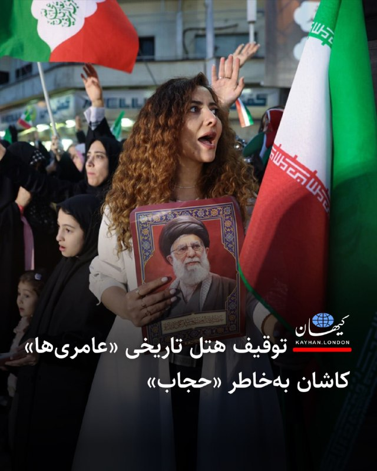

هتل عامری‌های کاشان، یکی از بزرگ‌ترین مجموعه‌های هتلینگ سنتی در این شهر تاریخی، به دلیل آنچه «عدم رعایت حجاب اجباری» عنوان شده، پلمپ شد.
@VahidHeadline
پیش‌تر پیامی دریافت کرده بودم درباره اینکه فقط رستورانش رو بستند.
📡 @VahidOnline

## VahidOnline — post 75550

  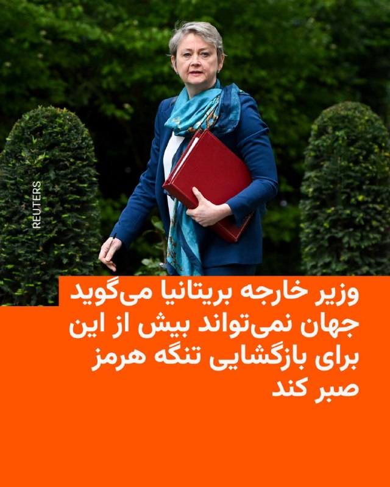

ایووت کوپر، وزیر خارجه بریتانیا روز سه‌شنبه ۲۹ اردیبهشت هشدار داد که جهان دیگر نمی‌تواند بیش از این برای بازگشایی تنگه هرمز صبر کند و ادامه بسته‌ماندن آن امنیت غذایی کشورهای آسیب‌پذیر را با بحران جدی‌تری روبه‌رو می‌کند.

وزارت خارجه بریتانیا روز سه‌شنبه اعلام کرد کوپر در کنفرانس جهانی مشارکت‌ها در لندن، با اشاره به پیامدهای بحران جنگ ایران بر انرژی، کود کشاورزی و قیمت مواد غذایی، خواستار فشار فوری بین‌المللی برای بازگشایی تنگه هرمز شده است.
@VahidHeadline

📡 @VahidOnline

## VahidOnline — post 75549

  

معاون وزیر خارجه ایران می‌گوید تهران در پیشنهادهای اخیر خود به آمریکا برای پایان جنگ میان دو کشور، خواستار برخورداری از حق غنی‌سازی، خاتمه جنگ در تمام جبهه‌ها از جمله لبنان و خروج نیروهای آمریکایی از محیط پیرامونی ایران شده است.

کاظم غریب‌آبادی که روز سه‌شنبه ۲۹ اردیبهشت برای ارائه گزارشی در مورد روند مذاکرات میان تهران و واشینگتن، در کمیسیون امنیت ملی و سیاست خارجی مجلس حاضر شده بود، از دیگر شروط ایران را «رفع محاصرهٔ دریایی آمریکا، آزادسازی اموال و دارایی‌های ایران، تأمین خسارت‌های وارد شده در جنگ توسط ایالات متحده جهت بازسازی و خاتمه تمامی تحریم‌های یکجانبه و قطعنامه‌های شورای امنیت» اعلام کرد.
@VahidHeadline

📡 @VahidOnline

## VahidOnline — post 75548

  

سازمان «کمک به گروگان‌ها در سراسر جهان» دوشنبه شب اعلام کرد شهاب دلیلی، زندانی سیاسی و کاپیتان پیشین شرکت کشتی‌رانی ایران، پس از آزادی از زندان اوین از طریق ایروان به واشینگتن منتقل شده و به خانواده‌اش پیوسته است.
این سازمان اعلام کرد دلیلی پس از گذراندن بیش از یک دهه «بازداشت غیرقانونی» در ایران، اکنون در سلامت کامل قرار دارد.

شهاب دلیلی که ساکن آمریکا بود، سال ۱۳۹۵ خورشیدی برای مراسم خاکسپاری پدرش به تهران سفر کرده بود اما هنگام بازگشت توسط نیروهای امنیتی بازداشت شد.
خانواده او گفته بودند جمهوری اسلامی او را با اتهام‌هایی از جمله «جاسوسی» و «همکاری با دولت متخاصم» به ۱۰ سال حبس محکوم کرده است.
@VahidOOnLine

📡 @VahidOnline

## VahidOnline — post 75547

  

حامد تیزرویان، عکاس حیات‌وحش و فعال محیط زیست، در ساری بازداشت شده است.

به گفته زینب رحیمی، روزنامه‌نگار حوزه محیط زیست، آقای تیزرویان روز ۱۴ اردیبهشت ۱۴۰۵، بازداشت شده و موبایل و دیگر وسایل الکترونیکی او ضبط شده است.

اتهام مطرح‌شده علیه آقای تیزرویان «اجتماع و تبانی با هدف اقدام علیه امنیت ملی» عنوان شده است.
بازداشت او در پی انتشار مطالبی انتقادی درباره کشتار معترضان در دی‌ماه و همچنین اعتراض به اعدام‌ها در شبکه‌های اجتماعی صورت گرفته است.

آقای تیزرویان از عکاسان برجسته و سرشناس حیات وحش است و ثبت عکس‌های کمیاب از حیات وحش ایران از جمله خرس قهوه‌ای و مرال به عنوان گونه‌های‌ در معرض خطر انقراض، بخشی از کارنامه کاری این عکاس حیات وحش است.
@VahidHeadline

📡 @VahidOnline

## kianmeli1 — post 87495

‏🔴والا نیوز: در صورت تصمیم ترامپ برای حمله مجدد به ایران، هماهنگی‌هایی با چند کشور خاورمیانه انجام شده است
https://t.me/kianmeli1

## kianmeli1 — post 87494

‏🔴ارتش اسرائیل اعلام کرد در ۲۴ ساعت گذشته بیش از ۲۵ انبار سلاح، مرکز فرماندهی و زیرساخت حزب‌الله را در جنوب لبنان هدف قرار داده و چند پرتابگر شلیک‌شده به سمت اسرائیل را منهدم کرده است
https://t.me/kianmeli1

## kianmeli1 — post 87493

‏🔴زمین‌لرزه‌ای به بزرگی ۴.۶ شهرستان نورآباد لرستان را لرزاند
https://t.me/kianmeli1

## kianmeli1 — post 87492

  <a href="telegram/content/kianmeli1_87492_1779198692.mp4" target="_blank">🎬 Download video</a>

🔴وزیر دارایی اسرائیل:
من اینجا به طور قاطع می‌گویم: اگر حزب‌الله تسلیم نشود، ما بخش‌های بیشتری از جنوب لبان را تصرف خواهیم کرد
https://t.me/kianmeli1

## kianmeli1 — post 87491

  

🔴هزینه آموزش رانندگی با افزایش ۵۶ درصدی به ساعتی ۶۰۰ هزار تومان رسید و مجموع هزینه دریافت گواهینامه در شرایط فعلی حدود ۱۵ میلیون تومان برآورد می‌شود
https://t.me/kianmeli1

## kianmeli1 — post 87489

🔴حالتان از این همه تناقض و دورویی بهم نمی‌خورد؟

✍️ياشار سلطاني
دیروز هتل تاریخی عامری‌ها کاشان را به‌خاطر «حجاب» پلمب کردند؛ مسافران سرگردان شدند و ۹۰ نفر از پرسنل بیکار!

‏اما همزمان، شب‌ها در میدان‌ها و مراسم‌هایی مثل جان فدا⁩، شعار «بی‌حجاب هم خواهر ماست» تکرار می‌شود و همان زنان با آزادترین پوشش در قاب رسمی دیده می‌شوند.

‏اگر حجاب قانون است، چرا اجرای آن این‌قدر مقطعی و گزینشی است؟

‏حالتان از این همه تناقض و دورویی بهم نمی‌خورد؟
https://t.me/kianmeli1

## kianmeli1 — post 87480

  <a href="telegram/content/kianmeli1_87480_1779198695.mp4" target="_blank">🎬 Download video</a>

🔴وضعیت فعلی کشور
https://t.me/kianmeli1

## IranIntlTV — post 337931

  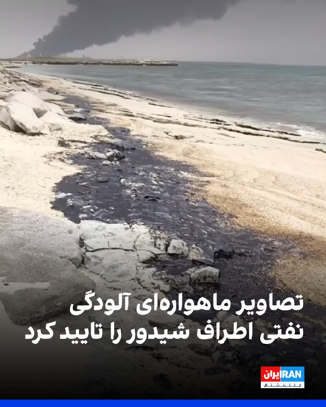

خبرگزاری آسوشیتدپرس با استناد به تصاویر ماهواره‌ای تایید کرد در جریان حملات علیه جمهوری اسلامی، نشت نفت در آب‌های خلیج فارس به سواحل جزیره شیدور سرایت کرده است. این خبرگزاری نوشت حمله به پالایشگاه لاوان عامل این آلودگی بوده است.

در روزهای گذشته ویدیویی در شبکه‌های اجتماعی منتشر شد که در آن پرنده و خرچنگی بی‌جان پوشیده از نفت در ساحل جزیره دیده می‌شوند و مردی نیز ماهی مرده‌ای را نشان می‌دهد.

تصاویر ثبت‌شده در ۱۰ آوریل توسط ماهواره با وضوح بالا و تحلیل‌شده از سوی آسوشیتدپرس نشان می‌دهد آتش‌سوزی پالایشگاه لاوان دو روز پس از حمله همچنان ادامه داشته است. همچنین لکه نفتی گسترده‌ای آب‌های اطراف را آلوده کرده و جزیره شیدور، که با نام محلی مارو نیز شناخته می‌شود، را دربر گرفته است.
https://iranintl.com/202605199759

## IranIntlTV — post 337930

  

کارزار «سه‌شنبه‌های نه به اعدام» اعلام کرد زندانیان معترض به مجازات اعدام، سه‌شنبه ۲۹ اردیبهشت برای صدوبیست‌ویکمین هفته متوالی در ۵۶ زندان ایران دست به اعتصاب غذا زدند. این اقدام در شرایط تشدید موج اعدام‌ها و افزایش نگرانی‌های جهانی درباره وضعیت حقوق بشر در ایران انجام شد.

در بیانیه این کارزار آمده است حکومت جمهوری اسلامی در هفته‌های اخیر، هم‌زمان با گسترش فضای امنیتی و حضور نیروهای وابسته به حکومت در خیابان‌ها، بر اجرای احکام اعدام نیز افزوده است.

این کارزار، به اعدام عبدالجلیل شه‌بخش، زندانی سیاسی بلوچ، در زندان زاهدان و همچنین محمد عباسی، از بازداشت‌شدگان اعتراضات دی‌ماه ۱۴۰۴، اشاره کرد و در بیانیه خود نوشت که حکومت با استفاده از مجازات اعدام، در پی «ایجاد ترس و وحشت در جامعه» است.

کارزار «سه‌شنبه‌های نه به اعدام» تاکید کرد که اعدام صرفا یک مجازات قضایی نیست، بلکه «مهم‌ترین ابزار سرکوب و قتل حکومتی» است که برای وادار کردن جامعه به سکوت و تسلیم به کار گرفته می‌شود.

ادامه این گزارش را در وبسایت ایران‌اینترنشنال بخوانید
https://iranintl.com/202605193847

## IranIntlTV — post 337929

  

سنتکام تصویری از یک ملوان نیروی دریایی آمریکا بر عرشه ناو هواپیمابر آبراهام لینکلن منتشر کرد که در حال عبور از دریای عرب نگهبانی می‌داد. سنتکام نوشت نیروهای این فرماندهی برای اطمینان از اجرای کامل مقررات، ۸۸ کشتی تجاری را تغییر مسیر داده و چهار کشتی را از کار انداخته‌اند.
https://iranintl.com/202605194310

## IranIntlTV — post 337928

  <a href="telegram/content/IranIntlTV_337928_1779198700.mp4" target="_blank">🎬 Download video</a>

سجاد دهقانی شامگاه ۱۹ دی، در شب تولدش، در سه‌راه برق بندرعباس بر اثر اصابت دو گلوله جان باخت. یک روز پیش از آن نیز، اجمین مسیحی، جوان ۲۷ ساله ارمنی، در میدان هفت‌حوض تهران با شلیک مستقیم کشته شد. شاهدان به ایران‌اینترنشنال گفته‌اند او در صف اول معترضان حضور داشت و پیش از اصابت گلوله شعار «آزادی» سر می‌داد.
جزییات بیشتر با فرنوش فرجی، عضو تحریریه ایران‌اینترنشنال
@iranintltv

## IranIntlTV — post 337927

  <a href="telegram/content/IranIntlTV_337927_1779198702.mp4" target="_blank">🎬 Download video</a>

یکی از شهروندان با ارسال پیامی به ایران‌اینترنشنال می‌گوید: «حکومت در جنگ ۱۲ روزه، ۲۰ روز اینترنت را قطع کرد. در خیزش ملی هم ۲۰ روز، و تا امروز ۸۰ روز است که مجددا نت را قطع کرده. یعنی در یک سال گذشته، چهار ماه است که نت نداریم.»

## IranIntlTV — post 337926

  <a href="telegram/content/IranIntlTV_337926_1779198704.mp4" target="_blank">🎬 Download video</a>

از نمایش تعیین پهپاد شاهد به‌عنوان مهریه یک عروس در تلویزیون جمهوری اسلامی تا آموزش کار با سلاح به کودکان؛ مجموعه‌ای از تصاویر و برنامه‌های مرتبط با فضای جنگ، که واکنش گسترده کاربران شبکه‌های اجتماعی را به‌دنبال داشته است.
آیه دریس، عضو تحریریه ایران‌اینترنشنال، از واکنش کاربران می‌گوید
@iranintltv

## IranIntlTV — post 337925

  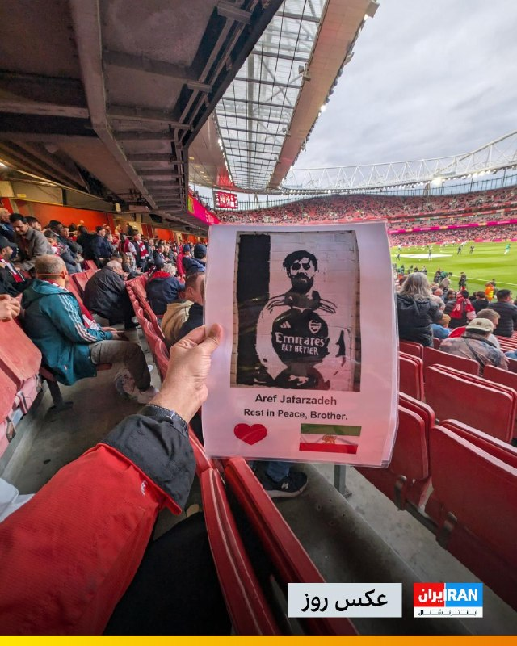

🔻تصویر رسیده به ایران اینترنشنال نشان می‌دهد یکی از هواداران آرسنال در بازی شب گذشته این تیم برابر برنلی، آخرین بازی خانگی توپچی‌ها در این فصل، تصویری از جاویدنام عارف جعفرزاده، هوادار سرسخت تیم فوتبال آرسنال، را که در جریان انقلاب ملی ایرانیان علیه جمهوری اسلامی کشته شد، به دست گرفته است.

🔹پیش‌تر تصاویری منتشر شده بود که نشان می‌داد لوگوی باشگاه آرسنال روی سنگ مزار او حک شده است.

🔹جاویدنام عارف جعفرزاده، ۳۴ ساله و اهل رشت، شامگاه ۱۸ دی ۱۴۰۴ در جریان اعتراضات مردمی هدف شلیک مستقیم گلوله به سر قرار گرفت و جان باخت.

🔹کشته شدن این هوادار آرسنال در فضای هواداری این باشگاه در انگلستان بازتاب گسترده‌ای داشت. نورت‌بنکسی، هنرمند مشهور انگلیسی، گرافیتی جاویدنام جعفرزاده را در «تونل نورت‌بنکسی» در ورودی‌ استادیوم امارات نقاشی کرد.

@iranintltvsport

## IranIntlTV — post 337924

  

وزیران دارایی کشورهای عضو گروه ۷ که در پاریس گرد هم آمده‌اند، با انتشار بیانیه‌ای مشترک بر ضرورت بازگشایی تنگه هرمز تاکید کردند.

آن‌ها همچنین بار دیگر بر تعهد خود به همکاری‌های چندجانبه برای مقابله با ریسک‌های پیش‌روی اقتصاد جهانی تاکید کردند.

وزیران دارایی کانادا، فرانسه، آلمان، ایتالیا، ژاپن، بریتانیا و ایالات متحده اعلام کردند به حفظ ثبات بازارهای انرژی پایبند هستند و از تمامی کشورها خواستند از اعمال محدودیت‌های خودسرانه بر صادرات خودداری کنند.
https://iranintl.com/202605194425

## IranIntlTV — post 337923

  <a href="https://t.me/IranintlTV/337923" target="_blank">📎 Download file</a>

🎧نسخه صوتی اخبار نیم‌روزی | سه‌شنبه ۲۹ اردیبهشت
@iranintlTV

## IranIntlTV — post 337922

  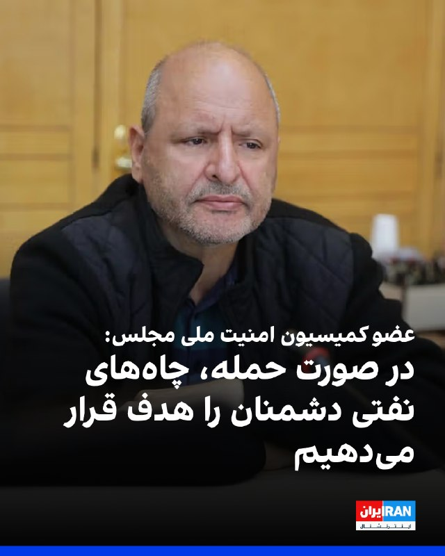

احمد بخشایش اردستانی، عضو کمیسیون امنیت ملی مجلس، در مصاحبه با ایلنا گفت: «من فکر نمی‌کنم آمریکا به ایران حمله کند، چرا که در حمله نظامی چیزی به دست نخواهد آورد؛ اما اگر حمله کند، به خارک و اصفهان حمله خواهد کرد.»

او افزود: «حمله به اصفهان هم برای این است که آن ۴۰۰ کیلو اورانیوم را به دست بیاورد؛ چیزی که قبلا در دستیابی به آن ناکام ماندند.»

اردستانی ادامه داد: «به اعتقاد من، وضعیت "نه صلح، نه جنگ" باقی خواهد ماند، چرا که آمریکا دنبال ناآرامی است و فکر می‌کند که وضعیت اقتصاد ایران با ادامه این وضعیت جامعه را به سمت ناآرامی جلو خواهد برد.»

او تهدید کرد: «اگر این بار دشمنان به ما حمله کنند، ما به چاه‌ها و تاسیسات نفتی آنان حمله خواهیم کرد. اگر قرار باشد آنها کاری کنند که ما نفتی نداشته باشیم، به لوله‌هایشان حمله نخواهیم کرد؛ به چاه‌ها حمله خواهیم کرد تا آن‌ها هم نفت نداشته باشند و سوخت برای دنیا گران شود.»
https://iranintl.com/202605197059

## IranIntlTV — post 337921

  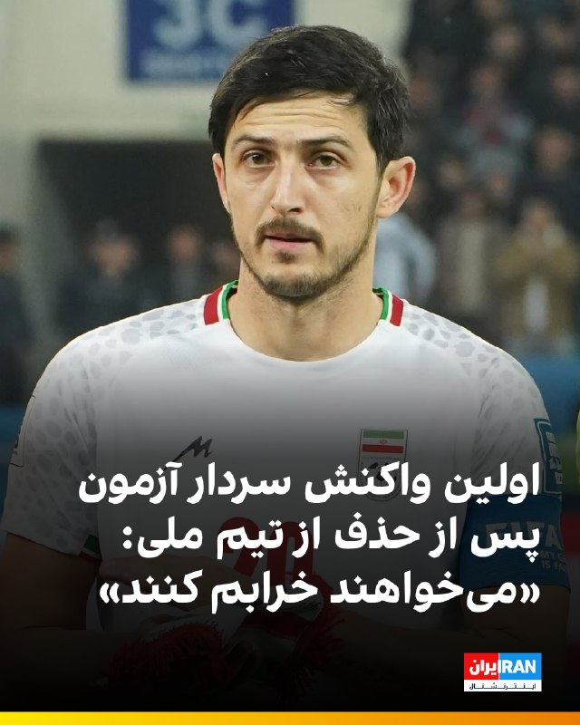

🔻سردار آزمون که پس از موضع‌گیری‌هایی در مخالفت با جمهوری اسلامی، از فهرست تیم ملی برای جام جهانی کنار گذاشته شد، با انتشار استوری‌ای در اینستاگرام نوشت که افرادی قصد دارند او را تخریب کنند.

🔹سردار آزمون با انتشار تصویری از تیم ملی پیش از سفر به ترکیه نوشت: «درست است که پیشتان نیستم، ولی رفیق‌های من هستید، دلیل نمی‌شود که برای شما آرزوی موفقیت نکنم. خیلی‌ها می‌خواهند خرابم کنند، ولی این حرف‌ها اصلا درست نیست. موفق باشید بچه‌ها.»

🔹سردار آزمون پیش‌تر در واکنش به کشتار معترضان از سوی جمهوری اسلامی در جریان سرکوب انقلاب ملی ایرانیان، با انتشار ویدیویی از تصاویر کشته‌شدگان در اینستاگرام نوشت: «این‌ها قصه نبودند، واقعی بودند. هیچ‌وقت شما را از یاد نمی‌بریم.»

🔹او همچنین پس از حملات جمهوری اسلامی به امارات متحده عربی، تصویری از خود در کنار حاکم دبی منتشر کرد. پس از آن، رسانه‌های حکومتی و مجریان صداوسیما به او حمله کردند و در نهایت از تیم ملی کنار گذاشته شد. همچنین قوه قضاییه جمهوری اسلامی اموال او را مصادره کرد.

@iranintltvsport

## IranIntlTV — post 337920

  <a href="telegram/content/IranIntlTV_337920_1779198711.mp4" target="_blank">🎬 Download video</a>

یک شهروند با ارسال پیامی به ایران‌اینترنشنال می‌گوید در قشم سوخت به بازار سیاه منتقل شده و مردم نمی‌توانند بنزین پیدا کنند.

## IranIntlTV — post 337918

  <a href="telegram/content/IranIntlTV_337918_1779198713.mp4" target="_blank">🎬 Download video</a>

دومین جلسه رسیدگی به پرونده متهمان حمله با چاقو به پوریا زراعتی، مجری تلویزیون ایران‌اینترنشنال، در حال برگزاری است. دادستان بریتانیا در نشست دوشنبه گفت «ناندیتو بادیا» و «جورج استانا»، دو متهم رومانیایی این پرونده، به‌عنوان عوامل نیابتی جمهوری اسلامی عمل کردند.
گفت‌وگو با تاج‌الدین سروش، عضو تحریریه ایران‌اینترنشنال

@iranintltv

## IranIntlTV — post 337917

روزنامه فایننشال تایمز گزارش داد در پی محاصره دریایی آمریکا، صادرات نفت ایران به شرق آسیا متوقف شده و بخش قابل توجهی از نفت خام روی نفتکش‌های قدیمی در خلیج فارس ذخیره شده است.
گفت‌وگو با آرش آزرمی، دبیر بخش اقتصادی ایران‌اینترنشنال
@iranintltv

## IranIntlTV — post 337916

  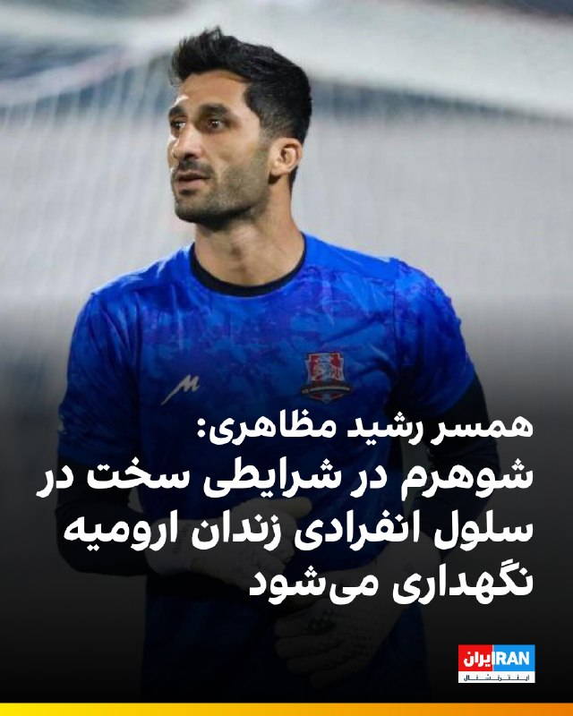

🔻مریم عبدالهی، همسر رشید مظاهری، با انتشار پستی در اینستاگرام از زندانی بودن دروازه‌بان پیشین استقلال و تیم ملی فوتبال ایران در سلول انفرادی زندان ارومیه خبر داد.

🔹رشید مظاهری پس از کشتار معترضان از سوی جمهوری اسلامی در ۱۸ و ۱۹ دی، با انتشار ویدیویی در پنجم اسفند، علی خامنه‌ای را مسئول کشتار مردم معرفی کرده بود. پس از انتشار آن پست، هیچ خبری از وضعیت مظاهری منتشر نشد.

🔹مریم عبدالهی در پستی که در اینستاگرام منتشر کرد، نوشت: «ماه‌هاست برای آزادی رشید می‌جنگم و پیگیر وضعیتش هستم، اما امروز فهمیدم او را به زندان مرکزی ارومیه و در شرایط بسیار سخت انفرادی منتقل کرده‌اند.»

🔹او همچنین نوشت: «رشید همیشه برای حق ایستاد و اکنون هزینه همین ایستادگی را با حبس در انفرادی می‌دهد. اما این سکوت ظالمانه دیگر کافی است. از جامعه ورزش، رسانه‌ها و مردم وطن‌پرست می‌خواهم بیش از گذشته صدای رشید مظاهری باشند. ما فقط شفافیت و رسیدگی فوری و عادلانه می‌خواهیم. او برای حق ایستاد و من هم تا زمان آزادی‌اش با تمام توان کنار او می‌ایستم و عقب‌نشینی نمی‌کنم.»

@iranintltvsport

## IranIntlTV — post 337915

  

پس از گزارش رسانه‌ها درباره شنیدن صدای چند انفجار مهیب در جزیره قشم، معاون امنیتی استاندار هرمزگان اعلام کرد صدای انفجارهای شنیده‌شده ظهر امروز در جزیره قشم مربوط به خنثی‌سازی مهمات عمل‌نکرده بوده است.

او در پایان افزود: «از مردم جزیره قشم می‌خواهیم به هیچ‌وجه نگران نباشند و به شایعات فضای مجازی توجه نکنند.»

این در حالی است که در موارد مشابه، مقام‌های جمهوری اسلامی پیش از اجرای عملیات خنثی‌سازی مهمات عمل‌نکرده، نسبت به احتمال شنیده شدن صدای انفجار اطلاع‌رسانی می‌کردند، اما درباره عملیات امروز در قشم اطلاعیه قبلی منتشر نشده بود.
https://iranintl.com/202605195385

## IranIntlTV — post 337914

  <a href="telegram/content/IranIntlTV_337914_1779198717.mp4" target="_blank">🎬 Download video</a>

یک شهروند با ارسال پیامی به ایران‌اینترنشنال می‌گوید: «باورم نمی‌شود در قرن ۲۱، یک حکومت نزدیک به سه ماه است که اینترنت را به روی مردم قطع کرده، این موضوع برای هیچ سازمان بین‌المللی اهمیت ندارد؟»

## IranIntlTV — post 337913

  

ولی‌الله حیاتی، معاون امنیتی انتظامی استانداری خوزستان، ظهر سه‌شنبه اعلام کرد که صدای شلیک‌های شنیده‌شده در آسمان اندیمشک ناشی از «تست سامانه پدافند هوایی» بوده است.
حیاتی گفت بر اثر سقوط یک پرتابه در منطقه‌ای مسکونی، چهار شهروند مجروح شده‌اند که به گفته او در وضعیت پایدار قرار دارند و هم‌اکنون در مراکز درمانی تحت مداوا هستند.
او افزود: «با هوشیاری نیروهای مسلح و مدیریت استان، شرایط کاملا تحت کنترل است.»
https://iranintl.com/202605193667

## Shin_Persian — post 6086

Shin ✓ @hey_itsmyturn
Tue, 19 May 2026 13:16:01 UTC

𝐄𝐜𝐨𝐧𝐨𝐦𝐢𝐜 𝐅𝐮𝐫𝐲 campaign intensifies financial pressure on Iran through modernized sanctions architecture targeting terrorist financing networks, with Treasury freezing nearly $500 million in regime-linked cryptocurrency and disrupting hundreds of billions in illicit flows.

𝐊𝐞𝐲 𝐏𝐨𝐥𝐢𝐜𝐲 𝐔𝐩𝐝𝐚𝐭𝐞𝐬:
- Treasury reviewing outdated designations to focus financial institutions on sophisticated evasion schemes
- New approach emphasizes targeted sanctions with defined timelines rather than indefinite measures
- Sanctions architecture modernized for 21st century threats including cryptocurrency and shadow banking

𝐂𝐚𝐦𝐩𝐚𝐢𝐠𝐧 𝐒𝐜𝐨𝐩𝐞 - 𝐄𝐜𝐨𝐧𝐨𝐦𝐢𝐜 𝐅𝐮𝐫𝐲:
- Disrupted tens of billions in projected Iranian oil revenue
- Frozen nearly $500 million in regime-linked cryptocurrency
- Disrupted hundreds of billions in Iran's illicit financial flows
- Intensified crackdown on Tehran's shadow banking networks
- Targeting vessel networks, intermediaries, and oil buyers

𝐈𝐧𝐭𝐞𝐫𝐧𝐚𝐭𝐢𝐨𝐧𝐚𝐥 𝐂𝐨𝐨𝐩𝐞𝐫𝐚𝐭𝐢𝐨𝐧 𝐑𝐞𝐪𝐮𝐢𝐫𝐞𝐦𝐞𝐧𝐭𝐬:
- European partners: Designate Iranian financiers, unmask shell companies, shutter bank branches, dismantle proxies
- Middle East/Asia partners: Root out Iran's shadow banking networks
- Global partners: Target array of terrorists from Hizballah to Sinaloa Cartel

𝐒𝐭𝐫𝐚𝐭𝐞𝐠𝐢𝐜 𝐃𝐨𝐜𝐭𝐫𝐢𝐧𝐞:
- Economic security positioned as national security under Trump Administration
- Sanctions designed as "instruments of peace" to create behavioral change conditions
- Focus on aggressive, targeted actions rather than generational punishment of populations
- Emphasis on agility to maximize effectiveness while monitoring for unintended consequences

𝐎𝐩𝐞𝐫𝐚𝐭𝐢𝐨𝐧𝐚𝐥 𝐓𝐚𝐫𝐠𝐞𝐭𝐬:
- Shell companies embedded within Europe
- Shadow banking networks across Middle East
- Drug cartels throughout Western Hemisphere
- Iranian weapons programs and terrorist proxies
- Nuclear ambitions financing

The announcement reinforces maximum pressure campaign continuation with enhanced multilateral coordination expectations and modernized enforcement mechanisms.

ترجمه فارسی در بخش نظرات

𝕏 · @shin_persian

## Shin_Persian — post 6085

  <a href="telegram/content/Shin_Persian_6085_1779198720.mp4" target="_blank">🎬 Download video</a>

Emanuel (Mannie) Fabian ✓ @manniefabian Tue, 19 May 2026 11:20:57 UTC The military says it struck over 25 Hezbollah targets in southern Lebanon in the past day. The targets included weapon depots, command centers, rocket launchers used in previous attacks…

## Shin_Persian — post 6084

Emanuel (Mannie) Fabian ✓ @manniefabian
Tue, 19 May 2026 11:20:57 UTC

The military says it struck over 25 Hezbollah targets in southern Lebanon in the past day.

The targets included weapon depots, command centers, rocket launchers used in previous attacks, and other infrastructure used by the terror group to advance attacks, according to the IDF.

The IDF says it also struck Hezbollah operatives in the Cristofani Ridge area, located several kilometers north of Mount Hermon.

فارسی

ارتش اعلام کرد که در شبانه‌روز گذشته بیش از ۲۵ هدف حزب‌الله در جنوب لبنان را مورد حمله قرار داده است.

به گفته ارتش دفاعی اسرائیل (IDF)، این اهداف شامل انبارهای سلاح، مراکز فرماندهی، سکوهای پرتاب راکت مورد استفاده در حملات قبلی و سایر زیرساخت‌هایی بود که این گروه تروریستی برای پیشبرد حملات استفاده می‌کرد.

ارتش دفاعی اسرائیل همچنین اعلام کرد که نیروهای عملیاتی حزب‌الله را در منطقه خط‌الرأس کریستوفانی، واقع در چند کیلومتری شمال کوه حرمون، هدف قرار داده است.

𝕏 · @shin_persian

## Shin_Persian — post 6083

  

Shin ✓ @hey_itsmyturn
Tue, 19 May 2026 12:12:22 UTC

State-owned Mehr confirms the explosion(s), reports it was due to EOD

فارسی

خبرگزاری دولتی مهر وقوع انفجار(ها) را تایید و گزارش کرد که این حادثه ناشی از ای‌او‌دی (EOD - خنثی‌سازی مهمات انفجاری) بوده است.

𝕏 · @shin_persian

## ManotoTV — post 105635

  <a href="telegram/content/ManotoTV_105635_1779198723.mp4" target="_blank">🎬 Download video</a>

خبرگزاری رویترز گزارش داد پالایشگاه‌های دولتی چین از زمان آغاز جنگ ایران، تولید خود را بیش از یک میلیون بشکه در روز کاهش داده‌اند.
بر اساس این گزارش، اختلال در تامین نفت خاورمیانه و کاهش سودآوری پالایشگاه‌ها باعث شده شرکت‌های بزرگ نفتی چین از جمله سینوپک و پتروچاینا ظرفیت پالایش خود را کاهش دهند.
داده‌ها نشان می‌دهد میزان پالایش نفت خام در چین از حدود ۱۰ میلیون بشکه در روز پیش از حملات آمریکا و اسرائیل به ایران، به حدود ۸.۴ میلیون بشکه در ماه مه رسیده است.
رویترز همچنین گزارش داد افزایش قیمت نفت و کاهش تقاضا برای سوخت، حاشیه سود پالایشگاه‌های چینی را به‌شدت کاهش داده و همزمان محدودیت‌های دولت چین بر صادرات سوخت، باعث افزایش ذخایر داخلی بنزین و گازوئیل شده است.

## ManotoTV — post 105634

  <a href="telegram/content/ManotoTV_105634_1779198724.mp4" target="_blank">🎬 Download video</a>

ولی‌الله حیاتی، معاون امنیتی استانداری خوزستان، بعدازظهر سه‌شنبه ۲۹ اردیبهشت گفت سقوط یک «پرتابه» یا «شی ناشناس» در یک منطقه مسکونی اندیمشک چهار مصدوم بر جا گذاشت.

به گزارش ایرنا، این مقام محلی گفت این حادثه به یک باب مغازه و دو خودرو خسارت وارد کرده و بازتاب گسترده‌ای در شبکه‌های اجتماعی این شهرستان داشته است.

حیاتی در توضیح جداگانه‌ای درباره صداهای شنیده‌شده در آسمان اندیمشک گفت: «صدای شلیک‌های اخیر در آسمان اندیمشک به دلیل تست پدافند هوایی است، لذا مردم نگران نباشند.»

با این حال رسانه‌های داخلی و مقام‌های جمهوری اسلامی هنوز توضیحی درباره ماهیت «شی ناشناس» یا «پرتابه» سقوط‌کرده ارائه نکرده‌اند و مشخص نیست این حادثه ارتباطی با تست پدافند هوایی داشته است یا نه.

## ManotoTV — post 105633

  <a href="telegram/content/ManotoTV_105633_1779198725.mp4" target="_blank">🎬 Download video</a>

سخنگوی وزارت خارجه قطر اعلام کرد دوحه همچنان با واشنگتن و تهران در تماس است و این رایزنی‌ها ادامه خواهد داشت.
ماجد الانصاری، در واکنش به تصمیم دونالد ترامپ برای تعویق حمله برنامه‌ریزی‌شده به ایران به درخواست قطر، عربستان سعودی و امارات، گفت این اقدام «نشانه پاسخ مثبت» بوده است.
او همچنین با اشاره به مذاکرات میان آمریکا و جمهوری‌اسلامی گفت قطر از تلاش‌های دیپلماتیک پاکستان برای نزدیک کردن طرف‌ها و یافتن راه‌حل حمایت می‌کند و این روند «به زمان بیشتری نیاز دارد».
الانصاری درباره روابط دوحه و تهران گفت قطر همچنان روابط مثبتی با جمهوری‌اسلامی دارد، اما در عین حال افزود حمله جمهوری‌اسلامی به قطر «تهدیدی برای روابط دو کشور» به شمار می‌رود

## ManotoTV — post 105632

  <a href="telegram/content/ManotoTV_105632_1779198726.mp4" target="_blank">🎬 Download video</a>

«صدای رشید مظاهری باشید»

## ManotoTV — post 105631

  <a href="telegram/content/ManotoTV_105631_1779198727.mp4" target="_blank">🎬 Download video</a>

«صدای فاطمه سپهری باشیم»

## ManotoTV — post 105630

  <a href="telegram/content/ManotoTV_105630_1779198729.mp4" target="_blank">🎬 Download video</a>

بر اساس گزارش‌ رسانه‌های حکومتی حمید خانی، پاسدار بازنشسته اهل شهرستان بروجن، در جریان عملیات خنثی‌سازی بمب‌های عمل‌نکرده باقی‌مانده از جنگ اخیر در تهران کشته شد. بر اساس گزارش‌ها، او به‌صورت داوطلبانه در بخش مهندسی قرارگاه خاتم‌الانبیا فعالیت می‌کرد.

## ManotoTV — post 105629

  <a href="telegram/content/ManotoTV_105629_1779198730.mp4" target="_blank">🎬 Download video</a>

قیمت جهانی نفت پس از آن کاهش یافت که دونالد ترامپ اعلام کرد حمله برنامه‌ریزی‌شده به ایران را به‌منظور فراهم شدن فرصت برای مذاکرات و پایان جنگ، متوقف کرده است.
بهای نفت برنت، شاخص جهانی قیمت نفت، با کاهش ۱.۵ درصدی به ۱۱۰ دلار و ۳۷ سنت در هر بشکه رسید.
همزمان، نفت خام وست‌تگزاس اینترمدیت آمریکا نیز برای تحویل ماه ژوئن با افت ۶۳ سنتی، ۱۰۸ دلار و ۳ سنت معامله شد. قرارداد فعال‌تر ماه ژوئیه این شاخص نیز با کاهش ۰.۸ درصدی به ۱۰۳ دلار و ۵۶ سنت رسید.

## FarsiVOA — post 218138

  <a href="telegram/content/FarsiVOA_218138_1779198731.mp4" target="_blank">🎬 Download video</a>

ارتش اسرائیل در شبانه‌روز گذشته بیش از ۲۵ بار مواضع متعلق به حزب‌الله را در جنوب لبنان هدف قرار داد و اعلام کرد این اهداف شامل انبارهای تسلیحات، مراکز فرماندهی و دیگر زیرساخت‌هایی بود که «این گروه از آن‌ها برای پیشبرد طرح‌های تروریستی علیه نیروهای ارتش اسرائیل و کشور اسرائیل استفاده می‌کردند.»

ارتش اسرائیل همچنین اعلام کرد «در منطقه رشته‌کوه کریستوفنی در جنوب لبنان تروریست‌ها را هدف قرار داد و پرتابگرهایی را که پیش‌تر به سوی نیروهای ارتش اسرائیل و خاک این کشور شلیک کرده بودند، منهدم کرد.»

## FarsiVOA — post 218137

🔺تداوم حملات ارتش اسرائیل به زیرساخت‌های حزب‌الله در جنوب لبنان

▪️اسرائیل از انجام حملات متعدد به مواضع و تاسیسات حزب‌الله لبنان خبر داد.

⬇️ بیشتر بخوانید:

https://ir.voanews.com/a/israeli-army-terrorist-attack-hezbollah/8151604.html/?nocach=1

## FarsiVOA — post 218136

  <a href="telegram/content/FarsiVOA_218136_1779198734.mp4" target="_blank">🎬 Download video</a>

لحظه زیر گرفتن عابران توسط یک خودرو در ایتالیا؛ رد تروریستی بودن حادثه از سوی مقامات امنیتی؛

مقامات ایتالیا رسماً اعلام کردند که حمله روز گذشته با خودرو به عابران پیاده در شهر مودنا، یک اقدام تروریستی نبوده است.

این حمله توسط فردی به نام «سلیم الکودری» انجام شده بود.

بر اساس گزارش خبرگزاری‌های رسمی از جمله رویترز، این حادثه هیچ کشته‌ای نداشته، اما ۸ نفر زخمی شده‌اند که حال ۴ نفر از آن‌ها وخیم گزارش شده است.

بر اساس بیانیه دستگاه‌های امنیتی و قضایی ایتالیا، بررسی‌ها نشان می‌دهد این اقدام ناشی از «مشکلات روحی و روانی» شدید ضارب بوده و هیچ انگیزه تروریستی یا سازمان‌یافته‌ای پشت آن نبوده است.
@FarsiVOA

## FarsiVOA — post 218135

  

خبرگزاری میزان، وابسته به قوه قضائیه جمهوری اسلامی، گزارش داد با دستور مقام قضایی، اموال ۵۲ نفر در استان زنجان به اتهام ارتباط با شبکه‌های «همکار با دشمن» توقیف شده است.

علی فرجی، رئیس کل دادگستری زنجان، گفت این اموال شامل وجوه بانکی و ارزی، اموال منقول و غیرمنقول و طلاست و قرار است برای بازسازی اماکن آسیب‌دیده از جنگ هزینه شود. به گفته او، هفت نفر از متهمان در بازداشت هستند و تعدادی دیگر خارج از کشور به سر می‌برند.

این اقدام در ادامه موج گسترده‌تری از پرونده‌سازی‌های قضایی پس از جنگ انجام می‌شود. سخنگوی قوه قضائیه پیش‌تر گفته بود بر اساس قانون تشدید مجازات جاسوسی و همکاری با اسرائیل و دولت‌های متخاصم، همکاری اطلاعاتی می‌تواند با توقیف اموال و حتی اعدام همراه باشد.

در هفته‌های گذشته نیز قوه قضائیه از صدور دستور توقیف اموال ده‌ها نفر، از جمله کارکنان رسانه‌های فارسی‌زبان خارج از کشور، خبر داده بود.
@FarsiVOA

## FarsiVOA — post 218134

🔺قطر: جمهوری اسلامی حق ندارد مانع عبور کشتی‌ها از تنگه هرمز شود

▪️ماجد انصاری، سخنگوی وزارت خارجه قطر با تأکید بر حق عبور امن از تنگه هرمز اعلام کرد که هیچ کشوری، از جمله حکومت ایران، حق ندارد مانع عبور یا موجب بسته شدن این تنگه برای کشتیرانی دریایی شود.

▪️انصاری روز سه‌شنبه در یک نشست خبری در دوحه گفت: «بر اساس قواعد حقوق بین‌الملل، عبور امن از تنگه هرمز حق دولت قطر است.»

▪️در حالی که مقامات جمهوری اسلامی از ایجاد سازوکاری برای کنترل تنگه هرمز از سوی حکومت ایران خبر داده‌اند، این مقام قطری گفت: «هیچ تغییری در وضعیت موجود مربوط به آزادی کشتیرانی در تنگه هرمز قابل پذیرش نیست.»

⬇️ بیشتر بخوانید:
https://ir.voanews.com/a/8151599.html

## FarsiVOA — post 218133

  

عضو انجمن شرکت‌های حمل‌ونقل بین‌المللی ایران با بیان اینکه ایستایی کامیون‌ها در مرز بازرگان به ۲۰ روز رسیده است، هزینه این توقف را ماهانه ۱۰ میلیون دلار برآورد کرد.

احسان ملک‌زاده، در گفت‌وگو با خبرگزاری مهر اعلام کرد که هم‌اکنون حدود سه هزار کامیون در صف خروج مرز بازرگان قرار دارند. وی افزود که در سایر مرزها نیز کامیون‌ها بین ‍پنج تا ۱۰ روز در انتظار خروج از کشور می‌مانند.

او مهم‌ترین عامل توقف کامیون‌ها در مرز بازرگان را «ظرفیت محدود پذیرش از طرف ترکیه» اعلام کرد و مدعی شد این کشور «تنها حدود ۲۵۰ کامیون از ایران» در روز پذیرش می‌کند.

جمهوری اسلامی پس از آنکه به دلیل اخلال در تنگه هرمز، با محاصره دریایی از سوی ایالات متحده آمریکا روبه‌رو شد، ناچار از توسل به حمل و نقل جاده‌ای شد.

روز دوشنبه ۲۸ اردیبهشت، فرماندهی مرکزی ایالات متحده، سنتکام، اعلام کرد که اجرای محاصره دریایی آمریکا علیه بنادر ایران همچنان ادامه دارد. این محاصره دست‌کم تا زمان رفع اختلال در تردد کشتی‌ها از سوی جمهوری اسلامی ادامه خواهد داشت.
@FarsiVOA

## FarsiVOA — post 218132

  

رویترز به نقل از وب‌سایت خبری دلفی گزارش داد یک جنگنده ناتو روز سه‌شنبه یک پهپاد با منشأ احتمالی اوکراینی را در حریم هوایی استونی سرنگون کرده است.

هانو پِوکور، وزیر دفاع استونی، به دلفی گفت این پهپاد در حریم هوایی استونی شناسایی و هدف قرار گرفت. ناتو تا زمان انتشار گزارش رویترز به درخواست این خبرگزاری برای اظهارنظر پاسخ نداده بود.

این رخداد تازه‌ترین مورد از مجموعه نقض‌های حریم هوایی در منطقه بالتیک و مرزهای شرقی ناتو در نزدیکی روسیه است. به نوشته رویترز، این حادثه در ادامه مجموعه‌ای از ورود پهپادهای اوکراینی یا مشکوک به اوکراینی به حریم هوایی کشورهای عضو ناتو رخ داده است؛ بحرانی که در لتونی ابتدا به استعفای وزیر دفاع و سپس به استعفای نخست‌وزیر و فروپاشی دولت ائتلافی انجامید.

این حادثه در حالی رخ داده که حملات پهپادی روسیه و اوکراین در هفته‌های اخیر شدت گرفته و خطر ورود پهپادهای سرگردان یا منحرف‌شده به حریم هوایی کشورهای عضو ناتو را افزایش داده است.
@FarsiVOA

## FarsiVOA — post 218131

  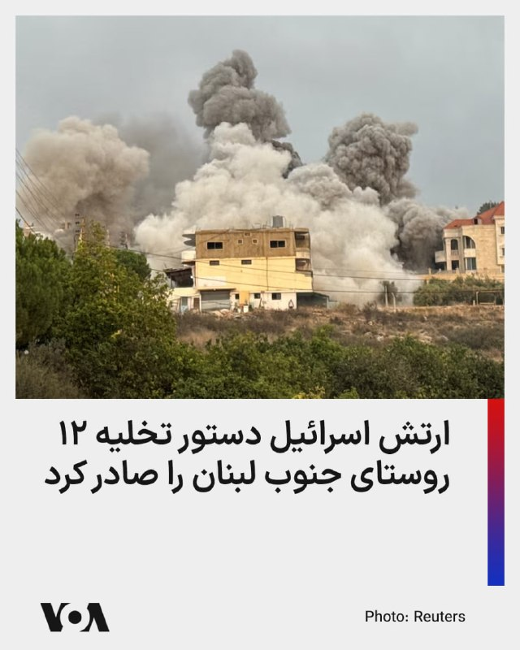

ارتش اسرائیل در تازه‌ترین هشدار خود از ساکنان ۱۲ روستا در جنوب لبنان خواست فوراً این مناطق را ترک کنند.

بر اساس متن هشدار منتشرشده، این دستور شامل روستاها و مناطق طُول، نبطیه التحتا، حبوش، البازوریه، طیر دبا، کفر حونه، عین قانا، لبایا، جبشیت، الشهابیه، برج الشمالی در صور و حومین الفوقا می‌شود؛ مناطقی که بیشتر آنها در نواحی نبطیه و صور قرار دارند.

در این هشدار از ساکنان خواسته شده به دلیل حضور عناصر حزب‌الله و تجهیزات نظامی در این مناطق، دست‌کم هزار متر از محل‌های مشخص‌شده فاصله بگیرند.

ارتش اسرائیل اعلام کرده هر فردی که در نزدیکی عناصر حزب‌الله، تأسیسات یا تجهیزات نظامی این گروه بماند، جان خود را در معرض خطر قرار می‌دهد.
@FarsiVOA

## FarsiVOA — post 218130

🔺آمریکا ۱۱ مقام سیاسی و نظامی کوبا و نهاد اطلاعاتی هاوانا را تحریم کرد

▪️آمریکا تحریم‌های تازه‌ای علیه ۱۱ مقام سیاسی و نظامی کوبا و همچنین نهاد اصلی اطلاعاتی این کشور اعمال کرد؛ اقدامی که در ادامه تشدید فشار دولت دونالد ترامپ بر حکومت کمونیستی هاوانا انجام می‌شود.

▪️وزارت خارجه آمریکا نیز وزارت کشور کوبا و پلیس ملی انقلابی این کشور را هدف قرار داده است؛ نهادی که واشنگتن آن را به سرکوب اعتراضات و استفاده از بازداشتگاه‌های سیار متهم کرده است.

▪️ترامپ روز اول مه فرمانی اجرایی امضا کرد که به دولت اختیار گسترده‌تری برای تحریم افراد و نهادهای فعال در اقتصاد کوبا می‌دهد و امکان اعمال تحریم‌های ثانویه علیه مؤسسات مالی خارجی طرف معامله با نهادهای تحریم‌شده کوبایی را فراهم می‌کند.

⬇️ بیشتر بخوانید:
https://ir.voanews.com/a/8151597.html

## FarsiVOA — post 218129

  

🔺حضور قطر و امارات در نشست مالی گروه هفت برای بررسی بحران خلیج فارس

▪️رویترز گزارش داد مقام‌هایی از قطر و امارات متحده عربی در نشست وزیران دارایی گروه هفت در پاریس حضور یافتند تا درباره بحران خلیج فارس و پیامدهای اقتصادی جنگ با جمهوری اسلامی گفت‌وگو کنند.

▪️وزیر دارایی فرانسه در این باره گفت حضور مقام‌های قطر و امارات بخشی از تلاش گروه هفت برای بررسی پیامدهای جنگ در خاورمیانه و کمک به کشورهایی است که بیشترین آسیب را از بحران دیده‌اند.

▪️دعوت از کشورهای غیرعضو به نشست‌های مالی گروه هفت سابقه دارد؛ اما حضور قطر و امارات در پاریس از آن جهت مهم است که دو کشور مستقیماً در معرض پیامدهای بحران خلیج فارس، اختلال در تنگه هرمز، حملات پهپادی و فشار بر بازار انرژی قرار گرفته‌اند.

⬇️ بیشتر بخوانید:
https://ir.voanews.com/a/8151595.html

## DW_Farsi — post 124872

  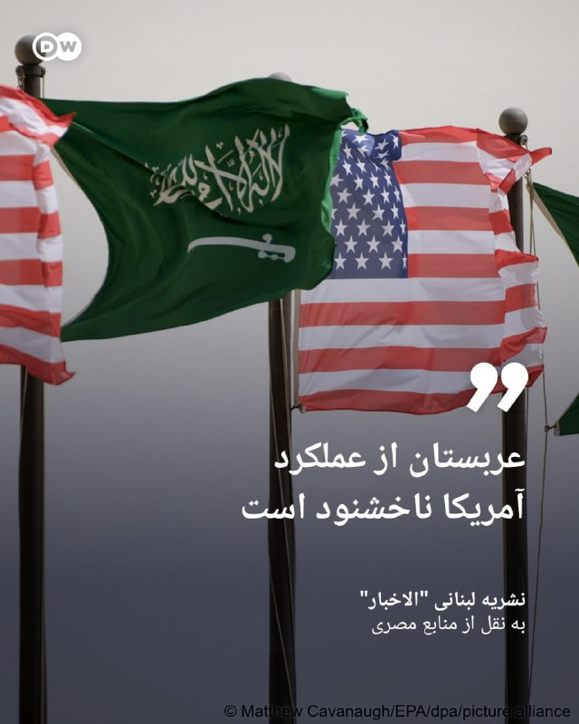

🔶 الاخبار: عربستان از عملکرد آمریکا ناخشنود است

نشریه لبنانی "الاخبار" به نقل از منابع مصری گزارش داد، عربستان سعودی در روزهای اخیر رایزنی‌های فشرده‌ای با طرف‌های عربی و کشورهای حاشیه خلیج فارس داشته است تا به موضعی هماهنگ در مورد چگونگی تعامل با جمهوری اسلامی در وضعیت کنونی و همچنین پس از جنگ دست یابد.

این منابع با استناد به اظهارات دیپلمات‌های سعودی گفته‌اند، ریاض از "سیاست‌های غافلگیرکننده" واشنگتن ناراضی و به دولت ایالات متحده اعتماد لازم را ندارد.

گزارش الاخبار در حالی منتشر می‌شود که دونالد ترامپ، رئیس جمهور آمریکا عصر دوشنبه ۱۸ مه (۲۸ اردیبهشت) با انتشار پستی در شبکه اجتماعی خود، تروث سوشال اعلام کرد، ایالات متحده حمله نظامی "برنامه‌ریزی‌شده" علیه ایران را که قرار بود روز سه‌شنبه انجام شود، "اجرا نخواهد کرد".

ترامپ در پست خود مدعی شد که "امیر قطر، تمیم بن حمد آل ثانی، ولیعهد عربستان محمد بن سلمان آل سعود و رئیس امارات محمد بن زاید آل نهیان" از او خواسته‌اند تا این حمله را به تعویق بیاندازد، زیرا "مذاکرات جدی هم‌اکنون در جریان است و به نظر آن‌ها، به‌عنوان رهبران و متحدان بزرگ، توافقی حاصل خواهد شد که برای ایالات متحده آمریکا، همه کشورهای خاورمیانه و فراتر از آن بسیار قابل قبول خواهد بود".

@dw_farsi

## DW_Farsi — post 124871

  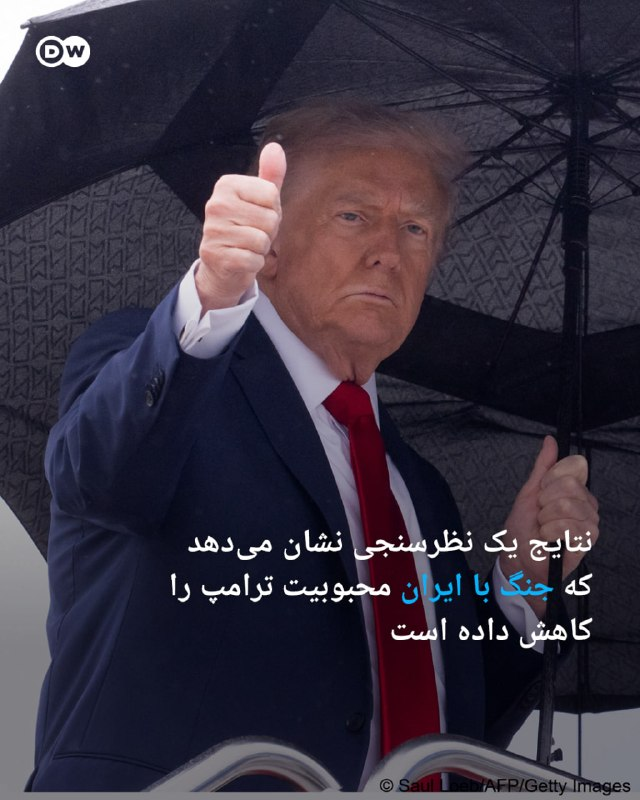

🔶 نتایج یک نظرسنجی: جنگ با ایران محبوبیت ترامپ را کاهش داده است

طبق یک نظرسنجی جدید، محبوبیت دونالد ترامپ، رئیس‌جمهور آمریکا در میان شهروندان این کشور به دلیل پیامدهای جنگ با جمهوری اسلامی ایران به‌شدت دچار افت شده است.

روزنامه ایندیپندنت نیز با اشاره به نظرسنجی مشترکی که نیویورک‌ تایمز و کالج سینا (Siena College) در اواسط ماه مه در میان ۱۵۰۰ نفر انجام دادند نوشت، تنها ۳۷درصد از رأی‌دهندگان عملکرد ترامپ را به عنوان یک رئیس جمهور تأیید کرده‌اند. در مقابل، تقریبا ۵۹درصد اعلام کردند که موافق عملکرد او نیستند.

ترامپ در زمینه مدیریت جنگ ایران نیز نمرات پایینی از سوی رأی‌دهندگان دریافت کرد؛ به طوری که ۶۵درصد با عملکرد او در این مورد مخالف بودند و بیش از نیمی از شرکت‌کنندگان معتقد بودند که او با ایجاد جرقه درگیری با ایران در ماه فوریه، تصمیم اشتباهی گرفته است.

اما بیشترین میزان نارضایتی رأی‌دهندگان (اعم از جمهوری‌خواه و دموکرات) از رئیس‌جمهور، مربوط به نحوه مدیریت هزینه‌های زندگی در ایالات متحده است.

تقریبا ۶۹درصد از رأی‌دهندگان اعلام کردند که با عملکرد ترامپ در این زمینه مخالف هستند که در این میان، یک‌سوم از مخالفان را خود جمهوری‌خواهان تشکیل می‌دهند.

با وجود اینکه او با وعده کاهش هزینه‌های روزمره مردم آمریکا (از پمپ بنزین گرفته تا قفسه فروشگاه‌های مواد غذایی) کمپین انتخاباتی خود را پیش برد، تورم در طول سال گذشته به‌طور پیوسته افزایش یافته است؛ به‌ویژه در بخش انرژی.

افزایش هزینه‌های انرژی با جنگ ایران نیز مرتبط دانسته شده؛ نبردی که در پی تنش‌ها در تنگه هرمز قیمت‌های جهانی نفت را دچار اختلال و نوسان کرده است.

اکثر رأی‌دهندگان خواهان ازسرگیری جنگ ایالات متحده با ایران نیستند، حتی اگر مذاکره‌کنندگان آمریکایی نتوانند به زودی با ایران برای پایان دادن به برنامه غنی‌سازی هسته‌ای این کشور به توافق برسند.

به گزارش ایندیپندنت، جمهوری‌خواهان همچنان تا حد زیادی از سیاست‌های ترامپ حمایت می‌کنند؛ به‌طوری که ۸۲درصد اعلام کرده‌اند که عملکرد او را، به‌ویژه در موضوع مهاجرت، تأیید می‌کنند. اکثر آن‌ها هنوز از جنگ با ایران حمایت می‌کنند، هرچند تقریباً یک‌چهارم آن‌ها مطمئن نیستند که آیا این جنگ تصمیم درستی بوده است یا خیر.

با این حال، محبوبیت رئیس‌جمهور در میان رأی‌دهندگان حزب خود نیز در زمینه اقتصاد و هزینه‌های زندگی به‌طور قابل‌توجهی کاهش یافته است.

@dw_farsi

## DW_Farsi — post 124870

  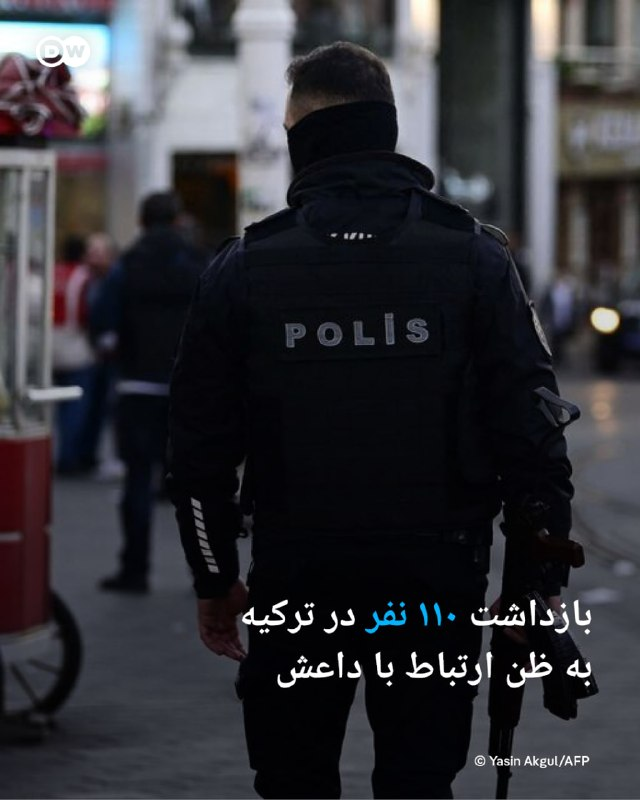

🔶 بازداشت ۱۱۰ نفر در ترکیه به ظن ارتباط با داعش

مقامات امنیتی و ضدترور ترکیه سه‌شنبه ۱۹ مه (۲۹ اردیبهشت) از بازداشت ۱۱۰ نفر به اتهام ارتباط و وابستگی به سازمان تروریستی داعش خبر دادند. عملیات نیروهای امنیتی با برنامه‌ریزی و سازماندهی دادستانی کل ترکیه انجام گرفت.

به گزارش خبرگزاری آنادولو بازداشت‌شدگان متهم هستند که در انجمن‌های غیرقانونی و کلاس‌های درس، کودکان را طبق ایدئولوژی‌های داعش آموزش می‌دادند تا نیروهای جدید جذب کرده و همچنین برای داعش کمک‌های مالی جمع‌آوری کنند.

عملیات نیروهای امنیتی در سه استان صورت گرفته که بخش اعظم آن بر استانبول متمرکز بوده است. افزون بر بازداشت ۱۱۰ نفر، ۴ قبضه سلاح، ۹۰ فشنگ و اسناد و داده‌های دیجیتال کشف و ضبط شده است.

وزارت کشور ترکیه اعلام کرد که پلیس این کشور در هفته گذشته در جریان بازرسی‌ها و عملیات تفتیش در ۴۷ نقطه مختلف کشور ۳۴۲ نفر را به اتهام عضویت در سازمان تروریستی داعش بازداشت کرده است.

@dw_farsi

## DW_Farsi — post 124869

  

🔶 ارتش اسرائیل از کشته شدن یک عضو حماس خبر داد
 
سخنگوی ارتش اسرائیل سه‌شنبه ۱۹ مه (۲۹ اردیبهشت) اعلام کرد نیروهای تیپ ۱۸۸ در جنوب نوار غزه، "یکی از اعضای سازمان تروریستی حماس را که به مواضع نظامیان اسرائیلی نزدیک شده و تهدیدی فوری محسوب می‌شده، هدف قرار دادند".
 
ارتش اسرائیل اعلام کرد که این فرد، "در حملات ۷ اکتبر وارد خاک اسرائیل شده بود و در روزهای اخیر نیز قصد اجرای عملیات تروریستی علیه نیروهای اسرائیلی را داشت".
 
ارتش اسرائیل در پیام خود در شبکه ایکس (توئیتر سابق) نوشت، این فرد که از "خط زرد" عبور کرده بود، شناسایی شد و نیروی هوایی اسرائیل با هماهنگی نیروهای زمینی او را از "حذف کرد".
 
به نوشته تایمز اسرائیل، ارتش این کشور جزییاتی در مورد هویت و نام این عضو حماس ذکر نکرده است.
@dw_farsi

## DW_Farsi — post 124868

  

📸 کاریکاتور هفته:

پخش برنامه‌هایی از صداوسیما که در آنها مجریان سلاح گرم در دست می‌گیرند یا کار با آنها را به مخاطبان آموزش می‌دهند علاوه بر تأکید بر فضای نظامی و نظامی‌گری، آن‌هم در زمان آتش‌بس که انتظار ترجیح مسیر دیپلماسی به نفع مردم می‌رود، به باور بسیاری از شهروندان و کارشناسان سیاسی با هدف تهدید و ارعاب مردم است؛ مردمی که دی ماه گذشته در جمعیتی انبوه و میلیونی با حضور در خیابانهای کشور عبور از رژیم را درخواست کردند اما با رگبار گلوله و کشتاری جمعی روبرو شدند.
 
به نظر می‌رسد با توجه به وخیم‌تر شدن بحران اقتصادی، عدم تغییر سیاست‌های عامل این بحران همراه با سرکوب بیرحمانه و موج اعدام‌ها، حکومت تنها راه مقابله با آتش خشم و عصبانیت عمومی را تهدید مردم داخل خانه‌هایشان دیده است.
 
این موضوع دستمایه مانا نیستانی در طراحی کاریکاتور هفته برای دویچه وله فارسی بوده است.

@dw_farsi

## DW_Farsi — post 124867

  

📸 عکس روز: مهر مادری
 
یک میمون بِربِر (عجمی) در بزرگ‌ترین پارک آزاد میمون‌ها در آلمان نوزادش را که چند ساعت پیش چشم به جهان گشوده، به آغوش کشیده است. این پارک به نام "آفن‌برگ زالِم" بیش از ۲۰ هکتار را در برمی‌گیرد و خانه حدود ۲۰۰ میمون عجمی است که آزادانه در آن زندگی و تردد می‌کنند. امسال انتظار می‌رود حدود ۱۵ نوزاد میمون عجمی در این پارک متولد شوند.
@dw_farsi

## DW_Farsi — post 124866

  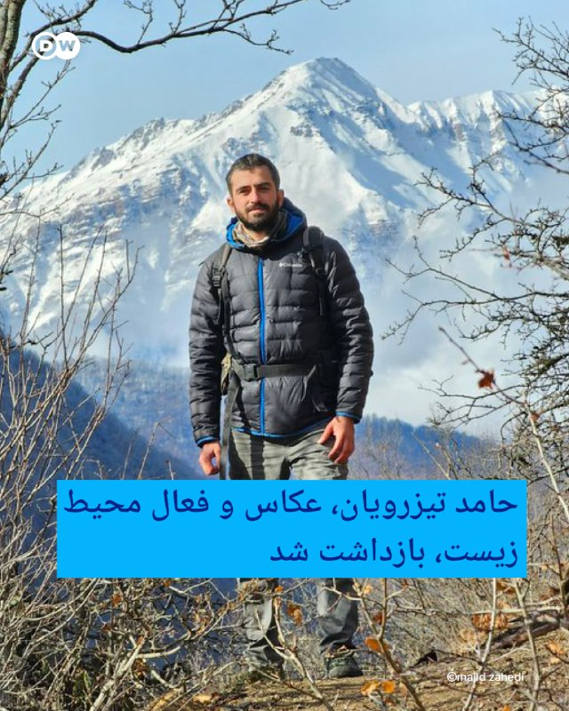

🔶 حامد تیزرویان، عکاس و فعال محیط زیست، بازداشت شد

خبرنامه دانشگاه امیرکبیر سه‌شنبه ۲۹ اردیبهشت (۱۹ مه) گزارش داد که حامد تیزرویان، دانشجوی دکترای مهندسی محیط زیست دانشگاه ملی (بهشتی)، روز ۱۴ اردیبهشت‌ماه در مازندران بازداشت شده و وضعیت او نامشخص است.
 
حامد تیزرویان متولد ۱۳۷۰ از فعالان و محققان شناخته‌شده محیط زیست در ایران است و در زمینه عکاسی حیات وحش نیز فعالیت دارد. در خبرنامه امیرکبیر آمده است که تیزرویان توسط ماموران اداره اطلاعات مازندران بازداشت شده و هم اکنون به صورت بلاتکلیف در زندان شهر ساری به سر می‌برد.
 
صفحه اینستاگرام این عکاس شناخته‌شده با بیش از ۷۰ هزار دنبال‌کننده اکنون از دسترس خارج شده است.
 
آنگونه که این خبرنامه به نقل از منابع آگاه نوشته است، این فعال محیط زیست پس از سرکوب و کشتارهای دی‌ماه، "مطالب صریحی در شبکه‌های اجتماعی درباره این جنایت‌ها منتشر کرده بود".
 
"اجتماع و تبانی با هدف اقدام علیه امنیت ملی" اتهامی است که علیه تیزرویان عنوان شده است. 
@dw_farsi

## Persian_Trend_Official — post 14481

برای طراحی چند صفحه از وبسایت پرشین ترند به یک وردپرس‌کار حرفه‌ای، خوش‌سلیقه و سریع نیاز داریم. کار در فاز اول خیلی بزرگ و پیچیده نیست؛ فقط طراحی و آماده‌سازی ۲ تا ۳ صفحه اصلی مورد نیاز است: صفحه تماشای لایو و ویدیو صفحه آرشیو لایوهای قبلی صفحه معرفی جایگاه‌های…

## Persian_Trend_Official — post 14480

  <a href="telegram/content/Persian_Trend_Official_14480_1779198747.webm" target="_blank">🎬 Download video</a>

برای طراحی چند صفحه از وبسایت پرشین ترند به یک وردپرس‌کار حرفه‌ای، خوش‌سلیقه و سریع نیاز داریم.
کار در فاز اول خیلی بزرگ و پیچیده نیست؛ فقط طراحی و آماده‌سازی ۲ تا ۳ صفحه اصلی مورد نیاز است:
صفحه تماشای لایو و ویدیو
صفحه آرشیو لایوهای قبلی
صفحه معرفی جایگاه‌های تبلیغاتی و همکاری با اسپانسرها
نیاز ما بیشتر روی ظاهر حرفه‌ای، طراحی تمیز، ریسپانسیو بودن برای موبایل و دسکتاپ، سرعت اجرا و سلیقه بصری خوب است.
ترجیحاً کسی پیام بدهد که:
تجربه طراحی سایت وردپرسی حرفه‌ای داشته باشد
با طراحی صفحات رسانه‌ای، ویدیویی یا خبری آشنا باشد
بتواند کار را سریع، حدوداً در یکی دو روز، جمع کند
خوش‌قول، دقیق و قابل‌اعتماد باشد
نمونه‌کار واقعی برای ارائه داشته باشد
بتواند بدون قالب‌های شلوغ و سنگین، یک خروجی تمیز و سبک تحویل دهد
این پروژه فعلاً فاز اول است و اگر همکاری خوب باشد، برای توسعه‌های بعدی سایت هم ادامه خواهد داشت.
افرادی که تجربه و زمان کافی دارند، لطفاً نمونه‌کار، توضیح کوتاه از توانایی‌ها و حدود هزینه پیشنهادی‌شان را ارسال کنند.
📩 برای هماهنگی پیام بدهید.

@NickTARTARUS
‌

## Persian_Trend_Official — post 14479

  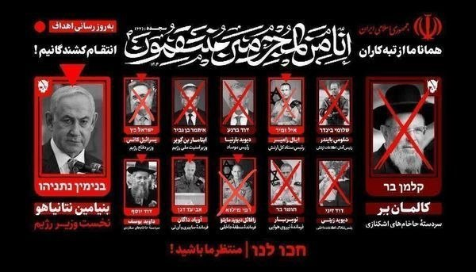

شاید در دنیای موازی 🤷‍♂️

📝 Nick

📌 @persian_trend_official
پرشین ترند | متفاوت‌ترین کانال نظامی

## Persian_Trend_Official — post 14478

  <a href="telegram/content/Persian_Trend_Official_14478_1779198749.webm" target="_blank">🎬 Download video</a>

کسی می‌دونه سردار سلامی کجاست؟؟؟

📝 Nick

📌 @persian_trend_official
پرشین ترند | متفاوت‌ترین کانال نظامی

## Persian_Trend_Official — post 14477

💢 این انفجار در نزدیکی یکی از ساختمانهای وابسته به وزارت دفاع دولت «الجولانی» رخ داده است ▪️ منابع محلی گفتند پس از انفجار، صدای تیراندازی همچنان به گوش می‌رسد. 🫆:Tony 📌 @persian_trend_official پرشین ترند | متفاوت‌ترین کانال نظامی

## Persian_Trend_Official — post 14476

  <a href="telegram/content/Persian_Trend_Official_14476_1779198749.webm" target="_blank">🎬 Download video</a>

⭕️تعلیق پروازهای بریتیش ایرویز به اسرائیل

💢خطوط هوایی «بریتیش ایرویز» از لغو پروازها به اسرائیل تا یک اوت خبر داد.

🫆:Tony

📌 @persian_trend_official
پرشین ترند | متفاوت‌ترین کانال نظامی

## Persian_Trend_Official — post 14474

💢زلزله ۴.۶ ریشتری در نورآباد لرستان

💢زمین لرزه ۴.۶ ریشتری در عمق ۸ کیلومتری زمین نورآباد لرستان را لرزاند.

🫆:Tony

📌 @persian_trend_official
پرشین ترند | متفاوت‌ترین کانال نظامی

## Persian_Trend_Official — post 14473

  

💢برای ۸۱ روز، جمهوری اسلامی اینترنت را در ایران خاموش کرده تا صدای مردم را خفه کند.

▪️جمهوری اسلامی بار دیگر ثابت کرد که از هیچ جنایتی برای حفظ قدرت خود دریغ نمیکند.

🫆:Tony

📌 @persian_trend_official
پرشین ترند | متفاوت‌ترین کانال نظامی

## Persian_Trend_Official — post 14472

  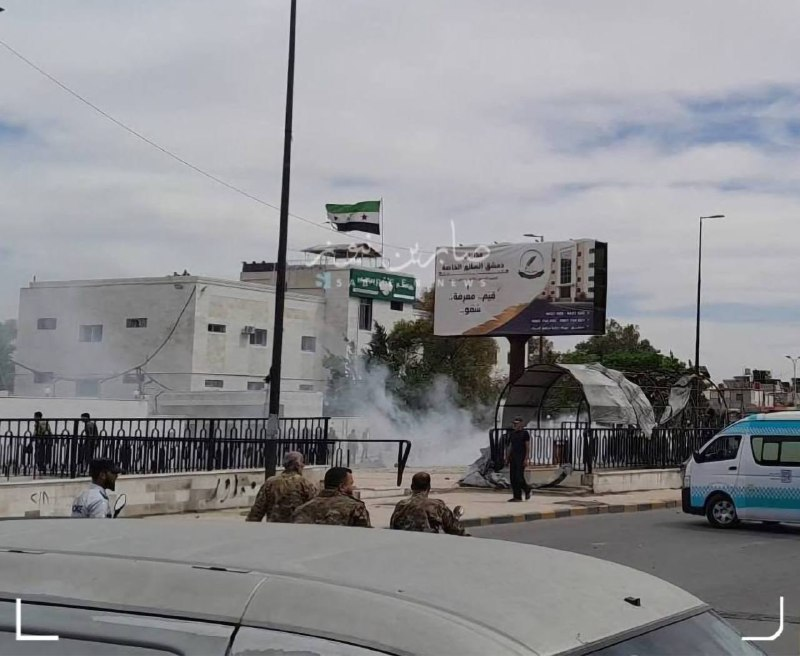

🔴 گزارش‌ها از وقوع انفجار در دمشق 💢خبرنگار الحدث از وقوع یک انفجار با منشأ نامشخص در نزدیکی منطقه «باب شرقی» دمشق خبر داد. ▪️فارس مدعی شد انفجار ناشی از خودرو بمب گذاری شده بوده است. 🫆:Tony 📌 @persian_trend_official پرشین ترند | متفاوت‌ترین کانال نظامی

## Persian_Trend_Official — post 14471

  <a href="telegram/content/Persian_Trend_Official_14471_1779198752.webm" target="_blank">🎬 Download video</a>

🔴 گزارش‌ها از وقوع انفجار در دمشق

💢خبرنگار الحدث از وقوع یک انفجار با منشأ نامشخص در نزدیکی منطقه «باب شرقی» دمشق خبر داد.

▪️فارس مدعی شد انفجار ناشی از خودرو بمب گذاری شده بوده است.

🫆:Tony

📌 @persian_trend_official
پرشین ترند | متفاوت‌ترین کانال نظامی

## Persian_Trend_Official — post 14470

  <a href="telegram/content/Persian_Trend_Official_14470_1779198752.webm" target="_blank">🎬 Download video</a>

💢شنیده شدن صدای انفجار در جزیره قشم ▪️ظهر سه شنبه شنیده شدن صدای انفجار در جزیره قشم از سوی ساکنان محلی گزارش شده است. 🔹اخبار تکمیلی متعاقباً منتشر خواهد شد./خبرگزاری مهر 🫆:Tony 📌 @persian_trend_official پرشین ترند | متفاوت‌ترین کانال نظامی

## RadioFarda — post 157350

🔸وزیران دارایی هفت کشور صنعتی جهان بعد از دو روز گفت‌وگو در پاریس، در بیانیه‌ای که روز سه‌شنبه منتشر شد با اشاره به چالش‌های متعدد اقتصاد دنیا، خواستار «بازگشت سریع به عبور و مرور آزاد و امن» کشتی‌ها از تنگه هرمز شدند. 🔸اسکات بسنت، وزیر خزانه‌داری آمریکا،…

## RadioFarda — post 157349

  

🔸وزیران دارایی هفت کشور صنعتی جهان بعد از دو روز گفت‌وگو در پاریس، در بیانیه‌ای که روز سه‌شنبه منتشر شد با اشاره به چالش‌های متعدد اقتصاد دنیا، خواستار «بازگشت سریع به عبور و مرور آزاد و امن» کشتی‌ها از تنگه هرمز شدند.

🔸اسکات بسنت، وزیر خزانه‌داری آمریکا، نیز در شبکه ایکس نوشت که در این نشست، «گفت‌وگوهای سازنده‌ای» درباره ایران، مواد معدنی حیاتی، امنیت سایبری و عدم توازن‌های جهانی داشته است.

🔸بعد از صدور بیانیه پایانی، وزیر دارایی فرانسه اذعان کرد که دو روز گفت‌وگو میان وزرای گروه هفت «گاهی دشوار» بوده است، هرچند این گروه در نهایت بر سر بیانیه‌ای برای تعهد به همکاری چندجانبه در مقابله با خطرات فزاینده اقتصادی به توافق رسید.

🔸بیانیه پایانی وزیران گروه هفت «تعهد ما به همکاری چندجانبه برای مقابله با خطرات پیش روی اقتصاد جهانی» را تأیید کرد.

🔸در پس‌زمینه جنگ آمریکا و اسرائیل با ایران، در این بیانیه آمده است که «چالش‌های جهانی متعدد و پیچیده‌ای وجود دارد که نیازمند پاسخ‌های هماهنگ هستند.»

@RadioFarda

## RadioFarda — post 157348

  

🔸روزنامه شرق در گزارشی درباره ستاد تازه‌تشکیل‌شدهٔ «ساماندهی فضای مجازی» به ریاست معاون اول رئیس‌جمهور ایران، نوشت که از برخی اعضای دولت «خواسته شده» تا درباره جزئیات و مأموریت‌های این ساختار با رسانه‌ها مصاحبه نکنند.

🔸در این گزارش که روز سه‌شنبه ۲۹ اردیبهشت و با عنوان «حکمرانی دیجیتال در سایه ابهام» منتشر شده، آمده است: ستادی که قرار است به گفته رئیس‌جمهور، به «چندصدایی» و «موازی‌کاری» در حکمرانی اینترنت پایان دهد، «خود به یکی از مبهم‌ترین و پرحاشیه‌ترین ساختارهای سیاست‌گذاری دیجیتال کشور تبدیل شده است».

🔸شرق نوشته که «دستور» محمدرضا عارف به خودداری اعضای دولت از صحبت با رسانه‌ها درباره این ستاد، در حالی است که با تشکیل این ستاد، «شائبه‌ها درباره شکل‌گیری یک مرکز تازه قدرت در سیاست اینترنت ایران، پررنگ‌تر» و «آشفتگی در حکمرانی فضای مجازی» ایران، نمایان‌تر شده است.

🔸این روزنامه به نقل از کارشناسان و منتقدان تأکید کرده که در شرایطی که خود رئیس‌جمهور ریاست شورای عالی فضای مجازی و شورای عالی امنیت ملی را نیز برعهده دارد، «به راحتی می‌تواند گره کوری که در اینترنت ایجاد شده است را باز کند».

@Radiofarda

## RadioFarda — post 157347

  <a href="https://t.me/radiofarda/157347" target="_blank">📎 Download file</a>

📻بشنوید: ساعت ۱۴ با رادیوفردا، ۲۹ اردیبهشت ۱۴۰۵‌

@Radiofarda

## RadioFarda — post 157346

  

🔸ایووت کوپر، وزیر خارجه بریتانیا روز سه‌شنبه ۲۹ اردیبهشت هشدار داد که جهان دیگر نمی‌تواند بیش از این برای بازگشایی تنگه هرمز صبر کند و ادامه بسته‌ماندن آن امنیت غذایی کشورهای آسیب‌پذیر را با بحران جدی‌تری روبه‌رو می‌کند.

🔸وزارت خارجه بریتانیا روز سه‌شنبه اعلام کرد کوپر در کنفرانس جهانی مشارکت‌ها در لندن، با اشاره به پیامدهای بحران جنگ ایران بر انرژی، کود کشاورزی و قیمت مواد غذایی، خواستار فشار فوری بین‌المللی برای بازگشایی تنگه هرمز شده است.

🔸ایووت کوپر در کنفرانس جهانی مشارکت‌ها در لندن هشدار داد که جهان در آستانه یک بحران غذایی جهانی قرار دارد و نمی‌توان اجازه داد ده‌ها میلیون نفر به‌دلیل بسته‌ماندن یک مسیر بین‌المللی کشتیرانی که ایران آن را «گروگان» گرفته با گرسنگی روبه‌رو شوند.

🔸کوپر تأکید کرد چالش‌های جهانی، مانند بحران ایران، در مرزها متوقف نمی‌شوند و راه‌حل‌های آنها نیز متوقف نمی‌شوند و نیازمند همکاری بین‌المللی است.

@RadioFarda

## RadioFarda — post 157345

  

🔸قطر روز سه‌شنبه ۲۹ اردیبهشت اعلام کرد که مذاکرات میان آمریکا و ایران برای رسیدن به توافق به زمان بیشتری نیاز دارد.

🔸ماجد الانصاری، سخنگوی وزارت خارجه قطر، در یک نشست خبری گفت: «ما از تلاش دیپلماتیک پاکستان که جدیت خود را در گردهم آوردن طرف‌ها و یافتن راه‌حل نشان داده حمایت می‌کنیم و معتقدیم این روند به زمان بیشتری نیاز دارد».

🔸این اظهارات یک روز پس از آن مطرح شد که دونالد ترامپ، رئیس‌جمهور آمریکا، گفت حمله روز سه‌شنبه به ایران را برای دادن فرصت به این روند به تعویق انداخته است.

🔸ایران و ایالات متحده از زمان آتش‌بس شکننده میان دو کشور در ۱۹ فروردین امسال، درگیر یک دور مذاکره مستقیم و همچنین تبادل پیام‌هایی از طریق پاکستان بوده‌اند تا به توافقی برای پایان جنگ دست یابند.

@RadioFarda

## RadioFarda — post 157339

🔸ایرنا، خبرگزاری دولت جمهوری اسلامی روز سه‌شنبه ۲۹ اردیبهشت تصاویری از یک زن بدون «حجاب رسمی» مورد تایید حکومت در فضای خصوصی منزل را منتشر کرد و ساعتی بعد آنها را از روی سایت این خبرگزاری حذف کرد.

🔸انتشار این تصاویر در قالب یک گزارش تصویری صورت گرفت که واکنش‌هایی‌ را در شبکه‌های اجتماعی به‌دنبال داشت.

🔸در این گزارش تصویری خبرگزاری دولت عکس‌هایی از سارا کنعانی، نویسنده و هنرمند ۳۷ ساله اهل تهران را که در روزهای جنگ ۴۰ روزه نوزادی را که در بیمارستان رها شده بود، به طور موقت به سرپرستی گرفته و نام این دختر را آهو گذاشته منتشر کرده است.

🔸 انتشار تصاویر بدون حجاب مورد تایید حکومت در منزل شخصی این هنرمند در حالی رخ داده است که تاکنون هیچ‌گونه اعلام رسمی درباره تغییر در سیاست‌های مرتبط با حجاب در رسانه‌های ایران منتشر نشده است.

🔸 در ماه‌های گذشته رسانه‌های حکومتی تصاویر و گزارش‌های بسیاری از زنان بدون حجاب در رویدادهای حکومتی منتشر کرده‌اند.

🔸 چرخش سیاست حکومت در قبال حجاب با واکنش‌های افراد تندرو همراه شده است.

@RadioFarda

## IranianMinds — post 20389

🔴والا نیوز:

در صورت تصمیم ترامپ برای حمله مجدد به ایران، هماهنگی‌هایی با چند کشور خاورمیانه انجام شده است.

@IranianMinds

## IranianMinds — post 20388

  

🔴 دو سال پیش در چنین روزی ابراهیم رئیسی رو خرس خورد.

@IranianMinds

## IranianMinds — post 20387

🔴 سازمان عفو بین‌الملل اعلام کرد تعداد اعدام‌ها در جهان طی سال 2025 به بالاترین سطح در 44 سال گذشته رسیده.

طبق این گزارش، جمهوری اسلامی اصلی‌ترین عامل افزایش آمار اعدام‌ها در جهان بوده.

@IranianMinds

## IranianMinds — post 20386

🔴 وال استریت ژورنال : ترامپ گفت حمله برنامه‌ریزی‌شده به ایران را متوقف کرده چون رهبران کشورهای خلیج فارس خواستند زمان بیشتری برای مذاکرات بدهند تا شاید به توافق برسند. او دستور داده ارتش آماده باشد ولی فعلاً حمله انجام نشود. چند مقام خلیج فارس بعد این…

## IranianMinds — post 20385

🔴خبرگزاری مهر:

زمین‌لرزه به شدت ۴.۶ ریشتر ، استان لرستان را لرزاند.

@IranianMinds

## IranianMinds — post 20384

  

🔴ارتش اسرائیل دستور تخلیه ۱۲ روستا در جنوب لبنان را صادر کرد.

@IranianMinds

## IranianMinds — post 20383

🔴 وال استریت ژورنال :

ترامپ گفت حمله برنامه‌ریزی‌شده به ایران را متوقف کرده چون رهبران کشورهای خلیج فارس خواستند زمان بیشتری برای مذاکرات بدهند تا شاید به توافق برسند. او دستور داده ارتش آماده باشد ولی فعلاً حمله انجام نشود.

چند مقام خلیج فارس بعد این گفتند که اصلا اژ طرح حمله قریب‌ الوقوع مطلع نبوده‌اند.

@IranianMinds

## IranianMinds — post 20382

🔴 معاون امنیتی استان خوزستان :

امروز داشتیم پدافند هامونو تست میکردیم که به اشتباه یکی از پرتابه ها خورد به یک ساختمون مسکونی و چندین نفر زخمی شدن.

@IranianMinds

## IranianMinds — post 20381

  

🔴حمید خانی،تروریست بازنشسته سپاه پاسداران از شهرستان بروجن، به صورت داوطلبانه حین خنثی‌سازی بمب‌های عمل نکرده اسرائیل و آمریکا در تهران به هلاکت رسید.

@IranianMinds

## BBCPersian — post 281499

🔻اموال ۵۲ نفر شامل املاک، وجوه بانکی و طلا در استان زنجان توقیف شد

رئیس کل دادگستری زنجان گفت اموال ۵۲ نفر در شهرهای مختلف این استان بر اساس قانون «قانون تشدید مجازات جاسوسی و همکاری با رژیم صهیونسیتی علیه امنیت و منافع ملی» توقیف شده است.

علی فرجی برحق گفت توقیف اموال این افراد که آنها را «خائنین به وطن و افراد تاثیرگذار در شبکه همکاران دشمن» خواند، به دستور مقام قضائی انجام شده است.

اموال توقیف شده شامل وجوه نقد بانکی و ارزی، اموال منقول و غیرمنقول و طلا بوده است.

بر اساس این گزارش هفت نفر از این افراد بازداشت شدند و برخی هم در خارج از ایران هستند.

قوه قضائیه پس از جنگ اخیر برای کسانی که «هم‌صدا» یا «همراه» دشمن می‌خواند، پرونده تشکیل می‌دهد و با استناد به قانون «تشدید مجازات جاسوسی»، مجازات‌هایی مثل ممنوعیت فعالیت و توقیف اموال در نظر می‌گیرد.

قوه قضائیه فهرست‌هایی هم از افرادی منتشر کرده که برای «حمایت از جنگ»، اموالشان توقیف یا مصادره شده است.

با تشدید ضبط اموال طیف وسیعی از اقشار جامعه از خبرنگار تا بازیگر و فعال سیاسی و هنرمند و ورزشکار، قوه قضائیه جلوگیری از انتقال اموال را هم آغاز کرده است.

https://bbc.in/49RmJrF
@BBCPersian

## BBCPersian — post 281498

🔻سقوط پرتابه در اندیمشک چهار مجروح بر جای گذاشت

به گفته ولی‌الله حیاتی، معاون امنیتی و انتظامی استانداری خوزستان، در پی سقوط پرتابه‌های ناشی از پدافند هوایی در اندیمشک چهار نفر مجروح شده‌اند.

به گزارش رسانه‌های ایران، آقای حیاتی گفت: «به‌دلیل سقوط پرتابه در منطقه مسکونی، چهار شهروند مجروح شدند که خوشبختانه در شرایط مناسب و پایدار قرار دارند و هم اکنون در مراکز درمانی به وضعیت آنان رسیدگی می‌شود.»

خبرگزاری دولتی ایرنا علت مجروح شدن این افراد را «سقوط شی ناشناس در مناطق مسکونی اندیمشک» گزارش کرد که «منجر به خسارت به یک باب مغازه و دو خودرو و مصدومیت چهار نفر شد» و «در شبکه های اجتماعی این شهرستان بازتاب گسترده داشت.»

آقای حیاتی همچنین گفت: «صدای شلیک‌های امروز در آسمان اندیمشک به‌دلیل تست پدافند هوایی است و مردم نگران نباشند.»

در روزهای اخیر فعال شدن پدافند هوایی در بعضی شهرهای ایران گزارش شده است از جمله امروز و دیشب در اصفهان که عنوان شد ناشی از «پاکسازی مناطق باقیمانده از مهمات عمل‌نکرده» است.

پیشتر گزارش‌هایی هم از فعال شدن پدافند جزیره قشم منتشر شده بود که به گفته خبرگزاری تسنیم برای مقابله با «ریز پرنده‌ها» بود.

ظهر امروز هم صدای چند انفجار در جزیره قشم شنیده شد که استانداری هرمزگان دلیل آن را «خنثی‌سازی» مهمات اعلام کرد.

https://bbc.in/49RmJrF
@BBCPersian

## BBCPersian — post 281497

  <a href="telegram/content/BBCPersian_281497_1779198760.mp4" target="_blank">🎬 Download video</a>

⭕️سرخط خبرها سه‌شنبه ۲۹ اردیبهشت ۱۴۰۵
@BBCPersian

## BBCPersian — post 281496

  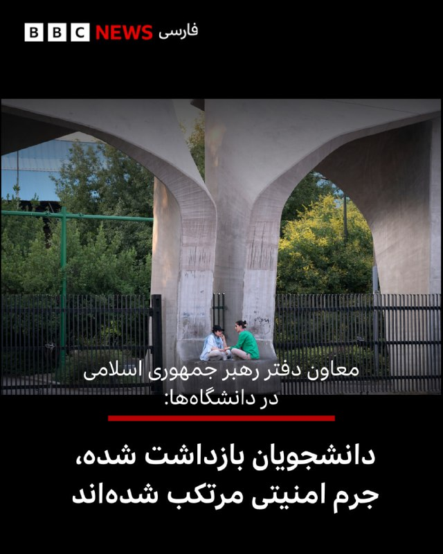

🔻سعید کرمی، معاون نهاد نمایندگی رهبر جمهوری اسلامی در دانشگاه‌ها می‌گوید دانشجویانی که اخیرا بازداشت شده‌اند، مرتکب «جرم امنیتی محسوس و تاثیرگذار» شده بودند.

او تعداد بازداشتی‌ها را «محدود و انگشت شمار» خواند وگفت: «در برخی پرونده‌ها، افرادی اقدام به ارسال لوکیشن برای عوامل بیگانه کرده‌اند.»

اشاره آقای کرمی به افرادی است که پس از آغاز جنگ آمریکا و اسرائیل با ایران بازداشت شده‌اند.

از زمان آغاز جنگ اخیر، موارد بازداشت و سختگیری‌های قضایی افزایش یافته است، هرچند مشخص نیست چند نفر از بازداشت‌شدگان دانشجو هستند.

احمدرضا رادان، فرمانده کل نیروی انتظامی، دو روز پیش گفت که از آغاز جنگ اخیر «بیش از ۶۵۰۰ نفر از وطن‌فروشان و جاسوسان دستگیر شده‌اند.»

خبرگزاری هرانا، ارگان خبری مجموعه فعالان حقوق بشر، هم می‌گوید که از زمان شروع جنگ تا هفته گذشته، دست‌کم ۴۰۲۳ بازداشت را در ایران ثبت کرده است.

به گفته این نهاد، اتهام‌های مطرح‌شده شامل جاسوسی، تهدید علیه امنیت ملی و ارتباط یا ارسال مطالب مربوط به جنگ به رسانه‌های خارجی است.

📷Getty Images
@BBCPersian

## BBCPersian — post 281495

  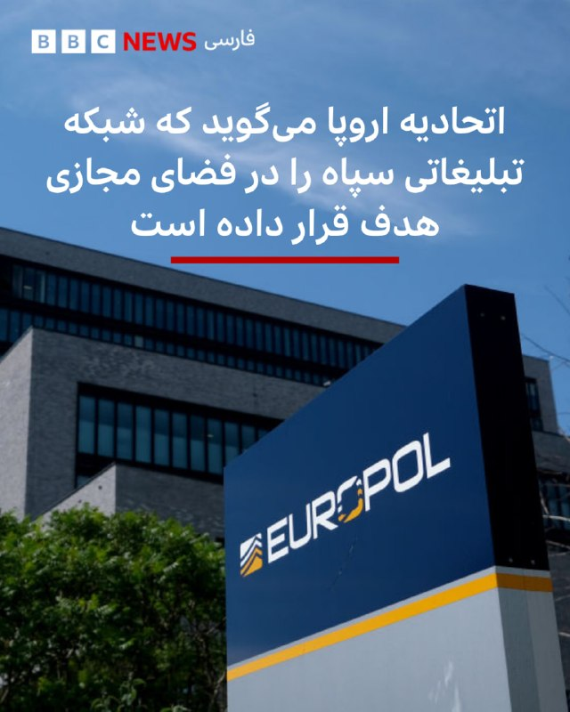

🔻یوروپل، «آژانس اتحادیه اروپا برای همکاری در اجرای قانون»، می‌گوید در اقدامی هماهنگ برای مقابله با «محتوای تروریستی آنلاین»، ۱۴۲۰۰ پست مرتبط با سپاه پاسداران را در فضای مجازی هدف قرار داده است.

اتحادیه اروپا سپاه پاسداران را در ۱۹ فوریه ۲۰۲۶ سازمانی تروریستی معرفی کرد؛ این طبقه‌بندی به مجریان قانون اجازه می‌دهد تا علیه فعالیت‌های اعضای سپاه و نهادهای حامی آن در اتحادیه اروپا اقدام کنند.

یوروپل می‌گوید که اقداماتش بر شناسایی و مختل کردن حضور آنلاین گروه‌های مرتبط با سپاه پاسداران متمرکز بوده است که برای انتشار تبلیغات، جذب هواداران و جمع‌آوری کمک‌های مالی مورد استفاده قرار می‌گرفتند.

۱۸ کشور اروپایی و آمریکا در این اقدامات هماهنگ شرکت داشتند.

یوروپل می‌گوید که محتواهای تولید شده مرتبط با سپاه پاسداران، به چندین زبان از جمله عربی، اندونزیایی، انگلیسی، فرانسوی، فارسی و اسپانیایی شناسایی شده است.

📸GettyImages
https://bbc.in/3PydzJU
@BBCPersian

## BBCPersian — post 281490

🔸باشگاه منچستر سیتی خودش را برای جدایی از پپ گواردیولا، مردی که پرافتخارترین دوران این باشگاه را رقم زد، پس از بازی روز یکشنبه لیگ برتر مقابل استون ویلا آماده می‌کند.

انتظار می‌رود که این سرمربی بزرگ در پایان فصل، ورزشگاه اتحاد را ترک کند و آن طور که گفته می‌شود انزو مارسکا، سرمربی پیشین چلسی، جای او را می‌گیرد. این مربی ۵۵ ساله سابقه دستیاری گواردیولا در سیتی را نیز دارد.

مدیران سیتی قبلا گفته بودند که گواردیولا برای فصل آینده قرارداد دارد و امیدوارند در سمتش باقی بماند ولی با توجه به اخبار باشگاه حالا این جدایی قطعی است و گفته می‌شود که بازیکنان هم آماده خداحافظی با این سرمربی اسپانیایی در آخرین بازی فصل مقابل استون ویلا شده‌اند.

همزمان باشگاه تمرکز خود را روی یافتن بهترین راه برای تجلیل از دوران حضور این سرمربی نمادین گذاشته است. گفته می‌شود نامگذاری جایگاه شمالی تازه توسعه‌یافته به نام این سرمربی یکی از گزینه‌های مدنظر باشگاه است.

مطلب کامل:
https://bbc.in/42JXp31
📷Getty
@BBCPersian

## BBCPersian — post 281489

🔻قطر: مذاکرات ایران و آمریکا به زمان بیشتری نیاز دارد

سخنگوی وزارت خارجه قطر می‌گوید که مذاکرات آمریکا و ایران برای دستیابی به یک توافق به زمان بیشتری نیاز دارد.

ماجد الانصاری، سخنگوی وزارت خارجه قطر، روز سه‌شنبه در یک کنفرانس مطبوعاتی گفت: «ما از تلاش‌های دیپلماتیک پاکستان که جدیت خود را در گرد هم آوردن طرف‌ها و یافتن راه‌حل نشان داده است، حمایت می‌کنیم و معتقدیم که این امر به زمان بیشتری نیاز دارد.»

دیروز دونالد ترامپ گفت که به درخواست رهبران عربستان، امارات و قطر، حمله‌ای را که تصمیم داشت روز سه‌شنبه به ایران انجام دهد، لغو کرده است. او گفت که رهبران این سه کشور معتقدند توافقی قابل حصول است که هم برای آمریکا و هم برای کشورهای منطقه «بسیار قابل قبول» است.

https://bbc.in/4uRZRR2
@BBCPersian

## BBCPersian — post 281479

🖊انکور شاه, سردبیر واحد چین جهانی بی‌بی‌سی

سپتامبر گذشته، زمانی که شی جین‌پینگ، رئیس‌جمهور چین، و ولادیمیر پوتین، رئیس‌جمهور روسیه، در میدان تیان‌آن‌من پکن قدم می‌زدند، به نظر می‌رسید درباره این احتمال صحبت می‌کنند که پیوند اعضا بتواند عمر انسان را به‌طور چشمگیری افزایش دهد.

شنیده شده که مترجم ولادیمیر پوتین گفت: «اعضای بدن انسان می‌تواند به‌طور مداوم پیوند زده شود. هرچه بیشتر زندگی کنید، جوان‌تر می‌شوید و حتی به جاودانگی می‌رسید.»

و مترجم شی جین‌پینگ پاسخ داد: «برخی پیش‌بینی می‌کنند که در این قرن، انسان‌ها ممکن است تا ۱۵۰ سال عمر کنند.»

آلبوم را ورق بزنید و برای خواندن مطلب کامل، به لینک زیر مراجعه کنید:
https://bbc.in/4wELpgO
📷Sputnik/ Kremlin/ PA/Shutterstock/China News Service/VCG/AFP/ Getty Images/BBCImages

## idfinfarsi — post 11608

  <a href="telegram/content/idfinfarsi_11608_1779198765.mp4" target="_blank">🎬 Download video</a>

🎬 Video

## idfinfarsi — post 11607

در شبانه‌روز گذشته در جنوب لبنان: ارتش اسرائیل بیش از ۲۵ انبار تسلیحات و پرتابگر متعلق به سازمان تروریستی حزب‌الله را هدف قرار داد

ارتش اسرائیل به فعالیت خود برای رفع تهدیدها علیه شهروندان اسرائیل و نیروهای ارتش در جنوب لبنان ادامه می‌دهد.

در شبانه‌روز گذشته، ارتش اسرائیل بیش از ۲۵ زیرساخت متعلق به سازمان تروریستی حزب‌الله را در چندین منطقه در جنوب لبنان هدف قرار داد.

از جمله زیرساخت‌های هدف قرار داده‌شده: انبارهای تسلیحات، مراکز فرماندهی و دیگر زیرساخت‌هایی بودند که از آن‌ها تروریست‌های این گروه برای پیشبرد طرح‌های تروریستی علیه نیروهای ارتش اسرائیل و کشور اسرائیل استفاده می‌کردند.

همچنین، ارتش اسرائیل تروریست‌ها را در منطقه رشته‌کوه کریستوفنی در جنوب لبنان هدف قرار داد و پرتابگرهایی را که پیش‌تر به سوی نیروهای ارتش اسرائیل و خاک این کشور شلیک کرده بودند، منهدم کرد.

## Dirty_Kids — post 389745

خبرگزاری ایرنا گزارشی به نام «مهر مادری به عمر چهل روز» منتشر کرده، درباره زنی که کودکی رها شده در دوران جنگ را به فرزندی پذیرفته. گزارش شامل مجموعه‌ عکسی از سارا کنعانی و فرزندش است و عکس‌هایی در خانه به تصویر کشیده شده، برخلاف فضاهای عمومی، سارا حجاب ندارد.…

## Dirty_Kids — post 389741

خبرگزاری ایرنا گزارشی به نام «مهر مادری به عمر چهل روز» منتشر کرده، درباره زنی که کودکی رها شده در دوران جنگ را به فرزندی پذیرفته.

گزارش شامل مجموعه‌ عکسی از سارا کنعانی و فرزندش است و عکس‌هایی در خانه به تصویر کشیده شده، برخلاف فضاهای عمومی، سارا حجاب ندارد.

@Dirty_Kids 👻

## Dirty_Kids — post 389738

🔴‌حالتون از این همه تناقض و دورویی بهم نمی‌خوره؟

دیروز هتل تاریخی عامری‌ها کاشان را به‌خاطر «حجاب» پلمب کردند؛ مسافران سرگردان شدند و ۹۰ نفر از پرسنل بیکار!

‏اما همزمان، شب‌ها در میدان‌ها و مراسم‌هایی مثل #جان_فدا⁩، شعار «بی‌حجاب هم خواهر ماست» تکرار می‌شود و همان زنان با آزادترین پوشش در قاب رسمی دیده می‌شوند.

‏اگر حجاب قانون است، چرا اجرای آن این‌قدر مقطعی و گزینشی است؟ #یاشارسلطانی

@Dirty_Kids 👻

## Dirty_Kids — post 389737

🔴 یه نفر دیگه از نیرو های سپاه پاسداران در عملیات خنثی‌سازی بمب های عمل نکرده امریکا و اسرائیل دیروز منفجر شد.

@Dirty_Kids 👻

## Dirty_Kids — post 389736

  

قال موش‌علی: دفن نخواهم شد و تشییع جنازه نخواهیم گرفت :)))

@Dirty_Kids 👻

## Dirty_Kids — post 389735

  

بعید نیست ترامپ چند روز دیگه‌ همچین توییتی بزنه: 😂😂

@Dirty_Kids 👻

## Dirty_Kids — post 389734

  <a href="telegram/content/Dirty_Kids_389734_1779198768.mp4" target="_blank">🎬 Download video</a>

از کیرشناسی تا شاعری 🔞 تا آخر ببینید

بعد همین جنده‌ها با این ادبیات میان میگن شما بی‌ادبید

@Dirty_Kids 👻

## Dirty_Kids — post 389733

  <a href="telegram/content/Dirty_Kids_389733_1779198769.mp4" target="_blank">🎬 Download video</a>

🔴 چند روز پیش دريک | Drake رپرِ معروف کانادایی یهو سه تا آلبوم داد بیرون که حسابی ترکوند؛

نکته جالبش اینجا بود که تو ترک Don't worry از آلبوم Iceman، به یه دختر ایرانی اشاره کرده!

دختر، تو خوب میدونی بین ما چه خبره، من با یه چشم به هم زدن میام پیشت

میخواد بره اونور میخواد پارتی رو ببینه

گفت ایرانیه و شروع کرد فارسی حرف زدن

نمیدونم این روزا چمه واقعاً چمه

@Dirty_Kids 👻

## Dirty_Kids — post 389732

  <a href="telegram/content/Dirty_Kids_389732_1779198772.mp4" target="_blank">🎬 Download video</a>

آخی دلم خنک شد
تا آخر ببینید ؛))

@Dirty_Kids 👻

## Dirty_Kids — post 389731

  

🔴 وزیر کار دولت رئیسی: ایران هیچوقت دچار ابَرتورم نمیشه، چون وقتی قیمتا از یه حدی بالاتر بره مردم دیگه نمیتونن خرید کنن، فروشنده‌هام دیگه نمیتونن گرون کنن و در نتیجه همه چی ارزون و درست میشه.

@Dirty_Kids 👻

## Dirty_Kids — post 389730

  

سالاد وارد کانال ۲ میلیون تومن شد

@Dirty_Kids 👻

## Dirty_Kids — post 389729

  <a href="https://t.me/Dirty_Kids/389729" target="_blank">📎 Download file</a>

📱 اپلیکیشن اندروید بدون فیلتر ریتزوبت

➖➖➖➖➖

🔹 ثبت نام آسان 
✅
🔹 رابط کاربری بسیار راحت و سریع 
✅
🔹 درگاه پرداخت کارت به کارت 
✅
🔹 درگاه پرداخت دلاری سریع 
✅
🔹 بونوس ۱۰۰ درصدی اولین واریز 
✅
🔹 بونوس ۱۰۰ درصدی واریز یکشنبه ها 
✅

➖➖➖➖➖
🌐 https://RitzoBet.com

⚡️ @RitzoBet_ir

## Dirty_Kids — post 389728

  <a href="telegram/content/Dirty_Kids_389728_1779198776.webm" target="_blank">🎬 Download video</a>

⚠️ برای #شرطبندی های فوتبال از سایت معتبر و بین المللی استفاده کنید ✅

🏴󠁧󠁢󠁥󠁮󠁧󠁿 چلسی 
🔢
🔢 
⚽️تاتنهام

سایت #ریتزوبت ، چهار سال هستش داخل ایران فعالیت میکنه 
✅

لایسنس بین المللی داره ، روش های شارژ و برداشت متنوع داره و بونوس 100% ورزشی و کش بک های جذاب
💎

⏪ اپلیکیشن بدون فیلتر ریتزوبت 
📱
⏩
R29

✅ لینک بدون‌ فیلتر ریتزوبت
🤣

🆔 @RitzoBet_ir 
🇮🇷

## Dirty_Kids — post 389727

  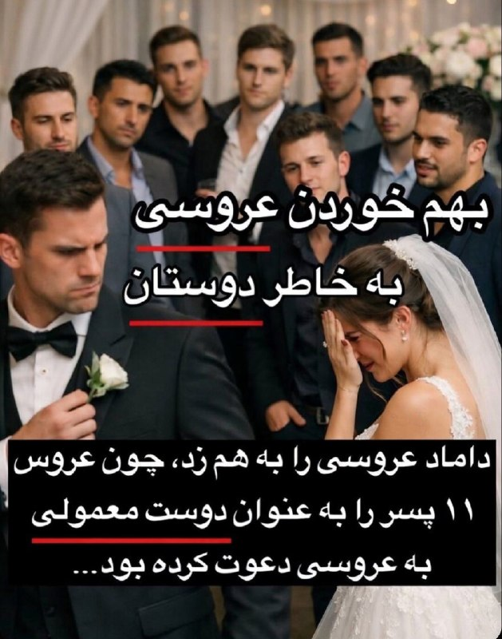

🔴 توی کرج یه عروسی به طرز عجیبی بهم خورد! حالا داستان چی بوده؟

یه پسر شب عروسیش می بینه ۱۱ تا پسر جوون اومدن مراسمش و هیچکدوم رو نمی‌شناسه، هی از این و اون سوال می‌کنه می بینه کسی نمیشناستشون.
خلاصه میره به دختره میگه تو اینارو می‌شناسی؟ میگه آره دوستای معمولی و مثل داداشمن، تازه یه چند تای دیگم هستن که نیومدن.
داماد بدبختم پشماش می‌ریزه و همونجا با یه خداحافظی دختر رو ترک می‌کنه.

@Dirty_Kids 👻

## Hranews — post 113039

  

در حالی‌که اینترنت در ایران طی هفته‌های اخیر با قطع و اختلال گسترده مواجه بوده، ایجاد یک ساختار جدید برای مدیریت فضای مجازی، ابهام‌ها درباره نحوه تصمیم‌گیری در این حوزه را افزایش داده است. روزنامه شرق با انتشار گزارشی اعلام کرده که «ستاد ساماندهی و راهبری فضای مجازی» در همین شرایط شکل گرفته، اما جزئیات دقیقی از نحوه فعالیت و حدود اختیارات آن منتشر نشده است. حتی به اعضای هیئت دولت نیز تاکید شده درباره این ستاد با رسانه‌ها گفت‌وگو نکنند. با این حال، بر اساس پیگیری‌های این روزنامه، ترکیب این ستاد شامل نهادهای دولتی، امنیتی و حاکمیتی از جمله دادستان کل کشور، نماینده‌ای از مجلس، وزارتخانه‌های ارشاد، ارتباطات، اطلاعات و علوم، معاونت علمی و فناوری ریاست‌جمهوری، دبیران شورای عالی فضای مجازی و شورای عالی امنیت ملی، اطلاعات سپاه و همچنین سه عضو از بخش خصوصی است.

به‌نوشته شرق، هم‌زمان با این سکوت و ابهام در اختیارات، شائبه شکل‌گیری یک مرکز تازه قدرت در سیاست‌گذاری اینترنت تقویت شده است. این روزنامه با اشاره به تعدد نهادهای فعال در حوزه فضای مجازی نوشت که برخی منتقدان، تشکیل این ستاد را نوعی موازی‌کاری و نشانه‌ای از ناکارآمدی ساختار فعلی می‌دانند؛ وضعیتی که در آن، به‌جای حل بحران، پیچیدگی تصمیم‌گیری افزایش یافته و همچنان این پرسش بی‌پاسخ مانده که مسئول نهایی اینترنت در ایران کدام نهاد است.
#قطع_اینترنت #فضای_مجازی

↘️
@hranews_bot تماس ✉️ - @Hranews کانال هرانا 🆑

## Hranews — post 113038

مصادره اموال ۵۲ شهروند در زنجان؛ ۷ نفر بازداشت شدند

❗️
❗️
❗️
❗️
❗️– مرکز رسانه قوه قضاییه از توقیف اموال ۵۲ شهروند در استان زنجان خبر داد. هفت تن از این افراد که در ایران سکونت دارند، #بازداشت شدند.

ادامه مطلب

#مصادره_اموال

↘️
@hranews_bot تماس ✉️ - @Hranews کانال هرانا 🆑

## Hranews — post 113037

یک کارگر معدن نگین طبس بر اثر گازگرفتگی جان‌ باخت

❗️
❗️
❗️
❗️
❗️– دبیر اجرایی خانه کارگر طبس اعلام کرد که یک #کارگر_معدن نگین واقع در منطقه معدنی پرورده این شهر، به دلیل کمبود تجهیزات مناسب کار بر اثر گازگرفتگی جان خود را از دست داده است.

ادامه مطلب

#جواد_پسرکلو

↘️
@hranews_bot تماس ✉️ - @Hranews کانال هرانا 🆑

## Hranews — post 113036

  

محروم از درمان؛ گزارشی از آخرین وضعیت یاشار تبریزی در زندان تبریز

❗️
❗️
❗️
❗️
❗️– یاشار تبریزی، فعال مدنی محبوس در زندان تبریز، با وجود ابتلا به عفونت چشم و بیماری قلبی، از دسترسی به رسیدگی پزشکی تخصصی و اعزام به مراکز درمانی خارج از زندان محروم مانده است. وی در حال سپری کردن دوران محکومیت هفت ماه حبس خود در این زندان است.

به گزارش خبرگزاری هرانا، ارگان خبری مجموعه فعالان حقوق بشر در ایران، #یاشار_تبریزی، با وجود داشتن مشکلات جسمی از رسیدگی پزشکی مناسب محروم مانده است.

یک منبع مطلع و نزدیک به خانواده آقای تبریزی با تأیید این خبر به هرانا گفت: در زمان بازداشت، ضربه‌ای به چشم چپ آقای تبریزی وارد شده که منجر به عفونت شده است. با وجود نیاز به رسیدگی تخصصی، وی تاکنون به بیمارستانی خارج از زندان اعزام نشده و صرفاً خدمات محدود بهداری زندان را دریافت می‌کند. او همچنین از بیماری‌های قلبی رنج می‌برد و از این نظر نیز در وضعیت جسمانی نامساعدی قرار دارد.

ادامه مطلب

↘️
@hranews_bot تماس ✉️ - @Hranews کانال هرانا 🆑

## Hranews — post 113035

دستکم ۹ روزنامه‌نگار در ایران زندانی هستند

❗️
❗️
❗️
❗️
❗️– فدراسیون بین‌المللی روزنامه‌نگاران در تازه‌ترین گزارش خود اعلام کرد که دست‌کم ۹ روزنامه‌نگار در ایران به نام های رضا ولی‌زاده، محمد پارسی، آرتین غضنفری، سمیه حیدری، پدرام علمداری، کیانوش درویشی، مسلم زارعی، امیرحسین رضایی و حامد تیزرویان، در زندان به‌سر می‌برند. این نهاد همچنین به تداوم محدودیت‌ها علیه فعالان رسانه‌ای در کشور اشاره کرده است.

ادامه مطلب

#رضا_ولی‌زاده #محمد_پارسی #آرتین_غضنفری
#سمیه_حیدری #پدرام_علمداری #کیانوش_درویشی
#مسلم_زارعی #امیرحسین_رضایی #حامد_تیزرویان

↘️
@hranews_bot تماس ✉️ - @Hranews کانال هرانا 🆑

## manototv — post 105635

  <a href="telegram/content/manototv_105635_1779198778.mp4" target="_blank">🎬 Download video</a>

خبرگزاری رویترز گزارش داد پالایشگاه‌های دولتی چین از زمان آغاز جنگ ایران، تولید خود را بیش از یک میلیون بشکه در روز کاهش داده‌اند.
بر اساس این گزارش، اختلال در تامین نفت خاورمیانه و کاهش سودآوری پالایشگاه‌ها باعث شده شرکت‌های بزرگ نفتی چین از جمله سینوپک و پتروچاینا ظرفیت پالایش خود را کاهش دهند.
داده‌ها نشان می‌دهد میزان پالایش نفت خام در چین از حدود ۱۰ میلیون بشکه در روز پیش از حملات آمریکا و اسرائیل به ایران، به حدود ۸.۴ میلیون بشکه در ماه مه رسیده است.
رویترز همچنین گزارش داد افزایش قیمت نفت و کاهش تقاضا برای سوخت، حاشیه سود پالایشگاه‌های چینی را به‌شدت کاهش داده و همزمان محدودیت‌های دولت چین بر صادرات سوخت، باعث افزایش ذخایر داخلی بنزین و گازوئیل شده است.

## manototv — post 105634

  <a href="telegram/content/manototv_105634_1779198779.mp4" target="_blank">🎬 Download video</a>

ولی‌الله حیاتی، معاون امنیتی استانداری خوزستان، بعدازظهر سه‌شنبه ۲۹ اردیبهشت گفت سقوط یک «پرتابه» یا «شی ناشناس» در یک منطقه مسکونی اندیمشک چهار مصدوم بر جا گذاشت.

به گزارش ایرنا، این مقام محلی گفت این حادثه به یک باب مغازه و دو خودرو خسارت وارد کرده و بازتاب گسترده‌ای در شبکه‌های اجتماعی این شهرستان داشته است.

حیاتی در توضیح جداگانه‌ای درباره صداهای شنیده‌شده در آسمان اندیمشک گفت: «صدای شلیک‌های اخیر در آسمان اندیمشک به دلیل تست پدافند هوایی است، لذا مردم نگران نباشند.»

با این حال رسانه‌های داخلی و مقام‌های جمهوری اسلامی هنوز توضیحی درباره ماهیت «شی ناشناس» یا «پرتابه» سقوط‌کرده ارائه نکرده‌اند و مشخص نیست این حادثه ارتباطی با تست پدافند هوایی داشته است یا نه.

## manototv — post 105633

  <a href="telegram/content/manototv_105633_1779198780.mp4" target="_blank">🎬 Download video</a>

سخنگوی وزارت خارجه قطر اعلام کرد دوحه همچنان با واشنگتن و تهران در تماس است و این رایزنی‌ها ادامه خواهد داشت.
ماجد الانصاری، در واکنش به تصمیم دونالد ترامپ برای تعویق حمله برنامه‌ریزی‌شده به ایران به درخواست قطر، عربستان سعودی و امارات، گفت این اقدام «نشانه پاسخ مثبت» بوده است.
او همچنین با اشاره به مذاکرات میان آمریکا و جمهوری‌اسلامی گفت قطر از تلاش‌های دیپلماتیک پاکستان برای نزدیک کردن طرف‌ها و یافتن راه‌حل حمایت می‌کند و این روند «به زمان بیشتری نیاز دارد».
الانصاری درباره روابط دوحه و تهران گفت قطر همچنان روابط مثبتی با جمهوری‌اسلامی دارد، اما در عین حال افزود حمله جمهوری‌اسلامی به قطر «تهدیدی برای روابط دو کشور» به شمار می‌رود

## manototv — post 105632

  <a href="telegram/content/manototv_105632_1779198780.mp4" target="_blank">🎬 Download video</a>

«صدای رشید مظاهری باشید»

## manototv — post 105631

  <a href="telegram/content/manototv_105631_1779198782.mp4" target="_blank">🎬 Download video</a>

«صدای فاطمه سپهری باشیم»

## manototv — post 105630

  <a href="telegram/content/manototv_105630_1779198784.mp4" target="_blank">🎬 Download video</a>

بر اساس گزارش‌ رسانه‌های حکومتی حمید خانی، پاسدار بازنشسته اهل شهرستان بروجن، در جریان عملیات خنثی‌سازی بمب‌های عمل‌نکرده باقی‌مانده از جنگ اخیر در تهران کشته شد. بر اساس گزارش‌ها، او به‌صورت داوطلبانه در بخش مهندسی قرارگاه خاتم‌الانبیا فعالیت می‌کرد.

## manototv — post 105629

  <a href="telegram/content/manototv_105629_1779198785.mp4" target="_blank">🎬 Download video</a>

قیمت جهانی نفت پس از آن کاهش یافت که دونالد ترامپ اعلام کرد حمله برنامه‌ریزی‌شده به ایران را به‌منظور فراهم شدن فرصت برای مذاکرات و پایان جنگ، متوقف کرده است.
بهای نفت برنت، شاخص جهانی قیمت نفت، با کاهش ۱.۵ درصدی به ۱۱۰ دلار و ۳۷ سنت در هر بشکه رسید.
همزمان، نفت خام وست‌تگزاس اینترمدیت آمریکا نیز برای تحویل ماه ژوئن با افت ۶۳ سنتی، ۱۰۸ دلار و ۳ سنت معامله شد. قرارداد فعال‌تر ماه ژوئیه این شاخص نیز با کاهش ۰.۸ درصدی به ۱۰۳ دلار و ۵۶ سنت رسید.

## alonews — post 121107

  <a href="telegram/content/alonews_121107_1779198786.webm" target="_blank">🎬 Download video</a>

👈دراپ‌سایت: براساس داده‌های ردیابی کشتی‌ها از Lloyds List Intelligence، ترافیک عبوری از تنگه هرمز در هفته ۱۱ تا ۱۷ مه به ۵۴ فروند کشتی افزایش یافت که بیش از دو برابر ۲۳ فروند هفته قبل است

🔴این افزایش شامل ۱۰ فروند کشتی متعلق به چین است‌. رسانه‌های دولتی ایران اعلام کرده بودند که تهران به کشتی‌های چینی اجازه عبور می‌دهد

🔴همچنین یک کشتی حامل ال.ان.جی متعلق به ادنوک (ADNOC) که از طریق عبور مخفیانه (با خاموش بودن فرستنده ردیاب خود) وارد خلیج فارس شد. دو کشتی حامل ال‌پی‌جی نیز خلیج فارس را به مقصد هند ترک کردند.

🔴این بهبود نسبی همچنان بسیار کمتر از میزان تردد قبل از جنگ است. پیش از آنکه آمریکا و اسرائیل در اواخر فوریه به ایران حمله کنند، ماهانه حدود ۳۰۰۰ فروند کشتی از تنگه عبور می‌کردند - یعنی حدود ۱۰۰ تا ۱۴۰ فروند در روز - که حامل ۱۵ میلیون بشکه نفت خام و فرآورده‌های نفتی در روز بودند، یعنی تقریباً یک‌پنجم تجارت جهانی نفت. در کل ماه آوریل، فقط ۱۹۱ عبور ثبت شده است.

✅ @AloNews خبر جنگ

## alonews — post 121106

  <a href="telegram/content/alonews_121106_1779198786.mp4" target="_blank">🎬 Download video</a>

👈حزب‌الله همچنان داره تانک‌های مرکاوای اسرائیل رو تو جنوب لبنان میزنه

✅ @AloNews خبر جنگ

## alonews — post 121105

  <a href="telegram/content/alonews_121105_1779198788.webm" target="_blank">🎬 Download video</a>

👈عراق: قاطعانه استفاده از خاک خود برای حمله علیه همسایگان را رد می‌کنیم

✅ @AloNews خبر جنگ

## alonews — post 121104

  <a href="telegram/content/alonews_121104_1779198789.webm" target="_blank">🎬 Download video</a>

👈زنگ خطر آژانس بین‌المللی انرژی درباره بحران بزرگ سوخت به صدا درآمد

✅ @AloNews خبر جنگ

## alonews — post 121103

  <a href="telegram/content/alonews_121103_1779198789.mp4" target="_blank">🎬 Download video</a>

🔴چی میشه که 57ی ها این سخنرانی ها رو شنیدن ولی گول ملاها و رجوی ها رو خوردن؟

🔴دیگه چه توقعی از بچه‌هاشون و همفکراشون دارید؟

🔴معلومه درکی از پیشرفت ایران ندارن و نمیفهمن سیستان و بلوچستان یا خوزستان و آبادان چقدر میتونند پیشرفت کنن.

🤔ایران گلستان رو تو همه موارد چه اجتماعی چه اقتصادی و... به جهنم تبدیل کردن.

✅@AloNews

## alonews — post 121102

  <a href="telegram/content/alonews_121102_1779198792.webm" target="_blank">🎬 Download video</a>

👈وزیر خزانه‌داری آمریکا : دنبال سرکوب جهانی شبکه‌های بانکداری مخفی ایرانیم

✅ @AloNews خبر جنگ

## alonews — post 121101

  <a href="telegram/content/alonews_121101_1779198792.webm" target="_blank">🎬 Download video</a>

👈الجزیره: تعویق نشست شورای امنیت ملی در کاخ سفید

🔴یک مقام آمریکایی به الجزیره گفت که نشست شورای امنیت ملی در کاخ سفید امروز، پس از آن‌که ترامپ حمله به ایران را به عقب انداخت، به تعویق افتاد.

✅ @AloNews خبر جنگ

## alonews — post 121100

  <a href="telegram/content/alonews_121100_1779198793.webm" target="_blank">🎬 Download video</a>

👈سفیر چین در تهران: حمایت پکن از ایران، آشکار و بی‌چون و چرا است

✅ @AloNews خبر جنگ

## alonews — post 121099

  <a href="telegram/content/alonews_121099_1779198793.webm" target="_blank">🎬 Download video</a>

👈چین گزارش فایننشال تایمز درباره دیدار شی و ترامپ را «کاملاً» رد کرد

✅ @AloNews خبر جنگ

## alonews — post 121098

  <a href="telegram/content/alonews_121098_1779198793.webm" target="_blank">🎬 Download video</a>

👈وضعیت هوای تهران قرمز (ناسالم برای همه) شد

✅ @AloNews خبر جنگ

## alonews — post 121097

  <a href="telegram/content/alonews_121097_1779198794.mp4" target="_blank">🎬 Download video</a>

👈تلگرام به خطر افتاد
‼️

🔴بابک زنجانی رسما فعالیت شبکه اجتماعی خودش به اسم «مای دات» رو استارت زد تا این سوپر اپلیکیشن با تلگرام رقابت کنه.

🤔از جیب ملت به نفع حاکمیت

✅ @AloNews خبر جنگ

## alonews — post 121096

  <a href="telegram/content/alonews_121096_1779198795.webm" target="_blank">🎬 Download video</a>

👈نیویورک‌تایمز: اظهارات ترامپ درباره تعویق جنگ ممکن است فریب باشد

✅ @AloNews خبر جنگ

## alonews — post 121094

  

با حضور کریس رونالدو
🏆🇵🇹لیست تیم ملی فوتبال پرتغال برای جام جهانی ۲۰۲۶
@AloSport

## alonews — post 121093

  <a href="telegram/content/alonews_121093_1779198797.webm" target="_blank">🎬 Download video</a>

👈فرماندهی مرکزی ایالات متحده: نیروهای سنتکام ۸۸ کشتی تجاری را تغییر مسیر داده و ۴ کشتی را غیرفعال کرده‌اند تا اطمینان حاصل شود که کاملاً مطابق قوانین عمل می‌شود.

✅ @AloNews خبر جنگ

## alonews — post 121092

  <a href="telegram/content/alonews_121092_1779198797.webm" target="_blank">🎬 Download video</a>

👑مرگ بر سه فاسد 
✅@AloNews

## alonews — post 121091

  <a href="telegram/content/alonews_121091_1779198798.webm" target="_blank">🎬 Download video</a>

👈خبرنگار بلومبرگ: آمریکا هفته گذشته حدود ۹.۹میلیون بشکه نفت از ذخایر استراتژیک نفت(SPR) خود را به بازار تزریق کرد

🔴 این یک رکورد بی‌سابقه در جریان روزانه‌ی بیش از ۱.۴ میلیون بشکه در روز است.

🔴 دومین هفته‌ی متوالی است که نرخ تخلیه ذخایر استراتژیک رکورد می‌زند

✅ @AloNews خبر جنگ

## alonews — post 121090

  <a href="telegram/content/alonews_121090_1779198798.webm" target="_blank">🎬 Download video</a>

👈خوش چشم؛ کارشناس صداوسیما: موشکی که کنار دیمونا زدیم از جنس خاص بود و زمین رو سوراخ کرد و اسرائیلی هارو رو توی یک پناهگاه خاص کشت/ اگر دوباره جنگ بشه فقط از اون جنس موشک می‌زنیم

✅ @AloNews خبر جنگ

## alonews — post 121089

  <a href="telegram/content/alonews_121089_1779198798.webm" target="_blank">🎬 Download video</a>

👈رئیس مرکز ملی فضای مجازی: در ایام جنگ روزانه ۱۰۰ حملۀ سایبری به کشور می‌شد

✅ @AloNews خبر جنگ

## alonews — post 121088

  <a href="telegram/content/alonews_121088_1779198798.mp4" target="_blank">🎬 Download video</a>

👈وزیر فرهنگ اسرائیل، میکی زوهار:
کمپین هنوز تمام نشده است. ما هنوز در میانه آن هستیم.

🔴دو روز پیش با نتانیاهو ملاقات کردم و از او پرسیدم: «چرا هنوز به پیروزی نرسیده‌ایم؟» به او گفتم که این چیزی است که شهروندان اسرائیلی می‌گویند.

🔴و پاسخ او این بود: «ما به آن دست خواهیم یافت.»

🔴ما تهدید هسته‌ای ایران را از بین خواهیم برد. ما حزب‌الله را شکست خواهیم داد و حماس را نیز شکست خواهیم داد.

✅ @AloNews خبر جنگ

## alonews — post 121087

  <a href="telegram/content/alonews_121087_1779198802.webm" target="_blank">🎬 Download video</a>

👈رئیس روس اتم: قادریم برنامه بازگرداندن کارکنان نیروگاه بوشهر را اجرایی کنیم

✅ @AloNews خبر جنگ

---
📅 بروزرسانی: 1405/02/29 14:19
---

## VahidOOnLine — post 240939

  <a href="telegram/content/VahidOOnLine_240939_1779187753.mp4" target="_blank">🎬 Download video</a>

علیرضا رئیسی، معاون بهداشت وزارت بهداشت، اعلام کرد جمعیت ایران بر اساس آخرین آمار به ۸۶ میلیون و ۵۶۴ هزار نفر رسیده است.
به گفته او، از این تعداد ۴۳ میلیون و ۶۵۸ هزار نفر مرد و ۴۲ میلیون و ۹۰۶ هزار نفر زن هستند.
‌🏁 🇬🇧 ManotoTV

🤖 @VahidOOnLine

## VahidOOnLine — post 240938

  

الی کوهن، وزیر انرژی و عضو کابینه سیاسی-امنیتی اسرائیل، گفت: «رهبر جمهوری اسلامی پنهان شده و تحت فشار است. محاصره هرمز اقتصاد ایران را به سمت فروپاشی می‌برد و اگر تهران برنامه هسته‌ای را از سر بگیرد، اسرائیل حمله خواهد کرد.»

او افزود: «اسرائیل اجازه نخواهد داد جمهوری اسلامی به سلاح هسته‌ای نزدیک شود و برای حفظ برتری نظامی خود بیش از ۱۰۰ میلیارد دلار سرمایه‌گذاری خواهد کرد.»
‌🏁 🇬🇧 IranintlTV

🤖 @VahidOOnLine

## VahidOOnLine — post 240937

  

در ادامه لفاظی‌های تهدیدآمیز مقام‌های حکومت، محمد اکرمی‌نیا، سخنگوی ارتش جمهوری اسلامی، گفت در صورت حمله مجدد دشمن، «با ابزارها و شیوه‌های جدید، جبهه‌های جدیدی را علیه آنها خواهیم گشود».

او اضافه کرد: «جمهوری اسلامی محاصره‌پذیر و قابل شکست نیست.»
‌🏁 🇬🇧 IranintlTV

🤖 @VahidOOnLine

## VahidOOnLine — post 240936

  

♦️ علیرضا رئیسی، معاون وزارت بهداشت دولت مسعود پزشکیان روز سه‌شنبه ۲۹ اردیبهشت اعلام کرد جمعیت ایران براساس آخرین سرشماری به ۸۶ میلیون و ۵۶۴ هزار نفر رسیده است.

این مقام دولتی با هشدار درباره سرعت گرفتن روند پیری جمعیت در سال گذشته اعلام کرد: «نسبت تولد به فوت در کشور که در سال ۱۴۰۳ معادل ۲.۱۴ بود، در سال ۱۴۰۴ به ۱.۹۸ سقوط کرده است. این یعنی اکنون به ازای هر دو فوتی، حتی دو تولد هم ثبت نمی‌شود.»
‌🇸🇦 Indypersian

🤖 @VahidOOnLine

## VahidOOnLine — post 240935

  <a href="telegram/content/VahidOOnLine_240935_1779187756.mp4" target="_blank">🎬 Download video</a>

ویدیوی ارسال‌شده به ایران‌اینترنشنال، شعارنویسی در حمایت از شاهزاده رضا پهلوی را روی یکی از دیوارهای شهر کیش نشان می‌دهد.
‌🏁 🇬🇧 IranintlTV

🤖 @VahidOOnLine

## VahidOOnLine — post 240934

  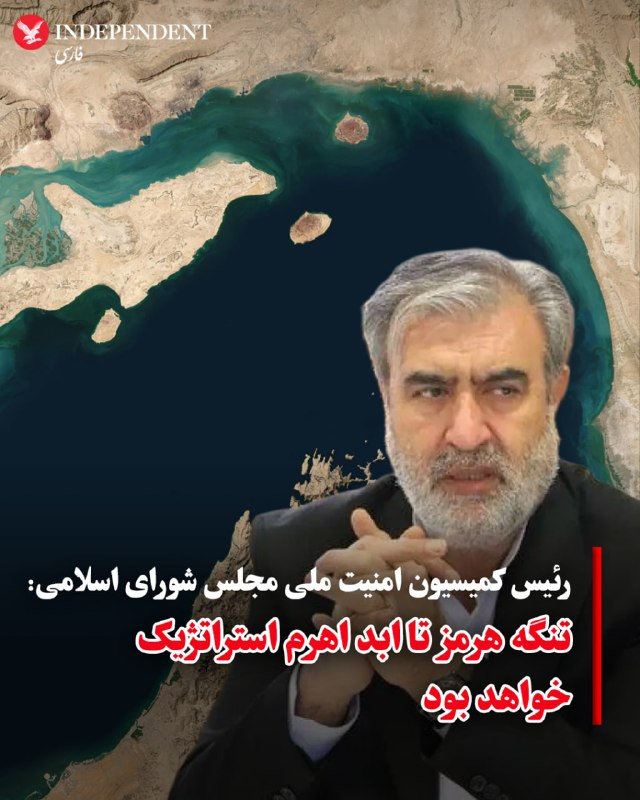

♦️ ابراهیم عزیزی، رئیس کمیسیون امنیت ملی و سیاست خارجی مجلس شورای اسلامی روز سه‌شنبه ۲۹ اردیبهشت به خبرگزاری ایسنا گفت تنگه هرمز «برای همیشه در اختیار و مدیریت» ایران باقی می‌ماند و تا ابد یک اهرم اقتصادی، سیاسی، و نظامی تمام‌عیار» خواهد بود.

این سخنان در حالی عنوان می‌شود که جمهوری اسلامی ایران تلاش می‌کند حاکمیت خود را این آبراه راهبردی با اهمیت جهانی اعمال کند. جامعه جهانی، ازجمله کشورهای حاشیه جنوب خلیج فارس، اروپا، آمریکا و همچنین ترکیه خواستار بازگشایی فوری تنگه هرمز هستند و می‌گویند ایران حق ندارد بابت تردد کشتی‌ها، پول یا امتیازی بگیرد.
‌🇸🇦 Indypersian

🤖 @VahidOOnLine

## VahidOOnLine — post 240933

  <a href="telegram/content/VahidOOnLine_240933_1779187758.mp4" target="_blank">🎬 Download video</a>

بر پایه گزارش‌های منتشر شده حامد تیزرویان، فعال محیط زیست و عکاس شناخته شده بازداشت شده است. آقای تیزرویان ۱۴ اردیبهشت در ساری بازداشت شده و با وجود سپری شدن حدود دو هفته، از نهاد بازداشت کننده یا دلیل دستگیری او اطلاعی در دست نیست.
وسایل الکترونیکی از جمله تلفن همراه حامد تیزرویان هنگام بازداشت او ضبط شده است. حامد تیزرویان، عکاس حیات وحش و دانشجوی دکترای تنوع زیستی دانشگاه شهید بهشتی، پیش‌تر تصاویری کم‌نظیر از گونه‌های در معرض خطر انقراض از جمله خرس قهوه‌ای و مرال ثبت کرده است. او همچنین در ساخت دست‌کم ۱۰ پاسگاه محیط‌بانی در محدوده جنگل‌های هیرکانی مشارکت داشته و طی سال‌های گذشته در زمینه آموزش و آگاهی‌رسانی درباره حفاظت از محیط زیست، به‌ویژه جنگل‌های هیرکانی، فعالیت مستمر داشته است. فعالان محیط زیست نگران سرنوشت آقای تیزرویان هستند. صفحه اینستاگرام حامد تیزرویان نیز آذر سال گذشته، پس از انتشار مطالبی انتقادی درباره عملکرد مدیران دولتی در مهار آتش‌سوزی جنگل‌های الیمالات مازندران، برای چند روز مسدود شده بود.
‌🏁 🇬🇧 ManotoTV

🤖 @VahidOOnLine

## VahidOOnLine — post 240932

  

رسانه‌های ایران گزارش دادند حمید خانی، عضو پیشین سپاه پاسداران، در جریان ماموریت خنثی‌سازی بمب‌های عمل‌نکرده ناشی از حملات مشترک اسرائیل و آمریکا در تهران کشته شده است. بر اساس این گزارش‌ها، او به صورت داوطلبانه در بخش مهندسی قرارگاه خاتم‌الانبیا فعالیت می‌کرده است.

جزئیات بیشتری درباره زمان دقیق حادثه و نحوه وقوع آن منتشر نشده است.
‌🏁 🇬🇧 IranintlTV

🤖 @VahidOOnLine

## VahidOOnLine — post 240931

  

♦️ تدروس ادهانوم قبریسوس، رئیس سازمان جهانی بهداشت روز سه‌شنبه ۲۹ اردیبهشت اعلام کرد سرعت و ابعاد شیوع ویروس ابولا در کشور جمهوری دموکراتیک کنگو، بسیار نگران‌کننده است.

رئیس سازمان جهانی بهداشت در دومین روز مجمع عمومی کشورهای عضو این نهاد بین‌المللی گفت امروز برای بررسی وضعیت شیوع این بیماری یک کمیته فوق‌العاده تشکیل خواهد شد.

از هفته گذشته تاکنون دست‌کم ۱۰۳ نفر براثر ابتلا به سویه بوندیبوگیو ویروس ابولا در جمهوری دموکراتیک کنگو جان خود را از دست داده‌اند.

کارشناسان سازمان جهانی بهداشت می‌گویند واکسنی که برای سویه «زئیر» این ویروس در سال‌های قبل به‌کار گرفته شده بود، ممکن است در پیشگیری از گونه جدید موثر باشد.
‌🇸🇦 Indypersian

🤖 @VahidOOnLine

## VahidOOnLine — post 240930

  <a href="telegram/content/VahidOOnLine_240930_1779187761.mp4" target="_blank">🎬 Download video</a>

ویدیوی ارسال‌شده به ایران‌اینترنشنال، برگزاری مراسم عقد میان حامیان حکومت را در یکی از تجمع‌های حکومتی در تهران نشان می‌دهد.
‌🏁 🇬🇧 IranintlTV

🤖 @VahidOOnLine

## VahidOOnLine — post 240929

🗣روایت شما از بحران اقتصادی و زندگی در آتش‌بس- سه‌شنبه ۲۹ اردیبهشت:

🔹یک بسته برنج یک کیلویی، یک بسته بال مرغ، ۶ تا تخم‌مرغ و یه روغن کوچیک گرفتیم شد ۲ میلیون و ۱۰۰ هزار تومن.

🔹یارانه یک خانواده‌ ۳ نفره ۳ میلیون تومانه، اما یک روغن جامد ۵ کیلویی قیمتش ۳ میلیون و ۴۰۰ هزار تومانه.

🔹ما از دی ماه نه دانشگاه رفتیم نه خوابگاه ولی هر ماه شهریه خوابگاه رو باید بدیم. پدر من بازنشسته‌است، از کجا بیاریم آخه.

🔹صنعت گردشگری و هتلداری فرو پاشیده. ۴ ماهه حقوق نگرفتیم.

🔹برا ۵ تا نان لواش با یه کیسه پلاستیکی ۵۵ هزار تومان پرداختم. گرونی جوریه که اگه بیمار باشی، ناتوان باشی، یا برای یه سالمند بخواهی سفارش آنلاین بدی، مجبور به پرداخت مبلغ زیادی هستی.

🔹ما بازنشسته‌ها با این حقوق‌های پایین داریم له می‌شیم، حتی نمی‌تونیم به درمان خودمون برسیم.

🔹من پارسال بعد ازدواجم یه آپارتمان گرفتم با مبلغ ۸۰۰ میلیون رهن و ۱۰ میلیون تومان اجاره. امسال صاحبخانه گفته باید یک میلیارد و ۲۰۰ رهن بدی با ۲۵ میلیون تومان اجاره... کادر درمان هستم و موندم چکار کنم.

🔹قطعی برق شهرک‌های صنعتی تهران از ۲۶ اردیبهشت شروع شده. فعلا طبق برنامه مدیریت بار، یک روز در هفته از ساعت ۸ صبح تا ۱۲ شب!

🔹قطعی آب در زاهدان طولانی مدت شده و حتی به ۱۲ ساعت هم می‌رسه. زمان‌های قطعی هم متفاوته، یک‌بار صبح زود یک‌بار ظهر یک‌بار عصر.
‌🏁 🇬🇧 IranintlTV

🤖 @VahidOOnLine

## VahidOOnLine — post 240928

  <a href="telegram/content/VahidOOnLine_240928_1779187763.mp4" target="_blank">🎬 Download video</a>

نت‌بلاکس، نهاد ناظر بر دسترسی اینترنت، اعلام کرد ایران برای هشتاد و یکمین روز متوالی با قطعی گسترده اینترنت روبه‌رو است و این رخداد اکنون به طولانی‌ترین خاموشی اینترنتی ملی ثبت‌شده در یک کشور متصل به اینترنت تبدیل شده است.

بر اساس داده‌های نت‌بلاکس، دسترسی کاربران داخل ایران به اینترنت جهانی به‌شدت محدود مانده و ارتباطات دیجیتال کشور در سطحی بسیار پایین‌تر از وضعیت عادی قرار دارد.
‌🏁 🇬🇧 ManotoTV

🤖 @VahidOOnLine

## VahidOOnLine — post 240927

  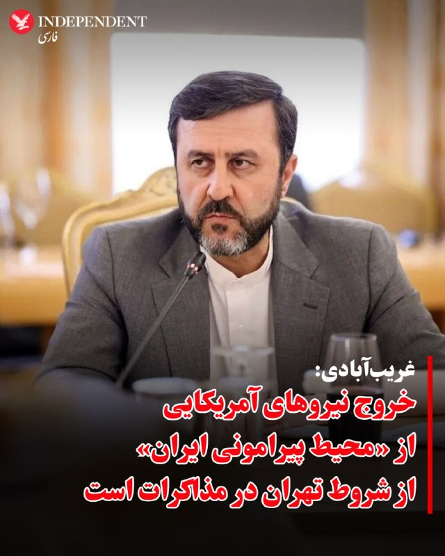

♦️محمد کاظم غریب‌آبادی، معاون وزیر امور خارجه جمهوری اسلامی روز سه‌شنبه ۲۹ اردیبهشت‌ماه گفت که خروج نیروهای نظامی آمریکا از «محیط پیرامونی ایران» یکی از شروط تهران برای مذاکره پایان جنگ با واشنگتن است.

به گزارش خبرگزای ایرنا، غریب‌آبادی در جریان دیدار با اعضای کمیسیون امنیت ملی مجلس شورای اسلامی در باره روند «مذاکرات با آمریکا» گفت: «تاکید بر حق غنی سازی و برخورداری جمهوری اسلامی ایران از حقوق هسته‌ای صلح‌آمیز، خاتمه جنگ در تمامی جبهه‌ها از جمله لبنان، رفع محاصره دریایی آمریکا، آزادسازی اموال و دارائی‌های ایران، تامین خسارت‌های وارد شده در جنگ تحمیلی توسط ایالات متحده جهت بازسازی، خاتمه تمامی تحریم‌های یکجانبه و قطعنامه‌های شورای امنیت ، خروج نیروهای آمریکایی از محیط پیرامونی جمهوری اسلامی ، از جمله محورها و چهارچوب‌هایی است که در پیشنهادهای اخیر ایران مطرح شده است.»

دونالد ترامپ گفته است آمریکا هیچ امتیازی به ایران نخواهد داد.
‌🇸🇦 Indypersian

🤖 @VahidOOnLine

## VahidOOnLine — post 240926

♦️ مادر جاویدنام متین پرویزی، یکی از هزاران جان‌باخته انقلاب ملی ایرانیان، تولد ۲۲ سالگی جگرگوشه‌اش را بر مزار او برگزار کرد.

در ویدیویی که از این مراسم در شبکه‌های اجتماعی منتشر شده، بی‌تابی وگریه‌های مادار داغدار متین بر سر مزارفرزندش که کیک تولدی به شکل نقشه ایران و سه رنگ پرچم ملی میهن روی آن قرار دارد و با شاخه‌های گل آراسته شده، دیده می‌شود. روی کیک جاویدنام شعار «فرزند ایران، جان فدای وطن» نوشته شده است.

متین پرویزی شامگاه ۱۸ دی‌ماه و در تظاهرات انقلاب ملی ایرانیان هدف گلوله سرکوبگران جمهوری اسلامی قرار گرفت و کشته شد.
‌🇸🇦 Indypersian

🤖 @VahidOOnLine

## VahidOOnLine — post 240925

  

نت‌بلاکس، نهاد مستقل پایش وضعیت اینترنت در جهان، سه‌شنبه ۲۹ اردیبهشت اعلام کرد قطع اینترنت در ایران اکنون به هشتاد و یکمین روز رسیده است.

نت‌بلاکس افزود: «هم‌زمان، حکومت در تلاش است کنترل دیجیتال خود را به سطح بین‌المللی گسترش دهد؛ از جمله با مطالبه کنترل کابل‌های سایر کشورها در تنگه هرمز و وادار کردن شرکت‌های بزرگ فناوری به تبعیت از قوانین جمهوری اسلامی.»
‌🏁 🇬🇧 IranintlTV

🤖 @VahidOOnLine

## VahidOOnLine — post 240924

  <a href="telegram/content/VahidOOnLine_240924_1779187766.mp4" target="_blank">🎬 Download video</a>

وزارت دفاع روسیه اعلام کرد نیروهای مسلح این کشور از سه‌شنبه ۲۹ اردیبهشت تا ۳۱ اردیبهشت رزمایش نیروهای هسته‌ای برگزار می‌کنند.

بر اساس این اعلام، بیش از ۶۴ هزار نیروی نظامی و ۷۸۰۰ قطعه تجهیزات نظامی در این رزمایش شرکت دارند و قرار است موشک‌های بالستیک و کروز از پایگاه‌های آزمایشی در خاک روسیه شلیک شوند.

این خبر هم‌زمان با افزایش تنش‌های امنیتی میان روسیه و غرب منتشر شده است. یک روز پیشتر نیز بلاروس اعلام کرد با مشارکت روسیه رزمایشی را برای تمرین جابه‌جایی و آماده‌سازی مهمات هسته‌ای برگزار می‌کند. بلاروس میزبان تسلیحات هسته‌ای تاکتیکی روسیه است، اما مسکو کنترل این تسلیحات را در اختیار دارد.
‌🏁 🇬🇧 ManotoTV

🤖 @VahidOOnLine

## VahidOOnLine — post 240923

  

مسعود پزشکیان، رییس دولت جمهوری اسلامی، در نشست با مدیران وزارت کار گفت: «برای غلبه بر آثار و پیامدهای ناشی از جنگ باید با تدبیر، برنامه‌ریزی و نگاه بلندمدت عمل کرد.»

او افزود: «برخی اقدامات فعلی اگرچه برای کنترل شرایط ضروری است، اما در عمل به‌مثابه مُسَکِن و درمان موقت محسوب می‌شود و لازم است برای حل ریشه‌ای مشکلات اقتصادی و اجتماعی، برنامه‌ریزی ساختاری و پایدار صورت گیرد.»

پزشکیان ادامه داد: «باید به‌گونه‌ای برنامه‌ریزی شود که به‌جای اتکای صرف به پرداخت بیمه بیکاری، زمینه ایجاد فرصت‌های شغلی پایدار برای افرادی که در جریان جنگ شغل خود را از دست داده‌اند، فراهم شود.»

رییس دولت جمهوری اسلامی «مدیریت مصرف و پرهیز از اسراف» را یک «ضرورت ملی» دانست و تاکید کرد: «همه دستگاه‌ها باید در این زمینه پیشگام باشند.»
‌🏁 🇬🇧 IranintlTV

🤖 @VahidOOnLine

## VahidOOnLine — post 240922

  

⭕️ایلان ماسک: اسرائیل در نوآوری و فناوری در خط مقدم جهان قرار دارد

♦️ایلان ماسک، مدیرعامل تسلا روز دوشنبه ۲۸ اردیبهشت و در جریان یک سخنرانی مجازی در نهمین کنفرانس بین‌المللی حمل‌ونقل هوشمند در اسرائیل، از جایگاه این کشور در حوزه فناوری و نوآوری تمجید کرد و گفت: «اسرائیل فراتر از آنچه با توجه به جمعیتش انتظار می‌رود عمل می‌کند.»

مدیرعامل تسلا و اسپیس‌ایکس همچنین پیش‌بینی کرد طی یک دهه آینده، ۹۰ درصد خودروها خودران خواهند بود و افزود اسرائیل از نظر «سرانه نوآوری» با اختلاف در رتبه نخست جهان قرار دارد.

ماسک تاکید کرد از نوآوری‌هایی که از اسرائیل ارائه می‌شود، «حمایت جدی» می‌کند.
‌🇸🇦 Indypersian

🤖 @VahidOOnLine

## VahidOOnLine — post 240921

  

♦️ خبرگزاری مهر، وابسته به سازمان تبلیغات اسلامی روز سه‌شنبه ۲۹ اردیبهشت‌ماه از «کشف و ضبط ۹۰۰ تن مرغ منجمد احتکار شده در شیراز» خبر داد.

به گزارش مهر، موسی رهبر، مدیرکل تعزیرات حکومتی  استان فارس گفت: «با گزارش سربازان گمنام امام زمان در سازمان اطلاعات سپاه فجر فارس مبنی بر احتکار مرغ در سردخانه‌ای واقع در شهر شیراز ، اکیپی مشترک از بازرسان تعزیرات حکومتی و سازمان جهاد کشاورزی به محل اعزام شدند.
 در بازرسی از این سردخانه، مقدار ۹۰۰ تن مرغ منجمد که توسط صاحب آن احتکار شده بود، کشف و ضبط گردید.»

در هفته‌های گذشته و همزمان با سیر بی‌سابقه صعودی نرخ تورم کالاهای خوراکی و مصرفی، قوه قضائیه و نهادهای اطلاعاتی جمهوری اسلامی چند بار از کشف انبارهای محصولات احتکار شده خبر داده‌اند.
‌🇸🇦 Indypersian

🤖 @VahidOOnLine

## VahidOOnLine — post 240920

  

کاظم غریب‌آبادی، معاون وزیر خارجه جمهوری اسلامی، در دیدار با نمایندگان مجلس اعلام کرد مجموعه‌ای از مطالبات جمهوری اسلامی در پیشنهاد اخیر تهران به آمریکا درج شده است.

او گفت تاکید بر حق غنی‌سازی، خاتمه جنگ در همه جبهه‌ها از جمله لبنان، رفع محاصره دریایی آمریکا، آزادسازی اموال بلوکه‌شده، تامین خسارت‌های واردشده در جنگ، پایان همه تحریم‌ها و خروج نیروهای آمریکایی از محیط پیرامونی جمهوری اسلامی در این پیشنهاد گنجانده شده است.

غریب‌آبادی جزئیات بیشتری درباره روند بررسی این پیشنهاد یا واکنش طرف آمریکایی ارائه نکرد.
‌🏁 🇬🇧 IranintlTV

🤖 @VahidOOnLine

## WithYashar — post 11644

دادگاه نتانیاهو امروز به دلایل جلسات امنیتی بازم لغو شد.
@withyashar

## WithYashar — post 11643

😾

## WithYashar — post 11642

سخنگوی ارتش: ارتش ایران، دوره آتش بس را به منزله دوران جنگ تلقی کرده و از این فرصت برای تقویت توان رزمی خود استفاده کرده است.

اگر دشمن حماقت کند و مجدداً در دام اسرائیل گرفتار شود و دست به تجاوزی دیگر به ایران عزیز ما بزند، با ابزارها و شیوه‌های جدید جبهه‌های جدیدی را علیه آنها خواهیم گشود.
@withyashar

## WithYashar — post 11641

اتاق جنگ با شما : پالایشگاه بندرعباس تخلیه شد همین الان
@withyashar

## WithYashar — post 11640

## WithYashar — post 11639

  <a href="telegram/content/WithYashar_11639_1779187770.mp4" target="_blank">🎬 Download video</a>

بمب اتمی کره شمالی
@withyashar

## WithYashar — post 11638

من سریع خوندم فک کردم میگه پاکستان میده به اونا ، در جواب پس یه ویدیو میبینیم با هم

## WithYashar — post 11637

عمو اینکه جمهوری اسلامی به پاکستان گفته که ما سه تا بمب اتم داریم ، اگر حمله ای صورت بگیره کشور های همسایه پودر میشن واقعیه؟ ازشون واقعا برمیاد همه چی.

## WithYashar — post 11636

عمو اینکه جمهوری اسلامی به پاکستان گفته که ما سه تا بمب اتم داریم ، اگر حمله ای صورت بگیره کشور های همسایه پودر میشن واقعیه؟
ازشون واقعا برمیاد همه چی.

## WithYashar — post 11635

روزنامه واشنگتن پست به نقل از یک مقام پاکستانی: ایران می‌خواهد پیش از اعلام توافق هسته‌ای، به توافقی برای پایان دادن به جنگ دست یابد.
واشنگتن می‌خواهد توافق بر سر همه مسائل را یکجا اعلام کند.
@withyashar

## WithYashar — post 11634

  <a href="telegram/content/WithYashar_11634_1779187772.mp4" target="_blank">🎬 Download video</a>

سم جدید .. 😂
@withyashar

## WithYashar — post 11633

صدای شدید پدافند دزفول اینم حتما پدافند کنترل شدست چیزی‌ نیست 😂

## WithYashar — post 11632

کمی پیش صدای انفجار و ستون دود در پادگان موشکی ۱۵ خرداد اصفهان @withyashar

## WithYashar — post 11631

@withyashar part6

## WithYashar — post 11629

دیشب خود گوهشون گفتن فردا اصفهان صدا میشنوید

## WithYashar — post 11628

دیشب خود گوهشون گفتن فردا اصفهان صدا میشنوید

## WithYashar — post 11627

  <a href="telegram/content/WithYashar_11627_1779187775.mp4" target="_blank">🎬 Download video</a>

کمی پیش صدای انفجار و ستون دود در پادگان موشکی ۱۵ خرداد اصفهان
@withyashar

## WithYashar — post 11626

  <a href="telegram/content/WithYashar_11626_1779187777.mp4" target="_blank">🎬 Download video</a>

پیت هگست وزیر جنگ با تقلید صدای ترامپ گفت وقتی ترامپ صمت وزیر جنگ را به او داد گفت : پیت، باید خیلی خشن و محکم باشی… آماده ای؟
@withyashar

## WithYashar — post 11622

@withyashar

## mwarmonitor — post 9299

🇮🇱ارتش اسرائیل (IDF) به ساکنان ۱۲ شهر و روستای جنوب لبنان دستور تخلیه صادر کرده است.

@mwarmonitor

## mwarmonitor — post 9298

🔴بلومبرگ : روبل روسیه در صدر بهترین ارزهای جهانی قرار گرفته است، به‌طوری‌که از ابتدای ماه آوریل تاکنون حدود ۱۲٪ در برابر دلار آمریکا تقویت شده است.

@mwarmonitor

## mwarmonitor — post 9297

🔴«نیویورک تایمز» می‌گوید: سرنگونی یک فروند جنگنده F-15E و آسیب‌دیدن یک فروند F-35 نشان داد که تاکتیک‌های نیروی هوایی آمریکا تا حد زیادی قابل پیش‌بینی شده‌اند.

@mwarmonitor

## mwarmonitor — post 9296

🔴انور قرقاش ؛ «اختلاط نقش‌ها در جریان این تجاوز وحشیانه ایران گیج‌کننده است و کشورهای منطقه پیرامون خلیج فارس را نیز در بر می‌گیرد. در نتیجه نقش قربانی با نقش میانجی در هم آمیخته شده و برعکس، و دوست به جای اینکه پشتیبان و حامی باشد، به میانجی تبدیل شده است.

🔸در این مرحله که خطرناک‌ترین دوره در تاریخ خلیج فارسِ معاصر است، و در میانه این تجاوز خائنانه، موضع خاکستری خطرناک‌تر از بی‌موضعی است.»

@mwarmonitor

## mwarmonitor — post 9294

  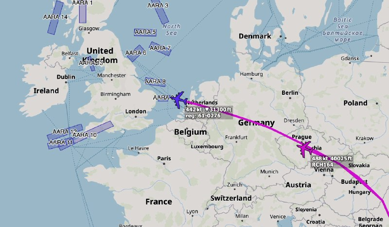

✈️نیروی هوایی آمریکا (USAF)

بوئینگ KC-135 استراتوتانکر (سوخت‌رسان) – ۱ فروند
AE04EA 61-0276 – REACH 756
AE07BA 62-3557 – REACH 164

✈️پروازهای REACH 756 و REACH 164 امروز صبح از فرودگاه بن گوریون تل‌آویو به سمت پایگاه هوایی RAF Mildenhall در بریتانیا در حرکت هستند.

@mwarmonitor

## mwarmonitor — post 9293

🔴به گفته افرادی که با ارزیابی آمریکا از این نشست آشنا هستند، شی جین‌پینگ، رئیس‌جمهور چین، در جریان گفت‌وگوها در پکن در هفته گذشته به دونالد ترامپ گفته است که ولادیمیر پوتین، رئیس‌جمهور روسیه، ممکن است از تصمیم خود برای حمله به اوکراین پشیمان شود. — فایننشال تایمز

@mwarmonitor

## mwarmonitor — post 9292

✈️پرواز هواپیماهای جنگی بر فراز آسمان استان واسط عراق (هم مرز با استان ایلام).

@mwarmonitor

## mwarmonitor — post 9291

🔴 سنای ایالات متحده قصد دارد امروز ـ برای هشتمین بار ـ درباره قطعنامه «اختیارات جنگی» رأی‌گیری کند؛ قطعنامه‌ای که به مشارکت نیروهای آمریکا در جنگ با ایران بدون مجوز کنگره پایان می‌دهد. این موضوع را دموکرات‌های سنا اعلام کردند.

🔸همچنین مجلس نمایندگان آمریکا ممکن است در همین هفته درباره قطعنامه‌ای مشابه رأی‌گیری کند.

@mwarmonitor

## pm_afshaa — post 91020

  <a href="telegram/content/pm_afshaa_91020_1779187780.webm" target="_blank">🎬 Download video</a>

🔴دادگاه نتانیاهو امروز به دلایل جلسات امنیتی بازم لغو شد.

💧 Rainbet.com the #1 Non-KYC Crypto Casino & Sportsbook @rainbetcom

😁 @Pm_Afshaa

## pm_afshaa — post 91019

  <a href="telegram/content/pm_afshaa_91019_1779187780.webm" target="_blank">🎬 Download video</a>

🔴بورس ایران بعد از 80 روز فعالیتش رو از سر گرفت و معاملات بازار سهام صبح امروز آغاز شد.

با این حال، بیش از 40 نماد مرتبط با شرکت‌های آسیب‌دیده در جنگ هنوز بازگشایی نشدن و ارزش صف فروش به بیش از 10 همت رسیده. همچنین نمادهای بانکی و خودرویی فعال شدن، اما بسیاری از نمادهای بزرگ بازار در محدوده منفی معامله میشن.

💧 Rainbet.com the #1 Non-KYC Crypto Casino & Sportsbook @rainbetcom

😁 @Pm_Afshaa

## pm_afshaa — post 91018

  <a href="telegram/content/pm_afshaa_91018_1779187781.webm" target="_blank">🎬 Download video</a>

🔴دموکرات‌های سنای آمریکا امروز قصد دارن برای هشتمین بار درباره قطعنامه « محدود کردن اختیارات جنگی ترامپ» رأی‌گیری کنن؛

قطعنامه‌ای که به مشارکت نیروهای آمریکا در جنگ با جمهوری اسلامی بدون مجوز کنگره پایان میده.

💧 Rainbet.com the #1 Non-KYC Crypto Casino & Sportsbook @rainbetcom

😁 @Pm_Afshaa

## pm_afshaa — post 91017

  <a href="telegram/content/pm_afshaa_91017_1779187782.webm" target="_blank">🎬 Download video</a>

🔴غریب‌آبادی، معاون عراقچی:
جمهوری اسلامی در پیشنهاد اخیرش به آمریکا، مجموعه‌ای از مطالبات از جمله حق غنی‌سازی، پایان جنگ در همه جبهه‌ها، رفع محاصره دریایی، آزادسازی دارایی‌های بلوکه‌شده، جبران خسارت‌های جنگ و خروج نیروهای آمریکایی از اطراف ایران رو مطرح کرده.

💧 Rainbet.com the #1 Non-KYC Crypto Casino & Sportsbook @rainbetcom

😁 @Pm_Afshaa

## pm_afshaa — post 91016

🔴نشریه AFP : همزمان با سفر پوتین به چین، روسیه قصد داره رزمایش نیروهای هسته‌ایشو برگزار کنه

💧 Rainbet.com the #1 Non-KYC Crypto Casino & Sportsbook @rainbetcom

😁 @Pm_Afshaa

## pm_afshaa — post 91015

🔴وال استریت ژورنال: ترامپ هنوز تمایل به حمله به ایران دارد

💧 Rainbet.com the #1 Non-KYC Crypto Casino & Sportsbook @rainbetcom

😁 @Pm_Afshaa

## DEJradio — post 4720

🚨
🔴 سخنگوی دولت گفت «منویات رهبری» در مسألۀ اینترنت مهم است

فاطمه مهاجرانی، سخنگوی دولت مسعود پزشکیان مدعی شد دولت طرفدار محدودیت اینترنت نیست و به دنبال «گره‌گشایی» در این حوزه است.
او تاکید کرد این اقدامات با در نظر گرفتن «منویات رهبری» و ملاحظات موجود انجام خواهد شد.
فاطمه مهاجرانی همچنین ادعا کرد محدودیت‌های اخیر اینترنت، ناشی از شرایط جنگی است.

#اینترنت #موشتبا
@DEJradio

## DEJradio — post 4719

  <a href="telegram/content/DEJradio_4719_1779187783.webm" target="_blank">🎬 Download video</a>

🔺📌 ‏ملخ جهنده؛ روایتی از فرارهای احمدرضا رادان

یکی از فرماندهان جنایتکار نظام که مردم ایران مشتاقانه در انتظار شنیدن خبر به هلاکت رسیدن او هستند، احمدرضا رادان، قاتل فرزندان ملت است؛ او تا این لحظه از دو جنگ ۱۲ روزه و ۴۰ روزه جان سالم به در برده است اما چگونه؟

رادان فردی بسیار ترسو اما موذی است و به‌ محض آن‌که خطری را احساس کند، از حضور در محل‌های ثابت خود، مانند منزل و دفتر کارش، خود داری می‌کند. این در حالی است که به فرماندهان زیرمجموعه و نیروهای خود دستور می‌دهد حتماً در محل کار حضور داشته باشند اینگونه سازمان خود را فعال نشان میدهد. به هلاکت رسیدن تعداد زیادی از سرداران و نیروهای فراجا در مقرهای خود، تأییدی بر همین موضوع است.

مأموریت‌ها در نیروی انتظامی عمدتاً روتین و روزمره‌اند و از سوی فرماندهان رده‌های پایین‌تر نیز قابل اجرا و نظارت هستند؛ بنابراین، برخلاف سایر فرماندهان ارشد در دیگر سازمان‌های نیروهای مسلح که درگیر جنگ‌اند و باید شخصاً دستورات را صادر و بر اجرای آن نظارت کنند و این باعث لو رفتن مکان آنها می‌شود، نیازی به حضور فیزیکی یا حضور دائمی رادان پشت شبکه‌های ارتباطی و بی‌سیم وجود ندارد.

از سوی دیگر، رادان یکی از بی‌اخلاق‌ترین و بزدل‌ترین فرماندهان جمهوری اسلامی است و هنگام خطر هیچ ابایی ندارد از این‌که جان مردم عادی را سپر خود کند او در جنگ ۱۲ روزه در بیمارستان سجاد تهران و در جنگ ۴۰ روزه در یکی از ایستگاه‌های متروی تهران، شب ها را همراه با ترس سپری می کرد.
یک بار جستی ملخک...

#احمدرضا_رادان #جنگ۱۲روزه #جنگ۴۰روزه
@DEJradio

## DEJradio — post 4718

  <a href="telegram/content/DEJradio_4718_1779187784.webm" target="_blank">🎬 Download video</a>

🚨
🔺 واکنش مثبت بازار اروپا به تعویق حمله به جمهوری اسلامی

بازارهای اروپایی روز سه‌شنبه به تعلیق حملۀ آمریکا به جمهوری اسلامی واکنش مثبت نشان دادند.
پس از اظهارات شامگاه دوشنبۀ دونالد ترامپ، درمورد توقف حملۀ برنامه‌ریزی‌شده به جمهوری اسلامی، شاخص‌های بازار سهام اروپا اندکی افزایش یافت.
شاخص استوکس ۶۰۰ اروپا صبح سه‌شنبه با رشد ۰.۲ درصدی به ۶۱۱ واحد رسید.
به گزارش خبرگزاری رویترز، بازارهای اروپایی به دلیل وابستگی بالا به واردات نفت، در هفته‌های اخیر عملکرد ضعیف‌تری نسبت به بازارهای جهانی داشته‌اند.

#اروپا #ترامپ #جنگ
@DEJradio

## DEJradio — post 4717

  <a href="telegram/content/DEJradio_4717_1779187784.webm" target="_blank">🎬 Download video</a>

🔸
🔺 بریتانیا خواستار بازگشایی بی‌درنگ تنگۀ هرمز شد

ایووت کوپر، وزیر امور خارجۀ بریتانیا، هشدار داد ادامه بسته‌ماندن تنگۀ هرمز می‌تواند بحران جهانی غذا را تشدید کند.
کوپر گفت دنیا دیگر نمی‌تواند برای بازگشایی این آبراه صبر کند و میلیون‌ها نفر ممکن است با خطر گرسنگی روبه‌رو شوند.
وزارت امور خارجۀ بریتانیا اعلام کرد طرح‌هایی برای «ماموریت چندملیتی تنگۀ هرمز» با هدف پشتیبانی از بازگشایی بی‌درنگ این مسیر در حال بررسی است.

#بریتانیا #تنگه_هرمز
@DEJradio

## DEJradio — post 4716

  

💀
🚨 کشته‌شدن یک سـ.ـپاهی درعملیات خنثی‌سازی بمب

حمید خانی سـ.ـپاهی بازنشسته از شهرستان بروجن، که به‌صورت داوطلبانه در بخش مهندسی قرارگاه خاتم‌الانبیا مشغول کار بود در عملیات خنثی‌سازی بمب‌های عمل‌نکرده برجای مانده از جنگ ۴۰ روزه در تهران کشته شد.

#IRGCterrorists #حذف_هدفمند #جنگ۴۰روزه
@DEJradio

## DEJradio — post 4715

  <a href="telegram/content/DEJradio_4715_1779187786.webm" target="_blank">🎬 Download video</a>

👑
🔺 شاهزاده رضا پهلوی: «برای انجام نقش خودم به بهترین نحو، باید کاملا موضع فراجناحی و بی‌طرف داشته باشم. نه به نفع پادشاهی و نه به نفع جمهوری؛ به نفع دموکراسی!»

نشست آینده تکنولوژی در ایران
سان‌فرانسیسکو، ۲۶ اردیبهشت ۲۵۸۵/۱۴۰۵

#شاهزاده_رضا_پهلوی #ایران_را_پس_میگیریم
@DEJradio

## DEJradio — post 4714

  <a href="telegram/content/DEJradio_4714_1779187787.mp4" target="_blank">🎬 Download video</a>

🔺🎥 پیام یک شهروند:
قیمت سوسیس و کالباس انقدر زیاده دیگه نمیشه خرید...

#تورم #سوسیس #کالباس
@DEJradio

## DEJradio — post 4713

  <a href="telegram/content/DEJradio_4713_1779187789.webm" target="_blank">🎬 Download video</a>

🔺📢 “دارو خیلی گرون شده، بچه من جلوی چشمم داره پرپر می‌زنه، به‌خدا با حقوق کارگری نمی‌شه تهیه کرد، بیمه قبول نمی‌کنه، به کی بگیم؟

پیام دریافتی

#تورم #دارو
@DEJradio

## DEJradio — post 4712

  <a href="telegram/content/DEJradio_4712_1779187790.mp4" target="_blank">🎬 Download video</a>

🔺📢 در جیرفت کرمان، مردم برای تنها ۲۰ لیتر بنزین از شب تا صبح در صف می‌مانند...

#کرمان #بنزین
@DEJradio

## DEJradio — post 4711

  <a href="telegram/content/DEJradio_4711_1779187792.mp4" target="_blank">🎬 Download video</a>

🤡
🔺 کاروان عروسی و صیغه با ماشین‌های جنگی و دوشکا!

#صیغه #تجمعات_حکومتی
@DEJradio

## kianmeli1 — post 87479

  

🔴نیویورک پست به‌نقل از یک ژنرال ارشد بازنشسته آمریکایی اعلام کرد که ایالات متحده در آستانه ازسرگیری نبرد با ایران با تمام توان است
https://t.me/kianmeli1

## kianmeli1 — post 87478

  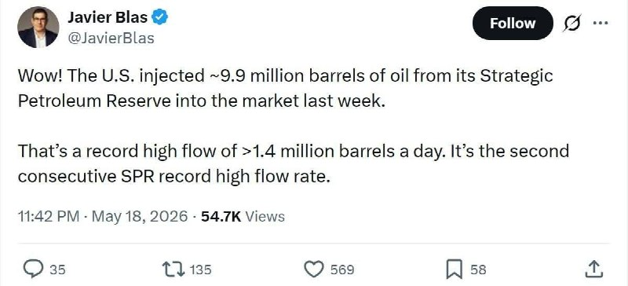

🔴خبرنگار بلومبرگ:

آمریکا هفته گذشته حدود ۹.۹ میلیون بشکه نفت از ذخایر استراتژیک نفت(SPR) خود را به بازار تزریق کرد

این یک رکورد بی‌سابقه در جریان روزانه‌ی بیش از ۱.۴ میلیون بشکه در روز است.

دومین هفته‌ی متوالی است که نرخ تخلیه ذخایر استراتژیک رکورد می‌زند.
https://t.me/kianmeli1

## kianmeli1 — post 87477

  <a href="telegram/content/kianmeli1_87477_1779187797.mp4" target="_blank">🎬 Download video</a>

🔴مداح: بزنید که امتحانا مجازی شه!!

در حال حاضر کشور توسط مداحان با کارناوال شبانه کنترل میشود
https://t.me/kianmeli1

## kianmeli1 — post 87476

🔴اسرائیل به شدت خواهان ورود امارات به جنگ مستقیم علیه ایران است «یکی از دلایل» این است که امارات قطب سرمایه گذاری نباشد و تبدیل به کشوری نامطمئن برای سرمایه گذاران شود و در عوض اسرائیل به قطب اقتصادی و سرمایه گذاری تبدیل شود https://t.me/kianmeli1

## kianmeli1 — post 87475

🔴اسرائیل به شدت خواهان ورود امارات به جنگ مستقیم علیه ایران است

«یکی از دلایل» این است که امارات قطب سرمایه گذاری نباشد و تبدیل به کشوری نامطمئن برای سرمایه گذاران شود و در عوض اسرائیل به قطب اقتصادی و سرمایه گذاری تبدیل شود
https://t.me/kianmeli1

## IranIntlTV — post 337912

  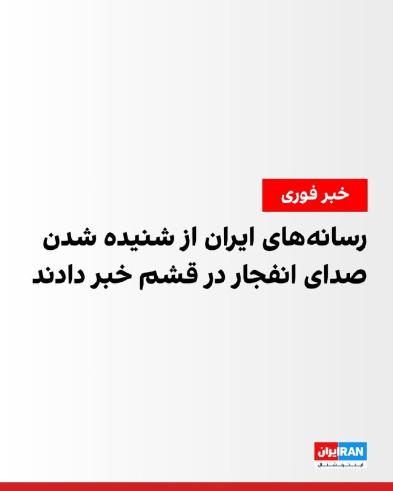

رسانه‌های ایران از شنیده شدن صدای انفجار در قشم در ظهر روز سه‌شنبه خبر دادند. خبرگزاری مهر گزارش داد که هنوز هیچ‌یک از نهادهای رسمی درباره علت وقوع این صداها اظهارنظر نکرده‌اند.

@iranintltv

## IranIntlTV — post 337911

  <a href="telegram/content/IranIntlTV_337911_1779187800.mp4" target="_blank">🎬 Download video</a>

سرخط خبرهای سه‌شنبه ۲۹ اردیبهشت
@iranintltv

## IranIntlTV — post 337910

  

الی کوهن، وزیر انرژی و عضو کابینه سیاسی-امنیتی اسرائیل، گفت: «رهبر جمهوری اسلامی پنهان شده و تحت فشار است. محاصره هرمز اقتصاد ایران را به سمت فروپاشی می‌برد و اگر تهران برنامه هسته‌ای را از سر بگیرد، اسرائیل حمله خواهد کرد.»

او افزود: «اسرائیل اجازه نخواهد داد جمهوری اسلامی به سلاح هسته‌ای نزدیک شود و برای حفظ برتری نظامی خود بیش از ۱۰۰ میلیارد دلار سرمایه‌گذاری خواهد کرد.»
https://iranintl.com/202605196327

## IranIntlTV — post 337909

  

🔻روزنامه نیویورک‌پست گزارش داد قیمت بلیت‌های جام جهانی ۲۰۲۶ به‌طور قابل توجهی کاهش یافته است.

🔹بر اساس این گزارش، برگزارکنندگان جام جهانی در ایالات متحده، کانادا و مکزیک با استقبال کمتر از انتظار هواداران روبه‌رو شده‌اند و همین مسئله باعث افت قیمت بلیت‌ها شده است.

🔹نیویورک‌پست نوشت برخی بلیت‌ها که پیش‌تر با قیمت‌های بسیار بالا عرضه شده بودند، اکنون با کاهش چشمگیر قیمت فروخته می‌شوند. نگرانی درباره هزینه بالای سفر، اقامت و حمل‌ونقل در شهرهای میزبان از جمله دلایل کاهش تقاضا عنوان شده است.

🔹این گزارش همچنین به نگرانی مقام‌های فیفا درباره تصاویر ورزشگاه‌های نیمه‌خالی اشاره کرده و نوشته است برگزارکنندگان در تلاش‌اند با کاهش قیمت‌ها و طرح‌های تشویقی، فروش بلیت‌ها را افزایش دهند.

🔹جام جهانی ۲۰۲۶ برای نخستین‌بار با حضور ۴۸ تیم برگزار خواهد شد و گستردگی جغرافیایی مسابقات، چالش‌های تازه‌ای برای هواداران ایجاد کرده است.

@iranintltvsport

## IranIntlTV — post 337908

  <a href="telegram/content/IranIntlTV_337908_1779187804.mp4" target="_blank">🎬 Download video</a>

مهدی پیرصالحی، رییس سازمان غذا و دارو، هشدار داد افزایش قیمت دارو می‌تواند باعث نارضایتی عمومی شود و به همین دلیل بیمه‌ها باید پوشش بیشتری برای بیماران فراهم کنند.

گفت‌وگو با منصوره حسینی‌یگانه، عضو تحریریه ایران‌اینترنشنال

@iranintltv

## IranIntlTV — post 337907

  <a href="telegram/content/IranIntlTV_337907_1779187806.mp4" target="_blank">🎬 Download video</a>

یکی از اعضای شورای شهر زنجان هنگام تحصن کارگران برای درخواست افزایش حقوق، با خودروی دولتی از روی پای یک پارکبان معترض عبور کرد.

گفت‌وگو با آیه دریس، عضو تحریریه ایران‌اینترنشنال
@iranintltv

## IranIntlTV — post 337906

  

در ادامه لفاظی‌های تهدیدآمیز مقام‌های حکومت، محمد اکرمی‌نیا، سخنگوی ارتش جمهوری اسلامی، گفت در صورت حمله مجدد دشمن، «با ابزارها و شیوه‌های جدید، جبهه‌های جدیدی را علیه آنها خواهیم گشود».

او اضافه کرد: «جمهوری اسلامی محاصره‌پذیر و قابل شکست نیست.»
https://iranintl.com/202605192299

## IranIntlTV — post 337905

شرکت آلکاتل اعلام کرد تعمیر کابل‌های اینترنت زیردریایی در خلیج فارس را به‌دلیل ناامنی و تهدیدهای سپاه پاسداران متوقف کرده‌ است. این شرکت تاکید کرد سپاه از اپراتورهای خارجی خواسته برای نگه‌داری این زیرساخت‌ها به جمهوری اسلامی هزینه حفاظت بپردازند.
گفت‌وگو با علی‌حسین قاضی‌زاده، عضو تحریریه ایران‌اینترنشال
@iranintltv

## IranIntlTV — post 337904

  <a href="telegram/content/IranIntlTV_337904_1779187809.mp4" target="_blank">🎬 Download video</a>

ویدیوی ارسال‌شده به ایران‌اینترنشنال، شعارنویسی در حمایت از شاهزاده رضا پهلوی را روی یکی از دیوارهای شهر کیش نشان می‌دهد.

## IranIntlTV — post 337903

  <a href="telegram/content/IranIntlTV_337903_1779187811.mp4" target="_blank">🎬 Download video</a>

شرکت آلکاتل اعلام کرده تعمیر کابل‌های اینترنت زیردریایی در خلیج فارس را به‌دلیل شرایط ناامن و تهدیدهای منتسب به سپاه پاسداران متوقف کرده است. این تصمیم در حالی گرفته شده که موضوع تامین امنیت و هزینه حفاظت از زیرساخت‌های ارتباطی همچنان محل اختلاف با اپراتورهای خارجی است و نگرانی‌ها درباره اختلال در شبکه‌های اینترنتی و مالی در صورت آسیب به کابل‌ها افزایش یافته است.
@iranintltv

## IranIntlTV — post 337902

  <a href="telegram/content/IranIntlTV_337902_1779187813.mp4" target="_blank">🎬 Download video</a>

روزنامه اسرائیل هیوم در گزارشی تحلیلی نوشت احتمال ازسرگیری جنگ میان جمهوری اسلامی و آمریکا بالاست. هم‌زمان، دونالد ترامپ، رییس‌جهوری آمریکا، در گفت‌وگو با نیویورک پست گفت پس از دریافت پاسخ اخیر تهران درباره مذاکرات، تمایلی به دادن امتیاز بیشتر به جمهوری اسلامی ندارد.
جزییات بیشتر با اشکان صفایی، خبرنگار ایران‌اینترنشنال
@iranintltv

## IranIntlTV — post 337901

  <a href="telegram/content/IranIntlTV_337901_1779187815.mp4" target="_blank">🎬 Download video</a>

مستند «تمرین‌هایی برای یک انقلاب» ساخته پگاه آهنگرانی، برنده جایزه ویژه هیات داوران مستند گلدن گلوبز شد. این مستند با استفاده از تصاویر آرشیوی، روایت وقایع پس از انقلاب ۵۷ تا امروز را با زندگی شخصی فیلمساز پیوند می‌دهد.
لی‌لی نیکفر، خبرنگار ایران‌اینترنشنال، گزارش می‌دهد
@iranintltv

## IranIntlTV — post 337900

🔻نیویورک‌تایمز: جمهوری اسلامی از فرصت آتش‌بس برای احیای توان موشکی خود استفاده کرد

نیویورک‌تایمز گزارش داد جمهوری اسلامی در دوره آتش‌بس شکننده میان تهران و واشینگتن، بازسازی بخشی از توان موشکی خود را آغاز کرده و هم‌زمان برای احتمال ازسرگیری درگیری‌ها آماده می‌شود.

بر اساس این گزارش، جمهوری اسلامی از این فرصت برای بازگشایی ده‌ها محل استقرار موشک‌های بالستیک که در جریان حملات هدف قرار گرفته بودند، استفاده کرده است.

جابه‌جایی پرتابگرهای متحرک موشکی و تطبیق تاکتیک‌های نظامی برای دور تازه احتمالی جنگ نیز از دیگر اقدام‌های تهران عنوان شده است.

یک مقام نظامی آمریکا به نیویورک‌تایمز گفت بسیاری از موشک‌های بالستیک جمهوری اسلامی در تاسیسات زیرزمینی عمیق در دل کوه‌های گرانیتی نگهداری می‌شدند و آمریکا در حملات خود عمدتا ورودی این مراکز را هدف قرار داده بود.

به گفته او، فروریختن دهانه این تاسیسات باعث مدفون شدن آن‌ها شد، اما ساختار اصلی سایت‌ها از بین نرفت و اکنون حکومت ایران بخش قابل توجهی از این مراکز را دوباره بازگشایی کرده است.

این مقام آمریکایی افزود تهران همچنین بسیاری از تسلیحات باقی‌مانده خود را جابه‌جا کرده و در میان مقام‌های جمهوری اسلامی این باور تقویت شده که می‌توانند در برابر آمریکا مقاومت کنند؛ چه از طریق بستن موثر تنگه هرمز، چه با حمله به زیرساخت‌های انرژی کشورهای خلیج فارس و چه با تهدید هواپیماهای آمریکایی.

جمهوری اسلامی در انتظار جنگی کوتاه اما شدید

نیویورک‌تایمز نوشت با وجود ادامه مذاکرات، مقام‌های جمهوری اسلامی خود را برای احتمال ازسرگیری حملات آماده کرده‌اند و هشدار داده‌اند در صورت وقوع جنگ تازه، هزینه سنگینی به همسایگان و اقتصاد جهانی تحمیل خواهند کرد.

حمیدرضا عزیزی، پژوهشگر مسائل امنیتی ایران در موسسه آلمانی امور بین‌الملل و امنیت، به این روزنامه گفت مقام‌های جمهوری اسلامی در دور نخست جنگ، خود را برای یک درگیری طولانی‌مدت حدود سه ماهه آماده کرده بودند و به همین دلیل استفاده از موشک‌ها را محدود کردند تا بتوانند هفته‌ها حملات را ادامه دهند.

اما به گفته او، اگر جنگ دوباره آغاز شود، رهبران جمهوری اسلامی انتظار یک نبرد «کوتاه اما بسیار شدید» را دارند؛ جنگی که می‌تواند با حملات هماهنگ به زیرساخت‌های انرژی ایران همراه باشد.

به نوشته نیویورک‌تایمز، جمهوری اسلامی ممکن است در دور تازه درگیری‌ها روزانه ده‌ها یا حتی صدها موشک شلیک کند تا «محاسبات طرف مقابل را تغییر دهد».

تهدید خلیج فارس و باب‌المندب

این گزارش افزود که کشورهای عربی خلیج فارس در صورت آغاز دوباره جنگ، ممکن است با حملات شدیدتر به زیرساخت‌های انرژی خود روبه‌رو شوند. هدف قرار دادن میادین نفتی، پالایشگاه‌ها و بنادر نفتی، یکی از مهم‌ترین ابزارهای تهران برای وارد آوردن فشار بر اقتصاد جهانی توصیف شده است.

نیویورک‌تایمز همچنین به افزایش تهدیدهای لفظی علیه امارات متحده عربی اشاره کرد و نوشت برخی مقام‌ها و تحلیلگران نزدیک به جمهوری اسلامی معتقدند امارات با میزبانی پایگاه‌های نظامی آمریکا، در حملات علیه حکومت ایران نقش داشته است.

مهدی خراطیان، تحلیلگر نزدیک به نهادهای امنیتی جمهوری اسلامی، ماه گذشته گفته بود: «ما حتما باید امارات را به دوران شترسواری برگردانیم و می‌توانیم این کار را بکنیم. اگر لازم باشد، ابوظبی را اشغال خواهیم کرد.»

این روزنامه همچنین نوشت جمهوری اسلامی ممکن است علاوه بر تنگه هرمز، بر تنگه باب‌المندب نیز فشار وارد کند. آبراهی راهبردی میان دریای سرخ و خلیج عدن که حدود یک‌دهم تجارت جهانی از آن عبور می‌کند و در نزدیکی مناطق تحت کنترل حوثی‌های مورد حمایت جمهوری اسلامی قرار دارد.

به نوشته نیویورک‌تایمز، اگر تهران احساس کند کنترلش بر تنگه هرمز در خطر است، ممکن است تلاش کند آمریکا را هم‌زمان در دو جبهه دریایی درگیر کند.

این گزارش در پایان افزود اگرچه حوثی‌ها وعده داده‌اند در صورت وقوع جنگ منطقه‌ای از تهران حمایت کنند، اما در دور قبلی درگیری‌ها واکنش محتاطانه‌ای نشان دادند. موضوعی که تحلیلگران آن را ناشی از نگرانی این گروه درباره کاهش ذخایر نظامی‌اش می‌دانند.

🔗 وب‌سایت ایران اینترنشنال

@iranintltv

## IranIntlTV — post 337899

  

رسانه‌های ایران گزارش دادند حمید خانی، عضو پیشین سپاه پاسداران، در جریان ماموریت خنثی‌سازی بمب‌های عمل‌نکرده ناشی از حملات مشترک اسرائیل و آمریکا در تهران کشته شده است. بر اساس این گزارش‌ها، او به صورت داوطلبانه در بخش مهندسی قرارگاه خاتم‌الانبیا فعالیت می‌کرده است.

جزئیات بیشتری درباره زمان دقیق حادثه و نحوه وقوع آن منتشر نشده است.
https://iranintl.com/202605198404

## IranIntlTV — post 337898

  <a href="telegram/content/IranIntlTV_337898_1779187819.mp4" target="_blank">🎬 Download video</a>

پگاه آهنگرانی، بازیگر و مستندساز، پیش از نمایش فیلم «تمرین‌هایی برای یک انقلاب» در جشنواره فیلم کن، گفت این فیلم را به مادرانی تقدیم می‌کند که فرزندانشان را در «راه آزادی» از دست دادند.
@iranintltv

## IranIntlTV — post 337897

  <a href="telegram/content/IranIntlTV_337897_1779187820.mp4" target="_blank">🎬 Download video</a>

مدیرکل دفتر بهبود تغذیه وزارت بهداشت با اشاره به ادامه آموزش «تغذیه ارزان‌قیمت» گفت خانواده‌ها با استفاده از جایگزین‌های غذایی تلاش می‌کنند حداقل کالری و پروتئین مورد نیاز خود را تامین کنند. او همچنین گفت حدود ۵ درصد کودکان زیر ۵ سال در ایران دچار کوتاه‌قدی ناشی از سوءتغذیه هستند.
گفت‌وگو با بابک خطی، پزشک و متخصص کودکان
@iranintltv

## IranIntlTV — post 337896

  <a href="telegram/content/IranIntlTV_337896_1779187822.mp4" target="_blank">🎬 Download video</a>

هاکان فیدان، وزیر خارجه ترکیه، در کنفرانس خبری مشترک با همتای آلمانی‌اش گفت مهم‌ترین موضوع درباره ایران، باز ماندن تنگه هرمز و پس از آن، پرونده هسته‌ای جمهوری اسلامی است. فیدان افزود: «ذخایر اورانیوم غنی‌شده باید از ایران خارج شود.»

گفت‌وگو با احمد صمدی، خبرنگار ایران‌اینترنشنال
@iranintltv

## IranIntlTV — post 337895

  <a href="telegram/content/IranIntlTV_337895_1779187825.mp4" target="_blank">🎬 Download video</a>

ویدیوی ارسال‌شده به ایران‌اینترنشنال، برگزاری مراسم عقد میان حامیان حکومت را در یکی از تجمع‌های حکومتی در تهران نشان می‌دهد.

## IranIntlTV — post 337894

  <a href="telegram/content/IranIntlTV_337894_1779187827.mp4" target="_blank">🎬 Download video</a>

دونالد ترامپ، رییس‌جمهوری آمریکا، اعلام کرد به‌درخواست امارات متحده عربی، عربستان سعودی و قطر، حمله احتمالی علیه جمهوری اسلامی را برای چند روز به تعویق انداخته تا فرصت بیشتری برای دستیابی به توافق فراهم شود.

گفت‌وگو با مرتضی کاظمیان، عضو تحریریه ایران‌اینترنشنال
@iranintltv

## IranIntlTV — post 337893

🗣روایت شما از بحران اقتصادی و زندگی در آتش‌بس- سه‌شنبه ۲۹ اردیبهشت:

🔹یک بسته برنج یک کیلویی، یک بسته بال مرغ، ۶ تا تخم‌مرغ و یه روغن کوچیک گرفتیم شد ۲ میلیون و ۱۰۰ هزار تومن.

🔹یارانه یک خانواده‌ ۳ نفره ۳ میلیون تومانه، اما یک روغن جامد ۵ کیلویی قیمتش ۳ میلیون و ۴۰۰ هزار تومانه.

🔹ما از دی ماه نه دانشگاه رفتیم نه خوابگاه ولی هر ماه شهریه خوابگاه رو باید بدیم. پدر من بازنشسته‌است، از کجا بیاریم آخه.

🔹صنعت گردشگری و هتلداری فرو پاشیده. ۴ ماهه حقوق نگرفتیم.

🔹برا ۵ تا نان لواش با یه کیسه پلاستیکی ۵۵ هزار تومان پرداختم. گرونی جوریه که اگه بیمار باشی، ناتوان باشی، یا برای یه سالمند بخواهی سفارش آنلاین بدی، مجبور به پرداخت مبلغ زیادی هستی.

🔹ما بازنشسته‌ها با این حقوق‌های پایین داریم له می‌شیم، حتی نمی‌تونیم به درمان خودمون برسیم.

🔹من پارسال بعد ازدواجم یه آپارتمان گرفتم با مبلغ ۸۰۰ میلیون رهن و ۱۰ میلیون تومان اجاره. امسال صاحبخانه گفته باید یک میلیارد و ۲۰۰ رهن بدی با ۲۵ میلیون تومان اجاره... کادر درمان هستم و موندم چکار کنم.

🔹قطعی برق شهرک‌های صنعتی تهران از ۲۶ اردیبهشت شروع شده. فعلا طبق برنامه مدیریت بار، یک روز در هفته از ساعت ۸ صبح تا ۱۲ شب!

🔹قطعی آب در زاهدان طولانی مدت شده و حتی به ۱۲ ساعت هم می‌رسه. زمان‌های قطعی هم متفاوته، یک‌بار صبح زود یک‌بار ظهر یک‌بار عصر.

## Shin_Persian — post 6082

  

Shin ✓ @hey_itsmyturn
Tue, 19 May 2026 10:06:08 UTC

Earlier today:
"AA activity in Andimeshk"
Adds:
"Something reportedly crashed in the Andimeshk Bazaar"
Also adds:
"Apparently 2-3 citizens were severely wounded due to the AA fire" [???]

Khuzestan Province, #Iran

فارسی

امروز کمی پیش:
«فعالیت پدافند هوایی در اندیمشک»
می‌افزاید:
«گزارش شده که چیزی در بازار اندیمشک سقوط کرده است»
همچنین می‌افزاید:
«ظاهراً ۲-۳ شهروند بر اثر شلیک پدافند هوایی به شدت مجروح شده‌اند» [؟؟؟]

استان خوزستان، #Iran_

𝕏 · @shin_persian

## Shin_Persian — post 6081

  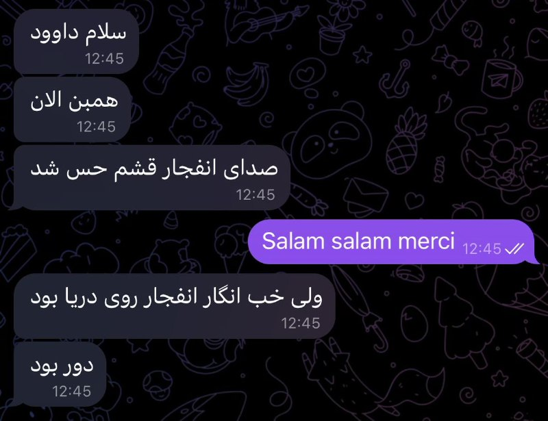

Shin ✓ @hey_itsmyturn
Tue, 19 May 2026 09:46:48 UTC

Now @ 0946Z
Blast was heard in Qeshm island, eyewitness reports it was likely from the sea
Hormozgan Province, #Iran

فارسی

هم‌اکنون @ ۰۹۴۶ زولو (۱۳:۱۶ به وقت تهران)
صدای انفجار در جزیره قشم شنیده شد، گزارش‌های شاهدان عینی حاکی از آن است که احتمالاً از سمت دریا بوده است.
استان هرمزگان، #Iran

𝕏 · @shin_persian

## Shin_Persian — post 6080

  

DefenceGeek 🇬🇧 @DefenceGeek Tue, 19 May 2026 09:04:39 UTC UPDATE: US Air Force Tanker Fleet 19/05/2026 (Ceasefire Day 42) #FreeIran‌ --- Operation EPIC FURY / Project FREEDOM --- Another weekly update. Overall tanker numbers remain around the same from…

## Shin_Persian — post 6079

DefenceGeek 🇬🇧 @DefenceGeek
Tue, 19 May 2026 09:04:39 UTC

UPDATE: US Air Force Tanker Fleet 19/05/2026 (Ceasefire Day 42) #FreeIran‌
--- Operation EPIC FURY / Project FREEDOM ---

Another weekly update. Overall tanker numbers remain around the same from my last update, although we're starting to see a growing number of airframes previously deployed into the region returning from CONUS after rest/maintenance.

Usual rule, exact distribution I won't give out for now on the off chance that hostilities begin again in the coming days/weeks.

@MATA_osint @vcdgf555 @steffanwatkins @ArmchairAdml @TheIntelFrogbu @jamjake01 @Andyyyyrrrr @Saint1Mil @rocketron101 @Faytuks

فارسی

به‌روزرسانی: ناوگان تانکرهای نیروی هوایی ایالات متحده (USAF) ۱۴۰۵/۰۲/۲۹ (روز ۴۲ آتش‌بس) #FreeIran‌
--- عملیات خشم حماسی (Operation EPIC FURY) / پروژه آزادی ---

یک به‌روزرسانی هفتگی دیگر. تعداد کل تانکرها نسبت به آخرین به‌روزرسانی من تقریباً در همان سطح باقی مانده است، هرچند شاهد بازگشت تعداد فزاینده‌ای از هواگردهایی هستیم که پیش‌تر در منطقه مستقر بودند و پس از استراحت/تعمیرات از ایالات متحده (CONUS) باز می‌گردند.

طبق روال معمول، توزیع دقیق را فعلاً به دلیل احتمال ناچیز از سرگیری درگیری‌ها در روزها یا هفته‌های آینده اعلام نخواهم کرد.

@MATA_osint @vcdgf555 @steffanwatkins @ArmchairAdml @TheIntelFrogbu @jamjake01 @Andyyyyrrrr @Saint1Mil @rocketron101 @Faytuks_

𝕏 · @shin_persian

## ManotoTV — post 105628

  <a href="telegram/content/ManotoTV_105628_1779187832.mp4" target="_blank">🎬 Download video</a>

علیرضا رئیسی، معاون بهداشت وزارت بهداشت، اعلام کرد جمعیت ایران بر اساس آخرین آمار به ۸۶ میلیون و ۵۶۴ هزار نفر رسیده است.
به گفته او، از این تعداد ۴۳ میلیون و ۶۵۸ هزار نفر مرد و ۴۲ میلیون و ۹۰۶ هزار نفر زن هستند.

## ManotoTV — post 105627

  <a href="telegram/content/ManotoTV_105627_1779187833.mp4" target="_blank">🎬 Download video</a>

بر پایه گزارش‌های منتشر شده حامد تیزرویان، فعال محیط زیست و عکاس شناخته شده بازداشت شده است. آقای تیزرویان ۱۴ اردیبهشت در ساری بازداشت شده و با وجود سپری شدن حدود دو هفته، از نهاد بازداشت کننده یا دلیل دستگیری او اطلاعی در دست نیست.
وسایل الکترونیکی از جمله تلفن همراه حامد تیزرویان هنگام بازداشت او ضبط شده است. حامد تیزرویان، عکاس حیات وحش و دانشجوی دکترای تنوع زیستی دانشگاه شهید بهشتی، پیش‌تر تصاویری کم‌نظیر از گونه‌های در معرض خطر انقراض از جمله خرس قهوه‌ای و مرال ثبت کرده است. او همچنین در ساخت دست‌کم ۱۰ پاسگاه محیط‌بانی در محدوده جنگل‌های هیرکانی مشارکت داشته و طی سال‌های گذشته در زمینه آموزش و آگاهی‌رسانی درباره حفاظت از محیط زیست، به‌ویژه جنگل‌های هیرکانی، فعالیت مستمر داشته است. فعالان محیط زیست نگران سرنوشت آقای تیزرویان هستند. صفحه اینستاگرام حامد تیزرویان نیز آذر سال گذشته، پس از انتشار مطالبی انتقادی درباره عملکرد مدیران دولتی در مهار آتش‌سوزی جنگل‌های الیمالات مازندران، برای چند روز مسدود شده بود.

## ManotoTV — post 105626

  <a href="telegram/content/ManotoTV_105626_1779187834.mp4" target="_blank">🎬 Download video</a>

نت‌بلاکس، نهاد ناظر بر دسترسی اینترنت، اعلام کرد ایران برای هشتاد و یکمین روز متوالی با قطعی گسترده اینترنت روبه‌رو است و این رخداد اکنون به طولانی‌ترین خاموشی اینترنتی ملی ثبت‌شده در یک کشور متصل به اینترنت تبدیل شده است.

بر اساس داده‌های نت‌بلاکس، دسترسی کاربران داخل ایران به اینترنت جهانی به‌شدت محدود مانده و ارتباطات دیجیتال کشور در سطحی بسیار پایین‌تر از وضعیت عادی قرار دارد.

## ManotoTV — post 105625

  <a href="telegram/content/ManotoTV_105625_1779187835.mp4" target="_blank">🎬 Download video</a>

وزارت دفاع روسیه اعلام کرد نیروهای مسلح این کشور از سه‌شنبه ۲۹ اردیبهشت تا ۳۱ اردیبهشت رزمایش نیروهای هسته‌ای برگزار می‌کنند.

بر اساس این اعلام، بیش از ۶۴ هزار نیروی نظامی و ۷۸۰۰ قطعه تجهیزات نظامی در این رزمایش شرکت دارند و قرار است موشک‌های بالستیک و کروز از پایگاه‌های آزمایشی در خاک روسیه شلیک شوند.

این خبر هم‌زمان با افزایش تنش‌های امنیتی میان روسیه و غرب منتشر شده است. یک روز پیشتر نیز بلاروس اعلام کرد با مشارکت روسیه رزمایشی را برای تمرین جابه‌جایی و آماده‌سازی مهمات هسته‌ای برگزار می‌کند. بلاروس میزبان تسلیحات هسته‌ای تاکتیکی روسیه است، اما مسکو کنترل این تسلیحات را در اختیار دارد.

## FarsiVOA — post 218127

  <a href="telegram/content/FarsiVOA_218127_1779187836.mp4" target="_blank">🎬 Download video</a>

تصاویری از خارج کردن کودکان از «مرکز اسلامی» سن‌دیگو پس از تیراندازی مرگبار در این مکان؛

مقام‌های آمریکایی گفتند تیراندازی روز دوشنبه در یک «مرکز اسلامی» در شهر سن‌دیگو واقع در ایالت کالیفرنیا، سه مرد، از جمله یک نگهبان امنیتی را کشت. پلیس در یک نشست خبری گفت این نگهبان امنیتی به نظر می‌رسد که نقش مهمی در جلوگیری از وخیم‌تر شدن حمله داشت.

دونالد ترامپ، رئيس‌جمهوری آمریکا در یک کنفرانس خبری که عصر دوشنبه برگزار شد گفت گزارشی از این حمله را دریافت می‌کند. ای‌بی‌سی به نقل از مقامات گزارش داد که اجساد قربانیان مقابل ساختمان مرکز اسلامی پیدا شد.

پیش‌تر مقامات پلیس اعلام کرده بودند که مظنونان تیراندازی، دو نوجوان به نام‌های کین کلارک و کیلب وازکز، بر اثر شلیک گلوله به خود جان باخته‌اند.

تاکنون انگیزه‌ای برای این حمله اعلام نشده است. با این حال، دو مقام ارشد پلیس گفتند بازرسان در حال بررسی نوشته‌هایی با محتوای احتمالی ضداسلامی هستند که در خودروی محل پیدا شدن اجساد مظنونان کشف شده است. فعلا این تیراندازی به عنوان «جرم ناشی از نفرت» قلمداد شده است.
@FarsiVOA

## FarsiVOA — post 218126

🔺تماس‌های تلفنی وزیر خارجه قطر با همتایان خود در عربستان و ترکیه

▪️وزیر خارجه قطر با همتایان خود در عربستان سعودی و ترکیه تماس تلفنی گرفت و درباره تحولات منطقه گفت‌وگو کرد.

▪️این دومین تماس تلفنی وزرای خارجه قطر و عربستان سعودی در ۲۴ ساعت گذشته است. به گزارش وزارت خارجه قطر، در جریان این تماس، از جمله «آتش‌بس میان ایالات متحده و جمهوری اسلامی، و تلاش‌ها با هدف کاهش تنش‌ها» بررسی شده است.

▪️روز سه‌شنبه وزیر خارجه قطر با وزیر خارجه ترکیه نیز درباره تحولات منطقه تلفنی گفت‌وگو کرد.

▪️دونالد ترامپ، رئیس‌جمهور آمریکا، پیشتر اعلام کرده بود حمله برنامه‌ریزی شده در روز سه‌شنبه به ایران را درخواست رهبران قطر، عربستان سعودی و امارات به تعویق انداخته تا نتیجه مذاکرات مشخص شود.

⬇️ بیشتر بخوانید:
https://ir.voanews.com/a/8151594.html

## FarsiVOA — post 218125

  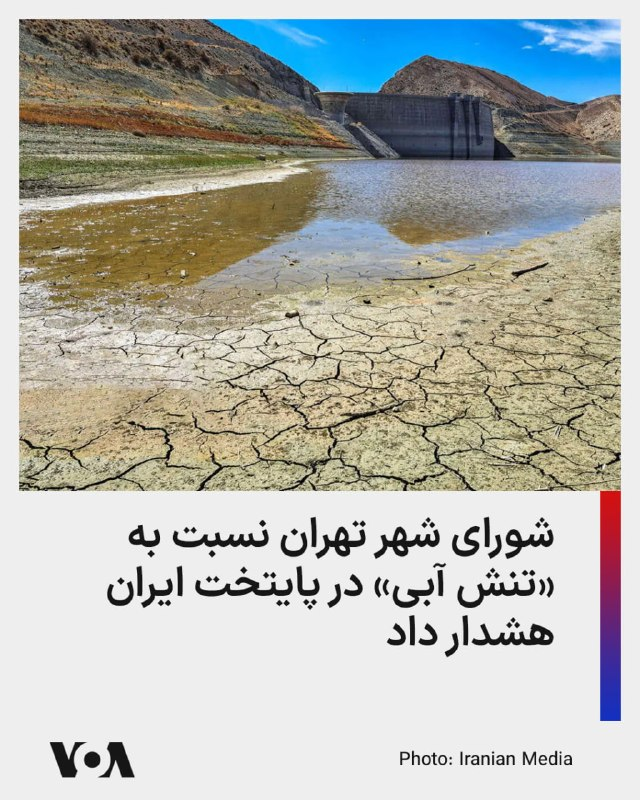

رئیس کمیسیون سلامت، محیط زیست و خدمات شهری شورای شهر تهران از تداوم «تنش آبی» در پایتخت ایران خبر داد و اعلام کرد: «با وجود بارندگی‌های اخیر، وضعیت ذخایر سدهای تأمین‌کننده آب تهران همچنان نگران‌کننده است.»

مهدی پیرهادی در گفت‌وگو با ایسنا، گفت استان‌های تهران و قم حدود ۳۰ درصد کاهش بارندگی را تجربه کرده‌اند و کاهش منابع آب زیرزمینی باعث شده تهران همچنان تحت تأثیر بحران خشکسالی سال‌های اخیر قرار داشته باشد.

این عضو شورای شهر تهران ادامه داد که علاوه بر تهران و قم، شرایط آبی در دیگر استان‌های کشور، مانند مرکزی، خراسان رضوی، اصفهان، زنجان و همدان همچنان «نامناسب» است.

او افزود: «نزدیک به ۱۰ استان کشور که جمعیتی حدود ۳۵ میلیون نفر را در خود جای داده‌اند، هنوز با کمبود بارش نسبت به میانگین بلندمدت مواجهند.»
@FarsiVOA

## FarsiVOA — post 218124

  

پلیس ضدتروریسم ترکیه ۱۱۰ نفر را به ظن فعالیت در حمایت از گروه «دولت اسلامی» (داعش) در عملیاتی که عمدتا در استانبول انجام شد، بازداشت و مقداری سلاح ضبط کرد.

خبرگزاری دولتی آناتولی ترکیه روز سه‌شنبه گزارش داد که این افراد متهم هستند که در انجمن‌های غیرقانونی کلاس‌هایی برای آموزش کودکان با ایدئولوژی داعش سازمان‌دهی کرده‌اند.

بر اساس این گزارش، این افراد همچنین متهمند برای داعش پول جمع‌آوری و تلاش کرده‌اند اعضای جدیدی برای این گروه جذب کنند. عملیات پلیس ضدتروریسم ترکیه با هماهنگی دفتر دادستانی کل استانبول انجام شده است.

هفته گذشته نیز پلیس ترکیه ۳۲۴ نفر دیگر را در جریان یورش‌هایی در ۴۷ استان به ظن ارتباط با داعش بازداشت کرده بود.

در هفتم آوریل، یک مهاجم در جریان درگیری مسلحانه خارج از کنسولگری اسرائیل در استانبول کشته و دو نفر دیگر زخمی شدند. وزیر کشور ترکیه گفت یکی از مهاجمان به «سازمانی که از دین سوءاستفاده می‌کند» مرتبط بوده است. رسانه‌های ترکیه گزارش داده‌اند که این سازمان داعش بوده است.
@FarsiVOA

## FarsiVOA — post 218123

🔺قطع اینترنت از ۱۹۲۰ ساعت گذشت؛ شرق از حضور اطلاعات سپاه در تشکیلات تازه مدیریت اینترنت خبر داد

▪️نت‌بلاکس اعلام کرد خاموشی اینترنت در ایران پس از ۱۹۲۰ ساعت وارد روز هشتاد و یکم شده است.

▪️این نهاد ناظر بر اختلالات اینترنت همچنین نوشت جمهوری اسلامی، هم‌زمان با قطع گسترده دسترسی کاربران ایرانی، در تلاش است دامنه «خفگی دیجیتال» خود را به بیرون از مرزهای ایران گسترش دهد.

▪️دولت پزشکیان در میانه طولانی‌ترین دوره قطعی اینترنت در ایران، ساختار تازه‌ای با عنوان «ستاد ویژه ساماندهی و راهبری فضای مجازی کشور» ایجاد کرد.

▪️شرق، می‌نویسد اعضای این ستاد فقط محدود به وزارت ارتباطات یا نهادهای اجرایی نیستند، و دادستان کل کشور، وزارت اطلاعات، دبیر شورای عالی امنیت ملی، و اطلاعات سپاه در این ساختار حضور دارند.

⬇️ بیشتر بخوانید:
https://ir.voanews.com/a/8151593.html

## FarsiVOA — post 218122

🔺وزیر خارجه بریتانیا: جهان دیگر نمی‌تواند برای بازگشایی تنگه هرمز صبر کند

▪️ایووت کوپر، وزیر خارجه بریتانیا، هشدار داد جهان دیگر نمی‌تواند برای بازگشایی تنگه هرمز صبر کند و ادامه بسته‌ماندن این آبراه، امنیت غذایی کشورهای آسیب‌پذیر را با بحران جدی‌تری روبه‌رو می‌کند.

▪️وزارت خارجه بریتانیا اعلام کرد برنامه‌هایی برای «مأموریت چندملیتی تنگه هرمز» در حال پیشبرد است تا در صورت دستیابی به توافق، از بازگشایی فوری و بدون محدودیت این مسیر حمایت شود.

▪️کوپر تأکید کرد بحران‌هایی مانند بحران جمهوری اسلامی در مرزها متوقف نمی‌شوند و راه‌حل آنها نیز نیازمند همکاری بین‌المللی است.

⬇️ بیشتر بخوانید:
https://ir.voanews.com/a/8151592.html

## FarsiVOA — post 218121

  

عمران احمد صدیقی، سفیر منصوب پاکستان در تهران، پیش از آغاز مأموریت خود با محمد اسحاق دار، معاون نخست‌وزیر و وزیر خارجه پاکستان دیدار و گفت‌وگو کرد.

به گزارش وزارت خارجه پاکستان، در این دیدار، اسحاق دار با اشاره به روابط میان پاکستان و ایران، بر «تعهد اسلام‌آباد به گسترش همکاری‌های دوجانبه در حوزه‌های مختلف، به‌ویژه تجارت، اتصال منطقه‌ای، تبادلات مردمی و همکاری‌های مشترک منطقه‌ای» تأکید کرد.

او همچنین بر ضرورت «حفظ روند مثبت تعاملات میان دو کشور از طریق هماهنگی نزدیک و درک متقابل» تأکید کرد و «نقش سازنده پاکستان در حمایت از صلح، گفت‌وگو و ثبات منطقه‌ای» را یادآور شد.

در روزهای اخیر، وزیر کشور پاکستان به تهران سفر و با مقامات بلندپایه جمهوری اسلامی، از جمله مسعود پزشکیان و محمدباقر قالیباف دیدار کرده بود.

پاکستان نقش میانجی را در جنگ علیه جمهوری اسلامی بر عهده دارد.
@FarsiVOA

## FarsiVOA — post 218120

  

زهرا بهروزآذر، معاون امور زنان در دولت جمهوری اسلامی، می‌گوید: زنان بیش از دیگر گروه‌ها از قطع و محدودیت اینترنت در ایران آسیب دیده‌اند؛ محدودیت‌هایی که به گفته او به تشدید نابرابری و گسترش شکاف دیجیتال منجر شده است.

به گزارش رسانه‌های داخلی، زهرا بهروزآذر در دیدار با ستار هاشمی، وزیر ارتباطات گفت بسیاری از زنان، به‌ویژه فعالان مشاغل خانگی و فروشندگان آنلاین، در نتیجه محدودیت‌های اینترنتی با آسیب‌های شغلی و اقتصادی روبه‌رو شده‌اند.

او همچنین با اشاره به طرح «اینترنت پرو» هشدار داد که دسترسی طبقاتی به اینترنت می‌تواند تبعیض دیجیتال را تشدید کند، زیرا بسیاری از زنان به دلیل محدودیت‌های اقتصادی توان استفاده از اینترنت باکیفیت‌تر را ندارند.

بهروزآذر افزود: ادامه محدودیت‌ها می‌تواند اینترنت را از ابزار کاهش شکاف اجتماعی به عاملی برای تشدید نابرابری تبدیل کند، زیرا دسترسی به اینترنت باکیفیت بیش از پیش به توان مالی وابسته شده و بسیاری از زنان از فرصت‌های آموزشی، شغلی و اجتماعی محروم می‌شوند.
@FarsiVOA

## FarsiVOA — post 218119

  

معاون حقوقی و بین‌الملل وزارت خارجه جمهوری اسلامی اعلام کرد که پیشنهاد اخیر حکومت ایران به آمریکا شامل لغو تحریم‌ها، آزادسازی دارایی‌های مسدودشده و پایان دادن به محاصره دریایی علیه بنادر جنوب ایران است.

به گزارش خبرگزاری دولتی ایرنا، کاظم غریب‌آبادی روز سه‌شنبه در نشستی با اعضای کمیسیون امنیت ملی مجلس شورای اسلامی همچنین گفت که این پیشنهاد شامل پایان دادن به جنگ در تمام جبهه‌ها از جمله در لبنان، خروج نیروهای آمریکایی از مناطق نزدیک به ایران و جبران خسارت‌های ناشی از جنگ است.

همچنین بر اساس گزارش ایرنا، «تأکید بر حق غنی‌سازی و برخورداری جمهوری اسلامی ایران از حقوق هسته‌ای صلح‌آمیز» از جمله شروط جمهوری اسلامی بوده است. آمریکا با غنی‌سازی اورانیوم در خاک ایران مخالفت کرده است.

پیشتر دونالد ترامپ، رئیس‌جمهور آمریکا، در گفت‌وگویی با نشریه فورچون، با اعلام این که مقامات حکومت ایران علی‌رغم اظهارات تند علنی خود، به شدت به امضای یک توافق با واشنگتن نیاز دارند، افزود: «اما یک توافق می‌کنند و بعد یک کاغذ برایت می‌فرستند که هیچ ربطی به توافقی که کرده بودی ندارد. من می‌گویم: "شما دیوانه‌اید؟"»
@FarsiVOA

## FarsiVOA — post 218118

🔺فایننشال تایمز: شی به ترامپ گفته پوتین ممکن است از تهاجم به اوکراین «پشیمان» شود

▪️فایننشال تایمز به نقل از منابع آگاه گزارش داد که رئیس‌جمهور چین در جریان گفت‌وگوهای خود با دونالد ترامپ رئیس‌جمهور آمریکا در پکن در هفته گذشته، گفته که ولادیمیر پوتین ممکن است در نهایت از تهاجم خود به اوکراین «پشیمان» شود.

▪️فایننشال تایمز نوشت که اظهارات شی درباره تصمیم پوتین برای آغاز تهاجم تمام‌عیار به کشور همسایه‌اش در سال ۲۰۲۲، به نظر می‌رسد فراتر از مواضع پیشین او بوده است. بر اساس این گزارش، شی تاکنون چنین برداشتی‌ از مواضع پوتین در جنگ اوکراین ارائه نکرده بود.

▪️هنوز مقامات آمریکا، چین و روسیه رسماً به این گزارش فایننشال تایمز واکنشی نشان نداده‌اند.

⬇️ بیشتر بخوانید:
https://ir.voanews.com/a/8151591.html

## FarsiVOA — post 218117

🔺برق واحد آسیب‌دیده نیروگاه هسته‌ای امارات وصل شد

▪️آژانس بین‌المللی انرژی اتمی اعلام کرد امارات متحده عربی برق خارجی واحد ۳ نیروگاه هسته‌ای براکه را پس از حمله پهپادی روز یکشنبه دوباره برقرار کرده است.

▪️رویترز پیش‌تر گزارش داده بود یک پهپاد به ژنراتور برق خارج از محدوده داخلی نیروگاه براکه برخورد کرد و دو پهپاد دیگر رهگیری شدند. مقام‌های امارات گفته‌اند منشأ حمله در دست بررسی است و سطح ایمنی پرتوی نیروگاه تحت تأثیر قرار نگرفته است.

▪️این حملات در شرایطی رخ داد که مقام‌هایی در جمهوری اسلامی پیش‌تر امارات را تهدید کرده بودند.

▪️حمله به نیروگاه براکه با موجی از محکومیت‌های منطقه‌ای و بین‌المللی روبه‌رو شد.

⬇️ بیشتر بخوانید:
https://ir.voanews.com/a/8151590.html

## FarsiVOA — post 218116

  <a href="telegram/content/FarsiVOA_218116_1779187843.mp4" target="_blank">🎬 Download video</a>

تشدید حملات پهپادی اوکراین به مسکو؛ تغییر استراتژی به سمت زیرساخت‌های حیاتی؛

خبرگزاری رویترز گزارش داد، در جریان بزرگ‌ترین حمله پهپادی اوکراین به پایتخت روسیه، مسکو، در یک سال گذشته، دست‌کم ۴ نفر کشته شدند که ۳ تن از آن‌ها در منطقه مسکو و یک نفر در منطقه مرزی بلگورود بوده‌اند.

ارتش اوکراین اعلام کرد که در این عملیات، تأسیسات نفتی و یک کارخانه تولید تسلیحات نظامی روسیه را با موفقیت هدف قرار داده است.

مقامات روسیه اعلام کردند که پدافند هوایی این کشور توانسته ۱۱ فروند پهپاد را از میان یک موج بزرگ ۴۵ فروندی رهگیری و منهدم کند.

ولودیمیر زلنسکی، رئیس‌جمهور اوکراین، با دفاع از این عملیات تأکید کرد که این حملات «پاسخی مشروع» به حملات مداوم روسیه به خاک اوکراین است.

کارشناسان این حملات را نشانه‌ای از تغییر استراتژی اوکراین از «اقدامات نمادین» به سمت «حملات هماهنگ به زیرساخت‌های حیاتی» از جمله پالایشگاه‌های نفت و تأسیسات نظامی روسیه می‌دانند.
@FarsiVOA

## FarsiVOA — post 218115

🔺نفت ایران به دلیل محاصره آمریکا، روی نفتکش‌های فرسوده ذخیره می‌شود

▪️فایننشال تایمز گزارش داد که مقامات جمهوری اسلامی به دلیل فشار ناشی از محاصره و تحریم‌های آمریکا که توان صادرات نفت ایران به کشورهای شرق آسیا را محدود کرده، مجبور شده نفت خود را روی نفتکش‌های قدیمی و لنگر انداخته در خلیج فارس ذخیره کند.

▪️بر اساس داده‌های سازمان «اتحاد علیه ایران هسته‌ای» نوشت حدود ۳۹ نفتکش حامل نفت و پتروشیمی ایران در حال حاضر در خلیج فارس حضور دارند، در حالی که پیش از آغاز محاصره آمریکا در بیش از یک ماه پیش، این رقم ۲۹ فروند بوده است.

▪️طبق داده‌های کپلر، در مجموع ۴۲ میلیون بشکه نفت خام روی نفتکش‌های ایران در خاورمیانه قرار دارد که ۶۵ درصد نسبت به آغاز درگیری افزایش یافته است.

⬇️ بیشتر بخوانید:
https://ir.voanews.com/a/8151589.html

## DW_Farsi — post 124865

🔶 دنیس اکرت با نامی جدید و برای تیم ایران به جام جهانی می‌رود
 
دنیس اکرت آیِنسا، فوتبالیست متولد بن آلمان، درجام جهانی فوتبال ۲۰۲۶ برای تیم ملی ایران بازی خواهد کرد، اما با نام جدید "دنیس درگاهی".
 
او جایگزین سردار آزمون شده که حدود دو ماه پیش توسط فدراسیون فوتبال ایران از فهرست تیم ملی کنار گذاشته شد.
 
بنا به گزارش "ورزش۳" اکرت آیِنسا روز دوشنبه ۱۸ مه (۲۸ اردیبهشت) راهی ترکیه شد تا به اردوی آماده‌سازی تیم ملی ایران برای جام جهانی بپیوندد. گفته می‌شود فیفا مجوز حضور او در تیم ملی ایران را صادر کرده است.
 
این بازیکن نام خانوادگی "درگاهی" را از پدر ایرانی‌تبارش گرفته است. آناهیتا درگاهی، عمه او‌، از چهره‌های شناخته‌شده سینمای ایران است. مادر این بازیکن ۲۹ ساله اهل اسپانیاست.
 
دنیس اکرت آیِنسا از سال ۲۰۲۴ در باشگاه بلژیکی استاندارد لیژ بازی می‌کند. او که سابقهٔ بازی برای تیم ملی زیر ۱۹ سال آلمان را دارد، برای تیم‌هایی مانند سلتاویگو در لالیگا و همچنین اینگولشتات در لیگ‌های دوم و سوم آلمان به میدان رفته است.
 
اکرت  ۲۹ اسفند ۱۴۰۴ برای اولین بار توسط امیر قلعه‌نویی، سرمربی تیم ملی، برای انجام دو بازی دوستانه مقابل نیجریه و کاستاریکا، در لیست سی‌وپنج‌ نفرهٔ تیم فوتبال ایران قرار گرفت.
@dw_farsi

## DW_Farsi — post 124864

🔶 هرانا: از آغاز جنگ بیش از ۵۰ نفر در ایران اعدام شده‌اند
 
هرانا، مجموعه فعالان حقوق بشر ایران، روز سه‌شنبه ۱۹ مه (۲۹ اردیبهشت) در گزارشی اعلام کرد از زمان شروع حملات آمریکا و اسرائیل علیه ایران در روز نهم اسفند ۱۴۰۴ تا هفته گذشته، دست‌کم چهار هزار و ۲۳ مورد بازداشت و ۵۰ مورد اعدام را در ایران ثبت کرده است.
 
این گزارش با عنوان "میان موشک و سرکوب" بر پایه ۱۷۷ منبع تأییدشده، شامل گزارش‌های منابع آزاد و شبکه میدانی مجموعه فعالان حقوق بشر در داخل کشور، در ۲۴۰ صفحه و به دو زبان فارسی و انگلیسی منتشر شده است. 
 
این نهاد حقوق بشری تأکید کرده که این گزارش با هدف ارائه روایت جامع از کل درگیری تهیه نشده و یافته‌های آن "صرفاً به رویدادهایی محدود می‌شود که در داده‌های این نهاد مستندسازی و راستی‌آزمایی شده‌اند". 
 
به نوشته هرانا نهادهای امنیتی با اتهاماتی چون "جاسوسی"، "تهدید علیه امنیت ملی" و "ارتباط یا ارسال مطالب مربوط به جنگ به رسانه‌های خارجی" شهروندان را بازداشت یا اعدام کرده‌اند. از ۵۰ مورد حکم اعدام که به اجرا گذاشته شده، ۳۲ مورد با اتهامات سیاسی و امنیتی مرتبط بوده‌اند.
 
در این گزارش تصریح شده که مقامات جمهوری اسلامی از جنگ "برای تشدید روایت‌های امنیتی و توجیه بازداشت‌ها، محدودیت آزادی بیان و اعمال خشونت علیه غیرنظامیان استفاده کرده‌اند". در گزارش هرانا همچنین به خاموشی اینرنت به عنوان ابزاری برای سرکوب اشاره شده است.
 
هرانا در گزارش خود به آسیب‌های شهروندان در حملات آمریکا و اسرائیل به ایران اشاره کرده و آورده که در این راستا دست‌کم سه هزار و ۶۳۶ مورد مرگ را مستند کرده است؛ شامل ۱۷۰۱ غیرنظامی، ۱۲۲۱ نیروی نظامی و ۷۱۴ فرد که هویت یا وضعیت آنان قابل شناسایی نبوده است. در این گزارش به کشته شدن ۳۰۷ کودک و زخمی شدن ۲ هزار ۲۱۳ کودک اشاره شده است.
 
مجموعه فعالان حقوق بشر ایران در گزارش خود شماری از الگوهای نگران‌کننده را برجسته کرده و در مورد آن‌ها هشدار داده است، از جمله "ضعف در راستی‌آزمایی اهداف"، "استفاده محدود از نظارت انسانی در برخی فناوری‌های هدف‌گیری"، "هشدار ناکافی پیش از حملات" و "به‌کارگیری تسلیحات انفجاری سنگین در مناطق پرجمعیت".
@dw_farsi

## DW_Farsi — post 124863

  

🔶 غریب‌آبادی: خواستار حفظ غنی‌سازی، پایان جنگ در همه جبهه‌ها و خروج نیروهای آمریکایی شدیم
 
کاظم غریب‌آبادی روز سه‌شنبه ۱۹ مه (۲۹ اردیبهشت) با حضور در کمیسیون امنیت ملی و سیاست خارجی مجلس شورای اسلامی، نمایندگان را در جریان روند مذاکرات تهران و واشنگتن و تصمیم‌های اتخاذشده قرار داد. بنا بر گزارش‌ رسانه‌های داخلی ایران، جزئیات اجلاس وزرای امور خارجه کشورهای عضو بریکس که اخیرا با حضور عباس عراقچی در هند برگزار شده بود و نیز اهداف سفر وزیر کشور پاکستان به ایران در نشست غریب‌آبادی با اعضای این کمیسیون مورد بحث و تبادل نظر قرار گرفت.
 
معاون حقوقی و بین‌الملل وزارت خارجه ایران در نشست به این کمیسیون گفت که "حق غنی‌سازی اورانیوم و برخورداری از حقوق هسته‌ای صلح‌آمیز"، "پایان جنگ در همه جبهه‌ها از جمله لبنان" و "آزادسازی دارایی‌های ایران" از موارد ذکرشده در پیشنهاد جمهوری اسلامی به ایالات متحده بوده است.
 
غریب‌آبادی در این نشست ضمن ارائه گزارش از روند مذاکرات و طرح پیشنهادی جمهوری اسلامی به طرف آمریکایی بر "ایستادگی تصمیم‌گیران و اعضای تیم مذاکره‌کننده ایران بر روی اصول" تأکید کرد.
 
@dw_farsi

## DW_Farsi — post 124862

🔶 مرکل، زلنسکی و والسا، جزو نخستین برندگان "نشان لیاقت اروپا"
 
پارلمان اروپا قرار است روز سه‌شنبه ۱۹ ماه مه (۲۹ اردیبهشت) برای نخستین بار "نشان لیاقت اروپا" را به اولین دریافت‌کنندگان آن اعطا کند.
 
آنگلا مرکل، صدراعظم سابق آلمان، ولودیمیر زلنسکی، رئیس جمهور اوکراین و لخ والسا، رئیس جمهور پیشین لهستان، از جمله نخستین برندگان این نشان هستند. زلنسکی شخصاً در مراسم اهدای جایزه در استراسبورگ حضور نخواهد داشت.
 
اتحادیه اروپا اعلام کرده است که این جایزه برای قدردانی از افرادی اعطا می‌شود که در روند همگرایی اروپا نقش داشته‌اند یا در ترویج ارزش‌های بنیادین این اتحادیه کوشیده و از آنها دفاع کرده‌اند.
 
مرکل، زلنسکی و والسا قرار است بالاترین سطح از سه سطح این نشان افتخار را دریافت کنند. دیگر شخصیت‌های شناخته‌شده، از جمله پیترو پارولین، دیپلمات ارشد واتیکان، مایا ساندو، رئیس جمهور مولداوی و ژان-کلود تریشه، رئیس پیشین بانک مرکزی اروپا، سطوح پایین‌تر این نشان را دریافت خواهند کرد.
 
ولفگانگ شوسل، صدراعظم پیشین اتریش و اعضای گروه راک ایرلندی "یوتو" (U2) نیز این جایزه را دریافت خواهند کرد.
@dw_farsi

## DW_Farsi — post 124861

🔶 دیدار پوتین و شی در پکن؛ اندک‌زمانی پس از ترامپ
 
چند روز پس از سفر دونالد ترامپ، رئیس جمهور آمریکا، ولادیمیر پوتین، رئیس کرملین، نیز سه‌شنبه ۱۹ مه (۲۹ اردیبهشت) سفر دو روزه‌ای به چین را آغاز می‌کند. دمیتری پسکوف، سخنگوی کرملین، گفت پوتین با هیأتی متشکل از وزیران و مدیران شرکت‌های دولتی و خصوصی به این سفر می‌رود.
 
به گفت پسکوف، گفت‌وگوها که به دعوت شی جین‌پینگ، رئیس جمهور چین، انجام می‌شود، بر گسترش "شراکت راهبردی ممتاز" میان دو کشور متمرکز خواهد بود.
 
بر اساس اطلاعات رسمی مسکو، روس‌ها و چینی‌ها قصد دارند در مجموع حدود ۴۰ سند امضا کنند. این اسناد از جمله به همکاری در حوزه‌های صنعت، تجارت، حمل‌ونقل و ساخت‌وساز مربوط می‌شوند. همچنین انتظار می‌رود تجاوز نظامی روسیه به اوکراین و نیز جنگ آمریکا و اسرائیل علیه ایران از موضوعات گفت‌وگوها باشد.
 
کرملین تأکید کرده است که سفر پوتین هیچ ارتباطی با دیدار ترامپ از چین ندارد. یوری اوشاکوف، مشاور سیاست خارجی پوتین، گفت تاریخ این سفر از ماه فوریه تعیین شده بوده است.
 
به گفته اوشاکوف، بیست‌وپنجمین سالگرد امضای پیمان حسن همجواری و همکاری دوستانه میان دو کشور نیز از دلایل این سفر است. طبق اعلام کرملین، پوتین همچنین قصد دارد درباره سفر هفته گذشته ترامپ به چین اطلاعات بیشتری کسب کند.
 
در پکن نیز این روایت رد نشده است. با این حال رسانه‌های دولتی چین بر توالی غیرمعمول این دیدارها تأکید کرده‌اند. روزنامه گلوبال تایمز، نزدیک به حزب کمونیست چین، نوشت که پکن بیش از پیش در حال تبدیل شدن به یکی از کانون‌های دیپلماسی جهانی است.
@dw_farsi

## DW_Farsi — post 124860

  

🔶 نیویورک تایمز: ایران از آتش‌بس برای احیای توان موشکی خود استفاده کرده است
 
به گزارش نیویورک تایمز، جمهوری اسلامی از آتش‌بس موقت میان تهران و واشنگتن استفاده کرده است تا قابلیت‌های موشکی خود را احیا کند، پرتابگرهای موشکی خود را از نو مستقر سازد و از آمادگی لازم برای احتمال از سرگیری درگیری‌ها برخوردار شود.
 
این نشریه آمریکایی به نقل از یک مقام نظامی ایالات متحده که نخواست نامش فاش شود گزارش داد، جمهوری اسلامی از زمان برقراری آتش‌بس موقت در ۸ آوریل تا کنون "بسیاری از موشک‌های بالستیک خود را در تأسیسات زیرزمینی که بمباران شده بودند، از عمق زمین بیرون کشیده، پرتابگرهای متحرک را جابه‌جا کرده و تاکتیک‌هایش را برای از سرگیری احتمالی درگیری‌ها تطبیق داده است".
 
در گزارش نیویورک تایمز به نقل از این مقام آگاه آمده است، آمریکا در چارچوب عملیات خود علیه ظرفیت موشکی ایران به صورت عمده ورودی‌های سایت‌های نظامی را مورد حمله قرار داد، اما خود پرتابگر‌ها را نابود نکرد، چرا که آن‌ها در عمق زمین مستقر بودند. ظاهرا ایران توانسته است با سودجویی از فرصت آتش‌بس، بخش درخور توجهی از این سایت‌ها را دوباره فعال کند.
 
@dw_farsi

## DW_Farsi — post 124859

  

🔶 لیندزی گراهام: هر توافقی با ایران باید به تأیید کنگره برسد
 
لیندزی گراهام، سناتور جمهوری‌خواه شامگاه دوشنبه ۱۸ مه (۲۸ اردیبهشت) پس از اعلام به تعویق افتادن حمله برنامه‌ریزی‌شده ایالات متحده به جمهوری اسلامی از سوی ترامپ، با انتشار پستی در شبکه ایکس تأکید کرد، هر توافقی که در پی مذاکرات واشنگتن و تهران حاصل شود، باید به تأیید کنگره آمریکا برسد. 
 
این سناتور آمریکایی تصریح کرد، هر توافقی که میان ایالات متحده و جمهوری اسلامی امضاء شود، "مانند برجام در دوران ریاست‌جمهوری باراک اوباما، باید به منظور تأیید به کنگره ارائه گردد".
 
گراهام خاطرنشان کرد که همانگونه پیشتر گفته است، موضوع ترامپ در رابطه با جمهوری اسلامی این موارد را شامل می‌شود:
·       عدم غنی‌سازی اورانیوم
·       کنترل ایالات متحده بر حدود ۹۰۰ پوند (۴۵۰ کیلوگرم) اورانیوم با غنای بالا
·       بازگشایی تنگه هرمز بدون مداخله‌های ایران
·       ایران باید برنامه موشک‌های بالستیک دوربرود خود و همچنین تلاش برای توسعه سلاح هسته‌ای را متوقف کند
·       جمهوری اسلامی باید پشتیبانی خود از تمامی گروه‌های نیابتی تروریستی در منطقه را کنار بگذارد
 
@dw_farsi

## Persian_Trend_Official — post 14469

  <a href="telegram/content/Persian_Trend_Official_14469_1779187848.webm" target="_blank">🎬 Download video</a>

💢شنیده شدن صدای انفجار در جزیره قشم

▪️ظهر سه شنبه شنیده شدن صدای انفجار در جزیره قشم از سوی ساکنان محلی گزارش شده است.

🔹اخبار تکمیلی متعاقباً منتشر خواهد شد./خبرگزاری مهر

🫆:Tony

📌 @persian_trend_official
پرشین ترند | متفاوت‌ترین کانال نظامی

## Persian_Trend_Official — post 14468

  <a href="telegram/content/Persian_Trend_Official_14468_1779187848.mp4" target="_blank">🎬 Download video</a>

💢ویدیویی منتسب به چوپان عراقی که از پرواز هواپیما های اسرائیلی منتشر کرد و به گفته رسانه ها پیش زمینه لو رفتن پایگاه مخفی اسرائیل در خاک عراق شد.

🫆:Tony

📌 @persian_trend_official
پرشین ترند | متفاوت‌ترین کانال نظامی

## Persian_Trend_Official — post 14467

  

✍یک فروند هواپیمای اختصاصی اسرائیلی از تل‌آویو به مقصد ابوظبی در حال پرواز است.

.
🇮🇱
🇰🇼

👑Phantom
👑

📌 @persian_trend_official
پرشین ترند | متفاوت‌ترین کانال نظامی

## RadioFarda — post 157337

مرگ‌ومیر ابولا در شرق کنگو به ۱۳۱ نفر افزایش یافت؛ ابراز نگرانی سازمان جهانی بهداشت

🔸مقام‌های جمهوری دموکراتیک کنگو روز سه‌شنبه ۲۹ اردیبهشت اعلام کردند که در ۲۴ ساعت گذشته ۲۶ مورد مرگ مشکوک دیگر بر اثر ابولا در شرق این کشور ثبت شده و رئیس سازمان جهانی بهداشت نسبت به گسترش این شیوع عمیقاً ابراز نگرانی کرده است.

🔸با این موارد جدید، شمار قربانیان مرتبط با این شیوع در شرق کنگو به ۱۳۱ نفر رسیده است. بر اساس بولتن روزانه مقامات بهداشتی، ۵۱۶ مورد مشکوک و ۳۳ مورد تأییدشده در کنگو گزارش شده و دو مورد تأییدشده نیز در کشور همسایه، اوگاندا، ثبت شده است.

🔸تدروس آدهانوم گبریسوس، مدیرکل سازمان جهانی بهداشت، روز شنبه شیوع سویه نادر «بوندیبوگیو» از این ویروس را یک وضعیت اضطراری بهداشت عمومی با نگرانی بین‌المللی اعلام کرد. این موضوع کارشناسان را نگران کرده، زیرا ویروس توانسته که طی هفته‌ها بدون شناسایی در منطقه‌ای پرجمعیت از کنگو گسترش یابد.

🔸ژان-ژاک مویِمبه، مدیر مؤسسه ملی تحقیقات زیست‌پزشکی کنگو، به خبرگزاری رویترز گفت که شهر بوتِمبو در استان کیوو شمالی، با جمعیتی چندصد هزار نفری، روز دوشنبه نخستین دو مورد تأییدشده خود را ثبت کرده است.

🔸ابولا از طریق تماس مستقیم با مایعات بدن افراد یا حیوانات آلوده منتقل می‌شود و علائمی مانند تب بالا، استفراغ و خونریزی داخلی و خارجی ایجاد می‌کند.

🔸به گفته سازمان جهانی بهداشت، نرخ مرگ‌ومیر متوسط این بیماری حدود ۵۰ درصد است، هرچند در شیوع‌های گذشته بین ۲۵ تا ۹۰ درصد متغیر بوده است.

🔸تدروس روز سه‌شنبه در ژنو به اعضای مجمع جهانی بهداشت گفت: «من عمیقاً نگران مقیاس و سرعت این همه‌گیری هستم»، و به تعداد موارد گزارش‌شده در مناطق شهری و میان کارکنان بهداشتی اشاره کرد.

🔸نسخه کامل این گزارش را در وب‌سایت رادیوفردا بخوانید.

@RadioFarda

## RadioFarda — post 157336

  

🔸رسانه‌های ایران از آغاز به‌کار دوبارهٔ بورس کشور بعد از ۸۰ روز تعطیلی خبر می‌دهند.

🔸بر اساس این گزارش‌ها، نخستین معاملات بازار سهام در سال ۱۴۰۵ از ساعت ۹ صبح سه‌شنبه ۲۹ اردیبهشت در تالار معاملات بورس تهران آغاز شد.

🔸با این حال روزنامه «دنیای اقتصاد» نوشته بیش از ۴۰ نماد که شرکت‌های آن‌ها در جریان حملات آمریکا و اسرائیل دچار آسیب شده بودند، فعلاً بازگشایی نخواهند شد.

🔸بر اساس این گزارش، عمده نمادهای متوقف در گروه‌های شیمیایی و فلزات اساسی قرار دارند که به‌دلیل بمباران کارخانه‌های پتروشیمی و فولاد امکان فعالیت ندارند. تنها نمادهای بانکی و خودرویی در میان نمادهای آغاز معاملات امروز قرار دارند.

🔸تعدادی از نمادهای صندوق‌های اهرمی نیز که پیشتر گفته شده بود باز نمی‌شوند قرار است امروز بازگشایی شوند ولی محدودیت فروش ۱۰۰ هزار واحد دارند.

@RadioFarda

## RadioFarda — post 157335

  <a href="telegram/content/RadioFarda_157335_1779187852.mp4" target="_blank">🎬 Download video</a>

🔸تصاویری از یک گله قوچ اوریال در پارک ملی سالوک در خراسان‌شمالی که مشغول گشت‌وگذار هستند، منتشر شده است.

🔸قوچ‌ اوریال یا گوسفند وحشی اوریال گروهی از زیرگونه‌های گوسفند وحشی است که در مناطق کوهستانی و تپه‌ماهوری زندگی می‌کند.

🔸گوسفند وحشی به دو گروه زیرگونه‌ای تقسیم می‌شود که گروه غربی آن گوسفند وحشی ارمنی و گروه شرقی آن گوسفند وحشی اوریال است.

🔸گوسفند وحشی اوریال در پاکستان، کشمیر، شمال غربی هندوستان، افغانستان، تاجیکستان، ازبکستان، قزاقستان و ترکمنستان پراکنده است و در ایران در شمال خراسان رضوی، خراسان شمالی، شرق گلستان و شمال شرق استان سمنان دیده می‌شود.

🔸 پارک ملی سالوک در جنوب بجنورد در خراسان‌شمالی واقع شده و زیستگاه پرندگان و حیوانات بسیاری همچون آهو، قوچ، میش است.

@RadioFarda

## RadioFarda — post 157334

اتحادیه اروپا ۱۴ هزار پست مرتبط با سپاه پاسداران در فضای مجازی را هدف قرار داد

🔸آژانس اتحادیه اروپا برای همکاری در اجرای قانون، یوروپل، اعلام کرد در یک اقدام هماهنگ علیه محتوای تروریستی در فضای آنلاین، مجموعاً ۱۴ هزار و ۲۰۰ پست مرتبط با سپاه پاسداران انقلاب اسلامی را هدف قرار داد.

🔸یوروپل، مدیریت اطلاعات جنایی و مبارزه با سازماندهی جنایت و جرایم سازمان‌یافته بین‌المللی مانند تروریسم را بر عهده دارد.

🔸این اقدام ماه‌ها بعد از ۹ بهمن ۱۴۰۴ صورت می‌گیرد که وزیران خارجه اتحادیۀ اروپا پس از سال‌ها فشار از داخل و خارج این بلوک، سرانجام با قرار دادن نام سپاه پاسداران انقلاب اسلامی در فهرست «سازمان‌های تروریستی» موافقت کردند.

🔸این تصمیم پس از آن اتخاذ شد که حکومت ایران در دی‌ماه پارسال، اعتراضات مردمی را به‌صورتی خشونت‌بار سرکوب کرد.

🔸تروریستی اعلام شدن سپاه پاسداران به نهادهای مجری قانون در اتحادیه اروپا اجازه می‌دهد تا علیه فعالیت اعضا و نهادهای حامی این نیروی نظامی اقدام کنند.

🔸به گزارش وب‌سایت یوروپل، حساب اصلی سپاه پاسداران در شبکهٔ ایکس که بیش از ۱۵۰ هزار دنبال‌کننده داشت، در اتحادیه اروپا مسدود شد و هزاران لینک دیگر در چندین پلتفرم حذف شده‌اند یا در حال بررسی برای حذف هستند.

🔸این عملیات به رهبری «واحد ارجاع اینترنتی اتحادیه اروپا» در یوروپل انجام شد و بر شناسایی و مختل کردن حضور آنلاین این گروه که برای انتشار تبلیغات، جذب حامی و جمع‌آوری منابع مالی استفاده می‌شد، تمرکز داشت.

🔸واحد ارجاع اینترنتی که در مرکز اروپایی مبارزه با تروریسم یوروپل مستقر است، وظیفه شناسایی، تحلیل و ارجاع محتوای تروریستی و افراط‌گرایانه خشونت‌آمیز در فضای آنلاین را بر عهده دارد.

🔸نسخه کامل این گزارش را در وب‌سایت رادیوفردا بخوانید.

@RadioFarda

## RadioFarda — post 157333

🔸پلیس آمریکا اعلام کرد که دو نوجوان مسلح روز دوشنبه ۲۸ اردیبهشت به مرکز اسلامی سن‌ دیه‌گو در ایالت کالیفرنیا تیراندازی کردند و یک نگهبان امنیتی و دو مرد دیگر را در بیرون مسجد کشتند.
🔸 اجساد مظنونان بعد در حالی پیدا شد که ظاهراً بر اثر شلیک گلوله به خود جان باخته بودند.

🔸اسکات وال، رئیس پلیس سن‌ دیه‌گو، گفت نیروهای محلی و اف‌بی‌آی در حال بررسی این حمله به‌عنوان «جنایت ناشی از نفرت» هستند. با این حال، مقامات هنوز انگیزه یا عامل مشخصی برای این خشونت اعلام نکرده‌اند.

🔸به گفته پلیس پیش از این حادثه، پلیس از هیچ «تهدید مشخصی» علیه این مسجد یا هیچ مرکز مذهبی، مدرسه یا مکان دیگری مطلع نبوده است.

🔸این حمله در هفته‌ای رخ داد که به عید قربان و همچنین مراسم سالانهٔ حج مسلمانان نزدیک است.

🔸مرکز اسلامی سن‌ دیه‌گو بزرگ‌ترین مسجد در این شهر است و مدرسه‌ای به نام «آکادمی برایت هورایزن» را در خود جای داده که آموزش اسلامی ارائه می‌دهد.

@RadioFarda

## RadioFarda — post 157332

  

🔸سازمان «کمک به گروگان‌ها در سراسر جهان» اعلام کرد که شهاب دلیلی پس از بیش از یک دهه «بازداشت ناعادلانه» در ایران «سرانجام سالم به خانه و کنار خانواده‌اش» در آمریکا بازگشت.
🔸شهاب دلیلی که اقامت دائمی آمریکا را دارد، از سال ۱۳۹۵ در ایران زندانی بود.

🔸سازمان «کمک به گروگان‌ها در سراسر جهان» روز سه‌شنبه ۲۹ اردیبهشت در پستی در شبکهٔ ایکس نوشت: «پس از سفری طولانی از اوین به ایروان و سپس واشینگتن، با خوشحالی اعلام می‌کنیم که شهاب دلیلی پس از بیش از یک دهه بازداشت ناعادلانه در ایران، سرانجام سالم به خانه و در کنار خانواده‌اش بازگشته است».

🔸این نهاد افزوده است: «از همه می‌خواهیم که برای بازگشت هرچه بهتر شهاب به زندگی عادی از او حمایت کنند».

🔸شهاب دلیلی، کاپیتان پیشین شرکت کشتیرانی ایران و ساکن آمریکا، به گفتهٔ خانواده‌اش، برای شرکت در خاکسپاری پدرش به تهران رفته بود و پس از یک اقامت یک هفته‌ای، در حالی که با تاکسی به سوی فرودگاه می‌رفت تا به آمریکا بازگردد، از سوی نیروهای امنیتی بازداشت شد.

@RadioFarda

## RadioFarda — post 157331

  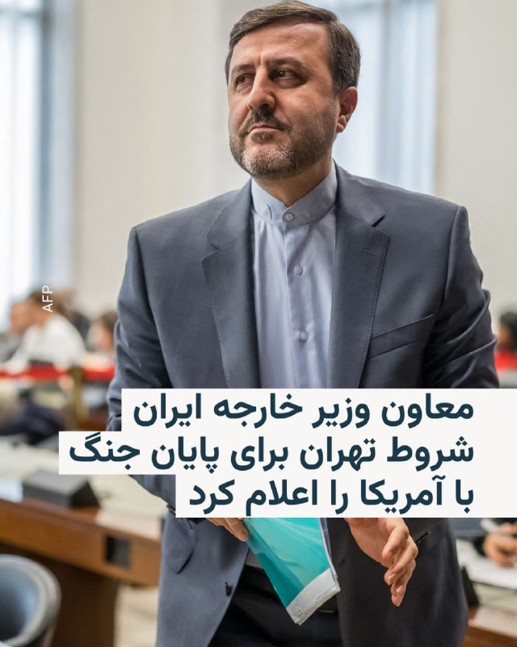

🔸معاون وزیر خارجه ایران می‌گوید تهران در پیشنهادهای اخیر خود به آمریکا برای پایان جنگ میان دو کشور، خواستار برخورداری از حق غنی‌سازی، خاتمه جنگ در تمام جبهه‌ها از جمله لبنان و خروج نیروهای آمریکایی از محیط پیرامونی ایران شده است.

🔸کاظم غریب‌آبادی که روز سه‌شنبه ۲۹ اردیبهشت برای ارائه گزارشی در مورد روند مذاکرات میان تهران و واشینگتن، در کمیسیون امنیت ملی و سیاست خارجی مجلس حاضر شده بود، از دیگر شروط ایران را «رفع محاصرهٔ دریایی آمریکا، آزادسازی اموال و دارایی‌های ایران، تأمین خسارت‌های وارد شده در جنگ توسط ایالات متحده جهت بازسازی و خاتمه تمامی تحریم‌های یکجانبه و قطعنامه‌های شورای امنیت» اعلام کرد.

🔸ایران و ایالات متحده از زمان آتش‌بس شکننده میان دو کشور در ۱۹ فروردین امسال، درگیر یک دور مذاکره مستقیم و همچنین تبادل پیام‌هایی از طریق پاکستان بوده‌اند تا به توافقی برای پایان جنگ دست یابند.

🔸دونالد ترامپ، رئیس‌جمهور آمریکا، پیشتر پیشنهادهای ایران را «مزخرف» خوانده بود و روز ۲۸ اردیبهشت تهدید کرد که اگر ظرف دو سه روز آینده توافقی حاصل نشود، بار دیگر به ایران حمله نظامی خواهد کرد.

@RadioFarda

## IranianMinds — post 20380

  

🔴 اکانت اسرائیل به فارسی:

بسیجی‌های زیادی از به درک واصل شدن خامنه‌ای خوشحالن، نه؟
هر شب تو خیابون عروسی دارن…

@IranianMinds

## IranianMinds — post 20379

  

این چی بود من دیدم

@IranianMinds

## IranianMinds — post 20378

  <a href="telegram/content/IranianMinds_20378_1779187858.webm" target="_blank">🎬 Download video</a>

💥 با هر ثبت نام 
🅰️
🅰️
🅰️ هزار تومن جایزه بگیرید

✔️ میتونید شرط‌بندی کنید و بونوس را به موجودی واقعی تبدیل کنید

⚽️  پوشش کامل مسابقات ورزشی 

💯  پیش‌بینی با بهترین ضرایب 

⭐️ تجربه سریع و حرفه‌ای

💰پرداخت مستقیم و سریع بدون واسطه، بدون دردسر، واریز و برداشت در سریع‌ترین زمان ممکن

☑️ کانال تلگرام: 

➡️ @winro_io  

🎁 هدیه خود را با ثبت نام در سایت دریافت کنید: 

➡️ Winro.io
R29
سایت اصلی در روزهای آینده بازگشایی خواهد شد A
💎

## IranianMinds — post 20377

🔴 پاکستان :

احتمال اینکه جنگ مجدد شروع بشه خیلی کمه و دو طرف دارن به توافق میرسن.

@IranianMinds

## IranianMinds — post 20376

  

🔴 پولیتیکو :

دولت ترامپ پس از ماه‌ها فشار اقتصادی که نتوانست حکومت کوبا را به انجام اصلاحات وادار کند، حالا در حال بررسی گزینه اقدام نظامی علیه هاواناست.

مقام‌های آمریکایی می‌گویند کاخ سفید از بی‌نتیجه ماندن تحریم‌ها، محدودیت‌های سوخت و فشارهای دیپلماتیک ناامید شده.

گفته می‌شود گزینه‌های نظامی از حملات هوایی محدود تا عملیات گسترده‌تر برای بی‌ثبات کردن حکومت کوبا را شامل می‌شود.

همچنین گزارش‌ها حاکی از آن است که فرماندهی جنوبی ارتش آمریکا در حال آماده‌سازی سناریوهای احتمالی است، هرچند هنوز تصمیم نهایی گرفته نشده.

@IranianMinds

## BBCPersian — post 281473

🔻بقایی اتهام صدر‌اعظم آلمان به ایران درباره حمله به تاسیسات هسته‌ای امارات را رد کرد

سخنگوی وزارت خارجه اتهام صدراعظم آلمان را تکذیب کرد که گفته بود ایران در حمله به نزدیکی نیروگاه هسته‌ای امارات متحده عربی نقش داشته است.

اسماعیل بقایی به زبان آلمانی در شبکه ایکس، فریدریش مرتس را به «ریاکاری» متهم کرد: «حملات آشکار آمریکا و اسرائیل به تاسیسات هسته‌ای ایمن ایران (تحت نظارت آژانس) محکوم نمی‌شود، بلکه با بهانه‌هایی توجیه می‌شود. اما وقتی عملیات پرچم دروغین انجام می‌شود که حتی خود امارات رسما به ایران نسبت نداده است، همان صداها ناگهان زبان 'حقوق بین‌الملل' و 'امنیت منطقه' را به کار‌ می‌گیرند.»

آقای بقایی در ادامه نوشت: «اگر حمله به تأسیسات هسته‌ای تهدیدی برای مردم منطقه است، این اصل باید برای همه کشورها یکسان باشد نه فقط زمانی که مصالح سیاسی غرب اقتضا کند.»

فریدریش مرتس، صدر‌اعظم آلمان، دیروز «حملات هوایی تازه ایران به امارات و دیگر شرکا» را محکوم کرد و گفته بود که حمله به «تاسیسات هسته‌ای» تهدیدی برای امنیت مردم سراسر منطقه است.

امارات متحده روز یکشنبه گفت که در حمله پهپادی، ژانراتور برق بیرون محوطه نیروگاه هسته‌ای براکه در نزدیکی ابوظبی آتش گرفته است. امارات در بیانیه‌هایش نامی از کشوری نبرد و فقط گفت پهپاد از «مرز غربی» وارد شده بود.

https://bbc.in/4eVQ6MZ
@BBCPersian

## BBCPersian — post 281472

🔻بورس تهران در غیاب بعضی نمادها، بعد از ۸۰ روز آغاز به کار کرد

معاملات سهام در بازار بورس تهران بعد از ۸۰ روز تعطیلی فعالیت خود را از سر گرفت؛ بازار بورس بعد از حملات آمریکا و اسرائیل به ایران در نهم اسفند ماه پارسال و آغاز جنگ تعطیل شده بود.

با وجود بازگشایی بازار سرمایه، معاملات بطور کامل از سر گرفته نشده و بر اساس اعلام سازمان بورس، ۴۲ نماد همچنان بسته مانده‌اند و آغاز معاملات آنها به زمان دیگری موکول شده است.

نمادهایی که بسته مانده‌اند حدود ۳۵ درصد ارزش بازار را شامل می‌شوند و بعضی شرکت‌های متولی این نمادها در جریان جنگ آمریکا و اسرائیل با ایران آسیب دیدند.

در ساعات ابتدایی فعالیت امروز بازار، معاملات پرنوسان بود و تا ساعت ۱۰ و نیم صبح بوقت محلی(تهران) شاخص کل ۴۰۸۰ واحد افت کرد.

به گزارش رسانه‌های اقتصادی تهران، شاخص کل بورس تا ساعت ۱۰ صبح تهران به عدد ۳ میلیون و ۷۱۰ هزار واحد رسید.

شاخص کل در اوایل بهمن ماه پارسال تا رقم ۴‌/۴ میلیون واحد هم پیش رفته بود.

حجت‌اله صیدی، رئیس سازمان بورس و اوراق بهادار تهران امروز در مراسم بازگشایی معاملات بورس «ابهام ناشی از شرایط جنگ» و «گزارش مالی شرکت‌ها» را دلیل بسته ماندن ۸۰ روزه بورس عنوان کرد.

بنابر اعلام سازمان بورس بیش از ۵۰۰ شرکت در معاملات امروز حضور داشتند.

https://bbc.in/3RxuaOu
@BBCPersian

## BBCPersian — post 281471

🔻افزایش ساعات فعالیت دو فرودگاه اصلی در تهران

به گفته مجید اخوان، سخنگوی سازمان هواپیمایی کشوری در ایران ساعات فعالیت دو فرودگاه اصلی در تهران، یعنی مهرآباد و امام خمینی، افزایش یافته است.

بر این اساس، این دو فرودگاه از ساعت ۴:۳۰ صبح تا نه و نیم شب فعالیت خواهند داشت و «تمامی پروازهای داخلی و بین‌المللی می‌توانند طبق اطلاعیه هوانوردی صادرشده از سوی سازمان هواپیمایی کشوری، در این دو فرودگاه انجام شود.»

به گفته آقای اخوان با افزایش ساعات کاری فرودگاه‌ها، تاخیر در پروازها «کاهش خواهد یافت.»

پروازهای خارجی از ایران که از زمان شروع جنگ در نهم اسفند سال گذشته متوقف شده بود، در اوایل اردیبهشت از سر گرفته شد.

آمریکا و اسرائیل در طول جنگ شماری از فرودگاه‌ها و هواپیماهای ایران را هدف حملات هوایی قرار دادند.

https://bbc.in/4umE58h
@BBCPersian

## BBCPersian — post 281470

🔻رئیس کمیسیون امنیت ملی مجلس ایران: تنگه هرمز تا ابد اهرم استراتژیک خواهد بود

رئیس کمیسیون امنیت ملی و سیاست خارجی مجلس شورای اسلامی گفت که تنگه هرمز «برای همیشه در اختیار و مدیریت» ایران باقی خواهد ماند.

ابراهیم عزیزی به خبرگزاری ایسنا گفت که تنگه هرمز «یک اهرم اقتصادی، سیاسی و نظامی تمام‌عیار است که تا ابد در اختیار و مدیریت ملت رشید و با اقتدار ایران خواهد بود.»

او با هشدار به کشورهایی که «به هر دلیلی سودای قدرت‌نمایی در تنگه هرمز دارند»،‌ افزود: «با اقتدار کامل پیش می‌رویم و با هیچ‌کس تعارف نداریم.»

آقای عزیزی تاکید کرد که کنترل و مدیریت این آبراه از «حقوق مسلم ایران» است و هشدار داد که «هرگونه اقدام خصمانه یا تلاش برای محدود کردن نفوذ و حاکمیت ایران در این منطقه، با پاسخ قاطع و مقتدرانه مواجه خواهد شد.»

https://bbc.in/3RhcGpK
@BBCPersian

## BBCPersian — post 281469

🔻پیام ویدئویی پوتین به مردم چین

کرملین پیش از سفر ولادیمیر پوتین به پکن در روز سه‌شنبه، یک پیام ویدیویی از رئیس‌جمهور روسیه خطاب به مردم چین منتشر کرد.

در سخنانی سرشار از تمجید از رهبر چین، آقای پوتین از شی جین پینگ «دوست خوب و قدیمی» خود قدردانی کرد و گفت روابط دو کشور به «سطحی واقعاً بی‌سابقه» رسیده است.

آقای پوتین تاکید کرد که اتحاد راهبردی نزدیک روسیه و چین نقشی مهم و ثبات‌بخش در صحنه جهانی ایفا می‌کند.

سفر آقای پوتین به پکن تنها چند روز بعد از آن انجام می‌شود که آقای شی میزبان دونالد ترامپ بود.

https://bbc.in/4tNAGOt
@BBCPersian

## BBCPersian — post 281460

⭕️افزایش حملات دریایی در بحبوحه جنگ ایران؛ ناخدایی که به دزدان دریایی گفت: «شلیک نکنید، مسلمانم»

✍️ام. ایرهام، لینی بارون و فاطمه معلم

شامگاه شرجی یکی از روزهای آوریل، اندکی پس از نماز مغرب، تلفن سانتی سانایا با پیامی لرزید که مدت‌ها از رسیدنش می‌ترسید.

همسرش ناخدا نفت‌کشی بود که در میانه جنگ آمریکا و اسرائیل علیه ایران، محموله‌هایی را در سراسر خاورمیانه جابه‌جا می‌کرد.

ناخدا آشاری سامادیکون روز ۲ آوریل از امارات متحده عربی به راه افتاده بود. او در حوالی تنگه هرمز به‌سختی از پرتابه‌ها جان سالم به در برد، اما در ادامه مسیر، وارد آب‌هایی شد که در محدوده فعالیت دزدان‌دریایی قرار داشت.

آشاری که پدر دو فرزند است، در تماس‌هایی که از کشتی با خانواده‌اش در روستای زادگاهش در جزیره سولاوسی اندونزی می‌گرفت، می‌کوشید آرام به نظر برسد و به آن‌ها اطمینان بدهد. روستای او در میان ردیف‌هایی از درختان جک‌فروت قرار دارد. او به خانواده‌اش گفته بود که برای دولت نفت حمل می‌کند، «پس ان‌شاءالله اتفاقی نمی‌افتد».

📸BBC/ Getty/ Reuters

https://bbc.in/4nBAoJb
@BBCPersian

## BBCPersian — post 281459

🔻انفجارهای کنترل‌شده در شمال اصفهان

روابط عمومی سپاه پاسداران جمهوری اسلامی در استان اصفهان از احتمال شنیده شدن صدای انفجارهای کنترل شده در محدوده شمال اصفهان، خیابان کاوه خبر داده است.

به گزارش رسانه‌های ایرانی این انفجارها امروز سه‌شنبه، ۲۹ اردیبهشت‌ماه از ساعت ۸ صبح تا ۱۲ ظهر به وقت محلی انجام می‌شود.

در روزهای گذشته نیز مقام‌های ارتش جمهوری اسلامی از از انفجار کنترل شده بمب‌های عمل نکرده در استان‌های فارس و کهگیلویه و بویراحمد خبر داده بود.

https://bbc.in/4wtkF2S
@BBCPersian

## BBCPersian — post 281452

🔻چرا پهپادهای کوچک حزب‌الله برای اسرائیل دردسرساز شده است؟

✍️لوک اونگر و آدام دربین
بی‌بی‌سی وریفای

حزب‌الله لبنان استفاده از پهپادهای کوچک «دید اول‌شخص» یا اف‌پی‌وی را برای حمله به اسرائیل افزایش داده است؛ از جمله سامانه‌هایی که با کابل‌های فیبر نوری هدایت می‌شوند تا بتوانند از سامانه‌های پیشرفته دفاعی عبور کنند.
«بی‌بی‌سی وریفای» از ۲۶ مارس تاکنون ۳۵ ویدیو منتشرشده از سوی این گروه شبه‌نظامی لبنانی را مکان‌یابی کرده است. این ویدیوها حمله به سربازان اسرائیلی، خودروهای زرهی و سامانه‌های پدافند هوایی در جنوب لبنان و شمال اسرائیل را نشان می‌دهند.
کارشناسان به بی‌بی‌سی وریفای گفته‌اند ارتش اسرائیل «تاکنون نتوانسته هیچ راهکار موثری برای مقابله» با این پهپادهای کوچک پیدا کند، زیرا این پهپادها به راحتی می‌توانند از سامانه‌های شناسایی عبور کنند.

BBC/ Reuters / GettyImages/ Hezbollah Military Media/Global Images Ukraine via Getty Images

https://bbc.in/4nI5AGW
@BBCPersian

## idfinfarsi — post 11606

❌ارتش اسرائیل یک تروریست از گروه تروریستی حماس را که تهدیدی برای نیروهای ما بود و در قتل‌عام ۷ اکتبر به داخل خاک اسرائیل نفوذ کرده بود، به هلاکت رساند

⭕️دیروز (دوشنبه)، نیروهای تیم رزمی تیپ ۱۸۸ که در جنوب نوار غزه فعالیت می‌کنند، یک تروریست از گروه تروریستی حماس را شناسایی کردند که از خط زرد عبور کرده و به‌گونه‌ای به نیروها نزدیک شده بود که تهدیدی فوری محسوب می‌شد.

⭕️بلافاصله پس از شناسایی، نیروی هوایی با هدایت نیروهای زمینی این تروریست را برای رفع تهدید به هلاکت رساند.

⭕️تروریستی که به هلاکت رسید، در قتل‌عام ۷ اکتبر به داخل خاک اسرائیل نفوذ کرده بود و در دوره اخیر تلاش داشت طرح‌های تروریستی علیه نیروهای ارتش اسرائیل را اجرا کند.

🔻نیروهای ارتش اسرائیل در فرماندهی جنوب مطابق توافق در منطقه مستقر هستند و به فعالیت برای رفع هرگونه تهدید فوری ادامه خواهند داد.

## Dirty_Kids — post 389726

  

🌪وقتی اینترنت طوفانیه... کافیه بادبان ها رو بکشی تا

⚫️با بالاترین کیفیت ممکن
⚡️ 

⚫️100 هزار تومان شارژ هدیه 
🎁

⚫️پایین ترین قیمت گیگی 250
🌐 

⚫️و ارائه پورسانت %10 در ازای هر معرفی
💼

بتونی یه اتصال پایدار با پشتیبانی 24 ساعته داشته باشی
🚀

بادبان راهتو باز می‌کنه
⛵️

R29

🛡@BadBan_VPN | کانال 

🤖@BadBan_VPNBot | ربات 

📞@BadBan_VPNSupport | پشتیبانی

## Dirty_Kids — post 389725

  

یه مسافر که شباهت زیادی به مایکل جکسون داشته، تو یه اتوبوس توی مکزیک دیده شد.
یعنی ممکنه زنده باشه؟😐

@Dirty_Kids 👻

## Dirty_Kids — post 389724

  <a href="telegram/content/Dirty_Kids_389724_1779187860.mp4" target="_blank">🎬 Download video</a>

اظهار نظر محمدحسین عظیمی (دبیر کل جبهه انقلاب اسلامی) در مورد مسیح علی‌نژاد و گلشیفته فراهانی: عامل دستگاه امنیتی در ایران بودند!

@Dirty_Kids 👻

## Dirty_Kids — post 389723

  

🌪وقتی اینترنت طوفانیه... کافیه بادبان ها رو بکشی تا

⚫️با بالاترین کیفیت ممکن
⚡️ 

⚫️100 هزار تومان شارژ هدیه 
🎁

⚫️پایین ترین قیمت گیگی 250
🌐 

⚫️و ارائه پورسانت %10 در ازای هر معرفی
💼

بتونی یه اتصال پایدار با پشتیبانی 24 ساعته داشته باشی
🚀

بادبان راهتو باز می‌کنه
⛵️

R29

🛡@BadBan_VPN | کانال 

🤖@BadBan_VPNBot | ربات 

📞@BadBan_VPNSupport | پشتیبانی

## Dirty_Kids — post 389722

  <a href="telegram/content/Dirty_Kids_389722_1779187863.mp4" target="_blank">🎬 Download video</a>

دیگه صرف نداره یدونه یدونه این حشریارو عقد کنن، بصورت گوسفندی گله‌وار عقدشون میکنن برن جهاد نکاح

@Dirty_Kids 👻

## Dirty_Kids — post 389721

  <a href="telegram/content/Dirty_Kids_389721_1779187865.mp4" target="_blank">🎬 Download video</a>

پیت اَدای ترامپو دراورد 😂😂

مرتیکه ی جذاب 😂🤦🏻‍♀️

@Dirty_Kids 👻

## Hranews — post 113034

شهرستان دماوند؛ یک شهروند به دلیل استفاده از استارلینک بازداشت شد

❗️
❗️
❗️
❗️
❗️– فرمانده انتظامی شهرستان دماوند از #بازداشت یک شهروند در این شهرستان به دلیل آنچه استفاده از “تجهیزات استارلینک” عنوان کرده است، خبر داد. به گفته وی، از این فرد سه دستگاه استارلینک و تجهیزات مربوطه ضبط شده است.

ادامه مطلب

↘️
@hranews_bot تماس ✉️ - @Hranews کانال هرانا 🆑

## Hranews — post 113033

  

روز دوشنبه، هرانا با انتشار گزارشی در ۲۴۰ صفحه و به دو زبان فارسی و انگلیسی، به بررسی درگیری نظامی میان ایالات متحده و اسرائیل با ایران، در بازه زمانی ۹ اسفند ۱۴۰۴ تا ۱۹ فروردین ۱۴۰۵ پرداخت؛ دوره‌ای که طی آن هزاران حمله در نقاط مختلف کشور ثبت شده است. داده‌های مستندشده نشان می‌دهد این عملیات‌ها طیف گسترده‌ای از اهداف، از زیرساخت‌های نظامی تا مراکز غیرنظامی، را دربر گرفته و در بسیاری موارد فراتر از اهداف اعلام‌شده گسترش یافته‌اند.

بر اساس یافته‌های این گزارش، بخش قابل توجهی از این حملات با آسیب مستقیم به غیرنظامیان و زیرساخت‌های حیاتی همراه بوده است. مراکز درمانی، آموزشی، مناطق مسکونی و زیرساخت‌های انرژی و آب از جمله اهداف یا آسیب‌دیدگان این حملات بوده‌اند؛ موضوعی که نگرانی‌های جدی درباره رعایت اصول حقوق بین‌الملل بشردوستانه ایجاد می‌کند.

هم‌زمان، پیامدهای داخلی این درگیری‌ها نیز قابل توجه بوده است؛ از جمله افزایش بازداشت‌ها، تشدید سرکوب‌های امنیتی، رشد اعدام‌ها و محدودیت‌های گسترده ارتباطی. این روندها نشان می‌دهد که اثرات این مخاصمه تنها به میدان جنگ محدود نمانده و ابعاد اجتماعی، اقتصادی و حقوق بشری گسترده‌تری را در داخل کشور به همراه داشته است.

📎 گزارش را به زبان فارسی مطالعه کنید

📎 دانلود مستقیم فایل پی دی اف فارسی از تلگرام

📎 Complete report in English

📎Direct download of the English PDF

↘️
@hranews_bot تماس ✉️ - @Hranews کانال هرانا 🆑

## Hranews — post 113032

  

گزارشی از کیفیت نازل آموزش مجازی و محرومیت از دسترسی به آموزش

❗️
❗️
❗️
❗️
❗️– در شرایطی که آموزش مجازی قرار بود راهکاری موقت برای ادامه تحصیل دانش‌آموزان در دوران بحران جنگ باشد، اکنون بسیاری از خانواده‌ها و معلمان می‌گویند این شیوه بیش از آنکه جایگزینی پایدار برای مدرسه باشد، به تجربه‌ای فرساینده و بی‌ثبات تبدیل شده است. گزارش پیش رو که توسط هرانا و بر اساس گفت‌وگو با خانواده‌های دانش‌آموزان، معلمان، مدیران مدارس و کارشناسان آموزشی تهیه شده، تلاش دارد ابعاد بحران آموزش غیرحضوری در ایران را بررسی کند؛ بحرانی که از اختلال گسترده اینترنت و ضعف زیرساخت‌های آموزشی تا کمبود تجهیزات، فشار اقتصادی بر خانواده‌ها و نبود برنامه‌ریزی روشن برای یک دوره نامعلوم پیش رو را در بر می‌گیرد.

به گزارش خبرگزاری هرانا، ارگان خبری مجموعه فعالان حقوق بشر در ایران، تبدیل «آموزش مجازی» از یک راهکار موقت به یک بستر اجباری و فرساینده، نظام آموزشی کشور با چالش‌های ساختاری عمیقی مواجه شده است.

بررسی‌های میدانی و گزارش‌های دریافتی هرانا نشان می‌دهد که اختلالات تعمدی و ساختاری در شبکه اینترنت، فقدان زیرساخت‌های پلتفرمی، قطع مکرر برق، تبعیض در توزیع امکانات رقمی (دیجیتال) و سیاست‌گذاری‌های متناقض مسئولان، نه تنها کیفیت یادگیری را به حداقل رسانده، بلکه حق دسترسی برابر به آموزش مندرج در اسناد حقوق بشری و قوانین داخلی را به شکلی جدی نقض کرده است.

ادامه مطلب

#آموزش_مجازی #دانش‌آموزان

↘️
@hranews_bot تماس ✉️ - @Hranews کانال هرانا 🆑

## Hranews — post 113031

  

اخیراً در یکی از برنامه‌های صدا و سیما که به موضوع ازدواج و تبلیغ شیوه‌های سنتی مرتبط با آن می‌پردازد، نمونه‌هایی از کودک‌همسری به نمایش گذاشته شده و استفاده از ادبیات تبعیض‌آمیز علیه زنان و دختران نیز در آن مشاهده می‌شود. در این برنامه، زوج‌هایی حضور یافته‌اند که به نظر می‌رسد مصداق ازدواج دختران زیر ۱۸ سال یا «کودک‌همسری» باشند. همچنین مجری زن برنامه، در سخنان خود، سنت‌هایی را ترویج می‌کند که در آن‌ها تولد نوزاد پسر نوعی امتیاز تلقی می‌شود. این موضوعات، به‌ویژه در ادامه تبلیغات آشکار و پنهان برای ازدواج افراد زیر ۱۸ سال در رسانه‌های دولتی، نگرانی‌های جدی فعالان حوزه حقوق کودک و حقوق زنان را برانگیخته است.
#کودک‌همسری #زنان

↘️
@hranews_bot تماس ✉️ - @Hranews کانال هرانا 🆑

## Hranews — post 113030

  

بر اساس آخرین داده‌های نت‌بلاکس، #قطع_اینترنت در ایران پس از ۱۹۲۰ ساعت وارد هشتاد و یکمین روز خود شده است. این نهاد ناظر بر دسترسی به اینترنت در جهان اعلام کرده که هم‌زمان، حکومت ایران در تلاش است محدودیت و کنترل دیجیتال خود را به سطح بین‌المللی نیز گسترش دهد؛ به‌طوری‌ که خواستار کنترل بر کابل‌های ارتباطی سایر کشورها در تنگه هرمز شده و از شرکت‌های بزرگ فناوری خواسته است خود را با قوانین جمهوری اسلامی تطبیق دهند.

↘️
@hranews_bot تماس ✉️ - @Hranews کانال هرانا 🆑

## Hranews — post 113029

  

نورالدین نوری‌یزدان، مدیرعامل شرکت آب‌وفاضلاب استان لرستان، گفت: در حال حاضر، ۶۱۸ روستای این استان با #تنش_آبی مواجه هستند و ۲۴۵ روستا نیز از طریق تانکر آب‌رسانی می‌شوند. وی همچنین تاکید کرد که کمبود منابع آبی در سال‌های گذشته همچنان جبران نشده است.

↘️
@hranews_bot تماس ✉️ - @Hranews کانال هرانا 🆑

## Hranews — post 113028

بازداشت و ضبط تجهیزات استارلینک ۲ شهروند در تهران

❗️
❗️
❗️
❗️
❗️– فرمانده انتظامی تهران از #بازداشت دو شهروند در غرب و شمال این شهر به دلیل آنچه «ارسال اطلاعات و همکاری با شبکه معاند» عنوان کرده، خبر داد. در جریان این اقدام، تجهیزات اینترنت ماهواره‌ای استارلینک این افراد نیز ضبط شد.

ادامه مطلب

↘️
@hranews_bot تماس ✉️ - @Hranews کانال هرانا 🆑

## Hranews — post 113027

  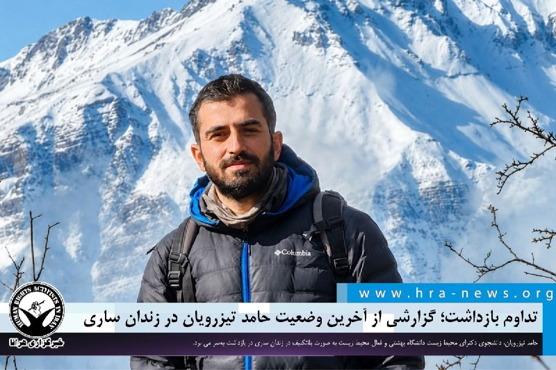

تداوم بازداشت؛ گزارشی از آخرین وضعیت حامد تیزرویان در زندان ساری

❗️
❗️
❗️
❗️
❗️– حامد تیزرویان، دانشجوی دکترای محیط زیست دانشگاه بهشتی و فعال محیط زیست، ۱۶ روز است که توسط ماموران اداره اطلاعات در ساری بازداشت شده و کماکان به صورت بلاتکلیف در زندان این شهر نگهداری می شود.

به گزارش خبرگزاری هرانا، ارگان خبری مجموعه فعالان حقوق بشر در ایران، حامد تیزرویان کماکان در بازداشت به‌سر می برد.

حامد تیزرویان در تاریخ ۱۴ اردیبهشت ماه، توسط ماموران اداره اطلاعات در ساری #بازداشت شد. همزمان، ماموران شماری از وسایل الکترونیکی این فعال محیط زیست را ضبط کردند. او هم اکنون در زندان ساری نگهداری می شود و با اتهاماتی از جمله اجتماع و تبانی به قصد اقدام علیه امنیت ملی مواجه شده است.

ادامه مطلب

#حامد_تیزرویان

↘️
@hranews_bot تماس ✉️ - @Hranews کانال هرانا 🆑

## manototv — post 105628

  <a href="telegram/content/manototv_105628_1779187869.mp4" target="_blank">🎬 Download video</a>

علیرضا رئیسی، معاون بهداشت وزارت بهداشت، اعلام کرد جمعیت ایران بر اساس آخرین آمار به ۸۶ میلیون و ۵۶۴ هزار نفر رسیده است.
به گفته او، از این تعداد ۴۳ میلیون و ۶۵۸ هزار نفر مرد و ۴۲ میلیون و ۹۰۶ هزار نفر زن هستند.

## manototv — post 105627

  <a href="telegram/content/manototv_105627_1779187870.mp4" target="_blank">🎬 Download video</a>

بر پایه گزارش‌های منتشر شده حامد تیزرویان، فعال محیط زیست و عکاس شناخته شده بازداشت شده است. آقای تیزرویان ۱۴ اردیبهشت در ساری بازداشت شده و با وجود سپری شدن حدود دو هفته، از نهاد بازداشت کننده یا دلیل دستگیری او اطلاعی در دست نیست.
وسایل الکترونیکی از جمله تلفن همراه حامد تیزرویان هنگام بازداشت او ضبط شده است. حامد تیزرویان، عکاس حیات وحش و دانشجوی دکترای تنوع زیستی دانشگاه شهید بهشتی، پیش‌تر تصاویری کم‌نظیر از گونه‌های در معرض خطر انقراض از جمله خرس قهوه‌ای و مرال ثبت کرده است. او همچنین در ساخت دست‌کم ۱۰ پاسگاه محیط‌بانی در محدوده جنگل‌های هیرکانی مشارکت داشته و طی سال‌های گذشته در زمینه آموزش و آگاهی‌رسانی درباره حفاظت از محیط زیست، به‌ویژه جنگل‌های هیرکانی، فعالیت مستمر داشته است. فعالان محیط زیست نگران سرنوشت آقای تیزرویان هستند. صفحه اینستاگرام حامد تیزرویان نیز آذر سال گذشته، پس از انتشار مطالبی انتقادی درباره عملکرد مدیران دولتی در مهار آتش‌سوزی جنگل‌های الیمالات مازندران، برای چند روز مسدود شده بود.

## manototv — post 105626

  <a href="telegram/content/manototv_105626_1779187871.mp4" target="_blank">🎬 Download video</a>

نت‌بلاکس، نهاد ناظر بر دسترسی اینترنت، اعلام کرد ایران برای هشتاد و یکمین روز متوالی با قطعی گسترده اینترنت روبه‌رو است و این رخداد اکنون به طولانی‌ترین خاموشی اینترنتی ملی ثبت‌شده در یک کشور متصل به اینترنت تبدیل شده است.

بر اساس داده‌های نت‌بلاکس، دسترسی کاربران داخل ایران به اینترنت جهانی به‌شدت محدود مانده و ارتباطات دیجیتال کشور در سطحی بسیار پایین‌تر از وضعیت عادی قرار دارد.

## manototv — post 105625

  <a href="telegram/content/manototv_105625_1779187872.mp4" target="_blank">🎬 Download video</a>

وزارت دفاع روسیه اعلام کرد نیروهای مسلح این کشور از سه‌شنبه ۲۹ اردیبهشت تا ۳۱ اردیبهشت رزمایش نیروهای هسته‌ای برگزار می‌کنند.

بر اساس این اعلام، بیش از ۶۴ هزار نیروی نظامی و ۷۸۰۰ قطعه تجهیزات نظامی در این رزمایش شرکت دارند و قرار است موشک‌های بالستیک و کروز از پایگاه‌های آزمایشی در خاک روسیه شلیک شوند.

این خبر هم‌زمان با افزایش تنش‌های امنیتی میان روسیه و غرب منتشر شده است. یک روز پیشتر نیز بلاروس اعلام کرد با مشارکت روسیه رزمایشی را برای تمرین جابه‌جایی و آماده‌سازی مهمات هسته‌ای برگزار می‌کند. بلاروس میزبان تسلیحات هسته‌ای تاکتیکی روسیه است، اما مسکو کنترل این تسلیحات را در اختیار دارد.

## alonews — post 121054

  <a href="telegram/content/alonews_121054_1779187872.webm" target="_blank">🎬 Download video</a>

👈وضعیت هوای اهواز امروز ...

✅ @AloNews خبر جنگ

## alonews — post 121053

  <a href="telegram/content/alonews_121053_1779187873.webm" target="_blank">🎬 Download video</a>

👈امتحانات مدارس در البرز غیرحضوری شد

✅ @AloNews خبر جنگ

## alonews — post 121052

  <a href="telegram/content/alonews_121052_1779187873.mp4" target="_blank">🎬 Download video</a>

👈سخنگوی شورای شهر تهران: از فردا مترو و بی‌آرتی در تهران رایگان نیست و مهمونی بسه

✅ @AloNews خبر جنگ

## alonews — post 121051

  <a href="telegram/content/alonews_121051_1779187875.webm" target="_blank">🎬 Download video</a>

👈امتحانات مدارس در البرز غیرحضوری شد

معاون آموزش متوسطه اداره کل  آموزش و پرورش استان البرز:

🔴با تصمیم جدید شورای تأمین استان، امتحانات در استان البرز بار دیگر به صورت مجازی برگزار می‌شود.

✅ @AloNews خبر جنگ

## alonews — post 121050

  <a href="telegram/content/alonews_121050_1779187875.webm" target="_blank">🎬 Download video</a>

👈فارس: تخم‌مرغ از ۵۵۰ به زیر ۴۰۰ هزار تومان سقوط کرد، اما مرغ گرم از کیلویی ۳۸۰ به ۴۵۰ هزار تومان افزایش یافته!

✅ @Aloanews خبر جنگ

## alonews — post 121049

  <a href="telegram/content/alonews_121049_1779187875.webm" target="_blank">🎬 Download video</a>

👈بورس اولین روز بعداز جنگ را مثبت تمام کرد

🔴شاخص کل بورس در پایان معاملات امروز با رشد 2500 واحدی به 3 میلیون و 716 هزار واحد رسید.

✅ @AloNews خبر جنگ

## alonews — post 121048

  <a href="telegram/content/alonews_121048_1779187876.mp4" target="_blank">🎬 Download video</a>

👈حمله‌ی ارتش اسرائیل از صبح امروز، به لبنان ادامه داره

✅ @AloNews خبر جنگ

## alonews — post 121047

  <a href="telegram/content/alonews_121047_1779187876.webm" target="_blank">🎬 Download video</a>

👈روزنامه واشنگتن پست به نقل از یک مقام پاکستانی: ایران می‌خواهد پیش از اعلام توافق هسته‌ای، به توافقی برای پایان دادن به جنگ دست یابد.

🔴واشنگتن می‌خواهد توافق بر سر همه مسائل را یکجا اعلام کند.

✅ @AloNews خبر جنگ

## alonews — post 121046

  <a href="telegram/content/alonews_121046_1779187877.webm" target="_blank">🎬 Download video</a>

👈سخنگوی ارتش: ارتش ایران، دوره آتش بس را به منزله دوران جنگ تلقی کرده و از این فرصت برای تقویت توان رزمی خود استفاده کرده است.

🔴اگر دشمن حماقت کند و مجدداً در دام اسرائیل گرفتار شود و دست به تجاوزی دیگر به ایران عزیز ما بزند، با ابزارها و شیوه‌های جدید جبهه‌های جدیدی را علیه آنها خواهیم گشود.

✅ @AloNews خبر جنگ

## alonews — post 121045

  <a href="telegram/content/alonews_121045_1779187877.webm" target="_blank">🎬 Download video</a>

🔴باید ایستاده برای این مرد و سخنرانیش دست زد.

🔴تامی رابینسون از روز اول کنار مردم ایران بوده اما امروز سنگ تموم گذاشت و درمقابل ده‌ها هزار نفر از انقلاب شیر و خورشید حمایت کرد.

✅@AloNews

## alonews — post 121044

  <a href="telegram/content/alonews_121044_1779187878.webm" target="_blank">🎬 Download video</a>

👈اتحادیه اروپا کشورهای حامی روسیه یا ایران را به قطع کمک‌ها تهدید کرد

🔴طبق گزارش یوراکتیو، کایا کالاس، مسئول سیاست خارجی اتحادیه اروپا، کشورهای در حال توسعه‌ای را که از روسیه یا ایران حمایت می‌کنند، به محرومیت از کمک‌های اتحادیه اروپا تهدید کرده است.

✅ @AloNews خبر جنگ

## alonews — post 121043

  <a href="telegram/content/alonews_121043_1779187878.webm" target="_blank">🎬 Download video</a>

👈صدای شنیده شده در دزفول مربوط به تست سامانه پدافند بود

✅ @AloNews خبر جنگ

## alonews — post 121042

  <a href="telegram/content/alonews_121042_1779187878.webm" target="_blank">🎬 Download video</a>

👈وزیر دفاع پاکستان : احساس می‌کنم جنگ ایران از سر گرفته نمی‌شه

✅ @AloNews خبر جنگ

## alonews — post 121041

  <a href="telegram/content/alonews_121041_1779187878.webm" target="_blank">🎬 Download video</a>

👈نشریه AFP : همزمان با سفر پوتین به چین، روسیه قصد داره رزمایش نیروهای هسته‌ایشو برگزار کنه

✅ @AloNews خبر جنگ

## alonews — post 121040

  <a href="telegram/content/alonews_121040_1779187878.webm" target="_blank">🎬 Download video</a>

👈منبع نظامی ایرانی المیادین: ایران تاکتیک‌های جدید مبتنی بر «دکترین دفاعی تهاجمی» آماده کرده و هیچ مشکلی برای دفاع از کشور ندارد!

✅ @AloNews خبر جنگ

## alonews — post 121039

  <a href="telegram/content/alonews_121039_1779187879.webm" target="_blank">🎬 Download video</a>

👈رئیس شرکت میهن: جوانان الان گشاد هستن و کار نمیکنن بعد میگن اوضاع جامعه خرابه

🔴منم جوون بودم و زحمت کشیدم ولی الانیا چی؟ تنبلن

✅ @AloNews خبر جنگ

## alonews — post 121038

  <a href="telegram/content/alonews_121038_1779187879.webm" target="_blank">🎬 Download video</a>

👈مدیرعامل صندوق قرض‌الحسن جهاددانشگاهی:
به دانشجوهایی که ازدواج کنند ۳۰ میلیون وام تعلق می‌گیرد😍😍😍😍😍😍😍😍😍😍😍😍😳😳😳😳😳😳😳😍😍😍😍😍😍😍

✅ @AloNews خبر جنگ

## alonews — post 121037

  <a href="telegram/content/alonews_121037_1779187879.webm" target="_blank">🎬 Download video</a>

👈منبع نظامی ایرانی به خبرگزاری ریانووستی: ایران تاکتیک‌های جدید مبتنی بر «دکترین دفاعی تهاجمی» آماده کرده و هیچ مشکلی برای دفاع از کشور ندارد.

✅ @AloNews خبر جنگ

## alonews — post 121036

  <a href="telegram/content/alonews_121036_1779187879.webm" target="_blank">🎬 Download video</a>

👈از فردا (چهارشنبه ۳۰ اردیبهشت) پرداخت بلیت مترو و اتوبوس در تهران به حالت عادی و پولی بازمی‌گردد.

✅ @AloNews خبر جنگ

## alonews — post 121035

  <a href="telegram/content/alonews_121035_1779187880.webm" target="_blank">🎬 Download video</a>

👈وال استریت ژورنال: ترامپ هنوز تمایل به حمله به ایران دارد

✅ @AloNews خبر جنگ

<!-- MSG END -->

<!-- NAV START -->

<a href="https://github.com/yerbeyer/aio-downloader/blob/main/telegram/content/archive_1.md" style="display:inline-block; padding:6px 12px; margin:0 4px; background-color:#2ea44f; color:white; text-decoration:none; border-radius:4px; font-weight:bold;">صفحه بعد</a>

<!-- NAV END -->
