# خواننده تلگرام

<!-- TOP_NAV START -->

<a href="https://github.com/yerbeyer/aio-downloader/blob/main/telegram/content/archive_1.md" style="display:inline-block; padding:6px 12px; margin:0 4px; background-color:#2ea44f; color:white; text-decoration:none; border-radius:4px; font-weight:bold;">صفحه بعد</a>

<!-- TOP_NAV END -->

<!-- MSG START -->

---
📅 بروزرسانی: 1405/02/31 07:15
---

## VahidOOnLine — post 241264

  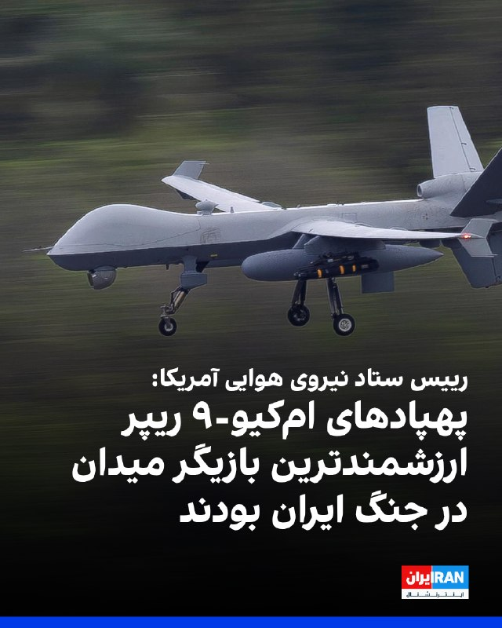

کنت ویلزباخ، رییس ستاد نیروی هوایی آمریکا، اعلام کرد پهپادهای ام‌کیو-۹ ریپر در عملیات «خشم حماسی» علیه جمهوری اسلامی به «ارزشمندترین بازیگر میدان» تبدیل شدند و بیش از هر هواپیمای دیگری حمله انجام دادند.
ویلزباخ در نشست کمیته خدمات مسلح مجلس نمایندگان آمریکا گفت هیچ سامانه‌ای از نظر حجم حملات «حتی به ام‌کیو-۹ نزدیک هم نیست» و تاکید کرد این پهپادها توانسته‌اند ماموریت‌های طولانی‌مدت انجام دهند، بدون آنکه جان خلبانان به خطر بیفتد.
مجله «ایر اند اسپیس فورسز» به نقل از افراد آگاه نوشت نزدیک به ۳۰ فروند ام کیو ۹ ریپر در عملیات علیه جمهوری اسلامی از دست رفته‌اند. بسیاری از این هواپیماها در اثر پدافند هوایی سرنگون شدند، اما برخی از آنها نیز هنگام حضور روی زمین هدف قرار گرفتند.
بر اساس گزارش این مجله، ریپرها ماموریت‌های مستمر بر فراز ایران انجام داده، پرتابگرهای موشکی، پایگاه‌های هوایی و اهداف متحرک را هدف قرار داده و در اجرای محاصره نظامی آمریکا در اطراف تنگه هرمز نیز نقش داشته‌اند.

‌🏁 🇬🇧 IranintlTV

🤖 @VahidOOnLine

## VahidOOnLine — post 241263

  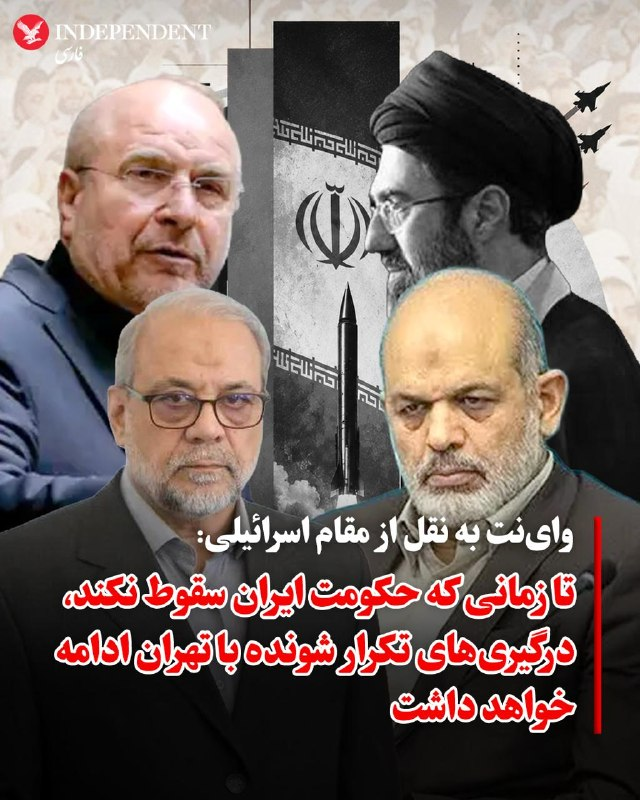

♦️به گزارش وای‌نت، یک مقام ارشد اسرائیلی هشدار داده که «جنگ بعدی با ایران آخرین جنگ نخواهد بود» و تاکید کرده که حتی در صورت وقوع یک حمله دیگر، این درگیری پایان نخواهد یافت. به گفته او، تا زمانی که حکومت ایران در قدرت باقی بماند، احتمال درگیری‌های تکرارشونده وجود دارد.
این نشریه اسرائیلی می‌نویسد، در همین چارچوب، اسرائیل در حال آماده‌سازی برای احتمال ازسرگیری جنگ با رژیم ایران است و در هفته‌های اخیر رئیس ستاد کل ارتش اسرائیل، ایال زامیر، نشست‌ها و جلسات متعددی با نهادهای امنیتی، اطلاعات نظامی، عملیات و نیروی هوایی برگزار کرده است. این آمادگی‌ها در هماهنگی کامل با ایالات متحده انجام می‌شود.
مقام‌های امنیتی اسرائیل می‌گویند باید افکار عمومی برای یک واقعیت جدید آماده شود؛ این‌که کارزار علیه رژیم ایران با یک حمله پایان نخواهد یافت و ممکن است درگیری‌ها به‌صورت دوره‌ای تکرار شود. یک مقام ارشد امنیتی گفته است: «جنگ با ایران طولانی خواهد بود. تا زمانی که این رژیم سقوط نکند، احتمال درگیری‌های تکرارشونده وجود دارد، شاید هر سال یا حتی بیشتر.»
در متن همچنین آمده است که شکاف میان واشینگتن و تهران همچنان بسیار زیاد است و به گفته یک مقام اسرائیلی، منافع تصمیم‌گیرندگان در ایران با خواسته‌های آمریکا همسو نیست. او نتیجه گرفته است که در نهایت احتمال دارد ترامپ ناچار به انجام یک دور دیگر حمله علیه ایران شود.
با وجود گزارش‌هایی درباره تلاش برای توافق، مقامات اسرائیلی تاکید می‌کنند حتی در صورت انجام یک حمله دیگر، این اقدام تهدید را از بین نخواهد برد. آن‌ها معتقدند ایران پس از هر حمله، در صورت باقی ماندن حکومت، توان بازسازی نظامی خود را خواهد داشت و به همین دلیل اسرائیل باید برای دورهای بعدی درگیری آماده بماند.
همچنین نگرانی اصلی اسرائیل این است که موضوع موشک‌های بالستیک در مذاکرات ایران و آمریکا در مرکز توجه قرار ندارد. بر اساس ارزیابی‌های اسرائیلی، ایران پیش از جنگ بیش از ۲۰۰۰ موشک بالستیک داشته و بخشی از آن هنوز باقی مانده است.
در مجموع، جمع‌بندی مقامات اسرائیلی این است که حتی در صورت دستاوردهای نظامی، «حمله بعدی پایان کار نخواهد بود» و تا زمانی که حکومت ایران پابرجاست، چرخه درگیری ادامه خواهد داشت.
‌🇸🇦 Indypersian

🤖 @VahidOOnLine

## VahidOOnLine — post 241262

  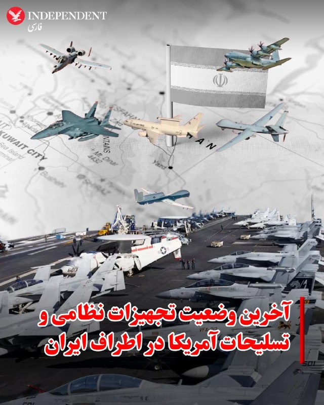

♦️به گزارش وای‌نت به نقل از برآوردهای سازمان «اتحاد علیه ایران هسته‌ای»، در حال حاضر دو گروه ناو هواپیمابر آمریکا در دریای عرب فعال هستند: «یواس‌اس آبراهام لینکلن» و «یواس‌اس جورج اچ. دبلیو. بوش». ناو «جرالد آر. فورد» که بخشی از استقرار بزرگ منطقه‌ای بود، پس از ۱۱ ماه مأموریت به بندر نورفولک در ویرجینیا بازگشته است. اما حضور دو گروه رزمی همچنان قدرت آتش قابل توجهی علیه رژیم ایران حفظ می‌کند.
در اطراف این ناوها، یگان‌های هوایی شامل جنگنده‌های اف/ای-۱۸ (F/A-18)، جنگنده‌های رادارگریز اف-۳۵‌سی، هواپیماهای جنگ الکترونیک ای‌ای۱۸-جی (EA-18G) گروولر، هواپیماهای فرماندهی و کنترل E-2D و هلیکوپترها فعالیت می‌کنند. علاوه بر این، ناوشکن‌های موشک‌انداز هدایت‌شونده و سایر شناورها در سراسر دریای عرب، دریای سرخ و شرق مدیترانه مستقر هستند. براساس این گزارش، یک نیروی آبی-خاکی از ناو «یواس‌اس تریپولی» در حوزه مسئولیت فرماندهی مرکزی آمریکا (سنتکام) فعالیت می‌کند، همراه با شناورهای تفنگداران دریایی و کشتی‌های مین‌روبی که به منطقه اعزام شده‌اند.
این حضور به آمریکا امکان می‌دهد به‌سرعت حملات علیه رژیم ایران را از دریا و هوا از سر بگیرد، با استفاده از هواپیماها، موشک‌های کروز، توان اطلاعاتی و جنگ الکترونیک، و هم‌زمان یک چتر دفاعی گسترده برای پایگاه‌های آمریکا، شرکای منطقه‌ای، اسرائیل و مسیرهای دریایی در خلیج فارس فراهم کند. علاوه بر نیروهای دریایی، آمریکا همچنین جنگنده‌های ای-۱۵‌ای، اف-۱۵ و اف-۳۵، بمب‌افکن‌های بی-۲ و بی-۵۲، هواپیماهای سوخت‌رسان کی‌سی-۱۳۵ و سامانه‌های گسترده اطلاعاتی، نظارتی و جنگ الکترونیک را در عملیات خود علیه ایران مستقر کرده است.
‌🇸🇦 Indypersian

🤖 @VahidOOnLine

## VahidOOnLine — post 241261

  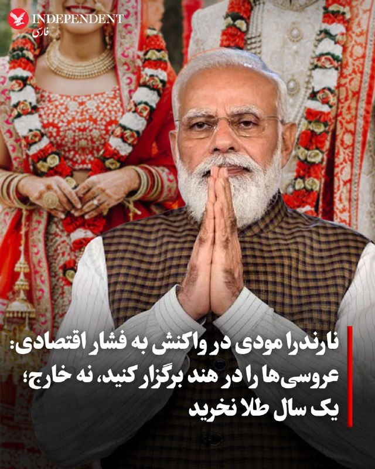

♦️سی‌ان‌ان با اشاره به ناآرامی‌ها در خاورمیانه نوشت، جنگ ایران باعث شده دولت نارندرا مودی با فوریت بیشتری کارزار «در هند ازدواج کنید» را پیش ببرد؛ کارزاری که هدف آن جلوگیری از خروج ارز و کاهش فشار بر اقتصاد هند است.
مودی از شهروندان خواسته به‌جای برگزاری مراسم عروسی در خارج از کشور، آن را در داخل هند برگزار کنند. او تاکید کرده که روند رو‌به‌رشد «عروسی‌های مقصدی» در خارج از کشور باعث خروج قابل‌توجه ارز خارجی می‌شود. این سیاست در چارچوب تلاش دولت برای حفظ ذخایر ارزی و حمایت از ارزش روپیه مطرح شده است.
در متن اشاره شده که این رویکرد در شرایطی شدت گرفته که اقتصاد هند تحت فشار قرار دارد. هند حدود ۹۰ درصد نفت و گاز خود را وارد می‌کند و بخش بزرگی از آن از خاورمیانه تامین می‌شود. تنش‌ها در تنگه هرمز نگرانی‌ها درباره اختلال در عرضه انرژی و افزایش هزینه واردات را بالا برده است. روپیه از زمان آغاز جنگ بیش از ۵ درصد تضعیف شده و به ضعیف‌ترین ارزهای مهم آسیا تبدیل شده است.
در همین چارچوب، مودی از مردم خواسته مصرف سوخت را کاهش دهند، دورکاری را افزایش دهند، سفرهای داخلی را جایگزین سفر خارجی کنند و خرید طلا را برای یک سال محدود کنند، زیرا هند یکی از بزرگ‌ترین واردکنندگان طلا در جهان است.
بخش مهم دیگر متن به صنعت عروسی در هند مربوط است. این صنعت حدود ۱۳۰ میلیارد دلار ارزش دارد و دومین بخش بزرگ مصرفی کشور پس از مواد غذایی محسوب می‌شود. سالانه بین ۸ تا ۱۰ میلیون ازدواج در هند انجام می‌شود و بسیاری از این مراسم‌ به رویدادهای چندروزه، بسیار پرهزینه و نمایشی تبدیل شده‌اند که تحت تاثیر بالیوود، شبکه‌های اجتماعی و سبک چهره‌های مشهور شبکه‌های اجتماعی هستند.
در متن به نمونه‌های بسیار لوکس نیز اشاره شده، از جمله عروسی‌های خاندان آمبانی و چهره‌های مشهور مانند پریانکا چوپرا و نیک جوناس که در مکان‌های بسیار مجلل و با حضور چهره‌های جهانی برگزار شده‌اند.
با این حال، گزارش تاکید می‌کند که در سال‌های اخیر بخشی از زوج‌ها به دلیل هزینه‌های بالا و فشار اقتصادی، از برگزاری مراسم در خارج از کشور صرف‌نظر کرده و ترجیح می‌دهند در داخل هند ازدواج کنند. برخی برنامه‌ریزان عروسی نیز گفته‌اند که افزایش هزینه متوسط هر مراسم و بزرگ‌تر شدن مقیاس جشن‌ها مشهود است، هرچند تعداد سفرهای خارجی برای ازدواج کاهش یافته است.
در کنار این روند، منتقدان می‌گویند دولت با طرح چنین درخواست‌هایی از مردم، به‌جای حل مشکلات ساختاری اقتصاد، بار بحران را به دوش شهروندان می‌اندازد.
‌🇸🇦 Indypersian

🤖 @VahidOOnLine

## VahidOOnLine — post 241260

  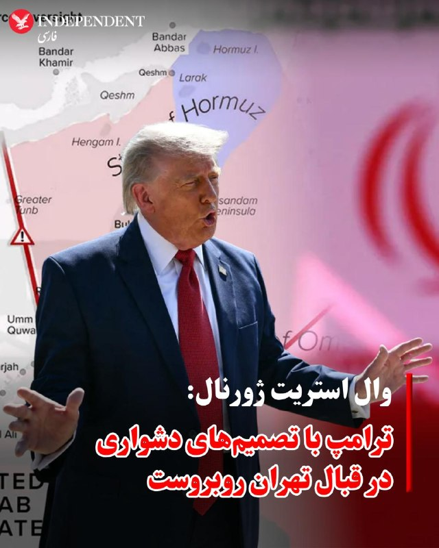

♦️شورای سردبیری وال استریت ژورنال در مقاله‌ای می‌نویسد که رئیس‌جمهوری آمریکا به دنبال پایان جنگ است اما تهران تا کنون فقط توافق‌های بد ارایه داده است. رئیس‌جمهور ترامپ پس از سفر به چین با تصمیم‌های دشواری درباره جنگ با ایران روبه‌رو است.به نوشته این روزنامه آمریکایی، در حالی که آمریکا خسارات سنگینی به توان نظامی جمهوری اسلامی وارد کرده و برنامه هسته‌ای آن را عقب انداخته، حکومت ایران از پذیرش توافقی که شامل عقب‌نشینی واقعی از برنامه هسته‌ای باشد خودداری می‌کند و بخش زیادی از تردد تجاری در تنگه هرمز را متوقف کرده است.
از دید نویسندگان، ترامپ تاکنون از پذیرش توافقی ضعیف که بدون امتیاز هسته‌ای واقعی صرفا باعث باز شدن تنگه هرمز شود، خودداری کرده و آن را مشابه توافق ۲۰۱۵ دولت اوباما و نوعی شکست راهبردی می‌داند. با این حال، آتش‌بس فعلی طولانی‌تر از عملیات نظامی قبلی شده، در حالی که ایران همچنان از تعهدات خود برای بازگشایی تنگه هرمز عقب‌نشینی کرده و به منافع آمریکا و متحدانش در خلیج فارس حمله می‌کند.
به نوشته وال استریت ژورنال، رژیم ایران با هر پیشنهاد جدید حاضر به برچیدن تاسیسات غنی‌سازی زیرزمینی یا تحویل ذخایر اورانیوم غنی‌شده نیست و این نشان می‌دهد هدف هسته‌ای خود را کنار نگذاشته است. ترامپ نیز گفته به نظر او ایران از سلاح هسته‌ای استفاده خواهد کرد، اما در عین حال اعلام کرده ممکن است به آنها فرصت کوتاهی برای رسیدن به توافق داده شود.
این مقاله می‌افزاید که تهدیدهای مکرر آمریکا اثرگذاری کمتری پیدا کرده و رژیم ایران به جای عقب‌نشینی، توان مقاومت در برابر ادامه درگیری و هدف قرار دادن مسیرهای تجاری را دارد.
نویسندگان می‌گویند اگر توافق خوبی ممکن نباشد، آمریکا ناچار به ادامه استفاده از نیروی نظامی خواهد بود. گزینه‌های مطرح شامل تصرف یا نابودی بخشی از ذخایر اورانیوم ایران و تاسیسات زیرزمینی، ادامه محاصره دریایی و اسکورت نظامی کشتی‌ها در تنگه هرمز، و حمله تدریجی به زیرساخت‌های نفتی ایران است. همچنین اشاره شده که فشار اقتصادی و اطلاعاتی برای تضعیف حکومت ایران نیز می‌تواند ادامه یابد.
در پایان تاکید شده که همه این گزینه‌ها با ریسک‌های نظامی و اقتصادی همراه است، اما به باور نویسندگان، عدم اقدام نیز هزینه‌های خود را دارد و تمدید مذاکرات بدون نتیجه می‌تواند باعث فرسایش بازدارندگی آمریکا و افزایش هزینه‌ها شود.
‌🇸🇦 Indypersian

🤖 @VahidOOnLine

## VahidOOnLine — post 241259

  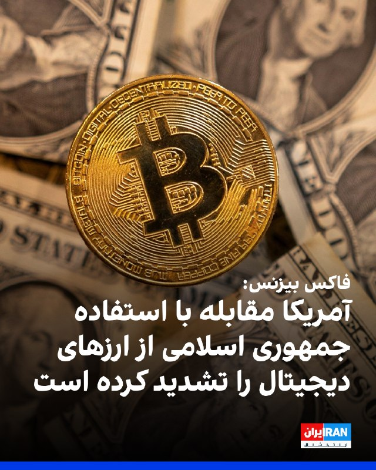

فاکس بیزنس گزارش داد آمریکا تلاش‌ها برای هدف قرار دادن استفاده جمهوری اسلامی از ارزهای دیجیتال را تشدید کرده است. به گفته مقام‌های آمریکایی، تهران حدود ۷.۷ میلیارد دلار دارایی دیجیتال را تحت کنترل دارد.
به گفته مقام‌های آمریکایی، مقابله با شبکه‌های مالی دیجیتال جمهوری اسلامی اکنون به بخشی از راهبرد فشار اقتصادی واشینگتن علیه تهران تبدیل شده است.
بر اساس این گزارش، جمهوری اسلامی از بیت‌کوین و سایر رمزارزها برای انتقال پول خارج از سیستم بانکی سنتی استفاده کرده است که این مسیر می‌تواند به دور زدن تحریم‌ها کمک کند.

‌🏁 🇬🇧 IranintlTV

🤖 @VahidOOnLine

## VahidOOnLine — post 241258

  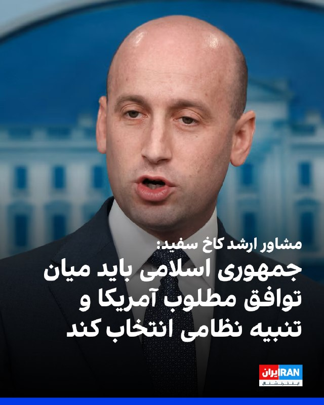

استیون میلر، مشاور ارشد کاخ سفید، به فاکس نیوز گفت که باقی‌مانده حکومت در ایران باید میان «موافقت با سندی که برای آمریکا رضایت‌بخش باشد» یا «مجازاتی از سوی ارتش آمریکا که نظیر آن در تاریخ معاصر دیده نشده است» دست به انتخاب بزند.
میلر بامداد پنجشنبه ۳۱ اردیبهشت در این مصاحبه تلویزیونی کارزار نظامی ایالات متحده علیه جمهوری اسلامی را «یک شکست نظامی خُردکننده و کامل» توصیف کرد که به گفته او بهای «پیگیری رویای دستیابی به سلاح هسته‌ای» بود.
میلر افزود: «رییس‌جمهور ترامپ اصل منع اشاعه سلاح هسته‌ای را با قدرت عریان آمریکا به اجرا گذاشته است؛ پیامی نه فقط به رژیم ایران، نه فقط به سپاه پاسداران، بلکه به سراسر جهان، به هر کسی که ممکن است به انجام کاری مشابه فکر کند.»
او گفت که آمریکا «رهبری شرور، پلید و فاسد» ایران را کشته، نیروی هوایی و دریایی، برنامه موشکی و پایه‌های صنایع دفاعی آنها را هم نابود کرده و آن را به کشوری ناتوان و تضعیف‌شده تبدیل کرده است که دیگر توان به راه انداختن جنگ جهانی ندارد.»
میلر گفت که حکومت ایران اکنون در ضعیف‌ترین شکل خود در تاریخ قرار دارد.

‌🏁 🇬🇧 IranintlTV

🤖 @VahidOOnLine

## VahidOOnLine — post 241257

  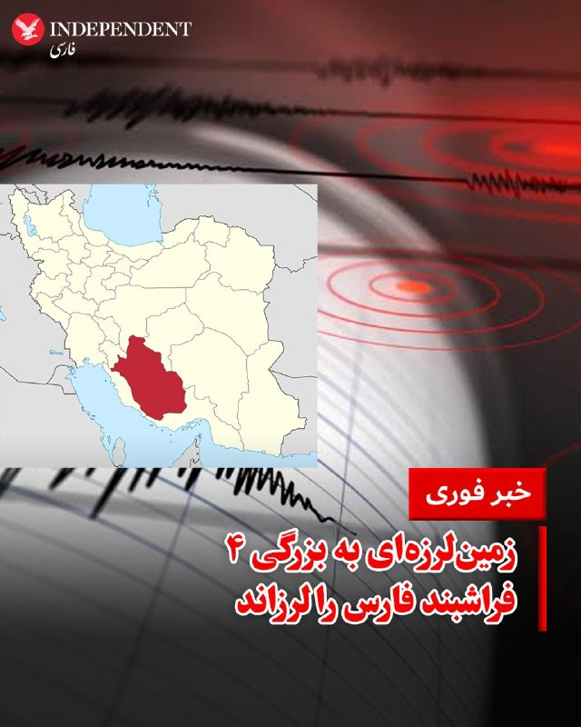

♦️مرکز لرزه‌نگاری موسسه ژئوفیزیک دانشگاه تهران اعلام کرد زمین‌لرزه‌ای به بزرگی ۴ بامداد پنج‌شنبه ۳۱ اردیبهشت حوالی فراشبند در استان فارس را لرزاند.
بر اساس این گزارش، این زمین‌لرزه ساعت ۳:۴۷ بامداد رخ داده است. تا زمان انتشار این خبر گزارشی درباره خسارت‌های احتمالی منتشر نشده است.
‌🇸🇦 Indypersian

🤖 @VahidOOnLine

## VahidOOnLine — post 241256

  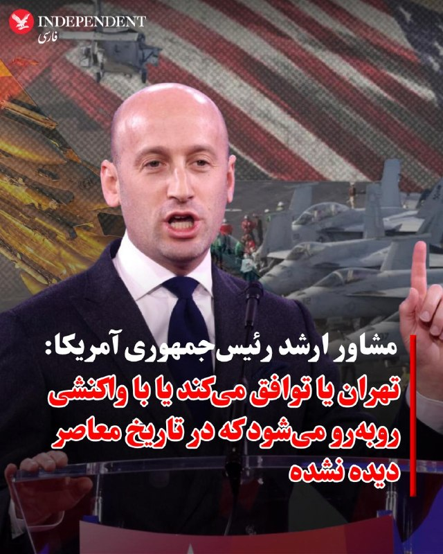

♦️استیون میلر، مشاور ارشد سیاسی و امنیت داخلی دونالد ترامپ، بامداد پنجشنبه ۳۱ اردیبهشت‌ماه، در گفتگو با فاکس‌نیوز گفت جمهوری اسلامی تنها با یک «انتخاب دوگانه» روبه‌رو است و هشدار داد اگر تهران توافق مورد نظر واشنگتن را نپذیرد، با واکنش نظامی آمریکا مواجه خواهد شد.

میلر گفت: «آن‌ها یا باید با متنی موافقت کنند که مورد رضایت ایالات متحده باشد، یا با مجازاتی از سوی ارتش ما روبه‌رو شوند که مانند آن در تاریخ معاصر دیده نشده است.»

او افزود جمهوری اسلامی تاکنون «سنگین‌ترین هزینه» را بابت دنبال‌کردن برنامه هسته‌ای خود پرداخته و این هزینه به شکل «شکست کامل و خردکننده نظامی» بوده است.

مشاور ارشد ترامپ با اشاره به حملات آمریکا و اسرائیل به جمهوری اسلامی گفت دولت ترامپ با استفاده از قدرت نظامی ایالات متحده، سیاست منع گسترش سلاح هسته‌ای را به اجرا گذاشته و از نگاه واشنگتن، این اقدام پیامی برای جمهوری اسلامی، سپاه پاسداران و دیگر کشورها و گروه‌هایی بوده که ممکن است مسیر مشابهی را دنبال کنند.

او همچنین گفت: «ما رهبری شرور، فاسد و پلید آن کشور را از بین بردیم.»

میلر با اشاره به حمله مشترک آمریکا و اسرائیل به اهداف نظامی جمهوری اسلامی گفت نیروی هوایی، نیروی دریایی، برنامه موشکی و زیرساخت صنایع دفاعی جمهوری اسلامی نابود شدند.

او افزود: «پس این کشوری است که تضعیف شده و عملا توانایی خود برای جنگ بین‌المللی و جهانی را از دست داده است.»

میلر تاکید کرد جمهوری اسلامی اکنون «در ضعیف‌ترین وضعیت تاریخ خود» قرار دارد و گفت: «اگر جمهوری اسلامی بخواهد در تجارت جهانی اخلال ایجاد کند، آمریکا می‌تواند ایران را متوقف کند.»

او افزود: «پس همه برگ‌های برنده دست ماست، همه قدرت دست ماست و فضای تصمیم‌گیری کاملا در اختیار ما قرار دارد.»

میلر گفت: «بنابراین تصمیم با ایران است.»

او در پایان هشدار داد: «اما در هر زمان و در هر نقطه‌ای از آینده، اگر ایران تصمیم بگیرد کار احمقانه‌ای انجام دهد و آمریکا یا جهان را تهدید کند، ارتش ما آماده مقابله با آن است.»

دونالد ترامپ، رئیس‌جمهوری آمریکا، چهارشنبه ۳۰ اردیبهشت‌ماه گفت اگر با چند روز صبر بتواند از جنگ یا کشته‌شدن افراد جلوگیری کند، آن را «کار بزرگی» می‌داند. او همچنین اعلام کرد آمریکا در آستانه تصمیم‌گیری درباره جمهوری اسلامی قرار دارد و نتیجه این تصمیم می‌تواند توافق یا از سرگیری حملات نظامی باشد.
‌🇸🇦 Indypersian

🤖 @VahidOOnLine

## VahidOOnLine — post 241255

  

بهنام بن‌طالب‌لو، مدیر ارشد برنامه ایران در بنیاد دفاع از دموکراسی‌ها، به فاکس نیوز گفت: «راه واقعی پیروزی بر جمهوری اسلامی، فاصله گرفتن از میز مذاکره و تغییر معادله است؛ یعنی توانمندسازی مردم. حکومت ایران بیش از آنکه از بمب‌های اسرائیلی و آمریکایی بترسد، از مردم خود می‌ترسد.»
بن‌طالب‌لو افزود: «با جمهوری اسلامی نمی‌توان مذاکره کرد. می‌دانم ترامپ مذاکره‌کننده ارشد است، اما شاید این موردی باشد که او بیشتر باید در جایگاه فرمانده کل قوا عمل کند.»

‌🏁 🇬🇧 IranintlTV

🤖 @VahidOOnLine

## VahidOOnLine — post 241254

♦️دونالد ترامپ، رئیس جمهوری آمریکا، در گفتگو با خبرنگاران با اشاره به حضور نیروهای اطلاعاتی ایالات متحده در کوبا اعلام کرد که واشنگتن در حال آزاد کردن این کشور است و مردم این کشور ۶۵ سال منتظر چنین لحظه‌ای بوده‌اند.
ترامپ در این باره گفت: «ما افراد زیادی در کوبا داریم؛ سازمان سی‌آی‌ای در آنجا حضور دارد و مارکو روبیو، وزیر امور خارجه نیز اهل آنجا است، بنابراین ما تخصص و اشراف زیادی روی این کشور داریم.»
رئیس جمهوری آمریکا با تاکید بر وضعیت دشوار معیشتی در کوبا افزود: «ما به مردم کوبا کمک خواهیم کرد؛ آن‌ها در حال حاضر راهی برای امرار معاش ندارند، غذا، برق و هیچ انرژی دیگری ندارند اما مردم فوق‌العاده‌ای هستند. ما کوبا را آزاد می‌کنیم.»
‌🇸🇦 Indypersian

🤖 @VahidOOnLine

## VahidOOnLine — post 241253

  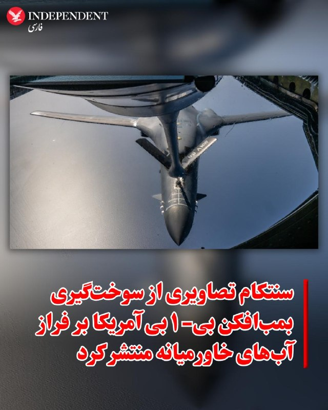

♦️فرماندهی مرکزی ایالات متحده (سنتکام) بامداد پنجشنبه ۳۱ اردیبهشت‌ماه در شبکه اجتماعی اکس تصاویری منتشر کرد که یک فروند بمب‌افکن بی-۱بی لنسر نیروی هوایی آمریکا را در حال سوخت‌گیری هوایی بر فراز آب‌های منطقه‌ای خاورمیانه نشان می‌دهد.

بر اساس توضیح سنتکام، این سوخت‌گیری در جریان یک پرواز آموزشی و با استفاده از هواپیمای سوخت‌رسان کی‌سی-۱۳۵ استراتوتنکر انجام شده است.

در تصاویر منتشرشده، بمب‌افکن راهبردی آمریکا هنگام اتصال به هواپیمای سوخت‌رسان در میانه پرواز دیده می‌شود؛ اقدامی که بخشی از حفظ آمادگی عملیاتی نیروهای آمریکایی در منطقه عنوان شده است.
‌🇸🇦 Indypersian

🤖 @VahidOOnLine

## VahidOOnLine — post 241252

  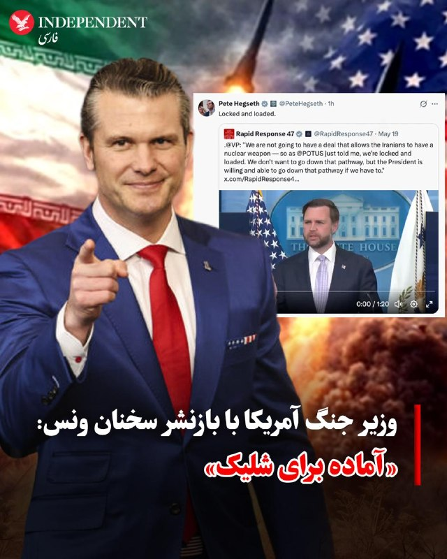

♦️پیت هگست، وزیر جنگ ایالات متحده، بامداد پنجشنبه ۳۱ اردیبهشت‌ماه، با بازنشر سخنان اخیر جی‌دی ونس، معاون رئیس جمهوری آمریکا، عبارت «آماده برای شلیک» را به کار برد. وزیر جنگ آمریکا عصر چهارشنبه ویدیویی از اظهارات معاون رئیس جمهوری در مورد «گزینه ب» واشنگتن در صورت شکست مذاکرات با جمهوری اسلامی را بازنشر کرد و در شبکه اجتماعی اکس نوشت: «آماده برای شلیک». هگست همچنین با نقل قولی از ونس تاکید کرد که ایالات متحده هیچ توافقی را که به جمهوری اسلامی اجازه دستیابی به سلاح هسته‌ای بدهد، نخواهد پذیرفت.
‌🇸🇦 Indypersian

🤖 @VahidOOnLine

## VahidOOnLine — post 241251

  

هانا نیومن، نماینده پارلمان اروپا، روز چهارشنبه گفت سپاه همچنان در فهرست گروه‌های تروریستی اتحادیه اروپا قرار دارد، اما «شبکه‌های آن همچنان در برخی کشورهای عضو فعال هستند.» او خواستار تلاش‌های بیشتر برای «خشکاندن منابع مالی، نفوذ و دامنه فعالیت‌های سپاه پاسداران در داخل اروپا» شد.
‌🏁 🇬🇧 IranintlTV

🤖 @VahidOOnLine

## VahidOOnLine — post 241242

این زخم‌ها با گذشت زمان کوچک نمی‌شوند؛
در حافظه یک سرزمین می‌مانند، میان عکس‌های خانوادگی، مغازه‌های نیمه‌تعطیل، صندلی‌های خالی و رویاهایی که قرار بود تازه آغاز شوند. این نام‌ها، فقط متعلق به یک روز و یک خیابان نیستند؛ بخشی از نسلی‌اند که برای زندگی ایستاد و بهایش را با جان داد.<
جاویدنامان انقلاب ملی ایرانیان:
مهدی اکرمی قدیرلی، امیرحسین بیاتی، شایان آزادی، علی آقاجانی، فرزین پوست‌آشکن دورکی، مجید زنگنه، امیرحسین جوادزاده و مهرشاد قائدی.<
هر بار که این نام‌ها تکرار می‌شوند، یادآوری می‌شود پشت هر کدام، آینده‌ای بود که می‌توانست ادامه پیدا کند؛ آینده‌ای که با گلوله، بازداشت و پنهان‌کاری متوقف شد، اما از حافظه مردم پاک نشد.<
#جاویدنامان_انقلاب_ملی_ایرانیان
‌🏁 🇬🇧 IranintlTV

🤖 @VahidOOnLine

## FoxNewsTwitter — post 342034

  <a href="telegram/content/FoxNewsTwitter_342034_1779335152.mp4" target="_blank">🎬 Download video</a>

Fox News (Twitter/X)

Intense footage shows a police BearCat accelerating toward a camouflage-clad alleged cop killer as he fired multiple rounds into the armored vehicle's window and underside.

Deputies backed away but were forced to re-engage a second time as the suspect continued manipulating his rifle and reached for a handgun in his waistband.

Tulare County Sheriff Mike Boudreaux confirmed that deputies ultimately used the BearCat to run over the suspect a third and final time to neutralize the threat, resulting in his death.

## FoxNewsTwitter — post 342033

  <a href="telegram/content/FoxNewsTwitter_342033_1779335154.mp4" target="_blank">🎬 Download video</a>

Fox News (Twitter/X)

Johnny “Joey” Jones is heading back into the Marine Corps.

The FOX News host and combat veteran announced he is reenlisting more than a decade after medically retiring following a 2010 IED-related incident in Afghanistan that cost him both legs.

Jones has become one of the most visible advocates for veterans and wounded warriors since joining FOX News.

Now the decorated Marine says he’s ready to serve again. |@Johnny_Joey

## FoxNewsTwitter — post 342032

  

Fox News (Twitter/X)

Vanessa Trump announced she has been diagnosed with breast cancer and recently underwent a procedure as she starts treatment and recovery.

"I am staying focused and hopeful while surrounded by the love and support of my family, my kids, and those closest to me," Trump wrote.

The update quickly prompted an outpouring of support from other members of the Trump family and supporters.

## FoxNewsTwitter — post 342031

‌Fox News (Twitter/X)

Read more:

## FoxNewsTwitter — post 342030

  

Fox News (Twitter/X)

"I'm Hunter Biden. You've never actually heard from me."

A newly active "Hunter Biden" X account is sparking a firestorm as politicians and commentators relentlessly mock the first post.

## IranIntlTV — post 338181

  

کنت ویلزباخ، رییس ستاد نیروی هوایی آمریکا، اعلام کرد پهپادهای ام‌کیو-۹ ریپر در عملیات «خشم حماسی» علیه جمهوری اسلامی به «ارزشمندترین بازیگر میدان» تبدیل شدند و بیش از هر هواپیمای دیگری حمله انجام دادند.
ویلزباخ در نشست کمیته خدمات مسلح مجلس نمایندگان آمریکا گفت هیچ سامانه‌ای از نظر حجم حملات «حتی به ام‌کیو-۹ نزدیک هم نیست» و تاکید کرد این پهپادها توانسته‌اند ماموریت‌های طولانی‌مدت انجام دهند، بدون آنکه جان خلبانان به خطر بیفتد.
مجله «ایر اند اسپیس فورسز» به نقل از افراد آگاه نوشت نزدیک به ۳۰ فروند ام کیو ۹ ریپر در عملیات علیه جمهوری اسلامی از دست رفته‌اند. بسیاری از این هواپیماها در اثر پدافند هوایی سرنگون شدند، اما برخی از آنها نیز هنگام حضور روی زمین هدف قرار گرفتند.
بر اساس گزارش این مجله، ریپرها ماموریت‌های مستمر بر فراز ایران انجام داده، پرتابگرهای موشکی، پایگاه‌های هوایی و اهداف متحرک را هدف قرار داده و در اجرای محاصره نظامی آمریکا در اطراف تنگه هرمز نیز نقش داشته‌اند.

https://iranintl.com/202605215363

## IranIntlTV — post 338180

  

فاکس بیزنس گزارش داد آمریکا تلاش‌ها برای هدف قرار دادن استفاده جمهوری اسلامی از ارزهای دیجیتال را تشدید کرده است. به گفته مقام‌های آمریکایی، تهران حدود ۷.۷ میلیارد دلار دارایی دیجیتال را تحت کنترل دارد.
به گفته مقام‌های آمریکایی، مقابله با شبکه‌های مالی دیجیتال جمهوری اسلامی اکنون به بخشی از راهبرد فشار اقتصادی واشینگتن علیه تهران تبدیل شده است.
بر اساس این گزارش، جمهوری اسلامی از بیت‌کوین و سایر رمزارزها برای انتقال پول خارج از سیستم بانکی سنتی استفاده کرده است که این مسیر می‌تواند به دور زدن تحریم‌ها کمک کند.

https://iranintl.com/202605210850

## IranIntlTV — post 338179

  

استیون میلر، مشاور ارشد کاخ سفید، به فاکس نیوز گفت که باقی‌مانده حکومت در ایران باید میان «موافقت با سندی که برای آمریکا رضایت‌بخش باشد» یا «مجازاتی از سوی ارتش آمریکا که نظیر آن در تاریخ معاصر دیده نشده است» دست به انتخاب بزند.
میلر بامداد پنجشنبه ۳۱ اردیبهشت در این مصاحبه تلویزیونی کارزار نظامی ایالات متحده علیه جمهوری اسلامی را «یک شکست نظامی خُردکننده و کامل» توصیف کرد که به گفته او بهای «پیگیری رویای دستیابی به سلاح هسته‌ای» بود.
میلر افزود: «رییس‌جمهور ترامپ اصل منع اشاعه سلاح هسته‌ای را با قدرت عریان آمریکا به اجرا گذاشته است؛ پیامی نه فقط به رژیم ایران، نه فقط به سپاه پاسداران، بلکه به سراسر جهان، به هر کسی که ممکن است به انجام کاری مشابه فکر کند.»
او گفت که آمریکا «رهبری شرور، پلید و فاسد» ایران را کشته، نیروی هوایی و دریایی، برنامه موشکی و پایه‌های صنایع دفاعی آنها را هم نابود کرده و آن را به کشوری ناتوان و تضعیف‌شده تبدیل کرده است که دیگر توان به راه انداختن جنگ جهانی ندارد.»
میلر گفت که حکومت ایران اکنون در ضعیف‌ترین شکل خود در تاریخ قرار دارد.

https://iranintl.com/202605218506

## IranIntlTV — post 338178

  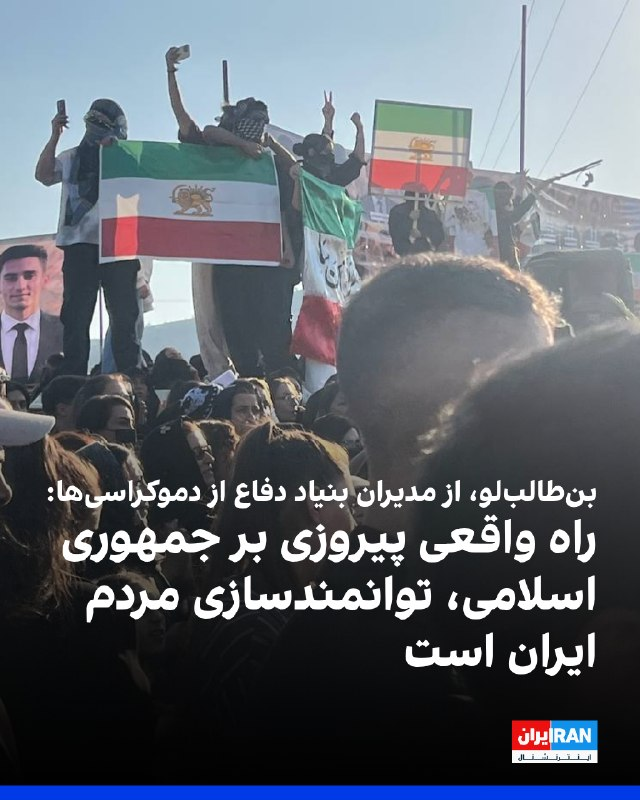

بهنام بن‌طالب‌لو، مدیر ارشد برنامه ایران در بنیاد دفاع از دموکراسی‌ها، به فاکس نیوز گفت: «راه واقعی پیروزی بر جمهوری اسلامی، فاصله گرفتن از میز مذاکره و تغییر معادله است؛ یعنی توانمندسازی مردم. حکومت ایران بیش از آنکه از بمب‌های اسرائیلی و آمریکایی بترسد، از مردم خود می‌ترسد.»
بن‌طالب‌لو افزود: «با جمهوری اسلامی نمی‌توان مذاکره کرد. می‌دانم ترامپ مذاکره‌کننده ارشد است، اما شاید این موردی باشد که او بیشتر باید در جایگاه فرمانده کل قوا عمل کند.»

https://iranintl.com/202605216082

## IranIntlTV — post 338177

  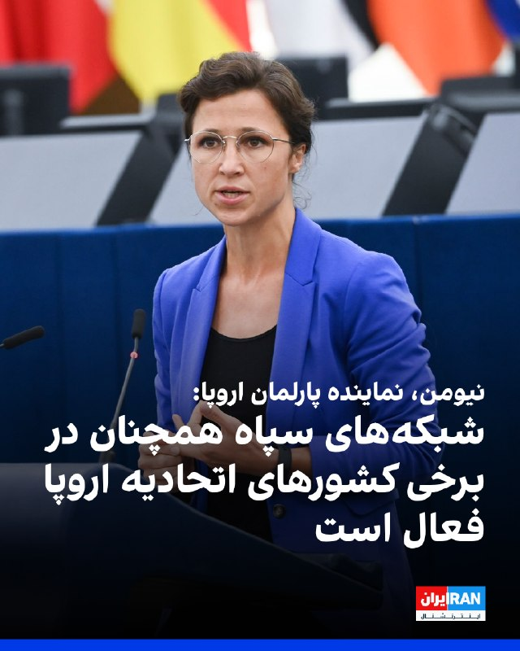

هانا نیومن، نماینده پارلمان اروپا، روز چهارشنبه گفت سپاه همچنان در فهرست گروه‌های تروریستی اتحادیه اروپا قرار دارد، اما «شبکه‌های آن همچنان در برخی کشورهای عضو فعال هستند.» او خواستار تلاش‌های بیشتر برای «خشکاندن منابع مالی، نفوذ و دامنه فعالیت‌های سپاه پاسداران در داخل اروپا» شد.
https://iranintl.com/202605217213

## IranIntlTV — post 338168

این زخم‌ها با گذشت زمان کوچک نمی‌شوند؛
در حافظه یک سرزمین می‌مانند، میان عکس‌های خانوادگی، مغازه‌های نیمه‌تعطیل، صندلی‌های خالی و رویاهایی که قرار بود تازه آغاز شوند. این نام‌ها، فقط متعلق به یک روز و یک خیابان نیستند؛ بخشی از نسلی‌اند که برای زندگی ایستاد و بهایش را با جان داد.
جاویدنامان انقلاب ملی ایرانیان:
مهدی اکرمی قدیرلی، امیرحسین بیاتی، شایان آزادی، علی آقاجانی، فرزین پوست‌آشکن دورکی، مجید زنگنه، امیرحسین جوادزاده و مهرشاد قائدی.
هر بار که این نام‌ها تکرار می‌شوند، یادآوری می‌شود پشت هر کدام، آینده‌ای بود که می‌توانست ادامه پیدا کند؛ آینده‌ای که با گلوله، بازداشت و پنهان‌کاری متوقف شد، اما از حافظه مردم پاک نشد.
#جاویدنامان_انقلاب_ملی_ایرانیان

## FarsiVOA — post 218271

  

⚡️فاکس‌نیوز در گزارشی درباره مجتبی خامنه‌ای، رهبر جدید جمهوری اسلامی نوشت که او نزدیک به سه ماه است که در بحبوحه تشدید تنش‌ها با آمریکا در مخفیگاه به سر می‌برد.
این گزارش به نقل از تحلیلگران مبارزه با تروریسم، می‌گوید که پنهان‌شدن مجتبی خامنه‌ای یادآور سال‌های پایانی عمر اسامه بن لادن، مغز متفکر گروه تروریستی القاعده، است که در خانه‌ای در پاکستان سال‌ها پنهان شده بود.
تشکیلات اطلاعاتی ایالات متحده سرانجام با ردیابی یکی از پیک‌های اسامه بن لادن محل زندگی او را شناسایی کرد و این امر منجر به حمله‌ی نیروی دریایی ایالات متحده در سال ۲۰۱۱ شد که به کشته شدن رهبر القاعده در مخفیگاهش انجامید.
@FarsiVOA

## FarsiVOA — post 218270

🔺مقام ارشد کاخ سفید: باقیمانده رهبران جمهوری اسلامی یک «انتخاب دوگانه» دارند، یا توافق یا مجازاتی بی‌مانند در تاریخ مدرن

▪️استیون میلر، از مقامات ارشد کاخ سفید، در مصاحبه‌ای تلویزیونی گفت باقی‌مانده رهبران جمهوری اسلامی، همانطور که رئيس جمهوری آمریکا، دونالد ترامپ، «خیلی روشن» گفته است با یک «انتخاب دوگانه» روبرو هستند: «یا می‌توانند با یک توافق‌نامه‌ای موافقت کنند که برای ایالات متحده رضایت‌بخش باشد، یا باید با مجازاتی از سوی ارتش ما روبه‌رو شوند؛ مجازاتی که مانندش در تاریخ مدرن دیده نشده است. این انتخابی است که پیش روی آن‌ها است.»

⬇️ بیشتر بخوانید:
https://ir.voanews.com/a/8152356.html
@FarsiVOA

## FarsiVOA — post 218269

⚡️نخستين نتیجه از سياست بستن تنگه، خفگى اقتصاد جمهورى اسلامى
@FarsiVOA

## FarsiVOA — post 218268

  <a href="telegram/content/FarsiVOA_218268_1779335159.mp4" target="_blank">🎬 Download video</a>

⚡️واکنش‌ها به سفر احتمالی طالبان به اروپا
@FarsiVOA

## FarsiVOA — post 218267

  <a href="telegram/content/FarsiVOA_218267_1779335160.mp4" target="_blank">🎬 Download video</a>

⚡️اعتراف کم‌سابقه رئیس دولت جمهوری اسلامی به بحران سوخت، آسیب به زیرساخت‌های انرژی، دشواری صادرات نفت و گرانی‌های پیش‌رو، شکاف میان روایت رسمی جمهوری اسلامی و واقعیت اقتصادی ایران را آشکارتر کرده است؛ وضعیتی که حتی بخشی از حاکمیت دیگر نمی‌تواند آن را پنهان کند.
@FarsiVOA

## FarsiVOA — post 218266

⚡️شب پرالتهاب عراق؛ از حملات پهپادی به مقرهای احزاب کرد تا طرح‌های بغداد برای نجات نفت و دیپلماسی
FarsiVOA

## FarsiVOA — post 218265

⚡️زوج‌ بریتانیایی که در زندان اوین محبوس هستند اعتصاب غذا کردند
@FarsiVOA

## Persian_Trend_Official — post 14566

  <a href="telegram/content/Persian_Trend_Official_14566_1779335160.mp4" target="_blank">🎬 Download video</a>

https://youtube.com/live/CCiwTJiy05Y?feature=share

## Persian_Trend_Official — post 14565

⭕️زمین‌لرزه ۴ ریشتری فراشبند فارس را لرزاند

🔹مرکز لرزه‌نگاری موسسه ژئوفیزیک دانشگاه تهران اعلام کرد، زمین‌لرزه‌ای به قدرت ۴ ریشتر ساعت ۳:۴۷ بامداد امروز -پنجشنبه- حوالی فراشبند استان فارس را لرزاند. این زمین‌لرزه در عمق ۱۰ کیلومتری زمین رخ داد.

🫆:Tony

📌 @persian_trend_official
پرشین ترند | متفاوت‌ترین کانال نظامی

## BBCPersian — post 281654

  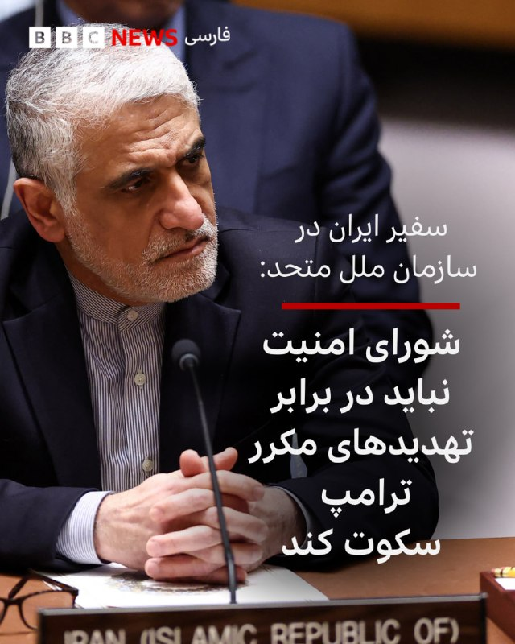

🔻امیر سعید ایروانی، نماینده دایمی ایران در سازمان ملل متحد روز چهارشنبه در سخنانی از انچه سکوت این شورا در برابر تهدیدهای مکرر رئیس جمهور آمریکا خواند، انتقاد کرد.

آقای ایروانی گفت: «شورای امنیت نباید در برابر تهدیدهای مکرر و روزانه رئیس جمهور ایالات متحده علیه ایران، از جمله تهدید صریح بمباران ایران و بازگرداندن ایران "به عصر حجر"، نابودی زیرساخت‌های انرژی، اقتصادی و صنعتی کشور، هدف قرار دادن دانشمندان هسته‌ای و مقامات ارشد ایران و حتی لفاظی‌ و تهدید بر نابودی تمدن ایران، ساکت یا بی‌تفاوت بماند.»

وی به اعضای سازمان ملل متحد هشدار داد که از نظر ایران سکوت در برابر وضعیت موجود ممکن است به تولد «رویه خطرناکی» شود که او «عادی‌سازی تهدید توسل به زور و اقدامات تجاوزکارانه» از سوی یک عضو دایم شورای امنیت خواند.

📸AFP via Getty Images
https://bbc.in/3RBVnzz
@BBCPersian

## BBCPersian — post 281653

  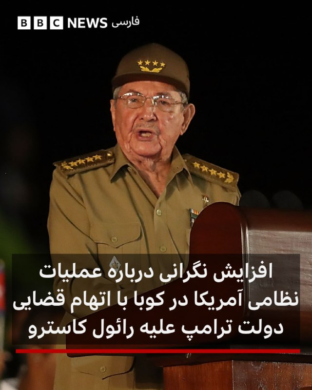

🔻ایالات متحده رائول کاسترو، رهبر پیشین کوبا، را به اتهام توطئه برای قتل شهروندان آمریکایی و چند اتهام دیگر در ارتباط با سرنگونی دو هواپیما در سال ۱۹۹۶ میان کوبا و فلوریدا متهم کرد.

پرونده‌ای که روز چهارشنبه علنی شد، آقای کاسترو و پنج نفر دیگر را به دست داشتن در سرنگونی هواپیماهای متعلق به گروه کوبایی-آمریکایی «برادران برای نجات» و کشته شدن چهار نفر، از جمله سه آمریکایی، متهم می‌کند.

رائول کاسترو که اکنون ۹۴ سال دارد، در آن زمان فرمانده نیروهای مسلح کوبا بود و پس از این حادثه با محکومیت بین‌المللی روبه‌رو شد. اتهام‌های جدید وزارت دادگستری آمریکا یکی از چهره‌های اصلی رهبری کمونیستی کوبا را هدف قرار داده؛ آن هم در شرایطی که هاوانا با فشار شدید واشنگتن برای انجام اصلاحات سیاسی و اقتصادی گسترده در نظام تک‌حزبی خود مواجه است.

در حالی که آمریکا در تلاش برای افزایش فشار بر حکومت کمونیستی کوباست، میگل دیاز-کانل، رئیس‌جمهور این کشور، این اتهام‌ها را «اقدامی سیاسی و فاقد هرگونه مبنای حقوقی» توصیف کرد.
ادامه مطلب⬇️
📸Getty Images
https://bbc.in/4dX0ItW
@BBCPersian

## BBCPersian — post 281652

  <a href="telegram/content/BBCPersian_281652_1779335162.mp4" target="_blank">🎬 Download video</a>

🔻وزارت دفاع بریتانیا اعلام کرد دو جنگنده روسی ماه گذشته «به‌طور مکرر و خطرناک» یک هواپیمای جاسوسی غیرمسلح نیروی هوایی سلطنتی بریتانیا را بر فراز دریای سیاه رهگیری کردند.

بر اساس این گزارش، یک جنگنده سوخو-۳۵ روسی به هواپیمای شناسایی «ریوت جوینت» نزدیک شد؛ به‌طوری که سامانه‌های اضطراری هواپیما فعال و خلبان خودکار آن غیرفعال شد.

همچنین یک جنگنده سوخو-۲۷ شش بار از مقابل هواپیمای بریتانیایی عبور کرد و در نزدیک‌ترین فاصله، تنها شش متر با دماغه آن فاصله داشت.

وزارت دفاع و وزارت خارجه بریتانیا از سفارت روسیه خواسته‌اند این حادثه را محکوم کند.

وزارت دفاع بریتانیا افزود این رهگیری‌ها در حالی رخ داده که رفتار تهاجمی روسیه در منطقه افزایش یافته است و به فعالیت‌های اخیر زیردریایی‌های روسیه در نزدیکی زیرساخت‌های حیاتی زیرآبی بریتانیا در دریای شمال اشاره کرد.

این حادثه در ادامه رویدادی مشابه در سپتامبر ۲۰۲۲ رخ می‌دهد؛ زمانی که یک خلبان «خودسر» روس تلاش کرد یک هواپیمای ریوت جوینت نیروی هوایی سلطنتی بریتانیا را بر فراز دریای سیاه سرنگون کند.
ادامه مطلب⬇️

🎥AFP
https://bbc.in/4fvWN8H
@BBCPersian

## BBCPersian — post 281651

  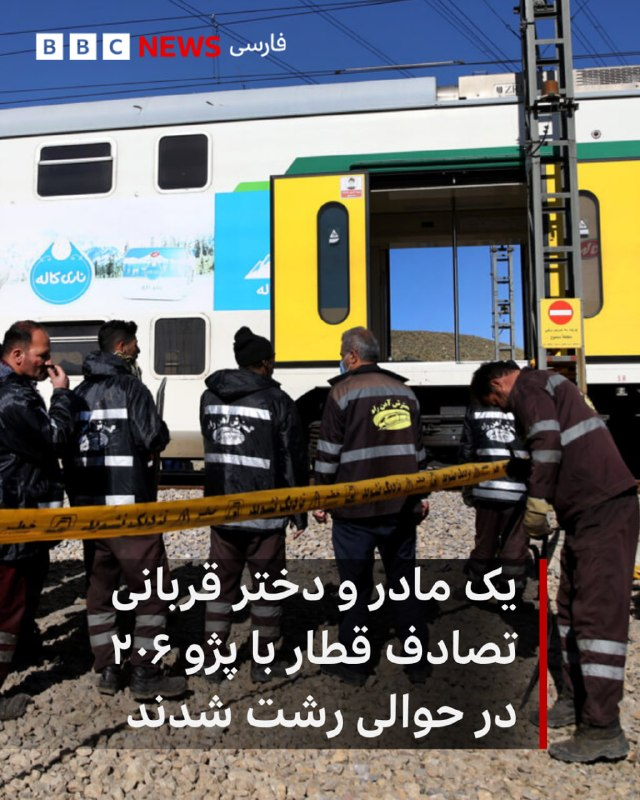

🔻یک مادر و دختر قربانی تصادف قطار با پژو ۲۰۶ در حوالی رشت شدند

در پی تصادف قطار با یک دستگاه خودرو در حوالی رشت دو سرنشین پژو ۲۰۶ که یک مادر و دختر بودند، جان باختند.

علیرضا پورسان، رئیس اورژانس استان گیلان روز چهارشنبه به خبرگزاری ایرنا گفت: «غروب ۳۰ اردیبهشت‌ماه، گزارشی مبنی بر تصادف شدید یک دستگاه خودروی سواری پژو ۲۰۶ با قطار در رشت_ جاده لاکان_ نرسیده به سه‌راه رضاپور، به مرکز اورژانس اعلام شد.»

به گفته این مقام امداد و نجات، با وجود انتقال مصدومان به بیمارستان، دو سرنشین خودرو که آقای پورسان یک «مادر ۴۵ ساله و دختر ۱۲ ساله» خوانده بر اثر شدت جراحات جان باختند.

📸IRNA
https://bbc.in/3Ps6Dhr
@BBCPersia

---
📅 بروزرسانی: 1405/02/31 03:22
---

## VahidOOnLine — post 241241

  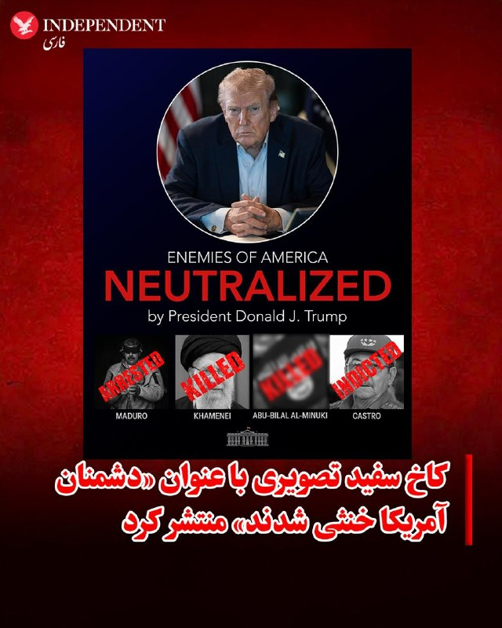

♦️ حساب رسمی کاخ سفید بامداد پنجشنبه ۳۱ اردیبهشت‌ماه، تصویری از دونالد ترامپ، رئیس‌جمهوری آمریکا، منتشر کرد که در آن زیر عنوان «دشمنان آمریکا خنثی شدند» تصاویری از نیکلاس مادورو، علی خامنه‌ای، ابوبلال المنوکی و رائول کاسترو دیده می‌شود.

در این تصویر، مقابل نام مادورو عبارت «بازداشت شد»، مقابل خامنه‌ای و ابوبلال المنوکی عبارت «کشته شد» و مقابل کاسترو عبارت «تحت پیگرد قضایی قرار گرفت» نوشته شده است.

در بخش بالای تصویر نیز عکسی از دونالد ترامپ با عبارت «توسط رئیس‌جمهوری دونالد ترامپ» دیده می‌شود.

نیکلاس مادورو در جریان یک عملیات نظامی در کاراکاس، در ۱۳ دی ۱۴۰۴ به دست نیروهای ویژه آمریکا بازداشت و به همراه همسرش، سیلیا فلورس، برای مواجهه با اتهام‌های فدرال به ایالات متحده منتقل شد.

علی خامنه‌ای، رهبر جمهوری اسلامی، روز ۹ اسفند ۱۴۰۴ در تهران و در جریان حملات هوایی اسرائیل به مقام‌های ارشد جمهوری اسلامی کشته شد؛ حملاتی که به گفته گزارش‌ها بخشی از یک عملیات مشترک آمریکا و اسرائیل بود.

در ۲۶ اردیبهشت ۱۴۰۵ نیز آمریکا و نیجریه عملیات مشترکی را علیه داعش غرب آفریقا و بوکوحرام آغاز کردند که در جریان آن ابوبلال المنوکی، از فرماندهان ارشد داعش غرب آفریقا، کشته شد.

چهارشنبه ۳۰ اردیبهشت‌ماه نیز وزارت دادگستری آمریکا علیه رائول کاسترو، رئیس‌جمهوری پیشین کوبا، به اتهام قتل و توطئه برای کشتن شهروندان آمریکایی اعلام جرم کرد.
ش
‌🇸🇦 Indypersian

🤖 @VahidOOnLine

## VahidOOnLine — post 241240

  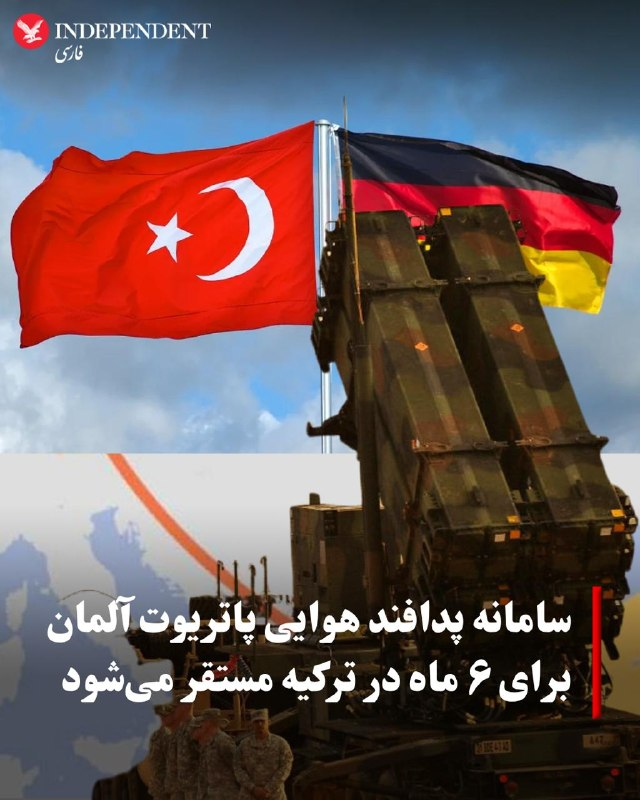

♦️ترکیه روز چهارشنبه ۳۰ اردیبهشت‌ماه اعلام کرد آلمان از ماه ژوئن یک سامانه دفاع موشکی پاتریوت را به مدت شش ماه در این کشور مستقر خواهد کرد تا جایگزین سامانه‌ قبلی ناتو شود.

سامانه دفاعی پیشین در چارچوب تدابیر ناتو در جنوب شرقی ترکیه و در بحبوحه جنگ برای تقویت پدافند هوایی مستقر شده بود.

پدافندهای ناتو در جریان جنگ، چهار موشک بالستیک شلیک‌شده از ایران را رهگیری و سرنگون کرده بودند.

وزارت دفاع ترکیه اعلام کرد یکی از دو سامانه پاتریوت اضافی ناتو که به دلیل درگیری‌های میان آمریکا، اسرائیل و ایران در منطقه مستقر شده بود، اکنون با سامانه آلمانی جایگزین خواهد شد.

این وزارتخانه افزود روند جایگزینی در ماه ژوئن تکمیل می‌شود و سامانه جدید حدود شش ماه عملیاتی خواهد بود.
‌🇸🇦 Indypersian

🤖 @VahidOOnLine

## VahidOOnLine — post 241239

  

♦️درحالی که دونالد ترامپ، رئیس‌جمهوری آمریکا بسیاری از گزارش‌هایی که به نقل از منابع ناشناس در رسانه‌ها از پشت‌پرده مذاکرات با تهران را رد کرده و آنها را به داستان‌سرایی متهم کرده است، اسرائیل هیوم به نقل از منابعی که آنها را افراد مطلع معرفی کرده، ادعا کرده است که پس از یک بحث داغ در کاخ سفید میان دونالد ترامپ و جی‌دی ونس، معاون رئیس‌جمهوری آمریکا، ترامپ تصمیم گرفت به مذاکرات با رژیم ایران فرصت دیگری بدهد. در این جلسه، وزیر جنگ و وزیر خارجه آمریکا نیز حضور داشتند و معتقد بودند بدون اعمال فشار گسترده‌تر، از جمله احتمال حمله نظامی و تحریم‌های شدیدتر، گرفتن امتیاز از تهران ممکن نیست.
در مقابل، ونس استدلال کرد که پیشنهاد جدید جمهوری اسلامی نشان‌دهنده انعطاف‌پذیری تهران است و می‌توان از طریق آن به یک توافق اولیه برای پایان دادن به درگیری‌ها رسید. هیوم ادعا می‌کند، استیو ویتکاف و جرد کوشنر نیز از موضع ونس حمایت کردند. آنها پیش از نشست، با رهبران عمان، قطر و عربستان سعودی گفتگو کرده بودند؛ کشورهایی که به نوشته هیوم مخالف ازسرگیری جنگ هستند.
هیوم در ادامه ادعا می‌کند که ترامپ از ونس و فرستادگانش انتقاد کرد که ویکردی در پیش گرفته‌اند که به رژیم ایران اجازه وقت‌کشی می‌دهد.
هم‌زمان، ترامپ با رهبران منطقه نیز گفتگو کرد.
هیوم می‌نویسد، در نهایت، ترامپ پس از گفتگو با نتانیاهو تصمیم گرفت مذاکرات ادامه پیدا کند.
‌🇸🇦 Indypersian

🤖 @VahidOOnLine

## VahidOOnLine — post 241238

  

اسرائیل هیوم به نقل از منابع آگاه گزارش داد جلسه‌ای که چهارشنبه در کاخ سفید درباره ایران برگزار شد، به تنش انجامید، اما ترامپ در نهایت، خلاف نظر وزیران جنگ و خارجه و همسو با دیدگاه جی‌دی ونس و فرستادگان ویژه‌اش، ادامه مذاکرات با جمهوری اسلامی را تایید کرد.
این روزنامه نوشت ارزیابی مارکو روبیو، وزیر امور خارجه، و پیت هگست، وزیر جنگ آمریکا، این بود که در این مرحله، بدون اعمال فشار قابل‌توجه، از جمله تهدید به حمله و تشدید تحریم‌های اقتصادی، نمی‌توان از جمهوری اسلامی امتیاز گرفت. در مقابل، ونس معتقد بود تازه‌ترین پیشنهاد تهران نشانه‌ای از انعطاف است و می‌تواند زمینه حرکت به سوی یک توافق اولیه را فراهم کند.
منابع آگاه از این جلسه به اسرائیل هیوم گفتند که استیو ویتکاف و جرد کوشنر، فرستادگان ویژه دونالد ترامپ نیز در این گفت‌وگو از موضع ونس حمایت کردند.
آنها پیش از این جلسه با رهبران عمان، قطر و عربستان سعودی گفت‌وگو کرده بودند.
به نوشته این رسانه تنش در این جلسه زمانی شدت گرفت که ترامپ از ونس و فرستادگان انتقاد و آنها متهم کرد که رویکردشان به جمهوری اسلامی امکان می‌دهد زمان بخرد و به تصویر ایالات متحده و نهاد ریاست
‌🏁 🇬🇧 IranintlTV

🤖 @VahidOOnLine

## WithYashar — post 11806

https://t.me/boost/withyashar

۵۰۲ بوس تا آزادی استیکز ثثحامله 😅😂

## mwarmonitor — post 9392

  <a href="telegram/content/mwarmonitor_9392_1779321181.mp4" target="_blank">🎬 Download video</a>

📝 اصلاً بوی زهمِ این بساط از فرسنگ‌ها داد می‌زند؛ شاهکارِ جدیدِ جماعتِ ارزشی مدار که کلِ جهان‌بینی‌شان از ناف به پایین خلاصه می‌شود. غرفه‌ی همسریابی کفِ خیابان! رسماً دکانِ چوب‌زدن و حراجِ غریزه راه انداخته‌اند، آن‌وقت اسمش را می‌گذارند «تسهیلِ ازدواجِ جوانان».

🔸فضا بیشتر شبیه به بازارِ هفتگیِ فروشِ احشام است تا کانونِ خانواده. یک طرف پسرک‌های هول و کفری که با هورمون‌های بالا زده، یقه غرفه‌دار را چسبیده‌اند که «پس کاتالوگِ سوگلی‌های مؤمنه چی شد؟»؛ یک طرف هم خانواده‌های متوهمی که مشخصاتِ دخترشان را آورده‌اند، اما از ترسِ چشم‌زخم، حتی اسمِ خریدار را هم نمی‌پرسند!

🔸تمام هنرِ این تفکرِ کپک‌زده، تنزل دادنِ شأنِ انسان به حدِ یک جفت‌گیریِ خیابانی و هول‌هولکی است. خب اگر خیلی نگرانِ جوششِ غریزه و کاهشِ جمعیتِ نظام هستید، تعارف را کنار بگذارید؛ همان‌جا وسطِ پیاده‌رو، بغلِ غرفهٔ آش و سیب‌زمینی، یک لاحاف تشک پهن کنید تا برادران و خواهرانِ بی‌تاب، کار را بی‌فوتِ وقت تمام کنند. واقعاً تف به این حجم از سقوط و لجن‌زارِ فرهنگی.

@mwarmonitor

## mwarmonitor — post 9391

🔴شبکه CBS گزارش داد: کار بر روی تدوین گزینه‌های نظامی علیه کوبا برای رئیس‌جمهور ترامپ آغاز شده و جامعه اطلاعاتی آمریکا در حال بررسی این است که کوبا چگونه ممکن است به یک اقدام نظامی آمریکا واکنش نشان دهد.

@mwarmonitor

## FoxNewsTwitter — post 342029

  <a href="telegram/content/FoxNewsTwitter_342029_1779321183.mp4" target="_blank">🎬 Download video</a>

Fox News (Twitter/X)

FOX NEWS REPORT: Former Cuban President Raúl Castro was indicted for allegedly ordering the 1996 attack on civilian airplanes that were rescuing people from the communist nation, leaving four people dead.
@BillMelugin_ has the latest.

## pm_afshaa — post 91138

  <a href="telegram/content/pm_afshaa_91138_1779321185.webm" target="_blank">🎬 Download video</a>

🔴توییت پیت هگست، وزیر جنگ آمریکا درباره ایران: قفل شده و آماده شلیک

💧 Rainbet.com the #1 Non-KYC Crypto Casino & Sportsbook @rainbetcom

😁 @Pm_Afshaa

## VahidOnline — post 75588

  <a href="telegram/content/VahidOnline_75588_1779321185.mp4" target="_blank">🎬 Download video</a>

'من وطن‌فروش نیستم... زنده باد جمهوری اسلامی... تا آخر کنار ولایت می‌مانیم... این پرچم با طوفان نمی‌افتد... سقوط این کشور را به گور خواهند برد... عزت این ملت معامله‌شدنی نیست راه مقاومت ادامه دارد...'

تبلیغ «وطن»دوستی در «کشور جمهوری اسلامی» با شهروندان وارداتی از 'عمان، سنگال، غنا، کنیا، بورکینافاسو، ساحل عاج، نیجریه، تانزانیا، مالی'

📡 @VahidOnline

## VahidOnline — post 75587

  

حساب رسمی کاخ سفید در شبکه اجتماعی ایکس، روز چهارشنبه ۳۰ اردیبهشت در پُستی، عکسی از رئيس جمهوری آمریکا، دونالد ترامپ را منتشر کرد که زیر آن تصاویری از «دشمنان خنثی‌شده آمریکا بدست پرزیدنت دونالد جی. ترامپ» دیده می‌شود.

در این پست تصاویری از علی خامنه‌‌ای رهبر کشته‌شده جمهوری اسلامی، نیکلاس مادورو رهبر دستگیر‌شده ونزوئلا، رائول کاسترو رهبر سابق کوبا، و ابو بلال المنوکی از رهبران داعش که به جای تصویرش پرچم داعش نشان داده شده، منتشر شده است.

کاخ سفید در مورد کاسترو، روی تصویر او نوشت که علیه او کیفرخواست صادر شده است. در مورد مادورو روی تصویر او نوشت که دستگیر شده است. و در مورد علی خامنه‌ای و ابو بلال المنوکی روی تصاویر آن‌ها نوشت که «کشته‌ شدند.»

حساب رسمی کاخ سفید افزود: «عدالت اجرا خواهد شد.»
@VahidHeadline

📡 @VahidOnline

## VahidOnline — post 75586

  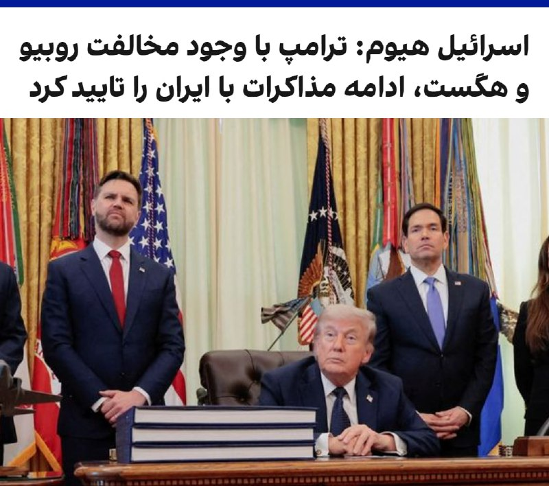

روزنامه اسرائیل هیوم به نقل از «منابع آگاه» نوشت جلسه چهارشنبه ۳۰ اردیبهشت در کاخ سفید درباره ایران با اختلاف‌نظر شدید میان مقام‌های ارشد دولت آمریکا همراه شد، اما رییس‌جمهوری آمریکا در نهایت، خلاف نظر وزیر جنگ و وزیر امور خارجه، و همسو با دیدگاه جی‌دی ونس و فرستادگان ویژه‌اش، ادامه مذاکرات با جمهوری اسلامی را تایید کرد.

این روزنامه راستگرا نوشت ارزیابی مارکو روبیو، وزیر امور خارجه، و پیت هگست، وزیر جنگ آمریکا، این بود که در این مرحله، بدون اعمال فشار قابل‌توجه، از جمله تهدید به حمله و تشدید تحریم‌های اقتصادی، نمی‌توان از جمهوری اسلامی امتیاز گرفت. در مقابل، ونس معتقد بود تازه‌ترین پیشنهاد تهران نشانه‌ای از انعطاف است و می‌تواند زمینه حرکت به سوی یک توافق اولیه را فراهم کند.

منابع آگاه از این جلسه به اسرائیل هیوم گفتند که استیو ویتکاف و جرد کوشنر، فرستادگان ویژه دونالد ترامپ نیز در این گفت‌وگو از موضع ونس حمایت کردند.

آنها پیش از این جلسه با رهبران عمان، قطر و عربستان سعودی گفت‌وگو کرده بودند.

به نوشته این رسانه تنش در این جلسه زمانی شدت گرفت که ترامپ از ونس و فرستادگان انتقاد و آنها متهم کرد که رویکردشان به جمهوری اسلامی امکان می‌دهد زمان بخرد و به تصویر ایالات متحده و نهاد ریاست‌جمهوری آسیب بزند. ونس با لحنی قاطع پاسخ داد که دولت باید به دنبال پایان دادن به این کارزار نظامی، بازگرداندن سربازان به خانه، کاهش قیمت نفت و تمرکز بر مشکلات داخلی آمریکا باشد؛ پاسخی که حاضران را غافلگیر کرد.

اسرائیل هیوم در ادامه این گزارش به گفت‌وگوی ترامپ با رهبران منطقه اشاره کرد و به نقل از دو منبع نوشت که رهبران اسرائیل و امارات متحده عربی، همزمان با تاکید بر ضرورت حفاظت از تاسیسات حساس خود در قبال حملات احتمالی جمهوری اسلامی، از پیش گرفتن «سیاست‌های سخت‌گیرانه» علیه جمهوری اسلامی حمایت می‌کنند.

در مقابل، رهبران عربستان سعودی و قطر ترجیح می‌دهند از بازگشت به درگیری‌ها پرهیز شود.

این روزنامه همچنین به نقل از یک مقام آمریکایی درباره تماس تلفنی ترامپ با نخست‌وزیر اسرائیل نوشت که نتانیاهو از رفتار جمهوری اسلامی و احتمال وقت‌کشی تهران ابراز سرخوردگی کرد، در حالی که ترامپ بر پیچیدگی شرایط و دشواری‌هایی پیشِ رو تاکید داشت. با این حال رییس‌جمهوری آمریکا بار دیگر گفت که به رفع تهدید هسته‌ای حکومت ایران متعهد است.
@VahidOOnLine

📡 @VahidOnline

## kianmeli1 — post 87526

  

‏🔴کاخ سفید در پیامی در شبکه ایکس با انتشار تصویری از علی خامنه‌ای، نیکلاس مادورو، رائول کاسترو و ابو بلال المینوکی، نفر دوم داعش، نوشت: «عدالت اجرا خواهد شد.» بر روی عکس این افراد در این تصویر نوشته شده خامنه‌ای کشته شده، مادورو بازداشت شده، المینوکی کشته شده و کاسترو تحت تعقیب است
https://t.me/kianmeli1

## IranIntlTV — post 338167

  

🔻سردار آزمون در یادداشتی در صفحه اینستاگرام خود نوشت: «من هميشه با افتخار برای تيم ملی كشورم بازی كردم. وقتی می‌برديم، به خودم و هم‌تيمی‌هام افتخار می كردم و وقتی نمی‌برديم مثل همه آنها ناراحت‌ترين آدم دنيا بودم. من عاشق فوتبال هستم و عاشق مردم خوب و شايسته كشورم ايران.»

🔹مهاجم تیم ملی با اشاره به سابقه خود در این تیم نوشت: «وقتی پيراهن تيم ملی كشورم را پوشيدم، به خودم قول دادم هر بار كه برای ايران بازی می كنم، با تمام وجود تلاش كنم تا باعث خوشحالی مردمی كه با عشق فوتبال را دنبال می كنند بشوم، بخصوص بچه‌هایی كه توی دورترين شهرها و روستاها با پيروزی ما خوشحال می‌شوند.»

🔹او که به دلیل مواضع ضد حکومتی خود پس از انقلاب ملی ایرانیان و جنگ اخیر از تیم ملی کنار گذاشته شد، با آرزوی موفقیت برای بازیکنان و کادر فنی تیم ملی «مخصوصا امیرخان» در جام جهانی ۲۰۲۶، نوشت: «من فوتباليستم و عاشق فوتبال و هر چيزی كه در زندگی به دست آوردم اول لطف خدا بوده و بعد زحمت و تلاش و حمايت و محبت مردم عزيز و به خاطر همين عشق هميشه قدردان مردم كشورم هستم.»

🔹جزییات بیشتر را در سایت بخوانید.

@iranintltvsport

## IranIntlTV — post 338166

  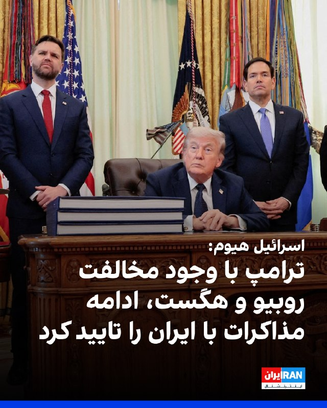

اسرائیل هیوم به نقل از منابع آگاه گزارش داد جلسه‌ای که چهارشنبه در کاخ سفید درباره ایران برگزار شد، به تنش انجامید، اما ترامپ در نهایت، خلاف نظر وزیران جنگ و خارجه و همسو با دیدگاه جی‌دی ونس و فرستادگان ویژه‌اش، ادامه مذاکرات با جمهوری اسلامی را تایید کرد.
این روزنامه نوشت ارزیابی مارکو روبیو، وزیر امور خارجه، و پیت هگست، وزیر جنگ آمریکا، این بود که در این مرحله، بدون اعمال فشار قابل‌توجه، از جمله تهدید به حمله و تشدید تحریم‌های اقتصادی، نمی‌توان از جمهوری اسلامی امتیاز گرفت. در مقابل، ونس معتقد بود تازه‌ترین پیشنهاد تهران نشانه‌ای از انعطاف است و می‌تواند زمینه حرکت به سوی یک توافق اولیه را فراهم کند.
منابع آگاه از این جلسه به اسرائیل هیوم گفتند که استیو ویتکاف و جرد کوشنر، فرستادگان ویژه دونالد ترامپ نیز در این گفت‌وگو از موضع ونس حمایت کردند.
آنها پیش از این جلسه با رهبران عمان، قطر و عربستان سعودی گفت‌وگو کرده بودند.
به نوشته این رسانه تنش در این جلسه زمانی شدت گرفت که ترامپ از ونس و فرستادگان انتقاد و آنها متهم کرد که رویکردشان به جمهوری اسلامی امکان می‌دهد زمان بخرد و به تصویر ایالات متحده و نهاد ریاست‌جمهوری آسیب بزند. ونس با لحنی قاطع پاسخ داد که دولت باید به دنبال پایان دادن به این کارزار نظامی، بازگرداندن سربازان به خانه، کاهش قیمت نفت و تمرکز بر مشکلات داخلی آمریکا باشد؛ پاسخی که حاضران را غافلگیر کرد.

## FarsiVOA — post 218264

⚡️ترامپ به جمهوری اسلامی: برای جلوگیری از درگیری نظامی به پیشنهاد توافق پاسخ مثبت دهید
@FarsiVOA

## FarsiVOA — post 218262

🔺حساب رسمی کاخ سفید عکس «علی خامنه‌ای» را در میان «دشمنان خنثی‌‌شده آمریکا به دست پرزیدنت ترامپ» منتشر کرد

▪️حساب رسمی کاخ سفید در شبکه اجتماعی ایکس، روز چهارشنبه ۳۰ اردیبهشت در پُستی، عکسی از رئيس جمهوری آمریکا، دونالد ترامپ را منتشر کرد که زیر آن تصاویری از «دشمنان خنثی‌شده آمریکا بدست پرزیدنت دونالد جی. ترامپ» دیده می‌شود.

⬇️ بیشتر بخوانید:
https://ir.voanews.com/a/8152146.html
@FarsiVOA

## FarsiVOA — post 218261

  

⚡️پیت هگست، وزیر جنگ آمریکا، عصر چهارشنبه ویدیویی از سخنان اخیر جی‌دی ونس، معاون رئیس‌جمهوری آمریکا در مورد «گزینه ب» واشنگتن در صورت شکست مذاکرات با جمهوری اسلامی را بازنشر کرد و در شبکه اجتماعی ایکس نوشت: «آماده برای شلیک»
@FarsiVOA

## IranianMinds — post 20473

  

‏🔴 کاخ سفید در پیامی در شبکه ایکس با انتشار تصویری از علی خامنه‌ای، نیکلاس مادورو، رائول کاسترو و ابو بلال المینوکی، نفر دوم داعش، نوشت: «عدالت اجرا خواهد شد.» بر روی عکس این افراد در این تصویر نوشته شده خامنه‌ای کشته شده، مادورو بازداشت شده، المینوکی کشته شده و کاسترو تحت تعقیب است

@IranianMinds

## IranianMinds — post 20472

  <a href="telegram/content/IranianMinds_20472_1779321189.webm" target="_blank">🎬 Download video</a>

⭕️ #بدون_واریز ، ۵۰۰هزارتومان جایزه بگیر.

💲همین حالا میتونی با عضویت پولتو بگیری و‌شرط ببندی 
🤗

🎉 500 هزارتومن بونوس رایگان فقط با ثبت نام بدون هیچگونه واریزی!

⌛ پشتیبانی 24 ساعته

💰پرداخت مستقیم و سریع بدون واسطه، بدون دردسر، واریز و برداشت در سریع‌ترین زمان ممکن

☑️ کانال تلگرام: 

➡️ @winro_io  

🎁 هدیه خود را با ثبت نام در سایت دریافت کنید: 

➡️ Winro.io
A30
سایت اصلی در روزهای آینده بازگشایی خواهد شد A
🟢

## IranianMinds — post 20471

  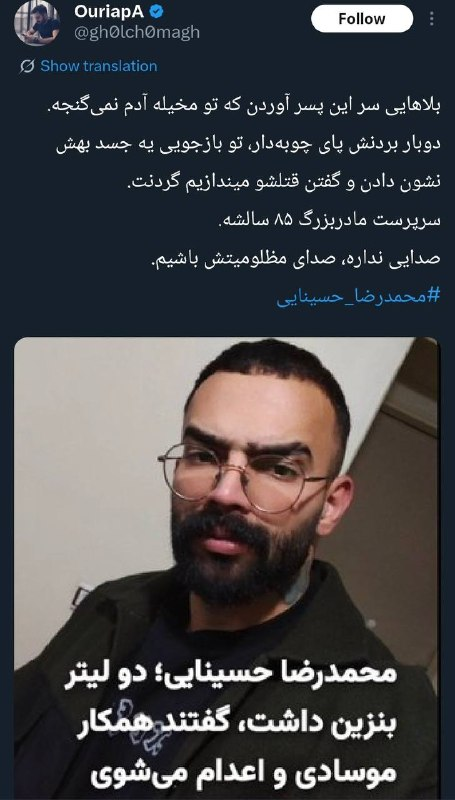

@IranianMinds

## BBCPersian — post 281649

⠀⠀⠀سردار آزمون، گلزن سرشناس تیم ملی فوتبال ایران که از فهرست این تیم برای جام جهانی
پیش رو خط خورده است با ارسال پستی در اینستاگرم برای تیم ملی کشورش آرزوی موفقیت کرده است.

مهاجم ۳۱ ساله باشگاه شباب الاهلی در لیگ برتر امارت که به عنوان بهترین گلزن در ترکیب تیم ملی ایران مشهور است به عنوان دومین گلزن برتر تاریخ تیم ملی پس از علی دایی شناخته می‌شود.

گفته شده آزمون به دلایل «غیر فنی» به اردو تیم ملی دعوت نشده است؛ دلایلی چون انتشار تصاویر دیدار او با مقامات اول حکومت امارات در روزهای نخست جنگ ۳۹ روزه. این دیدار را آزمون در آن زمان در صفحه کاربری اینستاگرم خود منتشر کرد و این موجب خشم تندروهای ایرانی و تقاضا برای تعلیق وی و حتی ضبط اموال او در ایران شد.

📸GettyImages/ sardar_azmoun / Instgram
https://bbc.in/3Rhx9ux
@BBCPersian

## BBCPersian — post 281648

  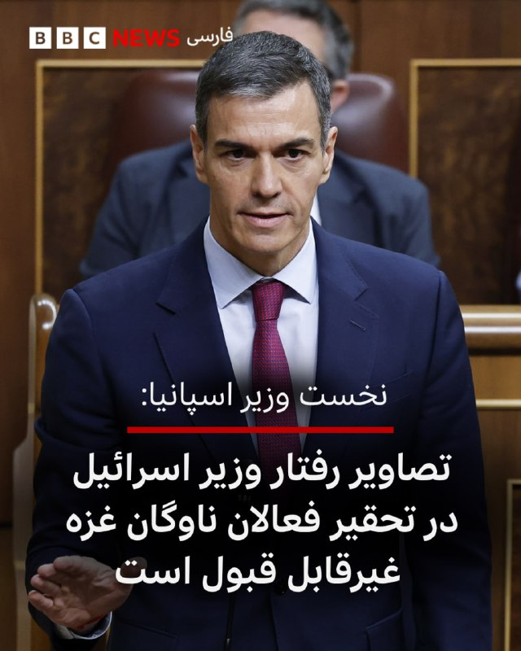

🔻پدرو سانچز، نخست‌وزیر اسپانیا، در واکنشی تند به برخورد تند و خشن وزیر امنیت ملی اسرائیل با فعالان ناوگان بشردوستانه غزه گفته تلاش خواهد کرد اتحادیه اروپا را برای تحریم برخی از اعضای تندور دولت اسرائیل، مجاب کند.

آقای سانچز روز چهارشنبه در حساب ایکس خود نوشت:

«تصاویر مربوط به تحقیر اعضای ناوگان بین‌المللی حامی غزه توسط وزیر اسرائیلی، بن گویر، غیرقابل قبول است. ما تحمل نخواهیم کرد که با شهروندان‌مان بدرفتاری شود. در ماه سپتامبر، ممنوعیت ورود این عضو دولت اسرائیل به خاک کشورمان را اعلام کردم. اکنون نیز در بروکسل تلاش خواهیم کرد این تحریم‌ها در سریع‌ترین زمان ممکن به سطح اتحادیه اروپا گسترش یابد.»

📸EPA/Shutterstock
https://bbc.in/4dViGx1
@BBCPersian

## Dirty_Kids — post 389855

  <a href="telegram/content/Dirty_Kids_389855_1779321191.webm" target="_blank">🎬 Download video</a>

☢️خفن ترین و‌ قدیمی ترین  انالیزور  ایران ینی دکتر بت 
👍 
🔴هیچ سایت بتی دوست نداره شما کانال دکتر بت رو پیدا کنین چون خیلی سود میکنید🤷‍♂ رایگان بهترین شرط هارو براتون میذاره حتی هزار تومن هم دریافت نمیکنه روزانه میتونی از پیش بینی فوتبال باهاش پول در بیاری…

## Dirty_Kids — post 389854

  <a href="telegram/content/Dirty_Kids_389854_1779321191.webm" target="_blank">🎬 Download video</a>

☢️خفن ترین و‌ قدیمی ترین  انالیزور  ایران ینی دکتر بت 
👍

🔴هیچ سایت بتی دوست نداره شما کانال دکتر بت رو پیدا کنین چون خیلی سود میکنید🤷‍♂

رایگان بهترین شرط هارو براتون میذاره
حتی هزار تومن هم دریافت نمیکنه
روزانه میتونی از پیش بینی فوتبال باهاش پول در بیاری 👌
A30
اگ اهل پیش بینی فوتبالی این کانال اصلا از دست ندین👇

✅https://t.me/+4_ADqwB9e-QwYjlk

✅https://t.me/+4_ADqwB9e-QwYjlk

## Dirty_Kids — post 389853

  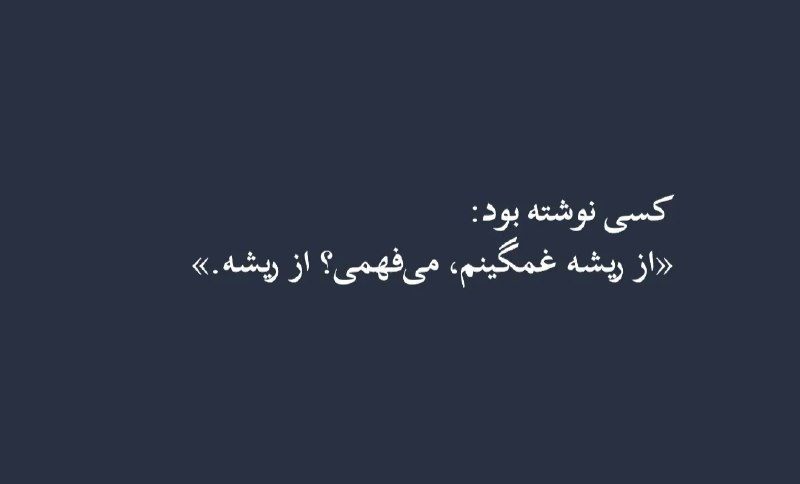

#بخوابیم

@Dirty_Kids 👻

## Dirty_Kids — post 389852

این خبر احمدی‌نژاد یه چیزی تو مایه‌های ماجرای مهران مدیری بود که با قایق رفته بود دنبال علی کریمی.

@Dirty_Kids 👻

## Dirty_Kids — post 389851

دیگه چیزی‌ نمونده که جوون ایرانی تجربه نکرده باشه جز یک چیز. شادی. شادی رو هنوز تجربه نکردیم.

@Dirty_Kids 👻

## Dirty_Kids — post 389850

  <a href="telegram/content/Dirty_Kids_389850_1779321192.mp4" target="_blank">🎬 Download video</a>

ازدواج آسان

اینا اصلا موشعلی و مقوایی اینارو یادشون رفته
افتادن به مقاومت جنسی.
فکر کن هر شب میرن پرچم تکون میدن واسه پایین تنه.🤣🤣

@Dirty_Kids 👻

## Dirty_Kids — post 389849

  <a href="telegram/content/Dirty_Kids_389849_1779321194.mp4" target="_blank">🎬 Download video</a>

مود: 🦦

@Dirty_Kids 👻

## Dirty_Kids — post 389848

  

🔴 طبق مطالعات جدید کسایی که دائم از بقیه غلط املایی میگیرن، دچار اختلال روانی ان.

@Dirty_Kids 👻

## Dirty_Kids — post 389847

  <a href="telegram/content/Dirty_Kids_389847_1779321196.mp4" target="_blank">🎬 Download video</a>

این صحبت ترامپ ارزش داره چندین بار ببینیش:

@Dirty_Kids 👻

## alonews — post 121450

  <a href="telegram/content/alonews_121450_1779321197.webm" target="_blank">🎬 Download video</a>

👈یدیعوت آحارونوت: مقامات اسرائیل از اقدامات ترامپ راضی نیستند

✅ @AloNews خبر جنگ

## alonews — post 121448

  <a href="telegram/content/alonews_121448_1779321197.webm" target="_blank">🎬 Download video</a>

👈کانال 14 اسرائیل: ایران و ایالات متحده امشب از طریق واسطه‌های پاکستانی نزدیک‌ترین پیش‌نویس‌های پیشنهادی خود را مبادله کردند. هر دو کشور فردا جزئیات را بررسی خواهند کرد

✅ @AloNews خبر جنگ

---
📅 بروزرسانی: 1405/02/31 01:58
---

## VahidOOnLine — post 241237

  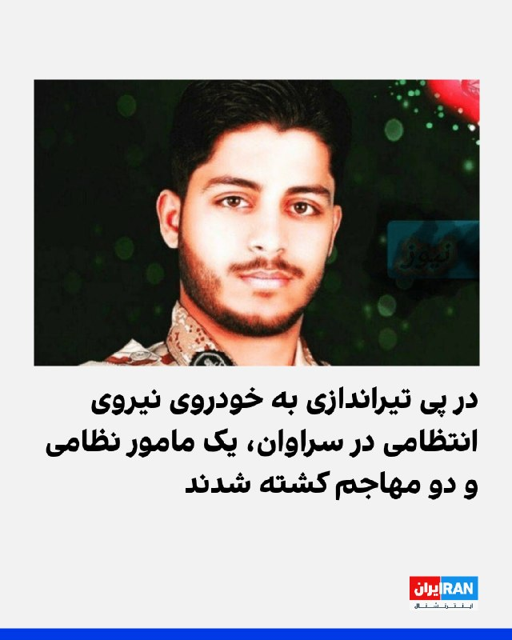

به گزارش رسانه‌های ایران، چهارشنبه در پی تیراندازی سرنشینان مسلح یک خودروی پژو به خودروی نیروهای انتظامی در یکی از جاده‌های اطراف سراوان، یک نیروی نظامی به نام امیرحسین شهرکی و دو نفر از مهاجمان کشته شدند.
بر اساس این گزارش‌ها، پس از این درگیری، سلاح، مهمات و یک دستگاه استارلینک کشف و خودروی مهاجمان توقیف شد. تلاش‌ها برای شناسایی و بازداشت دیگر مهاجمان ادامه دارد.

‌🏁 🇬🇧 IranintlTV

🤖 @VahidOOnLine

## VahidOOnLine — post 241236

  <a href="telegram/content/VahidOOnLine_241236_1779316109.mp4" target="_blank">🎬 Download video</a>

جاویدنام سینا عباسی؛
جوان ۲۲ ساله‌ای از کرمانشاه که هشتم دی ۱۴۰۴ در جریان اعتراضات میدان انقلاب، بر اثر ضربات باتوم به سر جان باخت.
با گذشت ماه‌ها، هنوز نامش جایی ثبت نشده…
و خانواده‌اش فقط می‌خواهند صدای سینا شنیده شود.»
‌🏁 🇬🇧 ManotoTV

🤖 @VahidOOnLine

## VahidOOnLine — post 241235

  <a href="telegram/content/VahidOOnLine_241235_1779316110.mp4" target="_blank">🎬 Download video</a>

‌
«نهاد مدیریت آبراه خلیج فارس» با انتشار نقشه‌ای در شبکه اکس «محدوده نظارتی مدیریت» جمهوری اسلامی در تنگه هرمز را تعیین کرد.

بر اساس متن این نقشه، محدوده مورد نظر در شرق تنگه از خط اتصال «کوه مبارک» در ایران به جنوب فجیره در امارات متحده عربی، و در غرب تنگه از خط اتصال انتهای جزیره قشم به ام‌القوین در امارات تعیین شده است.

در این بیانیه آمده است تردد در این محدوده برای عبور از تنگه هرمز باید «با هماهنگی مدیریت آبراه خلیج فارس و مجوز این نهاد» انجام شود.

در نقشه منتشرشده، بخش وسیعی از آب‌های اطراف تنگه هرمز (محدوده قرمز) با عنوان «محدوده تحت نظارت نیروهای مسلح ایران» مشخص شده است.
‌🏁 🇬🇧 ManotoTV

🤖 @VahidOOnLine

## VahidOOnLine — post 241234

♦️نارندرا مودی، نخست وزیر هند، با انتشار تصاویری از اجرای رقص پنج زن ایتالیایی در حساب کاربری خود در اکس نوشت: «دیدن علاقه جهانی به فرم‌های رقص هندی واقعا شگفت‌انگیز است.» این هنرمندان ایتالیایی به مناسبت سفر رسمی مودی به رم و برای خوش‌آمدگویی به او، ترکیبی از رقص‌های سنتی «کوچی‌پودی»، «بهاراتاناتیام» و «کاتاک» را اجرا کردند؛ هنرمندانی که پس از این اجرا اعلام کردند احساسات بسیار عمیقی داشتند و مودی نیز شخصا از عملکرد عالی آن‌ها تقدیر کرده است. نخست وزیر هند در بخش دیگری از این سفر دیپلماتیک، به همراه همتای ایتالیایی خود، جورجیا ملونی، از بنای تاریخی کولوسئوم در رم بازدید کرد؛ سفری که ملونی با انتشار پیامی در شبکه اجتماعی اکس و با عبارت «دوست من، به رم خوش آمدی»، استقبال گرمی از آن به عمل آورد. این سفر، نخستین سفر یک نخست‌وزیر هند به ایتالیا در ۲۶ سال گذشته است.
‌🇸🇦 Indypersian

🤖 @VahidOOnLine

## VahidOOnLine — post 241233

  <a href="telegram/content/VahidOOnLine_241233_1779316111.mp4" target="_blank">🎬 Download video</a>

♦️وزارت دفاع بریتانیا چهارشنبه ۳۰ اردیبهشت‌ماه اعلام کرد یک فروند هواپیمای شناسایی «ریوت جوینت» نیروی هوایی سلطنتی در حریم هوایی بین‌المللی بر فراز دریای سیاه با مزاحمت و رهگیری جنگنده‌های روسیه روبه‌رو شده است.

بر اساس بیانیه لندن، جنگنده‌های روسی تا فاصله شش متری به هواپیمای بریتانیایی نزدیک شدند و سامانه‌های اضطراری داخل هواپیما فعال شد.

در تصاویر منتشرشده از سوی وزارت دفاع بریتانیا، جنگنده‌های روسیه در فاصله‌ای بسیار نزدیک کنار هواپیمای شناسایی بریتانیا دیده می‌شوند.

بریتانیا اعلام کرد این هواپیما در حال انجام ماموریتی عادی در حمایت از عملیات ناتو بوده و خدمه آن با وجود «مانورهای بی‌پروا» ماموریت خود را با امنیت کامل به پایان رساندند.

وزارت دفاع بریتانیا همچنین این حادثه را نشانه ادامه افزایش فعالیت‌های نظامی روسیه در اروپای شرقی و مناطق شمالی توصیف کرد.
‌🇸🇦 Indypersian

🤖 @VahidOOnLine

## VahidOOnLine — post 241232

۴۰ روز مادری؛ مراقبت انسانی، نمایش عاطفه و پرسش‌های اخلاقی

نعیمه دوستدار- روایت زنی جوان که برای مدتی کوتاه سرپرستی یک نوزاد را بر عهده داشت، به یکی از بحث‌برانگیزترین موضوعات شبکه‌های اجتماعی فارسی‌زبان تبدیل شد. روایتی که با لحنی احساسی و الهام‌بخش منتشر شد، خیلی زود به موجی از نقدهای اخلاقی، روانشناختی و سیاسی دامن زد.
ماجرا از انتشار روایت‌های سارا کنعانی، فعال فضای مجازی، درباره حضور موقت یک نوزاد در خانه‌اش آغاز شد. او در اینستاگرام و ایکس از تجربه «مادری موقت» نوشت. تجربه‌ای که در قالب طرح «میزبان» سازمان بهزیستی انجام شد.
رسانه‌های حکومتی در ایران، از جمله خبرگزاری جمهوری اسلامی (ایرنا) و روزنامه همشهری، این روایت را با ادبیاتی احساسی و تصویری بازنشر کردند. تصاویری از خانه، آغوش، گریه هنگام جدایی و توصیف‌هایی از «۴۰ روز مادری».
تصاویر بدون حجاب کنعانی در ایرنا منتشر شد و کاربران مدتی بعد خبر از دسترس خارج شدن این خبرگزاری را منتشر کردند.
اما آنچه ابتدا برای بخشی از کاربران تصویری انسانی از مراقبت از کودک بی‌سرپرست به نظر می‌رسید، برای گروهی دیگر به پرسشی جدی درباره مرز میان حمایت از کودک و تبدیل کودک به «محتوا» بدل شد.
https://www.iranintl.com/fa/202605197267

‌🏁 🇬🇧 IranintlTV

🤖 @VahidOOnLine

## VahidOOnLine — post 241231

  

♦️خبرگزاری تسنیم، وابسته به سپاه پاسداران، چهارشنبه‌شب ۳۰ اردیبهشت‌ماه اعلام کرد «نهاد مدیریت آبراه خلیج فارس» محدوده نظارتی جمهوری اسلامی در تنگه هرمز را تعیین کرده است.

بر اساس نقشه منتشرشده، محدوده شرقی این منطقه از خط اتصال «کوه مبارک» در ایران تا جنوب فجیره در امارات متحده عربی و محدوده غربی آن از انتهای جزیره قشم تا ام‌القوین در امارات تعیین شده است.

در متن منتشرشده آمده است عبور از تنگه هرمز در این محدوده باید «با هماهنگی مدیریت آبراه خلیج فارس و مجوز این نهاد» انجام شود.

در نقشه منتشرشده، بخش وسیعی از آب‌های اطراف تنگه هرمز با عنوان «محدوده تحت نظارت نیروهای مسلح جمهوری اسلامی» مشخص شده است.
‌🇸🇦 Indypersian

🤖 @VahidOOnLine

## WithYashar — post 11802

وزیر کشور پاکستان با احمد وحیدی، فرمانده سپاه پاسداران در تهران دیدار کرد.
@withyashar
یکی اینو آخرش از سولاخ کشید بیرون دیگه مابقی با موساده 😅

## WithYashar — post 11801

ادعای «میدل ایست آی»: دونالد ترامپ، حمله برنامه‌ریزی‌شده به ایران را در این هفته به تعویق انداخت، چراکه متحدان عرب و مقامات دولت خودش به او هشدار دادند در ایام حج، جنگ را از سر نگیرد. به گفته دو مقام ارشد کشورهای حوزه خلیج‌فارس، به ترامپ گفته شده بود که حمله…

## mwarmonitor — post 9390

  

✈️۴ فروند هواپیمای سوخت‌رسان هوایی KC-46A Pegasus نیروی هوایی آمریکا از اسرائیل به پرواز درآمده‌اند و بر اساس داده‌های فلایت‌رادار بر فراز عربستان سعودی و عراق شناسایی شده‌اند.

@mwarmonitor

## mwarmonitor — post 9389

📝 سوال، انتقاد ، پیشنهاد ، دایرکت به گوشم

## mwarmonitor — post 9388

🔴هدف این تلاش جدید این است که تعهدات ملموس‌تری از سوی ایران درباره گام‌های مربوط به برنامه هسته‌ای‌اش به دست آید، و همچنین جزئیات بیشتری از سوی آمریکا درباره این‌که چگونه دارایی‌های مسدودشده ایران به‌تدریج آزاد خواهند شد، ارائه شود؛ یک مقام عربی گفت. باراک راوید

@mwarmonitor

## mwarmonitor — post 9387

🇮🇷🇺🇸ایالات متحده و ایران در حال گفت‌وگو درباره یک «نقشه راه » برای دور جدیدی از مذاکرات هستند که قرار است محورهای مورد بحث را مشخص کند؛ مذاکراتی که ترامپ پیش‌تر گفته بود در اسلام‌آباد برگزار خواهد شد—اگر ایران آماده گفت‌وگو درباره کنار گذاشتن جاه‌طلبی‌های هسته‌ای خود باشد. نیویورک پست

@mwarmonitor

## mwarmonitor — post 9386

  

⁉️سوال زیادی در مورد موقعیت ناو boxer پرسیده بودید

🔸اقیانوس هند
۱۵ می ۲۰۲۶ (۲۵ اردیبهشت ۱۴۰۵)

📷عکس از: سرجوخه ترنت ای. هنری
یگان یازدهم اعزامی تفنگداران دریایی 11th MEU

🔸یک ملوان آمریکایی مستقر در کشتی بالگردبر و آب‌خاکی کلاس واسپ، یو‌اس‌اس باکسر (LHD 4)، در حال نظارت بر یک جنگنده F-35B لایتنینگ ۲ متعلق به اسکادران ۱۲۲ حمله جنگنده‌ای تفنگداران دریایی (VMFA-122)، یگان یازدهم اعزامی تفنگداران دریایی، در جریان عملیات پروازی در اقیانوس هند در تاریخ ۱۵ می ۲۰۲۶ است.

🔸یگان 11th MEU که بر روی ناوگروه آماده آب-خاکی باکسر (Boxer ARG) مستقر شده است، یک نیروی مداوم و با توان رزمی معتبر است که به بازدارندگی و پاسخ به بحران‌ها در منطقه عملیاتی ناوگان هفتم نیروی دریایی آمریکا کمک می‌کند. ناوگان هفتم ایالات متحده، به عنوان بزرگ‌ترین ناوگان شماره‌گذاری‌شده و فرامرزی نیروی دریایی آمریکا، به طور منظم با متحدان و شرکای خود تعامل و عملیات انجام می‌دهد تا امنیت و پایداری یک منطقه آزاد و باز در هند-آرام (ایندو-پاسیفیک) را حفظ کند.

@mwarmonitor

## mwarmonitor — post 9385

  

🔴به نظر می‌رسد نخست وزیر هند در مسیر بازگشت از اروپا، به‌طور کامل از خاورمیانه اجتناب می‌کند. عجیب است که او حتی از حریم هوایی عربستان هم عبور نکرده است.

@mwarmonitor

## mwarmonitor — post 9384

🇺🇸مقامات فدرال آمریکا در حال بررسی معاملاتی مشکوک در بازار نفت به ارزش ۸۰۰ میلیون دلار هستند که درست پیش از انتشار خبرهای مهم مربوط به جنگ ایران انجام شده است؛ موضوعی که یک گزارش آن را فاش کرده است. نیویورک پست

@mwarmonitor

## mwarmonitor — post 9383

🔴فیننشال تایمز: ارزشمندترین شرکت جهان (اینویدیا) پیش‌بینی کرده است که فروش آن در سه‌ماهه جاری به ۹۱ میلیارد دلار برسد؛ رقمی که به‌طور قابل توجهی بالاتر از میانگین انتظار وال‌استریت (۸۶ میلیارد دلار بر اساس داده‌های Visible Alpha) است، اما از خوش‌بینانه‌ترین پیش‌بینی‌ها کمتر است.

@mwarmonitor

## FoxNewsTwitter — post 342028

  <a href="telegram/content/FoxNewsTwitter_342028_1779316113.mp4" target="_blank">🎬 Download video</a>

Fox News (Twitter/X)

WATCH: Boos break out during former Google CEO Eric Schmidt’s commencement speech after he addressed fears about AI reshaping the workforce.

“There is a fear in your generation that the future has already been written... The question is not whether AI will shape the world. It will. The question is whether you will help shape artificial intelligence."

Schmidt said those concerns are “rational” as AI rapidly transforms industries, but pushed graduates to help build the future instead of rejecting the technology outright — prompting audible boos from some in the crowd.

## pm_afshaa — post 91137

  <a href="telegram/content/pm_afshaa_91137_1779316115.webm" target="_blank">🎬 Download video</a>

🔴امروز وزیر کشور پاکستان با احمد وحیدی، فرمانده سپاه پاسداران در تهران دیدار کرد.

💧 Rainbet.com the #1 Non-KYC Crypto Casino & Sportsbook @rainbetcom

😁 @Pm_Afshaa

## pm_afshaa — post 91136

  <a href="telegram/content/pm_afshaa_91136_1779316115.mp4" target="_blank">🎬 Download video</a>

🎙 خبرنگار: پیامت به خانواده‌های آمریکایی که از هوش مصنوعی می‌ترسن چیه؟ اونا نگرانن بچه‌هاشون تو آینده کار نداشته باشن.

جواب کاملا مرتبط و منطقی ترامپ:
هوش مصنوعی فوق‌العاده‌ست و ایران نباید سلاح هسته‌ای داشته باشه!

💧 Rainbet.com the #1 Non-KYC Crypto Casino & Sportsbook @rainbetcom

😁 @Pm_Afshaa

## pm_afshaa — post 91135

  <a href="telegram/content/pm_afshaa_91135_1779316117.webm" target="_blank">🎬 Download video</a>

🔴میدل ایست آی: سه منبع گفتن که انتظار دارن جنگ در هفته‌های آینده و پس از پایان دوره حج، از سر گرفته بشه. آمریکا از سیگنال‌های فریبنده استفاده کرده تا سعی کنه طرف مقابل رو دچار احساس امنیت کاذب کنه. 
💧 Rainbet.com the #1 Non-KYC Crypto Casino & Sportsbook…

## pm_afshaa — post 91134

  <a href="telegram/content/pm_afshaa_91134_1779316117.webm" target="_blank">🎬 Download video</a>

🔴میدل ایست آی: سه منبع گفتن که انتظار دارن جنگ در هفته‌های آینده و پس از پایان دوره حج، از سر گرفته بشه.

آمریکا از سیگنال‌های فریبنده استفاده کرده تا سعی کنه طرف مقابل رو دچار احساس امنیت کاذب کنه.

💧 Rainbet.com the #1 Non-KYC Crypto Casino & Sportsbook @rainbetcom

😁 @Pm_Afshaa

## IranIntlTV — post 338165

  <a href="telegram/content/IranIntlTV_338165_1779316118.mp4" target="_blank">🎬 Download video</a>

انتشار قانون جدید طالبان درباره طلاق موجی از نگرانی درباره وضعیت حقوق زنان و احتمال تشدید کودک‌همسری در افغانستان ایجاد کرده است.

براساس این قانون، سکوت یک دختر هنگام جاری شدن خطبه عقد، به معنای رضایتش برای ازدواج تلقی می‌شود.

گفت‌وگو با راضیه دانش، عضو تحریریه ایران‌اینترنشنال
@iranintltv

## IranIntlTV — post 338164

  <a href="telegram/content/IranIntlTV_338164_1779316119.mp4" target="_blank">🎬 Download video</a>

مسعود پزشکیان، رییس دولت در جمهوری اسلامی، با تایید آسیب دیدن بخشی از زیرساخت‌های انرژی جمهوری اسلامی در جریان حملات آمریکا و اسرائیل، از ناتوانی دولت در تامین و واردات بنزین خبر داد.

گفت‌وگو با مهدی مصلحی، کارشناس بازار نفت
@iranintltv

## IranIntlTV — post 338163

  <a href="telegram/content/IranIntlTV_338163_1779316121.mp4" target="_blank">🎬 Download video</a>

سنای آمریکا طرح پایان دادن به جنگ با ایران را با ۵۰ رای در برابر ۴۷ رای یک گام به پیش برد.

رسانه‌ها این اقدام را ضربه‌ای سیاسی به دونالد ترامپ توصیف کرده‌اند.

گزارش مرضیه حسینی، خبرنگار ایران‌اینترنشنال
@iranintltv

## IranIntlTV — post 338162

  <a href="telegram/content/IranIntlTV_338162_1779316122.mp4" target="_blank">🎬 Download video</a>

مراد ویسی، تحلیل‌گر ارشد ایران‌اینترنشنال، گفت: «صف بنزین در بندرعباس، شهری که بخش بزرگی از بنزین کشور را تولید می‌کند، نشانه‌ای از شدت گرفتن کمبود بنزین و بحرانی عمیق‌تر از روایت‌ دولت است. در صورت گسترش جنگ و حمله به زیرساخت‌های انرژی، خطر شکل‌گیری ابر بحران بنزین و برق در کشور وجود دارد.»
@iranintltv

## IranIntlTV — post 338161

  <a href="https://t.me/IranintlTV/338161" target="_blank">📎 Download file</a>

🎧نسخه صوتی سیاست با مراد ویسی: چهارمین جنگ یا توافق در آخرین لحظه؟
@iranintlTV

## IranIntlTV — post 338160

  <a href="telegram/content/IranIntlTV_338160_1779316124.mp4" target="_blank">🎬 Download video</a>

آکسیوس گزارش داد دونالد ترامپ در گفت‌وگوی تلفنی با بنیامین نتانیاهو از کار میانجی‌ها روی یک «تفاهم اولیه» خبر داده که قرار است آمریکا و ایران آن را امضا کنند تا جنگ به‌صورت رسمی پایان یابد و دوره ۳۰ روزه مذاکرات آغاز شود.

گفت‌وگو با فرزین ندیمی، پژوهشگر امور دفاعی و امنیتی
@iranintltv

## IranIntlTV — post 338159

  

به گزارش رسانه‌های ایران، چهارشنبه در پی تیراندازی سرنشینان مسلح یک خودروی پژو به خودروی نیروهای انتظامی در یکی از جاده‌های اطراف سراوان، یک نیروی نظامی به نام امیرحسین شهرکی و دو نفر از مهاجمان کشته شدند.
بر اساس این گزارش‌ها، پس از این درگیری، سلاح، مهمات و یک دستگاه استارلینک کشف و خودروی مهاجمان توقیف شد. تلاش‌ها برای شناسایی و بازداشت دیگر مهاجمان ادامه دارد.

https://iranintl.com/202605200267

## IranIntlTV — post 338158

  <a href="telegram/content/IranIntlTV_338158_1779316126.mp4" target="_blank">🎬 Download video</a>

دونالد ترامپ گفت ایران باید تنگه هرمز را باز نگه دارد. او با اشاره به شرایط دشوار زندگی در ایران افزود خشم و ناآرامی زیادی در کشور وجود دارد.

همزمان آکسیوس گزارش داد تماس تلفنی ترامپ و نتانیاهو درباره جمهوری اسلامی پرتنش بوده است.

گزارش اردوان روزبه، خبرنگار ایران‌اینترنشنال
@iranintltv

## IranIntlTV — post 338157

  <a href="telegram/content/IranIntlTV_338157_1779316127.mp4" target="_blank">🎬 Download video</a>

مراد ویسی، تحلیل‌گر ارشد ایران‌اینترنشنال، گفت: «تشکیل تدریجی صف برای برخی کالاها، از جمله بنزین و نان، در شهرهای مختلف به مساله‌ای تازه در زندگی روزمره مردم تبدیل شده، صف‌هایی که نشانه کمبود و اختلال در تامین برخی کالاها پس از جنگ اخیر هستند. گزارش‌هایی از شهرهایی مانند اصفهان، مشهد، بندرعباس و اراک از طولانی شدن صف بنزین و نان و مشکلات تأمین بنزین و آرد خبر می‌دهد.»
@iranintltv

## IranIntlTV — post 338156

  <a href="telegram/content/IranIntlTV_338156_1779316128.mp4" target="_blank">🎬 Download video</a>

مراد ویسی، تحلیل‌گر ارشد ایران‌اینترنشنال، گفت: «ترامپ گفته فقط چند روز دیگر برای توافق با جمهوری اسلامی فرصت خواهد داد. او گفته الان سوال اصلی این است که جمهوری اسلامی سند توافق را امضا خواهد کرد یا ما کار را تمام خواهیم کرد. طبق گفته ترامپ همه چیز باید تا یکشنبه روشن شود اما تجارب تاریخی نشان داده سیاست بالا و پایین بسیار دارد.»
@iranintltv

## IranIntlTV — post 338155

۴۰ روز مادری؛ مراقبت انسانی، نمایش عاطفه و پرسش‌های اخلاقی

نعیمه دوستدار- روایت زنی جوان که برای مدتی کوتاه سرپرستی یک نوزاد را بر عهده داشت، به یکی از بحث‌برانگیزترین موضوعات شبکه‌های اجتماعی فارسی‌زبان تبدیل شد. روایتی که با لحنی احساسی و الهام‌بخش منتشر شد، خیلی زود به موجی از نقدهای اخلاقی، روانشناختی و سیاسی دامن زد.
ماجرا از انتشار روایت‌های سارا کنعانی، فعال فضای مجازی، درباره حضور موقت یک نوزاد در خانه‌اش آغاز شد. او در اینستاگرام و ایکس از تجربه «مادری موقت» نوشت. تجربه‌ای که در قالب طرح «میزبان» سازمان بهزیستی انجام شد.
رسانه‌های حکومتی در ایران، از جمله خبرگزاری جمهوری اسلامی (ایرنا) و روزنامه همشهری، این روایت را با ادبیاتی احساسی و تصویری بازنشر کردند. تصاویری از خانه، آغوش، گریه هنگام جدایی و توصیف‌هایی از «۴۰ روز مادری».
تصاویر بدون حجاب کنعانی در ایرنا منتشر شد و کاربران مدتی بعد خبر از دسترس خارج شدن این خبرگزاری را منتشر کردند.
اما آنچه ابتدا برای بخشی از کاربران تصویری انسانی از مراقبت از کودک بی‌سرپرست به نظر می‌رسید، برای گروهی دیگر به پرسشی جدی درباره مرز میان حمایت از کودک و تبدیل کودک به «محتوا» بدل شد.

https://www.iranintl.com/fa/202605197267

## Shin_Persian — post 6119

  

U.S. Central Command ✓ @CENTCOM
Wed, 20 May 2026 22:20:46 UTC

A U.S. Air Force B-1B Lancer refuels from a KC-135 Stratotanker during a training flight over regional waters in the Middle East.

فارسی

یک فروند بی-۱بی لنسر نیروی هوایی ایالات متحده (USAF) در جریان یک پرواز آموزشی بر فراز آب‌های منطقه در خاورمیانه، از یک کی‌سی-۱۳۵ استراتوتانکر سوخت‌گیری می‌کند.

𝕏 · @shin_persian

## Shin_Persian — post 6118

Shin ✓ @hey_itsmyturn
Wed, 20 May 2026 22:03:08 UTC

Jet activity over Daraa, #Syria 🇸🇾

فارسی

فعالیت جت‌ها برفراز درعا، #Syria 🇸🇾

𝕏 · @shin_persian

## ManotoTV — post 105706

  <a href="telegram/content/ManotoTV_105706_1779316130.mp4" target="_blank">🎬 Download video</a>

جاویدنام سینا عباسی؛
جوان ۲۲ ساله‌ای از کرمانشاه که هشتم دی ۱۴۰۴ در جریان اعتراضات میدان انقلاب، بر اثر ضربات باتوم به سر جان باخت.
با گذشت ماه‌ها، هنوز نامش جایی ثبت نشده…
و خانواده‌اش فقط می‌خواهند صدای سینا شنیده شود.»

## ManotoTV — post 105705

  <a href="telegram/content/ManotoTV_105705_1779316131.mp4" target="_blank">🎬 Download video</a>

‌
«نهاد مدیریت آبراه خلیج فارس» با انتشار نقشه‌ای در شبکه اکس «محدوده نظارتی مدیریت» جمهوری اسلامی در تنگه هرمز را تعیین کرد.

بر اساس متن این نقشه، محدوده مورد نظر در شرق تنگه از خط اتصال «کوه مبارک» در ایران به جنوب فجیره در امارات متحده عربی، و در غرب تنگه از خط اتصال انتهای جزیره قشم به ام‌القوین در امارات تعیین شده است.

در این بیانیه آمده است تردد در این محدوده برای عبور از تنگه هرمز باید «با هماهنگی مدیریت آبراه خلیج فارس و مجوز این نهاد» انجام شود.

در نقشه منتشرشده، بخش وسیعی از آب‌های اطراف تنگه هرمز (محدوده قرمز) با عنوان «محدوده تحت نظارت نیروهای مسلح ایران» مشخص شده است.

## FarsiVOA — post 218260

🔺آمریکا علیه رهبر سابق کوبا کیفرخواست صادر کرد؛ رائول کاسترو متهم به قتل شد

▪️دادستان‌های فدرال آمریکا روز چهارشنبه اعلام کردند که علیه رائول کاسترو، رئیس‌جمهوری پیشین کوبا، به اتهام نقش داشتن در سرنگونی هواپیماهای غیرنظامی در سال ۱۹۹۶ پرونده کیفری تشکیل داده‌اند. این هواپیماها مورد استفاده تبعیدی‌هایی کوبایی‌تبار ساکن میامی در آمریکا بود.

⬇️ بیشتر بخوانید:
https://ir.voanews.com/a/8152139.html
@FarsiVOA

## FarsiVOA — post 218259

🔺وزیر خزانه‌داری آمریکا با وزیر دارایی قطر در مورد لزوم حفظ فشار بر جمهوری اسلامی صحبت کرد

▪️وزیر خزانه‌داری آمریکا، اسکات بسنت، روز چهارشنبه ۳۰ اردیبهشت اعلام کرد که با وزیر علی احمد الکواری وزیر دارایی قطر در پاریس دیدار و گفت‌وگو کرده است.

⬇️ بیشتر بخوانید:
https://ir.voanews.com/a/8152133.html
@FarsiVOA

## Persian_Trend_Official — post 14564

  <a href="telegram/content/Persian_Trend_Official_14564_1779316132.mp4" target="_blank">🎬 Download video</a>

▪️شبی پر از آرامش برای شما آرزومندم 🫶

🫆:Tony

📌 @persian_trend_official
پرشین ترند | متفاوت‌ترین کانال نظامی

## Persian_Trend_Official — post 14563

⭕️ رائول کاسترو متهم به قتل شد 💢دادستان‌های فدرال آمریکا روز چهارشنبه اعلام کردند که علیه رائول کاسترو، رئیس‌جمهوری پیشین کوبا، به اتهام نقش داشتن در سرنگونی هواپیماهای غیرنظامی در سال ۱۹۹۶ پرونده کیفری تشکیل داده‌اند. این هواپیماها مورد استفاده تبعیدی‌هایی…

## Persian_Trend_Official — post 14562

  <a href="telegram/content/Persian_Trend_Official_14562_1779316133.webm" target="_blank">🎬 Download video</a>

⭕️ رائول کاسترو متهم به قتل شد

💢دادستان‌های فدرال آمریکا روز چهارشنبه اعلام کردند که علیه رائول کاسترو، رئیس‌جمهوری پیشین کوبا، به اتهام نقش داشتن در سرنگونی هواپیماهای غیرنظامی در سال ۱۹۹۶ پرونده کیفری تشکیل داده‌اند. این هواپیماها مورد استفاده تبعیدی‌هایی کوبایی‌تبار ساکن میامی در آمریکا بود.

🫆:Tony

📌 @persian_trend_official
پرشین ترند | متفاوت‌ترین کانال نظامی

## Persian_Trend_Official — post 14561

  <a href="telegram/content/Persian_Trend_Official_14561_1779316134.webm" target="_blank">🎬 Download video</a>

نسخه صوتی لایو امشب در اسپاتیفای : https://open.spotify.com/episode/4ZyN11ARn9PzPUowsFbzbh?si=w_I-pR9MRMyUKElfOPbe8Q

## Persian_Trend_Official — post 14560

  

🔴 هالیوود فیلمی درباره عملیات نجات خلبانان آمریکایی در ایران می‌سازد

💢به گزارش ددلاین، استودیوی «یونیورسال پیکچرز» و «مایکل بی» کارگردان مشهور آمریکایی، در حال ساخت فیلمی درباره نجات دو نیروی هوایی آمریکا در ایران پس از سرنگونی جنگنده F-15E Strike Eagle آن‌ها در جریان عملیات «خشم حماسی» هستند.

🔻بر اساس این گزارش:

▪️ فیلم بر پایه کتابی از «میچل زاکف» که قرار است در سال ۲۰۲۷ منتشر شود ساخته خواهد شد
▪️ مایکل بی اعلام کرده طی سال‌های فعالیتش همکاری «شگفت‌انگیزی» با وزارت جنگ آمریکا و ارتش این کشور داشته است
▪️ این موضوع احتمال همکاری مستقیم پنتاگون با پروژه را تقویت می‌کند

مایکل بی درباره این پروژه گفت:

▪️ فیلم روی نیروهایی تمرکز دارد که یکی از «پیچیده‌ترین و پرریسک‌ترین عملیات‌های تاریخ معاصر» را انجام داده‌اند

🫆:Tony

📌 @persian_trend_official
پرشین ترند | متفاوت‌ترین کانال نظامی

## IranianMinds — post 20470

  

🔴نهاد مدیریت آبراه خلیج ‌فارس که به تازگی اعلام موجودیت کرده است، می‌گوید یک منطقه دریایی کنترل شده در تنگه هرمز ایجاد کرده است.

@IranianMinds

## BBCPersian — post 281646

🔻قاآنی: جنگ باعث شد اسرائیل سریع‌تر به «نقطه پایان نزدیک شود»

اسماعیل قاآنی، فرمانده نیروی قدس سپاه پاسداران در اظهاراتی جدید که خبرگزاری‌های نزدیک به سپاه منتشر کرده‌اند به تحولات روز واکنش نشان داده است از جمله به حرکت ناوگان بشردوستانه به سمت غزه که متوقف کردن آن و برخورد خشن و تحقیر آمیز وزیر امنیت ملی اسرائیل با یکی از دهها فعال ناوگان صمود آن امروز خبر ساز شده است.

آقای قاآنی گفته آنچه او دستاورهای ناوگان صمود خوانده «ادامه» خواهد داشت و از نظر او: «فلسطین را باز به کانون توجه جهانیان بازگرداند. رژیم صهیونسیتی مغلوب را که به تشدید سرکوب و جنایاتگری دست زده، سریعتر از قبل به نقطه پایان نزدیک کرد.»

نیروی قدس سپاه پاسداران که پیش از آقای قاآنی، قاسم سلیمانی برای سالها فرماندهی آن را در دست داشت، شاخه برون مرزی سپاه پاسداران است و بازوری اصلی حکومت در ایران برای هماهنگی و کنترل و حمایت از نیروهای نیابتی آن در منطقه محسوب می‌شود.

این بخش از سپاه پاسداران از سال‌ها قبل در فهرست سازمان‌های تروریستی آمریکا و چند کشور غربی دیگر قرار گرفته است.

https://bbc.in/4upkbJS
@BBCPersian

## BBCPersian — post 281645

  

🔻نشریه آمریکایی اکسیوس از تماس تلفنی روز گذشته - سه‌شنبه ۲۹ اردیبهشت - میان دونالد ترامپ و بنیامین نتانیاهو بر سر ایران خبر داده که به نوشته این رسانه، «پرتنش» بوده و نخست‌وزیر اسرائیل را «بسیار برآشفته» است.

باراک راوید، خبرنگار اکسیوس در گزارش روز چهارشنبه خود نوشته که این اطلاعات را سه منبع مطلع دریافت کرده است هر چند نام آنها را ذکر نکرده است.

به گفته این باراک راوید: «بنیامین نتانیاهو نسبت به مذاکرات به‌شدت بدبین است و خواهان ازسرگیری جنگ برای تضعیف بیشتر توانایی‌های نظامی ایران و ضربه زدن به حکومت از طریق نابودی زیرساخت‌های حیاتی آن است.»

بر اساس آنچه اکسیوس گزارش کرده در برابر این موضع نخست‌وزیر اسرائیل، دونالد ترامپ «معتقد است که امکان دستیابی به توافق وجود دارد، اما اگر چنین توافقی حاصل نشود، آماده ازسرگیری جنگ است.»

📸GettyImages
https://bbc.in/49Zp2sK
@BBCPersian

## Dirty_Kids — post 389846

  

سرانجام بخت زیبای خفته‌ی عرزشی‌ها هم باز شد @Dirty_Kids 👻

## Dirty_Kids — post 389845

  <a href="telegram/content/Dirty_Kids_389845_1779316136.mp4" target="_blank">🎬 Download video</a>

سرانجام بخت زیبای خفته‌ی عرزشی‌ها هم باز شد

@Dirty_Kids 👻

## Dirty_Kids — post 389841

حاصل خالی گذاشتن سکوهای ورزشگاه جام جهانی قطر شد:
حضور ‎#پرستوهای_رژیم به اسم «نماینده ی ملت ایران» با هد بند و پرچم!
آخوندها هم به دنیا گفتند: ببینید مردم ایران چقدر آزادند و حامی و دوستدار حکومت میباشند!!

تبلیغات جمهوری اسلامی در جام جهانی قطر دقیقا ۴ سال جنایت و فلاکت و شکنجه و غارت ایران و همچنین ۴۰ هزار کشته فقط در ۲ روز واسمون هزینه ایجاد کرد!!
این بار فریب نخوریم و با برنامه پیش بریم.

@Dirty_Kids 👻

## Dirty_Kids — post 389840

  <a href="telegram/content/Dirty_Kids_389840_1779316137.mp4" target="_blank">🎬 Download video</a>

چالش "دوربین‌به‌کون" هم تازه راه افتاده

@Dirty_Kids 👻

## manototv — post 105706

  <a href="telegram/content/manototv_105706_1779316138.mp4" target="_blank">🎬 Download video</a>

جاویدنام سینا عباسی؛
جوان ۲۲ ساله‌ای از کرمانشاه که هشتم دی ۱۴۰۴ در جریان اعتراضات میدان انقلاب، بر اثر ضربات باتوم به سر جان باخت.
با گذشت ماه‌ها، هنوز نامش جایی ثبت نشده…
و خانواده‌اش فقط می‌خواهند صدای سینا شنیده شود.»

## manototv — post 105705

  <a href="telegram/content/manototv_105705_1779316140.mp4" target="_blank">🎬 Download video</a>

‌
«نهاد مدیریت آبراه خلیج فارس» با انتشار نقشه‌ای در شبکه اکس «محدوده نظارتی مدیریت» جمهوری اسلامی در تنگه هرمز را تعیین کرد.

بر اساس متن این نقشه، محدوده مورد نظر در شرق تنگه از خط اتصال «کوه مبارک» در ایران به جنوب فجیره در امارات متحده عربی، و در غرب تنگه از خط اتصال انتهای جزیره قشم به ام‌القوین در امارات تعیین شده است.

در این بیانیه آمده است تردد در این محدوده برای عبور از تنگه هرمز باید «با هماهنگی مدیریت آبراه خلیج فارس و مجوز این نهاد» انجام شود.

در نقشه منتشرشده، بخش وسیعی از آب‌های اطراف تنگه هرمز (محدوده قرمز) با عنوان «محدوده تحت نظارت نیروهای مسلح ایران» مشخص شده است.

## alonews — post 121445

  <a href="telegram/content/alonews_121445_1779316140.webm" target="_blank">🎬 Download video</a>

👈کلاهبرداری صرافی #رمزینکس
⁉️

🔴پیام مخاطب:

با سلام
من در تاریخ ۶ فروردین ۳۰۰ ملیون معامله اهرمی در نماد تتر گلد صرافی رمزینکس داشتم در عرض چند ثانیه قیمت از ۱۷هزار به یک هزار سقوط کرد و دوباره برگشت همه معاملات اهرمی پودر شدند با پشتیبانی هرچقدر پیگیری کردیم آخرش میگن که شما ریسک معاملاتی رو پذیرفته اید یا بعضا قبول میکنن قصوراتشون رو ولی جبران خسارت نمیکنن خواهشا اطلاع رسانی کنید تا بقیه تو دام این کلاهبرداران کثیف نیوفتن وسط جنگ از این شرایط سو استفاده میکنن و پول ملت رو بالا میکشن و هیچ مسؤولیتی رو گردن نمیگیرن.

🔴این اقدام صرافی رمزینکس مصداق بارز اخلال در نظام اقتصادی و سواستفاده از شرایط جنگی است

✅ @AloNews خبر جنگ

## alonews — post 121444

  <a href="telegram/content/alonews_121444_1779316140.webm" target="_blank">🎬 Download video</a>

👈دوستان این تبلیغاتی که پائین کانال نمایش داده میشه توسط تلگرامه و دست ما نیست و کلاهبرداری هست و فریب نخورید

✅ @AloNews خبر جنگ

## alonews — post 121443

  <a href="telegram/content/alonews_121443_1779316140.mp4" target="_blank">🎬 Download video</a>

👈شاخص پیتزا تو اطراف پنتاگون رفت بالا

✅ @AloNews خبر جنگ

## alonews — post 121442

  <a href="telegram/content/alonews_121442_1779316141.mp4" target="_blank">🎬 Download video</a>

👈خبرنگار: پیامت به خانواده‌های آمریکایی که از هوش مصنوعی می‌ترسن چیه؟ اونا نگرانن بچه‌هاشون تو آینده کار نداشته باشن.

🔴جواب کاملا مرتبط و منطقی ترامپ:
ایران نباید سلاح هسته‌ای داشته باشه!

✅ @AloNews خبر جنگ

## alonews — post 121441

  <a href="telegram/content/alonews_121441_1779316143.mp4" target="_blank">🎬 Download video</a>

👈 وزیر بهداشت و خدمات انسانی آر‌اف‌کِی جونیور: من همیشه در اطراف دختران جوان زیادی هستم و همه آنها در آن بخش از زندگی خود واقعا دیوانه به نظر می رسند

✅ @AloNews خبر جنگ

## alonews — post 121440

  <a href="telegram/content/alonews_121440_1779316144.webm" target="_blank">🎬 Download video</a>

👈بزرگترین کشتی جنگی ژاپن برای آموزش F-35B با تفنگداران دریایی آمریکا آماده میشه - USNI

✅ @AloNews خبر جنگ

## alonews — post 121439

  <a href="telegram/content/alonews_121439_1779316144.webm" target="_blank">🎬 Download video</a>

👈وزیر امور خارجه مارکو روبیو:
اشتباهی نباشد: ایالات متحده به طور قاطع از دولت قانونی و قانون اساسی بولیوی حمایت می‌کند.

🔴ما اجازه نخواهیم داد که جنایتکاران و قاچاقچیان مواد مخدر رهبران منتخب دموکراتیک در نیمکره ما را سرنگون کنند.

✅ @AloNews خبر جنگ

## alonews — post 121438

  <a href="telegram/content/alonews_121438_1779316144.webm" target="_blank">🎬 Download video</a>

👈زاکانی شهردار تهران: آمریکا ته زورشو زد و دیگه جرات حمله نداره

✅ @AloNews خبر جنگ

## alonews — post 121437

  <a href="telegram/content/alonews_121437_1779316144.webm" target="_blank">🎬 Download video</a>

👈اوکراین تعداد زیادی پهپاد به سمت غرب روسیه و کریمه پرتاب کرده است

✅ @AloNews خبر جنگ

---
📅 بروزرسانی: 1405/02/31 00:28
---

## VahidOOnLine — post 241230

  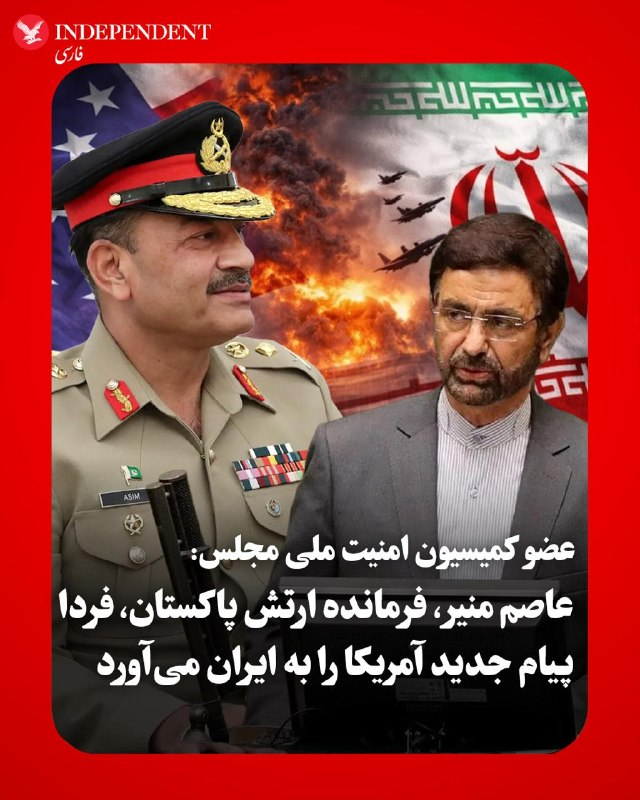

♦️به گزارش انتخاب، فداحسین مالکی، عضو کمیسیون امنیت ملی و سیاست خارجی مجلس، چهارشنبه‌شب ۳۰ اردیبهشت‌ماه، در گفتگو با صداوسیما اعلام کرد عاصم منیر، فرمانده ارتش پاکستان، فردا به ایران سفر خواهد کرد. این عضو کمیسیون امنیت ملی با اشاره به اهداف این سفر اعلام کرد که فرمانده ارتش پاکستان در این دیدار، حامل پیام جدیدی از سوی ایالات متحده آمریکا به مقامات جمهوری اسلامی است.
پیش‌تر نیز مسعود پزشکیان، رئیس‌جمهوری اسلامی، در دیدار با سید محسن نقوی، وزیر کشور پاکستان، درباره آخرین تحولات منطقه، روند مذاکرات غیرمستقیم ایران و آمریکا و گسترش همکاری‌های تهران و اسلام‌آباد گفتگو کرده بود. در این دیدار، وزیر کشور پاکستان پیام‌ها و دیدگاه‌های مقام‌های این کشور را درباره تحولات منطقه و ادامه رایزنی‌های دیپلماتیک به پزشکیان منتقل کرد.
‌🇸🇦 Indypersian

🤖 @VahidOOnLine

## VahidOOnLine — post 241229

  

♦️علیرضا زاکانی، شهردار تهران، چهارشنبه‌شب ۳۰ اردیبهشت‌ماه، در گفتگو با صداوسیما با رد گزارش‌ها درباره محاصره دریایی جمهوری اسلامی گفت: «محاصره دریایی معنا ندارد. این‌ها اغراق می‌کنند و جرات حمله ندارند. اوج اقداماتشان را هم انجام دادند و دیدند ما دست بالا را داریم.»

او افزود: «اگر حمله کنند، پاسخ می‌گیرند. دوره بزن‌دررو تمام شده است.»

زاکانی همچنین درباره تنگه هرمز گفت نظارت بر این آبراه «حق طبیعی» جمهوری اسلامی است و تهران نباید درباره آن با آمریکا مذاکره کند.

شهردار تهران افزود: «از تنگه هرکی می‌خواهد استفاده کند، باید منابع ما را آزاد کند» و گفت کشورهایی که جمهوری اسلامی را تحریم کرده‌اند، نباید انتظار عبور آزاد از تنگه هرمز را داشته باشند.
‌🇸🇦 Indypersian

🤖 @VahidOOnLine

## VahidOOnLine — post 241228

  

علیرضا زاکانی، شهردار تهران، در گفت‌وگو با صداوسیما، گفت: «محاصره دریایی معنا ندارد. این‌ها اغراق می‌کنند و جرات حمله ندارند. اوج اقداماتشان را هم انجام دادند و دیدند ما دست بالا را داریم.»

او اضافه کرد: «اگر حمله کنند، پاسخ می‌گیرند. دوره بزن‌دررو تمام شده است.»
‌🏁 🇬🇧 IranintlTV

🤖 @VahidOOnLine

## VahidOOnLine — post 241227

  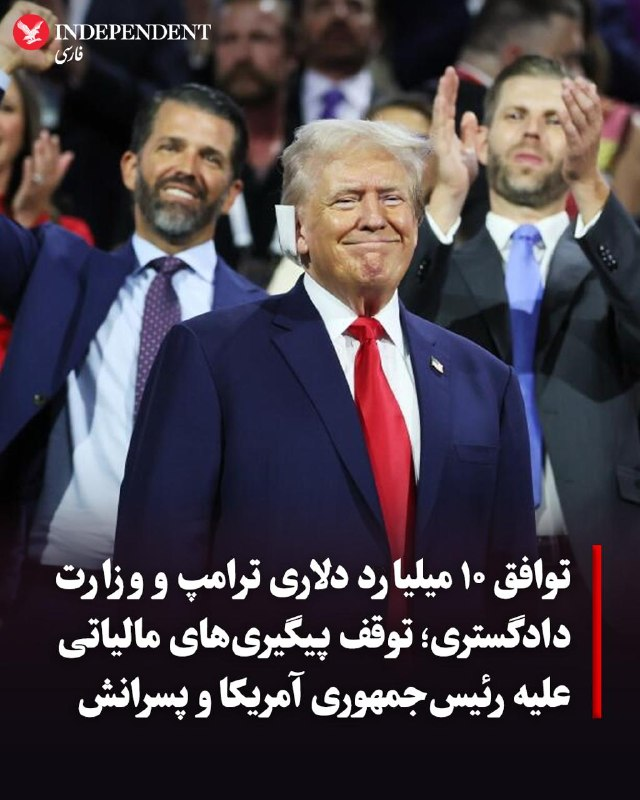

♦️روزنامه «فایننشال تایمز» روز چهارشنبه ۳۰ اردیبهشت، گزارش داد که بر اساس توافق جدید میان دونالد ترامپ و وزارت دادگستری آمریکا، اداره امور مالیاتی این کشور (IRS) دیگر حق پیگیری ادعاهای مالیاتی علیه ترامپ، پسران بزرگش و سازمان ترامپ را نخواهد داشت. این توافق در پی انصراف رئیس‌جمهوری آمریکا از شکایت ۱۰ میلیارد دلاری خود علیه این نهاد مالیاتی صورت گرفت.

این تعهد از سوی وزارت دادگستری یک روز پس از آن صادر شد که ترامپ موافقت کرد در ازای راه‌اندازی یک صندوق ۱.۸ میلیارد دلاری از سوی دولت برای قربانیان جنگ قضایی (Lawfare)، شکایت خود را تسویه کند. جنگ قضایی نامی است که در صحنه سیاسی آمریکا به اختلافات میان شهروندان و اداره مالیات در دوره ریاست‌جمهوری جو بایدن داده شده است. تاد بلانش، سرپرست دادستانی کل آمریکا، در سندی رسمی اعلام کرد که ایالات متحده تمامی ادعاهای مالیاتی علیه شاکیان این پرونده را برای همیشه لغو و ساقط کرده است.

سخنگوی وزارت دادگستری در گفتگو با فایننشال تایمز تصریح کرد که این ممنوعیت تعقیب، «تنها شامل حسابرسی‌های مالیاتی موجود» می‌شود. او افزود اگر هر یک از طرفین می‌توانستند ادعاهای قبلی خود را دوباره مطرح کنند، تسویه این پرونده‌های بزرگ بی‌معنا می‌شد.
‌🇸🇦 Indypersian

🤖 @VahidOOnLine

## VahidOOnLine — post 241226

♦️دونالد ترامپ، رئیس‌جمهور آمریکا، در تازه‌ترین اظهارات خود درباره روند تحولات مرتبط با ایران و مذاکرات جاری، اعلام کرد که شرایط «در مرز تصمیم‌گیری» قرار دارد و در صورت دریافت نکردن پاسخ‌های موردنظر واشنگتن، تحولات می‌تواند «بسیار سریع» پیش برود.
ترامپ با تاکید بر اینکه آمریکا برای هر سناریویی آمادگی کامل دارد، گفت پاسخ‌هایی که از طرف مقابل دریافت می‌شود باید «صددرصد کامل و مطلوب» باشد، چرا که رسیدن به توافق می‌تواند از اتلاف زمان، انرژی و مهم‌تر از همه از تلفات انسانی جلوگیری کند.
رئیس‌جمهوری آمریکا همچنین گفت ایران اکنون در موقعیتی «ضعیف و شکست‌خورده» قرار دارد، اما در عین حال تاکید کرد افرادی که هم‌اکنون در مذاکرات حضور دارند، نسبت به گذشته «منطقی‌تر» هستند. ترامپ گفت طرف‌های حاضر در گفتگوها را افرادی «باهوش، بااستعداد و دارای قدرت فکری بالا» می‌داند و ابراز امیدواری کرد که این مذاکرات به توافقی منجر شود که «برای همه عالی» باشد.
او در بخش دیگری از سخنانش با اشاره به احتمال تشدید تنش‌ها، تاکید کرد ترجیح می‌دهد با چند روز صبر و ادامه مسیر دیپلماسی، از وقوع جنگ و کشته شدن انسان‌ها جلوگیری شود.
‌🇸🇦 Indypersian

🤖 @VahidOOnLine

## VahidOOnLine — post 241224

  

به گزارش سازمان حقوق بشری هه‌نگاو، غلامرضا خانی‌شکرآب، ورزشکار و زندانی سیاسی اهل اردبیل که پیش‌تر با اتهام جاسوسی برای اسرائیل به اعدام محکوم شده بود، در خطر قریب‌الوقوع اجرای حکم اعدام قرار دارد.

بر اساس این گزارش، او به‌طور ناگهانی از بند امنیتی زندان اوین به سلول انفرادی زندان قزل‌حصار کرج منتقل شده است.
‌🏁 🇬🇧 IranintlTV

🤖 @VahidOOnLine

## VahidOOnLine — post 241223

  

یک مقام اسرائیلی به روزنامه اسرائیل هیوم گفت حکومت ایران هنوز درک نکرده چه بر سر این کشور آمده و افزود همان‌گونه که این حکومت لبنان، عراق و یمن را به عقب‌ماندگی کشاند، اکنون خود ایران نیز به کشوری عقب‌مانده تبدیل شده است.

به گزارش اسرائیل هیوم، در اورشلیم سقوط حکومت ایران همچنان سناریویی محتمل تلقی می‌شود و مقام‌های اسرائیلی می‌گویند پس از پایان مرحله کنونی، احتمال ازسرگیری اعتراض‌ها وجود دارد.

این روزنامه همچنین نوشت آسیب‌های واردشده به ایران بسیار قابل توجه بوده و برآوردها حاکی است در دو دور درگیری حدود ۳۰۰ میلیارد دلار خسارت اقتصادی به ایران وارد شده است.
‌🏁 🇬🇧 IranintlTV

🤖 @VahidOOnLine

## VahidOOnLine — post 241222

یک شهروند معترض به سرکوب و فضای امنیتی در ایران طی پیامی به ایران اینترنشنال گفت که در فضای قطع اینترنت و گرانی آن، «مزدورهای صادراتی حکومت جانی» حرف و مطالبات مردم را تحریف می‌کنند. پیام او با هوش مصنوعی خوانده شده است.
‌🏁 🇬🇧 IranintlTV

🤖 @VahidOOnLine

## VahidOOnLine — post 241221

  <a href="telegram/content/VahidOOnLine_241221_1779310720.mp4" target="_blank">🎬 Download video</a>

‌
دونالد ترامپ گفت آمریکا در آستانه تصمیم‌گیری درباره ایران قرار دارد و اگر پاسخ‌های مورد نظر واشینگتن دریافت نشود، تحولات می‌تواند «خیلی سریع» رخ دهد.

ترامپ گفت: «اگر پاسخ‌های درست را نگیریم، همه‌چیز خیلی سریع پیش خواهد رفت. ما کاملاً آماده‌ایم.»

او تأکید کرد هرگونه پاسخ از سوی جمهوری اسلامی باید «کامل و صددرصد قابل قبول» باشد و افزود در صورت دستیابی به توافق، «زمان، انرژی و جان انسان‌های زیادی» حفظ خواهد شد.

رئیس‌جمهوری آمریکا همچنین گفت ممکن است تصمیم‌گیری ظرف چند روز انجام شود، اما تأکید کرد روند تحولات می‌تواند «بسیار سریع» باشد.

ترامپ در ادامه ایران را «کشوری شکست‌خورده» توصیف کرد و گفت آمریکا اکنون با افرادی مذاکره می‌کند که به گفته او «بسیار منطقی‌تر» از مقام‌های پیشین جمهوری اسلامی هستند.

او افزود: «ما با افرادی بااستعداد و باهوش طرف هستیم و از این موضوع تحت تأثیر قرار گرفته‌ایم.»

ترامپ همچنین گفت اگر با چند روز صبر کردن بتوان از جنگ یا کشته شدن انسان‌ها جلوگیری کرد، «این کار ارزش انجام دادن دارد.»
‌🏁 🇬🇧 ManotoTV

🤖 @VahidOOnLine

## VahidOOnLine — post 241219

  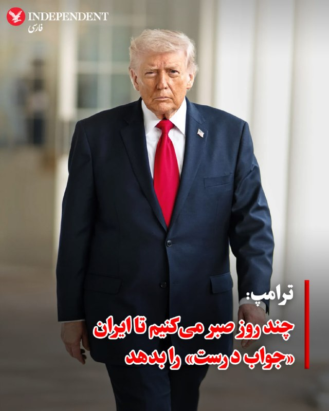

♦️ دونالد ترامپ، رئیس‌جمهوری ایالات متحده، روز چهارشنبه ۳۰ اردیبهشت هنگام بازگشت از کانتیکت در فرودگاه به خبرنگاران گفت که «آماده است برای دریافت جواب درست از سوی ایران چند روزی منتظر بماند. آن‌ها مردم منطقی‌ای هستند.»

ترامپ در ادامه هشدار داد: «اگر پاسخ‌های درستی دریافت نکنیم، اوضاع بسیار سریع پیش خواهد رفت. ما همگی آماده حرکت هستیم، اما ابتدا باید پاسخ‌های مناسبی دریافت کنیم.»
‌🇸🇦 Indypersian

🤖 @VahidOOnLine

## VahidOOnLine — post 241218

  <a href="telegram/content/VahidOOnLine_241218_1779310722.mp4" target="_blank">🎬 Download video</a>

‌
دونالد ترامپ درباره مذاکرات با جمهوری اسلامی گفت آمریکا تا زمان دستیابی به توافق، هیچ‌گونه تخفیف یا امتیازی ارائه نخواهد کرد.

ترامپ همچنین گفت واشینگتن «چند روز» منتظر پاسخ تهران خواهد ماند.

رئیس جمهور آمریکا در ادامه تاکید کرد: «این موضوع به‌زودی، به هر شکلی که باشد، پایان خواهد یافت.»

او با اشاره به روند مذاکرات افزود: «ما با افراد منطقی طرف هستیم» و تأکید کرد: «باید به پاسخ درست برسیم.»
‌🏁 🇬🇧 ManotoTV

🤖 @VahidOOnLine

## VahidOOnLine — post 241217

  

♦️ آکسیوس در گزارشی اختصاصی اعلام کرد دونالد ترامپ در تماس تلفنی طولانی و «دشوار» خود با بنیامین نتانیاهو، از تلاش میانجی‌ها برای تدوین یک «تفاهم‌نامه» خبر داده است. بر اساس این طرح، آمریکا و جمهوری اسلامی با امضای این تفاهم‌نامه رسما به جنگ پایان داده و یک دوره ۳۰ روزه را برای مذاکره درباره برنامه هسته‌ای ایران و بازگشایی تنگه هرمز آغاز می‌کنند.

به گفته دو نفر از منابع آکسیوس، این پیشنهاد با مخالفت شدید نخست‌وزیر اسرائیل مواجه شده و دو رهبر درباره مسیر پیش‌رو اختلاف‌نظر جدی دارند. یک مقام آمریکایی وضعیت نتانیاهو را پس از این تماس، «بسیار خشمگین و آشفته» توصیف کرد.

آکسیوس به نقل از منابع خود نوشت سفیر اسرائیل در واشنگتن نیز نگرانی شدید نتانیاهو از این گفتگو را به اطلاع قانون‌گذاران آمریکایی رسانده است؛ هرچند سخنگوی سفارت این موضوع را تکذیب کرد. یکی از منابع با اشاره به بدبینی همیشگی نتانیاهو به روند گفتگوها گفت: «بی‌بی همیشه نگران است.» کاخ سفید و دفتر نخست‌وزیری اسرائیل از اظهارنظر در این باره خودداری کرده‌اند.
‌🇸🇦 Indypersian

🤖 @VahidOOnLine

## VahidOOnLine — post 241216

🗣روایت شما از زندگی در آتش‌بس- چهارشنبه ۳۰ اردیبهشت ۱۴۰۵

🔹چند روز پیش پیامکی برای من ارسال شد مبنی بر اینکه ثبت‌نام شما در جانفدا با موفقیت انجام شد و برای تکمیل مشخصات به لینک ارسال‌شده مراجعه کنید. به شرافتم قسم من اصلاً ثبت‌نام نکرده بودم.

🔹اوضاع طوریه که تورم تو ریزجزئیات زندگی هم تأثیر می‌ذاره. دیروز (۲۰ اردیبهشت) با پدر و مادرم رفتیم خرید و قیمت یه دونه نمک‌پاش ۱۱۰ هزار تومن بود.

🔹من آلمان زندگی می‌کنم. امروز (۳۰ اردیبهشت) برای خط ایرانم پیام اومد که با درخواست من برای اینترنت پرو موافقت شده، در حالی که من اصلاً همچین درخواستی ندادم. این‌ها خودشون اینترنت رو روی مردم بستن، حالا هم دارن با همین کاسبی می‌کنن و جیب خالی مردم رو خالی‌تر می‌کنن.

🔹از رشت، دیدن اینکه صادراتی‌های مزدور این حکومت جانی تو شبکه‌های خارجی فعال شدن و حرف مردم ایران رو تحریف می‌کنن، در حالی که ما یک گیگ اینترنت می‌خریم تا صدامون برسه که داریم روزبه‌روز فقیر و مفلوک‌تر می‌شیم و چاره‌ای جز تموم کردن این نفرین ۴۸ ساله نداریم.

🔹توی استان ایست بازرسی می‌ذارن، همه با تفنگ و ماسک، فقط چشم‌هاشون معلومه. به همه گیر می‌دن، پلاک همه رو می‌نویسن. شرایط واقعاً سخته، مرغ شده کیلویی ۴۰۰ خورده‌ای.

🔹از تهران، این‌قدر گرانی زیاد شده، هر روز شیر گرون می‌شه. با کالابرگ فقط تونستم یک کیلو گوشت چرخ‌کرده بخرم با یه بسته مرغ.

🔹دلیل اینکه این حکومت نمی‌ره اینه که ملت هم‌دست نیست، هم‌دم نیست. وقتی نت ملی هست، هر گیگ رو ۲۵۰ تا ۴۰۰ می‌فروشن، در حالی که قیمت یک گیگ ۵۰ هست یا رایگانه. چرا این‌طور می‌کنین؟

🔹از مشهد پیام می‌دم، پمپ‌بنزین‌ها خیلی شلوغه، به موتوری‌ها کارت آزاد نمی‌دن. اگه بخوای بیشتر از دوبار از کارت سوخت استفاده کنی باید ۱۰۰ تومن بیشتر بدی.

🔹از رشت بعد از ۸۲ روز وصل شدم. یه کنکوری‌ام که همه‌چیزش رو هواست. امتحانات خرداد حضوری شده. وضعیت اقتصادی کل مردم هم واقعاً داغونه، جوری که قیمت‌ها روزانه بالا می‌ره. جاویدشاه.

🔹از یه شهرستان کوچک پیام می‌دم، پمپ‌بنزین‌ها شلوغن، همه‌چی گرونه، زندگیمون سخت شده، تروخدا به دادمون برسید. جاویدشاه پاینده ایران.
‌🏁 🇬🇧 IranintlTV

🤖 @VahidOOnLine

## VahidOOnLine — post 241215

⭕️ عراقچی: هر جا لازم باشد می‌جنگیم، هر جا لازم باشد مذاکره می‌کنیم

♦️عباس عراقچی، وزیر امور خارجه جمهوری اسلامی اعلام کرد وزارت خارجه «هر جا لازم باشد می‌جنگد و هر جا لازم باشد مذاکره می‌کند» و ماموریت خود را در هماهنگی کامل با اهداف کلان نظام دانست.
عراقچی روز چهارشنبه در مراسم بزرگداشت دو وزیر پیشین امور خارجه، کمال خرازی و حسین امیرعبداللهیان، گفت دستگاه دیپلماسی خود را جدا از دیگر نهادهای کشور نمی‌داند و در صورت لزوم، هم برای مذاکره و هم برای مقابله آماده است.
او همچنین گفت اگر منافع کشور ایجاب کند، وزارت خارجه برای گفتگو و مذاکره آماده خواهد شد، اما «با همان قدرتی» که نیروهای مسلح برای دفاع از کشور آماده می‌شوند.
عراقچی در بخش دیگری از سخنانش از هماهنگی مستمر میان دستگاه دیپلماسی و فرماندهان نیروهای مسلح خبر داد و گفت او و فرماندهان نظامی روزانه در نشست‌های مختلف شرکت می‌کنند و همگی «یک هدف مشترک» را دنبال می‌کنند.
‌🇸🇦 Indypersian

🤖 @VahidOOnLine

## VahidOOnLine — post 241214

  

دونالد ترامپ درباره ایران گفت: «ما باید پاسخ درست را دریافت کنیم.»

او افزود آمریکا در حال مذاکره با «افراد منطقی» در ایران است و چند روز در انتظار پاسخ آن‌ها خواهد ماند.

ترامپ همچنین تاکید کرد تا زمانی که توافق حاصل نشود، هیچ‌گونه معافیتی اعمال نخواهد شد.
‌🏁 🇬🇧 IranintlTV

🤖 @VahidOOnLine

## VahidOOnLine — post 241213

  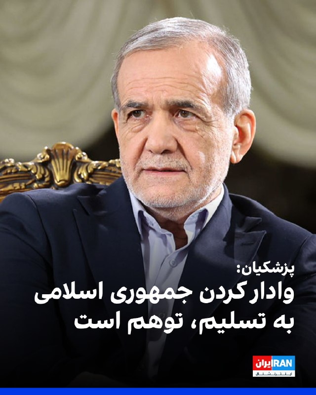

مسعود پزشکیان در شبکه ایکس نوشت: «ایران همواره به تعهدات خود پایبند بوده و همه راه‌ها را برای جلوگیری از جنگ آزموده است؛ از سوی ما همه مسیرها همچنان باز است. وادار کردن ایران به تسلیم از طریق اجبار چیزی جز یک توهم نیست. احترام متقابل در دیپلماسی بسیار عاقلانه‌تر، امن‌تر و پایدارتر از جنگ است.»
‌🏁 🇬🇧 IranintlTV

🤖 @VahidOOnLine

## VahidOOnLine — post 241212

  

♦️وبسایت آکسیوس روز چهارشنبه ۳۰ اردیبهشت، به نقل از سه منبع آگاه گزارش داد که دونالد ترامپ و بنیامین نتانیاهو در تماسی تلفنی و دشوار در روز سه‌شنبه، تلاش‌های جدید برای دستیابی به توافق با جمهوری اسلامی را بررسی کردند؛ تا جایی که یکی از منابع آکسیوس گفت نتانیاهو پس از این تماس «بسیار خشمگین و آشفته» بود.

این تنش پس از آن رخ داد که قطر و پاکستان با همکاری دیگر میانجی‌های منطقه‌ای، پیش‌نویس طرح صلحی را برای کاهش اختلافات میان آمریکا و جمهوری اسلامی تدوین کردند. این در حالی است که ترامپ میان صدور فرمان یک حمله گسترده به ایران یا منتظر ماندن برای توافق، مردد است.

به گزارش آکسیوس، نتانیاهو به شدت نسبت به این مذاکرات بدبین است و خواستار ازسرگیری جنگ برای نابودی زیرساخت‌های حیاتی و تضعیف بیشتر نظامی ایران است. در مقابل، ترامپ روز چهارشنبه در آکادمی گارد ساحلی گفت: «سوال این است که آیا کار را تمام کنیم یا آن‌ها توافق‌نامه را امضا می‌کنند؟» او همچنین تاکید کرد نتانیاهو هرچه او بخواهد انجام می‌دهد.
‌🇸🇦 Indypersian

🤖 @VahidOOnLine

## VahidOOnLine — post 241211

  

♦️بر اساس بیانیه نهاد ریاست‌جمهوری ترکیه، رجب طیب اردوغان، رئیس‌جمهوری این کشور، روز چهارشنبه ۳۰ اردیبهشت در تماسی تلفنی با دونالد ترامپ، رئیس‌جمهوری ایالات متحده، از تمدید آتش‌بس میان آمریکا و ایران استقبال و ابراز امیدواری کرد که مسائل مورد اختلاف میان دو طرف قابل حل است.

در بیانیه ریاست‌جمهوری ترکیه آمده است: «رئیس‌جمهوری ما در این گفتگو اظهار داشت که تصمیم برای تمدید آتش‌بس در منطقه درگیری را تحولی مثبت ارزیابی می‌کند و بر این باور است که دست‌یابی به یک راه‌حل منطقی برای مسائل مورد اختلاف امکان‌پذیر است.»
‌🇸🇦 Indypersian

🤖 @VahidOOnLine

## WithYashar — post 11800

ادعای «میدل ایست آی»: دونالد ترامپ، حمله برنامه‌ریزی‌شده به ایران را در این هفته به تعویق انداخت، چراکه متحدان عرب و مقامات دولت خودش به او هشدار دادند در ایام حج، جنگ را از سر نگیرد.

به گفته دو مقام ارشد کشورهای حوزه خلیج‌فارس، به ترامپ گفته شده بود که حمله به ایران در ایام حج، بحرانی را در میان کشورهای عربی حاشیه خلیج فارس ایجاد می‌کند، زیرا این حمله باعث می‌شود صدها هزار زائر حج سرگردان بمانند.

منابع همچنین گفتند که به ترامپ گفته شده بود حمله در این ایام مقدس که منتهی به عید قربان می‌شود، بیشتر از این به جایگاه آمریکا در جهان اسلام لطمه می‌زند.

یک مقام ارشد آمریکایی که از بحث‌های جریان‌یافته در دولت ترامپ آگاه است، تأیید کرد که این گفت‌وگوها انجام شده است
@withyashar

## WithYashar — post 11799

معاون نیروی دریایی ۳پا :
همه نیروهای مسلح دست به ماشه و آماده هرگونه پاسخ به هر تعرض دشمن هستند
@withyashar

## WithYashar — post 11798

صدا و سیما : مردم یه سر به فضای مجازی بزنن تا ببینن چطور مردم کل دنیا منتظرن جمهوری اسلامی مقابل آمریکا و اسرائیل بایسته و یه تو دهنی محکم بهشون بزنه؛ پاسخی که دل خیلی‌ها رو خنک کنه.
@withyashar 🤣

## WithYashar — post 11797

آکسیوس: تماس سه‌شنبه ترامپ و نتانیاهو درباره طرح جدید صلح ایران که با میانجی‌گری قطر و پاکستان ارائه شده، «تنش‌آلود» بوده.

ترامپ هنوز معتقده امکان رسیدن به توافق با ایران وجود داره، ولی نتانیاهو به شدت میخواد که اقدام نظامی علیه ایران انجام بشه. نتانیاهو بعد از این تماس «به‌شدت نگران و آشفته» شده بود!
@withyashar

## WithYashar — post 11796

آکسیوس : یک منبع آمریکایی که در جریان این تماس تلفنی قرار داشت به من گفت: «موهای بی‌بی بعد از تماس آتش گرفته بود.»
@withyashar

## WithYashar — post 11795

  

دنیا با نفس حبس‌شده در انتظار موج بعدی اسناد یوفوهاست؛ پس از آنکه مقام‌ها وعده دادند این اسناد «به‌زودی» منتشر خواهند شد.

شان پارنل، سخنگوی ارشد پنتاگون، در ایکس اعلام کرد که این مدارک هم‌اکنون «به‌طور فعال در حال آماده‌سازی و پردازش» برای انتشار هستند.

مقام‌های سابق سیا و پنتاگون اخیراً مدعی شده‌اند «چهار گونهٔ بیگانه» به زمین رفت‌وآمد دارند: خزنده‌ها (Reptilians)، حشره‌مانندها (Insectoids)، گری‌ها (Greys) و نوردیک‌ها (Nordics).

آیا ما برای حقیقت آماده‌ایم؟
@withyashar

## WithYashar — post 11794

گزارش کانال ۱۴ اسرائیل : آیا ارزیابی ایران از شرایط کاملاً اشتباه است؟

با وجود تبلیغات تهاجمی، تهران در خفا عمق بحران خود را درک می‌کند. حکومت روی لبهٔ تیغ حرکت می‌کند؛ از یک سو ترامپ را تحریک می‌کند و از سوی دیگر، به‌طور پنهانی افکار عمومی ایران را برای یک تشدید بزرگ نظامی آماده می‌کند.

افراد در داخل حکومت اذعان دارند که حملهٔ آمریکا بسیار محتمل است، اما روی این موضوع شرط بسته‌اند که ترامپ یک حملهٔ محدود انجام دهد، اعلام پیروزی کند و سپس متوقف شود.

«همهٔ ما فقط امیدواریم که این هم یکی دیگر از ارزیابی‌های اشتباه ایران از شرایط باشد.»
@withyashar

## WithYashar — post 11793

یک مقام اسرائیلی به روزنامه اسرائیل هیوم : حکومت ایران هنوز درک نکرده چه بر سر این کشور آمده و افزود همان‌گونه که این حکومت لبنان، عراق و یمن را به عقب‌ماندگی کشاند، اکنون خود ایران نیز به کشوری عقب‌مانده تبدیل شده است.

به گزارش اسرائیل هیوم، در اورشلیم سقوط حکومت ایران همچنان سناریویی محتمل تلقی می‌شود و مقام‌های اسرائیلی می‌گویند پس از پایان مرحله کنونی، احتمال ازسرگیری اعتراض‌ها وجود دارد.

این روزنامه همچنین نوشت آسیب‌های واردشده به ایران بسیار قابل توجه بوده و برآوردها حاکی است در دو دور درگیری حدود ۳۰۰ میلیارد دلار خسارت اقتصادی به ایران وارد شده است.
@withyashar

## WithYashar — post 11792

کانال ۱۲ اسرائیل:
نتانیاهو با نظر ترامپ در مورد مذاکره مخالفت کرد
@withyashar

## WithYashar — post 11791

کانال ۱۲ اسرائیل: نیروهای آمریکایی بر روی یک نفتکش ایرانی در خلیج عمان سوار شدند.
@withyashar
🚨🚨🚨🚨🚨🚨

## WithYashar — post 11790

  <a href="telegram/content/WithYashar_11790_1779310726.mp4" target="_blank">🎬 Download video</a>

خبرنگار : قصد داری به اونا ( ایران) حمله کنی‌؟

ترامپ : اینو بهت نمیگم
@withyashar

## WithYashar — post 11789

خبرنگار : از این رفت و برگشت با ایران خسته نمیشی؟

ترامپ : من هیچوقت خسته نمیشم ولی اگه با چند روز صبر کردن بشه جلوی جنگ و کشته شدن مردم رو گرفت کار خوبیه

@withyashar

## WithYashar — post 11788

ترامپ: چند روز منتظر پاسخ ایران می‌مانیم

ایران یک کشور شکست‌خورده است و ما امیدواریم بتوانیم با آنها توافق کنیم که این برای همه عالی خواهد بود.

من هیچ تحریمی را علیه ایران تا زمانی که به توافق برسیم رفع نخواهم کرد. تا زمانی که ایران توافق را امضا نکند به ایران هیچ معافیت نفتی نخواهم داد و پیشنهادی هم برای انجام این کار نداده‌ایم.

اگر پاسخ‌های درست را نگیریم، اوضاع خیلی سریع پیش می‌رود. همه ما آماده‌ایم. باید پاسخ‌های درست را به دست آوریم.
@withyashar

## WithYashar — post 11787

  <a href="telegram/content/WithYashar_11787_1779310727.mp4" target="_blank">🎬 Download video</a>

خبرنگار: آیا همانطور که رسانه های دولتی ایران گزارش داده اند، ایالات متحده در جریان مذاکرات صلح پیشنهاد کاهش تحریم های نفتی ایران را داده است؟

ترامپ: نه، من این را نشنیده ام. تا زمانی که توافقی امضا نکنند، هیچ کمکی نمی‌کنم.
وقتی آنها توافق نامه ای امضا می کنند، ما می توانیم دوباره آن مکان را بسازیم و کشوری داشته باشیم که واقعا کشور خوبی برای مردم باشد.
اما نه، ما چیزی پیشنهاد نکرده ایم.
@withyashar

## WithYashar — post 11786

مسعود زرشکیان : وادار کردن ایران به تسلیم از طریق اجبار چیزی جز توهم نیست.
احترام متقابل در دیپلماسی بسیار عاقلانه‌تر، ایمن‌تر و پایدارتر از جنگ است
@withyashar

## WithYashar — post 11783

## WithYashar — post 11782

## WithYashar — post 11781

کلش ریپورت: اردوغان در تماس تلفنی با ترامپ درباره روابط ترکیه و آمریکا و مسائل منطقه‌ای صحبت کرد.
@withyashar

## WithYashar — post 11780

به ادعای آکسیوس : امروز اوایل روز، بحث داغی در داخل کاخ سفید درباره ایران شکل گرفت، جایی که جی‌دی ونس، استیو ویتکاف و جرد کوشنر برای توافق اولیه‌ای جهت پایان دادن به جنگ تلاش می‌کردند، در حالی که پیت هگست و مارکو روبیو برای فشار بیشتر و احتمال اقدام نظامی استدلال می‌کردند
@withyashar

## WithYashar — post 11779

لطفا دایرکت بی مورد و چند پیغامه ندید 🙌🏾

## mwarmonitor — post 9382

🔴طرح پیشنهادی جدید برای صلح با ایران، موجب تماس تلفنی تنش‌آمیز میان ترامپ و نتانیاهو شد 📝نویسنده: باراک راوید AXIOS 🔰سه منبع آگاه اعلام کردند که دونالد ترامپ، رئیس‌جمهور آمریکا و بنیامین نتانیاهو، نخست‌وزیر اسرائیل، روز سه‌شنبه در یک تماس تلفنی دشوار، درباره…

## mwarmonitor — post 9381

  

🇮🇷جمهورى اسلامى ايران محدودهٔ نظارتى مديریت تنگه هرمز را به این شرح تعيین کرده است: «خط اتصال كوه مبارك درايران وجنوب فجيره درامارات در شرق تنگه تاخط اتصال انتهاى جزيره قشم درايران و ام القيوین امارات درغرب تنگه.»

🔸تردد دراین محدوده برای عبورازتنگه هرمز نیازمند هماهنگی با مدیریت آبراه خلیج فارس ومجوز این نهاد است.

@mwarmonitor

## mwarmonitor — post 9380

حمله موشکی به مقرهای مخالفان کُرد ایرانی در استان اربیل در شمال عراق

## mwarmonitor — post 9379

🔹خبرنگار: چه پیامی دارید برای آن دسته از خانواده‌های آمریکایی که از رشد هوش مصنوعی نگرانند؟ آن‌ها نگران این هستند که فرزندانشان در آینده به خاطر جایگزین شدن هوش مصنوعی نتوانند شغلی پیدا کنند.
🔸دونالد ترامپ: خب، چیزی که من می‌گویم این است که هوش مصنوعی تا اینجا فوق‌العاده بوده است، چون در حال حاضر ما شغل‌های بیشتری داریم؛ افراد بیشتری همین الان در ایالات متحده مشغول به کار هستند، بسیار بیشتر از هر زمان دیگری در گذشته.
و جدای از جنگ، من تصور می‌کردم که اقتصاد افت خواهد کرد و بازار بورس ۲۰ تا ۲۵ درصد سقوط می‌کند، اما در واقع رشد داشته است. بازار بورس در حال حاضر بالاتر از زمانی است که من مسئله‌ی ایران را شروع کردم.
و در مورد ایران، من چاره‌ی دیگری نداشتم چون آن‌ها قرار بود به سلاح هسته‌ای دست پیدا کنند و ما قرار نیست اجازه دهیم آن‌ها سلاح هسته‌ای داشته باشند. اما این موضوع به زودی به یک شکلی تمام خواهد شد.
قیمت نفت به شدت پایین خواهد آمد. تعداد بسیار زیادی... ما ۱۶۰۰ کشتی در تنگه داریم که پر از نفت هستند و به زودی خارج خواهند شد. پس... باید منتظر بمانیم و ببینیم چه می‌شود. اما ارتش بی‌نظیر عمل کرده است. محاصره بی‌نقص بوده است. حتی یک کشتی هم نتوانسته از این محاصره عبور کند. ۳۷ کشتی تلاش کردند... و همگی آرزو می‌کنند که کاش این کار را نمی‌کردند.

📝سوال چی پرسید چی جواب داد 😐

@mwarmonitor

## mwarmonitor — post 9378

  <a href="telegram/content/mwarmonitor_9378_1779310729.mp4" target="_blank">🎬 Download video</a>

🎬 Video

## mwarmonitor — post 9377

✈️🚨 پرواز یک جنگنده در ارتفاع پایین در آسمان استان موصل در شمال عراق.

@mwarmonitor

## mwarmonitor — post 9376

🔹خبرنگار: دیروز گفتید که حدوداً یک ساعت با تصمیم‌گیری فاصله دارید. امروز اوضاع در چه حالیه؟ آیا چیزی ازشون شنیدید؟
🔸دونالد ترامپ: خیلی... دقیقاً روی مرز (مرز تصمیم‌گیری) قرار داره، باور کنید. اگر پاسخ‌های درستی دریافت نکنیم، خیلی سریع پیش میره. ما کاملاً آماده‌ایم که اقدام کنیم. اما باید پاسخ‌های درستی بگیریم. باید پاسخ‌ها کاملاً و ۱۰۰ درصد خوب باشن؛ و اگر این‌طور باشه، در زمان، انرژی و مهم‌تر از همه، در جان انسان‌ها صرفه‌جویی زیادی می‌کنیم.
🔹خبرنگار: چقدر زمان می‌بره؟
🔸دونالد ترامپ: می‌تونه خیلی سریع اتفاق بیفته. یا چند روز، ممکنه چند روز طول بکشه؛ اما پتانسیلش رو داره که خیلی سریع پیش بره. ایران یک کشور شکست‌خورده است. ما داریم با افرادی سروکار داریم و در واقع، باید بهتون بگم، داریم با افراد خیلی خوبی سروکار داریم. با کسانی طرف هستیم که فکر می‌کنم خیلی منطقی‌تر از اون افرادی هستن که دیگه واقعاً در بین ما حضور ندارن. ما داریم با افرادی سروکار داریم که استعداد دارن، از... هوش و مغز خوبی برخوردارن و این ما رو کاملاً تحت تأثیر قرار داده. بنابراین، امیدواریم این افراد توافقی رو رقم بزنن که برای همه عالی باشه.
🔹خبرنگار: آیا از این رفت‌وآمدهای مداوم خسته نشدید؟
🔸دونالد ترامپ: من نمی‌دونم، نمی‌دونم، من اصلاً... چی؟ خسته بشم؟ من هیچ‌وقت خسته نمی‌شم. اما کاری که مایلم انجام بدم اینه: اگر بتونم با چند روز صبر کردن از جنگ جلوگیری کنم، اگر بتونم با چند روز صبر کردن از کشته شدن مردم جلوگیری کنم، فکر می‌کنم ارزشش رو داره.

@mwarmonitor

## mwarmonitor — post 9375

  <a href="telegram/content/mwarmonitor_9375_1779310730.mp4" target="_blank">🎬 Download video</a>

🎬 Video

## mwarmonitor — post 9374

🔴ترامپ: ما در حال «آزادسازی کوبا» هستیم و باید به کوبایی‌ها کمک کنیم، چون آن‌ها غذا و انرژی ندارند، اما مردم بزرگی هستند. 🔸ما منتظر پاسخ مناسب ایران هستیم تا از تشدید بیشتر تنش جلوگیری شود. 🔸چند روزی منتظر پاسخ ایران خواهیم ماند. 🔸تا زمانی که به توافق نرسیم،…

## mwarmonitor — post 9373

🔴ترامپ: ما در حال «آزادسازی کوبا» هستیم و باید به کوبایی‌ها کمک کنیم، چون آن‌ها غذا و انرژی ندارند، اما مردم بزرگی هستند.

🔸ما منتظر پاسخ مناسب ایران هستیم تا از تشدید بیشتر تنش جلوگیری شود.

🔸چند روزی منتظر پاسخ ایران خواهیم ماند.

🔸تا زمانی که به توافق نرسیم، هیچ‌گونه تحریمی را از ایران لغو نخواهم کرد.

@mwarmonitor

## mwarmonitor — post 9372

🇮🇷 منبع آگاه ایرانی: آمریکایی‌ها، پس از ارسال یک پیام شامل ۱۴ بند سه روز پیش، پیام دیگری را از طریق یک واسطه پاکستانی به ایران ارسال کرده‌اند (ظاهراً همین وزیر کشور پاکستان). ایران در حال بررسی این پیام است و هنوز به آن پاسخ نداده است. 🔸 واسطه پاکستانی در…

## FoxNewsTwitter — post 342027

  

Fox News (Twitter/X)

A Texas Democrat is getting ripped by members of her own party after making shocking comments online.

Congressional candidate Maureen Galindo posted that she wants to lock up “American Zionists” in an ICE detention facility.

Galindo — a sex therapist and housing activist running in the Democratic runoff for Texas’ newly redrawn 35th Congressional District — also said she would lock up former ICE officers and turn the local ICE detention center into a “castration processing center for pedophiles, which will probably be most of the Zionists.”

The comments sparked outrage, with critics calling them antisemitic. Even fellow Democrats and The New York Times condemned the remarks, with the paper urging voters not to let her win the runoff.

Jewish Democratic Rep. Jared Moskowitz accused Galindo of proposing “concentration camps for American Jews,” while Sen. Ruben Gallego said she should “never be allowed in any political office.”

## FoxNewsTwitter — post 342026

  <a href="telegram/content/FoxNewsTwitter_342026_1779310733.mp4" target="_blank">🎬 Download video</a>

Fox News (Twitter/X)

BREAKING: President Trump reveals the strategy behind his back-and-forth negotiating style with the Iranian regime as the region waits to see if a new waves of fighting will begin:

"I never get tired. What I like to do, if I can save war by waiting a couple of days, so I can save people being killed by waiting a couple of days, I think it's a great thing to do."

## FoxNewsTwitter — post 342025

  <a href="telegram/content/FoxNewsTwitter_342025_1779310734.mp4" target="_blank">🎬 Download video</a>

Fox News (Twitter/X)

JUST IN: President Trump dismissing growing fears and public anxiety over Artificial Intelligence disrupting the job market throughout the country.

"I'll tell you, AI has been amazing, because right now we have more jobs, more people working right now in the United States by far, than we ever had before."

## FoxNewsTwitter — post 342024

  <a href="telegram/content/FoxNewsTwitter_342024_1779310736.mp4" target="_blank">🎬 Download video</a>

Fox News (Twitter/X)

NOW: President Trump celebrates the "very big moment" of Raul Castro being indicted and what it means to the Cuban people:

"We have Cuba on our mind, it's very important.... It was a very big moment for people, not only Cuban Americans, but people who came from Cuba, that want to go back to Cuba, see their family in Cuba."

"They supported me to the nth degree, they supported me at levels that nobody's ever seen before. And so I think it's a very important moment."

## FoxNewsTwitter — post 342023

  

Fox News (Twitter/X)

WATCH LIVE: Florida lawmakers hold press conference on US indictment of Raúl Castro https://twitter.com/i/broadcasts/1pKkOyBYPAMKj

## FoxNewsTwitter — post 342022

  

Fox News (Twitter/X)

WATCH LIVE: Senate holds 'Blowing the Whistle: Inside the Grift that Keeps Giving' hearing https://twitter.com/i/broadcasts/1jxXgeVpZgeJZ

## pm_afshaa — post 91133

  <a href="telegram/content/pm_afshaa_91133_1779310738.webm" target="_blank">🎬 Download video</a>

🔴فدا حسین مالکی، عضو کمیسیون امنیت ملی مجلس در صداوسیما: عاصم منیر فردا حامل پیام جدیدی از سوی آمریکا به ایرانه.

💧 Rainbet.com the #1 Non-KYC Crypto Casino & Sportsbook @rainbetcom

😁 @Pm_Afshaa

## pm_afshaa — post 91132

  <a href="telegram/content/pm_afshaa_91132_1779310739.webm" target="_blank">🎬 Download video</a>

🔴آکسیوس به نقل از یک منبع آمریکایی: ترامپ به نتانیاهو از یک دوره 30 روزه مذاکره درباره برنامه هسته‌ای ایران و تنگه هرمز اطلاع داد 
💧 Rainbet.com the #1 Non-KYC Crypto Casino & Sportsbook @rainbetcom 
😁 @Pm_Afshaa

## pm_afshaa — post 91131

نخست‌وزیر اسپانیا: به‌سرعت ممنوعیت ورود وزرای اسرائیلی به کشورهای اتحادیه اروپا را پیش خواهم برد

💧 Rainbet.com the #1 Non-KYC Crypto Casino & Sportsbook @rainbetcom

😁 @Pm_Afshaa

## pm_afshaa — post 91130

🔴ترامپ : اگه جواب درست نگیریم خیلی سریع اوضاع میره سمت درگیری همه چی آماده‌ست فقط باید جواب درست بگیریم

ما چند روزی منتظر پاسخ ایران خواهیم ماند. پاسخ اونا باید کامل و 100 درصد خوب باشه!

💧 Rainbet.com the #1 Non-KYC Crypto Casino & Sportsbook @rainbetcom

😁 @Pm_Afshaa

## pm_afshaa — post 91129

🔴ترامپ: تا زمانی که ایران توافق‌نامه‌ای امضا نکند، هیچ معافیت نفتی به این کشور اعطا نخواهم کرد و ما پیشنهادی برای ارائه چنین معافیت‌هایی نداده‌ایم

💧 Rainbet.com the #1 Non-KYC Crypto Casino & Sportsbook @rainbetcom

😁 @Pm_Afshaa

## pm_afshaa — post 91128

🔴اسرائیل هیوم:یک مناقشه داغ در کاخ سفید بین مقامات ارشد آمریکا بر سر سیاست ایران رخ داد،معاون رئیس‌جمهور آمریکا، جی‌دی ونس، و فرستادگان استیو ویتکاف و جارد کوشنر برای توافق اولیه به منظور پایان دادن به جنگ تلاش کردند،
در حالی که وزیر جنگ پیت هگست و وزیر امور خارجه مارکو روبیو خواستار فشار و حمله بودن

💧 Rainbet.com the #1 Non-KYC Crypto Casino & Sportsbook @rainbetcom

😁 @Pm_Afshaa

## pm_afshaa — post 91127

🔴تسنیم: آمریکایی‌ها متن جدیدی به ایران ارسال کردن و ایران در حال بررسی متن ارسال شدست؛ هنوز از طرف ایران پاسخی داده نشده

💧 Rainbet.com the #1 Non-KYC Crypto Casino & Sportsbook @rainbetcom

😁 @Pm_Afshaa

## pm_afshaa — post 91126

🔴آکسیوس به نقل از یک منبع آمریکایی: ترامپ به نتانیاهو از یک دوره 30 روزه مذاکره درباره برنامه هسته‌ای ایران و تنگه هرمز اطلاع داد

💧 Rainbet.com the #1 Non-KYC Crypto Casino & Sportsbook @rainbetcom

😁 @Pm_Afshaa

## VahidOnline — post 75584

  <a href="telegram/content/VahidOnline_75584_1779310739.mp4" target="_blank">🎬 Download video</a>

دونالد ترامپ، رئیس‌جمهور آمریکا، شامگاه چهارشنبه گفت حاضر است «چند روز» برای رسیدن پاسخ ایران به پیشنهاد واشینگتن درباره توافق پایان جنگ صبر کند اما هشدار داد که این پاسخ باید «۱۰۰ درصد درست» باشد.

او بعد از سخنرانی در جمع دانشجویان نظامی به خبرنگاران گفت اگر پاسخ ایران درست نباشد، تشدید تنش به سرعت رخ می‌دهد و افزود: «ما آماده پیش‌روی هستیم. باید جواب‌های ۱۰۰ درصد درست و خوبی بگیریم.»
ترامپ اعلام کرد که آمریکا در حال حاضر با افراد «خیلی خوبی» از طرف ایرانی مواجه است که «استعداد و قدرت ذهن» دارند؛ افرادی که به گفته او جایگزین رهبران پیشین ایران شده‌اند.

این اظهارات ساعتی بعد از آن است که سخنگوی وزارت خارجه ایران اعلام کرد تهران در حال بررسی طرح پیشنهادی جدید آمریکا است.

این طرح توسط اسلام‌آباد به دست مقام‌های جمهوری اسلامی رسیده است؛ همزمان با سفر وزیر کشور پاکستان به تهران.
@VahidHeadline

📡 @VahidOnline

## VahidOnline — post 75582

آکسیوس در گزارشی اختصاصی اعلام کرد دونالد ترامپ در تماس تلفنی طولانی و «دشوار» خود با بنیامین نتانیاهو، از تلاش میانجی‌ها برای تدوین یک «تفاهم‌نامه» خبر داده است. بر اساس این طرح، آمریکا و جمهوری اسلامی با امضای این تفاهم‌نامه رسما به جنگ پایان داده و یک دوره ۳۰ روزه را برای مذاکره درباره برنامه هسته‌ای ایران و بازگشایی تنگه هرمز آغاز می‌کنند.

به گفته دو نفر از منابع آکسیوس، این پیشنهاد با مخالفت شدید نخست‌وزیر اسرائیل مواجه شده و دو رهبر درباره مسیر پیش‌رو اختلاف‌نظر جدی دارند. یک مقام آمریکایی وضعیت نتانیاهو را پس از این تماس، «بسیار خشمگین و آشفته» توصیف کرد.

آکسیوس به نقل از منابع خود نوشت سفیر اسرائیل در واشنگتن نیز نگرانی شدید نتانیاهو از این گفتگو را به اطلاع قانون‌گذاران آمریکایی رسانده است؛ هرچند سخنگوی سفارت این موضوع را تکذیب کرد. یکی از منابع با اشاره به بدبینی همیشگی نتانیاهو به روند گفتگوها گفت: «بی‌بی همیشه نگران است.» کاخ سفید و دفتر نخست‌وزیری اسرائیل از اظهارنظر در این باره خودداری کرده‌اند.
@VahidOOnLine

📡 @VahidOnline

## kianmeli1 — post 87525

  <a href="telegram/content/kianmeli1_87525_1779310740.mp4" target="_blank">🎬 Download video</a>

🔴 ترامپ درباره ایران:
اگر پاسخ‌های درست را نگیریم، خیلی سریع پیش می‌رود. همه ما آماده‌ایم. باید پاسخ‌های درست را بگیریم.

باید پاسخ‌ها کاملاً ۱۰۰٪ درست باشند، و اگر اینطور باشد، زمان، انرژی و جان‌های زیادی را نجات می‌دهیم.
https://t.me/kianmeli1

## kianmeli1 — post 87524

  

🔴آخرین قیمت نفت ۱۰۵.۰۹ دلار
https://t.me/kianmeli1

## kianmeli1 — post 87523

  

🔴«اداره تنگه خلیج فارس» (PGSA) که به تازگی از سوی ایران اعلام موجودیت کرده است، می‌گوید یک منطقه دریایی کنترل‌شده در تنگه هرمز ایجاد کرده است.
https://t.me/kianmeli1

## IranIntlTV — post 338154

  <a href="telegram/content/IranIntlTV_338154_1779310742.mp4" target="_blank">🎬 Download video</a>

دونالد ترامپ گفت باید پاسخ درستی از جمهوری اسلامی دریافت کند. او افزود واشینگتن در تهران با «افرادی منطقی» در حال گفت‌وگو است و چند روز دیگر نیز در انتظار پاسخ آنها خواهد ماند.
ترامپ همچنین تاکید کرد تا زمان دستیابی به توافق، هیچ‌گونه امتیاز یا تخفیفی به ایران داده نخواهد شد.

گفت‌وگو با محسن مدیرشانه‌چی، پژوهشگر موسسه نظم جهانی، و محمد قائدی، مدرس روابط بین‌الملل
@iranintltv

## IranIntlTV — post 338153

  <a href="telegram/content/IranIntlTV_338153_1779310743.mp4" target="_blank">🎬 Download video</a>

رابرت اِستلوف، مدیر اجرایی انستیتو واشینگتن، به مرضیه حسینی، خبرنگار ایران‌اینترنشنال، گفت: «کاملا وارد مرحله‌ای شده‌ایم که هدف بلندمدت، تغییر حکومت است. اینکه چطور به آن برسند، از طریق ادامه فشار و محاصره سیاسی و اقتصادی حکومت خواهد بود.»
@iranintltv

## IranIntlTV — post 338152

  <a href="telegram/content/IranIntlTV_338152_1779310744.mp4" target="_blank">🎬 Download video</a>

سپاه پاسداران در واکنش به تهدیدهای کاخ سفید هشدار داد در صورت حمله آمریکا و اسرائیل، به نقاطی که آنها تصور نمی‌کنند، ضرباتی کوبنده وارد می‌کند.

گفت‌وگو با علی شیرازی، عضو تحریریه ایران‌اینترنشنال و آرام حسامی، استاد علوم سیاسی کالج مونتگومری
@iranintltv

## IranIntlTV — post 338151

  <a href="telegram/content/IranIntlTV_338151_1779310747.mp4" target="_blank">🎬 Download video</a>

دونالد ترامپ گفت: «مهم این است که چه پاسخی از ایران دریافت می‌کنیم. اگر پاسخ، آن چیزی نباشد که ما انتظار داریم، خیلی سریع وارد عمل خواهیم شد. همه‌چیز آماده است.»

او افزود: «اگر به توافق برسیم، از هزینه‌های بسیار زیاد و کشته شدن انسان‌ها جلوگیری می‌شود. ممکن است این ماجرا خیلی زود تمام شود یا چند روز دیگر طول بکشد.»

او تاکید کرد: «آمریکا تا پیش از امضای توافق، هیچ تخفیفی در تحریم‌ها به ایران نخواهد داد و در حال حاضر هیچ امتیاز یا پیشنهاد مشخصی روی میز نیست.»
@iranintltv

## IranIntlTV — post 338150

  <a href="telegram/content/IranIntlTV_338150_1779310748.mp4" target="_blank">🎬 Download video</a>

کلیفورد می، رییس بنیاد دفاع از دموکراسی‌ها، به مرضیه حسینی، خبرنگار ایران‌اینترنشنال، گفت: «پیش‌بینی دونالد ترامپ خیلی سخت است، چون مدام نظرش را عوض می‌کند.»

او افزود: «امیدوارم هرچه زودتر به این نتیجه برسد که برای ادامه این مسیر، باید هم فشار اقتصادی را حفظ کند و هم فشار نظامی را افزایش دهد؛ از جمله حمله به مراکز نظامی و شاید حتی حذف لایه‌های بعدی قدرت در ایران.»
@iranintltv

## IranIntlTV — post 338149

  <a href="telegram/content/IranIntlTV_338149_1779310749.mp4" target="_blank">🎬 Download video</a>

سپاه در واکنش به تهدیدهای آمریکا و اسرائیل هشدار داد در صورت حمله، پاسخ‌های کوبنده‌ای در نقاط غیرقابل‌تصور خواهد داد. محمدباقر قالیباف نیز گفت نشانه‌ها از احتمال دور جدید تنش و جنگ حکایت دارد. وزیر خارجه ایران هم از هماهنگی روزانه میان دستگاه دیپلماسی و نیروهای نظامی خبر داد.
@iranintltv

## IranIntlTV — post 338148

  <a href="telegram/content/IranIntlTV_338148_1779310750.mp4" target="_blank">🎬 Download video</a>

قانون جدید طالبان درباره طلاق و ازدواج، موجی از نگرانی درباره حقوق زنان و افزایش کودک‌همسری در افغانستان ایجاد کرده است. براساس این قانون، سکوت دختر به‌منزله رضایت برای ازدواج تلقی می‌شود؛ موضوعی که منتقدان می‌گویند راه را برای ازدواج اجباری و کودک‌همسری هموارتر می‌کند.
@iranintltv

## IranIntlTV — post 338147

  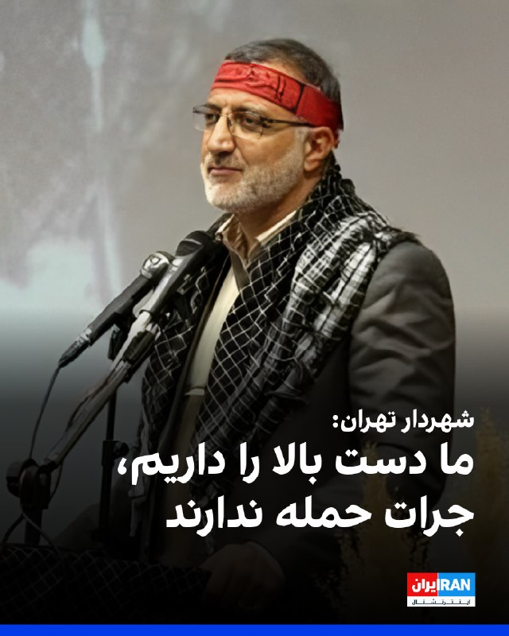

علیرضا زاکانی، شهردار تهران، در گفت‌وگو با صداوسیما، گفت: «محاصره دریایی معنا ندارد. این‌ها اغراق می‌کنند و جرات حمله ندارند. اوج اقداماتشان را هم انجام دادند و دیدند ما دست بالا را داریم.»

او اضافه کرد: «اگر حمله کنند، پاسخ می‌گیرند. دوره بزن‌دررو تمام شده است.»
https://iranintl.com/202605200745

## IranIntlTV — post 338146

  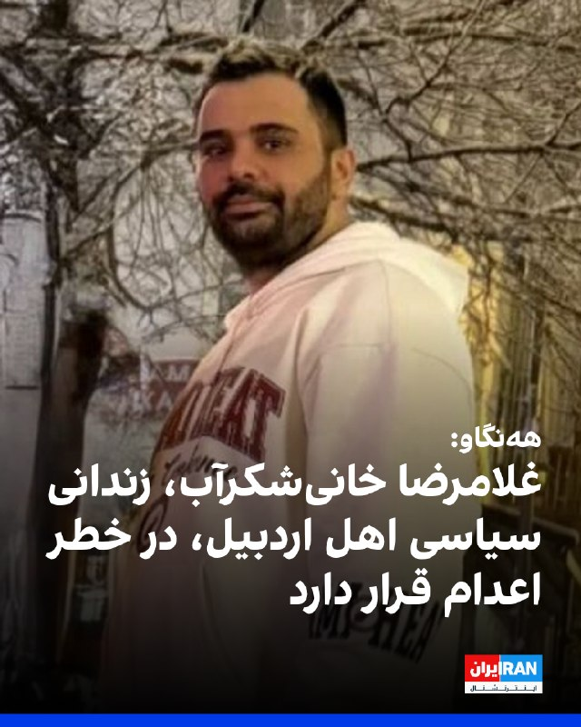

به گزارش سازمان حقوق بشری هه‌نگاو، غلامرضا خانی‌شکرآب، ورزشکار و زندانی سیاسی اهل اردبیل که پیش‌تر با اتهام جاسوسی برای اسرائیل به اعدام محکوم شده بود، در خطر قریب‌الوقوع اجرای حکم اعدام قرار دارد.

بر اساس این گزارش، او به‌طور ناگهانی از بند امنیتی زندان اوین به سلول انفرادی زندان قزل‌حصار کرج منتقل شده است.
https://iranintl.com/202605206911

## IranIntlTV — post 338145

  <a href="https://t.me/IranintlTV/338145" target="_blank">📎 Download file</a>

🎧نسخه صوتی ۲۴ با فرداد فرحزاد: ترامپ: تهران توافق را امضا نکند، کار را تمام می‌کنیم
@iranintlTV

## IranIntlTV — post 338144

  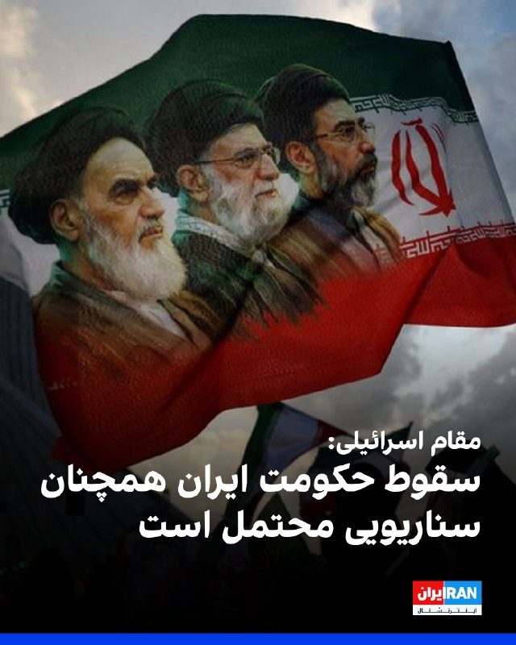

یک مقام اسرائیلی به روزنامه اسرائیل هیوم گفت حکومت ایران هنوز درک نکرده چه بر سر این کشور آمده و افزود همان‌گونه که این حکومت لبنان، عراق و یمن را به عقب‌ماندگی کشاند، اکنون خود ایران نیز به کشوری عقب‌مانده تبدیل شده است.

به گزارش اسرائیل هیوم، در اورشلیم سقوط حکومت ایران همچنان سناریویی محتمل تلقی می‌شود و مقام‌های اسرائیلی می‌گویند پس از پایان مرحله کنونی، احتمال ازسرگیری اعتراض‌ها وجود دارد.

این روزنامه همچنین نوشت آسیب‌های واردشده به ایران بسیار قابل توجه بوده و برآوردها حاکی است در دو دور درگیری حدود ۳۰۰ میلیارد دلار خسارت اقتصادی به ایران وارد شده است.
https://iranintl.com/202605205378

## IranIntlTV — post 338143

یک شهروند معترض به سرکوب و فضای امنیتی در ایران طی پیامی به ایران اینترنشنال گفت که در فضای قطع اینترنت و گرانی آن، «مزدورهای صادراتی حکومت جانی» حرف و مطالبات مردم را تحریف می‌کنند. پیام او با هوش مصنوعی خوانده شده است.

## IranIntlTV — post 338142

  <a href="https://t.me/IranintlTV/338142" target="_blank">📎 Download file</a>

🎧نسخه صوتی چشم‌انداز: حقیقت یا دروغ؟ طرح آمریکا برای حکومت احمدی‌نژاد بر ایران؟!
@iranintlTV

## IranIntlTV — post 338141

  <a href="telegram/content/IranIntlTV_338141_1779310754.mp4" target="_blank">🎬 Download video</a>

پس از آنکه دونالد ترامپ گفت به درخواست کشورهای منطقه حمله به ایران را به تاخیر انداخته، برخی منابع منطقه‌ای به اورشلیم‌پست گفتند دلیل این درخواست، هراس از انتقام‌گیری جمهوری اسلامی بوده است.

گفت‌وگو با عطا محامد، کارشناس روابط بین‌الملل
@iranintltv

## IranIntlTV — post 338140

🗣روایت شما از زندگی در آتش‌بس- چهارشنبه ۳۰ اردیبهشت ۱۴۰۵

🔹چند روز پیش پیامکی برای من ارسال شد مبنی بر اینکه ثبت‌نام شما در جانفدا با موفقیت انجام شد و برای تکمیل مشخصات به لینک ارسال‌شده مراجعه کنید. به شرافتم قسم من اصلاً ثبت‌نام نکرده بودم.

🔹اوضاع طوریه که تورم تو ریزجزئیات زندگی هم تأثیر می‌ذاره. دیروز (۲۰ اردیبهشت) با پدر و مادرم رفتیم خرید و قیمت یه دونه نمک‌پاش ۱۱۰ هزار تومن بود.

🔹من آلمان زندگی می‌کنم. امروز (۳۰ اردیبهشت) برای خط ایرانم پیام اومد که با درخواست من برای اینترنت پرو موافقت شده، در حالی که من اصلاً همچین درخواستی ندادم. این‌ها خودشون اینترنت رو روی مردم بستن، حالا هم دارن با همین کاسبی می‌کنن و جیب خالی مردم رو خالی‌تر می‌کنن.

🔹از رشت، دیدن اینکه صادراتی‌های مزدور این حکومت جانی تو شبکه‌های خارجی فعال شدن و حرف مردم ایران رو تحریف می‌کنن، در حالی که ما یک گیگ اینترنت می‌خریم تا صدامون برسه که داریم روزبه‌روز فقیر و مفلوک‌تر می‌شیم و چاره‌ای جز تموم کردن این نفرین ۴۸ ساله نداریم.

🔹توی استان ایست بازرسی می‌ذارن، همه با تفنگ و ماسک، فقط چشم‌هاشون معلومه. به همه گیر می‌دن، پلاک همه رو می‌نویسن. شرایط واقعاً سخته، مرغ شده کیلویی ۴۰۰ خورده‌ای.

🔹از تهران، این‌قدر گرانی زیاد شده، هر روز شیر گرون می‌شه. با کالابرگ فقط تونستم یک کیلو گوشت چرخ‌کرده بخرم با یه بسته مرغ.

🔹دلیل اینکه این حکومت نمی‌ره اینه که ملت هم‌دست نیست، هم‌دم نیست. وقتی نت ملی هست، هر گیگ رو ۲۵۰ تا ۴۰۰ می‌فروشن، در حالی که قیمت یک گیگ ۵۰ هست یا رایگانه. چرا این‌طور می‌کنین؟

🔹از مشهد پیام می‌دم، پمپ‌بنزین‌ها خیلی شلوغه، به موتوری‌ها کارت آزاد نمی‌دن. اگه بخوای بیشتر از دوبار از کارت سوخت استفاده کنی باید ۱۰۰ تومن بیشتر بدی.

🔹از رشت بعد از ۸۲ روز وصل شدم. یه کنکوری‌ام که همه‌چیزش رو هواست. امتحانات خرداد حضوری شده. وضعیت اقتصادی کل مردم هم واقعاً داغونه، جوری که قیمت‌ها روزانه بالا می‌ره. جاویدشاه.

🔹از یه شهرستان کوچک پیام می‌دم، پمپ‌بنزین‌ها شلوغن، همه‌چی گرونه، زندگیمون سخت شده، تروخدا به دادمون برسید. جاویدشاه پاینده ایران.

## IranIntlTV — post 338139

  <a href="telegram/content/IranIntlTV_338139_1779310755.mp4" target="_blank">🎬 Download video</a>

حقیقت یا دروغ؟ طرح آمریکا برای حکومت احمدی‌نژاد بر ایران؟!

چشم‌انداز با مهدی مهدوی‌آزاد

نسخه کامل این برنامه در یوتیوب:
https://youtu.be/cfVdKzc7RL8
@iranintltv

## IranIntlTV — post 338138

  <a href="https://t.me/IranintlTV/338138" target="_blank">📎 Download file</a>

🎧نسخه صوتی تیتراول با نیوشا صارمی: ترامپ: یا امضا می‌کنید یا ما کار را تمام می‌کنیم؛ قالیباف هشدار جنگ داد
@iranintlTV

## IranIntlTV — post 338137

  

دونالد ترامپ درباره ایران گفت: «ما باید پاسخ درست را دریافت کنیم.»

او افزود آمریکا در حال مذاکره با «افراد منطقی» در ایران است و چند روز در انتظار پاسخ آن‌ها خواهد ماند.

ترامپ همچنین تاکید کرد تا زمانی که توافق حاصل نشود، هیچ‌گونه معافیتی اعمال نخواهد شد.
https://iranintl.com/202605204860

## IranIntlTV — post 338136

  

مسعود پزشکیان در شبکه ایکس نوشت: «ایران همواره به تعهدات خود پایبند بوده و همه راه‌ها را برای جلوگیری از جنگ آزموده است؛ از سوی ما همه مسیرها همچنان باز است. وادار کردن ایران به تسلیم از طریق اجبار چیزی جز یک توهم نیست. احترام متقابل در دیپلماسی بسیار عاقلانه‌تر، امن‌تر و پایدارتر از جنگ است.»
https://iranintl.com/202605200670

## IranIntlTV — post 338135

  <a href="telegram/content/IranIntlTV_338135_1779310758.mp4" target="_blank">🎬 Download video</a>

مهدی مهدوی‌آزاد در برنامه «چشم‌انداز» گفت: «یکی از نزدیکان سابق محمود احمدی‌نژاد در واکنش به گزارش نیویورک‌تایمز گفته او نه مخفی شده و نه تحت فشار است و گزارش‌هایی را که می‌گویند احمدی‌نژاد در حصر خانگی یا بازداشت است، رد کرده است.»

او افزود: «بخش مهم‌تر این اظهارات آن بود که این گزارش‌ها تلاشی از سوی حسن روحانی، محمدجواد ظریف و دموکرات‌های آمریکا برای انتقام گرفتن از دونالد ترامپ توصیف شد.»
@iranintltv

## ManotoTV — post 105704

  <a href="telegram/content/ManotoTV_105704_1779310759.mp4" target="_blank">🎬 Download video</a>

تماسی که از جاویدنام سینا عباسی، ۲۲ ساله از کرمانشاه گفت…

## ManotoTV — post 105703

  <a href="telegram/content/ManotoTV_105703_1779310761.mp4" target="_blank">🎬 Download video</a>

‌
دونالد ترامپ گفت آمریکا در آستانه تصمیم‌گیری درباره ایران قرار دارد و اگر پاسخ‌های مورد نظر واشینگتن دریافت نشود، تحولات می‌تواند «خیلی سریع» رخ دهد.

ترامپ گفت: «اگر پاسخ‌های درست را نگیریم، همه‌چیز خیلی سریع پیش خواهد رفت. ما کاملاً آماده‌ایم.»

او تأکید کرد هرگونه پاسخ از سوی جمهوری اسلامی باید «کامل و صددرصد قابل قبول» باشد و افزود در صورت دستیابی به توافق، «زمان، انرژی و جان انسان‌های زیادی» حفظ خواهد شد.

رئیس‌جمهوری آمریکا همچنین گفت ممکن است تصمیم‌گیری ظرف چند روز انجام شود، اما تأکید کرد روند تحولات می‌تواند «بسیار سریع» باشد.

ترامپ در ادامه ایران را «کشوری شکست‌خورده» توصیف کرد و گفت آمریکا اکنون با افرادی مذاکره می‌کند که به گفته او «بسیار منطقی‌تر» از مقام‌های پیشین جمهوری اسلامی هستند.

او افزود: «ما با افرادی بااستعداد و باهوش طرف هستیم و از این موضوع تحت تأثیر قرار گرفته‌ایم.»

ترامپ همچنین گفت اگر با چند روز صبر کردن بتوان از جنگ یا کشته شدن انسان‌ها جلوگیری کرد، «این کار ارزش انجام دادن دارد.»

## ManotoTV — post 105702

  <a href="telegram/content/ManotoTV_105702_1779310762.mp4" target="_blank">🎬 Download video</a>

تماسی از ایران:
«می‌گفت دیکتاتوری با بازتولید ظلم ادامه پیدا می‌کنه…
می‌گفت باید این چرخه رو شکست؛
با اعتصاب و نایستادن پای این شرایط.»

## ManotoTV — post 105701

  <a href="telegram/content/ManotoTV_105701_1779310763.mp4" target="_blank">🎬 Download video</a>

‌
دونالد ترامپ درباره مذاکرات با جمهوری اسلامی گفت آمریکا تا زمان دستیابی به توافق، هیچ‌گونه تخفیف یا امتیازی ارائه نخواهد کرد.

ترامپ همچنین گفت واشینگتن «چند روز» منتظر پاسخ تهران خواهد ماند.

رئیس جمهور آمریکا در ادامه تاکید کرد: «این موضوع به‌زودی، به هر شکلی که باشد، پایان خواهد یافت.»

او با اشاره به روند مذاکرات افزود: «ما با افراد منطقی طرف هستیم» و تأکید کرد: «باید به پاسخ درست برسیم.»

## FarsiVOA — post 218258

🔺سناتور گراهام: جمهوری اسلامی با اقدامات دونالد ترامپ در ضعیف‌ترین وضعیت خود قرار دارد

▪️لیندزی گراهام، سناتور جمهوری‌خواه آمریکایی از ایالت کارولینای جنوبی، روز دوشنبه با تمجید از سیاست‌های دونالد ترامپ، رئیس‌جمهوری آمریکا، در قبال جمهوری اسلامی، گفت آقای ترامپ توانسته است رژیم ایران را به ضعیف‌ترین وضعیتش از سال ۱۳۵۷ برساند.

⬇️ بیشتر بخوانید:
https://ir.voanews.com/a/lindsey-graham-on-asim-munir-going-to-iran/8152121.html
@FarsiVOA

## FarsiVOA — post 218257

⚡️امید جمهوری اسلامی به کولبران و ملوانان برای واردات مواد پتروشیمی و پلیمری
@FarsiVOA

## FarsiVOA — post 218256

🔺دونالد ترامپ: اگر با چند روز صبر کردن، از کشته‌شدن افراد جلوگیری کنم این کار را انجام می‌دهم

▪️رئیس‌جمهوری آمریکا، دونالد ترامپ، عصر چهارشنبه ۳۰ اردیبهشت در پاسخ به پرسش خبرنگاری درباره علت مذاکرات بی‌وقفه‌اش با رژیم ایران و اینکه آیا از مذاکرات خسته‌ می‌شود گفت: «من هرگز خسته نمی‌شوم. کاری که دوست دارم انجام ‌دهم [این است که] اگر بتوانم با چند روز صبر کردن از جنگ جلوگیری کنم، یا بتوانم با چند روز صبر کردن از کشته شدن افراد جلوگیری کنم، فکر می‌کنم کار بزرگی است.»

⬇️ بیشتر بخوانید:
https://ir.voanews.com/a/8152125.html
@FarsiVOA

## FarsiVOA — post 218255

⚡️در حالی که برخوردهای مربوط به حجاب اجباری، پلمب کافه‌ها و فشارهای اجتماعی ادامه دارد، رسانه‌های حکومتی با با نشان دادن زنان بدون حجاب اجباری حامی حکومت، تلاش می‌کنند تصویری عادی از شرایط ایران ارائه دهند؛ همزمان بحران اینترنت، فشار معیشتی و مشکلات اقتصادی نیز ادامه دارد.
@FarsiVOA

## FarsiVOA — post 218254

🔺گزارش | از تشک کشتی تا اعدام شتابزده؛ نگاهی به پرونده صالح محمدی ۱۹ ساله

▪️صالح محمدی، کشتی‌گیر جوان و مدال‌آور ایرانی، تنها یک هفته پس از نوزدهمین سالروز تولدش و در واپسین روزهای سال ۱۴۰۴ در قم اعدام شد، اعدامی که بنا بر گزارش‌ها در ملاعام انجام گرفته است.

⬇️ بیشتر بخوانید:
https://ir.voanews.com/a/saleh-mohammadi-forced-confession-execution-protester-qom/8152088.html
@FarsiVOA

## FarsiVOA — post 218253

🔺ارتش آمریکا در گفت‌وگو با صدای آمریکا کشته شدن ۱۷۵ شبه‌نظامی اسلام‌گرا در نیجریه را تأیید کرد

▪️ارتش ایالات متحده روز چهارشنبه ۳۰ اردیبهشت کشته شدن ۱۷۵ تروریست وابسته به گروه «داعش» را در پی مجموعه‌ای از حملات علیه این گروه در شمال‌شرق نیجریه تأیید کرد.

⬇️ بیشتر بخوانید:
https://ir.voanews.com/a/africom-dagvin-anderson-isis-nigeria-terrorists-killed/8152101.html
@FarsiVOA

## FarsiVOA — post 218252

از فشار هزینه‌ درمان تا اینترنت طبقاتی؛ واکنش کاربران شبکه‌های اجتماعی

## FarsiVOA — post 218251

مهدی اصلانی در برنامه تفسیر خبر: کفگیر حکومت به ته دیگ خورده‌ است

## FarsiVOA — post 218250

  <a href="telegram/content/FarsiVOA_218250_1779310764.mp4" target="_blank">🎬 Download video</a>

مهدی عربشاهی در برنامه تفسیر خبر: جمهوری اسلامی نسلی را تربیت می‌کند که منطق مرگ را بپذیرد

## DW_Farsi — post 124942

  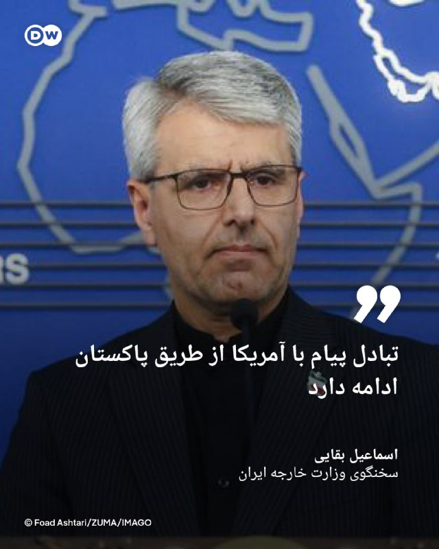

🔶 بقایی: تبادل پیام با آمریکا از طریق پاکستان ادامه دارد

اسماعیل بقایی، سخنگوی وزارت خارجه ایران روز چهارشنبه ۳۰ اردیبهشت اعلام کرد تبادل پیام میان تهران و واشنگتن همچنان از طریق پاکستان ادامه دارد و این روند بر پایه طرح ۱۴ ماده‌ای ایران پیش می‌رود.

او همچنین گفت تهران در حال بررسی ایجاد سازوکاری با عمان برای تضمین امنیت پایدار در تنگه هرمز است.

بقایی گفت وزیر کشور پاکستان در تهران حضور دارد تا به تسهیل این روند کمک کند. به گفته او، تبادل پیام‌ها همچنان ادامه دارد و چارچوب آن بر اساس پیشنهاد ۱۴ ماده‌ای ایران تنظیم شده است.

سخنگوی وزارت خارجه ایران افزود ایران آماده است با همکاری دیگر کشورهای ساحلی، پروتکل‌هایی برای عبور امن کشتی‌ها تدوین کند.

تنگه هرمز از زمان آغاز جنگ در اواخر فوریه، عملا به یکی از اصلی‌ترین نقاط تنش تبدیل شده است. ایران عبور کشتی‌ها را به اخذ مجوز از نیروهای مسلح خود مشروط کرده و آمریکا نیز از ماه گذشته محاصره بنادر ایران را تشدید کرده است.

@dw_farsi

## DW_Farsi — post 124941

  <a href="telegram/content/DW_Farsi_124941_1779310765.mp4" target="_blank">🎬 Download video</a>

🎥 فرمانده ارشد ناتو: هرگونه عملیات در تنگه هرمز، منوط به "تصمیم سیاسی" است

فرمانده ارشد ناتو در اروپا روز چهارشنبه ۲۰ مه در بروکسل گفت تصمیم درباره حضور احتمالی ناتو در تنگه هرمز "سیاسی" است.
او همچنین ایران را به ایجاد اختلال در عبور کشتی‌ها و همکاری نظامی با روسیه متهم کرد.

@dw_farsi

## DW_Farsi — post 124940

  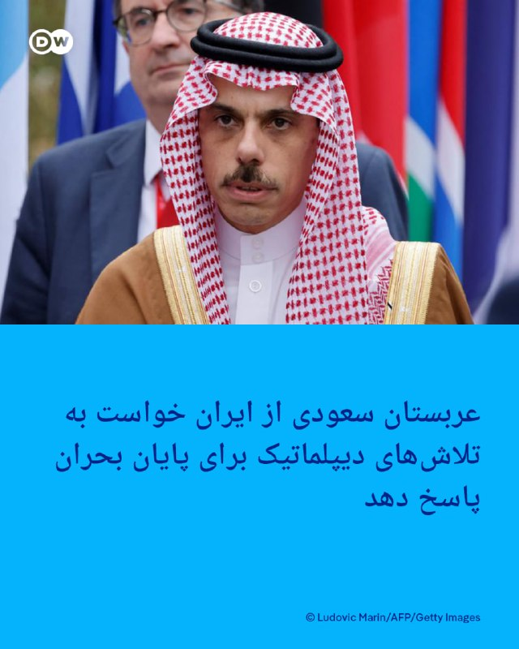

🔶 عربستان سعودی از ایران خواست به تلاش‌های دیپلماتیک برای پایان بحران پاسخ دهد

به گزارش خبرگزاری آلمان، فیصل بن‌فرحان، وزیر خارجه عربستان سعودی، از ایران خواست به تلاش‌های دیپلماتیک برای حل‌وفصل بحران پاسخ دهد و هشدار داد تنها از این مسیر می‌توان از "پیامدهای خطرناک تشدید تنش" جلوگیری کرد.

او در پیامی در شبکه ایکس نوشت تهران باید "فورا" به تلاش‌هایی که با هدف پیشرفت مذاکرات و رسیدن به توافق انجام می‌شود، واکنش نشان دهد.

وزیر خارجه عربستان گفت ادامه مسیر سیاسی، بهترین راه برای جلوگیری از گسترش بحران است. او تاکید کرد ایران باید بدون تاخیر به ابتکارهایی که برای پیشبرد مذاکرات شکل گرفته‌اند، پاسخ دهد تا امکان رسیدن به توافق فراهم شود.

بن‌فرحان در عین حال از دونالد ترامپ، رئيس‌جمهور آمریکا به‌دلیل "فرصت دادن به دیپلماسی" تمجید کرد. او همچنین گفت عربستان از تلاش‌های پاکستان برای میانجی‌گری و دستیابی به راه‌حلی مسالمت‌آمیز حمایت می‌کند.

@dw_farsi

## DW_Farsi — post 124939

  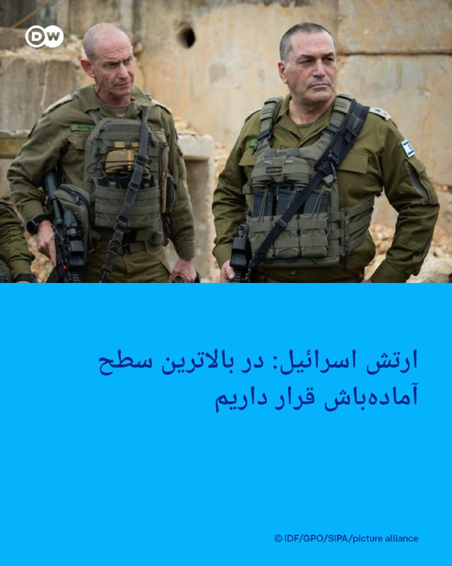

🔶 ارتش اسرائیل: در بالاترین سطح آماده‌باش قرار داریم

بر اساس گزارش خبرگزاری آلمان، ارتش اسرائیل پس از دور تازه تهدیدهای متقابل میان تهران و واشنگتن، اعلام کرده است در بالاترین سطح آماده‌باش قرار دارد.

ایال زامیر، رئیس ستاد ارتش اسرائیل، در دیدار با فرماندهان نظامی گفت ارتش این کشور در مقطع کنونی برای هر تحول احتمالی آماده است.

این موضع‌گیری پس از آن بیان شد که سپاه پاسداران هشدار داد اگر آمریکا و اسرائیل بار دیگر به ایران حمله کنند، دامنه جنگ از سطح منطقه فراتر خواهد رفت.

پیش از آن، دونالد ترامپ، رئيس‌جمهور آمریکا نیز گفته بود اگر تهران با شرایط او برای یک توافق صلح موافقت نکند، حملات تازه‌ای انجام خواهد شد.

ترامپ همچنین روز چهارشنبه ۲۰ ماه مه در سخنرانی خود در مراسم فارغ‌التحصیلی آکادمی گارد ساحلی ایالات متحده گفت: «همه چیز از بین رفته است. نیروی دریایی آنها از بین رفته است. نیروی هوایی آنها از بین رفته است. تقریبا همه چیز. تنها سوال این است که آیا ما باید برویم و کار را تمام کنیم؟ آیا آنها قرار است توافقی را امضا کنند؟ ببینیم چه اتفاقی می‌افتد.»

@dw_farsi

## Persian_Trend_Official — post 14559

💢ادعای «میدل ایست آی»:

🔹سه منبع گفتند که انتظار دارند جنگ در هفته‌های آینده و پس از پایان دوره حج، از سر گرفته شود

🔹ایالات متحده در گذشته از سیگنال‌های فریبنده و حیله‌های دیگر استفاده کرده تا سعی کند طرف مقابل را دچار احساس امنیت کاذب کند

🫆:Tony

📌 @persian_trend_official
پرشین ترند | متفاوت‌ترین کانال نظامی

## Persian_Trend_Official — post 14558

🔴 جانشین فرمانده نیروی دریایی سپاه: آماده رویارویی در تنگه هرمز هستیم

💢جانشین فرمانده نیروی دریایی سپاه پاسداران ایران اعلام کرد نیروهای ایرانی در وضعیت آماده‌باش قرار دارند و تهدیدها را جدی می‌دانند.

وی گفت:

▪️ «دست ما روی ماشه است»

▪️ اگر ترامپ تصور می‌کند می‌تواند با زور تنگه هرمز را باز کند، باید بداند با همان نیروی دریایی مواجه خواهد شد که ادعا می‌کردند نابود شده است

▪️ دشمنان اشتباه می‌کنند اگر فکر کنند با هدف قرار دادن زیرساخت‌ها، این ملت عقب‌نشینی خواهد کرد

▪️ ایران طی ۴۷ سال گذشته نشان داده که آسیب‌پذیر است اما تسلیم نمی‌شود

🫆:Tony

📌 @persian_trend_official
پرشین ترند | متفاوت‌ترین کانال نظامی

## Persian_Trend_Official — post 14557

  <a href="https://t.me/persian_trend_official/14557" target="_blank">📎 Download file</a>

نسخه تلگرام :

## Persian_Trend_Official — post 14555

  <a href="telegram/content/Persian_Trend_Official_14555_1779310767.webm" target="_blank">🎬 Download video</a>

نسخ صوتی لایو امشب در کست باکس :

https://castbox.fm/vi/947285526

## Persian_Trend_Official — post 14554

  <a href="telegram/content/Persian_Trend_Official_14554_1779310768.webm" target="_blank">🎬 Download video</a>

💢سپاه پاسداران با صدور بیانیه‌ای تهدید کرد:

⭕️در صورت حمله دوباره آمریکا و اسرائیل، جنگ را به فراتر از منطقه خواهد کشاند.

🫆:Tony

📌 @persian_trend_official
پرشین ترند | متفاوت‌ترین کانال نظامی

## Persian_Trend_Official — post 14553

نسخه صوتی لایو امشب در اسپاتیفای :

https://open.spotify.com/episode/4ZyN11ARn9PzPUowsFbzbh?si=w_I-pR9MRMyUKElfOPbe8Q

## Persian_Trend_Official — post 14552

  

🔴 ایران محدوده نظارت خود بر تنگه هرمز را مشخص کرد

💢هیئت تنگه خلیج فارس اعلام کرد جمهوری اسلامی ایران حدود منطقه نظارت بر مدیریت تنگه هرمز را تعیین کرده است.

🔻بر اساس این بیانیه:

▪️ مرز شرقی این محدوده، خطی است که «کوه مبارک» در ایران را به جنوب فجیره در امارات متصل می‌کند

▪️ مرز غربی نیز خطی است کهانتهای جزیره قشم در ایران را به «ام‌القیوین» در امارات وصل می‌کند

💢این اعلام در شرایطی منتشر شده که تنش‌ها بر سر کنترل و عبور کشتی‌ها از تنگه هرمز همچنان ادامه دارد.

🫆:Tony

📌 @persian_trend_official
پرشین ترند | متفاوت‌ترین کانال نظامی

## Persian_Trend_Official — post 14551

💢 عضو کمیسیون امنیت ملی مجلس

💢عاصم منیر فردا حامل پیام جدیدی از سوی آمریکا به ایران است

🫆:Tony

📌 @persian_trend_official
پرشین ترند | متفاوت‌ترین کانال نظامی

## Persian_Trend_Official — post 14550

  <a href="telegram/content/Persian_Trend_Official_14550_1779310769.webm" target="_blank">🎬 Download video</a>

🔴آکسیوس

💢یک منبع آمریکایی گفت ترامپ به نتانیاهو گفته است که میانجی‌ها در حال کار بر روی یک «توافقنامه» هستند که هم ایالات متحده و هم ایران آن را امضا خواهند کرد تا رسماً به جنگ پایان دهند و یک دوره ۳۰ روزه مذاکره در مورد مسائلی مانند برنامه هسته‌ای ایران و باز شدن تنگه هرمز را آغاز کنند.

🫆:Tony

📌 @persian_trend_official
پرشین ترند | متفاوت‌ترین کانال نظامی

## Persian_Trend_Official — post 14549

  <a href="telegram/content/Persian_Trend_Official_14549_1779310769.mp4" target="_blank">🎬 Download video</a>

💢به مناسبت دومین سالگرد سقوط هلیکوپتر ابراهیم رئیسی

🔹بشنوید گزیده ای از قدرت سخنوری این ،شهید عضو هیئت مرگ

🫆:Tony

📌 @persian_trend_official
پرشین ترند | متفاوت‌ترین کانال نظامی

## Persian_Trend_Official — post 14547

  <a href="telegram/content/Persian_Trend_Official_14547_1779310771.webm" target="_blank">🎬 Download video</a>

🔴 حمله پهپادی به مقر گروه معارض کُرد در سلیمانیه عراق

💢رسانه‌ها از وقوع انفجار در پی حمله یک پهپاد انتحاری به مقر وابسته به گروه‌های معارض کُرد در استان سلیمانیه واقع در اقلیم کردستان عراق خبر می‌دهند.

💢استان سلیمانیه در ماه‌های گذشته چندین بار شاهد حملات پهپادی و موشکی علیه گروه‌های معارض ایرانی بوده است.

🫆:Tony

📌 @persian_trend_official
پرشین ترند | متفاوت‌ترین کانال نظامی

## Persian_Trend_Official — post 14546

  <a href="telegram/content/Persian_Trend_Official_14546_1779310771.mp4" target="_blank">🎬 Download video</a>

🔴آیا همانطور که رسانه های دولتی ایران گزارش داده اند، آمریکا در جریان مذاکرات صلح پیشنهاد کاهش تحریم های نفتی ایران را داده است؟

💢ترامپ: نه، من این را نشنیده ام. تا زمانی که توافقی امضا نکنند، هیچ کمکی نمی‌کنم.

▪️وقتی آنها توافق نامه ای امضا می کنند، می توانیم دوباره آن مکان را بسازیم و کشوری داشته باشیم که واقعا کشور خوبی برای مردم باشد.

▪️اما نه، ما چیزی پیشنهاد نکرده ایم.

🫆:Tony

📌 @persian_trend_official
پرشین ترند | متفاوت‌ترین کانال نظامی

## Persian_Trend_Official — post 14545

  <a href="telegram/content/Persian_Trend_Official_14545_1779310772.webm" target="_blank">🎬 Download video</a>

🔴 ترامپ: منتظر پاسخ ایران برای جلوگیری از تشدید تنش هستیم

💢دونالد ترامپ درباره مذاکرات با ایران گفت:

▪️ «منتظر پاسخ مناسبی از سوی ایران هستیم تا از تشدید بیشتر جلوگیری شود»
▪️ «چند روز برای دریافت پاسخ ایران صبر خواهیم کرد»
▪️ «تا زمانی که به توافق نرسیم، هیچ تحریمی علیه ایران را لغو نخواهم کرد»

او همچنین افزود:

▪️ «در ایران افراد باهوش و بااستعدادی وجود دارند و امیدواریم توافقی خوب برای هر دو طرف حاصل شود»

▪️ «اگر پاسخ‌های صددرصد درست از ایران دریافت کنیم، در زمان، هزینه و جان انسان‌ها صرفه‌جویی خواهد شد»

▪️ «ممکن است روند تحولات خیلی سریع پیش برود یا چند روز طول بکشد، اما می‌تواند ناگهان و با سرعت زیادی پایان یابد»

🫆:Tony

📌 @persian_trend_official
پرشین ترند | متفاوت‌ترین کانال نظامی

## Persian_Trend_Official — post 14544

  <a href="telegram/content/Persian_Trend_Official_14544_1779310773.mp4" target="_blank">🎬 Download video</a>

سنتکام:

💢اوایل امروز در خلیج عمان، تفنگداران دریایی آمریکا از یگان اعزامی دریایی سی و یکم سوار بر M/T Celestial Sea، یک نفتکش تجاری با پرچم ایران شدند که مظنون به تلاش برای نقض محاصره ایالات متحده از طریق عبور از بندر ایران بود.

💢نیروهای آمریکایی پس از جستجو و هدایت خدمه کشتی برای تغییر مسیر، کشتی را آزاد کردند.

🫆:Tony

📌 @persian_trend_official
پرشین ترند | متفاوت‌ترین کانال نظامی

## RadioFarda — post 157404

  <a href="https://t.me/radiofarda/157404" target="_blank">📎 Download file</a>

📻بشنوید: خبرهای ساعت ۲۱ با رادیوفردا،۳۰اردیبهشت ۱۴۰۵‌

@RadioFarda

## RadioFarda — post 157403

🔸دونالد ترامپ، رئیس‌جمهور آمریکا، شامگاه چهارشنبه گفت حاضر است «چند روز» برای رسیدن پاسخ ایران به پیشنهاد واشینگتن درباره توافق پایان جنگ صبر کند اما هشدار داد که این پاسخ باید «۱۰۰ درصد درست» باشد. 🔸او بعد از سخنرانی در جمع دانشجویان نظامی به خبرنگاران گفت…

## RadioFarda — post 157402

  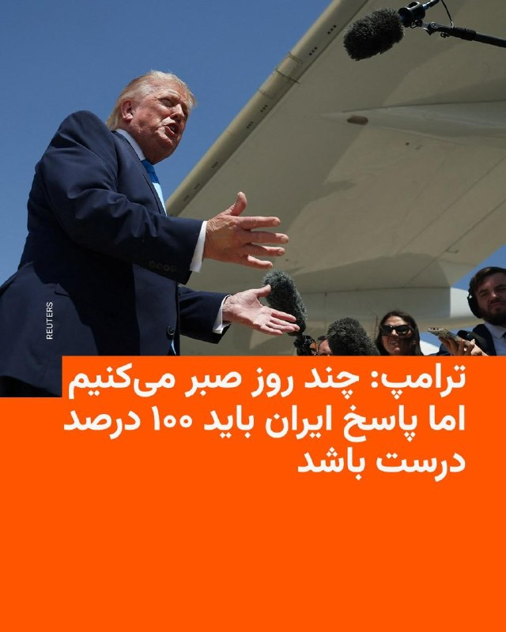

🔸دونالد ترامپ، رئیس‌جمهور آمریکا، شامگاه چهارشنبه گفت حاضر است «چند روز» برای رسیدن پاسخ ایران به پیشنهاد واشینگتن درباره توافق پایان جنگ صبر کند اما هشدار داد که این پاسخ باید «۱۰۰ درصد درست» باشد.

🔸او بعد از سخنرانی در جمع دانشجویان نظامی به خبرنگاران گفت اگر پاسخ ایران درست نباشد، تشدید تنش به سرعت رخ می‌دهد و افزود: «ما آماده پیش‌روی هستیم. باید جواب‌های ۱۰۰ درصد درست و خوبی بگیریم.»

🔸ترامپ اعلام کرد که آمریکا در حال حاضر با افراد «خیلی خوبی» از طرف ایرانی مواجه است که «استعداد و قدرت ذهن» دارند؛ افرادی که به گفته او جایگزین رهبران پیشین ایران شده‌اند.

🔸این اظهارات ساعتی بعد از آن است که سخنگوی وزارت خارجه ایران اعلام کرد تهران در حال بررسی طرح پیشنهادی جدید آمریکا است.

@RadioFarda

## RadioFarda — post 157401

شیعیان پاکستانی مقیم امارات؛ قربانی تنش‌ها بین ابوظبی و تهران

🔸اواسط فروردین‌ماه حمید علی شاه، از کارکنان «اتحاد ریل»، شرکت اپراتور شبکه ریلی امارات متحده عربی، از طرف این شرکت خبردار شد که باید به پلیس مراجعه کند. این مهندس عمران ساعت‌ها بازجویی شد، چندین روز در بازداشت بود و در نهایت، به کشورش پاکستان اخراج شد.

🔸آقای شاه در گفت‌وگو با رادیو اروپای آزاد/ رادیو آزادی می‌گوید: «وقتی با من تماس گرفتند، مشغول کار بودم. بعد از دو ساعت بازجویی، من و ۱۳ نفر دیگر را سوار یک ون کرده و به یک بازداشتگاه اداره مهاجرت منتقل کردند. هفدهم فروردین با یک هواپیما از امارات اخراج شدم».

🔸به گفتۀ یک نمایندۀ پارلمان پاکستان و بر اساس گزارش‌های رسانه‌ای، حمید علی شاه یکی از هزاران شهروند پاکستان بوده که از زمان آغاز جنگ اسرائیل و ایالات متحده علیه ایران در روز نهم اسفند سال گذشته، از امارات متحده عربی اخراج شده‌اند.

🔸بسیاری از آنها از اعضای اقلیت شیعۀ پاکستان بوده‌اند؛ جامعه‌ای که نزدیک به ۳۵ میلیون تن از شهروندان این کشور را در بر می‌گیرد. این بخش از جامعۀ پاکستان با ایران به‌عنوان بزرگترین کشور شیعۀ جهان روابط مستحکمی دارد.

🔸ایران در پاسخ به حملات آمریکا و اسرائیل، صدها موشک و پهپاد را به سمت همسایگانش در حاشیه خلیج فارس، از جمله امارات متحدۀ عربی به‌عنوان یک متحد ایالات متحده و اسرائیل شلیک کرد؛ کشوری که بیشترین بخش حملات تلافی‌جویانۀ ایران را متحمل شد.

🔸پاکستان، یکی از میانجی‌های اصلی برای پایان‌دادن به جنگ ایران، از متحدان دیرینۀ امارات متحده عربی به‌شمار می‌رود. اما با توجه به تعمیق روابط اسلام‌آباد و ریاض، به‌عنوان یک رقیب جدی ابوظبی، روابط پاکستان و امارات متحدۀ عربی دچار تنش‌هایی شده است.

🔸 گزارش کامل را در وب‌سایت رادیوفردا بخوانید.

@RadioFarda

## IranianMinds — post 20469

🔴کانال ۱۲ اسرائیل:

نخست‌وزیر نتانیاهو همیشه با نظر ترامپ در مورد مذاکره با ایران مخالفت کرده است.

@IranianMinds

## IranianMinds — post 20468

🔴 ترامپ درباره ایران: اگر پاسخ‌های درست را نگیریم، اوضاع خیلی سریع پیش می‌رود. همه ما آماده‌ایم. باید پاسخ‌های درست را به دست آوریم. @IranianMinds

## IranianMinds — post 20467

  <a href="telegram/content/IranianMinds_20467_1779310775.mp4" target="_blank">🎬 Download video</a>

🔴 ترامپ درباره ایران:

اگر پاسخ‌های درست را نگیریم، اوضاع خیلی سریع پیش می‌رود. همه ما آماده‌ایم. باید پاسخ‌های درست را به دست آوریم.

@IranianMinds

## IranianMinds — post 20466

  <a href="telegram/content/IranianMinds_20466_1779310776.mp4" target="_blank">🎬 Download video</a>

🔴ترامپ درباره ایران:

ما در واقع با برخی افراد بسیار خوب سر و کار داریم.

ما با افرادی با استعداد و با هوش خوب سر و کار داریم.

ما کاملاً تحت تأثیر قرار گرفته‌ایم.

@IranianMinds

## IranianMinds — post 20465

🔴فوری/ تسنیم:

آمریکایی‌ها متن جدیدی به ایران ارسال کرده‌اند، ایران در حال بررسی متن است و هنوز پاسخی داده نشده است.
میانجی پاکستانی در تهران به دنبال نزدیک کردن متون به یکدیگر است.

@IranianMinds

## BBCPersian — post 281644

🔸آرسنال پس از ۲۲ سال دوباره قهرمان لیگ برتر شد؛ قهرمانی‌ای که دیشب با توقف منچسترسیتی مقابل بورنموث قطعی شد. هزاران هوادار این تیم بیرون از ورزشگاه امارات و همزمان، بازیکنان و کادر فنی هم در محل تمرین تیم در شمال لندن این قهرمانی را جشن گرفتند. قرار است جام قهرمانی لیگ برتر در پایان آخرین بازی فصل لیگ برتر توپچی‌ها به آرسنال اهدا شود؛ دیداری که یکشنبه آینده در خانه کریستال پالاس برگزار می‌شود. این چهارمین قهرمانی آرسنال در تاریخ لیگ برتر است؛ تیمی که حالا به یک چالش بزرگ دیگر فکر می‌کند: فینال لیگ قهرمانان اروپا مقابل پاری‌سن‌ژرمن در بوداپست.

 گزارشی از کاوه مشکات

@BBCPersian

## BBCPersian — post 281643

🔻بریتانیا با لغو تحریم‌های نفتی روسیه، مجوز واردات دیزل و سوخت جت را صادر می‌کند

بریتانیا بر اساس برنامه معافیت از تحریم‌ها، اجازه واردات دیزل و سوخت جت پالایش‌شده از نفت خام روسیه در خارج از این کشور را خواهد داد.

با افزایش هزینه‌های سوخت و فشار بر خطوط هوایی و خانوارها، که بخشی از آن به دلیل درگیری در خاورمیانه است، بریتانیا در صدد است تا محدودیت‌ها در این زمینه را کاهش ‌دهد.

تصمیم بریتانیا پس از اقدام مشابه ایالات متحده انجام می‌شود.

آمریکا روز دوشنبه طرح معافیت از تحریم‌های نفتی روسیه را تمدید کرد و مجوز خرید نفت از این کشور را صادر کرد.

منتقدان این تصمیم آمریکا می‌گویند که چنین اقدامی، پول بیشتری را روانه روسیه خواهد کرد که آن را جنگ در اوکراین برای کشتن مردم اوکراین هزینه خواهد کرد.

روز سه‌شنبه قیمت هر بشکه نفت برنت روز سه‌شنبه به حدود ۱۱۰ دلار رسید که نزدیک به بالاترین رکوردهای اخیر است.

این نشان‌دهنده ادامه نگرانی‌ها در مورد اختلال در جریان نفت از طریق تنگه هرمز است.

https://bbc.in/4eTwV6x
@BBCPersian

## BBCPersian — post 281642

  <a href="https://t.me/bbcpersian/281642" target="_blank">📎 Download file</a>

🔻پادکست برنامه شصت دقیقه چهارشنبه ۳۰ اردیبهشت ۱۴۰۵

این نسخه رادیویی برنامه شصت دقیقه تلویزیون فارسی بی‌بی‌سی است که هرشب بعد از پخش، با حجم کم از صفحه تلگرام بی‌بی‌سی فارسی در دسترس است.
با هشتگ BBCPersianRadio با ما در ارتباط باشید.

## BBCPersian — post 281640

🔻پزشکیان: وادار کردن ایران به تسلیم با استفاده از زور توهم است

مسعود پزشکیان، رئیس‌جمهور ایران در پیامی که در شبکه اجتماعی ایکس منتشر کرده، نوشته است که وادار کردن ایران به تسلیم با استفاده از زور «توهم» است.

او در این پیام آورده است: « ایران پیوسته به تعهدات خود پایبند بوده و هر راهی را برای جلوگیری از جنگ بررسی کرده است؛ همه راه‌ها از طرف ما باز است.»

در ادامه این پیام آمده است: «وادار کردن ایران به تسلیم از طریق زور، چیزی جز یک توهم نیست. احترام متقابل در دیپلماسی بسیار عاقلانه‌تر، ایمن‌تر و پایدارتر از جنگ است.»

اظهارات مسعود پزشکیان در حالیست که دونالد ترامپ، رئیس‌جمهور آمریکا، روز چهارشنبه گفت که مذاکرات با ایران به مراحل پایانی رسیده، اما هشدار داد اگر تهران با توافق موافقت نکند، حملات بیشتری انجام خواهد شد.

او امروز به خبرنگاران گفت: «ما در مراحل پایانی [مذاکرات] با ایران هستیم. خواهیم دید چه اتفاقی می‌افتد. یا به توافق می‌رسیم یا کارهایی خواهیم کرد که کمی ناخوشایند خواهد بود، اما امیدوارم به آنجا نکشد.»

https://bbc.in/3PfMgUJ
@BBCPersian

## BBCPersian — post 281639

  <a href="telegram/content/BBCPersian_281639_1779310778.mp4" target="_blank">🎬 Download video</a>

🔻آخرین خبرهای مهم روز چهارشنبه ۳۰ اردیبهشت ۱۴۰۵

@BBCPersian

## BBCPersian — post 281633

🖊شهاب میرزایی, بی‌بی‌سی

روزنامه نیویورک تایمز در گزارشی از برنامه «جسورانه» نیروهای آمریکایی و اسرائیلی برای آنچه عملیات «آزادی» محمود احمدی‌نژاد «از حصر خانگی» و «تسهیل روند تغییر رژیم» ایران با کمک رئیس‌جمهور پیشین خوانده، خبر داده است.
بر اساس گزارش رسانه‌های ایران، منزل مسکونی محمود احمدی‌نژاد در اولین روز از جنگ آمریکا و اسرائیل علیه ایران در ۹ اسفند ۱۴۰۴ هدف قرار گرفت و شایعاتی درباره کشته شدن او مطرح شد. روزنامه ایران، وابسته به دولت جمهوری اسلامی ایران، همان روز در حساب رسمی خود در شبکه ایکس نوشت که سه نفر از محافظان محمود احمدی‌نژاد، رئیس‌جمهوری اسبق، در حمله به منزل وی کشته شدند. این روزنامه گزارشی از وضعیت آقای احمدی‌نژاد نداد.

آلبوم را ورق بزنید و ادامه مطلب را در لینک زیر مطالعه کنید:

https://bbc.in/4dT881o
📷Getty/khamenei .ir/TABNAK

## BBCPersian — post 281632

🔻اردوغان از «تمدید آتش‌بس» میان ایالات متحده و ایران استقبال کرد

رجب طیب اردوغان، رئیس جمهور ترکیه، روز چهارشنبه در یک تماس تلفنی با دونالد ترامپ، همتای آمریکایی خود از تمدید آتش‌بس بین آمریکا و ایران استقبال کرده است و می‌گوید که به اعتقاد او، «مسائل مورد اختلاف بین دو طرف قابل حل است.»

دفتر ریاست جمهوری ترکیه در بیانیه‌ای اعلام کرده است که در این گفتگو، آقای اردوغان گفته است که تصمیم به تمدید آتش‌بس در منطقه درگیری در منطقه ما را یک تحول مثبت می‌بیند و «معتقد است که دستیابی به یک راه‌حل معقول برای مسائل مورد اختلاف امکان‌پذیر است.»

ساعاتی پیش هم وزیر خارجه عربستان سعودی، گفت که کشورش از تصمیم دونالد ترامپ برای دادن زمان بیشتر به مذاکرات با ایران برای رسیدن به توافق، قدردانی می‌کند.

دونالد ترامپ، رئیس‌جمهوری آمریکا، اوایل هفته گفته بود که عربستان سعودی، امارات متحده عربی و قطر از او خواسته‌ بودند که حمله برنامه‌ریزی شده آمریکا به ایران را به تعویق بیندازد تا زمان بیشتری برای مذاکرات فراهم شود.

رئیس‌جمهور آمریکا، با این حال روز چهارشنبه گفت که مذاکرات با ایران به مراحل پایانی رسیده، اما هشدار داد اگر تهران با توافق موافقت نکند، حملات بیشتری انجام خواهد شد.

شش هفته پس از آن‌که او عملیات «خشم حماسی» را برای برقراری آتش‌بس متوقف کرد، گفت‌وگوها برای پایان دادن به جنگ تاکنون پیشرفت اندکی داشته است.

## BBCPersian — post 281631

🔻ارتش اسرائیل: در بالاترین سطح هشدار قرار داریم

با بالاگرفتن تهدیدهای متقابل آمریکا و اسرائیل به جنگ، سپهبد ایال زمیر، فرمانده ارتش اسرائیل، روز چهارشنبه گفت که ارتش کشورش در بالاترین سطح هشدار خود قرار دارد.

بر اساس بیانیه‌ای که ارتش اسرائیل منتشر کرده است، ایال زمیر در جلسه‌ای با حضور تمام فرماندهان لشکرها گفت: «در حال حاضر، ارتش اسرائیل برای هرگونه تحولی آماده است.»

این اظهارات در حالیست که سپاه پاسداران ساعاتی پیش با انتشار بیانیه‌ای تهدید کرد که در صورت آغاز دوباره جنگ آمریکا و اسرائیل علیه ایران، جنگ «به فراتر از منطقه کشیده خواهد شد.»

دونالد ترامپ، رئیس جمهور آمریکا، هم دیروز گفته بود که در آستانه حمله نظامی دوباره به ایران، به درخواست رهبران منطقه، دستور حمله را لغو کرده است.

https://bbc.in/436bsAl
@BBCPersian

## BBCPersian — post 281630

🔻فرماندهی مرکزی آمریکا، سنتکام، با انتشار ویدیویی در حساب رسمی خود در شبکه اجتماعی ایکس گفته است که نیروهای آمریکایی وارد یک نفتکش با «پرچم ایران» شدند و این کشتی را مجبور به تغییر مسیر کردند.

سنتکام می‌گوید اوایل امروز (چهارشنبه) در دریای عمان، «تفنگداران دریایی ایالات متحده از واحد سی و یکم اعزامی تفنگداران دریایی، وارد ام‌تی سلستیال سی، یک نفتکش تجاری با پرچم ایران شدند که مظنون به تلاش برای نقض محاصره ایالات متحده با عبور به سمت یک بندر ایرانی بود.»

در ادامه این متن آمده است: «نیروهای آمریکایی پس از بازرسی و هدایت خدمه کشتی برای تغییر مسیر، کشتی را آزاد کردند.»

سنتکام می‌گوید نیروهای آمریکایی کماکان به اجرای کامل محاصره دریایی ادامه می‌دهند و اکنون ۹۱ کشتی تجاری را برای اطمینان از رعایت آن، تغییر مسیر داده‌اند.

🎥CENTCOM
https://bbc.in/436bsAl
@BBCPersian

## Dirty_Kids — post 389839

نخست وزیر پاکستان:
بتخمم اصلا جنگ کنید

@Dirty_Kids 👻

## Dirty_Kids — post 389838

  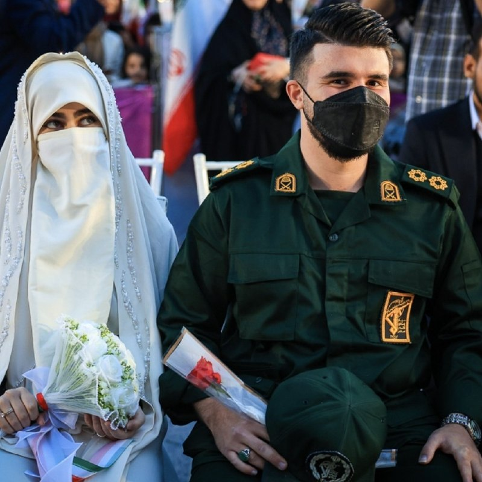

جان‌فداست ولی تو عروسیش ماسک میزنه شناسایی نشه.

@Dirty_Kids 👻

## Dirty_Kids — post 389837

ترامپ:

قرار بود فردا به ایران حمله کنم ولی قراره تعمیرکار بیاد برای سرویس کولر
ملانیا خونه تنهاس، باید باشم حتما

@Dirty_Kids 👻

## Dirty_Kids — post 389836

  

۷۰۰ هزار کیلومتر کار کرده
۲۲ میلیارد تومن قیمت میخوره یعنی ۱۲۵ هزار دلار
صفر خشک ۲۰۲۶ این ۸۸ هزاردلاره

@Dirty_Kids 👻

## Dirty_Kids — post 389834

ما از اینا عبور کردیم
این کصشرا رو دوباره مد نکنید!
شهر شبیه کوفه و کنعان میشه.

@Dirty_Kids 👻

## Dirty_Kids — post 389833

  <a href="telegram/content/Dirty_Kids_389833_1779310781.mp4" target="_blank">🎬 Download video</a>

🔴 صحبتای جنجالی آخوند رسایی، نماینده مجلس، قبل از کشته شدن علی خامنه‌ای:

بعضیا هستن که میگن علی خامنه‌ای داره تلاش میکنه پسرش رو جانشین خودش کنه ولی اگه کسی ذره‌ای عقل داشته باشه به حرفی که اینا میزنن میخنده.
اصلا ساز و کار تعیین رهبر، شرایط کسی که میخواد رهبر بشه، باید طرف سابقه کار اجرایی داشته باشه.

بنابراین اصلا و ابدا چنین چیزی امکان نداره.

@Dirty_Kids 👻

## Hranews — post 113068

  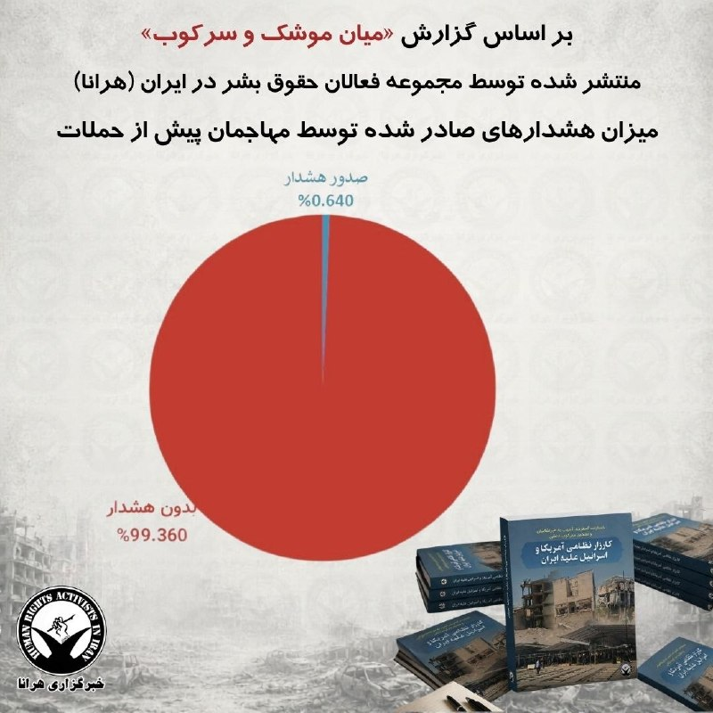

میان موشک و سرکوب؛ گزارش مجموعه فعالان حقوق بشر درباره مخاصمه نظامی ایالات متحده-اسرائیل و ایران منتشر شد 
💥
💥
💥
💥
💥 – امروز، مجموعه فعالان حقوق بشر در ایران گزارش جدیدی را در ۲۴۰ صفحه و دو زبان منتشر کرد که به بررسی کارزار نظامی ایالات متحده و اسرائیل در ایران…

## Hranews — post 113067

دستکم ۲ تجمع اعتراضی برگزار شد

❗️
❗️
❗️
❗️
❗️ – امروز چهارشنبه ۳۰ اردیبهشت ماه، شماری از کارگران قراردادی شرکت پایانه‌ها و مخازن پتروشیمی ماهشهر در اعتراض به کسر مزایای مزدی خود، تجمع اعتراضی برگزار کردند. همچنین، جمعی از کارگران شهرداری زنجان نیز در اعتراض به حذف اضافه کاری و عدم افزایش حقوق؛ دست به #تجمع اعتراضی زدند.

ادامه مطلب

↘️
@hranews_bot تماس ✉️ -  @Hranews  کانال هرانا 🆑

## manototv — post 105704

  <a href="telegram/content/manototv_105704_1779310782.mp4" target="_blank">🎬 Download video</a>

تماسی که از جاویدنام سینا عباسی، ۲۲ ساله از کرمانشاه گفت…

## manototv — post 105703

  <a href="telegram/content/manototv_105703_1779310783.mp4" target="_blank">🎬 Download video</a>

‌
دونالد ترامپ گفت آمریکا در آستانه تصمیم‌گیری درباره ایران قرار دارد و اگر پاسخ‌های مورد نظر واشینگتن دریافت نشود، تحولات می‌تواند «خیلی سریع» رخ دهد.

ترامپ گفت: «اگر پاسخ‌های درست را نگیریم، همه‌چیز خیلی سریع پیش خواهد رفت. ما کاملاً آماده‌ایم.»

او تأکید کرد هرگونه پاسخ از سوی جمهوری اسلامی باید «کامل و صددرصد قابل قبول» باشد و افزود در صورت دستیابی به توافق، «زمان، انرژی و جان انسان‌های زیادی» حفظ خواهد شد.

رئیس‌جمهوری آمریکا همچنین گفت ممکن است تصمیم‌گیری ظرف چند روز انجام شود، اما تأکید کرد روند تحولات می‌تواند «بسیار سریع» باشد.

ترامپ در ادامه ایران را «کشوری شکست‌خورده» توصیف کرد و گفت آمریکا اکنون با افرادی مذاکره می‌کند که به گفته او «بسیار منطقی‌تر» از مقام‌های پیشین جمهوری اسلامی هستند.

او افزود: «ما با افرادی بااستعداد و باهوش طرف هستیم و از این موضوع تحت تأثیر قرار گرفته‌ایم.»

ترامپ همچنین گفت اگر با چند روز صبر کردن بتوان از جنگ یا کشته شدن انسان‌ها جلوگیری کرد، «این کار ارزش انجام دادن دارد.»

## manototv — post 105702

  <a href="telegram/content/manototv_105702_1779310784.mp4" target="_blank">🎬 Download video</a>

تماسی از ایران:
«می‌گفت دیکتاتوری با بازتولید ظلم ادامه پیدا می‌کنه…
می‌گفت باید این چرخه رو شکست؛
با اعتصاب و نایستادن پای این شرایط.»

## manototv — post 105701

  <a href="telegram/content/manototv_105701_1779310786.mp4" target="_blank">🎬 Download video</a>

‌
دونالد ترامپ درباره مذاکرات با جمهوری اسلامی گفت آمریکا تا زمان دستیابی به توافق، هیچ‌گونه تخفیف یا امتیازی ارائه نخواهد کرد.

ترامپ همچنین گفت واشینگتن «چند روز» منتظر پاسخ تهران خواهد ماند.

رئیس جمهور آمریکا در ادامه تاکید کرد: «این موضوع به‌زودی، به هر شکلی که باشد، پایان خواهد یافت.»

او با اشاره به روند مذاکرات افزود: «ما با افراد منطقی طرف هستیم» و تأکید کرد: «باید به پاسخ درست برسیم.»

## alonews — post 121436

  <a href="telegram/content/alonews_121436_1779310786.webm" target="_blank">🎬 Download video</a>

👈ادعای «میدل ایست آی»: دونالد ترامپ، حمله برنامه‌ریزی‌شده به ایران را در این هفته به تعویق انداخت، چراکه متحدان عرب و مقامات دولت خودش به او هشدار دادند در ایام حج، جنگ را از سر نگیرد. 
🔴به گفته دو مقام ارشد کشورهای حوزه خلیج‌فارس، به ترامپ گفته شده بود که…

## alonews — post 121435

  <a href="telegram/content/alonews_121435_1779310787.webm" target="_blank">🎬 Download video</a>

👈فرستاده ویژه ترامپ به گرینلند جف لندری: زمان آن است که ایالات متحده ردپای خود را دوباره در گرینلند بگذارد 
✅ @AloNews خبر جنگ

## alonews — post 121434

  <a href="telegram/content/alonews_121434_1779310787.webm" target="_blank">🎬 Download video</a>

👈ادعای «میدل ایست آی»: دونالد ترامپ، حمله برنامه‌ریزی‌شده به ایران را در این هفته به تعویق انداخت، چراکه متحدان عرب و مقامات دولت خودش به او هشدار دادند در ایام حج، جنگ را از سر نگیرد.

🔴به گفته دو مقام ارشد کشورهای حوزه خلیج‌فارس، به ترامپ گفته شده بود که حمله به ایران در ایام حج، بحرانی را در میان کشورهای عربی حاشیه خلیج فارس ایجاد می‌کند، زیرا این حمله باعث می‌شود صدها هزار زائر حج سرگردان بمانند.

🔴منابع همچنین گفتند که به ترامپ گفته شده بود حمله در این ایام مقدس که منتهی به عید قربان می‌شود، بیشتر از این به جایگاه آمریکا در جهان اسلام لطمه می‌زند.

🔴یک مقام ارشد آمریکایی که از بحث‌های جریان‌یافته در دولت ترامپ آگاه است، تأیید کرد که این گفت‌وگوها انجام شده است

✅ @AloNews خبر جنگ

## alonews — post 121433

  <a href="telegram/content/alonews_121433_1779310787.webm" target="_blank">🎬 Download video</a>

👈فرستاده ویژه ترامپ به گرینلند جف لندری: زمان آن است که ایالات متحده ردپای خود را دوباره در گرینلند بگذارد

✅ @AloNews خبر جنگ

## alonews — post 121431

لکسوس LX600 غول ژاپنی با قیمت 110 میلیارد تومان ناقابل!

و حالا همون ماشین در فرانسه به قیمت 124000 یورو که میشع چیزی حدود 26 میلیارد تومن…

شما فقط اختلاف رو ببین

[@AloTweet]

## alonews — post 121430

  <a href="telegram/content/alonews_121430_1779310787.webm" target="_blank">🎬 Download video</a>

👈نهاد مدیریت آبراه خلیج فارس محدودهٔ نظارتی مدیریتی تنگهٔ هرمز را مشخص کرد

🔴ايران محدودهٔ نظارتى مديریت تنگهٔ هرمز را به این شرح تعيین کرده است:

🔴«خط اتصال كوه مبارک درايران و جنوب فجيره درامارات در شرق تنگه تا خط اتصال انتهاى جزيره قشم در ايران و ام‌القيوین امارات درغرب تنگه.»

🔴تردد دراین محدوده برای عبور از تنگهٔ هرمز نیازمند هماهنگی با مدیریت آبراه خلیج فارس و مجوز این نهاد است

✅ @AloNews خبر جنگ

## alonews — post 121429

اخبار جنگ الونیوز AloNews pinned a photo

## alonews — post 121428

  <a href="telegram/content/alonews_121428_1779310787.webm" target="_blank">🎬 Download video</a>

👈نخست‌وزیر اسپانیا: فشار می‌آورم تا کل اروپا وزیر امنیت اسرائیل را تحریم کند

✅ @AloNews خبر جنگ

## alonews — post 121426

  <a href="telegram/content/alonews_121426_1779310787.webm" target="_blank">🎬 Download video</a>

👈آخرین قیمت نفت ۱۰۵.۰۹ دلار

✅ @AloNews خبر جنگ

## alonews — post 121425

  <a href="telegram/content/alonews_121425_1779310787.webm" target="_blank">🎬 Download video</a>

👈آکسیوس: یک منبع آمریکایی که در جریان این تماس تلفنی قرار داشت به من گفت: «موهای بی‌بی بعد از تماس آتش گرفته بود.»

✅ @AloNews خبر جنگ

## alonews — post 121424

  <a href="telegram/content/alonews_121424_1779310788.webm" target="_blank">🎬 Download video</a>

👈ترامپ درباره کوبا: مردم غذا و برق ندارند، اما مردم بزرگی هستند

✅ @AloNews خبر جنگ

## alonews — post 121423

  <a href="telegram/content/alonews_121423_1779310788.webm" target="_blank">🎬 Download video</a>

👈نخست‌وزیر اسپانیا، پدرو سانچز:
تصاویر وزیر اسرائیلی بن گویر که اعضای ناوگان بین‌المللی حمایت از غزه را تحقیر می‌کند، غیرقابل قبول است.

🔴ما اجازه نمی‌دهیم کسی با شهروندان ما بدرفتاری کند. در سپتامبر، ممنوعیت ورود این عضو دولت اسرائیل به قلمرو ملی را اعلام کردم.

🔴اکنون قصد داریم در بروکسل فشار بیاوریم تا این تحریم‌ها به صورت فوری در مقیاس اروپایی افزایش یابد.

✅ @AloNews خبر جنگ

## alonews — post 121421

  <a href="telegram/content/alonews_121421_1779310788.webm" target="_blank">🎬 Download video</a>

👈یونیورسال پیکچرز بی قرار است فیلمی درباره نجات دو خلبان آمریکایی در ایران بسازند، پس از اینکه جنگنده F-15E Strike Eagle آنها در عملیات خشم حماسی سرنگون شد

✅ @AloNews خبر جنگ

## alonews — post 121420

  <a href="telegram/content/alonews_121420_1779310788.mp4" target="_blank">🎬 Download video</a>

👈صحنه‌هایی از حبوش، جنوب لبنان، پس از حمله هوایی اسرائیل

✅ @AloNews خبر جنگ

## alonews — post 121419

  <a href="telegram/content/alonews_121419_1779310789.mp4" target="_blank">🎬 Download video</a>

🔴مخالفت بنیانگذار سپاه با تسلیم سپاه

🔴محسن سازگارا که خود از بنیانگذاران سپاه پاسداران انقلاب اسلامی است و سال‌هاست در آمریکا به همراه خانواده خود زندگی میکند، در این مصاحبه با تسلیم سپاه که ایران را اشغال و زمام امور را در اختیار دارد، مخالفت نموده!

🤔زندگی و آینده 90 میلیون ایرانی به خاطر همین سازمان تروریستی به فنا رفته بعد این آقا از وسط دل آمریکا داره دفاع میکنه ازشون

✅@AloNews

## alonews — post 121418

  <a href="telegram/content/alonews_121418_1779310791.webm" target="_blank">🎬 Download video</a>

👈ادعای کانال ۱۴ عبری درمورد اظهارات امروز ترامپ: باید به یاد داشته باشیم که او یک تاجر است و اظهاراتش با هدف تثبیت قیمت نفت است

✅ @AloNews خبر جنگ

## alonews — post 121417

  <a href="telegram/content/alonews_121417_1779310791.mp4" target="_blank">🎬 Download video</a>

👈زاکانی : تنگه هرمز حق طبیعی ماعه و اصلا نباید درباره اون با آمریکا مذاکره کنیم

✅ @AloNews خبر جنگ

## alonews — post 121416

  <a href="telegram/content/alonews_121416_1779310792.webm" target="_blank">🎬 Download video</a>

👈عضو کمیسیون امنیت ملی مجلس:
عاصم منیر فردا حامل پیام جدیدی از سوی آمریکا به ایران است

✅ @AloNews خبر جنگ

<!-- MSG END -->

<!-- NAV START -->

<a href="https://github.com/yerbeyer/aio-downloader/blob/main/telegram/content/archive_1.md" style="display:inline-block; padding:6px 12px; margin:0 4px; background-color:#2ea44f; color:white; text-decoration:none; border-radius:4px; font-weight:bold;">صفحه بعد</a>

<!-- NAV END -->
