# خواننده تلگرام

<!-- TOP_NAV START -->

<a href="https://github.com/yerbeyer/aio-downloader/blob/main/telegram/content/archive_1.md" style="display:inline-block; padding:6px 12px; margin:0 4px; background-color:#2ea44f; color:white; text-decoration:none; border-radius:4px; font-weight:bold;">صفحه بعد</a>

<!-- TOP_NAV END -->

<!-- MSG START -->

---
📅 بروزرسانی: 1405/02/26 02:11
---

## VahidOOnLine — post 240385

  

عباس عراقچی، وزیر خارجه جمهوری اسلامی، در واکنش به بالا رفتن قیمت انرژی در آمریکا، در ایکس نوشت: «در حال حاضر، افزایش قیمت بنزین و حباب بازار سهام را کنار بگذارید. درد واقعی زمانی آغاز می‌شود که بدهی آمریکا و نرخ وام‌های مسکن شروع به جهش کنند.»
او نوشت همین حالا هم میزان ناتوانی در بازپرداخت وام خودرو به بالاترین سطح خود در بیش از ۳۰ سال گذشته رسیده است، اما تمام این‌ها قابل اجتناب بود.

‌🏁 🇬🇧 IranintlTV

🤖 @VahidOOnLine

## VahidOOnLine — post 240384

  

♦️نمایندگی دائم جمهوری اسلامی در سازمان ملل متحد روز جمعه ۲۵ اردیبهشت، در پیامی در شبکه اجتماعی اکس نوشت آمریکا تلاش دارد با استفاده از شمار کشورهای حامی پیش‌نویس قطعنامه پیشنهادی خود، تصویری از حمایت گسترده بین‌المللی برای اقداماتش ایجاد کند و زمینه را برای تشدید تنش‌ها در منطقه فراهم سازد.
این نمایندگی افزود: در صورت هرگونه تشدید تنش تازه از سوی آمریکا، کشورهای حامی این قطعنامه نیز در پیامدهای آن شریک خواهند بود و هیچ «توجیه سیاسی» یا «پوشش دیپلماتیک» نمی‌تواند مسئولیت کشورهایی را که در تسهیل و مشروعیت‌بخشی به اقدامات آمریکا نقش دارند، از میان ببرد.
‌🇸🇦 Indypersian

🤖 @VahidOOnLine

## VahidOOnLine — post 240383

  

مایک والتز، سفیر آمریکا در سازمان ملل ، به فاکس‌نیوز گفت: «باید به خاطر داشته باشیم که هیچ دلیلی وجود ندارد که جمهوری اسلامی این گرد و غبار را که شامل ۶۰ درصد اورانیوم با غنای بالا است، در اختیار داشته باشد.»
او گفت:« هیچ کشوری در جهان وجود ندارد که تا آن سطح غنی‌سازی کند و سپس سلاح هسته‌ای نداشته باشد زیرا هیچ دلیلی برای انجام این کار وجود ندارد.»

‌🏁 🇬🇧 IranintlTV

🤖 @VahidOOnLine

## WithYashar — post 11360

ترامپ : ویتنام ۱۹ سال طول کشید، عراق حدود ۱۰ سال، کره ۷ سال، یکی دیگه ۱۴ سال، یکی ۱۲ سال، یکی هم ۹ سال
- ما فقط دو ماه و نیم اونجا بودیم
- چین هم این هفته سه تا نفتکش پر از نفت ایران رو برد، چون ما اجازه دادیم این اتفاق بیفته،شما اجازه دادید
@withyashar

## WithYashar — post 11359

  <a href="telegram/content/WithYashar_11359_1778884863.mp4" target="_blank">🎬 Download video</a>

مجریان صداوسیما برداشتن یه تصویر هوش مصنوعی رو گذاشتن و دارن تحلیلش میکنن!
😂😂
@withyashar

## WithYashar — post 11358

فقط حال من رو فروشنده های بازار که با مردم سر و کله میززند و جماعت زبون نفهم و میبینند درک میکنند

## WithYashar — post 11357

## WithYashar — post 11356

## WithYashar — post 11355

## WithYashar — post 11354

نیویورک تایمز به نقل از مقامات آمریکا:

دستیاران ترامپ برنامه‌هایی رو برای بازگشت به حملات نظامی به ایران آماده کردن، اگر او تصمیم بگیره با بمباران بیشتر از بن بست خارج بشه.

از جمله گزینه‌ها، اعزام نیروهای ویژه به ایران برای هدف قرار دادن مواد هسته‌ای مدفون شده است و ممکنه از نیروهای ویژه برای کنترل جزیره خارک استفاده بشه.
@withyashar

## WithYashar — post 11353

  

جلد جدید مجله تایم: چگونه دیدار ترامپ و شی، نظم نوین جهانی را نشان داد
@withyashar

## FoxNewsTwitter — post 341801

  

Fox News (Twitter/X)

WATCH LIVE: President Trump arrives in Washington after high-stakes China summit https://twitter.com/i/broadcasts/1wGWjazXOPAKQ

## FoxNewsTwitter — post 341800

  <a href="telegram/content/FoxNewsTwitter_341800_1778884867.mp4" target="_blank">🎬 Download video</a>

Fox News (Twitter/X)

Bruce Springsteen walked right past former New Jersey Gov. Chris Christie's outstretched hand during a concert at Brooklyn’s Barclays Center.

Springsteen is seen greeting fans in the arena when Christie extends his hand — but the rock legend doesn't show him any love. Christie quickly pulls his hand back and keeps cheering.

Springsteen has been a vocal critic of President Trump, especially during his latest tour.

## FoxNewsTwitter — post 341799

  

Fox News (Twitter/X)

WATCH LIVE: SpaceX CRS-34 resupply mission launches from Cape Canaveral (Courtesy: SpaceX) https://twitter.com/i/broadcasts/1nGnRYkMkydGO

## IranIntlTV — post 337396

  

عباس عراقچی، وزیر خارجه جمهوری اسلامی، در واکنش به بالا رفتن قیمت انرژی در آمریکا، در ایکس نوشت: «در حال حاضر، افزایش قیمت بنزین و حباب بازار سهام را کنار بگذارید. درد واقعی زمانی آغاز می‌شود که بدهی آمریکا و نرخ وام‌های مسکن شروع به جهش کنند.»
او نوشت همین حالا هم میزان ناتوانی در بازپرداخت وام خودرو به بالاترین سطح خود در بیش از ۳۰ سال گذشته رسیده است، اما تمام این‌ها قابل اجتناب بود.

https://iranintl.com/202605157120

## IranIntlTV — post 337395

  <a href="telegram/content/IranIntlTV_337395_1778884870.mp4" target="_blank">🎬 Download video</a>

امارات متحده عربی اعلام کرد پروژه خط لوله جدید نفت برای دور زدن تنگه هرمز را با سرعت بیشتری پیش خواهد برد.

به گفته مقام‌های ابوظبی، این خط لوله تا سال ۲۰۲۷ ظرفیت صادرات نفت از بندر فجیره را دو برابر می‌کند.

گفت‌وگو با علی دادپی، اقتصاددان
@iranintltv

## IranIntlTV — post 337394

  <a href="telegram/content/IranIntlTV_337394_1778884872.mp4" target="_blank">🎬 Download video</a>

دونالد ترامپ در مسیر بازگشت از چین گفت با تعلیق ۲۰ ساله غنی‌سازی اورانیوم در ایران موافق است، به شرط آنکه در این مدت تمام برنامه هسته‌ای تهران پاکسازی شود.

گفت‌وگو با امیر گیتی، عضو تحریریه ایران‌اینترنشنال
@iranintltv

## IranIntlTV — post 337393

  <a href="telegram/content/IranIntlTV_337393_1778884874.mp4" target="_blank">🎬 Download video</a>

🔻مراسم بدرقه تیم ملی با حضور هواداران حکومت در میدان انقلاب تهران برگزار شد و هنگام پخش سرود جمهوری اسلامی، بازیکنان تیم ملی سلام نظامی دادند و تعلق خاطر خود به حکومت را نشان دادند.

🔹توضیحات مزدک میرزایی، ایران اینترنشنال در برنامه هت‌تریک

🔹تماشای نشخه کامل هت‌تریک؛👇
https://youtu.be/v5Exyf8Nyes

@iranintltvsport

## IranIntlTV — post 337392

  

مایک والتز، سفیر آمریکا در سازمان ملل ، به فاکس‌نیوز گفت: «باید به خاطر داشته باشیم که هیچ دلیلی وجود ندارد که جمهوری اسلامی این گرد و غبار را که شامل ۶۰ درصد اورانیوم با غنای بالا است، در اختیار داشته باشد.»
او گفت:« هیچ کشوری در جهان وجود ندارد که تا آن سطح غنی‌سازی کند و سپس سلاح هسته‌ای نداشته باشد زیرا هیچ دلیلی برای انجام این کار وجود ندارد.»

https://iranintl.com/202605157842

## Shin_Persian — post 6023

Shin ✓ @hey_itsmyturn
Fri, 15 May 2026 21:46:56 UTC

Heavy #USAF 🇺🇸 jet activity over Erbil
#KRI, #Iraq 🇮🇶

فارسی

فعالیت سنگین جت‌های نیروی هوایی ایالات متحده (USAF) 🇺🇸 بر فراز اربیل
#KRI، #Iraq 🇮🇶

𝕏 · @shin_persian

## FarsiVOA — post 217861

⚡️گزارش صدای آمریکا از نشست امنیتی نشریه پولیتیکو
@FarsiVOA

## FarsiVOA — post 217860

🔺وزارت دادگستری آمریکا برای فرد متهم به قتل دو کارمند سفارت اسرائيل در واشنگتن درخواست مجازات اعدام می‌کند

◾️دادستان‌ها در آمریکا روز جمعه اعلام کردند که وزارت دادگستری ایالات متحده برای مردی که متهم است دو کارمند سفارت اسرائیل در واشنگتن را در بیرون یک موزه یهودیان با شلیک گلوله کشت، درخواست مجازات اعدام خواهد کرد.

⬇️ بیشتر بخوانید:
https://ir.voanews.com/a/8150497.html
@FarsiVOA

## Persian_Trend_Official — post 14224

  

🔴محمدباقر السعدی، رهبر حزب‌الله عراق توسط FBI دستگیر شد

🔹السعدی به دلیل فعالیت‌هایش با گردان‌های حزب‌الله عراق و سپاه پاسداران ایران با شش اتهام روبرو است

💢اداره تحقیقات فدرال آمریکا اعلام کرد «محمد السعدی» که از او به‌عنوان یک هدف باارزش مرتبط با تروریسم بین‌المللی یاد شده، بازداشت و به آمریکا منتقل شده است.

🔻بر اساس بیانیه اف‌بی‌آی:

▪️ السعدی و همدستانش متهم به برنامه‌ریزی، هماهنگی و پذیرش مسئولیت دست‌کم ۲۰ حمله تروریستی در اروپا و کانادا هستند
▪️ مقام‌های آمریکایی مدعی‌اند این شبکه در حال برنامه‌ریزی حملات آینده علیه آمریکا نیز بوده است
▪️ از جمله اهداف احتمالی، مراکز و نهادهای یهودی در نیویورک، کالیفرنیا و آریزونا عنوان شده‌اند

💢اف‌بی‌آی این بازداشت را بخشی از اقدامات دولت ترامپ برای مقابله با تروریسم توصیف کرده است.

🫆:Tony

📌 @persian_trend_official
پرشین ترند | متفاوت‌ترین کانال نظامی

## Persian_Trend_Official — post 14223

  

واقعا احمدی نژاد چه شد ؟!

## IranianMinds — post 20219

  <a href="telegram/content/IranianMinds_20219_1778884878.mp4" target="_blank">🎬 Download video</a>

عباس یه بار فقط بگو بله مامان 😭

🔴 جاوید نام عباس کشاورز ۳۹ ساله اهل روستای لفمجان لاهیجان پدر ارشا ۱۲ ساله …

او در شب ۱۹ دی ۱۴۰۴ در جریان اعتراضات در شهر رشت، در محدوده میدان صیقلان، با شلیک مستقیم گلوله کشته شد.

جاویدنامان فراموش نمیشوند.

@IranianMinds

## IranianMinds — post 20218

فقط کافیه مرغ از خیابون رد کنی و‌پولت چند برابر کنی
💵👌

## IranianMinds — post 20217

  <a href="telegram/content/IranianMinds_20217_1778884879.mp4" target="_blank">🎬 Download video</a>

بچه ها اسم این بازی عبور مرغ از خیابون  هست ویدئو نگاه کنید خیلی راحت 8 میلیون ازش سود گرفتیم😍

😤اگ توم دوس داری خیلی راحت از بازی های انلاین پول در بیاری حتما عضو کازینو شبانه شو
✅

توی کازینو شبانه بهت اموزش میدیم از بازی های انلاین پول دربیاری👌

کازینو شبانه راهی برای چند برابر کردن سرمایت 🤷‍♂

کسب درامد انلاین با یه ادم حرفه ای یاد بگیر و‌ پول دربیار 
💵
ae25
🎯همین حالا عضو شو و شروع کن👇
https://t.me/+OS-QBvyDO4M2ZGY0
https://t.me/+OS-QBvyDO4M2ZGY0

## IranianMinds — post 20216

🔴 کانال ۱۳ اسرائیل:

برآوردها حاکی از آن است که ترامپ چراغ سبز برای حمله محدود به مواضع رژیم ملاها را خواهد داد

@IranianMinds

## IranianMinds — post 20215

🔴 سازمان ملل: نگرانیم، چون ممکنه منطقه بازم دچار تنش و درگیری بشه

@IranianMinds

## IranianMinds — post 20214

  

🔴جلد جدید مجله تایم:

چگونه دیدار ترامپ و شی، یک نظم نوین جهانی را به نمایش گذاشت.

@IranianMinds

## IranianMinds — post 20213

  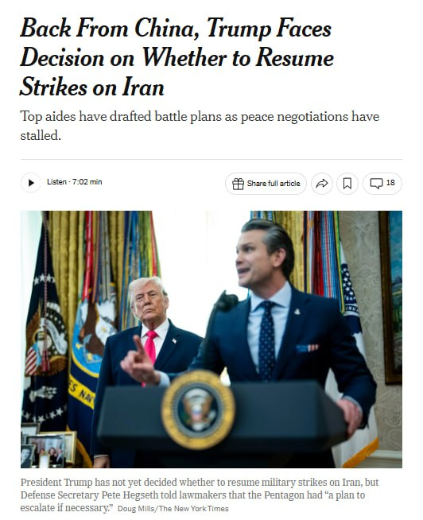

🔴 نیویورک تایمز :

ترامپ پس از بازگشت از چین، در حالی که مشاوران ارشد و مقامات پنتاگون برنامه‌های احتمالی برای حملات مجدد به ایران در صورت شکست مذاکرات صلح را نهایی می‌کردند، وارد آمریکا شد.

اگرچه ترامپ هنوز تصمیم نهایی نگرفته است، گزارش‌ها حاکی از آن است که مقامات آمریکایی و اسرائیلی برای حملاتی که ممکن است طی روزهای آینده آغاز شوند، آماده می‌شوند.

برنامه‌ریزان نظامی درباره گسترش کمپین‌های بمباران و حتی مأموریت‌های عملیات ویژه برای هدف قرار دادن تأسیسات هسته‌ای زیرزمینی ایران بحث کرده‌اند!

@IranianMinds

## BBCPersian — post 281156

  

‌ ‌ ‌ ‌
نخست‌وزیر و وزیر دفاع اسرائیل با صدور بیانیه‌ای اعلام کردند که عزالدین حداد، فرمانده گردان‌‌های عزالدین قسام، شاخه نظامی حماس در غزه را کشته‌اند.

در بیانیه بنیامین نتانیاهو، و اسرائیل کاتس که در رسانه‌های اسرائیلی منتشر شده، آمده است که حداد یکی از «معماران حملات ۷ اکتبر ۲۰۲۳» به اسرائیل بوده است.

طبق این بیانیه، عزالدین حداد از اجرای توافق دونالد ترامپ، رئیس‌جمهور آمریکا، برای خلع سلاح حماس خودداری کرده بود.

یک مقام ارشد امنیتی گفت که نشانه‌های اولیه حاکیست که او کشته شده است.

شاهدان عینی در غزه به بی‌بی‌سی گفتند که یک آپارتمان هدف حمله موشکی قرار گرفت و سپس خودرویی که گفته می‌شود محل را ترک کرده بود، در حمله‌ای دیگر هدف قرار گرفت؛ حمله‌ای که به کشته شدن سه نفر انجامید.

حماس تاکنون کشته شدن عزالدین حداد را نه تایید کرده و نه رد کرده است.

https://bbc.in/4uPJdl1
📷Reuters
@BBCPersian

## alonews — post 120296

  <a href="telegram/content/alonews_120296_1778884884.mp4" target="_blank">🎬 Download video</a>

👈برت بایر از فاکس: آیا تاب آوری ایران را دست کم گرفتید ؟

🔴ترامپ: چیزی را دست کم نگرفتم ما می توانیم پل ها و ظرفیت برق آنها را در دو روز از بین ببریم.‌‌

✅ @AloNews خبر جنگ

## alonews — post 120295

  <a href="telegram/content/alonews_120295_1778884887.mp4" target="_blank">🎬 Download video</a>

👈ترامپ : ویتنام ۱۹ سال طول کشید، عراق حدود ۱۰ سال، کره ۷ سال، یکی دیگه ۱۴ سال، یکی ۱۲ سال، یکی هم ۹ سال
- ما فقط دو ماه و نیم اونجا بودیم
- چین هم این هفته سه تا نفتکش پر از نفت ایران رو برد، چون ما اجازه دادیم این اتفاق بیفته،شما اجازه دادید

✅ @AloNews خبر جنگ

## alonews — post 120294

  <a href="telegram/content/alonews_120294_1778884889.webm" target="_blank">🎬 Download video</a>

👈ترامپ به فاکس نیوز: چین جرات اقدام علیه تایوان را در دوران قدرت من نخواهد داشت‌‌

🔴پکن از عدم نیاز واشنگتن به هیچ کمکی در پرونده ایران یا ایمن سازی ناوبری در تنگه هرمز خبر داد‌‌

🔴چین برای تامین 40 درصد منابع نفتی خود به تنگه هرمز تکیه می کند‌‌

🔴خب، به هر حال ما به یک راه‌حل خواهیم رسید. بنابراین یا این مسئله به‌صورت خشونت‌آمیز حل می‌شود یا بدون خشونت. و من خیلی ترجیح می‌دهم که بدون خشونت باشد

✅ @AloNews خبر جنگ

## alonews — post 120293

  <a href="telegram/content/alonews_120293_1778884889.webm" target="_blank">🎬 Download video</a>

👈پک ۱۰عددی کاندوم با افزایش قیمت به ۴۸۰هزار تومان رسیده!

🔴دولت باید به اینجور چیزا سوبسید بده تا همه بتونن استفاده کنن اما.....

✅ @AloNews خبر جنگ

## alonews — post 120292

تعرفه سرویس های Vip 
⭕️ 
✅ 1 گیگابایت 
⬅️ 250/000 تومان 
✅ 3 گیگابایت 
⬅️ 750/000 تومان استارلینک Vip 
💫 
🌟(مناسب برای شرایط بحرانی مثل جنگ و اختلالات) 
⭐️ 5 گیگابایت 
⬅️ 1/400/000 تومان 
⭐️ 10 گیگابایت 
⬅️ 2/800/000 تومان ویژگی های سرویس های Vip : 
❤️‍🔥 
✅ متصل…

## alonews — post 120291

تعرفه سرویس های Vip 
⭕️

✅ 1 گیگابایت 
⬅️ 250/000 تومان

✅ 3 گیگابایت 
⬅️ 750/000 تومان

استارلینک Vip 
💫 
🌟(مناسب برای شرایط بحرانی مثل جنگ و اختلالات)

⭐️ 5 گیگابایت 
⬅️ 1/400/000 تومان

⭐️ 10 گیگابایت 
⬅️ 2/800/000 تومان

ویژگی های سرویس های Vip : 
❤️‍🔥

✅ متصل در تمامی دستگاه و اپراتور ها

✅ مناسب استفاده روزمره در تمامی برنامه ها

✅ دارای ساب برای اطلاع لحظه ای باقیمانده

✅ تک لینک بدون نیاز به بروزرسانی های متعدد
 برای خرید از پشتیبانی به ایدی زیر پیام بدید.
👇

🔤 @expressuport

خرید فوری از ربات.
👇

🔤 @vpn_express_sup_bot

---
📅 بروزرسانی: 1405/02/26 01:07
---

## VahidOOnLine — post 240382

  

♦️علی موسوی، پسر عبدالرحیم موسوی، رئیس پیشن ستاد کل نیروهای مسلح جمهوری اسلامی، گفت که جنازه پدرش که در نخستین روز حملات اسرائیل و آمریکا به بیت رهبر کشته شد نزدیک به ۳۰ روز در زیر آوار ماند و  یک ماه در جستجوی جنازه اش بودند. موسوی پس از کشته شدن محمد باقری در جنگ ۱۲ روزه، به‌عنوان رییس ستاد کل نیروهای مسلح منصوب شده بود.
‌🇸🇦 Indypersian

🤖 @VahidOOnLine

## VahidOOnLine — post 240381

  <a href="telegram/content/VahidOOnLine_240381_1778881031.mp4" target="_blank">🎬 Download video</a>

یک شهروند در پیامی به ایران اینترنشنال از شرایط سخت معیشتی خود می‌گوید. او اشاره می‌کند که همسر و بچه‌اش را به خانه مادرخانمش فرستاده و خودش تنها در خانه «نان خشک» می‌خورد. او از کار اخراج شده است. صدای او با هوش مصنوعی بازخوانی شده است.
‌🏁 🇬🇧 IranintlTV

🤖 @VahidOOnLine

## VahidOOnLine — post 240380

  

♦️به گزارش نیویورک تایمز، روز جمعه ۲۵ اردیبهشت به نقل از دو مقام خاورمیانه‌ای نوشت ایالات متحده و اسرائیل در حال انجام تدارکات فشرده برای احتمال ازسرگیری حملات علیه جمهوری اسلامی، حتی از اوایل هفته آینده، هستند. این تحرکات، بزرگ‌ترین تدارکات جنگی دو کشور از زمان اجرایی شدن آتش‌بس در ۱۸ فروردین به شمار می‌رود. هم‌زمان، پیت هگست، وزیر دفاع آمریکا، در کنگره اعلام کرد که پنتاگون علاوه بر طرح افزایش تنش، برنامه‌ای نیز برای بازگرداندن بیش از ۵۰ هزار نیروی اعزامی به خاورمیانه به شرایط استقرار استاندارد دارد. این آمادگی‌ها در حالی صورت می‌گیرد که دونالد ترامپ با «غیرقابل قبول» خواندن آخرین پیشنهاد صلح تهران، هشدار داده است که ایران یا باید توافق کند یا با نابودی نظامی روبرو خواهد شد.
نیویورک تایمز به نقل از مقام‌های اطلاعاتی آمریکا نوشت جمهوری اسلامی دوباره به بخش عمده‌ای از پایگاه‌های موشکی، پرتابگرها و تاسیسات زیرزمینی خود دسترسی پیدا کرده و همچنین دسترسی عملیاتی به ۳۰ پایگاه از ۳۳ پایگاه موشکی خود در امتداد تنگه هرمز را بازیابی کرده است.
‌🇸🇦 Indypersian

🤖 @VahidOOnLine

## WithYashar — post 11352

ترامپ خیلی عجله داشته هیچ فیلمی عکسی از رسیدنش نیومده بیرون ! عجبیه

## WithYashar — post 11351

  <a href="telegram/content/WithYashar_11351_1778881033.mp4" target="_blank">🎬 Download video</a>

🎬 Video

## WithYashar — post 11350

حوس لوبیا پلو کردم 😅 امشب که بیداریم درست کنم

## WithYashar — post 11349

ترامپ در تروث : تینا را آزاد کنید
@withyashar
تینا پیترز یک مقام انتخاباتی سابق آمریکاست که به‌خاطر دخالت غیرقانونی در سیستم‌های رأی‌گیری بعد از انتخابات 2020 زندانی شده و حالا ترامپ از او حمایت سیاسی می‌کند

## WithYashar — post 11348

## WithYashar — post 11347

## WithYashar — post 11346

## WithYashar — post 11345

نیویورک‌تایمز به نقل از ۲ مقام امنیتی:

آمریکا و اسرائیل در حال آماده‌سازی گسترده برای احتمال ازسرگیری حملات علیه جمهوری اسلامی هستند،

این حمله ممکن است از هفته آینده آغاز شود
@withyashar

## WithYashar — post 11344

یه مسیج درست اگه تو دایرکت دیدی به من بگو ! انگار‌من کشیش کلیسام ! یا کلانتر محل !

## WithYashar — post 11343

## WithYashar — post 11342

امشب حمله‌ست؟

## WithYashar — post 11341

امشب حمله‌ست؟

## WithYashar — post 11340

  

صدا و سیما هم میدونه چی میشه داره آموزش کار با سلاح رو میده 😂 اینا رفتنین شک نکنید 👋🏾👋🏾
@withyashar

## WithYashar — post 11339

اگه امشب شب‌زیبایی‌نبود و امید نبود الان رد میدادم ! با این پیغام هایی که دایرکت میاد

## WithYashar — post 11338

عمو یاشار ما امشب منتظر اومدم اومدمیم😂🫡

## WithYashar — post 11337

یاشار یچی خواستم بگم روم نشد ولی کلاهبرداریه اگه امکانش بود اطلاع رسانی کن ما پیوی ینفر رفتیم برامون خاله جور کنه واسه معرفی ۲۰۰ از ما گرفت بعد شماره طرفو داد گفت یک میلیون ۳۰۰ دیه برامون بزن گرفتیم براش زدیم بعد اومد گفت برای تضمین ۱۳ میلیون بزنید بعد اینکه…

## WithYashar — post 11336

یاشار یچی خواستم بگم روم نشد ولی کلاهبرداریه اگه امکانش بود اطلاع رسانی کن
ما پیوی ینفر رفتیم برامون خاله جور کنه واسه معرفی ۲۰۰ از ما گرفت بعد شماره طرفو داد گفت یک میلیون ۳۰۰ دیه برامون بزن گرفتیم براش زدیم بعد اومد گفت برای تضمین ۱۳ میلیون بزنید بعد اینکه کارتون تموم شد برش میگردونم حالا ما بهش گفتیم ۱۳ میلیون از کجا بیارم گفتم کنسلش کن ۱۳۰۰ بهمون برگردون اومده میگه اون مهریه بوده دیگه میره برا خالهه
ولله به این پفیوزا اعتماد نکنید اگه امکانش هست بزار چنلت بقیه هم در جریان باشن

## WithYashar — post 11335

ترامپ رسید آمریکا
@withyashar

## FoxNewsTwitter — post 341798

  <a href="telegram/content/FoxNewsTwitter_341798_1778881035.mp4" target="_blank">🎬 Download video</a>

Fox News (Twitter/X)

🍷Cheers to savings! Take $25 OFF any order on the Fox News Wine Shop. Use code CHEERS25 at checkout. bit.ly/4ueKKkV

## pm_afshaa — post 90816

  <a href="telegram/content/pm_afshaa_90816_1778881036.webm" target="_blank">🎬 Download video</a>

🔴نیویورک‌تایمز به نقل از دو مقام امنیتی:
آمریکا و اسرائیل در حال آماده‌سازی گسترده برای احتمال ازسرگیری حملات علیه ایران هستن و ممکنه از هفته آینده آغاز بشه.

💧 Rainbet.com the #1 Non-KYC Crypto Casino & Sportsbook @rainbetcom

😁 @Pm_Afshaa

## pm_afshaa — post 90815

  <a href="telegram/content/pm_afshaa_90815_1778881037.webm" target="_blank">🎬 Download video</a>

🔴نیویورک تایمز:
چند صد نیروی عملیات ویژه آمریکا از ماه مارس وارد منطقه شدن برای سناریوی احتمالی حمله به تأسیسات هسته‌ای زیرزمینی ایران.

الانم بیشتر از 50 هزار نیروی آمریکایی، دو ناو هواپیمابر، ناوشکن‌ها و کلی جنگنده تو منطقه مستقرن.

گفته میشه اگه عملیات زمینی علیه ایران کلید بخوره، نیروهای بیشتری مثل تفنگدارای دریایی و لشکر 82 هوابرد هم وارد عمل میشن.

💧 Rainbet.com the #1 Non-KYC Crypto Casino & Sportsbook @rainbetcom

😁 @Pm_Afshaa

## pm_afshaa — post 90814

  <a href="telegram/content/pm_afshaa_90814_1778881037.webm" target="_blank">🎬 Download video</a>

🔴نیویورک تایمز به نقل از مقامات آمریکا:
دستیاران ترامپ برنامه‌هایی رو برای بازگشت به حملات نظامی به ایران آماده کردن، اگر او تصمیم بگیره با بمباران بیشتر از بن بست خارج بشه.

از جمله گزینه‌ها، اعزام نیروهای ویژه به ایران برای هدف قرار دادن مواد هسته‌ای مدفون شده است و ممکنه از نیروهای ویژه برای کنترل جزیره خارک استفاده بشه.

💧 Rainbet.com the #1 Non-KYC Crypto Casino & Sportsbook @rainbetcom

😁 @Pm_Afshaa

## IranIntlTV — post 337391

  <a href="telegram/content/IranIntlTV_337391_1778881038.mp4" target="_blank">🎬 Download video</a>

یک شهروند در پیامی به ایران اینترنشنال از شرایط سخت معیشتی خود می‌گوید. او اشاره می‌کند که همسر و بچه‌اش را به خانه مادرخانمش فرستاده و خودش تنها در خانه «نان خشک» می‌خورد. او از کار اخراج شده است. صدای او با هوش مصنوعی بازخوانی شده است.

## IranIntlTV — post 337390

  <a href="telegram/content/IranIntlTV_337390_1778881040.mp4" target="_blank">🎬 Download video</a>

ماه‌ها پس از اعتراضات دی‌ماه و در شرایطی که بخشی از جامعه نسبت به تغییرات ناامید شده، برخی هنرمندان همچنان تلاش می‌کنند صدای امید و همراهی با معترضان را زنده نگه دارند. در تازه‌ترین نمونه، ابی و شاهین نجفی با انتشار قطعه مشترک «شاهراه» از مقاومت، امید و ادامه مسیر گفته‌اند.
@iranintltv

## IranIntlTV — post 337389

اسرائیل از هدف قرار دادن رهبر شاخه نظامی حماس در غزه خبر داد

اسرائیل اعلام کرد جمعه ۲۵ اردیبهشت در حمله‌ای در غزه، عزالدین حداد، رهبر شاخه نظامی حماس را هدف قرار داده است.

بنیامین نتانیاهو، نخست‌وزیر اسرائیل، و اسرائیل کاتس، وزیر دفاع، در بیانیه‌ای مشترک اعلام کردند حداد «مسئول قتل، ربایش و آسیب رساندن به هزاران غیرنظامی و نظامی اسرائیلی» بوده است.

آنها اعلام نکردند که آیا معتقدند حداد کشته شده است یا نه. حماس هنوز درباره سرنوشت حداد اظهار نظر نکرده است.

اسرائیل حداد را از طراحان حملات ۷ اکتبر ۲۰۲۳ توصیف کرده است. عزالدین حداد پس از کشته شدن محمد سنوار، برادر یحیی سینوار و فرمانده این گروه در مه ۲۰۲۵، به فرماندهی نظامی حماس در نوار غزه رسید.

حداد بالاترین مقام حماس است که از زمان توافق مورد حمایت آمریکا در ماه اکتبر که قرار بود درگیری‌ها در غزه را متوقف کند، هدف حمله اسرائیل قرار گرفته است.

مذاکرات اسرائیل و حماس برای پیشبرد طرح پساجنگ دونالد ترامپ برای غزه همچنان در بن‌بست باقی مانده است.

گفته شده است که این حمله به‌دستور مستقیم بنیامین نتانیاهو، نخست‌وزیر اسرائیل، انجام گرفته است.

به‌گزارش رویترز، امدادگران در غزه اعلام کردند که در حملات هوایی به یک آپارتمان و یک خودرو دست‌کم سه نفر کشته و ۲۰ نفر زخمی شده‌اند. هنوز مشخص نیست که حداد در میان کشته‌شدگان بوده یا نه.

اسرائیل می‌گوید: «حداد مسئول کشتار اسرائیلی‌ها بوده است»

امدادگران و شاهدان در غزه گفتند یک حمله هوایی، آپارتمانی را در منطقه ریمال در شهر غزه هدف قرار داده که دست‌کم یک نفر را کشته و چندین نفر دیگر را زخمی کرده است. هویت فرد کشته‌شده هنوز مشخص نیست.

به گفته امدادگران و شاهدان، اندکی بعد حمله هوایی دیگری یک خودرو را در خیابانی نزدیک هدف قرار داد. گزارشی فوری از تلفات این حمله دوم منتشر نشده است.

اسرائیل در پنج هفته‌ای که از توقف جنگ مشترک با آمریکا علیه جمهوری اسلامی می‌گذرد، حملات خود به غزه را تشدید کرده و تمرکز آتش خود را دوباره بر این منطقه معطوف کرده است؛ جایی که ارتش معتقد است نیروهای حماس در حال تقویت کنترل خود هستند.

توافقی که در ماه اکتبر به دست آمد، پس از دو سال جنگ میان اسرائیل و حماس، درگیری‌های گسترده را متوقف کرد اما تلاش‌ها برای دستیابی به یک راه‌حل دائمی، شامل خروج نیروهای اسرائیلی، خلع سلاح شبه‌نظامیان و بازسازی این منطقه، با مشکل مواجه شده است.

نیروهای اسرائیلی همچنان بیش از نیمی از خاک غزه را در اشغال دارند؛ جایی که بیشتر ساختمان‌های باقی‌مانده را تخریب کرده و به ساکنان دستور تخلیه داده‌اند.

اکنون بیش از دو میلیون نفر در نوار باریکی در امتداد ساحل عمدتا در ساختمان‌های آسیب‌دیده یا چادرهای موقت زندگی می‌کنند، در حالی که نیروهای حماس عملا کنترل این منطقه را در دست دارند.

بر اساس آمارهایی که میان نیروهای نظامی و غیرنظامیان تفکیک قائل نمی‌شود، از زمان آتش‌بس اکتبر تاکنون حدود ۸۵۰ فلسطینی در حملات اسرائیل کشته شده‌اند. در همین مدت، چهار سرباز اسرائیلی نیز به‌دست شبه‌نظامیان کشته شده‌اند. حماس آمار تلفات نیروهای خود را اعلام نمی‌کند.

🔗وب‌سایت ایران‌اینترنشنال
@iranintltv

## Shin_Persian — post 6022

DefenceGeek 🇬🇧 ✓ @DefenceGeek
Fri, 15 May 2026 19:27:11 UTC

ROYAL AIR FORCE - MIDDLE EAST - ORBAT - 15th May 2026
As of this evening, I believe the RAF has the following aircraft still deployed in the Middle East:

RAF Akrotiri, Cyprus:
F-35B ZM142 #43C818 (since 06/02)
F-35B ZM156 #43C826 (10/03)
F-35B ZM159 #43C829 (06/02)
F-35B ZM169 #43C833 (06/02)
Typhoon ZK322 #43C6D5 (26/01)
Typhoon ZK334 #43CAE8 (26/01)
Typhoon ZK335 #43C746 (24/04)
Typhoon ZK343 #43CAE3 (24/04)
Typhoon ZK352 #43C77B (24/04)
Typhoon ZK353 #43C77C (24/04)
Typhoon ZK354 #43C77D (20/01)
Typhoon ZK366 #43C794 (06/02)
Typhoon ZK370 #43C798 (28/10/25)
Voyager KC.3 ZZ334 #43C6F7
Voyager KC.2 ZZ343 #43C700
Protector RG.1 PR010 #43C972

Al-Udeid Airbase (or another site), Qatar:
Typhoon ZK347 #43C709 (as of 06/03)
Typhoon ZK348 #43C70A (06/03)
Typhoon ZK350 #43C70C (23/01)
Typhoon ZK371 #43C799 (06/03)
Typhoon ZK373 #43C79B (23/01)
Typhoon ZK374 #43C79C (06/03)
Typhoon ZK432 #43C7A9 (23/01)
Typhoon ???? (x1 of the ones listed as Akrotiri should actually be here)

Returned to the UK today (15/05):
Voyager KC.2 ZZ338 #43C6FB
Voyager KC.2 ZZ331 #43C6F4
F-35B ZM141 #43C817
F-35B ZM144 #43C81A
F-35B ZM145 #43C81B
F-35B ZM150 #43C820
F-35B ZM157 #43C827
F-35B ZM164 #43C82E
F-35B ZM166 #43C821
F-35B ZM168 #43C832

Other recent returns to the UK:
Typhoon ZK305 #43C60D (29/04)
Typhoon ZK326 #43C6D9 (29/04)
Typhoon ZK359 #43C782 (30/04)
Typhoon ZK361 #43C784 (07/05)
Shadow R.1 ZZ419 #43C2B5 (14/04)
Shadow R.1 ZZ504 #43C61D (30/04)

Usual caveats apply, my data is based on public flight tracking information and collaboration with @ArmchairAdml & others from @MATA_osint and so is subject to change/corrections!
https://www.raf.mod.uk/news/articles/sustained-at-range-raf-fighters-deliver-defensive-cover-over-the-red-sea/

ترجمه فارسی در بخش نظرات

𝕏 · @shin_persian

## Shin_Persian — post 6021

  <a href="telegram/content/Shin_Persian_6021_1778881042.mp4" target="_blank">🎬 Download video</a>

Open Source Intel ✓ @Osint613
Fri, 15 May 2026 19:06:22 UTC

Four assistants to Haddad were killed inside a vehicle as they attempted to escape from the apartment used as his hiding location.

فارسی

چهار دستیار حداد در حالی که قصد داشتند با خودرویی از آپارتمانی که به عنوان مخفیگاه او استفاده می‌شد فرار کنند، کشته شدند.

𝕏 · @shin_persian

## Shin_Persian — post 6020

  

Waleed Gadban ✓ @GadbanWaleed
Fri, 15 May 2026 17:28:51 UTC

در تصویر: ترور تروریست ارشد حماس.

احمد وحیدی، داری نگاه می‌کنی؟

English

In the image: The assassination of a senior Hamas terrorist.

Ahmad Vahidi, are you watching?

𝕏 · @shin_persian

## FarsiVOA — post 217859

🔺یک رهبر کتائب الحزب‌الله به اتهامات تروریستی در آمریکا محاکمه می‌شود؛ یار عراقی «قاسم سلیمانی» خارج از ایالات متحده دستگیر شد

◾️وزارت دادگستری ایالات متحده روز جمعه ۲۵ اردیبهشت از آغاز محاکمه محمد‌باقر سعد داوود السعدی، تبعه عراقی و عضو ارشد کتائب حزب‌الله خبر داد و او را به همکاری با سازمان‌های تروریستی تحت حمایت رژیم ایران و هدایت حملات علیه شهروندان و منافع ایالات متحده متهم کرد.

⬇️ بیشتر بخوانید:
https://ir.voanews.com/a/8150492.html
@FarsiVOA

## FarsiVOA — post 217857

🔺اسرائيل به رهبر شاخه نظامی حماس حمله کرد؛ عزالدین حداد یکی از طراحان «قتل‌عام ۷ اکتبر» بود

◾️وزیر دفاع اسرائیل، یسرائیل کاتز، روز جمعه ۲۵ اردیبهشت گفت ارتش اسرائیل به دستور او و نخست‌وزیر اسرائیل، عزالدین حداد، رهبر شاخه نظامی سازمان تروریستی حماس و یکی از طراحان قتل‌عام ۷ اکتبر ۲۰۲۳ را هدف قرار داده است.

⬇️ بیشتر بخوانید:
https://ir.voanews.com/a/iran-hamas-hezbollah-lebanon-october-7-/8150485.html
@FarsiVOA

## Persian_Trend_Official — post 14222

  

〰️در تازه‌ترین تحولات امنیتی در منطقه، فرماندهی مرکزی ایالات متحده (سنتکام) با انتشار تصاویری از برخاستن یک فروند بالگرد MH-60R Sea Hawk از عرشه ناوشکن آمریکایی USS Rafael Peralta (DDG-115) در دریای عرب، از ادامه عملیات گسترده دریایی آمریکا خبر داد. این عملیات که با هدف اعمال محدودیت‌ها و نظارت شدید بر خطوط کشتیرانی مرتبط با ایران انجام می‌شود،
بر اساس ادعای سنتکام، تاکنون ۷۵ کشتی تجاری مسیر حرکت خود را تغییر داده‌اند و ۴ شناور نیز برای اطمینان از اجرای قوانین و مقررات اعلام‌شده، متوقف یا غیرفعال شده‌اند. واشنگتن این اقدامات را بخشی از راهبرد «کنترل امنیت دریایی» عنوان می‌کند؛ اما ناظران معتقدند که چنین تحرکاتی می‌تواند فشار اقتصادی و روانی بر تجارت دریایی منطقه را افزایش دهد.

👑:☆Phantom☆

📮 persian_trend_official
پرشین ترند | متفاوت‌ترین کانال نظامی

## Persian_Trend_Official — post 14221

  <a href="telegram/content/Persian_Trend_Official_14221_1778881044.webm" target="_blank">🎬 Download video</a>

👑:☆Phantom☆

📮 persian_trend_official
پرشین ترند | متفاوت‌ترین کانال نظامی

## Persian_Trend_Official — post 14220

  

🔴نتانیاهو 💢نیروهای دفاعی اسرائیل (IDF) عزالدین الحدّاد، فرمانده نظامی حماس در غزه را هدف قرار داده‌اند. 🫆:Tony 📌 @persian_trend_official پرشین ترند | متفاوت‌ترین کانال نظامی

## Persian_Trend_Official — post 14219

  

🔹دستور مستقیم نخست وزیر عراق به کلیه گمرکات عراق به‌منظور عبور ترانزیت کالاهای مورد نیاز ایران از کشور عراق به ایران

🫆:Tony

📌 @persian_trend_official
پرشین ترند | متفاوت‌ترین کانال نظامی

## IranianMinds — post 20212

🔴ترامپ به آمریکا رسید.

@IranianMinds

## BBCPersian — post 281155

🔻 افزایش قیمت نفت و تنش در تنگه هرمز، سود اوراق آمریکا را به بالاترین سطح یک‌سال اخیر رساند

بازده اوراق خزانه‌داری ایالات متحده آمریکا یا سودی که سرمایه‌گذاران برای خرید اوراق بدهی دولت آمریکا مطالبه می‌کنند، روز جمعه به بالاترین سطح یک سال گذشته رسید.

به گزارش رویترز، افزایش قیمت نفت، نگرانی‌ها درباره تورم و انتظار برای قوی‌تر شدن اقتصاد آمریکا باعث شد بازارها پیش‌بینی کنند که نرخ‌های بهره ممکن است برای مدت طولانی‌تری بالا بماند.

قیمت نفت نیز روز جمعه بیش از سه درصد افزایش یافت؛ پس از آن‌که اظهارات دونالد ترامپ و عباس عراقچی، امیدها به توافقی برای پایان دادن به حملات و توقیف کشتی‌ها در اطراف تنگه هرمز را کاهش داد.

دونالد ترامپ گفت که صبرش در قبال ایران رو به پایان است و شی جین‌پینگ، رئیس جمهور چین نیز در دیدار با آقای ترامپ در پکن موافقت کرد که تهران باید تنگه هرمز را بازگشایی کند.

وزیر خارجه ایران هم گفت که تهران به آمریکا «اعتماد ندارد» و تنها در صورتی به مذاکره علاقه‌مند است که واشنگتن جدیت خود را نشان دهد.

https://bbc.in/3PJL9ww
@BBCPersian

## Dirty_Kids — post 389528

  

🔴 طبق گفته دو مقام خاورمیانه‌ای، آمریکا و اسرائیل دارن آماده‌سازی خیلی گسترده‌ای انجام می‌دن. (بزرگ‌ترین سطح از وقتی که آتش‌بس برقرار شده)

این آماده‌سازی‌ها انقدر جدیه که ممکنه از هفته آینده دوباره حملات شروع بشه.

@Dirty_Kids 👻

## Dirty_Kids — post 389526

  <a href="telegram/content/Dirty_Kids_389526_1778881046.mp4" target="_blank">🎬 Download video</a>

امروز یکی تو فضای مجازی با هوش مصنوعی یه عکس از ترامپ و ایلان ماسک زیر پرچم داس و چکشِ کمونیست ساخت؛

بعد تو صداوسیما، خانعلی زاده (کارشناس روابط خارجی و همراه تیم مذاکره کننده تو سفر به پاکستان) خیلی جدی تحلیل کرد که این عکس خروجی سفر ترامپه و این یعنی آمریکا همیشه زیرخوابِ چینه...

@Dirty_Kids 👻

## Dirty_Kids — post 389525

  

تراپی

@Dirty_Kids 👻

## Dirty_Kids — post 389524

  <a href="telegram/content/Dirty_Kids_389524_1778881047.mp4" target="_blank">🎬 Download video</a>

خوب شد به حرف این 👆 گوش ندادن، اگه گوش میدادن الان موشعلی و فرمانده‌هاشو زنده بودن

ولی بجاش رفتن به حرف رافئی‌پور و خوش‌چشم گوش دادن همشون کتلت شدن:)))

@Dirty_Kids 👻

## alonews — post 120290

  <a href="telegram/content/alonews_120290_1778881049.mp4" target="_blank">🎬 Download video</a>

👈مجریان بیسواد صدا و سیما برداشتن یه تصویر هوش مصنوعی رو گذاشتن و دارن تحلیلش میکنن!

✅ @AloNews خبر جنگ

## alonews — post 120289

  <a href="telegram/content/alonews_120289_1778881050.mp4" target="_blank">🎬 Download video</a>

👈مصاحبه‌گر : قبول دارید عامل گرانی‌ها محاصره آمریکا علیه ماست؟

🔴حامی حکومت : نه، قبول ندارم!

✅ @AloNews خبر جنگ

## alonews — post 120288

  <a href="telegram/content/alonews_120288_1778881051.webm" target="_blank">🎬 Download video</a>

👈نیویورک تایمز: گزینه‌های ترامپ در ایران شامل نیروهای ویژه زمینی برای کنترل اورانیوم است

✅ @AloNews خبر جنگ

## alonews — post 120287

  <a href="telegram/content/alonews_120287_1778881051.mp4" target="_blank">🎬 Download video</a>

👈گلایه مخاطب ایران اینترنشنال از قیمت نجومی عرق سگی

🔴قبل جنگ لیتری ۲۵۰بود و با دوستام میخوردم اما الان لیتری ۱۵۰۰ و تنها میخورم

✅ @AloNews خبر جنگ

## alonews — post 120286

  <a href="telegram/content/alonews_120286_1778881052.webm" target="_blank">🎬 Download video</a>

👈ادعای نیویورک‌تایمز: دو مقام خاورمیانه‌ای ادعا کردند که آمریکا و اسرائیل در حال آماده‌سازی گسترده برای احتمال ازسرگیری حملات علیه ایران هستند؛ آماده‌سازی‌ای که بزرگ‌ترین سطح از زمان آتش‌بس محسوب می‌شود؛ این حمله ممکن است از هفته آینده آغاز شود

🔴مقام‌های نظامی آمریکا به‌طور غیررسمی می‌گویند پیروزی در حملات جدید بسیار دشوار است، زیرا ایران بخش زیادی از توان موشکی و زیرزمینی خود را بازیابی کرده است

✅ @AloNews خبر جنگ

## alonews — post 120285

  <a href="telegram/content/alonews_120285_1778881052.webm" target="_blank">🎬 Download video</a>

👈نیویورک‌تایمز: ترامپ روز جمعه پس از بازگشت از چین، با تصمیم‌های مهمی درباره ایران مواجه شد؛ در حالی که نزدیک‌ترین مشاورانش طرح‌هایی برای ازسرگیری حملات نظامی در صورت تصمیم او برای شکستن بن‌بست از طریق فشار نظامی تهیه کرده‌اند

🔴مشاوران رئیس جمهور آمریکا می‌گویند ترامپ هنوز درباره گام بعدی درباره ایران تصمیم نگرفته است

✅ @AloNews خبر جنگ

## alonews — post 120284

  <a href="telegram/content/alonews_120284_1778881052.webm" target="_blank">🎬 Download video</a>

👈فارس: نمایندگان مجلس پیشنهاد افزایش ۵۰۰ هزار تا ۱ میلیون‌تومانی رقم کالابرگ را داده‌اند اما دولت گفته که تنها منابع افزایش ۲۵۰ هزارتومانی رقم کالابرگ را در اختیار دارد و سازمان برنامه هم اعلام کرده که پول نداریم!

✅ @AloNews خبر جنگ

---
📅 بروزرسانی: 1405/02/25 23:51
---

## VahidOOnLine — post 240379

  <a href="telegram/content/VahidOOnLine_240379_1778876472.mp4" target="_blank">🎬 Download video</a>

‌
شیخ خالد بن محمد بن زاید، ولیعهد ابوظبی، اعلام کرد پروژه «خط لوله غرب به شرق» با هدف افزایش صادرات نفت از بندر فجیره و «پاسخ به تقاضای جهانی» با سرعت بیشتری اجرا خواهد شد.

بر اساس اعلام مقام‌های امارات، این پروژه ظرفیت صادرات نفت از مسیر فجیره را دو برابر می‌کند و قرار است تا سال ۲۰۲۷ به بهره‌برداری برسد.

پس از جنگ آمریکا و اسرائیل با جمهوری اسلامی و افزایش تنش‌ها در تنگه هرمز، کشورهای خلیج فارس به دنبال مسیرهای جایگزین برای صادرات نفت و گاز هستند. حدود یک‌پنجم نفت جهان پیش‌تر از تنگه هرمز عبور می‌کرد.
‌🏁 🇬🇧 ManotoTV

🤖 @VahidOOnLine

## VahidOOnLine — post 240378

  <a href="telegram/content/VahidOOnLine_240378_1778876473.mp4" target="_blank">🎬 Download video</a>

یکی از مخاطبان ایران‌اینترنشنال در پیامی می‌گوید وضعیت برگزاری امتحانات دانش‌آموزان پایه‌های هفتم تا دهم در کرمانشاه هنوز مشخص نیست و این بلاتکلیفی باعث نگرانی و فشار روانی شده است. او خواستار تعیین هرچه سریع‌تر وضعیت امتحان‌هاست.

این پیام با هوش مصنوعی خوانده شده است
‌🏁 🇬🇧 IranintlTV

🤖 @VahidOOnLine

## VahidOOnLine — post 240377

  

رسانه‌های ایران از افزایش نجومی قیمت کولر آبی خبر دادند و افزودند در حال حاضر، قیمت کولرهای آبی از حدود ۲۰ میلیون تومان شروع می‌شود و برخی مدل‌های سلولزی و کم‌مصرف به بالای ۵۰ میلیون تومان رسیده‌اند.
بنا بر این گزارش، بسیاری از خریداران به سمت تعمیر کولرهای قدیمی و خرید مدل‌های دست‌دوم رفته‌اند.

این در حالی است که در سال ۱۴۰۱، ارزانترین کولر آبی در بازار یک میلیون و ۵۰۰ تومان و ارزانترین کولر گازی دیواری نیز ۹ میلیون تومان بوده است.
‌🏁 🇬🇧 IranintlTV

🤖 @VahidOOnLine

## VahidOOnLine — post 240376

🗣روایت شما از بحران اقتصادی و زندگی در آتش‌بس- جمعه ۲۵ اردیبهشت:

🔹روز ۲۰ اردیبهشت رفتم در ملایر دیسک صفحه ماشین بگیرم، قیمت گفت ۶ میلیون تومان، فردایش برای خرید قطعی مراجعه کردم؛ همان را گفت ۱۲ میلیون شده است. قیمت یک قلم جنس در یک روز دو برابر شد.

🔹یک کیلو قهوه گلد را که تا هفته قبل در تهران می‌خریدیم یک میلیون و ۷۰۰ هزار تومان، می‌خریدم امروز خریدم ۵ میلیون و ۳۰۰ هزار تومان!

🔹من یک نقاشم و تنها دلخوشی‌ام نقاشی بود. الان توان خرید بوم ندارم که هیچ، حتی مقوایی که هفته پیش خریدم ۲۵۰ هزار تومان هم این هفته شده ۳۲۰ هزار تومن! مدام باید با ترس خراب‌نکردن و هدر ندادن ابزار و مواد اولیه، نقاشی کنم.

🔹کشاورز هستم. سهمیه کود نسبت به پارسال تقریبا نصف شده و وقتی سهمیه جدید می‌آید کلا دو سه روز مهلت خرید دارد. اگر کسی توانایی خرید نداشته باشد، سهمش می‌سوزد. دولت هم سهم کود دولتی آن فرد را به صورت آزاد می‌فروشد.

🔹بنزین کارت آزاد ۵ هزار تومنی، از ساعت ۹ صبح به بعد دیگر موجود نیست.

🔹یک شانه تخم‌مرغ خریدم ۶۰۰ هزار تومان. دیگر حتی نمی‌شود یک وعده غذای ساده خورد.

🔹قبض برق که هر دوره برای ما ۱۲۰ هزار تومان صادر می‌شد این بار شده یک میلیون و ۲۰۰ هزار تومان، تازه همراه با تهدید قطع فوری!
‌🏁 🇬🇧 IranintlTV

🤖 @VahidOOnLine

## VahidOOnLine — post 240375

  

♦️ نواف سلام، نخست‌وزیر لبنان، روز جمعه ۲۵ اردیبهشت، با انتقاد از «ماجراجویی‌های بی‌پروا» در جهت منافع قدرت‌های خارجی، تصریح کرد که کشورش دیگر توان تحمل جنگ‌هایی را که در خدمت پروژه‌های بیگانگان است، ندارد. او همچنین خواستار حمایت کشورهای عربی و جامعه بین‌المللی از بیروت در مذاکرات با اسرائیل شد.

نواف سلام که در یک ضیافت شام سخن می‌گفت، ابراز امیدواری کرد که «تمام حمایت‌های عربی و بین‌المللی برای تقویت موضع لبنان در مذاکرات» بسیج شود. این سخنان مدت کوتاهی پس از پایان دور اخیر گفتگوها و تمدید ۴۵ روزه آتش‌بس فعلی ایراد شد.

نخست‌وزیر لبنان در سرزنشی تلویحی علیه حزب‌الله که در حمایت از جمهوری اسلامی وارد جنگ شد، تاکید کرد که کشورش از این‌گونه «ماجراجویی‌های نسنجیده» به ستوه آمده است. او خاطرنشان کرد که ارتش لبنان باید تنها نهاد مسلح در این کشور باشد و حاکمیت کامل نظامی را در اختیار بگیرد.
‌🇸🇦 Indypersian

🤖 @VahidOOnLine

## VahidOOnLine — post 240374

  

فرزند عبدالرحیم موسوی، رییس ستاد کل نیروهای مسلح جمهوری اسلامی، گفت که جنازه پدرش که در نخستین روز حملات اسرائیل و آمریکا به دفتر خامنه‌ای کشته شد، نزدیک به ۳۰ روز زیر آوار مانده بود.

موسوی پس از کشته شدن محمد باقری در جنگ ۱۲ روزه، به‌عنوان رییس ستاد کل نیروهای مسلح منصوب شد.

‌🏁 🇬🇧 IranintlTV

🤖 @VahidOOnLine

## VahidOOnLine — post 240373

  

به گزارش فرانس۲۴، مقام‌های آمریکایی محمد باقر سعد داوود الساعدی، شهروند عراقی را به اتهام طراحی دست‌کم ۱۸ حمله «تروریستی» در اروپا در واکنش به جنگ آمریکا علیه جمهوری اسلامی بازداشت و متهم کردند.

براساس این گزارش، او متهم است در حملاتی از جمله آتش‌زدن یک بانک در آمستردام و حمله با چاقو به چند مرد یهودی در لندن نقش داشته و ماه گذشته قصد حمله به یک کنیسه در نیویورک را داشته است. همچنین او تصاویر و نقشه‌هایی از مراکز یهودی در لس‌آنجلس و اسکاتسدیل آریزونا را در اختیار یک مامور مخفی قرار داده است.

بر اساس این گزارش، او همچنین به مشارکت در دو حمله اخیر در کانادا، شامل حمله به یک کنیسه و تیراندازی به کنسولگری آمریکا در تورنتو در ماه مارس، متهم شده است.
‌🏁 🇬🇧 IranintlTV

🤖 @VahidOOnLine

## VahidOOnLine — post 240372

  

♦️ وزارت دادگستری ایالات متحده روز جمعه ۲۵ اردیبهشت، اعلام کرد که یک شهروند عراقی به نام «محمد باقر سعد داود الساعدی» را به اتهام طراحی حملات تروریستی در خاک آمریکا، از جمله هدف قرار دادن یک نهاد یهودی در نیویورک، بازداشت و متهم کرده است.

بر اساس کیفرخواست صادر شده، الساعدی که از فرماندهان گروه «کتائب حزب‌الله» (گردان‌های حزب‌الله عراق) معرفی شده، متهم است که برای ارائه حمایت‌های لجستیکی و مادی به سازمان‌های تروریستی تحت حمایت جمهوری اسلامی، از جمله سپاه پاسداران و کتائب حزب‌الله، توطئه کرده است. دادستان‌ها می‌گویند که او در برنامه‌ریزی و اجرای حدود ۱۸ حمله تروریستی علیه منافع آمریکا و اسرائیل در اروپا از ماه مارس گذشته نقش داشته است.

الساعدی متهم است که تلاش کرده یک مامور مخفی را برای مشارکت در حمله به یک کنیسه برجسته در نیویورک جذب کند و نقشه‌ها و تصاویر هدف را نیز در اختیار او قرار داده است. گزارش‌ها حاکی از آن است که سرویس اطلاعاتی بریتانیا نیز پیش از این در حال تحقیق روی این گروه بوده و از برنامه‌های آن‌ها برای گسترش حملات به خاک ایالات متحده آگاهی داشته است.
‌🇸🇦 Indypersian

🤖 @VahidOOnLine

## VahidOOnLine — post 240371

  

جعفر قادری، نماینده شیراز در مجلس گفت: «امارات متحده عربی در جنگ نشان داده که به لانه‌ای برای اسرائیل تبدیل شده و در این راستا نیز هیچ کوتاهی نکرده است.»

او افزود: «این کشور در آینده جایی در مناسبات ما نخواهد داشت و نباید اجازه دهیم سرمایه‌گذاری‌های جدیدی در این کشور رقم بخورد.»

او ادامه داد: «امارات متحده عربی دارد مسیر اسرائیل را می‌رود و در دامن آن‌ها افتاده که این خطرناک است، البته در زمان خودش پاسخ خوش خدمتی‌هایش را به گونه‌ای خواهد گرفت که در اذهان باقی بماند.»
‌🏁 🇬🇧 IranintlTV

🤖 @VahidOOnLine

## VahidOOnLine — post 240370

  <a href="telegram/content/VahidOOnLine_240370_1778876478.mp4" target="_blank">🎬 Download video</a>

یکی از مخاطبان ایران‌اینترنشنال که از مشهد پیام داده می‌گوید برای کار روی پایان‌نامه خود ناچار به تهیه اینترنت پرسرعت شده که با احتساب مالیات حدود ۲ میلیون و ۱۷۰ هزار تومان هزینه داشته است. او می‌گوید برای چیزی که «حقمان است» هزینه سنگین پرداخت می‌کنند، اما دسترسی و کیفیت خدمات پاسخگوی نیاز او نیست. این پیام با هوش مصنوعی خوانده شده است.

بازخوانی این پیام و ساخت تصویر برای آن با هوش مصنوعی انجام گرفته است.
‌🏁 🇬🇧 IranintlTV

🤖 @VahidOOnLine

## WithYashar — post 11334

نیویورک تایمز: آمریکا محمد بکر سعید داود السعدی، فرمانده ارشد شبه‌نظامی گردان‌های حزب‌الله درعراق، رو دستگیر کرد و علیه‌اش کیفرخواست صادر کرد.

او متهم به طراحی حداقل 18 حمله در اروپا، آمریکا و کانادا از پایان فوریه شده؛ این حملات به عنوان انتقام از حملات آمریکا و اسرائیل علیه جمهوری اسلامی برنامه‌ریزی شده بودن.
@withyashar

## WithYashar — post 11333

  <a href="telegram/content/WithYashar_11333_1778876479.mp4" target="_blank">🎬 Download video</a>

لحظه خداحافظی ترامپ با شی و خوشحالی او از سفر موفقیت آمیزش
@withyashar

## WithYashar — post 11332

  <a href="telegram/content/WithYashar_11332_1778876480.mp4" target="_blank">🎬 Download video</a>

‏مایک والتز، سفیر آمریکا در سازمان ملل ، می‌گوید که یکی از «نتایج بزرگ» سفر ترامپ به چین این بود که چین موافقت کرده از ایران فاصله بگیرد.
@withyashar

## WithYashar — post 11331

منابع عبری :

گویا ترامپ با یک حمله محدود جهت فشار بر سر تسلیم شدن موافقت کرده است
@withyashar

## WithYashar — post 11330

واشنگتن پست: جمهوری اسلامی واضح‌ترین بازنده دیدار ترامپ از پکن است، با مخالفت علنی پکن با اختلال در هرمز، تعهد به عدم ارسال تجهیزات نظامی به تهران و توافق بر اینکه تنگه «باید باز بماند.»
@withyashar

## WithYashar — post 11328

l وزارت خارجه آمریکا اعلام کرد آتش‌بس میان لبنان و اسرائیل به مدت ۴۵ روز دیگر تمدید شد.
@withyashar

## WithYashar — post 11327

@withyashar

## WithYashar — post 11326

  <a href="telegram/content/WithYashar_11326_1778876482.mp4" target="_blank">🎬 Download video</a>

@withyashar

## mwarmonitor — post 9146

  <a href="telegram/content/mwarmonitor_9146_1778876482.mp4" target="_blank">🎬 Download video</a>

📝 تحلیل این گزارش یعنی تماشای نمایش حماسه با اعمال شاقه؛ جایی که صداوسیما با ذوق‌زدگی زایدالوصفی از دکترین پشه علیه غول رونمایی می‌کند. استراتژی محوری این است که «ما آنقدر ارزانیم که کشتنمان هم صرفه اقتصادی ندارد!» گزارش با افتخار قایق‌های تندرو را به پشه‌هایی تشبیه می‌کند که قرار است خواب را از چشمان ناوهای ۲ میلیارد دلاری بربایند، اما این قیاس دقیقاً نیمه‌ی تاریک ماجرا را لو می‌دهد: پذیرش رسمی این واقعیت که در یک نبرد کلاسیک، این قایق‌ها چیزی فراتر از سیبل‌های متحرک نیستند.
🔸اوج این کمدی، استناد به رسانه‌های غربی برای اثبات قدرت است؛ یعنی همان رسانه‌هایی که همیشه «دروغ‌پرداز» نامیده می‌شوند، حالا چون از واژه «خطرناک» استفاده کرده‌اند، به سند حقانیت تبدیل می‌شوند. در واقع، پیام استراتژیک نهفته در لایه‌های این گزارش برای مخاطب هوشمند این است: ما با تکنولوژی پراید دریایی و به قیمت جان سرنشینان، قصد داریم چنان اختلالی در جهان ایجاد کنیم که دنیا مجبور شود برای آرام کردن این پشه‌ها، به ما باج بدهد. این نه یک پیروزی ، بلکه روایتِ فقرِ استراتژیکی است که سعی دارد از انتحار به عنوان افتخار رونمایی کند.

@mwarmonitor

## mwarmonitor — post 9145

  <a href="telegram/content/mwarmonitor_9145_1778876484.mp4" target="_blank">🎬 Download video</a>

📝این غولِ بیابانِ تزویر که تمام هیکلاش از سرنگ و سوزن به ارث رسیده، تهوع‌آورترین تصویر از سقوط یک انسان است. موجودی که با آن ریختِ کریه و مغزِ گنجشکی، خیال کرده با باد کردنِ عضلاتِ عاریه‌ای می‌تواند رویِ خونِ جوانانِ این مرز و بوم موج‌سواری کند. این انترِ قلاده‌به‌گردن، که بوی گندِ استروئید و تملق از سر و رویش می‌بارد، چیزی نیست جز یک ماله بدستِ حقیر که برای خوش‌خدمتی به اربابانش، حتی شرافتِ نداشته‌اش را هم به حراج گذاشته است.

🔸تماشای این پهلوان‌پنبه‌یِ دوزاری که با ناله‌های تصنعی از «دردسر» حرف می‌زند، تهوع‌آور است؛ دردسر را آن‌هایی کشیدند که زیر چرخ‌دنده‌هایِ همان سیستمی که تو برایش دم تکان می‌دهی له شدند، نه تو که تمامِ همّ و غمت جابه‌جا کردنِ چند کیلو گوشتِ تلخ و تزریقی است. تو نه قهرمانی و نه مایه افتخار؛ تو صرفاً یک بازیچهٔ کرایه‌ای هستی که تاریخ به عنوانِ لکهٔ ننگی از آن یاد خواهد کرد؛ موجودی که حجمِ حماقتش از حجمِ بازوهایِ متعفنش فراتر رفته است. ننگ بر آن مدالی که رویِ سینهٔ لرزان و بی‌غیرتِ تو سنگینی کند.

@mwarmonitor

## mwarmonitor — post 9144

  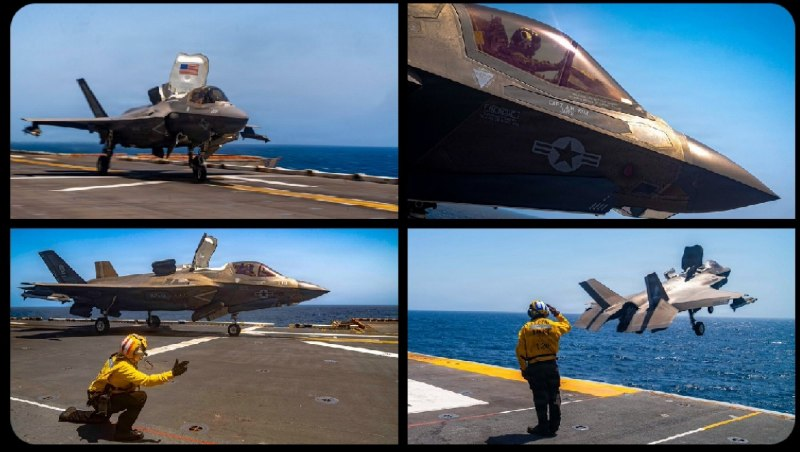

✈️جنگنده‌های F-35B تفنگداران دریایی ایالات متحده از عرشه ناو USS Tripoli (LHA-7) در حالی که این کشتی در دریای عرب در حال حرکت است، به پرواز درمی‌آیند.
🔸نسخه F-35B دارای قابلیت برخاست کوتاه و فرود عمودی است که به این جنگنده پنهانکار امکان می‌دهد از بزرگ‌ترین ناوهای آبی–خاکی نیروی دریایی آمریکا عملیات انجام دهد.

@mwarmonitor

## FoxNewsTwitter — post 341797

  <a href="telegram/content/FoxNewsTwitter_341797_1778876486.mp4" target="_blank">🎬 Download video</a>

Fox News (Twitter/X)

WATCH: President Trump tells @BretBaier that he is signaling a “neutral” stance on Taiwan security following high-stakes meetings with President Xi, emphasizing his desire to avoid military conflict.

The President confirmed that U.S. policy remains unchanged but expressed hesitation regarding billions of dollars in pending weapons approvals for the island.

"I haven't approved it yet. We're going to see what happens. I may do it. I may not do it... We're not looking to have wars."

Watch the full interview at 6 p.m. ET on @SpecialReport

## FoxNewsTwitter — post 341796

  <a href="telegram/content/FoxNewsTwitter_341796_1778876487.mp4" target="_blank">🎬 Download video</a>

Fox News (Twitter/X)

RT @TheStoryFNC: EXCLUSIVE: @DAGToddBlanche responds as feds charge Iraqi national with plotting to ‘terrorize’ Americans and Jews in retaliation for military action against Iran

## FoxNewsTwitter — post 341795

‌Fox News (Twitter/X)

Read more:

## FoxNewsTwitter — post 341792

Fox News (Twitter/X)

BREAKING: An Iraqi national and senior member of a U.S.-designated terror organization was arrested and brought to New York to face trial on federal terrorism charges.

Mohammad Baqer Saad Dawood al-Saadi is accused of coordinating nearly 20 terror attacks in Europe and plotting additional attacks on U.S. soil.

The suspect is accused of directing strikes on behalf of Iran-backed Islamist group Ashab al-Yamin since March.

The FBI said it took action after learning that al-Saadi was planning to expand Ashab al-Yamin’s operations to the U.S., allegedly directing individuals to coordinate American terror attacks against synagogues and other Jewish institutions across the country.

## FoxNewsTwitter — post 341791

  <a href="telegram/content/FoxNewsTwitter_341791_1778876489.mp4" target="_blank">🎬 Download video</a>

Fox News (Twitter/X)

A hero cop in Tennessee kicks down the door of a burning apartment building to rescue a mom and her two children from a blazing inferno – carrying out the four-year-old daughter in his arms.

Newly released Ring camera footage shows the officer during the daring rescue.

According to the Chattanooga Police Department, Officer Rogers rushed into the second-floor home after neighbors reported that people were trapped inside.

No injuries were reported, and the fire was brought under control within 20 minutes as the family now raises money for relocation costs through a GoFundMe campaign.

## pm_afshaa — post 90813

  <a href="telegram/content/pm_afshaa_90813_1778876491.webm" target="_blank">🎬 Download video</a>

‏
🔴مایک والتز، سفیر آمریکا در سازمان ملل: یکی از نتایج بزرگ سفر ترامپ به چین این بود که چین موافقت کرده از ایران فاصله بگیره.

💧 Rainbet.com the #1 Non-KYC Crypto Casino & Sportsbook @rainbetcom

😁 @Pm_Afshaa

## pm_afshaa — post 90812

  <a href="telegram/content/pm_afshaa_90812_1778876491.webm" target="_blank">🎬 Download video</a>

🔴نیویورک تایمز: آمریکا محمد بکر سعید داود السعدی، فرمانده ارشد شبه‌نظامی گردان‌های حزب‌الله درعراق، رو دستگیر کرد و علیه‌اش کیفرخواست صادر کرد.

او متهم به طراحی حداقل 18 حمله در اروپا، آمریکا و کانادا از پایان فوریه شده؛ این حملات به عنوان انتقام از حملات آمریکا و اسرائیل علیه جمهوری اسلامی برنامه‌ریزی شده بودن.

💧 Rainbet.com the #1 Non-KYC Crypto Casino & Sportsbook @rainbetcom

😁 @Pm_Afshaa

## pm_afshaa — post 90811

  <a href="telegram/content/pm_afshaa_90811_1778876492.webm" target="_blank">🎬 Download video</a>

🔴سپهوند، عضو کمیسیون انرژی مجلس:
روزانه 30 میلیون لیتر کمبود بنزین داریم و چون در کوتاه‌مدت امکان افزایش تولید وجود نداره، باید مدیریت مصرف سوخت رو جدی گرفت.

💧 Rainbet.com the #1 Non-KYC Crypto Casino & Sportsbook @rainbetcom

😁 @Pm_Afshaa

## pm_afshaa — post 90810

  <a href="telegram/content/pm_afshaa_90810_1778876492.webm" target="_blank">🎬 Download video</a>

🔴کانال 12 به نقل از مقام ارشد اسرائیلی
اسرائیل خودش رو برای احتمال ازسرگیری قریب‌الوقوع جنگ با جمهوری اسلامی آماده میکنه. آمریکا به این نتیجه رسیده که مذاکرات با تهران به بن‌بست رسیده.

💧 Rainbet.com the #1 Non-KYC Crypto Casino & Sportsbook @rainbetcom

😁 @Pm_Afshaa

## pm_afshaa — post 90809

🔴آخرین رهبران تروریست باقی مانده از ستاد کل شاخه نظامی رضوان و حماس محمد عوده، رئیس اداره اطلاعات، و عماد آکل، رئیس ستاد جبهه داخلی توسط جنگنده های اسراییل به هلاکت رسیدن

💧 Rainbet.com the #1 Non-KYC Crypto Casino & Sportsbook @rainbetcom

😁 @Pm_Afshaa

## VahidOnline — post 75491

  

فرزند عبدالرحیم موسوی، رییس ستاد کل نیروهای مسلح جمهوری اسلامی، گفت که جنازه پدرش که در نخستین روز حملات اسرائیل و آمریکا به دفتر خامنه‌ای کشته شد، نزدیک به ۳۰ روز زیر آوار مانده بود.
موسوی پس از کشته شدن محمد باقری در جنگ ۱۲ روزه، به‌عنوان رییس ستاد کل نیروهای مسلح منصوب شد.
@VahidOOnLine

📡 @VahidOnline

## kianmeli1 — post 87423

‏🔴به گزارش فرانس ۲۴ مقام‌های آمریکایی محمد باقر سعد داوود الساعدی، شهروند عراقی را به اتهام طراحی دست‌کم ۱۸ حمله «تروریستی» در اروپا در واکنش به جنگ آمریکا علیه جمهوری اسلامی بازداشت و متهم کردند

‏براساس این گزارش او متهم است در حملاتی از جمله آتش‌زدن یک بانک در آمستردام و حمله با چاقو به چند مرد یهودی در لندن نقش داشته، او ماه گذشته قصد حمله به یک کنیسه در نیویورک را داشته و تصاویر و نقشه‌هایی از مراکز یهودی در لس‌آنجلس و اسکاتسدیل آریزونا را در اختیار یک مامور مخفی قرار داده است.او همچنین به مشارکت در دو حمله اخیر در کانادا، شامل حمله به یک کنیسه و تیراندازی به کنسولگری آمریکا در تورنتو در ماه مارس، متهم شده است
https://t.me/kianmeli1

## kianmeli1 — post 87422

‏🔴آلیس روفو، معاون وزیر نیروهای مسلح فرانسه اعلام کرد که «شارل دوگل» ناو هواپیمابر فرانسه برای مداخله در صورت تشکیل یک ماموریت «بی‌طرف» جهت بازگرداندن آزادی کشتیرانی در تنگه هرمز ‌مستقر شده است
https://t.me/kianmeli1

## kianmeli1 — post 87421

🔴دقایقی پیش فرمانده حماس کشته شد ‏ نخست‌وزیر و وزیر دفاع اسرائیل در بیانیه‌ای اعلام کردند ارتش این کشور عزالدین حداد، فرمانده شاخه نظامی حماس، را در یک حمله هوایی هدف قرار داده است https://t.me/kianmeli1

## kianmeli1 — post 87420

‏🔴روابط عمومی هیات کوهنوردی استان همدان اعلام کرد که پس از گذشت چهار ماه از مفقود شدن چهار کوهنورد در ارتفاعات الوند، پیکر چهارمین کوهنورد در روز جمعه ۲۵ اردیبهشت پیدا شد
https://t.me/kianmeli1

## kianmeli1 — post 87419

‏🔴مدیر جهاد کشاورزی کازرون اعلام کرد که در پی آتش‌سوزی در مزارع گندم روستای علی‌آباد دوتو در بخش مرکزی این شهرستان، ۲۰ هکتار از مزارع خسارت دید
https://t.me/kianmeli1

## kianmeli1 — post 87418

  

🔴سی ان‌ ان
هکرهای ایرانی با سوءاستفاده از یک نقص جزئی: بدون رمز عبور، به مانیتورهای سوخت پمپ بنزین‌های ایالات متحده نفوذ کردند.

آنها خوانش‌ها را جعل کردند اما نتوانستند به سطح واقعی سوخت دست بزنند.
https://t.me/kianmeli1

## kianmeli1 — post 87417

  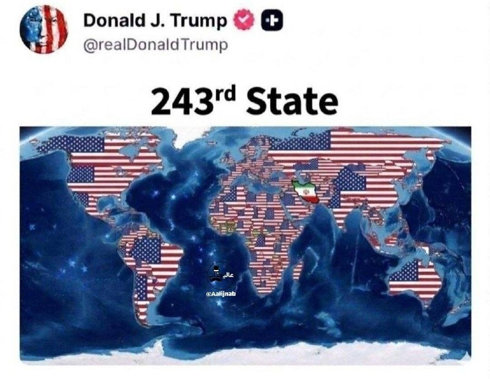

🔴توئیت عجیب ترامپ
https://t.me/kianmeli1

## kianmeli1 — post 87416

  <a href="telegram/content/kianmeli1_87416_1778876494.mp4" target="_blank">🎬 Download video</a>

🔴 ترامپ اعلام کرد که یک دور دیگر از عملیات نظامی آمریکا در ایران در راه است:
‏​
‏ما از نظر نظامی در ایران تقریباً کار را تمام کردیم. حدود ۷۵٪ کار را. (البته) ما همه چیز را تمام نکردیم. برمی‌گردیم و آن را تکمیل می‌کنیم. حتی شاید بیشتر.
‏​
‏ممکن است مجبور شویم کمی کارِ پاکسازی انجام دهیم، چون یک آتش‌بسِ حدوداً یک‌ماهه داشتیم.
‏​
‏ما در حقیقت آتش‌بس را به درخواست کشورهای دیگر انجام دادیم.
‏​
‏من خودم چندان موافق آن نبودم، اما این کار را به عنوان لطفی به پاکستان انجام دادیم، آدم‌های فوق‌العاده‌ای هستند، فیلد مارشال و نخست‌وزیر.»
https://t.me/kianmeli1

## kianmeli1 — post 87415

  <a href="telegram/content/kianmeli1_87415_1778876495.mp4" target="_blank">🎬 Download video</a>

🔴۳۰ روز طول کشید تا جنازه عبدالرحیم موسوی، رئیس سابق ستاد کل نیروهای مسلح، پیدا شود
https://t.me/kianmeli1

## IranIntlTV — post 337388

  <a href="https://t.me/IranintlTV/337388" target="_blank">📎 Download file</a>

🎧نسخه صوتی ۲۴ با فرداد فرحزاد: ترامپ: توقف ۲۰ ساله غنی‌سازی ایران قابل بررسی است
@iranintlTV

## IranIntlTV — post 337387

  <a href="telegram/content/IranIntlTV_337387_1778876497.mp4" target="_blank">🎬 Download video</a>

ابراهیم حامدی، ابی، و شاهین نجفی ترانه جدیدی با نام «شاهراه» منتشر کرده‌اند؛ اثری که به گفته آن‌ها از امید و ایستادگی می‌گوید.

گفت‌وگو با ابراهیم حامدی و شاهین نجفی، خواننده
@iranintltv

## IranIntlTV — post 337386

  <a href="telegram/content/IranIntlTV_337386_1778876498.mp4" target="_blank">🎬 Download video</a>

عباس عراقچی گفت در روزهای اخیر پیام‌هایی از سوی آمریکا دریافت شده که نشان‌دهنده تمایل واشینگتن به ادامه مذاکرات است.

همزمان محمدعلی جعفری، فرمانده قرارگاه بقیه‌الله سپاه، گفت آغاز دوباره جنگ به ضرر آمریکا خواهد بود.

گفت‌وگو با جابر رجبی، تحلیل‌گر سیاسی
@iranintltv

## IranIntlTV — post 337385

یکی از فرماندهان کتائب حزب‌الله عراق در آمریکا محاکمه می‌شود

مقام‌های فدرال در آمریکا اعلام کردند که محمد باقر سعد داوود الساعدی، از فرماندهان کتائب حزب‌الله عراق، از گروه‌های نیابتی تحت حمایت جمهوری اسلامی متهم شده است که دیگران را به حمله به منافع آمریکایی و اسرائیلی هدایت و تشویق کرده است.

به‌گفته این مقام‌ها، او به اتهام برنامه‌ریزی برای حمله به اماکن یهودی در ایالات متحده، از جمله یک کنیسه در شهر نیویورک، تحت پیگرد قرار گرفته است.

قرار است الساعدی جمعه در دادگاه فدرال منهتن حاضر شود. هنوز مشخص نیست او چگونه بازداشت و به ایالات متحده منتقل شده است.
الیزابت تسورکوف، پژوهشگر روسی-اسرائیلی که در مارس ۲۰۲۳ هنگام انجام تحقیقات دکترا در عراق تسورکوف به مدت ۹۰۳ روز گروگان گروه کتائب حزب‌الله گروگان بود و در سپتامبر ۲۰۲۵ آزاد شد.

بر اساس شکایتی کیفری که جمعه ۲۵ اردیبهشت علنی شد، محمد باقر سعد داوود الساعدی متهم است که از اواخر فوریه تاکنون دست‌کم ۱۸ حمله در اروپا و کانادا را در واکنش به حملات آمریکا و اسرائیل علیه جمهوری اسلامی برنامه‌ریزی کرده است.

طبق این شکایت، الساعدی یکی از فرماندهان کتائب حزب‌الله است؛ گروهی شبه‌نظامی در عراق که به‌عنوان نیروی نیابتی سپاه پاسداران عمل می‌کند و به تهران در گسترش نفوذ خود در منطقه، از جمله از طریق حمله به نیروهای آمریکایی و اهداف دیپلماتیک، کمک کرده است.

در این شکایت آمده است که الساعدی قصد داشته آمریکایی‌ها و یهودیان را در لس‌آنجلس و نیویورک به قتل برساند و برنامه‌ریزی برای حمله به یک کنیسه در نیویورک را آغاز کرده بود.

در شکایت آمده است که الساعدی و همدستانش دست‌کم ۱۸ حمله تروریستی در اروپا و دو حمله دیگر در کانادا را برنامه‌ریزی و هماهنگ کرده‌اند و مسئولیت آنها را بر عهده گرفته‌اند. همچنین او متهم شده که دیگران را برای انجام حملات در داخل آمریکا، از جمله در نیویورک، هدایت و هماهنگ کرده است.

در کیفرخواست همچنین گفته شده که او به‌عنوان یکی از رهبران کتائب حزب‌الله، قاسم سلیمانی، فرمانده پیشین نیروی قدس سپاه پاسداران را می‌شناخت. سلیمانی در سال ۲۰۲۰ در حمله نظامی آمریکا کشته شد.

دولت آمریکا همچنین اعلام کرده که الساعدی با ابومهدی المهندس، رهبر وقت کتائب حزب‌الله که او نیز در همان حمله سال ۲۰۲۰ کشته شد، همکاری نزدیک داشته است.

کتائب حزب‌الله به حمله به پایگاه‌های ارتش آمریکا در عراق و سوریه متهم شده و از سوی ایالات متحده به‌عنوان یک سازمان تروریستی خارجی شناخته می‌شود. این گروه مدت‌ها یکی از مهم‌ترین اجزای شبکه نیروهای نیابتی جمهوری اسلامی در منطقه بوده است.

کتائب حزب‌الله که پس از حمله آمریکا به عراق در سال ۲۰۰۳ شکل گرفت، به یکی از مهم‌ترین گروه‌های تشکیل‌دهنده نیروهای موسوم به بسیج مردمی تبدیل شد؛ ائتلافی از گروه‌های شبه‌نظامی که بعدها در ساختار امنیتی عراق ادغام شد.

با وجود این، مقام‌های آمریکایی می‌گویند این گروه همچنان به‌طور نزدیک از سپاه پاسداران دستور می‌گیرد و در پیشبرد نفوذ منطقه‌ای تهران،‌از جمله از طریق حمله به نیروهای آمریکایی و اهداف دیپلماتیک، نقش دارد.

دامنه فعالیت این گروه فراتر از خاورمیانه چندان روشن نیست و سابقه مستندی از عملیات‌های گسترده جهانی ندارد. در مقایسه با برخی دیگر از متحدان جمهوری اسلامی، از جمله حزب‌الله لبنان و حماس در غزه، کتائب حزب‌الله در جنگ‌های دو سال گذشته در خاورمیانه تا حد زیادی دست‌نخورده باقی مانده است.

مارکو روبیو، وزیر امور خارجه آمریکا، در ماه مارس اعلام کرد که این گروه یک خبرنگار آمریکایی به نام شلی کیتلسون را در بغداد ربوده و بعدا آزاد کرده است.
 
🔗وب‌سایت ایران‌اینترنشنال
@iranintltv

## IranIntlTV — post 337384

  <a href="telegram/content/IranIntlTV_337384_1778876500.mp4" target="_blank">🎬 Download video</a>

با گذشت چند ماه از اعتراضات دی و ناامیدی بخشی از مردم از بهبود اوضاع در ایران، شماری از هنرمندان، تلاش کرده‌اند در حمایت از معترضان و همینطور زنده نگهداشتن امید مردم، نقش داشته باشند. در یکی از تازه‌ترین این تلاش‌‎ها، ابراهیم حامدی، ابی، این بار با شاهین نجفی، ترانه جدیدی به نام شاهراه، منتشر کرده‎‌اند تا از امید و ایستادگی بگویند.
@iranintltv

## IranIntlTV — post 337383

  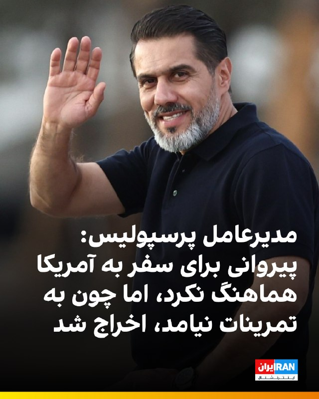

🔻پیمان حدادی، مدیرعامل باشگاه پرسپولیس، در یک برنامه تلویزیونی مدعی شد افشین پیروانی برای سفر به کشوری غیر از آمریکا با او هماهنگ کرده بود. او گفت: «تصمیم پیروانی برای سفر به آمریکا شخصی بود. او قبلاً هم به این کشور سفر کرده بود، اما به نظر من در این شرایط سفر به آمریکا درست نبود.»

🔹حدادی گفت: «پیروانی با من هماهنگ کرده بود که برای دیدن خانواده‌اش به کشور دیگری برود. خانواده او به دلیل شرایط جنگی نگران بودند، اما درباره سفر به آمریکا به من چیزی نگفته بود.»

🔹باشگاه پرسپولیس هفته گذشته از اخراج افشین پیروانی، مدیر تیم فوتبال بزرگسالان این باشگاه، به دلیل «سفر به آمریکا» هم‌زمان با عملیات نظامی آمریکا و اسرائیل علیه جمهوری اسلامی خبر داد و اعلام کرد این سفر «مورد تأیید ارکان مدیریتی باشگاه نبوده است.»

🔹با این حال، حدادی امروز گفت دلیل اخراج پیروانی حاضر نشدن او در تمرینات بوده، نه سفر به آمریکا: «تمرینات ما آغاز شد و او در تمرینات حضور پیدا نکرد. در باشگاه کمیته انضباطی داریم که درباره او تصمیم گرفت؛ همان‌طور که درباره سروش رفیعی و میلاد محمدی تصمیم گرفته شد و جریمه شدند.»

@iranintltvsport

## IranIntlTV — post 337382

  <a href="telegram/content/IranIntlTV_337382_1778876502.mp4" target="_blank">🎬 Download video</a>

دونالد ترامپ گفت اگر لازم باشد آمریکا برای گرفتن ذخایر اورانیوم غنی‌شده مستقیما وارد ایران می‌شود. ترامپ گفته در صورت تعهد واقعی تهران، واشینگتن شاید با تعلیق ۲۰ ساله برنامه هسته‌ای موافقت کند، اما ادامه هر برنامه مرتبط با سلاح هسته‌ای توافق را منتفی می‌کند.
@iranintltv

## IranIntlTV — post 337381

  <a href="telegram/content/IranIntlTV_337381_1778876504.mp4" target="_blank">🎬 Download video</a>

یکی از مخاطبان ایران‌اینترنشنال در پیامی می‌گوید وضعیت برگزاری امتحانات دانش‌آموزان پایه‌های هفتم تا دهم در کرمانشاه هنوز مشخص نیست و این بلاتکلیفی باعث نگرانی و فشار روانی شده است. او خواستار تعیین هرچه سریع‌تر وضعیت امتحان‌هاست.

این پیام با هوش مصنوعی خوانده شده است

## IranIntlTV — post 337380

  

رسانه‌های ایران از افزایش نجومی قیمت کولر آبی خبر دادند و افزودند در حال حاضر، قیمت کولرهای آبی از حدود ۲۰ میلیون تومان شروع می‌شود و برخی مدل‌های سلولزی و کم‌مصرف به بالای ۵۰ میلیون تومان رسیده‌اند.
بنا بر این گزارش، بسیاری از خریداران به سمت تعمیر کولرهای قدیمی و خرید مدل‌های دست‌دوم رفته‌اند.

این در حالی است که در سال ۱۴۰۱، ارزانترین کولر آبی در بازار یک میلیون و ۵۰۰ تومان و ارزانترین کولر گازی دیواری نیز ۹ میلیون تومان بوده است.
https://iranintl.com/202605156933

## IranIntlTV — post 337379

🗣روایت شما از بحران اقتصادی و زندگی در آتش‌بس- جمعه ۲۵ اردیبهشت:

🔹روز ۲۰ اردیبهشت رفتم در ملایر دیسک صفحه ماشین بگیرم، قیمت گفت ۶ میلیون تومان، فردایش برای خرید قطعی مراجعه کردم؛ همان را گفت ۱۲ میلیون شده است. قیمت یک قلم جنس در یک روز دو برابر شد.

🔹یک کیلو قهوه گلد را که تا هفته قبل در تهران می‌خریدیم یک میلیون و ۷۰۰ هزار تومان، می‌خریدم امروز خریدم ۵ میلیون و ۳۰۰ هزار تومان!

🔹من یک نقاشم و تنها دلخوشی‌ام نقاشی بود. الان توان خرید بوم ندارم که هیچ، حتی مقوایی که هفته پیش خریدم ۲۵۰ هزار تومان هم این هفته شده ۳۲۰ هزار تومن! مدام باید با ترس خراب‌نکردن و هدر ندادن ابزار و مواد اولیه، نقاشی کنم.

🔹کشاورز هستم. سهمیه کود نسبت به پارسال تقریبا نصف شده و وقتی سهمیه جدید می‌آید کلا دو سه روز مهلت خرید دارد. اگر کسی توانایی خرید نداشته باشد، سهمش می‌سوزد. دولت هم سهم کود دولتی آن فرد را به صورت آزاد می‌فروشد.

🔹بنزین کارت آزاد ۵ هزار تومنی، از ساعت ۹ صبح به بعد دیگر موجود نیست.

🔹یک شانه تخم‌مرغ خریدم ۶۰۰ هزار تومان. دیگر حتی نمی‌شود یک وعده غذای ساده خورد.

🔹قبض برق که هر دوره برای ما ۱۲۰ هزار تومان صادر می‌شد این بار شده یک میلیون و ۲۰۰ هزار تومان، تازه همراه با تهدید قطع فوری!

## IranIntlTV — post 337378

  

فرزند عبدالرحیم موسوی، رییس ستاد کل نیروهای مسلح جمهوری اسلامی، گفت که جنازه پدرش که در نخستین روز حملات اسرائیل و آمریکا به دفتر خامنه‌ای کشته شد، نزدیک به ۳۰ روز زیر آوار مانده بود.

موسوی پس از کشته شدن محمد باقری در جنگ ۱۲ روزه، به‌عنوان رییس ستاد کل نیروهای مسلح منصوب شد.

https://iranintl.com/202605151477

## IranIntlTV — post 337377

  

به گزارش فرانس۲۴، مقام‌های آمریکایی محمد باقر سعد داوود الساعدی، شهروند عراقی را به اتهام طراحی دست‌کم ۱۸ حمله «تروریستی» در اروپا در واکنش به جنگ آمریکا علیه جمهوری اسلامی بازداشت و متهم کردند.

براساس این گزارش، او متهم است در حملاتی از جمله آتش‌زدن یک بانک در آمستردام و حمله با چاقو به چند مرد یهودی در لندن نقش داشته و ماه گذشته قصد حمله به یک کنیسه در نیویورک را داشته است. همچنین او تصاویر و نقشه‌هایی از مراکز یهودی در لس‌آنجلس و اسکاتسدیل آریزونا را در اختیار یک مامور مخفی قرار داده است.

بر اساس این گزارش، او همچنین به مشارکت در دو حمله اخیر در کانادا، شامل حمله به یک کنیسه و تیراندازی به کنسولگری آمریکا در تورنتو در ماه مارس، متهم شده است.
https://iranintl.com/202605155558

## IranIntlTV — post 337376

  <a href="https://t.me/IranintlTV/337376" target="_blank">📎 Download file</a>

🎧نسخه صوتی حرف آخر با پوریا زراعتی - بزودی: عملیات 'پاکسازی' در ایران
@iranintlTV

## IranIntlTV — post 337375

  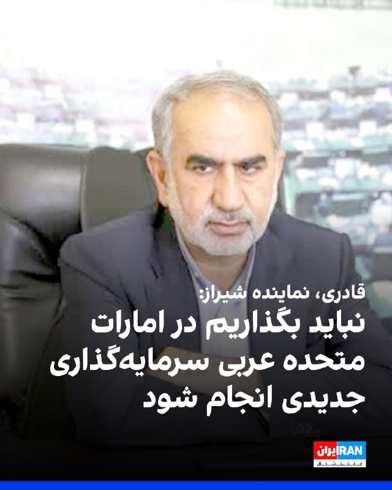

جعفر قادری، نماینده شیراز در مجلس گفت: «امارات متحده عربی در جنگ نشان داده که به لانه‌ای برای اسرائیل تبدیل شده و در این راستا نیز هیچ کوتاهی نکرده است.»

او افزود: «این کشور در آینده جایی در مناسبات ما نخواهد داشت و نباید اجازه دهیم سرمایه‌گذاری‌های جدیدی در این کشور رقم بخورد.»

او ادامه داد: «امارات متحده عربی دارد مسیر اسرائیل را می‌رود و در دامن آن‌ها افتاده که این خطرناک است، البته در زمان خودش پاسخ خوش خدمتی‌هایش را به گونه‌ای خواهد گرفت که در اذهان باقی بماند.»
https://iranintl.com/202605153473

## IranIntlTV — post 337374

  <a href="telegram/content/IranIntlTV_337374_1778876508.mp4" target="_blank">🎬 Download video</a>

یکی از مخاطبان ایران‌اینترنشنال که از مشهد پیام داده می‌گوید برای کار روی پایان‌نامه خود ناچار به تهیه اینترنت پرسرعت شده که با احتساب مالیات حدود ۲ میلیون و ۱۷۰ هزار تومان هزینه داشته است. او می‌گوید برای چیزی که «حقمان است» هزینه سنگین پرداخت می‌کنند، اما دسترسی و کیفیت خدمات پاسخگوی نیاز او نیست. این پیام با هوش مصنوعی خوانده شده است.

بازخوانی این پیام و ساخت تصویر برای آن با هوش مصنوعی انجام گرفته است.

## ManotoTV — post 105501

  <a href="telegram/content/ManotoTV_105501_1778876509.mp4" target="_blank">🎬 Download video</a>

‌
شیخ خالد بن محمد بن زاید، ولیعهد ابوظبی، اعلام کرد پروژه «خط لوله غرب به شرق» با هدف افزایش صادرات نفت از بندر فجیره و «پاسخ به تقاضای جهانی» با سرعت بیشتری اجرا خواهد شد.

بر اساس اعلام مقام‌های امارات، این پروژه ظرفیت صادرات نفت از مسیر فجیره را دو برابر می‌کند و قرار است تا سال ۲۰۲۷ به بهره‌برداری برسد.

پس از جنگ آمریکا و اسرائیل با جمهوری اسلامی و افزایش تنش‌ها در تنگه هرمز، کشورهای خلیج فارس به دنبال مسیرهای جایگزین برای صادرات نفت و گاز هستند. حدود یک‌پنجم نفت جهان پیش‌تر از تنگه هرمز عبور می‌کرد.

## FarsiVOA — post 217856

⚡️از «اینترنت پرو» و «قلک» توصیف شده برای همراه اول، ایرانسل، و رایتل تا هشدارها درباره بنزین ۲۰ هزار تومانی؛ فشار اقتصادی و معیشتی بر مردم ایران ادامه دارد.
@FarsiVOA

## FarsiVOA — post 217855

⚡️پیام واشنگتن به زیدی: شراکت، مشروط به مهار گروه‌های وابسته به جمهوری اسلامی و نابودی تروریسم است
@FarsiVOA

## FarsiVOA — post 217854

🔺واکنش نماینده آمریکا در سازمان ملل به ویدیوی آلودگی نفتی در سواحل ایران؛ جمهوری اسلامی «به محیط زیست نیز حمله می‌کند»

◾️مایک والتز، نماینده آمریکا در سازمان ملل متحد، روز جمعه ویدیویی را که گفته می‌شود مربوط به آلودگی نفتی در سواحل ایران در خلیج فارس است، بازنشر کرد.

⬇️ بیشتر بخوانید:
https://ir.voanews.com/a/8150486.html
@FarsiVOA

## FarsiVOA — post 217853

⚡️الهه و الناز محمدی، برنده جایزه «شجاعت در روزنامه‌نگاری» شدند؛ گفت‌و‌گو با سجاد شهرابی، گوینده رادیو و فعال حوزه رسانه، درباره اهمیت این جایزه برای تداوم فعالیت خبرنگاران مستقل در داخل ایران
@FarsiVOA

## FarsiVOA — post 217852

⚡️بی‌اعتنایی جمهوری اسلامی به مصائب ایرانیان؛ وقتی مردم تاوان ماجراجویی‌های رژیم را می‌پردازند
@FarsiVOA

## FarsiVOA — post 217851

🔺تمدید آتش‌بس اسرائیل و لبنان؛ شکست کارزار رژیم ایران برای تخریب مذاکرات

◾️با برگزاری دور دوم گفت‌وگوهای اسرائیل و لبنان در واشنگتن در روز جمعه ۲۵ اردیبهشت، تلاش‌های رژیم ایران و گروه نیابتی لبنانی آن، حزب‌الله، ناکام ماند و آتش‌بس میان اسرائیل و لبنان به مدت ۴۵ روز تمدید شد.

⬇️ بیشتر بخوانید:
https://ir.voanews.com/a/extension-of-israel-lebanon-ceasefire-iran-regime-failure-campaign-undermine-talks/8150445.html
@FarsiVOA

## FarsiVOA — post 217850

⚡️توقف تجارت دریایی جمهوری اسلامی؛ روابط اسرائیل با امارات زیر سایه تهدیدهای رژیم ایران
@FarsiVOA

## FarsiVOA — post 217849

گزارشی از مایکل لیپین، ‌خبرنگار صدای آمریکا، از پکن درباره سفر تاریخی دونالد ترامپ، رئیس جمهوری آمریکا، به چین.

@FarsiVOA

## FarsiVOA — post 217848

🔺طرح سناتور کاتن: محرومیت بستگان تروریست‌ها از سفر و اقامت در آمریکا قانونی و قطعی می‌شود

◾️تام کاتن، سناتور جمهوری‌خواه، روز جمعه ۲۵ اردیبهشت گفت طرحی را ارائه کرده است که در صورت تصویب در کنگره، همه ویزاهای صادرشده برای اعضای «خانواده تروریست‌ها» لغو و صدور ویزاهای جدید برای آنها ممنوع می‌شود.

⬇️ بیشتر بخوانید:
https://ir.voanews.com/a/senator-cotton-tom-visa-immigration-terrorist-congress-iran/8150453.html
@FarsiVOA

## FarsiVOA — post 217847

🔺تسریع پروژه احداث خط لوله نفتی «غرب به شرق» امارات برای دور زدن تنگه هرمز

◾️دفتر رسانه‌ای دولت امارات متحده عربی در ابوظبی، روز جمعه ۲۵ اردیبهشت، اعلام کرد این کشور به منظور دو برابر کردن ظرفیت صادرات نفت خود از طریق فجیره، تا سال ۱۴۰۶، ساخت یک خط لوله جدید نفتی را شتاب می‌بخشد. این اقدام توانایی امارات را برای دور زدن تنگه هرمز به گونه‌ای چشمگیر افزایش می‌دهد.

⬇️ بیشتر بخوانید:
https://ir.voanews.com/a/iran-emirate-uae-oil-hormuz-opec/8150437.html
@FarsiVOA

## FarsiVOA — post 217846

⚡️گفت‌وگو با عسل عباسیان، عضو پیشین کمیته حمایت از روزنامه‌نگاران، در باره جایزه شجاعت برای خواهران محمدی و جایزه انجمن قلم برای دو نویسنده ایرانی گلرخ ایرایی و علی اسداللهی
@FarsiVOA

## FarsiVOA — post 217845

🔺ارتش اسرائیل: در یک هفته ۶۰ تروریست حزب‌الله کشته شدند

◾️ارتش اسرائیل می‌گوید در طول یک هفته حدود ۶۰ تروریست حزب‌الله کشته شدند و عملیات اسرائیل در جنوب لبنان ادامه دارد.

⬇️ بیشتر بخوانید:

https://ir.voanews.com/a/iran-israel-hezbollah-lebanon-washington/8150375.html

## DW_Farsi — post 124743

  

🔶 ارتش اسرائیل: عزالدین الحداد، فرمانده کل گردان‌های قسام را هدف قرار دادیم

اسرائیل از هدف قرار دادن عزالدین الحداد، فرمانده کل گردان‌های قسام خبر داد. یک مقام ارشد اسرائیلی گفته، الحداد یکی از طراحان حمله هفت اکتبر بوده و در ربودن شهروندان اسرائیلی و آمریکایی نقش داشته است.

ارتش اسرائیل روز جمعه ۱۵ مه (۲۵ اردیبهشت) اعلام کرد، عزالدین الحداد، فرمانده کل گردان‌های قسام (شاخه نظامی حماس) در طی حمله‌ای به غزه کشته شده است.

تایمز اسرائیل به نقل از یک مقام ارشد اسرائیلی نوشته است، " الحداد یکی از موانع اصلی اجرای طرح ۲۰ ماده‌ای دونالد ترامپ، رئیس‌جمهور آمریکا برای پایان دادن به جنگ غزه نیز بوده است".

این مقام ارشد اسرائیلی گفته است: «این تروریست ارشد به‌طور آشکار تلاش‌های ترامپ و هیئت صلح برای خلع سلاح حماس و غیرنظامی‌سازی نوار غزه به‌منظور ایجاد امنیت و رفاه برای اسرائیلی‌ها و مردم غزه را تضعیف کرده بود.»
@dw_farsi

## DW_Farsi — post 124741

  

🔶 ۲۰ ایرانی و ۱۱ پاکستانی گرفتار در کشتی‌های توقیف‌شده به کشورشان بازگشتند

در حالی که مذاکرات میان جمهوری اسلامی و ایالات متحده در بن‌بست است، پاکستان از بازگرداندن ملوانان ایرانی و پاکستانی که در کشتی‌های توقیف‌شده از سوی آمریکا حضور داشتند، خبر داده است.

دریانوردان ایرانی از طریق پاکستان به ایران منتقل خواهند شد.

محمد اسحاق دار، وزیر خارجه پاکستان با اعلام این خبر و با انتشار پیامی در شبکه اجتماعی ایکس نوشت: «۱۱ شهروند پاکستانی و ۲۰ شهروند ایرانی از سنگاپور به بانکوک رسیده‌اند و هم‌اکنون سوار پروازی هستند که امشب به اسلام‌آباد خواهد رسید. سپس بازگشت شهروندان ایران تسهیل خواهد شد.»

وزیر خارجه پاکستان با بیان اینکه این ۲۰ ایرانی و ۱۱ پاکستانی سوار بر کشتی‌هایی بوده‌اند که در آب‌های آزاد توسط ایالات متحده توقیف شده بود، افزود: «تمام افراد در سلامت کامل و با روحیه خوب هستند.»

پاکستان پیش‌تر در اوایل ماه مه نیز از بازگرداندن ملوانان ایرانی خبر داده بود.
@dw_farsi

## Persian_Trend_Official — post 14218

  <a href="telegram/content/Persian_Trend_Official_14218_1778876511.webm" target="_blank">🎬 Download video</a>

هم‌اکنون گزارش ها از بمباران شدید و غیر عادی در جنوب لبنان

👑:☆Phantom☆

📮 persian_trend_official
پرشین ترند | متفاوت‌ترین کانال نظامی

## Persian_Trend_Official — post 14217

  <a href="telegram/content/Persian_Trend_Official_14217_1778876511.mp4" target="_blank">🎬 Download video</a>

🇮🇷فرزند سپهبد موسوی :
جنازه فرمانده ستاد کل نیروهای مسلح ۳۰ روز پس از ۹ اسفند زیر آوار بوده است.

😀:☆Phantom☆

📮 persian_trend_official
پرشین ترند | متفاوت‌ترین کانال نظامی

## Persian_Trend_Official — post 14216

  <a href="telegram/content/Persian_Trend_Official_14216_1778876513.webm" target="_blank">🎬 Download video</a>

🔴 سی‌ان‌ان: هکرهای جمهوری اسلامی سامانه پمپ‌بنزین‌های آمریکا را هدف قرار دادند

🔹شبکه سی‌ان‌ان مدعی شد هکرهای وابسته به جمهوری اسلامی موفق شده‌اند سامانه‌های خوانش مخازن سوخت در چند ایالت آمریکا را هک کنند.

💢بر اساس این گزارش:

▪️ حملات چندین جایگاه سوخت در ایالت‌های مختلف آمریکا را هدف قرار داده است

▪️ سامانه‌های مرتبط با مدیریت و پایش مخازن سوخت دچار اختلال شده‌اند

▪️ جزئیاتی درباره میزان خسارت یا اختلال گسترده منتشر نشده است

🫆:Tony

📌 @persian_trend_official
پرشین ترند | متفاوت‌ترین کانال نظامی

## Persian_Trend_Official — post 14215

  <a href="telegram/content/Persian_Trend_Official_14215_1778876513.mp4" target="_blank">🎬 Download video</a>

🇮🇷
🇺🇸
🇨🇳سفیر ایالات متحده مایک والتز ادعا می‌کند که «نتیجه بزرگ» سفر ترامپ به چین، موافقت چین با عقب‌نشینی از ایران بوده است

👑:☆Phantom☆

📮 persian_trend_official
پرشین ترند | متفاوت‌ترین کانال نظامی

## Persian_Trend_Official — post 14213

  <a href="telegram/content/Persian_Trend_Official_14213_1778876514.webm" target="_blank">🎬 Download video</a>

سرلشکر رضایی: قواعد نظم جدید جهان آمریکامحور نیست

🔺رئیس‌جمهور آمریکا نه از موضع قدرت، بلکه در سایه سنگین ناکامی در جنگ با ایران وارد پکن شد و آنجا را ترک کرد؛ وقتی او برای مهار بحران خودساخته به نفوذ چین چشم می‌دوزد، یعنی نظم جدید به سرعت در حال تنظیم قواعدی است که دیگر آمریکامحور نیست!

🫆:Tony

📌 @persian_trend_official
پرشین ترند | متفاوت‌ترین کانال نظامی

## Persian_Trend_Official — post 14212

https://youtube.com/live/MneL4ZkKs1A?feature=share

## Persian_Trend_Official — post 14211

  <a href="telegram/content/Persian_Trend_Official_14211_1778876515.webm" target="_blank">🎬 Download video</a>

🔹فرزند عبدالرحیم موسوی

💢جنازه پدرم که روز ا‌ول جنگ در دفتر خامنه ای کشته شد ،نزدیک به 30 روز زیر آوار حملات مانده بود

🫆:Tony

📌 @persian_trend_official
پرشین ترند | متفاوت‌ترین کانال نظامی

## Persian_Trend_Official — post 14210

  <a href="https://t.me/persian_trend_official/14210" target="_blank">📎 Download file</a>

فایل صوتی لایو اول
نسخه کم حجم - 7.07 مگابایت

اتاق جنگ جمعه 25 اردیبهشت | تلاش امارات برای دور بعدی جنگ با ایران

📝 Nick

📌 @persian_trend_official
پرشین ترند | متفاوت‌ترین کانال نظامی

## RadioFarda — post 157238

🔸روزنامه آمریکایی «نیویورک تایمز» روز جمعه ۲۵ اردیبهشت به نقل از دو مقام خاورمیانه‌ای نوشت که ایالات متحده و اسرائیل در حال انجام تدارکات فشرده برای احتمال ازسرگیری حملات علیه ایران، حتی از اوایل هفته آینده، هستند. 🔸به گفتهٔ این دو که نخواستند نامشان فاش…

## RadioFarda — post 157237

  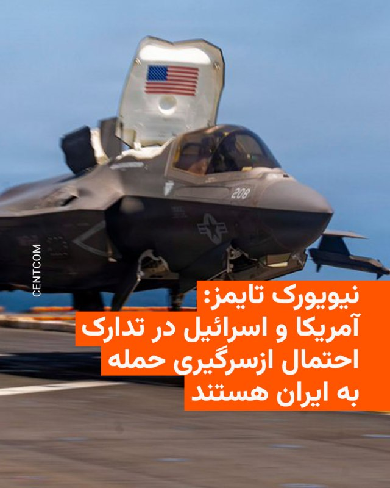

🔸روزنامه آمریکایی «نیویورک تایمز» روز جمعه ۲۵ اردیبهشت به نقل از دو مقام خاورمیانه‌ای نوشت که ایالات متحده و اسرائیل در حال انجام تدارکات فشرده برای احتمال ازسرگیری حملات علیه ایران، حتی از اوایل هفته آینده، هستند.

🔸به گفتهٔ این دو که نخواستند نامشان فاش شود، این تدارکات گسترده‌ترین مورد از زمان اجرایی شدن آتش‌بس در ۱۹ فروردین است.

🔸دونالد ترامپ، رئیس‌جمهور آمریکا، روز ۲۲ اردیبهشت پیش از عزیمت به چین گفت: «یا توافق می‌کنند یا کاملاً نابود می‌شوند. لذا در هر صورت، ما برنده‌ایم».

🔸به گفته مقام‌های آمریکایی، اگر ترامپ تصمیم به ازسرگیری حملات نظامی بگیرد، گزینه‌ها شامل حملات به اهداف نظامی و زیرساخت‌های ایران خواهد بود.

🔸آن‌ها افزودند گزینهٔ دیگر شامل استقرار نیروهای عملیات ویژه در داخل خاک برای هدف قرار دادن مواد هسته‌ای مدفون در اعماق زمین است.

🔸به گفته این مقام‌ها، چند صد نیروی عملیات ویژه در ماه مارس به خاورمیانه اعزام شده‌اند تا چنین گزینه‌ای را در اختیار ترامپ قرار دهند.

@RadioFarda

## RadioFarda — post 157236

  

🔸اسرائیل اعلام کرد در حملات هوایی روز جمعه به نوار غزه، عزالدین الحداد، فرمانده شاخه نظامی حماس در غزه، را هدف قرار داده است.

🔸به گزارش رویترز، مقام‌های درمانی غزه گفتند در این حملات دست‌کم هفت فلسطینی، از جمله یک کودک و سه زن، کشته و حدود ۵۰ نفر زخمی شدند.

🔸اسرائیل و حماس هنوز درباره سرنوشت الحداد اظهارنظر قطعی نکرده‌اند. او پس از کشته شدن محمد سنوار در سال ۲۰۲۵، فرماندهی شاخه نظامی حماس در غزه را بر عهده گرفته بود.

🔸بنیامین نتانیاهو و اسرائیل کاتز، نخست‌وزیر و وزیر دفاع اسرائیل، در بیانیه‌ای مشترک، الحداد را از طراحان حمله ۱۵ مهر ۱۴۰۲ به اسرائیل معرفی کردند.

🔸به گفته منابع پزشکی در غزه، یکی از حملات ساختمانی مسکونی در منطقه الرمال شهر غزه را هدف قرار داد و حمله‌ای دیگر یک خودرو را در خیابانی نزدیک منهدم کرد.

🔸حملات جدید در حالی انجام شده که مذاکرات اسرائیل و حماس بر سر طرح پساجنگ آمریکا برای غزه همچنان بدون نتیجه مانده است.

@RadioFarda

## RadioFarda — post 157235

  

🔸وزارت خارجه آمریکا اعلام کرد اسرائیل و لبنان با تمدید ۴۵ روزه آتش‌بس میان دو کشور موافقت کرده‌اند.

🔸تامی پیگوت، سخنگوی وزارت خارجه آمریکا، روز جمعه ۲۵ اردیبهشت گفت آتش‌بسی که دونالد ترامپ در ۲۷ فروردین اعلام کرده بود، برای فراهم شدن زمینه «پیشرفت بیشتر» تمدید می‌شود.

🔸وزارت خارجه آمریکا مذاکرات دو طرف در واشینگتن را «بسیار سازنده» توصیف کرده و گفته است گفت‌وگوها روزهای ۱۲ و ۱۳ خرداد از سر گرفته خواهد شد.

🔸این سومین دور مذاکرات اسرائیل و لبنان از زمان تشدید حملات اسرائیل به لبنان است؛ حملاتی که پس از شلیک موشک‌های حزب‌الله به اسرائیل در اسفند سال گذشته شدت گرفت.

🔸با وجود اعلام آتش‌بس، درگیری‌ها و حملات پراکنده در جنوب لبنان ادامه داشته است.

📷شرح عکس: یک خودروی نظامی اسرائیل در نزدیکی مرز اسرائیل و لبنان، در شمال اسرائیل، ۲۴ اردیبهشت ۱۴۰۵

@RadioFarda

## IranianMinds — post 20211

فرزند عبدالرحیم موسوی، رییس ستاد کل نیروهای مسلح جمهوری اسلامی:

جنازه پدرم ۳۰ روز زیر آوار حملات مونده بود.

@IranianMinds

## IranianMinds — post 20210

اگه دنبال کانفیگی و میخای اینستا و تلگرام و گیم و حتی ترید رو برات مثل آب خوردن بیاره ربات زیر میتونه بهت کمک کنه👇

@Dayaconfigbot
@Dayaconfigbot
@Dayaconfigbot

هر گیگ فقط 225 هزارتومان با تضمین عودت وجه!

## IranianMinds — post 20208

شباهتو

@IranianMinds

## BBCPersian — post 281154

  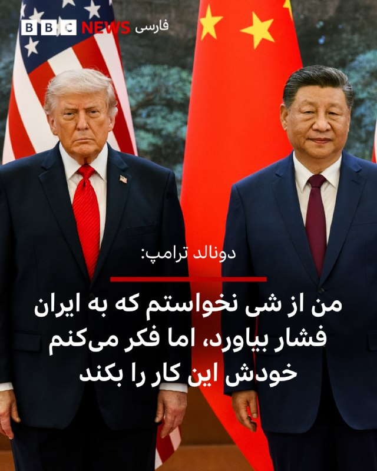

🔻دونالد ترامپ، رئیس‌جمهوری آمریکا، روز جمعه سفر سه روزه خود به چین را در حالی به پایان رساند که هر دو ابر قدرت پیشرفت در رابطه‌شان را ستودند اما تحول بزرگی در زمینه مسائل عمده و مورد اختلاف، از جمله ایران و تایوان، اعلام نشد. همزمان پکن اعلام کرده است که شی جین‌پینگ، رئیس‌جمهور چین، دعوت دونالد ترامپ برای سفر به آمریکا در سال جاری را پذیرفته است.

دونالد ترامپ بعد از پایان سفرش و در راه بازگشت به آمریکا به خبرنگاران همراهش گفت که در مورد مساله باز کردن تنگه هرمز از چین تقاضای کمک نکرده است هرچند اضافه کرد که انتظار دارد پکن خودش در این مورد تهران را تحت فشار بگذارد. آقای ترامپ همچنین گفت که در دیدار با شی جین‌پینگ،‌ رئیس‌جمهور چین، «توافق‌های تجاری فوق‌العاده‌ای» حاصل شده است. اما هیچ یک از دو ابر قدرت جزئیات بیشتر یا بیانیه‌ای رسمی در این مورد منتشر نکرده‌اند.

ادامه خبر را از لینک زیر در وبسایت بی‌بی‌سی فارسی بخوانید.

📷 Anadolu via Getty Images
https://bbc.in/4dnZ3fx
@BBCPersian

## BBCPersian — post 281153

  <a href="telegram/content/BBCPersian_281153_1778876518.mp4" target="_blank">🎬 Download video</a>

🔻آخرین خبرهای مهم جمعه ۲۵ اردیبهشت ۱۴۰۵
@BBCPersian

## Dirty_Kids — post 389522

نوشته خرید حلقه ی نقره برای ازدواج رو نرمالایز کنید

کشوری که نمیتونی یه حلقه طلا توش بخری، چرا باید توش ازدواج کنی؟!

@Dirty_Kids 👻

## Dirty_Kids — post 389521

‏بنظرم اصن معلوم نمیکنه ترامپ از چین برگرده چی میشه الکی حدس نزنیم.
بعید نیست یهو تایوان رو بده به ایران تنگه رو بده به لبنان روبیو رو بده به سمنان.
هیچ بعید نیست

@Dirty_Kids 👻

## Dirty_Kids — post 389520

  

🔴 ایلان ماسک : اینستاگرام واسه دختراست؛

بعضی وقت‌ها یسری مرد بالغ آیدی اینستاگرام‌شون رو واسه من می‌فرستن و من می‌پرسم: آیا داری تغییر جنسیت میدی؟

@Dirty_Kids 👻

## Hranews — post 112959

یک شهروند توسط نیروهای امنیتی در بوکان بازداشت شد

❗️
❗️
❗️
❗️
❗️ – سید علی قریشی، شهروند اهل بوکان روز دوشنبه ۲۱ اردیبهشت ماه، توسط نیروهای امنیتی در این شهرستان #بازداشت و به مکان نامعلومی منتقل شده است.

ادامه مطلب

#سید_علی_قریشی

↘️
@hranews_bot تماس ✉️ -  @Hranews  کانال هرانا 🆑

## manototv — post 105501

  <a href="telegram/content/manototv_105501_1778876520.mp4" target="_blank">🎬 Download video</a>

‌
شیخ خالد بن محمد بن زاید، ولیعهد ابوظبی، اعلام کرد پروژه «خط لوله غرب به شرق» با هدف افزایش صادرات نفت از بندر فجیره و «پاسخ به تقاضای جهانی» با سرعت بیشتری اجرا خواهد شد.

بر اساس اعلام مقام‌های امارات، این پروژه ظرفیت صادرات نفت از مسیر فجیره را دو برابر می‌کند و قرار است تا سال ۲۰۲۷ به بهره‌برداری برسد.

پس از جنگ آمریکا و اسرائیل با جمهوری اسلامی و افزایش تنش‌ها در تنگه هرمز، کشورهای خلیج فارس به دنبال مسیرهای جایگزین برای صادرات نفت و گاز هستند. حدود یک‌پنجم نفت جهان پیش‌تر از تنگه هرمز عبور می‌کرد.

## alonews — post 120283

  <a href="telegram/content/alonews_120283_1778876520.webm" target="_blank">🎬 Download video</a>

👈ترامپ رسید آمریکا

✅ @AloNews خبر جنگ

## alonews — post 120282

  <a href="telegram/content/alonews_120282_1778876521.webm" target="_blank">🎬 Download video</a>

👈مقامات آمریکایی مشکوک هستند که هکرهای مرتبط با ایران ممکن است پشت یک سری نفوذهای سایبری باشند که سیستم‌های نظارت بر سوخت در پمپ‌بنزین‌ها در چندین ایالت را هدف قرار داده‌اند، طبق گزارش CNN

🔴هکرها از سیستم‌های اندازه‌گیری خودکار مخازن که به اینترنت متصل بودند بدون حفاظت رمز عبور سوء استفاده کردند و این امکان را برایشان فراهم کرد تا خوانش‌های نمایش داده شده سوخت را دستکاری کنند — هرچند نه سطح واقعی سوخت.

✅ @AloNews خبر جنگ

## alonews — post 120281

  <a href="telegram/content/alonews_120281_1778876521.webm" target="_blank">🎬 Download video</a>

👈ژان-لوک ملانشون، نامزد ریاست‌جمهوری فرانسه، درباره ایران و تنگه هرمز: «وقتی کشوری از خود دفاع می‌کند، از تمام ابزارهای دفاعی خود استفاده می‌کند.

🔴ما هم همین کار را میکردیم.

🔴ما تمام کانال مانش را مین‌گذاری می‌کردیم.»

✅ @AloNews خبر جنگ

## alonews — post 120280

  <a href="telegram/content/alonews_120280_1778876521.webm" target="_blank">🎬 Download video</a>

👈منابع عراقی از حملۀ پهپادی به مقر گروهک‌های تجزیه‌طلب در کردستان عراق خبر می‌دهند.

✅ @AloNews خبر جنگ

## alonews — post 120279

  <a href="telegram/content/alonews_120279_1778876521.webm" target="_blank">🎬 Download video</a>

👈فیلد مارشال ، محسن رضایی: قواعد نظم جدید جهان دیگه آمریکا محور نیست

✅ @AloNews خبر جنگ

## alonews — post 120277

  <a href="telegram/content/alonews_120277_1778876521.mp4" target="_blank">🎬 Download video</a>

👈شهر صور تو "جنوب لبنان" بعد از حمله‌ی سنگین ارتش اسرائیل

✅ @AloNews خبر جنگ

## alonews — post 120276

  <a href="telegram/content/alonews_120276_1778876522.webm" target="_blank">🎬 Download video</a>

👈واشنگتن پست : ایران واضح‌ترین بازنده دیدار ترامپ از پکن است، با مخالفت علنی پکن با اختلال در هرمز، تعهد به عدم ارسال تجهیزات نظامی به تهران و توافق بر اینکه تنگه «باید باز بماند.»

✅ @AloNews خبر جنگ

## alonews — post 120275

  <a href="telegram/content/alonews_120275_1778876522.mp4" target="_blank">🎬 Download video</a>

👈ترامپ درباره تایوان: من به دنبال این نیستم که کسی مستقل شود. و می‌دانید، ما قرار است ۹۵۰۰ مایل سفر کنیم تا جنگی را انجام دهیم. من به دنبال آن نیستم.

🔴می‌خواهم تایوان آرام شود؛ می‌خواهم چین آرام شود.

✅ @AloNews خبر جنگ

## alonews — post 120274

  <a href="telegram/content/alonews_120274_1778876523.mp4" target="_blank">🎬 Download video</a>

👈برت بایر از فاکس: شما در حال انتظار برای تصویب میلیاردها دلار سلاح برای تایوان هستید. آیا این روند پیش می‌رود؟

🔴ترامپ: خوب، هنوز آن را تصویب نکرده‌ام. خواهیم دید چه اتفاقی می‌افتد.

✅ @AloNews خبر جنگ

## alonews — post 120273

  <a href="telegram/content/alonews_120273_1778876525.mp4" target="_blank">🎬 Download video</a>

👈سفیر ایالات متحده مایک والتز ادعا می‌کند که «نتیجه بزرگ» سفر ترامپ به چین، موافقت چین با عقب‌نشینی از ایران بوده است

✅ @AloNews خبر جنگ

## alonews — post 120272

  <a href="telegram/content/alonews_120272_1778876526.webm" target="_blank">🎬 Download video</a>

👈امیر قطر و محمد بن سلمان، ولیعهد عربستان سعودی در یک گفت وگوی تلفنی درباره آخرین تحولات منطقه با یکدیگر گفتگو کردند

✅ @AloNews خبر جنگ

## alonews — post 120271

  <a href="telegram/content/alonews_120271_1778876526.mp4" target="_blank">🎬 Download video</a>

👈۳۰ روز طول کشید تا جنازه عبدالرحیم موسوی، رئیس سابق ستاد کل نیروهای مسلح ایران، رو پیدا کنن

🔴پسرش اینو به صداوسیما گفته

✅ @AloNews خبر جنگ

## alonews — post 120270

  <a href="telegram/content/alonews_120270_1778876528.webm" target="_blank">🎬 Download video</a>

👈توییت جدید و عجیب ترامپ

✅ @AloNews خبر جنگ

## alonews — post 120269

  <a href="telegram/content/alonews_120269_1778876528.webm" target="_blank">🎬 Download video</a>

👈دنا پلاس؛ ۳ میلیارد تومن ناقابل

✅ @AloNews خبر جنگ

## alonews — post 120268

  <a href="telegram/content/alonews_120268_1778876528.webm" target="_blank">🎬 Download video</a>

👈آخرین قیمت نفت ۱۰۹.۴۳ دلار

✅ @AloNews خبر جنگ

---
📅 بروزرسانی: 1405/02/25 22:29
---

## VahidOOnLine — post 240369

  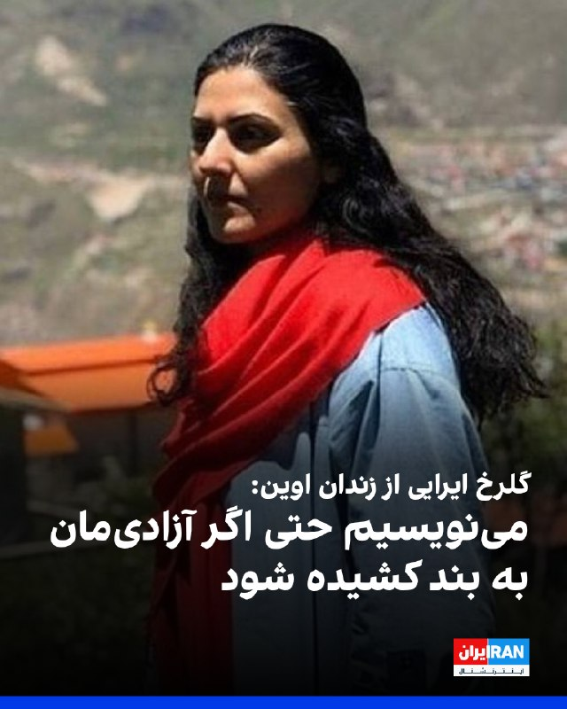

گلرخ ایرایی، زندانی سیاسی، در پیامی از بند زنان زندان اوین به مناسبت اعطای جایزه «آزادی نوشتن» از سوی انجمن قلم آمریکا، نوشت: «می‌نویسیم حتی اگر آزادی‌مان به بند کشیده شود؛ حتا اگر مورد تهدید و تحدید قرار بگیریم و وادار به تبعید یا فدای جان شویم.»

ایرایی در این پیام نوشت، «اینجا بی‌پروا نوشتن از رنج مردمانی که ستم را به پیکار برمی‌خیزند، مجرمانه است و آنان که با قلم تباهی درد را به چشم جهانیان پدیدار می‌کنند، در سکوت فرسوده می‌شوند و مجرم‌اند و سزاوار محاکمه!»
او به فقر، نابرابری، سرکوب و «کشتار سیستماتیک» در ایران اشاره کرد و نوشت نوشتن از رنج مردم «تحت ستم»، با همه هزینه‌ها و محدودیت‌ها، «روزنه امیدی» برای ادامه مبارزه است.

این زندانی سیاسی همچنین نوشت «ارتجاع حاکم، آزادی اندیشه و جسارت بیان را برنمی‌تابد، آنگاه که قلم بر چوبه‌های دار افراشته حمله می‌برد و از فقر و نابرابری روایت می‌کند و بازتابی می‌شود از سفره‌های خالی و قیام گرسنگان را نوید می‌دهد.»

او در پایان تاکید کرد: «ما از خفگی رها خواهیم شد و می‌دانیم این جز در حرکتی مشترک میسر نخواهد بود.»
‌🏁 🇬🇧 IranintlTV

🤖 @VahidOOnLine

## VahidOOnLine — post 240368

  

♦️ تامی پیگات، سخنگوی وزارت امور خارجه آمریکا، روز جمعه ۲۵ اردیبهشت، اعلام کرد که در پی دو روز مذاکرات «بسیار سازنده» میان اسرائیل و لبنان با میانجی‌گری ایالات متحده، دو طرف بر سر تمدید ۴۵ روزه آتش‌بس به توافق رسیدند.

پیگات گفت که این وزارتخانه مذاکرات در «مسیر سیاسی» را در روزهای دوم و سوم ژوئن (۱۲ و ۱۳ خرداد) از سر خواهد گرفت و هم‌زمان، یک «مسیر امنیتی» نیز با حضور هیئت‌های نظامی اسرائیل و لبنان در تاریخ ۲۹ مه (هشتم خرداد) در پنتاگون آغاز خواهد شد.

او افزود: «امیدواریم این گفتگوها گامی به سوی صلح پایدار میان دو کشور، شناسایی کامل حاکمیت و تمامیت ارضی یکدیگر و برقراری امنیت واقعی در امتداد مرزهای مشترک باشد.»
‌🇸🇦 Indypersian

🤖 @VahidOOnLine

## VahidOOnLine — post 240367

  

آموزشکده توانا در گزارشی نوشت برخی وکلا با هماهنگی نهادهای امنیتی و قضات دادگاه‌های انقلاب، در پرونده‌های امنیتی به‌جای دفاع از متهمان، با درخواست عفو و «اقرار ضمنی» به اتهام‌ها، مسیر صدور و اجرای احکام سنگین از جمله اعدام را هموار می‌کنند.

بر اساس این گزارش، این وکلا با تجدیدنظرخواهی فوری، فرصت قانونی اعتراض را نیز از متهمان سلب می‌کنند.
این گزارش از «مهدی محرابی» به‌عنوان یکی از این وکلا نام برده و نوشته او در پرونده آتش‌سوزی پایگاه بسیج خیابان نامجو، مربوط به محمدامین بیگلری، امیرحسین حاتمی، علی فهیم و شاهین واحدپرست کلور، چهار معترض اعدام‌شده، نقش داشته است.

در این گزارش همچنین آمده خانواده برخی متهمان امنیتی تحت فشار قرار می‌گیرند تا به‌جای وکلای مستقل، از «وکلای مورد تایید» استفاده کنند؛ اقدامی که به نوشته توانا، در مواردی به صدور احکام اعدام یا حبس‌های طولانی‌مدت منجر شده است.
‌🏁 🇬🇧 IranintlTV

🤖 @VahidOOnLine

## VahidOOnLine — post 240366

  

♦️جان تراولتا شامگاه جمعه در جشنواره فیلم کن ۲۰۲۶ با دریافت نخل طلای افتخاری غافلگیر شد؛ مراسمی که هم‌زمان با نمایش نخستین فیلم بلند او در مقام کارگردان برگزار شد.
تیری فرمو، مدیر هنری جشنواره کن، درست پیش از آغاز نمایش فیلم «پراپلر؛ قطار شبانه یک‌طرفه» روی صحنه آمد و نخل طلای افتخاری را به تراولتا اهدا کرد. بازیگر آمریکایی که آشکارا تحت تاثیر قرار گرفته بود، هنگام دریافت جایزه دستش را روی سینه گذاشت و از حاضران تشکر کرد.
تراولتا روی فرش قرمز کن با دختر ۲۶ ساله‌اش الا بلو تراولتا ظاهر شد. این فیلم نخستین تجربه کارگردانی بلند جان تراولتا به شمار می‌رود. او علاوه بر کارگردانی، نویسندگی و تهیه‌کنندگی مشترک این پروژه را نیز بر عهده داشته است. داستان فیلم بر اساس کتاب کودکانه‌ای ساخته شده که خود تراولتا در سال ۱۹۹۷ منتشر کرده بود و درباره نوجوانی علاقه‌مند به هوانوردی است.
جشنواره کن پیش‌تر نیز چند بار مهمانانش را با اهدای ناگهانی نخل طلای افتخاری غافلگیر کرده بود. تام کروز در سال ۲۰۲۲ چنین جایزه‌ای دریافت کرد.
‌🇸🇦 Indypersian

🤖 @VahidOOnLine

## VahidOOnLine — post 240365

  <a href="telegram/content/VahidOOnLine_240365_1778871575.mp4" target="_blank">🎬 Download video</a>

‌
وزارت خارجه آمریکا اعلام کرد آتش‌بس میان اسرائیل و لبنان برای ۴۵ روز دیگر تمدید شده تا فرصت بیشتری برای ادامه مذاکرات فراهم شود.
‌🏁 🇬🇧 ManotoTV

🤖 @VahidOOnLine

## VahidOOnLine — post 240364

  <a href="telegram/content/VahidOOnLine_240364_1778871575.mp4" target="_blank">🎬 Download video</a>

‌
اسرائیل اعلام کرد در حمله‌ای هوایی، عزالدین الحداد، ارشدترین فرمانده گروه تروریستی حماس در نوار غزه را هدف قرار داده است.

هنوز گزارشی از وضعیت او منتشر نشده و حماس هم واکنشی نشان نداده است.

الحداد در فهرست افراد تحت تعقیب اسرائیل قرار دارد و از سوی اسرائیل به عنوان یکی از «طراحان» حمله تروریستی هفت اکتبر معرفی شده است.
‌🏁 🇬🇧 ManotoTV

🤖 @VahidOOnLine

## VahidOOnLine — post 240363

  

♦️ شبکه ۱۳ تلویزیون اسرائیل در گزارشی اختصاصی فاش کرد که علاوه بر بنیامین نتانیاهو، ارتشبد ایال زمیر، رئیس ستاد کل ارتش و شماری از افسران ارشد این کشور نیز در جریان درگیری‌های اخیر با ایران به امارات متحده عربی سفر کرده‌اند. این افشاگری در حالی صورت می‌گیرد که پیش‌تر گزارش‌هایی درباره دو سفر مخفیانه دیوید بارنئا، رئیس موساد، به ابوظبی با هدف هماهنگی عملیاتی موسوم به «غرش شیران» علیه تهران منتشر شده بود.

دفتر نخست‌وزیری اسرائیل با تایید سفر نتانیاهو که گفته می‌شود در هفته اول فروردین انجام شده، آن را یک «گشایش تاریخی» در روابط دو کشور توصیف کرد، در حالی که وزارت امور خارجه امارات با صدور بیانیه‌ای تند، وقوع هرگونه دیدار یا میزبانی از هیئت‌های نظامی اسرائیلی را به کلی تکذیب کرد و آن را بی‌اساس خواند. وبسایت خبری یدیعوت آحرانوت اسرائیل نیز به نقل از یک مقام اماراتی، نوشت که طرفین توافق کرده بودند این سفر «محرمانه» باقی بماند و تایید خبر از سوی دفتر نخست‌وزیر اسرائیل، نقش تعهد محسوب می‌شود.
‌🇸🇦 Indypersian

🤖 @VahidOOnLine

## VahidOOnLine — post 240362

  

وزارت خارجه آمریکا اعلام کرد آتش‌بس میان اسرائیل و لبنان برای ۴۵ روز دیگر تمدید خواهد شد تا زمینه برای پیشرفت بیشتر در مذاکرات فراهم شود.
این وزارتخانه همچنین اعلام کرد روند سیاسی مذاکرات در روزهای ۱۲ و ۱۳ خرداد از سر گرفته خواهد شد.
‌🏁 🇬🇧 IranintlTV

🤖 @VahidOOnLine

## VahidOOnLine — post 240361

  

شاهزاده رضا پهلوی در پیامی ویدیویی، گفت که بر اساس نظر مشورتی «کمیته تدوین مقررات عدالت انتقالی ایران»، همکاری آگاهانه و داوطلبانه با ساختارهای سرکوبگر جمهوری اسلامی، از جمله خبرچینی، مشارکت در ایست‌های بازرسی، همکاری در سرکوب معترضان، به‌کارگیری کودکان و نوجوانان در سرکوب و همچنین خرید و فروش اموال مصادره‌شده معترضان، می‌تواند مصداق «یاری‌رسانی به جنایت علیه بشریت» باشد و مسئولیت کیفری به همراه داشته باشد.

او گفت هیچ مقام، دستور یا بهانه‌ای مانع مسئولیت فردی نخواهد بود و افرادی که با دستگاه‌های سرکوب همکاری کنند، چه در داخل و چه خارج از ایران، در معرض پیگرد قرار خواهند گرفت. به گفته او، افرادی که در مصادره یا معامله اموال توقیف‌شده معترضان نقش داشته باشند نیز ممکن است ملزم به جبران خسارت شوند.

شاهزاده رضا پهلوی همچنین هشدار داد کسانی که امروز با نهادهای امنیتی و سرکوبگر جمهوری اسلامی همکاری می‌کنند، باید به آینده خود و خانواده‌شان فکر کنند، زیرا به گفته او، در آینده عاملان سرکوب در برابر قانون پاسخگو خواهند شد.
‌🏁 🇬🇧 IranintlTV

🤖 @VahidOOnLine

## VahidOOnLine — post 240360

  

♦️گردنبند کریس مارتین در ویدئوی معرفی برنامه بین دونیمه بازی نهایی جام جهانی، بار دیگر توجه کاربران شبکه‌های اجتماعی را به زیورآلات این خواننده مشهور جلب کرد. خواننده گروه «کولدپلی» این بار گردنبندی با کلمه عشق درون یک دایره نقره ای به گردن داشت.
کریس مارتین پیش‌تر نیز در جریان اعتراضات پس از کشته‌شدن مهسا امینی از نشانه‌های نمادین برای ابراز همدلی با معترضان ایرانی استفاده کرده و گردنبندی با اشاره به ترانه «برای» اثر شروین حاجی‌پور به گردن انداخته بود.
بر اساس اعلام فیفا، کریس مارتین مدیریت هنری برنامه‌ای را به عهده خواهد داشت که در آن مدونا، شکیرا و گروه کره‌ای بی‌تی‌اس در ۱۹ ژوئیه در ورزشگاه نیویورک–نیوجرسی برای تماشاگران فوتبال خواهند خواند.
‌🇸🇦 Indypersian

🤖 @VahidOOnLine

## VahidOOnLine — post 240359

  <a href="telegram/content/VahidOOnLine_240359_1778871578.mp4" target="_blank">🎬 Download video</a>

یکی از مخاطبان ایران‌اینترنشنال می‌گوید به اختلال دوقطبی مبتلاست و افزایش قیمت و کمبود داروهای اعصاب و روان نگرانی جدی برای او ایجاد کرده است. او تاکید می‌کند این وضعیت روند درمانش را تحت تأثیر قرار داده است.

بازخوانی این پیام و ساخت تصویر برای آن با هوش مصنوعی انجام گرفته است.
‌🏁 🇬🇧 IranintlTV

🤖 @VahidOOnLine

## VahidOOnLine — post 240358

  

یک مقام ارشد اسرائیلی به کانال ۱۲ گفت تل‌آویو خود را برای احتمال ازسرگیری قریب‌الوقوع جنگ با جمهوری اسلامی آماده می‌کند.
او با اشاره به روند مذاکرات تهران و واشینگتن گفت: «آمریکایی‌ها به این نتیجه رسیده‌اند که مذاکرات به جایی نمی‌رسد.»

پیش‌تر یسرائیل کاتز، وزیر دفاع اسرائیل گفته بود ماموریت ارتش این کشور درباره ایران کامل نشده و برای این احتمال آماده است که شاید دوباره ناچار به اقدام شود.
‌🏁 🇬🇧 IranintlTV

🤖 @VahidOOnLine

## VahidOOnLine — post 240357

  <a href="telegram/content/VahidOOnLine_240357_1778871579.mp4" target="_blank">🎬 Download video</a>

اداره تحقیقات فدرال آمریکا، اف‌بی‌آی، اعلام کرد برای اطلاعاتی که به بازداشت و محکومیت مونیکا ویت، افسر و مأمور سابق ضدجاسوسی ارتش آمریکا متهم به جاسوسی برای جمهوری اسلامی، منجر شود ۲۰۰ هزار دلار جایزه تعیین کرده است.

دفتر اف‌بی‌آی در واشنگتن اعلام کرد مونیکا ویت با وجود صدور کیفرخواست در سال ۲۰۱۹ همچنان متواری است.

او به اتهام جاسوسی و انتقال اطلاعات مرتبط با دفاع ملی آمریکا به ایران تحت پیگرد قرار دارد.

ویت بین سال‌های ۱۹۹۷ تا ۲۰۰۸ در نیروی هوایی آمریکا و دفتر تحقیقات ویژه این نیرو فعالیت می‌کرد و سپس تا سال ۲۰۱۰ به‌عنوان پیمانکار با دولت آمریکا همکاری داشت.

اف‌بی‌آی اعلام کرد او در دوران فعالیت خود به اطلاعات فوق‌محرمانه، از جمله هویت واقعی مأموران مخفی جامعه اطلاعاتی آمریکا، دسترسی داشته است.

بر اساس این بیانیه، ویت در سال ۲۰۱۳ به ایران پناهنده شد و سپس اطلاعات حساسی را در اختیار جمهوری اسلامی قرار داد که برنامه‌های محرمانه آمریکا و امنیت کارکنان آمریکایی را به خطر انداخت.

سی‌ان‌ان پیش‌تر گزارش داده بود مقام‌های آمریکایی معتقدند جمهوری اسلامی او را جذب کرده و ویت پس از فرار به ایران، هویت یک مأمور اطلاعاتی آمریکا و جزئیات یک برنامه فوق‌محرمانه اطلاعاتی را افشا کرده است.

کیفرخواست این پرونده همچنین نام چهار شهروند ایرانی را در ارتباط با اتهام‌هایی از جمله توطئه، تلاش برای هک رایانه‌ای و سرقت هویت ذکر کرده است.
‌🏁 🇬🇧 ManotoTV

🤖 @VahidOOnLine

## VahidOOnLine — post 240356

  <a href="telegram/content/VahidOOnLine_240356_1778871580.mp4" target="_blank">🎬 Download video</a>

ما صدای فاطمه سپهری هستیم
‌🏁 🇬🇧 ManotoTV

🤖 @VahidOOnLine

## VahidOOnLine — post 240355

  

بنیامین نتانیاهو، نخست‌وزیر و یسرائیل کاتز، وزیر دفاع اسرائیل در بیانیه‌ای اعلام کردند ارتش این کشور، عزالدین حداد، فرمانده شاخه نظامی حماس، را در یک حمله هوایی هدف قرار داده است.
عزالدین حداد، از فرماندهان ارشد گردان‌های عزالدین قسام، شاخه نظامی حماس است.
‌🏁 🇬🇧 IranintlTV

🤖 @VahidOOnLine

## WithYashar — post 11325

میگم فالورایه شاهزاده داره کم میشه قبله جنگ ۹.۹ بود الان ۹.۷ شده

## WithYashar — post 11324

میگم فالورایه شاهزاده داره کم میشه قبله جنگ ۹.۹ بود الان ۹.۷ شده

## WithYashar — post 11323

## WithYashar — post 11322

  

قیمت جهانی استارلینک مینی با تخفیف به زیر ۲۰۰دلار (۳۶میلیون تومن) رسیده و پایین‌تر هم میاد. سایز دیشش هم اندازه‌ی یه کاغذ آ۴ هست!

واقعیت اینکه شاید الان بشه جلوی اتصال به اینترنت رو گرفت ولی تا چند سال آینده عملا غیرممکن میشه!
@withyashar

## WithYashar — post 11321

هادی چوپان، در یک مسابقه استعدادیابی که از صدا و سیمای رژیم پخش می‌شود، گفت: «ما با زحمت و هزار دردسر به قله رسیدیم، نباید بازیچه دلقکان مجازی شویم.»
@withyashar

## WithYashar — post 11320

شاهزاده رضا پهلوی : هم‌میهنان عزیزم،

در روزهایی که شما با شجاعت در برابر رژیم اشغالگر ایران ایستاده‌اید، این نظام منفور و منزوی، همچنان به تجاوز به جان و مال مردم ادامه می‌دهد تا سرنگونی حتمی خود را اندکی به تعویق اندازد. در چنین شرایطی، وظیفه خود می‌دانم که تصویر عدالت در فردای ایران را برای کسانی که با جنایتکاران همکاری کنند، روشن‌تر ترسیم کنم.

در این راستا، از «کمیته‌ تدوین مقررات عدالت انتقالی ایران» خواستم درباره‌ دو موضوع مهم، نظر مشورتی خود را ارائه کند: نخست، موضوع مسئولیت کیفری افرادی که با ساختارهای سرکوبگر جمهوری اسلامی همکاری می‌کنند؛ و دوم، موضوع مصادره‌ اموال معترضان و خانواده‌های آنان.
@withyashar
این کمیته اکنون نخستین نظر مشورتی خود را صادر کرده و پیام آن روشن است: این اقدامات، همکاری‌های ساده یا بی‌اهمیت نیستند؛ بلکه «یاری‌رسانی به جنایت علیه بشریت» محسوب می‌شوند. هیچ مقام، هیچ دستور و هیچ بهانه‌ای نمی‌تواند مسئولیت کیفری فردی را از میان ببرد. بنابراین، هر فردی که آگاهانه و داوطلبانه با ساختارهای سرکوبگر رژیم همکاری کند، چه در داخل و چه در خارج از ایران، باید بداند که در معرض مسئولیت کیفری قرار خواهد گرفت:

خواه این همکاری از نوع گزارش‌دهی یا خبرچینی باشد؛
خواه از نوع مشارکت در ایست‌های بازرسی‌ باشد؛
خواه از نوع به‌کارگیری کودکان و نوجوانان در سرکوب معترضان باشد؛
و خواه از نوع تحصیل، انتقال یا خرید و فروش اموالی باشد که در جریان سرکوب از معترضان و خانواده‌های آنان مصادره شده‌ است.
@withyashar
از این رو، نه‌تنها افرادی که در صدور دستور، اجرای آن، یا تسهیل این مصادره‌ها نقش دارند در معرض مسئولیت قرار خواهند گرفت، بلکه کسانی که آگاهانه و داوطلبانه به خرید و فروش این اموال می‌پردازند نیز باید پاسخگو باشند. این مسئولیت، استفاده از اموال یا دارایی‌های آنان برای جبران خسارت واردشده به مالکان اصلی را نیز شامل می‌‌شود.

بنابراین، به همه‌ کسانی که امروز در صدد همکاری با دستگاه سرکوب رژیم هستند هشدار می‌دهم: پیش از آن‌که دست به اقدامی بزنید که به مردم ایران آسیب جانی، مالی و یا اجتماعی برساند، به آینده‌ خود و خانواده‌تان بیندیشید. به آن روز بیندیشید که ایران آزاد خواهد شد؛ روزی که حقیقت پنهان نخواهد ماند؛ روزی که اسامی آشکار خواهد شد؛ روزی که هیچ متجاوز و جنایتکاری از پاسخ‌گویی در برابر قانون در امان نخواهد ماند.

آن روز، ملت ایران حکومتی خواهد داشت که حقوق ایرانیان را محترم می‌دارد و ایران را به سرزمینی آزاد و آباد بدل می‌کند.

پاینده ایران،
رضا پهلوی
@withyashar

## WithYashar — post 11319

## WithYashar — post 11318

سازمان سازمان مجاهدین خلق ایران (که در آمریکا با نام‌های MEK یا PMOI شناخته می‌شود) به‌صورت رسمی در تاریخ ۲۸ سپتامبر ۲۰۱۲ از فهرست «سازمان‌های تروریستی خارجی» وزارت خارجه آمریکا خارج شد. این تصمیم توسط وزارت خارجه دولت هیلاری کلینتون اعلام شد و همان روز اجرایی گردید
@withyashar

## WithYashar — post 11317

## WithYashar — post 11316

یاشار مجاهدین الان دارن از کجا تغذیه میشن؟

## WithYashar — post 11315

## WithYashar — post 11314

آخرین فیلم مخفی وحید بنی عامریان، نخبه ریاضی در زندان اوین که از دفاعیه اش در مقابل بیدادگاه آخوندی می گوید. وحید روز 15 فروردین 1405 اعدام شد @withyashar

## WithYashar — post 11313

## WithYashar — post 11312

یاشار مجاهدین خیلی دارن به دانشجو های داخل ایران پیام میدن، واسه خودم تا الان از دو نفر مختلف پیش اومده، شروع میکنن به توضیح تاریخچه خودشون و همه چیزای خوب رو هم میچسبونن به خودشون و فلان
نمیدونم چه پروژه ای راه انداختن ولی از طریق

## WithYashar — post 11311

## WithYashar — post 11310

  

نخست‌وزیر و وزیر دفاع اسرائیل در بیانیه‌ای اعلام کردند ارتش این کشور عزالدین حداد، فرمانده شاخه نظامی حماس، را در یک حمله هوایی هدف قرار داده

@withyashar

## WithYashar — post 11309

## WithYashar — post 11308

## WithYashar — post 11307

امریکا زمانی حمله میکنه که کسی منتظر نیس.

## WithYashar — post 11306

## mwarmonitor — post 9143

🛰تصاویر ماهواره‌ای Landsat-8 وضعیت ترمینال‌های جزیره خارگ امروز: خالی. هیچ نفتکشی برای بارگیری نفت خام وجود ندارد . @mwarmonitor

## mwarmonitor — post 9142

🔴فایننشال تایمز (گزارش اختصاصی):
یک گروه مالی که با خانواده دونالد ترامپ ارتباط دارد، یک شرکت با هدف خاص (SPV) ایجاد کرده است که قصد دارد ۲۰۰ میلیون دلار سرمایه جذب کند تا یک کسب‌وکار در ونزوئلا را خریداری کند.

@mwarmonitor

## mwarmonitor — post 9141

  

🛰تصاویر ماهواره‌ای Landsat-8 وضعیت ترمینال‌های جزیره خارگ امروز: خالی. هیچ نفتکشی برای بارگیری نفت خام وجود ندارد .

@mwarmonitor

## mwarmonitor — post 9140

🔴این یک پرونده مهم است—یک «گنجینه اطلاعاتی» و یک دستاورد بزرگ برای نیروهای مجری قانون. یکی از فرماندهان گروه کتائب حزب‌الله وابسته به ایران به نام محمد باقر سعد داوود الساعدی بازداشت شده و قرار است امروز در دادگاه فدرال حاضر شود. او به طراحی حمله به اهداف یهودی در آمریکا، از جمله یک کنیسه در نیویورک، متهم است.

🔸در «شکایت کیفری» که روز جمعه از حالت محرمانه خارج شد، این فرمانده متهم شده که از اواخر فوریه حداقل ۱۸ حمله در اروپا و کانادا را برنامه‌ریزی کرده است؛ حملاتی که گفته می‌شود در واکنش به اقدامات آمریکا و اسرائیل علیه ایران بوده‌اند.

🔸نکته قابل توجه این است که گفته می‌شود تهران اکنون از گروه کتائب حزب‌الله عراق برای طراحی حملات تروریستی در خارج از کشور، از جمله در آمریکا و سراسر اروپا، استفاده می‌کند. به طور سنتی، این گروه بیشتر در عراق و منطقه فعال بوده و در آنجا حملاتی انجام می‌داده است. نیویورک تایمز

@mwarmonitor

## mwarmonitor — post 9139

🛰تصاویر ماهواره‌ای نشان می‌دهد که مرکز تحقیقاتی شهید میثمی ، واقع در غرب تهران، نزدیک کرج، در مارس ۲۰۲۶ دو بار هدف حمله قرار گرفته است.

📍این سایت پیش‌تر نیز در ژوئن ۲۰۲۵ به‌شدت مورد حمله قرار گرفته بود؛ حمله‌ای که اسرائیل آن را به برنامه توسعه سلاح‌های شیمیایی و بیولوژیکی ایران مرتبط دانسته بود، اما همچنین گفته شده بود که این مرکز تجهیزات مرتبط با سلاح‌های هسته‌ای را نیز در خود داشته است.

📌تصاویر مربوط به ۱۴ مارس ۲۰۲۶ نشان می‌دهد که در حمله اول مارس، چندین ساختمان پشتیبانی عملیاتی و همچنین محل‌های اقامت کارکنان رده‌بالا هدف قرار گرفته‌اند.

🔸سپس در یا پیش از ۲۴ مارس ۲۰۲۶، تصاویر نشان می‌دهد که حمله دوم انجام شده و یک تأسیسات احتمالی تولید مواد شیمیایی در بخش جنوبی مجموعه و همچنین چندین ساختمان دیگر مربوط به اقامت پرسنل نابود شده‌اند.

🔹تاکنون اطلاعات جدیدی از سوی ارتش اسرائیل (IDF) درباره دلیل این حملات منتشر نشده است، اما فعالیت‌های اخیر در این سایت می‌تواند یکی از دلایل باشد. پس از حملات ژوئن، فعالیت‌های گسترده پاک‌سازی و جمع‌آوری آوار در برخی ساختمان‌های تخریب‌شده مشاهده شد که احتمالاً مقدمه‌ای برای بازسازی بوده است. در واقع، یک ساختمان کوچک که در مارس ۲۰۲۶ تخریب شد، تنها چند ماه قبل از آن (پس از نوامبر ۲۰۲۵) در محل یک ساختمان تخریب‌شده در ژوئن ساخته شده بود.

🗂در گزارشی که در سپتامبر ۲۰۲۵ به شورای امنیت سازمان ملل ارائه شد، اسرائیل اعلام کرده بود:
«این سایت شامل مقدار زیادی تجهیزات متالورژی بوده که به مرکز مواد پیشرفته تحت گروه شهید میثمی، شاخه شیمی SPND، تعلق داشته است. این تجهیزات می‌توانند با تغییراتی در فرآیند متالورژی برای ساخت هسته شکافت‌پذیر به کار روند.»

📂همچنین در این گزارش آمده است که سایت شهید میثمی «یکی از مراکز اصلی برنامه سلاح‌های شیمیایی و بیولوژیکی ایران بوده که برای تحقیق و توسعه مواد شیمیایی مبتنی بر داروها مورد استفاده قرار می‌گرفته است.»

@mwarmonitor

## mwarmonitor — post 9138

  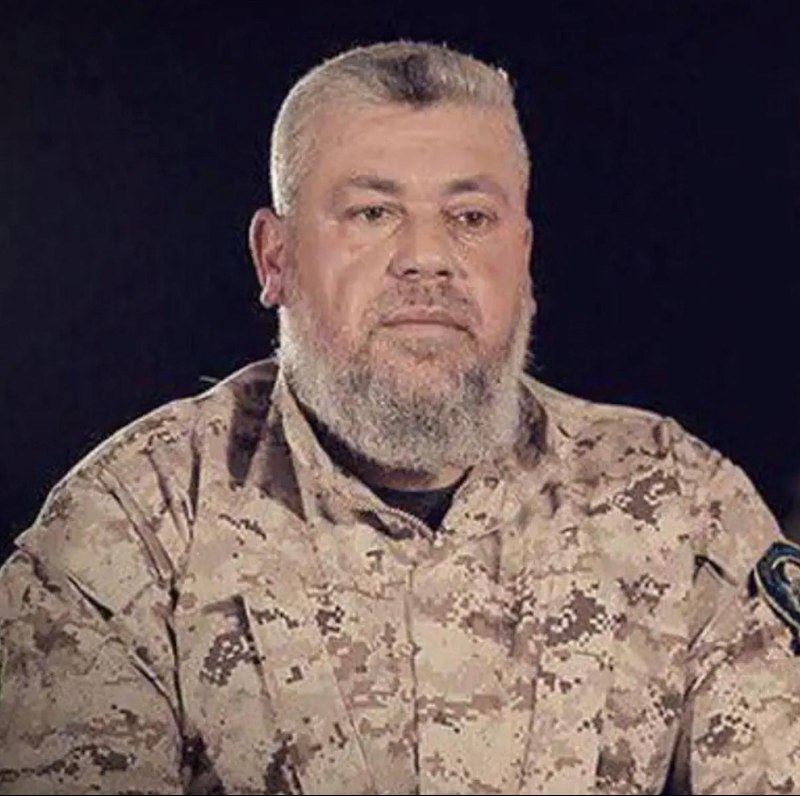

🇮🇱اسرائیل اعلام کرد که در نوار غزه یک حمله انجام داده که هدف آن عزالدین الحداد، رئیس شاخه نظامی حماس بوده است. اسرائیل او را یکی از طراحان حمله ۷ اکتبر معرفی کرده است. 🇮🇱بنیامین نتانیاهو، نخست‌وزیر، و اسرائیل کاتس، وزیر دفاع، اعلام کردند که اسرائیل «به اقدامات…

## mwarmonitor — post 9137

  

🇮🇱اسرائیل اعلام کرد که در نوار غزه یک حمله انجام داده که هدف آن عزالدین الحداد، رئیس شاخه نظامی حماس بوده است. اسرائیل او را یکی از طراحان حمله ۷ اکتبر معرفی کرده است.

🇮🇱بنیامین نتانیاهو، نخست‌وزیر، و اسرائیل کاتس، وزیر دفاع، اعلام کردند که اسرائیل «به اقدامات خود علیه همه افراد دخیل ادامه خواهد داد».

@mwarmonitor

## pm_afshaa — post 90807

  

تخفیف ویژه فقط گیگی 170 با تست رایگان ✅
اول تست کن، بعد با خیال راحت خرید کن!

❌ دیگه چرا گیگی ۵۰۰ تا ۶۰۰ بدی؟!
اونم بدون اینکه بدونی کیفیتش چطوره 😐

⚡️ تخفیف ویژه محدود ⏳
فقط تا پایان امشب

🌍 آی‌پی استار واقعی + پینگ عالی
🛡 ضمانت بازگشت وجه بدون شرط
🚀 اتصال پایدار و بدون قطعی

خرید آنی از ربات :

Id : @LexVipBot
تایم سرورامون نامحدوده❤️

Link chanel : @lex_server

رایگان گذاشته میشه هرشب تو‌چنل بالا از دست ندید

## pm_afshaa — post 90806

🔴وزارت خارجه آمریکا : ونزوئلا 7340 کیلوگرم اورانیوم غنی‌شده‌‌‌ش رو به آمریکا منتقل کرد

💧 Rainbet.com the #1 Non-KYC Crypto Casino & Sportsbook @rainbetcom

😁 @Pm_Afshaa

## pm_afshaa — post 90805

  <a href="telegram/content/pm_afshaa_90805_1778871585.mp4" target="_blank">🎬 Download video</a>

هم‌میهنان عزیزم،

در روزهایی که شما با شجاعت در برابر رژیم اشغالگر ایران ایستاده‌اید، این نظام منفور و منزوی، همچنان به تجاوز به جان و مال مردم ادامه می‌دهد تا سرنگونی حتمی خود را اندکی به تعویق اندازد. در چنین شرایطی، وظیفه خود می‌دانم که تصویر عدالت در فردای ایران را برای کسانی که با جنایتکاران همکاری کنند، روشن‌تر ترسیم کنم.

در این راستا، از «کمیته‌ تدوین مقررات عدالت انتقالی ایران» خواستم درباره‌ دو موضوع مهم، نظر مشورتی خود را ارائه کند: نخست، موضوع مسئولیت کیفری افرادی که با ساختارهای سرکوبگر جمهوری اسلامی همکاری می‌کنند؛ و دوم، موضوع مصادره‌ اموال معترضان و خانواده‌های آنان.

این کمیته اکنون نخستین نظر مشورتی خود را صادر کرده و پیام آن روشن است: این اقدامات، همکاری‌های ساده یا بی‌اهمیت نیستند؛ بلکه «یاری‌رسانی به جنایت علیه بشریت» محسوب می‌شوند. هیچ مقام، هیچ دستور و هیچ بهانه‌ای نمی‌تواند مسئولیت کیفری فردی را از میان ببرد. بنابراین، هر فردی که آگاهانه و داوطلبانه با ساختارهای سرکوبگر رژیم همکاری کند، چه در داخل و چه در خارج از ایران، باید بداند که در معرض مسئولیت کیفری قرار خواهد گرفت:

خواه این همکاری از نوع گزارش‌دهی یا خبرچینی باشد؛
خواه از نوع مشارکت در ایست‌های بازرسی‌ باشد؛
خواه از نوع به‌کارگیری کودکان و نوجوانان در سرکوب معترضان باشد؛
و خواه از نوع تحصیل، انتقال یا خرید و فروش اموالی باشد که در جریان سرکوب از معترضان و خانواده‌های آنان مصادره شده‌ است.

از این رو، نه‌تنها افرادی که در صدور دستور، اجرای آن، یا تسهیل این مصادره‌ها نقش دارند در معرض مسئولیت قرار خواهند گرفت، بلکه کسانی که آگاهانه و داوطلبانه به خرید و فروش این اموال می‌پردازند نیز باید پاسخگو باشند. این مسئولیت، استفاده از اموال یا دارایی‌های آنان برای جبران خسارت واردشده به مالکان اصلی را نیز شامل می‌‌شود.

بنابراین، به همه‌ کسانی که امروز در صدد همکاری با دستگاه سرکوب رژیم هستند هشدار می‌دهم: پیش از آن‌که دست به اقدامی بزنید که به مردم ایران آسیب جانی، مالی و یا اجتماعی برساند، به آینده‌ خود و خانواده‌تان بیندیشید. به آن روز بیندیشید که ایران آزاد خواهد شد؛ روزی که حقیقت پنهان نخواهد ماند؛ روزی که اسامی آشکار خواهد شد؛ روزی که هیچ متجاوز و جنایتکاری از پاسخ‌گویی در برابر قانون در امان نخواهد ماند.

آن روز، ملت ایران حکومتی خواهد داشت که حقوق ایرانیان را محترم می‌دارد و ایران را به سرزمینی آزاد و آباد بدل می‌کند.

پاینده ایران،
رضا پهلوی
-----------------------------
متن کامل نظر مشورتی «کمیته‌ تدوین مقررات عدالت انتقالی ایران»:

https://iranopasmigirim.com/fa/transitional-justice

@OfficialRezaPahlavi

## pm_afshaa — post 90804

🔴نخست‌وزیر و وزیر دفاع اسرائیل در بیانیه‌ای اعلام کردند ارتش اسراییل عزالدین حداد، فرمانده شاخه نظامی حماس، را در یک حمله هوایی هدف قرار داده 
💧 Rainbet.com the #1 Non-KYC Crypto Casino & Sportsbook @rainbetcom 
😁 @Pm_Afshaa

## pm_afshaa — post 90803

🔴کانال 13 اسرائیل: سیستم امنیتی معتقد است که ترامپ با حمله‌ای محدود به ایران موافقت خواهد کرد

💧 Rainbet.com the #1 Non-KYC Crypto Casino & Sportsbook @rainbetcom

😁 @Pm_Afshaa

## pm_afshaa — post 90802

🔴نخست‌وزیر و وزیر دفاع اسرائیل در بیانیه‌ای اعلام کردند ارتش اسراییل عزالدین حداد، فرمانده شاخه نظامی حماس، را در یک حمله هوایی هدف قرار داده

💧 Rainbet.com the #1 Non-KYC Crypto Casino & Sportsbook @rainbetcom

😁 @Pm_Afshaa

## iaghapour — post 2613

  

⚠️ حرف‌زدن درباره‌ی قطعی #اینترنت شاید فوری اینترنت را برنگرداند؛ اما #سکوت دقیقاً همان چیزی است که ادامه‌ی این وضعیت به آن نیاز دارد.

🆔 @iaghapour

## DEJradio — post 4656

  

هم‌میهنان عزیزم، در روزهایی که شما با شجاعت در برابر رژیم اشغالگر ایران ایستاده‌اید، این نظام منفور و منزوی، همچنان به تجاوز به جان و مال مردم ادامه می‌دهد تا سرنگونی حتمی خود را اندکی به تعویق اندازد. در چنین شرایطی، وظیفه خود می‌دانم که تصویر عدالت در فردای…

## DEJradio — post 4655

  <a href="telegram/content/DEJradio_4655_1778871587.mp4" target="_blank">🎬 Download video</a>

📡📢 دژ هم‌صدای شما

ملیکا رضاپور
مجری

#دژ
@DEJradio

## DEJradio — post 4654

  <a href="telegram/content/DEJradio_4654_1778871588.mp4" target="_blank">🎬 Download video</a>

💀
🚨 عزالدین حداد از فرماندهان ارشد حـ.ـماس جمعه ۲۵ اردیبهشت ۱۴۰۵ در غزه کشته شد.

یسرائیل کاتز، وزیر دفاع اسرائیل اعلام کرد ارتش این کشور به دستور بنیامین نتانیاهو و با همکاری شاباک، حداد را که از طراحان حمله مرگبار ۷ اکتبر بود هدف قرار داده است. کاتز گفت حداد مسئول قتل، ربایش و حملات علیه شهروندان و نیروهای اسرائیلی بوده و در نگهداری گروگان‌ها نیز نقش داشته است. وزیر دفاع اسرائیل همچنین تأکید کرد تل‌آویو هر فردی را که در حمله ۷ اکتبر نقش داشته باشد، دیر یا زود پیدا خواهد کرد.

#حماس #حذف_هدفمند
@DEJradio

## DEJradio — post 4653

  <a href="telegram/content/DEJradio_4653_1778871589.mp4" target="_blank">🎬 Download video</a>

هم‌میهنان عزیزم،

در روزهایی که شما با شجاعت در برابر رژیم اشغالگر ایران ایستاده‌اید، این نظام منفور و منزوی، همچنان به تجاوز به جان و مال مردم ادامه می‌دهد تا سرنگونی حتمی خود را اندکی به تعویق اندازد. در چنین شرایطی، وظیفه خود می‌دانم که تصویر عدالت در فردای ایران را برای کسانی که با جنایتکاران همکاری کنند، روشن‌تر ترسیم کنم.

در این راستا، از «کمیته‌ تدوین مقررات عدالت انتقالی ایران» خواستم درباره‌ دو موضوع مهم، نظر مشورتی خود را ارائه کند: نخست، موضوع مسئولیت کیفری افرادی که با ساختارهای سرکوبگر جمهوری اسلامی همکاری می‌کنند؛ و دوم، موضوع مصادره‌ اموال معترضان و خانواده‌های آنان.

این کمیته اکنون نخستین نظر مشورتی خود را صادر کرده و پیام آن روشن است: این اقدامات، همکاری‌های ساده یا بی‌اهمیت نیستند؛ بلکه «یاری‌رسانی به جنایت علیه بشریت» محسوب می‌شوند. هیچ مقام، هیچ دستور و هیچ بهانه‌ای نمی‌تواند مسئولیت کیفری فردی را از میان ببرد. بنابراین، هر فردی که آگاهانه و داوطلبانه با ساختارهای سرکوبگر رژیم همکاری کند، چه در داخل و چه در خارج از ایران، باید بداند که در معرض مسئولیت کیفری قرار خواهد گرفت:

خواه این همکاری از نوع گزارش‌دهی یا خبرچینی باشد؛
خواه از نوع مشارکت در ایست‌های بازرسی‌ باشد؛
خواه از نوع به‌کارگیری کودکان و نوجوانان در سرکوب معترضان باشد؛
و خواه از نوع تحصیل، انتقال یا خرید و فروش اموالی باشد که در جریان سرکوب از معترضان و خانواده‌های آنان مصادره شده‌ است.

از این رو، نه‌تنها افرادی که در صدور دستور، اجرای آن، یا تسهیل این مصادره‌ها نقش دارند در معرض مسئولیت قرار خواهند گرفت، بلکه کسانی که آگاهانه و داوطلبانه به خرید و فروش این اموال می‌پردازند نیز باید پاسخگو باشند. این مسئولیت، استفاده از اموال یا دارایی‌های آنان برای جبران خسارت واردشده به مالکان اصلی را نیز شامل می‌‌شود.

بنابراین، به همه‌ کسانی که امروز در صدد همکاری با دستگاه سرکوب رژیم هستند هشدار می‌دهم: پیش از آن‌که دست به اقدامی بزنید که به مردم ایران آسیب جانی، مالی و یا اجتماعی برساند، به آینده‌ خود و خانواده‌تان بیندیشید. به آن روز بیندیشید که ایران آزاد خواهد شد؛ روزی که حقیقت پنهان نخواهد ماند؛ روزی که اسامی آشکار خواهد شد؛ روزی که هیچ متجاوز و جنایتکاری از پاسخ‌گویی در برابر قانون در امان نخواهد ماند.

آن روز، ملت ایران حکومتی خواهد داشت که حقوق ایرانیان را محترم می‌دارد و ایران را به سرزمینی آزاد و آباد بدل می‌کند.

پاینده ایران،
رضا پهلوی
-----------------------------
متن کامل نظر مشورتی «کمیته‌ تدوین مقررات عدالت انتقالی ایران»:

https://iranopasmigirim.com/fa/transitional-justice

@OfficialRezaPahlavi

## VahidOnline — post 75488

  <a href="telegram/content/VahidOnline_75488_1778871590.mp4" target="_blank">🎬 Download video</a>

بنیامین نتانیاهو، نخست‌وزیر و یسرائیل کاتز، وزیر دفاع اسرائیل در بیانیه‌ای اعلام کردند ارتش این کشور، عزالدین حداد، فرمانده شاخه نظامی حماس، را در یک حمله هوایی هدف قرار داده است.
عزالدین حداد، از فرماندهان ارشد گردان‌های عزالدین قسام، شاخه نظامی حماس است.
@VahidOOnLine

📡 @VahidOnline

## VahidOnline — post 75487

  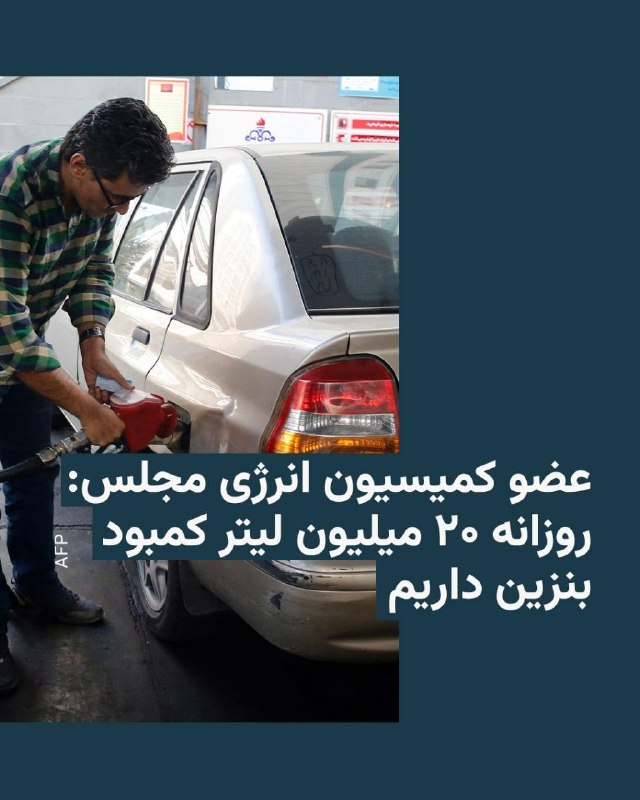

رضا سپهوند، عضو کمیسیون انرژی مجلس شورای اسلامی از کمبود روزانه دست‌کم «۲۰ میلیون لیتر بنزین» در ایران خبر داد.

به نوشته خبرگزاری تسنیم، این نماینده گفته که تولید روزانه بنزین در ایران بین « ۱۱۰ تا ۱۱۵ میلیون لیتر» و مصرف روزانه بین «۱۳۰ تا ۱۳۵ میلیون لیتر» است.
سپهوند با بیان اینکه «در کوتاه‌مدت امکان افزایش تولید وجود ندارد»، خواستار جدی‌گرفتن «مدیریت مصرف سوخت» شد.
پیش از این وزیر خزانه‌داری ایالات متحده گفته بود ایران به‌زودی با «کمبود بنزین» مواجه خواهد شد.

اسکات بسنت با انتشار مطلبی کوتاه در شبکۀ ایکس، نوشته بود: «در حالی‌که باقی‌ماندۀ سران سپاه پاسداران، مثل موش‌هایی که در لوله‌های فاضلاب غرق می‌شوند، گیر افتاده‌اند، به لطف محاصرۀ دریایی ایالات متحده، صنایع نفتی آسیب‌دیدۀ ایران، در حال از کار افتادن و توقف تولید است. پمپاژ نفت به زودی متوقف خواهد شد».
او سپس پیامش را به سبک دونالد ترامپ، با جمله‌ای که به‌طور کامل با حروف بزرگ نوشته شده، به پایان برده بود؛ جمله‌ای با این مضمون هشدار آمیز: «مرحلۀ بعد،‌ کمبود بنزین در ایران!»
@VahidHeadline

📡 @VahidOnline

## kianmeli1 — post 87414

  <a href="telegram/content/kianmeli1_87414_1778871591.mp4" target="_blank">🎬 Download video</a>

🔴تصاویری از پایان سفر پرزیدنت ترامپ به چین
https://t.me/kianmeli1

## kianmeli1 — post 87413

🔴شبکه 13 اسرائیل: ساختار امنیتی [در اسرائیل] بر این ارزیابی است که ترامپ با انجام حمله‌ای محدود به ایران موافقت خواهد کرد.
https://t.me/kianmeli1

## kianmeli1 — post 87412

  <a href="telegram/content/kianmeli1_87412_1778871592.mp4" target="_blank">🎬 Download video</a>

🔴دقایقی پیش فرمانده حماس کشته شد
‏
نخست‌وزیر و وزیر دفاع اسرائیل در بیانیه‌ای اعلام کردند ارتش این کشور عزالدین حداد، فرمانده شاخه نظامی حماس، را در یک حمله هوایی هدف قرار داده است
https://t.me/kianmeli1

## IranIntlTV — post 337373

در میانه تنش‌ها با تهران، ابوظبی روابط دفاعی و انرژی خود با هند را گسترش می‌دهد

وزارت امور خارجه هند اعلام کرد که این کشور و امارات متحده عربی بر سر چارچوب یک مشارکت راهبردی دفاعی به توافق رسیده‌اند. این توافق در جریان سفر نارندرا مودی به ابوظبی و در میانه تشدید تنش‌ها میان امارات و جمهوری اسلامی به دست آمده است.

وزارت امور خارجه هند، جمعه ۲۵اردیبهشت، افزود که دو کشور در جریان این سفر، همچنین توافق‌نامه‌هایی درباره ذخایر راهبردی نفت و تأمین گاز نفتی مایع (ال‌پی‌جی) امضا کرده‌اند.

در بیانیه وزارت امور خارجه هند آمده است: «دو طرف بر تعمیق همکاری‌های صنعتی دفاعی و همکاری در زمینه نوآوری و فناوری پیشرفته، آموزش، رزمایش‌ها، امنیت دریایی، دفاع سایبری، ارتباطات امن و تبادل اطلاعات توافق کرده‌اند.»

پیش از این سفر، منابع هندی به رویترز گفته بودند که مودی احتمالا درباره قراردادهای بلندمدت تامین انرژی گفت‌وگو خواهد کرد و همچنین به‌دنبال جلب حمایت برای گسترش ذخایر راهبردی نفت هند خواهد بود.

تقویت روابط دفاعی و انرژی امارات و هند در شرایطی صورت می‌گیرد که در جریان جنگ اخیر، روابط تهران و ابوظبی به شدت تیره شد و جمهوری اسلامی حملات پهپادی و موشکی را علیه تاسیسات نفت و انرژی امارات انجام داد.

همچنین روزنامه وال‌استریت ژٰورنال ۲۱ اردیبهشت به‌نقل از منابع آگاه خبر داد که امارات متحده عربی به‌طور مخفیانه حملاتی علیه جمهوری اسلامی انجام و در یکی از این حملات در ماه آوریل پالایشگاه نفتی جزیره لاوان ایران را هدف قرار داده است.

در حالی که هند، امارات و جمهوری اسلامی عضو بریکس هستند، وزارت امور خارجه هند جمعه در پایان نشست سالانه وزیران امور خارجه این گروه در دهلی نو به جای انتشار بیانیه مشترک، بیانیه‌ای به عنوان رییس نشست صادر کرد و اعلام کرد میان برخی اعضا درباره وضعیت خاورمیانه اختلاف نظر وجود دارد.

بسته شدن تنگه هرمز از سوی جمهوری اسلامی بازارهای جهانی انرژی را متلاطم و حمل‌ونقل و تجارت در سراسر منطقه را مختل کرده است.

تاثیر خروج امارات از اوپک بر کمک به هند
با تصمیم امارات برای خروج از اوپک در ماه گذشته، انتظار می‌رود ظرفیت تولید این کشور افزایش یابد و به واردکنندگانی مانند هند کمک کند.

طبق توافق نفتی اعلام‌شده در روز جمعه، احتمال افزایش ذخیره‌سازی نفت خام شرکت دولتی نفت ابوظبی «ادنوک» در هند تا سقف ۳۰ میلیون بشکه وجود دارد. این شرکت در بیانیه‌ای جداگانه اعلام کرد که این توافق همچنین امکان ذخیره‌سازی نفت خام در فجیره امارات را به‌عنوان بخشی از ذخایر راهبردی هند بررسی می‌کند.

شرکت «ادنوک» همچنین اعلام کرد که گسترش تامین و فرصت‌های تجاری گاز نفتی مایع (ال‌پی‌جی) با شرکت «ایندین اویل کورپوریشن» را بررسی خواهد کرد.

سلطان احمد الجابر، مدیرعامل و مدیر اجرایی «ادنوک»، گفت: «مقیاس و مسیر رشد هند، آن را به یکی از تعیین‌کننده‌ترین بازارهای انرژی عصر ما تبدیل کرده است. با شتاب گرفتن تقاضا هم‌زمان با رشد سریع جمعیت، اهمیت مشارکت انرژی میان امارات و هند بیش از پیش حیاتی می‌شود.»

نگاه امارات و هند به روابط نزدیک‌ عربستان و پاکستان
امارات متحده عربی سومین شریک تجاری بزرگ هند است. دهلی نو و ابوظبی در ماه ژانویه قراردادی سه میلیارد دلاری برای خرید گاز طبیعی مایع (ال‌ان‌جی) امارات از سوی هند امضا کرده بودند. همچنین نامه‌ای برای همکاری در جهت شکل‌گیری یک مشارکت راهبردی دفاعی میان دو کشور امضا شد.

این توافق‌ها پس از آن صورت گرفت که پاکستان، رقیب دیرینه هند، سال گذشته توافق دفاعی متقابلی با عربستان سعودی امضا کرد.

پاکستان به میانجی اصلی میان واشینگتن و تهران برای پایان دادن به جنگی تبدیل شده که با حملات ایالات متحده و اسرائیل به جمهوری اسلامی در نهم اسفند آغاز شد. همچنین پاکستان برای تقویت دفاع عربستان سعودی پس از آنکه این کشور هدف صدها حمله موشکی و پهپادی جمهوری اسلامی قرار گرفت، اقدام کرده است.

ریاض ماه گذشته اعلام کرد که سه میلیارد دلار دیگر برای کمک به پاکستان در پوشش بازپرداخت بدهی اسلام‌آباد به امارات ارائه خواهد کرد.

وزارت امور خارجه هند همچنین جمعه از سرمایه‌گذاری‌های پنج میلیارد دلاری امارات متحده عربی خبر داد و به توافق‌های پیشین از جمله خرید ۶۰ درصد سهام بانک «آر‌بی‌ال» از سوی «امیراتس ان‌بی‌دی» به ارزش سه میلیارد دلار در سال گذشته، و سرمایه‌گذاری یک میلیارد دلاری شرکت «آی‌اچ‌سی» ابوظبی در پروژه «سمّان» اشاره کرد.
 
🔗وب‌سایت ایران‌اینترنشنال
@iranintltv

## IranIntlTV — post 337372

  

گلرخ ایرایی، زندانی سیاسی، در پیامی از بند زنان زندان اوین به مناسبت اعطای جایزه «آزادی نوشتن» از سوی انجمن قلم آمریکا، نوشت: «می‌نویسیم حتی اگر آزادی‌مان به بند کشیده شود؛ حتی اگر مورد تهدید و تحدید قرار بگیریم و وادار به تبعید یا فدای جان شویم.»

ایرایی در این پیام نوشت، «اینجا بی‌پروا نوشتن از رنج مردمانی که ستم را به پیکار برمی‌خیزند، مجرمانه است و آنان که با قلم تباهی درد را به چشم جهانیان پدیدار می‌کنند، در سکوت فرسوده می‌شوند و مجرم‌اند و سزاوار محاکمه!»
او به فقر، نابرابری، سرکوب و «کشتار سیستماتیک» در ایران اشاره کرد و نوشت نوشتن از رنج مردم «تحت ستم»، با همه هزینه‌ها و محدودیت‌ها، «روزنه امیدی» برای ادامه مبارزه است.

این زندانی سیاسی همچنین نوشت «ارتجاع حاکم، آزادی اندیشه و جسارت بیان را برنمی‌تابد، آنگاه که قلم بر چوبه‌های دار افراشته حمله می‌برد و از فقر و نابرابری روایت می‌کند و بازتابی می‌شود از سفره‌های خالی و قیام گرسنگان را نوید می‌دهد.»

او در پایان تاکید کرد: «ما از خفگی رها خواهیم شد و می‌دانیم این جز در حرکتی مشترک میسر نخواهد بود.»
https://iranintl.com/202605159393

## IranIntlTV — post 337371

  

آموزشکده توانا در گزارشی نوشت برخی وکلا با هماهنگی نهادهای امنیتی و قضات دادگاه‌های انقلاب، در پرونده‌های امنیتی به‌جای دفاع از متهمان، با درخواست عفو و «اقرار ضمنی» به اتهام‌ها، مسیر صدور و اجرای احکام سنگین از جمله اعدام را هموار می‌کنند.

بر اساس این گزارش، این وکلا با تجدیدنظرخواهی فوری، فرصت قانونی اعتراض را نیز از متهمان سلب می‌کنند.
این گزارش از «مهدی محرابی» به‌عنوان یکی از این وکلا نام برده و نوشته او در پرونده آتش‌سوزی پایگاه بسیج خیابان نامجو، مربوط به محمدامین بیگلری، امیرحسین حاتمی، علی فهیم و شاهین واحدپرست کلور، چهار معترض اعدام‌شده، نقش داشته است.

در این گزارش همچنین آمده خانواده برخی متهمان امنیتی تحت فشار قرار می‌گیرند تا به‌جای وکلای مستقل، از «وکلای مورد تایید» استفاده کنند؛ اقدامی که به نوشته توانا، در مواردی به صدور احکام اعدام یا حبس‌های طولانی‌مدت منجر شده است.
https://iranintl.com/202605156524

## IranIntlTV — post 337370

  <a href="telegram/content/IranIntlTV_337370_1778871594.mp4" target="_blank">🎬 Download video</a>

🔻هادی چوپان، قهرمان پیشین مسترالمپیا در یک مسابقه استعدادیابی که از صدا و سیمای جمهوری اسلامی پخش می‌شود، گفت: «ما با زحمت و هزار دردسر به قله رسیدیم، نباید بازیچه دلقکان مجازی شویم.»

@iranintltvsport

## IranIntlTV — post 337369

  <a href="telegram/content/IranIntlTV_337369_1778871595.mp4" target="_blank">🎬 Download video</a>

۲۴ با فرداد فرحزاد
@iranintltv

## IranIntlTV — post 337368

  <a href="telegram/content/IranIntlTV_337368_1778871596.mp4" target="_blank">🎬 Download video</a>

۲۴ با فرداد فرحزاد
@iranintltv

## IranIntlTV — post 337367

زندگی در وضعیت اضطرار؛ اقتصاد، خانواده و فرسایش روان جمعی

🖋تحلیل - صبا آلاله

شاید در سال‌های اخیر، به‌تدریج تغییراتی را در سبک زندگی خود یا اطرافیانتان تجربه کرده باشید؛ دگرگونی‌هایی که در ابتدا کوچک و کم‌اهمیت به نظر می‌رسیدند، اما به‌مرور به بخشی پایدار از زندگی روزمره تبدیل شدند.

سفره بسیاری از خانواده‌ها به‌تدریج کوچک‌تر شده و هر بار بخشی از خریدها یا نیازهای معمول از آن حذف یا کمتر شده است؛ از حذف گوشت و برخی مواد غذایی اصلی گرفته تا عقب‌انداختن درمان، صرف‌نظر کردن از ضرورت‌ها و حتی لغو سفرهای خانوادگی که زمانی بخشی عادی از زندگی محسوب می‌شدند.

در کنار اینها، ناامنی اقتصادی نوعی فشار پایدار و فرساینده ایجاد کرده که به‌آرامی در بافت زندگی رسوخ کرده است. شاید بتوان گفت بسیاری از افراد، به‌شکلی مستقیم یا غیرمستقیم، تجربه زیستن در چنین شرایطی را داشته‌اند؛ تجربه‌ای که در آن، زندگی نه در قالب بحران‌های ناگهانی، بلکه در قالب فرسایش تدریجی و تغییرات مداوم بازتعریف شده است.

بازتولید ناامنی و اختلال در ساختار روان جمعی
در چند دهه اخیر، جامعه با تورم مزمن و بی‌ثباتی اقتصادی مداوم روبه‌رو بوده است. داده‌های رسمی نشان می‌دهند که در دهه اخیر نرخ تورم بارها بین ۳۰ تا ۵۰ درصد نوسان داشته و قدرت خرید خانواده‌ها به‌شدت کاهش یافته است.

هم‌زمان، نرخ بیکاری رسمی در محدوده ۷ تا ۱۰ درصد گزارش می‌شود؛ روندی که در کنار گسترش فقر و شکل‌گیری فقیران جدید نشان می‌دهد نه‌تنها گروه‌های فرودست، بلکه طبقه متوسط نیز به‌طور فزاینده‌ای در معرض ناامنی معیشتی قرار گرفته است.

هزینه‌های بالای زندگی، بیکاری، کمبود گسترده دارو و خدمات درمانی از مهم‌ترین نشانه‌های این وضعیت به شمار می‌روند.

مطالعات همچنین نشان می‌دهند که سیستم عصبی افراد در این شرایط، به‌طور مداوم در وضعیت هشدار قرار دارد. این وضعیت توانایی پردازش مسائل پیچیده را کاهش داده و تمرکز ذهنی را به نیازهای کوتاه‌مدت و بقا محدود می‌کند. در نتیجه، ظرفیت‌هایی مانند خلاقیت، همدلی، آینده‌نگری و مشارکت اجتماعی به‌شدت تضعیف می‌شوند.

داده‌های آماری گویای آن است که فشار اقتصادی مزمن، پیامدهای جمعی عمیقی ایجاد می‌کند؛ از جمله کاهش اعتماد به نهادهای اجتماعی، تضعیف سرمایه اجتماعی و ناتوانی در حل مسائل جمعی. به بیان دیگر، نابسامانی اقتصادی نه‌تنها زندگی فردی، بلکه سلامت روان جامعه را نیز به‌طور سیستماتیک فرسایش می‌دهد. در نتیجه، تورم چالشی روانی و ساختاری است که پایه‌های هویتی جامعه را هدف قرار می‌دهد.

فقر، پیامد نابسامانی اقتصادی، بحران فردیت و هویت
فقر، فراتر از یک پدیده مادی یا فقدان دارایی، تجربه‌ای روانی، عمیق و مستمر است که زندگی را از درون تحت فشار قرار می‌دهد.

مطالعات نشان می‌دهند که:
۱- پایگاه اقتصادی و اجتماعی پایین با افزایش اضطراب و افسردگی در تمامی سنین همراه است؛
۲- فقر مزمن باعث کاهش عملکردهای شناختی، از جمله تمرکز و حافظه می‌شود؛
۳- سوءتغذیه ناشی از فقر با اختلالات خلقی و مشکلات روان‌تنی مرتبط است.

فرسایش فردیت و تثبیت در حالت بقا، پیامدهای اجتماعی بالایی دارد. افراد در چنین شرایطی تحریک‌پذیرتر شده، واکنش‌های هیجانی شدیدتری نشان می‌دهند. این وضعیت، هم آسیب‌پذیری فرد را افزایش می‌دهد و هم زمینه را برای شکل‌گیری خشم فروخورده و اضطراب فراگیر فراهم می‌سازد.

یکی از پیامدهای روانی گسست هویتی، پدیده جابه‌جایی خشم است. زمانی که فرد قادر نیست خشم خود را متوجه منبع واقعی فشار کند، آن را به سمت نزدیک‌ترین افراد، مانند اعضای خانواده، اطرافیان و همکاران منتقل می‌کند. در نتیجه، محیط‌هایی که باید پناهگاه روانی باشند، به کانون تنش و پرخاشگری تبدیل می‌شوند.

پیامدهای روانی و اجتماعی، از فرسایش خانواده تا انسداد آینده
تداوم بی‌ثباتی اقتصادی و فرسایش معیشتی، در بستری از بحران‌های انباشته شکل گرفته است؛ بحرانی که اگرچه در ابتدا ساختاری بود، اما با وقوع شرایط جنگی، ابعاد آن شدیدتر شده است.

در نهایت باید گفت آنچه امروز با آن روبه‌رو هستیم، فراتر از یک بحران معیشتی، فرآیندی است که سلامت روان جمعی و توان جامعه برای حفظ انسجام و معنا را هدف قرار داده است. تداوم این وضعیت، جامعه را میان فشارهای اقتصادی و تلاش برای حفظ هویت فردی و انسانی معلق نگه می‌دارد؛ وضعیتی که بازسازی آن، نیازمند توجه فوری به ترمیم روانِ رنجور جامعه و محافظت از بنیان‌های روانی است.

🔗متن کامل گزارش را اینجا بخوانید
@iranintltv

## IranIntlTV — post 337366

  <a href="telegram/content/IranIntlTV_337366_1778871597.mp4" target="_blank">🎬 Download video</a>

پشت پرده بین دو رهبر، ترامپ و «شی»، درباره‌ی سرنوشت «مجتبی» چه گذشته؟
@iranintltv

## IranIntlTV — post 337365

وزیر امور خارجه ایتالیا: در تلاش هستیم مشکل اقامتی ایرانیان مقیم ایتالیا را حل کنیم

آنتونیو تایانی، وزیر امور خارجه ایتالیا، درباره وضعیت ایرانیان مخالف جمهوری اسلامی که به‌دلیل عدم تمدید گذرنامه از سوی حکومت ایران با مشکلات اقامتی روبه‌رو شده‌اند، اعلام کرد که دولت ایتالیا «در کنار آزادی ایستاده» و به تلاش خود برای حمایت از دموکراسی و مردم ایران ادامه می‌دهد.

تایانی جمعه ۲۵ اردیبهشت در جریان جلسه پرسش و پاسخ در مجلس سنا، به پرسش مارکو لومباردو، سناتور حزب آزیونه، درباره مساله صدور اجازه اقامت در ایتالیا برای مخالفان جمهوری اسلامی در صورت عدم تمدید گذرنامه از سوی حکومت ایران پاسخ داد.

او تاکید کرد که دولت ایتالیا در حال بررسی راه‌حل‌های عملی برای حمایت از شهروندان ایرانی مقیم این کشور است؛ به‌ویژه هزاران نفری که گذرنامه‌هایشان منقضی شده یا به‌زودی منقضی خواهد شد.

به‌گفته او، وزارت کشور ایتالیا در حال ارزیابی پیامدهای حقوقی این مساله، هم در سطح پرونده‌های فردی و هم در چارچوب کلی قوانین موجود، با هدف یافتن راه‌حلی سریع و موثر است.

بررسی تمدید مجوز اقامت ایرانیان
تایانی همچنین اعلام کرد که به تمام دفاتر امنیت عمومی در سراسر کشور دستور داده شده درخواست‌های تمدید مجوز اقامت ایرانیان را به‌صورت موردی بررسی کنند و در عین حال امنیت همه شهروندان ساکن ایتالیا، چه ایرانی و چه غیرایرانی، تضمین شود.

او با محکوم کردن سرکوب‌های جمهوری اسلامی گفت که حکومت ایران همچنان همان حکومتی است که اعتراضات مسالمت‌آمیز مردم، به‌ویژه جوانان، را با خشونت سرکوب کرده است و امروز نیز این روند با اعدام مخالفان ادامه دارد.

تایانی تاکید کرد که همان‌گونه که با مجازات اعدام در هر کشوری مخالف است، با اجرای آن در ایران نیز مخالف است.

وزیر امور خارجه ایتالیا همچنین از قصد دولت برای مطرح کردن این موضوع در سطح اتحادیه اروپا خبر داد تا حمایت از ایرانیانی که ناچار به فرار از سرکوب شده‌اند، تقویت شود.

پیشتر دولت کانادا در بیانیه‌ای اعلام کرد که برخی از تدابیر ویژه برای حمایت موقت از اتباع ایرانی را تمدید می‌کند.

بر اساس این اقدامات، افرادی که دارای مجوز کار معتبر صادرشده در تاریخ ۲۸ فوریه سال گذشته میلادی یا پیش از آن هستند، می‌توانند برای تمدید آن درخواست دهند. این اقدامات تا ۳۱ مارس سال آینده میلادی اعتبار خواهند داشت و هزینه‌های استاندارد رسیدگی به درخواست‌ها اعمال می‌شود.

۲۴ هزار ایرانی شاغل یا محصل در ایتالیا
لومباردو در پرسش خود گفته بود: «ما وظیفه داریم از این افراد محافظت کنیم و امنیت شهروندان ایرانی مقیم ایتالیا را که در فعالیت‌های عمومی علیه رژیم شرکت می‌کنند، تامین کنیم. تعداد شهروندان ایرانی مقیم ایتالیا به دلایل تحصیلی و کاری ۲۴ هزار نفر است.»

او این پرسش‌ها را مطرح کرد: «آیا درست است که در سفارت‌ها و کنسولگری‌های ایران، فهرست‌های سیاه از ایرانیانی وجود دارد که به فعالیت‌های ضد دولتی متهم شده‌اند و تنها به این دلیل که آزادانه و با شجاعت مخالفت خود را با رژیم بیان می‌کنند، به عنوان "مزدوران داخلی" طبقه‌بندی می‌شوند؟آیا درست است که این افراد در معرض خطر عدم تمدید گذرنامه‌های خود قرار دارند و این موضوع خودشان و خانواده‌هایشان را در معرض تهدید، باج‌گیری یا خطر مرگ قرار می‌دهد؟»

مقامات قوه قضاییه جمهوری اسلامی در هفته‌های اخیر از توقیف اموال ده‌ها نفر از مخالفان حکومت خبر دادند.

پیش‌تر نیز دادستان کل کشور از دستور قضایی برای توقف تنظیم وکالت‌نامه‌های انتقال اموال ایرانیان خارج از کشور در سامانه «میخک» خبر داده بود.

غلامحسین محسنی اژه‌ای، رییس قوه قضاییه، اواخر فروردین تاکید کرد در مصادره اموال «عناصر محکوم» نباید هیچ‌ مماشاتی صورت گیرد و این روند باید با «دقت و سرعت» انجام شود.
 
🔗وب‌سایت ایران‌اینترنشنال
@iranintltv

## IranIntlTV — post 337364

  

وزارت خارجه آمریکا اعلام کرد آتش‌بس میان اسرائیل و لبنان برای ۴۵ روز دیگر تمدید خواهد شد تا زمینه برای پیشرفت بیشتر در مذاکرات فراهم شود.
این وزارتخانه همچنین اعلام کرد روند سیاسی مذاکرات در روزهای ۱۲ و ۱۳ خرداد از سر گرفته خواهد شد.
https://iranintl.com/202605155415

## IranIntlTV — post 337363

  

شاهزاده رضا پهلوی در پیامی ویدیویی، گفت که بر اساس نظر مشورتی «کمیته تدوین مقررات عدالت انتقالی ایران»، همکاری آگاهانه و داوطلبانه با ساختارهای سرکوبگر جمهوری اسلامی، از جمله خبرچینی، مشارکت در ایست‌های بازرسی، همکاری در سرکوب معترضان، به‌کارگیری کودکان و نوجوانان در سرکوب و همچنین خرید و فروش اموال مصادره‌شده معترضان، می‌تواند مصداق «یاری‌رسانی به جنایت علیه بشریت» باشد و مسئولیت کیفری به همراه داشته باشد.

او گفت هیچ مقام، دستور یا بهانه‌ای مانع مسئولیت فردی نخواهد بود و افرادی که با دستگاه‌های سرکوب همکاری کنند، چه در داخل و چه خارج از ایران، در معرض پیگرد قرار خواهند گرفت. به گفته او، افرادی که در مصادره یا معامله اموال توقیف‌شده معترضان نقش داشته باشند نیز ممکن است ملزم به جبران خسارت شوند.

شاهزاده رضا پهلوی همچنین هشدار داد کسانی که امروز با نهادهای امنیتی و سرکوبگر جمهوری اسلامی همکاری می‌کنند، باید به آینده خود و خانواده‌شان فکر کنند، زیرا به گفته او، در آینده عاملان سرکوب در برابر قانون پاسخگو خواهند شد.
https://iranintl.com/202605153420

## IranIntlTV — post 337362

  <a href="telegram/content/IranIntlTV_337362_1778871600.mp4" target="_blank">🎬 Download video</a>

یکی از مخاطبان ایران‌اینترنشنال می‌گوید به اختلال دوقطبی مبتلاست و افزایش قیمت و کمبود داروهای اعصاب و روان نگرانی جدی برای او ایجاد کرده است. او تاکید می‌کند این وضعیت روند درمانش را تحت تأثیر قرار داده است.

بازخوانی این پیام و ساخت تصویر برای آن با هوش مصنوعی انجام گرفته است.

## IranIntlTV — post 337361

  

یک مقام ارشد اسرائیلی به کانال ۱۲ گفت تل‌آویو خود را برای احتمال ازسرگیری قریب‌الوقوع جنگ با جمهوری اسلامی آماده می‌کند.
او با اشاره به روند مذاکرات تهران و واشینگتن گفت: «آمریکایی‌ها به این نتیجه رسیده‌اند که مذاکرات به جایی نمی‌رسد.»

پیش‌تر یسرائیل کاتز، وزیر دفاع اسرائیل گفته بود ماموریت ارتش این کشور درباره ایران کامل نشده و برای این احتمال آماده است که شاید دوباره ناچار به اقدام شود.
https://iranintl.com/202605150617

## IranIntlTV — post 337360

  

🔻ساندی تایمز گزارش داد دیوید بکام و همسرش ویکتوریا با دارایی یک میلیارد و ۱۸۵ میلیون پوندی در فهرست ثروتمندان ۲۰۲۶ این رسانه، به نخستین ورزشکار میلیارد پوندی بریتانیا تبدیل شده‌اند. کاپیتان پیشین تیم ملی فوتبال انگلستان پس از سرمایه‌گذاری‌های سودآور در آمریکا به این ثروت دست یافت.

🔹به نوشته ساندی تایمز، سرمایه‌گذاری هوشمندانه در فوتبال آمریکا، بکام را به این جایگاه رسانده است. پرداخت ۲۵ میلیون دلار برای دریافت حق راه‌اندازی باشگاه اینتر میامی ۱۲ سال پیش، بهترین سرمایه‌گذاری دوران ح

🔹امروز سهم او در این باشگاه حدود ۳۰۰ میلیون پوند ارزش دارد. افزایش ارزش باشگاه تا حدی به قرارداد جدید لیونل مسی نیز مربوط است؛ بکام نقش مهمی در تصمیم این ستاره آرژانتینی برای تمدید سه‌ساله قراردادش داشت.

🔹همچنین ثروت ویکتوریا بکام، ۵۲ ساله، نیز به دلیل موفقیت برند مد او افزایش یافته است. دیوید در سال‌های ابتدایی ۲۳ میلیون پوند در این برند سرمایه‌گذاری کرد و اکنون درآمد سالانه آن از ۱۰۰ میلیون پوند فراتر رفته است.

🔹جزییات بیشتر را در سایت بخوانید

@iranintltvsport

## IranIntlTV — post 337359

  

بنیامین نتانیاهو، نخست‌وزیر و یسرائیل کاتز، وزیر دفاع اسرائیل در بیانیه‌ای اعلام کردند ارتش این کشور، عزالدین حداد، فرمانده شاخه نظامی حماس، را در یک حمله هوایی هدف قرار داده است.
عزالدین حداد، از فرماندهان ارشد گردان‌های عزالدین قسام، شاخه نظامی حماس است.
https://iranintl.com/202605154092

## Shin_Persian — post 6019

↩️ Quoted tweet: Emanuel (Mannie) Fabian ✓ @manniefabian Fri, 15 May 2026 17:18:34 UTC A senior Israeli security official tells reporters that there are "initial indications" that Izz al-Din al-Haddad was killed in the airstrike in Gaza City a short while…

## Shin_Persian — post 6018

↩️ Quoted tweet:
Emanuel (Mannie) Fabian ✓ @manniefabian
Fri, 15 May 2026 17:18:34 UTC

A senior Israeli security official tells reporters that there are "initial indications" that Izz al-Din al-Haddad was killed in the airstrike in Gaza City a short while ago.

↩️ توییت نقل‌قول شده — برای پاسخ، پست زیر را ببینید.

فارسی

یک مقام ارشد امنیتی اسرائیل به خبرنگاران می‌گوید که «نشانه های اولیه» وجود دارد که نشان می‌دهد عزالدین الحداد در حمله هوایی اندکی پیش در شهر غزه کشته شده است.

𝕏 · @shin_persian

## ManotoTV — post 105500

  <a href="telegram/content/ManotoTV_105500_1778871603.mp4" target="_blank">🎬 Download video</a>

‌
وزارت خارجه آمریکا اعلام کرد آتش‌بس میان اسرائیل و لبنان برای ۴۵ روز دیگر تمدید شده تا فرصت بیشتری برای ادامه مذاکرات فراهم شود.

## ManotoTV — post 105499

  <a href="telegram/content/ManotoTV_105499_1778871603.mp4" target="_blank">🎬 Download video</a>

‌
شاهزاده رضا پهلوی در پیامی ویدیویی خطاب به ملت ایران، درباره همکاری با ساختارهای سرکوبگر جمهوری اسلامی هشدار داد و گفت افرادی که در داخل و خارج کشور آگاهانه در سرکوب معترضان، مصادره اموال شهروندان و همکاری با نهادهای حکومتی نقش داشته باشند، در آینده با «مسئولیت کیفری» روبه‌رو خواهند شد.

او اعلام کرد «کمیته تدوین مقررات عدالت انتقالی ایران» در نخستین نظر مشورتی خود، همکاری با نهادهای سرکوب جمهوری اسلامی را «یاری‌رسانی به جنایت علیه بشریت» دانسته است.

شاهزاده رضا پهلوی تاکید کرد مشارکت در خبرچینی، ایست‌های بازرسی، استفاده از کودکان در سرکوب و خرید و فروش اموال مصادره‌شده معترضان، می‌تواند موجب پیگرد و پاسخگویی قضایی شود.

او همچنین هشدار داد در ایران آزاد، «هیچ جنایتکاری از پاسخ‌گویی در برابر قانون در امان نخواهد بود.»

## ManotoTV — post 105498

  <a href="telegram/content/ManotoTV_105498_1778871605.mp4" target="_blank">🎬 Download video</a>

‌
اسرائیل اعلام کرد در حمله‌ای هوایی، عزالدین الحداد، ارشدترین فرمانده گروه تروریستی حماس در نوار غزه را هدف قرار داده است.

هنوز گزارشی از وضعیت او منتشر نشده و حماس هم واکنشی نشان نداده است.

الحداد در فهرست افراد تحت تعقیب اسرائیل قرار دارد و از سوی اسرائیل به عنوان یکی از «طراحان» حمله تروریستی هفت اکتبر معرفی شده است.

## ManotoTV — post 105497

  <a href="telegram/content/ManotoTV_105497_1778871605.mp4" target="_blank">🎬 Download video</a>

اداره تحقیقات فدرال آمریکا، اف‌بی‌آی، اعلام کرد برای اطلاعاتی که به بازداشت و محکومیت مونیکا ویت، افسر و مأمور سابق ضدجاسوسی ارتش آمریکا متهم به جاسوسی برای جمهوری اسلامی، منجر شود ۲۰۰ هزار دلار جایزه تعیین کرده است.

دفتر اف‌بی‌آی در واشنگتن اعلام کرد مونیکا ویت با وجود صدور کیفرخواست در سال ۲۰۱۹ همچنان متواری است.

او به اتهام جاسوسی و انتقال اطلاعات مرتبط با دفاع ملی آمریکا به ایران تحت پیگرد قرار دارد.

ویت بین سال‌های ۱۹۹۷ تا ۲۰۰۸ در نیروی هوایی آمریکا و دفتر تحقیقات ویژه این نیرو فعالیت می‌کرد و سپس تا سال ۲۰۱۰ به‌عنوان پیمانکار با دولت آمریکا همکاری داشت.

اف‌بی‌آی اعلام کرد او در دوران فعالیت خود به اطلاعات فوق‌محرمانه، از جمله هویت واقعی مأموران مخفی جامعه اطلاعاتی آمریکا، دسترسی داشته است.

بر اساس این بیانیه، ویت در سال ۲۰۱۳ به ایران پناهنده شد و سپس اطلاعات حساسی را در اختیار جمهوری اسلامی قرار داد که برنامه‌های محرمانه آمریکا و امنیت کارکنان آمریکایی را به خطر انداخت.

سی‌ان‌ان پیش‌تر گزارش داده بود مقام‌های آمریکایی معتقدند جمهوری اسلامی او را جذب کرده و ویت پس از فرار به ایران، هویت یک مأمور اطلاعاتی آمریکا و جزئیات یک برنامه فوق‌محرمانه اطلاعاتی را افشا کرده است.

کیفرخواست این پرونده همچنین نام چهار شهروند ایرانی را در ارتباط با اتهام‌هایی از جمله توطئه، تلاش برای هک رایانه‌ای و سرقت هویت ذکر کرده است.

## ManotoTV — post 105496

  <a href="telegram/content/ManotoTV_105496_1778871606.mp4" target="_blank">🎬 Download video</a>

ما صدای فاطمه سپهری هستیم

## FarsiVOA — post 217844

در گفت‌و‌گو با دامون محمدی، تحلیل‌گر سیاسی، لفاظی‌های بی‌پایان جمهوری اسلامی - از ادعای پس گرفتن بحرین تا وضع عوارض بر فیبر نوری عبوری از تنگه هرمز - را مورد گفت‌و‌گو قرار دادیم.

## FarsiVOA — post 217843

ایران در حالی وارد هفتاد و هفتمین روز از محدودیت‌ها و اختلال گسترده اینترنت بین‌المللی شده است که به گفته نت‌بلاکس، نهاد پایش دسترسی به اینترنت، مجموع ساعات قطعی یا اختلال شدید به بیش از هزار و ۸۲۴ ساعت رسیده است.

این وضعیت در ماه‌های اخیر باعث شکل‌‌گیری نوعی «انزوای دیجیتال» برای شهروندان ایرانی شده است؛ شرایطی که دسترسی به پلتفرم‌های آنلاین، ارتباطات بین‌المللی و تعاملات روزمره با دنیای بیرون را به ‌شدت محدود کرده است.

بر اساس داده‌های منتشرشده، در طول جنگ ۱۲ روزه، اینترنت در ایران ۹ روز قطع بوده است. همچنین در جریان اعتراضات دی‌ماه، این اختلال به ۲۱ روز رسیده و از ۹ اسفند تا امروز نیز ۷۷ روز محدودیت ثبت شده است.

گزارش کامل را در وب‌سایت صدای آمریکا بخوانید.

@FarsiVOA

## FarsiVOA — post 217842

  <a href="telegram/content/FarsiVOA_217842_1778871607.mp4" target="_blank">🎬 Download video</a>

مهدی قدسی در برنامه تفسیر خبر: چین ذخایر استراتژیک خود را پر کرده بود و در مقابل بحران تا چند ماه تاب‌آوری دارد

## FarsiVOA — post 217841

پوشش ویژه | بخشی از سخنرانی معاون رئیس جمهوری آمریکا در مراسم یادبود افسران صلح

## FarsiVOA — post 217840

در حالی که سفر پرزیدنت ترامپ به چین توجه جهان را جلب کرده است، مردم درباره تأثیر این دیدار بر روابط آمریکا و چین، اقتصاد جهانی، و نقش جمهوری اسلامی و خاورمیانه صحبت می‌کنند.

## FarsiVOA — post 217839

کامبیز غفوری در برنامه تفسیر خبر: جمهوری اسلامی اکنون دشمن اصلی اعراب است

## FarsiVOA — post 217838

گفت‌و‌گوی پرزیدنت ترامپ و مرتس همزمان با تشدید جنگ اوکراین و واکنش تند اروپا به روسیه

## FarsiVOA — post 217837

  <a href="telegram/content/FarsiVOA_217837_1778871608.mp4" target="_blank">🎬 Download video</a>

محمد قائدی در برنامه تفسیر خبر: آمریکا مشتاق حل بحران در تنگه هرمز است

## FarsiVOA — post 217836

بررسی جزئیات درگیری لفظی نمایندگان جمهوری اسلامی و امارات در کنفرانس بریکس در گفت‌و‌گو با موسی شریفی، خبرنگار شبکه العربیه و تحلیل‌گر امور جهان عرب

## FarsiVOA — post 217835

پرزیدنت ترامپ: در حال بررسی لغو تحریم‌ها علیه شرکت‌های چینی خریدار نفت ایران هستم

## FarsiVOA — post 217834

گزارشی از مایکل لیپین، ‌خبرنگار صدای آمریکا، از پکن درباره سفر تاریخی دونالد ترامپ، رئیس جمهوری آمریکا، به چین.

@FarsiVOA

## FarsiVOA — post 217833

گفت‌و‌گو با رضا طالبی، روزنامه‌نگار و تحلیلگر سیاسی، درباره توافق‌های واشنگتن و پکن درباره جمهوری اسلامی در سفر رئیس جمهوری آمریکا به چین

## FarsiVOA — post 217832

ارتش اسرائیل اعلام کرد نیروهای لشکر ۱۴۶ در یک هفته گذشته حدود ۶۰ عضو حزب‌الله را در جنوب لبنان کشته‌اند.

به گفته ارتش اسرائیل، صدها زیرساخت مرتبط با حزب‌الله، از جمله انبارهای تسلیحاتی و تجهیزات نظامی، در این عملیات هدف قرار گرفته است.

ارتش اسرائیل می‌گوید این عملیات با هدف رفع تهدیدها علیه شهروندان اسرائیل ادامه دارد.

@FarsiVOA

## FarsiVOA — post 217831

علی جوانمردی: دورە تقویت تغییر در ایران بدون حملە نظامی

## FarsiVOA — post 217830

  <a href="telegram/content/FarsiVOA_217830_1778871609.mp4" target="_blank">🎬 Download video</a>

پیام تیری فرمو، مدیر انسیتو لومیر و دبیر هنری جشنواره فیلم کن، به مردم ایران - اختصاصی صدای آمریکا

## FarsiVOA — post 217829

اصغر فرهادی در نشست خبری فیلم «داستان‌های موازی» در جشنواره کن، کشته شدن غیرنظامیان در جنگ و همچنین کشته شدن معترضان در خیابان‌ها در دی را «بسیار دردناک» و فراموش‌نشدنی توصیف کرد.

## FarsiVOA — post 217828

پشت‌ پرده بازگشت عزیز جعفری به رسانه‌ها؛ دست‌های سپاه در مذاکره با آمریکا

## FarsiVOA — post 217827

بررسی اهمیت سفر تاریخی رئیس سازمان سیا به کوبا در گفت‌و‌گو با مهرزاد بروجردی، استاد علوم سیاسی دانشگاه علم و فناوری میزوری

## FarsiVOA — post 217826

پیامدهای ویرانگر قطع اینترنت توسط جمهوری اسلامی بر زندگی نابینایان و ناشنوایان ایران

## FarsiVOA — post 217825

پیامدهای بحران مزمن کمبود بنزین در ایران - گفت‌و‌گو با امید شکری، تحلیل‌گر سیاست خارجی و ژئوپولیتیک انرژی

## DW_Farsi — post 124740

  

🔶 ارتش اسرائیل: در حملات یک هفته گذشته بیش از ۲۲۰ عضو حزب‌الله کشته شده‌اند

ارتش اسرائیل هم‌زمان با دومین روز گفت‌وگوهای صلح میان کشورش با لبنان اعلام کرد، در حملات یک هفته گذشته بیش از ۲۲۰ عضو حزب‌الله کشته شده‌اند.

بنا بر اعلام ارتش اسرائیل در همین مدت، نیروهای اسرائیلی همچنین بیش از ۴۴۰ هدف متعلق به حزب‌الله را در چندین منطقه در جنوب لبنان مورد حمله قرار داده‌اند.

اسرائیل و لبنان در ۱۷ آوریل (۲۸ فروردین) سال جاری بر سر آتش‌بس توافق کردند اما درگیری‌ها میان نیروهای اسرائیلی و حزب‌الله همچنان ادامه دارد، به‌طوری که گزارش‌ها از کشته شدن صدها تن در حملات حکایت دارد و دو طرف یکدیگر را به نقض آتش‌بس متهم می‌کنند.

در حال حاضر فرستادگان دو کشور در حال برگزاری سومین دور مذاکرات با هدف پایان دادن به درگیری‌ها هستند، هرچند با ادامه حملات، هیچ‌یک از طرفین به‌طور علنی اظهارنظری نکرده‌اند.

لبنان پس از آنکه حزب‌الله در پاسخ به کشته شدن علی خامنه‌ای، رهبر پیشین جمهوری اسلامی، اقدام به شلیک موشک به سوی اسرائیل کرد، به جنگ خاورمیانه کشیده شد.
@dw_farsi

## DW_Farsi — post 124739

  

🔶 اصغر فرهادی: کشته شدن هر انسان چه با جنگ و چه کشتن معترضان جنایت است اصغر فرهادی، کارگردان برجسته ایرانی در جشنواره فیلم کن کشته شدن هزاران نفر در سرکوب اعتراضات دی ماه و همچنین جنگ آمریکا و اسرائیل علیه جمهوری اسلامی ایران را "عمیقا دردناک" توصیف کرد.…

## DW_Farsi — post 124738

  

🔶 اصغر فرهادی: کشته شدن هر انسان چه با جنگ و چه کشتن معترضان جنایت است

اصغر فرهادی، کارگردان برجسته ایرانی در جشنواره فیلم کن کشته شدن هزاران نفر در سرکوب اعتراضات دی ماه و همچنین جنگ آمریکا و اسرائیل علیه جمهوری اسلامی ایران را "عمیقا دردناک" توصیف کرد.

او روز جمعه ۱۵ مه (۲۵ اردیبهشت) به خبرنگاران در جشنواره فیلم کن گفت: «هفته گذشته در تهران بودم و هنوز تاثیر این اتفاقات را با خودم حمل می‌کنم. هر دوی اتفاقا اخیر در ایران عمیقا دردناک هستند و هیچ‌کدام هرگز فراموش نخواهند شد.»

او اضافه کرد: «مخالفت با کشته شدن بی‌گناهان و غیرنظامیان و انسان‎‌های عادی در جنگ به معنی موافقت با کشته شدن معترضان در خیابان‌ها نیست.»

فرهادی که از سال ۲۰۲۳ عمدتا خارج از ایران زندگی می‌کند، همچنین افزود، "کشته شدن هر انسانی، یک جنایت است و با هر دیدگاهی، کشتن انسان‌ها قابل پذیرش نیست، چه با جنگ، چه اعدام، چه کشتن معترضان."

این کارگردان برجسته ایرانی برنده جایزه اسکار برای اکران فیلم "داستان‌های موازی" در جشنواره کن حضور دارد و در یک کنفرانس مطبوعاتی در جشنواره کن این سخنان را گفت.
@dw_farsi

## Persian_Trend_Official — post 14209

https://youtube.com/live/MneL4ZkKs1A?feature=share

## Persian_Trend_Official — post 14208

تا دقایقی دیگه لایو شروع میشه

## Persian_Trend_Official — post 14207

  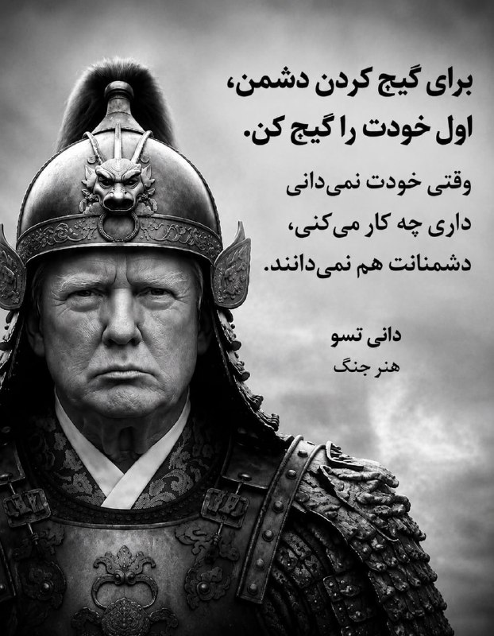

📌 @persian_trend_official
پرشین ترند | متفاوت‌ترین کانال نظامی

## Persian_Trend_Official — post 14204

🔴تصاویری از ساختمانی که عزالدین حداد، در آن حذف شده است.

پ ن : چقدر شبیه انفجار گاز های ایران تخریب شده ...

🫆:Tony

📌 @persian_trend_official
پرشین ترند | متفاوت‌ترین کانال نظامی

## Persian_Trend_Official — post 14203

  

🔴نتانیاهو

💢نیروهای دفاعی اسرائیل (IDF) عزالدین الحدّاد، فرمانده نظامی حماس در غزه را هدف قرار داده‌اند.

🫆:Tony

📌 @persian_trend_official
پرشین ترند | متفاوت‌ترین کانال نظامی

## RadioFarda — post 157234

  

🔸رضا سپهوند، عضو کمیسیون انرژی مجلس شورای اسلامی از کمبود روزانه دست‌کم «۲۰ میلیون لیتر بنزین» در ایران خبر داد.

🔸به نوشته خبرگزاری تسنیم، این نماینده گفته که تولید روزانه بنزین در ایران بین « ۱۱۰ تا ۱۱۵ میلیون لیتر» و مصرف روزانه بین «۱۳۰ تا ۱۳۵ میلیون لیتر» است.

🔸سپهوند با بیان اینکه «در کوتاه‌مدت امکان افزایش تولید وجود ندارد»، خواستار جدی‌گرفتن «مدیریت مصرف سوخت» شد.

🔸پیش از این وزیر خزانه‌داری ایالات متحده گفته بود ایران به‌زودی با «کمبود بنزین» مواجه خواهد شد.

🔸اسکات بسنت با انتشار مطلبی کوتاه در شبکۀ ایکس، نوشته بود: «در حالی‌که باقی‌ماندۀ سران سپاه پاسداران، مثل موش‌هایی که در لوله‌های فاضلاب غرق می‌شوند، گیر افتاده‌اند، به لطف محاصرۀ دریایی ایالات متحده، صنایع نفتی آسیب‌دیدۀ ایران، در حال از کار افتادن و توقف تولید است. پمپاژ نفت به زودی متوقف خواهد شد».

🔸او سپس پیامش را به سبک دونالد ترامپ، با جمله‌ای که به‌طور کامل با حروف بزرگ نوشته شده، به پایان برده بود؛ جمله‌ای با این مضمون هشدار آمیز: «مرحلۀ بعد،‌ کمبود بنزین در ایران!»

@RadioFarda

## IranianMinds — post 20207

🔴وزارت خارجه آمریکا:

آتش‌بس بین اسرائیل و لبنان به مدت ۴۵ روز تمدید می‌شود تا پیشرفت‌های بیشتری حاصل شود.

@IranianMinds

## IranianMinds — post 20206

  <a href="telegram/content/IranianMinds_20206_1778871612.mp4" target="_blank">🎬 Download video</a>

هم‌میهنان عزیزم،

در روزهایی که شما با شجاعت در برابر رژیم اشغالگر ایران ایستاده‌اید، این نظام منفور و منزوی، همچنان به تجاوز به جان و مال مردم ادامه می‌دهد تا سرنگونی حتمی خود را اندکی به تعویق اندازد. در چنین شرایطی، وظیفه خود می‌دانم که تصویر عدالت در فردای ایران را برای کسانی که با جنایتکاران همکاری کنند، روشن‌تر ترسیم کنم.

در این راستا، از «کمیته‌ تدوین مقررات عدالت انتقالی ایران» خواستم درباره‌ دو موضوع مهم، نظر مشورتی خود را ارائه کند: نخست، موضوع مسئولیت کیفری افرادی که با ساختارهای سرکوبگر جمهوری اسلامی همکاری می‌کنند؛ و دوم، موضوع مصادره‌ اموال معترضان و خانواده‌های آنان.

این کمیته اکنون نخستین نظر مشورتی خود را صادر کرده و پیام آن روشن است: این اقدامات، همکاری‌های ساده یا بی‌اهمیت نیستند؛ بلکه «یاری‌رسانی به جنایت علیه بشریت» محسوب می‌شوند. هیچ مقام، هیچ دستور و هیچ بهانه‌ای نمی‌تواند مسئولیت کیفری فردی را از میان ببرد. بنابراین، هر فردی که آگاهانه و داوطلبانه با ساختارهای سرکوبگر رژیم همکاری کند، چه در داخل و چه در خارج از ایران، باید بداند که در معرض مسئولیت کیفری قرار خواهد گرفت:

خواه این همکاری از نوع گزارش‌دهی یا خبرچینی باشد؛
خواه از نوع مشارکت در ایست‌های بازرسی‌ باشد؛
خواه از نوع به‌کارگیری کودکان و نوجوانان در سرکوب معترضان باشد؛
و خواه از نوع تحصیل، انتقال یا خرید و فروش اموالی باشد که در جریان سرکوب از معترضان و خانواده‌های آنان مصادره شده‌ است.

از این رو، نه‌تنها افرادی که در صدور دستور، اجرای آن، یا تسهیل این مصادره‌ها نقش دارند در معرض مسئولیت قرار خواهند گرفت، بلکه کسانی که آگاهانه و داوطلبانه به خرید و فروش این اموال می‌پردازند نیز باید پاسخگو باشند. این مسئولیت، استفاده از اموال یا دارایی‌های آنان برای جبران خسارت واردشده به مالکان اصلی را نیز شامل می‌‌شود.

بنابراین، به همه‌ کسانی که امروز در صدد همکاری با دستگاه سرکوب رژیم هستند هشدار می‌دهم: پیش از آن‌که دست به اقدامی بزنید که به مردم ایران آسیب جانی، مالی و یا اجتماعی برساند، به آینده‌ خود و خانواده‌تان بیندیشید. به آن روز بیندیشید که ایران آزاد خواهد شد؛ روزی که حقیقت پنهان نخواهد ماند؛ روزی که اسامی آشکار خواهد شد؛ روزی که هیچ متجاوز و جنایتکاری از پاسخ‌گویی در برابر قانون در امان نخواهد ماند.

آن روز، ملت ایران حکومتی خواهد داشت که حقوق ایرانیان را محترم می‌دارد و ایران را به سرزمینی آزاد و آباد بدل می‌کند.

پاینده ایران،
رضا پهلوی
-----------------------------
متن کامل نظر مشورتی «کمیته‌ تدوین مقررات عدالت انتقالی ایران»:

https://iranopasmigirim.com/fa/transitional-justice

@OfficialRezaPahlavi

## IranianMinds — post 20205

  <a href="telegram/content/IranianMinds_20205_1778871613.mp4" target="_blank">🎬 Download video</a>

🔴دقایقی پیش فرمانده حماس کشته شد
‏
نخست‌وزیر و وزیر دفاع اسرائیل در بیانیه‌ای اعلام کردند ارتش این کشور عزالدین حداد، فرمانده شاخه نظامی حماس، را در یک حمله هوایی هدف قرار داده است

@IranianMinds

## BBCPersian — post 281152

🔻وزارت خارجه آمریکا می‌گوید آتش‌بس میان لبنان و اسرائیل به مدت ۴۵ روز تمدید شده است

تامی پیگوت، سخنگوی وزارت خارجه آمریکا، می‌گوید تمدید آتش‌بس میان اسرائیل و لبنان پس از دو روز مذاکرات «بسیار سازنده» با میانجیگری ایالات متحده مورد توافق قرار گرفته است.

آقای پیگوت گفت که مذاکرات «راهبرد سیاسی» در تاریخ ۲ و ۳ ژوئن از سر گرفته خواهد شد، در حالی که «راهبرد امنیتی» در ۲۹ مه با حضور هیئت‌های نظامی اسرائیل و لبنان در پنتاگون آغاز خواهد شد.

او در پستی در شبکه اجتماعی ایکس نوشت: «ما امیدواریم که این مذاکرات به پیشبرد صلح پایدار بین دو کشور، به رسمیت شناختن کامل حاکمیت و تمامیت ارضی یکدیگر و ایجاد امنیت واقعی در امتداد مرز مشترک آنها منجر شود.»

https://bbc.in/3RHhJzE
@BBCPersian

## BBCPersian — post 281151

🔻ارتش اسرائیل برای بخش‌هایی از شهر صور لبنان دستور تخلیه صادر کرد

آویخای ادرعی، سخنگوی ارتش اسرائیل، از ساکنان بخش‌هایی از شهر صور در جنوب لبنان خواست تا خانه‌های خود را تخلیه کنند و تهدید به حمله به این شهر کرد.

او در پستی در شبکه اجتماعی ایکس با انتشار نقشه‌ای به ساکنان دستور داد منطقه نزدیک چندین ساختمان را تخلیه کنند و مدعی شد که این ساختمان‌ها توسط حزب‌الله مورد استفاده قرار می‌گیرند.
https://bbc.in/4uenEdV
@BBCPersian

## BBCPersian — post 281150

🔻پاکستان از آزاد شدن ۳۱ خدمه ایرانی و پاکستانی یک کشتی که به وسیله آمریکا توقیف شده بود، خبر داد

اسحاق دار، وزیر خارجه پاکستان روز جمعه از آزادی ۲۰ تبعه ایرانی و ۱۱ نفر از اتباع خود خبر داد. این افراد در کشتی‌هایی بودند که توسط آمریکا در آب‌های آزاد توقیف شده بودند.

مشخص نشده است که این افراد سرنشینان کدام کشتی‌ بودند.

وزیر خارجه پاکستان در شبکه ایکس نوشت که آنها جمعه شب از طریق سنگاپور به بانکوک رفتند و قرار است با هواپیما به اسلام‌آباد، پایتخت پاکستان منتقل شوند. او گفت که قرار است اتباع ایرانی از پاکستان به ایران منتقل شوند.

وزیر خارجه پاکستان گفت که همه افراد در «سلامت هستند و روحیه خوبی دارند.»

پاکستان نقش میانجی مذاکرات میان آمریکا و ایران را داشته است.

وزیر خارجه پاکستان از وزیر خارجه و نخست‌وزیر سنگاپور برای مشارکت در روند انتقال این افراد که به درخواست پاکستان انجام شده است و همچنین از عباس عراقچی،‌ وزیر خارجه ایران به خاطر «اعتماد به پاکستان» تشکر کرده است.

او همچنین از مارکو روبیو، وزیر خارجه آمریکا «برای هماهنگی نزدیک در تسهیل» روند بازگرداندن این ۳۱ تبعه ایرانی و پاکستانی تقدیر کرد.

https://bbc.in/4uenEdV
@BBCPersian

## BBCPersian — post 281149

  

🔻مقام‌های قضائی جمهوری اسلامی ایران می‌گویند حدود ۲۵۰ هزار شکایت حقوقی و کیفری در ارتباط با آنچه «جنایات جنگی آمریکا و اسرائیل» توصیف کرده‌اند، در دستگاه قضایی این کشور ثبت شده و در مرحله رسیدگی قرار دارد.

عبدالصمد میرحسینی، معاون قضایی دادستان کل کشور، در گفت‌وگو با میزان، خبرگزاری قوه قضاییه ایران، گفته است این پرونده‌ها در «شعب ویژه دادسراها و دادگاه‌ها» در حال بررسی است و نهادهای مختلف حکومتی در جمع‌آوری اسناد و تکمیل ادله با دستگاه قضایی همکاری می‌کنند.

به گفته آقای میرحسینی، مقام‌های قضایی امیدوارند این روند در آینده نزدیک به صدور حکم منجر شود و جمهوری اسلامی تلاش می‌کند مستندات این پرونده‌ها «منطبق با ضوابط بین‌المللی» تنظیم کند تا احکام صادرشده قابلیت اجرا در خارج از ایران را نیز داشته باشد.

ادامه خبر را از لینک زیر در وبسایت بی‌بی‌سی فارسی بخوانید.

📷 AFP via Getty Images
https://bbc.in/49wGvIY
@BBCPersian

## BBCPersian — post 281148

  <a href="https://t.me/bbcpersian/281148" target="_blank">📎 Download file</a>

پادکست جام جهان‌نما جمعه جمعه ۲۵ اردیبهشت ۱۴۰۵

در این برنامه می‌شنوید:
پایان سفر ترامپ به چین،
پکن برای توافق صلح ایران و آمریکا قول کمک داد
سایه جنگ خاورمیانه بر نشست بریکس ...
بدنبال اختلاف ایران و امارات، نشست امسال بدون بیانیه مشترک پایان یافت
توافق‌های دفاعی و اقتصادی در سفر نخست‌وزیر هند به ابوظبی
مودی حملات ایران به امارات را به‌شدت محکوم کرد
و در روز فردوسی و زبان فارسی، نگاهی میکنیم به رابطه جمهوری اسلامی با نمادهای ملی، احترام واقعی یا نیاز سیاسی؟
این برنامه رادیویی را می‌توانید هر شب ساعت ۲۰ به وقت ایران، روی موج متوسط ۷۰۲ کیلوهرتز و موج کوتاه ۹۴۶۵ کیلوهرتز بشنوید.
تکرار برنامه را هم می‌توانید ساعت ۲۱:۳۰ روی موج متوسط ۷۰۲ کیلوهرتز و موج کوتاه ۵۳۹۵ کیلوهرتز گوش کنید.
@BBCPersian

## BBCPersian — post 281147

  <a href="telegram/content/BBCPersian_281147_1778871615.mp4" target="_blank">🎬 Download video</a>

🔻دونالد ترامپ، رئیس‌جمهور آمریکا، در گفتگو با خبرنگاران در هواپیمای ویژه ریاست‌جمهوری آمریکا، با اشاره به وضعیت تنگه هرمز گفت، برای بازگشایی این گذرگاه آبی، از چین نخواسته است که بر ایران فشار وارد کند، زیرا «به لطف کسی نیاز ندارد.» او گفت ایران بر اثر محاصره دریایی در دو هفته و نیم گذشته «روزی ۵۰۰ میلیون دلار» ضرر می‌‌‌کند.

آقای ترامپ گفت که به باورش شی جین‌پینگ، رئیس‌جمهور چین «طبیعتا مایل است تنگه باز شود» چرا که چین بخش قابل توجهی از انرژی خود را از این مسیر تامین می‌کند.

رئیس‌جمهور آمریکا درباره برنامه هسته‌ای ایران تاکید کرد که تهران «به‌هیچ‌ وجه نباید به سلاح هسته‌ای دست یابد» موضعی که به گفته او رئیس‌جمهور چین هم با آن موافق است.

دونالد ترامپ گفت با ازسرگیری احتمالی فعالیت‌های هسته‌ای ایران «پس از ۲۰ سال موافق است»، مشروط بر آنکه این دوره با تضمین‌های «معتبر» همراه باشد و «به هیچ شکلی هسته‌ای نداشته باشند.».»

https://bbc.in/43aBphT
@BBCPersian

## BBCPersian — post 281146

🔻پس از آنکه اندی بِرنهام، شهردار منچستر، اعلام کرد میخواهد در انتخابات میان‌دوره‌ای شرکت کند و به پارلمان بازگردد، گمانه‌زنی درباره سرنوشت کی‌یر استارمر، رهبر حزب کارگر و نخست وزیر بریتانیا، افزایش یافته. آقای برنهام برای ورود به رقابت بر سر رهبری حزب، ابتدا باید دوباره به‌عنوان نماینده وارد پارلمان شود. او برای نامزدی از حوزه انتخابیه اش در منچستر نیاز به تأیید کمیته اجرایی حزب کارگر دارد. بحث کناره گیری و جایگزینی آقای استارمر بعد از انتخابات محلی اخیر قوت گرفت، انتخاباتی که حزب کارگر در آن بسیاری از کرسی هایش را از دست داد. گزارش هری هارلی را ببینیم.
@BBCPersian

## Dirty_Kids — post 389519

  

در تصویر: ترور تروریست ارشد حماس.

احمد وحیدی، داری نگاه می‌کنی؟

@Dirty_Kids 👻

## Dirty_Kids — post 389518

  <a href="telegram/content/Dirty_Kids_389518_1778871616.mp4" target="_blank">🎬 Download video</a>

👑 شاهزاده رضا پهلوی:
جمهوری اسلامی الان برای اینکه سقوطش عقب بیفته، داره فشار و سرکوب مردم رو بیشتر میکنه؛

واسه همین یه تیم حقوقی گذاشتم بررسی کنن اونایی که با سیستم سرکوب همکاری میکنن، بعدا چه بلایی سرشون میاد. نتیجه‌ش این شده که این کارا فقط یه همکاری ساده نیست و میتونه به‌عنوان کمک به جنایت علیه بشریت حساب بشه.
یعنی هر کسی که آگاهانه بره سمت خبرچینی، کمک تو ایست بازرسی، سرکوب مردم یا حتی خرید و فروش اموال مصادره‌شده، باید بدونه بعدا ممکنه محاکمه بشه و جواب پس بده. حتی ممکنه از اموالشون برای جبران خسارت مردم استفاده بشه. به همه اونایی هم که الان دارن با سیستم همکاری میکنن هشدار میدم قبل از هر کاری یه فکر به آینده خودشون و خانوادشون بکنن؛ چون این وضعیت همیشگی نیست و یه روزی میرسه که همه‌چیز روشن میشه و هیچ‌کس نمیتونه از جواب پس دادن فرار کنه.

هدف اینه که ایران تبدیل به یه کشور آزاد بشه که توش حق مردم رعایت بشه و اوضاع کشور درست بشه.

@Dirty_Kids 👻

## Dirty_Kids — post 389517

  

کچل عینکی ریشو دیدین فرار کنید

@Dirty_Kids 👻

## Dirty_Kids — post 389516

  

🔴 کتاب اللمعة البيضاء نوشته آیت الله تبریزی، صفحه ۲۳۵: سینه های حضرت فاطمه انقدر بزرگ و دراز بوده که میتونسته اونو از شونه هاش بندازه پشت سرش و به بچه هاش شیر بده!

همچنین سینه های حضرت فاطمه همیشه بوی خوب میداده و پیامبر سرشو بین سینه های حضرت فاطمه میذاشته تا اونو بو کنه.

@Dirty_Kids 👻

## Dirty_Kids — post 389515

  

یعنی این فیلم The Odyssey که قراره بسازن مزخرف ترین فیلمی خواهد بود که تاحالا ساخته شده! نقش آشیل رو قراره یه زن تغییر جنسیت داده بازی کنه و نقش هلن رو قراره یه سیاه پوست لاغر.🥴 حتی به دول آشیل و رنگ پوست هلن هم رحم نگردن این چپهای کسخل @Dirty_Kids 👻

## Dirty_Kids — post 389514

بنیاد بین‌المللی رسانه‌های زنان (IWMF)، جایزه «شجاعت در خبرنگاری» رو داده به یک خبرنگار که اینترنت سفید داره.
قشنگ داریم یه جوک رو زندگی می‌کنیم

خواهران محمدی، خبرنگاران حوزه محور مقاومت، غزه و حومه.

@Dirty_Kids 👻

## Hranews — post 112958

کازرون؛ مرگ یک کارگر در سایه فقدان ایمنی کار

❗️
❗️
❗️
❗️
❗️ – در سایه فقدان ایمنی محیط و شرایط نامناسب کار، روز پنجشنبه ۲۴ اردیبهشت، یک #کارگر در کازرون، حین انجام کار بر اثر سقوط به داخل یک چاه کشاورزی جان خود را از دست داد.

ادامه مطلب

↘️
@hranews_bot تماس ✉️ -  @Hranews  کانال هرانا 🆑

## Hranews — post 112957

اجرای حکم اعدام ۲ زندانی/ رهایی ۲ زندانی از چوبه دار

❗️
❗️
❗️
❗️
❗️ – سحرگاه روز چهارشنبه ۲۳ اردیبهشت ماه، حکم دو زندانی که پیشتر از بابت اتهامات مرتبط با جرائم مواد مخدر و قتل به #اعدام محکوم شده بودند، در ندامتگاه مرکزی کرج و زندان قم اجرا شد. همچنین، دو زندانی محکوم به اعدام در سنندج و استان اصفهان، با گذشت اولیای دم از مجازات مرگ رهایی یافتند.

ادامه مطلب

↘️
@hranews_bot تماس ✉️ -  @Hranews  کانال هرانا 🆑

## Hranews — post 112956

گزارشی از مطالبات مزدی رانندگان سرویس مدارس مشهد

❗️
❗️
❗️
❗️
❗️ – شماری از #رانندگان سرویس مدارس مشهد، نسبت به بلاتکلیفی وضعیت شغلی و عدم دریافت حقوق در سه ماه پایانی سال تحصیلی انتقاد کردند.

ادامه مطلب

↘️
@hranews_bot تماس ✉️ -  @Hranews  کانال هرانا 🆑

## Hranews — post 112955

اردبیل؛ یک شهروند توسط ماموران سازمان اطلاعات سپاه بازداشت شد

❗️
❗️
❗️
❗️
❗️ – سازمان اطلاعات سپاه اردبیل از #بازداشت یک شهروند در این استان به اتهام «#جاسوسی از طریق ارسال تصاویر و اطلاعات به موساد» خبر داد. همزمان ویدیویی از اعترافات این شهروند نیز منتشر شده که شرایط ضبط آن مشخص نیست.

#اعترافات_اجباری

ادامه مطلب

↘️
@hranews_bot تماس ✉️ -  @Hranews  کانال هرانا 🆑

## officialrezapahlavi — post 1833

  <a href="telegram/content/officialrezapahlavi_1833_1778871618.mp4" target="_blank">🎬 Download video</a>

هم‌میهنان عزیزم،

در روزهایی که شما با شجاعت در برابر رژیم اشغالگر ایران ایستاده‌اید، این نظام منفور و منزوی، همچنان به تجاوز به جان و مال مردم ادامه می‌دهد تا سرنگونی حتمی خود را اندکی به تعویق اندازد. در چنین شرایطی، وظیفه خود می‌دانم که تصویر عدالت در فردای ایران را برای کسانی که با جنایتکاران همکاری کنند، روشن‌تر ترسیم کنم.

در این راستا، از «کمیته‌ تدوین مقررات عدالت انتقالی ایران» خواستم درباره‌ دو موضوع مهم، نظر مشورتی خود را ارائه کند: نخست، موضوع مسئولیت کیفری افرادی که با ساختارهای سرکوبگر جمهوری اسلامی همکاری می‌کنند؛ و دوم، موضوع مصادره‌ اموال معترضان و خانواده‌های آنان.

این کمیته اکنون نخستین نظر مشورتی خود را صادر کرده و پیام آن روشن است: این اقدامات، همکاری‌های ساده یا بی‌اهمیت نیستند؛ بلکه «یاری‌رسانی به جنایت علیه بشریت» محسوب می‌شوند. هیچ مقام، هیچ دستور و هیچ بهانه‌ای نمی‌تواند مسئولیت کیفری فردی را از میان ببرد. بنابراین، هر فردی که آگاهانه و داوطلبانه با ساختارهای سرکوبگر رژیم همکاری کند، چه در داخل و چه در خارج از ایران، باید بداند که در معرض مسئولیت کیفری قرار خواهد گرفت:

خواه این همکاری از نوع گزارش‌دهی یا خبرچینی باشد؛
خواه از نوع مشارکت در ایست‌های بازرسی‌ باشد؛
خواه از نوع به‌کارگیری کودکان و نوجوانان در سرکوب معترضان باشد؛
و خواه از نوع تحصیل، انتقال یا خرید و فروش اموالی باشد که در جریان سرکوب از معترضان و خانواده‌های آنان مصادره شده‌ است.

از این رو، نه‌تنها افرادی که در صدور دستور، اجرای آن، یا تسهیل این مصادره‌ها نقش دارند در معرض مسئولیت قرار خواهند گرفت، بلکه کسانی که آگاهانه و داوطلبانه به خرید و فروش این اموال می‌پردازند نیز باید پاسخگو باشند. این مسئولیت، استفاده از اموال یا دارایی‌های آنان برای جبران خسارت واردشده به مالکان اصلی را نیز شامل می‌‌شود.

بنابراین، به همه‌ کسانی که امروز در صدد همکاری با دستگاه سرکوب رژیم هستند هشدار می‌دهم: پیش از آن‌که دست به اقدامی بزنید که به مردم ایران آسیب جانی، مالی و یا اجتماعی برساند، به آینده‌ خود و خانواده‌تان بیندیشید. به آن روز بیندیشید که ایران آزاد خواهد شد؛ روزی که حقیقت پنهان نخواهد ماند؛ روزی که اسامی آشکار خواهد شد؛ روزی که هیچ متجاوز و جنایتکاری از پاسخ‌گویی در برابر قانون در امان نخواهد ماند.

آن روز، ملت ایران حکومتی خواهد داشت که حقوق ایرانیان را محترم می‌دارد و ایران را به سرزمینی آزاد و آباد بدل می‌کند.

پاینده ایران،
رضا پهلوی
-----------------------------
متن کامل نظر مشورتی «کمیته‌ تدوین مقررات عدالت انتقالی ایران»:

https://iranopasmigirim.com/fa/transitional-justice

@OfficialRezaPahlavi

## manototv — post 105500

  <a href="telegram/content/manototv_105500_1778871618.mp4" target="_blank">🎬 Download video</a>

‌
وزارت خارجه آمریکا اعلام کرد آتش‌بس میان اسرائیل و لبنان برای ۴۵ روز دیگر تمدید شده تا فرصت بیشتری برای ادامه مذاکرات فراهم شود.

## manototv — post 105499

  <a href="telegram/content/manototv_105499_1778871619.mp4" target="_blank">🎬 Download video</a>

‌
شاهزاده رضا پهلوی در پیامی ویدیویی خطاب به ملت ایران، درباره همکاری با ساختارهای سرکوبگر جمهوری اسلامی هشدار داد و گفت افرادی که در داخل و خارج کشور آگاهانه در سرکوب معترضان، مصادره اموال شهروندان و همکاری با نهادهای حکومتی نقش داشته باشند، در آینده با «مسئولیت کیفری» روبه‌رو خواهند شد.

او اعلام کرد «کمیته تدوین مقررات عدالت انتقالی ایران» در نخستین نظر مشورتی خود، همکاری با نهادهای سرکوب جمهوری اسلامی را «یاری‌رسانی به جنایت علیه بشریت» دانسته است.

شاهزاده رضا پهلوی تاکید کرد مشارکت در خبرچینی، ایست‌های بازرسی، استفاده از کودکان در سرکوب و خرید و فروش اموال مصادره‌شده معترضان، می‌تواند موجب پیگرد و پاسخگویی قضایی شود.

او همچنین هشدار داد در ایران آزاد، «هیچ جنایتکاری از پاسخ‌گویی در برابر قانون در امان نخواهد بود.»

## manototv — post 105498

  <a href="telegram/content/manototv_105498_1778871620.mp4" target="_blank">🎬 Download video</a>

‌
اسرائیل اعلام کرد در حمله‌ای هوایی، عزالدین الحداد، ارشدترین فرمانده گروه تروریستی حماس در نوار غزه را هدف قرار داده است.

هنوز گزارشی از وضعیت او منتشر نشده و حماس هم واکنشی نشان نداده است.

الحداد در فهرست افراد تحت تعقیب اسرائیل قرار دارد و از سوی اسرائیل به عنوان یکی از «طراحان» حمله تروریستی هفت اکتبر معرفی شده است.

## manototv — post 105497

  <a href="telegram/content/manototv_105497_1778871621.mp4" target="_blank">🎬 Download video</a>

اداره تحقیقات فدرال آمریکا، اف‌بی‌آی، اعلام کرد برای اطلاعاتی که به بازداشت و محکومیت مونیکا ویت، افسر و مأمور سابق ضدجاسوسی ارتش آمریکا متهم به جاسوسی برای جمهوری اسلامی، منجر شود ۲۰۰ هزار دلار جایزه تعیین کرده است.

دفتر اف‌بی‌آی در واشنگتن اعلام کرد مونیکا ویت با وجود صدور کیفرخواست در سال ۲۰۱۹ همچنان متواری است.

او به اتهام جاسوسی و انتقال اطلاعات مرتبط با دفاع ملی آمریکا به ایران تحت پیگرد قرار دارد.

ویت بین سال‌های ۱۹۹۷ تا ۲۰۰۸ در نیروی هوایی آمریکا و دفتر تحقیقات ویژه این نیرو فعالیت می‌کرد و سپس تا سال ۲۰۱۰ به‌عنوان پیمانکار با دولت آمریکا همکاری داشت.

اف‌بی‌آی اعلام کرد او در دوران فعالیت خود به اطلاعات فوق‌محرمانه، از جمله هویت واقعی مأموران مخفی جامعه اطلاعاتی آمریکا، دسترسی داشته است.

بر اساس این بیانیه، ویت در سال ۲۰۱۳ به ایران پناهنده شد و سپس اطلاعات حساسی را در اختیار جمهوری اسلامی قرار داد که برنامه‌های محرمانه آمریکا و امنیت کارکنان آمریکایی را به خطر انداخت.

سی‌ان‌ان پیش‌تر گزارش داده بود مقام‌های آمریکایی معتقدند جمهوری اسلامی او را جذب کرده و ویت پس از فرار به ایران، هویت یک مأمور اطلاعاتی آمریکا و جزئیات یک برنامه فوق‌محرمانه اطلاعاتی را افشا کرده است.

کیفرخواست این پرونده همچنین نام چهار شهروند ایرانی را در ارتباط با اتهام‌هایی از جمله توطئه، تلاش برای هک رایانه‌ای و سرقت هویت ذکر کرده است.

## manototv — post 105496

  <a href="telegram/content/manototv_105496_1778871622.mp4" target="_blank">🎬 Download video</a>

ما صدای فاطمه سپهری هستیم

## alonews — post 120267

  <a href="telegram/content/alonews_120267_1778871623.webm" target="_blank">🎬 Download video</a>

👈هشدار مرندی: حمله ایالات متحده به زیرساخت‌های ایران به قیمت نابودی نیروهای نیابتی آمریکا در منطقه تمام خواهد شد!

🔴اگر ترامپ به نیروگاه‌ها و پل‌های ایران حمله کند، جمهوری اسلامی برای همیشه نیروهای نیابتی او را در خلیج فارس نابود کرده و زیرساخت‌های حیاتی رژیم صهیونیستی را فوراً در هم خواهد شکست. رکود اقتصادی فاجعه‌بار جهانی تضمین خواهد شد.

✅ @AloNews خبر جنگ

## alonews — post 120266

  <a href="telegram/content/alonews_120266_1778871623.webm" target="_blank">🎬 Download video</a>

👈تعیین جایزه ۲۰۰ هزار دلاری توسط FBI برای کسب اطلاع از افسر سابق نیروی هوایی آمریکا که به ایران پیوسته و اطلاعات نظامی حیاتی را لو داده است

🔴شبکه فاکس‌نیوز گزارش داده است:
«مونیکا ویت» متخصص سابق نیروی هوایی ظاهراً از سال ۲۰۱۳ فرار کرده و اطلاعات طبقه‌بندی شده دفاع ملی را در اختیار تهران قرار داده است.

🔴او متهم است با استفاده از دسترسی‌های امنیتی خود، هویت همکاران سابق و جزئیات پروژه‌های حساس اطلاعاتی آمریکا را به مأموران ایرانی لو داده است.

🔴مقامات امنیتی آمریکا معتقدند ویت پس از خروج از کشور، همکاری نزدیکی با نهادهای اطلاعاتی ایران آغاز کرده و در عملیات‌های سایبری علیه پرسنل نظامی آمریکا نقش داشته است.

✅ @AloNews خبر جنگ

## alonews — post 120265

  <a href="telegram/content/alonews_120265_1778871623.webm" target="_blank">🎬 Download video</a>

👈الجزیره: هند پس از افزایش قیمت سوخت، عوارض صادراتی بنزین و گازوئیل را افزایش داد

✅ @AloNews خبر جنگ

## alonews — post 120264

  <a href="telegram/content/alonews_120264_1778871623.webm" target="_blank">🎬 Download video</a>

👈وزیر امور خارجه پاکستان، اسحاق دار:
خوشحالم که اعلام کنم ما در بازگرداندن ۱۱ شهروند پاکستانی به کشورمان موفق بوده‌ایم، همراه با ۲۰ شهروند از کشور برادرمان ایران، از طریق سنگاپور، که در کشتی‌هایی که توسط ایالات متحده در آب‌های آزاد توقیف شده بودند، حضور داشتند.

✅ @AloNews خبر جنگ

## alonews — post 120263

  <a href="telegram/content/alonews_120263_1778871623.webm" target="_blank">🎬 Download video</a>

⭕️یکی از صدها موشکی که برگشتن رو سر مردم و جمهوری اسلامی طبق روال همیشه با مظلوم نمایی انداختن گردن امریکا و اسرائیل 
🤔مدرسه میناب جای تحقیق و بررسی زیادی داره. 
✅@AloNews

## alonews — post 120262

  <a href="telegram/content/alonews_120262_1778871624.webm" target="_blank">🎬 Download video</a>

👈 توییت جدید و عجیب دونالد ترامپ:
کشور ایران ایالت ۲۴۳اُم آمریکا است!

✅ @AloNews خبر جنگ

## alonews — post 120261

  <a href="telegram/content/alonews_120261_1778871624.webm" target="_blank">🎬 Download video</a>

👈اوگاندا و جمهوری دموکراتیک کنگو هر دو اعلام کردند که شیوع جدید ابولا در کشورهایشان در جریان است.

🔴۶۶ مورد مرگ ثبت شده است

✅ @AloNews خبر جنگ

## alonews — post 120260

  <a href="telegram/content/alonews_120260_1778871624.webm" target="_blank">🎬 Download video</a>

👈وزارت امور خارجه آمریکا: آتش‌بس بین اسرائیل و لبنان به مدت ۴۵ روز تمدید می‌شود تا امکان ادامه روند مذاکرات فراهم شود

✅ @AloNews خبر جنگ

## alonews — post 120259

اخبار جنگ الونیوز AloNews pinned a photo

## alonews — post 120258

  <a href="telegram/content/alonews_120258_1778871624.webm" target="_blank">🎬 Download video</a>

👈وزارت خارجه آمریکا : ونزوئلا 7340 کیلوگرم اورانیوم غنی‌شده‌‌‌ش رو به آمریکا منتقل کرد

✅ @AloNews خبر جنگ

## alonews — post 120257

کوروش وی پی ان 
👑 ارائه بهترین کانفینگ های ایران

👑
👑
👑 بدون ضریب 
🤴

👑
👑
👑 همراه با لینک ساب 
🤴

👑
👑
👑 پرسرعت 
🤴

👑
👑
👑 همراه با لینک ساب 
🤴

👑
👑
👑 ۵ سرور متفاوت 
🤴

👑
👑
👑 همیشه در حال اپدیت 
🤴

👑
👑
👑کانفینگ های رایگان 
🤴

🦁توجه کنید شاید یکی قیمتش ۱۵۰ ۲۰۰ باشه ولی هر قیمتی دلیل بر خوب بودن نیست بلکه ضریب دارن و یا سرور های کند دارن!
🦁

تنها چنلی که کانفینگ رایگان میزاره :

👑 https://t.me/+nVsNnhQep1s5YTA0 
👑

👑 https://t.me/+nVsNnhQep1s5YTA0 
👑

👑
👑
👑خرید از طریق ربات :

👑 @CyrusV2ray_bot

👑 @CyrusV2ray_bot

## alonews — post 120256

  <a href="telegram/content/alonews_120256_1778871625.mp4" target="_blank">🎬 Download video</a>

👈کاوه مدنی: وضعیت دردآور جزیره مارو (شیدور) ملقب به «مالدیو ایران»

🔴نشت نفت به خلیج فارس پس از حمله به تأسیسات نفتی جزیره لاوان در فروردین ماه عامل این فاجعه بود.

✅@AloNews

## alonews — post 120255

  <a href="telegram/content/alonews_120255_1778871625.webm" target="_blank">🎬 Download video</a>

👈ایلان ماسک : برنامه "اینستاگرام" برای دختراست

✅ @AloNews خبر جنگ

## alonews — post 120254

  <a href="telegram/content/alonews_120254_1778871625.mp4" target="_blank">🎬 Download video</a>

👈عضو کمیسیون انرژی مجلس: دولت به دنبال افزایش قیمت بنزین است؛ مجلس مخالف است و اجازه نخواهد داد!

✅ @AloNews خبر جنگ

## alonews — post 120253

  <a href="telegram/content/alonews_120253_1778871627.webm" target="_blank">🎬 Download video</a>

👈رضا پهلوی: هرکسی که در ایست بازرسی کمک کند و یا برای نهادهای امنیتی خبرچینی کند و یا اموال مصادره شده معترضان را خرید و فروش کند؛ در فردای آزادی مجازات می شود

✅ @AloNews خبر جنگ

## alonews — post 120252

  <a href="telegram/content/alonews_120252_1778871627.webm" target="_blank">🎬 Download video</a>

👈عراقچی وارد تهران شد

✅ @AloNews خبر جنگ

## alonews — post 120251

  <a href="telegram/content/alonews_120251_1778871627.webm" target="_blank">🎬 Download video</a>

👈رزماری کلانیک عضو ارشد موسسه Defense Priorities: به نظر می‌رسد ادعای مخالفت چین با دریافت عوارض در تنگه هرمز فقط از سوی منابع آمریکایی مطرح شده.

🔴خود چین چنین چیزی را نگفته است.

🔴تفاوت بزرگی وجود دارد.

✅ @AloNews خبر جنگ

## alonews — post 120250

  <a href="telegram/content/alonews_120250_1778871627.webm" target="_blank">🎬 Download video</a>

👈چادی هوپان : ما با زحمت و هزار دردسر به قله رسیدیم، نباید بازیچه دلقکان مجازی شویم

✅ @AloNews خبر جنگ

## alonews — post 120249

  <a href="telegram/content/alonews_120249_1778871628.webm" target="_blank">🎬 Download video</a>

👈امارات متحده عربی روز جمعه آنچه را «تلاش برای توجیه حملات ایران» خواند را غیر قابل قبول دانست. این واکنش پس از آن مطرح شد که تهران این کشور حاشیه خلیج فارس را به ایفای نقشی فعال در جنگ خاورمیانه متهم کرد.

✅ @AloNews خبر جنگ

## alonews — post 120248

  <a href="telegram/content/alonews_120248_1778871628.webm" target="_blank">🎬 Download video</a>

👈رئیس جمهوری‌خواه مجلس نمایندگان آمریکا: عملیات «خشم حماسی» آمریکا علیه ایران به پایان رسیده و ایالات متحده هم‌اکنون به دنبال بازگشایی تنگه هرمز است.

🔴دولت آمریکا در حال حاضر به جای اقدام نظامی، در حال مذاکره با ایران است

✅ @AloNews خبر جنگ

<!-- MSG END -->

<!-- NAV START -->

<a href="https://github.com/yerbeyer/aio-downloader/blob/main/telegram/content/archive_1.md" style="display:inline-block; padding:6px 12px; margin:0 4px; background-color:#2ea44f; color:white; text-decoration:none; border-radius:4px; font-weight:bold;">صفحه بعد</a>

<!-- NAV END -->
