# خواننده تلگرام

<!-- TOP_NAV START -->

<a href="https://github.com/yerbeyer/aio-downloader/blob/main/telegram/content/archive_1.md" style="display:inline-block; padding:6px 12px; margin:0 4px; background-color:#2ea44f; color:white; text-decoration:none; border-radius:4px; font-weight:bold;">صفحه بعد</a>

<!-- TOP_NAV END -->

<!-- MSG START -->

---
📅 بروزرسانی: 1405/03/03 23:41
---

## VahidOOnLine — post 241995

  

اکسیوس به نقل از دو مقام آمریکایی گزارش داد دونالد ترامپ شنبه در یک کنفرانس تلفنی با رهبران چند کشور عربی و دیگر کشورهای مسلمان گفت اگر توافقی برای پایان جنگ ایران حاصل شود، می‌خواهد این کشورها توافق‌های صلح با اسرائیل امضا کنند.

اکسیوس نوشت این اظهارات نشان‌دهنده گام بعدی بزرگی است که ترامپ پس از پایان جنگ در خاورمیانه دنبال می‌کند.

ترامپ در این تماس با رهبران عربستان سعودی، امارات متحده عربی، قطر، پاکستان، ترکیه، مصر، اردن و بحرین درباره توافق در حال شکل‌گیری با جمهوری اسلامی گفت‌وگو کرد.
‌🏁 🇬🇧 IranintlTV

🤖 @VahidOOnLine

## VahidOOnLine — post 241994

  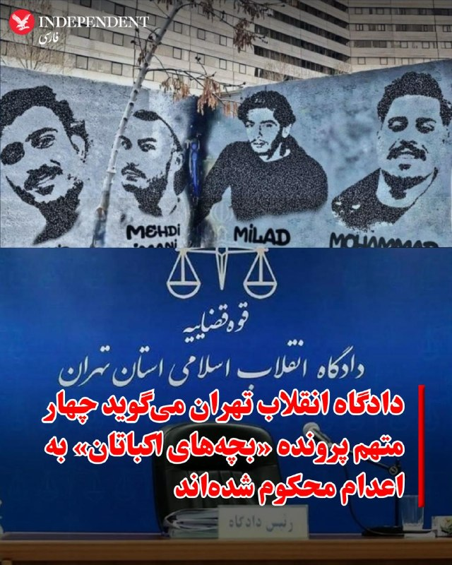

♦️خبرگزاری حکومتی تسنیم، شامگاه یکشنبه سوم خرداد ماه، به نقل از دادگاه انقلاب تهران اعلام کرد، رای اولیه پرونده موسوم به «بچه‌های اکباتان» صادر شده و طی آن چهار نفر از «متهمان اصلی» به اتهام «افساد فی‌الارض» به اعدام محکوم شده‌اند.

به گزارش تسنیم،  اتهامات ۹ نفر از متهمان این پرونده که به دلیل کشته شدن «آرمان علی‌وردی» بسیجی حامی حکومت زندانی شده‌اند مواردی چون  «وارد کردن ضربات چاقو،اخلال در نظم عمومی، اخلال گسترده در امنیت کشور، اجتماع و تبانی برای ارتکاب جرم علیه امنیت داخلی کشور، توزیع کوکتل مولوتف، وارد کردن ضربات سنگ به آرمان علی وردی، ضرب و شتم آرمان علی‌وردی و فعالیت تبلیغی علیه نظام» عنوان شده است.

بر اساس این گزارش، دادگاه انقلاب تهران متهمان ردیف اول تا چهارم پرونده را به اتهام «افساد فی‌الارض» به اعدام محکوم کرد و متهمان ردیف پنجم تا نهم نیز به حبس از یک تا پنج سال و مجازات‌های تکمیلی محکوم شدند.
‌🇸🇦 Indypersian

🤖 @VahidOOnLine

## VahidOOnLine — post 241993

♦️ده‌ها هزار نفر روز یکشنبه سوم خرداد ماه، در سی‌امین دوره «جشن خیابانی فرهنگ‌ها» در برلین شرکت کردند. رویدادی که با حضور حدود ۷۰ گروه در لباس‌های رنگارنگ در خیابان‌های پایتخت آلمان برگزار شد.
پلیس برلین آماری از شمار شرکت‌کنندگان ارائه نکرد، اما فضای این مراسم را «آرام، پرشور و کارناوالی» توصیف کرد. دمای هوا در زمان برگزاری این رویداد به ۲۸ درجه سانتی‌گراد رسید.
برگزارکنندگان اعلام کردند این جشنواره با هدف «ارسال پیامی درباره تنوع و گشودگی» برگزار می‌شود و حدود پنج هزار و ۸۰۰ شرکت‌کننده از ۶۷ گروه بین‌المللی، رقص، موسیقی و لباس‌های سنتی فرهنگ‌های مختلف جهان را به نمایش گذاشتند.
رژه خیابانی فرهنگ‌ها از سال ۱۹۹۶ به‌صورت سالانه در تعطیلات پنطیکاست برگزار می‌شود و به یکی از نمادهای چندفرهنگی بودن برلین تبدیل شده است. شرکت‌کنندگان در این مراسم تلاش می‌کنند از طریق رقص، موسیقی و هنر، ریشه‌های فرهنگی و تنوع قومی خود را به نمایش بگذارند.
‌🇸🇦 Indypersian

🤖 @VahidOOnLine

## VahidOOnLine — post 241992

  

♦️شبکه خبری فاکس‌ روز یکشنبه سوم خرداد ماه، به نقل مقام‌هایی آمریکایی گزارش کرد چارچوب توافق میان واشنگتن و تهران تا روز یکشنبه «۹۵ درصد» نهایی شده، اما مذاکره‌کنندگان همچنان بر سر برخی «عبارت‌بندی‌ها» درباره ذخایر هسته‌ای ایران و تنگه هرمز در حال چانه‌زنی هستند.

مقام آمریکایی به فاکس گفت: «ما عقب‌نشینی نخواهیم کرد. هنوز به توافق نرسیده‌ایم و امروز یا فردا توافقی امضا نخواهد شد.» او افزود تمایل دونالد ترامپ این است که «پنج تا هفت روز دیگر» برای نهایی شدن توافق فرصت بدهد.
این مقام تاکید کرد مذاکرات بر اساس سیاست «نه گرد و غبار، نه دلار» پیش می‌رود و ایران «در اصل» با چارچوب توافق موافقت کرده است.

فاکس در ادامه به نقل از این مقام نوشت: «بر سر ذخایر هسته‌ای و تنگه هرمز به توافق رسیده‌ایم، اما هنوز در حال مذاکره درباره متن و عبارت‌ها هستیم.»
این مقام افزود: «ما فرصت دستیابی به توافقی را داریم که هزینه‌ها را برای آمریکایی‌ها کاهش دهد و همزمان مانع دستیابی ایران به سلاح هسته‌ای شود.»
‌🇸🇦 Indypersian

🤖 @VahidOOnLine

## VahidOOnLine — post 241991

  

بدر البوسعیدی، وزیر خارجه عمان گفت‌وگوی خود با کاظم غریب‌آبادی، معاون وزیر خارجه جمهوری اسلامی را «خوب» توصیف کرد.

او یکشنبه در شبکه ایکس نوشت: «ما بر اهمیت تعامل دیپلماتیک در همه زمینه‌ها تاکید کردیم. عمان به حمایت از تلاش‌ها برای کاهش تنش، پیشبرد همزیستی مسالمت‌آمیز منطقه‌ای، امنیت و آزادی دریانوردی ادامه خواهد داد.»
‌🏁 🇬🇧 IranintlTV

🤖 @VahidOOnLine

## VahidOOnLine — post 241990

  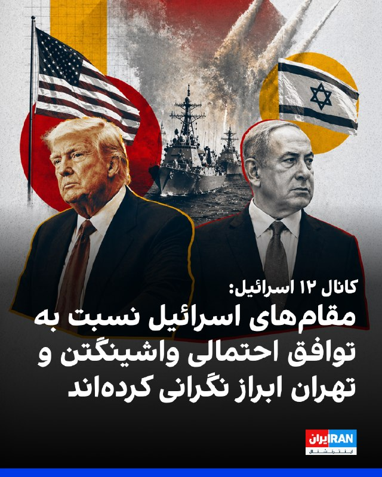

به گزارش کانال ۱۲ اسرائیل، مقام‌های ارشد اسرائیلی نگران‌اند توافق در حال شکل‌گیری میان آمریکا و ایران ممکن است آزادی عمل اسرائیل علیه حزب‌الله در لبنان را به‌شدت محدود کند.

در این گزارش آمده است توافق پیشنهادی شامل پایان کامل درگیری‌ها در لبنان همزمان با پایان جنگ آمریکا و جمهوری اسلامی خواهد بود؛ موضوعی که باعث شد بنیامین نتانیاهو در تماس تلفنی روز گذشته خود با دونالد ترامپ نگرانی‌هایش را مطرح کند.

بر اساس این گزارش، نتانیاهو بر حفظ آزادی عملیاتی اسرائیل در لبنان تمرکز کرده و یک مقام ارشد اسرائیلی بعدا اعلام کرده است ترامپ موافقت کرده اسرائیل «آزادی عمل خود را در برابر تهدیدها در همه جبهه‌ها، از جمله لبنان، حفظ کند.»
‌🏁 🇬🇧 IranintlTV

🤖 @VahidOOnLine

## VahidOOnLine — post 241989

  <a href="telegram/content/VahidOOnLine_241989_1779653474.mp4" target="_blank">🎬 Download video</a>

یک مقام ارشد در دولت ترامپ به شبکه ان بی سی گفته:
«توافق با ایران امروز امضا نخواهد شد، اما در مسیر دستیابی به توافق پیشرفت‌هایی حاصل شده است.»
این اظهارات پس از آن مطرح شد که ترامپ پیش‌تر گفته بود به نمایندگان خود دستور داده است که «برای رسیدن به توافق عجله نکنند».
پیش از آن نیز مارکو روبیو گفته بود که ممکن است «خبرهای خوبی» در راه باشد، هرچند تأکید کرد که هنوز «پیشرفت نهایی» در گفت‌وگوها با جمهوری‌اسلامی حاصل نشده است.
‌🏁 🇬🇧 ManotoTV

🤖 @VahidOOnLine

## VahidOOnLine — post 241988

  <a href="telegram/content/VahidOOnLine_241988_1779653475.mp4" target="_blank">🎬 Download video</a>

دونالد ترامپ، رئیس‌جمهور آمریکا در پلتفرم تروث سوشال خود نوشت:
«اگر با ایران به توافق برسم، توافقی خوب و درست خواهد بود؛ نه مثل توافقی که باراک اوباما انجام داد و به ایران مقادیر عظیمی پول نقد و مسیری آشکار و باز برای دستیابی به سلاح هسته‌ای داد.»
او افزود: «توافق ما دقیقاً برعکس آن است، اما هنوز کسی آن را ندیده یا از جزئیاتش خبر ندارد. حتی هنوز به‌طور کامل نهایی و مذاکره نشده است. بنابراین به حرف بازنده‌هایی که از چیزی انتقاد می‌کنند که هیچ اطلاعی درباره‌اش ندارند گوش ندهید. برخلاف کسانی که پیش از من بودند و باید سال‌ها پیش این مشکل را حل می‌کردند، من توافق بد انجام نمی‌دهم»
‌🏁 🇬🇧 ManotoTV

🤖 @VahidOOnLine

## VahidOOnLine — post 241987

  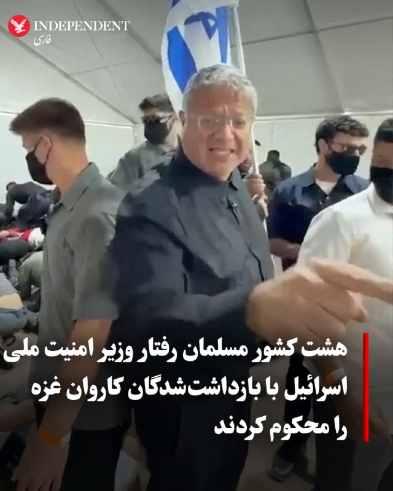

♦️وزیران خارجه هشت کشور عربی و اسلامی روز یکشنبه با انتشار بیانیه‌ای رفتار ایتامار بن‌گویر، وزیر امنیت ملی  اسرائیل با فعالان بازداشت‌شده کاروان دریایی عازم غزه را «هولناک، توهین‌آمیز و غیرقابل‌قبول» توصیف و آن را به‌شدت محکوم کردند.
این واکنش پس از انتشار ویدیویی از سوی بن‌گویر مطرح شد که در آن او فعالانی را که روی زمین نگه داشته شده بودند، مورد تمسخر قرار می‌داد. برخی از بازداشت‌شدگان، که قصد داشتند کمک‌های بشردوستانه به غزه منتقل کنند، بعدا اعلام کردند در بازداشتگاه مورد ضرب‌وشتم قرار گرفته‌اند، ادعایی که سازمان زندان‌های اسرائیل آن را رد کرده است.
به گزارش خبرگزاری عربستان سعودی، وزیران خارجه کشورهای عربستان سعودی، مصر، اردن، قطر، امارات متحده عربی، ترکیه، اندونزی و پاکستان، آمده است: «تحقیر علنی و عامدانه بازداشت‌شدگان از سوی بن‌گویر، تعرضی شرم‌آور به کرامت انسانی و نقض آشکار تعهدات اسرائیل طبق قوانین بین‌المللی، از جمله حقوق بشردوستانه و حقوق بین‌الملل حقوق بشر است.»
‌🇸🇦 Indypersian

🤖 @VahidOOnLine

## WithYashar — post 12371

  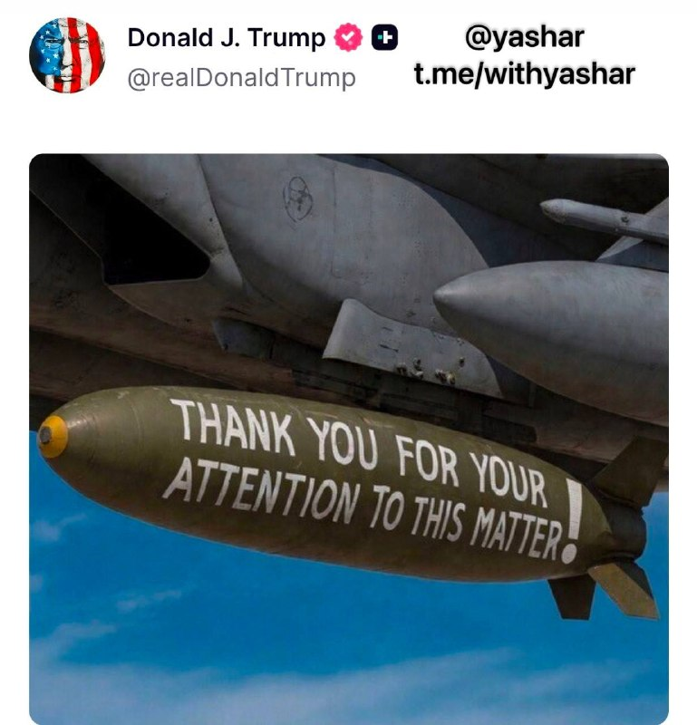

ترامپ تو تروث: از شما بابت توجهتون به این موضوع متشکرم.
@withyashar 😂🤯

## WithYashar — post 12370

حوصلم سر رفت

## WithYashar — post 12369

رسانه وزارت خارجه ایران: در موضوع آزادسازی دارایی‌ها که مورد اختلاف است در حال حاضر راه‌حلی برای آن وجود ندارد
@withyashar

## WithYashar — post 12368

چرچیله زمانه را بشناس… 😃

## WithYashar — post 12367

## mwarmonitor — post 9658

  <a href="telegram/content/mwarmonitor_9658_1779653476.mp4" target="_blank">🎬 Download video</a>

📝 وقتی سرداران جیره خوار مایلند تخیلات خود را فراتر از مرزهای بالیوود ببرند، کمدی سیاهی خلق می‌شود که چشم واقعیت را کور می‌کند. در این افسانه‌های سفارشی، در حالی که پدرش، سنگین‌ترین سلاحی که لمس کرده همان تفنگِ تکیه‌گاهی خطبه‌های نماز جمعه است که مبادا تعادلش به هم بخورد، شازده‌پسرِ قندعسل، «آقا مجتبی»، در ۱۷ سالگی یک‌باره تبدیل به ترمیناتور خط مقدم می‌شود! نوجوانی که بزرگ‌ترین حماسه‌اش آمپول‌بازی با آقا سعید طوسی در کوچه‌های تحت حفاظت و امنِ پایتخت بود، در جفنگیات این کاسه لیسان، قطار فشنگ حمایل می‌کند و لشکرهای جنگ را مثل نقل و نبات نجات می‌دهد. این دست‌وپا زدن‌های مضحک برای تراشیدن کارنامه‌ای حماسی، بیش از آنکه ابهتی کاذب به همراه داشته باشد، یادآور این حقیقت تلخ و کنایه‌آمیز است که برای قهرمان جلوه دادنِ کسانی که فرسنگ‌ها دور از بوی باروت بزرگ شده‌اند، باید کلِ تاریخ را با وقاحت بازنویسی کرد.

@mwarmonitor

## FoxNewsTwitter — post 342186

  

Fox News (Twitter/X)

President Trump says critics are attacking an Iran deal that “isn’t even fully negotiated yet.”

In a lengthy statement, Trump defended ongoing talks while sharply criticizing the Obama administration’s nuclear agreement with Tehran, claiming it handed Iran “massive amounts of CASH” and enabled its nuclear ambitions.

“If I make a deal with Iran, it will be a good and proper one,” Trump wrote before insisting: “I don’t make bad deals.”

The statement comes as the White House continues negotiations amid mounting pressure over Iran’s nuclear program.

## pm_afshaa — post 91416

  <a href="telegram/content/pm_afshaa_91416_1779653479.webm" target="_blank">🎬 Download video</a>

🔴محسن رضایی:
در صورت تعرض به تنگه هرمز و ورود به خلیج‌ فارس، محاصره دریایی رو خواهیم شکست و پاسخی سخت، دردناک و کم‌نظیر به آمریکا خواهیم داد؛ ممکنه از ان‌پی‌تی هم خارج بشیم.

💧 Rainbet.com the #1 Non-KYC Crypto Casino & Sportsbook @rainbetcom

😁 @Pm_Afshaa

## pm_afshaa — post 91415

  <a href="telegram/content/pm_afshaa_91415_1779653479.webm" target="_blank">🎬 Download video</a>

🔴خبرگزاری i24NEWS: مقامات آمریکایی میگن ایران تا زمانی که انتقال ذخایر اورانیوم غنی‌شده خود را آغاز نکنه، هیچ‌گونه تسهیلاتی در زمینه تحریم‌ها یا آزادسازی وجوه مسدود شده دریافت نخواهد کرد.

💧 Rainbet.com the #1 Non-KYC Crypto Casino & Sportsbook @rainbetcom

😁 @Pm_Afshaa

## pm_afshaa — post 91414

  <a href="telegram/content/pm_afshaa_91414_1779653480.webm" target="_blank">🎬 Download video</a>

🔴کانال 12 اسرائیل:
مقام‌های ارشد اسرائیلی نگران‌ هستن توافق در حال شکل‌گیری میان آمریکا و جمهوری اسلامی ممکنه آزادی عمل اسرائیل علیه حزب‌الله در لبنان رو به‌شدت محدود کنه.

💧 Rainbet.com the #1 Non-KYC Crypto Casino & Sportsbook @rainbetcom

😁 @Pm_Afshaa

## pm_afshaa — post 91413

  <a href="telegram/content/pm_afshaa_91413_1779653481.webm" target="_blank">🎬 Download video</a>

🔴سی‌ان‌ان: ایران هیچ پولی یا لغو تحریمی رو در این توافق دریافت نخواهد کرد.

💧 Rainbet.com the #1 Non-KYC Crypto Casino & Sportsbook @rainbetcom

😁 @Pm_Afshaa

## pm_afshaa — post 91412

  <a href="telegram/content/pm_afshaa_91412_1779653481.webm" target="_blank">🎬 Download video</a>

🔴ترامپ:
اگر با ایران معامله‌ای انجام دهم، معامله‌ای خوب و درست خواهد بود، نه مانند معامله‌ای که اوباما انجام داد و به ایران مقادیر زیادی پول نقد و مسیری واضح و باز به سمت سلاح هسته‌ای داد. معامله ما دقیقاً برعکس است، اما هنوز کسی آن را ندیده یا نمی‌داند چیست. حتی هنوز به طور کامل مذاکره هم نشده است.

پس به بازنده‌هایی که از چیزی که هیچ نمی‌دانند انتقاد می‌کنند، گوش ندهید. برخلاف کسانی که قبل از من بودند و باید این مشکل را سال‌ها پیش حل می‌کردند، من معامله‌های بد انجام نمی‌دهم!

💧 Rainbet.com the #1 Non-KYC Crypto Casino & Sportsbook @rainbetcom

😁 @Pm_Afshaa

## pm_afshaa — post 91411

  <a href="telegram/content/pm_afshaa_91411_1779653482.webm" target="_blank">🎬 Download video</a>

🔴باراک راوید، خبرنگار اکسیوس:
با اینکه آمریکا خوشبینه توافق چند روز دیگه امضا بشه، هنوز نهایی نشده و ممکنه از هم بپاشه.

یک مقام ارشد گفته: وضعیت خوبه، ولی راه‌هایی هست که می‌تونه توافق رو ضعیف کنه

💧 Rainbet.com the #1 Non-KYC Crypto Casino & Sportsbook @rainbetcom

😁 @Pm_Afshaa

## DEJradio — post 4927

  <a href="telegram/content/DEJradio_4927_1779653483.mp4" target="_blank">🎬 Download video</a>

👑🎥 تجمع ایرانیان میهن دوست در شهر وین اتریش

#همبستگی #وین
@DEJradio

## DEJradio — post 4926

👑🎥 تجمع ایرانیان مقیم هانوفر آلمان در حمایت از انقلاب شیر و خورشید ایران.

#همبستگی #هانوفر
@DEJradio

## VahidOnline — post 75689

  

پست ترامپ
روی تصویر بمب نوشته: از توجه شما به این موضوع سپاسگزارم.
realDonaldTrump

📡 @VahidOnline

## VahidOnline — post 75688

  

مارکو روبیو، وزیر خارجه آمریکا، در گفت‌وگویی کوتاه با نیویورک تایمز گفت: «ما موضوع را به بعد موکول نمی‌کنیم. مذاکرات هسته‌ای مسائل بسیار فنی هستند. شما نمی‌توانید یک موضوع هسته‌ای را در ۷۲ ساعت و روی یک دستمال کاغذی حل کنید.»
او افزود: «در حال حاضر، هفت یا هشت کشور منطقه از این رویکرد حمایت می‌کنند و ما آماده‌ایم این مسیر را ادامه دهیم.»

این در حالی است که آقای روبیو ساعاتی پیش گفته بود که ممکن است تا شامگاه یک‌شنبه خبری دربارهٔ توافقی با ایران اعلام شود که می‌تواند به‌طور رسمی به جنگ خاورمیانه پایان دهد.
@VahidHeadline

📡 @VahidOnline

## IranIntlTV — post 338809

  

اکسیوس به نقل از دو مقام آمریکایی گزارش داد دونالد ترامپ شنبه در یک کنفرانس تلفنی با رهبران چند کشور عربی و دیگر کشورهای مسلمان گفت اگر توافقی برای پایان جنگ ایران حاصل شود، می‌خواهد این کشورها توافق‌های صلح با اسرائیل امضا کنند.

اکسیوس نوشت این اظهارات نشان‌دهنده گام بعدی بزرگی است که ترامپ پس از پایان جنگ در خاورمیانه دنبال می‌کند.

ترامپ در این تماس با رهبران عربستان سعودی، امارات متحده عربی، قطر، پاکستان، ترکیه، مصر، اردن و بحرین درباره توافق در حال شکل‌گیری با جمهوری اسلامی گفت‌وگو کرد.
https://iranintl.com/202605246245

## IranIntlTV — post 338808

  <a href="telegram/content/IranIntlTV_338808_1779653486.mp4" target="_blank">🎬 Download video</a>

نیویورک‌تایمز به نقل از یک مقام آمریکایی گزارش داد توافق میان تهران و واشینگتن هنوز امضا نشده و برای تایید نهایی رهبران دو کشور به چند روز زمان نیاز دارد.

بر اساس این گزارش، توافق احتمالی به برنامه موشکی جمهوری اسلامی و توقف کامل غنی‌سازی اورانیوم نمی‌پردازد.

گفت‌وگو با حسین علیزاده، تحلیل‌گر مسائل بین‌الملل
@iranintltv

## IranIntlTV — post 338807

  

بدر البوسعیدی، وزیر خارجه عمان گفت‌وگوی خود با کاظم غریب‌آبادی، معاون وزیر خارجه جمهوری اسلامی را «خوب» توصیف کرد.

او یکشنبه در شبکه ایکس نوشت: «ما بر اهمیت تعامل دیپلماتیک در همه زمینه‌ها تاکید کردیم. عمان به حمایت از تلاش‌ها برای کاهش تنش، پیشبرد همزیستی مسالمت‌آمیز منطقه‌ای، امنیت و آزادی دریانوردی ادامه خواهد داد.»
https://iranintl.com/202605241490

## IranIntlTV — post 338806

  <a href="https://t.me/IranintlTV/338806" target="_blank">📎 Download file</a>

🎧نسخه صوتی چشم‌انداز: بندهای پنهان توافق ترامپ و جمهوری اسلامی
@iranintlTV

## IranIntlTV — post 338805

  

به گزارش کانال ۱۲ اسرائیل، مقام‌های ارشد اسرائیلی نگران‌اند توافق در حال شکل‌گیری میان آمریکا و ایران ممکن است آزادی عمل اسرائیل علیه حزب‌الله در لبنان را به‌شدت محدود کند.

در این گزارش آمده است توافق پیشنهادی شامل پایان کامل درگیری‌ها در لبنان همزمان با پایان جنگ آمریکا و جمهوری اسلامی خواهد بود؛ موضوعی که باعث شد بنیامین نتانیاهو در تماس تلفنی روز گذشته خود با دونالد ترامپ نگرانی‌هایش را مطرح کند.

بر اساس این گزارش، نتانیاهو بر حفظ آزادی عملیاتی اسرائیل در لبنان تمرکز کرده و یک مقام ارشد اسرائیلی بعدا اعلام کرده است ترامپ موافقت کرده اسرائیل «آزادی عمل خود را در برابر تهدیدها در همه جبهه‌ها، از جمله لبنان، حفظ کند.»
https://iranintl.com/202605247829

## IranIntlTV — post 338804

  <a href="telegram/content/IranIntlTV_338804_1779653489.mp4" target="_blank">🎬 Download video</a>

محسن رضایی، مشاور مجتبی خامنه‌ای، تهدید کرد در صورت اقدام علیه تنگه هرمز و ورود به خلیج فارس، «پاسخ سخت» داده می‌شود و با شکستن محاصره دریایی اقدامات تقابلی آغاز خواهد شد. او یکی از گزینه‌های راهبردی جمهوری اسلامی در صورت تداوم این روند را احتمال خروج از پیمان منع گسترش سلاح‌های هسته‌ای عنوان کرد.

گفت‌وگو با عطا محامد، کارشناس روابط بین‌الملل
@iranintltv

## IranIntlTV — post 338803

  <a href="telegram/content/IranIntlTV_338803_1779653491.mp4" target="_blank">🎬 Download video</a>

نیویورک‌تایمز به نقل از یک مقام آمریکایی گزارش داد آمریکا و جمهوری اسلامی بر سر چارچوبی در حال تفاهم هستند که در آن تنگه هرمز بازگشایی می‌شود و تهران متعهد خواهد شد ذخایر اورانیوم با غنای بالای خود را «نابود» کند.

ارزیابی شهرام خلدی، پژوهش‌گر تاریخ خاورمیانه و روابط بین‌الملل
@iranintltv

## Shin_Persian — post 6212

Shin ✓ @hey_itsmyturn
Sun, 24 May 2026 19:26:45 UTC

If he strikes tonight, I'll follow him to the hell and back :))

فارسی

اگر او امشب حمله کند، من تا جهنم و برگشت دنبالش خواهم رفت :))

𝕏 · @shin_persian

## ManotoTV — post 105816

  <a href="telegram/content/ManotoTV_105816_1779653493.mp4" target="_blank">🎬 Download video</a>

گفت‌وگو با کیوان عباسی بنیان‌گذار تلویزیون منوتو;
«می‌گفت بعضی تصاویر آن‌قدر هولناک بود که باور نمی‌کردیم در ایران ضبط شده باشد…
و تأکید کرد جنایت‌های دی‌ماه نباید فراموش شوند.»

## ManotoTV — post 105815

  <a href="telegram/content/ManotoTV_105815_1779653495.mp4" target="_blank">🎬 Download video</a>

گفت‌وگو با کیوان عباسی بنیان‌گذار تلویزیون منوتو
«می‌گفت هیچ حسرتی ندارد…
و هرچه توانسته برای ساختن و ادامه دادن انجام داده است.»

## ManotoTV — post 105814

  <a href="telegram/content/ManotoTV_105814_1779653496.mp4" target="_blank">🎬 Download video</a>

یک مقام ارشد در دولت ترامپ به شبکه ان بی سی گفته:
«توافق با ایران امروز امضا نخواهد شد، اما در مسیر دستیابی به توافق پیشرفت‌هایی حاصل شده است.»
این اظهارات پس از آن مطرح شد که ترامپ پیش‌تر گفته بود به نمایندگان خود دستور داده است که «برای رسیدن به توافق عجله نکنند».
پیش از آن نیز مارکو روبیو گفته بود که ممکن است «خبرهای خوبی» در راه باشد، هرچند تأکید کرد که هنوز «پیشرفت نهایی» در گفت‌وگوها با جمهوری‌اسلامی حاصل نشده است.

## ManotoTV — post 105813

  <a href="telegram/content/ManotoTV_105813_1779653497.mp4" target="_blank">🎬 Download video</a>

دونالد ترامپ، رئیس‌جمهور آمریکا در پلتفرم تروث سوشال خود نوشت:
«اگر با ایران به توافق برسم، توافقی خوب و درست خواهد بود؛ نه مثل توافقی که باراک اوباما انجام داد و به ایران مقادیر عظیمی پول نقد و مسیری آشکار و باز برای دستیابی به سلاح هسته‌ای داد.»
او افزود: «توافق ما دقیقاً برعکس آن است، اما هنوز کسی آن را ندیده یا از جزئیاتش خبر ندارد. حتی هنوز به‌طور کامل نهایی و مذاکره نشده است. بنابراین به حرف بازنده‌هایی که از چیزی انتقاد می‌کنند که هیچ اطلاعی درباره‌اش ندارند گوش ندهید. برخلاف کسانی که پیش از من بودند و باید سال‌ها پیش این مشکل را حل می‌کردند، من توافق بد انجام نمی‌دهم»

## FarsiVOA — post 218566

  <a href="telegram/content/FarsiVOA_218566_1779653497.mp4" target="_blank">🎬 Download video</a>

⚡️شهرام همایون در عمق میدان می‌گوید من نمی‌فهمم چطورالآن خانم یاسمین پهلوی پُستی می‌گذارد که «ترامپ بزن، بزن» یا بگوید «مرگ بر سه فاسد»! چون در خانواده پهلوی این چیز‌ها نبود
@FarsiVOA

## FarsiVOA — post 218565

🔺محققان آمریکایی: هکرهای مرتبط با رژیم ایران، ایالات متحده، اسرائیل و امارات را هدف قرار داده‌اند

◾️شرکت امنیت سایبری «پالو آلتو نتورکس» در گزارش جدیدی اعلام کرد یک گروه جاسوسی سایبری مرتبط با رژیم ایران در جریان یک کمپین چند ماهه همزمان با تشدید تنش‌های منطقه‌ای اخیر، نهادهایی را در ایالات متحده، اسرائیل و امارات متحده عربی بود، هدف قرار داده است.

⬇️ بیشتر بخوانید:

https://ir.voanews.com/a/8153350.html

## FarsiVOA — post 218564

🔺حکم جدید قاضی صلواتی برای پرونده «شهرک اکباتان»: تخفیف لازم نیست، اعدامشان کنید

◾️ابوالقاسم صلواتی، قاضی بدنام قوه قضائیه جمهوری اسلامی، معروف به «قاضی مرگ»، حکم صادره توسط دادگاه کیفری، مبنی بر «نقض اعدام» متهمان پرونده «شهرک اکباتان» را رد، و برای چهار متهم این پرونده دوباره حکم اعدام صادر کرد.

⬇️ بیشتر بخوانید:

https://ir.voanews.com/a/8153336.html

## DW_Farsi — post 125108

  

🔶 صدور احکام سنگین در بحرین برای ۱۱ متهم به همکاری با سپاه

خبرگزاری دولتی بحرین گزارش داد که دادگاهی در این کشور ۹ نفر را به اتهام همکاری به سپاه پاسداران به حبس ابد و دو نفر دیگر در همین پرونده را به سه سال زندان محکوم کرده است.

این خبرگزاری یکشنبه ۲۴ مه اعلام کرد، اتهام این افراد همکاری با سپاه و انجام اقداماتی است که دادگاه آن را رشته "عملیات خصمانه و تروریستی" علیه بحرین خوانده است.

بر اساس بیانیه‌ای که در این زمینه در بحرین منتشر شده، این متهمان در زمینه "جمع‌آوری اطلاعات از مراکز حساس و حیاتی و به علاوه، تسهیل انتقال مبالغ مالی مرتبط با این اقدامات" فعال بوده‌اند.
@dw_farsi

## Persian_Trend_Official — post 14891

  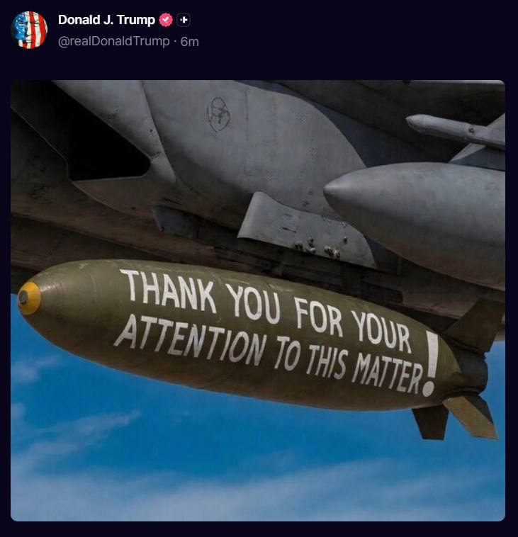

🔴 ترامپ

🔻نوشته ی روی بمب

💢از توجه شما به این موضوع سپاسگزارم

🫆:Tony

📌 @persian_trend_official
پرشین ترند | متفاوت‌ترین کانال نظامی

## Persian_Trend_Official — post 14890

i24NEWS⭕️

آمریکا آزادسازی پول‌های ایران را به انتقال اورانیوم غنی‌شده گره زده است

▪️ مقام‌های آمریکایی می‌گویند ایران تا زمانی که انتقال ذخایر اورانیوم غنی‌شده را آغاز نکند، هیچ کاهش تحریمی یا دسترسی به دارایی‌های بلوکه‌شده دریافت نخواهد کرد
▪️ در مقابل، ایران اصرار دارد آزادسازی بخشی از منابع مالی باید جزو توافق اولیه باشد
▪️ این اختلاف اکنون یکی از اصلی‌ترین موانع توافق میان تهران و واشینگتن محسوب می‌شود

🫆:Tony

📌 @persian_trend_official
پرشین ترند | متفاوت‌ترین کانال نظامی

## Persian_Trend_Official — post 14889

https://youtube.com/live/vCQOD_eWyqM?feature=share

## Persian_Trend_Official — post 14888

https://youtube.com/live/vCQOD_eWyqM?feature=share

## Persian_Trend_Official — post 14887

  <a href="telegram/content/Persian_Trend_Official_14887_1779653499.mp4" target="_blank">🎬 Download video</a>

🔴صیغه کوتاه مدت روزانه و ماهانه در تجمعات خیابانی همچنان برقرار است...

🫆:Tony

📌 @persian_trend_official
پرشین ترند | متفاوت‌ترین کانال نظامی

## Persian_Trend_Official — post 14886

  

سردار نقدی: دشمن اگر خطایی کند، ضربهٔ جبران‌ناپذیری می‌خورد

♦️مشاور عالی فرماندهٔ کل سپاه: ما توانستیم یک بازدارندگی در مقابل دشمن بدست بیاوریم آن هم از این جهت که دشمن متوجه شد که نمی‌تواند مقابل ما به نتیجه مطلوب خود برسد.

♦️یک بعد دیگر بازدارندگی هم این بود که دشمن بداند که اگر بخواهد خطایی کند ضربهٔ جبران‌ناپذیری را خواهد خورد.

♦️امروز این بازدارندگی برای دشمن مشخص شده بگونه‌ای که ۲۸۲ نقطه نظامی آن‌ها منهدم و نیز صدها کشته به دست دشمن باقی مانده است به نحوی که بسیاری از آن‌ها را مخفی کرده‌اند.

♦️روزانه یک هواپیمای ۴۰ تخته بیمارستانی از امارات و یک ۱۰ تخته از کویت مجروحان دشمن را برای درمان به بیمارستان‌های آمریکایی در آلمان منتقل می‌کردند.

⚠️پ ن :تعداد کشته شدگان نظامی امریکا ۱۳ نفر است.
🫆:Tony

📌 @persian_trend_official
پرشین ترند | متفاوت‌ترین کانال نظامی

## RadioFarda — post 157525

  

🔸مارکو روبیو، وزیر خارجه آمریکا، روز یکشنبه سوم خرداد به روزنامه نیویورک تایمز گفت که توافق با ایران حمایت منطقه‌ای را جلب کرده است، اما رسیدن به یک توافق هسته‌ای را نمی‌توان «طی ۷۲ ساعت» انجام داد.

🔸اظهارات او پس از آن مطرح شد که دونالد ترامپ، رئیس‌جمهور آمریکا، ساعتی پیش اعلام کرد به مذاکره‌کنندگان خود گفته برای دستیابی به توافق با ایران جهت پایان دادن به جنگ سه‌ماهه «عجله نکنند.»

🔸روبیو در گفت‌وگویی کوتاه با نیویورک تایمز گفت: «ما موضوع را به بعد موکول نمی‌کنیم. مذاکرات هسته‌ای مسائل بسیار فنی هستند. شما نمی‌توانید یک موضوع هسته‌ای را در ۷۲ ساعت و روی یک دستمال کاغذی حل کنید.»

🔸او افزود: «در حال حاضر، هفت یا هشت کشور منطقه از این رویکرد حمایت می‌کنند و ما آماده‌ایم این مسیر را ادامه دهیم.»

🔸این در حالی است که آقای روبیو ساعاتی پیش گفته بود که ممکن است تا شامگاه یک‌شنبه خبری دربارهٔ توافقی با ایران اعلام شود که می‌تواند به‌طور رسمی به جنگ خاورمیانه پایان دهد.

@RadioFarda

## RadioFarda — post 157524

پرویز قلیچ‌خانی؛ فوتبالیستی که به میدان سیاست رفت

🔸پرویز قلیچ‌خانی، کاپیتان پیشین تیم ملی فوتبال ایران، فعال سیاسی و مدیرمسئول مجله «آرش»، پس از یک دوره بیماری روز دوم خرداد در هشتاد سالگی در پاریس درگذشت.

🔸آقای قلیچ‌خانی که بود؟ چه جایگاهی در ورزش ایران داشت؟ و سرنوشت او در دنیای سیاست چگونه رقم خورد؟

🔸ستاره‌ای که «از فقر برآمد»
پرویز قلیچ‌خانی در ۱۳ آذر ۱۳۲۴ در محلهٔ صابون‌پزخانه نزدیک میدان شوش تهران در خانواده‌ای کم‌درآمد متولد شد و در همان نوجوانی وارد دنیای ورزش شد. کارشناسان ورزشی قلیچ‌خانی را به دلیل قابلیت‌ها و مهارت‌های برجسته اش در تکنیک‌های فوتبال، به عنوان یکی از بهترین بازیکنان تاریخ فوتبال ایران ستوده‌اند.

🔸مهدی اصلانی، نویسنده و زندانی سیاسی پیشین که آقای قلیچ‌خانی را از نزدیک می‌شناخت، به رادیوفردا می‌گوید که این چهره ورزشی، از فقر برآمد و به ستاره فوتبال تبدیل شد: «پرویز قلیچ‌خانی از سر سفره فقر برخاست، تهیدستی را نفس کشید و پس از آن‌که در ۱۸ سالگی، در المپیک توکیو، به ستاره اول فوتبال ایران بدل شد، غم سفره‌های خالی تا پایان عمر با او ماند.»

🔸قلیچ‌خانی تنها بازیکنی بود که با تیم ملی فوتبال ایران سه بار قهرمان جام ملت‌های آسیا شد. گلی که او نزدیک به شصت سال پیش، در ورزشگاه امجدیه تهران در جریان فینال یکی از دوره‌های این جام وارد دروازه تیم ملی اسرائیل کرد، برای خیلی‌ها ماندگارترین تصویر از قلیچ‌خانی است.

کامل این مطلب را در وب‌سایت رادیوفردا بخوانید.

@RadioFarda

## IranianMinds — post 20695

  

🔴 توئیت کمال پنحاسی، سخنگوی فارسی‌زبان ارتش اسرائیل:

کس نخارد پشت من، جز ناخن انگشت من.

@IranianMinds

## IranianMinds — post 20694

  

🔴 پست جدید ترامپ :

از توجه شما به این موضوع سپاسگزارم!

@IranianMinds

## IranianMinds — post 20693

  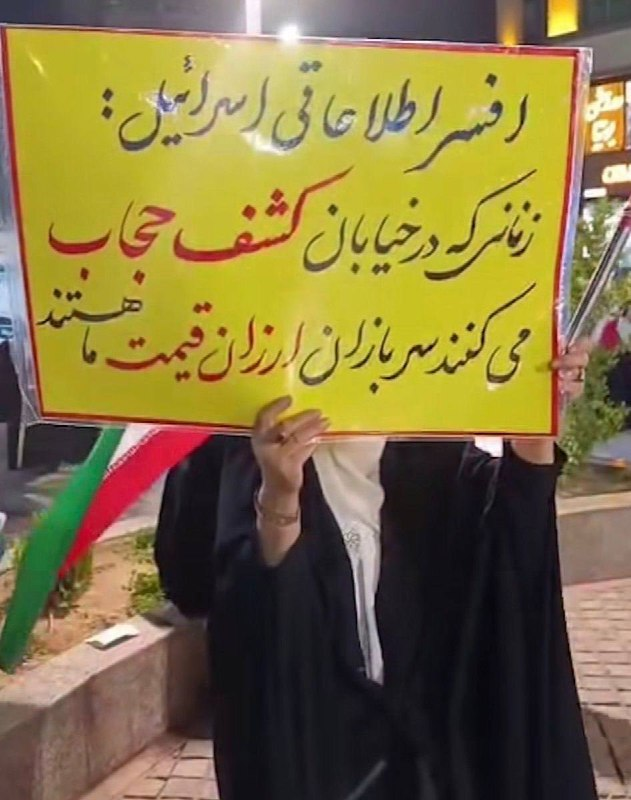

این چیه دیگه 😂😂

@IranianMinds

## IranianMinds — post 20692

🔴 فاکس‌ نیوز به نقل از مقام‌های آمریکایی:

تهران به‌طور اولیه با چارچوب توافق موافقت کرده و ۹۵٪ آن تکمیل شده است و اکنون بر سر جزئیات و نحوه نگارش در حال مذاکره هستیم.

@IranianMinds

## IranianMinds — post 20691

🔴 مارکو روبیو:

دوران به گروگان گرفته شدن کشورها توسط گروه‌های تروریستی در حال نزدیک شدن به پایان است.

@IranianMinds

## BBCPersian — post 281963

  <a href="telegram/content/BBCPersian_281963_1779653503.mp4" target="_blank">🎬 Download video</a>

آخرین خبرهای مهم روز یکشنبه ۳ خرداد ماه ۱۴۰۵ از تلویزیون بی‌بی‌سی فارسی

https://bbc.in/42XnQmy

https://bbc.in/3WtLd3k
@BBCPersian

## Dirty_Kids — post 390102

وقتی کانفیگ جدید میگیرم، با ته‌مونده کانفیگ قبلی میرم اینستا که بار روانی کمتری داشته باشه! :|

@Dirty_Kids 👻

## Dirty_Kids — post 390101

  

ترامپ:

«اگه من با رژیم هزارپدر شیعه‌سانان رافضی توافق کنم، یه توافق خوب و درست‌وحسابی خواهد بود‌ نه مثه اون توافقی که اوبامای قرمساق کرد و کوهی از پول نقد داد به روافض و یه مسیر صاف و باز رو براشون گذاشت تا برسن به سلاح هسته‌ای.[کسشر نگو شیر سابق، هر توافقی با رژیم خدعه‌گر رافضی سرش گرده]

توافق ما دقیقاً برعکس اونه، اما هنوز هیچ‌کس ندیدتش و نمی‌دونه چیه. حتی هنوز مذاکراتش هم کاملاً تموم نشده.

پس به حرف این بازنده‌ها گوش ندید که دارن از چیزی انتقاد می‌کنن که اصلاً هیچی ازش نمی‌دونن.[خب خودت که می‌دونی بگو ببینیم چه کسشری توشه]

برخلاف اون قرمساق‌هایی که قبل از من بودن و باید این مشکل رو سال‌ها پیش حل می‌کردن، من توافق بد امضا نمی‌کنم. [دمت گرم، اینو راست می‌گی خدایی، تو این پنج‌سال و نیم ندیدم توافق کسشر امضا کنی]
رئیس‌جمهور، دی‌جی‌تی، سل سابق خاک‌سفید»

@Dirty_Kids 👻

## Dirty_Kids — post 390100

  <a href="telegram/content/Dirty_Kids_390100_1779653506.mp4" target="_blank">🎬 Download video</a>

خبرنگار: به توافق نزدیک شدیم؛ نظر شما چیه؟

سیاری، رئیس ستاد و معاون هماهنگ کننده ارتش: توافق؟ من اصلا نمی‌دونم توافق چیه.. توافق نَ‌مَ‌نَ‌دی

@Dirty_Kids 👻

## Dirty_Kids — post 390099

  

عموی عزیزم دونالد ترامپ
هم بابامو کشت هم خودش منتقم خون بابام شد

@Dirty_Kids 👻

## Dirty_Kids — post 390098

کاش حداقل روبیو که رفته هند، اونا رو متقاعد کنه موشک بزنن پاکستان.

@Dirty_Kids 👻

## Hranews — post 113144

  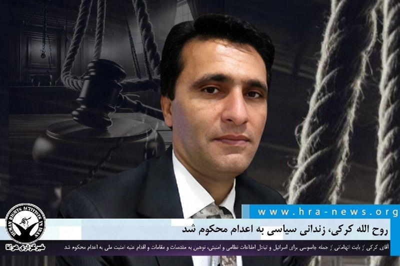

روح الله کرکی، زندانی سیاسی به اعدام محکوم شد

❗️
❗️
❗️
❗️
❗️ – روح الله کرکی، زندانی سیاسی محبوس در زندان شیبان اهواز به اعدام محکوم شد.

به گزارش خبرگزاری هرانا، ارگان خبری مجموعه فعالان حقوق بشر در ایران، روح الله کرکی به اعدام محکوم شد.

بر اساس اطلاعات دریافتی هرانا، روح الله کرکی به اعدام محکوم شده است. چندی پیش، کیفرخواست پرونده این شهروند از بابت اتهامات «انتشار و افشای اسناد محرمانه»، «همکاری با سازمان مجاهدین خلق»، «جاسوسی برای اسرائیل و تبادل اطلاعات نظامی و امنیتی»، «توهین به مقدسات و مقامات» و «اقدام علیه امنیت ملی» صادر و به دادگاه کیفری دو اهواز ارجاع شده بود.
#روح_الله_کرکی

ادامه مطلب

↘️
@hranews_bot تماس ✉️ -  @Hranews  کانال هرانا 🆑

## Hranews — post 113143

  

گزارشی از آخرین وضعیت مهسا زیدآبادی در زندان تربت حیدریه

❗️
❗️
❗️
❗️
❗️ – مهسا زیدآبادی، شهروند اهل سبزوار هفت روز است که توسط ماموران اداره اطلاعات بازداشت شده و هم‌اکنون به‌صورت بلاتکلیف در زندان تربت حیدریه نگهداری می‌شود.

به گزارش خبرگزاری هرانا، ارگان خبری مجموعه فعالان حقوق بشر در ایران، مهسا زیدآبادی کماکان در بازداشت به‌سر می برد.

بر اساس اطلاعات دریافتی هرانا، خانم زیدآبادی روز دوشنبه ۲۸ اردیبهشت ماه، به اداره اطلاعات سبزوار احضار و پس از مراجعه به این نهاد امنیتی بازداشت شد. وی پس از دستگیری به زندان تربت حیدریه منتقل شده است.
#مهسا_زیدآبادی

ادامه مطلب

↘️
@hranews_bot تماس ✉️ -  @Hranews  کانال هرانا 🆑

## Hranews — post 113142

گزارشی از تجمع اعتراضی بازنشستگان تامین اجتماعی در ۳ شهر

❗️
❗️
❗️
❗️
❗️ – روز جاری، گروهی از بازنشستگان تامین اجتماعی در شهرهای تهران، رشت و شوش تجمعات اعتراضی برگزار کردند.
#تجمع

ادامه مطلب

↘️
@hranews_bot تماس ✉️ -  @Hranews  کانال هرانا 🆑

## Hranews — post 113141

یک مرد به اتهام قتل همسرش در دادگاه کیفری تهران محاکمه شد

❗️
❗️
❗️
❗️
❗️ – مردی که متهم است همسرش را با خوراندن قرص برنج به قتل رسانده است، در دادگاه کیفری استان تهران محاکمه شد.

#زنکشی

ادامه مطلب

↘️
@hranews_bot تماس ✉️ -  @Hranews  کانال هرانا 🆑

## manototv — post 105816

  <a href="telegram/content/manototv_105816_1779653508.mp4" target="_blank">🎬 Download video</a>

گفت‌وگو با کیوان عباسی بنیان‌گذار تلویزیون منوتو;
«می‌گفت بعضی تصاویر آن‌قدر هولناک بود که باور نمی‌کردیم در ایران ضبط شده باشد…
و تأکید کرد جنایت‌های دی‌ماه نباید فراموش شوند.»

## manototv — post 105815

  <a href="telegram/content/manototv_105815_1779653510.mp4" target="_blank">🎬 Download video</a>

گفت‌وگو با کیوان عباسی بنیان‌گذار تلویزیون منوتو
«می‌گفت هیچ حسرتی ندارد…
و هرچه توانسته برای ساختن و ادامه دادن انجام داده است.»

## manototv — post 105814

  <a href="telegram/content/manototv_105814_1779653512.mp4" target="_blank">🎬 Download video</a>

یک مقام ارشد در دولت ترامپ به شبکه ان بی سی گفته:
«توافق با ایران امروز امضا نخواهد شد، اما در مسیر دستیابی به توافق پیشرفت‌هایی حاصل شده است.»
این اظهارات پس از آن مطرح شد که ترامپ پیش‌تر گفته بود به نمایندگان خود دستور داده است که «برای رسیدن به توافق عجله نکنند».
پیش از آن نیز مارکو روبیو گفته بود که ممکن است «خبرهای خوبی» در راه باشد، هرچند تأکید کرد که هنوز «پیشرفت نهایی» در گفت‌وگوها با جمهوری‌اسلامی حاصل نشده است.

## manototv — post 105813

  <a href="telegram/content/manototv_105813_1779653513.mp4" target="_blank">🎬 Download video</a>

دونالد ترامپ، رئیس‌جمهور آمریکا در پلتفرم تروث سوشال خود نوشت:
«اگر با ایران به توافق برسم، توافقی خوب و درست خواهد بود؛ نه مثل توافقی که باراک اوباما انجام داد و به ایران مقادیر عظیمی پول نقد و مسیری آشکار و باز برای دستیابی به سلاح هسته‌ای داد.»
او افزود: «توافق ما دقیقاً برعکس آن است، اما هنوز کسی آن را ندیده یا از جزئیاتش خبر ندارد. حتی هنوز به‌طور کامل نهایی و مذاکره نشده است. بنابراین به حرف بازنده‌هایی که از چیزی انتقاد می‌کنند که هیچ اطلاعی درباره‌اش ندارند گوش ندهید. برخلاف کسانی که پیش از من بودند و باید سال‌ها پیش این مشکل را حل می‌کردند، من توافق بد انجام نمی‌دهم»

## alonews — post 122437

  <a href="telegram/content/alonews_122437_1779653513.webm" target="_blank">🎬 Download video</a>

👈نیویورک‌پست: احتمال رسیدن به توافق بین ایالات متحده و ایران به طور فزاینده‌ای کاهش یافته است

✅ @AloNews خبر جنگ

## alonews — post 122436

  <a href="telegram/content/alonews_122436_1779653514.webm" target="_blank">🎬 Download video</a>

👈بنیامین نتانیاهو، نخست‌وزیر اسرائیل، به طور خصوصی اذعان می‌کند که اسرائیل در حال حاضر توانایی محدودی برای تأثیرگذاری بر رئیس‌جمهور ترامپ دارد و فشار آوردن به رئیس‌جمهور آمریکا دشوار شده است، طبق گزارش کانال ۱۳ اسرائیل

✅ @AloNews خبر جنگ

## alonews — post 122435

  <a href="telegram/content/alonews_122435_1779653514.webm" target="_blank">🎬 Download video</a>

👈سردار نقدی: اسرائیل و آمریکا ۲۱۰۰ پرتابه و ۳۰۰ موشک زمین‌به‌زمین به جزیرهٔ بوموسی شلیک کرد اما رزمندگان ما بدون هیچ ضعفی ایستادگی کردند

✅ @AloNews خبر جنگ

## alonews — post 122434

  <a href="telegram/content/alonews_122434_1779653514.webm" target="_blank">🎬 Download video</a>

👈واکنش پسر ترامپ به منتقدان توافق با ایران:

🔴ما باید افرادی که فقط با حمله زمینی به ایران خوشحال می‌شوند را نادیده بگیریم.

✅ @AloNews خبر جنگ

## alonews — post 122433

  <a href="telegram/content/alonews_122433_1779653514.mp4" target="_blank">🎬 Download video</a>

🔴زنده یاد مانوک خدابخشیان:
خدمت دوستانی که پنیک کردن از مذاکرات

✅@AloNews

## alonews — post 122432

  <a href="telegram/content/alonews_122432_1779653516.webm" target="_blank">🎬 Download video</a>

👈سخنگوی کمیسیون امنیت ملی مجلس با تاکید بر اینکه اداره تنگه هرمز به وضعیت قبل از جنگ باز نخواهد گشت، تصریح کرد که این تنگه تحت مدیریت ایران است

✅ @AloNews خبر جنگ

## alonews — post 122431

  <a href="telegram/content/alonews_122431_1779653516.webm" target="_blank">🎬 Download video</a>

🔴فوووووری / پست جدید ترامپ!!!!!!!!!! 
✅ @AloNews خبر جنگ

## alonews — post 122429

  <a href="telegram/content/alonews_122429_1779653516.webm" target="_blank">🎬 Download video</a>

🔴فوووووری / پست جدید ترامپ!!!!!!!!!!

✅ @AloNews خبر جنگ

## alonews — post 122428

  <a href="telegram/content/alonews_122428_1779653517.webm" target="_blank">🎬 Download video</a>

👈توییتِ سخنگوی فارسی زبان ارتش اسرائیل و طعنه به ترامپ

✅ @AloNews خبر جنگ

## alonews — post 122427

  <a href="telegram/content/alonews_122427_1779653517.mp4" target="_blank">🎬 Download video</a>

🔴این ویدیوی کوتاه که توسط حکومت جمهوری اسلامی و برای ایجاد رعب و وحشت تولید و منتشر شده است، بخشی از روایت ۳ دقیقه و ۴۶ ثانیه‌ای بازجو خبرنگار،«محمد نگینی‌پور» است.

🔴این حجم از کانتینرهایی که گوینده ویدیو هم به زیاد بودن آن اذعان دارد حامل پیکر عزیزان کشته شده در اعتراضات اخیر و سندی واضح برای محاکمه عاملان و آمران این جنایت علیه بشریت است. صدا و سیما هر تولیدی که در رابطه با کشتار مردم دارد سندی روشن از قتل‌ عام شهروندان بی سلاح توسط حکومت است و باید ثبت و نگهداری و مستند شود.

🔴تاریخ انتشار این ویدیو در صفحه شخصی شبکه اجتماعی این بازجو خبرنگار ۲۴ دی ۱۴۰۴ است ولی ویدیو روز ۲۰ دی ضبط شده است.

🔴محمد نگینی‌پور، مستندساز است که پیشتر در رسانه‌های وابسته به سپاه پاسداران از جمله خبرگزاری های فارس، تسنیم و مهر و شبکه افق صداو سیمای حکومتی فعالیت داشته است.

✅@AloNews

## alonews — post 122426

  <a href="telegram/content/alonews_122426_1779653519.webm" target="_blank">🎬 Download video</a>

👈 واکنش دیوید ونس، پادکستر و تحلیلگر مشهور آمریکایی به خبر احتمال توافق ایران و آمریکا:

🔴ایران ۱ - ۰ آمریکا

✅ @AloNews خبر جنگ

## alonews — post 122425

  <a href="telegram/content/alonews_122425_1779653519.webm" target="_blank">🎬 Download video</a>

👈 یک مقام ارشد آمریکایی به شبکه فاکس نیوز گفت که هیچ توافقی «امروز یا فردا» امضا نخواهد شد و افزود که رئیس‌جمهور ترامپ تمایل دارد به فرآیند چند روز دیگر برای رسیدن به نتیجه نهایی بدهد.

🔴این مقام گفت که رویکرد دولت توسط سیاست «بدون گرد و غبار، بدون دلار» هدایت می‌شود، به این معنی که ایران بدون برآوردن کامل تعهدات خود، از تخفیف تحریم‌ها یا منافع مالی بهره‌مند نخواهد شد.

🔴تفاهماتی در مورد انبار اورانیوم غنی‌شده و بازگشایی تنگه هرمز حاصل شده است، در حالی که نگارش نهایی همچنان در حال مذاکره است.

🔴آمریکا آماده است تا در صورت شکست مذاکرات یا تولید آنچه آن را «توافق بد» می‌داند، حملات نظامی را از سر گیرد.

✅ @AloNews خبر جنگ

## alonews — post 122424

  <a href="telegram/content/alonews_122424_1779653519.webm" target="_blank">🎬 Download video</a>

👈آی ۲۴ نیوز: مقامات آمریکایی می‌گویند ایران تا زمانی که انتقال ذخایر اورانیوم غنی‌شده خود را آغاز نکند، هیچ‌گونه تسهیلاتی در زمینه تحریم‌ها یا آزادسازی وجوه مسدود شده دریافت نخواهد کرد.

🔴در عین حال، ایران بر این باور است که آزادسازی وجوه باید بخشی از هر توافق‌نامه چارچوبی باشد.

✅ @AloNews خبر جنگ

## alonews — post 122423

  <a href="telegram/content/alonews_122423_1779653519.webm" target="_blank">🎬 Download video</a>

🔴کشتی HMS Lyme Bay در حال بارگیری مهمات، تدارکات و پهپادهای دریایی شکار مین در جبل‌الطارق مشاهده شد، در حالی که در مسیر حرکت به سمت منطقه تنگه هرمز است.

✅@AloNews

## alonews — post 122422

  <a href="telegram/content/alonews_122422_1779653520.webm" target="_blank">🎬 Download video</a>

⚫
🏆 به دنیای هیجان‌انگیز فوتبال خوش اومدی!

⭐️اینجا قراره باهم لحظه‌به‌لحظه‌ی جام جهانی رو زندگی کنیم؛
از بازی‌های حساس و نتایج داغ گرفته تا حاشیه‌ها، کری‌خونی‌ها و اتفاقاتی که همه درباره‌ش حرف میزنن! 
🔥
🔥

✅ پوشش کامل مسابقات

💀 ترول تیم‌ها و بازیکن‌ها

🎥 ویدیوها و لحظه‌های فان فوتبالی

📊 آمار، ترکیب‌ها و اخبار فوری

🌍 حواشی جذاب از سراسر جام جهانی

📢اینجا فقط یک کانال خبری نیست؛
یک جمع فوتبالیه برای کسایی که فوتبال رو با هیجان، شوخی و احساس واقعی دنبال میکنن 
📛
💟

🆘
🔞 آماده باش چون قراره جام جهانی رو متفاوت تجربه کنیم!

⚡ @Vaarzesh_Plus

⚡ @Vaarzesh_Plus

## alonews — post 122421

  <a href="telegram/content/alonews_122421_1779653520.webm" target="_blank">🎬 Download video</a>

👈وزیر خارجه عمان: گفت‌و‌گو‌های خوبی با غریب‌آبادی داشتیم

🔴 همچنان به حمایت از تلاش‌ها برای کاهش تنش، پیشبرد همزیستی مسالمت‌آمیز منطقه‌ای، امنیت و آزادی کشتیرانی ادامه خواهیم داد

✅ @AloNews خبر جنگ

## alonews — post 122420

  <a href="telegram/content/alonews_122420_1779653520.webm" target="_blank">🎬 Download video</a>

👈ادعای بلومبرگ: با ادامه مذاکرات، ابرنفتکش حامل نفت خام عراق از خلیج فارس خارج شد

✅ @AloNews خبر جنگ

## alonews — post 122419

  <a href="telegram/content/alonews_122419_1779653521.webm" target="_blank">🎬 Download video</a>

👈دونالد ترامپ جونیور در اکس نوشت:
این یک پیروزی بزرگ برای آمریکاست. ما باید افرادی که فقط با حمله زمینی به ایران خوشحال می‌شوند را نادیده بگیریم.

🔴پدر من قول داده بود که جلوی دستیابی ایران به سلاح هسته‌ای را بگیرد و این دقیقاً همان چیزی است که او به آن دست می‌یابد!

✅ @AloNews خبر جنگ

## alonews — post 122418

  <a href="telegram/content/alonews_122418_1779653521.webm" target="_blank">🎬 Download video</a>

👈اکسیوس: ترامپ از چندین رهبر مسلمان و عرب خواست تا در صورت پایان یافتن جنگ ایران با یک توافق، به توافقنامه‌های ابراهیم با اسرائیل بپیوندند

✅ @AloNews خبر جنگ

## alonews — post 122417

  <a href="telegram/content/alonews_122417_1779653521.webm" target="_blank">🎬 Download video</a>

👈روبیو: ایالات متحده کاملاً از تلاش‌های دولت مشروع لبنان برای بازسازی، بهبود و ثبات حمایت می‌کند.

🔴اقدامات اخیر حزب‌الله یک کمپین عمدی برای بی‌ثبات کردن لبنان و حفظ نفوذ خود به قیمت جان مردم لبنان است.

🔴حزب‌الله در تلاش است لبنان را دوباره به هرج و مرج و ویرانی بکشاند.

🔴ایالات متحده قاطعانه در کنار دولت لبنان می‌ایستد تا اقتدار خود را بازیابد و آینده‌ای بهتر برای مردمش بسازد.

🔴دوران گروگان‌گیری کشورها توسط گروه‌های تروریستی به پایان خود نزدیک می‌شود.

✅ @AloNews خبر جنگ

---
📅 بروزرسانی: 1405/03/03 22:25
---

## VahidOOnLine — post 241986

  

♦️یک منبع آمریکایی، شامگاه یکشنبه سوم خرداد ماه در گفتگو با شبکه خبری العربیه اعلام کرد پیش‌نویس توافق میان واشنگتن و تهران شامل بندهایی درباره آتش‌بس و پایان درگیری‌ها در لبنان است.

به گفته این منبع، توافق آمریکا و ایران همان بندهای مرتبط با آتش‌بس را که در ۱۵ مه مطرح شده بود، در بر می‌گیرد و بر «پایان جنگ منطقه‌ای» تمرکز دارد.

این منبع افزود پیش‌نویس توافق شامل تعهد به پایان دادن به خصومت‌ها در لبنان است، اما بندی درباره خلع سلاح حزب‌الله و جمع‌آوری سلاح‌های این گروه در لبنان در آن وجود ندارد.

این منبع همچنین گفت توافق احتمالی میان آمریکا و ایران شامل بازگشایی تنگه هرمز و کنار گذاشتن اورانیوم غنی‌شده از سوی تهران خواهد بود.
‌🇸🇦 Indypersian

🤖 @VahidOOnLine

## VahidOOnLine — post 241985

  

♦️دونالد ترامپ، رئیس‌جمهوری آمریکا، شامگاه یکشنبه سوم خرداد در شبکه اجتماعی تروث سوشال نوشت اگر با ایران به توافق برسد، این توافق «خوب و درست» خواهد بود و شباهتی به توافق هسته‌ای دوره باراک اوباما نخواهد داشت.
ترامپ در این پیام نوشت: «اگر با ایران توافقی انجام دهم، توافقی خوب و درست خواهد بود؛ نه مانند توافقی که اوباما انجام داد و پول نقد عظیمی به ایران داد و مسیری روشن و آشکار برای دستیابی به سلاح هسته‌ای در اختیارش گذاشت.»
او افزود: «توافق ما دقیقا برعکس آن است، اما هنوز کسی آن را ندیده و نمی‌داند چیست. این توافق حتی هنوز به‌طور کامل مذاکره هم نشده است.»
رئیس‌جمهوری آمریکا همچنین منتقدان مذاکرات با ایران را «بازنده» توصیف کرد و گفت: «به بازنده‌هایی گوش ندهید که درباره چیزی انتقاد می‌کنند که هیچ اطلاعی از آن ندارند.»
ترامپ در پایان نوشت: «برخلاف کسانی که پیش از من بودند و باید سال‌ها پیش این مشکل را حل می‌کردند، من توافق بد انجام نمی‌دهم.»
‌🇸🇦 Indypersian

🤖 @VahidOOnLine

## VahidOOnLine — post 241984

  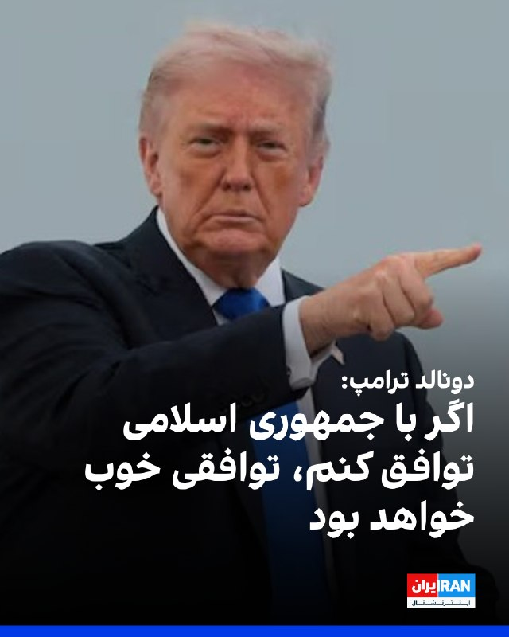

دونالد ترامپ در تروث‌سوشال نوشت اگر با جمهوری اسلامی توافقی انجام دهد، توافقی خوب و درست خواهد بود؛ نه مانند توافق اوباما که مبالغ هنگفتی پول نقد به تهران داد و مسیری آشکار برای دستیابی این کشور به سلاح هسته‌ای فراهم کرد.

او افزود توافق دولتش دقیقا برعکس آن است، اما هنوز کسی آن را ندیده و نمی‌داند شامل چه مواردی است و این توافق هنوز به‌طور کامل نهایی نشده است.

ترامپ گفت به کسانی که درباره موضوعی که اطلاعی از آن ندارند انتقاد می‌کنند گوش ندهید و تاکید کرد برخلاف دولت‌های پیشین، توافق بد انجام نخواهد داد.
‌🏁 🇬🇧 IranintlTV

🤖 @VahidOOnLine

## VahidOOnLine — post 241983

  

♦️روزنامه نیویورک تایمز عصر یکشنبه سوم خرداد ما به نقل از یک مقام ارشد آمریکایی گزارش کرد، ایالات متحده و ایران بر سر توافقی برای کاهش تنش‌ها و پایان دادن به جنگ در خاورمیانه به تفاهم رسیده‌اند. توافقی که شامل بازگشایی تنگه هرمز و تعهد ایران به کنار گذاشتن ذخایر اورانیوم با غنای بالا می‌شود.
این مقام آمریکایی به نیویورک تایمز گفت، هنوز هیچ توافقی امضا نشده و نهایی شدن آن نیازمند تایید نهایی دونالد ترامپ، رئیس‌جمهوری آمریکا و مجتبی خامنه‌ای، رهبر جمهوری اسلامی است و این روند ممکن است چند روز طول بکشد.
با اینهمه این مقام کاخ سفید گفته است، سازوکار کنار گذاشتن اورانیوم غنی‌شده همچنان در حال مذاکره است.
ترامپ روز شنبه اعلام کرده بود دو کشور «تا حد زیادی» بر سر یک تفاهم‌نامه مرتبط با «صلح» مذاکره کرده‌اند، اما روز یکشنبه گفت به مذاکره‌کنندگان آمریکایی دستور داده «برای رسیدن به توافق عجله نکنند.»
این مقام آمریکایی همچنین به نیویورک تایمز گفت در صورت نهایی شدن توافق، آمریکا می‌تواند محاصره بنادر ایران را که برای فشار به تهران و بازگشایی تنگه هرمز اعمال کرده بود، پایان دهد.
‌🇸🇦 Indypersian

🤖 @VahidOOnLine

## VahidOOnLine — post 241982

  

♦️دونالد ترامپ جوان، پسر رئیس‌جمهوری آمریکا، روز یکشنبه با بازنشر پیامی در شبکه اجتماعی اکس، توافق احتمالی با ایران را «یک پیروزی بزرگ برای آمریکا» توصیف کرد و نوشت مخالفان این توافق فقط به‌دنبال حمله زمینی به ایران هستند.
فرزند رئیس جمهوری امریکا که به تازگی جشن ازدواجش را برگزاری کرده است، نوشت: «این یک پیروزی بزرگ برای آمریکاست. باید کسانی را که تا زمانی که حمله زمینی به ایران انجام نشود، راضی نخواهند شد نادیده بگیریم. پدرم قول داده بود مانع دستیابی ایران به سلاح هسته‌ای شود و دقیقا همین کار را انجام می‌دهد.»
ترامپ جوان این اظهارات را در بازنشر پیامی مطرح کرد که در آن گفته شده بود توافقِ در حال شکل‌گیری با ایران، بسیار فراتر از برجام است و برخلاف توافق هسته‌ای دوره باراک اوباما، می‌تواند مانع دستیابی تهران به سلاح هسته‌ای شود.
دونالد ترامپ جوان و بتینا اندرسون در تعطیلات آخر هفته آمریکا با برگزاری مراسمی خصوصی در جزیره‌ای اختصاصی در باهاما با یکدیگر ازدواج کردند.
رئیس جمهوری آمریکا پیش‌تر اعلام کرده بود برای رهبری مذاکرات با ایران، در جشن عروسی فرزندش شرکت نخواهد کرد.
‌🇸🇦 Indypersian

🤖 @VahidOOnLine

## VahidOOnLine — post 241981

  <a href="telegram/content/VahidOOnLine_241981_1779648950.mp4" target="_blank">🎬 Download video</a>

تماسی با خانواده جاویدنام مهدی اسکندریان:
«روی صحبتم با طرفداران جمهوری اسلامیه…
با کشتن جاویدنام‌ها فقط آدم‌های بیشتری را علیه خودتان ساختید؛
و خانواده‌های دادخواه این درد را فراموش نخواهند کرد.»
‌🏁 🇬🇧 ManotoTV

🤖 @VahidOOnLine

## VahidOOnLine — post 241980

  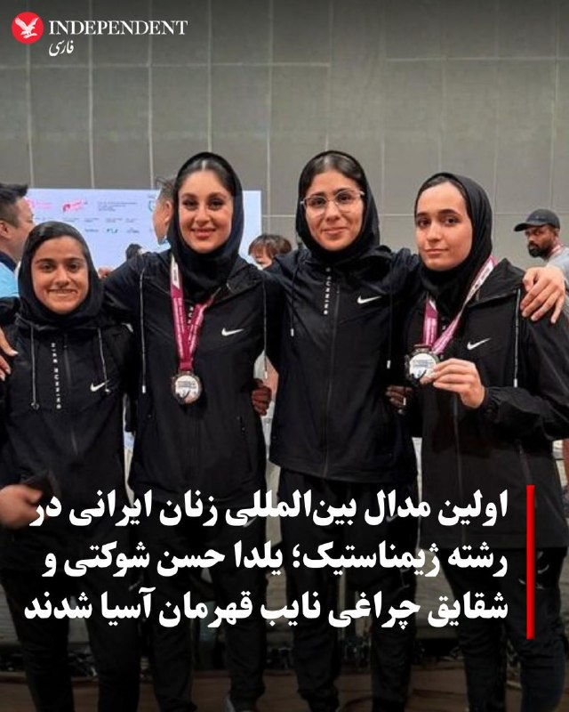

♦️دو ورزشکار زن ایرانی با کسب عنوان نایب‌قهرمانی در «هفتمین دوره رقابت‌های ترامپولین قهرمانی آسیا»، نخستین مدال رشته ورزشی ژیمناستیک زنان ایران را بر گردن آویختند.

به گزارش خبرگزاری مهر، «یلدا حسن‌شوکتی» و «شقایق چراغی» روز یکشنبه سوم خرداد ماه، در رشته هماهنگ دو نفره بزرگسالان موفق به کسب عنوان نایب‌قهرمانی آسیا شدند.

نخستین حضور زنان ژیمناستیک کار ایرانی در رقابت‌های جهانی به در المپیک ۱۹۶۴ توکیو باز می‌گردد. جمیله سروری عضو کاروان المپیک ایران در آن دوره، با فقط ۱۴ سال به عنوان جوان‌ترین ورزشکار کاروان ایران در تاریخ المپیک شناخته شد.
‌🇸🇦 Indypersian

🤖 @VahidOOnLine

## VahidOOnLine — post 241979

  <a href="telegram/content/VahidOOnLine_241979_1779648952.mp4" target="_blank">🎬 Download video</a>

♦️در پی حمله‌ای تروریستی به قطار حامل نیروهای نظامی پاکستان در شهر کویته پاکستان، دست‌کم ۲۴ نفر کشته و بیش از ۵۰ نفر زخمی شدند. مقام‌های پاکستانی اعلام کردند تعدادی از نیروهای ارتش در میان قربانیان هستند.
به گفته یک مقام محلی استان بلوچستان پاکستان، این قطار حامل نیروهای ارتش و اعضای خانواده‌های آن‌ها بود و از کویته به سمت پیشاور در حرکت بود که در منطقه «چمن پاتک» هدف خودرویی بمب‌گذاری‌شده قرار گرفت. در نتیجه این انفجار، یکی از واگن‌ها واژگون شد و خودروهای اطراف نیز آسیب دیدند.
گروه جدایی‌طلب «ارتش آزادی‌بخش بلوچستان» مسئولیت این حمله را بر عهده گرفته است. این گروه که آمریکا آن را سازمانی تروریستی می‌داند، در سال‌های اخیر حملات خود علیه نیروهای امنیتی و شرکت‌های خارجی فعال در بلوچستان را افزایش داده است.
شهباز شریف، نخست‌وزیر پاکستان، این حمله را «اقدامی تروریستی و بزدلانه» توصیف کرد و گفت چنین حملاتی اراده مردم پاکستان را تضعیف نخواهد کرد.
‌🇸🇦 Indypersian

🤖 @VahidOOnLine

## VahidOOnLine — post 241978

  <a href="telegram/content/VahidOOnLine_241978_1779648953.mp4" target="_blank">🎬 Download video</a>

کاخ سفید می‌گوید مذاکرات با جمهوری اسلامی به مرحله حساسی رسیده اما هنوز توافق نهایی نشده و ممکن است چند روز دیگر طول بکشد. بر اساس پیش‌نویس توافق، جمهوری اسلامی درباره محدودیت غنی‌سازی و کنار گذاشتن ذخایر اورانیوم مذاکره می‌کند و در مقابل احتمال کاهش تحریم‌ها وجود دارد. ترامپ تأکید کرده آمریکا برای توافق عجله ندارد و محاصره دریایی فعلاً ادامه خواهد داشت. همزمان اسرائیل نسبت به توافق احتمالی ابراز نگرانی کرده و خواستار حذف کامل برنامه غنی‌سازی جمهوری اسلامی شده است.
‌🏁 🇬🇧 ManotoTV

🤖 @VahidOOnLine

## WithYashar — post 12366

وزیر امور خارجه ایالات متحده مارکو روبیو گفت که توافق احتمالی با ایران حمایت منطقه‌ای دریافت کرده است، اما هشدار داد که یک توافق هسته‌ای نمی‌تواند «در ۷۲ ساعت روی پشت یک دستمال کاغذی» به دست آید.
@withyashar

## WithYashar — post 12365

## WithYashar — post 12364

  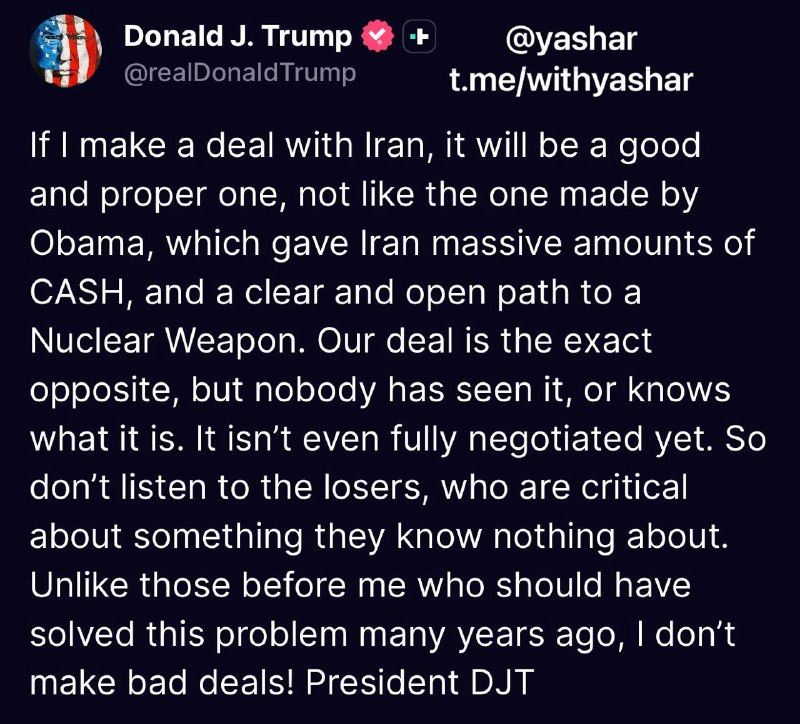

ترامپ در شبکه Truth Social:

اگر من با ایران به توافق برسم، آن یک توافق خوب و اصولی خواهد بود؛ نه مثل توافقی که اوباما انجام داد و به ایران مقادیر زیادی پول نقد داد و یک مسیر کاملاً باز برای دستیابی به سلاح هسته‌ای فراهم کرد.

توافق ما دقیقاً برعکس آن است، اما هنوز کسی آن را ندیده و نمی‌داند دقیقاً چیست. حتی به طور کامل هم نهایی نشده است. پس به افراد شکست‌خورده‌ای که درباره چیزی که از آن هیچ اطلاعی ندارند انتقاد می‌کنند، گوش ندهید.

برخلاف کسانی که قبل از من بودند و باید سال‌ها پیش این مشکل را حل می‌کردند، من توافق‌های بد امضا نمی‌کنم.
@withyashar

## WithYashar — post 12363

ترامپ:محاصره دریایی علیه ایران به صورت کامل ادامه دارد
@withyashar

## WithYashar — post 12362

## WithYashar — post 12361

## WithYashar — post 12360

نیویورک تایمز: یک مقام آمریکایی می‌گوید ایالات متحده و ایران در اصول برای بازگشایی تنگه هرمز توافق کرده‌اند
@withyashar

## WithYashar — post 12359

## WithYashar — post 12358

مقام آمریکایی به CNN:

تحریم‌ها علیه ایران نمی‌تواند قبل از مهار برنامه هسته‌ای آن کاهش یابد

وی گفت: ما در مورد آزادسازی وجوه ایران به عنوان بخشی از توافق مذاکره نکرده‌ایم.

@withyashar

## WithYashar — post 12357

رسانه‌های داخلی: آمریکا مانع آزادسازی پول‌های مسدود شدست، احتمال لغو توافق وجود دارد
@withyashar

## WithYashar — post 12356

به قول مانوک اگه الان آشمز شدید این رو هم ببینید…
@withyashar

## WithYashar — post 12355

طبق گزارش فاکس نیوز، ترامپ می‌خواهد توافق پیشنهادی توسط مذاکره‌کنندگان او، از جمله استیو ویتکوف و جرد کوشنر، اجرا شود؛ اگر این شرایط برآورده نشوند، هیچ توافقی صورت نخواهد گرفت.
@withyashar

## mwarmonitor — post 9657

🔴وزیر خارجه ایالات متحده، می‌گوید که یک توافق با ایران از حمایت منطقه‌ای برخوردار شده است، اما تأکید می‌کند که دستیابی به یک توافق هسته‌ای «در ۷۲ ساعت و روی پشت یک دستمال کاغذی» ممکن نیست.

@mwarmonitor

## mwarmonitor — post 9656

  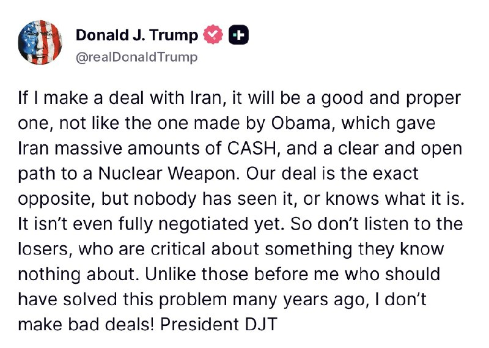

🔴اگر من با ایران توافقی کنم، توافقی خوب و مناسب خواهد بود؛ نه مثل توافقی که اوباما انجام داد، که مقادیر انبوهی پول نقد و یک مسیر واضح و باز برای رسیدن به سلاح هسته‌ای در اختیار ایران قرار داد.
توافق ما دقیقاً برعکس آن است، اما هیچ‌کس هنوز آن را ندیده و نمی‌داند چیست. این توافق حتی هنوز به طور کامل مذاکره نشده است. بنابراین به بازنده‌هایی که از چیزی که هیچ اطلاعی درباره‌اش ندارند انتقاد می‌کنند، گوش ندهید. برخلاف کسانی که قبل از من بودند و باید این مشکل را سال‌ها پیش حل می‌کردند، من توافق بد امضا نمی‌کنم!

رئیس‌جمهور دونالد جی ترامپ (DJT)

@mwarmonitor

## pm_afshaa — post 91410

🔴ترامپ:محاصره دریایی علیه ایران به صورت کامل ادامه دارد

💧 Rainbet.com the #1 Non-KYC Crypto Casino & Sportsbook @rainbetcom

😁 @Pm_Afshaa

## pm_afshaa — post 91409

🔴علی هاشم، خبرنگار الجزیره:کمتر از 24 ساعت پس از آنکه خوش‌بینی‌هایی درباره احتمال تفاهم ایران و آمریکا مطرح شد،نشانه‌های منفی از راه رسیده است و امضای توافق نامشخص است

💧 Rainbet.com the #1 Non-KYC Crypto Casino & Sportsbook @rainbetcom

😁 @Pm_Afshaa

## pm_afshaa — post 91408

رسانه‌های داخلی: آمریکا مانع آزادسازی پول‌های مسدود شدست، احتمال لغو توافق وجود دارد

💧 Rainbet.com the #1 Non-KYC Crypto Casino & Sportsbook @rainbetcom

😁 @Pm_Afshaa

## DEJradio — post 4925

  <a href="telegram/content/DEJradio_4925_1779648954.webm" target="_blank">🎬 Download video</a>

🔸
🚨 خبر ۲۱
یکشنبه ۳ خرداد ۱۴۰۵

#خبر۲۱

@DEJradio

## DEJradio — post 4924

  

🔸
🔴 به گزارش منابع اختصاصی دژ سه خلافکار سابقه‌دار در شهرری که در جریان سرکوب اعتراضات و تجمعات شبانه با بـ.ـسیج همکاری می‌کردند به جرم اخاذی از مردم و شهروندان افغانی بازداشت شدند.
این سه نفر که توسط پرسنل کلانتری ۱۷۸ شمس‌آباد در یک دیگری بازداشت شدند، علاوه بر کارت بـ.ـسیج و انتظامی، بیسیم و اسلحه به همراه داشتند و در پوشش ایست بازرسی و گشت‌های محله محور از مردم باجگیری می‌کردند.

#اوباش_سرکوبگر
@DEJradio

## VahidOnline — post 75687

  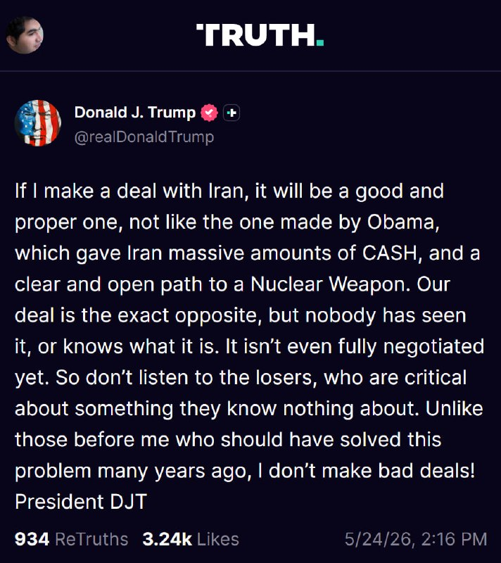

ترامپ: اگر توافق کنم توافقی خوب خواهد بود

ترجمه ماشین:
اگر با ایران توافقی انجام بدهم، توافقی خوب و درست خواهد بود؛ نه مثل توافقی که اوباما انجام داد و مبالغ عظیمی پول نقد به ایران داد و مسیری روشن و باز به سوی سلاح هسته‌ای پیش پای ایران گذاشت.

توافق ما دقیقا برعکس آن است، اما هیچ‌کس آن را ندیده و نمی‌داند چیست.
حتی هنوز به‌طور کامل هم مذاکره و نهایی نشده است.
بنابراین به بازنده‌هایی که درباره چیزی انتقاد می‌کنند که هیچ اطلاعی از آن ندارند گوش نکنید.
برخلاف کسانی که پیش از من بودند و باید سال‌ها پیش این مشکل را حل می‌کردند، من توافق‌های بد انجام نمی‌دهم!

رئیس‌جمهور دی‌جی‌تی
realDonaldTrump

📡 @VahidOnline

## kianmeli1 — post 87644

🔴سی‌ان‌ان: انتظار نمی‌رود توافقی میان ایران و آمریکا امروز به امضا برسد

با وجود ادعای ترامپ مبنی بر «مذاکره‌یِ بخش اعظمِ توافق»، منابع ارشد در دولت آمریکا تأکید کردند امروز هیچ توافقی امضا نخواهد شد. اختلاف‌ها بر سر جزئیاتِ نحوه امحای اورانیوم و مدت‌زمانِ تعلیقِ غنی‌سازی همچنان پابرجاست.

طبق این گزارش، کاهشِ تحریم‌ها و آزادسازیِ دارایی‌های مسدودشده، مشروط به دو گامِ حیاتی است:

بازگشاییِ کاملِ تنگه هرمز و پایبندیِ ایران به محدودیت‌های جدیدِ هسته‌ای.
مبلغِ دقیقِ آزادسازیِ دارایی‌ها نیز هنوز تعیین نشده است. هرچند طرفین به پیشرفتِ صلح اشاره دارند، اما واشنگتن هشدار داده که در این روندِ پیچیده، تعجیل نخواهد کرد.
https://t.me/kianmeli1

## kianmeli1 — post 87643

  

🔴شبکه سی‌بی‌اس گزارش داده که دولت ترامپ معتقد است مجتبی خامنه‌ای با چارچوب کلی پیش‌نویس توافق میان ایران و آمریکا موافقت کرده است.
بر اساس این گزارش، ایران در اصل پذیرفته ذخایر اورانیوم با غنای بالای خود را کنار بگذارد و در مقابل، محاصره دریایی آمریکا لغو شود.
با این حال، پیش‌نویس توافق هنوز باید در ساختار رهبری ایران، از جمله شورای عالی امنیت ملی و فرماندهی سپاه پاسداران، بررسی و تأیید شود.
https://t.me/kianmeli1

## kianmeli1 — post 87642

  <a href="telegram/content/kianmeli1_87642_1779648956.mp4" target="_blank">🎬 Download video</a>

🔴 طبق گزارش فاکس نیوز، ترامپ می‌خواهد توافق پیشنهادی توسط مذاکره‌کنندگان او، از جمله استیو ویتکوف و جرد کوشنر، اجرا شود؛ اگر این شرایط برآورده نشوند، هیچ توافقی صورت نخواهد گرفت
https://t.me/kianmeli1

## kianmeli1 — post 87641

  <a href="telegram/content/kianmeli1_87641_1779648958.mp4" target="_blank">🎬 Download video</a>

🔴تهران و واشینگتن هنوز امضای توافق را اعلام نکرده‌اند. جزئیات توافق احتمالی هم هنوز به طور رسمی اعلام نشده است. گرچه گمانه‌زنی‌ها بر این بود که رسیدن به توافق امروز اعلام خواهد شد، اما کاخ سفید گفته است امضای توافق ممکن است چند روز دیگر انجام شود.
https://t.me/kianmeli1

## kianmeli1 — post 87640

  

🔴رسانه آکسیوس، روز یکشنبه سوم خرداد ماه، به نقل از یک مقام ارشد دولت دونالد ترامپ گزارش داد، «چند مورد جزئیات حل‌نشده» میان تهران و واشنگتن باقی‌مانده است و به همین دلیل توافق میان ایران و آمریکا احتمالا امروز امضا نخواهد شد.

این مقام آمریکایی به آکسیوس گفت هنوز بر سر برخی بخش‌های توافق «رفت‌وبرگشت» وجود دارد و اختلاف‌ها بیشتر بر سر عباراتی است که برای هر یک از دو طرف اهمیت دارد: «برخی کلمات برای ما مهم هستند و برخی کلمات برای آن‌ها.»

آکسیوس به نقل از این مقام ارشد کاخ سفید نوشت، ساختار تصمیم‌گیری در جمهوری اسلامی «سریع عمل نمی‌کند» و روند دریافت همه تاییدیه‌های لازم چند روز زمان خواهد برد.

به گفته این مقام، ارزیابی واشنگتن این است که «مجتبی خامنه‌ای»، رهبر جمهوری اسلامی، چارچوب کلی توافق را تایید کرده، اما اینکه این روند به توافق نهایی منجر شود، «همچنان یک سوال باز» است.
https://t.me/kianmeli1

## IranIntlTV — post 338802

  

دونالد ترامپ در تروث‌سوشال نوشت اگر با جمهوری اسلامی توافقی انجام دهد، توافقی خوب و درست خواهد بود؛ نه مانند توافق اوباما که مبالغ هنگفتی پول نقد به تهران داد و مسیری آشکار برای دستیابی این کشور به سلاح هسته‌ای فراهم کرد.

او افزود توافق دولتش دقیقا برعکس آن است، اما هنوز کسی آن را ندیده و نمی‌داند شامل چه مواردی است و این توافق هنوز به‌طور کامل نهایی نشده است.

ترامپ گفت به کسانی که درباره موضوعی که اطلاعی از آن ندارند انتقاد می‌کنند گوش ندهید و تاکید کرد برخلاف دولت‌های پیشین، توافق بد انجام نخواهد داد.
https://iranintl.com/202605243731

## IranIntlTV — post 338801

  <a href="https://t.me/IranintlTV/338801" target="_blank">📎 Download file</a>

🎧نسخه صوتی تیتراول با نیوشا صارمی: تهران و واشینگتن در آستانه تصمیم نهایی توافق؛ هشدار نتانیاهو:آزادی عمل داریم
@iranintlTV

## IranIntlTV — post 338800

بخش مهمی از تفاهم‌نامه تهران و واشینگتن مربوط به مسائل و امتیازهای اقتصادی است. آمریکا در ازای بازگشایی تنگه هرمز، محاصره بنادر ایران را به تدریج لغو خواهد کرد و معافیت‌های تحریمی برای فروش آزاد نفت ایران صادر می‌شود. اگرچه تهران خواستار آزادسازی فوری منابع مالی و رفع دائمی تحریم‌‌ها بود، اما آزادسازی دارایی‌های بلوکه‌شده و رفع کامل تحریم‌ها به توافق نهایی موکول شده است.

گفت‌وگو با سارا بازوبندی، کارشناس اقتصادی
@iranintltv

## IranIntlTV — post 338799

تهران و واشینگتن هنوز امضای توافق را اعلام نکرده‌اند. جزئیات توافق احتمالی هم هنوز به طور رسمی اعلام نشده است. گرچه گمانه‌زنی‌ها بر این بود که رسیدن به توافق امروز اعلام خواهد شد، اما کاخ سفید گفته است امضای توافق ممکن است چند روز دیگر انجام شود.

گفت‌وگو با نوید محبی، تحلیل‌گر سیاسی
@iranintltv

## Shin_Persian — post 6211

  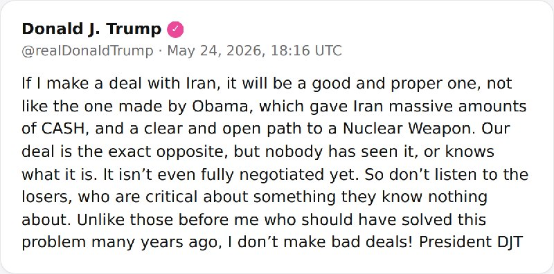

Shin ✓ @hey_itsmyturn Sun, 24 May 2026 18:20:14 UTC President Trump @POTUS: "If I make a deal with Iran, it will be a good and proper one, not like the one made by Obama, which gave Iran massive amounts of CASH, and a clear and open path to a Nuclear Weapon.…

## Shin_Persian — post 6210

Shin ✓ @hey_itsmyturn
Sun, 24 May 2026 18:20:14 UTC

President Trump @POTUS:
"If I make a deal with Iran, it will be a good and proper one, not like the one made by Obama, which gave Iran massive amounts of CASH, and a clear and open path to a Nuclear Weapon. Our deal is the exact opposite, but nobody has seen it, or knows what it is. It isn’t even fully negotiated yet. So don’t listen to the losers, who are critical about something they know nothing about. Unlike those before me who should have solved this problem many years ago, I don’t make bad deals! President DJT"

فارسی

رئیس‌جمهور ترامپ @POTUS:

«اگر من با ایران بر سر توافقی مذاکره کنم، آن توافق خوب و مناسب خواهد بود، نه مانند توافقی که اوباما منعقد کرد، که مقادیر عظیمی پول نقد به ایران داد و مسیری شفاف و باز برای دستیابی به سلاح هسته‌ای فراهم کرد. توافق ما دقیقاً برعکس است، اما هیچ‌کس آن را ندیده و نمی‌داند چیست. هنوز حتی به طور کامل مذاکره نشده است. بنابراین به بازنده‌هایی که از چیزی که هیچ اطلاعی از آن ندارند انتقاد می‌کنند، گوش ندهید. برخلاف کسانی که پیش از من بودند و باید این مشکل را سال‌ها پیش حل می‌کردند، من توافق بد امضا نمی‌کنم! رئیس‌جمهور دی‌جی‌تی (دونالد جی. ترامپ)»

𝕏 · @shin_persian

## ManotoTV — post 105812

  <a href="telegram/content/ManotoTV_105812_1779648961.mp4" target="_blank">🎬 Download video</a>

تماسی با خانواده جاویدنام مهدی اسکندریان:
«روی صحبتم با طرفداران جمهوری اسلامیه…
با کشتن جاویدنام‌ها فقط آدم‌های بیشتری را علیه خودتان ساختید؛
و خانواده‌های دادخواه این درد را فراموش نخواهند کرد.»

## ManotoTV — post 105811

  <a href="telegram/content/ManotoTV_105811_1779648963.mp4" target="_blank">🎬 Download video</a>

کاخ سفید می‌گوید مذاکرات با جمهوری اسلامی به مرحله حساسی رسیده اما هنوز توافق نهایی نشده و ممکن است چند روز دیگر طول بکشد. بر اساس پیش‌نویس توافق، جمهوری اسلامی درباره محدودیت غنی‌سازی و کنار گذاشتن ذخایر اورانیوم مذاکره می‌کند و در مقابل احتمال کاهش تحریم‌ها وجود دارد. ترامپ تأکید کرده آمریکا برای توافق عجله ندارد و محاصره دریایی فعلاً ادامه خواهد داشت. همزمان اسرائیل نسبت به توافق احتمالی ابراز نگرانی کرده و خواستار حذف کامل برنامه غنی‌سازی جمهوری اسلامی شده است.

## FarsiVOA — post 218563

🔺دونالد ترامپ: توافق بد نمی‌کنم

◾️دونالد ترامپ رئیس جمهوری آمریکا، اعلام کرد که اگر با [رژیم] ایران توافقی انجام دهد، توافقی خوب و مناسب خواهد بود، «نه مانند توافقی که اوباما انجام داد و به [رژیم] ایران مقادیر زیادی پول نقد و مسیری روشن و باز به سوی سلاح هسته‌ای داد.»

⬇️ بیشتر بخوانید:

https://ir.voanews.com/a/8153347.html

## FarsiVOA — post 218562

تشدید تنش‌ها در عراق؛ حملات تازه به اقلیم همزمان با بحران خلع سلاح گروه‌های مسلح

## FarsiVOA — post 218561

فقط ۱۸ روز تا آغاز جام جهانی باقی مانده اما تیم ملی جمهوری اسلامی همچنان درگیر بحران ویزا، تحریم، جابه‌جایی کمپ و مشکلات مالی است. از انتقال کمپ از آریزونا به مرز مکزیک گرفته تا گزارش‌هایی درباره صادر نشدن ویزای بعضی بازیکنان و آماده‌باش بازیکنان خط‌خورده برای جایگزینی احتمالی.

## FarsiVOA — post 218560

گزارش نرگس صبا از ذخیره اورانیوم با غنای بالای ایران در برنامه تفسیر خبر

## FarsiVOA — post 218559

در گفت‌وگو با علی دادپی، اقتصاددان ساکن تگزاس، به تنگنای اقتصادی جمهوری اسلامی در شرایط محاصره دریایی برای امضای توافق پایان جنگ پرداختیم و بررسی کردیم چرا زمان به سود آمریکا در حرکت است و جمهوری اسلامی، همانند تجربه برجام، توان استفاده مؤثر از این فرصت را ندارد.

## FarsiVOA — post 218558

خبرگزاری میزان، وابسته به قوه قضائیه جمهوری اسلامی، اعلام کرد مجتبی کیان، شهروند بازداشتی به اتهام ارسال اطلاعات مراکز تولید صنایع دفاعی به آمریکا و اسرائیل اعدام شده است

## FarsiVOA — post 218557

گزارش مایکل لیپین، خبرنگار صدای آمریکا، از کاخ سفید

## FarsiVOA — post 218556

دیدگاه های قانون گذران آمریکا و تفاهم نامه دولت ترامپ با جمهوری اسلامی

## FarsiVOA — post 218555

بررسی امنیت ملی، انگیزه ترور، و تحولات جاری خاورمیانه

## FarsiVOA — post 218554

🔺گزارش زنده مایکل لیپین، خبرنگار صدای آمریکا از نزدیک کاخ سفید

## FarsiVOA — post 218551

اسپیس‌ایکس تصاویری از دوربین‌های نصب‌شده روی استارشیپ و فضاپیمای وی۳ منتشر کرد.

اسپیس‌ایکس می‌گوید این دوربین‌های ارتقا یافته قادرند در تمام مراحل پرواز، ویدیوی 4K را از طریق استارلینک پخش کنند.

@FarsiVOA

## DW_Farsi — post 125107

  

🔶 نتانیاهو: با ترامپ توافق کردیم اورانیوم غنی‌شده باید از ایران خارج شود

نخست‌وزیر اسرائيل در پستی تازه در شبکه اجتماعی ایکس با اشاره به این که شامگاه شنبه ۲۳ مه تلفنی با دونالد ترامپ، رئيس‌ جمهور آمریکا گفت‌وگو کرد نوشت، با او به توافق رسیده که هر گونه توافق نهایی با ایران باید خطر هسته‌ای این کشور را "ریشه‌کن" کند.

بنیامین نتانیاهو در این پیام که یکشنبه ۲۴ مه نوشته شده در این مورد توضیح داد: «این به معنای برچیدن سایت‌های غنی‌سازی هسته‌ای ایران و خارج کردن مواد هسته‌ای غنی‌شده از خاک این کشور است.»

نتانیاهو با ابراز قدردانی از همکاری آمریکا در حملات نظامی اخیر به جمهوری اسلامی نوشت: «سیاست من، همانند پرزیدنت ترامپ، بدون تغییر باقی می‌ماند: ایران به سلاح هسته‌ای دست نخواهد یافت.»

او همچنین بار دیگر بر حق اسرائیل برای دفاع از خود در برابر همه تهدیدها، از جمله تهدید لبنان، تأکید کرد.
@dw_farsi

## DW_Farsi — post 125106

  

🔶 ترامپ: محاصره دریایی ایران تا رسیدن به توافق نهایی پابرجاست

رئیس‌جمهور آمریکا در پیامی تازه مذاکرات جاری توافق‌محور میان ایران و کشورش را "سازنده" خواند و نوشت، اما محاصره دریایی بنادر ایران توسط نیروی دریایی آمریکا تا رسیدن به توافق نهایی به قوت خود باقی خواهد ماند.

دونالد ترامپ در تروث سوشال یادآور شد: «من به نمایندگانم ابلاغ کرده‌ام که برای رسیدن به توافق عجله نکنند، چرا که زمان به نفع ماست... هر دو طرف باید زمان بگذارند و کار را درست انجام دهند. هیچ اشتباهی نباید رخ دهد.»

او با تکرار این که هر توافقی با ایران بهتر از توافق موسوم به برجام در سال ۲۰۱۵ در دوران ریاست جمهوری باراک اوباما در آمریکاست مدعی شد: «رابطه ما با ایران در حال تبدیل شدن به رابطه‌ای بسیار حرفه‌ای‌تر و سازنده‌تر است. با این حال، آن‌ها باید درک کنند که نمی‌توانند سلاح یا بمب هسته‌ای تولید یا تهیه کنند.»

رئیس‌ جمهور آمریکا در ادامه از کشورهای خاورمیانه بابت "حمایت و همکاری" با ایالات متحده تشکر کرد و افزود که این همکاری‌ها با پیوستن آن‌ها به "پیمان‌های تاریخی ابراهیم" که همانا عادی‌سازی روابط با اسرائيل است تقویت خواهد شد.
@dw_farsi

## DW_Farsi — post 125105

  <a href="telegram/content/DW_Farsi_125105_1779648964.mp4" target="_blank">🎬 Download video</a>

🎥 ادعای مدیرعامل سروش‌پلاس؛ "هیچ نظارت پیشینی روی پیام‌ها و تماس‌های کاربران وجود ندارد"

امین شریفی، مدیرعامل سروش‌پلاس، مدعی شده پیام‌رسان‌های داخلی "نظارت پیشینی" بر پیام‌ها و تماس‌های کاربران ندارند؛ یعنی به گفته او، پیام‌ها پیش از ارسال یا دریافت، کنترل و سانسور نمی‌شوند.

با این حال کارشناسان امنیت دیجیتال می‌گویند این موضوع، احتمال نظارت نهادهای امنیتی پس از ارسال پیام‌ها را رد نمی‌کند.

شریفی در یک مصاحبه گفته دسترسی به اطلاعات کاربران فقط با حکم قضایی و در پرونده‌های مشخص انجام می‌شود.
اما کارشناسان امنیت سایبری هشدار می‌دهند پیام‌رسان‌های داخلی مانند "بله"، "روبیکا" و "سروش" از استانداردهای لازم برای حفاظت از حریم خصوصی برخوردار نیستند و امکان نظارت و سانسور در آن‌ها وجود دارد.
 
این نگرانی‌ها پس از آن شدت گرفت که جمهوری اسلامی در دوره محدودیت گسترده اینترنت، شهروندان را به استفاده از پیام‌رسان‌های داخلی تشویق کرد.
 
محققان امنیت دیجیتال نیز "بله" را ابزاری برای نظارت دولتی معرفی کرده‌اند که از پیام‌های کاربران در برابر شنود محافظت نمی‌کند.
@dw_farsi

## Persian_Trend_Official — post 14884

ساعت 23 به وقت تهران لایو شروع میشه

## Persian_Trend_Official — post 14883

  

این رو مبنای شکست و پیروزی جمهوری اسلامی در نظر میگیریم

و هر توافقی رو با این متن مقایسه میکنیم
از توجه شما به این موضوع متشکرم
الیاس فرخ

## Persian_Trend_Official — post 14882

🔴 روبیو: توافق هسته‌ای با ایران را نمی‌توان «در ۷۲ ساعت روی یک تکه کاغذ» نهایی کرد

♦️مارکو روبیو، وزیر خارجه آمریکا، اعلام کرد توافق احتمالی با ایران از حمایت کشورهای منطقه برخوردار شده است، اما هشدار داد:

▪️ «توافق هسته‌ای را نمی‌شود ظرف ۷۲ ساعت و روی پشت یک دستمال کاغذی نهایی کرد»
▪️ او گفت مذاکرات پیچیده است و هنوز کار زیادی باقی مانده
▪️ روبیو همچنین از «پیشرفت قابل‌توجه اما نه نهایی» در گفت‌وگوها خبر داد
🫆:Tony

📌 @persian_trend_official
پرشین ترند | متفاوت‌ترین کانال نظامی

## Persian_Trend_Official — post 14881

  

#طنز

بیو ترامپ چند روز دیگه:

📝 Nick

📌 @persian_trend_official
پرشین ترند | متفاوت‌ترین کانال نظامی

## Persian_Trend_Official — post 14879

  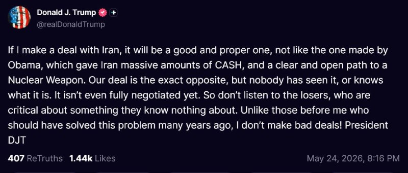

🔴 ترامپ:

اگر با ایران توافقی انجام دهم، توافقی خوب و درست خواهد بود؛ نه مثل توافق اوباما که به ایران حجم عظیمی پول نقد داد و مسیر آشکار دستیابی به سلاح هسته‌ای را برایش باز کرد.
توافق ما دقیقاً برعکس آن است، اما هنوز کسی آن را ندیده و از جزئیاتش خبر ندارد. این توافق حتی هنوز کاملاً نهایی هم نشده است.
پس به حرف بازنده‌هایی که درباره چیزی که هیچ اطلاعی از آن ندارند انتقاد می‌کنند گوش ندهید.
برخلاف کسانی که قبل از من بودند و باید سال‌ها پیش این مسئله را حل می‌کردند، من توافق بد انجام نمی‌دهم.

🫆:Tony

📌 @persian_trend_official
پرشین ترند | متفاوت‌ترین کانال نظامی

## Persian_Trend_Official — post 14878

🔴العربی الجديد:

♦️انفجار انتحاری در قطاری در ایالت بلوچستان پاکستان؛ بیش از ۲۰ کشته و بیش از ۵۰ زخمی / انتخاب

🫆:Tony

📌 @persian_trend_official
پرشین ترند | متفاوت‌ترین کانال نظامی

## Persian_Trend_Official — post 14877

  <a href="telegram/content/Persian_Trend_Official_14877_1779648967.webm" target="_blank">🎬 Download video</a>

🔴 کانال ۱۳ اسرائیل: نفوذ نتانیاهو بر ترامپ به‌شدت کاهش یافته است

▪️ نتانیاهو در جلسات اخیر گفته توان اسرائیل برای تأثیرگذاری بر ترامپ اکنون بسیار محدود شده است
▪️ مقام‌های اسرائیلی معتقدند ترامپ به‌سمت توافق موقت با ایران حرکت می‌کند
▪️ اسرائیل فعلاً تلاش می‌کند فقط بر محتوای توافق اثر بگذارد؛ به‌ویژه درباره لبنان، شمال اسرائیل و خروج اورانیوم غنی‌شده از ایران

همزمان:

▪️ نتانیاهو امشب جلسه جدید کابینه امنیتی محدود برگزار کرده است
▪️ اسرائیلی‌ها می‌گویند جرد کوشنر و استیو ویتکاف نقش مهمی در منصرف‌کردن ترامپ از گزینه جنگ داشته‌اند
▪️ با وجود تماس‌های ادامه‌دار میان ترامپ و نتانیاهو، در تل‌آویو این باور در حال تقویت است که تغییر نظر ترامپ بعید شده است

🫆:Tony

📌 @persian_trend_official
پرشین ترند | متفاوت‌ترین کانال نظامی

## IranianMinds — post 20690

  

🔴 ترامپ :

اگه با ایران معامله کنم، یه معامله درست و حسابی می‌کنم، نه مثل اون آشغالی که اوباما کرد و کلی پول نقد بهشون داد و راه رو برای ساخت سلاح هسته‌ای کاملاً باز گذاشت. معامله ما دقیقاً برعکسه، ولی هنوز هیچ‌کس ندیدنش و نمیدونه چیه. حتی هنوز کامل مذاکره هم نشده. پس به این بازنده‌ها گوش نکنید که دارن درباره چیزی نظر میدن که هیچی ازش بلد نیستن. برخلاف اونایی که قبل از من بودن و باید سال‌ها پیش این مشکل رو حل میکردن، من معامله بد نمی‌کنم!

@IranianMinds

## BBCPersian — post 281962

  

‏⭕️با گذشت ۱۸ هفته از بازداشت آرتین غضنفری، عکاس خبری نگرانی‌ها از وضعیت پرونده و سلامتی او افزایش یافته است.

‏یک منبع آگاه درباره او که ۱۲۶ روز بدون دسترسی به وکیل در بازداشت به‌سر می‌برد، به بی‌بی‌سی گفت: بازداشت موقت او چندبار تمدید شده و او امکان دسترسی به وکیل را «در مرحله دادسرا نیافته و کیفرخواست او به شعبه ۱۵ دادگاه انقلاب به ریاست قاضی ابوالقاسم صلواتی ارسال شده است.»

‏بازداشت طولانی، محدود کردن دسترسی بازداشتی به حقوق قانونی، بازداشت‌های متداوم بهائیان در ماه‌های اخیر، موجب ابراز نگرانی سازمان‌های حقوق‌بشری و فدراسیون بین‌المللی روزنامه‌نگاران و پارلمان اروپا از «پرونده‌سازی» علیه آرتین غضنفری و دیگر شهروندان بهائی در ایران شده است.

‏آرتین غضنفری، عکاس خبری، تهیه‌کننده پادکست «ماه سیزدهم» و شهروند بهائی پس از یورش ماموران به محل زندگی او در تهران در ۲۹ دی ۱۴۰۴ و تفتیش و ضبط بعضی وسایل شخصی و تجهیزات کاری بازداشت شد.

‏بیشتر:
instagram.com/p/DYuz4MKiLKn/
@bbcpersian

## Dirty_Kids — post 390096

  

‏عزیزان، یه قرمساقی به اسم علی‌هاشم خبرنگار الجزیره که دیروز گفته بود کار تمومه و تفاهم‌نامه امروز امضا می‌شه نوشته که :

«کمتر از ۲۴ ساعت بعد از احتمال تفاهم روافض قحبه و آمریکا، نشونه‌های منفی از راه رسیدن.

منبع آگاه رافضی می‌گه نشونه‌هایی از عقب‌نشینی آمریکا در دو موضوع اصلی دیده می‌شه: سازوکار آزادسازی دارایی‌ها و دامنه آتش‌بس در لبنان.»

روافض به همه‌ی میانجی‌های قرمپف از جمله پاکستان قرمدنگ اطلاع داده که اگه همه‌ی بندهای تفاهم کاملاً مورد توافق و تضمین واقع نشن، تفاهم‌نامه رو امضا نخواهند کرد.

پاکستان قرمساق پیشنهاد کرده که حداقل فعلاً بندهای مورد توافق جلو بره و مسائل اختلافی به تعویق بیفته تا این قرمساق‌های کیری پاکستانی بتونن این وسط یه چیزی به‌نام‌خودشون ثبت کنن، اما روافض کیرشون رو‌ گذاشتن کف دستشون [احسنت بهشون] و گفتن کسشر نگید بابا این بندهای مورد اختلاف، اساسی و غیرقابل مصالحه هستند.

@Dirty_Kids 👻

## Dirty_Kids — post 390095

وقتی دم جام‌جهانی میخوای هم از فوتبالی‌ها ویو بگیری هم مبارزا رو بکشونی سمتت و هم میخوای جقی‌هارو راضی نگه‌داری:

@Dirty_Kids 👻

## Hranews — post 113140

مرگ و مصدومیت ۴ کارگر در سایه فقدان ایمنی کار

❗️
❗️
❗️
❗️
❗️ – در سایه فقدان ایمنی محیط و شرایط نامناسب کار، امروز یکشنبه ۳ خردادماه، چهار #کارگر در شهرهای کاشان و پرند دچار حادثه شدند. در این حوادث سه کارگر مصدوم و یک تن دیگر جان خود را از دست داد.

ادامه مطلب

↘️
@hranews_bot تماس ✉️ -  @Hranews  کانال هرانا 🆑

## Hranews — post 113139

یک زن در بجنورد توسط پسرش به قتل رسید

❗️
❗️
❗️
❗️
❗️ – مردی در بجنورد مادر خود را با استفاده از سلاح سرد به قتل رساند. متهم پس از بازداشت و به مرجع قضایی معرفی شده است.

ادامه مطلب

↘️
@hranews_bot تماس ✉️ -  @Hranews  کانال هرانا 🆑

## manototv — post 105812

  <a href="telegram/content/manototv_105812_1779648968.mp4" target="_blank">🎬 Download video</a>

تماسی با خانواده جاویدنام مهدی اسکندریان:
«روی صحبتم با طرفداران جمهوری اسلامیه…
با کشتن جاویدنام‌ها فقط آدم‌های بیشتری را علیه خودتان ساختید؛
و خانواده‌های دادخواه این درد را فراموش نخواهند کرد.»

## manototv — post 105811

  <a href="telegram/content/manototv_105811_1779648970.mp4" target="_blank">🎬 Download video</a>

کاخ سفید می‌گوید مذاکرات با جمهوری اسلامی به مرحله حساسی رسیده اما هنوز توافق نهایی نشده و ممکن است چند روز دیگر طول بکشد. بر اساس پیش‌نویس توافق، جمهوری اسلامی درباره محدودیت غنی‌سازی و کنار گذاشتن ذخایر اورانیوم مذاکره می‌کند و در مقابل احتمال کاهش تحریم‌ها وجود دارد. ترامپ تأکید کرده آمریکا برای توافق عجله ندارد و محاصره دریایی فعلاً ادامه خواهد داشت. همزمان اسرائیل نسبت به توافق احتمالی ابراز نگرانی کرده و خواستار حذف کامل برنامه غنی‌سازی جمهوری اسلامی شده است.

## alonews — post 122414

  <a href="telegram/content/alonews_122414_1779648970.webm" target="_blank">🎬 Download video</a>

👈رسانه‌های داخلی: آمریکا مانع آزادسازی پول‌های مسدود شدست، احتمال لغو کلی توافق وجود داره!

✅ @AloNews خبر جنگ

## alonews — post 122413

  <a href="telegram/content/alonews_122413_1779648971.mp4" target="_blank">🎬 Download video</a>

👈معاون هماهنگ کننده‌ی فرمانده‌ی ارتش : نمیدونم توافق چی هست، سر چی هست

✅ @AloNews خبر جنگ

## alonews — post 122412

  <a href="telegram/content/alonews_122412_1779648972.webm" target="_blank">🎬 Download video</a>

👈 منبع آمریکایی به الحدث درباره لبنان: توافق آمریکا و ایران شامل همان بندهای ۱۵ مه مربوط به آتش‌بس است.

🔴 پیش‌نویس توافق آمریکا و ایران شامل تعهد به پایان دادن به خصومت‌ها در لبنان است.

🔴 اسرائیل به واشنگتن اعلام کرده که هر توافقی با تهران باید آزادی عمل آن را در لبنان تضمین کند.

🔴 پیش‌نویس توافق بین واشنگتن و تهران شامل خلع سلاح «حزب‌الله» در لبنان نیست.

✅ @AloNews خبر جنگ

## alonews — post 122411

  <a href="telegram/content/alonews_122411_1779648972.webm" target="_blank">🎬 Download video</a>

👈 ادعای منبع آمریکایی به الحدث: مخالفت‌های درونی در حزب جمهوری‌خواه با برخی بندهای توافق با ایران، اعلام رسمی آمریکا را به تأخیر انداخته است

✅ @AloNews خبر جنگ

## alonews — post 122410

  <a href="telegram/content/alonews_122410_1779648972.webm" target="_blank">🎬 Download video</a>

👈وزیر امور خارجه ایالات متحده مارکو روبیو گفت که توافق احتمالی با ایران حمایت منطقه‌ای دریافت کرده است، اما هشدار داد که یک توافق هسته‌ای نمی‌تواند «در ۷۲ ساعت روی پشت یک دستمال کاغذی» به دست آید.

✅ @AloNews خبر جنگ

## alonews — post 122409

  <a href="telegram/content/alonews_122409_1779648972.webm" target="_blank">🎬 Download video</a>

👈نیویورک تایمز به نقل از مقامات آمریکایی: محاصره دریایی بنادر ایران امروز با سرعت بیشتری ادامه یافت

✅ @AloNews خبر جنگ

## alonews — post 122408

  <a href="telegram/content/alonews_122408_1779648973.webm" target="_blank">🎬 Download video</a>

👈 ترامپ: اگر با ایران معامله‌ای انجام دهم، معامله‌ای خوب و درست خواهد بود، نه مانند معامله‌ای که اوباما انجام داد و به ایران مقادیر زیادی پول نقد و مسیری واضح و باز به سمت سلاح هسته‌ای داد. معامله ما دقیقاً برعکس است، اما هنوز کسی آن را ندیده یا نمی‌داند چیست. حتی هنوز به طور کامل مذاکره هم نشده است.

🔴پس به بازنده‌هایی که از چیزی که هیچ نمی‌دانند انتقاد می‌کنند، گوش ندهید. برخلاف کسانی که قبل از من بودند و باید این مشکل را سال‌ها پیش حل می‌کردند، من معامله‌های بد انجام نمی‌دهم!

✅ @AloNews خبر جنگ

## alonews — post 122407

  <a href="telegram/content/alonews_122407_1779648973.webm" target="_blank">🎬 Download video</a>

👈نیویورک تایمز: یک مقام آمریکایی می‌گوید ایالات متحده و ایران در اصول برای بازگشایی تنگه هرمز توافق کرده‌اند

✅ @AloNews خبر جنگ

## alonews — post 122406

  <a href="telegram/content/alonews_122406_1779648973.mp4" target="_blank">🎬 Download video</a>

👈ترامپ:هند می‌تواند ۱۰۰٪ به من و کشورمان اعتماد کند.

🔴اگر به کمک نیاز دارند، می‌دانند به کجا تماس بگیرند — همین‌جا تماس می‌گیرند.

✅ @AloNews خبر جنگ

## alonews — post 122405

  <a href="telegram/content/alonews_122405_1779648975.webm" target="_blank">🎬 Download video</a>

👈العربی الجديد: تلفات انفجار انتحاری در قطار در ایالت بلوچستان بیش از ۶۰ کشته و بیش از ۱۰۰ زخمی است

✅ @AloNews خبر جنگ

## alonews — post 122404

  <a href="telegram/content/alonews_122404_1779648975.webm" target="_blank">🎬 Download video</a>

👈 رسانه وزارت خارجه ایران: در موضوع آزادسازی دارایی‌ها که مورد اختلاف است در حال حاضر راه‌حلی برای آن وجود ندارد

✅ @AloNews خبر جنگ

## alonews — post 122403

  <a href="telegram/content/alonews_122403_1779648975.webm" target="_blank">🎬 Download video</a>

👈ادعای یک مقام ارشد آمریکایی به آکسیوس: «ما در نقطه بسیار خوبی هستیم اما راه‌هایی وجود دارد که توافق می‌تواند تضعیف شود.»

✅ @AloNews خبر جنگ

---
📅 بروزرسانی: 1405/03/03 21:19
---

## VahidOOnLine — post 241977

  

وزارت آموزش‌وپرورش اخبار منتشرشده درباره مجازی شدن امتحانات نهایی را تکذیب و اعلام کرد تاکنون هیچ تصمیمی برای برگزاری مجازی امتحانات نهایی پایه‌های یازدهم و دوازدهم گرفته نشده است.

وزارت آموزش‌وپرورش اعلام کرد تا تیرماه برای فراهم شدن شرایط برگزاری امتحانات نهایی صبر می‌شود و در صورت فراهم شدن امکان برگزاری حضوری، آزمون‌های نهایی مطابق روال معمول به شکل حضوری برگزار خواهد شد.

در روزهای اخیر، دانش‌آموزان در چندین شهر به برگزاری حضوری امتحانات اعتراض کردند.
‌🏁 🇬🇧 IranintlTV

🤖 @VahidOOnLine

## VahidOOnLine — post 241976

  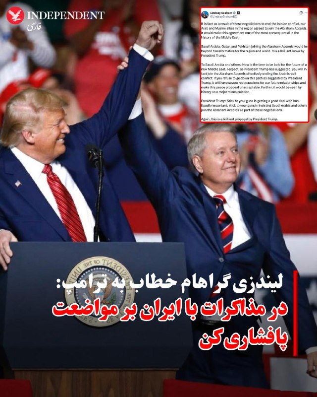

♦️لیندزی گراهام، سناتور جمهوری‌خواه آمریکا، روز یکشنبه سوم خرداد ماه با انتشار متنی در شبکه اجتماعی اکس از دونالد ترامپ خواست در مذاکرات با ایران «بر مواضع خود پافشاری کند» و همزمان از متحدان واشنگتن در خاورمیانه خواست به «توافق‌های ابراهیم» بپیوندند.

گراهام نوشت: «رئیس‌جمهوری ترامپ، برای دستیابی به یک توافق خوب با ایران بر مواضع خود بایستید.» او افزود: «به همان اندازه مهم است که بر پیوستن عربستان سعودی و دیگر کشورها به توافق‌های ابراهیم به‌عنوان بخشی از این مذاکرات اصرار کنید.»

این سناتور آمریکایی در ادامه نوشت اگر در نتیجه مذاکرات برای پایان دادن به جنگ با ایران، متحدان آمریکا در منطقه به توافق‌های ابراهیم بپیوندند، این توافق «یکی از تاثیرگذارترین توافق‌ها در تاریخ خاورمیانه» خواهد بود.

گراهام افزود: «پیوستن عربستان سعودی، قطر و پاکستان به توافق‌های ابراهیم، تحولی فراتر از تصور برای منطقه و جهان خواهد بود.» او همچنین این اقدام را «حرکتی درخشان از سوی ترامپ» توصیف کرد.
‌🇸🇦 Indypersian

🤖 @VahidOOnLine

## VahidOOnLine — post 241975

  

♦️نعیم قاسم، دبیرکل حزب‌الله لبنان، روز یکشنبه سوم خرداد ماه، ابراز امیدواری کرد میان جمهوری اسلامی ایران و ایالات متحده توافقی حاصل شود و لبنان نیز بخشی از مفاد آن باشد.
او در یک سخنرانی تلویزیونی گفت: «ان‌شاءالله این توافق نهایی خواهد شد و نشانه‌هایی از تکمیل آن وجود دارد و بر این اساس ما نیز جزو طرف‌های مشمول این توافق خواهیم بود، توافقی برای توقف کامل درگیری‌ها.»
این در حالیست که بنیامین نتانیاهو، نخست‌وزیر اسرائیل، پیشتر اعلام کرده بود، دونالد ترامپ بر حمایت آمریکا از حق اسرائیل برای دفاع از خود در برابر تهدیدها، از جمله حزب‌الله، تاکید کرده است.
‌🇸🇦 Indypersian

🤖 @VahidOOnLine

## VahidOOnLine — post 241974

  

ارتش اسرائیل اعلام کرد ایال زمیر، رییس ستاد کل ارتش این کشور، پس از ارزیابی وضعیت میدانی، طرح‌های ادامه عملیات علیه حزب‌الله در لبنان را تایید کرده است.

زمیر گفت ارتش اسرائیل تحولات منطقه را به‌دقت زیر نظر دارد و آماده است فورا به درگیری‌های شدید بازگردد و حکومت «تروریستی» ایران و توانمندی‌های آن را بیش از پیش تضعیف کند.

او افزود: «امروز طرح‌های ادامه نبرد در جبهه شمالی را تصویب کردم و مصمم هستیم ضربات به حزب‌الله را عمیق‌تر کنیم.»
‌🏁 🇬🇧 IranintlTV

🤖 @VahidOOnLine

## VahidOOnLine — post 241973

  

لیندزی گراهام، سناتور جمهوریخواه در پیامی در شبکه ایکس نوشت: «اگر در نتیجه مذاکرات برای پایان دادن به درگیری با ایران، متحدان عرب و مسلمان آمریکا در منطقه به توافق‌های ابراهیم بپیوندند، این توافق می‌تواند به یکی از مهم‌ترین تحولات تاریخ خاورمیانه تبدیل شود.»

او افزود پیوستن عربستان سعودی، قطر و پاکستان به توافق‌های ابراهیم تحولی بزرگ برای منطقه و جهان خواهد بود و این اقدام را حرکتی درخشان از سوی رییس جمهور ترامپ توصیف کرد.
‌🏁 🇬🇧 IranintlTV

🤖 @VahidOOnLine

## VahidOOnLine — post 241972

  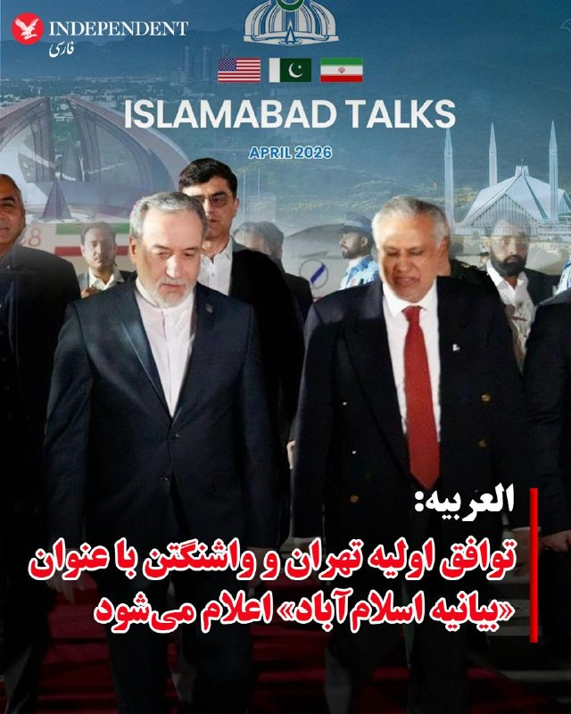

♦️شبکه خبری العربیه، عصر یکشنبه سوم خرداد ماه به نقل از «منابع بلندپایه» گزارش کرد توافق میان تهران و واشنگتن به‌طور انحصاری از سوی پاکستان اعلام خواهد شد و نام آن «بیانیه اسلام‌آباد» خواهد بود.
به گفته این منابع، توافق اولیه میان آمریکا و ایران در قالب یک «تفاهم‌نامه» تنظیم شده و پس از آن مذاکرات درباره دستیابی به توافق نهایی بر سر مسائل مورد اختلاف آغاز خواهد شد.
العربیه به نقل از منابع خود گزارش کرد، مذاکرات مستقیم میان دو تهران و واشنگتن از پنجم ژوئن (پانزدهم خرداد ماه) در اسلام‌آباد آغاز می‌شود.
بر اساس این گزارش، پاکستان بدون نیاز به حضور طرف‌های مذاکره‌کننده، تفاهم‌نامه را اعلام خواهد کرد.
منابع العربیه همچنین اعلام کردند، دو طرف با آغاز مذاکرات درباره توافق نهایی، روسای هیات‌های مذاکره کننده خود را به اسلام‌آباد اعزام خواهند کرد.
‌🇸🇦 Indypersian

🤖 @VahidOOnLine

## VahidOOnLine — post 241971

  <a href="telegram/content/VahidOOnLine_241971_1779644979.mp4" target="_blank">🎬 Download video</a>

تماسی با خانواده جاویدنام مهدی اسکندریان:
«می‌گفت مهدی عاشق ایران بود…
و دختر کوچکش هنوز منتظر برگشتن پدرش به خانه است.»
‌🏁 🇬🇧 ManotoTV

🤖 @VahidOOnLine

## VahidOOnLine — post 241970

  

♦️یک مقام ارشد دولت آمریکا، روز یکشنبه سوم خرداد ماه، به شبکه سی‌ان‌ان گفت توافق میان ایالات متحده و ایران احتمالا امروز امضا نخواهد شد، زیرا جزئیات آن همچنان در حال مذاکره است.
به گفته این مقام، ایران در چارچوب این توافق به‌طور اصولی پذیرفته است که تنگه هرمز را بازگشایی کند و ذخایر اورانیوم با غنای بالای خود را کنار بگذارد.
سی‌ان‌ان به نقل از این مقام ارشد آمریکایی افزود نحوه دقیق کنار گذاشتن ذخایر اورانیوم و همچنین مدت زمان توقف غنی‌سازی در آینده هنوز نهایی نشده و مذاکرات درباره آن ادامه دارد.
این مقام آمریکایی تاکید کرد کاهش تحریم‌ها و آزادسازی دارایی‌های ایران تنها در صورتی انجام خواهد شد که تهران تنگه هرمز را بازگشایی کرده و به تعهدات خود برای مذاکره درباره محدودیت‌های برنامه هسته‌ای‌اش عمل کند.
به گفته این مقام، میزان دقیق منابع مالی‌ای که ایران در قالب این توافق دریافت خواهد کرد نیز هنوز مشخص نشده و همچنان در دست مذاکره است.
دونالد ترامپ، پیشتر در پیامی اعلام کرده بود محاصره علیه ایران تا زمان دستیابی، تایید و امضای توافق، «با قدرت و به طور کامل» ادامه خواهد داشت.
‌🇸🇦 Indypersian

🤖 @VahidOOnLine

## WithYashar — post 12354

الجزیره: یه منبع ایرانی به ما گفته؛ آمریکا داره از چند تا توافق قبلی خودش عقب می‌کشه، مخصوصاً سر آزاد کردن پول‌های بلوکه‌شده ایران و مدل آتش‌بس لبنان؛

تو متن تفاهم‌نامه، اسرائیل میخواد دستش باز بمونه که هر وقت گفت «تهدید حس کردیم» دوباره تو لبنان عملیات بزنه و بهشون حمله کنه، ولی ایران مخالفه و میگه آتش‌بس باید واقعی، کامل و دائمی باشه.

پاکستان پیشنهاد داده فعلاً بخش‌هایی که توافق شده امضا بشه و بقیه اختلافات بعداً حل شه، ولی ایران گفته نه؛ یا همه بندها کامل و تضمینی حل میشه یا کلاً امضایی در کار نیست.
@withyashar

## WithYashar — post 12353

فاکس نیوز نقاط اختلاف در توافق ایران و آمریکا را اعلام کرد:

1. اسرائیل خواستار تضمین «آزادی عمل نظامی» علیه تهدیدها در لبنان است و ایران این را رد می‌کند.

2. تهران خواستار آزادسازی فوری دارایی‌های خود است و واشنگتن امتناع می‌کند و اصرار دارد که این موضوع به فرمول نهایی توافق مرتبط شود.»
@withyashar

## WithYashar — post 12352

جوزالم پست: ایران در اصل با یک توافق آتش‌بس با ایالات متحده موافقت کرده است که بر اساس آن، اورانیوم بسیار غنی‌شده خود را از بین خواهد برد
@withyashar

## WithYashar — post 12351

نعیم قاسم رهبر گروه تروریستی حزب الله:
ایران با رهبری مجتبی خامنه ای آمریکا و اسرائیل را ذلیل کرد
@withyashar 🤣

## WithYashar — post 12350

تسنیم: علیرغم برخی گفتگوهای امروز، کارشکنی‌ های آمریکا در برخی بندهای تفاهم از جمله موضوع آزادسازی اموال بلوکه شده ایران همچنان ادامه دارد و تا این لحظه این موضوعات حل نشده است.

بر این اساس، در حال حاضر همچنان امکان منتفی شدن تفاهم وجود دارد و ایران تاکید کرده است که از خطوط قرمز خود برای احقاق حقوق مردم کوتاه نخواهد آمد
@withyashar

## WithYashar — post 12349

علی هاشم خبرنگار الجزیره: کمتر از ۲۴ ساعت پس از ظهور خوش‌بینی در مورد امکان توافق‌نامه ایران و آمریکا، حال‌وهوای منفی دوباره سر برآورده است.
@withyashar

## WithYashar — post 12348

صداسیما : ترامپ چاره‌ای جز تسلیم شدن ندارد
@withyashar

## mwarmonitor — post 9655

🔸علی هاشم خبرنگار الجزیره:

🔹کمتر از ۲۴ ساعت پس از شکل‌گیری فضای خوش‌بینی درباره احتمال یک تفاهم‌نامه میان ایران و آمریکا، نشانه‌های منفی در حال ظهور است.
🔹یک منبع ایرانی آگاه به من می‌گوید نشانه‌هایی از عقب‌نشینی آمریکا در دو موضوع محوری دیده می‌شود: سازوکار آزادسازی دارایی‌های مسدودشده ایران و دامنه آتش‌بس در لبنان.

🔹به گفته این منبع، تفاهم‌نامه شامل چارچوبی برای آتش‌بس در لبنان است، اما گزارش شده که اسرائیل با این ترتیبات احساس راحتی نمی‌کند و واشنگتن را تحت فشار قرار داده تا بندی اضافه شود که به اسرائیل اجازه دهد به بهانه پاسخ به «هرگونه تهدید»، عملیات نظامی در لبنان انجام دهد. ایران این فرمول‌بندی را رد کرده و بر ضرورت یک آتش‌بس پایدار و ماندگار اصرار دارد.

🔹تهران به همه میانجی‌ها، از جمله پاکستان، اطلاع داده است که تا زمانی که همه بندها به‌طور کامل مورد توافق قرار نگیرند و تضمین نشوند، تفاهم‌نامه را امضا نخواهد کرد. گفته می‌شود پاکستان پیشنهاد داده بخش‌های مورد توافق پیش برود و موارد اختلافی به بعد موکول شود، اما ایران این رویکرد را رد کرده و تأکید کرده است که بندهای مورد اختلاف اساسی و غیرقابل‌چشم‌پوشی هستند.

🔹در مجموع، تصویر کلی نشان می‌دهد که تهران هرچه بیشتر به این جمع‌بندی می‌رسد که واشنگتن در حال عقب‌نشینی از تفاهم‌های اولیه‌ای است که از طریق میانجی‌ها به دست آمده بود.

@mwarmonitor

## mwarmonitor — post 9654

🔴در حالی که مقام‌های آمریکایی خوش‌بین هستند که این توافق ظرف چند روز آینده امضا شود، در عین حال اذعان دارند که هنوز نهایی نشده و همچنان ممکن است فروبپاشد.
«ما در موقعیت بسیار خوبی هستیم، اما راه‌هایی وجود دارد که این توافق می‌تواند تضعیف شود.» — به نقل از Axios

@mwarmonitor

## pm_afshaa — post 91407

  <a href="telegram/content/pm_afshaa_91407_1779644980.webm" target="_blank">🎬 Download video</a>

🔴الجزیره: یه منبع ایرانی به ما گفته؛ آمریکا داره از چند تا توافق قبلی خودش عقب می‌کشه، مخصوصاً سر آزاد کردن پول‌های بلوکه‌شده ایران و مدل آتش‌بس لبنان؛

تو متن تفاهم‌نامه، اسرائیل میخواد دستش باز بمونه که هر وقت گفت «تهدید حس کردیم» دوباره تو لبنان عملیات بزنه و بهشون حمله کنه، ولی ایران مخالفه و میگه آتش‌بس باید واقعی، کامل و دائمی باشه.

پاکستان پیشنهاد داده فعلاً بخش‌هایی که توافق شده امضا بشه و بقیه اختلافات بعداً حل شه، ولی ایران گفته نه؛ یا همه بندها کامل و تضمینی حل میشه یا کلاً امضایی در کار نیست.

💧 Rainbet.com the #1 Non-KYC Crypto Casino & Sportsbook @rainbetcom

😁 @Pm_Afshaa

## pm_afshaa — post 91406

  <a href="telegram/content/pm_afshaa_91406_1779644981.webm" target="_blank">🎬 Download video</a>

🔴سناتور لیندسی گراهام:
اگه این مذاکرات با ایران باعث بشه عربستان، قطر و پاکستان هم وارد توافق ابراهیم بشن، این میتونه یکی از بزرگ‌ترین و مهم‌ترین توافق‌های تاریخ خاورمیانه باشه؛ پیوستن این کشورها به توافق ابراهیم، کل منطقه و حتی دنیا رو متحول می‌کنه و این یه حرکت فوق‌العاده از طرف ترامپه.

💧 Rainbet.com the #1 Non-KYC Crypto Casino & Sportsbook @rainbetcom

😁 @Pm_Afshaa

## pm_afshaa — post 91405

  <a href="telegram/content/pm_afshaa_91405_1779644981.webm" target="_blank">🎬 Download video</a>

🔴یک مقام ارشد دولت آمریکا به فاکس‌نیوز:
شاهد انعطاف‌هایی از سمت تهران هستیم که قبلا ندیده بودیم.

💧 Rainbet.com the #1 Non-KYC Crypto Casino & Sportsbook @rainbetcom

😁 @Pm_Afshaa

## pm_afshaa — post 91404

  <a href="telegram/content/pm_afshaa_91404_1779644982.webm" target="_blank">🎬 Download video</a>

🔴روبیو، وزیر خارجه آمریکا:
این که ترامپ ممکنه با توافقی موافقت کنه که در نهایت موقعیت جمهوری اسلامی رو در برنامه هسته‌ای تقویت کنه، با توجه به مواضع و اقداماتی که تاکنون ازش دیدیم، کاملا مضحکه.

💧 Rainbet.com the #1 Non-KYC Crypto Casino & Sportsbook @rainbetcom

😁 @Pm_Afshaa

## iaghapour — post 2629

  

💠 Mega Center 💠

🪩📈 ابزار مورد نیاز شما در دنیای کریپتو و تریدینگ / احراز هویت پلتفرم های خارجی

از افتتاح حساب های ارزی بین المللی
تا پکیج مدارک لازم جهت احراز هویت صرافی ها و سایت های خارجی
صدور مستر کارت و ویزا کارت و خدمات
ارزی
سیم کارت های فیزیکی خارجی
خدمات وریفای تضمینی صرافی ها ، سایت های فریلنسری و گیمینگ
اکانت های اماده دیتاسنترها
آیپی رزیدنتال اختصاصی
اشتراک ویندسکرایب و ...

👨‍💻لینک دسترسی ها و ارتباط :
www.megacenterx.com      
www.megacenterx.com
www.megacenterx.com

https://t.me/megacenter0
https://t.me/megacenter0

@Megav_admin22
@Megav_admin22

در صورت بالا نیامدن سایت ، بدون وی پی ان امتحان نمایید ✅
سایت دارای اینماد و درگاه پرداخت اختصاصی و کریپتو ✅

## iaghapour — post 2628

  

⭕️ آپدیت جدید کلاینت اندروید GooseRelayVPN

🔹این مخزن، کلاینت اندروید GooseRelayVPN است که هسته GooseRelay را از طریق Go mobile اجرا می‌کند و رابط کاربری کامل برای مدیریت VPN، پروفایل‌ها، لاگ‌ها و تنظیمات ارائه می‌دهد.

🛠 پایداری و رفع کرش

‏🌐 رفع کامل لو رفتن آی‌پی (IPv6 Leak) با موتور جدید tun2socks gVisor FakeDNS.

‏🎛 پیاده‌سازی کامل Quick Settings Tile.

‏📊 نمایش کاملاً دقیق سرعت و حجم مصرفی.

‏🗂 اضافه شدن حالت Bypass به بخش Split-Tunneling.

‏❄️ رفع فریز شدن برنامه در پس‌زمینه.

‏📜 اصلاح پرش ناگهانی اسکرول لاگ‌ها و بازطراحی کارت وضعیت اتصال در صفحه Home

🔗 اطلاعات بیشتر در گیت‌هاب پروژه

🆔 @iAghapour

## DEJradio — post 4923

  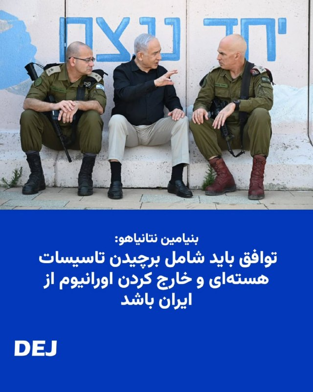

🔸
⭕️ بنیامین نتانیاهو می‌گوید با دونالد ترامپ توافق دارند هر توافق نهایی با حکومت ایران باید تهدید هسته‌ای رژیم را به‌طور کامل برطرف کند؛ از جمله با برچیدن تأسیسات غنی‌سازی و خروج مواد غنی‌شده از ایران. او تاکید کرد سیاست مشترک آن‌ها این است که ایران نباید به سلاح هسته‌ای دست یابد.
به گفته یک مقام ارشد اسرائیلی، ترامپ، در تماس تلفنی با بنیامین نتانیاهو تلاش کرده او را مطمئن کند که توافق نهایی با ایران به‌طور کامل برنامه هسته‌ای تهران را برچیده خواهد کرد.

#اسرائیل #مذاکرات
@DEJradio

## kianmeli1 — post 87639

  

🔴علی هاشم از الجزیره:کمتر از 24 ساعت پس از ظهور خوش‌بینی‌ها درباره احتمال امضای یک یادداشت تفاهم بین ایران و آمریکا، احساسات منفی در حال بروز است. یک منبع مطلع ایرانی به من می‌گوید نشانه‌هایی از عقب‌نشینی آمریکا در دو موضوع اصلی وجود دارد: مکانیزم آزادسازی دارایی‌های ایران و دامنه آتش‌بس در لبنان.
https://t.me/kianmeli1

## IranIntlTV — post 338798

  <a href="telegram/content/IranIntlTV_338798_1779644984.mp4" target="_blank">🎬 Download video</a>

محسن رضایی، مشاور نظامی مجتبی خامنه‌ای، در یک سخنرانی در مصلای تهران، با اشاره به اینکه کاری خواهند کرد که «امنیت» کشور برای ۵۰ سال آینده تأمین شود، خطاب به مقام‌های آمریکایی گفت: «در صورت تعرض به تنگه هرمز و ورود به خلیج‌ فارس، محاصره دریایی را خواهیم شکست و پاسخی سخت، دردناک و کم‌نظیر به آمریکا خواهیم داد.»

او در ادامه، آمریکا را به خروج جمهوری اسلامی از معاهده «ان‌پی‌تی» تهدید کرد و گفت دست به خودکشی نزند.
@iranintltv

## IranIntlTV — post 338797

  

وزارت آموزش‌وپرورش اخبار منتشرشده درباره مجازی شدن امتحانات نهایی را تکذیب و اعلام کرد تاکنون هیچ تصمیمی برای برگزاری مجازی امتحانات نهایی پایه‌های یازدهم و دوازدهم گرفته نشده است.

وزارت آموزش‌وپرورش اعلام کرد تا تیرماه برای فراهم شدن شرایط برگزاری امتحانات نهایی صبر می‌شود و در صورت فراهم شدن امکان برگزاری حضوری، آزمون‌های نهایی مطابق روال معمول به شکل حضوری برگزار خواهد شد.

در روزهای اخیر، دانش‌آموزان در چندین شهر به برگزاری حضوری امتحانات اعتراض کردند.
https://iranintl.com/202605241771

## IranIntlTV — post 338795

  <a href="telegram/content/IranIntlTV_338795_1779644986.mp4" target="_blank">🎬 Download video</a>

سی‌بی‌اس نیوز گزارش داد واشینگتن بر این باور است که رهبر جمهوری اسلامی الگوی کلی پیش‌نویس توافق با آمریکا را تایید کرده است.

کاخ سفید اعلام کرد توافق هنوز نهایی نشده است و بنیامین نتانیاهو نیز گفت با دونالد ترامپ توافق کرده هرگونه توافق نهایی با ایران باید تهدید هسته‌ای را از میان بردارد.

گفت‌وگو با روح‌الله رحیم‌پور، تحلیل‌گر سیاسی، و اشکان صفایی و مرضیه حسینی، خبرنگاران ایران‌اینترنشنال
@iranintltv

## IranIntlTV — post 338794

  

ارتش اسرائیل اعلام کرد ایال زمیر، رییس ستاد کل ارتش این کشور، پس از ارزیابی وضعیت میدانی، طرح‌های ادامه عملیات علیه حزب‌الله در لبنان را تایید کرده است.

زمیر گفت ارتش اسرائیل تحولات منطقه را به‌دقت زیر نظر دارد و آماده است فورا به درگیری‌های شدید بازگردد و حکومت «تروریستی» ایران و توانمندی‌های آن را بیش از پیش تضعیف کند.

او افزود: «امروز طرح‌های ادامه نبرد در جبهه شمالی را تصویب کردم و مصمم هستیم ضربات به حزب‌الله را عمیق‌تر کنیم.»
https://iranintl.com/202605240944

## IranIntlTV — post 338793

  

لیندزی گراهام، سناتور جمهوریخواه در پیامی در شبکه ایکس نوشت: «اگر در نتیجه مذاکرات برای پایان دادن به درگیری با ایران، متحدان عرب و مسلمان آمریکا در منطقه به توافق‌های ابراهیم بپیوندند، این توافق می‌تواند به یکی از مهم‌ترین تحولات تاریخ خاورمیانه تبدیل شود.»

او افزود پیوستن عربستان سعودی، قطر و پاکستان به توافق‌های ابراهیم تحولی بزرگ برای منطقه و جهان خواهد بود و این اقدام را حرکتی درخشان از سوی رییس جمهور ترامپ توصیف کرد.
https://iranintl.com/202605241273

## IranIntlTV — post 338792

  <a href="telegram/content/IranIntlTV_338792_1779644988.mp4" target="_blank">🎬 Download video</a>

هم‌زمان با مطرح شدن احتمال توافق میان تهران و واشینگتن، موج واکنش‌ها در اسرائیل افزایش یافته است. بنیامین نتانیاهو با اعلام نگرانی‌های خود به دونالد ترامپ، بر آزادی عمل اسرائیل در همه جبهه‌ها، به‌ویژه لبنان، تاکید کرده است.

گفت‌وگو با مئیر جاودانفر، تحلیل‌گر مسائل اسرائیل
@iranintltv

## Shin_Persian — post 6209

Faytuks Network ✓ @FaytuksNetwork
Sun, 24 May 2026 17:14:53 UTC

IRGC-linked Tasnim News warns the Iran-US agreement may be cancelled due to US obstruction of some clauses.

فارسی

خبرگزاری تسنیم وابسته به سپاه پاسداران انقلاب اسلامی (IRGC) هشدار داد که توافق ایران و ایالات متحده ممکن است به دلیل کارشکنی آمریکا در برخی بندها لغو شود.

𝕏 · @shin_persian

## ManotoTV — post 105810

  <a href="telegram/content/ManotoTV_105810_1779644990.mp4" target="_blank">🎬 Download video</a>

تماسی با خانواده جاویدنام مهدی اسکندریان:
«می‌گفت مهدی عاشق ایران بود…
و دختر کوچکش هنوز منتظر برگشتن پدرش به خانه است.»

## FarsiVOA — post 218550

بررسی شیوع بیماری ابولا در گفتگو با دکتر کیوان زندی متخصص ویروس شناسی

## FarsiVOA — post 218549

رونمایی از موشک قاره پیمای هایپرسونیک ترکیه در گفت‌وگو با ناصر باباخانی تحلیل‌گر سیاسی و مدرس در کالج نووا

## FarsiVOA — post 218548

تنگه هرمز ابزار چانه زنی جمهوری اسلامی در گفت‌وگو با صالح کامرانی کارشناس حقوق بین‌الملل

## FarsiVOA — post 218547

سرنوشت اروانیوم غنی شده در صورت امضای تفاهم نامه صلح بین امریکا و جمهوری اسلامی در گفتگو با احمد وخشیته پژوهشگر دانشگاه دوستی بین ملتها

## FarsiVOA — post 218546

در شرایطی که تنش‌های خاورمیانه و نگرانی درباره تنگه هرمز بالا گرفته، کی‌یر استارمر از توافق احتمالی آمریکا و ایران حمایت کرده و همزمان تلاش‌های دولتش برای نزدیک‌تر شدن به اتحادیه اروپا هم بیشتر شده؛ از همکاری‌های امنیتی و دفاعی تا هماهنگی بر سر بحران‌های منطقه‌ای و اقتصادی

## FarsiVOA — post 218545

🔺آکسیوس: کاخ سفید معتقد است نهایی شدن توافق با جمهوری اسلامی احتمالا چند روز طول می‌کشد

◾️وبسایت خبری آکسیوس روز یکشنبه ۳ خرداد به نقل از «یک مقام ارشد آمریکایی» گزارش داد کاخ سفید انتظار ندارد توافق با جمهوری اسلامی، در روز یکشنبه نهایی شود و رسیدن به مرحله نهایی احتمالا چند روزی بیشتر طول می‌کشد.

⬇️ بیشتر بخوانید:

https://ir.voanews.com/a/8153325.html

## DW_Farsi — post 125104

  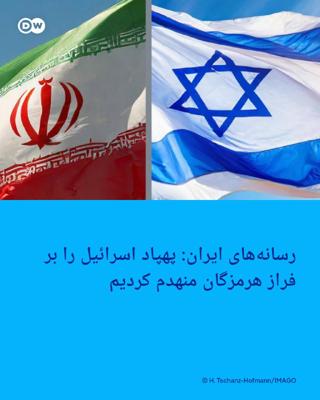

🔶 رسانه‌های ایران: پهپاد اسرائیل را بر فراز هرمزگان منهدم کردیم

رسانه‌های ایران از رهگیری و انهدام یک فروند پهپاد اسرائيلی در آسمان هرمزگان خبر داده‌اند.

ویدئویی نیز روز یکشنبه سوم خرداد در رسانه‌ها از سوی خبرگزاری صداوسیما منتشر شده که در آن خبرنگار ظاهرا قطعات این پهپاد سرنگون‌شده را نشان می‌دهد.

خبرگزاری مهر با انتشار این خبر مدعی شد که نیروهای پدافند هوایی منطقه جنوب شرق، یک فروند پهپاد اربیتر اسرائيلی را "بر فراز آسمان هرمزگان متلاشی کردند".

در این خبر ادعا شده که این پهپاد "کاربری جاسوسی و شناسایی داشت و با شلیک پدافند ارتش سرنگون شد".

در توضیح خبر هم آمده است: «پهپاد اربیتر رادارگریز است و با سامانه ویژه‌ای هدف قرار گرفت که مشخصات آن را مسئولان منطقه عملیاتی پدافند جنوب شرق کشور، مستقر در بندرعباس اعلام نمی‌کنند.»

به ادعای این خبرگزاری مسئولان پدافند گفته‌اند که "با این سامانه، هیچ پهپاد رادارگریزی نمی‌تواند به آسمان منطقه ماموریت، از خلیج فارس و جزایر تا سراسر منطقه جنوب و جنوب شرق کشور نفوذ کند".
@dw_farsi

## DW_Farsi — post 125103

  

🔶 پزشکیان: در مذاکره از عزت و سربلندی کشور کوتاه نمی‌‌آییم

رئیس‌ جمهور ایران در گفت‌وگو با خبرنگار صداوسیما با اشاره به مذاکرات جاری با آمریکا برای پایان بخشیدن به جنگ گفت، مذاکره‌کنندگان ایران آماده‌اند به دنیا این اطمینان را بدهند که جمهوری اسلامی "به دنبال سلاح هسته‌ای نیست".

مسعود پزشکیان در این سخنان در روز یکشنبه سوم خرداد گفت: «قطعا ما و تیم مذاکره‌کننده به هیچ‌وجه از عزت و سربلندی کشور کوتاه نخواهیم آمد.»

او مدعی شد که جمهوری اسلامی به "دنبال ناآرامی در منطقه نیست" و این اسرائيل است که "ناآرام‌کننده منطقه است و به دنبال نقشه بزرگ اسرائيل است.»

دونالد ترامپ، رئیس‌ جمهور آمریکا نیز در همین روز ادعای پزشکیان در مورد این که جمهوری اسلامی پیگیر "رسیدن به سلاح هسته‌ای" و "بی‌ثبات کردن منطقه" نیست را در شبکه تروث سوشال خود بازنشر کرد.
@dw_farsi

## Persian_Trend_Official — post 14876

  

🔴 اختلال GPS همچنان ایران و کشورهای عربی خلیج فارس را درگیر کرده است

▪️ طی هفته گذشته سیگنال‌های GPS و ناوبری ماهواره‌ای در بخش‌هایی از ایران، عراق، کویت، امارات و مسیرهای کشتیرانی خلیج فارس با اختلال شدید مواجه شده‌اند
▪️ گزارش‌ها از افزایش جنگ الکترونیک و اختلال در ناوبری کشتی‌ها و پهپادها خبر می‌دهند
▪️ برخی کشتی‌ها در تنگه هرمز موقعیت‌های جعلی ثبت کرده‌اند و خطر برخورد دریایی افزایش یافته است

🫆:Tony

📌 @persian_trend_official
پرشین ترند | متفاوت‌ترین کانال نظامی

## Persian_Trend_Official — post 14875

  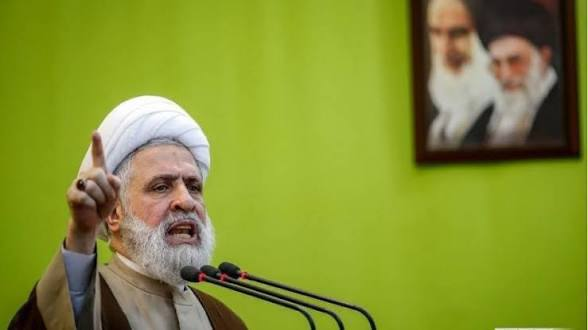

🔴 نعیم قاسم خواستار حضور مردم در خیابان‌ها شد

«نعیم قاسم» دبیرکل حزب الله در اظهاراتی جنجالی از مردم خواست به خیابان‌ها بیایند و دولت لبنان را سرنگون کنند.

♦️این موضع‌گیری در شرایطی مطرح می‌شود که:

▪️ فشارها بر حزب‌الله در جریان مذاکرات منطقه‌ای و توافق احتمالی ایران و آمریکا افزایش یافته است
▪️ اختلافات داخلی لبنان بر سر نقش حزب‌الله و آینده درگیری با اسرائیل شدت گرفته
▪️ برخی گزارش‌ها حاکی از نگرانی حزب‌الله نسبت به محدودشدن آزادی عملش در توافق‌های در حال مذاکره است
🫆:Tony

📌 @persian_trend_official
پرشین ترند | متفاوت‌ترین کانال نظامی

## Persian_Trend_Official — post 14874

🔴 i24NEWS: نگرانی شدید اسرائیل از توافق در حال شکل‌گیری میان آمریکا و ایران

💢شبکه i24NEWS گزارش داد مقام‌های ارشد امنیتی اسرائیل به‌طور فزاینده‌ای نگران توافق احتمالی میان آمریکا و ایران هستند و آن را «بسیار بد» برای اسرائیل توصیف می‌کنند.

🔻بر اساس این گزارش:

▪️ مقام‌های اسرائیلی معتقدند توافق فعلی نه برنامه هسته‌ای ایران را به‌طور کامل مهار می‌کند و نه تهدید موشکی تهران را حل می‌کند
▪️ آن‌ها تأکید کرده‌اند جنگ فقط به‌دلیل مسئله هسته‌ای آغاز نشده بود، بلکه برنامه موشکی ایران نیز یکی از اهداف اصلی محسوب می‌شد
▪️ از نگاه تل‌آویو، تفاهم‌های فعلی هیچ راه‌حل واقعی برای این موضوع ارائه نمی‌دهد

🔻در خصوص لبنان نیز:

▪️ وضعیت «غیرقابل‌قبول» توصیف شده است
▪️ مقام‌های اسرائیلی هشدار داده‌اند اسرائیل نمی‌تواند در شرایطی ادامه دهد که آزادی عمل ارتش اسرائیل در لبنان محدود شود
▪️ نگرانی اصلی تل‌آویو، محدودشدن حملات پیش‌دستانه علیه حزب‌الله است
🫆:Tony

📌 @persian_trend_official
پرشین ترند | متفاوت‌ترین کانال نظامی

## Persian_Trend_Official — post 14873

🔴 کانال ۱۲ اسرائیل: دو مانع اصلی در توافق ایران و آمریکا باقی مانده است

♦️کانال ۱۲ اسرائیل مدعی شد هنوز دو نقطه اختلاف اصلی میان تهران و واشینگتن در مذاکرات باقی مانده است:

▪️ اسرائیل خواهان دریافت تضمین برای «آزادی عمل نظامی» علیه تهدیدات در لبنان است، اما ایران با این مسئله مخالفت می‌کند
▪️ تهران خواستار آزادسازی فوری دارایی‌های بلوکه‌شده خود است، اما آمریکا اصرار دارد این موضوع به توافق نهایی و اجرای کامل تعهدات گره بخورد

◼️این گزارش با روایت‌های قبلی درباره اختلافات مربوط به لبنان همخوانی دارد؛ جایی که اسرائیل تلاش می‌کند حق انجام حملات پیش‌دستانه علیه حزب‌الله را حفظ کند.

همزمان:
▪️ ایران ظاهراً تلاش می‌کند هرگونه توافق شامل توقف حملات علیه حزب‌الله و محدودشدن آزادی عمل اسرائیل در لبنان باشد.
در موضوع دارایی‌ها نیز:

▪️ ایران به‌دنبال دریافت فوری بخشی از منابع مالی بلوکه‌شده به‌عنوان «نشانه حسن نیت» است
▪️ واشینگتن نگران است آزادسازی فوری پول‌ها بدون پیشرفت واقعی در پرونده هسته‌ای، اهرم فشار آمریکا را از بین ببرد

🫆:Tony

📌 @persian_trend_official
پرشین ترند | متفاوت‌ترین کانال نظامی

## IranianMinds — post 20689

  <a href="telegram/content/IranianMinds_20689_1779644994.mp4" target="_blank">🎬 Download video</a>

فکر کنم بادیگاردش داشت میگفت: تموم کن این چرندیاتو دلقک😂

@IranianMinds

## BBCPersian — post 281961

  <a href="https://t.me/bbcpersian/281961" target="_blank">📎 Download file</a>

پادکست جام جهان‌نما، یکشنبه ۳ خرداد ۱۴۰۵
این برنامه رادیویی را می‌توانید هرشب ساعت ۲۰ به وقت ایران، روی موج متوسط ۷۰۲ کیلوهرتز و موج کوتاه ۹۴۶۵ کیلوهرتز بشنوید. تکرار برنامه را هم می‌توانید ساعت ۲۱:۳۰ روی موج متوسط ۷۰۲ کیلوهرتز و موج کوتاه ۵۳۹۵ کیلوهرتز گوش کنید
@bbcpersian

## BBCPersian — post 281960

  <a href="telegram/content/BBCPersian_281960_1779644995.mp4" target="_blank">🎬 Download video</a>

🔻گروهی از فعالان در اسپانیا امروز در بیلبائو در ایالت شمالی باسک، در محکومیت خشونت پلیس این کشور علیه چند نفر از سرنشینان ناوگان آزادی فلسطین که دیروز در فرودگاه این شهر صورت گرفت، تظاهرات کردند.

تظاهرکنندگان با شعارهای حمایتی از فلسطین، خواستار پاسخگویی مقام‌های اسپانیا و توقف برخورد خشن با کنشگران شدند.

این تجمع همچنین برای همبستگی با ناوگان آزادی فلسطین و در اعتراض به آنچه سرکوب فعالان خوانده می‌شود، برگزار شد. پلیس اسپانیا دیروز با چند فعال ناوگان آزادی فلسطین پس از بازگشت، در فرودگاه بیلبائو درگیر شد و تصاویر کتک زدن آنها واکنش‌های بسیاری را برانگیخت.

کشتی کمک‌رسانی فعالان ناوگان آزادی فلسطین در مسیر غزه در آب‌های بین‌المللی دریای مدیترانه نزدیک قبرس توسط نیروهای اسرائیلی توقیف و پس از انتقال به اسرائیل، در آنجا برای مدتی بازداشت شدند. بعضی از اعضای این گروه پس از اخراج گفتند که در زمان بازداشت در اسرائیل مورد شکنجه و آزار جسمی و جنسی قرار گرفته‌اند.

https://bbc.in/4e2Wh0I
🎥 Reuters
@BBCPersian

## Dirty_Kids — post 390094

ابرتورم اینجوریه که

خونه‌ت ۱۰ میلیارده
ماشینت ۳ میلیارد
یخچالت نیم میلیارد
ماشین لیاسشویی و ظرفشویی هرکدوم ۲۰۰-۳۰۰ میلیون
کامپیوترت ۱۰۰ میلیون
مبل خونه ۷۰ میلیون

ولی حقوقت ماهی ۳۰ میلیون!
و تو با این حقوق، حتی هزینه تعمیرات اون بالاییها رو هم نمیتونی بدی!

@Dirty_Kids 👻

## Dirty_Kids — post 390093

  <a href="telegram/content/Dirty_Kids_390093_1779644997.mp4" target="_blank">🎬 Download video</a>

قحبه‌ ما پول کانفیگ نداریم بدیم ریدم تو محتوایی که میسازی

@Dirty_Kids 👻

## Dirty_Kids — post 390092

  <a href="https://t.me/Dirty_Kids/390092" target="_blank">📎 Download file</a>

✅ اپلیکیشن اندروید سایت جهانی دربی بت

💰اولین سایت جهانی با امکان شارژ و برداشت ریالی(کارت به کارت)

🔗 برای ورود فیلترشکن روی کشور مناسب قرار دهید مانند فنلاند و المان و....

😀Telegram Channel
👇
https://t.me/+bcynkEgSW2dlYTc0

## Dirty_Kids — post 390091

  

😤دنبال یه سایت شرط بندی بین المللی بودی که به ایرانیا خدمات بده؟!
⛔

👍دربی بت همون انتخاب  100%

💎ویژگی های سایت جهانی Derby Bet:

⬅️امکان شارژ امن با کارت بانکی

⬅️واریز اول دوبل شارژ می شوید(بونوس۱۰۰٪)

⬅️پر اپشن ترین سایت فعال در ایران

⬅️تسویه حساب کمتر از 5 دقیقه

⬅️برگشت بخشی از باخت به صورت هفتگی

🚨کد هدیه ثبت نام:GG007

⚠️برای دانلود اپلکیشن کلیک کنید
👉

🔔کانال دربی بت :

🪙https://t.me/+bcynkEgSW2dlYTc0

## Dirty_Kids — post 390090

  <a href="telegram/content/Dirty_Kids_390090_1779644998.mp4" target="_blank">🎬 Download video</a>

ویدیو وایرال شده از چت‌های علی کریمی

+ اکانتش از اول دست وحید اسماعیلی (لیدر استادیوم) بوده چیز جدیدی نیست
از همون موقع که ایلان ماسک این قابلیت رو اضافه کرد فوتبالیای پیگیر میدونستن

یه عده معتقد تهدید شده یه عده میگن از اول پروژه بوده، یه عده میگن فازش اینه ساید عوض میکنه، یه عده هم طرفدار داره


@Dirty_Kids 👻

## Dirty_Kids — post 390089

  

جلال رشیدی کوچی، نماینده سابق مجلس:

فکر میکنم ظرف 48 الی 72 ساعت آینده، اینترنت به حالت قبل جنگ برمیگرده — دیگه بخواد خیلی طول بکشه تا آخر هفته اینترنت بین‌الملل وصل میشه.

@Dirty_Kids 👻

## Hranews — post 113138

تعدیل ۸ کارگر پتروشیمی ماهشهر پس از پیگیری مطالبات صنفی

❗️
❗️
❗️
❗️
❗️ – هشت تن از #کارگران پتروشیمی ماهشهر پس از پیگیری مطالبات صنفی، از جمله اعتراض به کسر مزایای مزدی، توسط کارفرما از کار اخراج شدند.

ادامه مطلب

↘️
@hranews_bot تماس ✉️ -  @Hranews  کانال هرانا 🆑

## manototv — post 105810

  <a href="telegram/content/manototv_105810_1779645000.mp4" target="_blank">🎬 Download video</a>

تماسی با خانواده جاویدنام مهدی اسکندریان:
«می‌گفت مهدی عاشق ایران بود…
و دختر کوچکش هنوز منتظر برگشتن پدرش به خانه است.»

## alonews — post 122402

  <a href="telegram/content/alonews_122402_1779645002.webm" target="_blank">🎬 Download video</a>

👈اولیانوف: برچیدن برنامه هسته‌ای ایران خلاف ان‌پی‌تی است

✅ @AloNews خبر جنگ

## alonews — post 122401

  <a href="telegram/content/alonews_122401_1779645002.webm" target="_blank">🎬 Download video</a>

👈 یه مقام ارشد دیگه هم به Axios گفته :
شرایط خوبه ولی هنوز راه‌هایی هست ممکنه توافق خراب بشه

✅ @AloNews خبر جنگ

## alonews — post 122400

  <a href="telegram/content/alonews_122400_1779645002.webm" target="_blank">🎬 Download video</a>

👈عارف: حتی‌الامکان خاموشی نخواهیم داشت

✅ @AloNews خبر جنگ

## alonews — post 122398

  

🌟 اشتراک v2ray

🗯گیگی 120,000 تومان

🔗لینک ساب برا چک کردن مصرف و حجمتون

🔥سرعت و کیفیت بالا

✅ پشتیبانی دائم

📱جهت خرید : @v2safeBot

## alonews — post 122397

  <a href="telegram/content/alonews_122397_1779645003.webm" target="_blank">🎬 Download video</a>

👈ادعای واشنگتن‌تایمز: آمریکا و ایران پیش‌نویس توافق صلح را ظرف ۲۴ ساعت آینده اعلام می‌کنند

✅ @AloNews خبر جنگ

## alonews — post 122396

  <a href="telegram/content/alonews_122396_1779645003.webm" target="_blank">🎬 Download video</a>

👈 آخرین قیمت نفت ۱۰۳.۵۴ دلار

✅ @AloNews خبر جنگ

## alonews — post 122395

  <a href="telegram/content/alonews_122395_1779645003.webm" target="_blank">🎬 Download video</a>

👈کانال ۱۲ اسرائیل هم اختلافات بین ایران و آمریکا رو تایید کرد

✅ @AloNews خبر جنگ

## alonews — post 122394

  <a href="telegram/content/alonews_122394_1779645003.webm" target="_blank">🎬 Download video</a>

👈فاکس نیوز نقاط اختلاف در توافق ایران و آمریکا را اعلام کرد:

🔴1. اسرائیل خواستار تضمین «آزادی عمل نظامی» علیه تهدیدها در لبنان است و ایران این را رد می‌کند.

🔴2. تهران خواستار آزادسازی فوری دارایی‌های خود است و واشنگتن امتناع می‌کند و اصرار دارد که این موضوع به فرمول نهایی توافق مرتبط شود.»

✅ @AloNews خبر جنگ

## alonews — post 122393

  <a href="telegram/content/alonews_122393_1779645003.webm" target="_blank">🎬 Download video</a>

👈پسر ترامپ: پدرم بهم قول داده نزاره ایران به سلاح هسته‌ای برسه

✅ @AloNews خبر جنگ

## alonews — post 122392

  <a href="telegram/content/alonews_122392_1779645004.webm" target="_blank">🎬 Download video</a>

👈 جوزالم پست: ایران در اصل با یک توافق آتش‌بس با ایالات متحده موافقت کرده است که بر اساس آن، اورانیوم بسیار غنی‌شده خود را از بین خواهد برد

✅ @AloNews خبر جنگ

## alonews — post 122391

  <a href="telegram/content/alonews_122391_1779645004.webm" target="_blank">🎬 Download video</a>

👈خبرنگار الجزیره: حملات هوایی اسرائیل شهرهای شرقیه، کوثریات الروز و زوتر الشرقیه در جنوب لبنان را هدف قرار داد

✅ @AloNews خبر جنگ

---
📅 بروزرسانی: 1405/03/03 20:19
---

## VahidOOnLine — post 241969

  

لیندزی گراهام، سناتور جمهوریخواه در پیامی در شبکه ایکس نوشت: «اگر در نتیجه مذاکرات برای پایان دادن به درگیری با ایران، متحدان عرب و مسلمان آمریکا در منطقه به توافق‌های ابراهیم بپیوندند، این توافق می‌تواند به یکی از مهم‌ترین تحولات تاریخ خاورمیانه تبدیل شود.»

گراهام در ادامه از ترامپ خواست در مسیر دستیابی به توافق با جمهوری اسلامی بر مواضع خود پافشاری کند و هم‌زمان بر پیوستن عربستان سعودی و دیگر کشورهای منطقه به توافق‌های ابراهیم به‌عنوان بخشی از مذاکرات تاکید داشت.
‌🏁 🇬🇧 IranintlTV

🤖 @VahidOOnLine

## VahidOOnLine — post 241968

  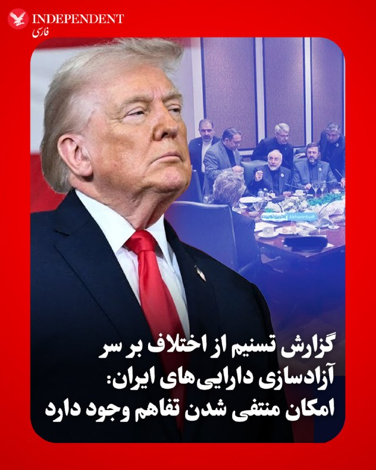

♦️خبرگزاری تسنیم، وابسته به سپاه پاسداران، عصر یکشنبه سوم خرداد ماه در گزارشی نوشت: « علیرغم برخی گفتگوهای امروز، کارشکنی‌های آمریکا در برخی بندهای تفاهم از جمله موضوع آزادسازی اموال بلوکه شده ایران همچنان ادامه دارد و تا این لحظه این موضوعات حل نشده است.»
تسنیم با طرح این خبر نوشت: «در حال حاضر همچنان امکان منتفی شدن تفاهم وجود دارد و ایران تاکید کرده است که از خطوط قرمز خود برای احقاق حقوق مردم کوتاه نخواهد آمد.»
این خبر از این رسانه حکومتی در حالی منتشر می‌شود که ترامپ پیش‌تر در پیامی روابط واشنگتن و تهران را «در حال حرفه‌ای‌ و سازنده‌تر شدن» توصیف کرده بود.
‌🇸🇦 Indypersian

🤖 @VahidOOnLine

## VahidOOnLine — post 241967

  <a href="telegram/content/VahidOOnLine_241967_1779641366.mp4" target="_blank">🎬 Download video</a>

♦️هزاران گلبرگ گل سرخ رز ظهر یکشنبه سوم خرداد ماه، از دهانه گنبد پانتئون در رم بر سر بازدیدکنندگان از این معبد دوهزار ساله سرازیر شد. این آیین سنتی هر سال هم‌زمان با «عید پنطیکاست» (Pentecost) در این بنای تاریخی برگزار می‌شود.

در این مراسم، نیروهای آتش‌نشانی ایتالیا گلبرگ‌ها را از بالای گنبد پانتئون به داخل بنا رها می‌کنند تا در میان نور طبیعی و آواز گروه کر، فضای داخلی این معبد باستانی را بپوشاند.
این سنت مذهبی به نزول روح‌القدس بر حواریون حضرت عیسی، پنجاه روز پس از رستاخیز او، اشاره دارد. واژه «پنطیکاست» نیز در زبان یونانی به معنای «پنجاهمین» است.
به گزارش حساب رسمی معبد پانتئون، گلبرگ‌های سرخ در این آیین نماد «زبان‌های آتش» هستند که در کتاب اعمال رسولان از آن‌ها یاد شده و به باور مسیحیان، نشانه نور، ایمان و آغاز گسترش پیام مسیحیت در جهان به شمار می‌روند.
پانتئون (Pantheon) یکی از مشهورترین بناهای تاریخی رم در ایتالیاست. معبدی باستانی که حدود دوهزار سال پیش در دوران امپراتوری روم ساخته شد و امروز یکی از سالم‌ترین بناهای باقی‌مانده از روم باستان به شمار می‌رود.
‌🇸🇦 Indypersian

🤖 @VahidOOnLine

## VahidOOnLine — post 241966

  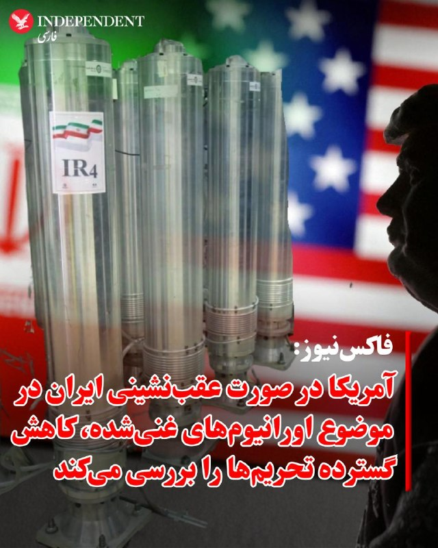

♦️یک مقام ارشد دولت دونالد ترامپ روز یکشنبه سوم خرداد ماه به فاکس‌نیوز گفت واشنگتن در صورت ارائه امتیازهایی از سوی تهران در موضوع اورانیوم‌های غنی‌شده، ممکن است «امتیازهای قابل توجهی» در زمینه کاهش تحریم‌ها به ایران بدهد.

این مقام آمریکایی گفت: «اگر ایرانی‌ها در موضوع غنی‌سازی امتیازهای قابل توجهی بدهند، ما نیز در زمینه کاهش تحریم‌ها متقابل عمل خواهیم کرد.»

این مقام کاخ سفید به فاکس نیوز گفت طرح واشنگتن شامل رسیدگی به «تمام ذخایر مواد غنی‌شده ایران» است و تاکید کرد آمریکا شاهد «امتیازهای جدی» از سوی تهران در این زمینه بوده؛ امتیازهایی که به گفته او پیش‌تر مشاهده نشده بود.

این مقام همچنین گزارش‌ها درباره احتمال امضای توافق در روز یکشنبه را کم‌اهمیت خواند و گفت ساختار تصمیم‌گیری در جمهوری اسلامی «به اندازه کافی سریع حرکت نمی‌کند.»

او در ادامه با اشاره به موضوع تنگه هرمز گفت آمریکا با هرگونه دریافت عوارض برای عبور از این آبراه مخالف است و افزود: «موضع ما کاملا روشن است. ما فکر نمی‌کنیم دریافت عوارض، نتیجه‌ای قابل قبول باشد.»
‌🇸🇦 Indypersian

🤖 @VahidOOnLine

## VahidOOnLine — post 241965

  

دونالد ترامپ جونیور، پسر ارشد رئیس‌جمهور آمریکا، در شبکه ایکس نوشت: این یک پیروزی بزرگ برای آمریکا است. ما باید کسانی را که هرگز راضی نمی‌شوند مگر با تهاجم زمینی به ایران، نادیده بگیریم. پدر من وعده داده بود که مانع دستیابی ایران به سلاح هسته‌ای شود و دقیقا در حال تحقق همین هدف است.
‌🏁 🇬🇧 IranintlTV

🤖 @VahidOOnLine

## VahidOOnLine — post 241964

  <a href="telegram/content/VahidOOnLine_241964_1779641368.mp4" target="_blank">🎬 Download video</a>

وزیران خارجه ۱۹ کشور عربی و اسلامی در بیانیه‌ای مشترک، اقدام منطقه موسوم به «سومالی‌لند» در افتتاح «سفارت» در اورشلیم را به‌شدت محکوم کردند.

در این بیانیه که روز یکشنبه سوم خرداد منتشر شد، این اقدام «غیرقانونی و مردود» خوانده شده و آمده است که افتتاح این دفتر، نقض آشکار قوانین بین‌المللی و قطعنامه‌های مربوط به مشروعیت بین‌المللی است.

وزیران خارجه کویت، مصر، عربستان سعودی، قطر، اردن، ترکیه، پاکستان، اندونزی، جیبوتی، سومالی، فلسطین، عمان، سودان، یمن، لبنان، موریتانی، الجزایر، بنگلادش و مراکش تاکید کردند که اورشلیم شرقی «سرزمین فلسطینی اشغال‌شده از سال ۱۹۶۷» است و هر اقدامی برای تغییر وضعیت حقوقی و تاریخی آن «باطل و بی‌اثر» است.

این کشورها همچنین حمایت کامل خود را از وحدت، حاکمیت و تمامیت ارضی جمهوری فدرال سومالی اعلام کردند و هرگونه اقدام یک‌جانبه علیه وحدت سرزمینی سومالی را مردود دانستند.
‌🏁 🇬🇧 ManotoTV

🤖 @VahidOOnLine

## VahidOOnLine — post 241963

  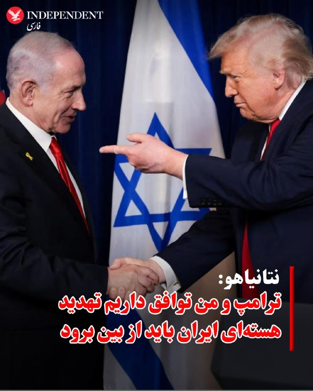

♦️بنیامین نتانیاهو، نخست‌وزیر اسرائیل، روز یکشنبه اعلام کرد او و دونالد ترامپ، رئیس‌جمهوری آمریکا، توافق دارند که هرگونه توافق نهایی با ایران باید «تهدید هسته‌ای»
ناشی از جمهوری اسلامی را از میان بردارد.

نتانیاهو گفت تحقق این هدف مستلزم برچیدن تاسیسات غنی‌سازی اورانیوم ایران و خارج کردن مواد غنی‌شده هسته‌ای از خاک این کشور است.

نخست‌وزیر اسرائیل همچنین اعلام کرد ترامپ بار دیگر بر حق اسرائیل برای دفاع از خود در برابر تهدیدها در همه جبهه‌ها، از جمله لبنان،
تاکید کرده است.
‌🇸🇦 Indypersian

🤖 @VahidOOnLine

## VahidOOnLine — post 241962

  

یک مقام ارشد دولت آمریکا به فاکس‌نیوز گفت اگر ایران در موضوع اورانیوم غنی‌شده امتیازهای قابل‌توجهی بدهد، واشینگتن نیز در زمینه کاهش تحریم‌ها امتیازهای مهمی ارائه خواهد کرد.

او گزارش‌ها درباره احتمال امضای توافق در روز یکشنبه را کم‌اهمیت دانست و گفت ساختار تصمیم‌گیری در تهران «به آن سرعتی که لازم است عمل نمی‌کند.»

این مقام افزود برنامه آمریکا رسیدگی به تمام ذخایر اورانیوم غنی‌شده ایران است و اکنون انعطاف‌هایی از سوی تهران دیده می‌شود که پیش‌تر وجود نداشت.

او همچنین تاکید کرد آمریکا با اخذ عوارض در تنگه هرمز مخالف است.
‌🏁 🇬🇧 IranintlTV

🤖 @VahidOOnLine

## VahidOOnLine — post 241961

  

♦️کاظم غریب‌آبادی، معاون حقوقی و بین‌الملل وزارت امور خارجه جمهوری اسلامی، روز یکشنبه ۳ خرداد در پیامی در شبکه اجتماعی اکس اعلام کرد در سفر به عمان، پیام شفاهی عباس عراقچی، وزیر امور خارجه ایران، را به بدر البوسعیدی، وزیر خارجه عمان، منتقل کرده است.

غریب‌آبادی نوشت این پیام در چارچوب رایزنی‌ها و همکاری‌های مستمر میان تهران و مسقط ارائه شده و به گفتگوهای جاری ایران و آمریکا که با میانجی‌گری پاکستان در حال انجام است و همچنین تلاش‌ها برای موفقیت این مذاکرات مربوط می‌شود.

معاون  عراقچی همچنین اعلام کرد پس از این دیدار، نشست مفصلی میان هیات‌های ایرانی و عمانی درباره «اصول حاکم بر عبور شناورها از تنگه هرمز» برگزار شد.

غریب‌آبادی نوشت: «پس از این دیدار، نشست مبسوطی میان هیأت‌های عمانی و ایرانی برای بررسی مجموعه‌ای از اصول حاکم بر عبور شناورها در تنگه هرمز با رعایت امنیت و حاکمیت ملی دولت‌های ساحلی این تنگه و در پرتو قواعد قابل اعمال حقوق بین‌الملل برگزار شد.»
‌🇸🇦 Indypersian

🤖 @VahidOOnLine

## VahidOOnLine — post 241960

  

♦️در بحبوحه گمانه‌زنی‌ها درباره امضای توافق احتمالی پایان جنگ میان ایران و آمریکا، دونالد ترامپ نقل قولی از مسعود پزشکیان که گفته بود «آماده‌ایم به جهان اطمینان دهیم که به‌دنبال سلاح هسته‌ای و خواهان بی‌ثباتی در منطقه نیز نیستیم»، را در شبکه اجتماعی تروث سوشال بازنشر کرد.
پزشکیان، رئیس‌جمهوری اسلامی، روز یکشنبه در گفتگویی ویدیویی اعلام کرد ایران آماده است در چارچوب گفتگوها به جهان اطمینان دهد که به‌دنبال سلاح هسته‌ای و ایجاد ناآرامی در منطقه نیست.

ترامپ پیش‌تر در پیامی روابط واشنگتن و تهران را «در حال حرفه‌ای‌ و سازنده‌تر شدن» توصیف کرده بود.
‌🇸🇦 Indypersian

🤖 @VahidOOnLine

## VahidOOnLine — post 241959

  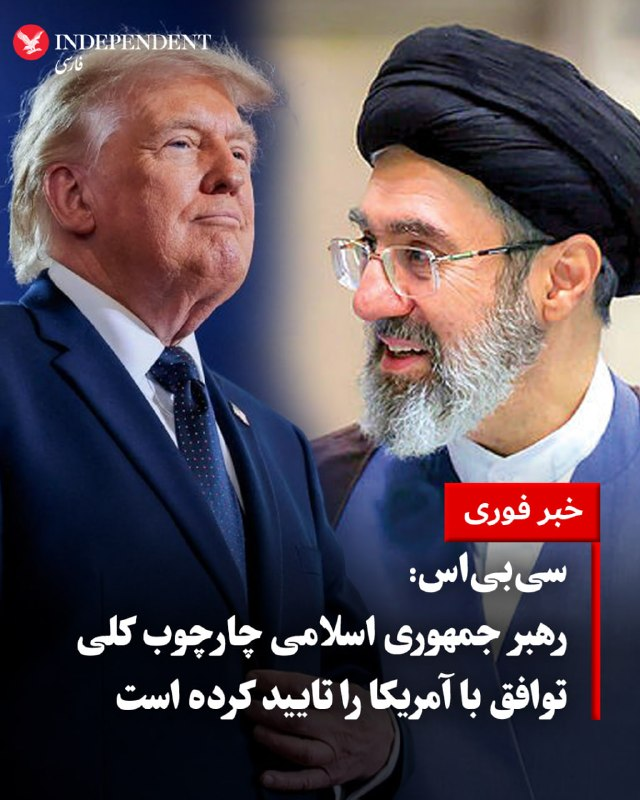

♦️جنیفر جیکوب، خبرنگار شبکه خبری سی‌بی‌اس، روز یکشنبه سوم خرداد ماه به نقل از منابع آگاه گزارش داد کاخ سفید بر این باور است مجتبی خامنه‌ای رهبر جمهوری اسلامی، چارچوب کلی پیش‌نویس توافق میان تهران و واشنگتن را تایید کرده است.
بر اساس این گزارش، ایران پذیرفته است در ازای لغو محاصره و کاهش فشارهای آمریکا، ذخایر اورانیوم با غنای بالا را کنار بگذارد.
با این حال، مقام‌های آمریکایی تاکید کرده‌اند این پیش‌نویس هنوز باید مراحل تایید در ساختار رهبری جمهوری اسلامی را طی کند و واشنگتن خواهان تعهد رسمی تهران برای کنار گذاشتن اورانیوم با غنای بالا و حل‌وفصل دیگر مسائل هسته‌ای است.
سی‌بی‌اس همچنین گزارش داد جی‌دی ونس، استیو ویتکاف و جرد کوشنر در مذاکرات نقش دارند و آمریکا تلاش می‌کند همه متحدان خود در خاورمیانه را در روند مذاکرات دخیل کند.
‌🇸🇦 Indypersian

🤖 @VahidOOnLine

## WithYashar — post 12347

رئیس ستاد کل ارتش اسرائیل:
ما آماده‌ایم که فوراً به نبرد با ایران بازگردیم
@withyashar

## WithYashar — post 12346

دبیرکل حزب‌الله: خلع سلاح را نمی پذیریم
تحریم‌های آمریکا هرگز ما را تضعیف نخواهد کرد؛ اگر آمریکا بیش از این خوی وحشی‌گری به خود بگیرد، دیگر چیزی برایش در لبنان باقی نخواهد ماند
@withyashar

## WithYashar — post 12345

یک مقام آمریکایی به سی‌بی‌اس: ایران قبول کرده اورانیوم غنی شده‌ش رو به‌عنوان بخشی از توافق، دفن کنه
@withyashar

## WithYashar — post 12344

جروزالم پست: جنگ، ایران را فرو نپاشید. کنترل آن بر هرمز را تثبیت کرد، اتحادهایش را از نو ساخت و همان نهادهایی را که ایالات متحده هدف قرار داده بود، تقویت کرد
@withyashar

## WithYashar — post 12343

نیویورک تایمز به نقل از یک مقام آمریکایی: مسائلی مانند ذخایر موشکی ایران و غنی سازی اورانیوم در مذاکرات بعدی مورد بحث قرار خواهد گرفت.
@withyashar

## mwarmonitor — post 9653

🔴سناتور لیندسی گراهام ؛ اگر در نتیجه این مذاکرات برای پایان دادن به درگیری ایران، متحدان عرب و مسلمان ما در منطقه موافقت کنند به «توافق‌های ابراهیم» بپیوندند، این توافق به یکی از مهم‌ترین و تأثیرگذارترین توافق‌ها در تاریخ خاورمیانه تبدیل خواهد شد.

🔸پیوستن عربستان سعودی، قطر و پاکستان به توافق‌های ابراهیم، دگرگونی عظیمی برای منطقه و جهان خواهد بود. این یک اقدام هوشمندانه از سوی رئیس‌جمهور ترامپ است.

🔸به عربستان سعودی و دیگر کشورها: اکنون زمان آن است که برای آینده یک خاورمیانه جدید جسور باشید. همان‌طور که رئیس‌جمهور ترامپ گفته است، انتظار می‌رود شما در واقع به توافق‌های ابراهیم بپیوندید و به‌طور مؤثر به مناقشه عربی–اسرائیلی پایان دهید. اگر از این مسیر که رئیس‌جمهور ترامپ پیشنهاد کرده است خودداری کنید، این موضوع پیامدهای جدی برای روابط آینده ما خواهد داشت و این پیشنهاد صلح را غیرقابل‌قبول خواهد کرد. همچنین در تاریخ به‌عنوان یک اشتباه محاسباتی بزرگ دیده خواهد شد.

🔸رئیس‌جمهور ترامپ: در رسیدن به یک توافق خوب با ایران قاطع بمان. به همان اندازه مهم، در اصرار بر پیوستن عربستان سعودی و دیگر کشورها به توافق‌های ابراهیم به‌عنوان بخشی از این مذاکرات نیز قاطع بمان.

🔹بار دیگر، این یک پیشنهاد بسیار هوشمندانه از سوی رئیس‌جمهور ترامپ است.

@mwarmonitor

## mwarmonitor — post 9652

🔴یک منبع ارشد ایرانی به رویترز گفته است که تهران با تحویل ذخیره اورانیوم بسیار غنی‌شده خود موافقت نکرده است و همچنین موضوع هسته‌ای ایران در توافق اولیه با آمریکا گنجانده نشده است. @mwarmonitor

## mwarmonitor — post 9651

🔴ایالات متحده و ایران به‌طور اصولی بر سر یک توافق به تفاهم رسیده‌اند که بر اساس آن تنگه هرمز دوباره بازگشایی شود و ایران متعهد شود اورانیوم بسیار غنی‌شده خود را دفع کند، یک مقام آمریکایی روز یکشنبه گفت. این مقام افزود که این توافق هنوز امضا نشده است. نیویورک…

## mwarmonitor — post 9650

🔴رئیس ستاد ارتش اسرائیل: ما آماده‌ایم فوراً به نبرد شدید بازگردیم تا رژیم «تروریستی» ایران را تضعیف کنیم.

@mwarmonitor

## mwarmonitor — post 9649

  <a href="telegram/content/mwarmonitor_9649_1779641373.mp4" target="_blank">🎬 Download video</a>

❌برای رفع تهدید فوری: ارتش اسرائیل یک تروریست از سازمان تروریستی حماس را که در یورش به پایگاه زیکیم در کشتار ۷ اکتبر شرکت داشت، به هلاکت رساند

🔸در طول آخر هفته (جمعه)، نیروهای ارتش اسرائیل تحت فرماندهی جنوب، تروریست لؤی هشام محمود بصل را که به‌عنوان تک‌تیرانداز در گردان زیتون وابسته به سازمان تروریستی حماس فعالیت می‌کرد و تهدیدی فوری علیه نیروهای ما محسوب می‌شد، به هلاکت رساندند.

🔹بر اساس بررسی‌های اطلاعاتی، مشخص شد که این تروریست در یورش به پایگاه زیکیم در کشتار خونین ۷ اکتبر مشارکت داشته و در دوره اخیر نیز برای اجرای طرح‌های تروریستی علیه نیروهای ارتش اسرائیل در منطقه فعالیت می‌کرده است.

🔸نیروهای ارتش اسرائیل تحت فرماندهی جنوب مطابق با توافق در منطقه مستقر هستند و به فعالیت خود برای رفع هرگونه تهدید فوری ادامه خواهند داد.

@mwarmonitor

## mwarmonitor — post 9648

🔰مارک لوین ؛ همان‌طور که بیشتر مردم می‌دانند، من طرفدار بسیار پر و پا قرص ریگان هستم. در سال‌های ۱۹۷۶ و ۱۹۸۰ برای او تبلیغ کردم و ۸ سال در دولت او خدمت کردم. اما یکی از بزرگ‌ترین اشتباهات، عفو ۲.۳ میلیون مهاجر غیرقانونی بود. علاوه بر آن، این عفو پیش از آن انجام شد که دموکرات‌ها وعده دهند بودجه امنیت مرزی تأمین خواهد شد. دموکرات‌ها به‌سادگی از اجرای بخش خود از توافق خودداری کردند. ریگان بعدها گفت که این یک اشتباه بوده است.

🔸زمان‌بندی اهمیت دارد. من با یک توافق مخالفم. ماه‌هاست این را می‌گویم. به کسانی که خواهان توافق بودند تبریک می‌گویم؛ به نظر می‌رسد امروز روز شماست. و اگر توافقی انجام شود، رژیم ایران دست‌کم فعلاً باقی خواهد ماند. باید دید در طول زمان این موضوع چگونه پیش می‌رود. من نسبت به این‌که هر توافقی بتواند دشمن را مهار کند یا اجرا شود بسیار بدبین هستم، به دلایل متعدد؛ به‌ویژه بعد از ترک سمت ریاست‌جمهوری توسط ترامپ، یا این‌که تروریست‌ها دست از تروریسم بردارند.

🔹با این حال، فرض می‌کنم اگر توافقی وجود داشته باشد، رژیم ایران باید ابتدا تعهدات خود را انجام دهد — یعنی به‌عنوان شرط مقدم بر هرگونه رفع تحریم. معتقدم اگر این‌طور نباشد، اشتباه بزرگی خواهد بود. از جمله اینکه اگر رژیم ایران قصد عمل به تعهداتش را ندارد، باید از همان ابتدا مشخص شود، نه بعداً. و باید همین حالا خودش را آشکار کند.

🔸همچنین آزاد کردن میلیاردها و میلیاردها دلار برای آن‌ها — که پیش از جنگ مسدود شده بود — پس از رسیدن به دستشان تقریباً غیرقابل کنترل خواهد بود و برای تقویت رژیم استفاده خواهد شد. من در این مورد هیچ شکی ندارم. این همان چیزی است که هستند. این طرز فکر آن‌هاست. آن‌ها به هیچ‌کس جز خودشان پاسخگو نیستند.

🔹هیچ کشور خاورمیانه‌ای نباید برای یک توافق، تحت فشار قرار گیرد تا امنیت ملی خود را کاهش دهد. آیا حزب‌الله واقعاً زنده می‌ماند و دوباره در لبنان قدرت می‌گیرد و آزاد خواهد بود که به شلیک موشک به اسرائیل ادامه دهد؟ آیا ما چنین چیزی را می‌پذیریم؟ این موضوع باید کاملاً روشن باشد. «حق موجودیت اسرائیل» نباید فقط یک شعار باشد.

🔸تا این لحظه من هیچ چیزی درباره موشک‌های بالستیک نمی‌بینم، در حالی که این‌ها خطرناک‌ترین سلاح متعارف در زرادخانه رژیم ایران هستند. مهم خواهد بود که ببینیم این موضوع چگونه رسیدگی می‌شود.

🔹اگر توافقی انجام شود، من روی مجموعه‌ای از مسائل به‌طور جدی تمرکز خواهم کرد. همه ما باید همین کار را بکنیم. عجیب خواهد بود اگر نکنیم. این فقط یک دشمن خارجی هزاران کیلومتر دورتر نیست. در ۴۷ سال گذشته هزاران آمریکایی را کشته یا معلول کرده است.

🔸رئیس‌جمهور بارها قوی‌ترین استدلال را برای ضرورت و فوریت اقدام نظامی مطرح کرده است. همچنین بسیار مفیدتر و منطقی‌تر خواهد بود اگر سناتورها و نمایندگان کنگره که خواهان توافق هستند، دقیقاً توضیح دهند که از نظر آن‌ها سازوکار یک توافق چگونه باید باشد.

ادامه دارد...

@mwarmonitor

## mwarmonitor — post 9647

🔴ایالات متحده و ایران به‌طور اصولی بر سر یک توافق به تفاهم رسیده‌اند که بر اساس آن تنگه هرمز دوباره بازگشایی شود و ایران متعهد شود اورانیوم بسیار غنی‌شده خود را دفع کند، یک مقام آمریکایی روز یکشنبه گفت. این مقام افزود که این توافق هنوز امضا نشده است. نیویورک تایمز

@mwarmonitor

## pm_afshaa — post 91403

🔴رئیس ستاد کل ارتش اسرائیل:
ما آماده‌ایم که فوراً به نبرد با ایران بازگردیم

💧 Rainbet.com the #1 Non-KYC Crypto Casino & Sportsbook @rainbetcom

😁 @Pm_Afshaa

## pm_afshaa — post 91402

🔴نیویورک تایمز به نقل از یک مقام آمریکایی: مسائلی مانند ذخایر موشکی ایران و غنی سازی اورانیوم در مذاکرات بعدی مورد بحث قرار خواهد گرفت

💧 Rainbet.com the #1 Non-KYC Crypto Casino & Sportsbook @rainbetcom

😁 @Pm_Afshaa

## pm_afshaa — post 91401

  

پست اتاق جنگ اسرائیل:
ایران آزاد

💧 Rainbet.com the #1 Non-KYC Crypto Casino & Sportsbook @rainbetcom

😁 @Pm_Afshaa

## pm_afshaa — post 91400

  

ترامپ تو تروث سوشال صحبت‌های امروز مسعود پزشکیان که گفته بود «ما آماده‌ایم به جهان اطمینان دهیم که به دنبال سلاح هسته‌ای نیستیم. ما به دنبال بی‌ثباتی در منطقه نیستیم» رو پست کرده

💧 Rainbet.com the #1 Non-KYC Crypto Casino & Sportsbook @rainbetcom

😁 @Pm_Afshaa

## pm_afshaa — post 91399

  <a href="telegram/content/pm_afshaa_91399_1779641375.webm" target="_blank">🎬 Download video</a>

خیلی وقته کسی پول به کانفیگ حجمی نمیده چون از‌ این‌جا « نامحدودشو » میخرن 
⬇️

یک ماهه 
✨ یک کاربر 
✨ حجم نامحدود 
♾️
فقط 
🍎 میلیون تومان

🔗 @whitelistsup

📢 @Whitelistconfig

## pm_afshaa — post 91398

🔴یک مقام آمریکایی به سی‌بی‌اس: ایران قبول کرده اورانیوم غنی شده‌ش رو به‌عنوان بخشی از توافق، دفن کنه

💧 Rainbet.com the #1 Non-KYC Crypto Casino & Sportsbook @rainbetcom

😁 @Pm_Afshaa

## DEJradio — post 4922

  <a href="telegram/content/DEJradio_4922_1779641376.webm" target="_blank">🎬 Download video</a>

👑
🔺 تظاهرات ایرانیان میهن‌دوست در برلین در حمایت از شاهزاده رضا پهلوی و انقلاب شیر و خورشید؛ یکشنبه سوم خرداد ۱۴۰۵

#برلین #همبستگی
@DEJradio

## IranIntlTV — post 338791

  

لیندزی گراهام، سناتور جمهوریخواه در پیامی در شبکه ایکس نوشت: «اگر در نتیجه مذاکرات برای پایان دادن به درگیری با ایران، متحدان عرب و مسلمان آمریکا در منطقه به توافق‌های ابراهیم بپیوندند، این توافق می‌تواند به یکی از مهم‌ترین تحولات تاریخ خاورمیانه تبدیل شود.»

گراهام در ادامه از ترامپ خواست در مسیر دستیابی به توافق با جمهوری اسلامی بر مواضع خود پافشاری کند و هم‌زمان بر پیوستن عربستان سعودی و دیگر کشورهای منطقه به توافق‌های ابراهیم به‌عنوان بخشی از مذاکرات تاکید داشت.
https://iranintl.com/202605241273

## IranIntlTV — post 338790

  <a href="telegram/content/IranIntlTV_338790_1779641377.mp4" target="_blank">🎬 Download video</a>

تیتر اول با نیوشا صارمی، یکشنبه ۳ خرداد
@iranintltv

## IranIntlTV — post 338789

  <a href="telegram/content/IranIntlTV_338789_1779641379.mp4" target="_blank">🎬 Download video</a>

هزاران نفر از ایرانیان ساکن ونکوور در محل آرت گالری این شهر تجمع کردند. شرکت‌کنندگان در این تجمع ضمن تاکید بر لزوم پایان دادن به خاموشی دیجیتال در ایران، از مقام‌های فیفا خواستند با همراهی با جمهوری اسلامی به عادی‌سازی جنایات این حکومت کمک نکنند.

گزارش مهسا مرتضوی، خبرنگار ایران‌اینترنشنال
@iranintltv

## IranIntlTV — post 338788

  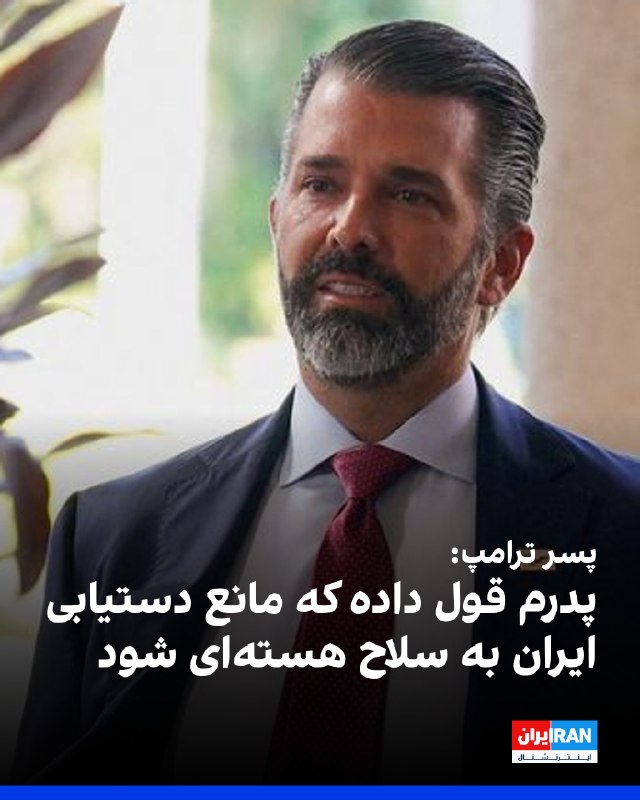

دونالد ترامپ جونیور، پسر ارشد رئیس‌جمهور آمریکا، در شبکه ایکس نوشت: این یک پیروزی بزرگ برای آمریکا است. ما باید کسانی را که هرگز راضی نمی‌شوند مگر با تهاجم زمینی به ایران، نادیده بگیریم. پدر من وعده داده بود که مانع دستیابی ایران به سلاح هسته‌ای شود و دقیقا در حال تحقق همین هدف است.
https://iranintl.com/202605247103

## IranIntlTV — post 338787

  <a href="telegram/content/IranIntlTV_338787_1779641382.mp4" target="_blank">🎬 Download video</a>

با انتشار جزئیات توافق احتمالی واشینگتن و تهران، تد کروز، سناتور جمهوری‌خواه، آن را فاجعه‌بار خواند و یک مقام ارشد اسرائیل چنین توافقی را بد دانست. یک چهره رسانه‌ای حامی ترامپ هم به او هشدار داد با این توافق به سرنوشتی بدتر از کارتر و اوباما دچار خواهد شد.

گزارشی از مجتبا پورمحسن
@iranintltv

## IranIntlTV — post 338786

  <a href="https://t.me/IranintlTV/338786" target="_blank">📎 Download file</a>

🎧نسخه صوتی اخبار شبانگاهی | یکشنبه ۳ خرداد
@iranintlTV

## IranIntlTV — post 338785

ترامپ: زمان به نفع ماست، برای رسیدن به توافق عجله نداریم

دونالد ترامپ، رییس‌جمهوری آمریکا، مذاکرات تهران و واشینگتن را «سازنده» خواند و در عین حال تاکید کرد عجله‌ای برای دستیابی به توافق وجود ندارد.

ترامپ یک‌شنبه سوم خرداد در شبکه اجتماعی تروث‌سوشال نوشت: «مذاکرات به شکلی منظم و سازنده در حال پیشرفت است و من به نمایندگان خود اطلاع داده‌ام که برای رسیدن به توافق عجله نکنند، زیرا زمان به نفع ماست.»

او با انتقاد از باراک اوباما و «افراد کاملا آماتور» دولت او، برجام را «یکی از بدترین» توافق‌های تاریخ آمریکا خواند و افزود مذاکرات کنونی کاخ سفید با جمهوری اسلامی «دقیقا برعکس آن» است.

ترامپ تاکید کرد محاصره دریایی بنادر جنوبی ایران تا زمان «دستیابی به توافق و تایید و امضای آن» همچنان برقرار خواهد بود.

در روزهای اخیر، گمانه‌زنی‌ها در خصوص احتمال دستیابی تهران و واشینگتن به توافقی برای پایان جنگ بالا گرفته است.

ترامپ شامگاه دوم خرداد پس از گفت‌وگو با رهبران منطقه تایید کرد تنها «نهایی‌سازی متن» توافق با تهران باقی مانده است.

این موضوع واکنش‌های گسترده‌ای را در میان افکار عمومی و چهره‌های سیاسی به همراه داشته است.

شهروندان در پیام‌های خود به ایران‌اینترنشنال، از احتمال توافق میان جمهوری اسلامی و آمریکا ابراز ناامیدی کردند و آن را «خیانت» در حق مردم ایران و «پایمال کردن خون» جاویدنامان انقلاب ملی دانستند.

شماری از سناتورهای ارشد حزب جمهوری‌خواه آمریکا نیز از مفاد گزارش‌شده از توافق احتمالی انتقاد کردند و هشدار دادند این توافق تمام دستاوردهای عملیات «خشم حماسی» را از بین می‌برد.

ترامپ: تهران باید بپذیرد که نمی‌تواند به سلاح هسته‌ای دست یابد
رییس‌جمهوری ایالات متحده در ادامه پیام خود در تروث‌سوشال، با اشاره به مذاکرات جاری میان تهران و واشینگتن نوشت: «هر دو طرف باید وقت کافی بگذارند و این کار را درست انجام دهند. هیچ اشتباهی نباید رخ دهد.»

ترامپ اضافه کرد: «روابط ما با ایران در حال تبدیل شدن به رابطه‌ای حرفه‌ای‌تر و سازنده‌تر است. با این حال، آنها باید درک کنند که نمی‌توانند سلاح یا بمب هسته‌ای توسعه دهند یا به دست آورند.»

او همچنین از «حمایت و همکاری همه کشورهای خاورمیانه» قدردانی کرد و نوشت این رویکرد با پیوستن آن‌ها به پیمان ابراهیم تقویت خواهد شد.
ترامپ ادامه داد: «چه بسا شاید جمهوری اسلامی نیز بخواهد [به پیمان ابراهیم] بپیوندد.»

بنیامین نتانیاهو، نخست‌وزیر اسرائیل، سوم خرداد تصویری از خود و ترامپ در شبکه ایکس منتشر کرد که روی آن نوشته شده: «ایران هرگز به سلاح هسته‌ای دست نخواهد یافت.»

یک منبع اسرائیلی سوم خرداد به رویترز گفت ترامپ به‌روشنی به نتانیاهو اعلام کرده که در مذاکرات، بر خواسته همیشگی خود مبنی بر برچیدن برنامه هسته‌ای جمهوری اسلامی و خروج تمام اورانیوم غنی‌شده از ایران پافشاری خواهد کرد.

او افزود ترامپ تاکید کرده که بدون تحقق این شروط، «توافق نهایی را امضا نخواهد کرد».

در سوی دیگر، یک منبع ارشد حکومت ایران در مصاحبه با رویترز تاکید کرد تهران با انتقال ذخایر اورانیوم با غنای بالا موافقت نکرده و پرونده هسته‌ای بخشی از تفاهم اولیه با واشینگتن نیست.

محسن رضایی، مشاور نظامی مجتبی خامنه‌ای، هم تهدید کرد در صورت حمله آمریکا به تنگه هرمز، جمهوری اسلامی «محاصره دریایی را می‌شکند و ممکن است از ان‌پی‌تی خارج شود».

تاکید نتانیاهو بر آزادی عمل اسرائیل در تمامی جبهه‌ها
رویترز سوم خرداد به نقل از یک منبع سیاسی اسرائیل گزارش داد نتانیاهو در تماس تلفنی شب گذشته خود با ترامپ تاکید کرده که اسرائیل «آزادی عمل خود را برای مقابله با تهدیدها در همه جبهه‌ها، از جمله لبنان، حفظ خواهد کرد».

او افزود ترامپ نیز در این گفت‌وگو، موضع نتانیاهو را مورد تایید قرار داده و از آن حمایت کرده است.

ترامپ پیش‌تر گفت‌وگوی تلفنی خود با نخست‌وزیر اسرائیل را «خوب» ارزیابی کرده بود.

بنی گانتس، سیاستمدار برجسته اسرائیلی و وزیر پیشین دفاع این کشور، سوم خرداد هشدار داد توقف درگیری‌ها در لبنان به‌عنوان بخشی از توافق با جمهوری اسلامی، «اشتباهی راهبردی» خواهد بود که اسرائیل سال‌ها هزینه آن را خواهد پرداخت.

اول خرداد، اسماعیل بقایی، سخنگوی وزارت امور خارجه جمهوری اسلامی، اعلام کرده بود خاتمه جنگ در همه جبهه‌ها، از جمله لبنان، وضعیت تنگه هرمز و محاصره دریایی آمریکا، از محورهای اصلی گفت‌وگوهای حکومت ایران و ایالات متحده به شمار می‌روند.
 
🔗وب‌سایت ایران‌اینترنشنال
@iranintltv

## IranIntlTV — post 338784

  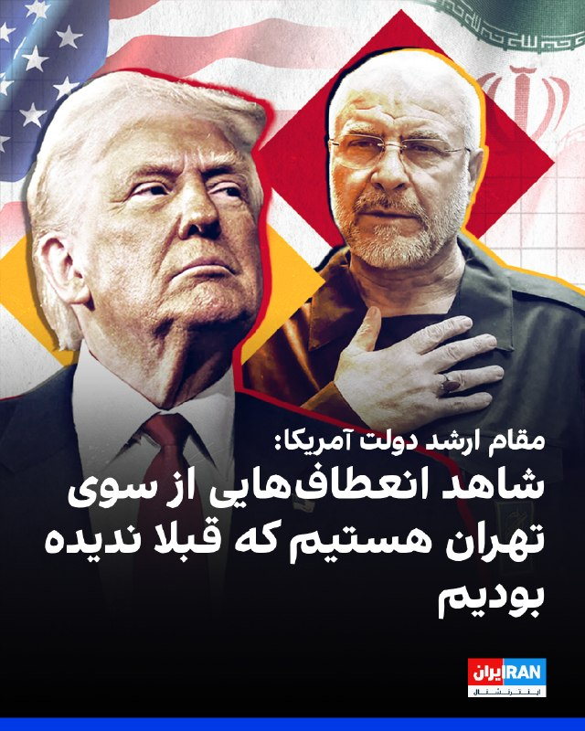

یک مقام ارشد دولت آمریکا به فاکس‌نیوز گفت اگر ایران در موضوع اورانیوم غنی‌شده امتیازهای قابل‌توجهی بدهد، واشینگتن نیز در زمینه کاهش تحریم‌ها امتیازهای مهمی ارائه خواهد کرد.

او گزارش‌ها درباره احتمال امضای توافق در روز یکشنبه را کم‌اهمیت دانست و گفت ساختار تصمیم‌گیری در تهران «به آن سرعتی که لازم است عمل نمی‌کند.»

این مقام افزود برنامه آمریکا رسیدگی به تمام ذخایر اورانیوم غنی‌شده ایران است و اکنون انعطاف‌هایی از سوی تهران دیده می‌شود که پیش‌تر وجود نداشت.

او همچنین تاکید کرد آمریکا با اخذ عوارض در تنگه هرمز مخالف است.
https://iranintl.com/202605242847

## IranIntlTV — post 338783

  <a href="telegram/content/IranIntlTV_338783_1779641386.mp4" target="_blank">🎬 Download video</a>

هم‌زمان با مطرح شدن احتمال توافق میان تهران و واشینگتن، دونالد ترامپ، رییس‌جمهوری آمریکا، اعلام کرد محاصره دریایی تا زمان دست‌یابی و امضای یک توافق قطعی ادامه خواهد داشت. او در پیامی در شبکه اجتماعی تروث‌سوشال نوشت زمان به نفع آمریکا است و نمایندگانش نباید برای رسیدن به توافق عجله کنند.

مرضیه حسینی و اشکان صفایی، خبرنگاران ایران‌اینترنشنال، گزارش می‌دهند
@iranintltv

## ManotoTV — post 105809

  <a href="telegram/content/ManotoTV_105809_1779641389.mp4" target="_blank">🎬 Download video</a>

وزیران خارجه ۱۹ کشور عربی و اسلامی در بیانیه‌ای مشترک، اقدام منطقه موسوم به «سومالی‌لند» در افتتاح «سفارت» در اورشلیم را به‌شدت محکوم کردند.

در این بیانیه که روز یکشنبه سوم خرداد منتشر شد، این اقدام «غیرقانونی و مردود» خوانده شده و آمده است که افتتاح این دفتر، نقض آشکار قوانین بین‌المللی و قطعنامه‌های مربوط به مشروعیت بین‌المللی است.

وزیران خارجه کویت، مصر، عربستان سعودی، قطر، اردن، ترکیه، پاکستان، اندونزی، جیبوتی، سومالی، فلسطین، عمان، سودان، یمن، لبنان، موریتانی، الجزایر، بنگلادش و مراکش تاکید کردند که اورشلیم شرقی «سرزمین فلسطینی اشغال‌شده از سال ۱۹۶۷» است و هر اقدامی برای تغییر وضعیت حقوقی و تاریخی آن «باطل و بی‌اثر» است.

این کشورها همچنین حمایت کامل خود را از وحدت، حاکمیت و تمامیت ارضی جمهوری فدرال سومالی اعلام کردند و هرگونه اقدام یک‌جانبه علیه وحدت سرزمینی سومالی را مردود دانستند.

## FarsiVOA — post 218544

  <a href="telegram/content/FarsiVOA_218544_1779641390.mp4" target="_blank">🎬 Download video</a>

شهرام همایون در عمق میدان می‌گوید پروژه دولت در تبعید را به خاطر مخالفت رضا پهلوی متوقف کرده است با این حال نقدی به شخص او ندارد چرا که معتقد است او در شرایط «غیرعادی» است

## FarsiVOA — post 218543

🔺گراهام: برای آینده خاورمیانه جدید جسور باشیم

◾️لیندزی گراهام، سناتور جمهوری‌خواه گفت که پیوستن متحدان عرب و مسلمان به توافق‌نامه‌های ابراهیم، در نتیجه مذاکرات برای پایان دادن به درگیری رژیم ایران، این توافق‌نامه را به یکی از مهم‌ترین توافق‌ها در تاریخ خاورمیانه تبدیل خواهد کرد.

⬇️ بیشتر بخوانید:

https://ir.voanews.com/a/the-new-middle-east-abraham-accords-lindsay-graham/8153321.html

## FarsiVOA — post 218542

  <a href="telegram/content/FarsiVOA_218542_1779641391.mp4" target="_blank">🎬 Download video</a>

دونالد پتی، فضانورد آمریکایی، تصویری از شفق قطبی و طلوع زمین را از فضا منتشر کرد.

او در توضیح این تصویر نوشت: «تماشای شفق قطبی در طلوع زمین، هرگز تکراری نمی‌شود.»

@FarsiVOA

## FarsiVOA — post 218541

🔺اشتراک ‌نظر نتانیاهو و ترامپ: «رفع خطر هسته‌ای» پیش‌شرط توافق نهایی با جمهوری اسلامی است

◾️نخست وزیر اسرائیل روز یکشنبه ۳ خرداد با انتشار پستی در رسانه اجتماعی ایکس از گفت‌وگوی تلفنی با رئیس جمهوری آمریکا در شامگاه شنبه خبر داد.

⬇️ بیشتر بخوانید:

https://ir.voanews.com/a/8153320.html

## FarsiVOA — post 218540

  <a href="telegram/content/FarsiVOA_218540_1779641392.mp4" target="_blank">🎬 Download video</a>

ارتش اسرائیل اعلام کرد در آخر هفته یک نیروی حماس را که در یورش به پایگاه زیکیم در کشتار ۷ اکتبر شرکت داشت از بین برده است.

«لؤی هشام محمود بصل»، تک‌تیرانداز گردان زیتون وابسته به سازمان تروریستی حماس، در یورش به پایگاه زیکیم در ۷ اکتبر ۲۰۲۳ دخیل بود و در ماه‌های گذشته نیز تلاش می‌کرد علیه نیروهای اسرائیلی اقدامات تروریستی انجام دهد.

## FarsiVOA — post 218539

  <a href="telegram/content/FarsiVOA_218539_1779641394.mp4" target="_blank">🎬 Download video</a>

شهرام همایون در عمق میدان و در پاسخ به پرسش فهیمه خضر حیدری درباره فروش کاغد سفید در شبکه تلویزیونی‌اش می‌گوید مردم به او ایمان دارند و کاغذ سفید هم از او می‌خرند

## DW_Farsi — post 125102

  

🔶 بنی گانتس: آتش‌بس در لبنان نمی‌تواند بخشی از توافق با ایران باشد

بنی گانتس، وزیر دفاع پیشین اسرائيل با توجه به افزایش احتمال رسیدن به یک توافق میان ایران و آمریکا اعلام کرد که آتش‌بس در لبنان "به‌ هیچ‌ وجه" نباید بخشی از این توافق باشد.

او در پیامی در شبکه ایکس نوشت: «غیر ممکن است که درست در زمانی که افکار عمومی لبنان تازه شروع کرده بفهمد حزب‌الله [لبنان] به آن‌ها آسیب می‌زند، اسرائیل اجازه دهد این گروه به محافظ لبنان تبدیل شود.»

گانتس با اشاره به این که روستاهای جنوب لبنان تنها چند صد متر با شهرک‌های متولا، شلومی و مارگالیوت کشورش فاصله دارند متذکر شد: «اسرائیل بدون توجه به هر عامل خارجی، وظیفه دارد از ساکنان خود محافظت کند.»

او پذیرش آتش‌بس در لبنان به‌عنوان بخشی از توافق احتمالی با ایران را "یک اشتباه استراتژیک" خواند که بابت آن اسرائيل باید سال‌ها هزینه پرداخت کند: «این دقیقا همان موردی است که اسرائیل باید به آمریکا بگوید: نه.»
@dw_farsi

## DW_Farsi — post 125101

  

🔶 تسنیم: تمدید ۶۰روزه آتش‌بس در متن توافق ایران و آمریکا وجود ندارد

خبرگزاری تسنیم در خبری در روز یکشنبه سوم خرداد با اشاره به خبری که پیش از این در پایگاه خبری آکسیوس منتشر شده بود اعلام کرد، در متن توافق میان ایران و آمریکا از تمدید ۶۰روزه آتش‌بس سخنی به میان نیامده است.

تسنیم وابسته به سپاه پاسداران نوشت: «بر اساس شنیده‌ها از متن تفاهم احتمالی، برخلاف گزارش یک رسانه آمریکایی که می‌گوید، طبق تفاهم‌نامه آتش‌بس میان ایران و آمریکا به مدت ۶۰ روز تمدید می‌شود، این عبارت در متن وجود ندارد.»

این خبرگزاری همچنین نوشت که در این متن "تعبیری که به کار گرفته شده است، اعلام پایان جنگ در همه جبهه‌ها، از جمله لبنان است".

تسنیم با تأکید بر این که متن توافق هنوز نهایی نشده ادامه داد، بر پایه این متن، در "بازه ۳۰ روزه موضوع تنگه هرمز و محاصره دریایی پیش برده می‌شود و زمان ۶۰ روزه‌ای برای مذاکرات در مسئله هسته‌ای در نظر گرفته شده است".
@dw_farsi

## DW_Farsi — post 125100

  <a href="telegram/content/DW_Farsi_125100_1779641396.mp4" target="_blank">🎬 Download video</a>

🎥 گامی تاریخی در پاکستان؛ استخدام نخستین زندانبانان تراجنسیتی
 
سوبیا خان با آغاز به کار به عنوان نخستین زندانبان تراجنسیتی در ایالت "خیبر پختونخوا" پاکستان، تاریخ‌ساز شد.
این یک نقطه عطف مهم است، به‌ویژه از این جهت که افراد تراجنسیتی در این ایالت محافظه‌کار با وجود حمایت‌های قانونی اغلب با تبعیض مواجه هستند یا طرد می‌شوند.
@dw_farsi

## Persian_Trend_Official — post 14872

🔴علی هاشم خبرنگار الجزیره:

💢کمتر از ۲۴ ساعت پس از آنکه خوش‌بینی‌هایی درباره احتمال تفاهم ایران و آمریکا مطرح شد، نشانه‌های منفی از راه رسیده است.

▪️یک منبع آگاه ایرانی می‌گوید نشانه‌هایی از عقب‌نشینی آمریکا در دو موضوع اصلی دیده می‌شود: سازوکار آزادسازی دارایی‌های ایران و دامنه آتش‌بس در لبنان.

▪️به گفته این منبع، تفاهم شامل چارچوبی برای آتش‌بس در لبنان است، اما رژیم اسرائیل ظاهراً از این ترتیب ناراضی است و بر واشنگتن فشار می‌آورد که متنی را بگنجاند که به اسرائیل اجازه دهد با توجیه «پاسخ به هر تهدیدی»، عملیات نظامی در لبنان انجام دهد. ایران این سازوکار را رد می‌کند و بر آتش‌بسی پایدار و دائمی تأکید دارد.

▪️تهران به همه میانجی‌ها از جمله پاکستان اطلاع داده است که اگر همه بندهای تفاهم کاملاً مورد توافق و تضمین نشده باشد، آن را امضا نخواهد کرد.

▪️پاکستان پیشنهاد کرده که بندهای مورد توافق جلو برود و مسائل اختلافی به تعویق بیفتد، اما ایران این را ردو تأکید کرده است که بندهای مورد اختلاف، اساسی و غیرقابل مصالحه هستند.

💢تصویر کلی نشان می‌دهد که تهران به طور فزاینده‌ای بر این باور است که واشنگتن از تفاهم‌های قبلی که از طریق میانجی‌ها حاصل شده بود، عقب‌نشینی می‌کند./انتخاب

🫆:Tony

📌 @persian_trend_official
پرشین ترند | متفاوت‌ترین کانال نظامی

## Persian_Trend_Official — post 14871

  <a href="telegram/content/Persian_Trend_Official_14871_1779641399.webm" target="_blank">🎬 Download video</a>

🔴تسنیم

⭕️کارشکنی آمریکا در برخی بندهای تفاهم تا این لحظه ادامه دارد

💢 کسب اطلاع خبرنگار تسنیم حاکیست که علیرغم برخی گفتگوهای امروز، کارشکنی‌های آمریکا در برخی بندهای تفاهم از جمله موضوع آزادسازی اموال بلوکه شده ایران همچنان ادامه دارد و تا این لحظه این موضوعات حل نشده است.

💢 بر این اساس، در حال حاضر همچنان امکان منتفی شدن تفاهم وجود دارد و ایران تاکید کرده است که از خطوط قرمز خود برای احقاق حقوق مردم کوتاه نخواهد آمد.

🫆:Tony

📌 @persian_trend_official
پرشین ترند | متفاوت‌ترین کانال نظامی

## Persian_Trend_Official — post 14870

  <a href="telegram/content/Persian_Trend_Official_14870_1779641400.mp4" target="_blank">🎬 Download video</a>

⭕️ استاد خوش چشم، کارشناس صدا سیما: احتمال می‌دهم ظرف یک هفته آینده جنگ مجددا آغاز شود. +خب فعلا جنگ کنسل شد. 🗿 📝 Nick 📌 @persian_trend_official پرشین ترند | متفاوت‌ترین کانال نظامی

## Persian_Trend_Official — post 14869

  <a href="telegram/content/Persian_Trend_Official_14869_1779641402.webm" target="_blank">🎬 Download video</a>

🔴 مقام ارشد دولت ترامپ: توافق با ایران امروز امضا نخواهد شد

یک مقام ارشد دولت ترامپ به آکسیوس گفته است:

▪️ انتظار نمی‌رود توافق با ایران امروز امضا شود، زیرا هنوز چندین جزئیات برای نهایی‌شدن باقی مانده است

▪️ ساختار تصمیم‌گیری در ایران در وضعیت فعلی با سرعت بالا عمل نمی‌کند و طی‌شدن مراحل تأیید توافق چند روز زمان خواهد برد

▪️ برداشت واشینگتن این است که «مجتبی خامنه‌ای» با چارچوب کلی توافق موافقت کرده، اما اینکه این روند نهایتاً به توافق نهایی منجر شود یا نه، همچنان نامشخص است

این اظهارات در حالی مطرح می‌شود که:

▪️ گزارش‌های متعددی از نزدیک‌شدن تهران و واشینگتن به یک تفاهم ۶۰ روزه منتشر شده است

▪️ اختلافات اصلی همچنان بر سر غنی‌سازی، ذخایر اورانیوم، تحریم‌ها و ضمانت‌های امنیتی باقی مانده

▪️ آمریکا و متحدان منطقه‌ای در تلاش‌اند قبل از بازگشت تنش نظامی، چارچوبی موقت برای مهار بحران ایجاد کنند

🫆:Tony

📌 @persian_trend_official
پرشین ترند | متفاوت‌ترین کانال نظامی

## RadioFarda — post 157523

  <a href="https://t.me/radiofarda/157523" target="_blank">📎 Download file</a>

📻بشنوید: ایستگاه ۱۹ با رادیوفردا، سوم خرداد ۱۴۰۵

@RadioFarda

## RadioFarda — post 157522

  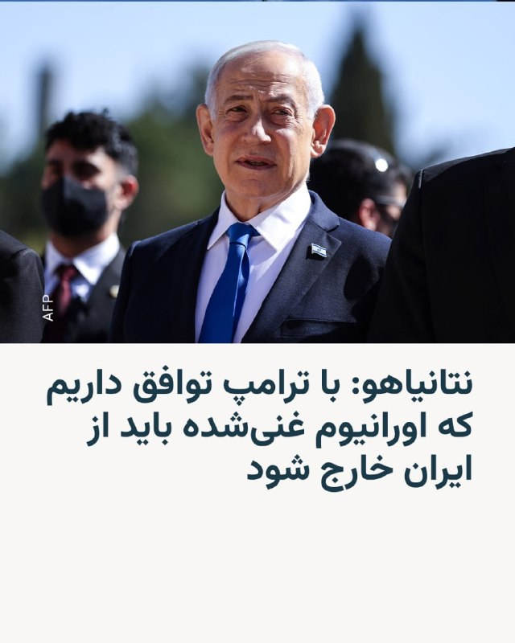

🔸نخست‌وزیر اسرائیل روز یکشنبه گفت که او و دونالد ترامپ، رئیس‌جمهور آمریکا، بعد از یک تماس تلفنی در شامگاه شنبه توافق دارند که هرگونه توافق نهایی با ایران باید تهدید هسته‌ای ناشی از تهران را از بین ببرد.

🔸بنیامین نتانیاهو در پیامی در شبکه ایکس در توضیح بیشتر نوشت: «این یعنی برچیدن تأسیسات غنی‌سازی هسته‌ای ایران و خارج کردن مواد هسته‌ای غنی‌شده آن از خاک این کشور.»

🔸آژانس بین‌المللی انرژی اتمی گفته است ایران بیش از چهارصد کیلو اورانیوم غنی‌شده تا حد ۶۰ درصد دارد که به احتمال زیاد در تأسیسات زیرزمینی بمباران‌شده در جریان جنگ ۱۲ روزه مدفون است. ترامپ بارها گفته که ایران باید این مواد را به آمریکا تحویل دهد.

🔸نخست‌وزیر اسرائیل همچنین خبر داد که ترامپ همچنین بار دیگر بر حق اسرائیل برای دفاع از خود در برابر تهدیدها در تمامی جبهه‌ها، از جمله در لبنان، تأکید کرده است.

🔸رئیس‌جمهور آمریکا شامگاه شنبه اعلام کرد با سران کشورهای منطقه درباره مذاکرات با ایران تماس تلفنی داشته و افزود که به جداگانه با نخست‌وزیر اسرائیل گفت‌وگو کرده که «آن تماس نیز بسیار خوب پیش رفت».

@RadioFarda

## IranianMinds — post 20688

  

🔴 صدور حکم اعدام برای یک دبیر زیست‌شناسی
 
به گزارش منابع حقوق بشری وحید قاسمی دبیر زیست‌شناسی شاغل در دبیرستان «بهشتی» شهرستان فریمان در جریان پرونده‌ای مرتبط با اعتراضات دی۴۰۴ بازداشت و برای او حکم اعدام صادر شده است.

کانون حقوق بشر ایران اعلام کرده وحید قاسمی روز ۲۸ بهمن‌ماه ۱۴۰۴ توسط نیروهای اطلاعات فراجا در محل تدریس خود بازداشت و به زندان وکیل‌آباد مشهد منتقل شد.

بر اساس این گزارش اتهامات این آموزگار «تشویق به حضور در اعتراضات»، «فعالیت تبلیغی علیه نظام»، «توهین به رهبری» و «توهین به مقدسات» بوده است.

این آموزگار هم‌اکنون در زندان وکیل‌آباد مشهد محبوس است اما جزئیات دقیقی درباره روند رسیدگی به پرونده وی منتشر نشده است.

کانون حقوق بشر ایران نوشته مهناز حداد کاخکی، مادر وحید قاسمی و آموزگار ۵۳ ساله، نیز به علت پیگیری وضعیت فرزندش دستگیر و به زندان وکیل‌آباد مشهد منتقل شده است.

@IranianMinds

## IranianMinds — post 20687

  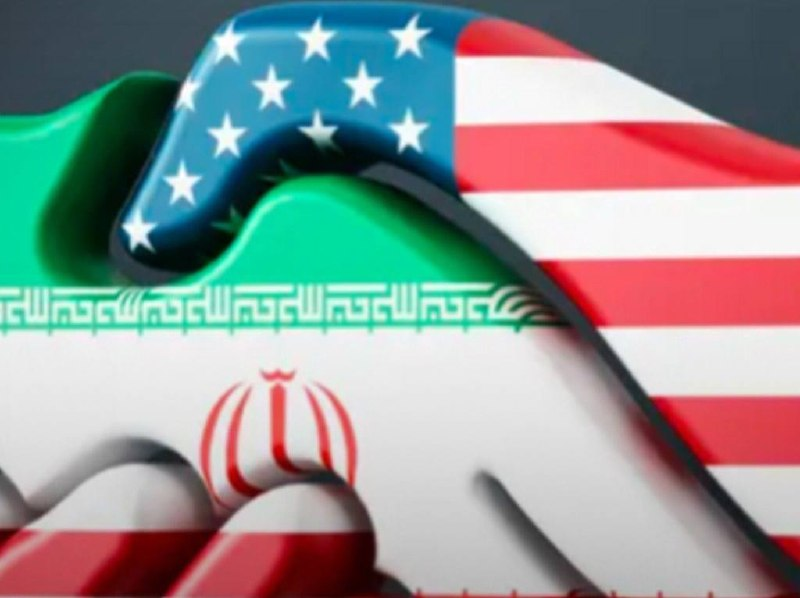

🔴 العربیه :

توافق احتمالی ایران و آمریکا احتمالا به عنوان اعلامیه اسلام آباد منتشر میشود.

@IranianMinds

## IranianMinds — post 20686

  

🔴 سی بی اس نیوز :

به گفته یک مقام ارشد کاخ سفید، ایران در جریان مذاکرات با آمریکا، به‌صورت کلی با کنار گذاشتن اورانیوم غنی‌شده با درصد بالا موافقت کرده است.

هنوز توافق نهایی امضا نشده ، دولت ترامپ معتقد است رهبر ایران چارچوب کلی توافق را تأیید کرده

دو طرف همچنان درباره نحوه نابودی یا انتقال اورانیوم در حال مذاکره هستند

@IranianMinds

## IranianMinds — post 20685

🎁 استارت کن و کانفیگتو رایگان بگیر 
⭐ویژه کاربران پرمیوم تلگرام 
⭐️ اگه اکانت تلگرامت پرمیوم باشه به محض استارت ربات بدون هیچ امتیاز و زیر مجموعه دایی جون بهت کانفیگ هدیه میده 
✔️ همچنین با اوردن دوستای پرمیومت امتیاز بیشتری میگیری 
🎁 @Daeijoonbot | استارت…

## IranianMinds — post 20684

  

🎁 استارت کن و کانفیگتو رایگان بگیر

⭐ویژه کاربران پرمیوم تلگرام

⭐️ اگه اکانت تلگرامت پرمیوم باشه به محض استارت ربات بدون هیچ امتیاز و زیر مجموعه دایی جون بهت کانفیگ هدیه میده

✔️ همچنین با اوردن دوستای پرمیومت امتیاز بیشتری میگیری

🎁 @Daeijoonbot | استارت کن و کانفیگ رایگان بگیر 
🌟

## BBCPersian — post 281959

🔻پلیس ترکیه روز یکشنبه (۲۴ مه/ ۳خرداد) با استفاده از اسپری فلفل، شکستن دروازه و عبور از موانع موقت، وارد دفتر مرکزی حزب جمهوری‌خواه خلق (سی‌اچ‌پی) شد.

پلیس سپس اوزگور اوزال، رهبر حزب جمهوری‌خواه خلق که روز پنجشنبه (۲۱ مه) با حکم دادگاه برکنار شده بود، را از ساختمان بیرون کرد.

هنگامی که هواداران حزب کپسول آتش‌نشانی را به سمت پلیس پرتاب کردند، ابری از دود در ورودی ساختمان دیده می‌شد. افرادی که ماسک زده بودند در فضای کم داخل ساختمان سرفه می‌کردند.

دادگاهی در ترکیه روز پنجشنبه اوزگور اوزل، رهبر حزب جمهوری‌خواه خلق را برکنار کرد و نتایج کنگره حزب جمهوری‌خواه خلق را که در سال ۲۰۲۳ در آن انتخاب شده بود، به دلیل تخلفات لغو کرد.

دادگاه، کمال قلیچدار اوغلو، رئیس سابق حزب جمهوری‌خواه خلق را که در انتخابات سراسری ۲۰۲۳ از رئیس‌جمهور طیب اردوغان شکست خورده بود، به جای اوزال بازگرداند.

اما طرفداران آقای اوزال ساختمان را ترک نکردند و حامیان کمال قلیچداراوغلو تلاش کردند وارد ساختمان حزب شوند که سرانجام پلیس وارد عمل شد و ساختمان را تحت کنترل خود درآورد.

bbc.in/42PlJAL
@BBCPersian

## idfinfarsi — post 11642

  <a href="telegram/content/idfinfarsi_11642_1779641407.mp4" target="_blank">🎬 Download video</a>

برای رفع تهدید فوری: ارتش اسرائیل یک تروریست از سازمان تروریستی حماس را که در یورش به پایگاه زیکیم در کشتار ۷ اکتبر شرکت داشت، به هلاکت رساند

در طول آخر هفته (جمعه)، نیروهای ارتش اسرائیل تحت فرماندهی جنوب، تروریست لؤی هشام محمود بصل را که به‌عنوان تک‌تیرانداز در گردان زیتون وابسته به سازمان تروریستی حماس فعالیت می‌کرد و تهدیدی فوری علیه نیروهای ما محسوب می‌شد، به هلاکت رساندند.

بر اساس بررسی‌های اطلاعاتی، مشخص شد که این تروریست در یورش به پایگاه زیکیم در کشتار خونین ۷ اکتبر مشارکت داشته و در دوره اخیر نیز برای اجرای طرح‌های تروریستی علیه نیروهای ارتش اسرائیل در منطقه فعالیت می‌کرده است.

نیروهای ارتش اسرائیل تحت فرماندهی جنوب مطابق با توافق در منطقه مستقر هستند و به فعالیت خود برای رفع هرگونه تهدید فوری ادامه خواهند داد.

## Dirty_Kids — post 390088

  <a href="telegram/content/Dirty_Kids_390088_1779641408.mp4" target="_blank">🎬 Download video</a>

پشمای شهرام همایون ریخت از دست این صدای امریکا (صدای ج.ا) 😂😂😂

شهرام همایون رفته تو برنامه این زنک فهیمه وسط برنامه، طنز مهران مدیری رو پخش کردن که مسخرش میکرد

شهرام همایون شدید قاطی میکنه!

@Dirty_Kids 👻

## Dirty_Kids — post 390087

  

رییس جمهور آمریکا
جو باراک ترامپ

@Dirty_Kids 👻

## Dirty_Kids — post 390086

  

🌪وقتی اینترنت طوفانیه فقط کافیه بادبان ها رو بکشی

⚫️100 هزار تومان تخفیف خرید اول 
🎁

⚫️پایین ترین قیمت گیگی 180 هزار تومان
🌐 

⚫️پورسانت %10 دائمی برای هر معرفی
💼

با بادبان، میتونی یه اتصال سریع، پایدار و امن
همراه با پشتیبانی ۲۴ ساعته داشته باشی
🚀

🛒کد تخفیف: badban4k

بادبان راهتو باز می‌کنه
⛵️
G3

🛡@BadBan_VPN | کانال 

🤖@BadBan_VPNBot | ربات 

📞@BadBan_VPNSupport | پشتیبانی

## Dirty_Kids — post 390085

ترامپ واقعا عموعه تهش ارثمون رو بالا کشید

@Dirty_Kids 👻

## Dirty_Kids — post 390084

‏بنظرم ایران با چین معامله کرده، گفته آمریکا برای من تایوان برای تو

@Dirty_Kids 👻

## Hranews — post 113137

  

پرونده “شهرک اکباتان” در دادگاه انقلاب؛ ۴ متهم به اعدام و ۴ تن به حبس محکوم شدند

❗️
❗️
❗️
❗️
❗️– میلاد آرمون، نوید نجاران، مهدی ایمانی و سید محمدمهدی حسینی متهمان پرونده موسوم به “شهرک اکباتان” و از بازداشت شدگان اعتراضات سراسری ۱۴۰۱، توسط دادگاه انقلاب تهران به اتهام «#محاربه» به #اعدام محکوم شدند. امیرمحمد خوش‌اقبال، علیرضا برمرز پورناک، علیرضا کفایی و حسین نعمتی دیگر متهمان این پرونده نیز هرکدام به هفت سال حبس و مجازات های تکمیلی محکوم شدند. بخش دیگر این پرونده در دادگاه کیفری رسیدگی و چندی پیش منجر به صدور حکم #حبس و دیه برای برخی از متهمان شد.

به گزارش خبرگزاری هرانا، ارگان خبری مجموعه فعالان حقوق بشر در ایران، هشت تن از متهمان پرونده اکباتان توسط دادگاه انقلاب محکوم شدند.

براساس حکمی که توسط شعبه ۱۵ دادگاه انقلاب تهران به ریاست قاضی ابوالقاسم صلواتی صادر شده، میلاد آرمون، نوید نجاران، مهدی ایمانی و سید محمدمهدی حسینی از بابت اتهام «محاربه» اعدام محکوم شدند. همچنین امیرمحمد خوش‌اقبال، علیرضا برمرز پورناک، علیرضا کفایی و حسین نعمتی دیگر متهمان این پرونده نیز هرکدام به پنج سال زندان از بابت اتهام اجتماع و تبانی، دوسال حبس از بابت تبلیغ علیه نظام، دو سال منع فعالیت در فضای مجازی و دو سال منع اسکان در تهران و البرز محکوم شدند.
یک منبع مطلع از پرونده این افراد در گفت‌وگو با هرانا اعلام کرد که حکم صادره در روز جاری، بدون حضور و اطلاع وکلای پرونده، به‌صورت شفاهی به متهمان ابلاغ شده است. به گفته این منبع، حکم تاکنون به وکلای پرونده ابلاغ نشده؛ موضوعی که عملاً امکان ثبت درخواست تجدیدنظرخواهی را از آنان سلب کرده است.

ادامه مطلب

#میلاد_آرمون، #نوید_نجاران، #مهدی_ایمانی، #سید_محمدمهدی_حسینی، #امیرمحمد_خوش‌اقبال، #علیرضا_برمرز_پورناک، #علیرضا_کفایی، #حسین_نعمتی #اکباتان

↘️
@hranews_bot تماس ✉️ -  @Hranews  کانال هرانا 🆑

## manototv — post 105809

  <a href="telegram/content/manototv_105809_1779641412.mp4" target="_blank">🎬 Download video</a>

وزیران خارجه ۱۹ کشور عربی و اسلامی در بیانیه‌ای مشترک، اقدام منطقه موسوم به «سومالی‌لند» در افتتاح «سفارت» در اورشلیم را به‌شدت محکوم کردند.

در این بیانیه که روز یکشنبه سوم خرداد منتشر شد، این اقدام «غیرقانونی و مردود» خوانده شده و آمده است که افتتاح این دفتر، نقض آشکار قوانین بین‌المللی و قطعنامه‌های مربوط به مشروعیت بین‌المللی است.

وزیران خارجه کویت، مصر، عربستان سعودی، قطر، اردن، ترکیه، پاکستان، اندونزی، جیبوتی، سومالی، فلسطین، عمان، سودان، یمن، لبنان، موریتانی، الجزایر، بنگلادش و مراکش تاکید کردند که اورشلیم شرقی «سرزمین فلسطینی اشغال‌شده از سال ۱۹۶۷» است و هر اقدامی برای تغییر وضعیت حقوقی و تاریخی آن «باطل و بی‌اثر» است.

این کشورها همچنین حمایت کامل خود را از وحدت، حاکمیت و تمامیت ارضی جمهوری فدرال سومالی اعلام کردند و هرگونه اقدام یک‌جانبه علیه وحدت سرزمینی سومالی را مردود دانستند.

## alonews — post 122390

  <a href="telegram/content/alonews_122390_1779641413.webm" target="_blank">🎬 Download video</a>

👈 تسنیم: علیرغم برخی گفتگوهای امروز، کارشکنی‌ های آمریکا در برخی بندهای تفاهم از جمله موضوع آزادسازی اموال بلوکه شده ایران همچنان ادامه دارد و تا این لحظه این موضوعات حل نشده است.

🔴 بر این اساس، در حال حاضر همچنان امکان منتفی شدن تفاهم وجود دارد و ایران تاکید کرده است که از خطوط قرمز خود برای احقاق حقوق مردم کوتاه نخواهد آمد

✅ @AloNews خبر جنگ

## alonews — post 122389

  <a href="telegram/content/alonews_122389_1779641413.webm" target="_blank">🎬 Download video</a>

🔴فوری / علی هاشم خبرنگار الجزیره: کمتر از ۲۴ ساعت پس از ظهور خوش‌بینی در مورد امکان توافق‌نامه ایران و آمریکا، حال‌وهوای منفی دوباره سر برآورده است.

🔴 منبعی آگاه ایرانی به من می‌گوید که نشانه‌هایی از عقب‌نشینی آمریکا در دو مسئله مرکزی وجود دارد: مکانیسم برای از یخ‌زدگی خارج کردن دارایی‌های ایرانی و دامنه آتش‌بس در لبنان.

🔴 بر اساس گفته‌های این منبع، توافق‌نامه شامل چارچوبی برای آتش‌بس در لبنان است، اما گزارش شده است که اسرائیل با این چیدمان راحت نیست و واشنگتن را تحت فشار قرار می‌دهد تا بندی را اضافه کند که به آن اجازه دهد تحت توجیه پاسخ به «هرگونه تهدید»، عملیات نظامی در لبنان انجام دهد.

🔴ایران این فرمول‌بندی را رد کرده و بر یک آتش‌بس پایدار و ماندگار اصرار دارد.

🔴 تهران به تمام میانجی‌گران، از جمله پاکستان، اطلاع داده است که تا زمانی که تمام بندها به طور کامل توافق و تضمین نشوند، توافق‌نامه را امضا نخواهد کرد.

🔴 گزارش شده است که پاکستان پیشنهاد داده است با بخش‌های توافق‌شده پیش بروند و نقاط اختلاف را به تعویق بیندازند، اما ایران این رویکرد را رد کرده و اصرار دارد که بندهای مورد اختلاف بنیادین و غیرقابل مذاکره هستند.

🔴 تصویر کلی نشان می‌دهد که تهران فزاینده‌تر واشنگتن را در حال عقب‌نشینی از تفاهم‌های قبلی که از طریق میانجی‌گران حاصل شده بود، می‌بیند.

✅ @AloNews خبر جنگ

## alonews — post 122388

  <a href="telegram/content/alonews_122388_1779641413.webm" target="_blank">🎬 Download video</a>

👈رئیس ستاد کل ارتش اسرائیل:
ما آماده‌ایم که فوراً به نبرد با ایران بازگردیم.

✅ @AloNews خبر جنگ

## alonews — post 122387

  <a href="telegram/content/alonews_122387_1779641414.webm" target="_blank">🎬 Download video</a>

👈طبق گزارش فاکس نیوز، ترامپ می‌خواهد توافق پیشنهادی توسط مذاکره‌کنندگان او، از جمله استیو ویتکوف و جرد کوشنر، اجرا شود؛ اگر این شرایط برآورده نشوند، هیچ توافقی صورت نخواهد گرفت.

✅ @AloNews خبر جنگ

## alonews — post 122385

  <a href="telegram/content/alonews_122385_1779641414.webm" target="_blank">🎬 Download video</a>

👈تسنیم: کارشکنی آمریکا در برخی بندهای تفاهم تا این لحظه ادامه دارد

✅ @AloNews خبر جنگ

## alonews — post 122381

  <a href="telegram/content/alonews_122381_1779641414.mp4" target="_blank">🎬 Download video</a>

👈 جنگنده‌های اسرائیلی به زراریه، سومور (دره البقاع)، كفرسیر و سر الغربیّه در لبنان حمله کردند.

✅ @AloNews خبر جنگ

## alonews — post 122380

  <a href="telegram/content/alonews_122380_1779641417.webm" target="_blank">🎬 Download video</a>

👈دبیرکل حزب‌الله: خلع سلاح را نمی پذیریم

✅ @AloNews خبر جنگ

## alonews — post 122379

  <a href="telegram/content/alonews_122379_1779641417.webm" target="_blank">🎬 Download video</a>

👈سی‌بی‌اس نیوز: موضوعاتی نظیر ذخایر موشکی ایران و غنی‌سازی اورانیوم در مذاکرات آتی مورد بررسی قرار خواهد گرفت

✅ @AloNews خبر جنگ

## alonews — post 122378

  <a href="telegram/content/alonews_122378_1779641417.webm" target="_blank">🎬 Download video</a>

👈یک مقام آمریکایی به اکسیوس گفت: برخی از جزئیات توافق با ایران هنوز نهایی نشده است

✅ @AloNews خبر جنگ

## alonews — post 122377

  <a href="telegram/content/alonews_122377_1779641418.webm" target="_blank">🎬 Download video</a>

👈نیویورک تایمز به نقل از یک مقام آمریکایی: مسائلی مانند ذخایر موشکی ایران و غنی سازی اورانیوم در مذاکرات بعدی مورد بحث قرار خواهد گرفت.

✅ @AloNews خبر جنگ

## alonews — post 122376

  <a href="telegram/content/alonews_122376_1779641418.webm" target="_blank">🎬 Download video</a>

👈منابع به المیادین: ابتکار چین، تنگه هرمز را از نقطه تنش و اختلاف به نقطه‌ای برای توافق و حل‌وفصل به سود همه طرف‌ها تبدیل می‌کند

✅ @AloNews خبر جنگ

## alonews — post 122375

  <a href="telegram/content/alonews_122375_1779641418.webm" target="_blank">🎬 Download video</a>

👈یک منبع اسرائیلی به سی‌بی‌اس گفته که به واشنگتن اعلام کرده‌اند حتی در صورت توافق با ایران، آزادی عملشان در جبهه‌هایی مثل لبنان باید حفظ شود.

✅ @AloNews خبر جنگ

## alonews — post 122373

  <a href="telegram/content/alonews_122373_1779641418.webm" target="_blank">🎬 Download video</a>

👈اسرائیل دقایقی قبل حملات سنگینی در جنوب لبنان انجام داد

✅ @AloNews خبر جنگ

## alonews — post 122370

  <a href="telegram/content/alonews_122370_1779641419.webm" target="_blank">🎬 Download video</a>

👈معاون بین‌الملل وزارت خارجه: نشست مبسوطی میان هیئت‌های عمانی و ایرانی برای بررسی مجموعه‌ای از اصول حاکم بر عبور شناورها در تنگه هرمز با رعایت امنیت و حاکمیت ملی دولت‌های ساحلی این‌ تنگه و در پرتو قواعد قابل اعمال حقوق بین‌الملل برگزار شد.

✅ @AloNews خبر جنگ

---
📅 بروزرسانی: 1405/03/03 19:08
---

## VahidOOnLine — post 241958

  

دونالد ترامپ صحبت‌های مسعود پزشکیان را که گفته بود «آماده‌ایم به جهان اطمینان دهیم که به‌دنبال سلاح هسته‌ای نیستیم و خواهان بی‌ثباتی در منطقه نیز نیستیم»، در شبکه تروث سوشال بازنشر کرد.

ترامپ پیش‌تر نیز گفت روابط آمریکا با جمهوری اسلامی در حال حرفه‌ای‌تر و سازنده‌تر شدن است.
‌🏁 🇬🇧 IranintlTV

🤖 @VahidOOnLine

## VahidOOnLine — post 241957

  

به گزارش اکسیوس، یک مقام ارشد آمریکایی به خبرنگاران گفت کاخ سفید انتظار ندارد توافق برای پایان جنگ با جمهوری اسلامی یکشنبه نهایی شود و معتقد است تأیید آن از سوی رهبران جمهوری اسلامی، از جمله مجتبی خامنه‌ای، ممکن است چند روز زمان ببرد.

او افزود با وجود خوش‌بینی مقام‌های آمریکایی به دستیابی به توافق در روزهای آینده، مذاکرات هنوز نهایی نشده و همچنان احتمال شکست آن وجود دارد.

به گفته این مقام، این توافق می‌تواند از تشدید جنگ جلوگیری کرده و فشار بر بازار جهانی نفت را کاهش دهد، اما هنوز مشخص نیست آیا به توافقی پایدار، از جمله درباره خواسته‌های هسته‌ای ترامپ، منجر خواهد شد یا نه.
‌🏁 🇬🇧 IranintlTV

🤖 @VahidOOnLine

## VahidOOnLine — post 241956

  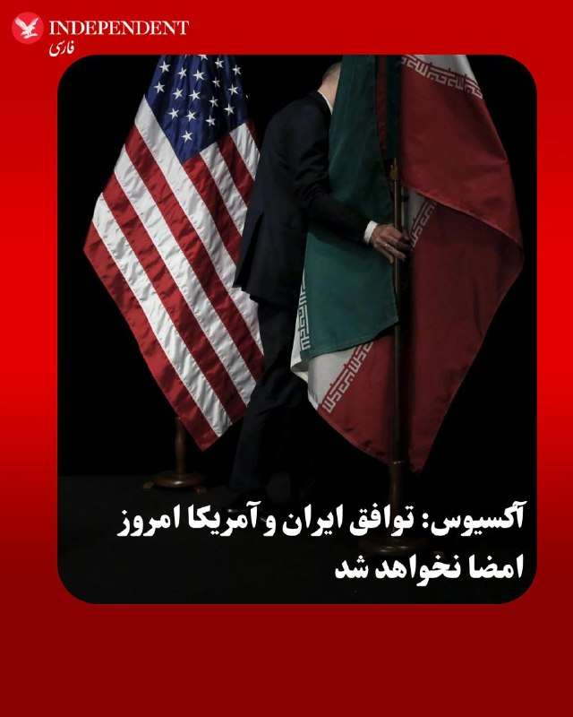

♦️رسانه آکسیوس، روز یکشنبه سوم خرداد ماه، به نقل از یک مقام ارشد دولت دونالد ترامپ گزارش داد، «چند مورد جزئیات حل‌نشده» میان تهران و واشنگتن باقی‌مانده است و به همین دلیل توافق میان ایران و آمریکا احتمالا امروز امضا نخواهد شد.

این مقام آمریکایی به آکسیوس گفت هنوز بر سر برخی بخش‌های توافق «رفت‌وبرگشت» وجود دارد و اختلاف‌ها بیشتر بر سر عباراتی است که برای هر یک از دو طرف اهمیت دارد: «برخی کلمات برای ما مهم هستند و برخی کلمات برای آن‌ها.»

آکسیوس به نقل از این مقام ارشد کاخ سفید نوشت، ساختار تصمیم‌گیری در جمهوری اسلامی «سریع عمل نمی‌کند» و روند دریافت همه تاییدیه‌های لازم چند روز زمان خواهد برد.

به گفته این مقام، ارزیابی واشنگتن این است که «مجتبی خامنه‌ای»، رهبر جمهوری اسلامی، چارچوب کلی توافق را تایید کرده، اما اینکه این روند به توافق نهایی منجر شود، «همچنان یک سوال باز» است.
‌🇸🇦 Indypersian

🤖 @VahidOOnLine

## VahidOOnLine — post 241955

  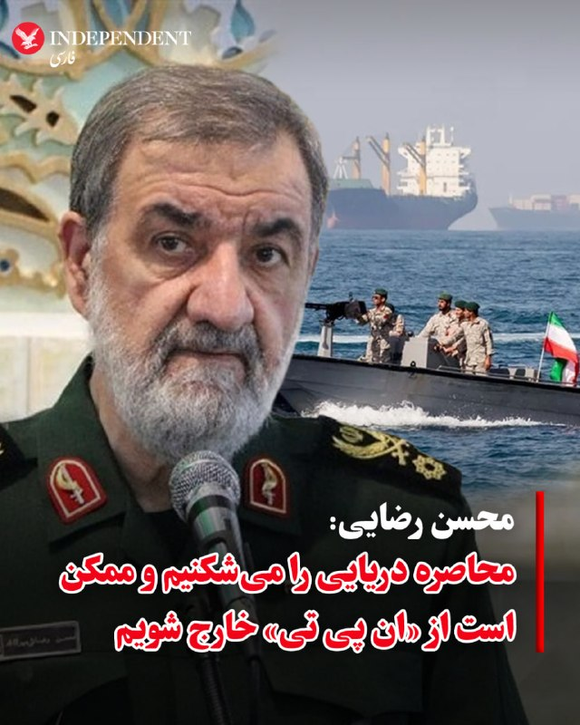

♦️محسن رضایی، فرمانده سابق سپاه پاسداران و مشاور مجتبی خامنه‌ای، روز یکشنبه سوم خرداد ماه، در مراسمی حکومتی با هشدار به آمریکا اعلام کرد، نیروهای مسلح جمهوری اسلامی در صورت ورود نیروهای آمریکایی به خلیج فارس و یا حمله به تنگه هرمز، علاوه بر شکستن هرگونه محاصره دریایی، دست به اقداماتی قاطع خواهند زد و «خروج از پیمان منع گسترش سلاح‌های هسته‌ای (NPT)» نیز یکی از گزینه‌های جدی روی میز تهران است.

رضایی همچنین گفت آمریکا باید با پذیرش شروط «منصفانه» ایران، از «خودکشی اقتصادی و نظامی» جلوگیری کند.
این اظهارات در حالی مطرح می‌شود که گزارش‌ها از احتمال نهایی شدن توافق میان دو طرف در آینده نزدیک خبر می‌دهند.

همزمان با سخنان محسن رضایی، دونالد ترامپ نیز صبح یکشنبه (به وقت آمریکا) تصویری ساخته با هوش مصنوعی را در شبکه اجتماعی تروث سوشال منتشر کرد که انهدام یک قایق سپاه پاسداران به دست پهپاد آمریکایی را نشان می‌دهد.
کارشناسان معتقدند با توجه به حساسیت شرایط در دو سو، تهران و واشنگتن تهدیدهای متقابل را تا پیش از رسیدن به توافق ادامه خواهند داد.
‌🇸🇦 Indypersian

🤖 @VahidOOnLine

## VahidOOnLine — post 241954

  

بنیامین نتانیاهو، نخست‌وزیر اسرائیل، اعلام کرد او و دونالد ترامپ توافق دارند هرگونه توافق نهایی با جمهوری اسلامی باید به‌طور کامل تهدید هسته‌ای را برطرف کند.

او گفت این به معنای برچیدن تاسیسات غنی‌سازی ایران و خارج کردن مواد هسته‌ای غنی‌شده از خاک این کشور است.

نتانیاهو افزود ترامپ بار دیگر بر حق اسرائیل برای دفاع از خود در برابر تهدیدها در همه جبهه‌ها، از جمله لبنان، تاکید کرده است.

او همچنین گفت سیاست او، همانند سیاست ترامپ، همچنان ثابت است؛ ایران نباید به سلاح هسته‌ای دست یابد.
‌🏁 🇬🇧 IranintlTV

🤖 @VahidOOnLine

## VahidOOnLine — post 241953

  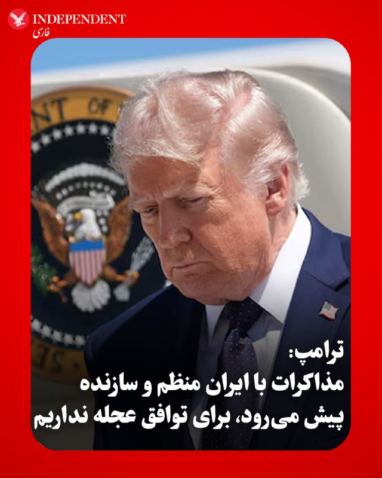

♦️دونالد ترامپ، رئیس‌جمهوری آمریکا، روز یکشنبه سوم خرداد در پیامی در شبکه اجتماعی تروث سوشال اعلام کرد مذاکرات با ایران «به شکلی منظم و سازنده» در حال پیشرفت است و دولت او برای دستیابی به توافق عجله‌ای ندارد.
ترامپ نوشت: «به نمایندگان خود اطلاع داده‌ام که برای رسیدن به توافق عجله نکنند، زیرا زمان به نفع ماست.»
او همچنین تاکید کرد فشارها و محاصره علیه ایران تا زمان دستیابی، تایید و امضای توافق، به‌طور کامل ادامه خواهد یافت.
‌🇸🇦 Indypersian

🤖 @VahidOOnLine

## VahidOOnLine — post 241952

  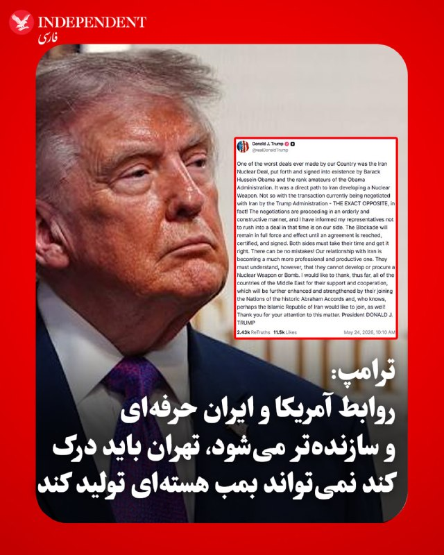

♦️دونالد ترامپ، رئیس‌جمهوری آمریکا، روز یکشنبه ۳ خرداد در پیامی در شبکه اجتماعی تروث سوشال، با تاکید بر آنکه مذاکره با تهران «به شکلی منظم و سازنده» در حال پیشرفت است، نوشت به نمایندگان خود دستور داده برای رسیدن به توافق عجله نکنند، زیرا «زمان به نفع آمریکا است.»
رئیس‌جمهوری آمریکا همچنین اعلام کرد محاصره علیه ایران تا زمان دستیابی، تایید و امضای توافق، «با قدرت و به طور کامل» ادامه خواهد داشت.
ترامپ در ادامه نوشت روابط آمریکا و ایران در حال تبدیل شدن به «رابطه‌ای حرفه‌ای‌تر و سازنده‌تر» است، اما تهران باید درک کند که «نمی‌تواند سلاح یا بمب هسته‌ای تولید یا به دست آورد.»
توافق هسته‌ای دوران باراک اوباما را «یکی از بدترین توافق‌های» تاریخ آمریکا توصیف کرد و گفت آن توافق، «مسیری مستقیم» برای دستیابی ایران به سلاح هسته‌ای بود.
ترامپ با اشاره به مذاکرات کنونی میان تهران و واشنگتن نوشت توافقی که دولت او با ایران در حال مذاکره بر سر آن است، «دقیقا برعکس» توافق دوران اوباما خواهد بود.
او در پایان از کشورهای خاورمیانه به دلیل حمایت و همکاری در روند مذاکرات قدردانی کرد.
‌🇸🇦 Indypersian

🤖 @VahidOOnLine

## VahidOOnLine — post 241951

  <a href="telegram/content/VahidOOnLine_241951_1779637093.mp4" target="_blank">🎬 Download video</a>

دونالد ترامپ، رئیس‌جمهور آمریکا، در پیامی تازه بار دیگر توافق هسته‌ای دوره باراک اوباما با جمهوری اسلامی را «یکی از بدترین توافق‌های تاریخ آمریکا» خواند و گفت آن توافق مسیر دستیابی تهران به سلاح هسته‌ای را هموار می‌کرد.

ترامپ گفت مذاکرات کنونی دولت او با جمهوری اسلامی «منظم و سازنده» پیش می‌رود، اما به نمایندگان خود دستور داده برای رسیدن به توافق عجله نکنند، زیرا به گفته او «زمان به سود آمریکا است».

او اضافه کرد انسداد علیه جمهوری اسلامی تا زمان دستیابی به توافق، تایید و امضای آن، با قدرت کامل ادامه خواهد داشت.

ترامپ افزود دو طرف باید با دقت و بدون خطا پیش بروند و جمهوری اسلامی باید بداند که نمی‌تواند سلاح هسته‌ای تولید یا تهیه کند.

رئیس‌جمهور آمریکا همچنین از کشورهای خاورمیانه برای حمایت و همکاری در این روند تشکر کرد و گفت این همکاری می‌تواند با پیوستن بیشتر کشورها به پیمان‌های ابراهیم تقویت شود. او در ادامه نوشت شاید جمهوری اسلامی نیز بخواهد به این روند بپیوندد.
‌🏁 🇬🇧 ManotoTV

🤖 @VahidOOnLine

## VahidOOnLine — post 241950

  

شانزده سال پیش، منوتو با یک باور ساده آغاز شد:

اینکه مردم ایران شایسته‌ی رسانه‌ای حرفه ای هستند که حقیقت را بی‌واسطه، بی‌ واهمه و بدون وابستگی به هیچ دولت و قدرتی، با آن‌ها در میان بگذارد. بر اساس این باور، منوتو همیشه صدای مستقل خود را داشت؛ صدایی که از دل اعتماد، همراهی و دغدغه‌های شما شکل گرفت و نشان داد که ایرانیان، با هر پیشینه، باور و نگاه متفاوت، می‌توانند زیر یک سقف و برای هدفی بزرگ‌تر، کنار هم بایستند و به آنچه می خواهند دست یابند.

در طول سالها، ما آموختیم که رسانه فقط برای خبر دادن نیست. رسانه می تواند حافظه‌ی یک ملت باشد؛ جایی که رنج‌ها، شادی‌ها، امیدها، شکست‌ها و ایستادگی‌ها ثبت می‌شوند تا فراموش نشوند.

ما همیشه ایران را فراتر از یک جغرافیا دیدیم؛ ایران برای ما میراث است، هویت، فرهنگ و غرور ملی است، و مسئولیتی برای تک تک ما، که نباید از آن چشم پوشید.

این مسیر آسان نبود و در طول سال‌ها با وجود تهدیدها، تخریب‌ها و فشار، به راه خود ادامه دادیم و آنچه کردیم و آنچه گفتیم، و جایی که در لحظات حساس تاریخ ایستادیم، قابل داوری و باعث افتخار ماست.

امروز فصل پخش منوتو به پایان می‌رسد؛ اما باورهایی که این مسیر را آغاز کرد، پایان نمی‌گیرد.

از هر بیننده، همراه، منتقد و حامی که در این سال‌ها کنار ما بود، صمیمانه سپاسگزارم.

راه آینده شاید شکل دیگری داشته باشد؛ اما باور ما به ایران، به مردم ایران، و به فردایی آزاد و بهتر، همچنان پابرجا و زنده است.
‌🏁 🇬🇧 ManotoTV

🤖 @VahidOOnLine

## VahidOOnLine — post 241949

  

♦️دونالد ترامپ، رئیس جمهوری ایالات متحده، روز یکشنبه سوم خرداد ماه، تصویری ساخته با هوش مصنوعی را در شبکه اجتماعی تروث سوشال منتشر کرد که انهدام یک قایق سپاه پاسداران  به دست پهپاد آمریکایی را نشان می‌دهد.

بر این تصویر، واژه «حداحافظ» به زبان اسپانیایی نوشته شده است.
این تصویر در حالی توسط رئیس جمهوری آمریکا منتشر می‌شود که رسانه‌ها در انتظار نهایی شدن توافق احتمالی تهران و واشنگتن برای پایان جنگ هستند.
‌🇸🇦 Indypersian

🤖 @VahidOOnLine

## VahidOOnLine — post 241948

♦️محسن رضایی، فرمانده سابق سپاه پاسداران و مشاور مجتبی خامنه‌ای، روز یکشنبه سوم خرداد ماه در مراسم حکومتی «بزرگداشت شهدای جنگ تحمیلی» اعلام کرد دونالد ترامپ و ارتش آمریکا در «بن‌بست کامل» قرار دارند و هشدار داد هرگونه ورود به جنگ، آمریکا را وارد «دالانی تاریک و بی‌انتها» خواهد کرد.
رضایی با تهدید ضمنی کشورهای منطقه گفت: این دالان از تنگه هرمز آغاز می‌شود و تا خلیج فارس، دریای عمان، باب‌المندب و اقیانوس هند امتداد پیدا می‌کند و می‌تواند به جنگی گسترده در منطقه منجر شود.
مشاور رهبر سوم جمهوری اسلامی همچنین ادعا کرد نیروی دریایی سپاه با مدیریت بر تنگه هرمز، امنیت عبور کشتی‌های کشورهای مختلف را پس از شناسایی و ثبت تامین کرده است. رضایی در ادامه هشدار داد در صورت هرگونه اقدام نظامی علیه تنگه هرمز یا تلاش برای ورود به خلیج فارس، جمهوری اسلامی «پاسخی سخت، دردناک و بی‌نظیر» خواهد داد.
این سخنان در حالی مطرح می‌شود که گمانه‌زنی‌ها از توافق احتمالی میان تهران و واشنگتن برای پایان جنگ و بازگشایی تنگه هرمز خبر می‌دهد.
‌🇸🇦 Indypersian

🤖 @VahidOOnLine

## VahidOOnLine — post 241947

  

محسن رضایی، مشاور نظامی مجتبی خامنه‌ای، گفت کاری خواهیم کرد که «امنیت» کشور برای ۵۰ سال آینده تامین شود.
او افزود: «از یک طرف دست‌مان روی ماشه برای نبرد چهارم است و از طرف دیگر مسئولان در حال مذاکره هستند.»
رضایی گفت آمریکا پس از جنگ دیگر به آمریکای سابق بازنخواهد گشت و جمهوری اسلامی افول آمریکا در خاورمیانه را رقم زده است.
مشاور نظامی خامنه‌ای گفت در صورت تعرض به تنگه هرمز و ورود به خلیج‌فارس، محاصره دریایی را خواهند شکست و پاسخی سخت به آمریکا خواهند داد.
رضایی اضافه کرد اگر روند خصمانه علیه جمهوری اسلامی ادامه یابد، تهران از معاهده «ان‌پی‌تی» خارج خواهد شد و این اقدام پیامدهای سنگینی برای آمریکا خواهد داشت.
‌🏁 🇬🇧 IranintlTV

🤖 @VahidOOnLine

## VahidOOnLine — post 241946

  

دونالد ترامپ در تروث سوشال نوشت توافقی که دولت او در حال مذاکره بر سر آن است، دقیقا برعکس توافق هسته‌ای دولت اوباما خواهد بود. او گفت مذاکرات به شکلی منظم و سازنده پیش می‌رود و به نمایندگانش دستور داده برای رسیدن به توافق عجله نکنند، زیرا زمان به نفع آمریکاست.

ترامپ تاکید کرد محاصره به‌طور کامل ادامه خواهد داشت تا زمانی که توافقی حاصل، تأیید و امضا شود و هر دو طرف باید بدون اشتباه و با صرف زمان کافی کار را به‌درستی انجام دهند.

او همچنین نوشت روابط آمریکا با جمهوری اسلامی در حال حرفه‌ای‌تر و سازنده‌تر شدن است، اما ایران اجازه تولید یا دستیابی به سلاح یا بمب هسته‌ای را نخواهد داشت.
‌🏁 🇬🇧 IranintlTV

🤖 @VahidOOnLine

## VahidOOnLine — post 241945

  <a href="telegram/content/VahidOOnLine_241945_1779637096.mp4" target="_blank">🎬 Download video</a>

راهپیمایی از مقابل ساختمان بی‌بی‌سی بسمت دفتر نخست‌وزیری، یکشنبه سوم خرداد ۱۴۰۵
‌🏁 🇬🇧 ManotoTV

🤖 @VahidOOnLine

## VahidOOnLine — post 241944

  <a href="telegram/content/VahidOOnLine_241944_1779637098.mp4" target="_blank">🎬 Download video</a>

♦️فیلم «فیورد» ساخته کریستیان مونجیو، کارگردان سرشناس رومانیایی، روز شنبه نخل طلای هفتادونهمین جشنواره فیلم کن را از آن خود کرد؛ جایزه‌ای که دومین نخل طلای این فیلمساز محسوب می‌شود.
مونجیو در این فیلم ۱۴۶ دقیقه‌ای، روایت خانواده‌ای مذهبی نروژی-رومانیایی را به تصویر می‌کشد که پس از نقل مکان به روستایی دورافتاده در نروژ، هدف تحقیقات مربوط به کودک‌آزاری قرار می‌گیرند. این فیلم با بازی رناته رینسوه و سباستین استن، نگاهی انتقادی به تناقض‌های جامعه مدرن اسکاندیناوی و مفهوم مدارا و تساهل در آن دارد.
«فیورد» که بر اساس رویدادهای واقعی ساخته شده، از آثار بحث‌برانگیز جشنواره امسال بود و بسیاری از منتقدان آن را یکی از مهم‌ترین فیلم‌های کن توصیف کردند.
مونجیو هنگام دریافت جایزه گفت: «این فیلم درباره مدارا، همزیستی و همدلی است؛ ارزش‌هایی که همه ما به آن‌ها باور داریم، اما باید بیشتر در عمل اجرا شوند.»
کریستیان مونجیو پیش‌تر نیز با فیلم «چهار ماه، سه هفته و دو روز» موفق به دریافت نخل طلای کن شده بود و از چهره‌های شاخص سینمای مولف اروپا به شمار می‌رود.
‌🇸🇦 Indypersian

🤖 @VahidOOnLine

## WithYashar — post 12342

حسین یکتا: علی خامنه ای توی دوران جنگ شبانه با حاج علی مالکی رفتن حموم، حضرت آقا گفت فقط به شرطی میذارم منو لیف بکشی که منم تورو لیف بزنم و کیسه بکشم. @withyashar

## WithYashar — post 12341

## WithYashar — post 12340

یک مقام ارشد دولت ترامپ در گفتگو با آکسیوس ادعا کرد که انتظار نمی‌رود توافق با ایران امروز امضا شود، زیرا هنوز جزئیات متعددی باید نهایی شوند.

این مقام مدعی شد که مذاکرات درباره عبارت‌بندی‌های مشخص در متن توافق ادامه دارد و آن را «برخی کلماتی که برای ما مهم است و برخی کلماتی که برای آن‌ها مهم است» توصیف کرد.
@withyashar

## WithYashar — post 12339

  

ترامپ در تروث پست تری یینگست را منتشر کرد که از قول مسعود پزشکیان است که گفته : «ما آماده‌ایم به جهان اطمینان بدهیم که به دنبال سلاح هسته‌ای نیستیم. همچنین به دنبال ایجاد بی‌ثباتی در منطقه نیستیم.
@withyashar

## WithYashar — post 12338

  

ترامپ در تروث : یکی از بدترین توافق‌هایی که کشور ما تا به حال انجام داده، «توافق هسته‌ای ایران» بود که توسط باراک حسین اوباما و افراد کاملاً غیرحرفه‌ای دولت اوباما طراحی و امضا شد. این توافق، یک مسیر مستقیم برای ایران جهت دستیابی به سلاح هسته‌ای ایجاد می‌کرد.

اما وضعیتی که اکنون در حال مذاکره با ایران توسط دولت ترامپ است، کاملاً برعکس آن می‌باشد — دقیقاً نقطه مقابل!

این مذاکرات به شکلی منظم و سازنده در حال پیشرفت است و من به نمایندگان خود گفته‌ام که در رسیدن به توافق عجله نکنند، چون زمان به نفع ماست.

محاصره و فشارها تا زمانی که یک توافق نهایی حاصل، تأیید و امضا شود، به‌طور کامل ادامه خواهد داشت. هر دو طرف باید با دقت و بدون شتاب عمل کنند. هیچ اشتباهی نباید رخ دهد.

روابط ما با ایران در حال تبدیل شدن به رابطه‌ای حرفه‌ای‌تر و سازنده‌تر است. با این حال، آن‌ها باید درک کنند که نباید اجازه ساخت یا به‌دست‌آوردن هیچ‌گونه سلاح یا بمب هسته‌ای را داشته باشند.

در پایان، از تمام کشورهای خاورمیانه بابت حمایت و همکاری‌شان تشکر می‌کنم؛ همکاری‌ای که با پیوستن آن‌ها به «توافق‌های تاریخی ابراهیم» بیشتر و قوی‌تر خواهد شد. و چه بسا شاید جمهوری اسلامی ایران هم در آینده مایل به پیوستن به این توافق‌ها باشد.
از توجه شما به این موضوع سپاسگزارم.
@withyashar

## mwarmonitor — post 9646

  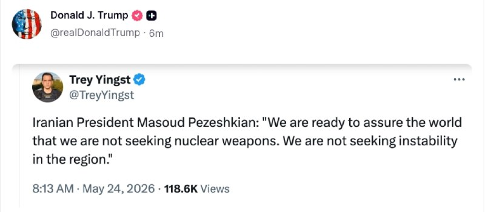

🔸ترامپ در سوشال تروث

🔹مسعود پزشکیان، رئیس‌جمهور ایران: «ما آماده‌ایم به جهان اطمینان دهیم که به دنبال سلاح هسته‌ای نیستیم. ما به دنبال بی‌ثباتی در منطقه نیستیم.»

@mwarmonitor

## mwarmonitor — post 9645

🔰بنیامین نتانیاهو:

🔸«من دیشب با رئیس‌جمهور Donald Trump درباره یادداشت تفاهم برای بازگشایی تنگه هرمز و مذاکرات پیشِ‌رو برای رسیدن به توافق نهایی درباره برنامه هسته‌ای ایران صحبت کردم.

🔸من قدردانی عمیق خود را از رئیس‌جمهور ترامپ به‌خاطر تعهد تزلزل‌ناپذیرش به امنیت اسرائیل ابراز کردم؛ از جمله در جریان عملیات «Roaring Lion» و «Epic Fury»، زمانی که نیروهای آمریکایی و اسرائیلی شانه‌به‌شانه علیه تهدید ایران جنگیدند.

🔸ترامپ و من توافق کردیم که هر توافق نهایی با ایران باید خطر هسته‌ای را به‌طور کامل از بین ببرد. این به معنای برچیدن تأسیسات غنی‌سازی ایران و خارج کردن مواد هسته‌ای غنی‌شده از خاک این کشور است.

🔸ترامپ همچنین حق اسرائیل برای دفاع از خود در برابر تهدیدات در همه جبهه‌ها، از جمله لبنان، را تأیید کرد.

🔸شراکت بین ما و دو کشورمان در میدان نبرد اثبات شده و هرگز قوی‌تر از این نبوده است.

🔸سیاست من، مانند سیاست ترامپ، بدون تغییر باقی مانده است: ایران نباید سلاح هسته‌ای داشته باشد.»

@mwarmonitor

## mwarmonitor — post 9644

🔴«خبر فوری: آمریکا معتقد است که رهبر عالی ایران چارچوب کلی پیش‌نویس توافق با ایران را تأیید کرده است. ایران به‌طور اصولی پذیرفته است که در ازای برداشته شدن محاصره از سوی آمریکا، با کنار گذاشتن اورانیوم بسیار غنی‌شده موافقت کند. این پیش‌نویس هنوز باید از ساختار…

## mwarmonitor — post 9643

🔴«خبر فوری: آمریکا معتقد است که رهبر عالی ایران چارچوب کلی پیش‌نویس توافق با ایران را تأیید کرده است. ایران به‌طور اصولی پذیرفته است که در ازای برداشته شدن محاصره از سوی آمریکا، با کنار گذاشتن اورانیوم بسیار غنی‌شده موافقت کند. این پیش‌نویس هنوز باید از ساختار رهبری ایران عبور کند. با این حال، آمریکا می‌خواهد ایران به تعهد خود برای کنار گذاشتن اورانیوم بسیار غنی‌شده پایبند بماند و سایر مسائل هسته‌ای را نیز حل‌وفصل کند. معاون رئیس‌جمهور آمریکا، ویتکاف و کوشنر در این مذاکرات نقش دارند. آمریکا تلاش می‌کند همه متحدان خاورمیانه‌ای خود را نیز در این روند مشارکت دهد.» CBS

@mwarmonitor

## mwarmonitor — post 9642

فکر نمی‌کنم هیچ‌کس در قبال جاه‌طلبی‌های هسته‌ای ایران، سرسخت‌تر از پرزیدنت ترامپ بوده باشه. متوجهید؟ بگم که، باز هم من در جریان نیستم... نمی‌دونم برخی از این اظهارنظرهای فردی از بخش‌های مختلف فضای سیاسی ما در ایالات متحده چی بوده، اما این رو می‌گم: هیچ‌کس در این موضوع قوی‌تر از پرزیدنت ترامپ نبوده، خب؟
رهبران سیاسی متعدد، رؤسای جمهور متعدد در ایالات متحده، همگی حرف یکسانی رو زدن که "ایران نباید سلاح هسته‌ای داشته باشه"؛ تنها کسی که سعی کرده کاری انجام بده و در واقع کاری در این باره انجام داده—به شکلی واقعی—پرزیدنت ترامپ بوده. بنابراین، تعهد اون به این اصل که اون‌ها هرگز سلاح هسته‌ای نخواهند داشت، نباید توسط هیچ‌کس زیر سؤال بره.
و این ایده که به نوعی این رئیس‌جمهور، با توجه به تمام چیزهایی که تا الان ثابت کرده حاضره انجام بده، بیاد و به نوعی با توافقی موافقت کنه که در نهایت وقتی نوبت به جاه‌طلبی‌های هسته‌ای می‌رسه، ایران رو در موقعیت قوی‌تری قرار بده، مضحکه. این چیزی نیست که اتفاق بیفته.
اما ترجیح ما اینه که به این مسئله از طریق ابزارهای دیپلماتیک رسیدگی کنیم؛ و این همون کاریه که ما در تلاشیم اینجا انجام بدیم. فکر می‌کنم پیشرفت‌هایی داشتیم. من همیشه وقتی این رو می‌گم محتاط هستم، چون شما می‌تونید روی کاغذ با چیزهایی موافقت کنید، اما اون‌ها در واقع باید اجرا بشن. شما می‌تونید به صورت مکتوب با چیزهایی موافقت کنید و بعدش در واقع باید برید بیرون و انجامش بدید.
و... اما فکر می‌کنم شاید این احتمال وجود داره که ظرف چند ساعت آینده، دنیا خبرهای خوبی دریافت کنه، حداقل در رابطه با تنگه‌ها و در رابطه با فرآیندی که می‌تونه در نهایت ما رو به جایی برسونه که رئیس‌جمهور می‌خواد ما اونجا باشیم؛ و اون، جهانیه که دیگه مجبور نباشه در ترس یا نگرانی از یک سلاح هسته‌ایِ ایران باشه. و... و بنابراین، فکر می‌کنم خبرهای خوبی در اون جبهه وجود داره.

@mwarmonitor

## mwarmonitor — post 9641

  <a href="telegram/content/mwarmonitor_9641_1779637101.mp4" target="_blank">🎬 Download video</a>

🎬 Video

## mwarmonitor — post 9640

یکی از بدترین توافق‌هایی که تا به حال توسط کشور ما انجام شده، توافق هسته‌ای ایران بود که توسط باراک حسین اوباما و آماتورهای رده‌پایین دولت اوباما مطرح و امضا شد. این توافق مسیری مستقیم برای دستیابی ایران به سلاح هسته‌ای بود. اما در مورد معامله‌ای که در حال حاضر توسط دولت ترامپ با ایران در حال مذاکره است، اصلاً این‌طور نیست - در واقع، دقیقاً برعکس است!
مذاکرات به شکلی منظم و سازنده در حال پیشرفت است و من به نمایندگان خود اطلاع داده‌ام که برای رسیدن به توافق عجله نکنند، چرا که زمان به نفع ماست. «محاصره» تا زمانی که توافقی حاصل، تأیید و امضا نشود، با تمام قوا و تأثیر خود باقی خواهد ماند. هر دو طرف باید زمان بگذارند و کار را درست انجام دهند. هیچ اشتباهی نباید رخ دهد!
رابطه ما با ایران در حال تبدیل شدن به یک رابطه بسیار حرفه‌ای‌تر و سازنده‌تر است. با این حال، آن‌ها باید درک کنند که نمی‌توانند سلاح یا بمب هسته‌ای تولید کنند یا به دست آورند. من مایلم تا اینجای کار از همه کشورهای خاورمیانه به خاطر حمایت و همکاری‌شان تشکر کنم؛ همکاری‌ای که با پیوستن آن‌ها به کشورهای توافقنامه تاریخی ابراهیم بیشتر تقویت و مستحکم خواهد شد و چه کسی می‌داند، شاید جمهوری اسلامی ایران نیز مایل باشد به آن بپیوندد!

از توجه شما به این موضوع سپاسگزارم.
رئیس‌جمهور دونالد جی. ترامپ

@mwarmonitor

## FoxNewsTwitter — post 342185

‌Fox News (Twitter/X)

BREAKING: US offering 'significant' sanctions relief for 'serious' Iranian deal on nuclear material, doesn't expect to sign agreement Sunday, senior administration official tells Fox News' @TreyYingst

## pm_afshaa — post 91397

جروزالم پست: جنگ، ایران را فرو نپاشید. کنترل آن بر هرمز را تثبیت کرد، اتحادهایش را از نو ساخت و همان نهادهایی را که ایالات متحده هدف قرار داده بود، تقویت کرد

💧 Rainbet.com the #1 Non-KYC Crypto Casino & Sportsbook @rainbetcom

😁 @Pm_Afshaa

## pm_afshaa — post 91396

🔴فاکس نیوز: یک مقام ارشد در دولت ترامپ گفته است که توافق ایران امروز امضا نخواهد شد، اما پیشرفت‌هایی در مذاکرات حاصل شده است.

«اگر ایرانی‌ها در مسئله غنی‌سازی امتیازات قابل توجهی بدهند، ما نیز در زمینه رفع تحریم‌ها امتیازات قابل توجهی خواهیم داد

💧 Rainbet.com the #1 Non-KYC Crypto Casino & Sportsbook @rainbetcom

😁 @Pm_Afshaa

## pm_afshaa — post 91395

  <a href="telegram/content/pm_afshaa_91395_1779637104.webm" target="_blank">🎬 Download video</a>

🔴نتانیاهو: پرزیدنت ترامپ و من توافق کردیم که هرگونه توافق نهایی با ایران باید خطر هسته‌ای رو به‌طور کامل از بین ببرد. این یعنی برچیدن (تخریب) سایت‌های غنی‌سازی هسته‌ای ایران و خارج کردن مواد هسته‌ای غنی‌شده‌ی اون از خاک این کشور.

💧 Rainbet.com the #1 Non-KYC Crypto Casino & Sportsbook @rainbetcom

😁 @Pm_Afshaa

## pm_afshaa — post 91394

  <a href="telegram/content/pm_afshaa_91394_1779637104.webm" target="_blank">🎬 Download video</a>

🔴پست جدید ترامپ:

یکی از بدترین توافق‌هایی که کشور ما تا به حال انجام داده، توافق هسته‌ای ایران بود که توسط باراک حسین اوباما و آماتورهای بی‌تجربه دولت او مطرح، امضا و اجرایی شد. این توافق، مسیری مستقیم برای دستیابی ایران به سلاح هسته‌ای بود. اما معامله‌ای که در حال حاضر توسط دولت ترامپ با ایران در حال مذاکره است، اصلاً این‌طور نیست؛ در واقع، دقیقاً عکس آن است!

مذاکرات به شکلی منظم و سازنده در حال پیشرفت است و من به نمایندگان خود اعلام کرده‌ام که برای رسیدن به توافق عجله نکنند، چرا که زمان به نفع ماست. محاصره (تحریم‌ها) تا زمان دستیابی، تأیید و امضای یک توافق، با قدرت و قوت تمام به قوت خود باقی خواهد ماند. هر دو طرف باید زمان کافی بگذارند و کار را درست انجام دهند. هیچ اشتباهی نباید رخ دهد!

رابطه ما با ایران در حال تبدیل شدن به رابطه‌ای بسیار حرفه‌ای‌تر و سازنده‌تر است. با این حال، آن‌ها باید درک کنند که نمی‌توانند سلاح یا بمب هسته‌ای بسازند یا به آن دست یابند.

من مایلم تا این لحظه از تمامی کشورهای خاورمیانه برای حمایت و همکاری‌شان تشکر کنم؛ همکاری‌هایی که با پیوستن آن‌ها به کشورهای توافق‌نامه تاریخی ابراهیم، بیش از پیش تقویت و مستحکم خواهد شد و کسی چه می‌داند، شاید جمهوری اسلامی ایران نیز مایل باشد به آن بپیوندد!

💧 Rainbet.com the #1 Non-KYC Crypto Casino & Sportsbook @rainbetcom

😁 @Pm_Afshaa

## pm_afshaa — post 91393

محسن رضایی:اگر دشمن به تنگه هرمز حمله کند، ما محاصره دریایی را می‌شکنیم و ممکن است از پیمان منع گسترش سلاح‌های هسته‌ای (NPT) خارج شویم

💧 Rainbet.com the #1 Non-KYC Crypto Casino & Sportsbook @rainbetcom

😁 @Pm_Afshaa

## pm_afshaa — post 91392

  

💎 تخفیف ویژه برای کاربران چنل
PMTV News 
👑

کانفیگ v2ray
🏳

فقط گیگی 179 تومن 
🔥

خرید بالای ده گیگ فقط گیگی 159 تومن
🔥

⭐ دارای ساب لینک

⭐ همراه با تست رایگان

⭐ پنل اختصاصی پر سرعت

⭐بدون قطعی حتی در بدترین شرایط

⭐ دارای سرویس گیمینگ

⭐ مناسب برای استفاده روزمره

💵 جهت خرید و مشاوره پیوی مراجعه کنین

🔤 @mediiiiitor

🔤 @A34m514

📱 چنل تلگرام :
@meditor_net

## pm_afshaa — post 91391

  

پست جدید نتانیاهو با عکس ترامپ : ایران هرگز به سلاح هسته‌ای نخواهد داشت

💧 Rainbet.com the #1 Non-KYC Crypto Casino & Sportsbook @rainbetcom

😁 @Pm_Afshaa

## DEJradio — post 4921

  <a href="telegram/content/DEJradio_4921_1779637107.mp4" target="_blank">🎬 Download video</a>

📢🎥 پیام دیوید سیمیور، معاون نخست وزیر نیوزیلند به ملت ایران؛
ما بار دیگر شکوه و تمدن این سرزمین را، به دور از ظلم و ستم و بدون حضور این گروه تروریستی اشغالگر، خواهیم دید.

#ایران_را_پس_میگیریم
@DEJradio

## DEJradio — post 4920

  <a href="telegram/content/DEJradio_4920_1779637108.webm" target="_blank">🎬 Download video</a>

⭕️
🔺 خبرگزاری تسنیم وابسته به سـ.ـپاه گزارش داد، توافق احتمالی میان جمهوری اسلامی و آمریکا مبنی بر خروج مواد هسته‌ای از ایران کذب است و هیچ تعهدی داده نشده است.
تسنیم توضیح داد اساساً ایران در این مرحله هیچگونه اقدامی را در حوزه هسته‌ای نپذیرفته است و موضوع مذاکرات هسته‌ای به بعد از پایان احتمالی جنگ و اجرای برخی اقدامات در این مقطع توسط آمریکا موکول شده است.
بر اساس همین گزارش، تعهد ایران در تفاهم‌نامه به تعلیق ۲۰ ساله فعالیت‌های هسته‌ای نیز که از سوی برخی رسانه‌های منطقه‌ای امروز مطرح شد، کذب است و به طور کلی هیچ جزئیاتی درباره اقدامات هسته‌ای ایران در تفاهم احتمالی (MOU) وجود ندارد.

#مذاکرات #اورانیوم #تفاهم
@DEJradio

## mamlekate — post 103577

📝 دونالد ترامپ: عجله‌ای برای امضای توافق نداریم، زمان به نفع ماست

دونالد ترامپ رئیس‌جمهوری ایالات متحده، در حالی که همه منتظر انتشار جزئیات توافق با ایران هستند، پیام جدیدی بر صفحه تروت‌سوشال خود منتشر کرد.

@mamlekate

## VahidOnline — post 75686

  

رسانه آکسیوس، روز یکشنبه سوم خرداد ماه، به نقل از یک مقام ارشد دولت دونالد ترامپ گزارش داد، «چند مورد جزئیات حل‌نشده» میان تهران و واشنگتن باقی‌مانده است و به همین دلیل توافق میان ایران و آمریکا احتمالا امروز امضا نخواهد شد.

این مقام آمریکایی به آکسیوس گفت هنوز بر سر برخی بخش‌های توافق «رفت‌وبرگشت» وجود دارد و اختلاف‌ها بیشتر بر سر عباراتی است که برای هر یک از دو طرف اهمیت دارد: «برخی کلمات برای ما مهم هستند و برخی کلمات برای آن‌ها.»

آکسیوس به نقل از این مقام ارشد کاخ سفید نوشت، ساختار تصمیم‌گیری در جمهوری اسلامی «سریع عمل نمی‌کند» و روند دریافت همه تاییدیه‌های لازم چند روز زمان خواهد برد.

به گفته این مقام، ارزیابی واشنگتن این است که «مجتبی خامنه‌ای»، رهبر جمهوری اسلامی، چارچوب کلی توافق را تایید کرده، اما اینکه این روند به توافق نهایی منجر شود، «همچنان یک سوال باز» است.
@VahidOOnLine

📡 @VahidOnline

## VahidOnline — post 75685

  

بنیامین نتانیاهو، نخست‌وزیر اسرائیل، اعلام کرد او و دونالد ترامپ توافق دارند هرگونه توافق نهایی با جمهوری اسلامی باید به‌طور کامل تهدید هسته‌ای را برطرف کند.

او گفت این به معنای برچیدن تاسیسات غنی‌سازی ایران و خارج کردن مواد هسته‌ای غنی‌شده از خاک این کشور است.

نتانیاهو افزود ترامپ بار دیگر بر حق اسرائیل برای دفاع از خود در برابر تهدیدها در همه جبهه‌ها، از جمله لبنان، تاکید کرده است.

او همچنین گفت سیاست او، همانند سیاست ترامپ، همچنان ثابت است؛ ایران نباید به سلاح هسته‌ای دست یابد.
@VahidOOnLine

📡 @VahidOnline

## VahidOnline — post 75684

  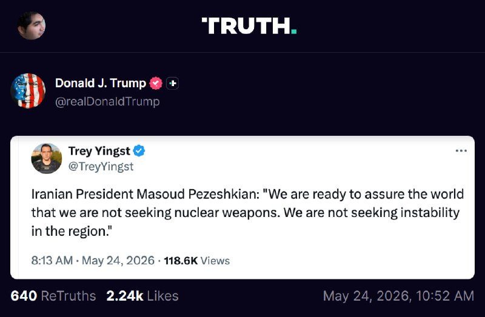

ترامپ سخنان پزشکیان را نشان داد: آماده‌ایم به جهان اطمینان بدهیم

ترامپ اسکرین‌شاتی از توییت خبرنگار فاکس‌نیوز رو پست کرده که نوشته بود:
مسعود پزشکیان، رئیس‌جمهور ایران: ما آماده‌ایم به جهان اطمینان بدهیم که به‌دنبال سلاح هسته‌ای نیستیم. ما به‌دنبال بی‌ثباتی در منطقه نیستیم.
realDonaldTrump

📡 @VahidOnline

## VahidOnline — post 75683

  

پست ترامپ، ترجمه ماشین:
یکی از بدترین توافق‌هایی که کشور ما تاکنون انجام داده، توافق هسته‌ای ایران بود؛ توافقی که باراک حسین اوباما و افراد کاملاً ناشیِ دولت اوباما آن را مطرح کردند و به امضا رساندند. این توافق، مسیری مستقیم برای دستیابی ایران به سلاح هسته‌ای بود. اما درباره معامله‌ای که اکنون دولت ترامپ با ایران در حال مذاکره بر سر آن است، چنین نیست؛ در واقع کاملاً برعکس است!

مذاکرات به شکلی منظم و سازنده در حال پیشرفت است و من به نمایندگانم اطلاع داده‌ام که برای رسیدن به توافق عجله نکنند، زیرا زمان به سود ماست. محاصره تا زمانی که توافقی حاصل، تأیید و امضا شود، با تمام قدرت برقرار خواهد ماند. هر دو طرف باید وقت بگذارند و کار را درست انجام دهند. هیچ اشتباهی نباید رخ دهد!

رابطه ما با ایران در حال تبدیل شدن به رابطه‌ای بسیار حرفه‌ای‌تر و ثمربخش‌تر است. با این حال، آنها باید درک کنند که نمی‌توانند سلاح یا بمب هسته‌ای تولید یا تهیه کنند. مایلم تا این مرحله از همه کشورهای خاورمیانه بابت حمایت و همکاری‌شان تشکر کنم؛ حمایتی که با پیوستن آنها به کشورهای عضو توافق‌های تاریخی ابراهیم، بیش از پیش تقویت و گسترش خواهد یافت و چه کسی می‌داند، شاید جمهوری اسلامی ایران هم بخواهد به آن بپیوندد!

از توجه شما به این موضوع سپاسگزارم.

رئیس‌جمهور دونالد جی. ترامپ
realDonaldTrump

📡 @VahidOnline

## VahidOnline — post 75682

  

دونالد ترامپ تصویری ساخته با هوش مصنوعی را در شبکه اجتماعی تروث سوشال منتشر کرد که انهدام یک قایق سپاه پاسداران  به دست پهپاد آمریکایی را نشان می‌دهد.

بر این تصویر، واژه «حداحافظ» به زبان اسپانیایی نوشته شده است.

این تصویر در حالی توسط رئیس جمهوری آمریکا منتشر می‌شود که رسانه‌ها در انتظار نهایی شدن توافق احتمالی تهران و واشنگتن برای پایان جنگ هستند.
@VahidOOnLine

📡 @VahidOnline

## VahidOnline — post 75681

  

محمدرضا عارف، معاون اول پزشکیان گفت: «مدیران دولت تا زمانی که مباحث کارشناسی درباره مدیریت مصرف بنزین نهایی نشده است، حق اظهارنظر شخصی ندارند.»

او افزود: «اگر کسی از این دستور تخطی کند با او برخورد می‌شود، زیرا ابتدا باید نظرات کارشناسی بررسی و سپس جمع‌بندی نهایی حاصل شود.»

او ادامه داد: «مسئولان تا پیش از آن حق ندارند اظهارنظر شخصی کنند، چرا که نباید در جامعه التهاب یا نگرانی ایجاد شود.»
@VahidOOnLine
این دستور در شرایطی صادر شده که شایعات درباره افزایش قیمت بنزین، تغییر سهمیه‌ها و تشدید سیاست‌های مدیریت مصرف بالا گرفته است.

همزمان، ناترازی بنزین و فاصله میان مصرف داخلی و توان تأمین سوخت، نگرانی‌ها درباره کمبود احتمالی یا فشار بیشتر بر شبکه توزیع را افزایش داده است.

عارف گفت دولت تلاش می‌کند تصمیم‌ها به‌گونه‌ای اتخاذ شود که معیشت مردم آسیب نبیند، اما واقعیات اقتصادی کشور و تحولات اخیر نیز باید در نظر گرفته شود.
@VahidHeadline

📡 @VahidOnline

## VahidOnline — post 75679

خبرگزاری فارس، نزدیک به سپاه پاسداران روز یکشنبه سوم خرداد با اشاره به توافق احتمالی میان جمهوری اسلامی و آمریکا، نوشت: در پیش‌نویس توافق احتمالی ایران و آمریکا هیچ بندی درباره «تعهدات هسته‌ای ایران گنجانده نشده و تمام مسائل مرتبط با برنامه هسته‌ای به مذاکرات ۶۰ روزه پس‌از امضای توافق موکول شده است.»
فارس در ادامه تاکید کرده است که «ایران در این توافق هیچ تعهدی برای واگذاری ذخایر هسته‌ای، خروج تجهیزات، تعطیلی تأسیسات یا حتی تعهد به نساختن بمب هسته‌ای وجود ندارد.»
این در حالیست که نیویورک تایمز به نقل از دو مقام آمریکایی گزارش داد، یکی از عناصر کلیدی توافق پیشنهادی میان واشنگتن و تهران، تعهد آشکار ایران به واگذاری ذخایر اورانیوم با غنی‌سازی بالای خود است.
@VahidOOnLine
خبرگزاری تسنیم، وابسته به سپاه پاسداران، نوشت که شنیده‌ها از جزییات تفاهم اولیه «احتمالی»، حاکی است که واشینگتن متعهد خواهد شد در طول دوره مذاکرات، تحریم‌های نفتی ایران را به حالت اسقاط درآورد و جمهوری اسلامی در مقطع کنونی هیچ اقدامی را در حوزه هسته‌ای نپذیرفته است.
این گزارش افزود در صورتی که این تفاهم‌نامه مورد توافق قرار گیرد، بخشی از دارایی‌های بلوکه شده حکومت ایران باید در گام اول آزاد شود.
@VahidOOnLine

📡 @VahidOnline

## VahidOnline — post 75676

  <a href="telegram/content/VahidOnline_75676_1779637112.mp4" target="_blank">🎬 Download video</a>

مارکو روبیو، وزیر خارجه آمریکا، روز یکشنبه در جریان نشست خبری مشترک با سابرامانیام جایشانکار، وزیر خارجه هند، در دهلی‌نو اعلام کرد که طی ۴۸ ساعت گذشته «پیشرفت قابل‌توجهی» در مذاکرات و رایزنی‌های مرتبط با بحران تنگه هرمز و پرونده ایران حاصل شده و احتمال دارد تا ساعاتی دیگر اخبار مهم‌تری در این زمینه منتشر شود.

او بدون ارائه جزئیات کامل، گفت هنوز توافق نهایی شکل نگرفته اما مسیر مذاکرات نسبت به روزهای گذشته امیدوارکننده‌تر شده است.
روبیو با تاکید بر اینکه دولت آمریکا همچنان راه‌حل دیپلماتیک را ترجیح می‌دهد، اظهار داشت دونالد ترامپ تمایل دارد بحران ایران از طریق وزارت خارجه و مذاکره حل شود، نه از مسیر درگیری نظامی.
با این حال او هشدار داد که واشنگتن در هر شرایطی مانع دستیابی ایران به سلاح هسته‌ای خواهد شد و این موضوع «خط قرمز» دولت آمریکاست.

به گفته او، رئیس‌جمهوری آمریکا بارها تاکید کرده که ایران هرگز نباید به توانایی ساخت سلاح هسته‌ای برسد و دولت ترامپ در این زمینه از همه دولت‌های پیشین آمریکا سخت‌گیرتر عمل کرده است.
وزیر خارجه آمریکا در بخش دیگری از سخنانش به وضعیت تنگه هرمز پرداخت و گفت این آبراه، یک مسیر بین‌المللی است و هیچ کشوری حق ندارد عبور و مرور آزاد کشتی‌های تجاری را تهدید کند. او اقدامات اخیر ایران در قبال کشتی‌های عبوری را مغایر قوانین بین‌المللی دانست و هشدار داد اگر جامعه جهانی در برابر چنین اقداماتی سکوت کند، یک «وضعیت خطرناک و غیرقابل‌قبول» به رویه‌ای عادی در جهان تبدیل خواهد شد، موضوعی که می‌تواند در مناطق دیگر دنیا نیز تکرار شود.
روبیو همچنین اعلام کرد آمریکا طی دو روز گذشته همراه با شرکای خود در منطقه خلیج فارس روی چارچوبی کار کرده که هدف آن باز نگه داشتن کامل تنگه هرمز، جلوگیری از اخذ عوارض یا محدودیت برای عبور کشتی‌ها و همچنین رسیدگی به نگرانی‌های مرتبط با برنامه هسته‌ای ایران است.
او توضیح داد که در صورت موفقیت این روند، نه‌تنها امنیت کشتیرانی و تجارت جهانی حفظ خواهد شد، بلکه نگرانی‌ها درباره برنامه هسته‌ای ایران نیز تا حد زیادی کاهش پیدا می‌کند.
روبیو در ادامه گفت هرگونه توافق احتمالی نیازمند پذیرش کامل ایران و اجرای عملی تعهدات خواهد بود و مذاکرات درباره جزئیات فنی برنامه هسته‌ای، روندی پیچیده و زمان‌بر دارد.
او افزود هنوز نمی‌توان درباره موفقیت نهایی مذاکرات با قطعیت صحبت کرد، اما «نشانه‌هایی از پیشرفت واقعی» دیده می‌شود و ممکن است جهان در ساعات آینده خبرهای مثبتی درباره تنگه هرمز و روند مذاکرات دریافت کند.
@VahidOOnLine
روبیو گفت: «هدف نهایی این است که ایران هرگز نتواند به سلاح هسته‌ای دست یابد. ایران هرگز نباید مالک سلاح هسته‌ای شود.»
او تاکید کرد دونالد ترامپ، رئیس‌جمهوری آمریکا، در این زمینه موضعی «کاملا روشن» داشته و گفته است ایران هرگز به سلاح هسته‌ای دست نخواهد یافت.
وزیر خارجه آمریکا افزود: «قطعا تا زمانی که دونالد ترامپ رئیس‌جمهور است، این اتفاق نخواهد افتاد.»
@VahidOOnLine

📡 @VahidOnline

## VahidOnline — post 75675

  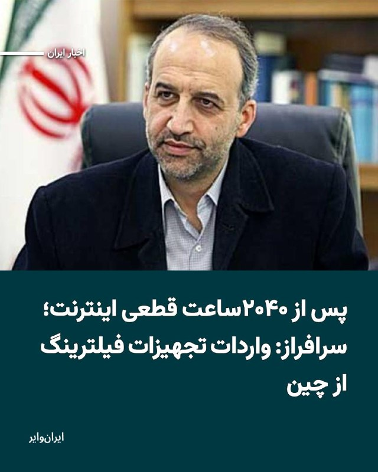

محمد سرافراز، رئیس پیشین سازمان صداوسیما و عضو کنونی شورای عالی فضای مجازی، می‌گوید بخشی از حاکمیت ایران با الهام از الگوی چین به‌دنبال محدود کردن اینترنت جهانی برای عموم مردم و ارائهٔ آن فقط به گروهی خاص و کنترل‌شده است.

او روز یک‌شنبه سوم خرداد در گفت‌وگو با روزنامه اینترنتی فراز گفت جمهوری اسلامی تجهیزات لازم برای «قطع دائمی اینترنت» را از چین خریداری و وارد کرده است.

محمد سرافراز توضیح داد که در چین اینترنت جهانی برای عموم مردم قطع است و فقط به‌صورت محدود در اختیار گروه‌هایی خاص قرار می‌گیرد. سرافراز با اشاره به الگویی که آن را «سامانه نیکان» در چین خواند، گفت هدف چنین سازوکاری این است که «روایت حکومت» بر کشور حاکم باشد.

او همچنین اپراتورهای عضو شورای عالی فضای مجازی را از عوامل پشت پردهٔ تصویب طرح موسوم به «اینترنت پرو» دانست و گفت ذی‌نفعان قطع اینترنت «یک روز فیلترشکن می‌فروشند و یک روز اینترنت پرو».
@VahidHeadline
پس از ۲۰۴۰ ساعت قطعی اینترنت در ایران، نت‌بلاکس، نهاد مستقل و بین المللی پایش اینترنت، در حساب‌کاربری‌اش در شبکه اجتماعی ایکس نوشت که در حالی که دسترسی به اینترنت جهانی در طول مذاکرات صلح تا حد زیادی قطع است، کاربران منتخب در لیست سفید، تصویری مصنوعی از زندگی ایرانیان را به جهان خارج ارائه می‌دهند.»
@VahidHeadline

📡 @VahidOnline

## VahidOnline — post 75674

  <a href="telegram/content/VahidOnline_75674_1779637113.mp4" target="_blank">🎬 Download video</a>

انفجاری بزرگ در نزدیکی یک قطار که از گذرگاه چمن در شهر کویته در ایالت بلوچستان پاکستان عبور می‌کرد، تعداد زیادی کشته و ده‌ها نفر زخمی برجا گذاشت.

یک مقام ارشد پلیس بلوچستان و یکی از مسئولان این ایالت به محمد کاظم، خبرنگار بی‌بی‌سی اردو، گفت تاکنون کشته شدن ۲۰ نفر در این انفجار تأیید شده و دست‌کم ۷۰ نفر زخمی شده‌اند.
تصاویر منتشرشده پس از حادثه نشان می‌دهد که چندین خودرو در نزدیکی خط آهن آتش‌ گرفته‌اند و واگن‌های قطار نیز روی ریل واژگون شده‌اند.
گروه جدایی‌طلب «ارتش آزادیبخش بلوچ» مسئولیت این حمله را به عهده گرفته‌ است.
@VahidHeadline

📡 @VahidOnline

## VahidOnline — post 75673

  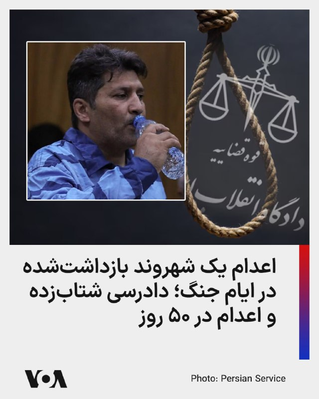

خبرگزاری میزان، وابسته به قوه قضائیه جمهوری اسلامی، اعلام کرد مجتبی کیان به اتهام ارسال اطلاعات مراکز تولید صنایع دفاعی به «دشمن آمریکایی ـ صهیونیستی» اعدام شده است.

قوه قضائیه مدعی شده کیان در جریان آنچه مقام‌های جمهوری اسلامی «جنگ رمضان» می‌نامند، اطلاعات و مختصات واحدهای مرتبط با تولید قطعات صنایع دفاعی را از طریق پیام به شبکه‌های وابسته به اسرائیل و آمریکا ارسال کرده بود.

میزان مدعی شده بررسی‌های فنی نشان داده سه روز پس از ارسال این اطلاعات، محل مورد اشاره هدف حمله قرار گرفته و به‌طور کامل تخریب شده است. قوه قضائیه گفته پرونده این متهم در دادگستری استان البرز رسیدگی شد و حکم او پس از تأیید دیوان عالی کشور اجرا شد.

بر اساس رأی دادگاه، مجتبی کیان به اعدام و مصادره کلیه اموال محکوم شده بود. میزان همچنین نوشت از زمان بازداشت تا اجرای حکم کمتر از ۵۰ روز زمان گذشته است؛ موضوعی که پرسش‌های جدی درباره سرعت رسیدگی، امکان دفاع مؤثر و فرصت اعتراض در پرونده‌ای با مجازات اعدام ایجاد می‌کند.

قوه قضائیه گفته دادگاه با حضور وکیل برگزار شده، اما روشن نیست این وکیل منتخب متهم بوده یا تسخیری، از چه زمانی به پرونده دسترسی داشته، آیا امکان ملاقات محرمانه و آماده‌سازی دفاع فراهم بوده و آیا متهم فرصت کافی برای اعتراض به ادله فنی، درخواست کارشناسی مستقل و پیگیری مؤثر در دیوان عالی کشور داشته است یا نه.

این پرونده در بستر موج گسترده‌تری از اعدام‌ها، احکام امنیتی، مصادره اموال و رسیدگی‌های شتاب‌زده پس از جنگ قرار می‌گیرد؛ روندی که منتقدان و سازمان‌های حقوق بشری آن را نشانه استفاده فزاینده جمهوری اسلامی از مجازات اعدام برای ایجاد بازدارندگی سیاسی و امنیتی می‌دانند.
@VahidHeadline

خبرگزاری میزان هیچ اطلاعاتی درباره حرفه این فرد نداده و مشخص نیست که مجتبی کیان چگونه به «اطلاعات صنایع دفاعی» دسترسی داشته است.
@VahidHeadline

📡 @VahidOnline

## kianmeli1 — post 87638

  <a href="telegram/content/kianmeli1_87638_1779637114.mp4" target="_blank">🎬 Download video</a>

🔴 ترامپ به شبکه خبری ABC:

نمی‌توانم در مورد توافق صحبت کنم؛ این کاملاً به من بستگی دارد و اگر خبری باشد، فقط خبر خوبی خواهد بود.
من توافق‌های بدی نمی‌بندم.
https://t.me/kianmeli1

## kianmeli1 — post 87637

  

🔴محمد سرافراز، رئیس پیشین سازمان صداوسیما و عضو کنونی شورای عالی فضای مجازی، می‌گوید بخشی از حاکمیت ایران با الهام از الگوی چین به‌دنبال محدود کردن اینترنت جهانی برای عموم مردم و ارائهٔ آن فقط به گروهی خاص و کنترل‌شده است.

او روز یک‌شنبه سوم خرداد در گفت‌وگو با روزنامه اینترنتی فراز گفت جمهوری اسلامی تجهیزات لازم برای «قطع دائمی اینترنت» را از چین خریداری و وارد کرده است.
https://t.me/kianmeli1

## kianmeli1 — post 87636

  <a href="telegram/content/kianmeli1_87636_1779637116.mp4" target="_blank">🎬 Download video</a>

🔴پس از حملات سنگین چندشب پیش اوکراین به یک مدرسه در روسیه٫ دیشب روسیه حملات سنگین با موشک های قاره پیما علیه اوکراین شلیک کرد
https://t.me/kianmeli1

## kianmeli1 — post 87635

  

🔴 ترامپ می‌گوید به نمایندگانش اطلاع داده است که «برای رسیدن به توافق» با ایران «عجله نکنند» و «زمان به نفع ماست».
https://t.me/kianmeli1

## IranIntlTV — post 338782

  

دونالد ترامپ صحبت‌های مسعود پزشکیان را که گفته بود «آماده‌ایم به جهان اطمینان دهیم که به‌دنبال سلاح هسته‌ای نیستیم و خواهان بی‌ثباتی در منطقه نیز نیستیم»، در شبکه تروث سوشال بازنشر کرد.

ترامپ پیش‌تر نیز گفت روابط آمریکا با جمهوری اسلامی در حال حرفه‌ای‌تر و سازنده‌تر شدن است.
https://iranintl.com/202605249014

## IranIntlTV — post 338781

  <a href="telegram/content/IranIntlTV_338781_1779637119.mp4" target="_blank">🎬 Download video</a>

یک شهروند با ارسال ویدیویی به ایران‌اینترنشنال می‌گوید یک خرید ساده مایحتاج برای خانه، ۹ میلیون تومان هزینه برداشته است.

## IranIntlTV — post 338780

  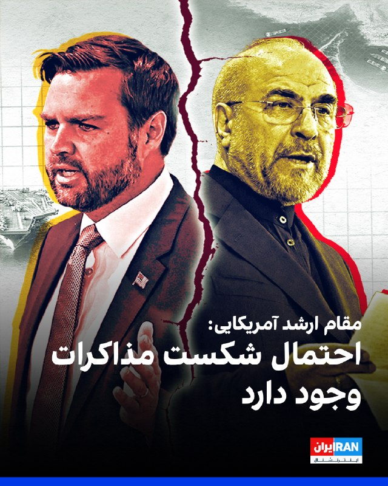

به گزارش اکسیوس، یک مقام ارشد آمریکایی به خبرنگاران گفت کاخ سفید انتظار ندارد توافق برای پایان جنگ با جمهوری اسلامی یکشنبه نهایی شود و معتقد است تأیید آن از سوی رهبران جمهوری اسلامی، از جمله مجتبی خامنه‌ای، ممکن است چند روز زمان ببرد.

او افزود با وجود خوش‌بینی مقام‌های آمریکایی به دستیابی به توافق در روزهای آینده، مذاکرات هنوز نهایی نشده و همچنان احتمال شکست آن وجود دارد.

به گفته این مقام، این توافق می‌تواند از تشدید جنگ جلوگیری کرده و فشار بر بازار جهانی نفت را کاهش دهد، اما هنوز مشخص نیست آیا به توافقی پایدار، از جمله درباره خواسته‌های هسته‌ای ترامپ، منجر خواهد شد یا نه.
https://iranintl.com/202605248274

## IranIntlTV — post 338779

  

بنیامین نتانیاهو، نخست‌وزیر اسرائیل، اعلام کرد او و دونالد ترامپ توافق دارند هرگونه توافق نهایی با جمهوری اسلامی باید به‌طور کامل تهدید هسته‌ای را برطرف کند.

او گفت این به معنای برچیدن تاسیسات غنی‌سازی ایران و خارج کردن مواد هسته‌ای غنی‌شده از خاک این کشور است.

نتانیاهو افزود ترامپ بار دیگر بر حق اسرائیل برای دفاع از خود در برابر تهدیدها در همه جبهه‌ها، از جمله لبنان، تاکید کرده است.

او همچنین گفت سیاست او، همانند سیاست ترامپ، همچنان ثابت است؛ ایران نباید به سلاح هسته‌ای دست یابد.
https://iranintl.com/202605243871

## IranIntlTV — post 338778

  <a href="telegram/content/IranIntlTV_338778_1779637123.mp4" target="_blank">🎬 Download video</a>

کی‌یر استارمر، نخست‌وزیر بریتانیا، از پیشرفت در مسیر دستیابی به توافق میان واشینگتن و تهران استقبال کرد و گفت جمهوری اسلامی هرگز نباید به سلاح هسته‌ای دست یابد. استارمر افزود توافق باید به گونه‌ای انجام شود که درگیری‌ها پایان یابد و تنگه هرمز بدون هیچ محدودیتی باز بماند.

علی حسن‌پور، خبرنگار ایران‌اینترنشنال، گزارش می‌دهد
@iranintltv

## IranIntlTV — post 338777

  <a href="telegram/content/IranIntlTV_338777_1779637126.mp4" target="_blank">🎬 Download video</a>

سرخط خبرهای یکشنبه ۳ خرداد
@iranintltv

## IranIntlTV — post 338776

  

محسن رضایی، مشاور نظامی مجتبی خامنه‌ای، گفت کاری خواهیم کرد که «امنیت» کشور برای ۵۰ سال آینده تامین شود.
او افزود: «از یک طرف دست‌مان روی ماشه برای نبرد چهارم است و از طرف دیگر مسئولان در حال مذاکره هستند.»
رضایی گفت آمریکا پس از جنگ دیگر به آمریکای سابق بازنخواهد گشت و جمهوری اسلامی افول آمریکا در خاورمیانه را رقم زده است.
مشاور نظامی خامنه‌ای گفت در صورت تعرض به تنگه هرمز و ورود به خلیج‌فارس، محاصره دریایی را خواهند شکست و پاسخی سخت به آمریکا خواهند داد.
رضایی اضافه کرد اگر روند خصمانه علیه جمهوری اسلامی ادامه یابد، تهران از معاهده «ان‌پی‌تی» خارج خواهد شد و این اقدام پیامدهای سنگینی برای آمریکا خواهد داشت.
https://iranintl.com/202605241703

## IranIntlTV — post 338775

  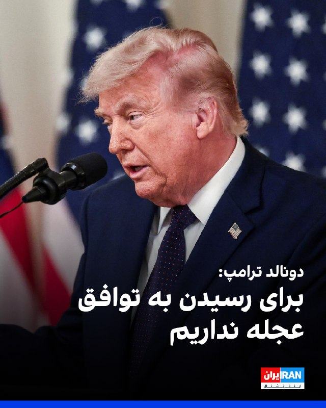

دونالد ترامپ در تروث سوشال نوشت توافقی که دولت او در حال مذاکره بر سر آن است، دقیقا برعکس توافق هسته‌ای دولت اوباما خواهد بود. او گفت مذاکرات به شکلی منظم و سازنده پیش می‌رود و به نمایندگانش دستور داده برای رسیدن به توافق عجله نکنند، زیرا زمان به نفع آمریکاست.

ترامپ تاکید کرد محاصره به‌طور کامل ادامه خواهد داشت تا زمانی که توافقی حاصل، تأیید و امضا شود و هر دو طرف باید بدون اشتباه و با صرف زمان کافی کار را به‌درستی انجام دهند.

او همچنین نوشت روابط آمریکا با جمهوری اسلامی در حال حرفه‌ای‌تر و سازنده‌تر شدن است، اما ایران اجازه تولید یا دستیابی به سلاح یا بمب هسته‌ای را نخواهد داشت.
https://iranintl.com/202605242249

## IranIntlTV — post 338774

  <a href="telegram/content/IranIntlTV_338774_1779637129.mp4" target="_blank">🎬 Download video</a>

دادستانی بحرین اعلام کرد ۱۱ نفر را به اتهام جاسوسی و همکاری اطلاعاتی با سپاه پاسداران محاکمه کرده است. به گفته دادستانی، ۹ نفر از متهمان به اتهام انجام «اقدامات خصمانه و تروریستی علیه پادشاهی بحرین» به حبس ابد محکوم شدند و دو متهم دیگر نیز حکم سه سال حبس دریافت کردند.

گفت‌وگو با علی صدرزاده، تحلیل‌گر مسائل خاورمیانه
@iranintltv

## IranIntlTV — post 338773

  <a href="telegram/content/IranIntlTV_338773_1779637131.mp4" target="_blank">🎬 Download video</a>

متین پرویزی، دانشجوی علوم دامی، ۱۸ دی‌ در زنجان هنگام کمک به یک مادر و کودک، از پشت سر هدف گلوله قرار گرفت و جان باخت. علیرضا علی‌نیا، ۲۳ ساله اهل مشهد، ۱۸ دی‌ در بلوار وکیل‌آباد این شهر با شلیک گلوله جنگی ماموران کشته شد.

فرنوش فرجی، عضو تحریریه ایران‌اینترنشنال، گزارش می‌دهد
@iranintltv

## IranIntlTV — post 338772

  

🔻نیویورک تایمز در گزارشی با اشاره به تغییر کمپ تیم ملی در جام جهانی ۲۰۲۶ از آمریکا به مکزیک نوشت: «اگر برخی اعضای غیرضروری در روز مسابقه برای دریافت ویزای آمریکا با مشکل مواجه باشند، انتقال کمپ به مکزیک می‌تواند به آن‌ها اجازه دهد در کنار تیم بمانند، اما برای مسابقات سفر نکنند.»

🔹مهدی تاج، رییس فدراسیون فوتبال روز گذشته خبر داد که کمپ تیم ملی فوتبال از آریزونای آمریکا به کمپی در شهر تیخوانا مکزیک منتقل شده است.

🔹او به سایت فدراسیون فوتبال گفت: «با این تغییر، مساله ویزا تا اندازه زیادی حل می‌شود. می‌توانیم با پرواز ایران‌ایر به مکزیک برویم و برگشت هم از همان‌جا بیاییم.»

🔹یک ماه پیش، مارکو روبیو، وزیر خارجه آمریکا، درباره ورود همراهان تیم ملی به ایالات متحده گفت: «آن‌ها نمی‌توانند یک مشت تروریست عضو سپاه را به عنوان روزنامه‌نگار یا مربی ورزشی وارد کشور ما کنند.»

@iranintltvsport

## Shin_Persian — post 6208

↩️ Quoted tweet: Barak Ravid ✓ @BarakRavid Sun, 24 May 2026 14:52:25 UTC 🚨A senior Trump administration official says the agreement with Iran is not expected to be signed today 🚨The official said there are still several details to close. There is still back…

## Shin_Persian — post 6207

↩️ Quoted tweet:
Barak Ravid ✓ @BarakRavid
Sun, 24 May 2026 14:52:25 UTC

🚨A senior Trump administration official says the agreement with Iran is not expected to be signed today
🚨The official said there are still several details to close. There is still back and forth over certain parts of the deal. "some words that are important to us and some words

↩️ توییت نقل‌قول شده — برای پاسخ، پست زیر را ببینید.

فارسی

🚨 یک مقام ارشد دولت ترامپ می‌گوید انتظار نمی‌رود توافق با ایران امروز امضا شود.
🚨 این مقام گفت هنوز جزئیات متعددی برای نهایی شدن باقی مانده است. همچنان رفت و برگشت‌هایی بر سر بخش‌های خاصی از توافق وجود دارد. «برخی کلمات که برای ما مهم هستند و برخی کلمات...»

𝕏 · @shin_persian

## Shin_Persian — post 6206

  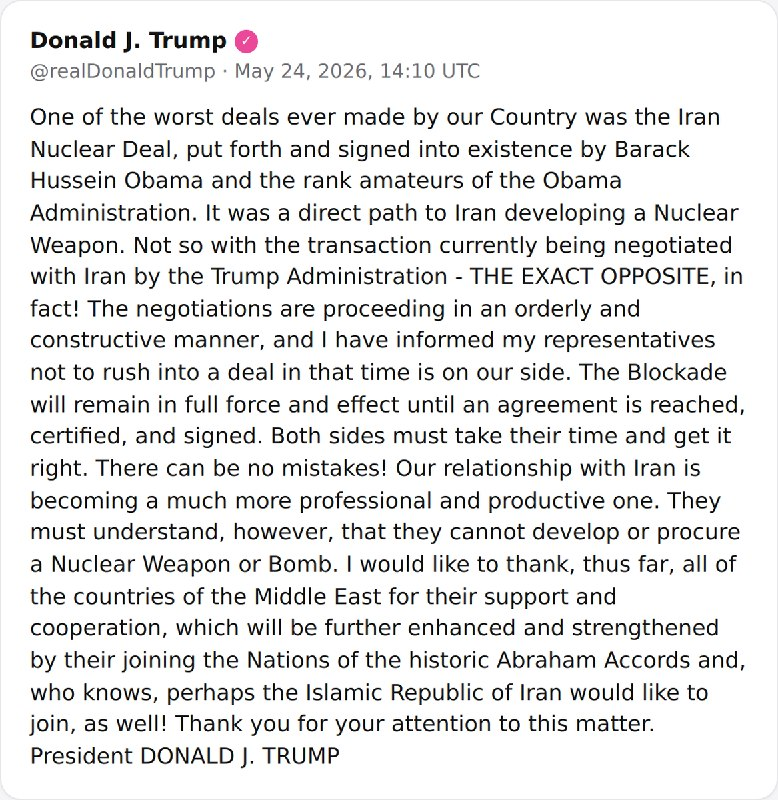

Shin ✓ @hey_itsmyturn Sun, 24 May 2026 14:15:12 UTC President Trump @POTUS: "One of the worst deals ever made by our Country was the Iran Nuclear Deal, put forth and signed into existence by Barack Hussein Obama and the rank amateurs of the Obama Administration.…

## Shin_Persian — post 6205

Shin ✓ @hey_itsmyturn
Sun, 24 May 2026 14:15:12 UTC

President Trump @POTUS:
"One of the worst deals ever made by our Country was the Iran Nuclear Deal, put forth and signed into existence by Barack Hussein Obama and the rank amateurs of the Obama Administration. It was a direct path to Iran developing a Nuclear Weapon. Not so with the transaction currently being negotiated with Iran by the Trump Administration - THE EXACT OPPOSITE, in fact! The negotiations are proceeding in an orderly and constructive manner, and I have informed my representatives not to rush into a deal in that time is on our side. The Blockade will remain in full force and effect until an agreement is reached, certified, and signed. Both sides must take their time and get it right. There can be no mistakes! Our relationship with Iran is becoming a much more professional and productive one. They must understand, however, that they cannot develop or procure a Nuclear Weapon or Bomb. I would like to thank, thus far, all of the countries of the Middle East for their support and cooperation, which will be further enhanced and strengthened by their joining the Nations of the historic Abraham Accords and, who knows, perhaps the Islamic Republic of Iran would like to join, as well! Thank you for your attention to this matter. President DONALD J. TRUMP"

فارسی

رئیس‌جمهور ترامپ @POTUS:

«یکی از بدترین توافق‌هایی که تا به حال توسط کشور ما منعقد شده، توافق هسته‌ای ایران بود که توسط باراک حسین اوباما و آماتورهای رده‌بالای دولت اوباما مطرح و امضا شد. آن توافق مسیری مستقیم برای دستیابی ایران به سلاح هسته‌ای بود. اما در مورد معامله‌ای که در حال حاضر توسط دولت ترامپ با ایران در حال مذاکره است، این‌گونه نیست - در واقع، دقیقاً برعکس است! مذاکرات به شیوه‌ای منظم و سازنده در حال پیشرفت است و من به نمایندگان خود ابلاغ کرده‌ام که برای رسیدن به توافق عجله نکنند، چرا که زمان به نفع ماست. محاصره (تحریم‌ها) تا زمانی که توافقی حاصل، تأیید و امضا نشود، با تمام قوت و اعتبار باقی خواهد ماند. هر دو طرف باید وقت بگذارند و کار را درست انجام دهند. هیچ اشتباهی نباید صورت بگیرد! رابطه ما با ایران در حال تبدیل شدن به رابطه‌ای بسیار حرفه‌ای‌تر و سازنده‌تر است. با این حال، آن‌ها باید درک کنند که نمی‌توانند سلاح یا بمب هسته‌ای تولید کرده یا به دست آورند. من مایلم تا این لحظه از تمام کشورهای خاورمیانه بابت حمایت و همکاری‌شان تشکر کنم، که این همکاری با پیوستن آن‌ها به کشورهای پیمان‌های تاریخی ابراهیم (Abraham Accords) بیشتر تقویت و مستحکم خواهد شد و کسی چه می‌داند، شاید جمهوری اسلامی ایران نیز مایل باشد به آن بپیوندد! از توجه شما به این موضوع سپاسگزارم. رئیس‌جمهور دونالد جی. ترامپ»

𝕏 · @shin_persian

## ManotoTV — post 105808

  

https://studio.youtube.com/video/bQJFCVV8hCg/livestreaming

## ManotoTV — post 105807

  <a href="telegram/content/ManotoTV_105807_1779637135.mp4" target="_blank">🎬 Download video</a>

دونالد ترامپ، رئیس‌جمهور آمریکا، در پیامی تازه بار دیگر توافق هسته‌ای دوره باراک اوباما با جمهوری اسلامی را «یکی از بدترین توافق‌های تاریخ آمریکا» خواند و گفت آن توافق مسیر دستیابی تهران به سلاح هسته‌ای را هموار می‌کرد.

ترامپ گفت مذاکرات کنونی دولت او با جمهوری اسلامی «منظم و سازنده» پیش می‌رود، اما به نمایندگان خود دستور داده برای رسیدن به توافق عجله نکنند، زیرا به گفته او «زمان به سود آمریکا است».

او اضافه کرد انسداد علیه جمهوری اسلامی تا زمان دستیابی به توافق، تایید و امضای آن، با قدرت کامل ادامه خواهد داشت.

ترامپ افزود دو طرف باید با دقت و بدون خطا پیش بروند و جمهوری اسلامی باید بداند که نمی‌تواند سلاح هسته‌ای تولید یا تهیه کند.

رئیس‌جمهور آمریکا همچنین از کشورهای خاورمیانه برای حمایت و همکاری در این روند تشکر کرد و گفت این همکاری می‌تواند با پیوستن بیشتر کشورها به پیمان‌های ابراهیم تقویت شود. او در ادامه نوشت شاید جمهوری اسلامی نیز بخواهد به این روند بپیوندد.

## ManotoTV — post 105806

  

شانزده سال پیش، منوتو با یک باور ساده آغاز شد:

اینکه مردم ایران شایسته‌ی رسانه‌ای حرفه ای هستند که حقیقت را بی‌واسطه، بی‌ واهمه و بدون وابستگی به هیچ دولت و قدرتی، با آن‌ها در میان بگذارد. بر اساس این باور، منوتو همیشه صدای مستقل خود را داشت؛ صدایی که از دل اعتماد، همراهی و دغدغه‌های شما شکل گرفت و نشان داد که ایرانیان، با هر پیشینه، باور و نگاه متفاوت، می‌توانند زیر یک سقف و برای هدفی بزرگ‌تر، کنار هم بایستند و به آنچه می خواهند دست یابند.

در طول سالها، ما آموختیم که رسانه فقط برای خبر دادن نیست. رسانه می تواند حافظه‌ی یک ملت باشد؛ جایی که رنج‌ها، شادی‌ها، امیدها، شکست‌ها و ایستادگی‌ها ثبت می‌شوند تا فراموش نشوند.

ما همیشه ایران را فراتر از یک جغرافیا دیدیم؛ ایران برای ما میراث است، هویت، فرهنگ و غرور ملی است، و مسئولیتی برای تک تک ما، که نباید از آن چشم پوشید.

این مسیر آسان نبود و در طول سال‌ها با وجود تهدیدها، تخریب‌ها و فشار، به راه خود ادامه دادیم و آنچه کردیم و آنچه گفتیم، و جایی که در لحظات حساس تاریخ ایستادیم، قابل داوری و باعث افتخار ماست.

امروز فصل پخش منوتو به پایان می‌رسد؛ اما باورهایی که این مسیر را آغاز کرد، پایان نمی‌گیرد.

از هر بیننده، همراه، منتقد و حامی که در این سال‌ها کنار ما بود، صمیمانه سپاسگزارم.

راه آینده شاید شکل دیگری داشته باشد؛ اما باور ما به ایران، به مردم ایران، و به فردایی آزاد و بهتر، همچنان پابرجا و زنده است.

## ManotoTV — post 105805

  <a href="telegram/content/ManotoTV_105805_1779637137.mp4" target="_blank">🎬 Download video</a>

راهپیمایی از مقابل ساختمان بی‌بی‌سی بسمت دفتر نخست‌وزیری، یکشنبه سوم خرداد ۱۴۰۵

## FarsiVOA — post 218538

در گفت‌وگو با بابک دربیکی، تحلیلگر سیاسی از لندن، به واکنش کشورهای منطقه به تفاهم اولیه آمریکا و جمهوری اسلامی پرداختیم؛ از امید به ثبات انرژی و بازگشایی تنگه هرمز گفتیم و بررسی کردیم چرا همزمان نگرانی‌ها درباره تثبیت موقعیت جمهوری اسلامی در صورتی که به روند صلح خاورمیانه نپیوندد پابرجاست.

## FarsiVOA — post 218537

در پی اعلام دونالد ترامپ مبنی بر اینکه چارچوب یک «یادداشت تفاهم صلح» با جمهوری اسلامی «تا حد زیادی مذاکره شده»، موجی از واکنش‌ها در آمریکا، اسرائیل، اروپا و کشورهای منطقه شکل گرفته است.

نخستین واکنش حساس از اسرائیل آمد؛ جایی که رسانه‌های اسرائیلی گزارش دادند بنیامین نتانیاهو درباره مفاد توافق احتمالی، از جمله تعویق رسیدگی به پرونده هسته‌ای جمهوری اسلامی و گنجاندن آتش‌بس لبنان، ابراز نگرانی کرده است.

تایمز اسرائیل نوشت نتانیاهو قرار است نشست کابینه امنیتی محدود را برای بررسی توافق در حال شکل‌گیری برگزار کند.

گزارش کامل را در وب‌سایت صدای آمریکا بخوانید.

@FarsiVOA

## FarsiVOA — post 218536

🔺دونالد ترامپ: عجله‌ای برای امضای توافق نداریم، زمان به نفع ماست

◾️دونالد ترامپ رئیس‌جمهوری ایالات متحده روز یکشنبه ۳ خرداد، در اشاره به توافق احتمالی با جمهوری اسلامی، در حساب کاربری خود در تروت‌سوشال نوشت: «توافق‌نامه اتمی ایران که توسط باراک حسین اوباما به همراه تیم تازه‌کار و ناآشنا به امور وی امضا شد، از بدترین توافق‌نامه‌هایی است که تاکنون در کشور ما امضا شده است.

⬇️ بیشتر بخوانید:

https://ir.voanews.com/a/trump-iran-deal-negotiation-israel/8153309.html

## FarsiVOA — post 218535

🔺ارتش اسرائیل: کشته شدن چهار تروریست حزب‌الله

◾️ارتش اسرائیل روز یکشنبه سوم خرداد، با انتشار ویدئویی در شبکه‌های اجتماعی نوشت: «نیروهای یگان چندبعدی به فعالیت خود برای رفع تهدیدات علیه غیرنظامیان و نیروهای ارتش اسرائیل در جنوب لبنان ادامه می‌دهند.»

⬇️ بیشتر بخوانید:

https://ir.voanews.com/a/israeli-army-hezbollah-attack/8153303.html

## FarsiVOA — post 218534

شهرام همایون در گفت‌وگو با فهیمه خضر حیدری در عمق میدان از تلاش‌های خود برای حفظ پرچم شیر و خورشید گفت: «این که گروهی این اواخر، تاج را به پرچم شیر و خورشید اضافه کرده‌اند آخرین تلاش‌ها برای ضربه زدن به یگانگی پرچم است»

## FarsiVOA — post 218533

  

🔺نخست وزیر اسرائیل روز یکشنبه سوم خرداد با انتشار یک پست گرافیکی از عکس خودش همراه با رئیس جمهوری آمریکا در رسانه اجتماعی ایکس، تاکید کرد که ایران هرگز به سلاح هسته‌ای دست پیدا نخواهد کرد.

◾️در این تصویر، اقتدار بنیامین نتانیاهو و پرزیدنت ترامپ در کنار پرچم کشورهایشان به نمایش درآمده است. در پس‌زمینه، نقشه خاورمیانه و ایران و چند جنگنده در آسمان نیمه‌ابری و در حالی دیده می‌شود که خورشید از شانه‌های دو رهبر در حال طلوع است. در پایین هم یک اتاق عملیات به تصویر کشیده و بالای آن نوشته شده است: «ایران هرگز سلاح هسته‌ای نخواهد داشت.»

◾️انتشار این پست در میانه گمانه‌زنی‌ها درباره توافق احتمالی ایالات متحده با رژیم ایران و نارضایتی اسرائیل از این توافق، قابل توجه است.

## FarsiVOA — post 218532

  <a href="telegram/content/FarsiVOA_218532_1779637139.mp4" target="_blank">🎬 Download video</a>

در ادامه تنش‌ها در منطقه، وزارت دفاع عربستان سعودی در آستانه روز عرفه و عید قربان ویدیویی از تجهیزات پدافند مستقر در اطراف اماکن مقدس منتشر و اعلام کرد «در چارچوب سیستم آمادگی یکپارچه وزارت دفاع، نیروهای پدافند مسئولیت حفاظت از حریم هوایی اماکن مقدس را بر عهده دارند و با همه تهدیدات هوایی برخورد می‌کنند تا امنیت و آرامش زائران را تضمین کند.»
نسخه اصلی این ویدیو با موسیقی متن منتشر شده است.

## FarsiVOA — post 218531

🔺سنتکام: روز یادبود سربازان فداکار گرامی

◾️ستاد فرماندهی مرکزی ایالات متحده آمریکا، روز یادبود سربازان فداکار را گرامی داشت.

⬇️ بیشتر بخوانید:

https://ir.voanews.com/a/memorial-day-veterans-centcom/8153299.html

## FarsiVOA — post 218530

🔺تاکید ترامپ بر اهمیت حفظ امنیت در واشنگتن، در واکنش به تیراندازی در نزدیکی کاخ سفید

◾️دونالد ترامپ، رئیس جمهوری آمریکا به تیراندازی روز شنبه در مجاورت کاخ سفید واکنش نشان داد.

⬇️ بیشتر بخوانید:

https://ir.voanews.com/a/donald-trump-shooting-new-location-a-safe-space-for-presidents/8153295.html

## FarsiVOA — post 218529

  <a href="telegram/content/FarsiVOA_218529_1779637141.mp4" target="_blank">🎬 Download video</a>

ویدیوهایی که در شبکه‌های اجتماعی منتشر شده، ورود نیروهای پلیس ترکیه به ساختمان حزب مخالف «جمهوری‌خواه خلق» را نشان می‌دهد.

برخی کاربران و فعالان سیاسی می‌گویند پلیس برای بیرون کردن رهبران برکنار‌شده این حزب از گاز اشک‌آور استفاده کرده است.

@FarsiVOA

## FarsiVOA — post 218528

جنگ روایت‌ها در جمهوری اسلامی بر سر توافق ۶۰ روزه احتمالی با آمریکا

## FarsiVOA — post 218527

  <a href="telegram/content/FarsiVOA_218527_1779637142.mp4" target="_blank">🎬 Download video</a>

ارتش اسرائیل تصاویری از شناسایی و هدف‌گیری نیروهای حزب‌الله در جنوب لبنان منتشر کرد.

بخشی از این تصاویری با دوربین موشک ثبت شده است که نشان می‌دهد چگونه ارتش اسرائیل نیروهای حزب‌الله و تجهیزات دیده‌بانی این سازمان را شناسایی و هدف‌گیری کردند.

ارتش اسرائیل همچنین اعلام کرد روز گذشته چهار نیروی سازمان تروریستی حزب‌الله را که وارد یک زیرساخت شده بودند شناسایی و هدف‌گیری کردند.

## DW_Farsi — post 125099

  

🔶 آمادگی نیروهای بریتانیا برای "مین‌روبی احتمالی در تنگه هرمز"

صدها ملوان در عرشه کشتی پشتیبانی "لایم ‌بی" (RFA Lyme Bay) بریتانیا که در سواحل جبل‌الطارق لنگر انداخته در انتظار اعزام به مأموریت مین‌روبی در تنگه هرمز به سر می‌برند؛ مأموریتی که هنوز در هاله‌ای از ابهام قرار دارد.

خبرگزاری آسوشیتدپرس که این خبر را روز یکشنبه ۲۴ مه اعلام کرده می‌گوید، اکنون در جنوبی‌ترین نقطه شبه‌جزیره ایبری، در منطقه فرامرزی بریتانیا یعنی جبل‌الطارق، نیروی دریایی سلطنتی بریتانیا خود را برای انجام این کار آماده می‌کند؛ اما این اقدام تنها زمانی صورت خواهد گرفت که توافق صلح میان آمریکا و ایران حاصل شود.

در حالی که این توافق که آخرین خبرها امید به نهایی شدن آن‌ را بالا برده هنوز به دست نیامده، آسوشیتدپرس می‌گوید، این کشتی به‌زودی جبل‌الطارق را ترک می‌کند تا به ناوشکن بریتانیایی "اچ‌ام‌اس دراگون" و سایر کشتی‌های متحدان بپیوندد و پس از دریافت پشتیبانی هوایی، از طریق کانال سوئز راهی خلیج فارس شود.
@dw_farsi

## DW_Farsi — post 125098

🔶 نظرسنجی: فقط شمار اندکی به توان دفاعی ارتش آلمان باور دارند

طبق نظر بیشتر افرادی که در یک نظرسنجی جدید شرکت کرده‌اند، اگر وضعیت اضطراری پیش بیاید، وضعیت توان دفاعی آلمان چندان مطلوب نیست.

بر پایه داده‌های مؤسسه پاسخ‌های جدید اجتماعی "اینسا" (INSA)، تنها ۱۷ درصد از پاسخ‌دهندگان تا حدی یا کاملاً با این گزاره موافق بودند که ارتش آلمان در صورت یک حمله احتمالی می‌تواند به میزان کافی از کشور دفاع کند.

در مقابل، ۷۲ درصد چنین باوری نداشته‌اند یا چندان به آن معتقد نبوده‌اند. این نظرسنجی به سفارش روزنامه "بیلد آم زونتاگ" انجام شده است.

طبق داده‌های این مؤسسه افکارسنجی مستقر در شهر ارفورت، نگرانی شهروندان آلمان از حمله احتمالی روسیه به این کشور تا حدودی کاهش یافته است.

بر همین اساس، ۳۸ درصد از افرادی که مورد پرسش قرار گرفته‌اند گفته‌اند که نگران این موضوع هستند، در حالی که از هر دو نفر، یک نفر (۵۰ درصد) نگرانی‌ای در این زمینه نداشته است.

در نظرسنجی قبلی مؤسسه اینسا در سپتامبر ۲۰۲۵، اکثریت پاسخ‌دهندگان، یعنی ۵۲ درصد از آنها، نسبت به حمله روسیه ابراز نگرانی کرده بودند.
بر اساس همین نظرسنجی، ترس مردم در زمینه حملات احتمالی در فضای دیجیتال به‌مراتب بیشتر از حملات نظامی در فضای واقعی است.

دو سوم پاسخ‌دهندگان در این نظرسنجی گفته‌اند نگران آن هستند که حملات سایبری، اقدامات خرابکارانه یا انتشار هدفمند اطلاعات نادرست بتواند زندگی در آلمان را مختل کند.

اندکی بیش از یک‌پنجم شرکت‌کنندگان، یعنی ۲۲ درصد آنها، نیز در مقابل گفته‌اند که درباره این خطرهای احتمالی چندان نگران نیستند یا اصلاً نگرانی ندارند.

مؤسسه افکارسنجی اینسا اعلام کرده است که برای این نظرسنجی، هزار و پنج نفر در فاصله زمانی ۲۱ تا ۲۲ ماه مه ۲۰۲۶ مورد پرسش قرار گرفته‌اند.
@dw_farsi

## DW_Farsi — post 125097

  

🔶 سپاه: ۳۳ کشتی در شبانه‌روز گذشته با مجوز ما از تنگه هرمز عبور کردند

روابط عمومی سپاه پاسداران روز یکشنبه سوم خرداد با انتشار اطلاعیه‌ای اعلام کرد که در شبانه‌روز گذشته ۳۳ فروند کشتی با مجوز این نهاد از تنگه هرمز عبور کرده‌اند.

مطابق این اطلاعیه، این کشتی‌ها شامل "نفتکش، کانتینربر و انواع کشتی‌های تجاری" می‌شده که "پس از کسب مجوز با هماهنگی و تأمین امنیت نیروی دریایی سپاه از تنگه هرمز عبور کرده‌اند".

بر اساس خبرهای منتشر شده در رسانه‌های ایران، نیروی دریایی سپاه همچنین مدعی شد که "کنترل هوشمند تنگه هرمز پس از شدت ناامنی ایجاد شده" در پی حضور دریایی آمریکا "توسط نیروی دریایی سپاه با قوت در حال انجام است".
@dw_farsi

## Persian_Trend_Official — post 14868

  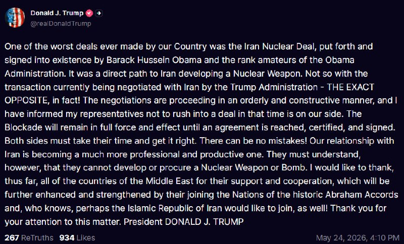

🚨 ترامپ از طریق Truth Social در مورد ایران:

یکی از بدترین توافق‌هایی که کشور ما تاکنون انجام داده، توافق هسته‌ای ایران بود که توسط باراک حسین اوباما و تازه‌کارهای درجه یک دولت اوباما مطرح و امضا شد. این توافق مسیر مستقیمی به سوی توسعه سلاح هسته‌ای توسط ایران بود.

اما معامله‌ای که در حال حاضر توسط دولت ترامپ با ایران در حال مذاکره است، دقیقاً برعکس آن است! مذاکرات به صورت منظم و سازنده پیش می‌رود و من به نمایندگانم اطلاع داده‌ام که در این زمان عجله نکنند چون زمان به نفع ماست.

محاصره تا زمانی که توافقی حاصل، تأیید و امضا شود، به طور کامل ادامه خواهد داشت. هر دو طرف باید وقت بگذارند و کار را درست انجام دهند. هیچ اشتباهی مجاز نیست!

روابط ما با ایران در حال تبدیل شدن به رابطه‌ای بسیار حرفه‌ای‌تر و سازنده‌تر است. با این حال، آنها باید درک کنند که نمی‌توانند سلاح یا بمب هسته‌ای توسعه دهند یا تهیه کنند.

تا کنون از همه کشورهای خاورمیانه برای حمایت و همکاری‌شان تشکر می‌کنم، که با پیوستن آنها به کشورهای توافقات تاریخی ابراهیم، این همکاری‌ها بیشتر تقویت خواهد شد و چه بسا جمهوری اسلامی ایران نیز بخواهد به این جمع بپیوندد!

📝 Nick

📌 @persian_trend_official
پرشین ترند | متفاوت‌ترین کانال نظامی

## Persian_Trend_Official — post 14867

  <a href="telegram/content/Persian_Trend_Official_14867_1779637147.mp4" target="_blank">🎬 Download video</a>

امروز 3 خرداد، سالروز آزادسازی خرمشهره؛

این ویدئو از آخرین لحظات قبل از آزادی خرمشهر و اسیر شدن عراقی‌هاست...

📝 Nick

📌 @persian_trend_official
پرشین ترند | متفاوت‌ترین کانال نظامی

## Persian_Trend_Official — post 14866

🔴سرلشکر محسن رضایی: پشت صبر راهبردی ایران خشم انقلابی ملت است ♦️امروز ترامپ و ارتش آمریکا در یک بن‌بست کامل قرار دارند و اگر وارد جنگ شوند، در برابر آنها دالانی تاریک و بی‌انتها قرار خواهد گرفت؛ دالانی که از تنگۀ هرمز آغاز می‌شود، به خلیج فارس، دریای عمان،…

## Persian_Trend_Official — post 14865

  <a href="telegram/content/Persian_Trend_Official_14865_1779637149.webm" target="_blank">🎬 Download video</a>

🔴سرلشکر محسن رضایی: پشت صبر راهبردی ایران خشم انقلابی ملت است

♦️امروز ترامپ و ارتش آمریکا در یک بن‌بست کامل قرار دارند و اگر وارد جنگ شوند، در برابر آنها دالانی تاریک و بی‌انتها قرار خواهد گرفت؛ دالانی که از تنگۀ هرمز آغاز می‌شود، به خلیج فارس، دریای عمان، تنگه باب‌المندب و اقیانوس هند امتداد می‌یابد و جنگی بسیار گسترده را رقم خواهد زد.

♦️تنگۀ هرمز برای تجارت آزاد بسته نیست، بلکه برای لشکرکشی و ایجاد جنگ در منطقه بسته است و مدیریت فعلی نیروی دریایی سپاه موجب شده کشتی‌های کشورهای مختلف پس از شناسایی و ثبت، با امنیت از این مسیر عبور کنند.

♦️در صورت هرگونه اقدام نظامی علیه تنگۀ هرمز و تلاش برای ورود به خلیج فارس، جمهوری اسلامی پاسخی سخت، دردناک و بی‌نظیر خواهد داد.

🫆:Tony

📌 @persian_trend_official
پرشین ترند | متفاوت‌ترین کانال نظامی

## RadioFarda — post 157521

  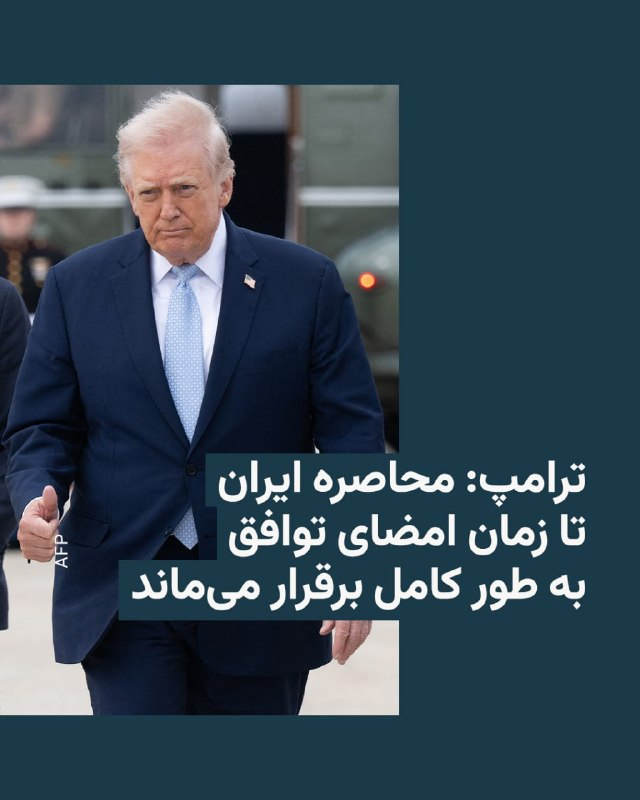

🔸رئیس‌جمهور آمریکا، روز یکشنبه اعلام کرد محاصره دریایی ایران تا زمان نهایی شدن و امضای توافق پایان جنگ به طور کامل برقرار خواهد ماند و واشینگتن عجله‌ای برای رسیدن به این توافق ندارد.

🔸او در شبکه اجتماعی خود، نوشت: «مذاکرات به شکلی منظم و سازنده در حال پیشرفت است و من به نمایندگانم اطلاع داده‌ام که برای رسیدن به توافق عجله نکنند، زیرا زمان به نفع ماست. محاصره تا زمانی که توافق حاصل، تأیید و امضا شود، به‌طور کامل برقرار و اجرایی باقی خواهد ماند.»

🔸آقای ترامپ گفت که آمریکا و ایران «باید وقت بگذارند و کار را درست انجام دهند. هیچ اشتباهی نباید رخ دهد».

🔸او در ادامه پیام خود نوشت: «روابط ما با ایران در حال تبدیل شدن به روابطی بسیار حرفه‌ای‌تر و سازنده‌تر است. با این حال، آنها باید درک کنند که نمی‌توانند سلاح یا بمب هسته‌ای تولید یا تهیه کنند.»

🔸رئیس‌جمهور آمریکا از کشورهای منطقه خاورمیانه بابت همکاری آنها تشکر کرد و افزود: «همکاری‌ای که با پیوستن آنها به کشورهای عضو توافق تاریخی ابراهیم بیش از پیش تقویت و مستحکم خواهد شد و چه کسی می‌داند، شاید جمهوری اسلامی ایران هم بخواهد به آن بپیوندد!»

@RadioFarda

## RadioFarda — post 157520

خانه سینما می‌گوید قوه قضائیه تعدادی از سینماگران را به «همکاری با دولت‌های متخاصم» متهم کرده است

🔸مدیر حقوقی خانه سینما روز یکشنبه سوم خرداد تأیید کرد که قوه قضائیه جمهوری اسلامی تعدادی از سینماگران ایرانی ازجمله سعید روستایی و هومن سیدی، کارگردانان سرشناس، را به اتهام «همکاری با دولت‌های متخاصم» به دادسرا احضار کرده است.

🔸مهدی کوهیان در گفت‌وگو با خبرگزاری ایسنا گفت که خانه سینما از این احضارها به دادسرای فرهنگ و رسانه «مطلع» بوده و این اقدام دستگاه قضائی محدود به روستایی و سیدی نیست.

🔸او با انتقاد از این احضارها گفت: «اتهام «همکاری با دُو‌‌‌‌‏َل متخاصم» یکی از سنگین‌ترین عناوین کیفری است و باید با ادله دقیق و مستندات روشن مطرح شود. ما معتقدیم طرح این اتهام علیه هنرمندانی که سال‌ها برای تولید فرهنگ ایرانی و نمایش هویت ملی تلاش کرده‌اند، می‌تواند به تعمیق شکاف اجتماعی و آسیب به انسجام داخلی منجر شود.»

🔸مدیر حقوقی خانه سینما افزود که ابلاغ این «اتهام سنگین» در برخی احضاریه‌ها برای سینماگران ایرانی «باعث شده تابو این اتهام شکسته شود».

🔸او همچنین خبر داد که تعدادی از این سینماگران بر خلاف درخواست او برای سکوت، خبر احضار خود را به رسانه‌ها «درز دادند» و در ادامه مدعی شد این کار آنها «از منظر میهن‌پرستی و تدبیر جمعی به ضرر فضای کلی سینما و کشور بوده است.»

🔸کوهیان درباره پرونده اتهامی جعفر پناهی در قوه قضائیه نیز اعلام کرد که این کارگردان سرشناس و وکیل او «تاکنون هیچ درخواستی برای حمایت صنفی از خانه سینما مطرح نکرده‌اند».

@RadioFarda

## IranianMinds — post 20683

## IranianMinds — post 20682

  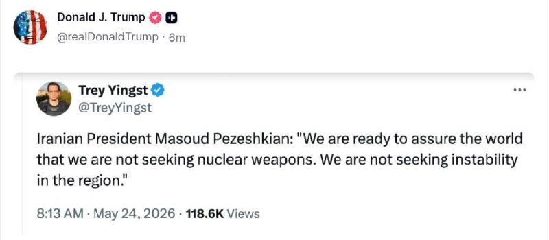

🔴 ترامپ‌ حرف های امروز‌ پزشکیان که گفته بود آماده ایم‌ به جهان اطمینان بدیم که به دنبال سلاح هسته ای نیستیم رو ریپوست کرده.

@IranianMinds

## IranianMinds — post 20681

  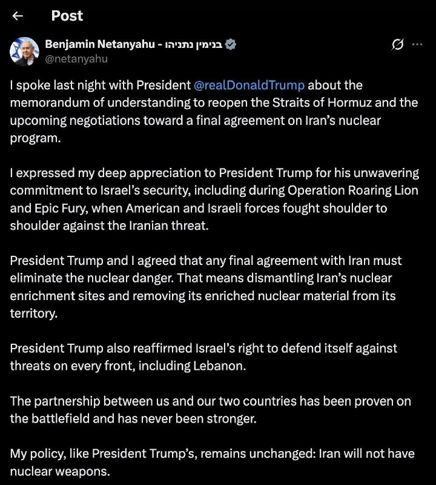

🔴 نتانیاهو:

من و رئیس‌جمهور ترامپ توافق کردیم که هر توافق نهایی با ایران باید تهدید هسته‌ای را از بین ببرد.

این یعنی تأسیسات غنی‌سازی ایران برچیده شود و مواد هسته‌ای غنی‌شده از خاک ایران خارج گردد.

ترامپ همچنین بار دیگر بر حق اسرائیل برای دفاع از خود در برابر تهدیدها، از جمله در لبنان، تأکید کرد.

شراکت میان ما و دو کشورمان در میدان نبرد ثابت شده و هرگز تا این حد قوی نبوده است.

سیاست من، همانند سیاست ترامپ، تغییری نکرده: ایران نباید سلاح هسته‌ای داشته باشد.

@IranianMinds

## IranianMinds — post 20680

🔴تاکتیک‌های ناشناخته محسن رضایی:

اگر دشمن به تنگه‌هرمز حمله کند، ما محاصره دریایی را می‌شکنیم و از NPT خارج می‌شویم.

@IranianMinds

## IranianMinds — post 20679

  

🔴 پست جدید ترامپ :

مذاکرات به‌صورت منظم و سازنده در حال پیشرفت است ، به نمایندگانم گفته‌ام برای توافق عجله نکنند، چون زمان به نفع ماست.

محاصره تا زمان رسیدن، تأیید و امضای توافق به‌طور کامل ادامه خواهد داشت.

رابطه ما با ایران حرفه‌ای‌تر و سازنده‌تر شده است.

ایران نباید سلاح یا بمب هسته‌ای تولید یا به دست بیاورد.

ترامپ همچنین از کشورهای خاورمیانه بابت حمایتشان تشکر کرد و گفت شاید ایران هم روزی به پیمان ابراهیم بپیوندد.

@IranianMinds

## IranianMinds — post 20678

❌دیگه فریب بونوس سایت های متفرقه رو نخورید!

💖توی این سایت که مورد #تایید ماست، با عضویت 500 هزارتومان بگیر!

🌐 Winro.io

🌐 Winro.io

## IranianMinds — post 20677

  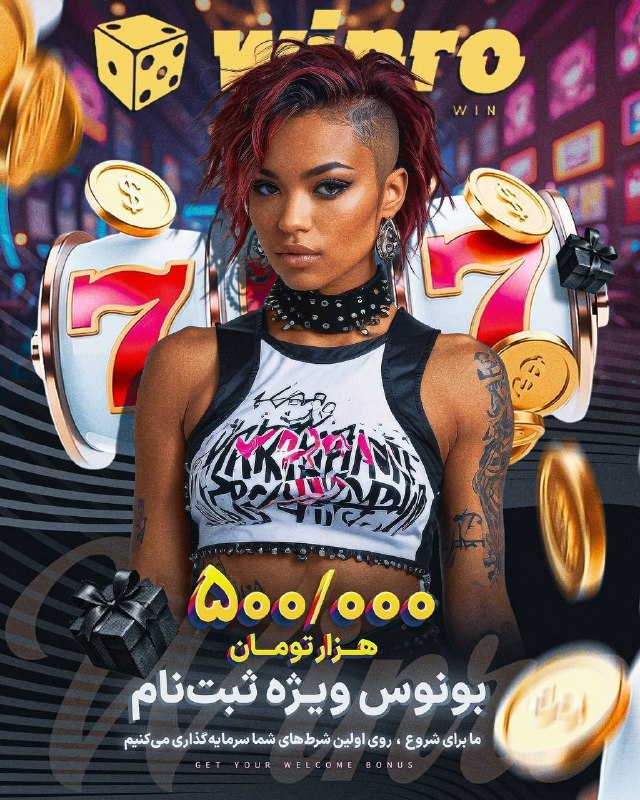

⭕️ رایگان بدون واریز شرط های فوتبالی ببند از همون اول موجودی 500 هزارتومانه
❌

🎉 500 هزارتومن رایگان فقط با ثبت نام بدون هیچگونه واریزی!

💳 پرداخت مستقیم و سریع بدون واسطه، بدون دردسر، واریز و برداشت در سریع‌ترین زمان ممکن

⌛ پشتیبانی 24 ساعته

🌐 Winro.io

🌐 Winro.io
کانال بونوس های رایگان g3

📱 @winro_io

## IranianMinds — post 20675

  <a href="telegram/content/IranianMinds_20675_1779637153.mp4" target="_blank">🎬 Download video</a>

🔴آخوند لائینی:

در صدا و سیما دروغ نمی‌گیم، اما همه راست‌هارو هم نمی‌گیم، چون گفتن راست واجب نیست.

@IranianMinds

## BBCPersian — post 281958

  

🔻دونالد ترامپ می‌گوید که به نمایندگانش گفته‌ است که در مذاکره با ایران عجله نکنند چرا که فشار زمان بیشتر روی ایران است تا آمریکا.

رئیس‌‌جمهور آمریکا یکبار دیگر از توافق برجام که در زمان دولت اوباما امضا شده بود انتقاد کرد و گفت که اینبار هر دو طرف باید «سر فرصت» تصمیم «درست» را بگیرند.

آقای ترامپ گفت که محاصره بنادر ایران تا زمان نهایی شدن و امضای توافق کاملا برقرار خواهد بود.

او گفت که روابط ایران و آمریکا «حرفه‌ای‌تر و سازنده‌تر» شده است اما تاکید کرد که مقام‌های جمهوری اسلامی «باید متوجه باشند که نمی‌توانند سلاح اتمی بسازند یا به‌ دست بیاورند.»

رئیس‌‌جمهور آمریکا از «حمایت و همکاری» کشورهای خاورمیانه تشکر کرد و گفت که این همکاری با پیوستن آن‌ها به پیمان ابراهیم حتی قویتر خواهد شد.

او افزود: «از کجا معلوم، شاید ایران هم بخواهد (به این پیمان) ملحق شود.»
📸 AFP via Getty
@BBCPersian

## BBCPersian — post 281957

⭕️ناهید کیانی، ملی‌پوش تکواندوی ایران در ۵۷- کیلوگرم با کسب مدال طلا در مسابقات تکواندو قهرمانی آسیا، رتبه تیمی ایران را بالا کشید.

به جز ناهید کیانی، فقط یلدا ولی‌نژاد که برنز گرفت، از تیم اعزامی زنان ایران توانستند روی سکو بروند و تیم مردان هم با ۴ طلا، یک نقره و یک برنز به کارش پایان داد. تیم ایران در مجموع مدال‌ها به مقام دومی رسید.

ناهید کیانی سابقه قهرمانی جهان در مسابقات ۲۰۲۳ باکو و مدال نقره المپیک در پاریس ۲۰۲۴ را در کارنامه دارد. دو رویارویی المپیکی ناهید کیانی و کیمیا علیزاده، پس از جدایی او از تیم ملی ایران توجه‌برانگیز شد.
@bbcpersian

## Dirty_Kids — post 390083

حالا میره کوبا چنان انقلابی می‌کنه که کون هممون آتشفشان بشه.

@Dirty_Kids 👻

## Dirty_Kids — post 390082

  

پست جدید نتانیاهو کنار ترامپ:

ایران هرگز سلاح هسته‌ای نخواهد داشت.

@Dirty_Kids 👻

## Dirty_Kids — post 390081

  

دونالد ترامپ:
نمی‌تونم درباره توافق صحبت کنم؛ این کاملاً به من بستگی داره و اگه خبری هم باشه فقط خبرهای خوبی خواهد بود — من به عنوان یه املاکی اصلا معامله بدی انجام نمیدم.

@Dirty_Kids 👻

## Hranews — post 113136

یک زن قربانی کودک همسری در خوی توسط همسرش به قتل رسید

❗️
❗️
❗️
❗️
❗️ – یک زن قربانی کودک‌همسری در روستای تاریمیش از توابع شهرستان خوی، به دست همسرش به قتل رسید.

ادامه مطلب

#کودک_همسری
#خشونت_خانگی

↘️
@hranews_bot تماس ✉️ -  @Hranews  کانال هرانا 🆑

## manototv — post 105808

  

https://studio.youtube.com/video/bQJFCVV8hCg/livestreaming

## manototv — post 105807

  <a href="telegram/content/manototv_105807_1779637159.mp4" target="_blank">🎬 Download video</a>

دونالد ترامپ، رئیس‌جمهور آمریکا، در پیامی تازه بار دیگر توافق هسته‌ای دوره باراک اوباما با جمهوری اسلامی را «یکی از بدترین توافق‌های تاریخ آمریکا» خواند و گفت آن توافق مسیر دستیابی تهران به سلاح هسته‌ای را هموار می‌کرد.

ترامپ گفت مذاکرات کنونی دولت او با جمهوری اسلامی «منظم و سازنده» پیش می‌رود، اما به نمایندگان خود دستور داده برای رسیدن به توافق عجله نکنند، زیرا به گفته او «زمان به سود آمریکا است».

او اضافه کرد انسداد علیه جمهوری اسلامی تا زمان دستیابی به توافق، تایید و امضای آن، با قدرت کامل ادامه خواهد داشت.

ترامپ افزود دو طرف باید با دقت و بدون خطا پیش بروند و جمهوری اسلامی باید بداند که نمی‌تواند سلاح هسته‌ای تولید یا تهیه کند.

رئیس‌جمهور آمریکا همچنین از کشورهای خاورمیانه برای حمایت و همکاری در این روند تشکر کرد و گفت این همکاری می‌تواند با پیوستن بیشتر کشورها به پیمان‌های ابراهیم تقویت شود. او در ادامه نوشت شاید جمهوری اسلامی نیز بخواهد به این روند بپیوندد.

## manototv — post 105806

  

شانزده سال پیش، منوتو با یک باور ساده آغاز شد:

اینکه مردم ایران شایسته‌ی رسانه‌ای حرفه ای هستند که حقیقت را بی‌واسطه، بی‌ واهمه و بدون وابستگی به هیچ دولت و قدرتی، با آن‌ها در میان بگذارد. بر اساس این باور، منوتو همیشه صدای مستقل خود را داشت؛ صدایی که از دل اعتماد، همراهی و دغدغه‌های شما شکل گرفت و نشان داد که ایرانیان، با هر پیشینه، باور و نگاه متفاوت، می‌توانند زیر یک سقف و برای هدفی بزرگ‌تر، کنار هم بایستند و به آنچه می خواهند دست یابند.

در طول سالها، ما آموختیم که رسانه فقط برای خبر دادن نیست. رسانه می تواند حافظه‌ی یک ملت باشد؛ جایی که رنج‌ها، شادی‌ها، امیدها، شکست‌ها و ایستادگی‌ها ثبت می‌شوند تا فراموش نشوند.

ما همیشه ایران را فراتر از یک جغرافیا دیدیم؛ ایران برای ما میراث است، هویت، فرهنگ و غرور ملی است، و مسئولیتی برای تک تک ما، که نباید از آن چشم پوشید.

این مسیر آسان نبود و در طول سال‌ها با وجود تهدیدها، تخریب‌ها و فشار، به راه خود ادامه دادیم و آنچه کردیم و آنچه گفتیم، و جایی که در لحظات حساس تاریخ ایستادیم، قابل داوری و باعث افتخار ماست.

امروز فصل پخش منوتو به پایان می‌رسد؛ اما باورهایی که این مسیر را آغاز کرد، پایان نمی‌گیرد.

از هر بیننده، همراه، منتقد و حامی که در این سال‌ها کنار ما بود، صمیمانه سپاسگزارم.

راه آینده شاید شکل دیگری داشته باشد؛ اما باور ما به ایران، به مردم ایران، و به فردایی آزاد و بهتر، همچنان پابرجا و زنده است.

## manototv — post 105805

  <a href="telegram/content/manototv_105805_1779637160.mp4" target="_blank">🎬 Download video</a>

راهپیمایی از مقابل ساختمان بی‌بی‌سی بسمت دفتر نخست‌وزیری، یکشنبه سوم خرداد ۱۴۰۵

## alonews — post 122368

  <a href="telegram/content/alonews_122368_1779637162.webm" target="_blank">🎬 Download video</a>

👈نتانیاهو: توافق نهایی با ایران به معنای برچیدن تأسیسات غنی‌سازی هسته‌ای و حذف مواد هسته‌ای غنی‌شده است.

🔴توییت جدید نتانیاهو: من و رئیس جمهور ترامپ توافق کردیم که هرگونه توافق نهایی با ایران باید خطر هسته‌ای را از بین ببرد.

🔴این به معنای برچیدن سایت‌های غنی‌سازی هسته‌ای ایران و خارج کردن مواد هسته‌ای غنی‌شده از خاک آن است.

🔴رئیس جمهور ترامپ همچنین بر حق اسرائیل برای دفاع از خود در برابر تهدیدات در هر جبهه‌ای، از جمله لبنان، تأکید کرد.

🔴مشارکت بین ما و دو کشورمان در میدان نبرد ثابت شده و هرگز قوی‌تر از این نبوده است.

🔴سیاست من، مانند سیاست رئیس جمهور ترامپ، بدون تغییر باقی می‌ماند: ایران سلاح هسته‌ای نخواهد داشت.

✅ @AloNews خبر جنگ

## alonews — post 122367

  <a href="telegram/content/alonews_122367_1779637162.webm" target="_blank">🎬 Download video</a>

👈ترامپ سخنان پزشکیان علیه سلاح‌های هسته‌ای را بازنشر کرد

🔴پزشکیان درخصوص سلاح هسته ای گفته بود: ما آماده‌ایم به جهان اطمینان دهیم که به دنبال سلاح هسته‌ای نیستیم. ما به دنبال بی‌ثباتی در منطقه نیستیم

✅ @AloNews خبر جنگ

## alonews — post 122366

  <a href="telegram/content/alonews_122366_1779637163.webm" target="_blank">🎬 Download video</a>

👈فاکس نیوز: یک مقام ارشد در دولت ترامپ گفته است که توافق با ایران امروز امضا نخواهد شد، اما پیشرفت در مورد یک توافق را نشان داد.

«اگر ایرانیان در مورد مسئله غنی‌سازی تسهیلات قابل توجهی ایجاد کنند، ما نیز تسهیلات قابل توجهی در مورد تسکین تحریم‌ها ایجاد خواهیم کرد،» مقام مذکور گفت.
در مورد مسئله هسته‌ای، برنامه فعلی این است که با کل ذخیره مواد غنی‌سازی شده سر و کار داشته باشیم.

«اگر شما یک توافق نهایی دارید که در آن ایرانیان در حال غنی‌سازی هستند، پس شما یک توافق نهایی ندارید،» مقام مذکور افزود.

✅ @AloNews خبر جنگ

## alonews — post 122365

  <a href="telegram/content/alonews_122365_1779637163.mp4" target="_blank">🎬 Download video</a>

👈ارتش اسرائیل داره حملات خیلی سنگین تو جنوب لبنان انجام میده

✅ @AloNews خبر جنگ

## alonews — post 122364

  <a href="telegram/content/alonews_122364_1779637164.webm" target="_blank">🎬 Download video</a>

👈یدیعوت آحارونوت به نقل از یک مقام امنیتی ارشد اسرائیل:

🔴اگر توافقی که در حال حاضر به شکل فعلی خود با ایران نهایی می‌شود امضا گردد، برای اسرائیل فاجعه خواهد بود.

🔴وقتی آمریکا از ادامه جنگ دست بکشد، آخرین ابزارهای فشار مهمی که در مذاکرات بعدی بر ایران دارد را از دست می‌دهد.

✅ @AloNews خبر جنگ

## alonews — post 122363

  <a href="telegram/content/alonews_122363_1779637164.webm" target="_blank">🎬 Download video</a>

🔴فوری/ ترامپ در مورد ایران:

یکی از بدترین توافق‌هایی که کشور ما تاکنون انجام داده، توافق هسته‌ای ایران بود که توسط باراک حسین اوباما و تازه‌کارهای درجه یک دولت اوباما مطرح و امضا شد. این توافق مسیر مستقیمی به سوی توسعه سلاح هسته‌ای توسط ایران بود.

اما معامله‌ای که در حال حاضر توسط دولت ترامپ با ایران در حال مذاکره است، دقیقاً برعکس آن است! مذاکرات به صورت منظم و سازنده پیش می‌رود و من به نمایندگانم اطلاع داده‌ام که در این زمان عجله نکنند چون زمان به نفع ماست.

محاصره تا زمانی که توافقی حاصل، تأیید و امضا شود، به طور کامل ادامه خواهد داشت. هر دو طرف باید وقت بگذارند و کار را درست انجام دهند. هیچ اشتباهی مجاز نیست!

روابط ما با ایران در حال تبدیل شدن به رابطه‌ای بسیار حرفه‌ای‌تر و سازنده‌تر است. با این حال، آنها باید درک کنند که نمی‌توانند سلاح یا بمب هسته‌ای توسعه دهند یا تهیه کنند.

تا کنون از همه کشورهای خاورمیانه برای حمایت و همکاری‌شان تشکر می‌کنم، که با پیوستن آنها به کشورهای توافقات تاریخی ابراهیم، این همکاری‌ها بیشتر تقویت خواهد شد و چه بسا جمهوری اسلامی ایران نیز بخواهد به این جمع بپیوندد!

✅ @AloNews خبر جنگ

## alonews — post 122362

  <a href="telegram/content/alonews_122362_1779637165.webm" target="_blank">🎬 Download video</a>

👈ترامپ: توافق هسته‌ای با ایران در دوران اوباما (برجام) یکی از بدترین توافق‌ها بود و مسیر مستقیمی به تهران برای دستیابی به سلاح هسته‌ای داد

✅ @AloNews خبر جنگ

## alonews — post 122361

  <a href="telegram/content/alonews_122361_1779637165.webm" target="_blank">🎬 Download video</a>

👈ادعای جروزالم‌پست به نقل از پالو آلتو نتورکز: حمله یک گروه سایبری مرتبط با ایران به آمریکا، اسرائیل و امارات

🔴واحد ۴۲ شرکت امنیت سایبری پالو آلتو نتورکز اعلام کرد یک گروه جاسوسی سایبری مرتبط با ایران، در جریان یک کمپین چند ماهه نهادهایی را در ایالات متحده، اسرائیل و امارات متحده عربی هدف قرار داده است.

🔴 طبق این گزارش، این حملات سایبری همزمان با تشدید تنش‌های منطقه‌ای اخیر صورت گرفته است.

✅ @AloNews خبر جنگ

## alonews — post 122360

  <a href="telegram/content/alonews_122360_1779637165.mp4" target="_blank">🎬 Download video</a>

👈 وضعیت آخرالزمانی کیف پس از حملات سنگین موشکی روسیه

✅ @AloNews خبر جنگ

## alonews — post 122359

  <a href="telegram/content/alonews_122359_1779637167.mp4" target="_blank">🎬 Download video</a>

👈هواپیماهای سوخت‌رسان هوایی KC-135R و KC-46A نیروی هوایی ایالات متحده از پایگاه هوایی الظفره در امارات متحده عربی اوایل هفته گذشته پس از استقرار از اوایل آوریل تخلیه شدند

🔴 ممکن است به اسرائیل یا عربستان سعودی منتقل شده باشند.

✅ @AloNews خبر جنگ

## alonews — post 122358

  <a href="telegram/content/alonews_122358_1779637168.webm" target="_blank">🎬 Download video</a>

👈اتحادیه اروپا: به دلیل بسته شدن تنگه هرمز، تحریم‌های ایران را گسترش می‌دهیم 
✅ @AloNews خبر جنگ

## alonews — post 122357

  <a href="telegram/content/alonews_122357_1779637169.webm" target="_blank">🎬 Download video</a>

👈فاکس‌نیوز به نقل از منابع منطقه‌ای، دو بند مهم از توافق احتمالی آمریکا و ایران را منتشر کرد: نیروهای آمریکایی به مدت ۳۰ روز در مجاورت ایران خواهند ماند.

🔴 به عنوان بخشی از این توافق، ایران معافیت از تحریم‌های نفتی دریافت خواهد کرد. همچنین میلیاردها دلار از دارایی‌ها و پول‌های مسدود شده ایران آزاد خواهد شد.

✅ @AloNews خبر جنگ

## alonews — post 122356

  <a href="telegram/content/alonews_122356_1779637169.webm" target="_blank">🎬 Download video</a>

👈 ترامپ: دموکرات‌ها نمی‌خواهند اجازه ماهیگیری بدهند. با ما در دادگاه می‌جنگند. برای محیط زیست بد است. شگفت‌انگیزه! پرزیدنت دونالد جی ترامپ

✅ @AloNews خبر جنگ

<!-- MSG END -->

<!-- NAV START -->

<a href="https://github.com/yerbeyer/aio-downloader/blob/main/telegram/content/archive_1.md" style="display:inline-block; padding:6px 12px; margin:0 4px; background-color:#2ea44f; color:white; text-decoration:none; border-radius:4px; font-weight:bold;">صفحه بعد</a>

<!-- NAV END -->
