# خواننده تلگرام

<!-- TOP_NAV START -->

<a href="https://github.com/yerbeyer/aio-downloader/blob/main/telegram/content/archive_1.md" style="display:inline-block; padding:6px 12px; margin:0 4px; background-color:#2ea44f; color:white; text-decoration:none; border-radius:4px; font-weight:bold;">صفحه بعد</a>

<!-- TOP_NAV END -->

<!-- MSG START -->

---
📅 بروزرسانی: 1405/03/11 07:42
---

## VahidOOnLine — post 243149

  

فرماندهی مرکزی ایالات متحده، سنتکام، در شبکه اجتماعی ایکس تاکید کرد: «در پاسخ به تجاوز بی‌اساس ایران در طول آتش‌بس جاری، به حفاظت از دارایی‌ها و منافع ایالات متحده ادامه خواهد داد.»

سنتکام نوشت که این فرماندهی در روزهای اخیر حملات دفاع از خود را علیه سایت‌های راداری و فرماندهی و کنترل پهپادهای حکومت ایران در منطقه روستایی گورک، و جزیره قشم انجام داد.

فرماندهی مرکزی ایالات متحده افزود: «این حملات سنجیده و حساب‌شده روزهای شنبه و یکشنبه در پاسخ به اقدامات تهاجمی ایران از جمله سرنگونی یک پهپاد ام‌کیو یک آمریکایی که بر فراز آب‌های بین‌المللی در حال پرواز بود، انجام شدند.»

سنتکام نوشت: «جنگنده‌های آمریکایی به سرعت با از بین بردن پدافند هوایی ایران، یک ایستگاه کنترل زمینی و دو پهپاد انتحاری که تهدید آشکاری برای کشتی‌های عبوری از آب‌های منطقه‌ای ایجاد می‌کردند، واکنش نشان دادند» و «هیچ یک از نیروهای نظامی آمریکایی آسیب ندیدند.»
‌🏁 🇬🇧 IranintlTV

🤖 @VahidOOnLine

## VahidOOnLine — post 243148

  

♦️فرماندهی مرکزی ایالات متحده (سنتکام) صبح دوشنبه اعلام کرد که در در دو روز گذشته حملات «دفاع از خود» علیه سایت‌های راداری و مراکز فرماندهی و کنترل پهپادهای ایران در گروگ (شهر گروگ در میانه غربی شهرستان سیریک واقع شده) و جزیره قشم انجام داده است.
به گفته این فرماندهی، این حملات «حساب‌شده و هدفمند» روزهای شنبه و یکشنبه در پاسخ به اقدامات تهاجمی رژیم ایران انجام شد؛ اقداماتی که شامل سرنگونی یک پهپاد آمریکایی ام‌کیو-۱ MQ-1 بود که در حال فعالیت بر فراز آب‌های بین‌المللی بود. جنگنده‌های آمریکایی به‌سرعت واکنش نشان داده و پدافند هوایی ایران، یک ایستگاه کنترل زمینی و دو پهپاد تهاجمی یک‌طرفه را که تهدیدی آشکار برای کشتی‌های عبوری در آب‌های منطقه‌ای بودند، از بین بردند.
در این بیانیه آمده است که هیچ‌یک از نظامیان آمریکایی آسیب ندیده‌اند. سنتکام تأکید کرده است که در واکنش به اقدامات «غیرموجه» ایران در جریان آتش‌بس جاری، به حفاظت از نیروها و منافع آمریکا ادامه خواهد داد.
‌🇸🇦 Indypersian

🤖 @VahidOOnLine

## VahidOOnLine — post 243147

  

روزنامه شرق گزارش داد پس از اعتراضات دی‌ماه و در ادامه روند تشکیل پرونده‌های انضباطی برای دانشجویان، دانشگاه‌های ایران بار دیگر پیگیری پرونده‌ها و صدور احکام جدید را آغاز کرده‌اند؛ احکامی که این روزنامه آن‌ها را «کم‌سابقه» توصیف کرده است.

شرق دوشنبه ۱۱ خرداد نوشت در دانشگاه شریف، پنج تا هفت دانشجو حکم اخراج گرفته‌اند و بیش از ۲۰ دانشجو نیز یک تا سه ترم از تحصیل تعلیق شده‌اند.

بر اساس این گزارش، سامانه‌های آموزشی ۲۰ تا ۲۵ دانشجوی دانشگاه شهید بهشتی از دسترس خارج شده، برای بیش از ۱۰۰ دانشجوی دانشگاه علم و صنعت پرونده انضباطی تشکیل شده و ۱۵۰ تا ۲۰۰ دانشجوی دانشگاه تهران در حال نوشتن دفاعیه‌های خود هستند.

شرق همچنین نوشت رسیدگی به این پرونده‌ها با «نقض گسترده» اصول شیوه‌نامه انضباطی همراه بوده است.

این برخوردها در حالی ادامه دارد که حسین سیمایی‌صراف، وزیر علوم دولت مسعود پزشکیان، پیش‌تر گفته بود مانعی برای تحصیل هیچ دانشجویی وجود ندارد و همه دانشجویان محروم‌شده به دانشگاه بازگشته‌اند.
متن کامل را اینجا بخوانید
‌🏁 🇬🇧 IranintlTV

🤖 @VahidOOnLine

## VahidOOnLine — post 243146

  

♦️خبرگزاری دولتی کویت بامداد دوشنبه اعلام کرد که دفاع هوایی این کشور در حال مقابله با حمله‌های موشکی و پهپادی است و آژیر خطر در سراسر کشور به صدا در آمده است. سپاه پاسداران نیز در بیانیه‌ای اعلام کرد که به دنبال «تجاوز ساعتی پیش آمریکا به یک دکل مخابراتی در جزیر سیریک در استان هرمزگان، مبدا تجاوز هدف گرفته شده است.» هفته گذشته نیز به دنبال حمله‌ای در شرق بندرعباس که رویترز اعلام کرد هدف آن یک سایت نظامی بوده، کویت از مقابله با پهپادها و موشک‌ها خبر داده بود. همزمان، سپاه پاسداران نیز اعلام کرد که مبدا حمله به بندرعباس را هدف حمله قرار داده است.
‌🇸🇦 Indypersian

🤖 @VahidOOnLine

## VahidOOnLine — post 243145

♦️حسین طاهری، مداح حکومتی، در جمع حامیان جمهوری اسلامی درباره مذاکرات و توافق احتمالی تهران و واشنگتن خطاب به مقامات گفت: «اگر دارید مذاکره یا توافق می‌کنید یا اگر جنگ است، نتیجه‌اش را بگویید تا ما تکلیف خودمان را در خیابان‌ها بدانیم».
‌🇸🇦 Indypersian

🤖 @VahidOOnLine

## VahidOOnLine — post 243144

  

ستاد کل ارتش کویت دقایقی پیش اعلام کرد سامانه‌های پدافند هوایی این کشور در حال مقابله با حملات موشکی و پهپادی دشمن هستند.

به گزارش خبرگزاری رویترز، جزییات بیشتری درباره این حمله پهپادی منتشر نشده است.

ارتش کویت در بیانیه خود تاکید کرد که صداهای احتمالی انفجار ناشی از رهگیری اهداف مهاجم از سوی سامانه‌های پدافندی است و از شهروندان خواست دستورالعمل‌های ایمنی را رعایت کنند.
‌🏁 🇬🇧 IranintlTV

🤖 @VahidOOnLine

## VahidOOnLine — post 243143

  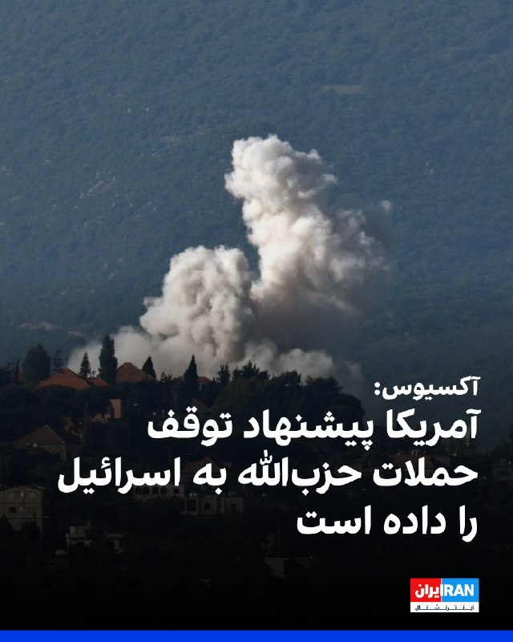

آکسیوس گزارش داد که ایالات متحده در قالب یک گام اولیه برای برقراری صلح، پیشنهاد کرده است که حزب‌الله تمام حملات خود به اسرائیل را متوقف کند.

به نوشته آکسیوس، این پیشنهاد در چارچوب تلاش‌های دیپلماتیک برای کاهش تنش در مرزهای لبنان و اسرائیل مطرح شده است.
‌🏁 🇬🇧 IranintlTV

🤖 @VahidOOnLine

## VahidOOnLine — post 243142

♦️براساس تصاویر منتشر شده در شبکه‌های اجتماعی، احمد الشرع، رئیس‌جمهوری سوریه و همسرش لطیفه الدروبی، در جدیدترین حضور غیررسمی خود در یکی از رستوران‌های شهر دمشق دیده شدند. این حضور علنی در حالی صورت گرفت که او پیش از این نیز در ۳۱ فروردین‌ماه، با حضور در مراسم افتتاحیه ورزشگاه «الفیحا» دمشق و انجام بازی بسکتبال، توجه رسانه‌ها را به خود جلب کرده بود.
‌🇸🇦 Indypersian

🤖 @VahidOOnLine

## VahidOOnLine — post 243141

  <a href="telegram/content/VahidOOnLine_243141_1780287169.mp4" target="_blank">🎬 Download video</a>

♦️به گزارش رسانه‌های ایران، روز یکشنبه، ۱۰ خرداد نخستین جلسه سومین سال فعالیت مجلس دوازدهم «به‌صورت مجازی» و به ریاست محمدباقر قالیباف در مکانی نامعلوم برگزار شد. باوجود اینکه ساختمان مجلس شورای اسلامی هدف حملات نبوده است، اما در چهار ماه اخیر، محمدباقر قالیباف و نمایندگان مجلس شورای اسلامی از حضور در مجلس و برگزاری جلسه در آن خودداری کرده‌اند. بنا بر گزارش‌ها، این جلسه با حضور ۱۸۷ نماینده به‌صورت مجازی و ۱۴ نماینده به‌صورت حضوری برگزار شد و اعضای جدید هیئت‌رئیسه مجلس سوگند یاد کردند. پیش از این، عباس گودرزی، سخنگوی هئیت رئیسه مجلس شورای اسلامی، اعلام کرده بود که به دلیل «تدابیر امنیتی و شرایط موجود» نخستین جلسه صحن علنی مجلس از آغاز جنگ جاری روز یکشنبه به صورت «ویدئو کنفرانس» برگزار خواهد شد. آخرین جلسه علنی مجلس شورای اسلامی روز ۲۸ بهمن‌ماه سال گذشته برگزار شد.
‌🇸🇦 Indypersian

🤖 @VahidOOnLine

## VahidOOnLine — post 243139

♦️به گزارش رویترز، امانوئل مکرون روز یکشنبه، در کاخ ریاست‌جمهوری الیزه میزبان بازیکنان پاریس سن‌ ژرمن بود که پس از شکست دادن آرسنال در مسابقه نهایی بوداپست و کسب جام، به پایتخت بازگشته بودند. مکرون در سخنرانی خود خطاب به شاگردان لوئیس انریکه گفت: «شما ما را تا آخرین ثانیه به هیجان آوردید؛ به لطف پاریس سن‌ ژرمن، فرانسه توانست در دو سال کاری را انجام دهد که در ۷۰ سال تاریخ فوتبال ما بی‌سابقه بوده، یعنی کسب دو عنوان قهرمانی.» رئیس‌جمهوری فرانسه که همراه با همسرش، بریژیت مکرون، میزبان بازیکنان این تیم بود، با اشاره به برخی ناآرامی‌ها و آشوب‌های خیابانی جریان جشن‌های مردمی، با تاکید بر برخورد قاطع با افراد بازداشت‌شده افزود: «این رفتارها ربطی به فوتبال و ورزش ندارد و آن چیزی نیست که ما به آن عشق می‌ورزیم.»
‌🇸🇦 Indypersian

🤖 @VahidOOnLine

## VahidOOnLine — post 243138

  

رافائل گروسی، مدیرکل آژانس بین‌المللی انرژی اتمی، گفت قزاقستان اعلام کرده است که در صورت دستیابی واشینگتن و تهران به توافق هسته‌ای، آماده دریافت ذخایر اورانیوم غنی‌شده ایران است.

گروسی به فایننشال تایمز گفت که قاسم جومارت توکایف، رییس‌جمهوری قزاقستان، در جریان مذاکراتی در آستانه، تمایل خود را برای دریافت این ذخایر نشان داده است.

او افزود از آنجا که آژانس بین‌المللی انرژی اتمی داراییک «بانک» برای ذخیره اورانیوم با غنای پایین در قزاقستان است، این کشور «مکانی» دارد که می‌توان این اورانیوم را به طور ایمن در آن ذخیره کرد.

اورانیوم غنی‌شده جمهوری اسلامی موضوعی کلیدی در مذاکرات بین ایالات متحده و جمهوری اسلامی است.
‌🏁 🇬🇧 IranintlTV

🤖 @VahidOOnLine

## VahidOOnLine — post 243137

♦️مهدی خراتیان، کارشناس حکومتی، با انتقاد از پافشاری بر دکترین هسته‌ای فعلی و در واکنش به تهدیدهای خارجی گفت: «ما بارها، از جمله از طرف ترامپ، به صورت تلویحی و تصریحا مورد تهدید اتمی قرار گرفته‌ایم. نمی‌توانیم صرفا بگوییم چون فتوایی داریم، پس تحت هر شرایطی بمب اتمی نمی‌سازیم.» خراتیان با توجه به دو سال باقیمانده از دوران ریاست‌جمهوری دونالد ترامپ گفت: «این وضعیت دیگر قابل تحمل نیست. نمی‌توانیم رهبرمان را برای دو سال زیر زمین نگه داریم.»
‌🇸🇦 Indypersian

🤖 @VahidOOnLine

## VahidOOnLine — post 243136

  

فاکس‌نیوز در گزارشی نوشت که مجتبی خامنه‌ای در واکنش به تلاش‌های دونالد ترامپ برای گسترش پیمان ابراهیم، درصدد ایجاد یک ائتلاف منطقه‌ای علیه نظم تحت رهبری آمریکا است و می‌کوشد کشورهای خاورمیانه را زیر پرچم «تمدن نوین اسلامی» گرد هم آورد.

در این گزارش آمده است که رهبر جمهوری اسلامی، کارزاری سیاسی و ایدئولوژیک را برای مقابله با نفوذ آمریکا در خاورمیانه آغاز کرده و تلاش دارد کشورهای منطقه را به سمت نوعی همگرایی اسلامی تحت رهبری تهران سوق دهد.

این گزارش می‌گوید تحرکات اخیر تهران تنها چند ساعت پس از آن آغاز شد که ترامپ با رهبران عربستان سعودی، امارات متحده عربی، قطر، ترکیه، پاکستان، مصر، اردن و بحرین درباره گسترش پیمان ابراهیم گفت‌وگو کرد. ترامپ همچنین در ۲۵ مه [۴ خرداد] در شبکه اجتماعی تروث سوشال از توسعه این پیمان حمایت کرده بود.

به نوشته فاکس‌نیوز، یک روز بعد، مجتبی خامنه‌ای در پیامی [منتسب به او] در شبکه اجتماعی ایکس خواستار شکل‌گیری «تمدن نوین اسلامی» شد و از دولت‌های اسلامی خواست برای پیشرفت «امت اسلامی» و حل مشکلات جهان اسلام با یکدیگر همکاری کنند.
متن کامل را اینجا بخوانید
‌🏁 🇬🇧 IranintlTV

🤖 @VahidOOnLine

## VahidOOnLine — post 243135

  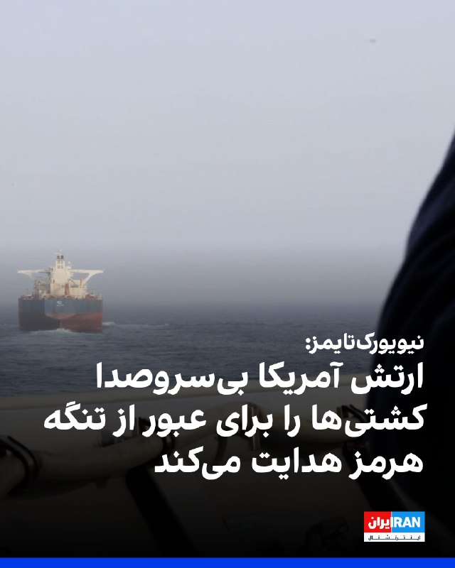

یک مقام رسمی ایالات متحده به روزنامه نیویورک‌تایمز گفت ارتش آمریکا بی‌سروصدا کشتی‌ها را برای عبور از تنگه هرمز هدایت می‌کند.

یک مقام دیگر که خواست نامش فاش نشود، ‌به این روزنامه گفت فرماندهی مرکزی ایالات متحده، سنتکام، طی سه هفته گذشته، حدود ۷۰ کشتی تجاری را که به خلیج فارس وارد و از آن خارج می‌شدند، از این تنگه عبور داده است.

به نوشته نیویورک‌تایمز، مقام‌های آمریکایی اشاره کردند که بیشتر کشتی‌ها برای جلوگیری از شناسایی شدن توسط جمهوری اسلامی، هنگام عبور از این آبراه، فرستنده‌های خود را خاموش کرده‌ بودند.

آن‌ها در مورد نوع کشتی‌هایی که از تگه هرمز عبور ‌کردند و همچنین مقصد آن‌ها توضیحی ندادند.

اما یکی از این مقام‌ها به نیویورک‌تایمز گفت که مسیر آن‌ها نزدیک خط ساحلی ایران نبود.

بر اساس این گزارش، تحلیلگران امور کشتیرانی می‌گویند به نظر می‌رسد که گذرگاه‌های هدایت‌شده توسط ایالات متحده به عمان نزدیک‌تر هستند.

نیویورک‌تایمز اشاره کرد مسیر هماهنگ شده با آمریکا جایگزینی برای مالکان کشتی‌هایی به شمار می‌رود که نمی‌خواهند برای عبور از تنگه هرمز مجبور به دریافت اجازه از تهران یا پرداخت عوارض باشند.
https://iran
‌🏁 🇬🇧 IranintlTV

🤖 @VahidOOnLine

## VahidOOnLine — post 243134

♦️محسن هاشمی رفسنجانی، رئیس شورای مرکزی حزب کارگزاران سازندگی، در گفتگو با «جماران» درباره نحوه مواجهه با دولت جدید آمریکا، ضمن «گاو خشمگین» خواندن دونالد ترامپ گفت: «یک عقل سلیمی الان می‌گوید که ما باید یک کاری بکنیم که این گاو خشمگین، این دوران دو سال مانده‌اش را یک‌جوری طی بکند و از قدرت آمریکا کنار برود». پسر بزرگ اکبر هاشمی رفسنجانی گفت: «مگر خود ترامپ زیر توافقنامه‌اش نزد و آن را پاره نکرد؟ خب ما هم پاره می‌کنیم، اتفاقی نمی‌افتد.»
‌🇸🇦 Indypersian

🤖 @VahidOOnLine

## VahidOOnLine — post 243133

♦️بر اساس گزارش رویترز، یکشنبه‌شب، پدیده نادر «ماه آبی» بر فراز معبد باستانی «پوزئیدون» در منطقه «دماغه‌ سونیون» یونان طلوع کرد. رویدادی نسبتا کم‌نظیر که به دومین ماه کامل در طول یک ماه تقویمی اطلاق می‌شود و این‌بار، نشانه پایانی برای فصل بهار است. با وجود نام این پدیده، رنگ ماه در واقعیت آبی نیست و طبق اعلام سازمان فضایی «ناسا»، این پدیده یکی از کوچک‌ترین ماه‌های کامل سال به شمار می‌رود که به «ماه مینیاتوری» (Micromoon) معروف است.
‌🇸🇦 Indypersian

🤖 @VahidOOnLine

## VahidOOnLine — post 243132

  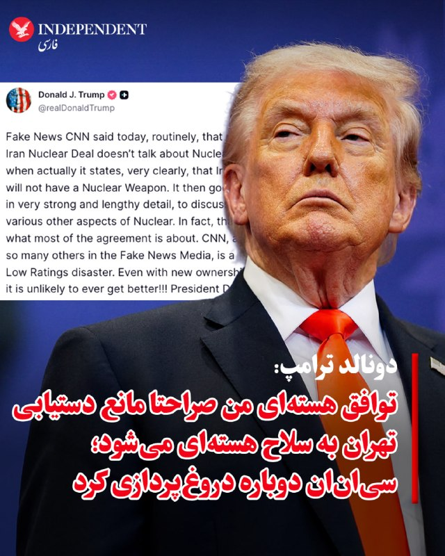

♦️دونالد ترامپ، رئیس جمهوری آمریکا در پیامی در تروث سوشال نوشت: «رسانه جعلی سی‌ان‌ان امروز طبق روال همیشگی خود ادعا کرد که توافق هسته‌ای من با ایران درباره موضوع هسته‌ای چیزی نمی‌گوید؛ در حالی که این توافق به‌روشنی تصریح می‌کند که ایران به سلاح هسته‌ای دست نخواهد یافت.
این توافق سپس با جزئیات فراوان و بسیار قاطع، به جنبه‌های مختلف دیگر موضوع هسته‌ای می‌پردازد. در واقع، بخش عمده این توافق دقیقا درباره همین موضوع است.
سی‌ان‌ان و بسیاری دیگر از رسانه‌های جعلی، به فاجعه‌ای از نظر میزان مخاطب تبدیل شده‌اند. حتی با وجود مالکان جدید نیز بعید است هرگز بهتر شوند!!»
‌🇸🇦 Indypersian

🤖 @VahidOOnLine

## VahidOOnLine — post 243131

  

مهدی انصاری، وکیل، عضو کانون وکلای دادگستری فارس و کهگیلویه و بویراحمد و از بازداشت‌شدگان اعتراضات دی‌ماه ۱۴۰۴، توسط دادگاه انقلاب اسلامی شیراز به «پنج سال حبس تعزیری و مجازات تکمیلی» محکوم شد.

به گزارش سازمان حقوق بشری هه‌نگاو، در این حکم که به انصاری ابلاغ شده است، او از بابت اتهام «اجتماع و تبانی به قصد برهم زدن امنیت کشور» به تحمل ۵ سال حبس تعزیری محکوم شده است.

انصاری همچنین به عنوان مجازات تکمیلی به دو سال منع خروج از کشور محکوم شده است.

هه‌نگاو اشاره کرد که این وکیل دادگستری هشتم بهمن سال گذشته و در جریان اعتراضات سراسری، به دست نیروهای حکومتی در منزل خود در شیراز، بازداشت شد.

او پساز پایان بازجویی، با تودیع قرار وثیقه ۵ میلیارد تومانی به صورت موقت و تا پایان مراحل دادرسی از زندان عادل‌آباد شیراز آزاد شده بود.
‌🏁 🇬🇧 IranintlTV

🤖 @VahidOOnLine

## VahidOOnLine — post 243130

  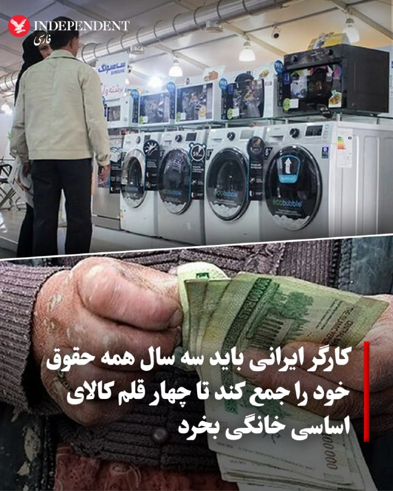

♦️به گزارش دنیای اقتصاد، در حال حاضر هزینه خرید چهار قلم کالای اساسی خانگی تولید داخل، شامل یخچال، تلویزیون، جاروبرقی و ماشین لباسشویی، ۳۶ برابر پایه حقوق کارگران است و برای خرید فقط این چهار قلم باید سه سال همه حقوق خود را جمع کنند و هیچ هزینه‌ای انجام ندهند. براساس این گزارش، هزینه این چهار قلم کالای اساسی خانگی از نام‌های تجاری ایرانی دست‌کم ۳۷۵ میلیون تومان است . به نوشته دنیای اقتصاد، قیمت لوازن خانگی در یک دهه اخیر پنج هزار درصد افزایش یافته است.
‌🇸🇦 Indypersian

🤖 @VahidOOnLine

## VahidOOnLine — post 243129

  

دونالد ترامپ، رییس‌جمهوری آمریکا، در پیامی در تروث‌سوشال، شبکه سی‌ان‌ان و دیگر رسانه‌هایی را که او «رسانه‌های اخبار جعلی» می‌خواند، متهم کرد محتوای توافق هسته‌ای مورد نظر او با ایران را نادرست بازتاب داده‌اند.

ترامپ نوشت سی‌ان‌ان «طبق معمول» گفته است توافق هسته‌ای او با ایران درباره موضوع هسته‌ای صحبت نمی‌کند، اما به گفته او، متن توافق «بسیار روشن» تصریح می‌کند که ایران سلاح هسته‌ای نخواهد داشت.

رییس‌جمهوری آمریکا افزود این توافق سپس «با جزئیات بسیار قوی و طولانی» به جنبه‌های مختلف دیگر موضوع هسته‌ای می‌پردازد و تاکید کرد بخش عمده توافق اساسا درباره همین موضوع است.

ترامپ در ادامه، سی‌ان‌ان و بسیاری دیگر از رسانه‌ها را «رسانه‌های اخبار جعلی» خواند و گفت آن‌ها «فاجعه‌ای با رتبه‌بندی پایین» هستند.

او همچنین نوشت حتی با تغییر مالکیت نیز بعید است وضعیت سی‌ان‌ان بهتر شود.
‌🏁 🇬🇧 IranintlTV

🤖 @VahidOOnLine

## mwarmonitor — post 9967

🔴دفاع آمریکا و خنثی‌سازی تهدیدات در پاسخ به تجاوزات ایران

🔸فرماندهی مرکزی ایالات متحده (سنتکام)

🔰تامپا، فلوریدا — فرماندهی مرکزی ایالات متحده (سنتکام) در پایان این هفته، حملات دفاع مشروعی را علیه رادارهای ایرانی و سایت‌های فرماندهی و کنترل پهپادها در گورک ایران و جزیره قشم انجام داد.

🔹این حملات سنجیده و حساب‌شده در روزهای شنبه و یکشنبه در پاسخ به اقدامات تهاجمی ایران، از جمله سرنگونی یک پهپاد MQ-1 آمریکایی که در حریم هوایی بین‌المللی در حال فعالیت بود، صورت گرفت.

🔹 جنگنده‌های آمریکایی با سرعت پاسخ دادند و پدافند هوایی ایران، یک ایستگاه کنترل زمینی و دو پهپاد تهاجمی انتحاری (یک‌طرفه) را که تهدیدی آشکار برای کشتی‌های در حال عبور از آب‌های منطقه بودند، منهدم کردند.

🔸به هیچ‌یک از اعضای خدمت‌گذار ارتش آمریکا آسیبی نرسید. سنتکام به محافظت از دارایی‌ها و منافع ایالات متحده در پاسخ به تجاوزات بی‌دلیل ایران در طول آتش‌بس جاری ادامه خواهد داد.

@mwarmonitor

## mwarmonitor — post 9966

  

🔸ستاد کل ارتش کویت دوشنبه، ۱ ژوئن ۲۰۲۶ پدافند هوایی کویت در حال حاضر در حال مقابله با تهدیدات موشکی و پهپادی متخاصم است. ستاد کل نیروهای مسلح کویت تایید می‌کند که هرگونه صدای انفجاری که ممکن است شنیده شود، ناشی از رهگیری اهداف متخاصم توسط سامانه‌های پدافند…

## mwarmonitor — post 9965

  

🚨فوری | خبرنگار الجزیره: آژیرهای هشدار در کویت به صدا درآمد. @mwarmonitor

## mwarmonitor — post 9964

🚨فوری | خبرنگار الجزیره: آژیرهای هشدار در کویت به صدا درآمد.

@mwarmonitor

## mwarmonitor — post 9963

🔴باراک راوید: یک مقام آمریکایی به من گفت که وزیر خارجه ایالات متحده، مارکو روبیو، طی ۴۸ ساعت گذشته با جوزف عون رئیس‌جمهور لبنان و بنیامین نتانیاهو نخست‌وزیر اسرائیل گفت‌وگو کرده تا ابتکار جدیدی برای آتش‌بس را پیش ببرد.

🔴 این مقام آمریکایی گفت ابتکار جدید در چارچوب مذاکرات جاری میان اسرائیل و لبنان پیشنهاد شده است.

🔴 به گفته این مقام، آمریکا برای پیشبرد این گفت‌وگوها پیشنهاد داده که در گام نخست، حزب‌الله تمامی حملات خود علیه اسرائیل را متوقف کند و در مقابل، اسرائیل از تشدید تنش در بیروت خودداری کند.

🔴 این مقام افزود که چنین اقدامی «فضایی برای کاهش تدریجی تنش و توقف مؤثر درگیری‌ها» ایجاد خواهد کرد.

🔴 به گفته مقام آمریکایی، رئیس‌جمهور عون تلاش کرد این پیشنهاد را پیش ببرد و به توافقی دست یابد، اما پاسخ نبیه بری، رئیس پارلمان لبنان، مبهم و ناامیدکننده بود.

🔴 این مقام ادعا کرد که بری مدعی شد می‌تواند پایبندی حزب‌الله به آتش‌بس را تضمین کند، اما مسئولیت آغاز توقف تیراندازی را بر عهده اسرائیل گذاشت؛ آن هم در حالی که به گفته او، حزب‌الله آغازگر این دور از درگیری‌ها بوده است.

🔴 این مقام آمریکایی تأکید کرد: «حزب‌الله از خط‌مشی تهران پیروی می‌کند و آشکارا هیچ علاقه‌ای به رفاه مردم لبنان ندارد.»

🔴به ادعای این مقام، ایران می‌خواهد درگیری در لبنان را طولانی کند تا بتواند بعداً مدعی شود که «اوضاع را نجات داده است».

🔴 این مقام گفت: «ایالات متحده انتظار ندارد اسرائیل حملات مداوم به غیرنظامیان خود از سوی یک سازمان تروریستی را تحمل کند. سریع‌ترین راه برای کاهش تنش و حفاظت از غیرنظامیان در همه طرف‌ها این است که حزب‌الله فوراً شلیک را متوقف کند.»

@mwarmonitor

## mwarmonitor — post 9962

🔴شبکه خبری جعلی سی‌ان‌ان (CNN) امروز طبق معمول ادعا کرد که توافق هسته‌ای ایرانِ من اصلاً درباره مسائل هسته‌ای صحبت نمی‌کند؛ در حالی که در واقع این توافق با وضوح کامل بیان می‌کند که ایران سلاح هسته‌ای نخواهد داشت. این توافق در ادامه، با جزئیاتی بسیار محکم و طولانی، به بحث درباره ابعاد مختلف دیگرِ موضوع هسته‌ای می‌پردازد. در حقیقت، بخش عمده‌ای از این توافق درباره همین موضوع است. سی‌ان‌ان و بسیاری دیگر از رسانه‌های خبری جعلی، یک فاجعه با میزان بیننده (رِیتینگ) پایین هستند. حتی با مدیریت و مالکیت جدید هم بعید است که وضعیت آن‌ها هرگز بهتر شود!!!

رئیس‌جمهور دونالد جی ترامپ

@mwarmonitor

## FoxNewsTwitter — post 342467

‌Fox News (Twitter/X)

👉 Full story here:

## FoxNewsTwitter — post 342466

  

Fox News (Twitter/X)

Hasan Piker gets denied entry to the UK over alleged antisemitism — then immediately blames 'Israel advocacy organizations' for wielding 'unbelievable amounts of power' over British policy.

The streamer's response to the ban landed on a classic antisemitic trope about Jewish influence, even as he insisted he harbors no antisemitism. British Jewish groups and a Labour MP had urged the government to block his visit, citing his comments about Hamas, Hezbollah, and his claim that the U.S. deserved 9/11.

The ban caps a brutal stretch for Piker: a Treasury Department subpoena over his Cuba trip, and hecklers confronting him at a Newark ICE protest calling him a 'f***ing fraud.'

## pm_afshaa — post 91979

  <a href="telegram/content/pm_afshaa_91979_1780287177.mp4" target="_blank">🎬 Download video</a>

موزیک جدید حامدفرد به اسم «بزن که خوب میزنی» منتشر شد و توی چند ساعت اول بازدید میلیونی گرفت

💧 Rainbet.com the #1 Non-KYC Crypto Casino & Sportsbook @rainbetcom

😁 @Pm_Afshaa

## pm_afshaa — post 91978

  <a href="telegram/content/pm_afshaa_91978_1780287178.mp4" target="_blank">🎬 Download video</a>

مداح حکومتی حسین طاهری:اگه دارین مذاکره می‌کنید به ماهم بگین که حداقل تکلیف خودمونو تو این دورهم جمع شدنایِ شبانه بدونیم.

💧 Rainbet.com the #1 Non-KYC Crypto Casino & Sportsbook @rainbetcom

😁 @Pm_Afshaa

## pm_afshaa — post 91977

  <a href="telegram/content/pm_afshaa_91977_1780287180.webm" target="_blank">🎬 Download video</a>

🔴محسن رضایی: با ادامه محاصره دریایی و مطرح کردن خواسته‌های بیش از حد در مذاکرات، ترامپ‌بار دیگر ثابت کرده که تمایلی به مذاکره و توافق نداره.

💧 Rainbet.com the #1 Non-KYC Crypto Casino & Sportsbook @rainbetcom

😁 @Pm_Afshaa

## VahidOnline — post 75834

بیانیه سپاه: ساعتی پیش آمریکا به دکل مخابراتی سیریک حمله کرده بود پاسخ دادیم

من اون موقع فقط از یک نفر دو پیام داشتم:
ساعت 4:00 چهار انفجار در شهرستان سیریک
پایگاه سپاه سرخور زدن

ساعت 4:26 دوباره یکی زد
هرمزگان شهرستان سیریک

و الان کسی تصویر دوم بالا رو فرستاد و نوشت:
"حدود ساعت چهار صبح، آمریکا با چند موشک به اینجا حمله کرد.
پایگاه نیروی دریایی سپاه شهرستان سیریک ، حوالی روستای گروک"

📡 @VahidOnline

## VahidOnline — post 75833

  <a href="telegram/content/VahidOnline_75833_1780287180.mp4" target="_blank">🎬 Download video</a>

'شلیک موشک از #امیدیه در خوزستان'
ویدیوی دریافتی دیگر از همان موشک،
دوشنبه ۱۱ خرداد ساعت ۶:۳۰
Vahid
ستاد کل ارتش کویت دقایقی پیش اعلام کرد سامانه‌های پدافند هوایی این کشور در حال مقابله با حملات موشکی و پهپادی دشمن هستند.

به گزارش خبرگزاری رویترز، جزییات بیشتری درباره این حمله پهپادی منتشر نشده است.

ارتش کویت در بیانیه خود تاکید کرد که صداهای احتمالی انفجار ناشی از رهگیری اهداف مهاجم از سوی سامانه‌های پدافندی است و از شهروندان خواست دستورالعمل‌های ایمنی را رعایت کنند.
@VahidOOnLine

📡 @VahidOnline

## VahidOnline — post 75832

  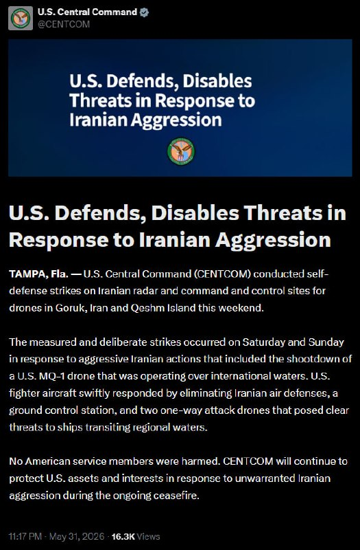

بیانیه سنتکام درباره حملات شنبه و یکشنبه
(از جمله حمله به سیریک هرمزگان که با توجه به پستی پایین‌تر گویا ساعت ۴ صبح دوشنبه ایران انجام شده. در آمریکا هنوز یکشنبه است.)

ترجمه ماشین:
"آمریکا در واکنش به تجاوز ایران، از خود دفاع کرد و تهدیدها را از کار انداخت

تامپا، فلوریدا — فرماندهی مرکزی ایالات متحده آمریکا، سنتکام، این آخر هفته حملات دفاعی علیه سایت‌های راداری ایران و مراکز فرماندهی و کنترل پهپادها در گروک ایران و جزیره قشم انجام داد.

این حملات حساب‌شده و عامدانه، روزهای شنبه و یکشنبه و در پاسخ به اقدامات تهاجمی ایران انجام شد؛ اقداماتی که شامل سرنگونی یک پهپاد MQ-1 آمریکا بود که بر فراز آب‌های بین‌المللی فعالیت می‌کرد. جنگنده‌های آمریکایی به‌سرعت واکنش نشان دادند و پدافند هوایی ایران، یک ایستگاه کنترل زمینی، و دو پهپاد تهاجمی یک‌طرفه را که تهدیدی آشکار برای کشتی‌های در حال عبور از آب‌های منطقه‌ای محسوب می‌شدند، منهدم کردند.

هیچ‌یک از نیروهای نظامی آمریکا آسیب ندیدند. سنتکام در جریان آتش‌بس جاری، در واکنش به تجاوز بی‌دلیل ایران، به حفاظت از دارایی‌ها و منافع ایالات متحده ادامه خواهد داد."
CENTCOM

📡 @VahidOnline

## VahidOnline — post 75828

  <a href="telegram/content/VahidOnline_75828_1780287181.mp4" target="_blank">🎬 Download video</a>

'شلیک موشک از #امیدیه در خوزستان'
تصاویر دریافتی، دوشنبه ۱۱ خرداد ساعت ۶:۳۰ به وقت #ایران
Vahid

📡 @VahidOnline

## VahidOnline — post 75827

  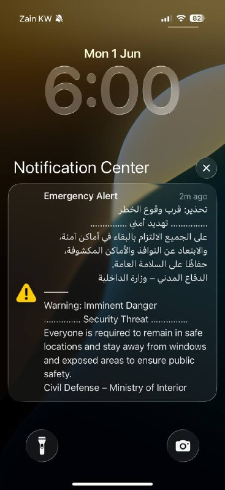

شلیک موشک به کویت

دوباره همز‌مان پیام‌هایی درباره شلیک موشک از امیدیه خوزستان و اعلام هشدار در کویت دریافت کردم.
دوشنبه ۱۱ خرداد
ساعت ۶ به وقت کویت که میشه ساعت ۶:۳۰ به وقت ایران
Vahid

📡 @VahidOnline

## VahidOnline — post 75826

  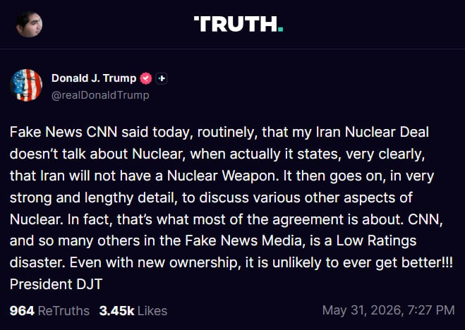

پست ترامپ، ترجمه ماشین:
رسانه اخبار جعلی سی‌ان‌ان امروز طبق معمول گفت که توافق هسته‌ای ایرانِ من درباره مسائل هسته‌ای صحبت نمی‌کند؛ در حالی که در واقع، بسیار روشن تصریح می‌کند که ایران سلاح هسته‌ای نخواهد داشت.
سپس با جزئیات بسیار محکم و مفصل، به جنبه‌های مختلف دیگر موضوع هسته‌ای می‌پردازد.
در واقع، بیشترِ این توافق درباره همین موضوع است.
سی‌ان‌ان و بسیاری دیگر در رسانه‌های اخبار جعلی، فاجعه‌ای با رتبه‌های پایین هستند.
حتی با مالکیت جدید هم بعید است اوضاعشان هرگز بهتر شود!!!

رئیس‌جمهور، دی‌جی‌تی
realDonaldTrump

📡 @VahidOnline

## IranIntlTV — post 339963

  

فرماندهی مرکزی ایالات متحده، سنتکام، در شبکه اجتماعی ایکس تاکید کرد: «در پاسخ به تجاوز بی‌اساس ایران در طول آتش‌بس جاری، به حفاظت از دارایی‌ها و منافع ایالات متحده ادامه خواهد داد.»

سنتکام نوشت که این فرماندهی در روزهای اخیر حملات دفاع از خود را علیه سایت‌های راداری و فرماندهی و کنترل پهپادهای حکومت ایران در منطقه روستایی گورک، و جزیره قشم انجام داد.

فرماندهی مرکزی ایالات متحده افزود: «این حملات سنجیده و حساب‌شده روزهای شنبه و یکشنبه در پاسخ به اقدامات تهاجمی ایران از جمله سرنگونی یک پهپاد ام‌کیو یک آمریکایی که بر فراز آب‌های بین‌المللی در حال پرواز بود، انجام شدند.»

سنتکام نوشت: «جنگنده‌های آمریکایی به سرعت با از بین بردن پدافند هوایی ایران، یک ایستگاه کنترل زمینی و دو پهپاد انتحاری که تهدید آشکاری برای کشتی‌های عبوری از آب‌های منطقه‌ای ایجاد می‌کردند، واکنش نشان دادند» و «هیچ یک از نیروهای نظامی آمریکایی آسیب ندیدند.»
https://iranintl.com/202606012118

## IranIntlTV — post 339962

  

روزنامه شرق گزارش داد پس از اعتراضات دی‌ماه و در ادامه روند تشکیل پرونده‌های انضباطی برای دانشجویان، دانشگاه‌های ایران بار دیگر پیگیری پرونده‌ها و صدور احکام جدید را آغاز کرده‌اند؛ احکامی که این روزنامه آن‌ها را «کم‌سابقه» توصیف کرده است.

شرق دوشنبه ۱۱ خرداد نوشت در دانشگاه شریف، پنج تا هفت دانشجو حکم اخراج گرفته‌اند و بیش از ۲۰ دانشجو نیز یک تا سه ترم از تحصیل تعلیق شده‌اند.

بر اساس این گزارش، سامانه‌های آموزشی ۲۰ تا ۲۵ دانشجوی دانشگاه شهید بهشتی از دسترس خارج شده، برای بیش از ۱۰۰ دانشجوی دانشگاه علم و صنعت پرونده انضباطی تشکیل شده و ۱۵۰ تا ۲۰۰ دانشجوی دانشگاه تهران در حال نوشتن دفاعیه‌های خود هستند.

شرق همچنین نوشت رسیدگی به این پرونده‌ها با «نقض گسترده» اصول شیوه‌نامه انضباطی همراه بوده است.

این برخوردها در حالی ادامه دارد که حسین سیمایی‌صراف، وزیر علوم دولت مسعود پزشکیان، پیش‌تر گفته بود مانعی برای تحصیل هیچ دانشجویی وجود ندارد و همه دانشجویان محروم‌شده به دانشگاه بازگشته‌اند.
متن کامل را اینجا بخوانید
https://iranintl.com/202606016808

## IranIntlTV — post 339961

  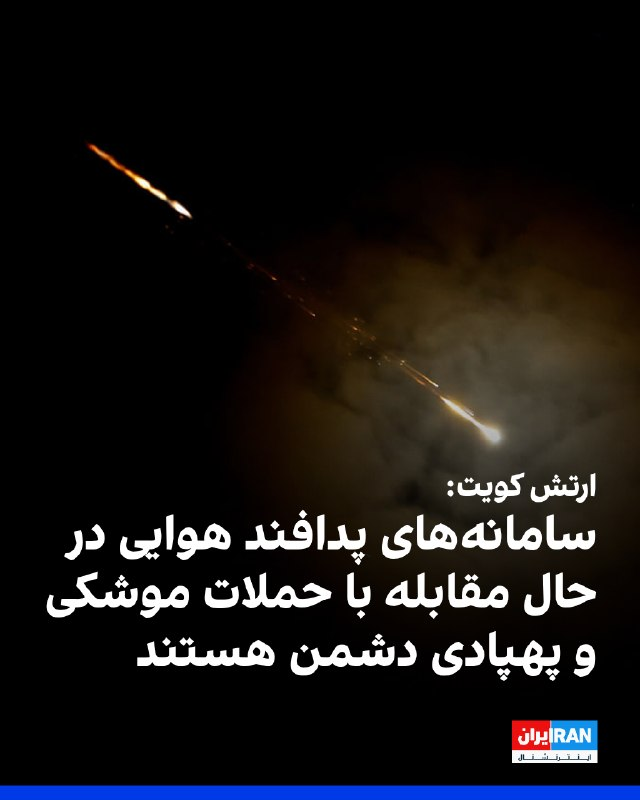

ستاد کل ارتش کویت دقایقی پیش اعلام کرد سامانه‌های پدافند هوایی این کشور در حال مقابله با حملات موشکی و پهپادی دشمن هستند.

به گزارش خبرگزاری رویترز، جزییات بیشتری درباره این حمله پهپادی منتشر نشده است.

ارتش کویت در بیانیه خود تاکید کرد که صداهای احتمالی انفجار ناشی از رهگیری اهداف مهاجم از سوی سامانه‌های پدافندی است و از شهروندان خواست دستورالعمل‌های ایمنی را رعایت کنند.
https://iranintl.com/202606016607

## IranIntlTV — post 339960

  

آکسیوس گزارش داد که ایالات متحده در قالب یک گام اولیه برای برقراری صلح، پیشنهاد کرده است که حزب‌الله تمام حملات خود به اسرائیل را متوقف کند.

به نوشته آکسیوس، این پیشنهاد در چارچوب تلاش‌های دیپلماتیک برای کاهش تنش در مرزهای لبنان و اسرائیل مطرح شده است.
https://iranintl.com/202606018578

## IranIntlTV — post 339959

  

رافائل گروسی، مدیرکل آژانس بین‌المللی انرژی اتمی، گفت قزاقستان اعلام کرده است که در صورت دستیابی واشینگتن و تهران به توافق هسته‌ای، آماده دریافت ذخایر اورانیوم غنی‌شده ایران است.

گروسی به فایننشال تایمز گفت که قاسم جومارت توکایف، رییس‌جمهوری قزاقستان، در جریان مذاکراتی در آستانه، تمایل خود را برای دریافت این ذخایر نشان داده است.

او افزود از آنجا که آژانس بین‌المللی انرژی اتمی داراییک «بانک» برای ذخیره اورانیوم با غنای پایین در قزاقستان است، این کشور «مکانی» دارد که می‌توان این اورانیوم را به طور ایمن در آن ذخیره کرد.

اورانیوم غنی‌شده جمهوری اسلامی موضوعی کلیدی در مذاکرات بین ایالات متحده و جمهوری اسلامی است.
https://iranintl.com/202606010885

## IranIntlTV — post 339958

  

فاکس‌نیوز در گزارشی نوشت که مجتبی خامنه‌ای در واکنش به تلاش‌های دونالد ترامپ برای گسترش پیمان ابراهیم، درصدد ایجاد یک ائتلاف منطقه‌ای علیه نظم تحت رهبری آمریکا است و می‌کوشد کشورهای خاورمیانه را زیر پرچم «تمدن نوین اسلامی» گرد هم آورد.

در این گزارش آمده است که رهبر جمهوری اسلامی، کارزاری سیاسی و ایدئولوژیک را برای مقابله با نفوذ آمریکا در خاورمیانه آغاز کرده و تلاش دارد کشورهای منطقه را به سمت نوعی همگرایی اسلامی تحت رهبری تهران سوق دهد.

این گزارش می‌گوید تحرکات اخیر تهران تنها چند ساعت پس از آن آغاز شد که ترامپ با رهبران عربستان سعودی، امارات متحده عربی، قطر، ترکیه، پاکستان، مصر، اردن و بحرین درباره گسترش پیمان ابراهیم گفت‌وگو کرد. ترامپ همچنین در ۲۵ مه [۴ خرداد] در شبکه اجتماعی تروث سوشال از توسعه این پیمان حمایت کرده بود.

به نوشته فاکس‌نیوز، یک روز بعد، مجتبی خامنه‌ای در پیامی [منتسب به او] در شبکه اجتماعی ایکس خواستار شکل‌گیری «تمدن نوین اسلامی» شد و از دولت‌های اسلامی خواست برای پیشرفت «امت اسلامی» و حل مشکلات جهان اسلام با یکدیگر همکاری کنند.
متن کامل را اینجا بخوانید
https://iranintl.com/2026053140

## IranIntlTV — post 339957

  

یک مقام رسمی ایالات متحده به روزنامه نیویورک‌تایمز گفت ارتش آمریکا بی‌سروصدا کشتی‌ها را برای عبور از تنگه هرمز هدایت می‌کند.

یک مقام دیگر که خواست نامش فاش نشود، ‌به این روزنامه گفت فرماندهی مرکزی ایالات متحده، سنتکام، طی سه هفته گذشته، حدود ۷۰ کشتی تجاری را که به خلیج فارس وارد و از آن خارج می‌شدند، از این تنگه عبور داده است.

به نوشته نیویورک‌تایمز، مقام‌های آمریکایی اشاره کردند که بیشتر کشتی‌ها برای جلوگیری از شناسایی شدن توسط جمهوری اسلامی، هنگام عبور از این آبراه، فرستنده‌های خود را خاموش کرده‌ بودند.

آن‌ها در مورد نوع کشتی‌هایی که از تگه هرمز عبور ‌کردند و همچنین مقصد آن‌ها توضیحی ندادند.

اما یکی از این مقام‌ها به نیویورک‌تایمز گفت که مسیر آن‌ها نزدیک خط ساحلی ایران نبود.

بر اساس این گزارش، تحلیلگران امور کشتیرانی می‌گویند به نظر می‌رسد که گذرگاه‌های هدایت‌شده توسط ایالات متحده به عمان نزدیک‌تر هستند.

نیویورک‌تایمز اشاره کرد مسیر هماهنگ شده با آمریکا جایگزینی برای مالکان کشتی‌هایی به شمار می‌رود که نمی‌خواهند برای عبور از تنگه هرمز مجبور به دریافت اجازه از تهران یا پرداخت عوارض باشند.
https://iran

## IranIntlTV — post 339956

  

مهدی انصاری، وکیل، عضو کانون وکلای دادگستری فارس و کهگیلویه و بویراحمد و از بازداشت‌شدگان اعتراضات دی‌ماه ۱۴۰۴، توسط دادگاه انقلاب اسلامی شیراز به «پنج سال حبس تعزیری و مجازات تکمیلی» محکوم شد.

به گزارش سازمان حقوق بشری هه‌نگاو، در این حکم که به انصاری ابلاغ شده است، او از بابت اتهام «اجتماع و تبانی به قصد برهم زدن امنیت کشور» به تحمل ۵ سال حبس تعزیری محکوم شده است.

انصاری همچنین به عنوان مجازات تکمیلی به دو سال منع خروج از کشور محکوم شده است.

هه‌نگاو اشاره کرد که این وکیل دادگستری هشتم بهمن سال گذشته و در جریان اعتراضات سراسری، به دست نیروهای حکومتی در منزل خود در شیراز، بازداشت شد.

او پساز پایان بازجویی، با تودیع قرار وثیقه ۵ میلیارد تومانی به صورت موقت و تا پایان مراحل دادرسی از زندان عادل‌آباد شیراز آزاد شده بود.
https://iranintl.com/202606018525

## IranIntlTV — post 339955

  <a href="telegram/content/IranIntlTV_339955_1780287186.mp4" target="_blank">🎬 Download video</a>

ارتش اسرائیل روز یک‌شنبه ۱۰ خرداد با انتشار ویدیوهایی از تصرف قلعه ۹۰۰ ساله شقیف (بوفور) در ارتفاعات راهبردی جنوب لبنان خبر داد.

به گفته ارتش اسرائیل، هدف از این عملیات تضعیف شبه‌نظامیان حزب‌الله و زیرساخت‌های این گروه در ارتفاعاتی است که به گفته اسرائیل با هدایت جمهوری اسلامی در این منطقه ایجاد شده‌اند.

تصرف این قلعه و ارتفاعات اطراف آن، پیش‌روی اسرائیل در لبنان را گسترش می‌دهد.
@iranintltv

## IranIntlTV — post 339954

  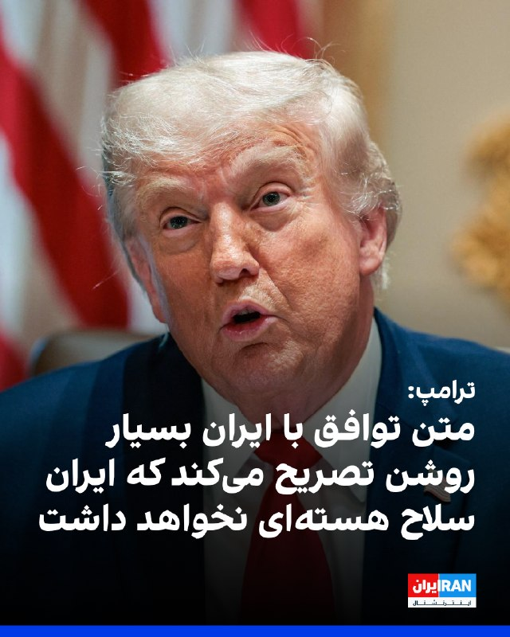

دونالد ترامپ، رییس‌جمهوری آمریکا، در پیامی در تروث‌سوشال، شبکه سی‌ان‌ان و دیگر رسانه‌هایی را که او «رسانه‌های اخبار جعلی» می‌خواند، متهم کرد محتوای توافق هسته‌ای مورد نظر او با ایران را نادرست بازتاب داده‌اند.

ترامپ نوشت سی‌ان‌ان «طبق معمول» گفته است توافق هسته‌ای او با ایران درباره موضوع هسته‌ای صحبت نمی‌کند، اما به گفته او، متن توافق «بسیار روشن» تصریح می‌کند که ایران سلاح هسته‌ای نخواهد داشت.

رییس‌جمهوری آمریکا افزود این توافق سپس «با جزئیات بسیار قوی و طولانی» به جنبه‌های مختلف دیگر موضوع هسته‌ای می‌پردازد و تاکید کرد بخش عمده توافق اساسا درباره همین موضوع است.

ترامپ در ادامه، سی‌ان‌ان و بسیاری دیگر از رسانه‌ها را «رسانه‌های اخبار جعلی» خواند و گفت آن‌ها «فاجعه‌ای با رتبه‌بندی پایین» هستند.

او همچنین نوشت حتی با تغییر مالکیت نیز بعید است وضعیت سی‌ان‌ان بهتر شود.
https://iranintl.com/202605313841

## Shin_Persian — post 6345

  

Shin ✓ @hey_itsmyturn
Mon, 01 Jun 2026 03:09:11 UTC

Kuwait Ministry of Defense:
Air defenses are currently engaging hostile missile and drone attacks.

General Staff notes that explosion sounds are the result of air defense interceptions.

Follow safety instructions …

Source: https://x.com/i/web/status/2061283849951166777

فارسی

وزارت دفاع کویت:
پدافند هوایی در حال حاضر در حال درگیری با حملات موشکی و پهپادی متخاصم است.

ستاد کل نیروهای مسلح خاطرنشان می‌کند که صدای انفجارها ناشی از رهگیری‌های پدافند هوایی است.

دستورالعمل‌های ایمنی را رعایت کنید ...

منبع: https://x.com/i/web/status/2061283849951166777

𝕏 · @shin_persian

## Shin_Persian — post 6344

  

Shin ✓ @hey_itsmyturn
Mon, 01 Jun 2026 03:07:57 UTC

Kuwaiti Air Defenses are currently responding to hostile missile and drone attacks.

General Staff of the Army: Explosions heard are the result of interceptions.

Follow all safety instructions from authorities.

#Kuwa…

Source: https://x.com/i/web/status/2061283538721206351

فارسی

پدافند هوایی کویت در حال حاضر در حال مقابله با حملات موشکی و پهپادی متخاصم است.

ستاد کل ارتش: انفجارهای شنیده شده نتیجه رهگیری‌ها است.

تمامی دستورالعمل‌های ایمنی مقامات را رعایت کنید.

#Kuwa…

منبع: https://x.com/i/web/status/2061283538721206351

𝕏 · @shin_persian

## FarsiVOA — post 219224

🔺داروی «انقلابی» سرطان پانکراس؛ بیماران دو برابر بیشتر زنده ماندند

▪️نتایج یک پژوهش مهم که روز یکشنبه در نشست سالانه انجمن سرطان‌شناسی بالینی آمریکا در شیکاگو ارائه و همزمان در مجله پزشکی نیوانگلند منتشر شد، نشان داد داروی جدید داراکسونراسیب، تولید شرکت «روولوشن مدیسینز» (داروهای انقلابی) می‌تواند تحول بزرگی در درمان (و نه رفع کامل) سرطان لوزالمعده (پانکراس) ایجاد کند.

⬇️ بیشتر بخوانید:
https://ir.voanews.com/a/8156040.html
@FarsiVOA

## Persian_Trend_Official — post 15419

  <a href="telegram/content/Persian_Trend_Official_15419_1780287189.mp4" target="_blank">🎬 Download video</a>

صبحتون بخیر ☕️🤍

📝 Nick

📌 @persian_trend_official
پرشین ترند | متفاوت‌ترین کانال نظامی

## RadioFarda — post 157754

  <a href="https://t.me/radiofarda/157754" target="_blank">📎 Download file</a>

📻بشنوید: سرخط خبرها با رادیوفردا، ۱۱ خرداد ۱۴۰۵‌

@RadioFarda

## IranianMinds — post 21167

🔴فرمانده کل ایران محسن رضایی : یا محاصره را تمام می‌کنید یا محاصره را تمام می‌کنیم @IranianMinds

## IranianMinds — post 21166

  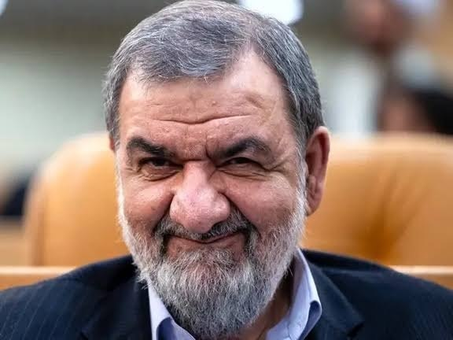

🔴فرمانده کل ایران محسن رضایی :

یا محاصره را تمام می‌کنید
یا محاصره را تمام می‌کنیم

@IranianMinds

## BBCPersian — post 282529

‌ ‌ ‌
دانشمندان در حال بررسی این هستند که اگر بدن انسان به‌طور مداوم در معرض چنین گرمایی قرار بگیرد، چه اتفاقی در درون آن رخ می‌دهد.

یک پژوهش در دانشگاه کالیفرنیای جنوبی بررسی کرده است که زمانی که دمای روزانه به بیش از ۳۲ درجه سانتی‌گراد رسید، چه اتفاقی برای چند هزار آمریکایی ساکن در ایالت‌ها و اقلیم‌های مختلف رخ داد.

با استفاده از آزمایش‌های خون، این تیم سن زیستی ۳۶۰۰ شرکت‌کننده را با سن واقعی آن‌ها اندازه‌گیری کرد و آن را با شاخص گرما مقایسه کرد. یون‌یانگ چوی، پژوهشگر فوق‌دکتری و نویسنده این مطالعه، می‌گوید تاثیر این وضعیت بر بدن افراد شگفت‌آور بود، افرادی که بیشتر در معرض دماهای بالاتر قرار داشتند، سریع‌تر پیر می‌شدند.

📷📸GettyImages/ AFP via Getty Images
@BBCPersian

## BBCPersian — post 282524

‌ ‌ ‌
دولت ایتالیا به‌دلیل ارائه مشوق‌ها و معافیت‌های مالیاتی مورد انتقاد قرار گرفته است. این کشور با این کار ثروتمندان فرانسوی و ساکنان خارجی فرانسه را به ترک این کشور ترغیب کرده و هدف انتقاد دولت فرانسه قرار گرفته است.

همچنین در پی آسیب‌هایی که جنگ در خاورمیانه به کشورهای حوزه خلیج فارس وارد کرده، ایتالیا بیش از پیش به مقصدی جذاب برای ثروتمندان تبدیل شده است.

https://trib.al/eoPjpM1
📷Getty/ John Laurenson
@BBCPersian

## BBCPersian — post 282523

  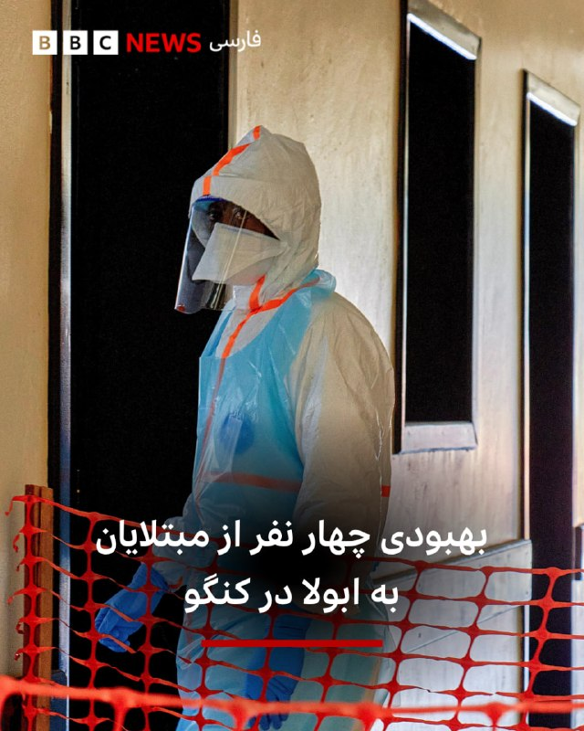

‌ ‌ ‌ ‌
مقامات بهداشتی در جمهوری دموکراتیک کنگو، بهبودی چهار نفر از مبتلایان ابولا را جشن گرفته‌اند.
آنها جزو اولین کسانی هستند که در شیوع فعلی بهبود یافته و مرخص شده‌اند.

در مراسمی در بونیا، با حضور تدروس آدهانوم گبریسوس، مدیر کل سازمان بهداشت جهانی، از کارکنان بهداشتی بهبود یافته به خاطر شجاعت‌شان تقدیر شد.

آقای تدروس گفت که بازماندگان ثابت کردند که شیوع بیماری قابل توقف است.

مقامات کنگو نیز تاکید کردند که این بهبودیافتگان نشان دادند که چگونه تشخیص و درمان زودهنگام می‌تواند شانس زنده ماندن را بهبود بخشد.

در همین حال، در برزیل، مقامات می‌گویند که در حال بررسی دومین مورد مشکوک به ابولا هستند.
در صورت تایید، موارد در ریودوژانیرو و ایالت سائوپائولو اولین موارد خارج از آفریقا از زمان شیوع اخیر این بیماری خواهد بود.

📷 Reuters
@BBCPersian

## BBCPersian — post 282522

‌ ‌ انتخابات رياست جمهوری کلمبيا پس از آنکه در رأی‌گيری روز يکشنبه - ۱۰ خرداد - هيچ نامزدی موفق به کسب اکثريت مطلق آرا نشد، به دور دوم در ۲۱ ژوئن (سه هفته دیگر) کشيده شد. در اين مرحله، يک نامزد چپ‌گرا و يک نامزد راست‌گرا که در دو سوی طيف سياسی قرار دارند،…

## BBCPersian — post 282521

  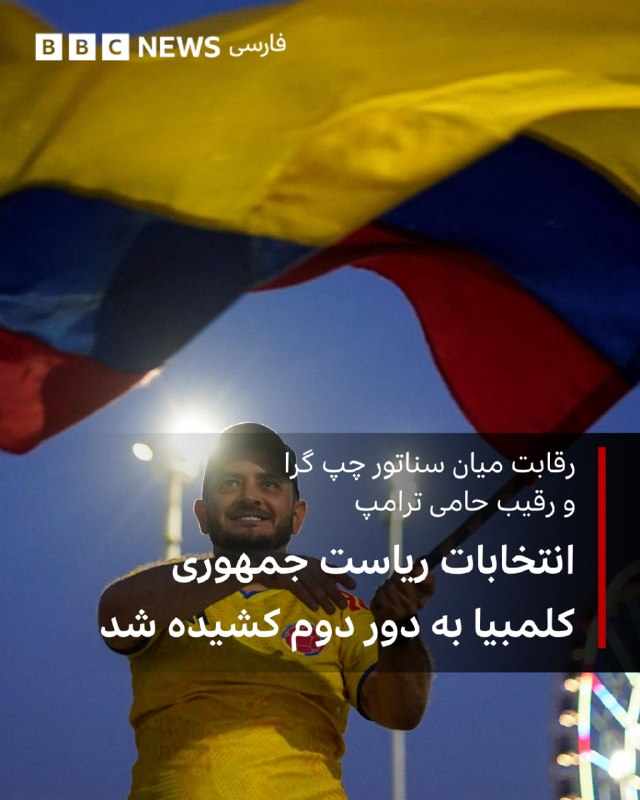

‌ ‌
انتخابات رياست جمهوری کلمبيا پس از آنکه در رأی‌گيری روز يکشنبه - ۱۰ خرداد - هيچ نامزدی موفق به کسب اکثريت مطلق آرا نشد، به دور دوم در ۲۱ ژوئن (سه هفته دیگر) کشيده شد. در اين مرحله، يک نامزد چپ‌گرا و يک نامزد راست‌گرا که در دو سوی طيف سياسی قرار دارند، با يکديگر رقابت خواهند کرد.

آبلاردو د لا اسپريا، نامزد راست‌گرا و از ستايش‌گران دونالد ترامپ، در دور نخست بيشترين رأی را به دست آورد و پس از او ايوان سپدا، سناتور چپ‌گرا و متحد گوستاوو پترو، رئيس‌جمهور کنونی کلمبيا، قرار گرفت.

کارزار انتخاباتی با موجی از خشونت همراه بود؛ از جمله حملات پهپادی، آدم ربايی، قتل و ترور يک نامزد رياست‌جمهوری در جريان يک گردهمايی انتخاباتی در سال گذشته.

هر دو نامزد ديدگاه‌های متفاوتی درباره نحوه حل درگيری مسلحانه داخلی کلمبيا دارند؛ بحرانی که دهه‌ها ادامه داشته و در سال‌های اخير بار ديگر شدت گرفته است.

در رأی گيری روز يکشنبه، هيچ يک از دو نامزد نتوانست بيش از ۵۰ درصد آرا را برای پيروزی مستقيم کسب کند.

https://bbc.in/4ee3V8C
📷Reuters
@BBCPersian

## BBCPersian — post 282520

‌‌‌ ‌ مايک پنس، معاون پيشين رئيس جمهوری آمريکا، به شدت از صندوق ۱/۸ ميليارد دلاری دولت دونالد ترامپ برای پرداخت غرامت به افرادی که مدعی‌اند در دولت‌های پيشين به ناعادلانه‌ترين شکل تحت پيگرد قرار گرفته‌اند، انتقاد کرد. دولت ترامپ اوايل ماه جاری از ايجاد صندوقی…

## BBCPersian — post 282519

  

‌‌‌ ‌
مايک پنس، معاون پيشين رئيس جمهوری آمريکا، به شدت از صندوق ۱/۸ ميليارد دلاری دولت دونالد ترامپ برای پرداخت غرامت به افرادی که مدعی‌اند در دولت‌های پيشين به ناعادلانه‌ترين شکل تحت پيگرد قرار گرفته‌اند، انتقاد کرد.

دولت ترامپ اوايل ماه جاری از ايجاد صندوقی با عنوان «مقابله با سوءاستفاده سياسی از دستگاه قضايی» خبر داد تا به گفته مقام‌ها، «قربانيان پيگردهای سياسی» بتوانند درخواست غرامت کنند.

اما آقای پنس که در دولت نخست ترامپ معاون او بود، اين طرح را «از همان ابتدا ايده‌ای اشتباه» توصيف کرد و گفت بايد کنار گذاشته شود.

بسياری از حاميان دونالد ترامپ که در ارتباط با یورش به ساختمان کنگره آمريکا در ۶ ژانويه ۲۰۲۱ تحت پيگرد قرار گرفتند، گفته‌اند قصد دارند برای دريافت غرامت اقدام کنند.

مایک پنس که در زمان حمله در ساختمان کنگره حضور داشت و شورشيان او را به خشونت و حتی دار زدن تهديد کرده بودند، در گفت وگو با شبکه ان‌بی‌سی اين صندوق را «عميقا توهين‌آميز» خواند.

https://trib.al/SWCYEwf
📷Reuters
@BBCPersian

---
📅 بروزرسانی: 1405/03/11 03:24
---

## VahidOOnLine — post 243128

  

♦️به گزارش نیویورک‌تایمز، نیروهای آمریکایی در هفته‌های اخیر به هماهنگی عبور ده‌ها کشتی تجاری از تنگه هرمز کمک کرده‌اند؛ اقدامی که به گفته مقام‌های ایالات متحده، در حالی انجام شده که رفت‌وآمد از این آبراه همچنان به‌دلیل بن‌بست در مذاکرات برای پایان دادن به جنگ با ایران پرخطر است.یکی از مقام‌های آمریکایی که به شرط ناشناس ماندن درباره مسائل عملیاتی صحبت می‌کرد، گفت فرماندهی مرکزی ایالات متحده در سه هفته گذشته عبور حدود ۷۰ کشتی تجاری را در مسیر ورود و خروج از خلیج فارس از طریق تنگه هرمز هدایت کرده است. مقام‌های آمریکایی افزودند که بیشتر این کشتی‌ها هنگام عبور از این آبراه باریک، برای جلوگیری از شناسایی، دستگاه‌های فرستنده و گیرنده موقعیت‌یاب خود را خاموش کرده بودند.تحلیلگران حوزه کشتیرانی می‌گویند عبورهای هدایت‌شده توسط آمریکا ظاهرا از مسیرهایی نزدیک‌تر به عمان انجام می‌شود. به نوشته این روزنامه آمریکایی، مسیر هماهنگ‌شده توسط آمریکا همچنین گزینه‌ای جایگزین برای مالکان کشتی است که نمی‌خواهند برای عبور از تنگه از ایران مجوز بگیرند یا عوارض پرداخت کنند. . به گفته سنتکام، محاصره دریایی ایران که در واکنش به اقدام تهران در بستن تنگه هرمز اجرا در خلیج عمان اجرا می‌شود تاکنون مسیر ۱۱۶ کشتی را تغییر داده است. این اقدام تا حد زیادی صادرات نفت ایران را مختل کرده است. بر اساس داده‌های شرکت اطلاعات دریایی «کلپر» (Kpler)، از میان ۸۹۵ عبور ثبت‌شده از تنگه هرمز بین اول مارس تا ۱۹ مه، کمی بیش از نیمی از آن‌ها از مسیر ایران انجام شده است. حدود ۴۰ درصد نیز از مسیرهای نامشخص یا «تاریک» عبور کرده‌اند.
‌🇸🇦 Indypersian

🤖 @VahidOOnLine

## VahidOOnLine — post 243127

♦️تصاویر منتشر شده در حساب اینستاگرام خانواده تیموری‌راد، محل خاکسپاری جاویدنامان امید، ۴۷ ساله، پسرش آرمین، ۱۹ ساله و برادرش امیر، ۴۲ ساله، کشته‌شده‌ها در دی‌ماه ۱۴۰۴ را نشان می‌دهد. امید، آرمین و امیر تیموری‌راد جمعه‌شب، ۱۹ دی‌ماه، در فردیس کرج با شلیک نیروهای سرکوبگر جمهوری اسلامی کشته ‌شدند.
‌🇸🇦 Indypersian

🤖 @VahidOOnLine

## VahidOOnLine — post 243126

  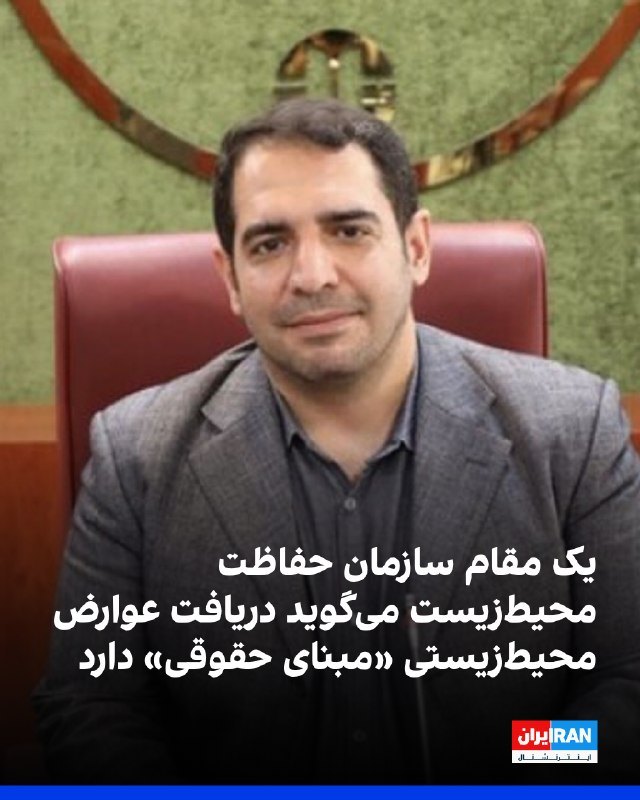

آرمان خورسند، رییس مرکز امور بین‌الملل و کنوانسیون‌های سازمان حفاظت محیط‌زیست گفت دریافت عوارض محیط‌زیستی از کشتی‌های عبوری تنگه هرمز در حقوق بین‌الملل دریاها مبنای حقوقی دارد و می‌تواند برای جبران خسارت‌های واردشده به محیط‌زیست خلیج فارس هزینه شود.

او «آلودگی‌های نفتی، فعالیت ناوگان نظامی خارجی و خسارت به زیست‌بوم‌های حساس خلیج فارس و جزایر منطقه» را از دلایل ضرورت تامین منابع مالی برای احیای محیط‌زیست این منطقه دانست.

خورسند گفت کشورهای مجاور تنگه هرمز در چارچوب نظام «عبور بی‌ضرر» می‌توانند برای خدمات دریانوردی و جبران خسارت‌های ناشی از نقض مقررات، هزینه و عوارض دریافت کنند و ادعای غیرقانونی بودن آن را «بی‌مبنا» خواند.
‌🏁 🇬🇧 IranintlTV

🤖 @VahidOOnLine

## VahidOOnLine — post 243125

  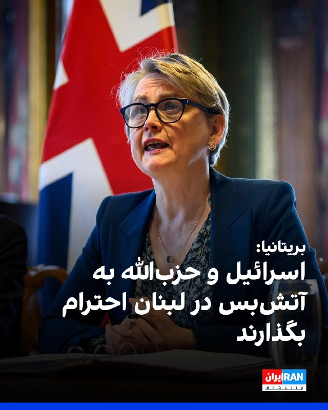

ایوت کوپر، وزیر خارجه بریتانیا، در واکنش به تشدید درگیری‌ها بین اسرائیل و حزب‌الله، از آن‌ها خواست که به آتش‌بس در لبنان احترام بگذارند.

او گفت پیشروی اسرائیل در جنوب لبنان «باید پایان یابد» و اشاره کرد که عملیات اسرائیل «غیرنظامیان را کشته و آواره کرده، زیرساخت‌ها را نابود کرده و فضای دیپلماسی را از بین برده است.»

کوپر از حزب‌الله خواست که به حملات خود به اسرائیل را پایان دهد و خلع سلاح شود.

او گفت: «همه طرفین باید به آتش‌بس احترام بگذارند و با حسن نیت در مذاکرات شرکت کنند.»
‌🏁 🇬🇧 IranintlTV

🤖 @VahidOOnLine

## VahidOOnLine — post 243124

  <a href="telegram/content/VahidOOnLine_243124_1780271656.mp4" target="_blank">🎬 Download video</a>

♦️دونالد ترامپ با انتشار ویدیویی تولیدشده با هوش مصنوعی در شبکه اجتماعی «تروث سوشال»، هواپیمای اختصاصی ریاست‌جمهوری آمریکا، «ایر فورس وان»، را به تصویر کشید که در میان حلقه‌ای از جنگنده‌های نظامی و بمب‌افکن‌های استراتژیک هسته‌ای ایالات متحده در حال پرواز است.
‌🇸🇦 Indypersian

🤖 @VahidOOnLine

## VahidOOnLine — post 243123

  

علی الزیدی، نخست‌وزیر عراق، بر ضرورت اولویت دادن به گفت‌وگو و دیپلماسی برای حل و فصل مناقشات و برقراری امنیت و ثبات در منطقه تأکید کرد.

به گزارش خبرگزاری قطر، الزیدی در دیدار با جاشوا هریس، کاردار سفارت آمریکا در عراق، افزود که ارتباط سازنده بین بغداد و واشینگتن باید ادامه یابد و کار مشترک در چارچوب توافقنامه چارچوب استراتژیک و یادداشت‌های تفاهم دوجانبه باید حفظ شود.

او بر تعهد هر دو طرف به تقویت مشارکت و هماهنگی در مورد مسائل مختلف دوجانبه و منطقه‌ای تاکید کرد.

در بیانیه‌ دولت عراق آمده است که دو طرف در مورد چشم‌اندازهای همکاری بین کشورهای خود و راه‌های توسعه و گسترش روابط در همه زمینه‌ها، به ویژه اقتصادی، سرمایه‌گذاری و فرهنگی، بر اساس احترام متقابل و منافع مشترک، گفت‌وگو کردند.
‌🏁 🇬🇧 IranintlTV

🤖 @VahidOOnLine

## IranIntlTV — post 339953

  

آرمان خورسند، رییس مرکز امور بین‌الملل و کنوانسیون‌های سازمان حفاظت محیط‌زیست گفت دریافت عوارض محیط‌زیستی از کشتی‌های عبوری تنگه هرمز در حقوق بین‌الملل دریاها مبنای حقوقی دارد و می‌تواند برای جبران خسارت‌های واردشده به محیط‌زیست خلیج فارس هزینه شود.

او «آلودگی‌های نفتی، فعالیت ناوگان نظامی خارجی و خسارت به زیست‌بوم‌های حساس خلیج فارس و جزایر منطقه» را از دلایل ضرورت تامین منابع مالی برای احیای محیط‌زیست این منطقه دانست.

خورسند گفت کشورهای مجاور تنگه هرمز در چارچوب نظام «عبور بی‌ضرر» می‌توانند برای خدمات دریانوردی و جبران خسارت‌های ناشی از نقض مقررات، هزینه و عوارض دریافت کنند و ادعای غیرقانونی بودن آن را «بی‌مبنا» خواند.
https://iranintl.com/202605314484

## IranIntlTV — post 339952

  

ایوت کوپر، وزیر خارجه بریتانیا، در واکنش به تشدید درگیری‌ها بین اسرائیل و حزب‌الله، از آن‌ها خواست که به آتش‌بس در لبنان احترام بگذارند.

او گفت پیشروی اسرائیل در جنوب لبنان «باید پایان یابد» و اشاره کرد که عملیات اسرائیل «غیرنظامیان را کشته و آواره کرده، زیرساخت‌ها را نابود کرده و فضای دیپلماسی را از بین برده است.»

کوپر از حزب‌الله خواست که به حملات خود به اسرائیل را پایان دهد و خلع سلاح شود.

او گفت: «همه طرفین باید به آتش‌بس احترام بگذارند و با حسن نیت در مذاکرات شرکت کنند.»
https://iranintl.com/202605311407

## IranIntlTV — post 339951

  

علی الزیدی، نخست‌وزیر عراق، بر ضرورت اولویت دادن به گفت‌وگو و دیپلماسی برای حل و فصل مناقشات و برقراری امنیت و ثبات در منطقه تأکید کرد.

به گزارش خبرگزاری قطر، الزیدی در دیدار با جاشوا هریس، کاردار سفارت آمریکا در عراق، افزود که ارتباط سازنده بین بغداد و واشینگتن باید ادامه یابد و کار مشترک در چارچوب توافقنامه چارچوب استراتژیک و یادداشت‌های تفاهم دوجانبه باید حفظ شود.

او بر تعهد هر دو طرف به تقویت مشارکت و هماهنگی در مورد مسائل مختلف دوجانبه و منطقه‌ای تاکید کرد.

در بیانیه‌ دولت عراق آمده است که دو طرف در مورد چشم‌اندازهای همکاری بین کشورهای خود و راه‌های توسعه و گسترش روابط در همه زمینه‌ها، به ویژه اقتصادی، سرمایه‌گذاری و فرهنگی، بر اساس احترام متقابل و منافع مشترک، گفت‌وگو کردند.
https://iranintl.com/202605319641

## Shin_Persian — post 6343

  

Shin ✓ @hey_itsmyturn Sun, 31 May 2026 23:31:03 UTC President Trump @POTUS: "Fake News CNN said today, routinely, that my Iran Nuclear Deal doesn’t talk about Nuclear, when actually it states, very clearly, that Iran will not have a Nuclear Weapon. It then…

## Shin_Persian — post 6342

Shin ✓ @hey_itsmyturn
Sun, 31 May 2026 23:31:03 UTC

President Trump @POTUS:
"Fake News CNN said today, routinely, that my Iran Nuclear Deal doesn’t talk about Nuclear, when actually it states, very clearly, that Iran will not have a Nuclear Weapon. It then goes on, in very strong and lengthy detail, to discuss various other aspects of Nuclear. In fact, that’s what most of the agreement is about. CNN, and so many others in the Fake News Media, is a Low Ratings disaster. Even with new ownership, it is unlikely to ever get better!!! President DJT"

فارسی

رئیس‌جمهور ترامپ @POTUS:

«سی‌ان‌ان (CNN) که رسانه اخبار جعلی است، امروز به طور مکرر گفت که توافق هسته‌ای من با ایران درباره مسائل هسته‌ای صحبت نمی‌کند، در حالی که در واقع، این توافق به وضوح بیان می‌کند که ایران سلاح هسته‌ای نخواهد داشت. سپس، با جزئیات بسیار قوی و طولانی، به بحث درباره جنبه‌های مختلف دیگر موضوعات هسته‌ای می‌پردازد. در حقیقت، بیشتر متن توافق درباره همین موضوع است. سی‌ان‌ان و بسیاری دیگر در رسانه‌های اخبار جعلی، یک فاجعه با رتبه‌بندی پایین هستند. حتی با مدیریت جدید هم بعید است که هرگز بهتر شوند!!! رئیس‌جمهور دی‌جی‌تی (DJT)»

𝕏 · @shin_persian

## FarsiVOA — post 219223

🔺ترامپ: برخلاف ادعای سی‌‌‌ان‌ان «توافق هسته‌ای ایران» به‌روشنی می‌گوید که جمهوری اسلامی نباید سلاح هسته‌ای داشته باشد

▪️دونالد ترامپ، رئیس‌جمهوری آمریکا یک‌شنبه شب تاکید کرد که «توافق هسته‌ای ایران» به‌روشنی می‌گوید که جمهوری اسلامی ایران نباید سلاح هسته‌ای داشته باشد.

⬇️ بیشتر بخوانید:
https://ir.voanews.com/a/8155840.html
@FarsiVOA

## FarsiVOA — post 219222

⚡️عراق خواهان تداوم همکاری‌های مشترک استراتژیک با ایالات متحده آمریکا
@FarsiVOA

## FarsiVOA — post 219221

⚡️روز جهانی بدون دخانیات فرصتی است برای افزایش آگاهی درباره خطرات مصرف دخانیات و تأثیر آن بر سلامت افراد و جوامع. مصرف دخانیات هر سال جان میلیون‌ها نفر را در سراسر جهان می‌گیرد.
@FarsiVOA

## FarsiVOA — post 219220

⚡️مخالفت قاطع آمریکا با حضور هرگونه گروه وابسته به جمهوری اسلامی در دولت جدید عراق
@FarsiVOA

## FarsiVOA — post 219219

⚡️«تندروهای حکومتی» تعطیلی مجلس شورای اسلامی را تلاشی برای جلوگیری از تصویب قانون تنگه هرمز می‌دانند
@FarsiVOA

## FarsiVOA — post 219218

  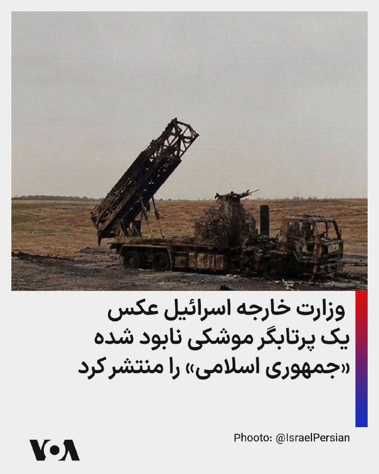

⚡️هم‌زمان با انتشار برخی گزارش‌ها از تلاش‌های جمهوری اسلامی برای دسترسی به سایت‌های زیرزمینی موشکی، وزارت امور خارجه اسرائيل با انتشار تصویر یک پرتابگر موشکی سوخته در حاشیه یک جاده، نوشت «لانچر‌های جمهوری اسلامی» نیروهای آمریکایی و اسرائيلی در طول عملیات مشترک اخیرشان پرتابگرهای موشکی بسیاری را در ایران نابود کردند. دونالد ترامپ، رئيس‌جمهوری آمریکا، پیشتر با اشاره به تلاش‌های جمهوری‌اسلامی برای دسترسی دوباره به مهماتی که بر اثر حملات آمریکا و اسرائيل از دسترسش خارج شده بود، گفته است که ایالات متحده فعالیت‌های رژیم در این باره را رصد می‌کند و می‌تواند آن تسلیحات را به‌سرعت نابود کند.
@FarsiVOA

## FarsiVOA — post 219217

  <a href="telegram/content/FarsiVOA_219217_1780271664.mp4" target="_blank">🎬 Download video</a>

⚡️ترامپ: برای توافق با جمهوری اسلامی عجله ندارم؛ واکنش قانوگذاران در کنگره
@FarsiVOA

## Persian_Trend_Official — post 15418

شبتون بخیر ❤️🌙

📝 Nick

📌 @persian_trend_official
پرشین ترند | متفاوت‌ترین کانال نظامی

## IranianMinds — post 21165

  <a href="telegram/content/IranianMinds_21165_1780271665.mp4" target="_blank">🎬 Download video</a>

⚫️ در شب ۹ اسفند احمدرضا و امیرحسین فیضی، دو برادر ۱۵ و ۱۹ ساله، فقط به‌ خاطر اینکه با شنیدن خبر مرگ خامنه‌ای بوق زدن و شادی کردن، توسط نیروهای نظامی به رگبار بسته شدن و کشته شدن.

@IranianMinds

## IranianMinds — post 21164

  <a href="telegram/content/IranianMinds_21164_1780271668.mp4" target="_blank">🎬 Download video</a>

بچه ها اسم این بازی عبور مرغ از خیابون  هست ویدئو نگاه کنید خیلی راحت 8 میلیون ازش سود گرفتیم😍

😤اگ توم دوس داری خیلی راحت از بازی های انلاین پول در بیاری حتما عضو کازینو شبانه شو
✅

توی کازینو شبانه بهت اموزش میدیم از بازی های انلاین پول دربیاری👌

کانال کازینو شبانه راهی برای چند برابر کردن سرمایت 🤷‍♂

کسب درامد انلاین با یه ادم حرفه ای یاد بگیر و‌ پول دربیار 
💵

🎯همین حالا عضو شو و شروع کن👇e10
https://t.me/+6ckCmywafrxiYzk0
https://t.me/+6ckCmywafrxiYzk0

## IranianMinds — post 21163

  

رژه روز اسرائیل در نیویورک.

@IranianMinds

## BBCPersian — post 282518

  

‌ ‌ ‌
بنابر گزارش رسانه‌های ایران باشگاه سپاهان اصفهان موفق به کسب مجوز حرفه‌ای مورد نظر برای شرکت در لیگ دو مسابقات باشگاه‌های آسیا نشد و نمی‌تواند در فصل آینده این مسابقات حضور یابد.

درخواست کسب مجوز حرفه‌ای توسط این باشگاه پیش‌تر رد شده بود اما سپاهان با شکایت به کمیته استیناف منتظر نظر نهایی بود. روز یکشنبه رسانه‌های ایران از رد درخواست زردپوشان در کمیته استیاف خبر دادند که به معنی حذف سپاهان از امکان حضور در مسابقات آسیایی امسال است.

پیش از این تراکتور و استقلال به عنوان نمایندگان ایران در لیگ سطح یک نخبگان آسیا معرفی شده بودند.

اکنون با کنار رفتن سپاهان، تیم‌های رده چهارم و پس از آن شانس حضور در این مسابقات را خواهند داشت.

گل گهر سیرجان هم اکنون در رتبه چهارم جدول لیگ برتر تعطیل مانده ایران است که در صورت کسب مجوز حرفه‌ای خواهد توانست جایگزین سپاهان شود.

پس از این تیم چادرملو اردکان و پرسپولیس تهران در رتبه‌های پنجم و ششم جدول قرار دارند.

https://trib.al/7i82t6A
📷 Reuters
@BBCPersian

---
📅 بروزرسانی: 1405/03/11 02:19
---

## VahidOOnLine — post 243122

  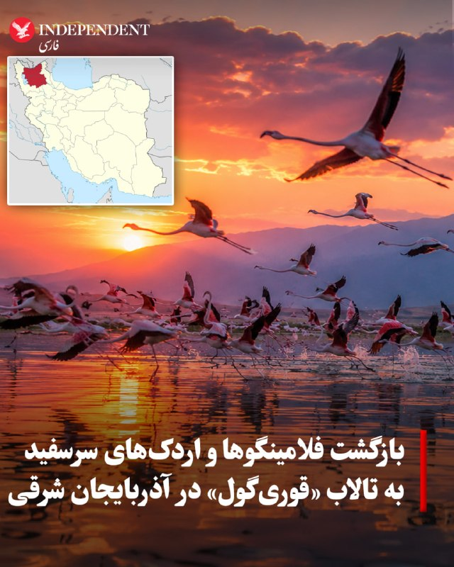

♦️به گزارش آذربایجان آنلاین، در پی بارش‌های مناسب ماه‌های اخیر، سطح آب تالاب «قوری‌گول» به وضعیت مطلوب رسیده و شرایط زیستگاهی این منطقه نسبت به سال‌های گذشته بهبود چشمگیری یافته است. بر اساس این گزارش، توسعه نیزارها و افزایش امنیت این زیستگاه طبیعی در آذربایجان شرقی، موجب احیای تدریجی تالاب و بازگشت گونه‌های ارزشمند، کمیاب و مهاجر شده است. رویدادی امیدوارکننده که تاثیر مستقیم و مثبت بارندگی‌ها را بر زیست‌بوم منطقه نشان می‌دهد. در همین راستا، حضور پرندگان شاخصی مانند فلامینگو و اردک سرسفید که از مهم‌ترین نشانه‌های سلامت زیست‌بوم تالاب‌ها به شمار می‌روند، در قوری‌گول ثبت شده است. همچنین در ماه‌های اخیر پرندگان دیگری نظیر آنقوت، چنگر، چوب‌پا و درنا نیز در این پهنه آبی مشاهده شده‌اند که تاییدی بر افزایش تنوع زیستی و بهبود شرایط طبیعی منطقه است. تالاب قوری‌گول از مهم‌ترین زیستگاه‌های پرندگان مهاجر در شمال‌غرب ایران محسوب می‌شود.
‌🇸🇦 Indypersian

🤖 @VahidOOnLine

## VahidOOnLine — post 243121

  

♦️فارس، خبرگزاری وابسته به سپاه، یکشنبه‌شب، ۱۰ خردادماه، از شنیده‌شدن صدای انفجار در محله باغ ابریشم کرمانشاه خبر داد. سازمان آتش نشانی کرمانشاه اعلام کرد: «وقوع یک حادثه ناشی از انفجار گاز در محله باغ ابریشم باعث ایجاد آتش‌سوزی در یک واحد مسکونی و سرایت آن به ساختمان‌ مجاور شد که ۲ مجروح برجا گذاشت». فارس همزمان از «نشت و انفجار شدید گاز» در یک مجتمع ۴۰ واحدی واقع در فاز یک اندیشه تهران خبر داده بود که دست‌کم ۴ نفر در آن مجروح شدند.
‌🇸🇦 Indypersian

🤖 @VahidOOnLine

## VahidOOnLine — post 243120

  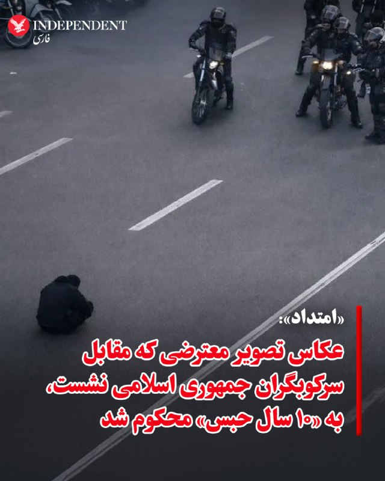

♦️به گزارش «امتداد»، مسعود پیاهو، عکاسی که تصویر نشستن یک معترض مقابل نیروهای سرکوب جمهوری اسلامی را در دی‌ماه ۱۴۰۴ ثبت کرده بود، به «همکاری با اسرائیل» متهم و به «۱۰ سال حبس» محکوم شد؛ حکمی که در شعبه ۹ دیوان تایید شده و به اجرای احکام رفته است. براساس اعلام حسن آقاخانی، وکیل مسعود پیاهو، او این فیلم کوتاه را به صورت ناخودآگاه ضبط کرده و بدون قصد انتشار، صرفا برای تعداد محدودی از دوستانش در روایتگر خصوصی اینستاگرام منتشر کرده است.
‌🇸🇦 Indypersian

🤖 @VahidOOnLine

## FoxNewsTwitter — post 342465

  <a href="telegram/content/FoxNewsTwitter_342465_1780267796.mp4" target="_blank">🎬 Download video</a>

Fox News (Twitter/X)

"Our community will resist again."

Los Angeles Mayor Karen Bass warned that she and her city's residents are ready to oppose federal immigration enforcement if the Trump administration attempts widespread operations during the World Cup.

Bass, who is facing a challenge in the mayoral election from Spencer Pratt, pledged her support for Los Angeles residents regardless of who they are or why they're in the city.

Last year, ICE raids in Los Angeles sparked riots across the city.

## pm_afshaa — post 91976

  <a href="telegram/content/pm_afshaa_91976_1780267797.webm" target="_blank">🎬 Download video</a>

🔴فاکس نیوز:
رئیس‌جمهور ایران، درخواست استعفا داده و دلیلش رو این عنوان کرده که عملاً اختیار و نفوذ کافی در ساختار حاکمیت نداره؛ اون به دفتر رهبری اعلام کرده که خودش و دولتش از تصمیم‌گیری‌های مهم کنار گذاشته شدن.

💧 Rainbet.com the #1 Non-KYC Crypto Casino & Sportsbook @rainbetcom

😁 @Pm_Afshaa

## IranIntlTV — post 339950

  <a href="telegram/content/IranIntlTV_339950_1780267798.mp4" target="_blank">🎬 Download video</a>

محسن هاشمی رفسنجانی، عضو حزب کارگزاران سازندگی، با لحنی توهین‌آمیز، دونالد ترامپ را «گاو خشمگین» نامید و گفت باید راهی پیدا کرد که او صدمه بیشتری به ایران نزند. او افزود اگر توافق‌نامه‌ای به نفع جمهوری اسلامی نباشد، بعدا ما هم آن را پاره می‌کنیم و خواستار مذاکرات تازه‌ای می‌شویم.
@iranintltv

## IranIntlTV — post 339949

  <a href="https://t.me/IranintlTV/339949" target="_blank">📎 Download file</a>

🎧نسخه صوتی سیاست با مراد ویسی: استعفای پزشکیان؛ شکاف در راس نظام
@iranintlTV

## IranIntlTV — post 339948

  <a href="telegram/content/IranIntlTV_339948_1780267799.mp4" target="_blank">🎬 Download video</a>

مراد ویسی، تحلیل‌گر ارشد ایران‌اینترنشنال، گفت: «تجربه صربستان و برکناری و مرگ میلوسویچ پس از جنگ کوزوو، نشان داد که شکست‌های نظامی می‌توانند پایه‌های حکومت‌های دیکتاتوری را متزلزل و اختلافات داخلی آنها را تشدید کنند. وضعیت کنونی جمهوری اسلامی نیز نتیجه فعال شدن بحران‌های مختلف پس از جنگ‌ها و تشدید شکاف‌های درونی در راس نظام را نشان می‌دهد.»
@iranintltv

## IranIntlTV — post 339947

  <a href="telegram/content/IranIntlTV_339947_1780267800.mp4" target="_blank">🎬 Download video</a>

پنج ماه پس از کشته‌شدن ده‌ها هزار نفر در جریان انقلاب ملی در دی‌ماه، شماری از ایرانیان در لس‌آنجلس گردهم آمدند تا یاد جان‌باختگان را گرامی بدارند.

شرکت‌کنندگان همچنین بر جایگاه پرچم شیر و خورشید به‌عنوان نمادی از همبستگی و اتحاد میان ایرانیان تاکید کردند.

گزارش نیلوفر منصوری، خبرنگار ایران‌اینترنشنال و گفت‌وگو با راحله امیری، از آسیب‌دیدگان چشمی جنبش «زن، زندگی، آزادی» و یکی دیگر از شرکت‌کنندگان
@iranintltv

## IranIntlTV — post 339946

  <a href="telegram/content/IranIntlTV_339946_1780267802.mp4" target="_blank">🎬 Download video</a>

گزارش اختصاصی ایران‌اینترنشنال به نقل از یک منبع آگاه نشان می‌دهد مسعود پزشکیان با ارسال نامه‌ای رسمی به دفتر مجتبی خامنه‌ای خواستار کناره‌گیری فوری از سمت خود شده است.

او در این نامه تاکید کرده دولت و شخص رییس‌جمهور در عمل از روند تصمیم‌گیری‌های کلان کشور کنار گذاشته شده‌اند و ادامه مسئولیت در این شرایط ممکن نیست.

گفت‌وگو با کامیار بهرنگ، عضو تحریریه ایران‌اینترنشنال
@iranintltv

## FarsiVOA — post 219216

  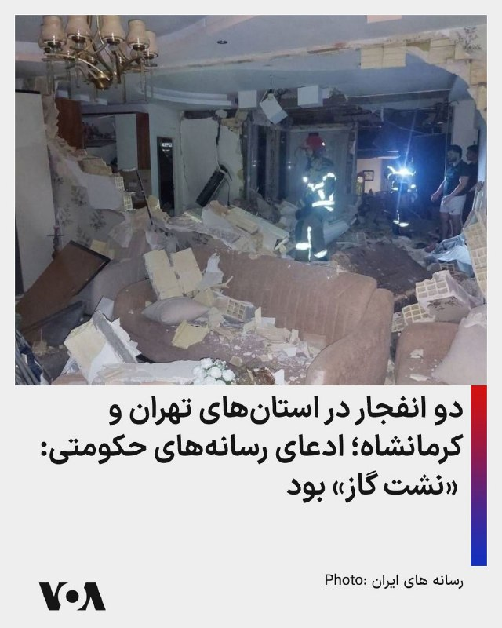

⚡️رسانه‌های جمهوری اسلامی وقوع دو انفجار را که تقریبا هم‌زمان در تهران و کرمانشاه و در ساعات پایانی یکشنبه گزارش شد به نشت گاز نسبت دادند. سایت تسنیم، نزدیک به سپاه پاسداران اعلام کرد که در ساعات پایانی روز یکشنبه، «انفجار گاز» در محله باغ ابریشم کرمانشاه باعث مصدومیت ۲ نفر شد. این سایت‌ همچنین مدعی شد که انفجار در یک واحد مسکونی در «فاز یک اندیشه» در استان تهران ناشی از «نشت گاز» بوده است. خبرگزاری ایسنا به نقل از سخنگوی اورژانس استان تهران می‌گوید این انفجار تاکنون ۶ مصدوم بر جای گذاشته است.
@FarsiVOA

## FarsiVOA — post 219214

  <a href="https://t.me/farsivoa/219214" target="_blank">📎 Download file</a>

🔴📢‌ پادکست خبری یکشنبه ۱۰ خرداد ۱۴۰۵

🛜در صورتی که با مشکل اینترنت مواجه هستید میتوانید اخبار صدای آمریکا را از نسخه‌های پادکست خبری ما روزانه دنبال کنید و یا اخبار را از نسخه سبک وب‌سایت ما پیگیر باشید:
https://ir.voanews.com/lite

📡بروزترین فرکانسهای ماهواره‌ای را نیز میتوانید از صفحه زیر پیگیری کنید:
https://ir.voanews.com/satellite

🔔دیگر شبکه‌های اجتماعی ما هم دنبال کنید:
https://linktr.ee/voafarsi

ما را به اشتراک بگذارید
@farsivoa

## IranianMinds — post 21162

  <a href="telegram/content/IranianMinds_21162_1780267804.mp4" target="_blank">🎬 Download video</a>

حسین طاهری، مداح:

اگر مذاکره می‌کنید، اگر توافق می‌کنید، اگر جنگ هست ، به ما نتیجشو بگید که ما حداقل تکلیف خودمونو توی خیابونا بدونیم.

@IranianMinds

## BBCPersian — post 282517

  

‌ ‌ ‌ ‌
امانوئل مکرون، رئیس‌جمهور فرانسه، روز یکشنبه گفت که «هیچ چیز تشدید عمده تنش در جنوب لبنان را توجیه نمی‌کند».

این اظهارات آقای مکرون بعد از آن بیان شد که نیروهای اسرائیلی حمله جدیدی را به جنوب لبنان آغاز کردند.

پس از تصرف قلعه تاریخی شقیف (بوفور)، توسط نیروهای اسرائیلی شورای امنیت سازمان ملل متحد روز دوشنبه به درخواست فرانسه جلسه اضطراری برگزار خواهد کرد.

آقای مکرون همچنین پس از صحبت با رهبران منطقه‌ای در پیامی در شبکه اجتماعی ایکس گفت که دستیابی سریع به توافق بین ایالات متحده و ایران «ضروری» است.

رئیس جمهور فرانسه با محمد بن سلمان، ولیعهد عربستان سعودی، هیثم بن طارق، سلطان عمان، محمد بن زاید، رئیس امارات متحده عربی و عبدالفتاح سیسی، همتای مصری خود گفتگو کرد.

📷Reuters
@BBCPersian

## Dirty_Kids — post 390705

  <a href="telegram/content/Dirty_Kids_390705_1780267806.webm" target="_blank">🎬 Download video</a>

☢️خفن ترین و‌ قدیمی ترین  انالیزور  ایران ینی دکتر بت 
👍 
🔴مسابقات جذاب جام جهانی به زودی شروع میشه بیا توی کانال دکتر بت و باهاش همراه شو و پول در بیار
💵 رایگان بهترین شرط هارو براتون میذاره حتی هزار تومن هم دریافت نمیکنه روزانه میتونی از پیش بینی فوتبال باهاش…

## Dirty_Kids — post 390704

  <a href="telegram/content/Dirty_Kids_390704_1780267807.webm" target="_blank">🎬 Download video</a>

☢️خفن ترین و‌ قدیمی ترین  انالیزور  ایران ینی دکتر بت 
👍

🔴مسابقات جذاب جام جهانی به زودی شروع میشه بیا توی کانال دکتر بت و باهاش همراه شو و پول در بیار
💵

رایگان بهترین شرط هارو براتون میذاره
حتی هزار تومن هم دریافت نمیکنه
روزانه میتونی از پیش بینی فوتبال باهاش پول در بیاری 👌
A10

🌟اگ اهل پیش بینی فوتبالی این کانال اصلا از دست ندین
👇

✅https://t.me/+4_ADqwB9e-QwYjlk

✅https://t.me/+4_ADqwB9e-QwYjlk

## Dirty_Kids — post 390703

  

#بخوابیم

@Dirty_Kids 👻

## Dirty_Kids — post 390701

اون مار از منی که تو ایران با وجود جمهوری‌اسلامی زندگی میکنم خوشبخت‌تره

@Dirty_Kids 👻

## Dirty_Kids — post 390700

این ویدیو برای شروع جام‌جهانی خیلی وایرال شده که میپرسه کدوم تیم قهرمان جام‌جهانی میشه؟ 🏆

@Dirty_Kids 👻

## Dirty_Kids — post 390699

  <a href="telegram/content/Dirty_Kids_390699_1780267808.mp4" target="_blank">🎬 Download video</a>

بهروز رهبری‌فر در این ویدیو می‌گه «چون علی خامنه‌ای کشته شده و من خودمو فرزند او می‌دونم پس من الان فرزند شهیدم!‌»

@Dirty_Kids 👻

## Dirty_Kids — post 390698

  

‏+ مسعود لج نکن بیا بریم کار داریم
- من سوار هلیکوپتر نمیشم
+ هلیکوپتر کدومه دکتر؟!
- من استخر هم نمیام
+ لابد تو‌ حموم واجبی هم نمیزنی؟

@Dirty_Kids 👻

## Dirty_Kids — post 390697

  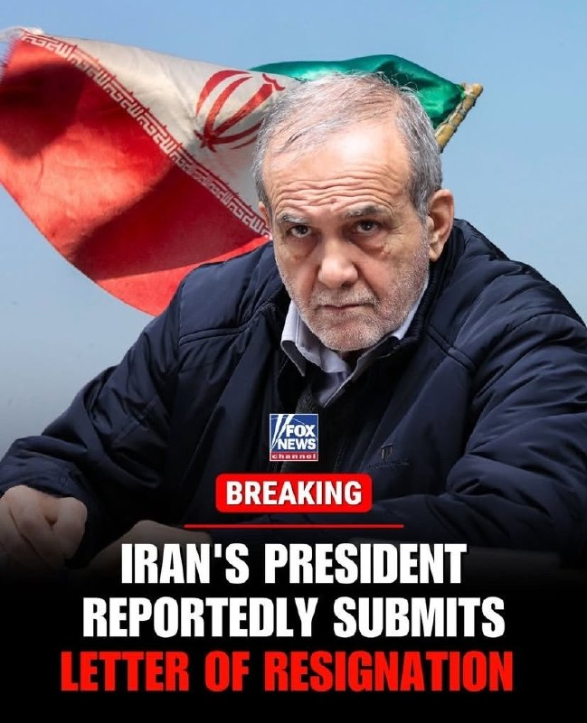

فاکس هم تاید کرد پزشکیان استعفا داده
نمیدونم چرا این خبر ذره‌ای بکیرم نیست
چون ما میدونستیم رییس جمهور در جمهوری اسلامی دلقکی بیش نیست

@Dirty_Kids 👻

## Dirty_Kids — post 390691

‏ملت ورداشتن عکسای این چادری کافه‌ایارو بی‌حجاب کردن دارن پخش میکنن 😂😂😂

@Dirty_Kids 👻

## Dirty_Kids — post 390690

تسنیم استعفای پزشکیان رو تکذیب کرد
تسنیم خبر مرگ لاریجانی رو هم تکذیب کرد
تسنیم خبر مرگ تنگسیری رو هم تکذیب کرد
تو فقط تکذیب کن:)))

تو جمهوری‌اسلامی رسمه که هر وقت میخوان یک خبر یا اتفاقی رو آروم آروم به مردم بگن، اول میدن به تسنیم تکذیبش کنه.

@Dirty_Kids 👻

---
📅 بروزرسانی: 1405/03/11 01:20
---

## VahidOOnLine — post 243119

  

♦️وزیر دادگستری لبنان روز یکشنبه، ۱۰ خردادماه، در گفتگوی اختصاصی با «العربیه» با انتقاد شدید از عملکرد نظامی حزب‌الله اعلام کرد: «حزب‌الله لبنان را به جنگ‌هایی می‌کشاند که خود انتخاب نکرده است و با شلیک ۶ موشک، جنگ همه‌جانبه را به کشور بازگرداند. اکنون زمان آن فرا رسیده است که این گروه به ماجراجویی‌های خود پایان دهد و از گزینه دولت حمایت کند. چرا که سلاح حزب‌الله به بهانه‌ای برای تهاجم به لبنان تبدیل شده است.» او با تاکید بر ضرورت خلع سلاح این گروه افزود: «حزب‌الله باید سلاح خود را به دولت تحویل دهد و این به معنای تسلیم شدن نیست. اگر حزب‌الله سلاحش را تحویل دهد، دولت در مذاکرات قوی‌تر خواهد بود، در حالی که در وضعیت فعلی، این گروه توانایی دولت برای مذاکره از موضع قدرت را مختل کرده است. حزب‌الله پیش از این نیز لبنانی‌ها را در سوریه قربانی کرد و نبردها را صرفا در راستای منافع خود پیش می‌برد. در حال حاضر دیپلماسی مناسب‌ترین راه است».
‌🇸🇦 Indypersian

🤖 @VahidOOnLine

## VahidOOnLine — post 243118

♦️مهدی تاج، رئیس فدراسیون فوتبال ایران، روز یکشنبه در پاسخ به نگرانی‌ها درباره صدور ویزای بازیکنان تیم ملی فوتبال برای سفر به آمریکا گفت: «میزبان ما فیفا است و فیفا در واقع مسئول برگزاری مسابقات و از نظر ما مسئول دادن ویزا است، نه دولت آمریکا. چرا که وقتی کشوری می‌خواهد میزبانی را عهده‌دار شود، متعهد به انجام یک‌سری کارها می‌شود که یکی از آن‌ها صادر کردن ویزا است و باید این حداقل‌های قانونی را رعایت و مراعات کنند. من خودم امیدوارم با توجه به مسئولیتی که فیفا پذیرفته و صحبت‌های رخ‌به‌رخی که ما از نزدیک با مسئولین فیفا داشته‌ایم، این کار اتفاق بیفتد و مشکلی در این زمینه وجود نداشته باشد.»
همزمان، عباس عراقچی، وزیر امور خارجه جمهوری اسلامی، در گفتگو با خبرگزاری صداوسیما با اشاره به آخرین وضعیت صدور ویزا برای اعضای تیم ملی فوتبال ایران گفت: «دیروز [شنبه] دوستان ما در ترکیه با سفارت مکزیک تماس‌های نزدیکی داشتند. سفارت مکزیک در آنکارا از انگشت‌نگاری [اعضای تیم ملی] صرف‌نظر کرده و بنابر هماهنگی قرار شد به گونه‌ای جلو برود که همه ویزاها صادر بشود.»
‌🇸🇦 Indypersian

🤖 @VahidOOnLine

## VahidOOnLine — post 243117

  

♦️«مرکز مشترک اطلاعات دریایی» (JMIC) در جدیدترین گزارش ارزیابی امنیتی خود، سطح تهدیدات برای امنیت کشتیرانی تجاری در منطقه دریایی خاورمیانه به‌ویژه تنگه هرمز را «بحرانی» اعلام کرد. بر اساس این گزارش، حجم تردد کشتی‌های تجاری در تنگه هرمز در بازه زمانی ۱۱ اسفند تا ۱۰ خرداد به شدت کاهش یافته و شناورها ناچار به تغییر مسیر به سمت آب‌های ساحلی عمان شده‌اند. این نهاد بین‌المللی همچنین با اشاره به صدور هشدار ناوریا ۹ (NAVAREA IX) درباره رویت یک مین شناور در این آب‌راه حیاتی، نسبت به تداوم خطر مین‌گذاری در مسیرهای تردد و اختلالات شدید و مداوم در سیستم‌های موقعیت‌یاب جهانی (GNSS) هشدار داد طبق آمارهای ارائه‌شده، میانگین تردد روزانه کشتی‌ها در تنگه هرمز به تنها ۳ تا ۴ ترانزیت در روز سقوط کرده است؛ با این حال، گزارش تصریح می‌کند که جریان ترافیک دریایی در خلیج عدن و دریای سرخ جنوبی کماکان پایدار است و در ۷۲ ساعت گذشته هیچ حمله تاییدشده‌ای علیه کشتی‌های تجاری در این مناطق ثبت نشده است.
‌🇸🇦 Indypersian

🤖 @VahidOOnLine

## VahidOOnLine — post 243116

  

یوهان وادفول، وزیر خارجه آلمان، اعلام کرد ادامه پیشروی ارتش اسرائیل در جنوب لبنان مایه «نگرانی جدی» است.

به گزارش رویترز، وزیر خارجه آلمان گفت: «از همه طرف‌های درگیر به‌شدت می‌خواهم درگیری‌ها را متوقف کرده و به آتش‌بس مورد توافق بازگردند.»
‌🏁 🇬🇧 IranintlTV

🤖 @VahidOOnLine

## WithYashar — post 13108

گزارش‌ها از حمله پهپادی ایران به گروه های مخالف ایرانی-کرد در نزدیکی اربیل، شمال عراق!
@withyashar

## FoxNewsTwitter — post 342461

Fox News (Twitter/X)

New York City's annual Israel Day parade went on without its mayor.

Zohran Mamdani skipped the event due to his stance toward Israel, breaking a decades-long tradition of New York City mayors attending the celebration.

As thousands packed Fifth Avenue waving Israeli flags, Gov. Kathy Hochul, Sen. Chuck Schumer, Attorney General Letitia James, and New York Republican gubernatorial candidate Bruce Blakeman all took part.

Mamdani's absence quickly became a political flashpoint, with critics accusing Mamdani of turning his back on New York's Jewish community amid record levels of antisemitism.

## pm_afshaa — post 91975

  <a href="telegram/content/pm_afshaa_91975_1780264211.webm" target="_blank">🎬 Download video</a>

🔴قائم‌مقام، معاون راهبردی پزشکیان:
بیش از 56 درصد مردم حداقل یک بار در تجمعات شبانه شرکت کردن.

💧 Rainbet.com the #1 Non-KYC Crypto Casino & Sportsbook @rainbetcom

😁 @Pm_Afshaa

## DEJradio — post 5194

  

📝
⭕️ براساس اطلاعات دریافتی در جنگ ۴۰ روزه، بخشی از حملات موشکی و پهپادی به اسرائیل، اقلیم کردستان عراق و اردن توسط گروه ۸۴۰ موشکی نیروی زمینی ارتش انجام شد. ستاد فرماندهی این گروه در کاشان مستقر است.
این در حالیست که دونالد ترامپ به «فاکس نیوز» گفت،«شاید شنیدن این موضوع برای خیلی‌ها تعجب‌آور باشد، اما اینکه در جنگ‌ها همه چیز را نابود کنی، اشتباه است، چرا که بعد کشوری داری که تا ۴۰ سال هم قادر به بازسازی خود نخواهد بود.»
او با اشاره به جنگ عراق، آن را نمونه‌ای از رویکرد اشتباه آمریکا در درگیری‌های گذشته دانست و گفت: «به عراق نگاه کنید؛ ما خیلی بد عمل کردیم، آن کار یک اشتباه بزرگ بود.»
ترامپ همچنین عنوان کرد آمریکا ارتش ایران را «تا حدی به حال خود گذاشته»، چون به گفته او این ارتش «تا اندازه‌ای میانه‌رو» است و واشنگتن نمی‌خواسته همه ساختار نظامی کشور را نابود کند.

#جنگ۴۰روزه
@DEJradio

## DEJradio — post 5193

⭕️🕘 خبر ۲۱
یکشنبه ۱۰ خرداد ۱۴۰۵

#خبر۲۱
@DEJradio

## DEJradio — post 5192

  

⭕️
⭕️ یک منبع مطلع به دژ می‌گوید اینترنت در ایران با اصرار دولت مسعود پزشکیان مجدد وصل شد، اما بعضی افراد صاحب نفوذ در دستگاه‌های امنیتی برای قطع مجدد آن فشار می‌آورند.
این افراد به واسطه چند عضو شورای‌عالی فضای مجازی از ستاد «ساماندهی اینترنت» وابسته به دولت شکایت کردند.
همچنین چند نماینده مجلس شورای اسلامی با پشتیبانی نهادهای امنیتی به دنبال مسدودسازی مجدد اینترنت هستند. آنها گفته‌اند «ستاد ویژه فضای مجازی حق تصمیم برای اینترنت ندارد.»
در ایران با آغاز جنگ اینترنت قطع شد و بیش از سه ماه تمام کشور به جز سیم‌کارت سفیدها به آن دسترسی نداشتند.
برخی اما می‌گویند محال است، بدون نظر نهادهای امنیتی بالادستی اینترنت وصل شده باشد. به اعتقاد آنها دولت تصمیم‌گیر نیست و صرفاً یک بازی درون حکومتی است که برای دولت پزشکیان نزد افکار عمومی با وصل شدن اینترنت اعتبارسازی شود.
مخالفان باز شدن اینترنت می‌گویند، "احتمال آسیب به دستگاه امنیتی و احتمال نفوذ خارجی در عرصه حکمرانی لز طریق اینترنت بسیار زیاد است."

#اینترنت
@DEJradio

## IranIntlTV — post 339945

  <a href="telegram/content/IranIntlTV_339945_1780264212.mp4" target="_blank">🎬 Download video</a>

مراد ویسی، تحلیل‌گر ارشد ایران‌اینترنشنال، گفت: «اختلاف میان پزشکیان و فرماندهان سپاه بر سر دو موضوع اصلی است؛ نحوه اداره داخلی کشور و چگونگی مواجهه با آمریکا و اسرائیل. در حالی که برخی چهره‌ها مانند قالیباف به رویکرد توافق و حفظ نظام نزدیک‌تر توصیف می‌شوند، بخشی از فرماندهان سپاه بر ادامه مسیر تقابل و جنگ تاکید دارند، فارغ از پیامدهای آن.»
@iranintltv

## IranIntlTV — post 339944

  

مراد ویسی، تحلیل‌گر ارشد ایران‌اینترنشنال، گفت: «پزشکیان از ناتوانی در اداره کشور به دلیل دخالت‌های سپاه گلایه کرده، اما فرماندهان سپاه که بر بخش‌های اصلی قدرت مسلط شده‌اند حاضر به پذیرش این انتقادها نیستند. برای مردمی که جمهوری اسلامی را نمی‌خواهند، تشدید اختلافات در راس حکومت نشانه‌ای از تضعیف بیشتر نظام و درگیری میان دو جناحی تلقی می‌شود که هر دو متهم به ظلم علیه مردم هستند.»
@iranintltv

## IranIntlTV — post 339943

  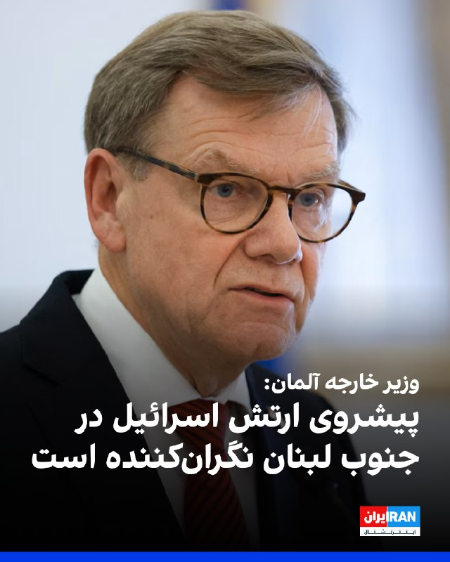

یوهان وادفول، وزیر خارجه آلمان، اعلام کرد ادامه پیشروی ارتش اسرائیل در جنوب لبنان مایه «نگرانی جدی» است.

به گزارش رویترز، وزیر خارجه آلمان گفت: «از همه طرف‌های درگیر به‌شدت می‌خواهم درگیری‌ها را متوقف کرده و به آتش‌بس مورد توافق بازگردند.»
https://iranintl.com/202605317536

## FarsiVOA — post 219213

🔺ادامه راکت‌پرانی‌های حزب‌الله به شمال اسرائيل هم‌زمان با تلاش‌های دولت لبنان برای ادامه مذاکرات صلح

▪️رسانه‌های اسرائیلی از ادامه حملات راکتی گروه تروریستی حزب‌الله به شمال اسرائيل خبر می‌دهند.

⬇️ بیشتر بخوانید:
https://ir.voanews.com/a/8155833.html
@FarsiVOA

## BBCPersian — post 282516

  <a href="telegram/content/BBCPersian_282516_1780264215.mp4" target="_blank">🎬 Download video</a>

‌ ‌ ‌ ‌
در ماه‌های اخیر گزارش‌های متعددی از کمبود دارو در ایران منتشر شده است. به گفته وحید شریعت، رئیس انجمن روانپزشکی ایران، داروهای حیاتی روانپزشکی از جمله داروهای مرتبط با افسردگی، دوقطبی و اسکیزوفرنی با کمبود مواجه شده‌اند و در صورت ادامه روند فعلی، این وضعیت می‌تواند در ماه‌های آینده تشدید شود.

دکتر کیانا کثیری در برنامه رادیویی جام جهان‌نمای بی‌بی‌سی فارسی درباره پیامدهای خطرناک کمبود داروهای روانپزشکی گفت.

@BBCPersian

## BBCPersian — post 282515

  <a href="https://t.me/bbcpersian/282515" target="_blank">📎 Download file</a>

پادکست برنامه شصت دقیقه یکشنبه ۱۰ خرداد ۱۴۰۵

این نسخه رادیویی برنامه شصت دقیقه تلویزیون فارسی بی‌بی‌سی است که هرشب بعد از پخش، با حجم کم از اپلیکیشن‌های پادگیر و صفحه تلگرام بی‌بی‌سی فارسی در دسترس است.

با هشتگ BBCPersianRadio# با ما در ارتباط باشید

@BBCPersian

## Dirty_Kids — post 390688

استفاده خوب و درست از هوش مصنوعی

@Dirty_Kids 👻

## Dirty_Kids — post 390687

  <a href="telegram/content/Dirty_Kids_390687_1780264217.mp4" target="_blank">🎬 Download video</a>

🔴حسین طاهری، مداح :
اگه دارین مذاکره می‌کنید به ماهم بگین که حداقل تکلیف خودمونو تو این دورهم جمع شدنایِ شبانه بدونیم.

@Dirty_Kids 👻

## alonews — post 124067

  <a href="telegram/content/alonews_124067_1780264218.webm" target="_blank">🎬 Download video</a>

👈خبرگزاری ‌CNN اعلام کرد که ایران اکنون 50 ورودی از 69 ورودی تونلی را که توسط ایالات متحده آمریکا و اسرائیل در 18 تأسیسات موشکی زیرزمینی مورد اصابت قرار گرفته بود، باز کرده است

🔴تصویر متعلق به یک پایگاه موشکی در دزفول است که چهار ورودی از پنج ورودی آن باز شده است

✅ @AloNews خبر جنگ

## alonews — post 124065

  <a href="telegram/content/alonews_124065_1780264218.webm" target="_blank">🎬 Download video</a>

👈رژه روز اسرائیل در نیویورک

✅ @AloNews خبر جنگ

## alonews — post 124064

  <a href="telegram/content/alonews_124064_1780264218.mp4" target="_blank">🎬 Download video</a>

این 2 دقیقه رو حتما یه جا سیو کنین و یا بفرستین پیوی رفیقتون که گمش نکنین! هر بار این کلیپ رو باز کنین مو به تنتون سیخ میشه که طی این چند سال چه اتفاقی افتاده!

[@AloTweet]

## alonews — post 124063

  <a href="telegram/content/alonews_124063_1780264219.mp4" target="_blank">🎬 Download video</a>

🔴مسعود پیاهو، کسی که ویدیوی مرد نشسته مقابل موتوسواران یگان‌ویژه در خیابان جمهوری تهران را منتشر کرد، به ۱۰ سال زندان محکوم شد.

🔴ویدیوی این مرد که در دومین روز اعتراضات دی‌ماه ۱۴۰۴ منتشر شد، به سرعت وایرال و به یکی از نمادهای اعتراضات تبدیل شد.

🤔دم از عدل علی میزنن ولی به معاویه گفتن زکی

✅@AloNews

## alonews — post 124062

  

🔴 حمله شدید عارف غلامی، بازیکن استقلال به محمدحسین میثاقی
@AloSport

---
📅 بروزرسانی: 1405/03/11 00:20
---

## VahidOOnLine — post 243115

  

سناتور لیندسی گراهام، نماینده جمهوری‌خواه مجلس سنای آمریکا، در شبکه اجتماعی ایکس نوشت در گفت‌گو با دونالد ترامپ، حمایت خود را از توافقی با حکومت ایران که ‌خواسته‌های رییس‌جمهوری آمریکا برای باز کردن تنگه هرمز، شروع مذاکرات برای پایان دادن دائمی به جاه‌طلبی‌های هسته‌ای و حمایت تهران از تروریسم را بپذیرد، تأیید کرده است.

او ابراز اطمینان کرد که ترامپ با یک توافق بد با ایران موافقت نخواهد کرد.

گراهام در مورد حملات اسرائیل در لبنان نیز نوشت که باید به این کشور اجازه داد که تهدیدهای ناشی از حملات مداوم حزب‌الله را خنثی کند و افزود: بخش‌هایی از اسرائیل به دلیل اصابت موشک‌ها و راکت‌های حزب‌الله غیرقابل سکونت هستند.
‌🏁 🇬🇧 IranintlTV

🤖 @VahidOOnLine

## VahidOOnLine — post 243114

  

علی عبدالله خانی‌، قائم‌مقام معاون راهبردی پزشکیان، با بیان اینکه «بیش از ۵۶ درصد مردم حداقل یک بار در تجمعات شبانه شرکت کردند» گفت: این حضور یعنی حفظ نظام جمهوری اسلامی را مد نظر داشتند.
او اضافه کرد: «همه رده‌های سنی با تحصیلات مختلف در این اجتماعات حضور داشتند و ۷۰ درصد عاملیت جنبش بر عهده زنان بود.»
‌🏁 🇬🇧 IranintlTV

🤖 @VahidOOnLine

## VahidOOnLine — post 243113

  <a href="telegram/content/VahidOOnLine_243113_1780260619.mp4" target="_blank">🎬 Download video</a>

♦️عباس عراقچی، وزیر امور خارجه جمهوری اسلامی، روز یکشنبه در گفتگو با خبرگزاری صداوسیما با اشاره به آخرین وضعیت صدور ویزا برای اعضای تیم ملی فوتبال ایران گفت: «دیروز [شنبه] دوستان ما در ترکیه با سفارت مکزیک تماس‌های نزدیکی داشتند. سفارت مکزیک در آنکارا از انگشت‌نگاری [اعضای تیم ملی] صرف‌نظر کرده و بنابر هماهنگی قرار شد به گونه‌ای جلو برود که همه ویزاها صادر بشود.» او گفت:‌ «هرچه به ما بیشتر فشار آوردند، بیشتر جنگیدیم».
پیش از این، دکتر جمشید ایرانی، وکیل دیوان عالی آمریکا، از صدور «مجوز موقت و مشروط برای ورود» (Parole) به بازیکنان تیم ملی فوتبال ایران خبر داد. این وکیل در پیامی که در صفحه فیسبوک خود به اشتراک گذاشت، با اشاره به تحقیق و پی بردن به تصمیم واشنگتن در قبال کاروان ورزشی ایران توضیح داد که وزارت امور خارجه آمریکا برای اعضای تیم ملی «ویزای معمولی» صادر نخواهد کرد، بلکه ورود آن‌ها به خاک این کشور در قالب این طرح مشروط خواهد بود که امتیازات ویزای عادی را ندارد.
این تحولات درحالی رخ می‌دهد که تا روز جمعه هشتم خرداد ماه، وضعیت ویزای اعضای تیم ملی فوتبال مردان جمهوری اسلامی ایران، در کمتر از دو هفته به آغاز جام جهانی، با ابهاماتی روبه‌رو بود.
‌🇸🇦 Indypersian

🤖 @VahidOOnLine

## VahidOOnLine — post 243112

  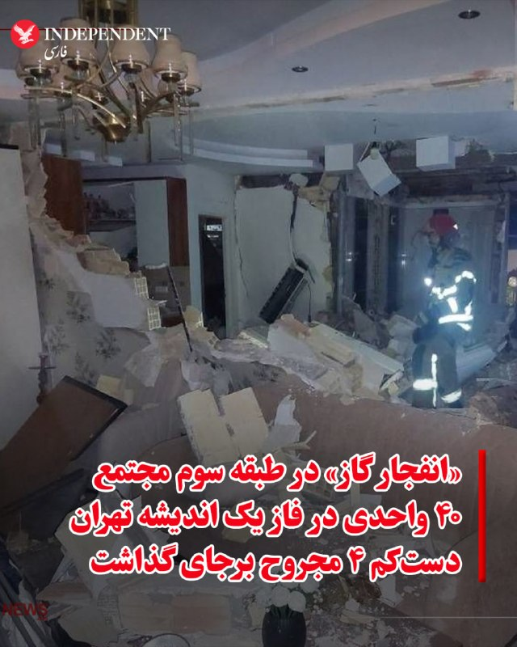

♦️به گزارش تسنیم، خبرگزاری وابسته به سپاه، یکشنبه‌شب «نشت و انفجار شدید گاز» در یک مجتمع ۴۰ واحدی واقع در فاز یک اندیشه، دست‌کم ۴ مجروح برجای گذاشت. بر اساس اعلام سازمان آتش‌نشانی، این حادثه در طبقه سوم این مجتمع رخ داده و با توجه به شدت انفجار و ارزیابی‌های اولیه در محل، احتمال افزایش شمار مجروحان وجود دارد.
‌🇸🇦 Indypersian

🤖 @VahidOOnLine

## VahidOOnLine — post 243111

  

امانوئل مکرون، رییس‌جمهور فرانسه، در شبکه اجتماعی ایکس اعلام کرد با محمد بن سلمان، ولیعهد عربستان سعودی، هیثم بن طارق، سلطان عمان، محمد بن زاید، رییس امارات متحده عربی، و عبدالفتاح السیسی، رییس‌جمهور مصر، گفت‌وگو کرده است.

مکرون افزود به همه آن‌ها پیامی واحد منتقل کرده است: ضروری است توافقی میان ایالات متحده و جمهوری اسلامی هرچه سریع‌تر حاصل شود و این فرصت باید همین اکنون مورد استفاده قرار گیرد.

او تاکید کرد اولویت باید دستیابی به آتش‌بس و بازگشایی فوری تنگه هرمز، بدون هیچ شرطی و در چارچوب حقوق بین‌الملل، باشد. سپس گفت‌وگوها باید برای دستیابی به توافقی کامل و مستحکم درباره برنامه هسته‌ای، موشک‌های بالستیک و ثبات منطقه‌ای ادامه یابد.
‌🏁 🇬🇧 IranintlTV

🤖 @VahidOOnLine

## VahidOOnLine — post 243110

  

بر اساس اطلاعات رسیده به ایران‌اینترنشنال، اشکان مالکی و مهرداد محمدی‌نیا، دو معترض بازداشت‌شده در جریان انقلاب ملی در دی‌ماه ۱۴۰۴، در معرض خطر اجرای قریب‌الوقوع حکم اعدام قرار دارند. 
بنا بر این گزارش، این دو جوان معترض در زندان قزلحصار محبوس هستند. 
دادگاه رسیدگی به پرونده اشکان مالکی و مهرداد محمدی‌نیا روز دوم اسفند در شعبه ۱۵ دادگاه انقلاب به ریاست ابوالقاسم صلواتی برگزار شد. این دو معترض در نهایت به اعدام محکوم شدند و بر اساس اطلاعات دریافتی، در معرض اجرای حکم قرار دارند. 
اشکان مالکی و مهرداد محمدی‌نیا در این پرونده به «محاربه از طریق تحریق و تخریب مسجد جعفری و حوزه علمیه امام هادی در کوی نصر تهران» متهم شده‌اند. 
در همین پرونده، آرمان معرفتی، دیگر معترض بازداشت‌شده که هم‌اکنون در زندان تهران بزرگ نگهداری می‌شود، به «اجتماع و تبانی علیه امنیت داخلی کشور» متهم شده است.
‌🏁 🇬🇧 IranintlTV

🤖 @VahidOOnLine

## WithYashar — post 13107

  <a href="telegram/content/WithYashar_13107_1780260623.mp4" target="_blank">🎬 Download video</a>

اتاق جنگ با یاشار : چشم آسمان ، هواپیما آواکس
@withyashar

## WithYashar — post 13106

## WithYashar — post 13105

انفجار در فاز یک اندیشه شهریار خیابان شیشم شرقی در یک ساختمان که چندین مصدوم داشته @withyashar

## WithYashar — post 13104

انفجار در فاز یک اندیشه شهریار خیابان شیشم شرقی در یک ساختمان که چندین مصدوم داشته @withyashar

## WithYashar — post 13103

  <a href="telegram/content/WithYashar_13103_1780260625.mp4" target="_blank">🎬 Download video</a>

🎬 Video

## WithYashar — post 13102

پدافند قم فعال شد 🚨
@withyashar

## mwarmonitor — post 9960

✈️یک فروند هواپیمای گشت دریایی P-8A پوزیدون نیروی دریایی ایالات متحده امروز بر فراز دریای عرب فعال بود.

✈️به‌طور جداگانه، یک فروند دیگر از هواپیماهای گشت دریایی P-8A نیروی دریایی آمریکا از کمپ لمونیه در جیبوتی به پایگاه هوایی شاهزاده سلطان در عربستان سعودی پرواز کرد.

@mwarmonitor

## mwarmonitor — post 9959

  

✈️نیروی هوایی ایالات متحده آمریکا (USAF)

Boeing E-3 Sentry: یک فروند✈️
AE11DF 77-0351 – ANDOR 54

Boeing KC-46 Pegasus: دو فروند✈️
AE5FA5 11-46058 – YETI ??
AE5FA1 18-46054 – YETI ??

Boeing KC-135 Stratotanker: یک فروند✈️
AE058B 57-1514 – علامت تماس نامشخص

📌بر اساس داده‌های فلایت‌رادار، امشب سه هواپیمای سوخت‌رسان و یک فروند آواکس E-3 بر فراز منطقه مسئولیت سنتکام مشاهده شده‌اند.

@mwarmonitor

## FoxNewsTwitter — post 342460

  

Fox News (Twitter/X)

Iran’s president has reportedly asked to resign, citing a loss of authority inside the country’s ruling system.

According to reports, Masoud Pezeshkian told the Supreme Leader’s office that he and his government have been excluded from major decision-making, leaving him unable to fulfill his responsibilities.

The reported resignation comes amid growing signs of internal power struggles within the regime and as the U.S. continues negotiations with Tehran.

President Trump has repeatedly pointed to divisions inside Iran’s leadership, previously saying the regime is “seriously fractured.”

## pm_afshaa — post 91974

پزشکیان: فقط شهادت میتونه منو از خدمت به مردم باز بداره

💧 Rainbet.com the #1 Non-KYC Crypto Casino & Sportsbook @rainbetcom

😁 @Pm_Afshaa

## pm_afshaa — post 91973

#مهم
عزیزای دلم همگی الان چنل زاپاس‌مون رو جوین بشید کانال تحت ریپورت شدیده اگه چیزی شد زاپاس رو داشته باشید فعالیت میاد اونور
👇

https://t.me/Pm_Zapas
https://t.me/Pm_Zapas

## pm_afshaa — post 91972

سخنگوی کمیته امنیت ملی جمهوری اسلامی: لبنان را رها نخواهیم کرد؛ برای ما به اندازه ایران مهم است

💧 Rainbet.com the #1 Non-KYC Crypto Casino & Sportsbook @rainbetcom

😁 @Pm_Afshaa

## pm_afshaa — post 91970

  <a href="telegram/content/pm_afshaa_91970_1780260627.webm" target="_blank">🎬 Download video</a>

🔴تسنیم به نقل از یک منبع آگاه:
ایران اصلاحیه‌های جدید درباره متن تفاهم احتمالی اعمال خواهد کرد .

ملاک برای ایران متنی است که خودمان قبول داشته باشیم و اعمال اصلاحیه از ناحیه ترامپ به معنای پذیرش آنها توسط ایران نیست؛ ایران برای وضعیت عدم تفاهم نیز کاملاً آمادگی دارد.

💧 Rainbet.com the #1 Non-KYC Crypto Casino & Sportsbook @rainbetcom

😁 @Pm_Afshaa

## VahidOnline — post 75825

  

فاکس نیوز هم به درخواست استعفای پزشکیان پرداخته: FoxNews

چند مقام دولتی در ایران از جمله سخنگوی دولت این کشور با تکذیب شایعه استعفای مسعود پزشکیان، آن را «خبر کذب با هدف ایجاد ناامیدی» خواندند.

فاطمه مهاجرانی، سخنگوی دولت، الیاس حضرتی و علی احمدنیا که از اعضای شورای اطلاع رسانی دولت آقای پزشکیان هستند در پست‌های جداگانه به ادامه کار رئیس جمهوری و تلاش او برای «حل مسائل کشور» اشاره کرده‌اند.
@VahidHeadline

📡 @VahidOnline

## VahidOnline — post 75824

  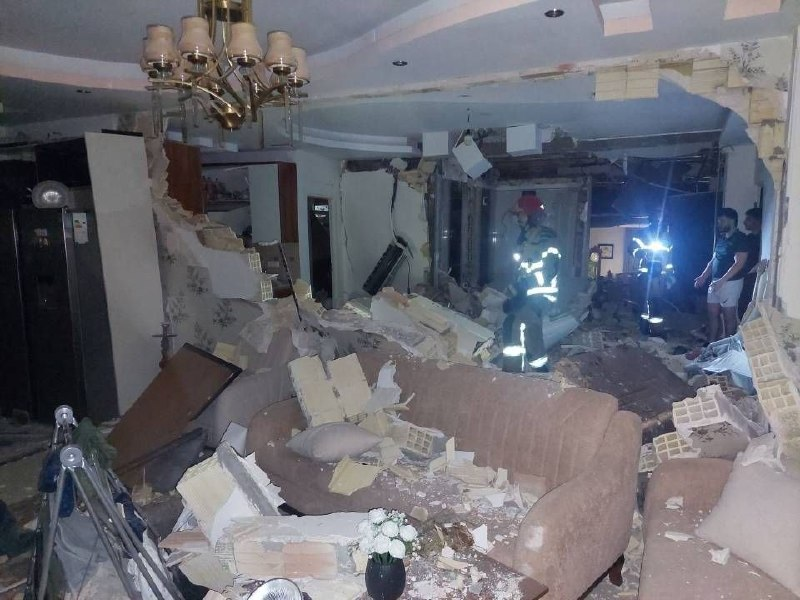

به گزارش تسنیم، خبرگزاری وابسته به سپاه، یکشنبه‌شب «نشت و انفجار شدید گاز» در یک مجتمع ۴۰ واحدی واقع در فاز یک اندیشه، دست‌کم ۴ مجروح برجای گذاشت. بر اساس اعلام سازمان آتش‌نشانی، این حادثه در طبقه سوم این مجتمع رخ داده و با توجه به شدت انفجار و ارزیابی‌های اولیه در محل، احتمال افزایش شمار مجروحان وجود دارد.
@VahidOOnLine

📡 @VahidOnline

## IranIntlTV — post 339942

  

سناتور لیندسی گراهام، نماینده جمهوری‌خواه مجلس سنای آمریکا، در شبکه اجتماعی ایکس نوشت در گفت‌گو با دونالد ترامپ، حمایت خود را از توافقی با حکومت ایران که ‌خواسته‌های رییس‌جمهوری آمریکا برای باز کردن تنگه هرمز، شروع مذاکرات برای پایان دادن دائمی به جاه‌طلبی‌های هسته‌ای و حمایت تهران از تروریسم را بپذیرد، تأیید کرده است.

او ابراز اطمینان کرد که ترامپ با یک توافق بد با ایران موافقت نخواهد کرد.

گراهام در مورد حملات اسرائیل در لبنان نیز نوشت که باید به این کشور اجازه داد که تهدیدهای ناشی از حملات مداوم حزب‌الله را خنثی کند و افزود: بخش‌هایی از اسرائیل به دلیل اصابت موشک‌ها و راکت‌های حزب‌الله غیرقابل سکونت هستند.
https://iranintl.com/202605310697

## IranIntlTV — post 339941

  <a href="telegram/content/IranIntlTV_339941_1780260628.mp4" target="_blank">🎬 Download video</a>

فاطمه مهاجرانی، سخنگوی دولت جمهوری اسلامی، گفت افزایش ارزش کالابرگ از مطلوبات دولت است، اما باید با مقدورات هماهنگ باشد. او با اشاره تلویحی به محاصره دریایی آمریکا به‌عنوان تحولات مرزهای جنوبی و اثر آن بر درآمد کشور افزود «فعلا خبری از افزایش مبلغ کالابرگ نیست.»
@iranintltv

## IranIntlTV — post 339940

  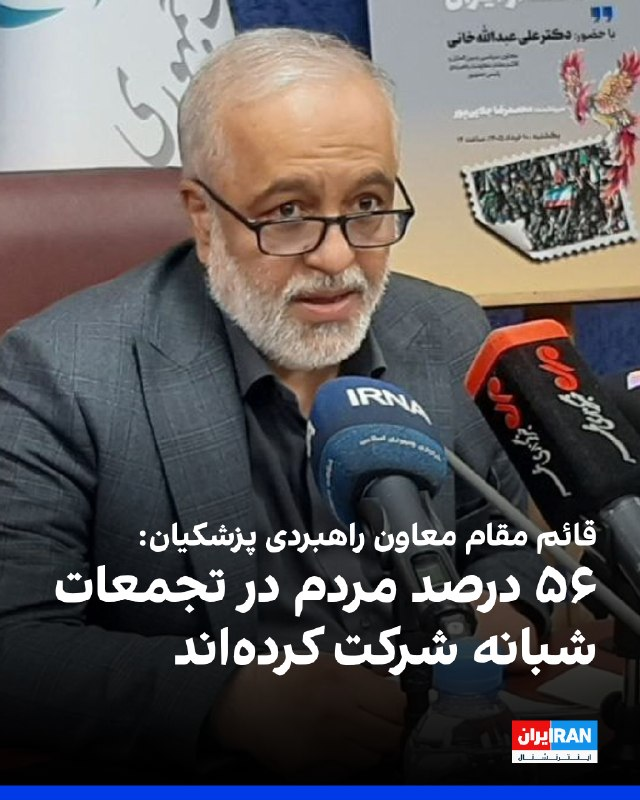

علی عبدالله خانی‌، قائم‌مقام معاون راهبردی پزشکیان، با بیان اینکه «بیش از ۵۶ درصد مردم حداقل یک بار در تجمعات شبانه شرکت کردند» گفت: این حضور یعنی حفظ نظام جمهوری اسلامی را مد نظر داشتند.
او اضافه کرد: «همه رده‌های سنی با تحصیلات مختلف در این اجتماعات حضور داشتند و ۷۰ درصد عاملیت جنبش بر عهده زنان بود.»
https://iranintl.com/202605314070

## IranIntlTV — post 339939

  <a href="telegram/content/IranIntlTV_339939_1780260629.mp4" target="_blank">🎬 Download video</a>

🔻علیرضا دبیر، رییس فدراسیون کشتی، درباره شماری از مخالفان جمهوری اسلامی در آمریکا گفت: «من ۱۴۰ رفیق درست و حسابی در آمریکا دارم که دکتر و مهندس هستند. نگاه نکنید چهار نفر می‌آیند جلوی دوربین می‌رقصند. این افراد لش و لوش‌هایی بودند که چند سال پیش فرار کردند و رفتند.»

🔹علیرضا دبیر پیشتر بخشی از ایرانیان خارج از کشور را «آویزان»، «پلشت» و «به دردنخور» خطاب کرده بود.

@iranintltvsport

## IranIntlTV — post 339938

  <a href="telegram/content/IranIntlTV_339938_1780260631.mp4" target="_blank">🎬 Download video</a>

بعد از سه ماه خاموشی مطلق، کم‌کم عده بیشتری در ایران به اینترنت وصل می‌شوند؛ جمهوری اسلامی چطور با استقرار یک پادگان دیجیتال، حق ارتباط ده‌ها میلیون ایرانی را مصادره کرد؟ این انزوای بی‌سابقه چگونه از نظر فنی، مهندسی شد، خسارت‌ ده‌ها میلیارد دلاری آن بر دوش چه کسانی است و آمران و پیمانکاران اجرایی این خاموشی دقیقا چه کسانی هستند؟ امشب قطع سراسری اینترنت در ایران را زیر ذره‌بین می‌بریم.

اصلاحیه: در بخشی از برنامه عدد خسارت روزانه قطعی اینترنت بین «۷۰ تا ۸۰ میلیارد دلار» ذکر شده. رقم صحیح روزانه «۷۰ تا ۸۰ میلیون دلار» است.
@iranintltv

## IranIntlTV — post 339937

  <a href="telegram/content/IranIntlTV_339937_1780260633.mp4" target="_blank">🎬 Download video</a>

سی‌ان‌ان گزارش داد جمهوری اسلامی بخش بزرگی از مسیرهای مسدودشده به سایت‌های زیرزمینی موشکی خود را بازسازی کرده است.

به نوشته این رسانه، ایران اکنون توان شلیک شمار بیشتری موشک دوربرد به سمت اسرائیل و دیگر کشورهای منطقه را دارد.

گفت‌وگو با آرام حسامی، استاد علوم سیاسی
@iranintltv

## IranIntlTV — post 339936

  

امانوئل مکرون، رییس‌جمهور فرانسه، در شبکه اجتماعی ایکس اعلام کرد با محمد بن سلمان، ولیعهد عربستان سعودی، هیثم بن طارق، سلطان عمان، محمد بن زاید، رییس امارات متحده عربی، و عبدالفتاح السیسی، رییس‌جمهور مصر، گفت‌وگو کرده است.

مکرون افزود به همه آن‌ها پیامی واحد منتقل کرده است: ضروری است توافقی میان ایالات متحده و جمهوری اسلامی هرچه سریع‌تر حاصل شود و این فرصت باید همین اکنون مورد استفاده قرار گیرد.

او تاکید کرد اولویت باید دستیابی به آتش‌بس و بازگشایی فوری تنگه هرمز، بدون هیچ شرطی و در چارچوب حقوق بین‌الملل، باشد. سپس گفت‌وگوها باید برای دستیابی به توافقی کامل و مستحکم درباره برنامه هسته‌ای، موشک‌های بالستیک و ثبات منطقه‌ای ادامه یابد.
https://iranintl.com/202605318416

## IranIntlTV — post 339935

  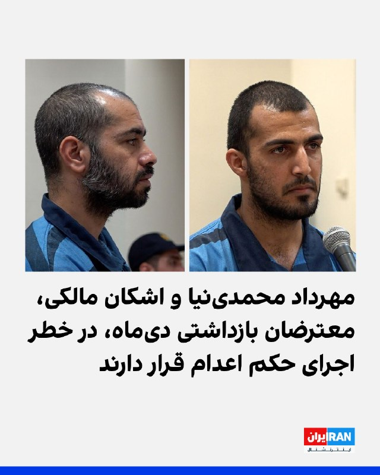

بر اساس اطلاعات رسیده به ایران‌اینترنشنال، اشکان مالکی و مهرداد محمدی‌نیا، دو معترض بازداشت‌شده در جریان انقلاب ملی در دی‌ماه ۱۴۰۴، در معرض خطر اجرای قریب‌الوقوع حکم اعدام قرار دارند. 
بنا بر این گزارش، این دو جوان معترض در زندان قزلحصار محبوس هستند. 
دادگاه رسیدگی به پرونده اشکان مالکی و مهرداد محمدی‌نیا روز دوم اسفند در شعبه ۱۵ دادگاه انقلاب به ریاست ابوالقاسم صلواتی برگزار شد. این دو معترض در نهایت به اعدام محکوم شدند و بر اساس اطلاعات دریافتی، در معرض اجرای حکم قرار دارند. 
اشکان مالکی و مهرداد محمدی‌نیا در این پرونده به «محاربه از طریق تحریق و تخریب مسجد جعفری و حوزه علمیه امام هادی در کوی نصر تهران» متهم شده‌اند. 
در همین پرونده، آرمان معرفتی، دیگر معترض بازداشت‌شده که هم‌اکنون در زندان تهران بزرگ نگهداری می‌شود، به «اجتماع و تبانی علیه امنیت داخلی کشور» متهم شده است.
https://iranintl.com/202605317088

## IranIntlTV — post 339934

  <a href="telegram/content/IranIntlTV_339934_1780260635.mp4" target="_blank">🎬 Download video</a>

علی شیرازی، عضو تحریریه ایران‌اینترنشنال، درباره سناریوی پذیرش استعفای مسعود پزشکیان از سوی مجتبی خامنه‌ای گفت: «در چنین شرایطی، کشور وارد حکومت نظامی خواهد شد؛ وضعیتی که در آن فرماندهان سپاه پاسداران به‌طور علنی زمام امور مرتبط با زندگی مردم را در دست خواهند گرفت.»
@iranintltv

## Shin_Persian — post 6341

↩️ Quoted tweet: acceladealer ✓ @acceladealer Sun, 31 May 2026 19:44:43 UTC Damage to building following explosion (claimed targeted assassination) in SHAHRIAR [شهريار], Iran 35.680714, 51.022755 @GeoConfirmed @EpicFuryMap @FaytuksNetwork geolocated by…

## Shin_Persian — post 6340

  

↩️ Quoted tweet:
acceladealer ✓ @acceladealer
Sun, 31 May 2026 19:44:43 UTC

Damage to building following explosion (claimed targeted assassination) in SHAHRIAR [شهريار], Iran

35.680714, 51.022755

@GeoConfirmed @EpicFuryMap @FaytuksNetwork

geolocated by @acceladealer

↩️ توییت نقل‌قول شده — برای پاسخ، پست زیر را ببینید.

فارسی

خسارت به ساختمان در پی انفجار (ادعای ترور هدفمند) در شهریار، ایران

۳۵.۶۸۰۷۱۴, ۵۱.۰۲۲۷۵۵

@GeoConfirmed @EpicFuryMap @FaytuksNetwork

تایید جغرافیایی توسط @acceladealer_

𝕏 · @shin_persian

## Shin_Persian — post 6339

Shin ✓ @hey_itsmyturn
Sun, 31 May 2026 20:12:22 UTC

Explosions in Erbil, Kurdistan Region, #Iraq 🇮🇶

فارسی

انفجارها در اربیل، اقلیم کردستان، #Iraq 🇮🇶

𝕏 · @shin_persian

## FarsiVOA — post 219212

  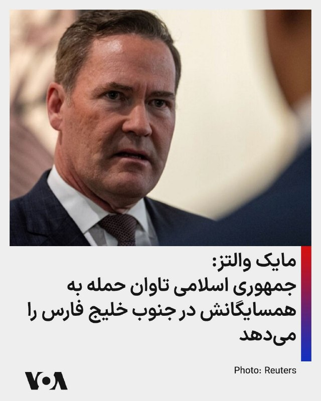

⚡️مایک والتز، سفیر آمریکا در سازمان ملل متحد، در واکنش به پستی در شبکه اجتماعی ایکس که به نقل از اسکات بسنت، وزیر خزانه‌داری آمریکا، نوشته بود حملات جمهوری اسلامی به کشورهای جنوب خلیج فارس باعث شده این کشورها در شناسایی و مسدود کردن دارایی‌های تهران در بانک‌های خود با واشنگتن همکاری کنند، گفت بله، جمهوری اسلامی «اشتباه بزرگی» مرتکب شد و تا آینده قابل پیش‌بینی، بهای آن را خواهد پرداخت.
@FarsiVOA

## FarsiVOA — post 219211

  <a href="telegram/content/FarsiVOA_219211_1780260638.mp4" target="_blank">🎬 Download video</a>

⚡️بازنشستگان ایرانی زیر فشار تورم ساختاری؛ گفت‌وگو با رضا غیبی
@FarsiVOA

## FarsiVOA — post 219210

⚡️در سایه بحران دارو و معیشت در ایران؛ دغدغه روزنامه کیهان لبنان است
@FarsiVOA

## Persian_Trend_Official — post 15417

  <a href="telegram/content/Persian_Trend_Official_15417_1780260638.webm" target="_blank">🎬 Download video</a>

https://youtube.com/live/KH1FJLD8MjM?feature=share

## RadioFarda — post 157753

  <a href="https://t.me/radiofarda/157753" target="_blank">📎 Download file</a>

📻بشنوید: سرخط خبرهای نیمه‌شب با رادیوفردا، یازده خرداد ۱۴۰۵‌

@RadioFarda

## RadioFarda — post 157752

🔸حسن آقاخانی، وکیل دادگستری، روز یکشنبه خبر داد که مسعود پیاهو، موکل او، به اتهام فیلم گرفتن از معترضی که در جریان اعتراضات دی‌ماه سال گذشته مقابل مأموران پلیس ایران در خیابان روی زمین نشسته بود، به ۱۰ سال زندان محکوم شده است. 🔸او به امتداد گفت که بازداشت…

## RadioFarda — post 157751

  <a href="telegram/content/RadioFarda_157751_1780260639.mp4" target="_blank">🎬 Download video</a>

🔸حسن آقاخانی، وکیل دادگستری، روز یکشنبه خبر داد که مسعود پیاهو، موکل او، به اتهام فیلم گرفتن از معترضی که در جریان اعتراضات دی‌ماه سال گذشته مقابل مأموران پلیس ایران در خیابان روی زمین نشسته بود، به ۱۰ سال زندان محکوم شده است.

🔸او به امتداد گفت که بازداشت آقای پیاهو به پیش از هجدهم و نوزدهم دی سال گذشته برمی‌گردد.

🔸این وکیل توضیح داده است: «موکل من در حال کار در بازاری بودند که به خیابان جمهوری مشرف بوده است. شخصی در مقابل مامورین نیروی انتظامی، می‌نشیند و مسعود یک فیلم کوتاه به صورت ناخودآگاه از آن صحنه ضبط می‌کند.»

🔸او اعلام کرد که مسعود پیاهو قصد انتشار «عمومی» این ویدئو را نداشته و آن را در «استوری پرایوت» صفحه اینستاگرام خود منتشر کرد اما سپس شخص دیگری آن را به شکل عمومی منتشر کرد.

🔸انتشار این ویدئو از فردی که روز هشتم دی‌ماه و در دومین روز اعتراضات به تنهایی مقابل مأموران انتظامی روی زمین نشسته بود، به شکل گسترده منتشر شد، بازتاب‌های فراوانی ایجاد کرد و به یکی از نمادهای این اعتراض‌ها تبدیل شد.

@RadioFarda

## BBCPersian — post 282514

  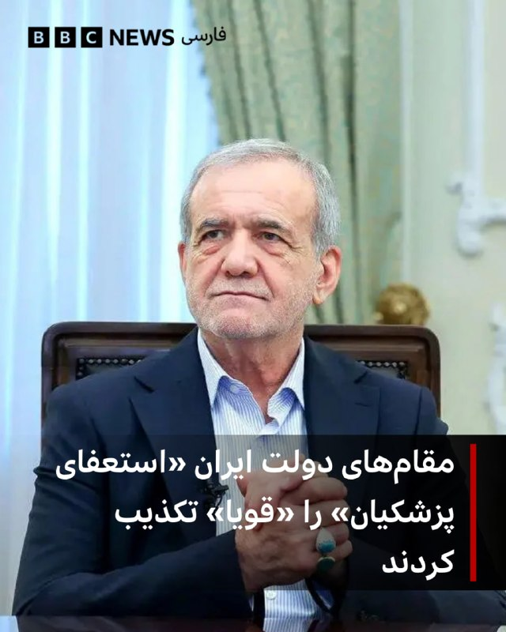

‌ ‌ ‌
چند مقام دولتی در ایران از جمله سخنگوی دولت این کشور با تکذیب شایعه استعفای مسعود پزشکیان، آن را «خبر کذب با هدف ایجاد ناامیدی» خواندند.

فاطمه مهاجرانی، سخنگوی دولت، الیاس حضرتی و علی احمدنیا که از اعضای شورای اطلاع رسانی دولت آقای پزشکیان هستند در پست‌های جداگانه به ادامه کار رئیس جمهوری و تلاش او برای «حل مسائل کشور» اشاره کرده‌اند.

در همین حال، خبرگزاری‌های رسمی ایران، روز یکشنبه چند گزارش‌ تصویری از حضور و سخنرانی آقای پزشکیان در رویدادهای مختلف داخلی منتشر کردند از جمله گفتگوی او با خبرنگاران درباره جام جهانی ۲۰۲۶.

https://trib.al/MvkvAGi
📷omidradio
@BBCPersian

## BBCPersian — post 282513

  

‌ ‌ ‌ ‌
عباس عراقچی، وزیر امور خارجه ایران گفته است که گفت‌وگوها و تبادل پیام‌ها بین ایران و آمریکا برای خاتمه جنگ همچنان در جریان است و تا زمانی که به نتیجه مشخصی نرسد، نمی‌توان درباره آن قضاوت کرد.

او در گفت‌وگو با خبرگزاری صدا و سیما با اشاره به ادامه تبادل پیام‌ها بین ایران و آمریکا برای خاتمه جنگ با میانجی گری پاکستان، گفته است تا زمانی که این اقدامات به نتیجه خاصی نرسد، گمانه‌زنی‌های مطرح‌شده در این زمینه فاقد اهمیت است.

او افزود: همه آنچه در حال حاضر درباره مذاکرات در رسانه ها مطرح می‌شود، در حد گمانه‌زنی است و به نظر من نباید به این گمانه‌زنی‌ها اهمیت داده شود تا وقتی موضوعات به مرحله قطعیت برسد.

https://trib.al/c8Cs9MF
📷eghtesadnews
@BBCPersian

## BBCPersian — post 282512

🔻 شورای امنیت به درخواست فرانسه «درمورد گسترش حمله اسرائیل به لبنان» جلسه اضطراری برگزار می‌کند

منابع دیپلماتیک به خبرگزاری فرانسه گفتند که شورای امنیت سازمان ملل متحد روز دوشنبه درمورد گسترش حمله اسرائیل به لبنان، پس از تصرف قلعه تاریخی شقیف (بوفور)، جلسه اضطراری برگزار خواهد کرد.

این منابع گفتند که این جلسه به درخواست فرانسه و بلافاصله پس از جلسه اضطراری درمورد اصابت یک پهپاد روسیه به آپارتمانی در رومانی خواهد بود.

پیشتر، وزیر امور خارجه فرانسه گفت که پس از تصرف قلعه شقیف (بوفور) در لبنان به دست نیروهای اسرائیل، خواستار برگزاری نشست اضطراری شورای امنیت سازمان ملل شده است.

ژان نوئل بارو به شبکه «بی‌اف‌ام تی‌وی» گفت: «با وجود آنکه حق دفاع مشروع اسرائیل را مانند هر کشوری به رسمیت می‌شناسیم، هیچ چیز نمی‌تواند ادامه عملیات نظامی اسرائیل و پیشروی هرچه بیشتر در خاک لبنان را توجیه کند.»

وزیر دفاع اسرائیل امروز در پستی در شبکه تلگرام نوشت: «۴۴ سال پس از نبرد قهرمانانه بوفور و در روزی که یادآور سربازان کشته‌ شده در جنگ اول لبنان (۱۹۸۲) است، نیروهای ما بار دیگر به این قلعه بازگشتند و پرچم اسرائیل را برافراشتند.»

این قلعه ۹۰۰ ساله که متعلق به قرون وسطی است، دید وسیعی بر جنوب لبنان دارد و از نظر نظامی بسیار مهم محسوب می‌شود.

https://trib.al/kde10vW
@BBCPersian

## Dirty_Kids — post 390686

🔴 ایران اینترنشنال: مسعود پزشکیان بخاطر ورود سپاه به تمامی مسائل کشور و دخالت در کارای دولت نامه استعفا خودشو به مجتبی خامنه‌ای تحویل داد. @Dirty_Kids 👻

## Dirty_Kids — post 390685

  

قشنگ جاهایی که میرن عین خودشون کیریه. قهوه تو لیوان دسته دار. دیزاین خیمه معاویه. اصلا کیری بودن با شماها آمیخته شده. @Dirty_Kids 👻

## Dirty_Kids — post 390684

  <a href="telegram/content/Dirty_Kids_390684_1780260642.mp4" target="_blank">🎬 Download video</a>

عوارض کوکائین

@Dirty_Kids 👻

## Dirty_Kids — post 390683

  <a href="telegram/content/Dirty_Kids_390683_1780260644.mp4" target="_blank">🎬 Download video</a>

لاشی جدی داشتم احساساتی میشدم :/

@Dirty_Kids 👻

## Dirty_Kids — post 390680

  <a href="telegram/content/Dirty_Kids_390680_1780260645.mp4" target="_blank">🎬 Download video</a>

دخترا تو اینستاگرام ديگه زیادی دارن با ما راحت میشن:

@Dirty_Kids 👻

## alonews — post 124061

  <a href="telegram/content/alonews_124061_1780260646.webm" target="_blank">🎬 Download video</a>

👈نبیه بری، رئیس مجلس لبنان : اعلام کرده که خلع سلاح حزب‌الله را تضمین می‌کند و قول آن را می‌دهد اگر اسرائیلی‌ها حملاتشان را متوقف کنند.

✅ @AloNews خبر جنگ

## alonews — post 124060

  <a href="telegram/content/alonews_124060_1780260646.webm" target="_blank">🎬 Download video</a>

👈اوکراین تعدادی پهپاد انتحاری به سمت روسیه پرتاب کرد

✅ @AloNews خبر جنگ

## alonews — post 124059

  <a href="telegram/content/alonews_124059_1780260647.webm" target="_blank">🎬 Download video</a>

👈مرندی: اگر نتانیاهو در جنوب لبنان متوقف نشود، اقتصاد آمریکا در ماه ژوئن فرو می‌پاشد، زمان در حال تمام شدن است!

✅ @AloNews خبر جنگ

## alonews — post 124058

  <a href="telegram/content/alonews_124058_1780260647.webm" target="_blank">🎬 Download video</a>

👈شبکه خبری المیادین گزارش داد صدای چند انفجار در مرکز منطقه کردستان عراق شنیده شده است.

🔴هنوز علت انفجارها مشخص نیست

✅ @AloNews خبر جنگ

## alonews — post 124057

  <a href="telegram/content/alonews_124057_1780260647.webm" target="_blank">🎬 Download video</a>

👈تانکرترکرز: چهار نفتکش ایرانی با محموله ۷ میلیون بشکه‌ای ظاهراً به ایران بازگردانده شدند

🔴 بر اساس یک تحلیل تصویری، ۴ نفتکش شرکت ملی نفتکش ایران با مجموع ۷ میلیون بشکه نفت خام در ۲ تا ۳ روز گذشته ظاهراً برای خروج از آب‌های ایران حرکت کرده‌اند، اما به احتمال زیاد مسیرشان تغییر کرده و به داخل بازگشته‌اند.

✅ @AloNews خبر جنگ

## alonews — post 124056

  <a href="telegram/content/alonews_124056_1780260647.webm" target="_blank">🎬 Download video</a>

👈انفجار گاز در مجتمع مسکونی فاز یک اندیشه با ۴ مصدوم؛ احتمال افزایش مصدومان

✅ @AloNews خبر جنگ

## alonews — post 124055

  <a href="telegram/content/alonews_124055_1780260647.webm" target="_blank">🎬 Download video</a>

👈ماکرون: ایران و آمریکا باید فورا به توافق برسند!

✅ @AloNews خبر جنگ

## alonews — post 124054

  <a href="telegram/content/alonews_124054_1780260647.webm" target="_blank">🎬 Download video</a>

👈بلومبرگ: سه ماه پس از آغاز جنگ ایران، تقریباً غیرممکن شده است که روحیه صعودی که بازارهای جهانی را برای دارایی‌های پرریسک هدایت می‌کند، کاهش یابد

✅ @AloNews خبر جنگ

## alonews — post 124053

  <a href="telegram/content/alonews_124053_1780260647.webm" target="_blank">🎬 Download video</a>

👈فعالیت تانکر های سوخت رسان آمریکایی در خلیج فارس

🔴همچنین آواکس E3 نیز بلند شده است

✅ @AloNews خبر جنگ

## alonews — post 124052

  <a href="telegram/content/alonews_124052_1780260648.webm" target="_blank">🎬 Download video</a>

👈وزیر خارجه آلمان: پیشروی مداوم ارتش اسرائیل در جنوب لبنان نگرانی عمیقی ایجاد کرده است

✅ @AloNews خبر جنگ

## alonews — post 124051

  <a href="telegram/content/alonews_124051_1780260648.webm" target="_blank">🎬 Download video</a>

👈سخنگوی کمیسیون امنیت ملی: به ساعت صفر برسیم حتما نظامیان ما اقدام خواهند کرد!

✅ @AloNews خبر جنگ

## alonews — post 124050

  <a href="telegram/content/alonews_124050_1780260648.webm" target="_blank">🎬 Download video</a>

👈 سخنگوی کمیسیون امنیت ملی مجلس: ما هیچ تعهدی در موضوع هسته‌ای در مقابل طرف آمریکایی نداریم

✅ @AloNews خبر جنگ

## alonews — post 124049

  <a href="telegram/content/alonews_124049_1780260648.webm" target="_blank">🎬 Download video</a>

👈ایالات متحده شهروندان و شرکت‌های خود را از استفاده از خدمات ایران برای تأمین امنیت عبور از تنگه هرمز منع کرد.

✅ @AloNews خبر جنگ

## alonews — post 124048

  <a href="telegram/content/alonews_124048_1780260648.webm" target="_blank">🎬 Download video</a>

👈وزارت خارجه قطر: دولت قطر استمرار تجاوزات اسرائیل علیه لبنان و گسترش نفوذ زمینی آن در جنوب این کشور را محکوم می‌کند.

🔴 ما از جامعه بین‌المللی می‌خواهیم که مقامات اشغالگر اسرائیل را ملزم به توقف تجاوزات خود علیه لبنان کند.

🔴 ما بر موضع ثابت دولت قطر در قبال لبنان، وحدت، حاکمیت و تمامیت ارضی آن، و حمایت کامل ما از تمامی تلاشهایی که ثبات و شکوفایی لبنان را تقویت میکند، تأکید می‌کنیم.

✅ @AloNews خبر جنگ

---
📅 بروزرسانی: 1405/03/10 23:19
---

## VahidOOnLine — post 243109

  

♦️احمد الشرع، رئیس‌جمهوری سوریه، روز یکشنبه دهم خرداد ماه، در تماس تلفنی با دونالد ترامپ، رئیس‌جمهوری آمریکا، درباره روابط دوجانبه، آخرین تحولات سیاسی و امنیتی منطقه و راه‌های تقویت همکاری‌های مشترک گفتگو کرد.
بر اساس بیانیه دفتر ریاست‌جمهوری سوریه، دو طرف در این تماس راه‌های حمایت از ثبات سوریه و کمک به روند بهبود اقتصادی این کشور در مرحله پیش رو را مورد بررسی قرار دادند.
احمد الشرع در این گفتگو بر اهمیت تداوم حمایت‌های بین‌المللی از سوریه در دوره بازسازی و احیای کشور تاکید کرد و گفت لغو تحریم‌های باقی‌مانده آمریکا علیه سوریه گامی اساسی برای احیای اقتصاد، جذب سرمایه‌گذاری و بهبود شرایط معیشتی شهروندان سوری است.
دفتر ریاست‌جمهوری سوریه همچنین اعلام کرد در این تماس تلفنی، آخرین تحولات منطقه‌ای و «مسائل مورد اهتمام مشترک دو کشور» نیز مورد بحث و تبادل نظر قرار گرفت.
‌🇸🇦 Indypersian

🤖 @VahidOOnLine

## VahidOOnLine — post 243108

  

خبرگزاری تسنیم، وابسته به سپاه، به نقل از «یک منبع مطلع» درباره روند مذاکرات نوشت: ملاک برای جمهوری اسلامی متنی است که خودمان قبول داشته باشیم و اعمال اصلاحیه از سوی ترامپ به معنای پذیرش آن از طرف ما نیست.

تسنیم افزود جمهوری اسلامی برای «وضعیت عدم تفاهم» نیز کاملا آمادگی دارد.
‌🏁 🇬🇧 IranintlTV

🤖 @VahidOOnLine

## VahidOOnLine — post 243107

  

♦️خبرگزاری حکومتی تسنیم، شامگاه یکشنبه دهم خرداد ماه، به نقل از یک «منبع مطلع» گزارش داد در پی پیشنهاد اصلاحیه‌های جدید از سوی دونالد ترامپ به متن تفاهم احتمالی میان تهران و واشنگتن، ایران نیز اصلاحیه‌های خود را بر متن اعمال خواهد کرد.
این منبع با اشاره به گزارش رسانه‌های آمریکایی درباره تغییرات پیشنهادی رئیس‌جمهوری آمریکا به تسنیم گفت: «تبادل متن‌ها همچنان ادامه دارد و ایران نیز قاعدتا اصلاحیه‌های خود را درباره متن اعمال خواهد کرد و هنوز هیچ چیز نهایی نیست.»
خبرگزاری تسنیم که به عنوان منبعی برای بازتاب دیدگاه‌ه هسته‌های نزدیک به قدرت در ایران شناخته می‌شود، به نقل از این منبع آگاه تاکید کرد: «ملاک برای ایران متنی است که خودمان آن را قبول داشته باشیم و اعمال اصلاحیه از سوی ترامپ به معنای پذیرش آن از جانب ایران نیست.»
این منبع مطلع همچنین تصریح کرد: «ایران برای وضعیت عدم تفاهم نیز کاملا آمادگی دارد.»
‌🇸🇦 Indypersian

🤖 @VahidOOnLine

## VahidOOnLine — post 243106

  <a href="telegram/content/VahidOOnLine_243106_1780256968.mp4" target="_blank">🎬 Download video</a>

سخنان الهام‌بخش دکتر عزت‌الله همایونفر، ادیب و سیاست‌مداری که واژگانش، وطن را معنا می‌کردند. در روزگاری که صداقت در سیاست نایاب بود، او ایستاد؛ با فرهنگ، با قلم، با شرف.
‌🏁 🇬🇧 ManotoTV

🤖 @VahidOOnLine

## VahidOOnLine — post 243096

  <a href="telegram/content/VahidOOnLine_243096_1780256969.mp4" target="_blank">🎬 Download video</a>

حذف احتمالی سردار آزمون از تیم ملی، فقط یک خبر ورزشی نیست.

این ماجرا دوباره پرسشی قدیمی را زنده می‌کند: در کشوری که سیاست و ورزش بارها به هم گره خورده‌اند، چه کسی حق دارد نماینده یک ملت باشد؟

از حمایت ورزشکاران از معترضان تا واکنش حکومت به صداهای مستقل، فوتبال ایران سال‌هاست فراتر از یک بازی است.

شاید امروز مهم‌ترین بحث فوتبال ایران نه ترکیب تیم ملی، بلکه معنای «تیم ملی» باشد. ورق بزنید.
‌🏁 🇬🇧 ManotoTV

🤖 @VahidOOnLine

## VahidOOnLine — post 243095

  

یدالله جوانی، معاون سیاسی سپاه پاسداران، گفت: «اعمال حاکمیت بر تنگه هرمز سلاحی راهبردی‌تر از تسلیحات اتمی است که ایران را قادر به تنبیه متجاوزان می‌کند.»

او با اشاره به جنگ میان جمهوری اسلامی، آمریکا و اسرائیل افزود: «این جنگ اجتناب‌ناپذیر بود و ما در وقوع آن غافلگیر نشدیم. همواره برای این رویارویی آماده می‌شدیم.»

معاون سیاسی سپاه پاسداران همچنین با اشاره به جنگ هشت‌ساله ایران و عراق گفت: «جنگ تحمیلی دوم و سوم نیز همان برکات را برای جامعه اسلامی ایران به همراه داشته است. ایران نه تنها در دفاع پیروز شد، بلکه از دل این جنگ، یک قدرت جهانی ظهور کرده است.»
‌🏁 🇬🇧 IranintlTV

🤖 @VahidOOnLine

## VahidOOnLine — post 243094

  <a href="telegram/content/VahidOOnLine_243094_1780256970.mp4" target="_blank">🎬 Download video</a>

♦️شهر هاربین، مرکز استان هیلونگ‌جیانگ در شمال شرقی چین، عصر روز یکشنبه دهم خرداد ماه، با طوفان تندری شدید و کم‌سابقه همراه با بادهای بسیار قدرتمند مواجه شد.
بر اساس گزارش‌ رسانه‌های محلی، سرعت تندبادها در برخی نقاط به ۳۷.۵ متر بر ثانیه رسید که موجب شکل‌گیری توده‌های گسترده گردوغبار در سطح شهر شد.
وزش شدید باد و گردوغبار ناشی از آن، دید افقی را به شدت کاهش داد و بخش‌هایی از هاربین را در تاریکی فرو برد. تصاویر منتشرشده در شبکه‌های اجتماعی، آسمان تیره و شرایط نامساعد جوی در این شهر را نشان می‌دهد.
‌🇸🇦 Indypersian

🤖 @VahidOOnLine

## VahidOOnLine — post 243093

  

♦️رسانه اسرائیل هیوم در گزارشی به نقل از مقام‌های پیشین و کنونی موساد، مدعی شده است که اعتراضات دی‌ماه ۱۴۰۴ که ابتدا از بازار تهران آغاز شد و به سرعت به دیگر شهرها گسترش یافت، زمان‌بندی برنامه‌ریزی‌شده برای حمله اسرائیل و آمریکا به ایران را تغییر داد و باعث شد این عملیات زودتر از موعد مورد نظر موساد آغاز شود.

بر اساس این گزارش، شاخه‌ای محرمانه در موساد که از سال ۲۰۲۱ برای «عملیات نفوذ» و جنگ روانی علیه جمهوری اسلامی ایجاد شده، پیش از آغاز جنگ، ماه مه ۲۰۲۶ (اردیبهشت/ خرداد ۱۴۰۵) را زمان آمادگی برای اقدام نظامی بعدی تعیین کرده بود. اما اعتراضات بازار تهران که به گفته این گزارش «از پایگاه اجتماعی سنتی حکومت» برخاست، معادلات را تغییر داد.

یک منبع آگاه به اسرائیل هیوم گفت که همین اعتراض‌ها به عاملی شتاب‌دهنده تبدیل شد و دونالد ترامپ را متقاعد کرد زودتر از آنچه موساد انتظار داشت وارد کارزار علیه ایران شود. به گفته او، «جنگ خیلی زود آغاز شد، چون پس از سرکوب خشونت‌بار اعتراض‌ها، هنوز سازوکار ترس مانع بازگشت مردم به خیابان بود.»
‌🇸🇦 Indypersian

🤖 @VahidOOnLine

## VahidOOnLine — post 243092

  

ایران‌اینترنشنال به اسناد و اطلاعاتی اختصاصی دست یافته است که نشان می‌دهند یک شرکت چینی با هماهنگی دولت این کشور و همچنین دو شرکت مستقر در ترکیه و امارات، در تامین مواد شیمیایی لازم برای ساخت موشک‌های بالستیک به سپاه پاسداران کمک می‌‌کند.

یک سند که گروه هکری پرانا به آن دست یافته و در اختیار ایران‌اینترنشنال قرار داده است، فاش می‌کند که چین نه‌تنها آشکارا به سپاه پاسداران در تامین این مواد کمک می‌کند، بلکه با کمک شبکه‌ای از شرکت‌ها تحریم‌های آمریکا علیه جمهوری اسلامی را هم دور می‌زند.

در این میان شرکت «هاوکان انرژی» نقش اصلی را ایفا می‌‌کند. این شرکت سال‌ها واسطه فروش نفت سپاه پاسداران به پالایشگاه‌های چینی بود و چهار سال پیش به دلیل تامین مالی نیروی قدس سپاه پاسداران از سوی ایالات متحده تحریم شد.

سال گذشته یک منبع مطلع به اینترنشنال گفته بود که این شرکت بیش از یک میلیارد دلار از پول نفت سپاه را بازنگردانده است.

ادامه این گزارش را در وبسایت ایران‌اینترنشنال بخوانید
‌🏁 🇬🇧 IranintlTV

🤖 @VahidOOnLine

## VahidOOnLine — post 243091

  <a href="telegram/content/VahidOOnLine_243091_1780256972.mp4" target="_blank">🎬 Download video</a>

♦️وزارت گردشگری و آثار باستانی مصر، روز یکشنبه دهم خرداد ماه، اعلام کرد یک هیئت باستان‌شناسی مصری موفق به کشف مجموعه‌ای از آثار تاریخی در محوطه گورستان «پانهسی» در منطقه المطریة واقع در عین‌شمس در شرق قاهره شده است.
بر اساس اعلام این وزارتخانه، این مجموعه شامل نخستین اثاثیه تدفینی تقریبا کامل کشف‌شده در این منطقه، به همراه تعدادی آثار نادر و چندین گوشواره فلزی است که احتمال می‌رود از طلا ساخته شده باشند.
مقام‌های مصری می‌گویند این کشف جدید می‌تواند به روشن شدن رازهای بیشتری از گورستان باستانی هلیوپولیس، یکی از مهم‌ترین مراکز مذهبی مصر باستان، کمک کند.
وزارت گردشگری و آثار باستانی مصر در بیانیه‌ای تاکید کرد این دستاورد نشان‌دهنده موفقیت ماموریت‌های باستان‌شناسی مصری در بازخوانی و تفسیر تاریخ فرهنگی هلیوپولیس است؛ شهری که از آن به عنوان یکی از قدیمی‌ترین و مهم‌ترین شهرهای مذهبی جهان باستان یاد می‌شود.
‌🇸🇦 Indypersian

🤖 @VahidOOnLine

## VahidOOnLine — post 243090

  

♦️خبرگزاری حکومتی تسنیم، روز یکشنبه دهم خرداد ماه، به نقل از یک منبع آگاه در دولت گزارش داد اخبار و شایعات منتشرشده درباره استعفای مسعود پزشکیان، رئیس‌جمهوری ایران، صحت ندارد.
این منبع آگاه تاکید کرد پزشکیان استعفایی نداده، امروز مشغول انجام امور و برنامه‌های کاری خود بوده و برنامه‌های آتی او نیز طبق روال برگزار خواهد شد.
تسنیم به نقل از این منبع نوشت، این اخبار با هدف «خبرسازی برای کسب اطلاعات امنیتی به نفع موساد و سیا و اختلاف‌افکنی و شکستن انسجام در ایران» منتشر می‌شود.
همزمان با انتشار این گزارش، رسانه‌های داخلی ایران تصاویری از حضور پزشکیان در مراسمی دولتی در شامگاه یکشنبه را منتشر کردند.
‌🇸🇦 Indypersian

🤖 @VahidOOnLine

## WithYashar — post 13101

  <a href="telegram/content/WithYashar_13101_1780256973.mp4" target="_blank">🎬 Download video</a>

انفجار در فاز یک اندیشه شهریار خیابان شیشم شرقی در یک ساختمان که چندین مصدوم داشته
@withyashar

## WithYashar — post 13100

تسنیم : ایران تغییرات بیشتری در یادداشت تفاهم ایجاد خواهد کرد. اینکه ترامپ در حال ایجاد تغییراتی در این یادداشت تفاهم است، به این معنی نیست که این تغییرات برای ما قابل قبول است. ایران کاملاً برای شرایطی که هیچ توافقی حاصل نشود، آماده است.
@withyashar

## WithYashar — post 13099

حمله به کشتی حامل مس در تنگه هرمز

در پی درگیری‌های اخیر در تنگه هرمز، یک کشتی خارجی که حامل مس بود، مورد هدف قرار گرفت
@withyashar

## WithYashar — post 13098

  <a href="telegram/content/WithYashar_13098_1780256974.mp4" target="_blank">🎬 Download video</a>

تردد خودرو های منطقه آزاد در سراسر کشور آزاد است
@withyashar

## WithYashar — post 13097

  <a href="telegram/content/WithYashar_13097_1780256975.mp4" target="_blank">🎬 Download video</a>

اسکات بسنت، وزیر خزانه‌داری ایالات متحده:

اشتباه بزرگی که ایرانی‌ها مرتکب شدند حمله به همسایگانشان در شورای همکاری خلیج فارس، همسایگانشان در خلیج فارس بود، زیرا ما متحدان بسیار خوبی داشتیم که شاید در مورد پول با ما کاملاً شفاف نبودند، پول ایران که در سیستم‌های بانکی آنها بود، ناگهان بسیار مطیع شدند و حاضر شدند حساب‌ها را تحویل دهند یا به ما در مسدود کردن حساب‌ها کمک کنند.
@withyashar

## WithYashar — post 13096

کانال ۱۵ اسرائیل: گسترش عملیات اسرائیل در لبنان با هماهنگی دولت آمریکا انجام شد.
@withyashar

## WithYashar — post 13095

جروزالم پست: منابع به واشنگتن پست مدعی شدند که مجتبی خامنه‌ای، رهبر ایران، هنوز به آخرین پیشنهادات ایالات متحده، از جمله تفاهم‌ نامه‌ای که در جریان مذاکرات اخیر مورد توافق قرار گرفت، پاسخی نداده است.
@withyashar

## WithYashar — post 13094

عراقچی: ویزای تیم ملی فوتبال ظرف یک تا دو روز آینده صادر می‌شود
@withyashar

## WithYashar — post 13093

  <a href="telegram/content/WithYashar_13093_1780256977.mp4" target="_blank">🎬 Download video</a>

شاهزاده رضا پهلوی:

آنها در تلاشند تا قانون شریعت را نه در دمشق یا تهران، بلکه در خیابان‌های بلژیک، خیابان‌های پاریس، خیابان‌های لندن تحمیل کنند.

تا چه حد اجازه می‌دهید این رادیکالیسم ادامه یابد؟ این تهدیدی مستقیم برای ثبات و جمعیت‌شناسی اروپا است!
@withyashar

## mwarmonitor — post 9958

📝 سوالی دارید دایرکت جواب میدم

## mwarmonitor — post 9957

🔴مجری (سی‌ان‌ان): اکنون باراک راوید، تحلیل‌گر امور جهانی و سیاسی سی‌ان‌ان و خبرنگار اکسیوس به ما ملحق شده است. باراک، همیشه از حضور شما در اینجا خوشحالیم. ما چند روزی است که در یک وضعیت انتظار و بلاتکلیفی به سر می‌بریم. شما موقعیت فعلی ما را در این لحظه چگونه…

## mwarmonitor — post 9956

🔴مجری (سی‌ان‌ان):
اکنون باراک راوید، تحلیل‌گر امور جهانی و سیاسی سی‌ان‌ان و خبرنگار اکسیوس به ما ملحق شده است. باراک، همیشه از حضور شما در اینجا خوشحالیم. ما چند روزی است که در یک وضعیت انتظار و بلاتکلیفی به سر می‌بریم. شما موقعیت فعلی ما را در این لحظه چگونه توصیف می‌کنید؟
🔵باراک راوید:
خب، فکر می‌کنم ما در آخرین لحظات این مذاکرات قرار داریم، یا حداقل در لحظاتی که پتانسیل این را دارند که آخرین لحظات باشند. من فکر می‌کنم هر دو طرف این موضوع را تایید و اعتراف می‌کنند؛ و این را هم از مقامات آمریکایی، هم از میانجی‌ها و هم از خود ایرانی‌ها می‌شنوم که همین موضوع را به رسانه‌های دولتی خود نیز می‌گویند؛ اینکه طرفین بسیار به یک توافق نزدیک هستند. و همیشه در لحظات پایانی مذاکرات، هر طرف تلاش می‌کند تا به آخرین دستاورد و پیروزی نهایی خود دست یابد. و من فکر می‌کنم در حال حاضر در چنین وضعیتی هستیم.
🔴مجری:
بله، و وزیر دفاع نیز اعلام کرده که ایالات متحده در صورت لزوم آماده است تا نبرد را [در خلیج فارس] از سر بگیرد. اما ارزیابی شما از تمایل رئیس‌جمهور برای گام برداشتن در این مسیر چیست؟
🔵باراک راوید:
خب، این قطعا یک گزینه است و من فکر نمی‌کنم ترامپ آن را نادیده گرفته باشد. اما در حال حاضر، برداشت من از گفتگو با افراد نزدیک به رئیس‌جمهور این است که موضوع اصلی که پرزیدنت ترامپ می‌خواهد در کوتاه‌مدت حل کند، مسئله تنگه هرمز است. و یکی از مواردی که به رئیس‌جمهور گفته شده، از جمله در جلسات اتاق وضعیت (Situation Room)، این است که اگر او توافق را نپذیرد و جنگ دوباره از سر گرفته شود، این به معنای سناریوی بسته ماندن تنگه هرمز برای ۶ تا ۱۲ ماه دیگر خواهد بود؛ با تمام پیامدهایی که برای اقتصاد جهانی و اقتصاد ایالات متحده به همراه دارد. و من فکر می‌کنم این چیزی است که پرزیدنت ترامپ می‌خواهد آن را حل کند و فکر می‌کنم این یکی از ملاحظات اصلی او در بررسی این توافق در حال حاضر است.
🔴مجری:
ارتش اسرائیل نیز درباره شدت گرفتن درگیری‌ها با حزب‌الله در لبنان هشدار می‌دهد. درگیری‌ها میان اسرائیل و حزب‌الله پس از ترور رهبر عالی ایران از سر گرفته شد. این یک جبهه دوم است، اما یک درگیری مرتبط با تمام این قضایا به شمار می‌رود. این موضوع چگونه بر این مذاکرات میان آمریکا و ایران تاثیر می‌گذارد؟
🔵باراک راوید:
در مورد ایرانی‌ها، آن‌ها تلاش می‌کنند تا به نوعی این دو درگیری را به هم پیوند بزنند و مطمئن شوند که اگر با آمریکا به توافقی دست یابند، یکی از نتایج آن این باشد که اسرائیل مجبور شود حملات خود علیه حزب‌الله را متوقف کند. فکر می‌کنم در حال حاضر، با توجه به شکلی که پیش‌نویس توافق دارد، به احتمال زیاد ایرانی‌ها قرار است حداقل...

@mwarmonitor

## mwarmonitor — post 9955

  <a href="telegram/content/mwarmonitor_9955_1780256978.mp4" target="_blank">🎬 Download video</a>

🎬 Video

## mwarmonitor — post 9954

🔴مجری ؛ «یک دقیقه زمان داریم و می‌خواهم از شما بپرسم که چقدر به کسانی که در حال حاضر به رئیس‌جمهور مشاوره می‌دهند اعتماد دارید؟ حدس می‌زنم برخی از مهره‌های اصلی را می‌شناسید، چه استیو وین باشد، چه جرد کوشنر؛ شما در گذشته با آن‌ها تعامل داشته‌اید. آیا مطمئن هستید که آن‌ها از دانش استراتژیک یا درک کافی برای بهبود وضعیتی که در حال حاضر وجود دارد، برخوردارند؟»
🔵 جان بولتون:
«فکر نمی‌کنم آن‌ها متوجه نوع امتیازاتی که واگذار می‌کنند باشند. به عنوان مثال، یکی از جنجالی‌ترین ابعاد این توافق که هنوز بسیار مبهم است، این است که آیا ایالات متحده قصد دارد دارایی‌های مسدود شده ایران را آزاد کند و منابع دیگری را در اختیار آن‌ها قرار دهد یا خیر.
به نظر من این یک اشتباه بزرگ خواهد بود. آزاد کردن دارایی‌ها برای یک دولت واقعی در ایران که نماینده مردم باشد، یک چیز است؛ اما اگر ما دارایی‌های مسدود شده را در اختیار این دولت قرار دهیم، این کار جایگاه آن‌ها را بیش از پیش تثبیت خواهد کرد.
و من فکر نمی‌کنم دلالان املاک (اشاره به سابقه ترامپ و کوشنر) درک کنند که چه چیزی در اینجا در خطر است. موضوع این پول‌ها، توسعه اقتصادی در ایران نیست؛ بلکه تثبیت موقعیت و توانمندسازی رژیم برای ماندن در قدرت است. اگر کار به این شکل پیش برود، از نظر سیاسی برای ترامپ بسیار بد خواهد بود.» بلومبرگ

@mwarmonitor

## mwarmonitor — post 9953

  <a href="telegram/content/mwarmonitor_9953_1780256980.mp4" target="_blank">🎬 Download video</a>

🎬 Video

## mwarmonitor — post 9952

🔴ارتش آمریکا در حملات هوایی به قایق‌هایی که آن‌ها را به قاچاق مواد مخدر متهم می‌کند، در آب‌های نزدیک آمریکای جنوبی بیش از ۲۰۰ نفر را کشته است. در کلمبیا و اکوادور، این حملات زندگی کسانی را که از راه دریا امرار معاش می‌کنند، دگرگون کرده است. نیویورک تایمز

@mwarmonitor

## mwarmonitor — post 9951

  <a href="telegram/content/mwarmonitor_9951_1780256981.mp4" target="_blank">🎬 Download video</a>

📌«دو فروند بمب‌افکن استراتژیک B-1 امروز کمی بعد از ساعت ۶ عصر در یک پرواز آموزشی از پایگاه RAF Fairford به پرواز درآمدند و به سمت جنوب‌غربی حرکت کردند. امروز مسافت پروازشان نسبتاً طولانی بوده است.»

@mwarmonitor

## mwarmonitor — post 9950

🔴«در یک تحلیل بصری که برای مشتریان تهیه کرده‌ایم، نشان دادیم که چهار نفتکش متعلق به شرکت ملی نفتکش ایران (NITC)، با مجموع محموله‌ای حدود ۷ میلیون بشکه نفت خام، به نظر می‌رسد طی ۲ تا ۳ روز گذشته در مقطعی تلاش کرده‌اند ایران را ترک کنند، اما به احتمال زیاد دوباره به سمت ایران تغییر مسیر داده‌اند. TANKER TRACKER

@mwarmonitor

## FoxNewsTwitter — post 342459

  

Fox News (Twitter/X)

A fight over a White House ballroom is turning into a national security showdown.

President Trump is accusing a federal judge of jeopardizing Washington’s safety by slowing a project that includes a rooftop drone base and other security enhancements.

“Judge Richard Leon should stop playing games with America’s security!” Trump wrote, arguing that today’s threats demand new defensive measures beyond traditional protections.

The lawsuit is focused on whether the administration can proceed with the project and its security upgrades without congressional authorization.

## FoxNewsTwitter — post 342458

  <a href="telegram/content/FoxNewsTwitter_342458_1780256983.mp4" target="_blank">🎬 Download video</a>

Fox News (Twitter/X)

Video captures the moment a dog is spooked by a meteor that exploded over Massachusetts, creating a boom heard across New England.

## pm_afshaa — post 91969

  <a href="telegram/content/pm_afshaa_91969_1780256985.mp4" target="_blank">🎬 Download video</a>

انفجار در فاز یک اندیشه شهریار خیابان شیشم شرقی در یک ساختمان که چندین مصدوم داشته

💧 Rainbet.com the #1 Non-KYC Crypto Casino & Sportsbook @rainbetcom

😁 @Pm_Afshaa

## pm_afshaa — post 91968

  <a href="telegram/content/pm_afshaa_91968_1780256986.mp4" target="_blank">🎬 Download video</a>

🎙️گزارشگر به محمد‌جواد ظریف:
میگن شما پشت پرده مذاکرات هستید.

ظریف: من اصلا هیچکاره‌ام

💧 Rainbet.com the #1 Non-KYC Crypto Casino & Sportsbook @rainbetcom

😁 @Pm_Afshaa

## pm_afshaa — post 91967

🔴یک مقام ارشد امنیتی اسرائیلی: ایران قرارداد با آمریکا را امضا نخواهدکرد

💧 Rainbet.com the #1 Non-KYC Crypto Casino & Sportsbook @rainbetcom

😁 @Pm_Afshaa

## pm_afshaa — post 91966

  <a href="telegram/content/pm_afshaa_91966_1780256987.mp4" target="_blank">🎬 Download video</a>

شاهزاده رضا پهلوی:برخلاف این رژیم که می‌خواهد اسرائیل را از نقشه جهان پاک کند، ما آن‌ها را به عنوان شرکای استراتژیک واقعی می‌بینیم.

ما از دوستان اسرائیلی‌مان استقبال می‌کنیم تا در حل بسیاری از چالش‌هایی که ایران با آن‌ها مواجه است به ما کمک کنن ما با اسرائیل هیچ اختلافی نداریم

💧 Rainbet.com the #1 Non-KYC Crypto Casino & Sportsbook @rainbetcom

😁 @Pm_Afshaa

## pm_afshaa — post 91965

شاهزاده رضا پهلوی:آنها در تلاشند تا قانون شریعت را نه در دمشق یا تهران، بلکه در خیابان‌های بلژیک، خیابان‌های پاریس، خیابان‌های لندن تحمیل کنند.

تا چه حد اجازه می‌دهید این رادیکالیسم ادامه یابد؟ این تهدیدی مستقیم برای ثبات و جمعیت‌شناسی اروپا است!

💧 Rainbet.com the #1 Non-KYC Crypto Casino & Sportsbook @rainbetcom

😁 @Pm_Afshaa

## pm_afshaa — post 91964

  <a href="telegram/content/pm_afshaa_91964_1780256989.mp4" target="_blank">🎬 Download video</a>

شاهزاده رضا پهلوی:
مردم ایران همان نیروهای حاضر در میدان هستند. نیازی به اعزام نیروهای نظامی شما نیست، اما برای اینکه نیروهای حاضر در میدان بتوانند فرصتی برای بازگشت به خیابان‌ها داشته باشند، به حداقل محافظت نیاز دارن

💧 Rainbet.com the #1 Non-KYC Crypto Casino & Sportsbook @rainbetcom

😁 @Pm_Afshaa

## DEJradio — post 5191

📡
🛑 ساعتی پیش دونالد ترامپ مصاحبه‌ای از مارک لوین، روزنامه نگار نزدیک به خود با دیویس هنسن، تاریخ نگار و پژوهشگر موسسه را در حساب کاربری خود در تروث سوشیال قرار داد.
این مصاحبه مربوط به جنگ ایالات متحده با جمهوری اسلامی است.

#ترامپ #مارک_لوین
@DEJradio

## IranIntlTV — post 339933

  

خبرگزاری تسنیم، وابسته به سپاه، به نقل از «یک منبع مطلع» درباره روند مذاکرات نوشت: ملاک برای جمهوری اسلامی متنی است که خودمان قبول داشته باشیم و اعمال اصلاحیه از سوی ترامپ به معنای پذیرش آن از طرف ما نیست.

تسنیم افزود جمهوری اسلامی برای «وضعیت عدم تفاهم» نیز کاملا آمادگی دارد.
https://iranintl.com/202605318379

## IranIntlTV — post 339932

  <a href="telegram/content/IranIntlTV_339932_1780256991.mp4" target="_blank">🎬 Download video</a>

🔻بازیکنان تیم فوتبال آرسنال پس از قهرمانی در لیگ برتر انگلستان، در حضور هواداران خود رژه قهرمانی در خیابان‌های لندن برگزار کردند. آرسنال پس از ۲۲ سال توانست عنوان قهرمانی لیگ برتر را از آن خود کند.

🔹گزارش آیدین مقیمی، ایران‌اینترنشنال

@iranintltvsport

## IranIntlTV — post 339931

  

یدالله جوانی، معاون سیاسی سپاه پاسداران، گفت: «اعمال حاکمیت بر تنگه هرمز سلاحی راهبردی‌تر از تسلیحات اتمی است که ایران را قادر به تنبیه متجاوزان می‌کند.»

او با اشاره به جنگ میان جمهوری اسلامی، آمریکا و اسرائیل افزود: «این جنگ اجتناب‌ناپذیر بود و ما در وقوع آن غافلگیر نشدیم. همواره برای این رویارویی آماده می‌شدیم.»

معاون سیاسی سپاه پاسداران همچنین با اشاره به جنگ هشت‌ساله ایران و عراق گفت: «جنگ تحمیلی دوم و سوم نیز همان برکات را برای جامعه اسلامی ایران به همراه داشته است. ایران نه تنها در دفاع پیروز شد، بلکه از دل این جنگ، یک قدرت جهانی ظهور کرده است.»
https://iranintl.com/202605318586

## IranIntlTV — post 339930

  <a href="telegram/content/IranIntlTV_339930_1780256993.mp4" target="_blank">🎬 Download video</a>

دهمین نمایشگاه «تهران، بدون سانسور» با همکاری ناشران مستقل خارج از کشور در شهرهای تورنتو و اتاوا برگزار شد.

برگزارکنندگان اعلام کرده‌اند این نمایشگاه امسال به‌صورت محدود در شهرهای دیگری از جمله لندن، استکهلم و کپنهاگ نیز برگزار خواهد شد.

گزارش مهسا مرتضوی، خبرنگار ایران‌اینترنشنال و گفت‌وگو با سعید چوبک، برگزارکننده نمایشگاه
@iranintltv

## IranIntlTV — post 339929

  <a href="https://t.me/IranintlTV/339929" target="_blank">📎 Download file</a>

🎧نسخه صوتی چشم‌انداز: استعفای مسعود پزشکیان؛ بحران در حکومت اسلامی
@iranintlTV

## IranIntlTV — post 339928

  <a href="telegram/content/IranIntlTV_339928_1780256994.mp4" target="_blank">🎬 Download video</a>

استعفای مسعود پزشکیان؛ بحران در حکومت اسلامی

چشم‌انداز با مهدی مهدوی‌آزاد

نسخه کامل این برنامه در یوتیوب:
https://youtu.be/bGNMtgCM1x0
@iranintltv

## IranIntlTV — post 339927

  <a href="telegram/content/IranIntlTV_339927_1780256996.mp4" target="_blank">🎬 Download video</a>

محمدجواد اکبرین، عضو تحریریه ایران‌اینترنشنال، درباره استعفای مسعود پزشکیان گفت: «در گذشته هم سابقه داشته که سر بزنگاه نظامیان به جای مدیران سیاسی تصمیم گرفته‌اند اما در آن روزها شرایط اقتصاد ایران به ویرانی امروز نبود.» او افزود پزشکیان در این شرایط باید پاسخگوی وضعیت موجود باشد، اما «می‌داند که توان اداره و پاسخگویی را ندارد و به همین دلیل نامه استعفای خود را نوشته است».
@iranintltv

## IranIntlTV — post 339926

  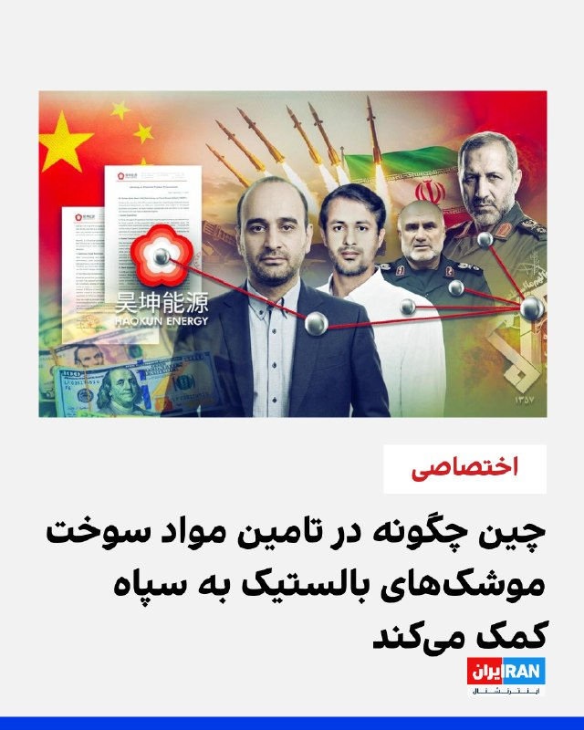

ایران‌اینترنشنال به اسناد و اطلاعاتی اختصاصی دست یافته است که نشان می‌دهند یک شرکت چینی با هماهنگی دولت این کشور و همچنین دو شرکت مستقر در ترکیه و امارات، در تامین مواد شیمیایی لازم برای ساخت موشک‌های بالستیک به سپاه پاسداران کمک می‌‌کند.

یک سند که گروه هکری پرانا به آن دست یافته و در اختیار ایران‌اینترنشنال قرار داده است، فاش می‌کند که چین نه‌تنها آشکارا به سپاه پاسداران در تامین این مواد کمک می‌کند، بلکه با کمک شبکه‌ای از شرکت‌ها تحریم‌های آمریکا علیه جمهوری اسلامی را هم دور می‌زند.

در این میان شرکت «هاوکان انرژی» نقش اصلی را ایفا می‌‌کند. این شرکت سال‌ها واسطه فروش نفت سپاه پاسداران به پالایشگاه‌های چینی بود و چهار سال پیش به دلیل تامین مالی نیروی قدس سپاه پاسداران از سوی ایالات متحده تحریم شد.

سال گذشته یک منبع مطلع به اینترنشنال گفته بود که این شرکت بیش از یک میلیارد دلار از پول نفت سپاه را بازنگردانده است.

ادامه این گزارش را در وبسایت ایران‌اینترنشنال بخوانید
https://iranintl.com/202605316277

## IranIntlTV — post 339924

  

تانکر ترکرز در شبکه اجتماعی ایکس اعلام کرد چهار نفتکش متعلق به شرکت ملی نفتکش ایران، با مجموع ظرفیت حدود هفت میلیون بشکه نفت خام، طی دو تا سه روز گذشته ظاهرا تلاش کرده‌اند ایران را ترک کنند، اما به احتمال زیاد مجبور به بازگشت شده‌اند.
https://iranintl.com/202605318162

## IranIntlTV — post 339923

  <a href="telegram/content/IranIntlTV_339923_1780256999.mp4" target="_blank">🎬 Download video</a>

ستاد فرماندهی مرکزی آمریکا، سنتکام، با انتشار ویدیویی از یک ناو هواپیمابر نیروی دریایی خود در ایکس نوشت: «این ناو به طول تقریبی سه زمین فوتبال با بیش از ۵۰۰۰ ملوان، شهری خودکفا در دریا است که برای ادامه روان عملیات به تلاش همه اعضای تیم ــ چه روی عرشه و چه زیر عرشه ــ نیاز دارد.»
@iranintltv

## IranIntlTV — post 339922

  <a href="telegram/content/IranIntlTV_339922_1780256999.mp4" target="_blank">🎬 Download video</a>

بعد از سه ماه خاموشی مطلق، کم‌کم عده بیشتری در ایران به اینترنت وصل می‌شوند؛ جمهوری اسلامی چطور با استقرار یک پادگان دیجیتال، حق ارتباط ده‌ها میلیون ایرانی را مصادره کرد؟ این انزوای بی‌سابقه چگونه از نظر فنی، مهندسی شد، خسارت‌ ده‌ها میلیارد دلاری آن بر دوش چه کسانی است و آمران و پیمانکاران اجرایی این خاموشی دقیقا چه کسانی هستند؟ امشب قطع سراسری اینترنت در ایران را زیر ذره‌بین می‌بریم.
@iranintltv

## IranIntlTV — post 339921

  

فرماندهی مرکزی آمریکا اعلام کرد از آغاز عملیات محاصره دریایی بنادر ایران تاکنون ۱۱۸ کشتی تجاری مجبور به تغییر مسیر شده‌اند و پنج کشتی نیز توسط نیروهای آمریکایی از کار افتاده‌اند.
سنتکام همچنین با انتشار تصویری از ناوشکن «یو‌اس‌اس میلیوس» اعلام کرد این شناور در عملیات محاصره بنادر ایران مشارکت دارد.
https://iranintl.com/202605318764

## IranIntlTV — post 339920

  <a href="https://t.me/IranintlTV/339920" target="_blank">📎 Download file</a>

🎧نسخه صوتی تیتراول با نیوشا صارمی: استعفای پزشکیان به دلیل تسلط کامل سپاه؛ مجتبی خامنه‌ای می‌پذیرد؟
@iranintlTV

## Shin_Persian — post 6337

Shin ✓ @hey_itsmyturn
Sun, 31 May 2026 19:03:04 UTC

He was responsible for importing sat. dishes for IRIB, as well as contracts between the IRIB and IRGC Khatam Al Anbiya.

فارسی

او مسئول واردات دیش‌های ماهواره برای صدا و سیمای جمهوری اسلامی ایران (IRIB) و همچنین مسئول قراردادهای بین صدا و سیما و قرارگاه سازندگی خاتم‌الانبیا سپاه پاسداران (IRGC) بود.

𝕏 · @shin_persian

## Shin_Persian — post 6336

Shin ✓ @hey_itsmyturn
Sun, 31 May 2026 19:01:19 UTC

Targeted assassination in Adniesheh, Tehran Province, #Iran
Target: Vahid Hakan
@ ~ 1820Z

فارسی

ترور هدفمند در اندیشه، استان تهران، #Iran
هدف: وحید هاکان
در حدود ۱۸۲۰Z (۲۱:۵۰ به وقت تهران)

𝕏 · @shin_persian

## ManotoTV — post 105889

  <a href="telegram/content/ManotoTV_105889_1780257002.mp4" target="_blank">🎬 Download video</a>

سخنان الهام‌بخش دکتر عزت‌الله همایونفر، ادیب و سیاست‌مداری که واژگانش، وطن را معنا می‌کردند. در روزگاری که صداقت در سیاست نایاب بود، او ایستاد؛ با فرهنگ، با قلم، با شرف.

## ManotoTV — post 105879

  <a href="telegram/content/ManotoTV_105879_1780257003.mp4" target="_blank">🎬 Download video</a>

حذف احتمالی سردار آزمون از تیم ملی، فقط یک خبر ورزشی نیست.

این ماجرا دوباره پرسشی قدیمی را زنده می‌کند: در کشوری که سیاست و ورزش بارها به هم گره خورده‌اند، چه کسی حق دارد نماینده یک ملت باشد؟

از حمایت ورزشکاران از معترضان تا واکنش حکومت به صداهای مستقل، فوتبال ایران سال‌هاست فراتر از یک بازی است.

شاید امروز مهم‌ترین بحث فوتبال ایران نه ترکیب تیم ملی، بلکه معنای «تیم ملی» باشد. ورق بزنید.

## FarsiVOA — post 219208

🔺دیدگاه | سقوط قلعه بوفور و شکستی که حزب‌الله و جمهوری اسلامی تقدیم جهان اسلام کردند

◾️تصرف قلعه تاریخی و راهبردی بوفور (یا بوفورت که نام عربی آن «شقیف» است) توسط ارتش اسرائیل در جنوب لبنان می‌تواند برخی معادلات نظامی و سیاسی این کشور را تغییر دهد و یک شکست تاریخی برای حزب‌الله و جمهوری اسلامی ثبت کند.

⬇️ بیشتر بخوانید:
https://ir.voanews.com/a/opinion-beaufort-castle-fall-hezbollah-defeat/8155798.html
@FarsiVOA

## FarsiVOA — post 219207

  

فرماندهی مرکزی ایالات متحده، سنتکام، تصویری از هدایت یک بالگرد «ام‌اچ-۶۰ اس سی هاوک» هنگام فرود روی عرشه ناو «یواس‌اس میلیوس» در جریان عملیات پروازی در ۸ خرداد منتشر کرد.

سنتکام می‌گوید ناو «میلیوس» از محاصره آمریکا علیه جمهوری اسلامی حمایت می‌کند؛ محاصره‌ای که تا ۱۰ خرداد، مسیر ۱۱۸ کشتی تجاری را تغییر داده و ۵ فروند را از کار انداخته است.

@FarsiVOA

## FarsiVOA — post 219206

در حالی که ماه‌ها قبل مسئولان فدراسیون فوتبال جمهوری اسلامی از تضمین‌ها و شروط حضور تیم در جام جهانی صحبت می‌کردند، حالا در فاصله ۱۱ روز تا آغاز جام جهانی گزارش‌ها حاکی از آن است که فدراسیون برای تعیین تکلیف ویزاها بار دیگر به فیفا نامه زده است.

## FarsiVOA — post 219205

🔺صدور حکم زندان علیه یک وکیل؛ وقتی مجازات اعتراض «یک‌سال حضور در ستاد امر به معروف» است

◾️منابع حقوق بشری روز یکشنبه ۱۰ خرداد، از محکومیت مهدی انصاری، وکیل دادگستری به پنج سال حبس، و محکومیت نیما حسن‌خانی، از بازداشت‌شدگان اعتراضات دی‌ ۱۴۰۴، به «یک سال حضور در ستاد امر به معروف و نهی از منکر» به علاوه محکومیت‌های دیگر خبر دادند.

⬇️ بیشتر بخوانید:

https://ir.voanews.com/a/nima-hassankhani-mehdi-ansari-protesters-prison-lawyer/8155821.html

## FarsiVOA — post 219204

روزنامه شرق در گزارشی از گسترش پدیده‌ای نوشت که آن را «بحران خاموش ترک درمان» نامیده است؛ وضعیتی که در آن بیماران به دلیل افزایش هزینه‌ها، درمان‌‌ و مراقبت از بیماری‌های مزمن را به تعویق می‌اندازند یا به‌کلی کنار می‌گذارند.

بر اساس این گزارش، فشار همزمان تورم درمانی، کاهش قدرت خرید خانوارها، رشد قیمت دارو و تجهیزات پزشکی و پوشش محدود بیمه‌ها باعث شده درمان برای بسیاری از خانواده‌ها از یک حق ضروری به کالایی وابسته به توان مالی تبدیل شود.

گزارش کامل را در وب‌سایت صدای آمریکا بخوانید.

@FarsiVOA

## FarsiVOA — post 219201

ده سال زندان برای شهروندی که از معترض نشسته در برابر ماموران فیلمبرداری کرد

## FarsiVOA — post 219200

🔺ارتش اسرائیل: از زمان آتش‌بس تاکنون ۹۰۰ تروریست حزب‌الله کشته شدند

◾️ارتش اسرائیل روز یکشنبه ۱۰ خرداد، با انتشار پیامی در حساب کاربری خود در شبکه اجتماعی ایکس اعلام کرد که از آغاز آتش‌بس میان اسرائیل و لبنان در ۲۸ فروردین تاکنون «۹۰۰ تروریست از نیروهای حزب‌الله» را از بین برده است.

⬇️ بیشتر بخوانید:

https://ir.voanews.com/a/israel-lebanon-hezbollah-iran-beaufort/8155810.html

## FarsiVOA — post 219199

  <a href="telegram/content/FarsiVOA_219199_1780257004.mp4" target="_blank">🎬 Download video</a>

شنبه ٩ خرداد ۱۴۰۵، گروهی از پرستاران در یزد در اعتراض به «واریز نشدن تعرفه‌های خدمات پرستاری از شش ماه گذشته و تداوم بی‌عدالتی‌های صنفی و مزدی» با شعار «پرستار داد بزن، حقتو فریاد بزن» مقابل ساختمان استانداری تجمع کردند.

## DW_Farsi — post 125355

🔶 عراقچی: تا وقتی گفت‌وگوها به نتیجه مشخص نرسد، قضاوت زودهنگام بی‌معناست
 
عباس عراقچی، وزیر امور خارجه جمهوری اسلامی ایران، در گفت‌وگو با خبرگزاری صدا و سیما با اشاره به ادامه روند گفت‌وگوها و تبادل پیام‌ها میان ایران و آمریکا با میانجی‌گری پاکستان، گفت تا زمانی که این روند به نتیجه مشخصی نرسد، نمی‌توان درباره آن قضاوت کرد.
 
عراقچی گفت گفت‌وگوها و تبادل پیام‌ها همچنان در جریان است و این روند ادامه دارد.
 
او تاکید کرد هرگونه ارزیابی درباره این روند باید به زمانی موکول شود که نتیجه‌ای روشن و مشخص به دست آمده باشد.
 
وزیر امور خارجه جمهوری اسلامی ایران افزود آنچه اکنون در رسانه‌ها درباره مذاکرات مطرح می‌شود، در حد گمانه‌زنی است.
 
پیشتر، محمدباقر قالیباف، رئیس مجلس شورای اسلامی با اشاره به مذاکرات جاری بین جمهوری اسلامی و آمریکا بر سر ادامه آتش‌بس و توافق هسته‌ای، با بیان این که جمهوری اسلامی "هیچ اعتمادی" به وعده‌های آمریکا ندارد گفت: «کار دیپلماسی تبدیل پیروزی‌های کسب شده در میدان نظامی به دستاوردهای سیاسی و حقوقی است.»
 
قالیباف در ادامه، مذاکره‌کنندگان جمهوری اسلامی را "سربازان میدان مبارزه‌ دیپلماسی" توصیف کرد و گفت مذاکره‌کنندگان جمهوری اسلامی "هیچ اعتمادی به حرف ها و وعده‌های دشمن ندارند".
 
این در حالی است که وبسایت خبری اکسیوس از قول یک مقام ارشد ایالات متحده گزارش داد که دونالد ترامپ، رئیس جمهور آمریکا در جریان نشست اتاق وضعیت در کاخ سفید، خواسته که چند اصلاحیه در متن توافق با جمهوری اسلامی انجام شود.
 
در این گزارش آمده است که در متن کنونی یک بازه ۶۰ روزه برای انجام مذاکره در خصوص تعهدات اتمی جمهوری اسلامی و کاهش تحریم‌ها پیش‌بینی شده و نخستین موضوعات بر سر سرنوشت ذخایر اورانیوم غنی‌شده در ایران و نیز محدود کردن غنی‌سازی بیشتر خواهد بود.
 
در همین حال، نیویورک‌تایمز از سه مقام ایالات متحده نقل کرده که ترامپ، پیش‌شرط‌های چارچوب احتمالی توافق با ایران را سخت‌تر کرده و تغییرات پیشنهادی خود را به منظور بازبینی دوباره به تهران فرستاده است.
@dw_farsi

## DW_Farsi — post 125354

  

🔶 شورای امنیت به درخواست فرانسه درباره لبنان نشست اضطراری برگزار می‌کند
 
منابع دیپلماتیک به خبرگزاری فرانسه گفته‌اند شورای امنیت سازمان ملل نشست اضطراری درباره گسترش عملیات اسرائیل در لبنان را برگزار خواهد کرد. این نشست به درخواست فرانسه تشکیل می‌شود و بلافاصله پس از نشست اضطراری دیگری درباره سقوط یک پهپاد روسی به یک ساختمان مسکونی در رومانی، که برای ساعت ۳ بعدازظهر روز یکشنبه ۳۱ مه به وقت نیویورک برنامه‌ریزی شده، آغاز خواهد شد.
 
 به این ترتیب، پرونده لبنان در ادامه یک جلسه امنیتی دیگر در دستور کار شورای امنیت قرار خواهد گرفت.
 
درخواست فرانسه پس از آن مطرح شد که نیروهای اسرائیلی قلعه راهبردی بوفور  را در لبنان تصرف کردند. این تحول، نگرانی‌ها درباره گسترش بیشتر دامنه عملیات اسرائیل در خاک لبنان را افزایش داده است.
 
برگزاری این نشست نشان می‌دهد تحولات میدانی اخیر در جنوب لبنان، بار دیگر به سطح شورای امنیت کشیده شده و به موضوعی فوری در دستور کار سازمان ملل تبدیل شده است.
 
@dw_farsi

## DW_Farsi — post 125353

  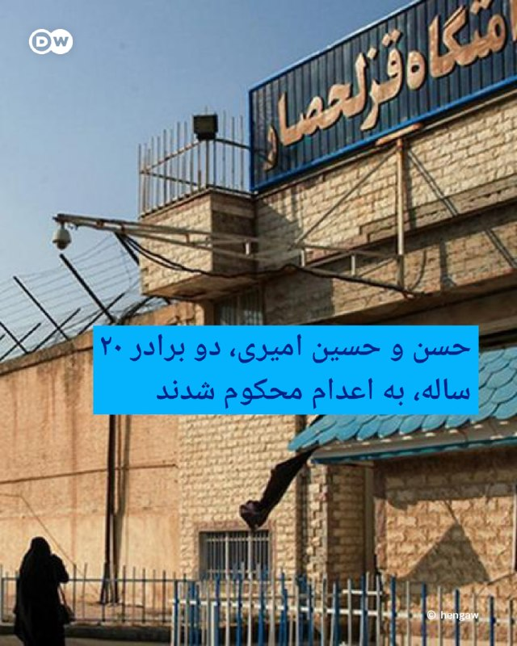

🔶 حسن و حسین امیری، دو برادر ۲۰ ساله، به اعدام محکوم شدند
 
به گزارش هرانا، حسن و حسین امیری، دو برادر دوقلوی ۲۰ ساله زندانی در قزلحصار کرج، از سوی شعبه ۲۶ دادگاه انقلاب تهران به ریاست ایمان افشاری به اعدام محکوم شده‌اند. این حکم به‌تازگی صادر شده و مبنای آن اتهام "جاسوسی برای اسرائیل" عنوان شده است. در کیفرخواست این دو برادر، مشاهده تصاویری از ساختمان‌های آسیب‌دیده مبنای طرح اتهام "جاسوسی به نفع اسرائیل" قرار گرفته است.
 
یک منبع مطلع به هرانا گفته است حسن و حسین امیری به دستور بازپرس پرونده به‌صورت جداگانه در زندان قزلحصار نگهداری می‌شوند و از حق ملاقات با یکدیگر محروم هستند.
 
این دو برادر پیش‌تر در یکی از ایست‌های بازرسی و پس از بررسی تلفن همراهشان بازداشت شدند و به مدت دو ماه به‌صورت بلاتکلیف در زندان قزلحصار کرج نگهداری شدند.
 
حسن و حسین امیری از دو سالگی در مراکز بهزیستی پرورش یافته‌اند و خانواده‌ای برای پیگیری وضعیت خود ندارند؛ موضوعی که نگرانی آشنایان آن‌ها را درباره روند رسیدگی به پرونده افزایش داده است.
 
@dw_farsi

## Persian_Trend_Official — post 15416

تا دقایقی دیگه لایو داریم

## Persian_Trend_Official — post 15415

  <a href="telegram/content/Persian_Trend_Official_15415_1780257007.mp4" target="_blank">🎬 Download video</a>

خبرگزاری CNN: ایران علیرغم بمباران گسترده آمریکا و اسرائیل، در کمتر از دو ماه دسترسی به اکثر پایگاه‌های موشکی زیرزمینی خود را بازیابی کرده است.

در طول جنگ، ایالات متحده و اسرائیل با تخریب جاده‌های دسترسی و فرو ریختن ورودی‌های تونل، زیرساخت‌های موشکی زیرزمینی ایران را هدف قرار دادند. اما از زمان آتش‌بس، تهران به سرعت اقدام کرده است. از 69 ورودی تونل در 18 تأسیسات زیرزمینی مورد حمله، 50 مورد از آنها تاکنون پاکسازی شده‌اند.

تصاویر ماهواره‌ای نشان می‌دهد که تلاش برای بازیابی به چیزی پیچیده‌تر از بولدوزرها، بیل مکانیکی‌ها و کامیون‌های کمپرسی متکی نیست. جاده‌ها در اکثر سایت‌ها بازسازی شده‌اند و برخی از بخش‌ها از قبل آسفالت شده‌اند.

منابع متعدد به CNN گفتند که بازیابی بسیار ارزان‌تر و ساده‌تر از خود حملات بوده است. تیمور کادیشف، محقق دانشگاه هامبورگ، گفت: "شما باید از سلاح‌های بسیار پیچیده و گران‌قیمت برای ایجاد چنین خسارتی استفاده کنید و تنها چیزی که برای تعمیر آن نیاز دارید بولدوزرها هستند."

📝 Amir

📌 @persian_trend_official
پرشین ترند | متفاوت‌ترین کانال نظامی

## Persian_Trend_Official — post 15414

  

شایعه استعفای رئیس‌جمهور هیچ نسبتی با واقعیت ندارد‏

«الیاس حضرتی» رئیس شورای اطلاع‌رسانی دولت:

🔹 رئیس‌جمهور ‌پزشکیان⁩ با تمام توان مشغول پیگیری امور کشور و خدمت به مردم است

🔹 ‏برای چندمین بار در ماه‌های اخیر، برخی رسانه‌های خارجی و شبکه‌های همسو با آنها شایعه استعفای رئیس‌جمهور را مطرح کرده‌اند، شایعه‌ای که هیچ نسبتی با واقعیت ندارد و پیش از این نیز بارها تکذیب شده است.

🔹 ‏به نظر می‌رسد طراحان این اخبار بیش از آنکه در پی اطلاع‌رسانی باشند، در آرزوی ایجاد ناامیدی، اختلاف و شکاف در انسجام ملی هستند که البته ناکام خواهند ماند.

🔹 ‏ملت ایران⁩ نشان داده است که در بزنگاه‌های مهم، فارغ از تفاوت دیدگاه‌ها، برای حفظ منافع ملی و سربلندی کشور در کنار یکدیگر می‌ایستد. آرزوی شکستن وحدت این ملت و گسستن پیوند دولت و مردم، همانند گذشته، محقق نخواهد شد.

👺Phantom

📌 @persian_trend_official
پرشین ترند | متفاوت‌ترین کانال نظامی

## RadioFarda — post 157750

🔸طالبان با قانون جدید طلاق، به‌طور ضمنی ازدواج کودکان را به رسمیت شناخته است.

🔸بر اساس این قانون، دختران ازدواج‌کرده در کودکی فقط پس از رسیدن به سن بلوغ می‌توانند درخواست جدایی بدهند؛ در این سن نیز اگر اعتراضی نکنند، سکوتشان به‌معنای رضایت تلقی می‌شود.

🔸سازمان ملل این فرمان را گامی دیگر در تضعیف حقوق زنان و دختران افغان دانسته و آن را نشانه‌ای از مجاز بودن ازدواج کودکان توصیف کرده است.

🔸طبق این قانون، حتی در صورت بدرفتاری شوهر، دختر برای فسخ ازدواج باید ادعای خود را در دادگاه ثابت کند؛ در غیر این صورت، رأی به نفع شوهر صادر می‌شود.

🔸فعالان حقوق زنان می‌گویند در افغانستانِ تحت حاکمیت طالبان، با محدودیت‌های شدید علیه زنان و تابوی اجتماعی طلاق، دسترسی دختران خردسال به عدالت عملاً بسیار دشوار است.

@RadioFarda

## IranianMinds — post 21161

  

مسعود پیاهو، مردی که تصویر معترض نشسته مقابل نیروهای پلیس یگان ویژه در مقابل پاساژ علاالدین در آغاز اعتراضات دی ماه سال گذشته رو منتشر کرد، به گفته وکیلش به ۱۰ سال زندان محکوم شده!

@IranianMinds

## IranianMinds — post 21160

  

ویدیوی پشم ریزون از لحظه‌ی حمله آمریکا با موشک تاماهاک به بیت رهبری رو از «کلوز فرند» ببینید: 
🔥

@CloseFriend3
@CloseFriend3

## BBCPersian — post 282511

🔻 تام باراک فرستاده ویژه ترامپ در امور سوریه و عراق شد

دونالد ترامپ، امروز تام باراک، سفیر آمریکا در ترکیه، را با حفظ پست کنونی، به عنوان فرستاده ویژه رئیس‌جمهور آمریکا در امور سوریه و عراق هم منصوب کرد.

دونالد ترامپ با اعلام این خبر در شبکه اجتماعی تروث سوشال از عملکرد آقای باراک در سمت سفیر آمریکا در ترکیه تمجید کرد: «تام باراک به عنوان سفیر آمریکا در ترکیه باقی خواهد ماند و با حمایت کامل وزارت امور خارجه ایالات متحده فعالیت خواهد کرد.»

او نوشت: «همکاری استراتژیک آمریکا با دولت‌های سوریه و عراق، و روابطش با این کشورها همچنان در حال گسترش است.»

https://trib.al/xnR5A7T
@BBCPersian

## BBCPersian — post 282510

  <a href="telegram/content/BBCPersian_282510_1780257010.mp4" target="_blank">🎬 Download video</a>

آخرین خبرهای مهم روز یکشنبه ۱۰ خرداد ۱۴۰۵

@BBCPersian

## Dirty_Kids — post 390679

  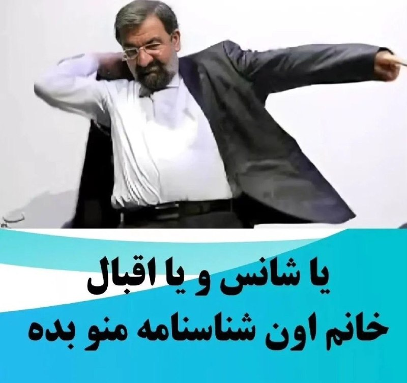

واکنش فیلد مارشال محسن رضایی به خبر استعفای پزشکیان 🤣

@Dirty_Kids 👻

## Dirty_Kids — post 390678

  

لانچر موشک‌های بالستیک جمهوری اسلامی.

@Dirty_Kids 👻

## Dirty_Kids — post 390677

زندگی برای قشر ما اینطوریه که اون زمان 5 تومن نداشتیم یه پراید بخریم ، بعد 10 تومن نداشتیم ، بعد 20 تومن نداشتیم
الانم یک میلیارد نداریم.
فرقی برا ما نکرده

اون موقع کمتر نداشتیم بخریم، بعد بیشتر نداشتیم بخریم، الان اصلا نداریم بخریم. :)

@Dirty_Kids 👻

## Dirty_Kids — post 390676

  

🔴 ماهی‌ای که به تازگی در ونزوئلا کشف شده و آقایون دائم در تلاشن تا بتونن صیدش کنن:|

@Dirty_Kids 👻

## Dirty_Kids — post 390675

  <a href="telegram/content/Dirty_Kids_390675_1780257012.mp4" target="_blank">🎬 Download video</a>

موافقید با نظر مرادمون در خصوص «بی‌بی»؟!

@Dirty_Kids 👻

## Dirty_Kids — post 390674

  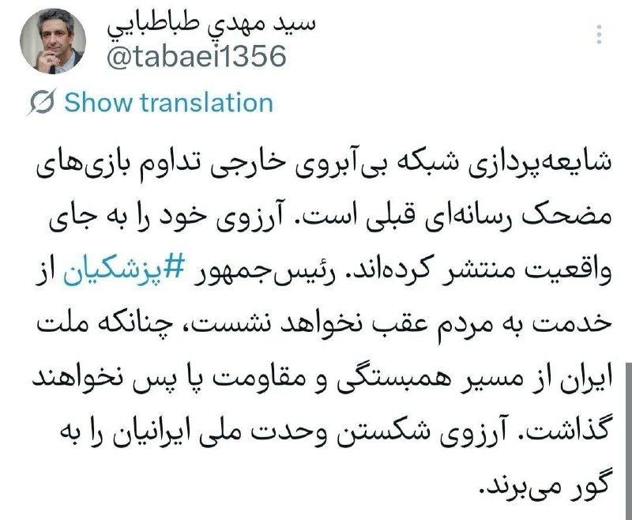

🔴 معاون دفتر پزشکیان: خبر استعفای رییس جمهور دروغه و پزشکیان همچنان به غصه خوردن ادامه میده.

@Dirty_Kids 👻

## Dirty_Kids — post 390673

  

وقتی از عقلت استفاده میکنی🤣

@Dirty_Kids 👻

## Dirty_Kids — post 390672

  

رفسنجانی تو خاطراتش گفته بود: همه‌ی جوجه آخوندارو میندازن تو بشکه بهشون دخول میکنن هیچی دیگه خواستم بگم حق دارن از اون محیط پاشون به این محیط باز شده ذوق کنن داستان اینه که یکی گفته تو کافه چادری میبینم چندشم میشه این گوزوها مثلا دارن دیس‌بک میدن @Dirty_Kids…

## Hranews — post 113295

  

عدم رسیدگی پزشکی؛ اعزام بی‌نتیجه محشر پرندین به بیمارستان و تداوم محرومیت از درمان

❗️
❗️
❗️
❗️
❗️– محشر (محترم) پرندین، نوکیش مسیحی محبوس در زندان اوین، با وجود نیاز فوری به آنژیوگرافی قلب و جراحی تومورهای ناحیه گردن، از رسیدگی تخصصی پزشکی محروم مانده است. وی در هفته گذشته به بیمارستان اعزام شد، اما پس از انجام یک آزمایش، بدون دریافت خدمات درمانی یا تجویز دارو به زندان بازگردانده شد.

به گزارش خبرگزاری هرانا، ارگان خبری مجموعه فعالان حقوق بشر در ایران، محشر (محترم) پرندین کماکان از رسیدگی درمانی محروم است.

یک منبع مطلع از وضعیت این نوکیش مسیحی، ضمن تایید این موضوع به هرانا گفت: “خانم پرندین در هفته گذشته یک‌بار به بیمارستان اعزام شد، اما پس از انجام تنها یک آزمایش، بدون دریافت خدمات درمانی یا تجویز دارو، مجدداً به زندان بازگردانده شد. این در حالی است که بنا بر تشخیص پزشک بهداری زندان، وی نیازمند انجام آنژیوگرافی قلب و جراحی تومورهای موجود در ناحیه گردن است.”

ادامه مطلب

#محشر_پرندین #محترم_پرندین

↘️
@hranews_bot تماس ✉️ - @Hranews کانال هرانا 🆑

## Hranews — post 113294

  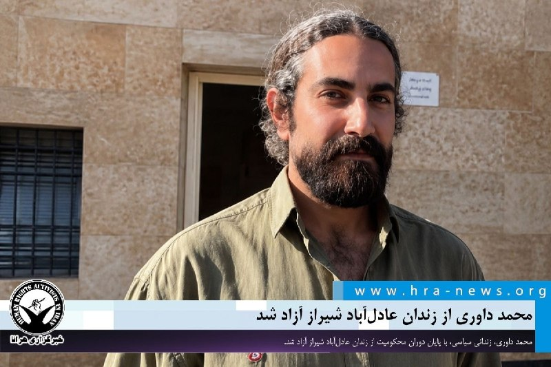

محمد داوری از زندان عادل‌آباد شیراز آزاد شد

❗️
❗️
❗️
❗️
❗️– محمد داوری، زندانی سیاسی، امروز با پایان دوران محکومیت از زندان عادل‌آباد شیراز آزاد شد.

به گزارش خبرگزاری هرانا، ارگان خبری مجموعه فعالان حقوق بشر در ایران، محمد داوری آزاد شد.

براساس اطلاعات دریافتی هرانا، آقای داوری امروز یکشنبه ۱۰ خرداد ۱۴۰۵، با پایان دوران محکومیت خود از زندان عادل‌آباد شیراز آزاد شده است.

ادامه مطلب

#محمد_داوری

↘️
@hranews_bot تماس ✉️ - @Hranews کانال هرانا 🆑

## Hranews — post 113293

دستکم ۴ تجمع اعتراضی برگزار شد

❗️
❗️
❗️
❗️
❗️– امروز یکشنبه ۱۰ خرداد، جمعی از بازنشستگان تامین اجتماعی در شهرهای تهران، رشت و شوش و گروهی از کارگران شهرداری در شوش تجمع اعتراضی برگزار کردند.

ادامه مطلب

#کارگران #بازنشستگان

↘️
@hranews_bot تماس ✉️ - @Hranews کانال هرانا 🆑

## Hranews — post 113292

  

گزارشی از آخرین وضعیت سوری چگینی بابایی در زندان قزوین

❗️
❗️
❗️
❗️
❗️– سوری چگینی بابایی، زندانی سیاسی دوران محکومیت خود را در زندان قزوین سپری می‌کند. وی پیشتر، توسط دادگاه انقلاب قزوین به سه سال حبس و مجازاتهای تکمیلی محکوم شده بود. همچنین او بیش از ۱۴۰ روز است که از ملاقات با خانواده خود محروم مانده است.

به گزارش خبرگزاری هرانا، ارگان خبری مجموعه فعالان حقوق بشر در ایران، سوری چگینی بابایی، زندان سیاسی دوران محکومیت خود را در زندان قزوین سپری می‌کند.

بر اساس اطلاعات دریافتی هرانا، خانم بابایی پس از بازداشت در اعتراضات سراسری ۱۴۰۴، با یک پرونده قضایی دو بخشی مواجه شد. وی در بخش نخست این پرونده، توسط شعبه دوم دادگاه انقلاب قزوین از بابت اتهام «توهین به رهبری» به دو سال حبس و از بابت اتهام «تبلیغ علیه نظام» به یک سال حبس و دو سال ممنوعیت خروج از کشور محکوم شده است. همچنین در بخش دوم این پرونده، شعبه ۱۰۵ دادگاه کیفری دو قزوین، وی را از اتهام «اخلال در نظم و آسایش عمومی» تبرئه کرده است.

ادامه مطلب

#سوری_چگینی_بابایی

↘️
@hranews_bot تماس ✉️ - @Hranews کانال هرانا 🆑

## Hranews — post 113291

گزارشی از بلاتکلیفی، معوقات مزدی و بیمه‌ای کارگران در ۳ واحد مختلف

❗️
❗️
❗️
❗️
❗️– حدود ۱۷۰ نفر از کارگران کارخانه پویا نخ ایلام واقع در شهرک صنعتی ششدار در بلاتکلیفی شغلی به‌سر می‌برند. از سوی دیگر، گروهی از #کارگران کارخانه کیش چوب از عدم پرداخت مطالبات مزدی چندین ماهه خود خبر دادند. همچنین، شماری از کارگران کارخانجات مخابراتی ایران (آی‌تی‌ام‌سی) در شیراز، از عدم پرداخت چندین ماه حق بیمه و مطالبات مزدی خود ابراز نارضایتی کرده و خواستار رسیدگی به مطالباتشان شدند.

ادامه مطلب

↘️
@hranews_bot تماس ✉️ - @Hranews کانال هرانا 🆑

## Hranews — post 113290

  

مسلم زمانی از زندان یاسوج آزاد شد

❗️
❗️
❗️
❗️
❗️– مسلم زمانی، شهروند ساکن گچساران که در رابطه با اعتراضات دی‌ماه ۱۴۰۴ بازداشت شده بود، امروز با تودیع وثیقه از زندان یاسوج آزاد شد.

به گزارش خبرگزاری هرانا، ارگان خبری مجموعه فعالان حقوق بشر در ایران، مسلم زمانی آزاد شد.

براساس اطلاعات دریافتی هرانا، آزادی آقای زمانی امروز یکشنبه ۱۰ خردادماه، با تودیع وثیقه از زندان یاسوج صورت گرفته است.

پرونده وی در شعبه دوم بازپرسی دادسرای عمومی و انقلاب گچساران با اتهاماتی از جمله «تبلیغ علیه نظام جمهوری اسلامی»، «عضویت در دسته، جمعیت یا شعبه جمعیت‌هایی که در داخل کشور با هدف برهم زدن امنیت کشور تشکیل شده‌اند» و «اجتماع و تبانی برای ارتکاب جرم علیه امنیت داخلی یا خارجی کشور» در حال رسیدگی است.

ادامه مطلب

#مسلم_زمانی

↘️
@hranews_bot تماس ✉️ - @Hranews کانال هرانا 🆑

## manototv — post 105889

  <a href="telegram/content/manototv_105889_1780257015.mp4" target="_blank">🎬 Download video</a>

سخنان الهام‌بخش دکتر عزت‌الله همایونفر، ادیب و سیاست‌مداری که واژگانش، وطن را معنا می‌کردند. در روزگاری که صداقت در سیاست نایاب بود، او ایستاد؛ با فرهنگ، با قلم، با شرف.

## manototv — post 105879

  <a href="telegram/content/manototv_105879_1780257016.mp4" target="_blank">🎬 Download video</a>

حذف احتمالی سردار آزمون از تیم ملی، فقط یک خبر ورزشی نیست.

این ماجرا دوباره پرسشی قدیمی را زنده می‌کند: در کشوری که سیاست و ورزش بارها به هم گره خورده‌اند، چه کسی حق دارد نماینده یک ملت باشد؟

از حمایت ورزشکاران از معترضان تا واکنش حکومت به صداهای مستقل، فوتبال ایران سال‌هاست فراتر از یک بازی است.

شاید امروز مهم‌ترین بحث فوتبال ایران نه ترکیب تیم ملی، بلکه معنای «تیم ملی» باشد. ورق بزنید.

## alonews — post 124047

  <a href="telegram/content/alonews_124047_1780257017.webm" target="_blank">🎬 Download video</a>

👈فارن افرز: «ایالات متحده با این فرض که قدرت آتش برتر و قابلیت‌های تکنولوژیکی‌اش می‌تواند یک پیروزی سریع را رقم بزند (و از تکرار باتلاق‌های گذشته جلوگیری کند)»، در ایران «به بن‌بست رسید».

✅ @AloNews خبر جنگ

## alonews — post 124046

  <a href="telegram/content/alonews_124046_1780257017.webm" target="_blank">🎬 Download video</a>

👈پست جدید ترامپ

✅ @AloNews خبر جنگ

## alonews — post 124045

  <a href="telegram/content/alonews_124045_1780257017.webm" target="_blank">🎬 Download video</a>

⚫
🏆 به دنیای هیجان‌انگیز فوتبال خوش اومدی!

⭐️اینجا قراره باهم لحظه‌به‌لحظه‌ی جام جهانی رو زندگی کنیم؛
از بازی‌های حساس و نتایج داغ گرفته تا حاشیه‌ها، کری‌خونی‌ها و اتفاقاتی که همه درباره‌ش حرف میزنن! 
🔥
🔥

✅ پوشش کامل مسابقات

💀ترول تیم‌ها و بازیکن‌ها

🎥ویدیوها و لحظه‌های فان فوتبالی

📊آمار، ترکیب‌ها و اخبار فوری

🌍حواشی جذاب از سراسر جام جهانی

📢اینجا فقط یک کانال خبری نیست؛
یک جمع فوتبالیه برای کسایی که فوتبال رو با هیجان، شوخی و احساس واقعی دنبال میکنن 
📛
💟

🆘
🔞 آماده باش چون قراره جام جهانی رو متفاوت تجربه کنیم!

⚡ @Vaarzesh_Plus

⚡ @Vaarzesh_Plus

## alonews — post 124044

  <a href="telegram/content/alonews_124044_1780257018.webm" target="_blank">🎬 Download video</a>

👈حملات هوایی اسرائیل به عرب‌ سلیم در جنوب لبنان

✅ @AloNews خبر جنگ

## alonews — post 124043

  <a href="telegram/content/alonews_124043_1780257018.mp4" target="_blank">🎬 Download video</a>

👈لحظه‌ی اصابت پهپاد انتحاری حزب‌الله لبنان به خوابگاه نظامیان اسرائیلی

✅ @AloNews خبر جنگ

## alonews — post 124042

  <a href="telegram/content/alonews_124042_1780257018.mp4" target="_blank">🎬 Download video</a>

👈 وزیر امنیت ملی اسرائیل بن گویر : من نماینده از جانب تمام اسرائیل هستم.

✅ @AloNews خبر جنگ

## alonews — post 124041

  <a href="telegram/content/alonews_124041_1780257021.webm" target="_blank">🎬 Download video</a>

👈تسنیم به نقل از یک منبع آگاه: ایران اصلاحیه‌های جدید درباره متن تفاهم احتمالی اعمال خواهد کرد

🔴تبادل متن‌ها ادامه دارد و ایران نیز قاعدتاً اصلاحیه‌های خود را درباره متن اعمال خواهد کرد و هنوز هیچ چیز نهایی نیست.

🔴ملاک برای ایران متنی است که خودمان قبول داشته باشیم و اعمال اصلاحیه از ناحیه ترامپ به معنای پذیرش آنها توسط ایران نیست.

🔴ایران برای وضعیت عدم تفاهم نیز کاملاً آمادگی دارد

✅ @AloNews خبر جنگ

## alonews — post 124040

  <a href="telegram/content/alonews_124040_1780257021.webm" target="_blank">🎬 Download video</a>

👈بانک مرکزی: رقم وام ازدواج مشابه سال ۱۴۰۴ است

✅ @AloNews خبر جنگ

## alonews — post 124039

  <a href="telegram/content/alonews_124039_1780257021.mp4" target="_blank">🎬 Download video</a>

👈بن گویر وزیر امنیت ملی اسرائیل: نصرالله دیگر در میان ما نیست، و این تصادفی نیست. و هزاران عضو حزب‌الله دیگر در میان ما نیستند، و این تصادفی نیست.

🔴 و با این حال، این کافی نیست. ما پیروزی را به دست نیاورده‌ایم.

🔴 ما باید ادامه دهیم، و ادامه دهیم، و ادامه دهیم. ما نباید متوقف شویم.

✅ @AloNews خبر جنگ

## alonews — post 124038

  <a href="telegram/content/alonews_124038_1780257022.webm" target="_blank">🎬 Download video</a>

👈رئیس‌جمهور سوریه با ترامپ تماس تلفنی داشته

✅ @AloNews خبر جنگ

## alonews — post 124037

  <a href="telegram/content/alonews_124037_1780257022.webm" target="_blank">🎬 Download video</a>

👈حمله به کشتی حامل مس در تنگه هرمز

🔴 در پی درگیری‌های اخیر در تنگه هرمز، یک کشتی خارجی که حامل مس بود، مورد هدف قرار گرفت

✅ @AloNews خبر جنگ

## alonews — post 124036

  <a href="telegram/content/alonews_124036_1780257023.webm" target="_blank">🎬 Download video</a>

⭕️ الونیوز فقط در تلگرام و توییتر (X) فعال هستش

🔴سایر شبکه های اجتماعی چه داخلی چه خارجی که با نام الونیوز فعالیت می‌کنند مرتبط به ما نیست و پیشنهاد میکنم که لفت بدید.

✅@AloNews

## alonews — post 124035

  <a href="telegram/content/alonews_124035_1780257023.mp4" target="_blank">🎬 Download video</a>

👈محمد‌جواد ظریف در پاسخ به سؤال میگن شما پشت پرده مذاکرات هستید، گفت:

🔴من اصلأ هیچکاره ‌ام

✅ @AloNews خبر جنگ

## alonews — post 124033

🔥 همراه با ساب + حجم مصرفی، فقط 9T! 🚀 ❌ آفر فقط تا پایان امشب ❌ 🔥 اگه دنبال یه VPN پایدار و بدون دردسر می‌گردی، این پلن مخصوص خودته! @Netaazaadbot @NetAazaadBot ✅ همراه با ساب + حجم مصرفی ✅ 15 سرور اختصاصی پرسرعت ✅ اتصال پایدار و بدون قطعی ✅ سرعت بالا…

## alonews — post 124032

  

🔥 همراه با ساب + حجم مصرفی، فقط 9T! 🚀

❌ آفر فقط تا پایان امشب ❌

🔥 اگه دنبال یه VPN پایدار و بدون دردسر می‌گردی، این پلن مخصوص خودته!

@Netaazaadbot
@NetAazaadBot
✅ همراه با ساب + حجم مصرفی
✅ 15 سرور اختصاصی پرسرعت
✅ اتصال پایدار و بدون قطعی
✅ سرعت بالا حتی در ساعات شلوغ

@Netaazaadbot
@NetAazaadBot
💎 کیفیتی که بعد از استفاده متوجه تفاوتش میشی!

📩 برای خرید و دریافت سرویس استارت رو بزن✅

## alonews — post 124031

  <a href="telegram/content/alonews_124031_1780257024.webm" target="_blank">🎬 Download video</a>

👈وزیر نیرو: شاهد کاهش ۱۰ تا ۱۵ درصدی مصرف آب توسط مردم‌ هستیم

✅ @AloNews خبر جنگ

## alonews — post 124030

  <a href="telegram/content/alonews_124030_1780257024.webm" target="_blank">🎬 Download video</a>

👈دادستانی بحرین، روز یکشنبه دهم خرداد ماه، اعلام کرد در چارچوب تحقیقات مربوط به آنچه «تشکیلات مرتبط با سپاه پاسداران ایران» خوانده شده، اموال و دارایی‌های اعضای این گروه توقیف و حساب‌های بانکی آنها مسدود شده است.

🔴به گزارش رسانه‌های بحرینی، رئیس دادسرای جرایم تروریستی این کشور گفت تحقیقات نشان داده اعضای این تشکیلات به جمع‌آوری منابع مالی و انتقال بخشی از آن به خارج از بحرین اقدام کرده‌اند.

🔴دادستانی بحرین افزود، در جریان بازرسی‌ها، اسناد و مدارکی مرتبط با فعالیت‌های مالی این گروه کشف شده و بر همین اساس دستور توقیف اموال و مسدودسازی حساب‌های بانکی افراد تحت تعقیب صادر شده است.

🔴مقام‌های بحرینی همچنین اعلام کردند تحقیقات درباره این پرونده همچنان ادامه دارد و اقدامات قانونی علیه متهمان در دست پیگیری است.

🔴بحرین پیش‌تر از بازداشت ده‌ها نفر در ارتباط با تشکیلاتی مرتبط با سپاه پاسداران ایران خبر داده بود.

✅ @AloNews خبر جنگ

## alonews — post 124029

  <a href="telegram/content/alonews_124029_1780257025.webm" target="_blank">🎬 Download video</a>

👈زلنسکی: فکر می‌کنم امشب یا فردا شب از طرف روسیه یک حمله بزرگ با استفاده از پهپادها، موشکهای کروز و موشکهای بالستیک خواهیم داشت.

✅ @AloNews خبر جنگ

## alonews — post 124028

  <a href="telegram/content/alonews_124028_1780257025.webm" target="_blank">🎬 Download video</a>

👈 سرپرست وزارت دفاع: دست ما روی ماشه قرار دارد و شگفتانه‌های جدیدی نیز در راه است.

✅ @AloNews خبر جنگ

## alonews — post 124027

  <a href="telegram/content/alonews_124027_1780257025.webm" target="_blank">🎬 Download video</a>

💔روز ۱۸ دی بهرام زاهدی ۴۲ ساله و مجتبی قربانی ۳۳ ساله بر سر کوچه‌ای در دروازه لاکان رشت ایستاده بودند و تنها تماشا می‌کردند که ناگهان هدف رگبار حرام زاده های عرزشی قرار گرفتند. 
🤔شما حرام زاده های عرزشی تروریست هایی هستید که این جنایت رو انجام دادید و از شما…

---
📅 بروزرسانی: 1405/03/10 21:39
---

## VahidOOnLine — post 243085

  

♦️دوا لیپا، خواننده بریتانیایی-آلبانیایی و کالوم ترنر، بازیگر بریتانیایی، روز یکشنبه دهم خرداد ماه در مراسمی خصوصی در لندن ازدواج کرده‌اند.

به گزارش مجله ووگ، این مراسم در ساختمان تاریخی «اولد ماریلبون تاون هال» در لندن و با حضور جمع محدودی از اعضای خانواده و دوستان نزدیک برگزار شد. دوا لیپا در این مراسم لباسی سفید از برند اسکیاپارلی بر تن داشت و کالوم ترنر نیز با کت‌وشلواری کلاسیک در کنار او حاضر شد.

ووگ نوشت این مراسم آغاز جشن‌های ازدواج این زوج است و قرار است طی روزهای آینده جشن بزرگ‌تری با حضور مهمانان سرشناس در جزیره سیسیل ایتالیا برگزار شود.

دوا لیپا و کالوم ترنر از اوایل سال ۲۰۲۴ وارد رابطه شدند و در سال ۲۰۲۵ نامزدی خود را تایید کردند. این زوج در ماه‌های گذشته بارها در رویدادهای عمومی و هنری در کنار یکدیگر دیده شده بودند.
‌🇸🇦 Indypersian

🤖 @VahidOOnLine

## VahidOOnLine — post 243084

  

به گزارش العربیه، دادستانی بحرین اعلام کرد که تحقیقات درباره تشکیلات مرتبط با سپاه پاسداران در این کشور را آغاز کرده است.

بر اساس اعلام دادستانی بحرین، این تشکیلات، روحانیون مخالف رویکرد ولایت فقیه را مورد ارعاب قرار داده و به انتقال پول به گروه‌هایی در ایران، عراق و لبنان اقدام کرده است.

بر اساس این بیانیه، اموال این گروه توقیف شده است.
‌🏁 🇬🇧 IranintlTV

🤖 @VahidOOnLine

## VahidOOnLine — post 243083

  

♦️دوا لیپا، خواننده بریتانیایی-آلبانیایی و کالوم ترنر، بازیگر بریتانیایی، روز یکشنبه دهم خرداد ماه در مراسمی خصوصی در لندن ازدواج کرده‌اند.

به گزارش مجله ووگ، این مراسم در ساختمان تاریخی «اولد ماریلبون تاون هال» در لندن و با حضور جمع محدودی از اعضای خانواده و دوستان نزدیک برگزار شد. دوا لیپا در این مراسم لباسی سفید از برند اسکیاپارلی بر تن داشت و کالوم ترنر نیز با کت‌وشلواری کلاسیک در کنار او حاضر شد.

ووگ نوشت این مراسم آغاز جشن‌های ازدواج این زوج است و قرار است طی روزهای آینده جشن بزرگ‌تری با حضور مهمانان سرشناس در جزیره سیسیل ایتالیا برگزار شود.

دوا لیپا و کالوم ترنر از اوایل سال ۲۰۲۴ وارد رابطه شدند و در سال ۲۰۲۵ نامزدی خود را تایید کردند. این زوج در ماه‌های گذشته بارها در رویدادهای عمومی و هنری در کنار یکدیگر دیده شده بودند.
‌🇸🇦 Indypersian

🤖 @VahidOOnLine

## VahidOOnLine — post 243082

  

عباس عراقچی، وزیر خارجه جمهوری اسلامی، یکشنبه به صداوسیمای جمهوری اسلامی اعلام کرد: «گفت‌وگوها و تبادل پیام‌‌ها در جریان است و تا وقتی به نتیجه مشخص نرسد، نمی‌شود در موردش قضاوت کرد.»

او افزود: «هر آنچه که الان گفته می‌شود گمانه‌زنی است و نباید به آن اهمیت داد تا وقتی که به قطعیت برسد.»
‌🏁 🇬🇧 IranintlTV

🤖 @VahidOOnLine

## VahidOOnLine — post 243081

  <a href="telegram/content/VahidOOnLine_243081_1780250991.mp4" target="_blank">🎬 Download video</a>

♦️عباس عراقچی، وزیر امور خارجه ایران، روز یکشنبه در گفتگو با خبرنگاران گفت گفتگوها و تبادل پیام‌ها با طرف آمریکایی همچنان ادامه دارد و تا زمانی که مذاکرات به نتیجه مشخصی نرسد، نمی‌توان درباره آن قضاوت کرد.
وزیر امورخارجه افزود: «هر آنچه که الان گفته می‌شود گمانه‌زنی است و نباید به آن اهمیت داد.»
اظهارات وزیر امور خارجه ایران در حالی مطرح می‌شود که رسانه‌های آکسیوس و نیویورک‌تایمز در گزارش‌هایی از سخت‌تر کردن شرایط در متن توافق احتمالی از سوی دونالد ترامپ خبر داده‌اند.
‌🇸🇦 Indypersian

🤖 @VahidOOnLine

## VahidOOnLine — post 243080

  <a href="telegram/content/VahidOOnLine_243080_1780250993.mp4" target="_blank">🎬 Download video</a>

♦️رهاسازی آب از سد زاینده‌رود از روز یکشنبه دهم خرداد ماه آغاز شده و پیش‌بینی می‌شود جریان آب تا روز دوشنبه به شهر اصفهان برسد.
منصور شیشه‌فروش، مدیرکل مدیریت بحران استان أصفهان، روز یکشنبه با اعلام این خبر اعلام کرد حجم ذخیره سد زاینده‌رود به حدود ۶۱۴ میلیون مترمکعب رسیده است و آب رهاشده پس از طی مسیر رودخانه، طی ساعات آینده به مناطق مختلف حوضه زاینده‌رود و سپس به شهر اصفهان خواهد رسید.
زاینده‌رود که در سال‌های اخیر به دلیل تصمیم‌های مدیران جمهوری اسلامی برای مدیریت منابع آبی، بارها با خشکی طولانی‌مدت مواجه شده، برای بسیاری از شهروندان اصفهان تنها یک رودخانه نیست، بلکه بخشی از هویت و تاریخ این شهر به شمار می‌رود.
جاری شدن این رودخانه، هرساله با استقبال گسترده شهروندان اصفهانی و انتشار ویدیوهایی از تجمع مردم در پل‌های تاریخی شهر أصفهان همراه می‌شود.
‌🇸🇦 Indypersian

🤖 @VahidOOnLine

## VahidOOnLine — post 243079

  

سایت امتداد گزارش داد مسعود پیاهو، شهروندی که تصویر نشستن یک معترض مقابل نیروهای سرکوب در اعتراضات بازار در دی ۱۴۰۴ را ثبت کرده بود، به اتهام «همکاری با اسرائیل» به ۱۰ سال حبس محکوم شده است.

حسن آقاخانی، وکیل این شهروند، عنوان کرده است موکل او این فیلم کوتاه را به صورت ناخودآگاه از آن صحنه ضبط کرده و قصد انتشار آن را نداشته و صرفا برای تعداد محدودی از دوستانش در استوری خصوصی اینستاگرام منتشر کرده است.

به گزارش امتداد و به نقل از وکیل مسعود پیاهو، حکم ۱۰ سال حبس در شعبه ۹ دیوان تایید شده و به اجرای احکام رفته است و این شهروند باید خود را به زندان معرفی کند.
‌🏁 🇬🇧 IranintlTV

🤖 @VahidOOnLine

## VahidOOnLine — post 243078

  

♦️مسعود پزشکیان، رئیس‌جمهوری ایران، روز یکشنبه ۱۰ خرداد در پیامی در شبکه اجتماعی ایکس نوشت: «رویارویی با چالش‌های بزرگ بدون تحمل سختی‌ها امکان‌پذیر نیست.»
پزشکیان که در روزهای اخیر اظهارنظرهای مختلفی درباره مشکلات اقتصادی و بحران‌های مختلفی مانند کمبود انرژی در ایران بیان کرده است، در این پیام نوشت: «رویارویی با چالش‌های بزرگ بدون تحمل سختی‌ها شدنی نیست. عبور از این مسیر پر فراز و نشیب تنها با آگاهی و همکاری عمومی ممکن است.»
پزشکیان ادامه داد: «باید واقعیت‌های موجود را برای مردم تبیین کنیم تا همه بخش‌های جامعه در حل مشکلات مشارکت داشته باشند.»
‌🇸🇦 Indypersian

🤖 @VahidOOnLine

## WithYashar — post 13092

منابع اسرائیلی:ترامپ در تماس تلفنی آخر خود با بنیامین نتانیاهو اعلام کرد که در صورت همکاری با واشنگتن برای این تفاهم‌ نامه 60 روزه موقت اسرائیل کاملا در لبنان و غزه آزادی عمل خواهد داشت
@withyashar

## WithYashar — post 13091

به گزارش رسانه‌های محلی، فعالیت جت‌های جنگنده بر فراز کرج در استان البرز گزارش شده است.
@withyashar

## WithYashar — post 13090

صبح امروز سپاه اعلام کرده یک پهپاد MQ-1 را در نزدیکی جزیره قشم سرنگون کرده است. هرچند اسرائیل یا آمریکا این موضوع را تأیید نکرده‌اند، اما چند ساعت بعد یک حمله در همان منطقه انجام شده است. منابع می‌گویند در این حمله، «محسن سپاسیان» (مسئول تدارکات سپاه هوافضا در استان) و «ستوان سینا نجارپور» کشته شده‌اند. تاکنون هیچ طرفی مسئولیت حمله را بر عهده نگرفته است و این خبر را تایید نکرده است
@withyashar

## WithYashar — post 13089

## WithYashar — post 13088

زرشکیان قهر کرد ! اینترنشنال: مسعود پزشکیان با ارسال نامه‌ای به دفتر مجتبی خامنه‌ای خواهان استعفا از سمت خودش شده. @withyashar

## WithYashar — post 13087

## WithYashar — post 13086

## WithYashar — post 13085

مشکلش چیه اصلا همین امشب باشه چه بهتر! هرچه زودتر بهتر اصلا! خیلی زودتر از اینا حتییییی🫠🫠🫠

## WithYashar — post 13084

و اینکه لطفا خودت هم یه پست بذار ما شاهزاده رو تگ کنیم

## WithYashar — post 13083

قرار‌ ما فردا شب ۱۱:۱۱ دقیقه تهران

## WithYashar — post 13082

## WithYashar — post 13080

مگه امروز یکشنبه نیست؟😅
قرار نبود دوشنبه باشه؟

## WithYashar — post 13078

## WithYashar — post 13077

متن کامنت بررسی ‌کنید

جناب شاهزاده رضا پهلوی گرامی،

پدر ، این پیام، جمع‌بندی دیدگاه‌ها و پیشنهادهای گروهی از ایرانیان داخل و خارج کشور با هدف تقویت انسجام ملی و ایجاد مسیر عملی برای دوران پیش از گذار است.

عناوین چکیده از هزاران پیغام مردمی به‌صورت خلاصه:

* ضرورت ایجاد ساختار منسجم برای سازماندهی نیروهای مردمی داخل و خارج
* همگرایی و اتحاد جریان‌های مختلف مخالف
* ارائه نقشه راه و چارچوب زمانی شفاف برای اقدامات جمعی
* آمادگی میدانی و سازوکارهای حمایتی در شرایط بحران
* تقویت تیم‌های مشورتی، تخصصی و شفافیت در تصمیم‌گیری
* توجه فوری به بحران معیشت و فشار اقتصادی مردم
* ارتباط مستقیم‌تر و مستمر با جامعه

جمع‌بندی: جامعه آماده تغییر است، اما این مسیر نیازمند انسجام، شفافیت و ساختار اجرایی روشن است.

درخواست پایانی: فراهم شدن امکان ارتباط مستقیم برای انتقال منظم دیدگاه‌ها و ادامه گفت‌وگو با جناب آقای یاشار « yashar » که از طرف ما به عنوان گردآورنده و ارتباط‌گیرنده این مجموعه دیدگاه‌ها معرفی و تایید میشود.

این متن نسخه خلاصه‌شده است و نسخه کامل از طریق ایمیل، دایرکت و … ارسال شده است. ممنون از توجه شما
پاینده ایران و درود بر خاندان ایران ساز پهلوی

@withyashar

## WithYashar — post 13076

  <a href="https://t.me/withyashar/13076" target="_blank">📎 Download file</a>

پروژه شکوفایی ایران : برنامه اضطرار

🌐 @withyashar

🌐 instagram.com/yashar

## mwarmonitor — post 9949

  

🔸ملوانان آمریکایی یک فروند بالگرد MH-60S سی‌هاوک را هنگام فرود بر عرشه پروازی ناوشکن USS Milius (DDG 69) در جریان عملیات پروازی، در تاریخ ۲۹ مه هدایت می‌کنند. میلیوس در حال پشتیبانی از محاصره دریایی ایالات متحده علیه ایران است؛ محاصره‌ای که تا ۳۱ مه موجب تغییر مسیر ۱۱۸ کشتی تجاری و از کار افتادن ۵ کشتی شده است.

@mwarmonitor

## FoxNewsTwitter — post 342454

Fox News (Twitter/X)

## FoxNewsTwitter — post 342450

Fox News (Twitter/X)

Coordinated supply operation exposed at Delaney Hall ahead of protests.

Agitators outside the Delaney Hall detention facility in New Jersey were seen establishing a highly organized logistics and support operation before protests began at the site.

Stockpiles of masks, duct tape, hard hats and medical supplies were laid out near the facility. Delaney Hall has been at the center of a standoff after detainees alleged abuse and poor conditions, claims DHS denies.

## pm_afshaa — post 91963

🔴منابع اسرائیلی:ترامپ در تماس تلفنی آخر خود با بنیامین نتانیاهو اعلام کرد که در صورت همکاری با واشنگتن برای این تفاهم‌ نامه 60 روزه موقت اسرائیل کاملا در لبنان و غزه آزادی عمل خواهد داشت

💧 Rainbet.com the #1 Non-KYC Crypto Casino & Sportsbook @rainbetcom

😁 @Pm_Afshaa

## pm_afshaa — post 91962

  <a href="telegram/content/pm_afshaa_91962_1780250996.webm" target="_blank">🎬 Download video</a>

🔴ایران اینترنشنال: مسعود پزشکیان به علت تسلط کامل فرماندهان سپاه بر اداره امور کشور، با ارسال نامه‌ای به دفتر مجتبی خامنه‌ای خواهان استعفا از سمت خودش شده. 
💧 Rainbet.com the #1 Non-KYC Crypto Casino & Sportsbook @rainbetcom 
😁 @Pm_Afshaa

## pm_afshaa — post 91961

  <a href="telegram/content/pm_afshaa_91961_1780250996.webm" target="_blank">🎬 Download video</a>

🔴ایران اینترنشنال: مسعود پزشکیان به علت تسلط کامل فرماندهان سپاه بر اداره امور کشور، با ارسال نامه‌ای به دفتر مجتبی خامنه‌ای خواهان استعفا از سمت خودش شده. 
💧 Rainbet.com the #1 Non-KYC Crypto Casino & Sportsbook @rainbetcom 
😁 @Pm_Afshaa

## pm_afshaa — post 91960

  <a href="telegram/content/pm_afshaa_91960_1780250997.webm" target="_blank">🎬 Download video</a>

🔴کانال 15 اسرائیل به نقل از منابع:
گسترش عملیات در لبنان با هماهنگی آمریکا انجام شد.

💧 Rainbet.com the #1 Non-KYC Crypto Casino & Sportsbook @rainbetcom

😁 @Pm_Afshaa

## pm_afshaa — post 91959

  <a href="telegram/content/pm_afshaa_91959_1780250998.webm" target="_blank">🎬 Download video</a>

🔴عباس عراقچی: گفتگوها و تبادل پیام‌‌ها در جریان است و تا وقتی به نتیجه مشخص نرسه، نمیشه در موردش قضاوت کرد و هر آنچه که الان گفته میشه گمانه‌زنی است و نباید به آن اهمیت داد.

💧 Rainbet.com the #1 Non-KYC Crypto Casino & Sportsbook @rainbetcom

😁 @Pm_Afshaa

## pm_afshaa — post 91958

  <a href="telegram/content/pm_afshaa_91958_1780250999.webm" target="_blank">🎬 Download video</a>

🔴ایران اینترنشنال: مسعود پزشکیان به علت تسلط کامل فرماندهان سپاه بر اداره امور کشور، با ارسال نامه‌ای به دفتر مجتبی خامنه‌ای خواهان استعفا از سمت خودش شده. 
💧 Rainbet.com the #1 Non-KYC Crypto Casino & Sportsbook @rainbetcom 
😁 @Pm_Afshaa

## pm_afshaa — post 91956

#مهم
عزیزای دلم همگی الان چنل زاپاس‌مون رو جوین بشید کانال تحت ریپورت شدیده اگه چیزی شد زاپاس رو داشته باشید فعالیت میاد اونور
👇

https://t.me/Pm_Zapas
https://t.me/Pm_Zapas

## DEJradio — post 5190

  <a href="telegram/content/DEJradio_5190_1780250999.mp4" target="_blank">🎬 Download video</a>

📺 
🕐 موسیقی در دوران استبداد، نقش ساز، صدا و هنر در تقویت جنبش‌های آزادیخواهانه
هر یکشنبه و پنجشنبه هر هفته بعد از خبر ۲۱

#ایران_را_پس_میگیریم
#زیرصدا
@DEJradio

## DEJradio — post 5189

  <a href="telegram/content/DEJradio_5189_1780251002.mp4" target="_blank">🎬 Download video</a>

⭕️
🔴 شکاف در صف حامیان نظام؛ یکی از هواداران ولایت با انتقاد از مذاکرات مقامات با قاتلان خامنه‌ای خطاب به ته مانده مسئولان نظام می‌گوید: "مردم رو نفهم فرض نکنید"

#مزدوران
@DEJradio

## VahidOnline — post 75823

  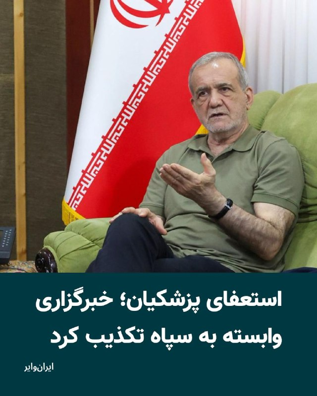

خبرگزاری تسنیم، وابسته به سپاه پاسداران انقلاب اسلامی، در واکنش به گزارش شبکه ایران اینترنشنال درباره استعفای مسعود پزشکیان، رییس دولت، این خبر را تکذیب کرد و آن را «شایعه‌سازی» خواند.

شبکه ایران اینترنشنال، ساعاتی پیش در گزارشی اعلام کرد مسعود پزشکیان در نامه‌ای رسمی به دفتر مجتبی خامنه‌ای، رهبر جمهوری اسلامی، خواستار کناره‌گیری از سمت خود شده است. این رسانه همچنین نوشت در این نامه به وجود اختلافات ساختاری در اداره کشور و نقش نهادهای نظامی در تصمیم‌گیری‌های کلان اشاره شده است.
@VahidHeadline

📡 @VahidOnline

## IranIntlTV — post 339919

  

به گزارش العربیه، دادستانی بحرین اعلام کرد که تحقیقات درباره تشکیلات مرتبط با سپاه پاسداران در این کشور را آغاز کرده است.

بر اساس اعلام دادستانی بحرین، این تشکیلات، روحانیون مخالف رویکرد ولایت فقیه را مورد ارعاب قرار داده و به انتقال پول به گروه‌هایی در ایران، عراق و لبنان اقدام کرده است.

بر اساس این بیانیه، اموال این گروه توقیف شده است.
https://iranintl.com/202605313272

## IranIntlTV — post 339918

  <a href="telegram/content/IranIntlTV_339918_1780251005.mp4" target="_blank">🎬 Download video</a>

ارتش اسرائیل اعلام کرد کنترل عملیاتی قلعه راهبردی شقیف در جنوب لبنان را به‌دست گرفته است؛ تحولی که همزمان با گسترش عملیات زمینی در خاک لبنان رخ داده است.

این در حالی است که از ۲۷ فروردین و با میانجی‌گری آمریکا میان اسرائیل و لبنان آتش‌بس اعلام شد، اما درگیری‌ها همچنان ادامه دارد.

گفت‌وگو با فرزین ندیمی، پژوهشگر ارشد امور دفاعی و امنیتی
@iranintltv

## IranIntlTV — post 339917

گزارش‌های متعدد از سخت‌تر شدن برخی مفاد توافق پیشنهادی با تهران از سوی رییس جمهور آمریکا خبر می‌دهند. به گزارش نیویورک تایمز، نسخه اصلاح‌شده این توافق برای بررسی به تهران ارسال شده. آکسیوس هم نوشت که تغییرات مورد نظر ترامپ عمدتا مرتبط با برنامه هسته‌ای و ذخایر اورانیوم غنی‌شده جمهوری اسلامی است.

گفت‌وگو با مرضیه حسینی خبرنگار ایران‌اینترنشنال و مسعود کاظمی روزنامه‌نگار

@iranintltv

## IranIntlTV — post 339916

  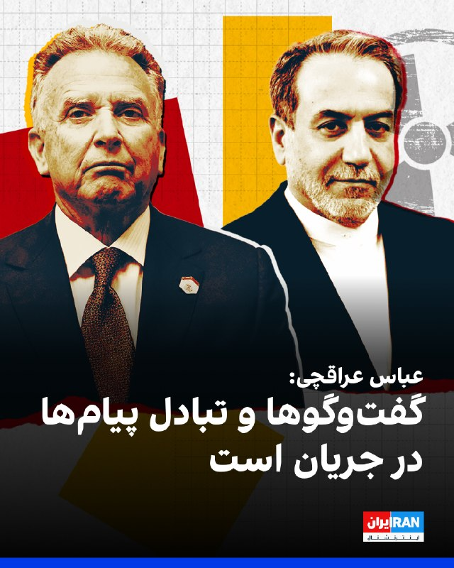

عباس عراقچی، وزیر خارجه جمهوری اسلامی، یکشنبه به صداوسیمای جمهوری اسلامی اعلام کرد: «گفت‌وگوها و تبادل پیام‌‌ها در جریان است و تا وقتی به نتیجه مشخص نرسد، نمی‌شود در موردش قضاوت کرد.»

او افزود: «هر آنچه که الان گفته می‌شود گمانه‌زنی است و نباید به آن اهمیت داد تا وقتی که به قطعیت برسد.»
https://iranintl.com/202605318549

## IranIntlTV — post 339915

  <a href="telegram/content/IranIntlTV_339915_1780251009.mp4" target="_blank">🎬 Download video</a>

یک منبع آگاه به ایران‌اینترنشنال خبر داد مسعود پزشکیان با ارسال نامه‌ای رسمی به دفتر مجتبی خامنه‌ای خواستار کناره‌گیری از سمت خود شده است.

براساس اطلاعات رسیده به ایران‌اینترنشنال، پزشکیان در این نامه هشدار داده ساختار اداره کشور عملا از مسیرهای رسمی خارج شده و بخش‌های اصلی حاکمیت تحت کنترل کامل طیفی از فرماندهان سپاه پاسداران قرار گرفته است.

گفت‌وگو با مراد ویسی، تحلیل‌گر ارشد ایران‌اینترنشنال
@iranintltv

## IranIntlTV — post 339914

  

سایت امتداد گزارش داد مسعود پیاهو، شهروندی که تصویر نشستن یک معترض مقابل نیروهای سرکوب در اعتراضات بازار در دی ۱۴۰۴ را ثبت کرده بود، به اتهام «همکاری با اسرائیل» به ۱۰ سال حبس محکوم شده است.

حسن آقاخانی، وکیل این شهروند، عنوان کرده است موکل او این فیلم کوتاه را به صورت ناخودآگاه از آن صحنه ضبط کرده و قصد انتشار آن را نداشته و صرفا برای تعداد محدودی از دوستانش در استوری خصوصی اینستاگرام منتشر کرده است.

به گزارش امتداد و به نقل از وکیل مسعود پیاهو، حکم ۱۰ سال حبس در شعبه ۹ دیوان تایید شده و به اجرای احکام رفته است و این شهروند باید خود را به زندان معرفی کند.
https://iranintl.com/202605316094

## Shin_Persian — post 6335

  

Shin ✓ @hey_itsmyturn
Sun, 31 May 2026 17:44:41 UTC

Now -
Jet activity over Karaj, Alborz Province, #Iran

فارسی

فعالیت جت‌های جنگنده بر فراز کرج، استان البرز، #Iran

𝕏 · @shin_persian

## Shin_Persian — post 6334

  

Shin ✓ @hey_itsmyturn Sun, 31 May 2026 17:37:26 UTC Tasnim called @IranIntl a "Mossad-affiliated media", adds "Mr. President did'nt resign, was working today, and will continue his work as planned", citing an "informed source". [These quick denials by…

## Shin_Persian — post 6333

Shin ✓ @hey_itsmyturn
Sun, 31 May 2026 17:37:26 UTC

Tasnim called @IranIntl a "Mossad-affiliated media", adds "Mr. President did'nt resign, was working today, and will continue his work as planned", citing an "informed source".

[These quick denials by IRGC media usually mean the opposite] [They rejected his resignation iyam]

فارسی

تسنیم @IranIntl را یک «رسانه وابسته به موساد» خواند و به نقل از یک «منبع آگاه» افزود: «آقای رئیس‌جمهور استعفا نداده، امروز مشغول به کار بود و طبق برنامه به فعالیت خود ادامه خواهد داد.»

[این تکذیب‌های سریع توسط رسانه‌های سپاه پاسداران (IRGC) معمولاً به معنای معکوس است] [به نظر من آن‌ها با استعفای او مخالفت کرده‌اند]

𝕏 · @shin_persian

## Shin_Persian — post 6332

Shin ✓ @hey_itsmyturn
Sun, 31 May 2026 17:32:49 UTC

IRGC-owned Tasnim denies Pezeshkian's resignation.

فارسی

خبرگزاری تسنیم متعلق به سپاه پاسداران انقلاب اسلامی (IRGC)، استعفای پزشکیان را تکذیب کرد.

𝕏 · @shin_persian

## Shin_Persian — post 6331

↩️ Quoted tweet: ایران اینترنشنال - خبر فوری ✓ @IranIntlbrk Sun, 31 May 2026 16:40:46 UTC یک منبع آگاه به ایران اینترنشنال خبر داد که مسعود پزشکیان، رئیس‌جمهوری ایران، با ارسال نامه‌ای رسمی به دفتر مجتبی خامنه‌ای، رهبر جمهوری اسلامی، خواستار کناره‌گیری از…

## Shin_Persian — post 6330

↩️ Quoted tweet:
ایران اینترنشنال - خبر فوری ✓ @IranIntlbrk
Sun, 31 May 2026 16:40:46 UTC

یک منبع آگاه به ایران اینترنشنال خبر داد که مسعود پزشکیان، رئیس‌جمهوری ایران، با ارسال نامه‌ای رسمی به دفتر مجتبی خامنه‌ای، رهبر جمهوری اسلامی، خواستار کناره‌گیری از سمت خود شد.
بر اساس اطلاعات رسیده به ایران‌اینترنشنال، پزشکیان در این نامه که طی ساعات گذشته ارسال شده، با لحنی کم

↩️ Quoted tweet — see the post below for the reply.

English

An informed source told Iran International that Masoud Pezeshkian, the President of Iran, sent an official letter to the office of Mojtaba Khamenei, the Supreme Leader of the Islamic Republic, requesting to resign from his position.

According to information obtained by Iran International, in this letter sent within the past few hours, Pezeshkian, with a tone...

𝕏 · @shin_persian

## Shin_Persian — post 6329

Shin ✓ @hey_itsmyturn
Sun, 31 May 2026 17:04:32 UTC

Lots of people tweeting the Jordanian flag with a missing star, do they have a problem with Jordan?

فارسی

افراد زیادی در حال توئیت کردن پرچم اردن بدون ستاره هستند، آیا آن‌ها با اردن مشکلی دارند؟

𝕏 · @shin_persian

## Shin_Persian — post 6328

  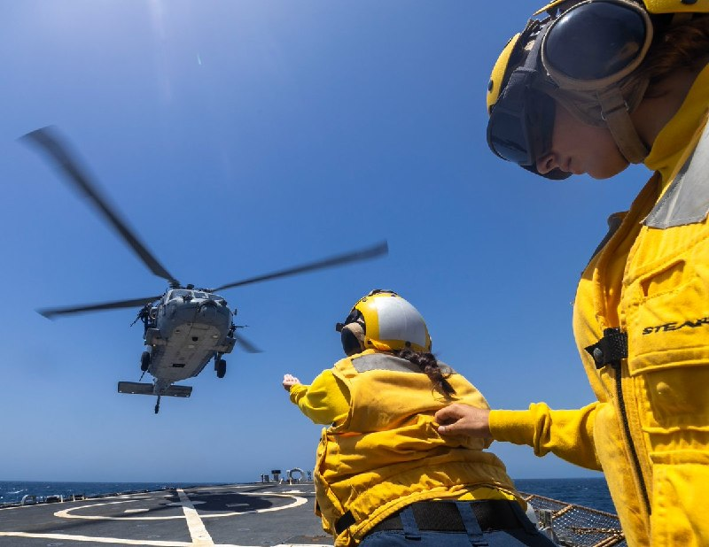

Shin ✓ @hey_itsmyturn
Sun, 31 May 2026 16:59:05 UTC

USS Milius is supporting the U.S. blockade against Iran. As of May 31, the blockade has redirected 118 commercial vessels and disabled 5.

Source: https://x.com/i/web/status/2061130303352050177

فارسی

ناو یو‌اس‌اس میلیوس (USS Milius) از محاصره ایالات متحده علیه ایران حمایت می‌کند. تا تاریخ ۳۱ مه، این محاصره باعث تغییر مسیر ۱۱۸ کشتی تجاری و از کار افتادن ۵ کشتی شده است.

منبع: https://x.com/i/web/status/2061130303352050177

𝕏 · @shin_persian

## FarsiVOA — post 219198

🔺جمهوری اسلامی سه تن از معترضان دی را به بیش از ۹ سال حبس محکوم کرد

◾️قوه قضائیه جمهوری اسلامی سه جوان اهل دره‌شهر استان ایلام و ساکن کرج به نام‌های محمدامین شمسی، امیر امرایی، و کامیار امرایی را که در جریان اعتراضات دی‌ماه ۱۴۰۴ بازداشت و در قزل‌حصار زندانی شده‌اند، جمعا به ۹ سال و ۳ ماه حبس محکوم کرده است.

⬇️ بیشتر بخوانید:

https://ir.voanews.com/a/prison-three-kurdish-youths-qezel-hesar-judiciary/8155814.html

## FarsiVOA — post 219197

🔺سناتور گراهام: پرزیدنت ترامپ «توافق بد» با رژیم ایران را نمی‌پذیرد

◾️لیندسی گراهام، سناتور ارشد جمهوری‌خواه از ایالت کارولینای جنوبی، یکشنبه ۱۰ خرداد، در شبکه ایکس با اشاره به گفت‌و‌گوی اخیرش با دونالد ترامپ، رئیس جمهوری آمریکا، نوشت: «یقین دارم دونالد ترامپ با یک توافق بد با [رژیم] ایران موافقت نخواهد کرد.»

⬇️ بیشتر بخوانید:

https://ir.voanews.com/a/lindsey-graham-iran-israel-hezbollah/8155794.html

## FarsiVOA — post 219194

تیفانی ترامپ، دختر پرزیدنت ترامپ، با انتشار تصاویری از سفر خود و همسرش به تاج محل نوشت: «دیداری شگفت‌انگیز از تاج محل؛ رویایی که به حقیقت پیوست.»

@FarsiVOA

## FarsiVOA — post 219193

فاجعه بیکاری در جنوب ایران؛ اخراج گسترده کارگران پتروشیمی در ماهشهر

## FarsiVOA — post 219192

🔺حبس به دلیل ضبط وقایع؛ ثبت‌کننده «مرد تانکی تهران» به ۱۰ سال زندان محکوم شد

◾️گزارش‌هایی که روز یکشنبه ۱۰ خرداد منتشر شد حاکی از آن است که مسعود پیاهو، شهروندی که تصویری از حرکت اعتراضی مشهور به «مرد تانکی تهران» را ثبت کرده بود، به ۱۰ سال حبس محکوم شده است و پرونده او در آستانه اجرای حکم قرار دارد.

⬇️ بیشتر بخوانید:

https://ir.voanews.com/a/tehran-tank-man-photographer-jailed/8155801.html

## FarsiVOA — post 219191

🔺صدور حکم اعدام علیه دو جوان ۲۰ ساله به اتهام «جاسوسی»؛ ماشین مرگ جمهوری اسلامی سر ایستادن ندارد

◾️در ادامه موج اتهام‌زنی‌های بی‌اساس و صدور احکام اعدام برای مخالفان و معترضان رژیم، قوه قضائیه جمهوری اسلامی حسن و حسین امیری، برادران دوقلوی ۲۰ ساله، را به «جاسوسی برای اسرائیل» متهم و آنها را به اعدام محکوم کرد.

⬇️ بیشتر بخوانید:

https://ir.voanews.com/a/iran-issues-death-sentences-to-two-20-year-olds/8155805.html

## FarsiVOA — post 219190

  <a href="telegram/content/FarsiVOA_219190_1780251013.mp4" target="_blank">🎬 Download video</a>

ارتش اسرائیل تصاویری از فعالیت نیروهایش در قلعه بوفور منتشر کرده است.
نیروهای ارتش اسرائیل پیشتر ارتفاعات بوفور را تصرف کردند. هدف اصلی این عملیات نابودی زیرساخت‌های حزب‌الله بود که با هدایت جمهوری اسلامی در این منطقه ایجاد شده است.

تصرف بوفور پس از روزها نبرد شدید در روستاهای اطراف و عبور نیروهای اسرائیلی از رودخانه لیتانی انجام شد؛ عمیق‌ترین پیشروی اسرائیل در لبنان طی ۲۶ سال گذشته.

این قلعه ۱۲ قرن قدمت دارد و یونسکو آن را به رسمیت می‌شناسد و نزدیک شهر نبطیه و در فاصله حدود ۱۴ کیلومتری از مرز اسرائیل قرار دارد.

## FarsiVOA — post 219189

گفت‌و‌گو با آلان توفیقی، تحلیلگر سیاسی از پاریس، درباره اظهارات قالیباف و دیگر مذاکره‌کنندگان جمهوری اسلامی و تاثیر احتمالی آن بر مواضع پرزیدنت ترامپ

## DW_Farsi — post 125352

🔶 گزارش سی‌ان‌ان از بازگشایی پایگاه‌های موشکی زیرزمینی ایران
 
سی‌ان‌ان در گزارشی نوشت ایران پس از هفته‌ها بمباران آمریکا و اسرائیل، با استفاده از تجهیزات ساده‌ای مانند بولدوزر و کامیون، در حال بازگشایی زردخانه‌های مدفون خود است و همین موضوع محدودیت‌های راهبرد بمباران آمریکا را آشکار کرده است.
 
بر اساس این گزارش، تصاویر ماهواره‌ای نشان می‌دهند ایران تاکنون ۵۰ ورودی از ۶۹ ورودی تونل را در ۱۸ سایت موشکی زیرزمینی که هدف حمله قرار گرفته بودند، دوباره باز کرده است.
 
در این گزارش آمده است آمریکا  و اسرائیل در هفته‌های نخست جنگ، برای محدود کردن توان موشکی ایران، جاده‌ها را منهدم و دهانه تونل‌های پایگاه‌های زیرزمینی را مسدود کردند. اما تصاویر ماهواره‌ای نشان می‌دهند ایران با ابزارهای ساده توانسته بخش قابل توجهی از این مسیرها را دوباره باز کند.
 
علاوه بر ورودی تونل‌ها، بخش‌هایی از جاده‌هایی که برای جلوگیری از حرکت پرتابگرهای موشکی  بمباران شده بودند نیز ترمیم شده‌اند. به گفته سی‌ان‌ان، تقریبا همه گودال‌های ایجادشده در این مسیرها پر شده و در دو نقطه، حتی آسفالت‌ریزی دوباره انجام شده است.
@dw_farsi

## Persian_Trend_Official — post 15413

  <a href="telegram/content/Persian_Trend_Official_15413_1780251016.webm" target="_blank">🎬 Download video</a>

یک منبع آگاه در دولت: اینترنشنال، کارخانه تولید اکاذیب درباره پزشکیان و دیگران است

▪️ یک منبع آگاه در دولت در گفتگو با تسنیم با اشاره به شایعه‌سازی «اینترنشنال»، رسانه وابسته به موساد، درباره استعفای آقای پزشکیان، رئیس‌جمهور، تاکید کرد: اینکه این رسانه ضدایرانی کارخانه تولید اکاذیب درباره ایران است دیگر بر کسی پوشیده نیست، لذا طبیعی است که کسی شایعات او را هم باور نکند.

▪️ وی خاطرنشان کرد: آقای رئیس‌جمهور استعفایی نداده، امروز مشغول کار بوده و برنامه‌های آتی او نیز طبق روال برگزار خواهد شد.

▪️ این منبع آگاه تصریح کرد: این قبیل شایعه‌سازی‌ها با دو هدف عمده صورت می‌گیرد؛ نخست: خبرسازی برای کسب اطلاعات امنیتی به نفع موساد و سیا و دوّم: اختلاف‌افکنی و شکستن انسجام مقدس اجتماعی در ایران.

▪️ وی تاکید کرد: منابع آگاه اینترنشنال، معمولاً محصول تخیلات و فانتزی‌های گردانندگان این شبکه هستند و وجود خارجی ندارند.

👺Phantom

📌 @persian_trend_official
پرشین ترند | متفاوت‌ترین کانال نظامی

## Persian_Trend_Official — post 15412

  

فیک نیوز=ایران اینترنشنال: مسعود پزشکیان بخاطر ورود سپاه به تمامی مسائل کشور و دخالت در کارای دولت نامه استعفا خودشو به مجتبی خامنه‌ای تحویل داد.

👺Phantom

📌 @persian_trend_official
پرشین ترند | متفاوت‌ترین کانال نظامی

## RadioFarda — post 157749

  <a href="https://t.me/radiofarda/157749" target="_blank">📎 Download file</a>

📻بشنوید: ایستگاه ۱۹ با رادیوفردا، دهم خرداد ۱۴۰۵

@RadioFarda

## RadioFarda — post 157748

پزشکیان: تداوم فشارهای خارجی اداره کشور را پیچیده کرده است

🔸مسعود پزشکیان، رئیس‌جمهور ایران، روز یکشنبه گفت فشارهای خارجی و محدود شدن دسترسی دولت به منابع اقتصادی باعث مشکلاتی در اداره کشور شده است.

🔸محاصره دریایی آمریکا علیه بنادر ایران که از اواخر فروردین با دستور رئیس‌جمهور ایالات متحده آغاز شده است، بر اساس گزارش‌ها باعث کاهش شدید صادرات نفت و سقوط درآمدهای ارزی دولت جمهوری اسلامی شده است. این محاصره که توسط نیروهای نظامی آمریکا اعمال می‌شود، حرکت کشتی‌های تجاری از مبدأ و به مقصد ایران را محدود کرده است.

🔸پزشکیان در جلسه هیئت دولت جمهوری اسلامی با اشاره به این که محدودیت‌های بیرونی دلیل بخشی از مشکلات اقتصادی است، گفت: «تداوم برخی محدودیت‌ها و فشارهای خارجی، به‌ویژه در حوزه دسترسی به منابع و ظرفیت‌های اقتصادی، پیچیدگی‌های خاصی را برای اداره کشور ایجاد کرده است.»

🔸او در ادامه خواستار آن شد که مردم درباره «واقعیت‌های موجود» مطلع شوند و گفت که «جامعه باید نسبت به الزامات و هزینه‌های مقاومت آگاه باشد».

🔸این در حالی است که بر اساس گزارش‌ها، دونالد ترامپ، رئیس‌جمهور آمریکا، تفاهم‌نامه برای تمدید آتش‌بس با ایران را با شرایطی «سخت‌تر» دوباره به تهران فرستاده است.

🔸او همچنین تهدید کرده که اگر توافق با ایران مطابق میل واشینگتن نباشد و باعث جلوگیری از دسترسی ایران به سلاح هسته‌ای نشود، احتمال ازسرگیری اقدام نظامی وجود دارد.

@RadioFarda

## IranianMinds — post 21159

  <a href="telegram/content/IranianMinds_21159_1780251017.mp4" target="_blank">🎬 Download video</a>

🔴محمد‌جواد ظریف در پاسخ به سؤال میگن شما پشت پرده مذاکرات هستید، گفت:
من اصلأ هیچکاره ‌ام.

@IranianMinds

## IranianMinds — post 21158

🔴ایران اینترنشنال: پزشکیان به دلیل "تسلط کامل فرماندهان سپاه بر اداره کشور" استعفا داد. @IranianMinds

## IranianMinds — post 21157

  

🔴ایران اینترنشنال:

پزشکیان به دلیل "تسلط کامل فرماندهان سپاه بر اداره کشور" استعفا داد.

@IranianMinds

## IranianMinds — post 21155

  

🔴 چند روز پیش دو تا داداش اسرائیلی دستگیر شدن

حالا دلیلش چی بوده ؟ با کمک چت جی پی تی و گوگل‌مپ میومدن اطلاعات ساختگی از خودشون در میاوردن و میفروختن به جمهوری اسلامی در طول جنگ این کسخلام باور کرده بودن و نمیدونسن اصلا چیه و بر طبق اطلاعات اینا میومدن موشک پرتاب میکردن به سمت مختصاتی که اینا میدادن :)))

@IranianMinds

## IranianMinds — post 21154

  

مسعود پیاهو، مردی که تصویر معترض نشسته مقابل نیروهای پلیس یگان ویژه در مقابل پاساژ علاالدین در آغاز اعتراضات دی ماه سال گذشته رو منتشر کرد، به گفته وکیلش به ۱۰ سال زندان محکوم شده!

@IranianMinds

## BBCPersian — post 282509

  <a href="https://t.me/bbcpersian/282509" target="_blank">📎 Download file</a>

📻پادکست جام جهان‌نما، یکشنبه ۱۰ خرداد ۱۴۰۵

پادکست جام جهان‌نما، یکشنبه ۱۰ خرداد ۱۴۰۵ این برنامه رادیویی را می‌توانید هرشب ساعت ۲۰ به وقت ایران، روی موج متوسط ۷۰۲ کیلوهرتز و موج کوتاه۹۴۶۵ کیلوهرتز بشنوید.

تکرار برنامه را هم می‌توانید ساعت ۲۱:۳۰ روی موج متوسط ۷۰۲ کیلوهرتز و موج کوتاه ۵۳۹۵ کیلوهرتز گوش کنید.

@BBCPersian

## Dirty_Kids — post 390671

  

وکیل از اسمش محمد هستش

وکیل تراز :)))))))))))

@Dirty_Kids 👻

## Dirty_Kids — post 390670

  <a href="telegram/content/Dirty_Kids_390670_1780251021.mp4" target="_blank">🎬 Download video</a>

🔴 صحبتای ایشون خیلی وایرال شده و نظر خیلیارو جذب کرده.

جذاب‌ترین چیز توی این زمونه برای دخترا اینه که بهشون «نه» بگی! از بس اکثر مردا جلو دخترا خم شدن توقعات بالا رفته.
رفیق دخترِ من بعد از حموم استوری گذاشت از خودش و از ۳۰۰ فالور ۵۰ تا بهش دایرکت دادن! همین باعث میشه دخترا فکر کنن همه اونارو میخوان.
سر همین فکر میکنن هیچکس لایق این نیست باهاشون باشه و هر نفرو برای یه چیزی انتخاب میکنن، یه پسرو برای مسائل مالی، یکیو برای محبت، یکی برای مسئله جنسی و...

@Dirty_Kids 👻

## Dirty_Kids — post 390669

  <a href="telegram/content/Dirty_Kids_390669_1780251022.mp4" target="_blank">🎬 Download video</a>

آهنگ «بزن که خوب می‌زنی» 😂😂 از حامد فرد

@Dirty_Kids 👻

## Dirty_Kids — post 390668

  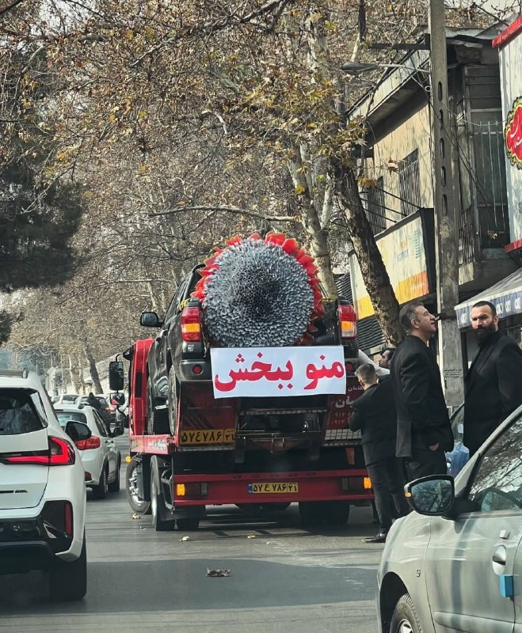

دیده شده امروز در تهران:))))))))))))

@Dirty_Kids 👻

## Hranews — post 113289

مردی در تهران به اعدام و شلاق محکوم شد

❗️
❗️
❗️
❗️
❗️– مردی به اتهام قتل و مصرف مشروبات الکلی توسط شعبه سه دادگاه کیفری تهران به مجازات‌هایی از جمله #اعدام و #شلاق محکوم شد.

ادامه مطلب

↘️
@hranews_bot تماس ✉️ - @Hranews کانال هرانا 🆑

## Hranews — post 113288

کرمان؛ مرگ یک کارگر در سایه فقدان ایمنی کار

❗️
❗️
❗️
❗️
❗️– در سایه فقدان ایمنی محیط و شرایط نامناسب کار، یک #کارگر مقنی در کرمان، حین انجام کار طی حادثه ای جان خود را از دست داد.

ادامه مطلب

↘️
@hranews_bot تماس ✉️ - @Hranews کانال هرانا 🆑

## Hranews — post 113287

  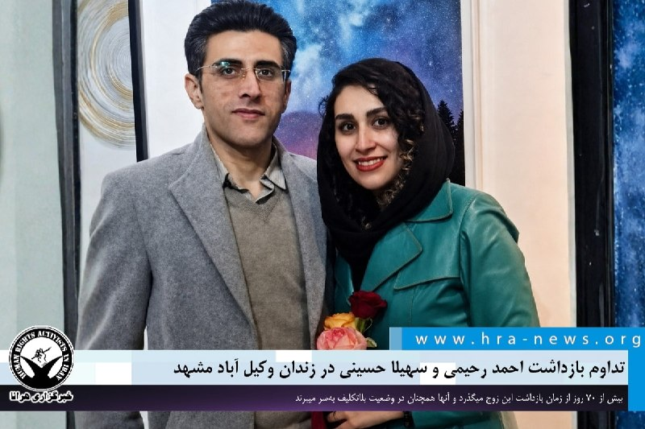

تداوم بازداشت؛ بلاتکلیفی احمد رحیمی و سهیلا حسینی همچنان ادامه دارد

❗️
❗️
❗️
❗️
❗️– احمد رحیمی، استاد دانشگاه و همسرش سهیلا حسینی، هنرمند و نقاش، با گذشت ۷۵ روز از زمان بازداشت، همچنان به‌صورت بلاتکلیف در زندان وکیل‌آباد مشهد نگهداری می‌شوند.

به گزارش خبرگزاری هرانا، ارگان خبری مجموعه فعالان حقوق بشر در ایران، احمد رحیمی و همسرش سهیلا حسینی، کماکان در زندان وکیل‌آباد مشهد در بازداشت به‌سر میبرند.

بر اساس اطلاعات دریافتی هرانا، با وجود گذشت ۷۵ روز از زمان بازداشت، خانواده این افراد از دلایل بازداشت و اتهامات منتسب به آنان مطلع نشده‌اند. همچنین با وجود پیگیری‌های مکرر نزدیکان آنان از مراجع قضایی از جمله دادسرا، دادگاه و مسئولان زندان، تاکنون نتیجه‌ای حاصل نشده و امکان ملاقات حضوری نیز برای آنان فراهم نشده است. این افراد همچنین از حق دسترسی به وکیل و امکان تودیع وثیقه برای آزادی موقت محروم مانده‌اند.

ادامه مطلب

#احمد_رحیمی #سهیلا_حسینی

↘️
@hranews_bot تماس ✉️ - @Hranews کانال هرانا 🆑

## Hranews — post 113286

بازماندگی از تحصیل بیش از ۱۵۰۰ دانش‌آموز در استان مرکزی

❗️
❗️
❗️
❗️
❗️– مدیرکل بهزیستی استان مرکزی اعلام کرد که ۱۵۹۸ دانش‌آموز در این استان از تحصیل بازمانده‌اند.

ادامه مطلب

#دانش‌آموزان

↘️
@hranews_bot تماس ✉️ - @Hranews کانال هرانا 🆑

## alonews — post 124016

  <a href="telegram/content/alonews_124016_1780251025.webm" target="_blank">🎬 Download video</a>

👈عراقچی: ویزای تیم ملی فوتبال ظرف یک تا دو روز آینده صادر می‌شود

✅ @AloNews خبر جنگ

## alonews — post 124015

  <a href="telegram/content/alonews_124015_1780251025.webm" target="_blank">🎬 Download video</a>

👈نتانیاهو، در مورد گسترش حمله لبنان امشب تشکلیل جلسه میده

✅ @AloNews خبر جنگ

## alonews — post 124014

  <a href="telegram/content/alonews_124014_1780251025.mp4" target="_blank">🎬 Download video</a>

👈خبرنگار: پیش‌بینیتون از نتایج تیم ملی تو جام جهانی چیه

🔴 پزشکیان: مهم نیس تلاششونو بکنن

✅ @AloNews خبر جنگ

## alonews — post 124013

  <a href="telegram/content/alonews_124013_1780251028.webm" target="_blank">🎬 Download video</a>

👈کانال ۱۵ عبری: گسترش عملیات اسرائیل در لبنان با هماهنگی دولت آمریکا انجام شد.

✅ @AloNews خبر جنگ

## alonews — post 124012

  <a href="telegram/content/alonews_124012_1780251028.mp4" target="_blank">🎬 Download video</a>

💔روز ۱۸ دی بهرام زاهدی ۴۲ ساله و مجتبی قربانی ۳۳ ساله بر سر کوچه‌ای در دروازه لاکان رشت ایستاده بودند و تنها تماشا می‌کردند که ناگهان هدف رگبار حرام زاده های عرزشی قرار گرفتند.

🤔شما حرام زاده های عرزشی تروریست هایی هستید که این جنایت رو انجام دادید و از شما حرام زاده تر کسانی هستند که این اتفاقات را می‌بیند و همچنان از شما قاتلان حمایت می‌کند.

🔴اگر آخرتی باشد قطعا شما در قعر جهنم هستید.

✅@AloNews

## alonews — post 124011

  <a href="telegram/content/alonews_124011_1780251029.webm" target="_blank">🎬 Download video</a>

👈 عباس عراقچی: مذاکرات و تبادل پیام‌ها در جریان است، اما به نتیجه مشخصی نرسیده‌اند.

🔴وی گزارش‌های فعلی را حدس و گمان دانست و گفت تا زمانی که قطعیت حاصل نشود، نباید به آن‌ها وزن داد.

✅ @AloNews خبر جنگ

## alonews — post 124010

  <a href="telegram/content/alonews_124010_1780251030.webm" target="_blank">🎬 Download video</a>

👈سنتکام: از زمان آغاز محاصره دریایی ایران، ۱۱۸ کشتی تجاری را منحرف و ۵ کشتی را هم از کار انداخته‌ایم

✅ @AloNews خبر جنگ

## alonews — post 124009

  <a href="telegram/content/alonews_124009_1780251030.webm" target="_blank">🎬 Download video</a>

👈معاون رئیس‌جمهور: رئیس‌جمهور ‎از خدمت به مردم عقب نخواهد نشست

✅ @AloNews خبر جنگ

## alonews — post 124008

  <a href="telegram/content/alonews_124008_1780251030.webm" target="_blank">🎬 Download video</a>

👈ایران اینترنشنال: پزشکیان به خاطر تسلط کامل سپاه بر اداره کشور درخواست استعفا از سمت خودش رو داده. 
✅ @AloNews خبر جنگ

## alonews — post 124007

  <a href="telegram/content/alonews_124007_1780251030.webm" target="_blank">🎬 Download video</a>

👈سنتکام: 118 کشتی تجاری رو برگردوندیم و 5تا رو هم توقیف کردیم

✅ @AloNews خبر جنگ

## alonews — post 124006

  <a href="telegram/content/alonews_124006_1780251031.webm" target="_blank">🎬 Download video</a>

👈ایران اینترنشنال: پزشکیان به خاطر تسلط کامل سپاه بر اداره کشور درخواست استعفا از سمت خودش رو داده. 
✅ @AloNews خبر جنگ

## alonews — post 124005

  <a href="telegram/content/alonews_124005_1780251031.webm" target="_blank">🎬 Download video</a>

👈ایران اینترنشنال: پزشکیان به خاطر تسلط کامل سپاه بر اداره کشور درخواست استعفا از سمت خودش رو داده.

✅ @AloNews خبر جنگ

## alonews — post 124004

  <a href="telegram/content/alonews_124004_1780251031.webm" target="_blank">🎬 Download video</a>

👈جروزالم پست:
منابع به واشنگتن پست مدعی شدند که مجتبی خامنه‌ای، رهبر ایران، هنوز به آخرین پیشنهادات ایالات متحده، از جمله تفاهم‌ نامه‌ای که در جریان مذاکرات اخیر مورد توافق قرار گرفت، پاسخی نداده است.

✅ @AloNews خبر جنگ

---
📅 بروزرسانی: 1405/03/10 20:26
---

## VahidOOnLine — post 243077

  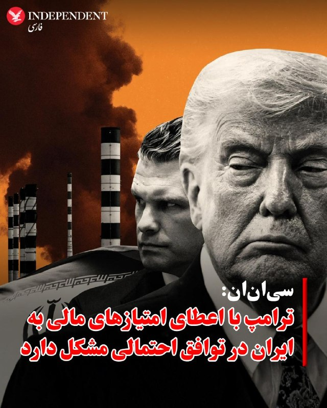

♦️شبکه سی‌ان‌ان، روز یکشنبه دهم خرداد ماه، به نقل از مقام‌های آمریکایی گزارش داد دونالد ترامپ پس از نشست روز جمعه با مشاوران خود، اصلاحاتی را به متن توافق احتمالی با ایران بازگردانده و به این ترتیب روند مذاکرات برای دست‌کم یک هفته دیگر ادامه خواهد یافت.

بر اساس این گزارش، جزئیات دقیق تغییرات مورد نظر ترامپ هنوز مشخص نیست، اما مقام‌های آمریکایی گفته‌اند رئیس‌جمهور آمریکا بر درج مفاد سخت‌گیرانه‌تر درباره تعهدات هسته‌ای ایران و همچنین تضمین بازگشایی تنگه هرمز اصرار دارد.

سی‌ان‌ان همچنین گزارش داد ترامپ درباره میزان تسهیلات و امتیازهای مالی که ممکن است در چارچوب توافق به ایران ارائه شود ابراز نگرانی کرده است. به گفته این شبکه، رئیس‌جمهوری آمریکا نمی‌خواهد توافق جدید با توافق هسته‌ای دوران باراک اوباما مقایسه شود. توافقی که ترامپ همواره از آن انتقاد کرده و آن را توافقی ضعیف توصیف کرده است.

این گزارش می‌افزاید بازنگری‌های جدید ترامپ موجب شده رایزنی‌ها میان طرف‌های درگیر همچنان ادامه داشته باشد و مذاکرات وارد مرحله تازه‌ای شود.
‌🇸🇦 Indypersian

🤖 @VahidOOnLine

## VahidOOnLine — post 243076

  

یک منبع آگاه به ایران اینترنشنال خبر داد که مسعود پزشکیان، رئیس‌جمهوری ایران، با ارسال نامه‌ای رسمی به دفتر مجتبی خامنه‌ای، رهبر جمهوری اسلامی، خواستار کناره‌گیری از سمت خود شد.
بر اساس اطلاعات رسیده به ایران‌اینترنشنال، پزشکیان در این نامه که طی ساعات گذشته ارسال شده، با لحنی کم‌سابقه و انتقادی هشدار داده است که ساختار اداره کشور عملاً از مسیرهای رسمی خارج شده و بخش‌های اصلی حاکمیت تحت کنترل کامل طیفی خاص از فرماندهان سپاه پاسداران قرار گرفته است.
هنوز روشن نیست که مجتبی خامنه‌ای با استعفای رئیس‌جمهوری موافقت خواهد کرد یا خیر، اما محتوای نامه از شکافی عمیق و بی‌سابقه در بالاترین سطوح قدرت در جمهوری اسلامی حکایت دارد.
پزشکیان در این نامه تأکید کرده که رئیس‌جمهوری و دولت عملاً از روند تصمیم‌گیری‌های کلان و حیاتی کشور کنار گذاشته شده‌اند و خلأ ناشی از این وضعیت، زمینه را برای در دست گرفتن امور توسط جریان‌های افراطی در سپاه پاسداران فراهم کرده است. او همچنین تصریح کرده که در چنین شرایطی امکان اداره دولت و انجام مسئولیت‌های قانونی خود را ندارد و به همین دلیل خواستار کناره‌گیری فوری شده است.
‌🏁 🇬🇧 IranintlTV

🤖 @VahidOOnLine

## VahidOOnLine — post 243075

  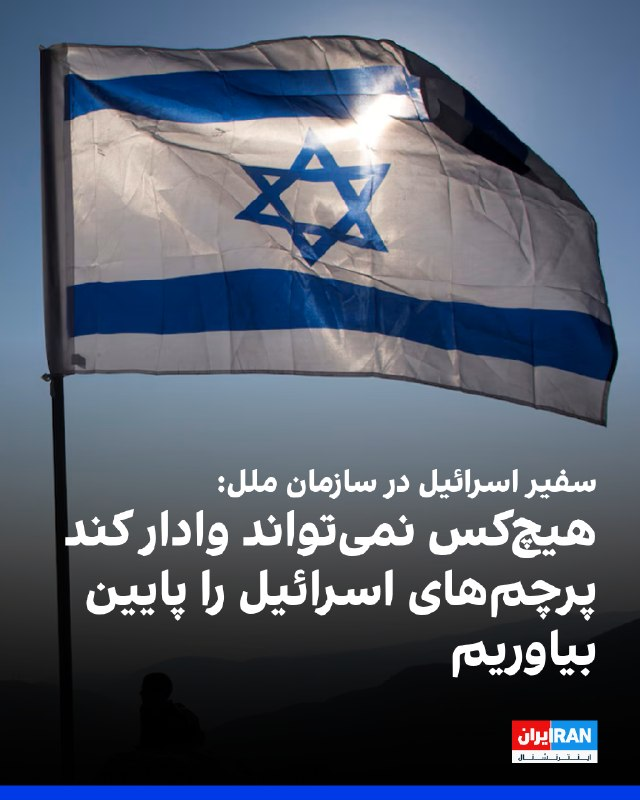

دنی دانون، سفیر اسرائیل در سازمان ملل، در شبکه اجتماعی ایکس نوشت: «درست در زمانی که یهودی‌ستیزی دوباره در حال افزایش است و نفرت از اسرائیل حتی از سوی برخی مسئولان منتخب نیز تشویق می‌شود، ما با قامتی استوار ایستاده‌ایم.»

او افزود: «هیچ‌کس نمی‌تواند ما را وادار کند پرچم‌های اسرائیل را پایین بیاوریم؛ نه در نیویورک و نه در هیچ جای دیگری در جهان.»
‌🏁 🇬🇧 IranintlTV

🤖 @VahidOOnLine

## VahidOOnLine — post 243074

  <a href="telegram/content/VahidOOnLine_243074_1780246597.mp4" target="_blank">🎬 Download video</a>

♦️اسکات بسنت، وزیر خزانه‌داری ایالات متحده، روز یکشنبه دهم خرداد ماه، در گفتگو با برنامه «آینده‌های صبح یکشنبه» (Sunday Morning Futures)  شبکه فاکس گفت، از نظر رئیس‌جمهوری آمریکا، اتمام جنگ با ایران به معنای تضمین کامل و همیشگی باز بودن تنگه هرمز، جمع‌آوری تمام اورانیوم غنی‌شده ایران و اطمینان قطعی از این امر است که تهران هرگز به سلاح هسته‌ای دست پیدا نخواهد کرد.
بسنت این دستاورد را «تحولی تاریخی» توصیف کرد و افزود به لطف رویکرد قاطعانه پرزیدنت ترامپ، «مقامات ایران برای نخستین بار در ۴۷ سال گذشته پای میز مذاکره آمده‌اند تا درباره نداشتن سلاح هسته‌ای گفتگو کنند.»
این گفتگو درحالی صورت می‌گیرد که به گزارش رسانه‌های آکسیوس و نیویورک تایمز، دونالد ترامپ با ایجاد تغییراتی در متن توافق احتمالی واشنگتن با تهران، شرایط سخت‌تری را پیش روی رهبران جمهوری اسلامی ایران قرار داده است.
‌🇸🇦 Indypersian

🤖 @VahidOOnLine

## VahidOOnLine — post 243073

  

فرماندهی مرکزی ایالات متحده (سنتکام) با انتشار تصاویری، جزئیاتی از فعالیت یک ناو هواپیمابر آمریکایی که اکنون نزدیک ایران هستند منتشر و آن را «شهری روی دریا» توصیف کرد.

در حالی که به دلیل آتش‌بس جاری با جمهوری اسلامی، عملیات‌ها محدودتر شده‌اند، مقامات آمریکایی می‌گویند نیروی دریایی ایالات متحده همچنان آماده است در صورت نیاز حملات را افزایش دهد.

سنتکام نوشت: «یک ناو هواپیمابر نیروی دریایی آمریکا در اصل یک شهر مستقل روی دریاست. با طولی حدود سه زمین فوتبال و بیش از ۵۰۰۰ ملوان در آن، برای اینکه عملیات به‌طور روان پیش برود، حضور و همکاری همه نیروها—چه در عرشه و چه زیر آن—ضروری است.»

ویدئوهای منتشرشده در پستی در شبکه اجتماعی ایکس نشان می‌دهد ملوانان در حال انجام وظایف مختلف روی این ناو هستند؛ از تهیه غذا گرفته تا هدایت هواپیماها روی عرشه.
‌🏁 🇬🇧 IranintlTV

🤖 @VahidOOnLine

## VahidOOnLine — post 243072

  

نیویورک‌تایمز به نقل از سه مقام آگاه گزارش داد دونالد ترامپ شروط چارچوب احتمالی توافق برای پایان جنگ با ایران را سخت‌تر کرده و نسخه اصلاح‌شده را برای بررسی به تهران ارسال کرده است. هنوز مشخص نیست چه تغییراتی در متن اعمال شده است.

بر اساس این گزارش، ترامپ نسبت به بخش‌هایی از توافق که شامل آزادسازی دارایی‌های ایران می‌شود ابراز نگرانی کرده و از طولانی شدن پاسخ تهران به پیشنهادهای آمریکا ناراضی است.

این تغییرات با هدف افزایش فشار برای پذیرش چارچوبی انجام شده که پیش‌تر برای تایید به مجتبی خامنه‌ای ارسال شده بود. به گفته منابع، برقراری ارتباط و دریافت پاسخ از مجتبی خامنه‌ای دشوار است و هرگونه تغییر در این سند که به‌عنوان «یادداشت تفاهم» شناخته می‌شود، ممکن است موجب تاخیرهای بیشتر در روند مذاکرات شود.
‌🏁 🇬🇧 IranintlTV

🤖 @VahidOOnLine

## VahidOOnLine — post 243071

  <a href="telegram/content/VahidOOnLine_243071_1780246601.mp4" target="_blank">🎬 Download video</a>

♦️فاطمه مهاجرانی، سخنگوی دولت مسعود پزشکیان، روز یکشنبه در یک گفتگوی تلویزیونی گفت: «مطلوب دولت این است که بتواند مبلغ کالابرگ را افزایش دهد اما باید مطلوبات را با مقدورات هماهنگ کنیم و این امکان فعلا وجود ندارد.»
مهاجرانی با اشاره به محاصره دریایی ایران ادامه داد: «اتفاقی که الان در جنوب کشور و دریا در حال رخ دادن است، روی اقتصاد ما تاثیر می‌گذارد.»
او گرانی را محصول محاصره دریایی آمریکا دانست و افزود: «این موضوع بر کاهش ورود کالا تاثیر می‌گذارد و وقتی جریان عرضه و تقاضا دچار مشکل می‌شود، بازار واکنش نشان می‌دهد.»
‌🇸🇦 Indypersian

🤖 @VahidOOnLine

## WithYashar — post 13075

## WithYashar — post 13074

درود، میشه بی زحمت اون 250 صفحه رو بفرستی تو گروه ممنونم🙏🙏🙏

## WithYashar — post 13073

با توجه به اینکه بخش محدودی از دفترچه پروژه شکوفایی«اضطرار» حدود ۱۰٪ به دوران پیش از تغییر رژیم «زمان حال» اختصاص دارد، لازم است به دغدغه‌ها و پرسش‌های مردم در این حوزه توجه بیشتری شود و برای آن‌ها برنامه‌ریزی دقیق‌تر و اقدامات سریع‌تری در نظر گرفته شود، زیرا این موضوعات برای افکار عمومی اهمیت مستقیم و فوری دارند.

اینم به متن اضافه میکنم

## WithYashar — post 13072

زرشکیان قهر کرد !

اینترنشنال: مسعود پزشکیان با ارسال نامه‌ای به دفتر مجتبی خامنه‌ای خواهان استعفا از سمت خودش شده.
@withyashar

## WithYashar — post 13071

متن چکیده نسخه ۱۹ بیانیه جمعی از ایرانیان داخل و خارج کشور خطاب به شاهزاده رضا پهلوی شاهزاده گرامی، این متن جمع‌بندی مجموعه‌ای از دیدگاه‌ها، نگرانی‌ها و پیشنهادهای طیف گسترده‌ای از ایرانیان داخل و خارج کشور است که با هدف تقویت انسجام ملی، افزایش شفافیت…

## WithYashar — post 13070

## WithYashar — post 13069

## WithYashar — post 13068

یاشار جان سلام یه سوال فنی داشتم ،
بعد بر اندازی و سقوط ایده برخورد شما با عرزشی یا حالا بسیجی که دستش به خونی آلوده نیست صرفا موج سوار بود یا اصلا همراه بوده چیه اوناهم باید مجازات بشن یا باید گذشت و همکاری کرد ؟

## WithYashar — post 13067

  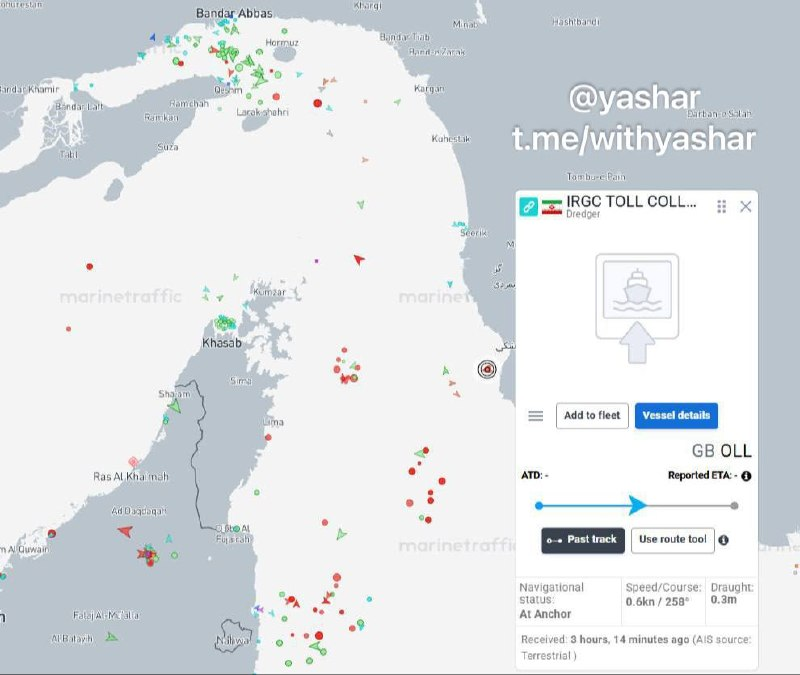

یک کشتی ایرانی به نام «IRGC TOLL COLLECT» به معنی « اخذ عوارض توسط سپاه پاسداران » در تنگه هرمز ظاهر شده است
@withyashar
مفتبر جاده هرمزه 🤣 تلکه بگیر سر گردنه

## WithYashar — post 13066

یاشار همین الان مرکز تهران دو صدا مهیب انفجار مانند ۱۹:۳۲
@withyashar

## WithYashar — post 13065

## WithYashar — post 13064

من اون 250 صفحه دوره گذار و خوندم واسه وضعیت الان ما بیشتر شبیه رویا میمونه
الان برنامه برای سقوط مهمه
که هیچی در موردش توضیح نمیدن 🤦‍♀🤦‍♀🤦‍♀

## WithYashar — post 13063

## FoxNewsTwitter — post 342449

  <a href="telegram/content/FoxNewsTwitter_342449_1780246604.mp4" target="_blank">🎬 Download video</a>

Fox News (Twitter/X)

Police hold the line as anti-ICE agitators try breaking the barricade at Delaney Hall to push their way into the New Jersey detention center.

## pm_afshaa — post 91955

  

ترامپ پستی از نیوت گینگریچ را بازنشر کرد که در آن گفته است ترامپ «در آستانه یک پیروزی تاریخی» در ایران است

💧 Rainbet.com the #1 Non-KYC Crypto Casino & Sportsbook @rainbetcom

😁 @Pm_Afshaa

## pm_afshaa — post 91954

🔴وزیر خزانه‌داری آمریکا: فشارها بر ایران و جلوگیری از صادرات نفت از جزیره خارک ادامه دارد

💧 Rainbet.com the #1 Non-KYC Crypto Casino & Sportsbook @rainbetcom

😁 @Pm_Afshaa

## pm_afshaa — post 91953

  <a href="telegram/content/pm_afshaa_91953_1780246607.webm" target="_blank">🎬 Download video</a>

🔴ایران اینترنشنال: مسعود پزشکیان به علت تسلط کامل فرماندهان سپاه بر اداره امور کشور، با ارسال نامه‌ای به دفتر مجتبی خامنه‌ای خواهان استعفا از سمت خودش شده.

💧 Rainbet.com the #1 Non-KYC Crypto Casino & Sportsbook @rainbetcom

😁 @Pm_Afshaa

## pm_afshaa — post 91952

وضعیت لبنان بعد از حمله هوایی اسراییل به این کشور 
💧 Rainbet.com the #1 Non-KYC Crypto Casino & Sportsbook @rainbetcom 
😁 @Pm_Afshaa

## pm_afshaa — post 91951

  <a href="telegram/content/pm_afshaa_91951_1780246608.webm" target="_blank">🎬 Download video</a>

🔴مهاجرانی، سخنگوی دولت:
قالیباف کسی است که فرمانده میدان بوده و عراقچی هم رزمنده زمان جنگ است، بنابراین تمام کسانی که الان درگیر مذاکره هستن، میدان رو به‌خوبی درک می‌کنند.

نیروهای مسلح ایران همچنان دست‌به‌ماشه هستن و تیم دیپلماسی با همین نگاه، مذاکرات رو دنبال میکنه.

💧 Rainbet.com the #1 Non-KYC Crypto Casino & Sportsbook @rainbetcom

😁 @Pm_Afshaa

## pm_afshaa — post 91950

🔴سی‌ان‌ان: ترامپ با آزادسازی هرگونه دارایی ایران در توافق احتمالی مخالفت کرده

💧 Rainbet.com the #1 Non-KYC Crypto Casino & Sportsbook @rainbetcom

😁 @Pm_Afshaa

## DEJradio — post 5188

  <a href="telegram/content/DEJradio_5188_1780246609.mp4" target="_blank">🎬 Download video</a>

📺 
🕐 مهمان برنامه نیمکت، احمد باطبی روزنامه‌نگار و فعال حقوق بشر است. او در این برنامه به واکاوی تحولات جنبش دانشجویی و دگرگونی دانشگاه‌ها پرداخته است.
«نیمکت» برنامه مشترک خبرنامه امیرکبیر و تلویزیون دژ است و بر مبارزات دانشجویی تمرکز دارد.
این برنامه هر یکشنبه بعد از خبر ۲۱ پخش می‌شود.

#نیمکت
@DEJradio

## DEJradio — post 5187

  <a href="telegram/content/DEJradio_5187_1780246612.webm" target="_blank">🎬 Download video</a>

🔸
🔺 فاطمه مهاجرانی سخنگوی دولت درباره دلایل افزایش گرانی گفت «وقتی جریان عرضه و تقاضا دچار مشکل می‌شود بازار واکنش نشان می‌دهد.»
او با اشاره به محاصره دریایی بنادر جمهوری اسلامی، ادامه داد: «دزدی دریایی آمریکا تاثیر می‌گذارد که ورود کمتر شود.»
این در حالیست که برخی مقامات جمهوری اسلامی ادعا می‌کنند «محاصره دریایی» شکست خورده است. بعضی نمایندگان مجلس شورای اسلامی نیز ادعا کرده بودند نظام راهکار شکستن محاصره دریایی را می‌داند.

#محاصره_دریایی #گرانی
@DEJradio

## DEJradio — post 5186

  <a href="telegram/content/DEJradio_5186_1780246613.mp4" target="_blank">🎬 Download video</a>

🔸
🔺 براساس گزارش‌های مردمی بعد از جنگ ۴۰ روزه وضعیت آب سدها و دریاچه‌ها بهتر شده است. برخی منابع می‌گویند حدود ۷۰ درصد ظرفیت مخزن سد کرج تا ۱۰ خرداد پر شده است.

#کرج #آب
@DEJradio

## VahidOnline — post 75822

  

IranIntlbrk

📡 @VahidOnline

## IranIntlTV — post 339913

  <a href="telegram/content/IranIntlTV_339913_1780246615.mp4" target="_blank">🎬 Download video</a>

ویدیوی منتشرشده در شبکه‌های اجتماعی، دود غلیظ ناشی از آتش‌سوزی را در حوالی اتوبان ستاری تهران در روز یک‌شنبه ۱۰ خرداد نشان می‌دهد.

جلال ملکی، سخنگوی سازمان آتش‌نشانی شهرداری تهران، در این‌باره گفت: مقادیری لاستیک و روغن در پارکینگ ساختمانی نگهداری می‌شده که به دلایل نامشخص دچار آتش‌سوزی شده است. این حادثه مصدومیت و تلفات جانی نداشته است.
@iranintltv

## IranIntlTV — post 339912

  <a href="telegram/content/IranIntlTV_339912_1780246616.mp4" target="_blank">🎬 Download video</a>

تیتر اول با نیوشا صارمی، یکشنبه ۱۰ خرداد
@iranintltv

## IranIntlTV — post 339911

  

یک منبع آگاه به ایران اینترنشنال خبر داد که مسعود پزشکیان، رئیس‌جمهوری ایران، با ارسال نامه‌ای رسمی به دفتر مجتبی خامنه‌ای، رهبر جمهوری اسلامی، خواستار کناره‌گیری از سمت خود شد.
بر اساس اطلاعات رسیده به ایران‌اینترنشنال، پزشکیان در این نامه که طی ساعات گذشته ارسال شده، با لحنی کم‌سابقه و انتقادی هشدار داده است که ساختار اداره کشور عملاً از مسیرهای رسمی خارج شده و بخش‌های اصلی حاکمیت تحت کنترل کامل طیفی خاص از فرماندهان سپاه پاسداران قرار گرفته است.
هنوز روشن نیست که مجتبی خامنه‌ای با استعفای رئیس‌جمهوری موافقت خواهد کرد یا خیر، اما محتوای نامه از شکافی عمیق و بی‌سابقه در بالاترین سطوح قدرت در جمهوری اسلامی حکایت دارد.
پزشکیان در این نامه تأکید کرده که رئیس‌جمهوری و دولت عملاً از روند تصمیم‌گیری‌های کلان و حیاتی کشور کنار گذاشته شده‌اند و خلأ ناشی از این وضعیت، زمینه را برای در دست گرفتن امور توسط جریان‌های افراطی در سپاه پاسداران فراهم کرده است. او همچنین تصریح کرده که در چنین شرایطی امکان اداره دولت و انجام مسئولیت‌های قانونی خود را ندارد و به همین دلیل خواستار کناره‌گیری فوری شده است.
https://iranintl.com/

## IranIntlTV — post 339910

  

دنی دانون، سفیر اسرائیل در سازمان ملل، در شبکه اجتماعی ایکس نوشت: «درست در زمانی که یهودی‌ستیزی دوباره در حال افزایش است و نفرت از اسرائیل حتی از سوی برخی مسئولان منتخب نیز تشویق می‌شود، ما با قامتی استوار ایستاده‌ایم.»

او افزود: «هیچ‌کس نمی‌تواند ما را وادار کند پرچم‌های اسرائیل را پایین بیاوریم؛ نه در نیویورک و نه در هیچ جای دیگری در جهان.»
https://iranintl.com/202605317796

## IranIntlTV — post 339909

  <a href="telegram/content/IranIntlTV_339909_1780246620.mp4" target="_blank">🎬 Download video</a>

ایران‌اینترنشنال به اسنادی محرمانه دست یافته که نشان می‌دهد چین از طرق شرکت‌هایی در خاک این کشور، ترکیه و امارات، به سپاه پاسداران در تامین مواد شیمیایی برای ساخت موشک بالستیک کمک می‌کند. این همکاری در ازای نفت و از طریق ستاد پورجعفری سپاه انجام می‌شود.

گزارشی از مجتبا پورمحسن
@iranintltv

## IranIntlTV — post 339908

  <a href="https://t.me/IranintlTV/339908" target="_blank">📎 Download file</a>

🎧نسخه صوتی اخبار شبانگاهی | یکشنبه ۱۰ خرداد
@iranintlTV

## IranIntlTV — post 339907

  

فرماندهی مرکزی ایالات متحده (سنتکام) با انتشار تصاویری، جزئیاتی از فعالیت یک ناو هواپیمابر آمریکایی که اکنون نزدیک ایران هستند منتشر و آن را «شهری روی دریا» توصیف کرد.

در حالی که به دلیل آتش‌بس جاری با جمهوری اسلامی، عملیات‌ها محدودتر شده‌اند، مقامات آمریکایی می‌گویند نیروی دریایی ایالات متحده همچنان آماده است در صورت نیاز حملات را افزایش دهد.

سنتکام نوشت: «یک ناو هواپیمابر نیروی دریایی آمریکا در اصل یک شهر مستقل روی دریاست. با طولی حدود سه زمین فوتبال و بیش از ۵۰۰۰ ملوان در آن، برای اینکه عملیات به‌طور روان پیش برود، حضور و همکاری همه نیروها—چه در عرشه و چه زیر آن—ضروری است.»

ویدئوهای منتشرشده در پستی در شبکه اجتماعی ایکس نشان می‌دهد ملوانان در حال انجام وظایف مختلف روی این ناو هستند؛ از تهیه غذا گرفته تا هدایت هواپیماها روی عرشه.
https://iranintl.com/202605319516

## Shin_Persian — post 6327

↩️ Quoted tweet: Shin ✓ @hey_itsmyturn Fri, 29 May 2026 21:03:59 UTC Source tells me that an Iranian Lieutenant has been killed by shrapnel. Qeshm island, Hormozgan Province, #Iran ↩️ توییت نقل‌قول شده — برای پاسخ، پست زیر را ببینید. فارسی منابع به من…

## Shin_Persian — post 6326

↩️ Quoted tweet:
Shin ✓ @hey_itsmyturn
Fri, 29 May 2026 21:03:59 UTC

Source tells me that an Iranian Lieutenant has been killed by shrapnel.
Qeshm island, Hormozgan Province, #Iran

↩️ توییت نقل‌قول شده — برای پاسخ، پست زیر را ببینید.

فارسی

منابع به من خبر می‌دهند که یک ستوان ایرانی بر اثر اصابت ترکش کشته شده است.
جزیره قشم، استان هرمزگان، #Iran_

𝕏 · @shin_persian

## FarsiVOA — post 219188

🔺صدور حکم خلع لباس علیه یک روحانی اهل سنت به دلیل «عزاداری نکردن» برای مرگ خامنه‌ای

◾️رسانه‌های حقوق بشری روز یکشنبه ۱۰ خرداد اعلام کردند که دادگاه‌ ویژه روحانیت رژیم جمهوری اسلامی، عثمان ذاکری، روحانی سنی اهل بوکان، را به «خلع لباس» و «اخراج از مسجد» محکوم کرده است.

⬇️ بیشتر بخوانید:

https://ir.voanews.com/a/disrobing-sunni-cleric-iran-religious-minorities-mourning-for-khamenei/8155800.html

## FarsiVOA — post 219187

گفت‌و‌گو با دکتر مازیار صدری، فوق تخصص مراقبت‌های ویژه، درباره پیامدهای بالا رفتن هزینه درمان در ایران که سبب شده است بیماران قید مداوا شدن را بزنند.

## FarsiVOA — post 219186

تکمیل طرح محدود کردن سلاح گروەهای مسلح عراق؛ الزیدی: «عصائب اهل حق» هم تسلیم خواهد شد

## FarsiVOA — post 219185

  <a href="telegram/content/FarsiVOA_219185_1780246624.mp4" target="_blank">🎬 Download video</a>

ارتش اسرائیل با انتشار ویدیویی از حملات به زیرساخت‌های سازمان تروریستی حزب‌الله در صور و مناطق دیگر در جنوب لبنان، اعلام کرد از زمان اجرای آتش‌بس تاکنون «۹۰۰ تروریست حزب‌الله» را از بین برده است.

جنگ میان حزب‌الله و ارتش اسرائیل به رغم تمدید آتش‌بس همچنان ادامه دارد و در همین راستا، در روزهای اخیر ارتش اسرائیل چندین هشدار تخلیه برای مناطق مختلف لبنان صادر کرد. نتانیاهو نیز بر گسترش عملیات اسرائیل در جنوب لبنان تأکید کرد.

## FarsiVOA — post 219184

حسن شریعتمداری در عمق میدان: تجربه نشان داده که شخصیت و رهبرِ کاریزماتیک خودش دیکتاتور بعدی خواهد بود. همه را با همه تفاوت‌ها باید دعوت کرد

## FarsiVOA — post 219183

در گفت‌وگو با حسن هاشمیان به عبور ارتش اسرائیل از رود لیتانی و تصرف قلعه راهبردی بوفور (یا بوفورت که نام عربی آن «شقیف» است) پرداختیم. او می‌گوید این پیشروی، «که بزرگ‌ترین شکستی است که جمهوری اسلامی به جهان اسلام تقدیم کرد» معادلات لبنان و مذاکرات منطقه‌ای را به زیان جمهوری اسلامی تغییر می‌دهد.

## FarsiVOA — post 219182

🔺افزایش فشار بر زندانیان اوین؛ از سلول انفرادی تا محرومیت درمانی

◾️کانون حقوق بشر ایران روز یکشنبه ۱۰ خرداد ۱۴۰۵ با انتشار گزارشی از افزایش فشارها بر زندانیان در زندان اوین خبر داد و اعلام کرد که در ماه‌های اخیر مواردی از محرومیت درمانی، محدودیت تماس و ملاقات، انتقال به سلول‌های انفرادی و برخوردهای خشونت‌آمیز با زندانیان گزارش شده است.

⬇️ بیشتر بخوانید:

https://ir.voanews.com/a/pressure-mounts-evin-prison/8155787.html

## FarsiVOA — post 219181

با وجود اعلام رسمی بازگشت اینترنت بین‌الملل، گزارش‌های داخلی و خارجی روزهای اخیر تصویر متفاوتی نشان می‌دهند: فیلترینگ سنگین، اختلال در پیام‌رسان‌ها، محدودیت اپ‌استورها و ناپایداری ارتباط دیتاسنترها همچنان ادامه دارد. ترافیک اینترنت ایران هنوز به نصف سطح عادی هم نرسیده است.

نت‌بلاکس در آخرین ارزیابی خود اعلام کرده شرایط فعلی به دوران میان اعتراضات دی‌ماه و جنگ اخیر شباهت دارد و نه به وضعیت پیش از بحران.

گزارش کامل را در وب‌سایت صدای آمریکا بخوانید.

@FarsiVOA

## DW_Farsi — post 125351

  

🔶 تصرف قلعه بوفور از سوی اسرائیل؛ فرانسه خواستار نشست اضطراری شورای امنیت شد
 
ژان-نوئل بارو، وزیر خارجه فرانسه، اعلام کرد پاریس پس از تصرف قلعه بوفور در لبنان توسط ارتش اسرائیل، خواستار برگزاری نشست اضطراری شورای امنیت سازمان ملل شده است. او گفت فرانسه حق اسرائیل برای دفاع از خود را به رسمیت می‌شناسد، اما ادامه عملیات نظامی اسرائیل در لبنان و گسترش حضور آن در خاک این کشور را غیرقابل توجیه می‌داند.
 
به گزارش العربیه انگلیسی، بارو در این باره گفت هیچ چیز نمی‌تواند ادامه عملیات نظامی اسرائیل در لبنان و عمیق‌تر شدن اشغال خاک این کشور را توجیه کند.
 
دنی دانون، نماینده اسرائیل در سازمان ملل، در واکنش به درخواست فرانسه گفت بحث واقعی در شورای امنیت باید درباره شکست مداوم در اجرای قطعنامه ۱۷۰۱ باشد؛ قطعنامه‌ای که پس از جنگ سال ۲۰۰۶ میان اسرائیل و حزب‌الله تصویب شد و بر اساس آن، حزب‌الله باید به شمال رود لیتانی عقب می‌رفت.
 
او گفت حزب‌الله سال‌هاست قطعنامه‌های سازمان ملل را آشکارا نقض کرده، با حمایت ایران مسلح شده و تهدیدی مستقیم برای غیرنظامیان اسرائیلی و ثبات منطقه ایجاد کرده است.
 
@dw_farsi

## Persian_Trend_Official — post 15411

  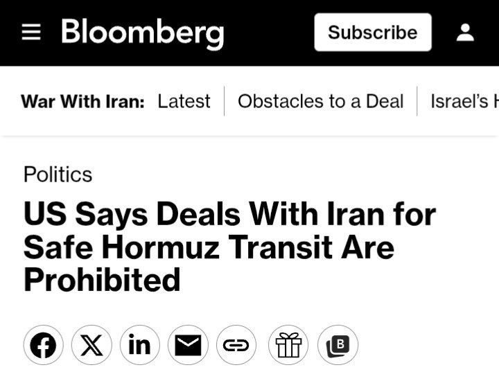

بلومبرگ: ایالات متحده اعلام کرده است که هرگونه توافق با ایران برای عبور امن از تنگه هرمز ممنوع است، حتی اگر این توافق شامل پرداخت پول یا عوارض نباشد.

به گزارش بلومبرگ وزارت خزانه‌داری آمریکا در بیانیه‌ای که در 29 مه منتشر شد تأکید کرد: صرف‌نظر از اینکه پرداختی انجام شود یا نه، اشخاص آمریکایی از دریافت هرگونه خدمات از دولت ایران منع شده‌اند، از جمله خدمات مربوط به تضمین عبور ایمن.

این تصمیم در حالی اتخاذ شده که تنش‌ها میان آمریکا و ایران ادامه دارد و موضوع عبور کشتی‌ها از تنگه هرمز به یکی از مسائل اصلی تبدیل شده است.

بر اساس این دستور شرکت‌ها و افراد آمریکایی نمی‌توانند برای عبور امن با ایران مذاکره کنند، حتی دریافت تضمین امنیت بدون پرداخت پول هم ممنوع است، پرداخت عوارض یا هزینه به ایران نیز مشمول تحریم‌ها می‌شود

این اقدام نشان می‌دهد که واشنگتن عملاً هیچ‌گونه نقش یا اختیار ایران در کنترل عبور و مرور در تنگه هرمز را به رسمیت نمی‌شناسد.

📝 Amir

📌 @persian_trend_official
پرشین ترند | متفاوت‌ترین کانال نظامی

## Persian_Trend_Official — post 15410

  <a href="telegram/content/Persian_Trend_Official_15410_1780246629.webm" target="_blank">🎬 Download video</a>

🇺🇸
🇹🇭
⚡️ — ایالات متحده و تایلند در حال مذاکره بر سر یک توافق بلندمدت جدید برای عرضه گاز طبیعی مایع‌شده آمریکا هستند، زیرا نگرانی‌ها درباره امنیت انرژی پس از آسیب به زیرساخت‌های LNG قطر و ناپایداری در اطراف تنگه هرمز در جریان جنگ ایران افزایش یافته است، رویترز گزارش می‌دهد.

➡️ مذاکرات بر روی یک قرارداد الزام‌آور بلندمدت بین شرکت Venture Global و شرکت دولتی انرژی تایلند، PTT Public Company Limited، متمرکز است.

➡️ قراردادهای مورد بحث احتمالاً برای ۱۵ سال یا بیشتر اجرا خواهند شد، اگرچه حجم‌ها و زمان‌بندی‌های دقیق اعلام نشده است.

👺Phantom

📌 @persian_trend_official
پرشین ترند | متفاوت‌ترین کانال نظامی

## Persian_Trend_Official — post 15409

  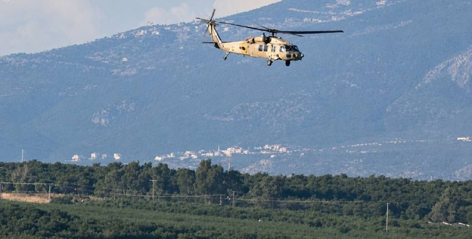

رسانه‌های اسرائیلی: یک پایگاه نظامی در شمال هایمک (مرج بن عامر) هدف پهپادی قرار گرفت.

تا به این لحظه ۶ زخمی در «بیت هیل» از جمله ۳ نفر در وضعیت بحرانی قرار دارند
هلیکوپترهای ارتش در حال انتقال مجروحان در میان نیروهای ارتش در نزدیکی «بیت هلیل» هستند.

👺Phantom

📌 @persian_trend_official
پرشین ترند | متفاوت‌ترین کانال نظامی

## Persian_Trend_Official — post 15408

  

🇮🇷
🇮🇷 حملات موشکی سپاه به سمت اقلیم کردستان، عراق. 
🚀
🚀
🚀
🚀 
👺Phantom 📌 @persian_trend_official پرشین ترند | متفاوت‌ترین کانال نظامی

## Persian_Trend_Official — post 15407

  <a href="telegram/content/Persian_Trend_Official_15407_1780246631.webm" target="_blank">🎬 Download video</a>

صادرات تخم مرغ ممنوع شد. طبق نامه معاونت توسعه بازرگانی وزارت جهاد کشاورزی به مدیرکل دفتر صادرات سازمان توسعه تجارت و گمرک، صادرات تخم‌مرغ خوراکی تا اطلاع ثانوی ممنوع شد .🫆: Ⓜ 🆔:@persian_trend_official پرشین ترند | متفاوت‌ترین کانال نظامی

## Persian_Trend_Official — post 15406

  

🇮🇷
🇮🇷 حملات موشکی سپاه به سمت اقلیم کردستان، عراق.

🚀
🚀
🚀
🚀

👺Phantom

📌 @persian_trend_official
پرشین ترند | متفاوت‌ترین کانال نظامی

## IranianMinds — post 21153

  

@IranianMinds

## IranianMinds — post 21152

🔴 مهاجرانی، سخنگوی دولت:
قالیباف کسی است که فرمانده میدان بوده و عراقچی هم رزمنده زمان جنگ است، بنابراین تمام کسانی که الان درگیر مذاکره هستن، میدان رو به‌خوبی درک می‌کنند.

نیروهای مسلح ایران همچنان دست‌به‌ماشه هستن و تیم دیپلماسی با همین نگاه، مذاکرات رو دنبال میکنه.

@IranianMinds

## IranianMinds — post 21151

🔴 اسکات بسنت، وزیر خزانه‌داری آمریکا: فشارها بر ایران و جلوگیری از صادرات نفت از جزیره خارک ادامه دارد.

@IranianMinds

## IranianMinds — post 21150

  

استایل جدید و متفاوت صابر ابر

@IranianMinds

## IranianMinds — post 21149

کانالی که همیشه در مسیر ورشکست کردن سایت های شرطبندی حرکت کرده! 😈

آمار ثابت 90 درصد برد ✅
فقط کافیه چند روز فرم هاش رو دنبال کنید...
⚽ @Tipster_Mafiaa   @Tipster_Mafiaa
⚽ @Tipster_Mafiaa      @Tipster_Mafiaa

## IranianMinds — post 21148

  

میکس عالی برد شد🖤☑️
✔️@Tipster_Mafiaa

## BBCPersian — post 282508

🔻بر اساس گزارش‌ها وقوع انفجاری در منطقه تحت کنترل شورشیان میانمار بیش از پنجاه نفر را کشته است.

این انفجار در ایالت شان، نزدیک مرز چین، رخ داده است. تصاویر نشان می‌دهد که دود غلیظی به آسمان بلند شده و ساختمان‌ها در منطقه‌ای وسیع تخریب شده‌اند.

محل انفجار نزدیک شهر نام خام است که در کنترل ارتش آزادی‌بخش ملی تانگ یکی از قدرتمندترین گروه‌های مسلح مخالف دولت نظامی میانمار است.

برخی گزارش‌ها حاکی است که انفجار در یک انبار مهمات رخ داده است اما شورشیان می‌گویند که این انفجار ناشی از انفجار تصادفی مواد منفجره بوده است.

@BBCPersian

## BBCPersian — post 282507

  <a href="telegram/content/BBCPersian_282507_1780246635.mp4" target="_blank">🎬 Download video</a>

رژه پیروزی آرسنال با شور و هیجان در حال برگزاری است و بازیکنان با اتوبوس‌های روباز در شمال لندن حرکت می‌کنند .
 
دود قرمز هوا را پر کرده است زیرا هزاران هوادار برای پیوستن به جشن‌ها در خیابان‌ها صف کشیده‌اند.
 
یکی از هواداران، جرالدین، به ما می‌گوید: «تیم ما دوباره به اوج رسیده است.» دیگری، لی، می‌گوید: «من 20 سال برای این لحظه صبر کردم.»
 
همچنین تیم زنان آرسنال که در ماه فوریه اولین جام قهرمانان زنان را بالای سر برد، در این رژه جشن می‌گیرند.
 
یکی از هواداران جوان به بی‌بی‌سی می‌گوید: «من داشتم برای [آلسیا] روسو دست تکان می‌دادم، او هم دست تکان داد.»
 
جشن‌های امروز پس از فینال نفس‌گیر لیگ قهرمانان اروپا در روز شنبه برگزار می‌شود که در آن پاری سن ژرمن در ضربات پنالتی آرسنال را شکست داد.

@bbcpersian

## BBCPersian — post 282506

  <a href="telegram/content/BBCPersian_282506_1780246637.mp4" target="_blank">🎬 Download video</a>

🔻سرخط خبرهای روز یکشنبه، ۱۰ خرداد ۱۴۰۵

https://trib.al/Clx2mh7
@BBCPersian

## idfinfarsi — post 11687

  <a href="telegram/content/idfinfarsi_11687_1780246640.mp4" target="_blank">🎬 Download video</a>

‼️مستندات جدید: نیروهای یگان گشتی گولانی در قلعه بوفور

## idfinfarsi — post 11686

  <a href="telegram/content/idfinfarsi_11686_1780246642.mp4" target="_blank">🎬 Download video</a>

۹۰۰ تروریست حزب‌الله از زمان اجرای آتش‌بس به هلاکت رسیدند:

🔸ارتش اسرائیل از ساعات صبح امروز زیرساخت‌های سازمان تروریستی حزب‌الله را در صور و مناطق دیگر در جنوب لبنان مورد حمله قرار داد

🔸به موازات تعمیق فعالیت نیروهای ما در رشته‌کوه بوفور، ارتش اسرائیل از صبح امروز به انبارهای سلاح، مقرهای مستقر و زیرساخت‌های اضافی سازمان تروریستی حزب‌الله در منطقه صور و سایر مناطق جنوب لبنان حمله کرد.

🔸انبارهای هدف قرارگرفته توسط تروریست‌های این سازمان برای پیشبرد و اجرای طرح‌های تروریستی علیه نیروهای ارتش اسرائیل مورد استفاده قرار می‌گرفتند

## Dirty_Kids — post 390667

  

🔴 ایران اینترنشنال: مسعود پزشکیان بخاطر ورود سپاه به تمامی مسائل کشور و دخالت در کارای دولت نامه استعفا خودشو به مجتبی خامنه‌ای تحویل داد.

@Dirty_Kids 👻

## Dirty_Kids — post 390666

  

عجب خایه‌ای دارید؛ یه وقت نگیرنتون، تو روز روشن با چادر توی سطح شهر تردد می‌کنید. فکر میکنم اینکه امثال اینا کافه رفتن رو افتخار میدونن ناشی از احساس طرد شدگی در جامعه‌ست که خودشون به این نتیجه رسیدن کافه جای اونا نیست  + با امریکا مبارزه میکنن با وسایل…

## Dirty_Kids — post 390664

🔴 طبق تحقیقات دانشگاه پنسیلوانیا آمریکا
🇺🇸، تو عرقِ زیر بغل مردها یه سری مواد شیمیایی هست که می‌تونه روی حال و بدن زن‌ها اثر مثبت بزاره؛

طِی این آزمایش، یه عصاره از عرق مردها رو به لب بالای خانم‌ها زدن و بعدش بعضی از خانم‌ها متوجه شدن استرسشون کمتر شده و حس آرامش بیشتری پیدا کردن.
این مواد روی بعضی هورمون‌های بدن خانم‌ها مثل هورمون‌های مرتبط با چرخه قاعدگی هم اثر می‌ذاره و همچنین باعث تسکین درد میشه.

@Dirty_Kids 👻

## Dirty_Kids — post 390663

  <a href="https://t.me/Dirty_Kids/390663" target="_blank">📎 Download file</a>

✅ اپلیکیشن اندروید سایت جهانی دربی بت

💰اولین سایت جهانی با امکان شارژ و برداشت ریالی(کارت به کارت)

🔗 برای ورود فیلترشکن روی کشور مناسب قرار دهید مانند فنلاند و المان و....

😀Telegram Channel
👇
https://t.me/+bcynkEgSW2dlYTc0

## Dirty_Kids — post 390662

  

😤دنبال یه سایت شرط بندی بین المللی بودی که به ایرانیا خدمات بده؟!
⛔

👍دربی بت همون انتخاب  100%

💎ویژگی های سایت جهانی Derby Bet:

⬅️امکان شارژ امن با کارت بانکی

⬅️واریز اول دوبل شارژ می شوید(بونوس۱۰۰٪)

⬅️پر اپشن ترین سایت فعال در ایران

⬅️تسویه حساب کمتر از 5 دقیقه

⬅️برگشت بخشی از باخت به صورت هفتگی

🚨کد هدیه ثبت نام:GG007

⚠️برای دانلود اپلکیشن کلیک کنید
👉

🔔کانال دربی بت :

🪙https://t.me/+bcynkEgSW2dlYTc0

## Dirty_Kids — post 390661

  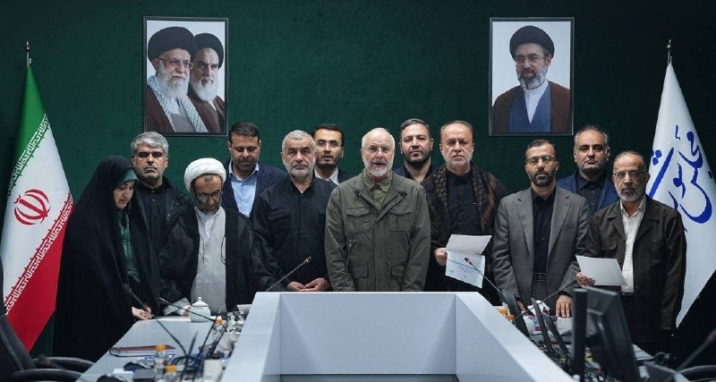

این تصویر که میبینید اولین جلسه مجلس شورای اسلامیه که فقط با حضور ۱۴ نماینده برگزار شده.

۱۸۷ نماینده به صورت آنلاین شرکت کردن و ۹۳ نماینده دیگه حتی به صورت آنلاین هم حاضر نشدن.

@Dirty_Kids 👻

## Dirty_Kids — post 390660

خامنه‌ای اصلا نفهمید جنگ شده، یهو در اتاقو باز کردن بیت براش دید عه هردوتا دسشو میتونه تکون بده که یهو دید قاسم سلیمانی داره میاد بغلش کنه

@Dirty_Kids 👻

## Dirty_Kids — post 390659

  

یارو ساقیه، زیاد خیس نکن

@Dirty_Kids 👻

## Dirty_Kids — post 390658

  <a href="telegram/content/Dirty_Kids_390658_1780246649.mp4" target="_blank">🎬 Download video</a>

قصه داره قشنگ میشه، بلاخره تو اینا هم پیدا میشه کسایی که یکم از مغزشون استفاده کنن

@Dirty_Kids 👻

## Dirty_Kids — post 390657

  

🌎با بهبود نسبی وضعیت اینترنت و بازگشت محدود دسترسی به شبکه بین‌الملل، موفق شدیم ضمن حفظ کیفیت و پایداری سرویس‌ها، قیمت را تا هر گیگابایت 20 هزار تومان کاهش دهیم
🖥

🟣با وجود اینکه شرایط اینترنت همچنان ناپایدار است و وضعیت پهنای باند بین‌الملل به ثبات کامل نرسیده، تیم فنی بادبان با توسعه زیرساخت‌ها و بهره‌گیری از سرورهای جدید از سرویس‌دهندگان معتبر، توانسته هزینه‌ها را بهینه کرده و سرویس‌ها را با قیمت مناسب‌تری ارائه دهد
⛵️
G10
از همراهی و اعتماد شما سپاسگزاریم
💜

🛡@BadBan_VPN | کانال 

🤖@BadBan_VPNBot | ربات 

📞@BadBan_VPNSupport | پشتیبانی

## Hranews — post 113285

اعتراضات ۱۴۰۴؛ تایید حکم ۱۰ سال حبس مسعود پیاهو در دیوان عالی کشور

❗️
❗️
❗️
❗️
❗️– محکومیت حبس مسعود پیاهو، از بازداشت‌شدگان اعتراضات سراسری دی‌ماه ۱۴۰۴، توسط شعبه ۹ دیوان عالی کشور عینا تایید شد. وی پیشتر توسط شعبه ۲۳ دادگاه انقلاب تهران به ۱۰ سال حبس محکوم شده بود.

ادامه مطلب

#مسعود_پیاهو

↘️
@hranews_bot تماس ✉️ - @Hranews کانال هرانا 🆑

## Hranews — post 113284

سنندج؛ وریا موید و جمال خداکرمی آزاد شدند

❗️
❗️
❗️
❗️
❗️– وریا موید و جمال خداکرمی که در جریان اعتراضات سراسری ۱۴۰۴، در سنندج بازداشت شده بودند، با تودیع وثیقه آزاد شدند.

ادامه مطلب

#وریا_موید #جمال_خداکرمی

↘️
@hranews_bot تماس ✉️ - @Hranews کانال هرانا 🆑

## Hranews — post 113283

برنامه «به من چه؟» توقیف شد

❗️
❗️
❗️
❗️
❗️– پخش برنامه «به من چه؟» که از پلتفرم روبیکا پخش می‌شد، متوقف شد. مجید واشقانی، مجری این برنامه اعلام کرد که این اقدام با دستور سازمان تنظیم مقررات رسانه‌های صوت و تصویر فراگیر در فضای مجازی، صورت گرفته است.

ادامه مطلب

#توقیف_برنامه #مجید_واشقانی

↘️
@hranews_bot تماس ✉️ - @Hranews کانال هرانا 🆑

## alonews — post 124002

  <a href="telegram/content/alonews_124002_1780246652.webm" target="_blank">🎬 Download video</a>

👈رئیس جمهور ترامپ پست نیوت گینگریچ را دوباره منتشر کرد که در آن می گوید ترامپ "در آستانه پیروزی تاریخی" در ایران است.‌‌

✅ @AloNews خبر جنگ

## alonews — post 124001

  <a href="telegram/content/alonews_124001_1780246653.webm" target="_blank">🎬 Download video</a>

👈وزیر خزانه‌داری آمریکا: فشارها بر ایران و جلوگیری از صادرات نفت از جزیره خارک ادامه دارد

✅ @AloNews خبر جنگ

## alonews — post 124000

  <a href="telegram/content/alonews_124000_1780246653.webm" target="_blank">🎬 Download video</a>

👈وزیر دفاع اسرائیل دستور حملات گسترده در سراسر لبنان را در 24 ساعت آینده صادر کرده است،مردم دو شهر بزرگ نبطیه و صور در جنوب لبنان در حال تخلیه فوری می‌باشند

✅ @AloNews خبر جنگ

## alonews — post 123998

  <a href="telegram/content/alonews_123998_1780246653.mp4" target="_blank">🎬 Download video</a>

👈بندر غزه هدف حمله هوایی قرار گرفت

✅ @AloNews خبر جنگ

## alonews — post 123997

  <a href="telegram/content/alonews_123997_1780246654.webm" target="_blank">🎬 Download video</a>

👈وزیر دفاع چین:
اگرحاکمیت چین بر تایوان نقض شود پایگاه های نظامی ایالات متحده در ژاپن و کره جنوبی به اهداف مشروع تبدیل خواهد شد

🔴پکن هیچ مداخله خارجی را نخواهد پذیرفت.

✅ @AloNews خبر جنگ

## alonews — post 123996

  <a href="telegram/content/alonews_123996_1780246655.webm" target="_blank">🎬 Download video</a>

👈یک کشتی ایرانی به نام «IRGC TOLL COLLECT» در تنگه هرمز ظاهر شده است

✅ @AloNews خبر جنگ

## alonews — post 123995

  <a href="telegram/content/alonews_123995_1780246655.webm" target="_blank">🎬 Download video</a>

👈منبع آمریکایی به سی بی اس :
فعلاً برای رسیدن به توافق با ایران هیچ ضرب‌الاجل و زمان مشخصی تعیین نشده

✅ @AloNews خبر جنگ

## alonews — post 123994

  <a href="telegram/content/alonews_123994_1780246655.webm" target="_blank">🎬 Download video</a>

👈این تصویر که میبینید اولین جلسه مجلس شورای اسلامیه که فقط با حضور ۱۴ نماینده برگزار شده.

۱۸۷ نماینده به صورت آنلاین شرکت کردن و ۹۳ نماینده دیگه حتی به صورت آنلاین هم حاضر نشدن.

🔴طرف نماینده شهرشه ولی حتی حوصله نداشته آنلاین شه بعد انتظار دارن دانش آموزا و دانشجوها هر روز به صورت مجازی تو کلاسا شرکت کنن.

✅ @AloNews خبر جنگ

---
📅 بروزرسانی: 1405/03/10 19:18
---

## VahidOOnLine — post 243070

  

اسکات بسنت، وزیر خزانه‌داری آمریکا، در گفت‌وگو با فاکس‌نیوز درباره ایران اعلام کرد: لایه اول و دوم حکومت آن‌ها از بین رفته و اکنون با لایه سوم روبه‌رو هستیم. شاید آن‌ها دیده‌اند برای بقیه چه اتفاقی افتاد و می‌بینند ترامپ آماده انجام چه اقداماتی است.

بسنت افزود: اگر ترامپ با این توافق موافقت کند، همین حالا به رهبران جمهوری اسلامی می‌گویم که او این توافق را هم از نظر نظامی و هم از نظر اقتصادی اجرا خواهد کرد. آزادی کشتیرانی در خلیج فارس از طریق تنگه هرمز باید به وضعیت پیشین بازگردد.

او درباره اینکه آیا ترامپ «کار را تمام خواهد کرد» گفت: اگر «تمام کردن کار» یعنی اطمینان از باز بودن تنگه هرمز، در اختیار گرفتن اورانیوم با غنای بالا و نداشتن سلاح هسته‌ای از سوی جمهوری اسلامی، پس کار تمام شده است.

بسنت تاکید کرد: چه از طریق مداخله نظامی، چه محاصره یا فشار اقتصادی، این نخستین بار در ۴۷ سال گذشته است که ایرانی‌ها درباره نداشتن سلاح هسته‌ای گفت‌وگو می‌کنند. این موضوع پیش‌تر ممنوعه بود و اکنون برای نخستین بار روی میز مذاکره قرار گرفته است.
‌🏁 🇬🇧 IranintlTV

🤖 @VahidOOnLine

## VahidOOnLine — post 243069

  

♦️پلیس منچستر در جریان عید قربان در بریتانیا، دو مرد بریتانیایی-یمنی را پس از مشاهده خنجرهای سنتی «جنبیه» بر کمرشان بازداشت کرد.
جنبیه، خنجری خمیده و زینتی است که در فرهنگ یمن نماد مردانگی و هویت قبیله‌ای به شمار می‌رود و معمولا به عنوان بخشی از لباس سنتی مردان یمنی استفاده می‌شود.
بر اساس قوانین بریتانیا، حمل چاقو و دیگر سلاح‌های سرد در اماکن عمومی بدون «دلیل موجه» ممنوع است. به همین دلیل مأموران پلیس این دو نفر را بازداشت و خنجرهای آنها را ضبط کردند.
‌🇸🇦 Indypersian

🤖 @VahidOOnLine

## VahidOOnLine — post 243068

  

سی‌ان‌ان گزارش داد تهران پس از خارج کردن سریع زرادخانه‌های موشکی مدفون خود، در موقعیتی قرار گرفته که می‌تواند تعداد بیشتری موشک دوربرد به سمت اسرائیل و دیگر کشورهای خاورمیانه شلیک کند؛ موضوعی که به گفته کارشناسان، محدودیت‌های راهبرد بمباران آمریکا را نشان می‌دهد.

بر اساس این گزارش، حملات آمریکا و اسرائیل در هفته‌های گذشته با هدف تخریب جاده‌ها و مسدود کردن ورودی تونل‌ها انجام شد تا دسترسی تهران به سایت‌های زیرزمینی موشکی محدود شود.

تصاویر ماهواره‌ای بررسی‌شده توسط سی‌ان‌ان نشان می‌دهد جمهوری اسلامی با استفاده از تجهیزات ساده‌ای مانند بولدوزر و کامیون‌های حمل‌ونقل توانسته این مسیرها را دوباره بازسازی کند. کارشناسان می‌گویند این موضوع نشان می‌دهد توان موشکی ایران تنها با هدف قرار دادن ورودی تونل‌ها قابل از بین بردن نیست.
‌🏁 🇬🇧 IranintlTV

🤖 @VahidOOnLine

## VahidOOnLine — post 243067

  <a href="telegram/content/VahidOOnLine_243067_1780242531.mp4" target="_blank">🎬 Download video</a>

♦️فرماندهی مرکزی ایالات متحده (سنتکام) روز یکشنبه ۱۰ خرداد با انتشار پیامی در شبکه اجتماعی ایکس، ناوهای هواپیمابر نیروی دریایی آمریکا را به «شهری خودکفا در دریا» تشبیه کرد.
به گفته سنتکام، یک ناو هواپیمابر آمریکایی تقریبا به اندازه سه زمین فوتبال طول دارد و بیش از پنج هزار ملوان در آن مستقر هستند.
در این پیام آمده است که تداوم عملیات این شناورها نیازمند همکاری هماهنگ تمامی نیروها در بخش‌های مختلف، چه روی عرشه و چه در بخش‌های زیرین ناو است تا ماموریت‌ها و فعالیت‌های روزانه به شکل روان و موثر ادامه یابد.
‌🇸🇦 Indypersian

🤖 @VahidOOnLine

## VahidOOnLine — post 243066

  

مسعود پزشکیان با بیان اینکه «محدودیت‌ها و فشارهای خارجی در حوزه اقتصادی پیچیدگی‌های خاصی را برای اداره کشور ایجاد کرده است» گفت: شرایط کشور عادی و ساده نیست.

او با اشاره به ضرورت تقویت «تاب‌آوری» مردم گفت: واقعیت‌های موجود باید با جامعه در میان گذاشته شود تا آنها بتوانند نقش خود را در مواجهه با چالش‌ها ایفا کنند.

پزشکیان اضافه کرد: «جامعه باید نسبت به الزامات و هزینه‌های مقاومت آگاه باشد».
‌🏁 🇬🇧 IranintlTV

🤖 @VahidOOnLine

## VahidOOnLine — post 243065

♦️مسعود پزشکیان، رئیس‌جمهوری ایران، روز یکشنبه دهم خرداد ماه با اشاره به شرایط اقتصادی کشور گفت تداوم برخی محدودیت‌ها و فشارهای خارجی، پیچیدگی‌های خاصی را برای اداره کشور ایجاد کرده است.

به گزارش خبرگزاری تسنیم، پزشکیان اظهار داشت مردم باید نسبت به واقعیت‌های موجود آگاهی داشته باشند، زیرا بخشی از مشکلات اقتصادی کشور ناشی از محدودیت‌های بیرونی و بخشی دیگر نتیجه فشارهایی است که در شرایط خاص کنونی بر کشور تحمیل شده است.

پزشکیان همچنین گفت همه اعضای دولت، مدیران و کارکنان دستگاه‌های مختلف با جدیت در حال فعالیت هستند و در کنار اقدامات اجرایی، یکی از رویکردهای اصلی دولت در این دوره، استفاده از ظرفیت‌های اجتماعی و مردمی برای مدیریت شرایط و عبور از بحران است.

او افزود دولت تلاش کرده است علاوه بر بهره‌گیری از ظرفیت نهادهای رسمی، از توان صنوف، اتاق‌های بازرگانی، دانشگاه‌ها، مساجد، محلات، انجمن‌های تخصصی و گروه‌های مردمی نیز برای مدیریت شرایط کشور استفاده کند.
‌🇸🇦 Indypersian

🤖 @VahidOOnLine

## VahidOOnLine — post 243064

♦️درویش‌رضا منظمی، هنرمند برجسته موسیقی ایرانی و نوازنده نامدار کمانچه، روز یکشنبه ۱۰ خردادماه، در ۸۷ سالگی درگذشت.
منظمی در شانزدهم فروردین ۱۳۱۸ در الشتر لرستان چشم به جهان گشود و از دوران دبیرستان، به‌صورت خودآموز فراگیری کمانچه را آغاز کرد. او با ادامه آموزش در الشتر و خرم‌آباد، فعالیت هنری خود را گسترش داد و به‌تدریج وارد عرصه حرفه‌ای موسیقی شد.
این پیشکوست نوازندگی کمانچه، از سال ۱۳۴۰ به مدت پنج سال نزد حسین یاحقی به آموزش علمی کمانچه و ویلن پرداخت و سپس در دانشکده هنرهای زیبای دانشگاه تهران نزد استادانی چون نورعلی برومند و داریوش صفوت، ردیف‌های میرزا عبدالله را فرا گرفت. او همچنین از محضر علی‌اصغر بهاری در نوازندگی کمانچه و از جواد معروفی در تئوری موسیقی بهره برد.
منظمی از اعضای اولیه گروه «شیدا» بود و همکاری‌های او با چهره‌هایی چون محمدرضا لطفی، محمدرضا شجریان و ناصر فرهنگ‌فر، نقش مهمی در شکل‌گیری و جریان‌سازی موسیقی دستگاهی ایران در دهه‌های ۵۰ و ۶۰ ایفا کرد.
‌🇸🇦 Indypersian

🤖 @VahidOOnLine

## VahidOOnLine — post 243063

  

♦️دونالد ترامپ، رئیس‌جمهوری آمریکا، روز یکشنبه دهم خرداد ماه اعلام کرد تام باراک، سفیر ایالات متحده در ترکیه، به عنوان نماینده ویژه  آمریکا در امور سوریه و عراق منصوب شده است.

ترامپ روز یکشنبه در پیامی در شبکه اجتماعی «تروث سوشال» با تمجید از عملکرد باراک نوشت  او در سمت سفیر آمریکا در ترکیه «کار فوق‌العاده‌ای» انجام داده و همزمان با حفظ این سمت، مسئولیت‌های جدید خود را نیز بر عهده خواهد گرفت.

رئیس‌جمهوری آمریکا افزود این انتصاب در چارچوب پیشبرد همکاری‌های راهبردی واشنگتن با دولت‌های سوریه و عراق انجام شده و روابط آمریکا با دو کشور در حال گسترش است.

ترامپ همچنین تاکید کرد باراک در مسئولیت‌های جدید خود از حمایت کامل وزارت خارجه آمریکا برخوردار خواهد بود و همچنان به فعالیت خود به عنوان سفیر ایالات متحده در ترکیه ادامه می‌دهد.

مارکو روبیو، وزیر خارجه آمریکا، روز نهم خرداد ماه از پایان ماموریت تام باراک به‌عنوان نماینده ویژه آمریکا در سوریه خبر داد.
‌🇸🇦 Indypersian

🤖 @VahidOOnLine

## WithYashar — post 13062

## WithYashar — post 13061

سی‌ان‌ان: ترامپ با آزادسازی هرگونه دارایی ایران در توافق احتمالی مخالفت کرده است.
@withyashar

## WithYashar — post 13060

متن چکیده نسخه ۱۷ بیانیه جمعی از ایرانیان داخل و خارج کشور خطاب به شاهزاده رضا پهلوی شاهزاده گرامی، این متن جمع‌بندی مجموعه‌ای از دیدگاه‌ها، نگرانی‌ها و پیشنهادهای طیف گسترده‌ای از ایرانیان داخل و خارج کشور است که با هدف تقویت انسجام ملی، افزایش شفافیت…

## WithYashar — post 13059

## WithYashar — post 13058

## WithYashar — post 13057

آقا یاشار آخرش یک کم باید محکم تر باشه شما‌ فقط پیگیر دیدگاه‌ها‌ نیستی بلکه کلی قرار‌ راه کار بدی
درسته ارتش یک‌نفره هستی ولی تعداد‌ زیادی از مردم‌ با‌ شما‌ هستن . آخرش باید قوی تر بسته بشه

## WithYashar — post 13056

## WithYashar — post 13055

## mwarmonitor — post 9948

🔴بر اساس گزارش رسانه لبنانی LBCI، وزیر امور خارجه آمریکا Marco Rubio در حال پیگیری برقراری یک آتش‌بس کامل در لبنان است و احتمال دارد پس از نشست مذاکراتی ۲ ژوئن، این موضوع رسماً اعلام شود.

🔸سناتور لیندسی گراهام:

🔹در گفت‌وگوی اخیرم با دونالد ترامپ، حمایت خود را از توافقی با ایران اعلام کردم که خواسته رئیس‌جمهور ترامپ برای بازگشایی تنگه هرمز و آغاز مذاکرات به‌منظور پایان همیشگی جاه‌طلبی‌های هسته‌ای ایران و حمایت آن از تروریسم را بپذیرد. اطمینان دارم که در نهایت، رئیس‌جمهور ترامپ با یک توافق بد با ایران موافقت نخواهد کرد.

🔹در جبهه‌ای جداگانه، بر این باورم که باید به اسرائیل اجازه داده شود تهدیدهایی را که از حملات مستمر حزب‌الله از خاک لبنان متوجه این کشور است، خنثی کند. بخش‌هایی از اسرائیل به‌دلیل شلیک موشک‌ها و راکت‌های حزب‌الله غیرقابل سکونت شده‌اند.

🔹غیرقابل قبول است که از اسرائیل خواسته شود آتش‌بسی با حزب‌الله بپذیرد، آن هم در حالی که حزب‌الله آشکارا خواستار نابودی اسرائیل است و حملات مداوم خود را ادامه می‌دهد. هرگونه آتش‌بس با حزب‌الله به آن‌ها فرصت می‌دهد دوباره مسلح شوند و قوی‌تر شوند. از نظر من، نباید هیچ پیوندی میان توافق با ایران و توانایی اسرائیل برای دفاع و مقابله با تجاوز بی‌وقفه حزب‌الله در لبنان وجود داشته باشد. درباره حماس نیز این پرسش مطرح است که تا چه زمانی قرار است به آن‌ها فرصت خلع سلاح بدهیم؟ بگذارید اسرائیل کار آن‌ها را تمام کند.

🔹هر توافقی با ایران که توانایی اسرائیل برای مقابله با حماس و حزب‌الله را محدود کند، نادرست و غیرعاقلانه خواهد بود.

@mwarmonitor

## FoxNewsTwitter — post 342448

  <a href="telegram/content/FoxNewsTwitter_342448_1780242533.mp4" target="_blank">🎬 Download video</a>

Fox News (Twitter/X)

JUST IN: Governor DeSantis leads the charge to eliminate property taxes in Florida under a new plan aimed at giving homeowners relief.

"This is really a historic opportunity to have more money in people's pockets and to actually have their home be their private property that the government just can't use as a piggy bank." | @SundayFutures

## FoxNewsTwitter — post 342447

  

Fox News (Twitter/X)

"ICE! ICE! We love ICE!"

Trump supporters chant as they confront anti-ICE agitators at Delaney Hall amid violent demonstrations outside the New Jersey detention center.

## FoxNewsTwitter — post 342446

  

Fox News (Twitter/X)

America's next economic powerhouse takes shape in Texas as companies abandon the Bay Area in California.

A new report shows Texas attracted 230 corporate relocations between 2018 and 2025, with Dallas, Austin and Houston leading the charge.

Meanwhile, California suffered the nation's steepest corporate losses, with more than 160 companies moving their headquarters out of the San Francisco Bay Area, citing taxes, labor regulations and soaring costs.

## pm_afshaa — post 91949

  <a href="telegram/content/pm_afshaa_91949_1780242536.webm" target="_blank">🎬 Download video</a>

🔴سی‌بی‌اس: میانجی‌ها هنوز دارن روی توافق بین تهران و واشینگتن کار میکنن. ترامپ روز جمعه متن توافق رو دوباره اصلاح کرده و نسخه جدیدش رو فرستاده ایران تا تأییدش کنه، ولی تا الان هنوز پاسخی از طرف تهران داده نشده. 
💧 Rainbet.com the #1 Non-KYC Crypto Casino…

## pm_afshaa — post 91948

  <a href="telegram/content/pm_afshaa_91948_1780242536.webm" target="_blank">🎬 Download video</a>

🔴رئیس کمیته نظامی ناتو:
احتمال عملیات برای بازگشایی تنگه هرمز وجود داره؛ حضور نظامی متحدان برای مقابله با مسدودسازی مسیرهای بین‌المللی رو افزایش دادیم.

💧 Rainbet.com the #1 Non-KYC Crypto Casino & Sportsbook @rainbetcom

😁 @Pm_Afshaa

## pm_afshaa — post 91947

  <a href="telegram/content/pm_afshaa_91947_1780242537.webm" target="_blank">🎬 Download video</a>

🔴سی‌ان‌ان: برای آسیب به تاسیسات موشکی ایران از سلاح‌های بسیار پیچیده و بسیار گران‌قیمت استفاده میشه، اما عملیات بازیابی با فناوری بسیار ساده‌ای انجام میشه: بولدوزر.

ایران 50 ورودی از 69 ورودی تونل‌های تاسیسات هدف قرار گرفته موشکی رو باز کرده.

💧 Rainbet.com the #1 Non-KYC Crypto Casino & Sportsbook @rainbetcom

😁 @Pm_Afshaa

## pm_afshaa — post 91946

  <a href="telegram/content/pm_afshaa_91946_1780242537.webm" target="_blank">🎬 Download video</a>

🔴اسکات بسنت وزیر خزانه داری آمریکا: اطمینان از باز بودن تنگه هرمز، دریافت اورانیوم بسیار غنی شده و اینکه ایران سلاح هسته‌ای نداره، این کار رو تمام میکنه.

این اولین باره که ایرانی‌ها در 47 سال گذشته حاضر شدن در مورد نداشتن سلاح هسته‌ای بحث کنند.

💧 Rainbet.com the #1 Non-KYC Crypto Casino & Sportsbook @rainbetcom

😁 @Pm_Afshaa

## pm_afshaa — post 91945

  <a href="telegram/content/pm_afshaa_91945_1780242538.webm" target="_blank">🎬 Download video</a>

🔴سی‌ان‌ان: ایران پس از خارج کردن سریع زرادخانه‌های موشکی مدفون خود، در موقعیتی قرار گرفته که میتونه تعداد بیشتری موشک دوربرد به سمت اسرائیل و دیگر کشورهای خاورمیانه شلیک کنه؛ موضوعی که به گفته کارشناسان، محدودیت‌های راهبرد بمباران آمریکا رو نشان میده.

💧 Rainbet.com the #1 Non-KYC Crypto Casino & Sportsbook @rainbetcom

😁 @Pm_Afshaa

## pm_afshaa — post 91944

🔴وال استریت ژورنال: سازمان ملل در حال ورشکستگی است، زیرا ایالات متحده و چین میلیاردها دلار را از این نهاد بین‌المللی خارج می‌کنن 
💧 Rainbet.com the #1 Non-KYC Crypto Casino & Sportsbook @rainbetcom 
😁 @Pm_Afshaa

## pm_afshaa — post 91943

🔴وال استریت ژورنال: سازمان ملل در حال ورشکستگی است، زیرا ایالات متحده و چین میلیاردها دلار را از این نهاد بین‌المللی خارج می‌کنن

💧 Rainbet.com the #1 Non-KYC Crypto Casino & Sportsbook @rainbetcom

😁 @Pm_Afshaa

## pm_afshaa — post 91942

وضعیت لبنان بعد از حمله هوایی اسراییل به این کشور 
💧 Rainbet.com the #1 Non-KYC Crypto Casino & Sportsbook @rainbetcom 
😁 @Pm_Afshaa

## pm_afshaa — post 91939

  <a href="telegram/content/pm_afshaa_91939_1780242538.mp4" target="_blank">🎬 Download video</a>

وضعیت لبنان بعد از حمله هوایی اسراییل به این کشور

💧 Rainbet.com the #1 Non-KYC Crypto Casino & Sportsbook @rainbetcom

😁 @Pm_Afshaa

## DEJradio — post 5184

  <a href="telegram/content/DEJradio_5184_1780242540.webm" target="_blank">🎬 Download video</a>

🔺 در جنگ ۴۰ روزه شماری از شهروندان غیرنظامی کشته و زخمی شدند و منازل، مغازه‌ها و دارایی‌های بسیاری از آنها از بین رفت. علت اصلی این وضعیت استقرار مقرها و پایگاه‌های سـ.ـپاه و بـ.ـسیج و کلانتری‌ها در مناطق مسکونی بود. تعداد زیادی از خانه‌های امن و مخفیگاه‌های فرماندهانی که کشته شدند نیز کنار واحدهای مسکونی مردم عادی بود. حتی بعضی ساکنان خبر نداشتند که در آپارتمان آنها چه کسانی تردد می‌کنند.
بسیاری از شهروندان بی‌خانمان شدند و در هتل‌ها و مسافرخانه‌ها ساکن شده‌اند.
در واقع حکومت با استفاده از سپرانسانی، تلاش کرد برای سرکوبگران پوشش ایجاد کند که حاصل این تاکتیک غیرانسانی، کشته شدن هموطنان و ویرانی منازل آنها بود.
اکنون شورای‌عالی امنیت ملی و شهرداری برای انتقال مراکز سرکوب به خارج از مناطق مسکونی زیر فشار قرار گرفته‌اند.
علیرضا زاکانی شهردار تهران می‌گوید، با شورای عالی امنیت ملی برای انتقال مراکز حساس به خارج از مناطق مسکونی مکاتبه شده است. او به خبرگزاری «مهر» گفت، «تجربه جنگ‌های اخیر نشان داد باید با همکاری مجموعه‌های نظامی و انتظامی، شرایطی فراهم شود تا در آینده اطمینان خاطر بیشتری برای شهروندان ایجاد شود.»

#جنگ_چهل_روزه
@DEJradio

## DEJradio — post 5183

  <a href="telegram/content/DEJradio_5183_1780242540.mp4" target="_blank">🎬 Download video</a>

📢
🔺 یکی از مخاطبان با ارسال ویدیویی از تجمعات شبانه حامیان حکومت نوشت، "یک ملا که وسط خیابان پرچم‌گردانی میکرد وقتی دید چنتا دختر تو ماشینیم افسار پاره کرد."

#پیام_دریافتی
@DEJradio

## VahidOnline — post 75821

  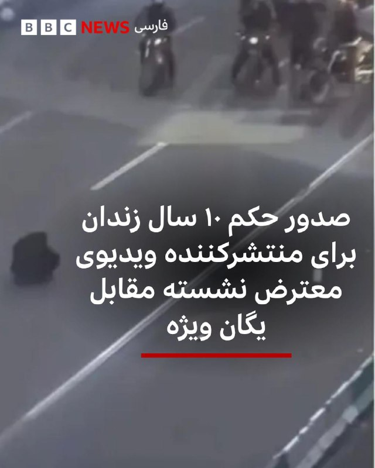

مسعود پیاهو، مردی که تصویر معترض نشسته مقابل نیروهای پلیس یگان ویژه در مقابل پاساژ علاالدین در آغاز اعتراضات دی ماه سال گذشته را منتشر کرد، به گفته وکیلش به ۱۰ سال زندان محکوم شده است.
@VahidHeadline

📡 @VahidOnline

## VahidOnline — post 75820

  

اسکات بسنت، وزیر خزانه‌داری آمریکا، در گفت‌وگو با فاکس‌نیوز درباره ایران اعلام کرد: لایه اول و دوم حکومت آن‌ها از بین رفته و اکنون با لایه سوم روبه‌رو هستیم. شاید آن‌ها دیده‌اند برای بقیه چه اتفاقی افتاد و می‌بینند ترامپ آماده انجام چه اقداماتی است.

بسنت افزود: اگر ترامپ با این توافق موافقت کند، همین حالا به رهبران جمهوری اسلامی می‌گویم که او این توافق را هم از نظر نظامی و هم از نظر اقتصادی اجرا خواهد کرد. آزادی کشتیرانی در خلیج فارس از طریق تنگه هرمز باید به وضعیت پیشین بازگردد.

او درباره اینکه آیا ترامپ «کار را تمام خواهد کرد» گفت: اگر «تمام کردن کار» یعنی اطمینان از باز بودن تنگه هرمز، در اختیار گرفتن اورانیوم با غنای بالا و نداشتن سلاح هسته‌ای از سوی جمهوری اسلامی، پس کار تمام شده است.

بسنت تاکید کرد: چه از طریق مداخله نظامی، چه محاصره یا فشار اقتصادی، این نخستین بار در ۴۷ سال گذشته است که ایرانی‌ها درباره نداشتن سلاح هسته‌ای گفت‌وگو می‌کنند. این موضوع پیش‌تر ممنوعه بود و اکنون برای نخستین بار روی میز مذاکره قرار گرفته است.
@VahidOOnLine

📡 @VahidOnline

## VahidOnline — post 75819

  <a href="telegram/content/VahidOnline_75819_1780242542.mp4" target="_blank">🎬 Download video</a>

عراقچی در تاریخ ۲۹ آبان ۱۴۰۴
در تلویزیون جمهوری اسلامی میگه ترامپ به ما نامه‌ای داده و صراحتا نوشته
«دو گزینه بیشتر نیست»
یا جنگ و خونریزی یا مذاکره مستقیم
«برای از بین بردن غنی‌سازی و موشکی»

این مصاحبه چند ماه بعد از جنگ ۱۲ روزه بود! یعنی در آبان ماه، مشکلات آمریکا و جمهوری اسلامی همچنان همون چیزهایی بودند که باعث یک جنگ شد، و این مصاحبه یک ماه پیش از آن بود که دست به قتل‌عام مردم در خیابان‌ها بزنید!

الان هم محور مذاکرات کاملا مشخصه!
همون چیزهایی است که جنگ ۱۲ روزه رو رقم زد. همون چیزهایی است که در آبان ماه عراقچی در تلویزیون گفت.

خون تک‌تک ایرانیان از جمله کودکان میناب پای شماست! شما طرف مذاکره بودید، شما انتخاب کننده و تصمیم گیر بودید.

و شما بین اورانیوم و موشک، و یا جان مردم، زیرساخت‌های کشور، فولاد و پتروشیمی و…
اورانیوم و موشک و دشمنی با اسرائیل و آمریکا رو انتخاب کردید! هنوز هم طرف مذاکره و تصمیم‌گیر شما هستید! و‌ جنگ ‌از سر گرفته بشه باز تصمیم و انتخاب شماست و مقصر شما هستید!

نمی‌توانید پشت کودکان میناب قایم بشید و از کشتار دیماه فرار کنید!
هر خون و ‌هر ویرانی ، همه پای شماست.

## VahidOnline — post 75818

  

حسن و حسین امیری، دو برادر دوقلوی ۲۰ ساله محبوس در زندان قزلحصار کرج، از سوی شعبه ۲۶ دادگاه انقلاب تهران به ریاست قاضی ایمان افشاری به اعدام محکوم شدند.

بر اساس اطلاعات دریافتی هرانا، مبنای صدور این رای اتهام «جاسوسی برای اسراییل» عنوان شده است.

یک منبع مطلع در گفت‌وگو با هرانا اعلام کرد در کیفرخواست صادرشده علیه حسن و حسین امیری، مشاهده تصاویری از ساختمان‌های آسیب‌دیده به عنوان مستند اتهام «جاسوسی به نفع اسراییل» مورد استناد قرار گرفته است.

این منبع همچنین گفت: «حسن و حسین امیری به دستور بازپرس پرونده به صورت جداگانه در زندان قزلحصار نگهداری می‌شوند و از حق ملاقات با یکدیگر محروم هستند. این دو زندانی در حال حاضر در سوییت ۳۵ این زندان محبوس هستند.»

بر اساس این گزارش، این دو برادر پیشتر در یکی از ایست‌های بازرسی و پس از بررسی تلفن همراهشان بازداشت شدند.آن‌ها پس از بازداشت، به مدت دو ماه در وضعیت بلاتکلیف در زندان قزلحصار کرج نگهداری شدند.

👈 حسن و حسین امیری از دو سالگی در مراکز بهزیستی پرورش یافته‌اند و خانواده‌ای برای پیگیری وضعیت قضایی و حقوقی خود ندارند. به گفته آشنایان این دو جوان، نبود حامی خانوادگی بر نگرانی‌ها درباره روند رسیدگی به پرونده آنان افزوده است.
@VahidHeadline

📡 @VahidOnline

## VahidOnline — post 75817

  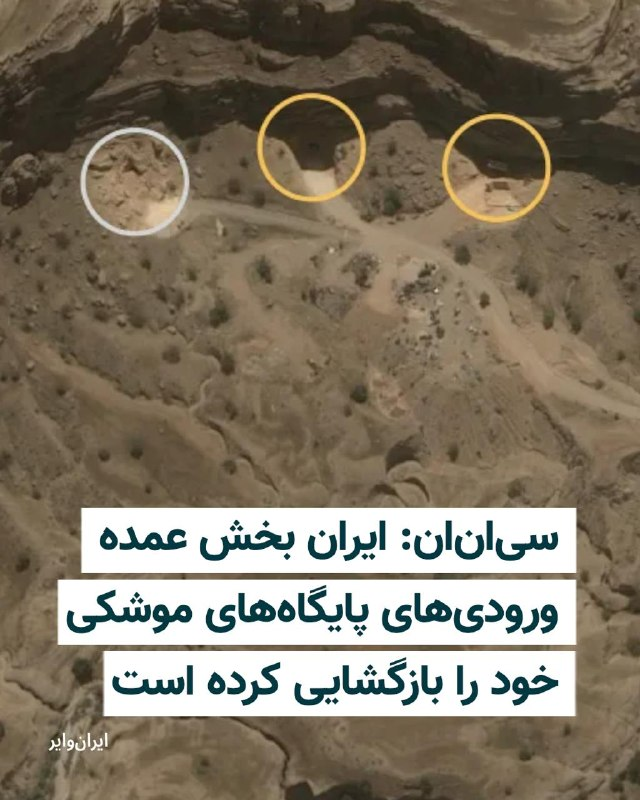

سی‌ان‌ان: ایران چندین ورودی تأسیسات موشکی زیرزمینی خود را بازگشایی کرده است

شبکه خبری سی‌ان‌ان روز یکشنبه ۱۰ خرداد با استناد به تصاویر ماهواره‌ای اعلام کرد ایران توانسته از زمان توقف جنگ شماری از زرادخانه‌های موشکی مدفون خود بر اثر حملات هوایی آمریکا و اسرائیل را از زیر خاک بیرون بیاورد.

حملات آمریکا و اسرائیل با تخریب جاده‌ها و مسدود کردن ورودی تونل‌ها، دسترسی ایران به پایگاه‌های موشکی زیرزمینی را محدود کرده بود.

سی‌ان‌ان ادعا کرده است که ایران تاکنون ۵۰ مورد از ۶۹ ورودی تونلی را که در ۱۸ تأسیسات موشکی زیرزمینی توسط آمریکا و اسرائیل هدف قرار گرفته بودند، بازگشایی کرده است، از جمله در پایگاه‌هایی در خارج از اصفهان و در اطراف خمین.

بر اساس گزارش این شبکه خبری، ایران همچنین بخش‌های دیگری از این پایگاه‌ها را نیز ترمیم کرده است؛ از جمله جاده‌هایی که آمریکا و اسرائیل برای جلوگیری از تردد پرتابگرهای موشکی بمباران کرده بودند. تصاویر ماهواره‌ای نشان می‌دهند که تقریباً تمامی گودال‌های ناشی از بمباران اکنون پر شده‌اند و در دو پایگاه، این جاده‌ها حتی دوباره آسفالت شده‌اند.

ایران شبکه پایگاه‌های زیرزمینی خود را در عمق خاک و در مواردی زیر کوه‌ها ساخته است تا در برابر حملات هوایی مصون باشند، به همین دلیل آمریکا و اسرائیل بسیاری از ورودی‌های این تأسیسات را بمباران کردند؛ اقدامی که در کنار تلاش برای شناسایی و نابود کردن پرتابگرهای موشکی، باعث شد توان ایران برای شلیک موشک به‌طور قابل توجهی محدود شود.

این حملات خسارت سنگینی به پایگاه‌ها وارد کرد؛ به‌گونه‌ای که بیشتر ورودی‌های تونل‌ها زیر حجم عظیمی از آوار مدفون شدند و جاده‌های منتهی به این سایت‌ها نیز به‌شدت تخریب شدند.

سی‌ان‌ان می‌گوید باز کردن ورودی تأسیسات موشکی زیرزمینی می‌تواند به ایران این قابلیت را دهد که در صورت وقوع دور جدیدی از درگیری‌ها، موشک‌های بالستیک بیشتری نسبت به اواخر جنگ ۴۰ روزه به سمت اسرائیل و کشورهای دیگر شلیک کند.
@VahidHeadline

📡 @VahidOnline

## IranIntlTV — post 339905

  <a href="telegram/content/IranIntlTV_339905_1780242544.mp4" target="_blank">🎬 Download video</a>

سی‌بی‌اس نیوز به نقل از منابع آگاه اعلام کرد دونالد ترامپ، رییس‌جمهوری ایالات متحده، جمعه اصلاحاتی را در متن تفاهم‌نامه اعمال کرد و نسخه جدید را برای تایید به تهران ارسال کرد، اما هنوز پاسخی از سوی جمهوری اسلامی دریافت نشده است.

گزارش مرضیه حسینی، خبرنگار ایران‌اینترنشنال
@iranintltv

## IranIntlTV — post 339904

  

اسکات بسنت، وزیر خزانه‌داری آمریکا، در گفت‌وگو با فاکس‌نیوز درباره ایران اعلام کرد: لایه اول و دوم حکومت آن‌ها از بین رفته و اکنون با لایه سوم روبه‌رو هستیم. شاید آن‌ها دیده‌اند برای بقیه چه اتفاقی افتاد و می‌بینند ترامپ آماده انجام چه اقداماتی است.

بسنت افزود: اگر ترامپ با این توافق موافقت کند، همین حالا به رهبران جمهوری اسلامی می‌گویم که او این توافق را هم از نظر نظامی و هم از نظر اقتصادی اجرا خواهد کرد. آزادی کشتیرانی در خلیج فارس از طریق تنگه هرمز باید به وضعیت پیشین بازگردد.

او درباره اینکه آیا ترامپ «کار را تمام خواهد کرد» گفت: اگر «تمام کردن کار» یعنی اطمینان از باز بودن تنگه هرمز، در اختیار گرفتن اورانیوم با غنای بالا و نداشتن سلاح هسته‌ای از سوی جمهوری اسلامی، پس کار تمام شده است.

بسنت تاکید کرد: چه از طریق مداخله نظامی، چه محاصره یا فشار اقتصادی، این نخستین بار در ۴۷ سال گذشته است که ایرانی‌ها درباره نداشتن سلاح هسته‌ای گفت‌وگو می‌کنند. این موضوع پیش‌تر ممنوعه بود و اکنون برای نخستین بار روی میز مذاکره قرار گرفته است.
https://iranintl.com/202605310994

## IranIntlTV — post 339903

  

سی‌ان‌ان گزارش داد تهران پس از خارج کردن سریع زرادخانه‌های موشکی مدفون خود، در موقعیتی قرار گرفته که می‌تواند تعداد بیشتری موشک دوربرد به سمت اسرائیل و دیگر کشورهای خاورمیانه شلیک کند؛ موضوعی که به گفته کارشناسان، محدودیت‌های راهبرد بمباران آمریکا را نشان می‌دهد.

بر اساس این گزارش، حملات آمریکا و اسرائیل در هفته‌های گذشته با هدف تخریب جاده‌ها و مسدود کردن ورودی تونل‌ها انجام شد تا دسترسی تهران به سایت‌های زیرزمینی موشکی محدود شود.

تصاویر ماهواره‌ای بررسی‌شده توسط سی‌ان‌ان نشان می‌دهد جمهوری اسلامی با استفاده از تجهیزات ساده‌ای مانند بولدوزر و کامیون‌های حمل‌ونقل توانسته این مسیرها را دوباره بازسازی کند. کارشناسان می‌گویند این موضوع نشان می‌دهد توان موشکی ایران تنها با هدف قرار دادن ورودی تونل‌ها قابل از بین بردن نیست.
https://iranintl.com/202605315236

## IranIntlTV — post 339902

  <a href="telegram/content/IranIntlTV_339902_1780242546.mp4" target="_blank">🎬 Download video</a>

در ادامه گزارش‌ها از موج گسترده بیکاری در ایران، سایت کاریابی «جاب‌ ویژن» اعلام کرد نیمی از مخاطبان یک نظرسنجی در این سایت بیکار شده‌اند. بر اساس این نظرسنجی، ۵۲ درصد از کارجویان اعلام کردند در پی جنگ شغل خود را از دست داده‌اند.
خبرگزاری ایلنا نیز از اخراج گسترده کارگران در مجتمع‌های پتروشیمی ماهشهر و بندر امام گزارش داد.

گفت‌وگو با فواد کیخسروی، فعال کارگری
@iranintltv

## IranIntlTV — post 339900

  <a href="telegram/content/IranIntlTV_339900_1780242548.mp4" target="_blank">🎬 Download video</a>

همزمان با تورم سنگین خوراکی‌ها و تشدید بحران معیشت در ایران، مقام‌های حوزه بهداشت و سلامت درباره پیامدهای کاهش مصرف خوراکی‌های مغذی برای سلامت خانوارها هشدار دادند.

گفت‌وگو با کیارش آرامش، پزشک و متخصص پزشکی اجتماعی و اخلاق زیستی
@iranintltv

## IranIntlTV — post 339899

  

مسعود پزشکیان با بیان اینکه «محدودیت‌ها و فشارهای خارجی در حوزه اقتصادی پیچیدگی‌های خاصی را برای اداره کشور ایجاد کرده است» گفت: شرایط کشور عادی و ساده نیست.

او با اشاره به ضرورت تقویت «تاب‌آوری» مردم گفت: واقعیت‌های موجود باید با جامعه در میان گذاشته شود تا آنها بتوانند نقش خود را در مواجهه با چالش‌ها ایفا کنند.

پزشکیان اضافه کرد: «جامعه باید نسبت به الزامات و هزینه‌های مقاومت آگاه باشد».
https://iranintl.com/202605313966

## IranIntlTV — post 339898

  <a href="telegram/content/IranIntlTV_339898_1780242550.mp4" target="_blank">🎬 Download video</a>

سرخط خبرهای یکشنبه ۱۰ خرداد
@iranintltv

## FarsiVOA — post 219180

  <a href="telegram/content/FarsiVOA_219180_1780242551.mp4" target="_blank">🎬 Download video</a>

ویدیویی در شبکه‌های اجتماعی منتشر شده که منتسب به یکی از مین‌های دریایی جمهوری اسلامی در محدوده آب‌های عمان است.

مرکز امنیت دریایی عمان روز شنبه ۹ خرداد، بعد از مشاهده یک جسم شناور در غرب منطقه ترافیک ساحلی تنگه هرمز در محدوده آب‌های سرزمینی عمان، که گمان می‌رود «مین دریایی» باشد، از دریانوردان، ماهیگیران، و کشتی‌ها خواست تا نهایت احتیاط را به کار گیرند.

## FarsiVOA — post 219179

  

فرماندهی جنوبی آمریکا تصویری از یک جنگنده «اف/ای-۱۸ اف سوپر هورنت» منتشر کرد که از عرشه ناو هواپیمابر «یواس‌اس نیمیتز» در اقیانوس اطلس به پرواز درآمد.

این تصویر در ۲۸ اردیبهشت گرفته شده است.

@FarsiVOA

## FarsiVOA — post 219178

در گفت‌وگو با امیر چاهکی، کارشناس روابط بین‌الملل، به اظهارات پرزیدنت ترامپ درباره نزدیک بودن به یک توافق «عالی» و هم‌زمان تهدید به اقدام نظامی پرداختیم. به گفته امیر چاهکی، در صورت شکست احتمالی مذاکرات، «این جنگ سه‌روزه یا دو‌هفته‌ای نخواهد بود» و می‌تواند وارد مرحله‌ای طولانی و پرهزینه شود.

## FarsiVOA — post 219177

🔺پرزیدنت ترامپ تام باراک را به عنوان فرستاده ویژه ریاست جمهوری در امور سوریه و عراق منصوب کرد

◾️دونالد ترامپ، رئیس جمهوری ایالات متحده، روز یکشنبه ۱۰ خرداد اعلام کرد تام باراک، سفیر آمریکا در ترکیه، علاوه بر مسئولیت کنونی خود، به عنوان فرستاده ویژه ریاست جمهوری آمریکا در امور سوریه و عراق منصوب خواهد شد.

⬇️ بیشتر بخوانید:

https://ir.voanews.com/a/president-trump-appoints-tom-barrack-special-presidential-envoy-to-syria-and-iraq/8155788.html

## FarsiVOA — post 219176

  <a href="telegram/content/FarsiVOA_219176_1780242553.mp4" target="_blank">🎬 Download video</a>

فرماندهی مرکزی ایالات متحده، سنتکام، با انتشار ویدیویی از داخل یک ناو هواپیمابر نیروی دریایی آمریکا، آن را شهری خودکفا در دریا توصیف کرد.

سنتکام می‌گوید این ناو که طول آن تقریبا به اندازه سه زمین فوتبال است، بیش از پنج هزار نفر را در خود جای داده و برای ادامه عملیات، به همکاری همه نیروها در عرشه و بخش‌های زیرین ناو متکی است.

@FarsiVOA

## FarsiVOA — post 219175

🔺زهرا شهباز طبری پس از نقض حکم پیشین بار دیگر به اعدام محکوم شد

◾️زهرا شهباز طبری، زندانی سیاسی محبوس در زندان لاکان رشت، پس از نقض حکم اعدام پیشین در دیوان عالی کشور، بار دیگر از سوی شعبه دوم دادگاه انقلاب رشت به اعدام محکوم شده است.

⬇️ بیشتر بخوانید:

https://ir.voanews.com/a/political-prisoner-sentenced-to-death/8155775.html

## FarsiVOA — post 219174

پیروزی پاری‌سن‌ژرمن در لیگ قهرمانان اروپا شامگاه شنبه ۹ خرداد پاریس را شعله‌ور کرد و هواداران خیابا‌ن‌ها را تسخیر و شادی کردند.

## DW_Farsi — post 125350

  <a href="telegram/content/DW_Farsi_125350_1780242553.mp4" target="_blank">🎬 Download video</a>

🎥 پیدا شدن بخشی از مجسمه آسیب‌دیده تخت مرمر کاخ گلستان
 
براساس تصاویری که به‌تازگی در شبکه‌های اجتماعی منتشر شده، مرمت‌گران کاخ گلستان روز ۱۸ فروردین ۱۴۰۵ در جریان مرمت تخت مرمر، قطعه "سر فرشته" یکی از مجسمه‌های این اثر تاریخی را که از بدنه جدا شده بود، در میان آوار پیدا کردند.
 
تخت مرمر از آثار دوره فتحعلی‌شاه قاجار در کاخ‌موزه گلستان است که از ۶۵ قطعه مرمر زرد ساخته شده و در گذشته برای مراسم رسمی و تاج‌گذاری مورد استفاده قرار می‌گرفت. رضاشاه پهلوی نیز تاج‌گذاری خود را در این محل برگزار کرد. این اثر تاریخی در پی موج انفجار ناشی از حملات هوایی ائتلاف نظامی آمریکا و اسرائیل به مناطقی در نزدیکی کاخ گلستان در شامگاه دهم اسفند ۱۴۰۴ آسیب دیده بود.
@dw_farsi

## DW_Farsi — post 125349

  

🔶 گزارش‌هایی از حمله موشکی ایران به اقلیم کردستان
 
یک مقام حزب "آزادی کردستان" گفته است امروز یکشنبه ۱۰ خرداد (۳۱ مه) یکی از پایگاه‌های اصلی وابسته به این گروه مخالف حکومت ایران در نزدیکی اربیل در عراق هدف حمله موشکی قرار گرفته است. این مقام، مسئولیت حمله را متوجه ایران دانسته است.
 
هم‌زمان، رسانه‌های دولتی ایران گزارش دادند نیروهای زمینی سپاه پاسداران به پایگاه‌های گروه‌های کرد در شمال عراق حمله کرده‌اند.
 
در این گزارش‌ها اشاره شده که محل دقیق حمله‌ها روشن نیست و مشخص نشده کدام پایگاه‌ها هدف قرار گرفته‌اند.
 
سپاه پاسداران در ماه‌های اخیر بارها مقر احزاب کرد در اقلیم کردستان را هدف حملات هوایی و پهپادی قرار داده است.
@dw_farsi

## DW_Farsi — post 125348

  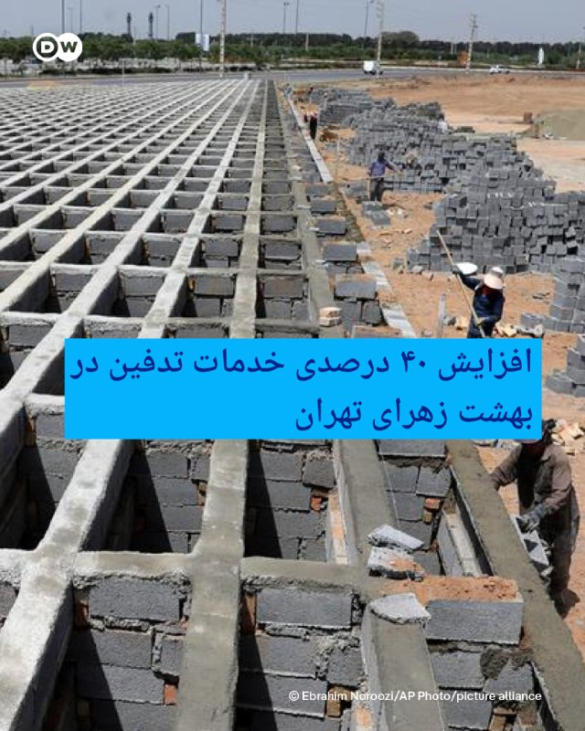

🔶 افزایش ۴۰ درصدی خدمات تدفین در بهشت زهرای تهران
 
مصوبه جدید نرخ بهای خدمات در بهشت‌زهرا نشان می‌دهد تعرفه خدمات مختلف، از حمل متوفی و تغسیل تا تکفین، تدفین و برگزاری مراسم، به‌طور متوسط حدود ۴۰ درصد افزایش یافته است. بر اساس این گزارش، در برخی موارد نیز میزان افزایش قیمت‌ها به ۵۰ درصد رسیده است.
 
به گزارش دیده‌بان ایران، هزینه انتقال هر متوفی از سطح شهر تهران تا شعاع ۱۰ کیلومتری به ۹ میلیون و ۷۵۰ هزار ریال رسیده است؛ رقمی که نشان‌دهنده افزایش ۵۰ درصدی این سرویس است.
 
نرخ حمل متوفی به پزشکی قانونی کهریزک نیز از این افزایش مستثنا نمانده و به ازای هر کیلومتر اضافه، افزایش یافته است. در نتیجه، هزینه انتقال در این مسیر نیز نسبت به قبل بالاتر رفته و بار مالی بیشتری بر خانواده‌ها تحمیل می‌کند.
 
در میان خدمات مختلف، آمبولانس خصوصی بیشترین رشد تعرفه را داشته است.
 
این تغییرات در مجموع نشان می‌دهد هزینه خدمات مرتبط با انتقال و رسیدگی به متوفیان در تهران وارد مرحله تازه‌ای از افزایش شده و بخش مهمی از خدمات بهشت‌زهرا با نرخ‌های بالاتری محاسبه خواهد شد.
@dw_farsi

## DW_Farsi — post 125347

🔶 انجمن پرواز۷۵۲ از اصلاح قوانین هوانوردی پس از شش سال خبر داد
 
انجمن خانواده‌های جان‌باختگان پرواز پی‌اس۷۵۲ امروز یکشنبه ۱۰ خرداد (۳۱ مه) اعلام کرد که پس از شش سال و نیم پیگیری و رایزنی، اصلاحاتی در ضمیمه ۱۳ کنوانسیون شیکاگو، یکی از مهم‌ترین اسناد ناظر بر تحقیقات سوانح هوایی، به تصویب رسیده است؛ اصلاحاتی که به گفته این انجمن، در واکنش به کاستی‌هایی شکل گرفته که در روند رسیدگی به سرنگونی هواپیمای اوکراینی در تهران آشکار شد.
 
پرواز پی‌اس۷۵۲ خطوط هوایی بین‌المللی اوکراین بامداد ۱۸ دی ۱۳۹۸ تنها چند دقیقه پس از برخاستن از فرودگاه تهران، با شلیک دو موشک سپاه پاسداران سرنگون شد و تمامی ۱۷۶ سرنشین آن جان باختند. بخش بزرگی از قربانیان، ایرانیان شهروند یا ساکن کانادا بودند.
 
انجمن خانواده‌های جان‌باختگان این هواپیما، در بیانیه خود اعلام کرده است که بر اساس ضمیمه ۱۳ کنوانسیون شیکاگو، مسئولیت هدایت تحقیقات ایمنی در یک سانحه هوایی بر عهده کشوری است که حادثه در قلمرو آن رخ داده است.
 
به گفته این انجمن، همین قاعده باعث شد که تحقیقات ایمنی درباره سرنگونی هواپیمای اوکراینی به جمهوری اسلامی ایران واگذار شود؛ وضعیتی که خانواده‌ها آن را مصداق سپردن "پرونده تحقیقات درباره یک قتل جمعی به دست عاملان آن" توصیف کرده‌اند.
 
به گفته انجمن، اصلاحات جدید پس از سال‌ها دیدار با تصمیم‌گیران بین‌المللی و رایزنی دولت کانادا، در نهادهایی از جمله سازمان بین‌المللی هوانوردی غیرنظامی (ایکائو)، به تصویب رسیده است.
@dw_farsi

## DW_Farsi — post 125346

  

🔶 رییس کمیته نظامی ناتو: اعضای ناتو می‌توانند در بازگشایی تنگه هرمز نقش داشته باشند
 
جوزپه کاوو دراگونه، رییس کمیته نظامی ناتو، گفت این پیمان دفاعی در شرایط کنونی مستقیما در حل‌وفصل مسائل مربوط به تنگه هرمز دخالت ندارد، اما کشورهای عضو این پیمان در حال نزدیک کردن نیروهای خود به منطقه هستند و اگر شرایط لازم فراهم شود، قادر خواهند بود نقش ایفا کنند.
 
کاوو دراگونه گفت ناتو به‌عنوان یک ائتلاف در این مرحله نقشی مستقیم ندارد، اما کشورهای عضو آن چنین نقشی دارند. او افزود این کشورها در حال جابه‌جایی و استقرار نیروهای خود در نزدیکی منطقه هستند تا در صورت مهیا شدن شرایط، بتوانند وارد عمل شوند.
 
او در توضیح بیشتر گفت آنچه در حال شکل‌گیری است، نه یک ماموریت رسمی ناتو، بلکه "ائتلافی از کشورهای مایل" است؛ یعنی مجموعه‌ای از کشورهای عضو ناتو و شریکانی همسو که از هم‌اکنون در حال آماده‌سازی و برنامه‌ریزی هستند تا اگر شرایط مداخله فراهم شد، بتوانند وارد عمل شوند.
@dw_farsi

## Persian_Trend_Official — post 15403

  <a href="telegram/content/Persian_Trend_Official_15403_1780242556.webm" target="_blank">🎬 Download video</a>

وقتی روحانیت و ایدئولوژی برای پوشش مردم تصمیم‌گیری می‌کنند، نتیجه‌اش می‌شود چنین فاجعه‌ای. قطعاً خانم سخنگو در استایل شخصی خودش می‌تواند بسیار مرتب‌تر و آراسته‌تر ظاهر شود؛ اما آن چیزی که حراست، اجبار و ایدئولوژی حکومتی بر پوشش زنان در جمهوری اسلامی تحمیل…

## Persian_Trend_Official — post 15402

  

وقتی روحانیت و ایدئولوژی برای پوشش مردم تصمیم‌گیری می‌کنند، نتیجه‌اش می‌شود چنین فاجعه‌ای.

قطعاً خانم سخنگو در استایل شخصی خودش می‌تواند بسیار مرتب‌تر و آراسته‌تر ظاهر شود؛ اما آن چیزی که حراست، اجبار و ایدئولوژی حکومتی بر پوشش زنان در جمهوری اسلامی تحمیل می‌کند، در نهایت چنین تصویری از ایران می‌سازد؛ تصویری زشت، تحقیرآمیز و دور از شأن تمدنی چند هزار ساله که قرار است در برابر نگاه جهان نماینده ایران باشد.

تلخ‌تر اینکه ایشان قرار است ویترین «زن مطلوب جمهوری اسلامی» در رسانه‌ها باشد؛ اما همین تصویر نشان می‌دهد وقتی حکومت به‌جای انتخاب آزادانه، پوشش را به ابزار ایدئولوژی تبدیل می‌کند، نتیجه نه وقار است، نه هویت، نه زیبایی؛ بلکه یک نمایش تحمیلی و ضدتصویر از زن ایرانی است.

📌 @persian_trend_official
پرشین ترند | متفاوت‌ترین کانال نظامی

## Persian_Trend_Official — post 15401

  

دیده شدن یک شناور ایرانی با نام دریافت‌کننده عوارض سپاه در تنگه هرمز!

📝 Amir

📌 @persian_trend_official
پرشین ترند | متفاوت‌ترین کانال نظامی

## Persian_Trend_Official — post 15400

  <a href="telegram/content/Persian_Trend_Official_15400_1780242558.mp4" target="_blank">🎬 Download video</a>

صداوسیما به شدت عصبانیه که چرا اینترنت وصل شده !
به قول اون پیرمرد معروف، یک یکتون ...

📌 @persian_trend_official
پرشین ترند | متفاوت‌ترین کانال نظامی

## RadioFarda — post 157747

🔸ارتش اسرائیل روز یک‌شنبه ۱۰ خرداد اعلام کرد عملیات زمینی خود در جنوب لبنان را به مناطق بیشتری گسترش داده و نیروهایش برای تقویت مواضع نظامی اسرائیل در این منطقه از رود لیتانی هم عبور کرده‌اند.

🔸مقام‌های ارشد اسرائیلی از تصرف یک قلعه مهم در جنوب لبنان خبر دادند و در واکنش به این اتفاق، فرانسه خواستار برگزاری جلسه اضطراری شورای امنیت سازمان ملل شد.

🔸ارتش اسرائیل در بیانیه‌ای گفت «شمار قابل توجهی» از نیروهای زمینی این کشور عملیات تهاجمی را برای گسترش «خط دفاعی پیشرو» آغاز کرده‌اند و این عملیات اکنون به مناطق بیشتری توسعه داده شده است.

🔸این اعلامیه دو روز پس از آن منتشر شد که بنیامین نتانیاهو، نخست‌وزیر اسرائیل، گفت نیروهای اسرائیلی از رود لیتانی، در حدود ۳۰ کیلومتری شمال مرز مشترک اسرائیل و لبنان، عبور کرده‌اند.

🔸همزمان، وزیر دفاع اسرائیل، اعلام کرد ارتش این کشور قلعه شقیف (بوفور)، دژ راهبردی قرون وسطایی در جنوب لبنان، را تصرف کرده و پرچم اسرائیل را بر فراز آن برافراشته است. او این منطقه را «یکی از مهم‌ترین نقاط راهبردی» برای دفاع از شهرک‌های الجلیل و امنیت نیروهای اسرائیلی توصیف کرد.

@RadioFarda

## RadioFarda — post 157746

سی‌ان‌ان: ایران چندین ورودی تأسیسات موشکی زیرزمینی خود را بازگشایی کرده است

🔸شبکه خبری سی‌ان‌ان روز یکشنبه ۱۰ خرداد با استناد به تصاویر ماهواره‌ای اعلام کرد ایران توانسته از زمان توقف جنگ شماری از زرادخانه‌های موشکی مدفون خود بر اثر حملات هوایی آمریکا و اسرائیل را از زیر خاک بیرون بیاورد.

🔸حملات آمریکا و اسرائیل با تخریب جاده‌ها و مسدود کردن ورودی تونل‌ها، دسترسی ایران به پایگاه‌های موشکی زیرزمینی را محدود کرده بود.

🔸سی‌ان‌ان ادعا کرده است که ایران تاکنون ۵۰ مورد از ۶۹ ورودی تونلی را که در ۱۸ تأسیسات موشکی زیرزمینی توسط آمریکا و اسرائیل هدف قرار گرفته بودند، بازگشایی کرده است، از جمله در پایگاه‌هایی در خارج از اصفهان و در اطراف خمین.

🔸بر اساس گزارش این شبکه خبری، ایران همچنین بخش‌های دیگری از این پایگاه‌ها را نیز ترمیم کرده است؛ از جمله جاده‌هایی که آمریکا و اسرائیل برای جلوگیری از تردد پرتابگرهای موشکی بمباران کرده بودند. تصاویر ماهواره‌ای نشان می‌دهند که تقریباً تمامی گودال‌های ناشی از بمباران اکنون پر شده‌اند و در دو پایگاه، این جاده‌ها حتی دوباره آسفالت شده‌اند.

🔸ایران شبکه پایگاه‌های زیرزمینی خود را در عمق خاک و در مواردی زیر کوه‌ها ساخته است تا در برابر حملات هوایی مصون باشند، به همین دلیل آمریکا و اسرائیل بسیاری از ورودی‌های این تأسیسات را بمباران کردند؛ اقدامی که در کنار تلاش برای شناسایی و نابود کردن پرتابگرهای موشکی، باعث شد توان ایران برای شلیک موشک به‌طور قابل توجهی محدود شود.

🔸این حملات خسارت سنگینی به پایگاه‌ها وارد کرد؛ به‌گونه‌ای که بیشتر ورودی‌های تونل‌ها زیر حجم عظیمی از آوار مدفون شدند و جاده‌های منتهی به این سایت‌ها نیز به‌شدت تخریب شدند.

🔸سی‌ان‌ان می‌گوید باز کردن ورودی تأسیسات موشکی زیرزمینی می‌تواند به ایران این قابلیت را دهد که در صورت وقوع دور جدیدی از درگیری‌ها، موشک‌های بالستیک بیشتری نسبت به اواخر جنگ ۴۰ روزه به سمت اسرائیل و کشورهای دیگر شلیک کند.

@RadioFarda

## IranianMinds — post 21147

  <a href="telegram/content/IranianMinds_21147_1780242559.mp4" target="_blank">🎬 Download video</a>

اکانت اسرائیل به فارسی:

جدی چرا دفنش نمی‌کنند؟؟😂😂😂

@IranianMinds

## IranianMinds — post 21146

  <a href="telegram/content/IranianMinds_21146_1780242560.mp4" target="_blank">🎬 Download video</a>

🔴 حملات جدید اسرائیل به لبنان.

@IranianMinds

## BBCPersian — post 282505

  

🔻مسعود پیاهو، مردی که تصویر معترض نشسته مقابل نیروهای پلیس یگان ویژه در مقابل پاساژ علاالدین در آغاز اعتراضات دی ماه سال گذشته را منتشر کرد، به گفته وکیلش به ۱۰ سال زندان محکوم شده است.

این ویدیو در آن زمان بازتاب گسترده‌ای در رسانه‌ها و شبکه‌های اجتماعی داشت.

حسن آقاخانی، وکیل مسعود پیاهو به سایت خبری امتداد در ایران گفت: «بازداشت موکل من به پیش از هجدهم و نوزدهم دیماه سال گذشته و اعتراضات اقتصادی در بازار برمی‌گردد. موکل من در حال کار در بازاری بودند که به خیابان جمهوری مشرف بوده است. شخصی در مقابل مامورین نیروی انتظامی، می‌نشیند و مسعود یک فیلم کوتاه به صورت ناخودآگاه از آن صحنه ضبط می‌کند.»

به گفته وکیل آقای پیاهو، «او به هیچ عنوان قصد انتشار ویدیو در بیرون از کشور را نداشته و صرفا برای یک تعداد مختصری از دوستانش در استوری خصوصی اینستاگرامش منتشر کرده است.»

با این وجود، به گفته این وکیل دادگستری، حکم ۱۰ سال حبس مسعود پیاهو که بر اساس قانون «تشدید مجازات جاسوسی و همکاری با رژیم صهیونیستی» صادر شده، در دیوان عالی کشور هم تایید شده و اکنون در آستانه اجرا قرار دارد.

@BBCPersian

## BBCPersian — post 282504

  

🔻حمیدرضا حاجی بابایی امروز در جلسه مجازی مجلس گفت: «با ایجاد اختلال در تامین کالا به‌ویژه در بنادر جنوب، بیش از ۳۴۰ هزار کسب‌وکار مرتبط با کامیون‌ها و تریلرها و بارکش‌ها تحت تاثیر قرار گرفته است.»

او همچنین گفت که محاصره دریایی باعث اختلال در «۸۰ درصد از ۴۰ تا ۴۵ میلیون تن واردات سالانه» شده است، از این رو «واردات حداقل ۵۰ درصد از نیاز وارداتی کالاهای اساسی از طریق بنادر شمالی شروع شده است و باید حتما با قدرت ادامه پیدا کند.»

محمدرضا رضایی کوچی، رئیس کمیسیون عمران، هم گفت: «۴۰۰ هزار راننده در کشور وجود دارد که متاسفانه به دلیل مشخص نبودن مبدا کالاها، در تامین معیشت دچار مشکل شده‌اند.»

او همچنین گفت: «بیش از ۳۰ هزار راننده در کشور وجود دارند که فاقد پوشش بیمه هستند و باید به مسائل معیشتی آنها توجه شود.»

📸IRNA
https://trib.al/MdcHYqS
@BBCPersian

## Dirty_Kids — post 390656

  <a href="telegram/content/Dirty_Kids_390656_1780242562.mp4" target="_blank">🎬 Download video</a>

حملات گسترده اسرائیل قهرمان حزبل در صور در جنوب لبنان.

که گفته بودن شیعه‌سانان هزارپدر رافضی امضای تفاهم‌نامه رو‌ منوط کردن به شرط پایان حمله‌ی اسرائیل به حزبل؟
که باراک‌راوید قحبه هم نوشته بود ترامپ گفته بوده تمومش کنید و سر بی‌بی داد کشیده؟


@Dirty_Kids 👻

## Dirty_Kids — post 390652

استایل جدید صابر ابر @Dirty_Kids 👻

## Dirty_Kids — post 390651

  

استایل جدید صابر ابر

@Dirty_Kids 👻

## Dirty_Kids — post 390650

  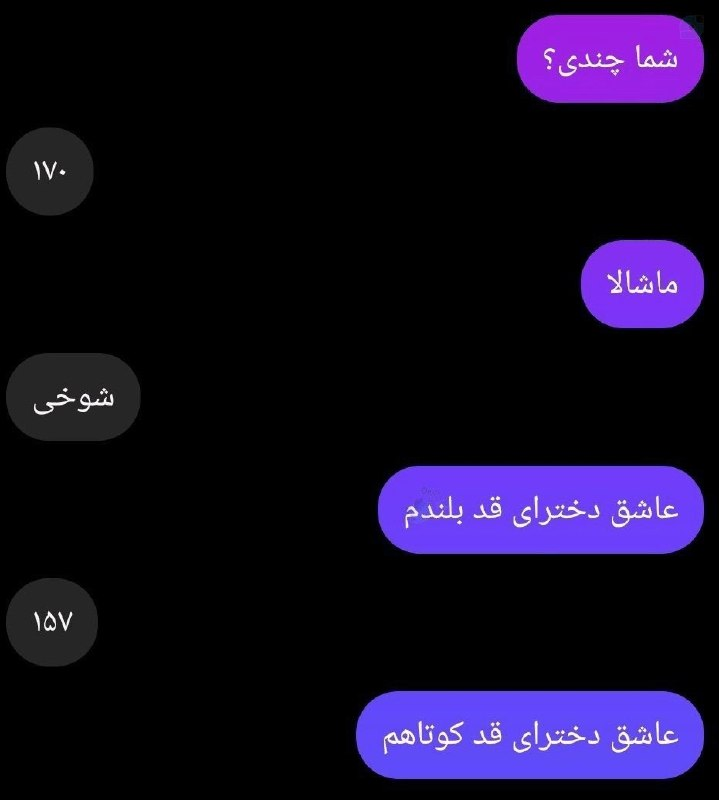

+ اره حاجی من تایپم نباشه کنسله

تایپش:

@Dirty_Kids 👻

## Dirty_Kids — post 390648

🔴 انگاری تو این مدت انقلاب شده و ما خبر نداشتیم.

@Dirty_Kids 👻

## Hranews — post 113282

  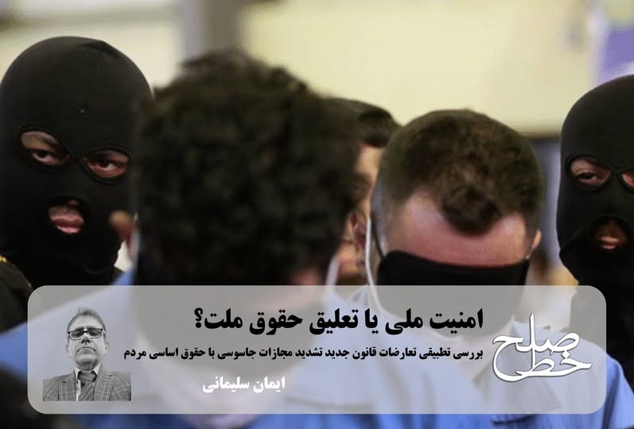

بررسی تطبیقی تعارضات قانون جدید تشدید مجازات جاسوسی با حقوق اساسی مردم/ ایمان سلیمانی

📡
📡
📡
📡
📡– منتقدان معتقدند این قانون می‌تواند زمینه‌ساز افزایش احکام اعدام، به‌ویژه در پرونده‌های مرتبط با فعالان سیاسی، کاربران فضای مجازی، خبرنگاران شهروندی و معترضان شود. هم‌چنین جرم‌انگاری استفاده از برخی ابزارهای ارتباطی و انتشار محتوا، می‌تواند دسترسی آزاد به اینترنت، آزادی بیان و فعالیت‌های مدنی را بیش از پیش محدود کند.

برخی تحلیل‌ها نیز به تاثیر این قانون بر ایرانیان خارج از کشور اشاره کرده‌اند؛ از جمله نگرانی درباره‌ی طرح اتهام همکاری یا امکان مصادره‌ی اموال.
در سطح کلی، این قانون بخشی از روند گسترده‌تر امنیتی‌سازی فضای سیاسی و اجتماعی پس از تحولات ۱۴۰۴ تلقی می‌شود؛ روندی که به گفته‌ی منتقدان، فشار بر فعالان مدنی، زنان، اقلیت‌ها و مدافعان حقوق بشر را افزایش داده است.
در عرصه‌ی بین‌المللی نیز، تصویب این قانون می‌تواند زمینه‌ساز گزارش‌ها و قطعنامه‌های بیشتر در نهادهای حقوق بشری سازمان ملل شود و فشارهای حقوق بشری علیه جمهوری اسلامی را افزایش دهد. برخی سازمان‌های حقوق بشری این قانون را نمونه‌ای از «رسمی‌سازی سرکوب» توصیف کرده‌اند.

در مجموع، منتقدان بر این باورند که این قانون، امنیت ملی را به اولویتی مطلق تبدیل کرده و در این مسیر، بخشی از حقوق و تضمین‌های بنیادین شهروندان را محدود ساخته است؛ مسئله‌ای که می‌تواند در بلندمدت، پیامدهای حقوقی و سیاسی گسترده‌ای برای جمهوری اسلامی در سطح داخلی و بین‌المللی به همراه داشته باشد.

ادامه مطلب

ادامه مطلب در وبسایت خط صلح

#ایمان_سلیمانی #اعدام #اتهام_جاسوسی

↘️
@hranews_bot تماس ✉️ - @Hranews کانال هرانا 🆑

## Hranews — post 113281

شش شهروند توسط سازمان اطلاعات فراجا بازداشت شدند؛ پخش اعترافات اجباری یکی از آنها

❗️
❗️
❗️
❗️
❗️– سازمان اطلاعات فراجا از #بازداشت شش شهروند در یکی از شهرهای جنوبی کشور خبر داد و مدعی شد این افراد در ارتباط با یک شبکه فعال در داخل کشور بازداشت شده‌اند. هم‌زمان ویدئویی از اعترافات اجباری یکی از بازداشت‌شدگان منتشر شده که مشخص نیست در چه شرایطی ضبط شده است.

ادامه مطلب

↘️
@hranews_bot تماس ✉️ - @Hranews کانال هرانا 🆑

## Hranews — post 113280

اعتراضات دی‌ماه ۱۴۰۴؛ سه تن از بازداشت‌شدگان مجموعا به ۹ سال و ۳ ماه حبس محکوم شدند

❗️
❗️
❗️
❗️
❗️– محمدامین شمسی، امیر امرایی و کامیار امرایی، از بازداشت شدگان اعتراضات سراسری ۱۴۰۴، توسط مراجع قضایی مجموعا به ۹ سال و سه ماه حبس تعزیری محکوم شدند.

ادامه مطلب

#محمدامین_شمسی #امیر_امرایی #کامیار_امرایی

↘️
@hranews_bot تماس ✉️ - @Hranews کانال هرانا 🆑

## Hranews — post 113279

خوزستان؛ ۵۷ کارگر در سال ۱۴۰۴ قربانی حوادث کار شدند

❗️
❗️
❗️
❗️
❗️– مدیرکل پزشکی قانونی خوزستان اعلام کرد که طی سال ۱۴۰۴، دستکم ۵۷ #کارگر در این استان بر اثر حوادث ناشی از کار جان خود را از دست داده‌اند.

ادامه مطلب

↘️
@hranews_bot تماس ✉️ - @Hranews کانال هرانا 🆑

## Hranews — post 113278

  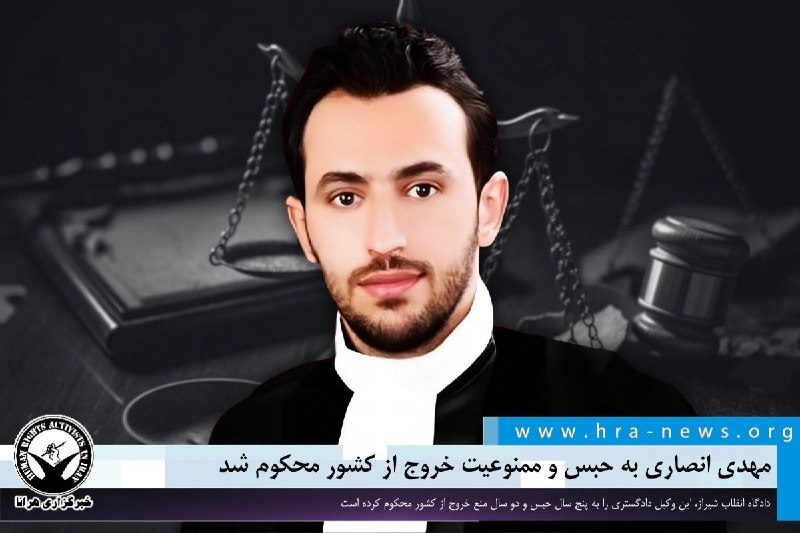

مهدی انصاری، وکیل دادگستری به ۵ سال حبس محکوم شد

❗️
❗️
❗️
❗️
❗️ – مهدی انصاری، عضو کانون وکلای استان فارس و از بازداشت شدگان اعتراضات سراسری ۱۴۰۴، توسط دادگاه انقلاب شیراز به پنج سال #حبس و دو سال منع خروج از کشور محکوم شد.

به گزارش خبرگزاری هرانا، ارگان خبری مجموعه فعالان حقوق بشر در ایران، مهدی انصاری، وکیل دادگستری به حبس محکوم شد.

بر اساس اطلاعات دریافتی هرانا، یکی از شعب دادگاه انقلاب شیراز، آقای انصاری را بابت اتهام «اجتماع و تبانی به قصد بر هم زدن امنیت کشور»، به پنج سال حبس و دو سال منع خروج از کشور محکوم کرده است.

ادامه مطلب

#مهدی_انصاری

↘️
@hranews_bot تماس ✉️ -  @Hranews  کانال هرانا 🆑

## Hranews — post 113277

  

زندان اوین؛ غزل مرزبان ۷ روز است که در اعتصاب به سر می‌برد

❗️
❗️
❗️
❗️
❗️ – غزل مرزبان، نوکیش مسیحی محبوس در زندان اوین، از روز دوشنبه ۴ خردادماه، در اعتراض به صدور حکم بیش از ۹ سال حبس علیه خود، دست به #اعتصاب زده است.

به گزارش خبرگزاری هرانا، ارگان خبری مجموعه فعالان حقوق بشر در ایران، غزل مرزبان، نوکیش مسیحی، در هفتمین روز از اعتصاب غذای خود بسر می‌برد.

یک منبع مطلع از وضعیت این نوکیش مسیحی، ضمن تایید این خبر به هرانا گفت: “خانم مرزبان در اعتراض به حکم ۹ سال و هشت ماه حبس خود که اخیرا توسط  قاضی ایمان افشاری علیه وی صادر شده است، از تاریخ ۴ خرداد ۱۴۰۵، دست به اعتصاب غذا زده است. با گذشت هفت روز از آغاز اعتصاب غذا، وضعیت جسمانی او نامناسب است.”

ادامه مطلب

#غزل_مرزبان

↘️
@hranews_bot تماس ✉️ -  @Hranews  کانال هرانا 🆑

## alonews — post 123993

🔥 همراه با ساب + حجم مصرفی، فقط 9T! 🚀 ❌ آفر فقط تا پایان امشب ❌ 🔥 اگه دنبال یه VPN پایدار و بدون دردسر می‌گردی، این پلن مخصوص خودته! @Netaazaadbot @NetAazaadBot ✅ همراه با ساب + حجم مصرفی ✅ 15 سرور اختصاصی پرسرعت ✅ اتصال پایدار و بدون قطعی ✅ سرعت بالا…

## alonews — post 123992

  

🔥 همراه با ساب + حجم مصرفی، فقط 9T! 🚀

❌ آفر فقط تا پایان امشب ❌

🔥 اگه دنبال یه VPN پایدار و بدون دردسر می‌گردی، این پلن مخصوص خودته!

@Netaazaadbot
@NetAazaadBot
✅ همراه با ساب + حجم مصرفی
✅ 15 سرور اختصاصی پرسرعت
✅ اتصال پایدار و بدون قطعی
✅ سرعت بالا حتی در ساعات شلوغ

@Netaazaadbot
@NetAazaadBot
💎 کیفیتی که بعد از استفاده متوجه تفاوتش میشی!

📩 برای خرید و دریافت سرویس استارت رو بزن✅

## alonews — post 123991

  <a href="telegram/content/alonews_123991_1780242565.webm" target="_blank">🎬 Download video</a>

👈کانال 12 اسرائیل: حزب الله از صبح امروز بیش از 20 راکت به سمت شمال اسرائیل شلیک کرده است‌‌

✅ @AloNews خبر جنگ

## alonews — post 123990

  <a href="telegram/content/alonews_123990_1780242565.webm" target="_blank">🎬 Download video</a>

👈انفجار مهیب در میانمار، دستکم ۵۵ کشته

🔴در انفجار مهیب در انبار مواد منفجره در نامکام در میانمار، دستکم ۵۵ نفر کشته و بیش از ۶۰ نفر زخمی شدند.

🔴از سرنوشت چندی نفر دیگر خبری در دست نیست .

🔴در جریان این انفجار ۱۰۰ خانه آسیب دیده است.

✅ @AloNews خبر جنگ

## alonews — post 123989

  <a href="telegram/content/alonews_123989_1780242565.webm" target="_blank">🎬 Download video</a>

🔴فوری/سی ان ان:
ترامپ با آزادسازی هرگونه دارایی ایران در توافق احتمالی مخالفت کرده است.

✅ @AloNews خبر جنگ

## alonews — post 123988

  <a href="telegram/content/alonews_123988_1780242565.mp4" target="_blank">🎬 Download video</a>

👈لحظه اصابت یک پهپاد حزب الله در داخل پایگاه نظامی ارتش اسرائیل در نزدیکی بیت هیل چندی پیش‌‌

✅ @AloNews خبر جنگ

## alonews — post 123987

  <a href="telegram/content/alonews_123987_1780242566.webm" target="_blank">🎬 Download video</a>

👈حمله مجدد اوکراین به نیروگاه هسته‌ای زاپروژیا در روسیه

✅ @AloNews خبر جنگ

## alonews — post 123986

  <a href="telegram/content/alonews_123986_1780242566.mp4" target="_blank">🎬 Download video</a>

👈فواد ایزدی: از من به یادگار داشته باشید که در ژانویه، مجلس نمایندگان به دلیل جنگ ایران، ترامپ را استیضاح خواهد کرد

✅ @AloNews خبر جنگ

## alonews — post 123985

  <a href="telegram/content/alonews_123985_1780242568.mp4" target="_blank">🎬 Download video</a>

💔جاویدنام زهره خاکسار ، دخترش که بر مزار مادرش میرقصد

🤔برای ما مردم دیگر فقط مسئلهٔ اقتصاد و سیاست نیست؛ یک حساب تسویه نشدهٔ عمیق با حرام زاده های عرزشی است که تا ابد در ذهنمان مانده.

✅@AloNews

## alonews — post 123984

  <a href="telegram/content/alonews_123984_1780242569.webm" target="_blank">🎬 Download video</a>

👈خبرگزاری CBS: تغییراتی که ترامپ در متن تفاهم نامه داده جزئی نیست و قابل توجه است!

✅ @AloNews خبر جنگ

## alonews — post 123983

  <a href="telegram/content/alonews_123983_1780242569.webm" target="_blank">🎬 Download video</a>

👈خبرنگار الجزیره: دو حمله هوایی اسرائیل به شهرهای کفرسیر و شوکین در جنوب لبنان

✅ @AloNews خبر جنگ

## alonews — post 123982

  <a href="telegram/content/alonews_123982_1780242570.webm" target="_blank">🎬 Download video</a>

👈گروسی: حملات به تأسیسات هسته‌ای غیرقابل قبول است

✅ @AloNews خبر جنگ

## alonews — post 123981

  <a href="telegram/content/alonews_123981_1780242570.webm" target="_blank">🎬 Download video</a>

👈سی ان ان: ایران ۷۰ درصد سایت‌های موشکی خود که بمباران شده بود را باز کرد

🔴ترامپ نگرانی خود را از میزان سود مالی که ممکن است ایران در چارچوب توافق به دست آورد، ابراز کرد

🔴ترامپ بر عبارت‌های سختگیرانه‌تری در مورد تعهدات هسته‌ای ایران و وعده‌هایش برای بازگشایی تنگه هرمز اصرار دارد

✅ @AloNews خبر جنگ

## alonews — post 123980

  <a href="telegram/content/alonews_123980_1780242570.webm" target="_blank">🎬 Download video</a>

👈جدیدترین کمپین در خبرگزاری فارس با عنوان قطع داوطلبانه نت بین الملل!

✅ @AloNews خبر جنگ

## alonews — post 123979

  <a href="telegram/content/alonews_123979_1780242570.webm" target="_blank">🎬 Download video</a>

👈سی‌بی‌اس نیوز به نقل از یک منبع:
در حال حاضر هیچ ضرب‌الاجل یا چارچوب زمانی مشخصی برای دستیابی به توافق در مورد ایران وجود ندارد

✅ @AloNews خبر جنگ

## alonews — post 123978

  <a href="telegram/content/alonews_123978_1780242570.webm" target="_blank">🎬 Download video</a>

👈 پزشکیان: خدمات‌رسانی دولت در هر شرایطی ادامه خواهد داشت

🔴دولت با تمام توان و ظرفیت خود مسیر خدمت به مردم را ادامه خواهد داد و ادارۀ امور کشور با قدرت و صلابت دنبال خواهد شد.

🔴بخشی از مشکلات اقتصادی کشور ناشی از محدودیت‌های بیرونی و بخشی نیز ناشی از فشارهایی است که در نتیجه شرایط خاص کشور ایجاد شده است.

🔴دولت و تمامی دستگاه‌های اجرایی با تمام توان در تلاش هستند تا کشور با کمترین هزینه و آسیب از این شرایط عبور کند.

✅ @AloNews خبر جنگ

## alonews — post 123977

  <a href="telegram/content/alonews_123977_1780242570.mp4" target="_blank">🎬 Download video</a>

👈وزیر خزانه‌داری ایالات متحده اسکات بسنت درباره ایران: اطمینان از باز بودن تنگه هرمز، دریافت اورانیوم بسیار غنی‌شده، و اینکه ایران سلاح هسته‌ای نداشته باشد — این پایان دادن به کار است.

🔴این اولین بار است که ایرانی‌ها در ۴۷ سال گذشته حاضر به بحث درباره نداشتن سلاح هسته‌ای شده‌اند.

✅ @AloNews خبر جنگ

---
📅 بروزرسانی: 1405/03/10 18:05
---

## VahidOOnLine — post 243062

  

دونالد ترامپ در تروث‌سوشال اعلام کرد که تام باراک، سفیر ایالات متحده در ترکیه، به عنوان فرستاده ویژه ریاست‌جمهوری در امور عراق و سوریه منصوب شده است.

ترامپ افزود: همزمان با پیشبرد همکاری راهبردی ما با دولت‌های سوریه و عراق، روابط ما با آن‌ها همچنان در حال گسترش است.
‌🏁 🇬🇧 IranintlTV

🤖 @VahidOOnLine

## VahidOOnLine — post 243061

♦️تصاویر منتشرشده از سوی یک زوج جوان ایرانی از خانه‌شان پیش و پس از جنگ، با واکنش احساسی بسیاری از کاربران در شبکه‌های اجتماعی مواجه شد.

این زوج که صفحه‌ای برای ارائه خدمات نگهداری از گیاهان و باغبانی در اینستاگرام دارند، پس از وصل دوباره اینترنت در ایران، با انتشار تصاویری از تخریب گسترده منزلشان نوشتند: «آنهایی که منتظر جنگ هستند را نمی‌فهمم. جنگ، یک دهان بزرگ است که همه‌ چیز را قورت می‌دهد؛ خواهران و برادرانمان را، سفره‌های خالی‌مان را، شهرها و روستاهایمان را، مزرعه‌هایمان را، نخل‌هایمان را... و روزی که جنگ دور دهانش را پاک کند، جای خیلی چیزها تا ابد خالی خواهد ماند.»

گروهی از ایرانیان در روزهای گذشته با انتشار تصاویری از منازل ویران، کشته‌شدگان و کودکان و حیوانات آسیب‌دیده در جریان جنگ گذشته، از زندگی تحت فشار بمباران روایت‌های تازه‌ای در شبکه‌های اجتماعی منتشر می‌کنند.
‌🇸🇦 Indypersian

🤖 @VahidOOnLine

## VahidOOnLine — post 243060

  

اسماعیل کوثری، عضو کمیسیون امنیت ملی مجلس، با تاکید بر اینکه «پرونده هسته‌ای از روی میز مذاکره با آمریکا برداشته شده است»، گفت: «مذاکرات برای پایان دادن به جنگ در حال انجام است اما به توافق نهایی نرسیده‌ایم و می‌دانیم که نتیجه‌ای نخواهند داشت.»

او افزود: «جمهوری اسلامی اکنون در حال مذاکره در مورد جلوگیری از تکرار جنگ، پرداخت غرامت، خروج نیروهای آمریکایی از منطقه و لغو محاصره دریایی است.»

کوثری اضافه کرد: «بسیاری از کشورها کنترل ایران بر تنگه را پذیرفته‌اند.»
‌🏁 🇬🇧 IranintlTV

🤖 @VahidOOnLine

## VahidOOnLine — post 243059

  

سی‌بی‌اس نیوز گزارش داد میانجی‌ها تا صبح یکشنبه همچنان درباره یک یادداشت تفاهم میان جمهوری اسلامی و آمریکا در حال گفت‌وگو هستند.

یک منبع آگاه اعلام کرد دونالد ترامپ روز جمعه اصلاحاتی در متن این یادداشت ایجاد کرده و نسخه ویرایش‌شده برای تایید به تهران ارسال شده اما تاکنون پاسخی دریافت نشده است.

این سومین دور اصلاحاتی است که ترامپ در پیشنهاد آمریکا اعمال کرده؛ پیشنهادی که از طریق میانجی‌ها میان واشینگتن و تهران رد و بدل شده و این روند تحت هدایت پاکستان انجام می‌شود.

این منبع اعلام کرد تغییرات آمریکا تا حدی قابل توجه بوده، هرچند جزئیات آن هنوز منتشر نشده و برای نهایی شدن توافق نیز ضرب‌الاجل مشخصی وجود ندارد.
‌🏁 🇬🇧 IranintlTV

🤖 @VahidOOnLine

## VahidOOnLine — post 243058

  <a href="telegram/content/VahidOOnLine_243058_1780238149.mp4" target="_blank">🎬 Download video</a>

در پی راه‌اندازی کارزار مردمی رشت از سوی ایران‌اینترنشنال، ویدیوهایی به دست ما رسیده که خودروهای زیادی را در آرامستان شهر در ۲۰ دی ۱۴۰۴ نشان می‌دهد. به گفته شاهدان، جمعیت زیادی برای خاکسپاری جاویدنام خود در این روز به آرامستان آمدند.
‌🏁 🇬🇧 IranintlTV

🤖 @VahidOOnLine

## VahidOOnLine — post 243057

  

♦️نتایج یک کارآزمایی بالینی بین‌المللی نشان می‌دهد داروی تزریقی «امیفانتاماب» توانسته در شماری از بیماران مبتلا به سرطان پیشرفته سر و گردن که به درمان‌های متداول پاسخ نداده بودند، نتایج امیدوارکننده‌ای به همراه داشته باشد.

به گزارش گاردین، بر اساس نتایج این مطالعه که در ۱۱ کشور و با مشارکت ۱۰۲ بیمار انجام شد، تومورها در ۴۳ بیمار کوچک یا ناپدید شدند و در ۱۵ بیمار نیز پزشکان دیگر هیچ اثری از تومور مشاهده نکردند. پژوهشگران می‌گویند این بیماران پیش‌تر به شیمی‌درمانی و ایمنی‌درمانی پاسخ نداده بودند.

امیفانتاماب هر سه هفته یک‌بار به صورت تزریق زیرپوستی تجویز می‌شود و با هدف قرار دادن چند مسیر رشد تومور و تقویت عملکرد سیستم ایمنی بدن عمل می‌کند. این دارو در حال حاضر برای برخی بیماران مبتلا به سرطان ریه مورد تایید قرار گرفته و اکنون در مطالعات بالینی برای انواع دیگری از سرطان‌ها از جمله سرطان سر و گردن، روده بزرگ و معده در حال بررسی است.
‌🇸🇦 Indypersian

🤖 @VahidOOnLine

## VahidOOnLine — post 243056

🗣کارزار مردمی ایران اینترنشنال درباره جاوید‌نامان رشت - یکشنبه ۱۰ خرداد

🔹جمعیت عظیم معترضین از خیابان رودباری حرکت کردند و با شعار «رشت رو گرفتیم» به خیابان معلم و سپس استانداری رسیدند. گاز اشک‌آور شیمیایی و ازدحام شدید، باعث خفگی و بیهوشی برخی شد. حوالی ساعت ۱۰ شب تیراندازی گسترده نیروهای امنیتی آغاز شد و مردم را به رگبار بستند.

🔹در جاده تهران بین باغ رضوان و سراوان یک سوله هست که با پرچم قرمز، سفید و سبز رنگ شده و هیچ علامتی ندارد. پیکرهای جوانان رشت را در تاریخ ۱۸ و ۱۹ دی به آنجا انتقال می‌دادند.

🔹یکی از محل‌های کشتار استانداری رشت بود، به‌طوریکه نیروهای بسیج و سپاه مردم را به سمت استانداری هدایت کردند و با باز شدن در استانداری به مردم شلیک می‌کردند.

🔹شب ۱۸ دی‌ماه شاهد بودیم که در محله‌ای مابین دانای علی و سام، یگان ویژه به تابلو بالای مغازه شلیک کردند و همین اتفاق منجر به اتصال برق شد و مغازه آتش گرفت. چون خودم در رشته برق سررشته دارم، مطمئنم که آتش گرفتن مغازه به‌دلیل همان شلیک به تابلو و اتصال برق بود.

🔹صبح ۱۹ دی‌ماه دوستم زنگ زد و گفت در شهرداری فاجعه اتفاق افتاده و رفتیم. اولین چیزی که دیدم حجم دود و آتشی بود که هنوز زبانه می‌کشید. وانت‌ها و مأمورین شهرداری گوشه‌گوشه خیابان از خستگی نشسته بودند. چند وانت شهرداری را دیدم که از خیابان شهرداری بیرون می‌آمدند با دو رفتگر که عقبش نشسته بودند. عقب وانت پر بود ولی رویش را پارچه کشیده بودند. بعدها فهمیدم آن‌ها جنازه بچه‌هایمان بود. روی دیوار آثار دست‌های خونی بود که بعد پاک کردند.

🔹در میدان شهرداری رشت، دقیقا در همان خیابانی که ۱۸ و ۱۹ دی چندین نفر کشته دادیم، یک ون گشت ارشاد گذاشته‌اند و دوباره به حجاب‌ها گیر می‌دهند.

🔹در شهرداری رشت، اینقدر خون روی زمین بود که هنوز وقتی یادم میاد، تمام وجودم مالامال درد میشه، مثلا رد دست‌های خونی که روی دیوارها نقش بسته بود.

🔹 به پدرومادرهای جاویدنامان رشت می‌گفتن باید برای تحویل جنازه هم پول پرداخت کنید که بسته به شرایط مالی خانواده مبلغ تعیین میشد (اگر وضع مالی خوب بود، بالای یک میلیارد، ولی در غیراینصورت حدود ۵۰۰ میلیون تومان.) جاویدنام‌های عزیزمون رو نمیذاشتن حتی غسل بدن و بشورن. پیکرها رو در حالی که غرق خون بودند و با لباس دفن می‌کردند.
‌🏁 🇬🇧 IranintlTV

🤖 @VahidOOnLine

## VahidOOnLine — post 243055

  <a href="telegram/content/VahidOOnLine_243055_1780238153.mp4" target="_blank">🎬 Download video</a>

در پی راه‌اندازی کارزار مردمی رشت از سوی ایران‌اینترنشنال، ویدیوهایی به دست ما رسیده که جمعیت گسترده مردم معترض این شهر را در ۱۸ دی ۱۴۰۴ نشان می‌دهد.
‌🏁 🇬🇧 IranintlTV

🤖 @VahidOOnLine

## VahidOOnLine — post 243054

  <a href="telegram/content/VahidOOnLine_243054_1780238156.mp4" target="_blank">🎬 Download video</a>

ویدیوهای رسیده به ایران‌اینترنشنال، مراسم چهلم ماهان و امیررضا حیدری، دو پسرعموی جاویدنام را نشان می‌دهد که در ۱۸ دی‌ماه در محله پاسداران تهران به ضرب گلوله کشته شدند.
امیررضا، ۳۰ ساله و ماهان هم ۲۱ سال سن داشت. مادر ماهان در مراسم چهلم آنها خطاب به پسرش فریاد زد: «خوشت باشد که در این راه رفتی. من ناراحت نیستم که در این راه کشته شدی.»
‌🏁 🇬🇧 IranintlTV

🤖 @VahidOOnLine

## VahidOOnLine — post 243053

  

سایت هرانا گزارش داد یک زن ترنس ۲۶ ساله ساکن سنندج، در محله گلشن این شهر، بر اثر ضربات چاقو توسط افراد ناشناس کشته شده است و هنوز انگیزه و هویت عاملان مشخص نیست.
هرانا نوشت: «احتمالا او روز جمعه به‌دست افراد ناشناس و با ضربات چاقو به قتل رسیده و مهاجمان جسد را هم مثله کرده‌اند.»
‌🏁 🇬🇧 IranintlTV

🤖 @VahidOOnLine

## VahidOOnLine — post 243052

  

♦️روزنامه نیویورک‌تایمز،روز یکشنبه دهم خرداد ماه، به نقل از سه مقام آگاه گزارش داد دونالد ترامپ شروط چارچوب احتمالی توافق برای پایان دادن به جنگ با ایران را سخت‌تر کرده و نسخه اصلاح‌شده را برای بررسی دوباره به تهران ارسال کرده است.

بر اساس این گزارش،هنوز مشخص نیست چه تغییراتی در متن پیشنهادی اعمال شده است، اما دو مقام آمریکایی گفته‌اند ترامپ نسبت به بخش‌هایی از توافق که شامل آزادسازی منابع مالی مسدودشده ایران می‌شود، ابراز نگرانی کرده است.

نیویورک تامیز به نقل از یکی مقام‌های کاخ سفید گزارش کرد، رئیس‌جمهور آمریکا از طولانی شدن روند پاسخ ایران به پیشنهادهای واشنگتن ناراضی است. این پیشنهادها با مشارکت میانجی‌هایی از جمله پاکستان تدوین شده‌اند

این مقام افزود تغییرات جدید ترامپ وارائه نسخه‌ای سخت‌گیرانه‌تر از چارچوب توافق، احتمالا با هدف افزایش فشار بر ایران برای پذیرش طرحی انجام شده که پیش‌تر برای تایید به مجتبی خامنه‌ای، رهبر جمهوری اسلامی ایران، ارسال شده بود

نیویورک‌تایمز نوشت هنوز مشخص نیست تهران چه پاسخی به نسخه جدید پیشنهاد آمریکا خواهد داد و مذاکرات غیرمستقیم میان دوطرف همچنان ادامه دارد
‌🇸🇦 Indypersian

🤖 @VahidOOnLine

## VahidOOnLine — post 243051

  

♦️هادی احمدی، سخنگو و عضو هیات مدیره انجمن داروسازان ایران، روز یکشنبه دهم خرداد ماه در گفتگو با خبرگزاری ایلنا، با اشاره به کمبود برخی داروها از جمله کدئین گفت این مشکل بیش از آنکه ناشی از تحریم‌ها باشد، به محدودیت در تامین ماده اولیه آن بازمی‌گردد.
به گفته سخنگوی انجمن داروسازان، کاهش تولید خشخاش در افغانستان و محدودیت‌های اعمال‌شده بر کشت این محصول، تامین ماده اولیه مورد نیاز برای تولید کدئین را با مشکل مواجه کرده و همین مسئله در کمبود این دارو نقش داشته است.
احمدی همچنین با ادعای آنکه تحریم‌ها نیز در کمبود این داروی ضد درد بی‌تاثیر نیستند، افزود محدودیت‌های بانکی، حمل‌ونقل و بیمه، روند واردات برخی داروها و مواد اولیه را دشوار کرده است، اما کمبود کدئین مستقیما به موضوع تامین خشخاش مرتبط است.
‌🇸🇦 Indypersian

🤖 @VahidOOnLine

## VahidOOnLine — post 243050

  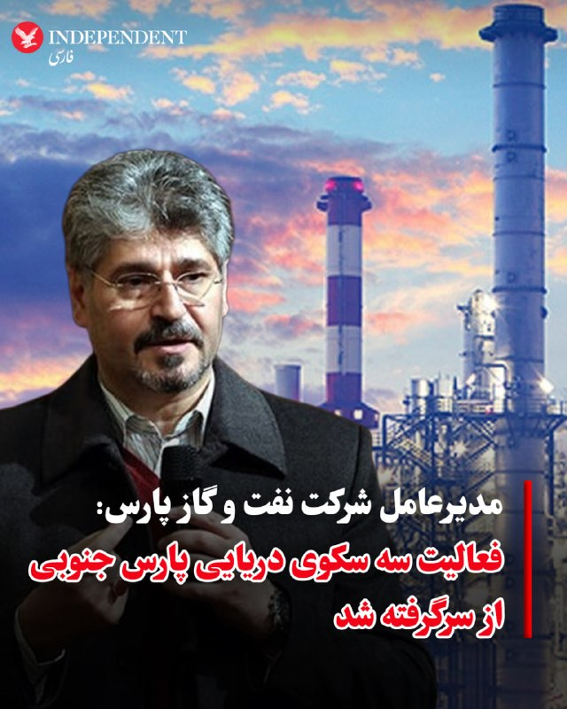

♦️تورج دهقانی، مدیرعامل شرکت نفت و گاز پارس، روز یکشنبه دهم خرداد ماه اعلام کرد، تولید گاز در سه سکوی دریایی میدان گازی پارس جنوبی از سر گرفته شده است.
این تاسیسات در جریان جنگ گذشته و اختلال در ظرفیت فرآورش برخی تاسیسات خشکی متوقف شده بود.
تورج دهقانی روز یکشنبه اعلام کرد این سکوهای دریایی آسیبی ندیده‌اند و گاز تولیدی آن‌ها اکنون به واحدهای فرآورش دیگری در منطقه منتقل می‌شود.
به گفته مدیرعامل شرکت نفت و گاز پارس، عملیات تعمیر و بازسازی تاسیسات آسیب‌دیده همچنان ادامه دارد و در این مدت، تولید گاز سکوهای یادشده از طریق مسیرهای جایگزین به شبکه فرآورش منتقل می‌شود.
حملات اسرائیل پیش‌تر موجب اختلال در فعالیت برخی تاسیسات مرتبط با میدان گازی پارس جنوبی شده بود. پارس جنوبی بزرگ‌ترین میدان گازی ایران و یکی از بزرگ‌ترین منابع گاز طبیعی جهان به شمار می‌رود.
‌🇸🇦 Indypersian

🤖 @VahidOOnLine

## VahidOOnLine — post 243049

  <a href="telegram/content/VahidOOnLine_243049_1780238161.mp4" target="_blank">🎬 Download video</a>

در پی راه‌اندازی کارزار مردمی رشت از سوی ایران‌اینترنشنال، ویدیوهایی از مراسم چهلم جاویدنام امیرحسین (شایان) شکاری به دست ما رسیده است.
شکاری، ۲۱ ساله، عضو پیشین تیم ملی تکواندو نوجوانان که سابقه نایب‌قهرمانی آسیا را در کارنامه دارد، ۱۸ دی ۱۴۰۴ با شلیک مستقیم گلوله به سر کشته شد.
‌🏁 🇬🇧 IranintlTV

🤖 @VahidOOnLine

## VahidOOnLine — post 243048

  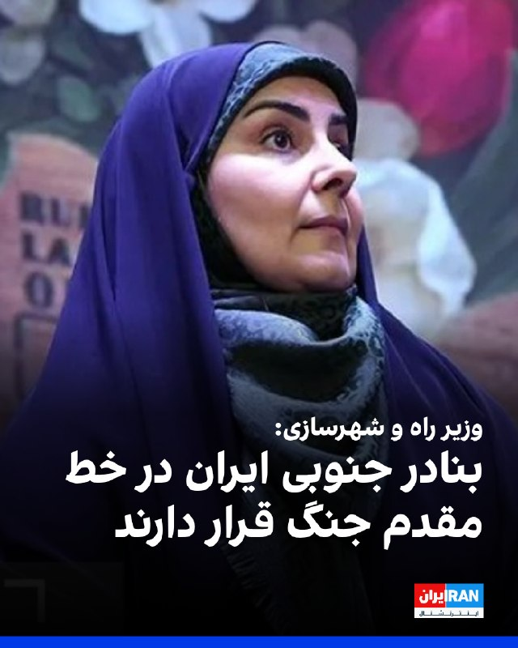

فرزانه صادق، وزیر راه و شهرسازی، در نشست «مجازی» مجلس گفت: «شاهد جنگ کریدورها هستیم و بر همین اساس بنادر جنوبی کشور در خط مقدم جنگ قرار دارند.»

او افزود: «برای تامین کالاهای اساسی و ضروری، برنامه‌ریزی شد تا روند واردات و صادرات متوقف نشود. همچنین رایزنی با کشورهای همسایه به منظور افزایش ناوگان حمل و نقل نیز انجام شده است.»

وزیر راه و شهرسازی اضافه کرد: «در جنگ اخیر خسارات زیادی نیز در حوزه راه و شهرسازی رخ داد.»
‌🏁 🇬🇧 IranintlTV

🤖 @VahidOOnLine

## WithYashar — post 13053

متن چکیده نسخه ۱۵ بیانیه جمعی از ایرانیان داخل و خارج کشور خطاب به شاهزاده رضا پهلوی شاهزاده گرامی، این متن جمع‌بندی مجموعه‌ای از دیدگاه‌ها، نگرانی‌ها و پیشنهادهای طیف گسترده‌ای از ایرانیان داخل و خارج کشور است که با هدف تقویت انسجام ملی، افزایش شفافیت…

## WithYashar — post 13052

## WithYashar — post 13051

متن چکیده نسخه ۱۵

بیانیه جمعی از ایرانیان داخل و خارج کشور خطاب به شاهزاده رضا پهلوی

شاهزاده گرامی،
این متن جمع‌بندی مجموعه‌ای از دیدگاه‌ها، نگرانی‌ها و پیشنهادهای طیف گسترده‌ای از ایرانیان داخل و خارج کشور است که با هدف تقویت انسجام ملی، افزایش شفافیت و ایجاد مسیر عملی برای آینده ایران ارائه می‌شود.

در شرایط کنونی، جامعه ایران تحت فشارهای شدید اقتصادی، اجتماعی، امنیتی و سیاسی قرار دارد و یکی از مهم‌ترین چالش‌ها، نبود یک ساختار منسجم و قابل فهم برای سازماندهی ظرفیت عظیم مردمی است.

1. ضرورت ایجاد ساختار یا پلتفرم سازماندهی ملی

مطالبه گسترده مردم، ایجاد یک ساختار منسجم است که بتواند نیروهای مردمی داخل و خارج کشور را شبکه‌سازی کرده، نقش‌ها را مشخص کند و از پراکندگی و موازی‌کاری جلوگیری نماید.

2. انسجام و اتحاد میان جریان‌های مختلف مخالف

درخواست جدی جامعه، ایجاد سازوکاری برای همگرایی جریان‌ها و گروه‌های مختلف مخالف حکومت است تا انرژی سیاسی و اجتماعی در مسیر مشترک و هماهنگ قرار گیرد.

3. ضرورت اعلام چارچوب زمانی و نقشه راه عملی

یکی از دغدغه‌های اصلی مردم، نبود زمان‌بندی و مسیر روشن برای اقدامات جمعی است.
مطالبه عمومی این است که سناریوها و مراحل حرکت به‌صورت شفاف و مرحله‌بندی‌شده مشخص شوند و در صورت امکان، برای اقدامات جمعی و هماهنگ، چارچوب‌های زمانی روشن و قابل فهم اعلام گردد.

4. آمادگی میدانی و سازوکارهای حمایتی در شرایط بحران

بخش قابل توجهی از پیام‌ها بر ضرورت ایجاد سازوکارهای حمایتی و سازمانی برای شرایط بحرانی تأکید دارد تا از طریق شبکه‌های امن، هماهنگی اجتماعی و توانمندسازی، هزینه انسانی تحولات کاهش یابد.

⸻

5. تقویت ساختار مشورتی، ارتباطات و شفافیت عملکرد

یکی از مطالبات اصلی، تقویت همزمان ساختار مشورتی، ارتباطی و شفافیت عملکرد است.
در این چارچوب پیشنهاد می‌شود:

گسترش تیم مشاوران و کارشناسان در حوزه‌های مختلف از جمله سیاسی، اقتصادی، اجتماعی، رسانه‌ای و امنیتی
استفاده از متخصصان حوزه امنیت، مدیریت بحران و مطالعات راهبردی در کنار سایر تخصص‌ها
تقویت و حرفه‌ای‌سازی نقش رسانه‌ای و ارتباطی
ایجاد ارتباط مستمر و مؤثر با مردم و مشارکت گروه‌های مختلف اجتماعی
فراهم کردن زمینه ورود دیدگاه‌ها و ایده‌های جدید از جریان‌های تخصصی و فکری مختلف
افزایش شفافیت در عملکرد و تصمیم‌گیری‌ها همراه با گزارش‌دهی منظم

هدف از این پیشنهادها، افزایش اعتماد عمومی، ارتقای کیفیت تصمیم‌سازی و تقویت هماهنگی میان ظرفیت‌های مختلف جامعه است.

6. معیشت و وضعیت اقتصادی مردم

در کنار موضوعات سیاسی، بحران معیشتی یکی از اصلی‌ترین فشارهای روزمره مردم است.
درخواست عمومی این است که در کنار برنامه‌های کلان، راهکارهایی برای کاهش فشار اقتصادی و حمایت از اقشار آسیب‌پذیر در حال حاظر نیز در نظر گرفته شود.

7. ارتباط مستقیم‌تر با جامعه و گروه‌های مختلف

مردم خواستار ارتباط فعال‌تر، مستقیم‌تر و مستمرتر میان رهبری اپوزیسیون و بدنه اجتماعی هستند تا اعتماد، شفافیت و هماهنگی افزایش یابد.

جمع‌بندی

در مجموع، پیام مشترک این دیدگاه‌ها چنین است:

جامعه ایران آماده تغییر است، اما این مسیر تنها با انسجام، شفافیت، ساختار اجرایی روشن و ارتباط واقعی با مردم امکان‌پذیر است.

⸻

درخواست پایانی (از طرف جمع امضاکنندگان)

در پایان، جمعی از امضاکنندگان و نمایندگان این دیدگاه‌ها، با نهایت احترام درخواست دارند امکان ارتباط مستقیم برای انتقال منظم دیدگاه‌ها، هماهنگی بیشتر و ادامه گفت‌وگو فراهم گردد و پاسخ این پیام ارسال شود.

این جمع، جناب آقای یاشار را به عنوان نماینده و پیگیر دیدگاه‌های مردم معرفی می‌نماید.

راه‌های ارتباطی:
….

پاینده ایران
و درود بر خاندان ایران‌ساز پهلوی

@withyashar

## WithYashar — post 13050

  <a href="telegram/content/WithYashar_13050_1780238165.mp4" target="_blank">🎬 Download video</a>

از یه زاویه دیگه اتوبان ستاری ,جنت آباد جنوبی
@withyashar

## WithYashar — post 13049

  <a href="telegram/content/WithYashar_13049_1780238168.mp4" target="_blank">🎬 Download video</a>

روبروی پاساژ کوروش
@withyashar

## WithYashar — post 13048

اصلاح ۵ بخش ۵

5. تقویت ساختار مشورتی، ارتباطات و شفافیت عملکرد

یکی از مطالبات اصلی، تقویت و گسترش ساختار مشورتی و ارتباطی در کنار افزایش شفافیت عملکرد است.

در این چارچوب پیشنهاد می‌شود:

تیم مشاوران و کارشناسان در حوزه‌های سیاسی، اقتصادی، اجتماعی، رسانه‌ای و همچنین حوزه‌های مرتبط با امنیت و مدیریت بحران تقویت و گسترش یابد
نقش رسانه‌ای و ارتباطی به‌صورت حرفه‌ای‌تر و منسجم‌تر ارتقا پیدا کند
امکان ارتباط مستمر و هدفمند با مردم و گروه‌های مختلف اجتماعی فراهم شود
از متخصصان حوزه امنیت، مدیریت بحران و مطالعات دفاعی در کنار سایر حوزه‌های تخصصی استفاده شود
زمینه ورود ایده‌ها و دیدگاه‌های جدید از جریان‌های فکری و تخصصی مختلف ایجاد گردد
شفافیت در عملکرد، روند تصمیم‌گیری‌ها و مسیرهای حمایتی (از جمله رسانه‌ای و سازمانی) افزایش یابد و گزارش‌دهی منظم در دستور کار قرار گیرد

هدف از این مجموعه پیشنهادها، افزایش اعتماد عمومی، ارتقای کیفیت تصمیم‌سازی و تقویت هماهنگی میان ظرفیت‌های مختلف جامعه است.
@withyashar

## WithYashar — post 13047

## WithYashar — post 13046

گزارش WSJ: سازمان ملل در حال ورشکستگی است، زیرا ایالات متحده و چین میلیاردها دلار را از این نهاد بین‌المللی خارج کرده اند
@withyashar

## WithYashar — post 13045

## WithYashar — post 13042

  

همین الان آتش‌سوزی غرب تهران سمت ستاری
@withyashar

## WithYashar — post 13041

## WithYashar — post 13040

## WithYashar — post 13039

سی‌ن‌ان: ایران ۵۰ ورودی از ۶۹ ورودی تونل‌های تاسیسات هدف قرارگرفته موشکی را باز کرده است
@withyashar

## WithYashar — post 13038

سی‌ان‌ان: برای وارد کردن آسیب به تاسیسات موشکی ایران باید از سلاح‌های بسیار پیچیده و بسیار گران‌قیمت استفاده کرد، اما عملیات بازیابی با فناوری بسیار ساده‌ای انجام می‌شود، فقط با بولدوزر
@withyashar

## WithYashar — post 13037

متن چکیده نسخه ۲

بیانیه جمعی از ایرانیان داخل و خارج کشور خطاب به شاهزاده رضا پهلوی

شاهزاده گرامی،
این متن جمع‌بندی مجموعه‌ای از دیدگاه‌ها، نگرانی‌ها و پیشنهادهای طیف گسترده‌ای از ایرانیان داخل و خارج کشور است که با هدف تقویت انسجام ملی، افزایش شفافیت و ایجاد مسیر عملی برای آینده ایران ارائه می‌شود.

در شرایط کنونی، جامعه ایران تحت فشارهای شدید اقتصادی، اجتماعی، امنیتی و سیاسی قرار دارد و در کنار آن، یکی از مهم‌ترین چالش‌ها، نبود یک ساختار منسجم و قابل فهم برای سازماندهی ظرفیت عظیم مردمی و تبدیل آن به یک نیروی هماهنگ است.

⸻

1. ضرورت ایجاد ساختار یا پلتفرم سازماندهی ملی

مطالبه گسترده مردم، ایجاد یک ساختار یا پلتفرم منسجم است که بتواند:

نیروهای مردمی داخل و خارج کشور را شبکه‌سازی کند
وظایف و نقش‌ها را مشخص و قابل اجرا نماید
از پراکندگی و موازی‌کاری جلوگیری کند
مسیر فعالیت گروه‌ها و افراد را شفاف و هدفمند سازد
امکان هماهنگی عملی در سطح رسانه‌ای، اجتماعی و میدانی را فراهم کند

⸻

2. انسجام و اتحاد میان جریان‌های مختلف مخالف

درخواست جدی جامعه، ایجاد سازوکاری برای همگرایی و هماهنگی میان گروه‌ها، جریان‌ها و افراد مختلف مخالف حکومت است تا:

اختلافات مانع حرکت مشترک نشود
یک محور هماهنگ‌کننده واحد وجود داشته باشد
انرژی سیاسی و اجتماعی هدر نرود

⸻

3. ضرورت اعلام چارچوب زمانی و نقشه راه عملی

یکی از مهم‌ترین دغدغه‌های مردم، نبود زمان‌بندی روشن برای مراحل مختلف حرکت سیاسی است.
مطالبه عمومی این است که:

سناریوهای مختلف به‌صورت شفاف و مرحله‌بندی‌شده مشخص شوند
برای اقدامات جمعی، چارچوب زمانی تقریبی یا بازه‌های مشخص تصمیم‌گیری و اقدام اعلام شود
مردم بدانند در هر مرحله چه انتظاری باید داشته باشند و نقش آنها چیست

همچنین بخش مهمی از جامعه خواستار آن است که در صورت وجود شرایط مناسب، فراخوان‌های مشخص، هدفمند و زمان‌دار برای اقدامات جمعی و هماهنگ صادر شود تا انرژی اجتماعی به‌صورت پراکنده و فرسایشی از بین نرود.

⸻

4. آمادگی میدانی و سازوکارهای حمایتی در شرایط بحران

بخش قابل توجهی از پیام‌ها بر ضرورت ایجاد سازوکارهایی برای حمایت از مردم در شرایط بحرانی تأکید دارد؛ به‌گونه‌ای که:

شبکه‌های حمایتی و سازمانی امن شکل گیرد
هماهنگی میان نیروهای مردمی افزایش یابد
آمادگی اجتماعی و مدنی برای شرایط حساس تقویت شود
هزینه انسانی تحولات احتمالی کاهش یابد

⸻

5. شفافیت در ساختار مشاوران و تیم تصمیم‌سازی

یکی از مطالبات مهم، شفاف‌تر شدن ساختار مشاوران و نقش افراد در حلقه تصمیم‌گیری است تا:

جایگاه افراد مشخص باشد
اعتماد عمومی تقویت شود
از ابهام و چندصدایی غیرسازنده جلوگیری گردد

⸻

6. معیشت و وضعیت اقتصادی مردم

در کنار موضوعات سیاسی، بحران معیشتی یکی از اصلی‌ترین فشارهای روزمره مردم است.
درخواست عمومی این است که در کنار برنامه‌های کلان، راهکارهایی برای کاهش فشار اقتصادی و حمایت از اقشار آسیب‌پذیر در دوره گذار نیز در نظر گرفته شود.

⸻

7. ارتباط مستقیم‌تر با جامعه و گروه‌های مختلف

مردم خواستار ارتباط فعال‌تر، مستقیم‌تر و مستمرتر میان رهبری اپوزیسیون و بدنه اجتماعی هستند تا:

ابهامات کاهش یابد
اعتماد افزایش پیدا کند
و امکان هماهنگی واقعی میان گروه‌ها فراهم شود

⸻

جمع‌بندی

در مجموع، پیام مشترک این مجموعه دیدگاه‌ها چنین است:

جامعه ایران آماده تغییر است، اما این مسیر تنها در صورتی به نتیجه می‌رسد که با انسجام، شفافیت، ساختار اجرایی روشن، نقشه راه قابل فهم و ارتباط مستمر با مردم همراه باشد.

⸻

درخواست پایانی (از طرف نماینده جمع)

در پایان، اینجانب یاشار به عنوان نماینده جمعی از این دیدگاه‌ها، با نهایت احترام درخواست دارم امکان ارتباط مستقیم برای انتقال دیدگاه‌ها و هماهنگی بیشتر فراهم شود و پاسخ این پیام برای اینجانب ارسال گردد.

راه‌های ارتباطی جهت پاسخ

پاینده ایران ، جاوید شاه
@withyashar

## WithYashar — post 13036

## WithYashar — post 13035

خودمو یادم رفت 🥲

## WithYashar — post 13034

یاشار چرا درخواست اینکه با خودت حرف بزنن تا اینارو بگی رو نداریم ؟

## WithYashar — post 13033

پس این متن چه اشاره ای به تو داره؟
ما میخایم یاشار با شاهزاده در ارتباط باشه

## WithYashar — post 13032

جاوید شاهم بگو یاشار

## mwarmonitor — post 9947

🔴دونالد ترامپ در Truth Social نوشت:

خوشحالم اعلام کنم که سفیر ایالات متحده در ترکیه، تام باراک، که عملکردی outstanding داشته است، به‌عنوان نماینده ویژه ریاست‌جمهوری در امور سوریه و همچنین نماینده ویژه ریاست‌جمهوری در امور عراق منصوب خواهد شد. این انتصاب در راستای پیشبرد همکاری‌های راهبردی ما با دولت‌های سوریه و عراق صورت می‌گیرد و روابط ما با آن‌ها همچنان در حال گسترش است.
تام باراک همچنان سفیر ایالات متحده در ترکیه باقی خواهد ماند و با پشتیبانی کامل وزارت امور خارجه ایالات متحده فعالیت خواهد کرد.
ما قدردان کاری هستیم که تام باراک انجام داده و نیز از آمادگی مستمر او برای خدمت به کشورمان سپاسگزاریم.

از توجه شما به این موضوع متشکریم.

@mwarmonitor

## mwarmonitor — post 9946

  <a href="telegram/content/mwarmonitor_9946_1780238170.mp4" target="_blank">🎬 Download video</a>

📝 آه، چقدر دلمان کباب شد برای این ماده خرس گریزلی تلویزیون که دوباره پیدایش شده تا با فلسفه‌بافی درباره «مطلوبات و مقدورات»، روی زخم ملت نمک بپاشد! راست می‌گویی؛ مطلوبِ قلبی یک انگل و حرومیِ جاخوش‌کرده در بدنه این کشور هم این است که پروانه باشد و پرواز کند، اما مقدوراتِ ذاتِ کثیفش اجازه نمی‌دهد چیزی غیر از یک تفاله باشد. شما حرومی‌ها که ادعا می‌کردید کنترل اقتصاد دنیا در مرزهای جنوبی در دست‌های معجزه‌گرتان است، چطور شد که وقتِ تامین نیازهای اولیه کشور رسید، زاییدید و ناگهان یاد مقدورات افتادید؟ سناریوی سیاهی است؛ در ادعا حاکم اقیانوس‌ها و در واقعیت عاجز از تامین پیاز و پوشک! شما مطلوبتان این بود که قهرمان باشید، ولی مقدوراتِ وقاحت‌تان ثابت کرد که فقط انگل‌هایی هستید که به مکیدن خون مردم ادامه می‌دهید؛ پس دست‌کم ژست فیلسوفان را نگیرید که قاب تلویزیون از این همه کثافت ترک برمی‌دارد.

@mwarmonitor

## mwarmonitor — post 9945

  <a href="telegram/content/mwarmonitor_9945_1780238173.mp4" target="_blank">🎬 Download video</a>

🔸اسرائیل در حال شخم زدن لبنان

@mwarmonitor

## FoxNewsTwitter — post 342445

  <a href="telegram/content/FoxNewsTwitter_342445_1780238175.mp4" target="_blank">🎬 Download video</a>

Fox News (Twitter/X)

An anti-ICE rioter is arrested for threatening to kill federal agents and their families during violent demonstrations outside New Jersey's Delaney Hall. The FBI caught the suspect within 24 hours after using facial recognition technology to identify him.

"Touch a cop and this FBI will put you down," FBI Director Kash Patel said.

## FoxNewsTwitter — post 342444

  <a href="telegram/content/FoxNewsTwitter_342444_1780238177.mp4" target="_blank">🎬 Download video</a>

Fox News (Twitter/X)

Hasan Piker denied having any personal contact with American Marxist Neville Roy Singham but said he knows some "wonderful people" tied to the tech tycoon's network when Fox News Digital asked about a federal subpoena.

"None of it is actually hidden or illegal in any way, shape, or form," Piker said.

## pm_afshaa — post 91938

  <a href="telegram/content/pm_afshaa_91938_1780238180.webm" target="_blank">🎬 Download video</a>

🔴سی‌بی‌اس: میانجی‌ها هنوز دارن روی توافق بین تهران و واشینگتن کار میکنن.

ترامپ روز جمعه متن توافق رو دوباره اصلاح کرده و نسخه جدیدش رو فرستاده ایران تا تأییدش کنه، ولی تا الان هنوز پاسخی از طرف تهران داده نشده.

💧 Rainbet.com the #1 Non-KYC Crypto Casino & Sportsbook @rainbetcom

😁 @Pm_Afshaa

## pm_afshaa — post 91937

  <a href="telegram/content/pm_afshaa_91937_1780238181.webm" target="_blank">🎬 Download video</a>

🔴وزیر خارجه فرانسه:
باز کردن تنگه هرمز یک اولویت اصلی است چون ما قصد نداریم همچنان بهای جنگی رو بپردازیم که جنگ ما نیست.

💧 Rainbet.com the #1 Non-KYC Crypto Casino & Sportsbook @rainbetcom

😁 @Pm_Afshaa

## pm_afshaa — post 91936

  <a href="telegram/content/pm_afshaa_91936_1780238181.webm" target="_blank">🎬 Download video</a>

🔴اقتصاد نیوز: ایرانسل و همراه اول امکان خرید اقساطی بسته اینترنت رو فعال کردن.

💧 Rainbet.com the #1 Non-KYC Crypto Casino & Sportsbook @rainbetcom

😁 @Pm_Afshaa

## iaghapour — post 2646

  

⭕️ اسکنر IP سفید کلودفلر با نوا رادار

🔹نوا رادار یک اسکنر IP دسکتاپ است که با Wails v3 (بک‌اند گو + فرانت ری‌اکت/تایپ‌اسکریپت) ساخته شده. این برنامه رنج‌های IP کلودفلر را از منابع متعدد اسکن می‌کند، تأیید پروتکل واقعی (TCP + TLS handshake) انجام می‌دهد و IPهای سالم را مرتب‌شده بر اساس سرعت تحویل می‌دهد.

— اسکن چندمنبعی — ۹ منبع IP قابل انتخاب
— تأیید دو مرحله‌ای — اسکن سریع TCP → تست عمیق TLS
— مرتب‌سازی بر اساس سرعت
— قابلیت انتخاب پورت

🔗 اطلاعات بیشتر در گیت‌هاب پروژه

🆔@iAghapour

## DEJradio — post 5182

  <a href="telegram/content/DEJradio_5182_1780238183.mp4" target="_blank">🎬 Download video</a>

👑
🔺 تجمع ایرانیان مقیم مادرید در حمایت از انقلاب شیروخورشید و آگاه‌سازی افکار عمومی از جنایات رژیم در ایران

#همبستگی #مادرید
@DEJradio

## DEJradio — post 5181

⭕️ اسرائیل هیوم: شماری از نفتکش‌های قطری با پرداخت پول به رژیم از تنگۀ هرمز گذر کردند

روزنامۀ اسرائیل هیوم، به نقل از سه منبع دیپلماتیک و اطلاعاتی گزارش داد ده‌ها نفتکش در هفتۀ پیشین از تنگۀ هرمز عبور کرده‌اند.
بنا بر این گزارش برخی ازشناورها پس از تأیید جمهوری اسلامی و سپاه پاسداران، برای عبور پول پرداخت کردند.
بر پایۀ گزارش اسرائیل هیوم، شمار بسیاری از نفتکش‌ها حامل نفت و گاز مایع قطر بودند و به سمت هند، چین و اروپا راهی شدند.
همچنین برخی شناورهای دیگر توانستند با همراهی نیروی دریایی آمریکا گذر کنند.
آمریکا پیش‌تر بارها اعلام کرده بود که با باج‌دهی به جمهوری اسلامی برای عبور از تنگۀ هرمز مخالف است.
وزارت خزانه‌داری آمریکا اعلام کرد شرکت‌ها و نفتکش‌هایی را که برای عبور از آبراه هرمز به تهران باج بدهند، مورد تحریم قرار می‌دهد.

#خبر #دژ #تنگه_هرمز
@DEJradio

## DEJradio — post 5180

  <a href="telegram/content/DEJradio_5180_1780238186.mp4" target="_blank">🎬 Download video</a>

⭕️ وزیر دفاع اسرائیل از تصرف قلعۀ شقیف در لبنان خبر داد

یسرائیل کاتز، وزیر دفاع اسرائیل اعلام کرد ارتش این کشور قلعۀ راهبردی شقیف بوفور در جنوب لبنان را تصرف کرده است.
بنا بر تصاویر منتشر شده، پرچم اسرائیل بر فراز این قلعۀ باستانی برافراشته شد.
یسرائیل کاتز، این منطقه را یکی از مهم‌ترین مناطق راهبردی برای دفاع از شهرک‌های الجلیل و تأمین امنیت نیروهای اسرائیلی عنوان کرد.
قلعۀ شقیف بر بخش‌هایی گسترده از جنوب لبنان اشراف دارد.
اسرائیل بیش از بیست و شش سال پیش در دوران درگیری‌های پیشین با لبنان نیز از این قلعه به عنوان پایگاه استفاده می‌کرد.
#خبر #دژ #اسرائیل
@DEJradio

## DEJradio — post 5179

⭕️ هلال‌احمر جمهوری اسلامی خبر داد بیمارستان ایرانیان دوبی تعطیل و اموالش توقیف شد

پیرحسین کولیوند، رئیس جمعیت هلال‌احمر جمهوری اسلامی گفت بیمارستان ایرانیان دوبی تعطیل شده و دارایی‌ها و اموال نقدی آن با حکم دادگاه بلوکه شده است.
او گفت بیماران این بیمارستان از مرکز درمانی خارج شده‌اند.
به گفتۀ این مقام دولتی، رئیس بیمارستان دوبی نیز ممنوع‌الخروج شده و برای بازجویی و محاکمه احضار شده است.
کولیوند افزود همچنین ویزای کارکنان بیمارستان باطل شده و آن‌ها از خانه‌های سازمانی خارج شده‌اند.
پیش‌تر یک مقام اماراتی گفته بود نهادهای «مرتبط با حکومت جمهوری اسلامی» به دلیل سوءاستفادۀ آنها از موقعیت، تعطیل می‌شود.

#خبر #دژ #امارات
@DEJradio

## DEJradio — post 5178

  <a href="telegram/content/DEJradio_5178_1780238188.mp4" target="_blank">🎬 Download video</a>

👑
🔺 پیام ایرانیان مقیم اوکلند(نیوزلند) به پرزیدنت دونالد ترامپ: میراثی از خود به جا نگذارید که از کارتر و اوباما نیز بدتر باشد!

#همبستگی #اوکلند
@DEJradio

## VahidOnline — post 75816

  

بر اساس مصوبه جدید شورای شهر تهران، هزینه خدمات مرتبط با خاکسپاری در بهشت‌زهرا به‌طور میانگین حدود ۴۰ درصد افزایش یافته و در برخی موارد رشد تعرفه‌ها به ۵۰ درصد رسیده است.

روزنامه دنیای اقتصاد گزارش داد نرخ خدماتی از جمله حمل متوفی، تغسیل، تکفین، تدفین و برگزاری مراسم افزایش یافته است. بر اساس این مصوبه، هزینه انتقال هر متوفی از سطح شهر تهران تا شعاع ۱۰ کیلومتری ۵۰ درصد افزایش داشته است.
@VahidHeadline

📡 @VahidOnline

## VahidOnline — post 75815

  

سایت هرانا گزارش داد زهرا شهباز طبری، زندانی سیاسی محبوس در زندان لاکان رشت، پس از نقض حکم پیشین در دیوان عالی کشور، بار دیگر از سوی شعبه دوم دادگاه انقلاب رشت به ریاست محمدعلی درویش‌گفتار، به اتهام «بغی از طریق عضویت و فعالیت در سازمان مجاهدین خلق» به اعدام محکوم شد.
این زندانی سیاسی ۶۸ ساله، در فروردین ۱۴۰۴ در منزل شخصی خود در رشت بازداشت شده بود.
@VahidOOnLine

📡 @VahidOnline

## VahidOnline — post 75814

  

نیروی دریایی سپاه پاسداران روز یک‌شنبه اعلام کرد‌ «طی شبانه‌روز گذشته ۲۸ فروند کشتی اعم از نفتکش، کانتینربَر و سایر کشتی‌های تجاری پس از کسب مجوز با هماهنگی و تأمین امنیت نیروی دریایی سپاه از تنگه هرمز عبور کردند.»

ساعتی پیشتر روزنامه اسرائیلی «اسرائیل هیوم» نوشته بود که ده‌ها نفتکش حامل نفت و گاز طبیعی مایع در هفتهٔ گذشته با اجازه آمریکا و پرداخت عوارض به ایران از تنگهٔ هرمز عبور کرده‌اند.

این در حالی است که دولت آمریکا بارها اعلام کرده است با پرداخت عوارض به ایران برای عبور از تنگه هرمز مخالف است.
@VahidHeadline

📡 @VahidOnline

## VahidOnline — post 75812

  <a href="telegram/content/VahidOnline_75812_1780238193.mp4" target="_blank">🎬 Download video</a>

جلسه مجازی صحن مجلس شورای اسلامی به ریاست محمدباقر قالیباف و مشارکت آنلاین ۱۸۷ نماینده و حضور ۱۴ نماینده برگزار شد.
در این جلسه که اولین جلسه از سومین سال مجلس دوازدهم بود، اعضای جدید هیئت رئیسه مجلس سوگند یاد کردند.
جلسه روز یک‌شنبه، دهم خردادماه، همچون جلسات معدود گذشته در مکانی مخفی برگزار شد.
محمدباقر قالیباف در همین جلسه تأکید کرد که «تا اطمینان پیدا نکنیم که حقوق ملت ایران را گرفته‌ایم، هیچ توافقی تأیید نمی‌شود».
قالیباف که از او به عنوان رئیس هیئت مذاکره‌کننده ایران نیز یاد می‌شود در این جلسه بیانیه‌ای را قرائت کرد و در آن ادعا کرد که «در حال عقب نشاندن دشمن در یک جنگ تاریخ‌ساز هستیم».
@VahidHeadline
محمدباقر قالیباف، رییس مجلس شورای اسلامی گفت: «سومین سال مجلس دوازدهم را در حالی آغاز می‌کنیم که یاد و خاطره رهبر شهید با ماست و هنوز فقدان رهبر و پدر امت را باور نمی‌کنیم.»
او ادامه داد: «رهبرمان به ما آموخت مقابل زورگویی و تهدید، ذره‌ای سر خم نکنیم و با مشت‌های گره کرده مقابل خصم تا آخرین قطره خون مبارزه کنیم.»
قالیباف اضافه کرد: «دیدن جای خالی رهبری برایمان جانکاه است، ولی دلگرم به مدیریت و رهبری جدید هستیم.»
@VahidOOnLine

📡 @VahidOnline

## VahidOnline — post 75810

  <a href="telegram/content/VahidOnline_75810_1780238194.mp4" target="_blank">🎬 Download video</a>

نیروی انتظامی تهران کافه‌ای در خیابان ولیعصر را که در آن برنامه‌های موسیقی اجرا می‌شد، به بهانه آن چه «فعالیت‌های مروج فرقه‌های انحرافی» خواند، پلمب کرد.

مرکز اطلاع‌رسانی پلیس جمهوری اسلامی در اطلاعیه‌ای نوشت: «این کافه با برگزاری برنامه‌هایی با ظاهر موسیقی غربی، بستری برای حرکات نابهنجار، و آنچه که ماموران توصیف کرده‌اند "تحرکات شیطانی" فراهم آورده بود.»

نیروی انتظامی جمهوری اسلامی نام این کافه را ذکر نکرد اما ادعا کرد که «مشتریان این کافه، شامل دختران و پسران جوان، در وضعیتی غیرطبیعی و با حرکاتی عجیب و غریب، که از آن به عنوان “شیطانی” یاد شده، مشاهده گردیدند.»

پیشتر نیز بسیاری از کافه‌ها و اماکن کسب و کار به اتهام‌های مشابه پلمب شده‌ بودند اما جمهوری اسلامی سرکوب‌ شهروندان را از زمان اعتراضات دی‌ماه گذشته تاکنون شدت بیشتری داده است.

موج تازه اعدام‌ها، صدور احکام سنگین و بازداشت‌ها نگرانی فعالان و نهادهای حقوق بشری را برانگیخته است.
@VahidHeadline
ویدیوی بالا رو هم به عنوان "تحرکات شیطانی" در اون کافه منتشر کردند!
📡 @VahidOnline

## IranIntlTV — post 339897

  

دونالد ترامپ در تروث‌سوشال اعلام کرد که تام باراک، سفیر ایالات متحده در ترکیه، به عنوان فرستاده ویژه ریاست‌جمهوری در امور عراق و سوریه منصوب شده است.

ترامپ افزود: همزمان با پیشبرد همکاری راهبردی ما با دولت‌های سوریه و عراق، روابط ما با آن‌ها همچنان در حال گسترش است.
https://iranintl.com/202605311800

## IranIntlTV — post 339896

  

اسماعیل کوثری، عضو کمیسیون امنیت ملی مجلس، با تاکید بر اینکه «پرونده هسته‌ای از روی میز مذاکره با آمریکا برداشته شده است»، گفت: «مذاکرات برای پایان دادن به جنگ در حال انجام است اما به توافق نهایی نرسیده‌ایم و می‌دانیم که نتیجه‌ای نخواهند داشت.»

او افزود: «جمهوری اسلامی اکنون در حال مذاکره در مورد جلوگیری از تکرار جنگ، پرداخت غرامت، خروج نیروهای آمریکایی از منطقه و لغو محاصره دریایی است.»

کوثری اضافه کرد: «بسیاری از کشورها کنترل ایران بر تنگه را پذیرفته‌اند.»
https://iranintl.com/202605310064

## IranIntlTV — post 339895

  <a href="telegram/content/IranIntlTV_339895_1780238196.mp4" target="_blank">🎬 Download video</a>

در حالی که تورم سنگین خوراکی‌ها موجب تشدید بحران معیشت در ایران شده است، علیرضا نوری قزلجه، وزیر جهاد کشاورزی، گفت کالاهای اساسی با «قیمت‌های متعادل» در کشور عرضه می‌شوند.

گفت‌وگو با اشکان نظام‌آبادی، روزنامه‌نگار اقتصادی
@iranintltv

## IranIntlTV — post 339894

  <a href="telegram/content/IranIntlTV_339894_1780238199.mp4" target="_blank">🎬 Download video</a>

قهرمانی پاری‌سن‌ژرمن در لیگ قهرمانان اروپا با ناآرامی در خیابان‌های پاریس همراه شد. پلیس فرانسه اعلام کرد بیش از ۴۰۰ نفر در جریان درگیری‌های پس از جشن هواداران بازداشت شدند و نیروهای امنیتی در اطراف شانزه‌لیزه و مرکز شهر از گاز اشک‌آور استفاده کردند.
@iranintltv

## IranIntlTV — post 339893

  <a href="telegram/content/IranIntlTV_339893_1780238201.mp4" target="_blank">🎬 Download video</a>

در حالی که مذاکرات جمهوری اسلامی و آمریکا برای تمدید آتش‌بس ادامه دارد، رسانه‌های آلمان می‌گویند گره اصلی گفت‌وگوها دیگر فقط برنامه هسته‌ای نیست، بلکه میلیاردها دلار دارایی بلوکه‌شده ایران در خارج از کشور است.

علی حسن‌پور، خبرنگار ایران‌اینترنشنال، گزارش می‌دهد
@iranintltv

## IranIntlTV — post 339892

  

🔻رئال مادرید بار دیگر در صدر فهرست ارزشمندترین باشگاه‌های فوتبال جهان از نگاه فوربس قرار گرفت؛ پس از آن‌که در فصل ۲۵-۲۰۲۴ به رکورد درآمد سالانه ۱.۲۷ میلیارد دلار رسید. این رقم از درآمد ۱.۲۳ میلیارد دلاری تیم دالاس کابویز در NFL در سال ۲۰۲۴ نیز بیشتر است.

🔹بر اساس محاسبات فوربس (بدون در نظر گرفتن تورم)، یک رکورد جدید درآمد سالانه برای یک تیم ورزشی محسوب می‌شود.

🔹رئال مادرید در پنج سال اخیر و در مجموع ۱۰ سال از ۱۳ سال گذشته، ارزشمندترین باشگاه فوتبال جهان بوده است.

🔹با وجود قهرمانی پیاپی بارسلونا در لالیگا و پاری‌سن‌ژرمن در لیگ قهرمانان اروپا، اما در خارج از زمین، رئال مادرید همچنان معیار فوتبال جهان و حتی ورزش جهان به‌شمار می‌رود؛ با ارزشی معادل ۹.۵ میلیارد دلار، یعنی ۲ میلیارد دلار بیشتر از رقیب سنتی، بارسلونا.

🔹رتبه بندی ارزشمندترین باشگاه‌های فوتبال دنیا در سایت ببینید.

@iranintltvsport

## IranIntlTV — post 339891

  

سی‌بی‌اس نیوز گزارش داد میانجی‌ها تا صبح یکشنبه همچنان درباره یک یادداشت تفاهم میان جمهوری اسلامی و آمریکا در حال گفت‌وگو هستند.

یک منبع آگاه اعلام کرد دونالد ترامپ روز جمعه اصلاحاتی در متن این یادداشت ایجاد کرده و نسخه ویرایش‌شده برای تایید به تهران ارسال شده اما تاکنون پاسخی دریافت نشده است.

این سومین دور اصلاحاتی است که ترامپ در پیشنهاد آمریکا اعمال کرده؛ پیشنهادی که از طریق میانجی‌ها میان واشینگتن و تهران رد و بدل شده و این روند تحت هدایت پاکستان انجام می‌شود.

این منبع اعلام کرد تغییرات آمریکا تا حدی قابل توجه بوده، هرچند جزئیات آن هنوز منتشر نشده و برای نهایی شدن توافق نیز ضرب‌الاجل مشخصی وجود ندارد.
https://iranintl.com/202605318495

## IranIntlTV — post 339890

  <a href="telegram/content/IranIntlTV_339890_1780238206.mp4" target="_blank">🎬 Download video</a>

در پی راه‌اندازی کارزار مردمی رشت از سوی ایران‌اینترنشنال، ویدیوهایی به دست ما رسیده که خودروهای زیادی را در آرامستان شهر در ۲۰ دی ۱۴۰۴ نشان می‌دهد. به گفته شاهدان، جمعیت زیادی برای خاکسپاری جاویدنام خود در این روز به آرامستان آمدند.

## IranIntlTV — post 339889

🗣کارزار مردمی ایران اینترنشنال درباره جاوید‌نامان رشت - یکشنبه ۱۰ خرداد

🔹جمعیت عظیم معترضین از خیابان رودباری حرکت کردند و با شعار «رشت رو گرفتیم» به خیابان معلم و سپس استانداری رسیدند. گاز اشک‌آور شیمیایی و ازدحام شدید، باعث خفگی و بیهوشی برخی شد. حوالی ساعت ۱۰ شب تیراندازی گسترده نیروهای امنیتی آغاز شد و مردم را به رگبار بستند.

🔹در جاده تهران بین باغ رضوان و سراوان یک سوله هست که با پرچم قرمز، سفید و سبز رنگ شده و هیچ علامتی ندارد. پیکرهای جوانان رشت را در تاریخ ۱۸ و ۱۹ دی به آنجا انتقال می‌دادند.

🔹یکی از محل‌های کشتار استانداری رشت بود، به‌طوریکه نیروهای بسیج و سپاه مردم را به سمت استانداری هدایت کردند و با باز شدن در استانداری به مردم شلیک می‌کردند.

🔹شب ۱۸ دی‌ماه شاهد بودیم که در محله‌ای مابین دانای علی و سام، یگان ویژه به تابلو بالای مغازه شلیک کردند و همین اتفاق منجر به اتصال برق شد و مغازه آتش گرفت. چون خودم در رشته برق سررشته دارم، مطمئنم که آتش گرفتن مغازه به‌دلیل همان شلیک به تابلو و اتصال برق بود.

🔹صبح ۱۹ دی‌ماه دوستم زنگ زد و گفت در شهرداری فاجعه اتفاق افتاده و رفتیم. اولین چیزی که دیدم حجم دود و آتشی بود که هنوز زبانه می‌کشید. وانت‌ها و مأمورین شهرداری گوشه‌گوشه خیابان از خستگی نشسته بودند. چند وانت شهرداری را دیدم که از خیابان شهرداری بیرون می‌آمدند با دو رفتگر که عقبش نشسته بودند. عقب وانت پر بود ولی رویش را پارچه کشیده بودند. بعدها فهمیدم آن‌ها جنازه بچه‌هایمان بود. روی دیوار آثار دست‌های خونی بود که بعد پاک کردند.

🔹در میدان شهرداری رشت، دقیقا در همان خیابانی که ۱۸ و ۱۹ دی چندین نفر کشته دادیم، یک ون گشت ارشاد گذاشته‌اند و دوباره به حجاب‌ها گیر می‌دهند.

🔹در شهرداری رشت، اینقدر خون روی زمین بود که هنوز وقتی یادم میاد، تمام وجودم مالامال درد میشه، مثلا رد دست‌های خونی که روی دیوارها نقش بسته بود.

🔹 به پدرومادرهای جاویدنامان رشت می‌گفتن باید برای تحویل جنازه هم پول پرداخت کنید که بسته به شرایط مالی خانواده مبلغ تعیین میشد (اگر وضع مالی خوب بود، بالای یک میلیارد، ولی در غیراینصورت حدود ۵۰۰ میلیون تومان.) جاویدنام‌های عزیزمون رو نمیذاشتن حتی غسل بدن و بشورن. پیکرها رو در حالی که غرق خون بودند و با لباس دفن می‌کردند.

## IranIntlTV — post 339888

  <a href="telegram/content/IranIntlTV_339888_1780238209.mp4" target="_blank">🎬 Download video</a>

بر اساس اطلاعات رسیده به ایران‌اینترنشنال، مجید فرخزاد ممشلی، ۳۷ ساله و پدر یک کودک ۵ ساله، شامگاه ۱۸ دی‌ماه در خیابان پیروزی تهران هدف شلیک مستقیم قرار گرفت و به دلیل خون‌ریزی شدید و تاخیر در انتقال به بیمارستان جان باخت. پیکر او سحرگاه بیست‌ودوم دی‌ماه، حدود ساعت چهار صبح، تحت تدابیر شدید امنیتی و به‌صورت مخفیانه در مینودشت به خاک سپرده شد.

گفت‌وگو با فرنوش فرجی، عضو تحریریه ایران‌اینترنشنال
@iranintltv

## IranIntlTV — post 339887

  <a href="telegram/content/IranIntlTV_339887_1780238211.mp4" target="_blank">🎬 Download video</a>

در پی راه‌اندازی کارزار مردمی رشت از سوی ایران‌اینترنشنال، ویدیوهایی به دست ما رسیده که جمعیت گسترده مردم معترض این شهر را در ۱۸ دی ۱۴۰۴ نشان می‌دهد.

## IranIntlTV — post 339886

  <a href="telegram/content/IranIntlTV_339886_1780238214.mp4" target="_blank">🎬 Download video</a>

مروری بر روزنامه‌های ایران، یکشنبه ۱۰ خرداد، با مجتبی هاشمی، روزنامه‌نگار

@iranintltv

## IranIntlTV — post 339885

ویدیوهای رسیده به ایران‌اینترنشنال، مراسم چهلم ماهان و امیررضا حیدری، دو پسرعموی جاویدنام را نشان می‌دهد که در ۱۸ دی‌ماه در محله پاسداران تهران به ضرب گلوله کشته شدند.
امیررضا، ۳۰ ساله و ماهان هم ۲۱ سال سن داشت. مادر ماهان در مراسم چهلم آنها خطاب به پسرش فریاد زد: «خوشت باشد که در این راه رفتی. من ناراحت نیستم که در این راه کشته شدی.»

## IranIntlTV — post 339884

  <a href="telegram/content/IranIntlTV_339884_1780238218.mp4" target="_blank">🎬 Download video</a>

گزارش‌ها از پرداخت نشدن مطالبات کشاورزان از سوی دولت و قاچاق گندم از ایران به کشورهای همسایه خبر می‌دهد.

گفت‌وگو با آرش آزرمی، دبیر بخش اقتصادی ایران‌اینترنشنال
@iranintltv

## IranIntlTV — post 339883

  

سایت هرانا گزارش داد یک زن ترنس ۲۶ ساله ساکن سنندج، در محله گلشن این شهر، بر اثر ضربات چاقو توسط افراد ناشناس کشته شده است و هنوز انگیزه و هویت عاملان مشخص نیست.
هرانا نوشت: «احتمالا او روز جمعه به‌دست افراد ناشناس و با ضربات چاقو به قتل رسیده و مهاجمان جسد را هم مثله کرده‌اند.»
https://iranintl.com/202605315624

## IranIntlTV — post 339882

  <a href="telegram/content/IranIntlTV_339882_1780238221.mp4" target="_blank">🎬 Download video</a>

در حالی که گزارش‌ها از بازگشت اینترنت بین‌المللی در ایران حکایت دارد، بسیاری از کاربران از تداوم اختلال در دسترسی به برخی سرویس‌ها و وب‌سایت‌ها خبر می‌دهند. در شبکه‌های اجتماعی، انتقاد از هرگونه کاهش فشار بر جمهوری اسلامی و مخالفت با مذاکرات نیز ادامه دارد.
عادله بورنگ، عضو تحریریه ایران‌اینترنشنال، از واکنش کاربران می‌گوید
@iranintltv

## IranIntlTV — post 339881

  <a href="telegram/content/IranIntlTV_339881_1780238223.mp4" target="_blank">🎬 Download video</a>

در حالی که گزارش‌ها از بازگشت اینترنت بین‌المللی در ایران حکایت دارد، بسیاری از کاربران از تداوم اختلال در دسترسی به برخی سرویس‌ها و وب‌سایت‌ها خبر می‌دهند. در شبکه‌های اجتماعی، انتقاد از هرگونه کاهش فشار بر جمهوری اسلامی و مخالفت با مذاکرات نیز ادامه دارد.
عادله بورنگ، عضو تحریریه ایران‌اینترنشنال، از واکنش کاربران می‌گوید
@iranintltv

## IranIntlTV — post 339880

  

🔻‏خواهر جاویدنام احمد خسروانی، دانشجوی ۲۱ ساله دانشگاه صنعتی شریف و بسکتبالیست در شبکه اجتماعی ایکس نوشت: «بعد از التماس و پول دادن به گرسنگان جمهوری اسلامی، قبول کردند احمدو روی مزار بابام بزاریم. ‏اما از عذاب دادنمان سیر نشده بودند. ‏فهمیدند هنوز هم می توانند از ما پول بگیرند.»

🔹او نوشت: «‏گفتند چون قد احمد بالای ۱۹۸ است و سایز قبرهای قطعه بابام ۱۹۳ است ‏باید پاهایش را بشکنیم تا داخل قبر جا شود.»

🔹خواهر جاویدنام احمد خسروانی، همچنین در پست دیگری نوشت: «در سالن پذیرش بهشت زهرا برای کارهای دفن خواستیم طبقه بالای مزار بابام برای داداش احمدم باشد. گفتند: «نمی توانید اغتشاشگر را کنار مزار جانباز دفن کنید، آنها مطهرند، اما اینها اغتشاشگر.» احمد را می گفتند و ما فقط تحقیر شدیم میان درد و اون ها فقط دنبال پول بودند.»

🔹جاویدنام احمد خسروانی، دانشجوی ۲۱ ساله دانشگاه صنعتی شریف و بسکتبالیست که با تیم فرزان شمیران در مسابقات بسکتبال سه نفره تهران قهرمان شده بود و عنوان برترین بازیکن لیگ تهران در سال ۱۴۰۴ هم داشت، شامگاه پنجشنبه ۱۸ دی ۱۴۰۴ با شلیک مستقیم گلوله کشته شد.

@iranintltvsport

## IranIntlTV — post 339879

  <a href="https://t.me/IranintlTV/339879" target="_blank">📎 Download file</a>

🎧نسخه صوتی اخبار نیمروزی | یکشنبه ۱۰ خرداد
@iranintlTV

## IranIntlTV — post 339878

  <a href="telegram/content/IranIntlTV_339878_1780238227.mp4" target="_blank">🎬 Download video</a>

در پی راه‌اندازی کارزار مردمی رشت از سوی ایران‌اینترنشنال، ویدیوهایی از مراسم چهلم جاویدنام امیرحسین (شایان) شکاری به دست ما رسیده است.
شکاری، ۲۱ ساله، عضو پیشین تیم ملی تکواندو نوجوانان که سابقه نایب‌قهرمانی آسیا را در کارنامه دارد، ۱۸ دی ۱۴۰۴ با شلیک مستقیم گلوله به سر کشته شد.

## Shin_Persian — post 6325

↩️ Quoted tweet: ImmortalGuard 🦸🏻 @ZuperZ3R0 Sun, 31 May 2026 12:11:07 UTC @hey_itsmyturn This is starting to sound like the jet activity over Baghdad. All hype and no results ↩️ توییت نقل‌قول شده — برای پاسخ، پست زیر را ببینید. فارسی @hey_itsmyturn این…

## Shin_Persian — post 6324

↩️ Quoted tweet:
ImmortalGuard 🦸🏻 @ZuperZ3R0
Sun, 31 May 2026 12:11:07 UTC

@hey_itsmyturn This is starting to sound like the jet activity over Baghdad. All hype and no results

↩️ توییت نقل‌قول شده — برای پاسخ، پست زیر را ببینید.

فارسی

@hey_itsmyturn این داره شبیه فعالیت جت‌ها برفراز بغداد به نظر می‌رسه. همه‌اش هیاهو و بدون هیچ نتیجه‌ای.

𝕏 · @shin_persian

## FarsiVOA — post 219173

روزنامه تایمز به نقل از اسناد تازه دادگاه آمریکا گزارش داده که یک فرد متهم به نقش داشتن در حملات علیه اهداف یهودی در بریتانیا و اروپا گفته است سه روز پیش از آغاز اقدام نظامی آمریکا و اسرائیل علیه جمهوری اسلامی، با علی خامنه‌ای دیدار کرده بود.

## FarsiVOA — post 219172

  <a href="telegram/content/FarsiVOA_219172_1780238231.mp4" target="_blank">🎬 Download video</a>

ارتش دفاعی اسرائیل ویدیویی به زبان فارسی به مناسبت هفتاد و هشتمین سال تاسیس این ارتش منتشر کرده است. سخنگوی فارسی زبان ارتش اسرائیل در این ویدیو از ارزش‌های نهادینه این ارتش مانند اصل «طهارت سلاح» گفته و آن را با رویکرد جمهوری اسلامی مقایسه می‌کند که از سلاح برای گسترش ترور و آسیب رساندن به غیرنظامیان بی‌گناه استفاده می‌کند.

## FarsiVOA — post 219171

  <a href="telegram/content/FarsiVOA_219171_1780238233.mp4" target="_blank">🎬 Download video</a>

حسن شریعتمداری در عمق میدان: پدرم، آیت‌الله شریعتمداری می‌دانست که آمدنِ خمینی فاجعه است اما کسی صدای او را نشنید

## FarsiVOA — post 219170

🔺وزیر دفاع اسرائیل درباره تصرف قلعه بوفور: این نتیجه تهدید کردن شهروندان اسرائیلی است

◾️وزیر دفاع اسرائیل می‌گوید تصرف یک قلعه تاریخی و راهبردی در شمال رود لیتانی در لبنان به دلیل تهدید کردن شهروندان اسرائیلی رقم خورده است.

⬇️ بیشتر بخوانید:

https://ir.voanews.com/a/beaufort-castle-israeli-army-israeli-defense-minister-israel-katz/8155777.html

## FarsiVOA — post 219169

تجمع پرشمار هواداران باشگاه پاری سن‌ژرمن در روز ۹ خرداد در پاریس، برای جشن قهرمانی این تیم در اروپا، به درگیری و خشونت کشیده شد.

این تیم فرانسوی با پیروزی بر باشگاه آرسنال، یرای دومین سال پیاپی در لیگ قهرمانان اروپا قهرمان شد.

خبرگزاری آسوشیتدپرس می‌گوید تنها در خیابان شانزه‌لیزه بیش از ۲۰ هزار نفر برای این جشن آمده بودند.

@FarsiVOA

## FarsiVOA — post 219168

🔺ارتش اسرائیل: انبارهای تسلیحاتی حماس را منفجر کردیم

◾️ارتش دفاعی اسرائیل یکشنبه ۱۰ خرداد، با انتشار پیامی در شبکه ایکس در این‌باره نوشت: «نیروهای ارتش اسرائیل تحت فرماندهی جنوب، با استفاده از نیروی هوایی، در طول هفته سه انبار تسلیحاتی متعلق به سازمان تروریستی حماس را در چندین منطقه در نوار غزه هدف قرار داده و منهدم کردند.»

⬇️ بیشتر بخوانید:

https://ir.voanews.com/a/weapons-depot-israel-hamas-destroy/8155765.html

## FarsiVOA — post 219167

🔺تداوم بی‌خبری از جواد علیکردی، وکیل محبوس در زندان وکیل‌آباد مشهد

◾️گزارش‌های منتشرشده از نزدیکان جواد علیکردی، وکیل دادگستری و استاد دانشگاه، از تداوم بی‌خبری از وضعیت او در زندان وکیل‌آباد مشهد حکایت دارد. بر اساس این گزارش‌ها، خانواده و نزدیکان علیکردی طی بیش از ۱۵ روز گذشته امکان تماس منظم و اطلاع دقیق از وضعیت جسمی و حقوقی او را نداشته‌اند.

⬇️ بیشتر بخوانید:

https://ir.voanews.com/a/javad-alikordi-held-incommunicado-again/8155766.html

## FarsiVOA — post 219166

  <a href="telegram/content/FarsiVOA_219166_1780238235.mp4" target="_blank">🎬 Download video</a>

تصاویری از حملات هوایی امروز ارتش اسرائیل به مواضع حزب‌الله در منطقه صور لبنان؛

جنگ میان حزب‌الله و ارتش اسرائیل به رغم تمدید آتش‌بس همچنان ادامه دارد و در همین راستا، در روزهای اخیر ارتش اسرائیل چندین هشدار تخلیه برای مناطق مختلف لبنان صادر کرد. نتانیاهو نیز بر گسترش عملیات اسرائیل در جنوب لبنان تأکید کرد.

## FarsiVOA — post 219165

  <a href="telegram/content/FarsiVOA_219165_1780238237.mp4" target="_blank">🎬 Download video</a>

ارتش اسرائیل ویدیویی از انهدام انبارهای تسلیحاتی حماس منتشر و اعلام کرد در طول هفته سه انبار تسلیحاتی متعلق به سازمان تروریستی حماس را در چند منطقه در نوار غزه هدف قرار داده است.

در این انبارها مواد انفجاری، سلاح‌های سبک، تفنگ‌های تک‌تیراندازی، خودرو و تجهیزات رزمی دیگر نگهداری می‌شد. انفجارهای ثانویه بعد از حملات نشان‌دهنده وجود تسلیحات در داخل این انبارها بود.

ارتش اسرائیل در ادامه اعلام کرد این تسلیحات برای آسیب رساندن به نیروهایش که در منطقه خط زرد فعالیت می‌کنند و همچنین شهروندان اسرائیل در نظر گرفته شده بود و به‌منظور رفع این تهدید منهدم شدند.

ارتش اسرائیل تاکید کرد پیش از این حملات، اقداماتی برای کاهش آسیب به غیرنظامیان، از جمله استفاده از مهمات دقیق و رصد هوایی انجام شد.

## FarsiVOA — post 219164

  <a href="telegram/content/FarsiVOA_219164_1780238240.mp4" target="_blank">🎬 Download video</a>

گروهی از بازنشستگان تامین اجتماعی در شوش، در ادامه اعتراضات هفتگی، روز یکشنبه، ۱۰ خرداد ۱۴۰۵، با شعار «گرانی، تورم، بلای جان مردم» در اعتراض به شرایط دشوار معیشتی تجمع کردند.

## DW_Farsi — post 125345

🔶 تعلیق میان ربایش و پهپاد؛ پناهجویان سیاسی ایرانی در عراق
 
🔻گزارشی از آتفه چهارمحالیان

نزدیک به چهار سال از آغاز جنبش"زن، زندگی، آزادی" می‌گذرد، اما آثار آن کماکان بر زندگی بسیاری از معترضان، فعالان سیاسی و خانواده‌های آنان سنگینی می‌کند. شماری از این افراد در سال‌های اخیر ناچار شدند از مسیرهای غیرقانونی مرزی، ایران را ترک کنند و به اقلیم کردستان عراق پناه ببرند؛ منطقه‌ای که برای دهه‌ها یکی از اصلی‌ترین مقاصد پناهجویان سیاسی ایرانی بوده است.
 
روایت کسانی که امروز در اردوگاه‌ها و شهرهای اقلیم زندگی می‌کنند، حاکی از آن است که خروج از ایران برای این پناهجویان به معنای پایان خطر نبوده است.
 
حملات پهپادی و موشکی به اردوگاه‌های محل استقرار پناهجویان و خانواده‌های وابسته به احزاب کرد ایرانی در جنگ اخیر، مشکلات اقامتی، دشواری دسترسی به درمان، نبود امکان کار و هراس از بازگردانده شدن به ایران، تنها بخشی از مشکلاتی است که پناهجویان سیاسی ایرانی از آن سخن می‌گویند.
 
در این میان، روایت اردلان مامه، شهین عبدالقادری، محمد محمدی و علی برزنجی، تصویری از سرنوشت نسلی است که از سرکوب گریخته اما در ناامنی‌های دیگری گرفتار شده است.
@dw_farsi

## DW_Farsi — post 125344

  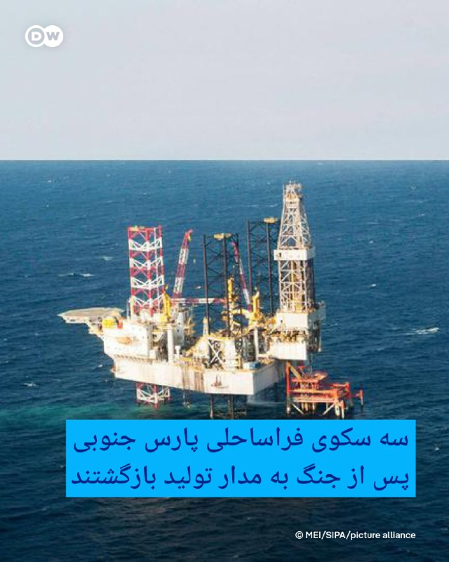

🔶 سه سکوی فراساحلی پارس جنوبی پس از جنگ به مدار تولید بازگشتند
 
تورج دهقانی، مدیرعامل شرکت نفت و گاز پارس، گفت روند بازیابی ظرفیت تولید و فرآورش گاز در میدان مشترک پارس جنوبی پس از حملات امریکا و اسرائیل ادامه دارد و تاکنون سه سکوی فراساحلی این میدان دوباره وارد مدار تولید شده‌اند.
 
دهقانی گفت در جریان حملات آمریکا و اسرائیل به برخی تاسیسات پالایشی پارس جنوبی، بخشی از ظرفیت دریافت و فرآورش گاز در نوار ساحلی استان بوشهر با محدودیت روبه‌رو شد.
 
به گفته او، در نتیجه این وضعیت، تعدادی از سکوهای فراساحلی متناظر با پالایشگاه‌های آسیب‌دیده، با وجود آمادگی کامل عملیاتی و بدون آن‌که خود سکوها آسیب دیده باشند، ناچار به توقف تولید شدند، زیرا امکان دریافت و فرآورش گاز تولیدی آن‌ها در بخش خشکی وجود نداشت.
 
مدیرعامل شرکت نفت و گاز پارس گفت با اجرای برنامه‌های فنی و عملیاتی در بخش پایین‌دست و استفاده حداکثری از ظرفیت پالایشگاه‌های فعال، امکان دریافت و فرآورش بخشی از گاز تولیدی این سکوها دوباره فراهم شد.
 
@dw_farsi

## DW_Farsi — post 125343

  

🔶 زهرا شهباز طبری بار دیگر به اعدام محکوم شد
 
به گزارش هرانا، زهرا شهباز طبری، زندانی سیاسی ۶۸ ساله، پس از آن‌که حکم اعدام پیشین او در دیوان عالی کشور نقض شده بود، بار دیگر از سوی شعبه دوم دادگاه انقلاب رشت به ریاست محمدعلی درویش‌گفتار به اعدام محکوم شده است. این حکم با اتهام "بغی" از طریق عضویت و فعالیت در سازمان مجاهدین خلق ایران صادر شده و در تاریخ سه‌شنبه (۲۵ فروردین ۱۴۰۵) علیه او صادر و به‌تازگی ابلاغ شده است.
 
زهرا شهباز طبری پیش‌تر در آبان ۱۴۰۴ از سوی شعبه اول دادگاه انقلاب رشت در ارتباط با همین اتهام به اعدام محکوم شده بود. آن حکم بعدتر در دیوان عالی کشور نقض شد و پرونده برای رسیدگی دوباره به شعبه دوم دادگاه انقلاب رشت فرستاده شد.
 
با این حال، رسیدگی مجدد نیز بار دیگر به صدور حکم اعدام منتهی شده است.
 
هرانا نوشته است زهرا شهباز طبری پیش‌تر در نامه‌ای از زندان، روند رسیدگی به پرونده خود را "فاقد مبنای حقوقی و نشانه‌ای از نبود دادرسی عادلانه" توصیف کرده بود.
 
@dw_farsi

## DW_Farsi — post 125342

  

🔶 سپاه: ۲۸ کشتی در ۲۴ ساعت گذشته با مجوز و تامین امنیت ما از تنگه هرمز عبور کردند
 
روابط عمومی نیروی دریایی سپاه در اطلاعیه‌ای اعلام کرد طی ۲۴ ساعت گذشته ۲۸ فروند کشتی، شامل نفتکش، کانتینربر و دیگر کشتی‌های تجاری، پس از دریافت مجوز و با هماهنگی و تامین امنیت نیروی دریایی سپاه از تنگه هرمز عبور کرده‌اند.
 
در این اطلاعیه آمده است کنترل "هوشمند" تنگه هرمز به‌طور مستمر و آنچه "صلابت و اقتدار" خوانده شده، در حال انجام است.
 
سپاه در این بیانیه عبور کشتی‌ها را در چارچوب مجوزدهی و نظارت مستقیم خود توصیف کرده است.
 
روابط عمومی نیروی دریایی سپاه همچنین خلیج فارس را پهنه‌ای آبی متعلق به کشورهای مسلمان منطقه خواند و اعلام کرد "تجاوز و شرارت‌های ارتش تروریست آمریکایی" مهم‌ترین دلیل ناامنی این منطقه در روزهای اخیر بوده است.
@dw_farsi

## DW_Farsi — post 125341

🔶 اسرائیل قلعه راهبردی بوفور در جنوب لبنان را تصرف کرد
 
ارتش اسرائیل امروز یکشنبه ۳۱ مه (۱۰ خرداد) اعلام کرد که نیروهایش در جنوب لبنان قلعه راهبردی بوفور (شقیف) را تصرف کرده‌اند. این عمیق‌ترین پیشروی نیروهای اسرائیلی در خاک لبنان در بیش از ربع قرن گذشته به شمار می‌رود.
 
یسرائیل کاتس، وزیر دفاع اسرائیل، گفت ارتش این کشور به رهبری نخست‌وزیر بنیامین نتانیاهو «عملیات خود در لبنان را گسترش داده، از رود لیتانی عبور کرده و ارتفاعات بوفور را به تصرف درآورده است.»
 
کاتس افزود که این اقدام در راستای دفاع از شهرک‌های منطقه جلیل در شمال اسرائیل و تأمین امنیت سربازان اسرائیلی انجام شده است.
 
آویخای ادرعی، سخنگوی عرب‌زبان ارتش اسرائیل، نیز در شبکه ایکس عکس‌هایی را منتشر کرده که نیروهای اسرائیلی را در حال حرکت در برابر این قلعه نشان می‌دهد.
 
این نخستین بار در ۲۶ سال گذشته است که نیروهای اسرائیلی در این محل مستقر می‌شوند. قلعه بوفور، در ارتفاع تقریبی ۶۵۰ متری بالاتر از سطح رودخانه لیتانی در جنوب لبنان، علاوه بر اهمیت استراتژیک، از اهمیت نمادین بالایی برخوردار است.
 
در دوران اشغال جنوب لبنان توسط اسرائیل از سال ۱۹۸۲ تا ۲۰۰۰، این قلعه ابتدا مدت‌ها صحنه درگیری بود و سپس برای سال‌ها به یک پایگاه پیشروی ارتش اسرائیل تبدیل شد.
 
@dw_farsi

## Persian_Trend_Official — post 15399

بنیامین نتانیاهو، نخست وزیر اسرائیل: من به ارتش اسرائیل دستور دادم که مانور را در لبنان گسترش دهد.

نیروهای ما از موانع قدرتمند عبور کردند. آنها زمین های فرماندهی را تصرف کردند و خط الراس بوفورت را تصرف کردند و اکنون دستور من این است که تسلط خود را بر مناطقی که تحت کنترل حزب الله بودند، عمیق تر و گسترش دهیم.

ما در حال آغاز اقدام هستیم، ما در همه جبهه ها عمل می کنیم در سوریه، غزه و لبنان. زمان می برد، اما ما ماموریت را کامل خواهیم کرد.

📝 Amir

📌 @persian_trend_official
پرشین ترند | متفاوت‌ترین کانال نظامی

## Persian_Trend_Official — post 15398

  

نباید از حضور سامانه های راداری و پدافندی ایرانی در ارمنستان تعجب کرد.

در اواسط دهه 2000 میلادی زمانی که ایران به تازگی به زمینه ساخت سیستم های راداری وارد شده بود پژوهشکده ارتباطات ایروان (ErNIISS) کمک های شایانی به ایران در جهت توسعه سیستم های راداری کرد.

یکی از این سیستم ها که با مشارکت ارمنی ها ساخته شده رادار آرایه فازی فعال نجم-802 است که در سیستم پدافندی صیاد نقش رادار کنترل آتش را دارد.

📝 Amir

📌 @persian_trend_official
پرشین ترند | متفاوت‌ترین کانال نظامی

## Persian_Trend_Official — post 15396

یک سوخت رسان آسیب دیده دیگر امریکایی در پایگاه هوایی میلدنهال توسط عکاسان ثبت شد.

عکاسان هوانوردی در اطراف پایگاه هوایی میلدنهال انگلیس تصاویری از یک هواپیمای سوخت رسان KC-135R آسیب دیده منتشر کردند، این سوخت رسان در فرودگاه بن گوریون در اثر اصابت موشک ایرانی در جریان جنگ 40 روزه آسیب دیده است.

این هواپیمای سوخت رسان پس از پشت سر گذاشتن تعمیرات و اورهال خود، هفته گذشته از فرودگاه بن گوریون برخواسته و وارد پایگاه میلدنهال انگلیس شده و روز گذشته نیز به امریکا برگشته است.

📝 Amir

📌 @persian_trend_official
پرشین ترند | متفاوت‌ترین کانال نظامی

## Persian_Trend_Official — post 15395

دونالد ترامپ: ما به یک توافق عالی خواهیم رسید، وگرنه برمی‌گردیم و آن را از طریق نظامی تمام می‌کنیم.

آنها در ابتدا گفتند: ما سلاح هسته‌ای تولید نخواهیم کرد. من گفتم: خب، اگر سلاح هسته‌ای بخرید چه اتفاقی می‌افتد؟

بنابراین اکنون گفته می‌شود: ما سلاح نظامی تولید نخواهیم کرد یا به هیچ وجه خریداری نخواهیم کرد. این یک تفاوت بزرگ است.

📌 @persian_trend_official
پرشین ترند | متفاوت‌ترین کانال نظامی

## Persian_Trend_Official — post 15394

ترامپ در مصاحبه با فاکس نیوز: ببینید، دو چیز لازم است، تنگه هرمز باید فوراً باز شود و باید آزاد باشد، آن هم بدون عوارض

و دوم اینکه آنها نمی‌توانند سلاح هسته‌ای داشته باشند. همین است؛ خیلی ساده است. بعد ما از آنجا خارج خواهیم شد.

📌 @persian_trend_official
پرشین ترند | متفاوت‌ترین کانال نظامی

## Persian_Trend_Official — post 15392

  <a href="telegram/content/Persian_Trend_Official_15392_1780238246.mp4" target="_blank">🎬 Download video</a>

تصاویری بیشتر از بمباران شهر صور توسط ارتش اسرائیل

همچنین وزارت بهداشت لبنان اعلام کرد که در جریان حملات هوایی روز گذشته اسرائیل، 16 نفر از شهروندان این کشور کشته و 35 نفر زخمی شدند.

📝 Amir

📌 @persian_trend_official
پرشین ترند | متفاوت‌ترین کانال نظامی

## RadioFarda — post 157745

🔸مرمت‌گران کاخ گلستان سر مجسمه فرشته تخت مرمر را پیدا کردند.

🔸کاخ گلستان در جریان حملات هوایی آمریکا و اسرائیل در اسفند ماه آسیب دیده بود.

🔸تخت مرمر کاخ‌موزه گلستان به دستور فتحعلی‌شاه قاجار از ۶۵ قطعه مرمر زرد ساخته شده است.

@RadioFarda

## IranianMinds — post 21145

  

حمید رسایی قبل از جنگ :
مجلس رو تعطیل کنیم بودجه‌اش رو بدیم به مردم.

بعد از جنگ :
مجلس باید باز شود ، اقدامات تقنینی و نظارتی صورت بگیرد

@IranianMinds

## IranianMinds — post 21144

امروز 31 May
روز جهانی لبخنده
چیزی که خیلی وقته ما ایرانیا یادمون رفته
این روز رو به همه جز ایرانیا تبریک میگیم

و لعنت بر باعثو بانیش

@IranianMinds

## IranianMinds — post 21143

  <a href="telegram/content/IranianMinds_21143_1780238248.mp4" target="_blank">🎬 Download video</a>

درود به شرفت.

@IranianMinds

## IranianMinds — post 21142

🔴 ناتو:

ممکن است در موضوع بازگشایی تنگه هرمز مداخله کنیم

@IranianMinds

## BBCPersian — post 282503

  <a href="https://t.me/bbcpersian/282503" target="_blank">📎 Download file</a>

📻 تازه‌ترین خبرهای جهان جمعه ۸ خرداد ۱۴۰۵ از رادیو بی‌بی‌سی در لندن

@BBCPersian

## BBCPersian — post 282502

🔻وزارت بهداشت لبنان: در حمله اسرائیل به بیمارستانی در صور، ۱۳ نفر از کارکنان زخمی شدند

وزارت بهداشت لبنان اعلام کرد در حمله هوایی اسرائیل به نزدیکی یک بیمارستان در شهر صور در جنوب لبنان، «۱۳ نفر» از کارکنان این مرکز درمانی زخمی شده‌اند.

این در حالیست که ارتش اسرائیل به پیشروی در عمق خاک لبنان ادامه می‌دهد.

وزارت بهداشت لبنان در بیانیه‌ای گفت: «دشمن اسرائیلی در اطراف بیمارستان حیرام در صور اقدام به حمله هوایی کرد که در نتیجه آن ۱۳ نفر از کارکنان بیمارستان زخمی شدند و خسارات قابل توجهی به این مرکز وارد شد.»

این بیانیه از جامعه بین‌المللی خواست برای جلوگیری از «گسترش و تشدید حملات اسرائیل» اقدام کند.

https://trib.al/GzhNERS
@BBCPersian

## BBCPersian — post 282501

🔻سخنگوی دولت: افزایش مبلغ کالابرگ در صورت فراهم بودن شرایط مالی اجرا می‌شود

سخنگوی دولت ایران گفت که افزایش مبلغ کالابرگ از برنامه‌های دولت است اما تصمیم‌گیری در این زمینه باید با توجه به ظرفیت‌های مالی کشور انجام شود.

فاطمه مهاجرانی با تاکید بر ضرورت هم‌خوانی برنامه‌ها با منابع موجود گفت که وزارتخانه‌های مرتبط در حال بررسی شرایط هستند.

او همچنین گفت: «وضعیت مناطق مرزی جنوبی و حوزه دریایی هم بر درآمدهای کشور اثر گذاشته و در نهایت هدف دولت، تحقق این افزایش در صورت فراهم شدن امکان آن است.»

طی ماه‌های اخیر به‌ویژه پس از جنگ، روند افزایش قیمت کالاهای اساسی، بازنگری در مبلغ کالابرگ را به یکی از مطالبات جدی خانوارها و کارشناسان اقتصادی تبدیل کرده است.

مبلغ کالابرگ ثابت و یکسان نیست و به عوامل مختلفی مثل دهک درآمدی خانوار و تصمیم‌های دوره‌ای دولت بستگی دارد.

https://trib.al/dMeO03K
@BBCPersian

## BBCPersian — post 282500

🔻نتانیاهو تصرف قلعه استراتژیک در لبنان را «تغییری چشمگیر» در جنگ با حزب‌الله خواند

بنیامین نتانیاهو گفت که تصرف قلعه شقیف (بوفور) در جنوب لبنان «تغییری چشمگیر» در کارزار علیه حزب‌الله محسوب می‌شود.

او در پیامی ویدئویی گفت: «امروز ما به شکلی متفاوت به بوفور بازگشتیم، ما متحد، مصمم و قوی‌تر از همیشه بازگشته‌ایم.»

نخست وزیر اسرائیل افزود: «تصرف قلعه بوفور یک مرحله و یک تغییر اساسی در سیاستی است که در پیش گرفته‌ایم. ما مانع ترس را از میان برداشته‌ایم. ما ابتکار عمل را در دست داریم و در همه جبهه‌ها، در سوریه، غزه و لبنان در حال عملیات هستیم.»

https://trib.al/iXdrBex
@BBCPersian

## Dirty_Kids — post 390647

  

🔴 بعد از وصل شدن اینترنت، حالا خبرگزاری فارس یه کمپینی رو پوشش داده تحت عنوان "قطع داوطلبانه‌ی اینترنت بین‌الملل" و حرف‌شون اینه که:

"چرا اینترنت مارو وصل کردید؟ یه گزینه بذارید که خودمون بتونیم اینترنت بین‌الملل خودمونو قطع کنیم."

+ اینا سیمکارت سفید‌هایی هستن که از قطع اینترنت کاسبی میکنن تا دیروز جق میزدن فیلمش پخش میشد حالا رو شیشه هستن کمپین راه میندازن کاسبی کنن

@Dirty_Kids 👻

## Dirty_Kids — post 390646

  <a href="telegram/content/Dirty_Kids_390646_1780238253.mp4" target="_blank">🎬 Download video</a>

نیویورک پست یه گزارش تهیه کرده از دغدغه‌های ذهنی این روزهای آمریکاییا. واقعا آدم کله‌ش خراب میشه🤦🏻‍♂

@Dirty_Kids 👻

## Dirty_Kids — post 390645

  <a href="telegram/content/Dirty_Kids_390645_1780238255.mp4" target="_blank">🎬 Download video</a>

لیلاکامرانی: اروپا زندگی میکند،یکی ازهزاران پرستوی جمهوری اسلامی ،میگه هتل روزدن فقط من زنده موندم بالباس راحتی و بدون حجاب و برای باور پذیرتر بودن سوتین هم نپوشیده و پریده بیرون کولی بازی در میاره که وای کل هتل رو کشتن!
در طی جنگ ۱۲ روزه و ۳۸ روزه هیچ هتلی در تهران و در مل در ایران حتی آسیب هم ندیده چه برسه به هدف قرار گرفتن!

@Dirty_Kids 👻

## Dirty_Kids — post 390644

  

حالا من به تعدادش کاری ندارم
به سیس‌شم کاری ندارم
ناموسا شوهر فرد اعلا چیه؟ 😂😂

@Dirty_Kids 👻

## Dirty_Kids — post 390643

میدونید بدشانسی و بدبختی ما کجاست

فقط آخوند نیست که باید باهاش بجنگیم

چپ کسمغز و اروپایی نفهم و پاکستانی جاکش و عمانی بیناموس و دموکرات حروم زاده

همه وایسادن جلوی مردم ایران و به جمهوری اسلامی حرومزاده تر از خودشون کمک میکنند

@Dirty_Kids 👻

## Dirty_Kids — post 390642

  

چقدر جنده داره این مملکت؟

@Dirty_Kids 👻

## Dirty_Kids — post 390641

  

پسرا وقتی یه پسر دیگه قد بلند تر از خودشون میبینن:

@Dirty_Kids 👻

## Dirty_Kids — post 390640

‏- بوی یخچال می‌ده، من نمی‌خورم.

[کرم خاکی، سر میز شام، بعد از دفن مقام معظم رهبری]

@Dirty_Kids 👻

## Dirty_Kids — post 390639

  

خیلی قیافه کصکشی داره ازش خوشم میاد.

@Dirty_Kids 👻

## Dirty_Kids — post 390638

‏میری میپرسی اقا این عن چند میگه خانوم گرون شده پتروشیمی رو زدن دیگه عن تولید نمیشه.
قبلا بهانه دلار بود الان ‌پتروشیمی.

@Dirty_Kids 👻

## Dirty_Kids — post 390637

  <a href="telegram/content/Dirty_Kids_390637_1780238260.mp4" target="_blank">🎬 Download video</a>

عادل فردوسی‌پور اینجوری گزارشِ فینال چمپیونزلیگ رو شروع کرد:

فوتبال و تماشاش، تنها یک لحظه توقفه، نه نقطه فراموشی؛ فراموش نمی‌کنیم که بیرون از زمین در این چند ماه ، چه روزهای سختی بر مردم عزیز ما گذشت و میگذره؛ و چه جان های عزیز و بی‌گناهی از دست رفتن...

گزارش این بازی رو به همه مردم عزیزی که مظلومانه از بین ما رفتن و میتونستن تماشاگر پرشور این بازی باشن، تقدیم میکنم

پ‌ن: نظرات اینشکلی که؛ خیلیا میگن باهوش، خطرناک و شدیدا وسطباز به‌نفع رژیم بموقعش حرکت میزنه
بعضیا هم میگن خب بغل گوش آخوند چیکار کنه

@Dirty_Kids 👻

## Dirty_Kids — post 390636

  <a href="telegram/content/Dirty_Kids_390636_1780238262.mp4" target="_blank">🎬 Download video</a>

حمله خبرگزاری دانشجو به همکاری امیرحسین قیاسی با دیجی کالا برای ساخت برنامه جام جهانی

+ بیننده ندارن جنگ زرگری راه انداختن

@Dirty_Kids 👻

## Dirty_Kids — post 390635

  <a href="telegram/content/Dirty_Kids_390635_1780238265.mp4" target="_blank">🎬 Download video</a>

مجتبی خامنه‌ای درحال نوشتن بیانیه جدید:

@Dirty_Kids 👻

## Dirty_Kids — post 390634

  <a href="telegram/content/Dirty_Kids_390634_1780238266.mp4" target="_blank">🎬 Download video</a>

هوش دستشویی از زجر الله معین

دوباره اینترنت وصل شد سموم اینستا پیداشون شد😂😂 داداش تو بنویس شاید خطت بهتر باشه.

@Dirty_Kids 👻

## Hranews — post 113276

  

اتهام «جاسوسی»؛ حسن و حسین امیری، برادران ۲۰ ساله به اعدام محکوم شدند

❗️
❗️
❗️
❗️
❗️ – حسن و حسین امیری، برادران دوقلوی ۲۰ ساله محبوس در زندان قزلحصار کرج، توسط شعبه ۲۶ دادگاه انقلاب تهران به ریاست قاضی ایمان افشاری به #اعدام محکوم شدند. این حکم بر اساس اتهام «#جاسوسی برای اسرائیل» علیه این افراد صادر شده است.

به گزارش خبرگزاری هرانا، ارگان خبری مجموعه فعالان حقوق بشر در ایران، حسن و حسین امیری به اعدام محکوم شدند.

بر اساس اطلاعات دریافتی هرانا، این حکم اخیرا توسط شعبه ۲۶ دادگاه انقلاب تهران، به ریاست قاضی ایمان افشاری علیه این برادران دوقلو صادر شده است. اتهام «جاسوسی برای اسرائیل»، مبنای صدور این رای قرار گرفته است.
یک منبع مطلع از وضعیت این دو جوان ۲۰ ساله، به هرانا گفت: «در کیفرخواست صادر شده علیه این افراد، مشاهده تصاویری از ساختمان‌های آسیب‌دیده، مبنای طرح اتهام «جاسوسی به نفع اسرائیل» در پرونده قرار گرفته بود. حسن و حسین امیری به دستور بازپرس پرونده به‌صورت جداگانه در زندان قزلحصار نگهداری می‌شوند و از حق ملاقات با یکدیگر محروم هستند. این دو زندانی در حال حاضر در سوئیت ۳۵ این زندان محبوس هستند.»

ادامه مطلب

#حسن_امیری
#حسین_امیری

↘️
@hranews_bot تماس ✉️ -  @Hranews  کانال هرانا 🆑

## Hranews — post 113275

  

سخنگوی کمیسیون بهداشت مجلس از کمبود حدود هزار قلم #دارو در کشور خبر داد و اعلام کرد که این وضعیت ناشی از مواردی همچون سو مدیریت، ترک فعل و مشکلات در تخصیص به‌موقع ارز است. به گفته سلمان اسحاقی، تاخیر در پرداخت مطالبات داروخانه‌ها و شرکت‌های پخش نیز فشار مضاعفی بر زنجیره #تامین_دارو وارد کرده و می‌تواند دسترسی بیماران به داروهای ضروری را با اختلال مواجه کند.

وی همچنین با اشاره به فعالیت «مافیای دارو» و ضرورت ورود دستگاه قضایی به این حوزه، نسبت به تداوم وضعیت موجود هشدار داد. سلمان اسحاقی تاکید کرد که نابرابری در توزیع دارو میان استان‌ها، ضعف عملکرد بیمه‌ها و ناکارآمدی در مدیریت نظام دارویی، می‌تواند منجر به نقض #حق_سلامت، کاهش دسترسی برابر به خدمات درمانی و افزایش خطرات جانی برای بیماران شود.

↘️
@hranews_bot تماس ✉️ -  @Hranews  کانال هرانا 🆑

## Hranews — post 113274

  

تداوم بازداشت و بلاتکلیفی فرزانه فرهبد و علیرضا شایگان در زندان تربت حیدریه

❗️
❗️
❗️
❗️
❗️ – فرزانه فرهبد، شاعر و مجری اهل سبزوار و همسرش علیرضا شایگان، معلم بازنشسته، در تاریخ ۲۵ فروردین‌ماه سال جاری، پس از احضار به اداره اطلاعات این شهرستان #بازداشت شدند. این شهروندان از آن زمان تاکنون به صورت بلاتکلیف در زندان تربت حیدریه نگهداری می‌شوند.

به گزارش خبرگزاری هرانا، ارگان خبری مجموعه فعالان حقوق بشر در ایران، فرزانه فرهبد و علیرضا شایگان، ۴۸ روز است که در بازداشت به‌ سر می‌برند.

بر اساس اطلاعات دریافتی هرانا، فرزانه فرهبد و همسرش، علیرضا شایگان، روز ۲۵ فروردین ۱۴۰۵ پس از احضار به اداره اطلاعات سبزوار بازداشت شدند. این زوج از زمان بازداشت تاکنون در زندان تربت حیدریه نگهداری می‌شوند و با گذشت بیش از دو ماه، همچنان در بلاتکلیفی قضایی به سر می‌برند.

ادامه مطلب

#فرزانه_فرهبد
#علیرضا_شایگان

↘️
@hranews_bot تماس ✉️ -  @Hranews  کانال هرانا 🆑

## Hranews — post 113273

بوکان؛ عثمان ذاکری، روحانی اهل سنت به خلع لباس روحانیت محکوم شد

❗️
❗️
❗️
❗️
❗️ – عثمان ذاکری، روحانی اهل سنت اهل بوکان، توسط دادگاه‌ ویژه روحانیت، به خلع لباس روحانیت محکوم شد.

ادامه مطلب

#عثمان_ذاکری

↘️
@hranews_bot تماس ✉️ -  @Hranews  کانال هرانا 🆑

## Hranews — post 113272

  

دادگاه تجدیدنظر؛ نیما حسن‌خانی به حبس و دیگر مجازات‌ها محکوم شد

❗️
❗️
❗️
❗️
❗️– نیما حسن‌خانی، یکی از بازداشت‌شدگان اعتراضات سراسری ۱۴۰۴، محبوس در زندان شیبان اهواز، توسط شعبه ۱۴ دادگاه تجدید نظر استان خوزستان به دو سال حبس و دیگر مجازات‌ها محکوم شد. یک سال از این محکومیت به حالت تعلیق درآمده است.

به گزارش خبرگزاری هرانا، ارگان خبری مجموعه فعالان حقوق بشر در ایران، نیما حسن‌خانی توسط دادگاه تجدیدنظر به حبس و دیگر مجازات‌ها محکوم شد.

بر اساس حکمی که توسط ۱۴ دادگاه تجدید نظر استان خوزستان صادر و به حسین‌علی حاتمی، وکیل مدافع این شهروند ابلاغ شده، آقای حسن‌خانی از بابت اتهامات تبلیغ علیه نظام و اخلال در نظم و آسایش از طریق شرکت در اعتراضات، به دو سال حبس، دو سال ممنوعیت خروج از کشور و یک سال حضور در ستاد امر به معروف و نهی از منکر است. یک سال از این محکومیت به حالت تعلیق درآمده است.

ادامه مطلب

#نیما_حسن‌خانی

↘️
@hranews_bot تماس ✉️ - @Hranews کانال هرانا 🆑

## Hranews — post 113271

  

یک زن ترنس در سنندج به قتل رسید

❗️
❗️
❗️
❗️
❗️ – مهشید، یک زن #ترنس ۲۶ ساله، چند روز پیش در سنندج بر اثر ضربات چاقو توسط افراد ناشناس به قتل رسید.

به گزارش خبرگزاری هرانا، ارگان خبری مجموعه فعالان حقوق بشر در ایران، مهشید، زن ترنس و ساکن محله گلشن سنندج، جان خود را در پی حمله افراد ناشناس از دست داد.

یک منبع مطلع در این خصوص به هرانا گفت: «احتمالاً او روز جمعه توسط افراد ناشناس با ضربات چاقو به قتل رسیده است. مهاجمان پس از قتل، جسد مهشید را نیز مثله کرده‌اند.»
انگیزه و هویت عاملان این قتل تاکنون مشخص نشده است. با این حال، این منبع مطلع محلی در ادامه به هرانا گفت: «با توجه به نحوه وقوع این قتل و شرایط پیرامون آن، به نظر می‌رسد این جنایت با انگیزه نفرت صورت گرفته باشد. همچنین خانواده مهشید نیز برای پیگیری پرونده و اطلاع‌رسانی درباره این قتل تحت فشار و تهدید قرار گرفته‌اند؛ به‌طوری‌که تاکنون حتی آگهی ترحیمی نیز برای او منتشر نکرده‌اند.»

ادامه مطلب

#مهشید

↘️
@hranews_bot تماس ✉️ -  @Hranews  کانال هرانا 🆑

## Hranews — post 113270

تداوم بازداشت و بی‌خبری از وضعیت مجتبی ایروی در بیجار

❗️
❗️
❗️
❗️
❗️ – مجتبی ایروی، معلم بازنشسته اهل بیجار، ۹۰ روز است که توسط نیروهای امنیتی در بیجار #بازداشت شده و کماکان از وضعیت و محل نگهداری وی اطلاعی کسب نشده است. بی‌خبری از سرنوشت این شهروند، منجر به افزایش نگرانی‌های خانواده و بستگان وی شده است.

ادامه مطلب

#مجتبی_ایروی

↘️
@hranews_bot تماس ✉️ -  @Hranews  کانال هرانا 🆑

## alonews — post 123976

  <a href="telegram/content/alonews_123976_1780238269.webm" target="_blank">🎬 Download video</a>

⚫
🏆 به دنیای هیجان‌انگیز فوتبال خوش اومدی!

⭐️اینجا قراره باهم لحظه‌به‌لحظه‌ی جام جهانی رو زندگی کنیم؛
از بازی‌های حساس و نتایج داغ گرفته تا حاشیه‌ها، کری‌خونی‌ها و اتفاقاتی که همه درباره‌ش حرف میزنن! 
🔥
🔥

✅ پوشش کامل مسابقات

💀ترول تیم‌ها و بازیکن‌ها

🎥ویدیوها و لحظه‌های فان فوتبالی

📊آمار، ترکیب‌ها و اخبار فوری

🌍حواشی جذاب از سراسر جام جهانی

📢اینجا فقط یک کانال خبری نیست؛
یک جمع فوتبالیه برای کسایی که فوتبال رو با هیجان، شوخی و احساس واقعی دنبال میکنن 
📛
💟

🆘
🔞 آماده باش چون قراره جام جهانی رو متفاوت تجربه کنیم!

⚡ @Vaarzesh_Plus

⚡ @Vaarzesh_Plus

## alonews — post 123975

  <a href="telegram/content/alonews_123975_1780238270.webm" target="_blank">🎬 Download video</a>

👈منابع خبری مدعی حمله موشکی به حزب ضد «پاک» در کردستان عراق شدند.

🔴یک مقام حزب آزادی کردستان به روداو گفت که روز یکشنبه پایگاه مهم وابسته به این گروه مخالف ایران نزدیک اربیل هدف حمله موشکی قرار گرفت.

✅ @AloNews خبر جنگ

## alonews — post 123974

  <a href="telegram/content/alonews_123974_1780238270.webm" target="_blank">🎬 Download video</a>

👈شبکه LBCI لبنان: روبیو دو روز دیگر آتش‌بس فراگیر در لبنان را اعلام می‌کند

✅ @AloNews خبر جنگ

## alonews — post 123973

  <a href="telegram/content/alonews_123973_1780238270.webm" target="_blank">🎬 Download video</a>

👈 ترامپ: با کمال خرسندی اعلام می‌کنم که تام باراک، سفیر ایالات متحده در ترکیه، که عملکرد فوق‌العاده‌ای داشته است، به عنوان فرستاده ویژه ریاست جمهوری در سوریه و عراق منصوب خواهد شد، و ما همکاری استراتژیک خود را با هر دو دولت پیش خواهیم برد.

🔴تام با حمایت کامل وزارت امور خارجه، سفیر ایالات متحده در ترکیه باقی خواهد ماند.


✅ @AloNews خبر جنگ

## alonews — post 123972

  <a href="telegram/content/alonews_123972_1780238270.webm" target="_blank">🎬 Download video</a>

👈حزب‌الله با پهپاد FPV مستقیم به کابین یه خودروی امدادی اسرائیلی حمله کرد

✅ @AloNews خبر جنگ

## alonews — post 123971

  <a href="telegram/content/alonews_123971_1780238271.webm" target="_blank">🎬 Download video</a>

👈سی‌بی‌اس: میانجی‌ها به مذاکرات توافق تهران-واشنگتن ادامه می‌دهند؛ ترامپ متن توافق را جمعه بازبینی کرد و آن را برای تأیید به ایران فرستاد، پاسخ هنوز در انتظار است

✅ @AloNews خبر جنگ

## alonews — post 123970

  <a href="telegram/content/alonews_123970_1780238271.webm" target="_blank">🎬 Download video</a>

👈رویترز: جمع‌آوری سلاح توسط اهالی گرینلند از ترس حمله احتمالی آمریکا

🔴برخی از اهالی گرینلند به رویترز گفته‌اند که برای مقابله با حمله احتمالی ایالات متحده، اقدام به جمع‌آوری اسلحه و مهمات کرده‌اند. یکی از مدیران معدن با یادآوری اینکه پسرش گفته بود برای آمادگی در برابر تهاجم قصد خرید مهمات دارد، به گریه افتاد.

✅ @AloNews خبر جنگ

## alonews — post 123969

  <a href="telegram/content/alonews_123969_1780238271.webm" target="_blank">🎬 Download video</a>

👈وزارت جنگ آمریکا قصد دارد در ماه ژوئن، برنامه‌های مشخصی برای خروج بخشی از نیروهای خود از اروپا را در بروکسل، مقر ناتو ارائه دهد

✅ @AloNews خبر جنگ

## alonews — post 123967

  <a href="telegram/content/alonews_123967_1780238271.webm" target="_blank">🎬 Download video</a>

👈یک راکت حزب‌الله بین منازل مسکونی در روستای مسیحی نشین رمیچ جنوب لبنان سقوط کرد. که تلفات جانی نداشت.

✅ @AloNews خبر جنگ

## alonews — post 123966

  <a href="telegram/content/alonews_123966_1780238272.webm" target="_blank">🎬 Download video</a>

👈مدیر عامل پارس جنوبی: بازگشت سه سکوی فراساحلی میدان مشترک پارس جنوبی به مدار تولید

🔴 مدیرعامل شرکت نفت و گاز پارس از بازگشت سه سکوی فراساحلی میدان مشترک پارس جنوبی به مدار تولید پس از جنگ‌ تحمیلی سوم خبر داد.

✅ @AloNews خبر جنگ

## alonews — post 123965

  <a href="telegram/content/alonews_123965_1780238272.webm" target="_blank">🎬 Download video</a>

👈جروزالم پست: درخواست فرانسه برای نشست اضطراری شورای امنیت درباره لبنان

🔴ژان نوئل بارو، وزیر امور خارجه فرانسه، اعلام کرد که در واکنش به عملیات نظامی جاری اسرائیل در لبنان، خواستار تشکیل جلسه اضطراری شورای امنیت سازمان ملل متحد شده است

✅ @AloNews خبر جنگ

## alonews — post 123964

  <a href="telegram/content/alonews_123964_1780238272.webm" target="_blank">🎬 Download video</a>

👈قائم مقام معاونت راهبردی رئیس جمهور: تراکنش مالی وابسته به تنگه هرمز حدود ۲۰۰۰ میلیارد دلار در سال است

✅ @AloNews خبر جنگ

## alonews — post 123958

  <a href="telegram/content/alonews_123958_1780238272.mp4" target="_blank">🎬 Download video</a>

👈جنگنده‌های اسرائیلی امروز به طور مداوم حملات هوایی شدیدی را بر شهر صور در جنوب لبنان انجام داده‌اند

✅ @AloNews خبر جنگ

## alonews — post 123957

  <a href="telegram/content/alonews_123957_1780238274.webm" target="_blank">🎬 Download video</a>

👈وال استریت ژورنال: سازمان ملل در حال ورشکستگی است، زیرا ایالات متحده و چین میلیاردها دلار را از این نهاد بین‌المللی خارج می‌کنند. 

✅ @AloNews خبر جنگ

---
📅 بروزرسانی: 1405/03/10 15:40
---

## VahidOOnLine — post 243047

  

حمیدرضا حاجی‌بابایی، نایب‌رییس مجلس گفت: «محاصره اقتصادی دشمن را محاصره می‌کنیم و باید پرقدرت مسیرهای جایگزین و کریدورهای زمینی را پیگیری و فعال کرد.»

او ادامه داد: «برنامه‌ریزی‌های ماه‌های آینده باید با فرض ادامه‌دار بودن محاصره باشد و نباید تحت تاثیر گشایش‌های مقطعی احتمالی از سوی دشمن قرار گرفت.»

حاجی‌بابایی افزود: «باید تمهیداتی پیش‌بینی شود که از مسیر دریایی جنوب و بنادر مهم کشور با دور زدن محاصره و کم‌اثر کردن عملیاتی آن بتوان کماکان بخشی از کالاهای مورد نیاز را تامین کرد.»
‌🏁 🇬🇧 IranintlTV

🤖 @VahidOOnLine

## VahidOOnLine — post 243046

  <a href="telegram/content/VahidOOnLine_243046_1780229450.mp4" target="_blank">🎬 Download video</a>

⭕️حملات هوایی اسرائیل به شهر صور در جنوب لبنان

♦️جنگنده‌های ارتش اسرائیل روز یکشنبه دهم خرداد مواضع حزب‌الله را در شهر صور و مناطق اطراف آن در جنوب لبنان هدف حملات هوایی قرار دادند.

همزمان با این حملات، ستون‌های دود در بخش‌هایی از منطقه مشاهده می‌شود.

این حملات در ادامه درگیری‌های جاری میان اسرائیل و حزب‌الله و هم‌زمان با گسترش عملیات نظامی اسرائیل در جنوب لبنان انجام شده است.

صور از مهم‌ترین شهرهای جنوب لبنان به شمار می‌رود و در هفته‌های اخیر بارها هدف حملات هوایی ارتش اسرائیل قرار گرفته است.
‌🇸🇦 Indypersian

🤖 @VahidOOnLine

## VahidOOnLine — post 243045

♦️محمدباقر قالیباف، رییس مجلس شورای اسلامی روز یکشنبه در جلسه صحن مجلس که به صورت مجازی برگزار شد با اشاره به مذاکرات با آمریکا، گفت: «تا اطمینان پیدا نکنیم که حقوق ملت ایران را گرفته‌ایم، هیچ توافقی را تایید نخواهیم کرد.»

او با تاکید بر اینکه مقام‌های جمهوری اسلامی هیچ اعتمادی به آمریکا  ندارند، افزود: «سربازان میدان مبارزه دیپلماسی، هیچ اعتمادی به حرف‌ها و وعده‌های دشمن ندارند. آنچه برای ما ملاک است دستاوردهای عینی است که باید کسب کنیم.»

قالیباف تاکید کرد: «تضمین این راهبرد، جان ماست که کف دست گرفته‌ایم تا نثار مردم ایران کنیم.»

دونالد ترامپ، رئیس‌جمهور ایالات متحده، در گفتگویی اختصاصی با شبکه خبری «فاکس نیوز»، با اشاره به روند رایزنی‌های جاری، وضعیت گفتگوها را مثبت ارزیابی کرد و گفت: «ما به امضای یک توافق بسیار خوب با تهران نزدیک هستیم. اگر نتوانیم به یک توافق خوب و ایده‌آل دست پیدا کنیم، قطعا بازخواهیم گشت و کار را از طریق نظامی تمام خواهیم کرد.»
‌🇸🇦 Indypersian

🤖 @VahidOOnLine

## VahidOOnLine — post 243044

  <a href="telegram/content/VahidOOnLine_243044_1780229452.mp4" target="_blank">🎬 Download video</a>

در پی راه‌اندازی کارزار مردمی رشت از سوی ایران‌اینترنشنال، ویدیوهایی از جمعیت گسترده مردم معترض این شهر در ۱۸ دی ۱۴۰۴ به دست ما رسیده است.
‌🏁 🇬🇧 IranintlTV

🤖 @VahidOOnLine

## VahidOOnLine — post 243043

  

فاطمه مهاجرانی، سخنگوی دولت جمهوری اسلامی، گفت: «وقتی جریان عرضه و تقاضا دچار مشکل می‌شود، بازار واکنش نشان می‌دهد.» و با اشاره به آنچه «دزدی دریایی آمریکا» خواند، افزود این موضوع بر کاهش ورود کالا تاثیر می‌گذارد.
این اظهارات در حالی مطرح شد که بانک مرکزی جمهوری اسلامی بهمن ۱۴۰۴ نرخ تورم سالانه را بیش از ۶۲ درصد اعلام کرده بود.
‌🏁 🇬🇧 IranintlTV

🤖 @VahidOOnLine

## VahidOOnLine — post 243042

  <a href="telegram/content/VahidOOnLine_243042_1780229454.mp4" target="_blank">🎬 Download video</a>

⭕️شعار مردم در ۱۹ دی‌ماه در فلکه دوم صادقیه: «رضا رضا پهلوی، این است شعار ملی»

♦️تصاویری که به تازگی و پس از وصل شدن اینترنت ایرانیان در شبکه‌های اجتماعی منتشر شده نشان می‌دهد، جمع کثیری از مردم در فلکه دوم صادقیه تهران، شامگاه جمعه ۱۹ دی‌ماه به خیابان‌ها آمدند و شعارهای «جاویدشاه» و «رضا رضا پهلوی، این است شعار ملی» سر دادند.

نیروهای سرکوبگر جمهوری اسلامی در پنجشنبه و جمعه ۱۸ و ۱۹ دی‌ماه ده‌ها هزار نفر از مردم معترض را در خیابان‌ها با شلیک مستقیم گلوله جنگی کشتند.
‌🇸🇦 Indypersian

🤖 @VahidOOnLine

## VahidOOnLine — post 243041

  

خبرگزاری تسنیم، وابسته به سپاه پاسداران نوشت که تبادل پیام‌ها میان جمهوری اسلامی و آمریکا درباره متن تفاهم‌نامه احتمالی همچنان ادامه دارد و دو طرف به صورت متناوب اصلاحیه‌هایی را مطرح می‌کنند و تا این لحظه هیچ تفاهمی نهایی نشده و احتمال منتفی شدن هرگونه تفاهم نیز وجود دارد.

تسنیم اضافه کرد که اصل در مواجهه با آمریکا، عدم تفاهم و مذاکره است و اگر تفاهمی شکل بگیرد، باید نکات و چارچوب‌های بسیار محکمی در آن در نظر گرفته شود.

رسانه وابسته به سپاه افزود در وضعیتی که اکنون شکل گرفته، مسدود بودن تنگه هرمز فشار اقتصادی مهمی را به آمریکا و متحدانش وارد می‌کند و به یک «اهرم قدرت» برای جمهوری اسلامی تبدیل شده است.

خبرگزاری تسنیم ادامه داد اگر آمریکا بخواهد ماجرا را به نحوی ساماندهی کند که فشار انسداد تنگه هرمز را از روی خود برداشته و فشار را بر روی جمهوری اسلامی نگاه دارد و سپس با فراغ‌بال بیشتری به جنگ بازگردد، حتما توافق نکردن باز هم بهتر از هرگونه توافقی است.
‌🏁 🇬🇧 IranintlTV

🤖 @VahidOOnLine

## VahidOOnLine — post 243040

  <a href="telegram/content/VahidOOnLine_243040_1780229456.mp4" target="_blank">🎬 Download video</a>

ویدیوی منتشرشده، حمل پیکر جاویدنام محسن جبارزاده را نشان می‌دهد. جبارزاده، ۴۱ ساله و متاهل، ۱۹ دی‌ ۱۴۰۴ در خیابان سلسبیل تهران هدف گلوله جنگی ماموران قرار گرفت و کشته شد.
‌🏁 🇬🇧 IranintlTV

🤖 @VahidOOnLine

## VahidOOnLine — post 243039

  

⭕️نتانیاهو: عملیات زمینی اسرائیل در لبنان گسترش خواهد یافت

♦️بنیامین نتانیاهو، نخست‌وزیر اسرائیل روز یکشنبه دهم خرداد اعلام کرد که به ارتش این کشور دستور داده است حضور نیروها در مخفیگاه و مواضع حزب‌الله در شمال رود لیتانی را گسترش دهد و عملیات زمینی در لبنان را تعمیق کند.

نتانیاهو تصرف قلعه راهبردی بوفور (شقیف) را «تغییری بنیادین» در سیاست اسرائیل توصیف کرد و گفت: «ابتکار عمل در تمامی جبهه‌ها در اختیار اسرائیل قرار دارد».

اظهارات نخست‌وزیر اسرائیل در حالی مطرح می‌شود که درگیری‌ها میان ارتش این کشور و حزب‌الله در جنوب لبنان همچنان ادامه دارد و عملیات نظامی اسرائیل در این منطقه وارد مرحله تازه‌ای شده است.
‌🇸🇦 Indypersian

🤖 @VahidOOnLine

## VahidOOnLine — post 243038

  

♦️وزیر امور خارجه فرانسه روز یکشنبه ۱۰ خرداد گفت که پس از تصرف قلعه قرون وسطایی «بوفورت» در لبنان توسط نیروهای اسرائیلی، فرانسه درخواست جلسه اضطراری شورای امنیت سازمان ملل را داده است.

ژان نوئل بارو گفت: «من درخواست جلسه اضطراری شورای امنیت سازمان ملل را کرده‌ام زیرا در حالی که ما حق اسرائیل را مانند همه کشورها برای دفاع از خود به رسمیت می‌شناسیم، هیچ چیز نمی‌تواند ادامه عملیات نظامی اسرائیل در لبنان و اشغال روزافزون خاک لبنان توسط آن را توجیه کند.»

اسرائیل کاتس، وزیر دفاع اسرائیل روز یکشنبه دهم خرداد با انتشار پیامی در اکس اعلام کرد که نیروهای ارتش این کشور قلعه تاریخی و راهبردی شقیف (بوفورت) در جنوب لبنان را تصرف کرده‌اند.

خبرگزاری فرانسه روز یکشنبه تصاویری از برافراشته شدن پرچم ارتش اسرائیل بر فراز این قلعه را در حالی که صدای گلوله‌باران و ستون‌های دود در مناطق اطراف نیز مشاهده می‌شود، منتشر کرد.
‌🇸🇦 Indypersian

🤖 @VahidOOnLine

## VahidOOnLine — post 243037

  

خبرگزاری مهر از شنیده شدن صدای انفجار در محدوده جزیره قشم خبر داد و نوشت که ساکنان مناطق مرکزی و جنوبی این جزیره آن را تایید کرده‌اند اما ماهیت صدا هنوز مشخص نشده است.
همزمان صداوسیما اعلام کرد صداهای شنیده‌شده در قشم و بندرعباس، ناشی از «امحای مهمات باقی‌مانده از جنگ» است.
‌🏁 🇬🇧 IranintlTV

🤖 @VahidOOnLine

## VahidOOnLine — post 243036

  

بنیامین نتانیاهو، نخست‌وزیر اسرائیل، گفت دستور داده استقرار ارتش اسرائیل در مواضع حزب‌الله در شمال رود لیتانی گسترش یابد و عملیات زمینی در لبنان تعمیق شود. او تصرف قلعه بوفور را «تغییری بنیادین» در سیاست اسرائیل خواند و افزود ابتکار عمل در همه جبهه‌ها در دست اسرائیل است.
‌🏁 🇬🇧 IranintlTV

🤖 @VahidOOnLine

## VahidOOnLine — post 243035

  

⭕️وزیر دفاع اسرائیل: نیروهای ما قلعه راهبردی «شقیف» در جنوب لبنان را تصرف کردند

♦️اسرائیل کاتس، وزیر دفاع اسرائیل روز یکشنبه دهم خرداد با انتشار پیامی در اکس اعلام کرد که نیروهای ارتش این کشور قلعه تاریخی و راهبردی شقیف (بوفورت) در جنوب لبنان را تصرف کرده‌اند.
وزیر دفاع اسرائیل همچنین از گسترش عملیات زمینی ارتش این کشور علیه حزب‌الله خبر داد و گفت «نیروهای ما پس از عبور از رودخانه لیتانی، کنترل این موقعیت مهم را به دست گرفته‌اند».

کاتس در این پیام نوشت: «۴۴ سال پس از نبرد بوفورت، نیروهای ما بار دیگر به این قلعه بازگشتند و پرچم اسرائیل را بر فراز آن برافراشتند.»

تصاویر خبرگزاری فرانسه نیز برافراشته شدن پرچم ارتش اسرائیل بر فراز این قلعه را نشان می‌دهد؛ هرچند هم‌زمان صدای گلوله‌باران و ستون‌های دود در مناطق اطراف نیز مشاهده می‌شود.

قلعه «شقیف» به‌دلیل اشراف بر بخش‌های وسیعی از جنوب لبنان، یکی از مهم‌ترین مواضع راهبردی این منطقه محسوب می‌شود.
‌🇸🇦 Indypersian

🤖 @VahidOOnLine

## VahidOOnLine — post 243034

  

سایت هرانا گزارش داد زهرا شهباز طبری، زندانی سیاسی محبوس در زندان لاکان رشت، پس از نقض حکم پیشین در دیوان عالی کشور، بار دیگر از سوی شعبه دوم دادگاه انقلاب رشت به ریاست محمدعلی درویش‌گفتار، به اتهام «بغی از طریق عضویت و فعالیت در سازمان مجاهدین خلق» به اعدام محکوم شد.
این زندانی سیاسی ۶۸ ساله، در فروردین ۱۴۰۴ در منزل شخصی خود در رشت بازداشت شده بود.
‌🏁 🇬🇧 IranintlTV

🤖 @VahidOOnLine

## WithYashar — post 13031

## WithYashar — post 13030

متن چکیده شده نسخه ۱
⸻

بیانیه جمعی از ایرانیان داخل و خارج کشور خطاب به شاهزاده رضا پهلوی

شاهزاده گرامی،
ایرانیان داخل و خارج از کشور، با وجود تفاوت دیدگاه‌ها و تجربه‌های متفاوت، در یک نقطه اشتراک دارند: امید به عبور ایران از وضعیت کنونی و رسیدن به آینده‌ای آزاد، باثبات و شایسته ملت ایران.

در سال‌های گذشته، اعتراضات و جنبش‌های متعدد با هزینه‌های سنگین انسانی و اجتماعی همراه بوده و بخش بزرگی از جامعه همچنان در وضعیت فشار اقتصادی، ناامنی روانی، سرکوب سیاسی و ناامیدی نسبت به آینده قرار دارد. در کنار این شرایط، فضای سیاسی اپوزیسیون نیز از نگاه بسیاری از مردم دچار پراکندگی، نبود انسجام و فقدان نقشه راه عملی و قابل سنجش است.

مطالبه اصلی بخش بزرگی از مردم نه صرفاً شعار، بلکه وجود یک ساختار روشن، قابل فهم و اجرایی برای گذار سیاسی و دوران پس از آن است؛ ساختاری که بتواند اعتماد عمومی را حفظ کرده و انرژی اجتماعی را به مسیر مؤثر تبدیل کند.

در همین راستا، مهم‌ترین پیشنهادها و خواسته‌های مشترک به شرح زیر جمع‌بندی می‌شود:

1. ضرورت ارائه نقشه راه روشن و مرحله‌بندی‌شده

بخش بزرگی از جامعه خواستار آن است که مسیر حرکت، شامل اهداف کوتاه‌مدت، میان‌مدت و بلندمدت، به‌صورت شفاف مشخص شود؛ به‌گونه‌ای که مردم بدانند در هر مرحله چه نقشی دارند و نتیجه نهایی چگونه تعریف می‌شود.

2. ایجاد ساختار منسجم و شبیه «دولت در تبعید»

پیشنهاد شده است یک ساختار هماهنگ و چندلایه شامل بخش‌های مختلف شکل گیرد؛ از جمله:

رهبری و شورای مرکزی تصمیم‌گیری
تیم‌های رسانه‌ای داخلی و بین‌المللی
تیم‌های سیاست‌گذاری و برنامه‌ریزی اقتصادی و حقوقی
شبکه‌های ارتباطی و سازماندهی اجتماعی داخل و خارج کشور
تیم تحلیل و نظارت برای ارزیابی عملکرد و اصلاح مسیر
ساختار مقابله با جنگ روانی و عملیات اطلاعاتی

هدف از این ساختار، کاهش پراکندگی، افزایش کارآمدی و ایجاد یک مرجع واحد برای هماهنگی فعالیت‌ها عنوان شده است.

3. شفافیت، اعتمادسازی و گزارش‌دهی

یکی از مطالبات مهم، شفافیت در عملکرد، نحوه تصمیم‌گیری‌ها و مسیرهای حمایتی (از جمله مالی و رسانه‌ای) است. ارائه گزارش‌های منظم می‌تواند اعتماد عمومی را تقویت کرده و مشارکت مردم را افزایش دهد.

4. استفاده از ظرفیت همه اقشار و تنوع اجتماعی ایران

درخواست شده است که نمایندگان اقوام، اصناف، متخصصان، جوانان و گروه‌های مختلف اجتماعی در ساختار تصمیم‌سازی حضور داشته باشند تا احساس نمایندگی و مشارکت واقعی در میان مردم تقویت شود.

5. سازماندهی مشارکت مردمی در داخل و خارج کشور

بسیاری از پیام‌ها بر ضرورت ایجاد شبکه‌های منسجم مردمی در حوزه‌های رسانه‌ای، اجتماعی، مدنی و حمایتی تأکید دارند تا انرژی عظیم پراکنده در فضای مجازی و میدانی به یک مسیر هماهنگ تبدیل شود.

6. تمرکز بر انسجام به جای پراکندگی

یکی از نگرانی‌های جدی، تعدد صداها، اختلافات درونی و نبود فرماندهی واحد در جبهه مخالفان است. درخواست عمومی این است که انسجام، هماهنگی و وحدت عملی جایگزین فعالیت‌های پراکنده شود.

7. ضرورت فعال‌تر شدن ارتباط با افکار عمومی

بخش قابل توجهی از مردم خواستار ارتباط مستمرتر، روشن‌تر و مستقیم‌تر رهبری اپوزیسیون با جامعه هستند؛ به‌گونه‌ای که ابهامات، پرسش‌ها و نگرانی‌ها بدون فاصله زمانی طولانی پاسخ داده شود.

8. آینده‌نگری برای دوران گذار و پس از آن

در کنار موضوع تغییر سیاسی، مردم نسبت به آینده پس از آن نیز دغدغه جدی دارند؛ از جمله ساختار حکمرانی، عدالت، فرصت‌های برابر، توسعه اقتصادی، و جلوگیری از تکرار تمرکز قدرت.

⸻

در جمع‌بندی، پیام مشترک همه دیدگاه‌ها این است که:

جامعه ایران آماده تغییر است، اما این آمادگی نیازمند سازماندهی، شفافیت، برنامه‌ریزی و یک محور هماهنگ‌کننده قابل اعتماد است.

در پایان، این مجموعه نظرات با نیت خیرخواهانه و از سر دغدغه برای آینده ایران ارائه می‌شود و هدف آن تقویت مسیر همبستگی ملی و افزایش کارآمدی حرکت جمعی ایرانیان است.

پاینده ایران
@withyashar

## WithYashar — post 13029

## WithYashar — post 13028

نتانیاهو: عملیات زمینی در لبنان را گسترش می‌دهیم

بنیامین نتانیاهو، نخست‌وزیر اسرائیل، اعلام کرد به ارتش این کشور دستور داده است دامنه عملیات زمینی در لبنان را گسترش دهد.
@withyashar

## WithYashar — post 13027

اسرائیل هیوم: ترامپ به دلیل ترس از شکست در انتخابات میان دوره ای جنگ را متوقف کرد و بعد از انتخابات جنگ را ادامه خواهد داد
@withyashar

## WithYashar — post 13026

صدای انفجار در قشم مربوط به یک مین شناور بود که در حال حرکت به سمت یک کشتی بود و آمریکا منفجرش کرد
@withyashar

## WithYashar — post 13025

سلام اقا یاشار ،لطفا به اون اقا یا خانومی که بلوچ هستن بفرمایید که من یکی از اون افرادی هستم مه هر ماه برای مردم سیستان پ بلوچستان کمک میفرستم و واقعا ذوسشوت دارم چون واقعا مظلوم واقع شدن و از دیروز که فهمیدم که ۲۴ الی ۴۷ ساعت اب ندارن انقدر حالم خراب که انگار منم الان اونجام ،قلبم به درد میاد براشون ،بلوچ هر چی بگه حق داره از بس توو این سال‌های اذیتشون کردن

## WithYashar — post 13024

## WithYashar — post 13023

یاشار اگه حوصلشو داری‌ میتونی برای کسایی که جدید اومدن ویس هایی که مهمه تحلیلش برای رسیدن به اون درکی که باید برسیم رو پین کنی که با دیدن پین ها دسترسی سریعتر داشته باشن

## WithYashar — post 13022

مردم ما هیچ اتحادی باهم ندارن اقایاشار از مردم کشورم خیلی دلخورم، من ی بلوچم، الان حتی توو همین مجازی هرکسی ک منو ببینه فقط توهین میشنوم فقط چون بلوچم واقعا خیلی دلم شکسته از هموطنای خودم اخه چرا مگ ماها ایرانی نیستیم مگ ما چیکارشون کردیم، ماهم سالهاست داره جوونامون بچه هامون کشته میشن سال هاست زیر ظلم این رژیم هستیم . اصلا قبل همه این داستانا با تمام بدبختی ک داریم تنهایی جلوشون وایسادیم هیچکس نبود، ازتون میخوام این پیاممو بزارین تو چنلتونن🙏🏼 تازمانی ک ماها از همدیگ بدمون میاد حتی این رژیمم عوض بشه این کشور هیچوقت درست نمیشه

## WithYashar — post 13021

روابط‌عمومی ۳پا : صدای انفجار در بندرعباس مربوط به خنثی‌سازی مهمات عمل‌نکرده است.
@withyashar

## WithYashar — post 13020

نیویورک‌تایمز: ترامپ شروط توافق احتمالی با جمهوری اسلامی رو سخت‌تر کرده و نسخه اصلاح‌شده رو برای بررسی دوباره به تهران فرستاده.

طبق این گزارش، اختلاف‌ها به‌ویژه بر سر آزادسازی منابع مالی ایران ادامه داره و واشینگتن تلاش می‌کنه با افزایش فشار، روند مذاکرات رو تسریع کنه.
@withyashar

## WithYashar — post 13019

Voice message

## WithYashar — post 13018

به عنوان خردادی میگم حالا که موضوعش پیش اومد😂
ما اخلاقمون دقیقاااا همون عربس که داره مسافر میبره قاهره
کار خودمونو میکنیما ولی پستی بلندی زیاد داره مسیرمون

## WithYashar — post 13017

دم کسایی‌که حمایت میکنند گرم 🙌🏾❤️‍🩹

## WithYashar — post 13016

ی روز درمیون ب صد نفر میفرستم

## WithYashar — post 13015

لینک کانال تلگرامتو

## WithYashar — post 13014

چیزی ‌نیست صدای
“واریز ناموفق: موجودی کافی نیسته!”
@withyashar 🤣

## mwarmonitor — post 9944

  <a href="telegram/content/mwarmonitor_9944_1780229460.mp4" target="_blank">🎬 Download video</a>

📝 این کمدی که می‌بینید تماشایی‌ترین سقوط تاریخ است؛ جماعتی ذلیل که شب ها با جیپ‌های صورتی و فاحشه‌های وارداتیِ پمپاژکننده انرژی به پاسداران، ادعای فتح جهان و صدور اسلام را دارید، اما حالا به چنان خفتی افتاده‌اید که حتی جرعت چال کردن لاشه موشعلی را هم ندارید و از ترس سایه خودتان، جنازه‌اش را مخفیانه در یخچال نگهداری می‌کنید! حقارت‌بارتر و مضحک‌تر از این تصویر وجود ندارد که در اتاق‌های مخفی در اعماق زمین ، کورکورانه و از روی تخیلات مقلدانه، برای توله مجتبی صلوات می‌فرستید که هیچ‌کدام از شما مفلوکانِ توی سر زن حتی او را از نزدیک ندیده‌اید.

🔸 شما دقیقاً کپی برابر اصل همان پیروان جاهل ۱۴۰۰ سال پیش هستید که بر اساس توهمات و افسانه‌های بافته‌شده، زنجیر بندگی و حماقت به گردن آویختند و از روی عکسِ ندیده، مقلد شدند. این ضربه مهلک و کتلت شدنِ بزرگ‌ترتان چنان ابهت پوشالی، توخالی و مافیایی این فرقه تبهکار را در هم کوبیده که ملت آزاده و سربلند ایران باید سالیان سال بر روی ویرانه‌های این جهل، ترس و بزدلیِ شما، به جشن، سرور و پایکوبی بپردازند و زوال این سیرک مذهبی را به تماشا بنشینند.

@mwarmonitor

## mwarmonitor — post 9943

... ما مجبور نیستیم از، می‌دانید، سلاح‌های بزرگ استفاده کنیم؛ ما می‌توانیم آن‌ها را از طریق هوا، همان‌طور که داشتیم انجام می‌دادیم، شکست دهیم. اما ما حدود تقریباً دو ماه زمان را در این مذاکرات از دست داده‌ایم. و آن‌ها، آن‌ها این را به عنوان... و آن‌ها به بلند‌نظری…

## mwarmonitor — post 9942

🔴مارک لوین: «به برنامه خوش آمدید، آمریکا. همیشه مایه خرسندی است که مرد دانا و خردمندِ آمریکا را در برنامه داشته باشیم؛ "ویکتور دیویس هنسون". او یک دوست خوب، پژوهشگر ارشد اندیشکده "هوور" است و پادکست بسیار موفقی هم دارد. ویکتور، ممنون که به برنامه آمدی. خب،…

## mwarmonitor — post 9941

🔴مارک لوین: «به برنامه خوش آمدید، آمریکا. همیشه مایه خرسندی است که مرد دانا و خردمندِ آمریکا را در برنامه داشته باشیم؛ "ویکتور دیویس هنسون". او یک دوست خوب، پژوهشگر ارشد اندیشکده "هوور" است و پادکست بسیار موفقی هم دارد.
ویکتور، ممنون که به برنامه آمدی. خب، بگذار این سوال را از تو بپرسم: اگر بتوانی خودت را جای رژیم ایران بگذاری، فکر می‌کنی آن‌ها در حال حاضر چطور به این وضعیت نگاه می‌کنند؟»
🔵 ویکتور دیویس هنسون:
«خب، ما دقیقاً نمی‌دانیم، چون این یک جنگ بسیار غیرمعمول است. ما هیچ نیروی زمینی در آنجا نداریم و هیچ خبرنگار مستقری هم نیست؛ بنابراین میزان دقیق خسارت‌ها را نمی‌دانیم. اما به نظر من، آن‌ها از نظر اقتصادی به شدت آسیب دیده‌اند و ۹۰ درصد از توان نظامی‌شان بی‌تحرک و منفعل شده است.
اما آن‌ها فکر می‌کنند هنوز به اندازه کافی موشک در اختیار دارند. همچنین گمان می‌کنند که کشورهای حوزه خلیج [فارس] بسیار آسیب‌پذیر هستند و معتقدند که تردد در تنگه هرمز، جریان شکننده‌ای است که می‌توانند در آن آشوب و هرج‌ومرج ایجاد کنند. با این کار، فرآیندها را به تاخیر بیندازند، شاید به رکود اقتصادی جهانی دامن بزنند و وضعیت را تا زمان انتخابات میان‌دوره‌ای کش بدهند.
آن‌ها همچنین در حال انجام بازی بسیار عجیبی هستند. آن‌ها سیگنال‌هایی می‌فرستند مبنی بر اینکه افرادی که با ما گفتگو می‌کنند — یعنی همان به‌اصطلاح "رهبران منتخب" — با سپاه پاسداران اختلاف نظر دارند. ما به دلیل اینکه افراد زیادی را حذف کرده‌ایم، دقیقاً نمی‌دانیم این ادعا تا چه حد درست است، اما این شک و شبهه به وجود می‌آید که این گفتگوکنندگان نقش "پلیس خوب" را بازی می‌کنند و سپاه پاسداران و حکومت مذهبی که هر از گاهی تلاش می‌کنند به یک ناو حمله‌ور شوند یا به کویتی‌ها یا دیگران ضربه بزنند، نقش "پلیس بد" را دارند؛ در حالی که آن‌ها در واقع با یکدیگر هماهنگ و همسو هستند.
سپس مذاکره‌کنندگان به ما می‌گویند: "خب، ما نمی‌توانیم این افراد را کنترل کنیم، ما متاسفیم، ما نمی‌دانیم آن‌ها در خلیج [فارس] چه کار می‌کنند، مین‌گذاری می‌کنند و غیره... اما مذاکرات را خراب نکنید." و این رویکرد به هر کدام از آن‌ها در رقابت برای کسب قدرت، نوعی اعتبار می‌دهد.
اما در یک مقطعی، ما باید این روند را متوقف کنیم. و راه‌های زیادی برای متوقف کردن آن وجود دارد مارک؛ زیرا این موضوع از نظر نظامی مشکلی نیست، بلکه یک مسئله سیاسی است که با اقتصاد جهانی، انتخابات میان‌دوره‌ای و مسائل دیگر گره خورده است. اما من فکر می‌کنم رئیس‌جمهور می‌تواند راهی برای حل این معادله پیچیده پیدا کند، اگر به طور غیررسمی به آن‌ها بگوید که این حماقت‌ها یک ضرب‌الاجل و پایان مشخصی دارد و پشیمان خواهید شد. و اینکه ما آن‌قدر به اقتصاد و نیروی نظامی شما آسیب خواهیم زد که بهبود و بازسازی آن برای شما یک ربع قرن (۲۵ سال) طول بکشد؛ و ما یک نیروی باقی‌مانده را در آنجا حفظ خواهیم کرد که به همراه متحدانمان، آن تنگه را باز نگه دارد.
من فکر می‌کنم او (رئیس‌جمهور) می‌تواند این را به آن‌ها بگوید، چون ما نمی‌توانیم به این وضعیت ادامه دهیم. چرا که آن‌ها "بقاء" و دوام آوردن خود را به معنای "پیروزی" تفسیر می‌کنند. می‌دانم این حرف شبیه به دنیای رمان‌های اورول (تخیلی و عجیب) به نظر می‌رسد، اما واقعاً همین‌طور فکر می‌کنند. هر روزی که آن‌ها همچنان پابرجا هستند، می‌گویند: "ببینید، ما در برابر ابرقدرتِ تاریخ تمدن ایستادگی کردیم و هنوز اینجا هستیم و آن‌ها نتوانستند ما را متوقف کنند." آن‌ها این واقعیت را در نظر نمی‌گیرند که تمام خویشتن‌داری ما، در واقع محدودیتی است که خودمان بر خودمان اعمال کرده‌ایم؛ این خویشتن‌داری دلایل انسان‌دوستانه و سیاسی دارد، اما دلیل نظامی ندارد. و...»

@mwarmonitor

## mwarmonitor — post 9940

🔸ترامپ در سوشال تروث @mwarmonitor

## mwarmonitor — post 9939

  

🔸ترامپ در سوشال تروث

@mwarmonitor

## mwarmonitor — post 9938

انفجار در قشم

## mwarmonitor — post 9937

انفجار در قشم

## mwarmonitor — post 9936

🔸وزیر خارجه فرانسه: باز کردن تنگه هرمز یک اولویت اصلی است، چون ما قصد نداریم بهای جنگی را که جنگ ما نیست همچنان بپردازیم.

@mwarmonitor

## FoxNewsTwitter — post 342443

  

Fox News (Twitter/X)

HAPPY BIRTHDAY! American film icon Clint Eastwood turns 96 today!

## pm_afshaa — post 91935

  <a href="telegram/content/pm_afshaa_91935_1780229463.webm" target="_blank">🎬 Download video</a>

🔴مهاجرانی، سخنگوی دولت:
افزایش تورم و گرانی‌های اخیر، نتیجه محاصره دریایی آمریکاست.

💧 Rainbet.com the #1 Non-KYC Crypto Casino & Sportsbook @rainbetcom

😁 @Pm_Afshaa

## pm_afshaa — post 91934

  <a href="telegram/content/pm_afshaa_91934_1780229464.webm" target="_blank">🎬 Download video</a>

🔴آکسیوس: ترامپ روز جمعه در اتاق وضعیت کاخ سفید متن توافق با جمهوری اسلامی رو بررسی کرد و اصلاحاتی درباره برنامه هسته‌ای ایران و تنگه هرمز به تیمش ارائه داد. حالا تا این تغییرات به دست مقام‌های ارشد جمهوری اسلامی و مجتبی خامنه‌ای برسه و پاسخ تهران برگرده،…

## pm_afshaa — post 91933

  <a href="telegram/content/pm_afshaa_91933_1780229464.webm" target="_blank">🎬 Download video</a>

🔴نتانیاهو: من به ارتش اسرائیل دستور دادم تا دامنه عملیات در لبنان رو گسترش بدن.

💧 Rainbet.com the #1 Non-KYC Crypto Casino & Sportsbook @rainbetcom

😁 @Pm_Afshaa

## pm_afshaa — post 91932

  <a href="telegram/content/pm_afshaa_91932_1780229465.webm" target="_blank">🎬 Download video</a>

🔴آکسیوس به نقل از یک مقام آمریکایی:
ترامپ به خطوط قرمز خود پایبند است و توافقی رو منعقد نخواهد کرد که تضمینی برای نداشتن ایران به سلاح هسته‌ای نباشه.

💧 Rainbet.com the #1 Non-KYC Crypto Casino & Sportsbook @rainbetcom

😁 @Pm_Afshaa

## pm_afshaa — post 91931

🔴الجزیره: روابط روسیه و ایران آنطور که به نظر می‌رسد نیست هدف مسکو تضمین عدم انزوا، فرسایش یا شکست استراتژیک ایران است

💧 Rainbet.com the #1 Non-KYC Crypto Casino & Sportsbook @rainbetcom

😁 @Pm_Afshaa

## pm_afshaa — post 91930

  <a href="telegram/content/pm_afshaa_91930_1780229466.webm" target="_blank">🎬 Download video</a>

🔴قالیباف: تا اطمینان پیدا نکنیم که حقوق ملت رو گرفتیم، توافق نخواهیم کرد.

💧 Rainbet.com the #1 Non-KYC Crypto Casino & Sportsbook @rainbetcom

😁 @Pm_Afshaa

## pm_afshaa — post 91929

  <a href="telegram/content/pm_afshaa_91929_1780229466.webm" target="_blank">🎬 Download video</a>

🔴آکسیوس: ترامپ هنوز توافق با ایران رو نهایی نکرده و خواهان اعمال اصلاحاتی در متن تفاهم، به‌ویژه درباره اورانیوم غنی‌شده ایران و تنگه هرمز شده. به گفته منابع آمریکایی، این درخواست دور جدیدی از مذاکرات رو آغاز کرده و احتمالا پاسخ جمهوری اسلامی چند روز زمان…

## pm_afshaa — post 91928

  <a href="telegram/content/pm_afshaa_91928_1780229467.webm" target="_blank">🎬 Download video</a>

🔴جلسه صحن مجلس به‌صورت مجازی و با حضور قالیباف برگزار شد.

💧 Rainbet.com the #1 Non-KYC Crypto Casino & Sportsbook @rainbetcom

😁 @Pm_Afshaa

## pm_afshaa — post 91927

  <a href="telegram/content/pm_afshaa_91927_1780229467.webm" target="_blank">🎬 Download video</a>

🔴روزنامه کیهان:
به دلیل نقض آتش‌بس در لبنان، میتونیم جنگ علیه اسرائیل رو آغاز کنیم.

💧 Rainbet.com the #1 Non-KYC Crypto Casino & Sportsbook @rainbetcom

😁 @Pm_Afshaa

## pm_afshaa — post 91926

  <a href="telegram/content/pm_afshaa_91926_1780229467.webm" target="_blank">🎬 Download video</a>

🔴آکسیوس: ترامپ هنوز توافق با ایران رو نهایی نکرده و خواهان اعمال اصلاحاتی در متن تفاهم، به‌ویژه درباره اورانیوم غنی‌شده ایران و تنگه هرمز شده.

به گفته منابع آمریکایی، این درخواست دور جدیدی از مذاکرات رو آغاز کرده و احتمالا پاسخ جمهوری اسلامی چند روز زمان خواهد برد.

💧 Rainbet.com the #1 Non-KYC Crypto Casino & Sportsbook @rainbetcom

😁 @Pm_Afshaa

## pm_afshaa — post 91925

  <a href="telegram/content/pm_afshaa_91925_1780229468.webm" target="_blank">🎬 Download video</a>

🔴خبرگزاری مهر: شنیده شدن صدای انفجار در محدوده جزیره قشم.

صدای یک انفجار در قشم از سوی چندین منبع محلی گزارش شده.

💧 Rainbet.com the #1 Non-KYC Crypto Casino & Sportsbook @rainbetcom

😁 @Pm_Afshaa

## DEJradio — post 5177

⭕️ ترامپ گفت برای توافق با تهران هیچ عجله‌ای در کار نیست

دونالد ترامپ، رئیس جمهوری آمریکا گفت با این که «یک توافق خیلی خوب» با جمهوری اسلامی نزدیک است، اما برای بازگشت به عملیات نظامی نیز آمادگی دارد.
او گفت اگر عجله داشته باشید، توافق مناسبی به دست نمی‌آورید.
ترامپ یک بار دیگر گفت اگر آمریکا تأسیسات هسته‌ای جمهوری اسلامی را هدف نمی‌گرفت، تهران به سلاح هسته‌ای دست پیدا می‌کرد.

#خبر #دژ #توافق #ترامپ
@DEJradio

## DEJradio — post 5176

  <a href="telegram/content/DEJradio_5176_1780229468.mp4" target="_blank">🎬 Download video</a>

👑
🔺 حمایت ایرانیان مقیم فرانکفورت از انقلاب شیر و خورشید
شنبه ۳۰ مه

#همبستگی #فرانکفورت
@DEJradio

## DEJradio — post 5175

⭕️ خانۀ کارگر بندر شاهپور از موج تازۀ تعدیل نیرو در این بندر و ماهشهر خبر داد

ابراهیم پیرایش، دبیر اجرایی خانۀ کارگر بندر شاهپور، از آغاز موج تازۀ تعدیل نیرو در ماهشهر و بندر شاهپور خبر داد.
به گفتۀ او گفت برخی شرکت‌ها بدون رعایت ضوابط قانونی، کارگران را اخراج می‌کنند.
پیرایش افزود برخی از شرکت‌های پیمانکاری از جمله پتروناد و لوله‌سازی ماهشهر، با وجود ممنوعیت اخراج از سوی شورای کارگری فرمانداری، نیروهای خود را تعدیل می‌کنند.
به گفته پیرایش، برخی شرکت‌ها با این استدلال که پروژه‌ها به پایان رسیده است اقدام به اخراج نیروها می‌کنند، در حالی که کار پایان نیافته است.
او افزود در برخی از واحدها اخراج‌های دسته‌جمعی ۳۰ تا ۴۰ نفره و حتی بالای ۱۰۰ نفر گزارش شده است.

#خبر #دژ #کارگران
@DEJradio

## DEJradio — post 5174

⭕️ ادعای قرارگاه خاتم‌الانبیا: هرگونه مداخلۀ نظامی در مدیریت تنگۀ هرمز، با واکنش روبه‌رو می‌شود

قرارگاه مرکزی خاتم‌الانبیا مدعی شد هرگونه اقدام شناورهای نظامی برای «مداخله» در مدیریت تنگۀ هرمز یا ایجاد اختلال در تردد کشتی‌ها، با واکنش نیروهای مسلح جمهوری اسلامی روبه‌رو می‌شود.
این قرارگاه که مورد تحریم آمریکا قرار دارد، ادعا کرد همۀ کشتی‌، شناور و نفتکش‌ها تنها باید از مسیرهای تعیین‌شده عبور کنند و از نیروی دریایی سپاه پاسداران مجوز بگیرند.
در این بیانیه ادعا شد هرگونه تخلف از این ضوابط، امنیت تردد شناورها را با «مخاطرۀ جدی» روبه‌رو می‌کند.
بر پایۀ برخی گزارش‌های تأییدنشده، شماری از شناورها تلاش کرده‌اند از بخش‌هایی از تنگۀ هرمز که در آب‌های عمان قرار دارد، عبور کنند.

#خبر #دژ #تنگه_هرمز
@DEJradio

## DEJradio — post 5173

⭕️ 
🔥 ارتش آمریکا موتور یک کشتی راهی ایران را با موشک هدف گرفت

ستاد فرماندهی مرکزی ارتش آمریکا اعلام کرد با شلیک یک موشک هلفایر به موتورخانۀ کشتی لیان استار، با پرچم گامبیا، مانع ادامۀ حرکت آن به سمت یکی از بنادر ایران شده است.
به گزارش سنتکام، پیش از حمله بیش از ۲۰ بار به این کشتی هشدار داده شد که در حال نقض محاصرۀ دریایی آمریکا علیه جمهوری اسلامی است.
به گفتۀ ارتش آمریکا، از آغاز محاصرۀ دریایی دستکم ۱۱۵ کشتی مرتبط با جمهوری اسلامی ناگزیر به تغییر مسیر شدند.

#خبر #دژ #محاصره_دریایی
@DEJradio

## DEJradio — post 5172

  <a href="telegram/content/DEJradio_5172_1780229470.webm" target="_blank">🎬 Download video</a>

⭕️
🚨 ترامپ بندهایی از توافق‌نامۀ پیشنهادی را برای جمهوری اسلامی دشوارتر کرد

نیویورک‌تایمز گزارش داد دونالد ترامپ تغییراتی را تفاهم‌نامۀ پیشنهادی اعمال وشرایط را برای جمهوری اسلامی دشوارتر کرده است.
بنا بر گزارش رسانه‌های آمریکایی، نسخۀ اصلاح‌شدۀ تفاهم‌نامه برای بررسی دوباره به تهران فرستاده شد.
بر اساس این گزارش، در تغییرات مدنظر ترامپ، جمهوری اسلامی حتا حق خرید تجهیزات برای سلاح هسته‌ای را هم ندارد.
همچنین وبسایت آکسیوس گزارش داد یکی از محورهای اصلی تغییرات، تأکید بیشتر بر تعیین تکلیف ذخایر هسته‌ای جمهوری اسلامی است.
بنا بر گزارش‌ها روند گفت‌وگوها برای دستیابی احتمالی به توافق میان واشینگتن و تهران، همچنان ادامه می‌یابد.

#خبر #دژ #مذاکرات #توافق #ترامپ
@DEJradio

## DEJradio — post 5171

  <a href="telegram/content/DEJradio_5171_1780229470.mp4" target="_blank">🎬 Download video</a>

👑
🔺 پرفورمنس اعتراضی ایرانیان مقیم دوسلدورف علیه کشتار و اعدام مخالفان جمهوری‌اسلامی
شنبه ۳۰ مه

#همبستگی #دوسلدورف
@DEJradio

## DEJradio — post 5170

⭕️ ترامپ: ارتش جمهوری اسلامی را عامدانه هدف نگرفتیم تا اشتباه عراق تکرار نشود

دونالد ترامپ گفت آمریکا عامدانه از هدف قرار دادن کامل ارتش جمهوری اسلامی خودداری کرده است.
به گفتۀ رئیس جمهوری اسالات متحده، = نابود کردن کامل ساختارهای نظامی یک کشور می‌تواند پیامدهای بلندمدت داشته باشد.
او در گفت‌وگو با فاکس‌نیوز گفت این که در جنگ‌ همه چیز را نابود کنی اشتباه است، چون آن را به کشوری تبدیل می‌کنی که تا ۴۰ سال بعد هم توان بازسازی خود را ندارد.
ترامپ با اشاره به عراق گفت عملکرد آمریکا در آن جنگ «یک اشتباه بزرگ» بود.
رئیس جمهوری آمریکا افزود واشینگتن ارتش جمهوری اسلامی را «تا حدی به حال خود گذاشت.
ترامپ گفت ارتش به نسبت دیگر نیروهای مسلح جمهوری اسلامی، تا اندازه‌ای «میانه‌رو» محسوب می‌شود.
رئیس‌جمهوری آمریکا از سویی تکرار کرد توان دریایی و نیروی هوایی جمهوری اسلامی کاملا نابود شده‌ است.

#خبر #دژ #ترامپ
@DEJradio

## IranIntlTV — post 339876

  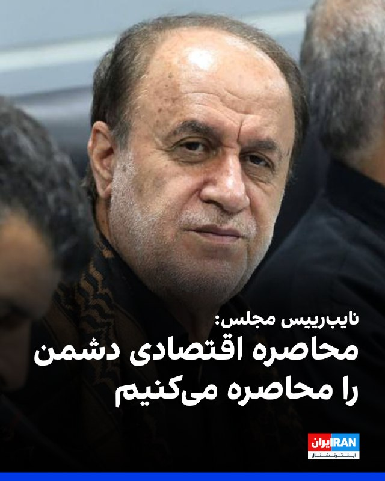

حمیدرضا حاجی‌بابایی، نایب‌رییس مجلس گفت: «محاصره اقتصادی دشمن را محاصره می‌کنیم و باید پرقدرت مسیرهای جایگزین و کریدورهای زمینی را پیگیری و فعال کرد.»

او ادامه داد: «برنامه‌ریزی‌های ماه‌های آینده باید با فرض ادامه‌دار بودن محاصره باشد و نباید تحت تاثیر گشایش‌های مقطعی احتمالی از سوی دشمن قرار گرفت.»

حاجی‌بابایی افزود: «باید تمهیداتی پیش‌بینی شود که از مسیر دریایی جنوب و بنادر مهم کشور با دور زدن محاصره و کم‌اثر کردن عملیاتی آن بتوان کماکان بخشی از کالاهای مورد نیاز را تامین کرد.»
https://iranintl.com/202605315538

## IranIntlTV — post 339875

  <a href="telegram/content/IranIntlTV_339875_1780229472.mp4" target="_blank">🎬 Download video</a>

در پی راه‌اندازی کارزار مردمی رشت از سوی ایران‌اینترنشنال، ویدیوهایی از جمعیت گسترده مردم معترض این شهر در ۱۸ دی ۱۴۰۴ به دست ما رسیده است.

## IranIntlTV — post 339874

  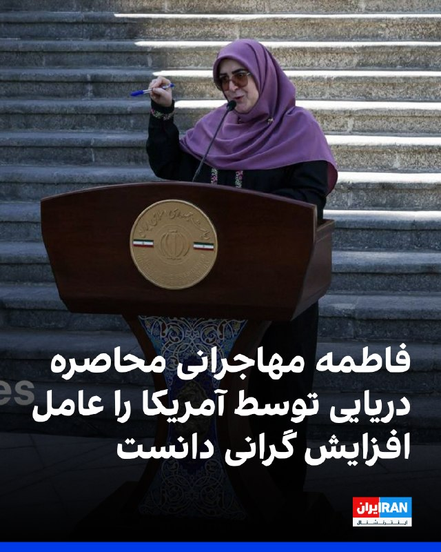

فاطمه مهاجرانی، سخنگوی دولت جمهوری اسلامی، گفت: «وقتی جریان عرضه و تقاضا دچار مشکل می‌شود، بازار واکنش نشان می‌دهد.» و با اشاره به آنچه «دزدی دریایی آمریکا» خواند، افزود این موضوع بر کاهش ورود کالا تاثیر می‌گذارد.
این اظهارات در حالی مطرح شد که بانک مرکزی جمهوری اسلامی بهمن ۱۴۰۴ نرخ تورم سالانه را بیش از ۶۲ درصد اعلام کرده بود.
https://iranintl.com/202605316186

## IranIntlTV — post 339873

  

خبرگزاری تسنیم، وابسته به سپاه پاسداران نوشت که تبادل پیام‌ها میان جمهوری اسلامی و آمریکا درباره متن تفاهم‌نامه احتمالی همچنان ادامه دارد و دو طرف به صورت متناوب اصلاحیه‌هایی را مطرح می‌کنند و تا این لحظه هیچ تفاهمی نهایی نشده و احتمال منتفی شدن هرگونه تفاهم نیز وجود دارد.

تسنیم اضافه کرد که اصل در مواجهه با آمریکا، عدم تفاهم و مذاکره است و اگر تفاهمی شکل بگیرد، باید نکات و چارچوب‌های بسیار محکمی در آن در نظر گرفته شود.

رسانه وابسته به سپاه افزود در وضعیتی که اکنون شکل گرفته، مسدود بودن تنگه هرمز فشار اقتصادی مهمی را به آمریکا و متحدانش وارد می‌کند و به یک «اهرم قدرت» برای جمهوری اسلامی تبدیل شده است.

خبرگزاری تسنیم ادامه داد اگر آمریکا بخواهد ماجرا را به نحوی ساماندهی کند که فشار انسداد تنگه هرمز را از روی خود برداشته و فشار را بر روی جمهوری اسلامی نگاه دارد و سپس با فراغ‌بال بیشتری به جنگ بازگردد، حتما توافق نکردن باز هم بهتر از هرگونه توافقی است.
https://iranintl.com/202605316297

## IranIntlTV — post 339872

  <a href="telegram/content/IranIntlTV_339872_1780229475.mp4" target="_blank">🎬 Download video</a>

در پی راه‌اندازی کارزار ایران‌اینترنشنال برای شناسایی جاویدنامان شهر رشت، شهروندان ویدیوها و اطلاعات تازه‌ای درباره آتش‌سوزی بازار این شهر در ۱۸ دی ۱۴۰۴ ارسال کرده‌اند.

فرنوش فرجی، عضو تحریریه ایران‌اینترنشنال، گزارش می‌دهد
@iranintltv

## IranIntlTV — post 339871

  <a href="telegram/content/IranIntlTV_339871_1780229476.mp4" target="_blank">🎬 Download video</a>

ویدیوی منتشرشده، حمل پیکر جاویدنام محسن جبارزاده را نشان می‌دهد. جبارزاده، ۴۱ ساله و متاهل، ۱۹ دی‌ ۱۴۰۴ در خیابان سلسبیل تهران هدف گلوله جنگی ماموران قرار گرفت و کشته شد.

## IranIntlTV — post 339870

  <a href="telegram/content/IranIntlTV_339870_1780229482.mp4" target="_blank">🎬 Download video</a>

امروز در لندن، جشن خیابانی تیم فوتبال آرسنال در لیگ برتر فوتبال انگلستان برگزار می‌شود. این تیم پس از ۲۲ سال به قهرمانی در لیگ برتر رسید.

هواداران این تیم از ظهر امروز خود را برای برپایی جشن قهرمانی در خیابان‌های لندن آماده می‌کنند.

آیدین مقیمی، خبرنگار ایران‌اینترنشنال، گزارش می‌دهد

@iranintltv

## IranIntlTV — post 339869

  

خبرگزاری مهر از شنیده شدن صدای انفجار در محدوده جزیره قشم خبر داد و نوشت که ساکنان مناطق مرکزی و جنوبی این جزیره آن را تایید کرده‌اند اما ماهیت صدا هنوز مشخص نشده است.
همزمان صداوسیما اعلام کرد صداهای شنیده‌شده در قشم و بندرعباس، ناشی از «امحای مهمات باقی‌مانده از جنگ» است.
https://iranintl.com/202605311776

## IranIntlTV — post 339868

  <a href="telegram/content/IranIntlTV_339868_1780229483.mp4" target="_blank">🎬 Download video</a>

یک شهروند با ارسال ویدیویی به ایران‌اینترنشنال می‌گوید نان سنگک در تهران گران شده است. نانوایی که در این ویدیو حضور دارد می‌گوید با گرانی گندم، سهمیه آرد را کم کرده‌اند.

## IranIntlTV — post 339867

  

بنیامین نتانیاهو، نخست‌وزیر اسرائیل، گفت دستور داده استقرار ارتش اسرائیل در مواضع حزب‌الله در شمال رود لیتانی گسترش یابد و عملیات زمینی در لبنان تعمیق شود. او تصرف قلعه بوفور را «تغییری بنیادین» در سیاست اسرائیل خواند و افزود ابتکار عمل در همه جبهه‌ها در دست اسرائیل است.
https://iranintl.com/202605313134

## IranIntlTV — post 339866

  

سایت هرانا گزارش داد زهرا شهباز طبری، زندانی سیاسی محبوس در زندان لاکان رشت، پس از نقض حکم پیشین در دیوان عالی کشور، بار دیگر از سوی شعبه دوم دادگاه انقلاب رشت به ریاست محمدعلی درویش‌گفتار، به اتهام «بغی از طریق عضویت و فعالیت در سازمان مجاهدین خلق» به اعدام محکوم شد.
این زندانی سیاسی ۶۸ ساله، در فروردین ۱۴۰۴ در منزل شخصی خود در رشت بازداشت شده بود.
https://iranintl.com/202605311737

## Shin_Persian — post 6323

  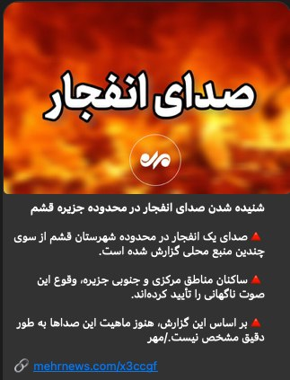

Shin ✓ @hey_itsmyturn
Sun, 31 May 2026 10:49:34 UTC

State-owned Mehr News reports an explosion in Qeshm island, Hormozgan Province, #Iran

فارسی

خبرگزاری دولتی مهر از وقوع انفجاری در جزیره قشم، استان هرمزگان، #Iran گزارش می‌دهد.

𝕏 · @shin_persian

## FarsiVOA — post 219163

  <a href="telegram/content/FarsiVOA_219163_1780229487.mp4" target="_blank">🎬 Download video</a>

ویدیوی منتشرشده از سوی وزارت جنگ آمریکا در روز یکشنبه ۱۰ خرداد، ورود پیت هگست، وزیر جنگ ایالات متحده، به پایگاه اندروز در ایالت مریلند را نشان می‌دهد.

@FarsiVOA

## FarsiVOA — post 219162

  <a href="telegram/content/FarsiVOA_219162_1780229487.mp4" target="_blank">🎬 Download video</a>

ارتش اسرائیل ویدیویی از ادامه حملات هوایی در صور منتشر و تاکید کرد حملات به مقرهای فرماندهی سازمان تروریستی حزب‌الله در منطقه صور همچنان در حال انجام است.

جنگ میان حزب‌الله و ارتش اسرائیل به رغم تمدید آتش‌بس همچنان ادامه دارد و در همین راستا، در روزهای اخیر ارتش اسرائیل چندین هشدار تخلیه برای مناطق مختلف لبنان صادر کرد. نتانیاهو نیز بر گسترش عملیات اسرائیل در جنوب لبنان تأکید کرد.

## FarsiVOA — post 219161

🔺کنتانیاهو بر گسترش عملیات اسرائیل در جنوب لبنان تأکید کرد

▪️بنیامین نتانیاهو، نخست‌وزیر اسرائیل، تصرف قلعه تاریخی بوفور (شقیف) و ارتفاعات راهبردی اطراف آن در جنوب لبنان را «یک تغییر دراماتیک» در سیاست اسرائیل توصیف کرد.

▪️او تصریح کرد که دستور داده عملیات در مناطقی که تحت کنترل حزب‌الله بوده «تعمیق و گسترش» یابد.

▪️تصرف بوفور پس از روزها نبرد شدید در روستاهای اطراف و عبور نیروهای اسرائیلی از رودخانه لیتانی انجام شد؛ عمیق‌ترین پیشروی اسرائیل در لبنان طی ۲۶ سال گذشته.

▪️همزمان با اعلام تصرف بوفور، ارتش اسرائیل دستور تخلیه اجباری همه ساکنان جنوب رودخانه زهرانی را صادر کرد و به آنها هشدار داد هر کس در منطقه بماند جان خود را به خطر می‌اندازد.

⬇️ بیشتر بخوانید:
https://ir.voanews.com/a/8155763.html

## FarsiVOA — post 219160

  

شاخص مدیران خرید بخش تولید چین در ماه مه به ۵۰ واحد کاهش یافت که ۰.۳ درصد کمتر از ماه گذشته است. این شاخص وضعیت اقتصادی بخش‌های تولیدی و خدماتی را از دیدگاه مدیران خرید نشان می‌دهد و عدد بالاتر از ۵۰ نشان‌دهنده رشد و عدد پایین‌تر از ۵۰ بیانگر انقباض است.

بدین ترتیب، وضعیت رشد در بخش‌های تولیدی چین طی ماه جاری متوقف شده است.

بر اساس گزارش رسمی دولت چین، علت افت این شاخص مربوط به کاهش سفارش‌های جدید صادراتی و افزایش هزینه نهاده‌های تولید است. این وضعیت نگرانی‌ها را درباره از دست رفتن شتاب رشد اقتصادی چین، با وجود برخی نشانه‌های مثبت در بخش خدمات و صنایع پیشرفته، افزایش داده است.
@FarsiVOA

## FarsiVOA — post 219159

  

گزارش‌های منتشرشده از نزدیکان جواد علیکردی، وکیل دادگستری محبوس در زندان وکیل‌آباد مشهد، از بیش از ۱۵ روز بی‌خبری از وضعیت او حکایت دارد.

بر اساس این گزارش‌ها، علیکردی که حدود شش ماه پیش پس از شرکت در مراسم یادبود برادرش، خسرو علیکردی، و اعتراض به نحوه برخورد با این مراسم بازداشت شد، همچنان بدون دسترسی منظم به خانواده در زندان نگهداری می‌شود.

نزدیکان او می‌گویند علیکردی پس از دوره‌ای بازجویی در سلول‌های انفرادی اداره اطلاعات مشهد، به بند ۶/۱ زندان وکیل‌آباد منتقل شده، اما همچنان با محدودیت تماس تلفنی و ملاقات روبه‌روست.

در همین گزارش‌ها، خبر صدور حکم ۱۰ سال زندان برای او رد شده و گفته شده تاکنون دادگاهی برای رسیدگی به پرونده‌اش برگزار نشده است.

جواد علیکردی برادر خسرو علیکردی، وکیل حقوق بشری است که آذر ۱۴۰۴ در مشهد جان باخت. خانواده و فعالان حقوق بشر مرگ او را مشکوک دانسته‌اند.
@FarsiVOA

## FarsiVOA — post 219158

  

رئیس جمعیت هلال‌احمر ایران می‌گوید بیمارستان این نهاد در دبی «به زور» تعطیل شده و اموال نقدی و دارایی‌های آن با حکم دادگاه بلوکه شده است.

پیرحسین کولیوند گفت بیماران این بیمارستان، به گفته او، «برخلاف قوانین و مقررات» از مرکز درمانی خارج شده‌اند. او همچنین اعلام کرد رئیس بیمارستان پس از تعطیلی ممنوع‌الخروج شده و هر روز برای محاکمه و بازجویی احضار می‌شود.

رئیس جمعیت هلال‌احمر ایران افزود ویزای کارکنان بیمارستان ایرانیان دبی نیز باطل شده و از خانه‌های سازمانی خود بیرون رانده شده‌اند.

این اظهارات در ادامه اختلاف بر سر تعطیلی بیمارستان ایرانیان در دبی مطرح می‌شود؛ بیمارستانی وابسته به هلال‌احمر ایران که سال‌ها به ایرانیان مقیم و دیگر بیماران در امارات خدمات درمانی ارائه می‌کرد.

در اواخر ماه مارس یک مقام اماراتی گفته بود نهادهایی که «مستقیماً با حکومت ایران مرتبط» هستند، به دلیل آنچه «سوءاستفاده برای پیشبرد دستورکارهایی مغایر با قوانین امارات» خوانده، تعطیل می‌شوند.
@FarsiVOA

## FarsiVOA — post 219157

🔺کاتس می‌گوید اسرائیل کنترل قلعه راهبردی جنوب لبنان را حفظ می‌کند

▪️یسرائیل کاتس، وزیر دفاع اسرائیل اعلام کرد که نیروهای این کشور به‌عنوان بخشی از «منطقه امنیتی جدید» ارتش اسرائیل در جنوب لبنان، در قلعه راهبردی شقیف (بوفور) مستقر باقی خواهند ماند.

▪️وزیر دفاع اسرائیل تأکید کرد که «تصرف بوفور و گسترش مانور زمینی، پیام روشنی به دشمنان ماست: هر کس شهروندان اسرائیل را تهدید کند، دارایی‌های استراتژیک خود را یکی پس از دیگری از دست خواهد داد.»

▪️قلعه‌ شقیف در دوران جنگ‌های صلیبی و بر فراز یک کوه ساخته شده و تصرف آن از سوی نیروهای اسرائیلی، عمیق‌ترین نفوذ اسرائیل به خاک لبنان در بیش از ربع قرن گذشته است.

⬇️ بیشتر بخوانید:
https://ir.voanews.com/a/katz-troops-will-remain-in-beaufort-as-part-of-israel-s-security-zone-in-lebanon/8155758.html

## FarsiVOA — post 219156

🔺قالیباف: «چک سفید امضا» نمی‌دهیم اما نباید در «درگیری‌های فرسایشی» بیفتیم

▪️محمدباقر قالیباف، رئیس مجلس شورای اسلامی و رئیس هیئت مذاکره‌کننده جمهوری اسلامی در مذاکرات با آمریکا ادعا کرد که جمهوری اسلامی «چک سفید امضا» به کسی نمی‌دهد اما نباید «در تله‌ درگیری‌های فرسایشی» نیز بیفتد.

▪️این اظهارات در شرایطی است که اکسیوس و نیویورک‌تایمز گزارش دادند دونالد ترامپ، خواستار سخت‌گیرانه‌تر شدن شروط چارچوب توافق احتمالی با جمهوری اسلامی شده و نسخه اصلاح‌شده را برای بررسی به تهران فرستاده است.

▪️پرزیدنت ترامپ و مقامات ارشد دولتش بارها تأکید کرده‌اند که واشنگتن ترجیح می‌دهد با تهران به توافق برسد، اما اگر خواست‌های آمریکا محقق نشود آماده بررسی دوباره گزینه نظامی هستند.

⬇️ بیشتر بخوانید:
https://ir.voanews.com/a/8155760.html

## FarsiVOA — post 219155

🔺اتحادیه اروپا توقف موقت افزایش سقف قیمت نفت روسیه را بررسی می‌کند

▪️اتحادیه اروپا در حال بررسی توقف موقت سازوکار بازنگری سقف قیمت نفت روسیه است. بلومبرگ این این موضوع را با تداوم جنگ خاورمیانه و جهش جهانی قیمت نفت مرتبط دانست.

▪️سازوکار فعلی اتحادیه اروپا هر شش ماه یک‌بار و به‌صورت خودکار سقف قیمت نفت خام روسیه را بازبینی می‌کند؛ به‌گونه‌ای که سقف قیمت همواره ۱۵ درصد پایین‌تر از میانگین قیمت نفت اورال روسیه در دوره مرجع تعیین شود.

▪️سقف فعلی ۴۴ دلار و ۱۰ سنت برای هر بشکه است و بازبینی بعدی آن برای تابستان امسال برنامه‌ریزی شده است.

▪️در این چارچوب، شرکت‌های اروپایی اجازه ندارند به نفتی که بالاتر از سقف مصوب فروخته می‌شود، خدمات بیمه و حمل‌ونقل دریایی ارائه کنند.

⬇️ بیشتر بخوانید:
https://ir.voanews.com/a/eu-weighs-temporary-freeze-on-russia-oil-price-cap-over-iran-war/8155759.html

## DW_Farsi — post 125340

🔶 قالیباف می‌گوید ایران "هیچ اعتمادی" به وعده‌های آمریکا ندارد

محمدباقر قالیباف، رئیس مجلس شورای اسلامی در جلسه مجازی مجلس، در نطق پیش از دستور سومین سال مجلس دوازدهم با اشاره به کشته شدن علی خامنه‌ای، در روز آغاز جنگ آمریکا و اسرائیل علیه جمهوری اسلامی، گفت که مجلس "به مدیریت و رهبری" مجتبی خامنه‌ای، فرزند علی خامنه‌ای دلگرم است و "پیام‌ها و رهنمودهای" او را "نقشه‌ راه" مجلس توصیف کرد.

قالیباف همچنین با اشاره به مذاکرات جاری بین جمهوری اسلامی و آمریکا بر سر ادامه آتش‌بس و توافق هسته‌ای، با بیان این که جمهوری اسلامی "هیچ اعتمادی" به وعده‌های آمریکا ندارد گفت: «کار دیپلماسی تبدیل پیروزی‌های کسب شده در میدان نظامی به دستاوردهای سیاسی و حقوقی است.»

رئیس مجلس شورای اسلامی در ادامه، مذاکره‌کنندگان جمهوری اسلامی را "سربازان میدان مبارزه‌ دیپلماسی" توصیف کرد و گفت مذاکره‌کنندگان جمهوری اسلامی "هیچ اعتمادی به حرف ها و وعده‌های دشمن ندارند".

قالیباف افزود: «آنچه برای ما ملاک است دستاوردهای عینی است که باید کسب کنیم تا در مقابل آن دست به انجام تعهدات خود بزنیم و تا اطمینان پیدا نکنیم که حقوق ملت ایران را گرفته ایم، هیچ توافقی را تأیید نخواهیم کرد.»

رئیس مجلس شورای اسلامی همچنین بدون اشاره به پیامدهای وخیم جنگ و تحریم و محاصره دریایی برای اقتصاد ایران مدعی شد که مسئولان نظام برای کاهش مشکلات اقتصادی و معیشتی مردم تلاش می‌کنند. قالیباف همچنین گفت که اطمینان دارد که جمهوری اسلامی از این جنگ بزرگ "با پیروزی" خارج خواهد شد.

@dw_farsi

## DW_Farsi — post 125339

🔶 سفارت ایران در دانمارک گزارش جدید سازمان امنیت این کشور را رد کرد

سفارت جمهوری اسلامی در کپنهاگ با انتشار بیانیه‌ای ضمن رد گزارش سازمان اطلاعات و امنیت دانمارک (PET) گفت که حکومت ایران همواره و رسما هرگونه دخالت در فعالیت‌های ادعایی در خاک دانمارک را رد کرده است.

سفارت جمهوری اسلامی در بیانیه خود همچنین ادعا کرده که گزارش‌های سازمان اطلاعات و امنیت دانمارک "طی سال‌های گذشته تصویری تکراری و نادرست از تهدید ایران ارائه کرده‌اند، بدون آنکه اسناد قانع‌کننده‌ای برای اثبات این ادعاها منتشر کنند".

سازمان اطلاعات و امنیت دانمارک در ارزیابی جدید خود گزارش کرده است که جمهوری اسلامی در خلال تحولات اخیر، نقشی پررنگ‌تر در "تهدیدهای امنیتی علیه دانمارک" بازی می‌کند.

سفارت جمهوری اسلامی بدون ارائه هیچ مدرکی گزارش سازمان امنیت دانمارک را رد کرده و مدعی شده که "میان ادعاهای مطرح‌شده و مدارک ارائه‌شده فاصله قابل توجهی وجود دارد و همین امر اعتبار نتیجه‌گیری‌های PET را زیر سؤال می‌برد".

در این بیانیه با اشاره به دو پرونده ذکر شده در گزارش سازمان امنیت دانمارک ادعا شده که "هیچ‌یک از این پرونده‌ها مدارک مستندی که دخالت دولت ایران را اثبات کند ارائه نشده است".

این دو مورد، یک پرونده سال ۲۰۱۸ و تلاش برای ترور یکی از رهبران گروه الاحوازیه در دانمارک و دیگری پرونده حمله به سفارت اسرائیل در کپنهاگ در سال ۲۰۲۴ را شامل می‌شوند.

سفارت جمهوری اسلامی در عین حال مدعی شده که "خود گروه الاحوازیه بعدها به دریافت حمایت خارجی، فعالیت‌های جاسوسی و ارتباط با عملیات خشونت‌آمیز، متهم و محکوم شده است".

در این بیانیه همچنین به پرونده حمله به سفارت اسرائیل در کپنهاگ اشاره شده و آمده که در این مورد "نه تنها هیچ مدرک مستندی ارائه نشده، بلکه افراد محکوم نیز در جریان دادگاه خود در کپنهاگ، ادعایی را در مورد ارتباط با ایران مطرح نکردند".

در گزارش جدید سازمان امنیت دانمارک، سطح کلی تهدید از سوی جمهوری اسلامی برای دانمارک در سطح ۴ از ۵ باقی مانده اما مقام‌های اطلاعاتی این کشور می‌گویند سرشت این تهدیدها در سال‌های اخیر دگرگون شده و پیچیده‌تر شده است.

@dw_farsi

## Persian_Trend_Official — post 15391

یسرائیل کاتز، وزیر دفاع اسرائیل: نیرو‌های نظامی ما به عنوان بخشی از منطقه امنیتی جدید تا اطلاع ثانوی در قلعه بوفور خواهند ماند! 📝 Amir 📌 @persian_trend_official پرشین ترند | متفاوت‌ترین کانال نظامی

## Persian_Trend_Official — post 15389

حملات هوایی گسترده ارتش اسرائیل به شهر صور لبنان

📝 Amir

📌 @persian_trend_official
پرشین ترند | متفاوت‌ترین کانال نظامی

## RadioFarda — post 157744

  <a href="https://t.me/radiofarda/157744" target="_blank">📎 Download file</a>

📻بشنوید: ساعت ۱۴ با رادیوفردا، دهم خرداد ۱۴۰۵‌

@Radiofarda

## RadioFarda — post 157743

  

🔸وزیر خارجهٔ فرانسه روز یک‌شنبه اعلام کرد که پاریس پس از تصرف قلعهٔ قرون‌وسطایی شَقیف (بوفور) در لبنان از سوی نیروهای اسرائیلی، خواستار برگزاری نشست اضطراری شورای امنیت سازمان ملل متحد شده است.

🔸ژان نوئل بارو در گفت‌وگو با شبکهٔ ب‌اف‌ام‌تی‌وی فرانسه گفت: «من خواستار نشست اضطراری شورای امنیت سازمان ملل متحد شده‌ام، زیرا هرچند ما حق اسرائیل را، مانند همهٔ کشورها، برای دفاع از خود به رسمیت می‌شناسیم، هیچ چیز نمی‌تواند ادامهٔ عملیات نظامی اسرائیل در لبنان و اشغال هرچه عمیق‌تر خاک لبنان را توجیه کند.»

🔸ارتش اسرائیل می‌گوید عملیات زمینی خود در جنوب لبنان را گسترش داده و نیروهایش از رود لیتانی عبور کرده‌اند. همزمان، وزیر دفاع اسرائیل از تصرف قلعهٔ راهبردی شقیف و برافراشتن پرچم این کشور بر فراز آن خبر داد؛ قلعه‌ای که اسرائیل پیشتر تا سال ۲۰۰۰ از آن به‌عنوان پایگاه در جنوب لبنان استفاده می‌کرد.

@RadioFarda

## RadioFarda — post 157742

پیگیری خانواده‌های جان‌باختگان پرواز ۷۵۲ به اصلاح مقررات هوایی بین‌المللی انجامید

🔸انجمن خانواده‌های جان‌باختگان پرواز پی‌اس۷۵۲ اعلام کرد که پس از شش سال و نیم پیگیری و رایزنی، ضمیمهٔ ۱۳ کنوانسیون شیکاگو، مربوط به تحقیقات ایمنی سوانح هوایی، اصلاح می‌شود، تغییری که به گفتهٔ این انجمن می‌تواند مانع تکرار وضعیتی شود که در آن کشور متهم یا دارای تضاد منافع، خود مسئول هدایت تحقیقات ایمنی شود.

🔸پرواز پی‌اس۷۵۲ هواپیمایی اوکراین بامداد ۱۸ دی ۱۳۹۸، دقایقی پس از برخاستن از فرودگاه تهران، با شلیک دو موشک سپاه پاسداران سرنگون شد و همهٔ ۱۷۶ سرنشین آن جان باختند.

🔸بر اساس مقررات موجود در ضمیمهٔ ۱۳ کنوانسیون شیکاگو، مسئولیت اصلی تحقیقات ایمنی بر عهدهٔ کشوری قرار گرفت که سانحه در قلمرو آن رخ داده بود؛ یعنی جمهوری اسلامی ایران.

🔸انجمن خانواده‌های جان‌باختگان در بیانیهٔ خود نوشت که این چارچوب حقوقی، که طی دهه‌ها برای رسیدگی به فجایع هوانوردی به کار می‌رفت، در پروندهٔ سرنگونی پرواز پی‌اس۷۵۲ «اَلکن و ناکافی» بود و عملاً «پروندهٔ تحقیقات دربارهٔ قتلی جمعی به دست قاتلان افتاد».

🔸بر اساس نامه‌ای که به گفتهٔ انجمن از سوی وزیر ترابری کانادا دریافت شده، اصلاحیهٔ تازه ایکائو برای نخستین بار به مسئله تضاد منافع در تحقیقات ایمنی پس از سرنگونی هواپیما پرداخته است.

🔸این اصلاحیه همچنین راهکارهایی برای حفظ استقلال تحقیقات پیشنهاد می‌دهد؛ از جمله واگذاری تحقیقات ایمنی به دولتی دیگر و ارائهٔ به‌موقع اطلاعات واقعی و تأییدشده به افکار عمومی.

🔸 گزارش کامل را در وب‌سایت رادیوفردا بخوانید.

@RadioFarda

## RadioFarda — post 157741

  

🔸نیروی دریایی سپاه پاسداران روز یک‌شنبه اعلام کرد که ۲۸ کشتی «با هماهنگی» این نیروی نظامی حکومت ایران از تنگه هرمز عبور کرده‌اند.

🔸این آمار عبور کشتی‌ها از این تنگه استراتژیک در یک شبانه‌روز گذشته است.

🔸در بیانیه سپاه آمده است:‌ «طی شبانه‌روز گذشته ۲۸ فروند کشتی اعم از نفتکش، کانتینربَر و سایر کشتی‌های تجاری پس از کسب مجوز با هماهنگی و تأمین امنیت نیروی دریایی سپاه از تنگه هرمز عبور کردند.»

🔸ساعتی پیشتر روزنامه اسرائیلی «اسرائیل هیوم» نوشته بود که ده‌ها نفتکش حامل نفت و گاز طبیعی مایع در هفتهٔ گذشته با اجازه آمریکا و پرداخت عوارض به ایران از تنگهٔ هرمز عبور کرده‌اند.

🔸این در حالی است که دولت آمریکا بارها اعلام کرده است با پرداخت عوارض به ایران برای عبور از تنگه هرمز مخالف است.

@RadioFarda

## RadioFarda — post 157740

🔸جلسه مجازی صحن مجلس شورای اسلامی به ریاست محمدباقر قالیباف و مشارکت آنلاین ۱۸۷ نماینده و حضور ۱۴ نماینده برگزار شد. 🔸در این جلسه که اولین جلسه از سومین سال مجلس دوازدهم بود، اعضای جدید هیئت رئیسه مجلس سوگند یاد کردند. 🔸جلسه روز یک‌شنبه، دهم خردادماه، همچون…

## RadioFarda — post 157739

  

🔸جلسه مجازی صحن مجلس شورای اسلامی به ریاست محمدباقر قالیباف و مشارکت آنلاین ۱۸۷ نماینده و حضور ۱۴ نماینده برگزار شد.

🔸در این جلسه که اولین جلسه از سومین سال مجلس دوازدهم بود، اعضای جدید هیئت رئیسه مجلس سوگند یاد کردند.

🔸جلسه روز یک‌شنبه، دهم خردادماه، همچون جلسات معدود گذشته در مکانی مخفی برگزار شد.

🔸محمدباقر قالیباف در همین جلسه تأکید کرد که «تا اطمینان پیدا نکنیم که حقوق ملت ایران را گرفته‌ایم، هیچ توافقی تأیید نمی‌شود».

🔸قالیباف که از او به عنوان رئیس هیئت مذاکره‌کننده ایران نیز یاد می‌شود در این جلسه بیانیه‌ای را قرائت کرد و در آن ادعا کرد که «در حال عقب نشاندن دشمن در یک جنگ تاریخ‌ساز هستیم».

@RadioFarda

## IranianMinds — post 21141

  <a href="telegram/content/IranianMinds_21141_1780229492.mp4" target="_blank">🎬 Download video</a>

جان‌فدایی را با فرم و ثبت‌نام ثبت نمی‌کنند، جان‌فدایی را با ایستادگی، زندان، زخم و خون می‌نویسند.

@IranianMinds

## IranianMinds — post 21140

  

دسترسی دیتاسنتر همراه اول به اینترنت برقرار شد

اولین نشانه بازگشت اینترنت به دیتاسنتر ها باید منتظر باشیم و وضعیت بقیه دیتاسنتر ها رو هم ببینیم

@IranianMinds

## IranianMinds — post 21138

  

🔴 کمپین جدید خبرگزاری فارس :

قطع داوطلبانه اینترنت !!

@IranianMinds

## IranianMinds — post 21137

  

اشک شوق لاک‌پشت، نمی‌دونستم که سرعت من از سرعت اینترنت در ایران بیشتره.

@IranianMinds

## IranianMinds — post 21136

صدا سیما:
صداهای شنیده‌شده در قشم و بندرعباس ناشی از امحای مهمات باقی‌مانده از جنگ است

@IranianMinds

## IranianMinds — post 21126

  <a href="telegram/content/IranianMinds_21126_1780229494.mp4" target="_blank">🎬 Download video</a>

🔴عملیات ارتش اسرائیل در رشته کوه بوفور و منطقه وادی سلوکی در جنوب لبنان.

@IranianMinds

## IranianMinds — post 21125

  <a href="telegram/content/IranianMinds_21125_1780229496.mp4" target="_blank">🎬 Download video</a>

🔴قالیباف:
دشمن بعد از شکست نظامی، با فشارهای اقتصادی و جنگ رسانه‌ای به دنبال ایجاد تفرقه و وارد کردن ایران به تسلیم شدن است، اما مردم ما با اتحاد نقشه‌هایشان را خنثی کردند.

ای حرومزاده جنایتکار.

@IranianMinds

## BBCPersian — post 282499

🔻انجمن داروسازان ایران: کمبود کدئين ناشی از محدودیت در کشت خشخاش است نه تحریم

سخنگوی هیئت‌مدیره انجمن داروسازان ایران گفت که کمبود برخی داروها از جمله کدئین «الزاما ناشی از تحریم‌ها نیست، بلکه مشکل اصلی به تأمین ماده اولیه این دارو بازمی‌گردد.»

هادی احمدی گفت: «ممنوعیت کشت خشخاش و محدودیت‌های اعمال‌شده در حوزه مواد مخدر، تولید ماده اولیه کدئین در افغانستان را کاهش داده و در زنجیره تأمین این دارو در ایران اختلال ایجاد کرده است.»

او گفت «حدود ۲۵ مرکز دارویی و کارخانه» مستقیم و غیرمستقیم در طول جنگ هدف حملات آمریکا و اسرائيل قرار گرفت و آسیب به صنایع پتروشیمی و فولاد باعث اختلال در زنجیره تأمین شده که آن هم به صنعت داروسازی هم ضربه زده است.

به گفته آقای احمدی صنعت دارو از نظر بسته‌بندی محصولات دارویی کاملا به مواد پتروشیمی و فولاد وابسته است.

https://trib.al/GYChrgO
@BBCPersian

## BBCPersian — post 282498

🔻فرانسه خواستار نشست اضطراری شورای امنیت پس از تصرف قلعه تاریخی در لبنان شد

وزیر امور خارجه فرانسه گفت که پس از تصرف قلعه تاریخی شقیف (بوفور) در لبنان به دست نیروهای اسرائیل، خواستار برگزاری نشست اضطراری شورای امنیت سازمان ملل شده است.

ژان نوئل بارو به شبکه «بی‌اف‌ام تی‌وی» گفت: «من درخواست برگزاری نشست اضطراری شورای امنیت سازمان ملل را مطرح کرده‌ام. با وجود آنکه حق دفاع مشروع اسرائیل را مانند هر کشوری به رسمیت می‌شناسیم، هیچ چیز نمی‌تواند ادامه عملیات نظامی اسرائیل و پیشروی هرچه بیشتر در خاک لبنان را توجیه کند.»

او از گسترش حضور نظامی اسرائیل در خاک لبنان ابراز نگرانی کرد و خواستار بررسی این موضوع در شورای امنیت شد.

وزیر دفاع اسرائیل امروز اعلام کرد که قلعه تاریخی و استراتژيک شقیف (بوفور) به تصرف نیروهایش درآمده است.

او در پستی در شبکه تلگرام گفت: «چهل‌وچهار سال پس از نبرد قهرمانانه بوفور و در روزی که یادآور سربازان کشته‌ شده در جنگ اول لبنان (۱۹۸۲) است، نیروهای ما بار دیگر به این قلعه بازگشتند و پرچم اسرائیل را برافراشتند.»

این قلعه ۹۰۰ ساله دید وسیعی بر جنوب لبنان دارد و از نظر نظامی بسیار مهم محسوب می‌شود.

https://trib.al/6WSTBOw
@BBCPersian

## BBCPersian — post 282497

🔻مدیرعامل شرکت نفت و گاز پارس: تولید گاز سه سکوی پارس جنوبی از سرگرفته شد

مدیرعامل شرکت نفت و گاز پارس «از بازگشت سه سکوی فراساحلی میدان مشترک پارس جنوبی به مدار تولید» خبر داد.

تورج دهقانی با اشاره به «پیشرفت در عملیات احیای تولید گاز در میدان مشترک پارس جنوبی» گفت: با کمک متخصصان داخلی تاکنون سه سکوی فراساحلی این میدان دوباره وارد مدار بهره‌برداری شده‌اند.

او گفت که در پی آسیب به برخی تأسیسات پالایشی پارس جنوبی در جریان جنگ، «بخشی از ظرفیت فرآورش گاز در نوارساحلی استان بوشهر محدود شد و به همین دلیل تعدادی از سکوهای فراساحلی، با وجود آمادگی کامل و بدون آسیب‌دیدگی، موقتاً از مدار تولید خارج شدند، زیرا امکان دریافت و فرآورش گاز تولیدی در بخش خشکی فراهم نبود.»

پارس جنوبی که بزرگ‌ترین میدان گازی جهان در خلیج فارس است در جریان جنگ هدف حملات آمریکا و اسرائیل قرار گرفت.

پارس جنوبی در اختیار ایران است و بخش شمالی آن به قطر تعلق دارد که بزرگ‌ترین تولیدکننده گاز در منطقه محسوب می‌شود. قطر حدود ۲۰ درصد گاز مایع جهان را تامین می‌کند.
https://trib.al/6iC7acL
@BBCPersian

## BBCPersian — post 282496

  <a href="telegram/content/BBCPersian_282496_1780229497.mp4" target="_blank">🎬 Download video</a>

یک گروه نجات تایلندی، شنبه ۹ خرداد، خبر داد که چهار مرد دیگر که به مدت ۱۰ روز در غار آب‌گرفته‌ای در لائوس گیر افتاده بودند، نجات یافتند. روز قبل آن (جمعه ۸ خرداد) هم یک نفر دیگر نجات پیدا کرده بود.
 
این چهار نفر، بخشی از هفت مرد روستایی بودند که در جست و جوی طلا وارد تونل‌های بسیار باریک شده بودند، اما پس از وقوع سیلاب‌های ناگهانی در منطقه کوهستانی و دورافتاده استان زایسومبون در مرکز لائوس در تاریخ ۳۰ اردیبهشت (۲۰ مه)، دیگر نتوانستند از غار خارج شوند.
 
به گفته امدادگران، این مجموعه غار که تا اعماق زمین امتداد دارد، بسیار تنگ است و عرض برخی از تالارهای آن تنها حدود ۵۰ سانتی‌متر است. عملیات نجات این مردان، با دادن آموزش غواصی با تجهیزات اسکوبا به آنها انجام شد تا بتوانند با شنا کردن و غواصی، از غار خارج شوند.
 
دو مرد دیگر از این گروه هفت نفره همچنان مفقود هستند.

@bbcpersian

## BBCPersian — post 282493

  <a href="telegram/content/BBCPersian_282493_1780229499.mp4" target="_blank">🎬 Download video</a>

🔻محمد باقر قالیباف در نطق پیش از دستور آغاز سومین سال مجلس گفت پیام رهبر جمهوری اسلامی به نمایندگان مجلس «چراغ راه آینده و نقشه راه مجلس دوازدهم» است.
رئیس مجلس گفت «هم‌افزایی با دولت و سایر دستگاه‌ها در عین استقلال قوه‌ مقننه» وظیفه مجلس است و اقدامات مجلس باید «نسبت مستقیم و مشهود» با مسائل اصلی کشور و نیازهای مردم داشته باشد.
او تاکید کرد که «ما چک سفید امضا به کسی نمی دهیم اما در تله‌ درگیری‌های فرسایشی نیز نباید بیفتیم.»
او همچنین گفت که «هیچ اعتمادی به حرف‌ها و وعده‌های دشمن» نیست و «آنچه برای ما ملاک است دستاوردهای عینی است که باید کسب کنیم.»
رئیس مجلس تاکید کرد که «تا اطمینان پیدا نکنیم که حقوق ملت ایران را گرفته‌ایم، هیچ توافقی را تأیید نخواهیم کرد.»
جلسه مجازی صحن مجلس امروز برگزار شد و اعضای هیئت رئیسه سوگند خوردند. در این جلسه «۱۸۷ نماینده برخط و ۱۴ نماینده حضوری» شرکت کردند.

https://trib.al/IVF8y7w
@BBCPersian

## BBCPersian — post 282492

  <a href="telegram/content/BBCPersian_282492_1780229501.mp4" target="_blank">🎬 Download video</a>

هشت دانش‌آموز دبیرستانی از یک ترن هوایی که بیش از دو ساعت متوقف شده بود، نجات داده شدند. 

آنها همراه اردوی مدرسه به اسکله «پلژر پیر» در شهر ساحلی گالوستون در ایالت تگزاس آمریکا رفته بودند که دچار این حادثه شدند. 

این ترن هوایی در ارتفاع ۳۰ متری پرشیب‌ترین بخش ریل متوقف شد. نیروهای امدادی با استفاده از یک بالابر متحرک، هر هشت دانش‌آموز را نجات دادند. 

هیچ مصدومیتی از این حادثه گزارش نشد.

@bbcpersian

## idfinfarsi — post 11685

  <a href="telegram/content/idfinfarsi_11685_1780229502.mp4" target="_blank">🎬 Download video</a>

‼️با هدف رفع تهدید علیه نیروهای ما: ارتش اسرائیل انبارهای تسلیحاتی سازمان تروریستی حماس را منهدم کرد

⭕️نیروهای ارتش اسرائیل تحت فرماندهی جنوب، با استفاده از نیروی هوایی، در طول هفته سه انبار تسلیحاتی متعلق به سازمان تروریستی حماس را در چندین منطقه در نوار غزه هدف قرار داده و منهدم کردند. در این انبارها مواد انفجاری، سلاح‌های سبک، تفنگ‌های تک‌تیراندازی و تجهیزات رزمی دیگر نگهداری می‌شد. در یکی از این انبارها حدود ۱۰ وانت که توسط سازمان تروریستی حماس برای فعالیت‌های نظامی استفاده می‌شد، منهدم شد.

⭕️این تسلیحات برای آسیب رساندن به نیروهای ارتش اسرائیل که در منطقه خط زرد فعالیت می‌کنند و همچنین شهروندان اسرائیل در نظر گرفته شده بود و به‌منظور رفع این تهدید منهدم شدند.

⭕️پس از این حملات، انفجارهای ثانویه‌ای شناسایی شد که نشان‌دهنده وجود تسلیحات در داخل این انبارها بود.

‼️ پیش از این حملات، اقداماتی برای کاهش آسیب به غیرنظامیان انجام شد، از جمله استفاده از مهمات دقیق و رصد هوایی.

⭕️نیروهای ارتش اسرائیل تحت فرماندهی جنوب مطابق با توافق در منطقه مستقر هستند و به فعالیت خود برای رفع هرگونه تهدید فوری ادامه خواهند داد.

## idfinfarsi — post 11684

  <a href="telegram/content/idfinfarsi_11684_1780229503.mp4" target="_blank">🎬 Download video</a>

مستند از حملات ارتش اسرائیل در صور: نیروی هوایی در این لحظات مقرهای سازمان تروریستی حزب‌الله را هدف قرار می‌دهد

## Dirty_Kids — post 390632

‏شما با این حجم از شجاعت موافقید؟ یجور حرف میزنه انگار بی‌حجابی اجباریه و این دل شیر داشته که با چادر رفتی کافه، عقب مونده @Dirty_Kids 👻

## Dirty_Kids — post 390631

  <a href="telegram/content/Dirty_Kids_390631_1780229504.mp4" target="_blank">🎬 Download video</a>

🔴 دیشب عرزشیای حکومتی داشتن شعارِ "با قاتلین رهبر، مذکره نداریم | جان امام در خطره ، مذاکره بی‌ثمره" میدادن که آخرش یکی از مسئولین امنیت اومد بیرونشون کرد:

@Dirty_Kids 👻

## Dirty_Kids — post 390627

🔴 مسعود پزشکیان اینطوری و با پوشیدن تی‌شرت رفته تو یه جلسه رسمی :

اصلاحطلبا خیس کردن، عرزشی دارن میرن بهش، ماهم میگیم کصخاره جفتتون

@Dirty_Kids 👻

## Dirty_Kids — post 390626

  <a href="telegram/content/Dirty_Kids_390626_1780229506.mp4" target="_blank">🎬 Download video</a>

طرفداران پاریسن ژرمن. دیروز. آدم یک سری حرفها دوست داره در موردشون بزنه حیف که جرم حساب میشه! قحبه‌زاده‌های...

@Dirty_Kids 👻

## Dirty_Kids — post 390625

  <a href="telegram/content/Dirty_Kids_390625_1780229507.mp4" target="_blank">🎬 Download video</a>

خیلی خوب بود این ویدیو :)))

@Dirty_Kids 👻

## Dirty_Kids — post 390624

  <a href="telegram/content/Dirty_Kids_390624_1780229509.mp4" target="_blank">🎬 Download video</a>

این شما و این پاریس و مسلمانان افراطی!
یادمان باشد که مسائل داخلی فرانسه فقط به مردم فرانسه مربوط میشود .
این صحنه‌ها هم بخشی از فرهنگ پاریسی است.
#فرانسه

@Dirty_Kids 👻

## Dirty_Kids — post 390623

  <a href="telegram/content/Dirty_Kids_390623_1780229510.mp4" target="_blank">🎬 Download video</a>

در جریان تجمعات شبانه، یه آخوند وقتی دختر دید کنترلشو از دست داد و از ماتریکس خارج شد!

@Dirty_Kids 👻

## Dirty_Kids — post 390622

  <a href="telegram/content/Dirty_Kids_390622_1780229510.webm" target="_blank">🎬 Download video</a>

🆕 اپلیکیشن MelBet 
✅

🎁 کد هدیه 100 دلاری: Sport100

🌀 کاملترین برنامه موبایل

🤝 اسپانسر رسمی لالیگا

🥇صرافی معتبر

🌐 ربات راهنما

🇮🇷 برای تغییر زبان برنامه، زبان موبایل خود را تغییر دهید.

✅ ورود به اپلیکیشن بدون فیلترشکن

## Dirty_Kids — post 390621

⚠️ خیلیا نمیدونن که اگه ثبت‌نامشون رو با لینک زیر انجام بدن... 
⁉️

💥 بونوس خوش‌آمد گویی تا %220 بیشتر میگیرن!
فقط کافیه به لینک زیر مراجعه کنید و وارد ملبت بشید و به راحتی ثبتنام کنید! 👌

🌐 لینک بدون فیلتر سایت معتبر ملبت 👇

🌐 www.MelBet1.com

🎁 بعد از ثبتنام، وارد حسابت شو و توی بخش "بونوس‌ها" فعالش کن 
🎚️

نکته: فقط این هفته فعاله، پس از دستش نده 
🙂

🎁 کد هدیه 100 دلاری فراموش نشه: Sport100

✅ معرفی سایت و اپلیکیشن مل‌بت

💯 ورود به سایت مل‌بت (بدون فیلترشکن)

## Hranews — post 113269

  

اعتراضات سراسری ۱۴۰۴؛ خشایار رضوانی به ۴ سال و ۳ ماه حبس محکوم شد

❗️
❗️
❗️
❗️
❗️– خشایار رضوانی، از بازداشت شدگان اعتراضات سراسری ۱۴۰۴، توسط شعبه ۲۶ دادگاه انقلاب تهران به چهار سال و سه ماه #حبس، دو سال ممنوعیت از خروج از کشور و فعالیت در فضای مجازی محکوم شد.

به گزارش خبرگزاری هرانا، ارگان خبری مجموعه فعالان حقوق بشر در ایران، خشایار رضوانی به حبس و مجازات‌های تکمیلی محکوم شد.

این حکم اخیرا توسط شعبه ۲۶ دادگاه انقلاب تهران، علیه آقای رضوانی صادر شده است. قاضی ایمان افشاری، خشایار رضوانی را از بابت اتهام «اجتماع و تبانی علیه امنیت داخلی و خارجی کشور» به سه سال و هفت ماه حبس تعزیری و از بابت اتهام «تبلیغ علیه نظام» به هشت ماه حبس تعزیری محکوم کرده است. بر اساس رای صادره، وی از بابت مجازات‌های تکمیلی، به دو سال منع خروج از کشور و فعالیت در فضای مجازی نیز محکوم شده است.

ادامه مطلب

#خشایار_رضوانی

↘️
@hranews_bot تماس ✉️ -  @Hranews  کانال هرانا 🆑

## Hranews — post 113268

امروز یکشنبه ۱۰ خردادماه، جمعی از بازنشستگان تامین اجتماعی در مقابل ساختمان این سازمان در شهرستان شوش دست به راهپیمایی و #تجمع اعتراضی زدند.

این بازنشستگان خواستار اجرای کامل ماده ۵۴ قانون تامین اجتماعی و ارتقای درمانگاه این شهر به پلی کلینیک، بازگشت امتیاز خلع شده تامین اجتماعی و رسیدگی به مشکلات معیشتی هستند.

↘️
@hranews_bot تماس ✉️ -  @Hranews  کانال هرانا 🆑

## Hranews — post 113267

  

جلسه دادگاه رسیدگی به اتهامات ۴ فعال ترک (آذربایجانی) برگزار شد

❗️
❗️
❗️
❗️
❗️ – جلسه رسیدگی به اتهامات عباس لسانی، علی خیرجو، یوسف کاری و بهزاد دشتی، فعالان ترک (آذربایجانی) روز گذشته در شعبه ۲۸ دادگاه انقلاب برگزار شد.

به گزارش خبرگزاری هرانا، ارگان خبری مجموعه فعالان حقوق بشر در ایران، روز شنبه ۹ خرداد ۱۴۰۵، جلسه دادگاه رسیدگی به اتهامات عباس لسانی، علی خیرجو، یوسف کاری و بهزاد دشتی، فعالان ترک (آذربایجانی) برگزار شد.

این جلسه در شعبه ۲۸ دادگاه انقلاب تهران به ریاست قاضی عموزاده برگزار شد و آقایان لسانی، خیرجو و کاری در اعتراض به آنچه «روند دادرسی غیرعادلانه» عنوان کرده‌اند، از حضور در جلسه خودداری کردند.

ادامه مطلب

#عباس_لسانی
#علی_خیرجو
#یوسف_کاری
#بهزاد_دشتی

↘️
@hranews_bot تماس ✉️ -  @Hranews  کانال هرانا 🆑

## Hranews — post 113266

اجرای حکم اعدام ۵ زندانی در زندان عادل آباد شیراز

❗️
❗️
❗️
❗️
❗️– سحرگاه امروز، حکم #اعدام پنج زندانی که پیشتر از بابت جرائم غیر سیاسی از جمله اتهامات مرتبط با جرائم مواد مخدر به اعدام محکوم شده بودند، در زندان عادل‌آباد شیراز به اجرا در آمد.

ادامه مطلب

↘️
@hranews_bot تماس ✉️ -  @Hranews  کانال هرانا 🆑

## alonews — post 123935

  <a href="telegram/content/alonews_123935_1780229511.webm" target="_blank">🎬 Download video</a>

👈وال استریت ژورنال: مشکل این است که آنها با انجام اجتناب‌ناپذیر - طفره رفتن و کم‌اهمیت جلوه دادن تعهدات هسته‌ای - به پیشرفت در تفاهم‌نامه رسیده‌اند.

🔴بنابراین اگر رئیس جمهور آمریکا تعهدات هسته‌ای قوی‌تری می‌خواهد، ممکن است خود را بدون توافق تفاهم‌نامه بیابد.تبصره ۲۲

✅ @AloNews خبر جنگ

## alonews — post 123934

  <a href="telegram/content/alonews_123934_1780229511.webm" target="_blank">🎬 Download video</a>

👈فاکس‌نیوز درباره آخرین وضعیت مذاکرات ایران و آمریکا

🔴فاکس‌نیوز مدعی شد بنابر گزارشات جدید، ترامپ شرایط توافق با ایران راخ سخت‌تر کرده و شروط جدیدی در موضوعات هسته‌ای و تنگه هرمز اضافه کرده است

✅ @AloNews خبر جنگ

## alonews — post 123933

  <a href="telegram/content/alonews_123933_1780229511.webm" target="_blank">🎬 Download video</a>

👈قتل پدر توسط پسر نوجوان به خاطر بیکاری...

🔴 مشاجره خانوادگی در محله مجیدیه به جنایت انجامید. پسر نوجوان پس از درگیری لفظی بر سر بیکاری و عدم توانایی در پیدا کردن شغل، با چند ضربه چاقو پدر سالخورده خود را به قتل رساند.

🔴 متهم دستگیر شده و به جرم خود اعتراف کرده است. پرونده برای بررسی جزئیات بیشتر در دست تحقیق است

✅ @AloNews خبر جنگ

## alonews — post 123932

  <a href="telegram/content/alonews_123932_1780229512.webm" target="_blank">🎬 Download video</a>

👈ترامپ خواستار حسابرسی فیزیکی از ذخایر طلای فورت ناکس شد.

🔴ایالات متحده گزارش می‌دهد که ۱۴۷.۳ میلیون اونس تروی طلا در فورت ناکس نگهداری می‌کند که ارزش آن بیش از ۵۰۰ میلیارد دلار است.

🔴با این حال، فورت ناکس بیش از ۷۰ سال است که حسابرسی فیزیکی مستقل نداشته است.

✅ @AloNews خبر جنگ

## alonews — post 123931

  <a href="telegram/content/alonews_123931_1780229512.webm" target="_blank">🎬 Download video</a>

👈احتمال شنیده شدن صدای انفجار کنترل شده در یزد

✅ @AloNews خبر جنگ

## alonews — post 123930

  <a href="telegram/content/alonews_123930_1780229512.webm" target="_blank">🎬 Download video</a>

👈اسرائیل هیوم: ترامپ به دلیل ترس از شکست در انتخابات میان دوره ای جنگ را متوقف کرد و بعد از انتخابات جنگ را ادامه خواهد داد

✅ @AloNews خبر جنگ

## alonews — post 123929

🔥 همراه با ساب + حجم مصرفی، فقط 9T! 🚀 ❌ آفر فقط تا پایان امشب ❌ 🔥 اگه دنبال یه VPN پایدار و بدون دردسر می‌گردی، این پلن مخصوص خودته! @Netaazaadbot @NetAazaadBot ✅ همراه با ساب + حجم مصرفی ✅ 15 سرور اختصاصی پرسرعت ✅ اتصال پایدار و بدون قطعی ✅ سرعت بالا…

## alonews — post 123928

  

🔥 همراه با ساب + حجم مصرفی، فقط 9T! 🚀

❌ آفر فقط تا پایان امشب ❌

🔥 اگه دنبال یه VPN پایدار و بدون دردسر می‌گردی، این پلن مخصوص خودته!

@Netaazaadbot
@NetAazaadBot
✅ همراه با ساب + حجم مصرفی
✅ 15 سرور اختصاصی پرسرعت
✅ اتصال پایدار و بدون قطعی
✅ سرعت بالا حتی در ساعات شلوغ

@Netaazaadbot
@NetAazaadBot
💎 کیفیتی که بعد از استفاده متوجه تفاوتش میشی!

📩 برای خرید و دریافت سرویس استارت رو بزن✅

## alonews — post 123927

  <a href="telegram/content/alonews_123927_1780229512.webm" target="_blank">🎬 Download video</a>

👈ایال زیسر، معاون رئیس دانشگاه تل‌آویو:
اسرائیل در حال ارتکاب «هر اشتباه ممکنی» در لبنان است و به طرز احمقانه‌ای درگیر یک جنگ فرسایشی در جنوب لبنان شده است

✅ @AloNews خبر جنگ

## alonews — post 123924

  <a href="telegram/content/alonews_123924_1780229512.mp4" target="_blank">🎬 Download video</a>

👈لبنان، صور

✅ @AloNews خبر جنگ

## alonews — post 123923

  <a href="telegram/content/alonews_123923_1780229514.webm" target="_blank">🎬 Download video</a>

👈هاآرتص: اسرائیل به جای اذعان به محدودیت‌های قدرت نظامی خود در نوار غزه و لبنان، همچنان به گسترش میدان‌های نبرد در هر دو کشور ادامه می‌دهد و به دنبال دستیابی به اهدافی است که تقریباً دو سال است در رسیدن به آنها شکست خورده است

✅ @AloNews خبر جنگ

## alonews — post 123922

  <a href="telegram/content/alonews_123922_1780229514.webm" target="_blank">🎬 Download video</a>

👈گزارش ها از حملات هوایی در سراسر جنوب لبنان، بمباران بی وقفه در شهرهای بزرگ جنوب لبنان ادامه دارد.

✅ @AloNews خبر جنگ

## alonews — post 123921

  <a href="telegram/content/alonews_123921_1780229514.webm" target="_blank">🎬 Download video</a>

👈دسترسی دیتاسنتر همراه اول به اینترنت برقرار شد

🔴اولین نشانه بازگشت اینترنت به دیتاسنتر ها باید منتظر باشیم و وضعیت بقیه دیتاسنتر ها رو هم ببینیم

✅ @AloNews خبر جنگ

## alonews — post 123920

  <a href="telegram/content/alonews_123920_1780229514.webm" target="_blank">🎬 Download video</a>

👈منابع عبری: عملیات در جنوب لبنان بیش از یک سال پیش برنامه‌ریزی شده بود

✅ @AloNews خبر جنگ

## alonews — post 123919

  <a href="telegram/content/alonews_123919_1780229514.webm" target="_blank">🎬 Download video</a>

👈تسنیم: تبادل پیام‌ها میان ایران و آمریکا درباره متن تفاهم‌نامه احتمالی همچنان ادامه دارد و دو طرف به صورت متناوب اصلاحیه‌هایی را مطرح می‌کنند.

🔴 تا این لحظه هیچ تفاهمی نهایی نشده و احتمال منتفی شدن هرگونه تفاهم نیز قاعدتاً وجود دارد.

✅ @AloNews خبر جنگ

## alonews — post 123918

  <a href="telegram/content/alonews_123918_1780229514.webm" target="_blank">🎬 Download video</a>

👈وزیر خارجه فرانسه: باز کردن تنگه هرمز یک اولویت اصلی است زیرا ما قصد نداریم همچنان بهای جنگی را بپردازیم که جنگ ما نیست

✅ @AloNews خبر جنگ

## alonews — post 123917

  <a href="telegram/content/alonews_123917_1780229515.webm" target="_blank">🎬 Download video</a>

👈سرباز ارتش دفاعی اسرائیل، گروهبان مایکل تایویکین، ۲۱ ساله، از واحد شناسایی تیپ گیواتی، در حمله پهپاد انفجاری حزب‌الله در جنوب لبنان کشته شد و چهار نفر دیگر به طور سطحی زخمی شدند.

🔴 تایویکین، فرزند تنها، در سال ۲۰۲۰ همراه با مادرش از اوکراین به اسرائیل مهاجرت کرده بود.

✅ @AloNews خبر جنگ

## alonews — post 123916

  <a href="telegram/content/alonews_123916_1780229515.webm" target="_blank">🎬 Download video</a>

👈آرتی: حمله اوکراین به تأسیسات جانبی نیروگاه زاپوروژیه و افزایش ریسک ایمنی

🔴 شبکه آرتی (RT) از حمله جدید اوکراین به محوطه نیروگاه اتمی زاپوروژیه خبر داد که در آن، گاراژ و خودروهای خدماتی این مجموعه هدف قرار گرفتند.

🔴این حمله تلفات جانی نداشت اما به انهدام ۸ خودرو (۶ اتوبوس و ۲ ون) منجر شد و به گفته این رسانه، خطرات برای عملکرد ایمن و باثبات بزرگترین نیروگاه هسته‌ای اروپا را افزایش داده است

✅ @AloNews خبر جنگ

---
📅 بروزرسانی: 1405/03/10 14:08
---

## VahidOOnLine — post 243033

  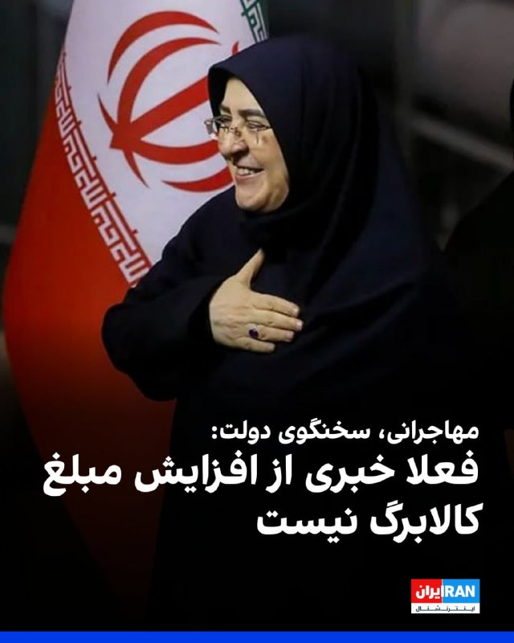

فاطمه مهاجرانی، سخنگوی دولت گفت: «فعلا خبری از افزایش مبلغ کالابرگ نیست، البته مطلوب دولت این است که بتواند مبلغ کالابرگ را افزایش دهد اما باید مطلوبات را با مقدورات هماهنگ کنیم.»

او ادامه داد: «اتفاقی که الان در جنوب کشور و دریا در حال رخ دادن است، روی اقتصاد ما تاثیر می‌گذارد.»
iranintl
‌🏁 🇬🇧 IranintlTV

🤖 @VahidOOnLine

## VahidOOnLine — post 243032

  

♦️محمدباقر قالیباف، رئیس‌ مجلس شورای اسلامی در جلسه مجازی روز یکشنبه مجلس گفت: «باید اصلاح برنامه‌ هفتم با تمرکز بر بازسازی خسارات جنگ در دستور کار کمیسیون‌های تخصصی قرار گیرد.»
قالیباف با اشاره به پیام مجتبی خامنه‌ای درخصوص توجه مجلس به مسائل پساجنگ از همۀ‌ ‌کمیسیون‌های‌ تخصصی ‌مرتبط مجلس خواست تا با هماهنگی با دولت طرح‌های لازم را برای اصلاح بندهای ناظر به «نوسازی و بازسازی خسارات جنگ تحمیلی دوم و سوم» به‌صورت «دقیق، قابل سنجش و زمان‌بندی‌شده» آماده کنند تا در اولین فرصتی که شورای‌عالی امنیت ملی به تقاضای هیئت‌رئیسۀ‌ مجلس برای تشکیل جلسات صحن علنی پاسخ مثبت داد، فرایند تصویب آنها آغاز شود.
رسانه‌های ایران گزارش دادند که روز یکشنبه ۱۰ خرداد جلسه مجازی صحن مجلس به ریاست قالیباف و مشارکت برخط ۱۸۷ نماینده و ۱۴ نماینده به‌صورت حضوری برگزار شد.
‌🇸🇦 Indypersian

🤖 @VahidOOnLine

## VahidOOnLine — post 243031

⭕️مراسم تولد جاویدنام مصطفی نوری شیرازی در کنار مزارش برگزار شد

♦️تصاویری که روز یکشنبه دهم خرداد در شبکه‌های اجتماعی منتشر شده نشان می‌دهد، جمعی از بستگان و آشنایان جاویدنام مصطفی نوری شیرازی با حضور بر مزار فرزندشان، مراسم سالروز تولد این جوان جان‌باخته را برگزار کردند.

مصطفی نوری شیرازی، جوان ۲۳ ساله اهل نور در استان مازندران، شامگاه جمعه ۱۹ دی‌ماه ۱۴۰۴ با شلیک مستقیم گلوله جنگی نیروهای سرکوبگر جمهوری اسلامی جان باخت.
به گفته نزدیکان این جوان، ابتدا او را به بیمارستان خمینی‌شهر نور منتقل کردند اما ساعاتی بعد در بیمارستان جان سپرد.
‌🇸🇦 Indypersian

🤖 @VahidOOnLine

## VahidOOnLine — post 243030

محمدعلی زلفی‌گل، وزیر علوم در دولت ابراهیم رئیسی گفت: «شما در مناظرات انتخاباتی دیدید که رئیسی هیچ‌گاه حاضر نبود دست به کاری بزند یا حرفی بزند که از منش انسانی، تقوا، ایمان و اخلاق به دور باشد؛ رئیسی شهادت‌گونه زندگی کرد و یک پهلوان سیاسی بود.»

او ادامه داد: «من شهادت می‌دهم که رئیسی فقط کارها را برای خدا، مردم و نظام جمهوری اسلامی انجام می‌داد.»
‌🏁 🇬🇧 IranintlTV

🤖 @VahidOOnLine

## VahidOOnLine — post 243029

  <a href="telegram/content/VahidOOnLine_243029_1780223894.mp4" target="_blank">🎬 Download video</a>

ویدیوهایی که تازه به دست ایران‌اینترنشنال رسیده، برگزاری مراسم چهلم جاویدنام احمد طراقیان را بر سر مزارش نشان می‌دهد.
طراقیان، ۳۲ ساله، شامگاه ۱۹ دی‌ ۱۴۰۴ در شهر کرج، با شلیک گلوله جنگی به ناحیه سر هدف قرار گرفت و جان باخت.
‌🏁 🇬🇧 IranintlTV

🤖 @VahidOOnLine

## VahidOOnLine — post 243028

  <a href="telegram/content/VahidOOnLine_243028_1780223897.mp4" target="_blank">🎬 Download video</a>

ویدیوی رسیده به ایران‌اینترنشنال، برگزاری مراسم تولد جاویدنام مصطفی نوری شیرازی را بر سر مزارش نشان می‌دهد.
مصطفی نوری، جوان ۲۳ ساله اهل شهر نور در استان مازندران، جمعه ۱۹ دی‌ماه ۱۴۰۴ با شلیک مستقیم نیروهای سرکوبگر جان باخت. او را به بیمارستان خمینی‌شهر نور بردند اما جان باخت.
‌🏁 🇬🇧 IranintlTV

🤖 @VahidOOnLine

## VahidOOnLine — post 243027

  

♦️ارتش اسرائیل روز یکشنبه ۱۰ خرداد به غیرنظامیان لبنانی ساکن جنوب رودخانه زهرانی هشدار داد که منطقه را تخلیه کنند و اعلام کرد که عملیات علیه حزب‌الله را تشدید می‌کند.

آویخای ادرعی، سخنگوی عرب زبان ارتش اسرائیل در شبکه‌های اجتماعی نوشت: «ساکنان جنوب لبنان، شما باید فوراً به شمال زهرانی نقل مکان کنید.»

به گزارش خبرگزاری فرانسه، در حالی که تلاش‌ها برای برای دستیابی به آتش‌بس در لبنان ادامه دارد، اسرائیل روز جمعه حملات سنگین خود به جنوباین کشور را ادامه داد.
‌🇸🇦 Indypersian

🤖 @VahidOOnLine

## VahidOOnLine — post 243026

  <a href="telegram/content/VahidOOnLine_243026_1780223901.mp4" target="_blank">🎬 Download video</a>

⭕️انقلاب ملی ایران؛ جاوید نام محسن نمازی به ضرب گلوله سرکوبگران در تهران کشته شد

♦️تصاویری که روز شنبه نهم خرداد در شبکه‌های اجتماعی منتشر شده، جاوید نام محسن نمازی را نشان می‌دهد که در کلاس مدرسه درحال گذراندن شور و حال جوانی است.
محسن نمازی ۱۸ ساله، شامگاه پنجشنبه ۱۸ دی‌ماه ۱۴۰۴ در جریان انقلاب ملی ایرانیان به‌ضرب گلوله جنگی نیروهای سرکوبگر جمهوری اسلامی در منطقه بهارستان تهران کشته شد.
‌🇸🇦 Indypersian

🤖 @VahidOOnLine

## VahidOOnLine — post 243025

  

محمدباقر قالیباف، رییس مجلس در سخنانی با اشاره به مذاکرات با آمریکا، گفت: «تا اطمینان پیدا نکنیم که حقوق ملت ایران را گرفته‌ایم، هیچ توافقی را تایید نخواهیم کرد.»

او افزود: «سربازان میدان مبارزه دیپلماسی، هیچ اعتمادی به حرف‌ها و وعده‌های دشمن ندارند. آنچه برای ما ملاک است دستاوردهای عینی است که باید کسب کنیم.»

قالیباف اضافه کرد: «تضمین این راهبرد، جان ماست که کف دست گرفته‌ایم تا نثار مردم ایران کنیم.»
‌🏁 🇬🇧 IranintlTV

🤖 @VahidOOnLine

## VahidOOnLine — post 243024

  <a href="telegram/content/VahidOOnLine_243024_1780223904.mp4" target="_blank">🎬 Download video</a>

⭕️نهم اسفند و آغاز جنگ؛ تصاویر جدید از لحظه اصابت موشک به بیت رهبر جمهوری اسلامی

♦️تصاویری که روز یکشنبه و پس از وصل شدن اینترنت در ایران در شبکه‌های اجتماعی منتشر شده، لحظه اصابت موشک‌های «تاماهاک» به بیت علی خامنه‌ای، رهبر پیشین جمهوری اسلامی را نشان می‌دهد.

علی خامنه‌ای، به همراه جمعی از فرماندهان ارشد نظامی جمهوری اسلامی ظهر نهم اسفند ۱۴۰۴ و همزمان با آغاز جنگ توسط ارتش‌های اسرائیل و آمریکا کشته شد.
‌🇸🇦 Indypersian

🤖 @VahidOOnLine

## VahidOOnLine — post 243023

  

محمدباقر قالیباف، رییس مجلس شورای اسلامی گفت: «سومین سال مجلس دوازدهم را در حالی آغاز می‌کنیم که یاد و خاطره رهبر شهید با ماست و هنوز فقدان رهبر و پدر امت را باور نمی‌کنیم.»

او ادامه داد: «رهبرمان به ما آموخت مقابل زورگویی و تهدید، ذره‌ای سر خم نکنیم و با مشت‌های گره کرده مقابل خصم تا آخرین قطره خون مبارزه کنیم.»

قالیباف اضافه کرد: «دیدن جای خالی رهبری برایمان جانکاه است، ولی دلگرم به مدیریت و رهبری جدید هستیم.»
‌🏁 🇬🇧 IranintlTV

🤖 @VahidOOnLine

## VahidOOnLine — post 243022

  

♦️روابط عمومی نیروی دریایی سپاه روز یکشنبه ۱۰ خرداد در اطلاعیه‌ای اعلام کرد که طی شبانه روز گذشته ۲۸ کشتی اعم از نفتکش، باری و سایر کشتی‌های تجاری «پس از کسب مجوز با هماهنگی و تامین امنیت نیروی دریایی سپاه» از تنگه هرمز عبور کردند.
در اطلاعیه منتشر شده روابط عمومی نیروی دریایی سپاه آمده : «کنترل هوشمند تنگه هرمز به طور مستمر و با صلابت و اقتدار در حال انجام است.»
سپاه همچنین حضور آمریکا در اطراف تنگه هرمز را دلیل ناامنی آن خوانده و اعلام کرده است: «خلیج فارس یک پهنه آبی متعلق به کشورهای مسلمان منطقه بوده است.»
دونالد ترامپ، رئیس‌جمهوری ایالات متحده، روز شنبه در گفتگوی اختصاصی با شبکه خبری «فاکس‌نیوز» گفت: «تنگه هرمز باید فورا باز شود و این مسیر باید آزاد و بدون عوارضی باشد.»
پیشتر مارکو روبیو، وزیر خارجه ایالات متحده آمریکا نیز تاکید کرده بود هیچ کشوری، از جمله چین و روسیه، با ایجاد محدودیت یا دریافت عوارض برای عبور کشتی‌ها از این شاهراه مهم انرژی جهان موافق نیستند.
‌🇸🇦 Indypersian

🤖 @VahidOOnLine

## VahidOOnLine — post 243021

🗣روایت شما از زندگی پس از جنگ - یکشنبه ۱۰ خرداد

🔹کی این کابوس‌ها تموم میشه؟ ۴۷ سال وعده‌های دروغ دادن. اکثر پدرهای خانواده شرمنده خانواده‌شون شدن. شهر مرده و مردم فقط دارن نفس می‌کشن.

🔹خواستم بگم ما به خاک نشستن خامنه‌ای ضحاک رو دیدیم. رویای ایران آزاد فاصله چندانی با ما نداره، پس امیدتون رو از دست ندید.

🔹من سرآشپز یه رستوران هستم. ما روزانه ۳۰۰ پرس ناهار و ۷۰۰ پرس شام (جوجه، کوبیده یا زرشک‌پلو) برای سپاه می‌پزیم و برای پخش بین کسانی که میان شعار میدن. قیمت هر پرس غذایی که میدیم ۶۰۰ هزار تومان میشه.

🔹میگن اینترنت وصل شده، در صورتی‌که فقط باید فیلترشکن‌هاتون رو اینقدر امتحان کنید تا شاید وصل بشه و یک‌ساعت صبر کنیم تا یه سرور بهمون بده.

🔹واقعا خسته شدیم از این وضعیت گرونی و سردرگمی. هر روزمون شده منتظر نتیجه توافق یا شاید حمله نظامی موندن. جوونی‌مون حروم شد این وسط.

🔹بعد از آتش‌بس روحیه‌ای برای ادامه زندگی ندارم و هر روز حس می‌کنم با وجود جمهوری اسلامی، زندگی در ایران جریان نخواهد داشت.

🔹بعد از سه‌ماه با بدبختی به اینترنت جهانی وصل شدیم که ای‌کاش نمی‌شدیم چون عزیزانی که از بین ما رفتن، دیگه هیچ‌وقت آنلاین نمیشن.

🔹آزادی نزدیکه مردم عزیزم. من هم مثل شما زیر فشار زیادی هستم و فشار مالی، روانی خیلی اذیتم می‌کنه اما به خاطر خون جاویدنامان ناامید نشین.

🔹بعد از ۳ ماه وصل شدم و می‌خواستم بگم منتظر نشینیم تا یک کشور دیگه بخواد بهمون کمک کنه. ترامپ روز اول یه حرفی زد ولی ما مردم ایران نباید به این وضعیت عادت کنیم.

🔹هر شب اینجا مرگ بر اسرائیل و مرگ بر آمریکا میگن، آخرش هم دامن خودشون رو گرفت. اما بازم درس نگرفتن و هنوز تکرار می‌کنن.

🔹این‌قدر خشم درون من نهفته است که با کوچک‌ترین حرکت و فراخوان دوباره به خیابون میام، حتی اگر کشته شم.
‌🏁 🇬🇧 IranintlTV

🤖 @VahidOOnLine

## VahidOOnLine — post 243020

  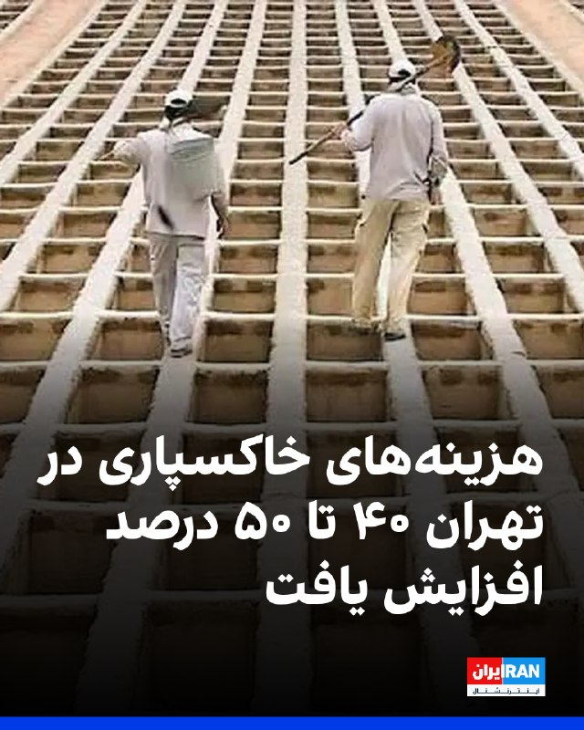

دیده‌بان ایران گزارش داد شورای شهر تهران تعرفه خدمات بهشت‌زهرا را برای سال ۱۴۰۵ افزایش داده است. بر اساس این مصوبه، هزینه‌های تدفین و به‌طور میانگین حدود ۴۰ درصد و در برخی موارد تا ۵۰ درصد افزایش یافته و خدمات برگزاری مراسم تدفین نیز بین ۳۰ تا ۵۰ درصد افزایش یافته است.
بر پایه این گزارش، هزینه انتقال هر متوفی تا شعاع ۱۰ کیلومتری به ۹ میلیون و ۷۵۰ هزار تومان است و قیمت سنگ مزار، قاب بتنی، سردخانه و خدمات مراسم نیز رشد قابل توجهی داشته است.
‌🏁 🇬🇧 IranintlTV

🤖 @VahidOOnLine

## VahidOOnLine — post 243019

  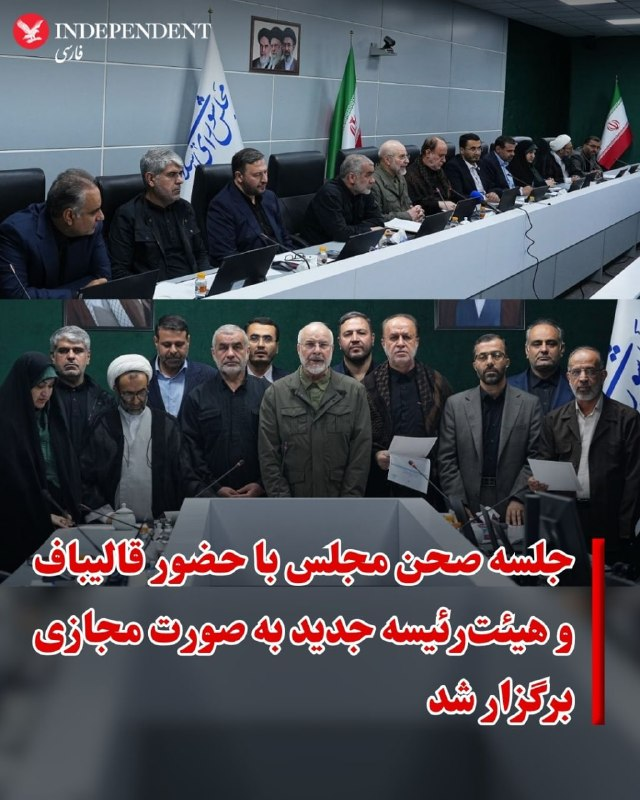

♦️رسانه‌های ایران گزارش دادند روز یکشنبه ۱۰ خرداد نخستین جلسه سومین سال فعالیت مجلس دوازدهم به‌صورت مجازی و به ریاست محمدباقر قالیباف برگزار شد.
بنا بر گزارش‌ها، این جلسه با حضور ۱۸۷ نماینده به‌صورت مجازی و ۱۴ نماینده به‌صورت حضوری برگزار شد و  اعضای جدید هیئت‌رئیسه مجلس سوگند یاد کردند.
 پیشترعباس گودرزی، سخنگوی هئیت رئیسه مجلس شورای اسلامی، اعلام کرده بود که نخستین جلسه صحن علنی مجلس از آغاز جنگ جاری روز یکشنبه به صورت «ویدئو کنفرانس» برگزار خواهد شد.
گودرزی گفت این نشست به دلیل تدابیر امنیتی و شرایط موجود، به‌صورت وبیناری و ویدئوکنفرانس برگزار می‌شود.
آخرین جلسه علنی مجلس شورای اسلامی روز ۲۸ بهمن ماه سال گذشته برگزار شد.
‌🇸🇦 Indypersian

🤖 @VahidOOnLine

## VahidOOnLine — post 243018

  <a href="telegram/content/VahidOOnLine_243018_1780223909.mp4" target="_blank">🎬 Download video</a>

ویدیوی رسیده به ایران‌اینترنشنال، لحظه کشته شدن جاویدنام مجید فرخزاد را در شامگاه ۱۸ دی ۱۴۰۴ در خیابان پیروزی تهران نشان می‌دهد. فرخزاد، ۳۷ ساله و پدر یک فرزند پنج ساله بود که با اصابت گلوله جان باخت.
‌🏁 🇬🇧 IranintlTV

🤖 @VahidOOnLine

## VahidOOnLine — post 243017

  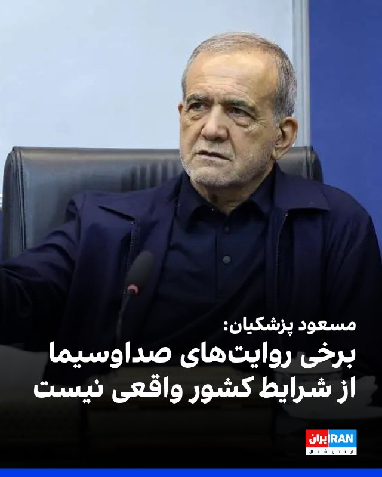

مسعود پزشکیان در نشستی با وزیر علوم و جمعی از معاونان و مدیران این وزارتخانه گفت: «در برخی موارد شاهد ارائه تحلیل‌ها و روایت‌هایی از صدا و سیما هستیم که می‌تواند تصویری غیرواقعی از شرایط کشور ایجاد کند و این موضوع نیازمند بازنگری جدی است.»

او افزود: «نباید اجازه داد فضای عمومی جامعه تحت تاثیر اطلاعات غیرمستند و برداشت‌های فاقد پشتوانه علمی قرار گیرد. حقیقت مستقل از اشخاص است و در زبان علم، حقانیت بر پایه شواهد، استدلال و مستندات تعریف می‌شود.»
‌🏁 🇬🇧 IranintlTV

🤖 @VahidOOnLine

## WithYashar — post 13013

صدای انفجار در قشم🚨
@withyashar

## WithYashar — post 13012

چندین گزارش صدای مهیب در بندر عباس
@withyashar 🚨

## WithYashar — post 13011

🇺🇸 دونالد ترامپ ( ۷۹ سال )
۲۴ خرداد ۱۳۲۵
🇺🇸 مارکو روبیو ( ۵۵ سال )
۷ خرداد ۱۳۵۰
🇺🇸 پیت هگست ( ۴۵ سال )
۱۶ خرداد ۱۳۵۹
@withyashar 😃

## WithYashar — post 13010

یاشار در داخل ایران فاز مردم مثل آب و هوای خردادی هاست واقعا!!! مودی و اصلا مشخص نیست مردم هم خودشون چی میخوان!!!

## WithYashar — post 13009

## WithYashar — post 13008

https://youtu.be/tRWhvFylQtk

## WithYashar — post 13007

سلام خواهشا بگید مگه چندسالتونه ک جام جهانی 1997 هم دیدید..نمیخوره بهتون ک سن بالا باشد

## WithYashar — post 13006

سلام خواهشا بگید مگه چندسالتونه ک جام جهانی 1997 هم دیدید..نمیخوره بهتون ک سن بالا باشد

## WithYashar — post 13005

الجزیره: [جنگ آمریکا و اسراییل علیه ایران]، فضایی را ایجاد کرده است که در آن هر دو طرف احساس پیروزی می‌کنند و بنابراین تمایل دارند در مذاکرات احتمالی برای امتیازات بیشتر تلاش کنند و این امر تلاش‌ها برای کاهش تنش را پیچیده می‌کند.
@withyashar

## WithYashar — post 13004

حالا چرا اینا الان نشون دادم ولی کم میذارم؟ یکی این که نگن پس فردا یاشار اومد اینجا، نمیدونم فلان جا بهش پول داد… بدون اینا رو داشت و ول کرد تازه و درس دوم این که بدونن که میتونست بره برای خودش عشقشو کنه کنه، ولی نکرد و قید همه چیز رو زد حتی‌سلامتیشو …. اونایه دیگه خون مردم رو تو شیشه میکنند و هزار جور کار می کنند که تهش شاید بشن این ! شاید !

## WithYashar — post 13003

حس میکنم تریدری🌚

## WithYashar — post 13002

حس میکنم تریدری🌚

## WithYashar — post 13001

فعلا میرم بیرون یه کاری دارم به اخبار‌ ادامه میدیم منم یه هوایی بخورم انقدر عصبی نشم…

## WithYashar — post 13000

  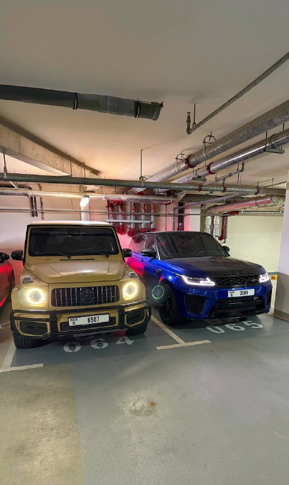

اینم SVR و G63 البته یه بنتلی GTC W12 و یه مازراتی MC و یه لیموزین بنز ۶ در و یه SL fabdesign هم دارم ، ۶ تا کلا 🥹 حالا به وقتش‌میبینید

## WithYashar — post 12999

مشروب یه کالای‌ مصرفیه ! کل اون مشروبا ۱۵۰۰$ بشه پول یه ماه یه کارگر معمولی اینجا ، البته نه کل مشروبام تو کمد هم باز‌ هست 🤣…

## WithYashar — post 12998

یاشار میشه شغل اصلیت بگی خواهش میکنم‌جواب پیام بده خیلی مشتاقم بدونم اون همه مشروب چطوری کار کردی خریدی💔

## WithYashar — post 12997

  <a href="telegram/content/WithYashar_12997_1780223913.mp4" target="_blank">🎬 Download video</a>

🎬 Video

## WithYashar — post 12996

## WithYashar — post 12995

نیویورک تایمز: ایران خواسته های واشنگتن برای تسلیم کردن ذخایر اورانیوم غنی‌شده‌اش را رد کرده است.
@withyashar

## WithYashar — post 12994

## mwarmonitor — post 9935

🔴متحدان آمریکا در همه‌جا نگران هستند که ایالات متحده در ایستادگی در برابر استبداد، بیش از حد سکوت کرده است. بلومبرگ

@mwarmonitor

## mwarmonitor — post 9934

🔴ترامپ می‌گوید برای امضای توافق با ایران «عجله‌ای ندارد»: «هیچ سلاح هسته‌ای وجود نخواهد داشت». نیویورک پست

@mwarmonitor

## mwarmonitor — post 9933

🔹تری اینگست (خبرنگار فاکس نیوز در تل‌آویو):
«بله بچه‌ها، صبح بخیر. گزارش‌ها حاکی از آن است که رئیس‌جمهور ترامپ در مذاکرات با ایران بر مواضع خود پافشاری می‌کند و در جریان جلسه اواخر هفته گذشته در اتاق وضعیت (Situation Room)، خواستار چندین اصلاحیه در توافق پیشنهادی شده است. اکنون، رئیس‌جمهور در آخر هفته با فاکس نیوز گفتگو کرده و اشاره داشته که ایالات متحده به یک توافق خوب بسیار نزدیک است.»
🔸 دونالد ترامپ (رئیس‌جمهور آمریکا):
«بنابراین، ما داریم چیزی را که می‌خواهیم به آرامی به دست می‌آوریم. آن‌ها مذاکره‌کنندگان بسیار سرسختی هستند؛ زمان زیادی طول می‌کشد. من عجله‌ای ندارم. دوست دارم بگویم عجله دارم چون می‌دانید، قیمت بنزین به شدت کاهش خواهد یافت، اما اگر بخواهید عجله کنید، توافق خوبی به دست نخواهید آورد. و... آهسته اما مطمئن، فکر می‌کنم داریم به آنچه می‌خواهیم می‌رسیم. و اگر آنچه را که می‌خواهیم به دست نیاوریم، آن را به شکل دیگری پایان خواهیم داد.»
🔹تری اینگست :
«رئیس‌جمهور ترامپ به وضوح نشان داد که اگر ایران توافق او را امضا نکند، گزینه نظامی همچنان روی میز باقی می‌ماند. وزیر جنگ، پیت هگست به سنگاپور سفر کرد؛ جایی که او نیز خواسته رئیس‌جمهور ترامپ برای دستیابی به توافق با ایران را تکرار نمود و افزود که توانمندی‌های نظامی ایالات متحده، قوی‌ترین انگیزه برای ایران است تا از جاه‌طلبی‌های هسته‌ای خود دست بکشد.»
📌 پیت هگست (وزیر جنگ آمریکا):
«بنابراین ایران به وضوحِ هرچه تمام‌تر می‌داند که انتظارات ما چیست و این بر عهده تیم مذاکره‌کننده است که آن را محقق کند. آن‌ها دارند به سمت ما می‌آیند (به مواضع ما نزدیک می‌شوند)، گفتگوها سازنده بوده است. فکر می‌کنم آن‌ها... آن‌ها می‌دانند که این روند باید به کدام سمت برود.»
🔹تری اینگست:
«علاوه بر ایران، ما همچنین تحولات مربوط به درگیری میان اسرائیل و بزرگترین گروه نیابتی ایران، یعنی حزب‌الله را رصد می‌کنیم. پهپادها و راکت‌ها در طول آخر هفته آسمان شمال اسرائیل را در نوردیدند، در حالی که اسرائیل حملات هوایی جدیدی را آغاز کرد و نیروهای زمینی را به عمق بیشتری در جنوب لبنان فرستاد.»
🔸 بنیامین نتانیاهو (نخست‌وزیر اسرائیل):
«از اینجا، نبرد علیه حزب‌الله در شمال مدیریت می‌شود. و باید به شما بگویم که نتایج بسیار چشمگیری در اینجا به دست آمده است. نیروهای ما از (رودخانه) لیتانی عبور کرده‌اند؛ آن‌ها به سمت موقعیت‌های تحت کنترل پیشروی کرده‌اند.»
🔹 تری اینگست :
«بر باور اینجاست که اگر توافقی میان ایالات متحده و ایران حاصل شود، می‌تواند به درگیری‌ها در امتداد مرزهای شمالی اسرائیل پایان دهد. حتی در پنج دقیقه گذشته، آژیرهای خطر در بخش‌های شمالی این کشور در میان حملات جدید حزب‌الله به صدا درآمدند. بچه‌ها؟»
🔹 مجری استودیو فاکس نیوز:
«بسیار خب، تری اینگست، به صورت زنده از تل‌آویو. تری، ازت ممنونم.»

@mwarmonitor

## mwarmonitor — post 9932

  <a href="telegram/content/mwarmonitor_9932_1780223916.mp4" target="_blank">🎬 Download video</a>

🎬 Video

## mwarmonitor — post 9931

📌ارتش اوکراین اعلام کرد که پالایشگاه نفت «ساراتوف» متعلق به شرکت روس‌نفت (Rosneft PJSC) در جنوب‌غربی روسیه و همچنین یک واحد پمپاژ نفت در منطقه‌ای دیگر را هدف حمله قرار داده است، در حالی که مقام‌های محلی از وقوع آتش‌سوزی‌های ناشی از حمله پهپادی در طول شب خبر دادند. بلومبرگ

@mwarmonitor

## mwarmonitor — post 9930

  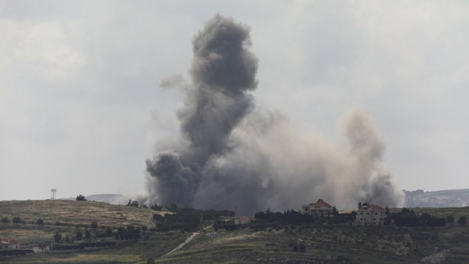

🔸بردِ درگیری دوباره در حال گسترش است، آتش بی‌وقفه در شمال: ارتش اسرائیل (IDF) در حال حمله به اهداف حزب‌الله در جنوب لبنان است. کانال ۱۳ اسرائیل

@mwarmonitor

## mwarmonitor — post 9929

🔴یکی از مهم‌ترین شبه‌نظامیان مورد حمایت ایران در عراق (کتائب حزب الله) پیشنهاد داده است که «پهپادها و موشک‌ها را» از سایر گروه‌های شبه‌نظامی که «تصمیم گرفته‌اند سلاح‌های خود را زمین بگذارند» خریداری کند. جوروزالم پست

@mwarmonitor

## FoxNewsTwitter — post 342442

‌Fox News (Twitter/X)

👉 Full story here:

## FoxNewsTwitter — post 342441

  

Fox News (Twitter/X)

President Trump floats scrapping America's 250th anniversary concert for a massive MAGA rally after multiple artists pull out of the Great American State Fair lineup. Freedom 250 organizers later confirmed the president will personally kick off the celebration with an opening ceremony speech on June 24.

Artists who withdrew include Martina McBride, Bret Michaels, Young MC, Morris Day and The Time, and C+C Music Factory. Trump called them 'overpriced singers, who nobody wants to hear, whose music is boring.'

## DEJradio — post 5169

  <a href="telegram/content/DEJradio_5169_1780223920.webm" target="_blank">🎬 Download video</a>

👑
🔺 حمایت ایرانیان مقیم مالمو - سوئد از انقلاب شیر و خورشید مردم ایران

#همبستگی #مالمو
@DEJradio

## DEJradio — post 5167

📢
⭕️ یکی از سرکوبگرانی که در جنگ ۴۰ روزه کشته شد سردار بهرام حسینی مطلق رئیس اداره طرح و عملیات معاونت عملیات ستاد کل نیروهای مسلح بود.
هرچند او در واپسین سال‌های خدمت مسئولیت‌های رزمی داشت اما یکی از عناصر اصلی سرکوب بود.
حسینی مطلق در جریان سرکوب اعتراضات ۸۸ به عنوان فرمانده سـ.ـپاه سيدالشهدا استان تهران چماق بدست با حضور مستقیم در خیابان و قتل و شکنجه معترضان مرتکب نقض حقوق بشر شد.
او در اردیبهشت‌ماه ۱۳۹۰ با اشاره به نقش محوری سـ.ـپاه سيدالشهدا در سرکوب اعتراضات سال ۸۸، گفت: «سـ.ـپاه سيدالشهدا قبل از تفكيک يكی از سـ.ـپاه‌های محوری بود و در جريان فتنه سال ۸۸ خوش درخشيد. عملكرد اين سـ.ـپاه مورد تأييد مسئولان قرار گرفت و دشمنان با وجود اين سپاه احساس خطر كردند و نام آن را در ليست سی و دو گزينه‌ای خود ثبت كردند.»
اتحادیه اروپا در ۲۳ فروردین ۱۳۹۰ (۱۳ آوریل ۲۰۱۱)، ۳۲ مقام ایرانی از جمله بهرام حسینی مطلق را به دلیل نقشی که در نقض گسترده و شدید حقوق شهروندان ایرانی داشته‌اند از ورود به کشورهای این اتحادیه محروم کرد. کلیه دارایی‌های این مقامات نیز در اروپا توقیف خواهد شد. بر اساس بیانیه اتحادیه اروپا بهرام حسینی مطلق در مقام فرماندهی لشکر سیدالشهدا استان تهران در سرکوب معترضان انتخاباتی نقشی کلیدی داشت.
او در تیم امنیتی که پیگیر دلایل سقوط هلی‌کوپتر ابراهیم رئیسی بود نیز حضور فعال داشت.

#سرکوبگران #حذف_هدفمند
@DEJradio

## DEJradio — post 5166

  <a href="telegram/content/DEJradio_5166_1780223921.webm" target="_blank">🎬 Download video</a>

⭕️
🔺 بعد از یک وقفه کوتاه در دوران جنگ ۴۰ روزه، حکومت دوباره به جان محیط زیست و منابع طبیعی کشور افتاده است.
یک شهروند از گرگان در ویدیویی با اشاره به نابودی جنگل‌های هیرکانی می‌گوید دشمن واقعی مملکت خود اینها هستند که مثل تروریست‌ها به جان ایران افتاده‌اند.

#گرگان #مازندران #هیرکانی
@DEJradio

## DEJradio — post 5165

  <a href="telegram/content/DEJradio_5165_1780223922.mp4" target="_blank">🎬 Download video</a>

🚀
🚨 براساس ویدیویی از جزیره خارک مربوط به جنگ ۴۰ روزه، نیروهای مسلح جمهوری اسلامی یک لانچر موشک را در پوشش کامیون در کنار جاده مستقر کردند و هنگام عبور وسایل نقلیه شخصی اقدام به شلیک می‌کنند، کاری که آشکار استفاده از سپرانسانی است.

#خارک #سپرانسانی
@DEJradio

## DEJradio — post 5164

  <a href="telegram/content/DEJradio_5164_1780223923.webm" target="_blank">🎬 Download video</a>

🚨
🔺 با کشف یک مین ۳۰۰ کیلوگرمی که احتمالاً نیروهای مسلح جمهوری اسلامی در تنگه هرمز بر سر راه کشتی‌ها قرار داده بودند، مرکز امنیت دریایی عمان روز شنبه نهم خرداد، از دریانوردان، ماهیگیران و شناورها خواست تا در مسیرهای حرکتی خود نهایت احتیاط را به کار بندند.
گفته می‌شود این مین مدل «مهام ۳» است؛ یک مین مهارشده (لنگرشده) مجهز به حسگرهای آکوستیکی که کشتی‌های عبوری را از طریق الگوی صوتی آن‌ها شناسایی می‌کند.
جمهوری اسلامی ایران در نقاط مختلف تنگه هرمز مین مستقر کرده است، از جمله مین چسبان «مهام ۷» که روی بستر دریا که در انتظار هدف می‌ماند.
طبق توافق ترامپ، ایران باید تک‌تک این مین‌ها را پاک‌سازی کند. هنوز دست‌کم یک دوجین یا بیشتر از آن‌ها در آن منطقه وجود دارند.
نیروی دریایی سـ.ـپاه پاسداران ۲۰فروردین ۱۴۰۵ با انتشار اطلاعیه‌ای، از تعیین مسیرهای جایگزین برای تردد کشتی‌ها در تنگه هرمز خبر داد.

#مین_دریایی #تنگه_هرمز
@DEJradio

## IranIntlTV — post 339865

  <a href="telegram/content/IranIntlTV_339865_1780223924.mp4" target="_blank">🎬 Download video</a>

سرخط خبرهای یکشنبه ۱۰ خرداد
@iranintltv

## IranIntlTV — post 339864

  

فاطمه مهاجرانی، سخنگوی دولت گفت: «فعلا خبری از افزایش مبلغ کالابرگ نیست، البته مطلوب دولت این است که بتواند مبلغ کالابرگ را افزایش دهد اما باید مطلوبات را با مقدورات هماهنگ کنیم.»

او ادامه داد: «اتفاقی که الان در جنوب کشور و دریا در حال رخ دادن است، روی اقتصاد ما تاثیر می‌گذارد.»
iranintl.com/202605312740

## IranIntlTV — post 339863

  <a href="telegram/content/IranIntlTV_339863_1780223926.mp4" target="_blank">🎬 Download video</a>

محمدباقر قالیباف، رییس مجلس، در نطق پیش از دستور نخستین جلسه سال سوم مجلس دوازدهم گفت علی خامنه‌ای در دوران رهبری خود پایه‌گذار «ایران قوی، مستقل و مقتدر» بود و آنچه امروز در عرصه‌های نظامی و در صحنه عمومی ایران دیده می‌شود، نتیجه مدیریت و رهبری اوست.
@iranintltv

## IranIntlTV — post 339862

  

محمدعلی زلفی‌گل، وزیر علوم در دولت ابراهیم رئیسی گفت: «شما در مناظرات انتخاباتی دیدید که رئیسی هیچ‌گاه حاضر نبود دست به کاری بزند یا حرفی بزند که از منش انسانی، تقوا، ایمان و اخلاق به دور باشد؛ رئیسی شهادت‌گونه زندگی کرد و یک پهلوان سیاسی بود.»

او ادامه داد: «من شهادت می‌دهم که رئیسی فقط کارها را برای خدا، مردم و نظام جمهوری اسلامی انجام می‌داد.»
https://iranintl.com/202605314899

## IranIntlTV — post 339861

  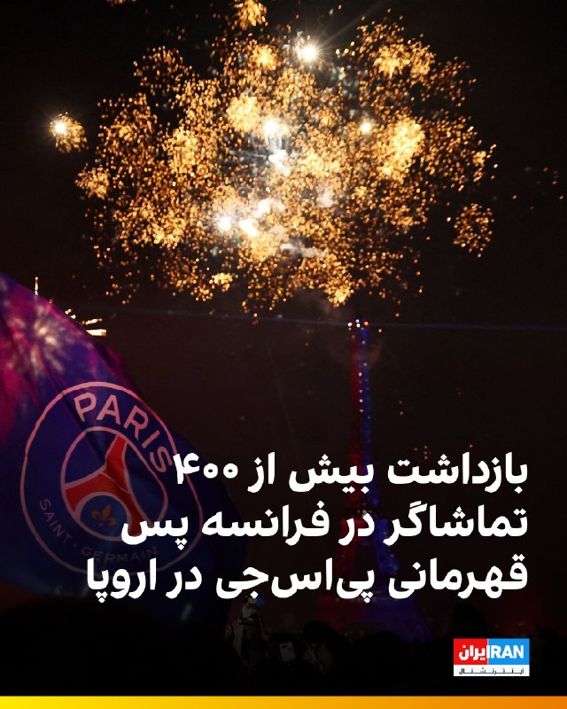

🔻در پی قهرمانی پاری‌سن‌ژرمن مقابل آرسنال در فینال لیگ قهرمانان اروپا، درگیری میان هواداران فوتبال و پلیس در شهرهای مختلف فرانسه به بازداشت بیش از ۴۰۰ نفر انجامید.

🔹هزاران نیروی پلیس برای مهار ناآرامی‌هایی که موجب اختلال در خدمات اتوبوس، قطار و مترو در پاریس شد، در پایتخت مستقر بودند.

🔹وزارت کشور اعلام کرده است: «جشن‌ها در برخی شهرها، از جمله پاریس، با ناآرامی‌هایی همراه بود که مداخله نیروهای انتظامی را ضروری کرد.»

🔹گزارش‌ها حاکی است دامنه ناآرامی‌ها به شهرهای لو آور (غرب)، آژن (جنوب‌غرب)، مون‌پلیه (جنوب) و دیژون (شرق) نیز کشیده شده است. پیش‌تر نیز از درگیری میان هواداران و پلیس در چند شهر دیگر فرانسه خبر داده شده بود.

🔹با وجود اینکه این دومین قهرمانی پیاپی پاری‌سن‌ژرمن بود، برای دومین سال متوالی نیز جشن‌های فوتبالی به خشونت کشیده شد. سال ۲۰۲۵ نیز پس از قهرمانی این تیم، جشن‌ها به درگیری‌هایی مرگبار انجامیده بود.

🔹جزییات بیشتر را در سایت بخوانید.

@iranintltvsport

## IranIntlTV — post 339860

  <a href="telegram/content/IranIntlTV_339860_1780223929.mp4" target="_blank">🎬 Download video</a>

جاویدنامان انقلاب ملی ایرانیان
«کمیل جمشیدی» شامگاه ۱۹ دی‌ماه در شهرک اندیشه بر اثر اصابت گلوله ماموران خامنه‌ای از ناحیه‌ گردن جان باخت. نامش در حافظه‌ی این سرزمین می‌ماند و یادش چراغ راه آزادی‌خواهان است.
@iranintltv

## IranIntlTV — post 339859

  <a href="telegram/content/IranIntlTV_339859_1780223931.mp4" target="_blank">🎬 Download video</a>

ویدیوهایی که تازه به دست ایران‌اینترنشنال رسیده، برگزاری مراسم چهلم جاویدنام احمد طراقیان را بر سر مزارش نشان می‌دهد.
طراقیان، ۳۲ ساله، شامگاه ۱۹ دی‌ ۱۴۰۴ در شهر کرج، با شلیک گلوله جنگی به ناحیه سر هدف قرار گرفت و جان باخت.

## IranIntlTV — post 339858

  <a href="telegram/content/IranIntlTV_339858_1780223934.mp4" target="_blank">🎬 Download video</a>

وال‌استریت پس از حملات یازده سپتامبر، فقط شش روز تعطیل بود، اما روسیه پس از حمله به اوکراین، یک ماه بازار مسکو را تعطیل کرد. بورس‌های امارات پس از حملات موشکی و پهپادی جمهوری اسلامی فقط دو روز معاملات را متوقف کردند، در حالیکه بورس تهران، در یک رکورد تاریخی، بیش از هشتاد روز تعطیل بود. در این قسمت چرتکه، محمد ماشین‌چیان رویکرد آمریکایی و روسی به بازار را در مقیاس ایران و امارات بررسی می‌کند.

تماشای نسخه کامل «چرتکه» را در یوتیوب ایران‌اینترنشنال⁩:

https://youtu.be/gPWijjjbR5M
@iranintltv

## IranIntlTV — post 339857

  <a href="telegram/content/IranIntlTV_339857_1780223936.mp4" target="_blank">🎬 Download video</a>

مسعود پزشکیان، رییس‌جمهور دولت جمهوری اسلامی است، در نشستی با وزیر علوم گفت که صداوسیما با ارائه تحلیل‌ها و روایت‌های نادرست و فاقد پشتوانه علمی، تصویر غیرواقعی از وضعیت کشور ارائه می‌دهد.
گفت‌وگو با رضا علیجانی، تحلیل‌گر و فعال سیاسی
@iranintltv

## IranIntlTV — post 339856

  <a href="telegram/content/IranIntlTV_339856_1780223938.mp4" target="_blank">🎬 Download video</a>

🔻عباس جدیدی، قهرمان پیشین کشتی ایران در گفتگویی با خبرآنلاین، با انتقاد به علیرضا دبیر، رییس فدراسیون کشتی به دلیل فعالیت‌های عوام‌فریبانه، گفت: «ما با همین زیرساختهایی که داشتیم همین نتایجی که الان گرفتیم و خیلی‌ها دارند به آن می‌نازند. همین نتایج را با همان زیرساخت‌ها به دست آوردیم، پس مشکل ما زیرساخت نبود. آقا ساخته‌اید! دستتان هم درد نکند، اما یک‌سری ناترازی‌ها و ایرادات اصل کاری و بنیادی را بخواهید پشت زیرساخت‌ها پنهان کنید، برای کاستی‌ها ویریت درست کنید، این یعنی دروغ گفتن به مردم.»

@iranintltvsport

## IranIntlTV — post 339855

  <a href="telegram/content/IranIntlTV_339855_1780223940.mp4" target="_blank">🎬 Download video</a>

ویدیوی رسیده به ایران‌اینترنشنال، برگزاری مراسم تولد جاویدنام مصطفی نوری شیرازی را بر سر مزارش نشان می‌دهد.
مصطفی نوری، جوان ۲۳ ساله اهل شهر نور در استان مازندران، جمعه ۱۹ دی‌ماه ۱۴۰۴ با شلیک مستقیم نیروهای سرکوبگر جان باخت. او را به بیمارستان خمینی‌شهر نور بردند اما جان باخت.

## IranIntlTV — post 339854

  

محمدباقر قالیباف، رییس مجلس در سخنانی با اشاره به مذاکرات با آمریکا، گفت: «تا اطمینان پیدا نکنیم که حقوق ملت ایران را گرفته‌ایم، هیچ توافقی را تایید نخواهیم کرد.»

او افزود: «سربازان میدان مبارزه دیپلماسی، هیچ اعتمادی به حرف‌ها و وعده‌های دشمن ندارند. آنچه برای ما ملاک است دستاوردهای عینی است که باید کسب کنیم.»

قالیباف اضافه کرد: «تضمین این راهبرد، جان ماست که کف دست گرفته‌ایم تا نثار مردم ایران کنیم.»
https://iranintl.com/202605315968

## IranIntlTV — post 339853

  

محمدباقر قالیباف، رییس مجلس شورای اسلامی گفت: «سومین سال مجلس دوازدهم را در حالی آغاز می‌کنیم که یاد و خاطره رهبر شهید با ماست و هنوز فقدان رهبر و پدر امت را باور نمی‌کنیم.»

او ادامه داد: «رهبرمان به ما آموخت مقابل زورگویی و تهدید، ذره‌ای سر خم نکنیم و با مشت‌های گره کرده مقابل خصم تا آخرین قطره خون مبارزه کنیم.»

قالیباف اضافه کرد: «دیدن جای خالی رهبری برایمان جانکاه است، ولی دلگرم به مدیریت و رهبری جدید هستیم.»
https://iranintl.com/202605312532

## IranIntlTV — post 339852

  <a href="telegram/content/IranIntlTV_339852_1780223945.mp4" target="_blank">🎬 Download video</a>

روزنامه شرق در گزارشی از افزایش موارد ترک درمان در ایران به دلیل رشد تورم و بالا رفتن هزینه‌های پزشکی خبر داده است. در این گزارش، افزایش تعرفه‌ها، گرانی دارو و تجهیزات و ضعف پوشش بیمه‌ای از عوامل اصلی فشار بر بیماران و نظام درمان عنوان شده است.
ارزیابی بیشتر با بابک خطی، پزشک و متخصص کودکان
@iranintltv

## IranIntlTV — post 339851

🗣روایت شما از زندگی پس از جنگ - یکشنبه ۱۰ خرداد

🔹کی این کابوس‌ها تموم میشه؟ ۴۷ سال وعده‌های دروغ دادن. اکثر پدرهای خانواده شرمنده خانواده‌شون شدن. شهر مرده و مردم فقط دارن نفس می‌کشن.

🔹خواستم بگم ما به خاک نشستن خامنه‌ای ضحاک رو دیدیم. رویای ایران آزاد فاصله چندانی با ما نداره، پس امیدتون رو از دست ندید.

🔹من سرآشپز یه رستوران هستم. ما روزانه ۳۰۰ پرس ناهار و ۷۰۰ پرس شام (جوجه، کوبیده یا زرشک‌پلو) برای سپاه می‌پزیم و برای پخش بین کسانی که میان شعار میدن. قیمت هر پرس غذایی که میدیم ۶۰۰ هزار تومان میشه.

🔹میگن اینترنت وصل شده، در صورتی‌که فقط باید فیلترشکن‌هاتون رو اینقدر امتحان کنید تا شاید وصل بشه و یک‌ساعت صبر کنیم تا یه سرور بهمون بده.

🔹واقعا خسته شدیم از این وضعیت گرونی و سردرگمی. هر روزمون شده منتظر نتیجه توافق یا شاید حمله نظامی موندن. جوونی‌مون حروم شد این وسط.

🔹بعد از آتش‌بس روحیه‌ای برای ادامه زندگی ندارم و هر روز حس می‌کنم با وجود جمهوری اسلامی، زندگی در ایران جریان نخواهد داشت.

🔹بعد از سه‌ماه با بدبختی به اینترنت جهانی وصل شدیم که ای‌کاش نمی‌شدیم چون عزیزانی که از بین ما رفتن، دیگه هیچ‌وقت آنلاین نمیشن.

🔹آزادی نزدیکه مردم عزیزم. من هم مثل شما زیر فشار زیادی هستم و فشار مالی، روانی خیلی اذیتم می‌کنه اما به خاطر خون جاویدنامان ناامید نشین.

🔹بعد از ۳ ماه وصل شدم و می‌خواستم بگم منتظر نشینیم تا یک کشور دیگه بخواد بهمون کمک کنه. ترامپ روز اول یه حرفی زد ولی ما مردم ایران نباید به این وضعیت عادت کنیم.

🔹هر شب اینجا مرگ بر اسرائیل و مرگ بر آمریکا میگن، آخرش هم دامن خودشون رو گرفت. اما بازم درس نگرفتن و هنوز تکرار می‌کنن.

🔹این‌قدر خشم درون من نهفته است که با کوچک‌ترین حرکت و فراخوان دوباره به خیابون میام، حتی اگر کشته شم.

## IranIntlTV — post 339850

  <a href="telegram/content/IranIntlTV_339850_1780223947.mp4" target="_blank">🎬 Download video</a>

ترکیه اعلام کرد در صورت برآورده شدن خواسته‌هایش در غزه، آماده عادی‌سازی روابط با اسرائیل است.

نرگس هورخش، خبرنگار ایران‌اینترنشنال، گزارش می‌دهد
@iranintltv

## IranIntlTV — post 339849

  <a href="telegram/content/IranIntlTV_339849_1780223949.mp4" target="_blank">🎬 Download video</a>

ارتش اسرائیل گزارش داد در عملیاتی استراتژیک، از رودخانه لیتانی عبور کرده و قلعه باستانی بوفور در جنوب لبنان را تصرف کرده است. پس از خروج بیست سال پیش اسرائیل از لبنان، این بیشترین پیشروی اسرائیل در خاک این کشور است.

اشکان صفایی، خبرنگار ایران‌اینترنشنال، گزارش می‌دهد
@iranintltv

## IranIntlTV — post 339848

  

دیده‌بان ایران گزارش داد شورای شهر تهران تعرفه خدمات بهشت‌زهرا را برای سال ۱۴۰۵ افزایش داده است. بر اساس این مصوبه، هزینه‌های تدفین و به‌طور میانگین حدود ۴۰ درصد و در برخی موارد تا ۵۰ درصد افزایش یافته و خدمات برگزاری مراسم تدفین نیز بین ۳۰ تا ۵۰ درصد افزایش یافته است.
بر پایه این گزارش، هزینه انتقال هر متوفی تا شعاع ۱۰ کیلومتری به ۹ میلیون و ۷۵۰ هزار تومان است و قیمت سنگ مزار، قاب بتنی، سردخانه و خدمات مراسم نیز رشد قابل توجهی داشته است.
https://iranintl.com/202605314185

## IranIntlTV — post 339847

  <a href="telegram/content/IranIntlTV_339847_1780223952.mp4" target="_blank">🎬 Download video</a>

ویدیوی رسیده به ایران‌اینترنشنال، لحظه کشته شدن جاویدنام مجید فرخزاد را در شامگاه ۱۸ دی ۱۴۰۴ در خیابان پیروزی تهران نشان می‌دهد. فرخزاد، ۳۷ ساله و پدر یک فرزند پنج ساله بود که با اصابت گلوله جان باخت.

## Shin_Persian — post 6322

متد جدید فرانتینگ توسط Patterniha:

https://github.com/patterniha/MITM-DomainFronting

## FarsiVOA — post 219154

🔺گزارش روزنامه شرق از بحران خاموش ترک درمان در ایران

▪️روزنامه شرق در گزارشی از گسترش پدیده‌ای نوشت که آن را «بحران خاموش ترک درمان» نامیده است؛ وضعیتی که در آن بیماران به دلیل افزایش هزینه‌ها، درمان‌‌ و مراقبت از بیماری‌های مزمن را به تعویق می‌اندازند یا به‌کلی کنار می‌گذارند.

▪️بر اساس این گزارش، فشار همزمان تورم درمانی، کاهش قدرت خرید خانوارها، رشد قیمت دارو و تجهیزات پزشکی و پوشش محدود بیمه‌ها باعث شده درمان برای بسیاری از خانواده‌ها از یک حق ضروری به کالایی وابسته به توان مالی تبدیل شود.

▪️در بخش دیابت، شرق به نقل از رئیس انجمن دیابت ایران نوشت قیمت نوار تست قند خون در ماه‌های اخیر چهار برابر شده است.

⬇️ بیشتر بخوانید:
https://ir.voanews.com/a/8155757.html

## FarsiVOA — post 219153

آغاز عملیات گسترده ارتش اسرائیل در محور «قلعه بوفور» و «وادی سلوقی» در جنوب لبنان؛

ارتش اسرائیل از آغاز یک عملیات لشکری گسترده توسط فرماندهی شمال در منطقه «قلعه بوفورت» و «دره سلوقی» در جنوب لبنان خبر داد. این عملیات با هدف انهدام زیرساخت‌های نظامی، از بین بردن نیروهای حزب‌الله، تقویت کنترل عملیاتی در جنوب لبنان و رفع تهدید مستقیم از منطقه «انگشت جلیل» و شهرک «مطله» آغاز شده است.

این تحرکات از چند روز گذشته آغاز شده و طی آن نیروهای پیاده و زرهی گسترده‌ای از جمله «تیپ گولانی»، «تیپ ۷»، «تیپ گیفعاتی»، «تیپ آتش» و «یگان چندبعدی» تحت فرماندهی لشکر ۳۶ و با هدایت اطلاعاتی سازمان اطلاعات نظامی (آمان)، عملیات تهاجمی خود را برای گسترش خط دفاعی پیش‌رو آغاز کرده‌اند.

تمرکز اصلی این فعالیت‌ها بر به دست گرفتن کنترل ارتفاعات بوفور و منطقه وادی سلوقی، ضربه سنگین به سازمان تروریستی حزب‌الله و انهدام زیرساخت‌های کلیدی این گروه است که تحت حمایت جمهوری اسلامی در این ارتفاعات ساخته شده بودند؛ مواضعی که حزب‌الله از آن‌ها برای هدایت نبردها و اجرای حملات متعدد استفاده می‌کرد.
@FarsiVOA

## FarsiVOA — post 219152

  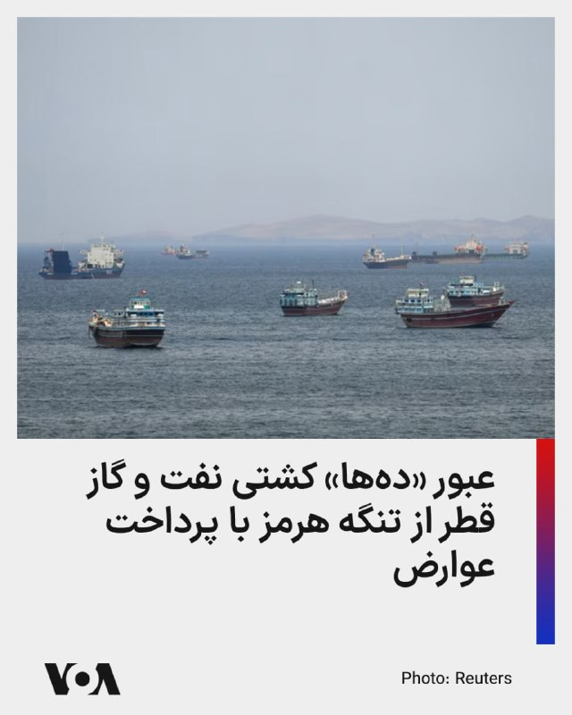

روزنامه «اسرائیل هیوم» با استناد به سه منبع دیپلماتیک از عبور «دهها» کشتی حامل نفت و گاز مایع قطر از تنگه هرمز با هماهنگی آمریکا و جمهوری اسلامی طی هفته گذشته خبر داد.

بر اساس این گزارش، برخی از کشتی‌های حامل نفت و گاز قطر برای گذشتن از تنگه هرمز به جمهوری اسلامی عوارض پرداخت کرده‌اند.

پیشتر ایالات متحده آمریکا هشدار داده بود هرگونه «باج‌دهی دریایی» به جمهوری اسلامی ریسک تحریمها را در پی دارد و محاصره دریایی امکان عبور این کشتیی‌ها به بازارهای جهانی را نخواهد داد. اما اسرائیل هیوم می‌نویسد آمریکا مانع عبور کشتی‌های حامل ال‌ان‌جی و نفت قطر که به جمهوری اسلامی عوارض پرداخت کرده‌اند، نشده است.

معاون نخست‌وزیر قطر روز گذشته اعلام کرده بود که با دریافت عوارض دائمی جمهوری اسلامی برای عبور کشتی‌ها از تنگه هرمز مخالف است، اما به‌صورت مقطعی می‌شود درباره این موضوع مذاکره کرد تا آرامش به بازارهای جهانی انرژی بازگردد.

قطر یک پنجم گاز مایع مصرفی جهان را تامین می‌کند.
@FarsiVOA

## FarsiVOA — post 219151

  

بر اساس مصوبه جدید شورای شهر تهران، هزینه خدمات مرتبط با خاکسپاری در بهشت‌زهرا به‌طور میانگین حدود ۴۰ درصد افزایش یافته و در برخی موارد رشد تعرفه‌ها به ۵۰ درصد رسیده است.

روزنامه دنیای اقتصاد گزارش داد نرخ خدماتی از جمله حمل متوفی، تغسیل، تکفین، تدفین و برگزاری مراسم افزایش یافته است. بر اساس این مصوبه، هزینه انتقال هر متوفی از سطح شهر تهران تا شعاع ۱۰ کیلومتری ۵۰ درصد افزایش داشته است.

این افزایش تعرفه‌ها در شرایطی اعمال می‌شود که خانوارهای ایرانی، به‌ویژه در تهران، با فشار همزمان هزینه مسکن، خوراک، درمان، حمل‌ونقل و خدمات عمومی روبه‌رو هستند.

افزایش هزینه خاکسپاری نشان می‌دهد بحران اقتصادی و کاهش قدرت خرید، حتی آخرین مراحل زندگی و هزینه‌های پس از مرگ را نیز برای خانواده‌ها سنگین‌تر کرده است.
@FarsiVOA

## FarsiVOA — post 219150

  

هزاران کودک اسرائیلی که در مناطق واقع در امتداد مرز لبنان زندگی می‌کنند، به دلیل حملات راکتی و پهپادی حزب‌الله مجبور شدند در خانه بمانند.

فرماندهی جبهه داخلی اسرائیل به‌دلیل این حملات اعلام کرد که مؤسسات آموزشی در این مناطق تعطیل خواهند بود.

بر اساس این اعلام، با این حال، در برخی مناطق شمال اسرائیل، فعالیت‌های آموزشی فقط در داخل ساختمان یا در منطقه‌ای که بتوان در زمان مناسب به پناهگاه رسید، مجاز است.

هم‌زمان با گسترش عملیات ارتش اسرائیل در جنوب لبنان، حزب‌الله لبنان چندین راکت و پهپاد به سوی شمال اسرائیل شلیک کرده است.

ارتش اسرائیل اعلام کرده است که با گسترش عملیات خود در جنوب لبنان، برای افزایش احتمالی حملات گروه تروریستی حزب‌الله آماده می‌شود.
@FarsiVOA

## DW_Farsi — post 125338

🔶 آژانس اتمی خواستار بازدید از نیروگاه هسته‌ای زاپوریژیا شد

آژانس بین‌المللی انرژی اتمی خواستار دسترسی به سالن توربین نیروگاه هسته‌ای زاپوریژیا شده است؛ سالنی که در جریان جنگ روسیه علیه اوکراین، اخیراً مورد اصابت یک پهپاد قرار گرفت.

این نهاد نظارتی سازمان ملل در شبکه ایکس اعلام کرد که از حمله‌ای مطلع شده که در نتیجه آن سوراخی در دیوار این سالن ایجاد شده است. به گفته آژانس، این نخستین حمله پهپادی در محوطه نیروگاه زاپوریژیا از آوریل ۲۰۲۴ به این سو بوده است.

نیروگاه زاپوریژیا با شش راکتور و ظرفیت اسمی شش هزار مگاوات، بزرگ‌ترین نیروگاه هسته‌ای اروپا به شمار می‌رود. این نیروگاه متعلق به اوکراین است، اما از مارس ۲۰۲۲ تحت کنترل روسیه قرار دارد.

این نیروگاه در حال حاضر برق تولید نمی‌کند و چندین تلاش اوکراین برای بازپس‌گیری آن نیز تاکنون ناکام مانده است.

@dw_farsi

## DW_Farsi — post 125337

  

🔶 بازداشت دو نفر در ارومیه به اتهام "ارتباط با اسرائیل"

اطلاعات سپاه با صدور بیانیه‌ای مدعی شد که دو فرد "مرتبط با اسرائیل" را در ارومیه شناسایی و دستگیر کرده است.

خبرگزاری دولتی ایرنا با انتشار این خبر ادعا کرد که افراد دستگیرشده "اقدام به ارسال اطلاعات و مختصات برخی اماکن از جمله مدارس، مساجد و حوزه‌های مقاومت بسیج از طریق پیام‌رسان تلگرام کرده بودند".

در بیانیه اطلاعات سپاه آمده است که این افراد، "پس از حملات صورت‌گرفته، از محل‌های آسیب‌دیده تصویربرداری کرده و تصاویر را برای عوامل مرتبط ارسال می‌کردند".

ارتباط با اسرائیل یا جاسوسی از جمله عناوین اتهامی رایج در جریان جنگ ۱۲ روزه و جنگ اخیر میان جمهوری اسلامی و آمریکا بوده است. محافل رسمی حکومت ایران، به رغم وجود صدها عکس و فیلم و سند از حمله به شهروندان، اعتراضات ۱۸ و ۱۹ دی ۱۴۰۴ و حتی کشتار هزاران نفر از شهروندان را نیز اغلب به اسرائیل و موساد نسبت می‌دهند.

@dw_farsi

## DW_Farsi — post 125336

  

🔶 پلمب یک کافه‌ در تهران به‌ اتهام عجیب "ترویج شیطان‌پرستی"

رسانه‌های ایران از پلمب یک کافه در منطقه ولیعصر تهران توسط پلیس نظارت بر اماکن عمومی تهران بزرگ خبر دادند.

پلیس اماکن، این کافه را به "ترویج فرقه‌های انحرافی" متهم کرده و گفته "این کافه با برگزاری برنامه‌هایی با ظاهر موسیقی غربی، بستری برای حرکات نابهنجار" و "تحرکات شیطانی" فراهم کرده بود.

بر اساس ادعای پلیس اماکن، مشتریان این کافه، "شامل دختران و پسران جوان، در وضعیتی غیرطبیعی و با حرکاتی عجیب و غریب مشاهده شده بودند".
طبق ادعای رسانه‌های حکومتی ایران، ماموران پلیس اماکن، "دستور پلمب واحد صنفی را صادر کردند".

ایجاد محدودیت‌ها و مقابله حکومت با آزادی‌های اجتماعی در هفته‌های اخیر به ویژه پس از برقراری آتش‌بس شکننده میان جمهوری اسلامی با آمریکا شدت گرفته است. جمهوری اسلامی در میانه جنگ، سعی کرده بود با سهل‌گیری‌های بی‌سابقه، از جمله گاهی با عدم مداخله در پوشش و حجاب اجباری، به ویژه در تجمعات حکومتی، از خود چهره‌ای معتدل نمایش دهد.

@dw_farsi

## DW_Farsi — post 125335

🔶 قوه قضائیه از توقیف اموال ۷۵ نفر از همکاران شبکه‌های معاند در استان مرکزی خبر داد

خبرگزاری دولتی ایرنا به نقل از دادستان عمومی و انقلاب مرکز استان مرکزی، از صدور دستور قضایی برای توقیف اموال ۷۵ نفر از همکاران "شبکه‌های معاند" خبر داد.

مرکز اطلاع‌رسانی قوه قضائیه در بیانیه خود این افراد را "عناصر حامی دشمن" خوانده و مدعی شده که "تاکنون ۷۵ پرونده قضایی برای تعدادی از همکاران و مرتبطین مستقیم با شبکه‌های معاند خارج از کشور در دادسرای اراک تشکیل شده است".

دادستان مرکز استان مرکزی همکاری با "رسانه‌های معاند" را "جرمی نابخشودنی" توصیف کرده و شهروندان را تهدید به برخورد قضایی کرده است.

پیش از این قوه قضائیه استان گلستان نیز از توقیف اموال ۷۴ ایرانی خارج از کشور به اتهام "خیانت به وطن" خبر داده بود. رئيس‌ کل دادگستری خراسان جنوبی نیز گفته بود، اموال ۳۴ نفر در این استان به اتهام "حمایت از دشمن" ضبط شده است.

خبرگزاری ایرنا روز شنبه نهم خرداد (۳۰ مه) به نقل از قوه قضائيه نوشت، به دستور مقام قضايی، اموال ۷۴ نفر در استان گلستان که از " خائنین به وطن و افراد تأثیرگذار در شبکه همکاران دشمن" و ساکن خارج از کشور هستند در راستای "حفظ حقوق عامه و اجرای قانون تشدید مجازات جاسوسی و همکاری" با اسرائيل توقیف شد.

قوه قضائيه می‌‌گوید، اموال این افراد شامل حساب‌های بانکی، خودرو و املاک ثبتی است که شناسایی و همه توقیف شده است. در ضمن، هرگونه نقل و انتقال مالی برای آن‌ها ممنوع و پرونده این افراد در دادسرای مرکز استان در حال رسیدگی است.

@dw_farsi

## DW_Farsi — post 125334

🔶 عقب‌نشینی دولت آمریکا از طرح سختگیرانه دریافت گرین‌کارت

پس از موجی از اعتراض‌های عمومی، دولت آمریکا از شدت برنامه‌های خود برای محدود کردن دستیابی به اقامت دائم این کشور، موسوم به گرین‌کارت، کاسته است.

وزارت امنیت داخلی آمریکا به روزنامه "نیویورک تایمز" گفته است مقررات جدید، که بر اساس آن گرین‌کارت فقط از خارج از ایالات متحده قابل درخواست بود، در نهایت شامل همه متقاضیان نخواهد شد. در عوض، قرار است این مقررات "به صورت موردی" اعمال شود.

این وزارتخانه توضیح داده که این مقررات صرفاً به منظور یادآوری به مأموران بوده است تا از اختیارات تشخیصی خود استفاده کنند. بنابراین مأموران می‌توانند تصمیم بگیرند که آیا متقاضیان را برای ثبت درخواست‌شان ملزم به ترک آمریکا کنند یا نه.

اداره خدمات شهروندی و مهاجرت آمریکا (USCIS) هفته گذشته اعلام کرده بود که متقاضیان گرین‌کارت از این پس در بیشتر موارد باید درخواست خود را از خارج از آمریکا ارائه کنند و نباید هنگام درخواست در این کشور حضور داشته باشند. بر اساس آن طرح، تنها در "شرایط فوق‌العاده" استثناهایی در نظر گرفته می‌شد.

@dw_farsi

## DW_Farsi — post 125333

🔶 جام‌های ۱۹۹۴ تا ۲۰۰۶ ؛ رونالدو، توپچی موفق برزیل

نخستین بار در سال ۱۹۹۴ بود که رونالدو عنوان‌های خبری رسانه‌های ورزشی جهان را به خود اختصاص داد. رونالدوی ۱۷ ساله به همراه تیم ملی فوتبال برزیل قدم به رقابت‌های جام جهانی ۱۹۹۴ آمریکا گذاشت و اگر چه حتی یک ثانیه نیز در بازی‌های تیمش در این مسابقات در زمین بازی نکرد، اما دست کم طعم شیرین قهرمانی را چشید.

رونالدو که به "پدیده‌" بزرگ فوتبال (Il fenomeno) شهرت یافته، در سال‌های ۱۹۹۶ و ۱۹۹۷ دو بار پیاپی از سوی فیفا به عنوان بهترین بازیکن جهان برگزیده شد.

او در جام جهانی ۱۹۹۸ فرانسه این فرصت را داشت که قابلیت‌های خود را به نمایش بگذارد و نقشی بزرگ در دفاع برزیل از عنوان قهرمانی جهان ایفا کند. اما آسیب‌دیدگی‌های پی‌درپی، به ویژه از ناحیه‌ زانو، سبب شد که این "پدیده" بزرگ فوتبال نتواند آن‌طور که باید و شاید بدرخشد.

برزیلی‌ها او را به‌رغم شرایط بدنی نسبتا نامطلوب، در فینال جام جهانی ۹۸ فرانسه برای رویارویی با میزبان بازی‌ها روانه‌ میدان کردند، اما برزیل در پی درخشش زیدان، ستاره‌ فرانسوی‌ها ۳ بر صفر به زانو درآمد و رونالدو و یارانش تنها به عنوان نایب‌قهرمانی بسنده کردند.

@dw_farsi

## Persian_Trend_Official — post 15388

صدای ۳ انفجار در مرکز شهر تهران شنیده شده 🫆: Ⓜ 🆔:@persian_trend_official پرشین ترند | متفاوت‌ترین کانال نظامی

## Persian_Trend_Official — post 15387

  <a href="telegram/content/Persian_Trend_Official_15387_1780223958.mp4" target="_blank">🎬 Download video</a>

همه چیز از این روز لعنتی شروع شد !
7 اکتبر 2023

## Persian_Trend_Official — post 15385

  <a href="telegram/content/Persian_Trend_Official_15385_1780223960.mp4" target="_blank">🎬 Download video</a>

انهدام دست کم 6 آشیانه جنگنده و پهپاد اماراتی در پایگاه هوایی الصفران

تصاویر ماهواره ای جدید ولی بی کیفیت از پایگاه هوایی الصفران امارات تایید میکند که نیروی‌های مسلح ایران در جواب به مشارکت نیروی هوایی امارات در حمله به مواضع نظامی و صنعتی ایران، در روزهای پایانی جنگ 40 روزه محل استقرار جنگنده های میراژ-2000 و پهپادهای وینگ لونگ در پایگاه هوایی الصفران را مورد حمله موشکی و پهپادی خود قرار داده.

طبق این تصاویر دست کم انهدام 6 آشیانه جنگنده‌های میراژ-2000 و وینگ لونگ اماراتی که نقش پررنگی در حملات به ایران داشتند تایید میشود.

📝 Amir

📌 @persian_trend_official
پرشین ترند | متفاوت‌ترین کانال نظامی

## Persian_Trend_Official — post 15383

  <a href="telegram/content/Persian_Trend_Official_15383_1780223961.webm" target="_blank">🎬 Download video</a>

لاشه رادار TPY-2 پدافند تاد مستقر در پایگاه موفق السلطی اردن

👺Phantom

📌 @persian_trend_official
پرشین ترند | متفاوت‌ترین کانال نظامی

## Persian_Trend_Official — post 15382

  

به گزارش تایمز اسرائیل، نیروهای ارتش اسرائیل قلعه استراتژیک بوفورت در جنوب لبنان را به عنوان بخشی از عملیات مداوم علیه حزب‌الله تصرف کرده‌اند. این قلعه متعلق به دوران صلیبیون که مشرف به رودخانه لیتانی است و ارزش تاکتیکی و نمادین قابل توجهی دارد، در بحبوحه…

## Persian_Trend_Official — post 15381

  <a href="telegram/content/Persian_Trend_Official_15381_1780223962.mp4" target="_blank">🎬 Download video</a>

به گزارش تایمز اسرائیل، نیروهای ارتش اسرائیل قلعه استراتژیک بوفورت در جنوب لبنان را به عنوان بخشی از عملیات مداوم علیه حزب‌الله تصرف کرده‌اند.

این قلعه متعلق به دوران صلیبیون که مشرف به رودخانه لیتانی است و ارزش تاکتیکی و نمادین قابل توجهی دارد، در بحبوحه عملیات گسترده‌تر اسرائیل برای راندن نیروهای حزب‌الله به سمت شمال و از بین بردن زیرساخت‌های آنها در منطقه تصرف شد. ارتش اسرائیل هنوز جزئیاتی در مورد تلفات یا دامنه مقاومت‌های صورت گرفته در جریان این عملیات منتشر نکرده است.

📝 Amir

📌 @persian_trend_official
پرشین ترند | متفاوت‌ترین کانال نظامی

## Persian_Trend_Official — post 15380

  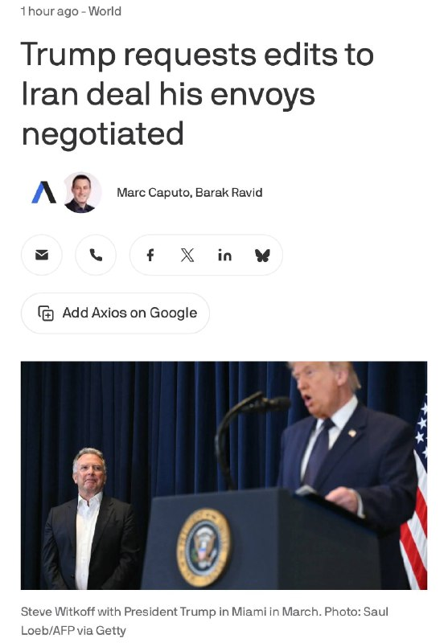

اکسیوس: رئیس جمهور ترامپ در جلسه اتاق وضعیت روز جمعه درخواست چندین تغییر در پیش نویس توافق ایالات متحده و ایران را کرد و دور دیگری از مذاکرات را آغاز کرد که ممکن است چند روز طول بکشد.

ترامپ خواهان لحن قوی‌تری در مورد مسائل کلیدی، به ویژه مدیریت و انتقال ذخایر اورانیوم غنی شده ایران و همچنین برخی از مفاد مربوط به بازگشایی تنگه هرمز است.

تفاهمنامه فعلی شامل تعهد ایران به عدم پیگیری سلاح هسته‌ای و یک دوره 60 روزه برای مذاکره در مورد محدودیت‌های هسته‌ای و لغو تحریم‌ها است، اما ترامپ به دنبال شرایط خاص‌تری است.

ایران هنوز متن نهایی را تأیید نکرده است و مقامات آمریکایی انتظار دارند که پاسخ تهران ممکن است چند روز طول بکشد. یک مقام ارشد دولت گفت: توافق حاصل خواهد شد اما خاطرنشان کرد که جدول زمانی همچنان نامشخص است و می‌تواند از چند روز تا بیش از یک هفته متغیر باشد.

📝 Amir

📌 @persian_trend_official
پرشین ترند | متفاوت‌ترین کانال نظامی

## Persian_Trend_Official — post 15379

  <a href="telegram/content/Persian_Trend_Official_15379_1780223965.webm" target="_blank">🎬 Download video</a>

تاریخ توییت ۷ اسفند ۱۴۰۴

## Persian_Trend_Official — post 15378

  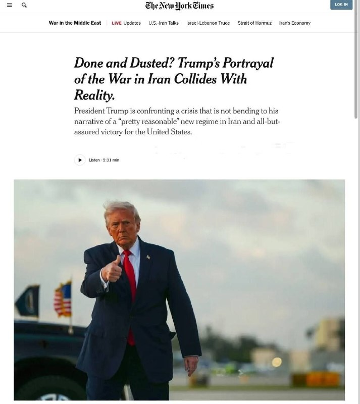

نیویورک تایمز: ترامپ سعی دارد جنگ ایران را تقریباً تمام شده و یک موفقیت کامل جلوه دهد، اما روایت او با واقعیت مطابقت ندارد و پس از سال‌ها تحمیل روایت خود از وقایع، اکنون با بحرانی روبرو است که با روایت او در تضاد است.

در بهترین حالت، تغییری در رهبری رخ داده است، اما اینکه حامیان جنگ آن را به عنوان یک تغییر مثبت ارائه دهند، نادرست است.

📝 Amir

📌 @persian_trend_official
پرشین ترند | متفاوت‌ترین کانال نظامی

## RadioFarda — post 157738

🔸در ادامه اقدامات قضایی برای توقیف و مصادره اموال مخالفان حکومت در ایران، دادستان عمومی و انقلاب مرکز استان مرکزی روز یک‌شنبه از «توقیف اموال ۷۵ نفر»‌ دیگر در این استان خبر داد. 🔸خبرگزاری میزان در خبر خود از این افراد که به هویت‌شان اشاره‌ای نشده به عنوان…

## RadioFarda — post 157737

  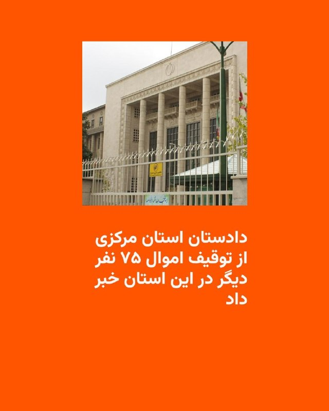

🔸در ادامه اقدامات قضایی برای توقیف و مصادره اموال مخالفان حکومت در ایران، دادستان عمومی و انقلاب مرکز استان مرکزی روز یک‌شنبه از «توقیف اموال ۷۵ نفر»‌ دیگر در این استان خبر داد.

🔸خبرگزاری میزان در خبر خود از این افراد که به هویت‌شان اشاره‌ای نشده به عنوان «عناصر حامی دشمن» و «خائنین به کشور» یاد کرده است، عباراتی که در پی آغاز جنگ در ایران بر اساس اقدامات تبلیغاتی حکومت بسیار از مقامات حکومت شنیده می‌شود.

🔸در خبر رسمی میزان این افراد «همکاران و مرتبطین مستقیم با شبکه‌های معاند خارج از کشور»‌ معرفی شده‌اند.
با این حال روند قضایی که پرونده آنها طی کرده تا به حکم توقیف اموال منجر شود مشخص نیست.

@RadioFarda

## RadioFarda — post 157736

🔸ارتش اسرائیل روز یک‌شنبه ۱۰ خرداد اعلام کرد عملیات زمینی خود در جنوب لبنان را به مناطق بیشتری گسترش داده و نیروهایش برای تقویت مواضع نظامی اسرائیل در این منطقه از رود لیتانی عبور کرده‌اند. 🔸ارتش اسرائیل در بیانیه‌ای گفت «شمار قابل توجهی» از نیروهای زمینی…

## RadioFarda — post 157735

  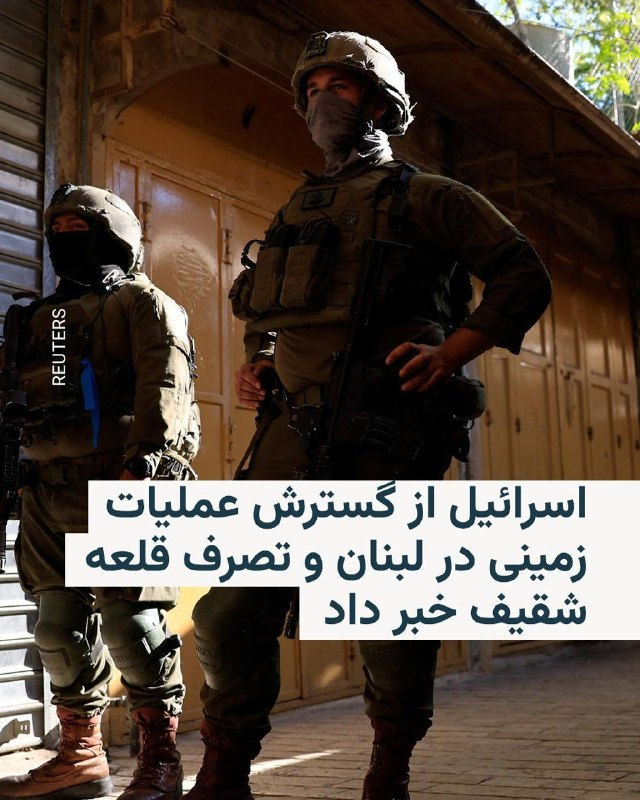

🔸ارتش اسرائیل روز یک‌شنبه ۱۰ خرداد اعلام کرد عملیات زمینی خود در جنوب لبنان را به مناطق بیشتری گسترش داده و نیروهایش برای تقویت مواضع نظامی اسرائیل در این منطقه از رود لیتانی عبور کرده‌اند.

🔸ارتش اسرائیل در بیانیه‌ای گفت «شمار قابل توجهی» از نیروهای زمینی این کشور عملیات تهاجمی را برای گسترش «خط دفاعی پیشرو» آغاز کرده‌اند و این عملیات اکنون به مناطق بیشتری کشیده شده است.

@RadioFarda

## IranianMinds — post 21124

  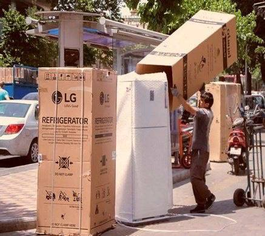

🔴اکانت اسرائیل به فارسی:

رهبر کشته شده و رهبر مفقودالاثر جمهوری اسلامی در یک قاب😂😂😂

@IranianMinds

## IranianMinds — post 21123

🔴ترامپ به فاکس نیوز:

ایران پرچم سفید تسلیم را بالا خواهد برد

ما در ایران در حال پیروزی هستیم. ما یک پیروزی کامل و تمام‌عیار داشته‌ایم.

@IranianMinds

## IranianMinds — post 21122

🔴مجلس جمهوری اسلامی امروز به صورت مجازی برگزار شد.

@IranianMinds

## IranianMinds — post 21121

🛑دونالد ترامپ:

در حال حاضر هم به توافق نزدیکیم هم به جنگ.

@IranianMinds

## IranianMinds — post 21120

  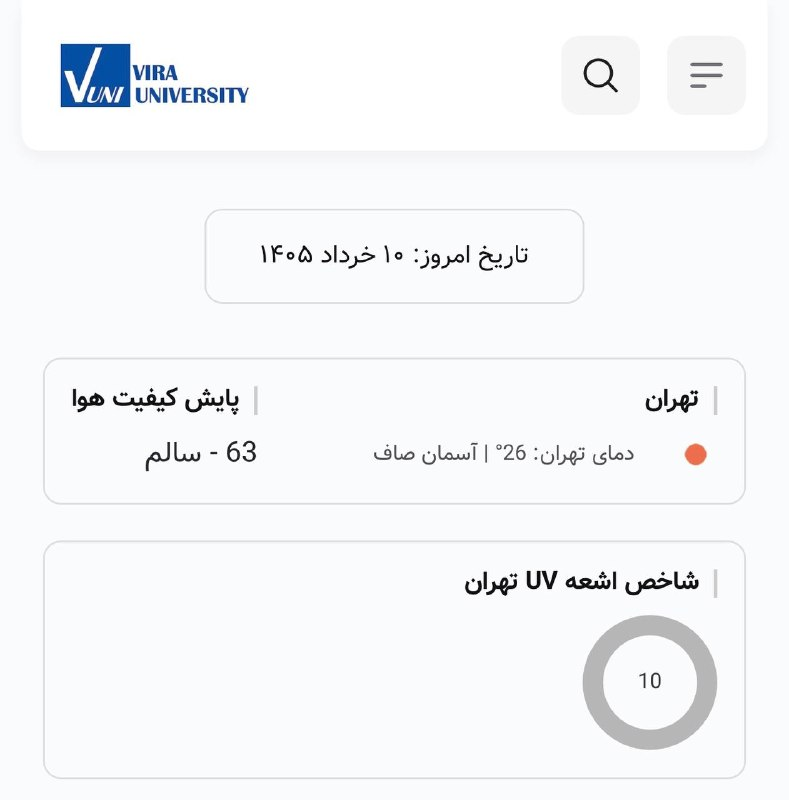

شاخص اشعه UV به عدد ۱۰ در تهران رسید.

@IranianMinds

## IranianMinds — post 21119

🔴سخنگوی شهرداری تهران:

مترو و بی‌آرتی تا زمان تعیین‌تکلیف توسط شورای شهر، رایگان می‌ماند.

@IranianMinds

## IranianMinds — post 21118

  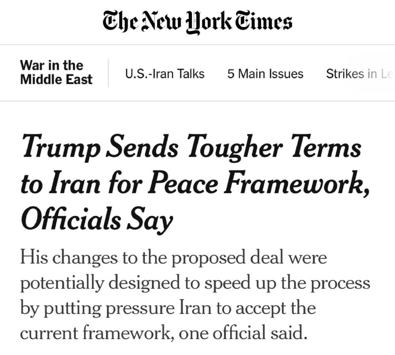

🔴 نیویورک تایمز به نقل از یک مقام آمریکایی:

ترامپ خواسته‌های ایران رو رد کرده و یک پیشنهاد متقابل سخت‌تر به ایران ارسال کرده !

این اقدام با هدف تسریع روند و فشار به ایران برای موافقت با پیشنهاد فعلی انجام شده .

@IranianMinds

## IranianMinds — post 21117

🔺 بانس‌های فوق خفن مل‌بت 
🔺

🫴 100 درصد پاداش اولین واریز

😀 100 درصد بانس یکشنبه ها

🎁 100 درصد بانس چهارشنبه ها

🔹 هر روز 1 چرخش گردونه 1 یورویی

😀 3 درصد باز پرداخت نقدی

😀 بانس شرط رایگان 30 دلاری

🎩 10 درصد باز پرداخت نقدی کازینو

🎆 بانس هدیه روز تولد

💵 و چندین بانس دیگر از جمله بانس خوش‌آمد گویی، بانس شرطبندی طولانی مدت، بانس 1750 یورویی کازینو و...

💰 هنگام ثبت‌نام با وارد کردن کد هدیه Sport100 بانس 100 دلاری رایگان دریافت کنید!

✅ معرفی سایت و اپلیکیشن مل‌بت

💛 ورود به سایت مل‌بت (فیلترشکن خاموش)

## IranianMinds — post 21116

  <a href="telegram/content/IranianMinds_21116_1780223969.mp4" target="_blank">🎬 Download video</a>

پلیس تهران با انتشار این ویدئو، از پلمپ کافه‌ای تو تهران به‌جرم «ترویج شیطان‌پرستی» خبر داد. 😐😐

@IranianMinds

## BBCPersian — post 282491

  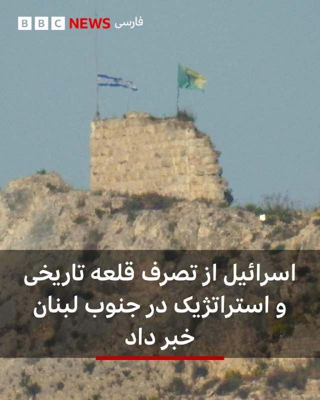

🔻وزیر دفاع اسرائیل گفت که قلعه تاریخی و استراتژیک شقیف (بوفورت) در جنوب لبنان تصرف شده است.

اسرائیل کاتس همچنین گفت عملیات زمینی ارتش اسرائیل علیه حزب‌الله در جنوب لبنان در حال گسترش است.

او در کانال تلگرامش نوشت: «چهل‌وچهار سال پس از نبرد قهرمانانه بوفورت و در روزی که یادآور سربازان کشته‌ شده در جنگ اول لبنان (۱۹۸۲) است، نیروهای ما بار دیگر به این قلعه بازگشتند و پرچم اسرائیل را در آنجا برافراشتند.»

اوافزود: «با هدایت نخست‌وزیر، بنیامین نتانیاهو و با دستور من، ارتش اسرائیل عملیات خود را در لبنان گسترش داد، از رود لیتانی عبور کرد و بوفورت را تصرف کرد که یکی از مهم‌ترین نقاط استراتژیک برای دفاع از شهرک‌های منطقه جلیل و تأمین امنیت نیروهایمان است.»

تصاویر خبرگزاری فرانسه از صبح یکشنبه نشان می‌دهد که پرچم ارتش اسرائیل بر فراز این قلعه برافراشته شده اما صدای گلوله‌باران شنیده و ستون دود در مناطق اطراف دیده می‌شود.

این قلعه دید وسیعی بر جنوب لبنان دارد و از نظر نظامی بسیار مهم محسوب می‌شود.

📸Reuters
https://trib.al/my6F6l6
@BBCPersian

## Dirty_Kids — post 390620

  <a href="telegram/content/Dirty_Kids_390620_1780223972.mp4" target="_blank">🎬 Download video</a>

🔴 دخترا جدیدا با این ترفند یه کاری میکنن که دوس پسرشون تو خیابون حتما دستشو بگیره:

@Dirty_Kids 👻

## Dirty_Kids — post 390619

  <a href="telegram/content/Dirty_Kids_390619_1780223973.mp4" target="_blank">🎬 Download video</a>

عادی ترین عرزشی😂

@Dirty_Kids 👻

## Dirty_Kids — post 390618

  <a href="telegram/content/Dirty_Kids_390618_1780223975.mp4" target="_blank">🎬 Download video</a>

یه دختر به مامان ایرانیش میگه قبل عروسی حامله شدم و حالا واکنش مامانش که خیلی مودبانه جوابشو داد:

+ هندزفری لازم🔞

@Dirty_Kids 👻

## Dirty_Kids — post 390617

  

🌎با بهبود نسبی وضعیت اینترنت و بازگشت محدود دسترسی به شبکه بین‌الملل، موفق شدیم ضمن حفظ کیفیت و پایداری سرویس‌ها، قیمت را تا هر گیگابایت 20 هزار تومان کاهش دهیم
🖥

🟣با وجود اینکه شرایط اینترنت همچنان ناپایدار است و وضعیت پهنای باند بین‌الملل به ثبات کامل نرسیده، تیم فنی بادبان با توسعه زیرساخت‌ها و بهره‌گیری از سرورهای جدید از سرویس‌دهندگان معتبر، توانسته هزینه‌ها را بهینه کرده و سرویس‌ها را با قیمت مناسب‌تری ارائه دهد
⛵️
R10
از همراهی و اعتماد شما سپاسگزاریم
💜

🛡@BadBan_VPN | کانال 

🤖@BadBan_VPNBot | ربات 

📞@BadBan_VPNSupport | پشتیبانی

## Dirty_Kids — post 390616

  

نمیدونم چجوری بگم ولی این مدل ضجه‌ها حالمو شاد میکنه

@Dirty_Kids 👻

## Dirty_Kids — post 390615

  

مامانش موهاشو عروسکی شونه کرده

@Dirty_Kids 👻

## Hranews — post 113265

  

در پی نقض حکم؛ زهرا شهباز طبری مجددا به اعدام محکوم شد

❗️
❗️
❗️
❗️
❗️ – زهرا شهباز طبری، زندانی سیاسی محبوس در زندان لاکان رشت، پس از نقض حکم اعدام پیشین در دیوان عالی کشور، بار دیگر توسط شعبه دوم دادگاه انقلاب این شهر به #اعدام محکوم شد.

به گزارش خبرگزاری هرانا، ارگان خبری مجموعه فعالان حقوق بشر در ایران، زهرا شهباز طبری مجددا به اعدام محکوم شد.

شعبه دوم دادگاه انقلاب رشت به ریاست محمدعلی درویش‌گفتار، مجددا وی را با اتهام بغی از طریق عضویت و فعالیت در سازمان مجاهدین خلق ایران، به اعدام محکوم کرده است. این حکم در تاریخ ۲۵ فروردین‌ماه ۱۴۰۵ علیه این زندانی سیاسی صادر و اخیرا به او ابلاغ شده است.

ادامه مطلب

#زهرا_شهباز_طبری

↘️
@hranews_bot تماس ✉️ -  @Hranews  کانال هرانا 🆑

## Hranews — post 113264

  

گزارشی از آخرین وضعیت فرهان عزیزی در زندان تهران بزرگ

❗️
❗️
❗️
❗️
❗️ – فرهان (امیررضا) عزیزی، کارگردان و بازیگر تئاتر دوران محکومیت خود را در زندان تهران بزرگ سپری می‌کند. وی پیش‌تر، توسط دادگاه انقلاب تهران به ۱۵ ماه سال #حبس تعلیقی و هشت ماه حبس تعزیری محکوم شده بود.

به گزارش خبرگزاری هرانا، ارگان خبری مجموعه فعالان حقوق بشر در ایران، فرهان (امیررضا) عزیزی، زندانی سیاسی دوران محکومیت خود را در زندان تهران بزرگ سپری می‌کند.

یک منبع مطلع نزدیک به خانواده این بازیگر تئاتر ضمن تایید این خبر به هرانا گفت: “آقای عزیزی توسط شعبه هفتم دادگاه انقلاب تهران محاکمه شد. اواسط اردیبهشت ماه امسال با رای صادره توسط شعبه قضایی مذکور، این زندانی سیاسی از بابت اتهاماتی همچون اجتماع و تبانی و تبلیغ علیه نظام به ۱۵ ماه حبس تعلیقی و هشت ماه حبس تعزیری محکوم شده است.”

ادامه مطلب

#فرهان_عزیزی
#امیررضا_عزیزی

↘️
@hranews_bot تماس ✉️ -  @Hranews  کانال هرانا 🆑

## Hranews — post 113263

  

بابک اسلامی فارسانی، وکیل دادگستری به دادسرا احضار شد

❗️
❗️
❗️
❗️
❗️ – بابک اسلامی فارسانی، وکیل دادگستری با دریافت ابلاغیه‌ای به شعبه چهار بازپرسی دادسرای عمومی و انقلاب ناحیه ۳۳ تهران #احضار شد.

به گزارش خبرگزاری هرانا، ارگان خبری مجموعه فعالان حقوق بشر در ایران، بابک اسلامی فارسانی، وکیل دادگستری احضار شد.

براساس احضاریه‌ای که روز شنبه ۹ خردادماه، توسط شعبه چهار بازپرسی دادسرای عمومی و انقلاب ناحیه ۳۳ تهران صادر شده، این وکیل دادگستری باید ظرف مدت پنج روز جهت دفاع از اتهام انتسابی در شعبه مذکور حاضر شود.

ادامه مطلب

#بابک_اسلامی_فارسانی

↘️
@hranews_bot تماس ✉️ -  @Hranews  کانال هرانا 🆑

## Hranews — post 113262

دو نفر توسط ماموران سپاه پاسداران در ارومیه بازداشت شدند

❗️
❗️
❗️
❗️
❗️ – روابط عمومی سپاه پاسداران از #بازداشت دو تن در ارومیه خبر داد و مدعی شد که این افراد با نهادهای وابسته به اسرائیل در ارتباط بوده‌اند.

ادامه مطلب

↘️
@hranews_bot تماس ✉️ -  @Hranews  کانال هرانا 🆑

## alonews — post 123909

  <a href="telegram/content/alonews_123909_1780223980.webm" target="_blank">🎬 Download video</a>

👈حزب‌الله: مناطق زیربنایی ارتش اسرائیل را در منطقه کریوت در شمال شهر حیفا را با موشک بمباران کردیم

✅ @AloNews خبر جنگ

## alonews — post 123908

  <a href="telegram/content/alonews_123908_1780223980.webm" target="_blank">🎬 Download video</a>

👈قالیباف: سربازان دیپلماسی هیچ اعتمادی به وعده‌های دشمن ندارند؛ ملاک برای ما دستاورد‌های عینی است

🔴 تا اطمینان پیدا نکنیم که حقوق ملت ایران را گرفته‌ایم، هیچ توافقی را تأیید نخواهیم کرد؛ تضمین این راهبرد جان ما است که کف دست گرفته‌ایم

🔴 خود و همکارانم را به پرهیز از اختلافات پوچ سیاسی توصیه می‌کنم

✅ @AloNews خبر جنگ

## alonews — post 123907

  <a href="telegram/content/alonews_123907_1780223981.webm" target="_blank">🎬 Download video</a>

👈جبهه داخلی اسرائیل: به صدا درآمدن آژیرهای هشدار در کریات شمونه و حومه آن در جلیل علیا به دنبال پرتاب موشک از لبنان.

✅ @AloNews خبر جنگ

## alonews — post 123906

  <a href="telegram/content/alonews_123906_1780223981.webm" target="_blank">🎬 Download video</a>

👈قیمت طلا و سکه امروز‌ ۱۰ خردادماه ۱۴۰۵

✅ @AloNews خبر جنگ

## alonews — post 123905

  <a href="telegram/content/alonews_123905_1780223981.webm" target="_blank">🎬 Download video</a>

👈آشوب و درگیری شبانه در پاریس پس از قهرمانی پاری ‌سن‌ژرمن؛ پلیس ۴۰۰ نفر را بازداشت کرد

🔴پلیس فرانسه بیش از ۴۰۰ نفر را که در درگیری‌های خشونت‌آمیز پاریس و دیگر شهرهای فرانسه دست داشتند، بازداشت کرد؛ ناآرامی‌هایی که شامگاه شنبه پس از قهرمانی تیم پاری سن‌ژرمن در لیگ قهرمانان اروپا آغاز شد.

✅ @AloNews خبر جنگ

## alonews — post 123904

  <a href="telegram/content/alonews_123904_1780223981.mp4" target="_blank">🎬 Download video</a>

👈بحث چالشی مجری صداوسیما و سخنگوی دولت درباره تشکیل ستاد فضای مجازی و موضوع اینترنت

✅ @AloNews خبر جنگ

## alonews — post 123902

  <a href="telegram/content/alonews_123902_1780223984.webm" target="_blank">🎬 Download video</a>

🔴تأیید هویت یک دانشجوی کشته‌شده دی‌ماه؛ جاویدنام شهاب خورشید، دانشجوی معماری

🔴«شهاب خورشید» ۲۲ ساله و دانشجوی رشته معماری، شامگاه ۱۹ دی‌ماه حوالی ساعت ۲۲ در جریان اعتراضات میدان کاج سعادت‌آباد تهران هدف شلیک گلوله نیروهای امنیتی قرار گرفت و در همان محل جان باخت.

🔴طبق گزارش ها گلوله از ناحیه پشت کتف به او اصابت کرده و همچنین دو گلوله جنگی قلب و ریه‌های او را هدف قرار داده است. بنا بر اطلاعات دریافتی، پیکر شهاب روز بعد در کهریزک به خانواده تحویل داده شد.

🔴بر اساس روایت‌های منتشرشده، شهاب پیش از پیوستن به تجمعات گفته بود: «یا همه‌چیز عوض می‌شه یا من می‌میرم». او ساکن فاز یک شهرک غرب تهران و اصالتاً اهل اهواز معرفی شده و بنا بر گفته نزدیکان، از بدو تولد با دیابت درگیر بوده و انسولین مصرف می‌کرده است.

🔴همچنین گزارش‌ها حاکی است پس از کشته‌شدن او، فشارها و محدودیت‌هایی بر خانواده اعمال شده و خانواده اجازه نیافته‌اند برای او مزار جداگانه‌ای در نظر بگیرند. بنا بر همین گزارش‌ها، پیکر شهاب در بهشت زهرا، قطعه ۲۱۱، ردیف ۲۳، شماره ۱۱ به خاک سپرده شده و گفته می‌شود در قبر خانوادگی سه‌طبقه دفن شده است.

🤔عرزشی های حرام زاده این تروریست بود که بهش شلیک کردین؟ داعش ما ایرانی ها شمایین

✅@AloNews

## alonews — post 123901

  <a href="telegram/content/alonews_123901_1780223985.webm" target="_blank">🎬 Download video</a>

👈نشریه آر‌تی: لوکاشنکو تهدیدات زلنسکی را «حرف‌های بیهوده» خواند؛ توصیف ارتش اوکراین به «گوشت دم توپ»

✅ @AloNews خبر جنگ

## alonews — post 123900

  <a href="telegram/content/alonews_123900_1780223985.webm" target="_blank">🎬 Download video</a>

🔴بررسی ۱۸۳۵ اکانت بازنشرکننده توییت‌های قالیباف نشان می‌دهد بزرگ‌ترین گروه این اکانت‌ها در ایالات متحده امریکا قرار دارند؛ پدیده‌ای بسیار قابل‌تأمل، به‌ویژه در شرایطی که برخی جریان‌های سیاسی در غرب تلاش می‌کنند از او چهره‌ای «میانه‌رو» و قابل‌قبول برای مذاکره ارائه دهند.

🔴نکته مهم دیگر این است که پست‌های قالیباف که تا پیش از ژانویه معمولاً کمتر از ۵۰۰ لایک دریافت می‌کردند، همزمان با قطع اینترنت ایران در ماه‌های مارس تا می، ناگهان با ده‌ها هزار لایک و بازنشر حمایت شدند؛ آماری که با میزان دسترسی و ارتباط کاربران داخل ایران همخوانی ندارد و مجدد احتمال وجود شبکه‌ای سازمان‌یافته برای تقویت مصنوعی این محتوا را مطرح می‌کند.

✅@AloNews

## alonews — post 123899

  <a href="telegram/content/alonews_123899_1780223986.webm" target="_blank">🎬 Download video</a>

👈سخنگوی دولت: فعلا خبری از افزایش مبلغ کالابرگ نیست

✅ @AloNews خبر جنگ

## alonews — post 123898

  <a href="telegram/content/alonews_123898_1780223986.webm" target="_blank">🎬 Download video</a>

👈ویدیویی از برافرایشته شدن پرچم ارتش اسرائیل در قلعه تاریخی و استراتژیک بوفور، لبنان 
✅ @AloNews خبر جنگ

## alonews — post 123897

  <a href="telegram/content/alonews_123897_1780223986.mp4" target="_blank">🎬 Download video</a>

👈قالیباف : دشمن بعد از شکست نظامی، با فشار اقتصادی و جنگ رسانه‌ای دنبال ایجاد تفرقه و وادار کردن ایران به تسلیم شدنه

🔴اما مردم با اتحاد و ایستادگی نقشه‌هاش رو خنثی کردن

🔴رمز پیروزی حفظ همین وحدت و انسجامه

✅ @AloNews خبر جنگ

## alonews — post 123896

  <a href="telegram/content/alonews_123896_1780223989.webm" target="_blank">🎬 Download video</a>

👈شاخص کل بورس با رشد ۸۳ هزار واحدی در پایان معاملات امروز به ۴ میلیون و ۲۳۶ هزار واحد رسید.

✅ @AloNews خبر جنگ

## alonews — post 123895

  <a href="telegram/content/alonews_123895_1780223989.mp4" target="_blank">🎬 Download video</a>

👈ویدیوِ وایرال شده از ذوق کردن یه پسر بچه، بعد از وصل شدنِ اینترنت

✅ @AloNews خبر جنگ

## alonews — post 123894

  <a href="telegram/content/alonews_123894_1780223991.webm" target="_blank">🎬 Download video</a>

👈قالیباف: چک سفید امضا به کسی نمی‌دهیم

🔴رئیس‌مجلس: ما فراموش نمی کنیم که در شرایط کنونی کشور، دولت در میانه‌ میدان مدیریت مسائل و مشکلات ایستاده و نیاز به کمک همه از جمله مجلس دارد.

✅ @AloNews خبر جنگ

## alonews — post 123893

🔥 همراه با ساب + حجم مصرفی، فقط 9T! 🚀 ❌ آفر فقط تا پایان امشب ❌ 🔥 اگه دنبال یه VPN پایدار و بدون دردسر می‌گردی، این پلن مخصوص خودته! @Netaazaadbot @NetAazaadBot ✅ همراه با ساب + حجم مصرفی ✅ 15 سرور اختصاصی پرسرعت ✅ اتصال پایدار و بدون قطعی ✅ سرعت بالا…

## alonews — post 123892

  

🔥 همراه با ساب + حجم مصرفی، فقط 9T! 🚀

❌ آفر فقط تا پایان امشب ❌

🔥 اگه دنبال یه VPN پایدار و بدون دردسر می‌گردی، این پلن مخصوص خودته!

@Netaazaadbot
@NetAazaadBot
✅ همراه با ساب + حجم مصرفی
✅ 15 سرور اختصاصی پرسرعت
✅ اتصال پایدار و بدون قطعی
✅ سرعت بالا حتی در ساعات شلوغ

@Netaazaadbot
@NetAazaadBot
💎 کیفیتی که بعد از استفاده متوجه تفاوتش میشی!

📩 برای خرید و دریافت سرویس استارت رو بزن✅

## alonews — post 123891

  <a href="telegram/content/alonews_123891_1780223991.webm" target="_blank">🎬 Download video</a>

👈امسال ۷۷درصد بیشتر از پارسال بارندگی داشتیم و سدهای کشور ۲۹درصد بیشتر از پارسال آب دارند

✅ @AloNews خبر جنگ

## alonews — post 123890

  <a href="telegram/content/alonews_123890_1780223991.webm" target="_blank">🎬 Download video</a>

👈الجزیره: [جنگ آمریکا و اسراییل علیه ایران]، فضایی را ایجاد کرده است که در آن هر دو طرف احساس پیروزی می‌کنند و بنابراین تمایل دارند در مذاکرات احتمالی برای امتیازات بیشتر تلاش کنند و این امر تلاش‌ها برای کاهش تنش را پیچیده می‌کند.

✅ @AloNews خبر جنگ

<!-- MSG END -->

<!-- NAV START -->

<a href="https://github.com/yerbeyer/aio-downloader/blob/main/telegram/content/archive_1.md" style="display:inline-block; padding:6px 12px; margin:0 4px; background-color:#2ea44f; color:white; text-decoration:none; border-radius:4px; font-weight:bold;">صفحه بعد</a>

<!-- NAV END -->
