# خواننده تلگرام

<!-- TOP_NAV START -->

<a href="https://github.com/yerbeyer/aio-downloader/blob/main/telegram/content/archive_1.md" style="display:inline-block; padding:6px 12px; margin:0 4px; background-color:#2ea44f; color:white; text-decoration:none; border-radius:4px; font-weight:bold;">صفحه بعد</a>

<!-- TOP_NAV END -->

<!-- MSG START -->

---
📅 بروزرسانی: 1405/02/30 15:59
---

## VahidOOnLine — post 241130

  <a href="telegram/content/VahidOOnLine_241130_1779280154.mp4" target="_blank">🎬 Download video</a>

رویترز گزارش داد سه نفتکش غول‌پیکر چینی و کره‌جنوبی حامل حدود ۶ میلیون بشکه نفت خاورمیانه، پس از بیش از دو ماه توقف در خلیج فارس، از ۷تنگه هرمز عبور کرده و راهی بازارهای آسیایی شده‌اند.
بر اساس این گزارش، دو نفتکش چینی حامل نفت عراق و قطر و یک نفتکش کره‌جنوبی حامل نفت کویت، از مسیر تعیین‌شده از سوی جمهوری‌اسلامی عبور کرده‌اند.
‌🏁 🇬🇧 ManotoTV

🤖 @VahidOOnLine

## VahidOOnLine — post 241129

⭕️ملاقات ملونی و مودی در رم؛ نخستین سفر رسمی نخست وزیر هند به ایتالیا در ۲۶ سال گذشته

♦️جورجا ملونی، نخست‌وزیر ایتالیا روز چهارشنبه ۳۰ اردیبهشت ماه از نارندرا مودی، نخست وزیر هند در مجموعه تاریخی «ویلا دوریا پامفیلی» دیدار و گفت‌وگو کرد. این سفر، نخستین سفر یک نخست‌وزیر هند به ایتالیا در ۲۶ سال گذشته برای سفری رسمی با هدف ملاقات رهبران دو کشور به شمار می‌رود.

مودی که در حال پایان‌دادن به سفر دوره‌ای اروپایی خود است، پیش‌تر برای نشست گروه ۲۰ در سال ۲۰۲۱ و اجلاس گروه ۷ در سال ۲۰۲۴ به ایتالیا سفر کرده بود.

گسترش همکاری‌های اقتصادی، فناوری و امنیتی از محورهای اصلی گفت‌وگوهای دو طرف عنوان شده است.
‌🇸🇦 Indypersian

🤖 @VahidOOnLine

## VahidOOnLine — post 241128

  

♦️رسانه‌های داخلی ایران و کانال‌های ارتباطی منسوب به مجتبی خامنه‌ای، رهبر جمهوری اسلامی روز چهارشنبه ۳۰ اردیبهشت ماه پیامی منتسب به او را به مناسبت دومین سالگرد کشته شدن ابراهیم رئیسی، رئیس جمهوری پیشین جمهوری اسلامی ایران را منتشر کردند.

در این پیام، مجتبی خامنه‌ای با تقدیر از عملکرد ابراهیم رئیسی، دوره ناتمام ریاست او بر دولت جمهوری اسلامی را «مقیاسی از تلاش و دلسوزی برای ملت و کشور در عین حفظ استقلال» توصیف کرده است.
از زمان انتصاب مجتبی خامنه‌ای به رهبری در بحبوحه جنگ، هیچ صدا و تصویری از او منتشر نشده است. دو روز پیش، حسین کرمان‌پور، مدیر مرکز روابط عمومی و اطلاع‌رسانی وزارت بهداشت گفته بود که نه صورت مجتبی خامنه‌ای آسیب دیده و نه پای او قطع شده است.
‌🇸🇦 Indypersian

🤖 @VahidOOnLine

## VahidOOnLine — post 241127

  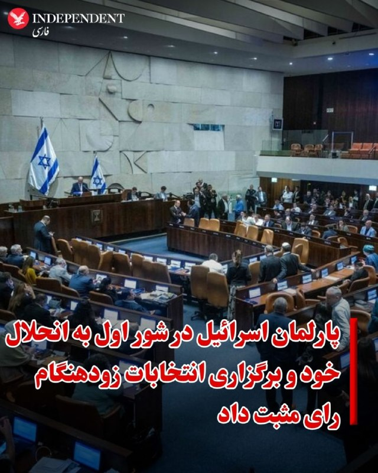

♦️نمایندگان کنست، پارلمان اسرائیل روز چهارشنبه ۳۰ اردیبهشت در شور اول به لایحه قانونی  انحلال مجلس و برگزاری انتخابات زودهنگام رای مثبت دادند.

به گزارش خبرگزاری فرانسه، ۱۱۰ نماینده از مجموع ۱۲۰ عضو کنست به این لایحه که از طرف ائتلاف حاکم، حزب لیکود به رهبری نتانیاهو و دیگر احزاب راست و راست‌گرا، ارائه شده بود، رای مثبت دادند.

در صورت موافقت نمایندگان با این لایحه، پارلمان اسرائیل احتمالا در هفته‌های آینده و برای برگزاری انتخابات زودهنگام، منحل خواهد شد.
‌🇸🇦 Indypersian

🤖 @VahidOOnLine

## VahidOOnLine — post 241126

  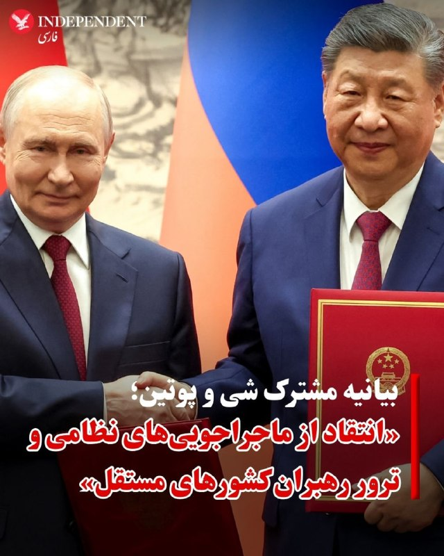

♦️روسیه و چین در یک بیانیه مشترک که در جریان سفر ولادیمیر پوتین به پکن صادر شد، با تاکید بر «دوستی عمیق دو کشور» از آنچه «ماجراجویی‌های نظامی و ترور رهبران کشورهای مستقل» خواندند، انتقاد کردند.

در بیانیه مشترک شی و پوتین که در پایگاه‌های اطلاع‌رسانی دولت‌های دو کشور منتشر شده، پکن و مسکو بدون اشاره مستقیم به آمریکا «ماجراجویی‌های نظامی» را محکوم کرده‌اند و از آنچه  «حملات نظامی غافلگیرانه به کشورهای دیگر»، «استفاده مزورانه از مذاکرات برای آماده‌سازی حملات»، «ترور رهبران کشورهای مستقل»، «بی‌ثبات کردن اوضاع داخلی کشورها» و «تلاش برای تغییر حکومت» انتقاد کردند.

شی و پوتین بدون اشاره به عملیات بازداشت نیکلاس مادورو، رئیس جمهوری پیشین ونزوئلا «ربودن آشکار رهبران کشورها برای محاکمه» را محکوم کردند.

رهبران چین و روسیه این رویه را به‌عنوان «نقض فاحش منشور ملل متحد» توصیف کرده‌اند.
‌🇸🇦 Indypersian

🤖 @VahidOOnLine

## VahidOOnLine — post 241125

  

♦️اسماعیل بقائی، سخنگوی وزارت امور خارجه جمهوری اسلامی، روز چهارشنبه ۳۰ اردیبهشت‌ماه درباره گمانه‌زنی‌ها راجع به سفر عباس عراقچی به نیویورک گفت:  «وزیر خارجه ایران برای شرکت در نشست شورای امنیت سازمان ملل درباره صلح و امنیت بین‌المللی دعوت شده، اما حضور او هنوز قطعی نیست.»

به گفته سخنگوی وزارت امور خارجه جمهوری اسلامی «این نشست به ریاست دوره‌ای چین در شورای امنیت، روز پنجم خرداد برگزار خواهد شد، اما با توجه به برنامه کاری فشرده وزیر امور خارجه»، تصمیم نهایی درباره سفر هنوز گرفته نشده است.»

این اظهارات پس از آن مطرح شد که علی خضریان، عضو کمیسیون امنیت ملی مجلس، در یک برنامه تلویزیونی نسبت به احتمال سفر عراقچی به نیویورک برای مذاکره درباره تنگه هرمز انتقاد کرده بود.
‌🇸🇦 Indypersian

🤖 @VahidOOnLine

## VahidOOnLine — post 241124

  <a href="telegram/content/VahidOOnLine_241124_1779280158.mp4" target="_blank">🎬 Download video</a>

سخنگوی وزارت خارجه جمهوری‌اسلامی اعلام کرده با توجه به ریاست دوره‌ای چین بر شورای امنیت سازمان ملل و برنامه پکن برای برگزاری «نشست ویژه وزیران خارجه درباره صلح و امنیت بین‌المللی»، از عباس عراقچی، وزیر خارجه نظام اسلامی، برای حضور در این نشست در نیویورک دعوت شده است.
‌🏁 🇬🇧 ManotoTV

🤖 @VahidOOnLine

## VahidOOnLine — post 241123

  <a href="telegram/content/VahidOOnLine_241123_1779280159.mp4" target="_blank">🎬 Download video</a>

کناره گیری محمدباقر قالیباف از ریاست هیئت‌ مذاکره کننده جمهوری‌اسلامی در مذاکرات با آمریکا،‌ از سوی رییس مرکز ارتباطات، رسانه و امور فرهنگی مجلس شورای اسلامی تکذیب شده است.
‌🏁 🇬🇧 ManotoTV

🤖 @VahidOOnLine

## VahidOOnLine — post 241122

  <a href="telegram/content/VahidOOnLine_241122_1779280160.mp4" target="_blank">🎬 Download video</a>

خبرگزاری رسمی اردن گزارش داد که نیروهای مسلح این کشور صبح امروز یک پهپاد ناشناس را که وارد حریم هوایی اردن شده بود، سرنگون کردند.
ارتش اردن این پهپاد را در استان جرش، در منطقه بلیلا در شمال کشور، هدف قرار داد. این حادثه تلفات جانی نداشت، اما خسارت‌های جزئی مادی بر جای گذاشت.
‌🏁 🇬🇧 ManotoTV

🤖 @VahidOOnLine

## VahidOOnLine — post 241121

  <a href="telegram/content/VahidOOnLine_241121_1779280161.mp4" target="_blank">🎬 Download video</a>

خبرگزاری رسمی اردن گزارش داد که نیروهای مسلح این کشور صبح امروز یک پهپاد ناشناس را که وارد حریم هوایی اردن شده بود، سرنگون کردند.
ارتش اردن این پهپاد را در استان جرش، در منطقه بلیلا در شمال کشور، هدف قرار داد. این حادثه تلفات جانی نداشت، اما خسارت‌های جزئی مادی بر جای گذاشت.
‌🏁 🇬🇧 ManotoTV

🤖 @VahidOOnLine

## VahidOOnLine — post 241120

  

رسانه رهبر جمهوری اسلامی پیامی منتسب به مجتبی خامنه‌ای به مناسبت دومین سالگرد ابراهیم رئیسی منتشر کرد.

در این پیام آمده است «خصوصیات رئیسی موجب دلگرم شدن دوستان ایران از جمله مجاهدان جبهه قدرتمند مقاومت و بسیاری از دلسوزان نظام می‌شد.»

ویژگی‌های ابراهیم رئیسی در این پیام «مسئولیت‌پذیری، جوانگرایی، توجه به عدالت، دیپلماسی فعال و نافع و به‌ویژه مردمی بودن» عنوان شده است.
‌🏁 🇬🇧 IranintlTV

🤖 @VahidOOnLine

## VahidOOnLine — post 241119

  <a href="telegram/content/VahidOOnLine_241119_1779280162.mp4" target="_blank">🎬 Download video</a>

♦️همزمان با تشدید گمانه‌زنی‌ها درباره حمله مجدد آمریکا به ایران و از سرگیری جنگ، خبرگزاری رویترز روز چهارشنبه ۳۰ اردیبهشت‌ماه تصاویری از حضور تعداد زیادی از هواپیماهای سوخت‌رسان ارتش ایالات متحده در فرودگاه بین‌المللی بن‌گوریون تل آویو را منتشر کرد.

دونالد ترامپ با اینکه گفته است به زودی به جنگ با ایران خاتمه خواهد داد، روز سه‌شنبه بار دیگر اعلام کرد که ممکن است بار دیگر حمله‌ای سخت به ایران را انجام دهد.

مذاکرات پایان دادن به جنگ، با میانجیگری پاکستان از هفته‌ها پیش به بن‌بست رسیده است. بنیامین نتانیاهو، نخست وزیر اسرائیل هم از آمادگی کامل این کشور برای ورود دوباره به جنگ سخن گفته است.
‌🇸🇦 Indypersian

🤖 @VahidOOnLine

## VahidOOnLine — post 241118

  

ایمان شمسایی، رییس مرکز ارتباطات، رسانه و امور فرهنگی مجلس، خبر استعفای محمدباقر قالیباف از ریاست هیات مذاکره‌کننده جمهوری اسلامی را «کذب محض و دروغی آشکار» خواند و منتشرکنندگان آن را به «خیانت» متهم کرد.

او در پیامی نوشت ادعای این جریان «امتداد همان خط تخریبی است که تا دیروز فرماندهان را نشانه می‌رفت و امروز شهدای والامقام را».

شمسایی افزود این جریان سابقه «هجمه» به فرماندهان نظامی، دفتر رهبر جمهوری اسلامی، مراجع تقلید و شورای عالی امنیت ملی را در کارنامه دارد.

در ادامه پیام او آمده است: «شایسته است این آقایان برای توجیه خیانت خود در شرایط جنگی پشت ژست‌های انقلابی پنهان نشوند و بیش از این به توجیه رفتارهای آسیب‌زای خود در شرایط حساس کنونی نپردازند.»

شمسایی تاکید کرد قالیباف همچنان ریاست هیات مذاکره‌کننده حکومت را بر عهده دارد و به‌تازگی نیز به پیشنهاد مسعود پزشکیان و تایید مجتبی خامنه‌ای، به‌عنوان نماینده ویژه جمهوری اسلامی در امور چین منصوب شده است.

در هفته‌های اخیر، گزارش‌های متعددی درباره اختلاف در ساختار حاکمیت جمهوری اسلامی منتشر شده است.
‌🏁 🇬🇧 IranintlTV

🤖 @VahidOOnLine

## VahidOOnLine — post 241117

  <a href="telegram/content/VahidOOnLine_241117_1779280165.mp4" target="_blank">🎬 Download video</a>

خبرگزاری حکومتی تسنیم گزارش داد که محسن نقوی، وزیر کشور پاکستان، برای دیدار و گفت‌وگو با مقام‌های جمهوری‌اسلامی راهی تهران شده است. این دومین سفر نقوی به تهران در طول یک هفته گذشته و در راستای تلاش‌های اسلام‌آباد برای میانجی‌گری میان جمهوری‌اسلامی و آمریکا است.
‌🏁 🇬🇧 ManotoTV

🤖 @VahidOOnLine

## VahidOOnLine — post 241116

  <a href="telegram/content/VahidOOnLine_241116_1779280166.mp4" target="_blank">🎬 Download video</a>

خبرگزاری رسمی اردن گزارش داد که نیروهای مسلح این کشور صبح امروز یک پهپاد ناشناس را که وارد حریم هوایی اردن شده بود، سرنگون کردند.
ارتش اردن این پهپاد را در استان جرش، در منطقه بلیلا در شمال کشور، هدف قرار داد. این حادثه تلفات جانی نداشت، اما خسارت‌های جزئی مادی بر جای گذاشت.
‌🏁 🇬🇧 ManotoTV

🤖 @VahidOOnLine

## VahidOOnLine — post 241115

  <a href="telegram/content/VahidOOnLine_241115_1779280167.mp4" target="_blank">🎬 Download video</a>

دیروز، هم‌زمان با زادروز جاویدنام پیام رخ‌بخش، خانواده و نزدیکان او بر سر مزارش در شیراز حاضر شدند و یادش را گرامی داشتند.

پیام رخ‌بخش، جوان ۳۲ ساله اهل شیراز، در ۱۹ دی‌ماه ۱۴۰۴ در جریان اعتراضات مردمی با شلیک مستقیم نیروهای حکومتی جان باخت.

حضور بر سر مزار جان‌باختگان، برای خانواده‌ها فقط سوگواری نیست؛ ادامه همان دادخواهی‌ای است که جمهوری اسلامی از آن هراس دارد.

#خانه_دوست_کجاست
‌🏁 🇬🇧 ManotoTV

🤖 @VahidOOnLine

## VahidOOnLine — post 241114

  <a href="telegram/content/VahidOOnLine_241114_1779280169.mp4" target="_blank">🎬 Download video</a>

بر اساس یک نظرسنجی جدید، اکثریت بزرگی از جمهوری‌خواهان همچنان عملکرد دونالد ترامپ در مدیریت جنگ ایران را تأیید می‌کنند.
طبق نظرسنجی انجام‌شده توسط خبرگزاری آسوشیتدپرس و مرکز پژوهش‌های امور عمومی نورک، در حالی که تنها یک‌سوم بزرگسالان آمریکایی از رویکرد رئیس‌جمهور حمایت می‌کنند، حدود دو‌سوم جمهوری‌خواهان با نحوه عملکرد او موافق هستند.
با این حال، بر اساس نظرسنجی ماه گذشته، جمهوری‌خواهان جوان‌تر بیشتر احتمال دارد که از عملکرد ترامپ در این موضوع ناراضی باشند.
علاوه بر این، تنها ۶ نفر از هر ۱۰ جمهوری‌خواه (در مقایسه با ۸ نفر از هر ۱۰ نفر در ماه فوریه) از نحوه مدیریت اقتصاد توسط رئیس‌جمهور حمایت می‌کنند؛ اقتصادی که تحت تأثیر جنگ قرار گرفته است.
‌🏁 🇬🇧 ManotoTV

🤖 @VahidOOnLine

## VahidOOnLine — post 241113

  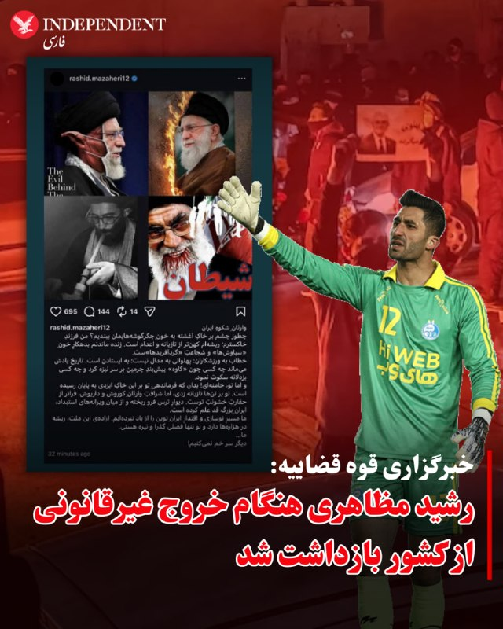

⭕️خبرگزاری قوه‌ قضاییه: رشید مظاهری هنگام خروج غیرقانونی از کشور بازداشت شد

♦️خبرگزاری قوه‌قضائیه گزارش داد رشید مظاهری، دروازه‌بان پیشین تیم ملی فوتبال و استقلال تهران، «هنگام تلاش برای خروج غیرقانونی از مرزهای غربی ایران بازداشت شده است.»

میزان در این گزارش رشید مظاهری را متهم کرده که «قصد داشته با تغییر چهره و پرداخت رشوه به ماموران مرزبانی از کشور خارج شود.»

قوه قضائیه به زمان بازداشت این بازیکن پیشین تیم ملی فوتبال ایران اشاره نکرده است.

رشید مظاهری پس از کشتار معترضان در ۱۸ و ۱۹ دی، با انتشار ویدیویی در پنجم اسفند، علی خامنه‌ای را مسئول کشته‌شدن معترضان معرفی کرده بود. پس از انتشار آن ویدیو، تا مدت‌ها خبری از وضعیت او منتشر نشده بود.

خبرگزاری میزان گزارش کرده که مظاهری در «بند عمومی زندان» به سر می‌برد و قرار است به اتهام‌های «پرداخت رشوه به مامور دولت»، «فعالیت تبلیغی برخلاف امنیت ملی در شرایط جنگی» و «اقدام به عبور غیرمجاز از مرز» محاکمه شود.
‌🇸🇦 Indypersian

🤖 @VahidOOnLine

## VahidOOnLine — post 241112

  

♦️خبرگزاری ایرنا روز چهارشنبه ۳۰ اردیبهشت از سفر دوباره سیدمحسن رضا نقوی، وزیر کشور پاکستان به ایران خبر داد.

رضا نقوی هفته گذشته هم به تهران سفر کرده و در مدت سه روز اقامت با مقام‌های ارشد جمهوری اسلامی گفتگو کرده بود.

پاکستان میانجی مذاکرات پایان جنگ میان تهران و واشنگتن است و بارها تاکید کرده برای پایان دادن به مخاصمه مسلحانه در منطقه با تمام توان تلاش خواهد کرد.
‌🇸🇦 Indypersian

🤖 @VahidOOnLine

## WithYashar — post 11749

العربیه: آمریکا به پاکستان اطلاع داده که در موضوع هسته‌ای و تنگه هرمز هیچ امتیازی نخواهد داد.
@withyashar

## WithYashar — post 11748

شبکه الحدث: جمهوری اسلامی و پاکستان در خصوص مذاکرات دچار اختلاف‌نظر شده‌اند
الحدث گزارش داد در دو هفته گذشته، همکاری میان حکومت ایران و پاکستان با چالش‌هایی روبه‌رو شده و فضای بی‌اعتمادی بر سطح هماهنگی‌های دو طرف سایه انداخته است.
این رسانه افزود میان تهران و اسلام‌آباد درباره کانال‌های مذاکره و محل برگزاری گفت‌وگوها اختلاف‌نظر وجود دارد.
بر اساس این گزارش، پاکستان از ایجاد کانال‌های ارتباطی جدید میان تهران و واشینگتن ابراز نارضایتی کرده است.
@withyashar

## WithYashar — post 11747

## WithYashar — post 11746

## WithYashar — post 11743

فال حافظ محمد رضا پهلوی…
فلک به مردم نادان دهد زمام مراد
تو اهل فضلی و دانش همین گناهت بس
@withyashar
عکس اون روز هم به دقیق ترین حالت ممکن براتون بازسازی کردم
@withyashar

## WithYashar — post 11742

من رفیق نیمه راه نیستم! مرسی از پیغام های زیباتون 😃 تازه خلیلی هم خوش مسافرتم اینو همه دوستام میدونن ، شما هم دیگه متوجه شدید 🤣🙌🏾

## WithYashar — post 11741

## WithYashar — post 11740

## WithYashar — post 11739

## mwarmonitor — post 9343

  

🇺🇸یک بالگرد تهاجمی AH-1Z وایپر نیروی تفنگداران دریایی ایالات متحده در نزدیکی یک کشتی تجاری که در آب‌های منطقه‌ای در حال عبور است، گشت‌زنی می‌کند؛ هم‌زمان نیروهای آمریکایی در حال اجرای محاصره دریایی علیه ایران هستند.
تا تاریخ ۲۰ مه، نیروهای آمریکا برای اطمینان از رعایت این محاصره، مسیر ۹۰ کشتی را تغییر داده و ۴ کشتی را از کار انداخته‌اند.

@mwarmonitor

## mwarmonitor — post 9342

  

🔴ایران تهدید کرد در صورت عملی شدن تهدید «ضربهٔ بزرگ» ترامپ، به کشورهایی خارج از خاورمیانه حمله خواهد کرد. نیویورک پست

@mwarmonitor

## mwarmonitor — post 9341

  

🚢چند نفتکش امروز از تنگه هرمز عبور کردند، از مسیر عوارضی ایران:

🇰🇷 UNIVERSAL WINNER (IMO: 9837602)
از کویت به کره جنوبی

🇭🇰 OCEAN LILY (IMO: 9284960)
از امارات به چین

🇵🇦 DEEPBLUE (IMO: 9350862)
از عمان به امارات

🇨🇾 GRAND LADY (IMO: 9406166)
از چین مقصد نامشخص در خلیج فارس

@mwarmonitor

## mwarmonitor — post 9340

🔴ناو جنگی ترامپ مانند ناو هواپیمابر فورد با سوخت هسته‌ای کار خواهد کرد

📝کالین دمارست AXIOS

🔰به گفته دریاسالار داریل کاودل (Daryl Caudle)، فرمانده عملیات نیروی دریایی، ناو جنگی کلاس ترامپ که هزینه ساخت اولین فروند از آن بیش از ۱۷ میلیارد دلار برآورد شده است، مجهز به پیشران هسته‌ای خواهد بود.

🔸چرا این موضوع اهمیت دارد؟
این اعلامیه به ماه‌ها بحث و گمانه‌زنی درباره نحوه حرکت و سرعت جابه‌جایی این ناو جنگی پایان می‌دهد.
رهبری نیروی دریایی تا اواخر آوریل، پیشران هسته‌ای را «بعید» توصیف کرده بود. مشخصاتی که برای نخستین بار ماه‌ها پیش منتشر شد، مدام در حال تغییر و تحول بوده‌اند.
🔹اظهار نظرها
کاودل در جریان شهادت خود در کنگره گفت: «من بسیار هیجان‌زده‌ام که سرانجام روی این موضوع به توافق رسیدیم که این ناو هسته‌ای خواهد بود.»
او افزود: «ما برای تحویل سریع‌تر، گزینه‌های مختلف از جمله سوخت‌های متعارف را بررسی کردیم و در نهایت دوباره به نقطه اول برگشتیم تا آن را هسته‌ای کنیم. این دقیقاً پاسخ درست است.»
🔸جزئیات بیشتر
این ناو جنگی به همان نیروگاهی مجهز خواهد شد که در ناو هواپیمابر جرالد آر. فورد (Gerald R. Ford) — بزرگترین کشتی جنگی جهان — به کار رفته است؛ یعنی راکتور A1B.
کاودل گفت: «تمام فناوری‌هایی که از منظر بخش راکتور در طراحی ناو جنگی هسته‌ای به کار می‌روند، همگی فناوری‌های انتقالی و اقتباس‌شده از کلاس فورد هستند؛ همان‌طور که بیشتر سیستم‌های رزمی، سیستم‌های راداری و سیستم‌های موشکی نیز همین‌گونه‌اند. آنچه جدید است، شکل بدنه (Hull form) آن است.»
نکته جالب توجه
ناوهای هواپیمابر در حال حاضر تنها کشتی‌های سطحی با پیشران هسته‌ای در ناوگان نیروی دریایی ایالات متحده هستند.
🔹گام بعدی چیست؟
به گزارش نشریه بریکینگ دیفنس (Breaking Defense)، نیروی دریایی خواهان ساخت ۱۵ فروند از این ناوهای جنگی تا سال ۲۰۵۶ است. هزینه ساخت سه فروند اول آن بیش از ۴۳ میلیارد دلار خواهد بود.

@mwarmonitor

## mwarmonitor — post 9339

  

📝 واقعاً مبارکه! بالاخره با اقتدار رسیدیم به قله؛ جایی که خریدن یک رول کیسه فریزر ۵۰۰ عددی، دیگر یک خرید معمولی نیست، بلکه با قیمت یک میلیون و صد و هشتاد و پنج هزار تومان، رسماً یک سرمایه‌گذاری استراتژیک و فوق‌لاکچری حساب می‌شه. اگر این رسیدن به قله نیست پس چیه؟ آدم دلش خون می‌شه وقتی می‌بینه تو همین وضعیت، یه مشت حرومزاده شب‌ها وسط میدان پرچم‌گردانی می‌کنن و شعار شبانه می‌دن، یا اونایی که بی‌خیالِ دنیا، در حال دور دور کردن، کافه‌گردی و شرکت در کلاس‌های جورواجور ادای هستن. مگه میشه یک رول پلاستیک ۱,۱۸۵,۰۰۰ تومان باشه و جگر آدم خون نشه؟ توی این قله‌ای که برای ما ساختید، تف و لعنت کمترین میزان نفرت برای شماست؛ بفرمایید کاپوچینویتان را بنوشید و دور دور کنید، تا می‌تونید کثافت‌کاریاتون رو ادامه بدید و به ریش این مردم بخندید، ولی این نفرتِ انباشته‌شده بالاخره یه جا خفت همه‌تون رو می‌چسبه!

@mwarmonitor

## FoxNewsTwitter — post 341980

  <a href="telegram/content/FoxNewsTwitter_341980_1779280174.mp4" target="_blank">🎬 Download video</a>

Fox News (Twitter/X)

WATCH: New video shows U.S. combat operations in the Middle East unfolding in real time.

CENTCOM enforces the American naval blockade against Iran, sharing that U.S. forces have now redirected 89 commercial vessels to stop traffic in and out of Iranian ports as the operation escalates across the region.

## FoxNewsTwitter — post 341979

‌Fox News (Twitter/X)

Read more:

## FoxNewsTwitter — post 341978

  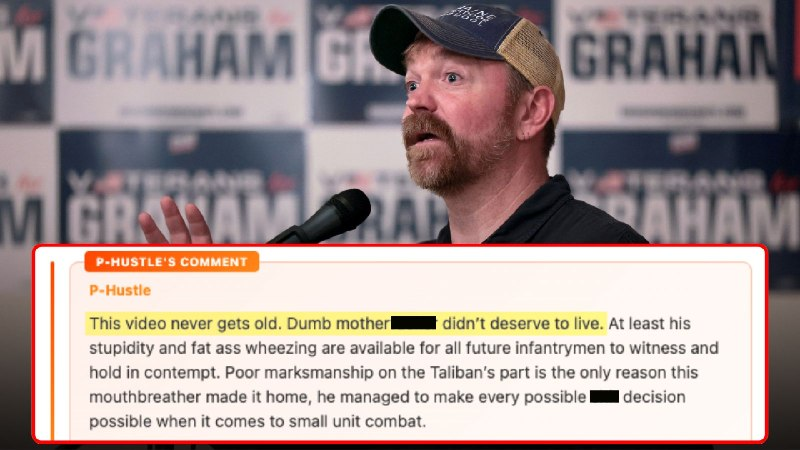

Fox News (Twitter/X)

“Dumb motherf****** didn’t deserve to live.”

Far-left Democrat Senate candidate Graham Platner mocking a U.S. soldier who was shot four times in Afghanistan in a resurfaced Reddit comment.

The post made fun of Purple Heart recipient Pfc. Ted Daniels after he took incoming fire during a 2012 clash with the Taliban.

Platner’s now deleted comment went on to say:

"At least his stupidity and fat ass wheezing are available for all future infantrymen to witness and hold in contempt. Poor marksmanship on the Taliban's part is the only reason this mouthbreather made it home, he managed to make every possible s*** decision possible when it comes to small unit combat."

## FoxNewsTwitter — post 341977

  

Fox News (Twitter/X)

NEW: Trump-backed Republicans rack up major primary victories across the country.

Nearly 30 candidates endorsed by President Trump secure wins in congressional and statewide races across Kentucky, Georgia, Pennsylvania, and Alabama, including high-profile Senate and governor contests.

Trump-backed Ed Gallrein defeated incumbent Kentucky GOP Rep. Thomas Massie in what turned out to be the most expensive House primary in U.S. history.

Also in Kentucky, Congressman Andy Barr won the GOP Senate primary and is seen as the heavy favorite to replace outgoing Senator Mitch McConnell.

Alabama Senator Tommy Tuberville had an easy win securing the GOP gubernatorial nomination in his state.

## pm_afshaa — post 91102

  <a href="telegram/content/pm_afshaa_91102_1779280178.webm" target="_blank">🎬 Download video</a>

🔴العربیه: آمریکا به پاکستان اطلاع داده که در موضوع هسته‌ای و تنگه هرمز هیچ امتیازی نخواهد داد.

💧 Rainbet.com the #1 Non-KYC Crypto Casino & Sportsbook @rainbetcom

😁 @Pm_Afshaa

## pm_afshaa — post 91101

  <a href="telegram/content/pm_afshaa_91101_1779280178.webm" target="_blank">🎬 Download video</a>

🔴سی‌بی‌اس به نقل از منابع دیپلماتیک:
اسلام‌آباد تلاش‌های خود را برای حل مناقشه دوچندان کرده است و معتقد است که شروع مجدد جنگ برای همه فاجعه خواهد بود.

💧 Rainbet.com the #1 Non-KYC Crypto Casino & Sportsbook @rainbetcom

😁 @Pm_Afshaa

## pm_afshaa — post 91100

  <a href="telegram/content/pm_afshaa_91100_1779280179.webm" target="_blank">🎬 Download video</a>

🔴نیویورک پست: جمهوری اسلامی تهدید کرده در صورت عملی شدن تهدید «ضربهٔ بزرگ» ترامپ، به کشورهایی خارج از خاورمیانه حمله خواهد کرد.

💧 Rainbet.com the #1 Non-KYC Crypto Casino & Sportsbook @rainbetcom

😁 @Pm_Afshaa

## pm_afshaa — post 91099

  <a href="telegram/content/pm_afshaa_91099_1779280180.webm" target="_blank">🎬 Download video</a>

🔴هاآرتص به نقل از منابع امنیتی:
از حرف‌های ترامپ که گفت تا حمله به ایران چند ساعت دیگه مونده، خیلی تعجب کردیم. حمله دوباره آمریکا به ایران تقریباً باعث میشه اسرائیل هم وارد جنگ بشه. منتظر بودیم حمله به ایران مستقیم و گسترده با اسرائیل هماهنگ بشه.

💧 Rainbet.com the #1 Non-KYC Crypto Casino & Sportsbook @rainbetcom

😁 @Pm_Afshaa

## pm_afshaa — post 91098

  <a href="telegram/content/pm_afshaa_91098_1779280180.webm" target="_blank">🎬 Download video</a>

🔴محسن نقوی، وزیر کشور پاکستان برای دیدار با مسئولان جمهوری اسلامی، برای بار دوم در این هفته عازم تهران شده.

💧 Rainbet.com the #1 Non-KYC Crypto Casino & Sportsbook @rainbetcom

😁 @Pm_Afshaa

## pm_afshaa — post 91097

🔴قوه قضائیه: رشید مظاهری، بازیکن سابق فوتبال، هنگام خروج غیرقانونی از کشور دستگیر شده.

این فرد قصد داشته با تغییر چهره و پول دادن به ماموران مرزبانی، از مرزهای غربی به صورت غیرقانونی از کشور فرار کنه، ولی موقع خروجش دستگیر شده

💧 Rainbet.com the #1 Non-KYC Crypto Casino & Sportsbook @rainbetcom

😁 @Pm_Afshaa

## pm_afshaa — post 91096

🔴وای نت: امارات هماهنگی‌های امنیتی و عملیاتی با اسرائیل را تشدید کرده

💧 Rainbet.com the #1 Non-KYC Crypto Casino & Sportsbook @rainbetcom

😁 @Pm_Afshaa

## pm_afshaa — post 91095

🔴کانال 14 اسرائیل:فرودگاه بن گوریون حتی در صورت از سرگیری جنگ با جمهوری اسلامی تروریست به دلیل کاهش توان موشکی ج.ا به فعالیت خود ادامه خواهد داد

💧 Rainbet.com the #1 Non-KYC Crypto Casino & Sportsbook @rainbetcom

😁 @Pm_Afshaa

## pm_afshaa — post 91094

  

🚨اشتراک استارز ⭐️ فیلترشکن ایران وی پی ان
تخفیف ها تا ساعت ۱۲ امشب هستن و هیچ وقت دیگر بر نمیگردن❌

تعرفه های باور نکردنی🔮

سرورا بدون ضریب هستن و ساب دارن😎🔋

1 gig= 195t🚀

3 gig= 570t 🚀

5 gig= 950t🚀

7 gig = 1300t 🚀

10 gig= 1800t 🚀

قبل خرید میتونید تست بگیرید 🛜
بهترین و ارزون ترین سرور ایران دست ماست

🚨تمامی سرور ها کاربر نامحدود هستن و تاریخ انقضا ندارن✅

جهت خرید به ایدی زیر پیام بدین 👇

@IRAN_VPNADMIN

کانال. و رضایت مشتری ها👇

https://t.me/IRAN_VPNON

## pm_afshaa — post 91093

🔴وای نت:در رویدادی بسیار غیر عادی و عجیب نتانیاهو به دلیل بحث امنیتی اضطراری در رأی‌گیری امروز برای انحلال پارلمان اسرائیل شرکت نخواهد کرد،
همچنین جلسه دادگاه نتانیاهو نیز امروز لغو شده

💧 Rainbet.com the #1 Non-KYC Crypto Casino & Sportsbook @rainbetcom

😁 @Pm_Afshaa

## pm_afshaa — post 91092

🔴وزارت خارجه آمریکا تا سقف 15 میلیون دلار پاداش برای اطلاعات در مورد شبکه مالی سپاه پاسداران تعیین کرد

💧 Rainbet.com the #1 Non-KYC Crypto Casino & Sportsbook @rainbetcom

😁 @Pm_Afshaa

## pm_afshaa — post 91091

🔴ترامپ و نتانیاهو دیشب تماس تلفنی "طولانی و دراماتیک" داشتن

💧 Rainbet.com the #1 Non-KYC Crypto Casino & Sportsbook @rainbetcom

😁 @Pm_Afshaa

## DEJradio — post 4773

⭕️ جمهوری اسلامی واردات مواد پتروشیمی از طریق کولبری و ملوانی را آزاد کرد

وزارت صمت، جمهوری اسلامی واردات مواد اولیه صنایع پتروشیمی و پلیمری از طریق رویه‌های کولبری و ملوانی را مجاز اعلام کرد.
خبرگزاری حکومتی تسنیم، نزدیک به نیروهای امنیتی، نوشت این تصمیم در پی کمبود مواد اولیه در برخی واحدهای تولیدی گرفته شده است.
در سال‌های اخیر کولبران بارها مورد هدف نیروهای مسلح جمهوری اسلامی قرار گرفته و کشته شده‌اند.

#تحریم #قاچاق
@DEJradio

## DEJradio — post 4772

⭕️ عروس و پسر معصومه ابتکار در جست‌وجوی یک زندگی «عادی» در آمریکا بودند

مریم طهماسبی، عروس معصومه ابتکار، در گفت‌وگو با آسوشیتدپرس از درون بازداشتگاه مهاجرتی در تگزاس، گفت خانواده‌اش تنها به‌دنبال «زندگی عادی» در آمریکا بوده‌اند.
او و همسرش عیسی هاشمی مدعی شدند که قصد داشتند تدریس را از سر بگیرند و تصور نمی‌کردند بازداشت شوند.
به گزارش آسوشیتدپرس، این خانواده پس از بازداشت در لس‌آنجلس به‌دلیل ارتباط خانوادگی با معصومه ابتکار، اکنون خواستار آزادی‌اند.
یک قاضی فدرال موقتا دولت آمریکا را از اخراج این خانواده منع کرده است.
وزارت امور خارجۀ ایالات متحده، کارزاری را برای اخراج وابستگان رژیم از آمریکا به راه اندخته است.
معصومه ابتکار، رئیس پیشین سازمان محیط زیست، از کسانی بود که با گروگانگیران اعضای سفارت آمریکا در تهران همکاری کرده بود.

#آقازاده‌ها #صادراتی‌ها #معصومه_ابتکار
@DEJradio

## DEJradio — post 4771

⭕️ اکسیوس: ترامپ به تهران تا آدینه یا ابتدای هفتۀ آینده فرصت داد

وبسایت آمریکایی اکسیوس، به نقل از دو مقام آمریکایی گزارش داد ترامپ تنها «دو تا سه روز، شاید تا آدینه یا شنبه و اوایل هفتۀ آینده» به تهران فرصت داد تا به پیشرفت دیپلماتیک برسد.
به گزارش این وبسایت آمریکایی، دونالد ترامپ پس از تعلیق حملۀ برنامه‌ریزی‌شده به جمهوری اسلامی، نشستی با تیم امنیت ملی خود دربارۀ گزینه‌های نظامی برگزار کرده است.
اکسیوس نوشت بررسی دوباره طرح‌های نظامی نشان می‌دهد ترامپ به‌طور جدی احتمال ازسرگیری جنگ را درنظر دارد.
مقام‌های آمریکایی همچنین گفته‌اند ترامپ پیش از تعلیق حمله، هنوز تصمیم پایانی را برای اقدام نظامی نگرفته بود، اما آمادۀ آن بود.

#ترامپ #توافق #مذاکرات
@DEJradio

## DEJradio — post 4770

⭕️ آمریکا یک نفتکش مرتبط با جمهوری اسلامی را در اقیانوس هند توقیف کرد

وال‌استریت ژورنال گزارش داد آمریکا یک نفتکش دیگر مرتبط با جمهوری اسلامی را در اقیانوس هند توقیف کرده است.
این نفتکش با نام اسکای ویو، پیش‌تر از سوی واشینگتن تحریم شده بود. اسکای ویو در انتقال نفت از مبدأ ایران نقش داشت.
براساس داده‌های رهگیری دریایی، این کشتی احتمالا بیش از یک میلیون بشکه نفت خام حمل می‌کرد.
سنتکام، ستاد فرماندهی مرکزی ارتش آمریکا اعلام کرد مانع حرکت ۸۹ کشتی به مبدأ یا از مقصد بنادر ایران شده است.
به گزارش سنتکام، همۀ این شناورهای مرتبط با جمهوری اسلامی در جریان محاصرۀ دریایی ناگزیر به تغییر مسیر شدند.

#سنتکام #محاصره_دریایی
@DEJradio

## DEJradio — post 4769

⭕️ کره جنوبی یک نفتکش را با هماهنگی جمهوری اسلامی از تنگۀ هرمز عبور می‌دهد

چو هیون، وزیر امور خارجۀ کره جنوبی، اعلام کرد یک نفتکش حامل نفت خام این کشور با هماهنگی مقام‌های جمهوری اسلامی در حال عبور از تنگۀ هرمز است.
این مقام کره‌ای جزئیات بیشتری دربارۀ این نفتکش و شیوۀ هماهنگی ارائه نکرد.
این اظهارات چند هفته پس از حملۀ پهپادی به یک کشتی باری کره جنوبی مطرح می‌شود.
جمهوری اسلامی در حملۀ پیشین به کشتی کره‌ای، متهم شناخته شده بود.
کرۀ جنوبی پس از آن حمله اعلام کرده بود مشارکت در عملیات بازگشایی تنگۀ هرمز به رهبری آمریکا را بررسی می‌کند.

#کره_جنوبی #خلیج_فارس #تنگه_هرمز
@DEJradio

## DEJradio — post 4768

⭕️ جمهوری اسلامی نفت را روی نفتکش‌های فرسوده ذخیره می‌کند

فایننشال تایمز گزارش داد جمهوری اسلامی به‌دلیل محدود شدن صادرات نفت در پی محاصرۀ آمریکا، ناچار شده نفت خود را روی نفتکش‌های فرسوده در خلیج فارس ذخیره کند.
براساس داده‌های سازمان اتحاد علیه ایران هسته‌ای، شمار نفتکش‌های حامل نفت و محصولات پتروشیمی ایران در خلیج فارس به ۳۹ فروند رسید.
بنا بر این گزارش، بخش قابل توجهی از این کشتی‌ها در نزدیکی پایانۀ نفتی جزیرۀ خارگ مستقراند.
فایننشال تایمز همچنین از شناسایی ۱۳ نفتکش دیگر در نزدیکی بندر چابهار خبر داد. این شناورها در امتداد خط محاصرۀ دریایی آمریکا قرار دارند.

#محاصره_دریایی #نفت
@DEJradio

## DEJradio — post 4767

⭕️ عراقچی آمریکا و اسرائیل را به «غافلگیری‌های بیشتر» تهدید کرد

عباس عراقچی، وزیر امور خارجۀ جمهوری اسلامی، با ادعا به «تجربیات» به‌دست‌آمده از جنگ، هشدار داد در صورت ازسرگیری درگیری‌ها، حکومت با «غافلگیری‌های بیشتری» وارد میدان می‌شود.

او همچنین ادعا کرد جمهوری اسلامی نخستین طرفی بوده که موفق به سرنگونی جنگندۀ اف-۳۵ شد.
عراقچی مدعی شد آمریکا در جریان درگیری‌های اخیر ده‌ها هواپیمای نظامی خود را از دست داده است.

#عراقچی #جنگ
@DEJradio

## DEJradio — post 4766

⭕️ نیویورک‌پست: فیفا پرچم شیر و خورشید را در جام جهانی ۲۰۲۶ ممنوع می‌کند

نیویورک‌پست گزارش داد فدراسیون جهانی فوتبال تصمیم گرفته ورود پرچم‌ها و نمادهای شیر و خورشید، به ورزشگاه‌های برگزارکنندۀ جام جهانی ۲۰۲۶ ممنوع شود.
براساس این گزارش، فیفا این نمادها را مغایر قوانین مربوط به اقلام سیاسی و تبعیض‌آمیز دانسته است.
نیویورک‌پست نوشت برخی فعالان ایرانی-آمریکایی هشدار داده‌اند اجرای این ممنوعیت می‌تواند با اعتراض گستردۀ هواداران ایرانی همراه شود.
فدراسیون فوتبال جمهوری اسلامی به‌تازگی با هدف ایجاد محدودیت علیه ایرانیان مخالف رژیم، به فیفا فشار آورده و شروطی را برای حضور در جام جهانی تعیین کرده است.

#شیروخورشید #فوتبال #جام_جهانی
@DEJradio

## DEJradio — post 4765

⭕️ حملۀ مستقیم به نیروگاه برکت امارات می‌تواند فاجعۀ هسته‌ای ایجاد کند

رافائل گروسی، مدیرکل آژانس جهانی انرژی اتمی، دربارۀ پیامدهای حمله به نیروگاه هسته‌ای برکت در امارات هشدار داد.
گروسی در نشست شورای امنیت سازمان ملل گفت هرگونه اصابت مستقیم به این نیروگاه، ممکن است به نشت شدید مواد رادیواکتیو منجر شود.
به گفتۀ گروسی، آسیب به خطوط برق نیروگاه، خطر ذوب شدن قلب راکتورها و تخلیۀ گستردۀ مناطق پیرامونی را افزایش می‌دهد.
مدیرکل آژانس جهانی هسته‌ای تاکید کرد حمله نظامی به تاسیسات هسته‌ای صلح‌آمیز به هیچ عنوان قابل قبول نیست.
محوطه‌ای نزدیک به تأسیسات نیروگاه هسته‌ای برکت امارات، در روزهای پیشین هدف حملۀ پهپادی قرار گرفت.

#پهپاد #امارات
@DEJradio

## DEJradio — post 4764

⭕️ سنتکام: محاصرۀ کامل دریایی علیه جمهوری اسلامی ادامه دارد

سنتکام با انتشار ویدیویی اعلام کرد نیروهای آمریکا همچنان عملیات دریایی و هوایی خود را در منطقۀ خاورمیانه ادامه می‌دهند.
ستاد فرماندهی مرکزی ارتش آمریکا اعلام کرد نیروهای این کشور محاصره‌ای کامل را علیه جمهوری اسلامی را اجرا می‌کنند و مانع انجام تجارت نفتی از بنادر ایران می‌شوند.
براساس این بیانیه، تاکنون ۸۹ کشتی تجاری در سایۀ این محاصره ناگزیر به تغییر مسیر شده‌اند.

#سنتکام #تنگه_هرمز
@DEJradio

## DEJradio — post 4763

🚨 پوتین برای دیدار با شی جین‌پینگ وارد پکن شد

ولادیمیر پوتین، رئیس جمهوری روسیه، برای سفری رسمی و دو روزه وارد پکن شد.
پوتین با شی جین‌پینگ، دربارۀ همکاری‌های اقتصادی، انرژی و مسائل منطقه‌ای و بین‌المللی گفت‌وگو می‌کند.او در فرودگاه پکن مورد استقبال رسمی مقام‌های چینی و گارد تشریفات «ارتش آزادی‌بخش خلق» قرار گرفت.
این سفر همزمان با بیست‌وپنجمین سالگرد پیمان دوستی چین و روسیه انجام می‌شود.

#پوتین #چین #روسیه
@DEJradio

## IranIntlTV — post 338071

  

سنتکام، فرماندهی مرکزی آمریکا، اعلام کرد از زمان آغاز محاصره دریایی جنوب ایران، تا روز چهارشنبه نیروهای این کشور ۹۰ کشتی را تغییر مسیر داده‌اند. سنتکام نوشت: «چهار کشتی نیز برای تضمین اجرای محاصره دریایی از کار انداخته‌ شده‌اند.»

سنتکام همچنین با انتشار همچنین تصویری از یک بالگرد تهاجمی «ای‌اچ-۱ زد وایپر» متعلق به نیروی تفنگداران دریایی آمریکا منتشر کرد و نوشت که در جریان عملیات این محاصره دریایی، این بالگرد در نزدیکی یک کشتی تجاری در حال عبور از آب‌های منطقه‌ای گشت‌زنی می‌کند.
https://iranintl.com/202605209458

## IranIntlTV — post 338070

  <a href="telegram/content/IranIntlTV_338070_1779280182.mp4" target="_blank">🎬 Download video</a>

اویگدور لیبرمن، وزیر دفاع سابق و نماینده فعلی کنست اسرائیل، به بابک اسحاقی، خبرنگار ایران‌اینترنشنال، گفت تغییر حکومت در ایران را برای پایان تنش‌ها در منطقه ضروری می‌داند.
@iranintltv

## IranIntlTV — post 338069

  <a href="telegram/content/IranIntlTV_338069_1779280184.mp4" target="_blank">🎬 Download video</a>

پنتاگون اعلام کرده مشارکت خود در هیات مشترک دفاعی با کانادا را به حالت تعلیق درآورده است. تصمیمی که به گفته مقام‌های آمریکایی در واکنش به کوتاهی اتاوا در عمل به تعهدات مالی و دفاعی اتخاذ شده است.
مهسا مرتضوی، خبرنگار ایران‌اینترنشنال، گزارش می‌دهد
@iranintltv

## IranIntlTV — post 338068

  <a href="telegram/content/IranIntlTV_338068_1779280186.mp4" target="_blank">🎬 Download video</a>

وزارت خارجه آلمان به ایران‌اینترنشنال گفت بررسی بخشی از پرونده‌های ویزای ایرانیان، به‌ویژه متقاضیان کار و دانشجویان را از سفارت آلمان در تهران به سفارت این کشور در ایروان منتقل کرده است.

جزییات بیشتر با احمد صمدی، خبرنگار ایران‌اینترنشنال
@iranintltv

## IranIntlTV — post 338067

  <a href="telegram/content/IranIntlTV_338067_1779280188.mp4" target="_blank">🎬 Download video</a>

مروری بر روزنامه‌های ایران، چهارشنبه ۳۰ اردیبهشت، با مجتبی هاشمی، روزنامه‌نگار
@iranintltv

## IranIntlTV — post 338066

  <a href="telegram/content/IranIntlTV_338066_1779280190.mp4" target="_blank">🎬 Download video</a>

پیام‌های رسیده از سوی شهروندان به ایران‌اینترنشنال، به‌طور گسترده از افزایش حس ناامیدی، بلاتکلیفی و سرخوردگی حکایت دارد.
جزییات بیشتر با سبا حیدرخانی، عضو تحریریه ایران‌اینترنشنال
@Iranintltv

## IranIntlTV — post 338065

  <a href="telegram/content/IranIntlTV_338065_1779280192.mp4" target="_blank">🎬 Download video</a>

شهروندان در پیام‌هایی به ایران‌اینترنشنال از احساس بلاتکلیفی، سرخوردگی و افسردگی در زندگی روزمره خود می‌گویند. آن‌ها وضعیت اقتصادی رو به وخامت را عامل اصلی افزایش ناامیدی و نگرانی درباره آینده عنوان می‌کنند.
@iranintltv

## IranIntlTV — post 338064

  <a href="telegram/content/IranIntlTV_338064_1779280194.mp4" target="_blank">🎬 Download video</a>

پیام‌های ارسالی شهروندان به ایران‌اینترنشنال نشان می‌دهد تلاش جوانان برای مهاجرت، در شرایط نه جنگ و نه صلح، تشدید شده است.

گفت‌وگو با فرزاد فتاحی، عضو تحریریه ایران‌اینترنشنال
@iranintltv

## IranIntlTV — post 338063

کلیات لایحه انحلال پارلمان اسرائیل تصویب شد و در صورت تصویب نهایی، انتخابات زودهنگام برگزار خواهد شد.
هم‌زمان با غیبت بنیامین نتانیاهو و یسرائیل کاتز در پارلمان، کانال ۱۲ اسرائیل از گفت‌وگوی تلفنی دونالد ترامپ و نتانیاهو خبر داد و این تماس را «طولانی و دراماتیک» توصیف کرد.

بابک اسحاقی، خبرنگار ایران‌اینترنشنال، گزارش می‌دهد
@iranintltv

## IranIntlTV — post 338062

  

رسانه رهبر جمهوری اسلامی پیامی منتسب به مجتبی خامنه‌ای به مناسبت دومین سالگرد ابراهیم رئیسی منتشر کرد.

در این پیام آمده است «خصوصیات رئیسی موجب دلگرم شدن دوستان ایران از جمله مجاهدان جبهه قدرتمند مقاومت و بسیاری از دلسوزان نظام می‌شد.»

ویژگی‌های ابراهیم رئیسی در این پیام «مسئولیت‌پذیری، جوانگرایی، توجه به عدالت، دیپلماسی فعال و نافع و به‌ویژه مردمی بودن» عنوان شده است.
https://iranintl.com/202605205759

## IranIntlTV — post 338061

  <a href="telegram/content/IranIntlTV_338061_1779280196.mp4" target="_blank">🎬 Download video</a>

سرخط خبرهای چهارشنبه ۳۰ اردیبهشت
@iranintltv

## IranIntlTV — post 338060

  

ایمان شمسایی، رییس مرکز ارتباطات، رسانه و امور فرهنگی مجلس، خبر استعفای محمدباقر قالیباف از ریاست هیات مذاکره‌کننده جمهوری اسلامی را «کذب محض و دروغی آشکار» خواند و منتشرکنندگان آن را به «خیانت» متهم کرد.

او در پیامی نوشت ادعای این جریان «امتداد همان خط تخریبی است که تا دیروز فرماندهان را نشانه می‌رفت و امروز شهدای والامقام را».

شمسایی افزود این جریان سابقه «هجمه» به فرماندهان نظامی، دفتر رهبر جمهوری اسلامی، مراجع تقلید و شورای عالی امنیت ملی را در کارنامه دارد.

در ادامه پیام او آمده است: «شایسته است این آقایان برای توجیه خیانت خود در شرایط جنگی پشت ژست‌های انقلابی پنهان نشوند و بیش از این به توجیه رفتارهای آسیب‌زای خود در شرایط حساس کنونی نپردازند.»

شمسایی تاکید کرد قالیباف همچنان ریاست هیات مذاکره‌کننده حکومت را بر عهده دارد و به‌تازگی نیز به پیشنهاد مسعود پزشکیان و تایید مجتبی خامنه‌ای، به‌عنوان نماینده ویژه جمهوری اسلامی در امور چین منصوب شده است.

در هفته‌های اخیر، گزارش‌های متعددی درباره اختلاف در ساختار حاکمیت جمهوری اسلامی منتشر شده است.
https://iranintl.com/202605204370

## IranIntlTV — post 338059

  <a href="telegram/content/IranIntlTV_338059_1779280199.mp4" target="_blank">🎬 Download video</a>

تیم فوتبال آرسنال عنوان قهرمانی لیگ برتر انگلستان را به دست آورد. در حاشیه این موفقیت، در شبکه‌های اجتماعی و میان هواداران، توجه ویژه‌ای به یاد جاویدنامان انقلاب ملی ایران دیده شد؛ هوادارانی که نام و تصویرشان در میان طرفداران این تیم زنده نگه داشته شده است. از جمله عارف جعفرزاده، ۳۲ ساله اهل رشت، که تصویر او توسط یک هنرمند انگلیسی بر دیوار ستاره‌های آرسنال در شمال لندن نقش بسته است.
جزییات بیشتر با آیدین مقیمی، خبرنگار ایران‌اینترنشنال
@iranintltv

## IranIntlTV — post 338058

  <a href="telegram/content/IranIntlTV_338058_1779280201.mp4" target="_blank">🎬 Download video</a>

مسعود پزشکیان، رییس دولت جمهوری اسلامی، با هشدار درباره تشدید بحران در صورت عدم مدیریت مصرف آب، برق، گاز و بنزین، از مردم خواست صرفه‌جویی را جدی بگیرند.
گفت‌وگو با علی شیرازی، عضو تحریریه ایران‌اینترنشنال
@iranintltv

## IranIntlTV — post 338057

دونالد ترامپ، رییس‌جمهوری آمریکا، درباره تنش‌ها با تهران گفت احتمال دارد ایالات متحده برای وارد کردن «ضربه‌ای بزرگ» بار دیگر به جمهوری اسلامی حمله کند. هم‌زمان، جی‌دی ونس سه‌شنبه در نشست خبری کاخ سفید تاکید کرد تهران باید وارد مذاکره شود و از دستیابی به سلاح هسته‌ای صرف‌نظر کند. او هشدار داد اگر این فرصت از دست برود، گزینه جنگ همچنان روی میز خواهد بود.

گفت‌وگو با علی‌حسین قاضی‌زاده، عضو تحریریه ایران‌اینترنشنال
@iranintltv

## Shin_Persian — post 6112

↩️ Quoted tweet: العربية عاجل ✓ @AlArabiya_Brk Wed, 20 May 2026 11:53:13 UTC مصادر العربية: أميركا أبلغت باكستان بأنها لن تقدم تنازلات في المطالب النووية ومضيق هرمز #العربية_عاجل ↩️ Quoted tweet — see the post below for the reply. English Al Arabiya sources:…

## Shin_Persian — post 6111

↩️ Quoted tweet:
العربية عاجل ✓ @AlArabiya_Brk
Wed, 20 May 2026 11:53:13 UTC

مصادر العربية: أميركا أبلغت باكستان بأنها لن تقدم تنازلات في المطالب النووية ومضيق هرمز #العربية_عاجل

↩️ Quoted tweet — see the post below for the reply.

English

Al Arabiya sources: The United States has informed Pakistan that it will not make concessions regarding nuclear demands and the Strait of Hormuz. #AlArabiya_Breaking

𝕏 · @shin_persian

## Shin_Persian — post 6109

  <a href="telegram/content/Shin_Persian_6109_1779280202.mp4" target="_blank">🎬 Download video</a>

ارتش دفاعی اسرائیل | IDF Farsi ✓ @IDFFarsi Wed, 20 May 2026 12:09:36 UTC سخنگوی ارتش اسرائیل: در فاصله چند متری از یک مسجد: ارتش اسرائیل یک سایت تولید تسلیحات متعلق به سازمان تروریستی حزب‌الله را که در ساختمانی با کاربری درمانگاه احداث شده بود، هدف قرار…

## Shin_Persian — post 6108

ارتش دفاعی اسرائیل | IDF Farsi ✓ @IDFFarsi
Wed, 20 May 2026 12:09:36 UTC

سخنگوی ارتش اسرائیل:

در فاصله چند متری از یک مسجد: ارتش اسرائیل یک سایت تولید تسلیحات متعلق به سازمان تروریستی حزب‌الله را که در ساختمانی با کاربری درمانگاه احداث شده بود، هدف قرار داد

نیروهای ارتش اسرائیل پریروز (دوشنبه)، یک سایت تولید تسلیحات متعلق به سازمان تروریستی حزب‌الله را در منطقه صور در جنوب لبنان هدف قرار دادند.

این سایت در ساختمانی که به‌عنوان یک درمانگاه غیرنظامی مورد استفاده قرار می‌گرفت و در فاصله‌ای بسیار نزدیک از یک مسجد قرار داشت، احداث شده بود. پس از حمله، انفجارهای ثانویه در این محل شناسایی شد که نشان‌دهنده وجود تسلیحات در داخل ساختمان است.

سازمان تروریستی حزب‌الله همچنان به فعالیت در مجاورت و از درون زیرساخت‌های غیرنظامی، از جمله اماکن مذهبی و مراکز درمانی ادامه می‌دهد و از آن‌ها به‌صورت سوءاستفاده‌آمیز برای پیشبرد طرح‌های تروریستی علیه شهروندان کشور اسرائیل و نیروهای ارتش اسرائیل بهره می‌برد.

English

IDF (Israel Defense Forces) Spokesperson:

A few meters from a mosque: The IDF targeted a weapons production site belonging to the Hezbollah terrorist organization, which was established in a building used as a clinic.

The day before yesterday (Monday), IDF forces targeted a weapons production site belonging to the Hezbollah terrorist organization in the Tyre region of southern Lebanon.

This site was established in a building used as a civilian clinic, located in very close proximity to a mosque. Following the strike, secondary explosions were identified at the scene, indicating the presence of weapons inside the building.

The Hezbollah terrorist organization continues to operate adjacent to and from within civilian infrastructure, including religious sites and medical centers, exploitatively utilizing them to advance terrorist plots against citizens of the State of Israel and IDF forces.

𝕏 · @shin_persian

## Shin_Persian — post 6107

  

U.S. Central Command ✓ @CENTCOM Wed, 20 May 2026 11:52:29 UTC A U.S. Marine Corps AH-1Z Viper attack helicopter patrols near a commercial vessel transiting regional waters as American forces enforce the maritime blockade against Iran. As of May 20, U.S.…

## Shin_Persian — post 6106

U.S. Central Command ✓ @CENTCOM
Wed, 20 May 2026 11:52:29 UTC

A U.S. Marine Corps AH-1Z Viper attack helicopter patrols near a commercial vessel transiting regional waters as American forces enforce the maritime blockade against Iran. As of May 20, U.S. forces have redirected 90 ships and disabled 4 to ensure compliance.

فارسی

یک بالگرد تهاجمی AH-1Z وایپر متعلق به سپاه تفنگداران دریایی ایالات متحده (U.S. Marine Corps) در حال گشت‌زنی در نزدیکی یک کشتی تجاری است که از آب‌های منطقه عبور می‌کند، این در حالی است که نیروهای آمریکایی محاصره دریایی علیه ایران را اجرا می‌کنند. تا تاریخ ۲۰ مه، نیروهای آمریکایی برای اطمینان از رعایت قوانین، ۹۰ کشتی را تغییر مسیر داده و ۴ کشتی را از کار انداخته‌اند.

𝕏 · @shin_persian

## Shin_Persian — post 6105

📦 mhrv-rs v1.9.32 released

• Full Tunnel batch protocol now supports zstd compression
• Compression negotiation is backward compatible
• To use this in Full mode, update the app, redeploy CodeFull.gs as a new Apps Script version, and redeploy tunnel-node / the Docker image on your VPS or Cloud Run.
• Compressed batch logging is kept safer
• Thanks to @yyoyoian-pixel for the implementation and empirical testing in PR #1314.

Files (Android APKs, Windows, macOS, Linux, OpenWRT) on the files channel:

👉 v1.9.32 — all files with SHA-256

Channel:
https://t.me/mhrv_rs
or: https://t.me/+R1OyoHX2boA1ZDgx

#v1932

## ManotoTV — post 105683

  <a href="telegram/content/ManotoTV_105683_1779280205.mp4" target="_blank">🎬 Download video</a>

امارات متحده عربی، چند روز پس از حمله پهپادی به نیروگاه هسته‌ای براکه در ابوظبی، از عراق خواست فوراً مانع هرگونه «اقدام خصمانه» از خاک خود شود.
وزارت خارجه امارات در بیانیه‌ای تأکید کرد دولت عراق باید بدون قید و شرط از انجام حملات از خاک این کشور جلوگیری کرده و تهدیدها را سریع و مسئولانه مهار کند.
ابوظبی همچنین از عراق خواست برای حفظ امنیت و ثبات منطقه نقش فعال‌تری ایفا کند و جایگاه خود را به‌عنوان «شریکی مسئول» در منطقه تقویت کند.

## ManotoTV — post 105682

  <a href="telegram/content/ManotoTV_105682_1779280206.mp4" target="_blank">🎬 Download video</a>

یکی از مخاطبان منوتو تصویری از یک فروشگاه در ایران فرستاده که در آن روی بطری روغن خوراکی دزدگیر نصب شده است.

این تصویر در حالی ارسال شده که افزایش قیمت کالاهای اساسی، تورم و کاهش قدرت خرید، فشار معیشتی بر خانوارها را بیشتر کرده است.

مخاطبی که این تصویر را فرستاده، نوشته است نصب دزدگیر روی کالایی مانند روغن، نشان می‌دهد گرانی و بحران اقتصادی تا سفره روزمره مردم پیش رفته است.

## ManotoTV — post 105681

  <a href="telegram/content/ManotoTV_105681_1779280207.mp4" target="_blank">🎬 Download video</a>

هم‌زمان با قهرمانی آرسنال، کاربران شبکه‌های اجتماعی از عارف جعفرزاده، هوادار این تیم و از جاویدنام‌های رشت، یاد کردند.

عارف جعفرزاده، اهل رشت، در جریان اعتراضات دی‌ماه ۱۴۰۴ جان باخت. بنیاد عبدالرحمن برومند سن او را ۳۴ سال، محل کشته‌شدن را رشت در استان گیلان و تاریخ جان‌باختن او را ۲۰ دی ۱۴۰۴ ثبت کرده و نحوه کشته‌شدن را «اعدام خودسرانه» عنوان کرده است.

علاقه عارف به آرسنال پیش‌تر نیز مورد توجه کاربران قرار گرفته بود. حالا با قهرمانی این تیم، نام او بار دیگر در شبکه‌های اجتماعی بازتاب یافته و کاربران با انتشار تصویری از مزارش نوشته‌اند: «جا دارد قهرمانی آرسنال را به جاویدنام عارف جعفرزاده تبریک بگوییم.»

## ManotoTV — post 105680

  <a href="telegram/content/ManotoTV_105680_1779280207.mp4" target="_blank">🎬 Download video</a>

رویترز گزارش داد سه نفتکش غول‌پیکر چینی و کره‌جنوبی حامل حدود ۶ میلیون بشکه نفت خاورمیانه، پس از بیش از دو ماه توقف در خلیج فارس، از ۷تنگه هرمز عبور کرده و راهی بازارهای آسیایی شده‌اند.
بر اساس این گزارش، دو نفتکش چینی حامل نفت عراق و قطر و یک نفتکش کره‌جنوبی حامل نفت کویت، از مسیر تعیین‌شده از سوی جمهوری‌اسلامی عبور کرده‌اند.

## ManotoTV — post 105679

  <a href="telegram/content/ManotoTV_105679_1779280208.mp4" target="_blank">🎬 Download video</a>

سخنگوی وزارت خارجه جمهوری‌اسلامی اعلام کرده با توجه به ریاست دوره‌ای چین بر شورای امنیت سازمان ملل و برنامه پکن برای برگزاری «نشست ویژه وزیران خارجه درباره صلح و امنیت بین‌المللی»، از عباس عراقچی، وزیر خارجه نظام اسلامی، برای حضور در این نشست در نیویورک دعوت شده است.

## ManotoTV — post 105678

  <a href="telegram/content/ManotoTV_105678_1779280209.mp4" target="_blank">🎬 Download video</a>

کناره گیری محمدباقر قالیباف از ریاست هیئت‌ مذاکره کننده جمهوری‌اسلامی در مذاکرات با آمریکا،‌ از سوی رییس مرکز ارتباطات، رسانه و امور فرهنگی مجلس شورای اسلامی تکذیب شده است.

## ManotoTV — post 105675

  <a href="telegram/content/ManotoTV_105675_1779280209.mp4" target="_blank">🎬 Download video</a>

خبرگزاری حکومتی تسنیم گزارش داد که محسن نقوی، وزیر کشور پاکستان، برای دیدار و گفت‌وگو با مقام‌های جمهوری‌اسلامی راهی تهران شده است. این دومین سفر نقوی به تهران در طول یک هفته گذشته و در راستای تلاش‌های اسلام‌آباد برای میانجی‌گری میان جمهوری‌اسلامی و آمریکا است.

## ManotoTV — post 105674

  <a href="telegram/content/ManotoTV_105674_1779280210.mp4" target="_blank">🎬 Download video</a>

خبرگزاری رسمی اردن گزارش داد که نیروهای مسلح این کشور صبح امروز یک پهپاد ناشناس را که وارد حریم هوایی اردن شده بود، سرنگون کردند.
ارتش اردن این پهپاد را در استان جرش، در منطقه بلیلا در شمال کشور، هدف قرار داد. این حادثه تلفات جانی نداشت، اما خسارت‌های جزئی مادی بر جای گذاشت.

## ManotoTV — post 105673

  <a href="telegram/content/ManotoTV_105673_1779280211.mp4" target="_blank">🎬 Download video</a>

دیروز، هم‌زمان با زادروز جاویدنام پیام رخ‌بخش، خانواده و نزدیکان او بر سر مزارش در شیراز حاضر شدند و یادش را گرامی داشتند.

پیام رخ‌بخش، جوان ۳۲ ساله اهل شیراز، در ۱۹ دی‌ماه ۱۴۰۴ در جریان اعتراضات مردمی با شلیک مستقیم نیروهای حکومتی جان باخت.

حضور بر سر مزار جان‌باختگان، برای خانواده‌ها فقط سوگواری نیست؛ ادامه همان دادخواهی‌ای است که جمهوری اسلامی از آن هراس دارد.

#خانه_دوست_کجاست

## ManotoTV — post 105672

  <a href="telegram/content/ManotoTV_105672_1779280212.mp4" target="_blank">🎬 Download video</a>

بر اساس یک نظرسنجی جدید، اکثریت بزرگی از جمهوری‌خواهان همچنان عملکرد دونالد ترامپ در مدیریت جنگ ایران را تأیید می‌کنند.
طبق نظرسنجی انجام‌شده توسط خبرگزاری آسوشیتدپرس و مرکز پژوهش‌های امور عمومی نورک، در حالی که تنها یک‌سوم بزرگسالان آمریکایی از رویکرد رئیس‌جمهور حمایت می‌کنند، حدود دو‌سوم جمهوری‌خواهان با نحوه عملکرد او موافق هستند.
با این حال، بر اساس نظرسنجی ماه گذشته، جمهوری‌خواهان جوان‌تر بیشتر احتمال دارد که از عملکرد ترامپ در این موضوع ناراضی باشند.
علاوه بر این، تنها ۶ نفر از هر ۱۰ جمهوری‌خواه (در مقایسه با ۸ نفر از هر ۱۰ نفر در ماه فوریه) از نحوه مدیریت اقتصاد توسط رئیس‌جمهور حمایت می‌کنند؛ اقتصادی که تحت تأثیر جنگ قرار گرفته است.

## FarsiVOA — post 218215

🔺کپلر: ایران تا دو ماه دیگر نفتی برای تحویل به چین نخواهد داشت

▪️شرکت اطلاعات کالا، کپلر، می‌گوید ذخایر نفت شناور ایران در آب‌های آسیایی در حال تخلیه شدن است و اگر محاصره دریایی آمریکا علیه جمهوری اسلامی ادامه یابد، تا دو ماه دیگر نفتی برای تحویل به چین نخواهد داشت.

▪️بر اساس این گزارش ذخایر نفت شناور ایران در آب‌های آسیایی از زمان آغاز محاصره دریایی ۳۳ میلیون بشکه افت کرده و به ۸۹ میلیون بشکه رسیده است.

▪️کارشناس ارشد کپلر می‌گوید از زمان آغاز محاصره دریایی، هیچ نفتی از ایران نتوانسته از خط محاصره عبور کند و بارگیری روزانه نفت ایران نیز با سقوطی نزدیکی به ۱.۵ میلیون بشکه‌ای به ۶۴۰ هزار بشکه رسیده است.

⬇️ بیشتر بخوانید:
https://ir.voanews.com/a/iran-will-not-have-oil-to-deliver-to-china-in-two-months/8151979.html

## FarsiVOA — post 218214

🔺ناتو: کاهش نیروهای آمریکا در اروپا «تدریجی و ساختارمند» خواهد بود

▪️مارک روته، دبیرکل ناتو، می‌گوید هرگونه تغییر در آرایش نیروهای آمریکا در اروپا «به‌صورت تدریجی و ساختارمند» انجام خواهد شد که به گفته او، بر برنامه‌های دفاعی ناتو اثر منفی نخواهد گذاشت.

▪️این اظهارات پس از گزارش‌هایی مطرح شد که نشان می‌دهد دولت دونالد ترامپ قصد دارد بخشی از نیروهای در دسترس آمریکا برای کمک به ناتو در شرایط بحران را کاهش دهد.

▪️بر این اساس آمریکا قصد دارد شمار نیروهایی را که در یک بحران بزرگ در اختیار مدل نیرویی ناتو قرار می‌دهد، کاهش دهد.

▪️هم‌زمان، فایننشال تایمز گزارش داده وزارت جنگ آمریکا شمار تیپ‌های رزمی آمریکا در اروپا را از چهار به سه کاهش می‌دهد.

⬇️ بیشتر بخوانید:
https://ir.voanews.com/a/8151976.html

## FarsiVOA — post 218213

  

امارات متحده عربی منشأ حملات پهپادی اخیر به نزدیکی نیروگاه اتمی این کشور را عراق عنوان کرد.

امارات روز سه‌شنبه اعلام کرد طی ۴۸ ساعت گذشته شش پهپاد از خاک عراق به این کشور شلیک شده که یکی از آنها منجر به آتش‌سوزی در نزدیکی نیروگاه اتمی براکه در روز یکشنبه شده است.

وزارت دفاع امارات گفت پنج پهپاد رهگیری شدند، اما یکی از آنها به نزدیکی نیروگاه اتمی برخورد کرد. در مجموع هدف نیمی از پهپادهای شلیک شده از عراق، نیروگاه براکه بوده است.
@FarsiVOA

## FarsiVOA — post 218212

  

نیروهای مسلح اردن اعلام کردند صبح چهارشنبه یک پهپاد ناشناس را که وارد حریم هوایی این کشور شده بود، در استان جرش، در شمال اردن، ساقط کرده‌اند.

خبرگزاری رسمی اردن، بترا، به نقل از نیروهای مسلح این کشور گزارش داد که این پهپاد در منطقه بلیلا رهگیری و ساقط شد. بنا بر این گزارش، حادثه تلفات انسانی نداشته و خسارت‌ها به آسیب‌های مادی جزئی محدود بوده است. مقام‌های اردنی درباره مبدأ این پهپاد توضیحی نداده‌اند.

این حادثه در حالی رخ داده که طی روزهای گذشته چند کشور منطقه از رهگیری یا اصابت پهپادهایی خبر داده‌اند که مبدأ یا مسیر آنها به عراق نسبت داده شده است.

امارات متحده عربی روز سه‌شنبه اعلام کرد بررسی‌های فنی و ردیابی‌ها نشان داده پهپادهایی که تأسیسات نیروگاه هسته‌ای براکه را هدف قرار داده بودند، از خاک عراق برخاسته‌اند.

عربستان سعودی هم روز یکشنبه اعلام کرد پدافند هوایی این کشور سه پهپاد را پس از ورود از حریم هوایی عراق رهگیری و منهدم کرده است.

عراق در سال‌های اخیر به یکی از پایگاه‌های اصلی گروه‌های مسلح همسو با جمهوری اسلامی تبدیل شده است.
@FarsiVOA

## FarsiVOA — post 218211

  

وزارت امور خارجه کره جنوبی اعلام کرد یک نفتکش تحت مدیریت یک شرکت کره‌ای، پس از هماهنگی با مقام‌های جمهوری اسلامی، از تنگه هرمز عبور کرده است.

به گفته وزیر خارجه کره جنوبی، این کشتی حامل دو میلیون بشکه نفت خام بود و پس از پایان مشورت‌ها با تهران، مسیر خود را با احتیاط از آبراه هرمز آغاز کرد. مقام‌های سئول گفته‌اند این نفتکش در مسیر تعیین‌شده از سوی ایران حرکت کرده و برای عبور، هزینه‌ای به جمهوری اسلامی پرداخت نشده است.

هم‌زمان، رویترز بر اساس داده‌های کشتیرانی گزارش داد سه ابرنفتکش که بیش از دو ماه در خلیج فارس متوقف مانده بودند، در مجموع با شش میلیون بشکه نفت خام خاورمیانه در حال خروج از تنگه هرمز هستند.

این گزارش شامل نفتکش کره‌ای یونیورسال وینر با دو میلیون بشکه نفت کویت و دو نفتکش مرتبط با چین است که هر کدام حدود دو میلیون بشکه نفت عراق، قطر یا ترکیبی از آن را حمل می‌کنند.

تنگه هرمز همچنان یکی از حساس‌ترین مسیرهای انرژی جهان است؛ آبراهی که در شرایط عادی حدود یک‌پنجم عرضه نفت و انرژی جهان از آن عبور می‌کند.
@FarsiVOA

## FarsiVOA — post 218210

🔺ترامپ در نشست گروه هفت در فرانسه شرکت می‌کندد

▪️دونالد ترامپ، رئیس‌جمهوری آمریکا، در نشست سران گروه هفت در فرانسه شرکت خواهد کرد؛ نشستی که انتظار می‌رود تنش‌ها بر سر ایران و تنگه هرمز از محورهای اصلی آن باشد.

▪️اکسیوس به نقل از یک مقام کاخ سفید گزارش داد که ترامپ قصد دارد در این نشست درباره هوش مصنوعی، تجارت، مبارزه با جرائم سازمان‌یافته، کاهش وابستگی به چین در زنجیره تأمین مواد معدنی حیاتی، و پیوند دادن کمک‌های خارجی آمریکا با اهداف تجاری گفت‌وگو کند.

▪️نشست امسال گروه هفت در شرایطی برگزار می‌شود که روابط واشنگتن با چند متحد اروپایی بر سر جنگ با جمهوری اسلامی و امنیت کشتیرانی در تنگه هرمز دچار تنش شده است.

⬇️ بیشتر بخوانید:
https://ir.voanews.com/a/trump-to-attend-g7-summit-in-france/8151975.html

## FarsiVOA — post 218209

  

وزارت دادگستری آمریکا چهار غول سازنده کانتیتر چینی به همراه هفت مدیر ارشد آنها را را به تبانی برای محدود کردن تولید برای سودجویی بیشتر در دوران همه‌گیری کرونا متهم کرد.

بر اساس اعلامیه دادگستری آمریکا این شرکت‌ها که سهمی ۹۵ درصدی در تولید کانتینر کشتی‌ها در جهان دارند، با تبانی و به قصد سودجویی در سال‌های دوران کرونا، تولید خود را کاهش دادند و قیمت کانتینر کشتی در فاصله سال‌های ۲۰۱۹ تا ۲۰۲۱ دو برابر شد.

اقدام دادگستری آمریکا یکی از مهم‌ترین پرونده‌های ضدانحصار علیه شرکت‌های چینی در سال‌های اخیر محسوب می‌شود، آن هم در شرایطی که دو کشور در تلاش برای تثبیت روابط دوجانبه هستند.
@FarsiVOA

## DW_Farsi — post 124924

  

🔶 سامانه پاتریوت آلمان به مدت ۶ ماه در اختیار ترکیه قرار خواهد گرفت
 
ترکیه روز چهارشنبه ۳۰ اردیبهشت‌ماه اعلام کرد که آلمان از ماه ژوئن یک سامانه دفاع موشکی پاتریوت را به مدت شش ماه در اختیار این کشور قرار خواهد داد تا جایگزین سامانه‌ قبلی شود.
 
سامانه دفاعی پیشین در چارچوب تدابیر ناتو در جنوب شرقی ترکیه برای تقویت پدافند هوایی در بحبوحه جنگ ایران مستقر شده بود.
 
پدافندهای ناتو در جریان جنگ، چهار موشک بالستیک شلیک‌شده از ایران را سرنگون کرده بودند.
 
وزارت دفاع ترکیه در بیانیه‌ای اعلام کرد: «علاوه بر سامانه پدافند هوایی پاتریوت اسپانیا که هم‌اکنون در کشور ما مستقر است، یکی از دو سامانه پاتریوت اضافی که ناتو به دلیل درگیری‌های میان ایالات متحده، اسرائیل و ایران مستقر کرده بود، با یک سامانه آلمانی جایگزین خواهد شد.»
 
این وزارتخانه افزود: «برنامه‌ریزی شده است که این جایگزینی در ماه ژوئن تکمیل شود و انتظار می‌رود این سامانه حدود شش ماه عملیاتی باقی بماند.»
 
@dw_farsi

## DW_Farsi — post 124923

  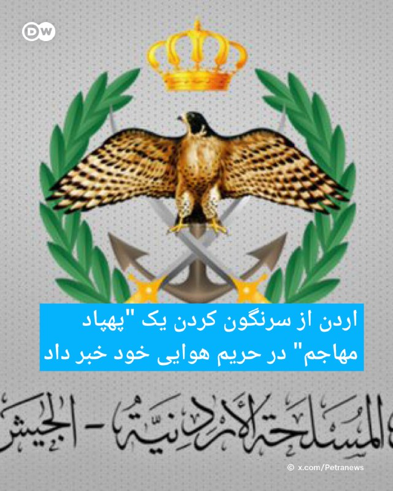

🔶 اردن از سرنگون کردن یک "پهپاد مهاجم" در حریم هوایی خود خبر داد
 
ارتش اردن اعلام کرد که روز چهارشنبه ۳۰ اردیبهشت‌ماه یک پهپاد با خاستگاه "نامشخص" را در حریم هوایی این کشور سرنگون کرده است. گزارشی از تلفات منتشر نشده است.
 
ارتش اردن در بیانیه‌ای اعلام کرد: «صبح امروز، نیروهای مسلح اردن با یک پهپاد با خاستگاه نامشخص که وارد حریم هوایی اردن شده بود، درگیر شدند و آن را در استان جرش سرنگون کردند؛ هیچ‌ موردی از مجروح‌شدن افراد گزارش نشده است.»
 
استان جرش در حدود ۵۰ کیلومتری شمال امان، پایتخت اردن، قرار دارد.
@dw_farsi

## DW_Farsi — post 124922

  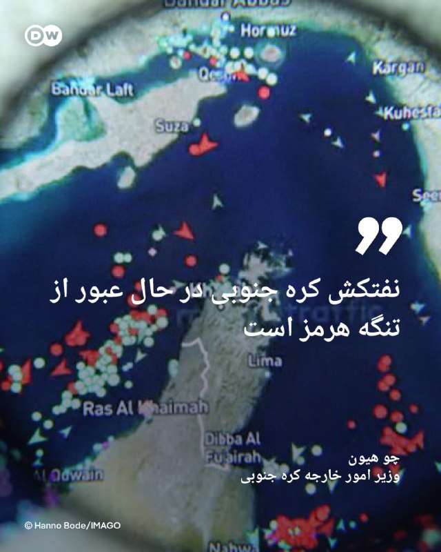

🔶 "نفتکش کره جنوبی در حال عبور از تنگه هرمز است"
 
چو هیون، وزیر امور خارجه کره جنوبی، روز چهارشنبه ۳۰ اردیبهشت‌ماه اعلام کرد که یک نفتکش این کشور هم‌اکنون در حال عبور از تنگه هرمز است. این نخستین مورد از عبور یک کشتی با پرچم کره جنوبی از این آبراه از زمان آغاز جنگ ایران به شمار می‌رود.
 
افزون بر این، یک مقام وزارت امور خارجه کره جنوبی نیز به خبرگزاری فرانسه گفت: «این نخستین کشتی با پرچم کره جنوبی است که از زمان آغاز جنگ ایران از تنگه هرمز عبور می‌کند.»
 
همزمان، وب‌سایت رهگیری کشتی‌ها MarineTraffic نشان می‌دهد که نفتکش Universal Winner با پرچم کره جنوبی در بخش شرقی تنگه هرمز، نزدیک ورودی خلیج عمان، قرار دارد و پس از ترک بندر مینا الاحمدی کویت، به سمت شهر اولسان در جنوب شرقی کره جنوبی در حرکت است.
 
عبور این نفتکش، چند هفته پس از آن انجام می‌شود که یک کشتی تحت مدیریت کره جنوبی در نزدیکی تنگه هرمز هدف شیء ناشناس پرنده قرار گرفت. این حادثه‌ نگرانی‌ها در سئول درباره امنیت کشتیرانی کره جنوبی در منطقه را افزایش داد.
 
@dw_farsi

## DW_Farsi — post 124921

🔶 قوه قضائیه از اجرای حکم اعدام قاتل الهه حسین‌نژاد خبر داد

مرکز رسانه قوه قضائیه روز چهارشنبه ۳۰ اردیبهشت (۲۰ مه) اعلام کرد حکم قصاص نفس قاتل الهه حسین‌نژاد، پس از درخواست اولیای دم و طی کامل مراحل قانونی و تائید در دیوان عالی کشور، اجرا شده است.
 
بر اساس این گزارش، پرونده این قتل در خرداد سال ۱۴۰۴ و پس از گزارش مفقود شدن الهه حسین‌نژاد در محدوده میدان آزادی تهران تشکیل شد.
 
پس از آغاز تحقیقات ویژه قضایی در دادسرای جنایی تهران، بررسی‌های گسترده برای یافتن او در دستور کار قرار گرفت.
 
الهه حسین‌نژاد در روز حادثه برای بازگشت به منزل سوار یک خودرو شده بود. بنا بر اعلام مقام‌های قضایی، راننده این خودرو به عنوان متهم به قتل بازداشت شد. طبق گزارش مقامات و رسانه‌های دولتی در ایران، این متهم پس از آنکه الهه حسین‌نژاد را به قتل رساند، پیکر او را در بیابان‌های اطراف تهران رها کرد.
 
خبر گم شدن الهه حسین‌نژاد در آن‌زمان پس از مراجعه خانواده او به کلانتری و تشکیل پرونده از طرف پلیس، به سرعت در شبکه‌های اجتماعی و خبرگزاری‌های داخلی و خارجی منتشر شده و ناپدید شدن این دختر جوان افکار عمومی را به خود مشغول کرده بود.
 
در اکانت اینستاگرامی که به اسم الهه حسین‌نژاد موجود بود این دختر جوان از خیزش مردمی "زن، زندگی، آزادی" حمایت می‌کرده و پست‌ها و استوری‌هایی در حمایت از برخی هنرمندان حامی جنبش "زن، زندگی، آزادی" از جمله توماج صالحی و مهدی یراحی منتشر کرده بود.
@dw_farsi

## DW_Farsi — post 124920

🔶 پژمان جمشیدی به "۹۹ ضربه شلاق تعزیری" محکوم شد
 
به گزارش پایگاه خبری امتداد، شاکی پرونده پژمان جمشیدی از صدور حکم برای این فوتبالیست سابق و بازیگر کنونی سینما خبر داد. به گفته او جمشیدی به "۹۹ ضربه شلاق تعزیری" محکوم شده است.
 
در این گزارش آمده است که شاکی پرونده، با بیان اینکه "تمام مدارکی که به نفع او است در پرونده وجود دارد"، گفته است: «او را هرگز نمی‌بخشم.»
 
او همچنین گفته است: «یک سال است بدون وکیل تنهایی تمام جلسات دادگاه را شرکت کردم.»
 
شاکی این پرونده همچنین با ادعای این که خود پژمان جمشیدی و وکلای او "بارها پیشنهاد پول دادند" اما او این پیشنهاد را نپذیرفته، افزود: «در جلسه آخر خودش به من گفت آخرین زورت را هم بزن، آخرش فقط همین، واقعا او را نمی‌بخشم.»
 
پاییز سال ۱۴۰۴ خبر متهم شدن پژمان جمشیدی، فوتبالیست سابق و بازیگر کنونی سینما، به "تجاوز جنسی" و در پی آن، بازداشت موقت او، جنجال‌برانگیز شد. سپس وکیل مدافع او در سوم آبان‌ماه اعلام کرد که موکلش با تودیع وثیقه از زندان آزاد شده است.
 
روز ۲۹ مهرماه ۱۴۰۴ قوه قضائیه جمهوری اسلامی با انتشار خبر بازداشت "یک بازیگر مشهور" اعلام کرده بود: «چندی پیش خانمی با مراجعه به مرجع قضایی از یک بازیگر سینما به اتهام تجاوز به عنف شکایت کرد. در پی شکایت شاکی خصوصی و بررسی‌های تخصصی و علمی انجام‌شده، این بازیگر مشهور سینما با احضار به مرجع قضایی تفهیم اتهام و بازداشت شد.»
 
علی القاصی، رئیس کل دادگستری استان تهران نیز پیش‌تر خبر داده بود که دادگاه تجدیدنظر قرار بازداشت موقت پژمان جمشیدی را "نقض کرد تا قرار متناسب صادر شود".
 
@dw_farsi

## DW_Farsi — post 124918

🎥 از ازدواج اجباری تا سکوی قهرمانی

رویا کریمی، بدنساز افغان، در ۱۴ سالگی مجبور به ازدواج شد و در ۱۷ سالگی همراه پسر کوچکش از افغانستان گریخت. او حالا در نروژ، پس از سال‌ها مبارزه با محدودیت‌ها، به قهرمانی در بدنسازی رسیده و صدای زنانی شده است که هنوز از ابتدایی‌ترین حقوق خود محروم‌اند.

@dw_farsi

## DW_Farsi — post 124917

🔶 پوتین در پکن؛ شی: آتش‌بس فوری در خاورمیانه ضروری است
 
شی جین‌پینگ روز چهارشنبه ۲۰ مه (۳۰ اردیبهشت) در تالار بزرگ خلق از ولادیمیر پوتین استقبال رسمی کرد؛ دیداری که تنها چند روز پس از ملاقات او با دونالد ترامپ انجام شد.
 
پوتین و شی در ۱۰ سال اخیر ۴۲ بار باهم ملاقات کرده‌اند. رهبران دو کشور یکدیگر را "دوست عزیز" خطاب می‌کنند.
 
پوتین در این دیدار در تالار بزرگ خلق بر ادامه تماس‌های نزدیک میان دو کشور تاکید کرد و گفت که روابط میان مسکو و پکن هم در سطح شخصی و هم از طریق نهادهای دولتی به‌طور مستمر ادامه دارد.
 
شی جین‌پینگ نیز بر سطح بالای اعتماد سیاسی و همکاری راهبردی میان دو کشور تاکید کرد. پیش‌تر نیز او روابط خود با پوتین را بسیار نزدیک توصیف کرده و از او به عنوان یکی از مهم‌ترین دوستان خود یاد کرده بود.
 
به گفته تحلیلگران، نزدیکی زمان دیدار رهبران آمریکا و روسیه از چین نشان‌دهنده افزایش نقش پکن در معادلات قدرت جهانی است.
 
در دستور کار اصلی این مذاکرات، موضوعات انرژی، امنیت و روابط اقتصادی قرار دارد و درباره مسائل بین‌المللی و منطقه‌ای از جمله جنگ ایران و همچنین اوکراین تبادل نظر خواهد شد.
@dw_farsi

## DW_Farsi — post 124916

  

🔶 وزارت خارجه آمریکا: شهاب دلیلی پس از آزادی از زندان در ایران، به آمریکا بازگشت
 
وزارت امور خارجه ایالات متحده آمریکا روز سه‌شنبه تایید کرد که یک شهروند ایرانی دارای اقامت دائم آمریکا، پس از آزادی از زندان در ایران، به ایالات متحده بازگشته است.
 
یک سخنگوی این وزارتخانه اعلام کرد: «وزارت خارجه با خوشحالی از بازگشت امن شهاب دلیلی پس از بازداشتش در ایران استقبال می‌کند.»
 
او با تاکید بر این که حکومت ایران "باید فورا همه افرادی را که به‌ناحق در ایران بازداشت شده‌اند، آزاد کند"، افزود که دونالد ترامپ، رئیس‌ جمهور ایالات متحده آمریکا و مارکو روبیو، وزیر خارجه آمریکا، "به تلاش برای آزادی همه آمریکایی‌هایی که به‌ناحق بازداشت شده‌اند، ادامه خواهند داد".
 
ارگان خبری مجموعه فعالان حقوق بشر در ایران (هرانا) پیش‌تر اعلام کرده بود که شهاب دلیلی، شهروند ایرانی و دارای اقامت دائم آمریکا که در زندان اوین زندانی بود، پس از گذراندن ۱۰ سال حبس آزاد شد و پس از آزادی، به ایالات متحده بازگشت.
 
@dw_farsi

## Persian_Trend_Official — post 14528

  <a href="telegram/content/Persian_Trend_Official_14528_1779280219.mp4" target="_blank">🎬 Download video</a>

🔴 تسنیم ویدیوی حمله پهپادی به یک نفتکش در تنگه هرمز را منتشر کرد

بر اساس ادعای این رسانه:

▪️ نفتکش قصد داشته بدون هماهنگی با مقام‌های ایرانی از تنگه هرمز عبور کند
▪️ پهپادهای ایرانی این شناور را هدف قرار داده‌اند

تاکنون هیچ منبع مستقل یا مقام بین‌المللی این ویدیو و ادعاهای مطرح‌شده درباره آن را تأیید نکرده است.

🫆:Tony

📌 @persian_trend_official
پرشین ترند | متفاوت‌ترین کانال نظامی

## Persian_Trend_Official — post 14527

  <a href="telegram/content/Persian_Trend_Official_14527_1779280221.mp4" target="_blank">🎬 Download video</a>

💢حزب الله لبنان مجددا تصاویری از حمله با FPV به پرتاب گرهای گنبد آهنین را منتشر کرده است.

▪️این امکان وجود دارد که لانچر ها ماکت بوده باشند.

🫆:Tony

📌 @persian_trend_official
پرشین ترند | متفاوت‌ترین کانال نظامی

## Persian_Trend_Official — post 14526

  

⭕️ احتمالا بخشی از اینترنت زیر ساخت ها در حال اتصال است!

💢بر اساس آماری که چارت های رادار کلادفلیر نمایش می دهند، طی ساعات گذشته پهنای باند اینترنت کشور افزایش چشمگیری داشته و احتمالا این بدین معناست که اینترنت دیتا سنتر های ایرانی در حال اتصال است.

💢هنوز مشخص نیست این اقدام جهت شناسایی باگ های سیستم فیلترینگ و آپدیت فایروال هست یا احتمالا تا ساعات آینده شاهد وصل شدن بخشی از فیلترشکن های قدیمی در داخل ایران خواهیم بود.

🫆:Tony

📌 @persian_trend_official
پرشین ترند | متفاوت‌ترین کانال نظامی

## Persian_Trend_Official — post 14524

  <a href="telegram/content/Persian_Trend_Official_14524_1779280223.webm" target="_blank">🎬 Download video</a>

💢رسانه‌های جمهوری اسلامی عکس‌هایی از مجتبی خامنه‌ای با ابراهیم رئیسی، رئیس‌جمهور سابق ، منتشر کردند.

🫆:Tony

📌 @persian_trend_official
پرشین ترند | متفاوت‌ترین کانال نظامی

## Persian_Trend_Official — post 14523

  <a href="telegram/content/Persian_Trend_Official_14523_1779280224.webm" target="_blank">🎬 Download video</a>

💢کره جنوبی اعلام کرد یکی از نفتکش‌هایش پس از هماهنگی با ایران، با ایمنی از تنگه هرمز عبور کرده است.

💢وزیر امور خارجه چو هیون گفت این نفتکش که حامل ۲ میلیون بشکه نفت خام است، با احتیاط از تنگه عبور می‌کند.

🫆:Tony

📌 @persian_trend_official
پرشین ترند | متفاوت‌ترین کانال نظامی

## Persian_Trend_Official — post 14522

  <a href="telegram/content/Persian_Trend_Official_14522_1779280224.webm" target="_blank">🎬 Download video</a>

🔴خضریان،عضو کمیسیون امنیت ملی مجلس: 💢امیدوارم خبر سفر عراقچی به نیویورک برای مذاکره در خصوص تنگه هرمز دروغ باشد! 💢چرا ما در خصوص موضوع تنگه هرمز باید در خاک دشمن مذاکره کنیم؟ 🫆:Tony 📌 @persian_trend_official پرشین ترند | متفاوت‌ترین کانال نظامی

## Persian_Trend_Official — post 14521

  <a href="telegram/content/Persian_Trend_Official_14521_1779280225.webm" target="_blank">🎬 Download video</a>

💢هم اکنون پخش و بازخوانی پیام از مجتبی خامنه ای به مناسبت درگذشت ابراهیم رئیسی بازهم بدون هیچ نشانه ای از حیات و هویت خودش در صداوسیما ‼️

🫆:Tony

📌 @persian_trend_official
پرشین ترند | متفاوت‌ترین کانال نظامی

## Persian_Trend_Official — post 14520

  <a href="telegram/content/Persian_Trend_Official_14520_1779280225.mp4" target="_blank">🎬 Download video</a>

🔴 نخستین پرواز نسخه دو نفره جنگنده سوخو-۵۷ انجام شد

💢شرکت هواپیماسازی متحد روسیه اعلام کرد نمونه اولیه نسخه دو نفره جنگنده نسل پنجم «سوخو-۵۷» نخستین پرواز آزمایشی خود را با موفقیت انجام داده است.

بر اساس گزارش‌ها:

▪️ این نسخه برای آموزش خلبانان طراحی شده است

▪️ همچنین قرار است نقش هواپیمای فرماندهی برای هدایت عملیات مشترک جنگنده‌ها و پهپادها را ایفا کند

▪️ روسیه به‌دنبال توسعه مفهوم عملیات «سرنشین‌دار ـ بدون‌سرنشین» با استفاده از سوخو-۵۷ است

سوخو-۵۷ پیشرفته‌ترین جنگنده پنهانکار عملیاتی روسیه محسوب می‌شود.

🫆:Tony

📌 @persian_trend_official
پرشین ترند | متفاوت‌ترین کانال نظامی

## Persian_Trend_Official — post 14519

تا لحظاتی دیگر؛ سومین پیام صوتی قالیباف خطاب به مردم 

پ.ن : بوی مشکوکی به مشام میرسه !

## RadioFarda — post 157385

  

📷 Photo

## RadioFarda — post 157384

  <a href="https://t.me/radiofarda/157384" target="_blank">📎 Download file</a>

📻بشنوید: ساعت ۱۴ با رادیوفردا،۳۰ اردیبهشت ۱۴۰۵‌

@Radiofarda

## RadioFarda — post 157383

  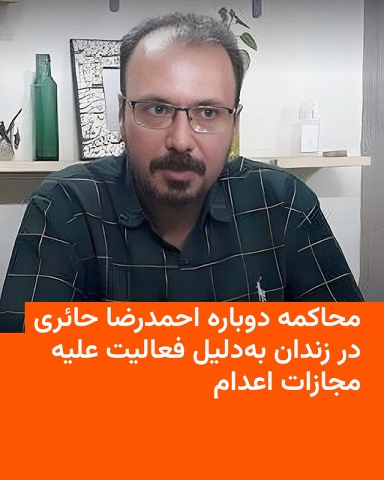

🔸سازمان حقوق بشر ایران از محاکمه دوباره احمدرضا حائری، فعال مدنی محبوس در زندان قزل‌حصار کرج، به‌دلیل فعالیت‌هایش‌ علیه مجازات اعدام خبر داد.

🔸آقای حائری از نخستین اعضای کارزار «سه‌شنبه‌های نه به‌ اعدام» است که روز سه‌شنبه، ۲۹ اردیبهشت‌، بار دیگر محاکمه شده است.

🔸بر اساس این گزارش، این فعال حقوق بشر، به‌دلیل انتشار روایت‌های مختلف درخصوص اعدام و مبارزه با این مجازات و نقض حق دادرسی منصفانه متهمان، در شعبه یک دادسرای عمومی و انقلاب کرج به صورت ویدئو کنفرانس به «تبلیغ علیه نظام» متهم شد.

🔸این محاکمه درحالی انجام شد که احمدرضا حائری اکنون چهارمین سال حبس خود را سپری می‌کند و نهادهای امنیتی و سازمان زندان‌ها در این مدت برای پنجمین بار علیه او پرونده‌ای جدید تشکیل داده‌اند.

🔸او پیش از این به‌دلیل افشاگری درباره نقض حقوق بشر در زندان‌های ایران به اتهام «اجتماع و تبانی به قصد ارتکاب جرم علیه امنیت کشور» به سه سال و هشت ماه حبس و به اتهام «فعالیت‌ تبلیغی علیه نظام» به هشت ماه حبس محکوم شده بود.

@RadioFarda

## RadioFarda — post 157382

دولت واردات مواد اولیه پتروشیمی و پلیمری از طریق کولبری و ملوانی را مجاز اعلام کرد

🔸وزارت صنعت، معدن و تجارت، برای نخستین بار، واردات برخی مواد اولیه مرتبط با حوزهٔ پتروشیمی و پلیمری از طریق رویه‌های ملوانی و کولبری را مجاز اعلام کرد.

🔸خبرگزاری تسنیم، نزدیک به سپاه، روز چهارشنبه ۳۰ اردیبهشت، دلیل صدور این مجوز را مشکل تأمین برخی مواد اولیه در «ماه‌های اخیر» اعلام و هدف آن را «کمک به استمرار فعالیت صنایع پایین‌دستی پتروشیمی و پلیمری» عنوان کرد.

🔸در طی جنگ ۴۰ روزه، آمریکا و اسرائیل خسارت‌های قابل توجهی به زیرساخت‌های نظامی و همچنین غیرنظامی مانند کارخانه‌های فولاد و مراکز پتروشیمی ایران وارد کردند. برخی تأسیسات راهبردی انرژی در مجتمع‌های صنعتی در منطقهٔ ویژهٔ اقتصادی پتروشیمی ماهشهر و عسلویه در میان این اهداف بودند.

🔸این حملات با تمرکز بر مختل‌کردن زیرساخت‌های تأمین یوتیلیتی (آب، برق، بخار و اکسیژن)، خسارات سنگینی به روند تولید صنعت پتروشیمی ایران وارد کرد.

🔸این برای نخستین‌بار است که به‌طور مشخص «مواد اولیه مرتبط با صنایع پتروشیمی و پلیمری» در فهرست کالاهای قابل ورود از مسیر کولبری و ملوانی قرار گرفته است. موارد قبلی عمدتاً مربوط به کالاهای مصرفی، لوازم خانگی، پوشاک، مواد غذایی، لوازم الکترونیک و اقلام اصطلاحاً مرزنشینی بوده است.

@RadioFarda

## RadioFarda — post 157380

🔸پس از واکنش‌ها به انتشار تصاویر سارا کنعانی، هنرمند ساکن تهران، در خبرگزاری ایرنا، عکاس این مجموعه توضیحاتی درباره هدف این گزارش منتشر کرد.

🔸مرضیه موسوی، عکاس این پروژه، در صفحه اینستاگرام خود نوشت موضوع اصلی این مجموعه نه پوشش و ظاهر سارا کنعانی، بلکه روایت نگهداری موقت از نوزادی رهاشده در بیمارستان بوده است؛ کودکی که او در روزهای جنگ برای ۴۰ روز سرپرستی‌اش را برعهده گرفت و نام «آهو» را برایش انتخاب کرد.

🔸ایرنا، خبرگزاری دولت ایران، روز سه‌شنبه گزارشی تصویری از سارا کنعانی منتشر کرده بود؛ هنرمندی که در جریان جنگ ۴۰ روزه، به طور موقت از این نوزاد بی‌سرپرست نگهداری کرده بود.

🔸این خبرگزاری ساعاتی بعد تصاویر منتشرشده از منزل شخصی کنعانی را که به دلیل نوع پوشش او واکنش‌هایی را در شبکه‌های اجتماعی برانگیخته بود، از وب‌سایت خود حذف کرد.

🔸به گفته عکاس این مجموعه، هدف این گزارش پرداختن به مسئله کودکان بی‌سرپرست و زنانی بوده که با وجود دشواری عاطفی جدایی، مسئولیت مراقبت و نگهداری از این کودکان را می‌پذیرند.

@RadioFarda

## RadioFarda — post 157379

سنای آمریکا با پیشبرد قطعنامه محدود کردن اختیارات جنگی رئیس‌جمهور موافقت کرد

🔸سنای آمریکا روز گذشته به پیشبرد قطعنامه‌ای رأی داد که هدف آن محدود کردن اختیارات دونالد ترامپ، رئیس‌جمهور آمریکا، برای «اقدام نظامی علیه ایران بدون مجوز کنگره» است.

🔸این هشتمین بار بود که دموکرات‌های سنا تلاش می‌کردند این طرح را در «رأی‌گیری آیین‌نامه‌ای» پیش ببرند و این بار به‌دلیل حمایت چهار جمهوری‌خواه و شرکت نکردن شماری دیگر در رأی‌گیری موفق شدند. نتیجهٔ این رأی‌گیری ۵۰ رأی موافق در برابر ۴۷ رأی مخالف بود.

🔸این اقدام در حالی صورت گرفت که دونالد ترامپ در روزهای اخیر تأکید کرده اگر جمهوری اسلامی تن به توافق ندهد، به‌طور جدی در حال بررسی حملات دیگری علیه ایران است.

🔸این طرح همچنان باید در رأی‌گیری‌های بعدی در سنا و مجلس نمایندگان تصویب شود و حتی در آن صورت نیز ممکن است با خود رئیس‌جمهور آن را وتو کند.

🔸هدف این قطعنامه جلوگیری از صدور دستور حملات بیشتر از سوی ترامپ بر اساس «قانون اختیارات جنگی» مصوب سال ۱۹۷۳ است. بر اساس این قانون، رؤسای‌جمهور آمریکا برای اعزام نیروهای مسلح به درگیری نظامی برای بیش از ۶۰ روز نیازمند مجوز کنگره هستند.

🔸حامیان این طرح می‌گویند با توجه به آغاز جنگ آمریکا و اسرائیل با ایران از نهم اسفند پارسال، این مهلت به پایان رسیده است. دولت ترامپ اما می‌گوید با توجه به آتش‌بس برقرارشده از ۱۹ فروردین، درگیری‌ها عملاً پایان یافته است.

@RadioFarda

## IranianMinds — post 20432

  <a href="telegram/content/IranianMinds_20432_1779280229.mp4" target="_blank">🎬 Download video</a>

🔴عکس ترامپ روی بیلبورد در اسرائیل:

کار را تمام کن.

@IranianMinds

## IranianMinds — post 20431

  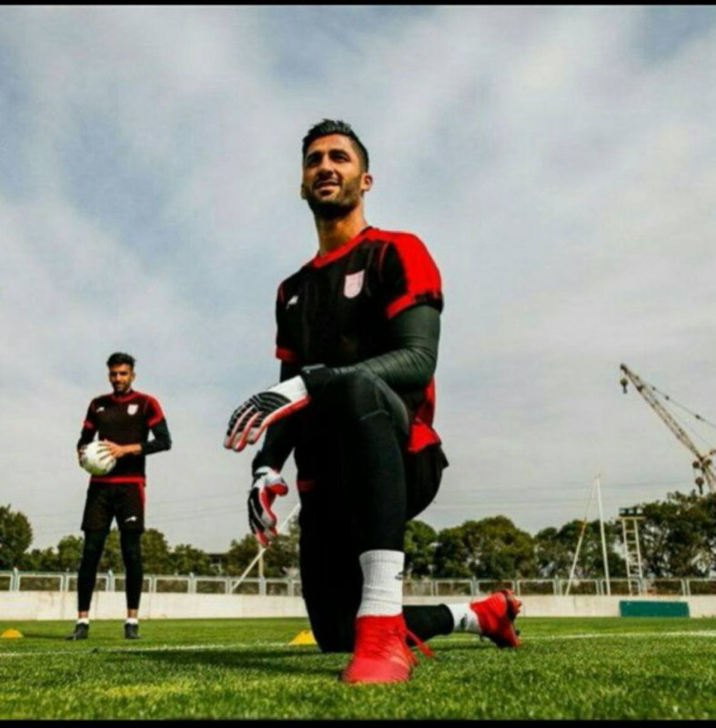

🔴 خبرگزاری قوه قضائیه:

رشید مظاهری، بازیکن سابق فوتبال، هنگام خروج غیرقانونی از کشور دستگیر شده.

این فرد قصد داشته با تغییر چهره و پول دادن به ماموران مرزبانی، از مرزهای غربی به صورت غیرقانونی از کشور فرار کنه، ولی موقع خروجش دستگیر شده.

@IranianMinds

## IranianMinds — post 20430

🔴 رادار کلودفلر نشون میده امروز سطح دسترسی و‌ ترافیک اینترنت ایرانیا بیشتر شده! @IranianMinds

## IranianMinds — post 20429

  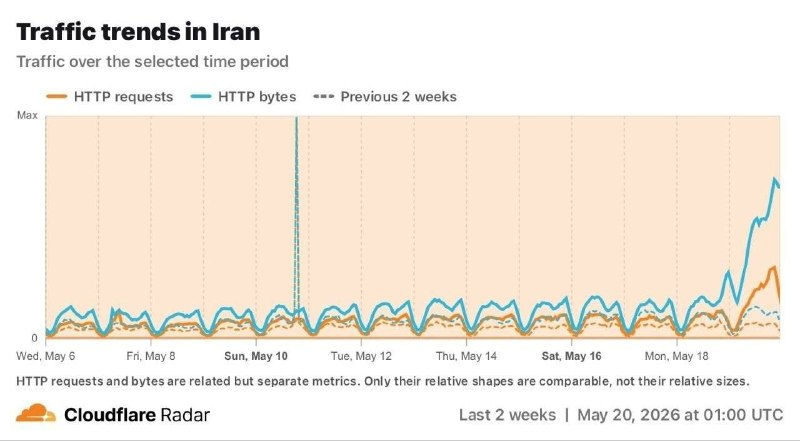

🔴 رادار کلودفلر نشون میده امروز سطح دسترسی و‌ ترافیک اینترنت ایرانیا بیشتر شده!

@IranianMinds

## IranianMinds — post 20428

  <a href="telegram/content/IranianMinds_20428_1779280233.webm" target="_blank">🎬 Download video</a>

💥 با هر ثبت نام 
🅰️
🅰️
🅰️  هزار تومن جایزه بگیرید

✔️ میتونید شرط‌بندی کنید و بونوس را به موجودی واقعی تبدیل کنید

⚽️  پوشش کامل مسابقات ورزشی 

💯  پیش‌بینی با بهترین ضرایب 

⭐️ تجربه سریع و حرفه‌ای

💰پرداخت مستقیم و سریع بدون واسطه، بدون دردسر، واریز و برداشت در سریع‌ترین زمان ممکن

☑️ کانال تلگرام: 

➡️ @winro_io  

🎁 هدیه خود را با ثبت نام در سایت دریافت کنید: 

➡️ Winro.io
R30
سایت اصلی در روزهای آینده بازگشایی خواهد شد A
💎

## BBCPersian — post 281609

🔻چین و روسیه اختلال در زنجیره تامین و تجارت جهانی را محکوم کردند

🔻چین و روسیه در بخش دیگری از بیانیه مشترکی که از سوی کرملین منتشر شد، از کشورها خواستند به‌صورت «یک‌جانبه» در تجارت بین‌المللی و زنجیره‌های تامین دخالت نکنند؛ اظهاراتی که به نظر می‌رسد اشاره‌ای به بسته شدن تنگه هرمز باشد.

در این بیانیه آمده است: «دو طرف با نگرانی یادآور می‌شوند که اقدامات یک‌جانبه برخی کشورها، اتحادیه‌های بین‌دولتی و متحدان آن‌ها که مانع کشتیرانی بین‌المللی می‌شود، تمامیت زنجیره‌های تامین جهانی و تجارت دریایی را به طور کلی تهدید می‌کند.»

در این بیانیه نامی از تنگه هرمز برده نشده، اما در ادامه تاکید شده است که همکاری در زیرساخت‌های دریایی، از جمله بنادر، باید بر پایه اصول بازار و ملاحظات تجاری باشد تا از سیاسی شدن و تمرکز بیش از حد بر مسائل امنیتی جلوگیری شود.

https://bbc.in/4ulwfeR
@BBCPersian

## BBCPersian — post 281608

  

🔻مسعود پزشکیان، رئیس‌جمهور ایران در اظهاراتی محدودیت‌های عرضه بنزین و حامل‌های دیگر انرژی را تائید کرده و خواستار اعلام آن به شهروندان ایرانی شده است.

او گفت: «مردم باید بدانند که کشور در حوزه تامین بنزین و برخی حامل‌های انرژی با محدودیت‌هایی مواجه است و عبور موفق از این شرایط، نیازمند همراهی عمومی و اصلاح الگوی مصرف است.»

آقای پزشکیان همچنین خواستار «تدوین نظام سهمیه‌بندی و تخصیص استانی بر اساس نیاز واقعی هر منطقه» و همچنین صرفه‌جویی شد.

در این نشست وزیر نفت ایران هم حضور داشت و گزارشی از وضعیت تاسیسات آسیب‌دیده در طول جنگ هم ارائه داد اما جزئیات آن در رسانه‌های ایران هنوز منتشر نشده است.

در جریان جنگ اخیر، چندین زیرساخت مرتبط با انرژی و انبارهای سوخت هدف قرار گرفتند ولی گزارش دقیقی از میزان خسارت و روند بازسازی آن در دست نیست؛ هر چند کاهش منابع مالی روند بازسازی را هم متاثر کرده است.

همزمان محاصره دریایی آمریکا هم، واردات را با اختلال روبرو کرده است.

لینک خبر کامل:

https://bbc.in/4eXJHRE
📷EPA

@BBCPersian

## BBCPersian — post 281600

🔻‌خانواده یک زوج بریتانیایی که به اتهام جاسوسی در ایران زندانی هستند، می‌گویند که این دو نفر برای آزادی خود اعتصاب غذا کرده‌اند.

لیندسی و کریگ فورمن، اهل ساسکس شرقی، در ژانویه سال گذشته هنگام عبور از ایران در یک سفر با موتورسیکلت به دور دنیا دستگیر شدند.

این زوج در فوریه به اتهام جاسوسی به ۱۰ سال زندان محکوم شدند، اتهامی که آن را رد می‌کنند.

وزارت امور خارجه بریتانیا می‌گوید که برای بازگرداندن آنها به بریتانیا تلاش خواهد کرد و حبس آنها را «وحشتناک و غیرقابل توجیه» خوانده است.

گفته می‌شود که کریگ فورمن ۱۲ روز است در اعتصاب غذا به‌سر می‌برد که پس از قطع دسترسی تلفنی این زوج در اوایل ماه مه آغاز شد.

منابع دیگر به خانواده آنها گفته‌اند که لیندسی فورمن، ۵۳ ساله، پس از اینکه به او گفته شد می‌تواند با خانواده‌اش تماس بگیرد، اعتصاب غذا را متوقف کرده بود، اما دوباره آن را از سر گرفته است.

جو بنت، پسر لیندسی، امتناع آنها از خوردن غذا را یک وضعیت فوری که نیازمند رسیدگی سریع است، توصیف کرد.

متن کامل خبر در لینک زیر:

https://bbc.in/4wGvdvM
📷Handout

@BBCPersian

## BBCPersian — post 281599

🔻پیام منتسب به مجتبی خامنه‌ای به مناسبت دومین سال کشته‌شدن رئیسی

🔻رسانه‌های حکومتی ایران امروز پیام منتسب به مجتبی خامنه‌ای، رهبر جمهوری اسلامی را به مناسبت دومین سال کشته‌شدن ابراهیم رئیسی، رئیس جمهور سابق آن کشور منتشر کرده‌اند.

در بخشی از این پیام، پس از تجلیل از رئیسی و اشاره به ویژگی‌هایش، با اشاره به جنگ اخیر آمده است: «اینک ما در برابر حماسه‌آفرینی‌های ملت ایران در مقاومت منحصر به فرد تاریخی مقابل دو ارتش تروریست جهانی هستیم.»

در ادامه این پیام آمده: «این امر، بار تکلیف مسئولان جمهوری اسلامی ـ از رهبری و رؤسای قوا تا همه‌ی سطوح مدیران ـ را سنگین‌تر از گذشته می‌کند.»

او در ادامه این نامه ابراز امیدواری کرده است که از مسائل و دغدغه‌های مردم خصوصا در عرصه اقتصادی و معیشتی، «گره‌گشایی» شود.

https://bbc.in/4tOAHC6
@BBCPersian

## BBCPersian — post 281598

🔻وزیر دفاع فرانسه: از وجود مین در تنگه هرمز مطمئن نیستم

🔻کاترین وترین، وزیر دفاع فرانسه، پس از گزارش رسانه‌های آمریکایی مبنی بر شناسایی حداقل ۱۰ مین در حوالی تنگه هرمز، گفت که فرانسه در حال حاضر هیچ اطمینانی ندارد که در تنگه هرمز مین کار گذاشته شده باشد.

او به رادیو فرانس اینفو گفت: «در حال حاضر، من هیچ اطمینانی در این مورد ندارم، اما در هر صورت، ما در حال آماده شدن برای لزوم پاکسازی احتمالی مین‌ها هستیم.»

او گفت که کشتی‌های مین‌روب به عنوان بخشی از یک ماموریت احتمالی آینده به رهبری فرانسه و بریتانیا به منطقه اعزام شده‌اند و فرانسه یکی از این کشتی‌ها را در پایگاه خود در جیبوتی دارد.

https://bbc.in/4v0II7P
@BBCPersian

## BBCPersian — post 281597

  <a href="telegram/content/BBCPersian_281597_1779280234.mp4" target="_blank">🎬 Download video</a>

🔻فرماندهی مرکزی ایالات متحده آمریکا (سنتکام) ویدیویی منتشر کرده که حضور نیروهای هوایی و دریایی این کشور را در عملیات محاصره دریایی ایران نشان می‌دهد.

حساب ایکس سنتکام گفته اجرای این محاصره توسط ایالات متحده آمریکا ادامه دارد و «جریان تجارت از بنادر ایران» متوقف شده‌است.

سنتکام هم‌چنین می‌گوید تا حالا «۸۹ کشتی تجاری تغییر مسیر داده شده‌اند.»

آمریکا از ۱۳ آوریل (۲۴ فروردین) و در واکنش به اقدام ایران در بستن تنگه هرمز، دست به محاصره دریایی بنادر ایران زده است و اجازه نمی‌دهد هیچ کشتی‌ای با مبدا یا مقصد بنادر ایرانی از تنگه هرمز عبور کند.

@BBCPersian

## BBCPersian — post 281596

  

🔻روسیه و چین در بیانیه مشترک خود درباره «تعمیق روابط همسایگی، دوستی و همکاری»، به‌طور ضمنی از اقدامات نظامی آمریکا انتقاد کردند.

در این بیانیه، دو کشور «ماجراجویی‌های نظامی» در جهان را محکوم کرده‌اند؛ عبارتی که به نظر می‌رسد اشاره‌ای به اقدامات آمریکا در ایران و ونزوئلا در ماه‌های اخیر باشد.

شی جین‌پینگ و ولادیمیر پوتین در این بیانیه از «حملات نظامی غافلگیرانه به کشورهای دیگر»، «استفاده ریاکارانه از مذاکرات برای آماده‌سازی چنین حملاتی»، «ترور رهبران کشورهای مستقل»، «بی‌ثبات کردن اوضاع داخلی کشورها» و «تلاش برای تغییر حکومت» انتقاد کردند.

آن‌ها همچنین از «ربودن آشکار رهبران کشورها برای محاکمه» سخن گفتند؛ عبارتی که ظاهرا به بازداشت نیکلاس مادورو، رئیس‌جمهور ونزوئلا، اشاره دارد.

در بیانیه آمده است که این اقدامات «به‌طور فاحش» اصول منشور سازمان ملل، حقوق بین‌الملل و نظم جهانی پس از جنگ جهانی دوم را نقض می‌کند.

لینک خبر کامل:
https://bbc.in/4tHKVUz
📷U.S. Central Command-Farsi

@BBCPersian

## BBCPersian — post 281595

  

🔻محسن نقوی، وزیر کشور پاکستان برای دومین بار در کمتر از یک هفته بار دیگر وارد تهران شده است.

پاکستان میانجی مذاکرات اخیر میان ایران و آمریکا در اسلام‌آباد بود که بدون نتیجه به پایان رسید.

دوشنبه گذشته وزیر کشور پاکستان در تهران ابراز امیدواری کرد که تلاش کشورش در برقراری صلح و ثبات در منطقه موثر واقع شود.

عباس عراقچی، وزیر خارجه ایرن هم در آن دیدار به آقای نقوی گفت: «رفتارها و مواضع متناقض و زیاده‌خواهانه آمریکا مانعی جدی در مسیر دیپلماسی» است.

📷ICC via Getty Images
https://bbc.in/4uYdZbq

@BBCPersian

## Dirty_Kids — post 389802

  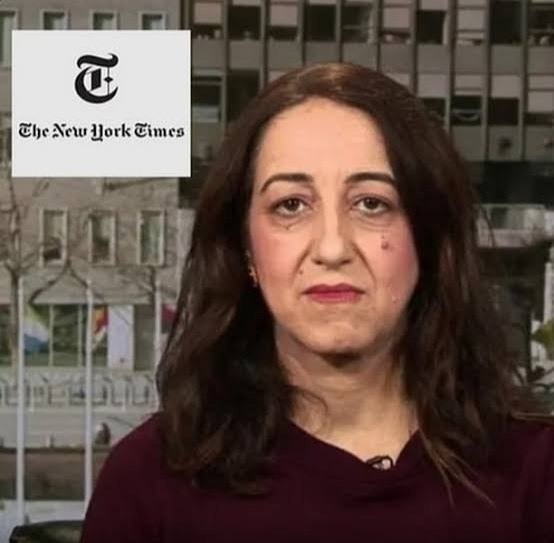

اونی خبر کسشر رهبر شدن احمدی‌نژا نیویورک تایمز داده بیرون

دیگه فرناز فصیحی و ارباباش وقتی یه خبر رو تولید میکنن قطعا درسته. 😂😂

میگن با موشک زدنش تا اونایی که اسیر کردنش تو خونه بمیرن
احمدی نژادم قهر کرده چرا با موشک منو محکم زدید نزدیک بود خودمم بمیرم برای همین دیگه رهبر نمیشم، اصن قهرم :)))))

اصن آزادش کردنش بعد میخواست چه گهی بخوری مثل رمبو تکی سپاه شکست بده 😂😂

سپاه تروریستی پاسداران، حامی اصلی تریتا پارسی، سخت مشغول کاره تا تبلیغاتش رو توسط فرناز فصیحی در نیویورک تایمز منتشر کنه.😂

@Dirty_Kids 👻

## Dirty_Kids — post 389801

  

‏یک بسته کیسه فریزر رولی
یک میلیون و صد و هشتاد وپنج !
۲۹ اردیبهشت ۱۴۰۵

@Dirty_Kids 👻

## Dirty_Kids — post 389800

  <a href="https://t.me/Dirty_Kids/389800" target="_blank">📎 Download file</a>

📱 اپلیکیشن اندروید بدون فیلتر ریتزوبت

➖➖➖➖➖

🔹 ثبت نام آسان 
✅
🔹 رابط کاربری بسیار راحت و سریع 
✅
🔹 درگاه پرداخت کارت به کارت 
✅
🔹 درگاه پرداخت دلاری سریع 
✅
🔹 بونوس ۱۰۰ درصدی اولین واریز 
✅
🔹 بونوس ۱۰۰ درصدی واریز یکشنبه ها 
✅

➖➖➖➖➖
🌐 https://RitzoBet.com

⚡️ @RitzoBet_ir

## Dirty_Kids — post 389799

  <a href="telegram/content/Dirty_Kids_389799_1779280238.webm" target="_blank">🎬 Download video</a>

⚠️ برای #شرطبندی های فوتبال از سایت معتبر و بین المللی استفاده کنید ✅

🇩🇪 فرایبورگ 
🔢
🔢 
🏴󠁧󠁢󠁥󠁮󠁧󠁿 استون ویلا

سایت #ریتزوبت ، چهار سال هستش داخل ایران فعالیت میکنه 
✅

لایسنس بین المللی داره ، روش های شارژ و برداشت متنوع داره و بونوس 100% ورزشی و کش بک های جذاب
💎

⏪ اپلیکیشن بدون فیلتر ریتزوبت 
📱
⏩
R30

✅ لینک بدون‌ فیلتر ریتزوبت
🤣

🆔 @RitzoBet_ir 
🇮🇷

## Dirty_Kids — post 389798

  

شبکه آمریکایی الحره: میان نیروهای ارتش و سپاه توی ایران درگیری داخلی و مسلحانه رخ داده.

داستان از اینجا شروع میشه که سازمان اطلاعات سپاه، افسران و نیروهای ارتش رو از پایگاه های مشترک نظامی اخراج و اونارو به خیانت و انتقال اطلاعات به اسرائیل و آمریکا متهم کرد!
این اتهامات شامل لو دادن محل استقرار موشک‌های بالستیک و پهپادهای حکومت بوده.
حالا سپاه و ارتش سر این داستان باهم به مشکل خوردن و درگیر شدن

@Dirty_Kids 👻

## Dirty_Kids — post 389797

  <a href="telegram/content/Dirty_Kids_389797_1779280239.mp4" target="_blank">🎬 Download video</a>

🔴 فیلم وایرال شده از آمریکا که حامیان فلسطین و خامنه‌ای تجمع کردن و یه ایرانی میره اون وسط و یه تنه همشونو میگاد.

@Dirty_Kids 👻

## Hranews — post 113060

  

پس از نقض حکم اعدام در دیوان عالی کشور؛ حکم جدید متهمان پرونده “شهرک اکباتان” صادر شد

❗️
❗️
❗️
❗️
❗️– حکم شش تن از متهمان پرونده موسوم به “#شهرک_اکباتان” توسط شعبه ۱۳ دادگاه کیفری یک استان تهران صادر شد. بر اساس رای صادره، میلاد آرمون، علیرضا کفایی و امیرمحمد خوش‌اقبال به اتهام مشارکت در قتل، هر یک به پرداخت دیه و حبس محکوم شدند. همچنین نوید نجاران، حسین نعمتی و علیرضا برمرزپورناک از اتهام مشارکت در قتل تبرئه شدند. حکم اعدام این افراد پیشتر در دیوان عالی کشور نقض شده بود.

به گزارش خبرگزاری هرانا، ارگان خبری مجموعه فعالان حقوق بشر در ایران، حکم متهمان پرونده موسوم به “شهرک اکباتان” توسط شعبه ۱۳ دادگاه کیفری یک استان تهران صادر شد.

بر اساس حکم صادره، میلاد آرمون، علیرضا کفایی و امیرمحمد خوش‌اقبال از بابت اتهام مشارکت در قتل عمد، هر یک به پرداخت سهمی مساوی از دیه کامل یک انسان و تحمل ۵ سال حبس محکوم شدند. همچنین علیرضا برمرزپورناک، حسین نعمتی و نوید نجاران، سه متهم دیگر این پرونده، به دلیل فقدان مدارک دال بر وارد کردن ضربه به ناحیه مشخصی از بدن آرمان علی‌وردی، از اتهام مشارکت در قتل عمد تبرئه شدند.
حکم مذکور در تاریخ ۱۵ بهمن ماه سال گذشته صادر و روز گذشته به وکلای این متهمان ابلاغ شده است.

#میلاد_آرمون #علیرضا_کفایی #امیرمحمد_خوش‌اقبال #علیرضا_برمرزپورناک #حسین_نعمتی #نوید_نجاران

ادامه مطلب

↘️
@hranews_bot تماس ✉️ - @Hranews کانال هرانا 🆑

## Hranews — post 113059

  

گزارشی از بازداشت و آزادی مجید کریمی در تهران

❗️
❗️
❗️
❗️
❗️– روز جمعه ۲۵ اردیبهشت ماه، مجید کریمی، با قرار وثیقه آزاد شد. وی، مورخ ۲۴ اردیبهشت ماه توسط نیروهای امنیتی در تهران بازداشت شده بود.

به گزارش خبرگزاری هرانا، ارگان خبری مجموعه فعالان حقوق بشر در ایران، مجید کریمی آزاد شد.

بر اساس این گزارش، آزادی مجید کریمی روز جمعه ۲۵ اردیبهشت ماه پس از اتمام مراحل بازجویی با قرار وثیقه از یکی از بازداشتگاه های امنیتی تهران صورت گرفته است.

#مجید_کریمی

ادامه مطلب

↘️
@hranews_bot تماس ✉️ - @Hranews کانال هرانا 🆑

## Hranews — post 113057

قوه قضاییه؛ رشید مظاهری به اتهام “فعالیت تبلیغی بر خلاف امنیت ملی” در زندان است

❗️
❗️
❗️
❗️
❗️– مرکز رسانه قوه قضاییه اعلام کرد که رشید مظاهری، بازیکن سابق فوتبال، از بابت اتهاماتی از جمله «فعالیت تبلیغی بر خلاف امنیت ملی» بازداشت و به زندان منتقل شده است.

#رشید_مظاهری

ادامه مطلب

↘️
@hranews_bot تماس ✉️ - @Hranews کانال هرانا 🆑

## manototv — post 105683

  <a href="telegram/content/manototv_105683_1779280242.mp4" target="_blank">🎬 Download video</a>

امارات متحده عربی، چند روز پس از حمله پهپادی به نیروگاه هسته‌ای براکه در ابوظبی، از عراق خواست فوراً مانع هرگونه «اقدام خصمانه» از خاک خود شود.
وزارت خارجه امارات در بیانیه‌ای تأکید کرد دولت عراق باید بدون قید و شرط از انجام حملات از خاک این کشور جلوگیری کرده و تهدیدها را سریع و مسئولانه مهار کند.
ابوظبی همچنین از عراق خواست برای حفظ امنیت و ثبات منطقه نقش فعال‌تری ایفا کند و جایگاه خود را به‌عنوان «شریکی مسئول» در منطقه تقویت کند.

## manototv — post 105682

  <a href="telegram/content/manototv_105682_1779280243.mp4" target="_blank">🎬 Download video</a>

یکی از مخاطبان منوتو تصویری از یک فروشگاه در ایران فرستاده که در آن روی بطری روغن خوراکی دزدگیر نصب شده است.

این تصویر در حالی ارسال شده که افزایش قیمت کالاهای اساسی، تورم و کاهش قدرت خرید، فشار معیشتی بر خانوارها را بیشتر کرده است.

مخاطبی که این تصویر را فرستاده، نوشته است نصب دزدگیر روی کالایی مانند روغن، نشان می‌دهد گرانی و بحران اقتصادی تا سفره روزمره مردم پیش رفته است.

## manototv — post 105681

  <a href="telegram/content/manototv_105681_1779280243.mp4" target="_blank">🎬 Download video</a>

هم‌زمان با قهرمانی آرسنال، کاربران شبکه‌های اجتماعی از عارف جعفرزاده، هوادار این تیم و از جاویدنام‌های رشت، یاد کردند.

عارف جعفرزاده، اهل رشت، در جریان اعتراضات دی‌ماه ۱۴۰۴ جان باخت. بنیاد عبدالرحمن برومند سن او را ۳۴ سال، محل کشته‌شدن را رشت در استان گیلان و تاریخ جان‌باختن او را ۲۰ دی ۱۴۰۴ ثبت کرده و نحوه کشته‌شدن را «اعدام خودسرانه» عنوان کرده است.

علاقه عارف به آرسنال پیش‌تر نیز مورد توجه کاربران قرار گرفته بود. حالا با قهرمانی این تیم، نام او بار دیگر در شبکه‌های اجتماعی بازتاب یافته و کاربران با انتشار تصویری از مزارش نوشته‌اند: «جا دارد قهرمانی آرسنال را به جاویدنام عارف جعفرزاده تبریک بگوییم.»

## manototv — post 105680

  <a href="telegram/content/manototv_105680_1779280244.mp4" target="_blank">🎬 Download video</a>

رویترز گزارش داد سه نفتکش غول‌پیکر چینی و کره‌جنوبی حامل حدود ۶ میلیون بشکه نفت خاورمیانه، پس از بیش از دو ماه توقف در خلیج فارس، از ۷تنگه هرمز عبور کرده و راهی بازارهای آسیایی شده‌اند.
بر اساس این گزارش، دو نفتکش چینی حامل نفت عراق و قطر و یک نفتکش کره‌جنوبی حامل نفت کویت، از مسیر تعیین‌شده از سوی جمهوری‌اسلامی عبور کرده‌اند.

## manototv — post 105679

  <a href="telegram/content/manototv_105679_1779280245.mp4" target="_blank">🎬 Download video</a>

سخنگوی وزارت خارجه جمهوری‌اسلامی اعلام کرده با توجه به ریاست دوره‌ای چین بر شورای امنیت سازمان ملل و برنامه پکن برای برگزاری «نشست ویژه وزیران خارجه درباره صلح و امنیت بین‌المللی»، از عباس عراقچی، وزیر خارجه نظام اسلامی، برای حضور در این نشست در نیویورک دعوت شده است.

## manototv — post 105678

  <a href="telegram/content/manototv_105678_1779280245.mp4" target="_blank">🎬 Download video</a>

کناره گیری محمدباقر قالیباف از ریاست هیئت‌ مذاکره کننده جمهوری‌اسلامی در مذاکرات با آمریکا،‌ از سوی رییس مرکز ارتباطات، رسانه و امور فرهنگی مجلس شورای اسلامی تکذیب شده است.

## manototv — post 105675

  <a href="telegram/content/manototv_105675_1779280246.mp4" target="_blank">🎬 Download video</a>

خبرگزاری حکومتی تسنیم گزارش داد که محسن نقوی، وزیر کشور پاکستان، برای دیدار و گفت‌وگو با مقام‌های جمهوری‌اسلامی راهی تهران شده است. این دومین سفر نقوی به تهران در طول یک هفته گذشته و در راستای تلاش‌های اسلام‌آباد برای میانجی‌گری میان جمهوری‌اسلامی و آمریکا است.

## manototv — post 105674

  <a href="telegram/content/manototv_105674_1779280247.mp4" target="_blank">🎬 Download video</a>

خبرگزاری رسمی اردن گزارش داد که نیروهای مسلح این کشور صبح امروز یک پهپاد ناشناس را که وارد حریم هوایی اردن شده بود، سرنگون کردند.
ارتش اردن این پهپاد را در استان جرش، در منطقه بلیلا در شمال کشور، هدف قرار داد. این حادثه تلفات جانی نداشت، اما خسارت‌های جزئی مادی بر جای گذاشت.

## manototv — post 105673

  <a href="telegram/content/manototv_105673_1779280247.mp4" target="_blank">🎬 Download video</a>

دیروز، هم‌زمان با زادروز جاویدنام پیام رخ‌بخش، خانواده و نزدیکان او بر سر مزارش در شیراز حاضر شدند و یادش را گرامی داشتند.

پیام رخ‌بخش، جوان ۳۲ ساله اهل شیراز، در ۱۹ دی‌ماه ۱۴۰۴ در جریان اعتراضات مردمی با شلیک مستقیم نیروهای حکومتی جان باخت.

حضور بر سر مزار جان‌باختگان، برای خانواده‌ها فقط سوگواری نیست؛ ادامه همان دادخواهی‌ای است که جمهوری اسلامی از آن هراس دارد.

#خانه_دوست_کجاست

## manototv — post 105672

  <a href="telegram/content/manototv_105672_1779280249.mp4" target="_blank">🎬 Download video</a>

بر اساس یک نظرسنجی جدید، اکثریت بزرگی از جمهوری‌خواهان همچنان عملکرد دونالد ترامپ در مدیریت جنگ ایران را تأیید می‌کنند.
طبق نظرسنجی انجام‌شده توسط خبرگزاری آسوشیتدپرس و مرکز پژوهش‌های امور عمومی نورک، در حالی که تنها یک‌سوم بزرگسالان آمریکایی از رویکرد رئیس‌جمهور حمایت می‌کنند، حدود دو‌سوم جمهوری‌خواهان با نحوه عملکرد او موافق هستند.
با این حال، بر اساس نظرسنجی ماه گذشته، جمهوری‌خواهان جوان‌تر بیشتر احتمال دارد که از عملکرد ترامپ در این موضوع ناراضی باشند.
علاوه بر این، تنها ۶ نفر از هر ۱۰ جمهوری‌خواه (در مقایسه با ۸ نفر از هر ۱۰ نفر در ماه فوریه) از نحوه مدیریت اقتصاد توسط رئیس‌جمهور حمایت می‌کنند؛ اقتصادی که تحت تأثیر جنگ قرار گرفته است.

## alonews — post 121292

  <a href="telegram/content/alonews_121292_1779280250.mp4" target="_blank">🎬 Download video</a>

👈ویدیوهای که داخل رسانه‌ها وایرال شده، یه فرد شبیه چهره علی خامنه‌ای، هست و دست راستش هم آسیب دیده

😂میدونم AI هست ولی دلیلش چیه که دارن اینارو رو نشر میدن؟

✅ @AloNews خبر جنگ

## alonews — post 121291

  <a href="telegram/content/alonews_121291_1779280251.webm" target="_blank">🎬 Download video</a>

👈نیروی دریایی سپاه: ۲۶ کشتی با هماهنگی نیرودریایی سپاه عبور کردند

🔴تردد از تنگه هرمز با کسب مجوز و با هماهنگی نیروی دریایی سپاه درحال انجام است

✅ @AloNews خبر جنگ

## alonews — post 121290

  <a href="telegram/content/alonews_121290_1779280251.webm" target="_blank">🎬 Download video</a>

👈 عقاب‌های دفاعی جمهوری‌خواه در حال بحث درباره راه‌هایی برای مقابله با خروج برنامه‌ریزی‌شده نیروهای نظامی پنتاگون از آلمان هستند، طبق گزارش NOTUS.

🔴 قانون‌گذاران در حال بررسی درج مقرراتی در قوانین آینده مربوط به بودجه و سیاست‌های دفاعی هستند که می‌تواند تأمین مالی کاهش نیروها را مسدود کند یا نیاز به بازگشت تغییرات اخیر در استقرار نیروها را ایجاد نماید.

🔴 گزینه دیگری که در حال بحث است، اعمال تعلیق بر نامزدهای وزارت جنگ است که نیاز به تأیید سنا دارند.

✅ @AloNews خبر جنگ

## alonews — post 121289

  <a href="telegram/content/alonews_121289_1779280252.webm" target="_blank">🎬 Download video</a>

👈منابع دیپلماتیک به سی‌بی‌اس نیوز گفتند که سفر وزیر کشور پاکستان به تهران بخشی از تلاشهای فشرده اسلام‌آباد برای میانجیگری برای توافق صلح با افزایش تنش بین آمریکا و ایران است.

🔴یک دیپلمات ارشد پاکستانی گفت پاکستان برای یافتن راه‌حل، تلاش‌های خود را دوچندان کرده است

🔴او افزود: اسلام‌آباد کلافگی‌ها را درک می‌کند، «اما از سرگیری جنگ برای همه یک فاجعه کامل خواهد بود.

✅ @AloNews خبر جنگ

## alonews — post 121288

  <a href="telegram/content/alonews_121288_1779280252.webm" target="_blank">🎬 Download video</a>

👈منابع شبکه العربیه: آمریکا به پاکستان اطلاع داده است که در مسئله هسته‌ای و مسئله تنگه هرمز هیچ امتیازی نخواهد داد

🔴منابع افزودند که ایران تضمین‌های آمریکایی برای پایان جنگ را «کافی نمی‌داند»

🔴آمریکا به پاکستان اطلاع داده است که در مسئله هسته‌ای و مسئله تنگه هرمز هیچ امتیازی نخواهد داد

🔴منابع افزودند که ایران تضمین‌های آمریکایی برای پایان جنگ را «کافی نمی‌داند»

🔴پاکستان از «انعطاف‌پذیری محدود آمریکا» در برخی از نکات اقتصادی مطلع شده است.

🔴آمریکا درخواست‌های خود را در مورد مسئله هسته‌ای و امنیت دریایی در تنگه هرمز تشدید کرده است.

🔴ایران هنوز معتقد است که تضمین‌های آمریکا در مورد یک جنگ جدید کافی نیست

✅ @AloNews خبر جنگ

## alonews — post 121287

  <a href="telegram/content/alonews_121287_1779280252.webm" target="_blank">🎬 Download video</a>

👈سی‌بی‌اس به نقل از منابع دیپلماتیک:
اسلام‌آباد تلاش‌های خود را برای حل مناقشه دوچندان کرده است و معتقد است که شروع مجدد جنگ برای همه فاجعه خواهد بود

✅ @AloNews خبر جنگ

## alonews — post 121286

  <a href="telegram/content/alonews_121286_1779280253.webm" target="_blank">🎬 Download video</a>

👈الحدث درمورد مذاکرات ایران و آمریکا: پاکستان از انعطاف محدود آمریکا در برخی موارد اقتصادی مطلع شده

🔴آمریکا خواسته‌های خود را در بخش هسته‌ای و تنگه هرمز تشدید کرده است.

🔴ایران همچنان معتقد است که تضمین‌های آمریکا درمورد عدم ازسرگیری جنگ کافی نیست

✅ @AloNews خبر جنگ

## alonews — post 121285

  <a href="telegram/content/alonews_121285_1779280253.mp4" target="_blank">🎬 Download video</a>

👈نخست‌وزیر بریتانیا، کیر استارمر، اشتباه کرد و گفت که بریتانیا با کره شمالی توافق تجاری امضا کرده است به جای کره جنوبی.

🔴 او پس از دریافت یادداشتی متوجه اشتباه خود شد و سریعاً آن را اصلاح کرد

✅ @AloNews خبر جنگ

## alonews — post 121284

  <a href="telegram/content/alonews_121284_1779280255.webm" target="_blank">🎬 Download video</a>

👈وزیر نیروهای مسلح فرانسه: ناو هواپیمابر شارل دوگل به منطقه عملیاتی شبه جزیره عربستان رسیده است

✅ @AloNews خبر جنگ

## alonews — post 121283

  <a href="telegram/content/alonews_121283_1779280255.webm" target="_blank">🎬 Download video</a>

👈فرماندهی مرکزی ایالات متحده:
از امروز، نیروهای ایالات متحده ۹۰ کشتی را تغییر مسیر داده و ۴ کشتی را غیرفعال کرده‌اند تا اطمینان حاصل شود که قوانین رعایت می‌شوند

✅ @AloNews خبر جنگ

## alonews — post 121282

  <a href="telegram/content/alonews_121282_1779280255.mp4" target="_blank">🎬 Download video</a>

👈نخست‌وزیر مجارستان، پتر ماجار:
اوکراین قربانی است و حق دارد با هر وسیله‌ای که در اختیار دارد از حاکمیت و تمامیت ارضی خود دفاع کند.

🔴هدف همه، دستیابی به آتش‌بس پایدار و صلحی پایدار است که توسط جامعه بین‌المللی تضمین شود

✅ @AloNews خبر جنگ

## alonews — post 121281

  <a href="telegram/content/alonews_121281_1779280258.webm" target="_blank">🎬 Download video</a>

👈صداو‌سیما: سرریز نفت در خارگ صحت ندارد و دریا سالم است

🔴عبور شناورهای ملیت‌های مختلف به‌ویژه شرق آسیا از تنگۀ هرمز بیشتر شد

✅ @AloNews خبر جنگ

## alonews — post 121280

  <a href="telegram/content/alonews_121280_1779280258.webm" target="_blank">🎬 Download video</a>

👈نیروهای دفاعی اسرائیل: پس از هشدار درباره یک حادثه امنیتی مشکوک که در منطقه نوفیم اعلام شد، نیروهای امنیتی در آن منطقه جستجو کردند و یک ساکن اسرائیلی از جامعه را در نزدیکی حصار شناسایی کردند.

🔴نگرانی از بابت حادثه امنیتی وجود ندارد

✅ @AloNews خبر جنگ

## alonews — post 121279

  <a href="telegram/content/alonews_121279_1779280258.mp4" target="_blank">🎬 Download video</a>

👈دبیرکل ناتو: می‌دانیم که چین در دور زدن تحریم‌ها و تحویل کالاهای دو منظوره فعال بوده است.

🔴من هرگز در مورد نقش چین در جنگ روسیه علیه اوکراین ساده‌لوح نبوده‌ام

✅ @AloNews خبر جنگ

## alonews — post 121278

  <a href="telegram/content/alonews_121278_1779280261.webm" target="_blank">🎬 Download video</a>

👈امارات متحده عربی حملات تروریستی «خیانت‌آمیز» را محکوم کرد، اشاره به پهپادهایی که از خاک عراق پرتاب شده‌اند، از جمله یکی که روز یکشنبه به نیروگاه هسته‌ای باراکه در ابوظبی هدف گرفته شد، و از بغداد خواست فوراً و بدون قید و شرط از تمامی اقدامات خصمانه‌ای که از خاک آن نشأت می‌گیرد جلوگیری کند و فوراً به این تهدیدات رسیدگی نماید.

✅ @AloNews خبر جنگ

## alonews — post 121277

  <a href="telegram/content/alonews_121277_1779280261.webm" target="_blank">🎬 Download video</a>

👈ناتو : رزمایش‌‌های هسته‌ای روسیه رو زیر نظر داریم

✅ @AloNews خبر جنگ

## alonews — post 121276

  <a href="telegram/content/alonews_121276_1779280261.webm" target="_blank">🎬 Download video</a>

👈امارات به عراق هشدار داده جلوی اقدام یا حمله‌ای که از خاکش علیه دیگر کشورها انجام میشه رو بگیره

✅ @AloNews خبر جنگ

## alonews — post 121274

  <a href="telegram/content/alonews_121274_1779280261.mp4" target="_blank">🎬 Download video</a>

👈حزب‌الله از داخل ساختمونای غیرنظامی نیروها رو زیر نظر داشته

🔴 نیروهای یگان چندبعدی اسرائیل هم به تجهیزات دیده‌بانی حمله کردن

✅ @AloNews خبر جنگ

---
📅 بروزرسانی: 1405/02/30 13:29
---

## VahidOOnLine — post 241111

  

♦️ارتش اردن روز پنجشنبه اعلام کرد یک پهپاد را پس از ورود به حریم هوایی این کشور سرنگون کرده است.

مقام‌های اردنی جزئیاتی درباره مبدا یا هدف این پهپاد منتشر نکرده‌اند، اما تاکید کرده‌اند نیروهای مسلح این کشور با هرگونه تهدید علیه امنیت و حاکمیت اردن برخورد خواهند کرد.

عربستان سعودی و امارات متحده عربی اعلام کردند که هفته گذشته هدف حملات پهپادی از جانب عراق قرار گرفته‌اند.
حمله پهپادهای به محوطه تاسیسات هسته‌ای براکه امارات، باعث آسیب دیدن یکی از ژنراتورهای برق شد.

اردن در ماه‌های اخیر و هم‌زمان با افزایش تنش‌های منطقه‌ای، چندین بار از رهگیری و سرنگونی پهپادها و موشک‌ها در حریم هوایی خود خبر داده است.
یکی از پایگاه‌های نظامی آمریکا هم در جریان جنگ اخیر، چند بار هدف حمله موشک‌های سپاه قرار گرفت.
‌🇸🇦 Indypersian

🤖 @VahidOOnLine

## VahidOOnLine — post 241110

♦️وزارت دفاع روسیه اعلام کرد رزمایش نیروهای هسته‌ای این کشور که از ۲۹ تا ۳۱ اردیبهشت در جال برگزاری است، شامل تمرین‌هایی برای قرار دادن یگان‌ها و واحدهای نظامی در بالاترین سطح آمادگی رزمی برای استفاده از سلاح هسته‌ای است.
وزارت دفاع روسیه روز چهارشنبه ۳۰ اردیبهشت در بیانیه‌ای اعلام کرد: «در چارچوب رزمایش نیروهای هسته‌ای، اقدامات عملی برای آماده‌سازی یگان‌ها و واحدهای نظامی جهت استفاده از سلاح هسته‌ای در بالاترین سطح آمادگی رزمی تمرین شد.»
این رزمایش در حالی برگزار می‌شود که تنش‌های نظامی و هسته‌ای میان روسیه و غرب همچنان ادامه دارد.
‌🇸🇦 Indypersian

🤖 @VahidOOnLine

## VahidOOnLine — post 241109

  

گروه ناظر اینترنتی نت‌بلاکس اعلام کرد قطعی اینترنت در ایران امروز وارد هشتادودومین روز خود شده و از مرز ۱۹۴۴ ساعت گذشته است.
نت‌بلاکس هشدار داده در دورانی که قطع چنددقیقه‌ای اینترنت می‌تواند بحران‌زا باشد، ادامه این محدودیت‌ها در ایران همچنان به نابودی معیشت شهروندان و فرسایش حقوق اساسی آنان منجر می‌شود؛ شهروندانی که تا حد زیادی از ارتباط عادی با جهان خارج محروم مانده‌اند.
‌🏁 🇬🇧 ManotoTV

🤖 @VahidOOnLine

## VahidOOnLine — post 241108

  

روزنامه نیویورک‌تایمز به نقل از مقام‌های آمریکایی گزارش داد حمله اسرائیل به خانه محمود احمدی‌نژاد، رئیس‌جمهوری پیشین ایران، با هدف آزاد کردن او از حصر خانگی و در چارچوب طرح آمریکا و اسرائیل برای تغییر حکومت در ایران انجام شده بود.
بر اساس این گزارش، اسرائیل طراح اصلی این برنامه بوده و حتی با خود احمدی‌نژاد نیز درباره آن مشورت شده بود، اما این طرح به‌سرعت شکست خورد.
نیویورک‌تایمز همچنین به نقل از مقام‌های آمریکایی و یکی از نزدیکان احمدی‌نژاد نوشت او در نخستین روز جنگ و در جریان حمله به خانه‌اش در تهران زخمی شد، اما از این حمله جان سالم به در برد.
به نوشته این روزنامه، احمدی‌نژاد پس از این حمله و تجربه‌ای که تا آستانه مرگ پیش رفت، از پروژه تغییر حکومت فاصله گرفت. این گزارش افزوده است او از آن زمان تاکنون در انظار عمومی دیده نشده و محل حضور و وضعیت کنونی‌اش مشخص نیست.
دونالد ترامپ، رئیس‌جمهوری آمریکا، نیز چند روز پس از کشته شدن علی خامنه‌ای و شماری از مقام‌های جمهوری اسلامی در نخستین موج حملات آمریکا و اسرائیل گفته بود بهتر است «فردی از داخل ایران» اداره کشوردر دست بگیرد.
‌🏁 🇬🇧 ManotoTV

🤖 @VahidOOnLine

## VahidOOnLine — post 241107

  

♦️قیمت نفت در بازارهای جهانی روز چهارشنبه ۳۰ اردیبهشت و پس از آنکه دونالد ترامپ، رئیس جمهوری آمریکا گفت «جنگ با ایران را به سرعت خاتمه می‌دهیم»، در بازارهای جهانی نزدیک به دو دلار نسبت به روز گذشته کاهش یافت.

قیمت هر بشکه نفت خام برنت دریای شمال، صبح چهارشنبه و همزمان با آغاز به‌کار بازارهای اروپا به ۱۰۹ دلار و هفتاد یک سنت کاهش یافت.
همزمان با کاهش قیمت نفت، قیمت طلا هم افت کرد و شاخص سهام در بازارهای آسیا و اروپا افزایش یافت.
‌🇸🇦 Indypersian

🤖 @VahidOOnLine

## VahidOOnLine — post 241106

  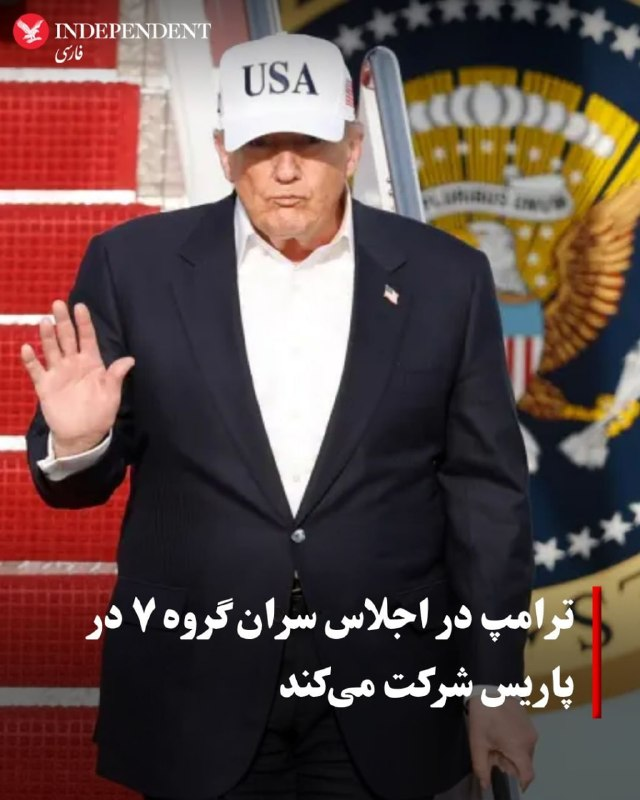

♦️یک مقام کاخ سفید روز سه‌شنبه ۲۹ اردیبهشت (چهارشنبه صبح به وقت تهران) به خبرگزاری رویترز گفت که دونالد ترامپ، رئیس جمهوری آمریکا، در نشست رهبران گروه ۷ در فرانسه در ماه ژوئن (خرداد) شرکت خواهد کرد.

پیش از این آکسیوس گزارش کرده بود که ترامپ می‌خواهد در مورد پیوند دادن کمک‌های ایالات متحده با تجارت، ترویج پذیرش ابزارهای هوش مصنوعی توسعه‌یافته ایالات متحده و کاهش تسلط چین بر زنجیره‌های تامین مواد معدنی حیاتی، از جمله موضوعات دیگر در این نشست صحبت کند.
‌🇸🇦 Indypersian

🤖 @VahidOOnLine

## VahidOOnLine — post 241105

♦️ولادیمیر پوتین، رئیس‌جمهوری روسیه روز چهارشنبه ۳۰ اردیبهشت ماه و در یک نشست خبری مشترک با شی‌ جین‌پینگ در پکن اعلام کرد مسکو و پکن به‌طور مشترک سیاست خارجی «مستقل و حاکمیتی (احترام با حاکمیت ملی کشورها)» را دنبال خواهند کرد.

پوتین در بخشی از سخنان خود گفت: «روابط روسیه و چین به سطحی بی‌سابقه رسیده و همچنان در حال توسعه است. روابط ما مستقل از شرایط فعلی جهان است و نمونه‌ای از الگویی است که کشورها باید امروز روابط خود را بر پایه آن بنا کنند.»

او همچنین تاکید کرد مذاکرات دو طرف «در فضایی گرم، دوستانه و سازنده» برگزار شده و همه حوزه‌های اصلی همکاری دوجانبه مورد بررسی قرار گرفته است.
‌🇸🇦 Indypersian

🤖 @VahidOOnLine

## VahidOOnLine — post 241104

♦️مراسم سنتی «پیک‌نیک کنگره» روز سه شنبه در محوطه چمن جنوبی کاخ سفید با حضور رئیس‌جمهور و بانوی اول آمریکا برگزار شد.

این مراسم سنتی به صورت سالانه در فضایی غیررسمی برگزار می‌شود و اعضای کنگره آمریکا از هر دو حزب دموکرات و جمهوری‌خواه به همراه خانواده‌هایشان در کنار رئیس‌جمهور و بانوی اول ایالات متحده در آن شرکت می‌کنند.

 در تصاویری که کاخ سفید منتشر کرده است استقبال دونالد ترامپ و ملانیا ترامپ از مهمانان در فضای باز کاخ سفید و در حال تماشای اجرای موسیقی زنده دیده می‌شوند.
‌🇸🇦 Indypersian

🤖 @VahidOOnLine

## VahidOOnLine — post 241103

  

♦️سپاه پاسدران روز چهارشنبه ۳۰ اردیبهشت‌ماه با انتشار بیانیه خطاب به آمریکا و اسرائیل هشدار داد که در صورت حمله دوباره، «این بار جنگ به فراتر از منطقه کشیده خواهد شد.»

سپاه در این بیانیه مدعی تحمیل «شکست‌های بزرگ و راهبردی مکرر» به آمریکا و اسرائیل شده و نوشته است: «گرچه آنها با تمام توانایی‌های دو ارتش که پر هزینه‌ترین ارتش‌های جهان هستند به ما حمله کردند اما ما همه ظرفیت‌های انقلاب اسلامی را علیه آنان وارد عمل نکردیم، اما اینک اگر تجاوز به ایران تکرار شود جنگ منطقه‌ای که وعده داده شده بود، این‌بار به فراتر از منطقه کشیده خواهد شد و ضربات کوبنده ما در جاهایی که تصور آن را ندارید شما را به خاک سیاه خواهد نشاند.»

علی خامنه‌ای، رهبر پیشین جمهوری اسلامی که در موج اول حملات آمریکا و اسرائیل در بیت رهبری کشته شد، چند هفته پیش از آغاز حملات گفته بود «آمریکا بداند که در صورت حمله، این‌بار جنگ منطقه‌ای خواهد بود.»

سپاه در بیانیه خود بدون اشاره مستقیم به تهدیدهای رئیس جمهوری آمریکا نوشته است: «ما مرد جنگیم و قدرت ما را در میدان نبرد خواهید دید و نه در بیانیه‌های توخالی و صفحات مجازی.»

دونالد ترامپ دو روز پیش گفته بود در آستانه صدور فرمان حمله همه‌جانبه به ایران، با درخواست رهبران عربستان سعودی، قطر و امارات متحده عربی، این حمله را برای چند روز به تعویق انداخته است.
‌🇸🇦 Indypersian

🤖 @VahidOOnLine

## VahidOOnLine — post 241102

  

انور قرقاش، مشاور دیپلماتیک رییس امارات متحده عربی، در پیامی در شبکه اجتماعی ایکس، نیروهای نیابتی جمهوری اسلامی در عراق را مسئول حمله اخیر به نیروگاه هسته‌ای براکه معرفی کرد.

او نوشت این حمله «نشانه‌ای بسیار خطرناک از میزان تهدیدی است که منطقه با آن روبه‌روست؛ تهدیدی که از یک سو ناشی از فقدان دولت ملی و از سوی دیگر نتیجه نقض آشکار حقوق بین‌الملل است».

قرقاش افزود: «همان‌گونه که ربایش و ایجاد اختلال در تنگه هرمز تهدیدی برای اقتصاد جهانی و نظم بین‌المللی به شمار می‌رود، هدف قرار دادن براکه نیز اقدامی مجرمانه و نقض مستقیم حقوق بین‌الملل است.»

او یادآور شد: «از هرمز تا براکه، این تهدید دیگر تنها محدود به خلیج فارس نیست، بلکه کل نظام بین‌المللی را هدف قرار داده و بازتاب‌دهنده ذهنیت آشوب‌طلبی و باج‌خواهی است؛ ذهنیتی که برای امنیت ملت‌ها، حقوق بین‌الملل و ثبات اقتصاد جهانی ارزشی قائل نیست و تنها در پی بقا و تحمیل منطق تهاجمی خود است.»
‌🏁 🇬🇧 IranintlTV

🤖 @VahidOOnLine

## VahidOOnLine — post 241101

  

نت‌بلاکس، نهاد پایش‌کننده وضعیت اینترنت در جهان، چهارشنبه ۳۰ اردیبهشت، اعلام کرد هشتاد و دومین روز از قطع دیجیتال اینترنت در ایران سپری شده و این کشور پس از ۱۹۴۴ ساعت همچنان تا حد زیادی از اینترنت جهانی جدا مانده است.

این نهاد افزود در شرایطی که قطعی چند دقیقه‌ای اینترنت می‌تواند بحران‌زا باشد، ادامه این وضعیت در ایران به «نابودی معیشت‌ها و فرسایش حقوق شهروندان» منجر شده است.
‌🏁 🇬🇧 IranintlTV

🤖 @VahidOOnLine

## VahidOOnLine — post 241100

  <a href="telegram/content/VahidOOnLine_241100_1779271146.mp4" target="_blank">🎬 Download video</a>

بر اساس پیام‌های رسیده به ایران‌اینترنشنال، کمبود بنزین در بندرعباس و شماری از شهرهای جنوب استان کرمان باعث شکل‌گیری صف‌های طولانی در جایگاه‌های سوخت شده است.

به‌گفته شهروندان، برخی جایگاه‌ها بیش از ۱۵ لیتر بنزین عرضه نمی‌کنند و در مواردی قیمت آن در بازار آزاد به لیتری ۱۰۰ هزار تومان رسیده است. شهروندان می‌گویند ناچارند شب‌ها در صف‌های چند کیلومتری بمانند تا صبح نوبت سوخت‌گیری آنان برسد.

این وضعیت در بندرعباس، با وجود گرمای شدید و نیاز ضروری به کولر خودرو، نارضایتی گسترده‌ای ایجاد کرده است.
‌🏁 🇬🇧 IranintlTV

🤖 @VahidOOnLine

## VahidOOnLine — post 241099

  

♦️مسعود پزشکیان، رئیس جمهوری اسلامی روز چهارشنبه ۳۰ اردیبهشت ماه در همایش دولتی استانداران گفت با روش‌های گذشته نمی‌توان کشور را اداره کرد و اگر شیوه‌های قبلی راه‌گشا بود، بسیاری از مشکلات تا الان «حل شده بود».

این سخنان در حالی عنوان می‌شود که پزشکیان دو روز پیش هم با انتقاد از «عادی نمایی» شرایط گفته بود که ایران پس از جنگ اخیر با آمریکا و اسرائیل، با مشکلات بسیاری در عرصه‌های مالی، انرژی و نفت و گاز مواجه است و حملات هوایی به تاسیسات نفتی و کارخانه‌های فولاد، آسیب جدی به این صنایع وارد کرده است. رئیس دولت چهاردهم خطاب به منتقدان مذاکرات با آمریکا گفته بود: «گفت‌وگو نکنیم، چه کنیم؟»
‌🇸🇦 Indypersian

🤖 @VahidOOnLine

## VahidOOnLine — post 241098

  

به گزارش خبرگزاری‌های داخلی، حکم اعدام بهمن فرزانه، قاتل الهه حسین‌نژاد، بامداد چهارشنبه اجرا شده است.
الهه حسین‌نژاد، زن ۲۴ ساله، خرداد سال گذشته هنگام بازگشت به خانه در تهران ناپدید شد و حدود ۱۰ روز بعد پیکر او با چندین ضربه چاقو در بیابان‌های اطراف تهران پیدا شد.
خبرگزاری میزان، وابسته به قوه قضاییه جمهوری اسلامی، اعلام کرده این حکم پس از طی مراحل قانونی و با درخواست اولیای دم اجرا شده است.
‌🏁 🇬🇧 ManotoTV

🤖 @VahidOOnLine

## VahidOOnLine — post 241097

  

♦️کاترین ووترن، وزیر دفاع فرانسه روز چهارشنبه ۳۰ اردیبهشت ماه و پس از گزارش شبکه سی‌بس‌اس آمریکا مبنی بر شناسایی حداقل ۱۰ مین در تنگه هرمز گفت که فرانسه در حال حاضر هیچ اطمینانی ندارد که این منطقه اصلا مین‌گذاری شده باشد.

کاترین ووترن به رادیو فرانس انفو گفت: «در حال حاضر، من هیچ اطمینانی در این مورد ندارم، اما در هر صورت ما در حال آماده شدن برای لزوم پاکسازی احتمالی مین‌ها هستیم.»

وزیر دفاع فرانسه تاکید کرد «کشتی‌های مین‌روب به عنوان بخشی از یک ماموریت احتمالی به رهبری فرانسه و بریتانیا به منطقه اعزام شده‌اند و فرانسه یکی از این شناورها را در پایگاه نظامی خود در جیبوتی دارد.»

حدود ۱۰ روز پیش رسانه‌های آلمانی اعلام کرده بودند که این کشور هم کشتی‌ مین‌روب به منطقه اعزام کرده است.
‌🇸🇦 Indypersian

🤖 @VahidOOnLine

## VahidOOnLine — post 241096

♦️ولادیمیر پوتین و شی‌ جین‌پینگ، روسای جمهوری روسیه و چین، بیانیه مشترکی درباره تقویت «شراکت جامع و همکاری راهبردی» میان دو کشور امضا کردند.
این توافق که در جریان دیدار رسمی دو رهبر در پکن انجام شد و بر گسترش همکاری‌های سیاسی، اقتصادی، امنیتی و بین‌المللی میان مسکو و پکن تاکید دارد.
‌🇸🇦 Indypersian

🤖 @VahidOOnLine

## VahidOOnLine — post 241095

  

مسعود پزشکیان، رییس‌جمهور دولت جمهوری اسلامی، با اشاره به بحران اقتصادی در ایران، بار دیگر بر «صرفه‌جویی» مردم تاکید کرد و گفت: «امروز ضروری است برای مردم تبیین شود که لازمه عبور موفق از این شرایط، ایجاد تناسب میان داشته‌ها و خواسته‌هاست.»

او گفت: «با اسراف، افزایش بی‌رویه توقعات و بی‌توجهی به محدودیت‌ها نمی‌توان به اهداف بزرگ دست یافت.»
‌🏁 🇬🇧 IranintlTV

🤖 @VahidOOnLine

## VahidOOnLine — post 241094

  

زمین‌لرزه‌ای به بزرگی ۴.۷ بامداد چهارشنبه ۳۰ اردیبهشت حوالی لافت در استان هرمزگان را لرزاند. مرکز لرزه‌نگاری کشوری عمق این زلزله را ۲۰ کیلومتر اعلام کرده است. این زمین‌لرزه در بخش‌هایی از قشم، هرمز و مناطق روستایی بندرعباس نیز احساس شد. مقام‌های محلی می‌گویند تاکنون گزارشی از خسارت دریافت نشده، اما بررسی‌ها در مناطق نزدیک به کانون زلزله ادامه دارد.
‌🏁 🇬🇧 ManotoTV

🤖 @VahidOOnLine

## VahidOOnLine — post 241093

دونالد ترامپ، رئیس‌جمهور آمریکا، بار دیگر مدعی شد که ایالات متحده جنگ با جمهوری اسلامی را «خیلی سریع» پایان خواهد داد و تهران «به‌شدت» خواهان توافق است.
ترامپ در جریان مراسم سالانه پیک‌نیک کنگره در محوطه جنوبی کاخ سفید گفت توافق با تهران «اتفاق خواهد افتاد و سریع هم اتفاق می‌افتد».
او همچنین مدعی شد با پایان این بحران، قیمت نفت «به‌شدت کاهش خواهد یافت».
این اظهارات پس از آن مطرح می‌شود که ترامپ اوایل هفته گفته بود تهران برای رسیدن به توافق «التماس» می‌کند و او تنها یک ساعت با صدور دستور حملات تازه علیه جمهوری اسلامی فاصله داشته است.
ترامپ گفت به درخواست متحدان خلیج فارس آمریکا، حملات را متوقف کرده تا به گفته او، «مذاکرات جدی» ادامه پیدا کند. با این حال، او هشدار داد اگر جمهوری اسلامی به توافق نرسد، آمریکا برای یک «حمله کامل» آماده است.
‌🏁 🇬🇧 ManotoTV

🤖 @VahidOOnLine

## VahidOOnLine — post 241092

  

شی جین‌پینگ، رئیس‌جمهوری چین، در دیدار با ولادیمیر پوتین در پکن خواستار توقف فوری درگیری‌ها در خاورمیانه شد و گفت پایان جنگ می‌تواند به کاهش اختلال در عرضه انرژی و زنجیره‌های تجارت جهانی کمک کند.

شی جین‌پینگ روز چهارشنبه، ۲۰ مه ۲۰۲۶، در دیدار با ولادیمیر پوتین در تالار بزرگ خلق پکن گفت وضعیت خاورمیانه در مرحله‌ای حساس میان جنگ و صلح قرار دارد و توقف درگیری‌ها «فوری‌ترین ضرورت» است. او تأکید کرد بازگشت به جنگ قابل قبول نیست و مسیر مذاکره باید در اولویت قرار گیرد. به گفته رئیس‌جمهور چین، پایان زودهنگام درگیری‌ها می‌تواند از اختلال بیشتر در عرضه انرژی و عملکرد زنجیره‌های صنعتی و تجاری جلوگیری کند.

پوتین نیز در آغاز این دیدار گفت روابط روسیه و چین به سطحی «بی‌سابقه» رسیده و از شی جین‌پینگ دعوت کرد سال آینده به روسیه سفر کند. رئیس‌جمهوری روسیه همچنین همکاری دو کشور را عاملی برای «بازدارندگی و ثبات» در روابط بین‌الملل توصیف کرد.

بر اساس گزارش‌ها، دو طرف در این دیدار درباره انرژی، امنیت و روابط کلی مسکو و پکن گفت‌وگو کردند و با تمدید پیمان دوستی چین و روسیه موافقت کردند؛ پیمانی که نخستین‌ب
‌🏁 🇬🇧 ManotoTV

🤖 @VahidOOnLine

## WithYashar — post 11738

گروسی: برای تضمین امنیت هسته‌ای به خلیج فارس سفر می‌کنم
@withyashar

## WithYashar — post 11737

وزیر کشور پاکستان عازم تهران شد
@withyashar

## WithYashar — post 11736

## WithYashar — post 11735

  

کانال ۱۲ اسرائیل: ترامپ و نتانیاهو دیشب تماس تلفنی طولانی داشتند که یک تماس محوری توصیف شده است
@withyashar

## WithYashar — post 11734

  <a href="telegram/content/WithYashar_11734_1779271155.mp4" target="_blank">🎬 Download video</a>

مراسم عروسی جان فداها: عروس رفته تنگه هرمز گل بچینه!
@withyashar
😂 جلبک دریایی 🪸

## WithYashar — post 11733

دو نفتکش چینی پس از دو ماه معطلی در خلیج فارس، روز چهارشنبه از تنگه هرمز عبور کردند.
@withyashar

## WithYashar — post 11732

  <a href="https://t.me/withyashar/11732" target="_blank">📎 Download file</a>

نسخه فارسی و بدون سانسور کتاب "پاسخ به تاریخ" نوشته‌ی، محمدرضا شاه پهلوی

🌐 @withyashar

🌐 instagram.com/yashar

## WithYashar — post 11731

  

آمار نشون می‌ده در ۳ ماه گذشته یک پاکسازی طبقاتی دیجیتال در ایران رخ داده. در این مدت سهم اندروید از ترافیک اینترنت ۲۵٪ افت و آیفون ۱۸۰٪ رشد داشته. این به معنی خروج میلیون‌ها کاربر طبقه متوسط و پایین از فضای آنلاینه. اونی که آیفون داره از پس هزینه کانفیگ یا اینترنت پرو برمیاد، اونی که نداره، اونقدر دغدغه مالی مختلف داره که عطای اینترنت رو به لقاش می‌بخشه

@withyashar

## WithYashar — post 11730

وزیر نیروهای مسلح فرانسه اعلام کرد این کشور از وجود مین‌های دریایی در تنگه هرمز اطمینان ندارد.
@withyashar

## WithYashar — post 11729

مقامات کره جنوبی تأیید کردند نفتکش «یونیورسال وینر» این کشور که حامل دو میلیون بشکه نفت از کویت است، از تنگه هرمز عبور کرد.
@withyashar

## WithYashar — post 11728

وزارت خارجه روسیه اعلام کرد ایران از «پیمان منع گسترش سلاح‌های هسته‌ای» (ان‌پی‌تی) خارج نخواهد شد.
@withyashar

## WithYashar — post 11727

۳پا تروریستی : جنگ منطقه‌ای که وعده داده شده بود با تکرار تجاوز، به فراتر از منطقه کشیده خواهد شد
@withyashar

## WithYashar — post 11726

شاهزاده رضا پهلوی:

با دولت ترامپ و اعضای کنگره آمریکا در تماس هستم.

@withyashar

## WithYashar — post 11725

  

رادار کلادفلر خبر از افزایش ترافیک‌ اینترنت ایران می‌دهد؛ شروعی برای موج قوی تر فیلترینگ؟
@withyashar

## WithYashar — post 11724

فایننشال تایمز: شرکت سرمایه‌گذاری خطر پذیر ترامپ که در حوزه هوش مصنوعی، فناوری دفاعی و املاک فعالیت می‌کند، در حدود یک سال از ۲۰۰ میلیون دلار به ۳.۵ میلیارد دلار دارایی رسید؛ یعنی جهشی ۱۷ برابری
@withyashar

## WithYashar — post 11723

  <a href="telegram/content/WithYashar_11723_1779271159.mp4" target="_blank">🎬 Download video</a>

ترامپ بعد از زدن حرفهای همیشگی مانند رهبرشان مرده، نیروی نظامی ندارند و سلاح هستهی نباید داشته باشند
پس از سخنرانی ملانیا ترامپ در کاخ سفید، گفت: عجب سخنرانی فوق‌العاده‌ای بود، من هیچوقت دوس ندارم بعد از بانوی اول آمریکا صحبت کنم، چون باعث میشه خیلی خوب به نظر نرسم.
@withyashar

## WithYashar — post 11722

  <a href="telegram/content/WithYashar_11722_1779271161.mp4" target="_blank">🎬 Download video</a>

پوتین و شی بیانیۀ مشترک تعمیق روابط چین و روسیه را امضا کردند

شی: جهان به دلیل اقدامات یک‌جانبه و سلطه‌طلبانه دیگر پایدار نیست، بنابراین ما به دنبال یک نظام جهانی جدید هستیم.

پوتین: همکاری ما در امور سیاست خارجی یکی از عوامل اصلی ثبات در صحنه بین‌المللی است.
در شرایط پرتنش فعلی در صحنه بین‌المللی، هماهنگی نزدیک ما به ویژه مورد نیاز است.
@withyashar

## WithYashar — post 11721

فراخوان دادن هرکی با سیدعلی خاطره داشته بیاد تعريف کنه می‌خوایم سریال بسازیم
@withyashar 😬😂

## WithYashar — post 11720

  <a href="telegram/content/WithYashar_11720_1779271164.mp4" target="_blank">🎬 Download video</a>

ترامپ: ما در ایران کار فوق‌العاده‌ای انجام دادیم؛ فکر میکنم خیلی زود این کار تمام بشه و آنها سلاح هسته‌ای نخواهند داشت؛ امیدوارم این کار رو به روشی بسیار خوب انجام بدیم.
@withyashar

## WithYashar — post 11718

  <a href="telegram/content/WithYashar_11718_1779271167.mp4" target="_blank">🎬 Download video</a>

استقبال شی از پوتین در پکن چین
@withyashar

## mwarmonitor — post 9338

  

✈️یک فروند هواپیمای ترابری نظامی C-130H هرکولس نیروی هوایی پاکستان که از اسلام‌آباد پرواز کرده بود، امروز در حال عبور از حریم هوایی عربستان سعودی مشاهده شد؛ پروازی که احتمالاً به مقصد پایگاه هوایی ملک عبدالعزیز (King Abdulaziz Air Base) انجام شده است؛ جایی که یک یگان از نیروی هوایی پاکستان برای کمک به دفاع از پادشاهی عربستان در برابر حملات ایران مستقر است.

@mwarmonitor

## mwarmonitor — post 9337

  

🇺🇦سرویس امنیتی اوکراین (Ukraine’s Security Service / SBU) مدعی شده است که موشک‌های پدافند هوایی—از جمله گونه‌هایی از موشک R-60—که اخیراً روی پهپادهای روسی کشف شده‌اند، حاوی عناصر رادیواکتیو بوده‌اند؛ از جمله اورانیوم-۲۳۵ و اورانیوم-۲۳۸.

@mwarmonitor

## mwarmonitor — post 9336

🇮🇱🇺🇸بنیامین نتانیاهو و دونالد ترامپ شب گذشته یک تماس تلفنی «طولانی و پرتنش» داشتند؛ تماسی که به گفته شبکه N12 اسرائیل، در بحبوحه گمانه‌زنی‌های فزاینده درباره احتمال حمله جدید به ایران انجام شده است.

🔸نتانیاهو همچنین امروز هم در مراسم آغاز به کار نشست کنست شرکت نخواهد کرد و هم در رأی‌گیری مهم درباره انحلال پارلمان غایب خواهد بود.

@mwarmonitor

## mwarmonitor — post 9335

🔴رسانه‌های ایرانی به نقل از یک منبع در اسلام‌آباد گزارش دادند که وزیر کشور پاکستان برای دیدار با مقام‌های ایرانی عازم تهران شده است.

@mwarmonitor

## mwarmonitor — post 9334

🔴هدف اولیه جنگ، روی کار آوردن رئیس‌جمهور سابق تندرو به‌عنوان رهبر ایران بود. NYT 🔸به گفته مقام‌های آمریکایی، یک حمله اسرائیل که با هدف آزاد کردن محمود احمدی‌نژاد از حصر خانگی در تهران طراحی شده بود، بخشی از تلاشی برای ایجاد تغییر رژیم و رساندن او به قدرت…

## mwarmonitor — post 9333

  

🔴هدف اولیه جنگ، روی کار آوردن رئیس‌جمهور سابق تندرو به‌عنوان رهبر ایران بود. NYT

🔸به گفته مقام‌های آمریکایی، یک حمله اسرائیل که با هدف آزاد کردن محمود احمدی‌نژاد از حصر خانگی در تهران طراحی شده بود، بخشی از تلاشی برای ایجاد تغییر رژیم و رساندن او به قدرت محسوب می‌شد.

@mwarmonitor

## mwarmonitor — post 9332

🔴اختصاصی آکسیوس: ترامپ به‌رغم تنش با متحدان، در اجلاس G7 در فرانسه شرکت می‌کند

🔰رئیس‌جمهور ترامپ ماه ژوئن برای گفتگو درباره هوش مصنوعی، تجارت و مبارزه با جرم و جنایت در نشست سران گروه ۷ (G7) در فرانسه شرکت خواهد کرد؛ اقدامی که یک مقام کاخ سفید آن را در گفتگو با اکسیوس تایید کرده است.

چرا این موضوع اهمیت دارد؟
هرچند حضور روسای جمهور آمریکا در اجلاس‌های سالانه گروه ۷ امری مرسوم و سنتی است، اما شرکت ترامپ در این نشست به دلیل خشم فزاینده او از اعضای این گروه (مانند بریتانیا، فرانسه، آلمان و ایتالیا) به خاطر همراهی نکردن با تلاش‌های جنگی او در ایران، قطعی نبود.
یک مقام کاخ سفید اعلام کرد که این نشست منجر به امضای قراردادهای رسمی نخواهد شد، بلکه هدف آن ایجاد اجماع و همسویی برای توافقات آینده است.
تولد ترامپ درست پیش از آغاز این اجلاس، در ۱۴ ژوئن (۲۴ خرداد) است و او ۸۰ ساله خواهد شد.
نگاهی دقیق‌تر به برنامه‌ها
این نشست که از ۱۵ تا ۱۷ ژوئن (۲۵ تا ۲۷ خرداد) در شهر «اویان-له-بن» (Évian-les-Bains) در جنوب شرقی فرانسه برگزار می‌شود، قطعاً موضوع ایران را در دستور کار خواهد داشت، اما ترامپ می‌خواهد روی مسائل اقتصادی و تجاری تمرکز کند:
پیوند زدن کمک‌های آمریکا با تجارت: به گفته این مقام مسئول، هدف این است که تجارت برای هر دو کشور سرمایه‌گذار و دریافت‌کننده سود متقابل داشته باشد.
توسعه هوش مصنوعی: ترویج و به‌کارگیری ابزارهای هوش مصنوعی توسعه‌یافته در آمریکا.
کاهش نفوذ چین: توافق برای کاهش سلطه چین بر زنجیره تامین مواد معدنی حیاتی.
امنیت و مهاجرت: مبارزه با قاچاق مواد مخدر و مهاجرت غیرقانونی.
انرژی و صادرات: ترویج صادرات آمریکا، کاهش موانع مقرراتی و افزایش تولید انرژی، به‌ویژه سوخت‌های فسیلی.
پشت صحنه (روابط ترامپ و ماکرون)
امانوئل ماکرون، رئیس‌جمهور فرانسه که گاهی هدف خشم و انتقادهای ترامپ قرار گرفته است، تلاش کرده با پیشنهاد یک شام مجلل پس از پایان اجلاس در کاخ ورسای (نماد شکوه و زرق‌وبرق سبک باروک فرانسوی که ترامپ شیفته آن است)، دل رئیس‌جمهور آمریکا را به دست آورد. هنوز مشخص نیست که آیا ترامپ در این ضیافت شام شرکت خواهد کرد یا خیر.
نگاه کلان: سایه جنگ ایران بر روابط متحدان
جنگ در ایران همچنان سایه سنگینی بر روابط میان ایالات متحده و تقریباً تمام متحدان اصلی‌اش در گروه ۷ و فراتر از آن انداخته است.
حتی اگر از اکنون تا اواسط ژوئن توافقی حاصل شود، احتمالاً همچنان مقداری دلخوری و تنش در فضا باقی خواهد ماند.
هیچ‌کدام از کشورهای اروپایی به آمریکا در تلاش برای تضمین عبور امن کشتی‌های تجاری از تنگه هرمز کمک نکرده‌اند؛ هرچند ترامپ گاهی گفته به کمک آن‌ها نیازی ندارد و چندین رهبر اروپایی نیز اعلام کرده‌اند که پس از پایان جنگ، مشارکت خواهند کرد.
در همین حال، روز سه‌شنبه و در جریان نشست وزرای دارایی این گروه در پاریس، اسکات بسنت (Scott Bessent)، وزیر خزانه‌داری آمریکا، از اعضای گروه ۷ خواست تا برای مبارزه با «تروریسم ایرانی» و «منابع مالی پشتیبان آن»، تحریم‌های بیشتری وضع کنند.

📌اسکات بسنت در نشست پاریس گفت:
«درهم‌شکستن تهدید تروریسم ایجاب می‌کند که همه شما قدم پیش بگذارید و به ما ملحق شوید. ما از همه متحدان خود در G7 و در واقع از تمام جهان می‌خواهیم که از رژیم تحریم‌ها پیروی کنند تا بتوانیم جریان مالی نامشروعی را که ماشین جنگی ایران را تغذیه می‌کند، متوقف کنیم و این پول را به مردم ایران بازگردانیم.»

@mwarmonitor

## pm_afshaa — post 91090

🔴کرملین:ویتکاف بارها تمایل خود را برای بازدید از مسکو ابراز کرده است، اما تاریخ آن هنوز تعیین نشده

💧 Rainbet.com the #1 Non-KYC Crypto Casino & Sportsbook @rainbetcom

😁 @Pm_Afshaa

## pm_afshaa — post 91089

سپاه:اگر حمله به ایران دوباره رخ دهد، جنگ فراتر از مرزهای منطقه گسترش خواهد یافت

💧 Rainbet.com the #1 Non-KYC Crypto Casino & Sportsbook @rainbetcom

😁 @Pm_Afshaa

## pm_afshaa — post 91088

🔴بهمن فرزانه؛ قاتل الهه حسین نژاد صبح امروز اعـدام شد

💧 Rainbet.com the #1 Non-KYC Crypto Casino & Sportsbook @rainbetcom

😁 @Pm_Afshaa

## iaghapour — post 2620

  

⚠️ بحران خاموشی دیجیتال؛ ضربه‌ای جبران‌ناپذیر بر پیکر اقتصاد و جامعه

🔻بیش از ۱۹۴۴ ساعت خاموشی دیجیتال، تنها قطع یک ابزار ارتباطی روزمره نیست، بلکه یک «بحران تمام‌عیار اقتصادی و اجتماعی» است. در زمانه‌ای که در سراسر جهان حتی چند دقیقه اختلال در اینترنت زیان‌های هنگفتی به بار می‌آورد، تداوم ۸۲ روزه این وضعیت در ایران، آسیبی عمیق به شریان‌های حیاتی کسب‌وکارها و زندگی عادی مردم وارد کرده است.

در واقع، تداوم این قطعی طولانی‌مدت نشان می‌دهد که حفظ حیات اقتصادی مشاغلِ وابسته به فضای مجازی و نیازهای ارتباطی جامعه، در اولویت تصمیم‌گیری‌ها قرار ندارد؛ رویکردی که پیامدی جز نابودی معیشت هزاران نفر، فرسایش سرمایه اجتماعی و آسیب جدی به بدنه نوپای اقتصاد دیجیتال کشور نخواهد داشت.

🆔 @iaghapour

## iaghapour — post 2619

  

⭕️ شگفتی گوگل در Google I/O 2026؛ معرفی جمینای ۳.۵ فلش با سرعتی باورنکردنی!

در گام نخست، مدل جمینای ۳.۵ فلش عرضه شده است؛ مدلی که با وجود طراحی شدن برای سرعت بالا و هزینه کم، در کمال شگفتی توانسته مدل‌های پرچمدار و پرو نسل‌های قبل را در بنچمارک‌های تخصصی شکست دهد.

🔹 پادشاهی در بخش ایجنت‌ها: این مدل با توانایی برنامه‌ریزی بالا، می‌تواند چندین ایجنت را به صورت موازی برای پیشبرد پروژه‌های پیچیده و کدنویسی مستقر کند.

🔸 سرعت خیره‌کننده و کاهش هزینه‌ها: ساندار پیچای اعلام کرد این مدل با سرعت پردازش ۲۸۹ توکن در ثانیه، حدود ۴ برابر سریع‌تر از رقباست.

🔹 شکست رقبای سرسخت: جمینای ۳.۵ فلش در آزمون‌های تخصصیِ مربوط به کارهای ایجنتی، امتیاز بی‌نظیر ۱۶۵۶ را کسب کرده و عملاً رقیب سرسختی مثل کلود سونیت ۴.۶ آنتروپیک را پشت سر گذاشته است.

🔸 همچنین نسخه قدرتمندتر یعنی جمینای ۳.۵ پرو در ماه ژوئن ۲۰۲۶ رسماً عرضه خواهد شد.

جمینای ۳.۵ فلش هم‌اکنون به عنوان مدل پیش‌فرض در اپلیکیشن جمینای و بخش سرچ گوگل فعال شده است.

🧠 @NovinAIplus

## DEJradio — post 4762

  <a href="telegram/content/DEJradio_4762_1779271173.webm" target="_blank">🎬 Download video</a>

🚨
🔸 "همراهی ناخواسته اپوزسیون ملی با جمهوری اسلامی

*پژمان گلچین، پژوهشگر فلسفه.

#اپوزسیون_ملی #ایران
@DEJradio

## DEJradio — post 4759

  <a href="telegram/content/DEJradio_4759_1779271174.webm" target="_blank">🎬 Download video</a>

🚨📢 شبکه آمریکایی «الحره» به نقل از منابع نظامی و سیاسی آگاه در داخل ایران گزارش داد، کشور شاهد افزایش شدید و بی‌سابقه اختلافات و درگیری‌های داخلی میان ارتش و سپاه پاسداران است؛ اختلافاتی که به وقوع درگیری‌های مسلحانه در چندین شهر اصلی ایران انجامیده است. این تنش‌ها بعد از کشته شدن علی خامنه‌ای رهبر جمهوری اسلامی آغاز شد؛ رخدادی که خلأ سیاسی و امنیتی بزرگی در ساختار نظام ایجاد کرده است.

در این گزارش که ۲۵ اردیبهشت ۱۴۰۵ منتشر شد، مفصل به نقل از افسران سابق ارتش ایران و فعالان متخصص در امور ایران گفته شد، که طی هفته‌های اخیر درگیری‌های مسلحانه میان نیروهای ارتش رسمی و سپاه پاسداران در شهرهای مهمی از جمله #تهران، تبریز، اصفهان و مناطقی از اهواز رخ داده است.

این درگیری‌ها همزمان با دوره تنش‌های نظامی اخیر منطقه میان آمریکا و اسرائیل رخ داده و به کشته و زخمی شدن نیروهایی از هر دو طرف انجامیده است؛ موضوعی که نشان‌دهنده لرزش عمیق در نهادهای نظامی و امنیتی حکومت است.

#ارتش #IRGCterrorists
@DEJradio

## DEJradio — post 4758

  <a href="telegram/content/DEJradio_4758_1779271174.webm" target="_blank">🎬 Download video</a>

🚨
🔸 "جاسوس واقعی کسی است که به خامنه‌ای اطمینان داد از لونه موش بیرون بیاد.

فریبرز کرمی‌زند، افسر پیشین پلیس.

#موشعلی #جاسوسی
@DEJradio

## DEJradio — post 4757

  <a href="telegram/content/DEJradio_4757_1779271175.webm" target="_blank">🎬 Download video</a>

🔺📢 “سـ.ـپاهی‌های با اخلاص که در تجمعات جانفدا محور تبلیغات شدن، همون سرکوبگرای قاتل هستند که با وضو آدم کشتند...

پیام دریافتی

#تجمعات_حکومتی #IRGCterrorists
@DEJradio

## DEJradio — post 4756

  <a href="telegram/content/DEJradio_4756_1779271175.mp4" target="_blank">🎬 Download video</a>

🛩️
🔺 ‏ایالات متحده در حال اعزام نیروهای نظامی به دریای عمان است؛ اقدامی که نشان می‌دهد آمریکا در حال آماده‌سازی برای ازسرگیری جنگ با ایران است.

یک فروند هواپیمای شناسایی دریایی P-8A آمریکا بر فراز دریای عرب و خلیج عمان پرواز کرده و همزمان یک تانکر سوخت‌رسان KC-46A نیز در شمال خلیج عمان برای پشتیبانی از عملیات هوایی حضور داشته است.

پیش‌تر نیز ظهور ناگهانی یک فروند هواپیمای نظارتی دریایی P-8A Poseidon نیروی دریایی آمریکا در نزدیکی سواحل پاکستان، جغرافیای راهبردی تقابل جاری میان آمریکا و ایران را از تنگه هرمز به شمال دریای عرب گسترش داده و الگوهای نظارت دریایی را وارد مرحله‌ای از تشدید بالقوه و مهم کرده است.

#آتشبس #جنگ
@DEJradio

## DEJradio — post 4755

  <a href="telegram/content/DEJradio_4755_1779271177.webm" target="_blank">🎬 Download video</a>

🚨📢 سازمان اطلاعات داخلی آلمان هشدار داده جمهوری اسلامی ممکن است پس از پایان جنگ با اسرائیل و آمریکا، دامنه عملیات‌های امنیتی و تروریستی خود در اروپا را گسترش دهد.

بر اساس گزارش اختصاصی یوراکتیو، سازمان اطلاعات داخلی آلمان (BfV) اعلام کرده تهدید علیه مراکز یهودی و اسرائیلی، مخالفان جمهوری اسلامی و افرادی که حکومت ایران آن‌ها را «خائن» می‌داند، همچنان در سطح بالایی قرار دارد.

این نهاد امنیتی گفته شماری از افراد ساکن آلمان برای آموزش نظامی یا همکاری با نهادهای حکومتی به ایران سفر کرده‌اند و برخی از آن‌ها در ویدئوهای تبلیغاتی جمهوری اسلامی و بسیج ظاهر شده‌اند.

در این گزارش همچنین به نگرانی سرویس‌های امنیتی اروپا از استفاده جمهوری اسلامی از شبکه‌های نیابتی، گروه‌های وابسته به جرایم سازمان‌یافته و نیروهای کم‌هزینه محلی برای انجام حملات اشاره شده است.

به گفته منابع امنیتی، جمهوری اسلامی از مارس ۲۰۲۶ کارزاری با نام «حرکت أصحاب الیمین الإسلامیه» (HAYI) راه‌اندازی کرده که از طریق شبکه‌های اجتماعی اقدام به جذب نیرو در میان محافل طرفدار جمهوری اسلامی و جریان‌های افراطی شیعه می‌کند.

پژوهشگران امنیتی هشدار داده‌اند این مدل عملیات، شامل حملات ساده اما پرتعداد توسط افراد محلی و بعضاً نوجوانان، می‌تواند فشار گسترده‌ای بر سرویس‌های امنیتی اروپا وارد کند؛ به‌ویژه برای حفاظت از مراکز یهودی، مدارس و مراکز اجتماعی.

سازمان اطلاعات داخلی آلمان تأکید کرده است که جمهوری اسلامی در گذشته نیز از روش‌هایی در حد «تروریسم دولتی» استفاده کرده؛ از عملیات‌های شناسایی و مراقبت گرفته تا طراحی حملات علیه مخالفان و اهداف اسرائیلی و یهودی در اروپا.

#تروریسم #آلمان
@DEJradio

## DEJradio — post 4754

  <a href="telegram/content/DEJradio_4754_1779271178.mp4" target="_blank">🎬 Download video</a>

🔺🎥 پیام یک شهروند در واکنش به آموزش استفاده از سلاح به طرفداران نظام در خیابان‌ها: "این کـ...مشنگا هر روز جمع می‌شن اینجا آموزش تفنگ می‌دن".

#تروریسم
@DEJradio

## DEJradio — post 4753

  <a href="telegram/content/DEJradio_4753_1779271180.webm" target="_blank">🎬 Download video</a>

🔺📢 سی‌بی‌اس نیوز به نقل از مقام‌های آمریکایی اعلام کرد ارزیابی اطلاعاتی جدید آمریکا نشان می‌دهد نیروهای این کشور دست‌کم ۱۰ مین دریایی را در تنگه هرمز شناسایی کرده‌اند. پیش از این گزارش شده بود که مقام‌های آمریکایی بر اساس ارزیابی‌های اطلاعاتی معتقد بودند دست‌کم ۱۲ مین زیرسطحی در تنگه هرمز وجود دارد.

مقام‌ها گفته بودند مین‌هایی که ایران در این تنگه به کار گرفته، از نوع «Maham 3» و «Maham 7 Limpet Mine» ساخت ایران هستند. با این حال، یک مقام دیگر آمریکایی گفته بود تعداد مین‌ها کمتر از ۱۲ عدد است.

#تنگه_هرمز #محاصره_دریایی
@DEJradio

## kianmeli1 — post 87514

  

🔴وزارت خارجه آمریکا تا سقف ۱۵ میلیون دلار پاداش برای اطلاعات در مورد شبکه مالی سپاه تروریستی پاسداران تعیین کرد.
https://t.me/kianmeli1

## kianmeli1 — post 87513

🔴 نیویورک تایمز به نقل از منابع آگاه: اسرائیل و آمریکا به دنبال رهبری احمدی نژاد بعد از سرنگونی جمهوری اسلامی و جنگ بودند نیویورک تایمز نوشت: احمدی‌نژاد در اولین روز جنگ در حمله هوایی اسرائیل که محل اقامتش در تهران را هدف قرار داد، مجروح شد. https://t.me/kianmeli1

## kianmeli1 — post 87512

‏🔴رسانه‌های اسرائیل خبر دادند که تماس تلفنی دیشب ترامپ و نتانیاهو طولانی و در آستانه یک تصمیم مهم بوده است
https://t.me/kianmeli1

## kianmeli1 — post 87511

  <a href="telegram/content/kianmeli1_87511_1779271182.mp4" target="_blank">🎬 Download video</a>

🔴سنژنوئه، منطقه دونتسک. حمله به محل استقرار سربازان روسی. گزارش شده است که تعداد زیادی کشته شده‌اند
https://t.me/kianmeli1

## kianmeli1 — post 87510

  <a href="telegram/content/kianmeli1_87510_1779271183.mp4" target="_blank">🎬 Download video</a>

🔴مراسم عروسی جان فداهای حکومت: عروس رفته تنگه هرمز گل بچینه!
https://t.me/kianmeli1

## kianmeli1 — post 87509

  

🔴مرضیه حسینی خبرنگار کنگره امریکا: یک منبع مطلع اینجا در کنگره به من گفت که ترامپ روزهای چهارشنبه یا پنج شنبه پیش رو، به ایران حمله خواهد کرد.

به گفته این فرد،این حملات برای یک عملیات "دو تا سه روز” متمرکز خواهد بود و به مراکزی با *هدف بازگشایی تنگه هرمز* انجام خواهد شد.
https://t.me/kianmeli1

## kianmeli1 — post 87508

  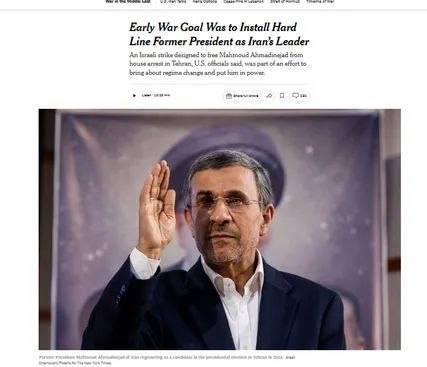

🔴 نیویورک تایمز به نقل از منابع آگاه: اسرائیل و آمریکا به دنبال رهبری احمدی نژاد بعد از سرنگونی جمهوری اسلامی و جنگ بودند

نیویورک تایمز نوشت: احمدی‌نژاد در اولین روز جنگ در حمله هوایی اسرائیل که محل اقامتش در تهران را هدف قرار داد، مجروح شد.
https://t.me/kianmeli1

## kianmeli1 — post 87507

  <a href="telegram/content/kianmeli1_87507_1779271186.mp4" target="_blank">🎬 Download video</a>

🔴خبرنگار شبکه اسکای نیوز، فرمانده سنتکام درباره جنایت مدرسه میناب به چالش کشید و از او پرسید، تا کی می‌خواهید «پشت این ادعا که تحقیقات ادامه دارد پنهان شوید؟»

مارک استون خطاب به کوپر افزود، تیمی از شبکه اسکای نیوز همین الان در میناب هستند. آنچه آنجا رخ داد را دیده‌اند. هیچ مدرکی دال بر وجود پایگاه موشکی در آنجا وجود ندارد.

درحالیکه کوپر در حال فرار از پاسخگویی بود مارک استون دوباره وی را سوال پیچ کرد و گفت، تا کی میخواهید پشت این ادعا که تحقیقات در جریان است قایم شوید؟ «حداقل بگویید تحقیقات چه زمانی پایان خواهد یافت؟»

فرمانده سنتکام به جای پاسخگویی مسیر حرکت خود را تغییر داد و تلاش کرد با کمک محافظانش از دست خبرنگار اسکای نیوز فرار کند!
https://t.me/kianmeli1

## kianmeli1 — post 87506

  

🔴خطر اعدام فوری خواهر و برادر #زینب_موسوی و #حسن_موسوی

​زینب موسوی و برادرش، حسن موسوی، که در جریان اعتراضات سراسری دی‌ماه بازداشت شده بودند، اکنون در زندان وکیل‌آباد #مشهد با اتهام سنگین محاربه روبرو شده و به اعدام محکوم شده‌اند.
این خواهر و برادر معترض در بیدادگاهی فرمایشی و بدون دسترسی به دادرسی عادلانه به مرگ محکوم شده‌اند و جانشان در خطر فوری اجرای حکم قرار دارد.
خانواده موسوی در وضعیت روحی به‌شدت بحرانی و دلهره‌آوری به سر می‌برند و زیر سایه این احکام ظالمانه، چشم‌انتظار یاری و همصدایی افکار عمومی هستند.
سکوت در برابر این جنایت، دست دستگاه سرکوب را برای گرفتن جان این دو جوان بازتر می‌کند؛ نام زینب و حسن را فریاد بزنیم و اجازه ندهیم در بی‌خبری به مسلخ بروند.
https://t.me/kianmeli1

## kianmeli1 — post 87505

‏🔴سپاه پاسداران با انتشار بیانیه‌ای اعلام کرد جنگ منطقه‌ای که وعده داده شده بود با تکرار تجاوز، به فراتر از منطقه کشیده خواهد شد

‏در بیانیه سپاه پاسداران آمده است «ما همه ظرفیت‌های انقلاب اسلامی را علیه آمریکا و اسرائیل وارد عمل نکردیم» و در صورت وقوع جنگ «ضربات کوبنده ما در جاهایی که تصور آن را ندارید شما را به خاک سیاه خواهد نشاند»

‏سپاه پاسداران در پایان بیانیه خود خطاب به آمریکا و اسرائیل نوشت: «ما مرد جنگیم و قدرت ما را در میدان نبرد خواهید دید و نه در بیانیه‌های توخالی و صفحات مجازی»
https://t.me/kianmeli1

## kianmeli1 — post 87504

‏🔴سخنگوی انجمن صنایع فرآورده‌های لبنی: قیمت محصولات لبنی از یکم خرداد ۲۰ درصد گران خواهد شد
https://t.me/kianmeli1

## kianmeli1 — post 87503

‏🔴رييس کمیسیون تخصصی لوازم خانگی: امکان فروش اقساطی برای بسیاری از فروشندگان لوازم خانگی به‌دلیل افزایش مداوم قیمت کالاها وجود ندارد
https://t.me/kianmeli1

## kianmeli1 — post 87502

‏🔴عضو شورای عالی فضای مجازی: مسئول نهایی قطع اینترنت، سیم‌کارت سفید و اینترنت طبقاتی کسانی هستند که در بالاترین رده‌های حکمرانی، تصمیم‌سازی و تصمیم‌گیری می‌کنند، اما پاسخگو نیستند
https://t.me/kianmeli1

## kianmeli1 — post 87501

‏🔴نت‌بلاکس: قطع اینترنت در ایران وارد هشتاد و دومین روز خود شده است و پس از ۱۹۴۴ ساعت همچنان ادامه دارد
https://t.me/kianmeli1

## IranIntlTV — post 338056

  <a href="telegram/content/IranIntlTV_338056_1779271189.mp4" target="_blank">🎬 Download video</a>

آرسنال پس از ۲۲ سال قهرمان لیگ برتر فوتبال انگلستان شد. تصویر جاویدنام عارف جعفرزاده، ۳۲ ساله و اهل رشت که از هواداران آرسنال بود، به دست یک هنرمند انگلیسی روی دیوار ستاره‌های این تیم در شمال لندن نقش بست.

گزارش آیدین مقیمی، خبرنگار ایران‌اینترنشنال
@iranintltv

## IranIntlTV — post 338055

  <a href="telegram/content/IranIntlTV_338055_1779271192.mp4" target="_blank">🎬 Download video</a>

پیام‌های رسیده به ایران‌اینترنشنال از نگرانی دانش‌آموزان، دانشجویان و والدین آنها در پایان سال تحصیلی حکایت دارد. این افراد در پیام‌های خود به ایران‌اینترنشنال گفته‌اند قطع اینترنت و مجازی شدن کلاس‌ها، باعث افت کیفیت آموزش شده است.

لیلا سعادتی، عضو تحریریه ایران‌اینترنشنال، گزارش می‌دهد
@iranintltv

## IranIntlTV — post 338054

  

🔻نشریه نیویورک‌پست، چهارشنبه ۳۰ اردیبهشت در یادداشتی تحلیلی و انتقادی، تصمیم احتمالی فدراسیون بین‌المللی فوتبال، فیفا، برای ممنوع کردن ورود پرچم تاریخی «شیر و خورشید» را به استادیوم‌های جام جهانی ۲۰۲۶ به شدت محکوم کرد. این یادداشت، اقدام مذکور را «توهینی آشکار به آمریکا» و «هدیه‌ای ارزشمند به جمهوری اسلامی» توصیف کرده است.

🔹طبق این یادداشت، فدراسیون فوتبال جمهوری اسلامی ایران به ریاست مهدی تاج، ۱۰ شرط را برای حضور تیم ملی ایران در این مسابقات تعیین کرده است. یکی از اصلی‌ترین خواسته‌های آن‌ها این است که «هیچ پرچمی جز پرچم جمهوری اسلامی» در ورزشگاه‌های محل بازی ایران اجازه ورود نداشته باشد. نیویورک‌پست می‌نویسد که پاسخ فیفا، رد این باج‌خواهی نبوده؛ بلکه با استناد به آیین‌نامه ممنوعیت ورود نمادهای «سیاسی یا تبعیض‌آمیز»، به خواست ملاها تن داده است.

🔹به نوشته نیویورک‌پست بزرگ‌ترین نهاد ورزشی جهان در حال آماده شدن است تا درخواست سانسور یکی از بدترین رژیم‌های دنیا را در خاک آمریکا اجرا کند.

🔹جزییات بیشتر را در سایت بخوانید

@iranintltvsport

## IranIntlTV — post 338053

  <a href="telegram/content/IranIntlTV_338053_1779271196.mp4" target="_blank">🎬 Download video</a>

شورای هماهنگی تشکل‌های صنفی فرهنگیان ایران در بیانیه‌ای، آموزش نظامی به کودکان در مساجد و پایگاه‌های بسیج را نقض آشکار کنوانسیون حقوق کودک دانست. ایران به‌عنوان یکی از امضاکنندگان کنوانسیون حقوق کودک، متعهد به حمایت از کودکان در برابر اقداماتی است که می‌تواند سلامت جسمی و روانی آن‌ها را تهدید کند.
گفت‌وگو با اسماعیل عبدی، فعال صنفی معلمان
@iranintltv

## IranIntlTV — post 338052

  

🔻روزنامه جوان، وابسته به سپاه پاسداران با انتشار یادداشتی به انتقاد از فدراسیون فوتبال پرداخت و نوشت: «داریم تیم ملی‌مان را با خوش‌خیالی به کشور متجاوز به خاک‌مان می‌فرستیم. این خوش‌خیالی می‌تواند به ضرر ما منجر شود. آقایان، طرف‌حساب ما آمریکا و ترامپ هستند، نه فیفا.»

🔹روزنامه جوان در ادامه نوشت: «داریم تیم ملی‌مان را به کشوری که دشمنی‌اش با ما عیان است و کمر به نابودی‌مان بسته می‌فرستیم؛ ولی نمی‌دانیم چرا عده‌ای نمی‌خواهند این واقعیت عیان را ببینند و بپذیرند. این خوش‌خیالی، این اعتماد بی‌جا به دشمن بسیار نگران‌کننده است.»

🔹انتقاد روزنامه جوان در حالی مطرح می‌شود که اردوی آماده‌سازی تیم ملی فوتبال ایران هم‌اکنون در کشور ترکیه در حال برگزاری است و ملی‌پوشان قرار است پس از پایان این اردو، راهی شهر توسان در ایالت آریزونای آمریکا شوند.

@iranintltvsport

## IranIntlTV — post 338051

  <a href="telegram/content/IranIntlTV_338051_1779271199.mp4" target="_blank">🎬 Download video</a>

🔻ویدیو رسیده به ایران‌اینترنشنال نشان می‌دهد یکی از هواداران ایرانی آرسنال در شب مشخص شدن قهرمانی این تیم در لیگ برتر، یاد و نام جاویدنام عارف جعفرزاده را زنده نگه‌ می‌دارد و همچنین هواداران آرسنال شادی خود را با این جاویدنام تقسیم می‌کنند.

🔹جاویدنام عارف جعفرزاده، ۳۴ ساله و اهل رشت، شامگاه ۱۸ دی ۱۴۰۴ در جریان اعتراضات مردمی هدف شلیک مستقیم نیروهای جمهوری اسلامی قرار گرفت و جان باخت. او پس از فراخوان شاهزاده رضا پهلوی، در حالی که لباس تیم آرسنال را بر تن داشت به خیابان رفت. کشته شدن این هوادار آرسنال در فضای هواداری این باشگاه در انگلستان بازتاب گسترده‌ای داشت.

@iranintltvsport

## IranIntlTV — post 338050

  

🔻مهدی طارمی، بازیکن تیم ملی، با انتشار استوری در اینستاگرام به حذف سردار آزمون از تیم ملی واکنش نشان داد و نوشت: «سردار، بودنت کنارم باعث می‌شد خیلی چیزها راحت‌تر و قشنگ‌تر بشود.»

🔹سردار آزمون پس از موضع‌گیری‌هایی در مخالفت با جمهوری اسلامی، از فهرست تیم ملی برای جام جهانی کنار گذاشته شد

🔹سردار آزمون روز گذشته با انتشار تصویری از تیم ملی پیش از سفر به ترکیه نوشت: «درست است که پیش‌تان نیستم، ولی رفیق‌های من هستید، دلیل نمی‌شود که برای شما آرزوی موفقیت نکنم. خیلی‌ها می‌خواهند خرابم کنند، ولی این حرف‌ها اصلاً درست نیست. موفق باشید بچه‌ها.»

@iranintltvsport

## IranIntlTV — post 338049

  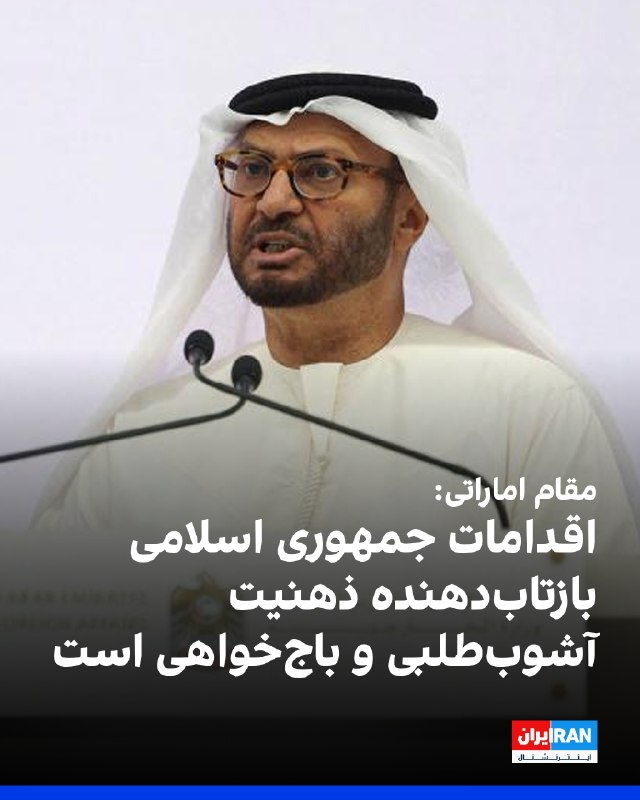

انور قرقاش، مشاور دیپلماتیک رییس امارات متحده عربی، در پیامی در شبکه اجتماعی ایکس، نیروهای نیابتی جمهوری اسلامی در عراق را مسئول حمله اخیر به نیروگاه هسته‌ای براکه معرفی کرد.

او نوشت این حمله «نشانه‌ای بسیار خطرناک از میزان تهدیدی است که منطقه با آن روبه‌روست؛ تهدیدی که از یک سو ناشی از فقدان دولت ملی و از سوی دیگر نتیجه نقض آشکار حقوق بین‌الملل است».

قرقاش افزود: «همان‌گونه که ربایش و ایجاد اختلال در تنگه هرمز تهدیدی برای اقتصاد جهانی و نظم بین‌المللی به شمار می‌رود، هدف قرار دادن براکه نیز اقدامی مجرمانه و نقض مستقیم حقوق بین‌الملل است.»

او یادآور شد: «از هرمز تا براکه، این تهدید دیگر تنها محدود به خلیج فارس نیست، بلکه کل نظام بین‌المللی را هدف قرار داده و بازتاب‌دهنده ذهنیت آشوب‌طلبی و باج‌خواهی است؛ ذهنیتی که برای امنیت ملت‌ها، حقوق بین‌الملل و ثبات اقتصاد جهانی ارزشی قائل نیست و تنها در پی بقا و تحمیل منطق تهاجمی خود است.»
https://iranintl.com/202605200793

## IranIntlTV — post 338048

  <a href="telegram/content/IranIntlTV_338048_1779271202.mp4" target="_blank">🎬 Download video</a>

دونالد ترامپ، رییس‌جمهوری آمریکا، اعلام کرد جنگ با جمهوری اسلامی به‌زودی پایان می‌یابد و مقام‌های تهران به‌شدت به دنبال توافق هستند. هم‌زمان جی‌دی ونس، معاون رییس‌جمهور آمریکا، هشدار داد اگر جمهوری اسلامی از فرصت مذاکره استفاده نکند، گزینه نظامی همچنان روی میز خواهد ماند.
گفت‌وگو با مرتضی کاظمیان، عضو تحریریه ایران‌اینترنشنال
@iranintltv

## IranIntlTV — post 338047

  <a href="telegram/content/IranIntlTV_338047_1779271204.mp4" target="_blank">🎬 Download video</a>

رجب طیب اردوغان، رییس‌جمهوری ترکیه، در گفت‌وگوی تلفنی با اورسولا فون درلاین، رییس کمیسیون اروپا، اعلام کرد آنکارا از حفظ آتش‌بس و برقراری صلح در منطقه حمایت می‌کند و خواستار بازگشایی فوری تنگه هرمز است.

نرگس هورخش، خبرنگار ایران‌اینترنشنال، گزارش می‌دهد
@iranintltv

## IranIntlTV — post 338046

  

نت‌بلاکس، نهاد پایش‌کننده وضعیت اینترنت در جهان، چهارشنبه ۳۰ اردیبهشت، اعلام کرد هشتاد و دومین روز از قطع دیجیتال اینترنت در ایران سپری شده و این کشور پس از ۱۹۴۴ ساعت همچنان تا حد زیادی از اینترنت جهانی جدا مانده است.

این نهاد افزود در شرایطی که قطعی چند دقیقه‌ای اینترنت می‌تواند بحران‌زا باشد، ادامه این وضعیت در ایران به «نابودی معیشت‌ها و فرسایش حقوق شهروندان» منجر شده است.
https://iranintl.com/202605207927

## IranIntlTV — post 338045

  <a href="telegram/content/IranIntlTV_338045_1779271206.mp4" target="_blank">🎬 Download video</a>

بر اساس پیام‌های رسیده به ایران‌اینترنشنال، کمبود بنزین در بندرعباس و شماری از شهرهای جنوب استان کرمان باعث شکل‌گیری صف‌های طولانی در جایگاه‌های سوخت شده است.

به‌گفته شهروندان، برخی جایگاه‌ها بیش از ۱۵ لیتر بنزین عرضه نمی‌کنند و در مواردی قیمت آن در بازار آزاد به لیتری ۱۰۰ هزار تومان رسیده است. شهروندان می‌گویند ناچارند شب‌ها در صف‌های چند کیلومتری بمانند تا صبح نوبت سوخت‌گیری آنان برسد.

این وضعیت در بندرعباس، با وجود گرمای شدید و نیاز ضروری به کولر خودرو، نارضایتی گسترده‌ای ایجاد کرده است.

## IranIntlTV — post 338044

  <a href="telegram/content/IranIntlTV_338044_1779271209.mp4" target="_blank">🎬 Download video</a>

ربات‌هایی که پیش‌تر تنها در فیلم‌های علمی‌تخیلی دیده می‌شدند، اکنون به فضای فروشگاه‌ها و زندگی روزمره مردم راه یافته‌اند. در تازه‌ترین نمونه از این تحولات، یک ربات انسان‌نما در جنوب آلمان به کار گرفته شده است.
فرزیا ثابتی، خبرنگار ایران‌اینترنشنال، گزارش می‌دهد
@iranintltv

## IranIntlTV — post 338043

  <a href="telegram/content/IranIntlTV_338043_1779271211.mp4" target="_blank">🎬 Download video</a>

محمدجواد اکبرین، عضو تحریریه ایران‌اینترنشنال، گفت واشینگتن در مذاکرات با تهران، شروطی مرتبط با منافع و مطالبات ایالات متحده مطرح می‌کند، اما شروط جمهوری اسلامی لزوما به ایران مربوط نیست. او افزود جمهوری اسلامی خواستار خروج آمریکا از منطقه و پایان جنگ در لبنان شده، در حالی که این موضوعات اساسا از سوژه مذاکرات خارج است.
@iranintltv

## IranIntlTV — post 338042

  <a href="https://t.me/IranintlTV/338042" target="_blank">📎 Download file</a>

🎧نسخه صوتی اخبار بامدادی | چهارشنبه ۳۰ اردیبهشت
@iranintlTV

## IranIntlTV — post 338041

  

مسعود پزشکیان، رییس‌جمهور دولت جمهوری اسلامی، با اشاره به بحران اقتصادی در ایران، بار دیگر بر «صرفه‌جویی» مردم تاکید کرد و گفت: «امروز ضروری است برای مردم تبیین شود که لازمه عبور موفق از این شرایط، ایجاد تناسب میان داشته‌ها و خواسته‌هاست.»

او گفت: «با اسراف، افزایش بی‌رویه توقعات و بی‌توجهی به محدودیت‌ها نمی‌توان به اهداف بزرگ دست یافت.»
https://iranintl.com/202605208827

## IranIntlTV — post 338040

  <a href="telegram/content/IranIntlTV_338040_1779271214.mp4" target="_blank">🎬 Download video</a>

شی جین‌پینگ، رییس‌جمهور چین، در دیدار با ولادیمیر پوتین، رییس‌جمهوری روسیه، تاکید کرد پایان جنگ ایران «ضرورتی فوق‌العاده» است. شی همچنین گفت پایان جنگ می‌تواند به ثبات در بازار انرژی کمک کند.

توماج طاهباز، خبرنگار ایران‌اینترنشنال، گزارش می‌دهد
@iranintltv

## IranIntlTV — post 338039

  <a href="telegram/content/IranIntlTV_338039_1779271216.mp4" target="_blank">🎬 Download video</a>

دادگاهی در ایالت کالیفرنیا دعوای ایلان ماسک علیه اوپن‌ای‌آی را رد کرد. هیئت منصفه این دادگاه اعلام کرد ماسک شکایت را دیر مطرح کرده و مهلت قانونی سه‌ ساله برای ثبت آن به پایان رسیده است.

گزارش حمید رشید، خبرنگار ایران‌اینترنشنال
@iranintltv

## IranIntlTV — post 338038

  <a href="telegram/content/IranIntlTV_338038_1779271218.mp4" target="_blank">🎬 Download video</a>

جاویدنامان انقلاب ملی ایرانیان
«حدیثه اکبرزاده» متولد ۲۳ دی‌ ۱۳۸۵، پنج روز قبل از زادروزش در اعتراضات ۱۸ دی‌ در فردیس کرج با شلیک نیروهای سرکوب خامنه‌ای به سینه‌اش کشته شد. نامش در حافظه‌ این سرزمین می‌ماند و یادش چراغ راه آزادی‌خواهان است.
@iranintltv

## IranIntlTV — post 338037

  

نرگس باقری زمردی، مدیرکل دفتر مقررات صادرات و واردات وزارت صنعت، معدن و تجارت، در نامه‌ای به محمدعلی بهپوری، مدیرکل واردات گمرک ایران، اعلام کرد واردات مواد اولیه مرتبط با حوزه پتروشیمی و پلیمری از طریق «رویه کولبری و ملوانی» مجاز است.

تسنیم، خبرگزاری وابسته به سپاه پاسداران، نوشت بر اساس این ابلاغیه، «واردات این اقلام صرفا در چارچوب فهرست تعیین‌شده و با رعایت ضوابط و مقررات مربوط به رویه‌های ملوانی و کولبری امکان‌پذیر خواهد بود».

این رسانه حکومتی افزود این تصمیم در شرایطی اتخاذ شد که شماری از واحدهای تولیدی صنایع پتروشیمی و پلیمری طی ماه‌‌های اخیر در تامین برخی مواد اولیه با محدودیت روبه‌رو بوده‌اند.
https://iranintl.com/202605209869

## Shin_Persian — post 6104

  

NetBlocks ✓ @netblocks
Wed, 20 May 2026 07:43:12 UTC

📉 It's now the 82nd day of #Iran's digital blackout, with the country still largely cut off from the global internet after 1944 hours.

In an era when a disconnection lasting minutes would be a crisis, Iran continues to shatter records, destroying livelihoods and eroding rights.

فارسی

📉 اکنون ۸۲امین روز از خاموشی دیجیتال در #ایران است و کشور پس از ۱۹۴۴ ساعت همچنان تا حد زیادی از اینترنت جهانی قطع است.

در دورانی که قطعیِ تنها چند دقیقه‌ای یک بحران محسوب می‌شود، ایران همچنان به شکستن رکوردها، نابود کردن معیشت‌ها و تضعیف حقوق (شهروندی) ادامه می‌دهد.

𝕏 · @shin_persian

## ManotoTV — post 105671

  

گروه ناظر اینترنتی نت‌بلاکس اعلام کرد قطعی اینترنت در ایران امروز وارد هشتادودومین روز خود شده و از مرز ۱۹۴۴ ساعت گذشته است.
نت‌بلاکس هشدار داده در دورانی که قطع چنددقیقه‌ای اینترنت می‌تواند بحران‌زا باشد، ادامه این محدودیت‌ها در ایران همچنان به نابودی معیشت شهروندان و فرسایش حقوق اساسی آنان منجر می‌شود؛ شهروندانی که تا حد زیادی از ارتباط عادی با جهان خارج محروم مانده‌اند.

## ManotoTV — post 105670

  

روزنامه نیویورک‌تایمز به نقل از مقام‌های آمریکایی گزارش داد حمله اسرائیل به خانه محمود احمدی‌نژاد، رئیس‌جمهوری پیشین ایران، با هدف آزاد کردن او از حصر خانگی و در چارچوب طرح آمریکا و اسرائیل برای تغییر حکومت در ایران انجام شده بود.
بر اساس این گزارش، اسرائیل طراح اصلی این برنامه بوده و حتی با خود احمدی‌نژاد نیز درباره آن مشورت شده بود، اما این طرح به‌سرعت شکست خورد.
نیویورک‌تایمز همچنین به نقل از مقام‌های آمریکایی و یکی از نزدیکان احمدی‌نژاد نوشت او در نخستین روز جنگ و در جریان حمله به خانه‌اش در تهران زخمی شد، اما از این حمله جان سالم به در برد.
به نوشته این روزنامه، احمدی‌نژاد پس از این حمله و تجربه‌ای که تا آستانه مرگ پیش رفت، از پروژه تغییر حکومت فاصله گرفت. این گزارش افزوده است او از آن زمان تاکنون در انظار عمومی دیده نشده و محل حضور و وضعیت کنونی‌اش مشخص نیست.
دونالد ترامپ، رئیس‌جمهوری آمریکا، نیز چند روز پس از کشته شدن علی خامنه‌ای و شماری از مقام‌های جمهوری اسلامی در نخستین موج حملات آمریکا و اسرائیل گفته بود بهتر است «فردی از داخل ایران» اداره کشوردر دست بگیرد.

## ManotoTV — post 105669

  

به گزارش خبرگزاری‌های داخلی، حکم اعدام بهمن فرزانه، قاتل الهه حسین‌نژاد، بامداد چهارشنبه اجرا شده است.
الهه حسین‌نژاد، زن ۲۴ ساله، خرداد سال گذشته هنگام بازگشت به خانه در تهران ناپدید شد و حدود ۱۰ روز بعد پیکر او با چندین ضربه چاقو در بیابان‌های اطراف تهران پیدا شد.
خبرگزاری میزان، وابسته به قوه قضاییه جمهوری اسلامی، اعلام کرده این حکم پس از طی مراحل قانونی و با درخواست اولیای دم اجرا شده است.

## ManotoTV — post 105668

  

زمین‌لرزه‌ای به بزرگی ۴.۷ بامداد چهارشنبه ۳۰ اردیبهشت حوالی لافت در استان هرمزگان را لرزاند. مرکز لرزه‌نگاری کشوری عمق این زلزله را ۲۰ کیلومتر اعلام کرده است. این زمین‌لرزه در بخش‌هایی از قشم، هرمز و مناطق روستایی بندرعباس نیز احساس شد. مقام‌های محلی می‌گویند تاکنون گزارشی از خسارت دریافت نشده، اما بررسی‌ها در مناطق نزدیک به کانون زلزله ادامه دارد.

## ManotoTV — post 105667

  <a href="telegram/content/ManotoTV_105667_1779271224.mp4" target="_blank">🎬 Download video</a>

دونالد ترامپ، رئیس‌جمهور آمریکا، بار دیگر مدعی شد که ایالات متحده جنگ با جمهوری اسلامی را «خیلی سریع» پایان خواهد داد و تهران «به‌شدت» خواهان توافق است.
ترامپ در جریان مراسم سالانه پیک‌نیک کنگره در محوطه جنوبی کاخ سفید گفت توافق با تهران «اتفاق خواهد افتاد و سریع هم اتفاق می‌افتد».
او همچنین مدعی شد با پایان این بحران، قیمت نفت «به‌شدت کاهش خواهد یافت».
این اظهارات پس از آن مطرح می‌شود که ترامپ اوایل هفته گفته بود تهران برای رسیدن به توافق «التماس» می‌کند و او تنها یک ساعت با صدور دستور حملات تازه علیه جمهوری اسلامی فاصله داشته است.
ترامپ گفت به درخواست متحدان خلیج فارس آمریکا، حملات را متوقف کرده تا به گفته او، «مذاکرات جدی» ادامه پیدا کند. با این حال، او هشدار داد اگر جمهوری اسلامی به توافق نرسد، آمریکا برای یک «حمله کامل» آماده است.

## ManotoTV — post 105666

  

شی جین‌پینگ، رئیس‌جمهوری چین، در دیدار با ولادیمیر پوتین در پکن خواستار توقف فوری درگیری‌ها در خاورمیانه شد و گفت پایان جنگ می‌تواند به کاهش اختلال در عرضه انرژی و زنجیره‌های تجارت جهانی کمک کند.

شی جین‌پینگ روز چهارشنبه، ۲۰ مه ۲۰۲۶، در دیدار با ولادیمیر پوتین در تالار بزرگ خلق پکن گفت وضعیت خاورمیانه در مرحله‌ای حساس میان جنگ و صلح قرار دارد و توقف درگیری‌ها «فوری‌ترین ضرورت» است. او تأکید کرد بازگشت به جنگ قابل قبول نیست و مسیر مذاکره باید در اولویت قرار گیرد. به گفته رئیس‌جمهور چین، پایان زودهنگام درگیری‌ها می‌تواند از اختلال بیشتر در عرضه انرژی و عملکرد زنجیره‌های صنعتی و تجاری جلوگیری کند.

پوتین نیز در آغاز این دیدار گفت روابط روسیه و چین به سطحی «بی‌سابقه» رسیده و از شی جین‌پینگ دعوت کرد سال آینده به روسیه سفر کند. رئیس‌جمهوری روسیه همچنین همکاری دو کشور را عاملی برای «بازدارندگی و ثبات» در روابط بین‌الملل توصیف کرد.

بر اساس گزارش‌ها، دو طرف در این دیدار درباره انرژی، امنیت و روابط کلی مسکو و پکن گفت‌وگو کردند و با تمدید پیمان دوستی چین و روسیه موافقت کردند؛ پیمانی که نخستین‌ب

## ManotoTV — post 105665

  

جی‌دی ونس، معاون رئیس‌جمهور آمریکا، گفت واشینگتن در برابر جنگ با ایران دو مسیر پیش رو دارد: ادامه مذاکره یا ازسرگیری عملیات نظامی.

جی‌دی ونس در نشست خبری کاخ سفید گفت آمریکا در برابر ایران «دو مسیر» دارد.

به گفته ونس، مسیر اول مذاکره است. او گفت دونالد ترامپ از تیم خود خواسته با جمهوری اسلامی «تهاجمی» مذاکره کنند.

ونس گفت آمریکا در موضوع اصلی، یعنی جلوگیری از دستیابی ایران به سلاح هسته‌ای، پیشرفت زیادی داشته و واشینگتن فکر می‌کند تهران خواهان توافق است.

او مسیر دوم را ازسرگیری عملیات نظامی دانست و گفت: «گزینه دوم این است که کارزار نظامی را دوباره شروع کنیم تا اهداف آمریکا دنبال شود.»

ونس گفت این مسیر چیزی نیست که ترامپ بخواهد و فکر نمی‌کند جمهوری اسلامی هم خواهان آن باشد.

او در پایان گفت: «برای توافق، دو طرف لازم است.»

## ManotoTV — post 105664

  <a href="telegram/content/ManotoTV_105664_1779271226.mp4" target="_blank">🎬 Download video</a>

«سکوت ما همدستی با جمهوری اسلامی است»

## FarsiVOA — post 218208

  

سخنگوی انجمن صنایع فرآورده‌های لبنی از افزایش ۲۰ درصدی محصولات لبنی از اول خرداد ماه خبر داد. محمد فربد، دلیل این امر را افزایش قیمت شیرخام و اثر آن بر قیمت تمام شده تولید، عنوان کرد.

بر اساس مصوبه روز یکشنبه ۲۷ اردیبهشت، وزارت جهاد کشاورزی جمهوری اسلامی، قیمت هر کیلوگرم شیر خام، حداقل ۶۰ هزار و ۵۰۰ تومان اعلام شد. قیمت قبلی ۴۶ هزار و ۵۰۰ تومان بود که افزایش ۳۰ درصدی را نشان می‌دهد.

طبق اعلام مرکز آمار، در فروردین امسال تورم نسبت به ماه مشابه سال ۱۴۰۴ ۷۳.۵ درصد و در ۱۲ ماهه منتهی به فروردین، ۵۳.۷ درصد افزایش داشته است.

پیشتر مدیرکل دفتر بهبود تغذیه جامعه وزارت بهداشت، درباره وضعیت غذایی ایرانیان «با توجه به گرانی خارج از حد تصور اقلام خوراکی»، از اجرای طرحی با عنوان «آموزش تغذیه برای مردم» خبر داده بود. احمد اسماعیل‌زاده، مدعی شد که هدف از اجرای این طرح، آموزش «شیوه‌های ارزان‌تر تأمین مواد غذایی» به شهروندان است.
@FarsiVOA

## FarsiVOA — post 218207

🔺۸۲ روز قطع اینترنت؛ معاون پزشکیان از نابودی کسب‌وکارهای روستایی خبر داد

▪️قطع گسترده اینترنت در ایران وارد هشتادودومین روز شده و پس از ۱۹۴۴ ساعت، کشور همچنان تا حد زیادی از اینترنت جهانی جدا مانده است.

▪️نت‌بلاکس در این باره یادآور شد در دورانی که حتی چند دقیقه اختلال در اینترنت می‌تواند بحران‌ساز باشد، ایران همچنان رکوردهای تازه‌ای در قطع ارتباطات دیجیتال ثبت می‌کند؛ وضعیتی که معیشت شهروندان را نابود کرده و حقوق آنان را فرسوده است.

▪️پیامدهای اقتصادی این قطعی اکنون از سوی مقام‌های دولت نیز تأیید می‌شود. عبدالکریم حسین‌زاده، معاون رئیس‌جمهور در امور توسعه روستایی و مناطق محروم، با انتقاد از وضعیت اینترنت گفته است: «وضعیت اینترنت دمار از روزگار بوم‌گردی‌ها درآورده است.»

⬇️ بیشتر بخوانید:
https://ir.voanews.com/a/8151974.html

## FarsiVOA — post 218206

🔺شوک گرانی کود شیمیایی به امنیت غذایی؛ سفره خانوار زیر فشار زنجیره گرانی

▪️روزنامه دنیای اقتصاد به نقل از نرخ‌نامه وزارت جهاد کشاورزی گزارش داده هزینه تأمین کود شیمیایی در سال جاری حدود ۶۰۰ درصد رشد کرده و قیمت برخی کودها تا چند برابر افزایش یافته است.

▪️چنین جهشی می‌تواند به معنای کاهش مصرف کود، افت عملکرد زمین و کاهش تولید محصولات اساسی باشد.

▪️پیامد این روند، در مرحله بعد، خود را در قیمت نان، غلات، حبوبات، سبزیجات و سایر اقلام ضروری نشان می‌دهد؛ یعنی همان جایی که فشار تولید مستقیم به سفره مردم منتقل می‌شود.

▪️به این ترتیب، افزایش سنگین قیمت کودهای شیمیایی در ایران، نشانه تازه‌ای از بحرانی است که از مزرعه آغاز می‌شود و به سفره خانوار می‌رسد.

⬇️ بیشتر بخوانید:
https://ir.voanews.com/a/8151973.html

## FarsiVOA — post 218205

  

رئیس دولت جمهوری اسلامی گفت که اگر برای مدیریت مصرف آب، برق، گاز و بنزین برنامه‌ریزی دقیق نداشته باشیم، در ادامه با مشکلاتی مواجه خواهیم شد.

مسعود پزشکیان روز چهارشنبه ۳۰ اردیبهشت، در نشست سراسری با استانداران، مدعی شد که مشکلات مربوط به کمبودها، ناشی از «جنگ» است، اما همزمان بیان داشت که با «روش‌های گذشته» نمی‌توان برای امروز راه‌حلی پیدا کرد. او تصریح کرد که اگر روش‌های پیشین به‌تنهایی قادر به حل مسائل بود، بسیاری از مشکلات تاکنون برطرف شده بود.

پزشکیان از آن روی بر ضرورت کاهش مصرف انرژی به‌ویژه بنزین تاکید می‌کند که پیشتر رمضانعلی سنگدوینی، عضو کمیسیون انرژی مجلس شورای اسلامی، از «ناترازی روزانه ۲۰ میلیون لیتری بنزین» در کشور خبر داده بود.

همچنین علیرضا شریعت، دبیرکل فدراسیون صنعت آب ایران، با اشاره به تنش آبی در ایران، هشدار داده بود که در صورت عدم صرفه‌جویی در مصرف آب، کشور با بحران مهاجرت اجباری دست‌کم‌ ۱۵ میلیون نفر مواجه خواهد شد.
@FarsiVOA

## FarsiVOA — post 218204

🔺رویترز: آمریکا نیروهای در دسترس ناتو در بحران‌ها را کاهش می‌دهد

▪️رویترز به نقل از سه منبع آگاه گزارش داد دولت دونالد ترامپ قصد دارد این هفته به متحدان ناتو اعلام کند که آمریکا بخشی از توانایی‌های نظامی خود را که در بحران‌ها یا جنگ‌های بزرگ در اختیار ناتو قرار می‌داد، کاهش خواهد داد.

▪️این تصمیم در چارچوب «مدل نیروی ناتو» مطرح شده است؛ سازوکاری که بر اساس آن، کشورهای عضو مشخص می‌کنند در صورت حمله نظامی یا بحران بزرگ، چه نیروها و قابلیت‌هایی را می‌توانند در اختیار ائتلاف بگذارند.

▪️ترکیب دقیق این نیروها محرمانه است، اما پنتاگون تصمیم گرفته تعهدات خود را به شکل قابل توجهی کاهش دهد.

▪️دونالد ترامپ پیش‌تر بارها اعضای ناتو را به کم‌کاری در هزینه‌های دفاعی متهم کرده بود.

⬇️ بیشتر بخوانید:
https://ir.voanews.com/a/8151972.html

## FarsiVOA — post 218203

🔺بسنت: آمریکا عجله‌ای برای تمدید آتش‌بس تجاری با چین ندارد

▪️وزیر خزانه‌داری آمریکا می‌گوید ایالات متحده عجله‌ای برای تمدید آتش‌بس تجاری با چین ندارد، اما مذاکرات پیرامون طیفی از مسائل دوجانبه مانند کاهش تعرفه‌های تجاری، سرمایه‌گذاری و هوش مصنوعی ادامه خواهد داشت.

▪️دونالد ترامپ رئیس‌جمهور آمریکا هفته گذشته طی سفری به پکن با همتای چینی خود دیدار و نتیجه مذاکرات را «عالی» توصیف کرد.

▪️دو کشور طی سال‌های گذشته جنگ تمام عیار اقتصادی و تجاری علیه همدیگر آغاز کرده، اما پارسال توافقاتی برای تعدیل تعرفه‌های تجاری تا نوامبر امسال انجام شد.

▪️قرار است شی جین‌پینگ رئیس‌جمهور چین در ماه سپتامبر، دو ماه مانده به پایان مهلت آتش‌بس تجاری، سفری به آمریکا داشته باشد.

⬇️ بیشتر بخوانید:
https://ir.voanews.com/a/8151971.html

## FarsiVOA — post 218202

🔺بحران در تأمین مواد اولیه؛ جمهوری اسلامی بخشی از واردات پتروشیمی را به کولبری و ملوانی سپرد

▪️در میانه اختلال در مسیرهای رسمی تجارت و فشار بر زنجیره تأمین صنایع، سازمان توسعه تجارت ایران واردات برخی مواد اولیه پتروشیمی و پلیمری را از طریق رویه‌های کولبری و ملوانی مجاز اعلام کرد.

▪️این تصمیم نشان می‌دهد بحران تأمین مواد اولیه در صنایع پایین‌دستی به مرحله‌ای رسیده که جمهوری اسلامی برای جبران کمبود، به مسیرهای مرزی و غیرمتعارف متوسل شده است.

▪️کولبری در ایران سال‌ها با فقر، ناامنی مرزی و برخوردهای خشونت‌آمیز همراه بوده است.

▪️پیش‌تر نیز سازمان توسعه تجارت ایران ممنوعیت صادرات محصولات شیمیایی، پلیمری و پتروشیمی را در شرایط اضطراری به گمرک ابلاغ کرده بود؛ تصمیمی که هدف آن تأمین نیاز داخلی اعلام شد.

⬇️ بیشتر بخوانید:
https://ir.voanews.com/a/8151970.html

## FarsiVOA — post 218201

🔺رویترز: دو نفتکش چینی با چهار میلیون بشکه نفت از تنگه هرمز خارج شدند

▪️رویترز گزارش داد دو نفتکش غول‌پیکر چینی، حامل مجموعاً چهار میلیون بشکه نفت خام خاورمیانه، روز چهارشنبه از تنگه هرمز خارج شده‌اند.

▪️بر اساس داده‌های ال‌اس‌ای‌جی و کپلر، این دو نفتکش از جمله شمار محدودی از ابرنفتکش‌هایی هستند که در ماه جاری، با حمل نفت خام عراق، از مسیر عبوری خارج شده‌اند که جمهوری اسلامی کشتی‌ها را به استفاده از آن ملزم کرده است.

▪️دو نفنکش چینی حامل نفت خام عراق و قطر هستند.

▪️چین که روابط دوستانه‌ای با جمهوری اسلامی دارد، به شدت به انرژی خاورمیانه وابسته است و حدود ۴۵ درصد نفت خود را از مسیر هرمز دریافت می‌کند.

⬇️ بیشتر بخوانید:
https://ir.voanews.com/a/8151969.html

## DW_Farsi — post 124915

  

📸 عکس روز: جزیره‌ای در انتظار توریست

جزیره پوئل در شمال آلمان یک منطقه توریستی و محبوب برای گردشگران به شمار می‌رود. در هفته‌های اخیر آمار سفرهای توریستی در بسیاری از کشورهای اروپایی از جمله آلمان کاهش یافته است؛ عمدتا به دلیل شرایط اقتصادی نامطلوب و بدی آب و هوا. در این عکس تعداد معدودی از گردشگران از مقابل صندلی‌های ساحلی خالی در این جزیره عبور می‌کنند. 
@dw_farsi

## DW_Farsi — post 124914

  

🔶 شورای امنیت سازمان ملل حمله به نیروگاه هسته‌ای امارات را محکوم کرد
 
روز سه‌شنبه اعضای شورای امنیت سازمان ملل شامل روسیه، حمله پهپادی اخیر به نیروگاه هسته‌ای "براکه" در امارات متحده عربی را محکوم کردند.
 
این حمله پهپادی که هیچ گروهی مسئولیت آن را بر عهده نگرفته است، روز یکشنبه یک ژنراتور برقی را در نزدیکی نخستین نیروگاه هسته‌ای جهان عرب در براکه در ابوظبی هدف قرار داد و باعث آتش‌سوزی شد، اما هیچ مصدومیت یا نشت مواد رادیواکتیو ایجاد نکرد.
در همین راستا واسیلی نبنزیا، سفیر روسیه در سازمان ملل متحد گفت: «حملاتی که تاسیسات هسته‌ای صلح‌آمیز در هر کشوری از جهان را هدف قرار می‌دهند، کاملا غیرقابل قبول هستند.»

او بدون نام بردن از عاملان احتمالی این حمله ادامه داد: «در این چارچوب، کشور ما [روسیه] اقدامات کسانی را که حمله علیه این نیروگاه در خاک امارات متحده عربی را انجام دادند و از این طریق خطرات تشدید تنش را ایجاد کردند، به‌طور قاطع محکوم می‌کند.»

او در عین حال مدعی شد که این حمله احتمالا اگر جنگ ایالات متحده و اسرائیل علیه جمهوری اسلامی انجام نمی‌شد، رخ نمی‌داد.

 
@dw_farsi

## DW_Farsi — post 124913

  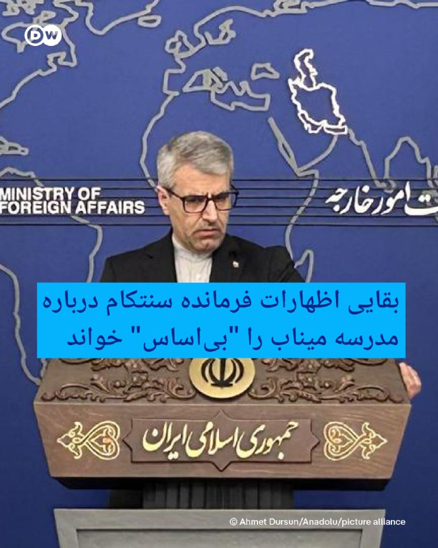

🔶 بقایی اظهارات فرمانده سنتکام درباره مدرسه میناب را "بی‌اساس" خواند
 
اسماعیل بقایی، سخنگوی وزارت خارجه جمهوری اسلامی، اظهارات برد کوپر، فرمانده نیروهای مرکزی ایالات متحده، سنتکام، در خصوص مدرسه ابتدایی شجره طیبه در میناب را "بی‌اساس و دروغی تکان‌دهنده" خواند.
 
فرمانده سنتکام روز سه‌شنبه در برابر کنگره ایالات متحده آمریکا اعلام کرده بود که تحقیقات نظامی صورت‌گرفته توسط آمریکا در خصوص انفجاردر این مدرسه "پیچیده است، چرا که این مدرسه در یک سایت فعال موشک‌های کروز ایران واقع شده بود".
 
بقایی در واکنش به این اظهارات در شبکه اجتماعی ایکس، این سخنان را " تحریف بی‌شرمانه" خواند و مدعی شد که این "تلاشی آشکار برای پنهان کردن واقعیت تلخ حملات موشکی ۲۸فوریه (نهم اسفند) است؛ حملاتی که به کشته شدن تراژیک بیش از ۱۷۰دانش‌آموز و معلمان‌شان انجامید".
 
سخنگوی وزارت خارجه جمهوری اسلامی، "هدف قرار دادن" این مدرسه را "نقض جدی حقوق بشردوستانه بین‌المللی و جنایت جنگی آشکار" توصیف کرد.
@dw_farsi

## DW_Farsi — post 124912

  

🔶 رای اولیه سنای آمریکا به محدود کردن اختیارات ترامپ در جنگ با ایران
 
برای نخستین بار، سنای آمریکا به قطعنامه‌ای رای داد که در صورت تصویب، قرار است دونالد ترامپ، رئیس جمهور آمریکا را به پایان دادن به جنگ ایران وادار کند.
 
سنای آمریکا روز سه‌شنبه به وقت محلی، با حمایت چهار نماینده جمهوری‌خواه، با ۵۰ رای موافق در برابر ۴۷ رای مخالف، به یک گام آیین‌نامه‌ای برای پیشبرد این طرح رای داد. اکنون این طرح می‌تواند در هفته‌های آینده مورد بحث قرار گیرد و به رای‌گیری نهایی گذاشته شود.
 
جمهوری‌خواهان پیش از این در سال جاری، هفت تلاش مشابه در سنا و سه مورد در مجلس نمایندگان را متوقف کرده بودند و اختیار تصمیم‌گیری درباره جنگ را در دست رئیس‌ جمهور نگه داشته بودند.
 
با این حال، این قطعنامه هنوز باید از موانع بزرگی عبور کند. حتی اگر هر دو مجلس به آن رای مثبت بدهند، ترامپ می‌تواند آن را وتو کند.
 
قطعنامه محدود کردن اختیارات ترامپ در جنگ با ایران را تیم کین، سناتور دموکرات ارائه کرده بود. او ترامپ را متهم کرده است که "پیشنهادهای صلح را نادیده می‌گیرد".
 
@dw_farsi

## DW_Farsi — post 124911

🔶 جام‌های ۱۹۵۸ و ۱۹۷۰؛ پله، مروارید سیاه برزیل و بازیکن قرن
 
اِدسون آرانتِس دو ناسیمنتو، ملقب به پله، روز ۲۳ اکتبر ۱۹۴۰ در شهری کوچک بین ریو دژانیرو و سائو پائولو در برزیل به دنیا آمد. او در سن ۱۱ سالگى توجه مربیان فوتبال را به خود جلب کرد و ۴ سال بعد به خدمت باشگاه صاحب‌نام سانتوس درآمد. پله در سال ۱۹۵۶ در حالی که ۱۶ سال بیشتر سن نداشت، اولین گل خود را براى این تیم به ثمر رساند.
 
پله خود در مورد آن روزها گفته است: «سیزده، چهارده ساله بودم و در باشگاه ‌"بائرو" بازی می‌کردم. ما برنده شدیم و جایزه‌‌ای بردیم و عکسم را در روزنامه‌ها چاپ کردند. آن موقع می‌دانستم که می‌خواهم فوتبالیست حرفه‌ای شوم.»
 
درخشش فوق‌العاده‌ پله در لیگ برزیل، زمینه‌ای بود برای دعوت از او به اردوی تیم ملی براى حضور در جام جهانى ۱۹۵۸ سوئد؛ تورنمنتی که در آن جهان با ستاره‌اى استثنایى آشنا شد.
 
قدرت دریبل‌زنى، دید وسیع و پاس‌هاى دقیق پله‌ ۱۷ ساله او را در کنار واوا و گارینشا، به یکی از سه عضو مثلث جادویی برزیل تبدیل کرد.
 
این ستا‌ره‌ نوظهور در مرحله‌ گروهی این رقابت‌ها مصدوم شد، اما به اصرار دیگر بازیکنان تیم ملی، در دیدارهاى حساس بعدى به میدان رفت.
 
پله در یک‌چهارم نهایى جام جهانی ۱۹۵۸، یک گل به وِلز زد، در دیدار نیمه‌نهایى، سه بار دروازه‌ فرانسه را گشود و در فینال هم دو گل از ۵ گل تیمش را به ثمر رساند. تیم ملی برزیل در دیدار نهایی ۵ بر ۲ سوئد میزبان مسابقات را شکست داد و بدین ترتیب پله در سن ۱۷ سالگی نخستین قهرمانی جهان را تجربه کرد.
 
@dw_farsi

## Persian_Trend_Official — post 14518

وزیر کشور پاکستان مجددا وارد تهران شد !!!

## Persian_Trend_Official — post 14517

  

⭕️ صداوسیما: تا عید غدیر مجسمه‌ای ۱۵ متری از مشت رهبر شهید در میدان انقلاب تهران نصب میشه.

📝 Nick

📌 @persian_trend_official
پرشین ترند | متفاوت‌ترین کانال نظامی

## Persian_Trend_Official — post 14516

https://youtube.com/shorts/P0wevYn52wU?feature=share

## RadioFarda — post 157378

سپاه پاسداران تهدید کرد، در صورت حمله، جنگ را «به فراتر از منطقه» خواهد کشاند

🔸سپاه پاسداران انقلاب اسلامی، در واکنش به اظهارات دیروز دونالد ترامپ، با صدر بیانیه‌ای تهدید کرد که در صورت حمله مجدد به ایران، «جنگ منطقه‌ای» را «به فراتر از منطقه» خواهد کشاند.

🔸رئیس‌جمهور آمریکا روز سه‌شنبه ۲۹ اردیبهشت گفت که ایالات متحده در آستانهٔ اجرای حمله‌ای تازه علیه ایران بوده، اما این عملیات را در «لحظات آخر» متوقف کرده و افزود هنوز احتمال اقدام نظامی منتفی نشده و اگر توافقی حاصل نشود، شاید لازم باشد آمریکا «ضربهٔ بزرگ دیگری» به ایران بزند.

🔸سپاه پاسداران انقلاب اسلامی که از سوی دولت آمریکا یک سازمان تروریستی شناخته می‌شود، در بیانیه خود ادعا کرد که در جنگ اخیر تمام ظرفیت‌های خود علیه آمریکا و اسرائیل را وارد عمل نکرده و اگر حمله‌ای دوباره انجام شود، «این بار به فراتر از منطقه کشیده خواهد شد».

🔸در جریان ۴۰ روز جنگ آمریکا و اسرائیل با ایران، سپاه پاسداران انقلاب اسلامی، علاوه بر مسدود کردن تنگه هرمز، اغلب کشورهای منطقه خلیج فارس از جمله برخی اهداف غیرنظامی در این کشورها را با موشک و پهپاد هدف قرار داد.

🔸این جنگ از ۱۹ فروردین با آتش‌بس به‌منظور مذاکره برای توافق متوقف شده، اما جمهوری اسلامی شرایطی را برای مذاکره اعلام کرده که آمریکا می‌گوید غیرقابل‌قبول است. در مقابل، دولت آمریکا نیز خواهان برچیده شدن برنامه هسته‌ای تهران است اما مقامات جمهوری اسلامی آن را نپذیرفته‌اند.

@RadioFarda

## RadioFarda — post 157377

فرمانده سنتکام: تحقیق درباره حمله به مدرسه میناب «پیچیده» اما «رو به پایان» است

🔸فرمانده ستاد فرماندهی مرکزی ایالات متحده (سنتکام)، در سنای آمریکا گفت تحقیقات ارتش این کشور دربارهٔ حمله هوایی به مدرسه‌ای در شهر میناب در جنوب ایران «پیچیده» اما «رو به پایان» است.

🔸دریادار برد کوپر روز سه‌شنبه ۲۹ اردیبهشت در جلسهٔ استماع کمیته نیروهای مسلح سنای آمریکا افزود که قرارگرفتن این مدرسه در محل یک پایگاه فعال موشک‌های کروز ایران، این پرونده را «پیچیده» و «متفاوت» کرده است.

🔸کوپر افزود: «من همیشه از تعیین جدول زمانی برای این موضوع پرهیز می‌کنم. (این تحقیق) رو به پایان است و فکر می‌کنم شفافیت مهم است.»

🔸فرمانده سنتکام در پاسخ به پرسش‌های آدام اسمیت، عضو ارشد دموکرات کمیته نیروهای مسلح مجلس نمایندگان آمریکا، این اظهارات را مطرح کرد. در این جلسه، قانون‌گذاران دموکرات از کوپر خواستند که به‌صورت علنی مسئولیت احتمالی آمریکا را بپذیرد.

جزئیات بیشتر را در وب‌سایت رادیوفردا بخوانید.

@RadioFarda

## RadioFarda — post 157376

تعلیق حملهٔ آمریکا به ایران؛ یک تحلیلگر می‌گوید واشینگتن به‌دنبال «راه خروج» است

🔸همزمان با اعلام دونالد ترامپ، رئیس‌جمهور آمریکا، که می‌گوید به درخواست کشورهای خلیج فارس حملات احتمالی به ایران را فعلاً متوقف کرده، گمانه‌زنی‌ها دربارهٔ این‌که واشینگتن و تهران به توافق نزدیک‌تر شده‌اند یا فقط در حال به‌تعویق انداختن یک رویارویی گسترده‌تر منطقه‌ای هستند، افزایش یافته است.

🔸مارک کانسیان، مشاور ارشد بخش دفاع و امنیت در مرکز مطالعات راهبردی و بین‌المللی، در گفت‌وگو با رادیو اروپای آزاد/رادیو آزادی می‌گوید دولت آمریکا بیش از پیش به‌دنبال پیدا کردن «راه خروج» از بحران است، هرچند اختلاف‌های اساسی بر سر تحریم‌ها، برنامه هسته‌ای جمهوری اسلامی و ادعاهای مقامات تهران دربارهٔ تنگه هرمز همچنان پابرجا است.

🔸به‌‌گفتهٔ مارک کانسیان، هرچند بسیاری از خواسته‌های مطرح‌شده از سوی ایران برای آمریکا قابل‌قبول نیست، اما نشانه‌هایی دیده می‌شود که دو طرف در حال نزدیک شدن به تفاهمی دربارهٔ پرونده هسته‌ای و کاهش تنش‌ها در آبراه‌های منطقه هستند.

کامل این گفت‌وگو را در وب‌سایت رادیوفردا بخوانید.

@RadioFarda

## RadioFarda — post 157375

  

🔸گزارش‌ها از ایران حاکی است بهار صحرائیان، از جمله وکلای دادگستریِ فعال در حوزه حقوق بشر که وکالت چندین نوکیش مسیحی را نیز برعهده داشته، در شیراز بازداشت شده است.

🔸سازمان غیرانتفاعی «ماده ۱۸» که در لندن مستقر است و در حمایت از مسیحیان تحت آزار و اذیت در ایران فعالیت می‌کند، نوشته که خانم صحرائیان روز شنبه ۲۶ اردیبهشت بازداشت و روز بعد برای او در دادسرای این شهر جلسه بازپرسی برگزار شد.

🔸بر اساس این گزارش، صحرائیان بابت مواردی چون «اجتماع و تبانی به قصد اقدام علیه امنیت ملی»، «فعالیت تبلیغی علیه نظام» و «نشر اکاذیب» مورد تفهیم اتهام قرار گرفته است.

🔸پیش از این خبرگزاری حقوق بشری هرانا که در آمریکا مستقر است، نیز نوشته بود که این وکیل دادگستری پس از مراجعه به دادگاه انقلاب شیراز برای پیگیری امور وکالتی خود بازداشت شد.

🔸بهار صحرائیان، عضو کانون وکلای دادگستری استان فارس، پیش‌تر نیز به دلیل فعالیت‌های حقوق بشری خود سابقه بازداشت داشته است.

@RadioFarda

## RadioFarda — post 157374

ماجرای نزاع سیاسی امباپه و راست افراطی فرانسه چیست؟

🔸اظهارت اخیر کیلیان امباپه، فوق‌ستاره فوتبال فرانسه، دربارهٔ احتمال قدرت گرفتن حزب راست افراطی در این کشور، موجی از واکنش‌ها را برانگیخته است. این اظهارات در شرایطی مطرح شده که تنها یک سال به انتخابات ریاست‌جمهوری فرانسه باقی مانده و نامزدهای حزب راست افراطی در نظرسنجی‌ها پیشتازند.

🔸کیلیان امباپه که هرگز مخالفت خود با «اجتماع ملی»، حزب راست افراطی فرانسه، پنهان نکرده است، به تازگی در گفت‌وگویی با مجله ونتی‌فِر، اعلام کرده که نسبت به پیامدهای پیروزی احتمالی این حزب برای فرانسه نگران است.

🔸امباپه در این مصاحبه گفته است: «من می‌دانم این یعنی چه، و می‌دانم وقتی چنین افرادی قدرت را در دست بگیرند، چه پیامدهایی می‌تواند برای کشورم داشته باشد».

🔸اما هر بار که امباپه علیه حزب راست افراطی سخن گفته، رهبران این حزب، در واکنش درآمدهای زیاد ستارگان فوتبال را مطرح کرده‌اند و آنان را متهم کرده‌اند که وضعیت قشر کم‌درآمد را درک نمی‌کنند.

🔸به عنوان نمونه، ژوردن باردلا که اختلاف سنی چندانی با امباپه ندارد اما اکنون به اصلی‌ترین بخت راست افراطی فرانسه برای پیروزی در انتخابات ریاست‌جمهوری تبدیل شده، به کنایه گفته است: «باید به رأی هر فرد احترام گذاشت، مخصوصا وقتی این شانس را دارید که حقوق بسیار بسیار بالایی داشته باشید، میلیاردر یا میلیونر باشید، وقتی این امکان را دارید که با جت خصوصی رفت‌وآمد کنید».

جزئیات بیشتر در وب‌سایت رادیو فردا.

@RadioFarda

## RadioFarda — post 157373

ادعای نیویورک‌تایمز: محمود احمدی‌نژاد بخشی از طرح تغییر رژیم ایران بود

🔸روزنامه آمریکایی نیویورک‌تایمز می‌گوید در «تحقیقات خود» به این نتیجه رسیده که حملات هوایی آمریکا و اسرائیل به محل سکونت محمود احمدی‌نژاد، رئیس‌جمهور پیشین ایران، در اوایل جنگ اخیر، برای «آزادی او از حصر خانگی و بخشی از طرح تغییر رژیم» بوده است.

🔸این روزنامه در گزارشی اختصاصی که روز سه‌شنبه ۲۹ اردیبهشت منتشر شد، به‌نقل از «مقام‌های آمریکایی که در جریان این طرح قرار گرفته بودند»، نوشته است که این طرح که «احمدی‌نژاد نیز درباره آن مورد مشورت قرار گرفته بود، خیلی زود از مسیر خارج شد».

🔸به ادعای این روزنامه، بر اساس «طرح» آمریکا و اسرائیل، قرار بود احمدی‌نژاد تنها چند روز پس از آغاز جنگ علیه ایران و کشته شدن علی خامنه‌ای، رهبر پیشین جمهوری اسلامی، به قدرت برسد.

🔸نویسندگان این گزارش به اظهارات دونالد ترامپ، رئیس‌جمهور آمریکا، در روزهای ابتدایی جنگ اشاره کرده‌اند که گفته بود بهتر است «کسی از داخل» ایران ادارهٔ کشور را در دست بگیرد.

🔸نیویورک‌تایمز مدعی شده که مقامات آمریکایی به این روزنامه گفته‌اند این طرح «جسورانه» توسط اسرائیل طراحی و از سوی دولت آمریکا تأیید شده بود.

🔸این گزارش در عین حال می‌گوید مشخص نیست احمدی‌نژاد چگونه وارد این طرح شده، اما انتخاب او «غیرعادی» توصیف شده است؛ چراکه او در دوران ریاست‌جمهوری‌اش به اظهارات تند از جمله درباره «محو اسرائیل از نقشه جهان» شناخته می‌شد. او همچنین از حامیان سرسخت برنامه هسته‌ای ایران، منتقد آمریکا و حامی سرکوب اعتراضات داخلی بود.

🔸با این حال، به‌نوشتهٔ این روزنامه، این طرح به‌سرعت مختل شد به این دلیل که احمدی‌نژاد در روز نخست جنگ در اثر حمله هوایی اسرائیل به خانه‌اش در تهران زخمی شد.

🔸نیویورک تایمز همچنین گزارش داد که محل نگهداری فعلی و وضعیت احمدی‌نژاد پس از آن حمله مشخص نیست و آمریکا نیز از سرنوشت او اطلاعی ندارد.

🔸خبر حمله به محل زندگی محمود احمدی نژاد در شرق تهران در همان روزهای نخست حملات هوایی به تهران منتشر و کمی بعد تکذیب شده بود.

🔸رادیو فردا مستقلاً قادر به تأیید جزئیات این گزارش نیست. بخش قابل‌توجهی از این گزارش بر پایه نقل‌قول از «مقام‌های ناشناس» و «افراد نزدیک به احمدی‌نژاد» نوشته شده و هیچ سند رسمی یا مستقلی برای تأیید این ادعاها منتشر نشده است.

🔸کاخ سفید نیز در واکنش به این روایت، بدون اشاره مستقیم به احمدی‌نژاد، اعلام کرده هدف عملیات آمریکا صرفاً نابودی توان موشکی و هسته‌ای ایران بوده است. اسرائیل هم از اظهارنظر دربارهٔ این گزارش خودداری کرده است.

@RadioFarda

## RadioFarda — post 157372

  <a href="telegram/content/RadioFarda_157372_1779271233.mp4" target="_blank">🎬 Download video</a>

🔸ستاد فرماندهی مرکزی ایالات متحده (سنتکام) اعلام کرد از زمان اجرای محاصره دریایی جمهوری اسلامی ایران، نیروهای آمریکایی ۸۹ کشتی را وادار به تغییر مسیر کرده‌اند.

🔸سنتکام در پستی که ۲۹ اردیبهشت در شبکه ایکس منتشر شده، تأکید کرده که همچنان محاصره کامل آمریکا علیه ایران را اجرا می‌کنند و مانع جریان تجارت به بنادر ایران و از آن‌ها می‌شوند.

🔸آمریکا پس از شکست مذاکرات حضوری با ایران در پاکستان، در ۲۴ فروردین سال جاری، محاصرهٔ دریایی بنادر ایران را آغاز کرد.

@RadioFarda

## RadioFarda — post 157371

سفر پوتین به پکن؛ رئیس‌جمهور چین: ادامه درگیری‌ها در خاورمیانه «صلاح نیست»

در سفر ولادیمیر پوتین رئیس‌جمهور روسیه به پکن، رهبران دو کشور از پیشرفت روابط راهبردی میان دو طرف تمجید کردند. شی جین‌پینگ در این دیدار تأکید کرد که ادامه درگیری‌ها در خاورمیانه «صلاح نیست» و خواستار برقراری آتش‌بسی «جامع» شد.

بر اساس متن منتشرشده در خبرگزاری دولتی شینهوآ، شی جین‌پینگ،‌ رئیس‌جمهور چین، در دیدار با ولادیمیر پوتین گفت که دو کشور باید بر راهبرد بلندمدت تمرکز کرده و نظام حکمرانیِ جهانی را که به‌گفتهٔ او «عادلانه‌تر و منطقی‌تر» باشد، ترویج کنند.

شی در آغاز این دیدار در روز چهارشنبه ۳۰ اردیبهشت، گفت: «دلیل رسیدن روابط چین و روسیه به این سطح آن است که ما توانسته‌ایم اعتماد سیاسی متقابل و همکاری راهبردی را عمیق کنیم.»

او خطاب به پوتین افزود: «پایه‌های اعتماد متقابل در حال مستحکم‌تر شدن است» و «روابط چین و روسیه وارد مرحله‌ای جدید از پیشرفت بیشتر و توسعه سریع‌تر شده است.»

جزئیات بیشتر در وب‌سایت رادیوفردا.

@RadioFarda

## RadioFarda — post 157370

  <a href="telegram/content/RadioFarda_157370_1779271235.mp4" target="_blank">🎬 Download video</a>

🔸شی جین‌پینگ، رئیس‌جمهور چین، روز چهارشنبه در مراسمی رسمی در تالار بزرگ خلق در پکن، از همتای روس خود، ولادیمیر پوتین، استقبال کرد.

🔸قرار است رئیس‌جمهور روسیه در گفت‌وگو با همتای چینی‌اش مجموعه‌ای از موضوعات، از روابط متشنج دو کشور با غرب تا جنگ ایران و تأثیرش بر وضعیت جهانی انرژی را به بحث بگذارند.

🔸این دیدار درست پس از سفر رئیس‌جمهور آمریکا، به پایتخت چین انجام می‌شود.

🔸از این رو، نحوه برگزاری مراسم، و نتایج دیدار میان رهبران چین و روسیه با دقت مورد توجه و مقایسه قرار خواهد گرفت.

🔸پکن به مهمترین شریک تجاری مسکو تبدیل شده و چین حالا بزرگترین مشتری نفت و گاز روسیه به‌شمار می‌آید. با توجه به جنگ ایران، روسیه انتظار دارد میزان صادرات نفت و گازش به چین بیشتر هم بشود.

🔸بسته شدن تنگۀ هرمز انتقال حدود یک‌پنجم حامل‌های انرژی جهان را با اختلال مواجه کرده است؛ موضوعی که صنایع چین را هم تحت تأثیر قرار داده و به اهمیت توسعۀ شبکه‌های خط لولۀ سطحی به‌عنوان گزینه‌ای دیگر به موازات مسیرهای آبی و زیرآبی افزوده است.

@RadioFarda

## IranianMinds — post 20427

  <a href="telegram/content/IranianMinds_20427_1779271238.mp4" target="_blank">🎬 Download video</a>

🔴 یه شعار جدید هم به تجمعاتشون اضافه شد :

مرگ بر امارات !

@IranianMinds

## IranianMinds — post 20426

  <a href="telegram/content/IranianMinds_20426_1779271240.mp4" target="_blank">🎬 Download video</a>

🔴 احمد ایراندوست:

والا من مشروب می‌خورم، کلاب می‌رم، اون‌ور که هستم با شهناز تهرانی می‌رقصم، این ‌ور که میام دست ‌بوس حاج قاسم‌ا م، نمی‌خوره بهم؟

@IranianMinds

## IranianMinds — post 20422

🔴 سپاه :

اگه دوباره به ما حمله بشه ایندفه جنگ دیگه منطقه ای نیست و فرا منطقه ای میشه.

@IranianMinds

## IranianMinds — post 20421

  <a href="telegram/content/IranianMinds_20421_1779271242.mp4" target="_blank">🎬 Download video</a>

اینجا نه عراقه و نه لبنان متاسفانه ایرانه خودمونه …

@IranianMinds

## IranianMinds — post 20420

🔴 وزارت خارجه آمریکا :

رژیم ایران کاملا بی پول و ورشکست شده و تمام راه هایی که میتونست ازش کسب درآمد کنه رو بستیم و بقیه راه هارو هم داریم میبندیم

همچنین هرکسی اطلاعاتی از منابع مالی رژیم ایران بده بهمون ۱۵ میلیون دلار پاداش دریافت میکنه!

@IranianMinds

## IranianMinds — post 20419

  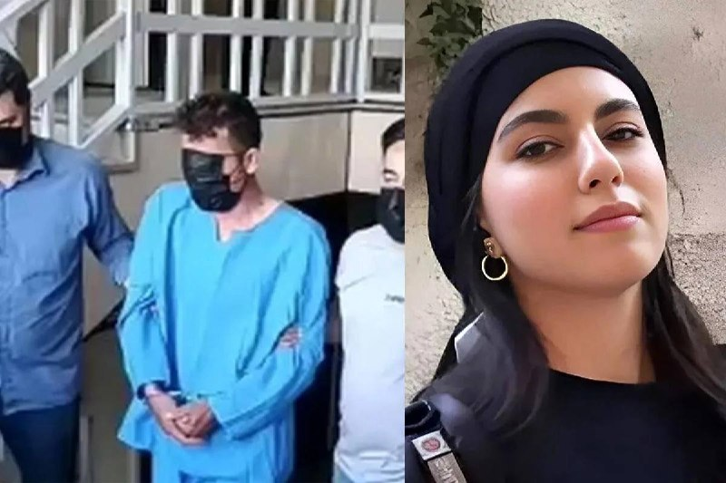

🔴 طبق گفته‌ی خواهر الهه حسین‌نژاد؛ بهمن فرزانه (قاتل) امشب اعدام میشه. @IranianMinds

## IranianMinds — post 20418

  

🔴 رسانه های حکومتی :

هرکی‌ با خامنه ای خاطره داره بیاد برامون تعریف کنه میخوایم سریال بسازیم ازش.

@IranianMinds

## BBCPersian — post 281594

🔻شکست نماینده منتقد ترامپ در انتخابات داخلی جمهوری‌خواهان

🔻با شکست توماس مسی، نماینده کنگره، در انتخابات مقدماتی کنتاکی، دونالد ترامپ پیروزی دیگری در مبارزات انتخاباتی داخلی حزب جمهوری‌خواه برای مجازات مخالفان خود در این حزب به دست آورد.

آقای مسی که رهبری مبارزات انتخاباتی برای مجبور کردن دولت ترامپ به انتشار پرونده‌های اپستین را بر عهده داشت در مقابل اد گالین، رقیب نامزد دموکرات‌ها در انتخابات میان‌دوره‌ای، شکست خورد که قرار است ماه نوامبر برگزار شود.

آقای مسی در سخنرانی خود پس از پذیرش شکست، گفت که هوادارانش قلدرها را دوست ندارند و تحمل نمی‌کنند.

حامیان ترامپ و گروه‌های طرفدار اسرائیل ده‌ها میلیون دلار صرف تبلیغات علیه توماس مسی کردند که منتقد سرسخت جنگ ایران و کمک به اسرائیل است.

پیش‌بینی می‌شود که در انتخابات مقدماتی سنا در کنتاکی، نماینده کنگره، اندی بار، یکی دیگر از نامزدهای مورد حمایت ترامپ، نامزدی حزب را برای کرسی خالی شده توسط میچ مک‌کانل، رهبر سابق و باسابقه سنا، به دست آورد.

درباره توماس مسی و سیاست‌هایش بیشتر بخوانید:

https://bbc.in/4wGLpwO
@BBCPersian

## BBCPersian — post 281593

  <a href="telegram/content/BBCPersian_281593_1779271245.mp4" target="_blank">🎬 Download video</a>

🔻در پی بارندگی شدید و طغیان رود جیان در چین، آب خودروها را با خود برد. یک شاهد عینی در شهر دویونِ استان گوئیژو لحظه‌ای را ثبت کرده که سیلاب خودرویی را با خود برده است. دست‌کم ۱۰ نفر  بر اثر سیلاب‌های مناطق جنوبی و مرکزی چین جان خود را از دست داده‌اند.

https://bbc.in/4v3RyBY
@BBCPersian

## BBCPersian — post 281592

🔻جنگ آمریکا و اسرائیل با ایران به افزایش فروش خودروهای برقی انجامید

🔻آژانس بین‌المللی انرژی می‌گوید که پیش‌بینی می‌شود فروش خودروهای برقی امسال به رکوردهای جدیدی برسد و حدود ۲۸ درصد از کل خریدها را تشکیل دهد.

به گفته این آژانس، یکی از دلایل افزایش فروش خودروهای برقی، افزایش قیمت سوخت پس از جنگ آمریکا و اسرائیل علیه ایران است.

حدود ۳۰ کشور در ماه مارس شاهد رکورد فروش خودروهای برقی بودند از جمله فروش در آمریکای لاتین ۷۵ درصد نسبت به سال گذشته افزایش یافته است.

بر اساس این گزارش، کاهش قیمت‌ این خودروها عامل دیگری برای افزایش خرید آن بوده است. اما این روند در آمریکا متفاوت بوده و فروش خودروهای برقی کاهش شدیدی در پایان سال گذشته داشته است.

https://bbc.in/4eTzy8t
@BBCPersian

## BBCPersian — post 281591

  

‌🔻سپاه پاسداران با انتشار بیانیه‌ای تهدید کرده که در صورت آغاز دوباره جنگ آمریکا و اسرائیل علیه ایران، جنگ «به فراتر از منطقه کشیده خواهد شد.»

در این بیانیه با اشاره به تهدیدهای دونالد ترامپ و مقام‌های اسرائیل برای حمله مجدد به ایران آمده: «اگر تجاوز به ایران تکرار شود جنگ منطقه‌ای که وعده داده شده بود، این بار به فراتر از منطقه کشیده خواهد شد و ضربات کوبنده ما در جاهایی که تصور آن را ندارید شما را به خاک سیاه خواهد نشاند.»

عباس عراقچی، وزیر خارجه ایران هم در واکنش به اظهارات تهدیدآمیز دونالد ترامپ، رئیس‌جمهور آمریکا، درباره احتمال از سرگیری حمله نظامی به ایران، در شبکه ایکس نوشته «با درس‌هایی که آموخته‌ایم و دانشی که به دست آورده‌ایم، مطمئن باشید بازگشت به میدان جنگ با شگفتی‌های بسیار بیشتری همراه خواهد بود.»

دونالد ترامپ، رئیس جمهور آمریکا، روز گذشته گفت که در آستانه حمله نظامی دوباره به ایران، او به درخواست رهبران منطقه، دستور لغو حمله را داده است.

📷NurPhoto via Getty Images
https://bbc.in/4uZ5Tzw

@BBCPersian

## BBCPersian — post 281590

🔻کاخ سفید شرکت ترامپ در اجلاس ماه آینده گروه هفت را تایید کرد

🔻کاخ سفید تایید کرده است که رئیس جمهور ترامپ علی‌رغم افزایش تنش با متحدانش، در اجلاس ماه آینده سران گروه هفت در فرانسه شرکت خواهد کرد.

پیش از این، تردیدهایی در مورد شرکت او در این رویداد در تفرجگاه اویان له بن در سواحل دریاچه ژنو وجود داشت.

گفته می‌شود آقای ترامپ مشتاق است که این نشست را بیش از آنچه که معمولاً گردهمایی‌های دیپلماتیک هستند، متمرکز بر تجارت کند.

میزبان او، رئیس جمهور امانوئل مکرون، پیش از این برنامه میزبانی شام پس از اجلاس در کاخ ورسای را به عنوان یک مشوق اضافی برای حضور آقای ترامپ پیشنهاد داد.

تاریخ‌های پیشنهادی این اجلاس قبلاً تغییر کرده بود تا با برنامه آقای ترامپ برای میزبانی یک مسابقه رزمی یو‌اف‌سی در کاخ سفید در هشتادمین سالگرد تولدش تداخل نداشته باشد.

https://bbc.in/3PsPDrq
@BBCPersian

## BBCPersian — post 281580

‌🖊آندره بیرناث
بی‌بی‌سی برزیل

🔻پایانی سرد، تاریک و تا حدی ملال‌آور. سرانجامی خشن و ویرانگر. یا شاید پایانی که آغازی دیگر در دل خود دارد؟

این موارد از برجسته‌ترین نظریه‌ها درباره این هستند که پایان جهان در آینده‌ای بسیار، بسیار دور ممکن است چه شکلی داشته باشد؛ البته اگر اصلا پایانی در کار باشد.

سرنوشت جهان یکی از اسرار‌آمیز‌ترین پرسش‌های علم است. حتی دانشمندان هم باور دارند که پرسش‌ها بیش از پاسخ‌هاست.

برای آنکه برخی از راه‌هایی که جهان ممکن است به پایان برسد را دریابیم ابتدا باید بفهمیم جهان چگونه آغاز شده است.

متن کامل خبر را از لینک زیر بخوانید:
https://bbc.in/4dSPuqm

📷Getty/ Fotograzia via Getty Images/ FlashMovie via GettyImages/ Arctic Images via Getty Images/ Fotograzia via Getty Images

@BBCPersian

## BBCPersian — post 281579

🔻نفتکش کره‌ جنوبی «با همکاری مقام‌های ایرانی» در حال عبور از تنگه هرمز است

🔻چو هیون، وزیر امور خارجه کره جنوبی، روز چهارشنبه گفت که یک نفتکش کره‌ای حامل نفت خام با همکاری مقام‌های ایرانی در حال عبور از تنگه هرمز است.

او در اظهارات خود در جلسه استماع پارلمان در سئول، جزئیات بیشتری در مورد این کشتی ارائه نکرد.

داده‌های کشتیرانی شرکت ال‌اس‌ای‌جی روز چهارشنبه نشان می‌دهد که ابرنفتکش یونیورسال وینر با پرچم کره جنوبی و حامل ۲ میلیون بشکه نفت خام کویت، در حال خروج از تنگه هرمز است.

عبور این نفتکش کره‌ای با همکاری مقام‌های ایران پس از آن صورت می‌گیرد که حدود دو هفته پیش (۱۴ اردیبهشت / ۴ مه) کشتی باری کره‌ای «اچ‌ام‌ام نامو» در نزدیکی تنگه هرمز هدف «دو پهپاد ناشناس» قرار گرفت.
https://bbc.in/3RwznWP
@BBCPersian

## BBCPersian — post 281571

‌🖊لوئیز آنتونیو آراخو
بی‌بی‌سی برزیل

🔻هم‌زمان با جنگ ایران، وب‌سایت «دیبریف» مصاحبه‌ای خیالی با کارل فون کلاوزویتس منتشر کرد؛ ژنرال و نظریه‌پرداز پروسی قرن نوزدهم که اندیشه‌هایش دوباره در تحلیل جنگ‌های مدرن مورد توجه قرار گرفته است.

بئاتریس هویزر، رئیس آکادمی ستاد کل نیروهای مسلح آلمان، می‌گوید کلاوزویتس نخستین متفکری بود که جنگ را نه از منظر اخلاق و الهیات، بلکه به عنوان پدیده‌ای سیاسی و اجتماعی برای فهم ماهیت آن بررسی کرد.

اندیشه‌های کلاوزویتس بر چهره‌هایی چون دوک ولینگتون و ولادیمیر لنین تاثیر گذاشت و ایده‌های او همچنان یکی از مهم‌ترین چارچوب‌های نظری برای تحلیل جنگ محسوب می‌شود.

ساندرو تیشیرا موئیتا، استاد علوم نظامی، می‌گوید ابهام درباره اهداف آمریکا در جنگ ایران نشان می‌دهد تحلیلگران همچنان از مفاهیم کلاوزویتس برای فهم استراتژی، قدرت و اهداف سیاسی در جنگ استفاده می‌کنند.

هیو استراون، استاد روابط بین‌الملل، می‌گوید مفهوم مشهور کلاوزویتس درباره «ادامه سیاست با ابزارهایی دیگر» همچنان برای فهم جنگ ایران کاربرد دارد؛

لینک خبر کامل:

https://bbc.in/49M0mUD
📷Getty Images/BBCImages

@BBCPersian

## Dirty_Kids — post 389796

  

‏من همون خرسیم که رئیسی رو خورد ولی الان بحث بحثِ وطنه

@Dirty_Kids 👻

## Dirty_Kids — post 389795

  <a href="telegram/content/Dirty_Kids_389795_1779271249.mp4" target="_blank">🎬 Download video</a>

هوش مصنوعیه؟؟؟😂
یه نفر تو روسیه شبیه خامنه‌ای پیدا شده

@Dirty_Kids 👻

## Dirty_Kids — post 389794

  

🌪وقتی اینترنت طوفانیه... کافیه بادبان ها رو بکشی تا

⚫️با بالاترین کیفیت ممکن
⚡️ 

⚫️100 هزار تومان شارژ هدیه 
🎁

⚫️پایین ترین قیمت گیگی 250
🌐 

⚫️و ارائه پورسانت %10 در ازای هر معرفی
💼

بتونی یه اتصال پایدار با پشتیبانی 24 ساعته داشته باشی
🚀

بادبان راهتو باز می‌کنه
⛵️

R30

🛡@BadBan_VPN | کانال 

🤖@BadBan_VPNBot | ربات 

📞@BadBan_VPNSupport | پشتیبانی

## Dirty_Kids — post 389793

  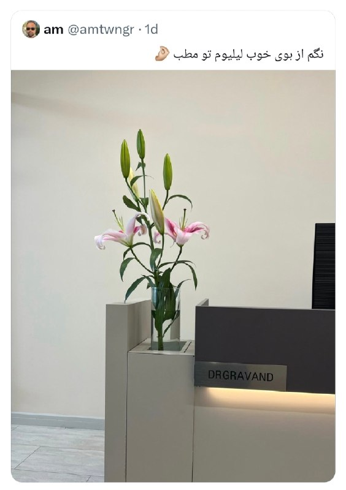

لیلیوم خارج از مطب بو گوز میده؟

@Dirty_Kids 👻

## Dirty_Kids — post 389792

  <a href="telegram/content/Dirty_Kids_389792_1779271251.mp4" target="_blank">🎬 Download video</a>

در قطر، کشور دوست و مثلا برادر سیاسی‌مذهبی‌تون، جلو تعداد محدود ایرانی هم هیچ غلطی نتونستید بکنید؛ آمریکای شمالی که دیگه جای صدها هزار ایرانیِ ملی‌گراست. ✌️👑

@Dirty_Kids 👻

## Dirty_Kids — post 389791

  

‏به این میگن عقب‌نشینی استراتژیک.

@Dirty_Kids 👻

## Dirty_Kids — post 389790

خیلی دلم میخواد تو مترو با یه دختر دوست بشم، دیت اول با ماشینم برم دنبالش پشماش بریزه اون لحظه که تیبا ۲ رو میبینه و بفهمه هرکی سوار مترو میشه فقیر نیست.

@Dirty_Kids 👻

## Dirty_Kids — post 389789

  

فرزند ایران و کشته شده در راه وطن #امیرحسین_الوند

@Dirty_Kids 👻

## Dirty_Kids — post 389788

  

عارف‌ عزیز، آرسنال، تیم محبوبت قهرمان شد.

@Dirty_Kids 👻

## Dirty_Kids — post 389787

  

حاصل جفتگیری قالیباف و میرسلیم:

@Dirty_Kids 👻

## Hranews — post 113056

  

امروز چهارشنبه ۳۰ اردیبهشت ماه، جمعی از کارگران قراردادی شرکت پایانه‌ها و مخازن پتروشیمی ماهشهر در اعتراض به کسر مزایای مزدی خود، تحت عناوینی همچون «بهره‌وری»، «رفاهیات» و «مزایای مناسبت‌ها»، دست به #تجمع زدند.

↘️
@hranews_bot تماس ✉️ - @Hranews کانال هرانا 🆑

## Hranews — post 113055

خودکشی یک جنگ‌زده در هتل لاله؛ وزارت بهداشت: شهرداری مانع استقرار تیم‌های روان‌ درمانی شد

❗️
❗️
❗️
❗️
❗️– یک مرد جوان جنگ‌زده اسکان‌یافته در هتل لاله تهران در جریان درگیری های نظامی #خودکشی کرده است. در این میان، مقام‌های شهرداری تهران و وزارت بهداشت روایت‌های متفاوتی درباره نحوه رسیدگی به وضعیت روانی آسیب‌دیدگان ارائه داده‌اند. مقام‌های وزارت بهداشت می‌گویند شهرداری از استقرار تیم‌های تخصصی روان‌درمانی در مراکز اسکان جلوگیری کرده، اما شهرداری این ادعا را رد کرده و اعلام کرده است که پیش از آن، خدمات مشاوره‌ای را در این مراکز ارائه داده بود.

ادامه مطلب

↘️
@hranews_bot تماس ✉️ - @Hranews کانال هرانا 🆑

## Hranews — post 113054

گزارشی از بازداشت امیر سبحانی در جوانرود

❗️
❗️
❗️
❗️
❗️– روز دوشنبه ۲۸ اردیبهشت ماه، امیر سبحانی، شهروند اهل جوانرود، توسط نیروهای امنیتی در این شهرستان بازداشت شد. وی سپس با صدور قرار بازداشت به زندان دیزل آباد کرمانشاه منتقل شد.

#امیر_سبحانی

ادامه مطلب

↘️
@hranews_bot تماس ✉️ - @Hranews کانال هرانا 🆑

## Hranews — post 113053

  

بر اساس آخرین داده‌های نت‌ بلاکس، قطع گسترده اینترنت در ایران وارد هشتاد و دومین روز خود شده و این کشور پس از بیش از ۱۹۴۴ ساعت، همچنان تا حد زیادی از دسترسی به اینترنت جهانی محروم است. این نهاد ناظر بر وضعیت دسترسی به #اینترنت در جهان اعلام کرد که در شرایطی که حتی اختلالات چند دقیقه‌ای در بسیاری از کشورها بحران تلقی می‌شود، تداوم این وضعیت در ایران رکوردهای بی‌سابقه‌ای را ثبت کرده است.

↘️
@hranews_bot تماس ✉️ - @Hranews کانال هرانا 🆑

## Hranews — post 113052

یک شهروند در شهرستان ری بازداشت شد؛ طرح ادعای ارتباط با اسرائیل

❗️
❗️
❗️
❗️
❗️– دادستان شهرستان ری از بازداشت یک شهروند در جنوب این شهرستان خبر داد. این مقام قضایی، مدعی همکاری اطلاعاتی فرد بازداشتی با سرویس جاسوسی اسرائیل شده است.

ادامه مطلب

↘️
@hranews_bot تماس ✉️ - @Hranews کانال هرانا 🆑

## Hranews — post 113051

پژمان جمشیدی به ۹۹ ضربه شلاق محکوم شد

❗️
❗️
❗️
❗️
❗️– وکیل مدافع پژمان جمشیدی، بازیگر سینما و تلویزیون، از صدور حکم ۹۹ ضربه #شلاق تعزیری توسط دادگاه کیفری تهران برای موکل خود خبر داد. به گفته وکیل، این رای از بابت اتهامی موسوم به «مادون زنا» صادر شده و اتهامات اصلی مطرح‌شده در این پرونده در دادگاه رد شده است.

#پژمان_جمشیدی

ادامه مطلب

↘️
@hranews_bot تماس ✉️ - @Hranews کانال هرانا 🆑

## Hranews — post 113050

  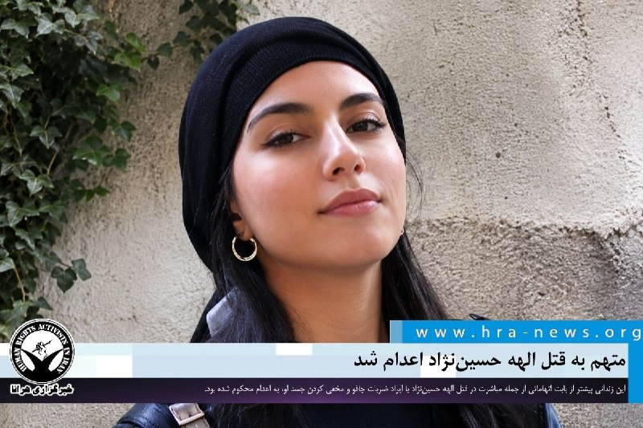

متهم به قتل الهه حسین‌نژاد اعدام شد

❗️
❗️
❗️
❗️
❗️– مرکز رسانه قوه قضاییه از اجرای حکم #اعدام متهم به قتل الهه حسین‌نژاد، خبر داد.

#الهه_حسین‌نژاد

ادامه مطلب

↘️
@hranews_bot تماس ✉️ - @Hranews کانال هرانا 🆑

## manototv — post 105671

  

گروه ناظر اینترنتی نت‌بلاکس اعلام کرد قطعی اینترنت در ایران امروز وارد هشتادودومین روز خود شده و از مرز ۱۹۴۴ ساعت گذشته است.
نت‌بلاکس هشدار داده در دورانی که قطع چنددقیقه‌ای اینترنت می‌تواند بحران‌زا باشد، ادامه این محدودیت‌ها در ایران همچنان به نابودی معیشت شهروندان و فرسایش حقوق اساسی آنان منجر می‌شود؛ شهروندانی که تا حد زیادی از ارتباط عادی با جهان خارج محروم مانده‌اند.

## manototv — post 105670

  

روزنامه نیویورک‌تایمز به نقل از مقام‌های آمریکایی گزارش داد حمله اسرائیل به خانه محمود احمدی‌نژاد، رئیس‌جمهوری پیشین ایران، با هدف آزاد کردن او از حصر خانگی و در چارچوب طرح آمریکا و اسرائیل برای تغییر حکومت در ایران انجام شده بود.
بر اساس این گزارش، اسرائیل طراح اصلی این برنامه بوده و حتی با خود احمدی‌نژاد نیز درباره آن مشورت شده بود، اما این طرح به‌سرعت شکست خورد.
نیویورک‌تایمز همچنین به نقل از مقام‌های آمریکایی و یکی از نزدیکان احمدی‌نژاد نوشت او در نخستین روز جنگ و در جریان حمله به خانه‌اش در تهران زخمی شد، اما از این حمله جان سالم به در برد.
به نوشته این روزنامه، احمدی‌نژاد پس از این حمله و تجربه‌ای که تا آستانه مرگ پیش رفت، از پروژه تغییر حکومت فاصله گرفت. این گزارش افزوده است او از آن زمان تاکنون در انظار عمومی دیده نشده و محل حضور و وضعیت کنونی‌اش مشخص نیست.
دونالد ترامپ، رئیس‌جمهوری آمریکا، نیز چند روز پس از کشته شدن علی خامنه‌ای و شماری از مقام‌های جمهوری اسلامی در نخستین موج حملات آمریکا و اسرائیل گفته بود بهتر است «فردی از داخل ایران» اداره کشوردر دست بگیرد.

## manototv — post 105669

  

به گزارش خبرگزاری‌های داخلی، حکم اعدام بهمن فرزانه، قاتل الهه حسین‌نژاد، بامداد چهارشنبه اجرا شده است.
الهه حسین‌نژاد، زن ۲۴ ساله، خرداد سال گذشته هنگام بازگشت به خانه در تهران ناپدید شد و حدود ۱۰ روز بعد پیکر او با چندین ضربه چاقو در بیابان‌های اطراف تهران پیدا شد.
خبرگزاری میزان، وابسته به قوه قضاییه جمهوری اسلامی، اعلام کرده این حکم پس از طی مراحل قانونی و با درخواست اولیای دم اجرا شده است.

## manototv — post 105668

  

زمین‌لرزه‌ای به بزرگی ۴.۷ بامداد چهارشنبه ۳۰ اردیبهشت حوالی لافت در استان هرمزگان را لرزاند. مرکز لرزه‌نگاری کشوری عمق این زلزله را ۲۰ کیلومتر اعلام کرده است. این زمین‌لرزه در بخش‌هایی از قشم، هرمز و مناطق روستایی بندرعباس نیز احساس شد. مقام‌های محلی می‌گویند تاکنون گزارشی از خسارت دریافت نشده، اما بررسی‌ها در مناطق نزدیک به کانون زلزله ادامه دارد.

## manototv — post 105667

دونالد ترامپ، رئیس‌جمهور آمریکا، بار دیگر مدعی شد که ایالات متحده جنگ با جمهوری اسلامی را «خیلی سریع» پایان خواهد داد و تهران «به‌شدت» خواهان توافق است.
ترامپ در جریان مراسم سالانه پیک‌نیک کنگره در محوطه جنوبی کاخ سفید گفت توافق با تهران «اتفاق خواهد افتاد و سریع هم اتفاق می‌افتد».
او همچنین مدعی شد با پایان این بحران، قیمت نفت «به‌شدت کاهش خواهد یافت».
این اظهارات پس از آن مطرح می‌شود که ترامپ اوایل هفته گفته بود تهران برای رسیدن به توافق «التماس» می‌کند و او تنها یک ساعت با صدور دستور حملات تازه علیه جمهوری اسلامی فاصله داشته است.
ترامپ گفت به درخواست متحدان خلیج فارس آمریکا، حملات را متوقف کرده تا به گفته او، «مذاکرات جدی» ادامه پیدا کند. با این حال، او هشدار داد اگر جمهوری اسلامی به توافق نرسد، آمریکا برای یک «حمله کامل» آماده است.

## manototv — post 105666

  

شی جین‌پینگ، رئیس‌جمهوری چین، در دیدار با ولادیمیر پوتین در پکن خواستار توقف فوری درگیری‌ها در خاورمیانه شد و گفت پایان جنگ می‌تواند به کاهش اختلال در عرضه انرژی و زنجیره‌های تجارت جهانی کمک کند.

شی جین‌پینگ روز چهارشنبه، ۲۰ مه ۲۰۲۶، در دیدار با ولادیمیر پوتین در تالار بزرگ خلق پکن گفت وضعیت خاورمیانه در مرحله‌ای حساس میان جنگ و صلح قرار دارد و توقف درگیری‌ها «فوری‌ترین ضرورت» است. او تأکید کرد بازگشت به جنگ قابل قبول نیست و مسیر مذاکره باید در اولویت قرار گیرد. به گفته رئیس‌جمهور چین، پایان زودهنگام درگیری‌ها می‌تواند از اختلال بیشتر در عرضه انرژی و عملکرد زنجیره‌های صنعتی و تجاری جلوگیری کند.

پوتین نیز در آغاز این دیدار گفت روابط روسیه و چین به سطحی «بی‌سابقه» رسیده و از شی جین‌پینگ دعوت کرد سال آینده به روسیه سفر کند. رئیس‌جمهوری روسیه همچنین همکاری دو کشور را عاملی برای «بازدارندگی و ثبات» در روابط بین‌الملل توصیف کرد.

بر اساس گزارش‌ها، دو طرف در این دیدار درباره انرژی، امنیت و روابط کلی مسکو و پکن گفت‌وگو کردند و با تمدید پیمان دوستی چین و روسیه موافقت کردند؛ پیمانی که نخستین‌ب

## manototv — post 105665

  

جی‌دی ونس، معاون رئیس‌جمهور آمریکا، گفت واشینگتن در برابر جنگ با ایران دو مسیر پیش رو دارد: ادامه مذاکره یا ازسرگیری عملیات نظامی.

جی‌دی ونس در نشست خبری کاخ سفید گفت آمریکا در برابر ایران «دو مسیر» دارد.

به گفته ونس، مسیر اول مذاکره است. او گفت دونالد ترامپ از تیم خود خواسته با جمهوری اسلامی «تهاجمی» مذاکره کنند.

ونس گفت آمریکا در موضوع اصلی، یعنی جلوگیری از دستیابی ایران به سلاح هسته‌ای، پیشرفت زیادی داشته و واشینگتن فکر می‌کند تهران خواهان توافق است.

او مسیر دوم را ازسرگیری عملیات نظامی دانست و گفت: «گزینه دوم این است که کارزار نظامی را دوباره شروع کنیم تا اهداف آمریکا دنبال شود.»

ونس گفت این مسیر چیزی نیست که ترامپ بخواهد و فکر نمی‌کند جمهوری اسلامی هم خواهان آن باشد.

او در پایان گفت: «برای توافق، دو طرف لازم است.»

## manototv — post 105664

  <a href="telegram/content/manototv_105664_1779271262.mp4" target="_blank">🎬 Download video</a>

«سکوت ما همدستی با جمهوری اسلامی است»

## alonews — post 121260

  <a href="telegram/content/alonews_121260_1779271263.webm" target="_blank">🎬 Download video</a>

👈وزارت خارجه آمریکا تا سقف ۱۵ میلیون دلار پاداش برای اطلاعات در مورد شبکه مالی سپاه پاسداران تعیین کرد.

✅ @AloNews خبر جنگ

## alonews — post 121259

  <a href="telegram/content/alonews_121259_1779271264.webm" target="_blank">🎬 Download video</a>

👈گروسی: برای تضمین امنیت هسته‌ای به خلیج فارس سفر می‌کنم

✅ @AloNews خبر جنگ

## alonews — post 121258

  <a href="telegram/content/alonews_121258_1779271264.webm" target="_blank">🎬 Download video</a>

👈دبیرکل ناتو: ایران با بستن تنگه هرمز، اقتصاد جهانی را گروگان گرفته است

🔴مارک روته، دبیرکل پیمان آتلانتیک شمالی در اظهاراتی علیه ایران گفت: این اتحاد و جامعه بین‌المللی دستیابی ایران به سلاح هسته‌ای را رد می‌کنند. بسیاری از کشورها در ایجاد ائتلافی برای تضمین آزادی دریانوردی در تنگه هرمز مشارکت دارند.

🔴ما در مورد حمایت از متحدان خود در منطقه خلیج فارس بحث خواهیم کرد. کشورهای اروپایی، علاوه بر کانادا، از همان روز اول با گشودن پایگاه‌های نظامی به روی هواپیماهای آمریکایی، از ایالات متحده در عملیاتش علیه ایران حمایت کردند

✅ @AloNews خبر جنگ

## alonews — post 121257

  <a href="telegram/content/alonews_121257_1779271264.webm" target="_blank">🎬 Download video</a>

👈بنیات از اول خرداد ۲۰ درصد گرون میشه

✅ @AloNews خبر جنگ

## alonews — post 121256

  <a href="telegram/content/alonews_121256_1779271264.webm" target="_blank">🎬 Download video</a>

👈اعلام قیمت نهایی خودروی وارداتی لکسوس LX600

🔴 110 میلیارد تومان...!

✅ @AloNews خبر جنگ

## alonews — post 121255

  <a href="telegram/content/alonews_121255_1779271265.webm" target="_blank">🎬 Download video</a>

👈نفوذ پهپاد به حریم هوایی اردن

✅ @AloNews خبر جنگ

## alonews — post 121254

  <a href="telegram/content/alonews_121254_1779271265.mp4" target="_blank">🎬 Download video</a>

👈گزارش‌هایی از یک رویداد با تلفات انبوه در شهر دویر در جنوب لبنان پس از یک حمله هوایی اسرائیلی که حدود ۳۰ دقیقه پیش منطقه را هدف قرار داد.

✅ @AloNews خبر جنگ

## alonews — post 121253

  <a href="telegram/content/alonews_121253_1779271267.webm" target="_blank">🎬 Download video</a>

👈وزیر کشور پاکستان عازم تهران شد

✅ @AloNews خبر جنگ

## alonews — post 121252

  <a href="telegram/content/alonews_121252_1779271268.webm" target="_blank">🎬 Download video</a>

👈وزارت خارجه کره جنوبی اعلام کرد: کشتی تحت مدیریت این کشور پس از مشورت با مقامات ایرانی، با خیال راحت از تنگه هرمز عبور کرد.

✅ @AloNews خبر جنگ

## alonews — post 121251

  <a href="telegram/content/alonews_121251_1779271268.webm" target="_blank">🎬 Download video</a>

👈بحرین : نیروهای ما تو حالت آمادگی رزمی "کامل" قرار داره

✅ @AloNews خبر جنگ

## alonews — post 121250

  <a href="telegram/content/alonews_121250_1779271268.webm" target="_blank">🎬 Download video</a>

👈 «امارات متحده عربی به آرامی با پاکستان تماس گرفته و به دنبال درگیری مجدد است.

🔴این حرکت پس از یک درک آشکار میان تصمیم‌گیرندگان اماراتی رخ داده است که پاکستان کشوری بسیار مهم است که نباید در سمت اشتباه قرار گیرد.

🔴همچنین تغییری در سیاست امارات وجود دارد. برخلاف موضع قبلی خود، ابوظبی اکنون دیپلماسی را برای حل تعارض ایران-آمریکا ترجیح می‌دهد،» - کامران یوسف از شبکه جهانی تی‌آرتی و اکسپرس نیوز پاکستان.

✅ @AloNews خبر جنگ

## alonews — post 121249

  <a href="telegram/content/alonews_121249_1779271268.webm" target="_blank">🎬 Download video</a>

👈مقامات بحرین دو تبعه مصری را به اتهام ابراز همدردی با جمهوری اسلامی ایران به ۱۰ سال زندان محکوم کرده‌اند

✅ @AloNews خبر جنگ

## alonews — post 121248

  <a href="telegram/content/alonews_121248_1779271269.webm" target="_blank">🎬 Download video</a>

👈رشد ۴۲ هزار واحدی شاخص بورس در دومین روز بازگشایی بازار

🔴 شاخص کل بورس با رشد ۴۲ هزار واحدی در پایان معاملات امروز به ۳ میلیون و ۷۵۸ هزار واحد رسید.

✅ @AloNews خبر جنگ

## alonews — post 121247

  <a href="telegram/content/alonews_121247_1779271269.webm" target="_blank">🎬 Download video</a>

👈رسانه‌های اسرائیلی: ترامپ و نتانیاهو دیشب تماس تلفنی طولانی داشتند که به عنوان تماس محوری توصیف شده است

✅ @AloNews خبر جنگ

## alonews — post 121246

  <a href="telegram/content/alonews_121246_1779271269.webm" target="_blank">🎬 Download video</a>

👈طبق مصوبه جدید کارگروه تنظیم بازار، قیمت انواع چای به‌صورت دوره‌ای تعیین و اعلام می‌شود و دولت بانک مرکزی و چند وزارتخانه را مکلف به کنترل بازار چای کرد.

✅ @AloNews خبر جنگ

## alonews — post 121245

  <a href="telegram/content/alonews_121245_1779271269.webm" target="_blank">🎬 Download video</a>

👈الجزیره: اکثریت روس‌ها دیدار روسای جمهور روسیه و چین را تحول آفرین نمی‌دانند، بلکه آن را گامی مهم برای تقویت روابط اقتصادی می‌بینند

🔴 برای بسیاری از مردم روسیه ملاقات پوتین و زلنسکی، قطعاً حیاتی‌تر از این دیدار است

✅ @AloNews خبر جنگ

## alonews — post 121244

  <a href="telegram/content/alonews_121244_1779271270.mp4" target="_blank">🎬 Download video</a>

👈مراسم عروسی جان فداها: عروس رفته تنگه هرمز گل بچینه!

✅ @AloNews خبر جنگ

## alonews — post 121243

  <a href="telegram/content/alonews_121243_1779271271.webm" target="_blank">🎬 Download video</a>

👈حملات اسرائیل به جنوب لبنان

✅ @AloNews خبر جنگ

## alonews — post 121242

  <a href="telegram/content/alonews_121242_1779271271.webm" target="_blank">🎬 Download video</a>

👈فرمانده سنتکام دلیل خروج ناوگروه «جرالد فورد» از خاورمیانه را اعلام کرد

🔴«برد کوپر»، فرمانده ستاد فرماندهی مرکزی آمریکا (سنتکام)، علت خروج ناوگروه «جرالد فورد» از منطقه خاورمیانه را تشریح کرد.

🔴دریاسالار کوپر عنوان داشت که «نیازی به حضور همزمان سه ناوگروه حامل پرچم در خاورمیانه نبود.»

🔴وی افزود که ناوگروه‌های «جورج بوش» و «آبراهام لینکلن» همچنان در منطقه حضور دارند. کوپر گفت: «نیازی پایدار به وجود سه ناو هواپیمابر در منطقه احساس نمی‌شد.»

✅ @AloNews خبر جنگ

## alonews — post 121241

  <a href="telegram/content/alonews_121241_1779271271.webm" target="_blank">🎬 Download video</a>

👈ارتش سوریه با یک واحد اصلی در تمرین نظامی EFES-2026 ارتش ترکیه شرکت می‌کند.

🔴این اولین بار است که نیروهای سوریه از زمان تغییر حکومت در یک تمرین نظامی خارج از سوریه شرکت می‌کنند.

✅ @AloNews خبر جنگ

---
📅 بروزرسانی: 1405/02/30 09:44
---

## VahidOOnLine — post 241086

  

علی خضریان، عضو کمیسیون امنیت ملی مجلس، گفت مطلع شده است عباس عراقچی، وزیر خارجه جمهوری اسلامی، قرار است سفری به نیویورک داشته باشد و با کشورهای حوزه خلیج فارس درباره تنگه هرمز مذاکره کند.

او گفت: «امیدوارم این خبر دروغ باشد، چون برگزاری جلسه‌ای در نیویورک، یعنی در خاک دشمن، و کشورهای خلیج فارس نیز باید مورد بازخواست قرار بگیرند. چنین اقدامی جمهوری اسلامی را در موضع ضعف قرار می‌دهد.»
‌🏁 🇬🇧 IranintlTV

🤖 @VahidOOnLine

## VahidOOnLine — post 241085

  

♦️سردار آزمون، مهاجم با سابقه تیم ملی فوتبال ایران روز سه‌‌شنبه ۲۹ اردیبهشت با انتشار یک روایتگر در اینستاگرام، برای نخستین بار به خط خوردن از فهرست کاروان ایران در جام جهانی آمریکا واکنش نشان داد.

مهاجم شباب الاهلی امارات در این پیام نوشت: ««درسته پیشتون نیستم ولی رفیقام که هستین دلیلی نمیشه بهتون آرزوی موفقیت نکنم... خیلی‌ها می‌خوان خرابم کنن ولی این حرفا اصلا درست نیست، موفق باشین بچه‌ها.»

سردار آزمون پس از کشتار هزاران نفر در جریان انقلاب ملی ایرانیان، عبارت معروف «از خون جوانان وطن لاله دمیده» عارف قزوینی را روی دستش خالکوبی کرد. این مهاجم باسابقه تیم ملی فوتبال ایران در دی ماه ۱۴۰۴ با انتشار ویدیویی از کشته شدگان اعتراضات نوشت: «این‌ها قصه نبودند، واقعی بودند. هیچ‌وقت شما را از یاد نمی‌بریم.»
قوه قضائیه جمهوری اسلامی اموال سردار آزمون را هم پس از این وقایع و «به‌اتهام همکاری با دشمن» توقیف کرد.

پس از حملات جمهوری اسلامی به امارات متحده عربی، انتشار عکسی از سردار آزمون با محمد بن رشید، آل مکتوم، امیر دبی خبرساز شد.
‌🇸🇦 Indypersian

🤖 @VahidOOnLine

## VahidOOnLine — post 241084

  

خبرگزاری میزان، رسانه قوه قضاییه جمهوری اسلامی، اعلام کرد حکم اعدام بهمن فرزانه، قاتل الهه حسین‌نژاد، بامداد چهارشنبه اجرا شده است. الهه حسین‌نژاد در خرداد ۱۴۰۴ برای بازگشت به منزل سوار یک خودرو شده بود، اما راننده او را ربود و پیکر او را در بیابان‌های اطراف تهران رها کرد.
‌🏁 🇬🇧 IranintlTV

🤖 @VahidOOnLine

## VahidOOnLine — post 241083

  

♦️شی جین‌پینگ، رئیس جمهوری چین روز چهارشنبه ۳۰ اردیبهشت به ولادیمیر پوتین گفت ادامه از سرگیری جنگ در خاورمیانه، کار درستی نیست و دو طرف باید به یک آتش‌بس پایدار و مورد قبول دست یابند.

به گزارش خبرگزاری دولتی چین، شی به همتای روس خود گفت: «وضعیت در منطقه خلیج فارس در لحظاتی حیاتی بین جنگ و صلح قرار دارد. باید فورا به پایان کامل جنگ رسید. از سرگیری جنگ کار غلطی است و از سرگیری مذاکرات، واجب‌تر از همیشه است.»

این سخنان در حالی عنوان می‌شود که دونالد ترامپ شامگاه سه‌شنبه بار دیگر جمهوری اسلامی را به از سرگیری حملات تهدید کرد.
‌🇸🇦 Indypersian

🤖 @VahidOOnLine

## VahidOOnLine — post 241082

  

شورای هماهنگی تشکل‌های صنفی فرهنگیان ایران آموزش نظامی به کودکان در برخی مساجد و پایگاه‌های بسیج در ایران را نقض آشکار کنوانسیون حقوق کودک دانست و هشدار داد این روند نگرانی‌های جدی در حوزه حقوق کودک ایجاد کرده است.
این شورا افزود: بر اساس استانداردهای بین‌المللی، مشارکت یا آماده‌سازی افراد زیر ۱۸ سال برای فعالیت‌های نظامی می‌تواند در تعارض با اصل «منافع عالی کودک» تلقی شود.
شورای هماهنگی تشکل‌های صنفی فرهنگیان هشدار داد تداوم این نوع برنامه‌ها، می‌تواند مصداقی از نظامی‌سازی فضای کودکی و نقض تعهدات بین‌المللی در حوزه حقوق کودک باشد و نیازمند بررسی مستقل و شفاف از سوی نهادهای مسئول و بین‌المللی است.

‌🏁 🇬🇧 IranintlTV

🤖 @VahidOOnLine

## VahidOOnLine — post 241081

♦️شی جین‌پینگ، رئیس‌جمهوری چین روز چهارشنبه ۳۰ اردیبهشت و کمتر از یک هفته پس از دیدار با دونالد ترامپ، از ولادیمیر پوتین رئیس جمهوری روسیه استقبال کرد.
روسیه در قرن گذشته ابرقدرتی بود که برای مدت‌ها چین را در سایه خود قرار داده بود. روندی که به نظر می‌رسد هم‌اکنون با سرعت در حال تغییر است.
‌🇸🇦 Indypersian

🤖 @VahidOOnLine

## VahidOOnLine — post 241080

  

روسای جمهوری چین و روسیه در پکن دیدار کردند. شی جین‌پینگ در این دیدار با تاکید بر لزوم مذاکره برای رسیدگی به وضعیت خاورمیانه، خواستار توقف درگیری‌ها شد. او گفت پایان دادن به جنگ به کاهش اختلال در ثبات عرضه انرژی و نظم تجارت بین‌المللی کمک خواهد کرد.
دو طرف در این دیدار پیمان دوستی و همکاری چین و روسیه را تمدید کردند.
پوتین به شی گفت روابط میان روسیه و چین به سطحی بی‌سابقه رسیده است و از او دعوت کرد سال آینده به روسیه سفر کند.

‌🏁 🇬🇧 IranintlTV

🤖 @VahidOOnLine

## VahidOOnLine — post 241079

  

مایک والتز، سفیر آمریکا در سازمان ملل متحد در پستی در ایکس با اشاره به اینکه پول حکومت ایران رو به اتمام است و اقتصادش در حال فروپاشی است، گفت با این حال جمهوری اسلامی به جای تغییر رویه، مشغول اقدام‌های غیرقابل تحملی همچون حملات به زیرساخت‌های غیرنظامی است.
او گفت: «اما نیروهای نظامی جمهوری اسلامی به جای اتخاذ رویکردی جدید و مسالمت‌آمیز، درگیر حملات مکرر و بی‌ملاحظه، به زیرساخت‌های برق غیرنظامی، شده و به استراتژی سلاح‌های هسته‌ای پناه برده‌اند که خطر فرو بردن جهان در تاریکی را به همراه دارد.»
او افزود:«ما نمی‌توانیم این را تحمل کنیم و آن را تحمل نخواهیم کرد.»
والتز گفت: «رییس‌جمهوری ترامپ و ایالات متحده بارها و بارها در این درگیری مورد تردید قرار گرفته‌اند، اما به نظر من این بار دیگر روشن شده که رییس‌جمهوری در حال انجام اقداماتی است که برای تضمین آینده‌ای امن‌تر برای جهان ضروری است.»
سفیر آمریکا در سازمان ملل متحد افزود: «آنچه باید بر آن تمرکز کنیم، حکومتی است که به‌تازگی به یک نیروگاه هسته‌ای در یک کشور همسایه حمله کرده است.»

‌🏁 🇬🇧 IranintlTV

🤖 @VahidOOnLine

## VahidOOnLine — post 241078

  

♦️به گزارش فایننشال تایمز، ایران ناچار شده نفت خود را روی نفتکش‌های فرسوده‌ای که در خلیج فارس لنگر انداخته‌اند ذخیره کند، زیرا محاصره آمریکا به‌طور شدید توان صادرات نفت خام را محدود کرده است.
این نشریه با استناد به داده‌های سازمان «اتحاد علیه ایران هسته‌ای» گزارش داد که در حال حاضر حدود ۳۹ نفتکش حامل نفت و محصولات پتروشیمی ایران در خلیج فارس مستقر هستند؛ در حالی که پیش از اجرایی شدن این محاصره در ۱۳ آوریل، این رقم ۲۹ کشتی بود. تعداد زیادی از این کشتی‌ها در نزدیکی پایانه صادرات نفت ایران در جزیره خارگ تجمع کرده‌اند.
فایننشال تایمز همچنین ۱۳ نفتکش مشکوک دیگر را در نزدیکی بندر چابهار در خلیج عمان شناسایی کرده که در شرق تنگه هرمز قرار دارد و عملا در امتداد خط محاصره دریایی آمریکا واقع شده‌اند.
پیش از حملات آمریکا و اسرائیل، ایران ماهانه بین ۴۰ تا ۶۰ میلیون بشکه نفت صادر می‌کرد؛ حدود ۲ درصد از عرضه جهانی.
‌🇸🇦 Indypersian

🤖 @VahidOOnLine

## VahidOOnLine — post 241077

  <a href="telegram/content/VahidOOnLine_241077_1779257659.mp4" target="_blank">🎬 Download video</a>

♦️دو ماه و نیم پس از معرفی مجتبی خامنه‌ای به عنوان سومین رهبر نظام و در حالی که هنوز هیچ صدا و تصویر جدیدی از او منتشر نشده و رسانه‌های حکومتی با استفاده از هوش مصنوعی به تولید محتوا درباره او مشغولند، صداوسیما از «مشت گره کرده» منسوب به مجتبی خامنه‌ای رونمایی کرد. در دو ماه اخیر روایت‌های متعددی درباره وضعیت مجتبی خامنه‌ای که در روز نخست عملیات نظامی آمریکا و اسرائیل همراه با پدرش در مجموعه «بیت رهبری» هدف گرفته شده، منتشر شده است. در حالی که علی خامنه‌ای، رهبر سابق نیز هنوز دفن نشده، برخی منابع حکومتی ادعا کرده‌اند که پسرش زنده و سالم است اما برای اینکه مکان اختفای او شناسایی نشود، در انظار عمومی ظاهر نمی‌شود. به تدریج روایت‌هایی که بر سالم بودن او تاکید داشتند جای خود را به اینکه او مجروح شده تغییر پیدا کرد و بعد میزان و نوع جراحت موضوع روایت‌های متناقض شد. برآوردهای آمریکا و اسرائیل نیز در آغاز به احتمال مرگ یا در کما بودن او اشاره داشت و بعدا در بیشتر گزارش‌ها تاکید شد که مجتبی خامنه‌ای به شدت مجروح شده است. در این مدت، بیانیه‌‌هایی نوشتاری منسوب به او در صداوسیما قرائت شده است.
‌🇸🇦 Indypersian

🤖 @VahidOOnLine

## VahidOOnLine — post 241076

  

مریم طهماسبی، عروس معصومه ابتکار، گروگان‌گیر سفارت آمریکا در ایران و معاون پیشین رییس‌جمهور، در مصاحبه تلفنی با آسوشیتدپرس از یک بازداشتگاه مهاجرتی در تگزاس درباره علت اقامتشان در آمریکا گفت: «تنها چیزی که می‌خواستیم این بود که پسرمان زندگی عادی داشته باشد.»
او افزود: «من و همسرم، عیسی هاشمی، می‌خواهیم در حالی که پسرمان به دبیرستان بازمی‌گردد، تدریس را از سر بگیریم.»
طهماسبی گفت: «ما هرگز فکر نمی‌کردیم که دستگیر شویم. خانواده ما از طبقه متوسط است و هیچ ارتباطی با پول یا قدرت ندارد.»
عروس معصومه ابتکار خاطرنشان کرد: «فرض ما این بود که تا زمانی که از همه قوانین و مقررات پیروی کنیم، در امان خواهیم بود.»
به گزارش آسوشیتدپرس، این خانواده که یک دهه است در ایالات متحده زندگی می‌کنند، پس از دستگیری به دلیل ارتباط‌‌شان با معصومه ابتکار، خواستار آزادی خود از بازداشتگاه مهاجرتی شده‌اند.
یک قاضی فدرال پس از آن‌که این خانواده دادخواست‌هایی را علیه قانونی بودن بازداشت خود ارائه کرد، دولت را به طور موقت از اخراج آنها منع کرد. آنها از زمان دستگیری در اوایل آوریل در لس‌آنجلس، در مرکز مهاجرتی در ایالت تگزاس نگهداری می‌شوند.
‌🏁 🇬🇧 IranintlTV

🤖 @VahidOOnLine

## VahidOOnLine — post 241075

  <a href="telegram/content/VahidOOnLine_241075_1779257660.mp4" target="_blank">🎬 Download video</a>

♦️چارلز سوم، پادشاه بریتانیا، به همراه ملکه کامیلا در آغاز سفر سالانه خود به ایرلند شمالی، در رویدادی فرهنگی در «تامپسون داک» بلفاست شرکت کردند.
در این برنامه، آن‌ها در فضایی پرنشاط با موسیقی زنده و نمایش‌های فرهنگی ایرلندی همراه شدند؛ رویدادی که در آستانه برگزاری جشنواره موسیقی سنتی ایرلندی «Fleadh Cheoil» برگزار شد بزرگ‌ترین جشن سالانه موسیقی سنتی ایرلندی که امسال برای نخستین‌بار میزبانش شهر بلفاست خواهد بود.
پادشاه و ملکه همچنین از دستگاه‌های تقطیر تایتانیک «Titanic Distillers» بازدید کردند؛ جایی تاریخی که در ساختمان بازسازی‌شده‌ای قرار دارد که زمانی در ساخت کشتی تایتانیک نقش داشته و امروز به تولید ویسکی اختصاص یافته است.
‌🇸🇦 Indypersian

🤖 @VahidOOnLine

## WithYashar — post 11717

طبق گزارش نیویورک تایمز، آمریکا و اسرائیل پیش از جنگ با ایران درباره طرحی برای نصب محمود احمدی‌نژاد، رئیس‌جمهور سابق ایران، به عنوان رهبر جدید کشور گفتگو کردند.
گفته می‌شود احمدی‌نژاد در این طرح مشورت شده بود، اما پس از زخمی شدنش در حمله اسرائیل به منزلش در تهران در روز آغاز جنگ، این طرح از هم پاشید. مقامات آمریکایی گفتند این حمله با هدف آزاد کردن او از حصر خانگی انجام شده بود.
احمدی‌نژاد زنده ماند اما پس از آن از تلاش برای تغییر رژیم ناامید شد و از آن زمان تاکنون در انظار عمومی دیده نشده و محل اقامتش نامعلوم است.
@withyashar

## FoxNewsTwitter — post 341976

  <a href="telegram/content/FoxNewsTwitter_341976_1779257661.mp4" target="_blank">🎬 Download video</a>

Fox News (Twitter/X)

Newly released NTSB footage shows the terrifying moment a UPS cargo plane lost an engine seconds after takeoff in Louisville, Kentucky.

The surveillance video captures the aircraft’s left engine and pylon separating from the wing shortly after the plane lifted off the runway.

The November 4, 2025, crash killed 14 people and remains under intense federal investigation as officials work to determine what caused the catastrophic failure.

## VahidOnline — post 75566

  <a href="telegram/content/VahidOnline_75566_1779257661.mp4" target="_blank">🎬 Download video</a>

پوتین هم به خدمت شی رسید.
J74wabx

📡 @VahidOnline

## VahidOnline — post 75565

  

ترجمه ماشین
تیتر نیویورک‌تایمز: هدف اولیه جنگ، روی کار آوردن رئیس‌جمهور تندروی پیشین به عنوان رهبر ایران بود

بخش‌های خبری مطلب:
به گفته مقامات آمریکایی، حمله اسرائیل که با هدف آزادی محمود احمدی‌نژاد از حبس خانگی در تهران طراحی شده بود، بخشی از تلاش‌ها برای تغییر رژیم و به قدرت رساندن او بود.

چند روز پس از آنکه حملات اسرائیل در آغازین روزهای جنگ، رهبر ایران و سایر مقامات ارشد را به قتل رساند، پرزیدنت ترامپ علناً اظهار داشت که بهتر است «شخصی از درون» ایران کنترل کشور را به دست بگیرد.
اکنون مشخص شده است که ایالات متحده و اسرائیل با در نظر داشتن شخصیتی خاص و بسیار غافلگیرکننده وارد این درگیری شدند: محمود احمدی‌نژاد، رئیس‌جمهور پیشین ایران که به دلیل دیدگاه‌های تندرو، ضداسرائیلی و ضدآمریکایی‌اش شناخته می‌شود.

اما بر اساس گفته‌های مقامات آمریکاییِ مطلع از این موضوع، این طرح جسورانه که توسط اسرائیلی‌ها تدوین شده بود و با آقای احمدی‌نژاد نیز درباره آن مشورت شده بود، به سرعت با شکست مواجه شد.

مقامات آمریکایی و یکی از نزدیکان آقای احمدی‌نژاد اعلام کردند که او در روز اول جنگ بر اثر حمله اسرائیل به خانه‌اش در تهران - که برای رهایی او از حصر خانگی طراحی شده بود - مجروح شد. آن‌ها گفتند که او از این حمله جان سالم به در برد، اما پس از این خطر جانی، نسبت به طرح تغییر رژیم دلسرد و ناامید شد.

او از آن زمان تاکنون در انظار عمومی دیده نشده است و مکان و وضعیت فعلی او نامشخص است.
...
اینکه آقای احمدی‌نژاد چگونه برای مشارکت در این طرح به کار گرفته شد، هنوز در هاله‌ای از ابهام قرار دارد.
...
سخنگوی موساد، سازمان اطلاعات خارجی اسرائیل، از اظهارنظر در این باره خودداری کرد.
...
مقامات آمریکایی گفتند که این حمله - که توسط نیروی هوایی اسرائیل انجام شد - به منظور کشتن نگهبانان مراقب آقای احمدی‌نژاد و به عنوان بخشی از طرحی برای رهایی او از حبس خانگی صورت گرفت.
این حمله آسیب چندانی به خانه آقای احمدی‌نژاد که در انتهای یک کوچه بن‌بست قرار داشت، وارد نکرد. اما پاسگاه امنیتی در ورودی کوچه مورد اصابت قرار گرفت. تصاویر ماهواره‌ای نشان می‌دهد که آن ساختمان ویران شده است.

در روزهای پس از آن، خبرگزاری‌های رسمی روشن کردند که او جان سالم به در برده است، اما «محافظان» او - که در واقع اعضای سپاه پاسداران انقلاب اسلامی بودند و همزمان وظیفه محافظت و نگهداری او در حبس خانگی را بر عهده داشتند - کشته شده‌اند.

مقاله‌ای در نشریه آتلانتیک در ماه مارس، با استناد به منابع ناشناس نزدیک به آقای احمدی‌نژاد، نوشت که رئیس‌جمهور پیشین پس از حمله به خانه‌اش از حصر دولتی آزاد شده است؛ این مقاله آن رویداد را «در عمل یک عملیات فرار از زندان» توصیف کرد.

پس از انتشار آن مقاله، یکی از نزدیکان آقای احمدی‌نژاد در گفتگو با نیویورک تایمز تأیید کرد که آقای احمدی‌نژاد این حمله را به عنوان تلاشی برای آزادی خود تلقی کرده است. این فرد مطلع گفت که آمریکایی‌ها آقای احمدی‌نژاد را شخصی می‌دانستند که می‌تواند ایران را رهبری کند و توانایی مدیریت «وضعیت سیاسی، اجتماعی و نظامی ایران» را دارد.
این فرد مطلع اظهار داشت که آقای احمدی‌نژاد می‌توانست در آینده نزدیک «نقش بسیار مهمی» در ایران ایفا کند و اشاره کرد که ایالات متحده او را شبیه به دلسی رودریگز می‌دید؛ کسی که پس از دستگیری آقای مادورو توسط نیروهای آمریکایی در ونزوئلا قدرت را به دست گرفت و از آن زمان همکاری نزدیکی با دولت ترامپ داشته است.
...

در چند سال گذشته آقای احمدی‌نژاد سفرهایی به خارج از ایران داشته است که به گمانه‌زنی‌ها دامن زده است.
به گزارش مجله نیولاینز، او در سال ۲۰۲۳ به گواتمالا و در سال‌های ۲۰۲۴ و ۲۰۲۵ به مجارستان سفر کرد. هر دو کشور روابط نزدیکی با اسرائیل دارند.
ویکتور اوربان، نخست‌وزیر مجارستان در آن زمان، روابط نزدیکی با آقای نتانیاهو دارد. در طول این سفرها به مجارستان، آقای احمدی‌نژاد در دانشگاهی مرتبط با آقای اوربان سخنرانی کرد.

او تنها چند روز قبل از آغاز حملات اسرائیل به ایران در ژوئن گذشته از بوداپست بازگشت. زمانی که آن جنگ درگرفت، او حضور علنی کمرنگی داشت و تنها چند بیانیه در شبکه‌های اجتماعی منتشر کرد. سکوت نسبی او در مورد جنگ با کشوری که آقای احمدی‌نژاد مدت‌ها آن را دشمن اصلی ایران می‌دانست، مورد توجه بسیاری در شبکه‌های اجتماعی ایران قرار گرفت.
...
nytimes

📡 @VahidOnline

## IranIntlTV — post 338036

  <a href="telegram/content/IranIntlTV_338036_1779257662.mp4" target="_blank">🎬 Download video</a>

سازمان ملل متحد در گزارشی تازه هشدار داده تبعات جنگ در خاورمیانه اکنون از بازار انرژی فراتر رفته و از تورم و قیمت مواد غذایی تا رشد اقتصادی جهان را تحت تاثیر قرار داده است.

جزییات بیشتر با علیرضا محبی، خبرنگار ایران‌اینترنشنال
@iranintltv

## IranIntlTV — post 338035

  <a href="telegram/content/IranIntlTV_338035_1779257663.mp4" target="_blank">🎬 Download video</a>

شبکه ام‌تی‌وی لبنان گزارش داد حزب‌الله لبنان از جنبش‌های پیشاهنگی خود برای پرورش نسلی مطیع و آماده مرگ استفاده می‌کند. بر اساس این گزارش، این کودکان عمدتا فرزندان نیروهای حزب‌الله هستند و از برخی از آنها برای «جاسوسی» و «انتقال مهمات» استفاده می‌شود.
این گزارش همچنین تاکید کرد بخشی از این کودکان با وفاداری به روح‌الله خمینی و آرمان‌های او پرورش یافته‌اند.

گفت‌وگو با کامیار بهرنگ، عضو تحریریه ایران‌اینترنشنال
@iranintltv

## IranIntlTV — post 338034

  <a href="telegram/content/IranIntlTV_338034_1779257665.mp4" target="_blank">🎬 Download video</a>

میعاد ملکی، رییس پیشین دفتر هدف‌گذاری تحریم‌های وزارت خزانه‌داری آمریکا، گفت تحریم‌های جدید آمریکا علیه جمهوری اسلامی، انتقال درآمدهای نفتی و پتروشیمی را دشوارتر خواهد کرد. او همچنین گفت محاصره دریایی، تاثیر به‌مراتب بیشتری بر اقتصاد تهران خواهد داشت تا اقتصاد جهانی.
@iranintltv

## IranIntlTV — post 338033

  <a href="telegram/content/IranIntlTV_338033_1779257666.mp4" target="_blank">🎬 Download video</a>

دونالد ترامپ، رییس‌جمهوری آمریکا، گفت احتمال دارد ایالات متحده بار دیگر به جمهوری اسلامی حمله کند، اما هنوز تصمیم نهایی در این‌باره گرفته نشده است.

گفت‌وگو با شهرام خلدی، پژوهش‌گر تاریخ خاورمیانه و روابط بین‌الملل
@iranintltv

## IranIntlTV — post 338032

  <a href="telegram/content/IranIntlTV_338032_1779257668.mp4" target="_blank">🎬 Download video</a>

امید معماریان، تحلیل‌گر سیاسی در موسسه دان، گفت کاهش بخشی از نیروها و توان نظامی آمریکا در اروپا، هزینه‌های بیشتری بر سیاست‌های دفاعی و نظامی ناتو تحمیل خواهد کرد.
@iranintltv

## IranIntlTV — post 338031

  

علی خضریان، عضو کمیسیون امنیت ملی مجلس، گفت مطلع شده است عباس عراقچی، وزیر خارجه جمهوری اسلامی، قرار است سفری به نیویورک داشته باشد و با کشورهای حوزه خلیج فارس درباره تنگه هرمز مذاکره کند.

او گفت: «امیدوارم این خبر دروغ باشد، چون برگزاری جلسه‌ای در نیویورک، یعنی در خاک دشمن، و کشورهای خلیج فارس نیز باید مورد بازخواست قرار بگیرند. چنین اقدامی جمهوری اسلامی را در موضع ضعف قرار می‌دهد.»
https://iranintl.com/202605207168

## IranIntlTV — post 338030

  <a href="telegram/content/IranIntlTV_338030_1779257670.mp4" target="_blank">🎬 Download video</a>

بنابر گزارش وب‌سایت اتلتیک، فدراسیون جهانی فوتبال، فیفا، ممکن است به درخواست جمهوری اسلامی ورود پرچم شیر و خورشید به ورزشگاه‌های جام جهانی ۲۰۲۶ را ممنوع کند.

گفت‌وگو با عرفان قانعی‌فرد، تحلیل‌گر خاورمیانه
@iranintltv

## IranIntlTV — post 338029

  

خبرگزاری میزان، رسانه قوه قضاییه جمهوری اسلامی، اعلام کرد حکم اعدام بهمن فرزانه، قاتل الهه حسین‌نژاد، بامداد چهارشنبه اجرا شده است. الهه حسین‌نژاد در خرداد ۱۴۰۴ برای بازگشت به منزل سوار یک خودرو شده بود، اما راننده او را ربود و پیکر او را در بیابان‌های اطراف تهران رها کرد.
https://iranintl.com/202605200731

## IranIntlTV — post 338028

  <a href="telegram/content/IranIntlTV_338028_1779257672.mp4" target="_blank">🎬 Download video</a>

سرخط خبرهای چهارشنبه ۳۰ اردیبهشت
@iranintltv

## IranIntlTV — post 338027

  <a href="telegram/content/IranIntlTV_338027_1779257673.mp4" target="_blank">🎬 Download video</a>

سرخط خبرهای چهارشنبه ۳۰ اردیبهشت
@iranintltv

## IranIntlTV — post 338026

  

شورای هماهنگی تشکل‌های صنفی فرهنگیان ایران آموزش نظامی به کودکان در برخی مساجد و پایگاه‌های بسیج در ایران را نقض آشکار کنوانسیون حقوق کودک دانست و هشدار داد این روند نگرانی‌های جدی در حوزه حقوق کودک ایجاد کرده است.
این شورا افزود: بر اساس استانداردهای بین‌المللی، مشارکت یا آماده‌سازی افراد زیر ۱۸ سال برای فعالیت‌های نظامی می‌تواند در تعارض با اصل «منافع عالی کودک» تلقی شود.
شورای هماهنگی تشکل‌های صنفی فرهنگیان هشدار داد تداوم این نوع برنامه‌ها، می‌تواند مصداقی از نظامی‌سازی فضای کودکی و نقض تعهدات بین‌المللی در حوزه حقوق کودک باشد و نیازمند بررسی مستقل و شفاف از سوی نهادهای مسئول و بین‌المللی است.

https://iranintl.com/202605201370

## IranIntlTV — post 338025

  

روسای جمهوری چین و روسیه در پکن دیدار کردند. شی جین‌پینگ در این دیدار با تاکید بر لزوم مذاکره برای رسیدگی به وضعیت خاورمیانه، خواستار توقف درگیری‌ها شد. او گفت پایان دادن به جنگ به کاهش اختلال در ثبات عرضه انرژی و نظم تجارت بین‌المللی کمک خواهد کرد.
دو طرف در این دیدار پیمان دوستی و همکاری چین و روسیه را تمدید کردند.
پوتین به شی گفت روابط میان روسیه و چین به سطحی بی‌سابقه رسیده است و از او دعوت کرد سال آینده به روسیه سفر کند.

https://iranintl.com/202605201022

## IranIntlTV — post 338024

  

مایک والتز، سفیر آمریکا در سازمان ملل متحد در پستی در ایکس با اشاره به اینکه پول حکومت ایران رو به اتمام است و اقتصادش در حال فروپاشی است، گفت با این حال جمهوری اسلامی به جای تغییر رویه، مشغول اقدام‌های غیرقابل تحملی همچون حملات به زیرساخت‌های غیرنظامی است.
او گفت: «اما نیروهای نظامی جمهوری اسلامی به جای اتخاذ رویکردی جدید و مسالمت‌آمیز، درگیر حملات مکرر و بی‌ملاحظه، به زیرساخت‌های برق غیرنظامی، شده و به استراتژی سلاح‌های هسته‌ای پناه برده‌اند که خطر فرو بردن جهان در تاریکی را به همراه دارد.»
او افزود:«ما نمی‌توانیم این را تحمل کنیم و آن را تحمل نخواهیم کرد.»
والتز گفت: «رییس‌جمهوری ترامپ و ایالات متحده بارها و بارها در این درگیری مورد تردید قرار گرفته‌اند، اما به نظر من این بار دیگر روشن شده که رییس‌جمهوری در حال انجام اقداماتی است که برای تضمین آینده‌ای امن‌تر برای جهان ضروری است.»
سفیر آمریکا در سازمان ملل متحد افزود: «آنچه باید بر آن تمرکز کنیم، حکومتی است که به‌تازگی به یک نیروگاه هسته‌ای در یک کشور همسایه حمله کرده است.»

https://iranintl.com/202605208409

## IranIntlTV — post 338023

  

مریم طهماسبی، عروس معصومه ابتکار، گروگان‌گیر سفارت آمریکا در ایران و معاون پیشین رییس‌جمهور، در مصاحبه تلفنی با آسوشیتدپرس از یک بازداشتگاه مهاجرتی در تگزاس درباره علت اقامتشان در آمریکا گفت: «تنها چیزی که می‌خواستیم این بود که پسرمان زندگی عادی داشته باشد.»
او افزود: «من و همسرم، عیسی هاشمی، می‌خواهیم در حالی که پسرمان به دبیرستان بازمی‌گردد، تدریس را از سر بگیریم.»
طهماسبی گفت: «ما هرگز فکر نمی‌کردیم که دستگیر شویم. خانواده ما از طبقه متوسط است و هیچ ارتباطی با پول یا قدرت ندارد.»
عروس معصومه ابتکار خاطرنشان کرد: «فرض ما این بود که تا زمانی که از همه قوانین و مقررات پیروی کنیم، در امان خواهیم بود.»
به گزارش آسوشیتدپرس، این خانواده که یک دهه است در ایالات متحده زندگی می‌کنند، پس از دستگیری به دلیل ارتباط‌‌شان با معصومه ابتکار، خواستار آزادی خود از بازداشتگاه مهاجرتی شده‌اند.
یک قاضی فدرال پس از آن‌که این خانواده دادخواست‌هایی را علیه قانونی بودن بازداشت خود ارائه کرد، دولت را به طور موقت از اخراج آنها منع کرد. آنها از زمان دستگیری در اوایل آوریل در لس‌آنجلس، در مرکز مهاجرتی در ایالت تگزاس نگهداری می‌شوند.

## FarsiVOA — post 218200

  

آمارهای گمرکی چین حاکی از افت ۷۰ درصدی تجارت دوجانبه با ایران بعد از آغاز عملیات مشترک نظامی آمریکا و اسرائیل علیه جمهوری اسلامی است.

طبق داده‌های گمرک چین، این کشور در ماه‌های مارس و آوریل به طور متوسط ماهانه ۲۰۰ میلیون دلار تجارت دوجانبه با ایران داشته؛ در حالی که در ماه‌های ژانویه و فوریه این رقم حدود ۷۰۰ میلیون دلار بود.

گمرک چین سال‌هاست که آمارهای خرید نفت از ایران را از داده‌های مربوط به تجارت دوجانبه خارج کرده، اما آمارهای کپلر نشان می‌دهد خرید روزانه نفت ایران توسط پالایشگاه‌های چینی نیز در ماه گذشته تنها ۱.۱۶ میلیون بشکه بوده که حدود ۳۰ درصد کمتر از ماه‌های گذشته است.

⬇️ بیشتر بخوانید:
https://ir.voanews.com/a/8151968.html

## FarsiVOA — post 218199

  

نیویورک‌تایمز گزارش داد اسرائیل در جریان طراحی یک طرح چندمرحله‌ای برای سرنگونی جمهوری اسلامی، محمود احمدی‌نژاد را به‌عنوان گزینه‌ای برای رهبری ایران پس از حذف علی خامنه‌ای و شماری از مقام‌های ارشد حکومت در نظر گرفته بود.

به نوشته این روزنامه، هنوز روشن نیست احمدی‌نژاد چگونه وارد این طرح شده یا چه میزان از جزئیات آن اطلاع داشته است. با این حال، بسیاری از مشاوران دونالد ترامپ این ایده را غیرواقع‌بینانه می‌دانستند و برخی مقام‌های آمریکایی به‌ویژه درباره امکان بازگرداندن احمدی‌نژاد به قدرت تردید داشتند.

نیویورک‌تایمز همچنین نوشت شماری از مقام‌های جمهوری اسلامی که در حمله به بیت رهبری کشته شدند، از نگاه کاخ سفید در میان چهره‌هایی قرار داشتند که آمادگی بیشتری برای گفت‌وگو درباره تغییر حکومت داشتند.

در همان دوره، رسانه‌های ایران ابتدا گزارش‌هایی درباره کشته‌شدن احمدی‌نژاد در حمله هوایی به خانه‌اش منتشر کردند؛ اما بعداً اعلام شد او زنده مانده است. تصاویر ماهواره‌ای نشان می‌داد خانه او آسیب جدی ندیده، اما پایگاه امنیتی ورودی کوچه کاملاً تخریب شده است.
@FarsiVOA

## FarsiVOA — post 218198

  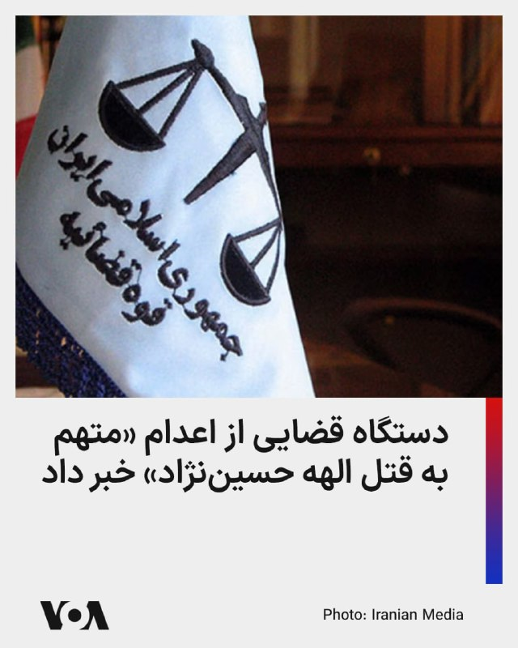

قوه قضائیه جمهوری اسلامی اعلام کرد حکم قصاص متهم به قتل الهه حسین‌نژاد، پس از تأیید در دیوان عالی کشور و با درخواست اولیای دم، اجرا شده است. رسانه‌های داخلی نام متهم این پرونده را بهمن فرزانه اعلام کرده‌اند.

الهه حسین‌نژاد خرداد ۱۴۰۴ پس از سوار شدن به یک خودروی مسافرکش برای بازگشت به خانه ناپدید شد. چند روز بعد، پیکر او در بیابان‌های اطراف تهران پیدا شد.

در گزارش‌های رسمی ادعا شده متهم پس از بازداشت به قتل اعتراف کرده و کیفرخواست پرونده با اتهام قتل عمد، مخفی کردن جسد و صدمه به اموال مقتول به دادگاه کیفری یک استان تهران ارسال شده است.

اجرای این حکم در حالی اعلام می‌شود که گزارش تازه عفو بین‌الملل از افزایش شدید اعدام‌ها در ایران در سال ۲۰۲۵ خبر داده است.

بر اساس این گزارش، جمهوری اسلامی در سال ۲۰۲۵ دست‌کم ۲۱۵۹ نفر را اعدام کرده؛ رقمی که بیش از دو برابر آمار سال ۲۰۲۴ است و ایران را عامل اصلی جهش جهانی اعدام‌ها در بالاترین سطح ثبت‌شده طی ۴۴ سال گذشته معرفی می‌کند.

عفو بین‌الملل می‌گوید آمار جهانی اعدام‌ها در سال ۲۰۲۵، بدون احتساب چین، کره شمالی و ویتنام، به ۲۷۰۷ مورد رسیده است.
@FarsiVOA

## FarsiVOA — post 218197

⚡️سنتکام اعلام کرد که از زمان اجرای محاصره دریایی جمهوری اسلامی نیروهای آمریکایی ۸۹ کشتی را وادار به تغییر مسیر کرده‌اند. سنتکام گفت مانع هرگونه جریان تجاری به داخل و خارج از بنادر ایران شده است تا محاصره دریایی علیه جمهوری اسلامی به طور کامل اجرا شود.
@FarsiVOA

## DW_Farsi — post 124910

  

🔶 "ارتش آمریکا دست‌کم ۱۰ مین را در تنگه هرمز شناسایی کرده است"
 
سی‌بی‌اِس نیوز به نقل از مقام‌های ایالات متحده که نخواسته‌اند نام‌شان فاش شود، بر مبنای یک ارزیابی اطلاعاتی اخیر گزارش داده که نیروهای ارتش این کشور دست‌کم ۱۰ مین را در تنگه هرمز  شناسایی کرده‌اند.
 
سی‌بی‌اِس نیوز پیش‌تر در ماه مارس گزارش داده بود که بر اساس ارزیابی‌های اطلاعاتی آمریکا در آن زمان، دست‌کم ۱۲ مین زیرآبی در تنگه هرمز وجود داشته است. مقام‌های آمریکایی در ماه مارس گفته بودند مین‌هایی که اکنون جمهوری اسلامی در تنگه هرمز به کار گرفته، مین‌های چسبنده "مهام ۳" و "مهام ۷" ساخت ایران هستند. یک مقام دیگر ایالات متحده تعداد آن‌ها را کمتر از ۱۲ عدد اعلام کرده بود.
   
ایالات متحده هشدار داده است که عبور از مسیر عادی در تنگه هرمز می‌تواند به دلیل مین‌هایی که جمهوری اسلامی در تنگه هرمز کار گذاشته، "بسیار خطرناک" باشد.
 
پنتاگون پیش از این، تصویری گرافیکی منتشر کرده بود که نشان می‌داد جمهوری اسلامی در ۲۳ آوریل مین‌های جدیدی در تنگه هرمز کار گذاشته است.
 
@dw_farsi

## DW_Farsi — post 124909

🔶 ترامپ: جنگ با ایران را خیلی سریع پایان خواهیم داد
 
به گزارش خبرگزاری رویترز، دونالد ترامپ، رئیس ‌جمهور ایالات متحده، در کاخ سفید به اعضای کنگره گفته است که ایالات متحده، "جنگ با ایران را خیلی سریع" پایان خواهد داد.
 
همزمان دو مقام ایالات متحده به اکسیوس گفته‌اند که ترامپ، شامگاه دوشنبه جلسه‌ای با تیم ارشد امنیت ملی خود درباره ایران برگزار کرد که شامل ارائه گزارشی درباره گزینه‌های نظامی بود. بر اساس این گزارش، این جلسه چند ساعت پس از آن برگزار شد که ترامپ اعلام کرده بود حملات برنامه‌ریزی‌شده روز سه‌شنبه به ایران را متوقف کرده است.
 
ترامپ همچنان در تازه‌ترین اظهارنظرهای خود درباره جنگ ایران گفته است که جمهوری اسلامی تنها چند روز برای رسیدن به یک پیشرفت دیپلماتیک فرصت دارد.
 
او روز دوشنبه گفت که ضرب‌الاجل برای تعیین تکلیف این موضوع، "دو سه روز، شاید جمعه یا شنبه، یا اوایل هفته آینده" است.
 
به گفته مقام‌های ایالات متحده و منابع منطقه‌ای، تصمیم ترامپ برای خودداری از حمله تا حدی به دلیل نگرانی‌هایی بود که چند رهبر کشورهای خلیج فارس درباره حملات تلافی‌جویانه جمهوری اسلامی علیه تاسیسات نفتی و زیرساخت‌هایشان مطرح کرده بودند.
 
به گزارش اکسیوس، حاضران در جلسه با ترامپ، جی‌دی ونس، معاون او، مارکو روبیو، وزیر امور خارجه، استیو ویتکاف، فرستاده کاخ سفید، پیت هگست، وزیر دفاع، ژنرال دن کین، رئیس ستاد مشترک ارتش، جان رتکلیف، رئیس سازمان اطلاعات مرکزی آمریکا (سیا)، و دیگر مقام‌های ارشد بوده‌اند.
 
یک منبع منطقه‌ای نیز به اکسیوس گفته است که میانجی‌ها در تلاش هستند تا جمهوری اسلامی را متقاعد کنند موضعی انعطاف‌پذیرتر ارائه دهد که خواسته‌های هسته‌ای ایالات متحده را در بر بگیرد.
 
این در حالی است که ترامپ روز سه‌شنبه گفته بود: «ممکن است مجبور شویم یک ضربه بزرگ دیگر به ایران وارد کنیم. هنوز مطمئن نیستم. خیلی زود خواهید فهمید.»
 
این خبرگزاری پیش از این گزارش داده بود که ترامپ از زمان آغاز جنگ در ماه فوریه تا کنون "دست کم شش بار ضرب‌الاجل‌های اعلام‌شده را تمدید کرده و حمله‌های برنامه‌ریزی شده علیه جمهوری اسلامی را به تعویق انداخته است."
@dw_farsi

## DW_Farsi — post 124908

🔶 نمایش کلاشینکف روی آنتن؛ "بازگشت پروپاگاندای جنگی دهه شصت"
 
🔻 گزارشی از الینا فرهادی
 
در هفته‌های اخیر، آنتن شبکه‌های مختلف صدا و سیمای جمهوری اسلامی ایران شاهد تحولی بی‌سابقه و تامل‌برانگیز بوده است؛ قاب‌هایی که پیش از این به پادگان‌ها و رژه‌های نظامی محدود می‌شد، اکنون به برنامه‌های زنده، استودیوهای روتین و حتی دستان مجریان تلویزیونی راه یافته است.
 
از آموزش گام‌به‌گام باز و بسته کردن اسلحه کلاشنیکف تا نمایش تیربارهای سنگین و موشک‌اندازهای آرپی‌جی، رسانه رسمی حکومت ایران آشکارا یک "جامعه مسلح" و آماده برای بدترین سناریوها را تصویر می‌کند. بازوهای مدیریتی صداوسیما این روند را بخشی طبیعی از "آرایش جنگی رسانه ملی" در بحبوحه تنش‌های فزاینده منطقه‌ای می‌دانند. محسن برمهانی، معاون سیما، با صراحتی کم‌سابقه معتقد است در شرایط فعلی، وظیفه تلویزیون نه صرفا اطلاع‌رسانی، بلکه "تهییج و آموزش" برای مفاهیم جهاد و مقاومت است. در همین راستا، حسن عابدینی، معاون سیاسی این سازمان، نمایش اسلحه در دست مجریان و مهمانان را اقدامی "نمادین" برای بازنمایی آمادگی نیروهای داوطلب در برابر تهدیدات خارجی ارزیابی می‌کند.
 
 اما ناظران و حتی برخی رسانه‌های داخلی، این ویترین جدید را نشانه‌ای از یک بازآرایی استراتژیک با اهداف چندگانه داخلی و خارجی ارزیابی می‌کنند.
 
تحلیل‌گران مسائل سیاسی معتقدند این حجم از نظامی‌گری عریان بر صفحه تلویزیون، پیام پیچیده‌ای را حمل می‌کند که لزوما مخاطب خارجی یا دشمنان منطقه‌ای را هدف نگرفته است. منتقدان می‌گویند فراتر از نمایش بازدارندگی در برابر تهدیدهای بیرونی، این تصاویر پالس‌های مشخصی از ارعاب روانی را به جامعه معترض و مستعد بحران در داخل مخابره می‌کند؛ جامعه‌ای که زیر بار فشارهای خردکننده اقتصادی و انسداد سیاسی قرار دارد. در واقع، ابهام بزرگ اینجاست که آیا حاکمیت در حال آماده‌سازی هواداران خود برای یک رویارویی بزرگ نظامی است، یا آگاهانه بذر اضطراب اجتماعی را می‌پاشد تا هرگونه صدای مخالفت داخلی را در فضای گرگ‌ومیش "وضعیت جنگی" خفه کند؟
@dw_farsi

## Persian_Trend_Official — post 14515

  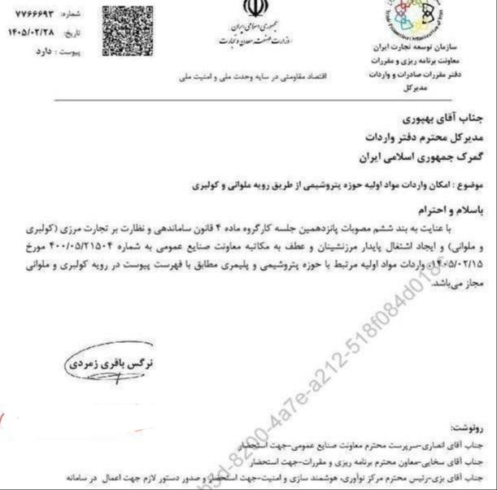

💢واردات مواد اولیه پتروشیمی و پلیمری مجاز شد

💢مدیرکل دفتر مقررات صادرات و واردات وزارت صنعت، معدن و تجارت، در مکاتبه‌ای با مدیرکل واردات گمرک ایران، امکان واردات برخی مواد اولیه مرتبط با حوزه پتروشیمی و پلیمری از طریق رویه‌های ملوانی و کولبری را ابلاغ کرد.

🫆:Tony

📌 @persian_trend_official
پرشین ترند | متفاوت‌ترین کانال نظامی

## Persian_Trend_Official — post 14514

  <a href="telegram/content/Persian_Trend_Official_14514_1779257678.mp4" target="_blank">🎬 Download video</a>

کپشن با شما ...

📌 @persian_trend_official
پرشین ترند | متفاوت‌ترین کانال نظامی

## Persian_Trend_Official — post 14513

  

💢قاتل الهه حسین نژاد اعدام شد.

🫆:Tony
📌 @persian_trend_official
پرشین ترند | متفاوت‌ترین کانال نظامی

## Persian_Trend_Official — post 14512

حسین شریعتمداری : خاک بحرین متعلق به ایران است و مردم آن فارسی زبانند و خواستار الحاق این کشور به ایران هستند 💢دولت بحرین از جمهوری اسلامی ایران به سازمان ملل شکایت کرده و مدعی شده که ایران در امور داخلی بحرین دخالت می‌کند. 💢 اولا  بحرین متعلق به ایران است…

## Persian_Trend_Official — post 14511

حسین شریعتمداری : خاک بحرین متعلق به ایران است و مردم آن فارسی زبانند و خواستار الحاق این کشور به ایران هستند

💢دولت بحرین از جمهوری اسلامی ایران به سازمان ملل شکایت کرده و مدعی شده که ایران در امور داخلی بحرین دخالت می‌کند.

💢 اولا  بحرین متعلق به ایران است و مردم آن سامان خودشان را ایرانی می‌دانند. به زبان فارسی حرف می‌زنند و خواستار الحاق به وطن اصلی خود هستند.

💢ثانیاًً، حاکمان دست‌نشانده بحرین، خاک این جزیره ایرانی را برای حمله نظامی به ایران در اختیار آمریکا و رژیم صهیونیستی گذاشته‌اند. بنابراین، علاوه‌ بر خلع ید، باید محاکمه و مجازات هم بشوند.

🫆:Tony

📌 @persian_trend_official
پرشین ترند | متفاوت‌ترین کانال نظامی

## Persian_Trend_Official — post 14510

🔴 آزادی شهروند ایرانی دارای اقامت آمریکا پس از سال‌ها زندان

💢رسانه‌ها گزارش دادند «شهاب دلیلی» شهروند ایرانی دارای اقامت دائم آمریکا، پس از حدود ۱۰ سال از زندان ایران آزاد شده و به ایالات متحده بازگشته است.

▪️بر اساس گزارش‌ها:

▪️ دلیلی با اتهام «همکاری با دولت متخاصم» بازداشت شده بود
▪️ او پس از آزادی، از مسیر ارمنستان به آمریکا منتقل شده است
▪️ گفته می‌شود اکنون در کنار خانواده خود در واشینگتن حضور دارد
🫆:Tony

📌 @persian_trend_official
پرشین ترند | متفاوت‌ترین کانال نظامی

## Persian_Trend_Official — post 14509

  <a href="telegram/content/Persian_Trend_Official_14509_1779257680.mp4" target="_blank">🎬 Download video</a>

💢پوتین وارد تالار بزرگ خلق در پکن شد، جایی که قرار است با شی جین پینگ مذاکره کند

🫆:Tony

📌 @persian_trend_official
پرشین ترند | متفاوت‌ترین کانال نظامی

## Persian_Trend_Official — post 14508

  <a href="telegram/content/Persian_Trend_Official_14508_1779257681.webm" target="_blank">🎬 Download video</a>

💢نیویورک‌تایمز مدعی شد آمریکا و اسرائیل در روزهای ابتدایی عملیات مشترک نظامی علیه ایران، خانه محمود احمدی‌نژاد را هدف حمله هوایی قرار داده‌اند.

▪️بر اساس این گزارش:

▪️ هدف از این حمله، آزاد کردن احمدی‌نژاد از حصر خانگی و استفاده از او در پروژه تغییر نظام در ایران بوده است

▪️ احمدی‌نژاد به‌دلیل اختلاف با آیت‌الله خامنه‌ای تحت حصر قرار داشت

▪️ برنامه‌ریزان اسرائیلی پیش از آغاز جنگ با او ارتباط برقرار کرده بودند

در ادامه گزارش آمده:

▪️ حمله اسرائیل محافظان مستقر مقابل منزل احمدی‌نژاد در تهران را هدف قرار داده بود

▪️ احمدی‌نژادازحملهجانسالمبهدربردامازخمیشد

▪️ او پس از حمله نسبت به این طرح دچار تردید و ناامیدی شده است

💢طبق ادعای نیویورک‌تایمز:

▪️ طرح گسترده‌تر اسرائیل شامل حذف رهبران ارشد ایران، حمایت از ناآرامی‌های داخلی و ایجاد زمینه برای تشکیل دولت جایگزین بوده است

▪️ مقام‌های آمریکایی و اسرائیلی تصور می‌کردند برخی جریان‌های داخلی ایران پس از آغاز جنگ با واشینگتن همکاری خواهند کرد

🫆:Tony

📌 @persian_trend_official
پرشین ترند | متفاوت‌ترین کانال نظامی

## Persian_Trend_Official — post 14507

  <a href="telegram/content/Persian_Trend_Official_14507_1779257681.mp4" target="_blank">🎬 Download video</a>

صبحتون‌ بخیر ☕️🤍

📝 Nick
📌 @persian_trend_official
پرشین ترند | متفاوت‌ترین کانال نظامی

## RadioFarda — post 157369

سفیر آمریکا در سازمان ملل: اقتصاد ایران در حال فروپاشی است

🔸مایک والتز، سفیر آمریکا در سازمان ملل، می‌گوید منابع مالی حکومت ایران «در حال تمام شدن» و اقتصاد این کشور «در وضعیت فروپاشی» است.

🔸او افزوده که با این حال جمهوری اسلامی «به‌جای روی آوردن به رویکردی تازه و صلح‌آمیز، دست به حملات مکرر و گستاخانه‌ای علیه زیرساخت‌های غیرنظامی برق زده و همچنان به راهبرد دستیابی به سلاح هسته‌ای چنگ زده که می‌تواند جهان را در تاریکی فرو ببرد.»

🔸او تأکید کرده که «ما نمی‌توانیم این را تحمل کنیم و هرگز تحمل نخواهیم کرد.»

🔸اسکات بسنت، وزیر خزانه‌داری ایالات متحده، هم روز سه‌شنبه ۲۹ اردیبهشت در یک نشست مبارزه با تأمین مالی تروریسم در پاریس، گفت که این وزارتخانه، حکومت ایران را از درآمدهایی که برای «برنامه‌های تسلیحاتی، گروه‌های نیابتی تروریستی و جاه‌طلبی‌های هسته‌ای خود استفاده می‌کرد، محروم کرده است.»

🔸او افزود که واشینگتن «ده‌ها میلیارد دلار از درآمد پیش‌بینی‌شده نفتی» جمهوری اسلامی را مختل کرده است.

@RadioFarda

## RadioFarda — post 157368

  

🔸رسانه‌ها در ایران از اجرای حکم اعدام قاتل الهه حسین‌نژاد، که جسد او اوایل خرداد سال گذشته در بیابان‌های اطراف تهران پیدا شد، خبر می‌دهند.

🔸ارگان رسمی قوه قضائیه ایران، میزان، با انتشار این خبر نوشته که این حکم با درخواست اولیای دم و پس از طی تمامی مراحل قانونی و قضایی اجرا شد.

🔸عصر چهارم خرداد ۱۴۰۴ الهه حسین‌نژاد ۲۴ ساله از سالن زیبایی که در آنجا مشغول به کار بود، بیرون آمد تا به خانه‌اش در اسلامشهر برود، اما ناپدید شد و وقتی خانواده‌اش اعلام شکایت کردند بررسی‌های تیم جنایی نشان می‌داد الهه از میدان آزادی سوار یک خودروی عبوری شده است.

🔸جست و جوها برای یافتن الهه سرانجام پس از ۱۱ روز نتیجه داد و با دستگیری راننده خودرو به نام بهمن ۳۷ ساله و اعتراف به قتل الهه، جسد او در بیابان‌های اطراف تهران پیدا شد. متهم نیز پس از محاکمه به اعدام محکوم شد.

🔸این قتل جنجال زیادی درباره امنیت زنان در ایران به پا کرد و تا مدت‌ها رسانه‌ها درباره آن مطالب مختلفی منتشر می‌کردند.

@RadioFarda

## RadioFarda — post 157367

  <a href="https://t.me/radiofarda/157367" target="_blank">📎 Download file</a>

📻بشنوید: خبرهای ۸ صبح با رادیوفردا، ۳۰ اردیبهشت ۱۴۰۵‌

@RadioFarda

## BBCPersian — post 281570

🔻عبور دو نفتکش چینی از تنگه هرمز بعد از دو ماه معطلی

🔻دو نفتکش چینی حامل چهار میلیون بشکه نفت روز چهارشنبه از تنگه هرمز عبور کرده‌اند.

داده‌های کشتیرانی شرکت‌های کپلر و ال‌اس‌جی‌ای نشان می‌دهد که این دو ابرنفتکش چینی حامل نفت خام خاورمیانه، روز چهارشنبه پس از بیش از دو ماه انتظار در خلیج فارس، از تنگه هرمز خارج شدند.

در روزهای اخیر تنها تعداد انگشت‌شماری کشتی از این آبراه عبور کرده‌اند، اما این عبور موفقیت‌آمیز، همراه با افزایش لحن ملایم کاخ سفید، باعث کاهش اندک قیمت نفت شده است.

روز سه‌شنبه، رئیس جمهور ترامپ اصرار داشت که توافق صلح با ایران نزدیک است، هرچند تأکید کرد که هر توافقی که حاصل شود، مانع از دستیابی ایران به سلاح‌های هسته‌ای خواهد شد.

https://bbc.in/4v4WOoV
@BBCPersian

## BBCPersian — post 281569

  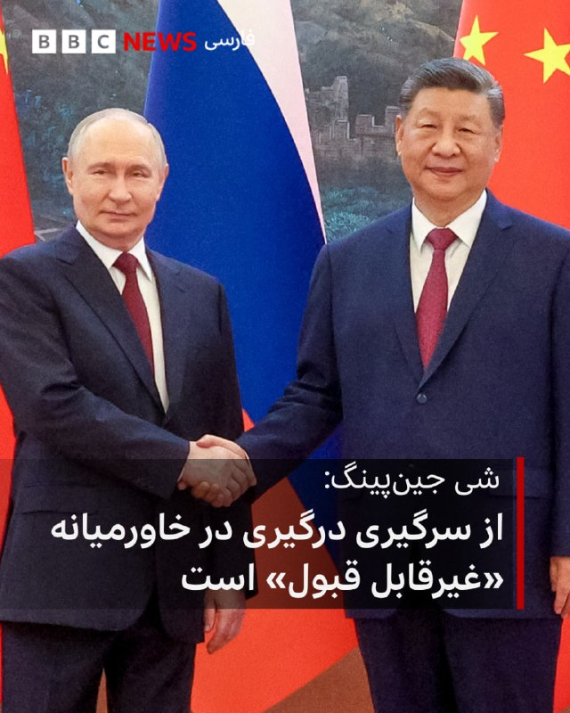

🔻به گزارش رسانه‌های دولتی چین، شی جین‌پینگ در دیدار با ولادیمیر پوتین گفت که وضعیت خاورمیانه در «مرحله حساسی» قرار دارد و در حال حاضر در حال گذار از جنگ به صلح است.

رهبر چین افزود که پایان دادن به خصومت‌ها «ضروری» است و از سرگیری درگیری «غیرقابل قبول» خواهد بود.

به گزارش شینهوا، شی گفت: «پیشنهاد چهار ماده‌ای من برای حفظ و ارتقای صلح و ثبات در خاورمیانه با هدف ایجاد اجماع بین‌المللی بیشتر و کمک به کاهش تنش‌ها، کاهش درگیری‌ها و ارتقای صلح ارائه شده است.»

پیشنهاد چهار ماده‌ای شی که ماه گذشته در دیدار با ولیعهد ابوظبی مطرح شد، همزیستی مسالمت‌آمیز، حاکمیت ملی، حاکمیت قانون بین‌المللی و رویکردی هماهنگ برای توسعه و امنیت را ترویج می‌دهد.

رهبران چین و روسیه صبح امروز در پکن دیدار کردند.

📸AFP via Getty Images
https://bbc.in/49vRNgP
@BBCPersian

## BBCPersian — post 281568

🔻زوج بریتانیایی زندانی در ایران «اعتصاب غذا کردند»

🔻خانواده یک زوج بریتانیایی که پس از متهم شدن به جاسوسی در ایران زندانی شده‌اند، می‌گویند که این دو نفر اعتصاب غذا کرده‌اند.

لیندسی و کریگ فورمن در ژانویه ۲۰۲۵هنگام عبور از ایران با موتورسیکلت دستگیر شدند. آنها در نهایت به ده سال زندان محکوم شدند.

در همین حال، یک تبعه ایرانی که اقامت دائم ایالات متحده را دارد، پس از ده سال زندان در ایران آزاد شده و به ایالات متحده بازگشته است.

شهاب دلیلی به همکاری با یک دولت متخاصم متهم شده بود.
https://bbc.in/4f2MgSt
@BBCPersian

## BBCPersian — post 281562

🖋جوی سلیم
بی‌بی‌سی عربی

چند سال پیش، بانک برادسکو، یکی از بزرگ‌ترین بانک‌های برزیل، اعلام کرد که «بیا»، دستیار مجازی بانک که صدای زنانه‌ای دارد، روزانه با موجی از توهین‌های جنسی و تهدیدهای خشونت‌آمیز مشتریان روبه‌رو می‌شود.

جملاتی مانند «به تو تجاوز می‌کنم»، «لخت شو» و دیگر توهین‌های خشن، نثار یک ربات گفتگو می‌شد، فقط به این دلیل که صدای زنانه داشت. «بیا» تنها در سال ۲۰۲۰ نزدیک به ۹۵ هزار پیام دریافت کرد که ماهیت آزار جنسی داشتند.

این اتفاق فقط یک مورد استثنایی نبود بلکه یکی از نمونه‌های فراوانی است که در آن ربات‌های گفتگو با صدای زنانه، از جمله «سیری» اپل و «الکسا» آمازون، هدف آزارهای لفظی قرار می‌گیرند؛ آزارهایی که در واقع ادامه مستقیم همان خشونت جنسیت‌محوری است که پیش‌تر هم در فضای دیجیتال رواج داشته است.
ادامه مطلب⬇️

📸GettyImages
https://bbc.in/3RQLeix
@BBCPersian

## BBCPersian — post 281561

  

🔻خبرگزاری‌ها در ایران صبح چهارشنبه - ۳۰ اردیبهشت - از اعدام مردی که «قاتل الهه حسین‌نژاد» معرفی شده خبر دادند.

جسد الهه حسین‌نژاد اوایل خرداد سال گذشته در بیابان‌های اطراف تهران پیدا شد و قوه قضائیه ایران در همان روزها اعلام کرد که پرونده قتل این زن ۲۴ ساله ساکن اسلامشهر در حومه تهران بزرگ را به شعبه ویژه بازپرسی ارجاع کرده و دو نفر هم در این رابطه بازداشت شدند.

براساس گزارش‌ها متهم اصلی مسافرکشی می‌کرده و الهه حسین‌نژاد را برای رساندن به مقصد سوار می‌کند و او را برای «موبایل گرانقیمتش» با «چاقو» به قتل می‌رساند.

کشف جسد او ۱۲ روز پس از قتلش خشم افکار عمومی برانگیخت و گروهی از کاربران در شبکه‌های اجتماعی نوشته‌اند: «این پرونده یک کشته و ۹۰ میلیون زخمی داشت.»
📸elahe.hoseinnejad
https://bbc.in/4ukVA8J
@BBCPersian

## BBCPersian — post 281560

  

🔻روزنامه آمریکایی نیویورک تایمز در گزارشی اختصاصی نوشته تحقیقات این رسانه نشان داده که در اوایل جنگ آمریکا و اسرائیل با ایران، یک حمله هوایی به محل سکونت محمود احمدی‌نژاد، رئیس جمهور سابق ایران، صورت گرفت که هدف آن آزادی او از حصر خانگی و بخشی از تسهیل روند تغییر رژیم بوده است.

نیویورک تایمز روز سه‌شنبه در گزارشی اختصاصی نوشت: «چند روز پس از آنکه حملات اسرائیل در نخستین موج‌های جنگ، رهبر جمهوری اسلامی ایران و دیگر مقام‌های ارشد را کشت، دونالد ترامپ علنا مطرح کرد که شاید بهتر باشد «فردی از داخل» ایران اداره کشور را به دست بگیرد. اکنون مشخص شده است که آمریکا و اسرائیل با گزینه‌ای مشخص و بسیار غافلگیرکننده وارد این درگیری شده بودند: محمود احمدی‌نژاد، رئیس‌جمهور پیشین ایران که به مواضع تند ضداسرائیلی و ضدآمریکایی‌اش شناخته می‌شود.»
ادامه مطلب⬇️

📸EPA-EFE/REX/Shutterstock
https://bbc.in/3RmWpzo
@BBCPersian

## BBCPersian — post 281559

  

🔻عباس عراقچی، وزیر خارجه ایران در واکنش به اظهارات تهدیدآمیز دونالد ترامپ، رئیس جمهور آمریکا، درباره احتمال از سرگیری حمله نظامی به ایران گفته است: «مطمئن باشید بازگشت به میدان جنگ با شگفتی‌های بسیار بیشتری همراه خواهد بود

آقای عراقچی در پست جدیدی در شبکه ایکس نوشته است: «ماه‌ها پس از آغاز جنگ علیه ایران، کنگره آمریکا به نابودی ده‌ها فروند هواپیما به ارزش میلیاردها دلار اذعان کرد. اکنون به‌طور رسمی تأیید شده است که نیروهای مسلح قدرتمند ما نخستین نیرویی در جهان بودند که جنگنده پیشرفته و پرآوازه F-35 را سرنگون کردند.»

او در پایان این پست مدعی شده است که: «با درس‌هایی که آموخته‌ایم و دانشی که به دست آورده‌ایم، مطمئن باشید بازگشت به میدان جنگ با شگفتی‌های بسیار بیشتری همراه خواهد بود.»

دونالد ترامپ، رئیس جمهور آمریکا، روز گذشته مدعی شد که در آستانه حمله نظامی بزرگ به ایران، او به درخواست رهبران منطقه، دستور لغو حمله را داده است.

📸GettyImages
https://bbc.in/4dI4AxY
@BBCPersian

## BBCPersian — post 281558

  

🔻مقامات اسپانیایی اعلام کردند که سه پلیس کانادایی به دلیل اتهام حمله به یک کارگر جنسی در جریان تعطیلاتشان در شهر بارسلون دستگیر شده‌ بودند.
پلیس تورنتو اعلام کرد که یکی از این افسران پس از بازگشت به کانادا از کار تعلیق شد.

اداره پلیس اعلام کرده که دو افسر دیگر نیز به محض بازگشت از کار تعلیق خواهند شد.

اداره پلیس تورنتو در ایمیلی به بی‌بی‌سی تاکید کرده است: «این اتهامات جدی هستند.» در این بیانیه ضمن تایید هویت و شغل این افراد، اعلام کرده است که این سه نفر در سفر غیر رسمی و اداری بوده‌اند و تا زمان تکمیل پرونده، اظهار نظر بیشتری نخواهد کرد.

مقامات اسپانیایی در ایمیلی به بی‌بی‌سی گفتند که اولین بار در ساعات اولیه چهارشنبه ۱۳ مه/ ۲۳ اردیبهشت، پس از در خواست کمک زنی از داخل یک تاکسی، از این حادثه مطلع شدند. پلیس اسپانیا، دو نفر از سه مظنون شناسایی شده را دستگیر کرد. نفر سوم که فرار کرده بود، چند روز بعد دستگیر شد. این زن به پلیس گفت که او یک کارگر جنسی است که قبلا با یکی از افسران قرار ملاقات گذاشته بود.

ادامه مطلب⬇️
📸GettyImages
https://bbc.in/4dymLpr
@BBCPersian

## alonews — post 121208

  <a href="telegram/content/alonews_121208_1779257685.webm" target="_blank">🎬 Download video</a>

👈الجزیره: قیمت نفت پس از اینکه ترامپ گفت جنگ با ایران «با سرعت بسیار زیادی» به پایان خواهد رسید، کاهش یافت

🔴هر بشکه نفت با کاهش ۰.۴ درصدی، به ۱۱۰ دلار و ۸۳ سنت رسید

✅ @AloNews خبر جنگ

## alonews — post 121207

  <a href="telegram/content/alonews_121207_1779257686.mp4" target="_blank">🎬 Download video</a>

👈 پوتین از شی جین پینگ دعوت کرد تا سال آینده به روسیه سفر کند

🔴سفر قبلی شی جین پینگ به روسیه در ماه مه ۲۰۲۵ بود، زمانی که رهبر چین در جشن‌های روز پیروزی روسیه شرکت کرد.

✅ @AloNews خبر جنگ

## alonews — post 121206

  <a href="telegram/content/alonews_121206_1779257687.webm" target="_blank">🎬 Download video</a>

👈واردات مواد اولیه پتروشیمی و پلیمری از طریق رویه‌های ملوانی و کولبری مجاز شد.

✅ @AloNews خبر جنگ

## alonews — post 121204

  <a href="telegram/content/alonews_121204_1779257687.webm" target="_blank">🎬 Download video</a>

👈ترامپ موبایل از راه رسید / گزارش NBC از موبایل جدید ترامپ:

🔴شبکه خبری ان‌بی‌سی نیوز به یکی از اولین نمونه‌های بررسی گوشی «ترامپ موبایل» دست پیدا کرده است؛ محصولی که دیگر با شعار «ساخت آمریکا» بازاریابی نمی‌شود. ادعایی که هنگام رونمایی اولیه از این گوشی مطرح شده بود.

🔴مدل T1 با قیمت «تشویقی» ۴۹۹ دلار به فروش می‌رسد و به صفحه‌نمایش ۶.۷۸ اینچی، دوربین اصلی ۵۰ مگاپیکسلی و حافظه ۵۱۲ گیگابایتی مجهز است.

🔴گوشی ترامپ موبایل در چهار نقطه از بدنه و نرم‌افزار، لوگوی «ترامپ» حک شده، پرچمی آمریکایی با ۱۱ راه‌راه به جای ۱۳ راه‌راه روی آن حک شده و از پیش، شبکهٔ «تروث سوشال» روی آن نصب است.

✅ @AloNews خبر جنگ

## alonews — post 121203

  <a href="telegram/content/alonews_121203_1779257687.webm" target="_blank">🎬 Download video</a>

👈استریت ژورنال: میانجی‌ها می‌گویند مذاکرات ایران و آمریکا پیشرفت کمی داشته و دو طرف هنوز از هم فاصله زیادی دارند.

✅ @AloNews خبر جنگ

## alonews — post 121202

  <a href="telegram/content/alonews_121202_1779257687.webm" target="_blank">🎬 Download video</a>

👈حکم اعدام بهمن فرزانه، قاتل الهه حسین‌نژاد، اجرا شد.

✅ @AloNews خبر حنن

## alonews — post 121201

  <a href="telegram/content/alonews_121201_1779257688.mp4" target="_blank">🎬 Download video</a>

👈رئیس‌جمهور چین: جنگ در خاورمیانه باید فورا تمام شود

🔴از سرگیری درگیری غیر قابل قبول‌ است

🔴تعهد به مذاکرات به‌ویژه حیاتی است

🔴اوضاع در خاورمیانه در مرحله‌ای تعیین‌کننده و آماده گذار از جنگ به صلح است.

✅ @AloNews خبر جنگ

## alonews — post 121200

  <a href="telegram/content/alonews_121200_1779257689.webm" target="_blank">🎬 Download video</a>

👈بهمن فرزانه؛ قاتل الهه حسین نژاد صبح امروز اعـدام شد.

✅ @AloNews خبر جنگ

## alonews — post 121199

  <a href="telegram/content/alonews_121199_1779257689.mp4" target="_blank">🎬 Download video</a>

👈ترامپ درباره ایران: ما همه چیز را نابود می‌کنیم و این جنگ را خیلی سریع به پایان می‌رسانیم.
آن‌ها آنقدر خسته‌اند که می‌خواهند به شدت معامله کنند.

🔴این باید ۴۷ سال پیش اتفاق می‌افتاد. کسی باید کاری درباره‌اش انجام می‌داد. کسی باید کاری درباره‌اش انجام می‌داد.

🔴این اتفاق خواهد افتاد و خیلی سریع خواهد بود.

✅ @AloNews خبر جنگ

---
📅 بروزرسانی: 1405/02/30 05:24
---

## VahidOOnLine — post 241074

  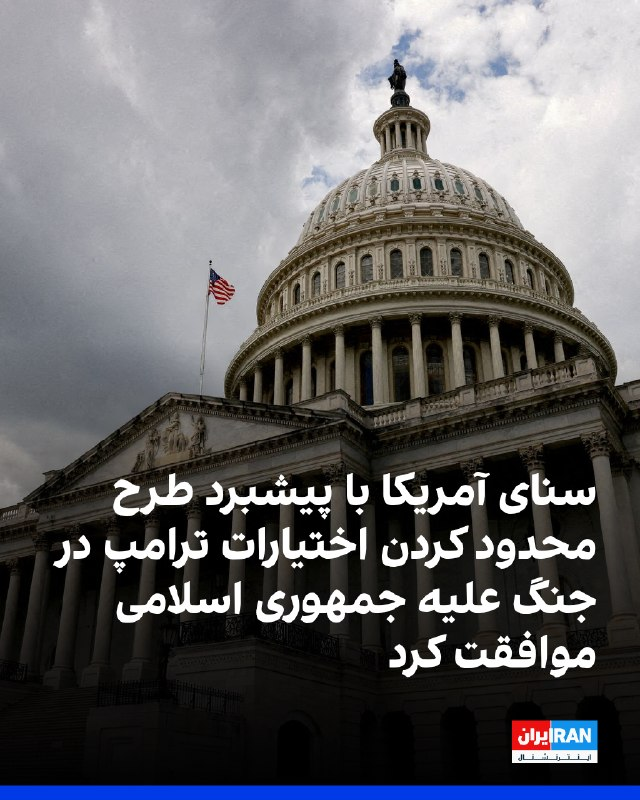

سنای آمریکا با پیشبرد طرح محدود کردن اختیارات جنگی ترامپ در جنگ علیه جمهوری اسلامی موافقت کرد. اقدامات سنا در این زمینه تا کنون به تصویب نرسیده‌اند.

کوری بوکر، سناتور دموکرات، گفت: «باید همچنان به صحبت کردن ادامه دهیم تا سنا سرانجام برای پایان دادن به این جنگ اقدام کند.»
‌🏁 🇬🇧 IranintlTV

🤖 @VahidOOnLine

## VahidOOnLine — post 241073

  <a href="telegram/content/VahidOOnLine_241073_1779242091.mp4" target="_blank">🎬 Download video</a>

‌
خبرگزاری فرانسه گزارش داد شرکت هواپیماسازی ایرباس به دلیل پیامدهای جنگ آمریکا و اسرائیل با جمهوری اسلامی، از تیم‌های خود خواسته هزینه‌های «غیرضروری» را ۱۰ درصد کاهش دهند.

بر اساس سندی که خبرگزاری فرانسه مشاهده کرده، ایرباس اعلام کرده هدف این شرکت «توقف قابل توجه فعالیت‌ها و هزینه‌هایی است که برای عملیات و فعالیت‌های صنعتی کاملاً ضروری نیستند.»

در این یادداشت از کارکنان خواسته شده از ایجاد هزینه‌های جدید یا واگذاری فعالیت‌های غیرضروری به پیمانکاران خودداری کنند.

ایرباس همچنین بر کاهش هزینه‌هایی مانند رویدادهای داخلی، برنامه‌های تیمی، همایش‌ها و مشارکت در کنفرانس‌ها تاکید کرده است.
‌🏁 🇬🇧 ManotoTV

🤖 @VahidOOnLine

## VahidOOnLine — post 241072

  

♦️زمین‌لرزه‌ای به بزرگی ۴.۷ حوالی ساعت ۳:۱۲ بامداد چهارشنبه ۳۰ اردیبهشت، بندر لافت در استان هرمزگان را لرزاند.
این زمین‌لرزه علاوه بر لافت، در جزایر قشم و هرمز و همچنین برخی مناطق روستایی بندرعباس نیز احساس شده است. تاکنون گزارشی از خسارات احتمالی این زمین‌لرزه منتشر نشده است.
‌🇸🇦 Indypersian

🤖 @VahidOOnLine

## VahidOOnLine — post 241070

  

♦️نیویورک‌تایمز در گزارشی به نقل از منابع ناشناس که آنها را مقامات آمریکایی عنوان کرده، مدعی شد که هدف اولیه جنگ، «تلاش برای به رهبری رساندن محمود احمدی‌نژاد»، رئیس‌جمهوری اسبق ایران بوده است. در این گزارش، ادعا شده که در زمینه این طرح «با محمود احمدی‌نژاد مشورت شده بود» اما در نهایت این طرح به مشکل خورد. نیویورک‌تایمز ادعا کرده که محمود احمدی‌نژاد در جریان حمله روز نخست اسرائیل به خانه‌اش در تهران که هدف آن آزاد کردن او از آنچه «حصر خانگی» خوانده شده، بود زخمی شد. این درحالی است که منابع ایندیپندنت فارسی در همان روز خبر دادند که احمدی‌نژاد اندکی قبل از حمله از محل خارج شده بود. این منابع همچنین «حصر خانگی» رئیس‌جمهوری اسبق را نیز تکذیب کرده‌اند. نیویورک‌تایمز در ادامه به اختلافات احمدی‌نژاد و حاکمیت در سال‌های اخیر،  رد صلاحیت‌های او در انتخابات و محدودیت‌هایی برای حضور عمومی و رفت‌و‌آمد‌ها اشاره می‌کند و می‌نویسد که احمدی‌نژاد پس از این حمله روز نخست جنگ دیگر دیده نشده است.
‌🇸🇦 Indypersian

🤖 @VahidOOnLine

## VahidOOnLine — post 241068

  

مستند «یک رفاقت از زندان وکیل‌آباد مشهد تا سن‌ دیگو» تهیه شده از سوی شبکه ایران‌اینترنشنال به کارگردانی اردوان روزبه، در بخش مستند و تحلیل سیاسی تلویزیونی برنده جایزه تلی سال ۲۰۲۶ شد.
جایزه تلی یک رقابت بین‌المللی در حوزه تولیدات ویدیویی، تلویزیونی، تبلیغات و محتوای دیجیتال است که از سال ۱۹۷۹ میلادی برگزار می‌شود و داورانی از شرکت‌هایی بزرگ مثل نتفلیکس و اچ.بی.او، هزاران اثر ارسالی را بررسی می‌کنند.
مستند «یک رفاقت: از زندان وکیل‌آباد مشهد تا سن‌ دیگو» امسال در رقابت با ۱۳ هزار اثر از از سراسر جهان برنده جایزه شد.
این مستند روایتگر داستان واقعی و غیرمنتظره دوستی میان مایکل وایت، کهنه‌سرباز آمریکایی، و مهدی وطن‌خواه، فعال سیاسی ایرانی است؛ دو زندانی که در بند عمومی زندان وکیل‌آباد مشهد با یکدیگر آشنا شدند.
مایکل وایت در سال ۲۰۱۸ پس از سفر به ایران بازداشت شد و در بازداشتگاه‌های امنیتی جمهوری اسلامی تحت بازجویی‌های سنگین، شکنجه روانی و فشار برای اعتراف اجباری قرار گرفت. او بعدها روایت کرد که بازجویان تلاش داشتند او را وادار کنند اعتراف کند برای آمریکا و اسرائیل جاسوسی می‌کرده است.

‌🏁 🇬🇧 IranintlTV

🤖 @VahidOOnLine

## VahidOOnLine — post 241067

  <a href="telegram/content/VahidOOnLine_241067_1779242094.mp4" target="_blank">🎬 Download video</a>

♦️دونالد ترامپ، رئیس‌جمهوری آمریکا روز سه‌شنبه در  سخنرانی برای قانونگذاران آمریکایی در کاخ سفید گفت: «ما به جنگ ایران خیلی سریع پایان می‌دهیم، آنها به شدت خواستار توافق هستند و خسته شده‌اند.» رئیس‌جمهوری آمریکا پیش‌بینی کرد که توافق با رزیم ایران سریع اتفاق می‌افتد و در نتیجه آن بهای نفت سقوط می‌کند.
‌🇸🇦 Indypersian

🤖 @VahidOOnLine

## VahidOOnLine — post 241066

  

زمین‌لرزه‌ای به بزرگی ۴.۷ حوالی ساعت ۳:۱۲ بامداد چهارشنبه لافت در استان هرمزگان را لرزاند. این زلزله در قشم و هرمز و مناطق روستایی بندرعباس نیز احساس شد.
‌🏁 🇬🇧 IranintlTV

🤖 @VahidOOnLine

## VahidOOnLine — post 241065

  

ترامپ در یک سخنرانی در کاخ سفید گفت: جمهوری اسلامی «قرار نیست به سلاح هسته‌ای دست پیدا کند. نمی‌توانند سلاح هسته‌ای داشته باشند. ما نمی‌توانیم چنین چیزی را تحمل کنیم و آن را تحمل نخواهیم کرد.»
او گفت: «ما نیروی دریایی جمهوری اسلامی را نابود کردیم. نیروی هوایی آنها از بین رفته است. سامانه‌های پدافند هوایی آنها از بین رفته است. تمام تجهیزاتی که برای جنگ استفاده می‌کردند از بین رفته است. تقریبا همه چیز از بین رفته است.»
ترامپ افزود: «نمی‌خواهم بگویم رهبران آنها از بین رفته‌اند، چون بیان آن چندان خوشایند نیست، اما واقعیت همین است.»
‌🏁 🇬🇧 IranintlTV

🤖 @VahidOOnLine

## FoxNewsTwitter — post 341975

  

Fox News (Twitter/X)

A major Trump ally is now one step away from Alabama’s governor’s mansion.

Sen. Tommy Tuberville rolled through the Republican primary after months of campaigning as a close ally of President Trump and a fighter against the Washington establishment.

The race drew national attention as another early test of Trump’s strength with Republican voters — and Alabama Republicans delivered Tuberville a commanding victory.

Now the longtime senator heads into the general election with the GOP favored to hold the seat.

## FoxNewsTwitter — post 341974

  <a href="telegram/content/FoxNewsTwitter_341974_1779242098.mp4" target="_blank">🎬 Download video</a>

Fox News (Twitter/X)

“Bi means you like both.”

Rep. Thomas Massie cracks jokes after losing his primary race to Trump-endorsed former Navy SEAL Ed Gallrein, saying he may be “trans-partisan” because he doesn’t fully identify with either political side anymore.

The Kentucky congressman spent years carving out a reputation as one of the most independent Republicans in Washington — often frustrating both party leadership and President Trump.

But after a brutal Trump-backed challenge, Massie’s streak in Congress has now come to an end.

## FoxNewsTwitter — post 341973

  <a href="telegram/content/FoxNewsTwitter_341973_1779242100.mp4" target="_blank">🎬 Download video</a>

Fox News (Twitter/X)

"They tried to buy my vote. They couldn't buy it."

Rep. Thomas Massie delivers a fiery speech after losing his reelection bid, accusing powerful forces in Washington of trying for years to take him down.

Massie, who became a regular target of attacks from President Trump, said they "decided to buy the seat" after they couldn't buy his vote.

## FoxNewsTwitter — post 341972

  <a href="telegram/content/FoxNewsTwitter_341972_1779242103.mp4" target="_blank">🎬 Download video</a>

Fox News (Twitter/X)

"I would like to know how many more Americans we have to ask to die for this mistake."

That question from Rep. Seth Moulton sparked a fiery clash with CENTCOM Commander Admiral Brad Cooper during a tense hearing on Iran and U.S. military operations in the Middle East.

Cooper slammed Moulton's remark as "entirely inappropriate as the exchange escalated in front of lawmakers.

## FoxNewsTwitter — post 341971

  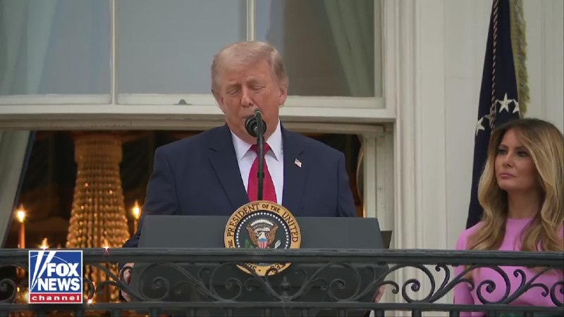

Fox News (Twitter/X)

"We're going to end that war very quickly. They want to make a deal so badly. They're tired of this"

President Trump predicts a deal to end the war with Iran is going to happen "fast" — and that oil prices will plummet when the agreement is reached.

## FoxNewsTwitter — post 341970

  <a href="telegram/content/FoxNewsTwitter_341970_1779242106.mp4" target="_blank">🎬 Download video</a>

Fox News (Twitter/X)

FOX NEWS REPORT: President Trump warns Iran may face another "big hit" if negotiations collapse, revealing he was only an hour away from moving forward with another strike. @BillMelugin_ reports.

## pm_afshaa — post 91082

  <a href="telegram/content/pm_afshaa_91082_1779242109.webm" target="_blank">🎬 Download video</a>

🔴افشاگری عجیب نیویورک تایمز:
آمریکا و اسرائیل قبل از جنگ با ایران، طرحی رو برای نصب محمود احمدی‌نژاد به عنوان رهبر جدید کشور مورد بحث قرار دادن.

احمدی‌نژاد گزارشاً در مورد این طرح مشورت شده بود، اما پس از اینکه در حمله‌ای اسرائیل به خانه‌اش در تهران در روز آغازین جنگ مجروح شد، این طرح از هم پاشید. مقامات آمریکایی گفتن که این حمله با هدف آزاد کردن او از بازداشت خانگی انجام شده بود.

برنامه‌ریزان اسرائیلی ظاهراً پیش از درگیری با احمدی‌نژاد مشورت و توافق کرده و تلاش کردن اونو از حصر خانگی اجباری با حمله‌ای‌ اسرائیلی که نگهبانان خارج از اقامتگاهش در تهران رو هدف قرار داد، در روز اول جنگ آزاد کنن.

احمدی‌نژاد زنده موند اما به‌شدت زخمی شد و پس از آن ناامید از تلاش برای تغییر رژیم شد و از آن زمان به بعد به صورت عمومی دیده نشده و محل اقامت او نامشخصه.

💧 Rainbet.com the #1 Non-KYC Crypto Casino & Sportsbook @rainbetcom

😁 @Pm_Afshaa

## pm_afshaa — post 91080

  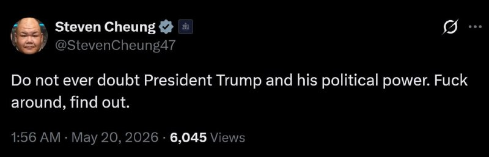

مدیر ارتباطات کاخ سفید، استیون چونگ:
هرگز به رئیس‌جمهور ترامپ و قدرت سیاسی او شک نکنید.

آزمایش کن، نتیجه‌اش را ببین

💧 Rainbet.com the #1 Non-KYC Crypto Casino & Sportsbook @rainbetcom

😁 @Pm_Afshaa

## pm_afshaa — post 91079

  <a href="telegram/content/pm_afshaa_91079_1779242111.mp4" target="_blank">🎬 Download video</a>

ترامپ:ما در چند سال آینده روزهای بسیار سختی خواهیم داشت.

امیدواریم این چند سال به سال‌های درخشانی برای بسیاری، بسیاری از سال‌های آینده منجر شود

💧 Rainbet.com the #1 Non-KYC Crypto Casino & Sportsbook @rainbetcom

😁 @Pm_Afshaa

## pm_afshaa — post 91078

  <a href="telegram/content/pm_afshaa_91078_1779242113.mp4" target="_blank">🎬 Download video</a>

ترامپ:تمام تجهیزات آن‌ها که برای جنگ استفاده می‌کردند از بین رفته است. تقریباً همه چیز از بین رفته است.

نمی‌خواهم بگویم رهبرانشان از بین رفته‌اند، چون خیلی خوشایند نیست، اما این حقیقت دارد.

آن‌ها نمی‌توانند سلاح هسته‌ای داشته باشند. ما نمی‌توانیم این را تحمل کنیم و نخواهیم کرد

💧 Rainbet.com the #1 Non-KYC Crypto Casino & Sportsbook @rainbetcom

😁 @Pm_Afshaa

## pm_afshaa — post 91077

  <a href="telegram/content/pm_afshaa_91077_1779242116.mp4" target="_blank">🎬 Download video</a>

🔴ترامپ: ما همه چیز رو نابود می‌کنیم و این جنگ رو خیلی سریع به پایان میرسونیم؛ آنها انقدر خسته‌ان که میخوان معامله کنن.

این باید 47 سال پیش اتفاق می‌افتاد. کسی باید کاری درباره‌اش انجام می‌داد. این اتفاق خواهد افتاد و خیلی سریع خواهد بود.

💧 Rainbet.com the #1 Non-KYC Crypto Casino & Sportsbook @rainbetcom

😁 @Pm_Afshaa

## pm_afshaa — post 91076

  <a href="telegram/content/pm_afshaa_91076_1779242119.mp4" target="_blank">🎬 Download video</a>

🔴ترامپ: ما در ایران کار فوق‌العاده‌ای انجام دادیم؛ فکر میکنم خیلی زود این کار تمام بشه و آنها سلاح هسته‌ای نخواهند داشت؛ امیدوارم این کار رو به روشی بسیار خوب انجام بدیم.

💧 Rainbet.com the #1 Non-KYC Crypto Casino & Sportsbook @rainbetcom

😁 @Pm_Afshaa

## VahidOnline — post 75564

  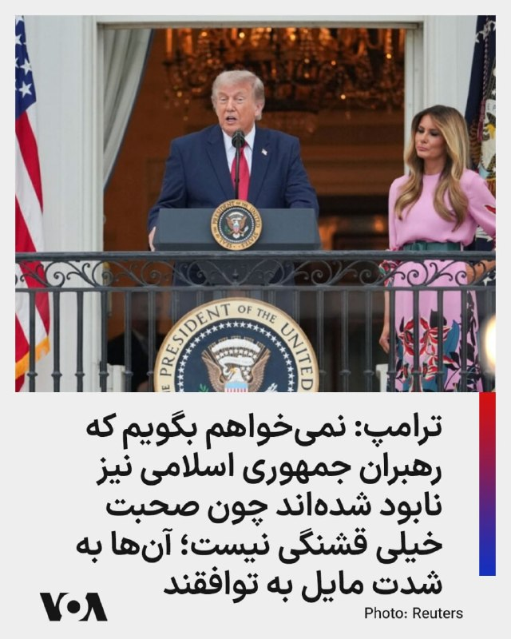

ترامپ در یک سخنرانی در کاخ سفید گفت ایران قرار نیست به سلاح هسته‌ای دست پیدا کند. نمی‌توانند سلاح هسته‌ای داشته باشند. ما نمی‌توانیم چنین چیزی را تحمل کنیم و آن را تحمل نخواهیم کرد.
او گفت ما نیروی دریایی آن‌ها را نابود کردیم. نیروی هوایی آنها از بین رفته است. سامانه‌های پدافند هوایی آنها از بین رفته است. تمام تجهیزاتی که برای جنگ استفاده می‌کردند از بین رفته است. تقریبا همه چیز از بین رفته است.
ترامپ افزود: نمی‌خواهم بگویم رهبران آنها از بین رفته‌اند، چون بیان آن چندان خوشایند نیست، اما واقعیت همین است.
@VahidOOnLine

📡 @VahidOnline

## IranIntlTV — post 338022

  

سنای آمریکا با پیشبرد طرح محدود کردن اختیارات جنگی ترامپ در جنگ علیه جمهوری اسلامی موافقت کرد. اقدامات سنا در این زمینه تا کنون به تصویب نرسیده‌اند.

کوری بوکر، سناتور دموکرات، گفت: «باید همچنان به صحبت کردن ادامه دهیم تا سنا سرانجام برای پایان دادن به این جنگ اقدام کند.»
https://iranintl.com/202605201635

## IranIntlTV — post 338021

  

مستند «یک رفاقت از زندان وکیل‌آباد مشهد تا سن‌ دیگو» تهیه شده از سوی شبکه ایران‌اینترنشنال به کارگردانی اردوان روزبه، در بخش مستند و تحلیل سیاسی تلویزیونی برنده جایزه تلی سال ۲۰۲۶ شد.
جایزه تلی یک رقابت بین‌المللی در حوزه تولیدات ویدیویی، تلویزیونی، تبلیغات و محتوای دیجیتال است که از سال ۱۹۷۹ میلادی برگزار می‌شود و داورانی از شرکت‌هایی بزرگ مثل نتفلیکس و اچ.بی.او، هزاران اثر ارسالی را بررسی می‌کنند.
مستند «یک رفاقت: از زندان وکیل‌آباد مشهد تا سن‌ دیگو» امسال در رقابت با ۱۳ هزار اثر از از سراسر جهان برنده جایزه شد.
این مستند روایتگر داستان واقعی و غیرمنتظره دوستی میان مایکل وایت، کهنه‌سرباز آمریکایی، و مهدی وطن‌خواه، فعال سیاسی ایرانی است؛ دو زندانی که در بند عمومی زندان وکیل‌آباد مشهد با یکدیگر آشنا شدند.
مایکل وایت در سال ۲۰۱۸ پس از سفر به ایران بازداشت شد و در بازداشتگاه‌های امنیتی جمهوری اسلامی تحت بازجویی‌های سنگین، شکنجه روانی و فشار برای اعتراف اجباری قرار گرفت. او بعدها روایت کرد که بازجویان تلاش داشتند او را وادار کنند اعتراف کند برای آمریکا و اسرائیل جاسوسی می‌کرده است.

https://iranintl.com/2026051

## IranIntlTV — post 338020

  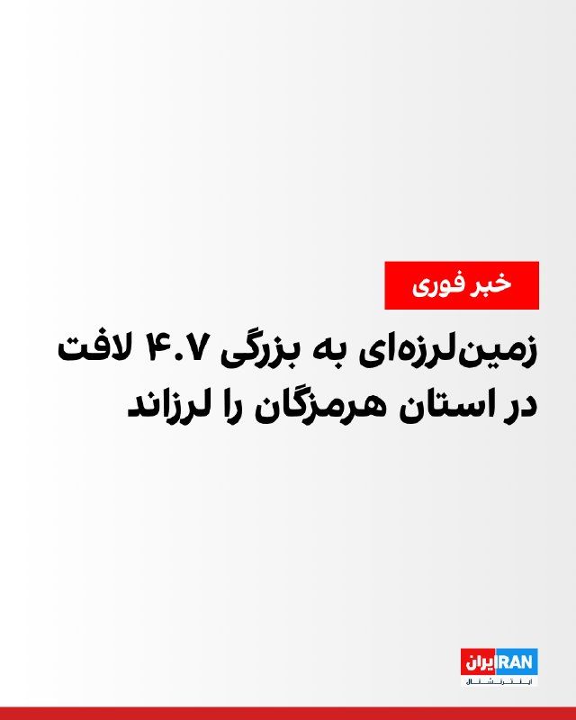

زمین‌لرزه‌ای به بزرگی ۴.۷ حوالی ساعت ۳:۱۲ بامداد چهارشنبه لافت در استان هرمزگان را لرزاند. این زلزله در قشم و هرمز و مناطق روستایی بندرعباس نیز احساس شد.
https://iranintl.com/202605203241

## IranIntlTV — post 338019

  <a href="telegram/content/IranIntlTV_338019_1779242124.mp4" target="_blank">🎬 Download video</a>

صداوسیما روز ۲۹ اردیبهشت‌ماه، در برنامه «سلام صبح بخیر»، از تندیس «مشت گره‌کرده» علی خامنه‌ای، رهبر کشته‌شده جمهوری اسلامی، به‌عنوان نماد جدید میدان انقلاب تهران رونمایی کرد.
@iranintltv

## IranIntlTV — post 338018

  

ترامپ در یک سخنرانی در کاخ سفید گفت: جمهوری اسلامی «قرار نیست به سلاح هسته‌ای دست پیدا کند. نمی‌توانند سلاح هسته‌ای داشته باشند. ما نمی‌توانیم چنین چیزی را تحمل کنیم و آن را تحمل نخواهیم کرد.»
او گفت: «ما نیروی دریایی جمهوری اسلامی را نابود کردیم. نیروی هوایی آنها از بین رفته است. سامانه‌های پدافند هوایی آنها از بین رفته است. تمام تجهیزاتی که برای جنگ استفاده می‌کردند از بین رفته است. تقریبا همه چیز از بین رفته است.»
ترامپ افزود: «نمی‌خواهم بگویم رهبران آنها از بین رفته‌اند، چون بیان آن چندان خوشایند نیست، اما واقعیت همین است.»
https://iranintl.com/202605197914

## ManotoTV — post 105663

  <a href="telegram/content/ManotoTV_105663_1779242127.mp4" target="_blank">🎬 Download video</a>

‌
خبرگزاری فرانسه گزارش داد شرکت هواپیماسازی ایرباس به دلیل پیامدهای جنگ آمریکا و اسرائیل با جمهوری اسلامی، از تیم‌های خود خواسته هزینه‌های «غیرضروری» را ۱۰ درصد کاهش دهند.

بر اساس سندی که خبرگزاری فرانسه مشاهده کرده، ایرباس اعلام کرده هدف این شرکت «توقف قابل توجه فعالیت‌ها و هزینه‌هایی است که برای عملیات و فعالیت‌های صنعتی کاملاً ضروری نیستند.»

در این یادداشت از کارکنان خواسته شده از ایجاد هزینه‌های جدید یا واگذاری فعالیت‌های غیرضروری به پیمانکاران خودداری کنند.

ایرباس همچنین بر کاهش هزینه‌هایی مانند رویدادهای داخلی، برنامه‌های تیمی، همایش‌ها و مشارکت در کنفرانس‌ها تاکید کرده است.

## FarsiVOA — post 218196

🔺ترامپ: نمی‌خواهم بگویم که رهبران جمهوری اسلامی نیز نابود شده‌اند چون صحبت خیلی قشنگی نیست؛ آن‌ها به‌شدت مایل به توافقند

▪️دونالد ترامپ، رئیس‌جمهوری آمریکا، سه‌شنبه شب در سخنانی در مراسم «پیکنیک کنگره» در کاخ سفید گفت ایالات متحده «به‌سرعت» به «جنگ» با جمهوری اسلامی پایان خواهد داد و افزود رژیم ایران «به‌شدت مایل» به رسیدن به توافق است و از شرایط حاضر «خسته» شده است.

⬇️ بیشتر بخوانید:
https://ir.voanews.com/a/8151966.html
@FarsiVOA

## FarsiVOA — post 218195

🔺مایک والتز: جمهوری اسلامی ۴۷ سال است که صلح جهانی را تهدید می‌کند

▪️مایک والتز، سفیر آمریکا در سازمان ملل متحد، گفت جمهوری اسلامی به تاسیسات غیرنظامی در خاورمیانه حمله می‌کند.

⬇️ بیشتر بخوانید:
https://ir.voanews.com/a/8151759.html
@FarsiVOA

## FarsiVOA — post 218194

  

⚡️سایت خبری آکسیوس به نقل دو مقام آمریکایی گزارش داد دونالد ترامپ، رئیس جمهوری آمریکا، عصر دوشنبه جلسه‌ای با تیم ارشد امنیت ملی خود در مورد ایران تشکیل داد که شامل توضیحاتی در مورد گزینه‌های نظامی بود.
@FarsiVOA

## Persian_Trend_Official — post 14506

  

💢فیفا قصد دارد بار دیگر ورود پرچم «شیر و خورشید» پیش از انقلاب ایران و پوشاک مرتبط با آن را به استادیوم‌های جام جهانی در مسابقات ۲۰۲۶ ممنوع کند.

این پرچم همچنین در جام جهانی قطر ۲۰۲۲ محدود شده بود.

منبع: نیویورک تایمز

🫆:Tony

📌 @persian_trend_official
پرشین ترند | متفاوت‌ترین کانال نظامی

## Persian_Trend_Official — post 14505

  <a href="telegram/content/Persian_Trend_Official_14505_1779242129.webm" target="_blank">🎬 Download video</a>

🔴انتقاد تلویحی امارات از عربستان و قطر بر سر ارتباط با ایران

💢شبکه i24 گزارش داد «انور قرقاش» مشاور رئیس امارات، بدون نام بردن مستقیم از عربستان و قطر، به‌صورت تلویحی از ادامه ارتباط و تماس‌های این کشورها با ایران انتقاد کرده است.

بر اساس این گزارش:

▪️ ابوظبی نگران است فشار کشورهای عربی باعث توقف دوباره عملیات نظامی آمریکا علیه ایران شده باشد
▪️ برخی محافل اماراتی معتقدند عربستان و قطر در تلاش برای حفظ مسیر مذاکره با تهران هستند
▪️ این اختلاف می‌تواند نشانه شکاف در مواضع کشورهای خلیج فارس درباره نحوه برخورد با ایران باشد

🫆:Tony

📌 @persian_trend_official
پرشین ترند | متفاوت‌ترین کانال نظامی

## Persian_Trend_Official — post 14504

🔴 نیویورک‌تایمز: آمریکا و اسرائیل برای آزادسازی احمدی‌نژاد به خانه او حمله کردند

💢نیویورک‌تایمز مدعی شد آمریکا و اسرائیل در روزهای ابتدایی عملیات مشترک نظامی علیه ایران، خانه محمود احمدی‌نژاد را هدف حمله هوایی قرار داده‌اند.

▪️بر اساس این گزارش:

▪️ هدف از این حمله، آزاد کردن احمدی‌نژاد از حصر خانگی و استفاده از او در پروژه تغییر نظام در ایران بوده است
▪️ احمدی‌نژاد به‌دلیل اختلاف با آیت‌الله خامنه‌ای تحت حصر قرار داشت
▪️ برنامه‌ریزان اسرائیلی پیش از آغاز جنگ با او ارتباط برقرار کرده بودند

در ادامه گزارش آمده:

▪️ حمله اسرائیل محافظان مستقر مقابل منزل احمدی‌نژاد در تهران را هدف قرار داده بود
▪️ احمدی‌نژاد از حمله جان سالم به در برد اما زخمی شد
▪️ او پس از حمله نسبت به این طرح دچار تردید و ناامیدی شده است

💢طبق ادعای نیویورک‌تایمز:

▪️ طرح گسترده‌تر اسرائیل شامل حذف رهبران ارشد ایران، حمایت از ناآرامی‌های داخلی و ایجاد زمینه برای تشکیل دولت جایگزین بوده است
▪️ مقام‌های آمریکایی و اسرائیلی تصور می‌کردند برخی جریان‌های داخلی ایران پس از آغاز جنگ با واشینگتن همکاری خواهند کرد

این ادعاها تاکنون از سوی منابع رسمی ایران، آمریکا یا اسرائیل تأیید نشده‌اند.

🫆:Tony

📌 @persian_trend_official
پرشین ترند | متفاوت‌ترین کانال نظامی

## Persian_Trend_Official — post 14503

  <a href="telegram/content/Persian_Trend_Official_14503_1779242129.webm" target="_blank">🎬 Download video</a>

⭕️زلزله 4.7 ریشتری لافت هرمزگان را لرزاند

💢بنا بر اعلام مرکز لرزه نگاری زمین لرزه ای به قدرت 4.7 ریشتر ساعت 3:10 بامداد امروز - چهارشنبه- لافت هرمزگان را لرزاند

🫆:Tony

📌 @persian_trend_official
پرشین ترند | متفاوت‌ترین کانال نظامی

## Persian_Trend_Official — post 14502

  <a href="telegram/content/Persian_Trend_Official_14502_1779242130.mp4" target="_blank">🎬 Download video</a>

💢دونالد ترامپ :

💢ما همه چیز را نابود می‌کنیم و این جنگ را خیلی سریع به پایان می‌رسانیم.

💢آن‌ها آنقدر خسته‌اند که می‌خواهند به شدت معامله کنند.

💢این باید ۴۷ سال پیش اتفاق می‌افتاد. کسی باید کاری درباره‌اش انجام می‌داد. کسی باید کاری درباره‌اش انجام می‌داد.

💢این اتفاق خواهد افتاد و خیلی سریع خواهد بود.

🫆:Tony

📌 @persian_trend_official
پرشین ترند | متفاوت‌ترین کانال نظامی

## BBCPersian — post 281557

  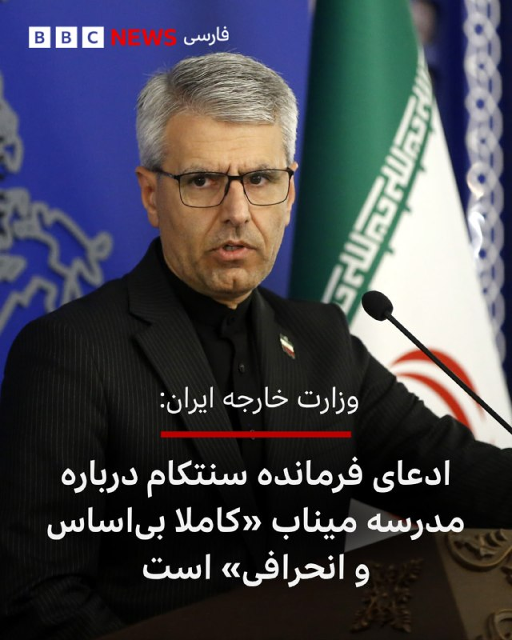

🔻ساعتی پس از حضور فرمانده سنتکام در کنگره امریکا و اظهارات جدیدش درباره روند «پیچیده» تحقیقات مرتبط با این حمله، وزارت خارجه ایران ادعای فرماندهی مرکزی ایالات متحده آمریکا مبنی براینکه مدرس ابتدایی شجره طیبه میناب در محدوده یک مرکز فعال موشکی بوده است را «کاملا بی‌اساس و انحرافی» خواند.

اسماعیل بقایی، سخنگوی وزارت خارجه ایران عصر سه‌شنبه گفت: «این تحریف آشکار، تلاشی واضح برای پنهان کردن ماهیت واقعی حملات موشکی ۲۸ فوریه است که موجب قتل عام بیش از ۱۷۰ دانش‌آموز و معلمان‌شان شد.»

آقای بقایی همچنین گفته است: «فرماندهان نظامی و مقامات آمریکایی که مسئول صدور دستور و اجرای این حمله فاجعه‌بار بوده‌اند، باید طبق قوانین بین‌المللی کاملا پاسخگو و محاکمه شوند.»

📸Anadolu via Getty Images
https://bbc.in/4uru8q4
@BBCPersian

## BBCPersian — post 281556

  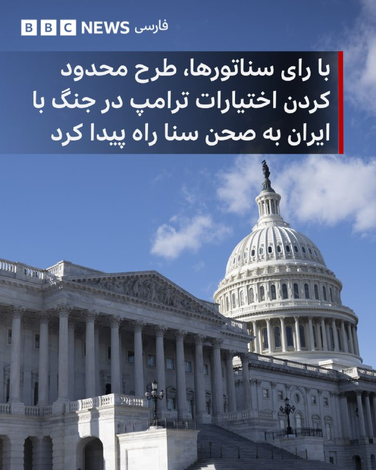

🔻سنای آمریکا با ۵۰ رای موافق در برابر ۴۷ رای مخالف به راه یافتن طرح محدود کردن اختیارات جنگی دونالد ترامپ، به صحن این مجلس رای مثبت داد.

این طرح که با محتوایی مشابه پیش‌تر در سنا رای نیاورده بود، روز سه‌شنبه با پیوستن به سناتور جمهوری‌خواه به اقلیت دموکرات‌ها، تصویب شد.

این طرح رئیس جمهور آمریکا را مکلف می‌کند برای هرگونه اقدام نظامی دیگر علیه ایران ابتدا از کنگره تاییدیه بگیرد.

راه یافتن این طرح به مرحله بعدی و اجازه مطرح شدن در صحن اصلی سنا و تصویب آن در این مجلس که اکثریت ان در دست جمهوری‌خواهان است، خیلی زود عصر سه شنبه در رسانه‌های آمریکا مورد توجه قرار گرفت.

در جریان رای‌گیری، جان فترمن، سناتور دموکرات ایالت پنسیلوانیا، به جمهوری‌خواهان پیوست و به آن رای منفی داد؛ در مقابل، رند پال، سوزان کالینز، لیزا مورکوفسکی و بیل کسیدی، چهار سناتور جمهوری‌خواه، همراه با دموکرات‌ها به طرح رای مثبت دادند.

این نخستین بار بود که آقای کسیدی در این موضوع با دموکرات‌ها هم‌سو رای می‌داد.

📸Anadolu via Getty Images
https://bbc.in/4dkphAX
@BBCPersian

## BBCPersian — post 281549

🔻ولادیمیر پوتین بلافاصله پس از سفر دونالد ترامپ به پکن، راهی دیدار با شی جین‌پینگ می‌شود؛ سفری که محور اصلی آن تلاش روسیه برای گسترش صادرات گاز به چین است.

پوتین و شی جین‌پینگ، دو رهبر اقتدارگرا، روابط نزدیکی دارند و بیش از ۴۰ بار دیدار کرده‌اند. هر دو خود را احیاکننده قدرت تاریخی کشورشان می‌دانند و مخالفان سیاسی را تحمل نمی‌کنند.
پس از حمله روسیه به اوکراین، مسکو جایگاه خود را به عنوان شریک برابر اروپا از دست داد و بیش از پیش به چین وابسته شد، تا جایی که اکنون عمدتا تامین‌کننده مواد خام برای چین محسوب می‌شود.

چین برخلاف اروپا پیش از جنگ اوکراین، تمایل چندانی به سرمایه‌گذاری گسترده یا انتقال فناوری به روسیه ندارد و ترجیح می‌دهد روابطش با مسکو عمدتا بر تامین انرژی و مواد خام متمرکز بماند.
کرملین امیدوار است جنگ ایران و اختلال در خلیج فارس، چین را به امضای قرارداد خط لوله «قدرت سیبری ۲» ترغیب کند؛ پروژه‌ای حیاتی برای جایگزینی بازار از دست‌رفته اروپا.

ادامه مطلب⬇️

📷Getty Images/BBCImages
https://bbc.in/3RjYEDE
@BBCPersian

## manototv — post 105663

  <a href="telegram/content/manototv_105663_1779242134.mp4" target="_blank">🎬 Download video</a>

‌
خبرگزاری فرانسه گزارش داد شرکت هواپیماسازی ایرباس به دلیل پیامدهای جنگ آمریکا و اسرائیل با جمهوری اسلامی، از تیم‌های خود خواسته هزینه‌های «غیرضروری» را ۱۰ درصد کاهش دهند.

بر اساس سندی که خبرگزاری فرانسه مشاهده کرده، ایرباس اعلام کرده هدف این شرکت «توقف قابل توجه فعالیت‌ها و هزینه‌هایی است که برای عملیات و فعالیت‌های صنعتی کاملاً ضروری نیستند.»

در این یادداشت از کارکنان خواسته شده از ایجاد هزینه‌های جدید یا واگذاری فعالیت‌های غیرضروری به پیمانکاران خودداری کنند.

ایرباس همچنین بر کاهش هزینه‌هایی مانند رویدادهای داخلی، برنامه‌های تیمی، همایش‌ها و مشارکت در کنفرانس‌ها تاکید کرده است.

---
📅 بروزرسانی: 1405/02/30 03:15
---

## VahidOOnLine — post 241064

  

ترامپ در یک سخنرانی در کاخ سفید گفت: «ما جنگ ایران را خیلی سریع پایان خواهیم داد. آنها به شدت می‌خواهند توافق کنند. از این وضعیت خسته شده‌اند. این موضوع باید ۴۷ سال پیش حل می‌شد. کسی باید درباره آن کاری انجام می‌داد، و این اتفاق خواهد افتاد و سریع هم رخ خواهد داد.»
او افزود: «خواهید دید که قیمت نفت سقوط خواهد کرد. قیمت‌ها پایین خواهد آمد. نفت بسیار زیادی در بازار وجود دارد. قیمت‌ها به شدت کاهش خواهد یافت.»

‌🏁 🇬🇧 IranintlTV

🤖 @VahidOOnLine

## VahidOOnLine — post 241063

  <a href="telegram/content/VahidOOnLine_241063_1779234301.mp4" target="_blank">🎬 Download video</a>

♦️احمد‌الشرع، رئیس‌جمهوری سوریه با انتشار پیامی در اکس از ارسال هدیه‌ از سوی دونالد ترامپ، رئیس‌جمهوری آمریکا تشکر کرد. در این پیام آمده است:
«بعضی دیدارها اثری ماندگار بر جا می‌گذارند؛ دیدار ما ظاهرا عطری از خود به جا گذاشت.
آقای دونالد ترامپ،بابت سخاوت شما و کامل‌تر کردن این هدیه ارزشمند سپاسگزارم. امیدوارم روح آن دیدار همچنان به شکل‌گیری رابطه‌ای قوی‌تر میان سوریه و ایالات متحده کمک کند.»

 در دیداری که در تاریخ ۲۱ آبان ۱۴۰۴ در سفر الشرع به آمریکا انجام شد دونالد ترامپ به او عطر هدیه داد و اکنون دوباره برای او عطر ارسال کرده است.
‌🇸🇦 Indypersian

🤖 @VahidOOnLine

## VahidOOnLine — post 241062

  

♦️اسماعیل بقایی، سخنگوی وزارت امور خارجه جمهوری اسلامی، در پیامی به مناسبت سالروز تولد محمد مصدق، نخست‌وزیر پیشین ایران، «کودتای ۲۸ مرداد ۱۳۳۲» را نقطه آغاز تقابل آمریکا با ایران دانست.
او با انتقاد از روایت مقامات آمریکایی درباره «۴۷ سال تقابل» تأکید کرد این نگاه، تحریف تاریخ است و ریشه اختلافات به سرنگونی دولت مصدق با نقش آمریکا و بریتانیا بازمی‌گردد. بقایی همچنین با اشاره به آنچه «دخالت‌ها، تحریم‌ها و تهدیدهای چند دهه‌ای» خواند، افزود تجربه کودتای ۲۸ مرداد نشان می‌دهد مسیر حفظ استقلال کشور، تکیه بر حاکمیت ملی و مقابله با نفوذ خارجی است.
این در حالی است که تا سال‌ها حتی خیابانی به نام محمد مصدق در تهران نام‌گذاری نشد. پس از انقلاب، خیابان پهلوی مدتی به نام او تغییر یافت اما در سال ۱۳۶۰ دوباره تغییر نام داد. در نهایت، در ۲۲ اسفند ۱۳۹۶ شورای شهر تهران خیابان نفت در بلوار میرداماد را به نام مصدق نام‌گذاری کرد.
‌🇸🇦 Indypersian

🤖 @VahidOOnLine

## VahidOOnLine — post 241061

  

♦️به دنبال چندین تلاش ناموفق دمکرات‌های سنای آمریکا برای تصویب قطعنامه محدود کردن اختیارات جنگی رئیس‌جمهوری آمریکا، آنها توانستند آیین‌نامه‌ای را در این زمینه به تصویب برسانند که به نوشته رویترز در پیشبرد قطعنامه مورد نظر موثر است. به گزارش این خبرگزاری بریتانیایی، این آیین‌نامه با ۵۰ رای موافق در برابر ۴۷ رای مخالف تصویب شد.به‌طوری که چهار جمهوری‌خواه هم‌حزبی ترامپ همراه با همه دموکرات‌ها به جز یک نفر، به آن رای مثبت دادند. سه سناتور جمهوری‌خواه نیز در رای‌گیری غایب بودند. باوجود تصویب این آیین‌نامه، حتی اگر قطعنامه‌ای در سنا با ۱۰۰ عضو هم به تایید برسد، کار دشواری در مجلس نمایندگان خواهد داشت که تحت کنترل جمهوری‌خواهان است و پس از آن نیز باید دو‌سوم رای کنگره و سنا را داشته باشد تا بتواند گزینه وتوی احتمالی رئیس‌جمهور را دور بزند. طبق قانون اختیارات جنگی آمریکا مصوب ۱۹۷۳ که در واکنش به جنگ ویتنام تصویب شد، رئیس‌جمهور آمریکا تنها ۶۰ روز می‌تواند بدون مجوز کنگره عملیات نظامی انجام دهد و پس از آن باید یا جنگ را متوقف کند، یا از کنگره مجوز بگیرد.
‌🇸🇦 Indypersian

🤖 @VahidOOnLine

## VahidOOnLine — post 241060

  

♦️خبرگزاری رویترز به نقل از منابع آگاه گزارش داد دولت ترامپ قصد دارد سطح نیروها و تجهیزات نظامی در دسترس برای حمایت از ناتو در زمان بحران یا جنگ را کاهش دهد.
بر اساس این گزارش، پنتاگون تصمیم گرفته سهم خود در چارچوب «مدل نیروی ناتو» را به‌طور قابل توجهی کاهش دهد؛ مدلی که کشورهای عضو در آن نیروهای قابل اعزام در شرایط اضطراری را مشخص می‌کنند. قرار است این تصمیم به‌صورت رسمی در نشست مقام‌های دفاعی ناتو در بروکسل اعلام شود.
این اقدام در راستای سیاست ترامپ برای واگذاری مسئولیت اصلی امنیت اروپا به کشورهای اروپایی ارزیابی شده است. با این حال، مقامات آمریکایی تأکید کرده‌اند که چتر هسته‌ای ایالات متحده همچنان برای حفاظت از متحدان ناتو حفظ خواهد شد.
رویترز همچنین گزارش داده این تصمیم نگرانی‌هایی در میان کشورهای اروپایی ایجاد کرده و می‌تواند فشارها بر ائتلاف ناتو را افزایش دهد، به‌ویژه در شرایطی که تنش‌ها میان آمریکا و برخی متحدان اروپایی بالا گرفته است.
‌🇸🇦 Indypersian

🤖 @VahidOOnLine

## VahidOOnLine — post 241059

  

♦️جورجیا ملونی، نخست‌وزیر ایتالیا،  سه‌شنبه شب ۲۹ اردیبهشت با انتشار تصویری در شبکه اجتماعی ایکس، از حضورنارندرا مودی، نخست‌وزیر هند در رم خبر داد و نوشت :«دوست من به رم خوشامدی».
 نخست‌وزیر هند برای شرکت در گفتگوهای دوجانبه و رایزنی درباره همکاری‌های اقتصادی، سیاسی و مسائل بین‌المللی به ایتالیا سفر کرده است. این دیدار همچنین در چارچوب تقویت روابط میان دهلی‌نو و رم و هماهنگی در موضوعات جهانی از جمله انرژی و امنیت منطقه‌ای ارزیابی می‌شود.
‌🇸🇦 Indypersian

🤖 @VahidOOnLine

## WithYashar — post 11716

مرضیه حسینی، خبرنگار اینترنشنال:
منبع مطلع در کنگره به من گفت فردا شب یا پنجشنبه شب عملیات نظامی آمریکا علیه ایران آغاز میشه.

حملات برای یک عملیات دو سه روزه متمرکز است و به مراکزی با هدف بازگشایی تنگه هرمز انجام میشه.
@withyashar
یاشار : امیدوارم خبر زرد نباشه

## WithYashar — post 11715

## WithYashar — post 11714

## WithYashar — post 11713

  <a href="telegram/content/WithYashar_11713_1779234303.mp4" target="_blank">🎬 Download video</a>

@withyashar

## FoxNewsTwitter — post 341969

  

Fox News (Twitter/X)

President Trump's thumb on the scale proved to be the difference maker for Rep. Andy Barr.

Barr emerged from a packed Republican field to win Kentucky's Senate primary, setting him up for a November showdown to replace retiring Sen. Mitch McConnell.

The race quickly became one of the most closely watched GOP primaries in the country because of McConnell’s looming exit and the battle over the future direction of the Republican Party.

## FoxNewsTwitter — post 341968

  <a href="telegram/content/FoxNewsTwitter_341968_1779234304.mp4" target="_blank">🎬 Download video</a>

Fox News (Twitter/X)

"Either MAGA extremists are going to break the country, or we're going to break them."

House Minority Leader Hakeem Jeffries lays out what he says is the Democratic strategy against the MAGA movement — not just to defeat them in elections, but to "break their spirit” over what he described as "unacceptable" extremism.

## FoxNewsTwitter — post 341967

  

Fox News (Twitter/X)

WATCH LIVE: President Trump speaks at Congressional Picnic on White House South Lawn https://twitter.com/i/broadcasts/1pKkOylkjjEKj

## FoxNewsTwitter — post 341966

  

Fox News (Twitter/X)

BREAKING: The Trump administration is preparing a possible indictment against former Cuban president Raúl Castro, brother of Fidel Castro, sources tell Fox News Digital.

Sources pointed to a Department of Justice advisory Tuesday that announced a Miami press conference "in conjunction with a ceremony to honor the victims of the Brothers to the Rescue Murders of 1996."

## pm_afshaa — post 91075

  <a href="telegram/content/pm_afshaa_91075_1779234307.webm" target="_blank">🎬 Download video</a>

🔴مرضیه حسینی، خبرنگار اینترنشنال:
منبع مطلع در کنگره به من گفت فردا شب یا پنجشنبه شب عملیات نظامی آمریکا علیه ایران آغاز میشه.

حملات برای یک عملیات دو سه روزه متمرکز است و به مراکزی با هدف بازگشایی تنگه هرمز انجام میشه.

💧 Rainbet.com the #1 Non-KYC Crypto Casino & Sportsbook @rainbetcom

😁 @Pm_Afshaa

## pm_afshaa — post 91074

  <a href="telegram/content/pm_afshaa_91074_1779234307.webm" target="_blank">🎬 Download video</a>

🔴طرح «محدود کردن اختیارات جنگی ترامپ» بعد از 7 تلاش ناموفق، بالاخره با 47 مخالف و 50 موافق، تصویب شد! سنای آمریکا یه طرحی رو جلو برد که میگه ترامپ واسه ادامه درگیری نظامی با ایران، باید مجوز رسمی کنگره رو داشته باشه و نمیتونه خودسر وارد جنگ بشه. 
💧 Rainbet.com…

## pm_afshaa — post 91073

  <a href="telegram/content/pm_afshaa_91073_1779234308.webm" target="_blank">🎬 Download video</a>

🔴طرح «محدود کردن اختیارات جنگی ترامپ» بعد از 7 تلاش ناموفق، بالاخره با 47 مخالف و 50 موافق، تصویب شد! سنای آمریکا یه طرحی رو جلو برد که میگه ترامپ واسه ادامه درگیری نظامی با ایران، باید مجوز رسمی کنگره رو داشته باشه و نمیتونه خودسر وارد جنگ بشه. 
💧 Rainbet.com…

## pm_afshaa — post 91072

  <a href="telegram/content/pm_afshaa_91072_1779234308.webm" target="_blank">🎬 Download video</a>

🔴طرح «محدود کردن اختیارات جنگی ترامپ» بعد از 7 تلاش ناموفق، بالاخره با 47 مخالف و 50 موافق، تصویب شد!

سنای آمریکا یه طرحی رو جلو برد که میگه ترامپ واسه ادامه درگیری نظامی با ایران، باید مجوز رسمی کنگره رو داشته باشه و نمیتونه خودسر وارد جنگ بشه.

💧 Rainbet.com the #1 Non-KYC Crypto Casino & Sportsbook @rainbetcom

😁 @Pm_Afshaa

## VahidOnline — post 75563

سلام وحید دو زلزله شدید بندرعباس رو لرزاند

ساعت ۳:۱۱ دقیقه بندرعباس زلزله اومد

📡 @VahidOnline

## VahidOnline — post 75562

  

سنای آمریکا روز سه‌شنبه قطعنامه‌ای را برای توقف اقدام نظامی در ایران پیش برد.

پیش بردن این قطعنامه پس از آن صورت گرفت که سناتور جمهوری‌خواه، بیل کسیدی از لوئیزیانا، به آن رای مثبت داد. کسیدی چند روز پیش، در رقابت‌های درون حزبی ایالتی برای ادامه حضورش در سنا، به نامزدی که از حمایت ترامپ برخوردار بود، باخت.

به گزارش سی‌ان‌بی‌سی، با وجود اینکه قطعنامه اختیارات جنگی با نتیجه ۵۰ به ۴۷ به تصویب رسید، اما هنوز احتمال کمی برای تبدیل شدن به قانون دارد. این قطعنامه باید ابتدا در سنا به تصویب نهایی برسد، سپس مجلس نمایندگان به رای بدهد و سپس نیز، دونالد ترامپ به احتمال قریب به یقین، آن را وتو خواهد کرد.
@VahidHeadline
چهار جمهوری‌خواه هم‌حزبی ترامپ همراه با همه دموکرات‌ها به جز یک نفر، به آن رای مثبت دادند. سه سناتور جمهوری‌خواه نیز در رای‌گیری غایب بودند.
باوجود تصویب این آیین‌نامه، حتی اگر قطعنامه‌ای در سنا با ۱۰۰ عضو هم به تایید برسد، کار دشواری در مجلس نمایندگان خواهد داشت که تحت کنترل جمهوری‌خواهان است و پس از آن نیز باید دو‌سوم رای کنگره و سنا را داشته باشد تا بتواند گزینه وتوی احتمالی رئیس‌جمهور را دور بزند.
طبق قانون اختیارات جنگی آمریکا مصوب ۱۹۷۳ که در واکنش به جنگ ویتنام تصویب شد، رئیس‌جمهور آمریکا تنها ۶۰ روز می‌تواند بدون مجوز کنگره عملیات نظامی انجام دهد و پس از آن باید یا جنگ را متوقف کند، یا از کنگره مجوز بگیرد.
@VahidOOnLine

📡 @VahidOnline

## IranIntlTV — post 338017

  

ترامپ در یک سخنرانی در کاخ سفید گفت: «ما جنگ ایران را خیلی سریع پایان خواهیم داد. آنها به شدت می‌خواهند توافق کنند. از این وضعیت خسته شده‌اند. این موضوع باید ۴۷ سال پیش حل می‌شد. کسی باید درباره آن کاری انجام می‌داد، و این اتفاق خواهد افتاد و سریع هم رخ خواهد داد.»
او افزود: «خواهید دید که قیمت نفت سقوط خواهد کرد. قیمت‌ها پایین خواهد آمد. نفت بسیار زیادی در بازار وجود دارد. قیمت‌ها به شدت کاهش خواهد یافت.»

https://iranintl.com/202605193673

## IranIntlTV — post 338016

  <a href="telegram/content/IranIntlTV_338016_1779234310.mp4" target="_blank">🎬 Download video</a>

شورای امنیت سازمان ملل به درخواست بحرین نشست اضطراری برگزار کرد تا حمله به نیروگاه هسته‌ای براکه در امارات متحده عربی را بررسی کند.

مریم رحمتی، خبرنگار ایران‌اینترنشنال، گزارش می‌دهد
@iranintltv

## FarsiVOA — post 218193

⚡️امارات منشأ حملات پهپادی به نیروگاه اتمی «براکه» را خاک عراق اعلام کرد
@FarsiVOA

## FarsiVOA — post 218192

  

⚡️سنای آمریکا روز سه‌شنبه قطعنامه‌ای را برای توقف اقدام نظامی در ایران پیش برد. پیش بردن این قطعنامه پس از آن صورت گرفت که سناتور جمهوری‌خواه، بیل کسیدی از لوئیزیانا، به آن رای مثبت داد. کسیدی چند روز پیش، در رقابت‌های درون حزبی ایالتی برای ادامه حضورش در سنا، به نامزدی که از حمایت ترامپ برخوردار بود، باخت. به گزارش سی‌ان‌بی‌سی، با وجود اینکه قطعنامه اختیارات جنگی با نتیجه ۵۰ به ۴۷ به تصویب رسید، اما هنوز احتمال کمی برای تبدیل شدن به قانون دارد. این قطعنامه باید ابتدا در سنا به تصویب نهایی برسد، سپس مجلس نمایندگان به رای بدهد و سپس نیز، دونالد ترامپ به احتمال قریب به یقین، آن را وتو خواهد کرد.
@FarsiVOA

## Persian_Trend_Official — post 14501

🔴 سنای آمریکا طرح محدودسازی اختیارات جنگی ترامپ علیه ایران را تصویب کرد 💢سنای آمریکا پس از ۷ تلاش ناموفق، طرحی را تصویب کرد که بر اساس آن ادامه هرگونه اقدام نظامی علیه ایران نیازمند مجوز کنگره خواهد بود. ▪️ این طرح با رأی ۵۰ موافق در برابر ۴۷ مخالف تصویب…

## IranianMinds — post 20417

🔴 برد کوپر، فرمانده سنتکام درباره مدرسه میناب:

ایالات متحده عمدا به غیرنظامیان حمله نمی‌کند. مردم ایران دشمن ما نیستند. سپاه پاسداران انقلاب اسلامی در این مورد دشمن است.
تحقیقات در حال انجام است. این یک تحقیق پیچیده است. چون این مدرسه داخل یک سایت فعال موشک‌های کروز جمهوری اسلامی قرار داشته
هر دو طرف باید اسناد مربوط به این مدرسه رو منتشر کنن و پرونده کشته‌شدن این تعداد دانش‌آموز نیاز به شفافیت کامل داره
انتظار شفاف‌سازی از طرف جمهوری اسلامی را نداریم
به محض اتمام تحقیقات، من کاملاً متعهد به شفافیت هستم.
به عنوان فرماندهان نظامی، ما از قوانین درگیری مسلحانه و مسئولیت‌های قانون اساسی خود پیروی می‌کنیم و همین کاری است که انجام داده‌ایم.

@IranianMinds

## IranianMinds — post 20416

  <a href="telegram/content/IranianMinds_20416_1779234312.webm" target="_blank">🎬 Download video</a>

💥 با هر ثبت نام 
🅰️
🅰️
🅰️  هزار تومن جایزه بگیرید

✔️ میتونید شرط‌بندی کنید و بونوس را به موجودی واقعی تبدیل کنید

⚽️  پوشش کامل مسابقات ورزشی 

💯  پیش‌بینی با بهترین ضرایب 

⭐️ تجربه سریع و حرفه‌ای

💰پرداخت مستقیم و سریع بدون واسطه، بدون دردسر، واریز و برداشت در سریع‌ترین زمان ممکن

☑️ کانال تلگرام: 

➡️ @winro_io  

🎁 هدیه خود را با ثبت نام در سایت دریافت کنید: 

➡️ Winro.io
A29
سایت اصلی در روزهای آینده بازگشایی خواهد شد A
💎

## IranianMinds — post 20415

  <a href="telegram/content/IranianMinds_20415_1779234312.mp4" target="_blank">🎬 Download video</a>

ما هم جام جهانی رو برای مزدوران جمهوری اسلامی تبدیل به جام جهنمی می‌کنیم.

@IranianMinds

## IranianMinds — post 20414

  

🔴 نیویورک تایمز :

فیفا قصد دارد دوباره ورود پرچم «شیر و خورشید» ایران پیش از انقلاب و لباس‌های مرتبط با آن را به ورزشگاه‌های جام جهانی ۲۰۲۶ ممنوع کند. این پرچم در جام جهانی ۲۰۲۲ قطر هم محدود شده بود.

@IranianMinds

## BBCPersian — post 281548

  

🔻دادگاه رسیدگی به شکایت از پژمان جمشیدی، بازیگر سرشناس و فوتبالیست سابق ایرانی، حکم خود را صادر کرده است هر چند وکیل آقای جمشیدی گفته در مهلت قانونی قصد درخواست تجدیدنظر دارد.

الهه محمدی، روزنامه‌نگار، در شبکه‌های اجتماعی محتوای حکم صادر شده را منتشر کرده که حکایت از تعیین «۹۹ ضربه شلاق تعزیری» دارد اما وکیل پژمان جمشیدی در گفتگو با رسانه‌ها مدعی شده تا زمان نهایی شدن حکم درباره تایید محتوای آن اظهار نظر نخواهد کرد.

روز سه‌شنبه - ۲۹ اردیبهشت - کامبیز برجاس، یکی از وکلای پژمان جمشیدی، ضمن تایید صدور و ابلاغ حکم دادگاه به خبرگزاری ایسنا گفت: «رای پرونده موکلم امروز صادر و ابلاغ شد. حکم بدوی است و ظرف ۲۰ روز قابل اعتراض است. تا زمانی که حکم قطعی نشده محتوای رای را اعلام نمی‌کنیم.»
ادامه مطلب⬇️

📸etemadonline
https://bbc.in/4v4ypQl
@BBCPersian

## alonews — post 121198

  <a href="telegram/content/alonews_121198_1779234314.webm" target="_blank">🎬 Download video</a>

👈کانال ۱۲ اسرائیل: رهبران عربستان، قطر و امارات طی ۲۴ ساعت گذشته با ترامپ تماس گرفته و گفته‌اند: «اگر حمله کنید، ایرانی‌ها به ما حمله خواهند کرد.» 
🔴آن‌ها از ترامپ خواسته‌اند که در تصمیم‌گیری خود آن‌ها را در نظر بگیرد و فرصت بیشتری برای مذاکره بدهد. ترامپ…

## alonews — post 121197

  <a href="telegram/content/alonews_121197_1779234315.webm" target="_blank">🎬 Download video</a>

👈کانال ۱۲ اسرائیل: رهبران عربستان، قطر و امارات طی ۲۴ ساعت گذشته با ترامپ تماس گرفته و گفته‌اند: «اگر حمله کنید، ایرانی‌ها به ما حمله خواهند کرد.»

🔴آن‌ها از ترامپ خواسته‌اند که در تصمیم‌گیری خود آن‌ها را در نظر بگیرد و فرصت بیشتری برای مذاکره بدهد. ترامپ نیز ظاهراً با این درخواست موافقت کرده و اعلام کرده حمله را به تعویق می‌اندازد.

🔴با این حال، برخی از این کشورها اکنون این ادعا را رد می‌کنند و می‌گویند چنین درخواستی نداده‌اند. در مقابل، مقامات آمریکایی می‌گویند هر سه کشور چنین درخواستی داشته‌اند.

✅ @AloNews خبر جنگ

## alonews — post 121196

  <a href="telegram/content/alonews_121196_1779234315.mp4" target="_blank">🎬 Download video</a>

👈وضعیت رئیس کانون هواداران پرسپولیس

احتمالا مدیرعامل آینده...

✅ @AloNews خبر جنگ

## alonews — post 121195

  <a href="telegram/content/alonews_121195_1779234316.webm" target="_blank">🎬 Download video</a>

👈خضریان:
ترکیه حد خودش ندونه باهاش برخورد میکنیم

✅ @AloNews خبر جنگ

## alonews — post 121194

  <a href="telegram/content/alonews_121194_1779234316.webm" target="_blank">🎬 Download video</a>

👈نخست وزیرهای ایتالیا و هند این وقت شب دوتایی رفتن کلوسئوم رو ببینن

✅ @AloNews خبر جنگ

<!-- MSG END -->

<!-- NAV START -->

<a href="https://github.com/yerbeyer/aio-downloader/blob/main/telegram/content/archive_1.md" style="display:inline-block; padding:6px 12px; margin:0 4px; background-color:#2ea44f; color:white; text-decoration:none; border-radius:4px; font-weight:bold;">صفحه بعد</a>

<!-- NAV END -->
