# خواننده تلگرام

<!-- TOP_NAV START -->

<a href="https://github.com/yerbeyer/aio-downloader/blob/main/telegram/content/archive_1.md" style="display:inline-block; padding:6px 12px; margin:0 4px; background-color:#2ea44f; color:white; text-decoration:none; border-radius:4px; font-weight:bold;">صفحه بعد</a>

<!-- TOP_NAV END -->

<!-- MSG START -->

---
📅 بروزرسانی: 1405/03/02 19:49
---

## VahidOOnLine — post 241760

⭕️عربستان سعودی میزبان ۱.۵">۱.۵ میلیون زائر می‌شود

📌حدود ۳۰ هزار زائر ایرانی امسال در مراسم حج در عربستان سعودی حضور دارند. این رقم به میزان قابل‌توجهی کمتر از تعداد معمول زائران ایرانی است، زیرا ایران در شرایط عادی می‌تواند نزدیک به ۸۷ هزار نفر را برای حج اعزام کند

♦️عربستان سعودی امسال در شرایطی مراسم سالانه حج را برگزار می‌کند که وضعیت منطقه با تنش‌های امنیتی همراه است. به گزارش دویچه وله، مراسم حج امسال از ۲۵ تا ۲۹ مه برگزار می‌شود و انتظار می‌رود حدود ۱.۵">۱.۵ میلیون زائر وارد عربستان سعودی شوند. 
در سه سال گذشته، تعداد شرکت‌کنندگان بین ۱.۷ تا ۱.۸ میلیون نفر بوده است. در طول بیش از ۱۴ قرن، مراسم حج فقط حدود ۴۰ بار لغو یا محدود شده است. آخرین نمونه در دوران همه‌گیری کرونا در سال ۲۰۲۰ بود.

بیشتر بخوانید...
‌🇸🇦 Indypersian

🤖 @VahidOOnLine

## VahidOOnLine — post 241759

  

دونالد ترامپ، رییس جمهوری ایالات متحده به «سی‌بی‌اس» گفت که آمریکا و جمهوری اسلامی «به توافق بسیار نزدیک‌تر» شده‌اند و هر روز شرایط بهتر می‌شود. او افزود: «پیشنهاد جدید شامل بازگشایی تنگه هرمز، آزادسازی بخشی از دارایی‌های مسدودشده جمهوری اسلامی و ۳۰ روز ادامه مذاکرات است.»

دونالد ترامپ گفت: «توافق نهایی باید مانع دستیابی جمهوری اسلامی به سلاح هسته‌ای شود و درباره اورانیوم غنی‌شده نیز تصمیم‌گیری خواهد شد.»

سی‌بی‌اس گزارش داد که ترامپ هنوز درباره پیشنهادها تصمیم نهایی نگرفته و با مشاوران و رهبران منطقه در حال رایزنی است.
‌🏁 🇬🇧 IranintlTV

🤖 @VahidOOnLine

## VahidOOnLine — post 241758

  <a href="telegram/content/VahidOOnLine_241758_1779553159.mp4" target="_blank">🎬 Download video</a>

ویدیوی رسیده به ایران اینترنشنال نشان می‌دهد ایرانیان دانمارک روز شنبه در حمایت از انقلاب ملی روز شنبه در کپنهاگ تجمع کردند.
‌🏁 🇬🇧 IranintlTV

🤖 @VahidOOnLine

## VahidOOnLine — post 241757

  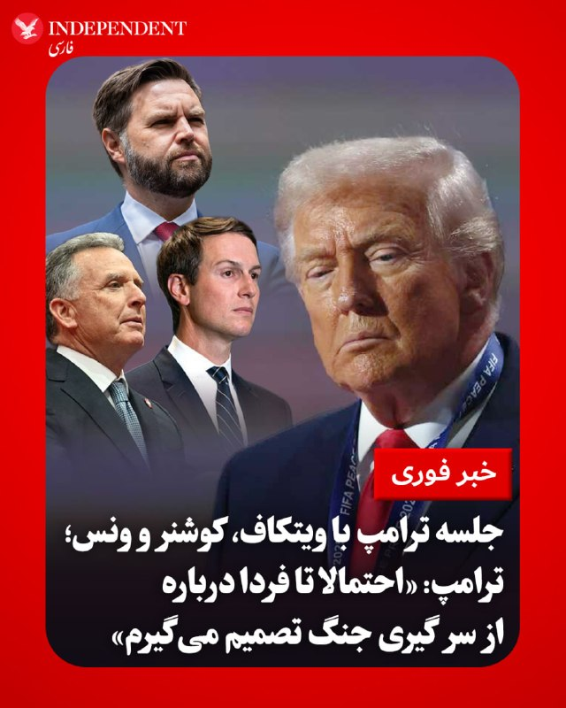

♦️ دونالد ترامپ، رئیس‌جمهوری ایالات متحده روز شنبه دوم خرداد در گفتگو با آکسیوس اعلام کرد که تا پایان روز جلسه‌ای با استیو ویتکاف و جرد کوشنر، نمایندگان واشنگتن در مذاکرات با تهران و جی‌دی ونس، معاون ریاست جمهوری که ریاست تیم مذاکره‌کننده با تهران را بر عهده دارد، برگزار خواهد کرد. ترامپ احتمال دستیابی به توافق یا از سرگیری جنگ و «نابودی ایران» را یک «۵۰-۵۰ محکم» توصیف کرد و اعلام کرد که پس از این جلسه، احتمالا تا روز یکشنبه تصمیم نهایی خود را درباره از سر گیری جنگ، اتخاذ خواهد کرد.

ترامپ با تاکید بر ضرورت تعیین تکلیف برنامه هسته‌ای و ذخیره اورانیوم با غنای بالای ایران، گفت: «فکر می‌کنم یکی از این دو اتفاق رخ خواهد داد: یا ضربه‌ای به آن‌ها می‌زنم که سخت‌تر از تمام ضرباتی باشد که تا به حال خورده‌اند، یا اینکه توافقی را امضا خواهیم کرد که توافق خوبی باشد.»
‌🇸🇦 Indypersian

🤖 @VahidOOnLine

## VahidOOnLine — post 241756

  <a href="telegram/content/VahidOOnLine_241756_1779553162.mp4" target="_blank">🎬 Download video</a>

دونالد ترامپ اعلام کرد شنبه با تیم مذاکره‌کننده‌اش درباره آخرین پیشنهاد جمهوری‌اسلامی دیدار می‌کند و احتمالاً تا روز یکشنبه درباره ادامه مذاکرات یا ازسرگیری جنگ تصمیم خواهد گرفت.
ترامپ در گفت‌وگو با آکسیوس گفت شانس رسیدن به توافق با ایران «پنجاه-پنجاه» است و تأکید کرد یا به «توافقی خوب» می‌رسند یا «ایران را شدیدتر از همیشه هدف قرار می‌دهد».
او قرار است با استیو ویتکاف، جرد کوشنر و همچنین معاونش جی‌دی ونس جلسه‌ای برگزار کند. هم‌زمان، عاصم منیر، فرمانده ارتش پاکستان که نقش میانجی میان تهران و واشینگتن را برعهده داشته، پس از دیدار با مقام‌های جمهوری‌اسلامی تهران را ترک کرده است. پاکستان از «پیشرفت امیدوارکننده» در مسیر توافق نهایی خبر داده، اما هنوز توافقی نهایی نشده است.
بر اساس پیش‌نویس تفاهم‌نامه‌ای که در مذاکرات جمهوری‌اسلامی و پاکستان شکل گرفته، دو طرف احتمالاً ابتدا بر سر توقف جنگ توافق می‌کنند و سپس وارد ۳۰ روز مذاکرات فشرده درباره مسائل اصلی، از جمله غنی‌سازی اورانیوم و ذخایر هسته‌ای ایران، خواهند شد.
ترامپ گفته هر توافقی باید شامل محدودیت بر برنامه هسته‌ای ایران باشد. با این حال، اختلاف‌های اصلی میان تهران و واشنگتن، از جمله بر سر اورانیوم غنی‌شده و وضعیت تنگه هرمز، همچنان حل‌نشده باقی مانده است.
مارکو روبیو، وزیر خارجه آمریکا، نیز از «پیشرفت‌هایی» در مذاکرات خبر داده و گفته احتمال دارد تا پایان شنبه اخبار تازه‌ای منتشر شود.
‌🏁 🇬🇧 ManotoTV

🤖 @VahidOOnLine

## VahidOOnLine — post 241755

  <a href="telegram/content/VahidOOnLine_241755_1779553164.mp4" target="_blank">🎬 Download video</a>

گردهمایی ایرانیان دنهاخ
‌🏁 🇬🇧 ManotoTV

🤖 @VahidOOnLine

## VahidOOnLine — post 241754

  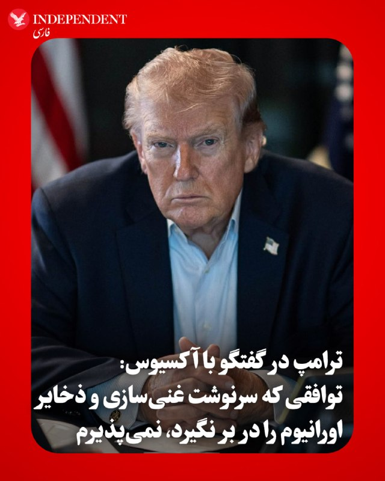

♦️ دونالد ترامپ، رئیس‌جمهوری ایالات متحده روز شنبه دوم خرداد در گفتگو با آکسیوس بار دیگر تاکید کرد که پرونده هسته‌ای جمهوری اسلامی یکی از خط قرمزهای اصلی اوست و توافقی که مسئله غنی‌سازی و سرنوشت ذخایر اورانیوم با غنای بالا را در بر نگیرد، نخواهد پذیرفت.

این در حالی است که اسماعیل بقایی، سخنگوی وزارت امور خارجه، روز شنبه و پس از برگزاری دیدارهای مقام‌های جمهوری اسلامی با عاصم منیر، فرمانده کل ارتش پاکستان که برای مذاکره درباره تفاهم‌نامه میان تهران و واشنگتن به ایران سفر کرده بود، اعلام کرد که تهران تحت هیچ شرایطی نمی‌پذیرد که پرونده هسته‌ای در این تفاهم‌نامه مطرح شود. الجزیره نیز به نقل از یک مقام آگاه در تهران، گزارش داد که تفاهم‌نامه مورد تایید جمهوری اسلامی، شامل غنی‌سازی اورانیوم و پرونده هسته‌ای نبوده است.
‌🇸🇦 Indypersian

🤖 @VahidOOnLine

## VahidOOnLine — post 241753

  

دونالد ترامپ، رییس‌جمهوری آمریکا، به اکسیوس گفت که قرار است امروز با مذاکره‌کنندگان خود دیدار کند تا آخرین پیشنهاد تهران را بررسی کند و احتمالا تا روز یکشنبه درباره از سرگیری جنگ تصمیم‌گیری خواهد کرد.

رییس‌جمهوری آمریکا به اکسیوس گفت شانس دستیابی به توافق با جمهوری اسلامی یا «زدن ضربه‌ای بی‌سابقه» به این کشور «۵۰-۵۰» است.

او افزود تنها توافقی را می‌پذیرد که موضوعاتی مانند غنی‌سازی اورانیوم و سرنوشت ذخایر فعلی ایران را در بر بگیرد.
‌🏁 🇬🇧 IranintlTV

🤖 @VahidOOnLine

## VahidOOnLine — post 241752

  

♦️ دونالد ترامپ، رئیس‌جمهوری آمریکا، روز شنبه دوم خرداد در گفتگو با آکسیوس اعلام کرد که اواخر امروز با تیم مذاکره‌کننده خود دیدار می‌کند تا آخرین پیشنهاد ایران را بررسی کند. او افزود که احتمالا تا روز یکشنبه درباره پذیرش توافق یا از سرگیری جنگ تصمیم‌گیری خواهد کرد.

ترامپ شانس دستیابی به یک توافق «خوب» یا در غیر این صورت، «نابود کردن کامل آن‌ها» را یک «۵۰-۵۰ محکم» توصیف کرد. به گفته او، قرار است اواخر روز شنبه نشستی با حضور استیو ویتکاف، جرد کوشنر و جی‌دی ونس، معاون رئیس‌جمهور، برای بررسی پاسخ اخیر جمهوری اسلامی برگزار شود.

این اظهارات در حالی مطرح می‌شود که فیلد مارشال عاصم منیر، فرمانده ارتش پاکستان و میانجی این بحران، پس از دیدار با مقامات ارشد در تهران و تلاش برای نهایی کردن توافق، روز شنبه ایران را ترک کرد. اگرچه توافق هنوز نهایی نشده، اما ارتش پاکستان اعلام کرده است که «پیشرفت‌های دلگرم‌کننده‌ای به سمت یک تفاهم نهایی» حاصل شده است.
‌🇸🇦 Indypersian

🤖 @VahidOOnLine

## VahidOOnLine — post 241751

  

خبرگزاری تسنیم، وابسته به سپاه، به نقل از یک منبع مطلع نوشت که خبر العربیه درباره اینکه تهران پیشنهاد تعلیق ۱۰ ساله غنی‌سازی اورانیوم بالای ۳.۶ درصد را مطرح کرده، «از اساس کذب است».

تسنیم به نقل از این منبع با تاکید بر «ساختگی» بودن خبر العربیه، نوشت: «اساسا تمرکز پیام‌ها و گفتگوها در وضعیت فعلی صرفا بر روی مساله پایان جنگ است و هیچ جزئیاتی درباره موضوع هسته‌ای مورد بحث قرار نمی‌گیرد.»
‌🏁 🇬🇧 IranintlTV

🤖 @VahidOOnLine

## VahidOOnLine — post 241750

  <a href="telegram/content/VahidOOnLine_241750_1779553169.mp4" target="_blank">🎬 Download video</a>

فدراسیون فوتبال جمهوری اسلامی مدعی شد گزارش‌ها درباره رد ویزای شجاع خلیل‌زاده، مهدی طارمی و احسان حاج‌صفی را تکذیب کرد.

رسانه‌های ورزشی ایران در روزهای اخیر از شایعاتی درباره رد شدن ویزای این سه بازیکن تیم ملی فوتبال مردان ایران گزارش داده بودند.

فدراسیون فوتبال روز شنبه با انتشار بیانیه‌ای این گزارش‌ها را «کذب» خواند و اعلام کرد: «فرایند اداری مربوط به اخذ ویزا از سوی فدراسیون فوتبال و تیم ملی طبق روال انجام گرفته و ادعای مطرح شده کذب است.»

هم‌زمان، روزنامه خبرورزشی گزارش داد امیر قلعه‌نویی، سرمربی تیم ملی فوتبال مردان ایران، با بازیکنان جایگزین این سه عضو تیم ملی تماس گرفته تا تمرینات آمادگی برای جام جهانی را ادامه دهند.

شجاع خلیل‌زاده، مهدی طارمی و احسان حاج‌صفی از جمله ملی‌پوشان ایرانی هستند که دوران خدمت سربازی خود را در سپاه گذرانده‌اند.
‌🏁 🇬🇧 ManotoTV

🤖 @VahidOOnLine

## VahidOOnLine — post 241749

  <a href="telegram/content/VahidOOnLine_241749_1779553169.mp4" target="_blank">🎬 Download video</a>

ارتش پاکستان اعلام کرد عاصم منیر، فرمانده ارتش این کشور، سفر کوتاه اما «بسیار پرباری» به ایران داشته و در جریان آن دیدارها و گفت‌وگوهای «سطح بالا» با مقام‌های جمهوری‌اسلامی انجام داده است.
‌🏁 🇬🇧 ManotoTV

🤖 @VahidOOnLine

## VahidOOnLine — post 241748

  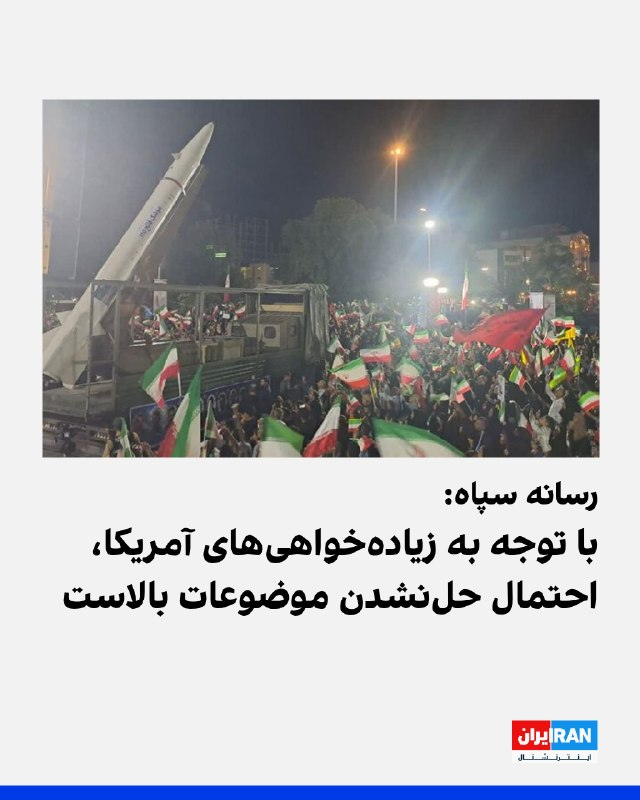

خبرگزاری تسنیم، رسانه وابسته به سپاه، درباره روند مذاکرات تهران و واشینگتن، با اشاره به اینکه هنوز اختلافات جدی در بعضی از حوزه‌ها مانند تعهد واقعی آمریکا به آزادسازی اموال و موضوع تنگه هرمز وجود دارد، نوشت: «با توجه به زیاده‌خواهی‌های آمریکا، احتمال عدم حل موضوعات بالاست.»

در این گزارش آمده که در صورت حل موارد اختلاف، احتمالا در گام اول یک تفاهم اولیه اعلام شود و سپس مهلت ۳۰ یا ۶۰ روزه برای گفتگو درباره موضوع هسته‌ای (بدون تعهد اولیه جمهوری اسلامی) اعلام شود.

تسنیم نوشت که آمریکایی‌ها در متون پیشین خود تاکید داشتند که تهران در همان گام نخست باید امتیازاتی در بحث هسته‌ای بدهد و موضوع تعطیلی تاسیسات هسته‌ای و تحویل مواد غنی‌شده به آمریکایی‌ها از جمله مباحثی است که مدام در متن‌های آمریکایی‌ها مورد درخواست قرار می‌گرفت اما حکومت ایران اساسا بحث درباره جزئیات هسته‌ای را در این مرحله رد می‌کند.

بر اساس این گزارش تهران بر ضرورت پایان جنگ و تهدید در همه جبهه‌ها از جمله لبنان تاکید دارد. و این موضوع باید مورد پذیرش طرف آمریکایی قرار گیرد اما آمریکایی‌ها در برخی از متن‌های پیشین خود با این موضوعات مخالفت کرده‌اند.
‌🏁 🇬🇧 IranintlTV

🤖 @VahidOOnLine

## WithYashar — post 12187

رویترز از شکست مذاکرات در تهران خبر داد،
تهران هیچ امتیاز بیشتری در مذاکرات نداده و این امر منجر به شکست مذاکرات و بازگشت هیئت های پاکستانی و قطری از تهران شد.
@withyashar

## WithYashar — post 12186

سی‌بی‌اس در گفتگو با ترامپ: من پیش‌نویس یک توافق با ایران را دیده‌ام که برای من ارسال شده است.

او می‌گوید: «نمی‌توانم به رسانه‌ها بگویم که آیا با آن موافقت کرده‌ام یا نه، قبل از اینکه ایران را در جریان بگذارم.»
@withyashar

## WithYashar — post 12185

ترامپ به آکسیوس: برخی ترجیح میدهند توافق را منعقد کنند ، برخی دیگر ترجیح میدهند جنگ را از سر بگیرند‌‌
@withyashar

## WithYashar — post 12184

هگست، وزیر جنگ آمریکا: ارتش ما عاشق غرق کردن نیروی دریایی دشمنه و من بهشون گفتم که تنها نیروی دریایی‌ای که درحال حاضر می‌تونید غرق کنید، نیروی دریایی ایرانه
@withyashar

## WithYashar — post 12183

ترامپ به اکسیوس:
شانس توافق یا جنگ 50/50 است. بعد از دیدار با نمایندگانم تصمیم میگیرم!

امروز با نمایندگان خود دیدار خواهم کرد و تا فردا(یکشنبه) تصمیم خواهم گرفت!

تنها توافقی را در رابطه با غنی سازی اورانیوم و سرنوشت ذخایر آن است را میپذیرم‌‌

یا چنان محکم‌تر از همیشه به آنها حمله نظامی می کنم که تا حالا مثل آن را ندیده‌اند، یا توافقی خوب را امضا می‌کنیم
@withyashar

## WithYashar — post 12182

العربیه : ایران پیشنهاد تعلیق غنی‌سازی اورانیوم بالای 3.6% را به مدت 10 سال ارائه داد @withyashar

## WithYashar — post 12181

العربیه : ایران پیشنهاد تعلیق غنی‌سازی اورانیوم بالای 3.6% را به مدت 10 سال ارائه داد
@withyashar

## mwarmonitor — post 9547

🔴بعد تعیین درصد از سمت من ، ترامپ هم درصد احتمالی توافق یا درگیری مشخص کرد 😂

## mwarmonitor — post 9546

🔴ترامپ می‌گوید احتمالاً تا روز یکشنبه تصمیم خواهد گرفت که آیا جنگ با ایران را از سر بگیرد یا نه و به Axios گفته است که شانس رسیدن به توافق «۵۰/۵۰» است. او همچنین گفته است با مذاکره‌کنندگان آمریکایی دیدار خواهد کرد تا آخرین پیشنهاد ایران را بررسی کند، در حالی…

## mwarmonitor — post 9545

🔴ترامپ می‌گوید احتمالاً تا روز یکشنبه تصمیم خواهد گرفت که آیا جنگ با ایران را از سر بگیرد یا نه و به Axios گفته است که شانس رسیدن به توافق «۵۰/۵۰» است. او همچنین گفته است با مذاکره‌کنندگان آمریکایی دیدار خواهد کرد تا آخرین پیشنهاد ایران را بررسی کند، در حالی که میانجی‌های پاکستانی از «پیشرفت امیدوارکننده» به سمت یک تفاهم نهایی خبر داده‌اند.

@mwarmonitor

## mwarmonitor — post 9544

🔴میانجی‌ها معتقدند که به توافقی برای تمدید آتش‌بس میان آمریکا و ایران به مدت ۶۰ روز نزدیک شده‌اند — The Wall Street Journal

@mwarmonitor

## FoxNewsTwitter — post 342163

‌Fox News (Twitter/X)

Read more:

## FoxNewsTwitter — post 342162

  

Fox News (Twitter/X)

BREAKING NEWS: NASCAR legend Kyle Busch's family released a statement saying a medical evaluation concluded that "severe pneumonia progressed into sepsis," causing "rapid and overwhelming complications" that led to his death.

## FoxNewsTwitter — post 342161

  <a href="telegram/content/FoxNewsTwitter_342161_1779553171.mp4" target="_blank">🎬 Download video</a>

Fox News (Twitter/X)

“One way or the other, Iran can never have a nuclear weapon.”

Secretary of State Marco Rubio says negotiations with Iran are moving forward and revealed there could be developments “later today, tomorrow, in a couple of days.”

Rubio said President Trump prefers to resolve the standoff diplomatically, but stressed the administration is demanding Iran turn over its enriched uranium and address its nuclear enrichment efforts.

"Even as I speak to you now, there's some work being done," Rubio added.

## pm_afshaa — post 91296

🔴ترامپ به اکسیوس: شانس توافق یا جنگ 50/50 است. بعد از دیدار با نمایندگانم تصمیم میگیرم! امروز با نمایندگان خود دیدار خواهم کرد و تا فردا تصمیم خواهم گرفت! 
💧 Rainbet.com the #1 Non-KYC Crypto Casino & Sportsbook @rainbetcom 
😁 @Pm_Afshaa

## pm_afshaa — post 91295

🔴رژیم در حال تخلیه نهادهای حکومتی مهم در تهران است همچون فراجا و ناجا

💧 Rainbet.com the #1 Non-KYC Crypto Casino & Sportsbook @rainbetcom

😁 @Pm_Afshaa

## pm_afshaa — post 91294

🔴ترامپ به آکسیوس: یا چنان محکم‌تر از همیشه به آنها حمله نظامی می کنم که تا حالا مثل آن را ندیده‌اند، یا توافقی خوب را امضا می‌کنیم

💧 Rainbet.com the #1 Non-KYC Crypto Casino & Sportsbook @rainbetcom

😁 @Pm_Afshaa

## pm_afshaa — post 91293

🔴هگست، وزیر جنگ آمریکا: ارتش ما عاشق غرق کردن نیروی دریایی دشمنه و من بهشون گفتم که تنها نیروی دریایی‌ای که درحال حاضر می‌تونید غرق کنید، نیروی دریایی ایرانه

💧 Rainbet.com the #1 Non-KYC Crypto Casino & Sportsbook @rainbetcom

😁 @Pm_Afshaa

## pm_afshaa — post 91292

  <a href="telegram/content/pm_afshaa_91292_1779553173.webm" target="_blank">🎬 Download video</a>

🔴دونالد ترامپ: تنها توافقی رو قبول خواهم کرد که سرنوشت اورانیوم غنی شده در ایران رو مشخص کنه.

💧 Rainbet.com the #1 Non-KYC Crypto Casino & Sportsbook @rainbetcom

😁 @Pm_Afshaa

## pm_afshaa — post 91291

🔴ترامپ به اکسیوس:
شانس توافق یا جنگ 50/50 است. بعد از دیدار با نمایندگانم تصمیم میگیرم!

امروز با نمایندگان خود دیدار خواهم کرد و تا فردا تصمیم خواهم گرفت!

💧 Rainbet.com the #1 Non-KYC Crypto Casino & Sportsbook @rainbetcom

😁 @Pm_Afshaa

## pm_afshaa — post 91290

  <a href="telegram/content/pm_afshaa_91290_1779553174.webm" target="_blank">🎬 Download video</a>

🔴تسنیم: گزارش رسانه‌های عربی در مورد غنی سازی 10 ساله 3.6 درصد دروغه و در این مرحله هیچ بحثی در مورد هسته‌ای نخواهد شد.

💧 Rainbet.com the #1 Non-KYC Crypto Casino & Sportsbook @rainbetcom

😁 @Pm_Afshaa

## pm_afshaa — post 91289

  <a href="telegram/content/pm_afshaa_91289_1779553175.webm" target="_blank">🎬 Download video</a>

🔴وال استریت ژورنال:
میانجی‌ها معتقدن به یک آتش بس 60 روزه برای توافق نهایی نزدیک شدن.

💧 Rainbet.com the #1 Non-KYC Crypto Casino & Sportsbook @rainbetcom

😁 @Pm_Afshaa

## DEJradio — post 4886

⭕️ فرماندهٔ ارتش پاکستان ایران را ترک کرد

فیلد مارشال عاصم منیر، فرماندهٔ کل ارتش و نیروهای مسلح پاکستان، پس از سفری یک‌روزه تهران را ترک کرد.
بنا به گزارش خبرگزاری‌های داخل کشور، عاصم منیر به همراه محسن نقوی، وزیر کشور پاکستان، که از هفتهٔ پیشین در تهران حضور داشت، ایران را ترک کرد.
فرماندهٔ ارتش پاکستان در این سفر با مسعود پزشکیان، محمدباقر قالیباف و عباس عراقچی دیدار و گفت‌وگو کرد.
جزئیات رسمی این مذاکرات منتشر نشده است. رسانه‌ها محور گفت‌وگوها را تلاش برای جلوگیری از تشدید تنش و پیشبرد مذاکره میان جمهوری اسلامی و آمریکا عنوان کردند.
این دومین سفر عاصم منیر به تهران در چند هفتهٔ اخیر به شمار می‌رود.
پاکستان در هفته‌های اخیر نقش میانجی اصلی را در مذاکره میان تهران و واشینگتن بر عهده گرفته است.

#مذاکرات #پاکستان
@DEJradio

## DEJradio — post 4885

⭕️ قلیچ‌خانی کاپیتان پیشین تیم ملی درگذشت

پرویز قلیچ‌خانی، کاپیتان پیشین تیم ملی فوتبال ایران و از چهره‌های سیاسی مخالف جمهوری اسلامی، در ۸۱ سالگی در حومهٔ پاریس درگذشت.
جمهوری اسلامی بارها تلاش کرده بود او را به دست‌کشیدن از مخالفت با حکومت و بازگشت به ایران در پناه رژیم، مجاب کند، اما قلیچ‌خانی همچنان به مبارزه ادامه داد.
قلیچ‌خانی به بیماری سرطان معده و آلزایمر مبتلا بود.
قلیچ‌خانی تنها بازیکن تاریخ فوتبال ایران است که سه بار همراه تیم ملی قهرمان جام ملت‌های آسیا شد.
پرویز قلیچ‌خانی پیش از انقلاب در تیم‌های تاج، پرسپولیس و پاس بازی کرد و سال‌ها بازوبند کاپیتانی تیم ملی ایران را بر بازو داشت.

#پرویز_قلیچ_خانی
@DEJradio

## VahidOnline — post 75656

  

ترامپ: به توافق بسیار نزدیک‌تر شده‌ایم

ترجمه ماشین:
پرزیدنت ترامپ به شبکه سی‌بی‌اس نیوز گفت مذاکره‌کنندگان ایالات متحده و ایران برای نهایی کردن توافقی که به جنگ میان دو کشور پایان دهد، «بسیار به هم نزدیک‌تر شده‌اند».

منابع آگاه از مذاکرات به سی‌بی‌اس نیوز گفتند تازه‌ترین پیشنهاد شامل روندی برای بازگشایی تنگه هرمز، آزادسازی بخشی از دارایی‌های ایران که در بانک‌های خارجی نگهداری می‌شود، و ادامه مذاکرات است.

آقای ترامپ از ارائه جزئیات درباره این توافق خودداری کرد، اما گفت که «هر روز بهتر و بهتر می‌شود.»

آقای ترامپ در یک مصاحبه تلفنی به سی‌بی‌اس نیوز گفت: «نمی‌توانم قبل از اینکه به خودشان بگویم، به شما بگویم، درست است؟»

👈 آقای ترامپ گفت معتقد است توافق نهایی مانع دستیابی ایران به سلاح هسته‌ای خواهد شد و افزود که در غیر این صورت «اصلاً درباره آن صحبت هم نمی‌کرد».

👈 او همچنین گفت این توافق باعث خواهد شد اورانیوم غنی‌شده ایران «به شکل رضایت‌بخشی مدیریت شود.»

👈او گفت: «من فقط توافقی را امضا می‌کنم که در آن به هر چیزی که می‌خواهیم برسیم.»

منابع به سی‌بی‌اس نیوز گفتند آقای ترامپ هنوز در حال بررسی پیشنهادهاست و هنوز تصمیم نهایی خود را نگرفته است. این منابع گفتند او با مشاوران خود رایزنی می‌کند و با رهبران خارجی، از جمله رهبران عربستان سعودی و دیگر کشورهای حوزه خلیج فارس، گفت‌وگو دارد.

آقای ترامپ گفت اگر آمریکا و ایران به توافق نرسند، «با وضعیتی روبه‌رو خواهیم شد که هیچ کشوری هرگز به اندازه ضربه‌ای که آن‌ها در آستانه دریافتش هستند، ضربه نخورده باشد.»

آقای ترامپ پیش‌تر ایران را تهدید کرده بود؛ او پیش از آغاز آتش‌بسی که در ماه آوریل آغاز شد، گفته بود بدون توافق «یک تمدن کامل نابود خواهد شد» و اخیراً نیز به این کشور هشدار داده بود که «ساعت در حال تیک‌تاک است.»

مارکو روبیو، وزیر خارجه آمریکا، نیز روز شنبه گفت ممکن است «بعداً امروز خبری» درباره وضعیت مذاکرات میان ایران و آمریکا منتشر شود.

روبیو پیش از یک شام رسمی در سفارت آمریکا در دهلی‌نو، هند، گفت: «پیشرفت‌هایی حاصل شده، همین حالا هم که با شما صحبت می‌کنم، کارهایی در حال انجام است. این احتمال وجود دارد که چه بعداً امروز، چه فردا، چه ظرف چند روز آینده، چیزی برای گفتن داشته باشیم؛ اما همان‌طور که رئیس‌جمهور گفت، این موضوع باید به یک شکل یا شکل دیگر حل شود.»
CBSNews

📡 @VahidOnline

## VahidOnline — post 75655

  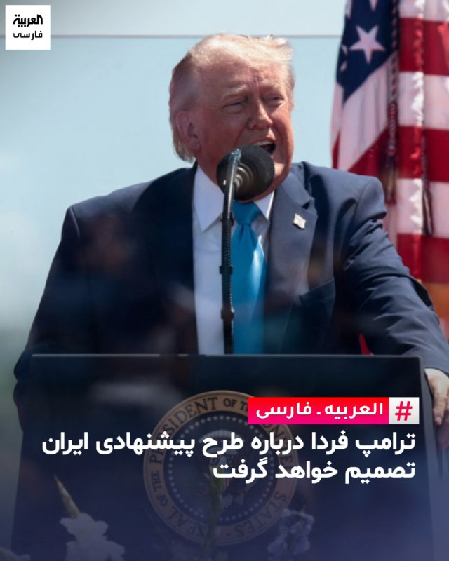

دونالد ترامپ، رئیس‌جمهوری آمریکا، روز شنبه دوم خرداد در گفتگو با آکسیوس اعلام کرد که اواخر امروز با تیم مذاکره‌کننده خود دیدار می‌کند تا آخرین پیشنهاد ایران را بررسی کند. او افزود که احتمالا تا روز یکشنبه درباره پذیرش توافق یا از سرگیری جنگ تصمیم‌گیری خواهد کرد.

ترامپ شانس دستیابی به یک توافق «خوب» یا در غیر این صورت، «نابود کردن کامل آن‌ها» را یک «۵۰-۵۰ محکم» توصیف کرد. به گفته او، قرار است اواخر روز شنبه نشستی با حضور استیو ویتکاف، جرد کوشنر و جی‌دی ونس، معاون رئیس‌جمهور، برای بررسی پاسخ اخیر جمهوری اسلامی برگزار شود.
@VahidOOnLine

📡 @VahidOnline

## VahidOnline — post 75654

خبرگزاری تسنیم، رسانه وابسته به سپاه، درباره روند مذاکرات تهران و واشینگتن، با اشاره به اینکه هنوز اختلافات جدی در بعضی از حوزه‌ها مانند تعهد واقعی آمریکا به آزادسازی اموال و موضوع تنگه هرمز وجود دارد، نوشت: «با توجه به زیاده‌خواهی‌های آمریکا، احتمال عدم حل موضوعات بالاست.»

در این گزارش آمده که در صورت حل موارد اختلاف، احتمالا در گام اول یک تفاهم اولیه اعلام شود و سپس مهلت ۳۰ یا ۶۰ روزه برای گفتگو درباره موضوع هسته‌ای (بدون تعهد اولیه جمهوری اسلامی) اعلام شود.

تسنیم نوشت که آمریکایی‌ها در متون پیشین خود تاکید داشتند که تهران در همان گام نخست باید امتیازاتی در بحث هسته‌ای بدهد و موضوع تعطیلی تاسیسات هسته‌ای و تحویل مواد غنی‌شده به آمریکایی‌ها از جمله مباحثی است که مدام در متن‌های آمریکایی‌ها مورد درخواست قرار می‌گرفت اما حکومت ایران اساسا بحث درباره جزئیات هسته‌ای را در این مرحله رد می‌کند.

بر اساس این گزارش تهران بر ضرورت پایان جنگ و تهدید در همه جبهه‌ها از جمله لبنان تاکید دارد. و این موضوع باید مورد پذیرش طرف آمریکایی قرار گیرد اما آمریکایی‌ها در برخی از متن‌های پیشین خود با این موضوعات مخالفت کرده‌اند.
@VahidOOnLine
خبرگزاری تسنیم، وابسته به سپاه، به نقل از یک منبع مطلع نوشت که خبر العربیه درباره اینکه تهران پیشنهاد تعلیق ۱۰ ساله غنی‌سازی اورانیوم بالای ۳.۶ درصد را مطرح کرده، «از اساس کذب است».
تسنیم به نقل از این منبع با تاکید بر «ساختگی» بودن خبر العربیه، نوشت: «اساسا تمرکز پیام‌ها و گفتگوها در وضعیت فعلی صرفا بر روی مساله پایان جنگ است و هیچ جزئیاتی درباره موضوع هسته‌ای مورد بحث قرار نمی‌گیرد.»
@VahidOOnLine

📡 @VahidOnline

## VahidOnline — post 75653

  

بخش رسانه‌ای ارتش پاکستان (ISPR) آخرین دور گفتگوها میان میانجی‌های قطری-پاکستانی و مقامات بلندپایه جمهوری اسلامی را «کوتاه اما بسیار پربار» توصیف کرد.

بر اساس بیانیه منتشر شده، این رایزنی‌های فشرده در ۲۴ ساعت گذشته در فضایی مثبت و سازنده برگزار شده و پیشرفت‌های دلگرم‌کننده‌ای را برای دستیابی به یک تفاهم نهایی جهت پایان دادن به جنگ ایجاد کرده است.

ارتش پاکستان جزئیات بیشتری از مفاد دقیق این مذاکرات ارائه نکرده است.
@VahidOOnLine

📡 @VahidOnline

## VahidOnline — post 75652

  

فایننشال تایمز گزارش داد که میانجی‌های جنگ ایران معتقدند در حال نزدیک شدن به توافقی هستند که آتش‌بس میان واشینگتن و تهران را به مدت ۶۰ روز تمدید و چارچوبی برای مذاکرات درباره برنامه هسته‌ای جمهوری اسلامی ایجاد کند.

بنا بر این گزارش، افرادی که در جریان این مذاکرات قرار دارند به این رسانه گفتند این توافق شامل بازگشایی تدریجی تنگه هرمز و همچنین تعهد به بررسی رقیق‌سازی یا واگذاری ذخایر اورانیوم با غنای بالا خواهد بود.

فایننشال تایمز افزود که آمریکا همچنین محاصره دریایی بنادر جنوب ایران را کاهش می‌دهد و با کاهش تحریم‌ها و همچنین آزادسازی مرحله‌ای دارایی‌های مسدودشده تهران در خارج از کشور موافقت خواهد کرد.
@VahidOOnLine

📡 @VahidOnline

## VahidOnline — post 75651

  <a href="telegram/content/VahidOnline_75651_1779553178.mp4" target="_blank">🎬 Download video</a>

🔻‌ویدیوهایی از اعتراض دانش‌آموزان در شهرهای مختلف منتشر شده است. این دانش‌آموزان به حضوری شدن امتحاناتشان اعتراض دارند.
 
دانش‌آموزان در شهرهای خرم‌آباد، یاسوج و دورود مقابل ساختمان‌های آموزش و پرورش این شهرها تجمع کردند و با شعارهای مختلف اعتراض خودشان را نشان دادند.
 
در جریان اعتراضات سراسری در دی ماه ۱۴۰۴ که به کشتار بی‌سابقه معترضان انجامید در بعضی استان‌ها مدارس غیرحضوری شد.
 
با شروع جنگ آمریکا و اسرائیل با ایران، مدارس در ایران تعطیل شد و بعد از تعطیلات نوروز کلیه کلاس‌ها غیرحضوری برگزار شد.
 
چند روز پیش عبدالرضا فولادوند، سرپرست مرکز ارزشیابی آموزش و پرورش در یک مصاحبه تلویزیونی از احتمال برگزاری امتحانات به صورت حضوری خبر داد.
@VahidHeadline

📡 @VahidOnline

## kianmeli1 — post 87582

  

🔴ترامپ
بین توافق با ایران یا بمباران آن، «قطعاً ۵۰/۵۰» است. ترامپ گفت که امروز با مشاوران ارشد خود برای بحث در مورد پیش‌نویس اخیر توافق دیدار خواهد کرد و ممکن است تا فردا تصمیمی بگیرد.
https://t.me/kianmeli1

## kianmeli1 — post 87581

‏🔴خبرگزاری تسنیم، وابسته به سپاه، به نقل از یک منبع آگاه نوشت: گزارش العربیه درباره پیشنهاد تهران برای تعلیق ۱۰ ساله غنی‌سازی بالای ۳.۶درصد «کاملا کذب» است

‏تسنیم به نقل از این منبع افزود: در شرایط فعلی تمرکز پیام‌ها و گفت‌وگوها فقط بر پایان جنگ است و درباره جزییات برنامه هسته‌ای مذاکره‌ای انجام نمی‌شود
https://t.me/kianmeli1

## IranIntlTV — post 338627

  

خبرگزاری فارس، وابسته به سپاه پاسداران، به نقل از یک منبع آگاه و نزدیک به تیم مذاکره‌کننده، با تاکید بر اینکه اگر آمریکا انعطاف نشان ندهد، مذاکره شکست می‌خورد نوشت که موضوع هسته‌ای، پول‌های بلوکه‌شده و کنترل جمهوری اسلامی بر تنگه هرمز، سه موضوع اختلاف جدی در مذاکرات است.

فارس نوشت که تهران اعلام کرده که در این دوره وارد مذاکره درباره موضوع هسته‌ای نمی‌شود. تنها در صورتی که طرف مقابل شرایط اعتمادساز را اجرا کند، در دور بعد درباره مسائل هسته‌ای صحبت خواهد شد.

رسانه سپاه به نقل از این منبع نوشت: «پول‌‌های بلوکه‌شده باید واریز شود؛ شرط دوم و اساسی برای ورود تهران به مذاکره این است که پول‌های بلوکه‌شده ابتدا واریز و آزاد شوند. بدون این اتفاق، اساسا وارد مذاکره نمی‌شویم.»

در ادامه آمده است: «اختلاف دیگر بر سر نحوه عبور کشتی‌ها در تنگه هرمز است. آمریکا تاکید دارد که تنگه باید کاملا به شرایط پیشین بازگردد، اما تهران می‌گوید فقط خود را متعهد می‌کند که تعداد کشتی‌ها به وضعیت قبل بازگردد. معنای این حرف آن است که حکومت ایران با مدل خود، تعداد کشتی‌های مجاز برای عبور را تعیین می‌کند.»
https://iranintl.com/202605237557

## IranIntlTV — post 338626

  <a href="telegram/content/IranIntlTV_338626_1779553181.mp4" target="_blank">🎬 Download video</a>

پس از دیدار فرمانده ارتش پاکستان با مقام‌های ارشد جمهوری اسلامی، سخنگوی وزارت خارجه گفت طرفین به مرحله نهایی‌سازی یادداشت تفاهم رسیدند. همزمان وزیر خارجه آمریکا با اشاره به اینکه مذاکرات «قدری» پیشرفت کرده گفت تهران باید ذخیره اورانیوم‌اش را تحویل دهد.

گزارشی از مجتبا پورمحسن
@iranintltv

## IranIntlTV — post 338625

  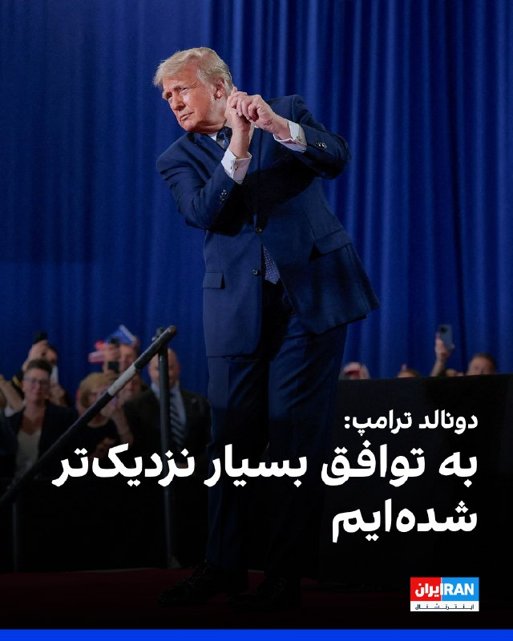

دونالد ترامپ، رییس جمهوری ایالات متحده به «سی‌بی‌اس» گفت که آمریکا و جمهوری اسلامی «به توافق بسیار نزدیک‌تر» شده‌اند و هر روز شرایط بهتر می‌شود. او افزود: «پیشنهاد جدید شامل بازگشایی تنگه هرمز، آزادسازی بخشی از دارایی‌های مسدودشده جمهوری اسلامی و ۳۰ روز ادامه مذاکرات است.»

دونالد ترامپ گفت: «توافق نهایی باید مانع دستیابی جمهوری اسلامی به سلاح هسته‌ای شود و درباره اورانیوم غنی‌شده نیز تصمیم‌گیری خواهد شد.»

سی‌بی‌اس گزارش داد که ترامپ هنوز درباره پیشنهادها تصمیم نهایی نگرفته و با مشاوران و رهبران منطقه در حال رایزنی است.
https://iranintl.com/202605230241

## IranIntlTV — post 338624

  <a href="telegram/content/IranIntlTV_338624_1779553184.mp4" target="_blank">🎬 Download video</a>

ویدیوی رسیده به ایران اینترنشنال نشان می‌دهد ایرانیان دانمارک روز شنبه در حمایت از انقلاب ملی روز شنبه در کپنهاگ تجمع کردند.

## IranIntlTV — post 338623

  <a href="telegram/content/IranIntlTV_338623_1779553186.mp4" target="_blank">🎬 Download video</a>

تجمعات دانش‌آموزی در اعتراض به بلاتکلیفی تحصیلی در شرایط جنگی و حضوری شدن امتحانات که از شهرکرد آغاز شده بود، به شهرهای دیگر نیز کشیده شد. این تجمع‌ها نخستین اعتراضات گسترده پس از انقلاب ملی ایرانیان و جنگ به شمار می‌رود.

گفت‌وگو با نجات بهرامی، تحلیل‌گر سیاسی
@iranintltv

## IranIntlTV — post 338622

  <a href="telegram/content/IranIntlTV_338622_1779553188.mp4" target="_blank">🎬 Download video</a>

یکی از شرکت‌کنندگان در تجمع برلین در گفت‌وگو با احمد صمدی، خبرنگار ایران‌اینترنشنال، گفت:« مردم داخل ایران را تنها نمی‌گذاریم و تا روز آزادی در کنارشان هستیم.»

@iranintltv

## IranIntlTV — post 338621

  

دونالد ترامپ، رییس‌جمهوری آمریکا، به اکسیوس گفت که قرار است امروز با مذاکره‌کنندگان خود دیدار کند تا آخرین پیشنهاد تهران را بررسی کند و احتمالا تا روز یکشنبه درباره از سرگیری جنگ تصمیم‌گیری خواهد کرد.

رییس‌جمهوری آمریکا به اکسیوس گفت شانس دستیابی به توافق با جمهوری اسلامی یا «زدن ضربه‌ای بی‌سابقه» به این کشور «۵۰-۵۰» است.

او افزود تنها توافقی را می‌پذیرد که موضوعاتی مانند غنی‌سازی اورانیوم و سرنوشت ذخایر فعلی ایران را در بر بگیرد.
https://iranintl.com/202605235280

## IranIntlTV — post 338620

  

🔻پرویز قلیچ‌خانی، اسطوره فوتبال ایران و تنها فوتبالیست ایرانی که سه بار قهرمان جام ملت‌های آسیا شد روز شنبه دوم خرداد ۱۴۰۵ در ۸۱ سالگی در بیمارستانی در پاریس درگذشت.

🔹امروز، دوم خرداد ۱۴۰۵ هم برابر با پانزدهمین سالگرد درگذشت زنده‌یاد ناصر حجازی، دیگر اسطوره فوتبال ایران است. او روز دوم خرداد سال ۱۳۹۰ پس از یک دوره بیماری، در ۶۲ سالگی در تهران در گذشت.

🔹گزارشی درباره زندگی‌نامه زنده‌یاد پرویز قلیچ‌خانی را در وبسایت ایران اینترنشنال بخوانید.

@iranintltvsport

## IranIntlTV — post 338618

  

خبرگزاری تسنیم، وابسته به سپاه، به نقل از یک منبع مطلع نوشت که خبر العربیه درباره اینکه تهران پیشنهاد تعلیق ۱۰ ساله غنی‌سازی اورانیوم بالای ۳.۶ درصد را مطرح کرده، «از اساس کذب است».

تسنیم به نقل از این منبع با تاکید بر «ساختگی» بودن خبر العربیه، نوشت: «اساسا تمرکز پیام‌ها و گفتگوها در وضعیت فعلی صرفا بر روی مساله پایان جنگ است و هیچ جزئیاتی درباره موضوع هسته‌ای مورد بحث قرار نمی‌گیرد.»
https://iranintl.com/202605236278

## Shin_Persian — post 6165

Barak Ravid ✓ @BarakRavid
Sat, 23 May 2026 15:35:31 UTC

🚨🚨הנשיא טראמפ אמר לי בשיחת טלפון כי הוא "50:50" בכל הנוגע להסכם עם איראן או חידוש המלחמה. "או שנגיע לעסקה טובה או שאפוצץ אותם לאלף עזאזל", הוא אמר. טראמפ אמר לי שייפגש היום עם יועציו הבכירים כדי לדון בפרטי הטיוטה המעודכנת וייתכן שיקבל החלטה עד מחר

English

🚨🚨 President Trump told me in a phone call that he is "50:50" regarding an agreement with Iran or a resumption of the war. "Either we reach a good deal or I will blow them to hell," he said. Trump told me he would meet today with his senior advisors to discuss the details of the updated draft and may reach a decision by tomorrow.

فارسی

🚨🚨 پرزیدنت ترامپ در یک تماس تلفنی به من گفت که در مورد توافق با ایران یا از سرگیری جنگ در وضعیت «۵۰:۵۰» قرار دارد. او گفت: «یا به یک توافق خوب می‌رسیم یا آن‌ها را به درک واصل می‌کنم (منفجر می‌کنم).» ترامپ به من گفت که امروز با مشاوران ارشد خود برای بررسی جزئیات پیش‌نویس به‌روزشده دیدار خواهد کرد و احتمالاً تا فردا تصمیمی اتخاذ خواهد کرد.

𝕏 · @shin_persian

## Shin_Persian — post 6164

↩️ Quoted tweet: 1776Girl ✓ @sipjack1776 Sat, 23 May 2026 15:32:00 UTC JD Vance is returning to JB Andrews from Cincinnati.🤔 C-32A #ADFEB7/98-0001/AF2 @Borrowed7Time @RealestMercury @USAF_VIP_LGX @blackswanadria @stunorth69 @ArmchairAdml ↩️ توییت نقل‌قول…

## Shin_Persian — post 6163

  

↩️ Quoted tweet:
1776Girl ✓ @sipjack1776
Sat, 23 May 2026 15:32:00 UTC

JD Vance is returning to JB Andrews from Cincinnati.🤔
C-32A
#ADFEB7/98-0001/AF2
@Borrowed7Time @RealestMercury @USAF_VIP_LGX @blackswanadria @stunorth69 @ArmchairAdml

↩️ توییت نقل‌قول شده — برای پاسخ، پست زیر را ببینید.

فارسی

جی‌دی ونس در حال بازگشت از سینسیناتی به پایگاه مشترک اندروز (JB Andrews) است.🤔
C-32A
#ADFEB7/98-0001/AF2
@Borrowed7Time @RealestMercury @USAF_VIP_LGX @blackswanadria @stunorth69 @ArmchairAdml

𝕏 · @shin_persian

## ManotoTV — post 105771

  <a href="telegram/content/ManotoTV_105771_1779553193.mp4" target="_blank">🎬 Download video</a>

دونالد ترامپ اعلام کرد شنبه با تیم مذاکره‌کننده‌اش درباره آخرین پیشنهاد جمهوری‌اسلامی دیدار می‌کند و احتمالاً تا روز یکشنبه درباره ادامه مذاکرات یا ازسرگیری جنگ تصمیم خواهد گرفت.
ترامپ در گفت‌وگو با آکسیوس گفت شانس رسیدن به توافق با ایران «پنجاه-پنجاه» است و تأکید کرد یا به «توافقی خوب» می‌رسند یا «ایران را شدیدتر از همیشه هدف قرار می‌دهد».
او قرار است با استیو ویتکاف، جرد کوشنر و همچنین معاونش جی‌دی ونس جلسه‌ای برگزار کند. هم‌زمان، عاصم منیر، فرمانده ارتش پاکستان که نقش میانجی میان تهران و واشینگتن را برعهده داشته، پس از دیدار با مقام‌های جمهوری‌اسلامی تهران را ترک کرده است. پاکستان از «پیشرفت امیدوارکننده» در مسیر توافق نهایی خبر داده، اما هنوز توافقی نهایی نشده است.
بر اساس پیش‌نویس تفاهم‌نامه‌ای که در مذاکرات جمهوری‌اسلامی و پاکستان شکل گرفته، دو طرف احتمالاً ابتدا بر سر توقف جنگ توافق می‌کنند و سپس وارد ۳۰ روز مذاکرات فشرده درباره مسائل اصلی، از جمله غنی‌سازی اورانیوم و ذخایر هسته‌ای ایران، خواهند شد.
ترامپ گفته هر توافقی باید شامل محدودیت بر برنامه هسته‌ای ایران باشد. با این حال، اختلاف‌های اصلی میان تهران و واشنگتن، از جمله بر سر اورانیوم غنی‌شده و وضعیت تنگه هرمز، همچنان حل‌نشده باقی مانده است.
مارکو روبیو، وزیر خارجه آمریکا، نیز از «پیشرفت‌هایی» در مذاکرات خبر داده و گفته احتمال دارد تا پایان شنبه اخبار تازه‌ای منتشر شود.

## ManotoTV — post 105770

  <a href="telegram/content/ManotoTV_105770_1779553194.mp4" target="_blank">🎬 Download video</a>

گردهمایی ایرانیان دنهاخ

## ManotoTV — post 105769

  <a href="telegram/content/ManotoTV_105769_1779553197.mp4" target="_blank">🎬 Download video</a>

فدراسیون فوتبال جمهوری اسلامی مدعی شد گزارش‌ها درباره رد ویزای شجاع خلیل‌زاده، مهدی طارمی و احسان حاج‌صفی را تکذیب کرد.

رسانه‌های ورزشی ایران در روزهای اخیر از شایعاتی درباره رد شدن ویزای این سه بازیکن تیم ملی فوتبال مردان ایران گزارش داده بودند.

فدراسیون فوتبال روز شنبه با انتشار بیانیه‌ای این گزارش‌ها را «کذب» خواند و اعلام کرد: «فرایند اداری مربوط به اخذ ویزا از سوی فدراسیون فوتبال و تیم ملی طبق روال انجام گرفته و ادعای مطرح شده کذب است.»

هم‌زمان، روزنامه خبرورزشی گزارش داد امیر قلعه‌نویی، سرمربی تیم ملی فوتبال مردان ایران، با بازیکنان جایگزین این سه عضو تیم ملی تماس گرفته تا تمرینات آمادگی برای جام جهانی را ادامه دهند.

شجاع خلیل‌زاده، مهدی طارمی و احسان حاج‌صفی از جمله ملی‌پوشان ایرانی هستند که دوران خدمت سربازی خود را در سپاه گذرانده‌اند.

## ManotoTV — post 105768

  <a href="telegram/content/ManotoTV_105768_1779553197.mp4" target="_blank">🎬 Download video</a>

ارتش پاکستان اعلام کرد عاصم منیر، فرمانده ارتش این کشور، سفر کوتاه اما «بسیار پرباری» به ایران داشته و در جریان آن دیدارها و گفت‌وگوهای «سطح بالا» با مقام‌های جمهوری‌اسلامی انجام داده است.

## FarsiVOA — post 218452

🔺بازداشت زندانبان «صیدنایا»؛ دست عدالت در تعقیب مقامات زندان مخوف خاندان اسد

▪️وزارت کشور سوریه از بازداشت یکی از مقامات زندان بدنام و مخوف «صیدنایا» در سوریه خبر داد.

⬇️ بیشتر بخوانید:

https://ir.voanews.com/a/syria-irgc-proxy-prison-mass-killing/8153028.html/?nocach=1

## DW_Farsi — post 125056

🔶 پرویز قلیچ‌خانی، ستاره ‌ماندگار فوتبال ایران درگذشت

پرویز قلیچ‌خانی از چهره‌های استثنایی فوتبال ایران به شمار می‌رفت. بازیکنی که نامش بیش از هر چیز با تیم ملی ایران، سه قهرمانی پیاپی در جام ملت‌های آسیا و سال‌ها درخشش در میانه میدان گره خورده است. او تنها بازیکنی است که با تیم ملی ایران سه بار به عنوان قهرمانی آسیا رسیده است.

او فوتبال را از محله صابون‌پزخانه در میدان شوش تهران آغاز کرد و خیلی زود به یکی از استعدادهای کم‌نظیر فوتبال ایران بدل شد.

قلیچ‌خانی در دوران بازیگری خود پیراهن تیم ملی ایران و همچنین باشگاه‌های تاج، پرسپولیس و پاس را بر تن کرد و از همان سال‌های نخست، به دلیل قدرت بدنی، هوش تاکتیکی، توان رهبری و تاثیرگذاری در جریان بازی، جایگاهی ویژه یافت.

اگرچه بسیاری او را در آغاز بیشتر یک بازیکن دفاعی می‌شناختند، اما قلیچ‌خانی به تدریج به چهره‌ای همه‌کاره در قلب میدان تبدیل شد. او در سال‌های نخست حضورش در فوتبال، چه در تیم کیان و چه بعدتر در تاج، اغلب در خط دفاعی به کار گرفته می‌شد.

@dw_farsi

## Persian_Trend_Official — post 14742

🔴 ترامپ: آمریکا و ایران «بسیار به توافق نزدیک شده‌اند»

💢دونالد ترامپ در گفت‌وگو با CBS News اعلام کرد واشینگتن و تهران «بسیار به نهایی‌کردن توافق نزدیک شده‌اند».

▪️او گفت:

▪️ «هر روز اوضاع بهتر و بهتر می‌شود»

▪️ در توافق احتمالی، موضوع اورانیوم غنی‌شده ایران «به‌صورت رضایت‌بخش» حل‌وفصل خواهد شد

▪️ «فقط توافقی را امضا می‌کنم که در آن به تمام خواسته‌هایمان برسیم»

▪️ترامپ جزئیات بیشتری درباره نحوه مدیریت ذخایر اورانیوم ایران ارائه نکرد.

🫆:Tony

📌 @persian_trend_official
پرشین ترند | متفاوت‌ترین کانال نظامی

## Persian_Trend_Official — post 14741

  <a href="telegram/content/Persian_Trend_Official_14741_1779553198.webm" target="_blank">🎬 Download video</a>

🔴دونالد ترامپ روز شنبه در گفتگو با آکسیوس مدعی شد 💢 امروز با تیم مذاکره‌کننده خود دیدار خواهد کرد تا درباره آخرین پیشنهاد ایران گفتگو کند، و احتمالاً تا یکشنبه تصمیم خواهد گرفت که جنگ را از سر بگیرد یا نه. 💢ترامپ ادعا کرد که شانس رسیدن به یک توافق «خوب»…

## Persian_Trend_Official — post 14740

🔴دونالد ترامپ روز شنبه در گفتگو با آکسیوس مدعی شد

💢 امروز با تیم مذاکره‌کننده خود دیدار خواهد کرد تا درباره آخرین پیشنهاد ایران گفتگو کند، و احتمالاً تا یکشنبه تصمیم خواهد گرفت که جنگ را از سر بگیرد یا نه.

💢ترامپ ادعا کرد که شانس رسیدن به یک توافق «خوب» یا در غیر این صورت [حمله] را «۵۰-۵۰ محکم» ارزیابی می‌کند.

💢ترامپ گفت که روز شنبه با استیو ویتکاف و جرد کوشنر دیدار خواهد کرد تا درباره آخرین پاسخ ایران بحث کند. انتظار می‌رود معاون رئیس‌جمهور، ونس، نیز به این جلسه بپیوندد.

🫆:Tony

📌 @persian_trend_official
پرشین ترند | متفاوت‌ترین کانال نظامی

## Persian_Trend_Official — post 14738

  <a href="telegram/content/Persian_Trend_Official_14738_1779553198.mp4" target="_blank">🎬 Download video</a>

▪️اثبات وجود تناسخ ...

خمینی ، مطهری ، بهشتی زنده شدند ...

🫆:Tony

📌 @persian_trend_official
پرشین ترند | متفاوت‌ترین کانال نظامی

## RadioFarda — post 157489

🔸مارکو روبیو، وزیر خارجه آمریکا، روز شنبه دوم خرداد گفت احتمال دارد ایران «به‌زودی از روز شنبه» توافقی برای پایان دادن به جنگ خاورمیانه را بپذیرد. 🔸او که در نخستین سفر خود به هند به سر می‌برد، گفت که در مذاکرات پیشرفت‌هایی حاصل شده و افزود: «ممکن است کمی…

## RadioFarda — post 157488

  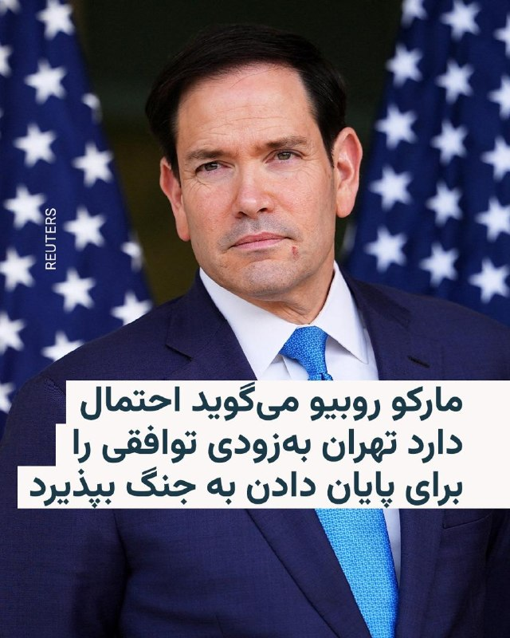

🔸مارکو روبیو، وزیر خارجه آمریکا، روز شنبه دوم خرداد گفت احتمال دارد ایران «به‌زودی از روز شنبه» توافقی برای پایان دادن به جنگ خاورمیانه را بپذیرد.

🔸او که در نخستین سفر خود به هند به سر می‌برد، گفت که در مذاکرات پیشرفت‌هایی حاصل شده و افزود: «ممکن است کمی بعدتر امروز خبرهایی داشته باشیم، و ممکن هم هست نداشته باشیم. امیدوارم خبرهایی باشد.»

🔸وزیر خارجه آمریکا همچنین گفت: «این احتمال وجود دارد که امروز، فردا یا طی چند روز آینده حرفی برای گفتن داشته باشیم.»

🔸اظهارات آقای روبیو در حالی مطرح شده که فرمانده ارتش پاکستان برای تقویت تلاش‌های میانجی‌گرانه وارد تهران شده و دونالد ترامپ، رئیس‌جمهور آمریکا، نیز به دلیل «شرایط مربوط به امور دولتی» مراسم عروسی پسرش را ترک کرده و در واشینگتن مانده است.

🔸مارکو روبیو در عین حال احتمال ازسرگیری حملات آمریکا علیه ایران را رد نکرد.

🔸او بار دیگر خواسته‌های واشینگتن را تکرار کرد و گفت ایران باید تنگه هرمز را که در واکنش به حمله آمریکا و اسرائیل کنترل آن را در دست گرفته، به‌طور کامل باز کند و همچنین اورانیوم با غنای بالا را تحویل دهد.

@RadioFarda

## IranianMinds — post 20618

  

@IranianMinds

## IranianMinds — post 20617

🔴 ترامپ :

ممکنه فردا تصمیم خودم راجب ایران رو بگیرم.

@IranianMinds

## IranianMinds — post 20616

🔴 روزنامه اعتماد :

به احتمال زیاد درخواست رفع فیلترینگ این هفته در مجلس عملی میشه.

@IranianMinds

## IranianMinds — post 20615

  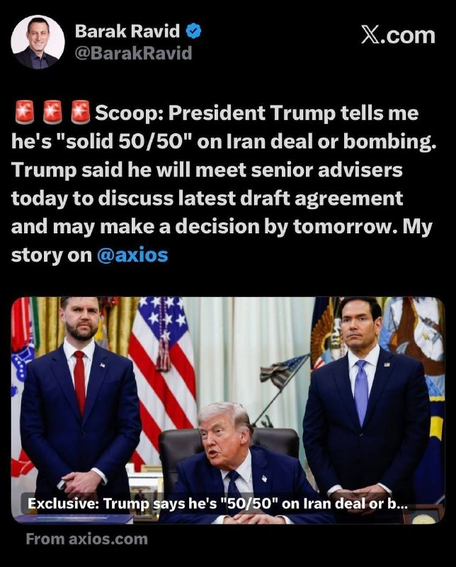

🔴فوری/ اکسیوس :

ترامپ گفت احتمال اینکه به ایران حمله کند یا توافق بشود 50/50 است.
ترامپ همچنین شنبه با ویتکاف و کوشنر دیدار می‌کند تا آخرین پیشنهاد ایران را بررسی کند و انتظار می‌رود تا یکشنبه تصمیم‌گیری شود.

@IranianMinds

## IranianMinds — post 20614

🔴وال‌استریت‌ژورنال:

ترامپ در جلسه تیم امنیت ملی به مشاوران خود گفت که می‌خواهد زمان بیشتری برای دیپلماسی با ایران در نظر بگیرد.

@IranianMinds

## BBCPersian — post 281890

🔻تسنیم: با وجود پیشرفت، اختلافات مهم با آمریکا هنوز پابرجاست

خبرگزاری تسنیم در گزارشی روند گفت‌وگوهایی که با میانجی‌گری پاکستان در جریان است نوشت: «ایران بر ضرورت تفکیک موضوع پایان جنگ از هسته‌ای تاکید دارد.»

این خبرگزاری که به نهادهای نظامی و امنیتی نزدیک است نوشت متن‌های ایران که به میانجی پاکستانی تحویل شده همگی «چارچوب مشخصی» داشته‌اند از جمله اینکه:

صرفا در صورت تحقق گام اول یعنی «پایان جنگ، پایان جنگ با شروط مورد قبول ایران و انجام اقدامات عملی توسط آمریکا» گام دوم یعنی موضوع مواد هسته‌ای بررسی می‌شود.
خروج یا دادن مواد هسته‌ای به آمریکا خط قرمز ایران است. درباره تعطیلی تاسیسات هسته‌ای نیز ایران هیچ تعهدی را نپذیرفته است.
ایران بر ضرورت پایان جنگ و تهدید در همه جبهه‌ها از جمله لبنان تاکید دارد.
در صورت حل اختلافات فعلی، در گام اول یک تفاهم اولیه اعلام و سپس مهلتی ۳۰ یا ۶۰ روزه برای گفت‌وگو درباره موضوع هسته‌ای (بدون هیچگونه تعهد اولیه ایران) داده شود.
بخش مهمی از اموال بلوکه شده باید در همان گام اول آزاد شود و در اختیار ایران قرار گیرد.
این خبرگزاری نوشت پس از گفت‌وگوهای اخیر عاصم منیر در تهران، «گفته می‌شود پیشرفت‌هایی در حوزه‌های تفکیک پایان جنگ از مذاکرات بعدی، آزادسازی اموال ایران، پایان جنگ در همه جبهه‌ها از جمله لبنان، سازوکار تضمین توافق نهایی احتمالی، اسقاط تحریم‌های نفتی در طول مذاکره، رفع محاصره دریایی، تعهد آمریکا به خروج نیروهای رزمی» حاصل شده اما «اختلافات مهمی نیز پابرجاست و توافق هنوز در دسترس نیست.»

آمریکا گفته است که حاضر نیست در جریان مذاکرات امتیازی از
جمله رفع تحریم به تهران بدهد.

https://bbc.in/4eYgYfo
@BBCPersian

## BBCPersian — post 281889

عراقچی: هرگونه توافق با آمریکا با آتش‌بس در لبنان پیوند دارد
عباس عراقچی می‌گوید هر توافقی بین ایران و آمریکا، با برقراری آتش‌بس در لبنان پیوند دارد.

وزیر خارجه ایران در پیامی به نعیم قاسم، دبیرکل حزب الله، گفت: «در آخرین پیشنهادی که جمهوری اسلامی ایران از طریق میانجی پاکستانی با هدف پایان دادن دائمی و پایدار به جنگ ارائه کرد، بر ضرورت شمول لبنان در آتش‌بس تأکید شد.»

ایران بارها اعلام کرده که پایان جنگ باید شامل تمام جنگ‌های منطقه از جمله در لبنان شود.

در حال حاضر بین اسرائیل و حزب‌الله لبنان آتش‌بس برقرار است اما دو طرف پیوسته مواضع یکدیگر را هدف حمله قرار می‌دهند.

https://bbc.in/3REalVO
@BBCPersian

## BBCPersian — post 281888

🔻فایننشال تایمز: آمریکا و ایران به توافق برای تمدید ۶۰ روزه آتش‌بس نزدیک هستند

روزنامه فایننشال تایمز از منابع آگاه گزارش داد که میانجی‌ها بر این باورند که به توافقی برای تمدید ۶۰ روزه آتش‌بس میان آمریکا و ایران و تعیین چارچوبی برای مذاکرات درباره برنامه هسته‌ای تهران نزدیک شده‌اند.

بر اساس این گزارش، این توافق شامل بازگشایی تدریجی تنگه هرمز، گفت‌وگو درباره رقیق‌سازی یا انتقال ذخایر اورانیوم غنی‌شده از ایران و کاهش محاصره بنادر ایران و رفع برخی از تحریم‌ها خواهد بود.

ایران گفته است که پس از توقف جنگ درباره مسئله هسته‌ای با آمریکا مذاکره می‌کند نه قبل از آن.

پاکستان میانجی رسمی گفت‌وگوهای ایران و آمریکاست اما سایر کشورها از جمله قطر هم فعالیت‌هایی انجام داده‌اند.

https://bbc.in/4dwAAEQ
@BBCPersian

## BBCPersian — post 281887

🔻بقایی: روند گفت‌وگوها به سمت کم کردن موارد اختلاف با آمریکاست

سخنگوی وزارت خارجه ایران درباره گفت‌وگو با آمریکا که با میانجی‌گری پاکستان در جریان است گفت: «در این چند روز، درباره برخی نکات و عبارت‌پردازی‌هایی که کماکان اختلاف نظر وجود داشت، بحث و پیشنهادهایی مطرح شد.»

اسماعیل بقایی گفت روند گفت‌وگوهای «یک هفته اخیر به سمت کم کردن موارد اختلاف» بوده است با این حال برخی موارد هنوز حل نشده و برخی «همچنان در حال بررسی و اعلام نظر است.»

آقای بقایی گفت: «از یک سو، ما تجربه ضدونقیض‌گویی طرف آمریکایی را داریم. دیدگاه‌شان را بارها تغییر داده‌اند و مواضع متناقضی توسط مقامات مختلفشان بیان شده است. به همین دلیل نمی‌توانیم کاملا مطمئن باشیم که این رویکرد تغییر نمی‌کند. از سوی دیگر، پس از چند هفته گفت‌وگو بین دو طرف می‌توان گفت روند به سمت نزدیک‌تر شدن دیدگاه‌ها هست.»

آقای بقایی گفت باید منتظر ماند و دید «در سه چهار روز آینده» چه اتفاقی خواهد افتاد.

عاصم منیر، فرمانده کل ارتش و نیروهای مسلح پاکستان پس از دیدار با محمدباقر قالیباف، مسعود پزشکیان و عباس عراقچی امروز تهران را ترک کرد.

در همین حال شهباز شریف، نخست‌وزیر پاکستان، وارد چین شده است. موضوع ایران از محورهای گفت‌وگوهای اوست.

https://bbc.in/4f3MhFM
@BBCPersian

## Dirty_Kids — post 390023

ترامپ آمریکا تاکتیک های جنگیش رو با الهام از بستنی فروش های ترکیه طراحی کرده.

@Dirty_Kids 👻

## Dirty_Kids — post 390022

  

رفتم خونه دوستم و فهمیدم تو خونه مجردی پسرا هرچیزی ممکنه پیدا بشه، مثلا درخت موز 😅

@Dirty_Kids 👻

## Dirty_Kids — post 390021

  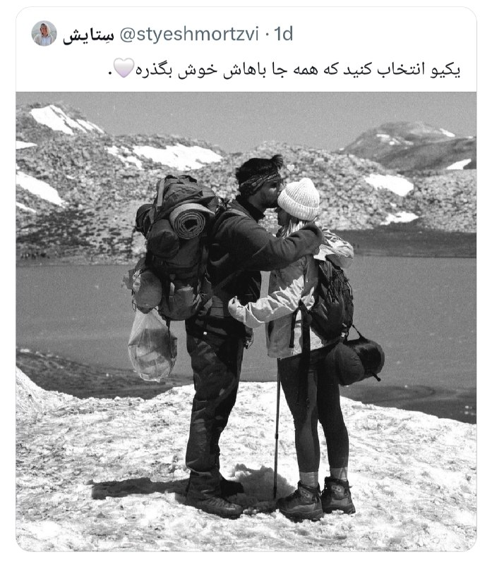

تقسیم بار رو دقت کنید!!! این کار یه مرده. اینکار رو باید یه مرد بکنه نه چون وظیفشه. بلکه چون دلش نمیاد دختری که کنارشه سختی بکشه.
نباید ارزش اینکار ندید گرفته بشه و وظیفه تلقی بشه

@Dirty_Kids 👻

## Dirty_Kids — post 390020

  

🌪وقتی اینترنت طوفانیه فقط کافیه بادبان ها رو بکشی

⚫️100 هزار تومان تخفیف خرید اول 
🎁

⚫️پایین ترین قیمت گیگی 180 هزار تومان
🌐 

⚫️پورسانت %10 دائمی برای هر معرفی
💼

با بادبان، میتونی یه اتصال سریع، پایدار و امن
همراه با پشتیبانی ۲۴ ساعته داشته باشی
🚀

🛒کد تخفیف: badban4k

بادبان راهتو باز می‌کنه
⛵️
G2

🛡@BadBan_VPN | کانال 

🤖@BadBan_VPNBot | ربات 

📞@BadBan_VPNSupport | پشتیبانی

## Dirty_Kids — post 390019

  <a href="telegram/content/Dirty_Kids_390019_1779553205.mp4" target="_blank">🎬 Download video</a>

والا😂😂 جون بکن بگو تمومش کن

@Dirty_Kids 👻

## Dirty_Kids — post 390018

اگر ایران تا ۷۲ ساعت دیگر اینترنت را وصل نکند، بنده هر جا که زمین خالی ببینم خشخاش میکارم، خودم به تنهایی یک تمدن بزرگ رو نابود خواهم کرد.
از توجه شما به این موضوع سپاسگزارم.

@Dirty_Kids 👻

## manototv — post 105771

  <a href="telegram/content/manototv_105771_1779553207.mp4" target="_blank">🎬 Download video</a>

دونالد ترامپ اعلام کرد شنبه با تیم مذاکره‌کننده‌اش درباره آخرین پیشنهاد جمهوری‌اسلامی دیدار می‌کند و احتمالاً تا روز یکشنبه درباره ادامه مذاکرات یا ازسرگیری جنگ تصمیم خواهد گرفت.
ترامپ در گفت‌وگو با آکسیوس گفت شانس رسیدن به توافق با ایران «پنجاه-پنجاه» است و تأکید کرد یا به «توافقی خوب» می‌رسند یا «ایران را شدیدتر از همیشه هدف قرار می‌دهد».
او قرار است با استیو ویتکاف، جرد کوشنر و همچنین معاونش جی‌دی ونس جلسه‌ای برگزار کند. هم‌زمان، عاصم منیر، فرمانده ارتش پاکستان که نقش میانجی میان تهران و واشینگتن را برعهده داشته، پس از دیدار با مقام‌های جمهوری‌اسلامی تهران را ترک کرده است. پاکستان از «پیشرفت امیدوارکننده» در مسیر توافق نهایی خبر داده، اما هنوز توافقی نهایی نشده است.
بر اساس پیش‌نویس تفاهم‌نامه‌ای که در مذاکرات جمهوری‌اسلامی و پاکستان شکل گرفته، دو طرف احتمالاً ابتدا بر سر توقف جنگ توافق می‌کنند و سپس وارد ۳۰ روز مذاکرات فشرده درباره مسائل اصلی، از جمله غنی‌سازی اورانیوم و ذخایر هسته‌ای ایران، خواهند شد.
ترامپ گفته هر توافقی باید شامل محدودیت بر برنامه هسته‌ای ایران باشد. با این حال، اختلاف‌های اصلی میان تهران و واشنگتن، از جمله بر سر اورانیوم غنی‌شده و وضعیت تنگه هرمز، همچنان حل‌نشده باقی مانده است.
مارکو روبیو، وزیر خارجه آمریکا، نیز از «پیشرفت‌هایی» در مذاکرات خبر داده و گفته احتمال دارد تا پایان شنبه اخبار تازه‌ای منتشر شود.

## manototv — post 105770

  <a href="telegram/content/manototv_105770_1779553208.mp4" target="_blank">🎬 Download video</a>

گردهمایی ایرانیان دنهاخ

## manototv — post 105769

  <a href="telegram/content/manototv_105769_1779553211.mp4" target="_blank">🎬 Download video</a>

فدراسیون فوتبال جمهوری اسلامی مدعی شد گزارش‌ها درباره رد ویزای شجاع خلیل‌زاده، مهدی طارمی و احسان حاج‌صفی را تکذیب کرد.

رسانه‌های ورزشی ایران در روزهای اخیر از شایعاتی درباره رد شدن ویزای این سه بازیکن تیم ملی فوتبال مردان ایران گزارش داده بودند.

فدراسیون فوتبال روز شنبه با انتشار بیانیه‌ای این گزارش‌ها را «کذب» خواند و اعلام کرد: «فرایند اداری مربوط به اخذ ویزا از سوی فدراسیون فوتبال و تیم ملی طبق روال انجام گرفته و ادعای مطرح شده کذب است.»

هم‌زمان، روزنامه خبرورزشی گزارش داد امیر قلعه‌نویی، سرمربی تیم ملی فوتبال مردان ایران، با بازیکنان جایگزین این سه عضو تیم ملی تماس گرفته تا تمرینات آمادگی برای جام جهانی را ادامه دهند.

شجاع خلیل‌زاده، مهدی طارمی و احسان حاج‌صفی از جمله ملی‌پوشان ایرانی هستند که دوران خدمت سربازی خود را در سپاه گذرانده‌اند.

## manototv — post 105768

  <a href="telegram/content/manototv_105768_1779553211.mp4" target="_blank">🎬 Download video</a>

ارتش پاکستان اعلام کرد عاصم منیر، فرمانده ارتش این کشور، سفر کوتاه اما «بسیار پرباری» به ایران داشته و در جریان آن دیدارها و گفت‌وگوهای «سطح بالا» با مقام‌های جمهوری‌اسلامی انجام داده است.

## alonews — post 122088

  <a href="telegram/content/alonews_122088_1779553212.webm" target="_blank">🎬 Download video</a>

🔴فوری / یک منبع نزدیک به تیم مذاکره‌کننده به خبرگزاری فارس گفت که مذاکرات بین ایران و آمریکا ممکن است فروپاشی کند، مگر اینکه واشنگتن انعطاف‌پذیری بیشتری نشان دهد!

✅ @AloNews خبر جنگ

## alonews — post 122087

  <a href="telegram/content/alonews_122087_1779553212.webm" target="_blank">🎬 Download video</a>

👈آکسیوس به نقل از منابع: تماس تلفنی بین ترامپ و رهبران کشورهای عربی در مورد پیش نویس توافق با ایران ساعت ۵ بعد از ظهر به وقت گرینویچ انجام خواهد شد

✅ @AloNews خبر جنگ

## alonews — post 122086

  <a href="telegram/content/alonews_122086_1779553213.webm" target="_blank">🎬 Download video</a>

👈ترامپ به کانال ۱۲ اسرائیل: اگر برای اسرائیل خوب نبود، معامله‌ای انجام نمی‌دادم

✅ @AloNews خبر جنگ

## alonews — post 122085

  <a href="telegram/content/alonews_122085_1779553213.webm" target="_blank">🎬 Download video</a>

👈سی‌بی‌اس، به نقل از منابع: دولت ترامپ علی‌رغم تلاش‌های دیپلماتیک مداوم، در حال آماده شدن برای حملات نظامی جدید علیه ایران بود

✅ @AloNews خبر جنگ

## alonews — post 122084

  <a href="telegram/content/alonews_122084_1779553213.webm" target="_blank">🎬 Download video</a>

🔴فوری / سی‌بی‌اس نیوز به نقل از منابع: ترامپ در حال بررسی سازوکاری برای بازگشایی تنگه هرمز، آزادسازی بخشی از دارایی‌های مسدود شده ایران و ادامه مذاکرات است. 
✅ @AloNews خبر جنگ

## alonews — post 122083

  <a href="telegram/content/alonews_122083_1779553213.webm" target="_blank">🎬 Download video</a>

🔴فوری / سی‌بی‌اس نیوز به نقل از منابع:
ترامپ در حال بررسی سازوکاری برای بازگشایی تنگه هرمز، آزادسازی بخشی از دارایی‌های مسدود شده ایران و ادامه مذاکرات است.

✅ @AloNews خبر جنگ

## alonews — post 122082

  <a href="telegram/content/alonews_122082_1779553214.webm" target="_blank">🎬 Download video</a>

👈ترامپ گفت که معتقد است توافق نهایی ایران را از دستیابی به سلاح هسته‌ای بازخواهد داشت

✅ @AloNews خبر جنگ

## alonews — post 122081

  <a href="telegram/content/alonews_122081_1779553214.webm" target="_blank">🎬 Download video</a>

👈ترامپ در گفت‌و‌گو با سی‌بی‌اس نیوز درمورد جزییات توافق احتمالی: «نمی توانم قبل از اینکه به آنها بگویم، به شما بگویم، درست است؟»

✅ @AloNews خبر جنگ

## alonews — post 122080

  <a href="telegram/content/alonews_122080_1779553214.webm" target="_blank">🎬 Download video</a>

💔تصویر مزار جاویدنام عرفان کیانی که جز ویدیوی اعتراف اجباری هیچ تصویری ازش منتشر نشده بود.

🔴باغ رضوان اصفهان، قطعه ۸۶، بوستان۱، ردیف ۱، شماره ۳۵

✅@AloNews

## alonews — post 122079

  <a href="telegram/content/alonews_122079_1779553215.webm" target="_blank">🎬 Download video</a>

👈سی‌بی‌اس‌ به نقل از یک منبع: ترامپ هنوز در حال بررسی پیشنهادهاست و تصمیم نهایی خود را نگرفته است

🔴او با مشاوران خود مشورت کرده و با رهبران خارجی از جمله رهبران عربستان سعودی و دیگر کشورهای حوزه خلیج فارس گفتگو می‌کند.

✅ @AloNews خبر جنگ

## alonews — post 122078

  <a href="telegram/content/alonews_122078_1779553215.webm" target="_blank">🎬 Download video</a>

🔴فوری/ترامپ به سی بی اس: هر روز اوضاع بهتر و بهتر می‌شود

✅ @AloNews خبر جنگ

## alonews — post 122077

  <a href="telegram/content/alonews_122077_1779553215.webm" target="_blank">🎬 Download video</a>

👈ترامپ، در گفت‌وگو با سی‌بی‌اس نیوز:
مذاکره‌کنندگان ایالات متحده و ایران «بسیار به نهایی کردن یک توافق» برای پایان دادن به جنگ بین دو کشور نزدیک‌تر شده‌اند

✅ @AloNews خبر جنگ

## alonews — post 122076

  <a href="telegram/content/alonews_122076_1779553215.webm" target="_blank">🎬 Download video</a>

👈الشرق نیوز سعودی به نقل از منابع منطقه‌ای:

🔴قرار است دونالد ترامپ، امروز ساعت ۱۳:۰۰ به وقت شرقی با رهبران پاکستان، امارات، عربستان سعودی، قطر، اردن، ترکیه و مصر تماس تلفنی داشته باشد.

✅ @AloNews خبر جنگ

## alonews — post 122075

  <a href="telegram/content/alonews_122075_1779553216.webm" target="_blank">🎬 Download video</a>

👈ترامپ به آکسیوس: برخی ترجیح میدهند توافق را منعقد کنند ، برخی دیگر ترجیح میدهند جنگ را از سر بگیرند‌‌

✅ @AloNews خبر جنگ

## alonews — post 122074

  <a href="telegram/content/alonews_122074_1779553216.webm" target="_blank">🎬 Download video</a>

👈ترامپ به آکسیوس: تنها توافقی را در رابطه با غنی سازی اورانیوم و سرنوشت ذخایر آن است را میپذیرم‌‌

✅ @AloNews خبر جنگ

## alonews — post 122073

  <a href="telegram/content/alonews_122073_1779553216.webm" target="_blank">🎬 Download video</a>

🔴فوری/آکسیوس : ترامپ گفت احتمال اینکه به ایران حمله کنه و یا توافق بشه 50/50 هست همچنین ترامپ شنبه با استیو ویتکوف و جرد کوشنر دیدار میکند تا آخرین پیشنهاد ایران را بررسی کند و انتظار میرود تا یکشنبه تصمیم‌ گیری شود 
✅ @AloNews خبر جنگ

## alonews — post 122072

  <a href="telegram/content/alonews_122072_1779553216.webm" target="_blank">🎬 Download video</a>

🔴فوری/آکسیوس :
ترامپ گفت احتمال اینکه به ایران حمله کنه و یا توافق بشه 50/50 هست
همچنین ترامپ شنبه با استیو ویتکوف و جرد کوشنر دیدار میکند تا آخرین پیشنهاد ایران را بررسی کند و انتظار میرود تا یکشنبه تصمیم‌ گیری شود

✅ @AloNews خبر جنگ

## alonews — post 122071

  <a href="telegram/content/alonews_122071_1779553217.webm" target="_blank">🎬 Download video</a>

👈العربیه: ایران پیشنهاد تعلیق غنی‌سازی اورانیوم بالای ۳.۶ درصد را به مدت ۱۰ سال ارائه داد 
✅ @AloNews خبر جنگ

---
📅 بروزرسانی: 1405/03/02 18:54
---

## VahidOOnLine — post 241747

  <a href="telegram/content/VahidOOnLine_241747_1779549864.mp4" target="_blank">🎬 Download video</a>

♦️وزارت دفاع عربستان سعودی با انتشار ویدیویی در شبکه اجتماعی ایکس اعلام کرد نیروهای پدافند هوایی این کشور در قالب یک سامانه آمادگی یکپارچه، مسئول حفاظت از حریم هوایی اماکن مقدس هستند.
در این بیانیه تاکید شده این نیروها وظیفه مقابله با تمامی تهدیدات هوایی را بر عهده دارند و نقش کلیدی در تامین امنیت زائران و ایجاد آرامش برای «میهمانان» ایفا می‌کنند.
این اقدام در چارچوب تمهیدات امنیتی گسترده عربستان سعودی برای برگزاری مراسم حج و حفاظت از زائران صورت می‌گیرد.
‌🇸🇦 Indypersian

🤖 @VahidOOnLine

## VahidOOnLine — post 241746

  <a href="telegram/content/VahidOOnLine_241746_1779549865.mp4" target="_blank">🎬 Download video</a>

دونالد ترامپ، رئیس‌جمهور آمریکا، تصویری از نقشه خاورمیانه منتشر کرد که در آن ایران با طرح پرچم ایالات متحده پوشانده شده و بالای نقشه عبارت «ایالات متحده خاورمیانه؟» دیده می‌شود.

ترامپ این تصویر را در حساب خود در تروث‌سوشال منتشر کرد و توضیحی درباره منظور خود از آن ننوشت.
‌🏁 🇬🇧 ManotoTV

🤖 @VahidOOnLine

## VahidOOnLine — post 241745

  <a href="telegram/content/VahidOOnLine_241745_1779549866.mp4" target="_blank">🎬 Download video</a>

روزنامه فایننشال تایمز گزارش داده میانجی‌گران منطقه‌ای در حال نهایی کردن توافقی هستند که بر اساس آن آتش‌بس میان آمریکا و جمهوری‌اسلامی برای ۶۰ روز دیگر تمدید می‌شود و زمینه مذاکرات درباره برنامه هسته‌ای تهران را فراهم می‌کند.
بر اساس این گزارش، طرح پیشنهادی شامل بازگشایی تدریجی تنگه هرمز، گفت‌وگو درباره کاهش یا انتقال ذخایر اورانیوم غنی‌شده جمهوری‌اسلامی و همچنین کاهش محدودیت‌ها علیه بنادر ایران و آزادسازی مرحله‌ای بخشی از دارایی‌های مسدودشده تهران است.
اسماعیل بقایی، سخنگوی وزارت خارجه جمهوری‌اسلامی، گفته تهران و طرف‌های میانجی در حال تدوین «تفاهم‌نامه‌ای» برای پایان جنگ هستند و پس از آن مذاکرات درباره توافق جامع‌تر طی ۳۰ تا ۶۰ روز آینده ادامه خواهد یافت.
در همین حال، منابع دیپلماتیک گفته‌اند مذاکرات با میانجی‌گری قطر و پاکستان پیشرفت داشته، اما همچنان اختلاف‌های جدی بر سر برنامه هسته‌ای جمهوری‌اسلامی باقی مانده است؛ از جمله درخواست آمریکا برای تحویل ذخایر اورانیوم با غنای بالا و تعطیلی تاسیسات هسته‌ای نطنز، فردو و اصفهان.
این گزارش می‌افزاید کشورهای عربی منطقه نگران‌اند در صورت شکست مذاکرات و از سرگیری حملات آمریکا و اسرائیل، بحران به درگیری گسترده‌تر در خاورمیانه و اختلال شدید در بازار جهانی انرژی منجر شود.
‌🏁 🇬🇧 ManotoTV

🤖 @VahidOOnLine

## VahidOOnLine — post 241744

  <a href="telegram/content/VahidOOnLine_241744_1779549868.mp4" target="_blank">🎬 Download video</a>

مارکو روبیو، وزیر امور خارجه آمریکا، گفت در پرونده ایران «پیشرفت‌هایی» حاصل شده و ممکن است واشینگتن به‌زودی درباره این موضوع اظهارنظر تازه‌ای داشته باشد.

روبیو روز شنبه سوم خرداد در پاسخ به پرسشی درباره «موضوع ایران» گفت: «همان‌طور که گفتم، پیشرفت‌هایی حاصل شده است. حتی همین حالا که با شما صحبت می‌کنم، کارهایی در حال انجام است.»

او افزود ممکن است «امروز، فردا یا ظرف چند روز آینده» چیزی برای اعلام وجود داشته باشد، اما تاکید کرد هنوز قطعی نیست.

وزیر امور خارجه آمریکا گفت این موضوع باید «به هر شکل» حل شود و به گفته او، موضع دونالد ترامپ این است که «ایران هرگز نباید سلاح هسته‌ای داشته باشد.»

روبیو همچنین گفت تنگه‌ها باید «بدون عوارض» باز بمانند و جمهوری اسلامی باید درباره اورانیوم غنی‌شده و موضوع غنی‌سازی پاسخ‌گو باشد.
‌🏁 🇬🇧 ManotoTV

🤖 @VahidOOnLine

## VahidOOnLine — post 241743

  

♦️ بخش رسانه‌ای ارتش پاکستان (ISPR) آخرین دور گفتگوها میان میانجی‌های قطری-پاکستانی و مقامات بلندپایه جمهوری اسلامی را «کوتاه اما بسیار پربار» توصیف کرد.

بر اساس بیانیه منتشر شده، این رایزنی‌های فشرده در ۲۴ ساعت گذشته در فضایی مثبت و سازنده برگزار شده و پیشرفت‌های دلگرم‌کننده‌ای را برای دستیابی به یک تفاهم نهایی جهت پایان دادن به جنگ ایجاد کرده است. در این مذاکرات، فیلد مارشال عاصم منیر، فرمانده ارتش پاکستان، با مسعود پزشکیان، رئیس‌جمهوری، محمدباقر قالیباف، رئیس مجلس شورای اسلامی، عباس عراقچی، وزیر امور خارجه و اسکندر مومنی، وزیر کشور دیدار و گفتگو کرده است.

با این حال، به نظر می‌رسد مجتبی خامنه‌ای، رهبر جدید جمهوری اسلامی که از زمان کشته شدن پدرش در روزهای نخست حملات هوایی در انظار عمومی ظاهر نشده، در این گفتگوها مشارکتی نداشته است. ارتش پاکستان جزئیات بیشتری از مفاد دقیق این مذاکرات ارائه نکرده است.
‌🇸🇦 Indypersian

🤖 @VahidOOnLine

## VahidOOnLine — post 241742

ویدیوهای رسیده به ایران اینترنشنال نشان می‌دهد ایرانیان بریتانیا روز شنبه در لندن با حمل پرچم‌های شیروخورشید در حمایت از انقلاب ملی علیه جمهوری اسلامی تجمع کردند.
‌🏁 🇬🇧 IranintlTV

🤖 @VahidOOnLine

## VahidOOnLine — post 241741

  

فایننشال تایمز گزارش داد که میانجی‌های جنگ ایران معتقدند در حال نزدیک شدن به توافقی هستند که آتش‌بس میان واشینگتن و تهران را به مدت ۶۰ روز تمدید و چارچوبی برای مذاکرات درباره برنامه هسته‌ای جمهوری اسلامی ایجاد کند.

بنا بر این گزارش، افرادی که در جریان این مذاکرات قرار دارند به این رسانه گفتند این توافق شامل بازگشایی تدریجی تنگه هرمز و همچنین تعهد به بررسی رقیق‌سازی یا واگذاری ذخایر اورانیوم با غنای بالا خواهد بود.

فایننشال تایمز افزود که آمریکا همچنین محاصره دریایی بنادر جنوب ایران را کاهش می‌دهد و با کاهش تحریم‌ها و همچنین آزادسازی مرحله‌ای دارایی‌های مسدودشده تهران در خارج از کشور موافقت خواهد کرد.
‌🏁 🇬🇧 IranintlTV

🤖 @VahidOOnLine

## VahidOOnLine — post 241740

روایت شما از زندگی در آتش‌بس- شنبه ۲ خرداد ۱۴۰۵
🔹 ترامپ کارمند ما نیست که امر و نهی کنیم، موش علی و فرمانده‌هاش و سرکوبگرهاش رو ذلیل کرد، حالا نوبت ماست اعتصاب کنیم. نه به گوشت و مرغ رو شروع کنیم تا فراخوان بعد.
🔹 در تهران گرانی بیداد می‌کند. حقوق‌ها را دیر می‌دهند. یک کیلو توت‌فرنگی در تره‌بار ۳۰۰ هزار تومان، در مغازه معمولی ۶۰۰ هزار تومان. دارو در داروخانه کمیاب شده. یک بطری کوچک روغن زیتون یک میلیون و پانصد هزار تومان.
🔹 دم همه دانش‌آموزان غیور لر گرم که زیر بار حرف زور و ستم نمی‌روند، به‌قول شاهزاده عزیز واقعاً نسل ویکتوری هستید.
🔹 درود، من یک نوجوان ۱۶ ساله هستم که صندوق‌دار یک فروشگاه هستم. آن‌قدر همه‌چیز گران شده که حتی خودم هم خجالت می‌کشم به مشتری‌ها قیمت بدهم. واقعاً مردم ایران کوه صبر هستند. به امید روزهای خوب ایران.
‌🏁 🇬🇧 IranintlTV

🤖 @VahidOOnLine

## VahidOOnLine — post 241739

  <a href="telegram/content/VahidOOnLine_241739_1779549872.mp4" target="_blank">🎬 Download video</a>

ایرانیان سوئیس روز شنبه با تجمع مقابل سفارت جمهوری اسلامی خواستار بسته‌شدن آن شدند. آن‌ها همچنین با حمل تصاویر شاهزاده رضا پهلوی و پرچم شیروخورشید از انقلاب ملی حمایت کردند.
‌🏁 🇬🇧 IranintlTV

🤖 @VahidOOnLine

## VahidOOnLine — post 241738

  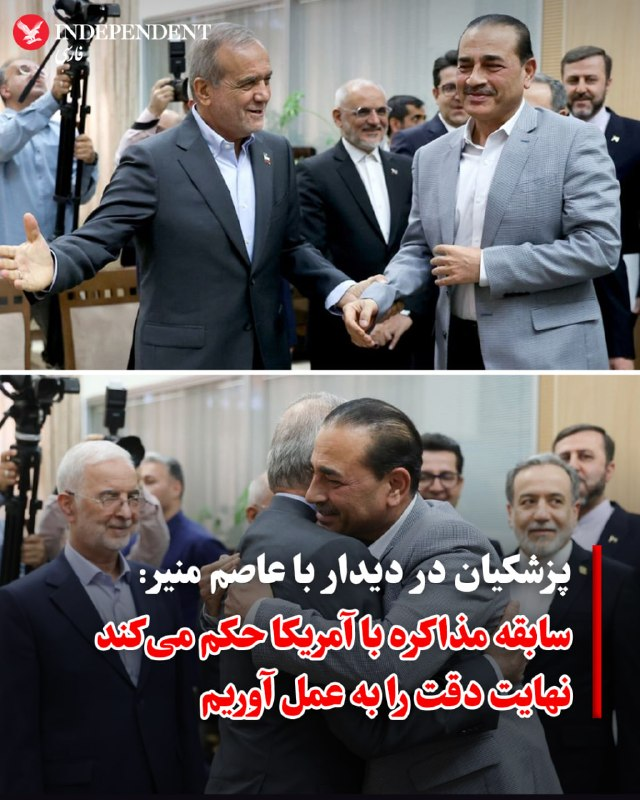

♦️ مسعود پزشکیان، رئیس‌جمهوری اسلامی، روز شنبه دوم خرداد در دیدار با عاصم منیر، فرمانده ارتش پاکستان در تهران، با اشاره به روند مذاکرات جاری برای پایان دادن به درگیری‌های نظامی، از «بی‌اعتمادی» تهران به ایالات متحده سخن گفت.

به گزارش وب‌سایت ریاست‌جمهوری، پزشکیان با متهم کردن آمریکا به «نقض عهد مکرر و حملات در حین مذاکرات» گفت: «سابقه و تجربه مذاکره با آمریکایی‌ها به ما حکم می‌کند که نهایت دقت را به عمل آوریم.» او با ادعای اینکه تهران صرفا به دنبال احقاق حقوق قانونی خود است، تاکید کرد که واشنگتن پیروز این منازعه نخواهد بود و اسرائیل تنها طرفی است که از جنگ نفع می‌برد.

در این دیدار، عاصم منیر که کشورش نقش میانجی را میان تهران و واشنگتن ایفا می‌کند، روند گفتگوها را «رو به جلو» توصیف کرد و ابراز امیدواری کرد که این مذاکرات هرچه سریع‌تر به نتیجه مطلوب برسد. فرمانده ارتش پاکستان همچنین اسرائیل را متهم کرد که تمایلی به برقراری ثبات در منطقه ندارد.

این اظهارات در حالی مطرح می‌شود که پیشتر الجزیره از دستیابی به یک پیش‌نویس تفاهم میان دو طرف برای بازگشایی تنگه هرمز و توقف درگیری‌ها خبر داده بود.
‌🇸🇦 Indypersian

🤖 @VahidOOnLine

## VahidOOnLine — post 241737

  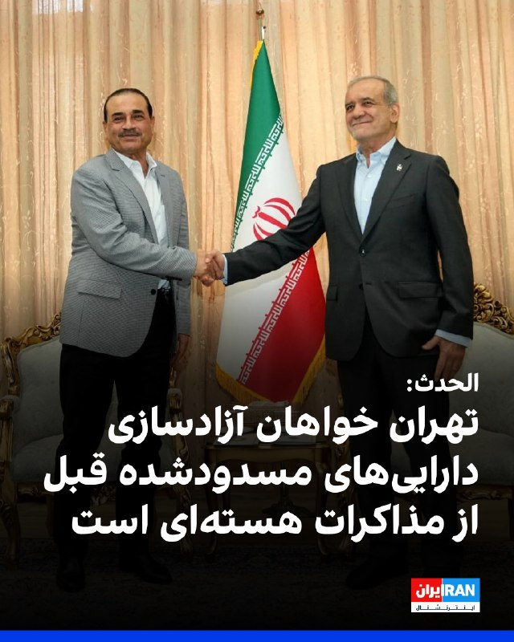

الحدث گزارش داد جمهوری اسلامی در پیشنهاد جدید خود خواستار آزادسازی دارایی‌های مسدود‌شده خود قبل از مذاکرات هسته‌ای شده است.
بر اساس این گزارش، تهران خواستار ایجاد یک مکانیسم جبران خسارت جنگ از سوی ایالات متحده و لغو کامل تحریم‌ها در ازای تعهدات هسته‌ای شده است.
‌🏁 🇬🇧 IranintlTV

🤖 @VahidOOnLine

## VahidOOnLine — post 241736

  

♦️پرویز قلیچ‌خانی، از چهره‌های ماندگار فوتبال ایران، ساعاتی پیش در حومه پاریس درگذشت.
بر اساس گزارش‌ها، قلیچ‌خانی که متولد سال ۱۳۲۴ بود، در سن ۸۱ سالگی و پس از ماه‌ها تحمل بیماری چشم از جهان فروبست.
او یکی از بزرگ‌ترین بازیکنان تاریخ فوتبال ایران به‌شمار می‌رفت و سابقه کاپیتانی تیم ملی و درخشش در مسابقات آسیایی را در کارنامه خود داشت.
‌🇸🇦 Indypersian

🤖 @VahidOOnLine

## VahidOOnLine — post 241735

♦️ مارکو روبیو، وزیر امور خارجه آمریکا، روز شنبه دوم خرداد، در گفتگو با خبرنگاران از حصول پیشرفت‌هایی در خصوص مسئله ایران خبر داد و اعلام کرد که احتمال دارد طی ساعات آینده یا روزهای پیش‌رو، اخبار جدیدی در این زمینه منتشر شود.

روبیو با تاکید بر اینکه ترجیح دونالد ترامپ همواره حل بحران‌ها از طریق دیپلماسی و مذاکره است، تصریح کرد که این مشکل باید به هر طریقی حل شود و ایران هرگز نباید به سلاح هسته‌ای دست یابد. او همچنین بازگشایی بدون قید و شرط تنگه هرمز، توقف غنی‌سازی و تحویل اورانیوم با غنای بالا را از شروط اصلی و همیشگی رئیس‌جمهوری آمریکا خواند.

وزیر خارجه ایالات متحده در پایان ابراز امیدواری کرد که تلاش‌های دیپلماتیک کنونی به نتیجه برسد و به‌زودی اخبار مثبتی برای اعلام داشته باشند.
‌🇸🇦 Indypersian

🤖 @VahidOOnLine

## VahidOOnLine — post 241734

  

العربیه به نقل از منابع خود گزارش داد جمهوری اسلامی پیشنهاد بازگشایی تنگه هرمز و تعلیق موقت دریافت عوارض را مطرح کرده است.

همچنین بر اساس این گزارش، تهران پیشنهاد داده غنی‌سازی اورانیوم بالاتر از ۳.۶ درصد را به مدت ۱۰ سال به حالت تعلیق درآورد.
‌🏁 🇬🇧 IranintlTV

🤖 @VahidOOnLine

## VahidOOnLine — post 241733

♦️اسماعیل بقایی، سخنگوی وزارت امور خارجه جمهوری اسلامی، روز شنبه دوم خردادماه در گفتگو با صداوسیما تاکید کرد تنگه هرمز موضوعی مرتبط با ایران و عمان به‌عنوان کشورهای ساحلی است و آمریکا نقشی در تعیین سازوکار آن ندارد.
او با اشاره به برگزاری چندین دور مذاکره با طرف عمانی گفت ایران در حال رایزنی با کشورهای مختلف و نهادهای بین‌المللی برای ایجاد سازوکاری مؤثر جهت تضمین تردد ایمن کشتی‌ها در این آبراه است.
بقایی همچنین ناامنی‌های اخیر در تنگه هرمز ناشی از اقدامات آمریکا و اسرائیل دانست و افزود تلاش ایران و عمان در راستای حفظ امنیت کشتیرانی و تأمین منافع ملی دو کشور انجام می‌شود. او در پایان از جامعه بین‌المللی خواست با درک اهمیت این مسیر، از شکل‌گیری یک سازوکار پایدار برای آزادی دریانوردی حمایت کند.
‌🇸🇦 Indypersian

🤖 @VahidOOnLine

## VahidOOnLine — post 241732

  <a href="telegram/content/VahidOOnLine_241732_1779549879.mp4" target="_blank">🎬 Download video</a>

پرویز قلیچ‌خانی، از چهره‌های ماندگار و پرافتخار فوتبال ایران، ساعاتی پیش در حومه پاریس در ۸۱ سالگی درگذشت.

قلیچ‌خانی که متولد سال ۱۳۲۴ بود، پس از ماه‌ها تحمل بیماری جان باخت.

او یکی از برجسته‌ترین بازیکنان تاریخ فوتبال ایران به شمار می‌رفت و تنها فوتبالیست ایرانی است که سه دوره پیاپی همراه تیم ملی قهرمان جام ملت‌های آسیا شده است.
‌🏁 🇬🇧 ManotoTV

🤖 @VahidOOnLine

## VahidOOnLine — post 241731

  

مارکو روبیو، وزیر خارجه ایالات متحده آمریکا، در جریان سفر به هند، گفت: «جمهوری اسلامی باید اورانیوم غنی‌شده خود را تحویل دهد. موضوع هسته‌ای ایران، فوری است و همچنین تنگه هرمز باید باز بماند.»

روبیو افزود: «فرصتی برای پذیرش توافق از سوی حکومت ایران در نزدیک‌ترین زمان وجود دارد.»
‌🏁 🇬🇧 IranintlTV

🤖 @VahidOOnLine

## VahidOOnLine — post 241730

  <a href="telegram/content/VahidOOnLine_241730_1779549880.mp4" target="_blank">🎬 Download video</a>

♦️نیروهای فرماندهی مرکزی آمریکا (سنتکام) روز شنبه دوم خرداد اعلام کرد که در جریان اجرای محاصره دریایی علیه ایران، تعداد کشتی‌هایی که توقیف و تغییر مسیر داده شده‌اند به ۱۰۰ رسید.

بر اساس گزارشی که سنتکام منتشر کرده، در طول شش هفته گذشته، بیش از ۱۵ هزار نیروی نظامی آمریکا در محاصره دریایی ایران مشارکت داشته و در این مدت ۱۰۰ شناور را تغییر مسیر داده، ۴ کشتی را از کار انداخته و به ۲۶ کشتی حامل کمک‌های بشردوستانه اجازه عبور داده‌اند.

دریادار برد کوپر، فرمانده سنتکام، با تمجید از عملکرد دقیق و حرفه‌ای نیروهای خود گفت: «این ماموریت عملا تجارت در بنادر ایران را به صفر رسانده و ایران را تحت فشار شدید اقتصادی قرار داده است.»

بیش از ۲۰۰ جنگنده و ناو جنگی آمریکایی، از جمله گروه‌های ضربت ناوهای هواپیمابر «آبراهام لینکلن» و «جورج اچ.دبلیو بوش»، در این ماموریت مشارکت دارند. این محاصره علیه کشتی‌های تمامی کشورها که قصد ورود یا خروج از بنادر و مناطق ساحلی ایران در خلیج فارس و دریای عمان را دارند، اعمال می‌شود.
‌🇸🇦 Indypersian

🤖 @VahidOOnLine

## VahidOOnLine — post 241729

  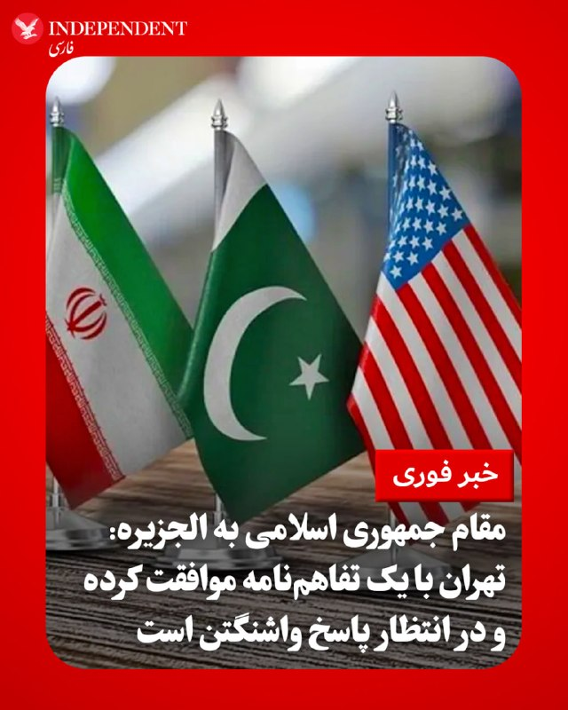

♦️ یک مقام جمهوری اسلامی روز شنبه دوم خرداد، در گفتگو با شبکه الجزیره اعلام کرد که تهران با میانجی‌گری پاکستان با یک تفاهم‌نامه موافقت کرده و اکنون در انتظار پاسخ ایالات متحده است.

به گفته این مقام، مفاد این تفاهم‌نامه شامل پایان دادن به جنگ، رفع کامل محاصره دریایی، بازگشایی تنگه هرمز و خروج نیروهای آمریکایی از منطقه جنگی است. او تصریح کرد که به دلیل پیچیدگی موضوع هسته‌ای و نیاز به زمان بیشتر، این تفاهم‌نامه شامل مسائل هسته‌ای نمی‌شود؛ با این حال، پس از گذشت ۳۰ روز از اجرای این توافق، درب‌های مذاکرات هسته‌ای باز خواهد شد.

این منبع آگاه همچنین اشاره کرد که قرار بود فرمانده ارتش پاکستان این تفاهم‌نامه را در تهران اعلام کند، اما او جهت هماهنگی با واشنگتن، ایران را ترک کرده است. او با تاکید بر نقش اساسی دولت قطر در تدوین این پیش‌نویس افزود که ایران هیچ امتیازی فراتر از آنچه در این تفاهم‌نامه قید شده، واگذار نخواهد کرد.
‌🇸🇦 Indypersian

🤖 @VahidOOnLine

## VahidOOnLine — post 241728

  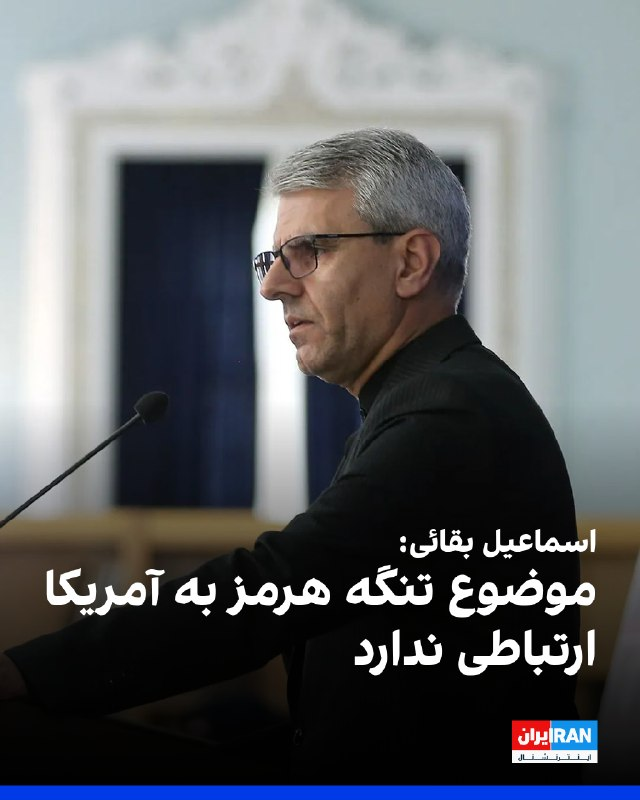

اسماعیل بقائی، سخنگوی وزارت امور خارجه، درباره شرایط تنگه هرمز در مذاکرات با آمریکا، گفت: «این موضوع ارتباطی به آمریکا ندارد.» بقائی افزود: «تهران و مسقط برای تعریف سازوکار مربوط به این تنگه چند دور گفت‌وگو برگزار کرده‌اند.»
‌🏁 🇬🇧 IranintlTV

🤖 @VahidOOnLine

## WithYashar — post 12180

🤗

## WithYashar — post 12179

## WithYashar — post 12178

مدیر شبکه افق: برای اولین بار اعلام می‌کنم که حضرت آقا تجمعات را از تلویزیون دنبال می‌کنند و از جمعیت زیاد تجمعات خوشحال هستند
@withyashar
یاشار : به عن آقا بگین پیج مارم ببینه 🤣

## WithYashar — post 12177

الحدث:ایران دو مسیر برای مذاکرات پیشنهاد کرده که با اعلام پایان جنگ و محاصره آغاز می‌شود.

ایران تأکید کرده است که در متن یادداشت تفاهم، به عدم تولید سلاح هسته‌ای متعهد خواهد بود.

ایران خواستار حفظ حق غنی‌سازی در هر توافقی شده است

ایران پیش از مذاکرات هسته‌ای خواستار آزادسازی دارایی‌های بلوکه‌شدهٔ خود شده است
@withyashar

## WithYashar — post 12176

## WithYashar — post 12175

بعد از ممنوعیت پرچم شیر و خورشید در مسابقات جام‌جهانی توسط فیفا، نشریهٔ ایندیپندنت از مجاز شدن ورود پرچم فلسطین به ورزشگاه‌های جام‌جهانی خبر داد
@withyashar 😐

## WithYashar — post 12174

## WithYashar — post 12173

  <a href="telegram/content/WithYashar_12173_1779549883.mp4" target="_blank">🎬 Download video</a>

ورود جالب وزیر دفاع آمریکا، پیت هگست به وست پوینت معروف‌ترین آکادمی نظامی ارتش آمریکا، وی متولد ۶ ژوئن ۱۹۸۰ است و الان ۴۵ سال دارد.
همسر فعلی(سوم) او جنیفر راچت نام دارد؛ تهیه‌کننده سابق فاکس‌نیوز است. حدود ۴۰ سال دارد.
پیت هگست در مجموع ۷ فرزند در خانواده ترکیبی‌اش دارد از این میان، ۴ فرزند مستقیماً فرزندان خود او هستند:
۳ پسر از همسر دومش ۱ دختر از جنیفر راچت و ۳ فرزند دیگر (۲ پسر و ۱ دختر) فرزندان جنیفر از ازدواج قبلی‌اش هستند که با هم زندگی می‌کنند.
@withyashar

## WithYashar — post 12172

ادعای العربیه: تهران در ازای پرداخت غرامت از سوی آمریکا به ایران، پیشنهاد بازگشایی تنگه هرمز را ارائه کرده است
@withyashar 🤣

## mwarmonitor — post 9543

📝از نظر من در حال حاضر سه سناریو قابل تصور است:

۱) ترامپ با یک توییت مشابه دفعات قبل، آتش‌بس را تمدید می‌کند و فرصت به دیپلماسی ؛ که می‌تواند نشانه‌ای از حرکت به سمت توافق باشد. ۱ درصد

۲) او با یک توییت نارضایتی خود را اعلام می‌کند؛ در این حالت احتمال درگیری وجود دارد، اما پایین است. ۱ درصد

۳) او هیچ واکنشی علنی نشان نمی‌دهد و در سکوت، دستور اقدام نظامی صادر می‌کند. ۹۸ درصد

@mwarmonitor

## mwarmonitor — post 9542

🔴 ارتش پاکستان: مشورت‌های فرمانده ارتش در ایران پیشرفت‌های امیدوارکننده‌ای در جهت رسیدن به یک تفاهم نهایی داشته است.

@mwarmonitor

## mwarmonitor — post 9541

🔴مذاکره‌کنندگان آمریکا و ایران طبق گزارش فایننشال تایمز به توافقی نزدیک شده‌اند که آتش‌بس را برای ۶۰ روز دیگر تمدید می‌کند. این توافق میانجی‌گری‌شده شامل بازگشایی تدریجی تنگه هرمز، آغاز مذاکرات درباره ذخایر اورانیوم غنی‌شده ایران، کاهش محدودیت‌ها بر بنادر ایران، کاهش تحریم‌ها و آزادسازی مرحله‌ای دارایی‌های بلوکه‌شده تهران در خارج از کشور خواهد بود.

@mwarmonitor

## FoxNewsTwitter — post 342160

  

Fox News (Twitter/X)

WATCH LIVE: The National Park Service holds a special Memorial Day observance at the WWII Memorial https://twitter.com/i/broadcasts/1qGvvvkdDnOGB

## pm_afshaa — post 91288

  <a href="telegram/content/pm_afshaa_91288_1779549887.webm" target="_blank">🎬 Download video</a>

🔴الحدث:
ایران دو مسیر برای مذاکرات پیشنهاد کرده که با اعلام پایان جنگ و محاصره آغاز میشه.

ایران تأکید کرده که در متن یادداشت تفاهم، به عدم تولید سلاح هسته‌ای متعهد خواهد بود، اما ایران خواستار حفظ حق غنی‌سازی محدود در هر توافقی شده.

ایران پیش از مذاکرات هسته‌ای خواستار آزادسازی دارایی‌های بلوکه‌شدهٔ خود شده.

💧 Rainbet.com the #1 Non-KYC Crypto Casino & Sportsbook @rainbetcom

😁 @Pm_Afshaa

## pm_afshaa — post 91287

ویدیویی از درگیری دانش آموزان با نیروهای سرکوب در خرم اباد 
💧 Rainbet.com the #1 Non-KYC Crypto Casino & Sportsbook @rainbetcom 
😁 @Pm_Afshaa

## pm_afshaa — post 91286

🔴تعداد زیادی از هواپیماهای نیروی هوایی ایالات متحده در حال حاضر از خاورمیانه به سمت اروپا در حال حرکت هستند؛این شامل 2 هواپیمای سوخت‌رسان و 6 هواپیمای ترابری می‌شود

💧 Rainbet.com the #1 Non-KYC Crypto Casino & Sportsbook @rainbetcom

😁 @Pm_Afshaa

## pm_afshaa — post 91285

این پیام ساعت ۵,۴۸ داده شده
نت خرم ابادو قطع کردن اصلا نمیشه ارتباط گرفت ولی ملت هنوز بیرونن داریم حرکت میکنیم به طرف مرکز شهر

## pm_afshaa — post 91284

  <a href="telegram/content/pm_afshaa_91284_1779549888.webm" target="_blank">🎬 Download video</a>

🔴تسنیم: با اینکه در برخی موضوعات پیشرفت‌هایی حاصل شده، اما هنوز اختلافات جدی در بعضی از حوزه‌ها مانند تعهد واقعی آمریکا به آزادسازی اموال کشور، موضوع تنگه هرمز و... وجود داره.

💧 Rainbet.com the #1 Non-KYC Crypto Casino & Sportsbook @rainbetcom

😁 @Pm_Afshaa

## pm_afshaa — post 91283

  <a href="telegram/content/pm_afshaa_91283_1779549888.mp4" target="_blank">🎬 Download video</a>

🎙️مجری: 48 ساعت اخیر پرتنش بوده و رئیس‌جمهور ترامپ تو واشنگتن مونده، اون به مراسم عروسی‌ پسرش نرفته، آیا احتمال حملات به ایران هست؟

مارکو روبیو، وزیر خارجه آمریکا:
من هیچ بازه زمانی تعیین نمیکنم اما وضعیت نمیتونه اینجور ادامه پیدا کنه و این مشکل یطوری حل میشه؛ ترجیحاً با دیپلماسی، ولی به هر حال حل میشه. فرصتی برای پذیرش توافق توسط ایران در نزدیک‌ترین زمان وجود داره.

💧 Rainbet.com the #1 Non-KYC Crypto Casino & Sportsbook @rainbetcom

😁 @Pm_Afshaa

## pm_afshaa — post 91282

  <a href="telegram/content/pm_afshaa_91282_1779549892.webm" target="_blank">🎬 Download video</a>

🔴فایننشال تایمز: میانجی‌ها معتقدن در حال نزدیک شدن به توافقی هستن که آتش‌بس میان آمریکا و ایران رو به مدت 60 روز تمدید و چارچوبی برای مذاکرات درباره برنامه هسته‌ای جمهوری اسلامی ایجاد کنه.

💧 Rainbet.com the #1 Non-KYC Crypto Casino & Sportsbook @rainbetcom

😁 @Pm_Afshaa

## pm_afshaa — post 91281

  <a href="telegram/content/pm_afshaa_91281_1779549892.webm" target="_blank">🎬 Download video</a>

🔴آسوشیتدپرس نقل از مقامات پاکستانی:
مذاکرات در مسیر درستی پیش میره.

💧 Rainbet.com the #1 Non-KYC Crypto Casino & Sportsbook @rainbetcom

😁 @Pm_Afshaa

## pm_afshaa — post 91280

  <a href="telegram/content/pm_afshaa_91280_1779549893.webm" target="_blank">🎬 Download video</a>

🔴بوسعیدی، وزیر خارجه عمان: ما واقعا پیشرفت قابل‌توجهی داشتیم، اما هنوز جزئیات مختلفی باقی مونده که باید نهایی بشه، و به همین دلیل به کمی زمان بیشتر نیاز داریم تا واقعاً به هدف نهایی، یعنی دستیابی به یک بسته جامع از توافق، برسیم. 
💧 Sponsored by @rainbetcom…

## pm_afshaa — post 91279

  <a href="telegram/content/pm_afshaa_91279_1779549894.webm" target="_blank">🎬 Download video</a>

🔴ارتش پاکستان: مذاکراتی که در 24 ساعت گذشته انجام شد، به پیشرفت امیدوارکننده‌ای به سوی تفاهم نهایی منجر شد.

💧 Rainbet.com the #1 Non-KYC Crypto Casino & Sportsbook @rainbetcom

😁 @Pm_Afshaa

## pm_afshaa — post 91278

  <a href="telegram/content/pm_afshaa_91278_1779549895.webm" target="_blank">🎬 Download video</a>

🔴العربیه: ایران پیشنهاد داده تنگه هرمز بدون عوارض باز بشه شرط اینکه دارایی‌های بلوکه شده به ایران برگرده.

همچنین ایران خواستار حق غنی سازی محدود شده!

💧 Rainbet.com the #1 Non-KYC Crypto Casino & Sportsbook @rainbetcom

😁 @Pm_Afshaa

## pm_afshaa — post 91277

  <a href="telegram/content/pm_afshaa_91277_1779549895.webm" target="_blank">🎬 Download video</a>

🔴بقائی، سخنگو وزارت خارجه:
ما هم بسیار دور و هم بسیار نزدیک به یک توافق هستیم؛ دیدگاه‌ها به هم نزدیک‌تر شدن، اما نه در حد یک توافق، بلکه در حدی که ممکنه بتونیم به راه‌حلی برسیم.

💧 Rainbet.com the #1 Non-KYC Crypto Casino & Sportsbook @rainbetcom

😁 @Pm_Afshaa

## pm_afshaa — post 91276

  <a href="telegram/content/pm_afshaa_91276_1779549896.mp4" target="_blank">🎬 Download video</a>

🔴مارکو روبیو، وزیر خارجه آمریکا:
مقداری پیشرفت در مذاکرات با ایران حاصل شده؛ احتمالا آمریکا طی روزهای آینده درباره ایران چیزی برای اعلام داشته باشه.

ایران باید اورانیوم غنی سازی شده رو به ما تحویل بده؛ ترامپ میخواد داستان ایران به صورت دیپلماتیک حل بشه. فرصتی برای پذیرش توافق توسط ایران در نزدیک‌ترین زمان وجود داره.

💧 Rainbet.com the #1 Non-KYC Crypto Casino & Sportsbook @rainbetcom

😁 @Pm_Afshaa

## DEJradio — post 4884

  <a href="telegram/content/DEJradio_4884_1779549899.webm" target="_blank">🎬 Download video</a>

🔺📢 "انقلاب و رسیدن به آزادی مثل دو استقامت است

آرش کامل، فعال رسانه

#ایرانو_پس_میگیریم #ایران
@DEJradio

## DEJradio — post 4883

⭕️فایننشال‌تایمز: تهران و واشینگتن به تمدید ۶۰ روزۀ آتش‌بس نزدیک شدند

فایننشال‌تایمز مدعی شد جمهوری اسلامی و آمریکا به توافقی برای تمدید ۶۰ روزۀ آتش‌بس نزدیک شدند.
از سویی مارکو روبیو، وزیر امور خارجۀ آمریکا، روز شنبه دوم خرداد با تکرار مواضع واشینگتن گفت مذاکرات با جمهوری اسلامی «پیشرفت‌هایی» داشته و احتمال دارد طی امروز یا دو روز آینده، خبرهایی دربارۀ نتیجۀ گفت‌وگوها و تصمیم دونالد ترامپ منتشر شود.
در سوی دیگر عباس عراقچی، وزیر امور خارجۀ جمهوری اسلامی، گفت تهران «از پشتیبانی حزب‌الله دست نمی‌کشد».
به گفتۀ منابع دیپلماتیک، جمهوری اسلامی پیوند دادن آتش‌بس لبنان با هر توافق احتمالی با آمریکا را به‌عنوان یکی از شروط خود مطرح کرده است.
از سویی ستاد فرماندهی مرکزی ایالات متحده اعلام کرد نیروهای آمریکایی در جریان اجرای محاصرۀ دریایی علیه جمهوری اسلامی، مسیر حرکت ۱۰۰ کشتی تجاری مرتبط با رژیم را تغییر داده‌اند.
سنتکام این اقدام را «نقطه عطف» عملیات دریایی آمریکا توصیف کرد.

#مذاکرات #جنگ
@DEJradio

## DEJradio — post 4882

  <a href="telegram/content/DEJradio_4882_1779549900.webm" target="_blank">🎬 Download video</a>

🔺🎤 " اول ایران را پس بگیریم؛ بعد بر سر نوع حکومت گفت‌وگو کنیم.

*مازیار نظری، هنرمند

#ایرانو_پس_میگیریم #ایران
@DEJradio

## VahidOnline — post 75650

یک مقام جمهوری اسلامی روز شنبه دوم خرداد، در گفتگو با شبکه الجزیره اعلام کرد که تهران با میانجی‌گری پاکستان با یک تفاهم‌نامه موافقت کرده و اکنون در انتظار پاسخ ایالات متحده است.

به گفته این مقام، مفاد این تفاهم‌نامه شامل پایان دادن به جنگ، رفع کامل محاصره دریایی، بازگشایی تنگه هرمز و خروج نیروهای آمریکایی از منطقه جنگی است.
او تصریح کرد که به دلیل پیچیدگی موضوع هسته‌ای و نیاز به زمان بیشتر، این تفاهم‌نامه شامل مسائل هسته‌ای نمی‌شود؛ با این حال، پس از گذشت ۳۰ روز از اجرای این توافق، درب‌های مذاکرات هسته‌ای باز خواهد شد.

این منبع آگاه همچنین اشاره کرد که قرار بود فرمانده ارتش پاکستان این تفاهم‌نامه را در تهران اعلام کند، اما او جهت هماهنگی با واشنگتن، ایران را ترک کرده است.
او با تاکید بر نقش اساسی دولت قطر در تدوین این پیش‌نویس افزود که ایران هیچ امتیازی فراتر از آنچه در این تفاهم‌نامه قید شده، واگذار نخواهد کرد.
@VahidOOnLine
همچنین بر اساس این گزارش، تهران پیشنهاد داده غنی‌سازی اورانیوم بالاتر از ۳.۶ درصد را به مدت ۱۰ سال به حالت تعلیق درآورد.
@VahidOOnLine

📡 @VahidOnline

## VahidOnline — post 75649

  

العربیه گزارش داد جمهوری اسلامی دو پیشنهاد به میانجی پاکستانی ارائه کرده که بر اساس آن، در ازای پرداخت غرامت از سوی آمریکا، تنگه هرمز را باز کند و پیش از امضای هرگونه توافقی، پرونده تحریم‌ها و دارایی‌های مسدود شده مورد بحث قرار گیرد.

دونالد ترامپ، رییس‌جمهوری آمریکا، پیش‌تر گفته بود که حاضر به پرداخت غرامت به تهران نیست.
@VahidOOnLine

📡 @VahidOnline

## VahidOnline — post 75648

  

دونالد ترامپ تصویری از نقشه ایران را که با پرچم آمریکا پوشانده شده، در شبکه اجتماعی تروث سوشال منتشر کرد. روی این نقشه نوشته شده است: «ایالات متحده خاورمیانه؟»

ترامپ توضیح بیشتری در این‌باره ارائه نکرده است.
@VahidOOnLine

📡 @VahidOnline

## VahidOnline — post 75647

  <a href="telegram/content/VahidOnline_75647_1779549902.mp4" target="_blank">🎬 Download video</a>

سخنان مارکو روبیو در سفر هند در پاسخ به سوالی درباره مذاکرات با ایران

ترجمه ماشین:
ممکن است امروز کمی دیرتر خبری باشد. در همین لحظه خبری برای شما ندارم، اما ممکن است کمی دیرتر امروز خبری باشد. ممکن است هم نباشد. امیدوارم باشد، اما هنوز مطمئن نیستم.

سؤال در مورد موضوع ایران است و همان‌طور که گفتم، پیشرفت‌هایی صورت گرفته، پیشرفت‌هایی حاصل شده. حتی در حالی که الان با شما صحبت می‌کنم، کارهایی در حال انجام است.

امکان دارد که چه امروز کمی دیرتر، چه فردا یا چند روز آینده، چیزی برای گفتن داشته باشیم. اما این مسئله باید حل شود، همان‌طور که رئیس‌جمهور گفته، به یک شکل یا شکل دیگر.

ایران هرگز نباید سلاح هسته‌ای داشته باشد. تنگه‌ها باید بدون عوارض باز بمانند. آنها باید اورانیوم غنی‌شده خود را تحویل دهند، اورانیوم غنی‌شده با غنای بالا.
ما باید به آن مسئله رسیدگی کنیم. ما باید به مسئله غنی‌سازی رسیدگی کنیم.

این‌ها نقاط مورد نظر رئیس‌جمهور به طور مداوم است. و ترجیح او همیشه این است که آن را از راه دیپلماتیک حل کند. ترجیح او همیشه این است که مشکلاتی از این دست را از طریق راه‌حل دیپلماتیک مذاکره‌شده حل کند.

این چیزی است که الان روی آن کار می‌کنیم. اما این مشکل حل خواهد شد، همان‌طور که رئیس‌جمهور به وضوح گفته، به یک شکل یا شکل دیگر. امیدواریم از طریق مسیر دیپلماتیک انجام شود. این چیزی است که روی آن کار می‌کنیم. و شاید چیزی برای صحبت در مورد آن موضوع در حالی که اینجا هستم، در طی این بازدید در زمانی داشته باشیم.
EricLDaugh

📡 @VahidOnline

## IranIntlTV — post 338617

  

خبرگزاری تسنیم، رسانه وابسته به سپاه، درباره روند مذاکرات تهران و واشینگتن، با اشاره به اینکه هنوز اختلافات جدی در بعضی از حوزه‌ها مانند تعهد واقعی آمریکا به آزادسازی اموال و موضوع تنگه هرمز وجود دارد، نوشت: «با توجه به زیاده‌خواهی‌های آمریکا، احتمال عدم حل موضوعات بالاست.»

در این گزارش آمده که در صورت حل موارد اختلاف، احتمالا در گام اول یک تفاهم اولیه اعلام شود و سپس مهلت ۳۰ یا ۶۰ روزه برای گفتگو درباره موضوع هسته‌ای (بدون تعهد اولیه جمهوری اسلامی) اعلام شود.

تسنیم نوشت که آمریکایی‌ها در متون پیشین خود تاکید داشتند که تهران در همان گام نخست باید امتیازاتی در بحث هسته‌ای بدهد و موضوع تعطیلی تاسیسات هسته‌ای و تحویل مواد غنی‌شده به آمریکایی‌ها از جمله مباحثی است که مدام در متن‌های آمریکایی‌ها مورد درخواست قرار می‌گرفت اما حکومت ایران اساسا بحث درباره جزئیات هسته‌ای را در این مرحله رد می‌کند.

بر اساس این گزارش تهران بر ضرورت پایان جنگ و تهدید در همه جبهه‌ها از جمله لبنان تاکید دارد. و این موضوع باید مورد پذیرش طرف آمریکایی قرار گیرد اما آمریکایی‌ها در برخی از متن‌های پیشین خود با این موضوعات مخالفت کرده‌اند.

## IranIntlTV — post 338616

ویدیوهای رسیده به ایران اینترنشنال نشان می‌دهد ایرانیان بریتانیا روز شنبه در لندن با حمل پرچم‌های شیروخورشید در حمایت از انقلاب ملی علیه جمهوری اسلامی تجمع کردند.

## IranIntlTV — post 338615

  <a href="telegram/content/IranIntlTV_338615_1779549903.mp4" target="_blank">🎬 Download video</a>

مارکو روبیو، وزیر خارجه آمریکا، در دیدار با نارندرا مودی، نخست‌وزیر هند، تاکید کرد ایالات متحده اجازه نخواهد داد جمهوری اسلامی بازار جهانی انرژی را گروگان بگیرد.

گفت‌وگو با تاج‌الدین سروش، عضو تحریریه ایران‌اینترنشنال
@iranintltv

## IranIntlTV — post 338614

  

فایننشال تایمز گزارش داد که میانجی‌های جنگ ایران معتقدند در حال نزدیک شدن به توافقی هستند که آتش‌بس میان واشینگتن و تهران را به مدت ۶۰ روز تمدید و چارچوبی برای مذاکرات درباره برنامه هسته‌ای جمهوری اسلامی ایجاد کند.

بنا بر این گزارش، افرادی که در جریان این مذاکرات قرار دارند به این رسانه گفتند این توافق شامل بازگشایی تدریجی تنگه هرمز و همچنین تعهد به بررسی رقیق‌سازی یا واگذاری ذخایر اورانیوم با غنای بالا خواهد بود.

فایننشال تایمز افزود که آمریکا همچنین محاصره دریایی بنادر جنوب ایران را کاهش می‌دهد و با کاهش تحریم‌ها و همچنین آزادسازی مرحله‌ای دارایی‌های مسدودشده تهران در خارج از کشور موافقت خواهد کرد.
https://iranintl.com/202605239287

## IranIntlTV — post 338613

روایت شما از زندگی در آتش‌بس- شنبه ۲ خرداد ۱۴۰۵
🔹 ترامپ کارمند ما نیست که امر و نهی کنیم، موش علی و فرمانده‌هاش و سرکوبگرهاش رو ذلیل کرد، حالا نوبت ماست اعتصاب کنیم. نه به گوشت و مرغ رو شروع کنیم تا فراخوان بعد.
🔹 در تهران گرانی بیداد می‌کند. حقوق‌ها را دیر می‌دهند. یک کیلو توت‌فرنگی در تره‌بار ۳۰۰ هزار تومان، در مغازه معمولی ۶۰۰ هزار تومان. دارو در داروخانه کمیاب شده. یک بطری کوچک روغن زیتون یک میلیون و پانصد هزار تومان.
🔹 دم همه دانش‌آموزان غیور لر گرم که زیر بار حرف زور و ستم نمی‌روند، به‌قول شاهزاده عزیز واقعاً نسل ویکتوری هستید.
🔹 درود، من یک نوجوان ۱۶ ساله هستم که صندوق‌دار یک فروشگاه هستم. آن‌قدر همه‌چیز گران شده که حتی خودم هم خجالت می‌کشم به مشتری‌ها قیمت بدهم. واقعاً مردم ایران کوه صبر هستند. به امید روزهای خوب ایران.

## IranIntlTV — post 338612

  <a href="telegram/content/IranIntlTV_338612_1779549907.mp4" target="_blank">🎬 Download video</a>

ایرانیان سوئیس روز شنبه با تجمع مقابل سفارت جمهوری اسلامی خواستار بسته‌شدن آن شدند. آن‌ها همچنین با حمل تصاویر شاهزاده رضا پهلوی و پرچم شیروخورشید از انقلاب ملی حمایت کردند.

## IranIntlTV — post 338611

  

الحدث گزارش داد جمهوری اسلامی در پیشنهاد جدید خود خواستار آزادسازی دارایی‌های مسدود‌شده خود قبل از مذاکرات هسته‌ای شده است.
بر اساس این گزارش، تهران خواستار ایجاد یک مکانیسم جبران خسارت جنگ از سوی ایالات متحده و لغو کامل تحریم‌ها در ازای تعهدات هسته‌ای شده است.
https://iranintl.com/202605238700

## IranIntlTV — post 338610

  <a href="telegram/content/IranIntlTV_338610_1779549911.mp4" target="_blank">🎬 Download video</a>

بر اساس اطلاعات رسیده به ایران‌اینترنشنال، اکبر محمدی، شهروند ۴۰ ساله اهل اصفهان، پس از بازداشت و محرومیت از رسیدگی پزشکی در زندان دستگرد اصفهان جان باخت. او که سوم اردیبهشت ماه همراه برادرش بازداشت شده بود، در تماس و در تماس با خانواده از بیماری و جلوگیری از دسترسی به بهداری و دارو خبر داده بود.

جزییات بیشتر با پویا جهاندار، عضو تحریریه ایران‌اینترنشنال
@iranintltv

## IranIntlTV — post 338609

  <a href="telegram/content/IranIntlTV_338609_1779549913.mp4" target="_blank">🎬 Download video</a>

مراسم اختتامیه جشنواره فیلم کن با اعلام برندگان جوایز اصلی، از جمله نخل طلای بهترین فیلم، به کار خود پایان داد. جایزه «چشم طلایی»، از مهم‌ترین جوایز این جشنواره، به مستند «تمرین‌هایی برای یک انقلاب» ساخته پگاه آهنگرانی اختصاص یافت.

گزارش لی‌لی نیکفر، خبرنگار ایران‌اینترنشنال
@iranintltv

## IranIntlTV — post 338608

  <a href="telegram/content/IranIntlTV_338608_1779549916.mp4" target="_blank">🎬 Download video</a>

شبکه العربیه گزارش داد عاصم منیر، فرمانده کل ارتش پاکستان، در سفر به تهران حامل پیامی از سوی آمریکا برای جمهوری اسلامی بوده است. همزمان، رسانه‌های داخلی از بررسی یک سند پیشنهادی ۱۴ بندی در این مذاکرات خبر دادند.

گفت‌وگو با حسین آقایی، عضو تحریریه ایران‌اینترنشنال
@iranintltv

## IranIntlTV — post 338607

  

العربیه به نقل از منابع خود گزارش داد جمهوری اسلامی پیشنهاد بازگشایی تنگه هرمز و تعلیق موقت دریافت عوارض را مطرح کرده است.

همچنین بر اساس این گزارش، تهران پیشنهاد داده غنی‌سازی اورانیوم بالاتر از ۳.۶ درصد را به مدت ۱۰ سال به حالت تعلیق درآورد.
https://iranintl.com/202605232120

## IranIntlTV — post 338606

  <a href="telegram/content/IranIntlTV_338606_1779549919.mp4" target="_blank">🎬 Download video</a>

سرخط خبرهای شنبه ۲ خرداد
@iranintltv

## IranIntlTV — post 338605

  <a href="telegram/content/IranIntlTV_338605_1779549920.mp4" target="_blank">🎬 Download video</a>

یکی از مجروحان انقلاب ملی ایرانیان با ارسال فایلی صوتی به ایران‌اینترنشنال، ماجرای زخمی و شکنجه شدن خود به دست نیروهای امنیتی و لباس‌شخصی در ۱۸ دی‌ماه ۱۴۰۴ را روایت کرد.

جزییات بیشتر در گفت‌وگو با محسن مهیمنی، عضو تحریریه ایران‌اینترنشنال
@iranintltv

## IranIntlTV — post 338604

  

🔻پرویز قلیچ‌خانی، اسطوره فوتبال ایران و تنها فوتبالیست ایرانی که سه بار قهرمان جام ملت‌های آسیا شد روز شنبه دوم خرداد ۱۴۰۵ در ۸۱ سالگی در بیمارستانی در پاریس درگذشت. او در پرسپولیس، تاج و پاس بازی کرد. زنده‌یاد قلیچ‌خانی، پس از انقلاب ۱۳۵۷ به دلیل گرایش‌های سیاسی از ایران خارج شد.

@iranintltvsport

## IranIntlTV — post 338603

  

مارکو روبیو، وزیر خارجه ایالات متحده آمریکا، در جریان سفر به هند، گفت: «جمهوری اسلامی باید اورانیوم غنی‌شده خود را تحویل دهد. موضوع هسته‌ای ایران، فوری است و همچنین تنگه هرمز باید باز بماند.»

روبیو افزود: «فرصتی برای پذیرش توافق از سوی حکومت ایران در نزدیک‌ترین زمان وجود دارد.»
https://iranintl.com/202605239482

## IranIntlTV — post 338602

  <a href="telegram/content/IranIntlTV_338602_1779549925.mp4" target="_blank">🎬 Download video</a>

تعدادی از شرکت‌کنندگان در تجمع برلین با نوشتن اسامی جاویدنامان بر لباس‌های خود، یاد آنها را گرامی داشتند.

یکی از شرکت‌کنندگان در این تجمع در گفت‌وگو با احمد صمدی، خبرنگار ایران‌اینترنشنال، گفت: «صدای زندانیان سیاسی، خانواده‌های جاویدنامان و مردم ایران هستیم.»
@iranintltv

## IranIntlTV — post 338601

  

اسماعیل بقائی، سخنگوی وزارت امور خارجه، درباره شرایط تنگه هرمز در مذاکرات با آمریکا، گفت: «این موضوع ارتباطی به آمریکا ندارد.» بقائی افزود: «تهران و مسقط برای تعریف سازوکار مربوط به این تنگه چند دور گفت‌وگو برگزار کرده‌اند.»
https://iranintl.com/202605234248

## IranIntlTV — post 338600

  <a href="telegram/content/IranIntlTV_338600_1779549927.mp4" target="_blank">🎬 Download video</a>

ایرانیان مقیم مالمو در سوئد، با شرکت در تجمع اعتراضی از کشورهای اروپایی درخواست کردند تا روابط سیاسی با حکومت جمهوری اسلامی را قطع و سفارت‌های این حکومت را نیز تعطیل کنند. جمعی از این تجمع‌کنندگان در گفت‌وگو با مهران عباسیان، خبرنگار ایران‌اینترنشنال، همبستگی خود را با مردم داخل ایران اعلام کردند.
@iranintltv

## ManotoTV — post 105767

  <a href="telegram/content/ManotoTV_105767_1779549930.mp4" target="_blank">🎬 Download video</a>

دونالد ترامپ، رئیس‌جمهور آمریکا، تصویری از نقشه خاورمیانه منتشر کرد که در آن ایران با طرح پرچم ایالات متحده پوشانده شده و بالای نقشه عبارت «ایالات متحده خاورمیانه؟» دیده می‌شود.

ترامپ این تصویر را در حساب خود در تروث‌سوشال منتشر کرد و توضیحی درباره منظور خود از آن ننوشت.

## ManotoTV — post 105766

  <a href="telegram/content/ManotoTV_105766_1779549931.mp4" target="_blank">🎬 Download video</a>

روزنامه فایننشال تایمز گزارش داده میانجی‌گران منطقه‌ای در حال نهایی کردن توافقی هستند که بر اساس آن آتش‌بس میان آمریکا و جمهوری‌اسلامی برای ۶۰ روز دیگر تمدید می‌شود و زمینه مذاکرات درباره برنامه هسته‌ای تهران را فراهم می‌کند.
بر اساس این گزارش، طرح پیشنهادی شامل بازگشایی تدریجی تنگه هرمز، گفت‌وگو درباره کاهش یا انتقال ذخایر اورانیوم غنی‌شده جمهوری‌اسلامی و همچنین کاهش محدودیت‌ها علیه بنادر ایران و آزادسازی مرحله‌ای بخشی از دارایی‌های مسدودشده تهران است.
اسماعیل بقایی، سخنگوی وزارت خارجه جمهوری‌اسلامی، گفته تهران و طرف‌های میانجی در حال تدوین «تفاهم‌نامه‌ای» برای پایان جنگ هستند و پس از آن مذاکرات درباره توافق جامع‌تر طی ۳۰ تا ۶۰ روز آینده ادامه خواهد یافت.
در همین حال، منابع دیپلماتیک گفته‌اند مذاکرات با میانجی‌گری قطر و پاکستان پیشرفت داشته، اما همچنان اختلاف‌های جدی بر سر برنامه هسته‌ای جمهوری‌اسلامی باقی مانده است؛ از جمله درخواست آمریکا برای تحویل ذخایر اورانیوم با غنای بالا و تعطیلی تاسیسات هسته‌ای نطنز، فردو و اصفهان.
این گزارش می‌افزاید کشورهای عربی منطقه نگران‌اند در صورت شکست مذاکرات و از سرگیری حملات آمریکا و اسرائیل، بحران به درگیری گسترده‌تر در خاورمیانه و اختلال شدید در بازار جهانی انرژی منجر شود.

## ManotoTV — post 105765

  <a href="telegram/content/ManotoTV_105765_1779549932.mp4" target="_blank">🎬 Download video</a>

مارکو روبیو، وزیر امور خارجه آمریکا، گفت در پرونده ایران «پیشرفت‌هایی» حاصل شده و ممکن است واشینگتن به‌زودی درباره این موضوع اظهارنظر تازه‌ای داشته باشد.

روبیو روز شنبه سوم خرداد در پاسخ به پرسشی درباره «موضوع ایران» گفت: «همان‌طور که گفتم، پیشرفت‌هایی حاصل شده است. حتی همین حالا که با شما صحبت می‌کنم، کارهایی در حال انجام است.»

او افزود ممکن است «امروز، فردا یا ظرف چند روز آینده» چیزی برای اعلام وجود داشته باشد، اما تاکید کرد هنوز قطعی نیست.

وزیر امور خارجه آمریکا گفت این موضوع باید «به هر شکل» حل شود و به گفته او، موضع دونالد ترامپ این است که «ایران هرگز نباید سلاح هسته‌ای داشته باشد.»

روبیو همچنین گفت تنگه‌ها باید «بدون عوارض» باز بمانند و جمهوری اسلامی باید درباره اورانیوم غنی‌شده و موضوع غنی‌سازی پاسخ‌گو باشد.

## ManotoTV — post 105764

  <a href="telegram/content/ManotoTV_105764_1779549934.mp4" target="_blank">🎬 Download video</a>

گزارشگرمنوتو: «در شرایط دشوار امروز ایران، گردهمایی پادشاهی‌خواهان شهر هامبورگ در حمایت از بانو فاطمه سپهری برگزار می‌شود؛ زنی شجاع و استوار که با وجود فشار، تهدید و زندان، از خواسته‌های مردم ایران عقب ننشسته و به نمادی از ایستادگی و آزادی‌خواهی تبدیل شده است.

ما در این گردهمایی، حمایت خود را از بانو فاطمه سپهری و همچنین از شاهزاده رضا پهلوی، به‌عنوان یکی از چهره‌های محوری همبستگی ملی و گذار به ایرانی آزاد، سکولار و دموکراتیک اعلام می‌کنیم.

این گردهمایی تأکیدی است بر ضرورت اتحاد مردم ایران برای آینده‌ای مبتنی بر آزادی، حقوق بشر و کرامت انسانی.»

## ManotoTV — post 105763

  <a href="telegram/content/ManotoTV_105763_1779549936.mp4" target="_blank">🎬 Download video</a>

پرویز قلیچ‌خانی، از چهره‌های ماندگار و پرافتخار فوتبال ایران، ساعاتی پیش در حومه پاریس در ۸۱ سالگی درگذشت.

قلیچ‌خانی که متولد سال ۱۳۲۴ بود، پس از ماه‌ها تحمل بیماری جان باخت.

او یکی از برجسته‌ترین بازیکنان تاریخ فوتبال ایران به شمار می‌رفت و تنها فوتبالیست ایرانی است که سه دوره پیاپی همراه تیم ملی قهرمان جام ملت‌های آسیا شده است.

## FarsiVOA — post 218448

مارکو روبیو، وزیر امور خارجه آمریکا، روز شنبه ۲ خرداد با انتشار تصاویری از بازدید خود از موسسه «مبلغان خیریه» در هند نوشت میراث مادر ترزا، میراثی بزرگ از خدمت و همدلی است.

آقای روبیو گفت حضور در این مرکز فرصتی برای ادای احترام به مادر ترزا و مشاهده «نمونه زنده ایمان کاتولیک در عمل» بوده است.

مادر ترزا راهبه کاتولیک و بنیانگذار موسسه «مبلغان خیریه» در هند بود. او بیشتر عمر خود را صرف کمک به فقرا و بیماران کرد. او در سال ۱۹۷۹ برنده جایزه صلح نوبل شد. کلیسای کاتولیک بعدها او را قدیس اعلام کرد.

@FarsiVOA

## FarsiVOA — post 218447

اتمام حجت روبیو و تغببر موضع و لحن ناتو پس از نشست وزیران امور خارجه ناتو؛ گفت‌وگو با امیر چاهکی، کارشناس روابط بین‌الملل

## FarsiVOA — post 218446

در گفت‌وگو با رضا غیبی، خبرنگار اقتصادی در لندن، با در نظر گرفتن انبوه بحران‌های اقتصادی، محاصره دریایی و ناتوانی جمهوری اسلامی در تأمین زنجیره کالاهای اساسی و امنیت غذایی بررسی کردیم که چگونه تشدید تنش نظامی می‌تواند به نارضایتی‌های گسترده عمومی منجر شود.

## FarsiVOA — post 218445

بابک زنجانی از «مفسد» اقتصادی تا منجی سپاه؛ گفت‌و‌گو با مهدی نخل احمدی، رونامه‌نگار

## FarsiVOA — post 218444

در گفت‌وگو با شاهین مدرس، تحلیلگر مطالعات امنیتی، به نشانه‌های آمادگی آمریکا برای دور تازه حملات پرداختیم و بررسی کردیم چگونه جمهوری اسلامی، با تکیه بر برآوردهایی مربوط به دورهای پیشین درگیری، تصویر دقیقی از توان واقعی و فرسایش‌یافته نظامی خود در شرایط کنونی و تحت محاصره دریایی آمریکا ندارد.

## FarsiVOA — post 218443

🔺تاکید مارکو روبیو بر موضع قاطع پرزیدنت ترامپ در مذاکرات: رژیم ایران هرگز سلاح هسته‌ای نخواهد داشت

▪️مارکو روبیو وزیر امور خارجه آمریکا روز شنبه ۲ خرداد برای یک سفر چهارروزه و برای شرکت در نشست وزیران امور خارجه مجمع «کوآد» وارد هند شد.

⬇️ بیشتر بخوانید:

https://ir.voanews.com/a/rubio-india-trip-modi-new-delhi-quad-marco-/8153031.html/?nocach=1

## FarsiVOA — post 218442

  

⚡️دونالد ترامپ، رئیس جمهوری آمریکا، روز شنبه ۲ خرداد در تازه‌ترین پیام خود در شبکه اجتماعی تروت سوشال عکسی از نقشه خاورمیانه را منتشر کرده که در آن نقشه ایران با پرچم ایالات متحده دیده می‌شود و در بالای آن نوشته شده است: «ایالات متحده خاورمیانه؟»
هیچ توضیح اضافه‌ای در این پست پرزیدنت ترامپ درج نشده است.

## FarsiVOA — post 218441

  <a href="telegram/content/FarsiVOA_218441_1779549937.mp4" target="_blank">🎬 Download video</a>

تصاویری دیگر از تجمع دانش‌آموزان در خرم‌آباد در اعتراض به حضوری شدن امتحانات، با شعار «مجازی، مجازی»- دوم خرداد ،۱۴۰۵؛
دانش‌آموزان در چند شهر ایران به حضوری شدن امتحانات اعتراض دارند.

## FarsiVOA — post 218440

اسپیس‌ایکس اعلام کرد فرود استارشیپ با موفقیت تایید شده و دوازدهمین آزمایش پروازی این فضاپیما با بازگشت موفق به پایان رسیده است.

اسپیس‌ایکس در پیامی از تیم این شرکت برای انجام این آزمایش تقدیر کرد.

@FarsiVOA

## FarsiVOA — post 218439

  <a href="telegram/content/FarsiVOA_218439_1779549940.mp4" target="_blank">🎬 Download video</a>

ارتش اسرائیل اعلام کرد نیروهای تیپ «همخنص» که در شمال نوار غزه فعالیت می‌کنند، روز گذشته، جمعه، «یک تروریست را در حالی‌که از خط زرد عبور کرده و به نیروهای اسرائیل نزدیک شده بود و تهدیدی فوری به‌شمار می‌رفت» شناسایی و حذف کردند.

ارتش اسرائیل تاکید کرد نیروهای این ارتش تحت فرماندهی جنوب، مطابق با توافق در منطقه مستقر هستند و به فعالیت خود برای رفع هرگونه تهدید فوری ادامه می‌دهند.

## DW_Farsi — post 125055

🔶 محبوبیت یک پاسپورت؛ رکورد تازه اعطای تابعیت در آلمان

به نوشته روزنامه "ولت آم زونتاگ"، در آلمان رکورد تازه‌ای در اعطای تابعیت در حال شکل‌گیری است. بر اساس تحقیقات این روزنامه که امروز شنبه ۲۳ مه (دوم خرداد) منتشر شده، در سال گذشته میلادی بیش از ۳۰۹ هزار نفر گذرنامه آلمانی دریافت کرده‌اند.

در این صورت، این رقم از رکورد پیشین، یعنی نزدیک به ۲۹۲ هزار مورد اعطای تابعیت در سال ۲۰۲۴ نیز فراتر خواهد رفت.

به نوشته این روزنامه، داده‌ها از ۱۴ ایالت آلمان گردآوری شده‌اند و فقط اطلاعات ایالت‌های مکلنبورگ-فورپومرن و زاکسن-آنهالت در دسترس نبوده است.

از ایالت‌های نیدرزاکسن، زارلند و شلسویگ-هولشتاین نیز آمار کلی وجود ندارد، اما تقریباً تمامی شهرها و مناطق این ایالت‌ها بنا به درخواست این روزنامه آلمانی، اطلاعات مربوط به تابعیت را ارائه کرده‌اند. البته بخشی از این آمار هنوز موقتی محسوب می‌شوند.
@dw_farsi

## DW_Farsi — post 125054

🎥 رقابت انسان و حیوانات اقیانوسی بر سر صید کریل‌ها

آیا مکمل‌های روزانه ما بر سلامت جانوران اقیانوسی اثر می‌گذارد؟ رشد سریع صنعت سلامت و مکمل‌ها، در کنار تغییرات اقلیمی، اکوسیستم قطب جنوب را شکننده‌تر کرده است.
@dw_farsi

## Persian_Trend_Official — post 14737

🔴 فایننشال تایمز: ایران و آمریکا به تمدید ۶۰ روزه آتش‌بس نزدیک شده‌اند

فایننشال تایمز به نقل از منابع میانجی گزارش داد تهران و واشینگتن به دستیابی به توافقی برای تمدید ۶۰ روزه آتش‌بس و فراهم‌کردن زمینه مذاکرات هسته‌ای نزدیک شده‌اند.

بر اساس این گزارش، توافق پیشنهادی شامل موارد زیر است:

▪️ بازگشایی تدریجی تنگه هرمز

▪️ گفت‌وگو درباره رقیق‌سازی یا تحویل ذخایر اورانیوم با غنای بالا

▪️ کاهش محاصره آمریکا علیه بنادر ایران

▪️ کاهش تحریم‌ها و آزادسازی مرحله‌ای دارایی‌های بلوکه‌شده ایران در خارج

♦️اما فایننشال تایمز تأکید کرده:

▪️ یکی از اصلی‌ترین موانع، درخواست ترامپ برای تحویل حدود ۴۴۰ کیلوگرم اورانیوم نزدیک به درجه تسلیحاتی ایران است

▪️ واشینگتن همچنین خواستار برچیدن سه سایت اصلی هسته‌ای ایران شامل نطنز، فردو و اصفهان شده است

🫆:Tony

📌 @persian_trend_official
پرشین ترند | متفاوت‌ترین کانال نظامی

## Persian_Trend_Official — post 14736

  <a href="telegram/content/Persian_Trend_Official_14736_1779549942.webm" target="_blank">🎬 Download video</a>

ادعای الحدث:

💢ایران دو مسیر برای مذاکرات پیشنهاد کرده که با اعلام پایان جنگ و محاصره آغاز می‌شود.

♦️ایران تأکید کرده است که در متن یادداشت تفاهم، به عدم تولید سلاح هسته‌ای متعهد خواهد بود.

♦️ایران خواستار حفظ حق غنی‌سازی در هر توافقی شده است

▪️ایران پیش از مذاکرات هسته‌ای خواستار آزسازی دارایی‌های بلوکه‌شدهٔ خود شده است./انتخاب

پ ن : زهی خیال باطل ...

🫆:Tony

📌 @persian_trend_official
پرشین ترند | متفاوت‌ترین کانال نظامی

## Persian_Trend_Official — post 14735

  

💢روبیو

♦️ تنگه هرمز باید بدون هیچ هزینه‌ای باز باشد.

🫆:Tony

📌 @persian_trend_official
پرشین ترند | متفاوت‌ترین کانال نظامی

## Persian_Trend_Official — post 14734

  <a href="telegram/content/Persian_Trend_Official_14734_1779549943.mp4" target="_blank">🎬 Download video</a>

💢تیراندازی از صداوسیما به میان جمعیت رسید ...

🫆:Tony

📌 @persian_trend_official
پرشین ترند | متفاوت‌ترین کانال نظامی

## RadioFarda — post 157487

🔸سخنگوی وزارت خارجه ایران می‌گوید تمرکز تهران در مذاکراتی که با میانجی‌گری پاکستان بین ایران و آمریکا جریان دارد، بر نهایی کردن یک تفاهم‌نامه با اولویت‌بخشی به پایان جنگ «در تمام جبهه‌ها به شمول لبنان» است. 🔸اسماعیل بقائی روز شنبه دوم خرداد در گفت‌وگو با…

## RadioFarda — post 157486

  

🔸سخنگوی وزارت خارجه ایران می‌گوید تمرکز تهران در مذاکراتی که با میانجی‌گری پاکستان بین ایران و آمریکا جریان دارد، بر نهایی کردن یک تفاهم‌نامه با اولویت‌بخشی به پایان جنگ «در تمام جبهه‌ها به شمول لبنان» است.

🔸اسماعیل بقائی روز شنبه دوم خرداد در گفت‌وگو با تلویزیون حکومتی ایران همچنین گفت هرگونه سازوکار مربوط به تنگه هرمز باید میان ایران و عمان مورد توافق قرار گیرد و ایالات متحده «هیچ ارتباطی» با آن ندارد.

🔸او در عین حال گفت موضوع تنگه هرمز نیز یکی از مباحث مورد بحث در یادداشت تفاهم ۱۴ بندی است و افزود موضوعات تفاهم‌نامه‌ای که تهران مشغول تدوین آن است، «به‌لحاظ کلی» بر خاتمهٔ جنگ، پایان یافتن محاصرهٔ دریایی آمریکا و آزادشدن اموال بلوکه‌شده ایران متمرکز است.

🔸سخنگوی وزارت خارجه روز شنبه با تأکید بر این‌که تهران دربارهٔ «جزئیات موضوع هسته‌ای در این مرحله» مذاکره نمی‌کند، افزود به همین دلیل «در این فرصت کوتاه دربارهٔ رفع تحریم‌ها هم صحبت نمی‌شود».

@RadioFarda

## RadioFarda — post 157484

🔸 پرویز قلیچ‌خانی، بازیکن و کاپیتان پیشین تیم ملی فوتبال ایران، بر اساس اعلام یکی از نزدیکان او روز دوم خرداد ۱۴۰۵ در بیمارستانی در حومهٔ پاریس درگذشت.

🔸 قلیچ‌خانی متولد ۸ آذر ۱۳۲۴ بود و از چهره‌های سرشناس فوتبال ایران در دهه‌های ۱۳۴۰ و ۱۳۵۰ به شمار می‌رفت. او سابقه بازی در تیم‌های تاج، پاس و پرسپولیس را داشت و سال‌ها برای تیم ملی فوتبال ایران به میدان رفت.

🔸 وی تنها بازیکن تاریخ فوتبال ایران است که سه بار همراه تیم ملی قهرمان جام ملت‌های آسیا شده و از این نظر همچنان رکورددار است. قلیچ‌خانی در مجموع ۶۶ بازی ملی انجام داد و ۱۴ گل نیز برای تیم ملی ایران به ثمر رساند.

🔸 در کنار فعالیت ورزشی، قلیچ‌خانی به دلیل مواضع و فعالیت‌های سیاسی‌اش نیز شناخته می‌شد. او در بهمن ۱۳۵۰ توسط ساواک بازداشت شد و اتهام‌هایی از جمله گرایش به گروه‌های چپ و مشارکت در ناآرامی‌های دانشسرا علیه او مطرح شد. قلیچ‌خانی پس از مدتی آزاد شد و سال‌ها بعد اعلام کرد که واقعه سیاهکل در شکل‌گیری دیدگاه‌های سیاسی او تأثیر داشته است.

🔸 او پس از خروج از ایران در فرانسه ساکن شد و نشریه «آرش» را منتشر می‌کرد.

@RadioFarda

## IranianMinds — post 20613

🔴مارکو روبیو درباره ایران:

ممکن است امروز خبرهایی بیاید، ممکن هست خبرهایی نیاید، شاید هم بیاید، مطمئن نیستم.

روبیو هم رد داده دیگه.

@IranianMinds

## BBCPersian — post 281886

  <a href="telegram/content/BBCPersian_281886_1779549946.mp4" target="_blank">🎬 Download video</a>

🔻‌ویدیوهایی از اعتراض دانش‌آموزان در شهرهای مختلف منتشر شده است. این دانش‌آموزان به حضوری شدن امتحاناتشان اعتراض دارند.
 
دانش‌آموزان در شهرهای خرم‌آباد، یاسوج و دورود مقابل ساختمان‌های آموزش و پرورش این شهرها تجمع کردند و با شعارهای مختلف اعتراض خودشان را نشان دادند.
 
در جریان اعتراضات سراسری در دی ماه ۱۴۰۴ که به کشتار بی‌سابقه معترضان انجامید در بعضی استان‌ها مدارس غیرحضوری شد.
 
با شروع جنگ آمریکا و اسرائیل با ایران، مدارس در ایران تعطیل شد و بعد از تعطیلات نوروز کلیه کلاس‌ها غیرحضوری برگزار شد.
 
چند روز پیش عبدالرضا فولادوند، سرپرست مرکز ارزشیابی آموزش و پرورش در یک مصاحبه تلویزیونی از احتمال برگزاری امتحانات به صورت حضوری خبر داد.
 
https://bbc.in/4a7X523
@BBCPersian

## BBCPersian — post 281884

🔻رئیس دانشگاه علوم پزشکی ایران: امکان انتقال جنین‌های فریز‌شده به محل‌های امن وجود دارد

رئیس دانشگاه علوم پزشکی ایران با اشاره به وضعیت جنین‌های نگهداری‌شده در مراکز درمان ناباروری در دوران جنگ گفت که این نمونه‌ها تحت شرایط «ایمن و قابل انتقال نگهداری می‌شوند و در صورت بروز خطر یا آسیب دیدن مراکز درمانی مانند بیمارستان گاندی، امکان انتقال آن‌ها به محل‌های امن وجود دارد.»

نادر توکلی گفت که در مراکز ناباروری معمولاً چند جنین به صورت استاندارد فریز می‌شوند و قابلیت جابجایی را دارند بنابراین اگر در جریان جنگ نیاز بوده، این انتقال انجام شده است.

او درباره تعداد مصدومان جنگ که هنوز در مراکز درمانی تهران بستری هستند گفت که حدودا «کمتر از ۱۰ مصدوم جنگی» با عوارض شدید هنوز تحت درمان هستند.

https://bbc.in/4utVGeA
@BBCPersian

## BBCPersian — post 281883

🔻عضو کمیسیون امنیت مجلس ایران درباره جلسه قالیباف و منیر: برخی از موضع‌گیری‌های اخیر آمریکا نگران کننده است

فداحسین مالکی، نماینده مجلس ایران و عضو کمیسیون امنیت ملی، که در مذاکرات محمدباقر قالیباف با فیلد مارشال عاصم منیر، فرمانده کل ارتش و نیروهای مسلح پاکستان، حضور داشت گفته است که «برخی از موضع‌گیری‌های اخیر آمریکایی‌ها به‌خصوص ترامپ و وزیر خارجه تندروی آمریکا، قدری نگران‌کننده است که باید طرف پاکستانی این مسائل را بیشتر لحاظ کند.»

آقای مالکی به خبرگزاری ایسنا گفت: «هر دو طرف ایرانی و پاکستانی پذیرفتند که این چالش‌ها و ندانم‌کاری‌ها از ناحیه آمریکاست که به توافق نهایی ضربه می‌زند و حتی ممکن است میز مذاکره را کم‌رنگ کند به خصوص از ناحیه افرادی مانند [استیو] ویتکاف [فرستاده ویژه رئیس جمهور آمریکا] که گزارش‌های غیرواقع به ترامپ می‌دهند و ترامپ هم براساس آن، توییت می‌زند و موجب ایجاد حساسیت در ایران و حتی کدورت در دوستان پاکستانی ما می‌شود.»

به گفته آقای مالکی «آنچه در این دیدار مسلم بود،‌ خیلی از موضوعات را آمریکایی‌ها پذیرفته‌اند، اما ما هنوز مراحلی داریم که در جلسات بعد مشخص می‌شود و امشب نیز مذاکرات عمیق‌تری میان دو طرف وجود دارد.»

عاصم منیر که دیروز وارد تهران شده بود پس از دیدار با رئیس جمهور، رئیس مجلس و وزیر خارجه ایران، امروز تهران را ترک کرد.

https://bbc.in/4fDudlT
@BBCPersian

## BBCPersian — post 281882

🔻ادامه حملات اسرائیل به لبنان

حملات اسرائیل به اهدافی در خاک لبنان با وجود آتش‌بس امروز هم ادامه داشت.

خبرگزاری رسمی لبنان گزارش داد که اسرائیل حدود ۱۲ نقطه در جنوب لبنان را هدف حمله هوایی قرار داد از جمله یک منطقه کشاورزی که «چند کارگر سوری زخمی شدند.»

علاوه بر این، ارتش لبنان در بیانیه‌ای گفت که در حمله اسرائیل به یک پادگان در جنوب، یک سرباز زخمی شده است: «در نتیجه هدف قرار گرفتن خصمانه یک پادگان ارتش در شهر نبطیه از سوی اسرائیل، یک نظامی دچار جراحت شد.»

این خبرگزاری همچنین اعلام کرد در حمله شب گذشته به شهر صور در جنوب لبنان، مکانی در نزدیکی بیمارستان را هدف قرار گرفت که «خسارات شدیدی» به این مرکز درمانی وارد کرد.

خبرنگار خبرگزاری فرانسه از محل گزارش داده است که که شیشه‌ها شکسته، سقف‌ها فرو ریخته و تجهیزات پزشکی در بیمارستان آسیب دیده‌ است.

ارتش اسرائیل شامگاه جمعه پیش از حمله به دو نقطه در شهر صور، هشدار ترک صادر و اعلام کرده بود که «تأسیسات حزب‌الله» را هدف قرار خواهد داد.

https://bbc.in/3PBSRJa
@BBCPersian

## BBCPersian — post 281881

🔻رسانه‌های ایران می‌گویند شاخص بازار سهام رشد داشته است

رسانه‌های ایران می‌گویند بازار سهام در پایان معاملات اولین روز هفته رشد داشته است.

خبرگزاری رسمی ایرنا می‌گوید بازار سهام امروز با رشد ۷۰ هزار واحدی به ارتفاع سه میلیون و ۸۳۱ هزار واحد رسید.

رشد شاخص بورس به معنای افزایش میانگین قیمت سهام و سودآوری شرکت‌های فعال در بازار است.

بازار بورس ایران که با جنگ اخیر تعطیل شد، پس از هشتاد روز توقف دوباره بازگشایی شده است.

https://bbc.in/42Nfbm6
@BBCPersian

## BBCPersian — post 281880

  <a href="telegram/content/BBCPersian_281880_1779549949.mp4" target="_blank">🎬 Download video</a>

🔻سرخط خبرهای شنبه ۲ خرداد ۱۴۰۵
@BBCPersian

## BBCPersian — post 281879

  <a href="https://t.me/bbcpersian/281879" target="_blank">📎 Download file</a>

📻این هفته در پرگار: آینده دانشگاه در عصر هوش مصنوعی

🔻دانشگاه در جوامع بشری قدمتی بیش از هزار سال  دارد و دغدغه راه یافتن به آن یا بهره شغلی از امتیاز آن به دی‌ان‌ای بشر راه یافته. آیا همه اینها قرار است با هوش مصنوعی تغییر کند؟ دانشگاه آینده‌ای دارد؟

میهمان‌ها:
سپهر وکیل، استاد دانشگاه
مهدی گنجوی، استاد دانشگاه

@BBCPersian

## Dirty_Kids — post 390017

  

تیشرت موردعلاقم بعد از ۴۰-۵۰ :)))

@Dirty_Kids 👻

## Dirty_Kids — post 390016

  <a href="telegram/content/Dirty_Kids_390016_1779549953.mp4" target="_blank">🎬 Download video</a>

۲ خرداد سالگرد درگذشت اسطوره فوتبال ایران ناصر خان حجازی گرامی باد 💙🦅

خاطره جالب از همسر ناصرخان :)))

@Dirty_Kids 👻

## Dirty_Kids — post 390015

  <a href="telegram/content/Dirty_Kids_390015_1779549954.mp4" target="_blank">🎬 Download video</a>

شروع اعتراضات و پرتاب گاز اشک آور توسط سرکوبگران!

دانش آموزا بخاطر اینکه امتحاناتشون مجازی بشه دارن اعتراض میکنن تا الانم یه سری شهر‌ها مجازی شدن

+ بیشتر شبیهه تقلیل دادن مطالبات مردم هست ولی خب...

@Dirty_Kids 👻

## Hranews — post 113117

  

امروز شنبه ۲ خردادماه، شماری از رانندگان استیجاری در مقابل ساختمان نهاد ریاست جمهوری در تهران تجمع اعتراضی برگزار کردند. این #رانندگان شاغل در دستگاه‌های اجرایی سراسر کشور، خواستار رسیدگی به موضوع تبدیل وضعیت اشتغال خود هستند.

↘️
@hranews_bot تماس ✉️ - @Hranews کانال هرانا 🆑

## Hranews — post 113116

یک شکارچی متخلف در کامیاران به مجازات جایگزین حبس محکوم شد

❗️
❗️
❗️
❗️
❗️– رئیس حفاظت محیط زیست کامیاران از صدور حکم سبز برای یک شکارچی متخلف خبر داد و اعلام کرد که این متهم ملزم به تامین ۱۰ آبشخور برای حیات‌وحش، بدل از مجازات حبس، محکوم شده است.

ادامه مطلب

#حکم_سبز

↘️
@hranews_bot تماس ✉️ - @Hranews کانال هرانا 🆑

## Hranews — post 113115

  

جمعی از کارگران رسمی اپراتور پست‌های فشار قوی برق، امروز شنبه با برگزاری تجمع اعتراضی مقابل ساختمان برق منطقه‌ای غرب در کرمانشاه، خواستار بازنگری در مصوبه رفاهیات #کارگران و اجرای طرح «فوق‌العاده خاص» شدند.

↘️
@hranews_bot تماس ✉️ - @Hranews کانال هرانا 🆑

## manototv — post 105767

  <a href="telegram/content/manototv_105767_1779549958.mp4" target="_blank">🎬 Download video</a>

دونالد ترامپ، رئیس‌جمهور آمریکا، تصویری از نقشه خاورمیانه منتشر کرد که در آن ایران با طرح پرچم ایالات متحده پوشانده شده و بالای نقشه عبارت «ایالات متحده خاورمیانه؟» دیده می‌شود.

ترامپ این تصویر را در حساب خود در تروث‌سوشال منتشر کرد و توضیحی درباره منظور خود از آن ننوشت.

## manototv — post 105766

  <a href="telegram/content/manototv_105766_1779549958.mp4" target="_blank">🎬 Download video</a>

روزنامه فایننشال تایمز گزارش داده میانجی‌گران منطقه‌ای در حال نهایی کردن توافقی هستند که بر اساس آن آتش‌بس میان آمریکا و جمهوری‌اسلامی برای ۶۰ روز دیگر تمدید می‌شود و زمینه مذاکرات درباره برنامه هسته‌ای تهران را فراهم می‌کند.
بر اساس این گزارش، طرح پیشنهادی شامل بازگشایی تدریجی تنگه هرمز، گفت‌وگو درباره کاهش یا انتقال ذخایر اورانیوم غنی‌شده جمهوری‌اسلامی و همچنین کاهش محدودیت‌ها علیه بنادر ایران و آزادسازی مرحله‌ای بخشی از دارایی‌های مسدودشده تهران است.
اسماعیل بقایی، سخنگوی وزارت خارجه جمهوری‌اسلامی، گفته تهران و طرف‌های میانجی در حال تدوین «تفاهم‌نامه‌ای» برای پایان جنگ هستند و پس از آن مذاکرات درباره توافق جامع‌تر طی ۳۰ تا ۶۰ روز آینده ادامه خواهد یافت.
در همین حال، منابع دیپلماتیک گفته‌اند مذاکرات با میانجی‌گری قطر و پاکستان پیشرفت داشته، اما همچنان اختلاف‌های جدی بر سر برنامه هسته‌ای جمهوری‌اسلامی باقی مانده است؛ از جمله درخواست آمریکا برای تحویل ذخایر اورانیوم با غنای بالا و تعطیلی تاسیسات هسته‌ای نطنز، فردو و اصفهان.
این گزارش می‌افزاید کشورهای عربی منطقه نگران‌اند در صورت شکست مذاکرات و از سرگیری حملات آمریکا و اسرائیل، بحران به درگیری گسترده‌تر در خاورمیانه و اختلال شدید در بازار جهانی انرژی منجر شود.

## manototv — post 105765

  <a href="telegram/content/manototv_105765_1779549960.mp4" target="_blank">🎬 Download video</a>

مارکو روبیو، وزیر امور خارجه آمریکا، گفت در پرونده ایران «پیشرفت‌هایی» حاصل شده و ممکن است واشینگتن به‌زودی درباره این موضوع اظهارنظر تازه‌ای داشته باشد.

روبیو روز شنبه سوم خرداد در پاسخ به پرسشی درباره «موضوع ایران» گفت: «همان‌طور که گفتم، پیشرفت‌هایی حاصل شده است. حتی همین حالا که با شما صحبت می‌کنم، کارهایی در حال انجام است.»

او افزود ممکن است «امروز، فردا یا ظرف چند روز آینده» چیزی برای اعلام وجود داشته باشد، اما تاکید کرد هنوز قطعی نیست.

وزیر امور خارجه آمریکا گفت این موضوع باید «به هر شکل» حل شود و به گفته او، موضع دونالد ترامپ این است که «ایران هرگز نباید سلاح هسته‌ای داشته باشد.»

روبیو همچنین گفت تنگه‌ها باید «بدون عوارض» باز بمانند و جمهوری اسلامی باید درباره اورانیوم غنی‌شده و موضوع غنی‌سازی پاسخ‌گو باشد.

## manototv — post 105764

  <a href="telegram/content/manototv_105764_1779549962.mp4" target="_blank">🎬 Download video</a>

گزارشگرمنوتو: «در شرایط دشوار امروز ایران، گردهمایی پادشاهی‌خواهان شهر هامبورگ در حمایت از بانو فاطمه سپهری برگزار می‌شود؛ زنی شجاع و استوار که با وجود فشار، تهدید و زندان، از خواسته‌های مردم ایران عقب ننشسته و به نمادی از ایستادگی و آزادی‌خواهی تبدیل شده است.

ما در این گردهمایی، حمایت خود را از بانو فاطمه سپهری و همچنین از شاهزاده رضا پهلوی، به‌عنوان یکی از چهره‌های محوری همبستگی ملی و گذار به ایرانی آزاد، سکولار و دموکراتیک اعلام می‌کنیم.

این گردهمایی تأکیدی است بر ضرورت اتحاد مردم ایران برای آینده‌ای مبتنی بر آزادی، حقوق بشر و کرامت انسانی.»

## manototv — post 105763

  <a href="telegram/content/manototv_105763_1779549964.mp4" target="_blank">🎬 Download video</a>

پرویز قلیچ‌خانی، از چهره‌های ماندگار و پرافتخار فوتبال ایران، ساعاتی پیش در حومه پاریس در ۸۱ سالگی درگذشت.

قلیچ‌خانی که متولد سال ۱۳۲۴ بود، پس از ماه‌ها تحمل بیماری جان باخت.

او یکی از برجسته‌ترین بازیکنان تاریخ فوتبال ایران به شمار می‌رفت و تنها فوتبالیست ایرانی است که سه دوره پیاپی همراه تیم ملی قهرمان جام ملت‌های آسیا شده است.

## alonews — post 122070

  <a href="telegram/content/alonews_122070_1779549965.webm" target="_blank">🎬 Download video</a>

👈العربیه: ایران پیشنهاد تعلیق غنی‌سازی اورانیوم بالای ۳.۶ درصد را به مدت ۱۰ سال ارائه داد

✅ @AloNews خبر جنگ

## alonews — post 122069

  <a href="telegram/content/alonews_122069_1779549965.webm" target="_blank">🎬 Download video</a>

👈فایننشال تایمز به نقل از یک دیپلمات مطلع از مذاکرات: به نظر می‌رسد توافق در مسیر درستی پیش می‌رود. اکنون توافق برای بررسی دست آمریکایی‌هاست.

✅ @AloNews خبر جنگ

## alonews — post 122068

  <a href="telegram/content/alonews_122068_1779549965.mp4" target="_blank">🎬 Download video</a>

👈هگست : میدونم ارتش عاشق غرق کردن نیروی دریاییه
- و فعلا تنها نیروی دریایی که اجازه دارید غرقش کنید نیروی دریایی "ایرانه"

✅ @AloNews خبر جنگ

## alonews — post 122067

  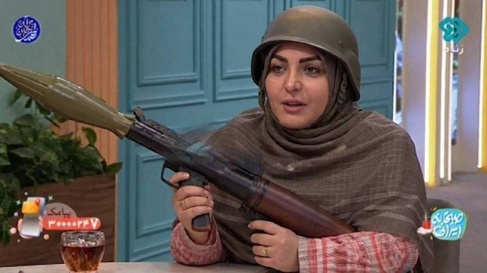

مجری صدا و سیما آرپی‌جی آورده تو برنامه، انگار قسمت سربازی برره‌اس :)))

[@AloTweet]

## alonews — post 122066

  <a href="telegram/content/alonews_122066_1779549969.webm" target="_blank">🎬 Download video</a>

👈خبرگزاری آسوشیتدپرس به نقل از مقامات پاکستانی گزارش داد:

🔴اسلام آباد به تلاش‌های خود برای ترتیب دادن دور دوم مذاکرات مستقیم بین تهران و واشنگتن ادامه می‌دهد.

✅ @AloNews خبر جنگ

## alonews — post 122065

  <a href="telegram/content/alonews_122065_1779549969.webm" target="_blank">🎬 Download video</a>

👈طی ۲۴ساعت گذشته بولشویک‌ها حملات شدیدی علیه پزشکیان انجام دادن و طبق شنیده‌ها دنبال استعفای رئیس جمهور هستن تا گزینه مد نظر خودشون(زنبیل به دست) رو بیارن بالا

✅ @AloNews خبر جنگ

## alonews — post 122064

  <a href="telegram/content/alonews_122064_1779549969.webm" target="_blank">🎬 Download video</a>

👈ارتش پاکستان: مذاکراتی که در ۲۴ ساعت گذشته انجام شد، به پیشرفت امیدوارکننده‌ای به سوی تفاهم نهایی منجر شد.

✅ @AloNews خبر جنگ

## alonews — post 122063

  <a href="telegram/content/alonews_122063_1779549970.webm" target="_blank">🎬 Download video</a>

👈الحدث:ایران دو مسیر برای مذاکرات پیشنهاد کرده که با اعلام پایان جنگ و محاصره آغاز می‌شود.

🔴ایران تأکید کرده است که در متن یادداشت تفاهم، به عدم تولید سلاح هسته‌ای متعهد خواهد بود.

🔴ایران خواستار حفظ حق غنی‌سازی در هر توافقی شده است

🔴ایران پیش از مذاکرات هسته‌ای خواستار آزادسازی دارایی‌های بلوکه‌شدهٔ خود شده است

✅ @AloNews خبر جنگ

## alonews — post 122062

  <a href="telegram/content/alonews_122062_1779549970.mp4" target="_blank">🎬 Download video</a>

👈ارسالی شما/سلام ادمین ماهم تجمع کردیم جلوی اداره آموزش پرورش لرستان و اینجا هم امتحانا مجازی شد

✅ @AloNews خبر جنگ

## alonews — post 122059

  <a href="telegram/content/alonews_122059_1779549973.mp4" target="_blank">🎬 Download video</a>

👈جدیدا دانش آموزان استان‌هایی که امتحانات‌شون حضوریه، می‌ریزن جلو آموزش و پرورش منطقه و میگن ما فقط مجازی امتحان میدیم؛

🔴اتفاقا جواب هم داده و تا الان این استان‌ها مجازی شده :

- یزد
- مرکزی
- گیلان
- کهگیلویه و بویراحمد
- کرمان

✅ @AloNews خبر جنگ

## alonews — post 122058

  <a href="telegram/content/alonews_122058_1779549976.webm" target="_blank">🎬 Download video</a>

👈نورالدین الدغیر خبرنگار الجزیره در تهران:
منبعی به من گفت که فرمانده ارتش پاکستان قرار بود یادداشت تفاهمی بین ایران و آمریکا را از تهران اعلام کند، اما برای تکمیل هماهنگی‌ها با ترامپ، تهران را ترک کرد.

🔴منبع تأیید کرد که پرونده جنگ با تمام جزئیات آن مرحله اول را تشکیل می‌دهد و آنچه به مسائل هسته‌ای و تحریم‌ها مرتبط است، به پس از ۳۰ روز از توافق موکول می‌شود.

✅ @AloNews خبر جنگ

## alonews — post 122057

  <a href="telegram/content/alonews_122057_1779549976.webm" target="_blank">🎬 Download video</a>

👈مارکو روبیو، وزیر خارجه آمریکا: تنگه هرمز باید باز شود؛ ایران نباید سلاح هسته ای داشته باشد؛

🔴ایران باید ذخایر اورانیوم غنی شده خود را تحویل دهد؛ معضل غنی‌سازی ایران باید در مذاکرات در نظر گرفته شود

✅ @AloNews خبر جنگ

---
📅 بروزرسانی: 1405/03/02 17:34
---

## VahidOOnLine — post 241725

♦️مارکو روبیو، وزیر امور خارجه ایالات متحده، روز شنبه دوم خردادماه در جریان بازگشایی سفارت آمریکا، از یک لوح طلایی آمریکا رونمایی کرد. روبیو در مراسم افتتاح ساختمان الحاقی پشتیبانی سفارت آمریکا در دهلی‌نو شرکت کرد.
او در این مراسم با لحنی طنزآمیز گفت این نخستین لوحی است که نصب کرده و افزود: «شاید ۱۰۰ سال دیگر، نوه‌های من وقتی به اینجا بیایند، این لوح را ببینند.»
روبیو این اقدام را نمادی از تداوم حضور و روابط آمریکا در این کشور توصیف کرد؛ مراسمی که با هدف تقویت روابط دیپلماتیک و نمایش همکاری‌های دوجانبه برگزار شد.
‌🇸🇦 Indypersian

🤖 @VahidOOnLine

## VahidOOnLine — post 241724

  

عباس عراقچی، وزیر خارجه جمهوری اسلامی، در پیامی به شیخ نعیم قاسم، دبیرکل حزب‌الله لبنان، گفت: «جمهوری اسلامی دست از حمایت حزب‌الله نخواهد کشید و همچنان از جنبش‌های مطالبه‌گر حق و آزادی پشتیبانی می‌کند. تهران پیوند آتش‌بس لبنان با هر توافق احتمالی را به‌عنوان شرط مطرح کرده است.»
‌🏁 🇬🇧 IranintlTV

🤖 @VahidOOnLine

## VahidOOnLine — post 241722

  <a href="telegram/content/VahidOOnLine_241722_1779545052.mp4" target="_blank">🎬 Download video</a>

بر اساس گزارش منابع محلی که به ایران اینترنشنال رسیده، اکبر محمدی، متولد ۱۴ شهریور ۱۳۶۴ و ساکن محله دهنوی اصفهان، پس از بازداشت و انتقال به زندان دستگرد جان خود را از دست داده است. بر اساس این گزارش، او سوم اردیبهشت‌ماه همراه برادرش بازداشت شد. منابع محلی می‌گویند اکبر در تماس با خانواده از بیماری و محرومیت از رسیدگی پزشکی در زندان خبر داده و گفته بود اجازه مراجعه به بهداری یا دریافت دارو نداشته است. به گفته این منابع، حال او پس از مدتی وخیم شد و بعد از دو هفته به بیمارستان الزهرای اصفهان منتقل شد، اما پس از چند روز به کما رفت و در نهایت بر اثر عفونت شدید ریه جان باخت. منابع محلی می‌گویند اکبر محمدی از پیگیران اخبار اعتراضات و انتشار تصاویر جان‌باختگان محله دهنو بود، و نیروهای بسیجی محله با او درگیر شده و سپس در خانه‌اش بازداشت شد.
‌🏁 🇬🇧 IranintlTV

🤖 @VahidOOnLine

## VahidOOnLine — post 241721

  <a href="telegram/content/VahidOOnLine_241721_1779545054.mp4" target="_blank">🎬 Download video</a>

بر اساس گزارش ان‌بی‌سی، دونالد ترامپ جونیور، پسر بزرگ رئیس‌جمهور آمریکا، با بتینا اندرسون در فلوریدا ازدواج کرده است، اما دونالد ترامپ احتمالاً در مراسم این آخر هفته شرکت نخواهد کرد.
ترامپ در گفت‌وگو با خبرنگاران گفته مراسم «یک رویداد کوچک و خصوصی» است و به دلیل شرایط کاری در کاخ سفید و مسائل سیاسی از جمله وضعیت جمهوری‌اسلامی، امکان حضور ندارد. او تأکید کرده که در این مقطع زمانی نمی‌تواند از واشنگتن خارج شود و مسئولیت‌های دولت را اولویت می‌داند.
ترامپ همچنین با اشاره به فشارهای رسانه‌ای گفته است که چه در صورت حضور و چه عدم حضور در مراسم، مورد انتقاد قرار خواهد گرفت. او در شبکه اجتماعی خود نیز ازدواج پسرش را تبریک گفته اما تأکید کرده که به دلیل «مسائل دولت و شرایط حساس فعلی» در مراسم حاضر نخواهد شد.
‌🏁 🇬🇧 ManotoTV

🤖 @VahidOOnLine

## VahidOOnLine — post 241720

  

العربیه گزارش داد جمهوری اسلامی دو پیشنهاد به میانجی پاکستانی ارائه کرده که بر اساس آن، در ازای پرداخت غرامت از سوی آمریکا، تنگه هرمز را باز کند و پیش از امضای هرگونه توافقی، پرونده تحریم‌ها و دارایی‌های مسدود شده مورد بحث قرار گیرد.

دونالد ترامپ، رییس‌جمهوری آمریکا، پیش‌تر گفته بود که حاضر به پرداخت غرامت به تهران نیست.
‌🏁 🇬🇧 IranintlTV

🤖 @VahidOOnLine

## VahidOOnLine — post 241719

  

اسماعیل بقائی، سخنگوی وزارت امور خارجه جمهوری اسلامی، گفت: «ما به توافق خیلی دور و خیلی نزدیک هستیم.» او افزود: «ما تجربه ضد و نقیض گویی طرف آمریکایی را داریم و دیدگاه‌های خود را بارها تغییر داده‌اند.»

سخنگوی وزارت خارجه جمهوری اسلامی درباره سفر عاصم منیر، رییس ستاد کل ارتش پاکستان، به تهران، گفت: «پاکستان به عنوان میانجی نقش مهمی را ایفا کرده و هدف از این سفر ادامه تبادل پیام‌ها بین ایران و آمریکا بود.»

بقائی درباره مذاکرات گفت: «تمرکز ما در این مرحله بر خاتمه جنگ است براساس پیشنهاد ۱۴ بندی تهران که چندین بار رفت و برگشت شده و در خصوص بندهای مختلف آن دیدگاه‌های طرفین تبادل شده است.»
‌🏁 🇬🇧 IranintlTV

🤖 @VahidOOnLine

## VahidOOnLine — post 241718

  

سنتکام، فرماندهی مرکزی ایالات متحده، اعلام کرد که در شش هفته گذشته، بیش از ۱۵ هزار سرباز، ملوان، تفنگدار دریایی و نیروی هوایی آمریکا مسیر حرکت ۱۰۰ شناور را تغییر داده‌اند، چهار شناور را از کار انداخته‌اند و اجازه عبور به ۲۶ کشتی حامل کمک‌های بشردوستانه داده‌اند.

سنتکام افزود: «بیش از ۲۰۰ هواگرد و ناو جنگی آمریکا از این مأموریت پشتیبانی می‌کنند.»

فرماندهی مرکزی ایالات متحده نوشت: «این محاصره علیه شناورهای متعلق به تمامی کشورها که وارد بنادر و مناطق ساحلی ایران می‌شوند یا از آنها خارج می‌شوند، از جمله تمامی بنادر ایران در خلیج فارس و دریای عمان، اعمال می‌شود.»
‌🏁 🇬🇧 IranintlTV

🤖 @VahidOOnLine

## VahidOOnLine — post 241717

  

فداحسین مالکی، عضو کمیسیون امنیت ملی و سیاست خارجی مجلس، گفت در صورت ازسرگیری جنگ، چین و روسیه جمهوری اسلامی را تنها نخواهند گذاشت و آمریکا «با یک آرایش دفاعی نوین مواجه خواهد شد.»

او گفت: «تداوم سفرهای دیپلماتیک و رایزنی‌های فشرده میان ایران، چین و روسیه نشان‌دهنده یک واقعیت راهبردی است؛ اینکه اگر آمریکا مرتکب خطای محاسباتی شود و شعله جنگ مجددی را بیفروزد، قطعا با یک آرایش دفاعی نوین مواجه خواهد شد و جمهوری اسلامی در این تقابل هرگز تنها نخواهد بود.»

مالکی افزود در شرایط کنونی که بحران میان جمهوری اسلامی و آمریکا به دلیل روحیه تهاجمی و رفتارهای خارج از عرف دونالد ترامپ، رییس‌جمهوری آمریکا، پیچیده‌تر شده، تهدید امنیت تنگه هرمز عملا معادلات انرژی، تجاری و اقتصادی جهان را با چالشی جدی مواجه کرده است.
‌🏁 🇬🇧 IranintlTV

🤖 @VahidOOnLine

## VahidOOnLine — post 241716

  <a href="telegram/content/VahidOOnLine_241716_1779545059.mp4" target="_blank">🎬 Download video</a>

♦️شهباز شریف، نخست‌وزیر پاکستان، روز شنبه دوم خردادماه وارد شهر هانگژو چین شد تا نخستین بخش از سفر چهارروزه خود به این کشور را آغاز کند.
او در هانگژو در یک نشست تجاری با هدف تقویت همکاری میان شرکت‌های پاکستانی و چینی شرکت خواهد کرد و در مراسم امضای توافق‌نامه‌ها و تفاهم‌نامه‌های دوجانبه حضور می‌یابد.
بر اساس برنامه اعلام‌شده، شریف سپس به پکن سفر خواهد کرد و با شی جین‌پینگ، رئیس‌جمهور چین و لی چیانگ، نخست‌وزیر این کشور دیدار می‌کند. همچنین وی در مراسم هفتاد و پنجمین سالگرد روابط دیپلماتیک پاکستان و چین نیز شرکت خواهد داشت.
‌🇸🇦 Indypersian

🤖 @VahidOOnLine

## VahidOOnLine — post 241715

  <a href="telegram/content/VahidOOnLine_241715_1779545060.mp4" target="_blank">🎬 Download video</a>

همزمان با سایر شهرهای استان لرستان، دانش‌آموزان دورود نیز تجمعات اعتراضی تشکیل دادند و خواستار مجازی شدن امتحانات خود شدند. این اعتراضات در یاسوج، خرم‌آباد و بروجرد نیز روز شنبه برگزار شده است.
‌🏁 🇬🇧 IranintlTV

🤖 @VahidOOnLine

## VahidOOnLine — post 241714

  

♦️عاصم منیر، فرمانده ارتش پاکستان، به‌همراه محسن نقوی، وزیر کشور، روز شنبه دوم خردادماه پس از پایان سفر خود تهران را ترک کردند.
فرمانده ارتش پاکستان در این سفر یک‌روزه با شماری از مقام‌های ارشد جمهوری اسلامی از جمله مسعود پزشکیان، رئیس‌جمهور، محمدباقر قالیباف، رئیس مجلس و عباس عراقچی، وزیر امور خارجه دیدار و گفتگو کرد.
وزیر کشور پاکستان نیز که از هفته گذشته در تهران حضور داشت، در جریان این سفر در رایزنی‌های مختلف دوجانبه شرکت کرده بود. جزئیات بیشتری از محورهای این دیدارها منتشر نشده است.
‌🇸🇦 Indypersian

🤖 @VahidOOnLine

## VahidOOnLine — post 241713

  <a href="telegram/content/VahidOOnLine_241713_1779545063.mp4" target="_blank">🎬 Download video</a>

ویدیوی رسیده به ایران اینترنشنال نشان می‌دهد دانش‌آموزان نورآباد لرستان روز شنبه همزمان با دیگر شهرهای این استان به اعتراضات علیه حضوری شدن اعتراضات پیوستند.
‌🏁 🇬🇧 IranintlTV

🤖 @VahidOOnLine

## VahidOOnLine — post 241712

  

♦️ مارکو روبیو، وزیر امور خارجه آمریکا، روز شنبه دوم خرداد، در جریان سفر خود به هند با نارندرا مودی، نخست‌وزیر این کشور، درباره بحران خاورمیانه و به‌ویژه هزینه‌های انرژی گفتگو کرد.

تامی پیگات، سخنگوی وزارت امور خارجه آمریکا، اعلام کرد که روبیو در این دیدار تاکید کرده است ایالات متحده اجازه نخواهد داد جمهوری اسلامی بازار جهانی انرژی را به گروگان بگیرد. او همچنین تصریح کرد که فرآورده‌های انرژی آمریکا پتانسیل بالایی برای تنوع بخشیدن به منابع تامین انرژی هند دارند.

هند به شدت به واردات نفت و گاز از خاورمیانه وابسته است؛ به طوری که بر اساس آمار اداره اطلاعات انرژی آمریکا، پس از چین، دومین واردکننده بزرگ نفت خام از طریق تنگه هرمز به شمار می‌رود. طبق داده‌های موجود، ۷۴ درصد از کل نفت خام عبوری از این تنگه در سه‌ماهه اول سال گذشته میلادی تنها به چهار کشور چین، هند، ژاپن و کره جنوبی ارسال شده است.

روبیو همچنین در این دیدار به نمایندگی از دونالد ترامپ، از نخست‌وزیر هند برای سفر به کاخ سفید دعوت به عمل آورد.
‌🇸🇦 Indypersian

🤖 @VahidOOnLine

## VahidOOnLine — post 241711

  

همزمان با افزایش تنش‌ها و احتمال ازسرگیری درگیری‌ها، حبیب‌الله سیاری، معاون هماهنگ‌کننده ارتش جمهوری اسلامی، گفت نیروهای مسلح برای مقابله با هرگونه تهدید آمادگی دارند و منتظر فرمان مجتبی خامنه‌ای هستند.

او گفت: «نیروهای مسلح در پاسداری از تمامیت ارضی و استقلال کشور، مهیای خلق بیت‌المقدس‌هایی دیگر در برابر هر فتنه و جنگ تحمیلی هستند و این را دنیا بداند که هویت ما با ایثار و وطن‌پرستی گره خورده است.»
‌🏁 🇬🇧 IranintlTV

🤖 @VahidOOnLine

## VahidOOnLine — post 241710

  <a href="telegram/content/VahidOOnLine_241710_1779545067.mp4" target="_blank">🎬 Download video</a>

⭕️ معاون سازمان ملی بهره‌وری: بهره‌وری در ایران نزدیک صفر است

♦️اسماعیل حبیبی، معاون سازمان ملی بهره‌وری ایران در گفتگو با صداوسیما اعلام کرد بهره‌وری کلی در ایران «نزدیک صفر» است.
او گفت این عدد نشان می‌دهد «از منابع خود به خودی استفاده نمی‌کنیم» و با اشاره به روندهای تامین انرژی در کشور، نمونه‌هایی از عدم بهره‌وری را تشریح کرد.
حبیبی از وضعیت موجود با عنوان «دومینوی عدم بهره‌وری» نام برد و توضیح داد مشکلات موجود در بخش‌های مختلف، به‌صورت زنجیره‌ای بر یکدیگر اثر گذاشته و موجب کاهش کارایی در حوزه انرژی و سایر بخش‌ها شده است.
حبیبی همچنین گفت: «ایران از نظر منابع در رتبه پنجم جهان قرار دارد، اما از نظر تولید ناخالص داخلی (GDP) در رتبه ۳۷ است.»
اظهارات معاون سازمان ملی بهره‌وری در حالی مطرح می‌شود که طی سال‌های اخیر، بحران انرژی، قطعی برق، کمبود گاز و فرسودگی زیرساخت‌ها بارها به‌عنوان نشانه‌هایی از ناکارآمدی و ضعف بهره‌وری در اقتصاد ایران مورد بحث قرار گرفته است.
‌🇸🇦 Indypersian

🤖 @VahidOOnLine

## VahidOOnLine — post 241709

روایت شما از زندگی در آتش‌بس- شنبه ۲ خرداد ۱۴۰۵

🔹 امروز شنبه ۲ خرداد، ما دانش‌آموزان مقابل آموزش‌وپرورش استان آذربایجان غربی در ارومیه تجمع کردیم برای غیرحضوری شدن امتحانات.
🔹 من تمام دوره‌های درسم را از تلگرام دانلود می‌کردم. دروس تخصصی را از یوتیوب تماشا می‌کردم. چند دوره هم از اینستاگرام خریده بودم و حالا کنکور دارم و باید با هیچی درس بخونم. به امید آزادی.
🔹 از رفسنجان، بعد از چند وقت قطع بودن امروز ۲ خرداد وصل شدم. خواستم بگم مردم امیدتونو از دست ندین، نور بر تاریکی پیروز است.
🔹 حتی اینترنت پرو که با ۱۰ برابر قیمت اینترنت قبلی فروخته می‌شود هم با اشکال و ناپایدار وصل می‌شود. کلاً با روح و روان آدم بازی می‌کنن.
🔹 یوتیوبرم، فقط ماهی ۳ میلیون باید هزینه فیلترشکن کنم که بتونم ویدیو آپلود کنم.
🔹 من یه دختر ۱۵ ساله هستم و هیچی از نوجوونیم نفهمیدم. فکر و ذکرم شده قیمت دلار و نگرانی برای آینده‌ام. انقدر همه‌چی گرون شده که شخصاً خجالت می‌کشم از خانوادم چیزی بخوام. به امید روزهای بهتر،
‌🏁 🇬🇧 IranintlTV

🤖 @VahidOOnLine

## VahidOOnLine — post 241708

  <a href="telegram/content/VahidOOnLine_241708_1779545070.mp4" target="_blank">🎬 Download video</a>

شیخ تمیم بن حمد آل ثانی، امیر قطر، در تماس تلفنی با دونالد ترامپ، رئیس‌جمهور آمریکا، درباره تنش‌های منطقه‌ای و ابتکارهای دیپلماتیکی که با محوریت پاکستان برای جلوگیری از تشدید بحران در حال انجام است، گفت‌وگو کرده است.
در این تماس، دو طرف تلاش‌ها برای کاهش تنش‌ها و حفظ ثبات منطقه را بررسی کردند و بر حمایت از میانجی‌گری پاکستان میان ایالات متحده و جمهوری‌اسلامی تاکید شد.
همچنین در این گفت‌وگو بر اهمیت ادامه مذاکرات و گفت‌وگوهای دیپلماتیک برای حل مسائل جاری، حفاظت از کشتیرانی دریایی و تضمین امنیت مسیرهای راهبردی آبی تأکید شد؛ موضوعی که به ثبات بازار جهانی انرژی و زنجیره تأمین نیز مرتبط است.
‌🏁 🇬🇧 ManotoTV

🤖 @VahidOOnLine

## VahidOOnLine — post 241707

  <a href="telegram/content/VahidOOnLine_241707_1779545071.mp4" target="_blank">🎬 Download video</a>

بر اساس گزارشی که در روزنامه تایمز منتشر شده، یک تحقیق مخفیانه نشان می‌دهد یک شبکه مرتبط با جمهوری‌اسلامی از طریق تلگرام تلاش کرده شهروندان بریتانیایی را برای سازماندهی تجمعات خیابانی ضد اسرائیلی و پخش پوسترهای تبلیغاتی جذب کند.
در این گزارش آمده است که خبرنگار تایمز به‌صورت مخفیانه وارد ارتباط با فردی شده که خود را «مهدی» معرفی کرده و مدعی بوده در ایران مستقر است و با ساختارهای امنیتی جمهوری‌اسلامی در ارتباط است. این فرد در پیام‌های خود پیشنهاد پرداخت پول در ازای سازماندهی تجمع، جذب افراد جدید و اجرای فعالیت‌های تبلیغاتی در لندن را مطرح کرده است.
همچنین از این خبرنگار خواسته شده ابتدا برای اثبات اعتماد، اقدام به نصب پوستر در خیابان‌های لندن و فیلم‌برداری از آن کند. این پوسترها شامل پیام‌های سیاسی علیه اسرائیل بوده است.
در ادامه، درخواست‌هایی برای گسترش فعالیت و حتی طراحی پروژه‌های آنلاین نیز مطرح شده و در نهایت حساب تلگرامی مربوطه به‌طور ناگهانی حذف شده است.
‌🏁 🇬🇧 ManotoTV

🤖 @VahidOOnLine

## VahidOOnLine — post 241706

  <a href="telegram/content/VahidOOnLine_241706_1779545072.mp4" target="_blank">🎬 Download video</a>

ویدیوی رسیده نشان می‌دهد دانش‌آموزان بروجرد در تجمع روز شنبه برای اعتراض به حضوری شدن امتحانات، فریاد «مجازی مجازی» سر دادند.
‌🏁 🇬🇧 IranintlTV

🤖 @VahidOOnLine

## VahidOOnLine — post 241705

  <a href="telegram/content/VahidOOnLine_241705_1779545074.mp4" target="_blank">🎬 Download video</a>

در حالی‌که برخی مقام‌های آمریکایی از احتمال توقف موقت فروش تسلیحات به تایوان به دلیل نیاز ارتش آمریکا در عملیات علیه ایران خبر داده بودند، یک منبع آگاه رویترز این ادعا را رد کرد و گفت این روند کاملاً طولانی‌مدت و اداری است و ارتباطی با جنگ ایران ندارد.
بر اساس این گزارش، تایوان همچنان منتظر تأیید بسته تسلیحاتی تا سقف ۱۴ میلیارد دلار از سوی آمریکا است. این در حالی است که چین به‌شدت با فروش سلاح به تایوان مخالفت کرده و آن را اقدامی علیه حاکمیت خود می‌داند.
کاخ سفید اعلام کرده تصمیم نهایی درباره این بسته در آینده نزدیک گرفته خواهد شد، اما سیاست کلی آمریکا در حمایت از توان دفاعی تایوان بدون تغییر باقی مانده است. تایوان نیز می‌گوید هیچ اطلاع رسمی از تعلیق یا تأخیر در این روند دریافت نکرده است.
‌🏁 🇬🇧 ManotoTV

🤖 @VahidOOnLine

## WithYashar — post 12171

اسرائیل همچنان درحال بمباران مواضع حزب‌الله
@withyashar

## WithYashar — post 12170

Voice message

## WithYashar — post 12169

سخنگوی وزارت امور خارجهٔ ایران: این یادداشت تفاهم شامل ۱۴ بند برای پایان دادن به جنگ است و جزئیات آن طی یک بازهٔ ۳۰ تا ۶۰ روزه مورد بحث و بررسی قرار خواهد گرفت.
@withyashar

## WithYashar — post 12168

مارکو روبیو: مقداری پیشرفت در مذاکرات با ایران حاصل شده است.

همچنین این احتمال وجود دارد که آمریکا طی روزهای آینده دربارهٔ ایران چیزی برای اعلام داشته باشد.
@withyashar

## WithYashar — post 12167

یک مقام ایرانی به شبکه الجزیره: قطر نقش کلیدی در تهیه پیش‌نویس این یادداشت تفاهم ایفا کرد و بین میانجی‌ها و واشنگتن ارتباط وجود داشت
@withyashar

## WithYashar — post 12166

حزب‌الله اعلام کرد که پیامی از وزیر امور خارجه رژیم جمهوری اسلامی دریافت کرده است که در آن آمده ایران به حمایت از این گروه ادامه خواهد داد و آن را رها نخواهد کرد.
@withyashar

## WithYashar — post 12165

سخنگوی وزارت خارجه: پیشنهاد ۱۴ بندی ایران که چندین بار رفت و برگشت شده و در خصوص بندهای مختلف آن دیدگاه‌های طرفین تبادل شده است و در این چند روز راجع به برخی نکات و عبارت پردازی‌هایی که راجع به آن اختلاف نظر کماکان وجود داشت بحث و پیشنهاداتی مطرح شد که همچنان برخی از آن در حال بررسی و اعلام نظر است.
@withyashar

## WithYashar — post 12164

## WithYashar — post 12163

ادعای الجزیره: مقام ایرانی تایید کرد با واسطه پاکستانی به توافق رسیدند و منتظر جواب آمریکا هستند! @withyashar یک مقام ایرانی به الجزیره گفت: این یادداشت تفاهم شامل پایان جنگ، لغو محاصره، باز کردن تنگه هرمز و خروج نیروهای آمریکایی از منطقه جنگی است.

## WithYashar — post 12162

ادعای الجزیره: مقام ایرانی تایید کرد با واسطه پاکستانی به توافق رسیدند و منتظر جواب آمریکا هستند!
@withyashar
یک مقام ایرانی به الجزیره گفت: این یادداشت تفاهم شامل پایان جنگ، لغو محاصره، باز کردن تنگه هرمز و خروج نیروهای آمریکایی از منطقه جنگی است.

## WithYashar — post 12161

خبرنگار الجزیره در تهران:
شکاف‌های غیرقابل عبور در مذاکرات ایران و آمریکا وجود داره؛ لحظه بحران در راه است.
@withyashar

## WithYashar — post 12160

دیوید کیز، سخنگو و مشاور رسانه‌ای سابق نتانیاهو : 24 ساعت آینده تو ایران کاملاً حیاتیه یا هم شاید اصلاً نباشه، راستش خودم هم دقیق نمی‌دونم
@withyashar

## WithYashar — post 12159

رویترز: رئیس تیم مذاکره‌کننده ایران به مقام‌های ارشد نظامی پاکستان توضیح داد که ایران قصد ندارد در مذاکرات با آمریکا هیچ‌گونه امتیازی بدهد.
@withyashar

## WithYashar — post 12158

  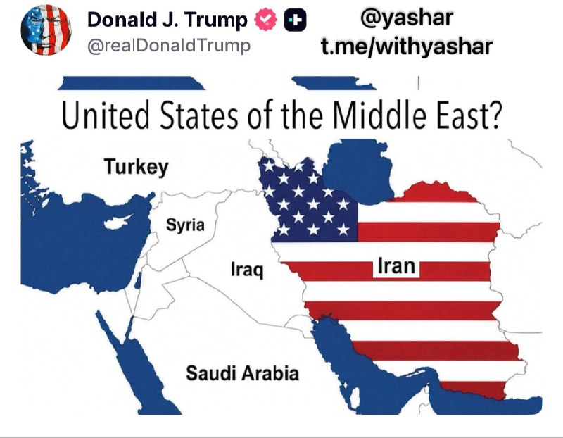

پست جدید ترامپ در تروث
@withyashar

## WithYashar — post 12157

Pishro x khalse x fadaei x tataloo x mj x ho3ein x erfan x sorena… – Minefield Remix ( IG @yashar)

## WithYashar — post 12156

## WithYashar — post 12155

  

هواپیما دوم هیئت پاکستانی هم سیکتیر رو زد 😅✌🏾
@withyashar

## WithYashar — post 12154

ترامپ بیدار شد 😈

## WithYashar — post 12153

  <a href="telegram/content/WithYashar_12153_1779545077.mp4" target="_blank">🎬 Download video</a>

@withyashar

## WithYashar — post 12152

یاشار تو خرم اباد مردم جمع شدن دارن شعار میدن
چهارمحال بختیاری و لرستانم همینه

## mwarmonitor — post 9540

«سؤال در مورد موضوع ایرانه و همون‌طور که گفتم، پیشرفت‌هایی حاصل شده؛ یه سری پیشرفت‌ها صورت گرفته. حتی همین الان که دارم با شما صحبت می‌کنم، کارهایی داره انجام میشه. این احتمال وجود دارد که اواخر امروز، فردا یا چند روز آینده، حرفی برای گفتن داشته باشیم. اما این موضوع همون‌طور که رئیس‌جمهور گفتن، باید به هر طریقی حل بشه. ایران هرگز نمی‌تونه سلاح هسته‌ای داشته باشه. تنگه‌ها باید بدون پرداخت عوارض باز باشن. آن‌ها باید اورانیوم غنی‌شده‌شون رو، اورانیوم با غنای بالاشون رو تحویل بدن؛ ما باید به این موضوع بپردازیم، باید به مسئله غنی‌سازی بپردازیم. این‌ها نکات مورد تأکید همیشگی رئیس‌جمهور هستند و ترجیح ایشون همیشه پرداختن به این مسئله از طریق دیپلماتیکه. ترجیح رئیس‌جمهور همیشه حل مشکلاتی از این دست، از طریق یک راه‌حل دیپلماتیک مذاکره‌شده است. این چیزیه که در حال حاضر داریم روش کار می‌کنیم، اما این مشکل همون‌طور که رئیس‌جمهور به وضوح اعلام کردن، به هر طریقی حل خواهد شد. ما امیدواریم که این کار از مسیر دیپلماتیک انجام بشه؛ این چیزیه که داریم روش کار می‌کنیم و شاید در مقطعی که برای این بازدید این‌جا هستم، موضوعی برای گفتگو در این رابطه وجود داشته باشه»

@mwarmonitor

## mwarmonitor — post 9539

  <a href="telegram/content/mwarmonitor_9539_1779545078.mp4" target="_blank">🎬 Download video</a>

🎬 Video

## mwarmonitor — post 9538

⏳

## mwarmonitor — post 9537

🔴مقام ایرانی به الجزیره: یادداشت تفاهم شامل پایان جنگ، رفع محاصره، باز شدن تنگه هرمز و خروج نیروهای آمریکا از منطقه جنگی است.

‏🔸یادداشت تفاهم شامل موضوعات هسته‌ای نمی‌شود، زیرا این مسائل پیچیده هستند و به زمان کافی برای مذاکره نیاز دارند.

‏🔸 پس از ۳۰ روز از توافق، می‌توان باب مذاکرات هسته‌ای را باز کرد.

‏🔸قرار بود فرمانده ارتش پاکستان در تهران این یادداشت تفاهم را اعلام کند، اما او برای هماهنگی با واشنگتن تهران را ترک کرد.

‏🔸 قطر نقش اساسی در تدوین این یادداشت تفاهم داشته و میانجی‌ها نیز با واشنگتن در ارتباط بوده‌اند.

🔸 ایران نمی‌تواند امتیازاتی بیش از آنچه در یادداشت تفاهم آمده ارائه دهد.

@mwarmonitor

## mwarmonitor — post 9536

  

🔴ترامپ در سوشال تروث

@mwarmonitor

## mwarmonitor — post 9535

  

🔴ترامپ در سوشال تروث

@mwarmonitor

## mwarmonitor — post 9534

  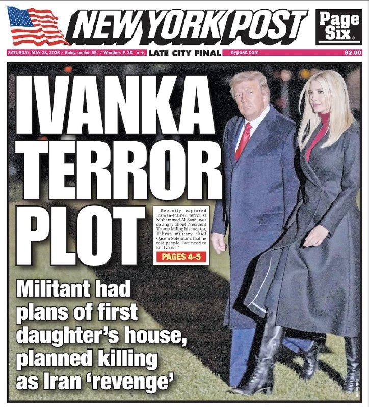

🚨نیویورک پست: ادعا می‌شود محمدباقر السعدی، مظنون عراقیِ مرتبط با سپاه پاسداران انقلاب اسلامی، در تلافی کشته‌شدن قاسم سلیمانی در سال ۲۰۲۰، قصد ترور ایوانکا ترامپ را داشته است. مقام‌ها می‌گویند او نقشه‌هایی از محل سکونت او در فلوریدا در اختیار داشته و خانواده…

## mwarmonitor — post 9533

🔴محاصره دریایی ایران توسط آمریکا؛ شمار کشتی‌های تغییر مسیر داده شده به ۱۰۰ فروند رسید

🔸ستاد فرماندهی مرکزی ایالات متحده (سنتکام)

🔰تامپا، فلوریدا — نیروهای ستاد فرماندهی مرکزی ایالات متحده (سنتکام) در تاریخ ۲۳ مه، در جریان اجرای محاصره دریایی علیه ایران، به حد نصاب جدیدی در تغییر مسیر بیش از ۱۰۰ فروند کشتی تجاری دست یافتند.
نیروهای آمریکایی بر اساس فرمان اجرایی رئیس‌جمهور، از تاریخ ۱۳ آوریل اجرای این محاصره را علیه کشتی‌های تجاری که به بنادر ایران وارد یا از آن خارج می‌شوند، آغاز کردند. طی شش هفته گذشته، بیش از ۱۵,۰۰۰ سرباز، ملوان، تفنگدار دریایی و نیروی هوایی، مسیر ۱۰۰ فروند کشتی را تغییر داده، ۴ فروند را متوقف (غیرفعال) کرده و به ۲۶ فروند کشتی حامل کمک‌های بشردوستانه اجازه عبور داده‌اند.

🔹دریادار برد کوپر، فرمانده سنتکام در این باره گفت:
«نیروهای ما کار فوق‌العاده‌ای انجام می‌دهند. آن‌ها این مأموریت را با دقت و حرفه‌ای‌گری بالا اجرا کرده و بسیار مؤثر عمل کرده‌اند؛ به طوری که اجازه هیچ‌گونه تجارتی را به بنادر ایران و بالعکس نداده‌اند و این امر ایران را تحت فشار اقتصادی قرار داده است.»
بیش از ۲۰۰ فروند هواپیما و ناو جنگی ایالات متحده از این مأموریت پشتیبانی می‌کنند؛ از جمله گروه ضربت ناو هواپیمابر آبراهام لینکلن، گروه ضربت ناو هواپیمابر جورج اچ.دبلیو. بوش، گروه آماده باش دوزیست تریپولی به همراه سی‌ویکمین واحد اعزامی تفنگداران دریایی، و چندین ناوشکن مجهز به موشک‌های هدایت‌شونده.
این محاصره دریایی علیه کشتی‌های تمامی کشورها که به بنادر و مناطق ساحلی ایران وارد یا از آن خارج می‌شوند، از جمله تمامی بنادر ایران در خلیج فارس و دریای عمان، در حال اجرا است.

@mwarmonitor

## mwarmonitor — post 9532

  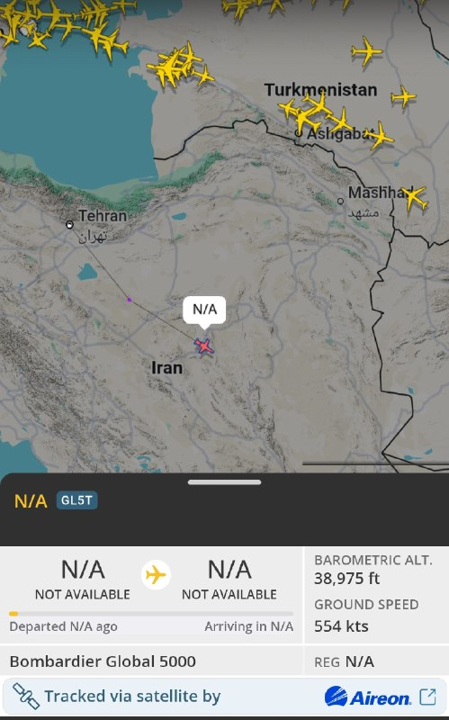

خب عاصم منیر رفت

## mwarmonitor — post 9531

🔸فرانسه ورود ایتامار بن‌گویر، وزیر امنیت ملی اسرائیل، به خاک خود را ممنوع کرده است. ژان-نوئل بارو، وزیر خارجه فرانسه، اعلام کرد این تصمیم به دلیل رفتار اسرائیل با فعالان ناوگان کمک‌رسانی به غزه گرفته شده است. او افزود پاریس و رم از اتحادیه اروپا می‌خواهند علیه او تحریم‌هایی اعمال کند.

@mwarmonitor

## mwarmonitor — post 9530

  

خب عاصم منیر رفت

## mwarmonitor — post 9529

  

📝عباس نگاهی به آسمانِ ناامن می‌اندازد و می‌گوید: «حالا که این منیر اینجاست، بریم یه هوا بخوریم یه دوری بیرون بزنیم.» بدبخت را به عنوان گنبد آهنیِ گوشتی سپر کرده‌اند، چون خودشان هم خوب می‌دانند تنهایی حتی جرعت قدم زدن تو خونه ندارند، چه برسه به محوطه باز؛ آن هم وقتی که با هر صدای غرشِ باد، سایهٔ پهپادهای اسرائیل را بالای سرشان می‌بینند! این کمدیِ سیاه به قدری مضحک است که یک لشکر کت‌شلواری را دور خودشان دیوار کرده‌اند تا شاید پهپادهای نقطه‌زن در تفکیکِ اهداف دچار خطای محاسباتی شوند. خلاصه که این پیاده‌رویِ لرزان، هواخوری نیست؛ یک دوشِ آبِ سردِ دسته‌جمعی زیر تیغِ عزرائیلِ است!

@mwarmonitor

## mwarmonitor — post 9528

🔴ایالات متحده و اسرائیل در حال بررسی این موضوع هستند که آیا رهبر عالی، مجتبی خامنه‌ای را حذف کنند یا نه. 🔸بر اساس گزارش اسرائیل هیوم، آن‌ها می‌سنجند که آیا بقای او نوعی ثبات قابل‌کنترل ایجاد می‌کند، یا این‌که حذفش می‌تواند ساختار حاکمیتی ایران را بیش از پیش…

## mwarmonitor — post 9527

🔴ایالات متحده و اسرائیل در حال بررسی این موضوع هستند که آیا رهبر عالی، مجتبی خامنه‌ای را حذف کنند یا نه.

🔸بر اساس گزارش اسرائیل هیوم، آن‌ها می‌سنجند که آیا بقای او نوعی ثبات قابل‌کنترل ایجاد می‌کند، یا این‌که حذفش می‌تواند ساختار حاکمیتی ایران را بیش از پیش تضعیف کند.

@mwarmonitor

## FoxNewsTwitter — post 342159

  <a href="telegram/content/FoxNewsTwitter_342159_1779545086.mp4" target="_blank">🎬 Download video</a>

Fox News (Twitter/X)

WATCH: Newly released dashcam footage shows the moment Britney Spears was pulled over and arrested on suspicion of DUI in California back in March.

Her breath tests showed blood alcohol levels below California’s legal limit, but officers said they also found an unprescribed bottle of Adderall in the vehicle and concluded she was under the influence of alcohol and a stimulant.

Spears pleaded guilty earlier this month to reckless driving involving alcohol and drugs and avoided jail time.

## FoxNewsTwitter — post 342158

  

Fox News (Twitter/X)

“Full of fat, lazy trash who would rather not be in uniform.”

Resurfaced posts tied to Maine Democratic Senate candidate Graham Platner are back in the spotlight after he called the U.S. Army “absolute trash.”

The posts, made under the Reddit account “P-Hustle,” have become a major issue in Maine’s Senate race against GOP Sen. Susan Collins.

Platner has previously apologized for the comments, saying they were made during a period of combat trauma and do not reflect who he is today.

## pm_afshaa — post 91275

  <a href="telegram/content/pm_afshaa_91275_1779545088.webm" target="_blank">🎬 Download video</a>

⭕️ حتما عضو بشید، چنل جذابیه 
⭕️ @kanfigpx 
✊چنل مردمی ( دُنیـ‌ای آزاد )
✊ @kanfigpx تامین خبر واقعی، و از همه مهمتر، متصل بودنِ شما به دنیای آزاد با ما 
✌ @kanfigpx خبرهای دسته اول و فوری رو با ما داشته باشین
😎 @kanfigpx تنها کانالی که بدون وقفه ۹۰ روزه…

## pm_afshaa — post 91274

  <a href="telegram/content/pm_afshaa_91274_1779545089.webm" target="_blank">🎬 Download video</a>

⭕️ حتما عضو بشید، چنل جذابیه 
⭕️

@kanfigpx

✊چنل مردمی ( دُنیـ‌ای آزاد )
✊

@kanfigpx

تامین خبر واقعی، و از همه مهمتر، متصل بودنِ شما به دنیای آزاد با ما 
✌

@kanfigpx

خبرهای دسته اول و فوری رو با ما داشته باشین
😎

@kanfigpx

تنها کانالی که بدون وقفه ۹۰ روزه در حال فعالیت هست و کانفیگ‌هاشون هم از خودشونه بدون واسطه ازشون خرید کنین با خیال راحت و کیفیت تضمینی و با قیمت کاملا منطقی و پایین
🔥

@kanfigpx

## pm_afshaa — post 91273

سکوت بی‌بی عجیبه😁

## pm_afshaa — post 91272

  <a href="telegram/content/pm_afshaa_91272_1779545090.webm" target="_blank">🎬 Download video</a>

🔴الجزیره: مقام ایرانی تایید کرد با واسطه پاکستانی به توافق رسیدند و منتظر جواب آمریکا هستن.

این یادداشت تفاهم شامل پایان جنگ، لغو محاصره، باز کردن تنگه هرمز و خروج نیروهای آمریکایی از منطقه جنگی است.

💧 Rainbet.com the #1 Non-KYC Crypto Casino & Sportsbook @rainbetcom

😁 @Pm_Afshaa

## pm_afshaa — post 91271

  

پست جدید ترامپ:ایالاتِ متحده‌ی خاورمیانه؟

💧 Rainbet.com the #1 Non-KYC Crypto Casino & Sportsbook @rainbetcom

😁 @Pm_Afshaa

## pm_afshaa — post 91270

  <a href="telegram/content/pm_afshaa_91270_1779545091.webm" target="_blank">🎬 Download video</a>

🔴خبرنگار الجزیره در تهران:
شکاف‌های غیرقابل عبور در مذاکرات ایران و آمریکا وجود داره؛ لحظه بحران در راه است.

💧 Rainbet.com the #1 Non-KYC Crypto Casino & Sportsbook @rainbetcom

😁 @Pm_Afshaa

## pm_afshaa — post 91269

  

دیوید کیز، سخنگو و مشاور رسانه‌ای سابق نتانیاهو : 24 ساعت آینده تو ایران کاملاً حیاتیه یا هم شاید اصلاً نباشه، راستش خودم هم دقیق نمی‌دونم

💧 Rainbet.com the #1 Non-KYC Crypto Casino & Sportsbook @rainbetcom

😁 @Pm_Afshaa

## pm_afshaa — post 91268

ویدیویی از درگیری دانش آموزان با نیروهای سرکوب در خرم اباد 
💧 Rainbet.com the #1 Non-KYC Crypto Casino & Sportsbook @rainbetcom 
😁 @Pm_Afshaa

## pm_afshaa — post 91267

ویدیویی از درگیری دانش آموزان با نیروهای سرکوب در خرم اباد 
💧 Rainbet.com the #1 Non-KYC Crypto Casino & Sportsbook @rainbetcom 
😁 @Pm_Afshaa

## pm_afshaa — post 91266

  <a href="telegram/content/pm_afshaa_91266_1779545093.mp4" target="_blank">🎬 Download video</a>

ویدیویی از درگیری دانش آموزان با نیروهای سرکوب در خرم اباد

💧 Rainbet.com the #1 Non-KYC Crypto Casino & Sportsbook @rainbetcom

😁 @Pm_Afshaa

## pm_afshaa — post 91265

🔴امروز دانش‌آموزان شهر خرم‌آباد در استان لرستان با حضور در مقابل ساختمون آموزش و پرورش این شهر، نسبت به اقدامات آموزش و پرورش دست به تجمع اعتراضی زدن. تجمع دانش‌آموزان خرم‌آبادی با دخالت نیروهای بسیج و انتظامی به خشونت کشیده شده و نیروهای پلیس با باتوم و گاز اشک آور به بچه‌های مردم حمله کردن

💧 Rainbet.com the #1 Non-KYC Crypto Casino & Sportsbook @rainbetcom

😁 @Pm_Afshaa

## pm_afshaa — post 91262

  <a href="telegram/content/pm_afshaa_91262_1779545095.webm" target="_blank">🎬 Download video</a>

🔴عاصم منیر فرمانده ارتش پاکستان هم‌اکنون تهران به مقصد پاکستان ترک کرد.

💧 Rainbet.com the #1 Non-KYC Crypto Casino & Sportsbook @rainbetcom

😁 @Pm_Afshaa

## iaghapour — post 2627

⭕️ رکورددار تاریکی دیجیتال: ایران طولانی‌ترین قطعی اینترنت جهان را تجربه می‌کند!

روزنامه معتبر اسپانیایی «ال‌پایس» در گزارشی تکان‌دهنده اعلام کرده است که ایران با گذشت حدود ۸۰ روز خاموشی دیجیتال، رکورد طولانی‌ترین قطعی سراسری اینترنت در تاریخ یک جامعه دیجیتال را به نام خود ثبت کرده است. این محدودیت‌ها که ابتدا با توجیه شرایط امنیتی و جنگی آغاز شد، همچنان ادامه دارد.

طبق گزارش این رسانه و به نقل از نت‌بلاکس، این وضعیت حالا حتی از قطعی طولانی‌مدت اینترنت میانمار در سال ۲۰۲۱ نیز فراتر رفته و زندگی میلیون‌ها ایرانی را در بن‌بست قرار داده است:

🔹 آوارگی برای یک اتصال پایدار: ال‌پایس داستان تلخ افرادی را روایت می‌کند که برای حفظ شغل خود مجبور به مهاجرت موقت شده‌اند. مانند معلم زبانی که برای رهایی از اضطراب قطعی اینترنت، با هزینه ۴۰۰ دلار در ماه به زیرزمینی تاریک در ارمنستان پناه برده است.

🔸 ضربه مهلک به کسب‌وکارهای زنان: تداوم این اختلالات، آسیب‌های ویرانگری به مشاغل کوچک وارد کرده است؛ به‌ویژه کسب‌وکارهایی که توسط زنان اداره می‌شوند و حیات آن‌ها کاملاً به پلتفرم‌های آنلاین و شبکه‌های اجتماعی گره خورده بود.

🔹 فلج شدن زندگی روزمره: از کار از راه دور و تبادلات مالی گرفته تا ساده‌ترین ارتباطات انسانی و دسترسی به اطلاعات، همگی تحت تأثیر این محدودیت‌های بی‌سابقه مختل شده‌اند.

گزارش این روزنامه نشان می‌دهد که جهان در حال تماشای انزوای دیجیتال جامعه‌ای است که شهروندانش برای دسترسی به ابتدایی‌ترین حق ارتباطی خود، ناچارند هزینه‌های سنگین روانی، مالی و حتی مهاجرتی بپردازند./ دیجیاتو

🆔 @iAghapour

## DEJradio — post 4881

  <a href="telegram/content/DEJradio_4881_1779545096.mp4" target="_blank">🎬 Download video</a>

🚨
⭕️ تمرین هلی‌کوپترهای آمریکایی در عراق نزدیک مرز ایران

منابع محلی عراقی ویدیوهایی منتشر کرده‌اند که بر اساس آن‌ها ادعا می‌شود هلی‌کوپترهای آمریکایی در نزدیکی مرز ایران، تمرین هلی‌برن نیرو انجام داده‌اند.

اگرچه تاکنون هیچ منبع رسمی این خبر را تأیید نکرده است، اما مشابه این‌ تمرین،‌ در جریان جنگ ۴۰ روزه و در عملیات نجات خلبانان آمریکایی سقوط‌کرده در ایران انجام شده بود. با این حال، برخی فرماندهان ارشد جمهوری اسلامی و شماری از رسانه‌های بین‌المللی مدعی‌اند هدف اصلی آن عملیات، دستیابی به اورانیوم غنی‌شده بوده است.

دونالد ترامپ رئیس جمهوری آمریکا جمعه شب اول خرداد ۱۴۰۵ تهدید کرد «با جمهوری اسلامی همان کاری را می‌کنیم که با ونزوئلا کردیم.» در جریان عملیات دستگیری نیکلاس مادورو نیز هلی‌کوپترهای بلک‌هاوک و آپاچی ماموریت تهاجم را بر عهده داشتند و نیرو در کاخ ریاست جمهوری ونزوئلا هلی‌برن شد.

ساعاتی بعد از تهدید ترامپ، سازمان هواپیمایی کشوری جمهوری اسلامی اعلام کرد پروازها در آسمان غرب ایران ممنوع است.

#جنگ #عراق
@DEJradio

## DEJradio — post 4880

  <a href="telegram/content/DEJradio_4880_1779545098.mp4" target="_blank">🎬 Download video</a>

🔺🎥 دانش‌آموزان در چند شهر ایران نسبت به نحوه برگزاری امتحانات اعتراض کرده‌اند.

خبرگزاری فارس وابسته به سـ.ـپاه پاسداران هشدار داده است اگر این وضعیت مدیریت نشود، تبدیل به تهدیدی خطرناک خواهد شد!

#اعتراضات_سراسری
@DEJradio

## mamlekate — post 103572

  <a href="telegram/content/mamlekate_103572_1779545101.mp4" target="_blank">🎬 Download video</a>

جواد ظریف، انتخابات ۱۴۰۳: پزشکیان کسی‌ست که اینترنت شما را فیلتر نمی‌کند و بعد به شما فیلترشکن بفروشد.

@mamlekate

## VahidOnline — post 75646

  

عباس عراقچی، وزیر خارجه جمهوری اسلامی، در پیامی به شیخ نعیم قاسم، دبیرکل حزب‌الله لبنان، گفت: «جمهوری اسلامی دست از حمایت حزب‌الله نخواهد کشید و همچنان از جنبش‌های مطالبه‌گر حق و آزادی پشتیبانی می‌کند. تهران پیوند آتش‌بس لبنان با هر توافق احتمالی را به‌عنوان شرط مطرح کرده است.»
@VahidOOnLine

📡 @VahidOnline

## VahidOnline — post 75645

  

پرویز قلیچ‌خانی، کاپیتان پیشین تیم ملی فوتبال ایران و فعال سیاسی چپگرا در ۸۱ سالگی درگذشت. او به آلزایمرمبتلا بود.

نجمه موسوی-پیمبری، «یار و همراه» پرویز قلیچ‌خانی به بی‌بی‌سی فارسی گفت: «قهرمان ملی و چهره همیشه زنده ایران در تاریخ بیست و سوم ماه مه ٢٠٢٦ مصادف با دوم خرداد ١٤٠٥ در بیمارستانی در حومه پاریس درگذشت.»

آقای قلیچ‌خانی، پیش از انقلاب، علاوه بر تیم ملی، در باشگاه‌های تاج، پرسپولیس و پاس هم بازی کرد. او تنها بازیکنی است که با تیم ایران سه بار قهرمان جام ملت‌های آسیا شده است. پرویز قلیچ‌خانی بعد از انقلاب هم در خارج از کشور، مجله آرش را با گرایش سیاسی چپ اداره می‌کرد.

او فوتبال را از کوچه‌های محله صابون پزخانه میدان شوش تهران شروع کرد و بعد از مدتی کوتاه فوتبالیستی ماهر و بالاخره کاپیتان تیم ملی ایران شد.
ولی هنوز طعم قهرمانی فوتبال را درست نچشیده بود که توجهش به سیاست جلب شد و از پشت میله های زندان سر درآورد.
پس از انقلاب از فوتبالیست حرفه‌ای به فعال سیاسی و روزنامه‌نگار خارج‌نشین تبدیل شد.
@VahidHeadline

📡 @VahidOnline

## VahidOnline — post 75635

شبکه العربیه به نقل از منابع آگاه گزارش داد عاصم منیر، رییس ستاد کل ارتش پاکستان، پیام‌های آمریکا را به تهران منتقل کرده است و بخشی از این پیام حاوی تهدید به ازسرگیری جنگ بوده است.
در این پیام‌ها همچنین تاکید شده در صورت موافقت جمهوری اسلامی با توافق، حل مسائل اختلافی در مرحله بعدی انجام خواهد شد.
به گفته این منابع، آمریکا در پیام‌های خود تصریح کرده است تهران باید اکنون با توافق موافقت کند یا با پیامدهای منفی روبه‌رو شود.
@VahidOOnLine
شبکه العربیه، روز شنبه دوم خرداد ماه، به نقل از «یک منبع بلندپایه ایرانی» گزارش داد پیشنهاد ارائه‌شده از سوی تهران تاکنون نتوانسته رضایت آمریکا را جلب کند و همچنان از دید واشنگتن «غیرقابل قبول» تلقی می‌شود.
@VahidOOnLine
عاصم منیر، رییس ستاد کل ارتش پاکستان، پس از سفری یک روزه به تهران، ایران را ترک کرد.
به گزارش ایرنا، او به همراه محسن نقوی، وزیر کشور پاکستان که از هفته گذشته در تهران به سر می‌برد، پایتخت ایران را ترک کرده است.
عاصم منیر در جریان این سفر با محمدباقر قالیباف، رییس مجلس، مسعود پزشکیان، رییس‌جمهوری ایران و عباس عراقچی، وزیر امور خارجه دیدار و گفت‌وگو کرد.
@VahidHeadline
محمدباقر قالیباف در دیدار با عاصم منیر گفت نیروهای مسلح جمهوری اسلامی در دوران آتش‌بس بازسازی شده‌اند و در صورت آغاز دوباره جنگ، واکنش ایران شدیدتر خواهد بود.
او گفت: «نیروهای مسلح ما در دوران آتش‌بس به نحوی خود را بازسازی کرده‌اند که در صورت حماقت ترامپ و آغاز مجدد جنگ، حتما برای آمریکا کوبنده‌تر و تلخ‌تر از روز اول جنگ خواهند بود.»
قالیباف با اشاره به نقش پاکستان در میانجی‌گری افزود: «در آتش‌بسی بودیم که شما واسطه‌اش بودید و آمریکا با نقص عهد، محاصره دریایی کرد و حالا به‌دنبال برداشتن آن است.»
@VahidOOnLine
شیخ تمیم بن حمد آل ثانی، امیر قطر، روز شنبه دوم خرداد ماه در تماس تلفنی با دونالد ترامپ، رئیس‌جمهوری آمریکا، آخرین تحولات و رویدادهای فوری منطقه را بررسی کرد.
بر اساس بیانیه رسمی دیوان امیری قطر، این گفتگو بر «تلاش‌های منطقه‌ای و بین‌المللی برای حفظ آرامش کنونی و کاهش تنش‌ها» متمرکز بوده است.
«امنیت دریانوردی، حفظ ایمنی آبراه‌های راهبردی و تضمین تداوم روان زنجیره‌های تامین جهانی و انتقال انرژی» از دیگر محورهای این گفتگو توصیف شده است.
به گزارش رسانه‌های قطری، امیر قطر در این تماس بر موضع ثابت دوحه در اولویت دادن به راه‌حل‌های مسالمت‌آمیز برای بحران‌ها تاکید و اعلام کرد قطر از همه ابتکارهایی که با هدف مهار بحران‌ها از طریق گفتگو و دیپلماسی انجام می‌شود، حمایت می‌کند.
این خبر در حالی منتشر می‌شود که رسانه‌ها از گفتگوی تلفنی وزیرامورخارجه قطر با عباس عراقچی خبر داده‌اند.
همزمان گزارش‌ها از رایزنی‌های گسترده کشورهای منطقه برای جلوگیری از حملات احتمالی آمریکا به ایران خبر می‌دهد.
این در حالیست که شبکه خبری العربیه پیشتر از هشدار واشنگتن به تهران مبنی بر از سرگیری حملات به ایران خبر داده بود.
@VahidOOnLine

📡 @VahidOnline

## VahidOnline — post 75634

  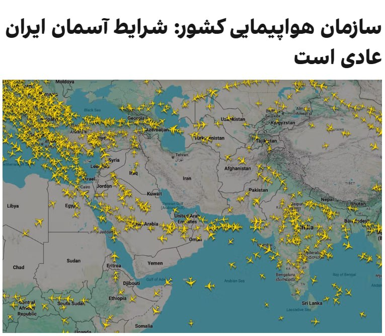

سخنگوی سازمان هواپیمایی ایران اعلام کرد این سازمان هیچ اطلاعیه رسمی هوانوردی جدیدی درباره اعمال محدودیت در آسمان کشور صادر نکرده است و شرایط پروازی عادی است.

او با تاکید بر تداوم وضعیت عادی پروازها گفت: «شرایط آسمان کشور همچنان مانند روال گذشته است و پروازها طبق برنامه انجام می‌شود.»

سخنگوی سازمان هواپیمایی بدون اشاره به جزئیات اطلاعیه هوانوردی (نوتام)، افزود: «نوتامی که اخیرا در فضای مجازی منتشر شده، تکذیب می‌شود.»

سازمان هواپیمایی کشوری ایران روز جمعه یکم خرداد در اطلاعیه‌ای اعلام کرده بود فعالیت فرودگاه‌های واقع در بخش غربی محدوده پروازی ایران، موسوم به «FIR تهران»، تا دوشنبه متوقف شده و تنها شمار محدودی از فرودگاه‌ها مجاز به فعالیت هستند.

بر اساس آن اطلاعیه، فرودگاه‌های ارومیه، کرمان، آبادان، شیراز، یزد، کرمانشاه، رشت و اهواز از این محدودیت مستثنی شده‌اند و فعالیت آنها نیز فقط از طلوع تا غروب آفتاب مجاز اعلام شده بود.
@VahidOOnLine

📡 @VahidOnline

## kianmeli1 — post 87580

‏🔴حبیب‌الله سیاری، معاون هماهنگ‌کننده ارتش جمهوری اسلامی: نیروهای مسلح برای مقابله با هرگونه تهدید آمادگی دارند و منتظر فرمان مجتبی خامنه‌ای هستند
https://t.me/kianmeli1

## kianmeli1 — post 87579

  

🔴پست جدید ترامپ
https://t.me/kianmeli1

## kianmeli1 — post 87578

🔴خبرگزاری صداوسيما: عاصم منیر، فرمانده ارتش پاکستان، ایران را ترک کرد‌.
https://t.me/kianmeli1

## IranIntlTV — post 338599

  <a href="telegram/content/IranIntlTV_338599_1779545105.mp4" target="_blank">🎬 Download video</a>

یک شهروند ۱۵ ساله با ارسال پیامی به ایران اینترنشنال می‌گوید که به دلیل گرانی‌ها خجالت می‌‌کشد از خانواده‌اش چیزی بخواهد. پیام او با هوش مصنوعی خوانده شده است.

## IranIntlTV — post 338598

  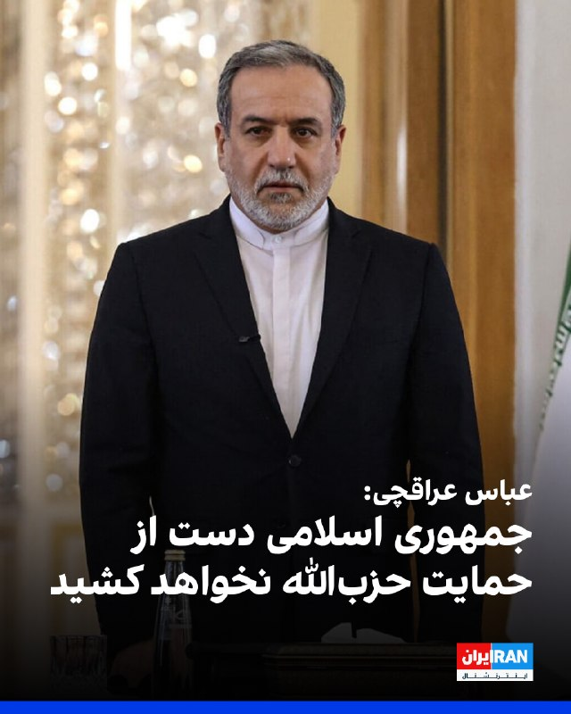

عباس عراقچی، وزیر خارجه جمهوری اسلامی، در پیامی به شیخ نعیم قاسم، دبیرکل حزب‌الله لبنان، گفت: «جمهوری اسلامی دست از حمایت حزب‌الله نخواهد کشید و همچنان از جنبش‌های مطالبه‌گر حق و آزادی پشتیبانی می‌کند. تهران پیوند آتش‌بس لبنان با هر توافق احتمالی را به‌عنوان شرط مطرح کرده است.»
https://iranintl.com/202605234240

## IranIntlTV — post 338597

  

عباس عراقچی، وزیر خارجه جمهوری اسلامی، در پیامی به شیخ نعیم قاسم، دبیرکل حزب‌الله لبنان، گفت: «جمهوری اسلامی دست از حمایت حزب‌الله نخواهد کشید و همچنان از جنبش‌های مطالبه‌گر حق و آزادی پشتیبانی می‌کند. تهران پیوند آتش‌بس لبنان با هر توافق احتمالی را به‌عنوان شرط مطرح کرده است.»
https://iranintl.com/202605234240

## IranIntlTV — post 338596

  

🔻فوتبال ۳۶۰ در گزارشی با انتقاد از رفتار دوگانه مدیران فدراسیون فوتبال نوشت گروهی در فدراسیون در حالی که شعار «مرگ بر آمریکا» سر می‌دهند، «اما در عین شگفتی، چمدان بسته و منتظر ویزای آمریکا برای سفر به این کشور مانده‌اند و به طرق مختلف سعی در گرفتن ویزا داشته‌اند.»

🔹به نوشته این رسانه، «یکی از افراد رده‌بالای این فدراسیون پس از آنکه ۲ بار درخواست ویزای آمریکایش رد شده، برای سومین بار درخواست ویزا داده است.»

🔹فریده شجاعی، یکی از اعضای هیات‌رییسه فدراسیون فوتبال، پیش‌تر گفته بود که «از همه اعضای هیات‌رییسه خواسته شده برای ویزای آمریکا اقدام کنند» و همگی منتظر هستند تا وضعیت ویزا مشخص شود.

🔹هرچند فدراسیون فوتبال در تکذیبیه‌ای، «انتظار اعضای هیات‌رییسه برای ویزای آمریکا» را مستند به «فکت‌های جعلی» دانسته و نوشته است که «اکثریت قریب به اتفاق اعضای هیات‌رییسه فدراسیون هیچ‌گونه برنامه‌ای برای سفر به آمریکا جهت همراهی تیم ملی نداشته و ندارند.»

🔹فوتبال ۳۶۰ همچنین نوشته: «آمریکا که قرار است در شعارها «دشمن» باشد، اما ظاهرا در عمل برای برخی چنین نیست.»

🔹گزارش کامل را در سایت بخوانید.

@iranintltvsport

## IranIntlTV — post 338595

  <a href="telegram/content/IranIntlTV_338595_1779545110.mp4" target="_blank">🎬 Download video</a>

بر اساس گزارش منابع محلی که به ایران اینترنشنال رسیده، اکبر محمدی، متولد ۱۴ شهریور ۱۳۶۴ و ساکن محله دهنوی اصفهان، پس از بازداشت و انتقال به زندان دستگرد جان خود را از دست داده است. بر اساس این گزارش، او سوم اردیبهشت‌ماه همراه برادرش بازداشت شد. منابع محلی می‌گویند اکبر در تماس با خانواده از بیماری و محرومیت از رسیدگی پزشکی در زندان خبر داده و گفته بود اجازه مراجعه به بهداری یا دریافت دارو نداشته است. به گفته این منابع، حال او پس از مدتی وخیم شد و بعد از دو هفته به بیمارستان الزهرای اصفهان منتقل شد، اما پس از چند روز به کما رفت و در نهایت بر اثر عفونت شدید ریه جان باخت. منابع محلی می‌گویند اکبر محمدی از پیگیران اخبار اعتراضات و انتشار تصاویر جان‌باختگان محله دهنو بود، و نیروهای بسیجی محله با او درگیر شده و سپس در خانه‌اش بازداشت شد.

## IranIntlTV — post 338594

  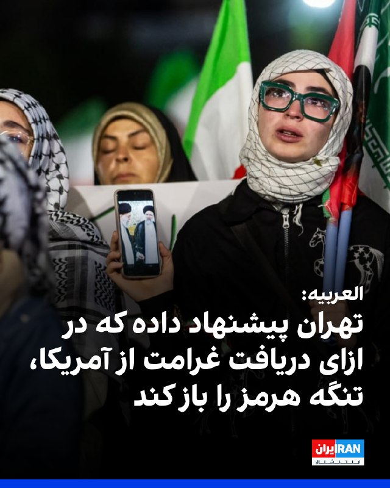

العربیه گزارش داد جمهوری اسلامی دو پیشنهاد به میانجی پاکستانی ارائه کرده که بر اساس آن، در ازای پرداخت غرامت از سوی آمریکا، تنگه هرمز را باز کند و پیش از امضای هرگونه توافقی، پرونده تحریم‌ها و دارایی‌های مسدود شده مورد بحث قرار گیرد.

دونالد ترامپ، رییس‌جمهوری آمریکا، پیش‌تر گفته بود که حاضر به پرداخت غرامت به تهران نیست.
https://iranintl.com/202605232546

## IranIntlTV — post 338593

  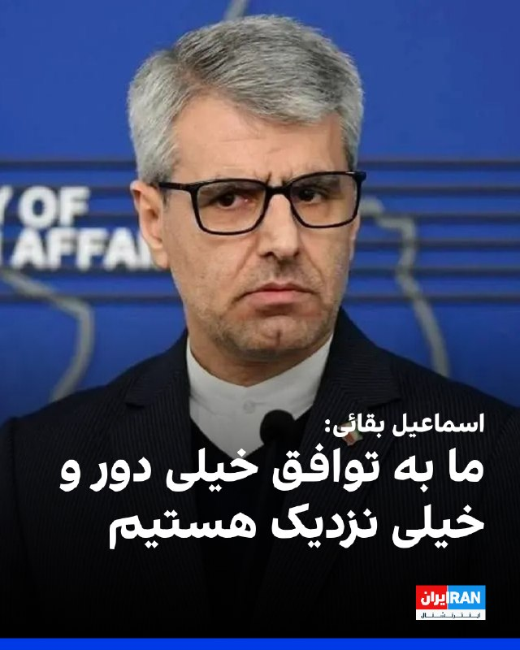

اسماعیل بقائی، سخنگوی وزارت امور خارجه جمهوری اسلامی، گفت: «ما به توافق خیلی دور و خیلی نزدیک هستیم.» او افزود: «ما تجربه ضد و نقیض گویی طرف آمریکایی را داریم و دیدگاه‌های خود را بارها تغییر داده‌اند.»

سخنگوی وزارت خارجه جمهوری اسلامی درباره سفر عاصم منیر، رییس ستاد کل ارتش پاکستان، به تهران، گفت: «پاکستان به عنوان میانجی نقش مهمی را ایفا کرده و هدف از این سفر ادامه تبادل پیام‌ها بین ایران و آمریکا بود.»

بقائی درباره مذاکرات گفت: «تمرکز ما در این مرحله بر خاتمه جنگ است براساس پیشنهاد ۱۴ بندی تهران که چندین بار رفت و برگشت شده و در خصوص بندهای مختلف آن دیدگاه‌های طرفین تبادل شده است.»
https://iranintl.com/202605233506

## IranIntlTV — post 338592

  <a href="telegram/content/IranIntlTV_338592_1779545114.mp4" target="_blank">🎬 Download video</a>

یک معترض در تجمع ایرانیان مقیم مالمو در سوئد، با اشاره به قطع اینترنت در ایران به مهران عباسیان، خبرنگار ایران‌اینترنشنال، گفت: «وقتی در ایران مردم تیر می‌خورند ما اینجا می‌میریم، این باعث شده متحدتر شویم و هر هفته به اینجا بیاییم تا صدای مردم باشیم.»
@iranintltv

## IranIntlTV — post 338591

  <a href="telegram/content/IranIntlTV_338591_1779545116.mp4" target="_blank">🎬 Download video</a>

گفت‌وگوی ویژه با لرد موریس گلاسمن، عضو مجلس اعیان بریتانیا

لرد موریس گلاسمن که همواره تلاش‌های زیادی برای قرار گرفتن سپاه پاسداران در فهرست سازمان‌های تروریستی داشته است در این مصاحبه درباره آینده ایران و همچنین سیاست‌های بریتانیا در قبال جنگ ایران و آمریکا می‌گوید.

تماشای نسخه کامل این گفت‌وگو در یوتیوب:

https://youtu.be/GWHQiOMqYpc

@iranintltv

## IranIntlTV — post 338590

  

سنتکام، فرماندهی مرکزی ایالات متحده، اعلام کرد که در شش هفته گذشته، بیش از ۱۵ هزار سرباز، ملوان، تفنگدار دریایی و نیروی هوایی آمریکا مسیر حرکت ۱۰۰ شناور را تغییر داده‌اند، چهار شناور را از کار انداخته‌اند و اجازه عبور به ۲۶ کشتی حامل کمک‌های بشردوستانه داده‌اند.

سنتکام افزود: «بیش از ۲۰۰ هواگرد و ناو جنگی آمریکا از این مأموریت پشتیبانی می‌کنند.»

فرماندهی مرکزی ایالات متحده نوشت: «این محاصره علیه شناورهای متعلق به تمامی کشورها که وارد بنادر و مناطق ساحلی ایران می‌شوند یا از آنها خارج می‌شوند، از جمله تمامی بنادر ایران در خلیج فارس و دریای عمان، اعمال می‌شود.»
https://iranintl.com/202605232997

## IranIntlTV — post 338589

  <a href="telegram/content/IranIntlTV_338589_1779545119.mp4" target="_blank">🎬 Download video</a>

ایرانیان مقیم اروپا در شهرهای مختلف ایتالیا، آلمان و سوئد با برگزاری تجمع و راهپیمایی در همبستگی با معترضان داخل ایران، خواستار قطع روابط سیاسی با حکومت جمهوری اسلامی و تعطیلی سفارت‌ها شدند.
مهران عباسیان و احمد صمدی، خبرنگاران ایران‌اینترنشنال، گزارش می‌دهند
@iranintltv

## IranIntlTV — post 338588

  

فداحسین مالکی، عضو کمیسیون امنیت ملی و سیاست خارجی مجلس، گفت در صورت ازسرگیری جنگ، چین و روسیه جمهوری اسلامی را تنها نخواهند گذاشت و آمریکا «با یک آرایش دفاعی نوین مواجه خواهد شد.»

او گفت: «تداوم سفرهای دیپلماتیک و رایزنی‌های فشرده میان ایران، چین و روسیه نشان‌دهنده یک واقعیت راهبردی است؛ اینکه اگر آمریکا مرتکب خطای محاسباتی شود و شعله جنگ مجددی را بیفروزد، قطعا با یک آرایش دفاعی نوین مواجه خواهد شد و جمهوری اسلامی در این تقابل هرگز تنها نخواهد بود.»

مالکی افزود در شرایط کنونی که بحران میان جمهوری اسلامی و آمریکا به دلیل روحیه تهاجمی و رفتارهای خارج از عرف دونالد ترامپ، رییس‌جمهوری آمریکا، پیچیده‌تر شده، تهدید امنیت تنگه هرمز عملا معادلات انرژی، تجاری و اقتصادی جهان را با چالشی جدی مواجه کرده است.
https://iranintl.com/202605238565

## IranIntlTV — post 338587

  <a href="telegram/content/IranIntlTV_338587_1779545123.mp4" target="_blank">🎬 Download video</a>

خانواده‌های جان‌باختگان و بسیاری از کاربران شبکه‌های اجتماعی، با انتشار نام، تصاویر و ویدیوهایی از معترضان کشته‌شده در ۱۸ و ۱۹ دی‌ماه، یاد آنان را گرامی داشتند و از ادامه راه آنان گفتند. این کارزار با استقبال گسترده کاربران همراه شد و بسیاری به آن پیوستند.

آیه دریس، عضو تحریریه ایران‌اینترنشنال، گزارش می‌دهد
@iranintltv

## IranIntlTV — post 338586

  <a href="telegram/content/IranIntlTV_338586_1779545125.mp4" target="_blank">🎬 Download video</a>

عبدالله ناصری، فعال سیاسی، مجتبی خامنه‌ای را چهره‌ای تندروتر و متوهم‌تر از علی خامنه‌ای توصیف کرد. او همچنین درباره زنده بودن رهبر سوم جمهوری اسلامی ابراز تردید کرد.

جزییات بیشتر در گفت‌وگو با علی شیرازی، عضو تحریریه ایران اینترنشنال
@iranintltv

## IranIntlTV — post 338585

  <a href="https://t.me/IranintlTV/338585" target="_blank">📎 Download file</a>

🎧نسخه صوتی اخبار نیمروزی | شنبه ۲ خرداد
@iranintlTV

## IranIntlTV — post 338584

  <a href="telegram/content/IranIntlTV_338584_1779545128.mp4" target="_blank">🎬 Download video</a>

حجت میرزایی، اقتصاددان و مدیر پیشین صندوق‌های بازنشستگی کشور، اعلام کرد با تداوم شرایط کنونی، شمار افراد زیر خط فقر در سال جاری به ۴۰ میلیون نفر خواهد رسید. این اقتصاددان تاکید کرد در سناریوهای بدبینانه، نرخ تورم سال جاری ممکن است سه‌رقمی شود.
گفت‌وگو با آرش آزرمی، دبیر بخش اقتصادی ایران‌اینترنشنال
@iranintltv

## IranIntlTV — post 338583

  <a href="telegram/content/IranIntlTV_338583_1779545131.mp4" target="_blank">🎬 Download video</a>

همزمان با سایر شهرهای استان لرستان، دانش‌آموزان دورود نیز تجمعات اعتراضی تشکیل دادند و خواستار مجازی شدن امتحانات خود شدند. این اعتراضات در یاسوج، خرم‌آباد و بروجرد نیز روز شنبه برگزار شده است.

## IranIntlTV — post 338582

  <a href="telegram/content/IranIntlTV_338582_1779545133.mp4" target="_blank">🎬 Download video</a>

ویدیوی رسیده به ایران اینترنشنال نشان می‌دهد دانش‌آموزان نورآباد لرستان روز شنبه همزمان با دیگر شهرهای این استان به اعتراضات علیه حضوری شدن اعتراضات پیوستند.

## IranIntlTV — post 338581

  <a href="telegram/content/IranIntlTV_338581_1779545135.mp4" target="_blank">🎬 Download video</a>

تجمع دانش‌آموزان در شهرکرد، بروجرد، دورود، خرم‌آباد، بروجرد و یاسوج در اعتراض به بلاتکلیفی تحصیلی و امتحانات حضوری ادامه یافت. ویدیوهای رسیده به ایران‌اینترنشنال نشان می‌دهد ماموران با گاز اشک‌آور به دانش‌آموزان معترض حمله کردند.
گفت‌وگو با آسیه امینی، تحلیل‌گر مسائل اجتماعی
@iranintltv

## IranIntlTV — post 338580

  

همزمان با افزایش تنش‌ها و احتمال ازسرگیری درگیری‌ها، حبیب‌الله سیاری، معاون هماهنگ‌کننده ارتش جمهوری اسلامی، گفت نیروهای مسلح برای مقابله با هرگونه تهدید آمادگی دارند و منتظر فرمان مجتبی خامنه‌ای هستند.

او گفت: «نیروهای مسلح در پاسداری از تمامیت ارضی و استقلال کشور، مهیای خلق بیت‌المقدس‌هایی دیگر در برابر هر فتنه و جنگ تحمیلی هستند و این را دنیا بداند که هویت ما با ایثار و وطن‌پرستی گره خورده است.»
https://iranintl.com/202605234510

## ManotoTV — post 105762

  <a href="telegram/content/ManotoTV_105762_1779545138.mp4" target="_blank">🎬 Download video</a>

بر اساس گزارش ان‌بی‌سی، دونالد ترامپ جونیور، پسر بزرگ رئیس‌جمهور آمریکا، با بتینا اندرسون در فلوریدا ازدواج کرده است، اما دونالد ترامپ احتمالاً در مراسم این آخر هفته شرکت نخواهد کرد.
ترامپ در گفت‌وگو با خبرنگاران گفته مراسم «یک رویداد کوچک و خصوصی» است و به دلیل شرایط کاری در کاخ سفید و مسائل سیاسی از جمله وضعیت جمهوری‌اسلامی، امکان حضور ندارد. او تأکید کرده که در این مقطع زمانی نمی‌تواند از واشنگتن خارج شود و مسئولیت‌های دولت را اولویت می‌داند.
ترامپ همچنین با اشاره به فشارهای رسانه‌ای گفته است که چه در صورت حضور و چه عدم حضور در مراسم، مورد انتقاد قرار خواهد گرفت. او در شبکه اجتماعی خود نیز ازدواج پسرش را تبریک گفته اما تأکید کرده که به دلیل «مسائل دولت و شرایط حساس فعلی» در مراسم حاضر نخواهد شد.

## ManotoTV — post 105761

  <a href="telegram/content/ManotoTV_105761_1779545139.mp4" target="_blank">🎬 Download video</a>

شیخ تمیم بن حمد آل ثانی، امیر قطر، در تماس تلفنی با دونالد ترامپ، رئیس‌جمهور آمریکا، درباره تنش‌های منطقه‌ای و ابتکارهای دیپلماتیکی که با محوریت پاکستان برای جلوگیری از تشدید بحران در حال انجام است، گفت‌وگو کرده است.
در این تماس، دو طرف تلاش‌ها برای کاهش تنش‌ها و حفظ ثبات منطقه را بررسی کردند و بر حمایت از میانجی‌گری پاکستان میان ایالات متحده و جمهوری‌اسلامی تاکید شد.
همچنین در این گفت‌وگو بر اهمیت ادامه مذاکرات و گفت‌وگوهای دیپلماتیک برای حل مسائل جاری، حفاظت از کشتیرانی دریایی و تضمین امنیت مسیرهای راهبردی آبی تأکید شد؛ موضوعی که به ثبات بازار جهانی انرژی و زنجیره تأمین نیز مرتبط است.

## ManotoTV — post 105760

  <a href="telegram/content/ManotoTV_105760_1779545140.mp4" target="_blank">🎬 Download video</a>

بر اساس گزارشی که در روزنامه تایمز منتشر شده، یک تحقیق مخفیانه نشان می‌دهد یک شبکه مرتبط با جمهوری‌اسلامی از طریق تلگرام تلاش کرده شهروندان بریتانیایی را برای سازماندهی تجمعات خیابانی ضد اسرائیلی و پخش پوسترهای تبلیغاتی جذب کند.
در این گزارش آمده است که خبرنگار تایمز به‌صورت مخفیانه وارد ارتباط با فردی شده که خود را «مهدی» معرفی کرده و مدعی بوده در ایران مستقر است و با ساختارهای امنیتی جمهوری‌اسلامی در ارتباط است. این فرد در پیام‌های خود پیشنهاد پرداخت پول در ازای سازماندهی تجمع، جذب افراد جدید و اجرای فعالیت‌های تبلیغاتی در لندن را مطرح کرده است.
همچنین از این خبرنگار خواسته شده ابتدا برای اثبات اعتماد، اقدام به نصب پوستر در خیابان‌های لندن و فیلم‌برداری از آن کند. این پوسترها شامل پیام‌های سیاسی علیه اسرائیل بوده است.
در ادامه، درخواست‌هایی برای گسترش فعالیت و حتی طراحی پروژه‌های آنلاین نیز مطرح شده و در نهایت حساب تلگرامی مربوطه به‌طور ناگهانی حذف شده است.

## ManotoTV — post 105759

  <a href="telegram/content/ManotoTV_105759_1779545141.mp4" target="_blank">🎬 Download video</a>

در حالی‌که برخی مقام‌های آمریکایی از احتمال توقف موقت فروش تسلیحات به تایوان به دلیل نیاز ارتش آمریکا در عملیات علیه ایران خبر داده بودند، یک منبع آگاه رویترز این ادعا را رد کرد و گفت این روند کاملاً طولانی‌مدت و اداری است و ارتباطی با جنگ ایران ندارد.
بر اساس این گزارش، تایوان همچنان منتظر تأیید بسته تسلیحاتی تا سقف ۱۴ میلیارد دلار از سوی آمریکا است. این در حالی است که چین به‌شدت با فروش سلاح به تایوان مخالفت کرده و آن را اقدامی علیه حاکمیت خود می‌داند.
کاخ سفید اعلام کرده تصمیم نهایی درباره این بسته در آینده نزدیک گرفته خواهد شد، اما سیاست کلی آمریکا در حمایت از توان دفاعی تایوان بدون تغییر باقی مانده است. تایوان نیز می‌گوید هیچ اطلاع رسمی از تعلیق یا تأخیر در این روند دریافت نکرده است.

## FarsiVOA — post 218438

  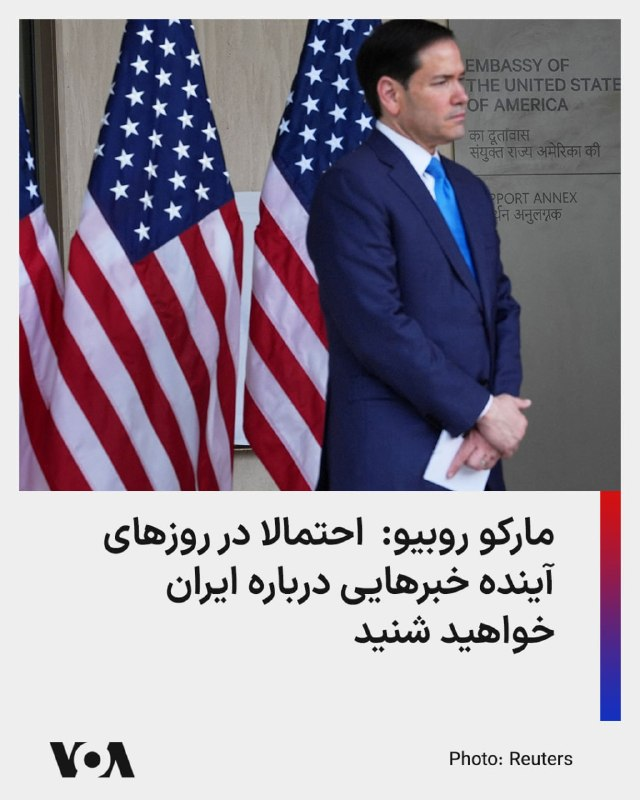

⚡️مارکو روبیو، وزیر امور خارجه ایالات متحده، که برای سفری چهار روزه به هند رفته است روز شنبه ۲ خرداد با تکرار مواضع رسمی و قطعی آمریکا در مذاکرات جاری با رژیم ایران گفت این مذاکرات پیشرفت‌هایی داشته است.

او افزود که «احتمالا طی امروز یا دو روز آینده» خبرهایی درباره نتایج این مذاکرات و تصمیم پرزیدنت ترامپ درباره ایران منتشر خواهد شد.

## FarsiVOA — post 218437

پرزیدنت ترامپ در جدیدترین موضع‌گیری درباره توافق: مقامات تهران مشتاقانه به دنبال توافق هستند

## FarsiVOA — post 218436

  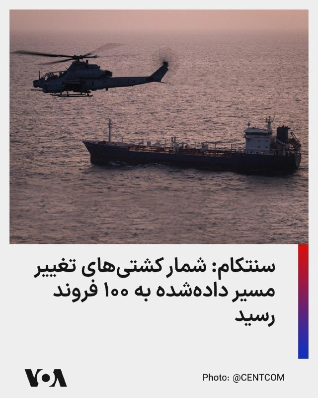

فرماندهی مرکزی ایالات متحده، سنتکام، اعلام کرد نیروهای این فرماندهی در جریان اجرای محاصره دریایی آمریکا علیه جمهوری اسلامی، مسیر ۱۰۰ کشتی تجاری را تغییر داده‌اند.

سنتکام این اقدام را یک «نقطه عطف» در عملیات دریایی خود توصیف کرده است.

@FarsiVOA

## FarsiVOA — post 218430

مارکو روبیو، وزیر امور خارجه آمریکا، روز شنبه برای انجام سفری چهارروزه وارد هند شد.

@FarsiVOA

## FarsiVOA — post 218429

  <a href="telegram/content/FarsiVOA_218429_1779545142.mp4" target="_blank">🎬 Download video</a>

ویدیوهای منتشر شده در شبکه‌های اجتماعی امروز، دوم خرداد ۱۴۰۵، دانش‌آموزان را در خرم‌آباد نشان می‌دهد که در اعتراض به شرایط امتحانات مقابل اداره آموزش‌وپرورش لرستان تجمع کردند. دانش‌آموزان در چند شهر ایران به حضوری شدن امتحانات اعتراض دارند.

## FarsiVOA — post 218428

  <a href="telegram/content/FarsiVOA_218428_1779545144.mp4" target="_blank">🎬 Download video</a>

دانش‌آموزان در یاسوج با شعار «محصل داد بزن، حقتو فریاد بزن» در اعتراض به حضوری شدن امتحانات تجمع کردند. این اعتراضات در چند شهر دیگر ایران نیز برگزار شده است.

## DW_Farsi — post 125053

🔶 نیویورک پست از طرح ترور دختر ترامپ توسط سپاه خبر داد

بر اساس گزارش نیویورک پست، محمدباقر سعد داوود الساعدی ۳۲ ساله که به تازگی بازداشت شده است، "متعهد شده بود" ایوانکا ترامپ، دختر دونالد ترامپ، را بکشد و حتی نقشه خانه او در فلوریدا را نیز در اختیار داشته است. منابعی که نامشان ذکر نشده، این ادعا را مطرح کرده‌اند.

بنا بر این گزارش، این شهروند عراقی، در واکنش به کشته شدن قاسم سلیمانی، فرمانده نیروی قدس سپاه پاسداران انقلاب اسلامی، در حمله پهپادی آمریکا در بغداد در شش سال پیش، خانواده دونالد ترامپ را هدف تعیین کرده بود.

انتفاض قنبر، معاون پیشین وابسته نظامی سفارت عراق در واشنگتن، به نیویورک پست گفت: «بعد از کشته شدن قاسم، او [الساعدی] به اطرافیان می‌گفت "باید ایوانکا را بکشیم تا خانه ترامپ را همان‌طور که او خانه ما را سوزاند، بسوزانیم".»

قنبر افزود: «شنیدیم که او نقشه خانه ایوانکا در فلوریدا را داشته است.» به گفته این روزنامه، یک منبع دیگر نیز طرح الساعدی برای کشتن ایوانکا ترامپ را تایید کرده است.
@dw_farsi

## DW_Farsi — post 125052

🔶 سینمای ایران؛ فرش قرمز در جشنواره کن، زندان در تهران

🔻 گزارشی از آتفه چهارمحالیان

در جشنواره کن امسال، سینمای ایران بار دیگر در یکی از مهم‌ترین رویدادهای سینمایی جهان بر سکو ایستاد؛ حضوری که هم‌زمان قابی گویا از شکاف عمیق میان سینمای مستقل و حکومت جمهوری اسلامی بود.

امسال در هفتادونهمین دوره جشنواره فیلم کن، مستند "تمرین‌هایی برای یک انقلاب" ساخته پگاه آهنگرانی، با روایتی از دهه‌ها اعتراض و سرکوب در ایران، جایزه "چشم طلایی" بهترین مستند را دریافت کرد. آهنگرانی هنگام دریافت جایزه، فیلمش را به مردم ایران و مادران دادخواه تقدیم کرد؛ زنانی که به تعبیر او فرزندانشان را "در راه آزادی" از دست داده‌اند.

در حاشیه این مراسم، اصغر فرهادی نیز که با فیلم "داستان‌های موازی" در بخش اصلی جشنواره حضور داشت، در نشستی خبری، کشته‌شدن معترضان در اعتراضات دی ماه و قربانیان جنگ اخیر را "دردناک و فراموش‌نشدنی" توصیف کرد. فیلم‌سازانی چون مهسا کرم‌پور و محمدرضا فرزاد نیز در بخش‌های جانبی این جشنواره حاضر بودند.
@dw_farsi

## DW_Farsi — post 125051

🔶 بانک جهانی: ۲۷ کشور خواستار استفاده از منابع مالی بحران شده‌اند

بر اساس یک سند داخلی که خبرگزاری رویترز مشاهده کرده، از شروع جنگ ایران در ۲۸ فوریه سال جاری، ۲۷ کشور اقداماتی را برای فعال‌کردن ابزارهای مالی بحران آغاز کرده‌اند تا بتوانند به‌سرعت از منابع موجود در برنامه‌های بانک جهانی استفاده کنند.

نام این کشورها و مبالغ درخواست‌شده اعلام نشده اما در گزارش آمده است که سه کشور از آغاز جنگ آمریکا و اسرائیل علیه جمهوری اسلامی موفق شده‌اند که ابزارهای جدید مالی را تصویب کنند اما سایر کشورها همچنان در حال تکمیل مراحل اداری هستند.

بر اساس این سند، این ۲۷ کشور بخشی از ۱۰۱ کشوری هستند که به نوعی از ابزارهای مالی از پیش‌ برنامه‌ریزی‌شده برای شرایط بحرانی دسترسی دارند.

در این میان، ۵۴ کشور در طرح "گزینه واکنش سریع" ثبت‌نام کرده‌اند که اجازه می‌دهد تا ۱۰ درصد از منابع تخصیص‌یافته اما پرداخت‌نشده خود را در شرایط بحران استفاده کنند.

این گزارش می‌افزاید، جنگ و اختلال در بازار انرژی، زنجیره تامین جهانی را تحت تاثیر قرار داده و فشار اقتصادی بر کشورهای مختلف، از جمله کنیا و عراق را افزایش داده است.

بانک جهانی ظرفیت حمایت اضطراری خود را ۲۰ تا ۲۵ میلیارد دلار اعلام کرده که در صورت استفاده از ابزارهای دیگر می‌تواند به حدود ۱۰۰ میلیارد دلار افزایش یابد.
@dw_farsi

## DW_Farsi — post 125050

🔶 آمریکا قوانین درخواست "گرین‌کارت" را سخت‌تر کرد

بر اساس تصمیم دولت آمریکا، متقاضیان دریافت اقامت دائم در ایالات متحده در آینده عمدتا باید از خارج از این کشور اقدام کنند.

در دستورالعملی که از سوی اداره مهاجرت صادر شده آمده است، افرادی که می‌خواهند برای دریافت گرین‌کارت و در نتیجه اقامت دائم درخواست بدهند، باید معمولاً از روند کنسولی در کشور خود استفاده کنند. دولت آمریکا با این اقدام عملاً موانع بیشتری بر سر راه دریافت گرین‌کارت ایجاد کرده است.

تا کنون گردشگران، دانشجویان یا دیگر افرادی که دارای مجوز اقامت محدود در آمریکا بودند، تحت شرایطی می‌توانستند در داخل ایالات متحده نیز برای دریافت گرین‌کارت اقدام کنند.
@dw_farsi

## DW_Farsi — post 125049

  

🔶 تماس تلفنی عراقچی با وزیر خارجه عمان و رئيس اقلیم کردستان عراق

وزارت خارجه ایران صبح روز شنبه ۲ خرداد (۲۳ مه) اعلام کرد که عباس عراقچی، وزیر خارجه، در تماس تلفنی با بدر بن حمد البوسعیدی، همتای عمانی خود درباره تلاش‌های دیپلماتیک جاری برای جلوگیری از تشدید تنش‌ها گفت‌وگو کرده است.

در این گفت‌وگو، دو طرف درباره ادامه روند دیپلماسی و راه‌های کاهش تنش در منطقه تبادل نظر کردند.

وزارت خارجه ایران درباره جزئیات این گفت‌وگو توضیح بیشتری ارائه نکرده است. در روزهای گذشته گزارش‌هایی منتشر شده مبنی بر اینکه ایران قصد دارد در رایزنی با مقامات عمانی درباره موضوعاتی، از جمله بسته‌شدن تنگه هرمز و دریافت عوارض احتمالی گفت‌وگو کند.

عراقچی همچنین در تماس تلفنی جداگانه با نچیروان بارزانی، رئیس اقلیم کردستان عراق، درباره مناسبات جمهوری اسلامی و اقلیم کردستان، از جمله مراودات اقتصادی و تجاری و تقویت هماهنگی‌ها برای حفظ امنیت مرزهای مشترک و "مقابله با تروریسم" گفت‌وگو کرد.

در این گفت‌وگو به علاوه، طرفین درباره تحولات منطقه‌ای تبادل نظر کردند.

بر اساس گزارش‌ها، ایران در جریان جنگ با اسرائيل و آمریکا و همچنین پس از آن در دوره آتش‌بس شکننده، به‌طور مداوم برخی پایگاه‌ها در اقلیم کردستان عراق و محل استقرار گروه‌هایی از احزاب کرد ایرانی را هدف حملات موشکی و پهپادی قرار داده است.

@dw_farsi

## Persian_Trend_Official — post 14733

🔴 حزب‌الله: عراقچی بر حمایت «تزلزل‌ناپذیر» ایران تأکید کرده است

💢حزب‌الله لبنان اعلام کرد پیامی از عباس عراقچی، وزیر خارجه ایران، دریافت کرده که در آن تهران بر حمایت «قاطع و تزلزل‌ناپذیر» خود از این گروه تأکید کرده است.

♦️بر اساس بیانیه حزب‌الله:

▪️ ایران اعلام کرده حمایت خود از حزب‌الله را ادامه خواهد داد

▪️ تهران خواستار گنجانده‌شدن لبنان در هرگونه توافق آتش‌بس مرتبط با جنگ ایران شده است
🫆:Tony

📌 @persian_trend_official
پرشین ترند | متفاوت‌ترین کانال نظامی

## Persian_Trend_Official — post 14732

  <a href="telegram/content/Persian_Trend_Official_14732_1779545148.mp4" target="_blank">🎬 Download video</a>

📝 Nick

📌 @persian_trend_official
پرشین ترند | متفاوت‌ترین کانال نظامی

## Persian_Trend_Official — post 14731

  <a href="telegram/content/Persian_Trend_Official_14731_1779545151.webm" target="_blank">🎬 Download video</a>

🔴بقائی: تنگه هرمز به آمریکا ربطی ندارد

♦️سخنگوی وزارت خارجه:

🔹تنگه هرمز به آمریکا ربطی ندارد. بین ما و عمان به عنوان کشورهای ساحلی باید سازوکاری تعریف شود. ما با سازمان‌های ذی‌صلاح در گفتگو هستیم. ما آگاه نسبت به اهمیت این آبراه برای جامعه بین‌المللی هستیم.

🔹جامعه بین المللی می‌داند که ناامنی ناشی از اقدام تجاوزکارانه آمریکا و رژیم صهیونیستی است. درک می‌کنند که اقدام مسئولانه ایران و عمان برای ایجاد سازوکاری جهت تردد ایمن کشتی‌ها از این آبراه به نفع جامعه بین‌المللی است.

🫆:Tony

📌 @persian_trend_official
پرشین ترند | متفاوت‌ترین کانال نظامی

## Persian_Trend_Official — post 14730

  <a href="telegram/content/Persian_Trend_Official_14730_1779545151.webm" target="_blank">🎬 Download video</a>

🔴 الجزیره: تفاهم اولیه میان ایران و پاکستان حاصل شده؛ تهران منتظر پاسخ آمریکاست 💢یک منبع ایرانی به الجزیره گفته است تهران و پاکستان بر سر یک «یادداشت تفاهم» به توافق رسیده‌اند و اکنون ایران در انتظار پاسخ نهایی آمریکا است. ♦️بر اساس این گزارش: ▪️ این تفاهم…

## Persian_Trend_Official — post 14729

  

🔴 الجزیره: تفاهم اولیه میان ایران و پاکستان حاصل شده؛ تهران منتظر پاسخ آمریکاست

💢یک منبع ایرانی به الجزیره گفته است تهران و پاکستان بر سر یک «یادداشت تفاهم» به توافق رسیده‌اند و اکنون ایران در انتظار پاسخ نهایی آمریکا است.

♦️بر اساس این گزارش:

▪️ این تفاهم شامل پایان جنگ، بازگشایی تنگه هرمز و خروج نیروهای آمریکایی از منطقه است
▪️ موضوع هسته‌ای در این توافق گنجانده نشده و به مذاکرات طولانی‌تری نیاز دارد
▪️ طبق این طرح، پس از ۳۰ روز از اجرای توافق، گفت‌وگوها درباره پرونده هسته‌ای آغاز خواهد شد

♦️این منبع همچنین تأکید کرده:

▪️ مذاکرات فعلی بیشتر بر توقف درگیری‌ها و کاهش تنش منطقه‌ای متمرکز بوده است
▪️ نقش پاکستان در میانجیگری میان تهران و واشینگتن همچنان کلیدی است
▪️ هنوز مشخص نیست آمریکا با تمامی بندهای این تفاهم موافقت خواهد کرد یا نه

🫆:Tony

📌 @persian_trend_official
پرشین ترند | متفاوت‌ترین کانال نظامی

## Persian_Trend_Official — post 14728

  <a href="telegram/content/Persian_Trend_Official_14728_1779545153.webm" target="_blank">🎬 Download video</a>

💢فرمانده ارتش پاکستان ایران را ترک کرد

💢عاصم منیر فرمانده ارتش پاکستان پس از دیدار دوم با عراقچی ایران را ترک کرده است/تستیم

🫆:Tony

📌 @persian_trend_official
پرشین ترند | متفاوت‌ترین کانال نظامی

## Persian_Trend_Official — post 14727

  

🔴بن‌گویر از ورود به خاک فرانسه منع شد

💢‏وزیر امور خارجه فرانسه: «ایتمار بن‌گویر» وزیر امنیت داخلی اسرائیل از امروز از ورود به خاک ما منع شده است.

🫆:Tony

📌 @persian_trend_official
پرشین ترند | متفاوت‌ترین کانال نظامی

## Persian_Trend_Official — post 14726

💢ادعای منابع دیپلماتیک به العربیه: ایران ۲ پیشنهاد به میانجی پاکستانی ارائه کرده است

💢ایران خواستار بحث درباره پرونده تحریم‌ها و دارایی‌های مسدودشده پیش از امضای هرگونه توافق شده است

🫆:Tony

📌 @persian_trend_official
پرشین ترند | متفاوت‌ترین کانال نظامی

## Persian_Trend_Official — post 14725

🔴سخنگوی وزارت خارجه:

♦️ما به توافق خیلی دور و خیلی نزدیک هستیم

💢هدف از سفر فرمانده ارتش پاکستان تبادل پیام‌ها میان‌ ایران و آمریکا بود.

طی روزهای گذشته پیرامون مسائلی که اختلاف نظر وجود داشت بحث شد.

💢با مواضع متناقض آمریکا نمی‌توانیم‌ بگوییم که این روند تغییر می‌کند. دیدگاه‌ها نزدیک شده است اما نه به معنای توافق بلکه بتوانیم به یک راه‌حل برسیم.

🫆:Tony

📌 @persian_trend_official
پرشین ترند | متفاوت‌ترین کانال نظامی

## Persian_Trend_Official — post 14724

  <a href="telegram/content/Persian_Trend_Official_14724_1779545154.webm" target="_blank">🎬 Download video</a>

یارو میگه تمام نیازهای جامعه در شبکه داخلی برآورده میشه و نیازی به اینترنت نیست.‌ بعد توی توییتر داره اینو میگه. 😐

‏همون‌طور که آپارات جای یوتیوب رو نگرفت، بله هم جای واتساپ رو نخواهد گرفت. (تلگرام رو نگفتم که بهش توهین نشه)

📝 Nick

📌 @persian_trend_official
پرشین ترند | متفاوت‌ترین کانال نظامی

## RadioFarda — post 157483

پاراگراف اول؛ جنگ، گذار و رقابت شرق و غرب؛ جمهوری اسلامی در پی بقا

🔸جنگ آمریکا و اسرائیل با ایران تمام شده یا فقط شکل آن تغییر کرده است؟ در تهران هنوز از «پیروزی» صحبت می‌شود، در اسرائیل از «بازدارندگی»، در واشینگتن از «مهار» و در پکن و مسکو از «خویشتن‌داری». اما پشت این ادعاها و واژه‌های دیپلماتیک، پرسشی جدی‌تر در حال شکل‌گیری است؛ این‌که ایران پس از این جنگ دقیقاً در کجای جهان امروز ایستاده است؟

🔸آیا چین و روسیه واقعاً در کنار جمهوری اسلامی ایستادند یا صرفاً مراقب بودند موازنهٔ قدرت به‌هم نخورد؟ چرا مسکو و پکن، برخلاف انتظار تهران، وارد یک حمایت تمام‌قد نشدند؟ آیا جمهوری اسلامی ایران برای آن‌ها یک شریک راهبردی است یا تنها بخشی از بازی بزرگ‌ترشان با ایالات متحده؟

🔸در همین حال، کشورهای عربی منطقه نیز آرام‌آرام در حال بازتنظیم روابط خود هستند؛ از عربستان تا امارات و قطر. منطقه‌ای که زمانی در قالب دوگانه‌هایی چون «محور مقاومت» و «پیمان‌های دوستی» تعریف می‌شد، اکنون وارد مرحله‌ای پیچیده‌تر شده است؛ جایی که بازیگران هم‌زمان با تهران گفت‌وگو می‌کنند، با واشینگتن معامله می‌کنند و در عین حال نسبت به اسرائیل نیز حساس و نگران‌اند.

🔸در این میان، آیا جمهوری اسلامی ایران پس از این جنگ ضعیف‌تر شده یا وابسته‌تر؟ آیا اسرائیل در حال تعریف نسخه‌ای جدید از بازدارندگی در خاورمیانه است؟ و آیا ایران وارد دوره‌ای از «تنهایی راهبردی» شده است؛ جایی که حتی نزدیک‌ترین متحدانش نیز حاضر نیستند هزینهٔ رویارویی مستقیم را برای آن بپردازند؟

🔸در برنامهٔ رادیویی «پارارگراف اول»، حمیدرضا عزیزی، پژوهشگر غیرمقیم در شورای خاورمیانه در امور جهانی و پژوهشگر حوزهٔ بین‌الملل از برلین، در کنار محسن صلح‌دوست، استادیار روابط بین‌الملل در دانشگاه چینی-بریتانیایی شیان جیائوتونگ-لیورپول از شهر سوجو، به شکل‌گیری یک خاورمیانهٔ جدید در دورهٔ گذار نظام بین‌الملل و موقعیت ایران برای هر کدام از بازیگران پرداخته‌اند.

🔸 گزارش کامل را در وب‌سایت رادیوفردا بخوانید.

@RadioFarda

## RadioFarda — post 157482

آیا هوش مصنوعی آثار نویسنده برنده نوبل را می‌نویسد؟

🔸اظهارات اخیر اولگا توکارچوک، نویسندهٔ برندهٔ نوبل ادبیات، دربارهٔ هوش مصنوعی و استفاده از این ابزار مدرن برای نوشتن، بحث‌هایی را در محافل ادبی، رسانه‌ها و شبکه‌های اجتماعی پیرامون حد و حدود مداخلهٔ هوش مصنوعی در خلق ادبی به راه انداخته است.

🔸در سال ۲۰۱۸، توکارچوک پانزدهمین زنی بود که به دریافت نوبل ادبیات نائل شد و از آن زمان تاکنون میلیون‌ها نسخه از آثارش در سراسر جهان فروش رفته و کتاب‌هایش به بیش از ۴۰ زبان از جمله فارسی ترجمه شده‌اند.

🔸این نویسنده دربارهٔ هوش مصنوعی چه گفت و اساساً نویسندگان بزرگ جهان با هوش مصنوعی چگونه تعامل می‌کنند؟

🔸اظهارات اولگا توکارچوک که روز ۲۹ اردیبهشت در پنلی در کنفرانس ایمپکت در شهر پوزنان لهستان بیان شد، بار دیگر این نویسندهٔ برجستهٔ لهستانی را در مرکز یک جنجال فرهنگی قرار داد.

🔸رویداد ایمپکت (Impact) در پوزنان از بزرگ‌ترین رویدادهای تجاری در لهستان است.

🔸برگزارکنندگان این رویداد سال‌ها است که بر رویکردی چندرشته‌ای نسبت به جهان تأکید دارند و در مجموعه‌ای از مناظره‌ها، پنل‌ها و مصاحبه‌ها، در کنار شناخته‌شده‌ترین کارآفرینان، هنرمندان، نویسندگان، بازیگران، کارگردانان و برندگان جایزهٔ نوبل نیز دیدگاه‌های خود را دربارهٔ جهان مطرح می‌کنند.

🔸 گزارش کامل را در وب‌سایت رادیوفردا بخوانید.

@RadioFarda

## RadioFarda — post 157481

دادگاه برای شش متهم پرونده اکباتان حکم صادر کرد؛ قوه قضاییه: پرونده هنوز باز است

🔸سه روز پس از انتشار خبر صدور حکم قطعی برای متهمان «پرونده شهرک اکباتان»، قوه قضاییه در اطلاعیه‌ای رسمی می‌گوید که پرونده این افراد در دادگاه انقلاب «هنوز مفتوح است».

🔸وب‌سایت خبری امتداد در داخل ایران و گروه حقوق بشری هرانا، مستقر در آمریکا، روز چهارشنبه، ۳۰ اردیبهشت، خبر دادند که دادگاهی در تهران حکم جدید متهمان پرونده موسوم به «اکباتان» را صادر کرده که بر اساس آن سه تن از آنها تبرئه شده‌اند.

🔸بر اساس این حکم جدید، سه تن دیگر از این متهمان بازداشت‌شده در اعتراضات سال ۱۴۰۱ هم به پرداخت دیه و پنج سال حبس محکوم شدند.

🔸هر شش متهم این پرونده به اتهام نقش داشتن در کشته شدن آرمان علی‌وردی، از نیروهای بسیج، قبلا به اعدام محکوم شده بودند، اما دیوان عالی کشور این احکام را لغو کرد.

🔸حال قوه قضاییه جمهوری اسلامی در اطلاعیه‌ای رسمی که روز شنبه، دوم خردادماه، منتشر کرد می‌گوید که حکم صادره به دادگاه کیفری تعلق دارد، و پرونده این افراد «در دادگاه انقلاب... هم‌چنان مفتوح بوده و در آستانه صدور رأی است».
قوه قضاییه در ادامه ادعا کرده است که این اطلاعیه حاوی پاسخ به «انتقادات» در مورد پرونده آرمان علی‌وردی است، انتقاداتی چون این که چرا «قاتلان آرمان علی‌وردی اعدام نشدند» و «رای صادره صرفا به دیه و حبس منتهی شده است».

🔸در اطلاعیه رسمی نیامده است که این منتقدان چه کسانی هستند و ایرادات‌شان به صدور حکم در کجا آمده است.

🔸 گزارش کامل را در وب‌سایت رادیوفردا بخوانید.

@RadioFarda

## IranianMinds — post 20612

🔴العربیه گزارش داد:

جمهوری اسلامی دو پیشنهاد به میانجی پاکستانی ارائه کرده که بر اساس آن، در ازای پرداخت غرامت از سوی آمریکا، تنگه هرمز را باز کند و پیش از امضای هرگونه توافقی، پرونده تحریم‌ها و دارایی‌های مسدود شده مورد بحث قرار گیرد.
دونالد ترامپ هم پیش‌تر گفته بود که حاضر به پرداخت غرامت به تهران نیست.

@IranianMinds

## IranianMinds — post 20611

  

🔴پست جدید ترامپ که ایران را، آمریکا در خاورمیانه خطاب کرده است.

@IranianMinds

## IranianMinds — post 20610

  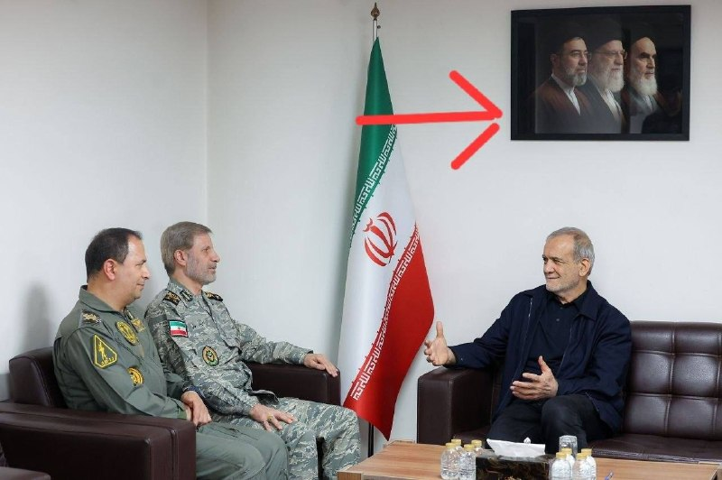

اکانت اسرائیل به فارسی:

پزشکیان با مجتبی ملاقات کرد😂😂😂

@IranianMinds

## IranianMinds — post 20609

🔴فارس:

با وجود رسیدن به توافقاتی در چند موضوع، به دلیل رفتار متناقض واشنگتن، به توافق نزدیک نیستیم.

@IranianMinds

## IranianMinds — post 20607

  <a href="telegram/content/IranianMinds_20607_1779545156.mp4" target="_blank">🎬 Download video</a>

🔴امروز دانش آموزان شهر خرم‌آباد در استان لرستان در مقابل ساختمان آموزش و پرورش دست به تجمع اعتراضی زدند.

@IranianMinds

## IranianMinds — post 20606

  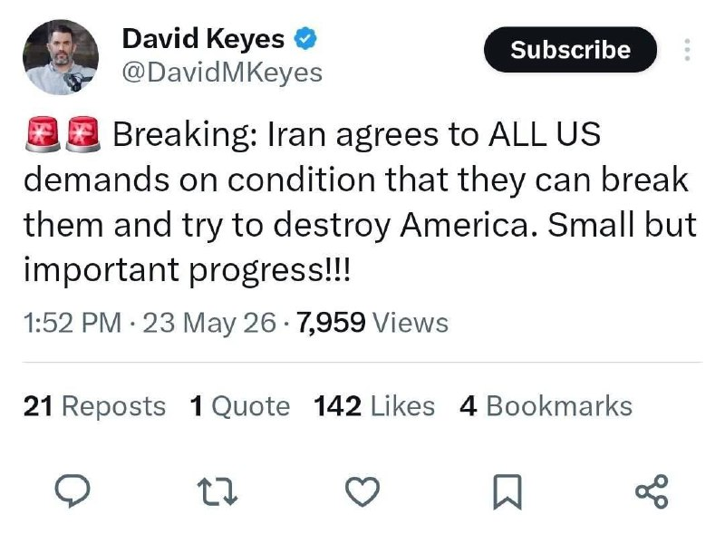

🔴دیوید کیز:

ایران با تمام خواسته‌‌های آمریکا موافقت کرد، البته به این شرط که اجازه داشته باشد آن‌ها را زیر پا بگذارد و برای نابودی آمریکا تلاش کند. پیشرفتی کوچک اما مهم!!!

@IranianMinds

## IranianMinds — post 20605

  

🔴 فرانسه ورود بن گویر وزیر امنیت ملی اسرائیل به کشورش رو ممنوع کرد.

@IranianMinds

## IranianMinds — post 20604

🔴کانال ۱۱ اسرائیل گزارش داد:

اسرائیل هرگونه توافق با رژیم تروریستی اسلامی را به خروج اورانیوم غنی شده از ایران و نظارت دقیق بر برنامه هسته‌ای تهران مشروط می‌داند.

@IranianMinds

## IranianMinds — post 20603

  

🔴 دیدار امروز مارکو روبیو و نخست وزیر هند

@IranianMinds

## IranianMinds — post 20602

🔴صدا و سیما:

عاصم منیر تهران را ترک کرد.

@IranianMinds

## BBCPersian — post 281878

  

🔻پرویز قلیچ‌خانی، کاپیتان پیشین تیم ملی فوتبال ایران و فعال سیاسی چپگرا در ۸۱ سالگی درگذشت. او به آلزایمرمبتلا بود.
نجمه موسوی-پيمبری، «يار و همراه» پرویز قلیچ‌خانی به بی‌بی‌سی فارسی گفت: «قهرمان ملی و چهره هميشه زنده ايران در تاريخ بيست و سوم ماه مه ٢٠٢٦ مصادف با دوم خرداد ١٤٠٥ در بيمارستانی در حومه پاريس درگذشت.»
آقای قلیچ‌خانی، پیش از انقلاب، علاوه بر تیم ملی، در باشگاه‌های تاج، پرسپولیس و پاس هم بازی کرد. او تنها بازیکنی است که با تیم ایران سه بار قهرمان جام ملت‌های آسیا شده است. پرویز قلیچ‌خانی بعد از انقلاب هم در خارج از کشور، مجله آرش را با گرایش سیاسی چپ اداره می‌کرد.
او فوتبال را از کوچه‌های محله صابون پزخانه میدان شوش تهران شروع کرد و بعد از مدتی کوتاه فوتبالیستی ماهر و بالاخره کاپیتان تیم ملی ایران شد.
ولی هنوز طعم قهرمانی فوتبال را درست نچشیده بود که توجهش به سیاست جلب شد و از پشت میله های زندان سر درآورد.
پس از انقلاب از فوتبالیست حرفه‌ای به فعال سیاسی و روزنامه‌نگار خارج‌نشین تبدیل شد.

@BBCPersian

## BBCPersian — post 281877

فعالان حامی فلسطین که پس از توقیف کشتی کمک‌رسانی به غزه توسط نیروهای اسرائیلی در آب‌های بین‌المللی بازداشت شده بودند و به زندانی در اسرائیل منتقل شده بودند، و اکنون اخراج شدند، می‌گویند که در زمان بازداشت در اسرائیل مورد آزار و اذیت قرار گرفته‌اند.
ارتش اسرائیل هم این گفته‌ها را رد کرد و به بی‌بی‌سی گفت که دستوراتش «دربرگیرنده رفتار محترمانه و مناسب با افراد حاضر در ناوگان بوده است».

جزئیات بیشتر را در لینک زیر بخوانید:
https://bbc.in/4tT9kXp

@BBCPersian

## BBCPersian — post 281876

🔻پلی بر رودخانه سن در پاریس تبدیل به یک غار عظیم بادی شد.

فیلمبرداری به شیوه تایم‌لپس نشان می‌دهد که این پل چگونه به هیبت یک غار درمی‌آید.

«پونت نوف»، پل نهم سن در قرن ۱۷ ساخته شده است.

این اثر با عنوان «غار» کار هنرمند فرانسوی، ژان رنه، با نام مستعار جی‌آر، جدیدترین اثر از مجموعه‌ای از چیدمان‌های هنری در مقیاس بزرگ در پایتخت فرانسه است که ۱۲۰ متر طول و بین ۱۲ تا ۱۸ متر ارتفاع دارد.

جی‌آر به خبرگزاری آسوشیتدپرس گفت که این اثر «خشن و وحشی در کنار ظرافت لطیف» پاریس، ترس را در عین یک جذابیت ناشناخته القا می‌کند.

این غار از ۶ ژوئن/۱۶ خرداد به روی عموم باز می‌شود. این چیدمان تا ۲۸ ژوئن/ ۷ تیر برقرار خواهد بود.

🎥APTN
@BBCPersian

## BBCPersian — post 281875

🔻فرمانده کل قوای پاکستان تهران را ترک کرد

فیلد مارشال عاصم منیر، فرمانده کل ارتش و نیروهای مسلح پاکستان، پس از سفری یک روزه به تهران ایران را ترک کرد.

به گزارش ایرنا، او «با همراهی محسن نقوی، وزیر کشور پاکستان که از هفته گذشته در تهران به سر می‌برد، تهران را ترک کردند.»

آقای منیردر این سفر با محمدباقر قالیباف، رئیس مجلس، مسعود پزشکیان، رئیس جمهور و عباس عراقچی، وزیر خارجه دیدار و گفتگو کرد.

این دومین سفر آقای منیر در چند هفته گذشته به ایران است.

پاکستان میانجی مذاکرات ایران و آمریکا است.

https://bbc.in/4uXuJ2G
@BBCPersian

## BBCPersian — post 281874

  <a href="telegram/content/BBCPersian_281874_1779545163.mp4" target="_blank">🎬 Download video</a>

پنتاگون مجموعه‌ای تازه از اسناد مربوط به اشیای ناشناس پرنده را منتشر کرده که شامل مدارک، فایل‌های صوتی و ۵۱ ویدیو از مشاهدات این اشیا در طول بیش از ۸۰ سال گذشته و از جمله در ایران و سوریه است.
 
در این گزارش‌ها، شاهدان از دیدن گوی‌ها، دیسک‌ها و توپ‌های آتشین از دهه ۱۹۴۰ تا امروز خبر داده‌اند. در یکی از جدیدترین موارد، یک مقام ارشد اطلاعاتی آمریکا گفته در سال ۲۰۲۵ داخل بالگرد نظامی، تعداد زیادی گوی نارنجی را دیده که با سرعت بالا در همه جهات حرکت می‌کردند و حتی برای لحظاتی به شکل یک مثلث کنار هم قرار گرفتند و سپس ناپدید شدند. این پدیده بیش از یک ساعت ادامه داشته است.
  
دونالد ترامپ، رییس جمهور آمریکا پس از انتشار این اسناد گفت: «با این مدارک و ویدیوها، مردم خودشان می‌توانند تصمیم بگیرند که واقعا چه خبر است». پنتاگون اعلام کرده انتشار فایل‌های مربوط به اشیای ناشناس پرنده ادامه خواهد داشت و اسناد بیشتری به‌زودی منتشر می‌شود.

@bbcpersian

## BBCPersian — post 281873

  

🔻مارکو روبیو، وزیر خارجه آمریکا، که برای سفری چهار روزه در هند است با نارندرا مودی، نخست‌وزیر، دیدار و گفت‌وگو کرد.

آقای روبیو در این دیدار گفته است آمریکا اجازه نمی‌دهد که ایران بازار انرژی در دنیا را به «گروگان» بگیرد.

او همچنین بر اهمیت همکاری راهبردی هند و آمریکا در منطقه اقیانوس‌های هند و آرام تاکید کرد.

به گفته سفیر آمریکا در هند، آقای روبیو به نمایندگی از دونالد ترامپ، رئیس جمهور آمریکا، آقای مودی را برای یک سفر رسمی به آمریکا دعوت کرده است.

📸Indian Government
https://bbc.in/4us85PY
@BBCPersian

## Dirty_Kids — post 390014

کانال یازده اسراییل گفته
اون قسمت هایی از مذاکره که آمریکا ، اسراییل رو در جریان نمیزاره ، از طریق جاسوسان موساد در نظام ، اسراییل در جریان مذاکرات قرار میگیره :))))))))))

@Dirty_Kids 👻

## Dirty_Kids — post 390013

  <a href="telegram/content/Dirty_Kids_390013_1779545166.mp4" target="_blank">🎬 Download video</a>

تو اسناد جدیدی که وزارت دفاع آمریکا از پرونده‌های UFO 🛸 منتشر کرده، اسم ایران هم به چشم می‌خوره!

«4 شیء ناشناسِ پرنده به‌صورت گروهی، 26 آگوست 2022، روی آب‌های ایران مشاهده شدن»

@Dirty_Kids 👻

## Dirty_Kids — post 390012

  

پست جدید ترامپ:

ایالاتِ متحده‌ی خاورمیانه؟

@Dirty_Kids 👻

## Hranews — post 113114

  

گزارشی از تداوم بازداشت و بلاتکلیفی آرتین غضنفری در زندان تهران بزرگ

❗️
❗️
❗️
❗️
❗️– آرتین غضنفری، شهروند بهائی و عکاس خبری، با گذشت ۱۲۵ روز از زمان دستگیری، کماکان به‌صورت بلاتکلیف در زندان تهران بزرگ محبوس است.

به گزارش خبرگزاری هرانا، ارگان خبری مجموعه فعالان حقوق بشر در ایران، آرتین غضنفری، شهروند بهائی کماکان در بازداشت است.

یک منبع مطلع نزدیک به خانواده این شهروند بهائی، ضمن تایید این خبر به هرانا گفت: آقای غضنفری از بیماری‌های متعددی، از جمله نارسایی قلبی، آسم و فشار خون بالا رنج می‌برد و به‌صورت روزانه نیازمند مصرف دارو است. با این حال، علیرغم پیگیری‌های مکرر خانواده از مراجع قضایی، مسئولان مربوطه با آزادی موقت وی موافقت نکرده‌اند.

وی افزود: همچنین، قرار بازداشت آرتین را بدون ارائه توضیحی روشن، برای چندمین بار تمدید شده است. تداوم این وضعیت، نگرانی‌های خانواده وی را افزایش داده است.

ادامه مطلب

#آرتین_غضنفری

↘️
@hranews_bot تماس ✉️ - @Hranews کانال هرانا 🆑

## Hranews — post 113113

  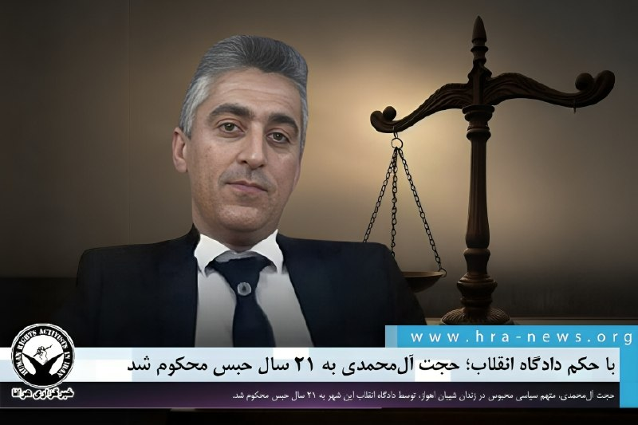

با حکم دادگاه انقلاب؛‌ حجت آل‌محمدی به ۲۱ سال حبس محکوم شد

❗️
❗️
❗️
❗️
❗️– حجت آل‌محمدی، زندانی سیاسی محبوس در زندان شیبان اهواز، توسط دادگاه انقلاب این شهر به ۲۱ سال حبس محکوم شده است.

به گزارش خبرگزاری هرانا، ارگان خبری مجموعه فعالان حقوق بشر در ایران، حجت آل‌محمدی به #حبس محکوم شد.

براساس اطلاعات دریافتی هرانا، آقای آل‌محمدی توسط شعبه سوم دادگاه انقلاب اهواز به ۲۱ سال حبس محکوم شده است. این رای هفته گذشته در زندان به او ابلاغ شده است.

ادامه مطلب

#حجت_آل‌محمدی

↘️
@hranews_bot تماس ✉️ - @Hranews کانال هرانا 🆑

## Hranews — post 113112

  

صبح امروز، گروهی از کارکنان شرکت‌های تعاونی سهام عدالت، با برگزاری تجمع اعتراضی مقابل درب شمالی شماره دو وزارت امور اقتصادی و دارایی در تهران، خواستار پرداخت حقوق معوقه و رسیدگی به وضعیت امنیت شغلی خود شدند.
#تجمع_اعتراضی

↘️
@hranews_bot تماس ✉️ - @Hranews کانال هرانا 🆑

## Hranews — post 113111

  

تصویر منتشرشده از دادنامه شعبه ششم دادگاه عمومی حقوقی مجتمع قضایی کرج، نشان ‌دهنده صدور حکمی است که در آن دعوای یک زن برای «استرداد مال منقول» (یک دستگاه موتور سیکلت) رد شده است. قاضی صادر کننده رای، در بخش استدلال خود صراحتا قید کرده است که «مالکیت نسوان نسبت به موتور سیکلت عرفاً قابل پذیرش نیست». رئیس شعبه با این استناد، دفاعیات خواهان را «فاقد وجاهت قانونی» دانسته و حکم بر بطلان دعوی صادر کرده است. این استدلال عرفی در حالی مبنای رد مالکیت قرار گرفته که در قوانین مدنی و تجاری کشور، هیچ منع قانونی برای خرید، فروش و مالکیت اموال منقول بر اساس جنسیت وجود ندارد./ آوش

این تصمیم قضایی در حالی اتخاذ شده است که طبق ماده ۳۰ قانون مدنی، هر فردی حق دارد بر اموال خود مالکیت داشته باشد و قانون در این زمینه تفاوتی میان زن و مرد قائل نشده است. همچنین بر اساس ماده ۱۱۱۸ قانون مدنی، #زنان از حق کامل برای خرید و فروش برخوردارند.

↘️
@hranews_bot تماس ✉️ - @Hranews کانال هرانا 🆑

## Hranews — post 113110

به اتهام “همکاری با شبکه‌های معاند”؛ دو زن مجموعا به ۵۳ سال حبس محکوم شدند

❗️
❗️
❗️
❗️
❗️– رئیس کل دادگستری استان سمنان از صدور احکام طولانی مدت حبس و مجازات‌های تکمیلی برای دو زن به نام‌های لیلا رمضانی و فاطمه ملک‌احمدی به دلیل آنچه “همکاری با شبکه‌های معاند و اقدام علیه امنیت ملی” عنوان کرده است، خبر داد. بر این اساس، لیلا رمضانی به ۲۶ سال و فاطمه ملک‌احمدی به ۲۷ سال حبس و انفصال از خدمات دولتی، ممنوعیت خروج از کشور و محرومیت از عضویت در احزاب و گروه‌های سیاسی و اجتماعی محکوم شده‌اند.

ادامه مطلب

#لیلا_رمضانی #فاطمه_ملک‌احمدی #حبس

↘️
@hranews_bot تماس ✉️ - @Hranews کانال هرانا 🆑

## Hranews — post 113109

مرگ یک نوجوان در مشهد هنگام فرار از تعرض؛ دو متهم بازداشت شدند

❗️
❗️
❗️
❗️
❗️– یک نوجوان ۱۷ ساله در مشهد، پس از آنچه تلاش برای تعرض جنسی از سوی دو مرد عنوان شده، با سقوط از پنجره یک واحد مسکونی جان خود را از دست داد. در این رابطه، دو مرد بازداشت شدند.

ادامه مطلب

#نوجوان #تعرض_جنسی

↘️
@hranews_bot تماس ✉️ - @Hranews کانال هرانا 🆑

## manototv — post 105762

  <a href="telegram/content/manototv_105762_1779545170.mp4" target="_blank">🎬 Download video</a>

بر اساس گزارش ان‌بی‌سی، دونالد ترامپ جونیور، پسر بزرگ رئیس‌جمهور آمریکا، با بتینا اندرسون در فلوریدا ازدواج کرده است، اما دونالد ترامپ احتمالاً در مراسم این آخر هفته شرکت نخواهد کرد.
ترامپ در گفت‌وگو با خبرنگاران گفته مراسم «یک رویداد کوچک و خصوصی» است و به دلیل شرایط کاری در کاخ سفید و مسائل سیاسی از جمله وضعیت جمهوری‌اسلامی، امکان حضور ندارد. او تأکید کرده که در این مقطع زمانی نمی‌تواند از واشنگتن خارج شود و مسئولیت‌های دولت را اولویت می‌داند.
ترامپ همچنین با اشاره به فشارهای رسانه‌ای گفته است که چه در صورت حضور و چه عدم حضور در مراسم، مورد انتقاد قرار خواهد گرفت. او در شبکه اجتماعی خود نیز ازدواج پسرش را تبریک گفته اما تأکید کرده که به دلیل «مسائل دولت و شرایط حساس فعلی» در مراسم حاضر نخواهد شد.

## manototv — post 105761

  <a href="telegram/content/manototv_105761_1779545170.mp4" target="_blank">🎬 Download video</a>

شیخ تمیم بن حمد آل ثانی، امیر قطر، در تماس تلفنی با دونالد ترامپ، رئیس‌جمهور آمریکا، درباره تنش‌های منطقه‌ای و ابتکارهای دیپلماتیکی که با محوریت پاکستان برای جلوگیری از تشدید بحران در حال انجام است، گفت‌وگو کرده است.
در این تماس، دو طرف تلاش‌ها برای کاهش تنش‌ها و حفظ ثبات منطقه را بررسی کردند و بر حمایت از میانجی‌گری پاکستان میان ایالات متحده و جمهوری‌اسلامی تاکید شد.
همچنین در این گفت‌وگو بر اهمیت ادامه مذاکرات و گفت‌وگوهای دیپلماتیک برای حل مسائل جاری، حفاظت از کشتیرانی دریایی و تضمین امنیت مسیرهای راهبردی آبی تأکید شد؛ موضوعی که به ثبات بازار جهانی انرژی و زنجیره تأمین نیز مرتبط است.

## manototv — post 105760

  <a href="telegram/content/manototv_105760_1779545171.mp4" target="_blank">🎬 Download video</a>

بر اساس گزارشی که در روزنامه تایمز منتشر شده، یک تحقیق مخفیانه نشان می‌دهد یک شبکه مرتبط با جمهوری‌اسلامی از طریق تلگرام تلاش کرده شهروندان بریتانیایی را برای سازماندهی تجمعات خیابانی ضد اسرائیلی و پخش پوسترهای تبلیغاتی جذب کند.
در این گزارش آمده است که خبرنگار تایمز به‌صورت مخفیانه وارد ارتباط با فردی شده که خود را «مهدی» معرفی کرده و مدعی بوده در ایران مستقر است و با ساختارهای امنیتی جمهوری‌اسلامی در ارتباط است. این فرد در پیام‌های خود پیشنهاد پرداخت پول در ازای سازماندهی تجمع، جذب افراد جدید و اجرای فعالیت‌های تبلیغاتی در لندن را مطرح کرده است.
همچنین از این خبرنگار خواسته شده ابتدا برای اثبات اعتماد، اقدام به نصب پوستر در خیابان‌های لندن و فیلم‌برداری از آن کند. این پوسترها شامل پیام‌های سیاسی علیه اسرائیل بوده است.
در ادامه، درخواست‌هایی برای گسترش فعالیت و حتی طراحی پروژه‌های آنلاین نیز مطرح شده و در نهایت حساب تلگرامی مربوطه به‌طور ناگهانی حذف شده است.

## manototv — post 105759

  <a href="telegram/content/manototv_105759_1779545172.mp4" target="_blank">🎬 Download video</a>

در حالی‌که برخی مقام‌های آمریکایی از احتمال توقف موقت فروش تسلیحات به تایوان به دلیل نیاز ارتش آمریکا در عملیات علیه ایران خبر داده بودند، یک منبع آگاه رویترز این ادعا را رد کرد و گفت این روند کاملاً طولانی‌مدت و اداری است و ارتباطی با جنگ ایران ندارد.
بر اساس این گزارش، تایوان همچنان منتظر تأیید بسته تسلیحاتی تا سقف ۱۴ میلیارد دلار از سوی آمریکا است. این در حالی است که چین به‌شدت با فروش سلاح به تایوان مخالفت کرده و آن را اقدامی علیه حاکمیت خود می‌داند.
کاخ سفید اعلام کرده تصمیم نهایی درباره این بسته در آینده نزدیک گرفته خواهد شد، اما سیاست کلی آمریکا در حمایت از توان دفاعی تایوان بدون تغییر باقی مانده است. تایوان نیز می‌گوید هیچ اطلاع رسمی از تعلیق یا تأخیر در این روند دریافت نکرده است.

## alonews — post 122056

  <a href="telegram/content/alonews_122056_1779545173.mp4" target="_blank">🎬 Download video</a>

👈روبیو : شاید امروز یا چند روز دیگه درباره ایران خبرای جدیدی بیاد یه پیشرفت‌هایی شده
- ولی ایران نباید سلاح هسته‌ای داشته باشه و ترامپ میخواد قضیه دیپلماتیک حل بشه

✅ @AloNews خبر جنگ

## alonews — post 122055

  <a href="telegram/content/alonews_122055_1779545175.webm" target="_blank">🎬 Download video</a>

🔴فوری / روبیو: فرصتی برای پذیرش توافق توسط ایران در نزدیک‌ترین زمان وجود دارد 
✅ @AloNews خبر جنگ

## alonews — post 122054

اخبار جنگ الونیوز AloNews pinned a photo

## alonews — post 122053

  

قیمت استثنایی گیگی
9️⃣
8️⃣
1️⃣

تحویل زیر یک دقیقه
✅
دارای لینک سابسکریشن جهت دیدن حجم و کنترل مصرف
✅
بدون قطعی 
✅
بدون محدودیت کاربر و زمان
✅
جمینایو چت جی بی تی و... کامل اوکیه با سرورامون
✅

🏪پشتیبانی کامل
✅
شروع فعالیت از سال 2022 
✅
پرداخت ریالی
✅

ضریب و این چیزا ندارن و تا آخرین مگابایت برای پشتیبانیش درختمتیم
🥂

💤این تخفیف فقط تا ۱۲ شب فعاله
💤

⭐️ @Napsternetiran_bot
〰️〰️〰️〰️〰️〰️〰️

🔶 @Napsternetvirani

## alonews — post 122052

  <a href="telegram/content/alonews_122052_1779545176.webm" target="_blank">🎬 Download video</a>

👈سخنگوی وزارت خارجه: تفاهم‌نامه چهارده بندی هم موضوع هسته‌ای مورد اشاره قرار می‌گیرد و هم موضوع آزادسازی اموال بلوکه‌شده. 
✅ @AloNews خبر جنگ

## alonews — post 122051

  <a href="telegram/content/alonews_122051_1779545176.webm" target="_blank">🎬 Download video</a>

🔴فوری / روبیو: فرصتی برای پذیرش توافق توسط ایران در نزدیک‌ترین زمان وجود دارد

✅ @AloNews خبر جنگ

## alonews — post 122050

  <a href="telegram/content/alonews_122050_1779545177.webm" target="_blank">🎬 Download video</a>

👈سخنگوی وزارت خارجه: تفاهم‌نامه چهارده بندی هم موضوع هسته‌ای مورد اشاره قرار می‌گیرد و هم موضوع آزادسازی اموال بلوکه‌شده.

✅ @AloNews خبر جنگ

## alonews — post 122049

  <a href="telegram/content/alonews_122049_1779545177.webm" target="_blank">🎬 Download video</a>

👈یک مقام ایرانی به شبکه الجزیره: قطر نقش کلیدی در تهیه پیش‌نویس این یادداشت تفاهم ایفا کرد و بین میانجی‌ها و واشنگتن ارتباط وجود داشت

✅ @AloNews خبر جنگ

## alonews — post 122048

  <a href="telegram/content/alonews_122048_1779545177.webm" target="_blank">🎬 Download video</a>

👈سخنگوی وزارت خارجه: پیشنهاد ۱۴ بندی ایران که چندین بار رفت و برگشت شده و در خصوص بندهای مختلف آن دیدگاه‌های طرفین تبادل شده است و در این چند روز راجع به برخی نکات و عبارت پردازی‌هایی که راجع به آن اختلاف نظر کماکان وجود داشت بحث و پیشنهاداتی مطرح شد که همچنان برخی از آن در حال بررسی و اعلام نظر است.

✅ @AloNews خبر جنگ

## alonews — post 122047

  <a href="telegram/content/alonews_122047_1779545177.webm" target="_blank">🎬 Download video</a>

👈بقائی: حضور هیئت قطری در تهران برای تسهیل برخی بندهای یادداشت تفاهم بود

🔴میانجی ما در مفهوم دقیق کلمه رسما همان پاکستان است. طرف‌های دیگری هم هستند که تلاش می‌کنند کمک کنند. ما از آنها تشکر می‌کنیم.

🔴قطر یکی از این کشورها است.کشورهای منطقه به دنبال کاهش تنش هستند.

🔴کشورهای منطقه شاهد بودند که تجاوز آمریکا و رژیم اسرائیل می‌تواند چه آثاری داشته‌باشد.

🔴حضور هیئت قطری هم برای کمک به حل‌فصل برخی بندهای تفاهم بود.

✅ @AloNews خبر جنگ

## alonews — post 122046

  <a href="telegram/content/alonews_122046_1779545178.webm" target="_blank">🎬 Download video</a>

👈العربیه: تهران در ازای پرداخت غرامت از سوی آمریکا به ایران، پیشنهاد بازگشایی تنگه هرمز را ارائه کرده است.

✅ @AloNews خبر جنگ

## alonews — post 122045

  <a href="telegram/content/alonews_122045_1779545178.webm" target="_blank">🎬 Download video</a>

🔴فوری / مقام ایرانی به الجزیره گفت: ایران نمی‌تواند امتیازاتی بیشتر از آنچه در یادداشت تفاهم آمده است، بدهد. 
✅ @AloNews خبر جنگ

## alonews — post 122044

  <a href="telegram/content/alonews_122044_1779545178.webm" target="_blank">🎬 Download video</a>

👈 یک مقام ایرانی به الجزیره گفت: این یادداشت تفاهم شامل مسائل هسته‌ای نمی‌شود زیرا این مسائل پیچیده هستند و به زمان کافی برای مذاکره نیاز دارند. 
🔴30 روز پس از توافق، می‌توان درهای مذاکرات هسته‌ای را باز کرد. 
✅ @AloNews خبر جنگ

## alonews — post 122043

  <a href="telegram/content/alonews_122043_1779545178.webm" target="_blank">🎬 Download video</a>

👈بقائی: تنگه هرمز به آمریکا ربطی ندارد و این موضوع بین ما و کشورهای ساحلی است

✅ @AloNews خبر جنگ

## alonews — post 122042

  <a href="telegram/content/alonews_122042_1779545179.webm" target="_blank">🎬 Download video</a>

👈 یک مقام ایرانی به الجزیره گفت: این یادداشت تفاهم شامل مسائل هسته‌ای نمی‌شود زیرا این مسائل پیچیده هستند و به زمان کافی برای مذاکره نیاز دارند.

🔴30 روز پس از توافق، می‌توان درهای مذاکرات هسته‌ای را باز کرد.

✅ @AloNews خبر جنگ

## alonews — post 122041

  <a href="telegram/content/alonews_122041_1779545179.webm" target="_blank">🎬 Download video</a>

🔴فوری / ادعای الجزیره: مقام ایرانی تایید کرد با واسطه پاکستانی به توافق رسیدند و منتظر جواب آمریکا هستند! 
✅ @AloNews خبر جنگ

## alonews — post 122040

  <a href="telegram/content/alonews_122040_1779545179.webm" target="_blank">🎬 Download video</a>

🔴فوری / ادعای الجزیره: مقام ایرانی تایید کرد با واسطه پاکستانی به توافق رسیدند و منتظر جواب آمریکا هستند!

✅ @AloNews خبر جنگ

## alonews — post 122039

  <a href="telegram/content/alonews_122039_1779545179.webm" target="_blank">🎬 Download video</a>

👈 ترامپ درباره رو کانا: یک دموکرات!

🔴اجازه ندهید این دروغگو و آدم کثیف در فاکس نیوز باشد!

✅ @AloNews خبر جنگ

## alonews — post 122038

  <a href="telegram/content/alonews_122038_1779545180.webm" target="_blank">🎬 Download video</a>

👈پست جدید و عجیب ترامپ با نقشه ایران : ایالات متحده خاورمیانه؟

✅ @AloNews خبر جنگ

## alonews — post 122036

  <a href="telegram/content/alonews_122036_1779545180.mp4" target="_blank">🎬 Download video</a>

👈امروز یه عده دانش‌آموز تو خرم‌آباد جلوی اداره آموزش‌وپرورش جمع شدن و اعتراض کردن

🔴 گفته می‌شه تجمع به درگیری کشیده شده و نیروی انتظامی و بسیج برای متفرق کردنشون وارد عمل شدن

✅ @AloNews خبر جنگ

---
📅 بروزرسانی: 1405/03/02 15:35
---

## VahidOOnLine — post 241704

  <a href="telegram/content/VahidOOnLine_241704_1779537934.mp4" target="_blank">🎬 Download video</a>

همزمان با اعتراضات دانش‌آموزان شهرهای بروجرد و خرم‌آباد در لرستان، ویدیوی رسیده به ایران اینترنشنال نشان می‌دهد محصلان در کهگیلویه و بویراحمد نیز با تشکیل تجمع اعتراضی به موج اعتراض پیوستند. این اعتراضات نسبت به حضوری شدن امتحانات پس از ماه‌ها اختلال در فعالیت مدارس و تعطیلی صورت می‌گیرد.
‌🏁 🇬🇧 IranintlTV

🤖 @VahidOOnLine

## VahidOOnLine — post 241703

  

♦️شیخ تمیم بن حمد آل ثانی، امیر قطر، روز شنبه دوم خرداد ماه در تماس تلفنی با دونالد ترامپ، رئیس‌جمهوری آمریکا، آخرین تحولات و رویدادهای فوری منطقه را بررسی کرد.
بر اساس بیانیه رسمی دیوان امیری قطر، این گفتگو بر «تلاش‌های منطقه‌ای و بین‌المللی برای حفظ آرامش کنونی و کاهش تنش‌ها» متمرکز بوده است.
«امنیت دریانوردی، حفظ ایمنی آبراه‌های راهبردی و تضمین تداوم روان زنجیره‌های تامین جهانی و انتقال انرژی» از دیگر محورهای این گفتگو توصیف شده است.
به گزارش رسانه‌های قطری، امیر قطر در این تماس بر موضع ثابت دوحه در اولویت دادن به راه‌حل‌های مسالمت‌آمیز برای بحران‌ها تاکید و اعلام کرد قطر از همه ابتکارهایی که با هدف مهار بحران‌ها از طریق گفتگو و دیپلماسی انجام می‌شود، حمایت می‌کند.
این خبر در حالی منتشر می‌شود که رسانه‌ها از گفتگوی تلفنی وزیرامورخارجه قطر با عباس عراقچی خبر داده‌اند.
همزمان گزارش‌ها از رایزنی‌های گسترده کشورهای منطقه برای جلوگیری از حملات احتمالی آمریکا به ایران خبر می‌دهد.
این در حالیست که شبکه خبری العربیه پیشتر از هشدار واشنگتن به تهران مبنی بر از سرگیری حملات به ایران خبر داده بود.
‌🇸🇦 Indypersian

🤖 @VahidOOnLine

## VahidOOnLine — post 241702

  <a href="telegram/content/VahidOOnLine_241702_1779537937.mp4" target="_blank">🎬 Download video</a>

بر پایه گزارش رسانه‌های حکومتی، محمدباقر قالیباف، رئیس مجلس شورای اسلامی و رئیس هیئت مذاکره کننده نظام در مذاکرات با آمریکا به میزبانی اسلام‌آباد در دیدار با فیلد مارشال عاصم منیر، فرمانده ارتش پاکستان تهدید کرده: «در صورت حماقت ترامپ و آغاز مجدد جنگ، پاسخ ما کوبنده‌تر خواهد بود» قالیباف همچنین گفته در آتش‌بس بودیم که آمریکا «با نقض عهد، محاصره دریایی کرد و حالا به دنبال برداشتن آن است»
‌🏁 🇬🇧 ManotoTV

🤖 @VahidOOnLine

## VahidOOnLine — post 241701

  <a href="telegram/content/VahidOOnLine_241701_1779537937.mp4" target="_blank">🎬 Download video</a>

مجتبی خامنه‌ای، رهبر مشاهده نشده جمهوری‌اسلامی، در ادامه سنت مورد علاقه پدرش، علی خامنه‌ای، با انتشار پیامی نوشتاری درگذشت «والده» رئیس‌جمعیت هلال‌احمر جمهوری‌اسلامی، پیرحسین کولیوند را تسلیت گفت. علی‌ خامنه‌ای به انتشار پیام‌های تسلیت برای شخصیت‌های گوناگون و بستگان و اعضای خانواده آن‌ها علاقه بسیار داشت.
‌🏁 🇬🇧 ManotoTV

🤖 @VahidOOnLine

## VahidOOnLine — post 241700

  

♦️بر اساس گزارش‌های منتشر شده در رسانه‌های رسمی ایران، فیلد مارشال عاصم منیر، فرمانده ارتش پاکستان، در تهران با محمدباقر قالیباف دیدار کرده است.
خبرگزاری تسنیم نوشت قالیباف در این دیدار با قدردانی از «حمایت‌ها و اقدامات ملت و دولت پاکستان در ادوار مختلف از جمله در جریان جنگ تحمیلی اخیر و مذاکرات پس از آن»، این تعاملات را «نمونه‌ای از همکاری خوب بین ملل و دول اسلامی» عنوان کرد که «می‌تواند برای سایر کشورهای اسلامی الگو باشد.»
قالیباف گفت: «ما از حقوق ملت و کشورمان عدول نمی‌کنیم، مخصوصا با طرفی که اصلا صداقت نداشته و اعتمادی به او وجود ندارد. جمهوری اسلامی ایران همانطور که با شجاعت و اقتدار در میدان نبرد از کیان ایران دفاع کرد در عرصه دیپلماسی نیز با هوشمندی و قدرت برای احقاق حقوق حقه ایران و تامین منافع ملی کشور کوشش خواهد کرد.»
او افزود: «نظامی‌ها بیش از دیگران و بهتر از همه ارزش صلح را می‌دانند اما همان نظامیان هیچگاه اجازه نمی دهند، عزت و حقوق کشورشان لگدمال شود.»
رئیس مجلس شورای اسلامی همچنین گفت: «ما در حال مذاکره بودیم که آمریکا جنگ به راه انداخت و حالا می‌گوید برای پایانش مذاکره کنیم.»
‌🇸🇦 Indypersian

🤖 @VahidOOnLine

## VahidOOnLine — post 241699

  

♦️شبکه خبری العربیه، روز شنبه دوم خرداد ماه، به نقل از منابع خود گزارش داد یک هیئت فنی و حقوقی از پاکستان عازم تهران شده است.
بر اساس این گزارش، این هیئت قرار است در تهران به عاصم منیر، فرمانده ارتش پاکستان، ملحق شود.
العربیه، پیشتر گزارش داده بود فرمانده ارتش پاکستان پیام‌هایی از سوی آمریکا را به تهران منتقل کرده که در آن نسبت به ازسرگیری جنگ هشدار داده شده است.
فیلد مارشال عاصم منیر، فرمانده ارتش پاکستان روز جمعه وارد تهران شد تا در مورد مذاکرات میان آمریکا و ایران با مسئولان جمهوری اسلامی رایزنی کند.
عاصم منیر روز شنبه با مقام‌های ارشد جمهوری اسلامی از جمله مسعود پزشکیان، محمدباقر قالیباف و عباس عراقچی دیدار و گفتگو کرد.
‌🇸🇦 Indypersian

🤖 @VahidOOnLine

## VahidOOnLine — post 241698

  

محمدباقر قالیباف، رییس مجلس جمهوری اسلامی، در دیدار با عاصم منیر، رییس ستاد کل ارتش پاکستان، گفت نیروهای مسلح جمهوری اسلامی در دوران آتش‌بس بازسازی شده‌اند و در صورت آغاز دوباره جنگ، واکنش ایران شدیدتر خواهد بود.

او گفت: «نیروهای مسلح ما در دوران آتش‌بس به نحوی خود را بازسازی کرده‌اند که در صورت حماقت ترامپ و آغاز مجدد جنگ، حتما برای آمریکا کوبنده‌تر و تلخ‌تر از روز اول جنگ خواهند بود.»

قالیباف با اشاره به نقش پاکستان در میانجی‌گری افزود: «در آتش‌بسی بودیم که شما واسطه‌اش بودید و آمریکا با نقص عهد، محاصره دریایی کرد و حالا به‌دنبال برداشتن آن است.»
‌🏁 🇬🇧 IranintlTV

🤖 @VahidOOnLine

## VahidOOnLine — post 241697

  

♦️رسانه‌های رسمی ایران، روز شنبه دوم خرداد ماه از دومین دیدار میان فرمانده ارتش پاکستان و عباس عراقچی، وزیر امور خارجه ایران طی ۲۴ ساعت گذشته خبر داده‌اند.
پیشتر شبکه خبری العربیه گزارش کرده بود، واشنگتن از طریق عاصم منیر به تهران هشدار داده است، در صورت شکست مذاکرات جنگ از سرگرفته خواهد شد.
فیلد مارشال عاصم منیر، فرمانده ارتش پاکستان روز جمعه وارد تهران شد تا در مورد مذاکرات میان آمریکا و ایران با مسئولان جمهوری اسلامی رایزنی کند.
‌🇸🇦 Indypersian

🤖 @VahidOOnLine

## VahidOOnLine — post 241696

  <a href="telegram/content/VahidOOnLine_241696_1779537941.mp4" target="_blank">🎬 Download video</a>

♦️ویدیوهای منتشرشده در شبکه‌های اجتماعی نشان می‌دهد روز شنبه دوم خرداد، گروهی از دانش‌آموزان در خرم‌آباد در اعتراض به نحوه برگزاری امتحانات و اصرار مسئولان بر حضوری بودن آزمون‌ها، مقابل ساختمان آموزش و پرورش تجمع کردند.
معترضان با سر دادن شعارهایی چون «مجازی، مجازی» و «مرگ بر مسئول بی‌لیاقت» خواستار لغو امتحانات حضوری و برگزاری غیرحضوری آزمون‌ها شدند. در برخی ویدیوها، فضای اعتراضی دانش‌آموزان و حضور گسترده آنان مقابل اداره آموزش و پرورش دیده می‌شود.
همزمان گزارش‌ها و ویدیوهای دیگری از بروجرد نیز منتشر شده که نشان می‌دهد شماری از دانش‌آموزان این شهر به تجمعات اعتراضی پیوسته‌اند. معترضان در بروجرد نیز خواستار مجازی شدن امتحانات شده و شعار «لرستان می‌میرد، ذلت نمی‌پذیرد» سر داده‌اند.
این اعتراضات در حالی ادامه دارد که پیش از این نیز دانش‌آموزانی در شهرکرد نسبت به نحوه برگزاری امتحانات و تصمیم مسئولان آموزشی اعتراض کرده بودند. طی روزهای اخیر، نگرانی‌ها درباره شرایط آموزشی، فشار روانی امتحانات و اصرار بر برگزاری حضوری آزمون‌ها در فضای مجازی و میان خانواده‌ها افزایش یافته است.
‌🇸🇦 Indypersian

🤖 @VahidOOnLine

## VahidOOnLine — post 241695

  

♦️در حالیکه رسانه‌های ورزشی ایران از شایعاتی مبنی بر رد ویزای شجاع خلیل‌زاده، مهدی طارمی و احسان حاج‌صفی خبر داده‌اند.

فدراسیون فوتبال ایران، روز شنبه با انتشار بیانیه‌ای با تکذیب این خبر ادعا کرد: «فرایند اداری مربوط به اخذ ویزا از سوی فدراسیون فوتبال و تیم ملی طبق روال انجام گرفته و ادعای مطرح شده کذب است.»

در همین حال، روزنامه خبرورزشی گزارش کرده است، امیر قلعه‌نویی، سرمربی تیم ملی فوتبال مردان ایران با بازیکنان جایگزین این سه عضو تیم ملی تماس گرفته تا تمرینات آمادگی برای جام جهانی را ادامه دهند.

شجاع خلیل‌زاده، مهدی طارمی و احسان حاج‌صفی سه ملی‌پوش ایرانی‌هستند که خدمت سربازی را در سپاه پاسداران انجام داده‌اند.
‌🇸🇦 Indypersian

🤖 @VahidOOnLine

## WithYashar — post 12144

@withyashar تحلیل پوزیشن الان

## WithYashar — post 12143

  <a href="telegram/content/WithYashar_12143_1779537944.mp4" target="_blank">🎬 Download video</a>

🎬 Video

## WithYashar — post 12142

ادعای خبرنگار الجزیره: یک شخصیت بسیار بلندپایه منطقه‌ای از ایران دیدار کرده است
علی هاشم در پیامی در شبکه اجتماعی ایکس مدعی شد که ـیک چهره بسیار برجسته منطقه‌ای، بی‌سروصدا از تهران بازدید کرد تا آنچه را که بسیاری اکنون «شکاف‌های غیرقابل عبور» می‌نامند، پر کند.
@withyashar

## WithYashar — post 12141

تماس تلفنی امیر قطر با ترامپ درباره کاهش تنش‌ها در منطقه

دیوان امیری قطر از تماس تلفنی امیر این کشور با ترامپ ،رئیس جمهور آمریکا خبر داد.
دیوان امیری قطر افزود که امیر این کشور درباره تلاش‌ها برای تحکیم آتش‌بس و کاهش تنش‌ها در منطقه صحبت کرد.
@withyashar

## WithYashar — post 12140

قالیباف در دیدار امروز با عاصم منیر، فرمانده ارتش پاکستان:

جمهوری اسلامی از حقوق خود عقب‌نشینی نمیکنه و به طرفی که صداقت نداره اعتمادی نیست.

جمهوری اسلامی در حالی پای میز مذاکره بود که آمریکا جنگ رو آغاز کرد؛ در صورت شروع دوباره درگیری، پاسخ نیروهای مسلح کوبنده‌تر و تلخ‌تر از گذشته خواهد بود.
@withyashar

## WithYashar — post 12139

العربیه: عاصم منیر پیام تهدیدآمیز آمریکا رو به تهران برد.
@withyashar

## WithYashar — post 12138

احتمال وقوع طوفان گرد و خاک در تهران

اداره‌کل هواشناسی استان تهران:
از یکشنبه تا چهارشنبه (۳ تا ۶ خردادماه) در مناطق شمالی استان تهران در بعضی ساعت‌ها وزش باد نسبتا شدید تا شدید همچنین در نیمه جنوبی، مناطق غربی، مرکزی و ارتفاعات در بعضی ساعت‌ها وزش باد شدید تا خیلی شدید پیش‌بینی می‌شود.
@withyashar

## WithYashar — post 12137

moamelegari-trump(@withyashar).pdf

## mwarmonitor — post 9526

🔰دیپلماسیِ ساعت بیست‌وچهارم.
نخست‌وزیر پاکستان راهی چین شده است. فرمانده ارتش این کشور در تهران است. قطر بار دیگر به دیپلماسی رفت‌وبرگشتی بازگشته. پایتخت‌های منطقه هم‌زمان در همه جهت‌ها در حرکت‌اند و به‌دنبال فرمولی می‌گردند که هنوز وجود ندارد.

🔹تا جایی که می‌دانم، اوضاع آن‌قدر پیچیده شده که یک چهره بسیار بلندپایه منطقه‌ای به‌طور بی‌سروصدا به تهران رفته تا شکاف‌هایی را که بسیاری اکنون «غیرقابل پل‌زدن» می‌خوانند، ترمیم کند.

🔹آنچه نامعلوم است، زمان رسیدن به نقطه شکست است.
و آنچه معلوم است این‌که آن لحظه در راه است. علی هاشم خبرنگار الجزیره

@mwarmonitor

## mwarmonitor — post 9525

🔴روبیو به نخست‌وزیر هند:
«ایالات متحده اجازه نخواهد داد ایران بر بازار جهانی انرژی مسلط شود.»

@mwarmonitor

## mwarmonitor — post 9524

🔴امیر قطر با رئیس‌جمهور آمریکا، دونالد ترامپ، تماس تلفنی برقرار کرد — دیوان امیری قطر

@mwarmonitor

## mwarmonitor — post 9523

  <a href="telegram/content/mwarmonitor_9523_1779537945.mp4" target="_blank">🎬 Download video</a>

📝 جمهوری اسلامی به لجن‌زاری بدل شده که در آن یک فرقه تبهکار و جانی برای بقای خود، مجموعه‌ای از فاسدترین اراذل، کلاهبرداران، پورن‌استارها و حرامی‌ها را به خط کرده است. نمونه بارز این کثافت‌خانه، حسام نواب صفوی است؛ وکیل‌نمای کلاه‌بردار و هرزه‌ای که با سوءاستفاده از موقعیتش به اخاذی، توهین، افترا و اغفال کثیف زنان با وعده دروغین ازدواج روی آورد تا اینکه سرانجام گندِ پرونده‌هایش درآمدم و پروانه وکالتش تعلیق شد. وقتی ویترین یک حکومت را چنین موجودات رذل و بی‌شرفی پر می‌کنند، یعنی کفگیر فرقه جانی کاملاً به ته دیگ خورده و این نمایش مضحک و مشمئزکننده به پرده آخر خود رسیده است؛ فروپاشی حتمی برای سیستمی سراپا فساد که ماسک بازیگران کثیفش یکی‌یکی در حال افتادن است.

@mwarmonitor

## mwarmonitor — post 9522

🔸 قالیباف در دیدار با فرمانده ارتش پاکستان:
«نیروهای مسلح ما در دوران آتش‌بس توانمندی‌های خود را بازسازی کرده‌اند و اگر ترامپ مرتکب حماقتی شود و جنگ را از سر بگیرد، پاسخ ما بسیار قوی‌تر و ویرانگرتر خواهد بود.»

@mwarmonitor

## FoxNewsTwitter — post 342157

  <a href="telegram/content/FoxNewsTwitter_342157_1779537947.mp4" target="_blank">🎬 Download video</a>

Fox News (Twitter/X)

What started out as a chemical leak has now escalated into an emergency officials say could end in a massive explosion.

Fire crews in Orange County, California, spent hours trying to stabilize a 34,000-gallon tank containing volatile chemicals before announcing that the tank “cannot be secured or mitigated.”

Officials say the situation has narrowed to two possibilities: a catastrophic spill of toxic chemicals or a thermal runaway event capable of igniting neighboring tanks.

Police are urging residents to leave evacuation zones immediately as emergency shelters open for displaced families.

## pm_afshaa — post 91261

  <a href="telegram/content/pm_afshaa_91261_1779537949.webm" target="_blank">🎬 Download video</a>

🔴نیویورک تایمز: ترامپ اسرائیل رو آن‌چنان از روند‌ها کنار گذاشته که رهبران این کشور تقریباً از مذاکرات آمریکا و ایران بی‌اطلاع موندن.

💧 Rainbet.com the #1 Non-KYC Crypto Casino & Sportsbook @rainbetcom

😁 @Pm_Afshaa

## pm_afshaa — post 91260

  <a href="telegram/content/pm_afshaa_91260_1779537950.webm" target="_blank">🎬 Download video</a>

🔴العربیه: عاصم منیر پیام تهدیدآمیز آمریکا رو به تهران برد. 
💧 Rainbet.com the #1 Non-KYC Crypto Casino & Sportsbook @rainbetcom 
😁 @Pm_Afshaa

## pm_afshaa — post 91259

  <a href="telegram/content/pm_afshaa_91259_1779537951.webm" target="_blank">🎬 Download video</a>

👩‍💻کانفیگ اضطراری موجود شد! 
🛍 series Basic • 1G 140 
💵 • 2G 280
💵 • 3G 420
💵 • 4G 560
💵 • 5G 700
💵 • 10G 1400
💵 • 20G 2800 
💵 • 30G 4200
💵 
📌مناسب استفاده روزمره و اقتصادی 
📌سرعت مناسب برای استفاده عادی 
📌پینگ 140تا350 
📌مناسب تلگرام.وب گردی . اینستاگرام …

## pm_afshaa — post 91257

  <a href="telegram/content/pm_afshaa_91257_1779537951.webm" target="_blank">🎬 Download video</a>

🔴العربیه: عاصم منیر پیام تهدیدآمیز آمریکا رو به تهران برد.

💧 Rainbet.com the #1 Non-KYC Crypto Casino & Sportsbook @rainbetcom

😁 @Pm_Afshaa

## pm_afshaa — post 91256

  <a href="telegram/content/pm_afshaa_91256_1779537952.webm" target="_blank">🎬 Download video</a>

🔴رویترز: مذاکرات ایران و آمریکا برای پایان دادن به جنگ شدت گرفته، اما گزارش شده که ترامپ در صورت عدم توافق، به‌طور جدی در حال بررسی حملات جدید علیه ایران است.

💧 Rainbet.com the #1 Non-KYC Crypto Casino & Sportsbook @rainbetcom

😁 @Pm_Afshaa

## DEJradio — post 4879

  <a href="telegram/content/DEJradio_4879_1779537952.webm" target="_blank">🎬 Download video</a>

🔺📌 آقا داماد، جمهوری اسلامی را نشناخته بود

با وجود شکست مذاکرات اتمی با جمهوری اسلامی، در کاخ سفید سه تن اصرار به ادامه دیپلماسی دارند: جی‌.دی ونس، استیو ویتکاف و جرد کوشنر داماد ترامپ (فرستاده ویژه او در مذاکرات).

چند منبع موثق ۳۰ اردیبهشت گزارش دادند که در کاخ سفید ارزیابی مارکو روبیو وزیر خارجه و پیت هگست وزیر جنگ آمریکا، این بود که باید تحریم‌های اقتصادی علیه جمهوری اسلامی تشدید شود و گزینه نظامی روی میز باشد، اما در مقابل، ونس باور دارد رژیم ایران انعطاف نشان داده است. در همان جلسه‌ای که درباره وضعیت اختلاف میان مقامات آمریکا بالا گرفت کوشنر و ویتکاف از ونس حمایت کردند!

دو روز بعد از آن ماجرا دستگاه‌های امنیتی آمریکا دو عامل جمهوری اسلامی را در یک عملیات پیچیده بازداشت کردند.
یکی از آنها محمدباقر سعد داوود سعدی، شهروند ۳۲ ساله عراقی است که به اتهام مشارکت در دست‌کم ۲۰ اقدام تروریستی علیه منافع آمریکا و اسرائیل در اروپا و کانادا،‌ در ترکیه بازداشت و به آمریکا مسترد شد. این فرد، برای انتقام خون قاسم سلیمانی نقشه قتل ایوانکا ترامپ [همسر کوشنر] را کشیده بود.
منابع آگاه می‌گویند، ایوانکا ترامپ دختر بزرگ دونالد ترامپ رئیس‌جمهوری آمریکا هدف طرح تروری پیچیده قرار گرفته بود سعدی حتی نقشه خانه ایوانکا ترامپ در فلوریدا را نیز در اختیار داشت.

انتفاض قنبر معاون پیشین وابسته نظامی سفارت عراق در واشنگتن توضیح داده، «پس از کشته شدن قاسم سلیمانی، محمدباقر سعدی به مردم می‌گفت که باید ایوانکا را بکشیم تا همان‌طور که ترامپ خانه ما را سوزاند، خانه ترامپ را به آتش بکشیم.»

#مذاکرات #ترور
@DEJradio

## DEJradio — post 4878

⭕️
⭕️ اکسیوس از احتمال حملۀ بزرگ و پایانی آمریکا خبر داد

وبسایت خبری اکسیوس گزارش داد دونالد ترامپ، رئیس‌ جمهوری آمریکا، شامگاه آدینه نشستی ویژه را با اعضای ارشد تیم امنیت ملی دربارۀ جنگ با جمهوری اسلامی برگزار کرد.
همزمان میانجی‌ها در تلاش‌اند با تدوین چارچوبی برای ادامه مذاکرات، مانع ازسرگیری حملات آمریکا و اسرائیل شوند.
به گزارش اکسیوس و به نقل از دو منبع آگاه، ترامپ به نزدیکان خود گفت به‌طور جدی در حال بررسی حملات تازه علیه جمهوری اسلامی است تا در صورت شکست مذاکرات، اقدام کند.
وال‌استریت ژورنال نیز به نقل از مقام‌هایی در خاورمیانه‌ نوشت که در صورت پیش نرفتن مذاکرات، حملات تازۀ آمریکا و اسرائیل علیه جمهوری اسلامی طی روزهای آینده محتمل است.
از سویی عاصم منیر، فرماندۀ ارتش پاکستان برای ادامۀ مذاکرات به تهران سفر کرد. همچنین یک هیئت قطری نیز در راستای میانجی‌گری وارد ایران شده است.
اکسیوس نوشت انتظار می‌رود عاصم منیر روز شنبه با احمد وحیدی، فرماندۀ سپاه پاسداران، دیدار کند. بنا بر گزارش‌ها وحیدی اکنون از نفرات اصلی در تصمیم‌گیری‌های کلان جمهوری اسلامی به شمار می‌رود.
یک مقام آمریکایی گفته است پیش‌نویس‌ها هر روز میان واشینگتن و تهران ردوبدل می‌شود، اما پیشرفت چندانی رخ نداده است.
به گزارش وال‌استریت ژورنال، دستیابی به توافق نهایی، هدف فوری میانجی‌ها نیست.
بنا بر این گزارش، میانجی‌گران می‌خواهند یک پیش‌نویس یا «تفاهم‌نامه» برای تمدید آتش‌بس و تعیین چارچوب مذاکرات آینده تنظیم بشود.
بر اساس این گزارش، اختلاف اصلی این است که چه موضوعاتی باید در این چارچوب اولیه گنجانده شود و چه مواردی به مراحل بعدی موکول شود.
به گفتۀ منابع آگاه، شکست در دستیابی به همین توافق محدود نیز می‌تواند زمینه‌ساز دور تازه‌ای از حملات آمریکا و اسرائیل بشود.
در حملات پیش رو، احتمالا زیرساخت‌های اقتصادی نیز هدف گرفته می‌شود. از سویی منابعی در اسرائیل و امریکا پیش‌تر از یک بانک تازۀ اهداف در ایران خبر داده‌اند.
جمهوری اسلامی نیز تهدید کرده که در صورت آغاز حملات تازه، واکنشی گسترده‌ نشان می‌دهد.
به گفتۀ منابع آمریکایی، در نشست امنیتی روز آدینه، دونالد ترامپ، جی‌دی ونس، معاون رئیس‌ جمهوری، پیت هگست، وزیر جنگ، جان رتکلیف، رئیس سازمان سیا، سوزی وایلز، رئیس دفتر کاخ سفید و دیگر مقام‌های ارشد حضور داشتند.
مارکو روبیو، وزیر امور خارجۀ آمریکا به‌دلیل سفر به اروپا و دن کین، رئیس ستاد مشترک ارتش آمریکا، به‌دلیل حضور در مراسم فارغ‌التحصیلی آکادمی نیروی دریایی، در این نشست حضور نداشتند.
بر اساس گزارش‌ها، ترامپ در این نشست در جریان وضعیت مذاکرات و گزینه‌های احتمالی در صورت شکست گفت‌وگوها قرار گرفت.
وال‌استریت ژورنال نوشت ترامپ در پایان نشست، تصمیم پایانی خود را اعلام نکرد.
ساعاتی بعد از نشست آدینه، کاخ سفید اعلام کرد ترامپ به‌خلاف روال همیشگی، آخر هفته را در باشگاه گلف خود در بدمینستر نمی‌گذارند و به واشینگتن بازمی‌گردد.
ترامپ همچنین در شبکۀ اجتماعی تروث‌ نوشت که در مراسم ازدواج پسرش، شرکت نمی‌کند و به دلیل موضوع ایران، در کاخ سفید می‌ماند.

#ترامپ #جنگ #توافق #جمهوری_اسلامی
@DEJradio

## DEJradio — post 4877

  <a href="telegram/content/DEJradio_4877_1779537953.mp4" target="_blank">🎬 Download video</a>

🔺🎥 اعتراضات دانش‌آموزان به نحوه برگزاری امتحانات در چندین شهر ایران

دانش‌آموزان در چند شهر ایران به دلیل حضوری شدن امتحانات دست به اعتراض زدند دانش‌آموزان معترض می‌گویند در شهرهای محل سکونت آنها اینترنت ملی بسیار ضعیف، و سامانه «شاد» که برای آموزش آنلاین دانش‌آموزان استفاده می‌شود با اختلال روبرو بوده و در چنین شرایطی نباید در آزمونی کشوری با دانش‌آموزانی رقابت کنند از شرایط پایدارتر برای آموزش آنلاین برخوردار بوده‌اند.

#کهگلویه_و_بویراحمد #اعتراضات_سراسری
@DEJradio

## DEJradio — post 4873

⭕️
👑 شاهزاده رضا پهلوی در پیامی در حساب کاربری خود در شبکهٔ ایکس اعلام کردند در ادامهٔ دیدارهایشان در کنگره آمریکا، با دریک ون اوردن، نمایندهٔ کنگره، دیدار کرده‌اند. ایشان با اشاره به مواضع این نمایندهٔ آمریکایی تأکید کردند او از نزدیک دیده است که جمهوری اسلامی چه پیامدهایی برای مردم آمریکا و مردم ایران به‌همراه داشته است.
شاهزاده رضا پهلوی همچنین اعلام کردند گفت‌وگوها دربارهٔ طرح مربوط به ایران آزاد و تأثیرات آن بر آمریکا و جهان ادامه خواهد یافت.

#شاهزاده_رضا_پهلوی #کنگره_آمریکا
@DEJradio

## DEJradio — post 4872

  

👑
📱 شاهزاده رضا پهلوی در پیامی در حساب کاربری خود در شبکهٔ ایکس، از دیدار با نمایندهٔ کنگره آمریکا، دن میوزر، در جریان سفرش به ساختمان کنگره خبر داد. ایشان با قدردانی از حمایت این عضو کنگره از مردم ایران، تأکید کردند مبارزۀ ملت ایران برای بازپس‌گیری کشور از حاکمیت جمهوری اسلامی و بازگرداندن ایران به صلح، شکوفایی و جایگاه طبیعی خود در جامعۀ جهانی ادامه دارد.

#شاهزاده_رضا_پهلوی #کنگره_آمریکا
@DEJradio

## DEJradio — post 4871

  <a href="telegram/content/DEJradio_4871_1779537956.mp4" target="_blank">🎬 Download video</a>

🔺📢 مسعود پزشکیان در دیدار با فرمانده ارتش و فرمانده نیروی هوایی به آنها قول داده با تمام ظرفیت برای تقویت و بازسازی یگان‌ها کمک کند، اما واقعیت آن است که نه دولت آه در بساط دارد و نه امکان جایگزینی ادوات وجود دارد.

#ارتش #نیروی_هوایی
@DEJradio

## DEJradio — post 4870

⭕️ فرماندۀ ارتش پاکستان با پزشکیان و قالیباف دیدار کرد

عاصم منیر، فرماندۀ ستاد کل ارتش پاکستان، که برای رایزنی درباره توافق آمریکا و جمهوری اسلامی به تهران سفر کرده است، روز شنبه با مسعود پزشکیان و محمدباقر قالیباف دیدارهایی جداگانه‌ را برگزار کرد.
فیلد مارشال عاصم منیر، در شامگاه شنبه با عباس عراقچی، وزیر امور خارجۀ جمهوری اسلامی، نیز دیدار کرده بود.
بنا بر گزارش‌ها عاصم منیر پیام‌هایی را از سوی واشینگتن به تهران منتقل کرده که شامل هشدار درمورد احتمال ازسرگیری جنگ بوده است.

#مذاکرات #پاکستان
@DEJradio

## DEJradio — post 4869

⭕️ عراقچی با وزرای خارجۀ ترکیه، قطر و عراق گفت‌وگو کرد

عباس عراقچی، وزیر امور خارجۀ جمهوری اسلامی، در تماس‌های تلفنی جداگانه با همتایان خود در ترکیه، قطر و عراق درمورد تحولات منطقه گفت‌وگو کرد.
مقامات این کشورها برای برقراری صلح میان واشینگتن و تهران در تلاش‌اند.
قطر و ترکیه پیش از آغاز جنگ چهل روزه نیز تلاش بسیاری کردند تا مانع حملۀ آمریکا به مواضع جمهوری اسلامی بشوند.

#مذاکرات #میانجی
@DEJradio

## DEJradio — post 4868

⭕️ کاخ سفید گفت ترامپ همۀ گزینه‌ها علیه جمهوری اسلامی را روی میز دارد

اولیویا والز، سخنگوی کاخ سفید، با اشاره به حملات آمریکا و اسرائیل علیه جمهوری اسلامی گفت ترامپ همۀ کارت‌ها را در دست دارد و عاقلانه همۀ گزینه‌ها را روی میز نگه می‌دارد.
اولیویا والز افزود ایالات متحده به همۀ اهداف نظامی خود در عملیات خشم حماسی دست یافت و یا حتی از آن فراتر رفت.

#ترامپ #کاخ_سفید
@DEJradio

## mamlekate — post 103571

📞 الو امروز صبح شرکت‌ها، خونه‌ها و مغازه‌های نزدیک وزارت اطلاعات تقاطع همت و پاسداران رو اومدن حضوری گفتن فوری محل رو ترک کنید و تا شب هم نگذارید طول بکشه.

@mamlekate

## IranIntlTV — post 338573

  <a href="telegram/content/IranIntlTV_338573_1779537958.mp4" target="_blank">🎬 Download video</a>

سازمان عملیات تجارت دریایی بریتانیا درباره فعالیت‌های مشکوک دریایی در خلیج عدن هشدار داد. بر اساس این هشدار، چندین مورد نزدیک شدن قایق‌های کوچک به شناورها گزارش شده و در یکی از موارد نیز یک قایق بزرگ با دو موتور بیرونی مشاهده شده که حامل نردبان و سلاح بوده است.

گفت‌وگو با تاج‌الدین سروش، عضو تحریریه ایران‌اینترنشنال
@iranintltv

## IranIntlTV — post 338572

  <a href="telegram/content/IranIntlTV_338572_1779537960.mp4" target="_blank">🎬 Download video</a>

گفت‌وگوی ویژه با لرد موریس گلسمن، عضو مجلس اعیان بریتانیا

امروز ساعت ۱۶:۴۵ و ۲۱:۴۵ به وقت تهران

@iranintltv

## IranIntlTV — post 338571

  <a href="telegram/content/IranIntlTV_338571_1779537962.mp4" target="_blank">🎬 Download video</a>

همزمان با اعتراضات دانش‌آموزان شهرهای بروجرد و خرم‌آباد در لرستان، ویدیوی رسیده به ایران اینترنشنال نشان می‌دهد محصلان در کهگیلویه و بویراحمد نیز با تشکیل تجمع اعتراضی به موج اعتراض پیوستند. این اعتراضات نسبت به حضوری شدن امتحانات پس از ماه‌ها اختلال در فعالیت مدارس و تعطیلی صورت می‌گیرد.

## IranIntlTV — post 338570

  

محمدباقر قالیباف، رییس مجلس جمهوری اسلامی، در دیدار با عاصم منیر، رییس ستاد کل ارتش پاکستان، گفت نیروهای مسلح جمهوری اسلامی در دوران آتش‌بس بازسازی شده‌اند و در صورت آغاز دوباره جنگ، واکنش ایران شدیدتر خواهد بود.

او گفت: «نیروهای مسلح ما در دوران آتش‌بس به نحوی خود را بازسازی کرده‌اند که در صورت حماقت ترامپ و آغاز مجدد جنگ، حتما برای آمریکا کوبنده‌تر و تلخ‌تر از روز اول جنگ خواهند بود.»

قالیباف با اشاره به نقش پاکستان در میانجی‌گری افزود: «در آتش‌بسی بودیم که شما واسطه‌اش بودید و آمریکا با نقص عهد، محاصره دریایی کرد و حالا به‌دنبال برداشتن آن است.»
https://iranintl.com/202605235817

## IranIntlTV — post 338569

  <a href="telegram/content/IranIntlTV_338569_1779537965.mp4" target="_blank">🎬 Download video</a>

مروری بر روزنامه‌های ایران، شنبه ۲ خرداد، با مجتبی هاشمی، روزنامه‌نگار
@iranintltv

## IranIntlTV — post 338568

  

🔻آمریکا اعلام کرد تیم ملی کنگو پیش از ورود به جام جهانی باید به دلیل ابولا، قرنطینه شود. اندرو جولیانی، مدیر اجرایی کارگروه کاخ سفید برای جام جهانی، روز گذشته تایید کرد تیم ملی کنگو باید در اردوی خود در بلژیک یک «حباب» بهداشتی را حفظ کند وگرنه ممکن است از ورود به آمریکا منع شود.

🔹جمهوری دموکراتیک کنگو نخستین بازی خود در جام جهانی ۲۰۲۶ را ۲۷ خرداد در هیوستون برابر پرتغال برگزار می‌کند، اما به دلیل شیوع ابولا در کنگو، اعضای تیم ملی فوتبال این کشور باید پیش از ورود به ایالات متحده برای حضور در جام جهانی، در قرنطینه بمانند.

🔹جولیانی به ای‌اس‌پی‌ان گفت: «به‌طور کاملا روشن به کنگو گفته‌ایم باید یکپارچگی حباب خود را به مدت ۲۱ روز حفظ کند تا سپس بتواند ۱۱ ژوئن (۲۱ خرداد) به هیوستون بیاید. همچنین به دولت کنگو به‌وضوح اعلام کرده‌ایم که باید این حباب را حفظ کند، در غیر این صورت ممکن است نتواند به آمریکا سفر کند. روشن‌تر از این نمی‌توانیم بگوییم.»

🔹تمام اعضای تیم کنگو، به همراه سباستین دزابره، سرمربی فرانسوی تیم، اکنون خارج از این کشور مستقر هستند.

🔹جزییات بیشتر را در سایت بخوانید.

@iranintltvsport

## ManotoTV — post 105758

  <a href="telegram/content/ManotoTV_105758_1779537968.mp4" target="_blank">🎬 Download video</a>

بر پایه گزارش رسانه‌های حکومتی، محمدباقر قالیباف، رئیس مجلس شورای اسلامی و رئیس هیئت مذاکره کننده نظام در مذاکرات با آمریکا به میزبانی اسلام‌آباد در دیدار با فیلد مارشال عاصم منیر، فرمانده ارتش پاکستان تهدید کرده: «در صورت حماقت ترامپ و آغاز مجدد جنگ، پاسخ ما کوبنده‌تر خواهد بود» قالیباف همچنین گفته در آتش‌بس بودیم که آمریکا «با نقض عهد، محاصره دریایی کرد و حالا به دنبال برداشتن آن است»

## ManotoTV — post 105757

  <a href="telegram/content/ManotoTV_105757_1779537968.mp4" target="_blank">🎬 Download video</a>

مجتبی خامنه‌ای، رهبر مشاهده نشده جمهوری‌اسلامی، در ادامه سنت مورد علاقه پدرش، علی خامنه‌ای، با انتشار پیامی نوشتاری درگذشت «والده» رئیس‌جمعیت هلال‌احمر جمهوری‌اسلامی، پیرحسین کولیوند را تسلیت گفت. علی‌ خامنه‌ای به انتشار پیام‌های تسلیت برای شخصیت‌های گوناگون و بستگان و اعضای خانواده آن‌ها علاقه بسیار داشت.

## FarsiVOA — post 218427

  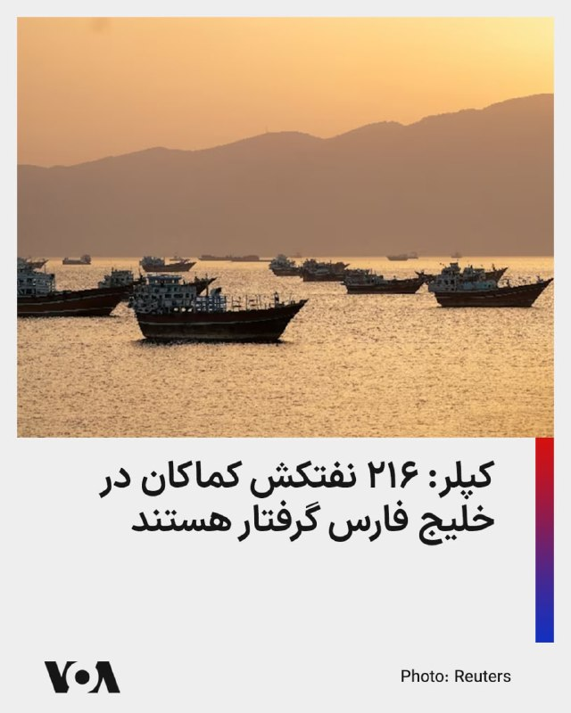

شرکت اطلاعات کالا، کپلر، می‌گوید کماکان ۲۱۶ نفتکش به خاطر ادامه انسداد تنگه هرمز توسط جمهوری اسلامی در خلیج فارس گرفتار هستند.

طبق ارزیابی کپلر، این نفتکش‌ها معادل تقریباً ۴ درصد از کل ظرفیت ناوگان نفتکش‌های جهان است و تردد کشتی‌‌ها در تنگه هرمز کماکان ۹۵ درصد نسبت به دوران قبل از انسداد تنگه هرمز افت داشته است.

پیشتر سازمان بین‌المللی دریانوردی از گرفتاری ۲۰ هزار خدمه در آبهای جنوب ایران خبر داده و گفته بود در حملات گسترده جمهوری اسلامی به کشتی‌ها، ۱۱ خدمه جان باخته‌اند. بر اساس این گزارش بیش از یک‌هزار و ۵۰۰ شناور، از جمله ۶۰۰ کشتی باری و نفتکش بزرگ در خلیج فارس گرفتار شده‌اند.
@FarsiVOA

## FarsiVOA — post 218426

🔺انتقاد وزیر خارجه قطر از عراقچی: بستن تنگه هرمز بحران را عمیق‌تر می‌کند

◾️وزیر خارجه قطر در تماس با عباس عراقچی، ضمن حمایت از تلاش‌ها برای دستیابی به توافقی جامع برای پایان بحران، هشدار داده است که بستن تنگه هرمز یا استفاده از آن به‌عنوان ابزار فشار، بحران را عمیق‌تر کرده و منافع حیاتی کشورهای منطقه را تهدید می‌کند.

◾️این موضع در حالی مطرح می‌شود که قطر، همزمان با گفت‌وگو با تهران، در سطح منطقه‌ای نیز فعال است.

◾️وزیر خارجه قطر در تماس جداگانه با وزیر خارجه عربستان درباره میانجی‌گری پاکستان میان آمریکا و جمهوری اسلامی و هماهنگی برای کاهش تنش گفت‌وگو کرده است.

◾️دوحه همچنین با اردن و ترکیه درباره حمایت از تلاش‌های میانجی‌گرانه و جلوگیری از تشدید دوباره بحران رایزنی کرده است.

⬇️ بیشتر بخوانید:
https://ir.voanews.com/a/8153020.html

## FarsiVOA — post 218425

🔺مولوی عبدالحمید: مردم دولتی انتخاب کرده‌اند که اختیار ندارد

◾️مولوی عبدالحمید، با انتقاد از ساختار تصمیم‌گیری در جمهوری اسلامی گفت مردم می‌گویند دولتی انتخاب کرده‌اند که اختیار ندارد و در ایران، برخلاف بسیاری از کشورها، دولت نقشی مؤثر در سیاست‌های داخلی و خارجی ندارد.

◾️او افزود که تا زمانی که در قانون اساسی تغییر ایجاد نشود، هیچ‌کس نمی‌تواند اوضاع کشور را سامان بدهد.

◾️عبدالحمید از قطع اینترنت بین‌المللی نیز انتقاد کرد و آن را برای عموم مردم «آزاردهنده» خواند. او گفت اینترنت در عصر حاضر جزو نیازهای بشر است و بخش‌های مختلف زندگی ملت‌ها با آن گره خورده است.

⬇️ بیشتر بخوانید:
https://ir.voanews.com/a/8153019.html

## FarsiVOA — post 218424

  <a href="telegram/content/FarsiVOA_218424_1779537970.mp4" target="_blank">🎬 Download video</a>

انتشار سری جدید اسناد محرمانه «یوفو» توسط وزارت جنگ آمریکا؛

وزارت جنگ ایالات متحده در قالب برنامه‌ای تحت عنوان «پِرسو»، دومین بخش از اسناد محرمانه مربوط به پدیده‌های ناشناخته هوایی، یوفو، را برای دسترسی عموم منتشر کرد.

این برنامه وظیفه دارد سوابق مرتبط با حوادث هوایی توجیه‌نشده‌ای را که در طول مأموریت‌های نظامی مشاهده شده‌اند، از حالت طبقه‌بندی‌شده خارج کند.

جنجالی‌ترین بخش این اسناد، گزارش و تصاویر مربوط به شلیک و سرنگون کردن یک شیء پرنده ناشناس توسط جت جنگنده نیروی هوایی ارتش آمریکا است.

بخش دیگری از این اسناد فاش‌شده به حادثه‌ای در دسامبر ۲۰۱۹ در سواحل شرقی آمریکا اشاره دارد. این سند حاوی داده‌هایی است که به احتمال زیاد توسط سنسور مادون قرمزِ مستقر روی یکی از یگان‌های نظامی ایالات متحده ثبت شده است؛ یگانی که در آن زمان در محدوده تحت مسئولیت «فرماندهی شمالی ایالات متحده» فعالیت می‌کرده است.

این بسته اطلاعاتی شامل ده‌ها گزارش عملیاتی، مشاهدات خلبانان و مستنداتی است که ارتش آمریکا هنوز توضیح علمی یا مشخصی برای ماهیت آن‌ها ارائه نداده است.
@FarsiVOA

## DW_Farsi — post 125048

🔶 خبرهای ضد و نقیض درباره بسته‌شدن آسمان غرب ایران

سازمان هواپیمایی کشوری ایران با صدور "نوتام" یا اطلاعیه هشدار اعلام کرد که فرودگاه‌های بخش غربی کشور تا ساعت ۱۲ روز دوشنبه (۵ خرداد ۱۴۰۵) با محدودیت‌های عملیاتی و تعطیلی مواجه هستند.

نوتام به منظور اطلاع‌رسانی به خلبانان و شرکت‌های هواپیمایی درباره خطرات احتمالی، محدودیت‌های مسیر، بسته‌شدن حریم هوایی یا هر شرایطی صادر می‌شود که می‌تواند بر ایمنی پرواز تاثیر بگذارد.

بر اساس این اطلاعیه که در رسانه‌های ایران منتشر شده، این محدودیت‌ها از شامگاه جمعه ۱ خرداد (۲۲ مه) آغاز شده و تا ساعت هشت و ۳۰ دقیقه به وقت جهانی یا ساعت ۱۲ دوشنبه به وقت تهران ادامه خواهد داشت. در این مدت، تمامی فرودگاه‌های غرب کشور به‌طور کامل بسته هستند.

در اطلاعیه همچنین آمده است که فرودگاه‌های تبریز، کرمانشاه، اهواز، آبادان، شیراز، یزد، رشت و رامسر به‌صورت "مشروط و فقط در بازه زمانی طلوع تا غروب آفتاب" مجاز به فعالیت هستند.

طبق این دستورالعمل، تمامی مجوزهای پروازی قبلی در این مناطق لغو شده و شرکت‌های هواپیمایی موظف‌ هستند برای هرگونه پرواز غیرنظامی مجددا از سازمان هواپیمایی کشوری مجوز دریافت کنند.

@dw_farsi

## DW_Farsi — post 125047

🔶 پوتین حمله به خوابگاه را "تروریستی" خواند؛ اوکراین رد کرد

ولادیمیر پوتین، رئیس جمهور روسیه، روز جمعه ۲۲ مه (اول خرداد) پس از حمله احتمالی به یک خوابگاه دانشجویی در منطقه لوهانسک تحت اشغال روسیه، این حمله را "اقدامی تروریستی" توصیف کرد. به گفته او، دست‌کم شش نفر کشته، ۳۹ نفر زخمی و ۱۵ نفر مفقود شده‌اند.

طبق اعلام روسیه، ساختمان یک مدرسه فنی و حرفه‌ای در شهر استاروبیلسک، شامگاه پنجشنبه گذشته هدف حمله یک پهپاد اوکراینی قرار گرفته است.

امکان راستی‌آزمایی مستقل این اطلاعات وجود ندارد. همچنین درباره شمار قربانیان و مفقودان در این خوابگاه نیز اطلاعات تأییدشده‌ای در دست نیست. پوتین، ضمن وعده کمک به آسیب‌دیدگان، از وزارت دفاع روسیه خواسته است تا پیشنهادهایی را برای واکنش به این حادثه آماده کند.

@dw_farsi

## Persian_Trend_Official — post 14723

  

🇺🇸 
🌟نیروی فضایی ایالات متحده بامداد ۲۰ مه یک موشک بالستیک قاره‌پیمای بدون کلاهک مینوت‌من III را در قالب آزمایش «Glory Trip 256» از پایگاه فضایی وندنبرگ در کالیفرنیا با موفقیت پرتاب کرد.

🚀این پرتاب ساعت ۱۲:۰۱ به وقت اقیانوس آرام و تحت نظارت اسکادران آزمایش پرواز ۵۷۶ انجام شد. به گفته مقام‌های آمریکایی، آزمایش شبانه عملکرد سامانه‌های پیشرانش، هدایت و بازگشت موشک را ارزیابی کرده و آمادگی عملیاتی نیروهای مسئول را نیز به نمایش گذاشته است.
نیروی فضایی آمریکا تأکید کرد این مأموریت از سال‌ها قبل برنامه‌ریزی شده و ارتباطی با تنش‌های ژئوپولیتیکی اخیر ندارد. داده‌های به‌دست‌آمده از این آزمایش قرار است در روند نوسازی زرادخانه موشکی آمریکا و توسعه موشک نسل جدید LGM-35A Sentinel مورد استفاده قرار گیرد.

👩‍💻@PhantomDirective

🆔@persian_trend_official
پرشین ترند | متفاوت‌ترین کانال نظامی

## Persian_Trend_Official — post 14722

  

♦️ ادعای اسکای‌نیوز عربی: میانجی پاکستانی موفق شده بر مانع اصلی پرونده هسته‌ای ایران در مذاکرات دشوار بین تهران و واشنگتن غلبه کند.

👩‍💻@PhantomDirective

🆔 @persian_trend_official
پرشین ترند | متفاوت‌ترین کانال نظامی

## RadioFarda — post 157480

تایوان: چین پس از دیدار ترامپ و شی بیش از صد شناور در منطقه مستقر کرد

🔸 رئیس دستگاه امنیتی تایوان روز شنبه گفت چین بیش از صد شناور نیروی دریایی، گارد ساحلی و دیگر شناورها را در آب‌های منطقه‌ای از دریای زرد تا دریای جنوبی چین و غرب اقیانوس آرام مستقر کرده است.

🔸 جوزف وو، دبیرکل شورای امنیت ملی تایوان، در شبکه اجتماعی ایکس نوشت این استقرار در چند روز گذشته، پس از دیدار دونالد ترامپ، رئیس‌جمهور آمریکا، با همتای چینی‌اش شی جین‌پینگ در پکن انجام شده است.

🔸 او روز شنبه دوم خرداد در این پیام نوشت که چین در روزهای اخیر بیش از صد کشتی در امتداد «زنجیرهٔ نخست جزایر»، از ژاپن تا تایوان و فیلیپین، مستقر کرده و پکن را به برهم زدن وضع موجود و تهدید صلح و ثبات منطقه‌ای متهم کرد.

🔸 چین جزیره تایوان را بخشی از قلمرو خود می‌داند و تهدید کرده است که برای تصرف آن از زور استفاده خواهد کرد.

🔸 یک مقام امنیتی تایوان به شرط فاش نشدن نام خود به خبرگزاری فرانسه گفت شناورهای چینی پیش از نشست پکن شناسایی شده بودند، اما شمار آن‌ها در روزهای اخیر از صد فروند فراتر رفته است.

🔸گزارش کامل را در وب‌سایت رادیو فردا می‌توانید بخوانید.

@RadioFarda

## RadioFarda — post 157479

  <a href="https://t.me/radiofarda/157479" target="_blank">📎 Download file</a>

📻بشنوید: ساعت ۱۴ با رادیوفردا، دوم خرداد ۱۴۰۵‌

@Radiofarda

## RadioFarda — post 157478

  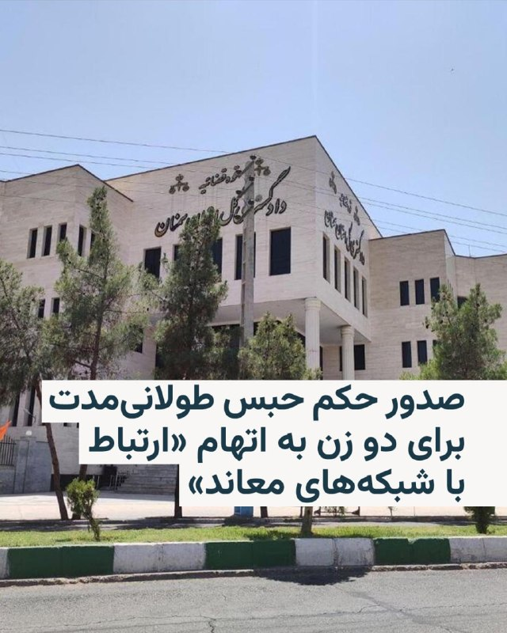

🔸رئیس کل دادگستری استان سمنان از صدور حکم حبس طولانی‌مدت برای دو متهمی خبر داد که به گفته او «در راستای اهداف سرویس‌های جاسوسی آمریکایی-صهیونیستی فعالیت می‌کردند».

🔸لیلا رمضانی و فاطمه ملک‌احمدی به ترتیب به حبس‌های ۲۶ و ۲۷ سال و همین طور «انفصال از کلیه خدمات دولتی و ممنوعیت مطلق خروج از مرزهای کشور» محکوم شده‌اند.

🔸به گزارش خبرگزاری ایسنا به نقل از مقام قضایی، این دو که اطلاعات دیگری از جمله سن و شغل درباره‌شان منتشر نشده به «برقراری ارتباط با شبکه‌های معاند و ارسال محتوای تصویری و اطلاعاتِ مورد نیازِ دشمن» متهم شده‌اند.

🔸رئیس کل دادگستری استان سمنان از این دو نفر به عنوان «مزدور» یاد کرده است.

🔸در بحبوحه حملات سنگین آمریکا و اسرائیل به ایران، تلویزیون جمهوری اسلامی بارها گزارش‌هایی از یورش مأموران حکومتی به خانه افرادی پخش کرد که گفته می‌شد از محل اصابت بمب‌ها ویدئو گرفته و برای رسانه‌های خارج از کشور ارسال کرده‌اند.

@RadioFarda

## IranianMinds — post 20601

  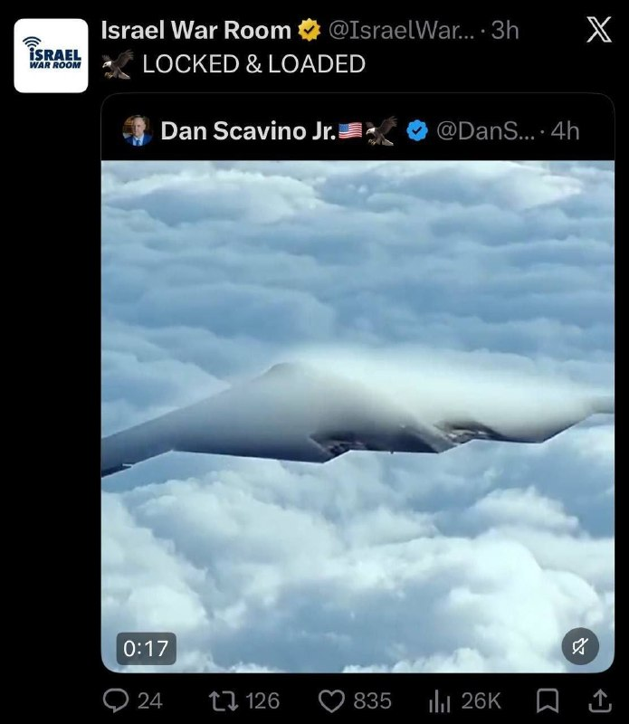

🔴اتاق جنگ اسرائیل این پست اخیر دن اسکاوینو را ریپست کرده.

@IranianMinds

## IranianMinds — post 20600

  

🔴نت‌بلاکس:

قطعی اینترنت در ایران وارد سیزدهمین هفته خود شده و بیش از ۲۰۱۶ ساعت است که کشور در انزوای دیجیتال از دنیای خارج قرار دارد.

@IranianMinds

## BBCPersian — post 281872

  

🔸برونو فرناندز، کاپیتان منچستریونایتد، به‌عنوان بهترین بازیکن فصل لیگ برتر انگلیس انتخاب شد.
این هافبک پرتغالی چند روز پیش جایزه انجمن نویسندگان فوتبال برای بهترین بازیکن مرد سال این لیگ را گرفته بود.
برونو فرناندز در دیدار هفته گذشته مقابل ناتینگهام فارست، با ثبت بیستمین پاس گل، با رکورد بیشترین پاس گل در یک فصل لیگ برتر مساوی کرد.
او این فصل در ۳۷ بازی، هشت گل به ثمر رسانده و نقش مهمی در رسیدن منچستریونایتد به جایگاه سوم لیگ و کسب سهمیه لیگ قهرمانان اروپا داشته است.
فرناندز در این فصل لیگ برتر با خلق ۱۳۲ موقعیت گل، بیش از هر بازیکن دیگری فرصت‌ ساخت، ۴۳ موقعیت بیشتر از نفر دوم، دومینیک سوبوسلای از لیورپول.

او نخستین بازیکن منچستریونایتد است که از سال ۲۰۱۱ این جایزه را به دست می‌آورد. در آن سال نمانیا ویدیچ این جایزه را برد.
برنده این جایزه از ترکیب آرای عمومی و هیئتی از کارشناسان فوتبال انتخاب می‌شود.
دیوید رایا، گابریل و دکلان رایس از آرسنال، ارلینگ هالند و آنتوان سمنیو از منچسترسیتی، ایگور تیاگو از برنتفورد و مورگان گیبز-وایت از ناتینگهام فارست نیز در فهرست نامزدهای نهایی بودند.
📸GettyImages
@BBCPersian

## BBCPersian — post 281871

🔻قالیباف: از حقوق ملت و کشورمان عدول نمی‌کنیم

پیشتر گزارش دادیم که فیلد مارشال عاصم منیر، فرمانده ارتش پاکستان، در تهران با محمدباقر قالیباف دیدار کرده است.
رسانه‌های ایران جزئیاتی از این دیدار را منتشر کردند.
رئیس مجلس ایران در این دیدار گفته استک «ما از حقوق ملت و کشورمان عدول نمی‌کنیم، مخصوصا با طرفی که اصلا صداقت نداشته و اعتمادی به او وجود ندارد.»

آقای قالیباف هچنین گفته است که «نیروهای مسلح ما در دوران آتش‌بس به نحوی خود را بازسازی کرده‌اند که در صورت حماقت ترامپ و آغاز مجدد جنگ، حتما برای آمریکا کوبنده‌تر و تلخ‌تر از روز اول جنگ خواهند بود.»
آتش‌بس کنونی بین ایران و آمریکا با میانجی‌گری پاکستان به دست آمد.

https://bbc.in/4v5Oh4Y
@BBCPersian

## BBCPersian — post 281870

🔻دادستان استان قزوین: اموال ۹۶ نفر توقیف شد

اموال ۹۶ نفر در استان قزوین توقیف شده است.

علی اصغر عسگری، دادستان عمومی و انقلاب استان قزوین این افراد را «مزدوران خارج‌نشین و داخل کشور» خواند و گفت که «برای سه نفر از این افراد به اتهام جاسوسی و برای شش نفر به اتهام انجام اقدام اطلاعاتی» کیفرخواست صادر شده است.

مقام‌های قضائی و امنیتی ایران در استان‌های مختلف در هفته‌های اخیر پی‌درپی از توقیف اموال افراد به اتهام‌های امنیتی خبر می‌دهند.

https://bbc.in/4tShXkW
@BBCPersian

## BBCPersian — post 281869

🔻سفر نخست‌وزیر پاکستان به چین

شهباز شریف برای سفری چهار روزه عازم چین شده است.

به گفته وزارت خارجه پاکستان، آقای شریف با شی جین‌پینگ و لی چانگ، رئیس‌جمهور و نخست‌وزیر چین، دیدار و کنفرانس سرمایه‌گذاری مشترک دو کشور را ریاست خواهد کرد.

جنگ آمریکا و اسرائیل با ایران یکی از محورهای گفت‌وگوی نخست‌وزیر پاکستان و رهبران چین است.

سخنگوی وزارت امور خارجه پاکستان دیروز گفت هدف اصلی این سفر تقویت روابط دوجانبه است اما بن‌بست فعلی خاورمیانه هم مطرح است.

طاهر اندرابی گفت که در بن‌بست فعلی خاورمیانه چین و پاکستان برای صلح از نزدیک همکاری کرده‌اند: ««ما بر سر پنج‌ اصل توافق کردیم و بیانیه مشترک منتشر شد. بنابراین بله، این موضوع در جریان سفر نخست‌وزیر بحث خواهد شد.»

اسماعیل بقایی، سخنگوی وزارت خارجه ایران، دیروز درباره سفر هیئت قطری به تهران گفت: «هیئتی از قطر مذاکراتی را با وزیر خارجه داشتند. امروز خیلی کشورها می‌خواهند به پایان جنگ کمک کنند اما میانجی رسمی مذاکرات همچنان پاکستان است.»

عاصم منیر، فرمانده کل ارتش و نیروهای مسلح پاکستان، دیروز وارد تهران شد و تا پاسی از شب با عباس عراقچی و اسکندر مومنی وزاری خارجه و کشور، دیدار کرد.

پیش از او محسن نقوی، وزیر کشور پاکستان، در تهران بود.

https://bbc.in/42R5yms
@BBCPersian

## BBCPersian — post 281868

  

🔻فیلد مارشال عاصم منیر، فرمانده ارتش پاکستان، با محمدباقر قالیباف، رئیس مجلس و مسعود پزشکیان، رئیس‌جمهورایران دیدار و گفت‌و‌گو کرد.

این دومین سفر آقای منیر در چند هفته گذشته به ایران است.

آقای منیر شب گذشته با عباس عراقچی، وزیر خارجه هم دیدار و گفتگو کرد. به گفته منابع خبری ایران دیدار آنها تا پاسی از شب گذشته ادامه داشت.

پیش از عاصم منیر، محسن نقوی، وزیر کشور پاکستان هم برای دومین بار در چند روز گذشته به تهران رفته و با مقامات ایران گفت‌گو کرده بود.

پاکستان میانجی مذاکرات ایران و آمریکا است.

📸FARS
https://bbc.in/4uvWLm2
@BBCPersian

## BBCPersian — post 281867

  <a href="telegram/content/BBCPersian_281867_1779537977.mp4" target="_blank">🎬 Download video</a>

🔻‌دو کیف لوکس مصادره‌ شده از ترونگ مای‌ لان، سرمایه‌دار زندانی ویتنامی، در یک حراج دولتی با مجموع قیمتی بیش از ۵۳۵ هزار دلار فروخته شد.
هر دو کیف که از چرم کروکوریل بودند، طی تنها ۳۰ دقیقه مزایده فروخته شدند. یکی از کیف‌های سفید بیرکین از برند به تنهایی ۴۴۰ هزار دلار و دیگری حدود ۹۵ هزار دلار به فروش رفت.
این دو کیف بخشی از حدود ۱۲۰۰ دارایی توقیف‌ شده از خانم لان بودند. او در سال ۲۰۲۴ به اتهام کلاهبرداری چهل میلیارد دلاری از بانک تجاری سایگون در یک دوره ده ساله به اعدام محکوم شد. این حکم در ژوئن سال گذشته، پس از لغو مجازات اعدام برای برخی جرایم در ویتنام، به حبس ابد کاهش یافت.
در جریان دادگاه، او تلاش کرده بود که دو کیف هرمس خود را به‌عنوان یادگاری برای فرزندان و نوه‌هایش نگه دارد. او به دادگاه گفته بود یکی از کیف‌ها را در ایتالیا خریده و دیگری را به‌عنوان هدیه از یک تاجر مالزیایی دریافت کرده است. دادگاه درخواست او را رد کرد.
کیف‌های بیرکین، یکی از لوکس‌ترین محصولات هرمس، گاهی ارزشی در حد صدها هزار دلار دارند.

https://bbc.in/3RhF239
@BBCPersian

## Dirty_Kids — post 390011

  <a href="telegram/content/Dirty_Kids_390011_1779537982.mp4" target="_blank">🎬 Download video</a>

رسانه‌های ایران نوشتند سفارت آمریکا به درخواست ویزای شجاع خلیل‌زاده جواب منفی داده و او نمی‌تواند به جام جهانی برود. خلیل‌زاده هرشب در تجمعات سپاهی‌ها حضور داشت و مثلا گفته بود «رهبر شهید افتخار ایران هستند.» حالا می‌تواند برگردد کنار رهبر شهیدش استراحت کند، البته در یخچال.

@Dirty_Kids 👻

## Hranews — post 113108

  

پس از نقض حکم در دیوان عالی کشور؛ صدور مجدد حکم اعدام برای منوچهر فلاح

❗️
❗️
❗️
❗️
❗️– منوچهر فلاح، زندانی سیاسی محبوس در زندان لاکان رشت، توسط شعبه یک دادگاه انقلاب این شهر مجددا به اعدام محکوم شد. حکم اعدام آقای فلاح پیشتر در دیوان عالی کشور نقض و پرونده وی به شعبه هم عرض ارجاع داده شده بود.

به گزارش خبرگزاری هرانا، ارگان خبری مجموعه فعالان حقوق بشر در ایران، منوچهر فلاح، زندانی سیاسی مجددا به اعدام محکوم شد.

حکم #اعدام منوچهر فلاح، پس از رسیدگی مجدد در شعبه یک دادگاه انقلاب رشت صادر و امروز به وکلای او ابلاغ شد. جلسه رسیدگی در این شعبه در تاریخ ۱۹ اردیبهشت‌ماه برگزار شده بود.

او پیش‌تر در دی‌ماه ۱۴۰۳ در شعبه دو دادگاه انقلاب رشت از بابت اتهام «محاربه» به اعدام محکوم شده بود. این حکم در آبان‌ماه همان سال در دیوان عالی کشور تأیید شد، اما با پذیرش اعاده دادرسی، دیوان عالی کشور آن را نقض کرد و پرونده برای رسیدگی دوباره به شعبه یک دادگاه انقلاب رشت ارجاع شد.

ادامه مطلب

#منوچهر_فلاح

↘️
@hranews_bot تماس ✉️ - @Hranews کانال هرانا 🆑

## manototv — post 105758

  <a href="telegram/content/manototv_105758_1779537984.mp4" target="_blank">🎬 Download video</a>

بر پایه گزارش رسانه‌های حکومتی، محمدباقر قالیباف، رئیس مجلس شورای اسلامی و رئیس هیئت مذاکره کننده نظام در مذاکرات با آمریکا به میزبانی اسلام‌آباد در دیدار با فیلد مارشال عاصم منیر، فرمانده ارتش پاکستان تهدید کرده: «در صورت حماقت ترامپ و آغاز مجدد جنگ، پاسخ ما کوبنده‌تر خواهد بود» قالیباف همچنین گفته در آتش‌بس بودیم که آمریکا «با نقض عهد، محاصره دریایی کرد و حالا به دنبال برداشتن آن است»

## manototv — post 105757

  <a href="telegram/content/manototv_105757_1779537984.mp4" target="_blank">🎬 Download video</a>

مجتبی خامنه‌ای، رهبر مشاهده نشده جمهوری‌اسلامی، در ادامه سنت مورد علاقه پدرش، علی خامنه‌ای، با انتشار پیامی نوشتاری درگذشت «والده» رئیس‌جمعیت هلال‌احمر جمهوری‌اسلامی، پیرحسین کولیوند را تسلیت گفت. علی‌ خامنه‌ای به انتشار پیام‌های تسلیت برای شخصیت‌های گوناگون و بستگان و اعضای خانواده آن‌ها علاقه بسیار داشت.

## alonews — post 122013

  <a href="telegram/content/alonews_122013_1779537985.webm" target="_blank">🎬 Download video</a>

👈روزنامه اعتماد: به احتمال بسیار زیاد در این هفته رفع انسداد اینترنت مصوب می‌شود

✅ @AloNews خبر جنگ

## alonews — post 122012

  <a href="telegram/content/alonews_122012_1779537985.webm" target="_blank">🎬 Download video</a>

👈خبرگزاری فرانسه: تایوان می‌گوید چین بیش از 100 کشتی در آب‌های سرزمینی آن مستقر کرده است

✅ @AloNews خبر جنگ

## alonews — post 122011

  <a href="telegram/content/alonews_122011_1779537985.webm" target="_blank">🎬 Download video</a>

👈خبرنگار الجزیره ، علی هاشم در پیامی در شبکه اجتماعی ایکس مدعی شد که یک چهره بسیار برجسته منطقه‌ای، بی‌سروصدا از تهران بازدید کرد تا آنچه را که بسیاری اکنون «شکاف‌های غیرقابل عبور» می‌نامند، پر کند.

✅ @AloNews خبر جنگ

## alonews — post 122010

  <a href="telegram/content/alonews_122010_1779537986.webm" target="_blank">🎬 Download video</a>

👈 روبیو در گفتگو با نخست وزیر هند: آمریکا اجازه نخواهد داد ایران بازار جهانی انرژی را کنترل کند

✅ @AloNews خبر جنگ

## alonews — post 122009

  <a href="telegram/content/alonews_122009_1779537986.webm" target="_blank">🎬 Download video</a>

👈عاصم منیر: خوشحالم که ایران توسط افراد هوشمند اداره میشود

✅ @AloNews خبر جنگ

## alonews — post 122008

  <a href="telegram/content/alonews_122008_1779537986.webm" target="_blank">🎬 Download video</a>

👈کلاس های آموزشی تحصیلات تکمیلی دانشگاه علامه حضوری شد

✅ @AloNews خبر جنگ

## alonews — post 122007

  <a href="telegram/content/alonews_122007_1779537986.webm" target="_blank">🎬 Download video</a>

👈 وزارت خارجه قطر: امیر قطر با رئیس‌جمهور ترامپ تماس تلفنی برقرار کرد و طی آن آخرین تحولات منطقه را بررسی کردند.

🔴تماس تلفنی بین امیر قطر و رئیس جمهور ترامپ به تلاش‌ها برای تحکیم آرامش و کاهش تنش در منطقه پرداخت.

✅ @AloNews خبر جنگ

## alonews — post 122006

  <a href="telegram/content/alonews_122006_1779537987.webm" target="_blank">🎬 Download video</a>

👈قالیباف: در صورت حماقت ترامپ پاسخ ما کوبنده‌تر خواهد بود

✅ @AloNews خبر جنگ

## alonews — post 122005

  <a href="telegram/content/alonews_122005_1779537987.webm" target="_blank">🎬 Download video</a>

👈 دراپ‌ سایت به نقل از مقام ایرانی: ایران پیشنهاد جدیدی برای پایان جنگ ارائه و مذاکرات را به دو مسیر تقسیم کرده

🔴 در مسیر اول، ابتدا جنگ پایان می‌یابد و با آزادسازی منابع و لغو محاصره بنادر، تنگه موقتاً باز می‌شود تا «نظام حاکمیتی» جدید نهایی شود

🔴 در مسیر دوم ایران متعهد می‌شود که به سلاح هسته‌ای دست پیدا نکند و اورانیوم بالای ۲۰٪ را تحت نظارت رقیق کند

🔴 این طرح توسط همه طرف‌های میانجی و بازیگران منطقه‌ای، مورد توافق قرار گرفته

✅ @AloNews خبر جنگ

## alonews — post 122004

  <a href="telegram/content/alonews_122004_1779537987.webm" target="_blank">🎬 Download video</a>

👈قالیباف در دیدار با عاصم منیر: ایران همانطور که با شجاعت و اقتدار در میدان نبرد از کیان ایران دفاع کرد در عرصه دیپلماسی نیز با هوشمندی و قدرت برای احقاق حقوق حقه ایران و تامین منافع ملی کشور کوشش خواهد کرد

🔴نظامی‌ها بیش از دیگران و بهتر از همه ارزش صلح را می‌دانند، اما همان نظامیان هیچگاه اجازه نمی‌دهند، عزت و حقوق کشورشان لگدمال شود.

🔴ما در حال مذاکره بودیم که آمریکا جنگ براه انداخت و حالا می گوید برای پایانش مذاکره کنیم.

🔴در آتش بسی بودیم که شما واسطه اش بودید و آمریکا با نقص عهد، محاصره دریایی کرد و حالا بدنبال برداشتن آن است!

🔴نیروهای مسلح ما در دوران آتش بس به نحوی خود را بازسازی کرده اند که در صورت حماقت ترامپ و آغاز مجدد جنگ، حتما برای آمریکا کوبنده تر و تلخ تر از روز اول جنگ خواهند بود

✅ @AloNews خبر جنگ

## alonews — post 122003

  <a href="telegram/content/alonews_122003_1779537987.webm" target="_blank">🎬 Download video</a>

👈احتمال شنیدن صدای انفجار کنترل‌شده در شرق اصفهان

✅ @AloNews خبر جنگ

## alonews — post 122002

  <a href="telegram/content/alonews_122002_1779537988.webm" target="_blank">🎬 Download video</a>

👈صداوسیما: دیدار وزیر امور خارجه با عاصم منیر آغاز شده است، طرفین در تلاش هستند تا نگاه ها را به یکدیگر نزدیک کنند

✅ @AloNews خبر جنگ

---
📅 بروزرسانی: 1405/03/02 14:30
---

## VahidOOnLine — post 241694

  <a href="telegram/content/VahidOOnLine_241694_1779534027.mp4" target="_blank">🎬 Download video</a>

دولت آمریکا اعلام کرد بیشتر مهاجرانی که قصد دریافت گرین‌کارت دارند، باید خاک این کشور را ترک کرده و درخواست خود را از طریق سفارت‌خانه‌ها یا کنسولگری‌های آمریکا در خارج ثبت کنند.
اداره خدمات شهروندی و مهاجرت آمریکا اعلام کرد از این پس دارندگان ویزای موقت، دانشجویی یا توریستی تنها در «شرایط استثنایی» می‌توانند داخل آمریکا وضعیت اقامت خود را تغییر دهند.
این تصمیم بخشی از سیاست‌های مهاجرتی دولت ترامپ برای محدود کردن مهاجرت غیرقانونی عنوان شده و راهی را می‌بندد که پیش‌تر به برخی مهاجران اجازه می‌داد هنگام حضور در آمریکا برای گرین‌کارت اقدام کنند.
منتقدان می‌گویند این تغییر می‌تواند باعث جدایی خانواده‌ها و ایجاد بلاتکلیفی برای صدها هزار مهاجر قانونی شود. همچنین برخی متقاضیان ممکن است پس از خروج از آمریکا دیگر اجازه بازگشت دریافت نکنند.
دولت آمریکا می‌گوید این سیاست باعث «عادلانه‌تر و کارآمدتر» شدن سیستم مهاجرتی خواهد شد.
‌🏁 🇬🇧 ManotoTV

🤖 @VahidOOnLine

## VahidOOnLine — post 241693

  

♦️بر اساس تصاویر منتشر شده در رسانه‌های رسمی ایران، فیلد مارشال عاصم منیر، روز شنبه دوم خرداد ماه در تهران با مسعود پزشکیان و محمدباقر قالیباف دیدار کرده است.
در حالی که از جزئیات این دیدارها اطلاعاتی منتشر نشده، رسانه‌ها در از دومین دیدار میان فرمانده ارتش پاکستان و عباس عراقچی، وزیر امور خارجه ایران طی ۲۴ ساعت گذشته خبر داده‌اند.
پیشتر شبکه خبری العربیه گزارش کرده بود، واشنگتن از طریق عاصم منیر به تهران هشدار داده است، در صورت شکست مذاکرات جنگ از سرگرفته خواهد شد.
‌🇸🇦 Indypersian

🤖 @VahidOOnLine

## VahidOOnLine — post 241692

🔻اسرائیل‌هیوم: واشینگتن و تل‌آویو درباره حذف مجتبی خامنه‌ای اختلاف دارند

به گزارش اسرائیل‌هیوم، آمریکا و اسرائیل در حال بررسی این پرسش هستند که حذف مجتبی خامنه‌ای می‌تواند حکومت ایران را بی‌ثبات کند یا برعکس، به شکل‌گیری ساختاری رادیکال‌تر و توافقی شکننده مشابه برجام منجر شود.

به نوشته روزنامه اسرائیل‌هیوم در حالی که آمریکا و اسرائیل پس از ترور علی خامنه‌ای درباره آینده ایران ارزیابی‌های متفاوتی دارند، اکنون بحثی تازه در محافل سیاسی و امنیتی دو کشور شکل گرفته است: آیا حذف مجتبی خامنه‌ای می‌تواند به بی‌ثباتی بیشتر حکومت ایران و دستیابی به توافقی مطلوب‌تر منجر شود یا برعکس، خطر تکرار توافق‌های گذشته و ظهور ساختاری رادیکال‌تر را افزایش خواهد داد.

به گزارش این روزنامه اسرائیلی، واشینگتن و اورشلیم بار دیگر با پرسشی راهبردی روبه‌رو شده‌اند که پیش‌تر درباره علی خامنه‌ای مطرح بود، اما اکنون به مجتبی خامنه‌ای، جانشین جدید رهبری حکومت ایران، مربوط می‌شود: آیا حذف او به سود اهداف غرب و اسرائیل خواهد بود یا باقی ماندن او - هرچند ضعیف و آسیب‌پذیر - ثباتی نسبی ایجاد می‌کند که برای مدیریت بحران مفیدتر است؟

این گزارش می‌گوید ترور علی خامنه‌ای، که با هماهنگی آمریکا و اسرائیل انجام شد، اقدامی بی‌سابقه بود؛ زیرا برای نخستین بار اسرائیل رهبر یک کشور دشمن را هدف قرار داد. هدف از این اقدام، به نوشته اسرائیل‌هیوم، تضعیف بنیادهای حکومت ایران بود.

به باور نویسنده، این هدف تنها تا حدی محقق شد. از یک سو، ساختار قدرت متمرکز در ایران آسیب دید و نشانه‌هایی از اختلافات داخلی و تنش در روند تصمیم‌گیری آشکار شد. حملات جمهوری اسلامی به کشورهای خلیج فارس نیز، به ادعای این گزارش، در برخی موارد با مواضع رسمی سیاسی تهران همخوانی نداشته است. همچنین مجتبی خامنه‌ای به عنوان رهبری «ضعیف، آسیب‌دیده و فاقد اقتدار کامل» توصیف می‌شود. فردی که مشخص نیست کنترل واقعی اوضاع را در دست دارد یا صرفاً در جریان تحولات قرار گرفته است.

اما از سوی دیگر، اسرائیل‌هیوم می‌نویسد حکومت ایران همچنان دارای ساختار فرماندهی و مرکز تصمیم‌گیری است و تا زمانی که فردی از خاندان خامنه‌ای در راس قدرت قرار دارد، جمهوری اسلامی می‌تواند تصویر یک حکومت باثبات را حفظ کند.

به نوشته این روزنامه، مسعود پزشکیان و عباس عراقچی اکنون در برخی موضوعات، از جمله پرونده هسته‌ای، انعطاف بیشتری نسبت به دوران علی خامنه‌ای نشان می‌دهند؛ موضوعی که پیش‌تر امکان‌پذیر نبود، هرچند فاصله گرفتن آن‌ها از خطوط اصلی سیاست نظام همچنان محدود است.

معضل راهبردی: حذف مجتبی خامنه‌ای یا حفظ ساختار موجود؟
اسرائیل‌هیوم می‌نویسد موافقان حذف مجتبی خامنه‌ای معتقدند ترور او می‌تواند حکومت ایران را وارد بحران جانشینی و آشفتگی سیاسی کند؛ وضعیتی که شاید به جناح‌های عملگراتر فرصت دهد توافقی با غرب شکل دهند.

این گزارش برای توضیح این رویکرد به حمله اسرائیل به دوحه در سپتامبر گذشته اشاره می‌کند؛ حمله‌ای که هدف آن، به ادعای نویسنده، تضعیف جناحی از حماس بود که مانع توافق درباره گروگان‌ها شده بود.

اما مخالفان این دیدگاه هشدار می‌دهند در ایران «میانه‌روهای واقعی» آماده جانشینی وجود ندارند و حذف خامنه‌ای ممکن است صرفاً به توافقی مشابه توافق هسته‌ای دوران اوباما منجر شود؛ توافقی که از نگاه اسرائیل، محدودیت‌های زمانی داشته و تهدیدهای بلندمدت را برطرف نکرده بود.

اسرائیل‌هیوم با اشاره به هشدارهای پیشین دادی بارنئا، رییس موساد، می‌نویسد مقام‌های اسرائیلی سال‌ها نسبت به محدودیت زمانی توافق‌های هسته‌ای هشدار داده‌اند. به گفته نویسنده، حتی اگر حکومت ایران با توقف ۱۵ ساله برنامه هسته‌ای موافقت کند، در نهایت محدودیت‌ها پایان می‌یابد و مساله دوباره بازمی‌گردد.

🔗ادامه گزارش را اینجا بخوانید
‌🏁 🇬🇧 IranintlTV

🤖 @VahidOOnLine

## VahidOOnLine — post 241691

  <a href="telegram/content/VahidOOnLine_241691_1779534028.mp4" target="_blank">🎬 Download video</a>

ویدیوی رسیده به ایران اینترنشنال نشان می‌دهد روز شنبه دوم خرداد تعدادی از دانش‌آموزان مدارس در خرم‌آباد برای اعتراض به شیوه امتحانات خود و اظهارات مسئولان برای حضوری کردن امتحانات مقابل ساختمان آموزش و پرورش تجمع کردند. هفته گذشته نیز در شهرکرد دانش‌آموزان تجمع اعتراضی برگزار کردند.
‌🏁 🇬🇧 IranintlTV

🤖 @VahidOOnLine

## VahidOOnLine — post 241690

  

شبکه العربیه به نقل از منابع آگاه گزارش داد عاصم منیر، رییس ستاد کل ارتش پاکستان، پیام‌های آمریکا را به تهران منتقل کرده است و بخشی از این پیام حاوی تهدید به ازسرگیری جنگ بوده است.

در این پیام‌ها همچنین تاکید شده در صورت موافقت جمهوری اسلامی با توافق، حل مسائل اختلافی در مرحله بعدی انجام خواهد شد.

به گفته این منابع، آمریکا در پیام‌های خود تصریح کرده است تهران باید اکنون با توافق موافقت کند یا با پیامدهای منفی روبه‌رو شود.
‌🏁 🇬🇧 IranintlTV

🤖 @VahidOOnLine

## VahidOOnLine — post 241689

  <a href="telegram/content/VahidOOnLine_241689_1779534030.mp4" target="_blank">🎬 Download video</a>

ویدیوی رسیده به ایران اینترنشنال نشان می‌دهد روز شنبه دوم خرداد تعدادی از دانش‌آموزان مدارس در خرم‌آباد برای اعتراض به شیوه امتحانات خود و اظهارات مسئولان برای حضوری کردن امتحانات مقابل ساختمان آموزش و پرورش تجمع کردند. آن‌ها شعار «مجازی مجازی»‌ سر داده و خواستار غیرحضوری شدن امتحانات شدند.
‌🏁 🇬🇧 IranintlTV

🤖 @VahidOOnLine

## VahidOOnLine — post 241688

  <a href="telegram/content/VahidOOnLine_241688_1779534031.mp4" target="_blank">🎬 Download video</a>

وزیر خارجه قطر در تماس تلفنی با عباس عراقچی، وزیر خارجه جمهوری اسلامی، خواستار کاهش تنش‌ها و حمایت از تلاش‌های دیپلماتیک برای پایان دادن به بحران شد. وزارت خارجه قطر اعلام کرد دوحه از مذاکرات برای رسیدن به توافقی جامع و برقراری ثبات پایدار در منطقه حمایت کامل می‌کند.
وزیر خارجه قطر همچنین هشدار داد بستن تنگه هرمز یا استفاده از آن به‌عنوان ابزار فشار، بحران را تشدید کرده و منافع کشورهای منطقه را به خطر می‌اندازد. او تأکید کرد آزادی کشتیرانی یک اصل اساسی و غیرقابل مذاکره است و همه طرف‌ها باید به قوانین بین‌المللی و اصول حسن همجواری پایبند باشند.
هم‌زمان، وزرای خارجه اردن و قطر نیز درباره تلاش‌های میانجی‌گرانه پاکستان میان تهران و واشنگتن گفت‌وگو کردند و بر ضرورت همکاری برای رسیدن به راه‌حلی پایدار و جلوگیری از تشدید دوباره تنش‌ها تأکید کردند.
‌🏁 🇬🇧 ManotoTV

🤖 @VahidOOnLine

## VahidOOnLine — post 241687

  <a href="telegram/content/VahidOOnLine_241687_1779534032.mp4" target="_blank">🎬 Download video</a>

«منوتو بخشی از زندگی ما بود»
‌🏁 🇬🇧 ManotoTV

🤖 @VahidOOnLine

## VahidOOnLine — post 241686

  <a href="telegram/content/VahidOOnLine_241686_1779534033.mp4" target="_blank">🎬 Download video</a>

سازمان هواپیمایی کشوری صدور هرگونه نوتام جدید برای ممنوعیت پرواز در غرب حریم هوایی ایران را تکذیب کرد. حمیدرضا صانعی، معاون هوانوردی و امور بین‌الملل این سازمان، شایعات منتشرشده در فضای مجازی درباره بسته شدن حریم هوایی تا صبح دوشنبه را «شیطنت رسانه‌ای» خواند و گفت هیچ اطلاعیه جدیدی صادر نشده است.
او همچنین اعلام کرد برنامه‌ریزی‌ها برای انجام پروازهای اربعین در حال انجام است.
‌🏁 🇬🇧 ManotoTV

🤖 @VahidOOnLine

## VahidOOnLine — post 241685

  <a href="telegram/content/VahidOOnLine_241685_1779534034.mp4" target="_blank">🎬 Download video</a>

ویدیوی رسیده به ایران اینترنشنال نشان می‌دهد روز شنبه دوم خرداد تعدادی از دانش‌آموزان مدارس در خرم‌آباد برای اعتراض به شیوه امتحانات خود و اظهارات مسئولان برای حضوری کردن امتحانات مقابل ساختمان آموزش و پرورش تجمع کردند. آن‌ها شعار «لرستان می‌میرد، ذلت نمی‌پذیرد» سر دادند..
‌🏁 🇬🇧 IranintlTV

🤖 @VahidOOnLine

## VahidOOnLine — post 241684

  <a href="telegram/content/VahidOOnLine_241684_1779534035.mp4" target="_blank">🎬 Download video</a>

ویدیوی رسیده به ایران اینترنشنال نشان می‌دهد روز شنبه دوم خرداد تعدادی از دانش‌آموزان مدارس در خرم‌آباد برای اعتراض به شیوه امتحانات خود و اظهارات مسئولان برای حضوری کردن امتحانات مقابل ساختمان آموزش و پرورش تجمع کردند. آن‌ها شعار «مرگ بر مسئول بی‌لیافت»‌ سر دادند.
‌🏁 🇬🇧 IranintlTV

🤖 @VahidOOnLine

## VahidOOnLine — post 241683

  

♦️شبکه خبری العربیه، روز شنبه به نقل از منابع خود گزارش داد فرمانده ارتش پاکستان پیام‌هایی از سوی آمریکا را به تهران منتقل کرده که در آن نسبت به ازسرگیری جنگ هشدار داده شده است.
بر اساس این گزارش، پیام‌های آمریکا به ایران حاوی تهدید به ازسرگیری درگیری‌ها در صورت شکست مذاکرات بوده است.
منابع العربیه همچنین گفتند واشنگتن در این پیام‌ها تاکید کرده در صورت موافقت تهران با توافق در شرایط کنونی، موضوعات اختلافی می‌تواند در مراحل بعدی حل‌وفصل شود.
به گفته این منابع، آمریکا در پیام‌های خود به ایران اعلام کرده است: «اکنون با توافق موافقت کنید یا با پیامدهای منفی روبه‌رو شوید.»
فیلد مارشال عاصم منیر، فرمانده ارتش پاکستان روز جمعه وارد تهران شد در مورد مذاکرات میان آمریکا و ایران با مسئولان جمهوری اسلامی رایزنی کند.
‌🇸🇦 Indypersian

🤖 @VahidOOnLine

## VahidOOnLine — post 241682

  

محمدحسن نامی، دستیار ویژه وزیر کشور، خواستار تشکیل «ناتوی اسلامی» در منطقه و جهان اسلام با محوریت جمهوری اسلامی شد. او گفت کشورهای اسلامی از ظرفیت‌های گسترده اقتصادی و موقعیت جغرافیایی، از جمله تنگه هرمز و باب‌المندب، برخوردارند که این دو مورد قدرت‌آفرین هستند.

او گفت: «چرا نباید یک ناتوی اسلامی در همین منطقه خودمان و در جهان اسلام داشته باشیم؟ از حدود ۵۷ کشور اسلامی، بیشترین ظرفیت اقتصادی و جغرافیایی جهان به‌دست می‌آید که قدرت‌آفرین است.»

نامی افزود: «در صورت تحقق این اتحاد، هیچ قدرتی نمی‌تواند به جهان اسلام زور بگوید؛ نمونه آن فلسطین است که تاکنون ۷۳ هزار شهید تقدیم کرده است.»
‌🏁 🇬🇧 IranintlTV

🤖 @VahidOOnLine

## VahidOOnLine — post 241681

  

محمدحسن نامی، دستیار ویژه وزیر کشور، خواستار تشکیل «ناتوی اسلامی» در منطقه و جهان اسلام با محوریت جمهوری اسلامی شد. او گفت کشورهای اسلامی از ظرفیت‌های گسترده اقتصادی و موقعیت جغرافیایی، از جمله تنگه هرمز و باب‌المندب، برخوردارند که این دو مورد قدرت‌آفرین هستند.

او گفت: «چرا نباید یک ناتوی اسلامی در همین منطقه خودمان و در جهان اسلام داشته باشیم؟ از حدود ۵۷ کشور اسلامی، بیشترین ظرفیت اقتصادی و جغرافیایی جهان به‌دست می‌آید که قدرت‌آفرین است.»

نامی افزود: «در صورت تحقق این اتحاد، هیچ قدرتی نمی‌تواند به جهان اسلام زور بگوید؛ نمونه آن فلسطین است که تاکنون ۷۳ هزار شهید تقدیم کرده است.»
‌🏁 🇬🇧 IranintlTV

🤖 @VahidOOnLine

## VahidOOnLine — post 241680

ایرانیان ساکن بریزبن استرالیا روز شنبه دوم خرداد با اشاره به کارزار ایران اینترنشنال برای شناسایی جاویدنامان بیمارستان الغدیر تهران پرفورمنس هنری اجرا کردند. سخنران این تجمع به انبود پیکر معترضان در این بیمارستان اشاره کرد.
‌🏁 🇬🇧 IranintlTV

🤖 @VahidOOnLine

## VahidOOnLine — post 241679

  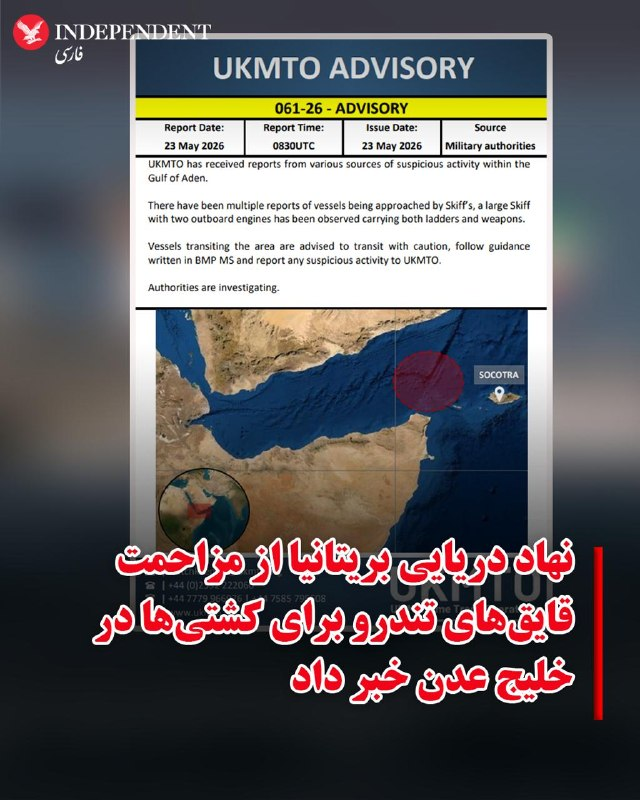

♦️سازمان عملیات تجارت دریایی بریتانیا (UKMTO) روز شنبه دوم خرداد ماه اعلام کرد گزارش‌هایی از منابع مختلف درباره فعالیت‌های مشکوک در خلیج عدن دریافت کرده است.
به گزارش این نهاد دریایی، چند گزارش درباره نزدیک شدن قایق‌های کوچک تندرو به کشتی‌ها دریافت شده است.
بر اساس اعلام سازمان عملیات تجارت دریایی بریتانیا، یک قایق بزرگ تندرو با دو موتور بیرونی نیز مشاهده شده که نردبان و سلاح حمل می‌کرده است.
جزئیات بیشتری درباره هویت افراد حاضر در این قایق‌ها یا ارتباط احتمالی آن‌ها با گروه‌های مسلح منتشر نشده است.
سازمان عملیات نجات دریایی بریتانیا، صبح شنبه نیز از نزدیک شدن یک قایق تندرو به نفت‌کشی در نزدیکی یمن خبر داده بود.
‌🇸🇦 Indypersian

🤖 @VahidOOnLine

## VahidOOnLine — post 241678

  

⭕️ سخنگوی وزارت صنعت، معدن و تجارت:
نزدیک به سه هزار واحد صنعتی در جنگ آسیب دیدند

♦️سخنگوی وزارت صنعت، معدن و تجارت (صمت) اعلام کرد نزدیک به سه هزار واحد صنعتی در جریان جنگ اخیر آسیب دیده‌اند.
عزت‌الله زارعی گفت آمار نهایی خسارت‌ها هنوز به‌طور کامل مشخص نشده، زیرا روند ارزیابی در برخی استان‌ها ادامه دارد، اما بر اساس برآوردهای اولیه، حدود سه هزار واحد صنعتی در مقیاس‌های کوچک، متوسط و بزرگ دچار خسارت شده‌اند.
او با اشاره به اولویت بازسازی صنایع راهبردی افزود کارخانه‌هایی مانند فولاد مبارکه و فولاد خوزستان به دلیل اهمیت در زنجیره تولید کشور، در اولویت بازگشت به مدار تولید قرار گرفته‌اند.
سخنگوی وزارت صمت همچنین تاکید کرد جنگ، زنجیره تامین صنایع را با اختلال جدی مواجه کرده و واردات مواد اولیه دیگر به سهولت گذشته انجام نمی‌شود، موضوعی که می‌تواند روند بازسازی و تولید را با چالش‌های بیشتری روبه‌رو کند.
‌🇸🇦 Indypersian

🤖 @VahidOOnLine

## VahidOOnLine — post 241677

  <a href="telegram/content/VahidOOnLine_241677_1779534039.mp4" target="_blank">🎬 Download video</a>

با ادامه محاصره دریایی آمریکا بر تنگه هرمز علیه جمهوری اسلامی، یک شهروند تصویری از سواحل اسکله رجایی بندرعباس ارسال کرده و می‌گوید که کشتی‌ها در این منطقه به دلیل توقف تردد متوقف شده‌اند. بنا بر اعلام سنتکام از زمان آغاز محاصره بیش از ۱۰۰ کشتی مجبور به تغییر مسیر شده‌اند و چندین کشتی نیز از کار انداخته شده‌اند.
‌🏁 🇬🇧 IranintlTV

🤖 @VahidOOnLine

## VahidOOnLine — post 241676

  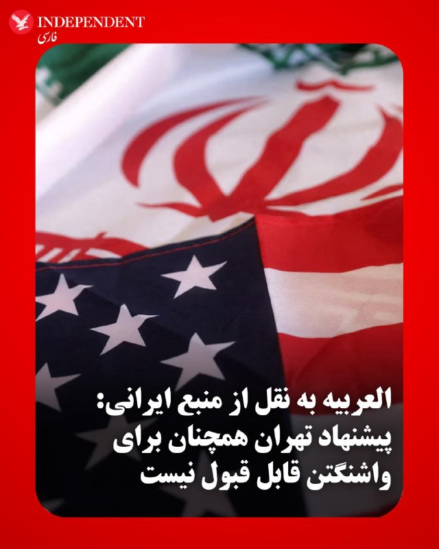

♦️شبکه العربیه، روز شنبه دوم خرداد ماه، به نقل از «یک منبع بلندپایه ایرانی» گزارش داد پیشنهاد ارائه‌شده از سوی تهران تاکنون نتوانسته رضایت آمریکا را جلب کند و همچنان از دید واشنگتن «غیرقابل قبول» تلقی می‌شود.
این منبع ایرانی جزئیات بیشتری درباره موارد اختلاف یا بخش‌های مورد اعتراض آمریکا به العربیه ارائه نکرد، اما تاکید کرد مذاکرات همچنان ادامه دارد و رایزنی‌ها برای کاهش اختلافات متوقف نشده است.
این گزارش در شرایطی منتشر می‌شود که طی روزهای اخیر پیام‌های متناقضی درباره روند مذاکرات، سرنوشت ذخایر اورانیوم غنی‌شده ایران و احتمال دستیابی به توافق میان تهران و واشنگتن منتشر شده است.
‌🇸🇦 Indypersian

🤖 @VahidOOnLine

## VahidOOnLine — post 241675

  <a href="telegram/content/VahidOOnLine_241675_1779534042.mp4" target="_blank">🎬 Download video</a>

⭕️ شلیک هوایی عروس حامی جمهوری اسلامی در میان تشویق حاضران

♦️در ادامه تجمعات شبانه حامیان جمهوری اسلامی در میادین شهری و اشغال فضای عمومی، ویدیوهای متعددی از مراسم‌ها و برنامه‌های خیابانی منتشر شده است.
در یکی از ویدیوهای منتشرشده، همزمان با برگزاری مراسم عروسی یک زوج در فضایی که تصاویر روح‌الله، بنیانگذار جمهوری اسلامی و مجتبی خامنه‌ای، رهبر فعلی جمهوری اسلامی در آن دیده می‌شود، یک فرد نظامی سلاحی را به دست عروس می‌دهد و از او می‌خواهد به نشانه آغاز زندگی مشترک و عزم او برای حمایت از جمهوری اسلامی، گلوله‌ای به سمت هوا شلیک کند.
عروس که به نظر می‌رسد تجربه‌ای در استفاده از اسلحه ندارد، در میان تشویق و کف‌زدن حاضران، تیر هوایی شلیک می‌کند و مراسم ادامه پیدا می‌کند.
‌🇸🇦 Indypersian

🤖 @VahidOOnLine

## WithYashar — post 12136

  <a href="telegram/content/WithYashar_12136_1779534044.mp4" target="_blank">🎬 Download video</a>

کامیون براش بوق میزنه اتو بزنه 🤣🥴
@withyashar

## WithYashar — post 12135

الحدث : آمریکا به تهران پیام داده اگه توافقو رد کنه، عواقب بدی در انتظارشه
@withyashar

## WithYashar — post 12134

  <a href="telegram/content/WithYashar_12134_1779534046.mp4" target="_blank">🎬 Download video</a>

پنتاگون اسناد جدیدی از ufoها منتشر کرده که مانند یک انسان پرنده است و بسیار شبیه شخصیت “مشعل” در چهار شگفت‌انگیز در کمیک معروف هست.
@withyashar

## WithYashar — post 12133

  

عاصم منیر، فرمانده ارتش پاکستان با زرشکیان دیدار کرد
@withyashar

## WithYashar — post 12132

  <a href="telegram/content/WithYashar_12132_1779534048.mp4" target="_blank">🎬 Download video</a>

جمهوری اسلامی و پاکستان در نهایت… 😂🙌🏾
@withyashar

## WithYashar — post 12131

یک مقام دیگر پاکستانی به تهران می‌رود.😒 یا دیشب اگه رفتن دارن بر میگردن جت نیروی هوایی پاکستان GLF IV SP reg J-755 @withyashar

## WithYashar — post 12130

  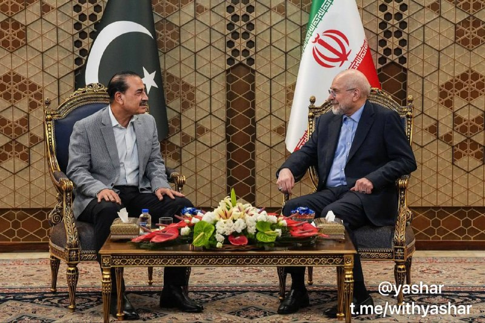

عاصم منیر، رییس ستاد کل ارتش پاکستان با محمدباقر قالیباف در تهران دیدار کرد
@withyashar

## WithYashar — post 12129

نورالدین الدغیر خبرنگار الجزیره در تهران: وساطت‌ها بین تهران و واشنگتن به مرحله‌ای رسیده که یکی از سران منطقه‌ای به طور مستقیم برای پر کردن شکاف‌ها وارد عمل شده.

ظهور قطر در این لحظه حساس به طور مستقیم و بر اساس اطلاعات و منابع موجود، نه صرفاً به عنوان نقش کمکی برای پاکستان، بلکه به عنوان نقش محوری است.
منبعی می‌گوید که احتمال دارد یکی از میانجی‌ها به واشنگتن سفر کند.
@withyashar

## WithYashar — post 12128

@withyashar

## WithYashar — post 12127

@withyashar به در میگم دیوار بشنوه

## WithYashar — post 12126

یاشار جان درود و خسته نباشید.
به این رفیقمون بگو جمله ی سر سفره ی پدر و مادر بزرگ شدن یک استعاره از تربیت و پرورش درست و اخلاقیه ، ربطی به حضور یا عدم حضور خانواده نداره
انقد همه چیز رو فلسفی نکنن
این عادت چپ ها و گلوبالیست ها هستش

## WithYashar — post 12125

  <a href="https://t.me/withyashar/12125" target="_blank">📎 Download file</a>

🌐 instagram.com/yashar

🌐 t.me/withyashar

## WithYashar — post 12124

## WithYashar — post 12122

## WithYashar — post 12121

درود و وقت بخیر
سر سفره پدر و مادر بزرگ شدن یکی از جملاتیه که باید از بین ببریمش اگه ممکنه کم کم دیگه تکرار نکنید چون الان الگوی خیلیامون قرار گرفتین🌹
شخصی که بچه طلاقه یا بی سرپرست می‌تونه خیلی بهتر از اونی باشه که کنار پدر و مادرش بزرگ شده🤍

## WithYashar — post 12120

منبع ارشد ایرانی به الحدث: آنچه تاکنون مطرح کرده‌ایم برای ایالات متحده قابل قبول نیست
@withyashar

## FoxNewsTwitter — post 342154

Fox News (Twitter/X)

Secretary of State Marco Rubio has begun a multi-day visit to India ahead of next week’s meetings with key Indo-Pacific allies.

Rubio is expected to meet with Prime Minister Narendra Modi to discuss trade, defense, and regional security cooperation.

## pm_afshaa — post 91255

🔴الحدث : آمریکا به تهران پیام داده اگه توافقو رد کنه، عواقب بدی در انتظارشه

💧 Rainbet.com the #1 Non-KYC Crypto Casino & Sportsbook @rainbetcom

😁 @Pm_Afshaa

## pm_afshaa — post 91254

🔴عاصم منیر، رییس ستاد کل ارتش پاکستان با محمدباقر قالیباف در تهران دیدار کرد

💧 Rainbet.com the #1 Non-KYC Crypto Casino & Sportsbook @rainbetcom

😁 @Pm_Afshaa

## pm_afshaa — post 91253

🔴نورالدین الدغیر خبرنگار الجزیره: وساطت‌ها بین تهران و واشنگتن به مرحله‌ای رسیده که یکی از سران منطقه‌ای به طور مستقیم برای پر کردن شکاف‌ها وارد عمل شده

💧 Rainbet.com the #1 Non-KYC Crypto Casino & Sportsbook @rainbetcom

😁 @Pm_Afshaa

## pm_afshaa — post 91252

🔴یک منبع ارشد ایرانی به الحدث: آنچه تاکنون مطرح کرده‌ایم برای ایالات متحده قابل قبول نیست

💧 Rainbet.com the #1 Non-KYC Crypto Casino & Sportsbook @rainbetcom

😁 @Pm_Afshaa

## pm_afshaa — post 91250

شاهزاده رضا پهلوی در ادامه دیدارهای خود با چند تن از نمایندگان کنگره آمریکا دیدار و درباره حمایت از مردم ایران و آینده «ایران آزاد» گفت‌وگو کرد.

نمایندگان کنگره ضمن محکوم کردن عملکرد جمهوری اسلامی، بر حمایت از مبارزه مردم ایران برای آزادی، صلح و پایان دادن به تهدیدهای رژیم علیه ایران، آمریکا و جهان تأکید کردن

💧 Rainbet.com the #1 Non-KYC Crypto Casino & Sportsbook @rainbetcom

😁 @Pm_Afshaa

## DEJradio — post 4867

⭕️ ادعای سخنگوی وزارت دفاع: ترامپ چاره‌ای جز پذیرش مطالبات جمهوری اسلامی ندارد

رضا طلایی‌نیک، سخنگوی وزارت دفاع دولت پزشکیان، ادعا کرد دونالد ترامپ «هیچ چاره‌ای» جز پذیرش مطالبات تهران و به رسمیت شناختن «حقوق» جمهوری اسلامی ندارد.
طلایی نیک مدعی شد «تمکین نکردن» آمریکا به خواسته‌های جمهوری اسلامی، به «تحمیل هزینه‌های بیشتر» و «شکست‌های پیاپی» برای ترامپ و اسرائیل منجر می‌شود.
سخنگوی وزارت دفاع همچنین گفت ترامپ باید ضمن پذیرش پیشنهادهای جمهوری اسلامی، به فکر جلوگیری از «خسارت‌ها و هزینه‌های بیشتر» ادامۀ جنگ برای مردم آمریکا و جامعۀ جهانی باشد.
رجزخوانی این مقام وزارت دفاع در حالی است که در جریان جنگ‌ با آمریکا و اسرائیل وزیر دفاع جمهوری اسلامی کشته شده بود.

#مذاکرات

@DEJradio

## DEJradio — post 4866

⭕️ عضو ارشد کتائب حزب‌الله قصد داشت ایوانکا ترامپ را ترور کند

نیویورک پست گزارش داد یک تبعۀ عراق که به‌تازگی برای محاکمه به آمریکا تحویل داده شد، قصد داشت ایوانکا ترامپ، دختر رئیس‌ جمهوری آمریکا را ترور کند.
این روزنامۀ آمریکایی به نقل از منابعی نوشت محمدباقر سعد داوود السعدی، ۳۲ ساله، قصد داشت با ترور ایوانکا، از کشته شدن قاسم سلیمانی، فرمانده پیشین نیروی قدس سپاه توسط آمریکا، انتقام بگیرد.
اف‌بی‌آی هفته گذشته اعلام کرده بود یک عضو ارشد گروه کتائب حزب‌الله عراق در ترکیه بازداشت و برای محاکمه به آمریکا منتقل شده است.
دادستانی ایالت نیویورک با انتشار تصویری از محمدباقر سعد داوود السعدی در کنار قاسم سلیمانی، اعلام کرد که او خود را «محمدباقر سلیمانی» معرفی می‌کرد.
بر اساس گزارش‌ها، این عضو کتائب حزب‌الله قصد داشت از ترکیه به مقصد روسیه پرواز کند.

#ترور #سپاه_قدس
@DEJradio

## DEJradio — post 4865

⭕️ دولت ترامپ برای حملات تازه علیه جمهوری اسلامی آماده می‌شود

شبکۀ سی‌بی‌اس بامداد شنبه گزارش داد دولت دونالد ترامپ برای انجام دوری تازه‌ از حملات علیه جمهوری اسلامی آماده می‌شود.
سی‌بی‌اس به نقل از منابع آگاه نوشت تدارکات و آمادگی‌های لازم برای حملات تازه، انجام شده است.
این شبکه گزارش داد تا بامداد شنبه به وقت ایران، هنوز تصمیم پایانی برای حمله گرفته نشده بود.
از سویی یک خبرنگار وال‌استریت ژورنال گزارش داد دونالد ترامپ شامگاه آدینه با مشاوران امنیت ملی خود نشستی برگزار کرد، اما تصمیم قطعی در این جلسه گرفته نشد.
بنا بر این گزارش، ترامپ در این نشست گفت دیپلماسی به زمان بیشتری نیاز دارد، اما گزینۀ بازگشت به جنگ همچنان روی میز است.
پیش‌تر اسماعیل بقائی، سخنگوی هیئت مذاکره‌کنندۀ جمهوری اسلامی، گفته بود اختلاف‌ها میان تهران و واشینگتن آن‌قدر «عمیق و گسترده است که نمی‌توان انتظار داشت مذاکرات در مدتی کوتاه به نتیجه برسد.

#مذاکرات
@DEJradio

## DEJradio — post 4863

  <a href="telegram/content/DEJradio_4863_1779534049.webm" target="_blank">🎬 Download video</a>

🔺📷 جمهوری اسلامی ایران خود را پیروز جنگ ۴۰ روزه می‌داند، از آن جهت که با وجود بمباران گسترده و کشته‌شدن علی خامنه‌ای و لشکری از فرماندهان و نیروهای نظامی و سرکوبگر هنوز بقا می‌کند، اما واقعیت آن است که بخش عمده زیرساخت‌های امنیتی و نظامی ارتش، سـ.ـپاه پاسداران و انتظامی از بین رفته است و زیرساخت‌های اطلاعات سپاه و وزارت اطلاعات به شدت آسیب دیده است.

منابع غیررسمی تصویری از لاشه یک سامانه شنود الکترونیکی Avtobaza-M را منتشر کرده‌اند. این سامانه در جنگ الکترونیک محلی به کار می‌رود.
این سامانه شناسایی روسی است که برای کشف و رهگیری امواج راداری هواپیماها، پهپادها و سامانه‌های راداری استفاده می‌شود در جنگ ۴۰ روزه هدف راحتی برای جنگنده‌ها و پهپادهای آمریکایی و اسرائیلی بود.
قبلا رسانه‌های حکومتی تبلیغ می‌کردند که با این سیستم می‌توانند هواپیماهای پنهانکار را شناسایی و رهگیری کنند.

#جنگ۴۰روزه #جنگ
@DEJradio

## kianmeli1 — post 87577

  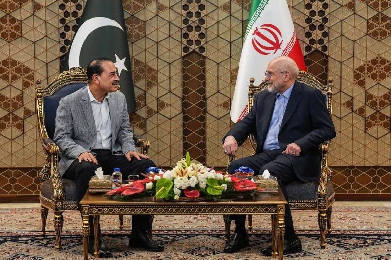

‏🔴عاصم منیر، رییس ستاد کل ارتش پاکستان با محمدباقر قالیباف در تهران دیدار کرد
https://t.me/kianmeli1

## kianmeli1 — post 87576

🔴بر اساس مشاهدات میدانی، شدت آتش و میزان فلرینگ در پتروپالایش کنگان و فازهای ۱۲ و ۱۴ نسبت به روزهای گذشته به‌طور محسوسی افزایش یافته است. همچنین فرآیند تخلیه مخازن با سرعت و شدت بیشتری در حال انجام است.

با توجه به برخی تحرکات و پیام‌های منتقل‌شده از سوی پاکستان و قطر، این شرایط می‌تواند نشانه‌ای از احتمال وقوع یک حمله در آینده نزدیک تلقی شود
https://t.me/kianmeli1

## kianmeli1 — post 87575

  <a href="telegram/content/kianmeli1_87575_1779534050.mp4" target="_blank">🎬 Download video</a>

🔴کیومرث يزدان‌پناه، استاد ژئوپلیتیک دانشگاه تهران:

دست از سر ایران بر نمی‌دارند تا متعهد شویم که قصد نابودی اسرائیل را نداریم
ممکن است دوباره حمله کنند و بخواهند باقی اهداف نظامی را بزنند.
https://t.me/kianmeli1

## kianmeli1 — post 87574

‏🔴فرماندهی کل ارتش بحرین تاکید کرد که یگان‌ها در بالاترین سطح آماده‌باش دفاعی قرار دارند
https://t.me/kianmeli1

## kianmeli1 — post 87573

‏🔴سازمان دریانوردی تجاری بریتانیا خبر داد که گزارش‌های متعددی درباره نزدیک شدن قایق‌های کوچک به کشتی‌ها در خلیج عدن دریافت کرده است
https://t.me/kianmeli1

## kianmeli1 — post 87572

  <a href="telegram/content/kianmeli1_87572_1779534052.mp4" target="_blank">🎬 Download video</a>

🔴رضا تقی‌پور، نماینده مجلس: شبکه حیاتی کابل‌های فیبر نوری جهان از تنگه هرمز و باب‌المندب عبور می‌کند و ایران می‌تواند این کابل‌ها را قطع کند
https://t.me/kianmeli1

## IranIntlTV — post 338567

  <a href="telegram/content/IranIntlTV_338567_1779534054.mp4" target="_blank">🎬 Download video</a>

بر اساس گزارش شرکت کپلر، با توجه به مختل شدن امکان صادرات، میزان بارگیری نفت خام ایران نسبت به پیش از محاصره دریایی آمریکا، حدود یک‌ونیم میلیون بشکه در روز کاهش یافته است.

گفت‌وگو با عطا حسینیان، روزنامه‌نگار اقتصادی و حوزه انرژی
@iranintltv

## IranIntlTV — post 338566

  <a href="telegram/content/IranIntlTV_338566_1779534055.mp4" target="_blank">🎬 Download video</a>

یک شهروند روز شنبه دوم خردادماه با ارسال ویدیوی به ایران اینترنشنال گسترش و پخش دود آلاینده پتروشیمی شازند به طبیعت اطراف را نشان می‌دهد.

## IranIntlTV — post 338565

  <a href="telegram/content/IranIntlTV_338565_1779534057.mp4" target="_blank">🎬 Download video</a>

سرخط خبرهای شنبه ۲ خرداد
@iranintltv

## IranIntlTV — post 338564

🔻اسرائیل‌هیوم: واشینگتن و تل‌آویو درباره حذف مجتبی خامنه‌ای اختلاف دارند

به گزارش اسرائیل‌هیوم، آمریکا و اسرائیل در حال بررسی این پرسش هستند که حذف مجتبی خامنه‌ای می‌تواند حکومت ایران را بی‌ثبات کند یا برعکس، به شکل‌گیری ساختاری رادیکال‌تر و توافقی شکننده مشابه برجام منجر شود.

به نوشته روزنامه اسرائیل‌هیوم در حالی که آمریکا و اسرائیل پس از ترور علی خامنه‌ای درباره آینده ایران ارزیابی‌های متفاوتی دارند، اکنون بحثی تازه در محافل سیاسی و امنیتی دو کشور شکل گرفته است: آیا حذف مجتبی خامنه‌ای می‌تواند به بی‌ثباتی بیشتر حکومت ایران و دستیابی به توافقی مطلوب‌تر منجر شود یا برعکس، خطر تکرار توافق‌های گذشته و ظهور ساختاری رادیکال‌تر را افزایش خواهد داد.

به گزارش این روزنامه اسرائیلی، واشینگتن و اورشلیم بار دیگر با پرسشی راهبردی روبه‌رو شده‌اند که پیش‌تر درباره علی خامنه‌ای مطرح بود، اما اکنون به مجتبی خامنه‌ای، جانشین جدید رهبری حکومت ایران، مربوط می‌شود: آیا حذف او به سود اهداف غرب و اسرائیل خواهد بود یا باقی ماندن او - هرچند ضعیف و آسیب‌پذیر - ثباتی نسبی ایجاد می‌کند که برای مدیریت بحران مفیدتر است؟

این گزارش می‌گوید ترور علی خامنه‌ای، که با هماهنگی آمریکا و اسرائیل انجام شد، اقدامی بی‌سابقه بود؛ زیرا برای نخستین بار اسرائیل رهبر یک کشور دشمن را هدف قرار داد. هدف از این اقدام، به نوشته اسرائیل‌هیوم، تضعیف بنیادهای حکومت ایران بود.

به باور نویسنده، این هدف تنها تا حدی محقق شد. از یک سو، ساختار قدرت متمرکز در ایران آسیب دید و نشانه‌هایی از اختلافات داخلی و تنش در روند تصمیم‌گیری آشکار شد. حملات جمهوری اسلامی به کشورهای خلیج فارس نیز، به ادعای این گزارش، در برخی موارد با مواضع رسمی سیاسی تهران همخوانی نداشته است. همچنین مجتبی خامنه‌ای به عنوان رهبری «ضعیف، آسیب‌دیده و فاقد اقتدار کامل» توصیف می‌شود. فردی که مشخص نیست کنترل واقعی اوضاع را در دست دارد یا صرفاً در جریان تحولات قرار گرفته است.

اما از سوی دیگر، اسرائیل‌هیوم می‌نویسد حکومت ایران همچنان دارای ساختار فرماندهی و مرکز تصمیم‌گیری است و تا زمانی که فردی از خاندان خامنه‌ای در راس قدرت قرار دارد، جمهوری اسلامی می‌تواند تصویر یک حکومت باثبات را حفظ کند.

به نوشته این روزنامه، مسعود پزشکیان و عباس عراقچی اکنون در برخی موضوعات، از جمله پرونده هسته‌ای، انعطاف بیشتری نسبت به دوران علی خامنه‌ای نشان می‌دهند؛ موضوعی که پیش‌تر امکان‌پذیر نبود، هرچند فاصله گرفتن آن‌ها از خطوط اصلی سیاست نظام همچنان محدود است.

معضل راهبردی: حذف مجتبی خامنه‌ای یا حفظ ساختار موجود؟
اسرائیل‌هیوم می‌نویسد موافقان حذف مجتبی خامنه‌ای معتقدند ترور او می‌تواند حکومت ایران را وارد بحران جانشینی و آشفتگی سیاسی کند؛ وضعیتی که شاید به جناح‌های عملگراتر فرصت دهد توافقی با غرب شکل دهند.

این گزارش برای توضیح این رویکرد به حمله اسرائیل به دوحه در سپتامبر گذشته اشاره می‌کند؛ حمله‌ای که هدف آن، به ادعای نویسنده، تضعیف جناحی از حماس بود که مانع توافق درباره گروگان‌ها شده بود.

اما مخالفان این دیدگاه هشدار می‌دهند در ایران «میانه‌روهای واقعی» آماده جانشینی وجود ندارند و حذف خامنه‌ای ممکن است صرفاً به توافقی مشابه توافق هسته‌ای دوران اوباما منجر شود؛ توافقی که از نگاه اسرائیل، محدودیت‌های زمانی داشته و تهدیدهای بلندمدت را برطرف نکرده بود.

اسرائیل‌هیوم با اشاره به هشدارهای پیشین دادی بارنئا، رییس موساد، می‌نویسد مقام‌های اسرائیلی سال‌ها نسبت به محدودیت زمانی توافق‌های هسته‌ای هشدار داده‌اند. به گفته نویسنده، حتی اگر حکومت ایران با توقف ۱۵ ساله برنامه هسته‌ای موافقت کند، در نهایت محدودیت‌ها پایان می‌یابد و مساله دوباره بازمی‌گردد.

🔗ادامه گزارش را اینجا بخوانید

## IranIntlTV — post 338563

  <a href="telegram/content/IranIntlTV_338563_1779534058.mp4" target="_blank">🎬 Download video</a>

ویدیوی رسیده به ایران اینترنشنال نشان می‌دهد روز شنبه دوم خرداد تعدادی از دانش‌آموزان مدارس در خرم‌آباد برای اعتراض به شیوه امتحانات خود و اظهارات مسئولان برای حضوری کردن امتحانات مقابل ساختمان آموزش و پرورش تجمع کردند. هفته گذشته نیز در شهرکرد دانش‌آموزان تجمع اعتراضی برگزار کردند.

## IranIntlTV — post 338562

  

شبکه العربیه به نقل از منابع آگاه گزارش داد عاصم منیر، رییس ستاد کل ارتش پاکستان، پیام‌های آمریکا را به تهران منتقل کرده است و بخشی از این پیام حاوی تهدید به ازسرگیری جنگ بوده است.

در این پیام‌ها همچنین تاکید شده در صورت موافقت جمهوری اسلامی با توافق، حل مسائل اختلافی در مرحله بعدی انجام خواهد شد.

به گفته این منابع، آمریکا در پیام‌های خود تصریح کرده است تهران باید اکنون با توافق موافقت کند یا با پیامدهای منفی روبه‌رو شود.
https://iranintl.com/202605236089

## IranIntlTV — post 338561

  <a href="telegram/content/IranIntlTV_338561_1779534060.mp4" target="_blank">🎬 Download video</a>

ویدیوی رسیده به ایران اینترنشنال نشان می‌دهد روز شنبه دوم خرداد تعدادی از دانش‌آموزان مدارس در خرم‌آباد برای اعتراض به شیوه امتحانات خود و اظهارات مسئولان برای حضوری کردن امتحانات مقابل ساختمان آموزش و پرورش تجمع کردند. آن‌ها شعار «مجازی مجازی»‌ سر داده و خواستار غیرحضوری شدن امتحانات شدند.

## IranIntlTV — post 338560

  <a href="telegram/content/IranIntlTV_338560_1779534061.mp4" target="_blank">🎬 Download video</a>

فدراسیون فوتبال ایران اخبار مربوط به رد ویزای آمریکا برای شماری از ملی‌پوشان جهت حضور در جام جهانی ۲۰۲۶ را تکذیب کرد و اعلام کرد روند اخذ ویزا طبق روال در حال انجام است.

جزییات بیشتر در گفت‌وگو با علیرضا مدیری، عضو تحریریه ایران‌اینترنشنال
@iranintltv

## IranIntlTV — post 338559

  <a href="telegram/content/IranIntlTV_338559_1779534063.mp4" target="_blank">🎬 Download video</a>

رییس مرکز ملی اقلیم و مدیریت بحران خشکسالی سازمان هواشناسی اعلام کرد با وجود بارندگی‌های اخیر، تهران ششمین سال کم‌بارشی را تجربه می‌کند. سخنگوی شرکت آب و فاضلاب تهران هم هشدار داد عبور از بحران آب بدون صرفه‌جویی ممکن نیست.

گفت‌وگو با احسان دانشور، پژوهشگر ارشد محیط زیست و انرژی
@iranintltv

## IranIntlTV — post 338558

  <a href="telegram/content/IranIntlTV_338558_1779534064.mp4" target="_blank">🎬 Download video</a>

ویدیوی رسیده به ایران اینترنشنال نشان می‌دهد روز شنبه دوم خرداد تعدادی از دانش‌آموزان مدارس در خرم‌آباد برای اعتراض به شیوه امتحانات خود و اظهارات مسئولان برای حضوری کردن امتحانات مقابل ساختمان آموزش و پرورش تجمع کردند. آن‌ها شعار «لرستان می‌میرد، ذلت نمی‌پذیرد» سر دادند..

## IranIntlTV — post 338557

  <a href="telegram/content/IranIntlTV_338557_1779534066.mp4" target="_blank">🎬 Download video</a>

پگاه آهنگرانی، بازیگر و فیلمساز ایرانی، شنبه ۲۶ اردیبهشت برای نمایش فیلم تازه خود «تمرین‌هایی برای یک انقلاب» در جشنواره کن حاضر شد. او این فیلم را به مادرانی تقدیم کرد که فرزندانشان را در مسیر مبارزه برای آزادی از دست داده‌اند. آهنگرانی که همراه عوامل فیلم روی صحنه رفت، گفت خوشحال است که این اثر توانسته بخشی از مبارزه مردم برای آزادی و دموکراسی را به تصویر بکشد و افزود مردم این روزها با قطعی اینترنت، خبرهای روزانه اعدام‌ها توسط جمهوری اسلامی و سایه جنگ روبه‌رو هستند.
@iranintltv

## IranIntlTV — post 338556

  <a href="telegram/content/IranIntlTV_338556_1779534067.mp4" target="_blank">🎬 Download video</a>

ویدیوی رسیده به ایران اینترنشنال نشان می‌دهد روز شنبه دوم خرداد تعدادی از دانش‌آموزان مدارس در خرم‌آباد برای اعتراض به شیوه امتحانات خود و اظهارات مسئولان برای حضوری کردن امتحانات مقابل ساختمان آموزش و پرورش تجمع کردند. آن‌ها شعار «مرگ بر مسئول بی‌لیافت»‌ سر دادند.

## IranIntlTV — post 338555

  

🔻روزنامه ایران ورزشی مدعی شده بازیکنان خط‌ خورده از اردوی تیم ملی در آماده‌باش قرار گرفته‌اند تا در صورت بروز مشکل ویزا برای برخی نفرات، جایگزین شوند. عصر ایران هم، با بازنشر این گزارش، اضافه کرده شایعاتی درباره رد ویزای شجاع خلیل‌زاده، مهدی طارمی و احسان حاج‌صفی مطرح شده است.

🔹مسعود محبی، دانیال اسماعیلی‌فر، حسین ابرقویی، عارف آقاسی، مهدی هاشم‌نژاد، محمدمهدی محبی، عارف حاجی‌عیدی، پوریا شهرآبادی و احسان محروقی در آخرین اردوی تیم ملی در تهران حضور داشتند، اما امیر قلعه‌نویی آن‌ها را از فهرست ۳۰ نفره نهایی کنار گذاشت.

🔹ایران ورزشی نوشته است که کادر فنی به آن‌ها پیام داده: «تمریناتتان را ادامه دهید.»

🔹به نوشته این رسانه، «آن‌ها باید خود را برای جایگزینی احتمالی بازیکنانی که با مشکل ویزا مواجه شده‌اند آماده کنند.»

🔹اما ساعتی پیش فدراسیون فوتبال، بدون اشاره به پاسخی از سفارت آمریکا در آنکارا و با استناد به انجام شدن روند اداری از سوی فدراسیون، رد شدن ویزا برای طارمی، خلیل‌زاده و حاج‌صفی را تکذیب کرد.

🔹جزییات بیشتر را در سایت بخوانید.

@iranintltvsport

## IranIntlTV — post 338554

  

محمدحسن نامی، دستیار ویژه وزیر کشور، خواستار تشکیل «ناتوی اسلامی» در منطقه و جهان اسلام با محوریت جمهوری اسلامی شد. او گفت کشورهای اسلامی از ظرفیت‌های گسترده اقتصادی و موقعیت جغرافیایی، از جمله تنگه هرمز و باب‌المندب، برخوردارند که این دو مورد قدرت‌آفرین هستند.

او گفت: «چرا نباید یک ناتوی اسلامی در همین منطقه خودمان و در جهان اسلام داشته باشیم؟ از حدود ۵۷ کشور اسلامی، بیشترین ظرفیت اقتصادی و جغرافیایی جهان به‌دست می‌آید که قدرت‌آفرین است.»

نامی افزود: «در صورت تحقق این اتحاد، هیچ قدرتی نمی‌تواند به جهان اسلام زور بگوید؛ نمونه آن فلسطین است که تاکنون ۷۳ هزار شهید تقدیم کرده است.»
https://iranintl.com/202605238332

## IranIntlTV — post 338553

  

محمدحسن نامی، دستیار ویژه وزیر کشور، خواستار تشکیل «ناتوی اسلامی» در منطقه و جهان اسلام با محوریت جمهوری اسلامی شد. او گفت کشورهای اسلامی از ظرفیت‌های گسترده اقتصادی و موقعیت جغرافیایی، از جمله تنگه هرمز و باب‌المندب، برخوردارند که این دو مورد قدرت‌آفرین هستند.

او گفت: «چرا نباید یک ناتوی اسلامی در همین منطقه خودمان و در جهان اسلام داشته باشیم؟ از حدود ۵۷ کشور اسلامی، بیشترین ظرفیت اقتصادی و جغرافیایی جهان به‌دست می‌آید که قدرت‌آفرین است.»

نامی افزود: «در صورت تحقق این اتحاد، هیچ قدرتی نمی‌تواند به جهان اسلام زور بگوید؛ نمونه آن فلسطین است که تاکنون ۷۳ هزار شهید تقدیم کرده است.»
https://iranintl.com/202605238332

## IranIntlTV — post 338552

ایرانیان ساکن بریزبن استرالیا روز شنبه دوم خرداد با اشاره به کارزار ایران اینترنشنال برای شناسایی جاویدنامان بیمارستان الغدیر تهران پرفورمنس هنری اجرا کردند. سخنران این تجمع به انبود پیکر معترضان در این بیمارستان اشاره کرد.

## IranIntlTV — post 338551

  <a href="telegram/content/IranIntlTV_338551_1779534070.mp4" target="_blank">🎬 Download video</a>

ویدیوی رسیده به ایران‌اینترنشنال نشان می‌دهد دانش‌آموزان شنبه در خرم‌آباد در اعتراض به بلاتکلیفی و ابهام درباره نحوه برگزاری امتحانات و اظهارات مسئولان درباره حضوری کردن امتحانات تجمع کردند.

گفت‌وگو با محسن مهیمنی، عضو تحریریه ایران‌اینترنشنال
@iranintltv

## IranIntlTV — post 338550

  <a href="telegram/content/IranIntlTV_338550_1779534071.mp4" target="_blank">🎬 Download video</a>

با ادامه محاصره دریایی آمریکا بر تنگه هرمز علیه جمهوری اسلامی، یک شهروند تصویری از سواحل اسکله رجایی بندرعباس ارسال کرده و می‌گوید که کشتی‌ها در این منطقه به دلیل توقف تردد متوقف شده‌اند. بنا بر اعلام سنتکام از زمان آغاز محاصره بیش از ۱۰۰ کشتی مجبور به تغییر مسیر شده‌اند و چندین کشتی نیز از کار انداخته شده‌اند.

## ManotoTV — post 105756

  <a href="telegram/content/ManotoTV_105756_1779534073.mp4" target="_blank">🎬 Download video</a>

دولت آمریکا اعلام کرد بیشتر مهاجرانی که قصد دریافت گرین‌کارت دارند، باید خاک این کشور را ترک کرده و درخواست خود را از طریق سفارت‌خانه‌ها یا کنسولگری‌های آمریکا در خارج ثبت کنند.
اداره خدمات شهروندی و مهاجرت آمریکا اعلام کرد از این پس دارندگان ویزای موقت، دانشجویی یا توریستی تنها در «شرایط استثنایی» می‌توانند داخل آمریکا وضعیت اقامت خود را تغییر دهند.
این تصمیم بخشی از سیاست‌های مهاجرتی دولت ترامپ برای محدود کردن مهاجرت غیرقانونی عنوان شده و راهی را می‌بندد که پیش‌تر به برخی مهاجران اجازه می‌داد هنگام حضور در آمریکا برای گرین‌کارت اقدام کنند.
منتقدان می‌گویند این تغییر می‌تواند باعث جدایی خانواده‌ها و ایجاد بلاتکلیفی برای صدها هزار مهاجر قانونی شود. همچنین برخی متقاضیان ممکن است پس از خروج از آمریکا دیگر اجازه بازگشت دریافت نکنند.
دولت آمریکا می‌گوید این سیاست باعث «عادلانه‌تر و کارآمدتر» شدن سیستم مهاجرتی خواهد شد.

## ManotoTV — post 105755

  <a href="telegram/content/ManotoTV_105755_1779534073.mp4" target="_blank">🎬 Download video</a>

وزیر خارجه قطر در تماس تلفنی با عباس عراقچی، وزیر خارجه جمهوری اسلامی، خواستار کاهش تنش‌ها و حمایت از تلاش‌های دیپلماتیک برای پایان دادن به بحران شد. وزارت خارجه قطر اعلام کرد دوحه از مذاکرات برای رسیدن به توافقی جامع و برقراری ثبات پایدار در منطقه حمایت کامل می‌کند.
وزیر خارجه قطر همچنین هشدار داد بستن تنگه هرمز یا استفاده از آن به‌عنوان ابزار فشار، بحران را تشدید کرده و منافع کشورهای منطقه را به خطر می‌اندازد. او تأکید کرد آزادی کشتیرانی یک اصل اساسی و غیرقابل مذاکره است و همه طرف‌ها باید به قوانین بین‌المللی و اصول حسن همجواری پایبند باشند.
هم‌زمان، وزرای خارجه اردن و قطر نیز درباره تلاش‌های میانجی‌گرانه پاکستان میان تهران و واشنگتن گفت‌وگو کردند و بر ضرورت همکاری برای رسیدن به راه‌حلی پایدار و جلوگیری از تشدید دوباره تنش‌ها تأکید کردند.

## ManotoTV — post 105754

  <a href="telegram/content/ManotoTV_105754_1779534074.mp4" target="_blank">🎬 Download video</a>

«منوتو بخشی از زندگی ما بود»

## ManotoTV — post 105753

  <a href="telegram/content/ManotoTV_105753_1779534075.mp4" target="_blank">🎬 Download video</a>

سازمان هواپیمایی کشوری صدور هرگونه نوتام جدید برای ممنوعیت پرواز در غرب حریم هوایی ایران را تکذیب کرد. حمیدرضا صانعی، معاون هوانوردی و امور بین‌الملل این سازمان، شایعات منتشرشده در فضای مجازی درباره بسته شدن حریم هوایی تا صبح دوشنبه را «شیطنت رسانه‌ای» خواند و گفت هیچ اطلاعیه جدیدی صادر نشده است.
او همچنین اعلام کرد برنامه‌ریزی‌ها برای انجام پروازهای اربعین در حال انجام است.

## FarsiVOA — post 218423

  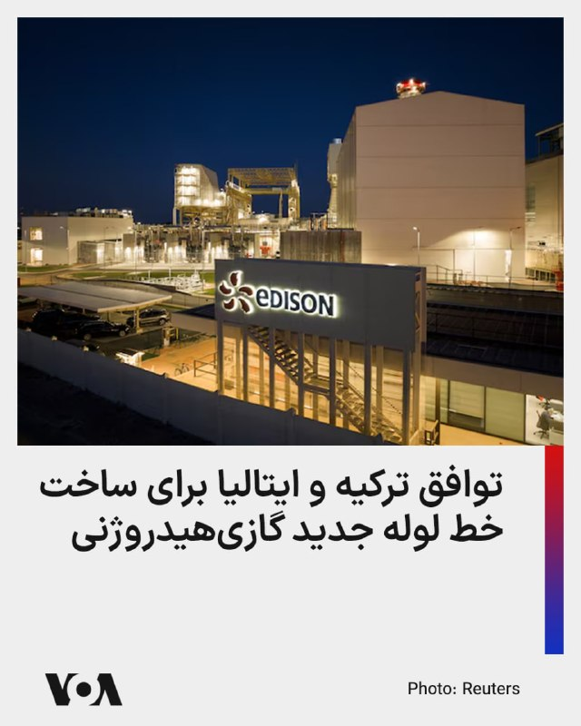

در میانه بحران جهانی نفت و گاز، شرکت‌های بوتاش ترکیه و ادیسون ایتالیا توفقنامه‌ای برای بررسی ساخت یک خط لوله با قابلیت انتقال گاز طبیعی و سوخت هیدروژن امضا کردند.

شرکت انتقال و بازاریابی نفت و گاز ترکیه‌، بوتاش، این توافق را «همکاری راهبردی» توصیف کرده است.

ساخت چنین خط لوله‌ای نه تنها صادرات گاز دریای خزر و خاورمیانه به اروپا را افزایش خواهد داد، بلکه زیرساخت‌های صادرات سوخت پاک هیدروژن به بازارهای اروپایی را نیز توسعه خواهد داد و به تنوع سبد انرژی اروپا کمک خواهد کرد.

هم‌اکنون سالانه حدود ۱۳ میلیارد متر مکعب گاز جمهوری آذربایجانی از طریق ترکیه به اروپا صادر می‌شود که بخش اعظم آن راهی ایتالیا می‌شود.

تولید سوخت هیدروژن در جهان پارسال از مرز ۱۰۰ میلیون تن عبور کرد و در میان کشورهای منطقه، خود ترکیه، آذربایجان، یونان، قبرس، مصر و اسرائیل پروژه‌هایی برای تولید این سوخت پاک در دست بررسی یا توسعه دارند.
@FarsiVOA

## FarsiVOA — post 218422

  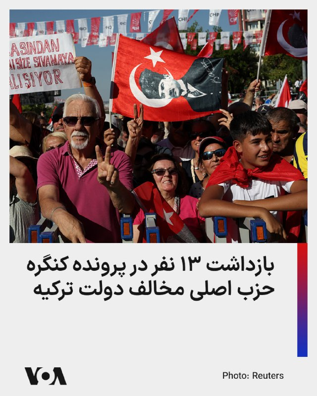

پلیس ترکیه ۱۳ نفر را در چارچوب تحقیق درباره کنگره سال ۲۰۲۳ حزب جمهوری‌خواه خلق، اصلی‌ترین حزب مخالف دولت، بازداشت کرد؛ کنگره‌ای که در آن اوغور اوزل به رهبری حزب رسید.

این بازداشت‌ها چند روز پس از آن انجام شد که دادگاهی در ترکیه نتیجه آن کنگره را به دلیل آنچه «بی‌نظمی» خوانده، باطل کرد و کمال قلیچداراوغلو، رهبر پیشین حزب، را به جای اوزل بازگرداند.

به گزارش رویترز، بازداشت‌شدگان با اتهام‌هایی از جمله نقض قانون احزاب سیاسی، دریافت رشوه و پول‌شویی روبه‌رو هستند. حزب جمهوری‌خواه خلق این تصمیم قضایی را «کودتای قضایی» خوانده است.

این پرونده در ادامه فشارهای قضایی سال‌های اخیر بر مخالفان رجب طیب اردوغان مطرح می‌شود. از اواخر ۲۰۲۴، صدها عضو و مقام محلی این حزب بازداشت شده‌اند و اکرم امام‌اوغلو، شهردار استانبول و رقیب مهم اردوغان، نیز در ۲۰۲۵ زندانی شد؛ اتهام‌هایی که مخالفان سیاسی می‌دانند و دولت آن را رد می‌کند.
@FarsiVOA

## FarsiVOA — post 218421

  <a href="telegram/content/FarsiVOA_218421_1779534077.mp4" target="_blank">🎬 Download video</a>

حمله گسترده پهپادی اوکراین به بندر راهبردی نووروسیسک روسیه؛

بر اساس گزارش منابع رسمی و خبرگزاری‌های بین‌المللی، اوکراین یک حمله پهپادی گسترده و هماهنگ را علیه شهر بندری نووروسیسک روسیه، در ساحل دریای سیاه انجام داده است.

در این حمله که بامداد شنبه دوم خرداد انجام شد، ترمینال نفتی بندر و تأسیسات این شهر که از شریان‌های اقتصادی و نظامی حیاتی روسیه در دریای سیاه محسوب می‌شوند، هدف قرار گرفتند.

مقامات محلی روسیه با تایید این حمله گسترده، از فعال شدن سیستم‌های پدافند هوایی خبر داده‌اند. بر اساس گزارش‌ها، انفجارهای متعددی در منطقه رخ داده و محدودیت‌های ترافیکی موقت در نزدیکی تاسیسات نفتی اعمال شده است.

بندر نووروسیسک یکی از بزرگ‌ترین بنادر تجاری و نظامی روسیه در دریای سیاه است و این حمله نشان‌دهنده تداوم استراتژی اوکراین برای فلج کردن زیرساخت‌های صادرات نفت و تدارکات ارتش روسیه است.
@FarsiVOA

## FarsiVOA — post 218420

  

مقام‌های قضایی جمهوری اسلامی از توقیف اموال ده‌ها نفر به برچسب اتهامی جاسوسی، همکاری اطلاعاتی و آنچه «همکاری با رژیم صهیونیستی» خوانده‌اند خبر دادند.

دادستان عمومی قزوین اعلام کرد اموال ۹۶ نفر از «مزدوران خارج‌نشین و داخل کشور» توقیف شده است. به گفته او برای سه نفر به اتهام جاسوسی و برای شش نفر دیگر به اتهام انجام اقدام اطلاعاتی کیفرخواست صادر شده است.

همزمان، رئیس‌کل دادگستری استان ایلام نیز از رصد، شناسایی و توقیف اموال هفت نفر در یکی از شهرستان‌های این استان خبر داد. او گفت این اقدام در چارچوب قانون تشدید مجازات جاسوسی و قانون اجرای اصل ۴۹ قانون اساسی انجام شده است.

به گفته مقام‌های قضایی اموال توقیف‌شده شامل مسکن، خودرو، دارایی‌های بانکی و سایر اموال بوده است.

در ماه‌های اخیر قوه قضاییه اجرای گسترده‌تری از توقیف اموال شهروندان با اتهام ادعایی همکاری اطلاعاتی، جاسوسی یا ارتباط با اسرائیل را آغاز کرده است.

توقیف معمولاً اقدامی موقت در جریان رسیدگی قضایی است، اما مصادره نیازمند حکم نهایی دادگاه است. اصل ۴۹ قانون اساسی نیز بازپس‌گیری اموال نامشروع را منوط به رسیدگی، تحقیق و اثبات قضایی می‌داند.
@FarsiVOA

## FarsiVOA — post 218419

🔺هشدار اقتصاددانان درباره فقر ۴۰ میلیونی؛ بدون جنگ هم تورم کاهش نمی‌یابد

◾️اقتصاددانان ایرانی تصویری نگران‌کننده از اقتصاد ایران پس از جنگ ترسیم می‌کنند.

◾️مسعود نیلی، با اشاره به تورم ۱۰۰ درصدی کالاها به روایت مرکز آمار، هشدار داده حتی اگر جنگ هم پایان یابد، شرایط تورمی ایران به‌سادگی به وضعیت نرمال بازنخواهد گشت.

◾️حجت میرزایی هم پیش‌بینی کرده رشد اقتصادی ایران در سال ۱۴۰۵ بین منفی ۸.۸ تا منفی ۱۰ درصد باشد و گفته است که حتی رشد منفی ۱۰ درصدی نیز، با توجه به کاهش صادرات نفت، ممکن است خوش‌بینانه باشد.

◾️او هشدار داده که در صورت ادامه آثار جنگ، بین ۳.۵ تا ۴.۵ میلیون نفر دیگر به جمعیت فقیر ایران افزوده می‌شوند و شمار افراد زیر خط فقر به بیش از ۴۰ میلیون نفر خواهد رسید.

⬇️ بیشتر بخوانید:
https://ir.voanews.com/a/8153018.html

## DW_Farsi — post 125046

  

📸 عکس روز: ساگرادا فامیلیا در بارسلونا آماده دیدار پاپ می‌شود

کلیسای ساگرادا فامیلیا (خانواده مقدس) در بارسلونا که شاهکار ناتمام آنتونی گائودی، معمار برجسته کاتالان است می‌رود تا پذیرای پاپ لئو، رهبر کاتولیک‌های جهان شود که قرار است در ۱۰ ژوئن در سردابه این بنا بر مزار گائودی دعا بخواند. این تصویر برج اصلی کلیساست که اکنون تقریبا به شکل نهایی خود رسیده است.

@dw_farsi

## DW_Farsi — post 125039

🔶 پگاه آهنگرانی جایزه بهترین مستند جشنواره کن را از آن خود کرد

مستند "تمرین‌هایی برای یک انقلاب" ساخته پگاه آهنگرانی، فیلمساز ایرانی موفق شد جایزه "چشم طلایی" (L’Œil d’or)، مهم‌ترین جایزه بخش مستند جشنواره فیلم کن ۲۰۲۶ را دریافت کند.

این مستند در بخش "نمایش‌های ویژه" هفتادونهمین دوره جشنواره فیلم کن به نمایش درآمد و از میان ۲۱ مستند حاضر در بخش‌های رسمی و جنبی جشنواره، به عنوان اثر برگزیده انتخاب شد.

"تمرین‌هایی برای یک انقلاب" نخستین فیلم بلند مستند پگاه آهنگرانی است و به روایت مقاطع مهمی از تاریخ معاصر ایران می‌پردازد؛ دوره‌هایی که به گفته سازندگان فیلم، جامعه ایران در آن‌ها به تغییر اجتماعی امیدوار شده، اما این امیدها بارها سرکوب شده‌اند.

فیلم با استفاده از آرشیوهای خانوادگی، ویدئوهای خانگی، تصاویر اعتراضات، روزنامه‌ها، ویدیوهای یوتیوب، انیمیشن و صداهای آرشیوی، بیش از چهار دهه از تاریخ معاصر ایران را مرور می‌کند.
@dw_farsi

## DW_Farsi — post 125038

  

🔶 پروازها به فرودگاه‌های اهواز و ماهشهر ازسر گرفته می‌شود

سازمان هواپیمایی کشوری ایران در اطلاعیه‌ای اعلام کرد، با تکمیل موفقیت‌آمیز فرآیند ارزیابی‌های امنیتی و ایمنی، دو فرودگاه اهواز و ماهشهر از روز شنبه ۲ خرداد (۲۳ مه) به چرخه عملیاتی کشور بازگشته‌اند.

سازمان هواپیمایی کشوری گفته است که فرودگاه‌های اهواز و ماهشهر با بهبود وضعیت زیرساخت‌ها، دوباره بازگشایی شده‌اند و تمامی شرکت‌های هواپیمایی می‌توانند پروازهای عادی خود را در این مسیرها از سر بگیرند.

سازمان هواپیمایی کشوری در اطلاعیه خود خبر داده است که سایر فرودگاه‌ها نیز پس از ارزیابی‌های امنیتی و ایمنی به‌تدریج بازگشایی خواهند شد.

پس از حملە ائتلاف آمریکا و اسرائیل بە جمهوری اسلامی به دلیل شرایط خاص امنیتی و ایمنی فعالیت بسیاری از فرودگاه‌ها متوقف شد. برخی از فرودگاه‌ها نیز هدف حمله قرار گرفتند.

@dw_farsi

## DW_Farsi — post 125036

  

🔶 حمله هوایی اسرائیل به "زیرساخت‌های حزب‌الله" در جنوب لبنان

وزارت بهداشت لبنان روز شنبه ۲ خرداد (۲۳ مه) اعلام کرد، در حملات اسرائیل به جنوب لبنان طی ۲۴ ساعت گذشته شش امدادگر کشته شده‌اند. وزارت بهداشت لبنان این حملات را نقض قوانین بین‌المللی دانسته است.

ارتش اسرائیل اعلام کرد، در یکی از این موارد، زیرساخت‌های مرتبط با حزب‌الله، گروه مورد حمایت ایران، هدف قرار گرفته و آسیب‌دیدن غیرنظامیان در این حمله بررسی خواهد شد.

هم‌زمان خبرگزاری فرانسه گزارش داده است که دو ساختمان در منطقه صور در جنوب لبنان پس از هشدار تخلیه هدف قرار گرفته‌اند. شاهدان از وقوع دو انفجار و بلندشدن دود از محل خبر داده‌اند.

در حادثه‌ای دیگر نیز پنج حمله هوایی اسرائیل در شرق لبنان و در نزدیکی مرز سوریه انجام شده است. بر اساس گزارش خبرگزاری رسمی لبنان، این حملات مناطق اطراف شهر بریتال لبنان را هدف قرار داده‌اند؛ منطقه‌ای که از آتش‌بس ۱۷ آوریل تاکنون کمتر مورد حمله قرار گرفته بود.

@dw_farsi

## RadioFarda — post 157477

  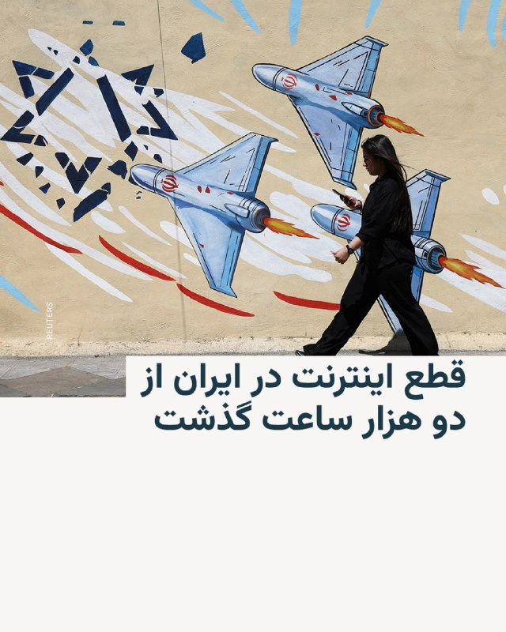

🔸نت‌بلاکس، نهاد پایش وضعیت اینترنت در جهان، در تازه‌ترین پیام خود در روز جمعه خبر داد که قطع اینترنت در ایران اکنون از ۲۰۰۰ ساعت گذشته است.

🔸در همین حال، روزنامهٔ اعتماد روز شنبه نوشت که مسعود پزشکیان، رئیس‌جمهور، «از مسیرهای قانونی»، پیگیر فراهم کردن دسترسی عمومی‌تر به اینترنت است. بر اساس این گزارش، تشکیل «ستاد راهبری و ساماندهی فضای مجازی» و قرار گرفتن محمدرضا عارف در رأس آن، نشانهٔ جدی بودن دولت در این زمینه دانسته شده است.

🔸روزنامهٔ اعتماد در گزارش خود این‌طور ابراز امیدواری کرده است که «به احتمال زیاد در هفتهٔ جاری موضوع رفع انسداد اینترنت به تصویب می‌رسد.»

🔸مسعود پزشکیان در حالی ستاد تازه‌ای برای «ساماندهی» فضای مجازی تشکیل داده که روزنامهٔ شرق آن را ساختاری مبهم و امنیتی با حضور نهادهایی چون وزارت اطلاعات، اطلاعات سپاه، شورای عالی امنیت ملی و قوهٔ قضائیه توصیف کرده و منتقدان می‌گویند دولت به‌جای رفع مستقیم محدودیت‌های اینترنت، بر مسیرهای پرابهام و امنیتی تکیه کرده است.

@RadioFarda

## RadioFarda — post 157476

  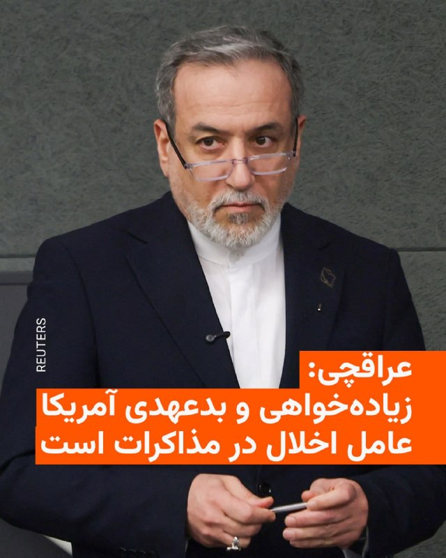

🔸هم‌زمان با انتشار گزارش‌هایی مبنی بر تدارک آمریکا برای دور تازه حمله به ایران، وزیر امور خارجه ایران «زیاده‌خواهی و بدعهدی آمریکا» را «عامل اخلال» در مذاکرات جاری با پاکستان عنوان کرد.

🔸شبکه سی‌بی‌اس در آمریکا بامداد شنبه، دوم خردادماه، خبر داد که دولت دونالد ترامپ برای انجام دور تازه‌ای از حملات علیه ایران آماده می‌شود.

🔸به نوشته این خبرنگار از کاخ سفید، ترامپ در جلسه موافق بوده است که دیپلماسی نیاز به زمان بیشتری دارد، و در عین حال مسئله بازگشت به جنگ نیز هم‌چنان روی میز است.

🔸همزمان رسانه‌های حکومتی در ایران روز جمعه خبر تماس تلفنی وزیر خارجه جمهوری اسلامی با دبیرکل سازمان ملل را منتشر کردند که در آن آمریکا را مسئول نرسیدن به توافق معرفی کرده است.

🔸به نوشته خبرگزاری تسنیم به نقل از عباس عراقچی، او «بدعهدی آمریکا خصوصاً خیانت‌های مکرر به دیپلماسی و تجاوز نظامی علیه ایران به‌ همراه موضع‌گیری‌های ضدونقیض و زیاده‌خواهی‌های مکرر» را «عامل اخلال» در مذاکراتی دانسته است که با میانجی‌گری پاکستان در حال انجام است.

@RadioFarda

## RadioFarda — post 157475

  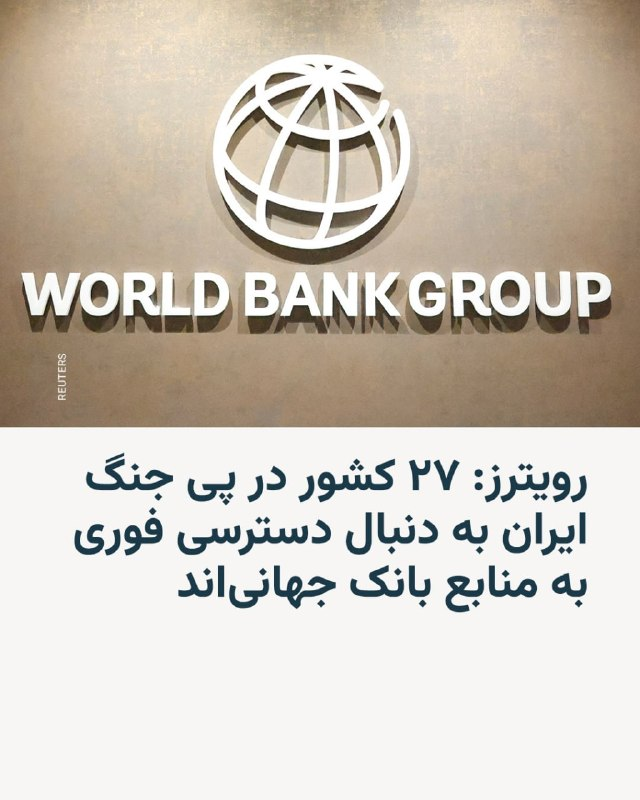

🔸یک سند داخلی بانک جهانی که رویترز آن را دیده، نشان می‌دهد از زمان آغاز جنگ ایران در اسفندماه پارسال، ۲۷ کشور برای فعال کردن ابزارهای مالی اضطراری اقدام کرده‌اند تا در صورت نیاز بتوانند به‌سرعت از منابع موجود در برنامه‌های بانک جهانی استفاده کنند.

🔸این سند نام کشورها و میزان کل منابع مالی احتمالی را مشخص نکرده و بانک جهانی نیز از اظهارنظر در این باره خودداری کرده است. بر پایه این سند، سه کشور از زمان آغاز درگیری در خاورمیانه، ابزارهای جدید مالی را تصویب کرده‌اند و سایر کشورها هنوز در حال تکمیل روند آن هستند.

🔸جنگ ایران و اختلال در بازار جهانی انرژی باعث افزایش قیمت سوخت، فشار بر زنجیره‌های تأمین و مشکل در ارسال کودهای شیمیایی به کشورهای در حال توسعه شده است.

🔸مقام‌های عراق و کنیا تأیید کرده‌اند که برای مقابله با پیامدهای جنگ، از جمله افت درآمد نفتی عراق و افزایش بهای سوخت در کنیا، به دنبال دریافت کمک سریع از بانک جهانی هستند.

@RadioFarda

## IranianMinds — post 20599

  

🔴منابع الحدث:

آمریکا به تهران پیام داده است که اگر توافق را رد کند، عواقب بدی در انتظارش می‌باشد.

@IranianMinds

## IranianMinds — post 20598

  

🔴عاصم منیر با قالیباف دیدار کرد.

@IranianMinds

## BBCPersian — post 281866

🔻سپاه پاسداران: ۲۵ کشتی در شبانه‌روز گذشته با هماهنگی از تنگه هرمز عبور کردند

سپاه پاسداران می‌گوید «طی شبانه روز گذشته ۲۵ فروند کشتی اعم از نفتکش، کانتینربر و سایر کشتی‌های تجاری» از تنگه هرمز عبور کرده‌اند.

روابط عمومی سپاه پاسداران گفت که عبور این کشتی‌ها از تنگه هرمز پس از هماهنگی و گرفتن مجوز صورت گرفته است.

دو روز پیش نهاد مدیریت آبراه خلیج‌فارس که به‌تازگی ایجاد شده با انتشار نقشه‌ای «محدوده نظارتی مدیریت تنگه هرمز» را اعلام کرد.

طبق این نقشه، از «خط اتصال کوه مبارک در ایران و جنوب فجیره در امارات در شرق تنگه» تا «خط اتصال انتهای جزیره قشم در ایران و ام‌القیوین در امارات در غرب تنگه» محدوده نظارت نیروی دریایی سپاه تعریف شده است.

https://bbc.in/4uvRtqK
@BBCPersian

## BBCPersian — post 281865

🔻«۲۶ و ۲۷ سال زندان» برای دو زن در ایران به‌عنوان همکاری با رسانه‌های مخالف

رئیس کل دادگستری استان سمنان از بازداشت «لیلا رمضانی» و «فاطمه ملک‌احمدی» خبر داد و گفت این دو در «جریان اقدامات امنیتی مربوط به مقابله با عوامل داخلیِ مرتبط با دشمن» دستگیر شده‌اند.

محمدصادق اکبری گفت: «آنها با برقراری ارتباط با رسانه‌ها و شبکه‌های مخالف جمهوری اسلامی، در انتقال اطلاعات برای هدایت اقدامات خرابکارانه علیه ایران نقش داشته‌اند.»

به گفته رئیس دادگستری سمنان، برای این دو نفر علاوه بر صدور «احکام سنگین قضایی ۲۶ و ۲۷ سال»، مجازات‌های تکمیلی از جمله «محرومیت از خدمات دولتی، ممنوعیت خروج از کشور و منع فعالیت در احزاب و گروه‌های سیاسی و اجتماعی» در نظر گرفته شده است.

پس از جنگ اخیر، قوه قضائیه ایران شمار زیادی را با عنوان «همکاری» یا «همراهی» یا ارتباط با رسانه‌های «معاند» بازداشت و با روندهای دادرسی نامشخص، آنها را به زندان اندخته است یا از حقوق محروم و اموالشان را توقیف و مصادره کرده است.

https://bbc.in/42RIvrz
@BBCPersian

## Dirty_Kids — post 390010

  <a href="telegram/content/Dirty_Kids_390010_1779534083.mp4" target="_blank">🎬 Download video</a>

پست جدید اینستاگرام ترامپ😂
مجری cbs رو میندازه تو سطل زباله

@Dirty_Kids 👻

## Dirty_Kids — post 390009

  <a href="telegram/content/Dirty_Kids_390009_1779534084.mp4" target="_blank">🎬 Download video</a>

رژیم تروریست شیعیان رافضی می‌خواد بزنه خوار کابل‌های فیبر نوری جهان که از تنگه‌ی هرمز و باب‌المندب عبور می‌کنن رو بگاد،

و با این اقدامات کسمغزان رافضی، کشورهای قرمساق منطقه طعم قطع شدن اینترنت مردم ایران رو با کون و جون‌شون خواهند چشید.

@Dirty_Kids 👻

## Dirty_Kids — post 390008

  <a href="telegram/content/Dirty_Kids_390008_1779534085.mp4" target="_blank">🎬 Download video</a>

خوار رژیمی که قصد ترور شیر خدا و دختر شیر خدا و یحتمل سایر اعضای خونواده‌ی شیر خدا رو داشته، یقیناً گاییده‌ست.

اورانیوم مورانیوم بهونه‌ست،
بحث گاییدن رژیم شیعه‌سانان رافضی یه بحث شخصیه.

یه تروریست می‌خواست ایوانکا ترامپ رو ترور کنه، اونم با نقشه خونه‌ش!
محمد الساعدی که آموزش‌دیده سپاه جمهوری اسلامی بوده، ظاهراً برای انتقام قاسم سلیمانی نقشه قتل ایوانکا ترامپ رو کشیده بود، حتی نقشه خونه‌ش تو فلوریدا رو هم داشته.

@Dirty_Kids 👻

## Dirty_Kids — post 390007

  <a href="https://t.me/Dirty_Kids/390007" target="_blank">📎 Download file</a>

📱 اپلیکیشن اندروید بدون فیلتر ریتزوبت

➖➖➖➖➖

🔹 ثبت نام آسان 
✅
🔹 رابط کاربری بسیار راحت و سریع 
✅
🔹 درگاه پرداخت کارت به کارت 
✅
🔹 درگاه پرداخت دلاری سریع 
✅
🔹 بونوس ۱۰۰ درصدی اولین واریز 
✅
🔹 بونوس ۱۰۰ درصدی واریز یکشنبه ها 
✅

➖➖➖➖➖
🌐 https://RitzoBet.com

⚡️ @RitzoBet_ir

## Dirty_Kids — post 390006

  <a href="telegram/content/Dirty_Kids_390006_1779534087.webm" target="_blank">🎬 Download video</a>

⚠️ برای #شرطبندی های فوتبال از سایت معتبر و بین المللی استفاده کنید ✅

🇪🇸 رئال مادرید 
🔢
🔢 
🇪🇸 اتلتیک بیلبائو

سایت #ریتزوبت ، چهار سال هستش داخل ایران فعالیت میکنه 
✅

لایسنس بین المللی داره ، روش های شارژ و برداشت متنوع داره و بونوس 100% ورزشی و کش بک های جذاب
💎

⏪ اپلیکیشن بدون فیلتر ریتزوبت 
📱
⏩
R2

✅ لینک بدون‌ فیلتر ریتزوبت
🤣

🆔 @RitzoBet_ir 
🇮🇷

## Dirty_Kids — post 390004

عروس با اسلحه تیر هوایی میزنه میخندن.

بخدا انقدر که شما بسیجیا ریدین به مرگ خامنه‌ای و خندیدین ما نریدیم.

@Dirty_Kids 👻

## Dirty_Kids — post 390002

استوری‌های علی کریمی

هرجور نگاه میکنم، حس خوبی نمیگیرم

@Dirty_Kids 👻

## Dirty_Kids — post 390001

  <a href="telegram/content/Dirty_Kids_390001_1779534088.mp4" target="_blank">🎬 Download video</a>

کامران غضنفری، نماینده مجلس خطاب به پزشکیان:

چرا بدون اجازه رهبر آتش‌بس را پذیرفتید!
چرا ۲۹ فروردین تهدید به استعفا کردید
چرا مانع از اجرای دستور حمله نظامی رهبر به اسرائیل شدید!
چرا گفتید اگه ناو‌های آمریکایی هدف قرار بگیرد، استعفا می‌دهید
عباس عراقچی سینگال ترور رهبر شهید را داد

@Dirty_Kids 👻

## Dirty_Kids — post 390000

  

🌪وقتی اینترنت طوفانیه فقط کافیه بادبان ها رو بکشی

⚫️100 هزار تومان تخفیف خرید اول 
🎁

⚫️پایین ترین قیمت گیگی 180 هزار تومان
🌐 

⚫️پورسانت %10 دائمی برای هر معرفی
💼

با بادبان، میتونی یه اتصال سریع، پایدار و امن
همراه با پشتیبانی ۲۴ ساعته داشته باشی
🚀

🛒کد تخفیف: badban4k

بادبان راهتو باز می‌کنه
⛵️
R2

🛡@BadBan_VPN | کانال 

🤖@BadBan_VPNBot | ربات 

📞@BadBan_VPNSupport | پشتیبانی

## Hranews — post 113107

اموال ۹۶ نفر در استان قزوین توقیف شد

❗️
❗️
❗️
❗️
❗️– دادستان عمومی و انقلاب مرکز استان قزوین از توقیف اموال ۹۶ نفر در این استان خبر داد. به گفته وی، برای ۹ نفر از این افراد نیز کیفرخواست با اتهامات “جاسوسی و انجام اقدام اطلاعاتی” صادر شده است.

ادامه مطلب

#توقیف_اموال

↘️
@hranews_bot تماس ✉️ - @Hranews کانال هرانا 🆑

## manototv — post 105756

  <a href="telegram/content/manototv_105756_1779534090.mp4" target="_blank">🎬 Download video</a>

دولت آمریکا اعلام کرد بیشتر مهاجرانی که قصد دریافت گرین‌کارت دارند، باید خاک این کشور را ترک کرده و درخواست خود را از طریق سفارت‌خانه‌ها یا کنسولگری‌های آمریکا در خارج ثبت کنند.
اداره خدمات شهروندی و مهاجرت آمریکا اعلام کرد از این پس دارندگان ویزای موقت، دانشجویی یا توریستی تنها در «شرایط استثنایی» می‌توانند داخل آمریکا وضعیت اقامت خود را تغییر دهند.
این تصمیم بخشی از سیاست‌های مهاجرتی دولت ترامپ برای محدود کردن مهاجرت غیرقانونی عنوان شده و راهی را می‌بندد که پیش‌تر به برخی مهاجران اجازه می‌داد هنگام حضور در آمریکا برای گرین‌کارت اقدام کنند.
منتقدان می‌گویند این تغییر می‌تواند باعث جدایی خانواده‌ها و ایجاد بلاتکلیفی برای صدها هزار مهاجر قانونی شود. همچنین برخی متقاضیان ممکن است پس از خروج از آمریکا دیگر اجازه بازگشت دریافت نکنند.
دولت آمریکا می‌گوید این سیاست باعث «عادلانه‌تر و کارآمدتر» شدن سیستم مهاجرتی خواهد شد.

## manototv — post 105755

  <a href="telegram/content/manototv_105755_1779534090.mp4" target="_blank">🎬 Download video</a>

وزیر خارجه قطر در تماس تلفنی با عباس عراقچی، وزیر خارجه جمهوری اسلامی، خواستار کاهش تنش‌ها و حمایت از تلاش‌های دیپلماتیک برای پایان دادن به بحران شد. وزارت خارجه قطر اعلام کرد دوحه از مذاکرات برای رسیدن به توافقی جامع و برقراری ثبات پایدار در منطقه حمایت کامل می‌کند.
وزیر خارجه قطر همچنین هشدار داد بستن تنگه هرمز یا استفاده از آن به‌عنوان ابزار فشار، بحران را تشدید کرده و منافع کشورهای منطقه را به خطر می‌اندازد. او تأکید کرد آزادی کشتیرانی یک اصل اساسی و غیرقابل مذاکره است و همه طرف‌ها باید به قوانین بین‌المللی و اصول حسن همجواری پایبند باشند.
هم‌زمان، وزرای خارجه اردن و قطر نیز درباره تلاش‌های میانجی‌گرانه پاکستان میان تهران و واشنگتن گفت‌وگو کردند و بر ضرورت همکاری برای رسیدن به راه‌حلی پایدار و جلوگیری از تشدید دوباره تنش‌ها تأکید کردند.

## manototv — post 105754

  <a href="telegram/content/manototv_105754_1779534091.mp4" target="_blank">🎬 Download video</a>

«منوتو بخشی از زندگی ما بود»

## manototv — post 105753

  <a href="telegram/content/manototv_105753_1779534092.mp4" target="_blank">🎬 Download video</a>

سازمان هواپیمایی کشوری صدور هرگونه نوتام جدید برای ممنوعیت پرواز در غرب حریم هوایی ایران را تکذیب کرد. حمیدرضا صانعی، معاون هوانوردی و امور بین‌الملل این سازمان، شایعات منتشرشده در فضای مجازی درباره بسته شدن حریم هوایی تا صبح دوشنبه را «شیطنت رسانه‌ای» خواند و گفت هیچ اطلاعیه جدیدی صادر نشده است.
او همچنین اعلام کرد برنامه‌ریزی‌ها برای انجام پروازهای اربعین در حال انجام است.

## alonews — post 122001

  <a href="telegram/content/alonews_122001_1779534093.webm" target="_blank">🎬 Download video</a>

👈قالیباف در دیدار فرمانده ارتش پاکستان: از حقوق ملت و کشورمان عدول نمی‌کنیم

✅ @AloNews خبر جنگ

## alonews — post 122000

  <a href="telegram/content/alonews_122000_1779534093.webm" target="_blank">🎬 Download video</a>

👈امتحانات دانش‌آموزان کهگیلویه و بویراحمدی غیرحضوری شد

✅ @AloNews خبر جنگ

## alonews — post 121999

  <a href="telegram/content/alonews_121999_1779534093.webm" target="_blank">🎬 Download video</a>

👈 ‏روزنامه نیویورک تایمز به نقل از دو مقام نظامی اسرائیلی : تل‌آویو در جریان گفت‌وگوهای اخیر میان واشنگتن و تهران عمدتا از مسیرهای غیرمستقیم از روند تحولات مطلع می‌شود

✅ @AloNews خبر جنگ

## alonews — post 121998

  <a href="telegram/content/alonews_121998_1779534093.webm" target="_blank">🎬 Download video</a>

👈قطر: بستن تنگه هرمز تنها منجر به عمیق‌تر شدن بحران می‌شود

✅ @AloNews خبر جنگ

## alonews — post 121997

  <a href="telegram/content/alonews_121997_1779534093.webm" target="_blank">🎬 Download video</a>

👈منابع الحدث : آمریکا به تهران پیام داده اگه توافقو رد کنه، عواقب بدی در انتظارشه

✅ @AloNews خبر جنگ

## alonews — post 121996

  <a href="telegram/content/alonews_121996_1779534093.webm" target="_blank">🎬 Download video</a>

👈سازمان ملل خواستار توقف اخراج افغان‌ها از کشورهای میزبان آنها شد

✅ @AloNews خبر جنگ

## alonews — post 121995

  <a href="telegram/content/alonews_121995_1779534094.webm" target="_blank">🎬 Download video</a>

👈دیدار مجدد عاصم منیر با عراقچی

✅ @AloNews خبر جنگ

## alonews — post 121994

  <a href="telegram/content/alonews_121994_1779534094.webm" target="_blank">🎬 Download video</a>

👈عاصم منیر، فرمانده ارتش پاکستان با پزشکیان دیدار کرد

✅ @AloNews خبر جنگ

## alonews — post 121993

  <a href="telegram/content/alonews_121993_1779534094.webm" target="_blank">🎬 Download video</a>

👈عاصم منیر، فرمانده ارتش پاکستان با قالیباف، رئیس مجلس دیدار کرد

✅ @AloNews خبر جنگ

## alonews — post 121992

  <a href="telegram/content/alonews_121992_1779534094.webm" target="_blank">🎬 Download video</a>

👈منابع خبری از حمله هوایی اسرائیل به شهرک «مجدل سلم» در شهرستان «بنت جبیل» در جنوب لبنان خبر دادند.

✅ @AloNews خبر جنگ

## alonews — post 121991

  <a href="telegram/content/alonews_121991_1779534094.webm" target="_blank">🎬 Download video</a>

👈نورالدین الدغیر خبرنگار الجزیره در تهران: وساطت‌ها بین تهران و واشنگتن به مرحله‌ای رسیده که یکی از سران منطقه‌ای به طور مستقیم برای پر کردن شکاف‌ها وارد عمل شده.

🔴ظهور قطر در این لحظه حساس به طور مستقیم و بر اساس اطلاعات و منابع موجود، نه صرفاً به عنوان نقش کمکی برای پاکستان، بلکه به عنوان نقش محوری است.

🔴منبعی می‌گوید که احتمال دارد یکی از میانجی‌ها به واشنگتن سفر کند.

✅ @AloNews خبر جنگ

## alonews — post 121990

  <a href="telegram/content/alonews_121990_1779534094.webm" target="_blank">🎬 Download video</a>

👈فروش متری خانه در تهران آغاز شد

🔴مدیرعامل سازمان سرمایه‌گذاری شهر تهران: عرضهٔ آزمایشی خانه‌ریز در تهران آغاز شده و از این ماه کار به‌صورت گسترده از طریق سامانۀ شهرزاد شروع می‌شود.

🔴قیمت خانه‌ریز معادل میانگین کل آن ملک است و افراد می‌توانند از چند متر تا کل واحد را خریداری کنند.

🔴قیمت‌گذاری برای این املاک توسط کارشناس رسمی و در روز تحویل ملک انجام شده و به مزایده گذاشته می‌شود.

✅ @AloNews خبر جنگ

## alonews — post 121989

🚀 فروش کانفیگ استارلینک و VIP با سرعت بالا و اتصال پایدار 💎 پلن‌های VIP 📍 1 گیگ — 200 هزار تومان 📍 3 گیگ — 600 هزار تومان ⭐️ پلن‌های Starlink 🔸 5 گیگ — 1.500 میلیون تومان 🔸 10 گیگ — 2.900 میلیون تومان ✅️ آی‌پی ثابت ✅️ پشتیبانی ۲۴ ساعته ✅️ کیفیت تضمینی…

## alonews — post 121988

  

🚀 فروش کانفیگ استارلینک و VIP با سرعت بالا و اتصال پایدار

💎 پلن‌های VIP
📍 1 گیگ — 200 هزار تومان
📍 3 گیگ — 600 هزار تومان

⭐️ پلن‌های Starlink
🔸 5 گیگ — 1.500 میلیون تومان
🔸 10 گیگ — 2.900 میلیون تومان

✅️ آی‌پی ثابت
✅️ پشتیبانی ۲۴ ساعته
✅️ کیفیت تضمینی
✅️ دارای ساب باقیمانده لحظه ای
✅️ متصل در تمامی دستگاه ها و اپراتور ها
🛫 خرید و پشتیبانی:

🏠 @expressuport
🤖 ربات خرید:

💻 @vpn_express_sup_bot

## alonews — post 121987

  <a href="telegram/content/alonews_121987_1779534095.webm" target="_blank">🎬 Download video</a>

👈ادعای العربیه: یک هیئت فنی و حقوقی پاکستانی عازم تهران است.

✅ @AloNews خبر جنگ

## alonews — post 121986

  <a href="telegram/content/alonews_121986_1779534095.webm" target="_blank">🎬 Download video</a>

👈ادعای الحدث: پیام‌های آمریکا که به تهران منتقل شده، حاکی از آن است که اگر ایران با توافق موافقت کند، حل باقی مسائل به زمان بعد موکول خواهد شد.

✅ @AloNews خبر جنگ

## alonews — post 121985

  <a href="telegram/content/alonews_121985_1779534095.webm" target="_blank">🎬 Download video</a>

👈وزارت بهداشت: مورد مثبتی از ویروس‌های جدید در ایران گزارش نشده است

✅ @AloNews خبر جنگ

## alonews — post 121984

  <a href="telegram/content/alonews_121984_1779534095.webm" target="_blank">🎬 Download video</a>

👈خنثی‌سازی مهمات اسرائیلی ـ آمریکایی در خرم‌آباد

✅ @AloNews خبر جنگ

## alonews — post 121983

  

جنگ ترامپ با دموکرات‌ها در تروث سوشال

اگر ایران تسلیم شود و بپذیرد که نیروی دریایی‌اش رفته و در قعر دریا آرمیده است و نیروی هوایی‌اش دیگر با ما نیست و اگر تمام ارتشش از تهران خارج شود و سلاح‌هایش را زمین بگذارد و دست‌هایش را بالا بگیرد و هر کدام فریاد بزند «تسلیم می‌شویم» در حالی که پرچم سفید نماینده‌اش را تکان می‌دهد، و اگر تمام رهبران باقی‌مانده‌اش تمام «اسناد تسلیم» لازم را امضا کنند و شکست خود را در برابر قدرت و نیروی عظیم ایالات متحده باشکوه بپذیرند،
نیویورک تایمزِ شکست‌خورده، چاینا استریت ژورنال (کنایه از وال استریت ژورنال)، سی‌ان‌انِ فاسد و تمام اعضای دیگر رسانه‌های خبریِ جعلی، تیتر خواهند زد که ایران پیروزی استادانه و درخشانی بر ایالات متحده آمریکا داشته است.
دموکرات‌ها و رسانه‌هایشان کاملاً راه خود را گم کرده‌اند. آنها کاملاً دیوانه شده‌اند!!!

@AloNews خبر جنگ

## alonews — post 121982

  <a href="telegram/content/alonews_121982_1779534096.webm" target="_blank">🎬 Download video</a>

👈الحدث به نقل از منبع ایرانی: آنچه تهران می‌خواهد، توافق بر سر چارچوب است که مشخص کند جنگ چگونه پایان خواهد یافت. 
✅ @AloNews خبر جنگ

<!-- MSG END -->

<!-- NAV START -->

<a href="https://github.com/yerbeyer/aio-downloader/blob/main/telegram/content/archive_1.md" style="display:inline-block; padding:6px 12px; margin:0 4px; background-color:#2ea44f; color:white; text-decoration:none; border-radius:4px; font-weight:bold;">صفحه بعد</a>

<!-- NAV END -->
