# خواننده تلگرام

<!-- TOP_NAV START -->

<!-- TOP_NAV END -->

<!-- MSG START -->

---
📅 بروزرسانی: 1405/02/23 17:27
---

## VahidOOnLine — post 239911

  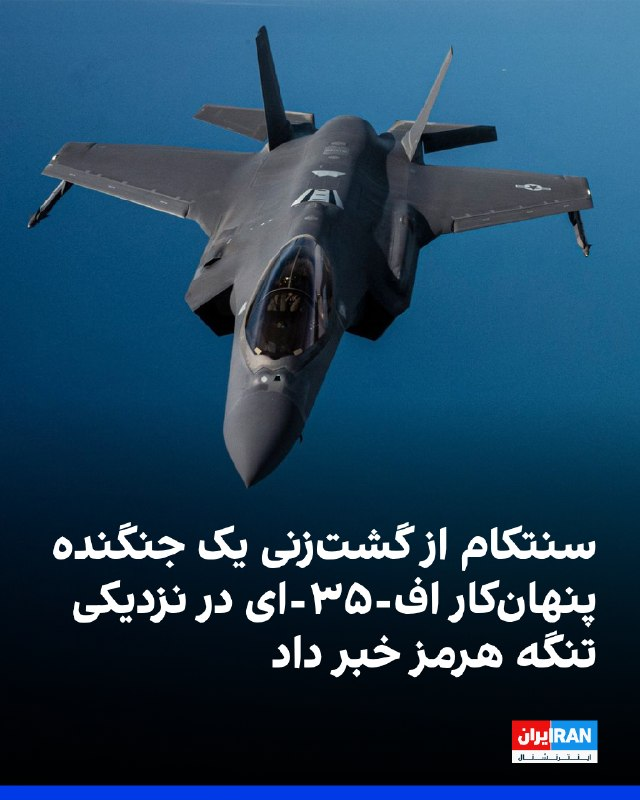

ستاد فرماندهی مرکزی آمریکا، سنتکام، با انتشار تصویری از گشت‌زنی یک جنگنده پنهان‌کار اف-۳۵-ای نیروی هوایی ایالات متحده بر فراز آب‌های منطقه‌ای نزدیک تنگه هرمز خبر داد.
سنتکام افزود این جنگنده می‌تواند تا ۱۸ هزار پوند مهمات را در حالی که با سرعت مافوق صوت پرواز می‌کند، حمل کند.
‌🏁 🇬🇧 IranintlTV

🤖 @VahidOOnLine

## VahidOOnLine — post 239910

  <a href="telegram/content/VahidOOnLine_239910_1778680641.mp4" target="_blank">🎬 Download video</a>

مقام‌های فرانسه اعلام کردند بیش از هزار مسافر یک کشتی تفریحی تحت مدیریت بریتانیا پس از شیوع بیماری گوارشی در این کشتی، اجازه پیاده شدن در بندر بوردو را ندارند.
بر اساس گزارش‌ها، ۴۹ نفر در کشتی «Ambition» علائمی شبیه گاستروآنتریت نشان داده‌اند و سه مسافر در کابین‌های خود قرنطینه شده‌اند.
گاستروآنتریت یا التهاب معده و روده یک بیماری عفونی دستگاه گوارش است. این بیماری اغلب توسط ویروس‌ها مثل نوروویروس یا روتاویروس ایجاد می‌شود، اما گاهی باکتری یا غذای آلوده هم عامل آن است. در کشتی‌های تفریحی، شیوع این بیماری رایج‌تر است چون افراد زیادی در فضای بسته و مشترک حضور دارند و ویروس به‌سرعت منتقل می‌شود. اعلام شده یک مرد ۹۲ ساله نیز روز یکشنبه در کشتی جان باخته، اما هنوز ارتباطی میان مرگ او و بیماری گوارشی تأیید نشده است.
این شرکت می‌گوید اقدامات بهداشتی و ضدعفونی گسترده در کشتی اجرا شده و به مسافران درباره رعایت بهداشت و گزارش علائم هشدار داده شده است.
کشتی «Ambition» با ۱۱۸۷ مسافر و ۵۱۴ خدمه، هشتم مه سفر خود را از بلفاست آغاز کرده بود.
‌🏁 🇬🇧 ManotoTV

🤖 @VahidOOnLine

## VahidOOnLine — post 239909

  <a href="telegram/content/VahidOOnLine_239909_1778680642.mp4" target="_blank">🎬 Download video</a>

دونالد ترامپ پس از ورود به پکن، در مراسمی رسمی با فرش قرمز، گارد احترام نظامی و صدها نفر از جوانان چینی مورد استقبال مقام‌های چین قرار گرفت. در تصاویر ثبت شده ایلان ماسک نیز در جمع همراهان ترامپ حضور دارد.
ترامپ امروز برنامه عمومی دیگری ندارد، اما قرار است پنجشنبه و جمعه چندین بار با شی جین‌پینگ دیدار کند. او پیش از سفر گفته بود محور اصلی گفت‌وگوها با رئیس‌جمهور چین، تجارت و توافق‌های اقتصادی خواهد بود.
این سفر در حالی انجام می‌شود که جنگ آمریکا و اسرائیل با ایران و افزایش تورم، فشارهایی بر محبوبیت ترامپ در داخل آمریکا وارد کرده است.
ترامپ پیش از ترک آمریکا گفت: «ما دو ابرقدرت جهان هستیم. آمریکا از نظر نظامی قدرتمندترین کشور دنیاست و چین را نفر دوم می‌دانند.»
‌🏁 🇬🇧 ManotoTV

🤖 @VahidOOnLine

## VahidOOnLine — post 239908

⭕️ وزیر کار دولت ابراهیم رئیسی:
در جنگ اخیر ۱۴۷ هزار نفر بیکار شدند نه دو میلیون نفر و این فاجعه نیست

♦️حجت‌الله عبدالملکی، وزیر کار در دولت سیزدهم، دولت ابراهیم رئیسی، در مصاحبه با خبرگزاری دانشجو گفت که در جنگ اخیر ۱۴۷ هزار نفر بیکار شدند نه دو میلیون نفر و این فاجعه نیست.
عبدالملکی افزود: «منابع دولتی برای بیمه بیکاری وجود دارد.»
‌🇸🇦 Indypersian

🤖 @VahidOOnLine

## VahidOOnLine — post 239907

  

ایال زمیر، رییس ستاد کل ارتش اسرائیل، گفت: «ما در همه جبهه‌ها واقعیت امنیتی جدیدی ایجاد کرده‌ایم، با این حال نبرد به پایان نرسیده است. ارتش اسرائیل برای ازسرگیری جنگ در صورت نیاز آماده است و در دفاع و حمله، از یهودا و سامره تا تهران، در آمادگی و هوشیاری دائم قرار دارد.»
‌🏁 🇬🇧 IranintlTV

🤖 @VahidOOnLine

## VahidOOnLine — post 239906

  

♦️ بر اساس داده‌های ردیابی کشتی‌ها، یک ابرنفت‌کش چینی حامل دو میلیون بشکه نفت خام عراق، روز چهارشنبه ۲۳ اردیبهشت از تنگه هرمز عبور کرده است. نفت‌کش «یوان هوآ هو» (Yuan Hua Hu) اکنون در دریای عمان و در نزدیکی منطقه‌ای که نیروی دریایی آمریکا برای مسدود کردن مسیر شناورهای ایرانی مستقر شده، لنگر انداخته است.

این سومین گذر ثبت‌شده یک نفت‌کش چینی از این آبراه حیاتی از زمان آغاز جنگ ایالات متحده و اسرائیل علیه جمهوری اسلامی محسوب می‌شود.

به گزارش خبرگزاری رویترز به نقل از «منابع آگاه»، ایران در روزهای اخیر کنترل خود بر تنگه هرمز را تشدید کرده و به توافقاتی با عراق و پاکستان برای حمل نفت و گاز طبیعی مایع (LNG) از منطقه دست یافته است. این گزارش می‌افزاید که سایر کشورها نیز در حال بررسی قراردادهای مشابهی با ایران هستند.
‌🇸🇦 Indypersian

🤖 @VahidOOnLine

## VahidOOnLine — post 239905

  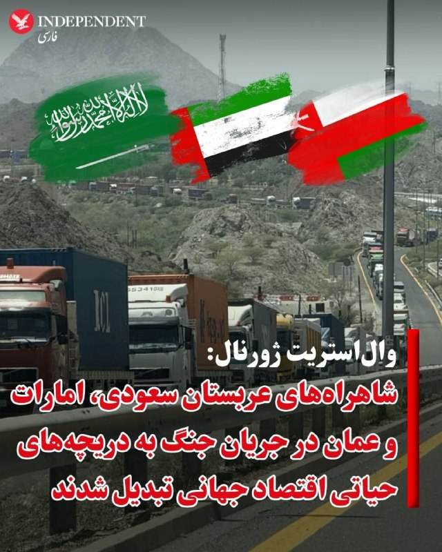

♦️وال‌استریت ژورنال روز دوشنبه ۲۳ اردیبهشت ماه با انتشار گزارشی، از احیای راه‌های زمینی قدیمی در عربستان سعودی، عمان و امارات متحده عربی در پی بسته شدن تنگه هرمز پس از حملات آمریکا و اسرائیل به ایران خبر داد. این روزنامه آمریکایی این راه را « شاهراه لجستیک اضطراری برای اقتصاد جهان»  به‌ویژه در زمینه صادرات مواد اولیه ساخت کود شیمیایی توصیف کرد.

براساس این گزارش، پس از حمله ایالات متحده و اسرائیل به ایران، باب ویلت، مدیرعامل شرکت معدنی دولتی «معادن» عربستان سعودی، مدیرانی را به بنادر دریای سرخ اعزام کرد و ظرف دو هفته، شرکت‌های راه‌آهن و کامیون را برای انتقال کود در سراسر پادشاهی به صف کرد.
وال استریت ژورنال نوشته است تعداد زیادی کامیون، که عمدتا شبانه‌روزی کار می‌کنند و هر کدام دو راننده دارند، اجرای این عملیات را برعهده دارند.
‌🇸🇦 Indypersian

🤖 @VahidOOnLine

## VahidOOnLine — post 239904

  

بلومبرگ گزارش داد ناتو در حال برنامه‌ریزی برای دعوت از نمایندگان چهار کشور حوزه خلیج فارس به نشست خود در آنکارا است؛ نشستی که انتظار می‌رود جنگ علیه جمهوری اسلامی و شکاف فزاینده در روابط فراآتلانتیک بر آن سایه بیفکند.

به گفته افرادی آگاه از روند برنامه‌ریزی، این کشورها شامل بحرین، کویت، قطر و امارات متحده عربی هستند که همگی عضو «ابتکار همکاری استانبول»، چارچوب همکاری میان ناتو و کشورهای غیرعضو در خاورمیانه، به‌شمار می‌روند.

این منابع که به دلیل محرمانه بودن گفت‌وگوها نخواستند نامشان فاش شود، گفتند قرار است وزیران خارجه این کشورها برای نشست ۱۷ و ۱۸ تیرماه در آنکارا دعوت شوند.
‌🏁 🇬🇧 IranintlTV

🤖 @VahidOOnLine

## VahidOOnLine — post 239903

  

بلومبرگ گزارش داد ناتو در حال برنامه‌ریزی برای دعوت از نمایندگان چهار کشور حوزه خلیج فارس به نشست خود در آنکارا است؛ نشستی که انتظار می‌رود جنگ علیه جمهوری اسلامی و شکاف فزاینده در روابط فراآتلانتیک بر آن سایه بیفکند.

به گفته افرادی آگاه از روند برنامه‌ریزی، این کشورها شامل بحرین، کویت، قطر و امارات متحده عربی هستند که همگی عضو «ابتکار همکاری استانبول»، چارچوب همکاری میان ناتو و کشورهای غیرعضو در خاورمیانه، به‌شمار می‌روند.

این منابع که به دلیل محرمانه بودن گفت‌وگوها نخواستند نامشان فاش شود، گفتند قرار است وزیران خارجه این کشورها برای نشست ۱۷ و ۱۸ تیرماه در آنکارا دعوت شوند.
‌🏁 🇬🇧 IranintlTV

🤖 @VahidOOnLine

## VahidOOnLine — post 239902

  <a href="telegram/content/VahidOOnLine_239902_1778680647.mp4" target="_blank">🎬 Download video</a>

یک نفتکش وابسته به شرکت دولتی نفت ابوظبی پس از حمله پهپادی جمهوری‌اسلامی در هفته گذشته، دچار نشت محدود سوخت در سواحل عمان شده است.
رویترز گزارش داده مقدار کمی از سوخت کشتی که به نظر می‌رسد سوخت بانکر بوده، در پی این حادثه نشت کرده است.
انور قرقاش، مشاور رئیس امارات، پیش‌تر حمله چهارم مه به این نفتکش را «دزدی دریایی» توصیف کرده بود. گزارش شده در زمان حمله کسی آسیب ندیده و کشتی حامل بار نبوده است.
این نفتکش با نام «MV Barakah» همچنان در سواحل عمان لنگر انداخته و شرکت می‌گوید در حال همکاری نزدیک با مقام‌های مربوطه و تیم‌های تخصصی واکنش به بحران است.
‌🏁 🇬🇧 ManotoTV

🤖 @VahidOOnLine

## VahidOOnLine — post 239901

  <a href="telegram/content/VahidOOnLine_239901_1778680648.mp4" target="_blank">🎬 Download video</a>

هواپیمای ریاست‌جمهوری آمریکا دقایقی پیش در پایتخت چین به زمین نشست و دونالد ترامپ سفر خود برای دیدار با شی جین‌پینگ، رئیس‌جمهور چین، را آغاز کرد. این نخستین سفر رسمی یک رئیس‌جمهور مستقر آمریکا به چین از زمان سفر ترامپ در سال ۲۰۱۷ است.
‌🏁 🇬🇧 ManotoTV

🤖 @VahidOOnLine

## VahidOOnLine — post 239900

  <a href="telegram/content/VahidOOnLine_239900_1778680649.mp4" target="_blank">🎬 Download video</a>

تماسی از ایران؛
تجربه‌ی یک آموزگار از آموزش مجازی
‌🏁 🇬🇧 ManotoTV

🤖 @VahidOOnLine

## VahidOOnLine — post 239899

  <a href="telegram/content/VahidOOnLine_239899_1778680654.mp4" target="_blank">🎬 Download video</a>

هواپیمای ریاست‌جمهوری آمریکا دقایقی پیش در پایتخت چین به زمین نشست و دونالد ترامپ سفر خود برای دیدار با شی جین‌پینگ، رئیس‌جمهور چین، را آغاز کرد.
‌🏁 🇬🇧 ManotoTV

🤖 @VahidOOnLine

## VahidOOnLine — post 239898

🗣روایت شما از بحران اقتصادی و زندگی در آتش‌بس- چهارشنبه ۲۳ اردیبهشت:

🔹ما در سیستان و بلوچستان محروم و گرسنه بودیم، این روزها محروم‌تر و گرسنه‌تر هم شدیم. گالن ۷۰ لیتری بنزین شده ۵ میلیون. برای رسیدن به بیمارستان باید ۴۰ تا ۶۰ لیتر بنزین مصرف کنیم، چون اکثر مردم اینجا روستانشین هستن و فاصله تا مرکز استان ۶۰۰ تا ۷۰۰ کیلومتره!

🔹هر هفته محصولات مورد نیاز و خوراکی بالای ۲ برابر می‌شه و تو این دو ماه گذشته ۳ تا ۵ برابر شده، چه‌جوری تورم رو ۶۰ یا ۱۰۰ درصد اعلام می‌کنند؟

🔹گرانی داره بیداد می‌کنه. من یه جوون ۲۴ ساله‌م اما هر شب از شدت غم فکر می‌کنم الانه که سکته کنم. هیچ کس به داد ما نمی‌رسه. پدرم بازنشسته است و همه ما بیکار شدیم. دو ماه دیگه باید خونه رو تمدید کنیم ولی هیچ وامی بهمون نمی‌دن. داریم نابود می‌شیم.

🔹دو روز پیش از موتور ماشینم تو جاده روغن زد بالا. تو جاده زاهدان بودم، زنگ زدم کفی خودروبر، گفت تا شیراز ۱۰۰ میلیون می‌گیرم. بردم نمایندگی زاهدان، گفتن اول باید ۱۵۰ میلیون واریز کنی تا بعد رسیدگی کنم.

🔹از تهران پیام می‌دم. گرانی بیداد می‌کنه، کاسبی مشاغل آزاد از بین رفته، پولی درنمیاد، داریم تمام پس‌اندازمون رو خرج خورد و خوراک می‌کنیم با مراعات بسیار. طلبکارها فشار میارن، بدهکارها ندارن بدهی‌شون رو بدن.

🔹ما دانش‌آموزها، مخصوصا پایه نهم و دوازدهم، در این شرایط اینترنتی و مشکلات کشور واقعا از نظر روحی خسته شدیم. وقتی می‌بینیم خانواده‌هامون برای بقا دست‌وپا می‌زنن، کلاس‌ها هم مدام قطع می‌شن، تمرکز و آمادگی برای امتحان واقعا سخت می‌شه.

🔹اکثر مردم دچار بی انگیزگی شدن، از جمله خود من. از بس امیدمون ناامید شده، از بس می‌دویم و نمی‌رسیم. هیچ وقت فکر نمی‌کردم تبدیل به کره شمالی بشیم و هیچ کشور دیگه‌ای براش مهم نباشه که چه بلایی داره سر مردم ایران میاد.
‌🏁 🇬🇧 IranintlTV

🤖 @VahidOOnLine

## VahidOOnLine — post 239897

  <a href="telegram/content/VahidOOnLine_239897_1778680655.mp4" target="_blank">🎬 Download video</a>

⭕️ استقبال مقام‌های دولتی چین از ترامپ در فرودگاه پکن

♦️گروهی از مقام‌های عالی‌رتبه دولت چین شامگاه چهارشنبه ۲۳ اردیبهشت از دونالد ترامپ و هیئت همراهش در فرودگاه پکن استقبال کردند.
ترامپ در سال ۲۰۱۷ و در دور نخست ریاست جمهوری به چین سفر کرده بود. روابط دو کشور در دوران جو بایدن به‌‌شدت سرد شد.
‌🇸🇦 Indypersian

🤖 @VahidOOnLine

## VahidOOnLine — post 239896

  

علاءالدین بروجردی، عضو کمیسیون امنیت ملی و سیاست خارجی مجلس، گفت: «تنها سناریو پیش‌رو این است که آمریکا واقعیت‌ها را بپذیرد و با پذیرش این واقعیات، با ایران وارد مذاکره شود تا از شرایط جنگی خارج شود.»

او اضافه کرد: «به هیچ‌ وجه دستاورد تنگه هرمز را از دست نخواهیم داد و به هیچ‌ وجه وارد بحث مذاکره درباره غنی‌سازی هسته‌ای نخواهیم شد.»
‌🏁 🇬🇧 IranintlTV

🤖 @VahidOOnLine

## VahidOOnLine — post 239895

  

دونالد ترامپ، رییس‌جمهوری آمریکا، چهارشنبه در مراسم استقبال رسمی با تشریفات گسترده وارد پکن شد. بر اساس اعلام کاخ سفید، هان ژنگ، معاون رییس‌جمهوری چین، به همراه شماری از مقام‌ها از جمله دیوید پردیو، سفیر آمریکا در چین، شی فنگ، سفیر چین در آمریکا، و ما ژائوشو، معاون اجرایی وزیر خارجه چین، در فرودگاه از ترامپ استقبال کردند.

همچنین ۳۰۰ نوجوان چینی با لباس‌های هماهنگ آبی و سفید در باند فرودگاه و با در دست داشتن پرچم‌های چین و آمریکا رژه رفتند. یگان تشریفات نظامی و یک گروه موسیقی نظامی نیز در این مراسم حضور داشتند.

قرار است شی جین‌پینگ صبح پنجشنبه به وقت محلی به‌طور رسمی از دونالد ترامپ استقبال کند.
‌🏁 🇬🇧 IranintlTV

🤖 @VahidOOnLine

## VahidOOnLine — post 239894

  

مهراوه خندان، فرزند نسرین ستوده، خبر داد که این وکیل دادگستری و فعال حقوق بشر، با قرار وثیقه به‌طور موقت آزاد شده است.

نسرین ستوده ۱۲ اردیبهشت در منزل خود بازداشت شده بود. در جریان این بازداشت، لوازم الکترونیکی از جمله لپ‌تاپ و تلفن‌های همراه او و همسرش رضا خندان ضبط شد.
‌🏁 🇬🇧 IranintlTV

🤖 @VahidOOnLine

## VahidOOnLine — post 239893

  <a href="telegram/content/VahidOOnLine_239893_1778680659.mp4" target="_blank">🎬 Download video</a>

♦️دونالد ترامپ، رئیس جمهوری ایالات متحده آمریکا شامگاه چهارشنبه ۲۳ اردیبهشت به وقت شرق آسیا (صبح به وقت آمریکا) وارد پکن پایتخت چین شد.

قرار است دونالد ترامپ در این دیدار «تاریخی» با شی جین‌پینگ، رئیس جمهوری چین دیدار و درباره مسائل راهبردی جهانی، تجارت و البته وضعیت تنگه هرمز، گفتگو کند.
‌🇸🇦 Indypersian

🤖 @VahidOOnLine

## VahidOOnLine — post 239892

  

پایگاه خبری وای‌نت گزارش داد دیوید زینی، رییس سازمان اطلاعات و امنیت داخلی اسرائیل (شین‌بت)، اخیرا به امارات متحده عربی سفر کرده است.

ساعاتی پیش، روزنامه وال‌استریت ژورنال از دو سفر محرمانه دیوید بارنئا، رییس موساد، به امارات در جریان جنگ ایران خبر داده بود.
‌🏁 🇬🇧 IranintlTV

🤖 @VahidOOnLine

## WithYashar — post 11153

یک مقام ارشد کُرد در گفتگو با کانال۱۳ اسرائیل:
در واقع خود پرزیدنت ترامپ مانع از طرح اقدام ما علیه حکومت ایران شد و اتهامات او در مورد ضبط سلاح های معترضین در ایران توسط کُردها، ناعادلانه و غیرمنطقی است
@withyashar

## WithYashar — post 11152

اتاق جنگ با شما : گزارش از جنگنده های ناشناس پرواز در ارتفاع پایین در‌ ارومیه و انفجار در شیراز
@withyashar

## WithYashar — post 11151

ایال زامیر ، رئیس ستاد ارتش اسرائیل:
نبرد تمام نشده است، ارتش اسرائیل آماده از سرگیری نبرد در صورت نیاز از کرانه باختری تا تهران است
@withyashar

## WithYashar — post 11150

  

برنامه های ترامپ با حاکم چین به این ترتیبه : مراسم استقبال تو تالار بزرگ خلق
چهارشنبه رسیدن به پکن ، استقرار و استراحت
پنج شنبه ۱۴ مه
- ملاقات با شی - ضیافت دولتی با شی

جمعه تاریخ ۱۵ مه
- جلسه عکس با شی- چای با شی
- ناهار با شی و حرکت از پکن به آمریکا،
@withyashar

## WithYashar — post 11149

  <a href="telegram/content/WithYashar_11149_1778680661.mp4" target="_blank">🎬 Download video</a>

لحظه ورود ترامپ به چین-پکن همراه ایلان ماسک و همراهان
@withyashar

## WithYashar — post 11148

بلومبرگ: صادرات نفت ایران از جزیره خارک برای اولین بار از زمان شروع جنگ متوقف شده است و تصاویر ماهواره‌ای نشان می‌دهد که مخازن ذخیره‌سازی نفت تقریباً به ظرفیت کامل خود رسیده‌اند.
@withyashar

## WithYashar — post 11147

  

ترامپ به پکن رسید
@withyashar

## WithYashar — post 11146

  

امانوئل مکرون ظاهراً برای چندین ماه با بازیگر ایرانی گلشیفته فراهانی رابطه‌ای داشته که شامل «پیام‌هایی بوده که گفته می‌شود تا حد زیادی پیش رفته بودند». این موضوع ظاهراً باعث تنش در زندگی مشترک زوج ریاست‌جمهوری فرانسه شده …گفته می‌شود سیلی‌ای که سال گذشته بریژیت به امانوئل مکرون زد، به پیامی مربوط بوده که در تلفن رئیس‌جمهور پیدا شده بود. بانوی اول فرانسه ظاهراً گفت‌وگویی با یک بازیگر ایرانی دیده که در آن، امانوئل مکرون نوشته بوده: «تو خیلی زیبا هستی.
@withyashar

## WithYashar — post 11145

این پیری رئیس باند medea benjamin از باند نایاک و از مهره های ماله کش ظریف هستش شخصی هم که به سخنان شاهزاده حمله کرده اسمش «بیتا» هست … اطلاعات تکمیلی به زودی … @withyashar

## WithYashar — post 11144

  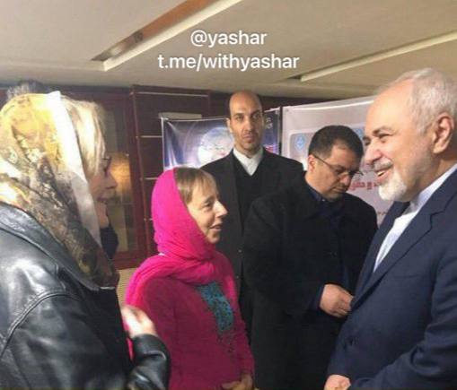

این پیری رئیس باند medea benjamin از باند نایاک و از مهره های ماله کش ظریف هستش شخصی هم که به سخنان شاهزاده حمله کرده اسمش «بیتا» هست … اطلاعات تکمیلی به زودی …
@withyashar

## WithYashar — post 11142

  <a href="telegram/content/WithYashar_11142_1778680665.mp4" target="_blank">🎬 Download video</a>

حمله دیروز گروه «کد پینک» به سخنرانی شاهزاده رضا پهلوی و وزیر جنگ هگست
@withyashar

## WithYashar — post 11141

  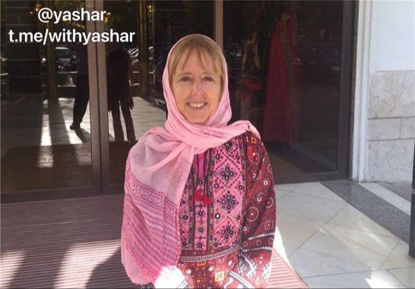

یه گروهی اومده بنام « کد پینگ » سر دسته شونم این پیری هست
Medea Bejamin
حمله کردن به سخنرانی شاهزاده و وزیر جنگ
@withyashar

## WithYashar — post 11140

ایتالیا اعلام کرد که کشتی‌های مین‌روب خود را به نزدیکی آب‌های خلیج فارس اعزام خواهند کرد ولی شروع مین‌روبی‌ ، به دستیابی به یک آتش‌بس دائم و پایدار بستگی دارد.
@withyashar

## WithYashar — post 11139

سلام یاشار جان خسته نباشی❤️ تو یه اتفاق جالب با همکلاسیم نشسته بودیم تو سلف دانشگاه غذا میخوردیم،دوستم پرسید اخبار چک میکنی گفتم اره،بعد نشون هم دادیم گوشیامونو😅چند روز پیش کانالتو براش فرستادم،البته از اینستا میشناختت ولی کانالتو نداشت،و پیجتم دنبال نمیکرد…

## WithYashar — post 11138

  

سلام یاشار جان خسته نباشی❤️
تو یه اتفاق جالب با همکلاسیم نشسته بودیم تو سلف دانشگاه غذا میخوردیم،دوستم پرسید اخبار چک میکنی گفتم اره،بعد نشون هم دادیم گوشیامونو😅چند روز پیش کانالتو براش فرستادم،البته از اینستا میشناختت ولی کانالتو نداشت،و پیجتم دنبال نمیکرد فقط چندبار دیده بود.
دوستم‌گفت بهت بگم‌ همش اخبارو چک میکنیم و منتظر اخبار بعدی میمونیم😅

## WithYashar — post 11137

  

اولین «نمایندگی رسمی مجاز اپل» یا Apple Authorized Reseller در افغانستان افتتاح شد
@withyashar

## WithYashar — post 11136

دیو دی‌کمپ، روزنامه نگار آمریکایی: شاید ظرف یک هفته آینده شاهد بازگشت به عملیات نظامی بزرگ آمریکا علیه ایران باشیم
@withyashar

## WithYashar — post 11135

نیویورک تایمز: قصد ترامپ از تغییر نام عملیات «خشم حماسی» به «چکش سنگین» این است که یک عملیات جدید ۶۰ روزه حمله به ایران شروع کند @withyashar

## WithYashar — post 11134

سخنگوی وزارت خارجه: ما عملاً در یک آتش‌بس اسمی قرار داریم، اما طبق حقوق بین‌الملل، خودِ محاصره یک اقدام جنگی محسوب می‌شود.
@withyashar

## mwarmonitor — post 9038

🇮🇱رئیس ستاد کل ارتش اسرائیل در شمال سامره: «ما واقعیت امنیتی جدیدی در تمام جبهه‌ها ایجاد کرده‌ایم؛ با این حال، نبرد به پایان نرسیده است. ارتش اسرائیل برای ازسرگیری جنگ در صورت نیاز آماده است و در حالت آمادگی و هوشیاری دائمی در دفاع و حمله قرار دارد، از یهودیه و سامره تا تهران»

‏🔸رئیس ستاد کل ارتش اسرائیل، سپهبد ایال زامیر: ‏«ارتش اسرائیل در همه جبهه‌ها با ابتکار و رویکرد تهاجمی عمل می‌کند. ما واقعیت امنیتی جدیدی ایجاد کرده‌ایم — در لبنان به عملیات ادامه می‌دهیم، در لیتانی و مناطق دیگر فعالیت می‌کنیم و هر روز ده‌ها تروریست و زیرساخت را خنثی می‌کنیم.
‏🔸همچنین در غزه به‌صورت تهاجمی عمل کرده و تروریست‌ها را به هلاکت می‌رسانیم و در اینجا در یهودیه و سامره نیز بدون وقفه فعالیت می‌کنیم و به دستاوردها دست می‌یابیم. هیچ‌گونه خویشتنداری وجود ندارد — فقط ابتکار عمل.

‏🔸نبرد هنوز به پایان نرسیده است. ارتش اسرائیل برای ازسرگیری درگیری در صورت نیاز آماده است و در آمادگی و هوشیاری دائمی، در دفاع و حمله، از یهودیه و سامره تا تهران قرار دارد.»

@mwarmonitor

## mwarmonitor — post 9037

  <a href="telegram/content/mwarmonitor_9037_1778680669.mp4" target="_blank">🎬 Download video</a>

🇫🇷مسافران پس از شیوع گاستروانتریت (التهاب معده و روده) روی یک کشتی کروز در فرانسه در قرنطینه نگه داشته شده‌اند. @mwarmonitor

## mwarmonitor — post 9036

🔴 طبق گزارش i24NEWS، بنیامین نتانیاهو نخست‌وزیر اسرائیل قرار است با مقامات ارشد دفاعی درباره تهدید پهپادهای انفجاری حزب‌الله نشست‌های مشورتی امنیتی برگزار کند.

@mwarmonitor

## mwarmonitor — post 9035

  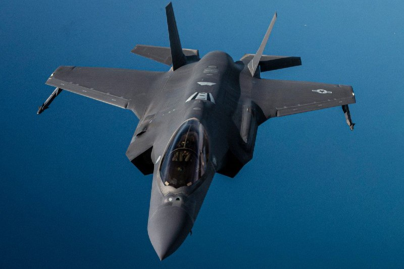

✈️یک جنگنده رادارگریز F-35A نیروی هوایی ایالات متحده بر فراز آب‌های منطقه‌ای نزدیک تنگه هرمز گشت‌زنی می‌کند.

✈️هواپیما F-35A می‌تواند تا ۱۸٬۰۰۰ پوند مهمات حمل کند و در عین حال با سرعت مافوق صوت پرواز کند.

@mwarmonitor

## mwarmonitor — post 9034

🇫🇷مسافران پس از شیوع گاستروانتریت (التهاب معده و روده) روی یک کشتی کروز در فرانسه در قرنطینه نگه داشته شده‌اند.

@mwarmonitor

## mwarmonitor — post 9033

  <a href="telegram/content/mwarmonitor_9033_1778680671.mp4" target="_blank">🎬 Download video</a>

🇺🇸کاروان خودرویی رئیس‌جمهور ترامپ فرودگاه بین‌المللی پکن را به مقصد هتل ترک می‌کند.

فردا، ترامپ در مراسم رسمی استقبال دولتی شرکت خواهد کرد، با رئیس‌جمهور شی جین‌پینگ دیدار می‌کند، چندین مصاحبه انجام خواهد داد و در چند رویداد رسمی دیگر نیز حضور خواهد داشت.

@mwarmonitor

## mwarmonitor — post 9032

  <a href="telegram/content/mwarmonitor_9032_1778680673.mp4" target="_blank">🎬 Download video</a>

🇺🇸ترامپ در حال حرکت روی فرش قرمز در پکن است — و برای لحظه‌ای حرکت معروف مشت گره‌کرده‌اش را به گارد افتخار نظامی و جوانان پرچم‌به‌دست چینی که صف کشیده‌اند نشان می‌دهد.

@mwarmonitor

## mwarmonitor — post 9031

  <a href="telegram/content/mwarmonitor_9031_1778680675.mp4" target="_blank">🎬 Download video</a>

🇦🇪🇨🇦وزیر دولت در امور دفاعی امارات، وزیر دفاع ملی کانادا را به حضور پذیرفت.

🔸معاون عالی‌رتبه محمد بن مبارک بن فاضل المزروعی، وزیر دولت در امور دفاعی امارات، از دیوید جِی مک‌گینتی، وزیر دفاع ملی کانادا استقبال کرد. این دیدار در راستای تقویت روابط و همکاری‌های دفاعی و نظامی میان امارات متحده عربی و کانادا انجام شد.

🔹در این نشست، دو طرف درباره شماری از موضوعات مورد علاقه مشترک و همچنین راه‌های توسعه همکاری‌های دوجانبه در حوزه‌های دفاعی و نظامی گفت‌وگو کردند؛ همکاری‌هایی که هدف آن حمایت از منافع مشترک دو کشور دوست است. همچنین طرفین دیدگاه‌های خود را درباره تحولات منطقه‌ای و بین‌المللی مرتبط تبادل کردند.

@mwarmonitor

## mwarmonitor — post 9030

🇫🇷 بنا بر این گزارش روزنامه لو فیگارو فرانسه، Emmanuel Macron طی چند ماه گذشته یک «رابطه افلاطونی» با بازیگر ایرانی گلشیفته فراهانی داشته است؛ 🔸 رابطه‌ای که گفته می‌شود «پیام‌هایی داشته که تا حد زیادی پیش رفته‌اند». این موضوع ظاهرا باعث تنش در زندگی زوج ریاست‌جمهوری…

## mwarmonitor — post 9029

🇫🇷 بنا بر این گزارش روزنامه لو فیگارو فرانسه، Emmanuel Macron طی چند ماه گذشته یک «رابطه افلاطونی» با بازیگر ایرانی گلشیفته فراهانی داشته است؛

🔸 رابطه‌ای که گفته می‌شود «پیام‌هایی داشته که تا حد زیادی پیش رفته‌اند». این موضوع ظاهرا باعث تنش در زندگی زوج ریاست‌جمهوری شده و گفته می‌شود به سیلی‌زدن معروف در هواپیما منجر شده است.

@mwarmonitor

## mwarmonitor — post 9028

🔴 سوریه به‌طور رسمی خواستار استرداد بشار اسد از روسیه شده است تا او برای پاسخ‌گویی به اتهامات جنایات جنگی محاکمه شود.

@mwarmonitor

## mwarmonitor — post 9027

  

🔴شرکت سازنده مهمات Czechoslovak Group پیشنهاد داده است بخشی از سهام شرکت تانک‌سازی فرانسوی–آلمانی KNDS را خریداری کند؛ اقدامی که نشانه تلاشی تازه برای یکپارچه‌سازی صنعت دفاعی اروپا به شمار می‌رود. فیننشال تایمز

@mwarmonitor

## mwarmonitor — post 9026

🇨🇳🇺🇸معاون نخست‌وزیر چین، He Lifeng و وزیر خزانه‌داری ایالات متحده، Scott Bessent گفت‌وگوهایی «عمیق، صریح و سازنده» درباره مسائل تجاری و اقتصادی و همچنین درباره «گسترش همکاری‌های عملی» در کره جنوبی انجام دادند.

@mwarmonitor

## mwarmonitor — post 9025

  

✈️🇬🇧نیروی هوایی سلطنتی بریتانیا (RAF) ایرباس KC.2 Voyager ×۳ 43C6FB ZZ338 – ASCOT 9900 43C700 ZZ343 – ASCOT 9901 43C6F7 ZZ334 – ASCOT 9902 ✈️صبح امروز یک عملیات سوخت‌رسانی غیرمعمول از سوی نیروی هوایی سلطنتی بریتانیا در جریان است. سه فروند هواپیمای «ویجر»…

## mwarmonitor — post 9024

✈️🇺🇸نیروی هوایی آمریکا به دنبال تجهیز جنگنده‌های F-16 به اخلالگرهای نورثروپ گرومن است

📝نویسنده: کالین دمارست AXIOS

🔰نیروی هوایی ایالات متحده در نظر دارد بر اساس اسناد بودجه، طی چند سال آینده ۲۰۶ پکیج ارتقایافته جنگ الکترونیک برای جنگنده‌های F-16 خریداری کند.

🔸چرا این موضوع اهمیت دارد؟
هواپیماهای جنگنده ساخت شرکت لاکهید مارتین می‌توانند از اوایل سال ۲۰۲۸ به «سوییت یکپارچه جنگ الکترونیک وایپر» (IVEWS) محصول شرکت نورثروپ گرومن مجهز شوند.
🔹مارک ساندور، مدیر استراتژی و راهکارهای ماموریتی نورثروپ، به اکسیوس (Axios) گفت:
«این اقدام در واقع به معنای قرار دادن جنگ الکترونیک نسل ششم در یک پلتفرم نسل چهارم است.»
🔸وضعیت فعلی: پروژه‌ای که سال‌ها در حال توسعه بوده است
۲۰۱۹: نیروی هوایی برای اولین بار سیستم IVEWS را انتخاب کرد.
۲۰۲۱: اولین پرواز این سیستم در رزمایش "Northern Lightning" انجام شد.
۲۰۲۴: پروازهای آزمایشی بر روی F-16های نیروی هوایی آغاز گشت.
۲۰۲۵: ارزیابی‌های عملیاتی به پایان رسید.
در همان سال، نورثروپ اعلام کرد که سیستم IVEWS به طور «یکپارچه» با رادار آرایه فازی فعال SABR کار می‌کند. فیل لودن، مدیر بخش IVEWS در نورثروپ، اظهار داشت: «سخت‌افزار و نرم‌افزار بسیار پایدار بوده‌اند و نیروی هوایی با جدیت در حال افزایش سرعت تولید است.»
نگاهی به گذشته و چشم‌انداز جهانی
بودجه: سیستم IVEWS مبلغ ۱۸۷ میلیون دلار از بودجه سال ۲۰۲۵ دریافت کرد که صرف تولید اولیه با نرخ پایین شد.

🔸بازار بین‌المللی: علاقه زیادی به این پکیج جنگ الکترونیک در سطح جهان وجود دارد. در حال حاضر حدود ۲,۸۰۰ فروند F-16 در بیش از ۲۴ کشور در حال خدمت هستند.
🔹مشتریان خارجی: در سال ۲۰۲۴، گزارش‌های گسترده‌ای مبنی بر خرید این سیستم توسط ترکیه منتشر شد. لودن در این باره گفت: «ما به طور فعال در فرآیند فروش نظامی خارجی با بسیاری از کشورهای شریک درگیر هستیم.»

@mwarmonitor

## mwarmonitor — post 9023

  

❌به نظر می‌رسد حریم هوایی اطراف سن‌پترزبورگ بسته شده و پروازها در فاصله‌ای امن در حالت انتظار قرار گرفته‌اند.

@mwarmonitor

## mwarmonitor — post 9022

🔴رئیس موساد، بارنیا، دست‌کم دو بار در طول جنگ به امارات متحده عربی سفر کرده است تا برای هماهنگی در کارزار علیه ایران اقدام کند (وال‌استریت ژورنال).

@mwarmonitor

## FoxNewsTwitter — post 341635

  <a href="telegram/content/FoxNewsTwitter_341635_1778680679.mp4" target="_blank">🎬 Download video</a>

Fox News (Twitter/X)

HAPPENING NOW: President Trump’s motorcade departs the airport in Beijing following a formal state welcome ahead of his high-stakes summit with Chinese President Xi Jinping.

## FoxNewsTwitter — post 341634

  <a href="telegram/content/FoxNewsTwitter_341634_1778680681.mp4" target="_blank">🎬 Download video</a>

Fox News (Twitter/X)

BREAKING: President Trump is greeted by a formal state welcome and massive fanfare in Beijing ahead of his meeting with Chinese President Xi Jinping.

## FoxNewsTwitter — post 341633

  <a href="telegram/content/FoxNewsTwitter_341633_1778680683.mp4" target="_blank">🎬 Download video</a>

Fox News (Twitter/X)

JUST IN: President Trump departs Air Force One after landing in Beijing for his long-awaited talks with Chinese President Xi Jinping.

It marks his first visit in nearly nine years, with both sides putting diplomacy on full display before negotiations begin.

## FoxNewsTwitter — post 341632

  

Fox News (Twitter/X)

WATCH LIVE: President Trump lands in China ahead of high-stakes talks with Xi
https://twitter.com/i/broadcasts/1PKqrEVVyyeGb

## FoxNewsTwitter — post 341631

  <a href="telegram/content/FoxNewsTwitter_341631_1778680686.mp4" target="_blank">🎬 Download video</a>

Fox News (Twitter/X)

Court battles between Blake Lively and Justin Baldoni reportedly strained the Gossip Girl star’s friendship with Taylor Swift after the singer was named several times in legal documents.

Now that the case is nearly over – will Blake Lively and Taylor Swift be seen together in public this year?

Our sponsor Kalshi’s prediction market shows:
— Yes: 27%
— No: 73%

@foxandfriends

## FoxNewsTwitter — post 341630

‌Fox News (Twitter/X)

Read more:

## FoxNewsTwitter — post 341629

  

Fox News (Twitter/X)

EXCLUSIVE: “Unbeknownst to parents... they’ve been poisoning pupils’ minds for years.”

A watchdog report claims Southern Poverty Law Center-linked curriculum is being used in classrooms nationwide, including kindergarten, and could be indoctrinating children.

The findings say the SPLC’s “Learning for Justice” program has been integrated into lesson plans across 169 districts in 42 states, touching everything from teacher training to student coursework.

Critics argue it introduces themes like anti-racism, gender ideology, and white privilege into core subjects — often without parents’ awareness.

The development comes as the SPLC faces federal fraud charges over an alleged multimillion-dollar informant program involving White supremacist and neo-Nazi groups.

## FoxNewsTwitter — post 341628

  <a href="telegram/content/FoxNewsTwitter_341628_1778680688.mp4" target="_blank">🎬 Download video</a>

Fox News (Twitter/X)

NEW: House Speaker Mike Johnson sounds the alarm on “mini Mamdanis” to @kilmeade as Democrats trend toward electing socialists around the country:

BRIAN KILMEADE: "Democrats seem to be nominating some extreme candidates... People say, ‘This is just like what the Republicans went through after they lost to Obama, they had the Tea Party.’ Is this the same to you?"

JOHNSON: "This is something that we have never seen before in American history... This is about moving away from a constitutional republic to a communist utopian ideology."

"This is not our father's Democratic Party anymore. They're going far, far left and no one’s there to stop it."

| @foxandfriends

## FoxNewsTwitter — post 341627

  <a href="telegram/content/FoxNewsTwitter_341627_1778680690.mp4" target="_blank">🎬 Download video</a>

Fox News (Twitter/X)

NEW: President Trump is heading to China as the Iran war keeps rattling global oil markets.
He says Xi is “a friend of mine” and predicts “good things will happen” — but the stakes are much bigger than a handshake.

@TreyYingst reports the trip comes after diplomatic solutions with Iran failed to break through.

## FoxNewsTwitter — post 341626

  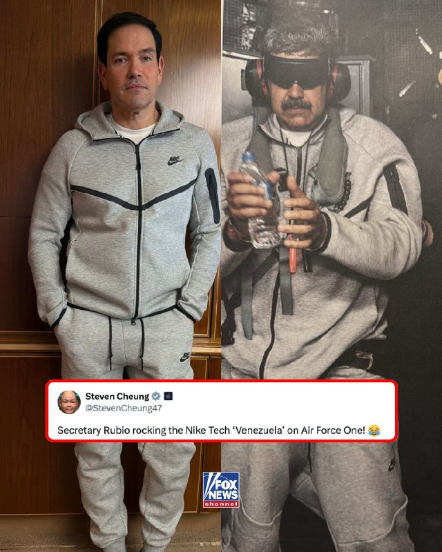

Fox News (Twitter/X)

Marco Rubio made a major fashion statement on Air Force One.

The Secretary of State spotted on the president's plane in the now-infamous gray Nike Tech tracksuit associated with Venezuelan leader Nicolás Maduro.

Maduro was seen wearing a strikingly similar outfit during his capture by American forces earlier this year.

## pm_afshaa — post 90693

🔴رئیس ستاد ارتش اسرائیل:
جنگ با ایران پایان نیافته و برای از سرگیری جنگ در هوشیاری کامل قرار داریم. از یهودا و سامره تا تهران برای دفاع و حمله آماده‌ایم.

💧 Rainbet.com the #1 Non-KYC Crypto Casino & Sportsbook @rainbetcom

😁 @Pm_Afshaa

## pm_afshaa — post 90692

  <a href="telegram/content/pm_afshaa_90692_1778680692.webm" target="_blank">🎬 Download video</a>

🔴مجله مادام فیگارو به نقل از فلوریان تاردیف، روزنامه‌نگار فرانسوی: سیلی بریژیت مکرون به همسرش در هواپیما پس از آن رخ داده که اون پیام‌های صمیمانه امانوئل مکرون با گلشیفته فراهانی رو دیده بود.

به گفته تاردیف، مکرون برای چند ماه رابطه‌ای افلاطونی با این گلشیفته فراهانی داشته و در پیام‌هاش جملاتی مثل «به نظرم بسیار زیبا هستید» نوشته بود.

💧 Rainbet.com the #1 Non-KYC Crypto Casino & Sportsbook @rainbetcom

😁 @Pm_Afshaa

## pm_afshaa — post 90691

  <a href="telegram/content/pm_afshaa_90691_1778680693.webm" target="_blank">🎬 Download video</a>

🔴امارات در حال ساخت قفس‌های ضدپهپادی اطراف مراکز مهم و نفتی خودشه و داره برای جنگ آماده میشه.

💧 Rainbet.com the #1 Non-KYC Crypto Casino & Sportsbook @rainbetcom

😁 @Pm_Afshaa

## pm_afshaa — post 90689

  <a href="telegram/content/pm_afshaa_90689_1778680694.webm" target="_blank">🎬 Download video</a>

🔴برنامه‌های ترامپ در چین :

چهارشنبه 13 مه:
مراسم استقبال تو تالار بزرگ خلق
پنجشنبه 14 مه:
ملاقات با شی - ضیافت دولتی با شی
جمعه 15 مه:
جلسه عکس با شی - چای با شی
ناهار با شی و حرکت از پکن به آمریکا

💧Rainbet.com the #1 Non-KYC Crypto Casino & Sportsbook @rainbetcom

😁 @Pm_Afshaa

## pm_afshaa — post 90688

  <a href="telegram/content/pm_afshaa_90688_1778680694.mp4" target="_blank">🎬 Download video</a>

ویدویی دیگر از مراسم استقبال از ترامپ در فرودگاه پکن :

💧 Rainbet.com the #1 Non-KYC Crypto Casino & Sportsbook @rainbetcom

😁 @Pm_Afshaa

## pm_afshaa — post 90687

🔴مراد ویسی میخواد یه لیست از کسایی که تو دی ماه ملت رو کشتن تهیه کنه و هرشب اسم هاشونو تو شبکه اینترنشنال بخونه

💧 Rainbet.com the #1 Non-KYC Crypto Casino & Sportsbook @rainbetcom

😁 @Pm_Afshaa

## pm_afshaa — post 90686

🔴رسانه های عبری: ترامپ قصد دارد تایوان را در ازای ایران، با چین معامله کند

💧 Rainbet.com the #1 Non-KYC Crypto Casino & Sportsbook @rainbetcom

😁 @Pm_Afshaa

## pm_afshaa — post 90684

  <a href="telegram/content/pm_afshaa_90684_1778680696.mp4" target="_blank">🎬 Download video</a>

🔴لحظه ورود دونالد ترامپ به چین-پکن همراه ایلان ماسک و دیگر همراهان :

💧 Rainbet.com the #1 Non-KYC Crypto Casino & Sportsbook @rainbetcom

😁 @Pm_Afshaa

## pm_afshaa — post 90683

  <a href="telegram/content/pm_afshaa_90683_1778680697.mp4" target="_blank">🎬 Download video</a>

ورود هواپیمای ترامپ در پکن و گروه استقبال کننده چین

💧 Rainbet.com the #1 Non-KYC Crypto Casino & Sportsbook @rainbetcom

😁 @Pm_Afshaa

## pm_afshaa — post 90682

🔥رفقا بار هزارمه تبلیغ هانارو میذارم واستون ی مشتری ناراضی نداره و مخصوص یوزرای ما تخفیف گذاشته👇🏼 1 Gig = 280,000 T 2 Gig = 560,000 T 3 Gig = 800,000 T 5 Gig = 1,200,000 T 10 Gig = 2,200,000T 20 Gig = 4,000,000T 💎پرداخت ریال ، کارت به کارت 💵واریز با ارز…

## pm_afshaa — post 90681

🔥رفقا بار هزارمه تبلیغ هانارو میذارم واستون ی مشتری ناراضی نداره و مخصوص یوزرای ما تخفیف گذاشته👇🏼

1 Gig = 280,000 T
2 Gig = 560,000 T
3 Gig = 800,000 T
5 Gig = 1,200,000 T
10 Gig = 2,200,000T
20 Gig = 4,000,000T

💎پرداخت ریال ، کارت به کارت

💵واریز با ارز دیجیتال ( ترون )

📌قابلیت مشاهده حجم مصرفی
📌نامحدود بودن تعداد کاربران
📌سرعت دانلود به شدت بالا

ایدی جهت خرید👇🏼👇🏼👇🏼👇🏼

@RealHoneyi

## pm_afshaa — post 90680

🔴سنتکام:همچنان به اعمال محاصره علیه کشتی‌هایی که به داخل ایران وارد می‌شوند یا از آنها خارج می‌شوند، ادامه می‌دهیم

💧 Rainbet.com the #1 Non-KYC Crypto Casino & Sportsbook @rainbetcom

😁 @Pm_Afshaa

## pm_afshaa — post 90679

  <a href="telegram/content/pm_afshaa_90679_1778680699.webm" target="_blank">🎬 Download video</a>

🔴سی‌ان‌ان: پیش‌بینی میشه ترامپ از رئیس‌جمهور چین بخواد که بر ایران فشار بیاره تا تنگه هرمز رو بازگشایی کنه و با یک توافق صلح مناسب موافقت کنه.

💧 Rainbet.com the #1 Non-KYC Crypto Casino & Sportsbook @rainbetcom

😁 @Pm_Afshaa

## pm_afshaa — post 90678

  <a href="telegram/content/pm_afshaa_90678_1778680700.webm" target="_blank">🎬 Download video</a>

🔴اپل به صورت رسمی اولین نمایندگی خودش رو در افغانستان افتتاح کرد..

💧 Rainbet.com the #1 Non-KYC Crypto Casino & Sportsbook @rainbetcom

😁 @Pm_Afshaa

## pm_afshaa — post 90677

  <a href="telegram/content/pm_afshaa_90677_1778680700.webm" target="_blank">🎬 Download video</a>

🔴سخنگوی وزارت خارجه:
آمریکا فعلا با پیشنهاد جمهوری اسلامی موافقت نکرده، اما تهران از طریق میانجی‌های پاکستانی منتظر ارزیابی دقیق‌تره.

💧 Rainbet.com the #1 Non-KYC Crypto Casino & Sportsbook @rainbetcom

😁 @Pm_Afshaa

## pm_afshaa — post 90676

  <a href="telegram/content/pm_afshaa_90676_1778680701.webm" target="_blank">🎬 Download video</a>

🔴رسانه‌های اسرائیلی:
رئیس موساد، حداقل دو بار در طول جنگ به منظور هماهنگی کمپین علیه جمهوری اسلامی به امارات متحده عربی سفر کرده.

💧 Rainbet.com the #1 Non-KYC Crypto Casino & Sportsbook @rainbetcom

😁 @Pm_Afshaa

## pm_afshaa — post 90675

🔴دیو دی‌کمپ، روزنامه نگار آمریکایی: شاید ظرف یک هفته آینده شاهد بازگشت به عملیات نظامی بزرگ آمریکا علیه ایران باشیم

💧 Rainbet.com the #1 Non-KYC Crypto Casino & Sportsbook @rainbetcom

😁 @Pm_Afshaa

## pm_afshaa — post 90674

🔴کانال 13 اسرائیل:نتانیاهو امشب جلسه امنیتی ویژه در مورد ایران برگزار خواهد کر‌د

💧 Rainbet.com the #1 Non-KYC Crypto Casino & Sportsbook @rainbetcom

😁 @Pm_Afshaa

## iaghapour — post 2605

  

⭕️ با اپ TunnelX در ویندوز از قابلیت Split Tunneling استفاده کنید.

🔹اپ TunnelX برای زمانی ساخته شده که کاربر نمی‌خواهد تمام ترافیک سیستم از وی‌پی‌ان عبور کند. با این برنامه می‌توان فقط برنامه‌هایی مثل مرورگر، تلگرام، ابزارهای توسعه یا برنامه‌های مشخص دیگر را وارد تونل کرد و بقیه ترافیک سیستم را روی اینترنت عادی نگه داشت. همچنین در صورت نیاز، حالت Full-route برای عبور کل سیستم از تونل در دسترس است.

🔗 دانلود اپ از گیت‌هاب پروژه

🆔 @iaghapour

## DEJradio — post 4618

  <a href="telegram/content/DEJradio_4618_1778680702.webm" target="_blank">🎬 Download video</a>

🔺📷 تصویر ماهواره‌ای از هواپیمای هرکولس نهاجا در پایگاه هوایی «نورخان» پاکستان

جمهوری اسلامی ایران، طی جنگ ۴۰ روزه بخشی از هواپیماهای نیروی هوایی ارتش را به پاکستان منتقل کرد تا آسیب نبیند.
تصاویر ماهواره‌ای مورخ ۲۵ آوریل ۲۰۲۶ نشان می‌دهد، یک هواپیمای ترابری نظامی ایران از نوع C-130 «هرکولس» داخل پایگاه هوایی «نور خان» پاکستان پارک شده است.

پیش‌تر سی‌بی‌اس به نقل از مقامات آمریکایی گزارش داده بود، مخفیانه به هواپیماهای نظامی ایران اجازه داده است که در پایگاه‌های هوایی‌اش مستقر شوند.

به گفته دو مقام آمریکایی، ایران همچنین برخی از هواپیماهای غیرنظامی خود را به افغانستان منتقل کرده است. مشخص نیست که آیا ایران هواپیمای نظامی هم به افغانستان فرستاده است یا نه.
یک روز بعد وزارت خارجه پاکستان این ادعا را رد کرد و گفت، این هواپیماها «موقت» به پاکستان منتقل شده و مربوط به اسکورت تیم مذاکره کننده جمهوری اسلامی بودند!

#جمهوری_اسلامی #پاکستان
@DEJradio

## DEJradio — post 4616

  <a href="telegram/content/DEJradio_4616_1778680702.webm" target="_blank">🎬 Download video</a>

🚨📷 یک کارشناس نظامی:
سـ.ـپاه پاسداران نگران پیاده‌شدن نیروهای آمریکا و اسرائیل اطراف تهران‌ است

هم‌زمان با برگزاری رزمایش ســ.ـپاه پاسداران در بیابان‌های اطراف تهران، یک کارشناس نظامی به دژ می‌گوید سـ.ـپاه پاسداران نگران پیاده‌شدن نیروهای آمریکا و اسرائیل اطراف تهران است و در رزمایش‌ اخیر خود در اطراف پایتخت، مقابله با هلی‌برن احتمالی نیرو را تمرین می‌کند.

بر اساس گزارش‌های به‌دست آمده، چند یگان سـ.ـپاه متشکل از کادر و بسـ.ـیج در نقاطی که احتمال فرود هواپیما یا هلی‌کوپتر [شبیه هلی‌برن نیرو در دشت مهیار اصفهان در فروردین‌ماه] وجود دارد مستقر شده‌اند.
هم‌زمان نیروهای سـ.ـپاه خود را آماده مانع‌گذاری روی تمام باندهای فرودگاه‌های تهران و اطراف از جمله [فرودگاه خمینی و مهرآباد، پیام کرج، کوشک نصرت، باند متروکه قلعه‌مرغی می‌کنند.]

#جمهوری_اسلامی #IRGCterrorists
@DEJradio

## DEJradio — post 4615

  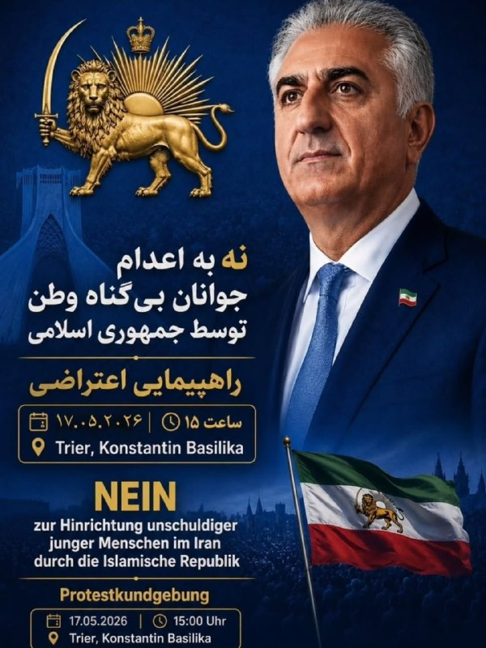

👑📌 ایران فقط یک نام نیست…
صدای مادری‌ست که هر شب با ترسِ تلفن زنگ‌خورده می‌خوابد.
چشم‌های خواهری‌ست که عکس برادرش را در آغوش گرفته.
و قلبِ مردمی‌ست که سال‌هاست میان درد و امید ایستاده‌اند.

امروز، جوانانِ این سرزمین را به جرمِ آرزو داشتن اعدام می‌کنند…
به جرمِ آزادی‌خواهی،
به جرمِ زندگی.

ما دور از وطن ایستاده‌ایم،
اما قلب‌مان هنوز در کوچه‌های ایران می‌تپد.
سکوت ما یعنی فراموش شدنِ جان‌هایی که هنوز می‌شود نجات‌شان داد.

بیایید کنار هم باشیم؛
برای انسانیت،
برای آزادی،
برای ایرانی که سزاوارِ زندگی‌ست، نه مرگ.

📍 راهپیمایی اعتراضی
🗓 ۱۷.۰۵.۲۰۲۶
⏰ ساعت ۱۵:۰۰
📌 Trier – Konstantin Basilika

«صدای مردم ایران باشیم… قبل از آنکه دیر شود.»

#نه_به_اعدام
@DEJradio

## DEJradio — post 4614

  <a href="telegram/content/DEJradio_4614_1778680704.mp4" target="_blank">🎬 Download video</a>

🚨
🔸 اذیت و آزار دختران دبیرستان شرافت؛

توضیحات فریبرز کرمی‌زند افسر پیشین پلیس درباره اذیت و آزار دختران دبیرستان «شرافت» تهران توسط ماموران امنیتی

#جمهوری_اسلامی #مدرسه_شرافت
@DEJradio

## DEJradio — post 4613

  <a href="telegram/content/DEJradio_4613_1778680706.mp4" target="_blank">🎬 Download video</a>

🔺🎥 ”ساختمون فرماندهان ارشد سـ.ـپاه در جنگ کاملا داغون شد

یک شهروند خبرنگار از تهران با ارسال ویدیویی از انهدام کامل یکی از اقامتگاه‌های سـ.ـپاه پاسداران نوشت، «این ساختمونی است که فرماندهان ارشد زندگی میکردن همونایی که تو جنگ بمبارون شدن. می‌گن جنگ رو بردیم ولی حتی پول ندارن خونه‌های داغون ‌شده ‌شون رو درست کنن. این دیگه چه جور پیروزیه؟ این فیلمی رو که دیشب تو تهران گرفتم، براتون می‌فرستم.»

#جمهوری_اسلامی #IRGCterrorists
@DEJradio

## DEJradio — post 4612

  <a href="telegram/content/DEJradio_4612_1778680707.mp4" target="_blank">🎬 Download video</a>

🤡
🔺 شخم زدن زمین توسط ارتش برای مقابله با فرود هواپیماهای آمریکا

محمد اکرمی‌نیا سخنگوی ارتش جمهوری اسلامی در مصاحبه با ایرنا ادعا کرده است، عملیات آمریکا برای نجات خلبان‌هایی که در ایران سقوط کرده بودند بیشتر «یک عملیات فریب» بود. به گفته اکرمی‌نیا «احتمالا آن عملیات هم برای سرقت اورانیوم غنی‌شده بود.»
به گفته این مقام ارتش، یکی از اقدامات برای مقابله با ورود نیروهای آمریکایی به خاک ایران، شخم زدن زمین‌ها و باند فرودگاه‌های متروکه بود با این همه آمریکایی‌ها وارد شدند.

#جمهوری_اسلامی #ارتش
@DEJradio

## DEJradio — post 4611

  <a href="telegram/content/DEJradio_4611_1778680709.mp4" target="_blank">🎬 Download video</a>

🔺📢 من دانشجو هستم و تا چند وقت دیگر باید از ایران بروم. چون سیستم های بین المللی قطع است و پدر و مادرم نمی توانند برایم پول واریز کنند، مجبورم مقدار بیشتری دلار ببرم تا هزینه یکسال را داشته باشم. اکثر دستگاه‌های عابربانک قطع هستند و یا پول نمی دهند و اگر هم پول می‌دهند بسیار محدود.

دلار هم تا یک سقفی صرافی‌ها می فروشند. گرفتار شده‌ام. اگر وضع مملکت درست بود مجبور نبودم پدرو مادر و دوست و آشنا را ول کنم و با فوق لیسانس دانشگاه امیرکبیر، تازه بروم از نو درس بخوانم.
مردم همه گرفتارند، بانک‌ها خودشان دنبال پول نقد هستند.

#جمهوری_اسلامی
@DEJradio

## mamlekate — post 103522

📝 سفر ترامپ به چین؛ از مذاکره درباره ایران و تنگه هرمز تا جنگ تجاری و هوش مصنوعی

دونالد ترامپ، رئیس‌جمهوری آمریکا، در سفری مهم و حساس، روز چهارشنبه وارد پکن شد تا با شی جین‌پینگ، رئیس‌جمهوری چین، دیدار کند؛ دیداری که انتظار می‌رود موضوع‌هایی از جمله جنگ ایران و اختلافات تجاری در آن، محور گفتگوها باشند.

@mamlekate

## mamlekate — post 103521

📝 صادرات نفت از جزیره خارک برای نخستین بار از آغاز جنگ، چند روز متوقف شد

تصاویر ماهواره‌ای نشان می‌دهند صادرات نفت از پایانه اصلی نفتی ایران در جزیره خارک طی روزهای اخیر متوقف شده و همزمان ظرفیت مخازن ذخیره‌سازی این جزیره نیز رو به تکمیل است؛ وضعیتی که می‌تواند جمهوری اسلامی را ناچار به کاهش بیشتر تولید نفت کند.

@mamlekate

## mamlekate — post 103520

  

📿 آگهی دفتر پیشخوان دولت برای فروش اینترنت طبقاتی پرو

📿 «سیم‌کارت سفید» ۱۲۰ میلیون تومان

📿 اینترنت تهدید شدید امنیتیه، ولی پول بدی دیگه تهدید نیست

@mamlekate 
🕊️ مملکته

## mamlekate — post 103519

❓ ساعت ۹:۰۲ دقیقه امروز یه صدای خیلی بلند با ارتعاش زیاد اومد سمت چیذر شنیدیم ما. انگار ۷،۸ کیلومتر فاصله داشت باهامون. ۹:۶ دقیقه و ۹:۱۱ دقیقه هم‌ اومد. آسمون ابری نیست که بگم‌صدای رعد و برقه

❗️ الو این صدا رو ما هم تو جردن شنیدیم فکر کردیم رعد و برقه. سمت کوه های تهران اره ابریه و هوا ابری بود احتمالا همون رعد و برق بود

❗️ این سه تا صدا رو همه شنیدیم. از شرق تا غرب.. لرزه نداشت من که یوسف ابادم ولی صدای مهیبی بود. هوا هم از این بهاری/گرم/ابری طوریاست که همه جوره تو اسمون بود. ولی صدای مهیبی بود همه مون به هم زنگ زدیم.

@mamlekate

## IranIntlTV — post 336994

  

ستاد فرماندهی مرکزی آمریکا، سنتکام، با انتشار تصویری از گشت‌زنی یک جنگنده پنهان‌کار اف-۳۵-ای نیروی هوایی ایالات متحده بر فراز آب‌های منطقه‌ای نزدیک تنگه هرمز خبر داد.
سنتکام افزود این جنگنده می‌تواند تا ۱۸ هزار پوند مهمات را در حالی که با سرعت مافوق صوت پرواز می‌کند، حمل کند.
https://iranintl.com/202605130260

## IranIntlTV — post 336993

  

ایال زمیر، رییس ستاد کل ارتش اسرائیل، گفت: «ما در همه جبهه‌ها واقعیت امنیتی جدیدی ایجاد کرده‌ایم، با این حال نبرد به پایان نرسیده است. ارتش اسرائیل برای ازسرگیری جنگ در صورت نیاز آماده است و در دفاع و حمله، از یهودا و سامره تا تهران، در آمادگی و هوشیاری دائم قرار دارد.»
https://iranintl.com/202605139649

## IranIntlTV — post 336992

  <a href="telegram/content/IranIntlTV_336992_1778680713.mp4" target="_blank">🎬 Download video</a>

مسعود پزشکیان، رییس دولت جمهوری اسلامی، در واکنش به افزایش تورم، از مقام‌های دولتی خواست تمام توان خود را برای کنترل قیمت‌ها به‌کار بگیرند. او همچنین بر ضرورت مداخله نهادهایی مانند بسیج و مساجد در مدیریت شرایط تاکید کرد.
گفت‌وگو با مرتضی کاظمیان، عضو تحریریه ایران‌اینترنشنال
@iranintltv

## IranIntlTV — post 336991

  <a href="telegram/content/IranIntlTV_336991_1778680714.mp4" target="_blank">🎬 Download video</a>

همزمان با سفر ترامپ به چین، کاربران رسانه‌های اجتماعی درباره نقش ایران در مناسبات آمریکا و چین گمانه‌زنی کرده‌اند. برخی معتقدند تهران به بخشی از معامله قدرت‌های جهانی تبدیل شده و عده‌ای نیز جمهوری اسلامی را نیروی نیابتی پکن در منطقه توصیف می‌کنند.
عادله بورنگ، عضو تحریریه ایران‌اینترنشنال، از واکنش کاربران می‌گوید
@iranintltv

## IranIntlTV — post 336988

  

بلومبرگ گزارش داد ناتو در حال برنامه‌ریزی برای دعوت از نمایندگان چهار کشور حوزه خلیج فارس به نشست خود در آنکارا است؛ نشستی که انتظار می‌رود جنگ علیه جمهوری اسلامی و شکاف فزاینده در روابط فراآتلانتیک بر آن سایه بیفکند.

به گفته افرادی آگاه از روند برنامه‌ریزی، این کشورها شامل بحرین، کویت، قطر و امارات متحده عربی هستند که همگی عضو «ابتکار همکاری استانبول»، چارچوب همکاری میان ناتو و کشورهای غیرعضو در خاورمیانه، به‌شمار می‌روند.

این منابع که به دلیل محرمانه بودن گفت‌وگوها نخواستند نامشان فاش شود، گفتند قرار است وزیران خارجه این کشورها برای نشست ۱۷ و ۱۸ تیرماه در آنکارا دعوت شوند.
https://iranintl.com/202605131055

## IranIntlTV — post 336987

🗣روایت شما از بحران اقتصادی و زندگی در آتش‌بس- چهارشنبه ۲۳ اردیبهشت:

🔹ما در سیستان و بلوچستان محروم و گرسنه بودیم، این روزها محروم‌تر و گرسنه‌تر هم شدیم. گالن ۷۰ لیتری بنزین شده ۵ میلیون. برای رسیدن به بیمارستان باید ۴۰ تا ۶۰ لیتر بنزین مصرف کنیم، چون اکثر مردم اینجا روستانشین هستن و فاصله تا مرکز استان ۶۰۰ تا ۷۰۰ کیلومتره!

🔹هر هفته محصولات مورد نیاز و خوراکی بالای ۲ برابر می‌شه و تو این دو ماه گذشته ۳ تا ۵ برابر شده، چه‌جوری تورم رو ۶۰ یا ۱۰۰ درصد اعلام می‌کنند؟

🔹گرانی داره بیداد می‌کنه. من یه جوون ۲۴ ساله‌م اما هر شب از شدت غم فکر می‌کنم الانه که سکته کنم. هیچ کس به داد ما نمی‌رسه. پدرم بازنشسته است و همه ما بیکار شدیم. دو ماه دیگه باید خونه رو تمدید کنیم ولی هیچ وامی بهمون نمی‌دن. داریم نابود می‌شیم.

🔹دو روز پیش از موتور ماشینم تو جاده روغن زد بالا. تو جاده زاهدان بودم، زنگ زدم کفی خودروبر، گفت تا شیراز ۱۰۰ میلیون می‌گیرم. بردم نمایندگی زاهدان، گفتن اول باید ۱۵۰ میلیون واریز کنی تا بعد رسیدگی کنم.

🔹از تهران پیام می‌دم. گرانی بیداد می‌کنه، کاسبی مشاغل آزاد از بین رفته، پولی درنمیاد، داریم تمام پس‌اندازمون رو خرج خورد و خوراک می‌کنیم با مراعات بسیار. طلبکارها فشار میارن، بدهکارها ندارن بدهی‌شون رو بدن.

🔹ما دانش‌آموزها، مخصوصا پایه نهم و دوازدهم، در این شرایط اینترنتی و مشکلات کشور واقعا از نظر روحی خسته شدیم. وقتی می‌بینیم خانواده‌هامون برای بقا دست‌وپا می‌زنن، کلاس‌ها هم مدام قطع می‌شن، تمرکز و آمادگی برای امتحان واقعا سخت می‌شه.

🔹اکثر مردم دچار بی انگیزگی شدن، از جمله خود من. از بس امیدمون ناامید شده، از بس می‌دویم و نمی‌رسیم. هیچ وقت فکر نمی‌کردم تبدیل به کره شمالی بشیم و هیچ کشور دیگه‌ای براش مهم نباشه که چه بلایی داره سر مردم ایران میاد.

## IranIntlTV — post 336986

  

علاءالدین بروجردی، عضو کمیسیون امنیت ملی و سیاست خارجی مجلس، گفت: «تنها سناریو پیش‌رو این است که آمریکا واقعیت‌ها را بپذیرد و با پذیرش این واقعیات، با ایران وارد مذاکره شود تا از شرایط جنگی خارج شود.»

او اضافه کرد: «به هیچ‌ وجه دستاورد تنگه هرمز را از دست نخواهیم داد و به هیچ‌ وجه وارد بحث مذاکره درباره غنی‌سازی هسته‌ای نخواهیم شد.»
https://iranintl.com/202605133735

## IranIntlTV — post 336985

یک شهروند با ارسال پیامی به ایران اینترنشنال از وضعیت معیشتی بد خود و عدم توان پرداخت پول برای داروی مادر بیمارش می‌گوید.

## IranIntlTV — post 336984

  

دونالد ترامپ، رییس‌جمهوری آمریکا، چهارشنبه در مراسم استقبال رسمی با تشریفات گسترده وارد پکن شد. بر اساس اعلام کاخ سفید، هان ژنگ، معاون رییس‌جمهوری چین، به همراه شماری از مقام‌ها از جمله دیوید پردیو، سفیر آمریکا در چین، شی فنگ، سفیر چین در آمریکا، و ما ژائوشو، معاون اجرایی وزیر خارجه چین، در فرودگاه از ترامپ استقبال کردند.

همچنین ۳۰۰ نوجوان چینی با لباس‌های هماهنگ آبی و سفید در باند فرودگاه و با در دست داشتن پرچم‌های چین و آمریکا رژه رفتند. یگان تشریفات نظامی و یک گروه موسیقی نظامی نیز در این مراسم حضور داشتند.

قرار است شی جین‌پینگ صبح پنجشنبه به وقت محلی به‌طور رسمی از دونالد ترامپ استقبال کند.
https://iranintl.com/202605139112

## IranIntlTV — post 336983

  

مهراوه خندان، فرزند نسرین ستوده، خبر داد که این وکیل دادگستری و فعال حقوق بشر، با قرار وثیقه به‌طور موقت آزاد شده است.

نسرین ستوده ۱۲ اردیبهشت در منزل خود بازداشت شده بود. در جریان این بازداشت، لوازم الکترونیکی از جمله لپ‌تاپ و تلفن‌های همراه او و همسرش رضا خندان ضبط شد.
https://iranintl.com/202605130712

## IranIntlTV — post 336982

یک شهروند در سیستان و بلوچستان با ارسال پیامی به ایران اینترنشنال از بدتر شدن وضعیت اقتصادی مردم منطقه می‌گوید. پیام مخاطب با هوش مصنوعی خوانده شده است.

## IranIntlTV — post 336981

  

پایگاه خبری وای‌نت گزارش داد دیوید زینی، رییس سازمان اطلاعات و امنیت داخلی اسرائیل (شین‌بت)، اخیرا به امارات متحده عربی سفر کرده است.

ساعاتی پیش، روزنامه وال‌استریت ژورنال از دو سفر محرمانه دیوید بارنئا، رییس موساد، به امارات در جریان جنگ ایران خبر داده بود.
https://iranintl.com/202605137286

## IranIntlTV — post 336980

شهروندان پس از زلزله تهران: فکر کردیم آمریکا و اسرائیل حمله کردند

🖋سبا حیدرخانی

شماری از شهروندان در پیام‌هایی به ایران‌اینترنشنال گفتند در نخستین لحظات پس از زلزله نسبتا شدیدی که شامگاه سه‌شنبه ۲۲ اردیبهشت تهران و مناطق اطراف آن را لرزاند، تصور کردند حملات آمریکا و اسرائیل دوباره آغاز شده است. احساسی که با پایان احساس تعلیق اما همراه ترس و اضطراب بوده است.

این زمین‌لرزه‌ها ابتدا با زلزله‌ای به بزرگی ۳.۴ در ساعت ۲۰:۴۱ آغاز شد اما اوج آن در ساعت ۲۳:۴۶ با لرزه‌ای به بزرگی ۴.۶ در عمق ۱۰ کیلومتری رخ داد.
تا ساعت ۳:۳۰ بامداد چهارشنبه ۲۳ اردیبهشت، چندین پس‌لرزه دیگر هم اتفاق افتاد.

کانون اصلی زلزله پردیس بود اما در مناطق مختلف شهر و استان تهران، استان البرز و حتی بخش‌هایی از استان مازندران احساس شد.

برخی مخاطبان در واکنش به این زلزله و پس‌لرزه‌هایش گفتند تجربه هفته‌های جنگ، صدای انفجارها، پدافند و پهپادها، نوعی حساسیت دائمی ایجاد کرده است؛ به‌طوری که حتی تشخیص زلزله از حمله نظامی هم برای چند ثانیه دشوار بوده است.

یکی از ساکنان شرق تهران و تهرانپارس در پیامی نوشت: «زلزله سه‌شنبه شب جوری بود که خانه‌مان به شدت لرزید و تکان خورد؛ طوری که فکر کردیم کنار خانه‌مان موشک خورده است.»

مخاطب دیگری زلزله را «ترسناک» توصیف کرد و گفت او و خانواده‌اش برای چند ثانیه فکر کردند دوباره حملات شروع شده است.

برخی شهروندان همچنین به شباهت تجربه زلزله با روزهای جنگ اشاره کردند.

یک شهروند نوشت: «حدود ساعت ۹ شب سه‌شنبه زلزله در تهران حس شد، اما زلزله‌ای که ساعت ۱۱:۴۵ شب آمد بسیار شدید حس شد. خانه کاملا لرزید و لوسترها صدا دادند. شبیه تجربه‌ای بود که در آن ۴۰ روز جنگ داشتیم.»

شماری از مخاطبان تاکید کردند احساس آن‌ها صرفا «ترس» نبوده، بلکه ترکیبی از اضطراب، انتظار و بی‌ثباتی روانی بوده است؛ به‌ویژه در شرایطی که بخشی از جامعه همچنان در انتظار ازسرگیری حملات نظامی علیه جمهوری اسلامی است.

شهروندی نوشت: «وقتی زلزله و بعد از آن صدای طوفان آمد، فکر کردیم دوباره حمله شده است. حس هم‌زمان ترس و خوشحالی داشتیم.»

مخاطبی دیگر با اشاره به احساس ناامیدی و تعلیق گسترده‌ای که در آتش‌بس شکل گرفته، گفت: «وضعیت ما داخل ایران این‌گونه است که زلزله می‌آید و مادرم می‌گوید: کاش بمباران باشد؛ ثمره ۴۷ سال حکومت اسلامی.»

قطع اینترنت و از دست رفتن دسترسی سریع به منابع خبری
قطع طولانی‌مدت و اختلال گسترده اینترنت در ایران، دسترسی بسیاری از کاربران به پیام‌رسان‌ها، شبکه‌های اجتماعی و حتی منابع اطلاع‌رسانی فوری را مختل کرده است.

برخی مخاطبان گفتند در گذشته در چنین شرایطی مستقیما به سایت‌های لرزه‌نگاری مراجعه یا اخبار را از طریق تلگرام و شبکه‌های اجتماعی دنبال می‌کردند، اما اکنون این امکان را از دست داده‌اند و همین موضوع بر اضطراب عمومی افزوده است.

چند کاربر، رسانه‌های حکومتی را به پنهان‌کاری و تاخیر در اطلاع‌رسانی متهم کردند.

شهروندی در همین زمینه نوشت: «صداوسیما از ترس این‌که مردم به خیابان‌ها بریزند و اعتراض دیگری شکل بگیرد، خبر زلزله را تا دقایقی طولانی پوشش نداد. جان آدم‌ها آن‌قدر برایشان بی‌ارزش است که تلاش می‌کنند از هر راهی که شده، اندکی بیشتر در قدرت بمانند.»

بی‌اعتمادی به نهادهای اطلاع‌رسانی حکومتی و فقدان دسترسی به کانال‌های خبری امن و شناخته شده، باعث شد در ساعات پس از زلزله، شایعات و گمانه‌زنی‌هایی نیز شکل بگیرد.

در همین زمینه، یک مخاطب با اشاره به موقعیت کانون زلزله نوشت: «کانون زلزله تهران، نزدیک پارچین و نیروگاه اتمی بود؛ یعنی اصلا امکانش نیست که زلزله‌ای در کار نبوده و جمهوری اسلامی داشته آزمایش اتمی یا نظامی انجام می‌داده است؟»

شهروند دیگری نیز این پرسش را مطرح کرد که: «آیا زلزله نمی‌تواند ناشی از فعالیت‌های زیرزمینی موشکی باشد؟»

او به قرارگیری تهران روی گسل و همچنین فعالیت‌های زیرزمینی جمهوری اسلامی اشاره کرد.

نهادهای حکومتی به این گمانه‌زنی‌ها واکنشی نشان ندادند اما برخی متخصصان درباره این ترس و نگرانی عمومی اظهار نظر کردند.

فریبرز ناطقی‌‌الهی، عضو هیات علمی پژوهشگاه زلزله‌شناسی ایران، صبح چهارشنبه ۲۳ اردیبهشت در سخنانی گفت زلزله تهران «در اثر انفجار مواد تسلیحاتی و نظامی نبوده» است.

تهران تا ساعت‌ها پس از زلزله و پس‌لرزه‌هایش فضایی ملتهب را تجربه کرد.

یکی از ساکنان پردیس گفت از حدود ساعت هشت‌ونیم شب تا یک بامداد، مردم از ترس در خیابان‌ها بودند، داخل خانه نرفتند و پمپ‌بنزین‌ها هم شلوغ بود.
 
🔗متن کامل گزارش را اینجا بخوانید
@iranintltv

## IranIntlTV — post 336979

  <a href="telegram/content/IranIntlTV_336979_1778680719.mp4" target="_blank">🎬 Download video</a>

یک شهروند با ارسال پیامی به ایران اینترنشنال می‌گوید با وضعیت بد اینترنت و شبکه ملی داخلی انگیزه‌ها برای درس خواندن از بین رفته است. پیام این مخاطب با هوش مصنوعی خوانده شده است.

## IranIntlTV — post 336977

  

بریتانیا اعلام کرد برای مقابله با فعالیت عوامل نیابتی وابسته به دولت‌های متخاصم، قوانین جدیدی تصویب خواهد کرد.

به گزارش خبرگزاری رویترز، این تصمیم در پی افزایش تهدیدهای امنیتی و رشد حملات یهودستیزانه در این کشور مطرح شده است.

به گفته دولت بریتانیا، این قوانین اختیارات لازم را برای ممنوع‌ کردن فعالیت گروه‌های وابسته به دولت‌های خارجی فراهم می‌کند.

کی‌یر استارمر، نخست‌وزیر بریتانیا، در واکنش به حملات اخیر به جامعه یهودیان این کشور تاکید کرده دولت باید با «بازیگران مخرب» وابسته به دولت‌های خارجی برخورد کند.
https://iranintl.com/202605139938

## IranIntlTV — post 336976

  <a href="telegram/content/IranIntlTV_336976_1778680722.mp4" target="_blank">🎬 Download video</a>

تجمعات حکومتی شبانه در شهرهای مختلف ایران ادامه دارد. شهروندان نیز مشاهدات خود از حضور نیروهای نیابتی در این تجمعات و تجربه‌هایشان از آزار و اذیت‌ آن‌ها را برای ایران‌اینترنشنال ارسال کردند.

محسن مهیمنی، عضو تحریریه ایران‌اینترنشنال، گزارش می‌دهد
@iranintltv

## IranIntlTV — post 336975

  <a href="telegram/content/IranIntlTV_336975_1778680724.mp4" target="_blank">🎬 Download video</a>

شهروندان با ارسال پیام‌هایی به ایران‌اینترنشنال از تورم اقلام خوراکی و کسادی بازار زیر سایه آتش‌بس روایت می‌کنند. سبا حیدرخانی، عضو تحریریه ایران‌اینترنشنال، با بررسی این پیام‌ها می‌گوید بسیاری از کسب‌وکارها به علت کوچک شدن سبد خرید مردم، در آستانه ورشکستگی قرار گرفته‌اند.
@iranintltv

## IranIntlTV — post 336974

جوییش کرونیکل از پیشنهاد ۴۰ هزار پوندی برای قتل روزنامه‌نگار ایرانی خبر داد

یک مرد بریتانیایی-ایرانی گفته است فردی که مظنون به ارتباط با جمهوری اسلامی بوده، در ازای قتل یک روزنامه‌نگار ساکن لندن که از منتقدان تهران است، ۴۰ هزار پوند به او پیشنهاد داده است.

روزنامه «جوییش کرونیکل» چهارشنبه ۲۳ اردیبهشت در گزاشی به نقل از این مرد که با نام مستعار «نیما» معرفی شده، نوشت او پس از بازگشت به بریتانیا، موضوع را به پلیس گزارش کرده و روزنامه‌نگاری را که برای یک رسانه فارسی‌زبان کار می‌کند، در جریان قرار داده است.

نیما که حدود یک دهه است در بریتانیا زندگی می‌کند و در یک بار کار می‌کند، گفت این ماجرا در جریان سفر تفریحی‌اش به جنوب اروپا آغاز شد؛ جایی که به یک رستوران ایرانی رفت و با دو مرد آشنا شد که یکی از آن‌ها را از ایران می‌شناخت.

به گزارش جوییش کرونیکل، آن مرد ابتدا درباره راه‌اندازی یک بار در لندن صحبت کرد و با مطرح کردن موضوع به‌عنوان یک پیشنهاد کاری، اطلاعات تماس نیما را گرفت.

پیشنهادی برای قتل
نیما گفت دیدار دوم شکل متفاوتی پیدا کرد؛ زمانی که آن مرد همراه دو نفر دیگر آمد و شروع به اشاره به جزییات زندگی او در بریتانیا و بستگانش در ایران کرد.

نیما به جوییش کرونیکل گفت: «به من گفت تو آدم محترمی هستی. خانواده‌ای در ایران داری که به حمایت تو نیاز دارند. می‌خواهم کاری به تو پیشنهاد بدهم؛ با پرداخت اولیه ۴۰ هزار پوند.»

بر اساس این گزارش، آن مرد سپس به یک روزنامه‌نگار ایرانی در لندن اشاره کرد که نیما پیش‌تر در فضای مجازی با او مشاجره کرده بود و گفت می‌خواهد او را «مجازات» کند.

او از نیما پرسید آیا خودش می‌تواند این کار را انجام دهد یا فرد دیگری را برای آن پیدا کند.

نیما گفت به او پیشنهاد شده بود ۲۰ هزار پوند نقد همان ابتدا دریافت کند و بقیه مبلغ را پس از مشخص کردن محل اقامت آن روزنامه‌نگار بگیرد.
او افزود این افراد تصور می‌کردند آن روزنامه‌نگار در خانه امن زندگی می‌کند.

به گفته نیما، فرد مظنون مستقیما خود را عضو سپاه پاسداران معرفی نکرد، اما یکی از آشنایانش گفته بود او در ایران نفوذ دارد و هنگام صحبت درباره کمک احتمالی به خانواده نیما، از «سپاه» نام برده بود.

افزایش نگرانی‌های امنیتی در بریتانیا
این گزارش در شرایطی منتشر شده است که نگرانی‌ها در بریتانیا درباره تهدیدهای مرتبط با جمهوری اسلامی علیه مخالفان، روزنامه‌نگاران و نهادهای یهودی افزایش یافته است.

یک گروه همسو با جمهوری اسلامی (حرکت اصحاب الیمین الاسلامیه)، مسئولیت حمله به چند مکان یهودی در بریتانیا و اروپا، از جمله حملات ماه گذشته به دو کنیسه در شمال لندن را بر عهده گرفته است.

کن مک‌کالوم، مدیرکل سازمان اطلاعات داخلی بریتانیا «ام‌آی۵» بارها هشدار داده جمهوری اسلامی که از طریق سپاه پاسداران عمل می‌کند، تهدیدی «احتمالا مرگبار» برای بریتانیا به‌شمار می‌رود.

به گفته مقام‌های بریتانیایی، از سال ۲۰۲۲ تاکنون چندین طرح منتسب به جمهوری اسلامی که قصد داشته است مخالفان، روزنامه‌نگاران و افراد یا نهادهای مرتبط با اسرائیل و یهودیان را در این کشور هدف قرار دهد، خنثی شده است.

🔗وب‌سایت ایران‌اینترنشنال
@iranintltv

## IranIntlTV — post 336973

  

🔻در فاصله یک ماه تا شروع جام جهانی، تیم ملی فوتبال در پی انزوای سیاسی جمهوری اسلامی نتوانست با حریفان تدارکاتی مناسب دیدار کند و در تهران، سه‌بار در قالب بازی‌های درون‌تیمی به مصاف خودش رفت.

🔹حالا خبرگزاری تسنیم نوشته است که یکی از نگرانی‌های اصلی کادرفنی، بحث صدور ویزا از سوی کشور آمریکاست؛ چرا که در صورت صادر نشدن ویزای هر یک از بازیکنان یا اعضای کادرفنی، چالش‌های تیم ملی بیش از پیش خواهد شد.

🔹تیم ملی در نظر داشت پیش از شروع رقابت‌ها چندین دیدار تدارکاتی برگزار کند، اما تا این لحظه فقط بازی با گامبیا نهایی شده است.

🔹تیم‌های مقدونیه، آنگولا، اسپانیا و پورتوریکو به دلیل شرایط سیاسی ایران، از تقابل با تیم ملی انصراف داده‌اند.

🔹قرار است بازیکنان و اعضای کادرفنی به‌زودی جهت طی کردن مراحل دریافت ویزای آمریکا راهی ترکیه شوند. با این حال، گفته می‌شود احتمال دارد برخی از اعضا به دلیل سوابق فعالیت یا ارتباط با سپاه پاسداران، موفق به دریافت ویزا نشوند.

🔹جزییات بیشتر را در سایت بخوانید

@iranintltvsport

## IranIntlTV — post 336971

  <a href="telegram/content/IranIntlTV_336971_1778680726.mp4" target="_blank">🎬 Download video</a>

سرخط خبرهای چهارشنبه ۲۳ اردیبهشت
@iranintltv

## Shin_Persian — post 5988

Shin ✓ @hey_itsmyturn
Wed, 13 May 2026 13:40:21 UTC

Blast sound in Shiraz
Fars Province, #Iran

فارسی

صدای انفجار در شیراز
استان فارس، #Iran

𝕏 · @shin_persian

## Shin_Persian — post 5987

  

NetBlocks ✓ @netblocks
Wed, 13 May 2026 07:50:00 UTC

💸 #Iran's internet blackout is now past hour 1776, entering its 75th day. The digital censorship measure has led to profiteering and a decline in digital security as government-backed "pro" internet schemes and selective whitelisting result in surveillance, corruption and scams.

فارسی

💸 قطعی اینترنت #ایران اکنون از ساعت ۱۷۷۶ فراتر رفته و وارد هفتاد و پنجمین روز خود شده است. این اقدام در راستای سانسور دیجیتال منجر به سودجویی و کاهش امنیت دیجیتال شده است، چرا که طرح‌های اینترنت «طبقاتی» تحت حمایت دولت و لیست‌های سفید گزینشی، منجر به نظارت، فساد و کلاهبرداری شده است.

𝕏 · @shin_persian

## ManotoTV — post 105401

  <a href="telegram/content/ManotoTV_105401_1778680728.mp4" target="_blank">🎬 Download video</a>

مقام‌های فرانسه اعلام کردند بیش از هزار مسافر یک کشتی تفریحی تحت مدیریت بریتانیا پس از شیوع بیماری گوارشی در این کشتی، اجازه پیاده شدن در بندر بوردو را ندارند.
بر اساس گزارش‌ها، ۴۹ نفر در کشتی «Ambition» علائمی شبیه گاستروآنتریت نشان داده‌اند و سه مسافر در کابین‌های خود قرنطینه شده‌اند.
گاستروآنتریت یا التهاب معده و روده یک بیماری عفونی دستگاه گوارش است. این بیماری اغلب توسط ویروس‌ها مثل نوروویروس یا روتاویروس ایجاد می‌شود، اما گاهی باکتری یا غذای آلوده هم عامل آن است. در کشتی‌های تفریحی، شیوع این بیماری رایج‌تر است چون افراد زیادی در فضای بسته و مشترک حضور دارند و ویروس به‌سرعت منتقل می‌شود. اعلام شده یک مرد ۹۲ ساله نیز روز یکشنبه در کشتی جان باخته، اما هنوز ارتباطی میان مرگ او و بیماری گوارشی تأیید نشده است.
این شرکت می‌گوید اقدامات بهداشتی و ضدعفونی گسترده در کشتی اجرا شده و به مسافران درباره رعایت بهداشت و گزارش علائم هشدار داده شده است.
کشتی «Ambition» با ۱۱۸۷ مسافر و ۵۱۴ خدمه، هشتم مه سفر خود را از بلفاست آغاز کرده بود.

## ManotoTV — post 105400

  <a href="telegram/content/ManotoTV_105400_1778680729.mp4" target="_blank">🎬 Download video</a>

دونالد ترامپ پس از ورود به پکن، در مراسمی رسمی با فرش قرمز، گارد احترام نظامی و صدها نفر از جوانان چینی مورد استقبال مقام‌های چین قرار گرفت. در تصاویر ثبت شده ایلان ماسک نیز در جمع همراهان ترامپ حضور دارد.
ترامپ امروز برنامه عمومی دیگری ندارد، اما قرار است پنجشنبه و جمعه چندین بار با شی جین‌پینگ دیدار کند. او پیش از سفر گفته بود محور اصلی گفت‌وگوها با رئیس‌جمهور چین، تجارت و توافق‌های اقتصادی خواهد بود.
این سفر در حالی انجام می‌شود که جنگ آمریکا و اسرائیل با ایران و افزایش تورم، فشارهایی بر محبوبیت ترامپ در داخل آمریکا وارد کرده است.
ترامپ پیش از ترک آمریکا گفت: «ما دو ابرقدرت جهان هستیم. آمریکا از نظر نظامی قدرتمندترین کشور دنیاست و چین را نفر دوم می‌دانند.»

## ManotoTV — post 105399

  <a href="telegram/content/ManotoTV_105399_1778680730.mp4" target="_blank">🎬 Download video</a>

یک نفتکش وابسته به شرکت دولتی نفت ابوظبی پس از حمله پهپادی جمهوری‌اسلامی در هفته گذشته، دچار نشت محدود سوخت در سواحل عمان شده است.
رویترز گزارش داده مقدار کمی از سوخت کشتی که به نظر می‌رسد سوخت بانکر بوده، در پی این حادثه نشت کرده است.
انور قرقاش، مشاور رئیس امارات، پیش‌تر حمله چهارم مه به این نفتکش را «دزدی دریایی» توصیف کرده بود. گزارش شده در زمان حمله کسی آسیب ندیده و کشتی حامل بار نبوده است.
این نفتکش با نام «MV Barakah» همچنان در سواحل عمان لنگر انداخته و شرکت می‌گوید در حال همکاری نزدیک با مقام‌های مربوطه و تیم‌های تخصصی واکنش به بحران است.

## ManotoTV — post 105398

  <a href="telegram/content/ManotoTV_105398_1778680730.mp4" target="_blank">🎬 Download video</a>

هواپیمای ریاست‌جمهوری آمریکا دقایقی پیش در پایتخت چین به زمین نشست و دونالد ترامپ سفر خود برای دیدار با شی جین‌پینگ، رئیس‌جمهور چین، را آغاز کرد. این نخستین سفر رسمی یک رئیس‌جمهور مستقر آمریکا به چین از زمان سفر ترامپ در سال ۲۰۱۷ است.

## ManotoTV — post 105397

  <a href="telegram/content/ManotoTV_105397_1778680732.mp4" target="_blank">🎬 Download video</a>

تماسی از ایران؛
تجربه‌ی یک آموزگار از آموزش مجازی

## ManotoTV — post 105396

  <a href="telegram/content/ManotoTV_105396_1778680733.mp4" target="_blank">🎬 Download video</a>

هواپیمای ریاست‌جمهوری آمریکا دقایقی پیش در پایتخت چین به زمین نشست و دونالد ترامپ سفر خود برای دیدار با شی جین‌پینگ، رئیس‌جمهور چین، را آغاز کرد.

## ManotoTV — post 105395

  <a href="telegram/content/ManotoTV_105395_1778680734.mp4" target="_blank">🎬 Download video</a>

وال‌استریت ژورنال به نقل از مقام‌های عرب و یک منبع آگاه گزارش داد رئیس سازمان اطلاعات اسرائیل، موساد، در جریان جنگ با ایران دست‌کم دو بار به‌صورت محرمانه به امارات متحده عربی سفر کرده است.
بر اساس این گزارش، دیوید بارنیا، رئیس موساد، در ماه‌های مارس و آوریل برای هماهنگی درباره جنگ با ایران به امارات رفته بود؛ اقدامی که نشانه‌ای از گسترش همکاری‌های امنیتی میان اسرائیل و کشورهای عربی خلیج فارس توصیف شده است.
این گزارش می‌افزاید اسرائیل در طول جنگ، سامانه‌های دفاع موشکی «گنبد آهنین» و ده‌ها نیروی نظامی را برای مقابله با حملات موشکی و پهپادی جمهوری‌اسلامی به امارات اعزام کرده بود.
وال‌استریت ژورنال همچنین نوشت امارات در حملات نظامی علیه اهدافی در ایران مشارکت داشته؛ از جمله حمله به یک پالایشگاه در جزیره لاوان در خلیج فارس. وزارت خارجه امارات و دفتر نخست‌وزیر اسرائیل تاکنون به درخواست‌های وال‌استریت ژورنال برای اظهار نظر پاسخ نداده‌اند.

## ManotoTV — post 105394

  <a href="telegram/content/ManotoTV_105394_1778680735.mp4" target="_blank">🎬 Download video</a>

رویترز گزارش داد عراق و پاکستان برای انتقال نفت و گاز از تنگه هرمز با جمهوری‌اسلامی به توافق رسیده‌اند؛ اقدامی که به گفته منابع آگاه، نشان‌دهنده افزایش کنترل تهران بر این آبراه راهبردی است.
بر اساس این گزارش، عراق عبور دو نفتکش بزرگ را با هماهنگی ایران انجام داده و پاکستان نیز انتقال محموله‌های گاز مایع طبیعی قطر را از مسیر هرمز با توافق تهران پیش می‌برد.
منابع رویترز می‌گویند جمهوری‌اسلامی اکنون به‌جای بستن تنگه هرمز، در حال کنترل عبور کشتی‌هاست و برخی کشورهای دیگر نیز در حال بررسی توافق‌های مشابه هستند.

## ManotoTV — post 105393

  <a href="telegram/content/ManotoTV_105393_1778680735.mp4" target="_blank">🎬 Download video</a>

خبرگزاری رسمی امارات گزارش داد دولت امارات متحده عربی ۲۱ فرد و نهاد لبنانی را به‌دلیل ارتباط با حزب‌الله در فهرست تحریم قرار داده است.
بر اساس این گزارش، ۱۶ شهروند لبنانی و پنج سازمان مستقر در امارات به حمایت از گروه‌هایی متهم شده‌اند که از سوی ابوظبی «تروریستی» شناخته می‌شوند.
مقام‌های نظارتی امارات موظف شده‌اند افراد و نهادهای تحریم‌شده را شناسایی کرده و ظرف ۲۴ ساعت اقدامات لازم، از جمله مسدود کردن دارایی‌های آن‌ها، را انجام دهند.
امارات که میزبان جمعیت بزرگی از لبنانی‌هاست، در جریان جنگ منطقه‌ای ناشی از حملات آمریکا و اسرائیل به ایران، یکی از اصلی‌ترین اهداف حملات موشکی و پهپادی جمهوری اسلامی بود.

## ManotoTV — post 105392

  <a href="telegram/content/ManotoTV_105392_1778680736.mp4" target="_blank">🎬 Download video</a>

آژانس بین‌المللی انرژی پیش‌بینی کرده است که در پی اختلال‌های ناشی از درگیری‌های خاورمیانه، عرضه جهانی نفت در سال ۲۰۲۶ روزانه ۳.۹ میلیون بشکه کاهش یابد.
این نهاد همچنین انتظار دارد تقاضای جهانی نفت در سال جاری روزانه ۴۲۰ هزار بشکه کاهش پیدا کند، اما میزان افت عرضه بسیار بیشتر از کاهش تقاضا خواهد بود.
آژانس بین‌المللی انرژی در تازه‌ترین گزارش بازار نفت خود اعلام کرد:
«بیش از ۱۰ هفته پس از آغاز جنگ در خاورمیانه، افزایش اختلال‌ها در تنگه هرمز ذخایر جهانی نفت را با سرعتی بی‌سابقه کاهش داده است.»
در ادامه این گزارش آمده است: «کاهش سریع ذخایر مازاد در کنار ادامه اختلال‌ها ممکن است زمینه‌ساز جهش‌های قیمتی در آینده شود.»

## ManotoTV — post 105391

  <a href="telegram/content/ManotoTV_105391_1778680736.mp4" target="_blank">🎬 Download video</a>

معاون وزیر بهداشت در اظهاراتی «بحران جمعیت» را مهم‌تر از جنگ اخیر ارزیابی کرده است و افزوده «اقتداری که مردم و نیروهای مسلح در دوران جنگ نشان دادند، ناشی از همین جمعیت جوان بوده است.»
این مقام با هشدار درباره ادامه روند کاهش زاد‌وولد در ایران گفت آمار تولدها در سال ۱۴۰۴ به ۸۹۲ هزار و ۲۶۸ نفر رسیده؛ در حالی‌ که این رقم در سال ۱۴۰۳ حدود ۹۷۳ هزار نفر بوده است.
او با اشاره به اینکه آمار موالید پیش‌تر به زیر ۹۰۰ هزار نفر رسیده بود، گفت این ارقام نشان‌دهنده ادامه روند نزولی جمعیت در کشور است، هرچند به گفته او «شیب کاهش جمعیت کندتر شده است.»

## ManotoTV — post 105390

  

بررسی‌ها نشان می‌دهد یک ابرنفتکش چینی پیش از گفت‌وگوهای ترامپ و شی جین‌پینگ از تنگه هرمز عبور کرده است. این نفتکش تحت ثبت و مدیریت شرکت دولتی چینی «کاسکو شیپینگ» قرار دارد. نفتکش بسیار بزرگ حمل نفت خام (VLCC) با نام «یوان هوا هو» آخرین بار در ردیاب‌های دریایی در شرق تنگه مشاهده شده بود.این نفتکش هنگام عبور، مقصد خود را «مالک و خدمه چینی» ثبت کرده بود.به نظر می‌رسد اندکی پس از خاموش کردن سیستم ردیابی‌اش، در یک تصویر ماهواره‌ای ثبت شده باشد. در ۲۴ ساعت گذشته، چند کشتی دیگر تحت مدیریت چین نیز از تنگه هرمز عبور کرده‌اند. همه آن‌ها از مسیری تحت کنترل جمهوری‌اسلامی و نزدیک به آب‌های ایران استفاده کرده‌اند. به‌دست آوردن تصویر کامل از رفت‌وآمدها ممکن نیست، زیرا بیشتر کشتی‌هایی که از تنگه عبور می‌کنند سیستم ردیابی خود را خاموش کرده‌اند.

## ManotoTV — post 105389

  

براساس داده‌های سازمان هواشناسی، ۱۸ استان ایران در سال آبی جاری با کاهش بارندگی مواجه شده‌اند و استان تهران با بیش از ۳۸ درصد افت میانگین بارش، رکورددار کم‌بارشی در کشور شده است.

گزارش‌ها نشان می‌دهد کاهش بارندگی در تهران و برخی استان‌های مرکزی، نگرانی‌ها درباره تشدید بحران آب و فشار بر منابع آبی را افزایش داده است.

پس از تهران، استان‌های قم و سمنان نیز در میان استان‌هایی قرار دارند که بیشترین کاهش بارش را تجربه کرده‌اند.

کارشناسان هشدار می‌دهند ادامه روند خشکسالی و افت بارش‌ها می‌تواند وضعیت ذخایر سدها و تامین آب شرب را در ماه‌های آینده دشوارتر کند. چون ظاهراً در این سرزمین، همه‌چیز یا «بی‌سابقه» است یا «در آستانه بحران». برنامه‌ریزی پایدار هم مثل بارندگی، سال‌هاست کمیاب شده.

## ManotoTV — post 105388

  

سازمان «نت‌بلاکس» اعلام کرد خاموشی گسترده اینترنت در ایران از ۱۷۷۶ ساعت گذشته و وارد هفتاد و پنجمین روز شده است. این نهاد می‌گوید محدودیت‌های گسترده اینترنت، هم‌زمان با اجرای طرح‌های اینترنت طبقاتی و دسترسی‌های گزینشی، باعث افزایش نظارت، فساد و کلاهبرداری‌های دیجیتال شده است.

واقعاً شگفت‌انگیز است که در سال ۲۰۲۶ هنوز بعضی حکومت‌ها اینترنت را مثل شیر آب ساختمان قطع می‌کنند. فقط فرقش این است که این یکی همزمان اقتصاد، امنیت دیجیتال و اعصاب مردم را هم می‌بندد.

## FarsiVOA — post 217627

روابط پکن و تهران، مخصوصا در یک دهه گذشته موضوع کنج‌کاوی‌ها و پرسش‌های بسیار بوده. برای درک بهتر و ساده‌ترِ این روابط داده‌نمای تیم میدان را ببینید

## FarsiVOA — post 217626

  <a href="telegram/content/FarsiVOA_217626_1778680738.mp4" target="_blank">🎬 Download video</a>

کاروان اسکورت رئیس‌جمهور ترامپ پس از مراسم استقبال از فرودگاه پکن به سمت هتل حرکت کرد. قرار است شی جین‌پینگ، رئیس جمهوری چین، صبح پنجشنبه به وقت محلی در مراسمی رسما از دونالد ترامپ استقبال کند.

دونالد ترامپ قرار است در این سفر گفت‌وگوهایی را با شی جین‌پینگ، رئیس جمهوری چین، درباره روابط دوجانبه، تجارت، و تحولات امنیتی بین‌المللی آغاز کند.

## FarsiVOA — post 217618

📸 گالری عکس | ورود پرزیدنت ترامپ به چین

دونالد ترامپ، رئیس جمهوری ایالات متحده، شامگاه چهارشنبه ۲۳ اردیبهشت به وقت محلی وارد پکن، پایتخت چین، شد. پرزیدنت ترامپ در بدو ورود در فرودگاه پکن مورد استقبال مقام‌های ارشد چینی قرار گرفت. همزمان گروهی از استقبال‌کنندگان با در دست داشتن پرچم‌های آمریکا و چین و اجرای برنامه‌های تشریفاتی از رئیس جمهوری آمریکا استقبال کردند.

## FarsiVOA — post 217617

  <a href="telegram/content/FarsiVOA_217617_1778680741.mp4" target="_blank">🎬 Download video</a>

همزمان با ورود پرزیدنت ترامپ به چین، تیمی از استقبال‌کنندگان با تکان دادن هماهنگ پرچم‌های دو کشور به او خوش‌آمد گفتند.

دونالد ترامپ قرار است در این سفر گفت‌وگوهایی را با شی جین‌پینگ، رئیس جمهوری چین، درباره روابط دوجانبه، تجارت، و تحولات امنیتی بین‌المللی آغاز کند.

این سفر نخستین دیدار رسمی آقای ترامپ از چین در حدود یک دهه اخیر به شمار می‌رود. او بار قبل در دوره نخست ریاست جمهوری خود در آبان ۱۳۹۶ به چین رفته بود.

## FarsiVOA — post 217616

  <a href="telegram/content/FarsiVOA_217616_1778680743.mp4" target="_blank">🎬 Download video</a>

استقبال مقامات چین از ریاست جمهوری آمریکا؛ دقایقی پیش پس از فرود «ایرفورس وان»، هواپیمای ویژه ریاست جمهوری آمریکا، در فرودگاه پکن مقامات چینی از دونالد ترامپ استقبال کردند.

کاخ سفید پیش‌تر اعلام کرده بود که پرزیدنت ترامپ و شی جین‌پینگ در جریان این سفر درباره گسترش همکاری‌های اقتصادی و حفظ ثبات جهانی گفت‌وگو خواهند کرد.

## FarsiVOA — post 217615

«ایرفورس وان»، هواپیمای ویژه ریاست جمهوری آمریکا، دقایقی پیش در فرودگاه پکن به زمین نشست. دونالد ترامپ هنگام ورود با استقبال مقامات چینی رو‌به رو شد.

این سفر نخستین دیدار رسمی آقای ترامپ از چین در حدود یک دهه اخیر به شمار می‌رود. او بار قبل در دوره نخست ریاست جمهوری خود در آبان ۱۳۹۶ به چین رفته بود.

## FarsiVOA — post 217614

دونالد ترامپ، رئیس‌جمهوری ایالات متحده آمریکا این روزها در سفری مهم و رسمی به چین رفته است. در میدان پرسیدیم که آیا چین از کارتِ ایران برای حفظ منافع خود در برابر آمریکا استفاده خواهد کرد؟‌ چین چه منافعی در بحران‌های ایران دارد؟

## FarsiVOA — post 217613

  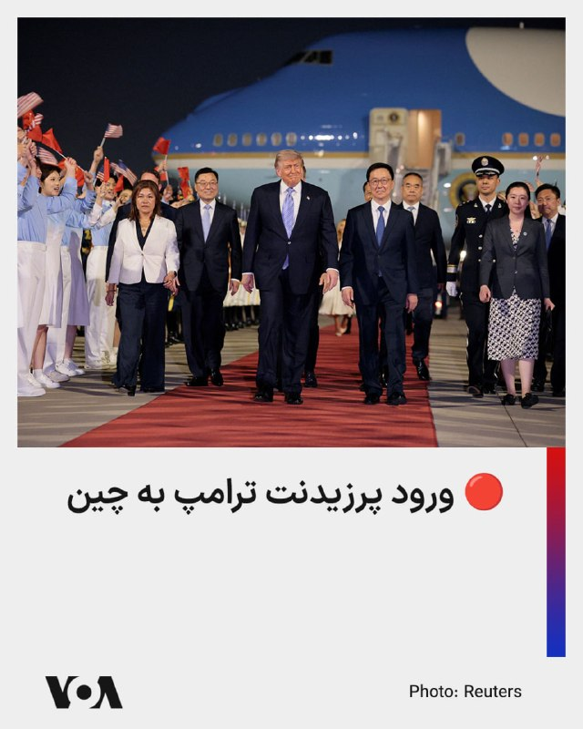

⚡️«ایرفورس وان»، هواپیمای ویژه ریاست جمهوری آمریکا، دقایقی پیش در فرودگاه پکن به زمین نشست. او در هنگام ورود با استقبال مقامات چینی رو‌به رو شد. همزمان تیمی از استقبال‌کنندگان با تکان دادن هماهنگ پرچم‌های دو کشور به او خوش‌آمد گفتند.

او در این سفر قرار است گفت‌وگوهایی را با شی جین‌پینگ، رئیس جمهوری چین، درباره روابط دوجانبه، تجارت، و تحولات امنیتی بین‌المللی آغاز کند.

این سفر نخستین دیدار رسمی آقای ترامپ از چین در حدود یک دهه اخیر به شمار می‌رود. او بار قبل در دوره نخست ریاست جمهوری خود در آبان ۱۳۹۶ به چین رفته بود.

کاخ سفید پیش‌تر اعلام کرده بود که پرزیدنت ترامپ و شی جین‌پینگ در جریان این سفر درباره گسترش همکاری‌های اقتصادی و حفظ ثبات جهانی گفت‌وگو خواهند کرد.

## FarsiVOA — post 217612

  

دولت بریتانیا اعلام کرد لایحه‌ای تازه برای تقویت روابط این کشور با اتحادیه اروپا ارائه خواهد کرد؛ اقدامی که کی‌یر استارمر، نخست‌وزیر بریتانیا، آن را بخشی از برنامه خود برای ترمیم روابط اقتصادی با اروپا می‌داند.

به گزارش رویترز، چارلز سوم، پادشاه بریتانیا، در سخنرانی سالانه دولت در پارلمان گفت لایحه «مشارکت اروپایی» برای تقویت روابط با اتحادیه اروپا ارائه می‌شود.

دولت بریتانیا می‌گوید این لایحه اجرای توافق‌های فعلی و آینده با اتحادیه اروپا را ممکن خواهد کرد.

استارمر در حالی بر نزدیک‌تر شدن به اروپا تأکید می‌کند که پس از شکست‌های حزب کارگر در انتخابات محلی، با فشار فزاینده برای کناره‌گیری روبه‌روست.

دولت او می‌گوید بریتانیا به بازار واحد یا اتحادیه گمرکی اروپا بازنخواهد گشت و آزادی رفت‌وآمد با اتحادیه اروپا را نیز احیا نخواهد کرد.
@FarsiVOA

## FarsiVOA — post 217611

  

رئیس کل دادگستری هرمزگان اعلام کرد اموال ۲۴ نفر از ایرانیان خارج از کشور که به گفته او با «شبکه‌های معاند دشمن» همکاری داشته‌اند، شناسایی و طبق روال قانونی توقیف شده است.

به گزارش مهر، مجتبی قهرمانی این افراد را «عناصر خارج‌نشین مرتبط با دشمن» خوانده و گفته اقدام دستگاه قضایی در چارچوب مقابله با همکاری با شبکه‌های مخالف جمهوری اسلامی انجام شده است.

توقیف اموال این ۲۴ نفر در هرمزگان، بخشی از سیاست گسترده‌ سرکوب است که اژه‌ای در هفته‌های اخیر از آن دفاع کرده است.

رئیس قوه قضائیه گفته بود دستگاه قضایی مأمور شده اموال کسانی را که جمهوری اسلامی «همکاران و همراهان دشمن» می‌خواند، شناسایی، توقیف و در مواردی مصادره کند؛ سیاستی که منتقدان آن را ابزار فشار بر مخالفان، فعالان رسانه‌ای و چهره‌های خارج از کشور می‌دانند.
@FarsiVOA

## FarsiVOA — post 217610

  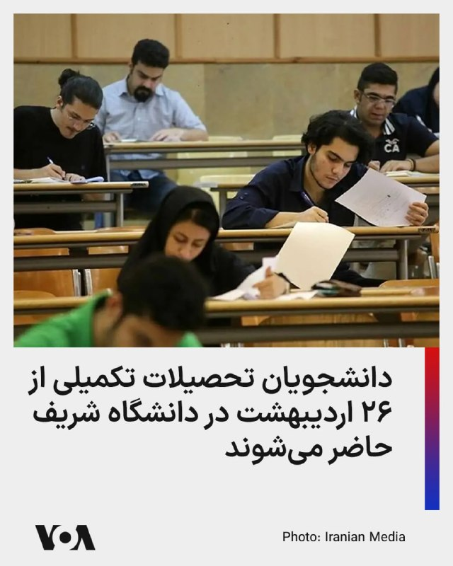

دانشجویان کارشناسی ارشد ورودی ۱۴۰۳ و قبل از آن و تمامی دانشجویان دکتری می‌توانند از ۲۶ اردیبهشت با دریافت مجوز تردد در دانشگاه صنعتی شریف حضور یابند.

معاونت آموزشی دانشگاه صنعتی شریف اعلام کرد این دانشجویان می‌توانند با ثبت درخواست آنلاین و تأیید استاد راهنما، مجوز ورود به دانشگاه را دریافت کنند.

دانشجویان متقاضی خوابگاه نیز باید درخواست اسکان خود را به ‌صورت آنلاین ثبت کنند. اداره امور خوابگاه‌ها اعلام کرده است اسکان دانشجویان واجد شرایط از تاریخ اعلام ‌شده امکان‌‌پذیر خواهد بود، هرچند برخی خوابگاه‌ها به دلیل تعمیرات با محدودیت ظرفیت مواجه هستند.

همچنین اختصاص خوابگاه منوط به تسویه بدهی‌های معوق بوده و خدمات رفاهی از جمله سالن‌های غذاخوری و توزیع غذا در خوابگاه‌ها تا اطلاع ثانوی غیرفعال خواهد بود.
@FarsiVOA

## FarsiVOA — post 217609

  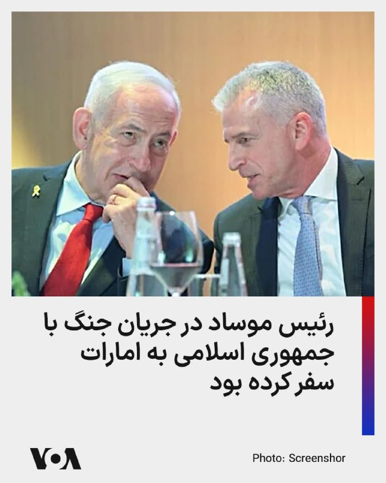

روزنامه وال‌استریت ژورنال به نقل از مقام‌های عرب و یک فرد آگاه گزارش داد دیوید بارنئا، رئیس موساد، در جریان جنگ با جمهوری اسلامی دست‌کم دو بار به امارات متحده عربی سفر کرده بود.

بر اساس این گزارش، سفرهای محرمانه بارنئا در ماه‌های مارس و آوریل انجام شد و هدف آن کمک به هماهنگی تلاش‌های مرتبط با جنگ بود. وال‌استریت ژورنال نوشته این رفت‌وآمدها نشان‌دهنده تعمیق روابط امنیتی میان اسرائیل و امارات در جریان جنگ با جمهوری اسلامی است.

این گزارش در حالی منتشر شده که وال‌استریت ژورنال پیش‌تر نوشته بود امارات به‌طور محرمانه حملاتی علیه اهدافی در ایران انجام داده؛ از جمله حمله‌ای در اوایل آوریل به پالایشگاهی در جزیره لاوان. رویترز نوشته بود امارات این عملیات‌ها را علناً تأیید نکرده و خود رویترز نیز نتوانسته این گزارش را به‌طور مستقل راستی‌آزمایی کند.

گاردین نیز این تحولات را در چارچوب خطر کشیده‌شدن کشورهای خلیج فارس به جنگ با جمهوری اسلامی بررسی کرده و نوشته افزایش همکاری‌های امنیتی امارات و اسرائیل می‌تواند تنش‌های منطقه‌ای را تشدید کند.
@FarsiVOA

## FarsiVOA — post 217608

🔺توقف بارگیری نفت ایران از خارک

▪️خبرگزاری بلومبرگ با استناد به تصاویر ماهواره‌ای گزارش داده که بارگیری نفت ایران از جزیره خارک، بزرگترین پایانه نفتی کشور، طی روزهای گذشته متوقف شده و مخازن نفت موجود در این جزیره نیز تقریباً به صورت کامل پر شده است.

▪️همچنین شرکت ردیابی نفتکش‌ها، تانکر ترکرز نیز گزارش داده که از زمان آغاز محاصره دریایی آمریکا علیه جمهوری اسلامی -طی یک ماه گذشته- صادرات نفت ایران به طور کامل متوقف شده است.

▪️در صورت ادامه توقف صادرات و پر شدن دیگر مخازن نفتی خشکی ایران، جمهوری اسلامی مجبور به کاهش دست کم روزانه ۱.۲ میلیون بشکه تولید نفت خواهد بود و تنها به میزان مصرف داخلی نفت تولید خواهد کرد.

⬇️ بیشتر بخوانید:
https://ir.voanews.com/a/8149525.html

## DW_Farsi — post 124648

  

🔶 مشارکت ایتالیا و استرالیا در ماموریت حفاظت از کشتیرانی در هرمز

به گزارش خبرگزاری فرانسه گویدو کروزتو، وزیر دفاع ایتالیا، روز چهارشنبه (۱۳ مه ۲۰۲۶) به پارلمان گفت رم دو مین‌روب را به شرق مدیترانه و سپس دریای سرخ می‌فرستد، او در عین حال تاکید کرد که اعزام آن‌ها به منطقه هرمز فقط در چارچوب یک ماموریت بین‌المللی و در صورت برقراری یک آتش‌بس "واقعی، معتبر و باثبات" انجام خواهد شد.

کروزتو گفت هر ماموریتی در هرمز به تصویب پارلمان ایتالیا نیاز خواهد داشت. رویترز پیش‌تر گزارش داده بود که فرمانده نیروی دریایی ایتالیا از آمادگی برای اعزام دو مین‌روب، یک کشتی اسکورت و یک شناور پشتیبانی در قالب ماموریت چندملیتی سخن گفته بود.
هم‌زمان، ریچارد مارلز، وزیر دفاع استرالیا، اعلام کرد کانبرا نیز آماده است با یک فروند هواپیمای شناسایی به ماموریت "کاملا دفاعی" تحت رهبری بریتانیا و فرانسه بپیوندد.

استرالیا اعلام کرده در صورت شکل‌گیری این ماموریت، یک فروند هواپیمای شناسایی (وج‌تیل E-7A) را که هم‌اکنون نیز در منطقه مستقر است، در اختیار آن قرار می‌دهد.
@dw_farsi

## DW_Farsi — post 124647

🔶 رکورد تازه نویسندگان زندانی در جهان؛ ایران دوم شد

انجمن قلم آمریکا (پن) در تازه‌ترین گزارش سالانه خود درباره وضعیت آزادی بیان و سرکوب نویسندگان در جهان اعلام کرد که شمار نویسندگان زندانی در سال ۲۰۲۵ میلادی برای نخستین بار از زمان آغاز انتشار "شاخص آزادی نوشتن" در سال ۲۰۱۹، از مرز ۴۰۰ نفر عبور کرده است.

گزارش پن آمریکا که روز سه‌شنبه ۱۲ مه (۲۲ اردیبهشت) منتشر شد، از افزایش چشمگیر بازداشت نویسندگان، مترجمان، پژوهشگران و فعالان فرهنگی در ایران نیز خبر می‌دهد.

بر اساس این گزارش، در سال ۲۰۲۵ در مجموع ۴۰۱ نویسنده در ۴۴ کشور زندانی بوده‌اند؛ رقمی که در سال پیش از آن ۳۷۵ نفر در ۴۰ کشور بود. پن آمریکا می‌گوید، شمار نویسندگان زندانی طی هفت سال گذشته ۶۸ درصد افزایش یافته و این روند، نشانگر تشدید مداوم سرکوب آزادی بیان در جهان است.

چین همچنان با ۱۱۹ نویسنده زندانی، بزرگترین زندان نویسندگان جهان باقی مانده است، اما انجمن قلم آمریکا تأکید می‌کند که شدیدترین افزایش بازداشت‌ها در ایران ثبت شده است؛ جایی که مقام‌های جمهوری اسلامی در سال گذشته دست‌کم ۱۷ بازداشت تازه انجام داده‌اند و شمار نویسندگان زندانی را بار دیگر به سطح دوران اوج سرکوب اعتراض‌های "زن، زندگی، آزادی" نزدیک کرده‌اند.

کارین دویچ کارلکار، مدیر برنامه "نویسندگان در معرض خطر" در پن آمریکا، گفته است که مقام‌های جمهوری اسلامی "کارزاری به‌ویژه خشن علیه صداهای مستقل" به راه انداخته‌اند. به گفته او، شاعران، مترجمان، پژوهشگران، ترانه‌سرایان، تحلیلگران آنلاین، مدافعان حقوق بشر و ستون‌نویسان، همگی هدف بازداشت و سرکوب قرار گرفته‌اند، زیرا حکومت ایران می‌کوشد، "بحث، انتقاد و مخالفت" را خاموش کند.

به گزارش پن آمریکا، موج تازه سرکوب در ایران پس از جنگ ۱۲‌روزه میان ایران و اسرائیل در خرداد و تیر ۱۴۰۴ شدت گرفت و علاوه بر چهره‌های شناخته‌شده منتقد، پژوهشگران و مترجمان را نیز دربرگرفت.
@dw_farsi

## DW_Farsi — post 124646

  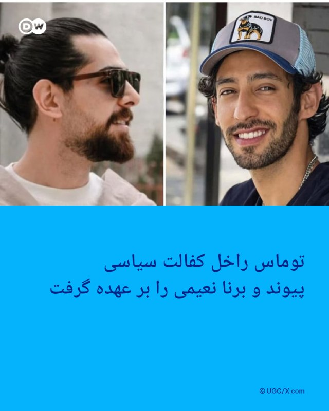

🔶 توماس راخل کفالت سیاسی پیوند و برنا نعیمی را بر عهده گرفت

توماس راخل، نماینده دولت آلمان در امور آزادی دین و عقیده، در پیامی اعلام کرد کفالت سیاسی پیوند نعیمی و برنا نعیمی را بر عهده گرفته است. به گفته او این دو جوان بهایی در ایران به‌دلیل باور مذهبی‌شان تحت فشار قرار دارند و با خطر اعدام روبه‌رو هستند. حساب رسمی این نهاد آلمانی نیز همین موضع را منتشر کرده است.

در پیام منتشرشده آمده است پیوند و برنا نعیمی در ایران با زندان و شکنجه روبه‌رو شده‌اند و پرونده آن‌ها به یکی از نمونه‌های تازه فشار بر شهروندان بهایی تبدیل شده است. این موضع در حالی مطرح شده که نهادهای بهایی و حقوق بشری نیز در روزهای اخیر درباره خطر فوری برای این دو زندانی هشدار داده‌اند.

توماس راخل از ۲۸ مه ۲۰۲۵ نماینده دولت آلمان در امور آزادی دین و عقیده است. پذیرش کفالت سیاسی از سوی او، نشانه‌ای از بالا رفتن توجه نهادهای آلمانی به پرونده پیوند و برنا نعیمی و وضعیت بهاییان در ایران است.
@dw_farsi

## DW_Farsi — post 124645

  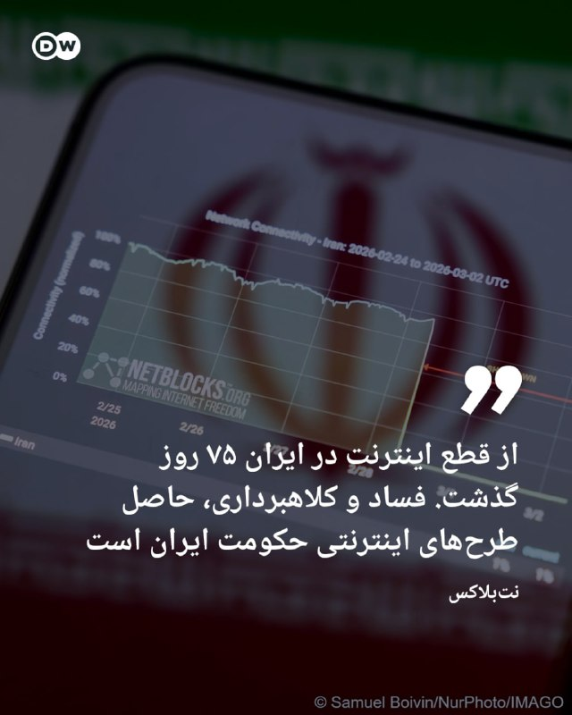

🔶 نت‌بلاکس: فساد و کلاهبرداری، حاصل طرح‌های اینترنتی حکومت ایران

نت‌بلاکس، نهاد نظارت و پایش فعالیت‌های اینترنتی در جهان در تازه‌ترین پست خود در شبکه ایکس (توئیتر سابق) اعلام کرد که قطع اینترنت در ایران از ۱۷۷۶ ساعت گذشته و به این ترتیب وارد هفتاد و پنجمین روز خود شده است.

این نهاد در پست خود با اشاره به تأثیرات منفی سانسور دیجیتال هشدار داده که طرح‌های اینترنت "پرو" (Internet Pro) مورد حمایت جمهوری اسلامی و فهرست‌های سفید گزینشی افزایش نظارت، فساد و کلاهبرداری را به دنبال داشته است. این طرح بحث‌برانگیز تا کنون انتقادهای فراوانی را به دنبال داشته و بسیاری‌ها به ابعاد تبعیض‌آمیز آن اشاره کرده‌اند.

در حالیکه اکنون ۷۵ روز از قطع اینترنت در ایران می‌گذرد، مسعود پزشکیان، رئیس جمهور ایران محمدرضا عارف، معان اول خود را با حفظ سمت به عنوان "رئیس ستاد ویژه ساماندهی و راهبری فضای مجازی کشور" منصوب کرد.

او در این رابطه تصریح کرد که این انتصاب "نظر به ضرورت فوری استقرار حکمرانی یکپارچه، منسجم و کارآمد در فضای مجازی" انجام می‌گیرد. پزشکیان پیشتر نیز در شبکه ایکس در ارتباط با این موضوع پستی منتشر کرده بود.
@dw_farsi

## DW_Farsi — post 124643

  

🔶 تلاش یک نفت‌کش چینی برای گذر از تنگه هرمز
 
داده‌های رهگیری کشتی‌ها حاکی از آن است که که یک نفت‌کش غول‌پیکر چین روز چهارشنبه ۱۳ مه (۲۳ اردیبهشت) در تلاش عبور از تنگه هرمز  بوده است. به گزارش رسانه‌ها، این نفت‌کش حامل دو میلیون بشکه نفت خام عراق است.
 
بر اساس داده‌های شرکت‌های "ال‌اس‌ای‌جی" و "کپلر" که در زمینه رهگیری کشتی‌ها فعالیت دارند،  نفتکش غول‌پیکر چینی "یوآن هوا هو" از نزدیکی جزیره لارک ایران عبور کرده و در بخش شرقی تنگه هرمز به سمت جنوب در حال حرکت است. 
 
این داده‌ها نشان می‌دهد که نفت‌کش مزبور، اوایل ماه مارس نزدیک به دو میلیون بشکه نفت خام "بصره مدیوم" را در ترمینال بصره عراق بارگیری کرده و از آن زمان در خلیج فارس مانده بود. اعلام شده که مقصد این نفتکش آسیا است.
 
خبرگزاری رویترز گزارش داده که اگر این تردد با موفقیت انجام گیرد، این سومین مورد ثبت‌شده عبور یک نفت‌کش چینی از تنگه هرمز از زمان آغاز جنگ آمریکا و اسرائیل علیه جمهوری اسلامی از اسفند ماه گذشته به این سو بوده است.
 
@dw_farsi

## DW_Farsi — post 124642

🔶 نیویورک تایمز: ایران به اکثر تأسیسات موشکی خود دسترسی دارد

به گزارش رسانه‌های آمریکایی، جمهوری اسلامی ایران به رغم  حملاتی که در جنگ با اسرائيل و آمریکا متحمل شده، هنوز به بخش بزرگی از سایت‌های موشکی  و پرتابگرهای سیار خود دسترسی دارد.
 
روزنامه نیویورک تایمز سه‌شنبه ۲۲ اردیبهشت (۱۲ مه) با استناد به داده‌های سازمان‌های امنیتی و اطلاعاتی ایالات متحده گزارش داد که ایران هنوز حدود ۷۰ درصد از پرتابگرهای متحرک خود و تقریباً ۷۰ درصد از ذخایر موشکی پیش از جنگ خود را حفظ کرده است.
 
نیویورک تایمز این گزارش را با تکیه بر اظهارات منابع آگاه تنظیم کرده که به داده‌ها و اطلاعات امنیتی مربوط به آغاز ماه مه در رابطه با این موضوع دسترسی داشته‌اند. طبق این گزارش، ایران دوباره به اکثر سایت‌های موشکی و تأسیسات زیرزمینی خود دسترسی یافته است.
 
نشریه واشنگتن پست نیز هفته گذشته در گزارشی به اطلاعات تحلیل‌گران سازمان‌های امنیتی اشاره کرده بود که در جریان بررسی‌های خود آمار و ارقامی مشابه ارائه کرده‌اند.
 
این نشریه در گزارش خود به نقل از منابع آگاه نوشته بود، ایران در مقایسه با پیش از جنگ، به حدود ۷۵ درصد از پرتابگرهای سیار خود دسترسی داشته و ۷۰ درصد از ذخایر موشکی خود را حفظ کرده است.
 
در گزارش واشنگتن پست به نقل از یک مقام آگاه آمریکایی آمده بود، جمهوری اسلامی قادر است، تقریبا تمامی سایت‌های نظامی زیرزمینی خود را به کار گیرد، شماری از موشک‌های آسیب‌دیده خود را تعمیر کند و همچنین موشک‌هایی تازه‌ای تولید کند.
@dw_farsi

## DW_Farsi — post 124641

🔶 گزارش رویترز از "حملات پنهانی" عربستان به ایران در جریان جنگ
 
خبرگزاری رویترز در گزارشی اختصاصی از ریاض و دبی نوشت، عربستان سعودی در جریان جنگ اخیر آمریکا و اسرائیل علیه جمهوری اسلامی، چندین حمله اعلام‌نشده علیه ایران انجام داده است؛ حملاتی که به گفته دو مقام غربی مطلع و دو مقام ایرانی، در واکنش به حملات انجام‌شده علیه خاک عربستان صورت گرفت.
 
این گزارش که روز سه‌شنبه ۲۲ اردیبهشت (۱۲ مه) منتشر شد، نخستین روایت شناخته‌شده از اقدام مستقیم نظامی عربستان سعودی در خاک ایران است.
 
به نوشته رویترز، این حملات که تاکنون علنی نشده بودند، در اواخر ماه مارس (اوایل فروردین) و توسط نیروی هوایی عربستان انجام شده‌اند. یکی از مقام‌های غربی، آنها را "حملات متقابل در پاسخ به زمانی که عربستان سعودی هدف قرار گرفت" توصیف کرده است.
 
رویترز تأکید کرده است که نتوانسته اهداف مشخص این حملات را تأیید کند. یک مقام ارشد وزارت خارجه عربستان نیز در پاسخ به پرسش این خبرگزاری، مستقیماً نگفته است که آیا چنین حملاتی انجام شده‌اند یا نه. وزارت خارجه جمهوری اسلامی نیز به درخواست رویترز برای اظهارنظر پاسخ نداده است.
 
عربستان سعودی، برخلاف دهه‌های گذشته که در برابر تهدیدهای ایران عمدتاً به چتر نظامی آمریکا تکیه می‌کرد، این بار ظاهراً خود وارد اقدام مستقیم علیه خاک ایران شده است.
 
رویترز می‌نویسد جنگی که از نهم اسفند ۱۴۰۴ (۲۸ فوریه ۲۰۲۶) با حملات هوایی آمریکا و اسرائیل به ایران آغاز شد، عربستان را در برابر حملاتی قرار داد که از سپر نظامی ایالات متحده عبور کردند.

@dw_farsi

## DW_Farsi — post 124640

🎥 زندگی میان مردگان؛ زنی که انسان‌ها را در آخرین سفر بدرقه می‌کند
 
مرگ برای آنا-لنا پایان راه نیست، بلکه آغاز همراهی با کسانی است که جا مانده‌اند. زنی جوان که شغلش با وداع، سوگ و خاطره گره خورده، اما خود می‌گوید این کار بیش از هر چیز درباره زندگی و آدم‌های زنده است.
 
@dw_farsi

## Persian_Trend_Official — post 14063

🔴 لاوروف: آمریکا به‌دنبال کنترل بازار جهانی انرژی است

💢سرگئی لاوروف، وزیر خارجه روسیه، در اظهاراتی دولت ترامپ را متهم کرده که تلاش می‌کند نفوذ خود را بر بازار جهانی انرژی «تحمیل» کند.

💢او گفته است هدف آمریکا این است که شرکت‌های انرژی روسیه مانند لوک‌اویل و روس‌نفت را از بازارهای بین‌المللی خارج کند و مسیرهای اصلی تأمین انرژی جهان را تحت کنترل خود بگیرد.

💢لاوروف همچنین تأکید کرده:
آمریکا در اسناد راهبردی خود به دنبال تسلط بر بازار انرژی جهانی است و قصد دارد همه مسیرهای مهم انرژی را تحت نفوذ خود قرار دهد.

🫆:Tony

📌 @persian_trend_official
پرشین ترند | متفاوت‌ترین کانال نظامی

## Persian_Trend_Official — post 14061

🚨🇮🇱🇱🇧 حملات هوایی جدید اسرائیل دقایقی پیش مناطقی در لبنان را هدف قرار داد؛ همزمان منابع محلی از شنیده شدن صدای چندین انفجار خبر می‌دهند.

☆Phantom☆

📌 @persian_trend_official
پرشین ترند | متفاوت‌ترین کانال نظامی

## Persian_Trend_Official — post 14059

ترامپ تمام افراد ثروتمند آمریکا را با Air Force One خود به پکن برده است.

📝 Nick

📌 @persian_trend_official
پرشین ترند | متفاوت‌ترین کانال نظامی

## Persian_Trend_Official — post 14058

  <a href="telegram/content/Persian_Trend_Official_14058_1778680750.mp4" target="_blank">🎬 Download video</a>

⭕️ فارس:

تصاویر دیده‌نشده از رزمایش ضد هلی‌برن سپاه تهران بزرگ

📝 Nick

📌 @persian_trend_official
پرشین ترند | متفاوت‌ترین کانال نظامی

## Persian_Trend_Official — post 14057

  

⭕️ برخی از رسانه‌های فرانسوی دست به انتشار گزارشی به نقل از «فلورین تاردیف» خبرنگار «پاری‌مچ» زده‌اند که حکایت از روابط پنهانی امانوئل ماکرون و گلشیفته فراهانی دارد.

این خبرنگار فرانسوی در گزارش خود نوشته که سیلی که زن ماکرون به او در کنار در خروجی هواپیما زد، به خاطر همین رابطه بوده.

منبع خبر

📝 Nick

📌 @persian_trend_official
پرشین ترند | متفاوت‌ترین کانال نظامی

## Persian_Trend_Official — post 14056

⭕️ در حالی که اینترنت در ایران به مدت ۷۵ روز قطع است، شرکت اپل دیروز به صورت رسمی اولین نمایندگی خود را در افغانستان افتتاح نمود. تکذیب شد. 📝 Nick 📌 @persian_trend_official پرشین ترند | متفاوت‌ترین کانال نظامی

## Persian_Trend_Official — post 14055

  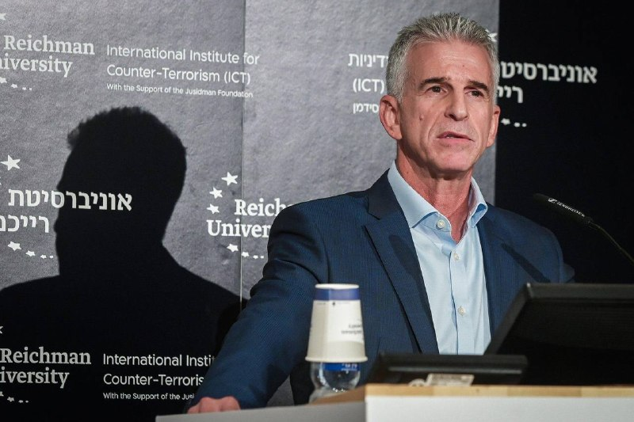

🔴 ادعای وال‌استریت ژورنال درباره نقش امارات و سفر مقامات امنیتی اسرائیل

💢بر اساس گزارشی که به وال‌استریت ژورنال نسبت داده شده، گفته می‌شود رئیس موساد اسرائیل حداقل دو بار به‌صورت محرمانه به امارات متحده عربی سفر کرده تا درباره هماهنگی‌های مرتبط با درگیری‌های جاری با ایران گفت‌وگو کند.

▪️در این گزارش همچنین ادعا شده:

💢امارات فراتر از نقش دیپلماتیک عمل کرده و در برخی اقدامات نظامی علیه ایران نقش داشته است.

▪️از جمله، حمله به یک هدف نفتی در جزیره لاوان به امارات نسبت داده شده است.
▪️همچنین گفته شده امارات میزبان برخی سامانه‌ها و نیروهای مرتبط با دفاع هوایی اسرائیل بوده است.
▪️در ادامه، به سفرهای مشابه رئیس شین‌بت اسرائیل در همان بازه زمانی نیز اشاره شده است.

🫆:Tony

📌 @persian_trend_official
پرشین ترند | متفاوت‌ترین کانال نظامی

## Persian_Trend_Official — post 14054

  <a href="telegram/content/Persian_Trend_Official_14054_1778680753.mp4" target="_blank">🎬 Download video</a>

🔴 ترامپ وارد پکن شد

هواپیمای ریاست‌جمهوری آمریکا (ایرفورس وان) لحظاتی پیش در پایتخت چین به زمین نشست و دونالد ترامپ سفر خود را برای دیدار و نشست با شی جین‌پینگ آغاز کرد.

🫆:Tony

📌 @persian_trend_official
پرشین ترند | متفاوت‌ترین کانال نظامی

## Persian_Trend_Official — post 14053

🔴 نشت سوخت نفتکش اماراتی پس از حمله پهپادی در سواحل عمان

💢خبرگزاری رویترز گزارش داد یک نفتکش وابسته به شرکت ملی نفت ابوظبی پس از حمله پهپادی منتسب به ایران در نزدیکی سواحل عمان دچار نشت محدود سوخت شده است.

💢بر اساس این گزارش:

▪️ نفتکش «برکه» همچنان در سواحل عمان لنگر انداخته است
▪️ شرکت اماراتی اعلام کرده مقدار کمی سوخت کشتی وارد آب شده است
▪️ این کشتی هنگام حمله بارگیری نشده بود
▪️ هیچ آسیبی به خدمه وارد نشده است

💢شرکت اماراتی اعلام کرده در حال همکاری با مقام‌های عمان و تیم‌های تخصصی برای مدیریت وضعیت است.

🫆:Tony

📌 @persian_trend_official
پرشین ترند | متفاوت‌ترین کانال نظامی

## Persian_Trend_Official — post 14051

⭕️ در حالی که اینترنت در ایران به مدت ۷۵ روز قطع است، شرکت اپل دیروز به صورت رسمی اولین نمایندگی خود را در افغانستان افتتاح نمود.

تکذیب شد.

📝 Nick

📌 @persian_trend_official
پرشین ترند | متفاوت‌ترین کانال نظامی

## Persian_Trend_Official — post 14050

  

🔴 امارات اطراف مخازن نفتی دبی موانع ضدپهپادی نصب می‌کند

گزارش‌ها حاکی است امارات روند نصب موانع و سازه‌های ضدپهپادی را در اطراف مخازن نفتی نزدیک فرودگاه بین‌المللی دبی آغاز کرده است.

بر اساس اطلاعات منتشرشده:

▪️ این موانع شامل سازه‌ها و شبکه‌های فلزی هستند
▪️ هدف از این اقدام، مقابله با تهدید پهپادهای انتحاری و حملات هوایی کم‌ارتفاع عنوان شده است
▪️ مخازن نفتی و زیرساخت‌های انرژی اطراف دبی در هفته‌های اخیر تحت تدابیر امنیتی شدیدتری قرار گرفته‌اند

🫆:Tony

📌 @persian_trend_official
پرشین ترند | متفاوت‌ترین کانال نظامی

## Persian_Trend_Official — post 14049

  <a href="telegram/content/Persian_Trend_Official_14049_1778680756.webm" target="_blank">🎬 Download video</a>

فارس | فیلم سینمایی حمله‌ٔ اف-۵های ایران به پایگاه آمریکا تولید می‌شود

💢فیلم سینمایی «ببرها» روایت حمله‌ٔ تاریخی و حماسی ۲ جنگندهٔ اف-۵ نیروی هوایی ارتش به پایگاه آمریکایی بوهرینگ کویت در روز دوم جنگ رمضان به نویسندگی مهدی یزدانی‌خرم و تهیه‌کنندگی حبیب والی‌نژاد تولید خواهد شد.

🫆:Tony

📌 @persian_trend_official
پرشین ترند | متفاوت‌ترین کانال نظامی

## Persian_Trend_Official — post 14048

  

🔴تویت خواهر جاوید نام ‎#مجتبی_روستایی ؛

از افتخارات ما خوانواده جاوید نامان اين است که با افتخار پیکر عزیزانمون رو تشیع کرديم 💔
و یکی از ذلت بارترین افتخارات عرزشیها، ۴ماه جنازه روی دستشون مونده ،دريغ از یه تشیع پنهانی!

📣@persian_trend_official

## Persian_Trend_Official — post 14047

  <a href="telegram/content/Persian_Trend_Official_14047_1778680757.mp4" target="_blank">🎬 Download video</a>

💢تصاویر ماهواره ای با کیفیت از میزان تخریب سایت نظامی یزد زیر ضرب حملات امریکا و اسرائیل

🫆:Tony

📌 @persian_trend_official
پرشین ترند | متفاوت‌ترین کانال نظامی

## Persian_Trend_Official — post 14046

⭕️ طبق گزارش وال استریت ژورنال، دیوید بارنیا، رئیس موساد، حداقل دو بار در طول جنگ به امارات متحده عربی سفر کرد تا هماهنگی کمپین علیه ایران (جمهوری اسلامی) را انجام دهد.

📝 Nick

📌 @persian_trend_official
پرشین ترند | متفاوت‌ترین کانال نظامی

## Persian_Trend_Official — post 14045

  <a href="telegram/content/Persian_Trend_Official_14045_1778680759.webm" target="_blank">🎬 Download video</a>

📝 Nick

📌 @persian_trend_official
پرشین ترند | متفاوت‌ترین کانال نظامی

## Persian_Trend_Official — post 14044

  <a href="telegram/content/Persian_Trend_Official_14044_1778680759.mp4" target="_blank">🎬 Download video</a>

🔴در فلوریدا، یک آتش‌نشان در حین مهار آتش‌سوزی‌های جنگلی که تاکنون بیش از 48500 هکتار را سوزانده است، جان خود را از دست داد

💢به گزارش رسانه ها حداقل 120 خانه در جورجیا ویران شده است.

💢مقامات ایالتی آمریکا آتش‌سوزی‌های جنگلی فعلی را از مخرب‌ترین آتش‌سوزی‌ها در ده سال گذشته می‌دانند. خشکسالی و گرمای هوا مقصر هستند.

🫆:Tony

📌 @persian_trend_official
پرشین ترند | متفاوت‌ترین کانال نظامی

## Persian_Trend_Official — post 14043

⭕️ علی‌حسین قاضی زاده:

احمقانه‌ترین پرسش این روزها این است که «آیا موافق جنگ هستید یا خیر؟»
ساده‌ترین پاسخ این پرسش احمقانه این است که خیر.

چه کسی می‌تواند در حالت کلی موافق جنگ باشد؟
اما جنگ گاهی ابزاری است برای پیشگیری از کشته شدن بیشتر.
اگر جنگ ۱۲روزه به سقوط حکومت منجر می‌شد، کشتار ۱۸ و ۱۹ دی رخ می‌داد؟
این همه اعدام ادامه می‌یافت؟
اگر جنگ چیزی جز سیاهی مطلق نیست، چرا بخش بزرگی از مردم ایران، کمک نظامی را برای ساقط کردن این حکومت طلب کرده‌اند؟
وقتی در کره شمالی زندگی می‌کنید یا در ایران زیر حکومت ج.ا. پرسش اصلی این نیست فلان مسیر برای مردم هزینه‌ای دارد یا خیر، سوال این مردمان این است که کدام مسیر با حداقل هزینه، به نجات کشور منجر می‌شود.
ممکن است پاسخ این سوال، جلب حمایت نظامی یا همان جنگ باشد.
جنگ سیاه است اما وقتی در ایران یا کره شمالی زندگی می‌کنید، سیاه‌تر از جنگ، تداوم این حکومت‌هاست.

📝 Nick

📌 @persian_trend_official
پرشین ترند | متفاوت‌ترین کانال نظامی

## RadioFarda — post 157134

  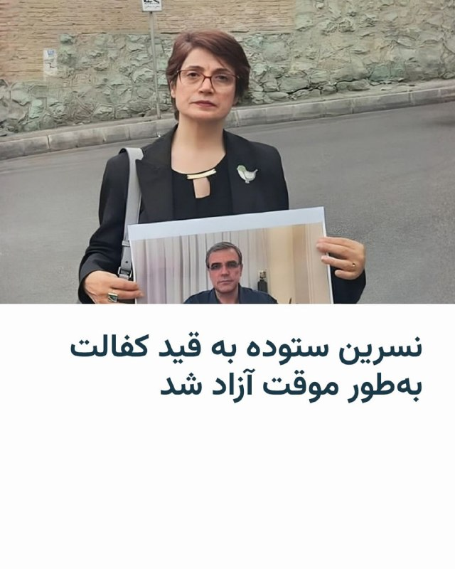

🔸مهراوه خندان، فرزند نسرین ستوده، فعال حقوق بشر، از آزادی موقت مادرش به قید کفالت خبر داد. خانم خندان این خبر را بعد از ظهر روز چهارشنبه ۲۳ اردیبهشت در اینستاگرام منتشر کرده است.

🔸خانم ستوده ۱۲ فروردین در منزل خود در تهران بازداشت شد و دختر او که ساکن هلند است، چند روز بعد از بازداشت از بی‌خبری از محل نگهداری و وضعیت مادرش ابراز نگرانی کرده بود.

🔸نسرین ستوده، برنده جایزه ساخاروف و وکیل حقوق بشری بارها به زندان افتاده و تحت فشار قرار گرفته است. او پیش از شروع جنگ اخیر آمریکا و اسرائیل علیه ایران، در مصاحبه با نشریه فرانسوی‌زبان «لوپوئَن» خواستار «مداخلۀ بشردوستانه» در حفاظت از مردم ایران شده بود.

🔸رضا خندان فعال حقوق بشر و همسر خانم ستوده نیز در حال حاضر در زندان اوین زندانی است و بارها به دلیل مخالفت با حجاب اجباری و مجازات اعدام تحت فشار قرار گرفته است.

@RadioFarda

## RadioFarda — post 157133

  <a href="telegram/content/RadioFarda_157133_1778680761.mp4" target="_blank">🎬 Download video</a>

🔸شاهزاده رضا پهلوی که به‌عنوان مهمان در نشست امنیتی پولیتیکو حضور یافته بود، حین گفت‌وگو با مجری برنامه با اعتراض یکی از حاضران روبه‌رو شد.

🔸فرد معترض با سردادن شعارهایی از جمله «شرم بر شما» خطاب به رضا پهلوی گفت: «وقتی مردم ما فرزندانشان را از زیر آوار بمب‌هایی که شما به کشورمان دعوت کردید بیرون می‌کشیدند، شما کجا بودید؟»

🔸مأموران امنیتی این زن را دقایقی بعد از محل نشست خارج کردند.

🎥bita_4liberation

@RadioFarda

## RadioFarda — post 157132

  

📷 Photo

## RadioFarda — post 157131

  <a href="https://t.me/radiofarda/157131" target="_blank">📎 Download file</a>

📻بشنوید: ساعت ۱۴ با رادیوفردا،۲۳ اردیبهشت ۱۴۰۵‌

@Radiofarda

## RadioFarda — post 157130

بلومبرگ: بارگیری نفت از جزیره خارک متوقف شده است

🔸خبرگزاری بلومبرگ بر اساس تصاویر ماهواری که خود گردآوری کرده، از «توقف بارگیری» محموله‌های نفتی ایران از پایانه اصلی صادرات نفت کشور در جزیره خارک خبر داد.

🔸در این گزارش که روز سه‌شنبه ۲۲ اردیبهشت منتشر شده، آمده در تصاویر ماهواری‌ یادشده، «نخستین‌ نشانه‌های یک توقف طولانی‌مدت بارگیریِ» محموله‌های نفتی در خارک از آغاز جنگ در اسفند پارسال، قابل مشاهده است.

🔸بر اساس این تصاویر ماهواره‌ای، در روزهای ۱۸، ۱۹ و ۲۱ اردیبهشت «هیچ نفتکش اقیانوس‌پیمایی در جزیره خارک مشاهده نشده است».

🔸بلومبرگ نوشته: «اگرچه از زمان آغاز درگیری‌ها روزهایی بوده که اسکله‌ها خالی بوده‌اند، اما این طولانی‌ترین دوره‌ای است که هیچ نفتکشی در منطقه دیده نشده است.»

🔸این خبر در شرایطی منتشر می‌شود که ایران در «تمام مدت» درگیری‌ با آمریکا و اسرائیل، همچنان در این پایانه، نفت بارگیری می‌کرد و با پرکردن کشتی‌ها، از آنها به‌عنوان مخازن شناور ذخیره نفت استفاده می‌کرد.

🔸این روزنامه نوشته اگر جزیره خارک همچنان غیرفعال بماند، فشار بر دیگر تأسیسات ذخیره‌سازی نفت ایران افزایش خواهد یافت؛ چرا که «تصاویری ماهواره‌ای نشان می‌دهند این مخازن نیز در حال پر شدن هستند».

🔸این گزارش حاکی است «برآوردها درباره میزان ظرفیت باقی‌مانده متفاوت است، اما اگر همه مخازن به ظرفیت کامل برسند، ایران ممکن است ناچار به کاهش بیشتر تولید نفت شود. این کشور پیش‌تر نیز بخشی از تولید خود را کاهش داده است.»

🔸تصاویر ماهواره «سنتینل ۲» اتحادیه اروپا که در ۲۱ اردیبهشت ثبت شده‌اند، نشان می‌دهند «تمام اسکله‌های جزیره خارک خالی بوده‌اند. تصاویر ثبت‌شده دو و سه روز قبل از آن نیز هیچ نفتکش اقیانوس‌پیمایی را در این پایانه نشان نمی‌دهند».

🔸بر اساس گزارش بلومبرگ، از زمان آغاز جنگ، پایانه خارک «هرگز بیش از یک روز متوالی» خالی دیده نشده بود. از میان ۷۳ روزی که از حملات آمریکا و اسرائیل در نهم اسفند پارسال می‌گذرد، «تنها برای ۳۳ روز تصویر ماهواره‌ای از اسکله‌های خارک وجود دارد؛ یکی در اواسط آوریل و دیگری در اوایل مارس هیچ نفتکشی را در اسکله‌ها نشان نمی‌دادند».

🔸به دلیل مسیر حرکت ماهواره‌های «سنتینل ۱و ۲» به دور زمین، همه مناطق سطح سیاره هر روز پوشش تصویری ندارند و به همین دلیل در داده‌ها فاصله‌هایی وجود دارد.

🔸بلومبرگ همچنین بر اساس تحلیل تصاویر ماهواره‌ای نوشته با توقف ظاهری بارگیری نفتکش‌ها، مخازن ذخیره در جزیره خارک در حال «پر شدن» هستند.

🔸بر اساس این گزارش، این مخازن دارای سقف شناور هستند که با پر شدن مخزن بالا آمده و فاصله میان سقف و لبه مخزن کاهش می‌یابد. در نتیجه سایه‌ای که دیواره مخزن روی سقف می‌اندازد کوچک‌تر می‌شود. بنابراین مقایسه تصاویر ثبت‌شده در زمان مشابه در روزهای مختلف می‌تواند تغییر حجم نفت داخل مخازن را نشان دهد.

🔸تصاویر مخازن نفتی جزیره خارک در ۲۱ اردیبهشت نشان می‌دهد «چندین مخزن» در این پایانه، «سایه‌هایی به‌مراتب کوچک‌تر نسبت به تصویر ۱۷ فروردین یعنی درست پیش از آغاز محاصره دریایی توسط نیروی دریایی آمریکا دارند».

🔸این گزارش حاکی است این تصاویر نشان می‌دهند ظرفیت خالی جزیره خارک «تقریباً به صفر» نزدیک شده و اگر ایران دیگر جایی برای ذخیره نفت نداشته باشد، «ممکن است مجبور شود تولید برخی میادین نفتی را کاهش دهد؛ اتفاقی که یک پیروزی نمادین برای آمریکا محسوب خواهد شد».

🔸از زمان آغاز محاصره بنادر ایران، دونالد ترامپ و مقام‌های دولت او پیش‌بینی کرده‌اند که ایران به‌سرعت ناچار به تعطیل کردن چاه‌های نفت خواهد شد. برخی ناظران دیگر، از جمله شرکت تحلیلی کپلر برآورد کرده‌اند که شاید تهران بتواند تا اواخر ماه جاری میلادی، ماه مه، پیش از به پایان‌رسیدن فضای ذخیره‌سازی‌اش به تولید نفت ادامه دهد.

🔸روزنامه نیویورک تایمز نیز بر اساس یک تصویر ماهواره‌ای مربوط به ۱۶ اردیبهشت گزارش داده که در تأسیسات نفتی خارک، «نشتی سه هزار بشکه‌ای رخ داده؛ موضوعی که می‌توانسته بر عملیات بارگیری اثر گذاشته باشد.»

🔸با این حال ایران وقوع هرگونه نشت نفت را رد کرده و به نوشته بلومبرگ، تصاویر بعدی، که در آنها بارگیری متوقف شده، نشانه آشکاری از نشت نشان نمی‌دهند.

@RadioFarda

## RadioFarda — post 157129

پاراگراف اول؛ «خیابان» در ایران و راهبرد «اقلیت حاکم» برای اعلام پیروزی

🔸حکومت جمهوری اسلامی پیوند میدان، خیابان و دیپلماسی را عرصه یک نبرد برای جنگ ۴۰ روزه اسرائیل و آمریکا علیه ایران عنوان می‌کند؛ جنگی که در ادبیات این روزهای نسل دوم و سوم حکمرانان نظام حاکم، «جنگ رمضان» نامیده می‌شود.

🔸خیابان برای نسل تازه‌ای از حکمرانان جمهوری اسلامی، محل تقارن کشته شدن رهبر جمهوری اسلامی با باورهای آیینی شیعی و عواطف ملی‌گرایانه است.

🔸آیت‌الله علی خامنه‌ای پیش از کشته شدن در جنگ ۴۰ روزه گفته بود که مردم ایران «مبعوث» شده‌اند تا با حوادث پیش رو مقابله کنند.

🔸به نظر می‌رسد این گفته‌ها برای کسانی که امروز قدرت را در جمهوری اسلامی در دست دارند، به یک الگوی راهبردی تبدیل شده است.

🔸تعبیری که از دل اسلام سیاسی جمهوری اسلامی در هنگامهٔ جنگ علیه ایران، نوعی کنشگری سیاسی ـ ایدئولوژیک را برکشیده تا بدیلی بسازد برای مفهوم مدرن «انسجام ملی» در علوم سیاسی.

🔸اما تصاحب خیابان برای جمهوری اسلامی، بعد از کشتار ۱۸ و ۱۹ دی‌ماه، بستری بود تا هم مشروعیت بگیرد و هم بر روایت معترضان و گروه مخالفی که صدای بلندتری در اعتراض‌ها داشت غلبه کند؛ با این انگاره که آن‌ها در زمان جنگ دیگر به خیابان بر نمی‌گردند.

🔸«خیابان» کنونی که از درون جنگی بیرون آمده که پشتوانه آن اعتراض‌های خونین را با خود دارد، بیشتر جنب «میدانی‌»ست که منتقدانش بر این باورند که به مدد صداوسیمای انحصاری، تک‌صدایی شده و شاید تنها خاصیتش تأثیرگذاری بر دیپلماسی در بزنگاه‌هاست.

🔸در این خیابان، حالا مرزها هم مقداری جابه‌جا شده‌اند و اصول‌گرایان تندرو از رواداری با زنان و دخترانی می‌گویند که شب‌ها در تجمع‌های خیابانی، بدون حجاب اجباری، پرچم ایران به دست دارند یا چفیه بر گردن انداخته‌اند.

🔸آن‌ها حتی، تا جابه‌جا کردن خطوط امر به معروف و نهی از منکر هم رفته‌اند؛ موضوعاتی که به گمان کسانی که «سرنخ تجمع‌های خیابانی» را در دست دارند، می‌تواند بر «تاب‌آوری اجتماعی» اضافه کند.

🔸در برنامهٔ رادیویی «پاراگراف اول»، شارمین میمندی‌نژاد، پژوهشگر علوم اجتماعی از نیویورک و آلان توفیقی، تحلیلگر سیاسی در پاریس، به مفهوم خیابان برای جمهوری اسلامی و اهمیت آن در الگوی رفتاری حکومت و مخالفانش پرداخته‌اند.

🔸 گزارش کامل را در وب‌سایت رادیوفردا بخوانید.

@RadioFarda

## RadioFarda — post 157128

رسانه‌های اسرائیل؛ از جنجال بر سر رئیس جدید موساد تا «طرح آماتوری» تغییر رژیم ایران

🔸در میانهٔ انتظار اسرائیل برای تصمیم رئیس‌جمهور آمریکا در مورد احتمال ازسرگیری جنگ با ایران، در حالی که مواضع دوقطبی در خصوص راه برخورد با ایران تشدید شده، موضوعات دیگری نیز جامعه و رسانه‌های اسرائیل را به خود مشغول کرده است.

🔸از گزارش‌های رسانه‌های اسرائیل چنین برمی‌آید که موساد، سازمان جاسوسی خارجی و «مأموریت‌های ویژه»، این‌ روزها تنها به رصد امور ایران و طراحی برنامه‌ها برای ادامه مقابله با جمهوری اسلامی مشغول نیست؛ فردی که قرار است به‌زودی بر ریاست این سازمان تکیه بزند، در کانون جنجالی قرار گرفته که تا به دیوان عالی این کشور هم رسیده است.

🔸رومن گوفمن افسر ارشدی است که سال‌های طولانی منشی نظامی نخست‌وزیر اسرائیل بوده و بنیامین نتانیاهو پنج ماه پیش خبر داد که او را به ریاست موساد برگزیده است. در حالی که قرار است گوفمن همین روزها جانشین داوید برنئا شود، رئیس کنونی این سازمان نیز علیه انتصاب او نامه نوشته است.

🔸از کی این انتصاب بحث‌برانگیز شد؟ اوری المکایس، یک شهروند اسرائیلی، گفته هنگامی که ۱۷ ساله بود و گوفمن افسر و فرمانده لشکر ۲۱۰ ارتش بود، از سوی نیروهای زیر دست وی به خدمت گرفته شد. المکایس مدعی است که به عنوان بخشی از یک «عملیات نفوذ» از طریق اینترنت، علیه حزب‌الله، سپاه پاسداران، ارتش سوریه و گروه‌های مسلح فلسطینی در کرانه باختری، به کار گرفته شد.

🔸 گزارش کامل را در وب‌سایت رادیوفردا بخوانید.

@RadioFarda

## RadioFarda — post 157127

🔸شاهزاده رضا پهلوی در نشست نشریهٔ پولیتکو با موضوع امنیتی گفت دونالد ترامپ، رئیس‌جمهور آمریکا، باید از ارسال «پیام‌های متناقض» دربارهٔ اهدافش در جنگ با ایران دست بردارد و در عوض «کار را تمام کند» و حکومت جمهوری اسلامی را سرنگون سازد. 🔸به‌گزارش نشریه پولیتکو…

## RadioFarda — post 157126

  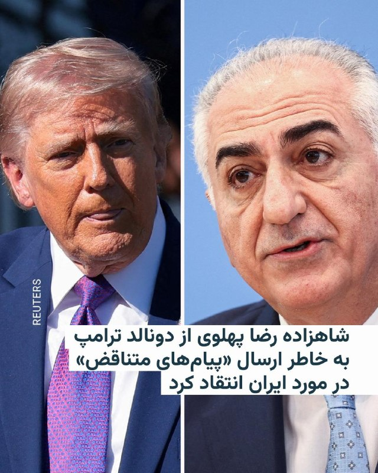

🔸شاهزاده رضا پهلوی در نشست نشریهٔ پولیتکو با موضوع امنیتی گفت دونالد ترامپ، رئیس‌جمهور آمریکا، باید از ارسال «پیام‌های متناقض» دربارهٔ اهدافش در جنگ با ایران دست بردارد و در عوض «کار را تمام کند» و حکومت جمهوری اسلامی را سرنگون سازد.

🔸به‌گزارش نشریه پولیتکو از این نشست که سه‌شنبه ۲۳ اردیبهشت برگزار شد، آقای پهلوی افزود: «حالا که با یک حیوان زخمی روبه‌رو هستید، این فرصتی نیست که برای تمام کردن کار و پایان دادن به آن از دست بدهید.»

🔸رضا پهلوی همچنین گفت تهدیدهای گاه‌به‌گاه ترامپ دربارهٔ حمله به زیرساخت‌های غیرنظامی ایران و نابودی «تمدن» ایران، حتی اگر صرفاً تاکتیکی برای مذاکره باشد، مفید نیست، «چون باز هم بخشی از همان ارسال پیام متناقض است» خطاب به مردم ایران که خواهند پرسید «شما آمده‌اید ما را آزاد کنید یا بیشتر به ما آسیب بزنید؟»

🔸همزمان، ویدئویی از اعتراض یک زن در جریان این نشست در شبکه‌های اجتماعی پربازدید شده است.

@RadioFarda

## RadioFarda — post 157123

حضور کم کارگردانان زن و جنگ ایران؛ چالش‌های فستیوال کن ۲۰۲۶ چیست؟

🔸جشنواره کن، از معتبرترین فستیوال‌های سینمایی جهان، در حالی در فرانسه گشایش یافته که تازه‌ترین فیلم اصغر فرهادی، کارگردان ایرانی، در بخش رقابتی این جشنواره در کنار آثار برخی از بزرگان سینمای جهان حضور دارد و همچنین انتظار می‌رود جنگ ایران موجب بحث‌های سیاسی در این جشنواره شود.

🔸هفتادونهمین دوره جشنواره فیلم کن از روز سه‌شنبه ۲۲ اردیبهشت آغاز شد. فیلم افتتاحیهٔ امسال، «بوسهٔ آذرخش‌گون» ساخته کارگردان پی‌یر سالوادوری، یک درام عاشقانه فرانسوی‌زبان بود که داستانش در پاریس در فاصلهٔ میان دو جنگ جهانی می‌گذرد.

🔸قرار است در دو هفته آینده، ابرستارهایی از جمله جان تراولتا، آدام درایور و باربارا استرایسند روی فرش قرمز این جشنواره قدم بگذارند.

🔸 گزارش کامل را در وب‌سایت رادیوفردا بخوانید.

@RadioFarda

## RadioFarda — post 157122

قطع ۷۵ روزۀ اینترنت در ایران؛ محمدرضا عارف رئیس «ستاد ویژه» برای رسیدگی به اینترنت شد

🔸همزمان با عبور زمان قطع اینترنت در ایران از ۱۷۷۶ ساعت، مسعود پزشکیان، رئیس‌جمهور ایران، محمدرضا عارف معاون اول خود را با حفظ سمت به عنوان رئیس «ستاد ویژه ساماندهی و راهبری فضای مجازی کشور» منصوب کرد.

🔸در حکم پزشکیان آمده که این انتصاب «نظر به ضرورت فوری استقرار حکمرانی یکپارچه، منسجم و کارآمد در فضای مجازی» صورت می‌گیرد.

🔸پزشکیان یک روز پیش از این نیز در شبکه ایکس با اشاره به اینکه «ارتباطات مبتنی بر فناوری اطلاعات و اینترنت به بخش جدانشدنی زندگی مردم تبدیل شده»، نوشته بود به عارف مأموریت داده «با لحاظ حساسیت‌های حکمرانی، نظر رهبری و وعده‌ای که به مردم داده بودم، در قالب ساختاری چابک موجبات خدمت‌رسانی بهتر دولت و تحقق انتظارات عمومی را فراهم سازند.»

🔸رئیس‌جمهور ایران توضیح نداده است در حالی که زیرساخت‌های ارتباطی زیر نظر دولت فعالیت می‌کنند، ضرورت تشکیل ستاد ویژه برای باز کردن اینترنت چیست.

🔸مسعود پزشکیان در دوران انتخابات ریاست‌جمهوری ۱۴۰۳، وعده صریح «رفع فیلترینگ»، «اصلاح نظام ناکارآمد فیلترینگ» و «آزاد‌سازی اینترنت» را داده و با تأکید بر تأثیر منفی فیلترینگ بر کسب‌وکارها و زندگی مردم متعهد شده بود که تمام تلاش خود را برای پایان دادن به این وضعیت و فراهم کردن دسترسی آزاد به فضای مجازی به کار گیرد.

🔸این وعده اما نه تنها محقق نشد که قطع کامل اینترنت هم از زمان شروع جنگ با آمریکا و اسرائیل به آن افزوده شد.
فاطمه مهاجرانی، سخنگوی دولت پزشکیان، نیز در نشست خبری سه‌شنبه ۲۲ اردیبهشت، به صراحت از قطع اینترنت «به دلیل فضای جنگی» دفاع کرد و در پاسخ به خبرنگاران معترض به این موضوع گفت که «چه انتظاری دارید؟»

🔸دولت جمهوری اسلامی چند روز پس از حملات مشترک آمریکا و اسرائیل به ایران در نهم اسفند ۱۴۰۴ و قطع‌کردن اینترنت، اعلام کرد تنها به خبرنگاران و فعالان رسانه‌ای هم‌صدا با خود اجازه دسترسی به اینترنت جهانی را می‌دهد.

🔸طی این مدت شماری از خبرنگاران، فعالان رسانه‌ای نزدیک به حکومت با استفاده از اینترنت «سفید» در شبکه‌های اجتماعی به حمایت از عملکرد جمهوری اسلامی پرداخته‌اند.

🔸در هفته‌های اخیر نیز برخی اپراتورها اقدام به تبلیغ و واگذاری اینترنت موسوم به «طبقاتی» و فروش اینترنت به بهای گزاف به‌عنوان اینترنت ویژهٔ «کسب‌وکارها» کرده‌اند.

🔸با این حال واگذاری این نوع از از اینترنت نیز به‌دلیل سازوکار نامشخص آن و همچنین جنبه‌های درآمدزایی گستردهٔ آن برای اپراتورها جنجال‌برانگیز شده است.

🔸علی قلهکی، فعال رسانه‌ای نزدیک به حکومت، در شبکه ایکس با ذکر آمار فعال شدن ۴۵۰ هزار سیم‌کارت پرو در اپراتور همراه اول، نوشت سرمایه اجتماعی کشور که به‌گفتهٔ او «بابت جنگ تقویت شده»، نباید «دستمایه اقدامات مشکوک و منفعت‌محور مدیرانِ اِبن‌الوقت قرار گیرد».

🔸به‌گفتهٔ این فعال رسانه‌ای نزدیک به حکومت، «طرح‌های تبعیض‌آمیزی چون «اینترنت پرو» این انگاره را در جامعه جا می‌اندازد که هزینه‌های اقداماتی چون «تحریم» و «جنگ» از جیب مردم باید پرداخت شود».

🔸این فعال رسانه‌ای اضافه کرده «به ازای یک میلیون نفر عضویتِ در اینترنت پرو ۵۰ گیگابایتی (هدف‌گذاری اولیه)، بیش از دو هزار میلیارد تومان نصیب اپراتورها _بخوانید یک اپراتور_ می‌شود».

🔸انتقادها از این وضعیت به اندازه‌ای گسترش یافته که مدتی پیش غلامحسین محسنی اژه‌ای، رئیس قوه قضائیه دستور بررسی این موضوع توسط این نهاد را صادر کرد.

@RadioFarda

## IranianMinds — post 20068

  <a href="telegram/content/IranianMinds_20068_1778680764.mp4" target="_blank">🎬 Download video</a>

🔴ارتش اسرائیل حمله به زیرساخت‌های حزب‌الله را در چندین منطقه در جنوب لبنان تکمیل کرد

ارتش اسرائیل امروز (چهارشنبه) انبارهای تسلیحاتی، پرتابگرهای بارگذاری‌شده و آماده شلیک و سایر زیرساخت‌های تروریستی سازمان تروریستی حزب‌الله را در چندین منطقه در جنوب لبنان هدف قرار داد.

تروریست‌های سازمان تروریستی حزب‌الله از این زیرساخت‌ها برای پیشبرد طرح‌های تروریستی علیه نیروهای ارتش اسرائیل که در جنوب لبنان فعالیت می‌کنند و علیه اسرائیل استفاده می‌کردند.

در محل‌های شلیک که هدف قرار گرفتند، پرتابگرهای راکتی که به سمت منطقه فعالیت نیروهای ارتش اسرائیل و به سمت خاک اسرائیل هدف‌گیری شده بودند، منهدم شدند.

ارتش اسرائیل به اقدام علیه تهدیدها علیه شهروندان اسرائیل و نیروهای ارتش ادامه خواهد داد و مطابق با دستورالعمل‌های رده سیاسی عمل می‌کند.

@IranianMinds

## IranianMinds — post 20067

  <a href="telegram/content/IranianMinds_20067_1778680766.mp4" target="_blank">🎬 Download video</a>

🔴استقبال از پرزیدنت ترامپ در فرودگاه پکن.

@IranianMinds

## IranianMinds — post 20066

🔴دولت سوریه به طور رسمی از روسیه خواسته است که بشار اسد را برای محاکمه و پاسخ دادن به جنایات جنگی تحویل بدهد.

@IranianMinds

## IranianMinds — post 20065

  

🔴بالاخره هر چیزی تو یخچال هم بعد از یه مدت کپک می‌زنه، نه؟

@IranianMinds

## IranianMinds — post 20064

🔴علیرضا رئیسی، معاون وزیر بهداشت:

هانتا‌ویروس نمی‌تواند از مرزهای دریایی وارد ایران بشود، چون از تنگه هرمز، یک قایق بادی هم نمی‌تواند رد بشود، چه برسد به کشتی کروز.
اگر کشتی بخواهد از تنگه عبور کند، سریع مورد هدف قرار می‌گیرد و هانتا‌ویروس به همراه کشتی و همه چیز به هوا می‌رود.😂

@IranianMinds

## IranianMinds — post 20063

🔴 وال‌استریت ژورنال:

رییس موساد در جریان جنگ دو بار به امارات سفر کرد.

@IranianMinds

## IranianMinds — post 20062

  

میدونم باورتون نمیشه اما

اپل به صورت رسمی اولین نمایندگی خودش رو در افغانستان افتتاح کرد.

@IranianMinds

## IranianMinds — post 20061

🔴 ان‌بی‌سی نیوز و نیویورک تایمز به نقل از منابع پنتاگون: آمریکا درصورت شکست مطلق مذاکرات، اسم حمله به ایران رو به «چکش سنگین» تغییر می‌ده و یکبار دیگه به ایران حمله می‌کنه.

@IranianMinds

## IranianMinds — post 20060

🔴 کانال 13 اسرائیل:
نتانیاهو امشب جلسه امنیتی ویژه در مورد ایران برگزار خواهد کر‌د

@IranianMinds

## IranianMinds — post 20059

🔴 فایننشال تایمز:

پوتین مطمئن است که ارتشش می‌تواند منطقه دونباس در اوکراین را فتح کند و فرماندهان نظامی روسیه او را متقاعد کرده‌اند که فتح این منطقه می‌تواند تا پاییز تکمیل شود. پس از آن، طبق این گزارش، پوتین قصد دارد مطالبات ارضی خود را مطرح کند و کنترل مناطق بیشتری در اوکراین را به دست گیرد.

@IranianMinds

## IranianMinds — post 20058

🔴 کامران غضنفری، نماینده مجلس: شواهد و قرائن نشان می‌دهد که آمریکا و اسرائیل قصد انجام یک عملیات گسترده برای تصرف برخی از جزایر جنوب رو دارن.

@IranianMinds

## BBCPersian — post 280929

  <a href="telegram/content/BBCPersian_280929_1778680769.mp4" target="_blank">🎬 Download video</a>

🔻سرخط خبرهای چهارشنبه ۲۳ اردیبهشت ۱۴۰۵

@BBCPersian

## BBCPersian — post 280928

🔻تشدید حملات اسرائیل به غزه از زمان آغاز آتش‌بس ایران

اسرائیل در پنج هفته‌ای که از آتش‌بس در ایران گذشته، حملات به غزه را تشدید کرده است.

بر اساس اعلام اداره بهداشت غزه، که حماس آن را اداره می‌کند، از زمان توقف جنگ در ایران در ۸ آوریل، ۱۲۰ فلسطینی کشته شده‌اند؛ این تلفات ۲۰ درصد بیشتر از زمانی است که اسرائیل به همراه آمریکا در جنگ با ایران مشارکت داشت.

سازمان دیده‌بان درگیری‌ها، «اکلد»، که داده‌های مربوط به مکان و رویداد درگیری‌های مسلحانه در جهان، از جمله حملات اسرائیل به غزه را رصد می‌کند، در گزارش ماهانه خود اعلام کرد که اسرائیل ماه گذشته(آوریل) ۳۵ درصد حملات بیشتری در مقایسه با ماه مارس در این باریکه انجام داد.

این افزایش حملات نشانه دیگری از پیشرفت‌های متوقف شده در طرح دونالد ترامپ برای پایان جنگ در غزه و آغاز بازسازی آنجاست.

یک مقام نظامی اسرائیل که نخواست نامش فاش شود به رویترز گفت، آتش‌بس غزه به اسرائیل اجازه می‌دهد تا علیه «تهدیدات قریب‌الوقوع» اقدام کند.

او همچنین گفت که ارتش اسرائیل «برای هر سناریویی آماده است»؛ از جمله برنامه‌های جنگی گسترده‌تری برای از سرگیری جنگ در غزه تدوین شده است، هرچند هنوز هنوز چنین دستوری داده نشده است.

@BBCPersian

## BBCPersian — post 280921

🔻روابط ایران و آمریکا در یکی از پیچیده‌ترین بن‌بست‌های دهه‌های اخیر گرفتار شده است. پس از گذشت بیش از ده هفته از آغاز حملات آمریکا و اسرائیل علیه ایران و در حالی که آتش‌بسی شکننده برقرار است، دو طرف از طریق میانجی‌هایی مانند پاکستان همچنان در حال چانه‌زنی هستند.

تبادل پیشنهادها و پاسخ‌ها در حالی انجام می‌شود که پنج موضوع محوری، به عنوان موارد اصلی اختلافات حل‌نشده میان ایران و آمریکا مطرح است: برنامه غنی‌سازی اورانیوم، سرنوشت ذخایر اورانیوم غنی‌شده در ایران، کنترل و آزادی تردد در تنگه هرمز، فعالیت‌های گروه‌های نیابتی ایران در منطقه و برنامه موشکی بالستیک.

دونالد ترامپ،‌ رئیس‌جمهور آمریکا، پاسخ ایران به آخرین پیشنهاد آمریکا را «کاملا غیرقابل قبول» خوانده و بار دیگر تاکید کرده است که آمریکا هرگز اجازه نخواهد داد ایران به سلاح هسته‌ای دست یابد.

بیشتر بخوانید:
https://bbc.in/4wsm0ag
📷Getty Images
@BBCPersian

## BBCPersian — post 280920

🔻نشت سوخت در سواحل عمان یک هفته پس از حمله ایران به یک نفت‌کش

یک واحد وابسته به شرکت ملی نفت ابوظبی روز چهارشنبه اعلام کرد که یک نفت‌کش‌ این شرکت که هفته گذشته هدف حمله پهپادهای جمهوری اسلامی قرار گرفت، مقدار کمی سوخت در سواحل عمان نشت داده است که این موضوع از خطرات زیست‌محیطی ناشی از جنگ آمریکا و اسرائیل با ایران حکایت دارد.

بسته شدن تنگه هرمز، دریانوردی در این آبراه حیاتی کشتیرانی را به مسیری پرخطر تبدیل کرده است و هم اکنون صدها کشتی در خلیج فارس گرفتارند.

شرکت لجستیک و خدمات «ادنوک» اعلام کرد که وضعیت مربوط به کشتی خود، «ام‌وی‌باراکا»، را زیر نظر دارد و «با مقامات مربوطه و تیم‌های واکنش تخصصی» در حال همکاری است.

سخنگوی این شرکت گفت: «کشتی باراکا، متعلق به شرکت ادنوک، پس از آنکه در تاریخ ۴ مه توسط دو پهپاد ایرانی هدف قرار گرفت، همچنان در سواحل عمان لنگر انداخته است. متاسفانه مقدار کمی از آنچه که گمان می‌رود سوخت بانکر باشد، در نتیجه این اتفاق ریخته شده است.»

او البته درباره حجم نشت اظهار نظر نکرد.

در زمان حمله، این نفت‌کش هیچ محموله‌ای حمل نمی‌کرد و خدمه هم آسیب ندیدند.

@BBCPersian

## BBCPersian — post 280919

  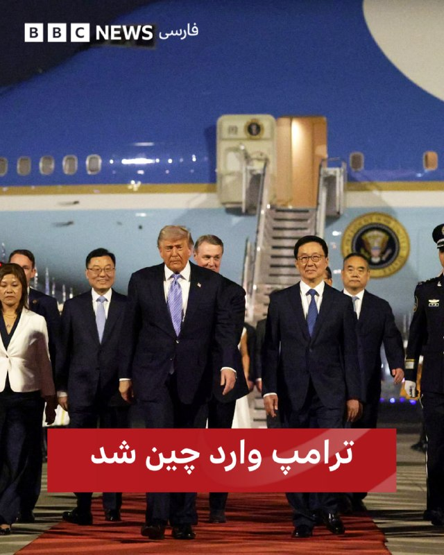

هواپیمای حامل دونالد ترامپ و همراهانش دقایقی پیش در پکن به زمین نشست.

دونالد ترامپ در حالی وارد پکن شده است که اولین سفر رسمی یک رئیس جمهور آمریکا به چین را در تقریبا یک دهه گذشته آغاز می‌کند.

انتظار می‌رود که مذاکرات آقای ترامپ با شی جین پینگ، رئیس جمهور چین، شامل روابط تجاری پرتنش آنها، جنگ در ایران و فروش تسلیحات آمریکا به تایوان باشد.

آقای ترامپ که با یک هیئت تجاری بلندپایه سفر می‌کند، قرار است با استقبال باشکوهی از جمله توقف در ژونگ‌نان‌های، مجتمع محل زندگی و کار رهبران چین، روبرو شود.

هیئتی از رهبران تجاری جمله جنسن هوانگ، مدیرعامل انویدیا و ایلان ماسک، رئيس‌جمهور آمریکا را در این سفر همراهی می‌کنند.

ساعاتی پیش از ورود او، مقامات چین و ایالات متحده مذاکرات تجاری را در کره جنوبی برگزار کردند و هر دو طرف مشتاق بودند از اعمال مجدد تعرفه‌های بیش از حد جلوگیری کنند. رسانه‌های دولتی چین این مذاکرات را صریح، عمیق و سازنده توصیف کردند.

📷Getty Images
@BBCPersian

## BBCPersian — post 280918

  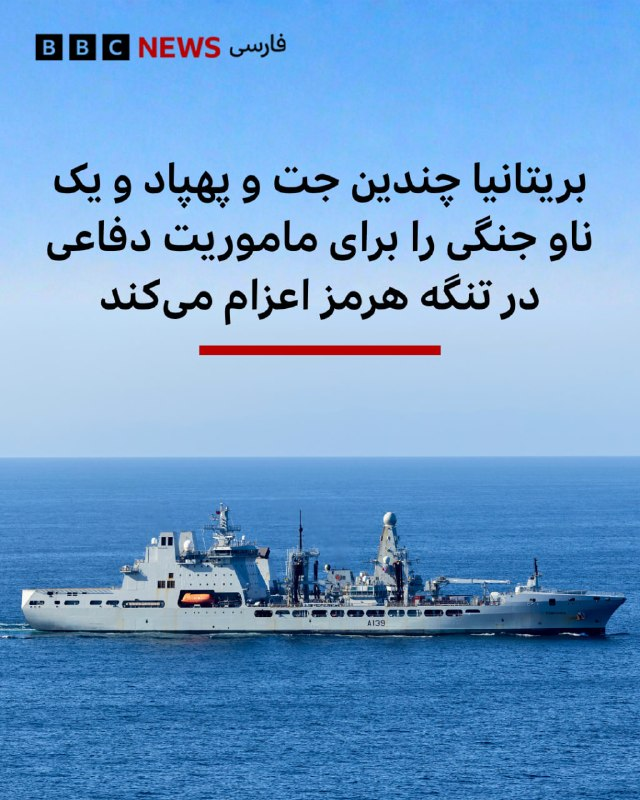

🔻 بریتانیا اعلام کرده است که پهپادها و جت‌های جنگنده و نیز یک کشتی جنگی را به ماموریت مشترکی با هدف حفاظت از کشتیرانی در تنگه هرمز اعزام خواهد کرد.

جان هیلی، وزیر دفاع بریتانیا، این بسته را در نشست مجازی وزرای دفاع چندین کشور در روز سه‌شنبه (۱۲ مه) اعلام کرد. این بسته شامل سیستم‌های خودکار برای شناسایی و پاکسازی مین‌های دریایی، قایق‌های بدون سرنشین، و جت‌های تایفون برای گشت‌های هوایی است.

بیش از ۴۰ کشور دیگر هم در این ماموریت شرکت دارند که به گفته آقای هیلی، زمانی که شرایط مهیا باشد آغاز خواهد شد.

ماه‌هاست که ایران در تلافی حملات آمریکا و اسرائیل که ۲۸ فوریه (۹ اسفند) آغاز شد، در تنگه هرمز که یکی از شلوغ‌ترین کانال‌های حمل‌ونقل نفت جهان است، اعمال کنترل و ایجاد ناامنی کرده است.

آمریکا هم به نوبه خود، برای اعمال فشار بر تهران جهت پذیرش شرایطش، بنادر ایران را مسدود کرده است؛ اقدامی که ایران را خشمگین کرده است.

بیشتر بخوانید:
https://bbc.in/4ffIRQ3
📸UK MOD Crown copyright
@BBCPersian

## BBCPersian — post 280917

  

🔻نسرین ستوده، وکیل دادگستری و فعال حقوق بشر، امروز چهارشنبه ۲۳ اردیبهشت به قید وثیقه آزاد شد.

این خبر در صفحه مهراوه خندان، فرزند خانم ستوده منتشر شد.

چهارشنبه ۱۲ فروردین ۱۴۰۵، این وکیل دادگستری و فعال سیاسی در خانه خود در تهران بازداشت شد. نیروهای امنیتی حین بازداشت تمامی لوازم الکترونیک شخصی، از جمله گوشی موبایل و لب‌تاپ او را ضبط کردند.

نسرین ستوده، از اوایل دهه ۸۰، وکالت پرونده‌هایی را به عهده گرفت که برای حاکمیت حساسیت امنیتی داشتند.

او بارها بازداشت، محرومیت از وکالت و با احکام زندان طولانی روبه‌رو شد.

همسرش رضا خندان، یک فعال مدنی و سیاسی است که هم اکنون در زندان به‌سر می‌برد.

📷Mehraveh Khandan
خانم خندان با انتشار این تصویر نوشت: عکس قدیمی است و متاسفانه به‌دلیل قطعی اینرنت عکس جدیدی پس از آزادی به دستم نرسیده است.
@BBCPersian

## BBCPersian — post 280915

🔻حمله اسرائیل به دو خودرو در جنوب بیروت

خبرگزاری دولتی لبنان گزارش داد که اسرائیل طی دو حمله جداگانه روز چهارشنبه دو خودرو را در منطقه جیه لبنان در جنوب بیروت هدف قرار داد.

اطلاعاتی در مورد تلفات این دو حمله و اهداف احتمالی آن منتشر نشده است.

در حملات روز سه‌شنبه اسرائیل به لبنان هم ۱۳ نفر از جمله دو امدادگر کشته شدند.

ارتش اسرائیل اعلام کرده که به اهداف حزب‌الله حمله می‌کند و برای چندین روستا هشدار تخلیه صادر کرده است.

آتش‌بسی که ماه گذشته به اجرا درآمد، نتوانسته است جنگ را متوقف کند. وزارت بهداشت لبنان می‌گوید که از زمان آغاز آتش‌بس، ۳۸۰ نفر کشته شده‌اند.

@BBCPersian

## BBCPersian — post 280914

🔻وزارت خارجه ایران: چهار مامور به دلیل اختلال ناوبری، وارد آب‌های کویت شدند

پس از آن که کویت اعلام کرد چهار عضو سپاه را حین ورود غیرقانونی به این کشور بازداشت کرده است، وزارت خارجه ایران اعلام کرده «چهار مامور جمهوری اسلامی ایران» به دلیل «اختلال سامانه ناوبری قایق‌شان به اشتباه» وارد آب‌های کویت شدند.

وزارت خارجه ایران گفته آن‌ها «در چارچوب مأموریت مرسوم گشت‌زنی دریایی» مشغول انجام وظیفه بوده‌اند.

بر اساس بیانیه وزارت خارجه ایران، «ادعاهای مطرح شده در بیانیه‌های وزارت خارجه و وزارت کشور کویت مبنی بر برنامه ریزی ایران برای انجام اقدامات خصمانه علیه کویت، مطلقا بی اساس و مردود هستند.»

وزارت خارجه کویت این اقدام را «اقدامی خصمانه» و «حمله‌ای آشکار» به حاکمیت کویت خوانده بود.

وزارت کشور کویت هم روز گذشته اعلام کرد که «چهار نفوذی وابسته به سپاه پاسداران» که تلاش می‌کردند از طریق دریا به این کشور وارد شوند را بازداشت کرده است.

بر اساس بیانیه وزارت کشور کویت، دستگیرشدگان دو سرهنگ، یک سروان و یک ستوان نیروی دریایی سپاه بوده‌اند که «اذعان» کرده‌اند ماموریت داشتند به جزیره بوبیان «نفوذ» کنند.

https://bbc.in/4d3ACoU
@BBCPersian

## BBCPersian — post 280913

  

🔻مسعود پزشکیان، رئیس‌جمهور ایران، محمدرضا عارف، معاون اول خود، را به ریاست «ستاد ویژه ساماندهی و راهبری فضای مجازی کشور» منصوب کرد.

در حکم آقای پزشکیان بر «حکمرانی یکپارچه» در فضای مجازی، پایان دادن به «چندصدایی» و جلوگیری از «موازی‌کاری» میان نهادهای مسئول تأکید شده است.

این انتصاب در حالی انجام می‌شود که امروز هفتاد و پنجمین روز اختلال و محدودیت گسترده اینترنت در ایران است.

حکومت ایران از ۹ اسفند (۲۸ فوریه) و همزمان با حملات اسرائیل و آمریکا، دسترسی به اینترنت بین‌الملل را قطع کرد و تماس‌ تلفنی با خارج از ایران هم با اختلال جدی رو‌به‌رو است.

📷SHARGH
@BBCPersian

## BBCPersian — post 280912

  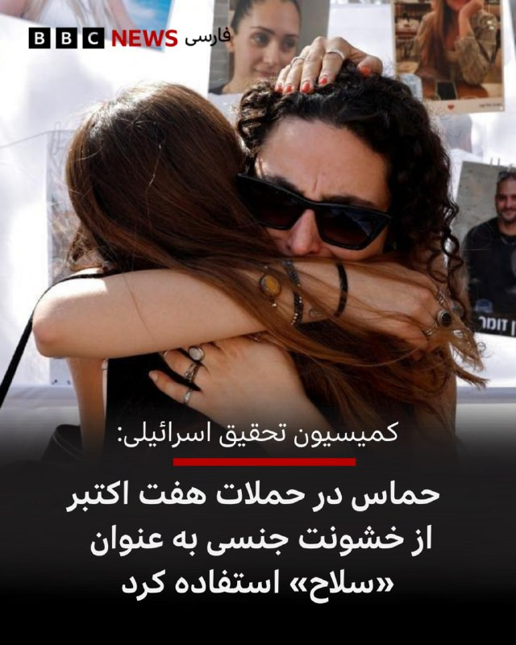

🔻 یک کمیسیون مستقل اسرائیلی جزئیات تکان‌دهنده‌ای از خشونت جنسی «سیستماتیک و گسترده» توسط حماس و سایر گروه‌های مسلح فلسطینی در جریان حملات ۷ اکتبر ۲۰۲۳ و علیه گروگان‌ها منتشر کرده است.

گزارش ۳۰۰ صفحه‌ای این کمیسیون نتیجه‌گیری می‌کند که تجاوز و شکنجه جنسی «با هدف به حداکثر رساندن درد و رنج» انجام شده است.

در حالی که سازمان ملل متحد و دیگران گزارش‌هایی در مورد خشونت جنسی در جریان این حملات منتشر کرده‌اند گفته می‌شود که گزارش این کمیسیون مستقل جامع‌ترین گزارش است.

حماس در حمله هفتم اکتبر ۲۰۲۳، حدود ۱۲۰۰ نفر را کشت و ۲۵۱ نفر را گروگان گرفت.

این گزارش بر اساس ۴۳۰ مصاحبه فیلمبرداری شده با بازماندگان و شاهدان آن حمله، بیش از ۱۰ هزار عکس و فیلم گرفته شده توسط مهاجمان و سوابق و مدارک رسمی از محل‌های حمله تهیه شده است.

بیشتر بخوانید:

https://bbc.in/3R7ooD9
📷Reuters
@BBCPersian

## BBCPersian — post 280911

  <a href="telegram/content/BBCPersian_280911_1778680774.mp4" target="_blank">🎬 Download video</a>

🔻در پی زمین‌لرزه‌های دیشب و بامداد امروز به وقت محلی که دماوند و تهران را لرزاند، ساکنان مناطقی که این زلزله‌ها را حس کردند از جمله در بومهن و پردیس، شب را از خارج از خانه و در خیابان ها و پارک‌ها به‌سر بردند.

به گزارش خبرگزاری مهر زمین‌لرزه در تهران بین ۵ تا ۱۰ ثانیه طول کشید.
مرکز لرزه‌نگاری دانشگاه تهران اعلام کرده بزرگی زلزله دیشب ۴/۶ و کانون آن در حوالی پردیس، حد فاصل بین استان‌های تهران و مازندران و در عمق ۱۰ کیلومتری زمین بوده است.
در تهران پس از زلزله اول در ساعت ۳۰ دقیقه بامداد امروز یک پس‌لرزه دیگر و در مجموع تا کنون هشت زمین‌لرزه خفیف ثبت شده است.

بنابر گزارش رسانه‌های ایران تاکنون اخباری مبنی بر خسارت‌های احتمالی زمین لرزه در تهران اعلام نشده و بررسی‌های اولیه نهادهای امدادرسانی حاکی از این است که زلزله تا این لحظه در تهران مصدومی نداشته است.

وقوع این زمین‌لرزه در پایتخت ایران، هم‌زمان با طوفانی با سرعت ۵۵ کیلومتر بر ساعت در تهران و قطعی برق در برخی مناطق تهران همراه شد.
متن کامل خبر را اینجا بخوانید.
🎥IRIB
@BBCPersian

## BBCPersian — post 280910

🔻سایه جنگ ایران بر نشست وزیران خارجه بریکس در دهلی‌نو

انتظار می‌رود که جنگ آمریکا و اسرائیل علیه ایران بر نشست دو روزه وزیران خارجه گروه بریکس که از فردا پنجشنبه در دهلی‌نو آغاز می‌شود، سایه بیفکند؛ نشستی که به‌گزارش رویترز، توان این بلوک را برای رسیدن به موضعی واحد و صدور بیانیه مشترک،‌ محک خواهد زد.

این گروه که در ابتدا شامل برزیل، روسیه، هند، چین و آفریقای جنوبی بود، طی سال‌های اخیر با پیوستن مصر، اتیوپی، اندونزی، ایران و امارات متحده عربی گسترش یافته است.

ایران از اعضای بریکس خواسته که اقدامات آمریکا و اسرائیل را محکوم کنند، اما اختلاف‌ها با امارات متحده عربی آشکار شده است.

هند با وجود تنش‌ها همچنان به دنبال دستیابی به بیانیه مشترک در نشست وزیران خارجه بریکس است.

کشورهای بریکس با فشار اقتصادی ناشی از افزایش قیمت انرژی در پی جنگ روبه‌رو شده‌اند.

گفته می‌شود که احتمالا عباس عراقچی، وزیر خارجه ایران، امشب برای شرکت در این نشست وارد دهلی‌نو شود.

همچنین انتظار می‌رود سرگئی لاوروف، وزیر خارجه روسیه، نیز در این نشست حضور داشته باشد.

https://bbc.in/4u4bsfN
@BBCPersian

## BBCPersian — post 280909

🔻وزارت بهداشت ایران: حدود ۴۰ مجروح جنگ، هنوز در بیمارستان بستری هستند

حسین کرمانپور، رئیس مرکز روابط عمومی و اطلاع‌رسانی وزارت بهداشت ایران می‌گوید که حدود چهل نفر از مجروحان جنگ اخیر همچنان در بیمارستان‌ها بستری هستند.

او همچنین گفته طی دوران جنگ «کادر درمان به ۴۰هزار مجروح خدمات درمانی و بستری» ارائه داده‌اند.

این مقام وزارت بهداشت ایران تعداد کشته‌های جنگ آمریکا و اسرائیل علیه ایران را هم بر اساس آمار وزارت بهداشت، ۳ هزار و ۴۸۳ نفر اعلام کرده است.
https://bbc.in/4tAXKjn
@BBCPersian

## idfinfarsi — post 11574

  <a href="telegram/content/idfinfarsi_11574_1778680776.mp4" target="_blank">🎬 Download video</a>

ارتش اسرائیل حمله به زیرساخت‌های حزب‌الله را در چندین منطقه در جنوب لبنان تکمیل کرد

ارتش اسرائیل امروز (چهارشنبه) انبارهای تسلیحاتی، پرتابگرهای بارگذاری‌شده و آماده شلیک و سایر زیرساخت‌های تروریستی سازمان تروریستی حزب‌الله را در چندین منطقه در جنوب لبنان هدف قرار داد.

تروریست‌های سازمان تروریستی حزب‌الله از این زیرساخت‌ها برای پیشبرد طرح‌های تروریستی علیه نیروهای ارتش اسرائیل که در جنوب لبنان فعالیت می‌کنند و علیه اسرائیل استفاده می‌کردند.

در محل‌های شلیک که هدف قرار گرفتند، پرتابگرهای راکتی که به سمت منطقه فعالیت نیروهای ارتش اسرائیل و به سمت خاک اسرائیل هدف‌گیری شده بودند، منهدم شدند.

ارتش اسرائیل به اقدام علیه تهدیدها علیه شهروندان اسرائیل و نیروهای ارتش ادامه خواهد داد و مطابق با دستورالعمل‌های رده سیاسی عمل می‌کند.

## idfinfarsi — post 11572

‏‼️رئیس ستاد کل ارتش اسرائیل در شمال سامره: «ما واقعیت امنیتی جدیدی در تمام جبهه‌ها ایجاد کرده‌ایم؛ با این حال، نبرد به پایان نرسیده است. ارتش اسرائیل برای ازسرگیری جنگ در صورت نیاز آماده است و در حالت آمادگی و هوشیاری دائمی در دفاع و حمله قرار دارد، از یهودیه و سامره تا تهران»

‏🔸رئیس ستاد کل ارتش اسرائیل، سپهبد ایال زامیر: ‏«ارتش اسرائیل در همه جبهه‌ها با ابتکار و رویکرد تهاجمی عمل می‌کند. ما واقعیت امنیتی جدیدی ایجاد کرده‌ایم — در لبنان به عملیات ادامه می‌دهیم، در لیتانی و مناطق دیگر فعالیت می‌کنیم و هر روز ده‌ها تروریست و زیرساخت را خنثی می‌کنیم.
‏🔸همچنین در غزه به‌صورت تهاجمی عمل کرده و تروریست‌ها را به هلاکت می‌رسانیم و در اینجا در یهودیه و سامره نیز بدون وقفه فعالیت می‌کنیم و به دستاوردها دست می‌یابیم. هیچ‌گونه خویشتنداری وجود ندارد — فقط ابتکار عمل.

‏🔸نبرد هنوز به پایان نرسیده است. ارتش اسرائیل برای ازسرگیری درگیری در صورت نیاز آماده است و در آمادگی و هوشیاری دائمی، در دفاع و حمله، از یهودیه و سامره تا تهران قرار دارد.»

## Dirty_Kids — post 389375

  <a href="telegram/content/Dirty_Kids_389375_1778680778.mp4" target="_blank">🎬 Download video</a>

مراسم استقبال از شیرخدا با شعار چینی‌های قرمساق در صحنه که به زبون چینی می‌گفتن:

عمو ترامپ، عیان شد
چین مرکز جهان شد

@Dirty_Kids 👻

## Dirty_Kids — post 389374

گیاها خیلی مادر جندن تا وقتی توی گلفروشی هستن صاحبشون تف کف دست اینا نمیندازه مرگ بهشون نمیده محل سگشون نمیذارن و مثل خر رشد میکنن تا میاری خونه مکمل و هرروز قربون صدقه اب خوب و کلی بوس بوسی یهو تققق آی من ملدم

@Dirty_Kids 👻

## Dirty_Kids — post 389373

فلورین تاردیف که روزنامه‌نگاره، کتاب جدیدی چاپ کرده به اسم «Un couple parfait» و جایی از کتابش به اون ماجرای چک زدن بریژیت مکرون تو صورت مردک قرمساق امانوئل مکرون جلو در هواپیما اشاره کرده و نوشته، اون داستان به خاطر پیام‌های بوجی موجی طور از گلشیفته فراهانی…

## Dirty_Kids — post 389372

پرستو‌های چروک نظام

فسیل مغزهایی که سی سال خارج از ایران زندگی کردن و جالبه که اکثرشون از دست ج.ا. در اروپا پناهنده شدن ولی الان بعد از این همه سال یادشون رفته و دارن از همین ج.ا. دفاع میکنن و مردم بپا خواسته ای ان رو جاسوس و خائن معرفی میکنن! واقعاً که عقده پهلوی با این چپها چه ها که نکرد 🤦🏻‍♂️

@Dirty_Kids 👻

## Dirty_Kids — post 389371

  <a href="https://t.me/Dirty_Kids/389371" target="_blank">📎 Download file</a>

✅ اپلیکیشن اندروید سایت جهانی دربی بت

💰اولین سایت جهانی با امکان شارژ و برداشت ریالی(کارت به کارت)

🔗 برای ورود فیلترشکن روی کشور مناسب قرار دهید مانند فنلاند و المان و....

😀Telegram Channel
👇
https://t.me/+bcynkEgSW2dlYTc0

## Dirty_Kids — post 389370

  

😤دنبال یه سایت شرط بندی بین المللی بودی که به ایرانیا خدمات بده؟!
⛔

👍دربی بت همون انتخاب  100%

💎ویژگی های سایت جهانی Derby Bet:

⬅️امکان شارژ امن با کارت بانکی

⬅️واریز اول دوبل شارژ می شوید(بونوس۱۰۰٪)

⬅️پر اپشن ترین سایت فعال در ایران

⬅️تسویه حساب کمتر از 5 دقیقه

⬅️برگشت بخشی از باخت به صورت هفتگی

🚨کد هدیه ثبت نام:GG007

⚠️برای دانلود اپلکیشن کلیک کنید
👉

🔔کانال دربی بت :

🪙https://t.me/+bcynkEgSW2dlYTc0

## Dirty_Kids — post 389369

  

🔴 خبری تو فضای مجازی وایرال شده که ادعا می‌کنه «هانتا ویروس» باعث کوچک شدن آلت تناسلی مردان تا 7.6 سانت میشه!

❌ این خبر کاملاً فیکه و منبعش یه صفحه توییتری ترکیه‌ایه که معمولاً شایعات و خبرهای وایرالِ بدون منبع معتبر رو منتشر می‌کنه.

هانتا ویروس ممکنه تو برخی موارد باعث اختلال در نعوظ بشه، اما هیچ مدرک علمی معتبری درباره کوچک شدن آلت تناسلی بر اثر این ویروس وجود نداره.

@Dirty_Kids 👻

## Dirty_Kids — post 389366

🔴 این عکس با عنوان " اوه اوه زید وینی دیلدو کمری خریده تا ترتیب وینیسیوس رو بده😳😂" داره وایرال میشه؛

❌ این شات با هوش مصنوعی درست شده، عکس اصلی مربوط به سال 2007 که مدونا، خواننده آمریکایی با این دیلدو شکار شده بود.

@Dirty_Kids 👻

## Dirty_Kids — post 389365

  <a href="telegram/content/Dirty_Kids_389365_1778680780.mp4" target="_blank">🎬 Download video</a>

حرف دل ایران ❤️🦁💚⁩
مطکمئنم این رپ خوندرو چندبار گوش میکنی

@Dirty_Kids 👻

## Dirty_Kids — post 389364

  

🌪وقتی اینترنت طوفانیه... کافیه بادبان ها رو بکشی تا

⚫️با بالاترین کیفیت ممکن
⚡️ 

⚫️100 هزار تومان شارژ هدیه 
🎁

⚫️پایین ترین قیمت گیگی 250
🌐 

⚫️و ارائه پورسانت %10 در ازای هر معرفی
💼

بتونی یه اتصال پایدار با پشتیبانی 24 ساعته داشته باشی
🚀

بادبان راهتو باز می‌کنه
⛵️

R23

🛡@BadBan_VPN | کانال 

🤖@BadBan_VPNBot | ربات 

📞@BadBan_VPNSupport | پشتیبانی

## Dirty_Kids — post 389363

  

فلورین تاردیف که روزنامه‌نگاره، کتاب جدیدی چاپ کرده به اسم «Un couple parfait» و جایی از کتابش به اون ماجرای چک زدن بریژیت مکرون تو صورت مردک قرمساق امانوئل مکرون جلو در هواپیما اشاره کرده و نوشته،

اون داستان به خاطر پیام‌های بوجی موجی طور از گلشیفته فراهانی بوده که بریژیت روی گوشی امانوئل‌مکرون قحبه زاده در طول سفر به ویتنام دیده.

می‌شه گفت که یک سر مواضع دوستانه‌ی امانوئل مکرون قحبه با جمهوری‌اسلامی و هر شب تماس گرفتناش با مسعود پزشکیان برمی‌گرده به همین ادعای فلورین تاردیف در کتابش.

این مطلب رو در اسرع وقت باید به عرض شیر وفادار خدا برسونم.

@Dirty_Kids 👻

## Hranews — post 112929

دادگستری هرمزگان از توقیف اموال ۲۴ شهروند خبر داد

❗️
❗️
❗️
❗️
❗️ – اموال و دارایی‌های ۲۴ شهروند خارج از کشور در هرمزگان مصادره شد. رئیس کل دادگستری هرمزگان این افراد را به «همکاری با دشمن» متهم کرده است.

#توقیف_اموال

ادامه مطلب

↘️
@hranews_bot تماس ✉️ -  @Hranews  کانال هرانا 🆑

## Hranews — post 112928

  

دادگاه تجدیدنظر؛ ۴ شهروند مجموعا به ۳۰ سال حبس محکوم شدند

❗️
❗️
❗️
❗️
❗️– شعبه اول دادگاه تجدیدنظر استان کهگیلویه و بویراحمد، فیض‌الله آذرنوش، میلاد کریمی‌نسب، امیرحسین محسنی‌پور و مهدی کرمی را در یک پرونده مشترک مجموعا به ۳۰ سال حبس محکوم کرد. از این میزان، با اعمال ماده ۱۳۴ قانون مجازات اسلامی، ۱۶ سال حبس قابل اجرا خواهد بود.

به گزارش خبرگزاری هرانا، ارگان خبری مجموعه فعالان حقوق بشر در ایران، احکام قطعی چهار متهم سیاسی در دادگاه تجدیدنظر استان کهگیلویه و بویراحمد صادر شد.

بر اساس دادنامه صادره، شعبه اول دادگاه تجدیدنظر استان کهگیلویه و بویراحمد، فیض‌الله آذرنوش، میلاد کریمی‌نسب، امیرحسین محسنی‌پور و مهدی کرمی را در مجموع به ۳۰ سال حبس تعزیری محکوم کرده است. این حکم با مستشاری سید ابوالحسن دادگر و سعید جریده اصل، علیه افراد نامبرده صادر شده است.

شرح عناوین اتهامی هر یک از متهمان به همراه میزان محکومیت قطعی صادره به شرح زیر است:

ادامه مطلب

#فیض‌الله_آذرنوش #میلاد_کریمی‌نسب
#امیرحسین_محسنی‌پور #مهدی_کرمی

↘️
@hranews_bot تماس ✉️ - @Hranews کانال هرانا 🆑

## Hranews — post 112927

  

نسرین ستوده، وکیل دادگستری آزاد شد

❗️
❗️
❗️
❗️
❗️– نسرین ستوده، وکیل دادگستری و فعال حقوق بشر ساعاتی پیش با قرار کفالت از زندان تهران بزرگ آزاد شد.

به گزارش خبرگزاری هرانا، ارگان خبری مجموعه فعالان حقوق بشر در ایران، نسرین ستوده آزاد شد.

آزادی نسرین ستوده، ساعاتی پیش با قرار کفالت صورت گرفته است. بر اساس اطلاعات دریافتی هرانا، خانم ستوده از زندان تهران بزرگ آزاد شده است.

همزمان با شروع درگیری های نظامی در ایران، زندانیان محبوس در بازداشتگاه وزارت اطلاعات موسوم به بند ۲۰۹ زندان اوین به زندان تهران بزرگ منتقل شده اند.

ادامه مطلب

#نسرین_ستوده

↘️
@hranews_bot تماس ✉️ - @Hranews کانال هرانا 🆑

## Hranews — post 112926

  

به گفته یحیی عزیزی، دبیر کارگروه پیگیری مطالبات کارکنان وزارت جهاد کشاورزی، کارکنان این وزارتخانه با وجود نقش مهم در حفظ ثبات بازار و تأمین امنیت غذایی کشور، با وضعیت معیشتی نامناسبی مواجه هستند. او با اشاره به حقوق حدود ۲۴ میلیون تومانی کارکنان، تأکید کرده است که این رقم در مقایسه با خط فقر شهری ۷۰ تا ۷۵ میلیون تومانی فاصله قابل توجهی دارد و پاسخگوی هزینه‌های زندگی نیست.

عزیزی همچنین با انتقاد از عدم اجرای وعده‌هایی مانند فوق‌العاده خاص و مزایای مرتبط با امنیت غذایی و مناطق محروم، سازمان برنامه و بودجه را از عوامل اصلی توقف بهبود وضعیت معیشتی کارکنان دانسته و خواستار ورود رئیس‌ جمهور یا معاون اول برای رسیدگی فوری به این موضوع شده است.
#کارکنان_جهاد_کشاورزی

↘️
@hranews_bot تماس ✉️ - @Hranews کانال هرانا 🆑

## Hranews — post 112925

مصدومیت رئیس اداره محیط‌زیست باروق و یک همیار در جریان مقابله با قطع درخت

❗️
❗️
❗️
❗️
❗️– مدیرکل حفاظت محیط‌‌زیست آذربایجان غربی اعلام کرد که در جریان جلوگیری از قطع یک درخت توت کهنسال در روستای یلکلو از توابع شهرستان باروق، رئیس اداره حفاظت #محیط‌_زیست این شهرستان و یکی از همیاران محیط‌ زیست در جریان درگیری با متخلفان قاچاق چوب مصدوم شدند. به گفته حجت جباری، دو متخلف در این رابطه بازداشت و ادوات قطع درخت از آنان کشف و ضبط شد.

ادامه مطلب

↘️
@hranews_bot تماس ✉️ - @Hranews کانال هرانا 🆑

## Hranews — post 112924

تداوم بازداشت و بی‌خبری از وضعیت سیاوش عزیزی‌مقدم

❗️
❗️
❗️
❗️
❗️– سیاوش عزیزی‌مقدم، شهروند اهل مهاباد حدود ۲۰ روز است که بازداشت شده و در بلاتکلیفی به‌سر می‌برد. بی‌خبری از سرنوشت این شهروند، منجر به افزایش نگرانی‌های خانواده وی شده است.

ادامه مطلب

#سیاوش_عزیزی‌مقدم

↘️
@hranews_bot تماس ✉️ - @Hranews کانال هرانا 🆑

## Hranews — post 112923

سه شهروند از جمله یک زن در شاهین‌شهر بازداشت شدند

❗️
❗️
❗️
❗️
❗️– جانشین فرماندهی انتظامی استان اصفهان از #بازداشت سه شهروند از جمله یک زن در شاهین‌شهر به دلیل آنچه «ارسال اطلاعات و همکاری با شبکه معاند» عنوان کرده است، خبر داد.

ادامه مطلب

↘️
@hranews_bot تماس ✉️ - @Hranews کانال هرانا 🆑

## Hranews — post 112922

تهران؛ مرد جوان به اتهام قتل برادر معشوقه‌اش محاکمه شد

❗️
❗️
❗️
❗️
❗️– جلسه رسیدگی به اتهام جوانی که در سن ۱۸ سالگی برادر دختر مورد علاقه خود را به #قتل رسانده، در دادگاه کیفری استان تهران برگزار شد.

ادامه مطلب

↘️
@hranews_bot تماس ✉️ - @Hranews کانال هرانا 🆑

## manototv — post 105401

  <a href="telegram/content/manototv_105401_1778680783.mp4" target="_blank">🎬 Download video</a>

مقام‌های فرانسه اعلام کردند بیش از هزار مسافر یک کشتی تفریحی تحت مدیریت بریتانیا پس از شیوع بیماری گوارشی در این کشتی، اجازه پیاده شدن در بندر بوردو را ندارند.
بر اساس گزارش‌ها، ۴۹ نفر در کشتی «Ambition» علائمی شبیه گاستروآنتریت نشان داده‌اند و سه مسافر در کابین‌های خود قرنطینه شده‌اند.
گاستروآنتریت یا التهاب معده و روده یک بیماری عفونی دستگاه گوارش است. این بیماری اغلب توسط ویروس‌ها مثل نوروویروس یا روتاویروس ایجاد می‌شود، اما گاهی باکتری یا غذای آلوده هم عامل آن است. در کشتی‌های تفریحی، شیوع این بیماری رایج‌تر است چون افراد زیادی در فضای بسته و مشترک حضور دارند و ویروس به‌سرعت منتقل می‌شود. اعلام شده یک مرد ۹۲ ساله نیز روز یکشنبه در کشتی جان باخته، اما هنوز ارتباطی میان مرگ او و بیماری گوارشی تأیید نشده است.
این شرکت می‌گوید اقدامات بهداشتی و ضدعفونی گسترده در کشتی اجرا شده و به مسافران درباره رعایت بهداشت و گزارش علائم هشدار داده شده است.
کشتی «Ambition» با ۱۱۸۷ مسافر و ۵۱۴ خدمه، هشتم مه سفر خود را از بلفاست آغاز کرده بود.

## manototv — post 105400

  <a href="telegram/content/manototv_105400_1778680783.mp4" target="_blank">🎬 Download video</a>

دونالد ترامپ پس از ورود به پکن، در مراسمی رسمی با فرش قرمز، گارد احترام نظامی و صدها نفر از جوانان چینی مورد استقبال مقام‌های چین قرار گرفت. در تصاویر ثبت شده ایلان ماسک نیز در جمع همراهان ترامپ حضور دارد.
ترامپ امروز برنامه عمومی دیگری ندارد، اما قرار است پنجشنبه و جمعه چندین بار با شی جین‌پینگ دیدار کند. او پیش از سفر گفته بود محور اصلی گفت‌وگوها با رئیس‌جمهور چین، تجارت و توافق‌های اقتصادی خواهد بود.
این سفر در حالی انجام می‌شود که جنگ آمریکا و اسرائیل با ایران و افزایش تورم، فشارهایی بر محبوبیت ترامپ در داخل آمریکا وارد کرده است.
ترامپ پیش از ترک آمریکا گفت: «ما دو ابرقدرت جهان هستیم. آمریکا از نظر نظامی قدرتمندترین کشور دنیاست و چین را نفر دوم می‌دانند.»

## manototv — post 105399

  <a href="telegram/content/manototv_105399_1778680785.mp4" target="_blank">🎬 Download video</a>

یک نفتکش وابسته به شرکت دولتی نفت ابوظبی پس از حمله پهپادی جمهوری‌اسلامی در هفته گذشته، دچار نشت محدود سوخت در سواحل عمان شده است.
رویترز گزارش داده مقدار کمی از سوخت کشتی که به نظر می‌رسد سوخت بانکر بوده، در پی این حادثه نشت کرده است.
انور قرقاش، مشاور رئیس امارات، پیش‌تر حمله چهارم مه به این نفتکش را «دزدی دریایی» توصیف کرده بود. گزارش شده در زمان حمله کسی آسیب ندیده و کشتی حامل بار نبوده است.
این نفتکش با نام «MV Barakah» همچنان در سواحل عمان لنگر انداخته و شرکت می‌گوید در حال همکاری نزدیک با مقام‌های مربوطه و تیم‌های تخصصی واکنش به بحران است.

## manototv — post 105398

  <a href="telegram/content/manototv_105398_1778680785.mp4" target="_blank">🎬 Download video</a>

هواپیمای ریاست‌جمهوری آمریکا دقایقی پیش در پایتخت چین به زمین نشست و دونالد ترامپ سفر خود برای دیدار با شی جین‌پینگ، رئیس‌جمهور چین، را آغاز کرد. این نخستین سفر رسمی یک رئیس‌جمهور مستقر آمریکا به چین از زمان سفر ترامپ در سال ۲۰۱۷ است.

## manototv — post 105397

  <a href="telegram/content/manototv_105397_1778680786.mp4" target="_blank">🎬 Download video</a>

تماسی از ایران؛
تجربه‌ی یک آموزگار از آموزش مجازی

## manototv — post 105396

  <a href="telegram/content/manototv_105396_1778680788.mp4" target="_blank">🎬 Download video</a>

هواپیمای ریاست‌جمهوری آمریکا دقایقی پیش در پایتخت چین به زمین نشست و دونالد ترامپ سفر خود برای دیدار با شی جین‌پینگ، رئیس‌جمهور چین، را آغاز کرد.

## manototv — post 105395

  <a href="telegram/content/manototv_105395_1778680789.mp4" target="_blank">🎬 Download video</a>

وال‌استریت ژورنال به نقل از مقام‌های عرب و یک منبع آگاه گزارش داد رئیس سازمان اطلاعات اسرائیل، موساد، در جریان جنگ با ایران دست‌کم دو بار به‌صورت محرمانه به امارات متحده عربی سفر کرده است.
بر اساس این گزارش، دیوید بارنیا، رئیس موساد، در ماه‌های مارس و آوریل برای هماهنگی درباره جنگ با ایران به امارات رفته بود؛ اقدامی که نشانه‌ای از گسترش همکاری‌های امنیتی میان اسرائیل و کشورهای عربی خلیج فارس توصیف شده است.
این گزارش می‌افزاید اسرائیل در طول جنگ، سامانه‌های دفاع موشکی «گنبد آهنین» و ده‌ها نیروی نظامی را برای مقابله با حملات موشکی و پهپادی جمهوری‌اسلامی به امارات اعزام کرده بود.
وال‌استریت ژورنال همچنین نوشت امارات در حملات نظامی علیه اهدافی در ایران مشارکت داشته؛ از جمله حمله به یک پالایشگاه در جزیره لاوان در خلیج فارس. وزارت خارجه امارات و دفتر نخست‌وزیر اسرائیل تاکنون به درخواست‌های وال‌استریت ژورنال برای اظهار نظر پاسخ نداده‌اند.

## manototv — post 105394

  <a href="telegram/content/manototv_105394_1778680789.mp4" target="_blank">🎬 Download video</a>

رویترز گزارش داد عراق و پاکستان برای انتقال نفت و گاز از تنگه هرمز با جمهوری‌اسلامی به توافق رسیده‌اند؛ اقدامی که به گفته منابع آگاه، نشان‌دهنده افزایش کنترل تهران بر این آبراه راهبردی است.
بر اساس این گزارش، عراق عبور دو نفتکش بزرگ را با هماهنگی ایران انجام داده و پاکستان نیز انتقال محموله‌های گاز مایع طبیعی قطر را از مسیر هرمز با توافق تهران پیش می‌برد.
منابع رویترز می‌گویند جمهوری‌اسلامی اکنون به‌جای بستن تنگه هرمز، در حال کنترل عبور کشتی‌هاست و برخی کشورهای دیگر نیز در حال بررسی توافق‌های مشابه هستند.

## manototv — post 105393

  <a href="telegram/content/manototv_105393_1778680790.mp4" target="_blank">🎬 Download video</a>

خبرگزاری رسمی امارات گزارش داد دولت امارات متحده عربی ۲۱ فرد و نهاد لبنانی را به‌دلیل ارتباط با حزب‌الله در فهرست تحریم قرار داده است.
بر اساس این گزارش، ۱۶ شهروند لبنانی و پنج سازمان مستقر در امارات به حمایت از گروه‌هایی متهم شده‌اند که از سوی ابوظبی «تروریستی» شناخته می‌شوند.
مقام‌های نظارتی امارات موظف شده‌اند افراد و نهادهای تحریم‌شده را شناسایی کرده و ظرف ۲۴ ساعت اقدامات لازم، از جمله مسدود کردن دارایی‌های آن‌ها، را انجام دهند.
امارات که میزبان جمعیت بزرگی از لبنانی‌هاست، در جریان جنگ منطقه‌ای ناشی از حملات آمریکا و اسرائیل به ایران، یکی از اصلی‌ترین اهداف حملات موشکی و پهپادی جمهوری اسلامی بود.

## manototv — post 105392

  <a href="telegram/content/manototv_105392_1778680790.mp4" target="_blank">🎬 Download video</a>

آژانس بین‌المللی انرژی پیش‌بینی کرده است که در پی اختلال‌های ناشی از درگیری‌های خاورمیانه، عرضه جهانی نفت در سال ۲۰۲۶ روزانه ۳.۹ میلیون بشکه کاهش یابد.
این نهاد همچنین انتظار دارد تقاضای جهانی نفت در سال جاری روزانه ۴۲۰ هزار بشکه کاهش پیدا کند، اما میزان افت عرضه بسیار بیشتر از کاهش تقاضا خواهد بود.
آژانس بین‌المللی انرژی در تازه‌ترین گزارش بازار نفت خود اعلام کرد:
«بیش از ۱۰ هفته پس از آغاز جنگ در خاورمیانه، افزایش اختلال‌ها در تنگه هرمز ذخایر جهانی نفت را با سرعتی بی‌سابقه کاهش داده است.»
در ادامه این گزارش آمده است: «کاهش سریع ذخایر مازاد در کنار ادامه اختلال‌ها ممکن است زمینه‌ساز جهش‌های قیمتی در آینده شود.»

## manototv — post 105391

  <a href="telegram/content/manototv_105391_1778680791.mp4" target="_blank">🎬 Download video</a>

معاون وزیر بهداشت در اظهاراتی «بحران جمعیت» را مهم‌تر از جنگ اخیر ارزیابی کرده است و افزوده «اقتداری که مردم و نیروهای مسلح در دوران جنگ نشان دادند، ناشی از همین جمعیت جوان بوده است.»
این مقام با هشدار درباره ادامه روند کاهش زاد‌وولد در ایران گفت آمار تولدها در سال ۱۴۰۴ به ۸۹۲ هزار و ۲۶۸ نفر رسیده؛ در حالی‌ که این رقم در سال ۱۴۰۳ حدود ۹۷۳ هزار نفر بوده است.
او با اشاره به اینکه آمار موالید پیش‌تر به زیر ۹۰۰ هزار نفر رسیده بود، گفت این ارقام نشان‌دهنده ادامه روند نزولی جمعیت در کشور است، هرچند به گفته او «شیب کاهش جمعیت کندتر شده است.»

## manototv — post 105390

  

بررسی‌ها نشان می‌دهد یک ابرنفتکش چینی پیش از گفت‌وگوهای ترامپ و شی جین‌پینگ از تنگه هرمز عبور کرده است. این نفتکش تحت ثبت و مدیریت شرکت دولتی چینی «کاسکو شیپینگ» قرار دارد. نفتکش بسیار بزرگ حمل نفت خام (VLCC) با نام «یوان هوا هو» آخرین بار در ردیاب‌های دریایی در شرق تنگه مشاهده شده بود.این نفتکش هنگام عبور، مقصد خود را «مالک و خدمه چینی» ثبت کرده بود.به نظر می‌رسد اندکی پس از خاموش کردن سیستم ردیابی‌اش، در یک تصویر ماهواره‌ای ثبت شده باشد. در ۲۴ ساعت گذشته، چند کشتی دیگر تحت مدیریت چین نیز از تنگه هرمز عبور کرده‌اند. همه آن‌ها از مسیری تحت کنترل جمهوری‌اسلامی و نزدیک به آب‌های ایران استفاده کرده‌اند. به‌دست آوردن تصویر کامل از رفت‌وآمدها ممکن نیست، زیرا بیشتر کشتی‌هایی که از تنگه عبور می‌کنند سیستم ردیابی خود را خاموش کرده‌اند.

## manototv — post 105389

  

براساس داده‌های سازمان هواشناسی، ۱۸ استان ایران در سال آبی جاری با کاهش بارندگی مواجه شده‌اند و استان تهران با بیش از ۳۸ درصد افت میانگین بارش، رکورددار کم‌بارشی در کشور شده است.

گزارش‌ها نشان می‌دهد کاهش بارندگی در تهران و برخی استان‌های مرکزی، نگرانی‌ها درباره تشدید بحران آب و فشار بر منابع آبی را افزایش داده است.

پس از تهران، استان‌های قم و سمنان نیز در میان استان‌هایی قرار دارند که بیشترین کاهش بارش را تجربه کرده‌اند.

کارشناسان هشدار می‌دهند ادامه روند خشکسالی و افت بارش‌ها می‌تواند وضعیت ذخایر سدها و تامین آب شرب را در ماه‌های آینده دشوارتر کند. چون ظاهراً در این سرزمین، همه‌چیز یا «بی‌سابقه» است یا «در آستانه بحران». برنامه‌ریزی پایدار هم مثل بارندگی، سال‌هاست کمیاب شده.

## manototv — post 105388

  

سازمان «نت‌بلاکس» اعلام کرد خاموشی گسترده اینترنت در ایران از ۱۷۷۶ ساعت گذشته و وارد هفتاد و پنجمین روز شده است. این نهاد می‌گوید محدودیت‌های گسترده اینترنت، هم‌زمان با اجرای طرح‌های اینترنت طبقاتی و دسترسی‌های گزینشی، باعث افزایش نظارت، فساد و کلاهبرداری‌های دیجیتال شده است.

واقعاً شگفت‌انگیز است که در سال ۲۰۲۶ هنوز بعضی حکومت‌ها اینترنت را مثل شیر آب ساختمان قطع می‌کنند. فقط فرقش این است که این یکی همزمان اقتصاد، امنیت دیجیتال و اعصاب مردم را هم می‌بندد.

## alonews — post 119749

  <a href="telegram/content/alonews_119749_1778680793.webm" target="_blank">🎬 Download video</a>

👈بروجردی،عضو کمیسیون امنیت ملی:
دستاورد تنگه هرمز را از دست نمی‌دهیم

✅ @AloNews خبر جنگ

## alonews — post 119748

  <a href="telegram/content/alonews_119748_1778680793.mp4" target="_blank">🎬 Download video</a>

من خطاب به بابام که میگه ۱۰شب خونه باش

[@AloTweet]

## alonews — post 119747

  <a href="telegram/content/alonews_119747_1778680795.webm" target="_blank">🎬 Download video</a>

👈رئیس ستاد ارتش اسرائیل:
جنگ با ایران پایان نیافته است،برای از سرگیری جنگ در هوشیاری کامل قرار داریم.

✅ @AloNews خبر جنگ

## alonews — post 119746

  <a href="telegram/content/alonews_119746_1778680795.webm" target="_blank">🎬 Download video</a>

👈رسانه‌های اسرائیلی: نتانیاهو امروز با رهبران امنیتی در مورد چگونگی مقابله با تهدیدات ناشی از پهپاد‌های حزب‌الله گفتگو می‌کند

✅ @AloNews خبر جنگ

## alonews — post 119745

  <a href="telegram/content/alonews_119745_1778680795.webm" target="_blank">🎬 Download video</a>

👈عکس منتشر شده توسط سنتکام از یک جنگنده F-35A نیروی هوایی ایالات متحده در حالی که در آب های منطقه ای نزدیک تنگه هرمز گشت می زند.‌‌

✅ @AloNews خبر جنگ

## alonews — post 119744

  <a href="telegram/content/alonews_119744_1778680795.mp4" target="_blank">🎬 Download video</a>

👈حملات به جنوب لبنان همچنان ادامه دارد

✅ @AloNews خبر جنگ

## alonews — post 119743

  <a href="telegram/content/alonews_119743_1778680797.mp4" target="_blank">🎬 Download video</a>

👈صحنه‌ای دیگر از حملات دقایقی قبل به لبنان

✅ @AloNews خبر جنگ‌‌

## alonews — post 119741

  <a href="telegram/content/alonews_119741_1778680798.webm" target="_blank">🎬 Download video</a>

👈حملات دقایقی قبل اسرائیل به لبنان.‌‌

✅ @AloNews خبر جنگ

## alonews — post 119737

  <a href="telegram/content/alonews_119737_1778680799.mp4" target="_blank">🎬 Download video</a>

👈هم اکنون حملات اسرائیل به جنوب لبنان

✅ @AloNews خبر جنگ

## alonews — post 119736

  <a href="telegram/content/alonews_119736_1778680800.webm" target="_blank">🎬 Download video</a>

👈وزارت بهداشت لبنان: از دوم مارس تاکنون، 2896 کشته و 8824 زخمی داشته‌ایم

✅ @AloNews خبر جنگ

## alonews — post 119734

  <a href="telegram/content/alonews_119734_1778680800.webm" target="_blank">🎬 Download video</a>

👈ویدیویی از حمله پهپادهای FPV حزب‌الله به پرتابگرهای گنبد آهنین اسرائیل و خدمه مربوط به آن‌ها

🔴حزب الله اخیرا با Fpv خسارات زیاده به اسرائیل زده زیرا این ریز پرنده‌ها به سختی رهگیری میشوند

✅ @AloNews خبر جنگ

## alonews — post 119733

  <a href="telegram/content/alonews_119733_1778680801.webm" target="_blank">🎬 Download video</a>

👈بلومبرگ: طبق داده‌های ردیابی کشتی، یک ابرنفت‌کش چینی حامل ۲ میلیون بشکه نفت خام عراق از تنگه هرمز عبور کرده است

🔴نفت‌کش یوان هوآ هو اکنون در دریای عمان، لنگر انداخته است؛ این سومین عبور شناخته‌شده یک نفت‌کش چینی از این آبراه از زمان آغاز جنگ آمریکا و اسرائیل علیه ایران است.

✅ @AloNews خبر جنگ

## alonews — post 119732

  <a href="telegram/content/alonews_119732_1778680801.mp4" target="_blank">🎬 Download video</a>

👈ویدویی دیگر از مراسم استقبال از ترامپ در فرودگاه پکن

✅ @AloNews خبر جنگ

## alonews — post 119731

  <a href="telegram/content/alonews_119731_1778680803.mp4" target="_blank">🎬 Download video</a>

👈استقبال از ترامپ در پکن

✅ @AloNews خبر جنگ

## alonews — post 119730

  <a href="telegram/content/alonews_119730_1778680804.webm" target="_blank">🎬 Download video</a>

👈پالایشگاه راس‌التنوره عربستان بعد از حملات ایران

✅ @AloNews خبر جنگ

<!-- MSG END -->

<!-- NAV START -->

<!-- NAV END -->
