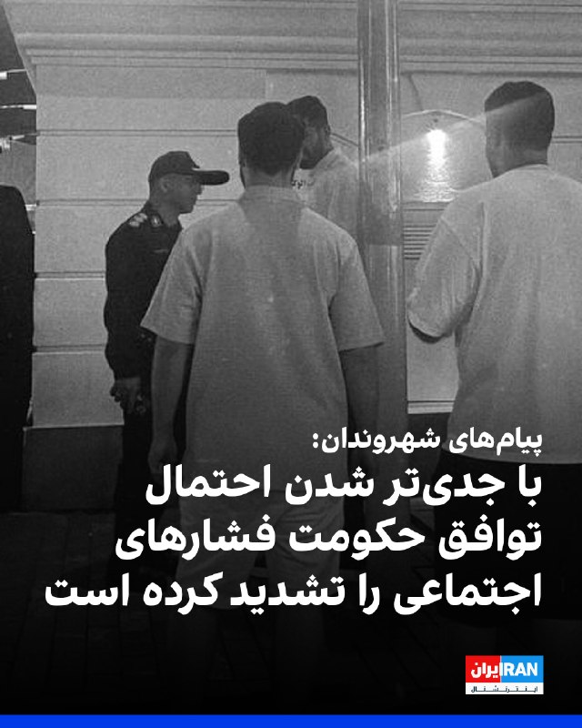
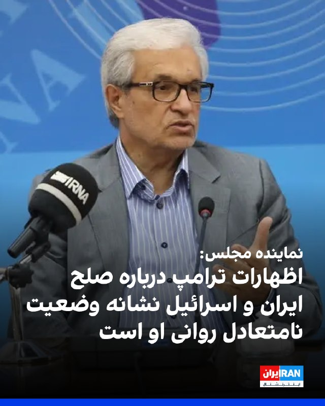
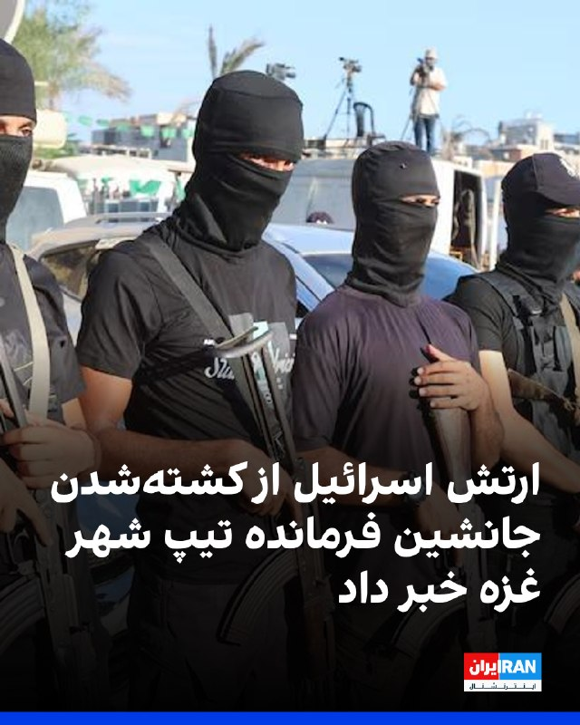
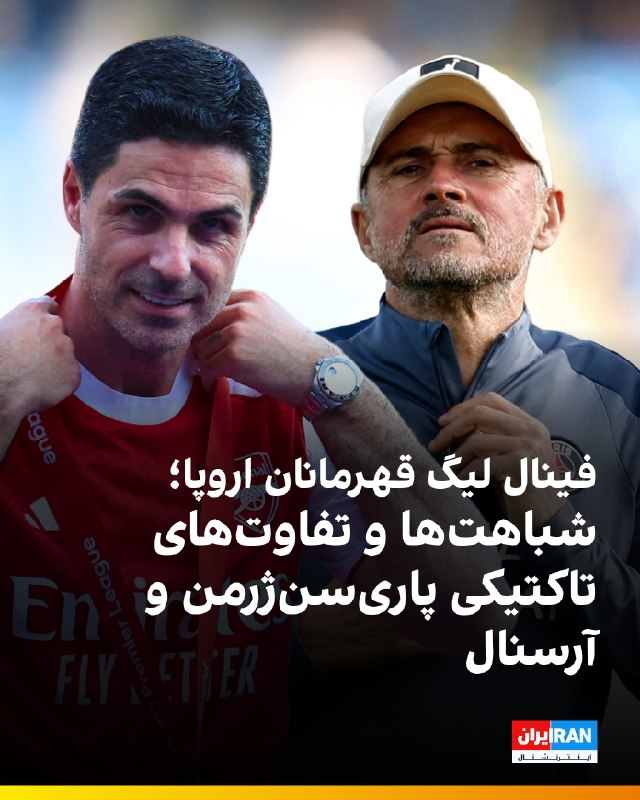
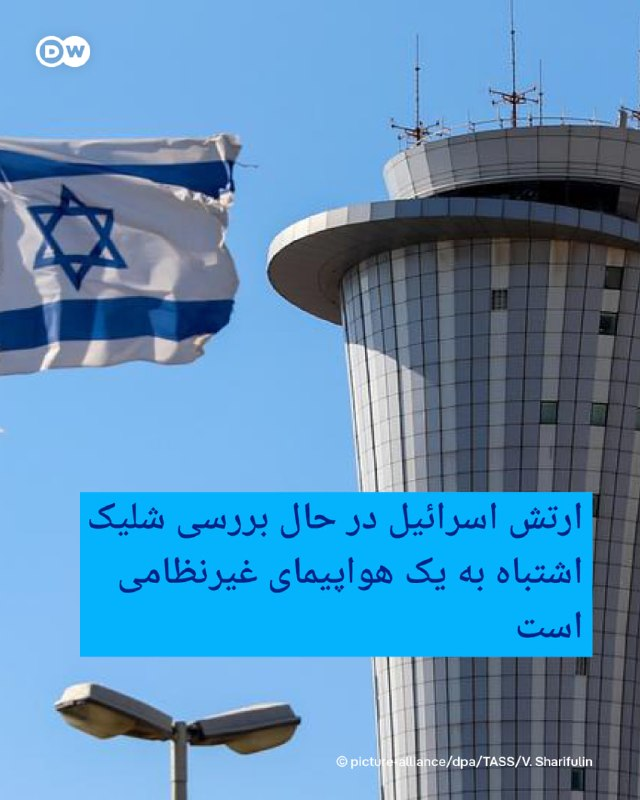
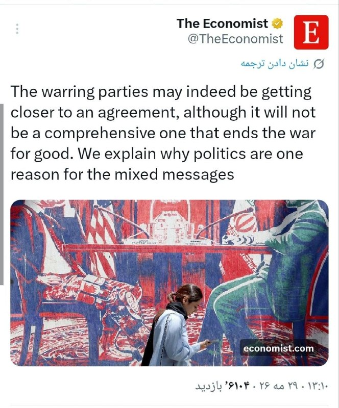
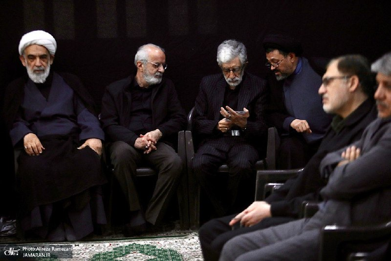
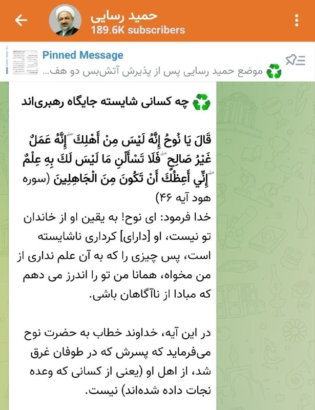

# خواننده تلگرام

<!-- TOP_NAV START -->

<a href="https://github.com/yerbeyer/aio-downloader/blob/main/telegram/content/archive_1.md" style="display:inline-block; padding:6px 12px; margin:0 4px; background-color:#2ea44f; color:white; text-decoration:none; border-radius:4px; font-weight:bold;">صفحه بعد</a>

<!-- TOP_NAV END -->

<!-- MSG START -->

---
📅 بروزرسانی: 1405/03/08 14:36
---

## VahidOOnLine — post 242714

  

♦️شبکه خبری العربیه، روز جمعه هشتم خرداد ماه، به نقل از منابع «آگاه» گزارش کرد که جمهوری اسلامی ایران در چارچوب مذاکرات با آمریکا خواستار انتقال ذخایر اورانیوم غنی‌شده به چین شده و از پکن خواسته است تا تضمین دهد که این مواد در اختیار ایالات متحده قرار نخواهد گرفت.

این ادعا در حالی مطرح می‌شود که دونالد ترامپ، رئیس جمهوری آمریکا دو روز پیش صراحتا با انتقال اورانیوم غنی‌شده ایران به چین یا روسیه مخالفت کرده بود.

منابع العربیه گفته‌اند، بخش قابل توجهی از اختلافات و مسائل مورد مناقشه در پرونده هسته‌ای ایران در جریان مذاکرات اخیر حل‌وفصل شده و طرف‌ها در بسیاری از موضوعات به پیشرفت دست یافته‌اند.

العربیه به نقل از منابع خود همچنین گزارش کرد که جمهوری اسلامی با هدف جلوگیری از برچیده‌شدن تاسیسات  هسته‌ای ایران و حفظ زیرساخت‌های موجود، با نظارت بین‌المللی بر تاسیسات هسته‌ای خود موافقت کرده است.

این گزارش در حالی منتشر می‌شود که مقام‌های جمهوری اسلامی همچنان به حفظ  ذخایر اورانیوم غنی‌شده در ایران تاکید می‌کنند. رئیس کمیسیون امنیت ملی مجلس، ساعاتی پیش در گفتگو با خبرگزاری روسی ریانووستی اعلام کرده بود اورانیوم غنی‌شده ایران به کشور ثالث منتقل نخواهد شد.
‌🇸🇦 Indypersian

🤖 @VahidOOnLine

## VahidOOnLine — post 242713

  

شبکه العربیه به نقل از منابع آگاه گزارش داد جمهوری اسلامی می‌خواهد اورانیوم غنی‌سازی‌شده خود را به چین منتقل کند، مشروط بر آن‌که چین تضمین دهد این مواد را به آمریکا تحویل نخواهد داد.

به گفته این منابع، بسیاری از نکات مرتبط با برنامه هسته‌ای جمهوری اسلامی در مذاکرات جاری حل‌وفصل شده است.

بر اساس این گزارش، جمهوری اسلامی با نظارت بین‌المللی بر تاسیسات هسته‌ای خود برای جلوگیری از تعطیل‌شدن آن‌ها موافقت کرده است.
‌🏁 🇬🇧 IranintlTV

🤖 @VahidOOnLine

## WithYashar — post 12852

سلام یاشار عزیز من امشب عروسیمه امشب میزنه آماده باشم تو باغ مهمونا رو از قبل آماده کنم میزنه ؟؟ 😂😂

## WithYashar — post 12851

بر اساس تحلیل نشریه اکونومیست، طرفین درگیر ممکن است بیش از هر زمان دیگری به یک توافق نزدیک شده باشند.
با این حال، این توافق جامع نخواهد بود و جنگ را برای همیشه پایان نخواهد داد.
این نشریه در ادامه توضیح می‌دهد که چگونه ملاحظات و بازی‌های سیاسی، عامل اصلی ارسال این پیام‌های ضدونقیض از سوی طرفین است
@withyashar

## WithYashar — post 12850

نیویورک تایمز: یکی از جدیدترین و شگفت‌انگیزترین عناصر پیش‌نویس توافق صلح ایران، یک صندوق سرمایه‌گذاری پیشنهادی برای ایران به مبلغ ۳۰۰ میلیارد دلار است.

ایران در ابتدا این موضوع را به عنوان غرامت برای خسارات جنگ (که آن را بین ۳۰۰ میلیارد تا ۱ تریلیون دلار تخمین می‌زند) مطرح کرد. طرف آمریکایی آن را به عنوان یک «صندوق سرمایه‌گذاری بین‌المللی» که به تسهیل آن کمک می‌کند، بازتعریف کرده است
یک چارچوب نرم‌تر که از کلمه غرامت اجتناب می‌کند.
به نظر می‌رسد این ایده از استیو ویتکوف و جرد کوشنر نشأت گرفته است که پروژه‌های املاک و مستغلات تهران و یک ابزار سرمایه‌گذاری گسترده‌تر را به عنوان شیرین‌کننده‌های معامله مطرح کردند
@withyashar

## WithYashar — post 12849

دوستان من گفتم فردا میگم کجا متن ها رو بفرستید دوبار هم در متن تاکیید کردم! پیغام هایی که الان دایرکت دادید بین پیغام های‌دیگه میره و از دست میره حتی نیمتونم بخونم 😟 چرا درک نمیکنید خیلی واضح گفتم

## WithYashar — post 12848

خب این متن را مینویسم که همه حتما ببینند. امروز و فردا روز بسیار مهمی هست. ما هر دو شب را بیدار خواهیم ماند برای گزارش و برای دوشنبه آخر شب هم در صورتی که حمله نبود میخواهیم یک پیام برای شاهزاده بفرستیم ساعت ۱۱:۱۱ دقیقه . در نتیجه از همه شما دعوت میکنم خیلی…

## WithYashar — post 12847

  <a href="telegram/content/WithYashar_12847_1780052819.mp4" target="_blank">🎬 Download video</a>

معاون رئیس دفتر کاخ سفید در امور سیاست، استیون میلر:
ایران امتیاز های خیلی قابل توجه، مادی به ایالات متحده داده که قبلا میگفت غیر ممکنه
@withyashar

## WithYashar — post 12846

فارس نیوز ، خطیب نماز جمعهٔ تهران: دشمن متوقف نیست، ما باید در مرز دانش و فناوری حرکت کنیم
حجت‌الاسلام ابوترابی: تعرض آمریکا در سحرگاه دیروز به نقطه‌ای در حاشیه فرودگاه بندرعباس که نه خسارت جانی داشت و نه خسارت مالی، اما تعرض به آسمان و زمین ایران بود. این تعرض از پایگاه هوایی آمریکا در منطقه انجام شد
@withyashar 🥴

## WithYashar — post 12845

خب این متن را مینویسم که همه حتما ببینند. امروز و فردا روز بسیار مهمی هست. ما هر دو شب را بیدار خواهیم ماند برای گزارش و برای دوشنبه آخر شب هم در صورتی که حمله نبود میخواهیم یک پیام برای شاهزاده بفرستیم ساعت ۱۱:۱۱ دقیقه . در نتیجه از همه شما دعوت میکنم خیلی رسمی و محترمانه صحبتهای خود را بنویسید و امروز بر روی متن تمرکز کنید و فردا از ساعت ۱۰ صبح تا ۱۰ شب برای من ارسال کنید تا چکیده ای از تمام آنها را ارسال کنم و فقط کلام من نباشد. حتی شده یک کلمه از پیام هر شخص را برمیداریم و متنی باهم میسازیم که در خور باشد. پس از شما دعوت میکنم به این کمپین بپیوندید ،لطفا امروز و فردا از فرستادن دایرکتهای غیرمعمول بپرهیزید سوال بیشتری را نمیتوانم پاسخ بدهم متن کامل است هر صحبتی که دارید در همان متن بنویسید تا همه با هم متن پایانی را استوری، کامنت ، دایرکت و ایمیل کنیم 🙌🏾. شروع ارسال فردا ۱۰ صبح و آخرین مهلت ارسال برای من فردا ۱۰ شب است.
@withyashar

## WithYashar — post 12844

تحلیل عوستاد رائفی پور :
آمریکایی‌ها نیروهای بیگانه فضایی هم کمک گرفتن
@withyashar

## WithYashar — post 12843

شبکه العربیه به نقل از منابع آگاه گزارش داد جمهوری اسلامی می‌خواهد اورانیوم غنی‌سازی‌شده خود را به چین منتقل کند، مشروط بر آن‌که چین تضمین دهد این مواد را به آمریکا تحویل نخواهد داد.
@withyashar

## mwarmonitor — post 9880

  <a href="telegram/content/mwarmonitor_9880_1780052821.mp4" target="_blank">🎬 Download video</a>

📝 وقتی می‌گویند «مدیریت جهادی»، دقیقاً منظورشان همین است؛ محسن برمهانی معاون صدا و سیما میلی مدیری که چنان غرق در حل بحران‌های کلان کشور و تحول در رسانه ملی بوده که اصلاً وقت نکرده مسیر رختخواب تا استودیو را از طریق حمام طی کند. ظاهر پشم‌والو و قیافه ژولیده‌ای که انگار همین چند ثانیه پیش با زلزله‌ای ملایم از عمق پتو بیرون کشیده شده، خودش یک پیام استراتژیک است: «ما آن‌قدر مشغول کاریم که فرصت شانه کردن مو و تعویض لباس را هم نداریم!»
🔸در دنیایی که رسانه‌ها با هوش مصنوعی و استانداردهای فوق‌مدرن بصری جلو می‌روند، این انگل ها به «اصالت طبیعی» روی آورده‌اند؛ به‌طوری که بوی عرق و اتمسفر کپک‌زده از پشت صفحه نمایشگر هم رد می‌شود و مستقیم به مشام مخاطب می‌رسد. این سطح از واقع‌گرایی در تصویر، خودش بزرگ‌ترین دستاورد نظام مدیریتی است! از چنین ژنرال‌های خط مقدمی که معتقدند رسانه باید «پیش‌تر و بیشتر از میدان موثر باشد»، بعید هم نیست که با همین سر و وضع، فاتح جنگ‌های رسانه‌ای جهان شوند. تف به این حجم از تخصص و آراستگی که هر بیننده‌ای را در همان نگاه اول، میخکوب و البته منزجر می‌کند!

@mwarmonitor

## mwarmonitor — post 9878

📝وقتی شهر که خلوت بشه، قورباغه هفت‌تیرکش میشه! بله آقای ترامپ، وقتی درست وسط جنگ که این جمهوری اسلامیِ فکسنی داشت نفله و تکه‌پاره می‌شد، تو با اون مغز فندقی و ژست‌های پوچت دویدی وسط و آتش‌بس دادی، باید هم تهش به این افتضاح ختم بشه. مردک هالو، با همین حماقتت…

## mwarmonitor — post 9877

  <a href="telegram/content/mwarmonitor_9877_1780052822.mp4" target="_blank">🎬 Download video</a>

📽سکانس هالیوودی
🔹«پهپاد اوکراینی به ناوچه روسی «دریاسالار اسن» در نووروسیسک اصابت کرد.

🔸ناوچه پروژه ۱۱۳۵۶ «دریاسالار اسن»، که حامل موشک‌های کروز کالیبر است، در پایگاه دریایی روسیه در شهر نووروسیسک هدف یک پهپاد اوکراین قرار گرفت.

🔸تصاویر ضبط‌شده از شب ۲۳ مه به‌روشنی نشان می‌دهد که سامانه‌های پدافند هوایی روسیه پیش از اصابت، موفق به رهگیری این پهپاد نشده‌اند.

@mwarmonitor

## mwarmonitor — post 9876

🔸«اوایل صبح امروز، در جریان حملات روسیه به زیرساخت‌های اوکراین در نزدیکی مرز، یک ساختمان مسکونی در رومانی هدف یک پهپاد قرار گرفت. دبیرکل ناتو، مارک روته، با مقام‌های رومانی در تماس است. ما بی‌پروایی روسیه را محکوم می‌کنیم و ناتو به تقویت پدافندهای خود در برابر…

## mwarmonitor — post 9875

  

🔸«اوایل صبح امروز، در جریان حملات روسیه به زیرساخت‌های اوکراین در نزدیکی مرز، یک ساختمان مسکونی در رومانی هدف یک پهپاد قرار گرفت. دبیرکل ناتو، مارک روته، با مقام‌های رومانی در تماس است. ما بی‌پروایی روسیه را محکوم می‌کنیم و ناتو به تقویت پدافندهای خود در برابر همه تهدیدها، از جمله پهپادها، ادامه خواهد داد.»
— سخنگوی ناتو

@mwarmonitor

## FoxNewsTwitter — post 342393

  

Fox News (Twitter/X)

WATCH LIVE: Hegseth holds bilateral meeting in Thailand
https://twitter.com/i/broadcasts/1MJgNNjDAXXGL

## FoxNewsTwitter — post 342392

  

Fox News (Twitter/X)

WATCH LIVE: Hegseth holds bilateral meeting with Vietnam's president
https://twitter.com/i/broadcasts/1dGYllpbnmYKX

## DEJradio — post 5093

⭕️ سنتکام خبر هدف گرفتن هواگرد آمریکایی توسط جمهوری اسلامی را نادرست خواند

ستاد فرماندهی مرکزی ارتش آمریکا گزارش‌های منتشرشده در رسانه‌های حکومت در ایران را دربارۀ هدف قرار گرفتن یک هواگرد آمریکایی رد کرد.
سنتکام در شبکۀ اکس خبر داد ادعای مطرح‌شده در تلویزیون جمهوری اسلامی دروغ است و همۀ هواگردها و هواپیماهای آمریکا سالم است.

#خبر #دژ #سنتکام
@DEJradio

## DEJradio — post 5092

⭕️ تحریم‌های تازۀ آمریکا شریان‌های مالی سپاه را هدف گرفت

وزارت امور خارجۀ آمریکا اعلام کرد با اعمال تحریم‌های تازه، مستقیما منابع مالی سپاه پاسداران و ساختار نظامی جمهوری اسلامی را هدف گرفته است.
در بسته تحریمی تازۀ آمریکا، هشت نهاد، سه نهاد فعال در تجارت پتروشیمی، یک فرد و هشت کشتی مرتبط با حمل نفت و فرآورده‌های مرتبط با جمهوری اسلامی، هدف گرفته شد.
تامی پیگوت، سخنگوی وزارت امور خارج، آمریکا گفت واشینگتن در چارچوب سیاست فشار شدید اقتصادی، شبکه‌های نفتی و ناوگان مخفی جمهوری اسلامی را هدف گرفته است.
وزارت امور خارجۀ آمریکا هشدار داد هر فرد یا شرکتی که در تجارت نفت و انرژی با جمهوری اسلامی مشارکت کند، با خطر تحریم روبه‌رو است.

#خبر #دژ #تحریم
@DEJradio

## DEJradio — post 5091

⭕️ جانشین فرماندۀ تیپ شهر غزه در شاخۀ نظامی حماس حذف شد

ارتش اسرائیل اعلام کرد عماد حسن حسین اسلیم، جانشین فرماندۀ تیپ شهر غزه و فرماندل گردان زیتون در شاخۀ نظامی حماس، در پی حمله‌ای مشترک با شاباک، حذف شد.
حماس که از پشتیبانی جمهوری اسلامی بهره‌مند است، در سیاهۀ تروریستی اروپا و آمریکا قرار دارد.
بر اساس بیانیۀ ارتش اسرائیل، این حمله روز چهارشنبه انجام شده است.
بنا بر گزارش‌ها اسلیم یکی از فرماندهان کشتار هفتم اکتبر در اسرائیل بود.
به گزارش ارتش اسرائیل، این فرد در سال‌های اخیر ده‌ها طرح عملیاتی را علیه نیروهای اسرائیلی در غزه هدایت کرده بود و تهدیدی فوری به شمار می‌رفت.
ارتش اسرائیل اعلام کرد دیگر نتایج حمله و سرنوشت یک فرماندۀ دیگر حماس که در محل حضور داشت، همچنان در دست بررسی است.

#خبر #دژ #اسرائیل #حذف_هدفمند
@DEJradio

## DEJradio — post 5090

⭕️ تفاهم‌نامۀ ۶۰ روزه تهران و واشینگتن در انتظار تصمیم ترامپ است

رسانه‌های آمریکایی گزارش دادند دونالد ترامپ هنوز برای امضای تفاهم‌نامه با جمهوری اسلامی، تصمیم پایانی را نگرفته است.
بنا بر گزارش‌ها تهران و واشینگتن بر سر یک تفاهم اولیه شصت روزه برای تمدید آتش‌بس و ادامۀ مذاکرات به جمع‌بندی رسیده‌اند، اما همه چیز به تأیید نهایی دونالد ترامپ وابسته است.
به گزارش آکسیوس، بر اساس این تفاهمنامه، آتش‌بس تمدید می‌شود و مسیر مذاکرات هسته‌ای باز می‌ماند.
یک مقام آمریکایی به آکسیوس گفت ترامپ به میانجی‌ها اطلاع داده که باید چند روز برای اخذ تصمیم پایانی فکر کند.

#خبر #دژ #توافق
@DEJradio

## DEJradio — post 5089

⭕️ عمان به امریکا تعهد داد برنامه‌ای برای دریافت عوارض در تنگۀ هرمز ندارد

اسکات بسنت، وزیر خزانه‌داری آمریکا گفت پس از گفت‌وگو با سفیر عمان در واشینگتن، از او تضمین گرفته که مسقط برای دریافت عوارض از کشتی‌های عبوری در تنگۀ هرمز برنامه‌ای ندارد.
او افزود به سفیر عمان داده هرگونه اقدام در دریافت عوارض از کشتی‌ها، می‌تواند افراد و نهادهای عمانی را در معرض تحریم قرار دهد.
این اظهارات یک روز پس از آن مطرح می‌شود که دونالد ترامپ هشدار داد اگر عمان بخواهد این آبراه را کنترل کند، توسط آمریکا نابود می‌شود.
مقام‌های جمهوری اسلامی پیش‌تر گفته بودند تهران و عمان درمورد ایجاد سازوکار عبور کشتی‌ها در آبراه هرمز مذاکره می‌کنند.

#خبر #دژ #تنگه_هرمز #عوارض
@DEJradio

## DEJradio — post 5088

⭕️ جی‌دی ونس: به توافق با تهران نزدیک شدیم اما هیچ چیز قطعی نیست

جی‌دی ونس، معاون رئیس‌ جمهوری آمریکا گفت واشینگتن و تهران هنوز به توافق نهایی نرسیده‌اند، اما به آن نزدیک شده‌اند.
او گفت نمی‌تواند تضمین کند که توافق در راه است، اما نسبت به آن خوش‌بین است.
به گفتۀ جی‌دی ونس چند موضوع اصلی از جمله ذخایر اورانیوم غنی‌شده و مسئله غنی‌سازی، همچنان محل اختلاف است.
معاون رئیس‌ جمهوری آمریکا گفت هنوز روی چند بخش متن بده‌وبستان می‌کنیم و مشخص نیست دونالد ترامپ ان را امضا می‌کند یا نه.

#خبر #دژ #مذاکرات
@DEJradio

## DEJradio — post 5087

⭕️ وزیر جنگ آمریکا گفت رخدادهای آینده به تصمیم جمهوری اسلامی بستگی دارد

پیت هگست، وزیر جنگ آمریکا گفت جمهوری اسلامی باید از برنامۀ هسته‌ای خود دست بکشد و آنچه در آینده مورد ایران رخ می‌دهد، به تصمیم تهران بستگی دارد.
او با اشاره به موضع دونالد ترامپ گفت جمهوری اسلامی یا از مسیر توافق پای میز مذاکره به پیش می‌رود و یا با گزینۀ نظامی روبه‌رو می‌شود.
هگست این اظهارات را در عرشۀ رزمناو آمریکایی یو‌اس‌اس باکسر، در سنگاپور و پیش از حضور در مجمع امنیتی آسیا مطرح کرد.

#خبر #دژ #جنگ
@DEJradio

## DEJradio — post 5086

⭕️ آمریکا دسترسی شرکت‌های هواپیمایی جمهوری اسلامی به امکانات فرود، سوخت‌گیری و فروش بلیت را متوقف می‌کند

اسکات بسنت، وزیر خزانه‌داری آمریکا گفت واشینگتن در چارچوب افزایش فشار بر جمهوری اسلامی و باز نگه داشتن تنگۀ هرمز، دسترسی شرکت‌های هواپیمایی جمهوری اسلامی را به فرودگاه‌ها و امکانات سوخت‌گیری و فروش بلیت، متوقف می‌کند.
بسنت در شبکۀ اکس نوشت: دسترسی هر دو شرکت هواپیمایی جمهوری اسلامی به این امکانات، از دست می‌رود.
ایالات متحده پیش‌تر شرکت‌های هوپیمایی از جمله ایران‌ایر و ماهان را در فهرست تحریم‌ قرار داده بود.
به گفتۀ اسکات بسنت، تنها یک نتیجۀ راضی‌کننده در مذاکرات،می‌تواند روند نزولی اقتصاد را در ایران متوقف کند.
وزیر خزانه‌داری آمریکا همچنین یادآور شد اقتصاد و ارزش پول ایران در وضعیت سقوط آزاد، قرار دارد.
او گفت برنامۀ «فشار شدید اقتصادی، با هدف افزایش فشار بر جمهوری اسلامی ادامه پیدا می‌کند.

#خبر #دژ #تحریم
@DEJradio

## DEJradio — post 5085

  <a href="telegram/content/DEJradio_5085_1780052825.webm" target="_blank">🎬 Download video</a>

🔺📢 سردار پاسدار محمدرضا جعفری:
برای نابودی نیروهای آمریکایی برنامه داریم، کافی است حمله زمینی کنند

آمریکا و جمهوری اسلامی در حال مذاکره‌اند و بر اساس ادعای بعضی مقامات دو کشور توافق بسیار نزدیک‌ است اما واقعیت آن است که یکی از اصلی‌ترین گزینه‌ها همچنان «حمله نظامی» است، و حکومت نگران از اینکه در مرحله آتی «عملیات زمینی» در دستور کار آمریکا و اسرائیل قرار بگیرد.

سردار پاسدار محمدرضا جعفری از فرماندهان سـ.ـپاه پاسداران در مراسم چهلم محمد پاکپور فرمانده پیشین سـ.ـپاه که در جنگ ۴۰ روزه کشته شد، در جمع خبرنگاران در پاسخ به احتمال حمله زمینی گفته «اگر ایالات متحده آمریکا به صورت زمینی به ایران حمله کند، رزمندگان سـ.ـپاه پاسداران انقلاب اسلامی برای نابودی آنها برنامه‌ریزی کرده‌اند.»

او همچنین گفت: «به دونالد ترامپ رئیس جمهور آمریکا هشدار می‌دهم که سربازان ما را نیازماید؛ ما آماده‌ایم تا پاسخ سختی به آمریکا بدهیم و ارتش او را در زمین نابود کنیم.»
گزارش شده که به ترامپ مجموعه‌ای از عملیات‌ها ارائه شده که می‌تواند شامل ورود نیروهای زمینی به ایران باشد. در حال حاضر حدود سه هزار چترباز از لشکر نخبه ۸۲ هوابرد و ۵۰۰۰ نیروی زبده از واحدهای اعزامی ۳۱ و ۱۱ تفنگداران دریایی را مستقر کرده است.

#جنگ #حمله_زمینی
@DEJradio

## DEJradio — post 5084

  <a href="telegram/content/DEJradio_5084_1780052826.mp4" target="_blank">🎬 Download video</a>

🤡
🔺 عقل ولایتمدار؛ قالیباف مذاکره می‌کند، ماکت ظریف را آتش‌ می‌زنند!

مذاکره با آمریکا هواداران حکومت را خشمگین کرده است، اما می‌کوشند "نفهمند" پشت مذاکرات، دیگر روحانی و ظریف نیستند بلکه سرداران‌اند که برای بقای خودشان تن به مذاکره با قاتلان خامنه‌ای داده‌اند.

#موشعلی #مذاکرات
@DEJradio

## DEJradio — post 5083

  <a href="telegram/content/DEJradio_5083_1780052828.mp4" target="_blank">🎬 Download video</a>

🔺🎥 با توجه به اینکه دسترسی بخشی از شهروندان در داخل کشور به اینترنت به‌صورت نسبی برقرار شده است ویدیوهایی از حواشی جنگ ۴۰ روزه به اشتراک گذاشته می‌شود.

یکی از این ویدیوها مربوط به شادی هموطنان بعد از اعلام کشته‌شدن علی خامنه‌ای در بمباران است.

#موشعلی #جنگ۴۰روزه
@DEJradio

## DEJradio — post 5082

  <a href="telegram/content/DEJradio_5082_1780052830.webm" target="_blank">🎬 Download video</a>

🔺📷 شبکه الحدث با استناد به تصاویر ماهواره‌ای گزارش داد جمهوری اسلامی در حال بیرون کشیدن دوباره ذخایر موشکیِ دفن‌شده‌اش از سایت‌های زیرزمینی است.

تصاویر ماهواره‌ای تازه نشان می‌دهند که سـ.ـپاه پاسداران در حال بازیابی شمار زیادی موشک است که در تأسیسات زیرزمینی پنهان شده بودند؛ هم‌زمان ماشین‌آلات سنگین و بولدوزرها نیز مشغول پاک کردن آثار حملات اخیر اسرائیل و آمریکا هستند.

#ذخایر_موشکی #جنگ
@DEJradio

## DEJradio — post 5081

  <a href="telegram/content/DEJradio_5081_1780052830.webm" target="_blank">🎬 Download video</a>

🔺📢 به گزارش «حال‌ وش» شامگاه پنجشنبه ۷ خرداد ماه ۱۴۰۵، یک مامور نیروی انتظامی در پی تیراندازی افراد مسلح در شهرستان ایرانشهر کشته شد.

استوار دوم عیسی عباسی در محدوده چهارراه بـ.ـسیج و تقاطع خیابان حافظ ایرانشهر، زمانی که با یک دستگاه موتورسیکلت در حال عزیمت به محل کار خود بوده، هدف تیراندازی افراد مسلح قرار گرفت.

تا لحظه تنظیم این گزارش، هیچ فرد یا گروهی مسئولیت این حمله را برعهده نگرفته و مقام‌های امنیتی نیز جزئیات بیشتری درباره مهاجمان یا انگیزه احتمالی این تیراندازی منتشر نکرده‌اند.

#ایرانشهر #جنگ
@DEJradio

## DEJradio — post 5080

  <a href="telegram/content/DEJradio_5080_1780052831.webm" target="_blank">🎬 Download video</a>

🚨📢 بر اساس گزارش منابع داخلی و محلی، پدافند در شهر ایران از جمله بندرعباس، جم (بوشهر) و بیدگنه در جنوب تهران فعال شد.
مردم در شهر جم صدای چند انفجار شنیدند. مسئولان محلی ادعا کردند علت انفجارها مقابله با «پهپاد‌های متخاصم» بود اما منابع غیررسمی گزارش دادند تاسیسات موشکی سـ.ـپاه پاسداران هدف حمله قرار گرفته است.

طی هفته گشته جنگنده‌های آمریکا دست‌کم دو قایق تندرو سـ.ـپاه و فرودگاه بندرعباس و چند سایت موشکی را هدف قرار دادند.
یک منبع آگاه به دژ می‌گوید علت حمله آمریکا به فرودگاه بندرعباس استقرار لانچر یا پهپاد در نزدیک باند بود. با این لانچرها چند مشوشک [یا پهپاد] به امارات پرتاب شد.

مردم به اطلاع‌رسانی جمهوری اسلامی بی‌اعتمادند. به گزارش خبرگزاری مهر، در پی شنیده شدن صدای انفجار در منطقه ۷ چاه شهرستان جم واقع در استان بوشهر، مشخص شد که این رخداد ناشی از عملکرد پدافند دفاعی بوده است.

پیش‌تر، خبرگزاری تسنیم گزارش داده بود صداهای شنیده‌شده احتمالا به شلیک‌های اخطار نیروی دریایی ایران به برخی شناورها مرتبط است. خبرگزاری فارس نیز اعلام کرد نیروهای مسلح جمهوری اسلامی پنجشنبه شب از مناطق جنوبی کشور به‌سمت اهدافی نامشخص موشک شلیک کرده‌اند.

#پدافند #جنگ
@DEJradio

## IranIntlTV — post 339554

  <a href="telegram/content/IranIntlTV_339554_1780052831.mp4" target="_blank">🎬 Download video</a>

علیرضا سیدصالح، شهروند ۴۴ ساله، از جمله شهروندانی بود که در اعتراضات انقلاب ملی دی‌ماه در فولادشهر اصفهان هدف شلیک ماموران قرار گرفت و کشته شد. بنا به اطلاعات رسیده به ایران اینترنشنال، بدن مجروح او هدف تیر خلاص نیز قرار گرفت. علیرضا سیدصالح هنگام کمک به مجروحان اعتراضات هدف قرار گرفت و مجروح شد.

## IranIntlTV — post 339553

  <a href="telegram/content/IranIntlTV_339553_1780052833.mp4" target="_blank">🎬 Download video</a>

سرخط خبرهای جمعه ۸ خرداد
@iranintltv

## IranIntlTV — post 339552

🔻سایه سنگین بحران اقتصادی بر زندگی معلولان؛ افزایش حمایت‌ها در انتظار تصویب دولت

فاطمه عباسی، معاون توان‌بخشی سازمان بهزیستی، با اشاره به مشکلات فزاینده افراد دارای معلولیت در پی وخامت بحران اقتصادی کشور، اعلام کرد این سازمان خواستار افزایش ۸۰ تا ۹۰ درصدی کمک‌هزینه حق پرستاری نسبت به سال ۱۴۰۴ شده، اما اجرای آن منوط به تصویب دولت خواهد بود.

عباسی جمعه هشتم خرداد در مصاحبه با خبرگزاری ایلنا گفت سازمان بهزیستی «به‌صورت مستمر» پیگیر افزایش کمک‌هزینه حق پرستاری افراد دارای معلولیت است و در همین راستا، در جلسات کمیسیون بودجه هیات دولت جمهوری اسلامی حضور یافته است.

به گفته معاون توان‌بخشی سازمان بهزیستی، افزایش مبلغ کمک‌هزینه پس از تصویب در هیات وزیران قابل اجرا خواهد بود. با این حال، او درباره زمان احتمالی بررسی و تصویب این پیشنهاد توضیحی ارائه نکرد.

عباسی افزود تا زمان تصمیم‌گیری هیات وزیران، پرداخت کمک‌هزینه حق پرستاری بر اساس سرانه مصوب سال ۱۴۰۴ ادامه خواهد یافت.

او یادآور شد: «با توجه به اینکه بیش از ۸۰ درصد این افراد در دهک‌های پایین قرار داشته و در خانواده نگهداری می‌شوند، لزوم حمایت از آن‌ها جهت پیشگیری از تشدید معلولیت و جلوگیری از کاهش کیفیت زندگی اهمیت خاصی دارد.»

در روزهای اخیر، تشدید مشکلات اقتصادی و افزایش چشمگیر هزینه‌های درمان و دارو، فشار مضاعفی بر شهروندان ایرانی وارد آورده است.
این شرایط به‌ویژه برای افراد دارای معلولیت که نیاز مستمر به خدمات پزشکی، توان‌بخشی و دارو دارند، چالش‌های جدی‌تری ایجاد کرده است.
یک شهروند هشتم خرداد در پیامی به ایران‌اینترنشنال نوشت: «بیمار آرتریت روماتویید و فیبرومیالژیا هستم. ۱۰ سال است درگیر بیماری هستم. هشت سال است داروی رمیکید تزریق می‌کنم. چند ماه است که دارو دریافت نکرده‌ام. بیماری من دوباره بیدار شده و تمام مفاصلم متورم و زانوهایم قفل شده.»
او افزود: «دیروز از سازمان غذا و دارو تماس گرفتند و گفتند رمیکید موجود است ویالی ۱۹ میلیون. سه ویالش می‌شود ۵۷ میلیون. ولی من با وجود این همه درد نتوانستم خرید کنم، چون توانایی پرداخت هزینه‌اش را ندارم.»

کمک‌هزینه جدید لوازم بهداشتی پاسخگوی نیاز واقعی معلولان نخواهد بود

معاون توان‌بخشی سازمان بهزیستی در ادامه مصاحبه خود اعلام کرد افراد دارای معلولیت که به‌دلیل شرایط جسمی و نیازهای پزشکی ناگزیر به استفاده مداوم از پوشینه و سایر اقلام بهداشتی هستند، در دو ماه گذشته با افزایش قابل توجه قیمت این محصولات و دشواری در تامین آن‌ها روبه‌رو شده‌اند.
عباسی گفت: «کمبود مقطعی کالا و نوسان شدید در بازار، به‌ویژه در شرایط کنونی، فشار مضاعفی را بر خانواده‌های این عزیزان وارد کرده است.»

او افزود بر اساس مکاتبات انجام‌شده، قرار است سرانه کمک‌هزینه لوازم بهداشتی در بودجه سال ۱۴۰۵ از یک میلیون و ۵۰۰ هزار تومان به دو میلیون و ۵۰۰ هزار تومان افزایش یابد و در عین حال گفت بودجه مصوب در این خصوص «به‌‎طور رسمی ابلاغ نشده و هنوز به مرحله اجرا نرسیده» است.
معاون توان‌بخشی سازمان بهزیستی اذعان کرد: «حتی این سرانه جدید هم با قیمت واقعی نیاز بهداشتی یک فرد ضایعه نخاعی یا بسترگرا فاصله و تفاوت واضحی دارد.»
پنجم خرداد، وب‌سایت خبرآنلاین گزارش داد گرانی لوازم بهداشتی در ایران زندگی حدود ۴۵ هزار فرد دارای آسیب نخاعی را تحت تاثیر قرار داده است.
بر پایه این گزارش، بهای اقلام و تجهیزات پزشکی مورد استفاده روزانه این افراد، از جمله گاز استریل، پانسمان‌های تخصصی، سوند، کیسه سوند، ژل، سرنگ، دستمال کاغذی و داروهای مرتبط با زخم بستر، دست‌کم دو تا سه برابر شده است.

🔗وبسایت ایران‌اینترنشنال

@iranintltv

## IranIntlTV — post 339551

  

علی باقری‌کنی، معاون دبیر شورای عالی امنیت ملی، در حاشیه کنفرانس امنیتی مسکو، گفت: «پس از حملات اخیر آمریکا و اسرائیل، باید چارچوب تازه‌ای برای صلح و ثبات در منطقه تعریف شود و این موضع با استقبال کشورهای حاضر در کنفرانس روبه‌رو شده است.»

باقری‌کنی گفت «پیمان ابراهیم» در واقع «پیمان فرعون» است و ضامن صلح در منطقه نخواهد بود و تا زمانی که طرح‌هایی مانند «خاورمیانه بزرگ» از سوی آمریکا یا «اسرائیل بزرگ» دنبال شود، منطقه به ثبات نخواهد رسید.

او افزود: «شکل‌گیری هر سازوکار امنیتی جدید باید با مشارکت کشورهای منطقه و بدون دخالت آمریکا و نفوذ اسرائیل باشد.»
https://iranintl.com/202605299574

## IranIntlTV — post 339550

‏محمد باقر الساعدی که خود را «مانند فرزند قاسم سلیمانی» فرمانده سابق نیروی قدس می‌داند، بازداشت و قرار است در آمریکا محاکمه شود. این در حالی است که احتمال افشای اطلاعات حساس، به نگرانی فرماندهان گروه‌های نیابتی جمهوری اسلامی در عراق دامن زده است
‏گزارش تروسکە صادقی، روزنامه‌نگار

@iranintltv

## IranIntlTV — post 339549

🗣روایت شما از زندگی در دوران پس از انقلاب ملی و جنگ - جمعه ۸ خرداد ۱۴۰۵

🔹من دبیر هستم، بعد از سی سال خدمت در آموزش‌وپرورش بازنشسته شدم. پاداش پایان کارم ۶۵۰ میلیون بود، آن هم در چند قسط. رفتم یک کولر ایستاده قیمت کردم ۴۵۰ میلیون. حالا شما ملاحظه بفرمایید بدبخت‌ترین قشر در این جامعه معلم بیچاره است.

🔹پیامم با آن‌هایی است که هر شب می‌آیند توی خیابان، شماها انگار داخل این کشور زندگی نمی‌کنید یا این‌که به جایی وصل هستید. مگر می‌شود آدم این‌قدر کور باشد و چشمش را روی این همه خون جاویدنام‌هایمان ببندد.

🔹در کشوری که «صنعت» ندارد، بخش کشاورزی هم با افزایش قیمت کودهای شیمیایی تا ۷۰۰ درصد، در حال نابودی است. کود سوپرفسفات یک میلیونی شده ۷ میلیون. دامدار و کشاورز در حال ضرر هستند. بماند که مردم باید گرانی این محصول ضروری را تحمل کنند.

🔹از شهر کرمانشاه پیام می‌فرستم. از سال نو تا الان که ۸ خرداد ماه است، مدام گرد و خاک و هوای ناسالم را تجربه می‌کنیم. داریم خفه می‌شویم. همه‌ی تعطیلات را مجبوریم خانه بگذرانیم.

🔹وضعیت اقتصادی داغونه. قیمت‌ها لحظه‌ای بالا می‌روند. یک وعده ناهار برای یک نفر شده نیم میلیون.

🔹چند شب صدای پدافند و تیر در مسجدسلیمان می‌آید، حدود ساعت ۲ یا ۳ شب.

🔹من یک کافی‌نت‌دار هستم در فردیس کرج. کاسبی ما از زمان جنگ تا الان هنوز خراب است و اینترنت با این‌که باز شده، هنوز مختل است. همان اندک مشتری هم که می‌آید، با این نت باز نمی‌شود که کارش را انجام بدهیم، حتی سایت‌های داخلی.

🔹شش تا سوسیس گرفتم، شد یک میلیون و ۲۰۰ هزار تومان.

🔹وقتی به آرامستان‌های خوزستان، اهواز، آبادان، خرمشهر و ماهشهر می‌رویم، جوانانی از ۱۴ تا ۳۰ سال دفن شده‌اند که علت فوتشان سرطان و تصادف است. مگر می‌شود از ۲۸ دی‌ماه تا ۲۵ دی‌ماه این همه جوان خوزستانی به علت سرطان فوت شده باشند؟ مردم همه آگاهند که چه خبر بوده.

## IranIntlTV — post 339548

  

محمد مولوی، نایب‌رییس کمیسیون آموزش مجلس، پیام مجتبی خامنه‌ای، رهبر جمهوری اسلامی، را ترسیم‌کننده «نقشه راه حکمرانی مسئولانه» خواند.

او گفت دشمنان پس از ناکامی در عرصه‌های نظامی و اقتصادی، با تمرکز بر «ایجاد تفرقه اجتماعی و سیاسی» به دنبال «ضربه زدن به انسجام ملت» هستند.

مولوی افزود مجلس باید در «خط مقدم حفظ وحدت ملی» قرار گیرد و اجازه ندهد «اختلافات غیرضروری و رقابت‌های جناحی» به شکاف در بدنه اجتماعی کشور منجر شود.

او تاکید کرد ترجیح منافع ملی بر منافع فردی و جناحی باید در تصمیم‌گیری‌های «تقنینی و نظارتی» مجلس دنبال شود.
https://iranintl.com/202605294589

## IranIntlTV — post 339547

  <a href="telegram/content/IranIntlTV_339547_1780052835.mp4" target="_blank">🎬 Download video</a>

روزنامه اسرائیل هیوم گزارش داد در حالی که هدف عملیات «خیزش شیران» حمله به زیرساخت‌های هسته‌ای و موشکی جمهوری اسلامی بود، عملیات «غرش شیران» با هدف تغییر حکومت در ایران طراحی شده بود.
گفت‌وگو با حسین آقایی، عضو تحریریه ایران‌اینترنشنال
@iranintltv

## IranIntlTV — post 339546

  <a href="telegram/content/IranIntlTV_339546_1780052836.mp4" target="_blank">🎬 Download video</a>

مرتضی کاظمیان، عضو تحریریه ایران‌اینترنشنال، گفت: «با وجود همه تلاش‌های جمهوری اسلامی برای ارعاب جامعه، پتانسیل اکثریت ناراضی و معترض در ایران همچنان پابرجاست و ممکن است در ماه‌های آینده بار دیگر خود را نشان دهد.»
@iranintltv

## IranIntlTV — post 339545

  <a href="telegram/content/IranIntlTV_339545_1780052838.mp4" target="_blank">🎬 Download video</a>

یک پرستار با ارسال پیامی به ایران اینترنشنال از شرایط اخراج خود از کار در زمان جنگ اخیر روایت می‌کند. پیام او با هوش مصنوعی خوانده شده است.

## IranIntlTV — post 339544

  

با جدی‌تر شدن احتمال توافق و تداوم آتش‌بس میان جمهوری اسلامی و اسرائیل و آمریکا، پیام‌های ارسالی شهروندان به ایران‌اینترنشنال از تشدید دوباره فشارهای امنیتی و اجتماعی در شهرهای مختلف ایران حکایت دارد.

بر اساس این گزارش‌ها، فعالیت گشت ارشاد در شهرهایی مانند اصفهان، رشت و انزلی از سر گرفته شده و ماموران علاوه بر زنان، مردان دارای پوشش غیرحکومتی از جمله شلوارک‌پوشان را نیز بازداشت و به ون‌های پلیس منتقل می‌کنند.

شهروندان همچنین از ثبت تصاویر افراد توسط ماموران خبر داده‌اند.

یک شهروند اشاره می‌کند که ماموران لباس شخصی حکومت در خیابان‌های این شهر به زنان و دختران به دلیل پوشش تذکر می‌دهند و آن‌ها را تحت فشار می‌گذارند.

در رفسنجان، یک شهروند می‌گوید پس از تذکر حجاب از سوی زنان حامی حکومت، ماموران مسلح برای یافتن او به محل‌های اطراف مراجعه کرده‌اند. گزارش‌هایی نیز از بررسی تلفن‌های همراه شهروندان و کنترل‌های گسترده‌تر منتشر شده است.

گزارش‌هایی از پلمپ مغازه‌ها در رشت به دلیل موضوع حجاب و نیز پلمپ یک باشگاه ورزشی زنان در اراک پس از ورود نیروهای امنیتی و بازداشت چند مربی منتشر شده است.
https://iranintl.com/2026

## IranIntlTV — post 339543

  

محمدرضا محسنی‌ثانی، عضو کمیسیون امنیت ملی مجلس، اظهارات دونالد ترامپ درباره حضور احتمالی ایران در «پیمان ابراهیم» را «هذیان‌گویی سیاسی» خواند و گفت این سخنان ناشی از «توهمات» و «وضعیت نامتعادل روانی» رییس‌جمهوری آمریکا است.

محسنی‌ثانی گفت پیوستن کشورهایی مانند امارات متحده عربی و بحرین به این پیمان نتوانسته اهداف آمریکا را محقق کند و این توافق‌ها «لرزان و بی‌ریشه» است.

او افزود این اظهارات «پروپاگاندای تبلیغاتی» برای سرپوش گذاشتن بر آنچه «شکست نظامی آمریکا در برابر جمهوری اسلامی» خواند و بازسازی چهره آمریکا در عرصه بین‌المللی است.
https://iranintl.com/202605290096

## IranIntlTV — post 339542

  

ارتش اسرائیل و سازمان امنیت داخلی این کشور، شین‌بت، در بیانیه‌ای مشترک اعلام کردند عماد حسن حسین اسلیم، جانشین فرمانده تیپ شهر غزه و فرمانده گردان زیتون در شاخه نظامی حماس، در حمله‌ای در شمال نوار غزه کشته شده است.

بر اساس این بیانیه، اسلیم فرماندهی نیروهای گردان زیتون را در حمله هفتم اکتبر به خاک اسرائیل بر عهده داشت و در سال‌های اخیر، به‌ویژه در دوره اخیر، در طراحی ده‌ها حمله علیه نیروهای اسرائیلی در غزه نقش داشته است.

ارتش اسرائیل همچنین اعلام کرد فرد دیگری از اعضای حماس نیز در محل حمله حضور داشته و نتایج این حمله در حال بررسی است. به گفته ارتش، پیش از حمله اقداماتی برای کاهش آسیب به غیرنظامیان، از جمله استفاده از مهمات دقیق و نظارت هوایی، انجام شده بود.
https://iranintl.com/202605298887

## IranIntlTV — post 339541

‏شهروندان در ایران از موج تعدیل نیرو و اخراج افراد متخصص به ویژه در شرکت‌های پیمانکاری خبر دادند

‏گفت‌وگو با لیلا سعادتی، عضو تحریریه ایران‌اینترنشنال

@iranintltv

## IranIntlTV — post 339540

  <a href="telegram/content/IranIntlTV_339540_1780052841.mp4" target="_blank">🎬 Download video</a>

یک زن سرپرست خانوار با ارسال پیامی صوتی به ایران اینترنشنال از افزایش هزینه‌ها و ناتوانی در تامین معیشت خود می‌گوید. صدای او با هوش مصنوعی بازخوانی شده است.

## IranIntlTV — post 339539

  <a href="telegram/content/IranIntlTV_339539_1780052843.mp4" target="_blank">🎬 Download video</a>

خبرگزاری تسنیم، وابسته به سپاه پاسداران، با رد گزارش‌ها درباره نهایی شدن توافق تهران و واشینگتن اعلام کرد که اختلافات بر سر برخی بندهای کلیدی، از جمله آزادسازی دارایی‌های مسدودشده ایران، همچنان پابرجاست. هم‌زمان، جی‌دی ونس، معاون رییس‌جمهوری آمریکا، گفت دو طرف به توافق نزدیک شده‌اند، اما هنوز به آن دست نیافته‌اند.
جزییات بیشتر با بابک اسحاقی و احمد صمدی، خبرنگاران ایران‌اینترنشنال
@iranintltv

## IranIntlTV — post 339538

  <a href="telegram/content/IranIntlTV_339538_1780052845.mp4" target="_blank">🎬 Download video</a>

یک شهروند با ارسال پیامی به ایران اینترنشنال از نایاب شدن داروهای خارجی بیماری تالاسمی روایت می ‌کند. پیام او با هوش مصنوعی خوانده شده است.

## IranIntlTV — post 339537

🔻نهاله شهیدی یزدی، شهروند بهائی و فعال حقوق کودکان، برای تحمل شش سال حبس احضار شد

بر اساس اطلاعات رسیده به ایران‌اینترنشنال، نهاله شهیدی یزدی، شهروند بهائی و فعال حقوق کودک، برای تحمل شش سال حبس به دادسرای کرمان احضار شده است. هم‌زمان، نویان حجازی، شهروند بهائی ساکن جویبار، از سوی دادگاه انقلاب به حبس، جزای نقدی و محرومیت از حقوق اجتماعی محکوم شد.

از شهیدی یزدی خواسته شده است ۱۲ خرداد خود را برای اجرای حکم به دادسرای کرمان معرفی کند.

این شهروند بهائی مرداد ۱۴۰۴ از سوی دادگاه بدوی در کرمان به شش سال حبس تعزیری محکوم شد و این حکم در دادگاه تجدیدنظر نیز عینا تایید شد.

یک منبع مطلع از وضعیت شهیدی یزدی به ایران‌اینترنشنال گفت پس از تایید حکم، درخواست اعاده دادرسی او در دیوان عالی کشور به نتیجه نرسید.

به گفته این منبع، مقام‌های قضایی از تحویل نسخه حکم دادگاه تجدیدنظر به وکیلان او خودداری کردند و همین موضوع، امکان پیگیری موثر پرونده را با مشکل مواجه کرد.

شهیدی یزدی هشتم فروردین ۱۴۰۲، هنگام بازگشت از سفر به کرمان، در ایستگاه قطار از سوی ماموران اداره اطلاعات سپاه پاسداران بازداشت شد. ماموران تلفن همراه و دیگر وسایل الکترونیکی او را ضبط کردند و منزل او در کرج را نیز تفتیش و کتاب‌های دینی و عکس‌های شخصی‌اش را ضبط کردند.

او پس از ۹ ماه و چهار روز بازداشت، ۱۲ دی ۱۴۰۲ با وثیقه یک میلیارد و ۲۰۰ میلیون تومانی به‌طور موقت آزاد شد.
یک منبع آگاه به ایران‌اینترنشنال گفت شهیدی یزدی سال‌ها در زمینه آموزش و سوادآموزی کودکان و کمک‌رسانی بشردوستانه به مناطق محروم فعالیت داشته است.
به گفته این منبع، بخشی از فعالیت‌های او بر آموزش و حمایت از کودکان ساکن مناطق محروم اطراف بم متمرکز بوده و کمک‌های جمع‌آوری‌شده برای تامین مواد غذایی، پوشاک، لوازم تحصیلی و برخی نیازهای اولیه ساکنان این مناطق، استفاده می‌شده است.
شهیدی یزدی، پیش از این نیز در اسفند ۱۳۸۹ با اتهام‌های «اقدام علیه امنیت ملی» و «تبلیغ علیه نظام» بازداشت و در دادگاه بدوی به پنج سال حبس محکوم شده بود، اما دادگاه تجدیدنظر کرمان در نهایت حکم تبرئه او را صادر کرد.

حبس، جزای نقدی و محرومیت اجتماعی برای نویان حجازی

وب‌سایت حقوق بشری هرانا گزارش داد نویان حجازی، شهروند بهائی، از سوی دادگاه انقلاب جویبار مستقر در شعبه ۱۰۲ دادگاه کیفری این شهرستان، بابت آنچه «تبلیغ دین بهائی» عنوان شده، به پرداخت ۱۲۲ میلیون و ۵۰۱ هزار تومان جزای نقدی و محرومیت از حقوق اجتماعی به مدت ۱۰ سال و یک روز محکوم شده است.
بر اساس گزارش هرانا، او همچنین از بابت اتهام «تبلیغ علیه نظام» به هفت ماه و ۱۶ روز حبس محکوم شده است.

نیروهای امنیتی چهارم تیر ۱۴۰۴ بدون ارائه حکم قضایی، حجازی را در منزل شخصی‌اش بازداشت کردند. او ۱۲ مرداد همان سال با تودیع وثیقه آزاد شد.
لوا صمیمی، همسر حجازی، نیز هنگام پیگیری وضعیت او در بازداشتگاه کچوئی ساری بازداشت شد و چندی بعد با تودیع وثیقه آزاد شد.
جامعه جهانی بهائی اول خرداد در بیانیه‌ای اعلام کرد از زمان آغاز جنگ اخیر، حدود ۸۰ شهروند بهائی در ایران بازداشت یا زندانی شده‌اند.

🔗متن کامل گزارش را اینجا بخوانید

@iranintltv

## IranIntlTV — post 339536

  

🔻روزنامه فرانسوی اکیپ در آستانه فینال لیگ قهرمانان اروپا در بوداپست، به تحلیل شباهت‌ها و تفاوت‌های تاکتیکی پاری‌سن‌ژرمن و آرسنال، دو تیم فینالیست پرداخته است. این گزارش با به چالش کشیدن این کلیشه که آرسنال تیمی صرفاً تدافعی و خسته‌کننده است و در مقابل، پاری‌سن‌ژرمن تیمی کاملاً هجومی و بی‌پروا، به بررسی لایه‌های پنهان تاکتیکی هر دو تیم می‌پردازد.

🔹هر دو باشگاه در این فصل اهداف مشابهی را دنبال کرده‌اند، اما به دلیل ابزارهای متفاوتی که در اختیار دارند، مسیرهای متفاوتی را برای رسیدن به فینال پیموده‌اند.

🔹آرسنال و پاری‌سن‌ژرمن هر دو از تیم‌هایی هستند که بیشترین زمان را در این فصل به دفاع در زمین حریف (High Block) اختصاص داده‌اند. تفاوت اصلی در روش اجرای این استراتژی است؛ شاگردان میکل آرتتا معمولاً در قالب منظم ۴-۴-۲ دفاع می‌کنند که در آن یکی از هافبک‌ها به خط حمله اضافه می‌شود تا فضای بازی حریف را محدود کند. ادریان کلارک، بازیکن پیشین آرسنال، معتقد است که ثبات دفاعی توپچی‌ها به چیدمان موقعیتی بسیار دقیق آرتتا متکی است تا تیم در ضدحملات آسیب‌پذیر نباشد.

🔹جزییات بیشتر را در سایت بخوانید

@iranintltvsport

## IranIntlTV — post 339535

  

شبکه سی‌ان‌ان با استناد به تحلیل تصاویر ماهواره‌ای گزارش داد جمهوری اسلامی با سرعت در حال بازسازی زرادخانه موشکی و پهپادی خود است و روند بازیابی توان نظامی، گسترده و سریع ارزیابی می‌شود.

بر اساس این گزارش، سی‌ان‌ان ۶۹ تونل در ۱۸ پایگاه موشکی زیرزمینی را بررسی کرده است. تصاویر نشان می‌دهد از زمان آغاز آتش‌بس، دست‌کم ۵۰ ورودی مسدودشده بازگشایی شده و بسیاری از ورودی‌های دیگر نیز در حال تعمیر هستند.

سی‌ان‌ان در ادامه به نمونه‌ای در غرب ایران اشاره کرد و نوشت تاسیسات زیرزمینی باختران در کرمانشاه چند هفته پیش هدف حمله قرار گرفت و هر چهار ورودی آن تخریب شد. با این حال، تصاویر جدید نشان می‌دهد دو ورودی اکنون کاملا باز به نظر می‌رسد و جاده‌های لازم برای انتقال پرتابگرهای موشکی نیز بازسازی شده است.

به گزارش سی‌ان‌ان، جمهوری اسلامی همچنین در حال پاک‌سازی دو ورودی دیگر این مجموعه است و برخی از بیش از ۱۰ دهانه ایجادشده بر اثر اصابت مهمات آمریکایی را نیز ترمیم کرده است.
https://iranintl.com/202605294719

## FarsiVOA — post 218966

  <a href="telegram/content/FarsiVOA_218966_1780052848.mp4" target="_blank">🎬 Download video</a>

اهدای ۱۶ فروند جنگنده گریپِن سوئد به اوکراین با حضور زلنسکی در استکهلم؛

بر اساس گزارش منابع رسمی، اولف کریسترسون، نخست‌وزیر سوئد، در جریان دیدار با ولودیمیر زلنسکی، رئیس‌جمهور اوکراین، در پایگاه هوایی اوپسالا، رسماً اعلام کرد که این کشور ۱۶ فروند جنگنده «یاس ۳۹ گریپِن» از مدل‌های سی/دی را به اوکراین اهدا می‌کند.

این اقدام که در قالب بزرگ‌ترین بسته حمایت نظامی استکهلم از کی‌یف انجام می‌شود، گام مهمی در تقویت پدافند هوایی و توان رزمی اوکراین در مواجهه با حملات روسیه به شمار می‌رود.

همچنین بر اساس توافقات صورت‌گرفته، اوکراین در برنامه‌ای بلندمدت قصد دارد روند خرید مدل‌های جدیدتر این جنگنده، ایی/اِف را نیز آغاز کند.
@FarsiVOA

## FarsiVOA — post 218965

🔺هگست در سنگاپور؛ تأکید بر روابط با ویتنام و هشدار به جمهوری اسلامی

▪️پیت هگست، وزیر جنگ آمریکا در جریان سفر خود به سنگاپور، با تو لام، رهبر و فان وان گیانگ، وزیر دفاع ویتنام دیدار کرد. او همچنین در سخنانی به جمهوری اسلامی هشدار داد که از پیگیری برنامه هسته‌ای خود منصرف شود.

▪️قرار است که وزیر جنگ آمریکا روز شنبه در نشست امنیتی آسیا در سنگاپور سخنرانی کند. طبق اعلام پنتاگون، سخنرانی هگست بر «رویکردی مبتنی بر عقل سلیم برای حفاظت از منافع حیاتی آمریکا در منطقه هند-آرام» متمرکز خواهد بود.

▪️او روز جمعه در عرشه ناو «یو‌اس‌اس باکسر» در سنگاپور اعلام کرد حکومت ایران باید از برنامه هسته‌ای خود دست بکشد و اینکه در ادامه چه اتفاقی رخ دهد به جمهوری اسلامی بستگی دارد.

⬇️ بیشتر بخوانید:
https://ir.voanews.com/a/8155257.html

## FarsiVOA — post 218964

  <a href="telegram/content/FarsiVOA_218964_1780052850.mp4" target="_blank">🎬 Download video</a>

تصاویری از لحظه برخورد پهپاد روسی به ساختمان مسکونی در رومانی؛

رومانی، عضو ناتو، روز جمعه اعلام کرد که یک پهپاد در جریان حمله شبانه روسیه به اوکراین همسایه، دو نفر را در شهری در جنوب شرقی این کشور مجروح کرده است.

این نخستین بار از زمان آغاز جنگ است که یک پهپاد به منطقه‌ای پرجمعیت در رومانی برخورد کرده و موجب جراحت افراد شده است.

وزارت دفاع رومانی اعلام کرد این کشور که ۶۵۰ کیلومتر مرز زمینی با اوکراین دارد، از زمانی که مسکو حملات خود را به بنادر کی‌یف در امتداد رود دانوب آغاز کرده، ۲۸ بار شاهد نقض حریم هوایی خود توسط پهپادهای روسی بوده است.
@FarsiVOA

## FarsiVOA — post 218963

  

مارک روته، دبیرکل ناتو، روز جمعه پس از آنکه یک پهپاد در جریان حمله شبانه روسیه به اوکراین، به یک ساختمان آپارتمانی در رومانی، کشور عضو ناتو برخورد کرد، گفت که ناتو آماده دفاع از هر وجب از قلمرو خود است.

روته در پیامی در شبکه ایکس نوشت: «رفتار بی‌ملاحظه روسیه برای همه ما خطرناک است». او افزود: «شب گذشته بار دیگر نشان داد که پیامدهای جنگ تجاوزکارانه و غیرقانونی آن‌ها به مرزها محدود نمی‌شود.»

دبیرکل ناتو تأکید کرد: «ما به تقویت بازدارندگی و دفاع از خود در داخل ادامه خواهیم داد و همچنین به حمایت از اوکراین در حالی که در برابر تجاوز روسیه دفاع می‌کند، ادامه خواهیم داد.»

همچنین متیو ویتاکر، سفیر آمریکا در ناتو، روز جمعه حادثه پهپادی در رومانی را محکوم کرد و در شبکه ایکس، نوشت: «ما در کنار متحد خود در ناتو، رومانی، ایستاده‌ایم و این تجاوز بی‌ملاحظه به قلمرو آن را محکوم می‌کنیم». او نیز افزود: «ما از هر وجب از قلمرو ناتو دفاع خواهیم کرد.»
@FarsiVOA

## FarsiVOA — post 218962

  

ارتش اسرائیل اعلام کرد که روز جمعه یک پهپاد ظاهراً متعلق به حزب‌الله را بر فراز منطقه‌ای در جنوب لبنان رهگیری کرده است.

این پهپاد در منطقه‌ای رهگیری شد که در آن، نیروهای اسرائیلی در حال عملیات هستند.

بنا بر اعلام ارتش اسرائیل، این «هدف هوایی مشکوک» و تلاش‌ها برای سرنگون کردن آن، باعث به صدا درآمدن آژیرها در مناطق مرزی اسرائیل شد.
@FarsiVOA

## FarsiVOA — post 218961

  

خبرگزاری رویترز با استناد به داده‌های کشتی‌رانی گزارش داده که فیلیپین یک محموله نفتی جمهوری اسلامی را در ماه جاری دریافت کرده است.

بر اساس این گزارش، کشتی «اوشن استارت» یک محموله یک میلیون بشکه‌ای نفت خام ایران را در اوایل ماه جاری از یک نفتکش دیگر دریافت کرد و حدود دو هفته پیش به پالایشگاه باتاآن فیلیپین تحویل داد.

شرکت‌های ردیابی نفتکش‌ها، کپلر و وُرتکسا، تأیید کرده‌اند که محموله یاد شده نفت ایران بوده که ۲۷ مارس در جزیره خارگ به کشتی «کِیلو» بارگیری شده بود.

آمریکا از ۲۰ مارس تا ۱۹ آوریل معافیت یک‌ماهه برای خرید نفت جمهوری اسلامی داده بود و طبق گزارش‌ها، هند ماه گذشته روزانه ۶۵ هزار بشکه نفت و مقداری گاز مایع از ایران خریداری کرده بود.
@FarsiVOA

## FarsiVOA — post 218960

  

در ادامه بازداشت شهروندان کُرد در بوکان، سه زن به نام‌های حمیرا امین‌پور، شلیر امین‌پور و منیژه خشنود طی روزهای اخیر توسط نیروهای سرکوب بازداشت شدند.

براساس گزارش‌ کولبر نیوز، نیروهای اداره اطلاعات روز چهارشنبه ششم خرداد با ورود به منزل حمیرا و شلیر امین‌پور، این دو خواهر را بدون ارائه حکم قضایی بازداشت کردند. مأموران همچنین بخشی از وسایل شخصی آنان را ضبط کرده‌اند.

در رویدادی مشابه، منیژه خشنود، شهروند ۵۸ ساله اهل بوکان، نیز روز سه‌شنبه پنجم خرداد در پی ورود نیروهای امنیتی به منزل خانوادگی‌اش بازداشت شد.

گفته می‌شود مأموران پس از تفتیش خانه، وسایلی از جمله تلفن همراه، لپ‌تاپ و تعدادی کتاب شخصی او را با خود برده‌اند.

منابع آگاه اعلام کرده‌اند که خانواده‌های این سه زن تاکنون موفق به کسب اطلاع دقیقی از محل نگهداری، وضعیت سلامتی و اتهامات مطرح‌شده علیه آنان نشده‌اند.

منیژه خشنود پیش‌تر نیز سابقه بازداشت داشته و در سال ۱۴۰۳ با اتهام «تبلیغ علیه حکومت» به حبس محکوم شده بود.
@FarsiVOA

## FarsiVOA — post 218959

  

شرکت وُرتکسا می‌گوید در ماه جاری بیش از ۶۵ درصد نفتکش‌ها با خاموش کردن سیستم شناسایی خودکار از تنگه هرمز عبور کرده‌اند.

پیش از انسداد تنگه هرمز و حملات گسترده جمهوری اسلامی به کشتی‌ها، تنها نفتکش‌های قاچاق کننده نفت خود ایران برای پرهیز از ردیابی، سیستم شناسایی خودکار را خاموش می‌کردند، اما اکنون بخش بزرگی از نفتکش‌های منطقه برای پنهان ماندن از ردگیری و حملات رژیم ایران با سیگنال خاموش حرکت می‌کنند.

دامنه خاموشی سیستم شناسایی خودکار نفتکش‌ها حتی به بیرون از تنگه هرمز نیز رسیده و ورتکسا می‌گوید ۹۰ درصد از کشتی‌های حامل نفت و محصولات نفتی بندر فجیره امارات در دریای عمان نیز با سیگنال خاموش بارگیری و تردد می‌کنند.

طبق برآورد سازمان اطلاعات دریانوردی بریتانیا، از زمان آغاز جنگ جمهوری اسلامی و آمریکا، ۲۸ کشتی در آب‌های منطقه مورد هدف قرار گرفته است.
@FarsiVOA

## FarsiVOA — post 218958

🔺واکنش‌های گسترده در اروپا به نقض حریم هوایی رومانی توسط پهپاد روسی

▪️پس از آن که یک پهپاد روسی در جریان حمله شبانه به اوکراین، به یک ساختمان مسکونی در رومانی برخورد کرد و غیرنظامیان را مجروح ساخت، مقامات اروپایی این اقدام را محکوم کردند.

▪️مسئول سیاست خارجی اتحادیه اروپا، گفت: «پس از حادثه پهپاد در رومانی، نباید به مسکو اجازه داده شود که حریم هوایی اروپا را بدون مجازات نقض کند.»

▪️سخنگوی ناتو نیز نوشت: «بی‌ملاحظگی روسیه را محکوم می‌کنیم و ناتو به تقویت دفاع‌های خود در برابر همه تهدیدها، از جمله پهپادها، ادامه خواهد داد.»

▪️رومانی همزمان با احضار سفیر روسیه، اعلام کرد که طی چند ساعت آینده قراردادی برای استفاده از توانمندی‌های دفاع ضدپهپادی اتحادیه اروپا امضا خواهد کرد.

⬇️ بیشتر بخوانید:
https://ir.voanews.com/a/widespread-reactions-in-europe-to-violation-of-romanian-airspace-by-russian-drone/8155255.html

## DW_Farsi — post 125269

  

🔶 ارتش اسرائیل در حال بررسی شلیک اشتباه به یک هواپیمای غیرنظامی است
 
ارتش اسرائیل روز جمعه ۸ خرداد (۲۹ مه) اعلام کرد در حال بررسی حادثه‌ای است که در آن نیروهای این کشور به اشتباه به سوی یک هواپیمای غیرنظامی بر فراز کرانه باختری شلیک کرده‌اند، زیرا آن را با پهپاد اشتباه گرفته بودند.
 
به گفته ارتش این حادثه پس از گزارش ساکنان شهرک "بیت‌ئیل" درباره مشاهده چند پهپاد ناشناس رخ داد و نیروهای اسرائیلی پس از اعزام به منطقه به تصور شناسایی پهپاد به سوی آن شلیک کردند.
 
بعدا اما مشخص شد مسیر پرواز هواپیماهای به سمت فرودگاه بن‌گوریون تغییر کرده و آن‌ها در ارتفاع پایین‌تری از منطقه عبور می‌کردند که احتمالا باعث این اشتباه شده است.
 
ارتش اسرائیل همچنین در حال بررسی این احتمال است که یک پهپاد پلیس نیز هم‌زمان در منطقه پرواز می‌کرده است.
 
بر اساس داده‌های ارتش، این حادثه هیچ خسارت یا تلفاتی در پی نداشته و تحقیقات درباره آن همچنان ادامه دارد.
@dw_farsi

## DW_Farsi — post 125268

🔶 اوکراین امیدوار است با خرید جنگنده گریپن با روسیه مقابله کند
 
اوکراین امیدوار است با دریافت جنگنده‌های سوئدی گریپن، توان روسیه در استفاده گسترده از بمب‌های هدایت‌شونده را محدود کند. دلیل اصلی این امیدواری، تجهیز این جنگنده‌ها به موشک‌های هوا به هوای "میتئور" است؛ موشک‌هایی با بردی تا ۲۰۰ کیلومتر که می‌توانند هواپیماهای دشمن را از فاصله‌ای دور هدف قرار دهند.
 
پاولو پالیسا، معاون دفتر ولودیمیر زلنسکی، گفته است این فقط یک تقویت عادی برای نیروی هوایی نیست، بلکه گامی به‌سوی یک معماری دفاعی تازه برای اوکراین به شمار می‌رود. او موشک‌های "میتئور" را "بازوی بلند" نیروی هوایی توصیف کرده و گفته است با این قابلیت، می‌توان جنگنده‌های روسی حامل بمب‌های هدایت‌شونده را از جبهه دور نگه داشت.
 
به گفته او، این تحول نه فقط برای نیروی هوایی، بلکه برای حفاظت از نیروهای پیاده نیز اهمیتی بسیار بالا دارد.
 
برد ۲۰۰ کیلومتری به این معنا نیست که جنگنده‌های روسی لزوما در عمق ۲۰۰ کیلومتری پشت جبهه هدف قرار خواهند گرفت. برای چنین کاری، جنگنده گریپن باید تا نزدیکی خط مقدم پرواز کند؛ اقدامی که بسیار پرخطر است.
 
سناریوی محتمل‌تر این است که موشک‌ها از مناطق امن‌تر شلیک شوند و پس از عبور از میدان نبرد، به سمت مناطق تحت کنترل روسیه بروند. این‌که این برد در عمل تا چه اندازه برای دور نگه داشتن جنگنده‌های روسی کافی خواهد بود، هنوز روشن نیست. با این حال، زلنسکی گفته هدف این است که هواپیماهای روسی آن‌قدر عقب رانده شوند که دیگر نتوانند بمب‌های هدایت‌شونده را به‌صورت گسترده به کار ببرند.
@dw_farsi

## DW_Farsi — post 125267

  

🔶 محاکمه شهروند ایرانی-عراقی به اتهام حمله به اهداف اسرائیلی در اروپا
 
وزارت دادگستری آمریکا و پلیس فدرال این کشور اعلام کردند که محمدباقر سعد داوود الساعدی، فرمانده کتائب حزب‌الله، به اتهام نقش داشتن در سازماندهی و هدایت مجموعه‌ای از حملات علیه اهداف یهودی و اسرائیلی در اروپا و سایر نقاط جهان، تحت پیگرد قضایی قرار گرفته است.
 
این فرد که پیش‌تر در ۱۵ مه با شش فقره اتهام در یک شکایت اولیه روبه‌رو شده بود، روز پنجشنبه ۷ خرداد (۲۸ مه) با اتهامات بیشتری از جمله "حمایت مادی از کتائب حزب‌الله و سپاه پاسداران، ارائه حمایت مادی برای اقدامات تروریستی، توطئه برای بمب‌گذاری در اماکن عمومی، تخریب اموال با استفاده از آتش یا مواد منفجره و تروریسم" مواجه شده است.
 
به نوشته نیویورک پست، الساعدی از چهره‌های بلندپایه در محافل مسلح عراقی-ایرانی به شمار می‌رود. او ۱۵ مه در ترکیه بازداشت و به آمریکا استرداد شده است. وزارت دادگستری آمریکا او را دست‌کم به ۱۸ حمله و اقدام در اروپا و ایالات متحده متهم کرده است.
 
بر اساس این گزارش، او در حمله به اهداف آمریکایی و یهودی نقش داشته است.
 
@dw_farsi

## Persian_Trend_Official — post 15234

  

میدل ایست ای: جاناتان پولارد، جاسوس سابق اسرائیلی، گفته است که ترکیه و مصر می‌توانند پس از پایان درگیری با ایران، به چالش‌های امنیتی بزرگ بعدی اسرائیل تبدیل شوند.

پولارد استدلال کرد که اسرائیل باید برای رویارویی‌های آینده با هر دو کشور آماده شود و نسبت به گسترش نفوذ ترکیه در جنوب سوریه هشدار داد.

اظهارات پولارد نمایانگر سیاست رسمی دولت اسرائیل نیست، بلکه در بحبوحه تنش‌های منطقه‌ای و بحث‌های جاری در داخل اسرائیل بر سر تهدیدات امنیتی آینده در خاورمیانه مطرح شده است.

📝 Amir

📌 @persian_trend_official
پرشین ترند | متفاوت‌ترین کانال نظامی

## Persian_Trend_Official — post 15233

  <a href="telegram/content/Persian_Trend_Official_15233_1780052855.webm" target="_blank">🎬 Download video</a>

اینا یادشون رفته هنوز رهبرشون رو دفن نکردن ؟

📌 @persian_trend_official
پرشین ترند | متفاوت‌ترین کانال نظامی

## Persian_Trend_Official — post 15230

  <a href="telegram/content/Persian_Trend_Official_15230_1780052856.webm" target="_blank">🎬 Download video</a>

بمباران بی‌وقفه لبنان توسط اسرائیل

📌 @persian_trend_official
پرشین ترند | متفاوت‌ترین کانال نظامی

## Persian_Trend_Official — post 15229

  <a href="telegram/content/Persian_Trend_Official_15229_1780052856.webm" target="_blank">🎬 Download video</a>

اسرائیل می‌گوید یکی از فرماندهان حماس را در تازه‌ترین عملیات ترور در غزه کشته است

ارتش اسرائیل اعلام کرد «عماد حسن حسین اسلیم»، از فرماندهان حماس، در شمال نوار غزه کشته شده است. رسانه‌های نزدیک به حماس نیز از کشته شدن عماد اسلیم، فرمانده گردان زیتون در شاخه نظامی حماس، خبر داده‌اند.

📌 @persian_trend_official
پرشین ترند | متفاوت‌ترین کانال نظامی

## Persian_Trend_Official — post 15228

  <a href="telegram/content/Persian_Trend_Official_15228_1780052856.webm" target="_blank">🎬 Download video</a>

استیون میلر، معاون رئیس دفتر کاخ سفید در امور سیاسی: ایران امتیازات قابل توجه، مادی و چشمگیری به ایالات متحده داده است که تا همین چند وقت پیش غیرممکن بود.

📝 Amir

📌 @persian_trend_official
پرشین ترند | متفاوت‌ترین کانال نظامی

## Persian_Trend_Official — post 15227

  <a href="telegram/content/Persian_Trend_Official_15227_1780052857.mp4" target="_blank">🎬 Download video</a>

وزیر جنگ آمریکا: ایران یا توافق می‌کند یا با نیروی نظامی مواجه می‌شود.

پیت هگست در جمع سربازان آمریکایی: همانطور که رئیس جمهور در جلسه کابینه گفت، ایران یا می‌تواند با یک توافق از طریق مذاکره، کار را به روش درست انجام دهد یا می‌تواند با شخص من در سمت چپ معامله کند. که اتفاقاً من بودم اما این من نیستم. شماها هستید.

📝 Amir

📌 @persian_trend_official
پرشین ترند | متفاوت‌ترین کانال نظامی

## Persian_Trend_Official — post 15224

  <a href="telegram/content/Persian_Trend_Official_15224_1780052858.webm" target="_blank">🎬 Download video</a>

حضور پدافند موشکی برد کوتاه مجید ایرانی در رژه ارتش ارمنستان چند روز پیش در پی جابه‌جایی ادوات نظامی توسط ارتش ارمنستان در سطح شهر ایروان برای برگزاری رژه روز جمهوری ارمنستان، تصاویری از سیستم پدافندی برد کوتاه مجید با نام صادراتی AD-08 در خیابان های این…

## Persian_Trend_Official — post 15223

  <a href="telegram/content/Persian_Trend_Official_15223_1780052859.mp4" target="_blank">🎬 Download video</a>

روز گذشته با حضور زلنسکی در پایگاه هوایی اوپسالا، قرار شد سوئد 16 فروند جنگنده Saab JAS 39 Gripen C/D را به اوکراین اهدا کند.

📝 Amir

📌 @persian_trend_official
پرشین ترند | متفاوت‌ترین کانال نظامی

## RadioFarda — post 157687

  

🔸رسانه‌های ایران از تعطیلی موقت یک مرکز نگهداری کودکان معلول در تهران به دلیل بدرفتاری با کودکان تحت پوشش این مرکز خبر دادند.

🔸خبرآنلاین روز جمعه هشتم خرداد گزارش داد که افشای سوختگی شدید یک کودک معلول و بستن دیگر کودکان به تخت منجر به تعطیلی موقت مرکز نگهداری کودکان معلول در تهران شده است.

🔸بنا بر این گزارش اوایل اردیبهشت ماه یکی از کودکان تحت پوشش یک مرکز بهزیستی در منطقه ۲۲ تهران، به دلیل سوختگی ناشی از آب داغ حمام به بیمارستان منتقل می‌شود، اما ترخیص زودهنگام و نحوه مراقبت از او در این مرکز منجر به «تشدید سوختگی، عفونت زخم‌ها و بستری شدن در آی.سی.یو» می‌شود.

🔸گزارش‌ها حاکی است، این کودک که «مرسانا» نام دارد و دچار معلولیت ذهنی است، توسط دو کارمند این مرکز که خود را مادر و خاله او معرفی کرده بودند، پیش از طی مراحل درمان از بیمارستان به مرکز بازگردانده شده بود.

🔸این کودک اما بار دیگر به دلیلی عفونت ناشی از شستشوی نواحی سوختگی با وسائل غیربهداشتی به بیمارستان منتقل می‌شود.

🔸خبرآنلاین در این گزارش به موارد دیگری از آزار کودکان از جمله بستن کودکان معلول به تخت نیز ااشاره کرده است.

@RadioFarda

## RadioFarda — post 157686

ارمنستان ظاهراً یک سامانهٔ پدافند هوایی ایرانی را در رژهٔ نظامی به نمایش گذاشت

🔸ارمنستان در رژه نظامی «روز جمهوری»، تجهیزاتی از جمله پرتابگرهای راکتی، پهپادها و خودروهای زرهی از کشورهایی مانند فرانسه و هند، و همچنین سامانه‌ای را به نمایش گذاشت که به نظر می‌رسد یک سامانهٔ پدافند هوایی ایرانی باشد.

🔸خرید تسلیحات از تهران در شرایطی که ارمنستان در حال نزدیک‌تر شدن به واشینگتن است، می‌تواند حساسیت‌برانگیز باشد، به‌ویژه آن‌که این رژه در ایروان تنها چند ساعت پس از آن برگزار شد که دونالد ترامپ، رئیس‌جمهور آمریکا، پیش از انتخابات پارلمانی هفتم ژوئن از نیکول پاشینیان، نخست‌وزیر ارمنستان، حمایت کرد.

🔸نخستین گزارش‌ها از مشاهده سامانهٔ «مجید ای‌دی-۸»، که یک سامانه پدافند هوایی کوتاه‌برد نصب‌شده روی کامیون است، در جریان تمرین‌های رژه در روز قبل منتشر شد. چندین رسانه ارمنی تصاویری از سامانه‌هایی منتشر کردند که به گفتهٔ آن‌ها «مجید» بودند و بخشی از آن‌ها پوشانده شده بود.

🔸بخش ارمنی رادیو اروپای آزاد/رادیو آزادی روز پنجشنبه هفتم خرداد همین سامانه‌ها را در حالی که بدون پوشش از میدان جمهوری عبور می‌کردند رصد کرد. با این حال، در میان مارش نظامی، گویندهٔ رسمی درباره منشأ آن‌ها با احتیاط سخن گفت.

🔸او گفت: «سامانهٔ موشکی زمین‌به‌هوای خودکششی کوتاه‌برد “اسکورپیون” برای شناسایی و انهدام هواگردهای در ارتفاع پایین، بالگردها و پهپادها، و نیز دفاع هوایی از تأسیسات حیاتی نظامی و صنعتی طراحی شده است».

🔸به نظر می‌رسد «اسکورپیون» نامی محلی است که مقامات ارمنی بر این سامانه گذاشته‌اند. به برخی سامانه‌های دیگر نیز نام‌های بومی داده شده بود؛ برای مثال، توپ‌های خودکششی فرانسوی «سزار» با نام «آرامازد»، برگرفته از یکی از خدایان اسطوره‌ای ارمنی، معرفی شدند.

🔸سخنگوی وزارت دفاع ارمنستان از تأیید یا رد منشأ ایرانی «اسکورپیون» خودداری کرد.

🔸اما سیروس عامریان، تحلیلگر امور نظامی مستقر در نیوزیلند، به رادیو فردا گفت که درباره منشأ این سامانه تردیدی وجود ندارد.

🔸نسخه کامل این گفت‌وگو را در وب‌سایت رادیوفردا بخوانید.

@RadioFarda

## RadioFarda — post 157685

ایران و آمریکا برای پایان جنگ «به توافق رسیده‌اند»؛ در انتظار تأیید دونالد ترامپ

🔸رسانه‌های آمریکایی به نقل از «منابع آگاه» از مذاکرات ایران و آمریکا می‌گویند که تهران و واشینگتن به «توافق اولیه» برای تمدید آتش‌بس و رفع محدودیت‌های کشتیرانی در تنگه هرمز دست یافته‌اند.

🔸خبرگزاری رویترز به نقل از این منابع آگاه آمریکایی که به نام آن‌ها اشاره‌ نکرده است، نوشته که دونالد ترامپ، رئیس‌جمهور آمریکا، هنوز این توافق را تأیید نکرده و رسانه‌های دولتی ایران نیز اعلام کرده‌اند که توافق نهایی نشده است.

🔸بر اساس این گزارش، این توافق روز پنج‌شنبه هفتم خرداد به‌دست آمده است.

🔸بر اساس اظهارات چهار منبع آگاه در گفت‌وگو با این خبرگزاری، این توافق، آتش‌بس را برای ۶۰ روز دیگر تمدید می‌کند و اجازه می‌دهد رفت‌وآمد کشتی‌ها در تنگه هرمز ادامه یابد، همزمان تیم‌های مذاکره‌کننده دوطرف بر سر مسائل دشواری مانند برنامه هسته‌ای ایران مذاکره می‌کنند.

🔸این منابع تأکید کرده‌اند که ترامپ هنوز این توافق را تأیید نکرده است. ایران نیز تاکنون درباره گزارش‌های مربوط به این توافق، که نخستین‌بار توسط وب‌سایت آکسیوس منتشر شد، اظهار نظر رسمی نکرده است.

🔸یک مقام آمریکایی به اکسیوس گفته بود که رئیس‌جمهور آمریکا به میانجی‌ها اطلاع داده که «می‌خواهد چند روز برای فکر کردن درباره آن زمان داشته باشد».

🔸جی‌دی ونس، معاون رئیس‌جمهور آمریکا، در همین رابطه به خبرنگاران در واشینگتن گفت: «هنوز به نتیجه نهایی نرسیده‌ایم، اما خیلی نزدیک هستیم و به تلاش ادامه می‌دهیم».

🔸او افزود: «نمی‌توانم تضمین کنم که حتماً به توافق می‌رسیم، اما در حال حاضر احساس خوبی نسبت به آن دارم.»

🔸شبکه خبری سی‌ان‌ان نیز به نقل از مقام‌های آمریکایی نوشته که روز پنج‌شنبه و در جریان مذاکرات میان ایالات متحده و ایران، یک توافق اولیه حاصل شده است.

🔸این شبکه نیز تأیید کرده که این توافق اولیه کماکان در انتظار امضا و تأیید دونالد ترامپ است و وضعیت منطقه همچنان پرتنش باقی مانده است.

🔸نسخه کامل این گزارش را در وب‌سایت رادیوفردا بخوانید.

@RadioFarda

## RadioFarda — post 157683

🔸کیهان کلهر، استاد شناخته شده موسیقی ایران شامگاه پنجشنبه اعلام کرد که در راستای حمایت از کسب‌وکارهای فرهنگی و هنری آسیب‌دیده از قطع اینترنت در ایران،‌ صفحه‌ اینستاگرام خود را به تبلیغات آنها اختصاص می‌دهد.

🔸این موسیقیدان برجسته ایرانی روز پنجشنبه هفتم خرداد با انتشار متنی در استوری اینستاگرام خود اعلام کرد که صفحه‌اش را به مدت ۸۸ روز - مطابق با تعداد روز قطع اینترنت در ایران- به «تبلیغ و حمایت از کسب‌وکار اهالی فرهنگ و هنر» که به گفته او در ماه‌های اخیر به دلیل قطع اینترنت دچار خسارت شده‌اند، اختصاص خواهد داد.

🔸او از هنرمندان و فعالان فرهنگی خواسته است پست‌های تبلیغی خود را برای انتشار ارسال کنند و تأکید کرده که صفحات با تعداد دنبال‌کنندگان کمتر، در اولویت معرفی قرار خواهند گرفت.

🔸کیهان کلهر تاکید کرده است که این فراخوان تنها شامل کسب‌وکارهای داخل ایران می‌شود و انتشار تبلیغ‌ها نیز صرفا بر اساس زمان دریافت پیام‌ها انجام خواهد شد.

🔸پیشتر افشین کلاهی، رئیس کمیسیون اقتصاد دانش‌بنیان اتاق بازرگانی ایران، خسارت مستقیم ناشی از اختلال اینترنت را روزانه ۳۰ تا ۴۰ میلیون دلار برآورد کرده بود.

@RadioFarda

## IranianMinds — post 21005

  

🔴پست نشریه اکونومیست:
طرفین درگیر ممکن است بیش از هر زمان دیگری به یک توافق نزدیک شده باشند، با این‌حال این توافق جامع نخواهد بود و جنگ را برای همیشه به پایان نخواهد رساند.
این نشریه در ادامه توضیح داد که چگونه ملاحظات و بازی‌های سیاسی عامل اصلی این پیام‌های ضدونقیض دو طرف می‌باشد.

@IranianMinds

## IranianMinds — post 21004

🔴این است عاقبت یاوه‌گویی جنایتکاران.

@IranianMinds

## IranianMinds — post 21003

  

رسایی تو کانال شخصی‌اش رسما به مجتبی خامنه ای تیکه پرونده
اومده نوشته چه کسانی شایسته رهبری هستند.

بعد آیه‌ ای از نوح نبی و پسرش به عنوان مثال آورده و گفته هرچند نوح آدم خوبی بود، اما پسرش خراب بودو اوکی نبود

کلا این بشر با همه مشکل داره از مردم ایران گرفته تا جمع خودیاشون

‏
@IranianMinds

## IranianMinds — post 21002

🔴 امروز روز ملی مشاورین املاکه. امروز دیگه میزنه @IranianMinds

## IranianMinds — post 21001

  

🔴 امروز روز ملی مشاورین املاکه.

امروز دیگه میزنه

@IranianMinds

## IranianMinds — post 21000

  <a href="telegram/content/IranianMinds_21000_1780052863.mp4" target="_blank">🎬 Download video</a>

👈پیت وزیر جنگ امریکا در جمع سربازان آمریکایی:

"همانطور که رئیس جمهور در جلسه کابینه گفت... ایران یا می‌تواند با یک توافق از طریق مذاکره، کار را به روش درست انجام دهد - یا می‌تواند با شخص من در سمت چپ معامله کند. که اتفاقاً من بودم - اما این من نیستم. شماها هستید."

@IranianMinda

## IranianMinds — post 20999

  <a href="https://t.me/IranianMinds/20999" target="_blank">📎 Download file</a>

سرور فوق العاده پرسرعت و قوی مخصوص اینستا و یوتیوب سرعت فضایی

متصل تمام اینترنت ها

آموزش اتصال در اندروید

آموزش اتصال در آیفون

حتما شیر بدید بقیه هم متصل شن لطفا دانلود سنگین هم نزنید ❤️‍🔥

@IranianMinds

## IranianMinds — post 20998

  <a href="telegram/content/IranianMinds_20998_1780052865.mp4" target="_blank">🎬 Download video</a>

ویدئویی که به تازگی منتشر شده
از لحظه اصابت موشک اسرائیلی به یه پایگاه نظامی تو جنگ ۴۰ روزه.

@IranianMinds

## IranianMinds — post 20997

  <a href="https://t.me/IranianMinds/20997" target="_blank">📎 Download file</a>

سرور فوق العاده پرسرعت و قوی مخصوص اینستا و یوتیوب سرعت فضایی مخصوص ایرانسل و مخابرات

آموزش اتصال در اندروید

آموزش اتصال در آیفون

حتما شیر بدید بقیه هم متصل شن لطفا دانلود سنگین هم نزنید ❤️‍🔥

@IranianMinds

## BBCPersian — post 282333

  <a href="telegram/content/BBCPersian_282333_1780052867.mp4" target="_blank">🎬 Download video</a>

🔻مجسمه‌ لیونل مسی، با ارتفاع ۲۱ متر که در کلکته هند برپا شده، قرار است پایین آورده شود.

این تصمیم پس از آن گرفته شد که مهندسان اعلام کردند این مجسمه در برابر وزش باد تکان می‌خورد و «به‌طور خطرناکی ناپایدار است.»

شکایت و پی‌گیری ساکنان محلی هم باعث شد که مقام‌ها دستور دهند مجسمه فورا پایین آورده شود.

این اثر دی‌ماه پارسال و همزمان با تور «بزرگ‌ترین بازیکن تمام دوران» مسی در هند رونمایی شده بود، با این‌حال از نظر سازه‌ای ناایمن تشخیص داده شده است.
@BBCPersian

## BBCPersian — post 282332

🔻دستور پزشکیان برای تسریع تامین کالاهای اساسی و دارو در همکاری با پاکستان، روسیه، چین و جمهوری آذربایجان

🔻مسعود پزشکیان در جلسه با وزرای اقتصادی دولت ایران دستوراتی را برای تسریع تامین کالاهای اساسی و دارو صادر کرده است.

رئیس جمهور ایران در این جلسه بر توسعه کریدورهای جایگزین تجاری از طریق بنادر شمالی و کشورهای همسایه و متحدان ایران تاکید کرده است.

پاکستان، روسیه و جمهوری آذربایجان سه کشوری هستند که آقای پزشکیان برای تامین و واردات برخی اقلام مورد نیاز ایران، خواستار تسریع در اجرای توافق‌ها با این کشورها شده است.

در این جلسه همچنین مصوب شده است که امکان «واردات دارو و برخی اقلام حیاتی از طریق مسیرهای ریلی از چین» بررسی شود.

رئیس جمهور ایران، وزارت کشاورزی را هم مامور کرده است تا آثار احتمالی ناشی از محاصره دریایی ایران بر قیمت کالاهای اساسی و دارو را به حداقل ممکن برساند.

با آغاز محاصره دریایی آب‌های جنوبی ایران از سوی آمریکا، نگرانی‌ها از تامین کالاهای اساسی و دارو در ایران افزایش یافته است.

بندر امام خمینی و برخی دیگر از بنادر در جنوب ایران، اصلی‌ترین منبع ورود کالاهای وارداتی و اساسی به این کشور بود.

https://trib.al/5TRpSg0
@BBCPersian

## BBCPersian — post 282331

  

‌🔸تیم نوجوانان ایران با کسب شش طلا قهرمان زودهنگام مسابقات کشتی فرنگی نوجوانان آسیا در ویتنام شد.

روز پنجشنبه رقابت‌ها در هفت وزن برگزار شد و تیم ایران در شش وزن مدال طلا گرفت.

این بازی‌ها در شهر دانانگ کشور ویتنام برگزار می‌شود.

آرمین اسماعیلی در وزن ۴۵ کیلوگرم، علی اسماعیلی در وزن ۴۸ کیلوگرم، وحید عشیری در وزن ۵۵ کیلوگرم، امیررضا طهماسب پور در وزن ۶۰ کیلوگرم، امیررضا مهری در وزن ۹۲ کیلوگرم و علی اکبر آکو در وزن ۱۱۰ کیلوگرم، کشتی‌گیران ایرانی بودند که مدال طلا دریافت کردند.

مسابقات وزن پایانی این رقابت‎‌ها امروز برگزار می‌شود

📷IRNA
https://trib.al/BlLVnzq

@BBCPersian

## BBCPersian — post 282330

🔻وزارت خارجه ایران: سکوت نهادهای بین‌المللی باعث جری شدن بیشتر اسرائیل می‌شود

🔻اسماعیل بقایی، سخنگوی وزارت خارجه ایران تشدید حملات اسرائیل به مناطق مختلف لبنان از جمله بیروت، پایتخت این کشور را محکوم کرده است.

آقای بقایی گفته است «سکوت و بی‌تفاوتی نهادهای بین‌المللی» باعث «جری‌شدن بیشتر» اسرائیل می‌شود.

سخنگوی وزارت خارجه ایران همچنین آمریکا را «همدست و شریک همه جنایات» اسرائیل در لبنان، اراضی فلسطینی و کل منطقه توصیف کرده است.

با تشدید حملات نظامی اسرائیل طی روزهای اخیر، ده‌ها نفر در لبنان کشته شده‌اند.

اسرائیل گفته است هدف این کشور از این حملات، حزب‌اللهِ لبنان است.

ارتش اسرائیل همچنین از ساکنان حدود یک‌هشتم خاک لبنان خواسته است تا خانه‌هایشان را به سمت مناطق شمالی‌تر ترک کنند.

https://trib.al/4oYd4hT
@BBCPersian

## idfinfarsi — post 11658

در یک حمله دقیق برای رفع یک تهدید فوری در شمال نوار غزه: ارتش اسرائیل و شاباک جانشین فرمانده تیپ شهر غزه در شاخه نظامی سازمان تروریستی حماس را به هلاکت رساندند

نیروهای ارتش اسرائیل و شاباک، دو روز پیش (چهارشنبه) تروریست عماد حسن حسین اسلیم، جانشین فرمانده تیپ شهر غزه و فرمانده گردان زیتون در شاخه نظامی این سازمان را هدف قرار داده و به هلاکت رساندند؛ فردی که فرماندهی یورش به خاک اسرائیل در کشتار ۷ اکتبر را بر عهده داشت.

در سال‌های اخیر و به‌ویژه در دوره اخیر، این تروریست ده‌ها طرح تروریستی علیه نیروهای ارتش اسرائیل در نوار غزه را پیش برده بود و از این رو تهدیدی فوری محسوب می‌شد.

در زیرساختی که مورد حمله قرار گرفت، یک فرمانده دیگر از سازمان تروریستی حماس نیز حضور داشت؛ نتایج این حمله در دست بررسی است.

نیروهای ارتش اسرائیل تحت فرماندهی جنوب در منطقه مطابق توافق مستقر هستند و به فعالیت برای رفع هرگونه تهدید فوری ادامه خواهند داد.

## Dirty_Kids — post 390461

  

عجیب‌ترین خبر بعد از وصل شدن اینترنت، بازی کردن نیکلاس کیج در نقش اسپایدرمن بود.

@Dirty_Kids 👻

## Dirty_Kids — post 390457

هروقت بهتون گفتن «چطور قدیما کسی اوتیسم‌ نداشته؟» بهشون بگید یک بابایی به اسم عبدالکریم بین محمد الرافعی‌ القزوینی در قرن هفتم نشسته ۵۰۰ صفحه شرح‌حال‌ از آدم‌هایی که در قزوین بودند و اسمشون محمد بوده نوشته و برمبنای حرف اول اسم باباشون دسته بندی کرده!

@Dirty_Kids 👻

## Dirty_Kids — post 390456

  <a href="telegram/content/Dirty_Kids_390456_1780052870.webm" target="_blank">🎬 Download video</a>

🆕 اپلیکیشن MelBet 
✅

🎁 کد هدیه 100 دلاری: Sport100

🌀 کاملترین برنامه موبایل

🤝 اسپانسر رسمی لالیگا

🥇صرافی معتبر

🌐 ربات راهنما

🇮🇷 برای تغییر زبان برنامه، زبان موبایل خود را تغییر دهید.

✅ ورود به اپلیکیشن بدون فیلترشکن

## Dirty_Kids — post 390455

⚠️ خیلیا نمیدونن که اگه ثبت‌نامشون رو با لینک زیر انجام بدن... 
⁉️

💥 بونوس خوش‌آمد گویی تا %220 بیشتر میگیرن!
فقط کافیه به لینک زیر مراجعه کنید و وارد ملبت بشید و به راحتی ثبتنام کنید! 👌

🌐 لینک بدون فیلتر سایت معتبر ملبت 👇

🌐 www.MelBet1.com

🎁 بعد از ثبتنام، وارد حسابت شو و توی بخش "بونوس‌ها" فعالش کن 
🎚️

نکته: فقط این هفته فعاله، پس از دستش نده 
🙂

🎁 کد هدیه 100 دلاری فراموش نشه: Sport100

✅ معرفی سایت و اپلیکیشن مل‌بت

💯 ورود به سایت مل‌بت (بدون فیلترشکن)

## Dirty_Kids — post 390454

  

رسانه‌های حکومتی از برگزاری مراسم برای خونواده‌ی موشعلی در شابدل‌عظیم‌حسنی نوشتن

این مراسم دیشب در حالی برگزار شده که خب موشتبا رو بعد از ۹۰ روز همه دیگه قبول کردیم که AIیی بیش نیست،

اما در این بین هیچ کیرمغز رافضی پیدا نمی‌شه از خودش بپرسه مصطفی، مسعود و میثم،
سه موشعلی‌بچه‌ی قرمساق دیگه‌ش کجان؟

@Dirty_Kids 👻

## Dirty_Kids — post 390453

  <a href="telegram/content/Dirty_Kids_390453_1780052871.mp4" target="_blank">🎬 Download video</a>

ویدئویی جدید از لحظه اصابت بمب اسرائیلی به یه پایگاه نظامی تو جنگ ۴۰ روزه:

@Dirty_Kids 👻

## Dirty_Kids — post 390452

  <a href="telegram/content/Dirty_Kids_390452_1780052872.mp4" target="_blank">🎬 Download video</a>

🔴 فیلم وایرال شده از سه تا پسر که داشتن راه خودشونو میرفتن که یه دفعه یکیشون...

+ پسرا عالین، یارو بگا میرفته بلند شده میخنده😂

@Dirty_Kids 👻

## Dirty_Kids — post 390451

  

🔴 جفت کنین، حمید رسایی تیتر زده چه کسانی شایسته رهبری ان؟

بعد زیرش داستان حضرت نوح رو نوشته که پسرش ناشایست از آب دراومد!خیلی مستقیم گفته مجتبی نالایقه برای رهبری😂

@Dirty_Kids 👻

## Dirty_Kids — post 390450

  

تا فعال سازی محصولات نرمال گیگی 10 هزار تومانی قیمت سرویس های اضطراری به گیگی 50 هزار تومان کاهش پیدا کرد
🚀

🎁 کد تخفیف خرید اول دوباره ریست شد و همه میتونن ازش استفاده کنن:
BadBanOFF

💸 با این کد، 50 هزار تومان تخفیف روی اولین خریدت بگیر!

🔥و مهم‌تر از همه...
سیستم معرفی بادبان فعال‌تر از همیشه‌ست!
از تمام خریدهای کاربرانی که معرفی میکنی، 10% خریدشون رو پورسانت دائمی دریافت کن و موجودی کیف پولت رو افزایش بده 
💼

وقتی بادبان داری، هیچ بادی مانع نیست… حتی وقتی اینترنت ملیه
⛵️
R8

🛡@BadBan_VPN | کانال 

🤖@BadBan_VPNBot | ربات 

📞@BadBan_VPNSupport | پشتیبانی

## Dirty_Kids — post 390449

  <a href="telegram/content/Dirty_Kids_390449_1780052874.mp4" target="_blank">🎬 Download video</a>

قیاسی رفته کنسرت کینگ‌رام
سیاوش اردلان پست کرده نوشته تهران واقعی اینجاس همه درحال شادی

@Dirty_Kids 👻

## Dirty_Kids — post 390447

  

کاشکی نت این وصل نمیشد

@Dirty_Kids 👻

## Hranews — post 113220

آثار سوختگی و بستن کودکان به تخت؛ مرکز نگهداری کودکان دارای معلولیت تعطیل شد

❗️
❗️
❗️
❗️
❗️– به‌ دنبال انتشار گزارشی مبنی بر سوختگی شدید یک کودک ۱۱ ساله و بستن دیگر #کودکان به تخت در یک مرکز نگهداری کودکان معلول در تهران، این مرکز به صورت موقت تعطیل شد. بنابر اعلام روابط عمومی سازمان بهزیستی، علیه این مرکز به دلیل اهمال‌ در انجام وظیفه، پنهان‌کاری و فاقد صلاحیت بودن برخی از پرسنل، اقدام قضایی صورت گرفته است.

ادامه مطلب

↘️
@hranews_bot تماس ✉️ - @Hranews کانال هرانا 🆑

## Hranews — post 113219

  

نهاله شهیدی یزدی، شهروند بهائی جهت اجرای حکم حبس احضار شد

❗️
❗️
❗️
❗️
❗️– نهاله شهیدی یزدی، شهروند #بهائی ساکن کرج، با دریافت ابلاغیه‌ای جهت اجرای حکم حبس به شعبه اجرای احکام دادگاه انقلاب کرمان احضار شد.

به گزارش خبرگزاری هرانا، ارگان خبری مجموعه فعالان حقوق بشر در ایران، نهاله شهیدی یزدی، شهروند بهائی احضار شد.

بر اساس اطلاعات دریافتی هرانا، شعبه اجرای احکام دادگاه انقلاب کرمان ابلاغیه ای برای خانم شهیدی یزدی صادر کرده است. در این ابلاغیه از وی خواسته شده، در تاریخ ۱۲ خردادماه، جهت اجرای حکم شش سال حبس خود در این شعبه قضایی حاضر شود.
لازم به ذکر است؛ علی‌رغم درخواست دادگاه از وکیل نهاله شهیدی یزدی برای مراجعه و رویت رای، نسخه‌ای از حکم در اختیار وی قرار نگرفت. متعاقبا، درخواست اعاده دادرسی او در دیوان عالی کشور به دلیل عدم ضمیمه شدن رای دادگاه تجدیدنظر مورد پذیرش واقع نشد. این در حالی است که با وجود پیگیری‌های بعدی توسط وکیل دیگر وی، دادگاه از تحویل نسخه رای خودداری کرده و صرفا امکان رویت آن را، بدون اجازه یادداشت‌برداری، تصویربرداری یا دریافت رونوشت، فراهم کرده است؛ امری که عملا امکان طرح و پیگیری درخواست اعاده دادرسی را از وی سلب کرده است.

#نهاله_شهیدی_یزدی

ادامه مطلب

↘️
@hranews_bot تماس ✉️ - @Hranews کانال هرانا 🆑

## alonews — post 123482

  <a href="telegram/content/alonews_123482_1780052877.webm" target="_blank">🎬 Download video</a>

👈نیویورک‌تایمز: ایران شرط آغاز هرگونه مذاکره معنادار با دولت ترامپ را آزادسازی میلیاردها دلار از دارایی‌های مسدود شده خود اعلام کرده است.

🔴تهران از یک شرط کوتاه نیامده؛ بدون دسترسی به این وجوه در بانک‌های خارجی، گفت‌وگویی شکل نخواهد گرفت. موضوعی که به «نقطه کور» توافق احتمالی تبدیل شده است

✅ @AloNews خبر جنگ

## alonews — post 123481

  <a href="telegram/content/alonews_123481_1780052877.webm" target="_blank">🎬 Download video</a>

👈سی‌ان‌ان: ایران با سرعت بسیار بالا داره توان موشکی خودش رو بازسازی میکنه

✅ @AloNews خبر جنگ

## alonews — post 123480

  <a href="telegram/content/alonews_123480_1780052877.webm" target="_blank">🎬 Download video</a>

👈سیتنا: سهم IPV6 در اینترنت ایران همچنان نزدیک به صفر؛ بازگشت کامل به IPv4 فشار بر شبکه را افزایش داده است

🔴بررسی داده‌های شبکه طی ۴۸ ساعت اخیر نشان می‌دهد سهم IPv6 در ترافیک اینترنت ایران همچنان بدون تغییر محسوس در محدوده نزدیک به صفر باقی مانده است؛ وضعیتی که به گفته کارشناسان، فشار مضاعفی بر زیرساخت IPv4 و سامانه‌های NAT وارد کرده و مانعی جدی برای رسیدن شبکه اینترنت کشور به پایداری کامل محسوب می‌شود

✅ @AloNews خبر جنگ

## alonews — post 123479

  <a href="telegram/content/alonews_123479_1780052877.webm" target="_blank">🎬 Download video</a>

👈واشنگتن تایمز: سیستم جدید یوتیوب برای شناسایی هوش مصنوعی؛ اعمال خودکار برچسب روی ویدیوهای افشانشده

🔴طبق گزارش واشنگتن تایمز، از این پس از سازندگان ویدیو در یوتیوب خواسته می‌شود تا در طول فرآیند آپلود، استفاده یا عدم استفاده از هوش مصنوعی در تولید محتوای خود را مشخص کنند.

🔴بر اساس این سیستم جدید، اگر یوتیوب استفاده از هوش مصنوعی را در ویدیویی تشخیص دهد که سازنده آن را فاش نکرده است، پلتفرم به طور خودکار برچسب مربوطه را روی ویدیو اعمال خواهد کرد.

✅ @AloNews خبر جنگ

## alonews — post 123478

  <a href="telegram/content/alonews_123478_1780052877.webm" target="_blank">🎬 Download video</a>

⚫
🏆 به دنیای هیجان‌انگیز فوتبال خوش اومدی!

⭐️اینجا قراره باهم لحظه‌به‌لحظه‌ی جام جهانی رو زندگی کنیم؛
از بازی‌های حساس و نتایج داغ گرفته تا حاشیه‌ها، کری‌خونی‌ها و اتفاقاتی که همه درباره‌ش حرف میزنن! 
🔥
🔥

✅ پوشش کامل مسابقات

💀 ترول تیم‌ها و بازیکن‌ها

🎥 ویدیوها و لحظه‌های فان فوتبالی

📊 آمار، ترکیب‌ها و اخبار فوری

🌍 حواشی جذاب از سراسر جام جهانی

📢اینجا فقط یک کانال خبری نیست؛
یک جمع فوتبالیه برای کسایی که فوتبال رو با هیجان، شوخی و احساس واقعی دنبال میکنن 
📛
💟

🆘
🔞 آماده باش چون قراره جام جهانی رو متفاوت تجربه کنیم!

⚡ @Vaarzesh_Plus

⚡ @Vaarzesh_Plus

## alonews — post 123477

  <a href="telegram/content/alonews_123477_1780052878.webm" target="_blank">🎬 Download video</a>

👈 حمله هوایی اسرائیل به شهر یوه‌مور الشافیق در جنوب لبنان هدف قرار گرفت.

✅ @AloNews خبر جنگ

## alonews — post 123476

  <a href="telegram/content/alonews_123476_1780052878.webm" target="_blank">🎬 Download video</a>

👈سخنگوی کمیسیون امنیت ملی: به قدرت ایرانی‌ها تعظیم کنید

✅ @AloNews خبر جنگ

## alonews — post 123475

  <a href="telegram/content/alonews_123475_1780052878.mp4" target="_blank">🎬 Download video</a>

👈کشتی‌ها در بخش عمان تنگهٔ هرمز، یکی پس از دیگری لنگر انداختند

✅ @AloNews خبر جنگ

## alonews — post 123474

  <a href="telegram/content/alonews_123474_1780052880.webm" target="_blank">🎬 Download video</a>

👈بر اساس تحلیل نشریه اکونومیست، طرفین درگیر ممکن است بیش از هر زمان دیگری به یک توافق نزدیک شده باشند.

🔴با این حال، این توافق جامع نخواهد بود و جنگ را برای همیشه پایان نخواهد داد.

🔴 این نشریه در ادامه توضیح می‌دهد که چگونه ملاحظات و بازی‌های سیاسی، عامل اصلی ارسال این پیام‌های ضدونقیض از سوی طرفین است

✅ @AloNews خبر جنگ

## alonews — post 123473

  <a href="telegram/content/alonews_123473_1780052880.webm" target="_blank">🎬 Download video</a>

👈 کلش ریپورت به نقل از وال استریت ژورنال: وسواس شخصی پوتین؛ راه‌اندازی پروژه ۲۶ میلیارد دلاری برای افزایش طول عمر و مبارزه با پیری

🔴طبق گزارش وال‌استریت ژورنال، ولادیمیر پوتین یک طرح ۲۶ میلیارد دلاری با حمایت دولت را برای تحقیق در زمینه افزایش طول عمر آغاز کرده است که گفته می‌شود ناشی از وسواس شخصی او با مسئله پیری است.

🔴 این پروژه کلان شامل حوزه‌های پیشرفته و جنجالی مانند چاپ زیستی اندام‌ها، پرورش اندام‌های انسانی در بدن خوک‌های کوچک، ژن‌درمانی و کرایوتراپی (سرما‌درمانی) می‌شود.

🔴رهبری این پروژه حساس بر عهده دختر پوتین و یکی از متحدان نزدیک او قرار دارد.

🔴 با این حال، منتقدان بر این باورند که این طرح تا کنون دستاورد علمی معتبر و داوری‌شده‌ای نداشته و به نظر می‌رسد هدف از آن، بیشتر تأمین و هدایت بودجه‌های خاص باشد تا دست یافتن به نتایج واقعی علمی.

✅ @AloNews خبر جنگ

## alonews — post 123472

  <a href="telegram/content/alonews_123472_1780052880.webm" target="_blank">🎬 Download video</a>

👈نیویورک تایمز: یکی از جدیدترین و شگفت‌انگیزترین عناصر پیش‌نویس توافق صلح ایران، یک صندوق سرمایه‌گذاری پیشنهادی برای ایران به مبلغ ۳۰۰ میلیارد دلار است.

🔴ایران در ابتدا این موضوع را به عنوان غرامت برای خسارات جنگ (که آن را بین ۳۰۰ میلیارد تا ۱ تریلیون دلار تخمین می‌زند) مطرح کرد. طرف آمریکایی آن را به عنوان یک «صندوق سرمایه‌گذاری بین‌المللی» که به تسهیل آن کمک می‌کند، بازتعریف کرده است — یک چارچوب نرم‌تر که از کلمه غرامت اجتناب می‌کند.

🔴به نظر می‌رسد این ایده از استیو ویتکوف و جرد کوشنر نشأت گرفته است که پروژه‌های املاک و مستغلات تهران و یک ابزار سرمایه‌گذاری گسترده‌تر را به عنوان شیرین‌کننده‌های معامله مطرح کردند

✅ @AloNews خبر جنگ

## alonews — post 123471

  <a href="telegram/content/alonews_123471_1780052880.webm" target="_blank">🎬 Download video</a>

👈خوش چشم تحلیلگر ارشد: الان دیگه بمب‌ هسته‌ای حرکت جالبی نیست؛ هرکی اینکارو کنه معلومه و میتونن بفهمن کار کی بوده. بنظرم تو این دوران فقط جنگ بیولوژیکی و میکروبی جوابه!

✅ @AloNews خبر جنگ

## alonews — post 123470

  <a href="telegram/content/alonews_123470_1780052880.webm" target="_blank">🎬 Download video</a>

👈وزیر علوم: امتحانات دانشجویان تحصیلات تکمیلی حضوری است/ کارشناسی، در انتظار تصمیم گیری نهایی است

✅ @AloNews خبر جنگ

## alonews — post 123469

  <a href="telegram/content/alonews_123469_1780052880.webm" target="_blank">🎬 Download video</a>

👈الجزیره: مقامات عالیرتبه چین در نشست آسیایی با محوریت جنگ آمریکا علیه ایران غایب هستند

✅ @AloNews خبر جنگ

## alonews — post 123468

  <a href="telegram/content/alonews_123468_1780052880.webm" target="_blank">🎬 Download video</a>

👈سی ان بی سی: خشم ترامپ از عمان، «سوئیس خاورمیانه» را در کانون توجه قرار داد.

✅ @AloNews خبر جنگ

## alonews — post 123467

  <a href="telegram/content/alonews_123467_1780052881.webm" target="_blank">🎬 Download video</a>

👈ادعای جوزالم پست: یک شرکت اسرائیلی دریافت که هکرهای گروه «آدابیل میناب»، مرتبط با وزارت اطلاعات ایران، در ماه مارس سیستم‌های حمل و نقل لس‌آنجلس را هک کرده و ۷۰۰ گیگابایت داده را به سرقت برده و عملیات پیش از جام جهانی فوتبال ۲۰۲۶ را مختل کرده‌اند

✅ @AloNews خبر جنگ

## alonews — post 123466

  <a href="telegram/content/alonews_123466_1780052881.webm" target="_blank">🎬 Download video</a>

👈سفیر ایالات متحده در ناتو: ما در کنار متحد ناتو خود، رومانی، ایستاده‌ایم و این تجاوز بی‌پروا به خاک آن را محکوم می‌کنیم. افکار ما با مجروحان در گالاتی است. ما از هر اینچ از خاک ناتو دفاع خواهیم کرد.

✅ @AloNews خبر جنگ

## alonews — post 123465

  <a href="telegram/content/alonews_123465_1780052881.webm" target="_blank">🎬 Download video</a>

👈درحالی که هنوز مقامات ایران و آمریکا تاکنون درباره توافق احتمالی موضع‌گیری نکردند، برخی منابع پاکستانی از جمله «خبرگزاری رایت‌نو» مدعی شدند که «ایران و آمریکا اسلام آباد را برای امضای تفاهم‌نامه انتخاب کرده‌اند.»

🔴بر اساس این ادعا، ایران ظرف ۳۰ روز تنگه هرمز را مین زدایی خواهد کرد. بنابر ادعای این گزارش، کاخ سفید این توافق را تأیید کرده است، در حالی که سی‌بی‌اس ادعا کرده که این توافق نهایی شده است.

✅ @AloNews خبر جنگ

## alonews — post 123464

  <a href="telegram/content/alonews_123464_1780052881.webm" target="_blank">🎬 Download video</a>

👈ادعای معاون رئیس دفتر کاخ سفید در امور سیاست، استیون میلر: ایران امتیازات قابل توجه، مادی و چشمگیری به ایالات متحده داده است که تنها مدت کوتاهی پیش غیرممکن بود.

✅ @AloNews خبر جنگ

## alonews — post 123463

  <a href="telegram/content/alonews_123463_1780052881.webm" target="_blank">🎬 Download video</a>

🔴فوری / ارتش اسرائیل: معاون فرمانده تیپ شهر غزه در شاخه نظامی جنبش حماس را ترور کردیم

✅ @AloNews خبر جنگ

<!-- MSG END -->

<!-- NAV START -->

<a href="https://github.com/yerbeyer/aio-downloader/blob/main/telegram/content/archive_1.md" style="display:inline-block; padding:6px 12px; margin:0 4px; background-color:#2ea44f; color:white; text-decoration:none; border-radius:4px; font-weight:bold;">صفحه بعد</a>

<!-- NAV END -->
