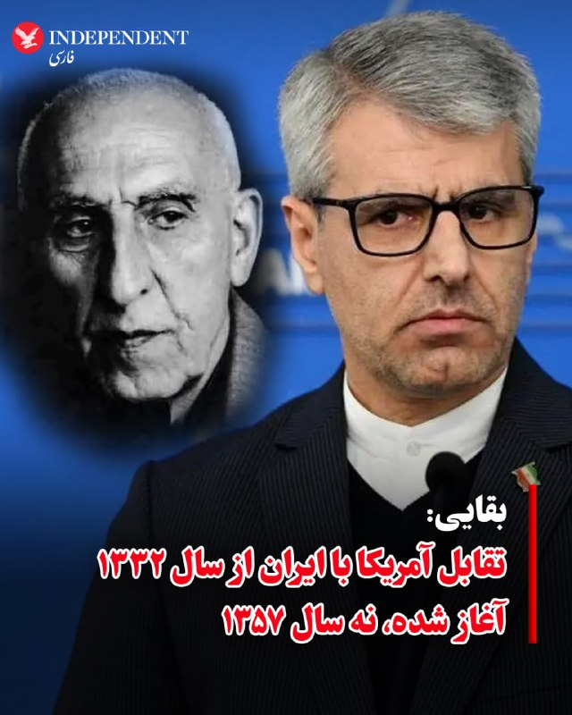
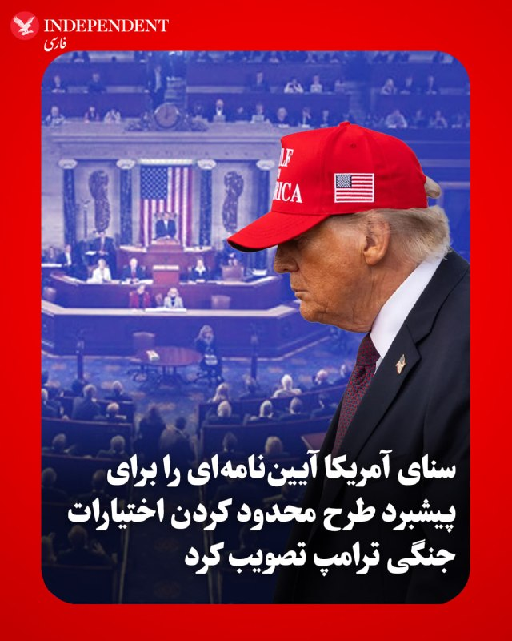
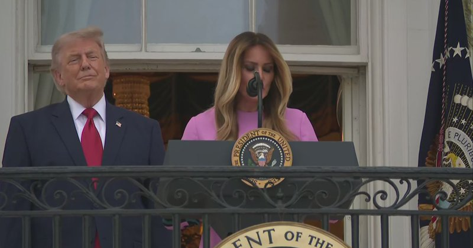
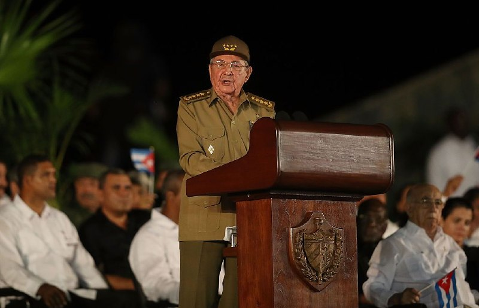

# خواننده تلگرام

<!-- TOP_NAV START -->

<a href="https://github.com/yerbeyer/aio-downloader/blob/main/telegram/content/archive_1.md" style="display:inline-block; padding:6px 12px; margin:0 4px; background-color:#2ea44f; color:white; text-decoration:none; border-radius:4px; font-weight:bold;">صفحه بعد</a>

<!-- TOP_NAV END -->

<!-- MSG START -->

---
📅 بروزرسانی: 1405/02/30 03:15
---

## VahidOOnLine — post 241064

  

ترامپ در یک سخنرانی در کاخ سفید گفت: «ما جنگ ایران را خیلی سریع پایان خواهیم داد. آنها به شدت می‌خواهند توافق کنند. از این وضعیت خسته شده‌اند. این موضوع باید ۴۷ سال پیش حل می‌شد. کسی باید درباره آن کاری انجام می‌داد، و این اتفاق خواهد افتاد و سریع هم رخ خواهد داد.»
او افزود: «خواهید دید که قیمت نفت سقوط خواهد کرد. قیمت‌ها پایین خواهد آمد. نفت بسیار زیادی در بازار وجود دارد. قیمت‌ها به شدت کاهش خواهد یافت.»

‌🏁 🇬🇧 IranintlTV

🤖 @VahidOOnLine

## VahidOOnLine — post 241063

  <a href="telegram/content/VahidOOnLine_241063_1779234301.mp4" target="_blank">🎬 Download video</a>

♦️احمد‌الشرع، رئیس‌جمهوری سوریه با انتشار پیامی در اکس از ارسال هدیه‌ از سوی دونالد ترامپ، رئیس‌جمهوری آمریکا تشکر کرد. در این پیام آمده است:
«بعضی دیدارها اثری ماندگار بر جا می‌گذارند؛ دیدار ما ظاهرا عطری از خود به جا گذاشت.
آقای دونالد ترامپ،بابت سخاوت شما و کامل‌تر کردن این هدیه ارزشمند سپاسگزارم. امیدوارم روح آن دیدار همچنان به شکل‌گیری رابطه‌ای قوی‌تر میان سوریه و ایالات متحده کمک کند.»

 در دیداری که در تاریخ ۲۱ آبان ۱۴۰۴ در سفر الشرع به آمریکا انجام شد دونالد ترامپ به او عطر هدیه داد و اکنون دوباره برای او عطر ارسال کرده است.
‌🇸🇦 Indypersian

🤖 @VahidOOnLine

## VahidOOnLine — post 241062

  

♦️اسماعیل بقایی، سخنگوی وزارت امور خارجه جمهوری اسلامی، در پیامی به مناسبت سالروز تولد محمد مصدق، نخست‌وزیر پیشین ایران، «کودتای ۲۸ مرداد ۱۳۳۲» را نقطه آغاز تقابل آمریکا با ایران دانست.
او با انتقاد از روایت مقامات آمریکایی درباره «۴۷ سال تقابل» تأکید کرد این نگاه، تحریف تاریخ است و ریشه اختلافات به سرنگونی دولت مصدق با نقش آمریکا و بریتانیا بازمی‌گردد. بقایی همچنین با اشاره به آنچه «دخالت‌ها، تحریم‌ها و تهدیدهای چند دهه‌ای» خواند، افزود تجربه کودتای ۲۸ مرداد نشان می‌دهد مسیر حفظ استقلال کشور، تکیه بر حاکمیت ملی و مقابله با نفوذ خارجی است.
این در حالی است که تا سال‌ها حتی خیابانی به نام محمد مصدق در تهران نام‌گذاری نشد. پس از انقلاب، خیابان پهلوی مدتی به نام او تغییر یافت اما در سال ۱۳۶۰ دوباره تغییر نام داد. در نهایت، در ۲۲ اسفند ۱۳۹۶ شورای شهر تهران خیابان نفت در بلوار میرداماد را به نام مصدق نام‌گذاری کرد.
‌🇸🇦 Indypersian

🤖 @VahidOOnLine

## VahidOOnLine — post 241061

  

♦️به دنبال چندین تلاش ناموفق دمکرات‌های سنای آمریکا برای تصویب قطعنامه محدود کردن اختیارات جنگی رئیس‌جمهوری آمریکا، آنها توانستند آیین‌نامه‌ای را در این زمینه به تصویب برسانند که به نوشته رویترز در پیشبرد قطعنامه مورد نظر موثر است. به گزارش این خبرگزاری بریتانیایی، این آیین‌نامه با ۵۰ رای موافق در برابر ۴۷ رای مخالف تصویب شد.به‌طوری که چهار جمهوری‌خواه هم‌حزبی ترامپ همراه با همه دموکرات‌ها به جز یک نفر، به آن رای مثبت دادند. سه سناتور جمهوری‌خواه نیز در رای‌گیری غایب بودند. باوجود تصویب این آیین‌نامه، حتی اگر قطعنامه‌ای در سنا با ۱۰۰ عضو هم به تایید برسد، کار دشواری در مجلس نمایندگان خواهد داشت که تحت کنترل جمهوری‌خواهان است و پس از آن نیز باید دو‌سوم رای کنگره و سنا را داشته باشد تا بتواند گزینه وتوی احتمالی رئیس‌جمهور را دور بزند. طبق قانون اختیارات جنگی آمریکا مصوب ۱۹۷۳ که در واکنش به جنگ ویتنام تصویب شد، رئیس‌جمهور آمریکا تنها ۶۰ روز می‌تواند بدون مجوز کنگره عملیات نظامی انجام دهد و پس از آن باید یا جنگ را متوقف کند، یا از کنگره مجوز بگیرد.
‌🇸🇦 Indypersian

🤖 @VahidOOnLine

## VahidOOnLine — post 241060

  

♦️خبرگزاری رویترز به نقل از منابع آگاه گزارش داد دولت ترامپ قصد دارد سطح نیروها و تجهیزات نظامی در دسترس برای حمایت از ناتو در زمان بحران یا جنگ را کاهش دهد.
بر اساس این گزارش، پنتاگون تصمیم گرفته سهم خود در چارچوب «مدل نیروی ناتو» را به‌طور قابل توجهی کاهش دهد؛ مدلی که کشورهای عضو در آن نیروهای قابل اعزام در شرایط اضطراری را مشخص می‌کنند. قرار است این تصمیم به‌صورت رسمی در نشست مقام‌های دفاعی ناتو در بروکسل اعلام شود.
این اقدام در راستای سیاست ترامپ برای واگذاری مسئولیت اصلی امنیت اروپا به کشورهای اروپایی ارزیابی شده است. با این حال، مقامات آمریکایی تأکید کرده‌اند که چتر هسته‌ای ایالات متحده همچنان برای حفاظت از متحدان ناتو حفظ خواهد شد.
رویترز همچنین گزارش داده این تصمیم نگرانی‌هایی در میان کشورهای اروپایی ایجاد کرده و می‌تواند فشارها بر ائتلاف ناتو را افزایش دهد، به‌ویژه در شرایطی که تنش‌ها میان آمریکا و برخی متحدان اروپایی بالا گرفته است.
‌🇸🇦 Indypersian

🤖 @VahidOOnLine

## VahidOOnLine — post 241059

  

♦️جورجیا ملونی، نخست‌وزیر ایتالیا،  سه‌شنبه شب ۲۹ اردیبهشت با انتشار تصویری در شبکه اجتماعی ایکس، از حضورنارندرا مودی، نخست‌وزیر هند در رم خبر داد و نوشت :«دوست من به رم خوشامدی».
 نخست‌وزیر هند برای شرکت در گفتگوهای دوجانبه و رایزنی درباره همکاری‌های اقتصادی، سیاسی و مسائل بین‌المللی به ایتالیا سفر کرده است. این دیدار همچنین در چارچوب تقویت روابط میان دهلی‌نو و رم و هماهنگی در موضوعات جهانی از جمله انرژی و امنیت منطقه‌ای ارزیابی می‌شود.
‌🇸🇦 Indypersian

🤖 @VahidOOnLine

## WithYashar — post 11716

مرضیه حسینی، خبرنگار اینترنشنال:
منبع مطلع در کنگره به من گفت فردا شب یا پنجشنبه شب عملیات نظامی آمریکا علیه ایران آغاز میشه.

حملات برای یک عملیات دو سه روزه متمرکز است و به مراکزی با هدف بازگشایی تنگه هرمز انجام میشه.
@withyashar
یاشار : امیدوارم خبر زرد نباشه

## WithYashar — post 11715

## WithYashar — post 11714

## WithYashar — post 11713

  <a href="telegram/content/WithYashar_11713_1779234303.mp4" target="_blank">🎬 Download video</a>

@withyashar

## FoxNewsTwitter — post 341969

  

Fox News (Twitter/X)

President Trump's thumb on the scale proved to be the difference maker for Rep. Andy Barr.

Barr emerged from a packed Republican field to win Kentucky's Senate primary, setting him up for a November showdown to replace retiring Sen. Mitch McConnell.

The race quickly became one of the most closely watched GOP primaries in the country because of McConnell’s looming exit and the battle over the future direction of the Republican Party.

## FoxNewsTwitter — post 341968

  <a href="telegram/content/FoxNewsTwitter_341968_1779234304.mp4" target="_blank">🎬 Download video</a>

Fox News (Twitter/X)

"Either MAGA extremists are going to break the country, or we're going to break them."

House Minority Leader Hakeem Jeffries lays out what he says is the Democratic strategy against the MAGA movement — not just to defeat them in elections, but to "break their spirit” over what he described as "unacceptable" extremism.

## FoxNewsTwitter — post 341967

  

Fox News (Twitter/X)

WATCH LIVE: President Trump speaks at Congressional Picnic on White House South Lawn https://twitter.com/i/broadcasts/1pKkOylkjjEKj

## FoxNewsTwitter — post 341966

  

Fox News (Twitter/X)

BREAKING: The Trump administration is preparing a possible indictment against former Cuban president Raúl Castro, brother of Fidel Castro, sources tell Fox News Digital.

Sources pointed to a Department of Justice advisory Tuesday that announced a Miami press conference "in conjunction with a ceremony to honor the victims of the Brothers to the Rescue Murders of 1996."

## pm_afshaa — post 91075

  <a href="telegram/content/pm_afshaa_91075_1779234307.webm" target="_blank">🎬 Download video</a>

🔴مرضیه حسینی، خبرنگار اینترنشنال:
منبع مطلع در کنگره به من گفت فردا شب یا پنجشنبه شب عملیات نظامی آمریکا علیه ایران آغاز میشه.

حملات برای یک عملیات دو سه روزه متمرکز است و به مراکزی با هدف بازگشایی تنگه هرمز انجام میشه.

💧 Rainbet.com the #1 Non-KYC Crypto Casino & Sportsbook @rainbetcom

😁 @Pm_Afshaa

## pm_afshaa — post 91074

  <a href="telegram/content/pm_afshaa_91074_1779234307.webm" target="_blank">🎬 Download video</a>

🔴طرح «محدود کردن اختیارات جنگی ترامپ» بعد از 7 تلاش ناموفق، بالاخره با 47 مخالف و 50 موافق، تصویب شد! سنای آمریکا یه طرحی رو جلو برد که میگه ترامپ واسه ادامه درگیری نظامی با ایران، باید مجوز رسمی کنگره رو داشته باشه و نمیتونه خودسر وارد جنگ بشه. 
💧 Rainbet.com…

## pm_afshaa — post 91073

  <a href="telegram/content/pm_afshaa_91073_1779234308.webm" target="_blank">🎬 Download video</a>

🔴طرح «محدود کردن اختیارات جنگی ترامپ» بعد از 7 تلاش ناموفق، بالاخره با 47 مخالف و 50 موافق، تصویب شد! سنای آمریکا یه طرحی رو جلو برد که میگه ترامپ واسه ادامه درگیری نظامی با ایران، باید مجوز رسمی کنگره رو داشته باشه و نمیتونه خودسر وارد جنگ بشه. 
💧 Rainbet.com…

## pm_afshaa — post 91072

  <a href="telegram/content/pm_afshaa_91072_1779234308.webm" target="_blank">🎬 Download video</a>

🔴طرح «محدود کردن اختیارات جنگی ترامپ» بعد از 7 تلاش ناموفق، بالاخره با 47 مخالف و 50 موافق، تصویب شد!

سنای آمریکا یه طرحی رو جلو برد که میگه ترامپ واسه ادامه درگیری نظامی با ایران، باید مجوز رسمی کنگره رو داشته باشه و نمیتونه خودسر وارد جنگ بشه.

💧 Rainbet.com the #1 Non-KYC Crypto Casino & Sportsbook @rainbetcom

😁 @Pm_Afshaa

## VahidOnline — post 75563

سلام وحید دو زلزله شدید بندرعباس رو لرزاند

ساعت ۳:۱۱ دقیقه بندرعباس زلزله اومد

📡 @VahidOnline

## VahidOnline — post 75562

  

سنای آمریکا روز سه‌شنبه قطعنامه‌ای را برای توقف اقدام نظامی در ایران پیش برد.

پیش بردن این قطعنامه پس از آن صورت گرفت که سناتور جمهوری‌خواه، بیل کسیدی از لوئیزیانا، به آن رای مثبت داد. کسیدی چند روز پیش، در رقابت‌های درون حزبی ایالتی برای ادامه حضورش در سنا، به نامزدی که از حمایت ترامپ برخوردار بود، باخت.

به گزارش سی‌ان‌بی‌سی، با وجود اینکه قطعنامه اختیارات جنگی با نتیجه ۵۰ به ۴۷ به تصویب رسید، اما هنوز احتمال کمی برای تبدیل شدن به قانون دارد. این قطعنامه باید ابتدا در سنا به تصویب نهایی برسد، سپس مجلس نمایندگان به رای بدهد و سپس نیز، دونالد ترامپ به احتمال قریب به یقین، آن را وتو خواهد کرد.
@VahidHeadline
چهار جمهوری‌خواه هم‌حزبی ترامپ همراه با همه دموکرات‌ها به جز یک نفر، به آن رای مثبت دادند. سه سناتور جمهوری‌خواه نیز در رای‌گیری غایب بودند.
باوجود تصویب این آیین‌نامه، حتی اگر قطعنامه‌ای در سنا با ۱۰۰ عضو هم به تایید برسد، کار دشواری در مجلس نمایندگان خواهد داشت که تحت کنترل جمهوری‌خواهان است و پس از آن نیز باید دو‌سوم رای کنگره و سنا را داشته باشد تا بتواند گزینه وتوی احتمالی رئیس‌جمهور را دور بزند.
طبق قانون اختیارات جنگی آمریکا مصوب ۱۹۷۳ که در واکنش به جنگ ویتنام تصویب شد، رئیس‌جمهور آمریکا تنها ۶۰ روز می‌تواند بدون مجوز کنگره عملیات نظامی انجام دهد و پس از آن باید یا جنگ را متوقف کند، یا از کنگره مجوز بگیرد.
@VahidOOnLine

📡 @VahidOnline

## IranIntlTV — post 338017

  

ترامپ در یک سخنرانی در کاخ سفید گفت: «ما جنگ ایران را خیلی سریع پایان خواهیم داد. آنها به شدت می‌خواهند توافق کنند. از این وضعیت خسته شده‌اند. این موضوع باید ۴۷ سال پیش حل می‌شد. کسی باید درباره آن کاری انجام می‌داد، و این اتفاق خواهد افتاد و سریع هم رخ خواهد داد.»
او افزود: «خواهید دید که قیمت نفت سقوط خواهد کرد. قیمت‌ها پایین خواهد آمد. نفت بسیار زیادی در بازار وجود دارد. قیمت‌ها به شدت کاهش خواهد یافت.»

https://iranintl.com/202605193673

## IranIntlTV — post 338016

  <a href="telegram/content/IranIntlTV_338016_1779234310.mp4" target="_blank">🎬 Download video</a>

شورای امنیت سازمان ملل به درخواست بحرین نشست اضطراری برگزار کرد تا حمله به نیروگاه هسته‌ای براکه در امارات متحده عربی را بررسی کند.

مریم رحمتی، خبرنگار ایران‌اینترنشنال، گزارش می‌دهد
@iranintltv

## FarsiVOA — post 218193

⚡️امارات منشأ حملات پهپادی به نیروگاه اتمی «براکه» را خاک عراق اعلام کرد
@FarsiVOA

## FarsiVOA — post 218192

  

⚡️سنای آمریکا روز سه‌شنبه قطعنامه‌ای را برای توقف اقدام نظامی در ایران پیش برد. پیش بردن این قطعنامه پس از آن صورت گرفت که سناتور جمهوری‌خواه، بیل کسیدی از لوئیزیانا، به آن رای مثبت داد. کسیدی چند روز پیش، در رقابت‌های درون حزبی ایالتی برای ادامه حضورش در سنا، به نامزدی که از حمایت ترامپ برخوردار بود، باخت. به گزارش سی‌ان‌بی‌سی، با وجود اینکه قطعنامه اختیارات جنگی با نتیجه ۵۰ به ۴۷ به تصویب رسید، اما هنوز احتمال کمی برای تبدیل شدن به قانون دارد. این قطعنامه باید ابتدا در سنا به تصویب نهایی برسد، سپس مجلس نمایندگان به رای بدهد و سپس نیز، دونالد ترامپ به احتمال قریب به یقین، آن را وتو خواهد کرد.
@FarsiVOA

## Persian_Trend_Official — post 14501

🔴 سنای آمریکا طرح محدودسازی اختیارات جنگی ترامپ علیه ایران را تصویب کرد 💢سنای آمریکا پس از ۷ تلاش ناموفق، طرحی را تصویب کرد که بر اساس آن ادامه هرگونه اقدام نظامی علیه ایران نیازمند مجوز کنگره خواهد بود. ▪️ این طرح با رأی ۵۰ موافق در برابر ۴۷ مخالف تصویب…

## IranianMinds — post 20417

🔴 برد کوپر، فرمانده سنتکام درباره مدرسه میناب:

ایالات متحده عمدا به غیرنظامیان حمله نمی‌کند. مردم ایران دشمن ما نیستند. سپاه پاسداران انقلاب اسلامی در این مورد دشمن است.
تحقیقات در حال انجام است. این یک تحقیق پیچیده است. چون این مدرسه داخل یک سایت فعال موشک‌های کروز جمهوری اسلامی قرار داشته
هر دو طرف باید اسناد مربوط به این مدرسه رو منتشر کنن و پرونده کشته‌شدن این تعداد دانش‌آموز نیاز به شفافیت کامل داره
انتظار شفاف‌سازی از طرف جمهوری اسلامی را نداریم
به محض اتمام تحقیقات، من کاملاً متعهد به شفافیت هستم.
به عنوان فرماندهان نظامی، ما از قوانین درگیری مسلحانه و مسئولیت‌های قانون اساسی خود پیروی می‌کنیم و همین کاری است که انجام داده‌ایم.

@IranianMinds

## IranianMinds — post 20416

  <a href="telegram/content/IranianMinds_20416_1779234312.webm" target="_blank">🎬 Download video</a>

💥 با هر ثبت نام 
🅰️
🅰️
🅰️  هزار تومن جایزه بگیرید

✔️ میتونید شرط‌بندی کنید و بونوس را به موجودی واقعی تبدیل کنید

⚽️  پوشش کامل مسابقات ورزشی 

💯  پیش‌بینی با بهترین ضرایب 

⭐️ تجربه سریع و حرفه‌ای

💰پرداخت مستقیم و سریع بدون واسطه، بدون دردسر، واریز و برداشت در سریع‌ترین زمان ممکن

☑️ کانال تلگرام: 

➡️ @winro_io  

🎁 هدیه خود را با ثبت نام در سایت دریافت کنید: 

➡️ Winro.io
A29
سایت اصلی در روزهای آینده بازگشایی خواهد شد A
💎

## IranianMinds — post 20415

  <a href="telegram/content/IranianMinds_20415_1779234312.mp4" target="_blank">🎬 Download video</a>

ما هم جام جهانی رو برای مزدوران جمهوری اسلامی تبدیل به جام جهنمی می‌کنیم.

@IranianMinds

## IranianMinds — post 20414

  

🔴 نیویورک تایمز :

فیفا قصد دارد دوباره ورود پرچم «شیر و خورشید» ایران پیش از انقلاب و لباس‌های مرتبط با آن را به ورزشگاه‌های جام جهانی ۲۰۲۶ ممنوع کند. این پرچم در جام جهانی ۲۰۲۲ قطر هم محدود شده بود.

@IranianMinds

## BBCPersian — post 281548

  

🔻دادگاه رسیدگی به شکایت از پژمان جمشیدی، بازیگر سرشناس و فوتبالیست سابق ایرانی، حکم خود را صادر کرده است هر چند وکیل آقای جمشیدی گفته در مهلت قانونی قصد درخواست تجدیدنظر دارد.

الهه محمدی، روزنامه‌نگار، در شبکه‌های اجتماعی محتوای حکم صادر شده را منتشر کرده که حکایت از تعیین «۹۹ ضربه شلاق تعزیری» دارد اما وکیل پژمان جمشیدی در گفتگو با رسانه‌ها مدعی شده تا زمان نهایی شدن حکم درباره تایید محتوای آن اظهار نظر نخواهد کرد.

روز سه‌شنبه - ۲۹ اردیبهشت - کامبیز برجاس، یکی از وکلای پژمان جمشیدی، ضمن تایید صدور و ابلاغ حکم دادگاه به خبرگزاری ایسنا گفت: «رای پرونده موکلم امروز صادر و ابلاغ شد. حکم بدوی است و ظرف ۲۰ روز قابل اعتراض است. تا زمانی که حکم قطعی نشده محتوای رای را اعلام نمی‌کنیم.»
ادامه مطلب⬇️

📸etemadonline
https://bbc.in/4v4ypQl
@BBCPersian

## alonews — post 121198

  <a href="telegram/content/alonews_121198_1779234314.webm" target="_blank">🎬 Download video</a>

👈کانال ۱۲ اسرائیل: رهبران عربستان، قطر و امارات طی ۲۴ ساعت گذشته با ترامپ تماس گرفته و گفته‌اند: «اگر حمله کنید، ایرانی‌ها به ما حمله خواهند کرد.» 
🔴آن‌ها از ترامپ خواسته‌اند که در تصمیم‌گیری خود آن‌ها را در نظر بگیرد و فرصت بیشتری برای مذاکره بدهد. ترامپ…

## alonews — post 121197

  <a href="telegram/content/alonews_121197_1779234315.webm" target="_blank">🎬 Download video</a>

👈کانال ۱۲ اسرائیل: رهبران عربستان، قطر و امارات طی ۲۴ ساعت گذشته با ترامپ تماس گرفته و گفته‌اند: «اگر حمله کنید، ایرانی‌ها به ما حمله خواهند کرد.»

🔴آن‌ها از ترامپ خواسته‌اند که در تصمیم‌گیری خود آن‌ها را در نظر بگیرد و فرصت بیشتری برای مذاکره بدهد. ترامپ نیز ظاهراً با این درخواست موافقت کرده و اعلام کرده حمله را به تعویق می‌اندازد.

🔴با این حال، برخی از این کشورها اکنون این ادعا را رد می‌کنند و می‌گویند چنین درخواستی نداده‌اند. در مقابل، مقامات آمریکایی می‌گویند هر سه کشور چنین درخواستی داشته‌اند.

✅ @AloNews خبر جنگ

## alonews — post 121196

  <a href="telegram/content/alonews_121196_1779234315.mp4" target="_blank">🎬 Download video</a>

👈وضعیت رئیس کانون هواداران پرسپولیس

احتمالا مدیرعامل آینده...

✅ @AloNews خبر جنگ

## alonews — post 121195

  <a href="telegram/content/alonews_121195_1779234316.webm" target="_blank">🎬 Download video</a>

👈خضریان:
ترکیه حد خودش ندونه باهاش برخورد میکنیم

✅ @AloNews خبر جنگ

## alonews — post 121194

  <a href="telegram/content/alonews_121194_1779234316.webm" target="_blank">🎬 Download video</a>

👈نخست وزیرهای ایتالیا و هند این وقت شب دوتایی رفتن کلوسئوم رو ببینن

✅ @AloNews خبر جنگ

<!-- MSG END -->

<!-- NAV START -->

<a href="https://github.com/yerbeyer/aio-downloader/blob/main/telegram/content/archive_1.md" style="display:inline-block; padding:6px 12px; margin:0 4px; background-color:#2ea44f; color:white; text-decoration:none; border-radius:4px; font-weight:bold;">صفحه بعد</a>

<!-- NAV END -->
