# خواننده تلگرام

<!-- TOP_NAV START -->

<a href="https://github.com/yerbeyer/aio-downloader/blob/main/telegram/content/archive_1.md" style="display:inline-block; padding:6px 12px; margin:0 4px; background-color:#2ea44f; color:white; text-decoration:none; border-radius:4px; font-weight:bold;">صفحه بعد</a>

<!-- TOP_NAV END -->

<!-- MSG START -->

---
📅 بروزرسانی: 1405/03/09 19:42
---

## VahidOOnLine — post 242930

  

خبرگزاری آسوشیتدپرس به نقل از یک مقام آمریکایی خبر داد که ناوگان آمریکا یک کشتی تجاری با پرچم گامبیا را که تلاش داشت محاصره بنادر ایران را بشکند، متوقف کرده و از کار انداختند.
بر اساس این گزارش، این کشتی از سوی هواپیماهای آمریکایی از کار انداخته شد و نیروهای آمریکایی وارد آن نشدند.

روز شنبه پیت هگست، وزیر جنگ آمریکا، در حاشیه نشست «گفت‌وگوی شانگری‌لا» در سنگاپور، درباره محاصره بنادر و سواحل جنوبی ایران گفت که محاصره دریایی ادامه دارد و این اقدام موثر بوده و کنترل تنگه هرمز در اختیار آمریکا است.
‌🏁 🇬🇧 IranintlTV

🤖 @VahidOOnLine

## VahidOOnLine — post 242929

  

نواف سلام، نخست‌وزیر لبنان گفت این کشور در حال حاضر با سخت‌ترین مرحله در تاریخ خود روبه‌رو است.
نواف سلام تاکید کرد که تصمیم جنگ و صلح باید فقط در اختیار دولت باشد. پیش‌تر نواف سلام بر ضرورت خلع سلاح حزب‌الله از سوی خود لبنانی‌ها و و بازگرداندن انحصار سلاح به دولت تاکید کرده بود.
‌🏁 🇬🇧 IranintlTV

🤖 @VahidOOnLine

## VahidOOnLine — post 242928

♦️ خبرگزاری رویترز تصاویر هوایی از آخرین وضعیت کشتی‌های سرگردان در آب‌های نزدیک به تنگه هرمز را منتشر کرد. در این تصاویر که صبح شنبه، نهم خرداد ثبت شده، صدها شناور از انواع مختلف دیده می‌شود که در فاصله‌های کمی از یکدیگر متوقف شده‌اند؛ وضعیتی که از اولین روزهای جنگ تاکنون ادامه داشته است.

جمهوری اسلامی با قرار دادن سازوکار جدیدی برای عبور از تنگه هرمز و تهدید کشتی‌هایی که از این سازوکار جدید تبعیت نکنند، از یک سو، و احتمال مین‌گذاری در این آبراه استراتژیک از سوی دیگر، باعث افزایش شدید قیمت‌های بیمه کشتی‌ها شده است. همین امر باعث شده این شناورها که میزبان هزاران ملوان هستند، با وجود سختی و هزینه‌های بسیار، از عبور از تنگه هرمز خودداری کنند.
‌🇸🇦 Indypersian

🤖 @VahidOOnLine

## VahidOOnLine — post 242927

  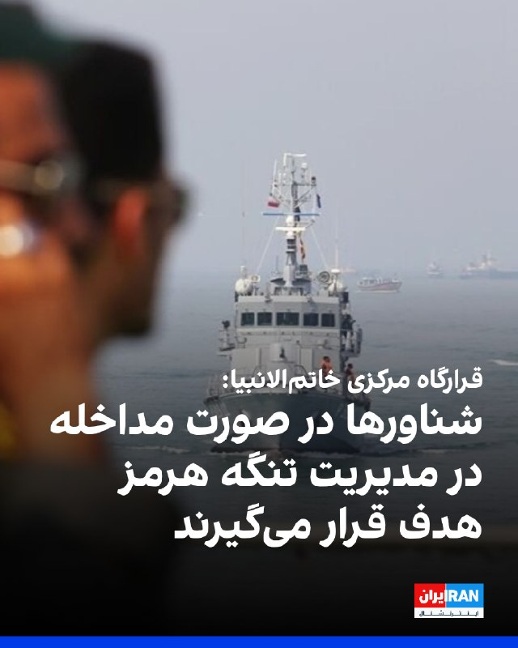

قرارگاه مرکزی خاتم‌الانبیا در بیانیه‌ای اعلام کرد که هرگونه اقدام شناورهای نظامی جهت مداخله در مدیریت تنگه هرمز یا ایجاد اختلال در تردد، مورد هدف نیروهای مسلح جمهوری اسلامی قرار خواهد گرفت.
در این بیانیه آمده: «هرگونه تخلف از این ضوابط، امنیت تردد آن‌ها را با مخاطره جدی مواجه خواهد کرد.»

قرارگاه مرکزی خاتم‌الانبیا اعلام کرد کلیه کشتی‌ها، شناورهای تجاری و نفتکش‌ها صرفا ملزم به تردد از مسیرهای تعیین‌شده و اخذ مجوز از نیروی دریایی سپاه پاسداران هستند.
‌🏁 🇬🇧 IranintlTV

🤖 @VahidOOnLine

## VahidOOnLine — post 242926

  

مصطفی نیلی، وکیل دادگستری اعلام کرد بنیامین نقدی، زندانی سیاسی و از معترضان دی‌ماه، از سوی دادگاه انقلاب شیراز به اتهام «افسادفی‌الارض»، به اعدام محکوم شد.

این وکیل دادگستری به کانال امتداد گفت که بنیامین نقدی در شب سیزدهم دی ۱۴۰۴ در شیراز، به دلیل «شعله‌ور نمودن یک دستگاه کپسول آتش‌نشانی» به سمت مامورین نیروی انتظامی بازداشت شده بود.

مصطفی نیلی افزود پس از پایان تحقیقات مقدماتی کیفرخواست بنیامین نقدی با اتهام‌های «محاربه، عضویت در گروه‌های به هم‌زننده امنیت، اجتماع و تبانی به قصد انجام جرم علیه امنیت و فعالیت تبلیغی علیه نظام» صادر شد و نسبت به اتهام ایراد صدمه جسمانی به ماموران و حمل سلاح سرد منع تعقیب صادر شد.

نیلی، وکیل دادگستری گفت که در جلسه دادگاه، قضات تمامی اتهامات را مصداق افسادفی‌الارض تشخیص دادند و بر همین مبنا حکم اعدام برای بنیامین نقدی صادر کردند.
‌🏁 🇬🇧 IranintlTV

🤖 @VahidOOnLine

## WithYashar — post 12943

سخنگوی فدراسیون فوتبال:
روزبه چشمی به‌دلیل مصدومیت جام جهانی را از دست داد
@withyashar

## WithYashar — post 12942

تلگراف: دو ژنرال قدرتمند، احمد وحیدی و محمد جعفری، با هم متحد شدن تا قالیباف رو از قدرت برکنار کنن.
@withyashar

## WithYashar — post 12941

شاهزاده رضا پهلوی در نشست «امنیت دریای سیاه» در اودسا، در جنوب اوکراین، گفت مردم ایران برای ساختن آینده کشور خود آماده‌اند و از جهان نمی‌خواهند آینده ایران را برای آنان رقم بزند، بلکه خواستار آن هستند که جامعه جهانی در کنار ملت ایران بایستد.

او در بخش دیگری از سخنانش، با اشاره به خروج اجباری خود از ایران در ۱۰ سالگی، گفت که با وجود گذشت ۴۷ سال، هرگز امید خود را به آزادی ایران از دست نداده و همواره صدای مردمی بوده است که امکان بیان خواسته‌هایشان را نداشته‌اند.
@withyashar

## WithYashar — post 12940

  <a href="telegram/content/WithYashar_12940_1780157536.mp4" target="_blank">🎬 Download video</a>

مک‌اننی از فاکس:
بلومبرگ گزارش داده است که حملات موشکی ایرانی چند آمریکایی را در یک پایگاه هوایی کویتی زخمی کرده‌اند. فکر می‌کنید اوضاع در چه وضعیتی است؟

مایک جانسون، سخنگو:
دیشب با رئیس‌جمهور ترامپ صحبت کردم. او کاملاً در جریان است. فکر می‌کنم رهبری جدید ایرانی‌ها می‌خواهد این درگیری را به پایان برساند.
@withyashar

## mwarmonitor — post 9920

🔴جنگنده آمریکایی F-15E Strike Eagle که در ماه آوریل بر فراز جنوب‌غربی ایران سرنگون شد، احتمالاً توسط یک موشک دوش‌پرتاب ساخت چین هدف قرار گرفته است؛ این موضوع را سه نفر آشنا با این پرونده اعلام کرده‌اند. — NBC News

@mwarmonitor

## mwarmonitor — post 9919

  <a href="telegram/content/mwarmonitor_9919_1780157538.mp4" target="_blank">🎬 Download video</a>

📝 واقعیت این است که به وضوح همین پروپاگاندای مضحک دیده می‌شود؛ خبرنگار صداوسیما را فرستاده‌اند وسط فروشگاه تا از مردمی که از خط فقر هم پایین‌تر سرنگون شده‌اند، اعترافِ اجباریِ «خدا را شکر همه‌چیز هست» بگیرد! قفسه‌های پر از روغن و برنج را به رخ ملت می‌کشند، انگار مردم به خاطر «کمبود جنس» گرسنه‌اند، نه به خاطر بی‌پولی و نکبتی که گریبان‌گیرشان شده است.

🔸اینکه اسم همان کوپنِ دهه شصت را بگذاری «طرح الکترونیکی» و هر چند ماه یک‌بار به عنوان یک فتح‌الفتوح جدید در اخبار جار بزنی، اوج وقاحت و تحقیر یک ملت است. نمایشِ پر بودن قفسه‌ها دقیقاً مثل این است که به یک آدم تشنه در بیابان، عکس یک پارچ آب یخ نشان بدهی و بگویی: «ببین چقدر فراوانی است، حالا اگر پول داری بخر، اگر هم نداری کارتِ گداییِ الکترونیکی‌ات را بکش!» این‌ها فقط یاد گرفته‌اند صورت‌مسئله را پاک کنند و با شوهای تلویزیونی، روی فلاکت و خاکِ سیاهی که مردم را به آن نشانده‌اند، رنگ و لعابِ مدرنیته بپاشند.

@mwarmonitor

## mwarmonitor — post 9918

🔴 یک مقام آمریکایی: یک کشتی تجاری که تلاش داشت به سمت یک بندر ایرانی حرکت کند، متوقف شد.

🔸این نفتکش/کشتی با نام «لیان استار» هشدارهای نیروهای دریایی ما در خلیج عمان را نادیده گرفته بود.

@mwarmonitor

## FoxNewsTwitter — post 342430

  

Fox News (Twitter/X)

CHARGED: Anti-ICE agitator bit two federal officers during clashes outside Newark's Delaney Hall, leaving bloody wounds that sent both agents to the hospital.

Brendan John Geier, 26, now faces federal charges for assaulting officers who told his group to clear the road. He kicked one officer and sank his teeth into two others, according to the DOJ.

Acting AG Todd Blanche posted photos of the bloodied agents: 'These riots are clearly not peaceful protests as you can see from the photos of these horrific wounds.'

## FoxNewsTwitter — post 342429

  <a href="telegram/content/FoxNewsTwitter_342429_1780157540.mp4" target="_blank">🎬 Download video</a>

Fox News (Twitter/X)

"They both should be in jail."

Los Angeles mayoral candidate Spencer Pratt argues California Gov. Gavin Newsom and Los Angeles Mayor Karen Bass should be behind bars over their alleged "negligence" while in office.

The reality TV star claims the pair of Democrats "make up stats" on homelessness — and that the city's crisis has only gotten worse under their watch. | @SatAmericaFNC @kayleighmcenany

## FoxNewsTwitter — post 342428

‌Fox News (Twitter/X)

👉 Full story here:

## FoxNewsTwitter — post 342427

Fox News (Twitter/X)

DAVID MARCUS: Democrats own the chaos at Newark's anti-ICE riots — Antifa agitators screamed 'Every Cop, Every Fed, Shoot Yourself in the Head' at officers while progressive White women berated Black men as 'race traitors' with 'the wrong skin color.' Gov. Sherrill finally deployed state police after a week of violence, but blamed ICE for wanting to 'stoke' the confrontation. Zero evidence offered for that claim.

## FoxNewsTwitter — post 342426

‌Fox News (Twitter/X)

👉 Full story here:

## iaghapour — post 2643

  

⭕️ ساخت فیلترشکن پرسرعت و رایگان با ورکر کلودفلر (تست شده)

🔹در این ویدیو به صورت قدم‌به‌قدم بهتون آموزش دادم که چطور با استفاده از Cloudflare Workers یک فیلترشکن کاملاً رایگان، و پرسرعت برای خودتون بسازید. این روش کاملاً تست شده و می‌تونید به راحتی روی گوشی و کامپیوتر ازش استفاده کنید.

🔗 تماشا ویدیو در یوتیوب

#آموزش #فیلترشکن #رایگان #پروکسی #نوا #novaproxy
برای دور زدن فیلترینگ و آموزش تکنولوژی و هوش مصنوعی ما رو دنبال کنید 💚
🆔@iaghapour

## DEJradio — post 5156

  <a href="telegram/content/DEJradio_5156_1780157542.webm" target="_blank">🎬 Download video</a>

🔺🎤 کابینه ترامپ و میانجی‌گری عمان در پی احیای روابط با تهران

گفت‌وگو با شایان سمیعی، کارشناس امنیت ملی

#عمان #مذاکرات
@DEJradio

## VahidOnline — post 75804

  

قرارگاه مرکزی خاتم‌الانبیا در بیانیه‌ای اعلام کرد که هرگونه اقدام شناورهای نظامی جهت مداخله در مدیریت تنگه هرمز یا ایجاد اختلال در تردد، مورد هدف نیروهای مسلح جمهوری اسلامی قرار خواهد گرفت.
در این بیانیه آمده: «هرگونه تخلف از این ضوابط، امنیت تردد آن‌ها را با مخاطره جدی مواجه خواهد کرد.»

قرارگاه مرکزی خاتم‌الانبیا اعلام کرد کلیه کشتی‌ها، شناورهای تجاری و نفتکش‌ها صرفا ملزم به تردد از مسیرهای تعیین‌شده و اخذ مجوز از نیروی دریایی سپاه پاسداران هستند.
@VahidOOnLine

📡 @VahidOnline

## VahidOnline — post 75803

  <a href="telegram/content/VahidOnline_75803_1780157542.mp4" target="_blank">🎬 Download video</a>

پیت هگست، وزیر دفاع آمریکا، روز شنبه نهم خرداد گفت ایالات متحده در صورتی که مذاکرات با ایران به توافق منجر نشود، آماده ازسرگیری حملات علیه جمهوری اسلامی است.

هگست در جمع خبرنگاران گفت: «در حال حاضر تمرکز ما بر حفظ آمادگی و آماده بودن برای بازگشت به عملیات است، اگر لازم باشد.»
او افزود دونالد ترامپ «صبور» است و به دنبال دستیابی به «توافقی خوب» است که تضمین کند ایران هرگز به سلاح هسته‌ای دست پیدا نخواهد کرد.

اظهارات وزیر دفاع آمریکا در حالی مطرح می‌شود که مذاکره‌کنندگان تهران و واشینگتن در تلاش‌اند اختلافات باقی‌مانده بر سر برنامه هسته‌ای ایران را برطرف کنند.
@VahidHeadline

📡 @VahidOnline

## IranIntlTV — post 339762

  

خبرگزاری آسوشیتدپرس به نقل از یک مقام آمریکایی خبر داد که ناوگان آمریکا یک کشتی تجاری با پرچم گامبیا را که تلاش داشت محاصره بنادر ایران را بشکند، متوقف کرده و از کار انداختند.
بر اساس این گزارش، این کشتی از سوی هواپیماهای آمریکایی از کار انداخته شد و نیروهای آمریکایی وارد آن نشدند.

روز شنبه پیت هگست، وزیر جنگ آمریکا، در حاشیه نشست «گفت‌وگوی شانگری‌لا» در سنگاپور، درباره محاصره بنادر و سواحل جنوبی ایران گفت که محاصره دریایی ادامه دارد و این اقدام موثر بوده و کنترل تنگه هرمز در اختیار آمریکا است.
https://iranintl.com/202605306829

## IranIntlTV — post 339761

## IranIntlTV — post 339760

  

نواف سلام، نخست‌وزیر لبنان گفت این کشور در حال حاضر با سخت‌ترین مرحله در تاریخ خود روبه‌رو است.
نواف سلام تاکید کرد که تصمیم جنگ و صلح باید فقط در اختیار دولت باشد. پیش‌تر نواف سلام بر ضرورت خلع سلاح حزب‌الله از سوی خود لبنانی‌ها و و بازگرداندن انحصار سلاح به دولت تاکید کرده بود.
https://iranintl.com/202605308844

## IranIntlTV — post 339759

  <a href="telegram/content/IranIntlTV_339759_1780157544.mp4" target="_blank">🎬 Download video</a>

در حالی که وزیر جنگ آمریکا اعلام کرد واشینگتن آماده ازسرگیری حملات فوری به ایران در صورت شکست دیپلماسی است، به نظر می‌رسد سپاه با دو مرحله‌ای کردن توافق، ترامپ را در تله پایان جنگ بدون دستاورد نقد در مورد برنامه هسته‌ای جمهوری اسلامی انداخته است.

گزارشی از مجتبا پورمحسن
@iranintltv

## IranIntlTV — post 339758

  <a href="telegram/content/IranIntlTV_339758_1780157545.mp4" target="_blank">🎬 Download video</a>

شاهزاده رضا پهلوی در نشست امنیتی دریای سیاه در اودسای اوکراین خواستار حمایت جهانی از مردم ایران برای تغییر رژیم جمهوری اسلامی شد. او گفت تهران و مسکو معماران مشترک بی‌ثباتی در نظم جهانی هستند.

گفت‌وگو با نوید محبی، تحلیل‌گر سیاسی
@iranintltv

## IranIntlTV — post 339757

  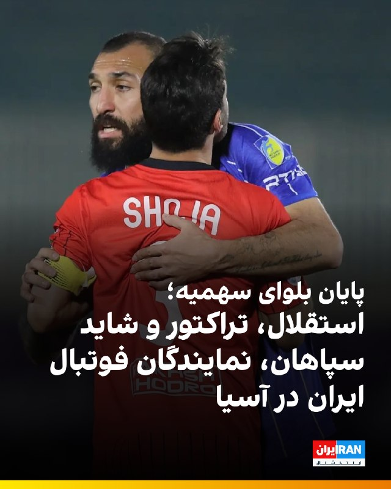

🔻دبیر سازمان لیگ اعلام کرد که نمایندگان فوتبال ایران برای فصل آینده مسابقات آسیایی، بر اساس جدول لیگ برتر معرفی می شوند: «با توجه به وضعیت کشور در دوران جنگ و کمک به روند آماده‌سازی تیم ملی برای جام جهانی، امکان برگزاری ادامه رقابت‌های بیست و پنجمین دوره لیگ برتر وجود نداشت.»

🔹به گفته محمدرضا کشوری‌فرد، کنفدراسیون فوتبال آسیا مهلت لازم را نداد که پس از برگزاری مسابقات لیگ برتر نمایندگان ایران برای حضور در لیگ‌های آسیایی معرفی شوند.

🔹او گفت: «ما هم طبق قانون و عرف جهان فوتبال مجبور شدیم برای معرفی نمایندگان ایران به جدول ثابت مانده لیگ برتر رجوع کنیم. با توجه به مهلت تعیین شده تا ۱۰ خرداد ۱۴۰۵ براساس جدول فعلی لیگ برتر باشگاه ها به ای‌اف‌سی معرفی می شوند.»

🔹با توجه به جدول لیگ برتر در پایان هفته بیست و دوم، تیم‌های استقلال و تراکتور نمایندگان ایران در لیگ نخبگان آسیا و سپاهان،‌ نماینده ایران در سطح ۲ لیگ قهرمانان آسیا خواهند بود.

🔹این تصمیم که از مدتها پیش به عنوان راه‌حل نهایی سهمیه آسیا شناخته می‌شد، درحالی اعلام شده که در هفته‌های گذشته جنجال‌های زیادی دراین‌باره به راه افتاده بود

@iranintltvsport

## IranIntlTV — post 339756

  <a href="telegram/content/IranIntlTV_339756_1780157547.mp4" target="_blank">🎬 Download video</a>

سرخط خبرهای شنبه ۹ خرداد
@iranintltv

## IranIntlTV — post 339755

  <a href="telegram/content/IranIntlTV_339755_1780157548.mp4" target="_blank">🎬 Download video</a>

شاهزاده رضا پهلوی در نشست «امنیت دریای سیاه» در اودسا، در جنوب اوکراین، گفت مردم ایران برای ساختن آینده کشور خود آماده‌اند و از جهان نمی‌خواهند آینده ایران را برای آنان رقم بزند، بلکه خواستار آن هستند که جامعه جهانی در کنار ملت ایران بایستد.

او در بخش دیگری از سخنانش، با اشاره به خروج اجباری خود از ایران در ۱۰ سالگی، گفت که با وجود گذشت ۴۷ سال، هرگز امید خود را به آزادی ایران از دست نداده و همواره صدای مردمی بوده است که امکان بیان خواسته‌هایشان را نداشته‌اند.
@iranintltv

## IranIntlTV — post 339754

  <a href="telegram/content/IranIntlTV_339754_1780157550.mp4" target="_blank">🎬 Download video</a>

پیت هگست، وزیر جنگ آمریکا، هشدار داد در صورت ناکامی تلاش‌های دیپلماتیک، ایالات متحده آماده ازسرگیری حملات علیه جمهوری اسلامی است. او تاکید کرد مذاکرات ادامه خواهد یافت، اما حکومت ایران نباید به سلاح هسته‌ای دست پیدا کند.

ارزیابی بیشتر با اردوان روزبه، خبرنگار ایران‌اینترنشنال
@iranintltv

## IranIntlTV — post 339753

  

قرارگاه مرکزی خاتم‌الانبیا در بیانیه‌ای اعلام کرد که هرگونه اقدام شناورهای نظامی جهت مداخله در مدیریت تنگه هرمز یا ایجاد اختلال در تردد، مورد هدف نیروهای مسلح جمهوری اسلامی قرار خواهد گرفت.
در این بیانیه آمده: «هرگونه تخلف از این ضوابط، امنیت تردد آن‌ها را با مخاطره جدی مواجه خواهد کرد.»

قرارگاه مرکزی خاتم‌الانبیا اعلام کرد کلیه کشتی‌ها، شناورهای تجاری و نفتکش‌ها صرفا ملزم به تردد از مسیرهای تعیین‌شده و اخذ مجوز از نیروی دریایی سپاه پاسداران هستند.
https://iranintl.com/202605309807

## IranIntlTV — post 339752

  <a href="telegram/content/IranIntlTV_339752_1780157552.mp4" target="_blank">🎬 Download video</a>

شاهزاده رضا پهلوی در نشست «امنیت دریای سیاه» در اودسا، اوکراین، خواستار حمایت جهانی از مردم ایران برای تغییر حکومت جمهوری اسلامی شد. او با فاقد مشروعیت دانستن مقام‌های جمهوری اسلامی، مذاکره با این حکومت را «وقت‌کشی پرهزینه» خواند.

گفت‌وگو با فروغ کنعانی، پژوهشگر جامعه‌شناسی
@iranintltv

## IranIntlTV — post 339751

  

مصطفی نیلی، وکیل دادگستری اعلام کرد بنیامین نقدی، زندانی سیاسی و از معترضان دی‌ماه، از سوی دادگاه انقلاب شیراز به اتهام «افسادفی‌الارض»، به اعدام محکوم شد.

این وکیل دادگستری به کانال امتداد گفت که بنیامین نقدی در شب سیزدهم دی ۱۴۰۴ در شیراز، به دلیل «شعله‌ور نمودن یک دستگاه کپسول آتش‌نشانی» به سمت مامورین نیروی انتظامی بازداشت شده بود.

مصطفی نیلی افزود پس از پایان تحقیقات مقدماتی کیفرخواست بنیامین نقدی با اتهام‌های «محاربه، عضویت در گروه‌های به هم‌زننده امنیت، اجتماع و تبانی به قصد انجام جرم علیه امنیت و فعالیت تبلیغی علیه نظام» صادر شد و نسبت به اتهام ایراد صدمه جسمانی به ماموران و حمل سلاح سرد منع تعقیب صادر شد.

نیلی، وکیل دادگستری گفت که در جلسه دادگاه، قضات تمامی اتهامات را مصداق افسادفی‌الارض تشخیص دادند و بر همین مبنا حکم اعدام برای بنیامین نقدی صادر کردند.
https://iranintl.com/202605305615

## reutersworldchannel — post 151525

  

Trump says he will soon decide on Iran deal, demands reopening of Hormuz Strait

U.S. President Donald Trump said on Friday he ​would soon decide on a proposed deal to extend the ceasefire with Iran, though the two countries still appeared to differ on significant issues ‌that have been central to the conflict.

Trump said on Friday morning that he would meet in a secure White House room to make a "final determination" on the proposal, which would extend an early-April truce for another 60 days, giving negotiators time to forge a permanent end to the war. read more

## FarsiVOA — post 219090

در گفت‌وگو با شاهین مدرس، پژوهشگر مطالعات امنیتی، تعویق در اعلام نتیجه نشست پرزیدنت ترامپ را بررسی کردیم. وقفه‌ای که به گفته او نشان می‌دهد واشنگتن برای تصمیم نهایی عجله‌ای ندارد و فاکتور زمان، برخلاف تصور رژیم ایران، هرچه بیشتر به زیان جمهوری اسلامی عمل می‌کند.

## FarsiVOA — post 219089

در گفت‌وگو با حسن هاشمیان به پایان مأموریت تام باراک به‌عنوان نماینده ویژه آمریکا در سوریه پرداختیم. به گفته آقای هاشمیان کارنامه تام باراک را باید به دو مقطع قبل و بعد از عملیات «خشم حماسی» علیه جمهوری اسلامی تقسیم کرد.

## FarsiVOA — post 219088

  <a href="telegram/content/FarsiVOA_219088_1780157555.mp4" target="_blank">🎬 Download video</a>

ارتش اسرائیل اعلام کرد کمی پیشتر موشک‌هایی از لبنان به مناطقی در شمال اسرائیل شلیک شد. تعدادی از این موشک‌ها رهگیری شدند و تعدادی در فضاهایی باز مانند ساحل شهر نهاریا در شمال اسرائیل سقوط کردند. ارتش اسرائیل اعلام کرد این حملات به اسرائیل تلفاتی درپی نداشتند.

## FarsiVOA — post 219084

پیت هگست، وزیر جنگ آمریکا، از دیدار با گیلبرتو تئودورو، وزیر دفاع فیلیپین، خبر داد.

او گفت دو کشور در حال تقویت همکاری‌های دفاعی در امتداد «زنجیره نخست جزایر» هستند؛ همکاری‌ای که به گفته او با برگزاری رزمایش «بالیکاتان» و انتقال یک شناور گارد ساحلی پشتیبانی شده است.

@FarsiVOA

## FarsiVOA — post 219083

آیا تهدید اروپا توسط روسیه به رویارویی کشیده می‌شود؟ گفت‌و‌گو با رضا تقی‌زاده، تحلیلگر روابط بین‌الملل

## FarsiVOA — post 219082

🔺 تداوم آزار و اذیت معترضان دی؛ شمار زیادی از بازداشت‌شدگان همچنان در بلاتکلیفی هستند

▪️نهادهای حقوق بشری از ادامه سرکوب و فشار جمهوری اسلامی بر بازداشت‌شدگان اعتراضات سراسری دی‌ ۱۴۰۴ در شهرهای مختلف ایران خبر می‌دهند.

⬇️ بیشتر بخوانید:

https://ir.voanews.com/a/iran-arrest-protest-prison-january-human-rights/8155568.html/?nocach=1

## FarsiVOA — post 219081

  <a href="telegram/content/FarsiVOA_219081_1780157557.mp4" target="_blank">🎬 Download video</a>

«هەنگاو» ویدیویی از مراسم تشییع مجتبی و میثم ویسی منتشر کرده است که امروز شنبە نهم خرداد در سرپل ذهاب برگزار می‌شود.

این دو برادر که پس از اعتراضات دی‌ ۱۴۰۴ تحت تعقیب نهادهای امنیتی بودند بامداد پنجشنبه هفتم خرداد ۱۴۰۵ در روستای «قلعه کهوش» از توابع دالاهو، در جریان یورش نیروهای اطلاعات سپاه پاسداران به محل اختفای آنها، هدف شلیک مستقیم قرار گرفتند و کشته شدند.

مجتبی و میثم ویسی از فعالان فرهنگی و مدنی و از پیروان آیین یارسان معرفی شده‌اند. آنها از بنیان‌گذاران کتابخانه‌ای در شهرک دره‌دریژ کرمانشاه بودند. مجتبی ویسی همچنین کشتی‌گیر، نوازنده، و نقاش بود. کُردپا پیشتر گزارش داده بود که مجتبی ویسی در اسفند ۱۴۰۳ بازداشت و در فروردین ۱۴۰۴ با وثیقه آزاد شده بود.

## DW_Farsi — post 125322

  

🔶 نیویورک‌ پست: آزادی وجوه ایران در قطر از گره‌های توافق با آمریکاست

روزنامه آمریکایی نیویورک پست در گزارشی شرح داده که آزادسازی ۶ میلیارد دلار ایران که در پی توافق تبادل زندانی میان ایران و آمریکا در سال ۲۰۲۳ در قطر بلوکه شده بود، از جمله آخرین گره‌های دستیابی به توافق در مذاکرات صلح بین ایران و آمریکاست.

نیویورک ‌پست به نقل از یک مقام آمریکایی نوشت که این دارایی‌ها به تدریج و در قالب محموله‌های غذایی و دارویی آزاد خواهند شد، مشروط بر اینکه ایران به تعهدات خود، از جمله بازگشایی و مین‌روبی تنگه هرمز عمل کند.

در این گزارش مشخص نشده که این مقام مسئول در حال تشریح پیشنهاد ایالات متحده است یا به بند خاصی از پیش‌نویس توافق اشاره دارد.

در سپتامبر ۲۰۲۳ و به عنوان بخشی از توافقی که به آزادی پنج تن از اتباع هر یک از این دو کشور انجامید، جو بایدن، رئیس‌جمهور وقت آمریکا، تحریم‌هایی را که مانع برداشت ۶میلیارد دلار دارایی ایران از کره جنوبی می‌شد لغو کرد.

این وجوه سپس از کره جنوبی به حساب‌هایی در قطر منتقل شد، اما پس از حمله ۷ اکتبر ۲۰۲۳ گروه حماس به جنوب اسرائیل و آغاز جنگ غزه، مسدود ماند.

@dw_farsi

## DW_Farsi — post 125321

  

🔶 توقیف اموال ده‌ها نفر در ایران به اتهام "همکاری با دشمن"

در حالی که قوه قضائیه استان گلستان از توقیف اموال ۷۴ ایرانی خارج از کشور به اتهام "خیانت به وطن" خبر داده، رئيس‌ کل دادگستری خراسان جنوبی نیز می‌گوید، اموال ۳۴ نفر در این استان به اتهام "حمایت از دشمن" ضبط شده است.

خبرگزاری ایرنا روز شنبه نهم خرداد (۳۰ مه) به نقل از قوه قضائيه نوشت، به دستور مقام قضايی، اموال ۷۴ نفر در استان گلستان که از " خائنین به وطن و افراد تأثیرگذار در شبکه همکاران دشمن" و ساکن خارج از کشور هستند در راستای "حفظ حقوق عامه و اجرای قانون تشدید مجازات جاسوسی و همکاری" با اسرائيل توقیف شد.

قوه قضائيه می‌‌گوید، اموال این افراد شامل حساب‌های بانکی، خودرو و املاک ثبتی است که شناسایی و همه توقیف شده است. در ضمن، هرگونه نقل و انتقال مالی برای آن‌ها ممنوع و پرونده این افراد در دادسرای مرکز استان در حال رسیدگی است.

هم‌زمان محمدجعفر عبداللهی، رئیس‌ کل دادگستری استان خراسان جنوبی از توقیف اموال ۳۴ نفر که او آن‌ها را "حامی دشمن و خائن به کشور" نامید خبر داد.

@dw_farsi

## DW_Farsi — post 125320

  

🔶 نماینده ایرانی‌تبار پارلمان آلمان خواستار ممنوعیت فعالیت سپاه شد

رضا اصغری، نماینده ایرانی‌تبار پارلمان آلمان از حزب دموکرات‌مسیحی (CDU) خواستار ممنوعیت فعالیت سپاه پاسداران انقلاب اسلامی در این کشور شد.

اصغری در گفت‌وگو با خبرگزاری رویترز گفت: «سرویس‌های اطلاعاتی ایران در آلمان بسیار فعال هستند. غیرقابل درک است که هنوز ممنوعیتی برای فعالیت سپاه پاسداران در این کشور وجود ندارد. ما در سریع‌ترین زمان ممکن به این ممنوعیت نیاز داریم.»

اتحادیه اروپا تا کنون سپاه پاسداران را در فهرست سازمان‌های تروریستی قرار داده است.

اما وزارت کشور آلمان هنوز بر اساس قانون تشکل‌ها (Vereinsrecht)، فعالیت سپاه را در خاک خود ممنوع اعلام نکرده است.

در ساختار حقوقی آلمان، دولت برای ممنوع کردن فعالیت یک نهاد خارجی در خاک خود، باید از طریق این قانون اقدام کند تا بتواند شعبه‌ها، فعالیت‌ها و دارایی‌های آن نهاد یا هوادارانش را در داخل مرزهای آلمان غیرقانونی اعلام کند.

@dw_farsi

## Persian_Trend_Official — post 15347

https://www.instagram.com/reel/DY9_9XQNm3g/?igsh=MWh2Z3d5eXRvcnhoMg==

پیج اینستاگرام پرشین ترند رو فالو کردید ؟

## Persian_Trend_Official — post 15346

  <a href="telegram/content/Persian_Trend_Official_15346_1780157559.webm" target="_blank">🎬 Download video</a>

قرارگاه مرکزی خاتم‌الانبیا: مدیریت تنگه هرمز توسط نیروهای مسلح جمهوری اسلامی ایران با اقتدار کامل اعمال می‌شود.

قرارگاه مرکزی خاتم الانبیا در بیانیه ای اعلام کرد: با توجه به یکپارچگی این مسیر، تأکید می‌شود کلیه کشتی‌ها، شناورهای تجاری و نفتکش‌ها صرفاً ملزم به تردد از مسیرهای تعیین‌شده و اخذ مجوز از نیروی دریایی سپاه پاسداران انقلاب اسلامی هستند. هرگونه تخلف از این ضوابط، امنیت تردد آن‌ها را با مخاطره جدی مواجه خواهد کرد.

همچنین هشدار داده می‌شود هرگونه اقدام شناورهای نظامی جهت مداخله در مدیریت تنگه هرمز یا ایجاد اختلال در تردد، مورد هدف نیروهای مسلح جمهوری اسلامی ایران قرار خواهد گرفت.

📝 Amir

📌 @persian_trend_official
پرشین ترند | متفاوت‌ترین کانال نظامی

## Persian_Trend_Official — post 15345

  

یک مقام آمریکایی آگاه به خبرگزاری آسوشیتدپرس گفت که ارتش آمریکا یک کشتی تجاری دیگر را که سعی داشت از محاصره بنادر ایران توسط آمریکا عبور کند، متوقف کرده است.

📝 Amir

📌 @persian_trend_official
پرشین ترند | متفاوت‌ترین کانال نظامی

## Persian_Trend_Official — post 15344

  <a href="telegram/content/Persian_Trend_Official_15344_1780157560.mp4" target="_blank">🎬 Download video</a>

امریکا خبر آسیب حمله موشکی ایران به کویت را تأیید کرد.

مجری فاکس نیوز: بلومبرگ گزارش می‌دهد که حملات موشکی ایران منجر به زخمی شدن چندین آمریکایی در پایگاه هوایی کویت شده است. به نظر شما اوضاع از چه قرار است؟

مایک جانسون، رئیس مجلس نمایندگان: من دیشب با رئیس جمهور ترامپ صحبت کردم. او در جریان این موضوع قرار گرفته است. من فکر می‌کنم رهبری جدید ایران می‌خواهد به این درگیری پایان دهد.

📝 Amir

📌 @persian_trend_official
پرشین ترند | متفاوت‌ترین کانال نظامی

## RadioFarda — post 157725

  <a href="https://t.me/radiofarda/157725" target="_blank">📎 Download file</a>

لبنان میان فشار دیپلماسی و آتش جنگ؛ گفت‌وگو با مهرداد فرهمند

🔸در حالی که جمهوری اسلامی در مذاکرات با آمریکا بر پایان جنگ در همه جبهه‌ها، از جمله لبنان، تأکید می‌کند، نمایندگان لبنان و اسرائیل نیز با میانجی‌گری آمریکا در پنتاگون گفت‌وگوهایی امنیتی و نظامی برگزار کردند؛ مذاکراتی که بر تثبیت آتش‌بس شکننده و کاهش تنش متمرکز بود، نه یک توافق سیاسی جامع. هم‌زمان، بنیامین نتانیاهو مدعی شده نیروهای اسرائیلی از رود لیتانی عبور کرده‌اند؛ ادعایی که حزب‌الله آن را رد می‌کند. اکنون این پرسش مطرح است که آیا لبنان به بخشی تعیین‌کننده از معامله بزرگ‌تر میان تهران و واشینگتن تبدیل شده، یا همچنان در مدار یک جنگ فرسایشی باقی خواهد ماند؟ ارزیابی مهرداد فرهمند، تحلیل‌گر مسائل خاورمیانه، را بشنویم.

@RadioFarda

## RadioFarda — post 157724

  

🔸سپیده قلیان، فعال مدنی و زندانی سیاسی، روز شنبه نهم خرداد پس از پایان محکومیت شش‌ماهه خود از زندان وکیل‌آباد مشهد آزاد شد.

🔸او ساعاتی پس از آزادی با انتشار تصویری از حضور خود بر مزار خسرو علیکردی، وکیل دادگستری، نوشت: «از زندان یک راست آمدم سر خاک خسرو» و افزود که «از هرچه خسته شوم، از رسیدن به آزادی و حمل کردن سنگ‌های سخت حقیقت خسته نخواهم شد.»

🔸قلیان همچنین با اشاره به هم‌بندی‌های خود در زندان وکیل‌آباد نوشت که هنگام خداحافظی، در چشمان آنان تنها یک جمله می‌دید: «ما را فراموش نکنید.»

🔸سپیده قلیان در بخش دیگری از پیام خود نوشت که نام زندانیان و کشته‌شدگان ماه‌های اخیر را «فریاد خواهد زد» و افزود: «کاش شهرزاد قصه‌شان باشم.»

🔸سپیده قلیان ۲۱ آذر ۱۴۰۴ در جریان مراسم ترحیم خسرو علیکردی در مشهد بازداشت شد. آن مراسم با برخورد نیروهای امنیتی و انتظامی همراه بود و در جریان آن شماری از حاضران، از جمله نرگس محمدی، عالیه مطلب‌زاده و جواد علیکردی، برادر خسرو علیکردی، نیز بازداشت شدند.

@RadioFarda

## RadioFarda — post 157723

🔸پیت هگست، وزیر دفاع آمریکا، روز شنبه نهم خرداد گفت ایالات متحده در صورتی که مذاکرات با ایران به توافق منجر نشود، آماده ازسرگیری حملات علیه جمهوری اسلامی است.

🔸هگست در جمع خبرنگاران گفت: «در حال حاضر تمرکز ما بر حفظ آمادگی و آماده بودن برای بازگشت به عملیات است، اگر لازم باشد.»

🔸او افزود دونالد ترامپ «صبور» است و به دنبال دستیابی به «توافقی خوب» است که تضمین کند ایران هرگز به سلاح هسته‌ای دست پیدا نخواهد کرد.

🔸اظهارات وزیر دفاع آمریکا در حالی مطرح می‌شود که مذاکره‌کنندگان تهران و واشینگتن در تلاش‌اند اختلافات باقی‌مانده بر سر برنامه هسته‌ای ایران را برطرف کنند.

@RadioFarda

## IranianMinds — post 21076

🔴آسو‌شیتد‌پرس به نقل از یک منبع آمریکایی:

ارتش آمریکا یک کشتی تجاری را که قصد داشت به سمت یکی از بنادر ایران برود، منع کرد.

@IranianMinds

## IranianMinds — post 21075

  

🔴 بنیامین نقدی، زندانی سیاسی و از معترضان دی‌ماه، از سوی دادگاه انقلاب شیراز به اعدام محکوم شد.

@IranianMinds

## IranianMinds — post 21074

  

🔴بدون توضیح.

😂😂😂

@IranianMinds

## BBCPersian — post 282437

  

🔻به گزارش هرانا، ارگان خبری مجموعه فعالان حقوق بشر در ایران، سپیده قلیان، زندانی سیاسی امروز(شنبه ۹ خرداد) از زندان وکیل آباد مشهد آزاد شده است.

آزادی او پس از پایان دوران شش ماه محکومیت حبس تعزیری صورت گرفته است.

خانم قلیان اواخر آذرماه سال پیش (۱۴۰۴) در مراسم هفتم خسرو علیکردی در مشهد به همراه نرگس محمدی، عالیه مطلب‌زاده و پوران ناظمی بازداشت شد.

او در دی‌ماه سال پیش در دادگاه انقلاب مشهد محاکمه شد و در بهمن ماه به «اجتماع و تبانی برای ارتکاب جرم برضد امنیت داخلی/خارجی» و «تبلیغ علیه نظام» متهم شد که پنج سال حبس تعلیقی و شش ماه حبس تعزیری را برای او به همراه داشت.

این فعال سیاسی در خردادماه پارسال با پایان دوران محکومیت از زندان اوین آزاد شده بود.

@BBCPersian

## BBCPersian — post 282436

🔻در پی مشاهده شدن شیئی شبیه مین دریایی در تنگه هرمز، مرکز امنیت دریایی عمان به دریانوردان، ماهیگیران و شناورها هشدار داد که نهایت احتیاط را به خرج دهند.

این شیء مشکوک در آب‌های سرزمینی عمان و در غرب منطقه ترافیک ساحلی مشاهده شده است.

مرکز امنیت دریایی عمان به دریانوردان توصیه کرد که فاصله ایمن را از هر شی مشکوکی حفظ کنند و در صورت مشاهده، فورا موضوع را به مقام‌های ذی‌ربط گزارش دهند.

آمریکا بارها ایران را به تلاش برای مین‌گذاری در تنگه هرمز متهم کرده و یکی از شرایط توافق صلح با تهران را هم مین‌روبی این آبراه عنوان کرده است.

ایران هیچگاه رسما مین‌گذاری در این تنگه را تایید نکرده است.

@BBCPersian

## Dirty_Kids — post 390574

  <a href="telegram/content/Dirty_Kids_390574_1780157564.mp4" target="_blank">🎬 Download video</a>

جه جالب ما هم ساعت بلند ميشیم.فقط ما اون ساعت ميشاشم تو روح بنيانگذار جمهورى اسلامی و نايبش خامنه‌اى و مقوا

@Dirty_Kids 👻

## Dirty_Kids — post 390573

  

وقتی کلی مطلب برا غُرزدن اماده کرده بودم ولی یهویی میادمیگه دخترخوشگلِ من چطوره؟

@Dirty_Kids 👻

## Dirty_Kids — post 390572

  

🌎با بهبود نسبی وضعیت اینترنت و بازگشت محدود دسترسی به شبکه بین‌الملل، موفق شدیم ضمن حفظ کیفیت و پایداری سرویس‌ها، قیمت را تا هر گیگابایت 20 هزار تومان کاهش دهیم
🖥

🟣با وجود اینکه شرایط اینترنت همچنان ناپایدار است و وضعیت پهنای باند بین‌الملل به ثبات کامل نرسیده، تیم فنی بادبان با توسعه زیرساخت‌ها و بهره‌گیری از سرورهای جدید از سرویس‌دهندگان معتبر، توانسته هزینه‌ها را بهینه کرده و سرویس‌ها را با قیمت مناسب‌تری ارائه دهد
⛵️
G9
از همراهی و اعتماد شما سپاسگزاریم
💜

🛡@BadBan_VPN | کانال 

🤖@BadBan_VPNBot | ربات 

📞@BadBan_VPNSupport | پشتیبانی

## Hranews — post 113248

  

زندان دولت‌آباد اصفهان؛ تداوم بازداشت مائده دانشمند به ۱۴۰ روز رسید

❗️
❗️
❗️
❗️
❗️– مائده دانشمند، از بازداشت شدگان مرتبط با اعتراضات سراسری ۱۴۰۴، بیش از چهار ماه است که در زندان دولت‌آباد اصفهان در بلاتکلیفی قضایی به‌سر می‌برد.

به گزارش خبرگزاری هرانا، ارگان خبری مجموعه فعالان حقوق بشر در ایران، مائده دانشمند همچنان در بازداشت بسر می‌برد.

بر اساس اطلاعات دریافتی هرانا، ۱۴۰ روز از بازداشت خانم دانشمند که که با اتهامات مرتبط با اعتراضات سراسری مواجه است، می‌گذرد. او هم‌اکنون در زندان دولت‌آباد اصفهان نگهداری می‌شود. وی همچنان در وضعیت بلاتکلیفی قضایی قرار دارد و امکان آزادی او با وثیقه نیز تاکنون میسر نشده است.

ادامه مطلب

#مائده_دانشمند

↘️
@hranews_bot تماس ✉️ - @Hranews کانال هرانا 🆑

## Hranews — post 113247

  

احکام اعدام رئوف شیخ‌ معروفی و محمد فرجی در دیوان عالی کشور تایید شد

❗️
❗️
❗️
❗️
❗️– دیوان عالی کشور احکام اعدام رئوف شیخ‌ معروفی و محمد فرجی، زندانیان سیاسی محبوس در زندان بوکان را تایید کرد. این افراد پیشتر از بابت اتهام “افساد فی الارض”، توسط دادگاه انقلاب به #اعدام محکوم شده بودند.

ادامه مطلب

#رئوف_شیخ‌_معروفی #محمد_فرجی

↘️
@hranews_bot تماس ✉️ - @Hranews کانال هرانا 🆑

## Hranews — post 113246

  

اعتراضات دی‌ماه ۱۴۰۴؛ بنیامین نقدی به اعدام محکوم شد

❗️
❗️
❗️
❗️
❗️– بنیامین نقدی، از بازداشت شدگان اعتراضات سراسری ۱۴۰۴، توسط دادگاه انقلاب شیراز از بابت اتهام «افساد فی‌الارض» به #اعدام محکوم شد. مصطفی نیلی، وکیل مدافع وی اعلام کرده است که نسبت به این حکم درخواست فرجام‌خواهی خواهد کرد.

ادامه مطلب

#بنیامین_نقدی

↘️
@hranews_bot تماس ✉️ - @Hranews کانال هرانا 🆑

## alonews — post 123761

  <a href="telegram/content/alonews_123761_1780157567.webm" target="_blank">🎬 Download video</a>

👈هم اکنون نیروی دریایی ارتش آمریکا از شلیک و متوقف کردن یک کشتی تجاری ایرانی که قصد داشت به بنادر ایران وارد شود خبر داد

✅ @AloNews خبر جنگ

## alonews — post 123760

  <a href="telegram/content/alonews_123760_1780157567.webm" target="_blank">🎬 Download video</a>

👈رضا پهلوی: مردم ایران از هدف قرار گرفتن زیرساخت‌ها خوشحال شدن ‌
✅ @AloNews خبر جنگ

## alonews — post 123759

  <a href="telegram/content/alonews_123759_1780157567.webm" target="_blank">🎬 Download video</a>

👈رضا پهلوی: مردم ایران از هدف قرار گرفتن زیرساخت‌ها خوشحال شدن

‌
✅ @AloNews خبر جنگ

## alonews — post 123758

  <a href="telegram/content/alonews_123758_1780157567.webm" target="_blank">🎬 Download video</a>

👈مدیرعامل آروان کلاد: زمانبر بودن بهبود وضعیت اینترنت از نظر فنی فقط بهانه ست، نت رو گذاشتن رو حالتی که اگر خواستند سریع قطع یا وصل کنند

✅ @AloNews خبر جنگ

## alonews — post 123757

  <a href="telegram/content/alonews_123757_1780157567.webm" target="_blank">🎬 Download video</a>

👈مقام آمریکایی به AP : یه کشتی تجاری که قصد داشت به سمت یکی از بنادر ایران بره، متوقف شده 
✅ @AloNews خبر جنگ

## alonews — post 123756

  <a href="telegram/content/alonews_123756_1780157568.mp4" target="_blank">🎬 Download video</a>

👈نیویورک تایمز: ترامپ بارها جی‌دی ونس را دست انداخته است

🔴نیویورک تایمز گزارش داد دونالد ترامپ بارها در جلسات و محافل مختلف جی‌دی ونس را درباره مسائل سیاسی و شخصی مورد شوخی و انتقاد قرار داده است.
طبق این گزارش، ترامپ به مخالفت اولیه ونس با حمله به ایران، نتیجه سفر دیپلماتیک او به پاکستان، تعداد مرخصی‌هایش و حتی قطع کردن صحبت دیگران اشاره کرده است.
نیویورک تایمز همچنین نوشت ترامپ بارها ماجرای افتادن جام قهرمانی دانشگاه ایالتی اوهایو از دست ونس در یکی از مراسم‌های کاخ سفید را یادآوری کرده است.

✅ @AloNews خبر جنگ

## alonews — post 123755

  <a href="telegram/content/alonews_123755_1780157569.webm" target="_blank">🎬 Download video</a>

👈نماینده سیستان و بلوچستان در مجلس: برخی از مناطق زاهدان ۲۴ تا ۴۸ ساعت آب ندارند

🔴 ادامه بحران آب، استان را با چالش‌های امنیتی و اجتماعی روبه‌رو می‌کند

✅ @AloNews خبر جنگ

## alonews — post 123754

  <a href="telegram/content/alonews_123754_1780157569.webm" target="_blank">🎬 Download video</a>

👈مقام آمریکایی به AP : یه کشتی تجاری که قصد داشت به سمت یکی از بنادر ایران بره، متوقف شده

✅ @AloNews خبر جنگ

## alonews — post 123752

  <a href="telegram/content/alonews_123752_1780157569.webm" target="_blank">🎬 Download video</a>

👈سلفی حسین طاهری مداح و یک جان فدا

✅ @AloNews خبر جنگ

## alonews — post 123751

  <a href="telegram/content/alonews_123751_1780157569.webm" target="_blank">🎬 Download video</a>

👈قرارگاه مرکزی خاتم‌الانبیا در بیانیه‌ای اعلام کرد که هرگونه اقدام شناورهای نظامی جهت مداخله در مدیریت تنگه هرمز یا ایجاد اختلال در تردد، مورد هدف نیروهای مسلح جمهوری اسلامی قرار خواهد گرفت.

🔴در این بیانیه آمده: «هرگونه تخلف از این ضوابط، امنیت تردد آن‌ها را با مخاطره جدی مواجه خواهد کرد.»

🔴قرارگاه مرکزی خاتم‌الانبیا اعلام کرد کلیه کشتی‌ها، شناورهای تجاری و نفتکش‌ها صرفا ملزم به تردد از مسیرهای تعیین‌شده و اخذ مجوز از نیروی دریایی سپاه پاسداران هستند.

✅ @AloNews خبر جنگ

## alonews — post 123748

  <a href="telegram/content/alonews_123748_1780157569.mp4" target="_blank">🎬 Download video</a>

8 اردیبهشت ماه یه زوج عروسی گرفتن و 20 میلیارد تومن خرج عروسی‌شون شده!! فقط یه میلیارد پول فیلمبردار دادن! اینم فیلم عروسی‌شونه.

[@AloTweet]

## alonews — post 123747

  <a href="telegram/content/alonews_123747_1780157570.webm" target="_blank">🎬 Download video</a>

💔همه اعضای این خانواده جاوید نام شدن.

🔴جاویدنام بیژن مصطفوی، ۵۸ ساله، بازنشسته آموزش و پرورش، رزمنده جنگ ایران و عراق

🔴جاویدنام زهرابنی‌عامریان، ۴۸ ساله، بازنشسته تامین اجتماعی

🔴جاویدنام دانیال مصطفوی، ۲۰ ساله، دانشجوی کامپیوتر

🔴اصالتا از شهرستان سنقر، استان کرمانشاه
کشته شده ۱۹ دی ماه خونین ۴۰۴ در گوهردشت کرج

🤔عرزشی حرام زاده بدونه که روز تسویه حساب باهاتون نزدیکه

✅@AloNews

## alonews — post 123746

  <a href="telegram/content/alonews_123746_1780157570.webm" target="_blank">🎬 Download video</a>

👈سازمان ملل : سال ۲۰۲۷ گرم‌ترین سال ثبت خواهد شد

✅ @AloNews خبر جنگ

## alonews — post 123745

  <a href="telegram/content/alonews_123745_1780157570.webm" target="_blank">🎬 Download video</a>

👈آزمون‌ساز برنامه شاد هم پولی شد!
‌

🔴بسته‌های آزمون‌ساز شاد از ۷۴۹ هزار تومان تا ۳ میلیون تومان قیمت‌گذاری شده‌اند

✅ @AloNews خبر جنگ

## alonews — post 123744

🔥 همراه با ساب + حجم مصرفی، فقط 9T! 🚀 ❌ آفر فقط تا پایان امشب ❌ 🔥 اگه دنبال یه VPN پایدار و بدون دردسر می‌گردی، این پلن مخصوص خودته! @Netaazaadbot @NetAazaadBot ✅ همراه با ساب + حجم مصرفی ✅ 15 سرور اختصاصی پرسرعت ✅ اتصال پایدار و بدون قطعی ✅ سرعت بالا…

## alonews — post 123743

  

🔥 همراه با ساب + حجم مصرفی، فقط 9T! 🚀

❌ آفر فقط تا پایان امشب ❌

🔥 اگه دنبال یه VPN پایدار و بدون دردسر می‌گردی، این پلن مخصوص خودته!

@Netaazaadbot
@NetAazaadBot
✅ همراه با ساب + حجم مصرفی
✅ 15 سرور اختصاصی پرسرعت
✅ اتصال پایدار و بدون قطعی
✅ سرعت بالا حتی در ساعات شلوغ

@Netaazaadbot
@NetAazaadBot
💎 کیفیتی که بعد از استفاده متوجه تفاوتش میشی!

📩 برای خرید و دریافت سرویس استارت رو بزن✅

## alonews — post 123742

  <a href="telegram/content/alonews_123742_1780157571.webm" target="_blank">🎬 Download video</a>

👈وال استریت ژورنال | کاهش چشمگیر هزینه سرنگونی پهپادها: ارتش آمریکا راهکار جدیدی پیدا کرده است تا بدون صرف هزینه‌های کلانِ ۱ میلیون دلاری، پهپادها را در آسمان منهدم کند

🔴روزنامه «وال‌استریت ژورنال» در گزارش جدید خود اعلام کرد ارتش آمریکا راهکار تازه‌ای برای انهدام پهپادها بدون نیاز به صرف هزینه‌های ۱ میلیون دلاری پیدا کرده است.

🔴این روش جدید با به‌کارگیری خودروهای تاکتیکی ویژه مجهز به توپ‌ها و مهمات تخصصی، هزینه ساقط کردن پرنده‌های بدون سرنشین را به شدت کاهش می‌دهد.

🔴در جریان یک آزمایش میدانی مشترک در فیلیپین، تفنگداران دریایی آمریکا با استفاده از این سیستم جدید تاکتیکی موفق شدند یک پهپاد مهاجم بال‌ثابت را با هزینه‌ای بسیار پایین‌تر از موشک‌های پدافندی متعارف، بر فراز دریای جنوبی چین سرنگون کنند.

✅ @AloNews خبر جنگ

---
📅 بروزرسانی: 1405/03/09 18:33
---

## VahidOOnLine — post 242925

  <a href="telegram/content/VahidOOnLine_242925_1780153395.mp4" target="_blank">🎬 Download video</a>

♦️همزمان با نزدیک شدن به عید قربان، ایستگاه‌های قطار در بنگلادش شاهد ازدحام شدید مسافران بوده‌اند؛ شهروندانی که برای گذراندن تعطیلات به زادگاه‌های خود بازمی‌گردند.
ویدیوی منتشرشده نشان می‌دهد صدها نفر حتی روی سقف و بدنه قطارها سوار شده‌اند؛ صحنه‌ای که هر سال در آستانه این مناسبت مذهبی تکرار می‌شود و نشان‌دهنده فشار بالای تقاضا بر سیستم حمل‌ونقل این کشور است.
عید قربان یکی از مهم‌ترین اعیاد مسلمانان است و در بنگلادش نیز مانند بسیاری از کشورهای اسلامی، میلیون‌ها نفر تلاش می‌کنند این روزها را در کنار خانواده‌های خود در شهرها و روستاهای محل تولدشان سپری کنند.
‌🇸🇦 Indypersian

🤖 @VahidOOnLine

## VahidOOnLine — post 242924

  

شاهزاده رضا پهلوی گفت که مردم ایران باید از طریق هوا حفاظت شوند و اینترنت و دیگر ابزار لازم را داشته باشند که دست به‌کار شوند و رژیم را به زانو درآورند.
او ادامه داد: «مردم حمله به زیرساخت‌های رژیم را جشن گرفتند و خیابان‌ها را به نام ترامپ نام‌گذاری کردند.»

شاهزاده رضا پهلوی ادامه داد: «دنیا باید تصمیم بگیرد که بعد از ۴۷ سال مماشات در کنار مردم ایران بایستد.»

او اضافه کرد: «مردم بین حمله به کشور و حمله به رژیم تمایز ایجاد می‌کنند.»
‌🏁 🇬🇧 IranintlTV

🤖 @VahidOOnLine

## VahidOOnLine — post 242923

  

♦️ رضا محمدی، رئیس سازمان سنجش روز شنبه نهم خرداد اعلام کرد که کنکور سراسری و آزمون پذیرش دانشجومعلم به طور همزمان در روزهای پنجشنبه و جمعه، ۲۹ و ۳۰ مرداد، برگزار خواهد شد. بر اساس داده‌های سازمان سنجش، بیش از یک ملیون و ۸۰هزار نفر برای شرکت در کنکور سراسری و آزمون پذیرش دانشجومعلم ثبت نام کرده‌اند.

همچنین به گفته محمدی، افرادی که از ثبت نام در کنکور کارشناسی ارشد جا مانده‌اند از امروز، نهم خرداد تا ۱۱ خرداد فرصت ثبت نام دارند و آزمون این مقطع نیز در روزهای ۱۸ و ۱۹ تیر برگزار می‌شود.
‌🇸🇦 Indypersian

🤖 @VahidOOnLine

## VahidOOnLine — post 242922

  <a href="telegram/content/VahidOOnLine_242922_1780153399.mp4" target="_blank">🎬 Download video</a>

♦️هم‌زمان با نزدیک شدن به فینال لیگ قهرمانان اروپا، روز شنبه ۹ خردادماه فروشگاه‌ها در خیابان شانزه‌لیزه پاریس با نصب موانع و تدابیر امنیتی در حال آماده‌سازی برای این رویداد هستند.
این تدابیر در آستانه دیدار نهایی میان دو تیم پاری‌سن ژرمن و آرسنال انجام می‌شود؛ تیم‌هایی که پس از سال‌ها دوباره به فینال این رقابت‌ها رسیده‌اند. پاری سن ژرمن با شکست تیم‌های لیورپول و بایرمونیخ  به این مرحله رسیده و و آرسنال نیز با شکست اسپورتینگ و اتلتیکومادرید از مدافعان قهرمانی راهی فینال شده است.
مقامات شهری پاریس با توجه به حضور گسترده هواداران، تمهیدات ویژه‌ای برای جلوگیری از ناآرامی‌های احتمالی در نظر گرفته‌اند تا این شب فوتبالی در فضایی امن برگزار شود.
‌🇸🇦 Indypersian

🤖 @VahidOOnLine

## VahidOOnLine — post 242921

  

شاهزاده رضا پهلوی در نشست «امنیت دریای سیاه» در اودسا در جنوب اوکراین، ضمن انتقاد از هرگونه توافق احتمالی، گفت که جمهوری اسلامی را مدیریت نکنید، بلکه به آن پایان دهید.

او افزود: «محور مسکو-تهران یک دشمن هماهنگ برای همه است و باید قاطعانه و با انسجام با آن برخورد شود.»

شاهزاده رضا پهلوی ادامه داد: «هر توافقی با جمهوری اسلامی مانند توافقات با شوروی سابق موضوع را حل نکرده است.»
‌🏁 🇬🇧 IranintlTV

🤖 @VahidOOnLine

## VahidOOnLine — post 242920

  

♦️ نیروهای طالبان شماری از جوانان را که با موتورسیکلت از زیرگذر شهر هرات در غرب افغانستان عبور کرده بودند، بازداشت و تنبیه کردند.

در عکسی که از این رویداد منتشر شده، شماری از جوانان در یک صف کنار دیوار زیرگذر نشسته و دست‌هایشان را بر گوش‌هایشان گذاشته‌اند. یک عضو مسلح طالبان نیز در مقابل آنان ایستاده است. در تصویر چند موتورسیکلت نیز دیده می‌شود.
منابع مردمی می‌گویند که طالبان این افراد را به دلیل عبور از زیرگذری که تردد موتورسیکلت در آن ممنوع است بازداشت کرده‌اند.
طالبان تاکنون درمورد این رویداد ابراز نظر نکرده‌اند.
چنین شیوه تنبیهی در قوانین رانندگی افغانستان سابقه ندارد و در گذشته تخلفات رانندگی معمولا با جریمه نقدی، توقیف وسایل یا اقدامات قانونی دیگر پیگیری می‌شد.

این در حالی است که نیروهای طالبان در بیش از چهار سال گذشته در موارد متعددی از شیوه‌های مختلف تنبیهی، از جمله شلیک به متهمان، سیاه کردن چهره افراد متهم به دزدی، و ضرب و شتم آنان استفاده کرده‌اند.
‌🇸🇦 Indypersian

🤖 @VahidOOnLine

## VahidOOnLine — post 242919

  

شاهزاده رضا پهلوی در نشست «امنیت دریای سیاه» در اودسا در جنوب اوکراین، گفت که دنیای آزاد هنوز متوجه ماهیت جمهوری اسلامی نشده است.
شاهزاده رضا پهلوی درباره تلاش برای توافق با جمهوری اسلامی با امید به ایجاد ثبات، گفت که یک سگ وحشی در نهایت دست شما را گاز می‌گیرد.

او افزود: «پهپادهایی که اوکراین را هدف قرار می‌دهد از سوی جمهوری اسلامی تهیه شده و با همان پهپادها مردم معترض خود را در خیابان تعقیب می‌کند تا تک‌تیراندازها آن‌ها را هدف قرار دهند.»

شاهزاده رضا پهلوی گفت که تهران و مسکو معماران مشترک هرج‌ومرج در جهان هستند.
‌🏁 🇬🇧 IranintlTV

🤖 @VahidOOnLine

## VahidOOnLine — post 242918

  

مجتبی یوسفی، عضو هیات رییسه مجلس گفت: «رهبری در بحث مذاکرات، ۱۰ شرط مشخص کردند که اگر تیم مذاکره‌کننده ۱۰ شرط را رعایت نکند، نه مردم، نه نمایندگان، نه نخبگان، آن توافق را حتما به‌عنوان توافق خوب در نظر نخواهند گرفت و می‌شود تجربه‌ای که در اعتماد به غرب باعث عقب‌افتادگی کشور شد.»

او افزود: «امروز باید هم‌قسم شویم تا به گفته امام شهید و امام جدیدمان، مسائل اصلی کشور را حل کنیم.»
‌🏁 🇬🇧 IranintlTV

🤖 @VahidOOnLine

## VahidOOnLine — post 242917

  

♦️ هاکان فیدان، وزیر امور خارجه ترکیه، در گفتگو با نشریه «نیکِی آسیا» اعلام کرد که اگر اسرائیل تشکیل دولت مستقل فلسطین بر اساس مرزهای ۱۹۶۷ را به رسمیت بشناسد، می‌تواند به یک «بلوک منطقه‌ای» مشترک ملحق شود. فیدان تاکید کرد: «در صورت حل این مسئله، کشورهای منطقه نیز به امنیت اسرائیل کمک شایانی خواهند کرد.»

به گفته فیدان، این چارچوب همکاری می‌تواند شامل پاکستان، ترکیه، عربستان سعودی، مصر و دیگر کشورهای خلیج فارس باشد و در صورت عادی شدن شرایط، شاید ایران نیز به آن بپیوندد. او افزود: «همه کشورهای منطقه باید به تمامیت ارضی، حاکمیت و امنیت یکدیگر متعهد باشند.»

این اظهارات در حالی مطرح می‌شود که ترکیه خود را برای میزبانی از نشست کلیدی ناتو در ماه ژوئیه آماده می‌کند. هم‌زمان، دونالد ترامپ نیز روز دوشنبه در تروث سوشال، با نام بردن از شش کشور از جمله ترکیه و مصر، بر لزوم توسعه «پیمان ابراهیم» تاکید کرد و نوشت: «لازم است دست‌کم این کشورها، همزمان به این پیمان بپیوندند.»
‌🇸🇦 Indypersian

🤖 @VahidOOnLine

## WithYashar — post 12939

  

به نظر می‌رسد که ناو آبی/خاکی یو‌اس‌اس باکسر (lhd-4) قرار نیست در حوزه مسئولیت سنت‌کام  مستقر شود. ناو آبی‌خاکی کلاس واسپ نیز امروز از بندر سِمبانوان در سنگاپور حرکت کرد؛ اگرچه اکنون به سمت شرق در حرکت است.
@withyashar

## WithYashar — post 12938

شاهزاده رضا پهلوی در نشست «امنیت دریای سیاه» در اودسا در جنوب اوکراین، گفت که دنیای آزاد هنوز متوجه ماهیت جمهوری اسلامی نشده است.
شاهزاده رضا پهلوی درباره تلاش برای توافق با جمهوری اسلامی با امید به ایجاد ثبات، گفت که یک سگ وحشی در نهایت دست شما را گاز می‌گیرد.

او افزود: «پهپادهایی که اوکراین را هدف قرار می‌دهد از سوی جمهوری اسلامی تهیه شده و با همان پهپادها مردم معترض خود را در خیابان تعقیب می‌کند تا تک‌تیراندازها آن‌ها را هدف قرار دهند.»

شاهزاده رضا پهلوی گفت که تهران و مسکو معماران مشترک هرج‌ومرج در جهان هستند.
@withyashar

## mwarmonitor — post 9917

  

🔴 مرکز امنیت دریایی عمان: از کشتی‌ها می‌خواهیم در پی مشاهده یک جسم شناور که احتمال می‌رود مین باشد، در غرب منطقه عبور در تنگه هرمز، احتیاط کنند. @mwarmonitor

## mwarmonitor — post 9916

  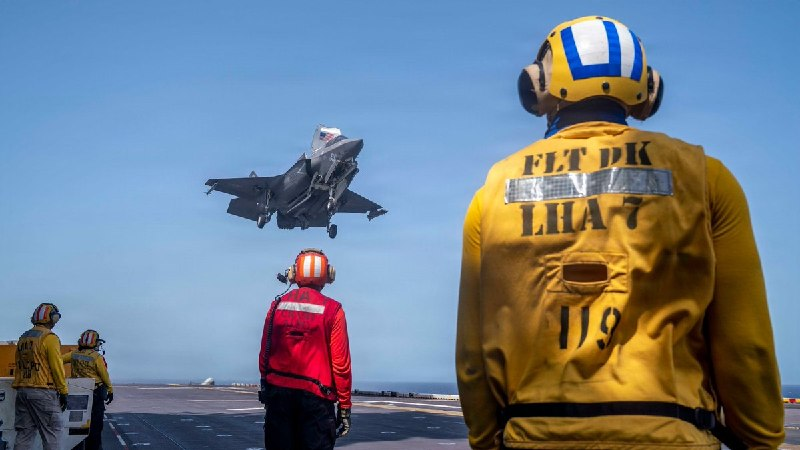

🔸ملوانان نیروی دریایی آمریکا در حالی نظاره‌گر هستند که یک جنگنده پنهانکار F-35B Lightning II متعلق به تفنگداران دریایی آمریکا بر روی عرشه ناو آبی‌خاکی USS Tripoli (LHA-7) در حال عبور از دریای عرب فرود می‌آید. جنگنده F-35B برای انجام برخاست‌های کوتاه و فرودهای عمودی طراحی شده است.

@mwarmonitor

## FoxNewsTwitter — post 342425

  

Fox News (Twitter/X)

“We are all one... This is celebrating America’s birthday."

Vanilla Ice is embracing his role at the Great American State Fair after several performers dropped out of the Freedom 250 concert lineup.

The rapper says the event is about celebrating America’s 250th birthday and bringing people together through music, not politics.

As backlash and artist withdrawals continue to make headlines, Vanilla Ice says he’s focused on positivity, fun, and giving fans a memorable show.

## FoxNewsTwitter — post 342424

  <a href="telegram/content/FoxNewsTwitter_342424_1780153407.mp4" target="_blank">🎬 Download video</a>

Fox News (Twitter/X)

Eight roller coaster riders were stranded near the top of a Texas amusement park ride for more than three hours before firefighters could bring them down.

The Iron Shark coaster at Galveston’s Pleasure Pier malfunctioned during its climb, leaving passengers stuck nearly 100 feet above the ground.

Video captured the dramatic rescue as firefighters used a ladder truck and harnesses to remove riders one at a time.

## pm_afshaa — post 91900

  <a href="telegram/content/pm_afshaa_91900_1780153410.webm" target="_blank">🎬 Download video</a>

🔴آسوشیتدپرس:
توافق احتمالی ترامپ با جمهوری اسلامی، شکاف بین جمهوری‌خواهان رو عمیق‌تر کرده.

💧 Rainbet.com the #1 Non-KYC Crypto Casino & Sportsbook @rainbetcom

😁 @Pm_Afshaa

## pm_afshaa — post 91899

  <a href="telegram/content/pm_afshaa_91899_1780153410.webm" target="_blank">🎬 Download video</a>

🔴تلگراف: دو ژنرال قدرتمند، احمد وحیدی و محمد جعفری، با هم متحد شدن تا قالیباف رو از قدرت برکنار کنن.

💧 Rainbet.com the #1 Non-KYC Crypto Casino & Sportsbook @rainbetcom

😁 @Pm_Afshaa

## pm_afshaa — post 91898

  <a href="telegram/content/pm_afshaa_91898_1780153411.webm" target="_blank">🎬 Download video</a>

🔴هگست، وزیر جنگ آمریکا:
محاصره که کاملاً محکم و بدون نفوذ بوده و واقعاً فشار زیادی روی ایران گذاشته.

اونا ممکنه بگن کنترل تنگه رو در دست دارن، ولی کاری که ما انجام میدیم، حتی پشت صحنه، نشون میده که در عمل ما هستیم که کنترل رو در دست داریم.
محاصره دریایی جمهوری اسلامی همچنان ادامه داره و این اقدام موثر بوده و کنترل تنگه هرمز در اختیار آمریکاست.

💧Rainbet.com the #1 Non-KYC Crypto Casino & Sportsbook @rainbetcom

😁 @Pm_Afshaa

## DEJradio — post 5155

⭕️ آمریکا، بریتانیا و استرالیا در پروژۀ زیردریایی‌های بی‌سرنشین همکاری می‌کنند

پیت هگست، وزیر دفاع آمریکا گفت واشینگتن، لندن و کانبرا در چارچوب پیمان آکوس برای توسعۀ شناورهای زیردریایی بی‌سرنشین همکاری می‌کنند.
او گفت این پروژه بر فناوری‌های پیشرفتۀ دفاعی از جمله هوش مصنوعی، فناوری زیرآبی، موشک‌های مافوق صوت، فناوری سایبری و محاسبات کوانتومی متمرکز است.
هگست افزود در این طرح روی مجموعه‌ای از سامانه‌های زیردریایی بدون سرنشین و چندمنظوره، برای حفظ برتری دریایی سه کشور، کار می‌شود.

#خبر #دژ #هوش_مصنوعی
@DEJradio

## DEJradio — post 5154

⭕️ بریتانیا تأیید کرد محاصرۀ دریایی جمهوری اسلامی توسط آمریکا ادامه دارد

سازمان عملیات تجارت دریایی بریتانیا اعلام کرد محاصرۀ بنادر ایران ادامه دارد.
به گفتۀ این نهاد، سطح تهدید دریایی در خلیج فارس، تنگۀ هرمز، دریای عمان و شمال دریای عرب همچنان بحرانی است.
بر اساس این بیانیه شناورهایی که از طریق انتقال کشتی‌به‌کشتی به ناقضان محاصرۀ جمهوری اسلامی کمک کنند، ناقض محاصره به شمار می‌روند.

#خبر #دژ #بریتانیا #محاصره_دریایی
@DEJradio

## DEJradio — post 5153

⭕️ قطر: می‌شود در مورد عوارض موقت در تنگۀ هرمز مذاکره کرد

شیخ سعود بن عبدالرحمن آل‌ثانی، معاون نخست‌وزیر قطر، گفت می‌شود درمورد عوارض موقت در تنگۀ هرمز برای مواردی مانند پاکسازی مین مذاکره کرد.
او گفت دوحه با دریافت دائمی عوارض عبور کشتی‌ها از آبراه هرمز مخالف است.
آمریکا و اروپا تلاش جمهوری اسلامی برای دریافت عوارض از کشتی‌ها را اخاذی مالی می‌دانند.
آمریکا اعلام کرده نهادها و کشتی‌هایی را که به باجگیری جمهوری اسلامی تن بدهند، تحریم می‌کند.

#خبر #دژ #قطر #تنگه_هرمز
@DEJradio

## DEJradio — post 5152

⭕️ واردات برق از ترکمنستان و ارمنستان ادامه دارد

مصطفی رجبی مشهدی، معاون وزیر نیرو گفتجمهوری اسلامی اکنون ۳۰۰ مگاوات برق از ترکمنستان و ارمنستان وارد می‌کند.
این مقام دولت پزشکیان از سویی مدعی شد صادرات برق به افغانستان و پاکستان نیز ادامه دارد. او گفت جنگ اخیر بر تبادلات برق منطقه‌ای اثر نگذاشت.
رجبی مشهدی همچنین ادعا کرد تبادل هزار مگاوات برق با روسیه قرار است در برنامه‌های آینده دنبال شود.

#خبر #دژ #برق
@DEJradio

## DEJradio — post 5151

⭕️ عضو کمیسیون انرژی مجلس: یک‌سوم ظرفیت تولید گاز در ایران از دست رفت

غلامرضا دهقان ناصرآبادی، عضو کمیسیون انرژی مجلس شورای اسلامی گفت در جریان جنگ چهل روزه درحدود یک‌سوم ظرفیت تولید گاز در ایران از بین رفته است.
او با اشاره به آسیب‌دیدن چند فازدر بندر عسلویه گفت وزارت نفت و وزارت نیرو برای بازگرداندن ظرفیت تولید به وضعیت پیش از جنگ تلاش می‌کنند.
بخش عمدۀ گاز در ایران از میدان مشترک پارس جنوبی تأمین می‌شود.

#خبر #دژ #انرژی
@DEJradio

## DEJradio — post 5150

⭕️ شاهزاده رضا پهلوی برای شرکت در نشستی امنیتی وارد اوکراین شد

بر پایۀ گزارش‌ها شاهزاده رضا پهلوی برای شرکت در نشست «فروم امنیت دریای سیاه» به بندر اودسا در اوکراین رفت.
بر اساس این گزارش، الکسی گنچارنکو، نمایندۀ پارلمان اوکراین و رئیس این فروم، از شاهزاده استقبال کرد.
در پیام‌های منتشرشده در این راستا گفت شد که مردم ایران و اوکراین، دشمنان مشترکی در تهران دارند.
روسیه بارها با استفاده از پهپادهای ساخته شده توسط جمهوری اسلامی، اوکراین را هدف گرفته است.
متخصصان اوکراینی در جریان جنگ چهل روزه، برای مقابله با پهپادهای جمهوری اسلامی به کشورهای حاشیۀ خلیج فارس کمک کردند.
شاهزاده رضا پهلوی پیش‌تر نشستی را با ولودیمیر زلنسکی، رئیس جمهوری اوکراین برگزار کرده بود.

#خبر #دژ #شاهزاده_رضا_پهلوی #اوکراین
@DEJradio

## VahidOnline — post 75802

بنیامین نقدی، زندانی سیاسی و از معترضان دی‌ماه از سوی دادگاه انقلاب شیراز به اعدام محکوم شد
masoudkazemi81

📡 @VahidOnline

## VahidOnline — post 75801

اینترنت در ایران آزاد و عادی نشده. بیشتر مسیرهای خارجی یا بسته‌اند یا نیمه‌بازند. فقط بعضی مقاصد و مسیرهای خاص اجازه عبور دارند. همین باعث شده فیلترشکن‌های معمولی خوب کار نکنند.
در این میون بعضی از افرادی که دامنه‌ها و مسیرهای سفیدشده دارند، دسترسی می‌فروشند. نتیجه‌اش هم شده اینترنت نابرابر، رانتی و پر از راه‌حل‌های موقت.
انگاری که درِ ساختمون رو کمی باز گذاشته باشن که هوا بیاد، اما اجازه ندن کسی ازش رد بشه.
برای همینه که گوشی‌تون ممکنه نشون بده که اینترنت دارید، حتی شاید اولش سایت یا اپ مورد نظر رو باز کنه یا بهش واکنش نشون بده، اما در عمل از اینترنت خبری نیست.

## IranIntlTV — post 339750

  

شاهزاده رضا پهلوی گفت که مردم ایران باید از طریق هوا حفاظت شوند و اینترنت و دیگر ابزار لازم را داشته باشند که دست به‌کار شوند و رژیم را به زانو درآورند.
او ادامه داد: «مردم حمله به زیرساخت‌های رژیم را جشن گرفتند و خیابان‌ها را به نام ترامپ نام‌گذاری کردند.»

شاهزاده رضا پهلوی ادامه داد: «دنیا باید تصمیم بگیرد که بعد از ۴۷ سال مماشات در کنار مردم ایران بایستد.»

او اضافه کرد: «مردم بین حمله به کشور و حمله به رژیم تمایز ایجاد می‌کنند.»
https://iranintl.com/202605301562

## IranIntlTV — post 339749

  <a href="telegram/content/IranIntlTV_339749_1780153413.mp4" target="_blank">🎬 Download video</a>

شاهزاده رضا پهلوی در نشست «امنیت دریای سیاه» در اودسا در جنوب اوکراین، گفت: « با محور هرج ومرج مذاکره نکنید، با آن مقابله کنید. مدیریت نکنید جمهوری اسلامی را، به آن پایان دهید.»
@iranintltv

## IranIntlTV — post 339748

  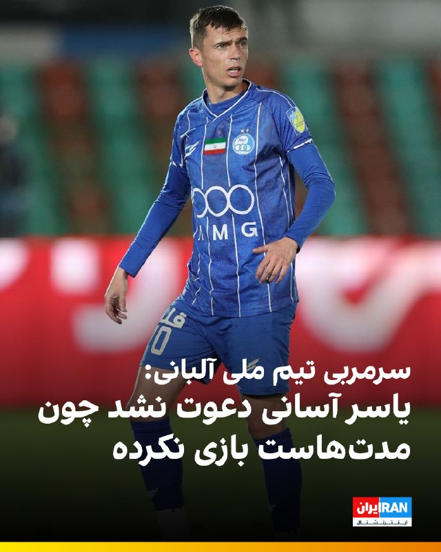

🔻رولاندو ماران، سرمربی تیم ملی آلبانی، پس از اعلام فهرست بازیکنان برای دو دیدار دوستانه مقابل اسرائیل و لوکزامبورگ، درباره غیبت یاسر آسانی، مهاجم تیم استقلال گفت: «یاسر آسانی دعوت نشد چون بازی نکرده است. من شخصاً با او صحبت نکردم، اما همکارانم با او تماس گرفتند.»

🔹ماران گفت: «او در این مدت به میدان نرفته و آماده بودنش برای این مسابقات دشوار بود.»

🔹آلبانی روز ۱۳ خرداد به مصاف اسرائیل می‌رود و ۱۶ خرداد برابر لوکزامبورگ قرار خواهد گرفت.

@iranintltvsport

## IranIntlTV — post 339747

  <a href="telegram/content/IranIntlTV_339747_1780153415.mp4" target="_blank">🎬 Download video</a>

شاهزاده رضا پهلوی در نشست «امنیت دریای سیاه» در اودسا در جنوب اوکراین، گفت پهپادهایی که امروز شهرهای اوکراین را هدف قرار می‌دهند، همان ابزار سرکوبی هستند که جمهوری اسلامی برای تعقیب و هدف قرار دادن معترضان در خیابان‌های ایران به کار گرفته است.
@iranintltv

## IranIntlTV — post 339746

  

شاهزاده رضا پهلوی در نشست «امنیت دریای سیاه» در اودسا در جنوب اوکراین، ضمن انتقاد از هرگونه توافق احتمالی، گفت که جمهوری اسلامی را مدیریت نکنید، بلکه به آن پایان دهید.

او افزود: «محور مسکو-تهران یک دشمن هماهنگ برای همه است و باید قاطعانه و با انسجام با آن برخورد شود.»

شاهزاده رضا پهلوی ادامه داد: «هر توافقی با جمهوری اسلامی مانند توافقات با شوروی سابق موضوع را حل نکرده است.»
https://iranintl.com/202605309589

## IranIntlTV — post 339745

  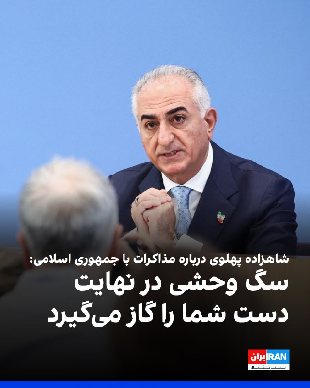

شاهزاده رضا پهلوی در نشست «امنیت دریای سیاه» در اودسا در جنوب اوکراین، گفت که دنیای آزاد هنوز متوجه ماهیت جمهوری اسلامی نشده است.
شاهزاده رضا پهلوی درباره تلاش برای توافق با جمهوری اسلامی با امید به ایجاد ثبات، گفت که یک سگ وحشی در نهایت دست شما را گاز می‌گیرد.

او افزود: «پهپادهایی که اوکراین را هدف قرار می‌دهد از سوی جمهوری اسلامی تهیه شده و با همان پهپادها مردم معترض خود را در خیابان تعقیب می‌کند تا تک‌تیراندازها آن‌ها را هدف قرار دهند.»

شاهزاده رضا پهلوی گفت که تهران و مسکو معماران مشترک هرج‌ومرج در جهان هستند.
https://iranintl.com/202605309766

## IranIntlTV — post 339744

  <a href="telegram/content/IranIntlTV_339744_1780153419.mp4" target="_blank">🎬 Download video</a>

اسماعیل سقاب اصفهانی، معاون رییس‌جمهور دولت جمهوری اسلامی، از تشدید بحران انرژی در ایران خبر داد و گفت کمبود روزانه بنزین به ۳۰ میلیون لیتر و کسری گاز به ۱۰۰ میلیارد متر مکعب رسیده است.
گفت‌وگو با عطا حسینیان، روزنامه‌نگار اقتصادی و حوزه انرژی
@iranintltv

## IranIntlTV — post 339743

  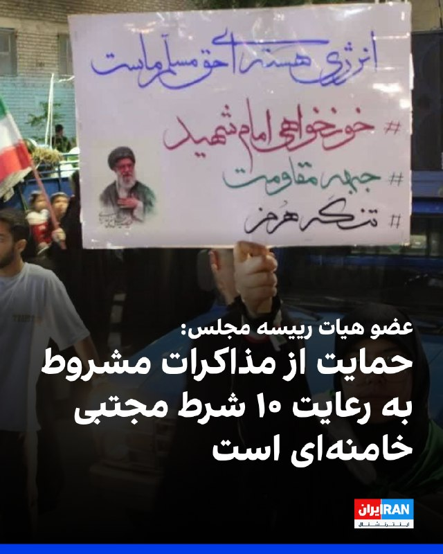

مجتبی یوسفی، عضو هیات رییسه مجلس گفت: «رهبری در بحث مذاکرات، ۱۰ شرط مشخص کردند که اگر تیم مذاکره‌کننده ۱۰ شرط را رعایت نکند، نه مردم، نه نمایندگان، نه نخبگان، آن توافق را حتما به‌عنوان توافق خوب در نظر نخواهند گرفت و می‌شود تجربه‌ای که در اعتماد به غرب باعث عقب‌افتادگی کشور شد.»

او افزود: «امروز باید هم‌قسم شویم تا به گفته امام شهید و امام جدیدمان، مسائل اصلی کشور را حل کنیم.»
https://iranintl.com/202605306617

## FarsiVOA — post 219080

تعطیلی فرودگاه مونیخ و اختلال در پروازها پس از مشاهده پهپاد ناشناس؛ زنگ خطر امنیت هوایی اروپا

## FarsiVOA — post 219078

فرماندهی مرکزی ایالات متحده، سنتکام، تصاویری از عملیات هوایی شبانه ملوانان آمریکایی روی ناو هواپیمابر «یو‌اس‌اس جرج اچ دبلیو بوش» منتشر کرد.

سنتکام می‌گوید خلبانان در شب قادرند در تاریکی، هواپیماهای خود را روی عرشه‌ای کوچک که همزمان در حال حرکت و نوسان است، فرود آورند.

@FarsiVOA

## FarsiVOA — post 219077

آرمان معرفتی، شهروند اهل سقز که اسفند سال گذشته به اتهام آتش‌ زدن یک مسجد در تهران محاکمه شده بود، به اعدام محکوم شد.

## FarsiVOA — post 219076

  <a href="telegram/content/FarsiVOA_219076_1780153422.mp4" target="_blank">🎬 Download video</a>

ارتش اسرائیل روز گذشته مقر توپخانه حزب‌الله را در منطقه شویا در جنوب لبنان منهدم کرد.

ارتش اسرائیل اعلام کرد این حمله پس از تایید حضور نیروهای این سازمان تروریستی در منطقه انجام شد.

وقوع انفجارهای ثانویه بعد از حمله، وجود تسلیحات را در این محل تایید کرد.

این ویدیو بی‌صدا است.

## FarsiVOA — post 219075

🔺هشدار ارتش اسرائیل به ساکنان مناطقی در لبنان: فورا تخلیه کنید

▪️ارتش اسرائیل در واکنش به تازه‌ترین حملات گروه تروریستی حزب‌الله به شمال این کشور، برای چندین روستا در جنوب لبنان و همچنین و در دره بقاع، هشدار تخلیه صادر کرد.

⬇️ بیشتر بخوانید:

https://ir.voanews.com/a/israel-hezbollah-iran-war-proxy/8155561.html/?nocach=1

## FarsiVOA — post 219074

پیت هگست، وزیر جنگ آمریکا، با اشاره به مذاکرات با رژیم ایران گفت که گفت‌وگوها «سازنده» بوده و جمهوری اسلامی به مواضع مورد نظر واشنگتن نزدیک‌تر شده است.

او تاکید کرد آمریکا همچنان بر جلوگیری از دستیابی رژیم ایران به سلاح هسته‌ای اصرار دارد و گفت انتظارات آمریکا از جمهوری اسلامی تغییری نکرده است.

هگست همچنین گفت دولت آمریکا ترجیح می‌دهد مسئله از طریق توافق حل شود، اما در صورت لزوم برای گزینه‌های دیگر نیز آمادگی دارد.

@FarsiVOA

## FarsiVOA — post 219073

  <a href="telegram/content/FarsiVOA_219073_1780153424.mp4" target="_blank">🎬 Download video</a>

هاجر نادری، مادر متین پرویزی، از کشته‌شدگان دی ماه ۱۴۰۴، بعد از بازگشایی محدود اینترنت در ایران، ویدیویی از حضور خود بر آرامگاه پسرش در سال نو منتشر کرده است. متین پرویزی، ۲۲ ساله و دانشجو در ۱۸ دی ۱۴۰۴ در سبزه‌میدان زنجان، با شلیک ماموران حکومتی به سرش کشته شد.

## DW_Farsi — post 125319

  

🔶 "انهدام پهپاد اسرائيلی" در قشم و "حمله ایران به پایگاهی در کویت"

در حالی که ارتش ایران از انهدام یک فروند پهپاد اسرائيلی در منطقه قشم خبر می‌دهد بلومبرگ نیز می‌گوید، در حمله موشکی ایران به یک پایگاه آمریکا در کویت چند آمریکایی زخمی شده‌اند.

به نوشته خبرگزاری ایرنا، ارتش ایران روز شنبه نهم خرداد (۳۰ مه) در اطلاعیه‌ای اعلام کرد که در بامداد همین روز یک فروند پهپاد اوربیتر اسرائيل را رهگیری و منهدم کرده است.

به گفته ارتش، این پهپاد "تحت شبکه یکپارچه قرارگاه مشترک پدافند هوایی کشور در منطقه قشم" مورد اصابت قرار گرفت و منهدم شد.

در همین حال خبرگزاری بلومبرگ نیز در گزارشی به نقل از منبعی آگاه از حمله موشکی ایران به پایگاه آمریکایی "علی السالم" در کویت در ۲۴ ساعت گذشته خبر داد.

به گفته بلومبرگ، در این حمله پنج نفر، از جمله چند پرسنل آمریکایی زخمی شدند و به پهپادهای ایالات متحده نیز آسیب وارد آمد.

بلومبرگ به نقل از این منبع که نامش ذکر نشد جراحات آمریکایی‌ها را سطحی اما خسارت وارده به دو پهپاد "ام‌کیو ـ ۹ریپر" ارتش آمریکا را شدید اعلام کرده است.

@dw_farsi

## Persian_Trend_Official — post 15343

التماس تفکر 🙏 📝 Nick 📌 @persian_trend_official پرشین ترند | متفاوت‌ترین کانال نظامی

## RadioFarda — post 157722

🔸یک عضو هیئت رئیسه مجلس شورای اسلامی روز شنبه اعلام کرد که «اعمال مدیریت» ایران بر تنگه هرمز «تصمیم قطعی» مجلس است و طرح مربوط به آن در صحن علنی تصویب و تبدیل به قانون خواهد شد. 🔸به گزارش خبرگزاری تسنیم، علیرضا سمیعی مدعی شد که درباره طرح مذکور با «دستگاه‌های…

## RadioFarda — post 157721

  

🔸یک عضو هیئت رئیسه مجلس شورای اسلامی روز شنبه اعلام کرد که «اعمال مدیریت» ایران بر تنگه هرمز «تصمیم قطعی» مجلس است و طرح مربوط به آن در صحن علنی تصویب و تبدیل به قانون خواهد شد.

🔸به گزارش خبرگزاری تسنیم، علیرضا سمیعی مدعی شد که درباره طرح مذکور با «دستگاه‌های مختلف» گفت‌وگوهایی انجام شده است.

🔸این در حالی است که دونالد ترامپ، رئیس‌جمهور آمریکا، بارها اعلام کرده که هرگونه توافق با ایران برای پایان دادن به جنگ باید شامل باز شدن این آبراه بدون اخذ عوارض باشد. او روز جمعه نیز این موضع ایالات منحده را تکرار کرد.

🔸عضو هیئت رئیسه مجلس با اعلام این‌که تنگه هرمز در «حوزه سرزمینی ایران و عمان» است، گفت که اجازه نمی‌دهیم کشور دیگری در این‌ زمینه تصمیم‌گیری کند.

📷شرح عکس: مجسمه نیروهای نظامی ایران در ساحل بندرعباس، در حالی که شناورهایی در آب‌های تنگه هرمز دیده می‌شوند.

@RadioFarda

## IranianMinds — post 21073

🔴 شاهزاده رضا پهلوی:

مردم ایران باید از طریق هوا حفاظت بشن و اینترنت و دیگر ابزار لازم رو داشته باشن که دست به‌کار بشن و رژیم رو به زانو بیارن.

مردم حمله به زیرساخت‌های رژیم رو جشن گرفتن و خیابان‌ها رو به نام ترامپ نام‌گذاری کردن.

دنیا باید تصمیم بگیره که بعد از ۴۷ سال مماشات در کنار مردم ایران بایسته.

@IranianMinds

## IranianMinds — post 21072

  

🔴در تجمعات شبانه دیده شده است.

@IranianMinds

## BBCPersian — post 282435

  <a href="https://t.me/bbcpersian/282435" target="_blank">📎 Download file</a>

📻این هفته در پرگار: گرایش سیاسی ما چگونه شکل می‌گیرد؟

🔻عقاید سیاسی ما چگونه شکل می‌گیرند؟ چطور تغییرمی‌کنند؟ چرا دیگرانی که تا دیروز همفکر می‌پنداشتیم را ممکن است امروز ناقص‌العقل بنامیم؟ آنها ما را چطور می‌بینند؟

میهمان‌ها:
پویا قدوسی، استاد جغرافیای انسانی
مانی منجمی، روان‌پزشک

@BBCPersian

## BBCPersian — post 282434

  <a href="https://t.me/bbcpersian/282434" target="_blank">📎 Download file</a>

تازه‌ترین خبرهای جهان از جام جهان‌نما - شنبه ۹ خرداد ۱۴۰۵
@BBCPersian

## Dirty_Kids — post 390571

  <a href="telegram/content/Dirty_Kids_390571_1780153430.mp4" target="_blank">🎬 Download video</a>

ایرانی فکر کن بعد سه ماه بهت اینترنت دادن اینو ببینی😂

@Dirty_Kids 👻

## Dirty_Kids — post 390570

  <a href="telegram/content/Dirty_Kids_390570_1780153432.mp4" target="_blank">🎬 Download video</a>

🔴 ویدیوی ویرال شده از حرکت یه پسر جوون توی ایران که شاهکار خلق کرده🔥

@Dirty_Kids 👻

## Dirty_Kids — post 390569

  

دورانی که اینترنت قطع بود مردم از سر بیکاری اسم وای فای‌شون رو تغییر میدادن تا از همسایشون بپرسن شام چی دارن :))

@Dirty_Kids 👻

## Hranews — post 113245

پرونده سجاد و شایان ویسی با اتهام محاربه به دادگاه انقلاب کرمانشاه ارجاع شد

❗️
❗️
❗️
❗️
❗️– سجاد ویسی و شایان ویسی، شهروندان پیرو آئین یارسان و از بازداشت‌شدگان اعتراضات دی‌ماه در کرمانشاه، همچنان در زندان دیزل‌آباد این شهر نگهداری می‌شوند. پرونده این شهروندان با اتهام محاربه به دادگاه انقلاب کرمانشاه ارجاع شده است. سجاد ویسی برادر میثم و مجتبی ویسی است که روز پنجشنبه ۷ خرداد ۱۴۰۵ در یکی از روستاهای شهرستان دالاهو هدف تیراندازی ماموران اطلاعات سپاه قرار گرفته و جان خود را از دست دادند.

ادامه مطلب

#سجاد_ویسی #شایان_ویسی

↘️
@hranews_bot تماس ✉️ - @Hranews کانال هرانا 🆑

## Hranews — post 113244

  

گزارشی از آخرین وضعیت دیانا طاهرآبادی، نوجوان بازداشت شده در اعتراضات

❗️
❗️
❗️
❗️
❗️– دیانا طاهرآبادی، ۱۶ ساله که در جریان اعتراضات ۱۴۰۴ بازداشت شده است، کماکان در بخش کانون اصلاح و تربیت زندان کچوئی کرج به سر می‌برد.

به گزارش خبرگزاری هرانا، ارگان خبری مجموعه فعالان حقوق بشر در ایران، دیانا طاهرآبادی همچنان در بازداشت است.

یک منبع مطلع نزدیک به خانواده این نوجوان ضمن تایید این موضوع به هرانا گفت: «با گذشت ۱۲۶ روز از زمان بازداشت دیانا طاهرآبادی، وی همچنان در بخش کانون اصلاح و تربیت زندان کچوئی کرج نگهداری می‌شود. نیروهای امنیتی از او اعترافات اجباری اخذ کرده و پرونده‌اش را به دادگاه ارسال کردند. او در دادگاه اتهامات خود را رد کرد و پرونده وی با مداخله نهادهای امنیتی برای رسیدگی به تهران ارسال شده است.»

ادامه مطلب

#دیانا_طاهرآبادی

↘️
@hranews_bot تماس ✉️ - @Hranews کانال هرانا 🆑

## alonews — post 123737

  <a href="telegram/content/alonews_123737_1780153434.webm" target="_blank">🎬 Download video</a>

👈عوستاد رائفی پور:
شاید عده‌ای به حرفم بخندن اما آمریکا تمام شد

✅ @AloNews خبر جنگ

## alonews — post 123736

  <a href="telegram/content/alonews_123736_1780153434.mp4" target="_blank">🎬 Download video</a>

👈تصاویر ماهواره ای از انهدام کامل ذاغه مهمات، و سایت پدافندی پایگاه هوایی اصفهان توسط آمریکا / اسرائیل

✅ @AloNews خبر جنگ

## alonews — post 123735

  <a href="telegram/content/alonews_123735_1780153436.webm" target="_blank">🎬 Download video</a>

🚨🔴پرسپولیس رسما از آسیا جا ماند 🔻دبیر سازمان لیگ: به دلیل اینکه باشگاه پرسپولیس در رتبه ششم جدول لیگ قرار دارد نمی‌تواند به رقابت‌های آسیایی معرفی شود. کنفدراسیون فوتبال آسیا مهلت لازم را نداد که پس از برگزاری مسابقات لیگ برتر نمایندگان کشور جهت حضور در…

## alonews — post 123734

  <a href="telegram/content/alonews_123734_1780153436.webm" target="_blank">🎬 Download video</a>

👈تلگراف: دو ژنرال قدرتمند، احمد وحیدی و محمد جعفری، با هم متحد شدن تا قالیباف رو از قدرت برکنار کنند.

✅ @AloNews خبر جنگ

## alonews — post 123733

  <a href="telegram/content/alonews_123733_1780153436.webm" target="_blank">🎬 Download video</a>

👈کانال ۱۲ اسرائیل:
از صبح امروز هر ۲۲ دقیقه یکبار آژیر خطر در شمال اسرائیل به صدا در می‌آید.

✅ @AloNews خبر جنگ

## alonews — post 123732

  <a href="telegram/content/alonews_123732_1780153437.mp4" target="_blank">🎬 Download video</a>

👈ویدئویی که تازه از حمله‌های اسرائیل و آمریکا به خرم‌آباد تو جنگ ۴۰ روزه بیرون اومده!

✅ @AloNews خبر جنگ

## alonews — post 123731

  <a href="telegram/content/alonews_123731_1780153439.mp4" target="_blank">🎬 Download video</a>

👈فاطمه مهاجرانی، سخنگوی دولت: دولت پول بازسازی خانه هایی که در جنگ تخریب شده را نمی دهد، چنانچه تصمیم بگیرند خودشان باز سازی کنند، دولت مجوز ساخت دو طبقه بیشتر می‌دهد

✅ @AloNews خبر جنگ

## alonews — post 123729

  <a href="telegram/content/alonews_123729_1780153441.webm" target="_blank">🎬 Download video</a>

👈هم اکنون حملات به جنوب لبنان

✅ @AloNews خبر جنگ

## alonews — post 123728

  <a href="telegram/content/alonews_123728_1780153442.webm" target="_blank">🎬 Download video</a>

👈رئیس‌جمهور ترامپ بین ۱۵٬۰۰۰ تا ۵۰٬۰۰۰ دلار سهام شرکت TKO Group Holdings را درست قبل از تبلیغ گسترده رویداد UFC در کاخ سفید خریداری کرد، گزارش نیویورک تایمز.

🔴افشای مالی ثبت شده در ۸ مه نشان می‌دهد ترامپ این سهام را در ۲۵ مارس خریداری کرده است، کمی بیش از دو هفته پس از اعلام عمومی رویداد «Freedom Fights 250».

✅ @AloNews خبر جنگ

## alonews — post 123727

  <a href="telegram/content/alonews_123727_1780153442.mp4" target="_blank">🎬 Download video</a>

👈کارشناس هواشناسی:
ورود سامانه بارشی جدید به کشور از روز سه‌شنبه

🔴وزش باد شدید با احتمال گرد و خاک در تهران پیش بینی می‌شود

✅ @AloNews خبر جنگ

## alonews — post 123726

اخبار جنگ الونیوز AloNews pinned a photo

## alonews — post 123725

  <a href="telegram/content/alonews_123725_1780153444.webm" target="_blank">🎬 Download video</a>

👈باکسر به خاورمیانه نمی آید

🔴به نظر می‌رسد که ناو آبی_خاکی یو‌اس‌اس باکسر (LHD-4) قرار نیست در حوزه مسئولیت سنت‌کام مستقر شود. ناو آبی‌خاکی کلاس واسپ نیز امروز از بندر سِمبانوان در سنگاپور حرکت کرد؛ اگرچه اکنون به سمت شرق در حرکت است.

✅ @AloNews خبر جنگ

## alonews — post 123724

  <a href="telegram/content/alonews_123724_1780153445.webm" target="_blank">🎬 Download video</a>

👈دیده شده در تجمعات شبانه

✅ @AloNews خبر جنگ

## alonews — post 123723

  <a href="telegram/content/alonews_123723_1780153445.webm" target="_blank">🎬 Download video</a>

👈مدیرعامل آروان کلاد:
از نظر فنی همینطوری که میشه توی یه لحظه اینترنت رو قطع کرد؛ همینطوری میشه تو یه لحظه هم وصلش کرد.
زمانبر بودن بهبود وضعیت اینترنت از نظر فنی فقط بهانه ست
.
وضعیت اینترنت در حال حاضر بسیار ناپایدار و ضعیفه و اصلا به شرایط قبل از جنگ برنگشته
گویا این اینترنت جدیدمونه و باید کم کم بهش عادت کنیم

✅ @AloNews خبر جنگ

---
📅 بروزرسانی: 1405/03/09 17:15
---

## VahidOOnLine — post 242916

  

حسینعلی شهریاری، نماینده سیستان و بلوچستان در مجلس گفت: «الان شهر زاهدان هزار لیتر در ثانیه کمبود آب دارد؛ به‌طوری که طبق گفته بعضی از شهروندان، برخی از آنها ۲۴ تا ۴۸ ساعت آب ندارند و مناطق زیادی از زاهدان در این زمینه دچار مشکل هستند.»

او ادامه داد: «مثلا الان در زاهدان که مرکز استان است، از دولت‌های قبل، به علت کمبود آب، دو پروژه در آن شروع شد؛ یکی انتقال آب از دریای عمان که قرار بود به سیستان و بلوچستان جنوبی و خراسان رضوی برسد و دیگری هم آبی که قرار بود از دشت تهلاب برای شهر زاهدان بیاید.»
‌🏁 🇬🇧 IranintlTV

🤖 @VahidOOnLine

## VahidOOnLine — post 242915

  

♦️ پیت هگست، وزیر جنگ ایالات متحده، روز شنبه نهم خرداد اعلام کرد که به دنبال جلسه روز گذشته در کاخ سفید، واشنگتن به موفقیت‌هایی در مذاکرات با ایران دست یافته است. هگست تاکید کرد: «ایران به طور کاملا واضح از انتظارات ما آگاه است. آن‌ها در مسیر خواسته‌های ما حرکت می‌کنند و گفتگوها سازنده بوده است. من به رئیس‌جمهورمان که فقط توافق‌های بزرگ امضا می‌کند، اعتماد کامل دارم.»

وزیر جنگ آمریکا که در کنار وزیران دفاع استرالیا و بریتانیا با خبرنگاران صحبت کرد، با اشاره به گره‌های موجود در مذاکرات فاش کرد که بخشی از بحث‌ها با این همتایان، بر چگونگی جلوگیری از دستیابی ایران به سلاح هسته‌ای «هم‌زمان با پیشرفت فناوری» متمرکز است.
‌🇸🇦 Indypersian

🤖 @VahidOOnLine

## VahidOOnLine — post 242914

  

علیرضا سلیمی، عضو هیات رییسه مجلس گفت: «طرح اعمال مدیریت تنگه هرمز در جلسه علنی مجلس بررسی و تصویب خواهد شد.»
او افزود: «تصمیمات ما درباره اعمال مدیریت بر تنگه هرمز تاکتیکی و موقت نیست، بلکه قطعی و ابدی است.»

سلیمی ادامه داد: «صفر تا صد قانون اعمال مدیریت بر تنگه هرمز به‌طور کامل و جزء به جزء صرفا در مجلس تصویب و نهایی خواهد شد.»

او اضافه کرد: «قطعا این قانون یکی از قوانین مشعشع تاریخ ایران خواهد بود.»
‌🏁 🇬🇧 IranintlTV

🤖 @VahidOOnLine

## VahidOOnLine — post 242913

  <a href="telegram/content/VahidOOnLine_242913_1780148750.mp4" target="_blank">🎬 Download video</a>

♦️پیت هگست، وزیر جنگ ایالات متحده، روز شنبه ۹ خردادماه در جریان سفر خود به سنگاپور در مصاحبه ای با خبرنگاران اعلام کرد که بخش عمده عملیات‌های اخیر در منطقه بر عهده آمریکا بوده و این کشور «کنترل واقعی» تنگه را در اختیار دارد.
او با اشاره به نقش متحدان، از جمله استرالیا، گفت هرچند این کشورها حمایت مهمی ارائه کرده‌اند، اما عملیات محاصره به‌طور عمده توسط آمریکا انجام شده و «فشار اصلی» را بر ایران وارد کرده است.
هگست همچنین با اشاره به روند مذاکرات تأکید کرد تحولات پشت‌صحنه نشان می‌دهد واشنگتن در موقعیت مسلط قرار دارد. او در ادامه به همکاری‌های امنیتی در قالب پیمان «آکوس» و سایر ترتیبات منطقه‌ای اشاره کرد و گفت این همکاری‌ها نشان‌دهنده قدرت و انسجام اتحادهای آمریکا در منطقه اقیانوس آرام است.
‌🇸🇦 Indypersian

🤖 @VahidOOnLine

## VahidOOnLine — post 242912

  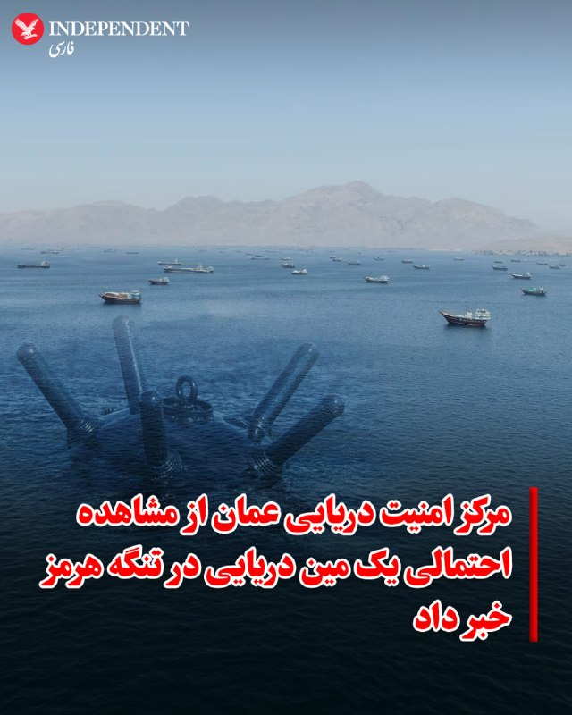

♦️ مرکز امنیت دریایی عمان روز شنبه نهم خرداد، از دریانوردان، ماهیگیران و شناورها خواست تا در مسیرهای حرکتی خود نهایت احتیاط را به کار بندند. این هشدار پس از آن صادر شد که یک شی شناور مشکوک به «مین دریایی» در سمت غربی منطقه تردد ساحلی در تنگه هرمز و در محدوده آب‌های سرزمینی عمان رویت شد.

این مرکز به فعالان و کاربران حوزه دریانوردی توصیه کرد که فاصله ایمن را با هرگونه شی مشکوک حفظ کرده و مراتب را فورا به مقامات ذی‌ربط گزارش دهند.
‌🇸🇦 Indypersian

🤖 @VahidOOnLine

## VahidOOnLine — post 242911

  

مرکز امنیت دریایی عمان اعلام کرد در پی مشاهده یک جسم شناور مشکوک به مین دریایی در غرب مسیر ترافیک ساحلی تنگه هرمز و در آب‌های سرزمینی این کشور، از کشتی‌ها و صیادان خواسته شده با حداکثر احتیاط تردد کنند و هر مورد مشکوک را فورا به مقام‌های مسئول گزارش دهند.
‌🏁 🇬🇧 IranintlTV

🤖 @VahidOOnLine

## VahidOOnLine — post 242910

  

رافائل گروسی، مدیرکل آژانس بین‌المللی انرژی اتمی سازمان ملل، در گفت‌وگو با روزنامه نشنال‌نیوز با ابراز نگرانی از گسترش «پدیده» حمله به نیروگاه‌های هسته‌ای در جریان درگیری‌های اخیر، گفت حمله به این تاسیسات در حال تبدیل شدن به الگویی خطرناک در جنگ‌ها است.

گروسی با اشاره به حمله پهپادی به نیروگاه براکه در امارات متحده عربی گفت: «این واقعیت که کسی یک نیروگاه هسته‌ای را هدف قرار داده، بسیار جدی است.»

او گفت آژانس شواهد لازم برای مقصر دانستن تهران در این حمله را در اختیار ندارد و افزود: «ما به مدرک ملموسی درباره منشا این حمله نیاز داریم.»

مقام‌های امارات متحده عربی، نیروهای نیابتی جمهوری اسلامی در عراق را مسئول این حمله اعلام کردند.

گروسی همچنین به حملات علیه نیروگاه هسته‌ای زاپوروژیا در اوکراین و نیروگاه هسته‌ای بوشهر اشاره کرد.
‌🏁 🇬🇧 IranintlTV

🤖 @VahidOOnLine

## VahidOOnLine — post 242909

🗣روایت شما از زندگی در دوران پس از انقلاب ملی و جنگ - شنبه ۹ خرداد ۱۴۰۵

🔹وضعیت وحشتناکه، گرونی زیاد شده، ما کم آوردیم. من خودم دانش‌آموز هستم، هیچی از درس نفهمیدیم و بعد از ۱۸ و ۱۹ هیچی مثل قبل نشد.

🔹اپراتورهای تلفن همراه علاوه بر افزایش شدید هزینه بسته‌های نت، مخصوصاً همراه اول، امکان خرید شارژ در مبالغ زیر ۲۰ هزار تومان هم نمی‌دن.

🔹ما کیش هستیم. از روز اول جنگ تا همین امروز به دلیل امن نبودن پرواز، هنوز هیچ مسافری با پرواز نیامده کیش. از طریق دریایی هم تا همین یک هفته پیش فقط کیشوندان رو راه می‌دادن. تمام هتل‌ها، رستوران‌ها و بازارها بدبخت شدن.

🔹از ایرانشهر: هموطنان عزیز اینجا همه‌چیز گرونه و اینترنت خیلی ضعیفه. قبلاً با کانفیگ پولی قوی‌تر بود، الان خیلی بدتر و ضعیف‌تر شده.

🔹امروز و دیروز رانندگان اسنپ‌فود ایلام به دلیل پایین بودن کرایه‌ها و گرانی روغن و بنزین اعتصاب کردن. صدها سفارش در رستوران‌ها خراب شد و به مشتری نرسید.

🔹چیپسی که پارسال ۱۸ تومان بود شده ۷۰ تومان، دقیقاً ۴ برابر.

🔹تهران هستم. ۱۰ ساله اسنپ کار می‌کنم، کرایه خیلی پایینه. درآمدم همون درآمد پارساله ولی هزینه‌ها ۳ برابر شده. تعویض روغن موتور پراید شده ۳ میلیون.

🔹از بوشهر پیام می‌دم. برادر من نظامی هست و حقوق دو ماه پیشش حدود ۳۰ میلیون تومان بود. الان حقوق این ماهش شده ۱۵ میلیون تومان، قضاوت با خودتون.

🔹نیروهای پیمانکاری شرکت نفت سروستان از استان فارس هستیم. حقوق اسفند و فروردین به‌صورت علی‌الحساب پرداخت شده، ولی تا امروز نه حقوق اردیبهشت و نه حقوق معوقه پرداخت نشده.

🔹فقط مبلغ یک بسته سویا از سه ماه پیش تا دیروز با تورم ۸۰۰ درصدی بالا رفته.
‌🏁 🇬🇧 IranintlTV

🤖 @VahidOOnLine

## WithYashar — post 12937

عمان: در آب‌های سرزمینی خود جسمی شناور را مشاهده کردیم که مظنون به مین دریایی است‌
@withyashar

## WithYashar — post 12936

  <a href="telegram/content/WithYashar_12936_1780148753.mp4" target="_blank">🎬 Download video</a>

پیت هگست درباره ایران: ایران می‌خواهد بگوید که کنترل تنگه را در دست دارد، اما این ما هستیم.

و همه چیز پشت صحنه نشان می‌دهد که وقتی صحبت از آن می‌شود، ما کنترل را در دست داریم.
@withyashar

## FoxNewsTwitter — post 342423

‌Fox News (Twitter/X)

👉 Full story here:

## FoxNewsTwitter — post 342422

Fox News (Twitter/X)

TANVI RATNA: Europe built its entire post-Russia energy system to avoid dependence on a single supplier. The Iran war just handed that leverage to America.

US LNG now supplies 63% of European imports and climbing. IEEFA projects 80% by 2030 — with 40% of all EU gas, pipeline and LNG combined, flowing from the United States.

The contracts got signed under wartime pressure. The Russian ban became law. The terminals run on American supply. There's no exit clause and no alternative at scale.

## FoxNewsTwitter — post 342421

  <a href="telegram/content/FoxNewsTwitter_342421_1780148756.mp4" target="_blank">🎬 Download video</a>

Fox News (Twitter/X)

Police deploy tear gas outside a New Jersey immigration detention facility as tensions boil over during another night of protests.

Video shows officers advancing in formation, pushing demonstrators and reporters back before tear gas is fired as clashes escalate outside Delaney Hall in Newark.

The facility has been the focus of days of demonstrations involving lawmakers, detainees' families, and immigration advocacy groups

## pm_afshaa — post 91896

  <a href="telegram/content/pm_afshaa_91896_1780148759.mp4" target="_blank">🎬 Download video</a>

کارشناس حرومزاده صداوسیما :

ایرانی ها اصلا آریایی نیستن، ما اصلا نژاد آریایی نداریم؛ اونا کلا 5 هزار سال پیش مهاجرت کردن اومدن ولی ما واسه 65 هزار سال پیشیم.
اصلا درست نیست بگیم آریایی هستیم انگار داریم میگیم بچه های یه مشت قاتل نسل کشیم.

💧Rainbet.com the #1 Non-KYC Crypto Casino & Sportsbook @rainbetcom

😁 @Pm_Afshaa

## pm_afshaa — post 91895

🔴نیویورک تایمز:ایران به رد خواسته‌های کلیدی آمریکا ادامه می‌دهد،از جمله تحویل ذخیره اورانیوم بسیار غنی شده خود و محدود کردن غنی‌سازی که باعث به بن بست رسیدن مذاکرات شده

💧 Rainbet.com the #1 Non-KYC Crypto Casino & Sportsbook @rainbetcom

😁 @Pm_Afshaa

## pm_afshaa — post 91894

🔴پیت هگست:هر لحظه آماده ایم جنگ علیه ایران را از سر بگیریم

💧 Rainbet.com the #1 Non-KYC Crypto Casino & Sportsbook @rainbetcom

😁 @Pm_Afshaa

## DEJradio — post 5149

⭕️ رسانه‌های اسرائیل: ارتش برای جنگ احتمالی بعدی با جمهوری اسلامی آماده می‌شود

رسانه‌های اسرائیل می‌گویند روند آمادگی ارتش این کشور برای سومین رویارویی احتمالی با جمهوری اسلامی، ادامه دارد.
به گزارش شبکۀ کان، ارتش اسرائیل به دنبال ایجاد شرایطی است که جامعه بتواند در کمترین زمان ممکن با تغییر از وضعیت عادی به شرایط جنگی، سازگاری داشته باشد.
ارزیابی‌های ارتش اسرائیل بیانگر است که جمهوری اسلامی در جنگ بعدی ممکن است سریع‌تر واکنش نشان بدهد و الگوی استفاده از موشک‌ها را تغییر دهد.
بر پایۀ ارزیابی‌ها بیش از 72 درصد از موشک‌های جمهوری اسلامی که در جنگ پیشین استفاده شد، دارای کلاهک خوشه‌ای بود.
از سویی نخستین هواپیماهای سوخت‌رسان جدید آمریکایی به اسرائیل رسیده است.
به گفتۀ مقام‌های نظامی اسرائیل، این هواپیماها ظرفیت عملیات دوربرد را افزایش می‌دهد.
رسانه‌های اسرائیل گزارش دادند در جنگ چهل روزه همۀ اهداف اسرائیل محقق نشده و تلاش برای دستیابی به سایر اهداف ادامه می‌یابد.

#خبر #دژ #اسرائیل
@DEJradio

## DEJradio — post 5148

  <a href="telegram/content/DEJradio_5148_1780148761.mp4" target="_blank">🎬 Download video</a>

🤡
🔺 حرکات اروتیک ولایتمداران در تجمعات شبانه

بر اساس ویدیویی‌هایی که در رسانه‌های وابسته به حکومت از تجمعات شبانه ولایتمداران منتشر می‌شود، شماری از آنها زیر تاثیر اشعار مداحان اخیرا حرکات اروتیک از خود به نمایش می‌گذارند.

#شیفت_شب #اروتیک #تجمعات_حکومتی
@DEJradio

## DEJradio — post 5147

⭕️ آمریکا یک میلیارد دلار رمزارز مرتبط با جمهوری اسلامی را توقیف کرد

اسکات بسنت، وزیر خزانه‌داری آمریکا گفت واشینگتن یک میلیارد دلار دارایی رمزارزی مرتبط با جمهوری اسلامی را توقیف کرده است.
او همچنین گفت اگر قرار باشد محاصرۀ مالی و اقتصادی علیه جمهوری اسلامی کاهش یابد و یا لغو شود، این کار به‌صورت مرحله‌به‌مرحله پیش می‌رود.

#خبر #دژ #تحریم #رمز_ارز
@DEJradio

## DEJradio — post 5146

⭕️ ترامپ در نشست با مشاوران خود در مورد جمهوری اسلامی تصمیم پایانی را نگرفت

نشست بیش از دو ساعتۀ دونالد ترامپ با مشاوران ارشدش در اتاق وضعیت کاخ سفید، بدون اعلام نتیجه پایان یافت.
نیویورک‌تایمز به نقل از یک مقام ارشد دولت آمریکا نوشت ترامپ هنوز درمورد تفاهم احتمالی با تهران به جمع‌بندی نرسیده است.
ترامپ بر باز شدن تنگۀ هرمز و نابودی ذخایر اورانیوم غنی‌شدۀ جمهوری اسلامی پافشاری می‌کند.

#خبر #دژ #ترامپ
@DEJradio

## DEJradio — post 5145

⭕️ وزیر جنگ آمریکا: برای ازسرگیری جنگ با جمهوری اسلامی توانایی ما فراتر از حد است

پیت هگست، وزیر جنگ دولت ایالات متحده، خبر داد واشینگتن در صورت لزوم، آمادۀ ازسرگیری جنگ با جمهوری اسلامی است.
او در نشست امنیتی سنگاپور گفت توانایی آمریکا برای ازسرگیری جنگ با رژیم حاکم بر ایران، بیش از حد لازم است. به گفتۀ هگست، انبارهای مهمات ایالات متحده کاملا آماده‌ است.
هگست تأکید کرد آمریکا میان مهمات پیشرفته و ذخایر انبوه تسلیحاتی تعادل برقرار کرده است.
کاخ سفید اعلام کرده دونالد ترامپ به تصمیم‌گیری درباره توافق احتمالی نزدیک شده، اما هنوز تصمیم پایانی در مورد توافق یا حملۀ نظامی گرفته نشده است.

#خبر #دژ #جنگ
@DEJradio

## DEJradio — post 5144

⭕️ نیروهای اسرائیلی تا فراتر از رود لیتانی پیشروی کردند

بنیامین نتانیاهو، نخست‌وزیر اسرائیل گفت نیروهای این کشور از رود لیتانی عبور کرده و در عمق جنوب لبنان پیشروی کردند.
همزمان، هیات‌های نظامی اسرائیل و لبنان در واشینگتن گفت‌وگوهای امنیتی برگزار کردند.
ژوزف عون، رئیس‌جمهور لبنان، در تماس با مارکو روبیو بر ضرورت تلاش برای برقراری آتش‌بس تأکید کرد.
با وجود آتش‌بسی که از ۲۸ فروردین میان اسرائیل و لبنان برقرار شده، حزب‌الله بارها به شمال اسرائیل حمله کرده و ارتش این کشور را به واکنش نظامی واداشته است.

#دژ #خبر #اسرائیل
@DEJradio

## DEJradio — post 5143

  <a href="telegram/content/DEJradio_5143_1780148765.mp4" target="_blank">🎬 Download video</a>

🛩️
🔥 سرنگونی یک پهپاد «شاهد» با مسلسل از داخل هلی‌کوپتر

گزارش‌ها حاکی است که نیروهای اسرائیلی از یک مسلسل M134 Minigun (مینی‌گان ام۱۳۴) نصب‌شده روی هلیکوپتر برای سرنگونی یک پهپاد «شاهد» استفاده کرده‌اند.

این رهگیری نشان می‌دهد که جنگ پهپادی با چه سرعتی در حال دگرگون‌کردن شیوه‌های نبرد مدرن در خاورمیانه و سایر نقاط جهان است. گفته می‌شود این ویدیو مربوط به روزهای جنگ است.

پهپادهای شاهد به یکی از شناخته‌شده‌ترین سلاح‌های درگیری‌های کنونی جهان تبدیل شده‌اند و به‌طور گسترده توسط جمهوری اسلامی ایران و روسیه مورد استفاده قرار می‌گیرند.

#پهپاد_شاهد #جنگ
@DEJradio

## DEJradio — post 5142

⭕️ آمریکا باج‌دهندگان به جمهوری اسلامی برای عبور از تنگۀ هرمز را تحریم می‌کند

وزارت خزانه‌داری آمریکا هشدار داد هرگونه توافق با جمهوری اسلامی برای عبور امن از تنگۀ هرمز، حتا بدون پرداخت مستقیم پول می‌تواند تحریم در پی داشته باشد.
دفتر کنترل دارایی‌های خارجی آمریکا اعلام کرد دریافت خدمات یا تضمین از دولت جمهوری اسلامی یا سپاه پاسداران برای عبور امن از تنگۀ هرمز، برای شهروندان آمریکا ممنوع است.
وزارت خزانه‌داری آمریکا همچنین گفت نهاد موسوم به «مدیریت آبراه خلیج فارس» که برای دریافت عوارض از کشتی‌ها ایجاد شده، به‌دلیل ارتباط با سپاه تحریم شده است.
واشینگتن هشدار داد همکاری مستقیم یا غیرمستقیم با این نهاد، حتا برای شرکت‌ها و مؤسسات غیرآمریکایی تحریم در پی دارد.

#خبر #دژ #تنگه_هرمز
@DEJradio

## DEJradio — post 5141

⭕️ عضو نزدیک به مذاکره‌کنندگان جمهوری اسلامی گفت بدون آزادسازی ۱۲ میلیارد دلار، مرحلۀ بعدی در کار نیست

سعید آجرلو، از چهره‌های رسانه‌ای نزدیک به محمدباقر قالیباف و هیئت مذاکرکنندۀ جمهوری اسلامی، گفت دسترسی به ۱۲ میلیارد دلار از دارایی‌های بلوکه‌شده، یکی از شروط اصلی تفاهم احتمالی است.
او ادعا کرد این مبلغ باید به‌صورت غیرقابل برگشت، در اختیار بانک مرکزی قرار بگیرد.
آجرلو ادعا کرد در طرح ۱۴ ماده‌ای، معافیت تحریم‌های نفتی و رفع محاصرۀ دریایی به‌عنوان گام نخست در نظر گرفته شده است.
به گفتۀ این فرد نزدیک به مقامات، پس از اجرای تعهدات آمریکا، جمهوری اسلامی وارد مرحلۀ بعدی می‌شود.
او مدعی شد اگر مرحلۀ اول اجرا نشود، اعتمادی برای ادامۀ مذاکرات وجود ندارد.

#خبر #دژ #مذاکرات #توافق
@DEJradio

## DEJradio — post 5140

⭕️ وزیر جنگ آمریکا: تنگۀ هرمز باید بدون عوارض برای استفادۀ همۀ دنیا باز باشد

پیت هگست، وزیر جنگ آمریکا گفت تنگۀ هرمز باید بدون عوارض باز باشد و همۀ دنیا بتواند از آن استفاده کند.
به گفتۀ هگست، هر توافقی با جمهوری اسلامی تنها زمانی انجام می‌شود که دونالد ترامپ آن را توافقی عالی برای آمریکا و امنیت جهان بداند.
هگست در حاشیۀ نشست شانگری‌لا در سنگاپور گفت معیارهای آمریکا برای توافق تغییری نکرده است.
او گفت هرچه جمهوری اسلامی به مواضع واشینگتن نزدیک‌تر شود، احتمال توافق افزایش می‌یابد.
هگست با اشاره به گزینۀ نظامی علیه جمهوری اسلامی گفت آمریکا اکنون آماده‌تر است و دست بالا را دارد.
وزیر جنگ ایالات متحده با اشاره به این که ترجیح ترامپ این است که کار به درگیری نظامی نکشد، گفت جمهوری اسلامی دارد به خواسته‌های آمریکا نزدیک می‌شود.
هگست همچنین با دفاع از ادامۀ محاصره دریایی جمهوری اسلامی گفت رژیم ادعا می‌کند مدیریت تنگۀ هرمز را در اختیار دارد، اما واقعیت این است که کنترل این آبراه در اختیار آمریکا است.

#خبر #دژ #تنگه_هرمز
@DEJradio

## DEJradio — post 5139

  <a href="telegram/content/DEJradio_5139_1780148767.mp4" target="_blank">🎬 Download video</a>

🚨
🔸 سرهنگ دوم بازنشسته نیروی هوایی محمد ضابطی با اشاره به سوابق خاندان ایران‌ساز پهلوی می‌گوید، تنها منجی ایران شاهزاده رضا پهلوی است.

#شاهزاده_رضا_پهلوی #خاندان_ایرانساز_پهلوی
@DEJradio

## IranIntlTV — post 339742

  

حسینعلی شهریاری، نماینده سیستان و بلوچستان در مجلس گفت: «الان شهر زاهدان هزار لیتر در ثانیه کمبود آب دارد؛ به‌طوری که طبق گفته بعضی از شهروندان، برخی از آنها ۲۴ تا ۴۸ ساعت آب ندارند و مناطق زیادی از زاهدان در این زمینه دچار مشکل هستند.»

او ادامه داد: «مثلا الان در زاهدان که مرکز استان است، از دولت‌های قبل، به علت کمبود آب، دو پروژه در آن شروع شد؛ یکی انتقال آب از دریای عمان که قرار بود به سیستان و بلوچستان جنوبی و خراسان رضوی برسد و دیگری هم آبی که قرار بود از دشت تهلاب برای شهر زاهدان بیاید.»
https://iranintl.com/202605302542

## IranIntlTV — post 339741

  <a href="telegram/content/IranIntlTV_339741_1780148771.mp4" target="_blank">🎬 Download video</a>

دانش‌آموزان در پیام‌هایی به ایران‌اینترنشنال می‌گویند که به دلیل فشارهای اقتصادی و برای کمک به تامین معاش خود و خانواده، ناچار به ترک تحصیل و ورود به بازار کار شده‌اند.
جزییات بیشتر با محسن مهیمنی، عضو تحریریه ایران‌اینترنشنال
@iranintltv

## IranIntlTV — post 339740

  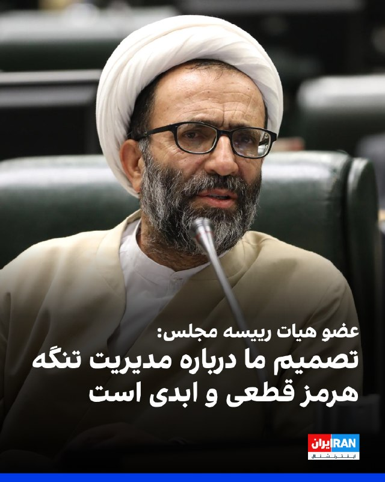

علیرضا سلیمی، عضو هیات رییسه مجلس گفت: «طرح اعمال مدیریت تنگه هرمز در جلسه علنی مجلس بررسی و تصویب خواهد شد.»
او افزود: «تصمیمات ما درباره اعمال مدیریت بر تنگه هرمز تاکتیکی و موقت نیست، بلکه قطعی و ابدی است.»

سلیمی ادامه داد: «صفر تا صد قانون اعمال مدیریت بر تنگه هرمز به‌طور کامل و جزء به جزء صرفا در مجلس تصویب و نهایی خواهد شد.»

او اضافه کرد: «قطعا این قانون یکی از قوانین مشعشع تاریخ ایران خواهد بود.»
https://iranintl.com/202605300411

## IranIntlTV — post 339739

  <a href="telegram/content/IranIntlTV_339739_1780148774.mp4" target="_blank">🎬 Download video</a>

شاهزاده رضا پهلوی شنبه نهم خرداد برای شرکت در نشست بین‌المللی «امنیت دریای سیاه» وارد شهر اودسا در جنوب اوکراین شد.

شاهزاده در بدو ورود به محل برگزاری این نشست مورد استقبال اولکسی گونچارنکو، نماینده پارلمان اوکراین، قرار گرفت.

نشست «انجمن امنیت دریای سیاه» که با نام «انجمن اودسا» نیز شناخته می‌شود، یک رویداد بین‌المللی سالانه است که به بررسی چالش‌های امنیتی، اقتصادی و سیاسی منطقه دریای سیاه می‌پردازد. این انجمن در سال ۲۰۲۴ از سوی گروهی از نمایندگان پارلمان اوکراین بنیان‌گذاری شد.

اولکسی گونچارنکو، نماینده پارلمان اوکراین، بنیان‌گذار و رییس این انجمن است.
@iranintltv

## IranIntlTV — post 339738

  <a href="https://t.me/IranintlTV/339738" target="_blank">📎 Download file</a>

🎧نسخه صوتی اخبار نیمروزی | شنبه ۹ خرداد
@iranintlTV

## IranIntlTV — post 339737

  <a href="telegram/content/IranIntlTV_339737_1780148776.mp4" target="_blank">🎬 Download video</a>

در آستانه سومین ماه قطعی اینترنت در ایران، مقام‌های جمهوری اسلامی از آغاز روند بازگشت اینترنت بین‌الملل خبر داده‌اند. خبری که هم‌زمان با گزارش‌ها درباره احتمال توافق میان تهران و واشینگتن، بازتاب گسترده‌ای در رسانه‌های بین‌المللی داشت.

اما داده‌های نت‌بلاکس، کنتیک و کلودفلر، و مهم‌تر از آن روایت شهروندان، تصویر متفاوتی نشان می‌دهد؛ بازگشتی محدود، ناپایدار و بیشتر متمرکز در تهران.

این گزارش بررسی می‌کند که پشت تیتر «بازگشت اینترنت در ایران» چه واقعیتی قرار دارد؛ بازگشت واقعی برای مردم، یا نسخه‌ای محدود و کنترل‌شده از اتصال به جهان؟
@iranintltv

## IranIntlTV — post 339736

  

مرکز امنیت دریایی عمان اعلام کرد در پی مشاهده یک جسم شناور مشکوک به مین دریایی در غرب مسیر ترافیک ساحلی تنگه هرمز و در آب‌های سرزمینی این کشور، از کشتی‌ها و صیادان خواسته شده با حداکثر احتیاط تردد کنند و هر مورد مشکوک را فورا به مقام‌های مسئول گزارش دهند.
https://iranintl.com/202605303637

## IranIntlTV — post 339735

  <a href="telegram/content/IranIntlTV_339735_1780148779.mp4" target="_blank">🎬 Download video</a>

یکی از شرکت‌کنندگان در تجمع استکهلم در گفت‌وگو با مهران عباسیان، خبرنگار ایران‌اینترنشنال، خواستار بسته شدن سفارت جمهوری اسلامی در سوئد شد

@iranintltv

## IranIntlTV — post 339734

  

رافائل گروسی، مدیرکل آژانس بین‌المللی انرژی اتمی سازمان ملل، در گفت‌وگو با روزنامه نشنال‌نیوز با ابراز نگرانی از گسترش «پدیده» حمله به نیروگاه‌های هسته‌ای در جریان درگیری‌های اخیر، گفت حمله به این تاسیسات در حال تبدیل شدن به الگویی خطرناک در جنگ‌ها است.

گروسی با اشاره به حمله پهپادی به نیروگاه براکه در امارات متحده عربی گفت: «این واقعیت که کسی یک نیروگاه هسته‌ای را هدف قرار داده، بسیار جدی است.»

او گفت آژانس شواهد لازم برای مقصر دانستن تهران در این حمله را در اختیار ندارد و افزود: «ما به مدرک ملموسی درباره منشا این حمله نیاز داریم.»

مقام‌های امارات متحده عربی، نیروهای نیابتی جمهوری اسلامی در عراق را مسئول این حمله اعلام کردند.

گروسی همچنین به حملات علیه نیروگاه هسته‌ای زاپوروژیا در اوکراین و نیروگاه هسته‌ای بوشهر اشاره کرد.
https://iranintl.com/202605306998

## IranIntlTV — post 339733

🗣روایت شما از زندگی در دوران پس از انقلاب ملی و جنگ - شنبه ۹ خرداد ۱۴۰۵

🔹وضعیت وحشتناکه، گرونی زیاد شده، ما کم آوردیم. من خودم دانش‌آموز هستم، هیچی از درس نفهمیدیم و بعد از ۱۸ و ۱۹ هیچی مثل قبل نشد.

🔹اپراتورهای تلفن همراه علاوه بر افزایش شدید هزینه بسته‌های نت، مخصوصاً همراه اول، امکان خرید شارژ در مبالغ زیر ۲۰ هزار تومان هم نمی‌دن.

🔹ما کیش هستیم. از روز اول جنگ تا همین امروز به دلیل امن نبودن پرواز، هنوز هیچ مسافری با پرواز نیامده کیش. از طریق دریایی هم تا همین یک هفته پیش فقط کیشوندان رو راه می‌دادن. تمام هتل‌ها، رستوران‌ها و بازارها بدبخت شدن.

🔹از ایرانشهر: هموطنان عزیز اینجا همه‌چیز گرونه و اینترنت خیلی ضعیفه. قبلاً با کانفیگ پولی قوی‌تر بود، الان خیلی بدتر و ضعیف‌تر شده.

🔹امروز و دیروز رانندگان اسنپ‌فود ایلام به دلیل پایین بودن کرایه‌ها و گرانی روغن و بنزین اعتصاب کردن. صدها سفارش در رستوران‌ها خراب شد و به مشتری نرسید.

🔹چیپسی که پارسال ۱۸ تومان بود شده ۷۰ تومان، دقیقاً ۴ برابر.

🔹تهران هستم. ۱۰ ساله اسنپ کار می‌کنم، کرایه خیلی پایینه. درآمدم همون درآمد پارساله ولی هزینه‌ها ۳ برابر شده. تعویض روغن موتور پراید شده ۳ میلیون.

🔹از بوشهر پیام می‌دم. برادر من نظامی هست و حقوق دو ماه پیشش حدود ۳۰ میلیون تومان بود. الان حقوق این ماهش شده ۱۵ میلیون تومان، قضاوت با خودتون.

🔹نیروهای پیمانکاری شرکت نفت سروستان از استان فارس هستیم. حقوق اسفند و فروردین به‌صورت علی‌الحساب پرداخت شده، ولی تا امروز نه حقوق اردیبهشت و نه حقوق معوقه پرداخت نشده.

🔹فقط مبلغ یک بسته سویا از سه ماه پیش تا دیروز با تورم ۸۰۰ درصدی بالا رفته.

## IranIntlTV — post 339732

  <a href="telegram/content/IranIntlTV_339732_1780148782.mp4" target="_blank">🎬 Download video</a>

در ادامه تجمع‌های همبستگی ایرانیان خارج از کشور با انقلاب ملی، شنبه ۹ خرداد ایرانیان مقیم استکهلم در اعتراض به اعدام‌ها و سرکوب مخالفان جمهوری اسلامی تجمع کردند و خواستار پایان مماشات دولت‌های اروپایی با جمهوری اسلامی شدند.

گزارش مهران عباسیان، خبرنگار ایران‌اینترنشنال
@iranintltv

## IranIntlTV — post 339731

  <a href="telegram/content/IranIntlTV_339731_1780148788.mp4" target="_blank">🎬 Download video</a>

ایرانیان ساکن استکهلم شنبه در تجمع همبستگی ایرانیان خارج از کشور با انقلاب ملی، با اجرای یک پرفورمنس اعتراضی به صدور حکم اعدام برای «بچه‌های اکباتان» و خطر اجرای این احکام واکنش نشان دادند.

گزارش مهران عباسیان، خبرنگار ایران‌اینترنشنال
@iranintltv

## IranIntlTV — post 339730

  <a href="telegram/content/IranIntlTV_339730_1780148791.mp4" target="_blank">🎬 Download video</a>

یکی از شرکت‌کنندگان در تجمع ایرانیان در استکهلم به ایران‌اینترنشنال گفت: «هم‌بستگی میان ایرانیان به‌صورت خودجوش شکل گرفته و شمار شرکت‌کنندگان در تجمع‌های این شهر هر هفته افزایش می‌یابد.»
شرکت‌کننده دیگری نیز گفت مردم ایران تنها نیستند و فداکاری‌ها و هزینه‌های سنگینی که پرداخته‌اند، هرگز فراموش نخواهد شد.

گزارش مهران عباسیان، خبرنگار ایران‌اینترنشنال
@iranintltv

## Shin_Persian — post 6320

  

Shin ✓ @hey_itsmyturn
Sat, 30 May 2026 12:24:21 UTC

And still.

فارسی

و همچنان.

𝕏 · @shin_persian

## FarsiVOA — post 219072

  <a href="telegram/content/FarsiVOA_219072_1780148793.mp4" target="_blank">🎬 Download video</a>

ارتش اسرائیل ویدیویی از شناسایی و انهدام یک سکوی پرتاب موشک منتشر کرده است که شب گذشته نیروهای حزب‌الله از آن به سمت اسرائیل موشک شلیک کرده بودند.
این ویدیو بی‌صدا است.

## FarsiVOA — post 219071

🔺هگست: پرزیدنت ترامپ فقط توافقی را می‌پذیرد که برای آمریکا و امنیت جهان «عالی» باشد

▪️پیت هگست، وزیر جنگ ایالات متحده، می‌گوید پرزیدنت ترامپ تنها در صورتی حاضر به توافق با جمهوری اسلامی ایران خواهد بود که آن را «توافقی عالی» برای آمریکا و امنیت جهان بداند.

⬇️ بیشتر بخوانید:

https://ir.voanews.com/a/hegseth-trump-demands-great-iran-deal/8155554.html/?nocach=1

## FarsiVOA — post 219070

  <a href="telegram/content/FarsiVOA_219070_1780148796.mp4" target="_blank">🎬 Download video</a>

این ویدیو که بعد از بازگشایی محدود اینترنت در ایران در شبکه‌های اجتماعی منتشر شده منتسب است به روزهای نخست جنگ و گذر موشک‌های کروز تاماهاک در مرز عراق و ایران.

## FarsiVOA — post 219069

🔺آمریکا یک «شبکه کلاهبرداری» وابسته به رژیم ایران را تحریم کرد

▪️ایالات متحده از تحریم یک شبکه پیچیده وابسته به جمهوری اسلامی که با جعل هویت و فریب شرکت‌های آمریکایی، فناوری‌های حساس را برای نیروی نظامی رژیم ایران تهیه می‌کرد، خبر داد.

⬇️ بیشتر بخوانید:

https://ir.voanews.com/a/iran-irgc-state-department-sanction-network-fraud-american-companies/8155552.html/?nocach=1

## FarsiVOA — post 219068

🔺هشدار مرکز امنیت دریایی عمان درباره مشاهده «جسم شناور مشکوک» در تنگه‌ هرمز

▪️مرکز امنیت دریایی عمان روز شنبه ۹ خرداد، بعد از مشاهده یک جسم شناور در غرب منطقه ترافیک ساحلی تنگه هرمز در محدوده آب‌های سرزمینی عمان، که گمان می‌رود «مین دریایی» باشد، از دریانوردان، ماهیگیران، و کشتی‌ها خواست تا نهایت احتیاط را به کار گیرند.

⬇️ بیشتر بخوانید:

https://ir.voanews.com/a/oman-warns-vessels-about-floating-object/8155551.html/?nocach=1

## FarsiVOA — post 219067

  <a href="telegram/content/FarsiVOA_219067_1780148799.mp4" target="_blank">🎬 Download video</a>

ارتش اسرائیل با انتشار ویدیو و تصاویری اعلام کرد این مستندات به حملات سازمان تروریستی حزب‌الله در طول شب جمعه به کلیسای ارتدوکس سنت جورج در جنوب لبنان مربوط است. به گفته ارتش اسرائیل این حملات به ساختمان‌هایی در روستای مسیحی مرجعیون اصابت کردند.

ارتش اسرائیل تأکید کرد نیروهایش در محدوده این کلیسا فعالیت نمی‌کنند.

این ویدیو بی‌صدا است.

## FarsiVOA — post 219066

  

فرماندهی مرکزی ایالات متحده، سنتکام، تصویری از یک جنگنده «اف-۱۶ فایتینگ فالکن» نیروی هوایی آمریکا در حال پرواز بر فراز خاورمیانه در جریان یک ماموریت گشت‌زنی را منتشر کرد.

سنتکام اعلام کرد که نیروهای آمریکا همچنان در سراسر منطقه حضور دارند و در حالت آماده‌باش باقی مانده‌اند.

@FarsiVOA

## DW_Farsi — post 125318

🔶 "امارات در طول جنگ، ده‌ها حمله هوایی علیه ایران انجام داد"

روزنامه آمریکایی وال‌استریت ژورنال روز جمعه هشتم خرداد (۲۹ مه) گزارش داد که امارات متحده عربی در طول جنگ ، ده‌ها حمله هوایی علیه ایران انجام داده است که این حملات یک روز پس از اعلام آتش‌بس میان آمریکا و ایران در اوایل آوریل به پایان رسید.

روزنامه اسرائيلی جروزالم پست که چکیده‌ای از این گزارش را منتشر کرده می‌نویسد، وال‌استریت ژورنال به نقل از چندین منبع مطلع نوشت که امارات با ایالات متحده و اسرائیل هماهنگی داشته و با استفاده از اطلاعات دریافتی از هر دو کشور، تأسیسات انرژی ایران را در پاسخ به حملات ایران به زیرساخت‌های نفت و گاز خود، هدف قرار داده است.

اگرچه کشورهای حوزه خلیج‌فارس در ابتدا اعلام کرده بودند که اجازه نخواهند داد از پایگاه‌ها یا حریم هوایی آن‌ها برای حمله استفاده شود، اما برخی از آن‌ها پس از حملات ایران به کشورهای مختلف این منطقه، سیاست خود را تغییر دادند.

ایران با بیش از ۲۸۰۰ موشک و پهپاد امارات را هدف قرار داد که این تعداد بیش از پرتاب‌های انجام‌شده به هر کشور دیگری، از جمله اسرائیل، بوده است.

به گزارش وال‌استریت ژورنال، امارات نیز متقابلا اقدام به همکاری تلافی‌جویانه با آمریکا و اسرائیل کرد تا به اهدافی، از جمله در جزایر قشم و ابوموسی در تنگه هرمز ، بندرعباس و پالایشگاه نفت در جزیره لاوان در خلیج‌فارس حمله کند.

وال‌استریت ژورنال می‌نویسد، حمله دیگر به مجتمع پتروشیمی عسلویه و با همکاری اسرائیل انجام شد که محکومیت‌های بین‌المللی را در پی داشت؛ تا جایی که دونالد ترامپ، رئیس‌ جمهور آمریکا، از اسرائیل خواست حمله به تأسیسات انرژی را متوقف کند.

بنیامین نتانیاهو، نخست‌وزیر اسرائیل، در پاسخ به سؤالی درباره حمله به مجتمع عسلویه و واکنش ترامپ، به خبرنگاران گفت: «اسرائیل به تنهایی علیه مجتمع گاز عسلویه عمل کرد.»

این روزنامه همچنین نوشت که امارات اتحاد خود با اسرائیل را در طول جنگ افزایش داده و اسرائیل نیز سامانه‌های گنبد آهنین و سربازان ارتش خود را به امارات اعزام کرده است.

به علاوه، چندین مقام اسرائیلی از جمله دیوید بارنیا، رئیس موساد یا سازمان اطلاعات خارجی، دیوید زینی، رئیس شین‌بت یا سازمان اطلاعات داخلی و ایال زامیر، رئیس ستاد مشترک ارتش اسرائیل و همچنین نتانیاهو به امارات سفر کردند.

سفر نتانیاهو ابتدا توسط وزارت خارجه امارات تکذیب شد، اما سپس سخنگوی نتانیاهو مجددا آن را تأیید کرد.

در ماه آوریل، عربستان سعودی از رویکرد تهاجمی امارات انتقاد کرد و به آمریکا شکایت برد که حملات امارات خطر اقدامات تلافی‌جویانه ایران را در سراسر منطقه افزایش می‌دهد.

@dw_farsi

## DW_Farsi — post 125317

🔶 پزشک ترامپ آمادگی او برای انجام وظایفش را تأیید کرد

شان باربابلا، پزشک دونالد ترامپ، اعلام کرده است که رئیس جمهور آمریکا از نظر جسمی و ذهنی از وضعیت سلامتی بسیار خوبی برخوردار است.

بر اساس بیانیه منتشرشده از سوی کاخ سفید در روز جمعه ۲۹ مه (۸ خرداد) به وقت محلی، باربابلا گفته است ترامپ از نظر قلبی، ریوی و سیستم عصبی عملکردی قوی دارد.

او افزوده است که ترامپ بدون هیچ محدودیتی قادر است تمامی وظایف خود را به عنوان فرمانده کل قوا و رئیس دولت انجام دهد.

خود ترامپ نیز پس از معاینه دوره‌ای‌اش در بیمارستان نظامی "والتر رید" در روز سه‌شنبه گذشته گفته بود که همه چیز "عالی" پیش رفته است.

وضعیت جسمانی ترامپ به‌دقت زیر نظر قرار دارد. انتشار تصاویری از ورم مچ پاها، کبودی دست‌ها و لکه‌هایی روی گردن، پرسش‌هایی را درباره وضعیت سلامت این سیاستمدار ۷۹ ساله جمهوری‌خواه برانگیخته است.

همچنین مواردی از خواب‌آلودگی‌های مکرر رئیس جمهور آمریکا در جریان مراسم رسمی نیز تردیدهایی را درباره آمادگی جسمانی‌اش ایجاد کرده بود.

باربابلا به وجود ورم خفیف در ساق پاهای ترامپ اشاره کرده، اما گفته است که این وضعیت در مقایسه با سال گذشته بهبود یافته است.

او همچنین کبودی‌های روی دست ترامپ را بی‌خطر دانسته و توضیح داده است که این کبودی‌ها در نتیجه دست دادن‌های مکرر و مصرف همزمان آسپرین برای پیشگیری از بیماری‌های قلبی-عروقی ایجاد شده‌اند.

عملکرد کلی قلب رئیس‌ جمهور آمریکا هم طبیعی اعلام شده است. همچنین به گفته او، یک "معاینه جامع عصبی" نشان داده که وضعیت ذهنی ترامپ طبیعی است.

ترامپ از نظر افسردگی و اضطراب نیز مورد آزمایش قرار گرفته است. با این حال، پزشک او هیچ توضیحی درباره دلیل درمان پوست گردن ترامپ در ماه مارس ارائه نکرده و به تصویربرداری "ام‌آر‌آی" در ماه اکتبر گذشته نیز اشاره‌ای نکرده است.

ترامپ در ماه ژوئن امسال ۸۰ ساله خواهد شد. او هنگام آغاز دوره ریاست جمهوری خود از همه رؤسای جمهور پیشین آمریکا مسن‌تر بود.

ترامپ بارها تأکید کرده که از جو بایدن، رئیس جمهور پیشین آمریکا از حزب دموکرات، پرانرژی‌تر و آماده‌تر است.

بایدن سال گذشته در سن ۸۲ سالگی و پس از مطرح شدن پرسش‌هایی درباره توانایی جسمی و ذهنی‌اش، سمت خود را ترک کرد.

طبق این گزارش، پزشک ترامپ توصیه‌هایی پیشگیرانه نیز به او ارائه کرده است. ترامپ توصیه‌هایی درباره رژیم غذایی دریافت کرده و مصرف آسپرین با دوز پایین نیز به او پیشنهاد شده است.

@dw_farsi

## Persian_Trend_Official — post 15342

  <a href="telegram/content/Persian_Trend_Official_15342_1780148801.mp4" target="_blank">🎬 Download video</a>

پیت هگست، وزیر جنگ ایالات متحده: همین چند روز پیش در جلسه کابینه بودیم و رئیس جمهور گفت هی، این یک توافق عالی خواهد بود.

ولی اگر ایران نمی‌خواهد توافق خوبی انجام دهد که تضمین کند به سلاح هسته‌ای دست پیدا نمی‌کند، می‌تواند با فردی که در سمت چپ من است، معامله کند و این تنها باری بود که من به چپ بودن متهم شدم.

📝 Amir

📌 @persian_trend_official
پرشین ترند | متفاوت‌ترین کانال نظامی

## Persian_Trend_Official — post 15341

  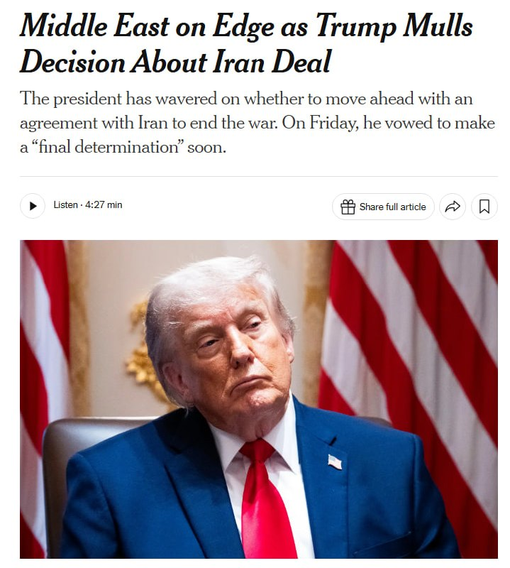

ترامپ قول داد که به زودی در مورد توافقی برای پایان دادن به جنگ ایران تصمیم نهایی را بگیرد، اما به گزارش نیویورک تایمز، جلسه اتاق وضعیت روز جمعه بدون هیچ نتیجه ای پایان یافت!

نیویورک تایمز: ایران می‌گوید هیچ توافق نهایی در دست نیست؛ سخنگوی وزارت امور خارجه، بقایی، تأیید کرد که تبادل پیام‌ها هنوز ادامه دارد. این توافق پیشنهادی، در ازای لغو محاصره تنگه هرمز توسط ایران، به کارزار نظامی آمریکا و اسرائیل پایان می‌دهد و برنامه هسته‌ای به مذاکرات بعدی موکول شده است.

هگست، وزیر دفاع امریکا در سنگاپور قریب‌الوقوع بودن این توافق را کم‌اهمیت جلوه داد و تأکید کرد که ذخایر مهمات ایالات متحده برای جنگ مجدد آماده است.

هم تندروهای جمهوری‌خواه آمریکایی و هم تندروهای ایرانی به این توافق حمله می‌کنند. تندرو های ایرانی آن را بیش از حد آشتی‌جویانه می‌نامد و محسن رضایی، ترامپ را به خواسته‌های بیش از حد متهم می‌کند.

📝 Amir

📌 @persian_trend_official
پرشین ترند | متفاوت‌ترین کانال نظامی

## Persian_Trend_Official — post 15340

  

عبور 20 کشتی از تنگه هرمز با هماهنگی سپاه پاسداران

نیروی دریایی سپاه پاسداران انقلاب اسلامی با تأکید بر حاکمیت کامل خود بر تنگه هرمز، امروز از عبور 20 فروند کشتی در قالب کریدور اقتدارخبر داد، سپاه می‌گوید ضمن آنکه شرایط بشردوستانه کشورهای ذی‌نفع که نیازمند محموله‌های کود شیمیایی هستند نیز در نظر گرفته شده است.

📝 Amir

📌 @persian_trend_official
پرشین ترند | متفاوت‌ترین کانال نظامی

## Persian_Trend_Official — post 15339

  <a href="telegram/content/Persian_Trend_Official_15339_1780148807.mp4" target="_blank">🎬 Download video</a>

هدف قرار گرفتن تأسیسات نظامی و انبارهای مهمات پایگاه ششم شکاری شهید یاسینی بوشهر در ۱۷ فروردین ۱۴۰۵

👺Phantom

📌 @persian_trend_official
پرشین ترند | متفاوت‌ترین کانال نظامی

## Persian_Trend_Official — post 15338

  <a href="telegram/content/Persian_Trend_Official_15338_1780148810.mp4" target="_blank">🎬 Download video</a>

صداوسیما خبر از کشته شدن 2 تن از اعضای گروهک تروریستی پاک توسط نیروهای امنیتی در کرمانشاه داد.

📝 Amir

📌 @persian_trend_official
پرشین ترند | متفاوت‌ترین کانال نظامی

## Persian_Trend_Official — post 15337

https://youtube.com/shorts/mE9NFxON9xQ?feature=share

## Persian_Trend_Official — post 15336

  <a href="telegram/content/Persian_Trend_Official_15336_1780148812.webm" target="_blank">🎬 Download video</a>

هدف قرار دادن تانک مرکاوا اسرائیلی توسط مولتی روتور FPV حزب‌الله لبنان

حزب‌الله لبنان با انتشار ویدیویی خبر از حمله به یک عراده تانک مرکاوا در زوطر الشرقیه داد، این شهر در شمال رودخانه لیتانی واقع شده است.

📝 Amir

📌 @persian_trend_official
پرشین ترند | متفاوت‌ترین کانال نظامی

## Persian_Trend_Official — post 15335

  <a href="telegram/content/Persian_Trend_Official_15335_1780148813.webm" target="_blank">🎬 Download video</a>

مشاهده شدن مین دریایی در حریم آبی عمان!

مرکز امنیت دریایی عمان: به دلیل مشاهده یک جسم شناور که احتمال می‌رود مین دریایی باشد در غرب منطقه ترافیک ساحلی در تنگه هرمز در داخل آب‌های سرزمینی عمان، مرکز امنیت دریایی از تمامی دریانوردان، ماهیگیران و شناورها درخواست می‌کند هنگام عبور از این منطقه نهایت احتیاط را به عمل آورند.

به همه کاربران دریایی توصیه می‌شود فاصله ایمن از هر جسم مشکوک را حفظ کرده و فوراً آن را به مراجع ذی‌ربط گزارش دهند.

📝 Amir

📌 @persian_trend_official
پرشین ترند | متفاوت‌ترین کانال نظامی

## Persian_Trend_Official — post 15334

  <a href="telegram/content/Persian_Trend_Official_15334_1780148814.mp4" target="_blank">🎬 Download video</a>

وزیر جنگ آمریکا: محاصره ایران هنوز کاملاً پابرجاست.

آینده انرژی در واقع آینده‌ آمریکایی است و این برای امنیت انرژی در سراسر جهان خوب است.

📝 Amir

📌 @persian_trend_official
پرشین ترند | متفاوت‌ترین کانال نظامی

## RadioFarda — post 157720

  

🔸مرکز امنیت دریایی عمان روز شنبه از دریانوردان، ماهیگیران و کشتی‌ها خواست پس از مشاهده یک شیء شناور که گمان می‌رود مین دریایی باشد، نهایت احتیاط را به خرج دهند.

🔸این شیء در غرب مسیر تردد ساحلی در تنگه هرمز و در محدوده آب‌های سرزمینی عمان مشاهده شده است.

🔸این مرکز بدون آن که به منشأ کار گذاشتن مین اشاره کند، به کاربران دریا توصیه کرد که از هرگونه شیء مشکوک فاصله ایمن حفظ کنند و بلافاصله آن را به مراجع ذی‌صلاح گزارش دهند.

🔸با آغاز جنگ آمریکا و اسرائیل علیه ایران در اسفند سال گذشته، گزارش‌هایی درباره مین‌گذاری تنگه هرمز توسط ایران منتشر شد.

🔸دونالد ترامپ، رئیس‌جمهور آمریکا، روز جمعه تعهد ایران به جمع‌آوری «هرگونه مین دریایی» در تنگه هرمز و باز شدن فوری این آبراه راهبردی را از جمله شروط توافق با جمهوری اسلامی خوانده بود.

@RadioFarda

## IranianMinds — post 21071

پیت هگست جملات طنز گفته

🔴 هگست : همین چند روز پیش در جلسه کابینه بودیم و رئیس جمهور گفت: «هی، این یک توافق عالی خواهد بود و اگر ایران نمی‌خواهد توافق خوبی انجام دهد که تضمین کند به سلاح هسته‌ای دست پیدا نمی‌کند، می‌تواند با فردی که در سمت چپ من است، معامله کند.»

و این تنها باری بود که من به چپ بودن متهم شدم. 😂

@IranianMinds

## IranianMinds — post 21069

🔴 امروز‌ ساعت 19:30 فینال لیگ قهرمانان اروپا تو شهر بوداپست مجارستان برگزار میشه

پی اس جی - آرسنال

@IranianMinds

## IranianMinds — post 21068

  <a href="telegram/content/IranianMinds_21068_1780148817.webm" target="_blank">🎬 Download video</a>

▶️ فینال لیگ قهرمانان اروپا رو با آپشن های تخصصی در MelBet پیشبینی کنید! ⚽️
🔥😍

💵 امکان شارژ کارت بکارت و هات ووچر

🎁 قرعه کشی و آفر های جذاب با جوایز ویژه

📱 کاملترین برنامه موبایل

🤝 اسپانسر رسمی لالیگا

🇮🇷 پشتیبانی از زبان فارسی

✍️ حرفه ای، مطمئن و در کلاس جهانی پیشبینی کنید!

برای ورود به سایت فیلترشکن خود را خاموش کنید!
‌
🌐 Link 🔜 MelBet1.net

🌐‌ Link 🔜 MelBet1.net

## IranianMinds — post 21067

  <a href="telegram/content/IranianMinds_21067_1780148818.mp4" target="_blank">🎬 Download video</a>

🔴فوری.

@IranianMinds

## IranianMinds — post 21066

🔴حسین علائی:

هرچقدر به شمخانی می‌گفتم که در جنگ بعدی رهبر را می‌زنند، میگفت نمی‌توانند.
خدا او را بیامرزد، آخر هم رهبر را زدند و هم خودش را.

@IranianMinds

## IranianMinds — post 21065

خبرنگار : آیا اون محاصره هنوز هم برقرار هست؟

هگست :
بله، محاصره هنوز کاملاً برقرار هست

@IranianMinds

## IranianMinds — post 21064

🔴وزیر جنگ آمریکا:

هر لحظه آماده ایم جنگ علیه ایران را از سر بگیریم.

@IranianMinds

## BBCPersian — post 282432

  <a href="telegram/content/BBCPersian_282432_1780148824.mp4" target="_blank">🎬 Download video</a>

🔻‌ خبرگزاری دولتی لبنان گزارش داده است که روز شنبه ۳۰ مه، پس از حملات اسرائیل، دود غلیظی از مناطق مختلف جنوب لبنان به هوا برخاست. پیش‌تر ارتش اسرائیل با صدور هشدار تخلیه به ساکنان هفت روستا در جنوب لبنان اعلام کرده بود که قصد دارد اهدافی متعلق به حزب‌الله را در این مناطق هدف قرار دهد.

اسرائیل و حزب‌الله یکدیگر را به نقض آتش‌بس متهم می‌کنند و تنش میان دو طرف افزایش یافته است. در تصاویری که از حمله اسرائیل به شهر صور در ۲۸ مه منتشر شده، چند ساختمان هدف قرار گرفته‌اند و نیروهای امدادی برای کمک به آسیب‌دیدگان در محل حاضر شده‌اند. ارتش اسرائیل همچنین در روزهای اخیر از یک «حمله هدفمند» در جنوب بیروت خبر داده است.

آویخای ادرعی، سخنگوی عرب‌زبان ارتش اسرائیل، در شبکه ایکس نوشت این حملات در پاسخ به آنچه «نقض توافق آتش‌بس» از سوی حزب‌الله خوانده، انجام شده و اسرائیل ناچار به «اقدامی قاطع» شده است.

این تحولات در حالی رخ می‌دهد که مذاکرات میان اسرائیل و لبنان، که از ماه آوریل آغاز شده، همچنان ادامه دارد

@‌‌BBCPersian

## BBCPersian — post 282431

🔻جعفر پورکبگانی، نماینده مجلس شورای اسلامی از خسارت «۴ میلیارد دلاری پارس جنوبی» در جریان جنگ خبر داد.

او گفت که نتایج ارزیابی مشترک کارشناسان و متخصصان دانشگاه علم و صنعت نشان می‌دهد که میزان خسارت وارده به پارس جنوبی تا این لحظه به «حدود ۴ میلیارد دلار رسیده و زیان ناشی از کاهش فعالیت‌ها هم روزانه نزدیک به ۲ میلیون دلار برآورد می‌شود.»

آمریکا و اسرائیل در جریان جنگ تاسیسات پارس جنوبی را که بزرگ‌ترین میدان گازی جهان در خلیج فارس است، هدف قرار دادند.

پارس جنوبی در اختیار ایران است و بخش شمالی آن به قطر تعلق دارد که بزرگ‌ترین تولیدکننده گاز در منطقه محسوب می‌شود. قطر حدود ۲۰ درصد گاز مایع جهان را تامین می‌کند.

نماینده بوشهر،‌ گناوه و دیلم با اشاره به خسارت‌های واردشده به زیرساخت‌ها و اداره کل هواشناسی بوشهر هم گفت که در جریان جنگ مجموعه هواشناسی بوشهر سه بار هدف حمله قرار گرفت و به دلیل آسیب‌های واردشده، بازگشت کامل این مجموعه به شرایط عادی زمان‌بر خواهد بود.

او در مورد شرایط فرودگاه بوشهر هم گفت: زیرساخت‌ها و امکانات فنی این فرودگاه برای انجام پرواز آماده است، اما بهره‌برداری مجدد از آن پس از اخذ مجوزهای امنیتی مورد نیاز از استانداری امکان‌پذیر خواهد بود.

@BBCPersian

## BBCPersian — post 282430

🔻پیت هگست، وزیر دفاع آمریکا، در یک مجمع عالی دفاعی منطقه‌ای در سنگاپور گفت که ارتش آمریکا در حالی که به «تعهدات جهانی» خود مانند جنگ ایران عمل می‌کند، به آسیا «پشت نمی‌کند».

در پی تعلیق فروش تسلیحاتی آمریکا به تایوان، آقای هگست سعی کرد که به متحدان واشنگتن در آسیا-اقیانوسیه اطمینان دهد که آمریکا همچنان پای تعهداتش به این منطقه ایستاده است. هرچند او درخواست‌های آمریکا از شرکای آسیایی برای صرف هزینه‌های بیشتر در حوزه دفاعی را تکرار کرد.

پیت هگست در عین اشاره به تهدید تقویت حضور نظامی چین در منطقه، گفت که آمریکا می‌خواهد از «رویارویی غیرضروری» اجتناب کند.

پیت هگست این سخنان را چند هفته پس از «مذاکرات مثبت» دونالد ترامپ با شی جین‌پینگ، رئیس‌جمهورچین، در پکن بیان کرد.
https://bbc.in/4dF0tDR

@BBCPersian

## BBCPersian — post 282429

🔻قوه قضائیه اموال بیش از ۱۰۰ شهروند ایرانی را در خراسان جنوبی و گلستان توقیف کرد

بنابر اعلام دادگستری خراسان جنوبی اموال ۳۴ شهروند ایرانی در این استان توقیف شده است.

دادگستری این استان از این افراد به عنوان «عنصر خائن به کشور» و «حامی» آمریکا و اسرائیل یاد کرده است.

بر اساس اعلام این نهاد، دارایی‌های توقیف شده شامل اموال منقول و غیرمنقول، حساب‌های بانکی، املاک ثبتی و آپارتمان و خودروی سواری بوده است.

قوه قضائیه همچنین گفته است اموال ۷۴ نفر دیگر هم در استان گلستان توقیف شده است؛ همه این افراد در خارج از کشور سکونت دارند.

پس از اعتراضات دی‌ماه و کشتار معترضان، شمار زیادی از شهروندان ایرانی در خارج از کشور در تجمعات اعتراضی در شهرهای مختلف شرکت کردند که این اعتراضات در هفته‌های منتهی به جنگ و بعد از آن هم ادامه یافت.

قوه قضائیه پس از جنگ آمریکا و اسرائیل با ایران، با استناد به قانون «تشدید مجازات جاسوسی» معترضان و مخالفان را به «همراهی با دشمن» متهم کرد.

اما این توقیف‌ها به موضوع جنگ محدود نیست؛ در زمان اعتراضات دی‌ماه هم اموال بعضی از چهره‌های شناخته شده در داخل ایران ضبط شد.

فعالان مجازی حامی جمهوری اسلامی در جریان جنگ اخیر، اقدام به فراخوان‌هایی برای معرفی مخالفان جمهوری اسلامی که آنها را «حامی جنگ» نامیدند، کردند.

@BBCPersian

## BBCPersian — post 282428

ویدیوهایی از ورود گروهی با قایق‌های کوچک به کشتی سن‌آنتونیو روز ۸ خرداد منتشر شده است. در این ویدیوها دیده می‌شود گروه بزرگی با تعداد زیادی قایق کوچک به این کشتی باری کانتینربر وارد می‌شوند و مفتول‌های فلزی باقیمانده در کشتی را از آن به قایق‌هایشان منتقل می‌کنند.

کشتی سن‌آنتونیو متعلق به شرکت «سی‌ام‌ای سی‌جی‌ام» است که در تاریخ اردیبهشت هنگام عبور از تنگه هرمز هدف اصابت «پرتابگر ناشناخته» قرار گرفت.

بر اثر این حمله تعدادی از کارکنان کشتی مجروح شدند.

مسئول این حمله مشخص نیست ولی پیش از آن ایران اعلام کرده بود به کشتی‌هایی که بدون مجوز سپاه قصد عبور از تنگه هرمز را داشته باشند، حمله می‌کند.

بعضی گزارش‌ها حاکی است این کشتی بعد از حمله و تخلیه افراد زخمی و سایر کارکنان، در نزدیکی بندر جاسک رها شده است. تاریخ و مکان دقیق ویدیوهای منتشر شده برای بی‌بی‌سی فارسی مشخص نیست.
@BBCPersian

## Dirty_Kids — post 390568

  <a href="telegram/content/Dirty_Kids_390568_1780148830.mp4" target="_blank">🎬 Download video</a>

عرزشیا تو عید قربان خاتمی، روحانی و ظریف رو بنر کنار ترامپ و نتانیاهو چاپ کردن دارن بهشون بعنوان شیطان سنگ میزنن 😂

خب خاک تو سر بی‌عرضتون کنن این سه تا شیطان بغل دستتون تو ایران هستن

@Dirty_Kids 👻

## Dirty_Kids — post 390567

🔴 کارشناس ضد ایرانی صداوسیما : آریایی‌ها قاتل بودن!

اینکه بعضی‌ها میگن ما آریایی هستیم، نژادپرستیه.
تمدن ما 65 هزار ساله‌ست، آريايی‌ها کلا 4-5 هزار سال پیش اومدن.
آریایی‌ها همه رو کُشتن و به قدرت رسیدن، اینکه بگیم ما آریایی هستیم یعنی ما فرزندان کسایی هستیم که نسل کُشی کردن...

@Dirty_Kids 👻

## Dirty_Kids — post 390565

  <a href="telegram/content/Dirty_Kids_390565_1780148833.mp4" target="_blank">🎬 Download video</a>

کسی بهت نگفت شبیهه لامایی؟

ستایش دهقان هستش، تنها جایی که دیدمش ۵ دقیقه تو سریال جیران بود، همش نگران کیفیت کص دادن و زندگی جیران بود

@Dirty_Kids 👻

## Dirty_Kids — post 390564

جفت کنید، اینا 👆۲۰ میلیارد ناقابل دادن فقط برای عروسی گرفتن😕 ۹۰ درصد مردم تمام آرزوشون ۲۰ میلیارده یه خونه و ماشین بگیرن، این دیگه اختلاف طبقاتی نیست شیاف طبقاتیه @Dirty_Kids 👻

## Dirty_Kids — post 390563

  <a href="telegram/content/Dirty_Kids_390563_1780148833.mp4" target="_blank">🎬 Download video</a>

در حالیکه ما با اوکراینی دشمنان مشترکی مثه روسیه‌ی قرمساق داریم،

سفر شاهزاده رضا پهلوی به اوکراین و شرکت در مجمع امنیتی دریای سیاه بسیار مهمه چرا که [سربسته بگم] از دل این نشست‌هاست که گاییدن‌ روافض در فاز نهایی رقم می‌خوره.

@Dirty_Kids 👻

## Dirty_Kids — post 390559

  <a href="telegram/content/Dirty_Kids_390559_1780148836.mp4" target="_blank">🎬 Download video</a>

اینترنت رو قطع کردن تا دنیا این صحنه‌ها رو نبینه
صدای واقعی ملت ایران

@Dirty_Kids 👻

## Hranews — post 113243

  

سپیده قلیان از زندان وکیل آباد مشهد آزاد شد

❗️
❗️
❗️
❗️
❗️– سپیده قلیان، زندانی سیاسی که دوران محکومیت خود را در زندان وکیل آباد مشهد سپری می‌کرد، امروز شنبه ۹ خردادماه، از این زندان آزاد شد.

به گزارش خبرگزاری هرانا، ارگان خبری مجموعه فعالان حقوق بشر در ایران، سپیده قلیان، زندانی سیاسی آزاد شد.

بر اساس اطلاعات دریافتی هرانا، آزادی خانم قلیان ساعاتی پیش و پس از پایان دوران شش ماه محکومیت حبس تعزیری وی صورت گرفته است.

ادامه مطلب

#سپیده_قلیان

↘️
@hranews_bot تماس ✉️ - @Hranews کانال هرانا 🆑

## Hranews — post 113242

  

زندان تربت حیدریه؛ بلاتکلیفی ۵ معترض بازداشت شده همچنان ادامه دارد

❗️
❗️
❗️
❗️
❗️– جواد قاضی‌منش، جواد سیدحجی نقدعلی، یوسف معمار، علی‌اصغر جعفری و مرتضی بابک، علیرغم گذشت ۱۴ روز از زمان بازداشت، کماکان در زندان تربت حیدریه در وضعیت بلاتکیف به‌سر میبرند. بازداشت این افراد در رابطه با شرکت در اعتراضات د‌یماه ۱۴۰۴ صورت گرفته است.

به گزارش خبرگزاری هرانا، ارگان خبری مجموعه فعالان حقوق بشر در ایران، پنج معترض بازداشت شده، همچنان در زندان تربت حیدریه بلاتکلیف هستند.

جواد قاضی‌منش، جواد سیدحجی نقدعلی، یوسف معمار، علی‌اصغر جعفری و مرتضی بابک در تاریخ ۲۷ اردیبهشت‌ماه ۱۴۰۵، در منازل شخصی خود در روستای باغجر از توابع بخش مرکزی شهرستان سبزوار بازداشت شدند.

ادامه مطلب

#جواد_قاضی‌منش #جواد_سیدحجی_نقدعلی
#یوسف_معمار #علی‌اصغر_جعفری
#مرتضی_بابک

↘️
@hranews_bot تماس ✉️ - @Hranews کانال هرانا 🆑

## Hranews — post 113241

  

زندان وکیل آباد مشهد؛ بلاتکلیفی مهدی بازوبندی و مهدی ساعدی ادامه دارد

❗️
❗️
❗️
❗️
❗️– مهدی بازوبندی و مهدی ساعدی، بیش از چهار ماه است که به صورت بلاتکلیف در زندان وکیل آباد مشهد نگهداری می‌شوند.

به گزارش خبرگزاری هرانا، ارگان خبری مجموعه فعالان حقوق بشر در ایران، مهدی بازوبندی و مهدی ساعدی همچنان در بازداشت هستند.

یک منبع مطلع از وضعیت این دو شهروند، ضمن تأیید این خبر به هرانا گفت: «این افراد پس از بازداشت، در جریان بازجویی‌ها تأکید کرده‌اند که هیچ‌گونه نقشی در اعتراضات سراسری دی‌ماه ۱۴۰۵ نداشته‌اند. با این حال، بازداشت آن‌ها با رویکردی امنیتی و بر پایه انتساب مشارکت در این اعتراضات صورت گرفته و قرار بازداشت موقتشان نیز تمدید شده است.»

ادامه مطلب

#مهدی_بازوبندی #مهدی_ساعدی

↘️
@hranews_bot تماس ✉️ - @Hranews کانال هرانا 🆑

## Hranews — post 113240

ضرب‌وشتم یک محیطبان در جاجرم؛ ضارب به شش ماه حبس و پرداخت دیه محکوم شد

❗️
❗️
❗️
❗️
❗️– یک متخلف محیط زیستی که در جریان درگیری با یک #محیط‌بان در پناهگاه حیات‌وحش میاندشت جاجرم، وی را مورد ضرب‌وشتم قرار داده بود، به شش ماه حبس و پرداخت دیه محکوم شد.

ادامه مطلب

↘️
@hranews_bot تماس ✉️ - @Hranews کانال هرانا 🆑

## Hranews — post 113239

گلستان؛ اموال ۷۴ شهروند ساکن خارج از کشور توقیف شد

❗️
❗️
❗️
❗️
❗️– دارایی‌ها و اموال ۷۴ شهروند ساکن خارج از کشور در استان گلستان توقیف شد. دستگاه قضایی این افراد را متهم به «همکاری با دشمن» دانسته است.

ادامه مطلب

#توقیف_اموال

↘️
@hranews_bot تماس ✉️ - @Hranews کانال هرانا 🆑

## alonews — post 123722

  <a href="telegram/content/alonews_123722_1780148837.webm" target="_blank">🎬 Download video</a>

👈بررسی وضعیت اینترنت ایران نشون میده که پزشکیان هنوزم نتونسته اینترنت رو وصل کنه.

🔴اینترنت دیتاسنترها قطعه.

🔴اینترنت خونگی به شکل وایت‌لیست کار می‌کنه.

🔴پروتکل‌های IPv6 و HTTP3 مسدوده؛ SSH و UDP هم پر اختلاله.

🔴به خاطر کاهش پهنای باند شبکه هم بسیاری از کانفیگ های پولی که در دوران قطعی اینترنت کار میکردن؛ الان از کار افتادن.

🔴خلاصه میشه گفت اینترنت وصله ولی فقط به ظاهر.

✅ @AloNews خبر جنگ

## alonews — post 123721

  <a href="telegram/content/alonews_123721_1780148838.webm" target="_blank">🎬 Download video</a>

👈اعتماد به نفس اگه اپلیکیشن بود

✅ @AloNews خبر جنگ

## alonews — post 123720

  <a href="telegram/content/alonews_123720_1780148838.webm" target="_blank">🎬 Download video</a>

👈عضو کمیته رسانه ای هیئت مذاکراتی:
متن تفاهم به شکلی است که در صورت نهایی شدن، هر کجا آمریکا به تعهدات خود عمل نکند ایران می‌تواند از تفاهم خارج شود

✅ @AloNews خبر جنگ

## alonews — post 123719

🔥 همراه با ساب + حجم مصرفی، فقط 9T! 🚀 ❌ آفر فقط تا پایان امشب ❌ 🔥 اگه دنبال یه VPN پایدار و بدون دردسر می‌گردی، این پلن مخصوص خودته! @Netaazaadbot @NetAazaadBot ✅ همراه با ساب + حجم مصرفی ✅ 15 سرور اختصاصی پرسرعت ✅ اتصال پایدار و بدون قطعی ✅ سرعت بالا…

## alonews — post 123718

  

🔥 همراه با ساب + حجم مصرفی، فقط 9T! 🚀

❌ آفر فقط تا پایان امشب ❌

🔥 اگه دنبال یه VPN پایدار و بدون دردسر می‌گردی، این پلن مخصوص خودته!

@Netaazaadbot
@NetAazaadBot
✅ همراه با ساب + حجم مصرفی
✅ 15 سرور اختصاصی پرسرعت
✅ اتصال پایدار و بدون قطعی
✅ سرعت بالا حتی در ساعات شلوغ

@Netaazaadbot
@NetAazaadBot
💎 کیفیتی که بعد از استفاده متوجه تفاوتش میشی!

📩 برای خرید و دریافت سرویس استارت رو بزن✅

## alonews — post 123717

  <a href="telegram/content/alonews_123717_1780148838.webm" target="_blank">🎬 Download video</a>

👈به گزارش ان بی سی، جنگده اف 15 که ماه گذشته در جنوب غربی ایران سرنگون شد ، احتمالا توسط یک موشک دوش پرتاب چینی (manpad) مورد اصابت قرار گرفت.

🔴مقامات آمریکایی هنوز در حال بررسی این حادثه هستند که اولین بار در دهه های اخیر بود که یک جنگنده آمریکایی توسط آتش دشمن سرنگون شد. این شلیک همچنین باعث شد که منابع آن را به عنوان یک ماموریت نجات خطرناک توصیف کنند.

🔴چین ممکن است یک رادار هشدار زودهنگام YLC-8B را برای ایران فراهم کرده باشد که قادر به تشخیص هواپیماهای مخفی در اوایل درگیری است. مقامات گفتند که هنوز مشخص نیست که این تجهیزات دقیقا چه زمانی منتقل شده اند.‌‌

✅ @AloNews خبر جنگ

## alonews — post 123716

  <a href="telegram/content/alonews_123716_1780148839.webm" target="_blank">🎬 Download video</a>

💔جاویدنام بهار شاه‌مهری ۱۷ ساله از نیشابور

🔴این تصویر را چند روز قبل از اعتراضات منتشر کرد و در 19 دی‌ماه هنگام فرار با گلوله مزدوران جمهوری اسلامی برای همیشه از بین ما رفت.

🤔حرام زاده های عرزشی از پشت سر به اون شلیک کردن

✅@AloNews

## alonews — post 123715

  <a href="telegram/content/alonews_123715_1780148839.webm" target="_blank">🎬 Download video</a>

👈هشدار حمله راکتی حزب الله به شمال اسرائیل

✅ @AloNews خبر جنگ

## alonews — post 123714

  <a href="telegram/content/alonews_123714_1780148840.webm" target="_blank">🎬 Download video</a>

👈فیدان وزیر خارجه ترکیه:

🔴توافق ایران و آمریکا از هر زمانی نزدیک‌تر است

🔴دو طرف خواهان دستیابی به نتیجه‌ای مثبت هستند و توافق میان تهران و واشنگتن «از هر زمان دیگری نزدیک‌تر» شده است.

🔴در صورت دستیابی به توافق نهایی برای بازگشایی تنگه هرمز، مذاکرات درباره پرونده هسته‌ای آغاز خواهد شد.

✅ @AloNews خبر جنگ

## alonews — post 123713

  <a href="telegram/content/alonews_123713_1780148840.webm" target="_blank">🎬 Download video</a>

👈جعفر پورکبگانی، نماینده بوشهر از خسارت ۴ میلیارد دلاری پارس جنوبی در جریان جنگ خبر داد

✅ @AloNews خبر جنگ

## alonews — post 123712

  <a href="telegram/content/alonews_123712_1780148840.webm" target="_blank">🎬 Download video</a>

👈بیت‌کوین از جمع ۱۰ دارایی برتر جهان حذف شد

🔴تشدید ضررهای بیت‌کوین، این رمزارز را از جمع ۱۰ دارایی برتر جهان از نظر ارزش بازار خارج کرد و آن در جایگاه سیزدهم قرار داد.

✅ @AloNews خبر جنگ

## alonews — post 123711

  <a href="telegram/content/alonews_123711_1780148840.webm" target="_blank">🎬 Download video</a>

👈تونل امیرکبیر امشب مسدود می‌شود

🔴شرکت کنترل ترافیک تهران اعلام کرد به منظور انجام عملیات تعمیر، نگهداری و کالیبراسیون تجهیزات، هر دو دهانه تونل امیرکبیر بامداد یکشنبه به مدت ۵ ساعت مسدود خواهد بود.

✅ @AloNews خبر جنگ

## alonews — post 123710

  <a href="telegram/content/alonews_123710_1780148841.webm" target="_blank">🎬 Download video</a>

👈وزارت گردشگری:
تا هفته آینده "کارت‌های سفر" در اختیار مردم قرار میگیره که میتونن باهاش برن سفر عشق و حال و هزینش رو قسطی پرداخت کنن.

✅ @AloNews خبر جنگ

## alonews — post 123709

  <a href="telegram/content/alonews_123709_1780148841.mp4" target="_blank">🎬 Download video</a>

👈هگست : اون محاصره که کاملاً محکم و بدون نفوذ بوده و واقعاً فشار زیادی روی ایران گذاشته
- اون‌ها ممکنه بگن کنترل تنگه رو در دست دارن
- ولی کاری که ما انجام می‌دیم، حتی پشت صحنه، نشون می‌ده که در عمل ما هستیم که کنترل رو در دست داریم
- از جمله از نظر نحوه‌ی مدیریت اوضاع تو اونجا

✅ @AloNews خبر جنگ

## alonews — post 123708

  <a href="telegram/content/alonews_123708_1780148844.webm" target="_blank">🎬 Download video</a>

👈خبرنگار : آیا اون محاصره هنوز هم برقرار هست؟

🔴هگست :
بله، محاصره هنوز کاملاً برقرار هست

✅ @AloNews خبر جنگ

## alonews — post 123707

  <a href="telegram/content/alonews_123707_1780148844.mp4" target="_blank">🎬 Download video</a>

👈هگست : ما فکر می‌کنیم الان تو موقعیت خوبی هستیم که این توافق رو ببندیم، و اگه ایران نخواد، باید با وزارت جنگ روبه‌رو بشه
- ما امروز حتی از روز اول هم قوی‌تر و آماده‌تریم که اگه لازم شد اون مسیر رو بریم
- ولی ترجیح ما این نیست، ایران خیلی واضح می‌دونه ازش چی می‌خوایم، مخصوصاً توی مذاکرات

✅ @AloNews خبر جنگ

## alonews — post 123706

  <a href="telegram/content/alonews_123706_1780148848.webm" target="_blank">🎬 Download video</a>

👈هندا ۱۲۵ شد ۳۵۰میلیون ناقابل

✅ @AloNews خبر جنگ

## alonews — post 123705

  <a href="telegram/content/alonews_123705_1780148848.mp4" target="_blank">🎬 Download video</a>

👈کارشناس صداوسیما : آریایی‌ها قاتل بودن!

اینکه بعضی‌ها میگن ما آریایی هستیم، نژادپرستیه.
تمدن ما 65 هزار ساله‌ست، آريايی‌ها کلا 4-5 هزار سال پیش اومدن.
آریایی‌ها همه رو کُشتن و به قدرت رسیدن، اینکه بگیم ما آریایی هستیم یعنی ما فرزندان کسایی هستیم که نسل کُشی کردن...

✅ @AloNews خبر جنگ

## alonews — post 123704

  

🏅پیراهن اهدایی امید عالیشاه، کاپیتان تیم فوتبال پرسپولیس، به دست محمد شرفی، یکی از بازماندگان حمله به مدرسه شجره طیبه میناب رسید.
@AloSport

## alonews — post 123703

  <a href="telegram/content/alonews_123703_1780148851.webm" target="_blank">🎬 Download video</a>

🔴در 18 دی به یک خودرو که با خانواده بود و میخواسته از تجمعات دور شه شلیک کردن.

🔴درجه دار شلیک میکنه

🔴سربازِ به راننده میگه برگرد برو حواسش نبود!

🤔یعنی چی حواسش نبود؟ اسلحه دست حرام زاده میدین نتیجه میشه جاویدنام کیان پیرفلک که با رگبار بستن خودرو سواری کشته شد.

✅@AloNews

---
📅 بروزرسانی: 1405/03/09 15:31
---

## VahidOOnLine — post 242908

♦️سعید آجرلو، از چهره‌های رسانه‌ای نزدیک به هیات مذاکراتی ایران، در گفتگویی تلویزیونی اعلام کرد دسترسی غیرقابل برگشت به ۱۲ میلیارد دلار از اموال مسدود شده از شروط اصلی تفاهم احتمالی است.
این کارشناس سیاسی گفت: «این مبلغ باید به صورت غیرقابل برگشت در اختیار بانک مرکزی قرار ‌گیرد.»
آجرلو اعلام کرد در طرح ۱۴ ماده‌ای، معافیت تحریم‌های نفتی و رفع محاصره دریایی به عنوان گام نخست پیش‌بینی شده و در صورت اجرای تعهدات از سوی آمریکا، جمهوری اسلامی وارد مرحله بعدی می‌شود.
به گفته این چهره رسانه‌ای نزدیک به هیات مذاکراتی ایران ادامه داد: «اگر مرحله نخست اجرا نشود، اعتمادی برای ادامه مذاکرات وجود نخواهد داشت.»
‌🇸🇦 Indypersian

🤖 @VahidOOnLine

## VahidOOnLine — post 242907

  

پیت هگست، وزیر جنگ آمریکا، با اشاره به سخنان دونالد ترامپ درباره احتمال جنگ دوباره در صورت شکست مذاکرات با جمهوری اسلامی گفت واشینگتن اکنون در موقعیت قوی‌تری قرار دارد و در صورت لزوم آماده اقدام نظامی است.
هگست افزود با این حال ترجیح ترامپ این است که کار به گزینه نظامی نکشد.
‌🏁 🇬🇧 IranintlTV

🤖 @VahidOOnLine

## VahidOOnLine — post 242906

  

پیت هگست، وزیر جنگ آمریکا، در حاشیه نشست «گفت‌وگوی شانگری‌لا» در سنگاپور، درباره محاصره بنادر و سواحل جنوبی ایران گفت: «محاصره دریایی ادامه دارد و این اقدام موثر بوده و کنترل تنگه هرمز در اختیار آمریکا است.»
او افزود تنگه هرمز باید برای همه کشورها باز و بدون عوارض باقی بماند.
‌🏁 🇬🇧 IranintlTV

🤖 @VahidOOnLine

## VahidOOnLine — post 242905

  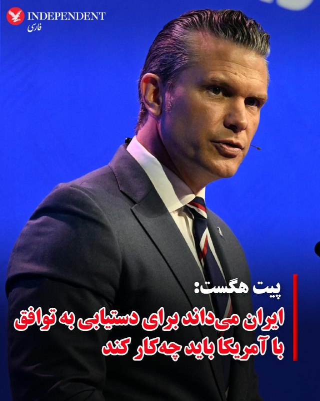

♦️پیت هگست، وزیر جنگ ایالات متحده روز شنبه نهم خرداد گفت مقام‌های جمهوری اسلامی ایران می‌دانند که برای دستیابی به توافق با آمریکا باید چه کاری را انجام دهند.

هگست که برای شرکت در کنفرانس دفاعی شانگری-لا به سنگاپور سفر کرده است گفت: مذاکرات با ایران در حال پیشرفت و سازنده بوده است. وزیر جنگ آمریکا بار دیگر تاکید کرد که دونالد ترامپ تنها توافقی را امضا خواهد کرد که برای ایالات متحده عالی و برای امنیت جهانی، مفید باشد.

هگست ساعاتی پیش گفته بود که آمریکا در صورت شکست مذاکرات، برای از سرگیری جنگ با ایران کاملا آماده است.
‌🇸🇦 Indypersian

🤖 @VahidOOnLine

## VahidOOnLine — post 242904

  

سعید آجرلو، از چهره‌های رسانه‌ای نزدیک به هیات مذاکراتی جمهوری اسلامی، گفت که دسترسی غیرقابل برگشت به ۱۲ میلیارد دلار از اموال بلوکه‌شده از شروط اصلی تفاهم احتمالی است.
او افزود: «این مبلغ باید به صورت غیرقابل برگشت در اختیار بانک مرکزی قرار ‌گیرد.»
آجرلو گفت که در طرح ۱۴ ماده‌ای، معافیت تحریم‌های نفتی و رفع محاصره دریایی به عنوان گام نخست پیش‌بینی شده و در صورت اجرای تعهدات از سوی آمریکا، جمهوری اسلامی وارد مرحله بعدی می‌شود.
به گفته آجرلو، اگر مرحله نخست اجرا نشود، اعتمادی برای ادامه مذاکرات وجود نخواهد داشت.
‌🏁 🇬🇧 IranintlTV

🤖 @VahidOOnLine

## VahidOOnLine — post 242903

  

کتائب حزب‌الله عراق، یکی از گروه‌‌های نیابتی جمهوری اسلامی، در بیانیه‌ای نوشت سفیران آمریکا و بریتانیا باید از آنچه «دخالت در امور داخلی عراق» خوانده، دست بردارند.
این گروه برخی سیاستمداران عراقی را به تکرار مواضع «دشمنان» متهم کرد و گفت عربستان سعودی مقرهای حشد شعبی را هدف قرار داده و اردن به محلی برای فعالیت اسرائیل علیه عراق تبدیل شده است.
کتائب حزب‌الله افزود از واگذاری فعالیت‌های نظامی به نهادهای رسمی حمایت می‌کند و آماده است با هماهنگی فرماندهی حشد شعبی در جمع‌آوری و ساماندهی سلاح‌ها مشارکت کند.
‌🏁 🇬🇧 IranintlTV

🤖 @VahidOOnLine

## VahidOOnLine — post 242902

  

♦️شیخ سعودعبدالرحمن آل ثانی، معاون نخست وزیر قطر روز شنبه در کنفرانس دفاعی آسیایی «شانگری-لا» در سنگاپور گفت که قطر با هزینه‌های قانونی دائمی برای عبور و مرور از تنگه هرمز مخالف است، اما عوارض موقت قابل مذاکره است و می‌تواند به احیای عبور و مرور عادی از این آبراه کلیدی کمک کند.

به گزارش بلومبرگ، این اظهارات در حالی بیان می‌شود که جمهوری اسلامی و عمان در حال بررسی اخذ عوارض دائمی از تنگه هرمز هستند. این در حالی است که قطر تلاش می‌کند تا همزمان به تعادلی میان یک راهبرد واحد در منطقه خلیج فارس و مناسبات با جمهوری اسلامی ایران و متحدان تهران دست یابد.

دونالد ترامپ، رئیس جمهوری آمریکا بارها مخالفت قاطع خود را با پرداخت عوارض تردد در تنگه هرمز اعلام کرده است.
‌🇸🇦 Indypersian

🤖 @VahidOOnLine

## WithYashar — post 12935

وزیر جنگ آمریکا: به محاصره دریایی ادامه میدهیم.
@withyashar

## mwarmonitor — post 9915

🔴 مرکز امنیت دریایی عمان: از کشتی‌ها می‌خواهیم در پی مشاهده یک جسم شناور که احتمال می‌رود مین باشد، در غرب منطقه عبور در تنگه هرمز، احتیاط کنند.

@mwarmonitor

## mwarmonitor — post 9914

✈️ هواپیماهای جنگی در آسمان پایتخت عراق، بغداد، در حال پرواز هستند.

@mwarmonitor

## mwarmonitor — post 9913

🔸ایران نشان می‌دهد که در مذاکرات هسته‌ای بر موضع اولیه خود پایبند است و انتظار نمی‌رود امتیازهای عمده‌ای بدهد. همچنین همچنان برخی خواسته‌های کلیدی آمریکا را رد می‌کند، از جمله تحویل دادن ذخایر اورانیوم بسیار غنی‌شده و ایجاد تغییر در سیاست هسته‌ای اصلی خود. نیویورک تایمز

@mwarmonitor

## FoxNewsTwitter — post 342420

‌Fox News (Twitter/X)

👉 Full story here:

## FoxNewsTwitter — post 342419

  

Fox News (Twitter/X)

Twitch streamer Hasan Piker called Progressive International coordinator David Adler his 'comrade' on livestream — the same organizer who sat in a VIP seat beside Cuba's president during the convoy trip now under federal investigation for possible sanctions violations.

Adler's organization, Progressive International, counts Raúl Castro's daughter Mariela Castro Espín on its advisory council. Federal subpoenas target Piker and CodePink's Medea Benjamin for travel, communications and financial records tied to possible contacts with Cuban government entities.

The convoy brought an estimated 650 delegates from 33 countries to Havana in March.

## pm_afshaa — post 91893

🔴پیت هگست:به محاصره دریایی ایران ادامه خواهیم داد

💧 Rainbet.com the #1 Non-KYC Crypto Casino & Sportsbook @rainbetcom

😁 @Pm_Afshaa

## pm_afshaa — post 91892

🔴نیویورک تایمز: جمهوری‌اسلامی به آمریکا پیشنهاد سرمایه‌گذاری تو ایران رو داده

💧 Rainbet.com the #1 Non-KYC Crypto Casino & Sportsbook @rainbetcom

😁 @Pm_Afshaa

## DEJradio — post 5138

👑🎥 حضور شاهزاده رضا پهلوی در نشست امنیت دریای سیاه در اوکراین

رسانه‌های اوکراینی با انتشار تصاویری، از حضور شاهزاده رضا پهلوی در نشست امنیت دریای سیاه در شهر اودسای اوکراین خبر دادند.

#شاهزاده_رضا_پهلوی #اوکراین
@DEJradio

## DEJradio — post 5137

  <a href="telegram/content/DEJradio_5137_1780142497.mp4" target="_blank">🎬 Download video</a>

🔺🎥 فینال لیگ قهرمان اروپا؛ تمهیدات امنیتی در بوداپست

فینال لیگ قهرمانان اروپا شنبه‌شب نهم خرداد بین آرسنال و پاری‌سن ژرمن در بوداپست برگزار خواهد شد.
فروشگاه‌ها در مرکز پاریس در حال تخته‌کوبی و محافظت از ویترین‌های خود هستند، زیرا انتظار می‌رود صرف‌نظر از اینکه پاریس عنوان قهرمانی را ببازد یا ببرد، شورش و درگیری اتفاق بیافتد.

#لیگ_قهرمانان_اروپا #فوتبال
@DEJradio

## DEJradio — post 5136

  <a href="telegram/content/DEJradio_5136_1780142501.mp4" target="_blank">🎬 Download video</a>

⚽️
🔺 مهدی رستم‌پور، روزنامه‌نگار ورزشی، با انتقاد از بی‌تفاوتی و سکوت بازیکنان‌ و مربیان تیم فوتبال جمهوری اسلامی در قبال ظلم و ستم حکومت به مردم می‌گوید "جنگ که شروع شد قلعه‌نوعی رفت ویلای آلانیا".

#جنگ #فوتبال
@DEJradio

## IranIntlTV — post 339729

  <a href="telegram/content/IranIntlTV_339729_1780142503.mp4" target="_blank">🎬 Download video</a>

مروری بر روزنامه‌های ایران، شنبه ۹ خرداد، با مجتبی هاشمی، روزنامه‌نگار

@iranintltv

## IranIntlTV — post 339728

  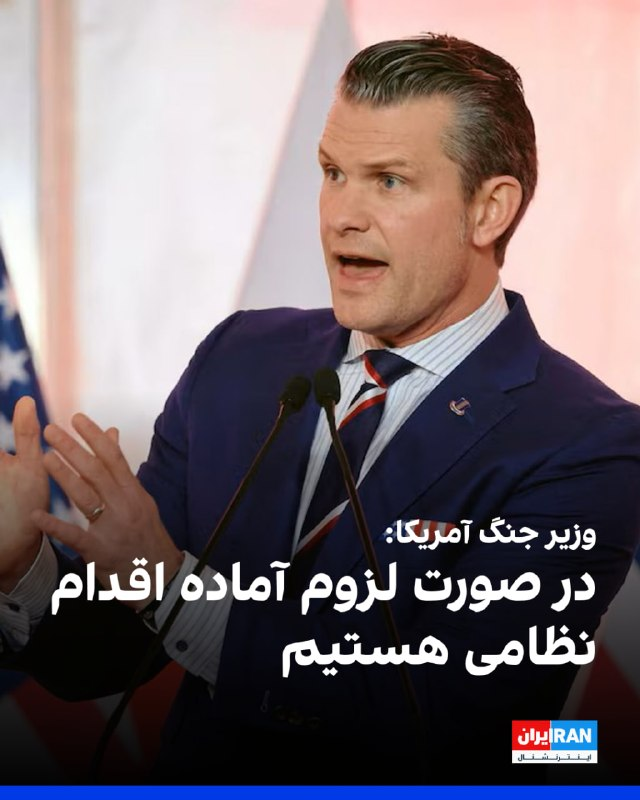

پیت هگست، وزیر جنگ آمریکا، با اشاره به سخنان دونالد ترامپ درباره احتمال جنگ دوباره در صورت شکست مذاکرات با جمهوری اسلامی گفت واشینگتن اکنون در موقعیت قوی‌تری قرار دارد و در صورت لزوم آماده اقدام نظامی است.
هگست افزود با این حال ترجیح ترامپ این است که کار به گزینه نظامی نکشد.

## IranIntlTV — post 339727

  <a href="telegram/content/IranIntlTV_339727_1780142507.mp4" target="_blank">🎬 Download video</a>

یک شهروند بازنشسته با ارسال پیامی به ایران اینترنشنال از وضعیت معیشتی خود روایت کرده و می‌گوید پرداخت حقوق بازنشستگی هم تفاوتی در وضعیتش ایجاد نمی‌کند. بازخوانی پیام این شهروند و تصویرسازی با هوش مصنوعی انجام گرفته است.

## IranIntlTV — post 339726

  

پیت هگست، وزیر جنگ آمریکا، در حاشیه نشست «گفت‌وگوی شانگری‌لا» در سنگاپور، درباره محاصره بنادر و سواحل جنوبی ایران گفت: «محاصره دریایی ادامه دارد و این اقدام موثر بوده و کنترل تنگه هرمز در اختیار آمریکا است.»
او افزود تنگه هرمز باید برای همه کشورها باز و بدون عوارض باقی بماند.

## IranIntlTV — post 339725

  <a href="telegram/content/IranIntlTV_339725_1780142510.mp4" target="_blank">🎬 Download video</a>

کارزار «خشم اقتصادی» آمریکا علیه جمهوری اسلامی همچنان ادامه دارد. در همین راستا، وزارت خزانه‌داری آمریکا یک شبکه تامین‌کننده نرم‌افزار و سخت‌افزار مرتبط با امنیت شبکه و فناوری‌های رمزنگاری برای نیروهای مسلح جمهوری اسلامی را تحریم کرد. هم‌زمان، اسکات بسنت، وزیر خزانه‌داری آمریکا، اعلام کرد واشینگتن تاکنون یک میلیارد دلار دارایی رمزارزی مرتبط با جمهوری اسلامی را توقیف کرده است.

گفت‌وگو با آرش آزرمی، دبیر بخش اقتصادی ایران‌اینترنشنال
@iranintltv

## IranIntlTV — post 339723

  

سعید آجرلو، از چهره‌های رسانه‌ای نزدیک به هیات مذاکراتی جمهوری اسلامی، گفت که دسترسی غیرقابل برگشت به ۱۲ میلیارد دلار از اموال بلوکه‌شده از شروط اصلی تفاهم احتمالی است.
او افزود: «این مبلغ باید به صورت غیرقابل برگشت در اختیار بانک مرکزی قرار ‌گیرد.»
آجرلو گفت که در طرح ۱۴ ماده‌ای، معافیت تحریم‌های نفتی و رفع محاصره دریایی به عنوان گام نخست پیش‌بینی شده و در صورت اجرای تعهدات از سوی آمریکا، جمهوری اسلامی وارد مرحله بعدی می‌شود.
به گفته آجرلو، اگر مرحله نخست اجرا نشود، اعتمادی برای ادامه مذاکرات وجود نخواهد داشت.

## IranIntlTV — post 339722

  

کتائب حزب‌الله عراق، یکی از گروه‌‌های نیابتی جمهوری اسلامی، در بیانیه‌ای نوشت سفیران آمریکا و بریتانیا باید از آنچه «دخالت در امور داخلی عراق» خوانده، دست بردارند.
این گروه برخی سیاستمداران عراقی را به تکرار مواضع «دشمنان» متهم کرد و گفت عربستان سعودی مقرهای حشد شعبی را هدف قرار داده و اردن به محلی برای فعالیت اسرائیل علیه عراق تبدیل شده است.
کتائب حزب‌الله افزود از واگذاری فعالیت‌های نظامی به نهادهای رسمی حمایت می‌کند و آماده است با هماهنگی فرماندهی حشد شعبی در جمع‌آوری و ساماندهی سلاح‌ها مشارکت کند.

## IranIntlTV — post 339721

  <a href="telegram/content/IranIntlTV_339721_1780142514.mp4" target="_blank">🎬 Download video</a>

سرخط خبرهای شنبه ۹ خرداد
@iranintltv

## IranIntlTV — post 339719

  <a href="telegram/content/IranIntlTV_339719_1780142516.mp4" target="_blank">🎬 Download video</a>

سازمان رادیو و تلویزیون اسرائیل گزارش داد ارتش این کشور در مذاکرات با لبنان، نقشه‌هایی از مواضع حزب‌الله را به بیروت ارائه داده تا برای برچیدن این مراکز اقدام کند.

اشکان صفایی، خبرنگار ایران‌اینترنشنال، گزارش می‌دهد
@iranintltv

## IranIntlTV — post 339718

  <a href="telegram/content/IranIntlTV_339718_1780142519.mp4" target="_blank">🎬 Download video</a>

یک شهروند با ارسال پیامی به ایران اینترنشنال با روایت از اوضاع بد معیشتی از دست‌فروشی پدرش و حسرت داشتن کالاهای مورد علاقه‌اش می‌گوید. بازخوانی پیام این شهروند و تصویرسازی با هوش مصنوعی انجام گرفته است.

## Shin_Persian — post 6319

Shin ✓ @hey_itsmyturn
Sat, 30 May 2026 11:59:41 UTC

Jet activity over Baghdad, #Iraq 🇮🇶

فارسی

فعالیت جت‌ها بر فراز بغداد، #Iraq 🇮🇶

𝕏 · @shin_persian

## FarsiVOA — post 219065

  

سازمان امنیت و اطلاعات دانمارک طی گزارشی از «تهدیدات تروریستی فزاینده» جمهوری اسلامی در این کشور خبر داد و ایران را در رده چهار از پنج درجه تهدید امنیتی قرار داد.

در گزارش سالانه این نهاد امنیتی گفته می‌شود که در سال گذشته، بازیگران دولتی به طور فزاینده‌ای بر تهدیدهای تروریستی در دانمارک تأثیر گذاشته‌اند: «این موضوع به طور خاص در مورد ایران صدق می‌کند که به ویژه تهدیدی علیه منافع اسرائیل و جامعه یهودی در اروپا، از جمله دانمارک، ایجاد می‌کند. استفاده نهادهای اطلاعاتی جمهوری اسلامی از شبکه‌های مجرمانه برای انجام حملات تروریستی افزایش یافته و این امر تهدیدها را بیشتر از قبل غیرقابل پیش‌بینی‌ می‌کند».

این تحلیل به جنگ اخیر اسرائیل و آمریکا با جمهوری اسلامی اشاره کرده و هشدار داده که رژیم ایران در حال حاضر قصد قوی‌تری برای هدایت یا حمایت از اقدامات خشونت‌آمیز در اروپا دارد.

سازمان امنیت و اطلاعات دانمارک همچنین گفته است جمهوری اسلامی فعالیت اوپوزیسیون را تهدیدی برای بقای خود می‌داند و به طور مداوم به دنبال حمله به مخالفان و منتقدان خود در داخل و خارج از کشور است.
@FarsiVOA

## FarsiVOA — post 219064

🔺بلومبرگ: آمریکا درباره توافق با تهران برای عبور از تنگه هرمز هشدار تحریمی داد

▪️وزارت خزانه‌داری آمریکا هشدار داده هرگونه توافق با جمهوری اسلامی برای عبور امن از تنگه هرمز، حتی اگر شامل پرداخت مستقیم پول نباشد، می‌تواند با خطر تحریم روبه‌رو شود.

▪️دفتر کنترل دارایی‌های خارجی در به‌روزرسانی ۲۹ مه اعلام کرد دریافت خدمات یا تضمین از دولت ایران یا سپاه پاسداران برای عبور امن از تنگه هرمز برای اشخاص آمریکایی ممنوع است.

▪️همزمان، قطر موضعی متفاوت اما محتاطانه اتخاذ کرده است. شیخ سعود بن عبدالرحمن آل‌ثانی، وزیر مشاور در امور دفاعی قطر، گفته دوحه با دریافت عوارض دائمی از کشتی‌های عبوری مخالف است، اما دریافت عوارض موقت برای مواردی مانند پاکسازی مین می‌تواند قابل مذاکره باشد.

⬇️ بیشتر بخوانید:
https://ir.voanews.com/a/8155548.html

## FarsiVOA — post 219063

  

ایلنا به نقل از سخنگوی انجمن روانپزشکان ایران، گزارش داد که در یک نظرسنجی از ۲۵۴ دستیار پزشکی، ۸۱.۵ درصد گفته‌اند تمایل به مهاجرت دارند. همچنین ۷۹.۵ درصد اعلام کرده‌اند اگر پیش از ورود به دوره تخصص شناخت امروز خود را از شرایط دستیاری داشتند، مهاجرت را به رزیدنتی ترجیح می‌دادند.

امیرحسین جلالی ندوشن این وضعیت را نشانه «فرسایش جدی» در نیروی انسانی سلامت دانسته و گفته مسئله فقط مهاجرت نیست، بلکه کاهش امید، بی‌اعتمادی به آینده حرفه‌ای و فرسودگی در ساختار درمانی کشور است.

این آمار در ادامه سال‌ها بحران در جامعه رزیدنتی منتشر می‌شود؛ از کشیک‌های طولانی، فشار معیشتی، اعتراض به آزمون‌ها و تصمیم‌های وزارت بهداشت تا هشدارها درباره افزایش خودکشی میان دستیاران پزشکی.

پیش‌تر در نشست کارگروه ویژه نظام پزشکی اعلام شده بود میزان خودکشی در جمعیت رزیدنتی چند برابر سایر گروه‌هاست.

اعتراض‌های صنفی رزیدنت‌ها نیز در سال‌های گذشته بارها با احضار، فشار انضباطی و بی‌اعتنایی نهادی روبه‌رو شده است.
@FarsiVOA

## FarsiVOA — post 219062

🔺از فروش خانه و طلا تا کمبود دارو؛ بحران نقدینگی زنجیره دارو را زمین‌گیر کرد

▪️بحران نقدینگی در بازار داروی ایران به مرحله‌ای رسیده که مقام‌های صنفی و نمایندگان مجلس می‌گویند برخی داروخانه‌داران برای پاس کردن چک‌های خرید دارو، ناچار به فروش خانه، طلا و دارایی‌های شخصی شده‌اند.

▪️معاون حقوقی انجمن داروسازان ایران گفته است ۱۷ هزار داروخانه خصوصی کشور در دوره جنگ اخیر مانند یک «ستاد بحران» عمل کردند و اجازه ندادند اختلال زنجیره تأمین دارو به نگرانی اجتماعی گسترده تبدیل شود.

▪️اما پشت این استمرار ظاهری، بحران مالی سنگینی قرار دارد؛ مجموع مطالبات داروخانه‌های سرپایی بخش خصوصی از بیمه‌ها به ۳۶.۷۸ هزار میلیارد تومان رسیده است؛ شامل ۱۱.۳۸ همت سهم ارز و ۲۵.۴ همت سهم سازمان‌های بیمه‌گر.

⬇️ بیشتر بخوانید:
https://ir.voanews.com/a/8155541.html

## FarsiVOA — post 219061

🔺جمهوری اسلامی اموال ۱۰۸ نفر را در گلستان و خراسان جنوبی توقیف کرد

▪️روند تازه نشان می‌دهد جمهوری اسلامی سیاست توقیف دارایی ایرانیان خارج از کشور را از یک اقدام موردی به ابزار فشار امنیتی و مالی تبدیل کرده است.

⬇️ بیشتر بخوانید:
https://ir.voanews.com/a/8155543.html

## FarsiVOA — post 219060

🔺پنتاگون: بیش از ۶۰۰ حمله جمهوری اسلامی و گروه‌های نیابتی علیه منافع آمریکا و متحدانش

▪️گزارش تازه بازرس کل ارشد وزارت جنگ آمریکا درباره عملیات «خشم حماسی» نشان می‌دهد که جمهوری اسلامی و گروه‌های وابسته به آن، در واکنش به آغاز عملیات «خشم حماسی»، دست به حملات تلافی‌جویانه گسترده‌ای علیه تأسیسات آمریکا، متحدانش و اهداف مرتبط با ائتلاف در عراق و منطقه زده‌اند.

▪️بر اساس این گزارش، شبه‌نظامیان مستقر در عراق با استفاده از پهپاد، راکت و موشک به اهداف ائتلاف حمله کرده‌اند.

▪️این گزارش حملات در عراق را عمدتاً به گروه‌های تندروی همسو با تهران نسبت می‌دهد؛ از جمله کتائب حزب‌الله، کتائب سیدالشهدا و حرکت النجباء. این گزارش می‌افزاید این گروه‌ها احتمالاً با هدایت مستقیم سپاه پاسداران عمل کرده‌اند.

⬇️ بیشتر بخوانید:
https://ir.voanews.com/a/8155544.html

## FarsiVOA — post 219059

🔺فشار گرانی بر سفره مردم؛ افزایش دوباره قیمت روغن در انتظار چراغ سبز دولت

▪️سخنگوی اتحادیه بنکداران مواد غذایی از پیشنهاد افزایش دوباره قیمت روغن خبر داده و گفته قیمت این کالای اساسی نسبت به سال گذشته حدود سه برابر شده است؛ افزایشی که به گفته او قدرت خرید خانوارها را به‌شدت کاهش داده است.

▪️در هفته‌های اخیر، افزایش قیمت نان نیز با حاشیه‌های گسترده همراه شد؛ از اعلام نرخ‌های جدید برای نان‌های پرمصرف تا روایت‌های میدانی شهروندانی که دیگر توان خرید یک نان کامل را ندارند و به خرید نصف نان یا نان تکه‌ای رسیده‌اند.

▪️در بازار مرغ، گوشت قرمز و برنج نیز شرایط مشابهی دیده می‌شود. مرغ که زمانی جایگزین ارزان‌تر گوشت قرمز بود، حالا برای بسیاری خانوارها به کالایی پرهزینه تبدیل شده است.

⬇️ بیشتر بخوانید:
https://ir.voanews.com/a/8155540.html

## FarsiVOA — post 219058

🔺از کمبود دارو تا نسخه‌نویسی بر اساس موجودی؛ دولت بحران دارو را به بیمار منتقل می‌کند

▪️سازمان غذا و دارو اعلام کرده است پزشکان تا کمتر از یک ماه دیگر هنگام نسخه‌نویسی، به اطلاعات کمبودهای دارویی و میزان مصرف دارو دسترسی خواهند داشت.

▪️اکبر عبداللهی، مدیرکل دارو و مواد تحت کنترل سازمان غذا و دارو، روز ۹ خرداد ۱۴۰۵ گفت سامانه نسخه‌نویسی به اطلاعات کمبودهای دارویی متصل می‌شود و همزمان «کارنامه پزشک» نیز بار مالی تجویز هر پزشک را به‌صورت برخط نشان خواهد داد.

▪️جمهوری اسلامی به جای تأمین پایدار داروی مورد نیاز، نظام نسخه‌نویسی را به سمتی می‌برد که پزشک پیش از تجویز، نه فقط نیاز درمانی بیمار، بلکه موجودی بازار و هزینه نسخه برای نظام سلامت را هم محاسبه کند.

⬇️ بیشتر بخوانید:
https://ir.voanews.com/a/government-passing-drug-crisis-on-to-patients/8155539.html

## DW_Farsi — post 125316

  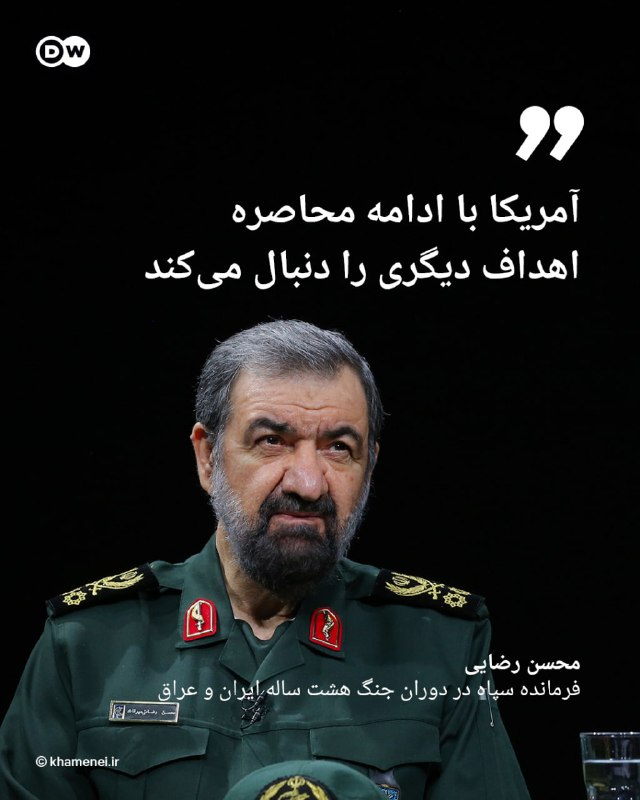

🔸 محسن رضایی: آمریکا با ادامه محاصره اهداف دیگری را دنبال می‌کند

محسن رضایی، فرمانده سپاه در دوران جنگ هشت ساله ایران و عراق، روز شنبه ۹ خرداد (۳۰ مه) در شبکه اجتماعی ایکس مدعی شد دونالد ترامپ، رئیس جمهور آمریکا با ادامه محاصره دریایی کشتی‌های مرتبط با ایران، "دیپلماسی را نقض کرده است".

رضایی گفته است: «همان‌طور که انتظار می‌رفت، رئیس‌جمهور ایالات متحده برای سومین بار دیپلماسی را نقض می‌کند.»

به گفته رضایی دو مورد قبلی احتمالا به حمله هوایی اسرائیل علیه ایران در ژوئن سال گذشته و همچنین حمله مشترک آمریکا و اسرائیل در ۲۸ فوریه سال جاری مربوط می‌شود؛ حملاتی که در جریان مذاکرات غیرمستقیم هسته‌ای ایران و آمریکا رخ دادند.

رضایی در پیام خود همچنین گفته است "با ادامه محاصره دریایی و زیاده‌خواهی در مذاکرات" آمریکا نشان می‌دهد اهل مذاکره نیست و اهداف دیگری را دنبال می‌کند.
@dw_farsi

## DW_Farsi — post 125315

🔸 هشدار اشتاین‌مایر درباره گرایش‌های اقتدارگرایانه در جهان

فرانک والتر اشتاین‌مایر، رئیس جمهور آلمان، در مراسم اهدای "جایزه آزادی هامباخ"، نسبت به گرایش‌های اقتدارگرایانه در جهان هشدار داد. به گفته او، دموکراسی، حاکمیت قانون و نهادهای مستقل در سطح بین‌المللی تحت فشار قرار دارند.

اشتاین‌مایر دیروز جمعه ۲۹ مه (۸ خرداد) گفت دولت‌های اقتدارگرا می‌کوشند نهادهای نظارتی دموکراتیک، از جمله رسانه‌های مستقل، فرهنگ و دستگاه قضایی را بی‌اعتبار کرده و از میان بردارند.

اشتاین‌مایر با بیان اینکه شهروندان در یک نظام دموکراتیک در برابر چنین تحولاتی ناتوان نیستند، تأکید کرد: «گرایش‌های اقتدارگرایانه سرنوشتی نیستند که نتوان از آن گریخت. برعکس، همه ما دارای حق انتخابیم و می‌توانیم با رأی خود تصمیم بگیریم.»

اشتاین‌مایر جایزه آزادی هامباخ را به آدام بودنار، حقوقدان قانون اساسی و وزیر پیشین دادگستری لهستان، اهدا کرد. او برنده این جایزه را مبارزی پرشور برای حقوق بشر، دموکراسی و حاکمیت قانون توصیف کرد.

رئیس‌جمهور آلمان گفت بودنار از همان ابتدا درباره خطرات پیش روی استقلال نهادهای دموکراتیک هشدار داده و در برابر دخالت‌ها در دستگاه قضایی ایستادگی کرده است.

اشتاین‌مایر گفت قلعه هامباخ و رنگ‌های سیاه، سرخ و طلایی، نماد آزادی، دموکراسی و تفاهم میان ملت‌ها هستند. او افزود: «از همه کسانی نیز که از این مکان و از پرچم ما در برابر کسانی که امروزه به دنبال سوءاستفاده از آنها به نفع یک ناسیونالیسم جدید و تفکر اقتدارگرایانه هستند، سپاسگزاری می‌کنم.»
@dw_farsi

## DW_Farsi — post 125314

  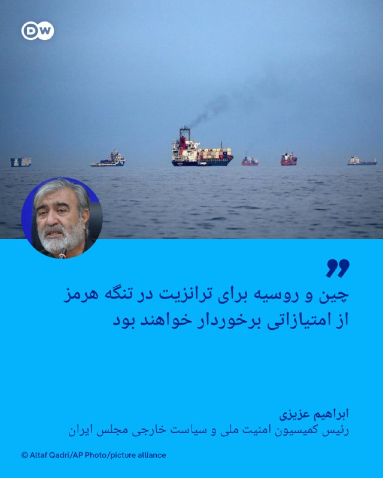

🔸 عزیزی: چین و روسیه برای ترانزیت در تنگه هرمز از امتیازاتی برخوردار خواهند بود

ابراهیم عزیزی، رئیس کمیسیون امنیت ملی و سیاست خارجی مجلس شورای اسلامی روز جمعه ۸ خرداد (۲۹ مه) در گفت‌وگو با خبرگزاری روسی ریانووستی گفت "تنگه هرمز در جغرافیای ایران قرار دارد و تصمیم‌گیری درباره تردد در این آبراه حق ایران است و هیچ طرفی نمی‌تواند آن را زیر سئوال ببرد."

او همچنین اعلام کرد کشورهای راهبردی مانند چین و روسیه از شرایط ویژه برای ترانزیت در تنگه هرمز برخوردار خواهند بود و این کشورها به دلیل همکاری‌های گذشته با ایران، در سامان‌دهی عبور و مرور دریایی از امتیازاتی بهره‌مند می‌شوند.

عزیزی در بخش دیگری از سخنانش به سازوکار جدید تردد در تنگه هرمز با همکاری ایران و عمان اشاره کرد و گفت امنیت کشتیرانی باید به‌گونه‌ای تامین شود که هم منافع ایران و هم منافع جامعه بین‌المللی حفظ شود.

مساله دریافت ترانزیت از سوی جمهوری اسلامی اما اقدامی تلقی می‌شود که با قوانین بین‌المللی همخوانی ندارد و از سوی کشورهای منطقه، اروپا، آمریکا و دیگر کشورها با مخالفت شدیدی روبرو شده است.
@dw_farsi

## DW_Farsi — post 125313

🔸 گفت‌وگوهای پاریس و برلین بر سر "بازدارندگی هسته‌ای"

آلمان و فرانسه گفت‌وگوهای برنامه‌ریزی‌شده برای همکاری نزدیک‌تر در زمینه بازدارندگی هسته‌ای را آغاز کرده‌اند. هفته‌نامه اشپیگل گزارش داده است که گونتر زاوتر، مشاور امنیتی صدراعظم آلمان، چهارشنبه گذشته ۲۷ مه (۶ خرداد) برای نخستین دور این مذاکرات به پاریس سفر کرده است.

طبق گزارش این هفته‌نامه آلمانی، همچنین کشورهای اروپایی دیگری نیز در این رایزنی‌ها در پاریس حضور داشته‌اند. بر اساس این گزارش، نشست بعدی آلمان و فرانسه پیش از تعطیلات تابستانی در آلمان برگزار خواهد شد.

فریدریش مرتس، صدراعظم آلمان، و امانوئل مکرون، رئیس‌جمهوری فرانسه، پیش‌تر در ماه مارس یک "گروه راهبری هسته‌ای" تشکیل داده بودند تا جزئیات همکاری را بررسی کند.

گروه راهبری آلمان و فرانسه که مکرون و مرتس در بهار امسال ایجاد کردند، برای آمادگی در شرایط بحرانی، در حال برنامه‌ریزی برای برگزاری مانورهای مشترک است.

بر این اساس، ارتش آلمان می‌تواند در بخش متعارف رزمایش‌های هسته‌ای فرانسه شرکت کرده و به تأسیسات هسته‌ای فرانسه نیز دسترسی پیدا کند.

طبق گزارش اشپیگل، نخستین مشارکت آلمان در یکی از رزمایش‌های موسوم به "پوکر" برای همین سال جاری (۲۰۲۶) برنامه‌ریزی شده و احتمالاً در ماه سپتامبر انجام خواهد شد.
@dw_farsi

## Persian_Trend_Official — post 15333

  <a href="telegram/content/Persian_Trend_Official_15333_1780142525.webm" target="_blank">🎬 Download video</a>

الجزیره: جنگ بین ایران، اسرائیل و ایالات متحده وارد روز 92 خود شده است در حالی که رئیس‌جمهور دونالد ترامپ همچنان در حال بررسی توافق پیشنهادی برای تمدید آتش‌بس و بازگشایی تنگه هرمز است.

مذاکرات درباره برنامه هسته‌ای ایران، رفع تحریم‌ها و آینده ذخایر اورانیوم غنی‌شده تهران همچنان ادامه دارد، در حالی که هر دو طرف واشنگتن و تهران یکدیگر را به نقض آتش‌بس متهم می‌کنند.

تنش‌های منطقه‌ای علی‌رغم تلاش‌های دیپلماتیک همچنان بالا است، با فعالیت‌های نظامی مداوم در خلیج و اطراف آن، عملیات‌های اسرائیل در سراسر منطقه و عدم قطعیت درباره اینکه آیا توافق نهایی بین ایالات متحده و ایران می‌تواند حاصل شود یا خیر.

📝 Amir

📌 @persian_trend_official
پرشین ترند | متفاوت‌ترین کانال نظامی

## Persian_Trend_Official — post 15332

  

یک منبع ارشد نظامی لبنان به خبرگزاری آناتولی گفت: نیروهای اسرائیلی از رودخانه لیتانی در جنوب لبنان عبور کرده و به حومه شهر نبطیه رسیده‌اند.

📝 Amir

📌 @persian_trend_official
پرشین ترند | متفاوت‌ترین کانال نظامی

## Persian_Trend_Official — post 15331

  <a href="telegram/content/Persian_Trend_Official_15331_1780142527.webm" target="_blank">🎬 Download video</a>

محسن رضایی، مشاور نظامی رهبر جمهوری اسلامی ایران: همانطور که پیشبینی میشد رئیس جمهور آمریکا برای سومین بار در حال خیانت به دیپلماسی است.

او با ادامه محاصره دریایی و زیاده‌خواهی در مذاکرات ثابت کرد که اهل مذاکره نیست و اهداف دیگری را دنبال می‌کند.

📝 Amir

📌 @persian_trend_official
پرشین ترند | متفاوت‌ترین کانال نظامی

## Persian_Trend_Official — post 15330

  

چهارمین بیانیه امروز ارتش اسرائیل

هشدار فوری به ساکنان لبنان که در شهرها و روستاهای زیر حضور دارند:
المروانیه،اللویزه،میدون
،انصاریه،زفتا،تفاحتا

با توجه به اینکه حزب‌الله توافق آتش‌بس را نقض کرده است، ارتش اسرائیل مجبور به اقدام علیه آن با قدرت می‌شود. ارتش اسرائیل قصد آسیب رساندن به شما را ندارد.
برای حفظ امنیت خود، باید فوراً خانه‌های خود را تخلیه کرده و به شمال رودخانه زهرانی منتقل شوید.
هر کسی که در نزدیکی نیروهای حزب‌الله، تأسیسات آن یا تجهیزات رزمی آن حضور داشته باشد، جان خود را در معرض خطر قرار می‌دهد.

👺Phantom

📌 @persian_trend_official
پرشین ترند | متفاوت‌ترین کانال نظامی

## RadioFarda — post 157719

حج در سایهٔ گرمایش زمین؛ موج گرما از مکه تا مادرید رکورد می‌شکند

🔸گرمایش زمین دیگر فقط موضوعی برای گزارش‌های علمی و هشدارهای بلندمدت نیست؛ نشانه‌های آن هم‌زمان در آیین‌های مذهبی، زندگی روزمره و زیرساخت‌های شهری دیده می‌شود. از مکه که میلیون‌ها زائر حج را در معرض گرمایی فزاینده قرار داده، تا اروپا که در ماه مه رکوردهای تازهٔ دمایی ثبت کرده و حتی شبکه آب برخی مناطق بریتانیا را زیر فشار برده است،

🔸تصویر تازه‌ای از جهان گرم‌تر در حال شکل‌گیری است: جهانی که در آن فصل‌ها دیگر همان معنای پیشین را ندارند.

🔸بر اساس تحلیل تازه گروه «نسبت‌دهی هوای جهان»، گرمایش زمین، اقلیم مکه را «به‌طور بنیادین» دگرگون کرده و زائران حج را حتی در ماه‌هایی بیرون از تابستان در معرض گرمای شدید و خطرناک قرار داده است.

🔸این بررسی می‌گوید انتشار دی‌اکسید کربن ناشی از سوخت‌های فسیلی باعث شده دمای ۴۰ درجه سانتی‌گراد اکنون در ماه مه (اردیبهشت و خرداد) نیز به‌طور منظم تجربه شود؛ دمایی که در دهه‌های گذشته عمدتاً به تابستان محدود بود.

🔸این تغییر برای حج اهمیتی حیاتی دارد، چون مناسک آن در چند روز، همراه با پیاده‌روی‌های طولانی، ازدحام شدید و حضور شمار زیادی از زائران سالمند یا دارای بیماری‌های زمینه‌ای انجام می‌شود. در سال ۲۰۲۴، زمانی که حج در ماه ژوئن برگزار شد، بیش از ۱۳۰۰ زائر بر اثر گرما و رطوبت شدید جان باختند.

🔸پژوهشگران می‌گویند اگر جهان با همین روند سیاست‌های اقلیمی پیش برود و دمای جهانی تا پایان قرن سه درجه افزایش یابد، حدود ۹۷ درصد مناسک حج در مکه با سطح خطرناک گرما روبه‌رو خواهد شد.

🔸نسخه کامل این گزارش را در وب‌سایت رادیوفردا بخوانید.

@Radiofarda

## RadioFarda — post 157718

  <a href="https://t.me/radiofarda/157718" target="_blank">📎 Download file</a>

📻بشنوید: ساعت ۱۴ با رادیوفردا، نهم خرداد ۱۴۰۵‌

@Radiofarda

## RadioFarda — post 157717

پاراگراف اول؛ تابوی اسرائیل و منطق عادی‌سازی رابطه در سایهٔ جنگ

🔸پس از جنگ ۴۰ روزهٔ اسرائیل و آمریکا با ایران، خاورمیانه وارد مرحلهٔ تازه‌ای از بازآرایی ژئوپولیتیکی شده است؛ مرحله‌ای که در آن کشورهای عربی میان سه ملاحظهٔ اصلی در حال موازنه‌اند: مهار قدرت منطقه‌ای ایران، حفظ روابط امنیتی با ایالات متحده، و مدیریت حساسیت افکار عمومی نسبت به اسرائیل و مسئلهٔ فلسطین.

🔸در این چارچوب، پیمان‌های ابراهیم که در سال ۲۰۲۰ با میانجی‌گری دونالد ترامپ، رئیس‌جمهور آمریکا، شکل گرفت، همچنان به‌عنوان مهم‌ترین الگوی عادی‌سازی روابط با اسرائیل مطرح است؛ هرچند جنگ غزه و افزایش تنش‌های منطقه‌ای، آینده و دامنهٔ آن را با ابهام روبه‌رو کرده است.

🔸امارات، بحرین و مراکش با تکیه بر منافع اقتصادی، امنیتی و فناورانه به این روند پیوسته‌اند، در حالی که عربستان سعودی عادی‌سازی را به پیشرفت واقعی در تشکیل کشور فلسطین مشروط کرده است. هم‌زمان، برخی بازیگران منطقه‌ای مانند پاکستان نسبت به گسترش این چارچوب موضعی کاملاً مخالف گرفته‌اند.

🔸اکنون بحث درباره توافقی فراتر از پیمان ابراهیم و حتی احتمال نوعی تفاهم محدود با ایران نشان می‌دهد که دولت دونالد ترامپ در پی ترسیم نظمی جدید برای خاورمیانه است؛ نظمی که در آن نفوذ آمریکا در منطقه حفظ شود، روابط اسرائیل با کشورهای مسلمانِ منطقه و فراتر از آن تقویت گردد و حضور چین محدود شود. این‌ها موضوع‌هایی هستند که به عناصر تعیین‌کننده برای آیندهٔ خاورمیانه تبدیل شده‌اند.

🔸در برنامهٔ رادیویی «پاراگراف اول»، نوید طوبیان، دانش‌آموخته اسلام‌شناسی، خاورمیانه و ایران از دانشگاه عبری اورشلیم و ساکن تل‌آویو، علی معموری دانش‌آموخته فلسفه سیاسی و الهیات و پژوهشگر در مؤسسه مطالعات شهروندی در دانشگاه دیکن از سیدنی به همراه میثم بادامچی فلسفه سیاسی از دانشگاه لوئیس رم و پژوهشگر ارشد مؤسسه مطالعه بین‌منطقه‌ای قانون اساسی‌گرایی وابسته به بخش حقوق دانشگاه چارلز از پراگ در این‌باره تبادل نظر کرده‌اند.

🔸نسخه کامل این گفت‌وگو را در وب‌سایت رادیوفردا بخوانید.

@RadioFarda

## RadioFarda — post 157716

  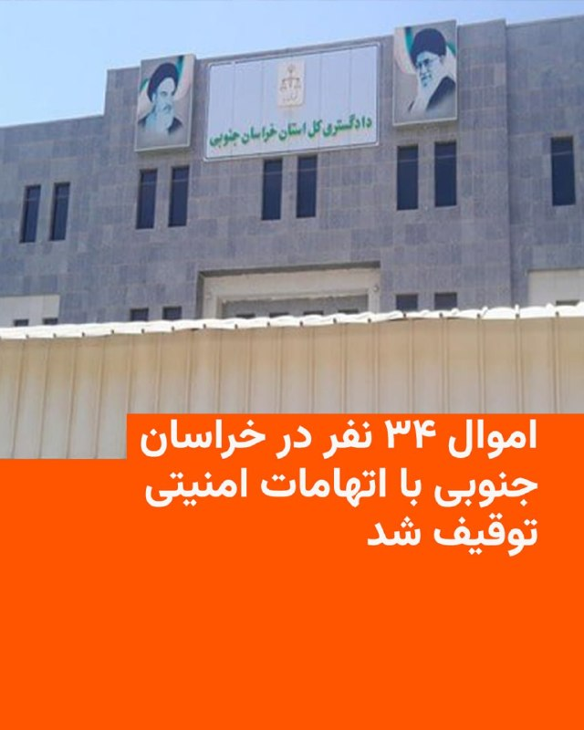

🔸رئیس کل دادگستری خراسان جنوبی روز شنبه ۹ خرداد از توقیف اموال ۳۴ نفر در این استان با اتهامات امنیتی خبر داد.

🔸محمدجعفر عبدالهی از این افراد با عنوان «عناصر حامی دشمن» نام برد و آن‌ها را به «اقدامات ضدامنیتی و همکاری با کشورهای متخاصم» متهم و اعلام کرد که اموال آن‌ها به «نفع ملت» مصادره شده است.

🔸دادگستری خراسان جنوبی اسامی این افراد را اعلام نکرده و برای اتهامات علیه این افراد شواهد و مدارکی ارائه نداده است.

🔸پیش از این نیز گزارش‌های متعددی از توقیف اموال شماری از روزنامه‌نگاران، فعالان سیاسی و مدنی، هنرمندان، ورزشکاران و چهره‌های شناخته‌شده با اتهامات مشابه در استانهای مختلف ایران منتشر شده بود.

@RadioFarda

## IranianMinds — post 21063

  <a href="telegram/content/IranianMinds_21063_1780142529.mp4" target="_blank">🎬 Download video</a>

پیت هگست وزیر جنگ آمریکا درباره ایران:

ایران می‌خواهد بگوید که کنترل تنگه را در دست دارد، اما این ما هستیم.

و همه چیز پشت صحنه نشان می‌دهد که وقتی صحبت از آن می‌شود، ما کنترل را در دست داریم.

@IranianMinds

## IranianMinds — post 21062

  

🔴ارتش اسرائیل دستور تخلیه به ساکنان جنوب لبنان به ویژه شهرها و روستاهای زیر را صادر کرد.

المروانیه، اللوبیه، میدون، انصاریه، زفتا و تفاحتا.

@IranianMinds

## IranianMinds — post 21061

  

سر لشگر و فرمانده ی خشن محسن رضایی:

ترامپ اهل مذاکره نیست و اهداف دیگری را دنبال می‌کند

@IranianMinds

## IranianMinds — post 21060

🔴 مقامات رژیم جمهوری اسلامی پیشنهاد همکاری با آمریکا را دادند!

نیویورک تایمز:

گزارش شده است که مقامات رژیم جمهوری اسلامی پیشنهاد داده‌اند شرکت‌های آمریکایی، مانند شرکت‌های نفت و انرژی، اجازه داشته باشند در ایران سرمایه‌گذاری کنند.

این توافق بسیار شبیه به «هیئت صلح» برای غزه است، جایی که تقریباً ۱۷ میلیارد دلار وعده داده شده است (که تقریباً هیچ‌کدام از آن جمع‌آوری نشده است) برای بازسازی غزه، و تاکنون هیچ هزینه‌ای برای بازسازی غزه صرف نشده است.

@IranianMinds

## BBCPersian — post 282427

🔻یک عضو هیأت رئیسه مجلس ایران گفت «به زودی طرح اعمال مدیریت و حاکمیت ایران بر تنگه هرمز در مجلس تصویب و قانونی خواهد شد.»

علیرضا سلیمی به خبرگزاری ایسنا گفت «بررسی‌های مفصلی درباره این طرح صورت گرفته و نظرات دستگاه‌های مختلف از جمله بخش‌های اقتصادی، حمل‌ونقل، امنیتی و سایر نهادهای مرتبط اخذ شده است.»

مشخص نیست طرحی که آقای سلیمی می‌گوید چند امضا دارد و قرار است چه وقت در مجلس ایران به بحث گذاشته شود. از زمان حمله آمریکا و اسرائیل به ایران، جلسات علنی مجلس شورای اسلامی در محل دائمی و همیشگی آن متوقف شده است.

تنگه هرمز که بین آب‌های ایران و عمان قرار دارد از زمان جنگ اخیر از سوی ایران کنترل می‌شود و عبور و مرور کشتی‌ها در آن به شکل محسوسی کاهش یافته است.

آقای سلیمی گفت «طرف عمانی نیز موافقت‌های اولیه خود را اعلام کرده است.»

نماینده مجلس ایران گفته «تنگه هرمز برای جمهوری اسلامی ایران از ده‌ها بمب هسته‌ای مهم‌تر و ارزشمندتر است و به هیچ وجه اعمال مدیریت بر تنگه هرمز قابل معامله نبوده، نیست و نخواهد بود.»

آمریکا گفته است که این تنگه باید برای عبور و مرور کشتی‌ها باز شود و نهاد کشتیرانی سازمان ملل متحد هم گفته است که ایده اخذ عوارض از آن را تایید نمی‌کند.

@BBCPersian

## BBCPersian — post 282426

🔻عضو کمیسیون انرژی مجلس شورای اسلامی: یک سوم ظرفیت تولید گاز در جنگ اخیر از دست رفت

یک عضو کمیسیون انرژی مجلس شورای اسلامی می‌گوید که این کشور در جریان جنگ اخیر با آمریکا و اسرائیل «حدود یک سوم ظرفیت تولید گاز» خود را از دست داده است.

غلامرضا دهقان ناصرآبادی با اشاره به آسیب دیدن «فازهای چندگانه عسلویه» در میدان گازی پارس جنوبی، گفت: «وزارت نیرو و وزارت نفت تمام تلاش خود را برای‌ بازسازی و بازگشت به ظرفیت تولید قبل از جنگ به کار بسته‌اند.»

بخش عمده گاز تولیدی ایران از میدان گازی پارس جنوبی تامین می‌شود که با کشور قطر مشترک است.
@BBCPersian

## BBCPersian — post 282425

🔻دسترسی پزشکان ایران به لیست داروهای کمیاب در سامانه نسخه‌‌نویسی

اکبر عبداللهی، مدیرکل دارو و مواد تحت کنترل سازمان غذا و داروی ایران خبر داد که از یک ماه دیگر پزشکان هنگام تجویز دارو به فهرستی از داروهای کمیاب، دسترسی خواهند داشت.

به گفته این مقام ارشد دولت، فهرستی که در اختیار پزشکان قرار خواهد گرفت «میزان کمبود دارویی و اطلاعات آماری مربوط به میزان تجویز و بار مالی داروهای تجویزی» را شامل می‌شود.

این خبر در حالی منتشر می‌شود که بارها گزارش‌هایی از تشدید مشکل کمبود دارو در ایران منتشر شده است.

ایران می‌گوید تحریم‌ها و حملات آمریکا و اسرائیل به مراکز تولید دارو از جمله دلایل کمبود داروهاست.

اکبر عبداللهی گفت اکنون در وزارت بهداشت یک «کمیته تجویز و مصرف» تشکیل شده است و قرار است «کمتر از یک ماه دیگر» اجرایی شود.

به گفته آقای عبداللهی، علاوه بر سامانه «نسخه‌نویسی» که پزشکان در زمان تجویز به اطلاعات کمبودهای دارویی دسترسی خواهند داشت، سامانه دیگری با عنوان «کارنامه پزشک» ایجاد خواهد شد که در آن، «بار مالی تحمیل‌شده از سوی پزشک به نظام سلامت، هنگام نسخه‌نویسی برای او قابل مشاهده است.»

مسعود پزشکیان، رئیس جمهور ایران هم روز گذشته دستوری برای تسریع تامین کالاهای اساسی و دارو از طریق متحدان و کریدورهای شمالی ایران صادر کرد.

@BBCPersian

## BBCPersian — post 282424

🔻محسن رضایی: ترامپ برای سومین‌بار در حال خیانت به دیپلماسی است

محسن رضایی، فرمانده پیشین سپاه پاسداران، دونالد ترامپ را متهم کرده است که با ادامه محاصره دریایی ایران و مطرح کردن «خواسته‌های بیش از حد» در مذاکرات، «برای سومین بار به دیپلماسی خیانت می‌کند.»

پس از آنکه مجتبی خامنه‌ای به‌عنوان جانشین پدرش، سومین رهبر جمهوری اسلامی شد، رسانه‌های ایران گزارش دادند که او آقای رضایی را به‌عنوان مشاور نظامی خود منصوب کرده است.

آقای رضایی در پست خود در شبکه ایکس نوشت که دونالد ترامپ «بیش از پیش ثابت کرد که اهل مذاکره نیست و اهداف دیگری را دنبال می‌کند.»

مقام‌های ایرانی آمریکا بارها انتقاد کرده‌اند که آمریکا هم موقع آغاز جنگ ۱۲ روزه و هم در آغاز جنگ اخیر، در میانه مذاکره با ایران دست به حمله نظامی زد و «به دیپلماسی خیانت کرد.»

@BBCPersian

## Dirty_Kids — post 390558

  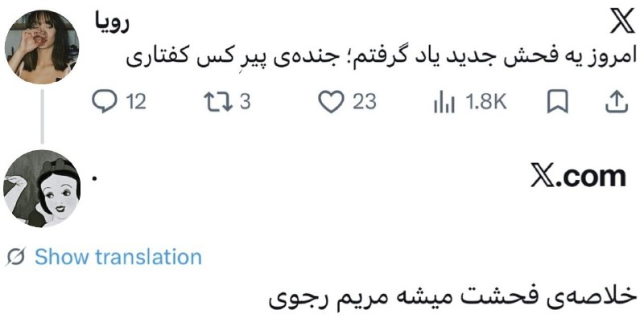

جرررر 😂😂😂

@Dirty_Kids 👻

## Dirty_Kids — post 390557

خیلی گرمه، یه لحظه به خامنه ای که تو یخچال حسودیم‌ شد.

@Dirty_Kids 👻

## Dirty_Kids — post 390556

  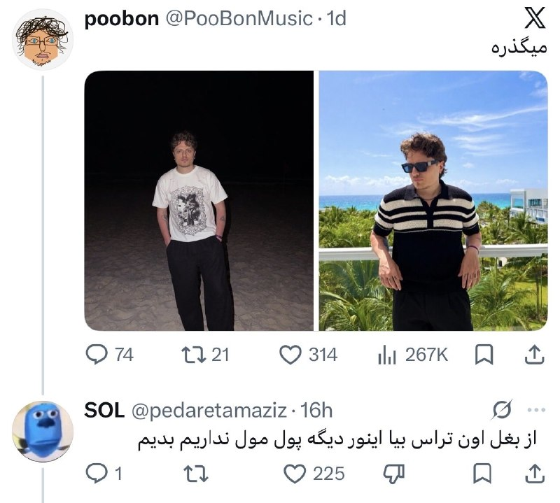

پاره 🤣🤣🤣🤣

دوستانی که نبودند درجریان نیستن، شماکه نبودید پوبون زیدش از یجا افتاده بود پایین پوبون برای خرج بیمارستان از مردم دذخواست پول کرد

@Dirty_Kids 👻

## Dirty_Kids — post 390555

  <a href="telegram/content/Dirty_Kids_390555_1780142534.mp4" target="_blank">🎬 Download video</a>

این ویدیو از زمان جنگ خیلی خوبه تا آخرش ببینید

داداشمون خیلی بتخمم‌وار وسط اون حجم از موشک که آدم خایه‌فنگ میکنه، واستاده ریلکس میشاشه فیلم میگیره گزارش میکنه

@Dirty_Kids 👻

## Dirty_Kids — post 390554

  

🔴 رئیس سازمان سنجش:
کنکور امسال پنجشنبه و جمعه - 29 و 30 مرداد برگزار میشه.

@Dirty_Kids 👻

## Dirty_Kids — post 390553

  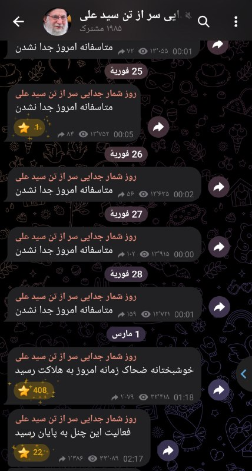

و اینگونه بود که به پایان رسید:

@Dirty_Kids 👻

## Dirty_Kids — post 390552

  <a href="telegram/content/Dirty_Kids_390552_1780142537.webm" target="_blank">🎬 Download video</a>

🆕 اپلیکیشن MelBet 
✅

🎁 کد هدیه 100 دلاری: Sport100

🌀 کاملترین برنامه موبایل

🤝 اسپانسر رسمی لالیگا

🥇صرافی معتبر

🌐 ربات راهنما

🇮🇷 برای تغییر زبان برنامه، زبان موبایل خود را تغییر دهید.

✅ ورود به اپلیکیشن بدون فیلترشکن

## Dirty_Kids — post 390551

  <a href="telegram/content/Dirty_Kids_390551_1780142538.webm" target="_blank">🎬 Download video</a>

▶️ فینال لیگ قهرمانان اروپا رو با آپشن های تخصصی در MelBet پیشبینی کنید! ⚽️
🔥😍

💵 امکان شارژ کارت بکارت و هات ووچر

🎁 قرعه کشی و آفر های جذاب با جوایز ویژه

📱 کاملترین برنامه موبایل

🤝 اسپانسر رسمی لالیگا

🇮🇷 پشتیبانی از زبان فارسی

✍️ حرفه ای، مطمئن و در کلاس جهانی پیشبینی کنید!

برای ورود به سایت فیلترشکن خود را خاموش کنید!
‌
🌐 Link 🔜 MelBet1.net

🌐‌ Link 🔜 MelBet1.net

## Hranews — post 113238

  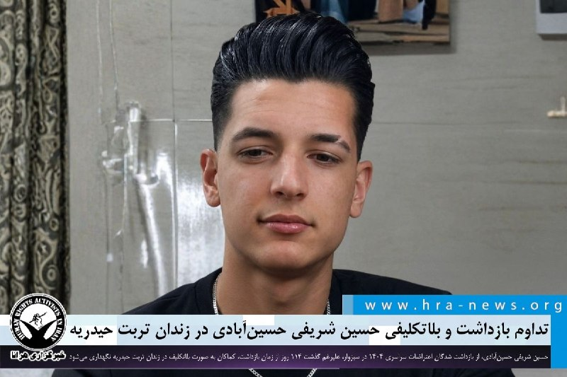

اعتراضات دی‌ماه؛ تداوم بازداشت و بلاتکلیفی حسین شریفی حسین‌آبادی در زندان تربت حیدریه

❗️
❗️
❗️
❗️
❗️– حسین شریفی حسین‌آبادی، از بازداشت‌شدگان اعتراضات سراسری دی‌ماه ۱۴۰۴ در سبزوار، علیرغم گذشت ۱۱۴ روز از زمان بازداشت، کماکان به صورت بلاتکلیف در زندان تربت حیدریه نگهداری می‌شود.

به گزارش خبرگزاری هرانا، ارگان خبری مجموعه فعالان حقوق بشر در ایران، حسین شریفی حسین‌آبادی، از بازداشت‌شدگان مرتبط با اعتراضات دی‌ماه ۱۴۰۴، کماکان در بازداشت به سر می‌برد.

بر اساس اطلاعات دریافتی هرانا، آقای شریفی حسین‌آبادی در تاریخ ۱۷ بهمن‌ماه ۱۴۰۴، توسط نیروهای امنیتی در سبزوار بازداشت شد. او سپس به زندان تربت حیدریه منتقل شده و با گذشت ۱۱۴ روز، همچنان به صورت بلاتکلیف در این زندان به‌سر می‌برد.

یک منبع مطلع نزدیک به خانواده این شهروند ضمن تایید این خبر به هرانا گفت: “حسین نان‌آور خانواده خود بود. پدر او که دچار معلولیت است، تحت پوشش بهزیستی قرار دارد و مادرش اکنون به سختی هزینه‌های زندگیشان را تامین می‌کند. علیرغم پیگیری‌های مکرر خانواده این شهروند، مسئولان ذیربط تاکنون پاسخ روشنی در خصوص وضعیت پرونده او ارائه نکرده و تنها اعلام کرده‌اند که پرونده وی سنگین است.”

ادامه مطلب

#حسین_شریفی_حسین‌آبادی

↘️
@hranews_bot تماس ✉️ - @Hranews کانال هرانا 🆑

## Hranews — post 113237

  

حبس بدون تصمیم؛ تداوم بلاتکلیفی فلورا صمدانی، شهروند بهائی در زندان یزد

❗️
❗️
❗️
❗️
❗️– فلورا صمدانی، شهروند بهائی ساکن یزد، نزدیک به یک ماه است بازداشت شده و به صورت بلاتکلیف در زندان این شهرستان نگهداری می‌شود.

به گزارش هرانا، ارگان خبری مجموعه فعالان حقوق بشر در ایران، فلورا صمدانی، شهروند بهائی در بازداشت به‌سر می‌برد.

بر اساس اطلاعات دریافتی هرانا، خانم صمدانی ۲۸ روز است که بازداشت شده و کماکان به صورت بلاتکلیف در زندان یزد نگهداری می‌شود. در پی مراجعات مکرر خانواده این شهروند بهائی به دادسرا و شعبه بازپرسی مربوطه، به آنان اعلام شده است که پرونده تاکنون به دادسرا ارسال نشده است. همچنین هیچ‌گونه زمان مشخصی برای صدور قرار تامین یا برگزاری جلسه رسیدگی در دادگاه اعلام نشده است.

ادامه مطلب

#فلورا_صمدانی

↘️
@hranews_bot تماس ✉️ - @Hranews کانال هرانا 🆑

## Hranews — post 113236

دیواندره؛ ۸ محکوم قضایی به احکام جایگزین حبس محکوم شدند

❗️
❗️
❗️
❗️
❗️– رئیس اداره منابع طبیعی و آبخیزداری دیواندره از صدور حکم سبز برای هشت محکوم قضایی در این شهرستان خبر داد. این محکومان به عنوان مجازات جایگزین حبس در حفر ۳۸۰ چاله و ایجاد تشتک برای نهال‌ها در یک پارک جنگلی مشارکت داشته‌اند.

ادامه مطلب

#حکم_سبز

↘️
@hranews_bot تماس ✉️ - @Hranews کانال هرانا 🆑

## Hranews — post 113235

اموال ۳۴ نفر در استان خراسان جنوبی توقیف شد

❗️
❗️
❗️
❗️
❗️– رئیس کل دادگستری خراسان جنوبی از توقیف اموال ۳۴ نفر در این استان به دلایلی همچون «حمایت از دشمن» خبر داد.

ادامه مطلب

#توقیف_اموال

↘️
@hranews_bot تماس ✉️ - @Hranews کانال هرانا 🆑

## alonews — post 123684

  <a href="telegram/content/alonews_123684_1780142539.webm" target="_blank">🎬 Download video</a>

💔خانواده امیرمحمد شاه‌کرمی ۶۰ روز تمام دنبال پسر ۱۴ ساله‌شان گشتند؛ تا اینکه پیکرش را در سردخانه کهریزک پیدا کردند. 
🔴در این مدت حتی با گوشی امیرمحمد با خانواده‌اش تماس گرفتند و وانمود کردند که او بازداشت شده و زنده است. 
🔴خواهرش از لحظه دیدن پیکر امیرمحمد…

## alonews — post 123683

  <a href="telegram/content/alonews_123683_1780142540.webm" target="_blank">🎬 Download video</a>

👈ارتش اسرائیل حملات هوایی را به حومه شهر شوکین در جنوب لبنان انجام داد

✅ @AloNews خبر جنگ

## alonews — post 123682

  <a href="telegram/content/alonews_123682_1780142540.webm" target="_blank">🎬 Download video</a>

👈امنیت دریایی عمان: هشدار به کشتی‌ها برای احتیاط پس از رصد جسمی مظنون به مین در غرب منطقه عبور ساحلی در تنگه هرمز

✅ @AloNews خبر جنگ

## alonews — post 123681

  <a href="telegram/content/alonews_123681_1780142541.webm" target="_blank">🎬 Download video</a>

👈سلطنت عمان: ما در آب‌های سرزمینی عمان جسمی شناور را مشاهده کردیم که مظنون به مین دریایی است

✅ @AloNews خبر جنگ

## alonews — post 123680

  <a href="telegram/content/alonews_123680_1780142541.webm" target="_blank">🎬 Download video</a>

👈رئیس‌جمهور لبنان، جوزف عون، و نخست‌وزیر نواف سلام در دیداری در کاخ بعبدا درباره حملات مداوم اسرائیل در جنوب لبنان و تلاش‌ها برای تضمین آتش‌بس گفتگو کردند، طبق بیانیه‌ای از ریاست‌جمهوری لبنان.

🔴 این دو رهبر توافق کردند که ارتباطات را برای پایان دادن به آنچه که آن را اقدامات محکوم‌شده اسرائیل توصیف کردند، تشدید کنند. این دیدار همچنین شامل ارزیابی مذاکرات واشنگتن بین هیئت‌های نظامی لبنان، آمریکا و اسرائیل بود که در آن طرف لبنانی تعهد خود را به اولویت دادن به آتش‌بس مجدداً تأکید کرد

✅ @AloNews خبر جنگ

## alonews — post 123679

  <a href="telegram/content/alonews_123679_1780142541.webm" target="_blank">🎬 Download video</a>

👈 روسیه سفیر خود را در ارمنستان برای مشورت فراخوانده است، با استناد به تلاش عمیق‌تر ایروان برای پیوستن به اتحادیه اروپا، طبق گزارش آژانس آنادولو.

🔴 این اقدام نشان‌دهنده افزایش ناامیدی مسکو از چرخش غربی ارمنستان است که در میان روابط پرتنش بین دو متحد سنتی تسریع شده است. ایروان به طور فزاینده‌ای به دنبال روابط نزدیک‌تر با اتحادیه اروپا و نهادهای غربی بوده است، تغییری که روسیه آن را به عنوان چالشی مستقیم برای نفوذ خود در قفقاز جنوبی می‌بیند

✅ @AloNews خبر جنگ

## alonews — post 123678

  <a href="telegram/content/alonews_123678_1780142541.webm" target="_blank">🎬 Download video</a>

👈سخنگوی کمیسیون امنیت ملی خطاب به وزیر خزانه‌داری آمریکا: به جای هارت و پورت اضافی به فکر تعظیم باش!

✅ @AloNews خبر جنگ

## alonews — post 123677

  <a href="telegram/content/alonews_123677_1780142542.webm" target="_blank">🎬 Download video</a>

👈ارتش لبنان اعلام کرد که دو سرباز پس از هدف قرار گرفتن داخل یک وسیله نقلیه توسط پهپاد اسرائیلی در جاده آبا (نبطیه) به شدت زخمی شدند.

🔴 آنها برای درمان به بیمارستان منتقل شدند

✅ @AloNews خبر جنگ

## alonews — post 123673

  <a href="telegram/content/alonews_123673_1780142542.webm" target="_blank">🎬 Download video</a>

👈ارتش سودان یک پهپاد رزمی CH-95 ساخت چین که توسط نیروهای پشتیبانی سریع تحت حمایت امارات در نزدیکی ربک پرواز می‌کرد را سرنگون کرد، تصاویر لاشه آن موشک ضد تانک Blue Arrow 11 آن را ظاهراً سالم نشان می‌دهد

✅ @AloNews خبر جنگ

## alonews — post 123672

  <a href="telegram/content/alonews_123672_1780142542.webm" target="_blank">🎬 Download video</a>

👈پیت هگست، وزیر جنگ آمریکا:
هرجا که توانسته‌ایم به اوکراین کمک کنیم، کمک کرده‌ایم.

🔴هرجا که توانسته‌ایم اروپا را قادر سازیم تا بیشتر عمل کند، این کار را کرده‌ایم.

🔴اگر به میزان پولی که هزینه شده نگاه کنید، اروپا وارد میدان شده و اوکراین در این فرآیند دست‌کم به همان اندازه (اگر نه بیشتر) مؤثر بوده است.

🔴بنابراین، ما می‌خواهیم آنها بتوانند از خود دفاع کنند و راهی پیدا خواهیم کرد تا مطمئن شویم می‌توانیم به آنها کمک کنیم

✅ @AloNews خبر جنگ

## alonews — post 123671

  <a href="telegram/content/alonews_123671_1780142543.webm" target="_blank">🎬 Download video</a>

💔خانواده امیرمحمد شاه‌کرمی ۶۰ روز تمام دنبال پسر ۱۴ ساله‌شان گشتند؛ تا اینکه پیکرش را در سردخانه کهریزک پیدا کردند. 
🔴در این مدت حتی با گوشی امیرمحمد با خانواده‌اش تماس گرفتند و وانمود کردند که او بازداشت شده و زنده است. 
🔴خواهرش از لحظه دیدن پیکر امیرمحمد…

## alonews — post 123670

  <a href="telegram/content/alonews_123670_1780142543.mp4" target="_blank">🎬 Download video</a>

👈پیت هگستث: آنچه در بودجه سال ۲۰۲۷ رئیس‌جمهور ترامپ خواهید دید، سرمایه‌گذاری ۵۶ میلیارد دلاری در تسلط بر پهپادها است.

🔴ما همچنان از آنچه اوکراین در میدان نبرد انجام داده است، می‌آموزیم.

🔴ما چیزهای زیادی از اوکراین و نحوه عملکرد آن‌ها یاد گرفته‌ایم.

🔴قصد داریم نه تنها هم‌سطح باشیم، بلکه بهترین در جهان در این زمینه باشیم

✅ @AloNews خبر جنگ

## alonews — post 123669

  <a href="telegram/content/alonews_123669_1780142546.webm" target="_blank">🎬 Download video</a>

👈مدیرکل آژانس بین‌المللی انرژی اتمی: ما گفتگو و تبادل نظر حداقلی (با ایران) داریم، اما در حال حاضر بسیار محدود است. 
🔴دیدگاه آنها (ایران) این است در حالی که درگیری ادامه دارد، زمان برای از سرگیری همکاری کامل فرا نرسیده است. 
✅ @AloNews خبر جنگ

## alonews — post 123668

  <a href="telegram/content/alonews_123668_1780142547.webm" target="_blank">🎬 Download video</a>

👈قیمت برنج در ماه می ۲۰ درصد رشد داشته که بیشترین میزان در دو دهه اخیر بوده است

🔴به غیر از افزایش شدید قیمت کود تحت تأثیر جنگ در خاورمیانه، شرایط آب و هوای سخت در کشورهای آسیای شرقی هم چشم انداز تولید برنج را تیره کرده است

✅ @AloNews خبر جنگ

## alonews — post 123667

  <a href="telegram/content/alonews_123667_1780142547.webm" target="_blank">🎬 Download video</a>

🔴فوری / وزیر جنگ آمریکا: به محاصره دریایی ایران ادامه خواهیم داد

✅ @AloNews خبر جنگ

## alonews — post 123666

  <a href="telegram/content/alonews_123666_1780142547.webm" target="_blank">🎬 Download video</a>

👈مدیرکل آژانس بین‌المللی انرژی اتمی:
ما گفتگو و تبادل نظر حداقلی (با ایران) داریم، اما در حال حاضر بسیار محدود است.

🔴دیدگاه آنها (ایران) این است در حالی که درگیری ادامه دارد، زمان برای از سرگیری همکاری کامل فرا نرسیده است.

✅ @AloNews خبر جنگ

## alonews — post 123665

  <a href="telegram/content/alonews_123665_1780142548.webm" target="_blank">🎬 Download video</a>

👈الجزیره: وضعیت امنیتی در تنگه هرمز هنوز «بحرانی» است

🔴هیئت عملیات تجارت بریتانیا اعلام کرد که سطح تهدید امنیت دریایی در تنگه هرمز به دلیل اقدامات محاصره‌آمیز، همچنان بسیار بحرانی است.

✅ @AloNews خبر جنگ

---
📅 بروزرسانی: 1405/03/09 13:54
---

## VahidOOnLine — post 242901

  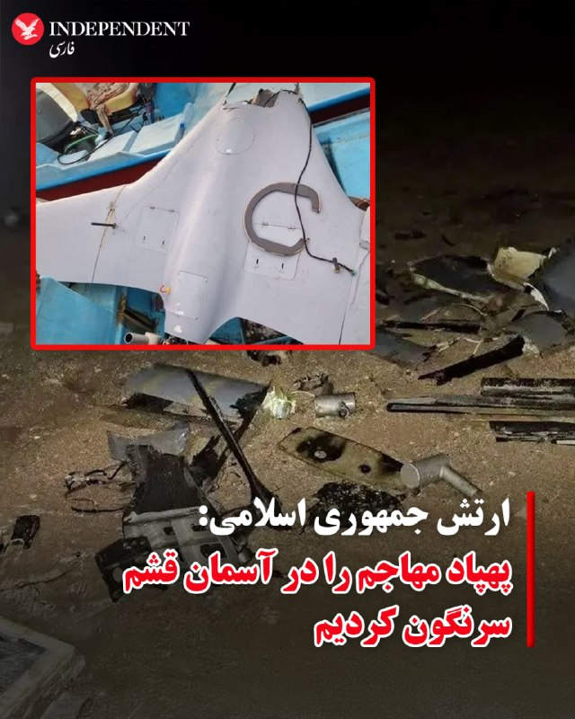

♦️ارتش جمهوری اسلامی ایران روز شنبه نهم خردادماه با انتشار بیانیه‌ای اعلام کرد پدافند هوایی ارتش بامداد این روز یک پهپاد اوربیتر را در منطقه قشم منهدم کرد.

در بیانیه ارتش این پهپاد متعلق به دشمن «آمریکایی-صهیونی» عنوان شده است. سنتکام هنوز واکنشی به این ادعا نشان نداده است.

در نخستین ساعات بامداد شنبه و پس از انتشار گزارش‌ها از شنیده شدن صدای ضد هوایی و پهپاد، رسانه‌های داخلی ایران از هدف قرار گرفتن یک پهپاد متخاصم در جزیره قشم خبر دادند.
‌🇸🇦 Indypersian

🤖 @VahidOOnLine

## VahidOOnLine — post 242900

  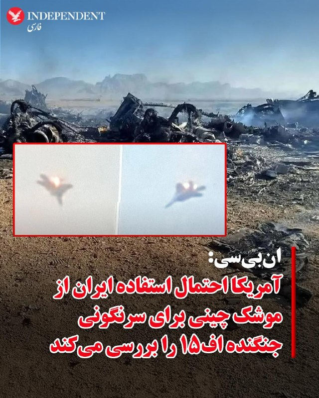

♦️شبکه خبری ان‌بی‌سی، روز شنبه نهم خرداد ماه، به نقل از سه مقام اطلاعاتی آمریکایی گزارش کرد، ایران احتمالا با استفاده از یک «موشک دوش‌پرتاب ساخت چین»، جنگنده اف-۱۵ آمریکا را در آسمان جنوب غربی ایران سرنگون کرده است.
بر اساس این گزارش، جنگنده اف۱۵ آمریکا که در فروردین ماه گذشته در جنوب غربی ایران سرنگون شد، ممکن است هدف یک موشک دوش‌پرتاب (MANPADS) قرار گرفته باشد: اسلحه‌ای با طول حدود دو متر و وزن ۱۸ کیلوگرم که علیه اهدافی در ارتفاع کم مؤثر هستند.
سرنگونی جنگنده آمریکایی در آسمان غرب ایران، نخستین مورد در چند دهه گذشته توصیف شده است.
منابع اطلاعاتی به ان‌بی‌سی گفته‌اند پشتیبانی چین از ایران در جنگ گذشته ممکن است فراتر از موشک‌های دوش‌پرتاب باشد. به گفته این منابع، چین احتمالا یک رادار هشدار «زودهنگام دوربرد» (مدل YLC-8B) را در اختیار ایران قرار داده که برای شناسایی جنگنده‌های پیشرفته رادار گزیر طراحی شده است.
ایالات متحده پیش از این، سه شرکت ماهواره‌ای چینی را به اتهام ارائه تصاویر و داده‌های اطلاعاتی به ایران برای هدف قرار دادن نیروهای آمریکایی تحریم کرده بود و حالا واشنگتن در حال بررسی این موضوع است که آیا تجهیزات مورد نظر به تازگی به ایران تحویل داده شده‌اند یا مربوط به توافقات نظامی قدیمی‌تر هستند.
ان‌بی‌سی به نقل از منابع خود افزود، تحقیقات درباره نوع دقیق سلاح به‌کاررفته در سرنگونی اف۱۵ آمریکایی همچنان ادامه دارد.
‌🇸🇦 Indypersian

🤖 @VahidOOnLine

## VahidOOnLine — post 242899

  <a href="telegram/content/VahidOOnLine_242899_1780136687.mp4" target="_blank">🎬 Download video</a>

سخنان محمود جعفریان، معاون سازمان رادیو تلویزیون ملی ایران و قائم‌مقام دبیرکل حزب رستاخیز، درباره ایران‌دوستی
‌🏁 🇬🇧 ManotoTV

🤖 @VahidOOnLine

## VahidOOnLine — post 242898

  

♦️شبکه خبری ان‌بی‌سی، روز شنبه نهم خرداد ماه، به نقل از سه مقام اطلاعاتی آمریکایی گزارش کرد، ایران احتمالا با استفاده از یک «موشک دوش‌پرتاب ساخت چین»، جنگنده اف-۱۵ آمریکا را در آسمان جنوب غربی ایران سرنگون کرده است.
بر اساس این گزارش، جنگنده اف۱۵ آمریکا که در فروردین ماه گذشته در جنوب غربی ایران سرنگون شد، ممکن است هدف یک موشک دوش‌پرتاب (MANPADS) قرار گرفته باشد: اسلحه‌ای با طول حدود دو متر و وزن ۱۸ کیلوگرم که علیه اهدافی در ارتفاع کم مؤثر هستند.
سرنگونی جنگنده آمریکایی در آسمان غرب ایران، نخستین مورد در چند دهه گذشته توصیف شده است.
منابع اطلاعاتی به ان‌بی‌سی گفته‌اند پشتیبانی چین از ایران در جنگ گذشته ممکن است فراتر از موشک‌های دوش‌پرتاب باشد. به گفته این منابع، چین احتمالا یک رادار هشدار «زودهنگام دوربرد» (مدل YLC-8B) را در اختیار ایران قرار داده که برای شناسایی جنگنده‌های پیشرفته رادار گزیر طراحی شده است.
ایالات متحده پیش از این، سه شرکت ماهواره‌ای چینی را به اتهام ارائه تصاویر و داده‌های اطلاعاتی به ایران برای هدف قرار دادن نیروهای آمریکایی تحریم کرده بود و حالا واشنگتن در حال بررسی این موضوع است که آیا تجهیزات مورد نظر به تازگی به ایران تحویل داده شده‌اند یا مربوط به توافقات نظامی قدیمی‌تر هستند.
ان‌بی‌سی به نقل از منابع خود افزود، تحقیقات درباره نوع دقیق سلاح به‌کاررفته در سرنگونی اف۱۵ آمریکایی همچنان ادامه دارد.
‌🇸🇦 Indypersian

🤖 @VahidOOnLine

## VahidOOnLine — post 242897

  

اسماعیل سقاب اصفهانی، معاون پزشکیان و رییس سازمان مدیریت راهبردی انرژی، گفت: «در شرایط اقتصادی و اجتماعی فعلی افزایش قیمت بنزین و گاز در دستور کار نیست».
او افزود که دولت به جای افزایش قیمت، طرح «پاداش نقدی» را اجرا می‌کند و مردم به ازای هر میزان کاهش مصرف، پاداش نقدی دریافت خواهند کرد.
‌🏁 🇬🇧 IranintlTV

🤖 @VahidOOnLine

## VahidOOnLine — post 242896

  <a href="telegram/content/VahidOOnLine_242896_1780136691.mp4" target="_blank">🎬 Download video</a>

ویدیوی رسیده به ایران اینترنشنال صحنه‌هایی از رقص و خاکسپاری پیکر جاویدنام محمدرضا احمدی را نشان می‌دهد. او از جمله شهروندان معترض کشته‌شده در انقلاب ملی در ۱۸ دی ‌ماه در تهران است. او جوان ۲۳ ساله و ورزشکار اهل تهرانسر بود. او هدف شلیک جنگی نیروهای بسیج قرار گرفت و به دست مردم به بیمارستان رسانده شد اما به دلیل تعلل و تاخیر نیروهای امنیتی جان باخت.
‌🏁 🇬🇧 IranintlTV

🤖 @VahidOOnLine

## VahidOOnLine — post 242895

  

♦️خبرگزاری تسنیم، وابسته به سپاه پاسداران، روز شنبه نهم خرداد ماه در گزارشی اعلام کرد «برخلاف برخی برداشت‌ها از اظهارات دونالد ترامپ درباره لغو محاصره دریایی ایران، این محاصره همچنان برقرار است و کشتی‌ها از سوی سنتکام، هشدار توقف و عدم اجازه عبور از محاصره دریایی دریافت می‌کنند. »
بر اساس این گزارش، دریانوردان ایرانی به تسنیم گفته‌اند سنتکام همچنان در محدوده محاصره دریایی هشدارهایی صادر می‌کند و تلاش دارد کشتی‌های ایرانی را از عبور از این منطقه بازدارد.
خبرگزاری تسنیم که به عنوان منبعی برای بازتاب دیدگاه‌های هسته‌های نزدیک به قدرت در ایران شناخته می‌شود، در این گزارش محاصره دریایی ایران را «اقدام خصمانه جنگی» توصیف کرد و نوشت ناوهای آمریکایی به کشتی‌های تجاری ایران هشدار می‌دهند که در صورت عبور از خط محاصره، باید فورا بازگردند. در غیر این صورت با اقدام نظامی مواجه خواهند شد.
این گزارش می‌افزاید که پس از پیام شب گذشته دونالد ترامپ در شبکه اجتماعی «تروث سوشال» درباره لغو محاصره دریایی، برخی کشتی‌های ایرانی تلاش کردند از خط محاصره عبور کنند، اما با هشدار ناوهای آمریکایی روبه‌رو شدند.
ترامپ شامگاه جمعه در پیامی نوشته بود: «کشتی‌هایی که به دلیل محاصره شگفت‌انگیز و بی‌سابقه نیروی دریایی ما در تنگه گیر افتاده‌اند، اکنون می‌توانند روند بازگشت به خانه را آغاز کنند.»
‌🇸🇦 Indypersian

🤖 @VahidOOnLine

## VahidOOnLine — post 242894

  

♦️محسن رضایی،‌ مشاور نظامی مجتبی خامنه‌ای، روز شنبه نهم خرداد ماه، دونالد ترامپ را به «خیانت به دیپلماسی برای سومین بار» متهم کرد.
این فرمانده پیشین سپاه در شبکه اجتماعی ایکس نوشت: «همان‌طور که پیش‌بینی می‌شد، رئیس‌جمهور آمریکا برای سومین بار در حال خیانت به دیپلماسی است.»
مشاور مجتبی خامنه‌ای در این پیام ادعا کرد ادامه «محاصره دریایی» و «زیاده‌خواهی در مذاکرات» از سوی واشنگتن بیش از پیش نشان می‌دهد که دولت آمریکا به دنبال مذاکره نیست و اهداف دیگری را دنبال می‌کند.
این اظهارات پس از آن بیان می‌شود که جلسه‌ امنیتی دونالد ترامپ و اعضای ارشد کاخ سفید، درباره مذاکرات پایان جنگ با جمهوری اسلامی در شامگاه جمعه بدون اخذ تصمیم خاصی پایان یافت و گمانه‌زنی‌ها درباره از سرگیری حملات این کشور به ایران را افزایش داده است.
‌🇸🇦 Indypersian

🤖 @VahidOOnLine

## VahidOOnLine — post 242893

  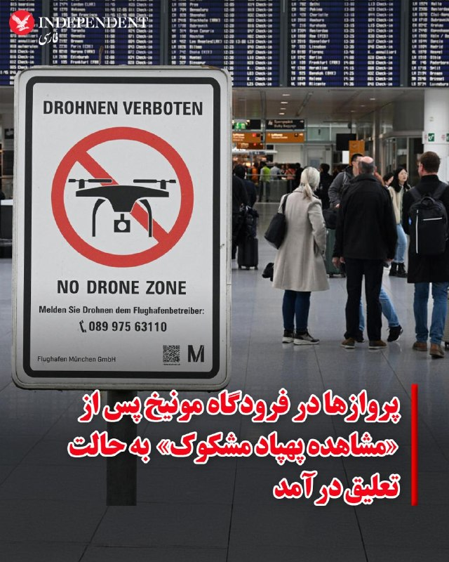

♦️پروازهای فرودگاه مونیخ پس از مشاهده پهپاد مشکوک تعلیق شد
پلیس آلمان، روز شنبه نهم خرداد ماه اعلام کرد پروازهای فرودگاه مونیخ پس از گزارش مشاهده یک پهپاد مشکوک از سوی دو خلبان، به حالت تعلیق درآمده است.
به گفته سخنگوی پلیس، این مشاهده اندکی پس از ساعت ۹ صبح رخ داد و مقام‌های امنیتی در هماهنگی با مرکز کنترل ترافیک هوایی آلمان تصمیم گرفتند باندهای فرودگاه را موقتا مسدود کنند.
این مقام افزود در حال حاضر مشخص نیست این محدودیت تا چه زمانی ادامه خواهد داشت.
مونیخ یکی از شلوغ‌ترین فرودگاه‌های آلمان به شمار می‌رود و تعطیلی باندها می‌تواند موجب اختلال در برنامه پروازهای داخلی و بین‌المللی شود.
‌🇸🇦 Indypersian

🤖 @VahidOOnLine

## VahidOOnLine — post 242892

  

فرودگاه مونیخ پس از گزارش مشاهده یک پهپاد، هر دو باند خود را بست. سخنگوی پلیس فدرال آلمان گفت یک خلبان فعالیت مشکوک را اعلام کرده است.
به گزارش ر سانه آلمانی فوکوس آنلاین، فرودگاه برای ساعاتی تعطیل است و هلیکوپترها در حال جست‌وجوی پهپاد هستند. وضعیت همچنان نامشخص اعلام شده است.
‌🏁 🇬🇧 IranintlTV

🤖 @VahidOOnLine

## VahidOOnLine — post 242891

🗣روایت شما از زندگی در دوران پس از انقلاب ملی و جنگ- شنبه ۹ خرداد ۱۴۰۵

🔹امروز شنبه ۹ خرداد برازجان ساعت ۹:۱۱ صبح سه بار صدای انفجار آمد و خانه‌ها لرزید.

🔹نفت پالایش بندرعباس دو ماه کار کردیم، ۱۰ ماه می‌گذرد با حقوق ۲۵۰۰ فقط ۳۹ میلیون دادند، بعدش بیرونمان کردند.

🔹از سمنان. اینجا حکومتی‌های بی‌شرف هر روز یک جایی پاتوق می‌کنند، شیرینی و ساندیس و چای می‌خورند، انگار آمدند جشن و دور هر میدانی ده نفر می‌گذارند که بگویند ما همه‌جا هستیم، ولی ما که می‌دانیم تعدادتان به ۴۰۰ نفر هم نمی‌رسد.

🔹اسمش را گذاشتند وصلی اینترنت، فقط با فیلترشکن پولی وصل می‌شود، خیلی‌ها توان خرید ندارند، رحم کنید.

🔹ما خانواده ۱۰ نفره هستیم و فقط بابام کار می‌کند اما هیچ‌وقت نتوانسته برای ما چیزهایی که دوست داریم بخرد و مجبور به دست‌فروشی است، سال‌هاست مجبورم برای خانواده‌ام کار کنم، کار پاره‌وقت، حسرت کار کردن مثل مردم عادی تو دلم مانده.

🔹من یک جوان ۲۰ ساله هستم که با حقوق ۲۰ میلیون تومانی چندین ماه است تلاش دارم موتورسیکلت فرسوده خودم را بفروشم و یک موتورسیکلت بهتر بخرم اما نمی‌توانم، چرا باید یک موتورسیکلت عادی بشود ۵۰۰ میلیون تومان؟

🔹دیگر زندگی جوری شده که یخچال‌ها نه تنها خالی شده، حتی حقوق بازنشستگی‌ام واریز بشود باز هم همان‌جور خالی می‌ماند، هیچ فرقی نمی‌کند، ۸۰ میلیون گرسنه.

🔹الان ماه خرداد است، هنوز اضافه‌حقوق بازنشسته‌های تأمین اجتماعی را ندادند، ۱۳ میلیون فقط می‌گیریم بعد از ۳۰ سال، دروغ گفتند ۶۰ درصد حقوق اضافه شده، تا الان ندادند.

🔹از تهران پیام می‌دهم، اینجا دیگر گوشت و مرغ از سفره‌ها حذف شده و همین مانده که با نان و پنیر خودمان را سیر می‌کنیم.

🔹از بهارستان اصفهان هستم، اوضاع کار و بازار در حدی بد است که تو خرج روزانه مانده‌ام که هیچ، حتی پول بنزین ندارم تا اسنپ کار کنم.

🔹از بلوچستان هستم، اینجا شرایط خیلی سخت است، همه‌چیز گران شده و هر روز اینجا طعم فقر را مزه‌مزه می‌کنیم.

🔹شنبه ۹ خرداد دو تا تخم‌مرغ ۵۰ هزار تومان، نان سنگک دانه‌ای ۵۰ هزار تومان.

🔹از تبریز: فقر و بیکاری و گرانی و تورم و تعطیلی کسب‌وکارها باعث شده پدران شرمنده خانواده‌ها شوند، کمر سرپرستان خانواده‌ها زیر بار گرانی شکسته است.

🔹از تبریز: قیمت میوه نوبرانه فصل چنان نجومی است که پدران در حسرت خرید حتی نیم‌کیلو میوه برای خانواده‌ها مانده‌اند.

🔹آن‌هایی که به سیگار اعتیاد دارند دیگر نمی‌توانند بکشند، وینستون لایت پاکتی ۳۰۰ تومن شده.
‌🏁 🇬🇧 IranintlTV

🤖 @VahidOOnLine

## VahidOOnLine — post 242890

  

♦️رسانه‌های ایران روز شنبه نهم خرداد به نقل از رئیس دادگستری استان خوزستان از محکومیت هفت نفر به جرم سرقت «هفت هزار و ۸۸۷ بشکه نفت خام» خبر دادند.

به گزارش خبرگزاری قوه قضائیه (میزان) متهمان ردیف اول تا چهارم به ۱۳ سال حبس و شلاق
و متهمان ردیف پنجم تا هفتم به تحمل حبس و مجازت‌های تکمیلی محکوم شدند.
‌🇸🇦 Indypersian

🤖 @VahidOOnLine

## WithYashar — post 12934

## WithYashar — post 12933

#shahzade من تا آخرین نفس و قطره خونم از شما پسر شاه فقیدم حمایت میکنم تا رسیدن به آزادی

## WithYashar — post 12932

#shahzade
من تا آخرین نفس و قطره خونم از شما پسر شاه فقیدم حمایت میکنم تا رسیدن به آزادی

## WithYashar — post 12931

#shahzade

## WithYashar — post 12930

سفر قاهره با یاشار غمی ندارد فقط لذت ببریم از وقایع
👑

## WithYashar — post 12929

صداوسیما : طبق نظرسنجی که از مردم انجام دادیم، اکثریت مردم از وصل شدن اینترنت ناراضی و ناراحتن. باید فورا مجددا قطع بشه
@withyashar

## WithYashar — post 12928

تسنیم : با وجود اینکه ترامپ در شبکه Truth Social اعلام کرد که محاصره دریایی ایران «اکنون برداشته خواهد شد»، ملوانان ایرانی گزارش می‌دهند که این محاصره همچنان به طور کامل برقرار است.

کشتی‌هایی که پس از اعلام ترامپ تلاش کردند از خط محاصره عبور کنند، توسط ناوهای نیروی دریایی آمریکا هشدار داده شدند که فوراً بازگردند وگرنه با آتش مواجه خواهند شد.
@withyashar

## mwarmonitor — post 9912

🔴اداره عملیات تجارت دریایی بریتانیا می‌گوید:
«سطح تهدید امنیت دریایی در تنگه هرمز همچنان به‌طور بسیار بحرانی باقی مانده است، به‌دلیل محاصره.»

@mwarmonitor

## mwarmonitor — post 9911

  <a href="telegram/content/mwarmonitor_9911_1780136698.mp4" target="_blank">🎬 Download video</a>

📝 این روزها مرزهای عرفان و طهارت در رسانه میلی آن‌چنان جابه‌جا شده که تئاتر کمدی غریبی را به نمایش گذاشته است؛ حکایت لجن‌زاری که هر چقدر عمیق‌تر می‌شود، دست‌اندرکارانش مخلص‌تر و زاهدتر جلوه می‌کنند. بعد از مراجع تقلیدِ مجازی مثل پویان مختاری و قدیسینِ تازه‌تطهیرشده، حالا نوبت به محمدرضا گلزار رسیده تا با کت قرمز جیغ، از راز و نیازهای ماورایی و ایستاده‌اش در ساعت سه نصف‌شب پرده بردارد و دین‌داری را به یک اکسسوری لاکچری روی تردمیل، زیر دوش و پشت فرمان ماشین تبدیل کند. این بساطِ تهوع‌آور، ویترینی از دین‌فروشیِ مدرن است که در آن برای تبرئه کردنِ ابتذال و رانت، یک لایه ضخیم از مناجاتِ سفارشی روی همه‌چیز می‌پاشند؛ شیک‌پوشانی که خدا را هم مثل ساعت و ماشین‌شان برند کرده‌اند تا لایک بگیرند، در حالی که بوی گندِ این معرکه‌گیری، تنها قربانی کردنِ باورهای مردمِ گرسنه را به دست این لجن‌ها نشان می‌دهد.

@mwarmonitor

## pm_afshaa — post 91891

🔴یک مقام ارشد آمریکایی به الجریزه : ترامپ هیچ توافقی با ایران رو امضا نمی‌کنه مگر اینکه به نفع آمریکا باشه و خط قرمزهاش رعایت بشه

💧 Rainbet.com the #1 Non-KYC Crypto Casino & Sportsbook @rainbetcom

😁 @Pm_Afshaa

## pm_afshaa — post 91890

https://t.me/proxy?server=87.248.129.51&port=15&secret=ee1603010200010001fc030386e24c3add63646e2e79656b74616e65742e636f6d

پروکسی مخصوص دانلود

💧 Rainbet.com the #1 Non-KYC Crypto Casino & Sportsbook @rainbetcom

😁 @Pm_Afshaa

## pm_afshaa — post 91889

  

📣قیمت ها شکسته شد

با ما همیشه وصل بمونید
😄

🛒دیگه گرون نخر فقط گیگی 25 هزار تومان
❤️‍🔥

جهت خرید به آیدی پایین پیام بدید
👇

🔤 @Gliitch_Admin

🔤 @Gliitch_Admin

🔤 @Gliitch_Admin

## pm_afshaa — post 91887

https://t.me/proxy?server=87.248.129.50&port=15&secret=ee1603010200010001fc030386e24c3add626973636f7474692e79656b74616e65742e636f6d

پروکسی مخصوص دانلود

💧 Rainbet.com the #1 Non-KYC Crypto Casino & Sportsbook @rainbetcom

😁 @Pm_Afshaa

## DEJradio — post 5133

  <a href="telegram/content/DEJradio_5133_1780136701.webm" target="_blank">🎬 Download video</a>

🚨📢 بر اساس گزارش‌های دریافتی پدافند ارتش و سـ.ـپاه پاسداران در جنگ ۴۰ روزه دچار خسارت‌های شدید گردیده و بخش عمده آن نابود شده است.

تصاویر منتشرشده از اطراف کرمانشاه، بقایای یک سامانه پدافندی «سوم خرداد» را نشان می‌دهد که سوار بر یک تریلی از منطقه عملیاتی بازگردانده می‌شود.

تخمین‌های اولیه نشان می‌دهد دو سوم لانچرهای موشکی- پهپادی و سامانه‌های متحرک پدافندی بمباران و منهدم شده‌اند.
اغلب این تجهیزات در شیارهای کوه یا تونل‌های زیرزمینی مستقر بودند یا از مناطق مسکونی به عنوان پوشش و سپرانسانی آنها استفاده شده بود.

#سپر_انسانی #پدافند⁩ #جنگ۴۰روزه⁩

## DEJradio — post 5129

⭕️
🔸 منابع داخلی به دژ گزارش دادند پس از جنگ ۴۰ روزه، تعداد زیادی از پرسنل ارتش از جمله در نیروی زمینی و دریایی، به اتهام ترک یگان احضار و بازجویی شدند. آنها کسانی بودند که زیر بمباران شدید مجبور شدند از محوطه پادگان یا موقعیت فاصله بگیرند.

یکی از پرسنل نیروی زمینی در اصفهان [که بنا به دلایل امنیتی محل خدمت او آشکار نمی‌شود] می‌گوید، «هشتم فروردین به منطقه عملیاتی هرمزگان اعزام شدیم و کلیه مواضع را پوشش دادیم، اما شب جنگنده‌های آمریکایی همان مواضع را به شدت بمباران کردند، کل گردان ما همان شب منهدم شد، بچه‌های گردان و همرزمان به دلیل نداشتن تجهیزات کافی و ضعف پدافند مجبور شدیم منطقه را ترک کنیم و بمباران که تمام شد چند ساعت برگشتیم، حالا اما برای همه ما در دادسرا پرونده باز شده و گیر کردیم.»

فرد دیگری در همان گردان به دژ می‌گوید، «هفته‌هاست به دادسرا می‌رویم، به ما تهمت وطن‌فروشی زدند، بازپرس با بدترین لحن توهین می‌کند به هرکدامشان هم میگوییم مجبور بودیم که موضع را ترک کنیم نمیفهمند! چطور زیر آتش و بمب در موقعیت میماندیم؟ می‌خواهید آمار شهید زیاد شود؟ با دست خالی یا با ژ-۳ چطور باید جنگنده را زد؟ حالا هم تا روشن شدن تکلیف با فیش حقوقی و ضامن آزادیم، خیلی از ما را به عنوان تنبیه به نقاط مرزی فرستادند.»

همین فرد می‌گوید: «خدا رو شکر می‌کنیم که برخلاف خودی‌ها، دشمن جوانمرد و داناست وگرنه تلفات خیلی بیشتر از اینها بود. قبل از اینکه پادگان‌ها و مواضع ارتش را بکوبند هواپیماها دستکم چهار پنج بار روی سرمان تاب میخوردند و فرصت داشتیم از محدوده خارج شویم، خودمان خبر داریم که نخواستند تلفات بیشتر شود.»

*مدارک احضار و پرونده‌های شماری از پرسنل در اختیار دژ قرار گرفته است.

#جنگ۴۰روزه #ارتش
@DEJradio

## DEJradio — post 5128

  <a href="telegram/content/DEJradio_5128_1780136701.mp4" target="_blank">🎬 Download video</a>

🔺🎥 مردم در تونل شگفت‌زدگی از افزایش قیمتها، دست و پا می زنند.
چهار ورق کالباس خریدم، ۴۰۰ هزار تومان!
پیرمرد می گوید، برای نوه هایش می‌خواهد الویه درست کند، آمده کالباس بخرد، چهار ورق را خریده، ۴۰۰هزار تومان!

#تورم #گرانی
@DEJradio

## DEJradio — post 5127

  <a href="telegram/content/DEJradio_5127_1780136704.webm" target="_blank">🎬 Download video</a>

🚨📢 بر اساس گزارش بلومبرگ در حمله موشکی [پهپادی] جمهوری اسلامی به یک پایگاه هوایی در کویت که جمعه هشتم خرداد صورت گرفت، چند آمریکایی مجروح شدند و به دو پهپاد تهاجمی «ام‌کیو-۹ ریپر» آسیب جدی وارد شد؛ این در حالی است که دونالد ترامپ، رییس‌جمهور آمریکا، در حال بررسی توافقی برای تمدید یک آتش‌بس شکننده است.

به گفته یک منبع آگاه از جزئیات آسیب‌های این حمله، حدود ۵ نفر، شامل پیمانکاران و پرسنل نظامی در حال خدمت، دچار جراحات شدند. یکی از پهپادهای ریپر منهدم شده و دست‌کم یک پهپاد دیگر آسیب جدی دیده است. ارزش هر یک از این پهپادها حدود ۳۰ میلیون دلار برآورد می‌شود.

#کویت #حمله_موشکی
@DEJradio

## DEJradio — post 5126

  <a href="telegram/content/DEJradio_5126_1780136705.webm" target="_blank">🎬 Download video</a>

🔺📢 بر اساس گزارش‌های دریافتی دست‌کم ۳۲۰ نفر از کارکنان شرکت پلیمر آریاساسول بعد از جنگ ۴۰ روزه بیکار شدند.

یکی از کارکنان به دژ می‌گوید: "پتروشیمی آریاساسول در بخش طرح توسعه نیروهای پیمانکاریش رو تعدیل کرده. از ۹ اسفند که جنگ شد و به اداره کار برای بیمه بیکاری ارجاع داده و بیمه بیکاری که اصلا جوابگو نیست متاسفانه و نیروهای پیمانکاری هم هر چند پیگیری میکنن که برگردن سرکار ولی گویا اریاساسول فعلا قصد نداره قرارداد ببنده. حدود ۳۲۰ نفر از کار بیکار شدند."

#جنگ۴۰روزه
@DEJradio

## DEJradio — post 5125

  <a href="telegram/content/DEJradio_5125_1780136705.mp4" target="_blank">🎬 Download video</a>

🔺🎥 یکی از شهروندان با ارسال ویدیویی نوشت: اینجا سپاه استان یا همون سپاه "صاحب‌الزمان است. از روزی که اینجا بمباران شده الان مدت یک ماهه هرشب تا صبح معلوم نیست چی اتیش می‌زنن که بوی بدی داره و واقعا مارو اذیت می‌کنه. جوابگو هم نیستن من اوایل فکر می‌کردم چوبه ولی تمومی نداره.

#اصفهان
@DEJradio

## DEJradio — post 5121

💀
🚨 در جریان جنگ ۴۰ روزه، نیروی دریایی ارتش متحمل خسارات و تلفات سنگینی شد که بخش قابل توجهی از آن تاکنون سانسور یا رسانه‌ای نشده است.

درباره تلفات ناوشکن «دنا» که در آب‌های اقیانوس هند هدف قرار گرفت، اطلاعات بیشتری در دسترس است. بر اساس این اطلاعات، ۱۰۴ نفر از پرسنل این شناور جان خود را از دست دادند که از این میان، پیکر ۲۰ نفر هنوز پیدا نشده و در شمار مفقودین قرار دارند.
فرماندهان درباره تلفات ناوشکن «جماران» سکوت اختیار کرده‌اند. این ناو در نهم اسفند ۱۴۰۴ هنگام استقرار در اسکله پایگاه کنارک هدف قرار گرفت.

منابع آگاه می‌گویند: «در نخستین اصابت، خدمه ناو در داخل شناور گرفتار شدند و ۵۳ نفر از پرسنل، از جمله امیربهادر مایوان، فرمانده ناوشکن، کشته شدند.» به گفته این منابع، ناو جماران در آن زمان آماده جدایی از اسکله و عزیمت به دریا بود.

پس از آن، ناو «نقدی» نیز هدف قرار گرفت. اما به دلیل اصابت اولیه به جماران و فاصله زمانی کوتاه میان حملات به دو ناو، خدمه فرصت انتقال شناورها به دریا را پیدا نکردند. در نتیجه، با ادامه حملات، پایگاه به تدریج تخلیه شد و نیروها برای در امان ماندن به مناطق بیابانی اطراف پناه بردند.

#جنگ۴۰روزه #حملات_هدفمند
@DEJradio

## DEJradio — post 5120

  <a href="telegram/content/DEJradio_5120_1780136708.webm" target="_blank">🎬 Download video</a>

🚨
⭕️ به گزارش رویترز، اسکات بسنت وزیر خزانه‌داری آمریکا اعلام کرد این کشور یک میلیارد دلار از دارایی‌های رمزارزی مرتبط با جمهوری اسلامی را توقیف کرده است.

#رمزارز #جمهوری_اسلامی
@DEJradio

## DEJradio — post 5114

  <a href="telegram/content/DEJradio_5114_1780136708.webm" target="_blank">🎬 Download video</a>

🔺📷 یلدا پایلوت؛ خلبان خونشو

در میان بسیاری از آنها که در تجمعات شبانه سلاح به‌دست می‌گیرند و کنار سرکوبگران می‌ایستند برخی سرسپرده‌ترند؛ آنهایی که ظاهرشان امروزی اما در باطن، خود پلیدی هستند.

یکی از آنها "یلدا" خلبان خونشوست که در کنار محمدرضا طاهری مداح حکومتی‌‌ عکس دارد و در تجمعات شبانه با سلاح مردم را تهدید می‌کند اما ظاهری امروزی دارد.

#پرستو #حکومتی
@DEJradio

## IranIntlTV — post 339717

  <a href="telegram/content/IranIntlTV_339717_1780136709.mp4" target="_blank">🎬 Download video</a>

بازرس کل وزارت دفاع آمریکا در گزارشی از نفوذ و ایجاد بی‌ثباتی از سوی گروه‌های مورد حمایت جمهوری اسلامی در عراق و منطقه ابراز نگرانی کرد.

تروسکه صادقی، خبرنگار ایران‌اینترنشنال، گزارش می‌دهد
@iranintltv

## IranIntlTV — post 339716

  

اسماعیل سقاب اصفهانی، معاون پزشکیان و رییس سازمان مدیریت راهبردی انرژی، گفت: «در شرایط اقتصادی و اجتماعی فعلی افزایش قیمت بنزین و گاز در دستور کار نیست».
او افزود که دولت به جای افزایش قیمت، طرح «پاداش نقدی» را اجرا می‌کند و مردم به ازای هر میزان کاهش مصرف، پاداش نقدی دریافت خواهند کرد.
https://iranintl.com/202605302612

## IranIntlTV — post 339715

  <a href="telegram/content/IranIntlTV_339715_1780136712.mp4" target="_blank">🎬 Download video</a>

🔻ابوالفضل پسندیده، سفیر جمهوری اسلامی در مکزیک روز پنجشنبه در حاشیه سفر به شهر تیخوانا که محل اصلی کمپ تیم ملی برای جام جهانی است گفت: «در این شرایط که همسایگان شمالی (آمریکا) وظیفه داشتند از ما میزبانی کنند اما این کار را انجام ندادند، ما به تیخوانا آمده‌ایم و این موضوع برای ما بسیار ارزشمند است.»

🔹او همچنین گفت هنوز مشخص نیست که آمریکا به تیم ملی ویزا می‌دهد یا نه.

🔹این اظهارات درحالی است که مهدی تاج، رییس فدراسیون فوتبال گفته بود تغییر کمپ تیم ملی از آریزونای آمریکا به تیخوانای مکزیک ابتکار فدراسیون و برای حل مشکل ویزا بوده است.

🔹شب گذشته مهدی محمدنبی، سرپرست تیم ملی در حاشیه بازی با گامبیا در پاسخ به خبرنگاران گفت که «از فیفا بپرسید چرا تیم ملی به تیخوانا رفت.»

@iranintltvsport

## IranIntlTV — post 339714

  <a href="telegram/content/IranIntlTV_339714_1780136713.mp4" target="_blank">🎬 Download video</a>

ویدیوی رسیده به ایران اینترنشنال صحنه‌هایی از رقص و خاکسپاری پیکر جاویدنام محمدرضا احمدی را نشان می‌دهد. او از جمله شهروندان معترض کشته‌شده در انقلاب ملی در ۱۸ دی ‌ماه در تهران است. او جوان ۲۳ ساله و ورزشکار اهل تهرانسر بود. او هدف شلیک جنگی نیروهای بسیج قرار گرفت و به دست مردم به بیمارستان رسانده شد اما به دلیل تعلل و تاخیر نیروهای امنیتی جان باخت.

## IranIntlTV — post 339713

  <a href="telegram/content/IranIntlTV_339713_1780136716.mp4" target="_blank">🎬 Download video</a>

حمید رسایی، نماینده تهران در مجلس، در یادداشتی خطاب به محمدباقر قالیباف، از وجود شهرهای موشکی حزب‌الله در جنوب لبنان خبر داد و درباره از دست رفتن مواضع حزب‌الله در این کشور هشدار داد.

ارزیابی محمدجواد اکبرین، عضو تحریریه ایران‌اینترنشنال
@iranintltv

## IranIntlTV — post 339712

  <a href="telegram/content/IranIntlTV_339712_1780136718.mp4" target="_blank">🎬 Download video</a>

روزنامه نیویورک‌تایمز به نقل از یک مقام ارشد آمریکایی گزارش داد دونالد ترامپ، رییس‌جمهوری آمریکا، هنوز درباره هیچ توافق جدیدی با تهران به تصمیم نهایی نرسیده است.

حسین آقایی، عضو تحریریه ایران‌اینترنشنال، گفت: «بسیار بعید است جمهوری اسلامی و آمریکا به توافقی جامع، پایدار و دارای ضمانت اجرایی دست یابند.»
@iranintltv

## IranIntlTV — post 339710

  <a href="telegram/content/IranIntlTV_339710_1780136720.mp4" target="_blank">🎬 Download video</a>

رافائل گروسی، مدیرکل آژانس بین‌المللی انرژی اتمی، گزارش داد قزاقستان اعلام کرده است در صورت دستیابی تهران و واشینگتن به یک توافق، آماده است ذخایر اورانیوم با غنای ۶۰ درصد جمهوری اسلامی را در خاک خود نگهداری کند.

لی‌لی نیکفر، خبرنگار ایران‌اینترنشنال، گزارش می‌دهد
@iranintltv

## IranIntlTV — post 339708

  <a href="telegram/content/IranIntlTV_339708_1780136722.mp4" target="_blank">🎬 Download video</a>

زیان بازار ابوظبی در طول جنگ دوم بیش از کل ارزش بورس تهران بوده است.
وال‌استریت پس از حملات یازده سپتامبر، فقط شش روز تعطیل بود، اما روسیه پس از حمله به اوکراین، بازار مسکو را یک ماه تعطیل کرد. بورس‌های امارات پس از حملات موشکی و پهپادی جمهوری اسلامی فقط دو روز معاملات را متوقف کردند، در حالیکه بورس تهران، در یک رکورد تاریخی، بیش از هشتاد روز تعطیل بود. در این قسمت چرتکه، محمد ماشین‌چیان رویکرد آمریکایی و روسی به بازار را در مقیاس ایران و امارات بررسی می‌کند.

تماشای نسخه کامل «چرتکه» را در یوتیوب ایران‌اینترنشنال⁩:

https://youtu.be/gPWijjjbR5M
@iranintltv

## IranIntlTV — post 339707

  <a href="telegram/content/IranIntlTV_339707_1780136724.mp4" target="_blank">🎬 Download video</a>

یک شهروند با ارسال ویدیویی به ایران اینترنشنال با روایتی از وضعیت بد معیشتی در ایران می‌گوید که قیمت یک صبحانه شامل تخم‌مرغ نیمرو و نان سنگک ۱۰۰ هزار تومان برای او تمام شده است.

## IranIntlTV — post 339706

  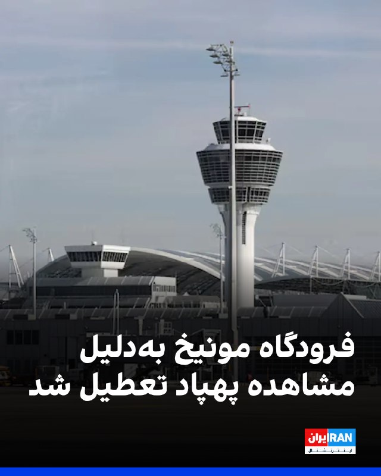

فرودگاه مونیخ پس از گزارش مشاهده یک پهپاد، هر دو باند خود را بست. سخنگوی پلیس فدرال آلمان گفت یک خلبان فعالیت مشکوک را اعلام کرده است.
به گزارش ر سانه آلمانی فوکوس آنلاین، فرودگاه برای ساعاتی تعطیل است و هلیکوپترها در حال جست‌وجوی پهپاد هستند. وضعیت همچنان نامشخص اعلام شده است.
https://iranintl.com/202605304627

## IranIntlTV — post 339705

🗣روایت شما از زندگی در دوران پس از انقلاب ملی و جنگ- شنبه ۹ خرداد ۱۴۰۵

🔹امروز شنبه ۹ خرداد برازجان ساعت ۹:۱۱ صبح سه بار صدای انفجار آمد و خانه‌ها لرزید.

🔹نفت پالایش بندرعباس دو ماه کار کردیم، ۱۰ ماه می‌گذرد با حقوق ۲۵۰۰ فقط ۳۹ میلیون دادند، بعدش بیرونمان کردند.

🔹از سمنان. اینجا حکومتی‌های بی‌شرف هر روز یک جایی پاتوق می‌کنند، شیرینی و ساندیس و چای می‌خورند، انگار آمدند جشن و دور هر میدانی ده نفر می‌گذارند که بگویند ما همه‌جا هستیم، ولی ما که می‌دانیم تعدادتان به ۴۰۰ نفر هم نمی‌رسد.

🔹اسمش را گذاشتند وصلی اینترنت، فقط با فیلترشکن پولی وصل می‌شود، خیلی‌ها توان خرید ندارند، رحم کنید.

🔹ما خانواده ۱۰ نفره هستیم و فقط بابام کار می‌کند اما هیچ‌وقت نتوانسته برای ما چیزهایی که دوست داریم بخرد و مجبور به دست‌فروشی است، سال‌هاست مجبورم برای خانواده‌ام کار کنم، کار پاره‌وقت، حسرت کار کردن مثل مردم عادی تو دلم مانده.

🔹من یک جوان ۲۰ ساله هستم که با حقوق ۲۰ میلیون تومانی چندین ماه است تلاش دارم موتورسیکلت فرسوده خودم را بفروشم و یک موتورسیکلت بهتر بخرم اما نمی‌توانم، چرا باید یک موتورسیکلت عادی بشود ۵۰۰ میلیون تومان؟

🔹دیگر زندگی جوری شده که یخچال‌ها نه تنها خالی شده، حتی حقوق بازنشستگی‌ام واریز بشود باز هم همان‌جور خالی می‌ماند، هیچ فرقی نمی‌کند، ۸۰ میلیون گرسنه.

🔹الان ماه خرداد است، هنوز اضافه‌حقوق بازنشسته‌های تأمین اجتماعی را ندادند، ۱۳ میلیون فقط می‌گیریم بعد از ۳۰ سال، دروغ گفتند ۶۰ درصد حقوق اضافه شده، تا الان ندادند.

🔹از تهران پیام می‌دهم، اینجا دیگر گوشت و مرغ از سفره‌ها حذف شده و همین مانده که با نان و پنیر خودمان را سیر می‌کنیم.

🔹از بهارستان اصفهان هستم، اوضاع کار و بازار در حدی بد است که تو خرج روزانه مانده‌ام که هیچ، حتی پول بنزین ندارم تا اسنپ کار کنم.

🔹از بلوچستان هستم، اینجا شرایط خیلی سخت است، همه‌چیز گران شده و هر روز اینجا طعم فقر را مزه‌مزه می‌کنیم.

🔹شنبه ۹ خرداد دو تا تخم‌مرغ ۵۰ هزار تومان، نان سنگک دانه‌ای ۵۰ هزار تومان.

🔹از تبریز: فقر و بیکاری و گرانی و تورم و تعطیلی کسب‌وکارها باعث شده پدران شرمنده خانواده‌ها شوند، کمر سرپرستان خانواده‌ها زیر بار گرانی شکسته است.

🔹از تبریز: قیمت میوه نوبرانه فصل چنان نجومی است که پدران در حسرت خرید حتی نیم‌کیلو میوه برای خانواده‌ها مانده‌اند.

🔹آن‌هایی که به سیگار اعتیاد دارند دیگر نمی‌توانند بکشند، وینستون لایت پاکتی ۳۰۰ تومن شده.

## ManotoTV — post 105878

  <a href="telegram/content/ManotoTV_105878_1780136727.mp4" target="_blank">🎬 Download video</a>

سخنان محمود جعفریان، معاون سازمان رادیو تلویزیون ملی ایران و قائم‌مقام دبیرکل حزب رستاخیز، درباره ایران‌دوستی

## FarsiVOA — post 219057

🔺هگست: آمریکا، بریتانیا و استرالیا شناورهای زیردریایی بدون سرنشین توسعه می‌دهند

▪️وزیر دفاع آمریکا اعلام کرد ایالات متحده، بریتانیا و استرالیا در چارچوب پیمان آکوس، برای توسعه شناورهای زیردریایی بدون سرنشین همکاری می‌کنند.

▪️هگست گفت این پروژه شاخص، مجموعه‌ای از سامانه‌های زیردریایی بدون سرنشین چندمنظوره و قابل انطباق را ارائه خواهد کرد که برای پشتیبانی از عملیات زیرآبی و حفظ برتری جمعی سه کشور در حوزه دریایی طراحی شده‌اند.

▪️پیمان آکوس در سال ۲۰۲۱ میان آمریکا، بریتانیا و استرالیا شکل گرفت و بخشی از تلاش سه کشور برای مقابله با افزایش قدرت نظامی چین در منطقه هند-آرام تلقی می‌شود.

▪️چین این پیمان را خطرناک خوانده و هشدار داده که آکوس می‌تواند به مسابقه تسلیحاتی منطقه‌ای دامن بزند.

⬇️ بیشتر بخوانید:
https://ir.voanews.com/a/aukus-to-develop-unmanned-undersea-vehicles-pentagon-chief-says/8155538.html

## FarsiVOA — post 219056

🔺قطر: عوارض «موقت» در تنگه هرمز قابل مذاکره است

▪️معاون نخست‌وزیر قطر می‌گوید این کشور مخالف دریافت دائمی عوارض عبور کشتی‌ها از تنگه هرمز توسط جمهوری اسلامی است، اما اعمال عوارض «موقت» قابل مذاکره است.

▪️شیخ سعود بن عبدالرحمن آل‌ثانی در سنگاپور گفت اعمال عوارض برای مدت مشخصی برای پوشش هزینه پاکسازی مین یا استفاده‌های مشابه، قابل مذاکره است.

▪️او تصریح کرد قطر به همراه دیگر شرکای عربی، صراحتاً اعلام کرده که با دریافت دائمی عوارض حقوقی برای عبور از تنگه هرمز مخالف است.

▪️ایالات متحده آمریکا و اروپا نیز تلاش جمهوری اسلامی برای دریافت عوارض عبور از کشتی‌ها در تنگه هرمز را «اخاذی دریایی» توصیف کرده‌اند.

⬇️ بیشتر بخوانید:
https://ir.voanews.com/a/8155537.html

## FarsiVOA — post 219055

  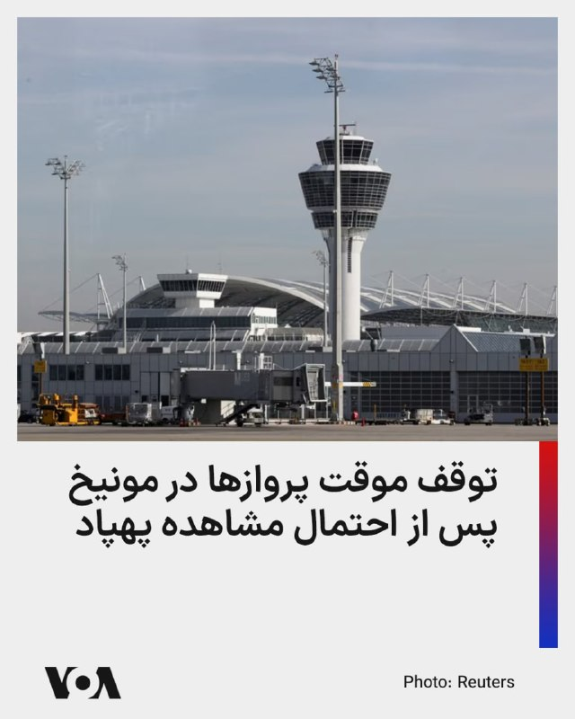

رسانه‌های آلمانی گزارش دادند پروازها در فرودگاه مونیخ، در جنوب آلمان، صبح شنبه پس از احتمال مشاهده یک پهپاد متوقف شد.

رویترز به نقل از فوکوس آنلاین و بیلد نوشت فعالیت پروازی این فرودگاه برای مدتی متوقف شد، اما فوکوس کمی بعد گزارش داد که پروازها از سر گرفته شده‌اند. فرودگاه مونیخ و پلیس آلمان در زمان انتشار گزارش رویترز به درخواست‌ها برای اظهارنظر پاسخ نداده بودند.

این رخداد در حالی گزارش شده که نگرانی اروپا از حوادث پهپادی در روزهای اخیر افزایش یافته است. یک روز پیش از آن، رومانی، عضو ناتو و اتحادیه اروپا، اعلام کرد یک پهپاد روسی در جریان حمله به اوکراین به یک ساختمان مسکونی در خاک این کشور اصابت کرده است. این حادثه‌ واکنش تند ناتو و اتحادیه اروپا را به دنبال داشت.

همزمان، دیمیتری مدودف، معاون شورای امنیت روسیه، به رهبران اروپایی هشدار داده که باید منتظر تکرار حوادث پهپادی در کشورهای خود باشند.
@FarsiVOA

## FarsiVOA — post 219054

  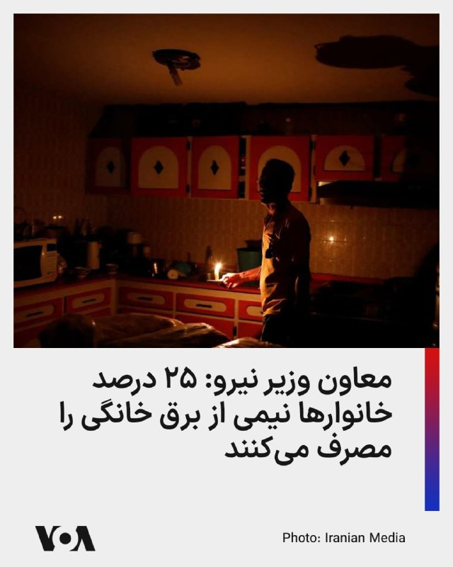

معاون برق و انرژی وزارت نیرو مدعی شده که ۲۵ درصد خانوارها نیمی از برق خانگی کشور را مصرف می‌کنند.

مصطفی رجبی مشهدی همچنین خانوارها را به «نصب داوطلبانه پنلهای خورشیدی» دعوت و اعلام کرد در این صورت آنها علاوه بر تأمین برق پایدار برای منزل خود، از تخفیف‌های ویژه و تسهیلات در بهای برق مصرفی بهره‌مند می‌شوند.

پیشتر شرکت مدیریت تولید، انتقال و توزیع نیروی برق ایران (توانیر) از جهش ۵ برابری تعرفه خانوارهایی که بیش از الگوی مصرف، برق استفاده می‌کنند خبر داده و تهدید کرده بود که تعرفه برق «بسیار پرمصرف‌ها» ۴۵ برابر خواهد شد.

این تهدید در حالی است که طبق آمارهای رسمی وزارت نیرو سالانه حدود ۴۰ تراوات ساعت برق در شبکه فرسوده انتقال و توزیع شرکت توانیر تلف می‌شود که این رقم عظیم، معادل ۴۰ درصد از برق مصرفی کل خانوارهای ایران است.
@FarsiVOa

## FarsiVOA — post 219053

  <a href="telegram/content/FarsiVOA_219053_1780136730.mp4" target="_blank">🎬 Download video</a>

تاکید رئیس ستاد کل ارتش اسرائیل بر پیوند عمیق و ناگسستنی با جامعه دروزی‌ها؛

ایال زمیر، رئیس ستاد کل ارتش اسرائیل به مناسبت «عید قربان» با جامعه دروزی‌ها دیدار کرد و روابط میان ارتش و این جامعه را یک «اتحاد برادری عمیق» خواند.

او با اشاره به حضور فرزندان جامعه دروزی در تمامی سطوح فرماندهی و عملیاتی ارتش، هم‌رزم بودن با آن‌ها را یک افتخار بزرگ دانست و تاکید کرد که دروزی‌ها بخش جدایی‌ناپذیر و مایه اقتدار ارتش هستند.

دروزی‌ها یک جامعه مذهبی و قومی در خاورمیانه هستند که دین آن‌ها به عنوان یک انشعاب از اسماعیلیه در قرن یازدهم میلادی شکل گرفت. برخلاف اکثریت اعراب مسلمان در منطقه، جامعه دروزی‌های ساکن در مرزهای پیش از سال ۱۹۶۷ اسرائیل، پیوندی تاریخی و بسیار وفادار با دولت اسرائیل برقرار کرده‌اند که به «پیمان خون» معروف است.

این ارتباط عمیق باعث شده که مردان دروزی از سال ۱۹۵۶ مشمول قانون نظام وظیفه اجباری در ارتش اسرائیل شوند. امروزه، آن‌ها حضور بسیار پررنگی در واحدهای رزمی و سطوح عالی فرماندهی ارتش، نهادهای امنیتی و ساختار سیاسی اسرائیل دارند و خود را بخشی جدایی‌ناپذیر از امنیت و هویت این کشور می‌دانند.
@FarsiVOA

## FarsiVOA — post 219052

  

بلومبرگ در گزارشی نوشت نروژ با وجود تلاش برای متنوع‌سازی اقتصاد خود، همچنان به درآمدهای نفت و گاز وابسته مانده و جنگ خلیج فارس بار دیگر اهمیت این بخش را برای اقتصاد این کشور افزایش داده است.

به نوشته بلومبرگ، اختلال در عرضه انرژی از خلیج فارس و افزایش قیمت نفت و گاز، نروژ را به یکی از برندگان بحران تازه انرژی تبدیل کرده است؛ کشوری که پس از کاهش وابستگی اروپا به انرژی روسیه، نقش مهم‌تری در تأمین نفت و گاز اروپا پیدا کرده بود.

این گزارش می‌گوید درآمدهای بالای انرژی، روند فاصله گرفتن اقتصاد نروژ از نفت و گاز را دشوارتر کرده است. در حالی که دولت نروژ از گذار سبز و سرمایه‌گذاری در صنایع جدید سخن می‌گوید، بخش نفت و گاز همچنان موتور اصلی صادرات، درآمد دولت و سرمایه‌گذاری در این کشور است.

بر اساس گزارش‌های مرتبط، جنگ آمریکا با جمهوری اسلامی باعث افزایش تقاضا برای نفت، فرآورده‌های نفتی و ال‌ان‌جی نروژ، به‌ویژه در بازارهای آسیا-اقیانوسیه، شده است.
@FarsiVOA

## FarsiVOA — post 219051

  <a href="telegram/content/FarsiVOA_219051_1780136735.mp4" target="_blank">🎬 Download video</a>

نجات ۸ مسافر گرفتار در ترن هوایی شهربازی تگزاس؛

بر اساس گزارش رسانه‌های رسمی، یک ترن هوایی (رولرکاستر) در ایالت تگزاس آمریکا هنگام حرکت روی یک مسیر کاملاً عمودی دچار نقص فنی و متوقف شد.

در پی این حادثه، ۸ مسافر در بالاترین نقطه ریل عمودی معلق و گرفتار شدند. نیروهای آتش‌نشانی بلافاصله با استفاده از کامیون‌های ویژه به محل اعزام شدند و موفق شدند هر ۸ نفر را به سلامت از روی ریل پایین آورده و نجات دهند. هیچ مصدومیتی در این حادثه گزارش نشده است.
@FarsiVOA

## FarsiVOA — post 219050

  

سازمان سنجش آموزش کشور می‌گوید کنکور سراسری سال ۱۴۰۵ و آزمون دانشجو معلمان، به طور همزماندر روزهای پنج‌شنبه و جمعه ۲۹ و ۳۰ مردادماه جاری برگزار می‌شود.

این سازمان همچنین یادآور شده که جاماندگان از ثبت‌نام می‌توانند تا پایان روز شنبه نهم خرداد، نسبت به آن اقدام کنند.

پیشتر وزیر علوم، تحقیقات و فناوری از احتمال برگزاری کنکور سراسری ۱۴۰۵ در دهه سوم مرداد خبر داده بود.

در مورد آزمون دانشگاه فرهنگیان اما، دبیر شورای‌ آموزش‌ و پرورش سه‌شنبه گذشته از ۱۱ تیرماه به عنوان تاریخ برگزاری این آزمون یاد کرده بود، اما در واکنش سازمان سنجش اعلام کرد که تا کنون تصمیم جدیدی درباره تفکیک آزمون سراسری و آزمون دانشجو معلمان گرفته نشده است.
@FarsiVOA

## FarsiVOA — post 219049

🔺روایت روزنامه شرق از فروپاشی طبقه متوسط در تهران

▪️روزنامه شرق در گزارشی میدانی، تصویری از وضعیت معیشتی طبقه متوسط در تهران ارائه کرده است؛ طبقه‌ای که زمانی با کارمندی، تحصیلات، شغل ثابت و درآمد ماهانه، خود را از فقر روزمره جدا می‌دانست، اما حالا بخش بزرگی از آن درگیر بقا تا پایان ماه شده است.

▪️در این گزارش آمده که ترس از دست دادن شغل، بسیاری از کارمندان را از اعتراض به ثابت‌ماندن دستمزد یا چانه‌زنی برای مزایا بازداشته است.

▪️بر اساس روایت شرق، دو حقوق کارمندی در بسیاری خانواده‌ها عملاً فقط تا هفته دوم ماه دوام می‌آورد. پس از آن، حساب بانکی خالی می‌شود و باید دو هفته باقی‌مانده را با قرض، حذف هزینه‌ها، خرید حداقلی و انتظار برای حقوق بعدی گذراند.

⬇️ بیشتر بخوانید:
https://ir.voanews.com/a/8155536.html

## FarsiVOA — post 219048

🔺پنتاگون از نشست نظامی اسرائیل و لبنان در واشنگتن خبر داد

▪️وزارت جنگ آمریکا اعلام کرد البریج کولبی، معاون وزیر جنگ در امور سیاست‌گذاری، روز جمعه در پنتاگون میزبان هیئت‌های نظامی اسرائیل و لبنان بوده است.

▪️بر اساس اطلاعیه پنتاگون، این نشست برای آغاز «مسیر امنیتی» در پشتیبانی از مذاکرات جاری میان دو کشور برگزار شد.

▪️وزارت جنگ آمریکا این گفت‌وگوهای نظامی‌به‌نظامی را «سازنده» خواند و گفت تمرکز آن بر ایجاد چارچوب‌های عملی برای امنیت و ثبات منطقه‌ای بوده است.

▪️این نشست در ادامه دور قبلی گفت‌وگوهای واشنگتن برگزار شد؛ جایی که اسرائیل و لبنان با تمدید ۴۵ روزه آتش‌بس موافقت کردند و مذاکرات به دو مسیر سیاسی و امنیتی تقسیم شد.

⬇️ بیشتر بخوانید:
https://ir.voanews.com/a/8155535.html

## FarsiVOA — post 219047

  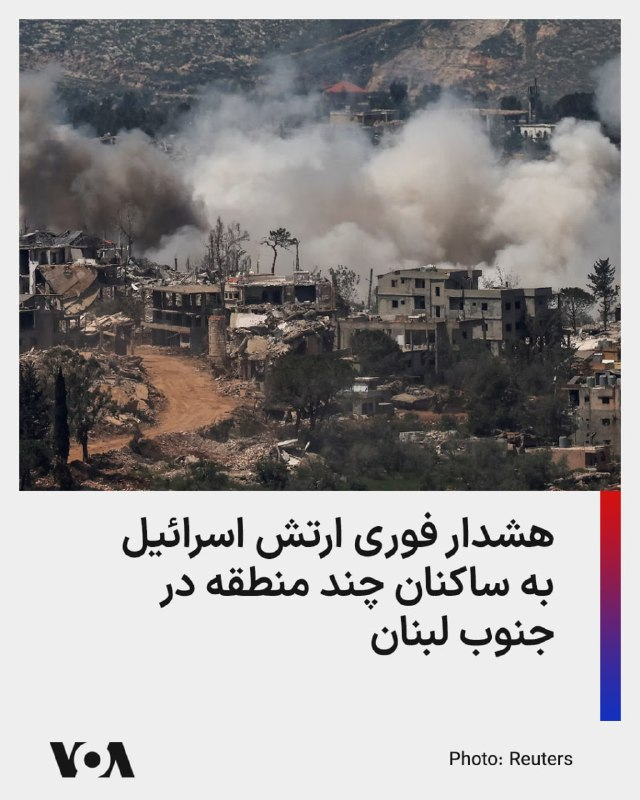

ارتش اسرائیل با انتشار اطلاعیه‌ای فوری از ساکنان مناطق «جدیده انصار»، «الزراریه»، «مزرعه کفوریه‌الرز» و «مشغره» خواست خانه‌های خود را فوراً تخلیه کرده و به شمال رودخانه زهرانی منتقل شوند.

در این اطلاعیه آمده است که به‌دلیل فعالیت‌های حزب‌الله، از جمله حفر تونل‌ها و استفاده از این مناطق برای شلیک و اقدامات نظامی، ارتش اسرائیل قصد دارد با قدرت علیه مواضع حزب‌الله وارد عمل شود.

ارتش اسرائیل تأکید کرده هدفش آسیب رساندن به غیرنظامیان نیست، اما هر فردی که در نزدیکی نیروها، تأسیسات یا تجهیزات جنگی حزب‌الله حضور داشته باشد، جان خود را در معرض خطر قرار می‌دهد.
@FarsiVOA

## DW_Farsi — post 125312

  

🔸 "ادعای ترامپ درباره مین‌های ایران در تنگه هرمز تائید نشده است"

شبکه "ان‌بی‌سی" به نقل از دو مقام آمریکایی و یک منبع آگاه گزارش داد که واشنگتن هنوز تایید نکرده است که ایران در تنگه هرمز مین‌گذاری کرده باشد؛ این در حالی است که دونالد ترامپ، رئیس‌ جمهور ایالات متحده آمریکا، روز جمعه ۸ خرداد (۲۹ مه) مدعی شده بود که ایران پذیرفته است مین‌هایی را که آمریکا موفق به پاکسازی آنها نشده، از تنگه هرمز جمع‌آوری کند.

با این حال، بر اساس این گزارش، ارزیابی‌های اطلاعاتی آمریکا و کشورهای متحد در روزهای آغازین جنگ نشان می‌داد که ایران احتمالا در حال مین‌گذاری این آبراه راهبردی بوده است، اما عملیات جست‌وجو و بازرسی زیرآبی آمریکا نتوانسته هیچ شیئی را که به‌طور قطعی مین دریایی تشخیص داده شود، پیدا کند.

یکی از منابع آگاه در این باره گفت که اگر هم تهدیدی وجود داشته، بسیار کمتر از آن چیزی بوده است که در ابتدا درباره آن نگرانی وجود داشت.

تنگه هرمز یکی از مهم‌ترین مسیرهای انتقال نفت و انرژی جهان به شمار می‌رود و هرگونه تهدید علیه امنیت کشتیرانی در این آبراه تاثیری مستقیم بر قیمت نفت دارد.
@dw_farsi

## DW_Farsi — post 125311

  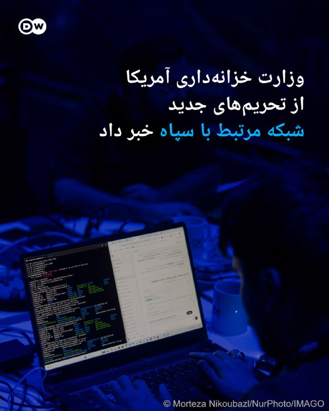

🔶 وزارت خزانه‌داری آمریکا از تحریم‌های جدید شبکه مرتبط با سپاه خبر داد

وزارت امور خارجه و وزارت خزانه‌داری آمریکا از اعمال تحریم‌های جدید علیه جمهوری اسلامی و تلاش برای انحلال یک شبکه مرتبط با این کشور خبر دادند.

این شبکه به رهبری "علی مجد سپهر" مستقر در ایران متهم شده است که با جعل هویت شرکت‌های آمریکایی و فریب شرکت‌های فناوری در آمریکا در تلاش برای دسترسی به تجهیزات پیشرفته برای بخش نظامی ایران بوده است.

وزارت خزانه‌داری آمریکا علی مجدسپهر را فردی مرتبط با وزارت دفاع جمهوری اسلامی معرفی کرده و چند فرد و شرکت دیگر را نیز به دلیل همکاری و ارتباط با او تحریم کرده است.

به گفته مقام‌های آمریکایی، این شبکه از وب‌سایت‌های جعلی و واسطه‌هایی در دبی برای دریافت محموله‌ها استفاده کرده و در پی تهیه تجهیزات برای بخش دفاعی ایران بوده است.

وزارت خارجه آمریکا هم‌زمان با این تحریم‌ها اعلام کرد تا ۱۵ میلیون دلار پاداش برای اطلاعاتی که به مختل‌شدن تامین مالی سپاه پاسداران منجر شود، در نظر گرفته شده است.
@dw_farsi

## DW_Farsi — post 125310

🔶 جنگ ایران شریان دارویی هند به آفریقا را قطع کرده است

هند را اغلب "داروخانه جنوب جهانی" می‌نامند و برای کشورهای آفریقایی، سلامت عمومی و داروهای هندی به‌شدت به یکدیگر گره خورده‌اند.

بر اساس داده‌های نهادهای بهداشت عمومی از جمله سازمان بهداشت جهانی (WHO)، آفریقا نزدیک به یک‌چهارم بار بیماری‌های جهان را بر دوش می‌کشد و سهم نامتناسبی از موارد ابتلا به اچ‌آی‌وی (HIV)، سل و مالاریا را به خود اختصاص داده است.

بر پایه داده‌های کمیسیون اقتصادی سازمان ملل برای آفریقا و آژانس ملی کنترل و نظارت بر غذا و داروی نیجریه (NAFDAC)، هند حدود ۴۰ درصد داروهای وارداتی آفریقا را تأمین می‌کند و بزرگ‌ترین شریک تجاری دارویی این قاره به شمار می‌رود.

از نیجریه تا کنیا و آفریقای جنوبی، داروهای ژنریک هندی ستون فقرات نظام‌های بهداشت عمومی را تشکیل می‌دهند. در سراسر قاره، این داروها آنتی‌بیوتیک‌های ارزان‌قیمت، داروهای ضدویروس اچ‌آی‌وی، داروهای مالاریا و سل، انسولین، داروهای فشار خون و مسکن‌های رایج مورد استفاده روزانه میلیون‌ها نفر را تأمین می‌کنند.

این نظام تاکنون کارآمد بوده است، زیرا داروهای هندی مقرون به صرفه، قابل اعتماد و وابسته به یکی از کارآمدترین کریدورهای لجستیکی جهان بوده‌اند.

این داروها از مراکز لجستیکی حوزه خلیج فارس عبور می‌کنند، زیرا برخی داروها و واکسن‌ها به سامانه‌های پیشرفته حمل‌ونقل با کنترل دما و شرایط اقلیمی نیاز دارند.

اما با مسدود شدن تنگه هرمز در پی جنگ ایران، حمل‌ونقل تجاری از منطقه خلیج فارس مختل شده است. همزمان، حق بیمه خطرات جنگی افزایش یافته، هزینه‌های حمل‌ونقل بالا رفته و شرکت‌های هواپیمایی مسیرهای خود را تغییر داده یا ظرفیت حمل بار از حریم هوایی خلیج فارس را کاهش داده‌اند.

افزایش قیمت نفت نیز همزمان هزینه‌های تولید و حمل‌ونقل شرکت‌های داروسازی را بالا برده است.

📌 برای دسترسی کامل به گزارش به وبسایت دویچه‌وله فارسی مراجعه کنید.
@dw_farsi

## DW_Farsi — post 125309

🔶 واژگونی کامیون حامل مهاجران افغان؛ ۱۸ نفر کشته شدند

روز شنبه یک کامیون حامل پناهجویان افغان که در حال بازگشت از پاکستان بودند، در بزرگراهی در شرق افغانستان واژگون شد. در این حادثه دست‌کم ۱۸ نفر کشته و ۳۵ تن دیگر مجروح شدند. بیشتر آن‌ها زن و کودک هستند.

عبدالمالک نیازی، سخنگوی والی لغمان، اعلام کرد که این تصادف در استان لغمان و در بزرگراه اصلی متصل‌کننده کابل (پایتخت افغانستان) به استان ننگرهار رخ داده است.

وی افزود که در میان کشته‌شدگان، ۱۰ کودک و ۵ زن وجود دارند و مجروحان برای مداوا به بیمارستان‌های ننگرهار منتقل شده‌اند.

مسافران این کامیون در زمره هزاران افغان بودند که به تازگی از پاکستان بازگشته‌اند. مقام‌های پاکستان از سال ۲۰۲۳ و بخصوص در ماه‌های اخیر سیاست‌های سختگیرانه‌تری را در قبال مهاجران و پناهجویان افغان ساکن این کشور اتخاذ کرده‌اند؛ موضوعی که باعث شده شمار زیادی از افغان‌ها، اغلب همراه با خانواده و وسایل زندگی خود، با کامیون‌ها به افغانستان بازگردند. ایران نیز در همان حوالی زمانی، اخراج مهاجران افغان را شدت بخشید.

بر اساس آمار کمیساریای عالی سازمان ملل متحد در امور پناهندگان (UNHCR) و سازمان بین‌المللی مهاجرت (IOM)، از آغاز سال ۲۰۲۶ میلادی تاکنون ۴۴۷ هزار و ۴۰۰ افغان از جمله بسیاری که در پاکستان متولد شده بودند و ده‌ها سال را به زندگی و کار در آنجا سپری کرده بودند، به کشور خود بازگشته‌اند.
@dw_farsi

## DW_Farsi — post 125308

  

🔶 اسرائیل به مواضع حزب‌الله در جنوب لبنان حمله کرد

دولت لبنان صبح روز شنبه ۹ خرداد (۳۰ مه) اعلام کرد در حملات جدید اسرائیل به این کشور دست‌کم ۱۱ نفر در جنوب لبنان کشته شدند.

وزارت بهداشت در بیروت اعلام کرد که در میان کشته‌شدگان، یک عضو نیروهای امدادی نیز قرار دارد. بر اساس این گزارش در حملات انجام‌شده در مناطق مختلف اطراف شهر صور ۸ نفر زخمی شده‌اند که یکی از آن‌ها نیز از نیروهای امدادی بوده است.

وزارت بهداشت لبنان در بیانیه‌ای حملات اسرائیل را "نقض شدید حقوق بین‌الملل" توصیف کرده است.

در لبنان در حال حاضر آتش‌بسی برقرار است، اما این آتش‌بس از سوی حزب‌الله مورد حمایت جمهوری اسلامی رد شده و دو طرف بار دیگر به‌طور روزانه به یکدیگر حمله می‌کنند.
در تازه‌ترین تحولات پنتاگون اعلام کرد که میزبان هیئت‌های اسرائیل و لبنان بوده و گفت‌وگوهای نظامی "سازنده‌ای" میان طرفین انجام شده است.
@dw_farsi

## DW_Farsi — post 125307

  

📸 عکس روز: دنالی، بلندترین قله آمریکای شمالی

"دنالی" که با نام پیشین رسمی خود، "مک‌کینلی" نیز شناخته می‌شود با ارتفاع حدود ۶ هزار و ۱۹۰ متر بلندترین قله آمریکای شمالی است. این کوه در پارک و منطقه حفاظت‌شده دنالی در آلاسکا قرار دارد. پس از سال‌ها تلاش بومیان محلی، دولت آمریکا در سال ۲۰۱۵ نام این کوه را رسما به دنالی تغییر داد که در زبان بومی آتاباسکی که خانواده‌ای از زبان‌های سرخ‌پوستان آمریکای شمالی به شمار می‌رود، "غول‌پیکر" معنا می‌دهد.
@dw_farsi

## Persian_Trend_Official — post 15328

  

رسانه NBC: یک فروند جنگنده F-15E آمریکایی که ماه گذشته برفراز آسمان جنوب غرب ایران سرنگون شد احتمالاً توسط یک موشک دوش پرتاب ساخت چین مورد اصابت قرار گرفته است.

چین همچنین ممکن است یک رادار هشدار دهنده برد بلند YLC-8B را که قادر به شناسایی هواپیماهای رادارگریز در اوایل درگیری است در اختیار ایران قرار داد باشد.

ان بی سی مدرکی برای این ادعاهای خود منتشر نکرد و این ادعاها را براساس احتمالات منتشر کرده.

📝 Amir

📌 @persian_trend_official
پرشین ترند | متفاوت‌ترین کانال نظامی

## Persian_Trend_Official — post 15327

ارتش امریکا روز گذشته یک قایق مظنون به قاچاق مواد مخدر را در شرق اقیانوس آرام مورد حمله خود قرار داد. هر سه سرنشین این قایق کشته شدند.

📝 Amir

📌 @persian_trend_official
پرشین ترند | متفاوت‌ترین کانال نظامی

## Persian_Trend_Official — post 15324

تصاویری از لاشه یک تلار سامانه پدافندی سوم خرداد نیروی هوافضا سپاه که در جریان جنگ اخیر در حوالی کرمانشاه در اثر برخورد پرتابه اسرائیلی منهدم شده است.

📝 Amir

📌 @persian_trend_official
پرشین ترند | متفاوت‌ترین کانال نظامی

## Persian_Trend_Official — post 15323

  <a href="telegram/content/Persian_Trend_Official_15323_1780136744.mp4" target="_blank">🎬 Download video</a>

اوکراین ویدویی از انهدام دو فروند هواپیمای گشت دریایی توپولوف-142 و یک لانچر موشک بالستیک اسکندر توسط پهپاد های انتحاری سری FP-1/2 خود در فرودگاه تاگانروگ روسیه منتشر کرد.

📝 Amir

📌 @persian_trend_official
پرشین ترند | متفاوت‌ترین کانال نظامی

## Persian_Trend_Official — post 15319

سوخو-30 های ارمنستانی مجهز به بمب‌های هدایت شونده ایرانی!

در تصویر منتشر شده از رژه هوایی جنگنده های سوخو-30 ارمنستانی، این جنگنده ها مجهز به چند بمب بالدار یاسین شده اند، خانواده هدایت شونده یاسین که از یک پیشران راکتی نیز بهره می‌بردند در آخرین نمونه خود یعنی یاسین 400 دارای برد 150 کیلومتری هستند.

روسیه از ناوگان سوخو-30 های ارمنستانی پشتیبانی مناسب نمی‌کند به همین دلیل احتمالا ارمنستان برای تامین تسلیحات هواپرتاب این جنگنده به ایران روی آورده است.

متاسفانه در ایران با وجود طیف گسترده ای از تسلیحات هواپرتاب هدایت شونده به دلیل نبود پلتفرم مناسب برای پرتاب این بمب‌ها، خلبانان ایرانی در جنگ اخیر مجبور شدند با بمب های سقوط آزاد سری MK و فاب به قطر و کویت حمله کنند.

📝 Amir

📌 @persian_trend_official
پرشین ترند | متفاوت‌ترین کانال نظامی

## Persian_Trend_Official — post 15318

  <a href="telegram/content/Persian_Trend_Official_15318_1780136746.mp4" target="_blank">🎬 Download video</a>

انهدام یک فروند پهپاد MQ-9 و زخمی شدن 5 سرباز آمریکایی در پی حمله موشکی ایران به کویت! بلومبرگ در گزارش جدید خود نوشت: حمله موشکی بالستیک ایران به پایگاه هوایی کویت در تاریخ 30 مه، علیرغم رهگیری موشک توسط پدافند هوایی کویت، چندین آمریکایی را زخمی و به دو…

## Persian_Trend_Official — post 15317

  

انهدام یک فروند پهپاد MQ-9 و زخمی شدن 5 سرباز آمریکایی در پی حمله موشکی ایران به کویت!

بلومبرگ در گزارش جدید خود نوشت: حمله موشکی بالستیک ایران به پایگاه هوایی کویت در تاریخ 30 مه، علیرغم رهگیری موشک توسط پدافند هوایی کویت، چندین آمریکایی را زخمی و به دو پهپاد MQ-9 Reaper آسیب جدی وارد کرد.

قطعات موشک رهگیری شده فاتح-110 به پایگاه هوایی علی السالم برخورد کرد(؟) و باعث جراحات جزئی حدود پنج پرسنل و پیمانکار آمریکایی شد. یک پهپاد Reaper منهدم و دیگری به شدت آسیب دید.

📝 Amir

📌 @persian_trend_official
پرشین ترند | متفاوت‌ترین کانال نظامی

## Persian_Trend_Official — post 15316

  <a href="telegram/content/Persian_Trend_Official_15316_1780136749.webm" target="_blank">🎬 Download video</a>

🎥 لاشۀ پهپاد منهدم‌شده در قشم 
👺Phantom 📌 @persian_trend_official پرشین ترند | متفاوت‌ترین کانال نظامی

## RadioFarda — post 157715

  

🔸ارتش جمهوری اسلامی ایران روز شنبه در بیانیه‌ای اعلام کرد یک پهپاد را در آسمان قشم ساقط کرده است.

🔸در این بیانیه آمده است که پدافند ارتش بامداد روز شنبه نهم خرداد یک فروند پهپاد «اوربیتر دشمن متجاوز» را رهگیری و با «شلیک موفق» ساقط کرده است.

🔸ارتش جمهوری اسلامی می‌گوید این پهپاد «آمریکایی- اسرائیلی» بوده است.

🔸سنتکام و ارتش اسرائیل هنوز واکنشی به این خبر نشان نداده‌اند.

🔸این خبر در حالی منتشر شده است که وزیر دفاع ایالات متحده روز شنبه هشدار داد که ارتش این کشور برای ازسرگیری جنگ با ایران حتی «بیش از آنچه لازم است توانایی» دارد.

@RadioFarda

## RadioFarda — post 157714

  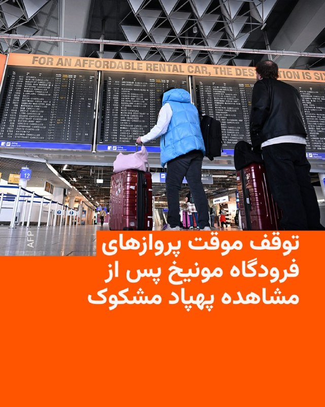

🔸پلیس و مقامات فرودگاه مونیخ به خبرگزاری فرانسه گفتند که پروازها در این فرودگاه روز شنبه نهم خرداد به دلیل «مشاهده یک پهپاد مشکوک»، حدود یک ساعت به حالت تعلیق درآمد.

🔸سخنگوی پلیس گفت که دو خلبان کمی پس از ساعت ۹ صبح از وقوع حادثه‌ای مشکوک که ظاهراً پهپاد بود، خبر دادند و با هماهنگی کنترل ترافیک هوایی آلمان، مقامات امنیتی سپس تصمیم به بستن باند فرودگاه‌ها گرفتند.

🔸به گفته سخنگوی فرودگاه، پروازها ساعت ۱۰:۰۵ صبح از سر گرفته شد.

🔸سخنگوی فرودگاه مونیخ گفت که «جستجوی گسترده توسط سرویس‌های اورژانس هیچ تهدیدی» برای امنیت عمومی پیدا نکرد.

🔸سال گذشته نیز فرودگاه مونیخ آلمان پس از مشاهده چندین پهپاد مشکوک به‌دلایل امنیتی تعطیل شد.

@RadioFarda

## RadioFarda — post 157713

سازمان اطلاعات دانمارک «تهدید تروریستی ایران» را بزرگ‌تر از گذشته ارزیابی کرد

🔸سازمان اطلاعات دانمارک روز جمعه، هشتم خردادماه، در بیانیه‌ای اعلام کرد که ایران، در پی تحولات جهانی اخیر، در حال حاضر نقش پررنگ‌تری در تهدید تروریستی علیه این کشور اسکاندیناوی ایفا می‌کند.

🔸رئیس سازمان امنیت و اطلاعات ملی دانمارک گفت که سطح کلی تهدید از طرف ایران برای کشورش همچنان چهار از مقیاسی پنج درجه‌ای است، اما در عین حال تأکید کرد که در سال‌های اخیر ماهیت این تهدیدها «به‌طور قابل‌توجهی تغییر کرده است».

🔸فین بورخ آندرسن در بیانیه‌ رسمی خود می‌گوید: «در سال گذشته، عوامل دولتی اهمیت فزاینده‌ای در تهدیدات تروریستی پیدا کرده‌اند. ارزیابی ما این است که این موضوع به‌ویژه درباره ایران صدق می‌کند؛ کشوری که به‌طور خاص تهدیدی برای منافع اسرائیلی و یهودی و همچنین برخی مخالفان ایرانی در اروپا، از جمله دانمارک، محسوب می‌شود.»

🔸او افزود: «تهدید ناشی از ایران از سرویس‌های اطلاعاتی این کشور سرچشمه می‌گیرد که برای برنامه‌ریزی و اجرای حملات از شبکه‌های مجرمانه و همچنین جذب نیرو در اروپا استفاده می‌کنند».

🔸در کشور همسایه دانمارک، سوئد، سازمان امنیت این کشور (ساپو) نیز ایران را متهم کرده که از باندهای تبهکار برای انجام «اقدامات خشونت‌آمیز» علیه منافع اسرائیلی و چهره‌های مخالف ایرانی در سوئد استفاده می‌کند، ادعایی که ایران رد کرده است.

🔸به گفته سازمان ملی امنیت و اطلاعات دانمارک، تشدید خصومت میان ایران و اسرائیل در سال‌های اخیر، به‌ویژه پس از آغاز حملات اسرائیل و ایالات متحده علیه ایران در ۹ اسفند پارسال، بر سطح تهدید علیه کشورهای شمال اروپا و به‌طور کلی کشورهای غربی تأثیر گذاشته است.

🔸سازمان امنیت و اطلاعات دانمارک همچنین افزود که در گذشته، تهدیدها عمدتاً از سوی «بازیگران غیردولتی» مانند افراط‌گرایان خشونت‌طلب هدایت می‌شد، و با وجود افزایش نقش بازیگران دولتی، تهدید از سوی دیگر گروه‌ها همچنان پابرجاست.

🔸همزمان با انتشار بیانیه رسمی دانمارک، پلیس بریتانیا روز جمعه اعلام کرد یک شهروند یونانی به اتهام همکاری با یک سرویس اطلاعاتی خارجی که به گفته پلیس «گمان می‌رود متعلق به ایران باشد» دادگاهی شد.

🔸اتهام او تلاش برای هدف قرار دادن یک روزنامه‌نگار شاغل در شبکه تلویزیونی ایران اینترنشنال عنوان شده است. در بیانیه پلیس بریتانیا نام این روزنامه‌نگار ذکر نشده است.

🔸نسخه کامل این گزارش را در وب‌سایت رادیوفردا بخوانید.

RadioFarda

## RadioFarda — post 157712

هِگسِت از متحدان آسیایی آمریکا خواست برای مهار چین هزینه‌های دفاعی خود را بالا ببرند

🔸پیت هگست، وزیر دفاع آمریکا، روز شنبه، ۹ خرداد، در نشست امنیتی شانگری‌لا در سنگاپور از متحدان آسیایی واشینگتن خواست برای مقابله با افزایش سریع توان نظامی چین، هزینه‌های دفاعی خود را افزایش دهند.

🔸او هشدار داد که «دوران یارانه دادن آمریکا با هدف دفاع از کشورهای ثروتمند پایان یافته است».

🔸هگست در سخنرانی خود در این نشست، که از مهم‌ترین گردهمایی‌های سالانه مقام‌های دفاعی، نظامی و دیپلماتیک آسیا به شمار می‌رود، گفت درباره «افزایش تاریخی توان نظامی چین و گسترش فعالیت‌های نظامی آن در منطقه و فراتر از آن» نگرانی جدی وجود دارد. او افزود که تسلط هر قدرت هژمونیک بر اقیانوس آرام، موازنه قدرت منطقه‌ای را برهم خواهد زد.

🔸وزیر دفاع آمریکا گفت واشینگتن از متحدان و شرکای آسیایی خود انتظار دارد هزینه‌های دفاعی‌شان را به ۳.۵ درصد تولید ناخالص داخلی‌شان افزایش دهند. او در عبارتی کنایه‌آمیز گفت: «شانگری‌لای کمتر، کشتی‌های بیشتر، زیردریایی‌های بیشتر» و تأکید کرد که متحدان آمریکا خواهان ثبات هستند، نه تشدید تنش.

🔸هگست همچنین با تکرار موضع دونالد ترامپ، رئیس‌جمهور آمریکا، گفت آمریکا دیگر حاضر نیست هزینه دفاع از کشورهای ثروتمند را به‌تنهایی بپردازد. او گفت: «ما شریک می‌خواهیم، نه تحت‌الحمایه» و افزود که اتحاد نیرومند زمانی معنا دارد که همه طرف‌ها «در بازی سهمی داشته باشند» و «سواری مجانی» در کار نباشد.

🔸با این حال، رئیس پنتاگون درباره روابط واشینگتن و پکن لحنی نسبتاً محتاطانه داشت و گفت روابط دو کشور «بهتر از سال‌های گذشته» است و تماس‌های نظامی میان دو طرف برای مدیریت تنش‌ها بیشتر شده است.

🔸وزیر دفاع ایالات متحده روز شنبه در بخش دیگری از سخنان خود درباره جنگ خاورمیانه گفت ایالات متحده آماده است در صورت شکست دیپلماسی، حملات علیه ایران را از سر بگیرد.

🔸نسخه کامل این گزارش را در وب‌سایت رادیوفردا بخوانید.

RadioFarda

## RadioFarda — post 157711

  

🔸بنیامین نتانیاهو، نخست‌وزیر اسرائیل، روز جمعه گفت نیروهای این کشور در عمق جنوب لبنان پیشروی کرده‌اند؛ همزمان هیئت‌های نظامی اسرائیل و لبنان در واشینگتن مذاکرات امنیتی برگزار کردند.

🔸نتانیاهو اعلام کرد که نیروهای اسرائیلی از رودخانه لیتانی که حدود ۳۰ کیلومتر در شمال مرز لبنان و اسرائیل امتداد دارد، فراتر رفته‌اند.

🔸روز جمعه، خبرگزاری رسمی لبنان از حملات هوایی اسرائیل به بیش از ۲۰ نقطه در جنوب این کشور خبر داد؛ این حملات پیش و پس از صدور هشدارهای ارتش اسرائیل برای تخلیه هشت شهرک صورت گرفت و به موج دیگری از آوارگی مردم این کشور دامن زد.

🔸به گزارش خبرگزاری فرانسه، اسرائیل در همین روز حملات سنگین خود به جنوب لبنان را ادامه داد و وزارت بهداشت لبنان اعلام کرد در حملات اسرائیل به شهر صور ۱۱ نفر کشته شده‌اند.

🔸در همین حال، ژوزف عون، رئیس جمهور لبنان، در تماسی تلفنی با مارکو روبیو، وزیر امور خارجه ایالات متحده، بر «لزوم به کارگیری تمام تلاش‌ها برای دستیابی به آتش‌بس» تأکید کرد.

RadioFarda

## IranianMinds — post 21059

یک مقام ارشد آمریکایی به الجریزه :

ترامپ هیچ توافقی با ایران رو امضا نمی‌کنه مگر اینکه به نفع آمریکا باشه و خط قرمزهاش رعایت بشه

@IranianMinds

## IranianMinds — post 21058

🔴 صداوسیما خیلی جدی :

طبق نظرسنجی که از مردم انجام دادیم،اکثریت مردم بخاطر وضعیت کشور از وصل شدن اینترنت ناراضی و ناراحتن،باید فورا مجددا قطع بشه.

@IranianMinds

## BBCPersian — post 282423

🔻به گزارش خبرگزاری بلومبرگ، ایران در ۲۴ ساعت گذشته با موشک بالستیک به یک پایگاه هوایی در کویت حمله کرده است که در نتیجه آن چندین آمریکایی «جراحات سطحی» دیده‌اند.

این خبرگزاری به نقل از یک مقام آگاه که نخواست نامش فاش شود، گزارش داد که دو پهپاد «ام‌کیو۹ ریپر» هم در این حمله به شدت آسیب دیدند.

به گفته این منبع، پدافند هوایی کویت یک موشک فاتح-۱۱۰ را رهگیری کرده است اما بقایا و لاشه موشک در پایگاه هوایی علی السالم سقوط کرده و خساراتی برجا گذاشته است.

چند روز پیش در جریان تبادل آتش‌هایی که در منطقه خلیج فارس گزارش شد، مقام‌های کویت و آمریکا از حمله موشکی ایران به کویت خبر داده‌ بودند اما زمان انجام آن حمله با حمله‌ای که بلومبرگ گزارش کرده مطابقت ندارد و متفاوت به‌نظر می‌رسد.

فرماندهی مرکزی ارتش ایالات متحده، سنتکام، پیشتر در بیانیه‌ای گفته بود: «ساعت ۱۰:۱۷ شب به وقت شرق آمریکا در تاریخ ۲۷ مه، (۶ خرداد) ایران یک موشک بالستیک به سمت کویت شلیک کرد که با موفقیت توسط نیروهای کویتی رهگیری شد.»

همان زمان سپاه پاسداران اعلام کرده بود که در واکنش به حمله هوایی آمریکا به نقاطی در حومه بندرعباس، «پایگاه مبداء» این حملات را مورد حمله قرار داده است.

در بیانیه سپاه پاسداران آمده بود: «به دنبال تعرض سحرگاه امروز پنجشنبه (۷ خرداد) ارتش متجاوز آمریکا به نقطه‌ای در حاشیه فرودگاه بندر عباس با پرتابه‌های هوایی، پایگاه هوایی آمریکایی مبداء تجاوز در ساعت ۴/۵۰ دقیقه هدف قرار گرفت.»

حمله جدیدی که بلومبرگ می‌گوید در شبانه روز گذشته انجام گرفته، در حالی است که دونالد ترامپ دیروز برای تصمیم‌گیری در مورد توافق با ایران جلسه تشکیل داده بود.

کاخ سفید پس از جلسه دونالد ترامپ با مشاورانش اعلام کرد که رئیس‌جمهور آمریکا تنها توافقی با ایران را خواهد پذیرفت که «خطوط قرمز» او را تامین کند.
@BBCPersian

## BBCPersian — post 282422

🔻معاون وزیر نیروی ایران از واردات «۳۰۰ مگاوات برق» از کشورهای ترکمنستان و ارمنستان برای کمک به تأمین برق در دوره اوج مصرف تابستان امسال خبر داد و گفت که هم‌زمان صادرات برق به افغانستان و پاکستان نیز ادامه دارد.

مصطفی رجبی مشهدی با بیان این که جنگ ۴۰ روزه اخیر تأثیری بر مبادلات برقی ایران با کشورهای همسایه نداشته است، گفت: «زیرساخت‌های تبادل برق در معرض حملات قرار نگرفتند و همکاری ترکمنستان و ارمنستان در زمینه تأمین برق ایران همچنان ادامه دارد.»

او با اشاره به این که تبادل ۱۰۰۰ مگاوات برق با روسیه جزء توافقات آینده است، گفت که بعد از این که خطوط و تاسیسات مورد نیاز برای اتصال شبکه بین ایران و روسیه احداث شود به لحاظ فنی امکان مبادله تا ۱۰۰۰ مگاوات بین دو کشور وجود دارد.
@BBCPersian

## BBCPersian — post 282420

🔻ارتش اسرائیل شنبه با صدور هشدار تخلیه به ساکنان هفت روستا در جنوب لبنان اعلام کرد که قصد دارد اهدافی متعلق به حزب‌الله را در آن مناطق از لبنان هدف قرار دهد.

آویخای ادرعی، سخنگوی عرب‌زبان ارتش اسرائیل، در بیانیه‌‌ای در شبکه ایکس نوشت که این حملات در پاسخ به «نقض توافق آتش‌بس» از سوی حزب‌الله لبنان است و اکنون ارتش اسرائیل ناگزیر است تا «اقدامی قاطع» انجام دهد.

اسرائیل و حزب‌الله لبنان یکدیگر را به نقض آتش‌بس متهم می‌کنند. در یک هفته‌ گذشته، تنش میان دو طرف تشدید شده است.

ساعتی پیش هم ارتش اسرائیل اعلام کرد که از خاک لبنان چند پرتابه به سمت اسرائیل شلیک شده است.

در همین حال، اسرائیل به بمباران سنگین مناطقی از جنوب لبنان که می‌گوید مواضع حزب‌الله است، ادامه داده است.

این خبرها در حالی منتشر می‌شود که گفت‌وگوهای اسرائیل و لبنان که از ماه آوریل آغاز شد، همچنان ادامه دارد.
@BBCPersian

## BBCPersian — post 282419

🔻ارتش ایران در بیانیه‌ای اعلام کرد نیروی پدافندش یک پهپاد را در قشم ساقط کرده است.

ارتش ایران در این بیانیه‌ نوشت بامداد روز شنبه ۹ خرداد یک فروند پهپاد «اوربیتر دشمن متجاوز» را رهگیری و با «شلیک موفق» ساقط کرده است.

ارتش ایران می‌گوید این پهپاد «آمریکایی- صهیونی» بوده است.

@BBCPersian

## Dirty_Kids — post 390550

  <a href="telegram/content/Dirty_Kids_390550_1780136752.mp4" target="_blank">🎬 Download video</a>

ویدیو وایرال شده از دکلمه این خانم
خدا همدست قاتلهای مزدوره😏😏

@Dirty_Kids 👻

## Dirty_Kids — post 390549

  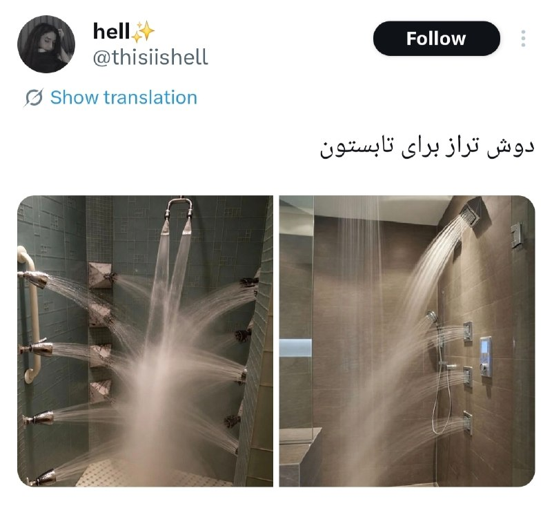

وقتی یوزارسیف وارد مهمونی زلیخا شد:

@Dirty_Kids 👻

## Dirty_Kids — post 390548

  <a href="telegram/content/Dirty_Kids_390548_1780136755.mp4" target="_blank">🎬 Download video</a>

این ویدیو ۱۰۰ میلیون ویو خورده

@Dirty_Kids 👻

## Dirty_Kids — post 390547

  

#قیمت سرویس های بادبان به گیگی 10 هزار تومان رسید بعد ایموجی موشک🚀
💥

🎁 کد تخفیف خرید اول دوباره ریست شد و همه میتونن ازش استفاده کنن:
BadBanOFF

💸 با این کد، 50 هزار تومان تخفیف روی اولین خریدت بگیر!

🔥و مهم‌تر از همه...
سیستم معرفی بادبان فعال‌تر از همیشه‌ست!
از تمام خریدهای کاربرانی که معرفی میکنی، 10% خریدشون رو پورسانت دائمی دریافت کن و موجودی کیف پولت رو افزایش بده 💼

وقتی بادبان داری، هیچ بادی مانع نیست… حتی وقتی اینترنت ملیه⛵️
R9
🛡@BadBan_VPN | کانال 
🤖@BadBan_VPNBot | ربات 
📞@BadBan_VPNSupport | پشتیبانی

## Dirty_Kids — post 390545

تصاویر وایرال شده از «لونا» شیر ماده‌ای که توی کره جنوبی زندگی می‌کنه و بخاطر زیبایی و خوشگلی خاصش، حسابی معروف شده.

@Dirty_Kids 👻

## Dirty_Kids — post 390544

بابای من چون خودش کله ی سحر بیدار میشه هر روز به یه بهانه ایی مامانمو صبح بیدار می کنه
امروز دیگه هیچ بهانه ایی نداشته
۸ صبح گفته میخوام برم پمپ بنزین نمیای؟ :)))))

جدا مرد بازنشسته پدیده ی عجیبیه.

@Dirty_Kids 👻

## Dirty_Kids — post 390543

  

بعد به سیم شارژر من می‌گی بالا چشمت ابرو دیگه شارژ نمی‌کنه.

@Dirty_Kids 👻

## Hranews — post 113234

  

عضو کمیسیون بهداشت و درمان مجلس، اعلام کرد که تشدید بحران نقدینگی در داروخانه‌های خصوصی کشور، برخی از فعالان این حوزه را ناچار به فروش دارایی‌های شخصی از جمله خانه و طلا برای تامین دارو و جلوگیری از برگشت خوردن چک‌ها کرده است. سیدمحمد جمالیان، این وضعیت را ناشی از «چرخه معیوب بیمه‌ها» دانست. وی با اشاره به تاخیر در پرداخت مطالبات مربوط به طرح «دارویار» و منابع هدفمندی یارانه‌ها، افزود که تداوم این روند می‌تواند به کاهش کیفیت خدمات درمانی و حتی تعطیلی مراکز خصوصی حوزه سلامت منجر شود.
#دارو #داروخانه

↘️
@hranews_bot تماس ✉️ - @Hranews کانال هرانا 🆑

## Hranews — post 113233

پرونده سرقت نفت در خوزستان؛ چهار متهم به شلاق و دیگر مجازات‌ها محکوم شدند

❗️
❗️
❗️
❗️
❗️ – مرکز رسانه قوه قضاییه اعلام کرد که در پرونده‌ای مربوط به سرقت هزاران بشکه نفت خام در استان خوزستان، چهار تن از متهمان به تحمل ضربات شلاق و ۱۳ سال حبس تعزیری محکوم شدند.

#شلاق

ادامه مطلب

↘️
@hranews_bot تماس ✉️ -  @Hranews  کانال هرانا 🆑

## Hranews — post 113232

  

دادگاه تجدیدنظر؛ آرمان شاهپوری‌خو به ۲ سال حبس و مجازات‌های تکمیلی محکوم شد

❗️
❗️
❗️
❗️
❗️ – محکومیت آرمان شاهپوری‌خو، معلم بازداشت‌ شده در جریان اعتراضات سراسری ۱۴۰۴، توسط دادگاه تجدیدنظر استان خوزستان عینا تایید شد. وی پیشتر توسط دادگاه انقلاب اهواز به دو سال حبس و مجازات‌های تکمیلی محکوم شده بود.

به گزارش خبرگزاری هرانا، ارگان خبری مجموعه فعالان حقوق بشر در ایران، اخیرا حکم صادر شده علیه آرمان شاهپوری‌خو، بدون تغییر در دادگاه تجدیدنظر استان خوزستان، عینا تایید شده است.

بر اساس رای صادره، آقای شاهپوری‌خو، بابت اتهام اخلال در نظم و امنیت عمومی به دو سال حبس، دو سال ممنوعیت خروج از کشور و یک سال حضور در ستاد امر به معروف و نهی از منکر شهرستان ایذه محکوم شده است.

#آرمان_شاهپوری_‌خو

ادامه مطلب

↘️
@hranews_bot تماس ✉️ -  @Hranews  کانال هرانا 🆑

## manototv — post 105878

  <a href="telegram/content/manototv_105878_1780136759.mp4" target="_blank">🎬 Download video</a>

سخنان محمود جعفریان، معاون سازمان رادیو تلویزیون ملی ایران و قائم‌مقام دبیرکل حزب رستاخیز، درباره ایران‌دوستی

## alonews — post 123650

  <a href="telegram/content/alonews_123650_1780136761.webm" target="_blank">🎬 Download video</a>

👈نیویورک تایمز: پیش‌نویس توافق آتش‌بس بین آمریکا و ایران شامل یک «برنامه بازسازی» و «صندوق سرمایه‌گذاری» است که بخشی از آن توسط ایالات متحده اداره می‌شود و در صورت توافق نهایی به ایران وعده داده خواهد شد. برخی از منابع آن‌ها اعلام کردند که این صندوق ۳۰۰ میلیارد دلار خواهد بود و جزئیات بیشتری در مذاکرات بعدی مورد بحث قرار خواهد گرفت.

🔴گزارش شده است که مقامات ایرانی پیشنهاد داده‌اند که شرکت‌های آمریکایی، مانند شرکت‌های نفت و انرژی، اجازه سرمایه‌گذاری در ایران را داشته باشند.

✅ @AloNews خبر جنگ

## alonews — post 123649

  <a href="telegram/content/alonews_123649_1780136761.webm" target="_blank">🎬 Download video</a>

👈اداره عملیات تجارت دریایی بریتانیا (UKMTO) گزارش می‌دهد که سطح تهدید امنیتی دریایی در تنگه هرمز به دلیل محاصره همچنان بسیار بحرانی است

✅ @AloNews خبر جنگ

## alonews — post 123648

  <a href="telegram/content/alonews_123648_1780136761.webm" target="_blank">🎬 Download video</a>

👈 کریدور جدید ایران–پاکستان به شبکه ترانزیتی چین متصل میشود

🔴گزارش‌ها حاکی است کریدور تازه‌فعال‌شده میان تهران و اسلام‌آباد که بر پایه توافق حمل‌ونقل جاده‌ای سال ۲۰۰۸ دو کشور شکل گرفته، اکنون شش مسیر زمینی را از بنادر اصلی پاکستان شامل گوادر، کراچی و بندر قاسم به گذرگاه‌های مرزی تفتان و گبد در ایران متصل میکند.

🔴اهمیت این پروژه در اتصال آن به کریدور اقتصادی چین–پاکستان (CPEC) عنوان شده است. از طریق این مسیر، ایران میتواند به شبکه ترانزیتی حدود ۳ هزار کیلومتری متصل شود که غرب چین را به اقیانوس هند پیوند میدهد.

🔴همزمان، ایران نیز پروژه راه‌آهن چابهار–زاهدان را با پیشرفت بیش از ۹۰ درصد دنبال میکند. این خط ریلی که قرار است در سال ۲۰۲۶ به بهره‌برداری برسد، بخشی از کریدور شمال–جنوب محسوب میشود و بنادر جنوبی ایران را به روسیه و آسیای مرکزی متصل خواهد کرد.

✅ @AloNews خبر جنگ

## alonews — post 123647

  <a href="telegram/content/alonews_123647_1780136762.webm" target="_blank">🎬 Download video</a>

👈عملیات انهدام مهمات عمل‌نکرده در سنندج از فردا یکشنبه ۱۰ خرداد به مدت یک هفته

✅ @AloNews خبر جنگ

## alonews — post 123646

  <a href="telegram/content/alonews_123646_1780136762.webm" target="_blank">🎬 Download video</a>

👈ابراهیم عزیزی، رئیس کمیسیون امنیت ملی مجلس: کشتی‌های روسی و چینی از «شرایط ویژه و رفتار مطلوب» برای عبور از تنگه هرمز برخوردار خواهند شد

✅ @AloNews خبر جنگ

## alonews — post 123645

  <a href="telegram/content/alonews_123645_1780136762.webm" target="_blank">🎬 Download video</a>

👈یک منبع نظامی به الحدث: وضعیت در جنوب لبنان نگران‌کننده است و وضعیت "در حال از کنترل خارج شدن" است

✅ @AloNews خبر جنگ

## alonews — post 123644

  <a href="telegram/content/alonews_123644_1780136763.webm" target="_blank">🎬 Download video</a>

👈مسافرت قسطی هم از راه رسید...

🔴وزارت گردشگری: تا هفتهٔ آینده کارت‌های سفر در اختیار مردم قرار می‌گیرد.

🔴مردم از طریق این کارت می‌توانند هزینه‌های سفر خود را در درازمدت به‌صورت اقساطی پرداخت کنند.

✅ @AloNews خبر جنگ

## alonews — post 123643

  <a href="telegram/content/alonews_123643_1780136763.webm" target="_blank">🎬 Download video</a>

👈معاون امنیتی فرمانداری بندرلنگه: به‌دلیل خنثی‌سازی مهمات عمل‌نکردهٔ دشمن تا ساعت ۱۷ امروز، احتمال شنیدن صدای انفجار وجود دارد

✅ @AloNews خبر جنگ

## alonews — post 123642

  <a href="telegram/content/alonews_123642_1780136763.webm" target="_blank">🎬 Download video</a>

👈ادعای نیویورک‌تایمز به نقل از مقامات آمریکایی: تندروها در ایران مانع توافق هستند

✅ @AloNews خبر جنگ

## alonews — post 123641

  <a href="telegram/content/alonews_123641_1780136763.webm" target="_blank">🎬 Download video</a>

👈هاآرتص: تهدید به استفاده از زور نظامی علیه تهران اکنون تأثیر و قدرت کمتری نسبت به گذشته دارد

✅ @AloNews خبر جنگ

## alonews — post 123640

  <a href="telegram/content/alonews_123640_1780136764.webm" target="_blank">🎬 Download video</a>

👈داده‌های ماهواره‌ای نشان ‌می‌دهد یک کشتی فله‌بر ایرانی به‌نام کیوان با عبور از محاصرهٔ دریایی آمریکا به سواحل ایران در نزدیکی بندر امام خمینی رسیده است.

✅ @AloNews خبر جنگ

## alonews — post 123639

  <a href="telegram/content/alonews_123639_1780136764.webm" target="_blank">🎬 Download video</a>

👈برای اولین بار در تاریخ بورس ایران، هیچ سهمی منفی نیست!

✅ @AloNews خبر جنگ

## alonews — post 123638

  <a href="telegram/content/alonews_123638_1780136764.webm" target="_blank">🎬 Download video</a>

👈ترامپ: محاصره دریایی ایران از همین حالا برداشته خواهد شد. 
✅ @AloNews خبر جنگ

## alonews — post 123637

  <a href="telegram/content/alonews_123637_1780136764.webm" target="_blank">🎬 Download video</a>

👈یه مقام آمریکایی به الجریزه : ترامپ هیچ توافقی با ایران رو امضا نمی‌کنه مگر اینکه به نفع آمریکا باشه و خط قرمزهاش رعایت بشه

✅ @AloNews خبر جنگ

## alonews — post 123636

  <a href="telegram/content/alonews_123636_1780136765.webm" target="_blank">🎬 Download video</a>

👈فیلد مارشال محسن رضایی: رئیس‌جمهور آمریکا برای بار سوم درحال خیانت به دیپلماسی است

✅ @AloNews خبر جنگ

## alonews — post 123635

  <a href="telegram/content/alonews_123635_1780136765.webm" target="_blank">🎬 Download video</a>

👈مقام ایرانی به الجزیره: هنوز هیچ چیز نهایی نشده است

✅ @AloNews خبر جنگ

## alonews — post 123634

  <a href="telegram/content/alonews_123634_1780136765.webm" target="_blank">🎬 Download video</a>

👈از امروز محدودیت‌های چک برگشتی و لحاظ شدن بدهی‌های غیرجاری وام‌های زیر ۷۰۰ میلیون تومانی در امتیاز اعتباری، پس از پایان مهلت سه‌ماهه بازگشت

✅ @AloNews خبر جنگ

## alonews — post 123633

  <a href="telegram/content/alonews_123633_1780136765.webm" target="_blank">🎬 Download video</a>

👈ارتش : انهدام یک فروند پهپاد «اوربیتر» در منطقه قشم

✅ @AloNews خبر جنگ

<!-- MSG END -->

<!-- NAV START -->

<a href="https://github.com/yerbeyer/aio-downloader/blob/main/telegram/content/archive_1.md" style="display:inline-block; padding:6px 12px; margin:0 4px; background-color:#2ea44f; color:white; text-decoration:none; border-radius:4px; font-weight:bold;">صفحه بعد</a>

<!-- NAV END -->
