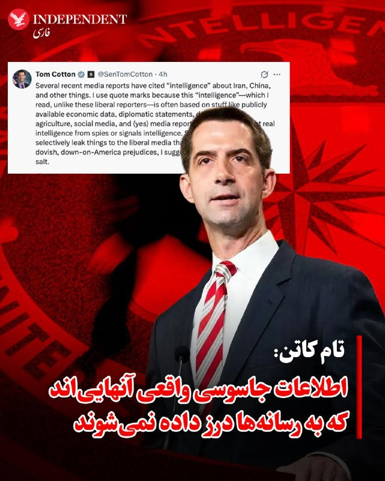
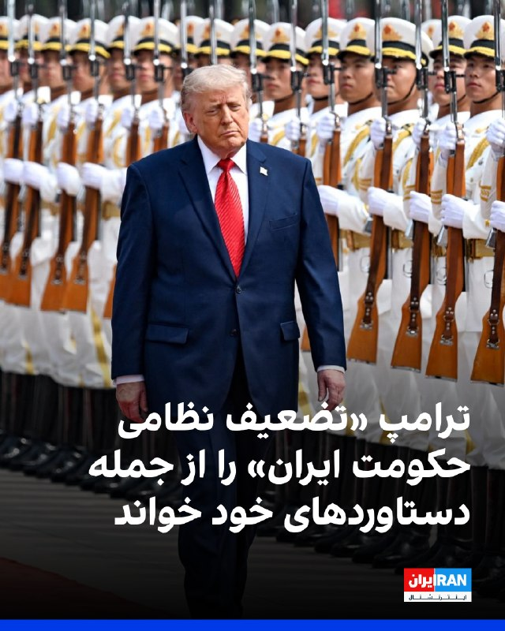
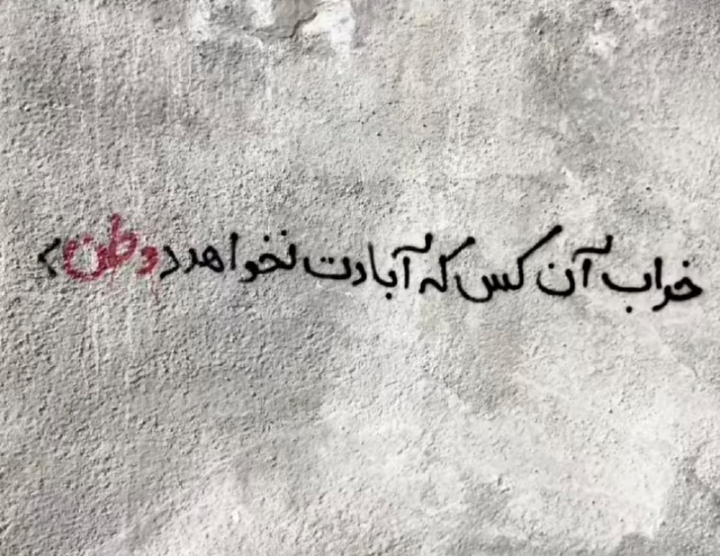
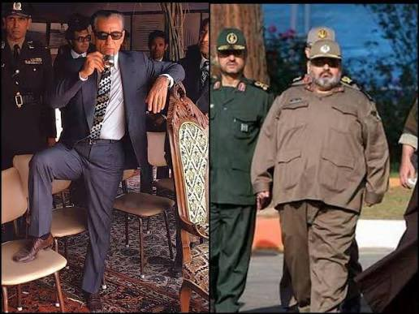
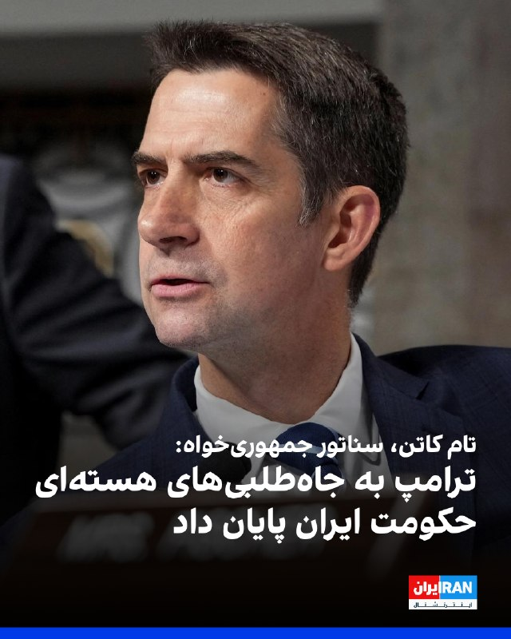
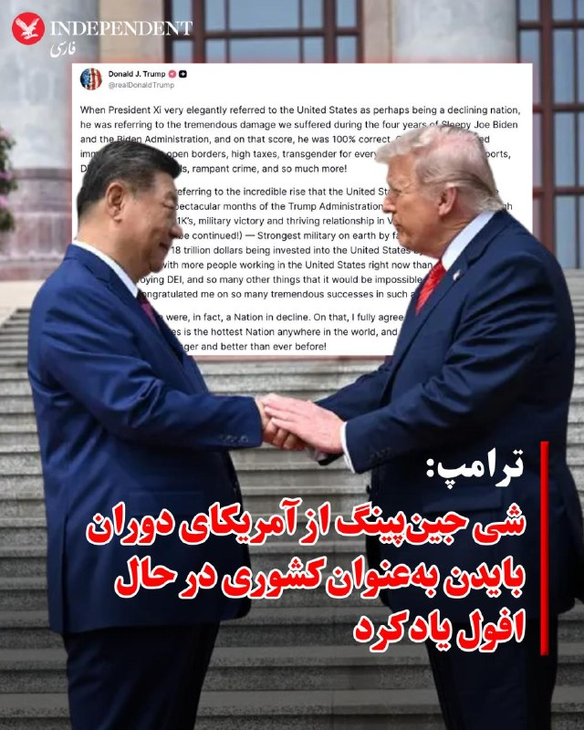
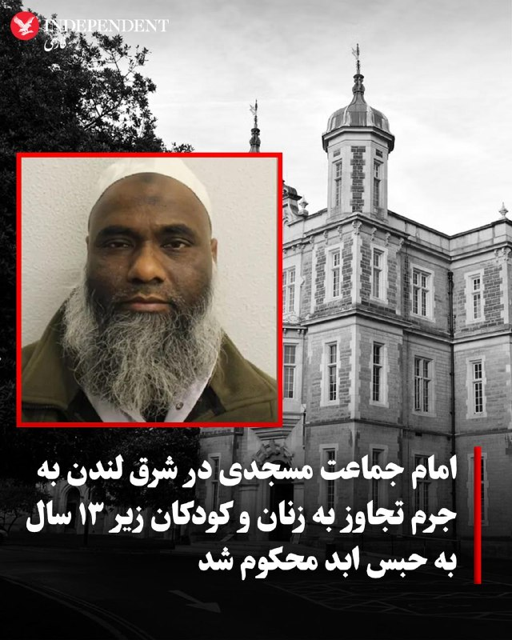
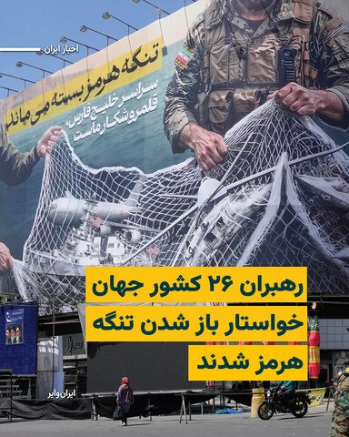
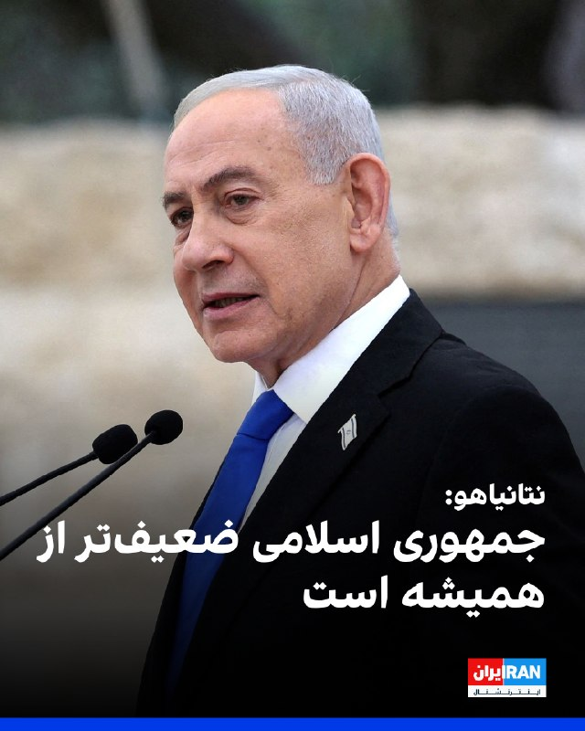

# خواننده تلگرام

<!-- TOP_NAV START -->

<a href="https://github.com/yerbeyer/aio-downloader/blob/main/telegram/content/archive_1.md" style="display:inline-block; padding:6px 12px; margin:0 4px; background-color:#2ea44f; color:white; text-decoration:none; border-radius:4px; font-weight:bold;">صفحه بعد</a>

<!-- TOP_NAV END -->

<!-- MSG START -->

---
📅 بروزرسانی: 1405/02/25 03:11
---

## VahidOOnLine — post 240209

  

♦️تام کاتن، سناتور جمهوریخواه در واکنش به موج گزارش‌هایی که اخیرا در رسانه‌های جریان اصلی آمریکا به نقل از منابع ناشناس منتشر می‌شود و در آن به دسترسی به اطلاعات جاسوسی و محرمانه اشاره می‌شود در پیامی در اکس نوشت: «چند گزارش اخیر رسانه‌ای به «اطلاعات» درباره ایران، چین و موضوعات دیگر استناد کرده‌اند. من از گیومه استفاده می‌کنم، چون این «اطلاعات» که برخلاف این خبرنگاران لیبرال، خودم آن‌ها را خوانده‌ام اغلب بر پایه چیزهایی مانند داده‌های اقتصادی در دسترس عموم، بیانیه‌های دیپلماتیک، اطلاعات وزارت کشاورزی، شبکه‌های اجتماعی و بله، گزارش‌های رسانه‌ای استوار است. به عبارت دیگر، این‌ها اطلاعات واقعی حاصل از فعالیت جاسوس‌ها یا اطلاعات محرمانه نیستند. بنابراین وقتی عناصر دولت عمیق به‌صورت گزینشی مطالبی را به رسانه‌های لیبرال درز می‌دهند که تمام پیش‌داوری‌های از سر ترس، نرمش‌طلبانه و ضدآمریکایی آن‌ها را تایید می‌کند، پیشنهاد می‌کنم با دیده تردید به آن نگاه کنید»
‌🇸🇦 Indypersian

🤖 @VahidOOnLine

## VahidOOnLine — post 240208

  

تد باد، سناتور جمهوری‌خواه آمریکا، در حساب کاربری خود در ایکس نوشت جمهوری اسلامی بیش از ۴۷ سال به آمریکا و متحدانش حمله کرده و شهروندان آمریکایی را کشته است.
تد باد افزود در حالی که روسای‌جمهوری پیشین این موضوع را به تعویق می‌انداختند، دونالد ترامپ، رییس‌جمهوری آمریکا، در حال انجام کاری است که آن‌ها حاضر به انجامش نبودند.
او در عین حال تاکید کرد که آمریکا اکنون «در مسیری قرار گرفته که می‌تواند تهدید موشک‌های بالستیک و برنامه غنی‌سازی هسته‌ای جمهوری اسلامی را برای همیشه از بین ببرد.»

‌🏁 🇬🇧 IranintlTV

🤖 @VahidOOnLine

## VahidOOnLine — post 240207

  

گزارش‌ها حاکی است یک کشتی لنگر انداخته در نزدیکی بندر فجیره امارات متحده عربی توسط افراد ناشناس سوار شده و به سمت آب‌های ایران هدایت شده است.
به گزارش رویترز، شرکت امنیت دریایی وندگارد گفته است این اقدام احتمالا از سوی نیروهای ایرانی انجام شده و پیش از آن نیز نهاد دریایی «یو‌کی‌ام‌تی‌او»از ورود افراد غیرمجاز به این کشتی خبر داده بود.
هم‌زمان منابع دریایی از افزایش تحرکات در تنگه هرمز خبر داده‌اند. بر اساس گزارش‌ها، چندین کشتی از جمله نفتکش‌ها و کشتی‌های تجاری در روزهای اخیر با هماهنگی‌های محدود از این مسیر عبور کرده‌اند، در حالی که پیش‌تر تعداد عبور روزانه به شکل محسوسی کاهش یافته بود.
همچنین گزارش شده است نیروهای سپاه پاسداران اعلام کرده‌اند شمار بیشتری از شناورها در روزهای اخیر از تنگه هرمز عبور کرده‌اند؛ موضوعی که نشان‌دهنده تغییر تدریجی در وضعیت عبور و مرور دریایی در این آبراه راهبردی است.

‌🏁 🇬🇧 IranintlTV

🤖 @VahidOOnLine

## VahidOOnLine — post 240206

  

♦️دونالد ترامپ، رئیس‌جمهوری آمریکا، پنجشنبه شب با انتشار پیامی در شبکه اجتماعی «تروث سوشال» اعلام کرد روند «تضعیف نظامی جمهوری اسلامی» که به گفته او در دوره ریاست‌جمهوری‌اش آغاز شده، ادامه خواهد یافت.
ترامپ در این پیام، در کنار اشاره به آنچه دستاوردهای اقتصادی و نظامی دولت خود خواند، از «نابودی نظامی جمهوری اسلامی» نام برد و نوشت این روند «ادامه خواهد داشت».
او همچنین نوشت دولتش آمریکا را دوباره به یک قدرت اقتصادی و نظامی تبدیل کرده است
‌🇸🇦 Indypersian

🤖 @VahidOOnLine

## VahidOOnLine — post 240205

  

♦️اسکات بسنت، وزیر خزانه‌داری ایالات متحده، در گفتگو با شبکه سی‌ان‌بی‌سی گفت جمهوری اسلامی به‌دلیل فشارهای اقتصادی و محدودیت صادرات نفت، در «آخرین مراحل ضعف و فروپاشی» قرار دارد.

او با اشاره به محاصره بنادر جنوبی ایران از سوی آمریکا و تاسیسات نفتی جزیره خارک گفت: «در سه روز گذشته هیچ بارگیری‌ای انجام نشده است. ما معتقدیم مخازن ذخیره‌سازی آنها پر شده و دیگر نمی‌توانند نفت را روی آب ذخیره کنند. هیچ کشتی‌ای خارج یا وارد نمی‌شود و به‌زودی مجبور خواهند شد تولید نفت را کاهش دهند.»

بسنت افزود تصاویر ماهواره‌ای نشان می‌دهد این روند در حال وقوع است و تاکید کرد: «این یک حکومت شیطانی است. تا اینجای سال، بین ۳۰ تا ۴۰ هزار نفر را کشته‌اند که بسیاری از آنها معترضان مسالمت‌آمیز بوده‌اند.»

وزیر خزانه‌داری آمریکا گفت: «چگونه با چنین حکومتی برخورد می‌کنید؟ از نظر اقتصادی آن را تحت فشار قرار می‌دهید و ما معتقدیم به نقطه‌ای رسیده‌اند که سربازانشان حقوق دریافت نمی‌کنند و قادر نیستند ذخایر تسلیحاتی خود را از خارج تامین کنند.»

او در پایان گفت محاصره‌ای که دونالد ترامپ علیه جمهوری اسلامی اعمال کرده «موفقیتی بزرگ و قاطع» بوده است.
‌🇸🇦 Indypersian

🤖 @VahidOOnLine

## VahidOOnLine — post 240204

  

♦️مجلس نمایندگان آمریکا برای سومین بار به طرحی رای منفی داد که هدف آن محدود کردن اختیارات نظامی دونالد ترامپ در قبال ایران بود. این طرح که از سوی دموکرات‌ها ارائه شده بود، با نتیجه  ۲۱۲ رای موافق در برابر ۲۱۲ رای مخالف و به دلیل به حد نصاب نرسیدن آرا شکست خورد.
به گزارش سی‌بی‌اس، بر اساس این طرح، رئیس‌جمهوری آمریکا موظف می‌شد حداکثر ظرف ۳۰ روز پس از آغاز درگیری‌ها، نیروهای آمریکایی را از جنگ خارج کند؛ مگر اینکه کنگره مجوز ادامه عملیات را صادر کند.
جاش گاتهیمر، نماینده دموکرات نیوجرسی، در جریان جلسه بررسی این طرح گفت از اقدام دولت ترامپ علیه جمهوری اسلامی حمایت می‌کند، اما از اینکه دولت بدون ارائه توضیحات رسمی به کنگره عمل کرده، انتقاد کرد.
این رای‌گیری در شرایطی انجام شد که دولت ترامپ اعلام کرده آتش‌بس میان آمریکا و جمهوری اسلامی، مهلت قانونی ۶۰ روزه تعیین‌شده در قانون اختیارات جنگی را متوقف کرده است.
‌🇸🇦 Indypersian

🤖 @VahidOOnLine

## VahidOOnLine — post 240203

  

دونالد ترامپ، رییس‌جمهوری آمریکا، در پستی در شبکه اجتماعی تروث سوشال تاکید کرد «تضعیف نظامی حکومت ایران» در دوره دولت او است که انجام شده است.
ترامپ این موفقیت را در کنار مجموعه‌ای از دستاوردهای دولت خود ذکر و تاکید کرد این روند درباره جمهوری اسلامی همچنان «ادامه خواهد داشت».

‌🏁 🇬🇧 IranintlTV

🤖 @VahidOOnLine

## FoxNewsTwitter — post 341756

  

Fox News (Twitter/X)

NEW: President Trump says China’s leader was right about America’s decline under President Biden — but argues the U.S. has completely rebounded under his administration.

In a lengthy post, Trump touted booming markets, record investment, the "ending" of DEI, and what he called the “strongest military on earth by far,” while predicting a stronger relationship with China moving forward.

## mamlekate — post 103526

  

❓ جنگ اخیر، ۲۸ فوریه شروع شد و تا آتش‌بس یعنی ۸ آپریل ادامه پیدا کرد. این لیست تمامی زلزله‌های بالای ۴.۵ ریشتر تو ایران توی سایت USGS از ابتدای سال ۲۰۲۶ میلادی هست. دقیقا از تاریخ ۲۸ فوریه تا ۸ آپریل زلزله‌ای با شدت ۴.۵ و بیشتر ثبت نشده، ولی تعداد زیادی قبل و بعدش وجود داره. این همزمانی اگر چه می‌تونه «تصادفی» باشه اما می‌تونه هم مربوط به «فعالیت‌های جمهوری اسلامی» توی این بازه باشه.

@mamlekate

## IranIntlTV — post 337234

  

تد باد، سناتور جمهوری‌خواه آمریکا، در حساب کاربری خود در ایکس نوشت جمهوری اسلامی بیش از ۴۷ سال به آمریکا و متحدانش حمله کرده و شهروندان آمریکایی را کشته است.
تد باد افزود در حالی که روسای‌جمهوری پیشین این موضوع را به تعویق می‌انداختند، دونالد ترامپ، رییس‌جمهوری آمریکا، در حال انجام کاری است که آن‌ها حاضر به انجامش نبودند.
او در عین حال تاکید کرد که آمریکا اکنون «در مسیری قرار گرفته که می‌تواند تهدید موشک‌های بالستیک و برنامه غنی‌سازی هسته‌ای جمهوری اسلامی را برای همیشه از بین ببرد.»

https://iranintl.com/202605147923

## IranIntlTV — post 337233

  

گزارش‌ها حاکی است یک کشتی لنگر انداخته در نزدیکی بندر فجیره امارات متحده عربی توسط افراد ناشناس سوار شده و به سمت آب‌های ایران هدایت شده است.
به گزارش رویترز، شرکت امنیت دریایی وندگارد گفته است این اقدام احتمالا از سوی نیروهای ایرانی انجام شده و پیش از آن نیز نهاد دریایی «یو‌کی‌ام‌تی‌او»از ورود افراد غیرمجاز به این کشتی خبر داده بود.
هم‌زمان منابع دریایی از افزایش تحرکات در تنگه هرمز خبر داده‌اند. بر اساس گزارش‌ها، چندین کشتی از جمله نفتکش‌ها و کشتی‌های تجاری در روزهای اخیر با هماهنگی‌های محدود از این مسیر عبور کرده‌اند، در حالی که پیش‌تر تعداد عبور روزانه به شکل محسوسی کاهش یافته بود.
همچنین گزارش شده است نیروهای سپاه پاسداران اعلام کرده‌اند شمار بیشتری از شناورها در روزهای اخیر از تنگه هرمز عبور کرده‌اند؛ موضوعی که نشان‌دهنده تغییر تدریجی در وضعیت عبور و مرور دریایی در این آبراه راهبردی است.

https://iranintl.com/202605147292

## IranIntlTV — post 337232

  <a href="telegram/content/IranIntlTV_337232_1778802096.mp4" target="_blank">🎬 Download video</a>

پنج هفته پس از نصب دیوارنگاره‌ای با نشان جمهوری اسلامی و در حمایت از سپاه پاسداران در محله وست‌وود لس‌آنجلس، واکنش‌ها در میان ایرانیان ساکن این منطقه ادامه دارد.

گزارش نیلوفر منصوری، خبرنگار ایران‌اینترنشنال
@iranintltv

## IranIntlTV — post 337231

  

دونالد ترامپ، رییس‌جمهوری آمریکا، در پستی در شبکه اجتماعی تروث سوشال تاکید کرد «تضعیف نظامی حکومت ایران» در دوره دولت او است که انجام شده است.
ترامپ این موفقیت را در کنار مجموعه‌ای از دستاوردهای دولت خود ذکر و تاکید کرد این روند درباره جمهوری اسلامی همچنان «ادامه خواهد داشت».

https://iranintl.com/202605148199

## FarsiVOA — post 217780

🔺سفر نادر رئیس سیا به کوبا و انتقال پیام رئیس‌جمهوری آمریکا

▪️جان رتکلیف رئیس سازمان اطلاعات مرکزی آمریکا، سیا، روز پنج‌شنبه در سفری «سطح بالا» به کوبا، با مقام‌های ارشد وزارت کشور این کشور دیدار و گفت‌وگو کرد.

⬇️ بیشتر بخوانید:
https://ir.voanews.com/a/8150103.html
@FarsiVOA

## FarsiVOA — post 217779

⚡️شک مقام‌های جمهوری اسلامی به یکدیگر شکاف در حکومت را عمیق‌تر کرد؛ جنگ تهدیدها و تهمت‌ها

@FarsiVOA

## FarsiVOA — post 217778

⚡️نگرانی مسکو از گسترش تروریسم در افغانستان و پیامدهای آن برای ایران و دیگر کشورها
@FarsiVOA

## IranianMinds — post 20160

  

🔴 محمد قنطری، سرپرست جدید امور سوریه در واشنگتن دی‌سی.

@IranianMinds

## BBCPersian — post 281061

  

‌ ‌ ‌ ‌
الناز و الهه محمدی، خبرنگاران ایرانی از سوی بنیاد بین‌المللی زنان رسانه که در واشنگتن آمریکاست، به عنوان برندگان جایزه سال ۲۰۲۶ در زمینه «شجاعت در روزنامه‌نگاری» شدند.

این بنیاد روز پنجشنبه - ۱۴ مه / ۲۴ اردیبهشت - در بیانیه اعلام برندگان جوایز امسال گفت: «ما با افتخار فراوان اعلام می‌کنیم که برندگان جوایز «شجاعت در روزنامه‌نگاری» سال ۲۰۲۶ عبارتند از الهه محمدی و الناز محمدی از ایران.»

الهه محمدی، خبرنگار روزنامه هم‌میهن در سال ۱۴۰۱ به محل خاکسپاری مهسا امینی رفت و گزارشی از آن منتشر نمود و با شروع اعتراضات سراسری آن سال در ایران به همراه نیلوفر حامدی بازداشت و محاکمه شدند و بیش از یکسال در زندان بودند. خواهر او، الناز محمدی هم دبیر گروه جامعه روزنامه هم میهن است.

https://bbc.in/4eMEfRt
📷@parsaee_d
@BBCPersian

## BBCPersian — post 281060

🔻 راستی‌آزمایی بی‌بی‌سی؛ ادعاهای گمراه‌کننده درباره تشریفات لحظه رسیدن ترامپ و اوباما به پکن

ادعاهای گمراه‌کننده درباره مقایسه استقبال فرش قرمز از رئیس‌جمهور آمریکا، دونالد ترامپ، در سفر رسمی این هفته به پکن با استقبال کم‌تشریفات‌تر از باراک اوباما در سفرش به چین، میلیون‌ها بار در اینترنت دیده شده است.

بنی جانسون، مفسر محافظه‌کار آمریکایی، در شبکه ایکس نوشت: «وقتی اوباما به چین رفت، حتی برایش پله هم پای هواپیما نیاوردند»، و افزود: «ترامپ با استقبال قهرمانانه و فرش قرمز روبه‌رو شد.» این پست بیش از پنج میلیون بازدید داشته است.

بنی جانسون ویدیویی را نیز منتشر کرد که اوباما را هنگام پیاده شدن از پله‌های داخلی هواپیمای ایر فورس وان در زمان ورود به پکن در سال ۲۰۱۶ نشان می‌دهد.

اما آن سفر مربوط به نشست گروه ۲۰ بود که چین در همان سال میزبانی آن را بر عهده داشت؛ نه یک سفر رسمی دولتی مانند سفر کنونی دونالد ترامپ، که معمولا با تشریفات و مراسم بیشتری برای رهبران آمریکا همراه است.

مقایسه مناسب‌تر، سفر رسمی اوباما به چین در سال ۲۰۰۹ است. در آن سفر نیز مراسم استقبالی مشابه سفر آقای ترامپ برگزار شد؛ جایی که رئیس‌جمهور وقت آمریکا از پله‌های اصلی هوایپمای خصوصی روسای جمهوری آمریکا - ایر فورس وان - پایین آمد و توسط گارد احترام نظامی مورد استقبال قرار گرفت.

https://bbc.in/4ds1ttM
@BBCPersian

## Dirty_Kids — post 389479

  <a href="telegram/content/Dirty_Kids_389479_1778802099.webm" target="_blank">🎬 Download video</a>

☢️خفن ترین و‌ قدیمی ترین  انالیزور  ایران ینی دکتر بت 
👍 
🔴هیچ سایت بتی دوست نداره شما کانال دکتر بت رو پیدا کنین چون خیلی سود میکنید🤷‍♂ رایگان بهترین شرط هارو براتون میذاره حتی هزار تومن هم دریافت نمیکنه روزانه میتونی از پیش بینی فوتبال باهاش پول در بیاری…

## Dirty_Kids — post 389478

  <a href="telegram/content/Dirty_Kids_389478_1778802099.webm" target="_blank">🎬 Download video</a>

☢️خفن ترین و‌ قدیمی ترین  انالیزور  ایران ینی دکتر بت 
👍

🔴هیچ سایت بتی دوست نداره شما کانال دکتر بت رو پیدا کنین چون خیلی سود میکنید🤷‍♂

رایگان بهترین شرط هارو براتون میذاره
حتی هزار تومن هم دریافت نمیکنه
روزانه میتونی از پیش بینی فوتبال باهاش پول در بیاری 👌
A24
اگ اهل پیش بینی فوتبالی این کانال اصلا از دست ندین👇

✅https://t.me/+4_ADqwB9e-QwYjlk

✅https://t.me/+4_ADqwB9e-QwYjlk

## Dirty_Kids — post 389477

  

#بخوابیم

@Dirty_Kids 👻

## Dirty_Kids — post 389476

قضیه السیسی اگه نمیدونی این ویدیو کمکت میکنه

@Dirty_Kids 👻

## Dirty_Kids — post 389475

  

آیفونیا با کانفیگ پولی در حال خوندن پستای اندرویدیا که با وپن شیر 🌞 وصل شدن:

@Dirty_Kids 👻

## Dirty_Kids — post 389474

  <a href="telegram/content/Dirty_Kids_389474_1778802100.mp4" target="_blank">🎬 Download video</a>

🎙️خبرنگار : امیرعلی چرا اومدی تجمع؟
🧑امیرعلی : به عشق رهبر

🎙️خبرنگار : امیرعلی، مامان و بابات مجبورت کردن که بیای تجمعات؟

🧑امیرعلی : آره

@Dirty_Kids 👻

## Dirty_Kids — post 389473

  

کصمادرتون…
نسلتون رو ✌🏽 بار گائیدم…

@Dirty_Kids 👻

## alonews — post 120055

  

🌐 اینترنت رایگان و آزاد برای همه مردم

⚡ VPN رایگان
⚡ کانفیگ تست‌شده و پرسرعت
⚡ آپدیت روزانه
⚡ بدون قطعی و دردسر

@NetaazaadVPN
@NetaazaadVPN

اینجا فقط وصل میشی و راحت استفاده میکنی 🫡

👇
@NetaazaadVPN
@NetaazaadVPN
@NetaazaadVPN

## alonews — post 120054

  

🔴احتمالا ویزا مهدی طارمی به علت خدمت در سپاه صادر نشود
‼️

@AloSport

---
📅 بروزرسانی: 1405/02/25 02:13
---

## VahidOOnLine — post 240202

  

تام کاتن، سناتور جمهوری‌خواه آمریکا، در حساب کاربری ایکس خود نوشت «توافق‌های فاجعه‌بار» دوران باراک اوباما مسیر جاه‌طلبی‌های هسته‌ای جمهوری اسلامی را هموار کرد، اما ترامپ به این جاه‌طلبی‌ها پایان داد.
این سناتور نزدیک به دونالد ترامپ همچنین گفت: جمهوری اسلامی اکنون نسبت به ۱۰ ماه پیش «به‌مراتب ضعیف‌تر» شده است.

‌🏁 🇬🇧 IranintlTV

🤖 @VahidOOnLine

## VahidOOnLine — post 240201

  

مجلس نمایندگان آمریکا برای سومین بار به طرحی رای منفی داد که هدف آن محدود کردن اختیارات نظامی دونالد ترامپ در قبال حکومت ایران بود. این طرح در قالب قطعنامه‌ای از سوی دموکرات‌ها ارائه شده بود.
رای‌گیری روز پنجشنبه با نتیجه ۲۱۲ در برابر ۲۱۲ به تساوی رسید و در نهایت با اختلاف یک رای نتوانست به اکثریت لازم برسد و رد شد.
این سومین بار است که چنین ابتکاری برای مهار اختیارات نظامی رییس‌جمهوری در مجلس نمایندگان آمریکا شکست می‌خورد.
در جریان بررسی این طرح، جو گاتهایمر، نماینده دموکرات ایالت نیوجرسی، گفت از فشار بر حکومت ایران حمایت می‌کند اما دولت را به نگه داشتن کنگره «در تاریکی» بدون جلسات توجیهی رسمی، متهم کرد.

‌🏁 🇬🇧 IranintlTV

🤖 @VahidOOnLine

## VahidOOnLine — post 240200

  <a href="telegram/content/VahidOOnLine_240200_1778798639.mp4" target="_blank">🎬 Download video</a>

♦️یسرائیل کاتز، وزیر دفاع اسرائیل، پنجشنبه ۲۴ اردیبهشت‌ماه گفت کشورش برای احتمال انجام دوباره اقدام نظامی در ایران آمادگی دارد و «ماموریت اسرائیل هنوز تمام نشده است.»

او گفت: «ما باید اهداف این نبرد را به شکلی تکمیل کنیم که تضمین کند ایران دیگر هرگز تهدیدی برای موجودیت دولت اسرائیل، نیروهای ایالات متحده و کل دنیای آزاد در نسل‌های آینده نخواهد بود.»

وزیر دفاع اسرائیل افزود: «همان‌طور که پیش‌تر نیز گفته‌ام، ما آماده‌ایم و این احتمال وجود دارد که حتی در آینده‌ای نزدیک، بار دیگر برای تضمین تحقق این اهداف، دست به اقدام نظامی بزنیم.»

کاتز همچنین گفت جمهوری اسلامی در یک سال گذشته «ضربات بسیار سنگینی» متحمل شده است، اما اسرائیل همچنان به دنبال تکمیل اهداف عملیات خود است.
‌🇸🇦 Indypersian

🤖 @VahidOOnLine

## VahidOOnLine — post 240199

  <a href="telegram/content/VahidOOnLine_240199_1778798640.mp4" target="_blank">🎬 Download video</a>

مجلس نمایندگان آمریکا برای سومین بار قطعنامه‌ای را که هدف آن محدود کردن اختیارات جنگی دونالد ترامپ در جنگ با جمهوری اسلامی بود، رد کرد.

این قطعنامه دموکرات‌ها با نتیجه ۲۱۲ رأی موافق در برابر ۲۱۲ رأی مخالف، نتوانست اکثریت لازم را به دست آورد.

طرح مورد نظر که در ماه مارس ارائه شده بود، دولت ترامپ را ملزم می‌کرد حداکثر ظرف ۳۰ روز پس از آغاز جنگ، نیروهای آمریکایی را از درگیری خارج کند. جنگ میان آمریکا و جمهوری اسلامی از ۲۸ فوریه آغاز شده بود.

جاش گاتهیمر، نماینده دموکرات، گفت از «در هم کوبیدن رژیم ایران» حمایت می‌کند، اما دولت ترامپ را به پنهان نگه داشتن اطلاعات از کنگره متهم کرد.

بر اساس قانون اختیارات جنگی آمریکا مصوب ۱۹۷۳، رئیس‌جمهوری باید ظرف ۶۰ روز پس از آغاز درگیری، در صورت نداشتن مجوز کنگره، نیروهای نظامی را خارج کند.

دولت ترامپ اما اعلام کرده آتش‌بس ۷ آوریل باعث توقف شمارش این مهلت شده، زیرا از آن زمان «تبادل آتش» میان دو طرف رخ نداده است.

با این حال، تنش‌ها بر سر تنگه هرمز باعث شده آتش‌بس شکننده توصیف شود.

سه نماینده جمهوری‌خواه این بار به قطعنامه رأی مثبت دادند و در سنا نیز شماری از جمهوری‌خواهان به حمایت از طرح‌های محدودکننده اختیارات جنگی ترامپ نزدیک‌تر شده‌اند.

دموکرات‌ها گفته‌اند به طرح دوباره این قطعنامه‌ها ادامه خواهند داد. تیم کین، سناتور دموکرات، گفت: «روزی خواهد رسید که سنا به رئیس‌جمهوری خواهد گفت این جنگ را متوقف کن.»
‌🏁 🇬🇧 ManotoTV

🤖 @VahidOOnLine

## VahidOOnLine — post 240198

  

♦️به گزارش کانال ۱۴ تلویزیون اسرائیل، با وجود فروپاشی مذاکرات و اظهارات علنی دونالد ترامپ؛ عباس عراقچی، وزیر امور خارجه جمهوری اسلامی، همچنان در تماس مستقیم با مقام‌های آمریکایی است.
بر اساس اطلاعات کانال ۱۴، تهران اکنون خواستار برداشته‌شدن محاصره آمریکا به‌عنوان نخستین گام شده است.
در مقابل، جمهوری اسلامی دو گزینه را پیشنهاد داده است:
کاهش محدودیت‌های خود در تنگه هرمز، در حالی که همچنان هزینه عبور کشتی‌ها را دریافت کند
یا، آزادگذاشتن کامل عبور و مرور در تنگه هرمز در ازای دریافت صدها میلیارد دلار غرامت از آمریکا.
کانال ۱۴ می گوید، جمهوری اسلامی به‌شدت به پول نیاز دارد، اما تا این لحظه آمریکایی‌ها حاضر به پذیرش این پیشنهاد نشده‌اند.
‌🇸🇦 Indypersian

🤖 @VahidOOnLine

## VahidOOnLine — post 240197

  <a href="telegram/content/VahidOOnLine_240197_1778798642.mp4" target="_blank">🎬 Download video</a>

‌
مارکو روبیو، وزیر خارجه آمریکا، در گفت‌وگو با ان‌بی‌سی نیوز گفت دولت دونالد ترامپ اجازه نخواهد داد جمهوری اسلامی از فشارهای داخلی آمریکا برای تحمیل یک «توافق بد» استفاده کند.

روبیو گفت: «آنچه رئیس‌جمهوری روشن می‌کند این است که اگر ایرانی‌ها فکر می‌کنند می‌توانند از سیاست داخلی ما برای تحت فشار قرار دادن او جهت پذیرش یک توافق بد استفاده کنند، چنین اتفاقی نخواهد افتاد.»

او با اشاره به افزایش قیمت انرژی در آمریکا افزود واشنگتن اجازه نخواهد داد جمهوری اسلامی از موضوع تنگه هرمز و بازار نفت به‌عنوان اهرم فشار استفاده کند.

وزیر خارجه آمریکا همچنین گفت در صورت باز ماندن تنگه هرمز و ورود دوباره نفت ایران به بازار، قیمت نفت و بنزین کاهش خواهد یافت.

روبیو در ادامه هشدار داد دستیابی جمهوری اسلامی به سلاح هسته‌ای می‌تواند به کنترل دائمی تنگه هرمز از سوی تهران منجر شود.

او گفت: «اگر ایران به سلاح هسته‌ای دست پیدا کند، دیگر مسئله یک بحران سه‌ماهه یا شش‌ماهه نخواهد بود؛ ممکن است به یک مشکل دائمی تبدیل شود.»
‌🏁 🇬🇧 ManotoTV

🤖 @VahidOOnLine

## VahidOOnLine — post 240196

  <a href="telegram/content/VahidOOnLine_240196_1778798643.mp4" target="_blank">🎬 Download video</a>

صندوق بین‌المللی پول هشدار داد ادامه اختلال‌ها ناشی از جنگ ایران، اقتصاد جهانی را به سمت «سناریوی نامطلوب» سوق می‌دهد؛ سناریویی که با کاهش رشد اقتصادی و افزایش خطر تورم همراه خواهد بود.

این نهاد بین‌المللی اعلام کرد در صورت ادامه‌دار شدن جنگ و تداوم افزایش قیمت نفت، چشم‌انداز اقتصاد جهان می‌تواند به‌مراتب بدتر شود.

صندوق بین‌المللی پول پیش‌تر در گزارش «چشم‌انداز اقتصاد جهانی» پیش‌بینی کرده بود رشد اقتصاد جهان در سال ۲۰۲۶ در سناریوی پایه به ۳.۱ درصد برسد.

اما بر اساس اعلام این نهاد، در سناریوی «نامطلوب» —شامل بالا ماندن طولانی‌مدت قیمت نفت، بی‌ثبات شدن انتظارات تورمی و سخت‌تر شدن شرایط مالی — رشد جهانی ممکن است تا ۲.۵ درصد کاهش پیدا کند.
‌🏁 🇬🇧 ManotoTV

🤖 @VahidOOnLine

## VahidOOnLine — post 240195

  

♦️دونالد ترامپ، رئیس‌جمهوری ایالات متحده، با انتشار پیامی در شبکه اجتماعی «تروث سوشال» نوشت وقتی شی جین‌پینگ «بسیار مودبانه» از آمریکا به‌عنوان کشوری که «شاید در حال افول باشد» یاد کرد، منظور او آسیبی بود که ایالات متحده در چهار سال دولت جو بایدن متحمل شد.

ترامپ نوشت: «کشور ما به‌دلیل مرزهای باز، مالیات‌های بالا، ترویج تغییر جنسیت، حضور مردان در ورزش زنان، سیاست‌های تنوع و برابری و شمول، توافق‌های تجاری فاجعه‌بار، افزایش گسترده جرم‌وجنایت و خیلی چیزهای دیگر، آسیب عظیمی دید.»

او افزود شی جین‌پینگ درباره «رشد فوق‌العاده» آمریکا در ۱۶ ماه دولت ترامپ صحبت نمی‌کرد؛ دوره‌ای که به گفته او شامل «رکوردشکنی بازار سهام و حساب‌های پس‌انداز بازنشستگی، پیروزی نظامی و روابط رو‌به‌رشد در ونزوئلا، درهم‌کوبیدن نظامی ایران (ادامه دارد!)، قدرتمندترین ارتش جهان، بازگشت آمریکا به جایگاه قدرت اقتصادی، سرمایه‌گذاری ۱۸ تریلیون دلاری در آمریکا، بهترین بازار کار تاریخ ایالات متحده با بیشترین تعداد شاغلان و پایان دادن به سیاست‌های تنوع و شمول» بوده است.

ترامپ همچنین نوشت: «در واقع، رئیس‌جمهوری شی بابت این همه موفقیت بزرگ در چنین مدت کوتاهی به من تبریک گفت.»

او در پایان تاکید کرد: «دو سال پیش، ما واقعا کشوری در حال افول بودیم. در این مورد کاملا با رئیس‌جمهوری شی موافقم. اما حالا ایالات متحده داغ‌ترین و پررونق‌ترین کشور جهان است و امیدوارم روابط ما با چین قوی‌تر و بهتر از هر زمان دیگری شود.»
‌🇸🇦 Indypersian

🤖 @VahidOOnLine

## VahidOOnLine — post 240194

  

♦️عبدالحلیم خان، امام جماعت ۵۴ ساله ساکن شرق لندن، به دلیل سال‌ها آزار جنسی و تجاوز به هفت زن و دختر، از جمله کودکان ۱۳ ساله، به حبس ابد محکوم شد. این امام جماعت که بین سال‌های ۲۰۰۵ تا ۲۰۱۴ از جایگاه مذهبی خود سوءاستفاده می‌کرد، با ادعای تسخیر شدن توسط «جن» و داشتن قدرت‌های ماورایی، قربانیان را به مکان‌های خلوت می‌کشاند و آن‌ها را مورد تعرض قرار می‌داد. دادستانی بریتانیا فاش کرد که او با ارعاب قربانیان و تهدید به استفاده از «جادوی سیاه» علیه خانواده‌هایشان، آن‌ها را سال‌ها به سکوت واداشته بود. قاضی دادگاه «اسنرز‌بروک» با «هیولاوار» خواندن اقدامات این مرد، تاکید کرد که او پشت نقاب دینداری، از اعتماد زنان برای ارضای جنسی خود سوءاستفاده کرده است. این پرونده زمانی فاش شد که کوچک‌ترین قربانی در سال ۲۰۱۸ موضوع را به معلم مدرسه‌اش گزارش داد. عبدالحلیم خان که به ۲۱ فقره جرم از جمله تجاوز به کودکان زیر ۱۳ سال محکوم شده، باید حداقل ۲۰ سال از دوران حبس خود را پیش از امکان درخواست تخفیف، در زندان سپری کند.
‌🇸🇦 Indypersian

🤖 @VahidOOnLine

## VahidOOnLine — post 240193

  

بنیامین نتانیاهو در مراسم روز اورشلیم در «تپه مهمات» اعلام کرد جمهوری اسلامی «ضعیف‌تر از همیشه» شده است و اسرائیل به مقابله قاطع با «تهدیدهای اسلام افراطی» ادامه خواهد داد.
نخست‌وزیر اسرائیل همچنین گفت اگر اسرائیل در سال ۲۰۲۵ و اوایل امسال به برنامه‌های هسته‌ای و موشکی ایران حمله نکرده بود، حکومت ایران اکنون به سلاح هسته‌ای دست یافته بود.
نتانیاهو با اشاره به درگیری‌های اخیر با جمهوری اسلامی، حماس و حزب‌الله گفت اقدامات نظامی اسرائیل و همکاری نزدیک‌تر با دولت ترامپ «چهره خاورمیانه را تغییر داده است.»
او همچنین تاکید کرد اورشلیم «برای همیشه» تحت کنترل اسرائیل باقی خواهد ماند.

‌🏁 🇬🇧 IranintlTV

🤖 @VahidOOnLine

## WithYashar — post 11253

https://t.me/boost/withyashar

## WithYashar — post 11252

آقا ما استیکر حامله میخوایم

## WithYashar — post 11251

ترامپ در تروث : «وقتی رئیس‌جمهور شی با بیانی بسیار سنجیده از ایالات متحده به‌عنوان کشوری که شاید در حال افول باشد یاد کرد، منظور او آسیب عظیمی بود که ما در چهار سال دوران جو بایدنِ خواب‌آلود و دولت بایدن متحمل شدیم؛ و در این مورد، او صددرصد درست می‌گفت.

کشور ما با مرزهای باز، مالیات‌های سنگین، ترویج تغییر جنسیت برای همه، حضور مردان در ورزش زنان، سیاست‌های موسوم به تنوع و شمول، توافق‌های تجاری وحشتناک، جرم و جنایت گسترده و بسیاری مسائل دیگر، آسیب غیرقابل‌تصوری دید!
@withyashar
رئیس‌جمهور شی به هیچ‌وجه به رشد شگفت‌انگیزی اشاره نمی‌کرد که ایالات متحده در طول شانزده ماه فوق‌العاده دولت ترامپ به جهان نشان داده است؛ دورانی که شامل رکورد تاریخی بازار بورس و صندوق‌های بازنشستگی، پیروزی نظامی و روابط شکوفا با ونزوئلا، درهم‌کوبیدن نظامی ایران (ادامه دارد!)، قدرتمندترین ارتش جهان با اختلاف بسیار زیاد، تبدیل دوباره آمریکا به یک قدرت اقتصادی عظیم، جذب رکورد هجده تریلیون دلار سرمایه‌گذاری خارجی در آمریکا، بهترین بازار کار تاریخ ایالات متحده با بیشترین تعداد شاغلان تاریخ کشور، پایان دادن به سیاست‌های ویرانگر موسوم به تنوع و شمول و بسیاری موفقیت‌های دیگر بوده که فهرست کردن همه آنها ممکن نیست.

در حقیقت، رئیس‌جمهور شی بابت این همه موفقیت بزرگ در چنین مدت کوتاهی به من تبریک گفت.

دو سال پیش، ما واقعاً کشوری در حال افول بودیم. در این مورد کاملاً با رئیس‌جمهور شی موافقم! اما حالا ایالات متحده داغ‌ترین و پررونق‌ترین کشور جهان است و امیدوارم رابطه ما با چین از همیشه قوی‌تر و بهتر باشد!»
@withyashar

## mwarmonitor — post 9104

🇨🇳شی جین پینگ: رئیس‌جمهور ترامپ، از ملاقات با شما در پکن بسیار خوشحالم. پس از نه سال، به چین خوش آمدید. تمام دنیا نظاره‌گر ملاقات ما هستند. در حال حاضر، دگرگونی‌هایی که در یک قرن اخیر دیده نشده، در سراسر جهان در حال شتاب گرفتن است و وضعیت بین‌المللی متغیر…

## mwarmonitor — post 9103

🇨🇳شی جین پینگ: رئیس‌جمهور ترامپ، از ملاقات با شما در پکن بسیار خوشحالم. پس از نه سال، به چین خوش آمدید.
تمام دنیا نظاره‌گر ملاقات ما هستند. در حال حاضر، دگرگونی‌هایی که در یک قرن اخیر دیده نشده، در سراسر جهان در حال شتاب گرفتن است و وضعیت بین‌المللی متغیر و پر از تلاطم است. جهان به یک دوراهی جدید رسیده است.
آیا چین و ایالات متحده می‌توانند بر **«تله توسیدید» غلبه کنند؟
آیا می‌توانیم الگوی جدیدی از روابط میان کشورهای بزرگ ایجاد کنیم؟
آیا می‌توانیم با هم با چالش‌های جهانی مقابله کرده و ثبات بیشتری برای جهان فراهم کنیم؟
آیا می‌توانیم در راستای رفاه دو ملت و آینده بشریت، آینده‌ای روشن‌تر برای روابط دوجانبه‌مان بسازیم؟ این‌ها سوالات حیاتی برای تاریخ، جهان و مردم هستند. این‌ها سوالات زمانه ما هستند که من و شما به عنوان رهبران کشورهای بزرگ باید به آن‌ها پاسخ دهیم.
امسال دویست و پنجاهمین سالگرد استقلال آمریکا است. این مناسبت را به شما و مردم آمریکا تبریک می‌گویم. من همیشه معتقدم که منافع مشترک دو کشور ما بیشتر از اختلافاتمان است.
موفقیت در یکی، فرصتی برای دیگری است و یک رابطه دوجانبه پایدار به نفع جهان است.
چین و ایالات متحده هر دو از همکاری سود می‌برند و از تقابل آسیب می‌بینند. ما باید شریک باشیم، نه رقیب. باید به موفقیت یکدیگر کمک کنیم و با هم شکوفا شویم و راه صحیح تعامل کشورهای بزرگ با یکدیگر را در عصر جدید بیابیم.
آقای رئیس‌جمهور، من مشتاقانه منتظر گفتگوهایمان درباره مسائل مهم برای دو کشور و جهان هستم. همچنین مشتاق همکاری با شما برای تعیین مسیر و هدایت کشتی عظیم روابط چین و آمریکا هستم تا سال ۲۰۲۶ را به یک سال تاریخی و ماندگار تبدیل کنیم که فصل جدیدی در روابط دو کشور باز می‌کند.
در اینجا مکث می‌کنم و سخن را به شما می‌سپارم، آقای رئیس‌جمهور. متشکرم.

**«تله توسیدید» (Thucydides Trap) یک اصطلاح در علوم سیاسی و روابط بین‌الملل است که به وضعیتی خطرناک اشاره دارد: وقتی یک قدرت نوظهور (مثل چین) تهدیدی برای جایگزینی یک قدرت حاکم (مثل آمریکا) ایجاد می‌کند، احتمال وقوع جنگ بین آن‌ها بسیار بالا می‌رود.

@mwarmonitor

## mwarmonitor — post 9102

  <a href="telegram/content/mwarmonitor_9102_1778798645.mp4" target="_blank">🎬 Download video</a>

🎬 Video

## mwarmonitor — post 9101

🔴ترامپ در سوشال تروث

زمانی که پرزیدنت شی (رئیس‌جمهور چین) خیلی باظرافت به ایالات متحده به عنوان کشوری اشاره کرد که شاید در حال زوال باشد، منظورش آسیب‌های عظیمی بود که ما طی چهار سالِ «جوی بایدن خواب‌آلود» و دولت بایدن متحمل شدیم؛ و در این مورد، او ۱۰۰ درصد درست می‌گفت. کشور ما با مرزهای باز، مالیات‌های بالا، [ترویج] تراجنسیتی برای همه، حضور مردان در ورزش‌های زنان، DEI (برنامه‌های تنوع، برابری و فراگیری)، قراردادهای تجاری وحشتناک، جرم و جنایت افسارگسیخته و موارد بسیار دیگر، آسیب‌های بی‌شماری دید!
پرزیدنت شی به رشد فوق‌العاده‌ای که ایالات متحده طی ۱۶ ماه درخشانِ دولت ترامپ به جهان نشان داده است، اشاره نمی‌کرد؛ دوره‌ای که شامل اوج‌گیری همیشگی بازار سهام و حساب‌های بازنشستگی (401K)، پیروزی نظامی و رابطه شکوفا در ونزوئلا، و درهم‌کوبیدن نظامی ایران (ادامه دارد!) بود — قوی‌ترین ارتش روی زمین با فاصله زیاد، تبدیل شدن دوباره به یک قدرت اقتصادی با رکورد ۱۸ تریلیون دلار سرمایه‌گذاری دیگران در ایالات متحده، بهترین بازار کار در تاریخ ایالات متحده با بیشترین تعداد افراد شاغل در کشور نسبت به هر زمان دیگری، پایان دادن به طرح‌های مخرب کشور (DEI) و بسیاری چیزهای دیگر که فهرست کردن سریع آن‌ها غیرممکن است. در واقع، پرزیدنت شی بابت موفقیت‌های عظیمِ بسیار در چنین مدت کوتاهی به من تبریک گفت.
دو سال پیش، ما در واقع ملتی در حال زوال بودیم. در این مورد، من کاملاً با پرزیدنت شی موافقم! اما اکنون، ایالات متحده جذاب‌ترین (داغ‌ترین) کشور در هر کجای جهان است و امیدوارم رابطه ما با چین قوی‌تر و بهتر از همیشه باشد!

@mwarmonitor

## FoxNewsTwitter — post 341755

  <a href="telegram/content/FoxNewsTwitter_341755_1778798647.mp4" target="_blank">🎬 Download video</a>

Fox News (Twitter/X)

“People can’t feed themselves.”

AOC ripped the Trump administration over spending on the National Mall reflecting pool and the planned White House ballroom, arguing that Americans are struggling to afford groceries, rent, and mortgages.

She called the priorities “deeply out of touch” and “insulting” to everyday people.

## DEJradio — post 4637

  <a href="telegram/content/DEJradio_4637_1778798649.mp4" target="_blank">🎬 Download video</a>

🚨
🔸 خبر ۲۱
پنجشنبه ۲۴ اردیبهشت ۱۴۰۵

#خبر۲۱
@DEJradio

## VahidOnline — post 75470

  

پست ترامپ درباره سخنان رئیس‌جمهور چین: آمریکا دیگر در حال افول نیست

ترجمه ماشین: وقتی رئیس‌جمهور شی با ظرافت بسیار از ایالات متحده به‌عنوان کشوری که شاید در حال افول باشد یاد کرد، منظور او خسارت عظیمی بود که ما در چهار سال دوران جو بایدن خواب‌آلود و دولت بایدن متحمل شدیم؛ و از این نظر، او ۱۰۰ درصد درست می‌گفت. کشور ما با مرزهای باز، مالیات‌های بالا، تراجنسیتی‌سازی برای همه، حضور مردان در ورزش زنان، DEI، توافق‌های تجاری وحشتناک، جرم و جنایت گسترده و بسیاری چیزهای دیگر، به‌شدت آسیب دید!

رئیس‌جمهور شی به خیزش شگفت‌انگیزی اشاره نمی‌کرد که ایالات متحده در ۱۶ ماه تماشایی دولت ترامپ به جهان نشان داده است؛ از جمله رکوردهای تاریخی در بازار سهام و حساب‌های بازنشستگی 401K، پیروزی نظامی و روابط شکوفا در ونزوئلا، نابودی نظامی ایران — که ادامه خواهد داشت! — قدرتمندترین ارتش روی زمین با فاصله‌ای بسیار زیاد، تبدیل دوباره آمریکا به یک ابرقدرت اقتصادی، با سرمایه‌گذاری بی‌سابقه ۱۸ تریلیون دلاری دیگران در ایالات متحده، بهترین بازار کار تاریخ آمریکا، با شمار افرادی که اکنون در ایالات متحده کار می‌کنند بیش از هر زمان دیگری، پایان دادن به DEI ویرانگر کشور، و آن‌قدر دستاوردهای دیگر که فهرست کردن فوری آن‌ها ناممکن است. در واقع، رئیس‌جمهور شی به‌خاطر موفقیت‌های عظیم بسیار در چنین مدت کوتاهی به من تبریک گفت.

دو سال پیش، ما در واقع ملتی در حال افول بودیم. در این مورد، من کاملاً با رئیس‌جمهور شی موافقم! اما اکنون، ایالات متحده داغ‌ترین کشور در هر جای جهان است، و امیدوارم رابطه ما با چین از همیشه قوی‌تر و بهتر شود!
realDonaldTrump

📡 @VahidOnline

## VahidOnline — post 75469

  

همزمان با سفر «دونالد ترامپ» رییس‌جمهور آمریکا به چین، رهبران ۲۶کشور دیگر نیز روز پنجشنبه ۲۴اردیبهشت۱۴۰۵ در بیانیه‌ای مشترک خواهان بازگشت وضعیت عادی دریانوردی در تنگه هرمز شدند.

این بیانیه که توسط کشورهایی مانند بریتانیا، فرانسه، بحرین، کانادا، آلمان، ژاپن، قطر و کره جنوبی امضا شده است بر «تعهد خود به استفاده از ظرفیت‌های جمعی دیپلماتیک، اقتصادی و نظامی برای حمایت از آزادی ناوبری در تنگه هرمز» تأکید کردند.

در این بیانیه آمده است: «کشتیرانی باید آزاد باشد، مطابق با مفاد کنوانسیون سازمان ملل متحد درباره حقوق دریاهاو حقوق بین‌الملل.»
@VahidHeadline

📡 @VahidOnline

## IranIntlTV — post 337230

  

تام کاتن، سناتور جمهوری‌خواه آمریکا، در حساب کاربری ایکس خود نوشت «توافق‌های فاجعه‌بار» دوران باراک اوباما مسیر جاه‌طلبی‌های هسته‌ای جمهوری اسلامی را هموار کرد، اما ترامپ به این جاه‌طلبی‌ها پایان داد.
این سناتور نزدیک به دونالد ترامپ همچنین گفت: جمهوری اسلامی اکنون نسبت به ۱۰ ماه پیش «به‌مراتب ضعیف‌تر» شده است.

https://iranintl.com/202605140230

## IranIntlTV — post 337229

  <a href="telegram/content/IranIntlTV_337229_1778798652.mp4" target="_blank">🎬 Download video</a>

همزمان با آغاز دور جدید مذاکرات مستقیم اسرائیل و لبنان، مقام‌های لبنانی بر آتش‌بس فوری و توقف حملات اسرائیل به جنوب لبنان به‌عنوان اولویت اصلی تاکید کردند.

این مذاکرات در شرایطی برگزار می‌شود که آتش‌بس پیشین همچنان شکننده است و تنش‌ها در جنوب لبنان ادامه دارد.

گفت‌وگو با منشه امیر، کارشناس امور خاورمیانه
@iranintltv

## IranIntlTV — post 337228

  <a href="telegram/content/IranIntlTV_337228_1778798653.mp4" target="_blank">🎬 Download video</a>

دونالد ترامپ پس از دیدار با شی جین‌پینگ پیشنهاد داد چین برای بازگشایی تنگه هرمز کمک کند.

ترامپ همچنین گفت شی به او اطمینان داده چین تجهیزات نظامی در اختیار تهران قرار نخواهد داد.

گزارش امیر گیتی، عضو تحریریه ایران‌اینترنشنال
@iranintltv

## IranIntlTV — post 337227

  

مجلس نمایندگان آمریکا برای سومین بار به طرحی رای منفی داد که هدف آن محدود کردن اختیارات نظامی دونالد ترامپ در قبال حکومت ایران بود. این طرح در قالب قطعنامه‌ای از سوی دموکرات‌ها ارائه شده بود.
رای‌گیری روز پنجشنبه با نتیجه ۲۱۲ در برابر ۲۱۲ به تساوی رسید و در نهایت با اختلاف یک رای نتوانست به اکثریت لازم برسد و رد شد.
این سومین بار است که چنین ابتکاری برای مهار اختیارات نظامی رییس‌جمهوری در مجلس نمایندگان آمریکا شکست می‌خورد.
در جریان بررسی این طرح، جو گاتهایمر، نماینده دموکرات ایالت نیوجرسی، گفت از فشار بر حکومت ایران حمایت می‌کند اما دولت را به نگه داشتن کنگره «در تاریکی» بدون جلسات توجیهی رسمی، متهم کرد.

https://iranintl.com/202605146155

## IranIntlTV — post 337226

  <a href="https://t.me/IranintlTV/337226" target="_blank">📎 Download file</a>

🎧نسخه صوتی برنامه با کامبیز حسینی؛ اگر یک جمله فرصت داشتید با ایران حرف بزنید، چه می‌گفتید؟
@iranintlTV

## IranIntlTV — post 337225

  

بنیامین نتانیاهو در مراسم روز اورشلیم در «تپه مهمات» اعلام کرد جمهوری اسلامی «ضعیف‌تر از همیشه» شده است و اسرائیل به مقابله قاطع با «تهدیدهای اسلام افراطی» ادامه خواهد داد.
نخست‌وزیر اسرائیل همچنین گفت اگر اسرائیل در سال ۲۰۲۵ و اوایل امسال به برنامه‌های هسته‌ای و موشکی ایران حمله نکرده بود، حکومت ایران اکنون به سلاح هسته‌ای دست یافته بود.
نتانیاهو با اشاره به درگیری‌های اخیر با جمهوری اسلامی، حماس و حزب‌الله گفت اقدامات نظامی اسرائیل و همکاری نزدیک‌تر با دولت ترامپ «چهره خاورمیانه را تغییر داده است.»
او همچنین تاکید کرد اورشلیم «برای همیشه» تحت کنترل اسرائیل باقی خواهد ماند.

https://iranintl.com/202605146830

## Shin_Persian — post 6002

  

Shin ✓ @hey_itsmyturn Thu, 14 May 2026 21:45:19 UTC President Trump @POTUS: "When President Xi very elegantly referred to the United States as perhaps being a declining nation, he was referring to the tremendous damage we suffered during the four years of…

## Shin_Persian — post 6001

Shin ✓ @hey_itsmyturn
Thu, 14 May 2026 21:45:19 UTC

President Trump @POTUS:
"When President Xi very elegantly referred to the United States as perhaps being a declining nation, he was referring to the tremendous damage we suffered during the four years of Sleepy Joe Biden and the Biden Administration, and on that score, he was 100% correct. Our Country suffered immeasurably with open borders, high taxes, transgender for everybody, men in women’s sports, DEI, horrible trade deals, rampant crime, and so much more! President Xi was not referring to the incredible rise that the United States has displayed to the world during the 16 spectacular months of the Trump Administration, which includes all-time high stock markets and 401K’s, military victory and thriving relationship in Venezuela, the military decimation of Iran (to be continued!) — Strongest military on earth by far, economic powerhouse again, with a record 18 trillion dollars being invested into the United States by others, best U.S. job market in history, with more people working in the United States right now than ever before, ending country destroying DEI, and so many other things that it would be impossible to readily list. In fact, President Xi congratulated me on so many tremendous successes in such a short period of time.Two years ago, we were, in fact, a Nation in decline. On that, I fully agree with President Xi! But now, the United States is the hottest Nation anywhere in the world, and hopefully our relationship with China will be stronger and better than ever before!"

ترجمه فارسی در بخش نظرات

𝕏 · @shin_persian

## ManotoTV — post 105467

  <a href="telegram/content/ManotoTV_105467_1778798657.mp4" target="_blank">🎬 Download video</a>

مجلس نمایندگان آمریکا برای سومین بار قطعنامه‌ای را که هدف آن محدود کردن اختیارات جنگی دونالد ترامپ در جنگ با جمهوری اسلامی بود، رد کرد.

این قطعنامه دموکرات‌ها با نتیجه ۲۱۲ رأی موافق در برابر ۲۱۲ رأی مخالف، نتوانست اکثریت لازم را به دست آورد.

طرح مورد نظر که در ماه مارس ارائه شده بود، دولت ترامپ را ملزم می‌کرد حداکثر ظرف ۳۰ روز پس از آغاز جنگ، نیروهای آمریکایی را از درگیری خارج کند. جنگ میان آمریکا و جمهوری اسلامی از ۲۸ فوریه آغاز شده بود.

جاش گاتهیمر، نماینده دموکرات، گفت از «در هم کوبیدن رژیم ایران» حمایت می‌کند، اما دولت ترامپ را به پنهان نگه داشتن اطلاعات از کنگره متهم کرد.

بر اساس قانون اختیارات جنگی آمریکا مصوب ۱۹۷۳، رئیس‌جمهوری باید ظرف ۶۰ روز پس از آغاز درگیری، در صورت نداشتن مجوز کنگره، نیروهای نظامی را خارج کند.

دولت ترامپ اما اعلام کرده آتش‌بس ۷ آوریل باعث توقف شمارش این مهلت شده، زیرا از آن زمان «تبادل آتش» میان دو طرف رخ نداده است.

با این حال، تنش‌ها بر سر تنگه هرمز باعث شده آتش‌بس شکننده توصیف شود.

سه نماینده جمهوری‌خواه این بار به قطعنامه رأی مثبت دادند و در سنا نیز شماری از جمهوری‌خواهان به حمایت از طرح‌های محدودکننده اختیارات جنگی ترامپ نزدیک‌تر شده‌اند.

دموکرات‌ها گفته‌اند به طرح دوباره این قطعنامه‌ها ادامه خواهند داد. تیم کین، سناتور دموکرات، گفت: «روزی خواهد رسید که سنا به رئیس‌جمهوری خواهد گفت این جنگ را متوقف کن.»

## ManotoTV — post 105466

  <a href="telegram/content/ManotoTV_105466_1778798657.mp4" target="_blank">🎬 Download video</a>

‌
مارکو روبیو، وزیر خارجه آمریکا، در گفت‌وگو با ان‌بی‌سی نیوز گفت دولت دونالد ترامپ اجازه نخواهد داد جمهوری اسلامی از فشارهای داخلی آمریکا برای تحمیل یک «توافق بد» استفاده کند.

روبیو گفت: «آنچه رئیس‌جمهوری روشن می‌کند این است که اگر ایرانی‌ها فکر می‌کنند می‌توانند از سیاست داخلی ما برای تحت فشار قرار دادن او جهت پذیرش یک توافق بد استفاده کنند، چنین اتفاقی نخواهد افتاد.»

او با اشاره به افزایش قیمت انرژی در آمریکا افزود واشنگتن اجازه نخواهد داد جمهوری اسلامی از موضوع تنگه هرمز و بازار نفت به‌عنوان اهرم فشار استفاده کند.

وزیر خارجه آمریکا همچنین گفت در صورت باز ماندن تنگه هرمز و ورود دوباره نفت ایران به بازار، قیمت نفت و بنزین کاهش خواهد یافت.

روبیو در ادامه هشدار داد دستیابی جمهوری اسلامی به سلاح هسته‌ای می‌تواند به کنترل دائمی تنگه هرمز از سوی تهران منجر شود.

او گفت: «اگر ایران به سلاح هسته‌ای دست پیدا کند، دیگر مسئله یک بحران سه‌ماهه یا شش‌ماهه نخواهد بود؛ ممکن است به یک مشکل دائمی تبدیل شود.»

## ManotoTV — post 105465

  <a href="telegram/content/ManotoTV_105465_1778798659.mp4" target="_blank">🎬 Download video</a>

صندوق بین‌المللی پول هشدار داد ادامه اختلال‌ها ناشی از جنگ ایران، اقتصاد جهانی را به سمت «سناریوی نامطلوب» سوق می‌دهد؛ سناریویی که با کاهش رشد اقتصادی و افزایش خطر تورم همراه خواهد بود.

این نهاد بین‌المللی اعلام کرد در صورت ادامه‌دار شدن جنگ و تداوم افزایش قیمت نفت، چشم‌انداز اقتصاد جهان می‌تواند به‌مراتب بدتر شود.

صندوق بین‌المللی پول پیش‌تر در گزارش «چشم‌انداز اقتصاد جهانی» پیش‌بینی کرده بود رشد اقتصاد جهان در سال ۲۰۲۶ در سناریوی پایه به ۳.۱ درصد برسد.

اما بر اساس اعلام این نهاد، در سناریوی «نامطلوب» —شامل بالا ماندن طولانی‌مدت قیمت نفت، بی‌ثبات شدن انتظارات تورمی و سخت‌تر شدن شرایط مالی — رشد جهانی ممکن است تا ۲.۵ درصد کاهش پیدا کند.

## FarsiVOA — post 217777

🔺دونالد ترامپ: نابودی نظامی جمهوری اسلامی ادامه خواهد یافت

◾️دونالد ترامپ، رئیس جمهوری آمریکا در پستی که در شکبه اجتماعی تروت‌سوشال منتشر کرد گفت نابودی نظامی جمهوری اسلامی ایران «ادامه» خواهد یافت.

⬇️ بیشتر بخوانید:
https://ir.voanews.com/a/8150091.html
@FarsiVOA

## FarsiVOA — post 217776

🔺وزارت امور خارجه آمریکا: ماموریت امحا اورانیوم غنی‌شده ونزوئلا به‌طور کامل اجرا شد

◾️وزارت امور خارجه آمریکا روز پنجشنبه ۲۴ اردیبهشت در بیانیه‌ای اعلام کرد، اورانیوم‌های غنی شده ونزوئلا با درجه خلوص بالا که اوایل ماه جاری میلادی از ونزوئلا به آمریکا منتقل شده بود، در تاسیسات «ساوانا ریور سایت» متعلق به وزارت انرژی آمریکا در کارولینای جنوبی، امحا شد.

⬇️ بیشتر بخوانید:
https://ir.voanews.com/a/8150089.html
@FarsiVOA

## IranianMinds — post 20159

  

🔴پست جدید ترامپ:

ایالت 243ام.

@IranianMinds

## IranianMinds — post 20158

92.122.123.128 65.109.34.234 94.130.70.160 63.141.252.203 94.130.50.12 50.7.5.83 142.54.178.211 94.130.33.41 144.76.1.88 138.201.54.122 95.216.69.37 94.130.13.19 این ایپی هارو‌ هم تست کنید @IranianMinds

## IranianMinds — post 20157

  

🔴 ترامپ :

وقتی رئیس‌جمهور شی به‌ طور محترمانه آمریکا را کشور در حال افول نامید، منظورش آسیب‌های عظیمی بود که طی چهار سال حکومت «جو خواب‌آلود» و دولت بایدن متحمل شدیم: مرزهای باز، مالیات‌های بالا، ورود ترنس‌ها به همه‌جا، مردان در ورزش‌های زنان، DEI، توافق‌های تجاری وحشتناک، جرم و جنایت گسترده و خیلی چیزهای دیگر!.

دو سال پیش، ما واقعاً در حال افول بودیم، در این مورد با رئیس‌جمهور شی کاملاً موافقم! اما حالا آمریکا داغ‌ترین کشور جهان است و امیدوارم روابط ما با چین قوی‌تر و بهتر از همیشه باشد!

@IranianMinds

## IranianMinds — post 20155

ارسالی شما : اگر شیر و خورشید وصل نمیشه براتون، طبق راهنمای زیر عمل کنید. وارد بخش Options اپلیکیشن بشید، گزینه‌ی More Options رو انتخاب کنید و در قسمت CDN Edge IPs، آی‌پی زیر و در قسمت CDN SNI Hostname، نام دامنه زیر رو وارد کنید بعد OK رو بزنید. CDN…

## IranianMinds — post 20154

ارسالی شما :

اگر شیر و خورشید وصل نمیشه براتون، طبق راهنمای زیر عمل کنید.

وارد بخش Options اپلیکیشن بشید، گزینه‌ی More Options رو انتخاب کنید و در قسمت CDN Edge IPs، آی‌پی زیر و در قسمت CDN SNI Hostname، نام دامنه زیر رو وارد کنید بعد OK رو بزنید.

CDN Edge IPs: 151.101.192.223
CDN SNI Hostname: python.org

سپس به صفحه ی اصلی برگردید و START رو بزنید

@IranianMinds

## BBCPersian — post 281059

  

‌ ‌ ‌ ‌
دادگاه وابسته به سازمان ملل متحد درخواست آزادی راتکو ملادیچ، جنایتکار جنگی صرب بوسنیایی، را به دلیل نزدیک بودن به پایان عمرش رد کرد.

قاضی گراسیلا گاتی سانتانا ضمن پذیرش اینکه او «در مراحل پایانی زندگی خود» است، گفت که شرایط زندان سازمان ملل و بیمارستان آن در لاهه «از چنان کیفیت بالایی برخوردار است که می‌توان آسایش ملادیچ را به حداکثر برساند.»

او گفت: «هیچ درمان اضافی دیگری که در هلند در دسترس نباشد، در جای دیگری در دسترس نیست.»

ملادیچ، ۸۴ ساله، در سال ۲۰۱۷ به جرم نسل‌کشی، جنایات جنگی و جنایات علیه بشریت در طول جنگ‌های یوگسلاوی سابق در سال‌های ۱۹۹۲ تا ۱۹۹۵ به حبس ابد محکوم شد.

حکم او که به «قصاب بوسنی» معروف است، در سال ۲۰۲۱ در دادگاه تجدیدنظر تایید شد.

قاضی گاتی سانتانا روز پنجشنبه در حکمی کتبی اذعان کرد که «وضعیت فعلی ملادیچ وخیم است.»

اما او افزود که آقای ملادیچ «همچنان از سوی پزشکان، پرستاران و کارکنان زندان واجد شرایط، تحت درمان جامع و دلسوزانه قرار دارد.»

https://bbc.in/49BVSQn
📷Reuters
@BBCPersian

## Dirty_Kids — post 389472

  

تو خیابون حل اشکال ریاضی میزارن بعد رتبه یک کنکور رو اعدام میکنن.
اینجا، ایران جان..

@Dirty_Kids 👻

## Dirty_Kids — post 389471

‏تو آسانسور از دختره پرسیدم کدوم طبقه میری ؟
گفت : فرقی نمیکنه.

@Dirty_Kids 👻

## Dirty_Kids — post 389470

  

ملانیا واقعا خوشتیپه

@Dirty_Kids 👻

## manototv — post 105467

  <a href="telegram/content/manototv_105467_1778798662.mp4" target="_blank">🎬 Download video</a>

مجلس نمایندگان آمریکا برای سومین بار قطعنامه‌ای را که هدف آن محدود کردن اختیارات جنگی دونالد ترامپ در جنگ با جمهوری اسلامی بود، رد کرد.

این قطعنامه دموکرات‌ها با نتیجه ۲۱۲ رأی موافق در برابر ۲۱۲ رأی مخالف، نتوانست اکثریت لازم را به دست آورد.

طرح مورد نظر که در ماه مارس ارائه شده بود، دولت ترامپ را ملزم می‌کرد حداکثر ظرف ۳۰ روز پس از آغاز جنگ، نیروهای آمریکایی را از درگیری خارج کند. جنگ میان آمریکا و جمهوری اسلامی از ۲۸ فوریه آغاز شده بود.

جاش گاتهیمر، نماینده دموکرات، گفت از «در هم کوبیدن رژیم ایران» حمایت می‌کند، اما دولت ترامپ را به پنهان نگه داشتن اطلاعات از کنگره متهم کرد.

بر اساس قانون اختیارات جنگی آمریکا مصوب ۱۹۷۳، رئیس‌جمهوری باید ظرف ۶۰ روز پس از آغاز درگیری، در صورت نداشتن مجوز کنگره، نیروهای نظامی را خارج کند.

دولت ترامپ اما اعلام کرده آتش‌بس ۷ آوریل باعث توقف شمارش این مهلت شده، زیرا از آن زمان «تبادل آتش» میان دو طرف رخ نداده است.

با این حال، تنش‌ها بر سر تنگه هرمز باعث شده آتش‌بس شکننده توصیف شود.

سه نماینده جمهوری‌خواه این بار به قطعنامه رأی مثبت دادند و در سنا نیز شماری از جمهوری‌خواهان به حمایت از طرح‌های محدودکننده اختیارات جنگی ترامپ نزدیک‌تر شده‌اند.

دموکرات‌ها گفته‌اند به طرح دوباره این قطعنامه‌ها ادامه خواهند داد. تیم کین، سناتور دموکرات، گفت: «روزی خواهد رسید که سنا به رئیس‌جمهوری خواهد گفت این جنگ را متوقف کن.»

## manototv — post 105466

  <a href="telegram/content/manototv_105466_1778798663.mp4" target="_blank">🎬 Download video</a>

‌
مارکو روبیو، وزیر خارجه آمریکا، در گفت‌وگو با ان‌بی‌سی نیوز گفت دولت دونالد ترامپ اجازه نخواهد داد جمهوری اسلامی از فشارهای داخلی آمریکا برای تحمیل یک «توافق بد» استفاده کند.

روبیو گفت: «آنچه رئیس‌جمهوری روشن می‌کند این است که اگر ایرانی‌ها فکر می‌کنند می‌توانند از سیاست داخلی ما برای تحت فشار قرار دادن او جهت پذیرش یک توافق بد استفاده کنند، چنین اتفاقی نخواهد افتاد.»

او با اشاره به افزایش قیمت انرژی در آمریکا افزود واشنگتن اجازه نخواهد داد جمهوری اسلامی از موضوع تنگه هرمز و بازار نفت به‌عنوان اهرم فشار استفاده کند.

وزیر خارجه آمریکا همچنین گفت در صورت باز ماندن تنگه هرمز و ورود دوباره نفت ایران به بازار، قیمت نفت و بنزین کاهش خواهد یافت.

روبیو در ادامه هشدار داد دستیابی جمهوری اسلامی به سلاح هسته‌ای می‌تواند به کنترل دائمی تنگه هرمز از سوی تهران منجر شود.

او گفت: «اگر ایران به سلاح هسته‌ای دست پیدا کند، دیگر مسئله یک بحران سه‌ماهه یا شش‌ماهه نخواهد بود؛ ممکن است به یک مشکل دائمی تبدیل شود.»

## manototv — post 105465

  <a href="telegram/content/manototv_105465_1778798664.mp4" target="_blank">🎬 Download video</a>

صندوق بین‌المللی پول هشدار داد ادامه اختلال‌ها ناشی از جنگ ایران، اقتصاد جهانی را به سمت «سناریوی نامطلوب» سوق می‌دهد؛ سناریویی که با کاهش رشد اقتصادی و افزایش خطر تورم همراه خواهد بود.

این نهاد بین‌المللی اعلام کرد در صورت ادامه‌دار شدن جنگ و تداوم افزایش قیمت نفت، چشم‌انداز اقتصاد جهان می‌تواند به‌مراتب بدتر شود.

صندوق بین‌المللی پول پیش‌تر در گزارش «چشم‌انداز اقتصاد جهانی» پیش‌بینی کرده بود رشد اقتصاد جهان در سال ۲۰۲۶ در سناریوی پایه به ۳.۱ درصد برسد.

اما بر اساس اعلام این نهاد، در سناریوی «نامطلوب» —شامل بالا ماندن طولانی‌مدت قیمت نفت، بی‌ثبات شدن انتظارات تورمی و سخت‌تر شدن شرایط مالی — رشد جهانی ممکن است تا ۲.۵ درصد کاهش پیدا کند.

## alonews — post 120053

  <a href="telegram/content/alonews_120053_1778798665.webm" target="_blank">🎬 Download video</a>

🔴فوری/ترامپ:
نابودی نظامی ایران ادامه خواهد یافت‌‌

✅ @AloNews خبر جنگ

## alonews — post 120052

  <a href="telegram/content/alonews_120052_1778798665.webm" target="_blank">🎬 Download video</a>

👈توئیت جدید ترامپ:

🔴وقتی رئیس‌جمهور شی به‌طرز بسیار ظریفی ایالات متحده را کشوری در حال افول نامید، احتمالاً منظورش آسیب عظیمی بود که ما در چهار سال دولت جو خواب‌آلود بایدن و دولت بایدن متحمل شدیم، و در این مورد او صد در صد درست می‌گفت. کشور ما به‌طور غیرقابل اندازه‌گیری از مرزهای باز، مالیات‌های بالا، تراجنسی بودن برای همه، مردان در ورزش زنان، DEI، توافقات تجاری وحشتناک، افزایش جرم و جنایت و خیلی چیزهای دیگر آسیب دیده است!

🔴رئیس‌جمهور شی منظورش صعود شگفت‌انگیزی نبود که ایالات متحده در 16 ماه چشمگیر دولت ترامپ به جهان نشان داد، از جمله بازارهای سهام رکوردشکن و 401K، پیروزی نظامی و روابط شکوفا در ونزوئلا، شکست نظامی ایران (ادامه دارد!) — قوی‌ترین ارتش روی زمین، دوباره ابرقدرت اقتصادی با رکورد ۱۸ تریلیون دلار سرمایه‌گذاری شده در آمریکا توسط کشورهای دیگر، بهترین بازار کار در تاریخ آمریکا، با تعداد بیشتری از افراد شاغل نسبت به همیشه، پایان دادن به DEI که کشور را تخریب می‌کرد و بسیاری چیزهای دیگر که به‌راحتی نمی‌توان فهرست کرد. در واقع، رئیس‌جمهور شی مرا به خاطر این همه موفقیت بزرگ در مدت زمان کوتاه تبریک گفت.

🔴دو سال پیش ما واقعاً کشوری در حال افول بودیم. در این مورد کاملاً با رئیس‌جمهور شی موافقم! اما اکنون ایالات متحده داغ‌ترین کشور جهان است و امیدوارم روابط ما با چین قوی‌تر و بهتر از همیشه شود!



✅ @AloNews خبر جنگ

## alonews — post 120051

  <a href="telegram/content/alonews_120051_1778798665.mp4" target="_blank">🎬 Download video</a>

👈فاکس نیوز :تو سفر ترامپ، بین مأموران سرویس مخفی آمریکا و پلیس چین، تنش ایجاد شده و درگیری لفظی و حتی فیزیکی هم پیش اومده

✅ @AloNews خبر جنگ

<!-- MSG END -->

<!-- NAV START -->

<a href="https://github.com/yerbeyer/aio-downloader/blob/main/telegram/content/archive_1.md" style="display:inline-block; padding:6px 12px; margin:0 4px; background-color:#2ea44f; color:white; text-decoration:none; border-radius:4px; font-weight:bold;">صفحه بعد</a>

<!-- NAV END -->
