# خواننده تلگرام

<!-- TOP_NAV START -->

<a href="https://github.com/yerbeyer/aio-downloader/blob/main/telegram/content/archive_1.md" style="display:inline-block; padding:6px 12px; margin:0 4px; background-color:#2ea44f; color:white; text-decoration:none; border-radius:4px; font-weight:bold;">صفحه بعد</a>

<!-- TOP_NAV END -->

<!-- MSG START -->

---
📅 بروزرسانی: 1405/02/28 03:31
---

## VahidOOnLine — post 240715

  <a href="telegram/content/VahidOOnLine_240715_1779062461.mp4" target="_blank">🎬 Download video</a>

♦️در پی واژگون شدن اتوبوس حامل کارکنان مجتمع گاز پارس جنوبی صبح یکشنبه ۲۷ اردیبهشت‌ماه در جاده عسلویه ـ سیراف، شش نفر کشته و ۲۰ نفر دیگر مجروح شدند. ابراهیم عباسی، سخنگوی مجتمع گاز پارس جنوبی، به ایسنا گفت این اتوبوس در حال سفر به کرمانشاه بوده که دچار سانحه و واژگون شده است.

سخنگوی مجتمع گاز پارس جنوبی اعلام کرد آمار قربانیان و مجروحان قطعی است و حال یکی از مصدومان وخیم گزارش شده است.
‌🇸🇦 Indypersian

🤖 @VahidOOnLine

## VahidOOnLine — post 240714

  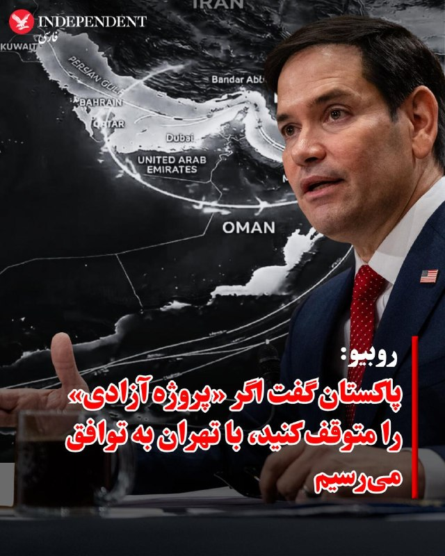

♦️مارکو روبیو، وزیر خارجه آمریکا در مصاحبه با ان‌بی‌سی در پاسخ به مجری که از او درباره بازگشت «پروژه آزادی» (هدایت امن کشتی‌ها از تنگه هرمز از سوی ارتش آمریکا) و از سرگیری کارزار نظامی پرسید گفت: «ما پروژه آزادی را به درخواست پاکستان متوقف کردیم.» روبیو افزود: پاکستان به ما گفت اگر پروژه آزادی را متوقف کنید، ما فکر می‌کنیم که می‌توانیم به توافق برسیم.» او گفت که ما پذیرفتیم و رئیس‌جمهور هم دیپلماسی را ترجیح می‌دهد. با این حال روبیو گفت ما در حال خارج کردن ناوشکن‌ها از تنگه هرمز بودیم که دیدید رژیم ایران آنها را هدف قرار داد.
‌🇸🇦 Indypersian

🤖 @VahidOOnLine

## VahidOOnLine — post 240713

  

♦️بنیامین نتانیاهو، نخست‌وزیر اسرائیل، شامگاه یکشنبه با دونالد ترامپ، رئیس‌جمهوری آمریکا، گفت‌وگو کرد؛ همزمان گزارش‌هایی منتشر شده که احتمال دارد درگیری با جمهوری اسلامی طی هفته جاری از سر گرفته شود. یک مقام اسرائیلی به «وای‌نت» گفت مسئله حمله به مواضع رژیم ایران همچنان حل‌نشده باقی مانده و رئیس‌جمهوری آمریکا هنوز باید تصمیم نهایی را بگیرد.
این مقام افزود: «او باید شخصا با این تصمیم به جمع‌بندی برسد و اگر تصمیم به ازسرگیری درگیری بگیرد، احتمالا از اسرائیل خواسته خواهد شد که مشارکت کند.»
فاکس‌نیوز پیش‌تر در روز یکشنبه گزارش داده بود که «احتمال ازسرگیری درگیری با ایران در حال افزایش است؛ موضوعی که ناشی از ناامیدی ترامپ از تاکتیک‌های ایران و امتناع تهران از پذیرش خواسته او برای کنار گذاشتن جاه‌طلبی‌های هسته‌ای است.»
بر اساس گفته مقام‌های اطلاعاتی فعال در خاورمیانه که با این شبکه گفت‌وگو کردند، «ارزیابی غالب در ایران این است که ترامپ ممکن است بار دیگر به اقدام نظامی روی آورد و تهران اکنون عمدا راهبردی مبتنی بر فریب و تعلل را دنبال می‌کند تا با خرید زمان، هرگونه بازگشت احتمالی به درگیری را پیچیده‌تر کند.»
این مقام‌های اطلاعاتی گفتند به باور آن‌ها، حکومت ایران تصور می‌کند می‌تواند روند تحولات را کند کرده و بحران را دست‌کم دو هفته دیگر طولانی کند؛ اقدامی که از نظر سیاسی و عملیاتی، ازسرگیری کارزار نظامی را برای ترامپ دشوارتر خواهد کرد.
ترامپ روز شنبه تصویری تولیدشده با هوش مصنوعی را در شبکه اجتماعی «تروث سوشال» منتشر کرد که زیر آن نوشته شده بود: «آرامش پیش از طوفان.» این پست پس از آن منتشر شد که روزنامه نیویورک‌تایمز گزارش داد آمریکا و اسرائیل از زمان توافق آتش‌بس در ماه گذشته تاکنون، شدیدترین سطح آماده‌سازی خود را برای ازسرگیری حملات علیه رژیم ایران آغاز کرده‌اند.
بر اساس این گزارش، مشاوران ارشد ترامپ طرح‌هایی را برای بازگشت به حملات نظامی تدوین کرده‌اند.
همزمان با انتشار گزارش‌ها درباره احتمال ازسرگیری درگیری‌ها، وزیر کشور پاکستان که اخیرا نقش میانجی را بین رزیم ایران و آمریکا ایفا می‌کند، روز شنبه در تهران با مسعود پزشکیان، رئیس‌جمهوری اسلامی ایران، دیدار کرد.
‌🇸🇦 Indypersian

🤖 @VahidOOnLine

## VahidOOnLine — post 240712

♦️پیت هگست، وزیر جنگ آمریکا، شنبه از ملوانان و خدمه ناو هواپیمابر آمریکایی «یو‌اس‌اس جرالد آر فورد» پس از پایان ماموریتی ۳۳۱ روزه در ایالات متحده استقبال کرد و گفت این ناوگروه در ماموریتی «تاریخی» برای جلوگیری از دستیابی ایران به سلاح هسته‌ای نقش داشته است.

هگست در سخنرانی خود خطاب به خدمه ناوگروه رزمی ۱۲ و ناوشکن «یو‌اس‌اس ماهان» گفت: «به خاورمیانه رفتید تا بخشی از ماموریت جلوگیری از دستیابی ایران به سلاح هسته‌ای باشید؛ ماموریتی تاریخی که آن را به پایان خواهیم رساند.»

او با اشاره به طولانی بودن این ماموریت دریایی گفت خدمه ناو در این مدت مسافتی معادل سه بار دور کره زمین را طی کردند و در اروپا، کارائیب و خاورمیانه حضور داشتند.

وزیر جنگ آمریکا همچنین از خانواده‌های ملوانان قدردانی کرد و گفت خدمه ناوگروه «قدرت آمریکا را به شکلی تاریخی» به نمایش گذاشتند.

هگست در پایان این مراسم، نشان «استناد افتخار ریاست‌جمهوری» را از طرف دونالد ترامپ به ناوگروه رزمی «جرالد آر فورد» و ناوشکن «یو‌اس‌اس ماهان» اعطا کرد.
‌🇸🇦 Indypersian

🤖 @VahidOOnLine

## pm_afshaa — post 90933

  <a href="telegram/content/pm_afshaa_90933_1779062462.webm" target="_blank">🎬 Download video</a>

🔴سی‌ان‌ان به نقل از منابع آگاه:
ترامپ به‌طور فزاینده‌ای از روند مذاکرات با جمهوری اسلامی و ادامه بسته بودن تنگه هرمز ناراضی و کلافه شده.

ترامپ احتمالا اوایل این هفته دوباره با تیم امنیت ملی خود درباره جنگ دیدار خواهد کرد.

پنتاگون در صورت تصمیم نهایی ترامپ، مجموعه‌ای از اهداف و سناریوهای نظامی برای حملات بیشتر آماده کرده.

💧 Rainbet.com the #1 Non-KYC Crypto Casino & Sportsbook @rainbetcom

😁 @Pm_Afshaa

## kianmeli1 — post 87458

  

🔴قیمت نفت پس از پست های تهدید حمله به ایران افزایش یافت

( بالا رفتن و پایین آمدن نفت با خبرهای هیجانی ممکن است برای شرط بندی و نوسان گیری و خرید و فروش نفت توسط دولت امریکا باشد
شاید فردا با خبر دیگری بگوید توافق نزدیک است

قبل از باز شدن بازار در کف قیمت میخرند‌ و با خبرهای هیجانی بالا میبرند تا صبح دوشنبه با بالاترین قیمت بفروشند

جنگ نعمت است برای تمام دولت ها).
https://t.me/kianmeli1

## BBCPersian — post 281332

🔻 محسن رضایی: «تنگه هرمز برای تجارت باز است نه لشکرکشی»

محسن رضایی، فرمانده پیشین سپاه پاسداران در اظهاراتی جدید گفته است: «اگر ترامپ هم نفهمد که محاصره همان ادامه‌ جنگ است نظامیان دنیا که می‌دانند؛ تنها میدان نبرد سکوت کرده است.»

آقای رضایی با انتقاد از ادامه محاصره دریایی بنادر ایران توسط آمریکا گفته است: «هر چقدر محاصره دریایی ایران را طولانی‌تر کنند، آسیب به کشورهای جهان بیشتر خواهد شد. صبر ما حدی دارد و نیروهای مسلح درحال آماده‌کردن خودش است.»

آقای رضایی گفته است تنگه هرمز که بستن آن از سوی ایران به مشکل اصلی مذاکرات آتش بس میان تهران و واشنگتن تبدیل شده است: «برای تجارت باز است اما نه لشکرکشی».

این فرمانده پیشین سپاه پاسداران که اکنون مشاور ارشد نظامی فرمانده کل قوا - رهبر جمهوری اسلامی - است همچنین از احتمال حمله نظامی ظرف چند روز آینده سخن گفته است: «واقعیت این است که آمریکا در یک بن‌بست کامل گرفتار شده است. از یک طرف می‌خواهد بجنگد و حتی در دو سه روز آینده ممکن است وارد این عرصه شود، اما نظامی‌های آمریکایی به ترامپ می‌گویند که در این مسیر احتمال اسیر شدن نیروهای آمریکایی زیاد است چون آنها می‌خواهند در سواحل جنوبی وارد شوند.»

در چند روز گذشته، همزمان با اظهارات تهدید آمیز دونالد ترامپ درباره جنگ با ایران، مقام‌ها در تهران هم بارها با لحنی مقابله جویانه از آمادگی برای «هر سناریو» و مقابله با «حملات نظامی» در صورت از سر گیری جنگ آمریکا و اسرائیل علیه ایران سخن گفته‌اند.

https://bbc.in/4dtzfP5
@BBCPersian

## BBCPersian — post 281331

  

‌ ‌ ‌ ‌
در پی واژگون شدن اتوبوس حامل کارکنان مجمتع گاز پارس جنوبی در عسلویه، شش نفر کشته و ۲۰ نفر مجروح شدند.

ابراهیم عباسی، سخنگوی مجتمع گاز پارس جنوبی به ایسنا گفته است این اتوبوس در حال سفر به شهر کرمانشاه بوده است که در جاده عسلویه - سیراف دچار سانحه و واژگون شده است.

https://bbc.in/4dqYKR9
📷 Irna
@BBCPersian

---
📅 بروزرسانی: 1405/02/28 02:27
---

## VahidOOnLine — post 240711

  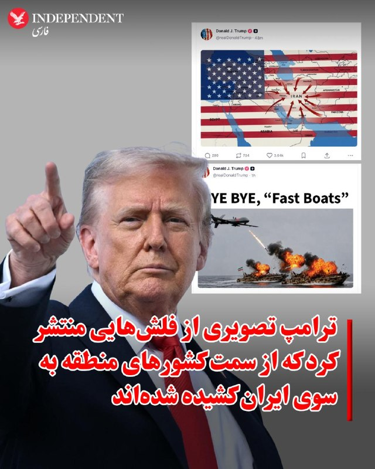

♦️دونالد ترامپ، رئیس‌جمهوری آمریکا، بامداد دوشنبه ۲۸ اردیبهشت‌ماه، چند تصویر و گرافیک با مضمون قدرت نظامی و فشار آمریکا علیه جمهوری اسلامی منتشر کرد.

در یکی از این تصاویر، یک پهپاد آمریکایی در حال هدف قرار دادن دو قایق با پرچم جمهوری اسلامی دیده می‌شود و روی آن نوشته شده است: «خدانگهدار! قایق‌های مثلا تندرو!»

ترامپ همچنین روی پس زمینه‌ای با پرچم آمریکا، نقشه ایران و کشورهای منطقه را منتشر کرد که در آن فلش هایی از کشورهای اطراف ایران به سمت ایران نشانه می رود.
ترامپ عصر یکشنبه ۲۷ اردیبهشت‌ماه در گفتگو با آکسیوس به تهران هشدار داده بود: «اگر پیشنهاد بهتری ارائه نکنند، آمریکا ایران را بسیار شدیدتر از قبل هدف قرار خواهد داد.»

او در ادامه تاکید کرد: «ساعت در حال تیک‌تاک است؛ بهتر است خیلی سریع حرکت کنند، وگرنه چیزی برایشان باقی نخواهد ماند.»
‌🇸🇦 Indypersian

🤖 @VahidOOnLine

## VahidOOnLine — post 240710

  

رسانه‌های جمهوری اسلامی پیامی منتسب به اسماعیل قاآنی، فرمانده نیروی قدس سپاه، را درباره کشته شدن عزالدین الحداد، فرمانده شاخه نظامی حماس، منتشر کردند. در این پیام آمده است که کشته شدن چنین چهره‌هایی «الهام‌بخش مجاهدان جوان فلسطینی» برای «نابودی» اسرائیل خواهد بود.
‌🏁 🇬🇧 IranintlTV

🤖 @VahidOOnLine

## VahidOOnLine — post 240709

  <a href="telegram/content/VahidOOnLine_240709_1779058654.mp4" target="_blank">🎬 Download video</a>

ولودیمیر زلنسکی، رییس‌جمهوری اوکراین، یکشنبه ۲۷ اردیبهشت، با انتشار ویدیویی در ایکس از حمله گسترده پهپادی اوکراین به مناطقی در مسکو، در فاصله بیش از ۵۰۰ کیلومتری از مرزهای اوکراین خبر داد.
مقام‌های روسیه گفتند دست‌کم سه نفر کشته شدند.
پیش‌تر، زلنسکی پس از آن‌که روسیه در روزهای ۲۳ و ۲۴ اردیبهشت سنگین‌ترین حمله پهپادی و موشکی خود به کی‌یف را از آغاز جنگ انجام داد، وعده تلافی داده بود.
‌🏁 🇬🇧 IranintlTV

🤖 @VahidOOnLine

## VahidOOnLine — post 240708

♦️۲۸ اردیبهشت در تقویم رسمی ایران به نام روز بزرگداشت حکیم عمر خیام نیشابوری ثبت شده است؛ شاعر، ریاضی‌دان، ستاره‌شناس و فیلسوف برجسته ایرانی که از او به‌عنوان یکی از تاثیرگذارترین دانشمندان سده‌های میانی یاد می‌شود. خیام با تدوین گاه‌شماری جلالی و آثار علمی و ادبی خود، جایگاهی ماندگار در تاریخ علم و فرهنگ ایران و جهان به دست آورده است.

در انتهای بلوار خیام در جنوب شرقی نیشابور، باغی سرسبز قرار دارد که در قلب آن، اندیشمندی از تبار ستاره‌شناسان، شاعران و ریاضی‌دانان برجسته جهان در خاک آرمیده است. آرامگاه خیام نه‌تنها از مهم‌ترین نمادهای فرهنگی و گردشگری نیشابور محسوب می‌شود، بلکه جلوه‌ای از شکوه اندیشه، معماری و هنر است؛ بنایی که هوشنگ سیحون، معمار برجسته و نامدار، با الهام از رازورمز هستی، سروده‌های خیام و دانش ستاره‌شناسی و ریاضی او، چنان خلق کرد که پژواک سه بعد وجودی این نابغه ایرانی باشد.
آرامگاه خیام روز دوازدهم فروردین ۱۳۴۲ در مراسمی با حضور محمدرضاشاه و ⁧ شهبانو‌ فرح‌پهلوی ⁩ افتتاح شد و در سال ۱۳۵۴ در فهرست میراث ملی ایران به ثبت رسید.
‌🇸🇦 Indypersian

🤖 @VahidOOnLine

## VahidOOnLine — post 240707

  

‌ترامپ به فاصله چند دقیقه‌ چندین تصویر مرتبط با ایران را در تروث‌سوشال بازنشر کرد. ترامپ همچنین یک تصویر جدید از پرچم آمریکا را منتشر کرد که در پس‌زمینه آن نقشه خاورمیانه به مرکزیت ایران قرار دارد و از همه کشورهای همسایه فِلِش‌هایی به سمت ایران نشان داده شده است.
او همچنین چند تصویر و پویانما را بازنشر کرد که ناوها و پهپادهای آمریکایی را در حال هدف قرار دادن پهپادها و قایق‌های تندرو جمهوری اسلامی نشان می‌دهد.
ترامپ در یک پست نموداری را نیز بازنشر کرد که مدت‌زمان جنگ‌های مختلف آمریکا را نمایش می‌دهد. در این نمودار جنگ کنونی ایران با ۶ هفته به عنوان کوتاه‌مدت‌ترین و جنگ افغانستان با ۵۴۳ هفته به عنوان بلندمدت‌ترین جنگ نمایش داده شده است.
رییس‌جمهوری آمریکا همچنین دو تصویر مقایسه‌ای را بازنشر کرد که ناوگان کشتی‌های نظامی جمهوری اسلامی را در حال حرکت روی آب در زمان ریاست‌جمهوری اوباما و همین ناوگان را غرق شده در کف دریا در زمان دولت ترامپ نشان می‌دهد.

‌🏁 🇬🇧 IranintlTV

🤖 @VahidOOnLine

## mwarmonitor — post 9230

  <a href="telegram/content/mwarmonitor_9230_1779058656.mp4" target="_blank">🎬 Download video</a>

📝این مارمولکِ کثیف و فسیل‌شده‌ی نظام را هر چند وقت یک‌بار که با کمبود نفرات و قحط‌الرجال مواجه می‌شوند، مثل یک دلقک سیرک از انباری درمی‌آورند تا روی آنتن زنده با زر مفت زدنش، سوژه خنده و تفریح ما را فراهم کند. مرتیکه‌ی بی‌‌پدرومادر با وقاحتی بی‌شرمانه زل می‌زند در دوربین و می‌گوید «تنگه بازه!»؛ بله، باز است، ولی وای به حال هر کشتی و کشوری که باجِ سبیلِ شما مادر **** تروریست را ندهد، چون فوراً به سمتش شلیک می‌کنید و منطقه را به لجن می‌کشید.

🔸​این حد از وقاحت، دکانِ مظلوم‌نمایی و یکی به نعل و یکی به میخ زدن، اصلاً چیز جدیدی نیست؛ این مدل دروغ‌گوییِ کثیف و توجیه‌گریِ بی‌شرمانه، دقیقاً عین واقعیت و از صفاتِ بارز، ساختاری و ریشه‌ایِ شیعه رافضی است. جماعتی که کل هویت و تاریخش بر پایه‌ی نفاق، تقیه، باج‌خواهی و بحران‌زیستی بنا شده، حالا در قالب یک مشت آخوند و سردارِ ابلَه، از یک طرف تروریسم و موشک صادر می‌کنند و از طرف دیگر روی منبر ژست صلح‌طلبی می‌گیرند؛ حرامیانی که دروغ گفتن و خیانت در ذاتِ نجس و آیین کثیفشان است و با همین حرامزاده‌بازی‌ها دنیا را به آشوب کشیده‌اند.

@mwarmonitor

## FoxNewsTwitter — post 341864

  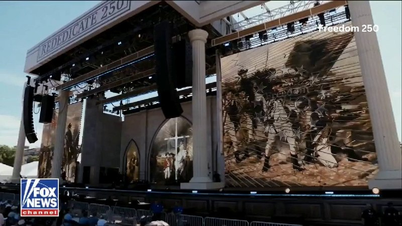

Fox News (Twitter/X)

President Trump recited a passage from 2 Chronicles 7 during Sunday’s “Rededicate 250” celebration on the National Mall, including the well-known verse urging people to “humble themselves, and pray, and seek my face, and turn from their wicked ways.”

The verse is often cited by Christians as a call for spiritual renewal.

## FoxNewsTwitter — post 341863

  <a href="telegram/content/FoxNewsTwitter_341863_1779058659.mp4" target="_blank">🎬 Download video</a>

Fox News (Twitter/X)

Terrifying video shows two U.S. Navy EA-18G Growler jets collide midair during the second day of the Gunfighter Skies Air Show at Mountain Home Air Force Base in Idaho on Sunday.

All four crew members successfully ejected and are being evaluated by medical personnel, the U.S. Navy confirmed to FOX News Digital.

The midair crash happened at about 12:10 p.m. MDT while the aircraft were performing an aerial demonstration during the air show, officials said.

## pm_afshaa — post 90932

🔴شاهزاده رضا پهلوی : ببینید، حتی همین چند روز پیش هم اعدام‌ها تقریباً روزانه ادامه داشته
این واقعیتیه که خیلی‌ها دارن کشته میشن و جنگ واقعی‌ای که جریان داره
همون جنگیه که رژیم 47 سال پیش علیه مردم خودش شروع کرده و هنوز هم تموم نشده
هیچ آتش‌بسی هم در کار نبوده و سرکوب مردم ایران همچنان ادامه داره

💧 Rainbet.com the #1 Non-KYC Crypto Casino & Sportsbook @rainbetcom

😁 @Pm_Afshaa

## pm_afshaa — post 90931

🔴شاهزاده رضا پهلوی : با اینکه بیشتر از 70 روزه اینترنتو کامل قطع کردن و مردم هیچ راهی برای ارتباط با بیرون ندارن ولی هنوز وایسادن و کوتاه نیومدن

فقط امیدشون اینه که این همه سختی و فداکاری هدر نره و آخرش این وضعیت تموم بشه و با به زانو اومدن این رژیم، کشور آزاد بشه

💧 Rainbet.com the #1 Non-KYC Crypto Casino & Sportsbook @rainbetcom

😁 @Pm_Afshaa

## kianmeli1 — post 87457

  <a href="telegram/content/kianmeli1_87457_1779058660.mp4" target="_blank">🎬 Download video</a>

🔴امشب، یک فروند پهپاد MQ-9 Reaper نیروی هوایی ایالات متحده که حامل چندین موشک هوا به سطح AGM-114R9X Hellfire بود و بیشتر با نام «Ginsu Flying» شناخته می‌شود، توسط نیروهای تحت حمایت جمهوری اسلامی بر فراز غرب یمن تحت کنترل حوثی‌ها سرنگون شد و لاشه آن در عکس‌ها و ویدیوها به وضوح متعلق به یک MQ-9 دیده می‌شود.

از آغاز درگیری در اواخر سال ۲۰۲۳، بیش از ۴۰ پهپاد MQ-9 Reaper، که ارزش آنها احتمالاً بیش از یک میلیارد دلار است، به دست ایران یا گروه‌های نیابتی ایران افتاده است که حداقل ۲۴ فروند از آنها بر فراز ایران و ۱۵ تا ۱۸ فروند توسط حوثی‌ها در یمن سرنگون شده‌اند.
https://t.me/kianmeli1

## IranIntlTV — post 337702

  

رسانه‌های جمهوری اسلامی پیامی منتسب به اسماعیل قاآنی، فرمانده نیروی قدس سپاه، را درباره کشته شدن عزالدین الحداد، فرمانده شاخه نظامی حماس، منتشر کردند. در این پیام آمده است که کشته شدن چنین چهره‌هایی «الهام‌بخش مجاهدان جوان فلسطینی» برای «نابودی» اسرائیل خواهد بود.
https://iranintl.com/202605176601

## IranIntlTV — post 337701

  <a href="telegram/content/IranIntlTV_337701_1779058662.mp4" target="_blank">🎬 Download video</a>

میلاد آفرین، زندانی سیاسی سابق، در حاشیه تجمع اعتراضی ایرانیان در لس‌آنجلس به نیلوفر منصوری، خبرنگار ایران‌اینترنشنال، گفت: «ما صدای زندانیان سیاسی هستیم. من خودم یکی از کسانی بودم که فشارها و آزارهای زندان را تجربه کردم.»

او افزود: «مردمی که امروز اینجا جمع شده‌اند، صدای شما هستند. ما کنار مردم ایران ایستاده‌ایم و می‌خواهیم هرچه زودتر از جمهوری اسلامی عبور کنیم تا زندانیان بتوانند با آرامش به زندگی خود برگردند.»

آفرین همچنین گفت: «مطمئن باشید این آخرین نبرد است.»
@iranintltv

## IranIntlTV — post 337700

  <a href="telegram/content/IranIntlTV_337700_1779058664.mp4" target="_blank">🎬 Download video</a>

موج جدید تورم و بیکاری در کشور موجب تشدید بحران معیشت و گسترش فقر در جامعه شده است.

همزمان با تعطیلی مراکز اقتصادی و رکود بازار، یک عضو هیات رییسه مجلس جمهوری اسلامی گفت شمار متقاضیان بیمه بیکاری به بیش از ۳۰۰ هزار نفر رسیده است.

گفت‌وگو با احمد علوی، استاد دانشگاه و اقتصاددان
@iranintltv

## IranIntlTV — post 337699

  <a href="https://t.me/IranintlTV/337699" target="_blank">📎 Download file</a>

🎧نسخه صوتی سیاست با مراد ویسی: حملات پهپادی سپاه و نیابتی‌ها به امارات و عربستان
@iranintlTV

## IranIntlTV — post 337698

  <a href="telegram/content/IranIntlTV_337698_1779058666.mp4" target="_blank">🎬 Download video</a>

همزمان با ادامه بن‌بست مذاکرات میان واشینگتن و تهران و احتمال از سرگیری حملات به جمهوری اسلامی، دونالد ترامپ گفت جمهوری اسلامی باید «خیلی سریع» اقدام کند وگرنه چیزی از آن باقی نخواهد ماند.

گفت‌وگو با امیر گیتی، عضو تحریریه ایران‌اینترنشنال
@iranintltv

## IranIntlTV — post 337697

  <a href="telegram/content/IranIntlTV_337697_1779058667.mp4" target="_blank">🎬 Download video</a>

ولودیمیر زلنسکی، رییس‌جمهوری اوکراین، یکشنبه ۲۷ اردیبهشت، با انتشار ویدیویی در ایکس از حمله گسترده پهپادی اوکراین به مناطقی در مسکو، در فاصله بیش از ۵۰۰ کیلومتری از مرزهای اوکراین خبر داد.
مقام‌های روسیه گفتند دست‌کم سه نفر کشته شدند.
پیش‌تر، زلنسکی پس از آن‌که روسیه در روزهای ۲۳ و ۲۴ اردیبهشت سنگین‌ترین حمله پهپادی و موشکی خود به کی‌یف را از آغاز جنگ انجام داد، وعده تلافی داده بود.

## IranIntlTV — post 337696

  <a href="telegram/content/IranIntlTV_337696_1779058669.mp4" target="_blank">🎬 Download video</a>

🔻امیر قلعه‌نویی در حالی لیست تیم ملی برای حضور در جام‌جهانی را اعلام کرد که در مصاحبه‌ای گفت شریف‌ترین بازیکنان به تیم ملی دعوت شدند. این در حالی است که بازیکنانی در لیست تیم ملی قرار گرفتند که در تجمعات حکومتی حضور داشتند.

🔹توضیحات مزدک میرزایی، ایران‌اینترنشنال در برنامه هت‌تریک

🔹تماشای نسخه کامل هت‌تریک؛👇
https://youtu.be/gw3eJ0R9R5Y

@iranintltvsport

## IranIntlTV — post 337695

  <a href="telegram/content/IranIntlTV_337695_1779058670.mp4" target="_blank">🎬 Download video</a>

مراد ویسی، تحلیل‌گر ارشد ایران‌اینترنشنال، گفت: «۱۸ سالگی برای بسیاری آغاز ورود به دانشگاه، کار و آینده‌ای پر از آرزوست. سنی که خانواده‌ها انتظار دارند ثمره سال‌ها تلاش فرزندشان را ببینند. در کشتار دی‌ماه، بسیاری از نوجوانان و جوانانی که برای زندگی‌شان هزاران برنامه و امید داشتند، جان خود را از دست دادند؛ رخدادی که تلخی آن برای جامعه و خانواده‌ها عمیق‌تر شد.»
@iranintltv

## IranIntlTV — post 337694

  

‌ترامپ به فاصله چند دقیقه‌ چندین تصویر مرتبط با ایران را در تروث‌سوشال بازنشر کرد. ترامپ همچنین یک تصویر جدید از پرچم آمریکا را منتشر کرد که در پس‌زمینه آن نقشه خاورمیانه به مرکزیت ایران قرار دارد و از همه کشورهای همسایه فِلِش‌هایی به سمت ایران نشان داده شده است.
او همچنین چند تصویر و پویانما را بازنشر کرد که ناوها و پهپادهای آمریکایی را در حال هدف قرار دادن پهپادها و قایق‌های تندرو جمهوری اسلامی نشان می‌دهد.
ترامپ در یک پست نموداری را نیز بازنشر کرد که مدت‌زمان جنگ‌های مختلف آمریکا را نمایش می‌دهد. در این نمودار جنگ کنونی ایران با ۶ هفته به عنوان کوتاه‌مدت‌ترین و جنگ افغانستان با ۵۴۳ هفته به عنوان بلندمدت‌ترین جنگ نمایش داده شده است.
رییس‌جمهوری آمریکا همچنین دو تصویر مقایسه‌ای را بازنشر کرد که ناوگان کشتی‌های نظامی جمهوری اسلامی را در حال حرکت روی آب در زمان ریاست‌جمهوری اوباما و همین ناوگان را غرق شده در کف دریا در زمان دولت ترامپ نشان می‌دهد.

https://iranintl.com/202605173898

## Shin_Persian — post 6055

Shin ✓ @hey_itsmyturn
Sun, 17 May 2026 22:09:31 UTC

Wael Abdel Halim, A PIJ terror commander has been eliminated following the #IAF 🇮🇱 strike on an apartment in Baalbek, Easter Lebanon

فارسی

وائل عبدالحلیم، یکی از فرماندهان تروریستی جهاد اسلامی فلسطین (PIJ)، در پی حمله نیروی هوایی اسرائیل (IAF) 🇮🇱 به آپارتمانی در بعلبک، در شرق لبنان حذف شد. #IAF 🇮🇱

𝕏 · @shin_persian

## FarsiVOA — post 218022

⚡️ایران در میزگردهای هفتگی شبکه‌های تلویزیونی آمریکا
@FarsiVOA

## FarsiVOA — post 218021

🔺رسانه‌های آمریکایی: ترامپ روز شنبه با مشاوران ارشد امنیت ملی خود درباره ایران جلسه گذاشت؛ سه‌شنبه نیز جلسه دیگری دارد

▪️سایت خبری آکسیوس روز یک‌شنبه ۲۷ اردیبهشت گزارش داد که دونالد ترامپ، رئیس‌جمهوری آمریکا قرار است روز سه‌شنبه در «اتاق وضعیت» کاخ سفید با مشاوران ارشد امنیت ملی خود جلسه‌ای درباره ایران برگزار کند.

⬇️ بیشتر بخوانید:
https://ir.voanews.com/a/8150967.html
@FarsiVOA

## FarsiVOA — post 218020

⚡️پوشش ویژه | دعای مایک جانسون در مراسم نیایش دویست‌وپنجاهمین سالروز استقلال آمریکا
@FarsiVOA

## FarsiVOA — post 218019

⚡️منیژه حکمت، کارگردان ایرانی و مادر پگاه آهنگرانی بعد از نمایش فیلم «تمرین‌هایی برای یک انقلاب» گفت چاره‌‌ای جز امیدواری وجود ندارد.
@FarsiVOA

## FarsiVOA — post 218018

⚡️روز جهانی ارتباطات در سایه قطع اینترنت در ایران؛ گفت‌وگو با امیر رشیدی
@FarsiVOA

## FarsiVOA — post 218017

⚡️وکلای تسخیری در جمهوری اسلامی وسیله‌ای برای سرعت‌بخشیدن به اعدام‌ها؛ گفت‌وگو با محمد مقیمی
@FarsiVOA

## FarsiVOA — post 218016

⚡️گفت‌وگو با کاوه فرنام تهیه کننده فیلم «تمرین‌هایی برای یک انقلاب »
@FarsiVOA

## Persian_Trend_Official — post 14368

  <a href="telegram/content/Persian_Trend_Official_14368_1779058673.webm" target="_blank">🎬 Download video</a>

شبتون بخیر 🙏🤍

📝 Nick
📌 @persian_trend_official
پرشین ترند | متفاوت‌ترین کانال نظامی

## Persian_Trend_Official — post 14367

  

پست قابل تأمل ‌ترامپ که لحظاتی قبل در تروث سوشال منتشر کرده است.

☆Phantom☆

📌 @persian_trend_official
پرشین ترند | متفاوت‌ترین کانال نظامی

## Persian_Trend_Official — post 14366

♨️ دوستان عزیز، با توجه به شرایط پیش‌رو، بهتر است از همین حالا برای سناریوهای اضطراری آماده باشیم. آمادگی یعنی آرامش بیشتر و آسیب کمتر برای خودمان و خانواده‌مان. 🧭

⚠️ چند مورد مهم را جدی بگیرید:

• برای دست‌کم ۱ ماه، آذوقه‌ی غذایی فاسد نشدنی و آب آشامیدنی کافی برای همه اعضای خانواده تهیه کنید. 🥫💧

• همیشه تا جای ممکن باک بنزین خودرو را پر نگه دارید. ⛽️

• اگر نوزاد یا کودک شیرخوار دارید، حتماً به اندازه کافی شیر خشک و لوازم ضروری او را از قبل تهیه کنید. 👶🍼

• اگر در خانواده سالمند یا بیماری دارید که داروی حیاتی مصرف می‌کند، از داروهای ضروری او به میزان کافی ذخیره داشته باشید. 💊

• کوله اضطراری را جدی بگیرید؛ شامل مدارک مهم، مقداری پول نقد، پاوربانک، چراغ‌قوه، باتری، داروهای شخصی، لباس گرم، وسایل بهداشتی و شارژر. 🎒🔦

• مقداری پول نقد همراه داشته باشید؛ در شرایط بحران، دسترسی به کارت بانکی یا اینترنت ممکن است مختل شود. 💵

• دارایی و پول خود را فقط در یک محل متمرکز نکنید و برای شرایط قطع دسترسی، برنامه جایگزین داشته باشید. 🏦

• با اعضای خانواده درباره سناریوهای مختلف صحبت کنید: قطع برق، قطع اینترنت، تخلیه اضطراری و محل‌های امن یا محل تجمع خانوادگی. 👨‍👩‍👧‍👦

• یک رادیوی موج متوسط یا رادیوی باتری‌خور تهیه کنید تا در صورت قطع اینترنت، بتوانید خبرها و اطلاعیه‌های ضروری را دنبال کنید. 📻

• در خانه، شیشه‌ها و پنجره‌های حساس را بررسی و تا جای ممکن محکم‌کاری کنید. در صورت نگرانی از موج انفجار، می‌توان برای کاهش پخش شدن خرده‌شیشه‌ها از چسب نواری پهن به‌صورت ضربدری روی شیشه‌ها استفاده کرد. 🪟

• مدارک مهم، شماره تماس‌های ضروری، آدرس‌ها و اطلاعات حیاتی را هم به‌صورت کاغذی و هم در گوشی ذخیره کنید. 📄📱

• برای چند هفته بی‌برقی و بی‌ارتباطی هم آماده باشید: چراغ‌قوه، پاوربانک، آب، غذا و لوازم اولیه را از قبل کنار بگذارید. ⚠️

آمادگی به معنی ترسیدن نیست؛ یعنی از خانواده‌مان بهتر محافظت کنیم. ❤️

ما در تیم پرشین ترند امیدواریم هیچ اتفاق بدی برای هیچ‌یک از هم‌وطنان‌مان رخ ندهد، اما احتیاط از امروز می‌تواند فردا نجات‌بخش باشد.

📝 Nick

📌 @persian_trend_official
پرشین ترند | متفاوت‌ترین کانال نظامی

## BBCPersian — post 281330

  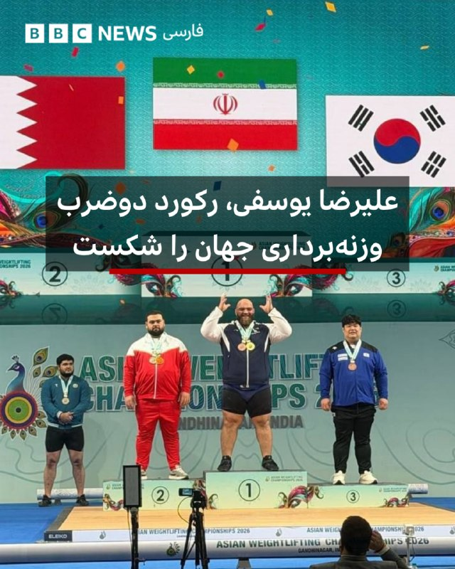

‌ ‌ ‌ ‌
علیرضا یوسفی، وزنه‌بردار ایرانی وزن بعلاوه ۱۱۰ کیلوگرم موفق شد در جریان مسابقات قهرمانی آسیا رکود دو ضرب جهان را بشکند.

وزنه بردار فوق سنگین ایران روز یکشنبه در حرکت دو ضرب توانست با بالا بردن ۲۶۱ کیلوگرم، ضمن کسب مدال طلای مسابقات آسیایی که اکنون در هند در حال برگزاری است، رکود جهان را بهبود ببخشد.

او پس از شکست رکود جهان روی سکو دوبنده خود را کنار زد تا نوشته روی تی‌شرت مشکی خود را - «شهدای میناب ۱۶۸» - به دوربین و حاضران در ورزشگاه نشان دهد.

او در حرکت یک ضرب سوم شد تا در مجموع صاحب مدال نقره وزن بعلاوه ۱۱۰ کیلوگرم شود.

https://bbc.in/43dSUhn
📷Nasimonline
@BBCPersian

## Dirty_Kids — post 389657

  <a href="telegram/content/Dirty_Kids_389657_1779058674.webm" target="_blank">🎬 Download video</a>

☢️خفن ترین و‌ قدیمی ترین  انالیزور  ایران ینی دکتر بت 
👍 
🔴هیچ سایت بتی دوست نداره شما کانال دکتر بت رو پیدا کنین چون خیلی سود میکنید🤷‍♂ رایگان بهترین شرط هارو براتون میذاره حتی هزار تومن هم دریافت نمیکنه روزانه میتونی از پیش بینی فوتبال باهاش پول در بیاری…

## Dirty_Kids — post 389656

  <a href="telegram/content/Dirty_Kids_389656_1779058675.webm" target="_blank">🎬 Download video</a>

☢️خفن ترین و‌ قدیمی ترین  انالیزور  ایران ینی دکتر بت 
👍

🔴هیچ سایت بتی دوست نداره شما کانال دکتر بت رو پیدا کنین چون خیلی سود میکنید🤷‍♂

رایگان بهترین شرط هارو براتون میذاره
حتی هزار تومن هم دریافت نمیکنه
روزانه میتونی از پیش بینی فوتبال باهاش پول در بیاری 👌
A27
اگ اهل پیش بینی فوتبالی این کانال اصلا از دست ندین👇

✅https://t.me/+4_ADqwB9e-QwYjlk

✅https://t.me/+4_ADqwB9e-QwYjlk

## Dirty_Kids — post 389655

  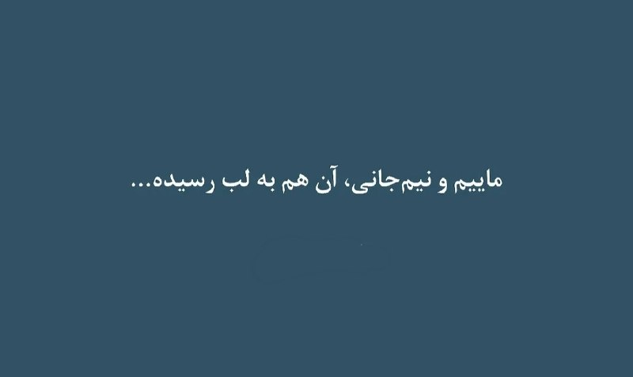

#بخوابیم

@Dirty_Kids 👻

## Dirty_Kids — post 389654

  <a href="telegram/content/Dirty_Kids_389654_1779058676.mp4" target="_blank">🎬 Download video</a>

دوستان اگه پولتون زیادی کرده و نمیدونین باهاش چیکار کنین، کاخ گوتیک امیردشت با قیمت مفتِ 1500 میلیارد به فروش میرسه، حتما بخرین.

@Dirty_Kids 👻

## Dirty_Kids — post 389653

  

زنجیره بی‌پایانِ پیروزی‌های آخوند برشمشیر 🤭🧩

@Dirty_Kids 👻

## Dirty_Kids — post 389652

  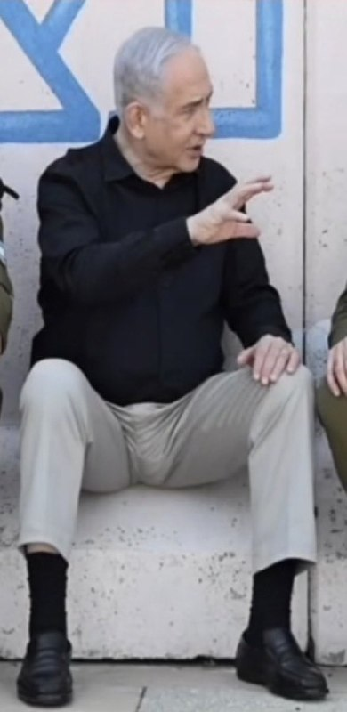

یه تخمش از ممه‌های دخترت بزرگتره

@Dirty_Kids 👻

## Dirty_Kids — post 389651

  <a href="telegram/content/Dirty_Kids_389651_1779058677.mp4" target="_blank">🎬 Download video</a>

شما چپولایی که کل شجاعتتون این بوده تو خونه‌های تیمی، زناتون رو با هم ضربدری عوض بدل کنید، جلوی این نسل از خایه حرف نزنید مادرجنده‌های زن و دختر خراب!

@Dirty_Kids 👻

## Dirty_Kids — post 389650

  

عکس جدید بیلی ایلیش :)

@Dirty_Kids 👻

## Dirty_Kids — post 389649

‏بدتر از خود مقوله‌ی vpn خریدن اینه که حتما باید vpn داشته باشم که بتونم دوباره بخرم

@Dirty_Kids 👻

## Dirty_Kids — post 389648

تخم ما از ممه دخترت بزرگتره

@Dirty_Kids 👻

## alonews — post 120725

  

🔥
💥اینترنت آزاد و رایگان

🌐
🚫تنها جایی که کانفیگ رایگان میزاره

⬇️
⬇️
@NetAazaadBot
@NetAazaadBot

⚠️هر ساعت 100گیگ شارژ میشه، رباتو داشته باشید تا مطلع بشید

## alonews — post 120724

  <a href="telegram/content/alonews_120724_1779058679.webm" target="_blank">🎬 Download video</a>

👈پست عجیب حسین دهباشی سازنده کلیپ تبلیغاتی حسن روحانی در سال ۱۳۹۶: حملات و ترورهای دشمن تا رهبری حسن روحانی ادامه خواهد داشت

✅ @AloNews خبر جنگ

## alonews — post 120723

  <a href="telegram/content/alonews_120723_1779058679.webm" target="_blank">🎬 Download video</a>

👈وضعیت ایران در روز ارتباطات و روابط عمومی

✅ @AloNews خبر جنگ

---
📅 بروزرسانی: 1405/02/28 01:28
---

## VahidOOnLine — post 240706

  <a href="telegram/content/VahidOOnLine_240706_1779055124.mp4" target="_blank">🎬 Download video</a>

♦️دو فروند جنگنده ای‌ای-۱۸جی گرولر نیروی دریایی آمریکا روز یکشنبه در جریان نمایش هوایی «گان‌فایتر اسکایز» در پایگاه نیروی هوایی مانتین هوم در ایالت آیداهو در میانه آسمان با یکدیگر برخورد کردند، اما هر چهار عضو خدمه با موفقیت از هواپیماها خارج شدند.

آملیا اومایام، سخنگوی نیروهای هوایی نیروی دریایی آمریکا در ناوگان اقیانوس آرام، به فاکس‌نیوز گفت این دو هواپیما متعلق به اسکادران حمله الکترونیک ۱۲۹ مستقر در ویدبی آیلند ایالت واشنگتن بودند.

ویدیوهای منتشرشده در شبکه‌های اجتماعی لحظه برخورد دو جنگنده در آسمان و باز شدن چهار چتر نجات را نشان می‌دهد. سپس هواپیماها سقوط کردند و پس از برخورد با زمین منفجر شدند.

پایگاه «مانتین هوم گان‌فایترز» اعلام کرد نیروهای امدادی در محل حضور دارند و تحقیقات درباره علت حادثه آغاز شده است.
‌🇸🇦 Indypersian

🤖 @VahidOOnLine

## VahidOOnLine — post 240705

  <a href="telegram/content/VahidOOnLine_240705_1779055125.mp4" target="_blank">🎬 Download video</a>

‌
نیس | فرانسه؛ گردهمایی ایرانیان ـ گزارشگر یکشنبه ۲۷ اردیبهشت
‌🏁 🇬🇧 ManotoTV

🤖 @VahidOOnLine

## VahidOOnLine — post 240704

  

♦️سی‌ان‌ان بامداد دوشنبه ۲۸ اردیبهشت‌ماه به نقل از یک منبع آگاه گزارش داد دونالد ترامپ، رئیس‌جمهوری آمریکا، روز شنبه با اعضای ارشد تیم امنیت ملی خود دیدار کرده تا درباره مسیر پیش‌رو در جنگ ایران گفتگو کند. ترامپ هم‌زمان هشدار داد جمهوری اسلامی «بهتر است خیلی سریع اقدام کند، وگرنه چیزی از آن باقی نخواهد ماند.»

ترامپ روز یکشنبه در شبکه تروث سوشال نوشت: «برای ایران، ساعت در حال گذر است و بهتر است خیلی سریع اقدام کنند، وگرنه چیزی از آن‌ها باقی نخواهد ماند. زمان حیاتی است!»

به گفته این منبع، جی‌دی ونس، معاون رئیس‌جمهوری آمریکا، مارکو روبیو، وزیر خارجه، جان رتکلیف، رئیس سازمان سیا، و استیو ویتکاف، فرستاده ویژه آمریکا، در نشست برگزارشده در باشگاه گلف ترامپ در ویرجینیا حضور داشتند. این نشست چند ساعت پس از بازگشت ترامپ از سفرش به چین برگزار شد؛ کشوری که روابط نزدیکی با جمهوری اسلامی دارد.

سی‌ان‌ان گزارش داد ترامپ از روند مذاکرات دیپلماتیک با تهران و ادامه بسته ماندن تنگه هرمز ناراضی است و این موضوع را عاملی برای افزایش فشار بر بازار جهانی انرژی می‌داند. بر اساس این گزارش، دولت ترامپ در جریان سفر به پکن تصمیم‌گیری درباره گام بعدی در قبال جمهوری اسلامی را به بعد از دیدار ترامپ و شی جین‌پینگ موکول کرده بود.

این شبکه همچنین گزارش داد ترامپ در روزهای اخیر با جدیت بیشتری گزینه ازسرگیری عملیات گسترده نظامی علیه جمهوری اسلامی را بررسی کرده است؛ اقدامی که هدف آن وادار کردن تهران به پذیرش مصالحه برای پایان جنگ عنوان شده است.

منابع آگاه به سی‌ان‌ان گفتند پنتاگون مجموعه‌ای از طرح‌های حمله نظامی، از جمله حملات هدفمند به تاسیسات انرژی و زیرساختی ایران، را آماده کرده است تا در صورت تصمیم ترامپ اجرا شوند.

در همین حال، رسانه‌های جمهوری اسلامی گزارش دادند محسن نقوی، وزیر کشور پاکستان، روز یکشنبه با مقام‌های ارشد جمهوری اسلامی از جمله مسعود پزشکیان دیدار کرده است. پاکستان در هفته‌های اخیر نقش میانجی اصلی در گفتگوهای صلح میان آمریکا و جمهوری اسلامی را ایفا کرده است.
‌🇸🇦 Indypersian

🤖 @VahidOOnLine

## VahidOOnLine — post 240703

  <a href="telegram/content/VahidOOnLine_240703_1779055127.mp4" target="_blank">🎬 Download video</a>

با امضای فرمانده منطقه مرکزی ارتش اسرائیل، قانون مجازات اعدام برای فلسطینیان متهم به حملات تروریستی و مرگبار در کرانه باختری از شامگاه یکشنبه اجرایی شد.

بر اساس این قانون، دادگاه‌های نظامی اسرائیل موظف‌اند برای متهمانی که حملاتشان منجر به کشته شدن افراد شده، حکم اعدام صادر کنند؛ مگر آنکه «شرایط ویژه» برای صدور حبس ابد وجود داشته باشد.

این قانون تنها شامل فلسطینیان در دادگاه‌های نظامی می‌شود و شهروندان اسرائیلی را در بر نمی‌گیرد.

ایتمار بن‌گویر، وزیر امنیت ملی اسرائیل، نیز اجرای این قانون را تحقق وعده انتخاباتی حزب راست‌گرای «عوتسما یهودیت» توصیف کرد.

اسرائیل کاتز، وزیر دفاع اسرائیل، گفت: «تروریست‌هایی که یهودیان را می‌کشند، دیگر در زندان با شرایط مناسب نخواهند نشست و سنگین‌ترین بها را خواهند پرداخت.»
‌🏁 🇬🇧 ManotoTV

🤖 @VahidOOnLine

## WithYashar — post 11524

  

پست جدید ترامپ در تروث مبنی بر فشار یا حمله همه جانبه به ایران
@withyashar

## WithYashar — post 11523

کان نیوز :هرگونه حمله آینده علیه ایران که به تأیید ترامپ برسد، به‌صورت مشترک توسط نیروهای آمریکا و اسرائیل انجام خواهد شد
@withyashar

## WithYashar — post 11522

سنتکام : ما تو زمان آتش‌بس با ایران دوباره مسلح شدیم و نیروهامون رو جابه‌جا و مستقر کردیم
@withyashar

## WithYashar — post 11521

ترامپ به کانال ۱۳ اسرائیل:

فکر می‌کنم ایرانی‌ها باید از اون اتفاقی که الان در حال رخ دادنه بترسن.

@withyashar

## WithYashar — post 11520

هم اکنون گزارش CNN: ترامپ تیم امنیت ملی ارشد خود را برای بحث در مورد ایران فراخواند
@withyashar

## WithYashar — post 11519

پست ترامپ از تیر اندازی به پرچم در تلویزیون ایران فیک است !( این کار انجام شده ولی ترامپ چنین پستی منتشر نکرده ! اکانت فیک ترامپ در X منشع این خبر است

## mwarmonitor — post 9229

  

ترامپ در سوشال تروث

@mwarmonitor

## FoxNewsTwitter — post 341862

  <a href="telegram/content/FoxNewsTwitter_341862_1779055129.mp4" target="_blank">🎬 Download video</a>

Fox News (Twitter/X)

“Our rights do not derive from the government. They come from You: Our Creator and Heavenly Father."

House Speaker Mike Johnson delivered a forceful defense of America’s founding principles during the “Rededicate 250” prayer gathering on the National Mall ahead of the nation’s 250th anniversary.

Johnson warned that “sinister ideologies” are trying to rewrite the American story through “the lens of our sins,” attacking the country’s history, heroes, and moral identity.

“We reject that. We rebuke it,” he said.

## FoxNewsTwitter — post 341861

  

Fox News (Twitter/X)

BREAKING: Two Navy EA18-G jets collided in midair while performing an aerial demonstration for the Mountain Home Air Force Base Gunfighter Skies Air Show on Sunday, the U.S. Navy confirmed to Fox News Digital. All four air crew successfully ejected. (Photo: Michael Katz)

## pm_afshaa — post 90930

  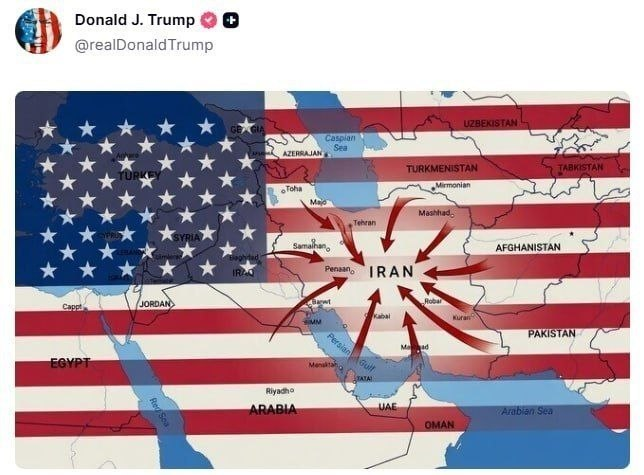

پست جدید ترامپ که تهدید به حمله کرده

💧 Rainbet.com the #1 Non-KYC Crypto Casino & Sportsbook @rainbetcom

😁 @Pm_Afshaa

## pm_afshaa — post 90929

🔴کان نیوز :هرگونه حمله آینده علیه ایران که به تأیید ترامپ برسد، به‌صورت مشترک توسط نیروهای آمریکا و اسرائیل انجام خواهد شد

💧 Rainbet.com the #1 Non-KYC Crypto Casino & Sportsbook @rainbetcom

😁 @Pm_Afshaa

## pm_afshaa — post 90928

🔴سنتکام : ما تو زمان آتش‌بس با ایران دوباره مسلح شدیم و نیروهامون رو جابه‌جا و مستقر کردیم

💧 Rainbet.com the #1 Non-KYC Crypto Casino & Sportsbook @rainbetcom

😁 @Pm_Afshaa

## VahidOnline — post 75524

  

پست ترامپ: بای‌بای "قایق‌های تندرو"
realDonaldTrump
سه‌شنبه هم این تصویر بالا رو منتشر کرده بود. ساعتی پیش‌تر اون انیمیشن دیروزی رو هم دوباره پست کرده بود. تصویر ساختگی یا طرح گرافیکی دیگری هم منتشر کرده با عنوان اینکه نفتکش‌های خالی برای خرید نفت به آمریکا می‌آیند.
اون پستش علیه اوباما و بایدن با طرح گرافیکی قایق‌هایی با پرچم جمهوری اسلامی در کف دریا رو هم دوباره منتشر کرده.

📡 @VahidOnline

## kianmeli1 — post 87456

  

🔴پست جدید ترامپ که نیاز به توضیح ندارد
https://t.me/kianmeli1

## IranIntlTV — post 337693

  <a href="telegram/content/IranIntlTV_337693_1779055132.mp4" target="_blank">🎬 Download video</a>

مراد ویسی، تحلیل‌گر ارشد ایران‌اینترنشنال، گفت: «مردم ایران، رفاه و پیشرفت دبی را با وضعیت نامساعد اقتصادی و معیشتی ایران مقایسه می‌کنند و این تفاوت را نتیجه عملکرد متفاوت رهبران جمهوری اسلامی می‌دانند. مقامات جمهوری اسلامی و فرماندهان سپاه نیز چون عقده دبی را دارند این چنین به امارات حمله می کنند.»
@iranintltv

## IranIntlTV — post 337692

  <a href="telegram/content/IranIntlTV_337692_1779055134.mp4" target="_blank">🎬 Download video</a>

آرش رازی، عضو حزب مشروطه ایران، در حاشیه تجمع اعتراضی ایرانیان در لس‌آنجلس به نیلوفر منصوری، خبرنگار ایران‌اینترنشنال، گفت: «پنج ماه است که هر هفته در لس‌آنجلس و شهرهای اطراف آن تجمع می‌کنیم و امروز هم در گلندیل حضور داریم.»

او افزود: «مهم‌ترین پیام ما "نه به اعدام" است. جمهوری اسلامی در هفته‌های اخیر موجی از اعدام‌ها را آغاز کرده و به گفته معترضان، هر روز و هر شب تعداد زیادی اعدام انجام می‌شود. ما اینجا هستیم تا علیه این روند اعتراض کنیم؛ نه به اعدام، نه به قطع اینترنت و نه به سرکوب زندانیان سیاسی.»
@iranintltv

## IranIntlTV — post 337691

  <a href="telegram/content/IranIntlTV_337691_1779055136.mp4" target="_blank">🎬 Download video</a>

مراد ویسی، تحلیل‌گر ارشد ایران‌اینترنشنال، گفت: «نیروگاه اتمی برکه امارات روز یکشنبه با سه پهپاد مورد حمله قرار گرفت. شامگاه یکشنبه هم وزارت دفاع عربستان اعلام کرد سه پهپاد شلیک‌شده از سمت عراق را سرنگون کرده است. دونالد ترامپ نیز روز یکشنبه ۳۰ دقیقه با بنیامین نتانیاهو درباره ایران گفت‌وگو کرد و قرار است سه‌شنبه نیز نشستی با دستیاران ارشدش درباره ایران برگزار کند.»
@iranintltv

## IranIntlTV — post 337690

  <a href="telegram/content/IranIntlTV_337690_1779055138.mp4" target="_blank">🎬 Download video</a>

روزنامه سازندگی از گسترش فقر در میان زنان ایران گزارش داده و نوشته است زنان نخستین قربانیان شوک‌های اقتصادی پی‌درپی و تعدیل نیروها هستند.
این روزنامه همچنین از محرومیت میلیون‌ها زن سرپرست خانواده از بیمه و حمایت پایدار خبر داده است.

گفت‌وگو با پگاه بنی‌هاشمی، پژوهشگر حقوق
@iranintltv

## IranIntlTV — post 337689

  <a href="telegram/content/IranIntlTV_337689_1779055140.mp4" target="_blank">🎬 Download video</a>

در ادامه کارزار حمایت ایرانیان خارج از کشور از انقلاب ملی، گروهی از ایرانیان لس‌آنجلس تجمعی اعتراضی برگزار کردند تا به قطعی اینترنت، افزایش اعدام‌ها و علیه سرکوب‌ها در ایران اعتراض کنند.

گزارش نیلوفر منصوری، خبرنگار ایران‌اینترنشنال و گفت‌وگو با آرش رازی، عضو حزب مشروطه ایران
@iranintltv

## IranIntlTV — post 337688

  <a href="telegram/content/IranIntlTV_337688_1779055141.mp4" target="_blank">🎬 Download video</a>

صداوسیما، پس از آموزش کلاشنیکف در شبکه‌های مختلف، این بار نحوه استفاده از تیربار پی‌کا را در تلویزیون آموزش داد.

پیش‌تر، مجریان صداوسیمای جمهوری اسلامی در برنامه‌هایی با در دست داشتن تفنگ ظاهر شده و کار با سلاح‌های سبک را آموزش داده بودند.

این برنامه‌ها، که دست‌کم در سه بخش پخش شد، در رسانه‌های داخلی بازنشر شد و در شبکه‌های اجتماعی واکنش‌هایی را برانگیخت. برخی کاربران این بخش‌ها را نشانه‌ای از بسیج حامیان حکومت در شرایط جنگی توصیف کردند.
@iranintltv

## ManotoTV — post 105581

  <a href="telegram/content/ManotoTV_105581_1779055142.mp4" target="_blank">🎬 Download video</a>

‌
نیس | فرانسه؛ گردهمایی ایرانیان ـ گزارشگر یکشنبه ۲۷ اردیبهشت

## ManotoTV — post 105580

  <a href="telegram/content/ManotoTV_105580_1779055144.mp4" target="_blank">🎬 Download video</a>

با امضای فرمانده منطقه مرکزی ارتش اسرائیل، قانون مجازات اعدام برای فلسطینیان متهم به حملات تروریستی و مرگبار در کرانه باختری از شامگاه یکشنبه اجرایی شد.

بر اساس این قانون، دادگاه‌های نظامی اسرائیل موظف‌اند برای متهمانی که حملاتشان منجر به کشته شدن افراد شده، حکم اعدام صادر کنند؛ مگر آنکه «شرایط ویژه» برای صدور حبس ابد وجود داشته باشد.

این قانون تنها شامل فلسطینیان در دادگاه‌های نظامی می‌شود و شهروندان اسرائیلی را در بر نمی‌گیرد.

ایتمار بن‌گویر، وزیر امنیت ملی اسرائیل، نیز اجرای این قانون را تحقق وعده انتخاباتی حزب راست‌گرای «عوتسما یهودیت» توصیف کرد.

اسرائیل کاتز، وزیر دفاع اسرائیل، گفت: «تروریست‌هایی که یهودیان را می‌کشند، دیگر در زندان با شرایط مناسب نخواهند نشست و سنگین‌ترین بها را خواهند پرداخت.»

## FarsiVOA — post 218015

⚡️خشم رو به گسترش شیعیان لبنان علیه جمهوری اسلامی در پی اقدامات حزب‌الله و ناامنی مناطقی از لبنان
@FarsiVOA

## FarsiVOA — post 218014

  

⚡️مقامات آمریکایی گفتند که دو جت ائی‌ای-۱۸جی گرولر نیروی دریایی روز یکشنبه در نمایشگاه هوایی «گانفایتر اسکایز» در یک پایگاه نیروی هوایی در ایالت آیداهو، با هم در هوا برخورد کردند. به گفته مقامات، هر چهار خدمه با موفقیت ایجکت کردند و از هواپیما بیرون پریدند.
@FarsiVOA

## FarsiVOA — post 218013

⚡️از خاموشی اینترنت مردم تا چشم حکومت به درآمدِ کابل‌های هرمز

@FarsiVOA

## FarsiVOA — post 218012

⚡️در حالی که جنگ و تحریم، اقتصاد ایران را زیر فشار بی‌سابقه قرار داده، مرزهای فراموش‌شده سیستان و بلوچستان به شریان تازه‌ای برای بقای اقتصادی جمهوری اسلامی تبدیل شده‌اند. جایی که هزاران وانت، موتورسیکلت و قایق، هر روز میلیون‌ها لیتر سوخت را از دل بیابان و دریا به پاکستان منتقل می‌کنند.
@FarsiVOA

## FarsiVOA — post 218011

⚡️چرا جمهوری اسلامی اینستاگرام را «جنگنده آمریکایی» می‌داند؟
@FarsiVOA

## FarsiVOA — post 218010

  

⚡️دونالد ترامپ، رئيس جمهوری آمریکا عصر یک‌شنبه چندین گرافیک با پیام برتری نظامی آمریکا بر جمهوری اسلامی را منتشر کرد. یکی از این تصاویر عنوان «خدانگهدار! قایق‌های (مثلا) تندرو!» را دارد و یک پهپاد آمریکایی را نشان می‌هد که دو قایق جمهوری‌اسلامی را به آتش‌کشیده‌‌است.
@FarsiVOA

## FarsiVOA — post 218009

  <a href="telegram/content/FarsiVOA_218009_1779055145.mp4" target="_blank">🎬 Download video</a>

⚡️مسدود ماندن تنگه هرمز «اشتباه بزرگ تاکتیکی» جمهوری اسلامی؛ تازه‌ترین واکنش‌های کنگره به شرایط منطقه
@FarsiVOA

## FarsiVOA — post 218008

⚡️افزایش زن‌کشی و خشونت؛ هشدار فعالان حقوق زن درباره وضعیت زنان در افغانستان و ایران
@FarsiVOA

## FarsiVOA — post 218007

⚡️انتصاب قالیباف در امور چین؛ پیام درون‌حاکمیتی یا سیگنال به پکن؟
@FarsiVOA

## FarsiVOA — post 218006

  

⚡️وزارت دفاع عربستان اعلام کرد که صبح یکشنبه سه پهپاد پس از ورود به حریم هوایی پادشاهی از سمت آسمان عراق رهگیری و منهدم شدند. سخنگوی وزارت دفاع عربستان گفت این کشور حق پاسخ‌گویی در زمان و مکان مناسب را برای خود محفوظ می‌داند.
@FarsiVOA

## Persian_Trend_Official — post 14365

https://youtu.be/8YQ1YcLyw6E

## IranianMinds — post 20312

  <a href="telegram/content/IranianMinds_20312_1779055146.mp4" target="_blank">🎬 Download video</a>

🔴 امشب تو صداوسیما مجری و دو تا سپاهی که از ترس کونشون صورتشونو پوشونده بودن اسلحه گرفته بودن دستشون و‌ داشتن به سمت ترامپ و نتانیاهو شلیک میکردن و داشتن دعا میکردن که ایشالا تیرشون به هدف میخوره

@IranianMinds

## IranianMinds — post 20311

  <a href="telegram/content/IranianMinds_20311_1779055148.webm" target="_blank">🎬 Download video</a>

💥 با هر ثبت نام 
🅰️
🅰️
🅰️ هزار تومن جایزه بگیرید

✔️ میتونید شرط‌بندی کنید و بونوس را به موجودی واقعی تبدیل کنید

⚽️  پوشش کامل مسابقات ورزشی 

💯  پیش‌بینی با بهترین ضرایب 

⭐️ تجربه سریع و حرفه‌ای

💰پرداخت مستقیم و سریع بدون واسطه، بدون دردسر، واریز و برداشت در سریع‌ترین زمان ممکن

☑️ کانال تلگرام: 

➡️ @winro_io  

🎁 هدیه خود را با ثبت نام در سایت دریافت کنید: 

➡️ Winro.io
A27
سایت اصلی در روزهای آینده بازگشایی خواهد شد
💎

## IranianMinds — post 20310

🔴 پست جدید ترامپ : @IranianMinds

## IranianMinds — post 20309

🔴 پست جدید ترامپ : @IranianMinds

## IranianMinds — post 20308

🔴 پست جدید ترامپ : @IranianMinds

## IranianMinds — post 20307

  

🔴 پست جدید ترامپ :

@IranianMinds

## IranianMinds — post 20306

🔴 ترامپ :

مقامات جمهوری اسلامی باید از من بترسن!

@IranianMinds

## IranianMinds — post 20305

🔴 کانال ۱۳ اسرائیل :

مقامات ایرانی باید از اتفاقی که قراره بیوفته بترسن

@IranianMinds

## IranianMinds — post 20304

  

یکی هوش مصنوعیو‌ از دست این بگیره

@IranianMinds

## IranianMinds — post 20303

  

🔴 پست ترامپ :

@IranianMinds

## IranianMinds — post 20300

🔴 پست های جدید ترامپ :

@IranianMinds

## Dirty_Kids — post 389647

  

ترامپ در تروث‌سوشال رگباری گاییده. بیست سی‌تا پست پشت هم گذاشته تا الان. @Dirty_Kids 👻

## Dirty_Kids — post 389646

  <a href="telegram/content/Dirty_Kids_389646_1779055150.mp4" target="_blank">🎬 Download video</a>

🔴 در ادامه شلیک‌ها تو صداوسيما؛

امشب مجری شبکه سه و یه فرد نظامی که قیافش رو پوشونده بود، به سمت عکس نتانیاهو و ترامپ شلیک کردن و به همديگه ماشالا گفتن...

@Dirty_Kids 👻

## Dirty_Kids — post 389642

ترامپ در تروث‌سوشال رگباری گاییده. بیست سی‌تا پست پشت هم گذاشته تا الان.

@Dirty_Kids 👻

## manototv — post 105581

  <a href="telegram/content/manototv_105581_1779055152.mp4" target="_blank">🎬 Download video</a>

‌
نیس | فرانسه؛ گردهمایی ایرانیان ـ گزارشگر یکشنبه ۲۷ اردیبهشت

## manototv — post 105580

  <a href="telegram/content/manototv_105580_1779055154.mp4" target="_blank">🎬 Download video</a>

با امضای فرمانده منطقه مرکزی ارتش اسرائیل، قانون مجازات اعدام برای فلسطینیان متهم به حملات تروریستی و مرگبار در کرانه باختری از شامگاه یکشنبه اجرایی شد.

بر اساس این قانون، دادگاه‌های نظامی اسرائیل موظف‌اند برای متهمانی که حملاتشان منجر به کشته شدن افراد شده، حکم اعدام صادر کنند؛ مگر آنکه «شرایط ویژه» برای صدور حبس ابد وجود داشته باشد.

این قانون تنها شامل فلسطینیان در دادگاه‌های نظامی می‌شود و شهروندان اسرائیلی را در بر نمی‌گیرد.

ایتمار بن‌گویر، وزیر امنیت ملی اسرائیل، نیز اجرای این قانون را تحقق وعده انتخاباتی حزب راست‌گرای «عوتسما یهودیت» توصیف کرد.

اسرائیل کاتز، وزیر دفاع اسرائیل، گفت: «تروریست‌هایی که یهودیان را می‌کشند، دیگر در زندان با شرایط مناسب نخواهند نشست و سنگین‌ترین بها را خواهند پرداخت.»

## alonews — post 120722

  <a href="telegram/content/alonews_120722_1779055154.webm" target="_blank">🎬 Download video</a>

👈سفیر ایالات متحده در سازمان ملل: هدف قرار دادن نیروگاه هسته‌ای براکه در امارات متحده عربی، تشدید تنش خطرناک و غیرقابل قبول است.

✅ @AloNews خبر جنگ

## alonews — post 120721

  <a href="telegram/content/alonews_120721_1779055154.webm" target="_blank">🎬 Download video</a>

👈خوش چشم: قالیباف هَوَل مذاکره نیست

✅ @AloNews خبر جنگ

## alonews — post 120720

  <a href="telegram/content/alonews_120720_1779055154.webm" target="_blank">🎬 Download video</a>

👈ترامپ بازم پست گذاشت 
✅ @AloNews خبر جنگ

## alonews — post 120719

  <a href="telegram/content/alonews_120719_1779055154.webm" target="_blank">🎬 Download video</a>

👈ترامپ بازم پست گذاشت 
✅ @AloNews خبر جنگ

## alonews — post 120718

  <a href="telegram/content/alonews_120718_1779055155.webm" target="_blank">🎬 Download video</a>

👈ترامپ بازم پست گذاشت

✅ @AloNews خبر جنگ

## alonews — post 120717

  <a href="telegram/content/alonews_120717_1779055155.webm" target="_blank">🎬 Download video</a>

👈ترامپ دوباره این عکس رو پست کرد

🔴دموکرات‌ها عاشق فاضلاب هستند

✅ @AloNews خبر جنگ

## alonews — post 120716

  <a href="telegram/content/alonews_120716_1779055155.webm" target="_blank">🎬 Download video</a>

💢هم اکنون تحرکات شدید ارتش ایالات متحده در منطقه 
🚨 @AkhbareFouri

## alonews — post 120715

  <a href="telegram/content/alonews_120715_1779055155.webm" target="_blank">🎬 Download video</a>

👈رئیس جمهور ترامپ به کانال 13 اسرائیل:
فکر کنم ایرانی ها باید از اتفاقاتی که الان داره میفته بترسن

🔴اونا بايد از من بترسن

✅ @AloNews خبر جنگ

## alonews — post 120714

  <a href="telegram/content/alonews_120714_1779055156.webm" target="_blank">🎬 Download video</a>

👈ترامپ بازم پست گذاشت

🔴گفت حکیم جفریز، رهبر دموکرات‌های مجلس عقلش کمه

✅ @AloNews خبر جنگ

## alonews — post 120713

  <a href="telegram/content/alonews_120713_1779055156.webm" target="_blank">🎬 Download video</a>

👈خبرگزاری فارس: در صورت جنگ مجدد آمریکا و اسرائیل شانس پیروزی در مقابل ایران ندارن و دوباره شکست میخورن

✅ @AloNews خبر جنگ

## alonews — post 120712

  

نروژ مرفه‌ترین کشور جهان در سال 2026

[@AloTweet]

## alonews — post 120711

  <a href="telegram/content/alonews_120711_1779055157.mp4" target="_blank">🎬 Download video</a>

🔴بیشرفی خاصی می‌خواد به مردمی که اینجوری با دستای خالی جلوی رگبار گلوله وایسادن و 40هزار نفر در کمتر از ۴۸ساعت کشته دادن، حرف از بیضه بزنی که طبق معمول فقط از یک چپی برمیاد

🤔حسابتون بمونه با همین مردم فردای آزادی.

✅@AloNews

## alonews — post 120703

  <a href="telegram/content/alonews_120703_1779055158.webm" target="_blank">🎬 Download video</a>

👈ترامپ یهو ۸تا پست گذاشت

✅ @AloNews خبر جنگ

---
📅 بروزرسانی: 1405/02/28 00:26
---

## VahidOOnLine — post 240702

  <a href="telegram/content/VahidOOnLine_240702_1779051374.mp4" target="_blank">🎬 Download video</a>

‌
وزارت دفاع عربستان سعودی اعلام کرد سه پهپاد که صبح یکشنبه از حریم هوایی عراق وارد فضای این کشور شده بودند، رهگیری و منهدم شدند.

عربستان در بیانیه‌ای تاکید کرد حق پاسخ‌گویی را برای خود محفوظ می‌داند و برای مقابله با هرگونه تعرض به حاکمیت و امنیت خود، اقدامات عملیاتی لازم را انجام خواهد داد.
‌🏁 🇬🇧 ManotoTV

🤖 @VahidOOnLine

## VahidOOnLine — post 240701

  

♦️ترکی المالکی، سخنگوی رسمی وزارت دفاع عربستان سعودی، یکشنبه ۲۷ اردیبهشت‌ماه اعلام کرد سه پهپاد پس از ورود به حریم هوایی این کشور از سمت حریم هوایی عراق رهگیری و منهدم شدند.

سرلشکر ترکی المالکی تاکید کرد وزارت دفاع عربستان سعودی حق پاسخ‌گویی را در زمان و مکان مناسب برای خود محفوظ می‌داند و تمامی اقدامات عملیاتی لازم را برای مقابله با هرگونه تلاش جهت نقض حاکمیت، امنیت و سلامت شهروندان و ساکنان این کشور انجام خواهد داد.

وزارت دفاع عربستان سعودی افزود این کشور برای مقابله با هرگونه تلاش جهت نقض حاکمیت و امنیت خود، اقدامات عملیاتی لازم را اتخاذ خواهد کرد.
‌🇸🇦 Indypersian

🤖 @VahidOOnLine

## VahidOOnLine — post 240700

  

عربستان سعودی اعلام کرد روز یک‌شنبه سه پهپاد را که از حریم هوایی عراق وارد شده بودند، رهگیری کرده است.

وزارت دفاع عربستان سعودی تأکید کرد این کشور برای مقابله با هرگونه تلاش برای نقض حاکمیت و امنیت خود، اقدامات عملیاتی لازم را انجام خواهد داد و حق پاسخ‌گویی را «در زمان و مکان مناسب» برای خود محفوظ می‌داند.
‌🏁 🇬🇧 IranintlTV

🤖 @VahidOOnLine

## VahidOOnLine — post 240699

  

♦️رسانه‌های جمهوری اسلامی، یکشنبه ۲۷ اردیبهشت‌ماه گزارش دادند که عباس عراقچی، وزیر خارجه جمهوری اسلامی، و ژان نوئل بارو، وزیر خارجه فرانسه، در یک گفتگوی تلفنی درباره موضوعات دوجانبه، آخرین تحولات منطقه‌ای و روندهای جاری دیپلماتیک رایزنی و تبادل نظر کردند.

بر اساس این گزارش‌ها، دو طرف در این تماس تلفنی درباره تحولات منطقه و روندهای دیپلماتیک جاری گفتگو کردند، اما جزئیات بیشتری از محورهای این رایزنی منتشر نشده است.
‌🇸🇦 Indypersian

🤖 @VahidOOnLine

## VahidOOnLine — post 240698

  

سخنگوی فرماندهی مرکزی آمریکا در گفت‌وگو با العربیه اعلام کرد جمهوری اسلامی تهدیدی آشکار برای امنیت جهانی و ثبات منطقه‌ای است و توانایی آن در شلیک موشک و پهپاد به‌شدت کاهش یافته است. او افزود آمریکا همراه با متحدانش برای تقویت سامانه‌های پدافند هوایی همکاری کرده است.

سخنگوی سنتکام گفت جمهوری اسلامی در طول جنگ موشک‌های خود را از مناطق پرجمعیت پرتاب کرده است.

او همچنین تاکید کرد آمریکا تمام تلاش‌های جمهوری اسلامی برای ورود و خروج تجهیزات را زیر نظر دارد و با اعمال محاصره دریایی، با استفاده تهران از تنگه هرمز به‌عنوان ابزار تهدید آزادی کشتیرانی مقابله می‌کند. به گفته او، انتقال تسلیحات به متحدان جمهوری اسلامی متوقف شده و نیروهای آمریکا برای هرگونه طرح اضطراری آمادگی کامل دارند.
‌🏁 🇬🇧 IranintlTV

🤖 @VahidOOnLine

## VahidOOnLine — post 240697

  <a href="telegram/content/VahidOOnLine_240697_1779051376.mp4" target="_blank">🎬 Download video</a>

♦️مسعود پزشکیان، رئیس‌جمهوری ایران، روز یکشنبه در دیدار با محسن نقوی، وزیر کشور پاکستان، از نقش اسلام‌آباد در تثبیت آتش‌بس قدردانی کرد و ابراز امیدواری کرد تلاش‌های پاکستان به تقویت صلح و ثبات در منطقه کمک کند.

پزشکیان در این دیدار تاکید کرد ایران خواهان روابطی صمیمانه و پایدار با کشورهای اسلامی منطقه است و اتحاد کشورهای اسلامی می‌تواند زمینه مداخله قدرت‌های فرامنطقه‌ای را کاهش دهد.

به گزارش ایرنا، محسن نقوی نیز گفت ایران و پاکستان اکنون بیش از گذشته به یکدیگر نزدیک شده‌اند و روابط برادرانه دو کشور باید بیش از پیش گسترش یابد.

این دیدار در حالی انجام شد که پاکستان در هفته‌های اخیر در روند تلاش‌های دیپلماتیک و میانجی‌گری منطقه‌ای برای کاهش تنش‌ها و تثبیت آتش‌بس نقش فعالی ایفا کرده است.
‌🇸🇦 Indypersian

🤖 @VahidOOnLine

## WithYashar — post 11518

  <a href="telegram/content/WithYashar_11518_1779051376.mp4" target="_blank">🎬 Download video</a>

مارکو روبیو:

دلیل توقف پروژه آزادی به درخواست پاکستان بود. پاکستانی‌ها گفتند: «اگر شما پروژه آزادی را متوقف کنید، فکر می‌کنیم می‌توانیم به توافق برسیم.»

ما پیش رفتیم و موافقت کردیم که آن را متوقف کنیم.
@withyashar

## WithYashar — post 11517

ادعای فارس : ترامپ با آزادسازی دارایی‌های بلوکه شده مخالفت کرد!
@withyashar

## WithYashar — post 11516

صدای پدافند در اهواز
@withyashar

## mwarmonitor — post 9228

🇸🇦«وزارت دفاع عربستان سعودی مدعی شد که ۳ فروند پهپاد را رهگیری کرده است.» @mwarmonitor

## mwarmonitor — post 9227

🇸🇦«وزارت دفاع عربستان سعودی مدعی شد که ۳ فروند پهپاد را رهگیری کرده است.»

@mwarmonitor

## FoxNewsTwitter — post 341860

  <a href="telegram/content/FoxNewsTwitter_341860_1779051378.mp4" target="_blank">🎬 Download video</a>

Fox News (Twitter/X)

Marco Rubio draws a direct line between Christianity and the founding of America during a speech at the “Rededicate 250” prayer event in Washington, D.C.

Before the Christian West, Rubio says, most civilizations viewed history as an endless cycle “only to end up back where it began.”

“But our faith calls us outwards into the limitless darkness of the unknown,” he says. "It tells us to go forth and preach the gospel to the world as a witness unto all nations unto the ends of the Earth."

"From that command, came America."

## pm_afshaa — post 90927

  <a href="telegram/content/pm_afshaa_90927_1779051379.webm" target="_blank">🎬 Download video</a>

🔴سی‌ان‌ان به نقل از یک منبع آگاه:
ترامپ روز شنبه با اعضای ارشد تیم امنیت ملی آمریکا درباره مسیر جنگ با ایران جلسه برگزار کرده.

جی‌دی ونس، مارکو روبیو، رئیس سیا و استیو ویتکاف هم در این نشست حضور داشتن؛ جلسه‌ای که ساعاتی پس از بازگشت ترامپ از سفر چین برگزار شد.

💧 Rainbet.com the #1 Non-KYC Crypto Casino & Sportsbook @rainbetcom

😁 @Pm_Afshaa

## pm_afshaa — post 90926

  <a href="telegram/content/pm_afshaa_90926_1779051380.webm" target="_blank">🎬 Download video</a>

🔴مارکو روبیو، وزیر خارجه آمریکا:
دلیل توقف «پروژه آزادی»، این بود که پاکستان چنین درخواستی کرد. پاکستانی‌ها گفتن: «اگر شما پروژه آزادی رو متوقف کنید، فکر می‌کنیم بتونیم به یک توافق برسیم.»
ما موافقت کردیم و متوقف کردیم.

💧 Rainbet.com the #1 Non-KYC Crypto Casino & Sportsbook @rainbetcom

😁 @Pm_Afshaa

## pm_afshaa — post 90925

عربستان سعودی: امشب 3 پهپاد پرتاب‌شده از عراق رو رهگیری کردیم.

💧 Rainbet.com the #1 Non-KYC Crypto Casino & Sportsbook @rainbetcom

😁 @Pm_Afshaa

## pm_afshaa — post 90924

  <a href="telegram/content/pm_afshaa_90924_1779051380.webm" target="_blank">🎬 Download video</a>

🔴سی‌ان‌ان: ترامپ تیم امنیت ملی ارشد خود را برای بحث در مورد ایران فراخواند.

💧 Rainbet.com the #1 Non-KYC Crypto Casino & Sportsbook @rainbetcom

😁 @Pm_Afshaa

## pm_afshaa — post 90922

  <a href="telegram/content/pm_afshaa_90922_1779051381.mp4" target="_blank">🎬 Download video</a>

امشب تو پخش زنده شبکه افق، نتانیاهو و ترامپ توسط مجری صداوسیما ترور شدن.

💧 Rainbet.com the #1 Non-KYC Crypto Casino & Sportsbook @rainbetcom

😁 @Pm_Afshaa

## pm_afshaa — post 90921

  <a href="telegram/content/pm_afshaa_90921_1779051381.webm" target="_blank">🎬 Download video</a>

🔴کانال 12 اسرائیل: احتمال لغو تمامی پروازها از آمریکا به اسرائیل تا سال 2027.

💧 Rainbet.com the #1 Non-KYC Crypto Casino & Sportsbook @rainbetcom

😁 @Pm_Afshaa

## VahidOnline — post 75523

  

ترکی المالکی، سخنگوی رسمی وزارت دفاع عربستان سعودی، یکشنبه ۲۷ اردیبهشت‌ماه اعلام کرد سه پهپاد پس از ورود به حریم هوایی این کشور از سمت حریم هوایی عراق رهگیری و منهدم شدند.

سرلشکر ترکی المالکی تاکید کرد وزارت دفاع عربستان سعودی حق پاسخ‌گویی را در زمان و مکان مناسب برای خود محفوظ می‌داند و تمامی اقدامات عملیاتی لازم را برای مقابله با هرگونه تلاش جهت نقض حاکمیت، امنیت و سلامت شهروندان و ساکنان این کشور انجام خواهد داد.

وزارت دفاع عربستان سعودی افزود این کشور برای مقابله با هرگونه تلاش جهت نقض حاکمیت و امنیت خود، اقدامات عملیاتی لازم را اتخاذ خواهد کرد.
@VahidOOnLine

📡 @VahidOnline

## IranIntlTV — post 337687

  

عربستان سعودی اعلام کرد روز یک‌شنبه سه پهپاد را که از حریم هوایی عراق وارد شده بودند، رهگیری کرده است.

وزارت دفاع عربستان سعودی تأکید کرد این کشور برای مقابله با هرگونه تلاش برای نقض حاکمیت و امنیت خود، اقدامات عملیاتی لازم را انجام خواهد داد و حق پاسخ‌گویی را «در زمان و مکان مناسب» برای خود محفوظ می‌داند.
https://iranintl.com/202605177517

## IranIntlTV — post 337686

تلگراف: شرکت مرتبط با جمهوری اسلامی از طریق ویزای کار، افراد را به بریتانیا منتقل کرده است

روزنامه تلگراف در گزارشی تحقیقی خبر داد یک شرکت رسانه‌ای مستقر در لندن مرتبط با نهادهای وابسته به جمهوری اسلامی، از مجوز حمایت مالی ویزای نیروی «کار ماهر» برای انتقال برخی افراد به بریتانیا استفاده کرده است.

به گزارش تلگراف، شرکت «راد مدیا ورلد» (RAD Media World) که در شمال غرب لندن ثبت شده، با نهادهایی از جمله پرس‌تی‌وی، رسانه دولتی جمهوری اسلامی، و هیسپان تی‌وی، شبکه اسپانیایی‌زبان وابسته به حکومت ایران، ارتباط دارد و از طریق حمایت مالی از ویزای نیروی کار ماهر، افرادی را به‌طور قانونی وارد بریتانیا کرده است.

هشدار کارشناسان: خطر ایجاد «درِ باز» برای فعالیت‌های جمهوری اسلامی
به نوشته تلگراف، کارشناسان اطلاعاتی هشدار داده‌اند که چنین سازوکاری ممکن است به «دری باز» برای ورود افرادی تبدیل شود که احتمال دارد به نمایندگی از جمهوری اسلامی فعالیت‌های اطلاعاتی یا خصمانه انجام دهند.

این هشدارها پس از افزایش سطح تهدید تروریستی در بریتانیا به سطح «شدید» و در پی موجی از حملات علیه یهودیان، کنیسه‌ها و موسسات خیریه مطرح شده است.

جاناتان هکت، افسر سابق اطلاعاتی آمریکا و متخصص عملیات پنهانی ایران، به تلگراف گفته است جمهوری اسلامی از رویکرد نسبتا سهل‌گیرانه بریتانیا سوءاستفاده می‌کند و بخشی از فعالیت‌های خود را از طریق نهادهای رسانه‌ای و فرهنگی پیش می‌برد.

او گفت: «این سازمان‌ها می‌توانند پوششی برای ورود ماموران اطلاعاتی ایران به بریتانیا فراهم کنند؛ افرادی که ممکن است برای نظارت، شناسایی، انتقال مخفیانه پول یا دیگر فعالیت‌های پنهانی وارد شوند.»

او همچنین گفت: «اهداف جمهوری اسلامی در بریتانیا شامل جامعه یهودیان و مخالفان ایرانی هستند و وجود چنین نهادهایی می‌تواند امکان اجرای این اهداف را فراهم کند.»

درخواست برای لغو مجوز حمایت مالی از ویزا
تلگراف گزارش می‌دهد از وزارت کشور بریتانیا خواسته شده مجوز موسسه راد برای حمایت مالی از ویزا لغو شده و بررسی جامعی درباره سیاست‌های صدور ویزا آغاز شود.

دیوید تیلور، نماینده حزب کارگر در پارلمان بریتانیا، گفته است: «حق حمایت مالی این شرکت از ویزا باید فورا لغو شود و این شرکت باید بلافاصله تحت تحقیق قرار گیرد.»

او همچنین خواستار بررسی فوری افرادی شده که با حمایت این شرکت موفق به دریافت ویزا شده‌اند.

ارتباط با پرس‌تی‌وی، هیسپان تی‌وی و استودیوهای تولید در لندن
به نوشته تلگراف، شرکت راد مدیا ورلد با «راونور فارم استودیوز» (Ravenor Farm Studios)، استودیویی در غرب لندن، نیز ارتباط دارد؛ جایی که برنامه «Palestine Declassified» متعلق به پرس‌تی‌وی فیلم‌برداری شده بود.

تلگراف می‌گوید هنگام بازدید از محل شرکت در هفته جاری، با یک واحد خالی در شهرک صنعتی مواجه شده که تحت حفاظت یک شرکت امنیتی حرفه‌ای بوده است؛ شرکتی که گفته هدف حضورش جلوگیری از استقرار افراد بی‌خانمان یا مسافران در آن محل بوده است.

ماه گذشته، این استودیو نامه‌ای از دولت بریتانیا دریافت کرده که در آن به احتمال اقدام حقوقی بر اساس قانون امنیت ملی اشاره شده بود.

بر اساس اسناد ثبت شرکت‌ها، سید مهدی میرطالب تنها مدیر فعلی راد مدیا وورد و حمید خیرالدین مدیر پیشین آن بوده‌اند. هر دو پیش‌تر با شرکت منحل‌شده UK Press TV Ltd و همچنین هیسپان تی‌وی همکاری داشته‌اند.

اسناد رسمی همچنین نشان می‌دهد یکی از مالکان ثبت‌شده راونور فارم استودیوز، شرکت «لندن برادکاستینگ‌پارتنرز» (London Broadcasting Partners Limited) است که سید مهدی میرطالب تنها مدیر آن محسوب می‌شود.

تلگراف می‌گوید آدرس ثبت‌شده راد مدیا ورلد در ومبلی لندن، با شرکت‌های مرتبط از جمله لندن‌برادکاستینگ‌ پارتنرز و هیسپان تی‌وی مشترک است.

واکنش متهمان و دولت بریتانیا
سید مهدی میرطالب، مدیر فعلی شرکت لندن برادکاستینگ‌پارتنرز، اتهامات مطرح‌شده را «مزخرفات توطئه‌محور» خوانده است. پرس‌تی‌وی و هیسپان تی‌وی از اظهارنظر درباره گزارش خودداری کرده‌اند.

در مقابل، سخنگوی وزارت کشور بریتانیا به تلگراف گفته است: «ما تهدید ناشی از ایران را بسیار جدی می‌گیریم و حفاظت از منافع و جان شهروندان بریتانیا اولویت نخست ماست.»

او افزود دولت بریتانیا تاکنون سپاه پاسداران و بیش از ۵۵۰ فرد و نهاد ایرانی را تحریم کرده و در هفته‌های آینده قوانین جدیدی برای مقابله با فعالیت‌های خصمانه دولت‌های خارجی و نیروهای نیابتی آن‌ها تصویب خواهد شد.

به نوشته تلگراف، جزئیات ارتباطات راد مدیا ورلد با نهادهای مرتبط با حکومت ایران در قالب پرونده‌ای به واحد مقابله با تروریسم پلیس لندن و وزارت کشور بریتانیا ارائه شده است.
 
🔗متن کامل گزارش را اینجا بخوانید
@iranintltv

## IranIntlTV — post 337685

  

سخنگوی فرماندهی مرکزی آمریکا در گفت‌وگو با العربیه اعلام کرد جمهوری اسلامی تهدیدی آشکار برای امنیت جهانی و ثبات منطقه‌ای است و توانایی آن در شلیک موشک و پهپاد به‌شدت کاهش یافته است. او افزود آمریکا همراه با متحدانش برای تقویت سامانه‌های پدافند هوایی همکاری کرده است.

سخنگوی سنتکام گفت جمهوری اسلامی در طول جنگ موشک‌های خود را از مناطق پرجمعیت پرتاب کرده است.

او همچنین تاکید کرد آمریکا تمام تلاش‌های جمهوری اسلامی برای ورود و خروج تجهیزات را زیر نظر دارد و با اعمال محاصره دریایی، با استفاده تهران از تنگه هرمز به‌عنوان ابزار تهدید آزادی کشتیرانی مقابله می‌کند. به گفته او، انتقال تسلیحات به متحدان جمهوری اسلامی متوقف شده و نیروهای آمریکا برای هرگونه طرح اضطراری آمادگی کامل دارند.
https://iranintl.com/202605178642

## Shin_Persian — post 6054

Shin ✓ @hey_itsmyturn
Sun, 17 May 2026 20:37:53 UTC

Jet activity over Nineveh, #Iraq 🇮🇶

فارسی

فعالیت جت‌ها بر فراز نینوا، #عراق 🇮🇶

𝕏 · @shin_persian

## Shin_Persian — post 6053

  

Shin ✓ @hey_itsmyturn Sun, 17 May 2026 20:04:04 UTC Major General Turki Al-Malki, spokesperson for the Ministry of Defense, announced that on the morning of Sunday, May 17, 2026, 3 drones were intercepted and destroyed after entering the KSA's airspace from…

## Shin_Persian — post 6052

Shin ✓ @hey_itsmyturn
Sun, 17 May 2026 20:04:04 UTC

Major General Turki Al-Malki, spokesperson for the Ministry of Defense, announced that on the morning of Sunday, May 17, 2026, 3 drones were intercepted and destroyed after entering the KSA's airspace from Iraqi territory.

Al-Malki affirmed that the "Ministry of Defense reserves the right to respond at the appropriate time and place, and will take and implement all necessary operational measures to counter any attempted aggression against the Kingdom's sovereignty, security, and the safety of its citizens and residents."

#KSA 🇸🇦

فارسی

سرلشکر ترکی المالکی، سخنگوی وزارت دفاع، اعلام کرد که در صبح روز یکشنبه ۱۷ مه ۲۰۲۶، ۳ فروند پهپاد پس از ورود به حریم هوایی پادشاهی عربستان سعودی (KSA) از خاک عراق، رهگیری و منهدم شدند.

المالکی تأکید کرد که «وزارت دفاع حق پاسخگویی در زمان و مکان مناسب را برای خود محفوظ می‌دارد و تمامی اقدامات عملیاتی لازم را برای مقابله با هرگونه تلاش جهت تجاوز به حاکمیت، امنیت پادشاهی و سلامت شهروندان و مقیمان آن، اتخاذ و اجرا خواهد کرد.»

#KSA 🇸🇦

𝕏 · @shin_persian

## ManotoTV — post 105579

  <a href="telegram/content/ManotoTV_105579_1779051383.mp4" target="_blank">🎬 Download video</a>

‌
وزارت دفاع عربستان سعودی اعلام کرد سه پهپاد که صبح یکشنبه از حریم هوایی عراق وارد فضای این کشور شده بودند، رهگیری و منهدم شدند.

عربستان در بیانیه‌ای تاکید کرد حق پاسخ‌گویی را برای خود محفوظ می‌داند و برای مقابله با هرگونه تعرض به حاکمیت و امنیت خود، اقدامات عملیاتی لازم را انجام خواهد داد.

## ManotoTV — post 105578

  <a href="telegram/content/ManotoTV_105578_1779051384.mp4" target="_blank">🎬 Download video</a>

‌
«صدای فاطمه سپهری باشیم» ـ گزارشگر

## FarsiVOA — post 218005

  <a href="telegram/content/FarsiVOA_218005_1779051385.mp4" target="_blank">🎬 Download video</a>

⚡️دونالد ترامپ، روز یکشنبه ساعاتی پس از هشدارش به جمهوری اسلامی که «زمان به سرعت رو به پایان است» سه ویدیو در تروت‌سوشال منتشر کرد که اظهاراتش را در مورد سادگی دفع حملات پهپادی جمهوری اسلامی توسط نیروی دریایی آمریکا به تصویر کشیده‌اند.
@FarsiVOA

## FarsiVOA — post 218004

🔺رئیس مجلس نمایندگان آمریکا: روشن نیست قدرت در ایران دست چه کسی است؛ «آیت‌الله جدید» علنی دیده نشده است

▪️مایک جانسون، رئیس مجلس نمایندگان آمریکا، روز یکشنبه ۲۷ اردیبهشت در گفت‌وگو با برنامه «فاکس نیوز ساندی» اعلام کرد دولت دونالد ترامپ، رئیس جمهوری ایالات متحده، با تمرکز بر بازگشایی تنگه هرمز و افزایش فشار بر رژیم ایران، تلاش می‌کند ثبات اقتصادی و امنیتی را بازگرداند و قیمت‌های انرژی را کاهش دهد.

⬇️ بیشتر بخوانید:
https://ir.voanews.com/a/fox-news-sunday-mike-johnson-shannon-bream-interview/8150948.html
@FarsiVOA

## FarsiVOA — post 218003

  <a href="telegram/content/FarsiVOA_218003_1779051386.mp4" target="_blank">🎬 Download video</a>

⚡️گزارش نرگس صبا از آتش‌افروزی‌های سپاه پس از آتش‌بس تاکنون در برنامه تفسیر خبر
@FarsiVOA

## FarsiVOA — post 218002

⚡️از تنگه هرمز تا کابل‌های ارتباطی گسترش دامنه تهدیدهای جمهوری اسلامی؛ گفت‌وگو با فرزانه روستایی
@FarsiVOA

## Persian_Trend_Official — post 14364

https://youtube.com/live/2KsilHSCq4o?feature=share

## Persian_Trend_Official — post 14361

  <a href="telegram/content/Persian_Trend_Official_14361_1779051386.webm" target="_blank">🎬 Download video</a>

🎬 Video

## Persian_Trend_Official — post 14357

  <a href="telegram/content/Persian_Trend_Official_14357_1779051386.mp4" target="_blank">🎬 Download video</a>

خبرهایی درباره انهدام یک پهپاد آمریکایی در یمن /فارس نیوز

🔹برخی رسانه‌ها با انتشار تصاویری، از انهدام یک فروند پهپاد MQ9 ارتش آمریکا در آسمان استان مارب به دست نیروهای مسلح یمن خبر می‌دهند‌.

🔸نیروهای مسلح یمن هنوز بیانیه‌ای در این باره صادر نکرده است.

☆Phantom☆

📌 @persian_trend_official
پرشین ترند | متفاوت‌ترین کانال نظامی

## Persian_Trend_Official — post 14355

تا دقایقی دیگه نسخه هاست داخلی آپلود خواهد شد و لطفا اگر امکانش رو دارید نسخه صوتی رو از طریق همین اپ های پادکست بشنوید. در مصرف حجم بین تلگرام و اپ های پادکست هیچ تفاوتی نیست.
از توجه شما به این موضوع متشکرم
الیاس فرخ

## RadioFarda — post 157294

  <a href="https://t.me/radiofarda/157294" target="_blank">📎 Download file</a>

📻بشنوید: خبرهای ساعت ۲۱ با رادیوفردا، ۲۷ اردیبهشت ۱۴۰۵‌

@RadioFarda

## RadioFarda — post 157293

🔸بزرگ‌ترین حمله اوکراین به منطقه مسکو در بیش از یک سال گذشته که در روز یکشنبه ۲۷ اردیبهشت انجام شد، سه کشته به جا گذاشت. همچنین گفته می‌شود یک نفر دیگر نیز در منطقه بلگورود، هم‌مرز با اوکراین، جان باخته است.

🔸وزارت دفاع روسیه اعلام کرد که از شب گذشته تاکنون بیش از هزار پهپاد در دست‌کم ۱۲ منطقه این کشور سرنگون شده‌اند.

🔸آندری وروبیوف، فرماندار منطقه مسکو، این تلفات را تأیید کرد و افزود که تیم‌های امدادی همچنان در حال جست‌وجو برای یافتن دست‌کم یک نفر دیگر در زیر آوار هستند. به گفته او، چندین برج مسکونی و تأسیسات زیربنایی در این حملات آسیب دیده‌اند.

🔸این حمله تنها دو روز پس از آن رخ داد که یک موشک روسی به یک مجتمع مسکونی در کی‌یف، پایتخت اوکراین، اصابت کرد و ۲۴ نفر، از جمله سه کودک، را کشت؛ حمله‌ای که یکی از سنگین‌ترین موج‌های حملات کرملین علیه این شهر در سال جاری توصیف شده است.

🔸ولودیمیر زلنسکی، رئیس‌جمهور اوکراین، در پیامی در شبکه ایکس حملات پهپادی کی‌یف را تأیید کرد و نوشت: «پاسخ‌های ما به ادامه جنگ از سوی روسیه و حملاتش به شهرها و جوامع ما کاملاً موجه است.»

@RadioFarda

## IranianMinds — post 20299

  

🔴 آکسیوس :

ترامپ گفته هنوز باور دارد ایران خواهان توافق است، اما هشدار داده که تهران باید خیلی سریع پیشنهادی قوی‌تر ارائه کند وگرنه با اقدام نظامی سخت‌ تری از سوی آمریکا مواجه خواهد شد!

@IranianMinds

## IranianMinds — post 20298

  <a href="telegram/content/IranianMinds_20298_1779051389.mp4" target="_blank">🎬 Download video</a>

🔴دو جنگنده نیروی دریایی آمریکا در جریان نمایشی هوایی به هم برخورد کردن، خلبان‌ها با موفقیت اجکت کردن و هر ۴ نفرشون سالم هستن.

@IranianMinds

## IranianMinds — post 20297

🔴علی قلهکی، از اعضای تیم مذاکره‌کننده در پاکستان:

وزیر کشور پاکستان هم آمده است که بگوید یا توافق کنید، یا جنگ می‌شود.

@IranianMinds

## BBCPersian — post 281329

  <a href="https://t.me/bbcpersian/281329" target="_blank">📎 Download file</a>

🔻 پادکست برنامه شصت دقیقه یکشنبه ۲۷ اردیبهشت ۱۴۰۵

این نسخه رادیویی برنامه شصت دقیقه تلویزیون فارسی بی‌بی‌سی است که هرشب بعد از پخش، با حجم کم از اپلیکیشن‌های پادگیر و صفحه تلگرام بی‌بی‌سی فارسی در دسترس است.

با هشتگ BBCPersianRadio# با ما در ارتباط باشید.

@BBCPersian

## BBCPersian — post 281328

  

‌ ‌ ‌
وزارت خارجه عربستان سعودی در بیانیه‌ای حملات پهپادی امروز به امارات متحده عربی را محکوم کرد.

در حمله‌ای که امروز به نیروگاه هسته‌ای براکه امارات شد، آتش‌سوزی در بخش‌هایی از آن رخ داد.

در این بیانیه عربستان سعودی آمده است که این کشور به «قوی‌ترین» شکل ممکن حمله پهپادی به کشور امارات متحده عربی را محکوم می‌کند.

پیشتر امارات متحده عربی حمله پهپادی را «یک اقدام تروریستی بی‌دلیل» خواند که باعث تشدید تنش در منطقه می‌شود.

وزارت خارجه امارات در بیانیه‌ای «به شدیدترین لحن» این حمله را محکوم کرد و «حق دیپلماتیک و نظامی خود را برای پاسخ به هرگونه تهدید، ادعا یا دشمنی» را محفوظ دانست.

https://bbc.in/4wqBf3o
📷 Emre Caylak/Bloomberg via Getty Images
@BBCPersian

## Dirty_Kids — post 389641

بهزاد فراهانى حرومزاده يه دختر چهل كيلويی بود، به اسم نيكا شاكرمى كه اندازه كل تير و طايفت جیگر داشت.

@Dirty_Kids 👻

## Dirty_Kids — post 389640

  <a href="telegram/content/Dirty_Kids_389640_1779051391.mp4" target="_blank">🎬 Download video</a>

با همین ریخت و قیافه و تیپ گفت؛
دخترای هااات طرفدار فلسطینن

فرض محال که محال نیست
اصن بر فرض محال باشن، مگه همه مثل شما بی‌وطن‌ها دنبال کمر به پایین‌ن که ملاک‌شون این باشه مسیرشونو عوض کنن!

@Dirty_Kids 👻

## manototv — post 105579

  <a href="telegram/content/manototv_105579_1779051392.mp4" target="_blank">🎬 Download video</a>

‌
وزارت دفاع عربستان سعودی اعلام کرد سه پهپاد که صبح یکشنبه از حریم هوایی عراق وارد فضای این کشور شده بودند، رهگیری و منهدم شدند.

عربستان در بیانیه‌ای تاکید کرد حق پاسخ‌گویی را برای خود محفوظ می‌داند و برای مقابله با هرگونه تعرض به حاکمیت و امنیت خود، اقدامات عملیاتی لازم را انجام خواهد داد.

## manototv — post 105578

  <a href="telegram/content/manototv_105578_1779051393.mp4" target="_blank">🎬 Download video</a>

‌
«صدای فاطمه سپهری باشیم» ـ گزارشگر

## alonews — post 120702

  <a href="telegram/content/alonews_120702_1779051394.webm" target="_blank">🎬 Download video</a>

👈رسایی:
اون دسته از مسئولینی که دلسوز کشور هستن در معرض ترور قرار دارن و نباید از موبایل استفاده کنن

🔴مجری:
پس چرا شما از موبایل استفاده میکنید؟

🔴رسایی:
😐

✅ @AloNews خبر جنگ

## alonews — post 120701

  <a href="telegram/content/alonews_120701_1779051394.webm" target="_blank">🎬 Download video</a>

👈سی‌ان‌ان: ترامپ به طور فزاینده‌ای نسبت به نحوه مدیریت مذاکرات دیپلماتیک از سوی تهران بی‌صبر شده و همچنان از تداوم بسته بودن تنگه هرمز و تأثیر آن بر قیمت جهانی نفت کلافه است. 
✅ @AloNews خبر جنگ

## alonews — post 120700

  <a href="telegram/content/alonews_120700_1779051394.webm" target="_blank">🎬 Download video</a>

👈سی‌ان‌ان: منبعی آگاه گفت که دونالد ترامپ روز شنبه با اعضای ارشد تیم امنیت ملی خود دیدار کرد تا درباره مسیر پیشِ روی جنگ با ایران گفتگو کند. 
🔴این جلسه یک روز قبل از آن برگزار شد که ترامپ ادعا کرد تهران «بهتر است سریع حرکت کند، وگرنه چیزی از آنها باقی نخواهد…

## alonews — post 120699

  <a href="telegram/content/alonews_120699_1779051394.webm" target="_blank">🎬 Download video</a>

👈سی‌ان‌ان: منبعی آگاه گفت که دونالد ترامپ روز شنبه با اعضای ارشد تیم امنیت ملی خود دیدار کرد تا درباره مسیر پیشِ روی جنگ با ایران گفتگو کند.

🔴این جلسه یک روز قبل از آن برگزار شد که ترامپ ادعا کرد تهران «بهتر است سریع حرکت کند، وگرنه چیزی از آنها باقی نخواهد ماند».

🔴به گفته این منبع، معاون رئیس‌جمهور، جی‌دی ونس، وزیر خارجه، مارکو روبیو، رئیس سیا، جان رتکلیف، و استیو ویتکاف، فرستاده ویژه، همگی در این نشست در باشگاه گلف ترامپ در ویرجینیا حضور داشتند.

🔴این جلسه تنها ساعاتی پس از بازگشت ترامپ از سفر به چین، کشوری با روابط نزدیک با ایران، برگزار شد.

✅ @AloNews خبر جنگ

## alonews — post 120697

  <a href="telegram/content/alonews_120697_1779051394.mp4" target="_blank">🎬 Download video</a>

👈ترامپ و نتانیاهو ترور شدن
‼️

🔴امشب تو پخش زنده شبکه افق، نتانیاهو و ترامپ توسط صدا و سیما ترور شدن.

✅ @AloNews خبر جنگ

## alonews — post 120696

  <a href="telegram/content/alonews_120696_1779051395.mp4" target="_blank">🎬 Download video</a>

🔴علیه فراموشی: نیزارهای ماهشهر، در 25 آبان 98، 500 نفر توسط، عوامل سرکوب جمهوری اسلامی قتل عام شدند.

🤔جوان مملکت جونش رو جلوی دوشکا گذاشته، بعد بهزاد فراهانی (پدر گلشیفته فراهانی) که با دیدگاه چپی داره، میگه ما بیضه اش رو داشتیم شاه رو سرنگون کردیم، شما هم اگه دارین انجام بدین.

✅@AloNews

## alonews — post 120695

  <a href="telegram/content/alonews_120695_1779051396.mp4" target="_blank">🎬 Download video</a>

👈رضا پهلوی در مورد مشروعیت خود:
این برای هیچ دولت خارجی نیست که تعیین کند چه کسی باید جایگزین باشد.

🔴باید مردم ایران تصمیم بگیرند‌‌

✅ @AloNews خبر جنگ

## alonews — post 120694

  <a href="telegram/content/alonews_120694_1779051398.webm" target="_blank">🎬 Download video</a>

👈رضا پهلوی: در ده سال اول حکومت من در ایران آزاد؛ بیش از یک تریلیون دلار منفعت اقتصادی به آمریکا می رسد

✅ @AloNews خبر جنگ

## alonews — post 120693

  <a href="telegram/content/alonews_120693_1779051398.webm" target="_blank">🎬 Download video</a>

👈مارکو روبیو، وزیرخارجه امریکا: دلیل توقف «پروژه آزادی»، این بود که پاکستان چنین درخواستی کرد. پاکستانی‌ها گفتند: «اگر شما پروژه آزادی را متوقف کنید، فکر می‌کنیم بتوانیم به یک توافق برسیم.»

🔴ما موافقت کردیم و آن را متوقف کردیم.

✅ @AloNews خبر جنگ

## alonews — post 120692

  <a href="telegram/content/alonews_120692_1779051398.webm" target="_blank">🎬 Download video</a>

👈هم اکنون گزارش CNN:
ترامپ تیم امنیت ملی ارشد خود را برای بحث در مورد ایران فراخواند

✅ @AloNews خبر جنگ

## alonews — post 120691

  <a href="telegram/content/alonews_120691_1779051398.mp4" target="_blank">🎬 Download video</a>

👈پست جدید ترامپ

✅ @AloNews خبر جنگ

## alonews — post 120690

  <a href="telegram/content/alonews_120690_1779051399.webm" target="_blank">🎬 Download video</a>

👈سخنگوی سنتکام، «تیموثی هوکینز» به العربیه : ایران موشک‌هاشو از مناطق شلوغ و پرجمعیت شلیک کرده بود
- ما خیلی دقیق حواسمون به هر چیزی که ایرانی‌ها دارن وارد یا خارج می‌کنن هست
- توان موشکی و پهپادی ایران خیلی شدید کم شده
- توان تولید تسلیحات ایران رو هم نابود کردیم
ما تو زمان آتش‌بس با ایران دوباره مسلح شدیم و نیروهامون رو جابه‌جا و مستقر کردیم

✅ @AloNews خبر جنگ

## alonews — post 120689

📱لطفا توییتر الونیوز رو دنبال کنین 
🔴پست های انگلیسی در رابطه با جنایت های حکومت به انگلیسی نوشته شده و افراد مهم منشن و هشتگ های مهم قرار داده شده. 
🔴ریپست کنین. مهمترین کمک این روزها جلوگیری از پروپاگاندا حکومت علیه این قتل عام مردم هستش. خونشون نباید پایمال…

## alonews — post 120688

  <a href="telegram/content/alonews_120688_1779051400.webm" target="_blank">🎬 Download video</a>

🔴فوری/ترامپ لحظه شلیک مجری صداسیما به پرچم امارات را منتشر کرد و گفت خواهیم دید چه خواهد شد!

✅ @AloNews خبر جنگ

## alonews — post 120687

  <a href="telegram/content/alonews_120687_1779051400.webm" target="_blank">🎬 Download video</a>

👈وزرای خارجه ایران و فرانسه در خصوص موضوعات دوجانبه، آخرین تحولات منطقه‌ای و روندهای جاری دیپلماتیک رایزنی و تبادل نظر کردند

✅ @AloNews خبر جنگ

## alonews — post 120686

  <a href="telegram/content/alonews_120686_1779051400.webm" target="_blank">🎬 Download video</a>

👈فیلد مارشال: محاصره دریایی رو میشکنیم

✅ @AloNews خبر جنگ

## alonews — post 120685

  <a href="telegram/content/alonews_120685_1779051400.webm" target="_blank">🎬 Download video</a>

👈 سخنگوی وزارت دفاع عربستان: رهگیری ۳ فروند پهپاد که از حریم هوایی عراق آمده بودند.

✅ @AloNews خبر جنگ

## alonews — post 120684

  

قیمت استثنایی گیگی
9️⃣
8️⃣
1️⃣

تحویل زیر یک دقیقه
✅
دارای لینک سابسکریشن جهت دیدن حجم و کنترل مصرف
✅
بدون قطعی 
✅
بدون محدودیت کاربر و زمان
✅
جمینایو چت جی بی تی و... کامل اوکیه با سرورامون
✅

🏪پشتیبانی کامل
✅
شروع فعالیت از سال 2022 
✅
پرداخت ریالی
✅

ضریب و این چیزا ندارن و تا آخرین مگابایت برای پشتیبانیش درختمتیم
🥂

💤این تخفیف فقط تا ۱۲ شب فعاله
💤

⭐️ @Napsternetiran_bot
〰️〰️〰️〰️〰️〰️〰️

🔶 @Napsternetvirani

## alonews — post 120683

  <a href="telegram/content/alonews_120683_1779051401.webm" target="_blank">🎬 Download video</a>

👈 کاتز، وزیر دفاع اسرائیل: به ارتش دستور دادم برای اجرای قانون اعدام تلاش کنن؛ دیگه اونایی که یهودی‌ها رو میکشن قرار نیست تو زندان‌ها راحت بمونن

✅ @AloNews خبر جنگ

---
📅 بروزرسانی: 1405/02/27 23:25
---

## VahidOOnLine — post 240695

  

احمدرضا رادان، فرمانده نیروی انتظامی، اعلام کرد که این نیرو ۶ هزار و ۵۰۰ نفر شهروند را از ابتدای جنگ بازداشت کرده است.

رادان این افراد را «وطن‌فروشان و جواسیس» نامید؛ اتهام‌هایی که وکلای دادگستری و نهادهای حقوق بشری می‌گویند جمهوری اسلامی برای سرکوب مردم از آنها استفاده می‌کند.

‌فرمانده فراجا همچنین گفت که بازداشت‌ها در ارتباط با اعتراضات دی ماه همچنان ادامه دارد.
‌🏁 🇬🇧 IranintlTV

🤖 @VahidOOnLine

## VahidOOnLine — post 240694

  <a href="telegram/content/VahidOOnLine_240694_1779047702.mp4" target="_blank">🎬 Download video</a>

♦️هزاران کاتولیک روز یکشنبه در تپه‌های جنگلی شمال لهستان در یکی از منحصربه‌فردترین آیین‌های مذهبی این کشور شرکت کردند؛ مراسمی سالانه که در آن شرکت‌کنندگان آثار مذهبی مقدس را هنگام حرکت، حمل و حتی با حرکات موزون و آیینی به نمایش می‌گذارند.
به گزارش رویترز، این آثار مذهبی که «فرترون» نام دارند، تصاویری از قدیسان، شهدا و صحنه‌هایی از کتاب مقدس را در خود جای داده‌اند و وزن برخی از آنها به حدود ۱۲۰ کیلوگرم می‌رسد.
این سنت که به «رقص فرترون» یا «تعظیم فرترون‌ها» معروف است، ریشه‌ای دیرینه در شمال لهستان دارد و یکی از بخش‌های اصلی زیارت سالانه در محوطه مذهبی کالواریای ویهرووو به شمار می‌رود.
زائران برخی از این آثار را کیلومترها بر دوش می‌کشند و پیاده از شهرهای مختلف منطقه به محل برگزاری مراسم می‌روند.
برای بسیاری از زائران، از جمله افراد سالمند، این مراسم چندروزه یکی از مهم‌ترین رویدادهای مذهبی و فرهنگی سال به شمار می‌رود.
‌🇸🇦 Indypersian

🤖 @VahidOOnLine

## VahidOOnLine — post 240693

  <a href="telegram/content/VahidOOnLine_240693_1779047705.mp4" target="_blank">🎬 Download video</a>

♦️عبدالله حاجی‌صادقی، نماینده مجتبی خامنه‌ای در سپاه پاسداران، روز یکشنبه در گفتگو با رسانه‌های داخلی اعلام کرد مذاکرات با آمریکا «تحت اشراف کامل مسئولان عالی‌رتبه» و با تایید «رهبری» در حال انجام است.
حاجی‌صادقی افزود: «رهبری شجاع، بصیر، حکیم، مسلط و با قدرت فرماندهی داریم که مردم را به زیبایی رهبری می‌کند.»
‌🇸🇦 Indypersian

🤖 @VahidOOnLine

## VahidOOnLine — post 240692

  <a href="telegram/content/VahidOOnLine_240692_1779047707.mp4" target="_blank">🎬 Download video</a>

♦️شبکه خبری العربیه، روز یکشنبه تصاویری از کمک‌رسانی یدک‌کش‌های عربستان سعودی به دریانوردان و شناورهای گرفتار در آب‌های خلیج فارس را منتشر کرد.
به گزارش العربیه، یدک‌کش‌های عربستان سعودی، با ارائه پشتیبانی فنی، لجستیکی و خدمات تعمیر و نگهداری، کشتی‌های متوقف شده در آب‌های جنوبی ایران را امدادرسانی می‌کنند.
تامین نیازهای سوختی کشتی‌ها و همچنین ارائه کمک‌های بشردوستانه، از جمله انتقال دریانوردانی که نیازمند دریافت خدمات درمانی هستند یا قصد بازگشت به کشورهایشان را دارند، از دیگر اقدامات این یدک‌کش‌های سعودی توصیف شده است.
‌🇸🇦 Indypersian

🤖 @VahidOOnLine

## VahidOOnLine — post 240691

  

محمدرضا عارف، معاون اول پزشکیان، گفت: «تسهیل ازدواج جوانان بخشی از راهبردهای نظام است.»
او افزود: «موضوع جوانان، ازدواج و فرزندآوری در برنامه پنج‌ساله دولت لحاظ شده و با توجه به روند خوبی که در کشور حاکم است و پیروزی‌هایی که به دست می‌آوریم، در تلاشیم مشکلات اقتصادی را کاهش دهیم.»
‌🏁 🇬🇧 IranintlTV

🤖 @VahidOOnLine

## VahidOOnLine — post 240690

  <a href="telegram/content/VahidOOnLine_240690_1779047710.mp4" target="_blank">🎬 Download video</a>

روز شنبه ۲۶ اردیبهشت، جمعی از ایرانیان ساکنِ ونکوور کانادا، در حمایت از مردم ایران و شاهزاده رضا پهلوی تجمع برگزار کردند. شرکت‌کنندگان «خواستار تغییر رژیم ایران» و «اقدام فوری» در حمایت از مردم ایران شدند.
‌🏁 🇬🇧 IranintlTV

🤖 @VahidOOnLine

## VahidOOnLine — post 240689

  

انور قرقاش مشاور دیپلماتیک رییس امارات متحده عربی در شبکه اجتماعی ایکس نوشت: «هدف قرار دادن تروریستی نیروگاه هسته‌ای پاک براکه، چه از سوی عامل اصلی و چه از طریق یکی از عوامل نیابتی آن، یک تشدید تنش خطرناک و صحنه‌ای تاریک است که تمامی قوانین و عرف‌های بین‌المللی را نقض می‌کند، در حالی که بی‌توجهی جنایتکارانه‌ به جان غیرنظامیان در امارات متحده عربی و پیرامون آن است.»

قرقاش ادامه داد: «این تشدید تنش ممنوع، بار دیگر ماهیت چالش‌هایی را که منطقه در مواجهه با نیروهای شر، هرج‌ومرج و خرابکاری با آنها روبه‌رو است، تایید می‌کند.»

او افزود: «هیچ‌کس نخواهد توانست بازوی امارات را بپیچاند، و هیچ‌کس موفق نخواهد شد چشم‌انداز، موفقیت و پیام الهام‌بخش آن به مردم منطقه در زمینه امنیت، ثبات، توسعه و شکوفایی را تضعیف کند.»
‌🏁 🇬🇧 IranintlTV

🤖 @VahidOOnLine

## VahidOOnLine — post 240688

  

‌🇸🇦 Indypersian

🤖 @VahidOOnLine

## WithYashar — post 11515

کاخ سفید: ترامپ و رئیس جمهور چین به توافق رسیدند که ایران نباید به سلاح هسته‌ای دست یابد و توافق کردند هیچ کشوری نباید برای تنگه هرمز عوارض دریافت کند
@withyashar

## WithYashar — post 11514

اکانت رسمی اسرائیل به فارسی: شایدم اصلا چیزی ( جنازه خامنه ای) برای دفن کردن باقی نمونده...
@withyashar

## mwarmonitor — post 9225

  <a href="telegram/content/mwarmonitor_9225_1779047714.mp4" target="_blank">🎬 Download video</a>

🔴«دو فروند هواپیمای EA-18G «گرولر» هنگام اجرای یک نمایش هوایی در نمایشگاه هوایی GunFighter Skies 2026 دچار برخورد در هوا شدند.»

@mwarmonitor

## pm_afshaa — post 90920

  <a href="telegram/content/pm_afshaa_90920_1779047715.webm" target="_blank">🎬 Download video</a>

🔴محسن رضایی:
هرکسی که ضد جمهوری اسلامیه و باهاش مشکل داره، ضد ایران هم هست.

💧 Rainbet.com the #1 Non-KYC Crypto Casino & Sportsbook @rainbetcom

😁 @Pm_Afshaa

## pm_afshaa — post 90918

  <a href="telegram/content/pm_afshaa_90918_1779047716.webm" target="_blank">🎬 Download video</a>

🔴عارف، معاون اول پزشکیان:
با توجه به روند خوبی که در کشور حاکمه و پیروزی‌هایی که به دست میاریم، در تلاشیم مشکلات اقتصادی رو کاهش بدیم.

💧 Rainbet.com the #1 Non-KYC Crypto Casino & Sportsbook @rainbetcom

😁 @Pm_Afshaa

## pm_afshaa — post 90917

  <a href="telegram/content/pm_afshaa_90917_1779047717.webm" target="_blank">🎬 Download video</a>

🔴محسن رضایی:
آمریکا یا شرایط ما رو میپذیره یا با موشک‌های ما مورد استقبال قرار خواهد گرفت.

💧 Rainbet.com the #1 Non-KYC Crypto Casino & Sportsbook @rainbetcom

😁 @Pm_Afshaa

## pm_afshaa — post 90916

  <a href="telegram/content/pm_afshaa_90916_1779047717.webm" target="_blank">🎬 Download video</a>

🔴ترامپ در گفت‌وگو با شبکه 14 اسرائیل:
مقام‌های جمهوری اسلامی باید از من بترسن و مراقب باشن.

💧 Rainbet.com the #1 Non-KYC Crypto Casino & Sportsbook @rainbetcom

😁 @Pm_Afshaa

## DEJradio — post 4685

🔸 خبر ۲۱
یکشنبه ۲۷ اردیبهشت ۱۴۰۵

#خبر۲۱
@DEJradio

## VahidOnline — post 75522

  

صبح روز یکشنبه ۲۷ اردیبهشت ۱۴۰۵ یک دستگاه اتوبوس در محور عسلویه به کنگان، پس از پلیس راه سیراف، واژگون شد و جان هشت نفر از کارکنان مجتمع گاز پارس جنوبی را گرفت. پانزده نفر دیگر نیز در جریان این حادثه مجروح و به بیمارستان منتقل شدند.
@VahidHeadline

📡 @VahidOnline

## kianmeli1 — post 87455

  <a href="telegram/content/kianmeli1_87455_1779047719.mp4" target="_blank">🎬 Download video</a>

🔴محسن رضایی: محاصرهٔ دریایی آمریکا را می‌شکنیم

صبر ما حدی دارد و نیروهای مسلح درحال آماده‌کردن خودش است.
https://t.me/kianmeli1

## kianmeli1 — post 87454

  

🔴ترامپ به کانال ۱۳ گفت:

"من فکر می‌کنم ایرانی‌ها باید از آنچه در حال حاضر در حال وقوع است بترسند."
https://t.me/kianmeli1

## IranIntlTV — post 337684

  

احمدرضا رادان، فرمانده نیروی انتظامی، اعلام کرد که این نیرو ۶ هزار و ۵۰۰ نفر شهروند را از ابتدای جنگ بازداشت کرده است.

رادان این افراد را «وطن‌فروشان و جواسیس» نامید؛ اتهام‌هایی که وکلای دادگستری و نهادهای حقوق بشری می‌گویند جمهوری اسلامی برای سرکوب مردم از آنها استفاده می‌کند.

‌فرمانده فراجا همچنین گفت که بازداشت‌ها در ارتباط با اعتراضات دی ماه همچنان ادامه دارد.
https://iranintl.com/202605176516

## IranIntlTV — post 337683

  <a href="telegram/content/IranIntlTV_337683_1779047724.mp4" target="_blank">🎬 Download video</a>

اورشلیم پست از احتمال تشدید حملات جمهوری اسلامی به امارات متحده عربی گزارش داده است.

همزمان با توصیف آتش‌بس به‌عنوان وضعیتی شکننده، نگرانی‌ها درباره حملات جمهوری اسلامی احتمال از سرگیری جنگ را افزایش داده است.

گفت‌وگو با جمشید برزگر، روزنامه‌نگار و تحلیل‌گر سیاسی
@iranintltv

## IranIntlTV — post 337682

  <a href="https://t.me/IranintlTV/337682" target="_blank">📎 Download file</a>

🎧نسخه صوتی چشم‌انداز: اهداف اصلی آمریکا و اسرائیل در حمله دوباره به ایران
@iranintlTV

## IranIntlTV — post 337681

  <a href="telegram/content/IranIntlTV_337681_1779047727.mp4" target="_blank">🎬 Download video</a>

مسعود پزشکیان، رییس دولت در جمهوری اسلامی، دسترسی باکیفیت به خدمات دیجیتال را حق مردم دانست و گفت دولت او برای برقرار ماندن ارتباطات، به‌صورت شبانه‌روزی تلاش می‌کند.

گفت‌وگو با مهدی صارمی‌فر، روزنامه‌نگار علم و تکنولوژی
@iranintltv

## IranIntlTV — post 337680

  

محمدرضا عارف، معاون اول پزشکیان، گفت: «تسهیل ازدواج جوانان بخشی از راهبردهای نظام است.»
او افزود: «موضوع جوانان، ازدواج و فرزندآوری در برنامه پنج‌ساله دولت لحاظ شده و با توجه به روند خوبی که در کشور حاکم است و پیروزی‌هایی که به دست می‌آوریم، در تلاشیم مشکلات اقتصادی را کاهش دهیم.»
https://iranintl.com/202605172551

## IranIntlTV — post 337679

  <a href="telegram/content/IranIntlTV_337679_1779047730.mp4" target="_blank">🎬 Download video</a>

روز شنبه ۲۶ اردیبهشت، جمعی از ایرانیان ساکنِ ونکوور کانادا، در حمایت از مردم ایران و شاهزاده رضا پهلوی تجمع برگزار کردند. شرکت‌کنندگان «خواستار تغییر رژیم ایران» و «اقدام فوری» در حمایت از مردم ایران شدند.

## IranIntlTV — post 337678

  <a href="telegram/content/IranIntlTV_337678_1779047732.mp4" target="_blank">🎬 Download video</a>

چشم‌انداز با مهدی مهدوی‌آزاد: اهداف اصلی آمریکا و اسرائیل در حمله دوباره به ایران

نسخه کامل این قسمت را در یوتیوب ایران‌اینترنشنال تماشا کنید:
https://youtu.be/6u1N8mDDOMA
@iranintltv

## IranIntlTV — post 337677

  

انور قرقاش مشاور دیپلماتیک رییس امارات متحده عربی در شبکه اجتماعی ایکس نوشت: «هدف قرار دادن تروریستی نیروگاه هسته‌ای پاک براکه، چه از سوی عامل اصلی و چه از طریق یکی از عوامل نیابتی آن، یک تشدید تنش خطرناک و صحنه‌ای تاریک است که تمامی قوانین و عرف‌های بین‌المللی را نقض می‌کند، در حالی که بی‌توجهی جنایتکارانه‌ به جان غیرنظامیان در امارات متحده عربی و پیرامون آن است.»

قرقاش ادامه داد: «این تشدید تنش ممنوع، بار دیگر ماهیت چالش‌هایی را که منطقه در مواجهه با نیروهای شر، هرج‌ومرج و خرابکاری با آنها روبه‌رو است، تایید می‌کند.»

او افزود: «هیچ‌کس نخواهد توانست بازوی امارات را بپیچاند، و هیچ‌کس موفق نخواهد شد چشم‌انداز، موفقیت و پیام الهام‌بخش آن به مردم منطقه در زمینه امنیت، ثبات، توسعه و شکوفایی را تضعیف کند.»
https://iranintl.com/202605172450

## Shin_Persian — post 6051

Shin ✓ @hey_itsmyturn
Sun, 17 May 2026 19:38:19 UTC

IAF Jet activity over Dara'a, #Syria 🇸🇾

فارسی

فعالیت جنگنده‌های نیروی هوایی اسرائیل (IAF) بر فراز درعا، #Syria 🇸🇾

𝕏 · @shin_persian

## FarsiVOA — post 218001

  <a href="telegram/content/FarsiVOA_218001_1779047737.mp4" target="_blank">🎬 Download video</a>

⚡️محمد قائدی در برنامه تفسیر خبر: جمهوری اسلامی می‌کوشد پرونده جنگ را به پرونده بازسازی پیوند بزند
@FarsiVOA

## FarsiVOA — post 218000

⚡️فروپاشی قدرت خرید در ایران؛ گرانی، بیکاری کمبود دارو و مسکن و سقوط طبقه متوسط
@FarsiVOA

## FarsiVOA — post 217999

  <a href="telegram/content/FarsiVOA_217999_1779047738.mp4" target="_blank">🎬 Download video</a>

⚡️محسن سازگارا در برنامه تفسیر خبر: اسرائیل مترصد آغاز دوباره جنگ با جمهوری اسلامی است
@FarsiVOA

## FarsiVOA — post 217998

⚡️پرزیدنت ترامپ خطاب بە جمهوری اسلامی: اگر زود دست بە کار نشوید چیزی از شما باقی نمی‌ماند
@FarsiVOA

## FarsiVOA — post 217997

  <a href="telegram/content/FarsiVOA_217997_1779047740.mp4" target="_blank">🎬 Download video</a>

⚡️دامون محمدی در برنامه تفسیر خبر: شرایط جنگی توجیه کننده بسیاری از معضلات حکومت ایران است
@FarsiVOA

## FarsiVOA — post 217996

⚡️در برنامه تفسیر خبر امروز، مهدی آقازمانی با کارشناسان مهمان، درباره حملە پهپادی بە نیروگاە اتمی ابوظبی، ادامە حملات بە اقلیم کردستان عراق، تلاش برای باجگیری و اختلال در اینترنت جهانی از طریق کابلهایی کە از زیر آبهای خلیج فارس میگذرد و ادامە محاصرە دریایی بنادر جنوبی گفتگو می‌کند
@FarsiVOA

## DW_Farsi — post 124810

🔶 نیویورک‌تایمز: اسرائیل دو پایگاه مخفی در خاک عراق ساخته است

بر اساس گزارش "نیویورک تایمز" اسرائیل دو پایگاه نظامی مخفی در خاک عراق برای پشتیبانی از عملیات‌های خود علیه ایران ایجاد کرده است.

به گفته مقام‌های عراقی، در جریان تلاش برای حفظ محرمانه بودن این پایگاه‌ها، یک سرباز و یک غیرنظامی کشته شده‌اند.

این گزارش می‌گوید یکی از این پایگاه‌ها در اواخر سال ۲۰۲۴ در غرب عراق ساخته شده و پایگاه دیگری نیز در سال جاری میلادی ایجاد شده است.

هدف از احداث این پایگاه‌ها کاهش زمان پرواز برای حملات به ایران، پشتیبانی لجستیکی، استقرار نیروهای ویژه و آماده‌سازی عملیات امداد در صورت سرنگونی احتمالی جنگنده‌های اسرائیلی عنوان شده است.

روزنامه وال‌استریت ژورنال، در گزارشی که شنبه ۹ مه (۱۹ اردیبهشت) منتشر شد، به نقل از منابع آگاه، از جمله مقام‌های آمریکایی نوشته بود اسرائیل پیش از آغاز جنگ با ایران در نهم اسفند ۱۴۰۴، یک پایگاه نظامی مخفی در بیابان غربی عراق ساخته بود. حالا خبر از دومین پایگاه اسرائیل در خاک عراق منتشر شده است.

در ادامه گزارش نیویورک تایمز آمده است که در جریان یکی از این حوادث، یک چوپان عراقی پس از مشاهده یکی از پایگاه‌ها توسط یک بالگرد اسرائیلی کشته شده و یک سرباز عراقی نیز در جریان اعزام یک تیم شناسایی جان خود را از دست داده است.

مقام‌های عراقی این اقدامات را نقض آشکار حاکمیت ملی خود توصیف کرده‌اند.

به نوشته نیویورک‌تایمز، واشنگتن عراق را متقاعد کرده بود برای محافظت از هواپیماهای آمریکایی، سامانه‌های راداری خود را خاموش کند.

ارتش اسرائیل درباره این گزارش‌ اظهار نظر نکرده است. عراق و اسرائیل روابط دیپلماتیک ندارند.
@dw_farsi

## Persian_Trend_Official — post 14354

نسخه صوتی لایو امشب رو از لینک های زیر بشنوید :

https://open.spotify.com/episode/0WrkfsVN8KUvGUSSHYT887?si=sYOmvpJERuCureVC0TULQQ

https://castbox.fm/vi/946274710

## Persian_Trend_Official — post 14353

  <a href="telegram/content/Persian_Trend_Official_14353_1779047741.mp4" target="_blank">🎬 Download video</a>

دو فروند هواپیمای نیروی دریایی ایالات متحده EA-18G Growler (گونه‌ای از F/A-18) در حین اجرای نمایشی در نمایش هوایی Gunfighter Skies در پایگاه نیروی هوایی Mountain Home در آیداهو با یکدیگر در هوا برخورد کردند.
چهار خدمه با «چهار چتر نجات سالم» موفق به خروج اضطراری شدند.
هواپیماهای برخورد کرده امروز متعلق به تیم نمایشی Growler Demo بودند که از اسکادران VAQ-129 «Vikings» تشکیل شده
این اسکادران همان تیم آموزشی اصلی نیروی دریایی برای خلبانان EA-18G است.

یکی از همین هواگان VAQ-129 قبلاً هم در یک برخورد هوایی دیگر در سال ۲۰۱۷ در پایگاه NAS Fallon آسیب دیده بود و بیش از ۲۰۰۰ ساعت کار تعمیراتی نیاز داشت تا دوباره آماده پرواز شود.

☆Phantom☆

📌 @persian_trend_official
پرشین ترند | متفاوت‌ترین کانال نظامی

## Persian_Trend_Official — post 14352

  <a href="telegram/content/Persian_Trend_Official_14352_1779047744.webm" target="_blank">🎬 Download video</a>

ترامپ قرار است سه‌شنبه با ارشدترین مقامات امنیتی در اتاق وضعیت دیدار کند — Axios دستور جلسه: گزینه‌های نظامی علیه ایران ☆Phantom☆ 📌 @persian_trend_official پرشین ترند | متفاوت‌ترین کانال نظامی

## Persian_Trend_Official — post 14351

  

ترامپ قرار است سه‌شنبه با ارشدترین مقامات امنیتی در اتاق وضعیت دیدار کند — Axios

دستور جلسه: گزینه‌های نظامی علیه ایران

☆Phantom☆

📌 @persian_trend_official
پرشین ترند | متفاوت‌ترین کانال نظامی

## IranianMinds — post 20296

🔴چندتا زن بی‌حجاب که در تجمعات شبانه شرکت کرده بودند، از طرف دادگاه اصفهان ابلاغیه گرفتند و جریمه شدند.

@IranianMinds

## IranianMinds — post 20295

🔴 عارف، معاون اول پزشکیان:

با توجه به روند خوبی که در کشور حاکمه و پیروزی‌هایی که به دست میاریم، در تلاشیم مشکلات اقتصادی رو کاهش بدیم.

@IranianMinds

## BBCPersian — post 281327

🔻کشته شدن چندین نفر در لبنان و غزه در حملات هوایی

🔻وزارت بهداشت لبنان می‌گوید که در اثر حملات هوایی روز یکشنبه اسرائیل به مناطقی در جنوب این کشور پنج نفر از جمله دو کودک کشته شدند. در این حملات تعدادی هم مجروح شدند.

گزارش‌ها و تصاویر حاکی از بلند شدن دود سیاه رنگ از محل‌هایی است که هدف قرار گرفته است.

از غزه هم گزارش شده که مقامات بهداشتی می‌گویند که پنج نفر در حملات اسرائیل به این باریکه کشته شدند. بر اساس این گزارش سه نفر در حمله هوایی به یک آشپزخانه عمومی در نزدیکی بیمارستان الاقصی در مرکز غزه کشته شدند.

تحلیلگران می‌گویند که اسرائیل از زمان آتش‌بس با ایران،‌ طی هفته‌های اخیر حملات خود را به غزه افزایش داده است.

ارتش اسرائیل درباره حملات اخیر در لبنان و غزه اظهارنظری نکرده است.

https://bbc.in/4dhWi0J
@BBCPersian

## BBCPersian — post 281323

  <a href="telegram/content/BBCPersian_281323_1779047745.mp4" target="_blank">🎬 Download video</a>

🔻آخرین خبرهای مهم روز یکشنبه ۲۷ اردیبهشت ۱۴۰۵
@BBCPersian

## Dirty_Kids — post 389639

  <a href="telegram/content/Dirty_Kids_389639_1779047749.mp4" target="_blank">🎬 Download video</a>

این خسته نشد از عن خوردن؟

اگه وقتت‌رو میذاشتی بجای گوه خوردن رو شغلت الان بجای دوتا آهنگ کسشر چهارتا آهنگ کسسر داشتتی

عن‌آقا آخه به تو نمیرسه حتی اسم اینارو بیاری چه برسه گوه‌شونو بخوری

@Dirty_Kids 👻

## Dirty_Kids — post 389638

  

🔴 اکانت رسمی اسرائیل به فارسی: شایدم اصلا چیزی از جنازه‌ی خامنه ای برای دفن کردن باقی نمونده...

@Dirty_Kids 👻

## Dirty_Kids — post 389637

  <a href="telegram/content/Dirty_Kids_389637_1779047751.mp4" target="_blank">🎬 Download video</a>

انتقاد شدید آیسان از امین فردین

این امین فردین مگه سیاسی شده؟! پسر اینا هنوز منقرض نشدن...

ناموسا کسی که داداشی پویان مختاری و ساشا سبحانی بوده‌رو هنوز دنبال میکنن برید واشقانی رو دنبال کنید اون اقلا صادقانه میگه خارکسده هستش
+ کلا اکیپ اینا همه صادراتی بودن جیب ملت زدن! (دنیا، میلاد حاتمی، پویان مختاری، امین فردین، ساشا، نیلی و...)

@Dirty_Kids 👻

## Hranews — post 113003

در روزهای اخیر، تصاویری از آموزش‌های نظامی و استفاده از سلاح برای شهروندان در شهرهای مختلف منتشر شده است. این آموزش‌ها بدون تفکیک سن و از جمله برای #کودکان برگزار می‌شود؛ موضوعی که مغایر با تعهدات بین‌المللی ایران در حوزه حقوق کودک است.

مجموعه فعالان حقوق بشر در ایران، در تاریخ ۲۱ فروردین سال جاری، با انتشار بیانیه‌ای هشدار داده بود که آتش‌بس به‌تنهایی نمی‌تواند از کودکان حفاظت کند. این نهاد، به‌کارگیری کودکان در فعالیت‌ها و آموزش‌های نظامی را نقض جدی حقوق کودک و در مواردی مصداق جنایت جنگی دانسته بود.

متن کامل این بیانیه را در ادامه بخوانید

↘️
@hranews_bot تماس ✉️ - @Hranews کانال هرانا 🆑

## Hranews — post 113002

گزارشی از بازداشت و پخش اعترافات اجباری یک زن در قشم

❗️
❗️
❗️
❗️
❗️– سازمان اطلاعات سپاه پاسداران از #بازداشت یک زن در قشم با اتهاماتی همچون «تهیه عکس و فیلم از محل انفجارها و همکاری با دشمن» خبر داد. ویدیویی از اعترافات اجباری این شهروند نیز منتشر شده که شرایط ضبط آن مشخص نیست.

ادامه مطلب

↘️
@hranews_bot تماس ✉️ - @Hranews کانال هرانا 🆑

## Hranews — post 113001

دستکم ۵ تجمع اعتراضی برگزار شد

❗️
❗️
❗️
❗️
❗️– امروز یکشنبه ۲۷ اردیبهشت‌ماه، گروهی از بازنشستگان تامین اجتماعی در شهرهای تهران، تبریز، رشت و شوش تجمعات اعتراضی برگزار کردند. همچنین جمعی از #کارگران شرکت پتروشیمی پتروناد بندر امام نیز برای دومین روز متوالی، دست به #تجمع_اعتراضی زدند.

ادامه مطلب

↘️
@hranews_bot تماس ✉️ - @Hranews کانال هرانا 🆑

## alonews — post 120680

  <a href="telegram/content/alonews_120680_1779047754.mp4" target="_blank">🎬 Download video</a>

👈کلش ریپورت، رسانه ترک: برخورد دو جنگنده آمریکایی به یکدیگر

🔴دو جنگنده اف/ای ۱۸ نیروی دریایی ایالات متحده در جریان یک نمایش هوایی در ایالت آیداهو، در هوا با یکدیگر برخورد کردند.

🔴هر چهار خلبان موفق به خروج اضطراری شدند، اما هر دو جنگنده سقوط کرده و منفجر شدند.

✅ @AloNews خبر جنگ

## alonews — post 120679

  <a href="telegram/content/alonews_120679_1779047756.webm" target="_blank">🎬 Download video</a>

👈ایندیپندنت: ایران می‌تواند پس از شکست عملیات «خشم حماسی» آمریکا در از بین بردن موشک‌هایش، ماه‌ها به جنگ با آمریکا ادامه دهد

✅ @AloNews خبر جنگ

## alonews — post 120678

  <a href="telegram/content/alonews_120678_1779047756.webm" target="_blank">🎬 Download video</a>

👈پرواز جنگنده‌های اسرائیلی در آسمان درعا سوریه

✅ @AloNews خبر جنگ

## alonews — post 120677

  <a href="telegram/content/alonews_120677_1779047757.webm" target="_blank">🎬 Download video</a>

👈علی قلهکی: وزیر کشور پاکستان هم آمده بگه یا توافق کنید (با شرایط فعلی یعنی تسلیم) یا جنگ می‌شود!

✅ @AloNews خبر جنگ

## alonews — post 120676

  <a href="telegram/content/alonews_120676_1779047757.webm" target="_blank">🎬 Download video</a>

🔴فوری/پرواز جنگنده‌های اسرائیلی در آسمان درعا سوریه 
🚨 @AkhbareFouri

## alonews — post 120673

  <a href="telegram/content/alonews_120673_1779047757.mp4" target="_blank">🎬 Download video</a>

👈 حمله‌های شدیدِ ارتش اسرائیل به جنوب لبنان

✅ @AloNews خبر جنگ

## alonews — post 120671

  <a href="telegram/content/alonews_120671_1779047760.webm" target="_blank">🎬 Download video</a>

👈فیلد مارشال: ابوظبی به عربستان تعلق دارد؛ امارات ابوظبی را به عربستان تحویل دهد!

✅ @AloNews خبر جنگ

## alonews — post 120670

  <a href="telegram/content/alonews_120670_1779047761.webm" target="_blank">🎬 Download video</a>

👈تانکر ترکرز: در روزهای اخیر، سه نفتکش خالی از محموله که تحریمهای آمریکا شامل حال آنهاست، از خط محاصره نیروی دریایی ایالات متحده عبور کرده و وارد محدوده مورد نظر شدند.

🔴یکی از آنها سامانه AIS خود را برای مدت کوتاهی خاموش کرده بود.

🔴دیگری پرچم روسیه را برافراشته است.

🔴سومی نیز در امتداد خط ساحلی عمان حرکت کرد.

🔴این سه کشتی در مجموع ظرفیت حمل ۱.۹ میلیون بشکه نفت ایران را دارند.

✅ @AloNews خبر جنگ

## alonews — post 120669

  <a href="telegram/content/alonews_120669_1779047761.webm" target="_blank">🎬 Download video</a>

👈فیلد مارشال ،محسن رضایی : مقاومت ایران تغییرات ژئوپلیتیکی جهان رو سرعت داده 
🔴 اتحادهای آمریکا رو ضعیف کرده و باعث تقویت روسیه و چین شده 
🔴 جمهوری اسلامی الان تو موقعیت راهبردی جدیدی قرار داره 
✅ @AloNews خبر جنگ

## alonews — post 120668

  <a href="telegram/content/alonews_120668_1779047761.mp4" target="_blank">🎬 Download video</a>

سیمپسون‌ها چیه ما خودمون قهوه‌تلخ‌ داریم

[@AloTweet]

## alonews — post 120667

  <a href="telegram/content/alonews_120667_1779047764.webm" target="_blank">🎬 Download video</a>

👈فارس: ترامپ با آزادسازی دارایی‌های بلوکه شده مخالفت کرد!

✅ @AloNews خبر جنگ

## alonews — post 120666

  <a href="telegram/content/alonews_120666_1779047764.webm" target="_blank">🎬 Download video</a>

👈فیلد مارشال ،محسن رضایی : مقاومت ایران تغییرات ژئوپلیتیکی جهان رو سرعت داده

🔴 اتحادهای آمریکا رو ضعیف کرده و باعث تقویت روسیه و چین شده

🔴 جمهوری اسلامی الان تو موقعیت راهبردی جدیدی قرار داره

✅ @AloNews خبر جنگ

## alonews — post 120665

  <a href="telegram/content/alonews_120665_1779047765.webm" target="_blank">🎬 Download video</a>

👈وال استریت ژورنال: ایران یک کشتی پشتیبانی متعلق به یک شرکت امنیتی چین را در نزدیکی تنگه هرمز توقیف کرد.

🔴این اقدام به نظر می‌رسد نشانه‌ای باشد مبنی بر اینکه ایران حتی برای کشتی‌هایی که از طرف چین حرکت می‌کنند، اجازه حفاظت مسلحانه نمی‌دهد.

✅ @AloNews خبر جنگ

---
📅 بروزرسانی: 1405/02/27 22:09
---

## VahidOOnLine — post 240687

  

وزارت خارجه عربستان سعودی حمله پهپادی به نیروگاه هسته‌ای براکه در امارات متحده عربی را محکوم کرد.

همزمان وزارت خارجه بحرین اعلام کرد که این کشور حمله «تروریستی» به نیروگاه هسته‌ای براکه را به‌شدت محکوم می‌کند و بر همبستگی کشورش با امارات متحده عربی تاکید کرد.
‌🏁 🇬🇧 IranintlTV

🤖 @VahidOOnLine

## VahidOOnLine — post 240686

  <a href="telegram/content/VahidOOnLine_240686_1779043173.mp4" target="_blank">🎬 Download video</a>

«صدای فاطمه سپهری باشیم» ـ گزارشگر
‌🏁 🇬🇧 ManotoTV

🤖 @VahidOOnLine

## VahidOOnLine — post 240685

  <a href="telegram/content/VahidOOnLine_240685_1779043175.mp4" target="_blank">🎬 Download video</a>

باراک راوید، خبرنگار آکسیوس گزارش داد دو مقام آمریکایی اعلام کردند دونالد ترامپ قرار است روز سه‌شنبه نشستی در اتاق وضعیت کاخ سفید با تیم ارشد امنیت ملی خود برگزار کند تا گزینه‌های اقدام نظامی را بررسی کند.
‌🏁 🇬🇧 ManotoTV

🤖 @VahidOOnLine

## VahidOOnLine — post 240684

  

♦️دونالد ترامپ، رئیس‌جمهوری آمریکا، عصر یکشنبه ۲۷ اردیبهشت ماه،‌ در گفتگو با اکسیوس گفت همچنان معتقد است ایران به دنبال توافق است و او در انتظار دریافت پیشنهاد تازه‌ای از سوی تهران است؛ پیشنهادی که به گفته او امیدوار است «بهتر از پیشنهاد قبلی» باشد.
ترامپ گفت: «ما خواهان توافق هستیم. آنها هنوز در جایگاهی که ما می‌خواهیم نیستند. یا باید به آن نقطه برسند یا ضربه سختی خواهند خورد و آنها چنین چیزی را نمی‌خواهند.»
او همچنین به تهران هشدار داد: «اگر پیشنهاد بهتری ارائه نکنند، آمریکا ایران را بسیار شدیدتر از قبل هدف قرار خواهد داد.» ترامپ در پایان تاکید کرد: «ساعت در حال تیک‌تاک است؛ بهتر است خیلی سریع حرکت کنند، وگرنه چیزی برایشان باقی نخواهد ماند.»
آکسیوس پیشتر به نقل از دو مقام آمریکایی گزارش کرد ترامپ قرار است روز سه‌شنبه با تیم ارشد امنیت ملی خود در اتاق وضعیت کاخ سفید جلسه‌ای برای بررسی گزینه‌های اقدام نظامی علیه ایران برگزار کند.
‌🇸🇦 Indypersian

🤖 @VahidOOnLine

## VahidOOnLine — post 240683

  

عبدالله حاجی‌صادقی، نماینده مجتبی خامنه‌ای در سپاه پاسداران، گفت: مذاکرات ما تحت اشراف مسئولان و با تایید «رهبری» پیش می‌رود. او با تاکید بر اینکه «اتحاد مقدس از هر چیزی مهم‌تر است»، افزود نباید اجازه داد این اتحاد آسیب ببیند.

حاجی‌صادقی همچنین گفت: «رهبری شجاع، بصیر، حکیم، مسلط و با قدرت فرماندهی داریم که مردم را به زیبایی رهبری می‌کند.»
‌🏁 🇬🇧 IranintlTV

🤖 @VahidOOnLine

## VahidOOnLine — post 240682

  <a href="telegram/content/VahidOOnLine_240682_1779043177.mp4" target="_blank">🎬 Download video</a>

‌
بارسلون | اسپانیا؛ گردهمایی ایرانیان ـ گزارشگر ۲۷ اردیبهشت
‌🏁 🇬🇧 ManotoTV

🤖 @VahidOOnLine

## VahidOOnLine — post 240679

  <a href="telegram/content/VahidOOnLine_240679_1779043180.mp4" target="_blank">🎬 Download video</a>

‌
گوگوش، خواننده سرشناس ایرانی، با انتشار تصاویری در صفحه اینستاگرام خود اعلام کرد «نشان افتخار جزیره الیس» را دریافت کرده است؛ نشانی که به افرادی اهدا می‌شود که در جامعه آمریکا تاثیرگذار بوده‌اند و در عین حال هویت و ریشه‌های فرهنگی خود را حفظ کرده‌اند.

او در پیام خود نوشت: «خواستم از این فرصت استفاده کنم تا نام ایران و مردم شریف ایران را یادآوری کنم.»

گوگوش همچنین این نشان را به مردم ایران تقدیم کرد و نوشت: «این نشان را با عشق و احترام به مردم ایران تقدیم می‌کنم؛ به مردمی که سال‌ها با رنج، صبوری، امید و سربلندی زندگی کرده‌اند و با وجود همه سختی‌ها، همچنان ایستاده‌اند.»

این خواننده پیشکسوت در ادامه برای ایران و جهان آرزوی «صلح، آرامش و روزهایی روشن‌تر» کرد و در پایان به سخنی از سعدی اشاره کرد.
‌🏁 🇬🇧 ManotoTV

🤖 @VahidOOnLine

## VahidOOnLine — post 240676

  

دونالد ترامپ در گفت‌وگو با شبکه ۱۳ اسرائیل پس از تهدید دوباره جمهوری اسلامی گفت: «فکر می‌کنم مقام‌های تهران باید از من بترسند و مراقب باشند.»

او همچنین در گفت‌وگو با کانال ۱۲ اسرائیل گفت همچنان معتقد است ایران خواهان دستیابی به توافق است و انتظار دارد تهران در روزهای آینده پیشنهاد تازه‌ای ارائه کند.
ترامپ از تعیین ضرب‌الاجل برای مذاکرات خودداری کرد، اما هشدار داد در صورت برآورده نشدن خواسته‌های آمریکا درباره برنامه هسته‌ای ایران، اقدام نظامی شدیدتری در پیش خواهد بود.
‌🏁 🇬🇧 IranintlTV

🤖 @VahidOOnLine

## VahidOOnLine — post 240675

  <a href="telegram/content/VahidOOnLine_240675_1779043181.mp4" target="_blank">🎬 Download video</a>

ویدیوی دریافتی نشان می‌دهد روز شنبه ۲۶ اردیبهشت، جمعی از ایرانیان ساکن شهر رجاینا در ساسکاچوانِ کانادا، همراه با اجرای پرفورمنسی علیه اعدام‌های جمهوری اسلامی و قطعی اینترنت در ایران، تجمع اعتراضی برگزار کردند.
‌🏁 🇬🇧 IranintlTV

🤖 @VahidOOnLine

## VahidOOnLine — post 240674

  

♦️دونالد ترامپ، رئیس‌جمهوری آمریکا، عصر یکشنبه در گفتگویی تلفنی با اکسیوس بار دیگر به ایران هشدار داد و گفت: «زمان برای ایران در حال گذر است.» او افزود اگر جمهوری اسلامی پیشنهاد بهتری برای توافق ارائه نکند، «بسیار شدیدتر هدف حمله قرار خواهد گرفت.»
به گزارش آکسیوس، ترامپ این اظهارات را در شرایطی مطرح کرده که مقام‌های آمریکایی می‌گویند او همچنان خواهان دستیابی به توافقی برای پایان دادن به جنگ است، اما مخالفت ایران با بخش قابل توجهی از خواسته‌های واشنگتن و خودداری از ارائه امتیازهای معنادار در برنامه هسته‌ای، گزینه نظامی را بار دیگر روی میز قرار داده است.
دو مقام آمریکایی  به اکسیوس گفته‌اند ترامپ قرار است برای بررسی گزینه‌های نظامی علیه ایران، روز سه‌شنبه با تیم ارشد امنیت ملی خود نشستی در اتاق وضعیت کاخ سفید برگزار کند.
‌🇸🇦 Indypersian

🤖 @VahidOOnLine

## VahidOOnLine — post 240673

  

♦️وزارت امور خارجه امارات متحده عربی، روز یکشنبه در بیانیه‌ای حمله پهپادی به محوطه اطراف نیروگاه انرژی هسته‌ای براکه در منطقه الظفره را به‌شدت محکوم و آن را یک «حمله تروریستی و خائنانه» توصیف کرد.

در این بیانیه آمده است یک پهپاد که از سمت مرزهای غربی وارد حریم هوایی امارات شده بود، یک ژنراتور برق را در خارج از محدوده داخلی نیروگاه هدف قرار داده است. مقام‌های اماراتی اعلام کردند این حادثه هیچ تلفات جانی یا تأثیری بر سطح ایمنی پرتویی نیروگاه بر جای نگذاشته است.

وزارت خارجه امارات این حمله را «تنش‌زایی خطرناک»، اقدامی غیرقابل قبول و «تهدیدی مستقیم برای امنیت کشور» توصیف کرد و تاکید کرد هدف قرار دادن نیروگاه‌های هسته‌ای صلح‌آمیز، نقض آشکار قوانین بین‌المللی، منشور سازمان ملل و حقوق بین‌الملل بشردوستانه است.
در این بیانیه همچنین با اشاره به اصول و قطعنامه‌های آژانس بین‌المللی انرژی اتمی، بر ضرورت حفاظت از تاسیسات هسته‌ای صلح‌آمیز و مصون ماندن آنها از تهدیدهای نظامی تاکید شده است.
‌🇸🇦 Indypersian

🤖 @VahidOOnLine

## VahidOOnLine — post 240672

  <a href="telegram/content/VahidOOnLine_240672_1779043185.mp4" target="_blank">🎬 Download video</a>

انور قرقاش، مشاور رئیس‌ دولت امارات، حمله به نیروگاه هسته‌ای این کشور را «اقدامی تروریستی» توصیف کرد و گفت این حمله «چه از سوی عامل اصلی و چه از طریق یکی از نیروهای نیابتی‌اش» یک «تشدید خطرناک» و نقض قوانین و عرف‌های بین‌المللی است.

قرقاش در پیامی در ایکس نوشت این حمله «با بی‌اعتنایی مجرمانه به جان غیرنظامیان در امارات و مناطق اطراف آن» انجام شده است.

او افزود: «هیچ‌کس نمی‌تواند امارات را تحت فشار قرار دهد و در تضعیف چشم‌انداز، موفقیت و پیام الهام‌بخش آن برای امنیت، ثبات، توسعه و رفاه در منطقه موفق نخواهد شد.»

امارات تاکنون مسئول این حمله را معرفی نکرده است. وزارت دفاع امارات پیش‌تر اعلام کرده بود پهپادها از «مرز غربی» وارد این کشور شده‌اند.
‌🏁 🇬🇧 ManotoTV

🤖 @VahidOOnLine

## VahidOOnLine — post 240671

سخنرانی پدر جاویدنام سام افشاری در گردهمایی مونیخ - گزارشگر ۲۶ اردیبهشت
‌🏁 🇬🇧 ManotoTV

🤖 @VahidOOnLine

## VahidOOnLine — post 240670

  

ابراهیم رضایی سخنگوی کمیسیون امنیت ملی مجلس، گفت: «آمریکا یا باید شرایط جمهوری اسلامی را بپذیرد و تسلیم دیپلمات‌های ما شود و یا اینکه از موضع قدرت با او مذاکره می‌کنیم و باید تسلیم موشک‌های ما شود.»
او افزود: «تاریخ تنگه هرمز را باید به قبل و بعد از کشته‌شدن علی خامنه‌ای تقسیم کرد.»
‌🏁 🇬🇧 IranintlTV

🤖 @VahidOOnLine

## WithYashar — post 11513

  <a href="telegram/content/WithYashar_11513_1779043186.mp4" target="_blank">🎬 Download video</a>

@withyashar

## WithYashar — post 11511

ترامپ: ما می‌خواهیم توافق کنیم. آن‌ها جایی که ما می‌خواهیم نیستند؛ باید به آن نقطه برسند، وگرنه ضربه سختی خواهند خورد، و آنها این را نمی‌خواهند
@withyashar

## WithYashar — post 11510

## WithYashar — post 11509

یاشار فک میکنم عرزشی ها هم منبع معتبر خبریشون تویی 😂 با این حجم ری اکشن هاشون

## WithYashar — post 11508

یاشار فک میکنم عرزشی ها هم منبع معتبر خبریشون تویی 😂 با این حجم ری اکشن هاشون

## WithYashar — post 11507

رسانه‌های اسرائیلی به نقل از منابعی گزارش دادند حملات به ایران پس از چراغ سبز ترامپ به‌صورت مشترک با آمریکا انجام خواهد شد و بانک اهداف در ایران شامل زیرساخت‌های انرژی است.
@withyashar

## WithYashar — post 11506

آکسیوس به نقل از دو مقام آمریکایی:
انتظار میره ترامپ روز سه‌شنبه جلسه‌ای در اتاق وضعیت با تیم ارشد امنیت ملی خود برگزار کنه تا گزینه‌های اقدام نظامی علیه ایران رو بررسی کنه.
@withyashar

## WithYashar — post 11505

ترامپ: زمان برای ایران در حال اتمام است بهتر است خیلی سریع اقدام کنند، وگرنه چیزی از آن‌ها باقی نخواهد ماند. وقت بسیار حیاتی است! @withyashar

## WithYashar — post 11503

  <a href="telegram/content/WithYashar_11503_1779043187.mp4" target="_blank">🎬 Download video</a>

شعر امشب 😬
@withyashar

## WithYashar — post 11502

مقامات آمریکایی به اکسیوس گفتند: مذاکرات با ایران به بن‌بست رسیده است
@withyashar

## mwarmonitor — post 9223

🔴ترامپ به ایران هشدار داد: زمان برای حملات سخت‌تر آمریکا رو به پایان است

📝نویسنده: باراک راوید

🔰 هم‌زمان با افزایش تنش‌ها میان آمریکا و ایران بر سر کشتیرانی در خلیج فارس و امور دیپلماتیک. دونالد ترامپ، رئیس‌جمهور آمریکا، در یک تماس تلفنی به «آکسیوس» گفت که «زمان برای ایران رو به پایان است» و هشدار داد اگر حکومت ایران پیشنهاد بهتری برای توافق ارائه ندهد، «با ضربات بسیار سخت‌تری مواجه خواهد شد.»

🔸چرا این موضوع اهمیت دارد؟
مقامات آمریکایی می‌گویند ترامپ خواهان توافقی برای پایان دادن به جنگ است، اما رد بسیاری از خواسته‌های او از سوی ایران و امتناع این کشور از دادن امتیازات معنادار در برنامه هسته‌ای خود، گزینه نظامی را دوباره روی میز قرار داده است.
به گفته دو مقام آمریکایی، انتظار می‌رود ترامپ روز سه‌شنبه با تیم امنیت ملی خود در «اتاق وضعیت» (Situation Room) کاخ سفید تشکیل جلسه دهد تا گزینه‌های نظامی را بررسی کنند.
ترامپ روز یکشنبه در مورد وضعیت ایران با بنیامین نتانیاهو، نخست‌وزیر اسرائیل، تلفنی گفتگو کرد.
پشت صحنه
یک منبع آگاه اعلام کرد که ترامپ روز شنبه با اعضای تیم امنیت ملی خود در باشگاه گلف خود در ویرجینیا دیدار کرد تا درباره ایران گفتگو کند.
حاضران در این جلسه: جی‌دی ونس (معاون رئیس‌جمهور)، استیو ویتکوف (فرستاده کاخ سفید)، مارکو روبیو (وزیر امور خارجه) و جان راتکلیف (رئیس سی‌آی‌ای).

🔹آخرین وضعیت (میدانی و دیپلماتیک)
وزیر کشور پاکستان روزهای شنبه و یکشنبه برای گفتگو با مقامات ارشد ایرانی درباره توافق پایان دادن به جنگ، به تهران سفر کرد. پاکستان به عنوان میانجی رسمی میان آمریکا و ایران عمل می‌کند.
🔹محمد بن عبدالرحمن آل ثانی، نخست‌وزیر قطر که او نیز نقش میانجی را بر عهده دارد، روز یکشنبه با همتای پاکستانی خود و همچنین وزیر امور خارجه ایران گفتگو کرد.

📌ترامپ به آکسیوس گفت که همچنان فکر می‌کند ایران خواهان توافق است و افزود منتظر پیشنهاد به‌روزشده ایران است؛ پیشنهادی که او ابراز امیدواری کرد از آخرین طرح ارائه‌شده در چند روز پیش، بهتر باشد.

اظهارات ترامپ
ترامپ گفت:
«ما می‌خواهیم توافق کنیم. آن‌ها (ایرانی‌ها) در جایگاهی که ما می‌خواهیم نیستند. آن‌ها باید به آن نقطه برسند، در غیر این صورت ضربه سختی خواهند خورد و خودشان هم این را نمی‌خواهند.»
او تاکید کرد که اگر ایران پیشنهاد بهتری ارائه ندهد، آمریکا «بسیار سخت‌تر از گذشته» به ایران ضربه خواهد زد.
ترامپ در پایان خاطرنشان کرد:
«زمان رو به پایان است. بهتر است سریع‌تر حرکت کنند، در غیر این صورت چیزی برایشان باقی نخواهد ماند.»

@mwarmonitor

## mwarmonitor — post 9221

🇮🇷🇺🇸مقام‌های آمریکایی: مذاکرات با ایران به بن‌بست رسیده است.

@mwarmonitor

## mwarmonitor — post 9220

🔴شبکه کان اسرائیل به نقل از یک مقام گزارش داد: ایالات متحده و اسرائیل سطح آماده‌باش خود را برای احتمال ازسرگیری درگیری با ایران افزایش داده‌اند.

@mwarmonitor

## mwarmonitor — post 9219

🔴در روزهای اخیر، سه نفتکشِ خالی از محموله که تحت تحریم‌های آمریکا هستند، از خط محاصره نیروی دریایی آمریکا عبور کرده و وارد محدوده شده‌اند.

🔸یکی از آن‌ها برای مدت کوتاهی سیستم موقعیت‌یاب (AIS) را خاموش کرده بود.

🔸دیگری با پرچم روسیه حرکت می‌کرد.

🔸سومی در امتداد ساحل عمان حرکت کرده است.

🔹این سه نفتکش در مجموع می‌توانند حدود ۱.۹ میلیون بشکه نفت ایران را جابه‌جا کنند. چنین رخدادهایی به تهران زمان بیشتری در میز مذاکرات می‌دهد، در حالی که جهان در انتظار تأمین بیشتر انرژی و کودهای شیمیایی از این منطقه است. TANKER TRACKER

@mwarmonitor

## mwarmonitor — post 9218

🚨به گفته دو مقام آمریکایی به آکسیوس، انتظار می‌رود دونالد ترامپ روز سه‌شنبه یک جلسه در «اتاق وضعیت» با تیم ارشد امنیت ملی خود برگزار کند تا درباره گزینه‌های اقدام نظامی گفت‌وگو کند.

@mwarmonitor

## FoxNewsTwitter — post 341856

Fox News (Twitter/X)

Crowds gather on the National Mall for "Rededicate 250," an all-day event celebrating America’s upcoming 250th anniversary with prayer, worship music and speeches focused on faith, unity and the nation’s Christian values.

## FoxNewsTwitter — post 341855

  <a href="telegram/content/FoxNewsTwitter_341855_1779043190.mp4" target="_blank">🎬 Download video</a>

Fox News (Twitter/X)

NEW: Defense Secretary @PeteHegseth delivers a faith-focused message during the “Rededicate 250” prayer gathering on the National Mall in Washington, D.C.

## FoxNewsTwitter — post 341854

  

Fox News (Twitter/X)

BREAKING: President Trump issued a stark warning to Iran, saying “the clock is ticking” and urging the country to “get moving, FAST, or there won’t be anything left of them.”

## pm_afshaa — post 90915

🔴 ترامپ: ما میخوایم توافق کنیم، آنها جایی که ما میخوایم نیستن؛ باید به آن نقطه برسن، وگرنه ضربه سختی خواهند خورد، و آنها این رو نمیخوان!

💧 Rainbet.com the #1 Non-KYC Crypto Casino & Sportsbook @rainbetcom

😁 @Pm_Afshaa

## pm_afshaa — post 90914

  <a href="telegram/content/pm_afshaa_90914_1779043193.webm" target="_blank">🎬 Download video</a>

🔴شبکه کان اسرائیل: آمریکا و اسرائیل سطح آماده‌باش خود را برای احتمال ازسرگیری درگیری با ایران افزایش داده‌ان.

💧 Rainbet.com the #1 Non-KYC Crypto Casino & Sportsbook @rainbetcom

😁 @Pm_Afshaa

## pm_afshaa — post 90913

  <a href="telegram/content/pm_afshaa_90913_1779043193.webm" target="_blank">🎬 Download video</a>

🔴آکسیوس به نقل از دو مقام آمریکایی:
انتظار میره ترامپ روز سه‌شنبه جلسه‌ای در اتاق وضعیت با تیم ارشد امنیت ملی خود برگزار کنه تا گزینه‌های اقدام نظامی علیه ایران رو بررسی کنه.

💧 Rainbet.com the #1 Non-KYC Crypto Casino & Sportsbook @rainbetcom

😁 @Pm_Afshaa

## DEJradio — post 4684

  <a href="telegram/content/DEJradio_4684_1779043194.webm" target="_blank">🎬 Download video</a>

🔸
🔺 شبکه خبری «فاکس نیوز»، روز یکشنبه ۲۷ اردیبهشت ماه در گزارشی اعلام کرد، دونالد ترامپ که به تازگی از سفر چین بازگشته است، در حال بررسی از سرگیری اقدام نظامی علیه ایران است و روز یکشنبه با بنیامین نتانیاهو، نخست وزیر اسرائیل گفتگو خواهد کرد.
نتانیاهو صبح یکشنبه با اعلام آنکه «مانند هر چند روز یکبار» با ترامپ تماس خواهد گرفت، گفت: «مطمئنا بخش‌هایی از سفر او به چین و شاید موارد دیگر را خواهم شنید. احتمالات زیادی وجود دارد و ما برای هر سناریویی آماده‌ایم.»
تماس تلفنی با نتانیاهو در حالی صورت می‌گیرد که فاکس نیوز با استناد به ارزیابی‌های اطلاعاتی منطقه‌ای درباره ایران گزارش داد که ممکن است به دلیل ناامیدی ترامپ از تهران و «رد درخواست او برای دست کشیدن از آرمان‌های تسلیحات هسته‌ای»، حملات نظامی از سر گرفته شود.
دو مقام اطلاعاتی منطقه‌ای به فاکس نیوز گفتند: «ارزیابی غالب در داخل ایران این است که رئیس جمهوری ترامپ ممکن است به شروع مجدد اقدام نظامی متوسل شود و تهران اکنون عمدا راهبرد «فریب و تأخیر» را دنبال می‌کند، با این امید که خرید زمان، هرگونه بازگشت احتمالی به جنگ را پیچیده کند.»
به گزارش فاکس نیوز، تهران تصور می‌کند می‌تواند تحولات را به تاخیر بیندازد و بحران را حداقل برای دو هفته دیگر تمدید کند، به طوری که وضعیت برای ترامپ برای شروع مجدد کمپین نظامی، چه از نظر سیاسی و چه از نظر عملیاتی، دشوارتر شود.
این منابع به فاکس گفتند مقامات ایرانی به جام جهانی و دویست و پنجاهمین سالگرد تأسیس آمریکا به‌عنوان عواملی نگاه می‌کنند که می‌تواند در محاسبات زمانی به سود تهران عمل کند.

#جنگ #جمهوری_اسلامی
@DEJradio

## DEJradio — post 4683

  <a href="telegram/content/DEJradio_4683_1779043195.mp4" target="_blank">🎬 Download video</a>

🚨
🔸 ‏نقش محوری شاهزاده رضا پهلوی برای گذار از جمهوری اسلامی؛ چه مسیری طی شد؟

در ماه‌های اخیر بسیاری از گروه‌های سیاسی و اجتماعی مختلف با شاهزاده رضا پهلوی دیدار کرده‌اند که از افزایش فزاینده اجماع بر سر شاهزاده به عنوان رهبر دوران گذار خبر می‌دهد.
مهرداد بزرگ، کنشگر سیاسی پادشاهی‌خواه، در گفت‌وگو با «دژ» توضیح می‌دهد برای رسیدن به جایگاهی که شاهزاده رضا پهلوی هم‌اکنون در آن قرار گرفته، چه مسیری طی شد؟ و نقش تیم او چه بوده است؟

#شاهزاده_رضا_پهلوی #گذار
@DEJradio

## DEJradio — post 4682

  <a href="telegram/content/DEJradio_4682_1779043198.mp4" target="_blank">🎬 Download video</a>

🚨
🔸 مستند؛
پرویز فتاح، تکنوکرات سپاهی و مطلوب علی خامنه‌ای

#موشعلی #IRGCterrorists
@DEJradio

## IranIntlTV — post 337676

  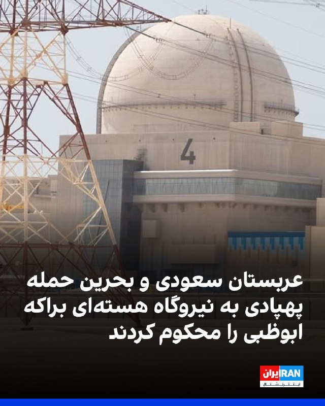

وزارت خارجه عربستان سعودی حمله پهپادی به نیروگاه هسته‌ای براکه در امارات متحده عربی را محکوم کرد.

همزمان وزارت خارجه بحرین اعلام کرد که این کشور حمله «تروریستی» به نیروگاه هسته‌ای براکه را به‌شدت محکوم می‌کند و بر همبستگی کشورش با امارات متحده عربی تاکید کرد.
https://iranintl.com/202605174803

## IranIntlTV — post 337675

  <a href="https://t.me/IranintlTV/337675" target="_blank">📎 Download file</a>

🎧نسخه صوتی تیتراول با نیوشا صارمی: تماس نتانیاهو و ترامپ درباره ایران؛ تشدید تنش‌ها با حمله پهپادی به امارات
@iranintlTV

## IranIntlTV — post 337673

  <a href="telegram/content/IranIntlTV_337673_1779043202.mp4" target="_blank">🎬 Download video</a>

مهدی مهدوی‌آزاد در برنامه «چشم‌انداز» گفت: «در شرایط فعلی، کسی در تهران به‌دنبال صلح نیست و ظاهراً صلح و امتیاز دادن و گرفتن را نوعی ضعف و ضدارزش می‌دانند.»

او افزود: «برنامه هسته‌ای که به‌خاطر آن دو بار کشور وارد جنگ شد، خسارت‌های سنگینی به ایران وارد کرده و بخش بزرگی از تاسیسات و توان مرتبط با آن نابود شده است. با این حال، دوباره بحث‌ها به همان نقطه اول برگشته؛ انگار دوباره به نقطه صفر و مرحله‌ای سخت بازگشته‌ایم.»
@iranintltv

## IranIntlTV — post 337672

  

عبدالله حاجی‌صادقی، نماینده مجتبی خامنه‌ای در سپاه پاسداران، گفت: مذاکرات ما تحت اشراف مسئولان و با تایید «رهبری» پیش می‌رود. او با تاکید بر اینکه «اتحاد مقدس از هر چیزی مهم‌تر است»، افزود نباید اجازه داد این اتحاد آسیب ببیند.

حاجی‌صادقی همچنین گفت: «رهبری شجاع، بصیر، حکیم، مسلط و با قدرت فرماندهی داریم که مردم را به زیبایی رهبری می‌کند.»
https://iranintl.com/202605173538

## IranIntlTV — post 337671

  <a href="https://t.me/IranintlTV/337671" target="_blank">📎 Download file</a>

🎧نسخه صوتی اخبار شبانگاهی | یکشنبه ۲۷ اردیبهشت
@iranintlTV

## IranIntlTV — post 337670

  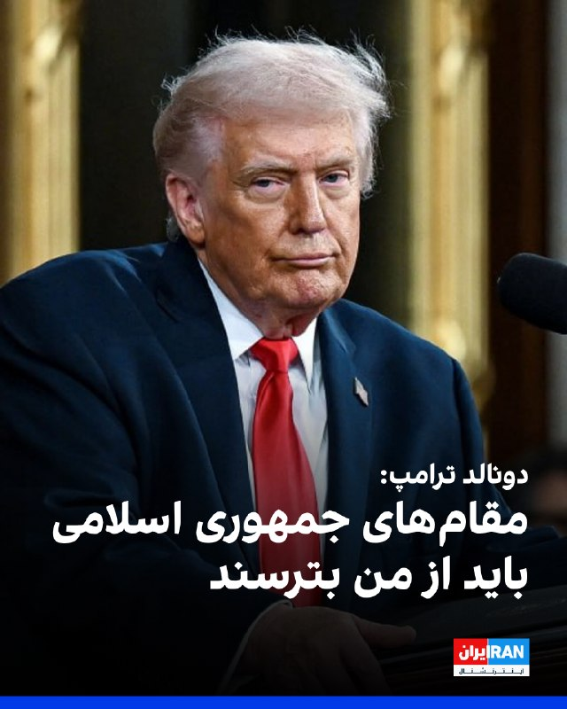

دونالد ترامپ در گفت‌وگو با شبکه ۱۳ اسرائیل پس از تهدید دوباره جمهوری اسلامی گفت: «فکر می‌کنم مقام‌های تهران باید از من بترسند و مراقب باشند.»

او همچنین در گفت‌وگو با کانال ۱۲ اسرائیل گفت همچنان معتقد است ایران خواهان دستیابی به توافق است و انتظار دارد تهران در روزهای آینده پیشنهاد تازه‌ای ارائه کند.
ترامپ از تعیین ضرب‌الاجل برای مذاکرات خودداری کرد، اما هشدار داد در صورت برآورده نشدن خواسته‌های آمریکا درباره برنامه هسته‌ای ایران، اقدام نظامی شدیدتری در پیش خواهد بود.
https://iranintl.com/202605174881

## IranIntlTV — post 337669

  

دونالد ترامپ در گفت‌وگو با شبکه ۱۳ اسرائیل پس از تهدید دوباره جمهوری اسلامی گفت: «فکر می‌کنم مقام‌های تهران باید از من بترسند و مراقب باشند.»

او همچنین در گفت‌وگو با کانال ۱۲ اسرائیل گفت همچنان معتقد است ایران خواهان دستیابی به توافق است و انتظار دارد تهران در روزهای آینده پیشنهاد تازه‌ای ارائه کند.
ترامپ از تعیین ضرب‌الاجل برای مذاکرات خودداری کرد، اما هشدار داد در صورت برآورده نشدن خواسته‌های آمریکا درباره برنامه هسته‌ای ایران، اقدام نظامی شدیدتری در پیش خواهد بود.
https://iranintl.com/202605174881

## IranIntlTV — post 337668

  

دونالد ترامپ در گفت‌وگو با شبکه ۱۳ اسرائیل پس از تهدید دوباره جمهوری اسلامی گفت: «فکر می‌کنم مقام‌های تهران باید از من بترسند و مراقب باشند.»

او همچنین در گفت‌وگو با کانال ۱۲ اسرائیل گفت همچنان معتقد است ایران خواهان دستیابی به توافق است و انتظار دارد تهران در روزهای آینده پیشنهاد تازه‌ای ارائه کند.
ترامپ از تعیین ضرب‌الاجل برای مذاکرات خودداری کرد، اما هشدار داد در صورت برآورده نشدن خواسته‌های آمریکا درباره برنامه هسته‌ای ایران، اقدام نظامی شدیدتری در پیش خواهد بود.
https://iranintl.com/202605174881

## IranIntlTV — post 337667

  <a href="telegram/content/IranIntlTV_337667_1779043209.mp4" target="_blank">🎬 Download video</a>

ویدیوی دریافتی نشان می‌دهد روز شنبه ۲۶ اردیبهشت، جمعی از ایرانیان ساکن شهر رجاینا در ساسکاچوانِ کانادا، همراه با اجرای پرفورمنسی علیه اعدام‌های جمهوری اسلامی و قطعی اینترنت در ایران، تجمع اعتراضی برگزار کردند.

## IranIntlTV — post 337666

قطعی اینترنت در ایران به روز هفتاد و نهم رسیده است و دشواری‌های فراوانی برای میلیون‌ها ایرانی ایجاد کرده. گزارش‌های مختلفی از این مشکلات برای گروه‌های مختلف، از جمله افراد معلول منتشر شده است.

گفت‌وگو با رقیه رضایی، روزنامه‌نگار
@iranintltv

## IranIntlTV — post 337665

  <a href="telegram/content/IranIntlTV_337665_1779043210.mp4" target="_blank">🎬 Download video</a>

کانال ۱۳ اسرائیل گزارش داد این کشور در آماده‌باش کامل قرار دارد. بنابر طرح‌های تدوین‌شده، اهداف حملات احتمالی شامل زیرساخت‌های حکومتی، تاسیسات انرژی، نیروگاه‌ها و همچنین تلاش برای هدف قرار دادن مقام‌های ارشد ایران خواهد بود.

گفت‌وگو با فرزین ندیمی، پژوهشگر امور دفاعی و امنیتی
@iranintltv

## IranIntlTV — post 337664

  

ابراهیم رضایی سخنگوی کمیسیون امنیت ملی مجلس، گفت: «آمریکا یا باید شرایط جمهوری اسلامی را بپذیرد و تسلیم دیپلمات‌های ما شود و یا اینکه از موضع قدرت با او مذاکره می‌کنیم و باید تسلیم موشک‌های ما شود.»
او افزود: «تاریخ تنگه هرمز را باید به قبل و بعد از کشته‌شدن علی خامنه‌ای تقسیم کرد.»
https://iranintl.com/202605179775

## Shin_Persian — post 6050

📦 mhrv-rs v1.9.29 released

• Fix the v1.9.28 Code.gs JSON parse regression (PR #1265, #1245, #1253, #1261)

Files (Android APKs, Windows, macOS, Linux, OpenWRT) on the files channel:

👉 v1.9.29 — all files with SHA-256

Channel:
https://t.me/mhrv_rs
or: https://t.me/+R1OyoHX2boA1ZDgx

#v1929

## ManotoTV — post 105577

  <a href="telegram/content/ManotoTV_105577_1779043214.mp4" target="_blank">🎬 Download video</a>

«صدای فاطمه سپهری باشیم» ـ گزارشگر

## ManotoTV — post 105576

  <a href="telegram/content/ManotoTV_105576_1779043216.mp4" target="_blank">🎬 Download video</a>

باراک راوید، خبرنگار آکسیوس گزارش داد دو مقام آمریکایی اعلام کردند دونالد ترامپ قرار است روز سه‌شنبه نشستی در اتاق وضعیت کاخ سفید با تیم ارشد امنیت ملی خود برگزار کند تا گزینه‌های اقدام نظامی را بررسی کند.

## ManotoTV — post 105575

  <a href="telegram/content/ManotoTV_105575_1779043216.mp4" target="_blank">🎬 Download video</a>

‌
بارسلون | اسپانیا؛ گردهمایی ایرانیان ـ گزارشگر ۲۷ اردیبهشت

## ManotoTV — post 105572

  <a href="telegram/content/ManotoTV_105572_1779043219.mp4" target="_blank">🎬 Download video</a>

‌
گوگوش، خواننده سرشناس ایرانی، با انتشار تصاویری در صفحه اینستاگرام خود اعلام کرد «نشان افتخار جزیره الیس» را دریافت کرده است؛ نشانی که به افرادی اهدا می‌شود که در جامعه آمریکا تاثیرگذار بوده‌اند و در عین حال هویت و ریشه‌های فرهنگی خود را حفظ کرده‌اند.

او در پیام خود نوشت: «خواستم از این فرصت استفاده کنم تا نام ایران و مردم شریف ایران را یادآوری کنم.»

گوگوش همچنین این نشان را به مردم ایران تقدیم کرد و نوشت: «این نشان را با عشق و احترام به مردم ایران تقدیم می‌کنم؛ به مردمی که سال‌ها با رنج، صبوری، امید و سربلندی زندگی کرده‌اند و با وجود همه سختی‌ها، همچنان ایستاده‌اند.»

این خواننده پیشکسوت در ادامه برای ایران و جهان آرزوی «صلح، آرامش و روزهایی روشن‌تر» کرد و در پایان به سخنی از سعدی اشاره کرد.

## ManotoTV — post 105571

  <a href="telegram/content/ManotoTV_105571_1779043219.mp4" target="_blank">🎬 Download video</a>

انور قرقاش، مشاور رئیس‌ دولت امارات، حمله به نیروگاه هسته‌ای این کشور را «اقدامی تروریستی» توصیف کرد و گفت این حمله «چه از سوی عامل اصلی و چه از طریق یکی از نیروهای نیابتی‌اش» یک «تشدید خطرناک» و نقض قوانین و عرف‌های بین‌المللی است.

قرقاش در پیامی در ایکس نوشت این حمله «با بی‌اعتنایی مجرمانه به جان غیرنظامیان در امارات و مناطق اطراف آن» انجام شده است.

او افزود: «هیچ‌کس نمی‌تواند امارات را تحت فشار قرار دهد و در تضعیف چشم‌انداز، موفقیت و پیام الهام‌بخش آن برای امنیت، ثبات، توسعه و رفاه در منطقه موفق نخواهد شد.»

امارات تاکنون مسئول این حمله را معرفی نکرده است. وزارت دفاع امارات پیش‌تر اعلام کرده بود پهپادها از «مرز غربی» وارد این کشور شده‌اند.

## ManotoTV — post 105570

سخنرانی پدر جاویدنام سام افشاری در گردهمایی مونیخ - گزارشگر ۲۶ اردیبهشت

## FarsiVOA — post 217995

  <a href="telegram/content/FarsiVOA_217995_1779043220.mp4" target="_blank">🎬 Download video</a>

همزمان با قطع گسترده اینترنت و تشدید فضای امنیتی در ایران، رادان، فرمانده کل نیروی انتظامی جمهوری اسلامی، مدعی شد از آغاز جنگ تاکنون شش هزار و پانصد نفر را بازداشت کرده‌اند. رادان همچنین درباره روند بازداشت معترضان دی ماه ۱۴۰۴ گفت: «رهایشان نکردیم و همچنان داریم دستگیر می‌کنیم.»

در ادامه بازداشت و سرکوب شهروندان، قوه قضاییه صدور و اجرای احکام سنگین مانند اعدام را برای معترضان دی و زندانیان سیاسی سرعت بخشیده است.

پیشتر محسنی‌اژه‌ای از عواملش در قوه قضائیه خواست برخورد با معترضان را شدت بخشند و به صدور و اجرای احکام اعدام مخالفان جمهوری اسلامی سرعت بدهند.

## FarsiVOA — post 217994

بعضی نیروهای کُرد با یادآوری اعدام قاضی محمد در دوران پهلوی و نقدهایی به منشور جرج‌تاون هنوز از حضورعبدالله مهتدی در این ائتلاف دلخور‌اند. دبیر کل حزب کومله کردستان ایران درعمق میدان به این نقدها پاسخ می‌‌دهد

## DW_Farsi — post 124809

🔶 ترامپ: ایران باید سریع اقدام کند وگرنه چیزی از آن باقی نمی‌ماند

دونالد ترامپ، رئیس‌جمهور آمریکا روز یکشنبه ۱۷ مه (۲۷ ادریبهشت) هشدار داد اگر ایران به‌سرعت با ایالات متحده به توافق صلح نرسد، "چیزی از آن باقی نخواهد ماند".

ترامپ در شبکه اجتماعی "تروث سوشال" نوشت: «برای ایران، زمان در حال پایان است و آن‌ها بهتر است خیلی سریع اقدام کنند وگرنه چیزی از آن‌ها باقی نخواهد ماند.»

رئیس جمهور آمریکا همچنین در پایان پیام خود تاکید کرد: «زمان حیاتی است!»

هشدار ترامپ به ایران ساعاتی پس از تهدیدهای ابوالفضل شکارچی سخنگوی ارشد نیرو‌های مسلح داده شد.

این مقام نظامی جمهوری اسلامی گفته است: «رئیس‌جمهور مستاصل آمریکا باید بداند در صورت عملی شدن تهدید‌ها و تجاوز مجدد به ایران اسلامی، دارایی‌ها و ارتش مضمحل آن کشور با سناریو‌های جدید، هجومی، غافلگیرکننده و طوفانی روبه‌رو خواهند شد و در باتلاق خودساخته‌ای که نتیجه سیاست‌های ماجراجویانه همان رئیس‌جمهور است، فرو خواهند رفت.»

دونالد ترامپ علیرغم این تهدیدها در مصاحبه با کانال ۱۲ اسرائیل گفته همچنان معتقد است ایران به دستیابی به توافق علاقمند است و انتظار دارد تهران در روزهای آینده یک پیشنهاد به‌روزشده ارائه کند.

او در عین حال تهدید کرده است در صورتی که ایران خواسته‌های آمریکا درباره برنامه هسته‌ای را برآورده نکند، با اقدام نظامی شدیدتری مواجه خواهد شد. ترامپ همچنین گفته است: «ما می‌خواهیم به توافق برسیم، اما ایرانی‌ها اکنون در نقطه‌ای که ما می‌خواهیم نیستند.»

بر اساس گزارش کانال ۱۲ اسرائیل، ترامپ همچنین تماس تلفنی خود با بنیامین نتانیاهو، نخست‌وزیر اسرائیل را مثبت ارزیابی کرده و گفته این تماس بر جنگ با ایران متمرکز بوده است.

تلاش‌ها برای کشاندن آمریکا و ایران به میز مذاکره از سوی پاکستان نیز ادامه دارد. در همین چارچوب، محسن نقوی، وزیر کشور پاکستان به تهران سفر کرد و با مسعود پزشکیان، رئیس‌جمهور ایران دیدار کرد.
@dw_farsi

## DW_Farsi — post 124808

🔶 امارات: حق پاسخ به حملات تروریستی علیه تاسیسات اتمی خود را داریم

مقام‌های امارات متحده عربی اعلام کردند در حال بررسی منشا حمله پهپادی به نزدیکی تاسیسات هسته‌ای براکه هستند و حق پاسخ به چنین "حملات تروریستی" را برای خود محفوظ می‌دانند.

امارات روز یکشنبه ۱۷ ماه مه (۲۷ اردیبهشت) اعلام کرد یک حمله پهپادی به آتش‌سوزی در نزدیکی نیروگاه هسته‌ای براکه در منطقه الظفره ابوظبی منجر شده است. این پهپاد به یک ژنراتور برق در خارج از محدوده داخلی نیروگاه اصابت کرده اما سطح ایمنی تشعشعات هسته‌ای تحت تاثیر قرار نگرفته و هیچ موردی از آسیب‌دیدگی گزارش نشده است.

آژانس بین‌المللی انرژی اتمی نیز اعلام کرد وضعیت را به‌دقت دنبال می‌کند و خواستار "حداکثر خویشتن‌داری نظامی" در نزدیکی تاسیسات هسته‌ای شده است.

وزارت دفاع امارات هم اعلام کرده است دو پهپاد دیگر در جریان این حادثه "با موفقیت مهار شده‌اند". وزارت دفاع امارات بدون ارائه جزئیات بیشتر گفته است که این پهپادها از "مرز غربی" شلیک شده‌اند.

خبرگزاری رویترز در یک گزارش که روز یکشنبه ۲۷ اردیبهشت (۱۷ مه) منتشر شد نوشته ایران در اوایل ماه جاری حملات خود را به امارات شدت بخشیده است.

رویترز ضمن اشاره به بن‌بست دیپلماتیک میان ایران و آمریکا و درخواست‌های طرفین در مذاکرات از قول ابوالفضل شکارچی سخنگوی ارشد نیرو‌های مسلح نوشته در صورت عملی شدن تهدیدهای آمریکا، این کشور با "سناریوهای جدید هجومی، طوفانی و غافلگیرکننده" روبه‌رو خواهد شد و آمریکا در "باتلاق‌های خودساخته" فرو خواهد رفت.
@dw_farsi

## DW_Farsi — post 124807

  <a href="telegram/content/DW_Farsi_124807_1779043223.mp4" target="_blank">🎬 Download video</a>

🎥 شش کشته و ۲۰ مصدوم در سانحه اتوبوس در عسلویه
اتوبوس کارکنان مجتمع گاز پارس جنوبی واژگون شد

واژگونی یک اتوبوس حامل کارکنان مجتمع گاز پارس جنوبی در محور عسلویه به سیراف، جان شش نفر را گرفت و ۲۰ نفر دیگر را مصدوم کرد؛ حال یکی از مجروحان وخیم اعلام شده است.
این حادثه صبح یکشنبه ۲۷ اردیبهشت‌ماه در مسیر عسلویه به کرمانشاه رخ داد؛ زمانی که اتوبوس حامل کارکنان مجتمع گاز پارس جنوبی واژگون شد. سخنگوی این مجتمع اعلام کرد شش نفر از کارکنان جان باخته‌اند و ۲۰ نفر دیگر نیز مصدوم شده‌اند. به گفته او، آمار قربانیان و مجروحان قطعی است و حال یکی از مصدومان وخیم گزارش شده است.
@dw_farsi

## Persian_Trend_Official — post 14350

https://youtube.com/live/2KsilHSCq4o?feature=share

## Persian_Trend_Official — post 14349

حدود ساعت 22 به وقت تهران عزیز لایو امشب رو آغاز میکنیم

## Persian_Trend_Official — post 14347

دونالد ترامپ: زمان برای جمهوری اسلامی رو به پایان است.
 
دونالد ترامپ، رئیس‌جمهور اِیالات متحده، شامگاه یکشنبه، ۲۷ اردیبهشت‌ماه با انتشار پیامی در شبکه‌ی اجتماعی خود از این خبر داد که ساعت برای جمهوری اسلامی در حال تیک‌تاک است. رئیس‌جمهور آمریکا به رژیم توصیه کرد بهتر است سریع‌تر حرکت کنند، در غیر این صورت چیزی برای آنها باقی نخواهد ماند.
دونالد ترامپ این پیام را دقایقی پس از آن منتشر کرد که رسانه‌های اسرائیلی و آمریکایی از گفت‌وگوی او با بنیامین نتانیاهو، نخست‌وزیر اسرائیل خبر دادند.
تایمز اسرائیل شامگاه یکشنبه گزارش داد بنیامین نتانیاهو، عصر روز یکشنبه و دقایقی پیش از برگزاری یک نشست محدود امنیتی در شامگاه یکشنبه، با دونالد ترامپ، درباره جنگ علیه جمهوری اسلامی گفتگو کرده است.
 

☆Phantom☆

📌 @persian_trend_official
پرشین ترند | متفاوت‌ترین کانال نظامی

## Persian_Trend_Official — post 14346

  <a href="telegram/content/Persian_Trend_Official_14346_1779043226.webm" target="_blank">🎬 Download video</a>

ساعاتی پیش کانال Fighter Bomber رسانه غیررسمی اما معتبر هوانوردی روسیه تصویری از تست پروازی نسخه دوکابین سوخو-۵۷ منتشر کرد. Su-57D؟ Su-57UB؟ Su-57ED؟ هنوز کسی نمی‌داند و این ابهام در مرحله آزمایش اولیه طبیعی است.

Su-57UB = گزینه اول
روسیه برای نسخه‌های دوکابین آموزشی-رزمی سنت تاریخی با پسوند UB دارد؛ مثل سوخو-۲۷UB و میگ-۲۹UB — الگویی شناخته‌شده که مشتریان صادراتی آن را می‌شناسند.

Su-57D = گزینه دوم
پسوند D در روسی به نسخه‌های تخصصی اشاره دارد. اگر مسکو بخواهد نقش رزمی مستقل این پلتفرم را برجسته کند، این گزینه منطقی‌تر می‌شود.

Su-57ED = آخرین گزینه
ترکیب غیرمعمول حروف و اشاره به نسخه صادراتی، این را ضعیف‌ترین گزینه برای نام رسمی داخلی می‌کند.

☆Phantom☆

📌 @persian_trend_official
پرشین ترند | متفاوت‌ترین کانال نظامی

## RadioFarda — post 157292

  

🔸دونالد ترامپ، رئیس‌جمهور آمریکا، روز سه‌شنبه تهدید کرد ایران وقت زیادی ندارد و اگر به‌سرعت برای رسیدن به توافق با ایالات متحده اقدام نکند، چیزی از آن باقی نخواهد ماند.

🔸او در پیام کوتاهی در شبکه اجتماعی خود، تروث سوشال، نوشت: «برای ایران، ساعت در حال تیک‌تاک کردن است و بهتر است خیلی سریع اقدام کنند، وگرنه چیزی از آنها باقی نخواهد ماند. زمان حیاتی است!»

🔸این موضع‌گیری در حالی انجام شده که وب‌سایت اکسیوس ساعتی قبل به نقل از یک مقام اسرائیلی خبر داد رئیس‌جمهور ایالات متحده روز یکشنبه در تماسی تلفنی با بنیامین نتانیاهو، نخست‌وزیر اسرائیل، درباره ایران گفت‌وگو کرده است.

🔸آقای ترامپ بعد از سفر به چین نیز تأکید کرده بود که تهران باید با واشینگتن به توافق برسد. او گفته بود: «من قرار نیست خیلی بیشتر صبر کنم. آن‌ها باید توافق کنند.»

🔸این در حالی است که او هفته گذشته آخرین پاسخ ایران به طرح پیشنهادی آمریکا را «کاملا غیر قابل قبول» خوانده و رد کرده بود.

@RadioFarda

## IranianMinds — post 20294

🔴 منابع اسرائیلی:

با چراغ سبز ترامپ، انتظار می‌رود اسرائیل و ایالات متحده به طور مشترک به ایران حمله کنند.

@IranianMinds

## IranianMinds — post 20293

🔴 رئیس‌جمهور ترامپ به Axios گفت که هنوز معتقد است ایران خواهان توافق است و اعلام کرد که در انتظار پیشنهادی تجدیدنظر شده از سوی ایران است که امیدوار است بهتر از پیشنهاد قبلی باشد که چند روز پیش ارائه شده بود. او از تعیین مهلت مشخصی برای مذاکرات خودداری کرد.

- هروقت ترامپ اینو گفت روز بعدش حمله کرد

@IranianMinds

## IranianMinds — post 20292

🔴 رضایی، سخنگوی کمیسیون امنیت ملی: آمریکا شرایط ایران را بپذیرد یا منتظر پاسخ موشکی باشد! @IranianMinds

## IranianMinds — post 20291

🔴 رضایی، سخنگوی کمیسیون امنیت ملی:

آمریکا شرایط ایران را بپذیرد یا منتظر پاسخ موشکی باشد!

@IranianMinds

## IranianMinds — post 20290

  <a href="telegram/content/IranianMinds_20290_1779043227.mp4" target="_blank">🎬 Download video</a>

🔴 مجری: آیا ارزش از دست دادن انتخابات میان دوره‌ای را دارد اگر نتیجه یک ایران غیر هسته‌ای باشد؟

سناتور گراهام: ارزش از دست دادن شغلم رو هم داره؛ اگر مجبور بودم کارم رو رها کنم تا مطمئن شم ایران هرگز سلاح هسته‌ای نخواهد داشت، این کار رو می‌کردم.‌‌

@IranianMinds

## IranianMinds — post 20289

✅ (فقط ۲۰۰ هزار تومن)🥺 🌱 قیمت اقتصادی + پشتیبانی حرفه‌ای 🚀 سریع و پایدار، بدون قطعی 🦋پشتیبانی واقعی، همیشه در دسترس ربات ما🌴 📩 @dayaconfigbot کانال ما🌳 📩 @dayavpn

## IranianMinds — post 20288

  

✅ (فقط ۲۰۰ هزار تومن)🥺

🌱 قیمت اقتصادی + پشتیبانی حرفه‌ای

🚀 سریع و پایدار، بدون قطعی
🦋پشتیبانی واقعی، همیشه در دسترس

ربات ما🌴
📩 @dayaconfigbot

کانال ما🌳
📩 @dayavpn

## IranianMinds — post 20287

  

انفجاری که قبل جنگ در بندر شهید رجایی بندرعباس رخ داد بسیار مهیب و پر از کشته! شما یه سرچ ساده تو اکانت‌های کوله پشتی بکن مطلقا هیچ اشاره‌ای به این تراژدی نداشتن!
شماها فقط پروژه گیر هستین! نه داغدار کودکان مدرسه میناب و نه دلسوز ایران و مردمش!

@IranianMinds

## IranianMinds — post 20286

🔴ترامپ به کانال ۱۳ اسرائیل:

ایران باید از من بترسد.

@IranianMinds

## BBCPersian — post 281322

🔻خبرنگار اکسیوس به نقل از دو مقام آمریکایی: ترامپ روز سه‌شنبه درباره گزینه اقدام نظامی جلسه خواهد داشت

🔻باراک راوید، خبرنگار اکسیوس به نقل از دو مقام آمریکایی گزارش داد که انتظار می‌رود دونالد ترامپ روز سه‌شنبه جلسه‌ای در «اتاق وضعیت» کاخ سفید با تیم ارشد امنیت ملی خود برگزار کند تا گزینه‌های اقدام نظامی را مورد بررسی قرار دهد.

اتاق وضعیت از اتاق جلسات کاخ سفید است که مجهز به امکانات ارتباط مستقیم رئیس‌جمهور آمریکا با فرماندهی نیروهای این کشور در سراسر جهان است.

این ساعتی پس از آن است که آقای ترامپ در شبکه اجتماعی خود بار دیگر تهدید کرد که فرصت برای ایران در حال تمام شدن است و اگر سریع برای توافق صلح اقدامی نکند،‌ «چیزی برایش باقی نمی‌ماند.»

باراک راوید در شبکه ایکس نوشت که آقای ترامپ به او گفت: ‌‌‌‌‌‌‌‌‌«ما می‌خواهیم به توافق برسیم. آنها در نقطه‌ای که ما می‌خواهیم نیستند. باید به این نقطه برسند وگرنه به شدت ضربه خواهند خورد و آنها این را نمی‌خواهند.»

بنیامین نتانیاهو،‌ نخست وزیر اسرائیل پیشتر گفته بود قرار است امروز،‌ با دونالد ترامپ تلفنی گفت‌وگو کنند.
https://bbc.in/4nT41Gh
@BBCPersian

## BBCPersian — post 281320

  <a href="https://t.me/bbcpersian/281320" target="_blank">📎 Download file</a>

📻🎙️پادکست برنامه جام جهان‌نما یکشنبه ۲۷ اردیبهشت ۱۴۰۵

در برنامه رادیویی جام‌جهان‌نمای امروز می‌شنوید؛

گمانه‌زنی و التهاب درباره ازسرگیری جنگ آمریکا و اسرائیل با ایران؛ ترامپ در شبکه‌های اجتماعی از آرامش پیش از طوفان گفت، همزمان تهران گفته برای هر نوع واکنش غافل‌گیرانه آماده است.

حمله پهپادی به محوطه نیروگاه هسته‌ای امارات متحده عربی؛ این کشور گفته آتش‌سوزی مهار شده ولی هنوز منشا حمله مشخص نیست. ایران در واکنش گفته این حمله «توطئه دشمن» است.

هم‌زمان، قالیباف، رئیس مجلس، نماینده ویژه جمهوری اسلامی در امور چین هم شد. از کارشناس مسائل ایران می‌پرسیم آیا تغییر معناداری است؟

و در «گپ روز» امشب می‌شنوید:
فهرست بازیکنان دعوت‌شده به تیم ملی فوتبال ایران برای جام جهانی اعلام شد. مقام‌های ارشد فدراسیون فوتبال ایران و فیفا هم در استانبول دیدار کرده‌‌اند.
از خبرنگار ورزشی‌مان می‌پرسیم این فهرست، چندمرده حلاج است؟ شرط و شروط ایران برای شرکت در جام جهانی چه شد؟

این برنامه رادیویی را می‌توانید هر شب ساعت ۲۰ به وقت ایران، روی موج متوسط ۷۰۲ کیلوهرتز و موج کوتاه ۹۴۶۵ کیلوهرتز بشنوید.

@BBCPersian

## Dirty_Kids — post 389636

  

🔴 هر چی بگم از طنز ماجرا کم نمیشه؛ توی اصفهان برای زنای بی حجابی که رفتن خایمالی و توی تجمعات شبانه حضور داشتن، احضاریه دادگاه ارسال شده :))

@Dirty_Kids 👻

## Dirty_Kids — post 389635

  <a href="telegram/content/Dirty_Kids_389635_1779043232.mp4" target="_blank">🎬 Download video</a>

ویدئو وایرال شده از پرستو‌های حکومت؛
بی‌حجاب‌ها اومدن صف اول و چادری‌ها پشت سرشونن..

@Dirty_Kids 👻

## Dirty_Kids — post 389634

  <a href="telegram/content/Dirty_Kids_389634_1779043234.webm" target="_blank">🎬 Download video</a>

🔴ترامپ:
برای ایران، ساعت در حال تیک‌تاک کردنه و بهتره خیلی سریع دست‌به‌کار بشن؛

وگرنه چیزی ازشون باقی نمی‌مونه، زمان کاملاً حیاتی و تعیین‌کننده‌ست! 
⏳

@Dirty_Kids 👻

## Hranews — post 113000

  

سمیرا رضوانی‌فر و آرزو دهقان از زندان وکیل‌آباد مشهد آزاد شدند

❗️
❗️
❗️
❗️
❗️ – آرزو دهقان و سمیرا (فاطمه) رضوانی‌فر، که در جریان اعتراضات دی‌ماه ۱۴۰۴ و همچنین تحولات امنیتی همزمان با جنگ بازداشت شده بودند، با قرار کفالت از زندان وکیل‌آباد مشهد آزاد شدند.

به گزارش خبرگزاری هرانا، ارگان خبری مجموعه فعالان حقوق بشر در ایران، آرزو دهقان و سمیرا (فاطمه) رضوانی‌فر آزاد شدند.

آزادی خانم رضوانی‌فر امروز یکشنبه ۲۷ اردیبهشت ماه و آزادی خانم دهقان، روز گذشته، با قرار کفالت از زندان وکیل آباد مشهد صورت گرفته است.
#آرزو_دهقان #سمیرا_رضوانی‌فر #فاطمه_رضوانی‌فر

ادامه مطلب

↘️ @hranews_bot تماس ✉️ -  @Hranews  کانال هرانا 🆑

## Hranews — post 112999

فرمانده کل انتظامی؛ از آغاز جنگ بیش از ۶,۵۰۰ نفر بازداشت شدند

❗️
❗️
❗️
❗️
❗️ – فرمانده کل انتظامی کشور اعلام کرد که از آغاز #جنگ تاکنون بیش از شش هزار و ۵۰۰ نفر با اتهاماتی از جمله «جاسوسی» در کشور بازداشت شدند.

ادامه مطلب

↘️ @hranews_bot تماس ✉️ -  @Hranews  کانال هرانا 🆑

## Hranews — post 112998

گزارشی از بلاتکلیفی و اخراج کارگران در ۲ واحد مختلف

❗️
❗️
❗️
❗️
❗️ – ۱۳۸ تن از #کارگران شرکت ملی مس از زیر مجموعه‌های هلدینگ ایمیدرو، توسط کارفرما از محل کار خود اخراج شدند. همچنین، جمعی از کارگران شرکتی فرودگاه «بین‌المللی امام خمینی» از توقف فعالیت برخی از شرکت‌های پیمانکاری فرودگاه و بیکاری کارگران این واحدها خبر دادند.

ادامه مطلب

↘️ @hranews_bot تماس ✉️ -  @Hranews  کانال هرانا 🆑

## Hranews — post 112997

مصدومیت ۱۵ کارگر، آتش‌نشان و نیروی امدادی در سایه فقدان ایمنی کار

❗️
❗️
❗️
❗️
❗️ – در سایه فقدان ایمنی محیط و شرایط نامناسب کار، ۱۵ #کارگر از جمله ۱۳ آتش‌نشان و نیروی امدادی در شهرستان‌های مراغه و مریوان طی حوادثی حین انجام کار مصدوم شدند.

ادامه مطلب

↘️ @hranews_bot تماس ✉️ -  @Hranews  کانال هرانا 🆑

## manototv — post 105577

  <a href="telegram/content/manototv_105577_1779043235.mp4" target="_blank">🎬 Download video</a>

«صدای فاطمه سپهری باشیم» ـ گزارشگر

## manototv — post 105576

  <a href="telegram/content/manototv_105576_1779043237.mp4" target="_blank">🎬 Download video</a>

باراک راوید، خبرنگار آکسیوس گزارش داد دو مقام آمریکایی اعلام کردند دونالد ترامپ قرار است روز سه‌شنبه نشستی در اتاق وضعیت کاخ سفید با تیم ارشد امنیت ملی خود برگزار کند تا گزینه‌های اقدام نظامی را بررسی کند.

## manototv — post 105575

  <a href="telegram/content/manototv_105575_1779043238.mp4" target="_blank">🎬 Download video</a>

‌
بارسلون | اسپانیا؛ گردهمایی ایرانیان ـ گزارشگر ۲۷ اردیبهشت

## manototv — post 105572

  <a href="telegram/content/manototv_105572_1779043240.mp4" target="_blank">🎬 Download video</a>

‌
گوگوش، خواننده سرشناس ایرانی، با انتشار تصاویری در صفحه اینستاگرام خود اعلام کرد «نشان افتخار جزیره الیس» را دریافت کرده است؛ نشانی که به افرادی اهدا می‌شود که در جامعه آمریکا تاثیرگذار بوده‌اند و در عین حال هویت و ریشه‌های فرهنگی خود را حفظ کرده‌اند.

او در پیام خود نوشت: «خواستم از این فرصت استفاده کنم تا نام ایران و مردم شریف ایران را یادآوری کنم.»

گوگوش همچنین این نشان را به مردم ایران تقدیم کرد و نوشت: «این نشان را با عشق و احترام به مردم ایران تقدیم می‌کنم؛ به مردمی که سال‌ها با رنج، صبوری، امید و سربلندی زندگی کرده‌اند و با وجود همه سختی‌ها، همچنان ایستاده‌اند.»

این خواننده پیشکسوت در ادامه برای ایران و جهان آرزوی «صلح، آرامش و روزهایی روشن‌تر» کرد و در پایان به سخنی از سعدی اشاره کرد.

## manototv — post 105571

  <a href="telegram/content/manototv_105571_1779043240.mp4" target="_blank">🎬 Download video</a>

انور قرقاش، مشاور رئیس‌ دولت امارات، حمله به نیروگاه هسته‌ای این کشور را «اقدامی تروریستی» توصیف کرد و گفت این حمله «چه از سوی عامل اصلی و چه از طریق یکی از نیروهای نیابتی‌اش» یک «تشدید خطرناک» و نقض قوانین و عرف‌های بین‌المللی است.

قرقاش در پیامی در ایکس نوشت این حمله «با بی‌اعتنایی مجرمانه به جان غیرنظامیان در امارات و مناطق اطراف آن» انجام شده است.

او افزود: «هیچ‌کس نمی‌تواند امارات را تحت فشار قرار دهد و در تضعیف چشم‌انداز، موفقیت و پیام الهام‌بخش آن برای امنیت، ثبات، توسعه و رفاه در منطقه موفق نخواهد شد.»

امارات تاکنون مسئول این حمله را معرفی نکرده است. وزارت دفاع امارات پیش‌تر اعلام کرده بود پهپادها از «مرز غربی» وارد این کشور شده‌اند.

## manototv — post 105570

سخنرانی پدر جاویدنام سام افشاری در گردهمایی مونیخ - گزارشگر ۲۶ اردیبهشت

## alonews — post 120664

  <a href="telegram/content/alonews_120664_1779043241.webm" target="_blank">🎬 Download video</a>

👈واکنش وزیر صمت به افزایش قیمت خودرو: با افزایش تولید و واردات خودرو آرامش به بازار برمی‌گردد

✅ @AloNews خبر جنگ

## alonews — post 120663

  <a href="telegram/content/alonews_120663_1779043241.webm" target="_blank">🎬 Download video</a>

👈رضایی، سخنگوی کمیسیون امنیت ملی:
آمریکا شرایط ایران را بپذیرد یا منتظر پاسخ موشکی باشد!

✅ @AloNews خبر جنگ

## alonews — post 120662

  <a href="telegram/content/alonews_120662_1779043242.webm" target="_blank">🎬 Download video</a>

👈 اکسیوس به نقل از ترامپ : ما می‌خوایم توافق کنیم، ولی اونا هنوز اونجایی که ما می‌خوایم نرسیدن 
🔴 یا باید کوتاه بیان، یا حسابی ضربه می‌خورن و خودشونم اینو نمی‌خوان 
✅ @AloNews خبر جنگ

## alonews — post 120661

  <a href="telegram/content/alonews_120661_1779043242.webm" target="_blank">🎬 Download video</a>

👈 اکسیوس به نقل از ترامپ : ما می‌خوایم توافق کنیم، ولی اونا هنوز اونجایی که ما می‌خوایم نرسیدن

🔴 یا باید کوتاه بیان، یا حسابی ضربه می‌خورن و خودشونم اینو نمی‌خوان

✅ @AloNews خبر جنگ

## alonews — post 120660

  <a href="telegram/content/alonews_120660_1779043242.webm" target="_blank">🎬 Download video</a>

👈رئیس اتحادیه فرآورده‌های لبنی: حذف ارز ترجیحی باعث حذف لبنیات از سفره خانوار شده است

✅ @AloNews خبر جنگ

## alonews — post 120659

  <a href="telegram/content/alonews_120659_1779043242.webm" target="_blank">🎬 Download video</a>

👈ادعای آکسیوس به نقل از منابع خبری در دولت آمریکا: نشست روز گذشته تیم امنیت ملی آمریکا با حضور ونس، ویتکوف، روبیو و رئیس سازمان سیا برگزار شد.

✅ @AloNews خبر جنگ

## alonews — post 120658

  <a href="telegram/content/alonews_120658_1779043243.webm" target="_blank">🎬 Download video</a>

👈کان نیوز: هرگونه حمله آینده علیه ایران که به تأیید ترامپ برسد، به‌صورت مشترک توسط نیروهای آمریکا و اسرائیل انجام خواهد شد.

✅ @AloNews خبر جنگ

## alonews — post 120657

  <a href="telegram/content/alonews_120657_1779043243.webm" target="_blank">🎬 Download video</a>

👈ادعای کانال ۱۵عبری به نقل از مقامات اسرائیلی: پهپادهایی که امروز نیروگاه هسته‌ای ابوظبی را هدف قرار داده بودند، به سوی تأسیسات برق در رآکتور هدایت می‌شدند و هدف، ارسال یک پیام بوده است.

🔴 در امارات، هنوز مشخص نشده است که چه کسی این پهپادها را پرتاب کرده است: ایرانی‌ها یا حوثی‌ها

✅ @AloNews خبر جنگ

## alonews — post 120656

  <a href="telegram/content/alonews_120656_1779043243.webm" target="_blank">🎬 Download video</a>

👈وزیر امور خارجه کوبا برونو رودریگز پاریا: کوبا کشوری صلح‌طلب است، اما اگر به طور نظامی مورد حمله قرار گیرد، حق دفاع مشروع خود را تا آخرین پیامدها با حمایت گسترده مردمش اعمال خواهد کرد

✅ @AloNews خبر جنگ

## alonews — post 120655

  <a href="telegram/content/alonews_120655_1779043244.webm" target="_blank">🎬 Download video</a>

👈آکسیوس به نقل از مقام‌های آمریکایی گزارش داد مذاکرات با ایران به بن‌بست رسیده، اما ترامپ همچنان خواهان توافق با تهران است و در صورت رد خواسته‌هایش، گزینه نظامی را ترجیح می‌دهد

✅ @AloNews خبر جنگ

## alonews — post 120654

  <a href="telegram/content/alonews_120654_1779043244.webm" target="_blank">🎬 Download video</a>

👈بیانیه قطر: از تلاش های دیپلماتیک پاکستان برای رسیدن به توافقی جامع حمایت میکنیم

✅ @AloNews خبر جنگ

## alonews — post 120653

  <a href="telegram/content/alonews_120653_1779043244.webm" target="_blank">🎬 Download video</a>

👈رادیو ارتش اسرائیل: در سایه شروع درگیری ها در ایران فرماندهی پشتیبانی اعلام کرد دستورالعمل‌ها عوض نشده، فعلا تا سه‌شنبه همون‌هایی که هستن معتبرن

✅ @AloNews خبر جنگ

---
📅 بروزرسانی: 1405/02/27 20:48
---

## VahidOOnLine — post 240669

  <a href="telegram/content/VahidOOnLine_240669_1779038315.mp4" target="_blank">🎬 Download video</a>

‌‌
دونالد ترامپ در پیامی در شبکه‌ اجتماعی خود نوشت:
«برای ایران، ساعت در حال گذر است و بهتر است خیلی سریع حرکت کنند، وگرنه چیزی از آن‌ها باقی نخواهد ماند. وقت تنگ است.»
‌🏁 🇬🇧 ManotoTV

🤖 @VahidOOnLine

## VahidOOnLine — post 240668

  

♦️دونالد ترامپ، رئیس‌جمهوری آمریکا، روز یکشنبه با انتشار پیامی در شبکه اجتماعی تروث سوشال، به ایران هشدار داد زمان برای تصمیم‌گیری رو به پایان است و رهبران جمهوری اسلامی باید هرچه سریع‌تر اقدام کنند.
ترامپ در این پیام نوشت: «برای ایران، ساعت در حال تیک‌تاک است و بهتر است خیلی سریع حرکت کنند، وگرنه چیزی از آنها باقی نخواهد ماند. زمان حیاتی است!»
طی روزهای اخیر گزارش‌هایی درباره احتمال ازسرگیری اقدام نظامی علیه ایران و افزایش تنش‌ها میان تهران، واشنگتن و تل‌آویو منتشر شده است.
‌🇸🇦 Indypersian

🤖 @VahidOOnLine

## VahidOOnLine — post 240667

  

دونالد ترامپ در شبکه تروث سوشال نوشت که زمان برای ایران به‌سرعت در حال سپری شدن است و بهتر است آن‌ها هرچه زودتر اقدام کنند در غیر این صورت «چیزی از آن‌ها باقی نخواهد ماند». ترامپ تاکید کرد: «زمان بسیار حیاتی است.»
‌🏁 🇬🇧 IranintlTV

🤖 @VahidOOnLine

## VahidOOnLine — post 240666

  

دونالد ترامپ در شبکه تروث سوشال نوشت که زمان برای ایران به‌سرعت در حال سپری شدن است و بهتر است آن‌ها هرچه زودتر اقدام کنند در غیر این صورت «چیزی از آن‌ها باقی نخواهد ماند». ترامپ تاکید کرد: «زمان بسیار حیاتی است.»
‌🏁 🇬🇧 IranintlTV

🤖 @VahidOOnLine

## VahidOOnLine — post 240665

  <a href="telegram/content/VahidOOnLine_240665_1779038316.mp4" target="_blank">🎬 Download video</a>

‌
بنیامین نتانیاهو، نخست‌وزیر اسرائیل، و دونالد ترامپ، رئیس‌جمهوری آمریکا، روز یکشنبه درباره سفر رئیس‌جمهوری آمریکا به چین گفت‌وگو کردند.

دو طرف همچنین درباره تحولات مربوط به ایران رایزنی کردند.

نتانیاهو پیش‌تر گفته بود که شامگاه یکشنبه با ترامپ صحبت خواهد کرد. او گفت:
«چشم‌های ما همچنین کاملاً به ایران باز است. امروز، همان‌طور که هر چند روز یک‌بار انجام می‌دهم، با دوست‌مان رئیس‌جمهور ترامپ صحبت خواهم کرد. قطعاً برداشت‌های او را از سفرش به چین و شاید مسائل دیگری خواهم شنید. قطعاً احتمالات زیادی وجود دارد؛ ما برای هر سناریویی آماده‌ایم.»
‌🏁 🇬🇧 ManotoTV

🤖 @VahidOOnLine

## VahidOOnLine — post 240664

  

♦️دفتر نخست‌وزیر قطر اعلام کرد شیخ محمد بن عبدالرحمن آل‌ثانی، نخست‌وزیر و وزیر امور خارجه این کشور، روز یکشنبه در تماس تلفنی با شهباز شریف، نخست‌وزیر پاکستان، درباره روابط دوجانبه، تحولات منطقه و تلاش‌های میانجی‌گرانه اسلام‌آباد گفتگو کرده است.
دو طرف در این تماس همچنین آخرین تحولات منطقه و تلاش‌های پاکستان برای کاهش تنش‌ها با هدف تقویت امنیت و ثبات منطقه را بررسی کردند.
شیخ محمد بن عبدالرحمن در این گفتگو از تلاش‌های پاکستان و سایر طرف‌های دخیل در روند میانجی‌گری که به برقراری آتش‌بس میان ایالات متحده و جمهوری اسلامی ایران منجر شد، قدردانی کرد.
بر اساس بیانیه دفتر نخست‌وزیر قطر، شیخ محمد بن عبدالرحمن آل‌ثانی همچنین بر حمایت کامل دوحه از تلاش‌های میانجی‌گرانه پاکستان برای پایان دادن به بحران از راه‌های مسالمت‌آمیز تاکید کرد و گفت همه طرف‌ها باید با این تلاش‌ها همراه شوند تا زمینه برای پیشرفت مذاکرات و دستیابی به توافقی جامع و صلحی پایدار در منطقه فراهم شود.
وزیر امورخارجه قطر پیش از این تماس، با عباس عراقچی، وزیر امور خارجه ایران گفتگو کرده بود.
‌🇸🇦 Indypersian

🤖 @VahidOOnLine

## VahidOOnLine — post 240663

  

عبدالله بن زاید آل‌نهیان، وزیر خارجه امارات متحده عربی پس از حمله پهپادی به نیروگاه هسته‌ای این کشور، تلفنی با رافائل گروسی، مدیرکل آژانس بین‌المللی انرژی اتمی گفت‌وگو کرده است.

به گزارش خبرگزاری دولتی امارات متحده عربی، وزیر خارجه این کشور تاکید کرد که ابوظبی حق کامل دارد به چنین «حملات تروریستی» پاسخ دهد.
‌🏁 🇬🇧 IranintlTV

🤖 @VahidOOnLine

## VahidOOnLine — post 240662

♦️هزاران نفر در توکیو برای شرکت در جشنواره سالانه «سانجا ماتسوری» گرد هم آمدند. رویدادی که از معدود مناسبت‌ها در ژاپن به شمار می‌رود که در آن خالکوبی‌های سنتی موسوم به «ایرزومی» به‌طور علنی در معرض دید عموم قرار می‌گیرد.
خالکوبی‌های سنتی در ژاپن موضوعی بحث‌برانگیز محسوب می‌شوند، زیرا از گذشته با گروه‌های تبهکاری موسوم به یاکوزا و دنیای زیرزمینی این کشور پیوند خورده‌اند.
جشنواره سانجا ماتسوری هر سال در توکیو برگزار می‌شود و در کنار آیین‌های مذهبی و سنتی، فرصتی کم‌سابقه برای نمایش هنر خالکوبی سنتی ژاپنی در فضای عمومی فراهم می‌کند.
‌🇸🇦 Indypersian

🤖 @VahidOOnLine

## VahidOOnLine — post 240661

  

♦️وزارت امور خارجه قطر حمله پهپادی در نزدیکی نیروگاه انرژی هسته‌ای براکه در امارات متحده عربی را محکوم و آن را اقدامی «بی‌ملاحظه» و «نقض آشکار قوانین بین‌المللی» توصیف کرد. دوحه همچنین این حمله را «تهدیدی جدی برای امنیت و ثبات منطقه» دانست.

وزارت خارجه قطر در بیانیه‌ای هشدار داد حمله به زیرساخت‌های حیاتی و اماکن غیرنظامی از «خطوط قرمز» عبور کرده و خواستار جلوگیری از تشدید تنش‌ها شد. این وزارتخانه همچنین بر ضرورت کاهش تنش و جلوگیری از پیامدهای «حملات غیرقابل توجیه» تاکید کرد و بار دیگر حمایت کامل خود را از امارات و اقدامات این کشور برای حفاظت از حاکمیت، امنیت و تاسیسات حیاتی‌اش اعلام کرد.

همزمان، عباس عراقچی، وزیر امور خارجه جمهوری اسلامی ایران، در تماس تلفنی با شیخ محمد بن عبدالرحمن آل ثانی، نخست‌وزیر و وزیر خارجه قطر، درباره آخرین تحولات منطقه گفتگو و تبادل نظر کرد.

وزارت امور خارجه ایران اعلام کرد دو طرف در این تماس دیدگاه‌های خود را درباره تحولات جاری منطقه بررسی کردند، اما جزئیات بیشتری از محورهای گفت‌وگو منتشر نشده است.
‌🇸🇦 Indypersian

🤖 @VahidOOnLine

## VahidOOnLine — post 240660

  

♦️دفتر بنیامین نتانیاهو، نخست‌وزیر اسرائیل، اعلام کرد او روز یکشنبه و دقایقی پیش از برگزاری نشست امنیتی، در تماس تلفنی با دونالد ترامپ، درباره جنگ با ایران گفتگو کرده است.

به گزارش تایمز اسرائیل، این تماس در شرایطی که گزارش‌ها درباره آمادگی آمریکا و اسرائیل برای ازسرگیری جنگ با ایران منتشر شده است.

بر اساس گزارش رسانه‌های اسرائیلی، دو طرف در این تماس درباره احتمال ازسرگیری جنگ با ایران و همچنین سفر اخیر ترامپ به چین گفتگو کرده‌اند.
‌🇸🇦 Indypersian

🤖 @VahidOOnLine

## VahidOOnLine — post 240659

  <a href="telegram/content/VahidOOnLine_240659_1779038319.mp4" target="_blank">🎬 Download video</a>

بهار صحرائیان، وکیل دادگستری و عضو کانون وکلای استان فارس، به زندان عادل‌آباد شیراز منتقل شد.

بر اساس گزارش‌های منتشر شده خانم صحرائیان روز یکشنبه ۲۷ اردیبهشت در دادسرای شیراز از بابت اتهام‌های «اجتماع و تبانی به قصد اقدام علیه امنیت ملی»، «فعالیت تبلیغی علیه نظام» و «نشر اکاذیب» مورد تفهیم اتهام قرار گرفت.

این وکیل دادگستری روز شنبه ۲۶ اردیبهشت، حین انجام وظیفه در دادگاه انقلاب شیراز بازداشت شده بود.
‌🏁 🇬🇧 ManotoTV

🤖 @VahidOOnLine

## VahidOOnLine — post 240658

  <a href="telegram/content/VahidOOnLine_240658_1779038320.mp4" target="_blank">🎬 Download video</a>

لندن | بریتانیا؛ کنار دیوار جاویدنامان ـ گزارشگر یکشنبه ۲۷ اردیبهشت
‌🏁 🇬🇧 ManotoTV

🤖 @VahidOOnLine

## VahidOOnLine — post 240657

  

اکسیوس به نقل از یک مقام اسرائیلی گزارش داد دونالد ترامپ در تماس تلفنی با بنیامین نتانیاهو درباره ایران گفت‌وگو کرده است.
همچنین شبکه کان اسرائیل گزارش داد گفت‌وگوی تلفنی ترامپ و نتانیاهو بیش از نیم ساعت طول کشیده است.
بر اساس این گزارش، دو طرف درباره احتمال ازسرگیری درگیری با ایران گفت‌وگو کردند و ترامپ همچنین نتانیاهو را در جریان جزئیات سفر اخیر خود به چین قرار داده است.
‌🏁 🇬🇧 IranintlTV

🤖 @VahidOOnLine

## VahidOOnLine — post 240656

⭕️ صدو‌سی‌امین سال ترور قبله عالم، ناصرالدین شاه قاجار و تاثیر آن بر وقایع سیاسی ایران

♦️دوازدهم اردیبهشت‌ماه ۱۲۷۵ خورشیدی، هنگامی که ناصرالدین‌شاه قاجار به مناسبت پنجاهمین سال سلطنتش راهی حرم عبدالعظیم در شهر ری شد و برخلاف روال همیشگی، از ملازمان خود خواست اجازه دهند مردم برای دیدار به او نزدیک شوند، شاید هرگز تصور نمی‌کرد که این سفر، واپسین سفر زندگی‌اش باشد و همان روز و در همان مکان، به دست میرزا رضای کرمانی کشته شود.
اکنون ۱۳۰ سال از ترور ناصرالدین‌شاه می‌گذرد؛ رویدادی که تاریخ معاصر ایران را، از منظر حذف فیزیکی عالی‌ترین مقام حکومت، به پیش و پس از خود تقسیم کرد.
میرزا رضای کرمانی که از مریدان سید جمال‌الدین اسدآبادی بود و سال‌هایی از عمر خود را در زندان گذرانده بود، در آن روز در میان زائران کمین کرد. هنگامی که شاه از کالسکه پیاده شد و به سوی صحن حرم گام برداشت، خود را به او رساند و از فاصله‌ای نزدیک گلوله‌ای به سینه او شلیک کرد.
ناصرالدین‌شاه در همان لحظه نقش بر زمین شد. ندیمان و محافظان شاهی که غافلگیر شده بودند، بلافاصله میرزا رضا را دستگیر کردند.

📌لینک پخش پادکست
‌🇸🇦 Indypersian

🤖 @VahidOOnLine

## WithYashar — post 11501

ترامپ به کانال 12 اسرائیل:
ما منتظر یه پیشنهاد دیگه از طرف ایران هستیم؛ اگه این کار رو نکنن، با شدتی بی‌سابقه هدف حمله قرار میگیرن.
@withyashar

## WithYashar — post 11500

## WithYashar — post 11499

گوگوش در پیامی در اینستاگرام اعلام کرد مدال افتخار سال 2026 «جزیره الیس» را دریافت کرده و این جایزه را با «عشق و احترام» به مردم ایران تقدیم می‌کند. @withyashar

## WithYashar — post 11498

گوگوش در پیامی در اینستاگرام اعلام کرد مدال افتخار سال 2026 «جزیره الیس» را دریافت کرده و این جایزه را با «عشق و احترام» به مردم ایران تقدیم می‌کند.
@withyashar

## WithYashar — post 11497

ترامپ: زمان برای ایران در حال اتمام است بهتر است خیلی سریع اقدام کنند، وگرنه چیزی از آن‌ها باقی نخواهد ماند. وقت بسیار حیاتی است! @withyashar

## WithYashar — post 11496

  

ترامپ: زمان برای ایران در حال اتمام است

بهتر است خیلی سریع اقدام کنند، وگرنه چیزی از آن‌ها باقی نخواهد ماند.
وقت بسیار حیاتی است!

@withyashar

## WithYashar — post 11495

  <a href="telegram/content/WithYashar_11495_1779038322.webm" target="_blank">🎬 Download video</a>

🎬 Video

## WithYashar — post 11494

اتحاد باید شکل بگیره ! حتی بچه هیئتی ! تغییر رژیم شکل میگیره ولی تغییر عقیده کار یک شبه نیست و باید هر دو سمت شل کنند ! من خودم کافرم ولی تیم باید تکمیل باشه ! آس پیک شخص شاهزاده رضا پهلوی تنها هستش ! ترامپم مارو میره قاهره شک نکنید !

## WithYashar — post 11493

محمد پروین دوست خوبمه امیدوارم با تغییر جهت به سمت مردم برگردند

## WithYashar — post 11492

  <a href="telegram/content/WithYashar_11492_1779038323.webm" target="_blank">🎬 Download video</a>

علی پروین در بیمارستان بستری شد علی پروین پیشکسوت باشگاه پرسپولیس برای دومین بار در ماه اخیر در بیمارستان بستری شد. پروین به دلیل چکاپ پیگیری برخی از موارد پزشکی مرتبط با خود در بیمارستان بستری شده و نزدیکان او معتقد هستند که احتمالاً تا یکی دو روز آینده…

## WithYashar — post 11491

علی پروین در بیمارستان بستری شد

علی پروین پیشکسوت باشگاه پرسپولیس برای دومین بار در ماه اخیر در بیمارستان بستری شد.

پروین به دلیل چکاپ پیگیری برخی از موارد پزشکی مرتبط با خود در بیمارستان بستری شده و نزدیکان او معتقد هستند که احتمالاً تا یکی دو روز آینده از بیمارستان مرخص می‌شود.
@withyashar

## WithYashar — post 11490

شبکه عبری کان: نتانیاهو و ترامپ، بیش از نیم ساعت با یکدیگر تلفنی گفت‌وگو کردند و در مورد امکان از سرگیری درگیری‌ها در ایران و همچنین سفر ترامپ به چین بحث و تبادل نظر نمودند
@withyashar

## mwarmonitor — post 9217

🔴 دونالد ترامپ به کانال ۱۳ اسرائیل:
اگر ایران یک پیشنهاد خوب ارسال نکند، به آن‌ها حمله خواهیم کرد؛ به شکلی که تا حالا انجام نداده‌ایم.

@mwarmonitor

## mwarmonitor — post 9216

  <a href="telegram/content/mwarmonitor_9216_1779038324.mp4" target="_blank">🎬 Download video</a>

📝 خدا نشسته اون بالا، تخمه می‌شکنه و با لذت به این شاهکار نگاه می‌کنه؛ کمدی سیاهی که در آن ابولا و هانتا ویروس مأمور پذیرایی هستند و جنگ‌ها نقش موسیقی متن را بازی می‌کنند. آدم با دیدن این حجم از خلاقیت در شکنجه و متدِ «عذاب بده و بگو مصلحت است»، به شک می‌افتد…

## mwarmonitor — post 9215

🔴 دونالد ترامپ: در مورد ایران، زمان در حال تمام شدن است و آن‌ها باید خیلی سریع اقدام کنند؛ در غیر این صورت چیزی از آن‌ها باقی نخواهد ماند. زمان حیاتی است! @mwarmonitor

## mwarmonitor — post 9214

  

🔴 دونالد ترامپ:
در مورد ایران، زمان در حال تمام شدن است و آن‌ها باید خیلی سریع اقدام کنند؛ در غیر این صورت چیزی از آن‌ها باقی نخواهد ماند. زمان حیاتی است!

@mwarmonitor

## FoxNewsTwitter — post 341853

  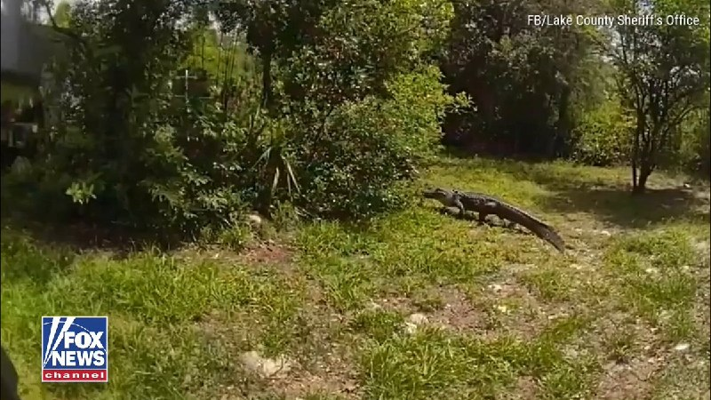

Fox News (Twitter/X)

Deputies wrangle and “arrest” an alligator after it wandered into a residential neighborhood near a school bus stop in Paisley, Florida.

Wild footage shows deputies corralling the gator before it was safely captured and turned over to the Florida Fish and Wildlife Conservation Commission.

## FoxNewsTwitter — post 341852

  <a href="telegram/content/FoxNewsTwitter_341852_1779038326.mp4" target="_blank">🎬 Download video</a>

Fox News (Twitter/X)

NFL legend Tom Brady cracks a joke about his former Patriots head coach, Bill Belichick, while giving the commencement address at Georgetown University.

"Challenge yourself with ideas that are uncomfortable and people who push you to be your very best, even if one of those people is a cranky old coach who cuts the sleeves off his sweatshirt and screams at you all day."

## pm_afshaa — post 90912

  <a href="telegram/content/pm_afshaa_90912_1779038328.webm" target="_blank">🎬 Download video</a>

🔴ترامپ به کانال 12 اسرائیل:
ما منتظر یه پیشنهاد دیگه از طرف ایران هستیم؛ اگه این کار رو نکنن، با شدتی بی‌سابقه هدف حمله قرار میگیرن.

💧 Rainbet.com the #1 Non-KYC Crypto Casino & Sportsbook @rainbetcom

😁 @Pm_Afshaa

## pm_afshaa — post 90911

🔴کانال 13 اسرائیل:ترامپ چندتا رویداد که قرار بود تو اونا شرکت کنه رو لغو کرده و الان جلسه‌ درباره ایران برگزار کرده

💧 Rainbet.com the #1 Non-KYC Crypto Casino & Sportsbook @rainbetcom

😁 @Pm_Afshaa

## pm_afshaa — post 90910

🔴ترامپ: برای ایران، زمان در حال تیک‌تاک است و بهتره سریع حرکت کنند، وگرنه چیزی از آنها باقی نخواهد ماند. زمان مهم است.

💧 Rainbet.com the #1 Non-KYC Crypto Casino & Sportsbook @rainbetcom

😁 @Pm_Afshaa

## pm_afshaa — post 90909

  <a href="telegram/content/pm_afshaa_90909_1779038328.webm" target="_blank">🎬 Download video</a>

🔴سنتکام: از شروع محاصره دریایی ایران، 81 کشتی تجاری رو منحرف کردیم و 4 تا رو از کار انداختیم.

💧 Rainbet.com the #1 Non-KYC Crypto Casino & Sportsbook @rainbetcom

😁 @Pm_Afshaa

## VahidOnline — post 75521

  

دونالد ترامپ در شبکه تروث سوشال نوشت که زمان برای ایران به‌سرعت در حال سپری شدن است و بهتر است آن‌ها هرچه زودتر اقدام کنند در غیر این صورت «چیزی از آن‌ها باقی نخواهد ماند». ترامپ تاکید کرد: «زمان بسیار حیاتی است.»
@VahidOOnLine

📡 @VahidOnline

## VahidOnline — post 75520

  

♦️دفتر بنیامین نتانیاهو، نخست‌وزیر اسرائیل، اعلام کرد او روز یکشنبه و دقایقی پیش از برگزاری نشست امنیتی، در تماس تلفنی با دونالد ترامپ، درباره جنگ با ایران گفتگو کرده است.

به گزارش تایمز اسرائیل، این تماس در شرایطی که گزارش‌ها درباره آمادگی آمریکا و اسرائیل برای ازسرگیری جنگ با ایران منتشر شده است.

بر اساس گزارش رسانه‌های اسرائیلی، دو طرف در این تماس درباره احتمال ازسرگیری جنگ با ایران و همچنین سفر اخیر ترامپ به چین گفتگو کرده‌اند.
@VahidOOnLine

📡 @VahidOnline

## kianmeli1 — post 87453

  

🔴ترامپ: زمان برای ایران در حال اتمام است
https://t.me/kianmeli1

## IranIntlTV — post 337663

  <a href="telegram/content/IranIntlTV_337663_1779038330.mp4" target="_blank">🎬 Download video</a>

شبکه کان اسرائیل گزارش داد بنیامین نتانیاهو و دونالد ترامپ در تماس تلفنی‌ای که بیش از نیم ساعت طول کشید، درباره احتمال ازسرگیری درگیری با جمهوری اسلامی گفت‌وگو کردند.

گفت‌وگو با منشه امیر، کارشناس امور خاورمیانه
@iranintltv

## IranIntlTV — post 337662

  <a href="telegram/content/IranIntlTV_337662_1779038332.mp4" target="_blank">🎬 Download video</a>

یک شهروند با ارسال پیامی به ایران‌اینترنشنال می‌گوید: «من هم مثل خیلی از هموطنان بیکار شدم و برای ادامه زندگی، با قسط و قرض یک کامیون خریدم. حالا سوخت خیلی کم است و ناچارم یک لیتر گازوئیل را بین ۵۰ تا ۷۵ هزار تومان بخرم که اصلا مقرون به‌صرفه نیست.»

## IranIntlTV — post 337661

  

دونالد ترامپ در شبکه تروث سوشال نوشت که زمان برای ایران به‌سرعت در حال سپری شدن است و بهتر است آن‌ها هرچه زودتر اقدام کنند در غیر این صورت «چیزی از آن‌ها باقی نخواهد ماند». ترامپ تاکید کرد: «زمان بسیار حیاتی است.»
https://iranintl.com/202605171452

## IranIntlTV — post 337659

  

عبدالله بن زاید آل‌نهیان، وزیر خارجه امارات متحده عربی پس از حمله پهپادی به نیروگاه هسته‌ای این کشور، تلفنی با رافائل گروسی، مدیرکل آژانس بین‌المللی انرژی اتمی گفت‌وگو کرده است.

به گزارش خبرگزاری دولتی امارات متحده عربی، وزیر خارجه این کشور تاکید کرد که ابوظبی حق کامل دارد به چنین «حملات تروریستی» پاسخ دهد.
https://iranintl.com/202605177152

## IranIntlTV — post 337658

  <a href="telegram/content/IranIntlTV_337658_1779038334.mp4" target="_blank">🎬 Download video</a>

تیتر اول با نیوشا صارمی، یکشنبه ۲۷ اردیبهشت
@iranintltv

## IranIntlTV — post 337657

  <a href="telegram/content/IranIntlTV_337657_1779038336.mp4" target="_blank">🎬 Download video</a>

سازمان اطلاعات ملی ترکیه اعلام کرد یک شبکه بین‌المللی جاسوسی وابسته به دو سرویس اطلاعاتی خارجی را متلاشی کرده است.

گزارش نرگس هورخش، خبرنگار ایران‌اینترنشنال
@iranintltv

## IranIntlTV — post 337656

  <a href="telegram/content/IranIntlTV_337656_1779038337.mp4" target="_blank">🎬 Download video</a>

نیویورک‌تایمز به نقل از مقام‌های منطقه‌ای از وجود دو پایگاه نظامی مخفی اسرائیل در بیابان‌های غربی عراق خبر داد.

بنابر این گزارش، اسرائیل طی یک سال گذشته از این پایگاه‌ها برای عملیات علیه جمهوری اسلامی استفاده کرده است.

گزارش اشکان صفایی، خبرنگار ایران‌اینترنشنال
@iranintltv

## IranIntlTV — post 337655

  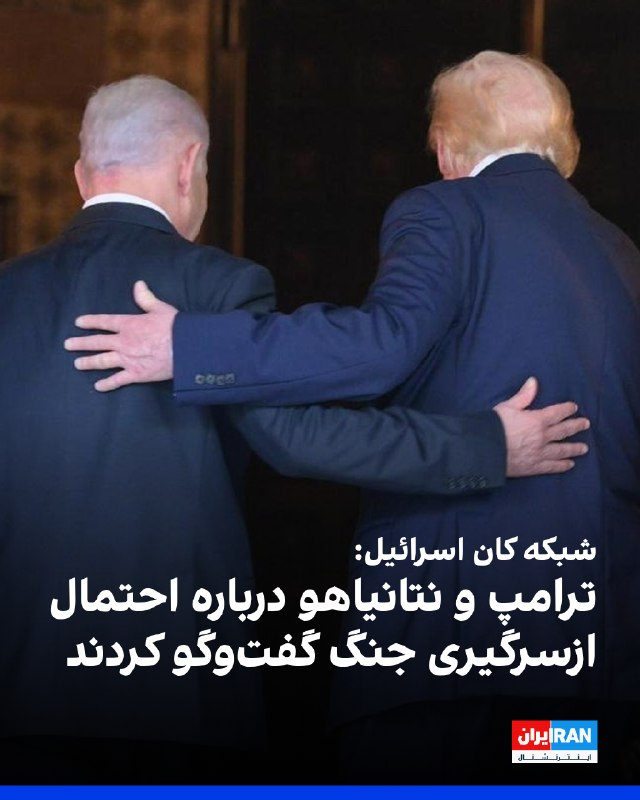

اکسیوس به نقل از یک مقام اسرائیلی گزارش داد دونالد ترامپ در تماس تلفنی با بنیامین نتانیاهو درباره ایران گفت‌وگو کرده است.
همچنین شبکه کان اسرائیل گزارش داد گفت‌وگوی تلفنی ترامپ و نتانیاهو بیش از نیم ساعت طول کشیده است.
بر اساس این گزارش، دو طرف درباره احتمال ازسرگیری درگیری با ایران گفت‌وگو کردند و ترامپ همچنین نتانیاهو را در جریان جزئیات سفر اخیر خود به چین قرار داده است.
https://iranintl.com/202605173156

## IranIntlTV — post 337654

جمهوری اسلامی با سیاست «فریب و تاخیر» به دنبال خرید زمان است

گزارش‌ها حاکی از آن است که مقام‌های اطلاعاتی منطقه‌ای معتقدند جمهوری اسلامی خود را برای احتمال ازسرگیری حملات نظامی آمریکا آماده می‌کند؛ هم‌زمان دونالد ترامپ بار دیگر درباره پایان یافتن صبر خود در قبال تهران هشدار داده و اسرائیل نیز اعلام کرده برای «هر سناریویی» آماده است.

به گزارش وب‌سایت اسرائیل نشنال‌نیوز به نقل از فاکس‌نیوز، ارزیابی مقام‌های اطلاعاتی منطقه‌ای نشان می‌دهد جمهوری اسلامی با توجه به افزایش نارضایتی دولت ترامپ از رفتار تهران و ادامه برنامه هسته‌ای ایران، احتمال می‌دهد آمریکا حملات نظامی علیه این کشور را از سر بگیرد.

بر اساس این گزارش، مقام‌های ایرانی معتقدند ترامپ ممکن است تصمیم به آغاز دوباره عملیات نظامی بگیرد و به همین دلیل راهبردی مبتنی بر «فریب و تاخیر» را دنبال می‌کنند؛ راهبردی که هدف آن خرید زمان و پیچیده‌تر کردن هرگونه عملیات نظامی احتمالی جدید توصیف شده است.

این مقام‌ها به فاکس‌نیوز گفته‌اند رهبران حکومت ایران بر این باورند که می‌توانند بحران را دست‌کم دو هفته دیگر ادامه دهند؛ اقدامی که ممکن است از نظر سیاسی و عملیاتی، آغاز دوباره حملات آمریکا را دشوارتر کند.

گزارش همچنین می‌گوید تهران برخی رویدادهای بین‌المللی آینده، از جمله جام جهانی فوتبال و جشن دویست‌وپنجاهمین سالگرد تاسیس آمریکا را تحولاتی می‌بیند که می‌تواند به نفع جمهوری اسلامی عمل کند.

گزارش از تشدید فشار اقتصادی و نشانه‌های بحران سوخت در ایران
به نوشته اسرائیل نشنال‌نیوز، تاثیر محاصره تحت رهبری آمریکا در داخل ایران به‌طور فزاینده‌ای آشکار شده است.

یک مقام ارشد اسرائیلی که نام او فاش نشده، در این گزارش به صف‌های طولانی پمپ‌بنزین، کمبود سوخت و افزایش نارضایتی عمومی به‌عنوان نشانه‌های اولیه بحران سوخت در ایران اشاره کرده است.

بر اساس این گزارش، قیمت‌ها در ایران همچنان افزایش می‌یابد، بیکاری بیشتر شده و تورم نیز رو به تشدید است.

این مقام گفته است: «اوضاع به شکلی تصاعدی در حال بدتر شدن است.»

افزایش گمانه‌زنی‌ها درباره حملات تازه به ایران
این گزارش در شرایطی منتشر شده که نشانه‌ها و گزارش‌های اخیر، احتمال ازسرگیری عملیات نظامی علیه جمهوری اسلامی را پررنگ‌تر کرده‌اند.

ترامپ شنبه ۲۶ اردیبهشت پیامی مبهم در شبکه اجتماعی تروث سوشال منتشر کرد که شامل تصویری تولیدشده با هوش مصنوعی از او در کنار یک دریادار آمریکایی و چند کشتی، از جمله کشتی‌ای با پرچم جمهوری اسلامی، بود.

روی این تصویر عبارت «این آرامش پیش از طوفان بود» نوشته شده بود؛ پیامی که به گمانه‌زنی‌ها درباره احتمال تشدید تنش‌ها دامن زد.

هم‌زمان، نیویورک‌تایمز گزارش داده آمریکا و اسرائیل در حال آماده‌سازی گسترده برای احتمال ازسرگیری حملات به ایران، حتی از اوایل هفته آینده، هستند.

ترامپ: هر توافقی با ایران نیازمند «تضمینی واقعی» است
ترامپ جمعه ۲۵ اردیبهشت نیز گفته بود ممکن است با تعلیق ۲۰ ساله برنامه هسته‌ای ایران موافقت کند، اما تاکید کرد چنین توافقی تنها در صورت دریافت «تضمینی واقعی» از تهران قابل پذیرش خواهد بود.

او هنگام بازگشت از سفر به چین و در گفت‌وگو با خبرنگاران در هواپیمای ایرفورس‌وان گفت هر پیشنهادی از سوی [حکومت] ایران که اجازه هر نوع فعالیت هسته‌ای را بدهد، رد خواهد کرد.

ترامپ پیش‌تر نیز در گفت‌وگو با شان هنیتی، مجری فاکس نیوز، هشدار داده بود: «دیگر خیلی صبر نخواهم کرد.»

نتانیاهو: اسرائیل برای هر سناریویی آماده است
در همین حال، بنیامین نتانیاهو، نخست‌وزیر اسرائیل، روز یکشنبه ۲۷ اردیبهشت در نشست ویژه دولت به مناسبت روز اورشلیم، به موضوع ایران اشاره کرد و گفت: «چشمان ما درباره ایران کاملاً باز است. امروز، همان‌طور که هر چند روز یک بار انجام می‌دهم، با دوستمان رییس‌جمهوری ترامپ صحبت خواهم کرد.»

او افزود اسرائیل برای «هر سناریویی» آماده است.

به نوشته اسرائیل نشنال‌نیوز، مجموعه این تحولات نشان می‌دهد در حالی که فشار اقتصادی بر ایران افزایش یافته و نشانه‌هایی از آمادگی نظامی آمریکا و اسرائیل دیده می‌شود، تهران نیز خود را برای احتمال تشدید دوباره درگیری آماده می‌کند و تلاش دارد با راهبرد «فریب و تاخیر»، زمان بیشتری به دست آورد.
 
🔗وب‌سایت ایران‌اینترنشنال
@iranintltv

## Shin_Persian — post 6049

  

Shin ✓ @hey_itsmyturn
Sun, 17 May 2026 16:45:32 UTC

President Trump @POTUS:
"For Iran, the Clock is Ticking, and they better get moving, FAST, or there won’t be anything left of them. TIME IS OF THE ESSENCE! President DJT"

فارسی

رئیس‌جمهور ترامپ @POTUS:
«برای ایران، ساعت در حال حرکت است و بهتر است آن‌ها به سرعت وارد عمل شوند، سریع، وگرنه چیزی از آن‌ها باقی نخواهد ماند. زمان حیاتی است! رئیس‌جمهور دی‌جی‌تی»

𝕏 · @shin_persian

## ManotoTV — post 105569

  <a href="telegram/content/ManotoTV_105569_1779038339.mp4" target="_blank">🎬 Download video</a>

‌‌
دونالد ترامپ در پیامی در شبکه‌ اجتماعی خود نوشت:
«برای ایران، ساعت در حال گذر است و بهتر است خیلی سریع حرکت کنند، وگرنه چیزی از آن‌ها باقی نخواهد ماند. وقت تنگ است.»

## ManotoTV — post 105568

  <a href="telegram/content/ManotoTV_105568_1779038340.mp4" target="_blank">🎬 Download video</a>

‌
بنیامین نتانیاهو، نخست‌وزیر اسرائیل، و دونالد ترامپ، رئیس‌جمهوری آمریکا، روز یکشنبه درباره سفر رئیس‌جمهوری آمریکا به چین گفت‌وگو کردند.

دو طرف همچنین درباره تحولات مربوط به ایران رایزنی کردند.

نتانیاهو پیش‌تر گفته بود که شامگاه یکشنبه با ترامپ صحبت خواهد کرد. او گفت:
«چشم‌های ما همچنین کاملاً به ایران باز است. امروز، همان‌طور که هر چند روز یک‌بار انجام می‌دهم، با دوست‌مان رئیس‌جمهور ترامپ صحبت خواهم کرد. قطعاً برداشت‌های او را از سفرش به چین و شاید مسائل دیگری خواهم شنید. قطعاً احتمالات زیادی وجود دارد؛ ما برای هر سناریویی آماده‌ایم.»

## ManotoTV — post 105567

  <a href="telegram/content/ManotoTV_105567_1779038340.mp4" target="_blank">🎬 Download video</a>

بهار صحرائیان، وکیل دادگستری و عضو کانون وکلای استان فارس، به زندان عادل‌آباد شیراز منتقل شد.

بر اساس گزارش‌های منتشر شده خانم صحرائیان روز یکشنبه ۲۷ اردیبهشت در دادسرای شیراز از بابت اتهام‌های «اجتماع و تبانی به قصد اقدام علیه امنیت ملی»، «فعالیت تبلیغی علیه نظام» و «نشر اکاذیب» مورد تفهیم اتهام قرار گرفت.

این وکیل دادگستری روز شنبه ۲۶ اردیبهشت، حین انجام وظیفه در دادگاه انقلاب شیراز بازداشت شده بود.

## ManotoTV — post 105566

  <a href="telegram/content/ManotoTV_105566_1779038341.mp4" target="_blank">🎬 Download video</a>

لندن | بریتانیا؛ کنار دیوار جاویدنامان ـ گزارشگر یکشنبه ۲۷ اردیبهشت

## FarsiVOA — post 217993

  

⚡️دونالد ترامپ، رئیس جمهوری آمریکا روز یکشنبه، ۲۷ اردیبهشت در شبکه اجتماعی تروت سوشال نوشت: «زمان برای [رژیم] ایران، به سرعت در حال سپری شدن است و بهتر است هر چه سریع‌تر اقدام کنند.»
او افزود که در غیر این‌صورت «چیزی از آنها باقی نخواهد ماند.»

## FarsiVOA — post 217992

بغداد در نقطه عطف سیاسی؛ حذف گروه‌های نزدیک به جمهوری اسلامی از کابینه و تشدید اختلافات شیعە

## FarsiVOA — post 217991

در گفت‌وگو با حسن هاشمیان از صدای آمریکا به همزمانی آغاز به‌کار دولت جدید عراق با تشدید فشار نظامی، اقتصادی، و قضایی آمریکا بر گروه‌های وابسته به جمهوری اسلامی پرداختیم و بررسی کردیم این تحولات چه پیامدهایی برای آینده نفوذ رژیم ایران و موازنه امنیتی در عراق خواهد داشت.

## FarsiVOA — post 217990

سازمان‌های حقوق بشری گزارش داده‌اند که وکلای تسخیری قوه قضائیه در سرعت بخشیدن به صدور احکام اعدام برای معترضان، به رژیم ایران کمک می‌کنند.

## FarsiVOA — post 217989

  <a href="telegram/content/FarsiVOA_217989_1779038343.mp4" target="_blank">🎬 Download video</a>

نوآم بتان، نماینده اسرائیل در یوروویژن ۲۰۲۶، بعد از بازگشت به اسرائیل، در فرودگاه با استقبال هوادارانش روبرو شد. او در مسابقات آواز یوروویژن که شامگاه شنبه، ۲۶ اردیبهشت، برگزار شد، با ترانه‌‌ای که ترکیبی از عبری، فرانسوی و انگلیسی است رتبه دوم را بدست آورد.

دارا، خواننده بلغار مقام اول را کسب کرد. دور بعدی این مسابقات به میزبانی بلغارستان برگزار خواهد شد.

## FarsiVOA — post 217988

🔺نتانیاهو: اورشلیم را با تمرکز بر زیرساخت‌های عمرانی و میراث تاریخی توسعه می‌دهیم

▪️بنیامین نتانیاهو، نخست‌وزیر اسرائیل، اعلام کرد دولت این کشور در نشست ویژه‌ای در اورشلیم مجموعه‌ای از طرح‌های جدید عمرانی، تاریخی، و فناوری را برای توسعه این شهر تصویب کرده است.

⬇️ بیشتر بخوانید:

https://ir.voanews.com/a/netanyahu-jerusalem-development-program/8150901.html/?nocach=1

## FarsiVOA — post 217987

🔺سناتور گراهام: هنوز اهداف بیشتری برای حمله در ایران وجود دارد

▪️لیندزی گراهام، سناتور جمهوری‌خواه ایالت کارولینای جنوبی، روز یکشنبه ۲۷ اردیبهشت خواستار افزایش فشار نظامی آمریکا بر رژیم ایران شد و گفت هنوز اهداف بیشتری برای حمله وجود دارد.

⬇️ بیشتر بخوانید:

https://ir.voanews.com/a/lindsey-graham-nbc-interview-iran-hormuz-strait-status-quo/8150911.html/?nocach=1

## DW_Farsi — post 124806

🔶 هشدار وکلای حقوق بشر؛ برخی وکلای تسخیری همدست نهادهای امنیتی هستند

سازمان حقوق بشر ایران هشدار داده است که دستگاه قضایی جمهوری اسلامی به‌طور فعال از وکلای تسخیری در جریان پرونده‌های معترضان بازداشت‌شده استفاده می‌کند و این موضوع می‌تواند به تسریع و تسهیل اجرای احکام اعدام منجر شود.

این سازمان می‌گوید در نامه‌ای از سوی جمعی از وکلای حقوق بشری داخل ایران، برخی وکلای تسخیری "همدست" نهادهای امنیتی در محاکمات نمایشی معرفی شده‌اند زیرا به جای دفاع موثر از موکلان، با دستگاه‌های امنیتی همکاری می‌کنند.

آنها در نامه‌ای با عنوان "وکلای امنیتی؛ شریک دزد و رفیق قافله" به نقش وکلای تسخیری در پرونده‌های امنیتی پرداخته‌اند.

در این نامه تاکید شده است محرومیت از وکیل مستقل می‌تواند به‌طور عامدانه زمینه‌ساز صدور و اجرای احکام اعدام علیه متهمان شود.

بر اساس این گزارش، مستنداتی وجود دارد که نشان می‌دهد برخی وکلای تسخیری بلافاصله پس از صدور حکم، درخواست تجدیدنظر را به‌صورت رسمی ثبت می‌کنند و بدین ترتیب متهمان را از مهلت قانونی ۲۰ روزه برای تجدیدنظرخواهی محروم می‌سازند.

سازمان حقوق بشر ایران تاکید کرده است این رویه با ایجاد مانع در دسترسی به وکلای مستقل و ثبت زودهنگام درخواست‌ها، مسیر اجرای احکام اعدام را هموار می‌کند و می‌تواند "مصداق نقض جدی اصول دادرسی عادلانه و اعدام‌های خودسرانه در حقوق بین‌الملل" باشد.
@dw_farsi

## DW_Farsi — post 124805

🔶 ادعای فارس: جزئیات درخواست‌های آمریکا در مذاکرات

خبرگزاری فارس، نزدیک به سپاه پاسداران و نهادهای امنیتی گزارش داده است که بر اساس "شنیده‌ها از پاسخ آمریکا به پیشنهادهای ایران"، واشنگتن پنج شرط اصلی را مطرح کرده است.

این شروط شامل عدم پرداخت هرگونه غرامت و خسارت، خروج و تحویل ۴۰۰ کیلوگرم اورانیوم از ایران به آمریکا، فعال ماندن تنها یک مجموعه از تاسیسات هسته‌ای، عدم پرداخت حتی ۲۵ درصد از دارایی‌های بلوکه‌شده ایران و منوط شدن توقف جنگ در همه ساحت‌ها به انجام مذاکره است.

فارس در ادامه می‌نویسد این گزارش تاکید می‌کند که حتی در صورت تحقق این شرایط از سوی ایران، "تهدید تجاوز" آمریکا و اسرائیل همچنان پابرجا خواهد بود.

این رسانه نزدیک به نهادهای امنیتی همچنین از قول "کارشناسان" نوشته است که طرح پیشنهادی آمریکا به جای حل مسئله، در پی دستیابی به اهدافی است که این کشور نتوانسته در طول جنگ به آن‌ها دست یابد.

خبرگزاری فارس بدون ذکر منبعی نوشته است که در مقابل، ایران انجام هرگونه مذاکره را منوط به تحقق ۵ پیش‌شرط "اعتمادساز" شامل "پایان جنگ در همه جبهه‌ها به‌ویژه لبنان، رفع تحریم‌های ضدایرانی، آزادسازی پول‌های بلوکه‌شده ایران، جبران خسارات ناشی از جنگ و پذیرش حق حاکمیت ایران بر تنگه هرمز" دانسته است.

برخی کارشناسان از جمله حمیدرضا عزیزی، پژوهشگر "بنیاد علم و سیاست" به دویچه وله فارسی گفتند مواضع آمریکا و ایران فاصله زیادی با یکدیگر دارد و همین موضوع، میانجی‌گری میان دو کشور را نیز با دشواری مواجه کرده است.

به‌ویژه برنامه هسته‌ای جمهوری اسلامی ایران، نگرانی‌های جدی آمریکا را برانگیخته است.

در این رابطه اخیرا کریس رایت، وزیر انرژی آمریکا در جلسه کمیته نیروهای مسلح سنای این کشور مدعی شد که ایران تنها "چند هفته" با دستیابی به مواد لازم برای ساخت سلاح هسته‌ای فاصله دارد.
@dw_farsi

## DW_Farsi — post 124804

🎥 بارش شدید تگرگ در نقده و بجنورد
وزش باد شدید، رگبار، رعدوبرق در ۱۴ استان ایران تا روز دوشنبه

بارش بسیار شدید تگرگ در بجنورد و نقده، خیابان‌های این دو شهر را سفیدپوش کرد؛ همزمان سازمان هواشناسی درباره ادامه ناپایداری‌ها، رعدوبرق و احتمال تگرگ در ۱۴ استان هشدار داده است.
تصاویر منتشرشده از بجنورد و نقده، شدت بالای بارش تگرگ را نشان می‌دهد؛ پدیده‌ای که در پی ناپایداری‌های جوی رخ داده است. سازمان هواشناسی اعلام کرده از عصر یکشنبه تا پایان دوشنبه، در تهران و بخش‌هایی از شمال، غرب، مناطق مرکزی و ارتفاعات، وزش باد شدید، رگبار، رعدوبرق و در مناطق مستعد، بارش تگرگ پیش‌بینی می‌شود.
@dw_farsi

## Persian_Trend_Official — post 14345

  

💢 ترامپ:

برای ایران ساعت در حال تیک‌تاک است، و بهتر است خیلی سریع شروع به حرکت کنند، وگرنه هیچ چیزی از آن‌ها باقی نخواهد ماند.

زمان یک عامل حیاتی است!

🫆:Tony

📌 @persian_trend_official
پرشین ترند | متفاوت‌ترین کانال نظامی

## Persian_Trend_Official — post 14344

  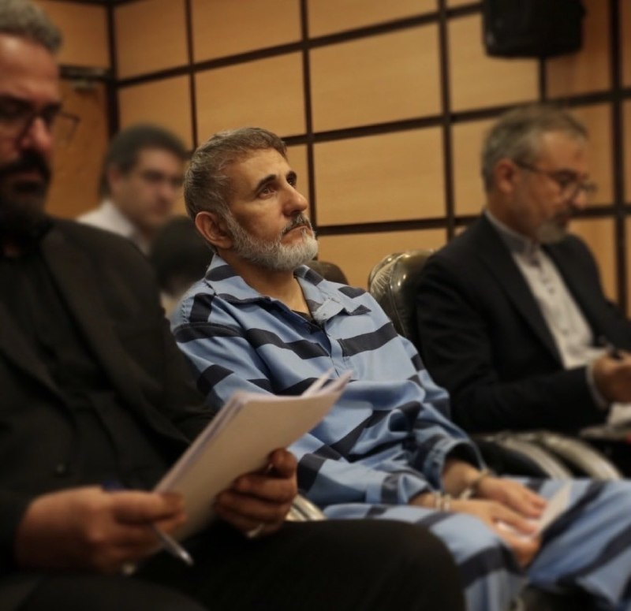

آقای ساعدی نیا
قلب میلیون ها ایرانی همراه شماست.

📌 @persian_trend_official
پرشین ترند | متفاوت‌ترین کانال نظامی

## Persian_Trend_Official — post 14343

## IranianMinds — post 20285

🔴کانال ۱۲ اسرائیل:

تخمین اسرائیلی‌ها این است که امریکا در طول این هفته، به جنگ علیه ایران بازخواهد گشت.

@IranianMinds

## IranianMinds — post 20284

🔴 باراک راوید خبرنگار آکسیوس:

ترامپ در یک تماس تلفنی با نتانیاهو، درباره ایران گفت‌وگو کرد.

@IranianMinds

## IranianMinds — post 20283

  

🔴ترامپ: زمان برای ایران در حال اتمام است

برای ایران، ساعت در حال تیک‌تاک است، و آن‌ها بهتر است خیلی سریع دست به کار شوند؛ وگرنه چیزی از آن‌ها باقی نخواهد ماند. زمان حیاتی است!

@IranianMinds

## BBCPersian — post 281319

  

🔻دونالد ترامپ در شبکه تروث سوشال بدون توضیحی نوشت: «ساعت برای ایران در حال تیک‌تاک است و اگر به‌سرعت عمل نکند، چیزی از آنها باقی نخواهد ماند.»

این درحالیست که وزیر کشور پاکستان، کشوری که میانجی کنونی آیران و آمریکاست، امروز در ایران با محمدباقر قالیباف ملاقات کرده است.

سخنگوی کمیسیون امنیت ملی و سیاست خارجی مجلس امروز گفت: «آمریکا یا باید شرایط جمهوری اسلامی ایران را بپذیرد و تسلیم دیپلمات‌های ما شود و یا اینکه ایران از موضع قدرت با آن مذاکره خواهد کرد و باید تسلیم موشک‌های ما شود.»

او گفت که ایران «از هیچ یک از شروط خود کوتاه نمی‌آید.»
📷Getty Images
https://bbc.in/49SmRXU

@BBCPersian

## BBCPersian — post 281318

🔻امارات «حمله پهپادی» به نزدیکی نیروگاه هسته‌ایش را «تروریستی» خواند

🔻امارات متحده عربی حمله پهپادی به نزدیکی نیروگاه هسته‌ای براکه را «یک اقدام تروریستی بی‌دلیل» خواند که باعث تشدید تنش در منطقه می‌شود.

وزارت خارجه امارات متحده در بیانیه‌ای «به شدیدترین لحن» این حمله را محکوم کرد و «حق دیپلماتیک و نظامی خود را برای پاسخ به هرگونه تهدید، ادعا یا دشمنی» را محفوظ دانست.

در بیانیه وزارت خارجه امارات به منشا این حمله اشاره‌ای نشده اما آمده است که یک ژنراتور برق، خارج از محدوده داخلی نیروگاه هسته‌ای براکه در منطقه ظفره، هدف پهپادی قرار گرفت که از مرز غربی وارد امارات شده بود.

وزارت خارجه امارات این حمله را «تشدید خطرناک تنش‌ها،‌ اقدام تجاوزکارانه غیرقابل و تهدید مستقیم برای امنیت» خود و نقض آشکار قوانین بین‌المللی خواند.

تنش لفظی ایران و امارات اخیرا شدت گرفته است.

امارات جمعه گفت ایران در طول جنگ با آمریکا و اسرائیل،‌ بیش از سه هزار حمله به تاسیسات غیرنظامی‌اش کرده است.

عباس عراقچی، وزیر خارجه، امارات متحده را به داشتن نقش فعال در حملات آمریکا و اسرائیل به ایران متهم کرده است. ایران می‌گوید فقط به تاسیسات نظامی و نهادهای مرتبط با آمریکا و اسرائیل در امارت حمله کرده است.

https://bbc.in/3PnCZdc
@BBCPersian

## BBCPersian — post 281309

🔻یک روز پس از به نمایش درآمدن فیلم «تمرین‌هایی برای یک انقلاب»، ساخته پگاه آهنگرانی در هفتاد و نهمین جشنواره فیلم کن، عوامل تولید و ساخت این فیلم مقابل دوربین رسانه‌ها قرار گرفتند.

پس از نمایش دیروز که با استقبال تماشاچیان همراه بود،‌ خانم آهنگرانی اثر خود را به مادرانی تقدیم کرد که فرزندانشان را در راه مبارزه برای آزادی از دست داده‌اند.

کاوه فرنام و آدریا مونس تهیه کنندگان فیلم «تمرین‌هایی برای یک انقلاب» هستند و تدوین آن با آرش آشتیانی بوده است.

پگاه آهنگرانی که خود راوی این فیلم است می‌گوید که از میان پنج پرتره از خویشاوندان و استادانش و پنج شکل از مقاومت، در این فیلم داستان زندگی خودش را روایت کرده است.

به گفته خانم آهنگرانی او با استفاده از آرشیوهای شخصی، ویدئوهای خانگی، تصاویر اعتراضات خیابانی، روزنامه‌ها و صداهای ضبط‌ شده، بیش از ۴۰ سال از تاریخ ایران را بازخوانی ‌کرده است.

📷Corbis via Getty Images/ AFP via Getty Images/ Getty Images/ EPA/ BBC Images

@BBCPersian

## BBCPersian — post 281307

جنگ و پیامدهایشان چه تاثیری روی وضعیت مسکن شما گذاشته است؟ آیا پس از جنگ مجبور به اسباب‌کشی شده‌اید؟
بر اساس ارزیابی وزارت کار ایران، جنگ جنگ آمریکا و اسرائیل با ایران موجب بیکاری مستقیم و غیرمستقیم دو میلیون نفر شده است. از دست دادن شغل و کاهش درآمد برای آنها که در خانه‌های اجاره‌ای زندگی می‌کنند بسیار دشوارتر است.
اگر مستأجرید و در هفته‌های اخیر به دلایل اقتصادی مجبور به اسباب‌کشی شده‌اید، تجربیاتتان را با ما در میان بگذارید. جنگ چه تأثیری روی درآمد شما گذاشت؟ واکنش صاحبخانه‌ چه بود؟ آیا خانه جدیدی اجاره کردید یا به خانه خانواده یا دوستان رفتید؟ این ماجرا چه تاثیری بر روحیه و سلامت روان شما گذاشته است؟
اگر تجربه و مشاهده‌ای از اجاره‌نشینی دارید، با هشتگ #مسکن برای ما بفرستیدبه:
آی‌مسج و واتس‌اپ: ۰۰۴۴۷۳۴۲۰۳۲۱۱۳
پیامگیر تلگرام:t.me/bbcshoma

📷 ایرنا
عصر ایران

@BBCPersian
https://bbc.in/43cTEDl

## Dirty_Kids — post 389633

‏تا حالا رفتی جنازه دخترت رو تحویل بگیری
بهت بگن شیرینی بگیر ؟
بعد تو بگی برای جنازش؟
اونم بگه نه برای بکارتش

@Dirty_Kids 👻

## Dirty_Kids — post 389632

تلگرام تو این سیزده سال، به اندازه‌ی یک روز پیام‌رسان‌های داخلی قطعی و اختلال نداشته.

@Dirty_Kids 👻

## Dirty_Kids — post 389631

‏Lesson :

جایی که بهت میگن «اگه دوست داری بیای، بیا»، نرو.

@Dirty_Kids 👻

## Dirty_Kids — post 389630

مرتیکه‌ی توده‌ای پلشت فکر کرده به جای «تخم» بگه «بیضه» خیلی مودب و با اخلاقه! دوزاری هستی مثل بقیه‌ی خون‌شورای هم‌صِنفت.

@Dirty_Kids 👻

## Dirty_Kids — post 389629

چرخی در خبرها زدم ببینم اوضاع خبری رسانه‌ها از چه قراره که دریا دریا کسشر موج می‌زد،

اول اینکه رسانه‌های روافض نوشتن که وزیر کشور خایه‌مال پاکستان یک دیدار خصوصی با پوزیده داشته که بیش از ۹۰ دقیقه طول کشیده و در پایان نهج‌البلغه گویان از جلسه خارج شده و به دیدار ممدباقر رفته که در اون جلسه هم یک بار دیگه چارچوب مذاکرات رو بهش توضیح دادن،

از طرفی دیگه صبح امروز به سمت کشور قرمدنگ امارات پهپاد پراکنی شده که ظاهراً به محوطه‌ی داخلی نیروگاه هسته‌ای براکه هم اصابت داشته که بعضی از تحلیلگران اعتقاد دارن روافض از ترس کونشون که می‌دونن حمله‌ی آمریکا قریب‌الوقوعه، حمله‌ی پیش‌‌دستانه کرده که شیر خدا و یارانش رو بترسونه.

پایان اخبار کسشر.

@Dirty_Kids 👻

## Dirty_Kids — post 389628

  

ایران ۱۹۷۱ تیم والیبال زنان پاس تهران

@Dirty_Kids 👻

## Dirty_Kids — post 389627

✖️ سایت بین المللی bet120x 
✖️  
👍دارای مجوز رسمی Gambling Judge سوئد
👍       
💳شارژ حساب از طریق ارز و یووچر و پرمیوم ووچر 
💳تسویه حساب دلاری سریع 💊بیمه شرط میکس 
⚠️فروش شرط 
🔔ویرایش شرط                    
3️⃣
2️⃣ 
🎁20%هدیه واریز از طریق ارز و ووچر ┅━━━━━━━━━━━…

## Dirty_Kids — post 389626

  

✖️ سایت بین المللی bet120x 
✖️

 
👍دارای مجوز رسمی Gambling Judge سوئد
👍
     

💳شارژ حساب از طریق ارز و یووچر و پرمیوم ووچر

💳تسویه حساب دلاری سریع
💊بیمه شرط میکس

⚠️فروش شرط

🔔ویرایش شرط                    
3️⃣
2️⃣

🎁20%هدیه واریز از طریق ارز و ووچر
┅━━━━━━━━━━━

🎁 10%برگشت باخت به صورت روزانه

🎁 10%برگشت باخت به صورت هفتگی

🎁10%برگشت باخت به صورت ماهانه

💻ادرس ورود به سایت:
https://bet120x.com/fa/?btag=971470
➖➖➖➖➖
   
👈 آموزش واریز و برداشت دلاری
👉

🔪کانال اطلاع رسانی:
👇

✈️https://t.me/+1Wv5nGY_a54xNzlk

## Dirty_Kids — post 389625

  <a href="telegram/content/Dirty_Kids_389625_1779038348.mp4" target="_blank">🎬 Download video</a>

اینا تازه هنرپیشه‌هاشون هستن:
اون مجریاتون کونشونم نمیتونن تکون بدن

ارزش دانلود: اگه نت اضاقی داری

@Dirty_Kids 👻

## manototv — post 105569

  <a href="telegram/content/manototv_105569_1779038349.mp4" target="_blank">🎬 Download video</a>

‌‌
دونالد ترامپ در پیامی در شبکه‌ اجتماعی خود نوشت:
«برای ایران، ساعت در حال گذر است و بهتر است خیلی سریع حرکت کنند، وگرنه چیزی از آن‌ها باقی نخواهد ماند. وقت تنگ است.»

## manototv — post 105568

  <a href="telegram/content/manototv_105568_1779038350.mp4" target="_blank">🎬 Download video</a>

‌
بنیامین نتانیاهو، نخست‌وزیر اسرائیل، و دونالد ترامپ، رئیس‌جمهوری آمریکا، روز یکشنبه درباره سفر رئیس‌جمهوری آمریکا به چین گفت‌وگو کردند.

دو طرف همچنین درباره تحولات مربوط به ایران رایزنی کردند.

نتانیاهو پیش‌تر گفته بود که شامگاه یکشنبه با ترامپ صحبت خواهد کرد. او گفت:
«چشم‌های ما همچنین کاملاً به ایران باز است. امروز، همان‌طور که هر چند روز یک‌بار انجام می‌دهم، با دوست‌مان رئیس‌جمهور ترامپ صحبت خواهم کرد. قطعاً برداشت‌های او را از سفرش به چین و شاید مسائل دیگری خواهم شنید. قطعاً احتمالات زیادی وجود دارد؛ ما برای هر سناریویی آماده‌ایم.»

## manototv — post 105567

  <a href="telegram/content/manototv_105567_1779038350.mp4" target="_blank">🎬 Download video</a>

بهار صحرائیان، وکیل دادگستری و عضو کانون وکلای استان فارس، به زندان عادل‌آباد شیراز منتقل شد.

بر اساس گزارش‌های منتشر شده خانم صحرائیان روز یکشنبه ۲۷ اردیبهشت در دادسرای شیراز از بابت اتهام‌های «اجتماع و تبانی به قصد اقدام علیه امنیت ملی»، «فعالیت تبلیغی علیه نظام» و «نشر اکاذیب» مورد تفهیم اتهام قرار گرفت.

این وکیل دادگستری روز شنبه ۲۶ اردیبهشت، حین انجام وظیفه در دادگاه انقلاب شیراز بازداشت شده بود.

## manototv — post 105566

  <a href="telegram/content/manototv_105566_1779038351.mp4" target="_blank">🎬 Download video</a>

لندن | بریتانیا؛ کنار دیوار جاویدنامان ـ گزارشگر یکشنبه ۲۷ اردیبهشت

## alonews — post 120652

  <a href="telegram/content/alonews_120652_1779038352.webm" target="_blank">🎬 Download video</a>

👈انتظار می‌رود ترامپ روز سه‌شنبه جلسه‌ای در اتاق وضعیت با تیم ارشد امنیت ملی خود برگزار کند تا گزینه‌های اقدام نظامی علیه ایران را بررسی کند، به گزارش Axios و به نقل از دو مقام آمریکایی

✅ @AloNews خبر جنگ

## alonews — post 120651

  <a href="telegram/content/alonews_120651_1779038352.webm" target="_blank">🎬 Download video</a>

👈 ادامه رفت و آمد هواپیماهای ترابری ارتش آمریکا به خاورمیانه!

✅ @AloNews خبر جنگ

## alonews — post 120650

  <a href="telegram/content/alonews_120650_1779038352.webm" target="_blank">🎬 Download video</a>

👈نفت برنت بعدِ پست جدید ترامپ؛ از ۱۰۵$ رسید به ۱۰۹$

✅ @AloNews خبر جنگ

## alonews — post 120649

  <a href="telegram/content/alonews_120649_1779038353.webm" target="_blank">🎬 Download video</a>

👈ترامپ: «منتظر یک پیشنهاد دیگر از سوی ایران هستیم، پیش از آن‌که با شدتی بی‌سابقه به آن حمله کنیم.»

🔴ایران باید از من بترسد و مراقب باشد.»

✅ @AloNews خبر جنگ

## alonews — post 120648

  <a href="telegram/content/alonews_120648_1779038353.webm" target="_blank">🎬 Download video</a>

👈سازمان ملل: ما خواهان توافق جامع بین ایران و آمریکا هستیم

✅ @AloNews خبر جنگ

## alonews — post 120647

  <a href="telegram/content/alonews_120647_1779038353.webm" target="_blank">🎬 Download video</a>

🔴فوری / ترامپ از طریق Truth Social:
برای ایران، ساعت در حال تیک‌تاک است و بهتر است سریع حرکت کنند، وگرنه چیزی از آن‌ها باقی نخواهد ماند.

🔴زمان اهمیت حیاتی دارد!

✅ @AloNews خبر جنگ

## alonews — post 120646

  <a href="telegram/content/alonews_120646_1779038353.webm" target="_blank">🎬 Download video</a>

👈نخست‌وزیر قطر با نخست‌وزیر پاکستان درباره ایران صحبت کرد

✅ @AloNews خبر جنگ

## alonews — post 120645

  <a href="telegram/content/alonews_120645_1779038353.webm" target="_blank">🎬 Download video</a>

👈 وزارت دفاع امارات: ما با ۳ فروند پهپاد که از مرزهای غربی وارد شده بودند، برخورد کرده و با دو فروند از آنها با موفقیت مقابله نمودیم. 
🔴یکی از پهپادها به یک ژنراتور برق در خارج از محیط داخلی نیروگاه هستهای براکه در منطقه الظفره اصابت کرد. 
🔴تحقیقات برای تعیین…

## alonews — post 120644

  <a href="telegram/content/alonews_120644_1779038353.webm" target="_blank">🎬 Download video</a>

👈وال‌ استریت ژورنال: جنگ خاورمیانه موجب بازگشت جهان به استفاده از زغال‌سنگ شده است

✅ @AloNews خبر جنگ

## alonews — post 120643

  <a href="telegram/content/alonews_120643_1779038353.webm" target="_blank">🎬 Download video</a>

👈نمونه اولیه جنگنده دو نفره سوخو Su-57D روسیه برای اولین بار در آزمایش‌های زمینی مشاهده شده است.

🔴 اگر تأیید شود، این جنگنده دومین جنگنده دو نفره نسل پنجم جهان پس از Chengdu J-20S ساخته شده توسط چین خواهد بود

✅ @AloNews خبر جنگ

## alonews — post 120642

  <a href="telegram/content/alonews_120642_1779038354.webm" target="_blank">🎬 Download video</a>

👈 وزارت دفاع امارات: ما با ۳ فروند پهپاد که از مرزهای غربی وارد شده بودند، برخورد کرده و با دو فروند از آنها با موفقیت مقابله نمودیم.

🔴یکی از پهپادها به یک ژنراتور برق در خارج از محیط داخلی نیروگاه هستهای براکه در منطقه الظفره اصابت کرد.

🔴تحقیقات برای تعیین منبع این حملات در جریان است و پس از پایان تحقیقات، تحولات جدید اطلاع‌رسانی خواهد شد.

✅ @AloNews خبر جنگ

## alonews — post 120641

  <a href="telegram/content/alonews_120641_1779038354.mp4" target="_blank">🎬 Download video</a>

👈حزب‌الله تو جنوب لبنان با پهپاد FPV به نیروهای اسرائیلی حمله کرد و زدشون

✅ @AloNews خبر جنگ

---
📅 بروزرسانی: 1405/02/27 19:45
---

## VahidOOnLine — post 240655

  <a href="telegram/content/VahidOOnLine_240655_1779034503.mp4" target="_blank">🎬 Download video</a>

♦️صدا و سیمای جمهوری اسلامی تصاویری از برگزاری دوره‌های آموزش کار با اسلحه برای زنان و مردان در مساجد نقاط مختلف کشور پخش کرده است.
در تصاویر منتشرشده از سوی شبکه خبر جمهوری اسلامی ایران، زنان و مردان در محیط‌های مسجدی در حال شرکت در آموزش‌های دفاعی دیده می‌شوند. این گزارش همچنین شامل اظهارنظر برخی شرکت‌کنندگان درباره این برنامه‌ها است.
جزئیات بیشتری درباره محل دقیق برگزاری این آموزش‌ها، تعداد شرکت‌کنندگان یا هدف رسمی این دوره‌ها منتشر نشده است.
روز شنبه تفنگ دست گرفتن مجری‌های تلویزیون در ایران، خبرساز شده بود.
‌🇸🇦 Indypersian

🤖 @VahidOOnLine

## VahidOOnLine — post 240654

  <a href="telegram/content/VahidOOnLine_240654_1779034504.mp4" target="_blank">🎬 Download video</a>

‌
«صدای فاطمه سپهری باشیم» ـ گزارشگر
‌🏁 🇬🇧 ManotoTV

🤖 @VahidOOnLine

## VahidOOnLine — post 240653

  <a href="telegram/content/VahidOOnLine_240653_1779034505.mp4" target="_blank">🎬 Download video</a>

مجارستان؛ گردهمایی ایرانیان _ گزارشگر یکشنبه ۲۷ اردیبهشت
‌🏁 🇬🇧 ManotoTV

🤖 @VahidOOnLine

## VahidOOnLine — post 240652

  <a href="telegram/content/VahidOOnLine_240652_1779034506.mp4" target="_blank">🎬 Download video</a>

‌
وین | اتریش؛ گردهمایی ایرانیان _ گزارشگر یکشنبه ۲۷ اردیبهشت
‌🏁 🇬🇧 ManotoTV

🤖 @VahidOOnLine

## VahidOOnLine — post 240651

  

مسعود پزشکیان در پیامی در شبکه اجتماعی ایکس به مناسبت روز جهانی ارتباطات نوشت: «در روزهای جنگ، فرزندان ما در ارتباطات و فناوری اطلاعات شبانه‌روز ایستادند تا ارتباطات کشور پایدار بماند.»
او همچنین دسترسی باکیفیت و پایدار مردم به خدمات دیجیتال را «بخشی از آرامش، پیشرفت و حق زندگی شایسته مردم» ایران دانست.
‌🏁 🇬🇧 IranintlTV

🤖 @VahidOOnLine

## VahidOOnLine — post 240650

  <a href="telegram/content/VahidOOnLine_240650_1779034508.mp4" target="_blank">🎬 Download video</a>

بازار تهران؛ ۲۷ اردیبهشت ـ گزارشگر
‌🏁 🇬🇧 ManotoTV

🤖 @VahidOOnLine

## VahidOOnLine — post 240649

  <a href="telegram/content/VahidOOnLine_240649_1779034510.mp4" target="_blank">🎬 Download video</a>

‌
پورتو | پرتغال؛ گردهمایی ایرانیان ـ گزارشگر یکشنبه ۲۷ اردیبهشت
‌🏁 🇬🇧 ManotoTV

🤖 @VahidOOnLine

## VahidOOnLine — post 240648

  

♦️گوگوش، خواننده نامدار ایرانی، در پیامی در اینستاگرام اعلام کرد مدال افتخار سال ۲۰۲۶ «جزیره الیس» را دریافت کرده و این جایزه را با «عشق و احترام» به مردم ایران تقدیم می‌کند.

او نوشت: «دیشب افتخار داشتم نشان افتخار جزیره الیس را دریافت کنم؛ نشانی که به افرادی اهدا می‌شود که در جامعه آمریکا تأثیرگذار بوده‌اند و در عین حال ریشه‌ها و هویت فرهنگی خود را حفظ کرده‌اند.»

«نشان افتخار جزیره الیس» یکی از شناخته‌شده‌ترین جوایز مدنی آمریکا است که از سال ۱۹۸۶ به افرادی از حوزه‌های هنر، فرهنگ، سیاست، علم، تجارت و فعالیت‌های اجتماعی اعطا می‌شود؛ افرادی که علاوه بر نقش‌آفرینی در جامعه آمریکا، بر حفظ پیشینه و هویت فرهنگی خود نیز تأکید داشته‌اند. این جایزه در جزیره الیس نیویورک، نماد ورود میلیون‌ها مهاجر به آمریکا، اهدا می‌شود.

از چهره‌های شناخته‌شده‌ای که در سال‌های مختلف این نشان را دریافت کرده‌اند می‌توان به رونالد ریگان، ریچارد نیکسون، رزا پارکس، فرانک سیناترا، گلوریا استفان، ملاله یوسف‌زی و دونالد ترامپ اشاره کرد.
‌🇸🇦 Indypersian

🤖 @VahidOOnLine

## VahidOOnLine — post 240647

  

گوگوش، خواننده سرشناس ایرانی، «نشان افتخار جزیره آلیس» را دریافت کرد؛ «این نشان به افرادی اهدا می‌شود که در جامعه آمریکا تأثیرگذار بوده‌اند و در عین حال ریشه‌ها و هویت فرهنگی خود را حفظ کرده‌اند.»

گوگوش با انتشار تصویری از مراسم اهدای این نشان در صفحه اینستاگرام خود نوشت: «این نشان را با عشق و احترام به مردم ایران تقدیم می‌کنم؛ به مردمی که سال‌ها با رنج، صبوری، امید و سربلندی زندگی کرده‌اند و با وجود همه سختی‌ها، همچنان ایستاده‌اند.»
‌🏁 🇬🇧 IranintlTV

🤖 @VahidOOnLine

## VahidOOnLine — post 240646

  <a href="telegram/content/VahidOOnLine_240646_1779034513.mp4" target="_blank">🎬 Download video</a>

پاریس | فرانسه؛ گردهمایی ایرانیان ـ گزارشگر یکشنبه ۲۷ اردیبهشت
‌🏁 🇬🇧 ManotoTV

🤖 @VahidOOnLine

## VahidOOnLine — post 240645

  

لیندسی گراهام، سناتور جمهوری‌خواه آمریکا در گفت‌وگو با شبکه ان‌بی‌سی خواستار اقدام نظامی بیشتر آمریکا علیه جمهوری اسلامی شد.
او افزود: وضعیت فعلی به همه ما آسیب می‌زند، هرچه تنگه هرمز بیشتر بسته بماند و ما بیشتر دنبال توافقی برویم که هیچ‌وقت حاصل نمی‌شود. جمهوری اسلامی قوی‌تر می‌شود.

سناتور گراهام افزود: «تا این لحظه، هیچ چیزی نشان نمی‌دهد افرادی که اکنون در قدرت هستند، از نظر اهداف رژیم برای تروریسم جهانی، نابودی اسرائیل و حمله به ما تفاوتی کرده باشند.»

او اضافه کرد: «آنچه رئیس‌جمهور ترامپ از نظر نظامی انجام داده فوق‌العاده بوده، اما هنوز اهداف بیشتری وجود دارد و کارهای بیشتری هست که می‌توانیم برای ضربه زدن به ایران انجام دهیم.»
‌🏁 🇬🇧 IranintlTV

🤖 @VahidOOnLine

## VahidOOnLine — post 240644

  <a href="telegram/content/VahidOOnLine_240644_1779034516.mp4" target="_blank">🎬 Download video</a>

♦️در ادامه برنامه‌های هفتادونهمین دوره جشنواره فیلم کن، روز یکشنبه ۲۷ اردیبهشت، پگاه آهنگرانی به همراه مادرش، منیژه حکمت، کارگردان و تهیه‌کننده باسابقه، و سایر عوامل بین‌المللی مستند «تمرین‌هایی برای یک انقلاب»، مقابل دوربین عکاسان رسانه‌های جهان رفتند. حضور مشترک این مادر و دختر سینماگر ایرانی، توجه رسانه‌های فرانسوی را به خود جلب کرد.
این فیلم که به عنوان محصول مشترک فرانسه و آلمان و با حمایت نهادهای فرهنگی اروپایی ساخته شده، در بخش «نمایش‌های ویژه» به نمایش درآمد. مستند از طریق پنج پرتره از چهره‌های کلیدی طبقه روشنفکر و مبارز، نشان می‌دهد که چگونه مفهوم «مقاومت» از نسل‌های پیشین به جنبش‌های اخیر منتقل شده است.
به گزارش رسانه‌های معتبر سینمایی، منتقدان این اثر را یکی از سیاسی‌ترین و در عین حال شخصی‌ترین مستندهای امسال توصیف کرده‌اند که با ترکیب هوشمندانه آرشیوهای خانگی ممنوعه و تصاویر اعتراضات خیابانی، نوعی «سند تاریخی ملموس» از ایستادگی جامعه ایران خلق کرده است.
‌🇸🇦 Indypersian

🤖 @VahidOOnLine

## VahidOOnLine — post 240643

  

♦️محمدباقر قالیباف، رئیس مجلس شورای اسلامی، روز یکشنبه ۲۷ اردیبهشت با محسن نقوی، وزیر کشور پاکستان دیدار کرد.

به گزارش رسانه‌های داخلی ایران، قالیباف در این دیدار گفت برخی دولت‌های منطقه تصور می‌کردند حضور آمریکا برای آنها امنیت به همراه دارد، اما «حوادث اخیر نشان داد این حضور نه تنها امنیت‌زا نیست بلکه زمینه ناامنی را هم فراهم می‌کند.»

رئیس مجلس شورای اسلامی همچنین بر اهمیت همکاری و روابط میان کشورهای منطقه تاکید کرد.

به گزارش فارس، محسن نقوی، وزیر کشور پاکستان نیز در این دیدار با اشاره به مذاکرات اسلام‌آباد خطاب به قالیباف گفت: «شاهد ایستادگی شما در مذاکرات اسلام‌آباد بر منافع ملی ایران و در عین حال تلاش برای حل و فصل مشکلات بودیم.»

نقوی در جریان سفر دو روزه پیش‌بینی نشده به تهران، با مقام‌های مختلف جمهوری اسلامی، از جمله وزیر کشور، رئیس جمهوری و رئیس مجلس ایران دیدار کرد.
‌🇸🇦 Indypersian

🤖 @VahidOOnLine

## WithYashar — post 11489

کلاه شیر و خورشیدمو الان باد برد تو آب های خلیج فارس… 🥹❤️‍🩹

## WithYashar — post 11488

  

کلاه شیر و خورشیدمو الان باد برد تو آب های خلیج فارس… 🥹❤️‍🩹

## WithYashar — post 11487

زیرنویس شبکه العربیه:

قرارگاه خاتم الانبیا به یگان های موشکی اعلام آماده باش فوق العاده صادر کرده است.
@withyashar

## WithYashar — post 11486

زیرنویس شبکه خبر: هشدار درباره عملیات غیرموجه علیه کشورهای منطقه و انتساب آن به ایران

یک مقام آگاه نظامی: ایران همه کشورهای منطقه را از افتادن در این دام رژیم صهیونیستی برحذر می‌دارد.
@withyashar

## WithYashar — post 11485

سناتور لیندسی گراهام در مورد ایران:

طبق تحلیل من، هیچ نشانه‌ای وجود ندارد که افراد مسئول فعلی با گذشته تفاوتی داشته باشند - آنها هنوز می‌خواهند جهان را به وحشت بیندازند، اسرائیل را نابود کنند و به دنبال ما بیایند.

بنابراین شما آنها را بیشتر تضعیف می‌کنید. کاری که رئیس جمهور ترامپ انجام داده از نظر نظامی شگفت‌انگیز بوده است. زیرساخت‌های انرژی، نقطه ضعف آنهاست. برگردیم به بحث جنگ، من انرژی را در صدر فهرست قرار می‌دهم.

من خواستار آسیب رساندن به این رژیم هستم. بیشتر به آنها آسیب بزنید، شاید آنها به توافق برسند. اما در حال حاضر فکر می‌کنم آنها سعی می‌کنند منتظر بمانند و بازی کنند.
@withyashar

## WithYashar — post 11484

کیهان لندن : آماده باشید که احتمالا آمریکا و اسرائیل به زودی حمله می‌کنن
@withyashat

## mwarmonitor — post 9213

🔴دونالد ترامپ، رئیس‌جمهور ایالات متحده، در یک تماس تلفنی با بنیامین نتانیاهو، نخست‌وزیر اسرائیل، درباره ایران گفت‌وگو کرد؛ به گفته یک مقام اسرائیلی. باراک راوید خبرنگار آکسیوس

@mwarmonitor

## FoxNewsTwitter — post 341848

Fox News (Twitter/X)

## FoxNewsTwitter — post 341844

Fox News (Twitter/X)

The Osbourne family received an official congressional honor recognizing legendary rocker Ozzy Osbourne, with his legacy entered into the Congressional Record for his “freedom-loving rebellious spirit” and "lasting impact on American families."

## pm_afshaa — post 90908

  <a href="telegram/content/pm_afshaa_90908_1779034518.webm" target="_blank">🎬 Download video</a>

🔴سناتور لیندزی گراهام درباره ایران:
به نظر من، کسایی که الان قدرت رو دستشون گرفتن با قبلی‌ها هیچ فرقی ندارن و باز هم میخوان جهان رو به هم بریزن، اسرائیل رو نابود کنن و به ما حمله کنن؛ باید بیشتر اونا رو ضعیف کنیم. رفتن به دنبال توافقی که هیچ‌وقت حاصل نمیشه، فقط جمهوری اسلامی رو قوی‌تر میکنه.

هر قیمتی که لازم باشه، میپردازیم. این حرفی بود که چرچیل درباره شکست هیتلر میگفت و حالا برای ایران هم صدق میکنه.

💧 Rainbet.com the #1 Non-KYC Crypto Casino & Sportsbook @rainbetcom

😁 @Pm_Afshaa

## pm_afshaa — post 90907

  <a href="telegram/content/pm_afshaa_90907_1779034518.webm" target="_blank">🎬 Download video</a>

🔴آکسیوس به نقل از یک مقام اسرائیلی:
ترامپ و نتانیاهو در تماسی تلفنی درباره پرونده ایران گفتگو کردن.

کانال 12 اسرائیل:
در سایه آمادگی برای از سرگیری درگیری‌ها در ایران این تماس انجام شده.

💧 Rainbet.com the #1 Non-KYC Crypto Casino & Sportsbook @rainbetcom

😁 @Pm_Afshaa

## DEJradio — post 4681

  <a href="telegram/content/DEJradio_4681_1779034519.mp4" target="_blank">🎬 Download video</a>

📢
🔺 "دو ماه از جنگ گذشته پاسگاه جنت‌آباد هنوز درست نشده

#حملات_هدفمند #سرکوب
@DEJradio

## mamlekate — post 103549

📝 «حمله پهپادی» به نیروگاه هسته‌ای امارات متحده عربی؛ گروسی محکوم کرد

اداره رسانه‌ای ابوظبی روز یکشنبه ۲۶ اردیبهشت از وقوع آتش‌سوزی در نزدیکی نیروگاه اتمی براکه در امارات متحده عربی خبر داد. این رخداد با واکنش مدیرکل آژانس بین‌المللی انرژی اتمی مواجه شد.

📝 آژانس درباره حمله پهپادی به نیروگاه هسته‌ای امارات: سطح تشعشعات عادی است

@mamlekate

## mamlekate — post 103548

📞 نمیدونم موضوع چیه ولی امروز عصر سه چهاربار صدای جنگنده اومد از خرمشهر رد می‌شد! به کدوم سمت دقیقا نمیشد فهمید، ولی بوضوح صدای جنگنده بود‌. اقلا سه دفعه قطعا شنیدیم که از بالای شهر رد شد!

همه ماها که دیدیم وشنیدیم، نفهمیدیم از کجا میومدن یا به کجا میرفتن، اما در اینکه جنگنده بودن هیچ شکی نداریم. بیشتر به صدای جنگنده‌های روزای جنگ میخورد صداشون.

📞 امروز یه چیزی شبیه هواپیما تو آسمون تهران سمت امیرآباد دیدم حدود ساعت ۱۱ و ۴۵. از شمال به جنوب داشت می‌رفت، خیلی سریع رد شد و نتونستم دقیق تشخیص بدم نوعش رو ولی واقعا هواپیما بود اونی که دیدم. بعدش تا چند دقیقه منتظر صدای انفجاری چیزی بودم ولی هیچی. حتی سریع پنجره رو باز کردیم که صدا واضح باشه ولی اصلا صدای جنگنده نیومد.

📞 بامداد یکشنبه ساعت ۰۲:۱۴ نت داخلی ایرانسل و همراه تو ساری قطع شد، من تا حدود ۴:۳۰ بیدار بودم اما همچنان قطع بود، از چند نفر در نقاط مختلف شهر هم پرسیدم تایید کردن، طرفای ۶ مثل اینکه وصل شد. تو این مدت چه خبر بوده که همه چی قطع شده بود جالبه

@mamlekate

## VahidOnline — post 75516

drpezeshkian

📡 @VahidOnline

## IranIntlTV — post 337652

  <a href="telegram/content/IranIntlTV_337652_1779034521.mp4" target="_blank">🎬 Download video</a>

حدود دو ماه و نیم پس از حذف علی خامنه‌ای، یک سخنران بیت فاش کرد که به او و فرماندهان ارشد کشته‌شده اطمینان داده شده بود که حمله‌ای اتفاق نخواهد افتاد. همزمان یک تحلیل‌گر نزدیک به حکومت گفت حداقل دو نفر از فرماندهان تردید داشتند که در جلسه شرکت کنند.

گزارشی از مجتبا پورمحسن
@iranintltv

## IranIntlTV — post 337651

اورشلیم‌پست: جمهوری اسلامی ممکن است حملات به امارات متحده عربی را تشدید کند

اورشلیم‌پست نوشته است که حمله پهپادی به نزدیکی نیروگاه هسته‌ای در امارات متحده عربی می‌تواند نشانه‌ای از افزایش فشار جمهوری اسلامی بر کشورهای خلیج فارس و پیامی درباره گسترش دامنه اهداف تهران در منطقه باشد، در شرایطی که گمانه‌زنی‌ها درباره احتمال ازسرگیری جنگ افزایش یافته است.

به نوشته اورشلیم‌پست، ۲۷ اردیبهشت یک پهپاد باعث آتش‌سوزی در نزدیکی نیروگاه هسته‌ای براکه در منطقه الظفره امارات متحده عربی شد. دفتر رسانه‌ای ابوظبی اعلام کرد آتش‌سوزی در یک ژنراتور برق خارج از محدوده داخلی نیروگاه رخ داده و تاکید کرد این حادثه بر عملکرد سامانه‌های حیاتی نیروگاه تاثیری نداشته است.

مقام‌های اماراتی همچنین گفتند هیچ موردی از مصدومیت یا نشت مواد رادیواکتیو گزارش نشده و نیروگاه به فعالیت عادی خود ادامه می‌دهد.
اورشلیم‌پست با اشاره به گزارش آسوشیتدپرس نوشت این حمله، در شرایطی که آتش‌بس با حکومت ایران همچنان شکننده توصیف می‌شود، نگرانی‌ها درباره احتمال ازسرگیری جنگ را افزایش داده است.

اگرچه هیچ گروهی مسئولیت حمله را بر عهده نگرفته، این تحلیل احتمال می‌دهد [حکومت] ایران یا نیروهای نیابتی وابسته به آن در این حمله نقش داشته باشند.

نگرانی آژانس بین‌المللی انرژی اتمی
به نوشته اورشلیم‌پست، نهاد ناظر هسته‌ای سازمان ملل نسبت به حمله پهپادی نزدیک نیروگاه هسته‌ای امارات «نگرانی جدی» ابراز کرده است.

این گزارش می‌گوید آژانس بین‌المللی انرژی اتمی در حال پیگیری نزدیک وضعیت است، هرچند سازمان فدرال تنظیم مقررات هسته‌ای امارات اعلام کرده سامانه‌های حیاتی نیروگاه همچنان به‌طور عادی فعالیت می‌کنند.

امارات متحده عربی؛ هدف فزاینده حملات حکومت ایران؟
این تحلیل می‌گوید امارات متحده عربی به‌طور فزاینده‌ای در مرکز توجه تهران قرار گرفته است. به نوشته اورشلیم‌پست، از زمان آغاز حملات آمریکا و اسرائیل علیه حکومت ایران در اسفند، جمهوری اسلامی بخش مهمی از حملات موشکی و پهپادی خود را متوجه امارات کرده است.

خلیفه شاهین المرر، وزیر امور خارجه امارات متحده عربی، در نشست وزیران خارجه بریکس گفته است کشورش هرگونه تهدید علیه حاکمیت و امنیت ملی خود را رد می‌کند و حق پاسخ نظامی، دیپلماتیک و حقوقی به اقدامات خصمانه را برای خود محفوظ می‌داند.

او همچنین گفت: «از ۲۸ فوریه ۲۰۲۶، امارات هدف حملات مکرر و غیرموجه ایران قرار گرفته و سامانه‌های دفاعی کشور حدود سه هزار حمله شامل موشک‌های بالستیک، موشک‌های کروز و پهپادها را رهگیری کرده‌اند.»

به گفته وزیر خارجه امارات، این حملات زیرساخت‌های غیرنظامی و حیاتی از جمله فرودگاه‌ها، بنادر، تاسیسات نفتی، نیروگاه‌های آب‌شیرین‌کن، شبکه‌های انرژی و مناطق مسکونی را هدف قرار داده‌اند.

تهران پیام می‌دهد: ازسرگیری جنگ با پاسخ همراه خواهد بود
اورشلیم‌پست می‌نویسد حکومت ایران در حال ارسال این پیام است که هرگونه ازسرگیری درگیری نظامی با واکنش تلافی‌جویانه همراه خواهد بود.

این گزارش به نقش محمدباقر قالیباف، رییس مجلس شورای اسلامی، در هماهنگی روابط با چین اشاره کرده و آن را در ارتباط با سفر اخیر دونالد ترامپ به چین ارزیابی می‌کند.

هم‌زمان، تلگراف گزارش داده که آمریکا امارات متحده عربی را برای تصرف یک جزیره متعلق به ایران تحت فشار قرار داده است؛ موضوعی که می‌تواند به افزایش تنش‌ها منجر شود.

به نوشته این تحلیل، [حکومت] ایران همچنین فعالیت کشورهای منطقه از جمله عربستان سعودی، امارات متحده عربی، کویت و عراق را زیر نظر دارد و نسبت به گزارش‌های مربوط به نقش برخی کشورهای خلیج فارس در جنگ حساس‌تر شده است.

گزارش همچنین به افشاگری‌های اخیر نیویورک‌تایمز و وال‌استریت ژورنال درباره وجود پایگاه‌های احتمالی اسرائیل در عراق اشاره می‌کند و می‌گوید این موضوع می‌تواند توجه بیشتری از سوی تهران به عراق جلب کند.

پیام پهپادی به امارات متحده عربی؟
اورشلیم‌پست در پایان این احتمال را مطرح می‌کند که حادثه پهپادی ۲۷ اردیبهشت، پیامی از سوی [حکومت] ایران درباره افزایش اهداف بالقوه در امارات متحده عربی بوده باشد.

این گزارش به نقل از رسانه اماراتی «العین» می‌گوید اسرائیل در وضعیت آماده‌باش بالا قرار دارد و ارتش این کشور در حال آماده‌سازی برای احتمال ازسرگیری جنگ با جمهوری اسلامی است.

به نوشته العین، رسانه‌های اسرائیلی درباره طرح‌هایی بحث می‌کنند که ممکن است شامل حمله به زیرساخت‌های ملی، تاسیسات انرژی و نیروگاه‌ها در ایران و همچنین هدف قرار دادن مقام‌های بلندپایه جمهوری اسلامی باشد.

🔗وب‌سایت ایران‌اینترنشنال
@iranintltv

## IranIntlTV — post 337650

  <a href="telegram/content/IranIntlTV_337650_1779034523.mp4" target="_blank">🎬 Download video</a>

یک شهروند با ارسال ویدیویی به ایران‌اینترنشنال، درباره گرانی‌های شدید در ایران می‌گوید ۲۲ قلم کالای اساسی زندگی را بدون گوشت و برنج به قیمت بیش از هشت میلیون تومان خریده است.

## IranIntlTV — post 337649

  

مسعود پزشکیان در پیامی در شبکه اجتماعی ایکس به مناسبت روز جهانی ارتباطات نوشت: «در روزهای جنگ، فرزندان ما در ارتباطات و فناوری اطلاعات شبانه‌روز ایستادند تا ارتباطات کشور پایدار بماند.»
او همچنین دسترسی باکیفیت و پایدار مردم به خدمات دیجیتال را «بخشی از آرامش، پیشرفت و حق زندگی شایسته مردم» ایران دانست.
https://iranintl.com/202605172706

## IranIntlTV — post 337648

  <a href="telegram/content/IranIntlTV_337648_1779034525.mp4" target="_blank">🎬 Download video</a>

لیندسی گراهام، سناتور آمریکایی، در گفت‌وگو با ان‌بی‌سی نیوز خواستار اقدام نظامی بیشتر آمریکا علیه جمهوری اسلامی شد.

جزییات بیشتر با مرضیه حسینی، خبرنگار ایران‌اینترنشنال
@iranintltv

## IranIntlTV — post 337647

  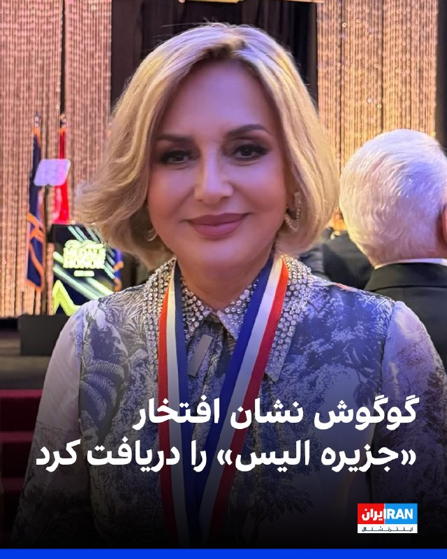

گوگوش، خواننده سرشناس ایرانی، «نشان افتخار جزیره آلیس» را دریافت کرد؛ «این نشان به افرادی اهدا می‌شود که در جامعه آمریکا تأثیرگذار بوده‌اند و در عین حال ریشه‌ها و هویت فرهنگی خود را حفظ کرده‌اند.»

گوگوش با انتشار تصویری از مراسم اهدای این نشان در صفحه اینستاگرام خود نوشت: «این نشان را با عشق و احترام به مردم ایران تقدیم می‌کنم؛ به مردمی که سال‌ها با رنج، صبوری، امید و سربلندی زندگی کرده‌اند و با وجود همه سختی‌ها، همچنان ایستاده‌اند.»
https://iranintl.com/202605170523

## IranIntlTV — post 337646

اسرائیل بیش از یک سال از دو پایگاه مخفی در عراق برای عملیات علیه ایران استفاده کرد

نیویورک‌تایمز در گزارشی تحقیقی فاش کرد که اسرائیل بیش از یک سال در صحرای غربی عراق دو پایگاه مخفی ایجاد و به‌طور متناوب از آن‌ها برای پشتیبانی از عملیات نظامی علیه حکومت ایران استفاده کرده است؛ پایگاه‌هایی که به گفته مقام‌های عراقی و منطقه‌ای، در جنگ ۱۲ روزه نیز نقش داشته‌اند.

این گزارش همچنین به کشته شدن یک چوپان عراقی اشاره می‌کند که به گفته خانواده‌اش، پس از کشف یکی از این پایگاه‌ها جان خود را از دست داده است.

به گزارش نیویورک‌تایمز، ماجرا از سوم مارس [۱۲ اسفند] آغاز شد؛ زمانی که عوض الشمری، چوپان ۲۹ ساله اهل منطقه النخیب در غرب عراق، برای خرید مایحتاج روزانه از محل سکونت خود خارج شد اما هرگز بازنگشت.

سه شاهد از ساکنان بادیه‌نشین منطقه به این روزنامه گفته‌اند که خودروی او هنگام بازگشت توسط یک بالگرد تعقیب شد و هدف شلیک‌های متعدد قرار گرفت تا سرانجام در میان شن‌های بیابان متوقف شد. چند ساعت بعد، خانواده او خودروی سوخته و جسدش را پیدا کردند.

دو پایگاه اسرائیلی در عراق؛ یکی افشا شد، دیگری همچنان در ابهام
نیویورک‌تایمز به نقل از مقام‌های عراقی گزارش داده که اسرائیل دست‌کم دو پایگاه مخفی در صحرای غربی عراق داشته است. وجود یکی از این پایگاه‌ها پیش‌تر توسط وال‌استریت ژورنال گزارش شده بود، اما مقام‌های عراقی اکنون از وجود پایگاه دومی نیز خبر داده‌اند که تاکنون علنی نشده بود.

بر اساس این گزارش، پایگاهی که عوض الشمری به آن برخورد کرد، پیش از جنگ اخیر میان آمریکا، اسرائیل و جمهوری اسلامی ایجاد شده بود و در جنگ ۱۲ روزه در خرداد علیه تهران مورد استفاده قرار گرفت.

یکی از مقام‌های امنیتی منطقه‌ای به نیویورک‌تایمز گفته اسرائیل از اواخر سال ۲۰۲۴ برای ساخت این پایگاه برنامه‌ریزی می‌کرد و در حال شناسایی مناطق دورافتاده برای استفاده در درگیری‌های آینده بود.

تردیدها درباره اطلاع آمریکا از حضور اسرائیل در عراق
نیویورک‌تایمز می‌نویسد اطلاعات مقام‌های منطقه‌ای نشان می‌دهد دست‌کم یکی از این پایگاه‌ها از ژوئن ۲۰۲۵ [خرداد ۱۴۰۴] یا حتی پیش‌تر برای آمریکا شناخته‌شده بوده است؛ موضوعی که این احتمال را مطرح می‌کند واشینگتن از حضور نیروهای اسرائیلی در خاک عراق اطلاع داشته اما آن را با بغداد در میان نگذاشته باشد.

مقام‌های منطقه‌ای گفته‌اند ساختار امنیتی عراق و نقش آمریکا در آن، بخشی از محاسبات اسرائیل برای فعالیت مخفیانه در خاک عراق بوده است.
دو مقام امنیتی عراق نیز به این روزنامه گفته‌اند که در جریان جنگ‌های اخیر، واشینگتن بغداد را وادار کرده بود برای حفاظت از هواپیماهای آمریکایی، رادارهای خود را خاموش کند؛ اقدامی که وابستگی عراق به آمریکا برای تشخیص تهدیدهای هوایی را افزایش داده بود.

حمله به نیروهای عراقی و شناسایی پایگاه
بر اساس گزارش، ارتش عراق پیش از کشف پایگاه توسط چوپان، بیش از یک ماه به حضور احتمالی نیروهای اسرائیلی در بیابان مشکوک بود و فعالیت‌ها را از دور زیر نظر داشت.

ژنرال علی الحمدانی، فرمانده نیروهای فرات غربی عراق، به نیویورک‌تایمز گفته است: «تا امروز، دولت درباره این موضوع سکوت کرده است.»
پس از گزارش عوض الشمری، نیروهای شناسایی عراق به منطقه اعزام شدند، اما طبق اعلام مقام‌های عراقی، هدف حمله قرار گرفتند؛ حمله‌ای که در آن یک سرباز کشته، دو نفر زخمی و دو خودرو منهدم شد.

حمدانی گفته است پس از تماس فرماندهان عراقی با ارتش آمریکا و دریافت این پاسخ که نیروهای حاضر آمریکایی نیستند، مقام‌های عراقی نتیجه گرفتند که با نیروهای اسرائیلی روبه‌رو بوده‌اند. او گفت: «وقتی تایید شد نیروها آمریکایی نیستند، فهمیدیم که اسرائیلی هستند.»

افشای پایگاه دوم و نگرانی درباره حاکمیت عراق
چهار روز پس از حمله به نیروهای عراقی، پارلمان عراق فرماندهان نظامی را برای ارائه توضیح فراخواند.

حسن فدعام، یکی از نمایندگان حاضر در جلسه، به نیویورک‌تایمز گفت: «پایگاه النخیب فقط همان پایگاهی است که کشف شد.» یک مقام دیگر عراقی نیز وجود پایگاه دوم اسرائیل در صحرای غربی عراق را تایید کرده، اما محل دقیق آن را فاش نکرده است.

گزارش نیویورک‌تایمز می‌گوید افشای این پایگاه‌ها پرسش‌های دشواری را برای بغداد ایجاد کرده است؛ از جمله اینکه آیا نیروهای عراقی واقعاً از حضور خارجی در خاک کشور بی‌اطلاع بوده‌اند یا از آن اطلاع داشته اما سکوت کرده‌اند.

وعد الکدو، نماینده پارلمان عراق که در جلسه محرمانه توجیهی شرکت داشته، به این روزنامه گفته است: «این موضوع نشان‌دهنده بی‌اعتنایی آشکار به حاکمیت عراق، دولت و نیروهای آن و همچنین کرامت مردم عراق است.»

🔗متن کامل گزارش را اینجا بخوانید
@iranintltv

## IranIntlTV — post 337645

  <a href="telegram/content/IranIntlTV_337645_1779034527.mp4" target="_blank">🎬 Download video</a>

وزارت دفاع امارات متحده عربی از مقابله با سه پهپاد شلیک‌شده از مرزهای غربی خبر داد. بر اساس این گزارش، پدافند هوایی این کشور دو فروند از پهپادها را منهدم کرد، اما پهپاد سوم به یک ژنراتور برق در خارج از محدوده داخلی نیروگاه هسته‌ای براکه در منطقه الظفره اصابت کرد.

گفت‌وگو با هوشنگ حسن‌یاری، کارشناس خاورمیانه و امور نظامی
@iranintltv

## IranIntlTV — post 337644

  

لیندسی گراهام، سناتور جمهوری‌خواه آمریکا در گفت‌وگو با شبکه ان‌بی‌سی خواستار اقدام نظامی بیشتر آمریکا علیه جمهوری اسلامی شد.
او افزود: وضعیت فعلی به همه ما آسیب می‌زند، هرچه تنگه هرمز بیشتر بسته بماند و ما بیشتر دنبال توافقی برویم که هیچ‌وقت حاصل نمی‌شود. جمهوری اسلامی قوی‌تر می‌شود.

سناتور گراهام افزود: «تا این لحظه، هیچ چیزی نشان نمی‌دهد افرادی که اکنون در قدرت هستند، از نظر اهداف رژیم برای تروریسم جهانی، نابودی اسرائیل و حمله به ما تفاوتی کرده باشند.»

او اضافه کرد: «آنچه رئیس‌جمهور ترامپ از نظر نظامی انجام داده فوق‌العاده بوده، اما هنوز اهداف بیشتری وجود دارد و کارهای بیشتری هست که می‌توانیم برای ضربه زدن به ایران انجام دهیم.»
https://iranintl.com/202605173661

## IranIntlTV — post 337643

  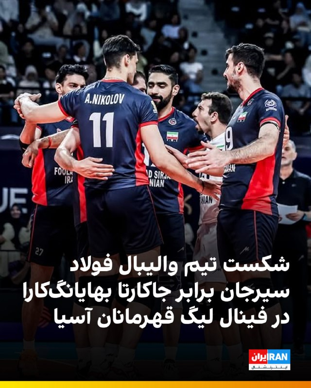

🔻تیم والیبال فولاد سیرجان در دیدار فینال لیگ قهرمانان ۲۰۲۶ آسیا با نتیجه ۳ بر ۱ برابر جاکارتا بهایانگ‌کارا اندونزی شکست خورد.

🔹فولاد سیرجان تنها در ست دوم با نتیجه ۲۶ بر ۲۴ پیروز شد و در ست‌های اول، سوم و چهارم با نتایج ۲۵ بر ۲۰، ۲۵ بر ۲۳ و ۲۵ بر ۲۳ شکست خورد تا شاگردان بهروز عطایی از رسیدن به جام قهرمانی بازماندند.

🔹در ترکیب تیم جاکارتا بهایانگ‌کارا اندونزی بازیکنانی همچون روبرت‌لندی سیمون، بازیکن کوبایی، نوموری کیتا، بازیکن اهل مالی، و روک موژیچ، ستاره اسلوونیایی تیم ورونا ایتالیا، حضور داشتند. روک موژیچ در لیگ ملت‌های ۲۰۲۵ نیز جزو امتیازآورترین بازیکنان بود.

@iranintltvsport

## IranIntlTV — post 337642

  <a href="telegram/content/IranIntlTV_337642_1779034531.mp4" target="_blank">🎬 Download video</a>

پگاه آهنگرانی، بازیگر و فیلمساز ایرانی، شنبه ۲۶ اردیبهشت برای نمایش فیلم تازه خود «تمرین‌هایی برای یک انقلاب» در جشنواره کن حاضر شد. او این فیلم را به مادرانی تقدیم کرد که فرزندانشان را در مسیر مبارزه برای آزادی از دست داده‌اند. آهنگرانی که همراه عوامل فیلم روی صحنه رفت، گفت خوشحال است که این اثر توانسته بخشی از مبارزه مردم برای آزادی و دموکراسی را به تصویر بکشد و افزود مردم این روزها با قطعی اینترنت، خبرهای روزانه اعدام‌ها توسط جمهوری اسلامی و سایه جنگ روبه‌رو هستند.
@iranintltv

## Shin_Persian — post 6048

  

وزارة الدفاع |MOD UAE ✓ @modgovae Sun, 17 May 2026 13:54:54 UTC تعاملت الدفاعات الجوية الإماراتية مع 3 طائرات مسيّرة. أعلنت وزارة الدفاع أنه في 17 مايو 2026 تعاملت الدفاعات الجوية الإماراتية مع 3 طائرات مسيّرة دخلت الدولة من جهة الحدود الغربية، حيث تم التعامل…

## Shin_Persian — post 6047

وزارة الدفاع |MOD UAE ✓ @modgovae
Sun, 17 May 2026 13:54:54 UTC

تعاملت الدفاعات الجوية الإماراتية مع 3 طائرات مسيّرة.

أعلنت وزارة الدفاع أنه في 17 مايو 2026 تعاملت الدفاعات الجوية الإماراتية مع 3 طائرات مسيّرة دخلت الدولة من جهة الحدود الغربية، حيث تم التعامل بنجاح مع اثنتين فيما أصابت الثالثة مولد كهربائي خارج المحيط الداخلي لمحطة براكة للطاقة النووية في منطقة الظفرة.

وأضافت الوزارة بأن التحقيقات جارية لمعرفة مصدر الاعتداءات، وسيتم الكشف عن المستجدات بعد انتهاء التحقيقات.

وتؤكد وزارة الدفاع أنها على أهبة الاستعداد والجاهزية للتعامل مع أي تهديدات، والتصدي بحزم لكل ما يستهدف زعزعة أمن الدولة، بما يضمن صون سيادتها وأمنها واستقرارها، ويحمي مصالحها ومقدراتها الوطنية.

#وزارة_الدفاع
#وزارة_الدفاع_الإماراتية
#MOD
#UAEMinistryOfDefence

English

UAE Air Defenses intercepted 3 drones.

The Ministry of Defense announced that on May 17, 2026, UAE air defenses intercepted 3 drones that entered the country from the western border. Two were successfully engaged, while the third struck an electrical generator outside the internal perimeter of the Barakah Nuclear Energy Plant in the Al Dhafra region.

The Ministry added that investigations are underway to determine the source of the attacks, and updates will be disclosed upon the conclusion of the investigations.

The Ministry of Defense affirms that it is at the highest level of readiness and preparedness to deal with any threats and to resolutely confront anything aimed at destabilizing the security of the state, ensuring the preservation of its sovereignty, security, and stability, and protecting its national interests and assets.

#Ministry_of_Defense
#UAE_Ministry_of_Defense
#MOD
#UAEMinistryOfDefence

𝕏 · @shin_persian

## ManotoTV — post 105565

  <a href="telegram/content/ManotoTV_105565_1779034533.mp4" target="_blank">🎬 Download video</a>

‌
«صدای فاطمه سپهری باشیم» ـ گزارشگر

## ManotoTV — post 105564

  <a href="telegram/content/ManotoTV_105564_1779034534.mp4" target="_blank">🎬 Download video</a>

مجارستان؛ گردهمایی ایرانیان _ گزارشگر یکشنبه ۲۷ اردیبهشت

## ManotoTV — post 105563

  <a href="telegram/content/ManotoTV_105563_1779034535.mp4" target="_blank">🎬 Download video</a>

‌
وین | اتریش؛ گردهمایی ایرانیان _ گزارشگر یکشنبه ۲۷ اردیبهشت

## ManotoTV — post 105562

  <a href="telegram/content/ManotoTV_105562_1779034536.mp4" target="_blank">🎬 Download video</a>

بازار تهران؛ ۲۷ اردیبهشت ـ گزارشگر

## ManotoTV — post 105561

  <a href="telegram/content/ManotoTV_105561_1779034538.mp4" target="_blank">🎬 Download video</a>

‌
پورتو | پرتغال؛ گردهمایی ایرانیان ـ گزارشگر یکشنبه ۲۷ اردیبهشت

## ManotoTV — post 105560

  <a href="telegram/content/ManotoTV_105560_1779034539.mp4" target="_blank">🎬 Download video</a>

پاریس | فرانسه؛ گردهمایی ایرانیان ـ گزارشگر یکشنبه ۲۷ اردیبهشت

## FarsiVOA — post 217986

  <a href="telegram/content/FarsiVOA_217986_1779034541.mp4" target="_blank">🎬 Download video</a>

عبدالله مهتدی، دبیر کل حزب کومله کردستان ایران درعمق میدان: این کُردها بودند که موج بزرگی از فعالان سیاسی و روزنامه‌نگاران خارج از کشور را با بودجه و امکانات محدود خود از دست جمهوری اسلامی نجات دادند

## FarsiVOA — post 217985

  <a href="telegram/content/FarsiVOA_217985_1779034542.mp4" target="_blank">🎬 Download video</a>

جاری شدن سیلاب و آب‌گرفتگی معابر در بجنورد - ۲۷ اردیبهشت ۱۴۰۵

## FarsiVOA — post 217984

🔺دیدگاه | فوتبال ایران یک ماه تا جام جهانی؛ ماکتی از رفتار و توهم حکومت

▪️مهدی تاج، رئیس فدراسیون فوتبال، ۱۰ دی ۱۴۰۴: «در جام جهانی ۲۰۲۶ از گروه‌مان صعود می‌کنیم.»

⬇️ بیشتر بخوانید:

https://ir.voanews.com/a/government-behavior-iran-national-football-team-2026-fifa-world-cup-mehdi-taj/8150881.html/?nocach=1

## FarsiVOA — post 217983

🔺کشته شدن یک فرمانده سازمان تروریستی حماس در حمله ارتش اسرائیل

▪️ارتش دفاعی اسرائیل روز یکشنبه ۲۷ اردیبهشت با انتشار پیامی در حساب کاربری خود در شبکه اجتماعی ایکس اعلام کرد که نیروهای ارتش اسرائیل روز شنبه «بها‌ء بارود، از فرماندهان ستاد عملیات شاخه نظامی سازمان تروریستی حماس» را کشتند.

⬇️ بیشتر بخوانید:

https://ir.voanews.com/a/hamas-israel-kills-commander/8150897.html/?nocach=1

## DW_Farsi — post 124803

🔶 نگرانی شدید آژانس بین‌المللی انرژی اتمی از حمله به نیروگاه هسته‌ای امارات

آژانس بین‌المللی انرژی اتمی نسبت به حمله پهپادی در نزدیکی یک نیروگاه هسته‌ای در امارات متحده عربی که باعث آتش‌سوزی شده است، "نگرانی شدید" ابراز کرد.

این آژانس در عین حال اعلام کرد که سطح تشعشعات در محل حادثه در وضعیت عادی باقی مانده و افزایش نیافته است.

این نهاد روز یکشنبه ۲۷ اردیبهشت (۱۷ مه) در شبکه اجتماعی "ایکس" به نقل از رافائل گروسی، مدیرکل آژانس، اعلام کرد که "فعالیت‌های نظامی که ایمنی هسته‌ای را تهدید می‌کنند، غیرقابل قبول هستند".

هنوز هیچ گروه یا کشوری مسئولیت این حمله پهپادی را برعهده نگرفته و مقام‌های اماراتی نیز در بیانیه‌های رسمی خود، هیچ طرفی را عامل این حمله معرفی نکرده‌اند.

این نخستین‌بار از زمان آغاز جنگ اخیر میان ائتلاف آمریکا و اسرائیل با ایران است که نیروگاه هسته‌ای چهار راکتوری "براکه" امارات هدف حمله قرار می‌گیرد. این نیروگاه در غرب ابوظبی و در نزدیکی مرز عربستان سعودی واقع شده است.

نیروگاه هسته‌ای براکه با هزینه‌ای حدود ۲۰ میلیارد دلار و با همکاری کره جنوبی ساخته شد و در سال ۲۰۲۰ به شبکه برق امارات پیوست. این مرکز، نخستین و تنها نیروگاه هسته‌ای فعال در شبه‌جزیره عربستان به شمار می‌رود.
@dw_farsi

## DW_Farsi — post 124802

🔶 هشدار امنیتی درباره سناریوی پیروزی AfD در زاکسن-آنهالت آلمان

به گزارش روزنامه "هندلزبلات"، با توجه به نتایج بالای حزب آلترناتیو برای آلمان (AfD) در نظرسنجی‌های ایالت زاکسن-آنهالت، چندین وزیر امور داخلی ایالت‌های آلمان، خواستار اتخاذ تدابیری برای احتمال مشارکت این حزب در دولت شده‌اند.

به نوشته این روزنامه، گئورگ مایر، وزیر امور داخلی ایالت تورینگن، در تلاش است تا این موضوع را در دستور کار کنفرانس وزیران امور داخلی ایالت‌های آلمان که اواسط ماه ژوئن در هامبورگ برگزار می‌شود، قرار دهد.

این سیاستمدار حزب سوسیال دموکرات به "هندلزبلات" گفت: «باید فوراً در مورد خطراتی که تصاحب احتمالی دولت ایالتی توسط حزب آلترناتیو برای آلمان در زاکسن-آنهالت برای معماری امنیتی کشور ایجاد می‌کند و چگونگی مقابله با آن، گفت‌وگو کنیم.»

گئورگ مایر گفت: «حزب آلترناتیو برای آلمان به دلیل ارتباطات متعددش با دولت‌های اقتدارگرا و شبکه‌سازی با سازمان‌های حاشیه‌ای راست افراطی، تهدیدی برای امنیت داخلی و خارجی جمهوری فدرال آلمان به شمار می‌رود. نباید اجازه داد اطلاعات محرمانه نهادهای امنیتی ما به روسیه یا به محافل راست افراطی درز کند.»
@dw_farsi

## Persian_Trend_Official — post 14341

  

💢ناو هواپیمابر آبراهام لینکلن در فاصله ۲۴۵ کیلومتری از در آخرین تصاویر ماهواره ای ساحل ایران مستقر شده است

🫆:Tony

📌 @persian_trend_official
پرشین ترند | متفاوت‌ترین کانال نظامی

## Persian_Trend_Official — post 14340

  <a href="telegram/content/Persian_Trend_Official_14340_1779034545.webm" target="_blank">🎬 Download video</a>

🚨 شبکه 13 اسرائیل:
بنیامین نتانیاهو از دقایقی پیش در تماس تلفنی ویژه با دونالد ترامپ درباره تحولات اخیر منطقه و درگیری‌های مرتبط با ایران و گروه‌های وابسته به آن در حال گفت‌وگوست.

☆Phantom☆

📌 @persian_trend_official
پرشین ترند | متفاوت‌ترین کانال نظامی

## Persian_Trend_Official — post 14339

  

🔴دفاع عضو شورای عالی فضای مجازی از فیلترینگ، پایان گمنامی و اینترنت طبقاتی / «در صورت خروج از شرایط جنگی، واتس‌اپ باز می‌شود»

🔹 رسول جلیلی، عضو شورای عالی فضای مجازی، از ادامه محدودیت پلتفرم‌های خارجی، پایان گمنامی کاربران و اینترنت طبقاتی دفاع کرد؛ طرح‌هایی که ظاهراً قرار است اینترنت را از همیشه «کنترل‌شده‌تر» کنند.

🔹 او با اشاره به شرایط امنیتی اخیر گفت بعد از این اتفاقات نمی‌توان دوباره به سمت بازگشایی کامل سکوهای خارجی رفت و مدعی شد برخی سیاسیون در سال‌های گذشته مانع فیلترینگ کامل شده‌اند.

🔹 جلیلی همچنین ادعای فروش VPN توسط نهادهای حاکمیتی را رد کرد و گفت نیاز اصلی مردم فقط خدمات ارتباطی است؛ خدماتی که به گفته او در پیام‌رسان‌های داخلی هم وجود دارد، هرچند بسیاری از کاربران و کسب‌وکارها هنوز ترجیح می‌دهند جایی فعالیت کنند که مخاطب واقعی حضور دارد.

🔹 عضو شورای عالی فضای مجازی در ادامه اعلام کرد در صورت خروج کشور از شرایط جنگی، امکان بازگشایی دوباره واتس‌اپ وجود دارد.

🔹 او در پایان از پایان «گمنامی» کاربران و اینترنت طبقاتی دفاع کرد؛ موضوعی که همچنان با انتقادهای گسترده‌ای روبه‌روست.

☆Phantom☆

📌 @persian_trend_official
پرشین ترند | متفاوت‌ترین کانال نظامی

## Persian_Trend_Official — post 14338

افزایش ساعت معاملات سهام در روزهای ۲۹ و ۳۰ اردیبهشت ۱۴۰۵ مدیر نظارت بر بورس‌های سازمان بورس و اوراق بهادار اعلام کرد: 💢به منظور مدیریت بازگشایی نماد شرکت‌های با افشای اطلاعات با اهمیت نوع «الف» و شرکت‌هایی که مجامع خود را در دوره توقف بازار سهام برگزار کرده‌اند،…

## Persian_Trend_Official — post 14337

افزایش ساعت معاملات سهام در روزهای ۲۹ و ۳۰ اردیبهشت ۱۴۰۵

مدیر نظارت بر بورس‌های سازمان بورس و اوراق بهادار اعلام کرد:

💢به منظور مدیریت بازگشایی نماد شرکت‌های با افشای اطلاعات با اهمیت نوع «الف» و شرکت‌هایی که مجامع خود را در دوره توقف بازار سهام برگزار کرده‌اند، یک ساعت به زمان معاملات سهام و ابزارهای مرتبط با سهام در بورس تهران و فرابورس ایران اضافه می‌شود.

💢بر این اساس، معاملات در روزهای سه‌شنبه و چهارشنبه ۲۹ و ۳۰ اردیبهشت تا ساعت ۱۳:۳۰ ادامه خواهد داشت.

🫆:Tony

📌 @persian_trend_official
پرشین ترند | متفاوت‌ترین کانال نظامی

## RadioFarda — post 157291

رئیس مجلس نمایندگان آمریکا: جنگ ایران تمام شده؛ پروژه جدید ما باز کردن تنگه هرمز است

🔸مایک جانسون، رئیس مجلس نمایندگان آمریکا، روز یکشنبه گفت عملیات «خشم حماسی» این کشور علیه ایران به پایان رسیده و دستور کار جدید واشینگتن باز کردن تنگه هرمز است.

🔸او در گفت‌وگو با شبکه فاکس‌نیوز درباره تلاش حزب دموکرات در استفاده از قانون «اختیارات جنگی» برای آن که دولت دونالد ترامپ از کنگره برای جنگ با ایران مجوز بگیرد، اعلام کرد: «الان زمان مطرح کردن قانون اختیارات جنگی نیست. اعلام شده که عملیات «خشم حماسی» به پایان رسیده، و همین‌طور هم هست. حالا وارد پروژه جدیدی شده‌ایم و آن بازگشایی تنگه هرمز است.»

🔸پنتاگون حملات آمریکا که از روز نهم اسفند سال گذشته به ایران آغاز شد را «خشم حماسی» نامیده بود اما رئیس‌جمهور و دیگر مقام‌های دولت آمریکا گفته‌اند این عملیات تمام شده و لازم نیست بعد از ۶۰ روز از کنگره آمریکا مجوز ادامه دادن آن را اخذ کنند.

🔸تلاش چندباره دموکرات‌ها برای محدود کردن دولت ترامپ در مجلس سنا نیز هر بار شکست خورده است.

🔸دونالد ترامپ، رئیس‌جمهور آمریکا، روز ۱۴ اردیبهشت عملیات «پروژه آزادی» را به منظور خارج کردن کشتی‌های گرفتار در تنگه هرمز آغاز کرد اما بعد از دو روز آن را به منظور ادامه مذاکرات با ایران متوقف کرد.

🔸رئیس مجلس نمایندگان آمریکا روز یکشنبه همچنین گفت باز کردن تنگه هرمز از مسیر «دیپلماسی و مذاکره» پیش می‌رود و درگیری نظامی رخ نداده است.

🔸او افزود که باید به دولت دونالد ترامپ زمان داد تا راه‌حلی برای این موضوع پیدا کند.

@Radiofarda

## IranianMinds — post 20281

  <a href="telegram/content/IranianMinds_20281_1779034546.mp4" target="_blank">🎬 Download video</a>

🔴 صحبتای پارسا تاجیک، یکی از مهندسین برنامه ایکس ( توییتر ) ، در مورد تغییر پرچم ایران به پرچم شیر و خورشید تو ایکس:

هرسال خیلیا درخواست این کارو میکردن حتی از سال 2014 هم مطرح بود این قضیه و دوباره امسال ایده‌ش رو دادم ولی باید ایلان ماسک تایید میکرد.
بعد از چند روز حدود 48 ساعت اینترنت قطع شد [داخل ایران] و من به ایلان ماسک گفتم این برخلاف آزادیه و اونم یکم فکرکرد و اوکی رو داد و بعد از یه هفته این تغییر اجرا شد.
تا وقتی ما هستیم کسی قرار نیست پرچم شیروخورشید رو عوض‌کنه.

@IranianMinds

## IranianMinds — post 20280

🎉 ۵۰۰٬۰۰۰ تومان رایگان-بونوس ویژه ثبت‌نام

🔥 با هر ثبت نام 
🅰️
🅰️
🅰️ هزار تومن جایزه بگیرید

⬅️ شرط‌بندی کنید و بونوس را به موجودی واقعی تبدیل کنید

🔥 وقتشه بازی رو یه جور دیگه ببینی
⚽️  پوشش کامل مسابقات ورزشی 

📊  پیش‌بینی با بهترین ضرایب 

⚡️  تجربه سریع و حرفه‌ای

😀 پرداخت مستقیم و سریع بدون واسطه، بدون دردسر، واریز و برداشت در سریع‌ترین زمان ممکن 

😀 کانال تلگرام: 

🔴 @winro_io  

😀 هدیه خود را با ثبت نام در سایت دریافت کنید: 

🔴 Winro.io
G27
سایت اصلی در روزهای آینده بازگشایی خواهد شد 
✅

## IranianMinds — post 20279

  

🔴 تا چند سال پيش با ٣٠ ميليون تومان مي تونستيم ماشين بخريم حالا يه سه چرخه براي نوزاد

@IranianMinds

## BBCPersian — post 281306

  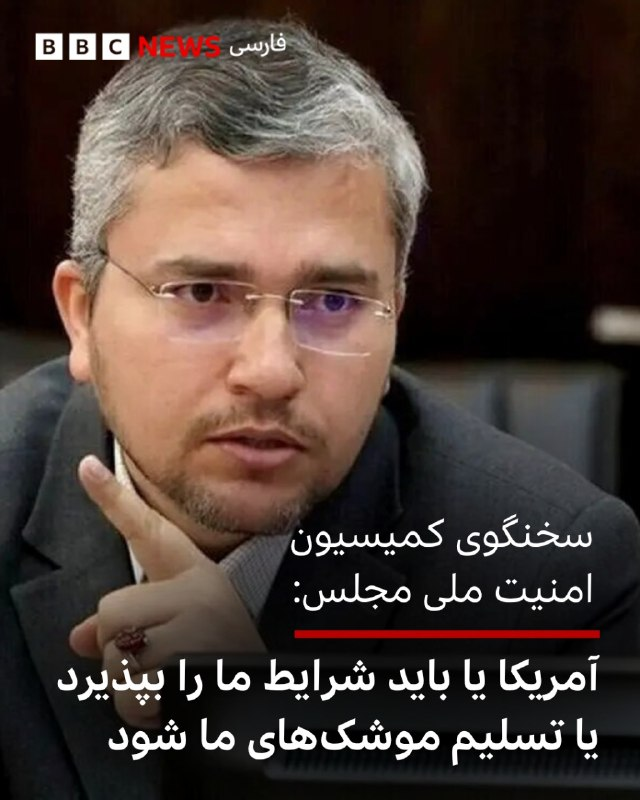

‌🔻سخنگوی کمیسیون امنیت ملی و سیاست خارجی مجلس گفت: «آمریکا یا باید شرایط جمهوری اسلامی ایران را بپذیرد و تسلیم دیپلمات‌های ما شود و یا اینکه ایران از موضع قدرت با آن مذاکره خواهد کرد و باید تسلیم موشک های ما شود.»

او گفت که ایران «از هیچ یک از شروط خود کوتاه» نمی‌آید.

امروز خبرگزاری‌های ایران گزارش‌هایی از شروط آمریکا در پاسخ به پیشنهادهای ایران منتشر کردند.

خبرگزاری مهر امروز نوشت: «آمریکا بدون دادن هیچ امتیاز ملموسی به ایران خواهان گرفتن امتیازاتی است که در جنگ موفق به تحقق آن نشده است.»

در همین حال، گزارش‌هایی هم منتشر شد که ایران پاسخ خود را به پاکستان منتقل کرده است.

📷Mizan
https://bbc.in/4nDeg19

@BBCPersian

## BBCPersian — post 281305

🔻شبکه خبر ایران به نقل از مقام نظامی: حمله به نزدیکی تاسیسات هسته‌ای امارات، تله دشمن است

🔻شبکه خبر صداوسیما از قول یک مقام آگاه نظامی که نامش را نبرد گفت حمله به نزدیکی تاسیسات هسته‌ای امارات «توطئه» و «تله دشمن» است.

بنابر این گزارش، این مقام نظامی گفت آمریکا و اسرائیل تلاش می‌کنند با عملیات‌ «غیرموجه علیه کشورهای منطقه و نسبت دادن آن به جمهوری اسلامی ایران خود را از باتلاق خودساخته برهانند و از بن بستی که قرار گرفته‌اند خارج کنند.»

او «این توطئه صهیونیستی» را محکوم کرد و همه طرف‌ها از «افتادن در تله دشمن و هر گونه رفتار یا گفتارو نسنجیده برحذر» داشت.

https://bbc.in/4tFeZjK
@BBCPersian

## Dirty_Kids — post 389624

‏یه تنِ ماهی خریدم ۳۰۰ تومن!
فک کنم توش پری دریایی باشه.
منتظرم خونه‌مون خالی شه درشو باز کنم.

@Dirty_Kids 👻

## Dirty_Kids — post 389623

  

پسرا میتونن اینجوری نگاهتون کنن و فکر کنن روغن ماشین چقدر گرون شده خارشو گاییدم

@Dirty_Kids 👻

## Dirty_Kids — post 389622

  

🌪وقتی اینترنت طوفانیه... کافیه بادبان ها رو بکشی تا

⚫️با بالاترین کیفیت ممکن
⚡️ 

⚫️100 هزار تومان شارژ هدیه 
🎁

⚫️پایین ترین قیمت گیگی 250
🌐 

⚫️و ارائه پورسانت %10 در ازای هر معرفی
💼

بتونی یه اتصال پایدار با پشتیبانی 24 ساعته داشته باشی
🚀

بادبان راهتو باز می‌کنه
⛵️

G27

🛡@BadBan_VPN | کانال 

🤖@BadBan_VPNBot | ربات 

📞@BadBan_VPNSupport | پشتیبانی

## Dirty_Kids — post 389621

  <a href="telegram/content/Dirty_Kids_389621_1779034549.mp4" target="_blank">🎬 Download video</a>

بچه‌شیعه:

@Dirty_Kids 👻

## Dirty_Kids — post 389620

  <a href="telegram/content/Dirty_Kids_389620_1779034551.mp4" target="_blank">🎬 Download video</a>

بابای حرومزاده گلشیفته فراهانی جنده به این مردم که اینجوری با دستای خالی جلوی گلوله مقاومت کردن میگه بیضه ندارید!

جناب فراهانی خارکصده ما اتفاقا بیضه داریم، خوبشم داریم. ما بیضه رو داریم ولی شما و دخترتون بیضه رو لیس می‌زنید. شما مال آخوند رو می‌لیسید و دخترتون بیضه‌های مکرون رو قورت می‌ده!

@Dirty_Kids 👻

## Dirty_Kids — post 389619

مجتبی: آقا من واقعا حوصله‌ام سر رفته، چه غلطی بکنیم؟
مسعود رجوی: تو کلا دو ماهه اومدی، من و این موسی صدر بدبخت چی بگیم که چندین ساله اینجاییم؟

امام زمان (عج): سه‌تاتون خفه بشین!!!

@Dirty_Kids 👻

## Hranews — post 112996

  

بهار صحرائیان، وکیل دادگستری به زندان عادل آباد شیراز منتقل شد

❗️
❗️
❗️
❗️
❗️ – بهار صحرائیان، وکیل دادگستری به زندان عادل آباد شیراز منتقل شد. وی صبح روز جاری در دادسرای شیراز مورد تفهیم اتهام قرار گرفته بود.

به گزارش خبرگزاری هرانا، ارگان خبری مجموعه فعالان حقوق بشر در ایران، بهار صحرائیان به زندان منتقل شد.

بر اساس اطلاعات دریافتی هرانا، خانم صحرائیان به زندان عادل آباد شیراز منتقل شده است. این وکیل دادگستری، امروز یکشنبه ۲۷ اردیبهشت ماه، در دادسرای شیراز، از بابت اتهامات «اجتماع و تبانی به قصد اقدام علیه امنیت ملی، فعالیت تبلیغی علیه نظام و نشر اکاذیب» مورد تفهیم اتهام قرار گرفته بود.

ادامه مطلب

#بهار_صحرائیان

↘️
@hranews_bot تماس ✉️ -  @Hranews  کانال هرانا 🆑

## Hranews — post 112995

گزارش تکمیلی؛ ۲۳ کشته و مصدوم در واژگونی اتوبوس کارگران در عسلویه

❗️
❗️
❗️
❗️
❗️ – واژگونی اتوبوس حامل کارگران مجتمع گاز پارس جنوبی در محور عسلویه به سیراف، به مصدومیت ۱۵ #کارگر منجر شد. ساعاتی پیش، جان‌باختن هشت کارگر در این حادثه گزارش شده بود.

ادامه مطلب

↘️
@hranews_bot تماس ✉️ -  @Hranews  کانال هرانا 🆑

## manototv — post 105565

  <a href="telegram/content/manototv_105565_1779034552.mp4" target="_blank">🎬 Download video</a>

‌
«صدای فاطمه سپهری باشیم» ـ گزارشگر

## manototv — post 105564

  <a href="telegram/content/manototv_105564_1779034553.mp4" target="_blank">🎬 Download video</a>

مجارستان؛ گردهمایی ایرانیان _ گزارشگر یکشنبه ۲۷ اردیبهشت

## manototv — post 105563

  <a href="telegram/content/manototv_105563_1779034555.mp4" target="_blank">🎬 Download video</a>

‌
وین | اتریش؛ گردهمایی ایرانیان _ گزارشگر یکشنبه ۲۷ اردیبهشت

## manototv — post 105562

  <a href="telegram/content/manototv_105562_1779034556.mp4" target="_blank">🎬 Download video</a>

بازار تهران؛ ۲۷ اردیبهشت ـ گزارشگر

## manototv — post 105561

  <a href="telegram/content/manototv_105561_1779034557.mp4" target="_blank">🎬 Download video</a>

‌
پورتو | پرتغال؛ گردهمایی ایرانیان ـ گزارشگر یکشنبه ۲۷ اردیبهشت

## manototv — post 105560

  <a href="telegram/content/manototv_105560_1779034559.mp4" target="_blank">🎬 Download video</a>

پاریس | فرانسه؛ گردهمایی ایرانیان ـ گزارشگر یکشنبه ۲۷ اردیبهشت

## alonews — post 120640

  <a href="telegram/content/alonews_120640_1779034561.webm" target="_blank">🎬 Download video</a>

👈آکسیوس به نقل از یک مقام اسرائیلی: ترامپ و نتانیاهو در تماس تلفنی پرونده ایران را بررسی کردند‌‌ 
✅ @AloNews خبر جنگ

## alonews — post 120639

  <a href="telegram/content/alonews_120639_1779034561.mp4" target="_blank">🎬 Download video</a>

👈آتش‌سوزی در ایستگاه پر کردن محصولات نفتی «سونیچنوگورسک» در روستای دوریکینو، منطقه مسکو روسیه، پس از حمله پهپادی اوکراینی در طول شب ادامه دارد

✅ @AloNews خبر جنگ

## alonews — post 120637

  <a href="telegram/content/alonews_120637_1779034563.webm" target="_blank">🎬 Download video</a>

👈آنالیز تصاویر ماهواره ای نشان می دهد ناو هواپیمابر آبراهام لینکلن در فاصله ۲۴۵ کیلومتری از ساحل ایران مستقر شده است

✅ @AloNews خبر جنگ

## alonews — post 120636

  <a href="telegram/content/alonews_120636_1779034563.webm" target="_blank">🎬 Download video</a>

👈شهباز شریف: امیدواریم دور دیگری از مذاکرات ایران و آمریکا را میزبانی کنیم

✅ @AloNews خبر جنگ

## alonews — post 120635

  <a href="telegram/content/alonews_120635_1779034563.webm" target="_blank">🎬 Download video</a>

👈کانال ۱۲ عبری: تخمین اسرائیلی‌ها این است که آمریکا در طول این هفته به جنگ علیه ایران بازخواهد گشت

✅ @AloNews خبر جنگ

## alonews — post 120634

  <a href="telegram/content/alonews_120634_1779034563.webm" target="_blank">🎬 Download video</a>

👈گفت‌وگوی تلفنی وزرای امور خارجه ایران و قطر

✅ @AloNews خبر جنگ

## alonews — post 120633

  <a href="telegram/content/alonews_120633_1779034564.webm" target="_blank">🎬 Download video</a>

👈آکسیوس به نقل از یک مقام اسرائیلی: ترامپ و نتانیاهو در تماس تلفنی پرونده ایران را بررسی کردند‌‌

✅ @AloNews خبر جنگ

## alonews — post 120632

  <a href="telegram/content/alonews_120632_1779034564.webm" target="_blank">🎬 Download video</a>

👈 الجزیره: هشدار ارتش اسرائیل برای تخلیه روستاهای سحمر در بقاع غربی و رومینه، قصیبه، کفرهونه و بنافول در جنوب لبنان

✅ @AloNews خبر جنگ

## alonews — post 120631

  

🚨
🚨به درخواست شما تمدید شد
🚨
🚨

قیمت استثنایی گیگی
9️⃣
8️⃣
1️⃣

تحویل زیر یک دقیقه
✅
دارای لینک سابسکریشن جهت دیدن حجم و کنترل مصرف
✅
بدون قطعی 
✅
بدون محدودیت کاربر و زمان
✅
جمینایو چت جی بی تی و... کامل اوکیه با سرورامون
✅

🏪پشتیبانی کامل
✅
شروع فعالیت از سال 2022 
✅
پرداخت ریالی
✅

ضریب و این چیزا ندارن و تا آخرین مگابایت برای پشتیبانیش درختمتیم
🥂

💤این تخفیف فقط تا ۱۲ شب فعاله
💤

⭐️ @Napsternetiran_bot
〰️〰️〰️〰️〰️〰️〰️

🔶 @Napsternetvirani

## alonews — post 120630

  <a href="telegram/content/alonews_120630_1779034565.mp4" target="_blank">🎬 Download video</a>

👈کریستن ولکر: آیا ارزش از دست دادن انتخابات میان دوره ای را دارد اگر نتیجه یک ایران غیر هسته ای باشد ؟

🔴ارزش از دست دادن شغلم رو داره اگر مجبور بودم کارم را رها کنم تا مطمئن شوم ایران هرگز سلاح هسته ای نخواهد داشت ، این کار را می کردم.‌‌

✅ @AloNews خبر جنگ

## alonews — post 120629

  <a href="telegram/content/alonews_120629_1779034566.webm" target="_blank">🎬 Download video</a>

👈وزیر کشور پاکستان: پاکستانی‌ها شبانه‌روز برای موفقیت دولت و ملت ایران دعا می‌کنند.

✅ @AloNews خبر جنگ

## alonews — post 120628

  <a href="telegram/content/alonews_120628_1779034567.mp4" target="_blank">🎬 Download video</a>

👈سناتور گراهام درباره ایران:

هر قیمتی که لازم باشد بپردازیم، خواهیم پرداخت.

چرچیل چه گفت؟ «هر قیمتی که لازم باشد برای شکست هیتلر بپردازیم، خواهیم پرداخت.»

همین موضوع درباره ایران هم صدق می‌کند.

✅ @AloNews خبر جنگ

## alonews — post 120627

  <a href="telegram/content/alonews_120627_1779034569.mp4" target="_blank">🎬 Download video</a>

👈سناتور گراهام درباره ایران:

بر اساس تحلیل من، هیچ چیزی نشان نمی‌دهد که افرادی که اکنون در قدرت هستند با قبل متفاوت باشند — آنها هنوز هم می‌خواهند جهان را ترور کنند، اسرائیل را نابود کنند و به ما حمله کنند.

پس شما باید آنها را بیشتر تضعیف کنید. کاری که رئیس‌جمهور ترامپ انجام داده از نظر نظامی شگفت‌انگیز بوده است. زیرساخت‌های انرژی نقطه ضعف آنهاست. وقتی به مبارزه برمی‌گردیم، انرژی را در صدر فهرست قرار می‌دهم.

من خواستار آسیب رساندن به این رژیم هستم. بیشتر به آنها آسیب بزنید، شاید آنها معامله‌ای انجام دهند. اما در حال حاضر فکر می‌کنم آنها سعی دارند این وضعیت را تحمل کنند و بازی می‌کنند.

✅ @AloNews خبر جنگ

<!-- MSG END -->

<!-- NAV START -->

<a href="https://github.com/yerbeyer/aio-downloader/blob/main/telegram/content/archive_1.md" style="display:inline-block; padding:6px 12px; margin:0 4px; background-color:#2ea44f; color:white; text-decoration:none; border-radius:4px; font-weight:bold;">صفحه بعد</a>

<!-- NAV END -->
