# خواننده تلگرام

<!-- TOP_NAV START -->

<a href="https://github.com/yerbeyer/aio-downloader/blob/main/telegram/content/archive_1.md" style="display:inline-block; padding:6px 12px; margin:0 4px; background-color:#2ea44f; color:white; text-decoration:none; border-radius:4px; font-weight:bold;">صفحه بعد</a>

<!-- TOP_NAV END -->

<!-- MSG START -->

---
📅 بروزرسانی: 1405/03/03 17:37
---

## VahidOOnLine — post 241943

  

♦️وزارت امور خارجه عربستان سعودی، روز یکشنبه سوم خرداد ماه با انتشار بیانیه‌ای اعلام کرد وزیران امور خارجه عربستان، مصر، قطر، اردن، ترکیه، پاکستان، اندونزی، جیبوتی، سومالی، فلسطین، عمان، سودان، یمن، لبنان و موریتانی، اقدام «سومالی‌لند» برای افتتاح «سفارتخانه» در اسرائیل را به‌شدت محکوم کردند.

در بیانیه وزارت خارجه عربستان آمده است این اقدام «غیرقانونی و مردود» نقض آشکار قوانین بین‌المللی و قطعنامه‌های مرتبط سازمان ملل متحد به شمار می‌رود و تعرضی مستقیم به وضعیت حقوقی و تاریخی شهر قدس اشغالی محسوب می‌شود.

این بیانیه همچنین تاکید کرد وزیران خارجه کشورهای یادشده با هرگونه اقدام یک‌جانبه با هدف تثبیت «واقعیتی غیرقانونی» در قدس اشغالی یا مشروعیت‌بخشی به نهادها و ترتیبات ناقض حقوق بین‌الملل مخالفت کامل دارند.

وزارت خارجه عربستان در پایان اعلام کرد وزیران خارجه این کشورها بر حمایت کامل خود از حاکمیت، وحدت و تمامیت ارضی جمهوری فدرال سومالی و مخالفت قاطع با هر اقدامی که به وحدت سرزمینی سومالی آسیب بزند، تاکید کردند.
‌🇸🇦 Indypersian

🤖 @VahidOOnLine

## VahidOOnLine — post 241942

  <a href="telegram/content/VahidOOnLine_241942_1779631654.mp4" target="_blank">🎬 Download video</a>

♦️مارکو روبیو، وزیر خارجه آمریکا، روز یکشنبه در جریان نشست خبری مشترک با سابرامانیام جایشانکار، وزیر خارجه هند، در دهلی‌نو اعلام کرد هدف نهایی آمریکا این است که ایران «هرگز» نتواند به سلاح هسته‌ای دست پیدا کند.
روبیو گفت: «هدف نهایی این است که ایران هرگز نتواند به سلاح هسته‌ای دست یابد. ایران هرگز نباید مالک سلاح هسته‌ای شود.»
او تاکید کرد دونالد ترامپ، رئیس‌جمهوری آمریکا، در این زمینه موضعی «کاملا روشن» داشته و گفته است ایران هرگز به سلاح هسته‌ای دست نخواهد یافت.
وزیر خارجه آمریکا افزود: «قطعا تا زمانی که دونالد ترامپ رئیس‌جمهور است، این اتفاق نخواهد افتاد.»
‌🇸🇦 Indypersian

🤖 @VahidOOnLine

## VahidOOnLine — post 241941

  

مارکو روبیو، وزیر خارجه آمریکا، اظهارنظرها درباره ضعیف‌ بودن توافق احتمالی دونالد ترامپ با جمهوری اسلامی را «مضحک» توصیف کرد. روبیو که در سفر به هند به‌سر می‌برد، به خبرنگاران گفت تعهد ترامپ به جلوگیری از دستیابی ایران به سلاح هسته‌ای «نباید از سوی هیچ‌کس زیر سؤال برود»

او افزود: این که ترامپ ممکن است با توافقی موافقت کند که در نهایت موقعیت ایران را در برنامه هسته‌ای تقویت کند، با توجه به مواضع و اقداماتی که تاکنون از او دیده‌ایم، کاملا مضحک است.
‌🏁 🇬🇧 IranintlTV

🤖 @VahidOOnLine

## VahidOOnLine — post 241940

  <a href="telegram/content/VahidOOnLine_241940_1779631656.mp4" target="_blank">🎬 Download video</a>

فائزه حسین‌نژاد، دانشجوی ۲۳ ساله مامایی و والیبالیست، شامگاه ۱۹ دی ۱۴۰۴ در خیابان امامت مشهد به دست نیروهای سرکوبگر کشته شد. ابتدا گلوله‌ای به زیر قلبش زدند و سپس زیر ضربات باتون او را کشتند.
‌🏁 🇬🇧 IranintlTV

🤖 @VahidOOnLine

## VahidOOnLine — post 241939

  <a href="telegram/content/VahidOOnLine_241939_1779631658.mp4" target="_blank">🎬 Download video</a>

تجمع مقابل ساختمان بی‌بی‌سی فارسی در لندن، یکشنبه سوم خرداد ۱۴۰۵
‌🏁 🇬🇧 ManotoTV

🤖 @VahidOOnLine

## VahidOOnLine — post 241938

  <a href="telegram/content/VahidOOnLine_241938_1779631660.mp4" target="_blank">🎬 Download video</a>

بر اساس ویدیوهای ارسال‌شده به ایران‌اینترنشنال گروهی از ایرانیان مقیم استرالیا در حمایت از مردم ایران و علیه جمهوری اسلامی در شهر آدلاید کاروان خودرویی به راه انداختند.
‌🏁 🇬🇧 IranintlTV

🤖 @VahidOOnLine

## VahidOOnLine — post 241937

  

علی عبداللهی، فرمانده قرارگاه مرکزی خاتم الانبیا، گفت: «در شرایط جنگی هستیم و تمامی نیروهای مسلح در آمادگی کامل به سر می‌برند که با هر دشمنی و در هر سطحی مقابله کنند.»

او افزود: «پیروزی ما بر دشمنان، معجزه الهی بود، در چند جنگ اخیر متکی به ابزار خودمان بودیم و با ساخته‌های بومی خودمان با دشمنان جنگیدیم، اکنون نیز باید در تمام عرصه‌ها آماده باشیم و به موفقیت برسیم.»
‌🏁 🇬🇧 IranintlTV

🤖 @VahidOOnLine

## VahidOOnLine — post 241936

♦️صدها نیروی پلیس ضدشورش ترکیه روز یکشنبه سوم خرداد ماه با استفاده از گاز اشک‌آور وارد مقر حزب جمهوری‌خواه خلق (CHP)، بزرگ‌ترین حزب مخالف دولت، در آنکارا شدند و کنترل ساختمان را در دست گرفتند.
این اقدام پس از آن انجام شد که دادگاهی رهبری حزب را برکنار و حکم به تغییر مدیریت آن صادر کرد. اعضای حزب جمهوری‌خواه خلق ورودی‌های ساختمان را مسدود کرده و از اجرای حکم دادگاه سر باز زده بودند.
دادگاه ترکیه روز پنجشنبه پیروزی اوزگور اوزل در انتخابات داخلی سال ۲۰۲۳ حزب را لغو و کمال قلیچداراوغلو، رهبر پیشین حزب، را به عنوان رئیس موقت منصوب کرد.
اوزل پیش‌تر در شبکه‌های اجتماعی نوشته بود: «ما اینجا را ترک نخواهیم کرد.»
در ادامه، حامیان قلیچداراوغلو تلاش کردند وارد ساختمان شوند و سپس پلیس با دریافت دستور وارد عمل شد و ساختمان را تصرف کرد.
به گزارش خبرگزاری فرانسه، سازمان دیده‌بان حقوق بشر نیز روز شنبه دولت رجب طیب اردوغان را متهم کرد که با «تاکتیک‌های سوءاستفاده‌گرانه» در حال تضعیف دموکراسی در ترکیه است.
‌🇸🇦 Indypersian

🤖 @VahidOOnLine

## VahidOOnLine — post 241935

  <a href="telegram/content/VahidOOnLine_241935_1779631663.mp4" target="_blank">🎬 Download video</a>

فایننشال تایمز در گزارشی نوشت سپاه از یک شبکه تدارکاتی مستقر در امارات برای خرید تجهیزات پیشرفته ماهواره‌ای چینی مرتبط با برنامه پهپادی و موشکی خود استفاده کرده است.

بر اساس این گزارش، شرکتی به نام «تله‌سان» در راس‌الخیمه، انتقال حدود یک و هشت دهم تن تجهیزات ارتباطی ماهواره‌ای ساخت چین را از شانگهای به ایران، از مسیر دبی، تسهیل کرده است.

فایننشال تایمز نوشت مقصد نهایی این تجهیزات شرکت «ارتباطات فراگستر کیش» بوده که بنا بر این گزارش، با «گروه صنعتی سامان» مرتبط با نیروی هوافضای سپاه و تحریم‌شده از سوی آمریکا همکاری داشته است.

این روزنامه همچنین گزارش داد بخش پایانی انتقال محموله با یک کشتی ایرانی انجام شده که برای پنهان کردن مسیر خود، داده‌های موقعیت‌یابی نادرست مخابره کرده است.
‌🏁 🇬🇧 ManotoTV

🤖 @VahidOOnLine

## VahidOOnLine — post 241933

  

♦️همزمان با بالاگرفتن گمانه‌زنی‌ها در خصوص توافق احتمالی میان تهران و واشنگتن، روابط عمومی نیروی دریایی سپاه روز یکشنبه سوم خرداد ماه در بیانیه‌ای اعلام کرد در شبانه‌روز گذشته ۳۳ کشتی اعم از نفتکش، باربر و کشتی‌های تجاری «پس از کسب مجوز با هماهنگی و تامین امنیت نیروی دریایی سپاه» از تنگه هرمز عبور کردند.
سپاه پاسداران روز شنبه نیز از عبور ۲۵ کشتی از تنگه هرمز خبر داده بود.
‌🇸🇦 Indypersian

🤖 @VahidOOnLine

## VahidOOnLine — post 241932

  

نیروی دریایی سپاه پاسداران اعلام کرد در شبانه‌روز گذشته، ۳۳ کشتی اعم از نفتکش، کانتینربر و سایر کشتی‌های تجاری «پس از کسب مجوز و با هماهنگی و تامین امنیت این نیرو« از تنگه هرمز عبور کردند.
روز شنبه نیز سپاه پاسداران از عبور ۲۵ کشتی از تنگه هرمز خبر داده بود.
‌🏁 🇬🇧 IranintlTV

🤖 @VahidOOnLine

## VahidOOnLine — post 241931

  <a href="telegram/content/VahidOOnLine_241931_1779631665.mp4" target="_blank">🎬 Download video</a>

♦️مسعود پزشکیان، رئیس‌جمهوری اسلامی، روز یکشنبه سوم خردادماه اعلام کرد ایران آماده است در چارچوب گفتگوها به جهان اطمینان دهد که به‌دنبال سلاح هسته‌ای و ایجاد ناآرامی در منطقه نیست.
او با اشاره به مواضع پیشین جمهوری اسلامی تأکید کرد که ایران همواره بر عدم دستیابی به سلاح هسته‌ای تاکید داشته و هدف آن حفظ ثبات منطقه است. پزشکیان در ادامه اسرائیل را عامل بی‌ثباتی در منطقه دانست و مدعی شد این کشور به‌دنبال ایجاد تنش و اختلاف است.
رئیس‌جمهوری ایران همچنین تأکید کرد تیم مذاکره‌کننده در هیچ شرایطی از «عزت و سربلندی» کشور عقب‌نشینی نخواهد کرد و این اصول در روند مذاکرات حفظ خواهد شد.
‌🇸🇦 Indypersian

🤖 @VahidOOnLine

## VahidOOnLine — post 241930

  

♦️اورسولا فون در لاین، رئیس کمیسیون اروپا، روز یکشنبه سوم خرداد ماه اعلام کرد اتحادیه اروپا از پیشرفت در مسیر دستیابی به توافق میان آمریکا و ایران استقبال می‌کند.
رئیس کمیسیون اروپا تاکید کرد که ایران نباید اجازه دستیابی به سلاح هسته‌ای را داشته باشد و اقدامات بی‌ثبات‌کننده تهران در منطقه باید متوقف شود.
فون در لاین همچنین گفت اتحادیه اروپا به تلاش برای دستیابی به یک راه‌حل دیپلماتیک دائمی درباره ایران ادامه خواهد داد.
رئیس کمیسیون اروپا بار دیگر بر اهمیت بازگشایی تنگه هرمز و تضمین آزادی کشتیرانی در این آبراه راهبردی تاکید کرد.
فون در لاین در پیامی نوشت: «ما به توافقی نیاز داریم که واقعا به کاهش تنش منجر شود، تنگه هرمز را بازگشایی کند و آزادی کامل کشتیرانی بدون عوارض را تضمین کند. ایران نباید اجازه پیدا کند سلاح هسته‌ای تولید کند.»
‌🇸🇦 Indypersian

🤖 @VahidOOnLine

## WithYashar — post 12337

https://www.instagram.com/p/DYuUYVWMTTa/?igsh=eXI0enRnYjU0aTlq

کامنتم رک و مستقیمم برای بی بی
کارای ادایشو انجام بدید
ترجمه :
بی بی‌ جون، کار را یکسره کن.
اگر این توافق امضا شود، مردم ایران بازنده خواهند بود و اسرائیل هم به‌سمت افول می‌رود.
خیلی صریح و روشن می‌گویم: ما دوست نداریم دوران سیاسی شما هم زود به پایان برسد.
شما باید روزی در ایران میهمان ما باشید تا با هم جشن بگیریم❤️‍🩹

## WithYashar — post 12336

دونالد ترامپ در گفت‌وگو با ABC News:

من نمی‌توانم دربارهٔ توافق صحبت کنم؛ این کاملاً به خودم بستگی دارد، و اگر خبری وجود داشته باشد، فقط خبر خوب خواهد بود.

من توافق بد انجام نمی‌دهم.
@withyashar

## WithYashar — post 12335

یدیعوت آحارانوت به نقل از یک منبع ارشد امنیتی: اگر این توافق به شکل فعلی امضا شود، برای اسرائیل فاجعه بار خواهد بود.
@withyashar

## WithYashar — post 12334

رادیو ارتش اسرائیل: نتانیاهو امشب ساعت 18:00 جلسه‌ای برگزار میکنه.

@withyashar

## WithYashar — post 12333

آکسیوس : کاخ سفید امیدوار است که اختلافات نهایی در ساعات آینده حل شود و توافقی روز یکشنبه اعلام شود
ممکن است این توافق حتی 60 روز کامل هم دوام نیاورد اگر آمریکا معتقد باشد ایران در مذاکرات هسته‌ ای جدی نیست
@withyashar

## WithYashar — post 12332

رشیدی کوچی، نماینده مجلس: اینترنت بین‌المللی تا هفته آینده به روال عادی برمیگرده.
@withyashar

## WithYashar — post 12331

کانال 14 اسرائیل:
اسرائیل رهبر 86 ساله که از سرطان مرحله 4 در حال مرگ بود رو از بین نبرد تا آمریکا با پسر 56 ساله سالم‌تر و تندروتر او صلح کنه.
با آمریکا یا بدون آمریکا، اسرائیل این رژیم رو به پایان خواهد رسوند.
@withyashar

## WithYashar — post 12330

  <a href="telegram/content/WithYashar_12330_1779631667.mp4" target="_blank">🎬 Download video</a>

مارکو روبیو: ما توانستیم وارد ونزوئلا شویم و اورانیوم بسیار غنی‌شده را خارج کنیم.
نظام ایران حتی از بحث درباره آن خودداری کرده است. این باید تغییر کند.
@withyashar

## WithYashar — post 12329

روزنامه پاکستانی«داون»: فضای مذاکرات همچنان محتاطانه است؛ تهران حاضر به مصالحه بر حقوق خود نیست
@withyashar

## mwarmonitor — post 9639

  

🔸پست بنیامین نتانیاهو در شبکه اجتماعی ایکس

@mwarmonitor

## mwarmonitor — post 9638

🔴اتحادیه اروپا: گسترش دامنه تحریم‌ها علیه ایران به دلیل بستن تنگه هرمز.

@mwarmonitor

## mwarmonitor — post 9637

  <a href="telegram/content/mwarmonitor_9637_1779631670.mp4" target="_blank">🎬 Download video</a>

📝 امام ۵۳ ساله‌ای که مستقیم از کاخ‌های مجلل لیسبون پرتغال با هلیکوپتر لوکس سوئیسی بر فراز کوه‌های پاکستان نازل می‌شود تا به اصطلاح «کیفیت زندگی» گوسفندچرانی را ارتقا دهد که سهم‌شان از جهان، زندگی در میان پشکل و کثافت و فقر مطلق است. تماشای این جماعتِ مسخ‌شده که زیر پای این امام فرنگ‌نشین فرش قرمز پهن می‌کنند و برای ابراز وفاداری ۱۳۰ هزار درخت می‌کارند، اوج بلاهت و حماقت بشری است؛ کپی برابر اصلی از شعبات دیگر شیعه تفسیرشده به نفع حاکمان، درست مثل جمهوری اسلامی که در آن سران و آقازاده‌هایش در کانادا و ویلاهای لوکس غرق در ثروتند و سهم مردمش فقر، فلاکت و ذوب شدن در ولایت است. مردمی بدبخت که در اوج فلاکت برای تکان دادن دست یک میلیونرِ کت‌وشلواری هلهله می‌کنند، در حالی که او با کلاهی مضحک بر سر و لبخندی تحقیرآمیز، چند دقیقه‌ای روی صندلی پادشاهی می‌نشیند، عکس‌های تبلیغاتی‌اش را می‌گیرد و دوباره به زندگی اشرافی‌اش در اروپا برمی‌گردد تا کثافت این تناقض مذهبی، استثمارِ شیکِ توده‌های جاهل، و این دکان‌های دین‌فروشیِ مشترک، بیشتر از همیشه به ریش انسانیت دهن‌کجی کند.

@mwarmonitor

## mwarmonitor — post 9636

🔴جیسون برودسکی مدیر سیاست‌گذاری در سازمان «اتحاد علیه ایران هسته‌ای »

من چند نظر اولیه درباره پیش‌نویس یادداشت تفاهم (MOU) میان ایران و آمریکا، آن‌گونه که در گزارش‌های رسانه‌ای آمده، دارم:

۱) تا زمانی که همه‌چیز نهایی نشود، هیچ‌چیز نهایی نیست. با توجه به رویدادهای پس از سال ۲۰۲۵، همیشه امکان غافلگیری وجود دارد. باید برای اتفاقات غیرمنتظره آماده بود. مطمئنم رئیس‌جمهور ترامپ با دقت واکنش‌ها تا این لحظه را زیر نظر دارد.

۲) درباره توصیف این پیش‌نویس MOU به‌عنوان «توافق صلح» هشدار می‌دهم. از نظر من، این صرفاً ترتیبی برای خریدن زمان جهت مذاکرات بیشتر است. کل سیاست خارجی رژیم ایران بر دشمنی با آمریکا و اسرائیل بنا شده و این موضوع—چه MOU باشد چه نباشد—تغییری نخواهد کرد. این یک اقدام فوق‌العاده شکننده است. توهم کاهش تنش نباید با صلح واقعی اشتباه گرفته شود، چرا که تهران ممکن است از طریق معافیت‌های تحریمی، فروش آزادانه نفت و رفع محاصره، منابع بیشتری برای تسلیح مجدد و بازسازی شبکه تروریستی و توانمندی‌های نظامی خود به‌دست آورد. صلح واقعی زمانی محقق می‌شود که این رژیم از میان برود.

۳) من نگران گزارش‌های رسانه‌ای درباره «تعهدات شفاهی» در موضوعات محوری مانند غنی‌سازی و ذخایر اورانیوم بسیار غنی‌شده (HEU) هستم. درک می‌کنم که آزادسازی بخش عمده دارایی‌های ایران و رفع کامل تحریم‌ها تا زمان دستیابی به توافق نهایی انجام نخواهد شد و مفهومی به نام «کاهش تحریم در برابر اقدام» وجود دارد؛ اما این خطر هست که حتی برخی معافیت‌های تحریمی و رفع محاصره—که اهرم‌های فشار قدرتمندی هستند—انگیزه تهران را برای دادن امتیازاتی که آمریکا بعداً می‌خواهد کاهش دهد و ایران ترجیح دهد با وقت‌کشی، منتظر پایان دولت ترامپ بماند.

۴) همچنین این پرسش مطرح است که آیا با چنین MOUای، تنگه هرمز واقعاً حتی «باز» خواهد بود یا نه؛ چرا که شرکت‌ها ممکن است با توجه به ریسک‌ها همچنان احساس امنیت نکنند. برداشت از ریسک اهمیت دارد. به همین دلیل است که این اقدام را فوق‌العاده شکننده می‌دانم. پرچالش و محل مناقشه خواهد بود.

۵) این یک واقعیت است که تنها دلیل وجود یک تعهد—حتی در حد شفاهی—برای مذاکره درباره تعلیق چندساله غنی‌سازی، این است که رئیس‌جمهور ترامپ با اقدام نظامی، واقعیت‌های میدانی را ایجاد کرد. تعلیق چندساله غنی‌سازی حتی در دولت بایدن هم روی میز نبود و تهران آن را در نظر نمی‌گرفت، مگر تحت فشار نظامی دولت ترامپ.

۶) همچنین این یک واقعیت است که عملیات «Epic Fury» دستاوردهای متعددی داشت—تضعیف برنامه موشکی و پهپادی ایران، فرسایش پایگاه صنعتی دفاعی، تضعیف شبکه تروریستی، حذف مقامات کلیدی جمهوری اسلامی که دستانشان به خون آمریکایی‌ها آلوده بود، و ضربه به صنایع کلیدی تأمین‌کننده منابع مالی سپاه پاسداران—دستاوردهایی که با دیپلماسی ممکن نبود. جمهوری اسلامی حتی حاضر نیست درباره آن‌ها مذاکره کند. و برخلاف اسلافش، رئیس‌جمهور ترامپ به‌درستی به صدور بیانیه‌های تند و نمادین و تحریم‌های سمبلیک بسنده نکرد، در حالی که رژیم به اقدامات مرگبار خود ادامه می‌دهد.

۷) در نهایت، همان‌طور که پیش‌تر تأکید کرده‌ام، با حضور این رژیم در قدرت، پایان خوشی وجود ندارد؛ تنها می‌توان مناقشه را مدیریت کرد و با ابزارهای اقتصادی، نظامی و گاهی دیپلماتیک با رژیم مقابله نمود. این مسیر اغلب آشفته، ناقص و همراه با ریسک است—و همه ابزارها، از جمله توافق‌های دیپلماتیک، در مواجهه با تهدیدهای این رژیم ریسک دارند.

@mwarmonitor

## mwarmonitor — post 9635

🔸محمد مرندی عضو تیم مذاکره کننده ایران:

🔹رژیم صهیونیستی «آزادی عمل» نخواهد داشت.

🔹مدیریت تنگه هرمز موضوعی است که میان ایران و عمان، به‌عنوان کشورهای ساحلی، هماهنگ می‌شود.

🔹ایران تحت این یادداشت تفاهم هیچ تعهد هسته‌ای جدیدی نمی‌پذیرد، جز در خصوص سلاح هسته‌ای که موضوع تازه‌ای نیست.

🔹ایران به دارایی‌های مسدودشده خود دسترسی خواهد داشت.

🔹تحریم‌های مرتبط با بخش انرژی لغو خواهند شد.

@mwarmonitor

## mwarmonitor — post 9634

  

ترامپ در سوشال تروث

@mwarmonitor

## FoxNewsTwitter — post 342184

  

Fox News (Twitter/X)

“You don't have much experience with Latin American hookers, do you?”

More deleted Reddit comments tied to Maine Democratic Senate candidate Graham Platner are surfacing as scrutiny over his online history intensifies.

In newly uncovered posts from 2012, Platner discussed prostitution overseas and defended men who cheated on their wives while abroad, writing that infidelity and loyalty to fellow soldiers were “not mutually exclusive.”

The comments add to a growing archive linked to Platner that also includes posts insulting the U.S. Army, mocking a Purple Heart recipient, using slurs, and expressing support for political violence — creating new headaches for Democrats in his bid to unseat incumbent Republican Sen. Susan Collins.

## pm_afshaa — post 91390

  <a href="telegram/content/pm_afshaa_91390_1779631674.webm" target="_blank">🎬 Download video</a>

🔴ترامپ به ABC: کل توافق فقط به من بستگی داره. فقط خبرهای خوب میاد. من هیچ معامله بدی نمیبندم.

💧 Rainbet.com the #1 Non-KYC Crypto Casino & Sportsbook @rainbetcom

😁 @Pm_Afshaa

## pm_afshaa — post 91389

  <a href="telegram/content/pm_afshaa_91389_1779631675.webm" target="_blank">🎬 Download video</a>

🔴مقامات آمریکایی به آکسیوس:
کاخ سفید امیدواره که اختلافات نهایی در ساعات آینده حل بشه و توافقی روز یکشنبه اعلام بشه، ممکنه این توافق حتی تا 60 روز کامل هم دوام نیاره، اگه آمریکا معتقد باشه ایران در مذاکرات هسته‌ای جدی نیست.

💧 Rainbet.com the #1 Non-KYC Crypto Casino & Sportsbook @rainbetcom

😁 @Pm_Afshaa

## pm_afshaa — post 91388

  <a href="telegram/content/pm_afshaa_91388_1779631675.webm" target="_blank">🎬 Download video</a>

🔴رادیو ارتش اسرائیل: نتانیاهو امشب ساعت 18:00 جلسه‌ای برگزار میکنه.

💧 Rainbet.com the #1 Non-KYC Crypto Casino & Sportsbook @rainbetcom

😁 @Pm_Afshaa

## pm_afshaa — post 91387

  <a href="telegram/content/pm_afshaa_91387_1779631676.webm" target="_blank">🎬 Download video</a>

🔴مدیر دفتر المیادین در اسلام‌آباد:
خبرهایی درباره اعلامیه‌ای در روز دوشنبه از سمت وزیر خارجه و فرمانده ارتش پاکستان منتشر شده.

ممکنه پاکستان فردا چهار بندی رو که بر سر اونا توافق حاصل شده، اعلام کنه.

💧 Rainbet.com the #1 Non-KYC Crypto Casino & Sportsbook @rainbetcom

😁 @Pm_Afshaa

## pm_afshaa — post 91386

🔴رشیدی کوچی: اینترنت این هفته به حالت قبل بر می‌گردد، یا 48 ساعت آینده یا تا پایان هفته

💧 Rainbet.com the #1 Non-KYC Crypto Casino & Sportsbook @rainbetcom

😁 @Pm_Afshaa

## pm_afshaa — post 91385

  <a href="telegram/content/pm_afshaa_91385_1779631677.webm" target="_blank">🎬 Download video</a>

🔴یک منبع اسرائیلی به فاکس‌نیوز:
ترامپ صراحتا به نتانیاهو اعلام کرده بدون برچیده شدن کامل برنامه هسته‌ای جمهوری اسلامی و خروج تمام اورانیوم غنی‌شده از ایران، هیچ توافق نهایی‌ای امضا نخواهد شد.

💧 Rainbet.com the #1 Non-KYC Crypto Casino & Sportsbook @rainbetcom

😁 @Pm_Afshaa

## pm_afshaa — post 91384

  <a href="telegram/content/pm_afshaa_91384_1779631677.webm" target="_blank">🎬 Download video</a>

🔴پست جدید ترامپ که به اسپانیایی واژه خداحافظ رو نوشته که بسیار طعنه آمیز است و معنیه «بری دیگه برنگردی» رو میده.

💧 Rainbet.com the #1 Non-KYC Crypto Casino & Sportsbook @rainbetcom

😁 @Pm_Afshaa

## DEJradio — post 4919

  <a href="telegram/content/DEJradio_4919_1779631678.mp4" target="_blank">🎬 Download video</a>

🎤
🛑 بازداشت محمدباقر الساعدی، فرمانده نزدیک به کتائب حزب‌الله عراق، در ترکیه و انتقال او به آمریکا، بار دیگر توجه‌ها را به شبکه‌های نیابتی و فعالیت‌های برون‌مرزی گروه‌های همسو با جمهوری اسلامی جلب کرده است. پرونده‌ای که واشنگتن آن را مرتبط با طراحی و پشتیبانی از حملات در چند کشور می‌داند و می‌تواند در ادامه، ابعاد سیاسی و امنیتی گسترده‌تری پیدا کند.
هانا نامداری گزارش می‌دهد.

#نیروهای_نیابتی #جمهوری_اسلامی
@DEJradio

## DEJradio — post 4918

👑🎥 ایرانیان مقیم استکهلم روز شنبه با برگزاری تجمعی در این شهر، حمایت خود را از «انقلاب شیر و خورشید» اعلام کردند و خواستار تعطیلی سفارتخانه‌های جمهوری اسلامی در سوئد شدند. بهنام روغنی گزارش می‌دهد.

#استکهلم #همبستگی
@DEJradio

## DEJradio — post 4917

  

🔸
🛩️ منابع غیررسمی یکشنبه سوم خرداد ۱۴۰۵ از پرواز چند پهپاد بر فراز ایران خبر دادند. شهروندان در استان‌های غربی و جنوبی پرواز این پهپادها را گزارش دادند. نوع این پهپادها هنوز مشخص نیست اما شنیده شد یکی از آنها «اوربیتر» است.
خبرگزاری مهر، وابسته به سازمان تبلیغات اسلامی، اعلام کرد یک پهپاد اسرائیلی که کاربری جاسوسی و شناسایی داشت، با شلیک پدافند ارتش جمهوری اسلامی سرنگون شد. این گزارش افزود: «لاشه پهپاد متلاشی شده اربیتر با همکاری ناوگروه دریابانی فراجای هرمزگان کشف شد.»

#پهپاد
@DEJradio

## DEJradio — post 4916

🎤
⭕️ برنامه چالش
گفتگو با ناصر کرمی اقلیم شناس و عضو جبهه هفت آبان؛
غیبت مجتبی خامنه‌ای؛ چه کسانی تصمیم‌گیر هستند؟

#چالش #موشتبا
@DEJradio

## kianmeli1 — post 87634

  <a href="telegram/content/kianmeli1_87634_1779631681.mp4" target="_blank">🎬 Download video</a>

🔴هواپیماهای سوخت‌رسان هوایی KC-135R و KC-46A نیروی هوایی ایالات متحده از پایگاه هوایی الظفره در امارات متحده عربی اوایل هفته گذشته پس از استقرار از اوایل آوریل تخلیه شدند.

ممکن است به اسرائیل یا عربستان سعودی منتقل شده باشند.
https://t.me/kianmeli1

## kianmeli1 — post 87632

🔴تصاویر ماهواره‌ای با وضوح بالا نمای واضحی از دارایی‌های نیروی هوایی ایالات متحده مستقر در فرودگاه خانیا در کرت یونان ارائه می‌دهد، از جمله:

3× هواپیمای شناسایی سیگنال RC-135W Rivet Joint

6× هواپیمای سوخت‌رسان هوایی KC-135R

2× هواپیمای جنگ الکترونیک EA-37B Compass Call
https://t.me/kianmeli1

## kianmeli1 — post 87631

  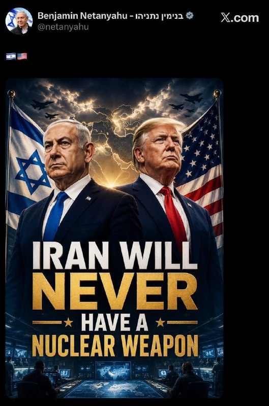

🔴توییت جدید نتانیاهو با تصویری از خودش و رئیس‌جمهور آمریکا ترامپ و عبارت «ایران هرگز سلاح هسته‌ای نخواهد داشت»
https://t.me/kianmeli1

## kianmeli1 — post 87630

🔴ایران بار دیگر این موضوع را که موضوع هسته‌ای بخشی از مذاکرات نیست، رد کرده است، چرا که رویترز به نقل از یک مقام ارشد ایرانی گزارش می‌دهد که آنها با تحویل مواد غنی‌سازی موافقت نکرده‌اند. اوایل این هفته، ایران قاطعانه گزارش‌هایی مبنی بر تمایل به پذیرش این اقدام را رد کرد و تکرار این درخواست از سوی آنها، موضع عمومی آنها را در تقابل با موضع دولت ترامپ قرار می‌دهد.
https://t.me/kianmeli1

## kianmeli1 — post 87629

  

🔴پست جدید ترامپ درحالی که خبرها از احتمال اعلام تفاهم پایان جنگ در آینده نزدیک است
https://t.me/kianmeli1

## IranIntlTV — post 338771

فایننشال‌تایمز: سپاه از طریق شرکت مستقر در امارات تجهیزات ماهواره‌ای چینی تهیه کرده است

فایننشال‌تایمز گزارش داد سپاه پاسداران برای تامین تجهیزات پیشرفته ارتباطات ماهواره‌ای ساخت چین مورد استفاده در برنامه پهپادی خود، از شرکت «تل‌سان» مستقر در راس‌الخیمه امارات متحده عربی استفاده کرده است.
 
این روزنامه یک‌شنبه سوم خرداد نوشت این تجهیزات برای «گروه صنعتی سامان» که در فهرست تحریم‌های آمریکا قرار دارد، تهیه شده‌اند.
 
بر اساس این گزارش، شرکت تل‌سان در اواخر سال ۲۰۲۵ انتقال حدود دو تن تجهیزات آنتن ماهواره‌ای، از جمله یک آنتن موتوردار ۴.۵ متری ساخت شرکت چینی «استاروین»، را از شانگهای به ایران از طریق بندر جبل‌علی هماهنگ کرده است.
 
این معامله از آن جهت توجه‌ها را جلب کرده که نشان می‌دهد یک شرکت مستقر در امارات در تامین تجهیزات ارتباطی مورد نیاز سپاه پاسداران نقش داشته است؛ نهادی که در واکنش به کارزار نظامی اخیر آمریکا و اسرائیل، امارات را هدف حملات موشکی و پهپادی خود قرار داد.
 
امارات بیشترین آسیب را از حملات تلافی‌جویانه تهران در جریان جنگ اخیر متحمل شد و جمهوری اسلامی بیش از ۲۸۰۰ پهپاد و موشک به سوی این کشور شلیک کرد، از جمله به اهداف غیرنظامی.

فعالیت‌ شرکت‌های ایرانی در امارات
با وجود موضع سخت‌گیرانه ابوظبی در قبال جمهوری اسلامی، امارات متحده عربی پیش از جنگ به‌طور سنتی مرکز فعالیت شرکت‌های ایرانی در خارج از کشور بود.

به گفته تحلیلگران، امارات که طی دو دهه اخیر به قطب تجارت در منطقه تبدیل شده، در امارت‌های مختلف خود مناطق آزاد تجاری ایجاد کرده است؛ مناطقی که نظارت بر مبادلات مالی و تجاری در آنها با محدودیت‌هایی همراه است.

همین موضوع نگرانی‌هایی را درباره احتمال سوءاستفاده از این مناطق برای تجارت غیرقانونی و دور زدن تحریم‌ها افزایش داده است.

نقش شرکت مستقر در راس‌الخیمه
فایننشال‌تایمز در ادامه گزارش داد تجهیزات مورد نیاز سپاه از طریق شرکت تل‌سان که در راس‌الخیمه مستقر است، منتقل شد.

این شرکت انتقال حدود ۱.۸ تن تجهیزات آنتن ماهواره‌ای ساخت چین را از شانگهای به ایران، از طریق بندر کانتینری جبل‌علی در دبی، هماهنگ کرد.

فایننشال‌تایمز با استناد به تصاویر ماهواره‌ای و داده‌های موقعیت‌یابی کشتی‌ها نوشت یک شناور ایرانی که در مرحله پایانی این انتقال در ماه نوامبر مورد استفاده قرار گرفت، با ارسال اطلاعات ناوبری جعلی برای سایر شناورها تلاش کرد سفر خود به ایران را پنهان کند.

این اسناد و تحلیل‌های حمل‌ونقل نشان می‌دهد سپاه پاسداران حتی پس از اعمال تحریم‌های غرب علیه شبکه تامین نظامی‌اش، همچنان از مسیر شرکت‌ها و شبکه‌های تجاری مستقر در امارات برای دستیابی به فناوری‌های حساس ارتباطی بهره می‌گرفت.

سپاه پاسداران در جریان جنگ اخیر از این توانمندی‌ها در حملات خود علیه پایگاه‌های نظامی آمریکا در منطقه استفاده کرد؛ حملاتی که خساراتی بر جای گذاشت و به کشته شدن ۱۳ نظامی آمریکایی منجر شد.

پیش‌تر شبکه سی‌ان‌ان به نقل از منابع آگاه گزارش داد جمهوری اسلامی در جریان آتش‌بس شش‌هفته‌ای بخشی از روند تولید پهپادهای خود را از سر گرفته است.

بر اساس این گزارش، حکومت ایران بسیار سریع‌تر از برآوردهای اولیه در حال بازسازی و احیای توان نظامی خود است.

جمهوری اسلامی با وجود تحریم‌های بین‌المللی، همچنان برای دور زدن محدودیت‌ها تلاش می‌کند.

پیش‌تر وال‌استریت ژورنال گزارش داد شبکه‌ای محرمانه تحت مدیریت بابک زنجانی، طی دو سال از طریق صرافی رمزارز بایننس ۸۵۰ میلیون دلار تراکنش برای تامین مالی نیروهای نظامی جمهوری اسلامی انجام داد.

به نوشته این روزنامه، این تراکنش‌ها دست‌کم تا بهمن ۱۴۰۴ ادامه داشت.
 
🔗وب‌سایت ایران‌اینترنشنال
@iranintltv

## IranIntlTV — post 338770

  

مارکو روبیو، وزیر خارجه آمریکا، اظهارنظرها درباره ضعیف‌ بودن توافق احتمالی دونالد ترامپ با جمهوری اسلامی را «مضحک» توصیف کرد. روبیو که در سفر به هند به‌سر می‌برد، به خبرنگاران گفت تعهد ترامپ به جلوگیری از دستیابی ایران به سلاح هسته‌ای «نباید از سوی هیچ‌کس زیر سؤال برود»

او افزود: این که ترامپ ممکن است با توافقی موافقت کند که در نهایت موقعیت ایران را در برنامه هسته‌ای تقویت کند، با توجه به مواضع و اقداماتی که تاکنون از او دیده‌ایم، کاملا مضحک است.
https://iranintl.com/202605242555

## IranIntlTV — post 338769

  <a href="telegram/content/IranIntlTV_338769_1779631685.mp4" target="_blank">🎬 Download video</a>

فائزه حسین‌نژاد، دانشجوی ۲۳ ساله مامایی و والیبالیست، شامگاه ۱۹ دی ۱۴۰۴ در خیابان امامت مشهد به دست نیروهای سرکوبگر کشته شد. ابتدا گلوله‌ای به زیر قلبش زدند و سپس زیر ضربات باتون او را کشتند.

## IranIntlTV — post 338768

  <a href="telegram/content/IranIntlTV_338768_1779631687.mp4" target="_blank">🎬 Download video</a>

در ادامه تجمع‌های ایرانیان خارج از کشور، گروهی از ایرانیان مقیم سوئد یکشنبه مقابل سفارت جمهوری اسلامی در استکهلم تجمع کردند. شرکت‌کنندگان اعلام کردند این تجمع در اعتراض به اجرای کمپین «جان فدا» در این سفارت برگزار شد.

گزارش مهران عباسیان، خبرنگار ایران‌اینترنشنال
@iranintltv

## IranIntlTV — post 338767

  <a href="telegram/content/IranIntlTV_338767_1779631689.mp4" target="_blank">🎬 Download video</a>

بر اساس ویدیوهای ارسال‌شده به ایران‌اینترنشنال گروهی از ایرانیان مقیم استرالیا در حمایت از مردم ایران و علیه جمهوری اسلامی در شهر آدلاید کاروان خودرویی به راه انداختند.

## IranIntlTV — post 338766

  

علی عبداللهی، فرمانده قرارگاه مرکزی خاتم الانبیا، گفت: «در شرایط جنگی هستیم و تمامی نیروهای مسلح در آمادگی کامل به سر می‌برند که با هر دشمنی و در هر سطحی مقابله کنند.»

او افزود: «پیروزی ما بر دشمنان، معجزه الهی بود، در چند جنگ اخیر متکی به ابزار خودمان بودیم و با ساخته‌های بومی خودمان با دشمنان جنگیدیم، اکنون نیز باید در تمام عرصه‌ها آماده باشیم و به موفقیت برسیم.»
https://iranintl.com/202605242129

## IranIntlTV — post 338765

  <a href="telegram/content/IranIntlTV_338765_1779631692.mp4" target="_blank">🎬 Download video</a>

وب‌سایت اتلتیک در گزارشی درباره انتقال کمپ تیم فوتبال ایران از آمریکا به مکزیک نوشت که احتمالا همه بازیکنان و اعضای کادر فنی همچنان برای ورود به آمریکا به ویزا نیاز دارند.

گفت‌وگو با کوشا دلشاد، مربی فوتبال
@iranintltv

## IranIntlTV — post 338764

  <a href="telegram/content/IranIntlTV_338764_1779631694.mp4" target="_blank">🎬 Download video</a>

در ادامه تجمع‌های جهانی ایرانیان علیه جمهوری اسلامی، یکشنبه گروهی از ایرانیان مقیم سوئد مقابل سفارت جمهوری اسلامی در استکهلم تجمع کردند. شرکت‌کنندگان اعلام کردند این تجمع در اعتراض به اجرای کمپین «جان فدا» در این سفارت برگزار شد.

گزارش مهران عباسیان، خبرنگار ایران‌اینترنشنال
@iranintltv

## IranIntlTV — post 338763

  <a href="telegram/content/IranIntlTV_338763_1779631696.mp4" target="_blank">🎬 Download video</a>

فائزه حسین‌نژاد، دانشجوی ۲۳ ساله مامایی و والیبالیست، در تجمع ۱۹ دی در خیابان امامت مشهد با شلیک مستقیم نیروهای سرکوبگر کشته شد.

فرنوش فرجی، عضو تحریریه ایران‌اینترنشنال، گزارش می‌دهد
@iranintltv

## IranIntlTV — post 338762

  <a href="https://t.me/IranintlTV/338762" target="_blank">📎 Download file</a>

🎧نسخه صوتی اخبار نیمروزی | یکشنبه ۳ خرداد
@iranintlTV

## IranIntlTV — post 338761

  <a href="telegram/content/IranIntlTV_338761_1779631699.mp4" target="_blank">🎬 Download video</a>

گزارش‌ها درباره توافق احتمالی میان جمهوری اسلامی و آمریکا به یکی از محورهای اصلی بحث در رسانه‌های اجتماعی تبدیل شده است. در حالی که کاربران مخالف جمهوری اسلامی خواهان توقف مذاکرات هستند، برخی حامیان حکومت نیز هرگونه مذاکره پیش از «انتقام» را خیانت توصیف می‌کنند.

عادله بورنگ، عضو تحریریه ایران‌اینترنشنال، به واکنش کاربران می‌پردازد
@iranintltv

## IranIntlTV — post 338760

  

نیروی دریایی سپاه پاسداران اعلام کرد در شبانه‌روز گذشته، ۳۳ کشتی اعم از نفتکش، کانتینربر و سایر کشتی‌های تجاری «پس از کسب مجوز و با هماهنگی و تامین امنیت این نیرو« از تنگه هرمز عبور کردند.
روز شنبه نیز سپاه پاسداران از عبور ۲۵ کشتی از تنگه هرمز خبر داده بود.
https://iranintl.com/202605246781

## IranIntlTV — post 338759

  <a href="telegram/content/IranIntlTV_338759_1779631701.mp4" target="_blank">🎬 Download video</a>

یکی از بستگان جاویدنام علی مشهدی در تجمع استکهلم، در گفت‌وگو با مهران عباسیان، خبرنگار ایران‌اینترنشنال، درباره نحوه کشته شدن او توضیح داد و پیام پدر این جاویدنام را به اشتراک گذاشت.
@iranintltv

## IranIntlTV — post 338758

فایننشال‌تایمز: جنگ ایران، شکاف میان مصر و امارات متحده عربی را آشکار کرد

فایننشال‌تایمز گزارش داد مصر در اقدامی کم‌سابقه جنگنده‌هایی را به امارات متحده عربی اعزام کرده؛ حرکتی که به نوشته این روزنامه، نشانه تلاش قاهره برای کاهش تنش با ابوظبی و پاسخ به نارضایتی امارات از حمایت ناکافی متحدان عرب در برابر حملات جمهوری اسلامی است.

بر اساس این گزارش، افشای این استقرار نظامی زمانی رخ داد که عبدالفتاح السیسی، رییس‌جمهوری مصر، در سفر اخیر خود به امارات در کنار محمد بن زاید آل نهیان از جنگنده‌های «رافال» مصری مستقر در این کشور بازدید کرد. سیسی در این دیدار گفت: «هر آنچه به امارات آسیب بزند، به مصر آسیب زده است.»

فایننشال‌تایمز نوشت قاهره جزئیاتی از این ماموریت نظامی منتشر نکرده، اما اعزام نیرو ظاهرا با هدف کاهش تنش‌ها با امارات متحده عربی صورت گرفته؛ کشوری که پیش‌تر از دولت‌های عربی به دلیل کمک نکردن کافی در دفاع مقابل حملات حکومت ایران انتقاد کرده بود.

امارات متحده عربی که هدف اصلی حملات تلافی‌جویانه جمهوری اسلامی در جریان جنگ بوده، طی سال‌های اخیر نقش حیاتی در حمایت اقتصادی از مصر ایفا کرده است. این کشور در سال ۲۰۲۳ با یک سرمایه‌گذاری ۳۵ میلیارد دلاری، به تثبیت اقتصاد بحران‌زده مصر کمک کرد و همچنین حواله‌های مالی صدها هزار مصری شاغل در امارات متحده عربی، منبع مهم ارز خارجی برای قاهره محسوب می‌شود.

به نوشته فایننشال‌تایمز، در ابوظبی این برداشت شکل گرفته که جنگ اخیر نشان داد کدام متحدان در شرایط بحرانی قابل اتکا هستند. انور قرقاش، مشاور دیپلماتیک رییس امارات متحده عربی، در ماه مارس از کشورهایی که در برابر «تجاوز ایران» واکنش کافی نشان ندادند انتقاد کرده بود.

این روزنامه همچنین نوشت جنگ اخیر، شکاف‌های تازه‌ای در میان کشورهای منطقه ایجاد کرده و ائتلاف‌های خاورمیانه را در حال بازتعریف قرار داده است. به باور برخی تحلیلگران، محور جدیدی میان عربستان سعودی، مصر، ترکیه و پاکستان در حال شکل‌گیری است؛ کشورهایی که نسبت به نقش اسرائیل در بی‌ثباتی منطقه نگرانی دارند و برای پایان دادن به جنگ آمریکا و اسرائیل علیه حکومت ایران تلاش‌های دیپلماتیک انجام داده‌اند.

اما امارات متحده عربی نسبت به این روند بدبین بوده و نگران است هرگونه توافق، جمهوری اسلامی را در موقعیتی قوی‌تر حفظ کند. مایکل وحید حنا، تحلیلگر گروه بین‌المللی بحران، به فایننشال‌تایمز گفت از نگاه ابوظبی، مشارکت مصر در میانجی‌گری ممکن است به معنای ایجاد نوعی هم‌ترازی سیاسی میان جمهوری اسلامی ایران و امارات متحده عربی تلقی شده باشد؛ موضوعی که برای امارات قابل پذیرش نیست. به گفته او، امارات احساس کرده میانجی‌ها حمایت کافی از مواضع این کشور نشان نداده‌اند.

فایننشال‌تایمز همچنین گزارش داد مصر به دقت رفتار امارات متحده عربی با پاکستان را دنبال کرده است. ابوظبی در ماه آوریل از اسلام‌آباد خواست بازپرداخت فوری وام ۳.۵ میلیارد دلاری را انجام دهد؛ اقدامی که برخی آن را ناشی از نارضایتی امارات از نقش پاکستان در میانجی‌گری میان حکومت ایران و آمریکا دانستند.

به نوشته این روزنامه، اعزام جنگنده‌های مصری تا حدی تنش‌ها میان قاهره و ابوظبی را کاهش داده است. عبدالخالق عبدالله، پژوهشگر اماراتی، این اقدام را «غافلگیری خوشایند» توصیف کرد و گفت: «ما تصور می‌کردیم مصر مردد است و کمک چندانی نمی‌کند. اکنون با ایرانی بسیار تهاجمی روبه‌رو هستیم و این اقدام می‌تواند پیام مهمی برای تهران داشته باشد.»

در عین حال، نزدیکی بیشتر امارات متحده عربی به اسرائیل پس از حملات جمهوری اسلامی ایران، واکنش منفی بخشی از افکار عمومی مصر را برانگیخته است. کاربران مصری شبکه‌های اجتماعی بارها از روابط امارات و اسرائیل انتقاد کرده‌اند؛ موضوعی که به نوشته فایننشال تایمز، در ابوظبی با نارضایتی دنبال شده است.

این گزارش همچنین به اختلاف‌های دیرینه دو کشور درباره مسائل منطقه‌ای اشاره می‌کند؛ از جمله جنگ داخلی سودان، که مصر از ارتش سودان و امارات متحده عربی متهم به حمایت از نیروهای رقیب است، و نیز روابط نزدیک ابوظبی با اتیوپی بر سر پروژه سد بزرگ نیل؛ موضوعی که قاهره آن را تهدیدی برای امنیت آبی خود می‌داند.

فایننشال‌تایمز نوشت اگرچه مصر و امارات همچنان متحد باقی مانده‌اند، اما جنگ ایران شکاف‌های پنهان میان دو کشور را آشکار کرده و نشان داده است که فشارهای امنیتی منطقه‌ای می‌تواند اتحادهای سنتی جهان عرب را بازتعریف کند.

🔗وب‌سایت ایران‌اینترنشنال
@iranintltv

## IranIntlTV — post 338757

  <a href="telegram/content/IranIntlTV_338757_1779631703.mp4" target="_blank">🎬 Download video</a>

یک شهروند با ارسال پیامی به ایران‌اینترنشنال می‌گوید: «ترامپ اشتباه کردی. اشتباه می‌کنی. اشتباه پشت اشتباه. با این‌ها به توافق نمی‌رسی. نه تنها به آنها وقت می‌دهی بلکه قویترشان می‌کنی، ظالم‌ترشان می‌کنی.»

## Shin_Persian — post 6204

↩️ Quoted tweet: Faytuks Network ✓ @FaytuksNetwork Sun, 24 May 2026 12:17:06 UTC Fars News, an IRGC-linked Iranian outlet, reported that U.S. officials and mediators privately told Tehran during indirect exchanges to ignore Donald Trump’s Truth Social posts…

## Shin_Persian — post 6203

↩️ Quoted tweet:
Faytuks Network ✓ @FaytuksNetwork
Sun, 24 May 2026 12:17:06 UTC

Fars News, an IRGC-linked Iranian outlet, reported that U.S. officials and mediators privately told Tehran during indirect exchanges to ignore Donald Trump’s Truth Social posts, saying they were aimed mainly at U.S. domestic audiences and did not reflect Washington’s negotiating

↩️ توییت نقل‌قول شده — برای پاسخ، پست زیر را ببینید.

فارسی

خبرگزاری فارس، رسانه وابسته به سپاه پاسداران انقلاب اسلامی (IRGC)، گزارش داد که مقامات و میانجی‌گران آمریکایی در خلال تبادلات غیرمستقیم، به‌طور خصوصی به تهران گفته‌اند که پست‌های دونالد ترامپ در شبکه اجتماعی «تروث سوشال» را نادیده بگیرد؛ آن‌ها اعلام کردند که این پیام‌ها عمدتاً با هدف جذب مخاطبان داخلی ایالات متحده منتشر شده و بازتاب‌دهنده مواضع مذاکراتی واشینگتن نیست.

𝕏 · @shin_persian

## Shin_Persian — post 6202

  <a href="telegram/content/Shin_Persian_6202_1779631705.mp4" target="_blank">🎬 Download video</a>

↩️ Quoted tweet: Shin ✓ @hey_itsmyturn Sun, 24 May 2026 10:52:04 UTC Islamic Regime claims downing Israeli Orbiter drone over Hormozgan Province with air defense system. Drone reportedly conducting reconnaissance mission. #Iran ↩️ توییت نقل‌قول شده — برای…

## Shin_Persian — post 6201

↩️ Quoted tweet:
Shin ✓ @hey_itsmyturn
Sun, 24 May 2026 10:52:04 UTC

Islamic Regime claims downing Israeli Orbiter drone over Hormozgan Province with air defense system. Drone reportedly conducting reconnaissance mission.

#Iran

↩️ توییت نقل‌قول شده — برای پاسخ، پست زیر را ببینید.

فارسی

رژیم اسلامی مدعی سرنگونی یک پهپاد اوربیتر (Orbiter) اسرائیلی بر فراز استان هرمزگان توسط سامانه پدافند هوایی شد. گزارش شده است که این پهپاد در حال انجام ماموریت شناسایی بوده است.

#Iran

𝕏 · @shin_persian

## ManotoTV — post 105804

  <a href="telegram/content/ManotoTV_105804_1779631707.mp4" target="_blank">🎬 Download video</a>

تجمع مقابل ساختمان بی‌بی‌سی فارسی در لندن، یکشنبه سوم خرداد ۱۴۰۵

## ManotoTV — post 105803

  <a href="telegram/content/ManotoTV_105803_1779631708.mp4" target="_blank">🎬 Download video</a>

فایننشال تایمز در گزارشی نوشت سپاه از یک شبکه تدارکاتی مستقر در امارات برای خرید تجهیزات پیشرفته ماهواره‌ای چینی مرتبط با برنامه پهپادی و موشکی خود استفاده کرده است.

بر اساس این گزارش، شرکتی به نام «تله‌سان» در راس‌الخیمه، انتقال حدود یک و هشت دهم تن تجهیزات ارتباطی ماهواره‌ای ساخت چین را از شانگهای به ایران، از مسیر دبی، تسهیل کرده است.

فایننشال تایمز نوشت مقصد نهایی این تجهیزات شرکت «ارتباطات فراگستر کیش» بوده که بنا بر این گزارش، با «گروه صنعتی سامان» مرتبط با نیروی هوافضای سپاه و تحریم‌شده از سوی آمریکا همکاری داشته است.

این روزنامه همچنین گزارش داد بخش پایانی انتقال محموله با یک کشتی ایرانی انجام شده که برای پنهان کردن مسیر خود، داده‌های موقعیت‌یابی نادرست مخابره کرده است.

## ManotoTV — post 105802

  <a href="telegram/content/ManotoTV_105802_1779631709.mp4" target="_blank">🎬 Download video</a>

دانیال مقدم، خواننده و رپر اعتراضی ایرانی، تتوی جدید صورتش با الهام از «God of War» را فقط به‌عنوان یک طرح انتخاب نکرده؛ این تتو برای او یادآور زخم‌ها، ترس‌ها، امیدها و روزهایی‌ست که نسلش از میان جنگ، درد و ناامیدی عبور کرده است.
رنگ سبز این طرح، نماد عشق، صلح، امید و زندگی‌ست؛ پیامی برای فراموش نکردن روزهایی که مردم با تمام زخم‌هایشان هنوز ایستاده‌اند و ایران را دوست دارند

## FarsiVOA — post 218526

  <a href="telegram/content/FarsiVOA_218526_1779631712.mp4" target="_blank">🎬 Download video</a>

گروهی از بازنشستگان تامین اجتماعی در شوش، در ادامه اعتراضات هفتگی، روز یکشنبه، ۳ خرداد ۱۴۰۵، با شعار «معیشت، منزلت، حق مسلم ماست» در اعتراض به شرایط دشوار معیشتی و خدمات درمانی تجمع کردند.

## FarsiVOA — post 218525

🔺اسرائیل: دروغ حزب‌الله ناخواسته لو رفت

◾️اسرائیل می‌گوید گروه تروریستی حزب‌الله، بدون برنامه‌ریزی قبلی دروغ روایت خود را برای رسانه‌های جهانی آشکار کرد.

⬇️ بیشتر بخوانید:

https://ir.voanews.com/a/hezbollah-s-lie-social-media-delete-news/8153285.html

## FarsiVOA — post 218524

  <a href="telegram/content/FarsiVOA_218524_1779631714.mp4" target="_blank">🎬 Download video</a>

نیروهای ارتش اسرائیل یک مسیر زیرزمینی به طول حدود ۱۰۰ متر متعلق به حزب‌الله را منهدم کردند.

ارتش اسرائیل اعلام کرد نیروهای تیپ «کوهستان‌ها» که در منطقه کوه دوو در لبنان در حال فعالیت هستند با همکاری یگان مهندسی ویژه این مسیر زیرزمینی را شناسایی و منهدم کردند. این مسیر شامل چهار اتاق اقامت بود و توسط نیروهای سازمان تروریستی حزب‌الله استفاده می‌شد.

این ویدیو بی‌صدا است.

## FarsiVOA — post 218523

🔺واکنش نتانیاهو به تیراندازی در نزدیکی کاخ سفید: تلاش‌های مکرر برای ترور پرزیدنت ترامپ با قاطعیت باید محکوم شود

◾️بنیامین نتانیاهو، نخست وزیر اسرائیل به تیراندازی رخ داده در عصر روز شنبه در مجاورت کاخ سفید واکنش نشان داد.

⬇️ بیشتر بخوانید:

https://ir.voanews.com/a/benjamin-netanyahu-white-house-shooting/8153286.html

## FarsiVOA — post 218520

فرماندهی مرکزی ایالات متحده، سنتکام، تصاویری از عملیات هوایی نیروهای نیروی دریایی و تفنگداران دریایی آمریکا در ناو «یواس‌اس تریپولی» منتشر کرد.

سنتکام می‌گوید این ناو تهاجمی آبی‌خاکی در حال عبور از دریای عرب است.

@FarsiVOA

## FarsiVOA — post 218519

مارکو روبیو، وزیر خارجه آمریکا، اعلام کرد که «احتمال خبرهای خوب در چند ساعت آینده درباره تنگه [هرمز] وجود دارد.»

آقای روبیو روز یکشنبه در جریان سفر به دهلی‌نو در یک کنفرانس مشترک با وزیر خارجه هند، درباره پرونده مذاکرات با تهران گفت: «در ۴۸ ساعت گذشته پیشرفت‌هایی در چارچوبی که می‌تواند وضعیت تنگه هرمز را حل‌وفصل کند حاصل شده است.»

در حالی که پیشتر کشتی‌هایی در منطقه خلیج فارس هدف حملات قرار گرفتند، وزیر خارجه آمریکا تاکید کرد که حملات به کشتی‌های تجاری «کاملا غیرقانونی» است و همچنین جمهوری اسلامی هرگز «نباید به سلاح هسته‌ای» دست پیدا کند.

او افزود که اخبار بیشتری درباره وضعیت ایران ممکن است در طول روز یکشنبه منتشر شود.

گزارش کامل را در وب‌سایت صدای آمریکا بخوانید.

@FarsiVOA

## DW_Farsi — post 125096

  <a href="telegram/content/DW_Farsi_125096_1779631716.mp4" target="_blank">🎬 Download video</a>

🎥 رویای دبی، واقعیت پاکستان؛ وقتی همه چیز با شلیک جمهوری اسلامی فروریخت

یک مهاجر پاکستانی در گفت‌وگو با دویچه وله از زندگی خود در دبی گفت و این‌که چگونه در پی حملات جمهوری اسلامی به امارات همه چیز خود را از دست داد.

او حالا در اقتصاد نحیف پاکستان، بدون شغل و پشتوانه مالی، به سختی امرار معاش می‌کند.
@dw_farsi

## DW_Farsi — post 125095

🔶 اقدام ترکیه برای تخلیه دفتر مرکزی بزرگ‌ترین حزب مخالف

مقا‌م‌های ترکیه پس از برکناری اوزگور اوزل، رهبر حزب جمهوری‌خواه خلق (CHP)، بزرگ‌ترین حزب اپوزیسیون ترکیه دستور تخلیه دفتر مرکزی این حزب در آنکارا را صادر کرده‌اند.

فرمانداری آنکارا اعلام کرد که این اقدام را در راستای اجرای حکم دادگاهی انجام می‌دهد که کمال قلیچداراوغلو، رهبر پیشین حزب، را به‌طور موقت دوباره به سمت رهبری حزب منصوب کرده است.

این دادگاه در آنکارا چند روز پیش در جریان دادرسی تجدیدنظر، انتخابات هیأت‌رئيسه‌ حزب جمهوری‌خواه خلق در سال ۲۰۲۳ را به دلیل "تخلفات احتمالی" باطل اعلام کرد و رأی به برکناری اوزگور اوزل از سمت رهبری این حزب داد.

به حکم دادگاه، به صورت موقت کمال قلیچدار اوغلو، رهبر قبلی و جنجالی این حزب به تصدی این سمت منصوب شد.

اوزل پس از برکناری قضایی خود در روز پنج‌شنبه ۱۹ مه، ساختمان حزب را ترک نکرده و همراه با نمایندگان حزب در آنجا مستقر شده است.

تصاویر نشان می‌دهند که نیروهای ویژه پلیس در اطراف ساختمان دفتر این حزب در آنکارا تجمع کرده و موانع امنیتی ایجاد کرده‌اند.

کمال قلیچداراوغلو ۷۷ ساله بیش از ۱۰ سال رهبری حزب جمهوری‌خواه خلق  را بر عهده داشت. او در انتخابات سه سال پیش، از رجب طیب اردوغان، رهبر حزب حاکم عدالت و توسعه (AKP) و رئیس‌جمهور ترکیه شکست خورد و پس از آن نیز در رقابت داخلی حزب، رهبری را به اوزل واگذار کرد.

اینک حکم دادگاه برای برکناری اوزگور اوزل ضربه‌ای سنگین به مخالفان سیاسی رجب طیب اردوغان تلقی می‌شود. ناظران معتقدند که این تصمیم انگیزه‌های سیاسی دارد. در مقابل، دولت ترکیه تأکید می‌کند که قوه قضاییه مستقل است.

این حکم هنوز به‌صورت نهایی و قطعی صادر نشده است.

دستگاه قضایی اوزل را متهم کرده که پیروزی خود در انتخابات کنگره سال ۲۰۲۳ برای رهبری حزب جمهوری‌خواه خلق را مدیون روش‌هایی مانند فشار بر اعضا، وعده‌هاش شغلی و حتی خرید مستقیم رأی بوده است. او این اتهامات را رد کرده است.

این حزب که در انتخابات شهرداری‌ها در سال ۲۰۲۴ شکست سنگینی را بر حزب عدالت و توسعه به رهبری اردوغان وارد آورد، از آن پس با شدتی روز‌افزون در کانون توجه و فشارهای قوه قضائیه ترکیه قرار گرفت.

اکرم امام‌اوغلو، شهردار سابق استانبول و سیاستمدار محبوب حزب جمهوری‌خواه خلق که از او به عنوان مهم‌ترین رقیب رجب طیب اردوغان در انتخابات ریاست جمهوری یاد می‌شد نیز بیش از یک سال است که در زندان به سر می‌برد.

علیه او اتهامات فساد مالی مطرح شده که او آن‌ها را کاملا رد کرده است.
@dw_farsi

## DW_Farsi — post 125094

🔶 انفجار در قطار مسافربری پاکستان با ده‌ها کشته و زخمی

در جریان یک انفجار مهیب در یک قطار مسافربری در غرب پاکستان، دست‌کم ۳۰ نفر کشته شدند.

سخنگوی پلیس به خبرگزاری آلمان گفته است که طی این حادثه در شهر کویته، پایتخت ایالت ناآرام بلوچستان بیش از ۱۰۰ نفر نیز زخمی شده‌اند.

یک گروه جدایی‌طلب به نام بریگاد یا "تیپ مجید"، وابسته به ارتش آزادیبخش بلوچستان (BLA) مسئولیت این حمله را بر عهده گرفته است.

این گروه می‌گوید، هدفش از این حمله نظامیانی بوده‌اند که قصد داشته‌اند برای تعطیلات عید با این قطار به زادگاه‌های خود سفر کنند. مقام‌های دولتی تا کنون در این باره اظهار نظری نکرده‌اند.

این انفجار که در زمان عبور قطار رخ داد شدتش به حدی بود که قطار از ریل خارج و به مناطق مسکونی اطراف و خودروها خسارت وارد شد.

حمیدالله‌شاه، یک مقام پلیس محلی در گفت‌وگو با خبرگزاری آلمان شمار زخمی‌‌ها را ۱۰۳ تن نامید و ابراز نگرانی کرد که تعداد قربانیان افزایش یابد.
در پی این حادثه، در تمامی بیمارستان‌های دولتی و خصوصی شهر وضعیت فوق‌العاده اعلام شده است.

به گفته سخنگوی دولت محلی، بر اثر انفجار حداقل سه واگن به همراه لوکوموتیو از ریل خارج شدند.
در حال حاضر نیروهای امنیتی منطقه را محاصره کرده‌اند و عملیات امداد و نجات همچنان ادامه دارد.

تا به‌حال مشخص نشده که مواد منفجره دقیقا در کجا کار گذاشته شده بود. همچنین مقام‌های مسئول هنوز تأیید نکرده‌اند که آیا واقعا نیروهای نظامی (همان‌طور که گروه جدایی‌طلب یادشده ادعا کرده) در میان کشته‌شدگان بوده‌اند یا نه.

در ماه‌های اخیر، میزان خشونت در پاکستان به‌طور قابل توجهی افزایش یافته است. سال گذشته نیز یک قطار که صدها نیروی امنیتی و خانواده‌های آن‌ها را حمل می‌کرد، توسط گروه شبه‌نظامی ممنوعه ارتش آزادی‌بخش بلوچستان ربوده شد و مسافرانش به گروگان گرفته شدند.

در جریان درگیری چندروزه برای آزادسازی گروگان‌ها، حداقل ۲۴ نفر از مسافران و سربازان کشته شدند.

ارتش آزادی‌بخش بلوچستان بزرگ‌ترین گروه از چندین گروه مسلحی است که برای استقلال بلوچستان از پاکستان مبارزه می‌کنند. این گروه پشت بسیاری از حملات خشونت‌آمیز قرار دارد، به‌ویژه حملاتی که پروژه‌های میلیاردی زیرساختی چین را هدف قرار می‌دهند.
@dw_farsi

## DW_Farsi — post 125093

🔶 حمله گسترده روسیه به کی‌یف با چندین کشته و ده‌ها زخمی

طبق اعلام مقام‌های اوکراینی در روز یکشنبه ۲۴ مه (سوم خرداد)، در پی حملات گسترده جدید روسیه با پهپادهای رزمی و موشک‌های بالستیک و کروز به کی‌یف، پایتخت اوکراین، و مناطق اطراف آن، دست‌کم چهار نفر کشته شده‌اند.

همچنین بیم آن می‌رود که شمار قربانیان افزایش یابد. تصاویر ویدئویی منتشرشده از شهر، ویرانی‌های گسترده‌ای را نشان می‌دهند.
ویتالی کلیچکو، شهردار کی‌یف، در تلگرام اعلام کرد که در جریان حملات شامگاه گذشته، دست‌کم دو نفر در خود پایتخت کشته شده‌اند. دست‌کم ۵۶ نفر نیز زخمی شده‌اند.

به گفته کلیچکو، ۳۰ نفر، از جمله دو کودک، در بیمارستان بستری شده‌اند. نیروهای امدادی مشغول آواربرداری از ساختمان‌های مسکونی‌ای هستند که در جریان حمله هدف قرار گرفته‌اند.

میکولا کالاشنیک، رئیس اداره منطقه‌ای کی‌یف، نیز اعلام کرده است که در مناطق اطراف پایتخت دست‌کم دو نفر کشته و ۹ نفر زخمی شده‌اند.

بر اساس اعلام نیروی هوایی اوکراین، روسیه در این حمله از ۹۰ موشک بالستیک و کروز و نیز ۶۰۰ پهپاد از انواع مختلف استفاده کرده است.

سامانه پدافند هوایی اوکراین اعلام کرد که در مجموع ۶۰۴ هدف، از جمله ۵۵ موشک بالستیک و کروز و ۵۴۹ پهپاد، ردیابی و منهدم شده‌اند. با این حال، اصابت ده‌ها پرتابه روسی به اهدافی در این منطقه ثبت شده است.

ولودیمیر زلنسکی، رئیس جمهور اوکراین، اعلام کرد که مسکو بار دیگر از موشک میان‌بُرد اورشنیک استفاده کرده، اما این نخستین بار بوده که چنین موشکی در نزدیکی منطقه کی‌یف به کار گرفته شده است.

زلنسکی در پیام ویدئویی منتشرشده‌اش در بامداد امروز یکشنبه در کی‌یف گفت ولادیمیر پوتین، رئیس کرملین، این موشک را به سمت شهر "بیلا تسرکوا"، واقع در استان کی‌یف، شلیک کرده است. او درباره میزان خسارت‌ها در این منطقه توضیحی نداد.

خبرگزاری دولتی "اینترفکس" روسیه، با استناد به اطلاعات وزارت دفاع این کشور، استفاده از موشک اورشنیک را تأیید کرده است.

بر این اساس، اوکراین با چهار نوع موشک مختلف اورشنیک، اسکندر، کینژال و زیرکُن هدف قرار گرفته است. این موشک‌ها در دسته موشک‌های موسوم به فراصوت قرار می‌گیرند که سرعتی بسیار بالا دارند.

به گفته روسیه، این حمله پاسخی تلافی‌جویانه به حملات اوکراین به منطقه لوهانسک بوده است. طبق اعلام روسیه، در جریان حمله به منطقه تحت اشغال این کشور در لوهانسک، یک مرکز آموزش عالی فنی و خوابگاه دانشجویی‌اش در شهر استاروبیلسک هدف قرار گرفته و ۲۱ نفر کشته شده‌اند.

کی‌یف هدف قرار دادن عمدی غیرنظامیان را رد کرده و اعلام کرده است که هدف، یک واحد پهپادی ارتش روسیه در آن منطقه بوده است.
موشک اورشنیک (به معنی "درختچه فندق") با قدرت تخریبی شدیدش شناخته می‌شود. این موشک که مسکو آن را در بلاروس نیز مستقر کرده است، هم توان حمل کلاهک‌های متعارف و هم هسته‌ای را دارد.

سرعت بسیار بالای اورشنیک که تا ۱۲ هزار کیلومتر در ساعت با بردی تا پنج هزار کیلومتر تخمین زده می‌شود، آن را به تهدیدی بالقوه برای سراسر قاره اروپا تبدیل می‌کند.

زلنسکی گفت: «این واقعاً اقدامی غیرمسئولانه است. مهم است که این اقدام برای روسیه بی‌پیامد نماند.» طبق گزارش‌ها، این سومین بار است که این سلاح در جنگ روسیه علیه اوکراین به کار گرفته می‌شود.

مناطق اطراف کی‌یف و دیگر بخش‌های کشور نیز هدف این حملات قرار گرفته‌اند. با این حال، زلنسکی گفت: «بیشترین اصابت‌ها در کی‌یف رخ داد و دقیقاً کی‌یف هدف اصلی این حمله روسیه بود. سه موشک روسی به یک تأسیسات آب‌رسانی اصابت کرد، یک بازار در آتش سوخت و ده‌ها ساختمان مسکونی و چندین مدرسه عادی آسیب دیدند.»

سازمان دفاع غیرنظامی اوکراین تصاویر و ویدیوهایی از تخریب‌های گسترده زیرساخت‌های غیرنظامی و آتش‌سوزی‌های بزرگ منتشر کرده که نیروهای امدادی را در حال مهار آنها نشان می‌دهد.

در تمام طول شب گذشته و صبح امروز یکشنبه، در منطقه کی‌یف هشدارهای حمله هوایی داده شده و گزارش‌هایی از انفجار در نقاط مختلف پایتخت منتشر شده است.

دفتر مرکزی کانال اول تلویزیون آلمان (ARD) نیز که در مرکز کی‌یف قرار دارد به‌شدت آسیب دیده و بخشی از آن تخریب شده است.
این تخریب احتمالاً بر اثر موج انفجار رخ داده و باعث شکسته شدن پنجره‌ها، ویرانی اتاق‌ها و فروریختن دیوارها شده است. هنگام وقوع این حادثه هیچ‌یک از کارکنان این شبکه در دفتر حضور نداشته‌اند.

با وجود خسارت‌های سنگین، پوشش خبری این شبکه از اوکراین ادامه خواهد یافت و تولید برنامه‌ها و گزارش‌های زنده با استفاده از راهکارهای فنی سیار و امکانات جایگزین ادامه خواهد داشت.
@dw_farsi

## Persian_Trend_Official — post 14864

  <a href="telegram/content/Persian_Trend_Official_14864_1779631718.webm" target="_blank">🎬 Download video</a>

🔴پست جدید نتانیاهو

💢ایران هیجوقت سلاح هسته ای نخواهد داشت.

🫆:Tony

📌 @persian_trend_official
پرشین ترند | متفاوت‌ترین کانال نظامی

## Persian_Trend_Official — post 14863

  

🔴ترامپ:

«نمی‌توانم درباره توافق صحبت کنم؛ این توافق کاملاً به من بستگی دارد، و اگر خبری باشد، فقط خبر خوب خواهد بود.من معامله بد انجام نمی‌دهم.»

🫆:Tony

📌 @persian_trend_official
پرشین ترند | متفاوت‌ترین کانال نظامی

## Persian_Trend_Official — post 14862

  

♦️سرلشکر عبداللهی: پیروزی ملت ایران بر دشمنان عزت و افتخار ایران را بالاتر برد

♦️با سلاح‌های بومی، دشمن را شکست دادیم

▪️فرمانده قرارگاه مرکزی خاتم الانبیا در گفتگو با تسنیم:

در شرایط جنگی هستیم و تمامی نیروهای مسلح در آمادگی کامل به سر می‌برند که با هر دشمنی و در هر سطحی مقابله کنند.

🫆:Tony

📌 @persian_trend_official
پرشین ترند | متفاوت‌ترین کانال نظامی

## Persian_Trend_Official — post 14861

  <a href="telegram/content/Persian_Trend_Official_14861_1779631720.webm" target="_blank">🎬 Download video</a>

⭕️ ارتش اسرائیل خواستار تخلیه 10 شهرک در جنوب لبنان شد.

📝 Nick

📌 @persian_trend_official
پرشین ترند | متفاوت‌ترین کانال نظامی

## Persian_Trend_Official — post 14860

🔴 جزئیات تفاهم ۶۰ روزه ایران و آمریکا به روایت آکسیوس

▪️آکسیوس مدعی شده متن یادداشت تفاهم میان ایران و آمریکا شامل بندهای زیر است:

▪️ تمدید ۶۰ روزه آتش‌بس

▪️ عدم دریافت هرگونه عوارض یا هزینه از کشتی‌ها در تنگه هرمز توسط ایران

▪️ ایران ابتدا مین‌های دریایی را پاکسازی کرده و محاصره خود را رفع می‌کند؛ سپس آمریکا محاصره دریایی و محدودیت‌های خود را کاهش خواهد داد

▪️ آمریکا بخشی از معافیت‌های تحریمی مرتبط با صنعت نفت ایران را صادر می‌کند

▪️در بخش هسته‌ای:

▪️ ایران متعهد می‌شود هرگز به‌دنبال سلاح هسته‌ای نرود

▪️ تهران وارد مذاکرات درباره توقف کامل غنی‌سازی و انتقال ذخایر اورانیوم غنی‌شده خواهد شد

▪️ آمریکا نیز متعهد می‌شود درباره کاهش تدریجی تحریم‌ها و آزادسازی دارایی‌های بلوکه‌شده ایران مذاکره کند

▪️اما بر خلاف برخی گزارش‌های قبلی:

▪️ آمریکا هیچ نیرویی را فعلاً از اطراف ایران خارج نخواهد کرد
▪️ خروج نیروهای آمریکایی تنها در صورت دستیابی به توافق نهایی پس از پایان دوره ۶۰ روزه بررسی می‌شود

▪️درباره لبنان نیز:

▪️ جنگ میان حزب‌الله و اسرائیل پایان خواهد یافت

▪️ اما اسرائیل اجازه خواهد داشت برای جلوگیری از مسلح‌شدن مجدد حزب‌الله، حملات پیش‌دستانه از جمله حملات هوایی و پهپادی در لبنان انجام دهد
▪️ به گفته منابع: «اگر حزب‌الله رفتار کند، اسرائیل هم رفتار خواهد کرد»

💢اگر این جزئیات درست باشند، ایران در برخی از مهم‌ترین پرونده‌های منطقه‌ای و هسته‌ای عقب‌نشینی‌های قابل‌توجهی انجام داده؛ مخصوصاً در موضوع هرمز، غنی‌سازی و آزادی عمل اسرائیل در لبنان !

🫆:Tony

📌 @persian_trend_official
پرشین ترند | متفاوت‌ترین کانال نظامی

## Persian_Trend_Official — post 14859

  <a href="telegram/content/Persian_Trend_Official_14859_1779631721.mp4" target="_blank">🎬 Download video</a>

🔴تظاهرات گسترده ضد دولتی در صربستان

💢پایتخت صربستان شاهد برگزاری تجمعات و تظاهرات گسترده مردمی بود؛ اعتراضاتی که با حضور هزاران نفر در بلگراد برگزار شد.

💢معترضان نسبت به عملکرد دولت و وضعیت سیاسی و اقتصادی کشور ابراز نارضایتی کردند.

🫆:Tony

📌 @persian_trend_official
پرشین ترند | متفاوت‌ترین کانال نظامی

## Persian_Trend_Official — post 14858

  <a href="telegram/content/Persian_Trend_Official_14858_1779631723.webm" target="_blank">🎬 Download video</a>

▪️رئیس‌جمهور ترامپ جوان‌تر می‌شود

منظور ترامپ از این کنایه جوان تر به نظر رسیدن خودش نسبت شی جی پینگ است

🫆:Tony

📌 @persian_trend_official
پرشین ترند | متفاوت‌ترین کانال نظامی

## Persian_Trend_Official — post 14857

‍‌‌‌
🔴عبور ۳۳ کشتی در شبانه‌روز گذشته با مجوز سپاه

💢نیروی دریایی سپاه: طی شبانه روز گذشته ۳۳ فروند کشتی اعم از نفتکش، کانتینربر و سایر کشتی های تجاری پس از کسب مجوز با هماهنگی و تامین امنیت نیروی دریایی سپاه از تنگه هرمز عبور کردند.

🫆:Tony

📌 @persian_trend_official
پرشین ترند | متفاوت‌ترین کانال نظامی

## Persian_Trend_Official — post 14856

  <a href="telegram/content/Persian_Trend_Official_14856_1779631723.webm" target="_blank">🎬 Download video</a>

🔴ترامپ

▪️خدانگهدار

🫆:Tony

📌 @persian_trend_official
پرشین ترند | متفاوت‌ترین کانال نظامی

## Persian_Trend_Official — post 14855

♦️حسام‌الدین آشنا:

💢فیلترینگ سراسری امنیت نمی‌آورد، هزینه می‌آورد

💢برخی از مسئولان و غیرمسئولان گویا به هدف بلند‌مدت خود که بستن اینترنت در ایران بوده به واسطه جنگ رسیده اند و حاضر نیستند دست بردارند / انتخاب

🫆:Tony

📌 @persian_trend_official
پرشین ترند | متفاوت‌ترین کانال نظامی

## RadioFarda — post 157519

🔸گزارش‌ها حاکی از آن است که پلیس ضدشورش ترکیه روز یکشنبه سوم خرداد با شلیک گاز اشک‌آور و ورود اجباری به ساختمان مرکزی حزب اصلی اپوزیسیون، برای بیرون کردن رهبری برکنارشده این حزب اقدام کرد.

🔸خبرگزاری رویترز به نقل از شاهدان عینی و خبرنگاران خبرگزاری فرانسه یورش به مقر «حزب جمهوری‌خواه خلق» در آنکارا، پایتخت ترکیه، را گزارش کرده‌اند؛ اتفاقی که بحران سیاسی این کشور را بیش از پیش تشدید کرده است.

🔸در حالی که پلیس از سد موانع موقتی عبور می‌کرد، ابرهای گاز اشک‌آور در داخل ساختمان حزب جمهوری‌خواه خلق پراکنده شد و افراد حاضر در داخل، فریاد می‌زدند و اشیایی به سمت ورودی پرتاب می‌کردند.

🔸دادگاهی در ترکیه روز پنج‌شنبه اوزگور اوزل، رهبر این حزب را برکنار و نتایج کنگره حزبی سال ۲۰۲۳ که او در آن انتخاب شده بود را به دلیل «تخلفات» باطل اعلام کرد.

🔸روز یکشنبه، استاندار آنکارا دستور تخلیه افرادی را که در ساختمان مرکزی حزب حضور داشتند صادر کرد.

@RadioFarda

## RadioFarda — post 157518

تسنیم می‌گوید تمدید ۶۰ روزه آتش‌بس در تفاهم‌نامه احتمالی ایران و آمریکا نیست

🔸خبرگزاری تسنیم، نزدیک به سپاه پاسداران، روز یکشنبه سوم خرداد اعلام کرد که در «متن تفاهم احتمالی» میان ایران و آمریکا موضوع تمدید ۶۰ روزه آتش‌بس «وجود ندارد».

🔸این خبرگزاری مدعی شد در این متن «تعبیری که به کار گرفته شده است، اعلام پایان جنگ در همه جبهه‌ها از جمله لبنان است.»

🔸پیش‌تر وب‌سایت اکسیوس در گزارشی به نقل از منابع خود نوشت که حکومت ایران و ایالات متحده به امضای یک «یادداشت تفاهم ۶۰ روزه» نزدیک شده‌اند.

🔸تسنیم با تأکید بر این که متن تفاهم «هنوز نهایی نشده»، گفته است: «در بازه ۳۰ روزه موضوع تنگه هرمز و محاصره دریایی پیش برده می‌شود و زمان ۶۰روزه‌ای برای مذاکرات در مسئله هسته‌ای در نظر گرفته شده است.»

🔸از سوی دیگر روزنامه نیویورک تایمز هم روز یکشنبه به نقل از دو مقام آمریکایی که نامشان فاش نشده، گزارش داد که یکی از عناصر کلیدی توافق پیشنهادی، تعهد ظاهری تهران به واگذاری ذخایر اورانیوم با غنای بالای خود بوده است.

🔸به نوشته این روزنامه، چگونگی انجام این کار از سوی ایران قرار است در «دورهای بعدی مذاکرات درباره برنامه هسته‌ای ایران» مورد بحث قرار گیرد.

🔸اکسیوس نیز گفته بود که مسائل اتمی میان ایران و آمریکا در ۶۰ روز حل نخواهد شد، بلکه تفاهم‌نامه به یک دوره از مذاکره درباره مسائل اتمی ختم خواهد شد.

🔸اما خبرگزاری‌های فارس و تسنیم، هر دو نزدیک به سپاه پاسداران، گزارش دادند که ایران هیچ تعهدی درباره برنامه هسته‌ای خود نداده است.

🔸دونالد ترامپ،‌ رئیس‌جمهور آمریکا، شامگاه شنبه اعلام کرد توافق با ایران تا حد زیادی نهایی شده است. مارکو روبیو، وزیر خارجه آمریکا، نیز ساعتی پیش گفت ممکن است تا شامگاه یک‌شنبه خبری دربارهٔ توافقی با ایران اعلام شود که می‌تواند به‌طور رسمی به جنگ خاورمیانه پایان دهد.

@RadioFarda

## IranianMinds — post 20674

  

🔴 پست جدید نخست‌ وزیر نتانیاهو :

ایران هرگز سلاح هسته‌ای نخواهد داشت.

@IranianMinds

## IranianMinds — post 20673

  

🔴پست نیکلاس لیساک، فعال رسانه‌ای آمریکایی و طرفدار ترامپ:

من از اولین روز کارزار انتخاباتی ترامپ در سال ۲۰۱۶ از او حمایت کردم. هرگونه توافق با رژیم تروریستی ایران، به این حمایت( ما از ترامپ) برای همیشه پایان می‌دهد و بزرگ‌ترین خیانت به آمریکا خواهد بود.
به وعده‌های خود عمل کن، وگرنه سقوطی بدتر از کارتر و اوباما با هم خواهی داشت.

@IranianMinds

## IranianMinds — post 20672

🔴 ترامپ به شبکه ای بی سی :

نمی‌توانم درباره توافق صحبت کنم؛ همه‌چیز کاملا به من بستگی دارد و اگر خبری باشد، فقط خبر خوب خواهد بود. من توافق بد انجام نمی‌دهم.

@IranianMinds

## IranianMinds — post 20671

🔴 ترامپ :

مذاکرات عالی پیش میره و فقط خبرای خوب داره میاد امروز.

@IranianMinds

## IranianMinds — post 20670

  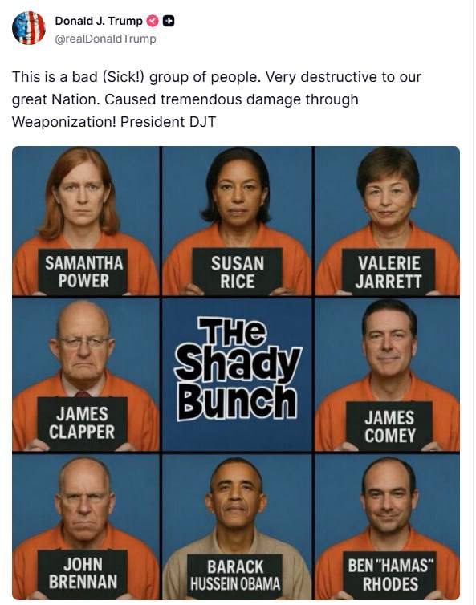

🔴 پست جدید ترامپ که یه لیست گذاشته و گفته اینا آدمای بد و مریضین که اوباما هم توشه

@IranianMinds

## IranianMinds — post 20669

🔴 خبرگزاری فارس :

بمولا این آمریکاییا تسلیم شدن و مقاماتشون‌ به ما گفتن به پست های ترامپ هم اصلا اهمیت ندید اینا همش‌ برای مردم آمریکاس و اینه که نشون بده شکست نخوردن.

@IranianMinds

## IranianMinds — post 20668

🔴 رشیدی کوچی ، نماینده مجلس :

تا هفته آینده اینترنت بین الملل برمیگرده.

@IranianMinds

## IranianMinds — post 20666

آقای علی کریمی ، آقای امید دانا ، شماها خودتون خارج از کشور‌ دارید زندگی‌ میکنید و‌ راحتید و مفت میخورید براتون هیچ اهمیتی نداره این دعواهای احمقانه ولی نمیدونید با این کاراتون چه ضربه ای میزنید به ایران‌‌ و این ملت حداقل یاد بگیرید تو‌ این شرایط مشکل دارید با هم خصوصی حلش کنید نه اینکه بیاید با این‌ کاراتون کل اتحاد مردم رو بهم‌ بزنید

خود شما احمقا که خارج از کشور زندگیتونو‌ میکنید راحتید این ملت ایرانن که تا آخر عمرمشون باید زجر بکشن از دست جمهوری اسلامی !

@IranianMinds

## IranianMinds — post 20665

🔴کانال ۱۴ اسرائیل:

اسرائیل رهبری ۸۶ ساله که از سرطان مرحله ۴ در حال مرگ بود را از بین نبرد تا ایالات متحده آمریکا با پسر ۵۶ ساله تندروتر او صلح کند.
با و یا بدون ایالات متحده، اسرائیل این رژیم تروریستی را به پایان خواهد رساند.

@IranianMinds

## IranianMinds — post 20664

🔴روزنامه اطلاعات:

غیبت مجتبی خامنه‌ای یک سلاح راهبردی است. دشمن خواهان حضور زودهنگام یک رهبر مجروح است.

@IranianMinds

## IranianMinds — post 20663

  

🔴پست جدید ترامپ.

@IranianMinds

## BBCPersian — post 281956

🔻خبرگزاری فرانسه: ترامپ گفته است که فقط در صورت برچیدن برنامه هسته‌ای ایران حاضر به امضای توافق است

یک مقام اسرائیلی که نامش ذکر نشد به خبرگزاری فرانسه گفت دونالد ترامپ به بنیامین نتانیاهو گفته است که اصرار خواهد داشت که توافق نهایی به پایان برنامه هسته‌ای ایران ختم شود.

بنابر این گزارش، این مقام به خبرگزاری فرانسه گفت رئیس‌جمهور آمریکا این را روشن کرده که در مذاکرات با ایران از خواسته خود برای برچیدن برنامه هسته‌ای ایران و خارج کردن تمام اورانیوم غنی‌شده از خاک ایران به هیچ‌وجه کوتاه نخواهد آمد و «هیچ توافقی را بدون این شرایط امضا نخواهد کرد.»

ایران گفته است که خروج اورانیوم غنی‌شده از ایران برای خط قرمز است.

دونالد ترامپ و بنیامین نتانیاهو شنبه تلفنی صحبت کردند و رئیس‌جمهور آمریکا گفت این مکالمه خوب پیش رفته است.

گزارش شده که نخست‌وزیر اسرائیل نگرانی‌های خود از توافق احتمالی با ایران «محترمانه» با اقای ترامپ در میان گذاشته است.

https://bbc.in/4nOuCnR
@BBCPersian

## BBCPersian — post 281955

🔻 ارتش اسرائیل دستور تخلیه ۱۰ شهر و روستا را در لبنان صادر کرد

آویخای ادرعی، سخنگوی عرب زبان ارتش اسرائیل، از ساکنان ۱۰ شهر و روستا در جنوب و شرق لبنان خواست خانه‌هایشان را پیش از عملیات نظامی علیه «اهداف حزب‌الله» ترک کنند.

او در شبکه اجتماعی ایکس نوشت: «برای حفظ امنیت خود، باید فورا خانه‌های خود را ترک کنید و از روستاها و شهرها حداقل ۱۰۰۰ متر در مناطق باز فاصله بگیرید.»

او نوشت این حملات «با توجه به نقض توافق آتش‌بس» توسط حزب‌الله انجام می‌شود.

سخنگوی ارتش اسرائیل گفته «هر کسی که در نزدیکی عناصر حزب‌الله، تاسیسات و وسایل جنگی آنها حضور داشته باشد، جان خود را به خطر می‌اندازد.»

اسرائیل از دیشب به حمله به جنوب لبنان ادامه داده که براساس گزارش‌ها چندین کشته و زخمی داشته است.

در یکی از این حملات یک تیم دفاع مدنی لبنان را در روستای عربصالیم هدف قرار گرفتند و جنگنده‌های اسرائیل یک ساختمان مسکونی را در شهر دویر بمباران کردند.

خبرگزاری رسمی لبنان هم گزارش کرده که در حمله صبح امروز اسرائیل به منطقه بازوریه، در شهرستان صور در جنوبی، یک نفر کشته و دو نفر زخمی شده‌اند.

به گفته این رسانه در حمله هوایی شب گذشته نیز، خانه‌ایدر شهر تورا، در همان شهرستان هدف قرار گرفت که یک کشته و دو زخمی داشت.

https://bbc.in/4nOuCnR
@BBCPersian

## BBCPersian — post 281954

🔻 دادگاهی در بحرین برای ۱۱ فرد متهم به همکاری با سپاه پاسداران حکم زندان صادر کرد

به گزارش خبرگزاری دولتی بحرین، این افراد به همکاری با سپاه برای انجام «اقدامات خصمانه و تروریستی» علیه بحرین متهم بودند و ۹ نفرشان به حبس ابد و سه نفرشان به سه سال حبس محکوم شدند.

براساس بیانیه‌ای که این خبرگزاری منتشر کرده است، متهمان در جمع‌آوری اطلاعات درباره مکان‌های حساس و تسهیل انتقال‌های مالی مرتبط با این فعالیت‌ها نقش داشته‌اند.

وزارت کشور بحرین در ۹ مه (۱۹ اردیبهشت) از بازداشت ۴۱ فرد «مرتبط با سپاه پاسداران» خبر داده بود.

وزارت کشور بحرین در آن زمان گفت که نیروهای امنیتی یک گروه وابسته به سپاه پاسداران را شناسایی کرده‌اند؛ همچنین گفته شد که تحقیقات دادستانی شامل مواردی هم است که به «همدلی» با حملات ایران مربوط می‌شود.

ایران پس از حملات آمریکا و اسرائیل و آغاز جنگ در ۲۸ فوریه (۹ اسفند)، حملاتی را علیه اهدافی در بحرین و دیگر کشورهای عربی حوزه خلیج فارس که میزبان پایگاه‌های نظامی آمریکا هستند، انجام داد.

https://bbc.in/4nOuCnR
@BBCPersian

## BBCPersian — post 281953

🔻استقبال رئیس کمیسیون اروپا از «پیشرفت» ایران و آمریکا در رسیدن به توافق

رئيس کميسيون اروپا از «پیشرفت‌ در مذاکرات ایران و آمریکا برای رسیدن به توافق» استقبال کرد.

اورزولا فون درلاین گفت: «ما به توافقی نیاز داریم که واقعا از شدت درگیری بکاهد، تنگه هرمز را بازگشایی کند و آزادی کامل ناوبری را تضمین کند.»

خانم فون درلاین در حسابش در شبکه اجتماعی ایکس نوشت که ایران «همچنین باید به اقدامات بی‌ثبات‌کننده خود در منطقه، چه مستقیم و چه از طریق نیروهای نیابتی، و همچنین حملات ناموجه و مکرر خود به همسایگانش پایان دهد.»

او تاکید کرد که اروپا به همکاری با شرکای بین‌المللی خود ادامه می‌دهد تا «از این فرصت برای یک راه‌‌حل دیپلماتیک پایدار استفاده کند.»
https://bbc.in/4nOuCnR
@BBCPersian

## idfinfarsi — post 11638

  <a href="telegram/content/idfinfarsi_11638_1779631727.mp4" target="_blank">🎬 Download video</a>

تصاویر از دوربین موشک: نیروهای یگان چندبعدی به هلاکت رساندن تروریست‌های حزب‌الله در جنوب لبنان ادامه می‌دهند

نیروهای یگان چندبعدی به فعالیت خود برای رفع تهدیدات علیه غیرنظامیان و نیروهای ارتش اسرائیل در جنوب لبنان ادامه می‌دهند.

دیروز (شنبه)، نیروهای این یگان چهار تروریست از سازمان تروریستی حزب‌الله را که وارد یک زیرساخت تروریستی شده بودند شناسایی کردند. بلافاصله پس از آن، نیروها این زیرساخت را هدف قرار داده و تروریست‌هایی را که از داخل آن فعالیت می‌کردند به هلاکت رساندند.

ارتش اسرائیل اکنون تصاویر بیشتری از دوربین موشک منتشر کرده است که در آن نیروهای یگان چندبعدی یک تروریست حزب‌الله را که سوار بر موتورسیکلت و در نزدیکی نیروها در حال فعالیت بود، به هلاکت رساندند.
همچنین، نیروها چندین تجهیزات دیده‌بانی را که توسط سازمان تروریستی حزب‌الله برای رصد و هدایت فعالیت‌ها علیه نیروهای ارتش اسرائیل استفاده می‌شد، شناسایی و مورد حمله قرار دادند.

## Dirty_Kids — post 390080

ترامپ گفته تا سال آقا نرسه عروسی اینا نمیرم.

@Dirty_Kids 👻

## Dirty_Kids — post 390079

  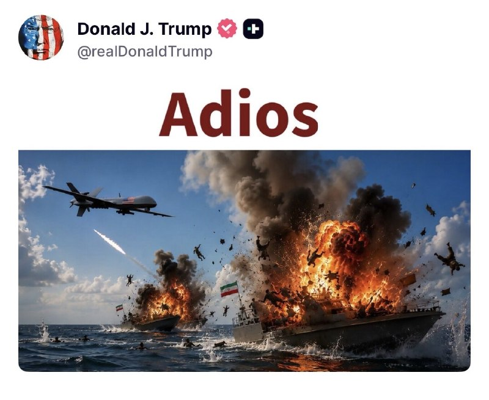

ترامپ AI به کون باز شروع کرد،
با AI همه رو زده، همه رو گاییده، نیرو دریایی رو نابود کرده

ما هم‌ می‌گیم باشه با AI گاییدی، اما ما رو.

@Dirty_Kids 👻

## Dirty_Kids — post 390078

  <a href="telegram/content/Dirty_Kids_390078_1779631729.mp4" target="_blank">🎬 Download video</a>

ویس لو رفته ترامپ تو پیوی مجتبی:

@Dirty_Kids 👻

## Dirty_Kids — post 390077

  <a href="telegram/content/Dirty_Kids_390077_1779631730.mp4" target="_blank">🎬 Download video</a>

لحظه‌ای که معاون رئیس جمهور آرژانتین نزدیک بود ترور شود، اما اسلحه در چند سانتی متر جلوی صورتش گیر کرد و زنده ماند...

@Dirty_Kids 👻

## Dirty_Kids — post 390076

🔴 کانال ۱۴ اسرائیل:

اسرائیل رهبری ۸۶ ساله که از سرطان مرحله ۴ در حال مرگ بود را از بین نبرد تا ایالات متحده آمریکا با پسر ۵۶ ساله تندروتر او صلح کند.
با و یا بدون ایالات متحده، اسرائیل این رژیم تروریستی را به پایان خواهد رساند.

@Dirty_Kids 👻

## Dirty_Kids — post 390074

  <a href="telegram/content/Dirty_Kids_390074_1779631731.mp4" target="_blank">🎬 Download video</a>

این ویدیو از جواد ظریف که مربوط به انتخاباته جدیدا وایرال شده

@Dirty_Kids 👻

## Dirty_Kids — post 390073

  <a href="telegram/content/Dirty_Kids_390073_1779631732.mp4" target="_blank">🎬 Download video</a>

ویدیو وایرال شده از دعوای دوتا دختر ایرانه که اختلاف قدی زیادی دارن و قد کوتاهه میزنه دهن قد بلنده رو سرویس میکنه :))))

@Dirty_Kids 👻

## Hranews — post 113135

  

فعالان حوزه اقتصاد دیجیتال ایران اعلام کردند که خسارت ناشی از قطع اینترنت و نبود زیرساخت‌های جایگزین، روزانه بین ۳ تا ۸ هزار میلیارد تومان برآورد شده و مجموع این خسارت‌ها در طی دو ماه اخیر به ۳۰۰ تا ۷۰۰ هزار میلیارد تومان می‌رسد.

گزارش‌های صنفی حاکی از آن است که اختلال در ارتباطات موجب افت فروش بیش از ۷۰ درصدی برخی کسب‌وکارهای دیجیتال شده است. تداوم این وضعیت پیامدهای منفی گسترده‌ای همچون، تعطیلی کسب‌وکارها و تعدیل نیرو، از دست رفتن سرمایه انسانی و افزایش مهاجرت نیروهای متخصص، افت شفافیت اقتصادی و گسترش فعالیت‌های غیررسمی در اقتصاد کشور را به دنبال خواهد داشت./ دنیای اقتصاد

↘️
@hranews_bot تماس ✉️ -  @Hranews  کانال هرانا 🆑

## manototv — post 105804

  <a href="telegram/content/manototv_105804_1779631735.mp4" target="_blank">🎬 Download video</a>

تجمع مقابل ساختمان بی‌بی‌سی فارسی در لندن، یکشنبه سوم خرداد ۱۴۰۵

## manototv — post 105803

  <a href="telegram/content/manototv_105803_1779631736.mp4" target="_blank">🎬 Download video</a>

فایننشال تایمز در گزارشی نوشت سپاه از یک شبکه تدارکاتی مستقر در امارات برای خرید تجهیزات پیشرفته ماهواره‌ای چینی مرتبط با برنامه پهپادی و موشکی خود استفاده کرده است.

بر اساس این گزارش، شرکتی به نام «تله‌سان» در راس‌الخیمه، انتقال حدود یک و هشت دهم تن تجهیزات ارتباطی ماهواره‌ای ساخت چین را از شانگهای به ایران، از مسیر دبی، تسهیل کرده است.

فایننشال تایمز نوشت مقصد نهایی این تجهیزات شرکت «ارتباطات فراگستر کیش» بوده که بنا بر این گزارش، با «گروه صنعتی سامان» مرتبط با نیروی هوافضای سپاه و تحریم‌شده از سوی آمریکا همکاری داشته است.

این روزنامه همچنین گزارش داد بخش پایانی انتقال محموله با یک کشتی ایرانی انجام شده که برای پنهان کردن مسیر خود، داده‌های موقعیت‌یابی نادرست مخابره کرده است.

## manototv — post 105802

  <a href="telegram/content/manototv_105802_1779631737.mp4" target="_blank">🎬 Download video</a>

دانیال مقدم، خواننده و رپر اعتراضی ایرانی، تتوی جدید صورتش با الهام از «God of War» را فقط به‌عنوان یک طرح انتخاب نکرده؛ این تتو برای او یادآور زخم‌ها، ترس‌ها، امیدها و روزهایی‌ست که نسلش از میان جنگ، درد و ناامیدی عبور کرده است.
رنگ سبز این طرح، نماد عشق، صلح، امید و زندگی‌ست؛ پیامی برای فراموش نکردن روزهایی که مردم با تمام زخم‌هایشان هنوز ایستاده‌اند و ایران را دوست دارند

## alonews — post 122355

  <a href="telegram/content/alonews_122355_1779631739.webm" target="_blank">🎬 Download video</a>

👈فیلد مارشال رضایی: اگر دشمن به تنگۀ هرمز حمله کند، ما محاصرۀ دریایی را می‌شکنیم و ممکن است از NPT خارج شویم.

✅ @AloNews خبر جنگ

## alonews — post 122354

  <a href="telegram/content/alonews_122354_1779631739.webm" target="_blank">🎬 Download video</a>

👈یک تحقیق از Financial Times نشان داد که سپاه پاسداران ایران از شبکه تأمین مستقر در امارات متحده عربی برای به دست آوردن تجهیزات پیشرفته ارتباطات ماهواره‌ای چینی مرتبط با برنامه‌های پهپادی ایران استفاده کرده است

✅ @AloNews خبر جنگ

## alonews — post 122353

  <a href="telegram/content/alonews_122353_1779631740.webm" target="_blank">🎬 Download video</a>

👈اتحادیه اروپا: به دلیل بسته شدن تنگه هرمز، تحریم‌های ایران را گسترش می‌دهیم

✅ @AloNews خبر جنگ

## alonews — post 122352

  <a href="telegram/content/alonews_122352_1779631740.webm" target="_blank">🎬 Download video</a>

👈پست جدید نتانیاهو با عکس ترامپ : ایران هرگز به سلاح هسته‌ای نخواهد داشت

✅ @AloNews خبر جنگ

## alonews — post 122351

  <a href="telegram/content/alonews_122351_1779631740.webm" target="_blank">🎬 Download video</a>

👈یک منبع نظامی اسرائیلی به نقل از یک شبکه تلویزیونی اسرائیل: اگر مجبور شویم برای مقابله با حزب‌الله از خط زرد عبور کنیم، این اتفاق خواهد افتاد.

✅ @AloNews خبر جنگ

## alonews — post 122350

  <a href="telegram/content/alonews_122350_1779631740.webm" target="_blank">🎬 Download video</a>

👈یک مقام اسرائیلی: ترامپ به نتانیاهو اطمینان داد که هرگونه توافقی با ایران شامل مسئله هسته ای نیز خواهد بود

✅ @AloNews خبر جنگ

## alonews — post 122349

  <a href="telegram/content/alonews_122349_1779631741.webm" target="_blank">🎬 Download video</a>

👈احتمال شنیده شدن صدای انفجار در جاسک

✅ @AloNews خبر جنگ

## alonews — post 122348

  <a href="telegram/content/alonews_122348_1779631741.webm" target="_blank">🎬 Download video</a>

👈 ترامپ به ABC: کل توافق فقط به من بستگی داره. فقط خبرهای خوب میاد. من هیچ معامله بدی نمیبندم

✅ @AloNews خبر جنگ

## alonews — post 122347

  <a href="telegram/content/alonews_122347_1779631741.webm" target="_blank">🎬 Download video</a>

👈رئیس دفتر المیادین در اسلام آباد: گزارش‌ها حاکی از آن است که قرار است فردا وزیر امور خارجه و فرمانده ارتش پاکستان اعلامیه‌ای صادر کنند..

✅ @AloNews خبر جنگ

## alonews — post 122346

  <a href="telegram/content/alonews_122346_1779631741.webm" target="_blank">🎬 Download video</a>

👈خبرگزاری معتبر فارس: مقامات آمریکایی به صورت خصوصی به تهران توصیه کردند که به خشم‌های پرزیدنت ترامپ و پست‌های شبکه تروث‌سوشال توجه نکنند، زیرا این موارد عمدتاً برای مخاطب داخلی آمریکایی طراحی شده‌اند و بازتاب‌دهنده موضع واشنگتن در مذاکرات جاری نیستند

✅ @AloNews خبر جنگ

## alonews — post 122345

  <a href="telegram/content/alonews_122345_1779631742.webm" target="_blank">🎬 Download video</a>

👈سه حمله هوایی اسرائیلی، شهر یومر الشافیق هدف قرار داد

✅ @AloNews خبر جنگ

## alonews — post 122344

  <a href="telegram/content/alonews_122344_1779631742.webm" target="_blank">🎬 Download video</a>

👈رادیو ارتش اسرائیل (IDF): نخست‌وزیر امشب ساعت 18:00 جلسه‌ای برگزار میکنه

✅ @AloNews خبر جنگ

## alonews — post 122343

  <a href="telegram/content/alonews_122343_1779631742.webm" target="_blank">🎬 Download video</a>

👈 «کاخ سفید امیدوار است که اختلافات نهایی در ساعات آینده حل شود و توافقی روز یکشنبه اعلام شود.

🔴ممکن است این توافق حتی ۶۰ روز کامل هم دوام نیاورد اگر آمریکا معتقد باشد ایران در مذاکرات هسته‌ای جدی نیست» - آکسیوس، به نقل از یک مقام آمریکایی.

✅ @AloNews خبر جنگ

## alonews — post 122342

  <a href="telegram/content/alonews_122342_1779631742.webm" target="_blank">🎬 Download video</a>

🔴فوری / مدیر دفتر شبکه المیادین در اسلام آباد: پاکستان ممکن است فردا چهار بند توافق را اعلام کند.

✅ @AloNews خبر جنگ

## alonews — post 122341

  <a href="telegram/content/alonews_122341_1779631743.webm" target="_blank">🎬 Download video</a>

👈گزارش اولیه: در چند منطقه در شمال اسرائیل، آژیرها‌ در مورد نفوذ پهپاد به صدا درآمد. جزئیات در حال بررسی است.

✅ @AloNews خبر جنگ

## alonews — post 122340

  <a href="telegram/content/alonews_122340_1779631743.webm" target="_blank">🎬 Download video</a>

👈شبکه ۱۲ عبری به نقل از منابع: اسرائیل کاملاً از پیشرفت مذاکرات آمریکا و ایران غافلگیر شده درحالیکه همه نهادهای امنیتی بازگشت جنگ را پیش‌بینی می‌کردند.

✅ @AloNews خبر جنگ

## alonews — post 122339

  <a href="telegram/content/alonews_122339_1779631743.webm" target="_blank">🎬 Download video</a>

👈احتمال شنیده شدن صدای انفجارهای کنترل شده در شهر بندرعباس

✅ @AloNews خبر جنگ

## alonews — post 122338

  <a href="telegram/content/alonews_122338_1779631743.webm" target="_blank">🎬 Download video</a>

👈نیرو دریایی سپاه پاسداران در بیانیه‌ای اعلام کرد طی 24 ساعت گذشته 33 کشتی تجاری با کسب اجازه این سازمان از تنگه هرمز عبور کردند.

✅ @AloNews خبر جنگ

## alonews — post 122337

  <a href="telegram/content/alonews_122337_1779631743.webm" target="_blank">🎬 Download video</a>

👈نورالدین الدغیر خبرنگار الجزیره در تهران: اطلاعات حاکی از آن است که یادداشت تفاهم شامل توقف جنگ در لبنان می‌شود، اما اسرائیل از این توافق رضایت ندارد و واشنگتن را تحت فشار قرار داده تا بندی به متن یادداشت تفاهم اضافه شود که به اسرائیل اجازه دهد تحت عنوان «اقدام نظامی در صورت وجود هرگونه تهدید» در لبنان عملیات انجام دهد.

🔴ایران با این موضوع مخالفت کرده و خواهان توقفی پایدار و دائمی برای جنگ است.

✅ @AloNews خبر جنگ

## alonews — post 122335

  <a href="telegram/content/alonews_122335_1779631744.mp4" target="_blank">🎬 Download video</a>

👈 جنگنده های ارتش اسرائیل(IDF) طی یک ساعت گذشته چندین حمله هوایی به نبطیه در جنوب لبنان انجام دادند.

✅ @AloNews خبر جنگ

---
📅 بروزرسانی: 1405/03/03 15:47
---

## VahidOOnLine — post 241929

  

مهدی کوهیان، مدیر حقوقی خانه سینما، تایید کرد شماری از سینماگران به دادسرای فرهنگ و رسانه احضار شده‌اند و در برخی احضاریه‌ها، اتهام «همکاری با دولت متخاصم» مطرح شده است.

کوهیان در گفت‌وگو با ایسنا گفت این احضارها به هومن سیدی و سعید روستایی محدود نیست و تعدادی دیگر از هنرمندان نیز با چنین پرونده‌هایی مواجه شده‌اند.

او به سنگینی این اتهام اشاره کرد و گفت طرح عنوان «همکاری با دولت متخاصم» علیه هنرمندان می‌تواند به «تعمیق شکاف اجتماعی» و آسیب به «انسجام داخلی» منجر شود.

کوهیان همچنین گفت استفاده از چنین اتهام سنگینی برای «کوچک‌ترین فعالیت حرفه‌ای»، مصاحبه، نقدهای درون‌گفتمانی یا حتی «لغزشی نابخردانه»، ارزش و اعتبار آن را در سطح ملی و بین‌المللی کاهش می‌دهد و به ضرر «امنیت واقعی کشور» است.
‌🏁 🇬🇧 IranintlTV

🤖 @VahidOOnLine

## VahidOOnLine — post 241928

  <a href="telegram/content/VahidOOnLine_241928_1779625062.mp4" target="_blank">🎬 Download video</a>

بر اساس ویدیوهای رسیده به ایران‌اینترنشنال، گروهی از بازنشستگان در شوش یکشنبه سوم خرداد تجمع کرده و شعار دادند: «تا حق خود نگیریم، از پا نمی‌نشینیم»
‌🏁 🇬🇧 IranintlTV

🤖 @VahidOOnLine

## VahidOOnLine — post 241927

  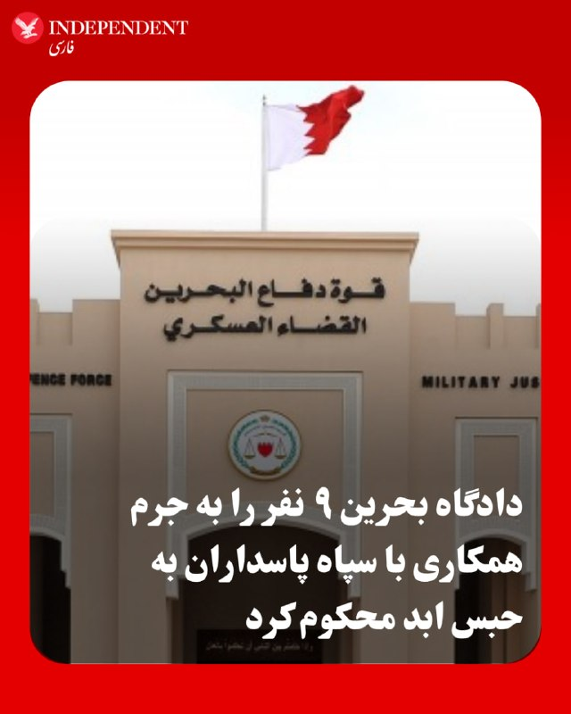

♦️خبرگزاری رویترز روز یکشنبه سوم خرداد به نقل از خبرگزاری دولتی بحرین گزارش داد که دادگاهی در این کشور ۹ متهم را به جرم «همکاری با سپاه پاسداران ایران» برای انجام آنچه «اقدامات خصمانه و تروریستی» علیه بحرین توصیف شده است، به حبس ابد و دو نفر دیگر را به سه سال زندان محکوم کرد.

در این بیانیه آمده است که متهمان در جمع‌آوری اطلاعات در مورد سایت‌های حساس و تسهیل نقل و انتقالات مالی مرتبط با آن دست داشته‌اند.

دادستانی بحرین اعلام کرده است برخی متهمان مامور رصد، تصویربرداری و جمع‌آوری اطلاعات از تاسیسات حیاتی بحرین بوده‌اند و اطلاعات را در اختیار سپاه پاسداران قرار می‌دادند.

در این بیانیه همچنین به استفاده از شبکه‌های مالی، صرافی و ارزهای دیجیتال برای تامین مالی این فعالیت‌ها اشاره شده است.

دادگاه دستور مصادره اقلام ضبط‌شده این افراد را صادر کرده است.
‌🇸🇦 Indypersian

🤖 @VahidOOnLine

## VahidOOnLine — post 241926

  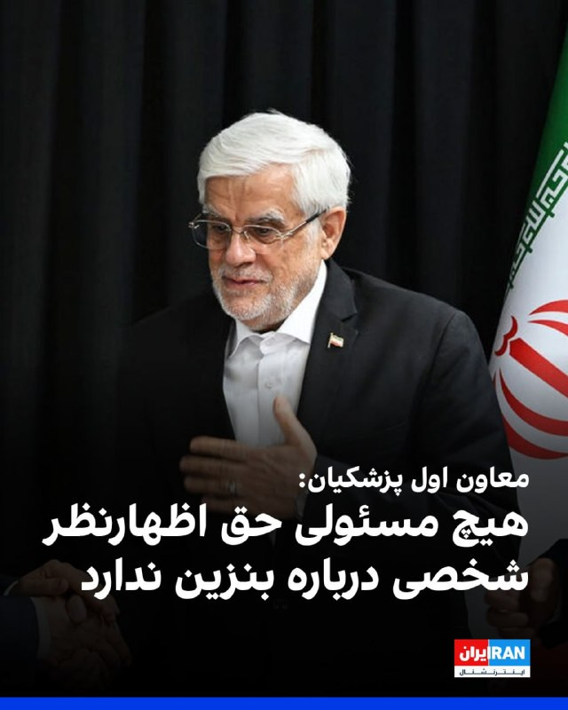

محمدرضا عارف، معاون اول پزشکیان گفت: «مدیران دولت تا زمانی که مباحث کارشناسی درباره مدیریت مصرف بنزین نهایی نشده است، حق اظهارنظر شخصی ندارند.»

او افزود: «اگر کسی از این دستور تخطی کند با او برخورد می‌شود، زیرا ابتدا باید نظرات کارشناسی بررسی و سپس جمع‌بندی نهایی حاصل شود.»

او ادامه داد: «مسئولان تا پیش از آن حق ندارند اظهارنظر شخصی کنند، چرا که نباید در جامعه التهاب یا نگرانی ایجاد شود.»
iranintl
‌🏁 🇬🇧 IranintlTV

🤖 @VahidOOnLine

## VahidOOnLine — post 241925

  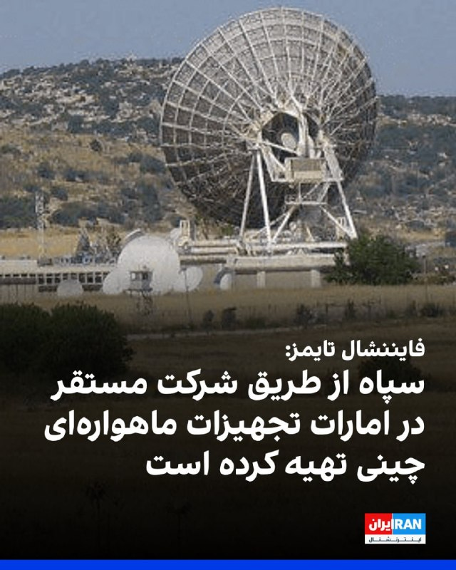

فایننشال تایمز گزارش داد سپاه پاسداران برای تامین تجهیزات پیشرفته ارتباطات ماهواره‌ای ساخت چین مورد استفاده در برنامه پهپادی خود، از شرکت «تل‌سان» مستقر در راس‌الخیمه امارات متحده عربی استفاده کرده است.

بر اساس این گزارش، تجهیزات یادشده برای «گروه صنعتی سامان» که تحت تحریم قرار دارد، تهیه شده‌اند.

فایننشال تایمز افزود شرکت تل‌سان در اواخر سال ۲۰۲۵ انتقال حدود دو تن تجهیزات آنتن ماهواره‌ای، از جمله یک آنتن موتوردار ۴.۵ متری ساخت شرکت چینی «استاروین»، را از شانگهای به ایران از طریق بندر جبل‌علی دبی هماهنگ کرده است.
iranintl
‌🏁 🇬🇧 IranintlTV

🤖 @VahidOOnLine

## VahidOOnLine — post 241924

🗣روایت شما از احتمال توافق میان آمریکا و جمهوری اسلامی- یکشنبه ۳ خرداد

🔹اگه بعد از توافق، ارزونی هم بشه یه آرامش گذراست. هرگز آرامش لحظه‌ای رو به نجات همیشگی ترجیح ندین.

🔹این چه وضعیه، همش منتظر ترامپ نشستین؟ مردم حتی حاضر نیستن اعتصاب کنن یا قبض پرداخت نکنن. خودمون باید یه کاری کنیم؛ مبارزه مدنی، اقتصادی و اعتصاب کنید.

🔹ترامپ با این جنگ و توافق، جمهوری اسلامی را «پررو» کرد و بدتر از آن ابهت آمریکا در دنیا رو از بین خواهد برد. ای کاش بدون توافق از جنگ خارج می‌شد.

🔹همه ناراحت و نگرانیم، ولی امیدتون رو از دست ندین. در آخر، این ما مردم هستیم که ایرانمون رو پس می‌گیریم.

🔹ترامپ، نتانیاهو به همه ما نوید آزادی دادن. گفتن کمکتون می‌کنیم. مردم و ۴۰ هزار کشته ابزاری شدن برای اینکه ترامپ و نتانیاهو به خواسته‌هاشون برسن. الان شرایط اقتصادی و اجتماعی مردم از آنچه که پیش از جنگ بود هم بدتر شده.

🔹نمی‌دانم چرا مردم ایران فکر می‌کنن کسی باید بیاد نجات‌شون بده. هرکسی دنبال منفعت خودشه. هیچ‌کس برای ما کاری نمی‌کند. خودمون باید خودمون رو نجات بدیم.

🔹واقعا ما مردم ساده هستیم که فکر می‌کنیم کشورهای دیگر دل‌شان برای ما می‌سوزه. این توافق ظلم به مردمه.

🔹انگار به حرف‌های ترامپ باید برعکس نگاه کرد. وقتی گفت توافق قطعی هست، جنگ شد. وقتی گفت زیرساخت می‌زنیم و ضرب‌الاجل داد، آتش‌بس شد. یا باید صبر کرد تا ببینیم چی میشه، یا باید دوباره متحد بشیم و بریم کف خیابون.

🔹چه توافقی؟ مگر ترامپ فراموش کرده که در همین آتش‌بس شرط این بود که جمهوری اسلامی ابتدا تنگه را باز کند، اما نکرد و در نهایت منجر به محاصره دریایی شد. حتی بار اول به قول‌شان عمل نکردند. پس چرا ترامپ دارد برای بار دوم گول‌شان را می‌خورد؟

🔹ما هنوز فراموش نکردیم. نمی‌توانیم در خیابون پا بگذاریم که پای‌مان بره رو خون عزیزان‌مان. ما انتقام همه این خون‌ها رو می‌گیریم. جمهوری اسلامی باید از این خشم ما مردم ایران بترسه.

🔹ما با جمهوری اسلامی اختلاف نداریم، پدرکشتگی داریم. چه توافق بشه و چه نشه ما ادامه داریم و تا سرنگونی ادامه می‌دهیم.
‌🏁 🇬🇧 IranintlTV

🤖 @VahidOOnLine

## VahidOOnLine — post 241923

  

♦️خبرگزاری مهر، وابسته به سازمان تبلیغات اسلامی روز یکشنبه اعلام کرد که «یک پهپاد اسرائیلی که کاربری جاسوسی و شناسایی داشت، با شلیک پدافند ارتش جمهوری اسلامی بر فراز استان هرمزگان سرنگون شد.»

به گزارش مهر، پهپاد هدف گرفته شده از نوع «اربیتر رادار گریز» بوده و «لاشه پهپاد متلاشی شده با همکاری ناوگروه دریابانی فراجای هرمزگان کشف شد.»

خبرگزاری مهر به تاریخ این اتفاق هیچ اشاره‌ای نکرده است.
‌🇸🇦 Indypersian

🤖 @VahidOOnLine

## VahidOOnLine — post 241922

  

مسعود پزشکیان در مصاحبه با خبرنگار صداوسیما گفت: «قطعا ما و تیم مذاکره‌کننده به هیچ‌وجه از عزت و سربلندی کشور کوتاه نخواهیم آمد اما آماده‌ایم به دنیا این اطمینان را بدهیم که ما به دنبال سلاح هسته‌ای نیستیم.»

او افزود: «ما به دنبال ناآرامی در منطقه نیستیم، ناآرام‌کننده منطقه اسرائیل است که به دنبال نقشه اسرائیل بزرگ است.»
iranintl
‌🏁 🇬🇧 IranintlTV

🤖 @VahidOOnLine

## VahidOOnLine — post 241921

  

دادستانی بحرین اعلام کرد دادگاه عالی کیفری این کشور در دو پرونده جداگانه، ۱۱ متهم را به اتهام «جاسوسی و همکاری اطلاعاتی» با سپاه پاسداران انقلاب اسلامی با هدف انجام «اقدامات تروریستی و خصمانه» علیه بحرین محاکمه کرده که ۹ متهم به حبس ابد محکوم شده‌اند.

همچنین دو متهم دیگر به سه سال زندان محکوم شدند و دادگاه دستور مصادره اقلام ضبط‌شده را صادر کرد. دادستانی بحرین اعلام کرد برخی متهمان مامور رصد، تصویربرداری و جمع‌آوری اطلاعات از تاسیسات حیاتی بحرین بوده‌اند و اطلاعات را در اختیار سپاه پاسداران قرار می‌دادند.

در این بیانیه همچنین به استفاده از شبکه‌های مالی، صرافی و ارزهای دیجیتال برای تامین مالی این فعالیت‌ها اشاره شده است.
iranintl
‌🏁 🇬🇧 IranintlTV

🤖 @VahidOOnLine

## VahidOOnLine — post 241920

  

♦️تسنیم، خبرگزاری وابسته به سپاه پاسداران، روز یکشنبه سوم خرداد در واکنش به «توافق احتمالی» ایران و آمریکا به نقل از یک منبع مطلع مدعی شد: «بدون آزادسازی اموال بلوکه شده ایران تفاهمی در کار نخواهد بود.»

تسنیم به نقل از یک منبع که نامی از او برده نشده است، نوشت: «اگرچه آمریکایی‌ها همواره در مسیر مذاکرات کارشکنی‌ کرده و تغییر موضع می‌دهند، اما ایران تاکید کرده است که بدون آزادسازی بخش مشخصی از اموال بلوکه شده ایران در همین گام اول و مشخص بودن سازوکار روشن برای ادامه‌ی تضمین‌شده آزادسازی همه اموال بلوکه شده، تفاهمی در کار نخواهد بود.»

به نوشته تسنیم اختلاف بر سر این مورد یکی از مسائلی است که موجب شده است فعلاً تفاهمی نهایی نشود.

این خبر درحالی منتشر شده است که مارکو روبیو، وزیر خارجه آمریکا روز یکشنبه اعلام کرد که طی ۴۸ ساعت گذشته «پیشرفت قابل‌توجهی» در مذاکرات و رایزنی‌های مرتبط با بحران تنگه هرمز و پرونده ایران حاصل شده و احتمال دارد تا ساعاتی دیگر اخبار مهم‌تری در این زمینه منتشر شود.
‌🇸🇦 Indypersian

🤖 @VahidOOnLine

## WithYashar — post 12328

  

پست جدید ترامپ که به اسپانیایی واژه خداحافظ را نوشته که بسیار طعنه آمیز است و معنیه «بری دیگه برنگردی» را میدهد.
@withyashar

## WithYashar — post 12327

تسنیم : بر اساس شنیده‌ها از متن تفاهم احتمالی، برخلاف گزارش یک رسانه آمریکایی که می‌گوید طبق تفاهم نامه «آتش بس میان ایران و آمریکا به مدت 60 روز تمدید می‌شود»، این عبارت در متن وجود ندارد و تعبیری که به کار گرفته شده است، اعلام پایان جنگ در همه جبهه‌ها از جمله لبنان است.
بر اساس متنی که هنوز نهایی نشده، در بازه 30 روزه موضوع تنگه هرمز و محاصره دریایی پیش برده می‌شود و زمان 60 روزه‌ای برای مذاکرات در مسئله هسته‌ای در نظر گرفته شده است.
@withyashar

## WithYashar — post 12326

روبیو: اهداف تعیین شده عملیات نظامی بدست آمده
@withyashar 😈

## WithYashar — post 12325

  <a href="telegram/content/WithYashar_12325_1779625071.mp4" target="_blank">🎬 Download video</a>

امیرحسین ثابتی نماینده تهران در تجمعات شبانه :

ممکنه جنگ یک ساعت دیگه باشه، ممکنه یک روز یا یک سال دیگه، اما قطعاً قطعی جنگ.
حتی اگه آمریکا تمام شرایط ما رو بپذیره و امضا کنه و تسلیم بشه، باز هم جنگ خواهیم داشت.
حتی اگر تیتر همه رسانه‌های غربی درباره نزدیک بودن مذاکره و توافق درست باشه ، من بازگشت جنگ رو تضمین می‌کنم.
@withyashar

## mwarmonitor — post 9633

🔸به گفته تایوان، یک کشتی گارد ساحلی چین پس از یک رویارویی پرتنش و تبادل هشدارهای لفظی میان دو گارد ساحلی، آب‌های اطراف جزایر پراتاسِ تایوان را ترک کرده است — رویترز.

@mwarmonitor

## mwarmonitor — post 9632

🔴پلیس ضدشورش ترکیه با شلیک گاز اشک‌آور وارد مقر اصلی حزب اپوزیسیون جمهوری‌خواه خلق (CHP) در آنکارا شد و پس از آنکه دادگاه کنگره حزبی سال ۲۰۲۳ را که در آن اوزگور اوزل انتخاب شده بود باطل کرد و کمال قلیچداراوغلو، رئیس پیشین حزب، را به سمت خود بازگرداند، رهبری برکنار‌شده حزب را از ساختمان بیرون کرد — رویترز

@mwarmonitor

## mwarmonitor — post 9631

🔴یک توافق احتمالی میان آمریکا و ایران شامل این خواهد بود که ایران تعهد دهد به دنبال ساخت سلاح هسته‌ای نرود، هرگونه غنی‌سازی جدید را متوقف کند و وارد مذاکراتی درباره کنار گذاشتن ذخایر اورانیوم بسیار غنی‌شده خود شود، به گزارش CNN به نقل از یک فرد مطلع از موضوع.

🔸جزئیات مربوط به نحوه خارج کردن این ذخایر و مدت زمان توقف موقت غنی‌سازی در مذاکرات آینده تعیین خواهد شد.

@mwarmonitor

## mwarmonitor — post 9630

🔸«بحرین ۹ نفر را به حبس ابد محکوم کرد به اتهام جاسوسی برای سپاه پاسداران انقلاب اسلامی ایران و طراحی اقدامات تروریستی»

@mwarmonitor

## mwarmonitor — post 9629

🔴 فاکس‌نیوز: توافق مورد انتظار شامل این است که نیروهای آمریکایی تا ۳۰ روز در نزدیکی ایران باقی بمانند.

@mwarmonitor

## FoxNewsTwitter — post 342183

  

Fox News (Twitter/X)

Anti-Israel agitators. Climate activists. Communist groups.

Experts warn a growing activist network united by anti-American sentiment — and in some cases China-linked funding networks — is now targeting America’s AI infrastructure and industrial power.

Fox News Digital found many of the same movements protesting side-by-side across the country, including groups opposing new AI data centers over energy and environmental concerns.

“What all of these protests have in common ... is that anti-American trend within them,” Hudson Institute fellow Zineb Riboua told Fox News Digital.

## pm_afshaa — post 91382

  <a href="telegram/content/pm_afshaa_91382_1779625074.webm" target="_blank">🎬 Download video</a>

🔴کانال 14 اسرائیل:
اسرائیل رهبر 86 ساله که از سرطان مرحله 4 در حال مرگ بود رو از بین نبرد تا آمریکا با پسر 56 ساله سالم‌تر و تندروتر او صلح کنه.
با آمریکا یا بدون آمریکا، اسرائیل این رژیم رو به پایان خواهد رسوند.

💧 Rainbet.com the #1 Non-KYC Crypto Casino & Sportsbook @rainbetcom

😁 @Pm_Afshaa

## pm_afshaa — post 91381

  <a href="telegram/content/pm_afshaa_91381_1779625075.webm" target="_blank">🎬 Download video</a>

🔴تسنیم به نقل از منبع آگاه:
آمریکایی‌ها درحال کارشکنی هستن و مسئله پول‌های بلوکه شده باعث شده فعلا توافقی نهایی نشه.

💧 Rainbet.com the #1 Non-KYC Crypto Casino & Sportsbook @rainbetcom

😁 @Pm_Afshaa

## pm_afshaa — post 91380

#مهم عزیزای دلم همگی الان چنل زاپاس‌مون رو جوین بشید کانال تحت ریپورت شدیده اگه چیزی شد زاپاس رو داشته باشید فعالیت میاد اونور
👇 https://t.me/Pm_Zapas https://t.me/Pm_Zapas

## pm_afshaa — post 91379

  <a href="telegram/content/pm_afshaa_91379_1779625076.webm" target="_blank">🎬 Download video</a>

🔴خبرگزاری مهر: پدافند هوایی ارتش یک پهپاد اسرائیلی رو بر فراز هرمزگان سرنگون کرد.

💧 Rainbet.com the #1 Non-KYC Crypto Casino & Sportsbook @rainbetcom

😁 @Pm_Afshaa

## pm_afshaa — post 91378

🔴فاکس نیوز: توافق با ایران مقرر می‌کند که نیروهای آمریکایی به مدت 30 روز پس از اجرای توافق در نزدیکی ایران باقی بمانن

💧 Rainbet.com the #1 Non-KYC Crypto Casino & Sportsbook @rainbetcom

😁 @Pm_Afshaa

## pm_afshaa — post 91377

🔴بحرین: 9 نفر به جرم جاسوسی برای سپاه پاسداران ایران به حبس ابد محکوم شدن

💧 Rainbet.com the #1 Non-KYC Crypto Casino & Sportsbook @rainbetcom

😁 @Pm_Afshaa

## DEJradio — post 4915

👑🎥 روز شنبه ۲۳ می در برلین، بار دیگر خیابان‌ها شاهد حضور ایرانیان آزادی‌خواه بود؛ تجمعی در مسیر کاخ صدراعظمی آلمان که با هدف رساندن صدای مردم ایران به گوش جهان برگزار شد. ایمان صفتی گزارش می‌دهد

#گزارش #همبستگی
@DEJradio

## DEJradio — post 4914

  

🔸
⭕️ خبرگزاری تسنیم، وابسته به سـ.ـپاه پاسداران گزارش داد اختلاف میان جمهوری اسلامی و آمریکا بر سر یکی دو بند از تفاهم‌نامه احتمالی همچنان ادامه دارد و به دلیل «مانع‌تراشی‌های آمریکا» هنوز موضوع نهایی نشده است.
همچنین رویترز به نقل از یک «منبع ارشد ایرانی» نوشت که تهران با تحویل ذخیره اورانیوم بسیار غنی شده خود موافقت نکرده و مسئله هسته‌ای بخشی از توافق اولیه نیست.

#مذاکرات #برنامه_اتمی
@DEJradio

## DEJradio — post 4913

  <a href="telegram/content/DEJradio_4913_1779625078.mp4" target="_blank">🎬 Download video</a>

🔸🎥 پاکستان؛ بیش از ۱۲۰ کشته و زخمی در حمله انتحاری به یک قطار

کشوری که در تامین امنیت داخلی خود سر تا پا مشکل دارد و با انواع بحران روبروست، میانجی مذاکره آمریکا و جمهوری اسلامی شده است.

#پاکستان
@DEJradio

## DEJradio — post 4912

⭕️ رئیس کمیسیون اروپا گفت جمهوری اسلامی باید اقدامات بی‌ثبات‌کننده را در منطقه متوقف کند

اورسولا فون‌ در لاین، رئیس کمیسیون اروپا تأکید کرد جمهوری اسلامی باید اقدامات بی‌ثبات‌کننده را در منطقه، چه مستقیما و چه از طریق نیروهای نیابتی متوقف کند.
اورسولا فون‌ در لاین همچنین از پیشرفت مذاکرات میان آمریکا و جمهوری اسلامی استقبال کرد. او گفت بازگشایی تنگۀ هرمز اهمیت دارد.
فون در لاین ادعا کرد اروپا با شرکای بین‌المللی برای دستیابی به راه‌حلی دیپلماتیک و پایدار در مورد جمهوری اسلامی همکاری می‌کند.
رئیس کمیسیون اروپا، گفت به توافقی نیاز است که واقعا به کاهش تنش‌ها منجر شود، تنگۀ هرمز را بازگشایی کند و آزادی کامل کشتیرانی را بدون دریافت عوارض و محدودیت تضمین کند.
او افزود حملات مکرر تهران به همسایگان باید پایان یابد.

#اتحادیه_اروپا #مذاکرات
@DEJradio

## IranIntlTV — post 338756

  

مهدی کوهیان، مدیر حقوقی خانه سینما، تایید کرد شماری از سینماگران به دادسرای فرهنگ و رسانه احضار شده‌اند و در برخی احضاریه‌ها، اتهام «همکاری با دولت متخاصم» مطرح شده است.

کوهیان در گفت‌وگو با ایسنا گفت این احضارها به هومن سیدی و سعید روستایی محدود نیست و تعدادی دیگر از هنرمندان نیز با چنین پرونده‌هایی مواجه شده‌اند.

او به سنگینی این اتهام اشاره کرد و گفت طرح عنوان «همکاری با دولت متخاصم» علیه هنرمندان می‌تواند به «تعمیق شکاف اجتماعی» و آسیب به «انسجام داخلی» منجر شود.

کوهیان همچنین گفت استفاده از چنین اتهام سنگینی برای «کوچک‌ترین فعالیت حرفه‌ای»، مصاحبه، نقدهای درون‌گفتمانی یا حتی «لغزشی نابخردانه»، ارزش و اعتبار آن را در سطح ملی و بین‌المللی کاهش می‌دهد و به ضرر «امنیت واقعی کشور» است.
https://iranintl.com/202605244549

## IranIntlTV — post 338755

  <a href="telegram/content/IranIntlTV_338755_1779625080.mp4" target="_blank">🎬 Download video</a>

بر اساس ویدیوهای رسیده به ایران‌اینترنشنال، گروهی از بازنشستگان در شوش یکشنبه سوم خرداد تجمع کرده و شعار دادند: «تا حق خود نگیریم، از پا نمی‌نشینیم»

## IranIntlTV — post 338754

  

محمدرضا عارف، معاون اول پزشکیان گفت: «مدیران دولت تا زمانی که مباحث کارشناسی درباره مدیریت مصرف بنزین نهایی نشده است، حق اظهارنظر شخصی ندارند.»

او افزود: «اگر کسی از این دستور تخطی کند با او برخورد می‌شود، زیرا ابتدا باید نظرات کارشناسی بررسی و سپس جمع‌بندی نهایی حاصل شود.»

او ادامه داد: «مسئولان تا پیش از آن حق ندارند اظهارنظر شخصی کنند، چرا که نباید در جامعه التهاب یا نگرانی ایجاد شود.»
iranintl.com/202605243568

## IranIntlTV — post 338753

  

فایننشال تایمز گزارش داد سپاه پاسداران برای تامین تجهیزات پیشرفته ارتباطات ماهواره‌ای ساخت چین مورد استفاده در برنامه پهپادی خود، از شرکت «تل‌سان» مستقر در راس‌الخیمه امارات متحده عربی استفاده کرده است.

بر اساس این گزارش، تجهیزات یادشده برای «گروه صنعتی سامان» که تحت تحریم قرار دارد، تهیه شده‌اند.

فایننشال تایمز افزود شرکت تل‌سان در اواخر سال ۲۰۲۵ انتقال حدود دو تن تجهیزات آنتن ماهواره‌ای، از جمله یک آنتن موتوردار ۴.۵ متری ساخت شرکت چینی «استاروین»، را از شانگهای به ایران از طریق بندر جبل‌علی دبی هماهنگ کرده است.
iranintl.com/202605248444

## IranIntlTV — post 338752

  <a href="telegram/content/IranIntlTV_338752_1779625085.mp4" target="_blank">🎬 Download video</a>

🔻مهدی تاج، رییس فدراسیون فوتبال، خبر داد کمپ تیم ملی فوتبال از آریزونای آمریکا به کمپی در شهر تیخوانا مکزیک منتقل شده است.

🔹مهدی رستم‌پور، خبرنگار ورزشی معتقد است که این ترفندی از جمهوری اسلامی برای فرار از ایرانیان آمریکا بوده است.

@iranintltvsport

## IranIntlTV — post 338751

  <a href="telegram/content/IranIntlTV_338751_1779625087.mp4" target="_blank">🎬 Download video</a>

یک شهروند با ارسال پیامی به ایران‌اینترنشنال می‌گوید: «اگر ترامپ توافق کد بزرگ‌ترین خیانت را در حق مردم ایران کرده است. امیدواریم پایان این شب سیه، سپید باشد.»

## IranIntlTV — post 338750

  <a href="telegram/content/IranIntlTV_338750_1779625089.mp4" target="_blank">🎬 Download video</a>

مروری بر روزنامه‌های ایران، یکشنبه ۳ خرداد، با مجتبی هاشمی، روزنامه‌نگار
@iranintltv

## IranIntlTV — post 338749

🗣روایت شما از احتمال توافق میان آمریکا و جمهوری اسلامی- یکشنبه ۳ خرداد

🔹اگه بعد از توافق، ارزونی هم بشه یه آرامش گذراست. هرگز آرامش لحظه‌ای رو به نجات همیشگی ترجیح ندین.

🔹این چه وضعیه، همش منتظر ترامپ نشستین؟ مردم حتی حاضر نیستن اعتصاب کنن یا قبض پرداخت نکنن. خودمون باید یه کاری کنیم؛ مبارزه مدنی، اقتصادی و اعتصاب کنید.

🔹ترامپ با این جنگ و توافق، جمهوری اسلامی را «پررو» کرد و بدتر از آن ابهت آمریکا در دنیا رو از بین خواهد برد. ای کاش بدون توافق از جنگ خارج می‌شد.

🔹همه ناراحت و نگرانیم، ولی امیدتون رو از دست ندین. در آخر، این ما مردم هستیم که ایرانمون رو پس می‌گیریم.

🔹ترامپ، نتانیاهو به همه ما نوید آزادی دادن. گفتن کمکتون می‌کنیم. مردم و ۴۰ هزار کشته ابزاری شدن برای اینکه ترامپ و نتانیاهو به خواسته‌هاشون برسن. الان شرایط اقتصادی و اجتماعی مردم از آنچه که پیش از جنگ بود هم بدتر شده.

🔹نمی‌دانم چرا مردم ایران فکر می‌کنن کسی باید بیاد نجات‌شون بده. هرکسی دنبال منفعت خودشه. هیچ‌کس برای ما کاری نمی‌کند. خودمون باید خودمون رو نجات بدیم.

🔹واقعا ما مردم ساده هستیم که فکر می‌کنیم کشورهای دیگر دل‌شان برای ما می‌سوزه. این توافق ظلم به مردمه.

🔹انگار به حرف‌های ترامپ باید برعکس نگاه کرد. وقتی گفت توافق قطعی هست، جنگ شد. وقتی گفت زیرساخت می‌زنیم و ضرب‌الاجل داد، آتش‌بس شد. یا باید صبر کرد تا ببینیم چی میشه، یا باید دوباره متحد بشیم و بریم کف خیابون.

🔹چه توافقی؟ مگر ترامپ فراموش کرده که در همین آتش‌بس شرط این بود که جمهوری اسلامی ابتدا تنگه را باز کند، اما نکرد و در نهایت منجر به محاصره دریایی شد. حتی بار اول به قول‌شان عمل نکردند. پس چرا ترامپ دارد برای بار دوم گول‌شان را می‌خورد؟

🔹ما هنوز فراموش نکردیم. نمی‌توانیم در خیابون پا بگذاریم که پای‌مان بره رو خون عزیزان‌مان. ما انتقام همه این خون‌ها رو می‌گیریم. جمهوری اسلامی باید از این خشم ما مردم ایران بترسه.

🔹ما با جمهوری اسلامی اختلاف نداریم، پدرکشتگی داریم. چه توافق بشه و چه نشه ما ادامه داریم و تا سرنگونی ادامه می‌دهیم.

## IranIntlTV — post 338748

  

مسعود پزشکیان در مصاحبه با خبرنگار صداوسیما گفت: «قطعا ما و تیم مذاکره‌کننده به هیچ‌وجه از عزت و سربلندی کشور کوتاه نخواهیم آمد اما آماده‌ایم به دنیا این اطمینان را بدهیم که ما به دنبال سلاح هسته‌ای نیستیم.»

او افزود: «ما به دنبال ناآرامی در منطقه نیستیم، ناآرام‌کننده منطقه اسرائیل است که به دنبال نقشه اسرائیل بزرگ است.»
iranintl.com/202605248136

## IranIntlTV — post 338747

  <a href="telegram/content/IranIntlTV_338747_1779625092.mp4" target="_blank">🎬 Download video</a>

بر اساس گزارش رسانه‌ها، تفاهم احتمالی جمهوری اسلامی و آمریکا شامل بازگشایی تنگه هرمز در ازای لغو محاصره دریایی، امکان فروش نفت و آزادسازی بخشی از منابع ارزی مسدودشده ایران است.

ارزیابی آرش آزرمی، دبیر بخش اقتصادی ایران‌اینترنشنال

@iranintltv

## IranIntlTV — post 338746

  

دادستانی بحرین اعلام کرد دادگاه عالی کیفری این کشور در دو پرونده جداگانه، ۱۱ متهم را به اتهام «جاسوسی و همکاری اطلاعاتی» با سپاه پاسداران انقلاب اسلامی با هدف انجام «اقدامات تروریستی و خصمانه» علیه بحرین محاکمه کرده که ۹ متهم به حبس ابد محکوم شده‌اند.

همچنین دو متهم دیگر به سه سال زندان محکوم شدند و دادگاه دستور مصادره اقلام ضبط‌شده را صادر کرد. دادستانی بحرین اعلام کرد برخی متهمان مامور رصد، تصویربرداری و جمع‌آوری اطلاعات از تاسیسات حیاتی بحرین بوده‌اند و اطلاعات را در اختیار سپاه پاسداران قرار می‌دادند.

در این بیانیه همچنین به استفاده از شبکه‌های مالی، صرافی و ارزهای دیجیتال برای تامین مالی این فعالیت‌ها اشاره شده است.
iranintl.com/202605242725

## IranIntlTV — post 338745

  <a href="telegram/content/IranIntlTV_338745_1779625095.mp4" target="_blank">🎬 Download video</a>

بسته شدن مسیرهای اصلی تجاری در تنگه هرمز، پای قایق‌های تندرو و شناورهای باری ایرانی را به بندر خصب عمان باز کرده است. این بندر کوچک، در فاصله حدود ۳۵ کیلومتری ایران، حالا به یکی از راه‌های تهران برای دور زدن محاصره دریایی آمریکا تبدیل شده است.

انتقال کالا از امارات به بندر خصب و سپس به ایران، هزینه واردات را تا شش برابر افزایش داده است.
@iranintltv

## Shin_Persian — post 6198

  

Shin ✓ @hey_itsmyturn Sun, 24 May 2026 11:33:47 UTC IRGC-owned Tasnim News: """ The term "ceasefire extension" is not included in the agreement. According to reports obtained by Tasnim regarding the potential agreement, and contrary to a claim by an American…

## Shin_Persian — post 6197

Shin ✓ @hey_itsmyturn
Sun, 24 May 2026 11:33:47 UTC

IRGC-owned Tasnim News:
"""
The term "ceasefire extension" is not included in the agreement.

According to reports obtained by Tasnim regarding the potential agreement, and contrary to a claim by an American media outlet suggesting a 60-day extension of the "ceasefire between Iran and the U.S." within the document, this phrase is absent. The language used instead signifies a declaration of the cessation of hostilities on all fronts, including Lebanon.

The draft text, which is not yet finalized, allocates a 30-day period for discussions concerning the Strait of Hormuz and naval blockade, and a 60-day period has been designated for nuclear negotiations.
"""

#Iran

فارسی

خبرگزاری تسنیم متعلق به سپاه پاسداران انقلاب اسلامی (IRGC):
"""
عبارت «تمدید آتش‌بس» در متن توافق گنجانده نشده است.

طبق گزارش‌های دریافتی تسنیم در خصوص توافق احتمالی، و برخلاف ادعای یک رسانه آمریکایی مبنی بر پیشنهاد تمدید ۶۰ روزه «آتش‌بس میان ایران و آمریکا» در این سند، چنین عبارتی وجود ندارد. در مقابل، ادبیات به‌کار رفته به معنای اعلام توقف تخاصمات در تمامی جبهه‌ها، از جمله لبنان، است.

در پیش‌نویس این متن که هنوز نهایی نشده است، یک بازه زمانی ۳۰ روزه برای گفتگوها پیرامون تنگه هرمز و محاصره دریایی در نظر گرفته شده و همچنین یک بازه ۶۰ روزه برای مذاکرات هسته‌ای تعیین شده است.
"""

#Iran

𝕏 · @shin_persian

## FarsiVOA — post 218518

  

محمدرضا عارف، معاون اول رئیس‌جمهور به مدیران دولتی دستور داد تا پیش از نهایی شدن بررسی‌های کارشناسی درباره مدیریت مصرف بنزین، هیچ مسئولی حق اظهارنظر شخصی در این زمینه ندارد.

او هشدار داد در صورت تخطی از این دستور، با فرد خاطی برخورد خواهد شد؛ زیرا به گفته او، اظهارنظرهای زودهنگام می‌تواند در جامعه التهاب و نگرانی ایجاد کند.

این دستور در شرایطی صادر شده که شایعات درباره افزایش قیمت بنزین، تغییر سهمیه‌ها و تشدید سیاست‌های مدیریت مصرف بالا گرفته است.

همزمان، ناترازی بنزین و فاصله میان مصرف داخلی و توان تأمین سوخت، نگرانی‌ها درباره کمبود احتمالی یا فشار بیشتر بر شبکه توزیع را افزایش داده است.

عارف گفت دولت تلاش می‌کند تصمیم‌ها به‌گونه‌ای اتخاذ شود که معیشت مردم آسیب نبیند، اما واقعیات اقتصادی کشور و تحولات اخیر نیز باید در نظر گرفته شود.
@FarsiVOA

## FarsiVOA — post 218517

  

خبرگزاری رسمی بحرین گزارش داد که یک دادگاه این کشور، ۹ متهم را به حبس ابد و دو نفر دیگر را به سه سال زندان محکوم کرده است. بر اساس این گزارش، این افراد به همکاری با سپاه پاسداران برای انجام «اقدامات خصمانه و تروریستی» علیه بحرین متهم بودند.

در بیانیه‌ای که روز یکشنبه منتشر شد، آمده است که متهمان در جمع‌آوری اطلاعات درباره مکان‌های حساس و تسهیل انتقال‌های مالی مرتبط نقش داشته‌اند.

پیشتر وزارت کشور بحرین اعلام کرد که ۴۱ نفر را که با سپاه پاسداران مرتبط بوده‌اند، بازداشت کرده است.

این وزارتخانه ۱۹ اردیبهشت در بیانیه‌ای که در شبکه‌های اجتماعی منتشر شد، نوشت که این افراد اعضای هسته اصلی «یک سازمان مرتبط با سپاه پاسداران» و مدافع تئوری «ولایت فقیه» بوده‌اند.
@FarsiVOA

## FarsiVOA — post 218516

  

مقام‌های ترکیه به پلیس این کشور دستور دادند اوزگور اوزل، رهبر حزب جمهوری‌خواه خلق، حزب اصلی اپوزیسیون را از مقر این حزب اخراج کند.

به گزارش رویترز، فرمانداری آنکارا روز یکشنبه این دستور را برای برکناری اعضای حزب جمهوری‌خواه خلق که با اوزگور اوزل، رهبر برکنار‌شده، همسو هستند صادر کرد و پلیس ضد شورش و گروهی از افراد در برابر درهای مقر حزب جمهوری‌خواه خلق در پایتخت ترکیه تجمع کردند.

یک دادگاه تجدیدنظر ترکیه روز پنج‌شنبه نتایج کنگره حزب جمهوری‌خواه خلق در سال ۲۰۲۳ را که اوزل در آن به عنوان رهبر انتخاب شده بود، به دلیل «تخلفات نامشخص» باطل کرد.

این دادگاه به جای اوزل، کمال قلیچداراوغلو، رئیس پیشین حزب جمهوری‌خواه خلق را که در انتخابات همان سال از رئیس‌جمهور طیب اردوغان شکست خورد، دوباره به این سمت بازگرداند.

اوزل روز شنبه خواست هرچه سریع‌تر کنگره جدیدی برای حزب برگزار شود، اما قلیچداراوغلو گفت کنگره در «زمانی مناسب» برگزار خواهد شد.
@FarsiVOA

## FarsiVOA — post 218515

  

تایمز اسرائیل به نقل از یک مقام ارشد اسرائیلی گزارش داد دونالد ترامپ، رئیس‌جمهور ایالات متحده آمریکا، در تماس تلفنی با بنیامین نتانیاهو به او اطمینان داده که توافق نهایی با جمهوری اسلامی، برنامه هسته‌ای تهران را به‌طور کامل برمی‌چیند و همه اورانیوم غنی‌شده از قلمرو جمهوری اسلامی خارج خواهد شد.

بر اساس این گزارش، ترامپ تأکید کرده در مذاکرات بر خواسته دیرینه خود برای برچیدن برنامه هسته‌ای جمهوری اسلامی و خارج شدن تمام ذخایر اورانیوم غنی‌شده پافشاری خواهد کرد و بدون تحقق این شروط، توافق نهایی را امضا نمی‌کند.

این مقام اسرائیلی همچنین گفته واشنگتن، اسرائیل را در جریان مذاکرات بر سر تفاهم‌نامه‌ای برای بازگشایی تنگه هرمز و ورود به گفت‌وگوهای نهایی درباره موارد اختلافی قرار داده است.

نتانیاهو نیز در این تماس گفته اسرائیل آزادی عمل خود را در برابر تهدیدها در همه جبهه‌ها حفظ خواهد کرد؛ موضعی که به گفته این مقام، با حمایت دوباره ترامپ همراه شده است.
@FarsiVOA

## FarsiVOA — post 218514

  

اورزولا فون‌درلاین، رئیس کمیسیون اروپا، از بروز نشانه‌های پیشرفت در مذاکرات بر سر توافق احتمالی میان ایالات متحده و جمهوری اسلامی استقبال کرد.

فون‌درلاین یکشنبه در شبکه ایکس نوشت: «من از پیشرفت به سوی توافقی میان آمریکا و [حکومت] ایران استقبال می‌کنم. ما به توافقی نیاز داریم که واقعاً به کاهش تنش‌ها منجر شود، تنگه هرمز را دوباره باز کند و آزادی کامل کشتیرانی بدون پرداخت عوارض را تضمین کند.»

او همچنین تأکید کرد: «نباید به ایران اجازه داده شود که سلاح هسته‌ای توسعه دهد.»

دونالد ترامپ، رئیس‌جمهوری آمریکا، پیش‌تر گفته است که واشنگتن و جمهوری اسلامی «تا حد زیادی» بر سر یک یادداشت تفاهم مذاکره کرده‌اند.
@FarsiVOA

## FarsiVOA — post 218513

  

خبرگزاری رویترز به نقل از یک مقام ارشد جمهوری اسلامی گزارش داد که اگر شورای عالی امنیت ملی این کشور یادداشت تفاهم با آمریکا را تأیید کند، این متن سپس برای تأیید نهایی به مجتبی خامنه‌ای، رهبر جمهوری اسلامی، ارسال خواهد شد.

مجتبی خامنه‌ای از زمان اعلام نامش به عنوان رهبر جدید جمهوری اسلامی در انظار عمومی ظاهر نشده و فیلم یا فایل صوتی از او نیز نیز پخش نشده است.

پیشتر رسانه‌های داخل ایران ادعا کرده بودند که مجتبی خامنه‌ای، رهبر جمهوری اسلامی، دستور داده که اورانیوم نزدیک به درجه تسلیحاتی نباید به خارج از کشور ارسال شود.

اما دو مقام آمریکایی به نیویورک تایمز گفته‌اند که جمهوری اسلامی به عنوان بخشی از توافقی با ایالات متحده برای پایان دادن به جنگ، پذیرفته است ذخیره اورانیوم با غنای بالای خود را واگذار کند.

پرزیدنت ترامپ که بارها بر اراده آمریکا برای جلوگیری از دستیابی جمهوری اسلامی به سلاح اتمی تأکید کرده، اعلام کرد که توافق احتمالی، چنین هدفی را در نظر گرفته، در غیر این صورت «حتی در مورد آن صحبت نمی‌کرد.»
@FarsiVOA

## FarsiVOA — post 218512

🔺سرافراز: تجهیزات قطع دائمی اینترنت از چین خریداری شده است

▪️رئیس پیشین سازمان صداوسیما و عضو شورای عالی فضای مجازی، گفته است که تجهیزات لازم برای قطع دائمی اینترنت جهانی و ارائه دسترسی محدود به گروهی خاص، از چین خریداری و وارد ایران شده است.

▪️به گفته او، همان تجهیزاتی که برای قطع اینترنت و ارائه دسترسی محدود خریداری شده، اکنون به فرصتی برای فروش اینترنت گران‌قیمت به گروه‌های خاص تبدیل شده است.

▪️سرافراز پیشتر در گفت‌وگویی مسئول نهایی قطع اینترنت، سیم‌کارت سفید و اینترنت طبقاتی را «کسانی در بالاترین رده‌های حکمرانی» دانسته بود که به گفته او تصمیم‌سازی و تصمیم‌گیری می‌کنند، اما پاسخگو نیستند.

⬇️ بیشتر بخوانید:
https://ir.voanews.com/a/8153274.html

## FarsiVOA — post 218511

🔺کاهش ۵۰ درصدی تقاضای گوشت قرمز؛ سفره ایرانی از پروتئین تا لبنیات و برنج کوچک‌تر شد

▪️یک مسئول صنعت گوشت ایران گفته است که امسال «نیاز به واردات گوشت قرمز نداریم» چون تولید داخل می‌تواند نیاز بازار را پوشش دهد؛ اما دلیل اصلی این وضعیت، نه افزایش تولید، بلکه کاهش شدید تقاضاست.

▪️او گفته است که بازار تقاضای گوشت قرمز نسبت به سال گذشته حدود ۵۰ درصد کاهش یافته و به همین دلیل جمعیت دام داخل برای تأمین نیاز فعلی بازار کافی است.

▪️این کاهش فقط در گوشت قرمز دیده نمی‌شود. به گفته این مقام مسئول آمار جوجه‌ریزی فروردین ۱۴۰۴ حدود ۱۶۰ میلیون قطعه بوده، اما در فروردین ۱۴۰۵ به حدود ۱۰۰ میلیون قطعه رسیده؛ یعنی تولید گوشت مرغ هم بین ۳۰ تا ۴۰ درصد کاهش یافته است.

⬇️ بیشتر بخوانید:
https://ir.voanews.com/a/8153272.html

## FarsiVOA — post 218510

🔺وزیر نیرو: ۳۰۰ دشت کشور درگیر فرونشست است

▪️وزیر نیرو در دولت جمهوری اسلامی می‌گوید ۳۰۰ دشت کشور با پدیده فرونشست زمین مواجه‌ است و بیش از ۴۰۰ دشت نیز در وضعیت ممنوعه یا ممنوعه بحرانی قرار دارد.

▪️کارشناسان محیط زیست برداشت بی‌رویه از ذخایر زیزمینی آب را عامل فرونشست دشت‌ها و شهرهای ایران اعلام کرده‌اند.

▪️آمارهای سازمان ملل متحد نشان می‌دهد ایران در خاورمیانه بیشترین میزان برداشت از منابع آب زیرزمینی را دارد و حتی در رتبه بندی جهانی، مقام پنجم را دارد.

▪️داده‌های شرکت مدیریت منابع آب ایران نشان می‌دهد استان‌های اصفهان، کرمان، فارس، خراسان رضوی و تهران که بیشترین آسیب را از فرونشست تجربه کرده‌اند، در صدر برداشت آب از منابع زیرزمینی قرار دارند.

⬇️ بیشتر بخوانید:
https://ir.voanews.com/a/8153271.html

## FarsiVOA — post 218509

  <a href="telegram/content/FarsiVOA_218509_1779625103.mp4" target="_blank">🎬 Download video</a>

لحظه اصابت موشک‌های کروز به مرکز شهر کی‌یف و انهدام چندین موشک در آسمان در پی حملات شبانه روسیه؛

تصاویر منتشر شده، لحظه اصابت موشک‌های کروز به مرکز شهر کی‌یف را در جریان حملات گسترده پهپادی و موشکی شبانه توسط ارتش روسیه نشان می‌دهند.

این تصاویر جدید، اصابت بارانی از موشک‌های کروز پیشرفته ارتش روسیه به اهداف غیرنظامی در کی‌یف و انهدام چندین موشک دیگر توسط پدافند هوایی اوکراین در آسمان پایتخت را ثبت کرده‌اند.
@FarsiVOA

## DW_Farsi — post 125092

📸 تحریم‌ها، محرومیت‌ها و غیاب‌ها در جام‌های جهانی فوتبال در گذر زمان

🔺 گزارشی از شهرام احدی

اگر چه تیم ملی فوتبال ایران بلیط حضور در جام جهانی ۲۰۲۶ را گرفته، اما گمانه‌زنی‌ها در مورد غیاب یا حضور ایران پایان نیافته است. در تاریخ جام جهانی فوتبال کشورهای مختلفی به علت تحریم، محرومیت یا علل دیگر غایب بوده‌اند.

@dw_farsi

## DW_Farsi — post 125091

  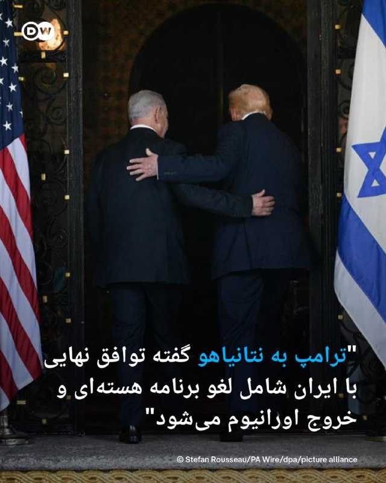

🔶 "ترامپ به نتانیاهو گفته توافق نهایی با ایران شامل لغو برنامه هسته‌ای و خروج اورانیوم می‌شود"

برخی رسانه‌های اسرائیل به نقل از یک مقام ارشد این کشور گزارش داده‌اند که دونالد ترامپ، رئیس جمهور آمریکا در تماس تلفنی شامگاه شنبه با بنیامین نتانیاهو، به او اطمینان داده که توافق نهایی با ایران منجر به برچیده‌ شدن کامل برنامه هسته‌ای ایران خواهد شد.

روزنامه "تایمز اسرائیل" نوشت این مقام که نامش فاش نشده در بیانیه‌ای اظهار داشت، ترامپ در این گفت‌وگو "واضح ساخت که در مذاکرات [با تهران] بر خواسته دیرینه خود مبنی بر برچیده‌شدن برنامه هسته‌ای ایران و خروج تمام اورانیوم غنی‌شده از این خاک این کشور قاطعانه پافشاری خواهد کرد و بدون تحقق این شروط، هیچ توافق نهایی را امضا نخواهد کرد".

در این بیانیه آمده است که آمریکا، اسرائیل را در جریان مذاکرات "درباره یک یادداشت تفاهم برای بازگشایی تنگه هرمز و ورود به مذاکرات برای دستیابی به توافق نهایی درباره موارد باقی‌مانده مورد اختلاف" قرار داده است.

به گفته این مقام اسرائیلی نتانیاهو به ترامپ گفته است که اسرائیل "آزادی عمل خود در برابر همه تهدیدها در تمامی جبهه‌ها از جمله لبنان" را حفظ خواهد کرد و رئیس جمهور آمریکا نیز "حمایت خود را از این رویکرد اعلام کرده است".

وبسایت خبری "اکسیوس" پیش‌تر گزارش داده بود که توافق در حال شکل‌گیری میان تهران و واشنگتن تصریح می‌کند که درگیری میان اسرائیل و حزب‌الله لبنان پایان خواهد یافت اما اسرائیل اجازه خواهد داشت تا در صورتی که حزب‌الله آغازگر اقداماتی تحریک‌آمیز یا حملاتی علیه این کشور باشد، این گروه را هدف قرار دهد.

از سوی دیگر خبرگزاری رویترز به نقل از یک مقام ارشد ایرانی گزارش کرده است که تهران در توافق اولیه، با واگذاری اورانیوم غنی‌شده با درصد بالا، مخالفت کرده است.

@dw_farsi

## DW_Farsi — post 125090

  

🔶 روبیو: احتمال دارد در چند ساعت آینده خبرهای خوبی درباره توافق با ایران اعلام شود

مارکو روبیو، وزیر خارجه آمریکا، که برای دیدار با مقامات هند به این کشور سفر کرده، به خبرنگاران گفت که ممکن است اواخر روز یکشنبه ۲۴ مه (سوم خرداد) درباره توافقی با ایران که می‌تواند به طور رسمی به جنگ در خاورمیانه پایان دهد، اعلامیه‌ای منتشر شود. او گفت: «فکر می‌کنم این احتمال وجود دارد که در چند ساعت آینده، جهان خبرهای خوبی دریافت کند.»

به گفته وزیر خارجه آمریکا توافق در حال شکل‌گیری میان تهران و واشنگتن، نگرانی‌های واشنگتن در مورد تنگه هرمز را برطرف خواهد کرد. روبیو افزود این توافق "همچنین آغازگر فرآیندی خواهد بود که در نهایت ما را به جایی می‌رساند که رئیس جمهور می‌خواهد و این یعنی جهانی که دیگر مجبور نباشد از سلاح هسته‌ای ایران بترسد یا نگران آن باشد".

اظهارات روبیو پس از آن مطرح شد که دونالد ترامپ با انتشار پستی در شبکه تروث سوشال نوشت پیشنهادی که شامل بازگشایی تنگه هرمز است، "تا حد زیادی مذاکره شده است".

@dw_farsi

## DW_Farsi — post 125080

🔶 تغذیه ضد اضطراب؛ چطور با غذا به آرامش ذهنی برسیم؟

اضطراب یک وضعیت شایع است که میلیون‌ها نفر را در سراسر جهان تحت تأثیر قرار می‌دهد. علائم آن متفاوت است و برخی افراد تنها هر از گاهی آن را تجربه می‌کنند. با این حال، اگر فردی علائم را به مدت ۶ ماه یا بیشتر تجربه کند، ممکن است دچار اختلال اضطراب فراگیر (GAD) باشد.

پزشکان اغلب GAD را با ترکیبی از روش‌های درمانی، از جمله روان‌درمانی و تجویز دارو مدیریت می‌کنند. گاهی اوقات این درمان‌های متداول در درازمدت پاسخگو نیستند. 

با این حال تحقیقات نشان می‌دهد که تغییر به یک الگوی غذایی سالم‌تر و غنی از مواد مغذی می‌تواند ابزاری مفید در کنار درمان و دارو باشد:

@dw_farsi

## Persian_Trend_Official — post 14854

⭕️ تسنیم: ایران تاکید کرده است که بدون آزادسازی بخش مشخصی از اموال بلوکه شده ایران در همین گام اول و مشخص بودن سازوکار روشن برای ادامه‌ی تضمین‌شده آزادسازی همه اموال بلوکه شده، تفاهمی در کار نخواهد بود. 📝 Nick 📌 @persian_trend_official پرشین ترند | متفاوت‌ترین…

## RadioFarda — post 157517

  

🔸 خبرگزاری رسمی بحرین روز یک‌شنبه گزارش داد که دادگاهی در این کشور ۹ متهم را به حبس ابد و دو متهم دیگر را به سه سال زندان محکوم کرده است.

🔸 بر اساس این گزارش، این افراد به همکاری با سپاه پاسداران برای انجام آنچه «اقدامات خصمانه و تروریستی» علیه بحرین توصیف شده، متهم شده‌اند.

🔸 در بیانیهٔ منتشرشده آمده است که متهمان در «گردآوری اطلاعات دربارهٔ مراکز حساس و تسهیل انتقال‌های مالی مرتبط با آن» دست داشته‌اند.

🔸 بحرین که از کشورهای دارای اکثریت شیعه‌مذهب است، روابط پرتنشی با جمهوری اسلامی ایران داشته و پایتخت آن در جریان جنگ آمریکا و اسرائیل با ایران هدف حملات موشکی و پهپادی سپاه پاسداران قرار گرفت.

🔸 مقامات دولت بحرین در سال‌های اخیر بارها اعلام کرده‌اند که نیروهای امنیتی آن کشور توانسته‌اند «نقشه‌های شبه‌نظامیان مورد حمایت ایران» را خنثی بکنند.

@RadioFarda

## RadioFarda — post 157516

  <a href="https://t.me/radiofarda/157516" target="_blank">📎 Download file</a>

📻بشنوید: ساعت ۱۴ با رادیوفردا، سوم خرداد ۱۴۰۵‌

@Radiofarda

## BBCPersian — post 281952

  

🔻 مارکو روبیو، وزیر خارجه آمریکا، می‌گوید که احتمال دارد در ساعات آینده بیانیه‌ای اعلام شود که رسما به جنگ در خاورمیانه پایان می‌دهد. دونالد ترامپ گفته بود که مذاکرات با ایران به مراحل پایانی رسیده است.

وزیر خارجه آمریکا در کنفرانس خبری در هند بدون اشاره به جزئیات گفت که توافق احتمالی نگرانی‌های ایالات متحده در مورد تنگه هرمز را «تا حد زیادی» برطرف خواهد کرد و اجازه نمی‌دهد که ایران به سلاح هسته‌ای دست پیدا کند.

مقام‌های ایران هنوز در مورد محتوای توافق احتمالی صحبتی نکرده‌اند؛ هرچند مسعود پزشکیان، رئیس‌جمهور ایران، امروز گفت: «هیچ تصمیمی خارج از چارچوب شورای‌عالی امنیت ملی و بدون هماهنگی و اذن مقام معظم رهبری اتخاذ نخواهد شد.»

در همین حال، گزارش‌های غیر‌رسمی‌ و تاییدنشده‌ای از جزئیات توافق احتمالی تهران و واشنگتن منتشر شده است.

بیشتر بخوانید:
https://bbc.in/3PA6wR2
📸Getty Images
@BBCPersian

## BBCPersian — post 281951

🔻 فرمانده قرارگاه خاتم‌الانبیا: آماده پاسخگویی سخت و جهنمی هستیم

علی عبداللهی، فرمانده قرارگاه مرکزی خاتم‌الانبیا، گفته است نیروهای مسلح ایران «اجازه نخواهند داد تجربه دردناک تاریخی تکرار شود» و «آماده پاسخگویی سخت و جهنمی به هرگونه تجاوز هستیم.»

آقای عبداللهی در پیامی به مناسبت مراسمی برای کشته‌شدگان جنگ اخیر آمریکا و اسرائیل با ایران که خبرگزاری ایرنا منتشر کرد این جنگ «یکی از شگفت‌انگیزترین رخدادهای تاریخی» توصیف کرد.

او همچنین گفته جمهوری اسلامی پس از جنگ براساس «راهبردهای رهبر» برای «مدیریت خلیج فارس و تنگه هرمز» برنامه خواهد داشت.

https://bbc.in/3RiH6rE
@BBCPersian

## BBCPersian — post 281950

  <a href="telegram/content/BBCPersian_281950_1779625110.mp4" target="_blank">🎬 Download video</a>

🔻انفجار شدید در نزدیکی یک قطار در پاکستان چندین کشته و ده‌ها زخمی برجای گذاشت
انفجاری بزرگ در نزدیکی یک قطار که از گذرگاه چمن در شهر کویته در ایالت بلوچستان پاکستان عبور می‌کرد، تعداد زیادی کشته و ده‌ها نفر زخمی برجا گذاشت.

یک مقام ارشد پلیس بلوچستان و یکی از مسئولان این ایالت به محمد کاظم، خبرنگار بی‌بی‌سی اردو، گفت تاکنون کشته شدن ۲۰ نفر در این انفجار تأیید شده و دست‌کم ۷۰ نفر زخمی شده‌اند.

در پی این حادثه، در بیمارستان‌های شهر کویته وضعیت اضطراری اعلام شده است.

تصاویر منتشرشده پس از حادثه نشان می‌دهد که چندین خودرو در نزدیکی خط آهن آتش‌ گرفته‌اند و واگن‌های قطار نیز روی ریل واژگون شده‌اند.

گروه جدایی‌طلب «ارتش آزادیبخش بلوچ» مسئولیت این حمله را به عهده گرفته‌ است.
https://bbc.in/3RHt56N
🎥 Reuters
@BBCPersian

## BBCPersian — post 281949

🔻فدراسیون فوتبال ایران اعلام کرد که با موافقت فیفا، کمپ و محل استقرار تیم ملی فوتبال در جریان جام جهانی ۲۰۲۶ به شهر مرزی تیخوانا در مکزیک منتقل شده است.

مهدی تاج، رئیس فدراسیون فوتبال ایران، گفته با انتقال کمپ تیم ملی از آریزونا در آمریکا به تیخوانا در مکزیک، «مشکل ویزا نداریم و تیم ملی با پرواز ایران‌ایر می تواند عازم مکزیک شود.»

تمرینات تیم فوتبال ایران در این شهر قرار است در مجموعه ورزشی «کلوب تیخوانا» برگزار شود.

آقای تاج گفته فاصله پروازی تیخوانا تا لس‌آنجلس که محل انجام دو بازی اول تیم ملی فوتبال ایران است، ۵۵ دقیقه است و از کمپ قبلی در آریزونا نزدیک‌تر است.

در پی وقوع جنگ آمریکا و اسرائیل با ایران، شرکت تیم ملی فوتبال ایران در جام جهانی که با میزبانی سه کشور آمریکا، کانادا و مکزیک برگزار می‌شود با دست‌اندازهایی مواجه شد.

رسانه‌های ایران می‌گویند تیم فوتبال این کشور با انتقال کمپ خود به مکزیک، کشور آمریکا و مشکلات ناشی از تاخیر در صدور ویزا و بلاتکلیفی تا لحظات آخر را «دور زده است.»

https://bbc.in/49lrycN
@BBCPersian

## Dirty_Kids — post 390072

  <a href="telegram/content/Dirty_Kids_390072_1779625112.mp4" target="_blank">🎬 Download video</a>

عروس و داماد قبل از مراسم عروسیشون،
در تجمع امروز ونکوور 🥹

@Dirty_Kids 👻

## Dirty_Kids — post 390071

  <a href="telegram/content/Dirty_Kids_390071_1779625114.mp4" target="_blank">🎬 Download video</a>

او می‌خواست مانند #موسی دریا را بشکافد، اما موفق نشد زیرا دوربین اختراع شده بود.😅

@Dirty_Kids 👻

## Dirty_Kids — post 390070

  <a href="https://t.me/Dirty_Kids/390070" target="_blank">📎 Download file</a>

📱 اپلیکیشن اندروید بدون فیلتر ریتزوبت

➖➖➖➖➖

🔹 ثبت نام آسان 
✅
🔹 رابط کاربری بسیار راحت و سریع 
✅
🔹 درگاه پرداخت کارت به کارت 
✅
🔹 درگاه پرداخت دلاری سریع 
✅
🔹 بونوس ۱۰۰ درصدی اولین واریز 
✅
🔹 بونوس ۱۰۰ درصدی واریز یکشنبه ها 
✅

➖➖➖➖➖
🌐 https://RitzoBet.com

⚡️ @RitzoBet_ir

## Dirty_Kids — post 390069

  <a href="telegram/content/Dirty_Kids_390069_1779625117.webm" target="_blank">🎬 Download video</a>

⚠️ برای #شرطبندی های فوتبال از سایت معتبر و بین المللی استفاده کنید ✅

🏴󠁧󠁢󠁥󠁮󠁧󠁿 برایتون
🔢
🔢 
🏴󠁧󠁢󠁥󠁮󠁧󠁿 منچستریونایتد

سایت #ریتزوبت ، چهار سال هستش داخل ایران فعالیت میکنه 
✅

لایسنس بین المللی داره ، روش های شارژ و برداشت متنوع داره و بونوس 100% ورزشی و کش بک های جذاب
💎

⏪ اپلیکیشن بدون فیلتر ریتزوبت 
📱
⏩
R3

✅ لینک بدون‌ فیلتر ریتزوبت
🤣

🆔 @RitzoBet_ir 
🇮🇷

## Dirty_Kids — post 390068

  <a href="telegram/content/Dirty_Kids_390068_1779625117.mp4" target="_blank">🎬 Download video</a>

وقتی میگیم حتا اگه یه نفر از ما ایرانیا مونده باشه، روی گور نحس و کثیف شما حرومیا میرقصه منظورمون اینه

تورنتو

@Dirty_Kids 👻

## Hranews — post 113134

شماری از هنرمندان از جمله هومن سیدی و سعید روستایی به دادسرای فرهنگ و رسانه احضار شدند

❗️
❗️
❗️
❗️
❗️ – مدیر حقوقی خانه سینما از #احضار شماری از هنرمندان از جمله هومن سیدی، بازیگر و فیلم‌ساز و سعید روستایی، کارگردان به دادسرای فرهنگ و رسانه خبر داد. به گفته وی برخی از احضار شدگان با اتهام «همکاری با دولت متخاصم» مواجه هستند.

ادامه مطلب

#هومن_سیدی
#سعید_روستایی

↘️
@hranews_bot تماس ✉️ -  @Hranews  کانال هرانا 🆑

## alonews — post 122318

  <a href="telegram/content/alonews_122318_1779625119.webm" target="_blank">🎬 Download video</a>

👈رند پاول از سناتور های برجسته جمهوری خواه: جنگ همیشه با مذاکره به پایان می‌رسد

🔴منتقدان مذاکرات صلح ترامپ باید به ترامپ فضایی برای پیدا کردن راه حل (اول آمریکا) بدهند

✅ @AloNews خبر جنگ

## alonews — post 122317

  <a href="telegram/content/alonews_122317_1779625119.webm" target="_blank">🎬 Download video</a>

👈 ارتش اسرائیل(IDF): کمی پیش، پهپادی انفجاری که توسط حزب‌الله به سمت سربازان IDF پرتاب شده بود، در خاک اسرائیل و در مجاورت مرز اسرائیل-لبنان منفجر شد. هیچ آسیبی گزارش نشده است.

✅ @AloNews خبر جنگ

## alonews — post 122316

  <a href="telegram/content/alonews_122316_1779625120.webm" target="_blank">🎬 Download video</a>

👈وزیر نیرو: برق مشترکانی که با دولت برای مصرف بهینه همکاری نکنند، قطع خواهد شد!

✅ @AloNews خبر جنگ

## alonews — post 122315

  <a href="telegram/content/alonews_122315_1779625120.webm" target="_blank">🎬 Download video</a>

👈کلش ریپورت به نقل از سی‌ان‌ان: شروط توافق احتمالی ایران و آمریکا

🔴یک توافق احتمالی بین ایران و آمریکا مستلزم آن است که ایران از سلاح‌های هسته‌ای دست بکشد، غنی‌سازی جدید را متوقف کند و مذاکراتی را برای کنار گذاشتن ذخایر اورانیوم با غنای بالای خود آغاز کند. جزئیات مربوط به حذف این ذخایر و مدت زمان توقف غنی‌سازی، بعداً مورد مذاکره قرار خواهد گرفت.

✅ @AloNews خبر جنگ

## alonews — post 122314

  <a href="telegram/content/alonews_122314_1779625120.webm" target="_blank">🎬 Download video</a>

👈ارتش اسرائیل خواستار تخلیه 10 شهرک در جنوب لبنان شد و گفت بزودی هدف قرار میگیرن

✅ @AloNews خبر جنگ

## alonews — post 122313

  <a href="telegram/content/alonews_122313_1779625120.webm" target="_blank">🎬 Download video</a>

👈سیتنا، پایگاه تخصصی اخبار اینترنت: احتمالا تا هفته آینده اینترنت بین الملل متصل خواهد شد

✅ @AloNews خبر جنگ

## alonews — post 122311

  <a href="telegram/content/alonews_122311_1779625121.webm" target="_blank">🎬 Download video</a>

👈تصویری جدید از حمله سنگین ارتش اسرائیل به جنوب لبنان

✅ @AloNews خبر جنگ

## alonews — post 122310

  <a href="telegram/content/alonews_122310_1779625121.mp4" target="_blank">🎬 Download video</a>

👈 فیلم خارج از پارلمان لبنان در بیروت چکمه‌های نظامی سربازان ارتش لبنان را نشان می‌دهد که در نبردهای سال 2015 علیه شبه‌نظامیان اسلام‌گرا کشته شده‌اند که در اعتراض به طرح پیشنهادی قانون عفو ​​عمومی به نمایش درآمده است.

✅ @AloNews خبر جنگ

## alonews — post 122309

  <a href="telegram/content/alonews_122309_1779625123.webm" target="_blank">🎬 Download video</a>

👈وزارت امور خارجه قطر: نخست وزیر بر اهمیت حمایت از تلاش‌های میانجیگری مداوم برای دستیابی به توافق صلح پایدار تأکید کرد.

✅ @AloNews خبر جنگ

## alonews — post 122308

  <a href="telegram/content/alonews_122308_1779625123.webm" target="_blank">🎬 Download video</a>

👈روزنامه بریتانیایی فایننشال تایمز ادعا کرد که سپاه ایران از یک شرکت ثبت شده در امارات برای خرید تجهیزات ماهواره‌ای نظامی از چین استفاده کرده است

✅ @AloNews خبر جنگ

## alonews — post 122307

  <a href="telegram/content/alonews_122307_1779625123.webm" target="_blank">🎬 Download video</a>

👈توافق احتمالی بین ایالات متحده و ایران شامل تعهدات ایران برای دنبال نکردن سلاح هسته‌ای و ورود به مذاکرات درباره تحویل ذخیره اورانیوم غنی‌شده بسیار خود و تعلیق هرگونه فعالیت جدید غنی‌سازی اورانیوم است، گزارش می‌دهد CNN.

🔴جزئیات مربوط به حذف ذخیره اورانیوم و مدت زمان تعلیق غنی‌سازی در مذاکرات بعدی مورد بحث قرار خواهد گرفت

✅ @AloNews خبر جنگ

## alonews — post 122306

  <a href="telegram/content/alonews_122306_1779625124.webm" target="_blank">🎬 Download video</a>

👈طبق گزارش صدا و سیمای ایران، تقریباً ۲۴۰ کشتی در انتظار دریافت مجوز از ایران برای عبور از تنگه هرمز هستند

✅ @AloNews خبر جنگ

## alonews — post 122305

  <a href="telegram/content/alonews_122305_1779625124.mp4" target="_blank">🎬 Download video</a>

👈پزشکیان: قطعاً ما و تیم مذاکره‌کننده هرگز کرامت و غرور کشور را به خطر نخواهیم انداخت.

🔴ما آماده‌ایم به جهان اطمینان دهیم که به دنبال سلاح هسته‌ای نیستیم

🔴ما به دنبال بی‌ثباتی در منطقه نیستیم؛ آشفته‌کننده در منطقه اسرائیل است که طرح اسرائیل بزرگ را دنبال می‌کند و به طرق مختلف توطئه می‌کند تا جنگ، بی‌ثباتی و اختلاف را در منطقه زنده نگه دارد

✅ @AloNews خبر جنگ

## alonews — post 122304

  <a href="telegram/content/alonews_122304_1779625126.webm" target="_blank">🎬 Download video</a>

👈نشریه اکونومیست گزارش داده که شرکت موشک‌سازی اسپیس‌ایکس بعد از فتح فضا، حالا پروژه بزرگ‌تری رو شروع کرده. طبق این آمار، اسپیس‌ایکس بزرگ‌ترین عرضه اولیه (IPO) تاریخ رو کلید زده تا ایلان ماسک، ثروتمندترین مرد جهان، بتونه روی یک بازار حتی بزرگ‌تر از فضا مسلط بشه.

✅ @AloNews خبر جنگ

## alonews — post 122303

  <a href="telegram/content/alonews_122303_1779625126.webm" target="_blank">🎬 Download video</a>

👈فاکس نیوز: توافق مورد انتظار تصریح می‌کند که نیروهای آمریکایی به مدت ۳۰ روز در نزدیکی ایران باقی خواهند ماند

✅ @AloNews خبر جنگ

---
📅 بروزرسانی: 1405/03/03 14:37
---

## VahidOOnLine — post 241919

  <a href="telegram/content/VahidOOnLine_241919_1779620870.mp4" target="_blank">🎬 Download video</a>

اورزولا فون‌درلاین، رئیس کمیسیون اروپا، از پیشرفت در مسیر دستیابی به توافق میان آمریکا و جمهوری اسلامی استقبال کرد و گفت هر توافقی باید به کاهش واقعی تنش‌ها، بازگشایی تنگه هرمز و تضمین آزادی کامل کشتیرانی بدون پرداخت عوارض منجر شود.

او تاکید کرد جمهوری اسلامی نباید اجازه پیدا کند به سلاح هسته‌ای دست یابد.

فون‌درلاین همچنین گفت تهران باید به اقدامات بی‌ثبات‌کننده خود در منطقه، چه مستقیم و چه از طریق گروه‌های نیابتی، پایان دهد و حملات «بی‌دلیل و مکرر» به همسایگانش را متوقف کند.

رئیس کمیسیون اروپا افزود اروپا به همکاری با شرکای بین‌المللی برای استفاده از این فرصت در مسیر یک راه‌حل دیپلماتیک پایدار ادامه خواهد داد.

او همچنین گفت اروپا تلاش می‌کند پیامدهای این درگیری، به‌ویژه بر زنجیره‌های تامین و قیمت انرژی، مهار شود.
‌🏁 🇬🇧 ManotoTV

🤖 @VahidOOnLine

## VahidOOnLine — post 241918

  <a href="telegram/content/VahidOOnLine_241918_1779620871.mp4" target="_blank">🎬 Download video</a>

ایرانیان در لندن برای هجدهمین هفته پیاپی، از مقابل شماره ۱۰ خیابان داونینگ تا سفارت جمهوری اسلامی راهپیمایی کردند و حمایت خود را از آزادی مردم ایران اعلام کردند.
‌🏁 🇬🇧 ManotoTV

🤖 @VahidOOnLine

## VahidOOnLine — post 241917

  

علی عبداللهی، فرمانده قرارگاه مرکزی خاتم‌الانبیا در بیانیه‌ای اعلام کرد: «به دشمنان هشدار می‌دهیم برنامه‌ها و راهبردهای رهبری برای مدیریت خلیج فارس و تنگه هرمز اجرا خواهد شد و بیگانگان جایگاهی در نظم جدید منطقه ندارند و ما آماده پاسخگویی سخت و جهنمی به هرگونه حمله هستیم.»

او ادامه داد: «به مشت گره‌خورده رهبر شهیدمان قسم، نیروهای مسلح مقتدر کشورمان اجازه نخواهند داد تجربه‌های دردناک تاریخی تکرار شود.»
iranintl
‌🏁 🇬🇧 IranintlTV

🤖 @VahidOOnLine

## VahidOOnLine — post 241916

  

خبرگزاری مهر، وابسته به سازمان تبلیغات اسلامی، اعلام کرد یک پهپاد اسرائیلی که کاربری جاسوسی و شناسایی داشت، با شلیک پدافند ارتش جمهوری اسلامی سرنگون شد.
این گزارش افزود: «لاشه پهپاد متلاشی شده اربیتر با همکاری ناوگروه دریابانی فراجای هرمزگان کشف شد.»

خبرگزاری مهر به تاریخ این اتفاق اشاره‌ای نکرده است.
‌🏁 🇬🇧 IranintlTV

🤖 @VahidOOnLine

## VahidOOnLine — post 241915

  

♦️کی‌یر استارمر، نخست‌وزیر بریتانیا روز یکشنبه از پیشرفت‌ گفتگوهای آمریکا و ایران استقبال کرد و گفت که توافق باید به جنگ پایان دهد و تنگه هرمز را بی‌قید و شرط باز کند.

کی‌یر استارمر در پیامی در شبکه اجتماعی ایکس نوشت: «ما باید شاهد توافقی باشیم که به درگیری پایان دهد و تنگه هرمز را با آزادی بی‌قید و شرط و نامحدود برای دریانوردی بازگشایی کند.»

نخست‌وزیر بریتانیا در عین حال بر این نکته که هرگز نباید به ایران اجازه توسعه سلاح هسته‌ای داده شود، تاکید کرده است.

استارمر همچنین نوشت که بریتانیا آماده همکاری با شرکای بین‌المللی خود است تا از این فرصت برای دست‌یابی به یک «توافق دیپلماتیک بلندمدت» استفاده شود.
‌🇸🇦 Indypersian

🤖 @VahidOOnLine

## VahidOOnLine — post 241914

♦️در پی درگذشت پرویز قلیچ‌خانی، کاپیتان پیشین تیم ملی فوتبال ایران، نجمه موسوی-پیمبری، یار و همراه او، با انتشار یک پیام صوتی جزئیات مربوط به وصیت شخصی این چهره ماندگار فوتبال ایران را تشریح کرد.
در این پیام، او با قدردانی از ابراز همدردی و همراهی دوستان، هواداران و علاقه‌مندان قلیچ‌خانی، اعلام کرد که این اسطوره فوتبال ایران بر اساس باورهای شخصی خود تصمیم گرفته بود پیکرش به مراکز علمی و آموزشی اهدا شود، از همین رو مراسم خاک‌سپاری به شکل سنتی برگزار نخواهد شد.
به گفته موسوی-پیمبری، قلیچ‌خانی در سال‌های پایانی عمر، به دلیل فروتنی شخصی و نیز پرهیز از ایجاد زحمت برای دیگران، تمایلی به برگزاری آیین‌های رسمی و گسترده یادبود نداشت. با این حال او تاکید کرده است که دوستداران این چهره آزاداندیش، مبارز و اثرگذار در تاریخ ورزش و سیاست ایران، می‌توانند در هر نقطه از جهان، به‌صورت داوطلبانه برنامه‌هایی برای بزرگداشت جایگاه و یاد او برگزار کنند.
پرویز قلیچ‌خانی از بزرگ‌ترین چهره‌های تاریخ ورزش ایران، روز شنبه ۲ خرداد ۱۴۰۵ در ۸۱ سالگی در بیمارستانی در حومه پاریس درگذشت.
‌🇸🇦 Indypersian

🤖 @VahidOOnLine

## VahidOOnLine — post 241913

  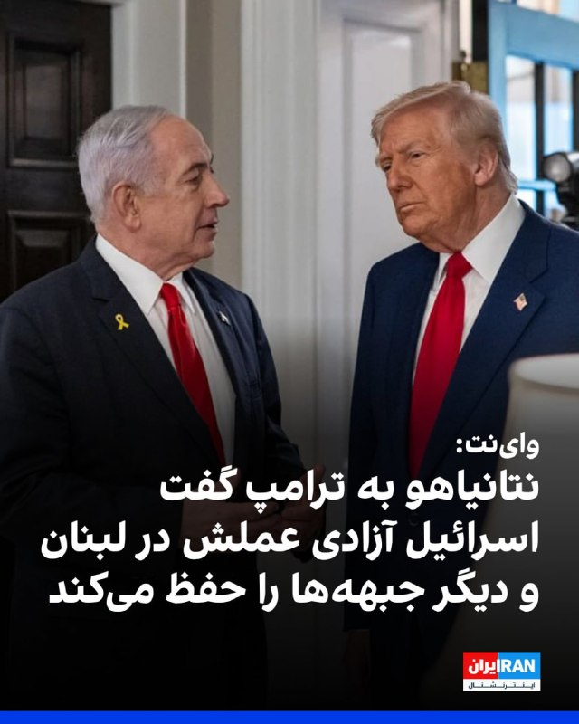

وای‌نت به نقل از یک منبع نوشت که نتانیاهو در تماس با ترامپ تاکید کرد، اسرائیل آزادی عمل خود را برای مقابله با تهدیدها در همه جبهه‌ها از جمله لبنان، حفظ خواهد کرد.

بر اساس این گزارش، ترامپ نیز حمایت خود را از این موضوع اعلام کرد.

وای‌نت نوشت که ترامپ در تماس تلفنی با نتانیاهو تاکید کرده در مذاکرات بر خواسته همیشگی خود برای برچیدن برنامه هسته‌ای و خارج کردن همه ذخایر اورانیوم غنی‌شده از خاک ایران پافشاری خواهد کرد.

همچنین کانال ۱۴ اسرائیل به نقل از یک مقام ارشد سیاسی نوشت که اسرائیل به آمریکا اعلام کرده، چه توافقی با جمهوری اسلامی حاصل شود و چه نشود، این کشور آزادی عمل خود برای عملیات در همه بخش‌ها، از جمله در لبنان را حفظ می‌کند.
iranintl
‌🏁 🇬🇧 IranintlTV

🤖 @VahidOOnLine

## VahidOOnLine — post 241912

🗣روایت شما از احتمال توافق میان آمریکا و جمهوری اسلامی- یکشنبه ۳ خرداد

🔹دیگه امیدی به ترامپ نداریم. ما ۴۰ هزار کشته ندادیم که با این حکومت مماشات کنیم. کشورهای دیگه هم به خاطر منافع خودشون از این حکومت حمایت کردن. خودمون کار رو تموم می‌کنیم. مردم عزیز این آخرین نبرده.

🔹ما مردم ایران توافق و آتش‌بس ۶۰ روزه نمی‌خوایم. منتظریم دوباره صدای جنگنده‌ها رو در آسمون ایران بشنویم.

🔹نباید تصمیمات ترامپ برامون مهم باشه. خودمون از داخل کشور باید این رژیم رو زمین بزنیم. ناامید نشو هموطن.

🔹منتظر فراخوان مجدد شاهزاده هستیم تا کار جمهوری اسلامی رو تموم کنیم. زنده بودن در ایران دیگه غیرممکن شده.

🔹داریم زیر بار گرونی کمر خم می‌کنیم و کاری از دستمون برنمیاد. اگه ترامپ توافق کنه بزرگ‌ترین خیانت رو در حق مردم ایران کرده. امیدواریم پایان این شب سیه، سپید باشه.

🔹کدوم توافق؟ هر روز با استرس خبر اعدامی‌ها، افسردگی و فقر و هزار تا بدبختی دیگه که ترامپ و جمهوری اسلامی بهمون تحمیل کردن دست‌وپنجه نرم می‌کنیم.

🔹با خبرهایی که از توافق داره میاد، مشخصه که ما مردم، قربانی سیاست شدیم.

🔹ترامپ خواهشا با این جانیان و قاتلان ملت که در دو روز ۴۰ هزار نفر رو کشتن و تیر خلاص زدن، توافق نکن. این حکومت خون ما رو در شیشه کرده و نمی‌گذاره آزادانه راهپیمایی کنیم و خواسته خودمون رو طلب کنیم. اینا ۴۷ ساله فقط مرگ بر آمریکا و اسرائیل گفتن.
‌🏁 🇬🇧 IranintlTV

🤖 @VahidOOnLine

## VahidOOnLine — post 241911

♦️مارکو روبیو، وزیر خارجه آمریکا، روز یکشنبه در جریان نشست خبری مشترک با سابرامانیام جایشانکار، وزیر خارجه هند، در دهلی‌نو اعلام کرد که طی ۴۸ ساعت گذشته «پیشرفت قابل‌توجهی» در مذاکرات و رایزنی‌های مرتبط با بحران تنگه هرمز و پرونده ایران حاصل شده و احتمال دارد تا ساعاتی دیگر اخبار مهم‌تری در این زمینه منتشر شود. او بدون ارائه جزئیات کامل، گفت هنوز توافق نهایی شکل نگرفته اما مسیر مذاکرات نسبت به روزهای گذشته امیدوارکننده‌تر شده است.
روبیو در ادامه گفت هرگونه توافق احتمالی نیازمند پذیرش کامل ایران و اجرای عملی تعهدات خواهد بود و مذاکرات درباره جزئیات فنی برنامه هسته‌ای، روندی پیچیده و زمان‌بر دارد. او افزود هنوز نمی‌توان درباره موفقیت نهایی مذاکرات با قطعیت صحبت کرد، اما «نشانه‌هایی از پیشرفت واقعی» دیده می‌شود و ممکن است جهان در ساعات آینده خبرهای مثبتی درباره تنگه هرمز و روند مذاکرات دریافت کند.
‌🇸🇦 Indypersian

🤖 @VahidOOnLine

## VahidOOnLine — post 241910

  <a href="telegram/content/VahidOOnLine_241910_1779620875.mp4" target="_blank">🎬 Download video</a>

نت‌بلاکس اعلام کرد انسداد اینترنت در ایران وارد هشتادوششمین روز شده و مردم پس از بیش از دو هزار و ۴۰ ساعت، همچنان در «تاریکی دیجیتال» به سر می‌برند.

این نهاد ناظر بر اینترنت نوشت دسترسی به اینترنت جهانی در ایران، همزمان با ادامه گفت‌وگوهای صلح، همچنان به‌طور گسترده قطع است.

به گفته نت‌بلاکس، در حالی که بخش بزرگی از مردم از دسترسی آزاد به اینترنت محرومند، گروهی از کاربران گزینش‌شده و دارای دسترسی سفید، تصویری ساختگی و کنترل‌شده از زندگی در ایران را به جهان بیرون نشان می‌دهند.
‌🏁 🇬🇧 ManotoTV

🤖 @VahidOOnLine

## VahidOOnLine — post 241909

  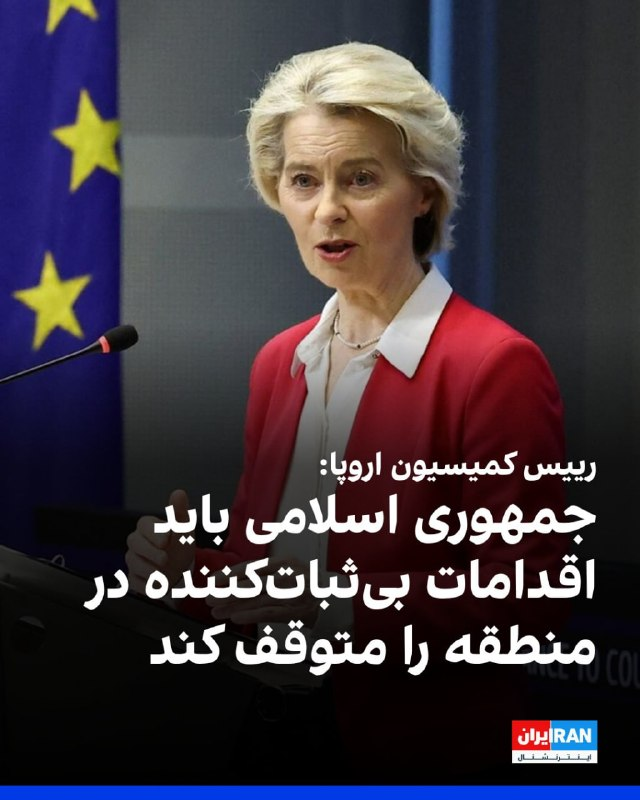

اورزولا فون در لاین، رییس کمیسیون اروپا، از پیشرفت آمریکا و جمهوری اسلامی به سمت توافق استقبال کرد و افزود: «جمهوری اسلامی باید اقدامات بی‌ثبات‌کننده در منطقه را چه به‌صورت مستقیم و چه از طریق نیروهای نیابتی، و همچنین حملات مکرر و بی‌دلیل به همسایگانش را متوقف کند.»

او ادامه داد: «بازگشایی تنگه هرمز اهمیت دارد و به توافقی نیاز داریم که واقعا به کاهش تنش‌ها منجر شود، تنگه هرمز را بازگشایی و آزادی کامل کشتیرانی را بدون دریافت عوارض و بدون محدودیت تضمین کند.»
iranintl
‌🏁 🇬🇧 IranintlTV

🤖 @VahidOOnLine

## VahidOOnLine — post 241908

  

خبرگزاری فارس، وابسته به سپاه پاسداران نوشت تازه‌ترین پیگیری‌ها نشان می‌دهد آمریکا دوباره در زمینه آزاد کردن دارایی‌های بلوکه‌شده «دبه» کرده و تلاش دارد این منابع را نسیه و حواله به آینده کند، اما مسئولین جمهوری اسلامی می‌گویند از این خط قرمز کوتاه نمی‌آیند.

این خبرگزاری افزود: «جمهوری اسلامی تنها در شرایطی حاضر به مذاکره با واشینگتن می‌شود که منافع ملموس اقتصادی به همراه داشته باشد و در این راستا، یکی از محوری‌ترین این منافع، آزادسازی دارایی‌های بلوکه‌شده است.»
iranintl
‌🏁 🇬🇧 IranintlTV

🤖 @VahidOOnLine

## VahidOOnLine — post 241907

♦️گروهی از ایرانیان مقیم هلند شنبه دوم خرداد در شهر لاهه علیه جمهوری اسلامی تجمع اعتراضی برگزار کردند. آنها در این تجمع با در دست داشتن پرچم سه رنگ شیروخورشید نشان ایران در خیابان‌های لاهه راهپیمایی کردند و شعارهایی علیه جمهوری اسلامی سر دادند.
‌🇸🇦 Indypersian

🤖 @VahidOOnLine

## WithYashar — post 12324

بیانیه منتشر از دفتر نخست‌وزیر اسرائیل به نقل از یک منبع سیاسی (وای‌نت):

در مکالمه دیروز با ترامپ، نخست‌وزیر تأکید کرد که اسرائیل آزادی عملش رو در برابر تهدیدها در همه جبهه‌ها، از جمله لبنان، حفظ میکنه و ترامپ هم حمایتش از این اصل رو دوباره تأکید کرد.

ترامپ روشن کرد که خواسته‌اش برای خراب کردن برنامه هسته‌ای ایران و حذف تمام اورانیوم غنی‌شده از خاک این کشور ثابت میمونه و بدون این شرایط، توافق نهایی رو امضا نمیکنه.

نخست‌وزیر یه بار دیگه از تعهد طولانی‌مدت و خاص ترامپ به امنیت اسرائیل تشکر کرد.
@withyashar

## WithYashar — post 12323

تروریست سردار قربانی: اسرائیلی‌ها بدانند قاآنی تا زیر سنگرهایشان می‌رود
سردار «مرتضی قربانی» مشاور فرمانده سپاه تروریست پاسداران: هیچ‌وقت از قاآنی ترس و واهمه ندیدم، اسرائیلی‌ها بدانند قاآنی تا زیر سنگرهایشان می‌رود!
@withyashar 🥴

## WithYashar — post 12322

  <a href="telegram/content/WithYashar_12322_1779620877.mp4" target="_blank">🎬 Download video</a>

🚨🚨🚨🚨بالاخره توافق رسمی‌شد
@withyashar

## WithYashar — post 12321

مهر: یک پهپاد اسرائیلی بر فراز هرمزگان سرنگون شد
این پهپاد که کاربری جاسوسی و شناسایی داشت، با شلیک پدافند ارتش سرنگون شد.
لاشه پهپاد متلاشی شده اربیتر با همکاری ناوگروه دریابانی فراجای هرمزگان کشف شد.
@withyashar

## WithYashar — post 12320

## WithYashar — post 12319

## WithYashar — post 12318

احمد وحیدی فرمانده کل سپاه:

فتح خرمشهر یک الگوی خوب برای نابودی کامل اسرائیل است.
@withyashar
یاشار : همین فرمون برین 🤣

## WithYashar — post 12317

گزارش کانال 14 : ممکن است ظرف چند روز توافقی بین آمریکا و ایران حاصل شود که انتظار می‌رود لبنان را نیز شامل شود و احتمالاً به پایان درگیری‌های اسرائیل با حزب‌الله منجر شود.

بر اساس جزئیات منتشر شده، ایران تنگه هرمز را بدون دریافت هزینه باز خواهد کرد در حالی که آمریکا پولی به تهران منتقل نخواهد کرد و به هر دو طرف مهلت ۶۰ روزه داده می‌شود تا مذاکرات هسته‌ای را ادامه دهند.

تحریم‌ها علیه ایران باقی خواهد ماند به جز تسهیلات محدودی در محدودیت‌های مرتبط با نفت
@withyashar

## WithYashar — post 12316

## WithYashar — post 12315

ما عمر نوح نداریم انقدر صبر کنیم !
@withyashar

## WithYashar — post 12314

Pishro (instagram.com/yashar) – Sonnat Shekan (t.me/withyashar)

## WithYashar — post 12313

نتانیاهو:
خوشحالم که رئیس‌جمهور دونالد ترامپ، بهترین دوستی که اسرائیل تا حالا در کاخ سفید داشته، در امانه و مهاجم قبل از اینکه بتونه آسیب بیشتری بزنه خنثی شده.

خشونت سیاسی، از جمله تلاش‌های مکرر برای ترور ترامپ، باید بدون هیچ ابهامی و با قاطعیت کامل از طرف همه محکوم بشه
@withyashar

## WithYashar — post 12312

## WithYashar — post 12311

عجب سکوتی …

## mwarmonitor — post 9628

📌دو مقام منطقه‌ای به آسوشیتدپرس گفته‌اند که توافق احتمالی شامل تعهد ایران به عدم پیگیری سلاح هسته‌ای و کنار گذاشتن ذخایر اورانیوم بسیار غنی‌شده‌اش است، و در مقابل، رفع تحریم‌ها و آزادسازی دارایی‌های مسدودشده طی ۶۰ روز مورد مذاکره قرار خواهد گرفت.

@mwarmonitor

## mwarmonitor — post 9627

🔴ترامپ به نتانیاهو به‌طور روشن اعلام کرد که بدون برچیده شدن کامل برنامه هسته‌ای ایران و خارج شدن تمام اورانیوم غنی‌شده از خاک این کشور، هیچ توافق نهایی درباره ایران را امضا نخواهد کرد؛ این را یک منبع سیاسی اسرائیلی به فاکس‌نیوز گفته است.

@mwarmonitor

## mwarmonitor — post 9626

  

🚢یک تانکر LNG ثبت‌شده در بریتانیا به نام FUWAIRIT تلاش کرد از تنگه هرمز عبور کند، اما در جنوب جزیره لارَک متوقف شد.

«حتما عوارض پرداخت نکرده بود؟»

@mwarmonitor

## mwarmonitor — post 9625

🔴ترامپ در سوشال تروث 🔸از سرویس مخفی عالی و نیروهای مجری قانونِ ما برای اقدام سریع و حرفه‌ای امشبِ آن‌ها در برابر فرد مسلحی که در نزدیکی کاخ سفید حضور داشت، سپاسگزارم؛ فردی که سابقه رفتارهای خشونت‌آمیز داشته و احتمالاً به ارزشمندترین بنای کشور ما (کاخ سفید)…

## mwarmonitor — post 9624

  

🛩جت «ARTEMIS II» امروز بر فراز گرجستان در حال پرواز دایره‌ای بوده و احتمالاً حسگرهای خود را به سمت جنوب، یعنی ارمنستان و/یا حتی شمال ایران متمرکز کرده است.

🔸این یک پرواز نادر محسوب می‌شود، زیرا این جت تجاریِ جمع‌آوری اطلاعات سیگنال که متعلق به یک پیمانکار و تحت عملیات ارتش آمریکا است، معمولاً بر فراز اروپای شرقی و همچنین در نزدیکی سواحل لیبی پروازهای مداری انجام می‌دهد.

@mwarmonitor

## mwarmonitor — post 9623

🔴گزارش یک منبع سیاسی: کانال ۱۲ اسرائیل

🔸ایالات متحده در حال به‌روزرسانی اسرائیل درباره مذاکرات مربوط به یک تفاهم‌نامه است که هدف آن بازگشایی تنگه هرمز و پیشبرد مذاکرات برای دستیابی به یک توافق نهایی درباره مسائل مورد اختلاف باقی‌مانده است.

🔹در تماس شب گذشته، نخست‌وزیر به رئیس‌جمهور ترامپ گفت که اسرائیل آزادی کامل اقدام در برابر تهدیدها در همه جبهه‌ها، از جمله لبنان، را حفظ خواهد کرد. ترامپ نیز بار دیگر حمایت خود را از این اصل تأکید کرد.

🔹ترامپ همچنین تأکید کرد که بر برچیده شدن برنامه هسته‌ای ایران و خارج شدن تمام اورانیوم غنی‌شده از خاک این کشور اصرار خواهد داشت و بدون تحقق این شروط، هیچ توافق نهایی را امضا نخواهد کرد.

🔹نخست‌وزیر از ترامپ به خاطر تداوم تعهدش به امنیت اسرائیل تشکر کرد.

@mwarmonitor

## mwarmonitor — post 9622

📌نتانیاهو طی هفته‌های گذشته چندین بار درخواست کرده است با ترامپ صحبت کند، اما طبق گزارش روزنامه «معاریو» به نقل از منابع، تنها دستیاران ترامپ به این درخواست‌ها پاسخ داده‌اند.

@mwarmonitor

## FoxNewsTwitter — post 342182

  <a href="telegram/content/FoxNewsTwitter_342182_1779620879.mp4" target="_blank">🎬 Download video</a>

Fox News (Twitter/X)

FIRST ON FOX: Democratic Maine Senate candidate Graham Platner dodges an apology when confronted over a deleted Reddit post where he said a Purple Heart recipient "didn’t deserve to live."

Fox News Digital asked him what he would say to offended voters — and whether he owed Pfc. Ted Daniels an apology.

Platner instead pointed to his own service: "I did four tours in the infantry, any attempt to say that I disrespect veterans is slanderous and offensive."

## pm_afshaa — post 91376

  <a href="telegram/content/pm_afshaa_91376_1779620880.webm" target="_blank">🎬 Download video</a>

🔴بیانیه منتشر از دفتر نخست‌وزیر اسرائیل به نقل از یک منبع سیاسی (وای‌نت):

در مکالمه دیروز با ترامپ، نخست‌وزیر تأکید کرد که اسرائیل آزادی عملش رو در برابر تهدیدها در همه جبهه‌ها، از جمله لبنان، حفظ میکنه و ترامپ هم حمایتش از این اصل رو دوباره تأکید کرد.

ترامپ روشن کرد که خواسته‌اش برای خراب کردن برنامه هسته‌ای ایران و حذف تمام اورانیوم غنی‌شده از خاک این کشور ثابت میمونه و بدون این شرایط، توافق نهایی رو امضا نمیکنه.

نخست‌وزیر یه بار دیگه از تعهد طولانی‌مدت و خاص ترامپ به امنیت اسرائیل تشکر کرد.

💧 Rainbet.com the #1 Non-KYC Crypto Casino & Sportsbook @rainbetcom

😁 @Pm_Afshaa

## pm_afshaa — post 91375

بچه ها حتما تو چنل زاپاسمون جوین شین ما رو گم نکنین

https://t.me/Pm_Zapas
https://t.me/Pm_Zapas

## pm_afshaa — post 91374

  <a href="telegram/content/pm_afshaa_91374_1779620881.webm" target="_blank">🎬 Download video</a>

🔴نتانیاهو:
خوشحالم که رئیس‌جمهور دونالد ترامپ، بهترین دوستی که اسرائیل تا حالا در کاخ سفید داشته، در امانه و مهاجم قبل از اینکه بتونه آسیب بیشتری بزنه خنثی شده.

خشونت سیاسی، از جمله تلاش‌های مکرر برای ترور ترامپ، باید بدون هیچ ابهامی و با قاطعیت کامل از طرف همه محکوم بشه

💧 Rainbet.com the #1 Non-KYC Crypto Casino & Sportsbook @rainbetcom

😁 @Pm_Afshaa

## DEJradio — post 4911

⭕️ قطعی سراسری اینترنت در ایران وارد هشتاد و ششمین روز شد

نت‌بلاکس اعلام کرد قطعی سراسری اینترنت در ایران وارد هشتاد و ششمین روز شده است.
بنا بر این گزارش، شهروندان پس از بیش از ۲۰۴۰ ساعت همچنان از دسترسی آزاد به اینترنت جهانی محروم‌اند.
این نهاد جهانی پایش اینترنت گفت در حالی که دسترسی عمومی به شبکۀ جهانی امکان ندارد، گروهی از کاربران وابسته به حکومت تصویری «مصنوعی» را از «وضعیت عادی» در ایران به بیرون منتقل می‌کنند.

#اینترنت
@DEJradio

## DEJradio — post 4910

⭕️ اردوی تیم ملی فوتبال در جام جهانی به‌جای آریزونا در مکزیک برگزار می‌شود

مهدی تاج، رئیس فدراسیون فوتبال جمهوری اسلامی اعلام کرد تیم ملی در جریان جام جهانی ۲۰۲۶ در شهر تیخوانا در مکزیک مستقر می‌شود.
او گفت فیفا با درخواست جمهوری اسلامی برای انتقال محل اردو از ایالت آریزونا آمریکا موافقت کرد.
بنا بر ادعای تاج، این جابه‌جایی می‌تواند مشکلات مربوط به دریافت ویزا را کاهش دهد. همچنین اعضای تیم می‌توانند با پرواز مستقیم ایران‌ایر به مکزیک سفر کنند.
تیم فوتبال جمهوری اسلامی ایران در حالی برای حضور در جام جهانی آماده می‌شود که هنوز ویزای آمریکا برای بخشی از بازیکنان و اعضای کادر فنی صادر نشده است.
از سویی بنا بر برخی گزارش‌ها، فیفا قصد دارد مانع ورود پرچم‌ شیر و خورشید به ورزشگاه‌ها در هنگام برگزاری جام جهانی بشود.

#فوتبال #جام_جهانی
@DEJradio

## DEJradio — post 4909

⭕️ قوۀ قضائیه از اعدام یک شهروند به اتهام همکاری با آمریکا و اسرائیل خبر داد

قوۀ قضائیۀ جمهوری اسلامی اعلام کرد شهروندی به نام مجتبا کیان را با اتهام «ارسال اطلاعات مراکز صنایع دفاعی» به آمریکا و اسرائیل اعدام کرده است.
به گزارش خبرگزاری میزان، وابسته به دستگاه قضائی مدعی شد مجتبا کیان در دوران جنگ اخیر اطلاعات مربوط به واحدهای صنایع دفاعی را به خارج ارسال کرده بود.
میزان مدعی شد که از دیگر موارد اتهامی مجتبا کیان، ارسال پیام‌ برای «شبکه‌های معاند» بوده است.
قوۀ قضائیه هیچ توضیحی درمورد شغل یا شیوۀ دسترسی او به اطلاعات صنایع دفاعی ارائه نکرد.
در ماه‌های اخیر جمهوری اسلامی بارها شهروندانی را به اتهام ارسال تصاویر و اطلاعات برای رسانه‌های خارج از کشور، بازداشت کرد.
رویۀ اتهام‌زنی، بازداشت، شکنجه و اعدام شهروندان، در همۀ سال‌های اخیر توسط حکومت ادامه داشته است.
حکومت از شکنجه و اعدام مخالفان به عنوان ابزاری برای ترساندن و عقب‌راندن مخالفان استفاده می‌کند.

#اعدام #زندانیان_سیاسی
@DEJradio

## DEJradio — post 4908

⭕️ فرماندۀ سپاه تهدید آمریکا و اسرائیل را ازسر گرفت

در حالی که رسانه‌های نزدیک به سپاه از نزدیک شدن تهران و واشینگتن به یک «تفاهم اولیه» خبر دادند، فرماندۀ سپاه پاسداران دربارۀ هرگونه حملۀ دوباره هشدار داد.
احمد وحیدی تهدید کرد که در صورت حمله، نیروهای مسلح جمهوری اسلامی، واکنشس «ویرانگر و جهنمی» در ابعاد منطقه‌ای و فرامنطقه‌ای انجام می‌دهند.
ادعاهای فرماندۀ سپاه در حالی است که در دوران جنگ چهل روزه، شمار بسیاری از فرماندهان ارشد و میانی این نیرو و همچنین پایگاه‌های موشکی و پهپادی جمهوری اسلامی نابود شده است.
#سپاه_تروریستی_پاسداران
@DEJradio

## DEJradio — post 4907

⭕️چهره‌های جمهوری‌خواه از توافق احتمالی ترامپ با ایران انتقاد کردند

همزمان با گزارش‌ها دربارۀ توافق احتمالی میان دولت دونالد ترامپ و جمهوری اسلامی، چند چهرۀ برجسته جمهوری‌خواه از این روند انتقاد کردند.
لیندزی گراهام، سناتور جمهوری‌خواه گفت توافقی که به جمهوری اسلامی اجازۀ حفظ قدرت منطقه‌ای را بدهد، در بلندمدت «کابوسی برای اسرائیل» می‌شود.
مایک پمپئو، وزیر امور خارجۀ نخستین دولت ترامپ گفت توافق احتمالی به هیچ وجه در راستای شعار «اول آمریکا» نیست.
پمپئو توافق احتمالی را به توافق هسته‌ای {برجام} در زمان دولت باراک اوباما شبیه دانست.
تد کروز، سناتور جمهوری‌خواه، نیز هشدار داد اگر نتیجۀ جنگ این باشد که جمهوری اسلامی همچنان توان غنی‌سازی اورانیوم و کنترل موثر بر تنگۀ هرمز را حفظ کند، این «اشتباهی فاجعه‌بار» است.
مورگان اورتگاس، نمایندۀ پیشین دولت ترامپ در امور خاورمیانه، هم هشدار داد جمهوری اسلامی ممکن است از مذاکرات برای «خرید زمان» و کاهش فشارها استفاده کند.

#تفاهم #مذاکرات #لیندسی_گراهام
@DEJradio

## DEJradio — post 4906

⭕️ اکسیوس: تهران و واشینگتن به تفاهم‌نامۀ ۶۰ روزه نزدیک شدند

وبسایت خبری اکسیوس به نقل از منابع آگاه گزارش داد جمهوری اسلامی و آمریکا به امضای یک «یادداشت تفاهم ۶۰ روزه» نزدیک شده‌اند.
بر اساس این گزارش، این تفاهم‌نامه توافق نهایی محسوب نمی‌شود، اما می‌تواند آتش‌بس را تمدید کند، به بازگشایی تنگۀ هرمز بینجامد و زمینۀ مذاکرات تازۀ هسته‌ای را فراهم کند.
به گزارش اکسیوس، جمهوری اسلامی در چارچوب این تفاهم متعهد می‌شود تنگۀ هرمز را بدون دریافت عوارض باز نگه دارد و مین‌های کارگذاشته شدۀ احتمالی را جمع‌آوری کند.
اکسیوس نوشت دولت آمریکا نیز محاصرۀ بنادر ایران را متوقف و بخشی از تحریم‌ها را تعلیق می‌کند.
بنا بر این گزارش، تهران اجازه می‌یابد موقتا بخشی از نفت خود را به فروش برساند.
به نوشتۀ اکسیوس، در دورۀ شصت روزه مسائل هسته‌ای حل نمی‌شود.
اکسیوس به نقل از منابع آگاه گفت در دو ماه پیش رو، مذاکراتی دربارۀ توقف غنی‌سازی، انتقال ذخایر اورانیوم و تعهد جمهوری اسلامی به نرفتن به سمت سلاح هسته‌ای انجام می‌شود.

#مذاکرات #برنامه_اتمی
@DEJradio

## DEJradio — post 4905

⭕️ پاکستان برای میزبانی دور تازۀ مذاکرات جمهوری اسلامی و آمریکا ابراز امیدواری کرد

پس از پیام دونالد ترامپ درمورد نزدیک بودن توافق با جمهوری اسلامی، شهباز شریف، نخست‌وزیر پاکستان، ابراز امیدواری کرد دور تازۀ مذاکرۀ تهران و واشینگتن «در آینده‌ای بسیار نزدیک» در اسلام‌آباد برگزار شود.
از سویی خبرگزاری حکومتی فارس، نزدیک به سپاه پاسداران، پیام‌های ترامپ را «تبلیغاتی و برای مصرف داخلی آمریکا» عنوان کرد.
در سوی دیگر، وبسایت اکسیوس گزارش داد پیش‌نویس تفاهم‌نامه‌ای در حال آماده شدن است که ترامپ «در شرف امضای آن» قرار دارد.
بر اساس گزارش اکسیوس، جمهوری اسلامی از طریق میانجی‌ها به‌صورت شفاهی تعهد داده هرگز به‌دنبال سلاح هسته‌ای نرود و درباره تعلیق غنی‌سازی و انتقال ذخایر اورانیوم مذاکره کند.
خبرگزاری حکومتی فارس مدعی شد «هیچ تعهدی از سوی تهران داده نشده» است.
به ادعای این خبرگزاری نزدیک به سپاه، پروندۀ هسته‌ای در این مرحله از مذاکرات «مورد بحث قرار نگرفته است.»

#مذاکرات #تفاهم #پاکستان
@DEJradio

## DEJradio — post 4904

⭕️ رسانۀ اسرائیلی: برخی مشاوران ترامپ او را به سوی توافقی ناخوشایند با تهران می‌برند

شبکه ۱۳ اسرائیل گزارش داد مقام‌های این کشور بر این باورند که تهران و واشینگتن به توافق احتمالی نزدیک‌تر شده‌اند.
به گزارش شبکۀ ۱۳ اسرائیل، مقام‌های این کشور گفته‌اند فشار برخی مشاوران دونالد ترامپ بر او برای توافق با تهران، در روزهای اخیر افزایش یافته است.
اسرائیل پیش‌تر تصور می‌کرد اختلاف بر سر مسائل کلیدی مانع توافق می‌شود، اما اکنون برخی مقام‌های این کشور فکر می‌کنند روند مذاکرات به‌خلاف ارزیابی‌های قبلی به پیش می‌رود.
بر اساس این گزارش، بخشی از نهاد امنیتی اسرائیل از روند مذاکرات ناخشنود است.

#مذاکرات #تفاهم #اسرائیل
@DEJradio

## DEJradio — post 4903

  <a href="telegram/content/DEJradio_4903_1779620881.mp4" target="_blank">🎬 Download video</a>

🎤
⭕️ یک میلیون شغل پودر شد و بیش از سه هزار واحد صنعتی به خاکستر تبدیل گشت! این کارنامه تکان‌دهنده شوک پس از جنگ بر بازار کار ایران است.
آمارهای رسمی از بیکاری مستقیم و غیرمستقیم دو میلیون نفر خبر می‌دهند. از قزوین و کرمان تا اصفهان، غول‌های تولید دست به تعدیل‌های بی‌سابقه زده‌اند،تا جایی که در صنعت خودرو، تولید به یک‌سوم سقوط کرده ودر فولاد مبارکه، از ۲۷ هزار کارگر فقط دو هزار نفر سر کار برگشته‌اند! کارگران باقی‌مانده نیز میان دوراهی اخراج یا کاربا نصف حقوق و بدون مزایاگرفتار شده‌اند؛ آن هم در حالی که صندوق‌های حمایتی دولت کاملاً خالی است.
عطا حسینیان گزارش می‌دهد.

#گزارش #اقتصاد
@DEJradio

## mamlekate — post 103576

📝 ایران و آمریکا به تفاهم اولیه نزدیک شدند؛ جزئیات گزارش‌شده از تفاهم‌نامه

وب‌سایت اکسیوس به نقل از منابع خود گزارش داده است که آمریکا و جمهوری اسلامی ایران به امضای یک یادداشت تفاهم ۶۰ روزه نزدیک شده‌اند؛ تفاهمی که در صورت نهایی شدن می‌تواند آتش‌بس را تمدید کند، تنگه هرمز را بازگشاید، فشار بر بازار جهانی نفت را کاهش دهد و زمینه‌ساز دور تازه‌ای از مذاکرات هسته‌ای شود.

بر اساس این گزارش، تفاهم‌نامه پیشنهادی ۶۰ روز اعتبار خواهد داشت و با توافق دو طرف می‌تواند تمدید شود. در این دوره، ایران متعهد می‌شود تنگه هرمز را بدون دریافت عوارض باز کند و مین‌هایی را که احتمالا در این مسیر کار گذاشته شده، جمع‌آوری کند تا کشتی‌ها بتوانند آزادانه عبور کنند.

در مقابل، دولت ترامپ محاصره بنادر ایران را لغو خواهد کرد و برخی معافیت‌های تحریمی را صادر می‌کند تا ایران بتواند نفت خود را در بازار جهانی بفروشد. یک مقام آمریکایی گفته است این اقدام برای ایران «منفعت اقتصادی بزرگی» خواهد داشت، اما همزمان به کاهش فشار بر بازار جهانی نفت نیز کمک می‌کند.

اکسیوس تأکید کرده که مسائل هسته‌ای در این دوره ۶۰ روزه حل نخواهد شد، بلکه دو طرف دربارهٔ تعلیق غنی‌سازی اورانیوم، انتقال ذخایر اورانیوم غنی‌شده و تعهد ایران به دنبال نکردن سلاح هسته‌ای مذاکره خواهند کرد.

بر اساس این گزارش، رفع تحریم‌ها و آزادسازی دارایی‌های مسدودشده ایران نیز در این دوره بررسی می‌شود، اما اجرای آن منوط به توافق نهایی و قابل راستی‌آزمایی خواهد بود.

اکسیوس همچنین نوشته است که پیش‌نویس تفاهم‌نامه شامل پایان جنگ اسرائیل و حزب‌الله در لبنان نیز هست، موضوعی که بنیامین نتانیاهو در تماس با دونالد ترامپ نسبت به آن ابراز نگرانی کرده است.

📝 از توافق احتمالی تهران-واشنگتن چه می‌دانیم؟

@mamlekate

## kianmeli1 — post 87628

🔴خبرگزاری تسنیم سپاه: «بدون آزادسازی دارایی‌های مسدود شده ایران، توافقی حاصل نخواهد شد»، این موضوع به میانجیگران پاکستانی و منطقه‌ای ابلاغ شده است.
https://t.me/kianmeli1

## kianmeli1 — post 87627

‏🔴خبرگزاری مهر وابسته به سازمان تبلیغات اسلامی نوشت پدافند ارتش جمهوری اسلامی یک پهپاد اسرائیل را در هرمزگان سرنگون کرده است
https://t.me/kianmeli1

## kianmeli1 — post 87626

🔴یکی از همسایگان بیت خامنه ای میگفت از بالای پشت بام به بیت که نگاه میکنیم صاف شده حتی یک آجر سالم نمانده

سوال: چگونه مجتبی زنده مانده

دو حالت دارد:
۱-مجتبی آنجا نبوده
۲-اگر بوده کشته شده

بنظر ما مجتبی آنجا نبوده و مطلع بوده از حمله
https://t.me/kianmeli1

## kianmeli1 — post 87625

  

🔴چندروز پیش ۳۰ اردیبهشت مجتبی خامنه ای پیام تسلیتی را امضا کرده که جالبه
دست خطش این مدلیه یا واقعا نمیتونه امضا کنه در بستریه!

شبیه دست خط نهضت سوادآموزیه
https://t.me/kianmeli1

## kianmeli1 — post 87624

  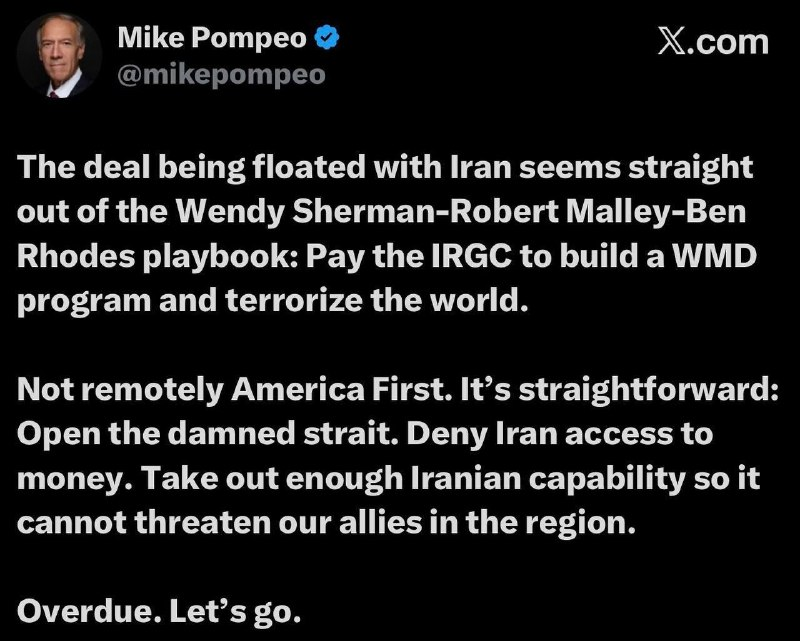

🔴هشدار شدید پمپئو به ترامپ:

‏به نظر می‌رسد توافقی که با ایران در حال انجام است، به‌طور مستقیم از روی نقشه وندی شرمن-رابرت مالی-بن رودز بیرون آمده: به سپاه پاسداران پول بدهید تا یک برنامه سلاح‌های کشتار جمعی بسازد و جهان را ترور کند.
‏این اصلا ربطی به شعار «اول آمریکا» ندارد.
‏موضوع خیلی ساده است:
‏تنگه را باز کنید.
‏دسترسی ایران به پول را قطع کنید.
‏و آن‌قدر توانایی‌های ایران را هدف قرار دهید که دیگر نتواند متحدان ما در منطقه را تهدید کند.
‏خیلی دیر شده.
‏وقتشه اقدام کنند.
https://t.me/kianmeli1

## IranIntlTV — post 338744

  

علی عبداللهی، فرمانده قرارگاه مرکزی خاتم‌الانبیا در بیانیه‌ای اعلام کرد: «به دشمنان هشدار می‌دهیم برنامه‌ها و راهبردهای رهبری برای مدیریت خلیج فارس و تنگه هرمز اجرا خواهد شد و بیگانگان جایگاهی در نظم جدید منطقه ندارند و ما آماده پاسخگویی سخت و جهنمی به هرگونه حمله هستیم.»

او ادامه داد: «به مشت گره‌خورده رهبر شهیدمان قسم، نیروهای مسلح مقتدر کشورمان اجازه نخواهند داد تجربه‌های دردناک تاریخی تکرار شود.»
iranintl.com/202605240729

## IranIntlTV — post 338743

جاویدنامان انقلاب ملی ایرانیان
«علی و شیوا بردبار جاوید» از جان‌باختگان اعتراضات ۱۸ دی در مشهد هستند. نامشان در حافظه‌ی این سرزمین می‌ماند و یادشان چراغ راه آزادی‌خواهان است.

@iranintltv

## IranIntlTV — post 338742

  

خبرگزاری مهر، وابسته به سازمان تبلیغات اسلامی، اعلام کرد یک پهپاد اسرائیلی که کاربری جاسوسی و شناسایی داشت، با شلیک پدافند ارتش جمهوری اسلامی سرنگون شد.
این گزارش افزود: «لاشه پهپاد متلاشی شده اربیتر با همکاری ناوگروه دریابانی فراجای هرمزگان کشف شد.»

خبرگزاری مهر به تاریخ این اتفاق اشاره‌ای نکرده است.
https://iranintl.com/202605240342

## IranIntlTV — post 338741

استقبال اروپا از پیشرفت مذاکرات با تاکید بر بازگشایی تنگه هرمز و مهار برنامه هسته‌ای تهران

هم‌زمان با گزارش‌ها درباره نزدیک شدن آمریکا و جمهوری اسلامی به یک تفاهم اولیه، رهبران اتحادیه اروپا و بریتانیا از پیشرفت مذاکرات استقبال کرده و خواستار توافقی شدند که به کاهش تنش‌ها، بازگشایی تنگه هرمز و جلوگیری از دستیابی حکومت ایران به سلاح هسته‌ای منجر شود.

اورزولا فون‌در‌لاین، رییس کمیسیون اروپا، از نشانه‌های پیشرفت در مذاکرات میان آمریکا و جمهوری اسلامی استقبال کرده و گفته است اروپا از دستیابی به توافقی حمایت می‌کند که به کاهش واقعی تنش‌ها، بازگشایی تنگه هرمز و تضمین آزادی کامل کشتیرانی بدون دریافت عوارض منجر شود.

فون‌در‌لاین در پیامی در شبکه ایکس نوشت: «از پیشرفت در مسیر توافق میان آمریکا و ایران استقبال می‌کنم. ما به توافقی نیاز داریم که واقعا تنش‌ها را کاهش دهد، تنگه هرمز را بازگشایی کند و آزادی کامل ناوبری را تضمین کند. نباید به ایران اجازه داده شود به سلاح هسته‌ای دست پیدا کند.» او همچنین تاکید کرد تهران باید اقدامات بی‌ثبات‌کننده منطقه‌ای، از جمله حمایت از نیروهای نیابتی و حملات به کشورهای همسایه را متوقف کند.

رییس کمیسیون اروپا افزود اتحادیه اروپا برای بهره‌برداری از فرصت کنونی جهت دستیابی به یک راه‌حل دیپلماتیک پایدار، همکاری با شرکای بین‌المللی را ادامه خواهد داد و هم‌زمان برای کاهش اثرات بحران بر زنجیره‌های تامین جهانی و قیمت انرژی تلاش می‌کند.

اظهارات فون‌در‌لاین پس از آن مطرح شد که دونالد ترامپ اعلام کرد واشینگتن و تهران «تا حد زیادی» درباره یک یادداشت تفاهم برای توافق صلح مذاکره کرده‌اند؛ توافقی که می‌تواند به بازگشایی تنگه هرمز منجر شود.

در بریتانیا نیز کی‌یر استارمر، نخست‌وزیر این کشور، از «پیشرفت در مسیر توافق» برای پایان دادن به جنگ ایران استقبال کرد. استارمر در پیامی نوشت: «ما با شرکای بین‌المللی خود همکاری خواهیم کرد تا از این فرصت برای دستیابی به یک راه‌حل دیپلماتیک بلندمدت استفاده کنیم.»

این مواضع در حالی مطرح می‌شود که مقام‌های آمریکایی گفته‌اند احتمال دارد جزئیات توافق احتمالی میان [حکومت] ایران و آمریکا طی ساعات یا روزهای آینده اعلام شود؛ هرچند هنوز اختلاف‌هایی بر سر برنامه هسته‌ای ایران، وضعیت تنگه هرمز و دامنه کاهش تحریم‌ها باقی مانده است.

در همین حال، منابع سیاسی اسرائیل نیز نگرانی خود را نسبت به پیامدهای توافق احتمالی ابراز کرده‌اند. یک مقام ارشد سیاسی اسرائیل به یینون ماگال، خبرنگار کانال۱۴ این کشور گفته است تل‌آویو به واشینگتن اطلاع داده که «صرف‌نظر از دستیابی یا عدم دستیابی به توافق، آزادی عمل عملیاتی خود را در همه جبهه‌ها، از جمله لبنان، حفظ خواهد کرد.»

این اظهارات نشان می‌دهد با وجود افزایش امیدها به پیشرفت دیپلماتیک، اختلاف‌ها بر سر نحوه مهار برنامه هسته‌ای ایران، نقش منطقه‌ای تهران و آینده درگیری‌های نیابتی همچنان از چالش‌های اصلی مسیر توافق باقی مانده است.
 
🔗وب‌سایت ایران‌اینترنشنال
@iranintltv

## IranIntlTV — post 338740

  <a href="telegram/content/IranIntlTV_338740_1779620886.mp4" target="_blank">🎬 Download video</a>

یک شهروند با ارسال پیامی به ایران‌اینترنشنال می‌گوید: «امیدی به ترامپ نداریم. ما ۴۰ هزار کشته ندادیم که با این حکومت مماشات کنیم. خودمان کار را تمام می‌کنیم. مردم عزیز این آخرین نبرد است.»

## IranIntlTV — post 338739

  

🔻سایت اتلتیک در گزارشی درباره تغییر کمپ تیم ملی از آریزونای آمریکا به تیخوانا در مکزیک، که به گفته مهدی تاج، رییس فدراسیون فوتبال، برای حل مشکل ویزای اعضای تیم انجام شده است، نوشت با وجود این اقدام، تیم ملی برای هر بازی باید ویزا بگیرد: «تمامی بازیکنان و اعضای کادر همچنان برای ورود به ایالات متحده جهت برگزاری مسابقات نیاز به ویزا خواهند داشت.»

🔹اتلتیک اشاره می‌کند که با این تغییر، «اگر برخی اعضای غیرضروری در روز مسابقه برای دریافت ویزای آمریکا با مشکل مواجه باشند، انتقال کمپ به مکزیک می‌تواند به آن‌ها اجازه دهد در کنار تیم بمانند، اما برای مسابقات سفر نکنند.»

🔹یک ماه پیش، مارکو روبیو، وزیر خارجه آمریکا، درباره ورود همراهان تیم ملی به ایالات متحده گفت: «آن‌ها نمی‌توانند یک مشت تروریست عضو سپاه را به عنوان روزنامه‌نگار یا مربی ورزشی وارد کشور ما کنند.»

🔹اتلتیک نوشته است این تغییر کمپ تیم فوتبال ایران در حالی رخ داده که مقام‌های آریزونا برای استقبال از این تیم آماده می‌شدند.

جزییات بیشتر را در سایت بخوانید.

@iranintltvsport

## IranIntlTV — post 338738

  <a href="telegram/content/IranIntlTV_338738_1779620888.mp4" target="_blank">🎬 Download video</a>

وزیر دفاع پیشین اسرائیل از مطرح شدن لبنان به‌عنوان بخشی از توافق میان واشینگتن و تهران انتقاد کرد. اردوغان نیز در تماس با ترامپ، بر حل اختلافات از راه دیپلماسی تاکید کرد و از مذاکرات با جمهوری اسلامی حمایت کرد.

گزارش اشکان صفایی و نرگس هورخش، خبرنگاران ایران‌اینترنشنال

@iranintltv

## IranIntlTV — post 338737

  <a href="telegram/content/IranIntlTV_338737_1779620889.mp4" target="_blank">🎬 Download video</a>

رسانه‌های پاکستان گزارش دادند در حمله انتحاری به قطار مسافربری در شهر کویته، دست‌کم ۲۴ نفر کشته و حدود ۵۰ نفر زخمی شدند. به گفته این رسانه‌ها، بخشی از واگن‌ها حامل نظامیان پاکستانی بود. ارتش آزادی‌بخش بلوچستان مسئولیت این حمله را بر عهده گرفت.
گفت‌وگو با وحید پیمان، روزنامه‌نگار
@iranintltv

## IranIntlTV — post 338736

  

وای‌نت به نقل از یک منبع نوشت که نتانیاهو در تماس با ترامپ تاکید کرد، اسرائیل آزادی عمل خود را برای مقابله با تهدیدها در همه جبهه‌ها از جمله لبنان، حفظ خواهد کرد.

بر اساس این گزارش، ترامپ نیز حمایت خود را از این موضوع اعلام کرد.

وای‌نت نوشت که ترامپ در تماس تلفنی با نتانیاهو تاکید کرده در مذاکرات بر خواسته همیشگی خود برای برچیدن برنامه هسته‌ای و خارج کردن همه ذخایر اورانیوم غنی‌شده از خاک ایران پافشاری خواهد کرد.

همچنین کانال ۱۴ اسرائیل به نقل از یک مقام ارشد سیاسی نوشت که اسرائیل به آمریکا اعلام کرده، چه توافقی با جمهوری اسلامی حاصل شود و چه نشود، این کشور آزادی عمل خود برای عملیات در همه بخش‌ها، از جمله در لبنان را حفظ می‌کند.
iranintl.com/202605249125

## IranIntlTV — post 338735

🗣روایت شما از احتمال توافق میان آمریکا و جمهوری اسلامی- یکشنبه ۳ خرداد

🔹دیگه امیدی به ترامپ نداریم. ما ۴۰ هزار کشته ندادیم که با این حکومت مماشات کنیم. کشورهای دیگه هم به خاطر منافع خودشون از این حکومت حمایت کردن. خودمون کار رو تموم می‌کنیم. مردم عزیز این آخرین نبرده.

🔹ما مردم ایران توافق و آتش‌بس ۶۰ روزه نمی‌خوایم. منتظریم دوباره صدای جنگنده‌ها رو در آسمون ایران بشنویم.

🔹نباید تصمیمات ترامپ برامون مهم باشه. خودمون از داخل کشور باید این رژیم رو زمین بزنیم. ناامید نشو هموطن.

🔹منتظر فراخوان مجدد شاهزاده هستیم تا کار جمهوری اسلامی رو تموم کنیم. زنده بودن در ایران دیگه غیرممکن شده.

🔹داریم زیر بار گرونی کمر خم می‌کنیم و کاری از دستمون برنمیاد. اگه ترامپ توافق کنه بزرگ‌ترین خیانت رو در حق مردم ایران کرده. امیدواریم پایان این شب سیه، سپید باشه.

🔹کدوم توافق؟ هر روز با استرس خبر اعدامی‌ها، افسردگی و فقر و هزار تا بدبختی دیگه که ترامپ و جمهوری اسلامی بهمون تحمیل کردن دست‌وپنجه نرم می‌کنیم.

🔹با خبرهایی که از توافق داره میاد، مشخصه که ما مردم، قربانی سیاست شدیم.

🔹ترامپ خواهشا با این جانیان و قاتلان ملت که در دو روز ۴۰ هزار نفر رو کشتن و تیر خلاص زدن، توافق نکن. این حکومت خون ما رو در شیشه کرده و نمی‌گذاره آزادانه راهپیمایی کنیم و خواسته خودمون رو طلب کنیم. اینا ۴۷ ساله فقط مرگ بر آمریکا و اسرائیل گفتن.

## IranIntlTV — post 338734

  

اورزولا فون در لاین، رییس کمیسیون اروپا، از پیشرفت آمریکا و جمهوری اسلامی به سمت توافق استقبال کرد و افزود: «جمهوری اسلامی باید اقدامات بی‌ثبات‌کننده در منطقه را چه به‌صورت مستقیم و چه از طریق نیروهای نیابتی، و همچنین حملات مکرر و بی‌دلیل به همسایگانش را متوقف کند.»

او ادامه داد: «بازگشایی تنگه هرمز اهمیت دارد و به توافقی نیاز داریم که واقعا به کاهش تنش‌ها منجر شود، تنگه هرمز را بازگشایی و آزادی کامل کشتیرانی را بدون دریافت عوارض و بدون محدودیت تضمین کند.»
iranintl.com/202605242210

## IranIntlTV — post 338733

  <a href="telegram/content/IranIntlTV_338733_1779620892.mp4" target="_blank">🎬 Download video</a>

مارکو روبیو، وزیر خارجه آمریکا، در نشست خبری با همتای هندی خود گفت هدف نهایی واشینگتن جلوگیری از دستیابی جمهوری اسلامی به سلاح هسته‌ای است. روبیو گفت پیشرفت‌هایی در روند توافق با جمهوری اسلامی حاصل شده اما هنوز نهایی نشده است.
@iranintltv

## IranIntlTV — post 338732

  

خبرگزاری فارس، وابسته به سپاه پاسداران نوشت تازه‌ترین پیگیری‌ها نشان می‌دهد آمریکا دوباره در زمینه آزاد کردن دارایی‌های بلوکه‌شده «دبه» کرده و تلاش دارد این منابع را نسیه و حواله به آینده کند، اما مسئولین جمهوری اسلامی می‌گویند از این خط قرمز کوتاه نمی‌آیند.

این خبرگزاری افزود: «جمهوری اسلامی تنها در شرایطی حاضر به مذاکره با واشینگتن می‌شود که منافع ملموس اقتصادی به همراه داشته باشد و در این راستا، یکی از محوری‌ترین این منافع، آزادسازی دارایی‌های بلوکه‌شده است.»
iranintl.com/202605249983

## Shin_Persian — post 6196

Shin ✓ @hey_itsmyturn
Sun, 24 May 2026 10:52:04 UTC

Islamic Regime claims downing Israeli Orbiter drone over Hormozgan Province with air defense system. Drone reportedly conducting reconnaissance mission.

#Iran

فارسی

رژیم اسلامی ادعا می‌کند یک پهپاد اوربیتر (Orbiter) اسرائیلی را با سامانه پدافند هوایی بر فراز استان هرمزگان سرنگون کرده است. گزارش شده است که این پهپاد در حال انجام مأموریت شناسایی بوده است.

#Iran

𝕏 · @shin_persian

## Shin_Persian — post 6195

Shin ✓ @hey_itsmyturn
Sun, 24 May 2026 10:20:32 UTC

3 Iraqi Counter-Terrorism Service personnel killed, 4 wounded by ISIS IED in Hadhr desert, southwest Nineveh Province, #Iraq 🇮🇶

فارسی

۳ تن از پرسنل سرویس ضد تروریسم عراق کشته و ۴ تن دیگر در پی انفجار بمب کنار جاده‌ای داعش در بیابان الحضر، واقع در جنوب غربی استان نینوا، زخمی شدند. #Iraq 🇮🇶

𝕏 · @shin_persian

## ManotoTV — post 105801

  <a href="telegram/content/ManotoTV_105801_1779620894.mp4" target="_blank">🎬 Download video</a>

اورزولا فون‌درلاین، رئیس کمیسیون اروپا، از پیشرفت در مسیر دستیابی به توافق میان آمریکا و جمهوری اسلامی استقبال کرد و گفت هر توافقی باید به کاهش واقعی تنش‌ها، بازگشایی تنگه هرمز و تضمین آزادی کامل کشتیرانی بدون پرداخت عوارض منجر شود.

او تاکید کرد جمهوری اسلامی نباید اجازه پیدا کند به سلاح هسته‌ای دست یابد.

فون‌درلاین همچنین گفت تهران باید به اقدامات بی‌ثبات‌کننده خود در منطقه، چه مستقیم و چه از طریق گروه‌های نیابتی، پایان دهد و حملات «بی‌دلیل و مکرر» به همسایگانش را متوقف کند.

رئیس کمیسیون اروپا افزود اروپا به همکاری با شرکای بین‌المللی برای استفاده از این فرصت در مسیر یک راه‌حل دیپلماتیک پایدار ادامه خواهد داد.

او همچنین گفت اروپا تلاش می‌کند پیامدهای این درگیری، به‌ویژه بر زنجیره‌های تامین و قیمت انرژی، مهار شود.

## ManotoTV — post 105800

  <a href="telegram/content/ManotoTV_105800_1779620894.mp4" target="_blank">🎬 Download video</a>

ایرانیان در لندن برای هجدهمین هفته پیاپی، از مقابل شماره ۱۰ خیابان داونینگ تا سفارت جمهوری اسلامی راهپیمایی کردند و حمایت خود را از آزادی مردم ایران اعلام کردند.

## ManotoTV — post 105799

  <a href="telegram/content/ManotoTV_105799_1779620896.mp4" target="_blank">🎬 Download video</a>

نت‌بلاکس اعلام کرد انسداد اینترنت در ایران وارد هشتادوششمین روز شده و مردم پس از بیش از دو هزار و ۴۰ ساعت، همچنان در «تاریکی دیجیتال» به سر می‌برند.

این نهاد ناظر بر اینترنت نوشت دسترسی به اینترنت جهانی در ایران، همزمان با ادامه گفت‌وگوهای صلح، همچنان به‌طور گسترده قطع است.

به گفته نت‌بلاکس، در حالی که بخش بزرگی از مردم از دسترسی آزاد به اینترنت محرومند، گروهی از کاربران گزینش‌شده و دارای دسترسی سفید، تصویری ساختگی و کنترل‌شده از زندگی در ایران را به جهان بیرون نشان می‌دهند.

## FarsiVOA — post 218508

  

مرکز آمار ترکیه از افت ۲۹ درصدی ورود گردشگران ایرانی به این کشور در چهار ماه ابتدایی شال ۲۰۲۶ خبر داد.

جزئیات آمارهای ماهانه این نهاد دولتی نشان از سقوط چشمگیر ورود گردشگران ایرانی به این کشور در دوران جنگ بوده است؛ به‌طوری که در ماه‌های مارس و آوریل در مجموع ۲۴۱ هزار گردشگر ایرانی وارد ترکیه شده که دقیقاً نصف دور مشابه پارسال است.

در دوران جنگ ۳۹ روزه، تردد شهروندان ایرانی به ترکیه تنها از مسیر زمینی بوده است.

در مجموع، طی چهار ماه ابتدایی ۲۰۲۶ حدود ۶۷۲ هزار شهروند ایران به ترکیه سفر کرده‌اند. در این دوره همچنین شهروندان ایرانی ۴۷۹ واحد مسکونی در ترکیه خریداری کرده‌اند که ۲۵ درصد کمتر از دور مشابه پارسال است.
@FarsiVOA

## FarsiVOA — post 218507

🔺واکنش‌ها به توافق احتمالی تهران و واشنگتن؛ نگرانی نتانیاهو از تعویق پرونده هسته‌ای و آتش‌بس لبنان

▪️در پی اعلام دونالد ترامپ مبنی بر اینکه چارچوب یک «یادداشت تفاهم صلح» با جمهوری اسلامی «تا حد زیادی مذاکره شده»، موجی از واکنش‌ها در آمریکا، اسرائیل، اروپا و کشورهای منطقه شکل گرفته است.

▪️توافق احتمالی هنوز نهایی نشده اما واکنش‌ها نشان‌دهنده مواجهه‌ای چندگانه با چنین توافقی است.
ایالات متحده و میانجی‌های منطقه‌ای چنین توافقی را راهی برای پایان جنگ و بازگشایی هرمز می‌دانند.

▪️اسرائیل و بخشی از جمهوری‌خواهان آمریکا نگران عقب افتادن پرونده هسته‌ای و تقویت موقعیت جمهوری اسلامی هستند.

▪️جمهوری اسلامی می‌کوشد هم پایان جنگ و رفع محاصره را پیگیری کند، هم کنترل خود بر تنگه هرمز و اهرم‌های منطقه‌ای‌اش را حفظ کند.

⬇️ بیشتر بخوانید:
https://ir.voanews.com/a/regional-and-international-reactions-to-possible-iran-deal/8153270.html

## FarsiVOA — post 218506

  <a href="telegram/content/FarsiVOA_218506_1779620897.mp4" target="_blank">🎬 Download video</a>

اسرائیل از انهدام چند انبار تسلیحات حماس خبر داد؛

ارتش اسرائیل اعلام کرد در روزهای اخیر چند انبار تسلیحات سازمان تروریستی حماس را هدف قرار داده و نابود کرده است.

نیروهای ارتش اسرائیل در طول ۲۴ ساعت گذشته، سه انبار تسلیحات حماس را در مرکز نوار غزه هدف قرار داده و نابود کردند. از جمله تسلیحات موجود در این انبارها که در نتیجه حملات نابود شدند، راکت‌های ضد تانک، سلاح‌های بلند، آرپی‌جی، جلیقه‌های ضدگلوله و تجهیزات جنگی دیگر بودند.

در رویدادی دیگر در روز چهارشنبه، نیروهای ارتش اسرائیل یک انبار تسلیحات دیگر شامل مواد منفجره، پرتاب‌کننده‌های آرپی‌جی، نارنجک‌های دستی و خشاب‌های سازمان تروریستی حماس را در مرکز نوار غزه هدف قرار داده و نابود کردند.

ارتش اسرائیل می‌گوید که این تسلیحات برای آسیب رساندن به نیروهایش که در منطقه خط زرد فعالیت می‌کنند و همچنین شهروندان اسرائیلی طراحی شده بودند و به منظور رفع تهدید نابود شدند.

پس از حملات، انفجارهای ثانویه‌ای مشاهده شد که نشان‌دهنده وجود تسلیحات در انبارها بود.
@FarsiVOA

## FarsiVOA — post 218505

  

کی‌یر استارمر، نخست‌وزیر بریتانیا، از «پیشرفت به سوی توافق» میان آمریکا و جمهوری اسلامی برای پایان دادن به جنگ استقبال کرد.

استارمر در پیامی در شبکه ایکس نوشت بریتانیا با شرکای بین‌المللی خود همکاری خواهد کرد تا از این فرصت برای دستیابی به یک «راه‌حل دیپلماتیک بلندمدت» استفاده شود.

این موضع پس از آن مطرح شد که مقام‌های آمریکایی گفتند ممکن است اعلام توافق در همین روز انجام شود. هنوز جزئیات نهایی توافق احتمالی منتشر نشده است.

سخنان نخست‌وزیر بریتانیا در حالی بیان می‌شود که تماس‌های دیپلماتیک میان آمریکا، جمهوری اسلامی و کشورهای منطقه در روزهای اخیر افزایش یافته و چند کشور، از جمله قطر، پاکستان و ترکیه، برای کاهش تنش و رسیدن به توافق نقش فعال‌تری گرفته‌اند.
@FarsiVOA

## FarsiVOA — post 218504

🔺وزیر خارجه آمریکا: احتمال خبرهای خوب درباره تنگه هرمز وجود دارد

▪️مارکو روبیو، وزیر خارجه آمریکا، اعلام کرد که «احتمال خبرهای خوب در چند ساعت آینده درباره تنگه [هرمز] وجود دارد.»

▪️آقای روبیو روز یکشنبه در یک کنفرانس مشترک با وزیر خارجه هند، درباره پرونده مذاکرات با تهران گفت: «در ۴۸ ساعت گذشته پیشرفت‌هایی در چارچوبی که می‌تواند وضعیت تنگه هرمز را حل‌وفصل کند حاصل شده است.»

▪️در حالی که پیشتر کشتی‌هایی در منطقه خلیج فارس هدف حملات قرار گرفتند، وزیر خارجه آمریکا تأکید کرد که حملات به کشتی‌های تجاری «کاملاً غیرقانونی» است و همچنین جمهوری اسلامی هرگز «نباید به سلاح هسته‌ای» دست پیدا کند.

▪️او افزود که اخبار بیشتری درباره وضعیت ایران ممکن است در طول روز یکشنبه منتشر شود.

⬇️ بیشتر بخوانید:
https://ir.voanews.com/a/8153269.html

## DW_Farsi — post 125079

  

🔶 استقبال اتحادیه اروپا و بریتانیا از پیشرفت گفت‌وگوها میان ایران و آمریکا

اورزولا فن در لاین، رئیس کمیسیون اروپا، از نشانه‌های پیشرفت در مذکرات میان تهران و واشنگتن بر سر یک توافق احتمالی برای آتش‌بس و پایان جنگ استقبال کرد. او روز یکشنبه با انتشار پستی در ایکس نوشت: «ما به توافقی نیاز داریم که واقعا تنش‌ را کاهش دهد، تنگه هرمز را بازگشایی کند و آزادی کامل و بدون عوارض تردد دریایی را تضمین کند. ایران نباید اجازه داشته باشد که سلاح هسته‌ای توسعه دهد.»

کی‌یر استارمر، نخست‌وزیر بریتانیا، نیز با استقبال از توافق در حال شکل‌گیری بین ایران و آمریکا، با انتشار پیامی در ایکس گفت که بریتانیا با شرکای بین‌المللی خود همکاری خواهد کرد تا "از این فرصت استفاده کرده و به یک راه‌حل دیپلماتیک بلندمدت دست یابیم".

او در این پیام تأکید: «ما باید شاهد توافقی باشیم که به درگیری پایان دهد و تنگه هرمز را با آزادی کامل و بدون قید و شرط تردد دریایی بازگشایی کند. بسیار مهم است که به ایران هرگز اجازه توسعه سلاح هسته‌ای داده نشود.»

@dw_farsi

## DW_Farsi — post 125078

🔶 خزر؛ دریایی که به‌آرامی محو می‌شود

🔺 گزارشی از فاطمه روشن

مریم، روزنامه‌نگار محیط زیست ایرانی، در کودکی بیشتر وقت خود را در کنار دریای خزر می‌گذراند. او از خانه ساحلی‌اش در شهر رودسر در شمال ایران، شاهد نوسان‌های سطح آب بود؛ نوسان‌هایی گاه چنان شدید که در دهه ۱۹۹۰ سیلاب در بخش‌هایی از سواحل شمالی ایران برخی از بستگانش را بی‌خانمان کرد.

تمام آن تغییر شکل‌های مداوم، طبیعی به نظر می‌رسید، اما در سفر اخیرش به آن منطقه پس از سال‌ها دوری از آنجا، این پهنه آبی ناگهان برایش کاملاً ناآشنا بود. مریم، که دویچه وله به دلایل امنیتی نام واقعی‌اش را فاش نمی‌کند، می‌گوید: «مدام از ساحل دورتر می‌رفتم، اما آب فقط تا زانویم می‌رسید. برای کسی که کنار این دریا بزرگ شده، واقعاً ترسناک بود.»

آنچه او در آن سفر تجربه کرد رخدادی استثنایی نبود. دریای خزر، بزرگ‌ترین پهنه آبی محصور در خشکی جهان که میان ایران، روسیه، جمهوری آذربایجان، ترکمنستان و قزاقستان قرار دارد، به‌سرعت در حال کوچک شدن است.

گرچه خزرِ نیمه‌شور در گذشته نیز دچار نوسان‌هایی بوده، اما دانشمندان می‌گویند کاهش کنونی سطح آب، که از دهه ۱۹۹۰ آغاز شده، احتمالاً بازگشت‌ناپذیر است. پیش‌بینی‌ها حاکی از پس‌روی حتی بیشتر خزر در این قرن است، به‌گونه‌ای که برخی مدل‌ها از افت احتمالی تا ۲۱ متر نیز خبر می‌دهند.

@dw_farsi

## DW_Farsi — post 125077

  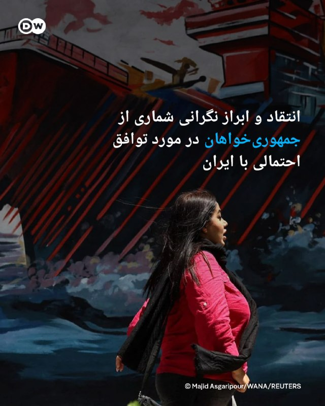

🔶 انتقاد و ابراز نگرانی شماری از جمهوری‌خواهان در مورد توافق احتمالی با ایران

تد کروز، سناتور جمهوری‌خواه، با انتشار پستی در شبکه ایکس نسبت به اظهارات دونالد ترامپ در مورد توافق در حال شکل‌گیری میان آمریکا و ایران "عمیقا" ابراز نگرانی کرده و گفت، چنین توافقی می‌تواند فشار واشنگتن بر تهران را تضعیف کرده و دستاوردهای نظامی اخیر را برعکس کند.

او تصمیم ترامپ برای حمله به ایران را "مهم‌ترین تصمیم" دومین دوره ریاست‌ جمهوری‌اش خوانده و نوشت ایالات متحده در این جنگ "از جمله با نابود کردن تمام موشک‌ها و پهپادهای جمهوری اسلامی و همچنین غرق کردن کل نیروی دریایی ایران، به دستاوردهای فوق‌العاده‌ای" رسید. کروز افزود: «اگر نتیجه همه این‌ها این باشد که یک رژیم ایرانی که همچنان توسط اسلام‌گرایانی اداره می‌شود که شعار ’مرگ بر آمریکا‘ سر می‌دهند، اکنون میلیاردها دلار دریافت کند، بتواند اورانیوم غنی‌سازی کند و سلاح هسته‌ای توسعه دهد و کنترل مؤثری بر تنگه هرمز داشته باشد، در این صورت چنین نتیجه‌ای یک اشتباه فاجعه‌بار خواهد بود.»

این سناتور سرشناس با اشاره به اظهارات ترامپ در مورد اینکه جزئیات این توافق هنوز در دست بررسی است، گفت: «دعا می‌کنم که گزارش‌های اولیه نادرست باشند، اما اینکه راب مالی [نماینده ویژه دولت آمریکا در امور ایران در دولت جو بایدن] از این توافق تعریف می‌کند، نشانه امیدبخشی نیست.»

کروز تأکید کرد ترامپ "باید خطوط قرمزی را که بارها ترسیم کرده است"، به اجرا بگذارد.

@dw_farsi

## DW_Farsi — post 125076

  

🔶 مقام اسرائیلی: توافق احتمالی نشان می‌دهد تهران می‌تواند تنگه هرمز را به سلاح تبدیل کند

یک مقام اسرائیلی که نخواست نامش فاش شود، در مصاحبه‌ای با کانال ۱۲ اسرائیل نسبت به توافق پیشنهادی احتمالی میان آمریکا و ایران ابراز نگرانی کرده و آن را "توافقی بد" خواند. این مقام اسرائیلی به این شبکه خبری گفت چارچوب این توافق درحال شکل‌گیری به تهران نشان می‌دهد که دارای سلاح دیگری به نام تنگه هرمز است که اثربخشی آن از یک سلاح هسته‌ای کمتر نیست.

به گفته او، دونالد ترامپ معتقد است که این توافق مبنای اقتصادی خواهد داشت و امکان بازگشایی تنگه هرمز را بدون آنگه پیشرفتی وابسته به امتیازدهی در برنامه هسته‌ای ایران باشد، فراهم می‌کند.

این مقام اسرائیلی به کانال ۱۲ اسرائیل گفته است که سرنوشت این توافق بعد از مرحله اول مبهم باقی می‌ماند.

در همین حال شبکه کان اسرائیل نیز خبر داد بنیامین نتانیاهو، نخست‌وزیر این کشور، نگرانی خود را در مورد دو بخش خاص از توافق احتمالی میان آمریکا و ایران که تعویق رسیدگی به پرونده هسته‌ای و پیوند زدن توافق آتش‌بس در لبنان با تفاهمات با ایران را شامل می‌شود، ابراز نگرانی کرده است.

رسانه‌های اسرائیلی گزارش کرده‌اند که نتانیاهو عصر روز یکشنبه جلسه محدودی را با کابینه امنیتی با موضوع بحث و بررسی توافق احتمالی تهران و واشنگتن برگزار خواهد کرد.

دستیار یکی از وزرای حاضر در این جلسه به "تایمز اسرائیل" گفته است که هنوز زمان تشکیل این نشست تعیین نشده است.

@dw_farsi

## DW_Farsi — post 125075

🔶 تیراندازی در نزدیکی کاخ سفید؛ مهاجم کشته شد

رسانه‌های آمریکایی پس از تیراندازی در نزدیکی کاخ سفید در واشنگتن در روز شنبه ۲۳ مه (دوم خرداد) به وقت محلی، از کشته شدن عامل احتمالی تیراندازی خبر داده‌اند.

بر اساس بیانیه سرویس مخفی آمریکا که رسانه‌های این کشور به آن استناد کرده‌اند، پس از آنکه این مرد به سوی مأموران سرویس مخفی مسئول حفاظت از رئیس جمهوری آمریکا آتش گشود، در جریان تیراندازی متقابل زخمی شد و سپس از شدت جراحات درگذشت.

طبق این گزارش، این فرد در یکی از ایست‌های بازرسی نزدیک کاخ سفید به سوی مأموران شلیک کرده بود. رسانه‌های آمریکایی به نقل از بیانیه سرویس مخفی نوشته‌اند: «مأموران سرویس مخفی پلیس به تیراندازی پاسخ دادند، مظنون را هدف قرار دادند و او به یکی از بیمارستان‌های منطقه منتقل شد، و بعداً درگذشت.»

@dw_farsi

## DW_Farsi — post 125074

  

🔶 نماینده مجلس: تنگه هرمز به هیچ‌وجه به حالت قبل جنگ باز نخواهد گشت

در پی اعلام دونالد ترامپ، رئیس جمهور آمریکا، مبنی بر بازگشایی تنگه هرمز در چارچوب توافق احتمالی با ایران، شماری از رسانه‌ها و مقامات جمهوری اسلامی به اظهارات او واکنش نشان دادند.

علی خزایی، عضو کمیسیون آموزش و تحقیقات مجلس شورای اسلامی، تأکید کرد که تنگه هرمز "به هیچ‌وجه و تحت هیچ شرایطی" به وضعیت پیش از جنگ بازنخواهد گشت. او با اشاره به اینکه حدود تردد دریایی در این آبراه کلیدی توسط سپاه پاسداران مشخص شده، گفت هر کشتی تجاری یا غیرتجاری باید برای عبور، از ایران مجوز بگیرد.

خزایی هشدار داد جمهوری اسلامی "اگر صلاح بداند، از امکان و اقتدار خود در تنگه‌های دیگر مثل باب‌المندب نیز برای سرجای خود نشاندن دشمن بهره خواهد برد".

حسین شریعتمداری، مدیر مسئول روزنامه کیهان، نیز در یادداشتی نسبت به بازگشت تنگه هرمز به وضعیت قبل هشدار داده و تأکید کرد ایران باید بابت عبور هر بشکه نفت از این آبراه عوارض دریافت کند.

او همچنین مزیت تنگه هرمز را فراتر از دریافت عوارض و کسب درآمد چندین میلیارد دلاری از کشتی‌ها و شناورها دانسته و نوشت این آبراه یک "اهرم قدرتمند استراتژیک" است که می‌توان از آن "برای مقابله جدی با تحریم‌ها، نقش‌آفرینی در روند جهانی اقتصاد، افزایش هزینه فشار‌های اقتصادی و نظامی علیه ایران اسلامی، کنترل بازار جهانی انرژی، کنترل و دریافت هزینه عبور کابل‌های اینترنتی زیر آب در خلیج‌فارس" بهره برد.

مارکو روبیو، وزیر خارجه آمریکا، پیش‌تر با اشاره به "پیشرفت‌هایی" در مذاکرات با ایران، تأکید کرده بود تنگه هرمز "باید بدون وضع هیچ‌گونه عوارضی باز بماند".

@dw_farsi

## Persian_Trend_Official — post 14853

💢مارکو روبیو کافی است بگوییم که پیشرفت‌هایی حاصل شده است، پیشرفت‌های قابل توجه، اگرچه پیشرفت نهایی هنوز به دست نیامده است. اگر اجازه دهیم این موضوع به یک امر عادی تبدیل شود، ما یک سابقه خطرناک ایجاد خواهیم کرد که می‌تواند در نقاط مختلف جهان تکرار شود. آنها…

## Persian_Trend_Official — post 14852

💢مارکو روبیو

کافی است بگوییم که پیشرفت‌هایی حاصل شده است، پیشرفت‌های قابل توجه، اگرچه پیشرفت نهایی هنوز به دست نیامده است.
اگر اجازه دهیم این موضوع به یک امر عادی تبدیل شود، ما یک سابقه خطرناک ایجاد خواهیم کرد که می‌تواند در نقاط مختلف جهان تکرار شود.
آنها مالک تنگه هرمز نیستند. این یک مسیر آبی بین‌المللی است. کاری که آنها اکنون انجام می‌دهند تهدید به نابودی کشتی‌های تجاری است که از این مسیر آبی بین‌المللی استفاده می‌کنند.
ایده اینکه این رئیس‌جمهور به توافقی تن دهد که در نهایت ایران را در موقعیت قوی‌تری در زمینه جاه‌طلبی‌های هسته‌ای قرار دهد، مضحک است. این اتفاق نخواهد افتاد.

🫆:Tony

📌 @persian_trend_official
پرشین ترند | متفاوت‌ترین کانال نظامی

## Persian_Trend_Official — post 14851

  

♦️هدف قرار دادن پهپاد ‌اربیتر بر فراز هرمزگان

🔹 این پهپاد ، که کاربری جاسوسی و شناسایی داشت، با شلیک پدافند ارتش سرنگون شد.

🔹لاشه پهپاد متلاشی شده اربیتر هم با همکاری ناوگروه دریابانی فراجای هرمزگان کشف شد./مهر

پ ن : با توجه به برد کم این پهپاد احتمالا از درون خاک به پرواز در امده است

🫆:Tony

📌 @persian_trend_official
پرشین ترند | متفاوت‌ترین کانال نظامی

## Persian_Trend_Official — post 14848

  <a href="telegram/content/Persian_Trend_Official_14848_1779620901.webm" target="_blank">🎬 Download video</a>

⭕️ طبق گزارش تایمز آو اسرائیل، یک مقام ارشد اسرائیلی گفته ترامپ در تماس دیشب با نتانیاهو تأکید کرده که توافق نهایی با ایران باید به برچیده شدن کامل برنامه هسته‌ای تهران و خارج شدن تمام اورانیوم غنی‌شده از خاک ایران منجر شود و بدون این شروط، آن را امضا نخواهد کرد.

در همان گزارش آمده نتانیاهو هم گفته اسرائیل آزادی عملش را در برابر تهدیدها در همه جبهه‌ها، از جمله لبنان، حفظ می‌کند و ترامپ هم از این اصل حمایت کرده است.

📝 Nick

📌 @persian_trend_official
پرشین ترند | متفاوت‌ترین کانال نظامی

## Persian_Trend_Official — post 14847

  <a href="telegram/content/Persian_Trend_Official_14847_1779620901.mp4" target="_blank">🎬 Download video</a>

🔴سردار قربانی: اسرائیلی‌ها بدانند قاآنی تا زیر سنگرهایشان می‌رود‼️

💢سردار «مرتضی قربانی» مشاور فرمانده سپاه پاسداران: هیچ‌وقت از قاآنی ترس و واهمه ندیدم، اسرائیلی‌ها بدانند قاآنی تا زیر سنگرهایشان می‌رود!

🫆:Tony

📌 @persian_trend_official
پرشین ترند | متفاوت‌ترین کانال نظامی

## Persian_Trend_Official — post 14846

⭕️ رویترز به نقل از یک مقام ایرانی گفت تهران با انتقال ذخایر اورانیوم غنی‌شده با غنای بالا به خارج از کشور موافقت نکرده است و موضوع هسته‌ای بخشی از توافق اولیه فعلی با ایالات متحده نیست.

پ.ن: 20 امتیاز برای کسی که پرتقال فروش رو پیدا کنه 😑

📝 Nick

📌 @persian_trend_official
پرشین ترند | متفاوت‌ترین کانال نظامی

## Persian_Trend_Official — post 14845

  <a href="telegram/content/Persian_Trend_Official_14845_1779620903.webm" target="_blank">🎬 Download video</a>

⭕️ کیر استارمر نخست وزیر بریتانیا:

من پیشرفت‌ها را به سوی یک توافق بین ایالات متحده و ایران خوش‌آمد می‌گویم.
ما باید توافقی را ببینیم که درگیری را به پایان برساند و تنگه هرمز را با آزادی ناوبری بدون قید و شرط و بدون محدودیت دوباره باز کند. حیاتی است که هرگز به ایران اجازه داده نشود تا سلاح هسته‌ای توسعه دهد.
دولت من به انجام هر کاری که می‌توانیم برای محافظت از مردم بریتانیا از تأثیرات این درگیری ادامه خواهد داد.
ما با شرکای بین‌المللی خود برای بهره‌برداری از این لحظه و دستیابی به یک حل و فصل دیپلماتیک بلندمدت همکاری خواهیم کرد.

پ.ن: خدایی اظهار نظر به تو یکی دیگه نمیرسه.

📝 Nick

📌 @persian_trend_official
پرشین ترند | متفاوت‌ترین کانال نظامی

## Persian_Trend_Official — post 14844

  <a href="telegram/content/Persian_Trend_Official_14844_1779620903.webm" target="_blank">🎬 Download video</a>

💢 پزشکیان: گاهی برخی کارشناسان در رسانه ملی سخنانی مطرح می‌کنند که با واقعیت‌های جاری کشور و روندهای موجود فاصله جدی دارد، اما دولت به‌منظور جلوگیری از اختلاف و حفظ آرامش جامعه، از واکنش و موضع‌گیری پرهیز می‌کند.

🚫 در مواردی، کلیپ‌هایی از بیانات رهبر شهید انقلاب درباره مذاکره به‌گونه‌ای بازنشر می‌شود که گویا نظام به‌صورت مطلق مخالف هرگونه مذاکره بوده است، در حالی که رهبر شهید هیچ‌گاه با مذاکره عزتمندانه، مبتنی بر اقتدار و در چارچوب منافع ملی مخالفت نداشتند و در دیدارهایی که با معظم‌له داشتیم، نگاه ایشان همواره مبتنی بر حفظ عزت، حکمت و مصلحت نظام بود.

📝 Nick

📌 @persian_trend_official
پرشین ترند | متفاوت‌ترین کانال نظامی

## Persian_Trend_Official — post 14843

⭕️ تسنیم:

ایران تاکید کرده است که بدون آزادسازی بخش مشخصی از اموال بلوکه شده ایران در همین گام اول و مشخص بودن سازوکار روشن برای ادامه‌ی تضمین‌شده آزادسازی همه اموال بلوکه شده، تفاهمی در کار نخواهد بود.

📝 Nick

📌 @persian_trend_official
پرشین ترند | متفاوت‌ترین کانال نظامی

## Persian_Trend_Official — post 14842

  <a href="telegram/content/Persian_Trend_Official_14842_1779620904.webm" target="_blank">🎬 Download video</a>

⭕️ کانال ۱۴ اسرائیل:

نتانیاهو به وزرا دستور داده است که از بحث در مورد توافق قریب‌الوقوع بین تهران و واشنگتن خودداری کنند.

📝 Nick

📌 @persian_trend_official
پرشین ترند | متفاوت‌ترین کانال نظامی

## Persian_Trend_Official — post 14841

  <a href="telegram/content/Persian_Trend_Official_14841_1779620904.webm" target="_blank">🎬 Download video</a>

⭕️ بنیامین نتانیاهو:

خوشحالم که رئیس‌جمهور realDonaldTrump، بهترین دوستی که اسرائیل تاکنون در کاخ سفید داشته، سالم است و مهاجم پیش از آنکه بتواند آسیب بیشتری بزند، خنثی شد.

خشونت سیاسی، از جمله تلاش‌های مکرر برای ترور رئیس‌جمهور ترامپ، باید بدون هیچ تردیدی و با قاطعیت از سوی همه محکوم شود.

📝 Nick

📌 @persian_trend_official
پرشین ترند | متفاوت‌ترین کانال نظامی

## RadioFarda — post 157515

  

🔸محمد سرافراز، رئیس پیشین سازمان صداوسیما و عضو کنونی شورای عالی فضای مجازی، می‌گوید بخشی از حاکمیت ایران با الهام از الگوی چین به‌دنبال محدود کردن اینترنت جهانی برای عموم مردم و ارائهٔ آن فقط به گروهی خاص و کنترل‌شده است.

🔸او روز یک‌شنبه سوم خرداد در گفت‌وگو با روزنامه اینترنتی فراز گفت جمهوری اسلامی تجهیزات لازم برای «قطع دائمی اینترنت» را از چین خریداری و وارد کرده است.

🔸محمد سرافراز توضیح داد که در چین اینترنت جهانی برای عموم مردم قطع است و فقط به‌صورت محدود در اختیار گروه‌هایی خاص قرار می‌گیرد. سرافراز با اشاره به الگویی که آن را «سامانه نیکان» در چین خواند، گفت هدف چنین سازوکاری این است که «روایت حکومت» بر کشور حاکم باشد.

🔸او همچنین اپراتورهای عضو شورای عالی فضای مجازی را از عوامل پشت پردهٔ تصویب طرح موسوم به «اینترنت پرو» دانست و گفت ذی‌نفعان قطع اینترنت «یک روز فیلترشکن می‌فروشند و یک روز اینترنت پرو».

🔸نت‌بلاکس، نهاد رصد دسترسی به اینترنت در جهان، روز یک‌شنبه نوشت که قطعی اینترنت در ایران وارد هشتادوششمین روز خود شده است.

@RadioFarda

## RadioFarda — post 157514

🔸در یکی از بزرگ‌ترین حمله‌های سال‌های اخیر به پایتخت اوکراین، روسیه جدیدترین موشک هایپرسونیک خود را به همراه صدها پهپاد و موشک دیگر به سمت شهری در منطقۀ کی‌یف پرتاب کرد.

🔸بر پایۀ گزارش‌ها، دست‌کم چهار نفر جان باخته‌اند و پیش‌بینی می‌شود آمار جان‌باختگان افزایش یابد.

🔸ولودیمیر زلنسکی، رئیس‌جمهور اوکراین، اظهار داشت که روسیه با استفاده از جدیدترین موشک فراصوت خود به نام اورِشنیک، شهر بیلا تسرکوا در ۸۰ کیلومتری جنوب کی‌یف را هدف قرار داده که در جریان آن «تأسیسات آب‌رسانی، بازار شهر، ده‌ها ساختمان مسکونی و چندین مدرسه» آسیب دیده‌اند. در مجموع، نزدیک به ۶۰۰ پهپاد و ۹۰ موشک در این تهاجم به کار گرفته شد.

🔸این سومین بار است که روسیه موشک اورشنیک را بر ضد اهداف اوکراینی به کار می‌گیرد و نخستین باری است که آن را به سوی منطقۀ کی‌یف پرتاب می‌کند.

🔸این حمله تنها دو روز پس از سخنرانی به شدت ستیزه‌جویانۀ ولادیمیر پوتین، رئیس‌جمهور روسیه، انجام گرفت؛ سخنرانیِ که یادآور لحن و ادبیات او در آستانۀ تهاجم فوریه ۲۰۲۲ بود.

@RadioFarda

## RadioFarda — post 157513

  

🔸هیئت داوران جشنواره کن در فرانسه روز شنبه، دوم خردادماه، کریستیان مونجیو، کارگردان رومانیایی، را به عنوان برنده جایزه نخل طلای کن انتخاب کرد.

🔸مونجیو اولین بار ۱۹ سال پیش این جایزه را برای فیلم «چهار ماه،‌ سه هفته،‌ دو روز» برده بود و این بار نخل طلا را برای فیلم «فیورد» [آب‌دره] از آنِ خود کرد.

🔸در فیورد که اولین فیلم انگلیسی‌زبان مونجیو نیز هست، رناته رِینسوِه، هنرپیشه نروژی، و سباستین استن،‌ ستاره هالیوود، نقش پدر و مادری رومانیایی و مهاجر به نروژ و مذهبی را بازی می‌کنند که در این کشور به آزار و اذیت کودکان متهم می‌شوند.

🔸کریستیان مونجیوی ۵۸ ساله با بردن دوباره نخل طلا روز شنبه گذشته به کارگردانانی چون فرانسیس فورد کوپولا، میشاییل هانِکِه، بیل آگوست، شوهه‌ای ایمامورا و امیر کوستوریتسا پیوست که همگی دو بار این جایزه را برده‌اند.

🔸در این دوره از جشنواره که پارک چان ووک، کارگردان برجسته کره‌ای،‌ ریاست هیئت داوران آن را بر عهده داشت، جایزه بزرگ که دومین جایزه مهم این جشنواره است به فیلم «مینوتور» ساخته آندری زِویاگینتسِف رسید، هجویه‌ای درباره زندگی اجتماعی در روسیه امروز.

@RadioFarda

## IranianMinds — post 20662

  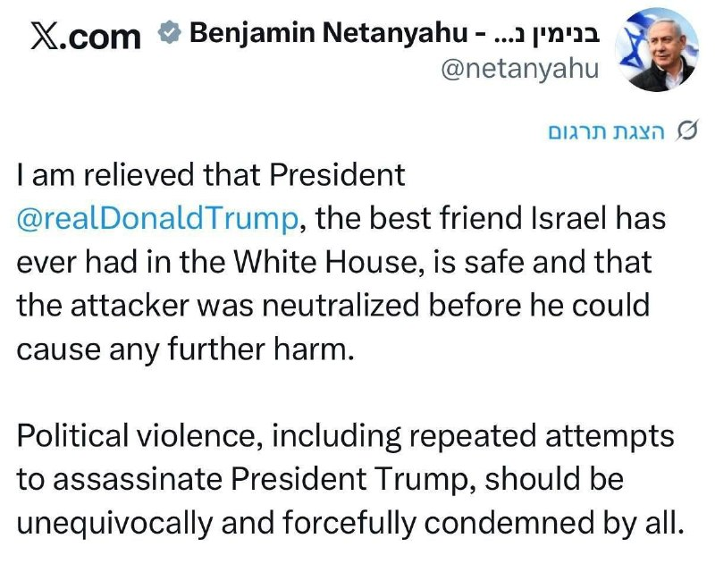

🔴 نتانیاهو:

«خوشحالم که رئیس‌جمهور دونالد ترامپ، بهترین دوستی که اسرائیل تاکنون در کاخ سفید داشته، در امنیت است و مهاجم پیش از آنکه بتواند آسیب بیشتری وارد کند، خنثی شد.

خشونت سیاسی، از جمله تلاش‌های مکرر برای ترور رئیس‌جمهور ترامپ، باید به‌طور قاطع و شدید از سوی همه محکوم شود.»

@IranianMinds

## IranianMinds — post 20661

🔄 اگر هنوز ۵۰۰ هزارتومان رو نگرفتی همین الان عضو شو‌ و جایزتو بگیر

✅نیازی هم به واریز نیست

🟢 تنها سایت مورد #تایید ما با بونوس های واقعی

🌐 Winro.io

## IranianMinds — post 20660

  

⭕️ تا حالا بدون واریزی روی فوتبال ها شرط بستی؟!

🎉 500 هزارتومن بونوس رایگان فقط با ثبت نام بدون هیچگونه واریزی!

😮 تنها سایتی که با عضویت بدون واریز 500,000 تومان شارژ بی قیدو شرط میده #وینرو هست
💰

👑 #معتبرترین سایت ایرانی 
⬇️

🌐 Winro.io

🌐 Winro.io

📱کانال اخبار و هدایا r3 
🎁

📱 @winro_io

## BBCPersian — post 281948

🔻تسنیم: هنوز اختلاف بر سر یکی دو بند تفاهم‌نامه وجود دارد

خبرگزاری تسنیم در خبری به نقل از «منبع مطلع» بدون اشاره به نامی نوشت که «اختلاف میان ایران و آمریکا بر سر یکی دو بند از تفاهم‌نامه احتمالی همچنان ادامه دارد.»

به نوشته تسنیم، یکی از موارد اختلاف «آزادسازی اموال ایران» است.

این خبرگزاری که به نهادهای نظامی و امنیتی نزدیک است، نوشت به همین دلیل توافق «هنوز نهایی» نشده است و «در صورت ادامه مانع‌تراشی‌های آمریکا، امکان نهایی شدن تفاهم‌نامه وجود ندارد.»

بنابر این گزارش، در متن تفاهم‌نامه «هیچ اشاره‌ای به تعیین پروتکل آمریکایی برای کشتی‌های ایرانی» پس از رفع محاصره دریایی ایالات متحده نشده است.

https://bbc.in/4nOuCnR
@BBCPersian

## BBCPersian — post 281947

  

🔻وزیر خارجه آمریکا گفت: «فکر می‌کنم شاید این احتمال وجود داشته باشد که در چند ساعت آینده دنیا خبرهای خوبی بشنود.»

مارکو روبیو که به هند سفر کرده است در کنفرانس خبری با همتای هندی خود افزود: «ممکن است اواخر روز یکشنبه بیانیه‌ای در مورد توافق با ایران منتشر شود که می‌تواند رسما به جنگ خاورمیانه پایان دهد.»

او گفت که در این توافق احتمالی نگرانی‌های ایالات متحده در مورد تنگه هرمز را «تا حد زیادی» برطرف خواهد کرد.

وزیر خارجه آمریکا همچنین گفت این توافق «فرآیندی را آغاز می‌کند که در نهایت می‌تواند ما را به جایی که رئیس‌جمهور می‌خواهد برساند، دنیایی که دیگر لازم نیست از سلاح هسته‌ای ایران بترسد یا نگرانش باشد.»

📸Getty Images
@BBCPersian

## Dirty_Kids — post 390066

علی کریمی توی یه استوری عکس اصلی که یه نفر تصویر شاهزاده رضا پهلوی رو برده بالا استوری کرده، اما شاهزاده رضا پهلوی رو سانسور کرده و جای عکس شاهزاده رضا پهلوی نوشته «ایران»!

@Dirty_Kids 👻

## Dirty_Kids — post 390065

  <a href="telegram/content/Dirty_Kids_390065_1779620907.mp4" target="_blank">🎬 Download video</a>

دو تماس متفاوت از ایران😂😂
حتما تا اخر ببینید

@Dirty_Kids 👻

## Dirty_Kids — post 390064

  

🌪وقتی اینترنت طوفانیه فقط کافیه بادبان ها رو بکشی

⚫️100 هزار تومان تخفیف خرید اول 
🎁

⚫️پایین ترین قیمت گیگی 180 هزار تومان
🌐 

⚫️پورسانت %10 دائمی برای هر معرفی
💼

با بادبان، میتونی یه اتصال سریع، پایدار و امن
همراه با پشتیبانی ۲۴ ساعته داشته باشی
🚀

🛒کد تخفیف: badban4k

بادبان راهتو باز می‌کنه
⛵️
R3

🛡@BadBan_VPN | کانال 

🤖@BadBan_VPNBot | ربات 

📞@BadBan_VPNSupport | پشتیبانی

## Hranews — post 113133

  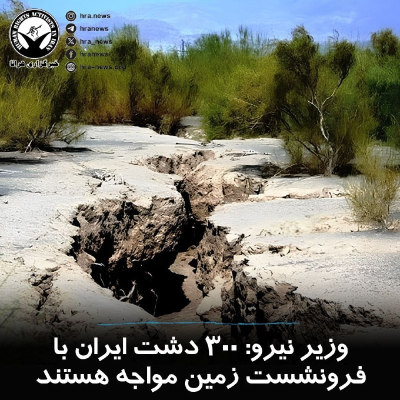

عباس علی‌آبادی، وزیر نیرو، با اشاره به شرایط منابع آبی کشور در ششمین سال متوالی خشکسالی گفت: از مجموع ۶۰۹ دشت ایران، بیش از ۴۰۰ دشت در وضعیت ممنوعه یا بحرانی قرار دارند و حدود ۳۰۰ دشت نیز با پدیده #فرونشست زمین مواجه هستند؛ موضوعی که به‌ویژه در استان‌هایی مانند اصفهان، کرمان، فارس، خراسان رضوی و تهران شدت بیشتری دارد.

وی در ادامه افزود: مهم‌ترین چالش بخش آب کشور اضافه‌برداشت از منابع زیرزمینی است و فشار بیش از حد بر آبخوان‌ها موجب بروز مشکلات متعددی از جمله تشدید بحران آب شده است.

↘️
@hranews_bot تماس ✉️ -  @Hranews  کانال هرانا 🆑

## Hranews — post 113132

  

اعتراضات ۱۴۰۴؛ ایلیا بن‌رشید به حبس و شلاق محکوم شد

❗️
❗️
❗️
❗️
❗️ – ایلیا بن‌رشید، از بازداشت‌شدگان اعتراضات دی‌ماه ۱۴۰۴ در شاهین‌شهر، توسط دادگاه کیفری به شش ماه #حبس و تحمل ۲۰ ضربه #شلاق محکوم شد. بخش دیگر پرونده وی با اتهام «#محاربه» در دادگاه انقلاب در حال رسیدگی است و تاکنون حکمی برای این بخش از پرونده صادر نشده است.

به گزارش خبرگزاری هرانا، ارگان خبری مجموعه فعالان حقوق بشر در ایران، ایلیا بن‌رشید یکی از بازداشت‌شدگان اعتراضات دی‌ماه ۱۴۰۴ که در زندان دستگرد اصفهان محبوس است، به حبس و شلاق محکوم شد.

براساس حکم صادره توسط شعبه ۱۰۲ دادگاه کیفری دو شاهین‌شهر و میمه، آقای بن‌رشید بابت اتهام «مباشرت در سرقت یک عدد کیس کامپیوتر متعلق به شبکه بهداشت و درمان شاهین‌شهر» به شش ماه حبس تعزیری و ۲۰ ضربه شلاق تعزیری محکوم شده است. این شعبه او را از اتهام اخلال در نظم و آسایش عمومی از طریق شرکت در اعتراضات تبرئه کرده است.
براساس اطلاعات دریافتی هرانا، بخش دیگر پرونده وی در دادگاه انقلاب اصفهان در حال رسیدگی است و تاکنون حکمی برای این بخش از پرونده صادر نشده است.

ادامه مطلب

#ایلیا_بن‌رشید

↘️
@hranews_bot تماس ✉️ -  @Hranews  کانال هرانا 🆑

## Hranews — post 113131

با اتمام مراحل بازجویی؛ فروزان نوجوان به زندان ارومیه منتقل شد

❗️
❗️
❗️
❗️
❗️– فروزان نوجوان (اسلامی)، مدرس زبان انگلیسی و اهل ارومیه، با اتمام مراحل بازجویی از یکی از بازداشتگاه‌های امنیتی ارومیه به بند زنان زندان این شهر منتقل شد.

ادامه مطلب

#فروزان_نوجوان
#فروزان_اسلامی

↘️
@hranews_bot تماس ✉️ -  @Hranews  کانال هرانا 🆑

## Hranews — post 113130

امروز یکشنبه ۳ خردادماه، شماری از بازنشستگان تامین اجتماعی در مقابل ساختمان این سازمان در شوش دست به #تجمع اعتراضی زدند.

این تجمع در اعتراض به تاخیر در اعمال افزایش حقوق سالانه موضوع ماده ۹۶، بی‌توجهی به تعیین و ابلاغ حق مسکن و همچنین اجرا نشدن قانون الزام در بخش درمان صورت گرفته است.

↘️
@hranews_bot تماس ✉️ -  @Hranews  کانال هرانا 🆑

## Hranews — post 113129

تهران؛ یک زن توسط همسرش به قتل رسید

❗️
❗️
❗️
❗️
❗️ – روز جمعه ۱ خردادماه، مردی در تهران، همسر خود را به دلیل اختلافات خانوادگی به قتل رساند. متهم توسط پلیس بازداشت شد.

ادامه مطلب

#زن_کشی

↘️
@hranews_bot تماس ✉️ -  @Hranews  کانال هرانا 🆑

## manototv — post 105801

  <a href="telegram/content/manototv_105801_1779620910.mp4" target="_blank">🎬 Download video</a>

اورزولا فون‌درلاین، رئیس کمیسیون اروپا، از پیشرفت در مسیر دستیابی به توافق میان آمریکا و جمهوری اسلامی استقبال کرد و گفت هر توافقی باید به کاهش واقعی تنش‌ها، بازگشایی تنگه هرمز و تضمین آزادی کامل کشتیرانی بدون پرداخت عوارض منجر شود.

او تاکید کرد جمهوری اسلامی نباید اجازه پیدا کند به سلاح هسته‌ای دست یابد.

فون‌درلاین همچنین گفت تهران باید به اقدامات بی‌ثبات‌کننده خود در منطقه، چه مستقیم و چه از طریق گروه‌های نیابتی، پایان دهد و حملات «بی‌دلیل و مکرر» به همسایگانش را متوقف کند.

رئیس کمیسیون اروپا افزود اروپا به همکاری با شرکای بین‌المللی برای استفاده از این فرصت در مسیر یک راه‌حل دیپلماتیک پایدار ادامه خواهد داد.

او همچنین گفت اروپا تلاش می‌کند پیامدهای این درگیری، به‌ویژه بر زنجیره‌های تامین و قیمت انرژی، مهار شود.

## manototv — post 105800

  <a href="telegram/content/manototv_105800_1779620910.mp4" target="_blank">🎬 Download video</a>

ایرانیان در لندن برای هجدهمین هفته پیاپی، از مقابل شماره ۱۰ خیابان داونینگ تا سفارت جمهوری اسلامی راهپیمایی کردند و حمایت خود را از آزادی مردم ایران اعلام کردند.

## manototv — post 105799

  <a href="telegram/content/manototv_105799_1779620912.mp4" target="_blank">🎬 Download video</a>

نت‌بلاکس اعلام کرد انسداد اینترنت در ایران وارد هشتادوششمین روز شده و مردم پس از بیش از دو هزار و ۴۰ ساعت، همچنان در «تاریکی دیجیتال» به سر می‌برند.

این نهاد ناظر بر اینترنت نوشت دسترسی به اینترنت جهانی در ایران، همزمان با ادامه گفت‌وگوهای صلح، همچنان به‌طور گسترده قطع است.

به گفته نت‌بلاکس، در حالی که بخش بزرگی از مردم از دسترسی آزاد به اینترنت محرومند، گروهی از کاربران گزینش‌شده و دارای دسترسی سفید، تصویری ساختگی و کنترل‌شده از زندگی در ایران را به جهان بیرون نشان می‌دهند.

## alonews — post 122302

  <a href="telegram/content/alonews_122302_1779620912.webm" target="_blank">🎬 Download video</a>

👈بحرین: نه نفر به جرم جاسوسی برای سپاه پاسداران ایران به حبس ابد محکوم شدند

✅ @AloNews خبر جنگ

## alonews — post 122301

  <a href="telegram/content/alonews_122301_1779620912.webm" target="_blank">🎬 Download video</a>

👈رویترز: توافق اولیه بین آمریکا و ایران، برنامه هسته‌ای را شامل نمی‌شود

✅ @AloNews خبر جنگ

## alonews — post 122300

  <a href="telegram/content/alonews_122300_1779620912.webm" target="_blank">🎬 Download video</a>

👈نشریه اکونومیست گزارش داده که جنگ، بازار بیمه رو شدیداً تکون داده؛ طوری که هزینه بیمه کردن دارایی‌ها در برابر خشونت‌های سیاسی، الان ۴۰ برابرِ زمان قبل از جنگ شده و این موضوع خریداران بیمه رو با چالش بزرگی روبرو کرده.

✅ @AloNews خبر جنگ

## alonews — post 122299

  <a href="telegram/content/alonews_122299_1779620912.webm" target="_blank">🎬 Download video</a>

👈فرماندهی جبهه داخلی اسرائیل یک سیستم هشدار زودهنگام جدید برای پرتاب راکت و موشک از لبنان توسعه داده است که طبق گزارش کانال ۱۲ اسرائیل، به ساکنان نزدیک مرز چند ثانیه هشدار قبلی و در سایر نقاط کشور تا دو دقیقه زمان می‌دهد.

✅ @AloNews خبر جنگ

## alonews — post 122298

  <a href="telegram/content/alonews_122298_1779620913.webm" target="_blank">🎬 Download video</a>

👈 مهر: سرنگون شدن پهپاد اسرائیلی بر فراز هرمزگان

✅ @AloNews خبر جنگ

## alonews — post 122297

  <a href="telegram/content/alonews_122297_1779620913.webm" target="_blank">🎬 Download video</a>

😱
🔺پلن JeT🏎 گيگى 126هزار تومان فروش محدود باز شد 
⏰

فقط 700 تا شارژ شد  
😱

🔥

🤖: @v2boxinoBot 
❤️

قیمت فقط گیگی 126 هزارتومان 
🏃‍♂️
🤔

این آخرین ظرفیت ويتوباكسينو برای امروز 
⚡️

🔤
📣: @v2boxino

## alonews — post 122296

  <a href="telegram/content/alonews_122296_1779620913.webm" target="_blank">🎬 Download video</a>

👈تسنیم: در هیچ‌یک از بندهای تفاهمنامه، عبارتی مبنی بر بازرسی یا کنترل کشتی‌های ایرانی توسط آمریکا پس از رفع محاصره دریایی وجود ندارد/ اساساً ایران هیچ اجازه‌ای به آمریکایی‌ها برای چنین اقدامی نداده و نخواهد داد

✅ @AloNews خبر جنگ

## alonews — post 122295

  <a href="telegram/content/alonews_122295_1779620913.webm" target="_blank">🎬 Download video</a>

👈 نخست‌وزیر اسرائیل، بنیامین نتانیاهو، به ترامپ هشدار داد که اسرائیل «آزادی عمل در برابر تهدیدها در همه عرصه‌ها، از جمله لبنان، را حفظ می‌کند»، به گزارش AP

✅ @AloNews خبر جنگ

## alonews — post 122294

  <a href="telegram/content/alonews_122294_1779620913.webm" target="_blank">🎬 Download video</a>

👈کاهش قیمت دلار: ۱۶۸ هزار تومان

✅ @AloNews خبر جنگ

## alonews — post 122293

  <a href="telegram/content/alonews_122293_1779620914.webm" target="_blank">🎬 Download video</a>

👈کانال ۱۴ اسرائیل:
بر اساس جزئیات منتشر شده، ایران تنگه هرمز را بدون دریافت هزینه باز خواهد کرد در حالی که آمریکا پولی به تهران منتقل نخواهد کرد و به هر دو طرف مهلت ۶۰ روزه داده می‌شود تا مذاکرات هسته‌ای را ادامه دهند.

🔴تحریم‌ها علیه ایران باقی خواهد ماند به جز تسهیلات محدودی در محدودیت‌های مرتبط با نفت.

✅ @AloNews خبر جنگ

## alonews — post 122292

  <a href="telegram/content/alonews_122292_1779620914.webm" target="_blank">🎬 Download video</a>

👈کانال ۱۲ عبری به نقل از یک مقام ارشد اسرائیلی: توافق احتمالی ایران و امریکا بد است، زیرا این پیام را به ایرانیان می‌دهد که آنها سلاحی دارند که به اندازه سلاح هسته‌ای مؤثر است، و آن تنگه هرمز است

✅ @AloNews خبر جنگ

## alonews — post 122291

  <a href="telegram/content/alonews_122291_1779620914.webm" target="_blank">🎬 Download video</a>

👈وزارت دفاع روسیه : مراکز فرماندهی نیروهای زمینی و ریاست اطلاعات اوکراین رو هدف قرار دادیم

✅ @AloNews خبر جنگ

## alonews — post 122290

  <a href="telegram/content/alonews_122290_1779620914.webm" target="_blank">🎬 Download video</a>

👈قبرس به طور رسمی علاقه‌مندی خود را برای خرید پهپادهای هندی و مهمات پرنده آزمایش‌شده در عملیات سیندور اعلام کرد.

🔴 مقامات قبرسی به طور خاص نام سیستم‌های مهمات پرنده ناگاسترا-۱ و اسکای استرایکر را به عنوان سیستم‌هایی که می‌خواهند به دست آورند، ذکر کردند.

✅ @AloNews خبر جنگ

## alonews — post 122289

  <a href="telegram/content/alonews_122289_1779620914.webm" target="_blank">🎬 Download video</a>

👈تسنیم به نقل از منبع آگاه: آمریکایی ها درحال کارشکنی هستند و مسئله پول های بلوکه شده باعث شده فعلا توافقی نهایی نشود!

✅ @AloNews خبر جنگ

## alonews — post 122288

  <a href="telegram/content/alonews_122288_1779620914.mp4" target="_blank">🎬 Download video</a>

👈فیلم نزدیک از حمله موشکی بالستیک میان‌برد اورشنیک در طول شب به بیلا تسروکا، منطقه کیف.

✅ @AloNews خبر جنگ

## alonews — post 122287

  <a href="telegram/content/alonews_122287_1779620916.webm" target="_blank">🎬 Download video</a>

👈کان نیوز: ایالات متحده به طور مداوم اسرائیل را در جریان مذاکرات یادداشت تفاهم با ایران قرار می‌دهد که هدف آن بازگشایی تنگه هرمز و آغاز گفتگوها درباره مسائل حل‌نشده برای رسیدن به توافق نهایی است

🔴در تماس تلفنی با رئیس‌جمهور ترامپ دیشب، نخست‌وزیر تأکید کرد که اسرائیل آزادی عمل خود را در برابر تهدیدات در تمام جبهه‌ها، از جمله لبنان، حفظ خواهد کرد و ترامپ از این موضع حمایت کرد.

🔴ترامپ همچنین مجدداً تأکید کرد که خواستار حفظ درخواست خود برای برچیدن برنامه هسته‌ای ایران و حذف تمام اورانیوم غنی‌شده از خاک ایران است و گفت بدون این شرایط هیچ توافق نهایی امضا نخواهد شد.

✅ @AloNews خبر جنگ

## alonews — post 122286

  <a href="telegram/content/alonews_122286_1779620916.webm" target="_blank">🎬 Download video</a>

👈جروزالم پست: جنگ، ایران را فرو نپاشید. کنترل آن بر هرمز را تثبیت کرد، اتحادهایش را از نو ساخت و همان نهادهایی را که ایالات متحده هدف قرار داده بود، تقویت کرد

✅ @AloNews خبر جنگ

## alonews — post 122285

  <a href="telegram/content/alonews_122285_1779620916.webm" target="_blank">🎬 Download video</a>

👈نشریه عبری معاریو به نقل از منابع آگاه:
نتانیاهو در هفته‌های گذشته چندین بار درخواست گفت‌وگو با ترامپ را داده، اما پاسخ از سوی مشاوران ترامپ داده می‌شده است

✅ @AloNews خبر جنگ

## alonews — post 122284

  <a href="telegram/content/alonews_122284_1779620916.webm" target="_blank">🎬 Download video</a>

👈مقام اسرائیلی: رئیس جمهور ترامپ به نخست وزیر نتانیاهو روشن کرد که در مذاکرات بر سر خواسته دیرینه خود مبنی بر برچیدن برنامه هسته ای ایران و خروج تمام اورانیوم غنی شده از خاک ایران، قاطع خواهد ماند. او اظهار داشت که تا زمانی که این شرایط برآورده نشود، توافق نهایی را امضا نخواهد کرد.

🔴 اما توافق چارچوبی برای پایان جنگ - قطعاً ممکن است

✅ @AloNews خبر جنگ

## alonews — post 122283

  <a href="telegram/content/alonews_122283_1779620916.webm" target="_blank">🎬 Download video</a>

👈خنثی‌سازی مهمات عمل نکرده در اطراف نیروگاه اتمی بوشهر

✅ @AloNews خبر جنگ

---
📅 بروزرسانی: 1405/03/03 13:07
---

## VahidOOnLine — post 241906

  <a href="telegram/content/VahidOOnLine_241906_1779615436.mp4" target="_blank">🎬 Download video</a>

مارکو روبیو، وزیر خارجه آمریکا، در سخنانی در دهلی گفت در پرونده ایران «پیشرفت قابل توجهی» حاصل شده، اما هنوز توافقی نهایی نشده است.

او گفت احتمالا تا ساعاتی دیگر اخبار بیشتری منتشر خواهد شد و افزود هدف اصلی واشینگتن جلوگیری از دستیابی جمهوری اسلامی به سلاح هسته‌ای است.

روبیو همچنین تنگه هرمز را یک آبراه بین‌المللی خواند و گفت جمهوری اسلامی مالک آن نیست. او تهدید کشتی‌های تجاری در این مسیر را غیرقانونی دانست و گفت دولت ترامپ طی ۴۸ ساعت گذشته با شرکای منطقه‌ای برای باز نگه داشتن کامل این آبراه کار کرده است.

وزیر خارجه آمریکا اضافه کرد ترجیح ترامپ حل مسئله از راه دیپلماسی است، اما افزود که این موضوع «به هر شکل» حل خواهد شد.
‌🏁 🇬🇧 ManotoTV

🤖 @VahidOOnLine

## VahidOOnLine — post 241905

  

محمدرسول شیخی‌زاده، دبیر اول کمیسیون بهداشت و درمان مجلس به سایت دیده‌بان‌ایران گفت: «افزایش قیمت دارو به گونه‌ای است که بیمه هم پاسخگو نیست. این در حالی است که دارو جزو کالاهای استراتژیک و حیاتی برای مردم است؛ چه در شرایط جنگی و چه در شرایط عادی و غیرجنگی.»

او افزود: «ما باید حداقل تا شش ماه ذخایر دارویی داشته باشیم. اصلا اگر هیچ جنگی هم اتفاق نمی‌افتاد، وزارت بهداشت، مخصوصا سازمان غذا و دارو، باید نسبت به اجرای این قانون اهتمام بورزد.»
‌🏁 🇬🇧 IranintlTV

🤖 @VahidOOnLine

## VahidOOnLine — post 241904

  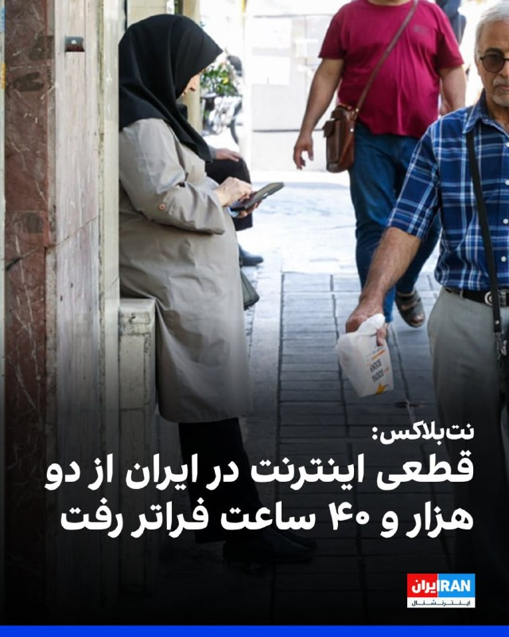

نت‌بلاکس، نهاد ناظر بر اختلال‌های اینترنتی در جهان، گزارش داد قطعی اینترنت در ایران اکنون وارد هشتادوششمین روز خود شده و مردم پس از بیش از دو هزار و ۴۰ ساعت همچنان در تاریکی دیجیتال به سر می‌برند.

بنا بر این گزارش، در حالی که دسترسی به اینترنت جهانی در طول مذاکرات تا حد زیادی قطع است، کاربران نزدیک به حکومت، تصویری مصنوعی از زندگی ایرانیان به جهان خارج ارائه می‌دهند.
iranintl
‌🏁 🇬🇧 IranintlTV

🤖 @VahidOOnLine

## VahidOOnLine — post 241903

  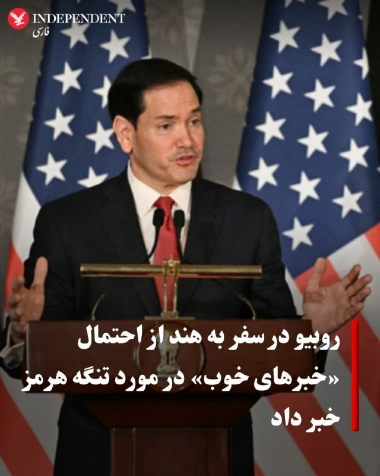

♦️مارکو روبیو، وزیر خارجه آمریکا روز یکشنبه سوم خرداد در نشست خبری با وزیر خارجه هند گفت: «ممکن است طی ساعات آینده خبرهای خوبی، دست‌کم درباره تنگه هرمز منتشر شود.»

به گزارش رویترز، روبیو که به هند سفر کرده است روز یکشنبه با اشاره به توافق احتمالی ایران و آمریکا گفت: «طی ۴۸ ساعت گذشته با همکاری شرکای خود در منطقه روی چارچوبی کار کرده‌ایم که در صورت موفقیت، نه تنها به باز ماندن کامل تنگه هرمز بدون عوارض منجر می‌شود بلکه به برخی مسائل اساسی مرتبط با جاه‌طلبی‌های هسته‌ای جمهوری اسلامی نیز خواهد پرداخت.»

او با تاکید بر اینکه آزادی ناوبری و کشتیرانی باید تضمین شود،‌ گفت: «تنگه هرمز یک آبراه بین‌المللی است و جمهوری اسلامی مالک آن نیست.»

وزیر خارجه آمریکا همچنین با بیان اینکه این کشور به هدف خود برای کاهش قابل توجه توان موشکی جمهوری اسلامی دست یافته است،‌ گفت: «در مذاکرات با جمهوری اسلامی پیشرفت قابل توجهی حاصل شده اما پیشرفت نهایی هنوز حاصل نشده است.»
‌🇸🇦 Indypersian

🤖 @VahidOOnLine

## VahidOOnLine — post 241902

  

⭕️ رییس بنیاد حفظ آثار و نشر ارزش‌های دفاع مقدس:
تنگه‌های هرمز دیگری هم داریم

♦️بهمن کارگر، رییس بنیاد حفظ آثار و نشر ارزش‌های دفاع مقدس، با اشاره به جنگ چهل روزه و تنش‌های اخیر میان جمهوری اسلامی و آمریکا گفت: «این را بدانید که نیروهای مسلح جمهوری اسلامی محکم ایستاده‌اند، اگر دشمن دست از پا خطا کند، ضربه محکمی خواهد خورد و ما تنگه‌های هرمز دیگری هم داریم که در زمان خود، استفاده خواهد شد.»
او مشخص نکرد منظورش از «تنگه‌های هرمز دیگر» چیست و این مناطق در کجا قرار دارند.
کارگر همچنین با اشاره به اظهارات مقام‌های آمریکایی افزود: «رییس‌جمهور قمارباز و متوهم آمریکا می‌گوید که توان موشکی، دریایی، هوایی و پدافند ما را از بین برده، اگر از بین رفته پس چرا نگران است؟ اگر از بین رفته که پس چرا نمی‌توانند از تنگه هرمز عبور کنند؟»
‌🇸🇦 Indypersian

🤖 @VahidOOnLine

## VahidOOnLine — post 241901

  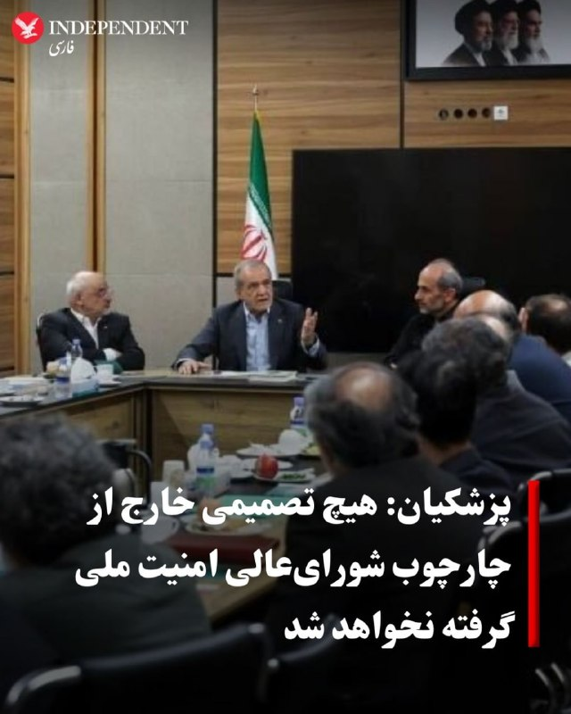

♦️مسعود پزشکیان، رئیس‌جمهوری اسلامی ایران روز یکشنبه سوم خرداد در نشستی با مدیران سازمان صداوسیما گفت: «هیچ تصمیمی خارج از چارچوب شورای‌عالی امنیت ملی و بدون هماهنگی و اذن مجتبی خامنه‌ای اتخاذ نخواهد شد.»

پزشکیان افزود: «هنگامی که تصمیمی در حوزه دیپلماسی اتخاذ می‌شود، همه دستگاه‌ها، تریبون‌ها و جریان‌ها باید از آن حمایت کنند.نمی‌توان هر فرد یا جریانی صرفاً بر مبنای سلیقۀ شخصی خود، نسخه‌ای متفاوت برای کشور ارائه دهد؛ چراکه ادارۀ کشور مستلزم تصمیم واحد و تبعیت جمعی است.»

او بر تبعیت خود از رهبری نظام تاکید کرد و گفت: «همواره تلاش کرده‌ام سخنی بر خلاف نظر رهبری بیان نشود و یا موضعی اتخاذ نگردد که به اختلاف میان ارکان حاکمیت دامن بزند و دشمن از آن سوءاستفاده کند.»

رئیس‌جمهوری اسلامی ایران همچنین چاره حل مشکلات کشور را «مساجد» دانست و گفت: «اگر بتوانیم مساجد را به جایگاه واقعی و تاریخی خود بازگردانیم و به پایگاه حل مسائل اجتماعی و مردمی تبدیل کنیم، بسیاری از مشکلات کشور با اتکای به ظرفیت مردم قابل حل خواهد بود.»
‌🇸🇦 Indypersian

🤖 @VahidOOnLine

## VahidOOnLine — post 241900

  

بهمن کارگر، رییس بنیاد حفظ آثار جنگ هشت‌ساله با عراق گفت: «این را بدانید که نیروهای مسلح جمهوری اسلامی محکم ایستاده‌اند؛ اگر دشمن دست از پا خطا کند، ضربه محکمی خواهد خورد و ما تنگه‌های هرمز دیگری هم داریم که در زمان خود، استفاده خواهد شد.»

او ادامه داد: «رییس جمهور قمارباز و متوهم آمریکا می‌گوید که توان موشکی، دریایی، هوایی و پدافند ما را از بین برده، اگر از بین رفته پس چرا نگران است؟ اگر از بین رفته که پس چرا نمی‌توانند از تنگه هرمز عبور کنند؟»
iranintl
‌🏁 🇬🇧 IranintlTV

🤖 @VahidOOnLine

## VahidOOnLine — post 241899

  <a href="telegram/content/VahidOOnLine_241899_1779615441.mp4" target="_blank">🎬 Download video</a>

♦️روسیه بامداد یکشنبه سوم خرداد در یکی از سنگین‌ترین حملات ماه‌های اخیر، کی‌یف و مناطق اطراف آن را با پهپادها و موشک‌های بالستیک هدف قرار داد، حمله‌ای که به گفته مقام‌های اوکراینی دست‌کم چهار کشته و ده‌ها زخمی برجای گذاشته است.

همزمان با شنیده شدن انفجارهای پیاپی در پایتخت، نیروی هوایی اوکراین هشدار داد احتمال استفاده روسیه از موشک میان‌برد «اورشنیک» وجود دارد، موشکی با قدرت تخریب بالا که پیش‌تر نیز در جنگ اوکراین استفاده شده بود.

شهردار کی‌یف اعلام کرد در این حملات چندین ساختمان مسکونی، برج و یک مدرسه آسیب دیده‌اند و ده‌ها نفر به بیمارستان منتقل شده‌اند. زلنسکی نیز از شهروندان خواست با به صدا درآمدن آژیر خطر، فوراً به پناهگاه‌ها بروند.

تصاویر منتشرشده از ایستگاه‌های متروی کی‌یف، صدها شهروند را نشان می‌دهد که شب را روی زمین، صندلی‌های تاشو و کنار خانواده‌هایشان سپری کرده‌اند. ناتالیا زواریچ، یکی از ساکنان کی‌یف که به مترو پناه برده بود، به رویترز گفت: «زیر صدای انفجارها حرکت می‌کردیم و اشیایی را می‌دیدیم که در آسمان پرتاب می‌شدند. واقعا ترسناک بود.»
‌🇸🇦 Indypersian

🤖 @VahidOOnLine

## VahidOOnLine — post 241898

  

خبرگزاری فارس، وابسته به سپاه پاسداران نوشت: «درحالی که مذاکرات به‌سمت توافق اولیه پیش می‌رود، منابع آگاه از احتمال بازگشت آمریکا به رویه قبلی و تخطی از یکی از بندهای مورد توافق اولیه خبر می‌دهند و احتمال دبه آمریکا در یکی از بندهای توافق اولیه وجود دارد.»

این خبرگزاری افزود: «این چندمین‌بار است که واشینگتن برخلاف توافق اولیه عمل می‌کند. فارس اضافه کرد: «جمهوری اسلامی بر سر مواضع اصولی خود ایستاده است.»
iranintl
‌🏁 🇬🇧 IranintlTV

🤖 @VahidOOnLine

## VahidOOnLine — post 241897

  

مسعود پزشکیان در نشستی با مدیران سازمان صداوسیما گفت: «بنده نسبت به مشکلات اقتصادی و معیشتی مردم، به‌ویژه آسیب‌هایی که در پی شرایط جنگی تشدید شده، احساس مسئولیت جدی دارم و با تمام توان در حال تلاش برای کاهش فشارها بر مردم هستم.»

او افزود: «باید شرایطی فراهم شود که فشارهای اقتصادی و معیشتی مردم تا حد امکان کاهش یابد و همه مردم، فارغ از گرایش‌های مذهبی و فکری، با عزت و کرامت زندگی کنند. دغدغه مردم، دغدغه ماست، همانطور که دغدغه رهبر شهیدمان نیز بود.»
iranintl
‌🏁 🇬🇧 IranintlTV

🤖 @VahidOOnLine

## VahidOOnLine — post 241896

  

خبرگزاری تسنیم، وابسته به سپاه پاسداران گزارش داد اختلاف میان جمهوری اسلامی و آمریکا بر سر یکی دو بند از تفاهم‌نامه احتمالی همچنان ادامه دارد و به دلیل «مانع‌تراشی‌های آمریکا» هنوز موضوع نهایی نشده است.

همچنین رویترز به نقل از یک «منبع ارشد ایرانی» نوشت که تهران با تحویل ذخیره اورانیوم بسیار غنی شده خود موافقت نکرده و مسئله هسته‌ای بخشی از توافق اولیه نیست.
‌🏁 🇬🇧 IranintlTV

🤖 @VahidOOnLine

## VahidOOnLine — post 241895

  <a href="telegram/content/VahidOOnLine_241895_1779615446.mp4" target="_blank">🎬 Download video</a>

بر اساس ویدیوهای ارسال‌شده به ایران‌اینترنشنال گروهی از ایرانیان مقیم فنلاند، علیه جمهوری اسلامی در شهر تورکو تجمع کرده و سرود «ای ایران» را همخوانی کردند.
‌🏁 🇬🇧 IranintlTV

🤖 @VahidOOnLine

## VahidOOnLine — post 241894

  

⭕️ ناهید کیانی، تکواندوکار ایرانی مدال طلای آسیا را کسب کرد

♦️ناهید کیانی، نماینده وزن منفی ۵۷ کیلوگرم ایران، در فینال مسابقات تکواندو قهرمانی آسیا در مغولستان مقابل نماینده ازبکستان به میدان رفت و با برتری برابر حریف خود، مدال طلای این رقابت‌ها را کسب کرد.
کیانی که در سال‌های اخیر یکی از چهره‌های مطرح تکواندوی زنان ایران بوده، پیش از این نیز سابقه کسب مدال در رقابت‌های جهانی و آسیایی را در کارنامه خود ثبت کرده است. او با این قهرمانی، یک بار دیگر جایگاه خود را به عنوان یکی از موفق‌ترین ورزشکاران زن ایران در تکواندو تثبیت کرد.
ناهید کیانی پیش‌تر با کسب مدال نقره المپیک پاریس و همچنین مدال طلای بازی‌های آسیایی هانگژو، به یکی از شناخته‌شده‌ترین ورزشکاران زن ایرانی در عرصه بین‌المللی تبدیل شده بود و موفقیت اخیر او در قهرمانی آسیا، ادامه روند درخشان این تکواندوکار ایرانی محسوب می‌شود.
‌🇸🇦 Indypersian

🤖 @VahidOOnLine

## VahidOOnLine — post 241893

  

♦️خبرگزاری فارس، نزدیک به سپاه پاسداران روز یکشنبه سوم خرداد با اشاره به توافق احتمالی میان جمهوری اسلامی و آمریکا، نوشت: در پیش‌نویس توافق احتمالی ایران و آمریکا هیچ بندی درباره «تعهدات هسته‌ای ایران گنجانده نشده و تمام مسائل مرتبط با برنامه هسته‌ای به مذاکرات ۶۰ روزه پس‌از امضای توافق موکول شده است.»

فارس در ادامه تاکید کرده است که «ایران در این توافق هیچ تعهدی برای واگذاری ذخایر هسته‌ای، خروج تجهیزات، تعطیلی تأسیسات یا حتی تعهد به نساختن بمب هسته‌ای وجود ندارد.»

این در حالیست که نیویورک تایمز به نقل از دو مقام آمریکایی گزارش داد، یکی از عناصر کلیدی توافق پیشنهادی میان واشنگتن و تهران، تعهد آشکار ایران به واگذاری ذخایر اورانیوم با غنی‌سازی بالای خود است.
‌🇸🇦 Indypersian

🤖 @VahidOOnLine

## VahidOOnLine — post 241892

  

مارکو روبیو، وزیر خارجه آمریکا در نشست خبری با وزیر خارجه هند گفت: «ممکن است طی ساعات آینده خبرهای خوبی، دست‌کم درباره تنگه هرمز منتشر شود.» وزیر خارجه آمریکا گفت که این کشور به هدف خود برای کاهش قابل توجه توان موشکی جمهوری اسلامی دست یافته است.

او افزود: «طی ۴۸ ساعت گذشته با همکاری شرکای خود در منطقه روی چارچوبی کار کرده‌ایم که در صورت موفقیت، نه تنها به باز ماندن کامل تنگه هرمز بدون عوارض منجر می‌شود بلکه به برخی مسائل اساسی مرتبط با جاه‌طلبی‌های هسته‌ای جمهوری اسلامی نیز خواهد پرداخت.»
iranintl
‌🏁 🇬🇧 IranintlTV

🤖 @VahidOOnLine

## VahidOOnLine — post 241891

  <a href="telegram/content/VahidOOnLine_241891_1779615449.mp4" target="_blank">🎬 Download video</a>

گزارشگرمنوتو: در سالگرد فاجعه متروپل آبادان، جمعی از ایرانیان مقابل کنسولگری جمهوری اسلامی در هامبورگ تجمع کردند.

این تجمع با حضور اعضای حزب پادشاهی‌خواه میهن‌پرستان ایران و شماری از نزدیکان جان‌باختگان متروپل برگزار شد. شرکت‌کنندگان جمهوری اسلامی را به ناکارآمدی، فساد و بی‌توجهی به جان شهروندان متهم کردند.

ساختمان متروپل آبادان در ۲۳ مه ۲۰۲۲ فرو ریخت؛ فاجعه‌ای که جان ده‌ها نفر را گرفت و به نمادی از بی‌مسئولیتی و فساد ساختاری در جمهوری اسلامی تبدیل شد.
‌🏁 🇬🇧 ManotoTV

🤖 @VahidOOnLine

## VahidOOnLine — post 241890

  

تد کروز، سناتور جمهوری‌خواه آمریکا، در پستی در شبکه اجتماعی ایکس از گزارش‌ها درباره احتمال توافق با جمهوری اسلامی ابراز نگرانی کرد.

او با دفاع از تصمیم دونالد ترامپ برای حمله به ایران، مدعی شد این اقدام به «نتایج نظامی فوق‌العاده» منجر شده و گفت اگر نتیجه نهایی، ادامه حاکمیت جمهوری اسلامی، دریافت میلیاردها دلار، امکان غنی‌سازی اورانیوم و کنترل مؤثر بر تنگه هرمز باشد، چنین توافقی «اشتباهی فاجعه‌بار» خواهد بود.

کروز همچنین نوشت جزئیات هنوز در حال روشن شدن است، اما حمایت برخی چهره‌های دولت بایدن از این توافق را «نگران‌کننده» دانست و از ترامپ خواست بر خطوط قرمز خود پافشاری کند.
‌🏁 🇬🇧 ManotoTV

🤖 @VahidOOnLine

## VahidOOnLine — post 241889

  

قوه قضائیه جمهوری اسلامی اعلام کرد مجتبی کیان، زندانی متهم به ارسال اطلاعات مربوط به مراکز تولید صنایع دفاعی، بامداد امروز اعدام شده است.

رسانه‌های وابسته به قوه قضائیه مدعی شده‌اند او در جریان آنچه مقام‌های جمهوری اسلامی «جنگ رمضان» می‌نامند، اطلاعات و مختصات واحدهای مرتبط با صنایع دفاعی را برای شبکه‌های وابسته به آمریکا و اسرائیل ارسال کرده بود.

این ادعاها به‌طور مستقل قابل راستی‌آزمایی نیست و قوه قضائیه جمهوری اسلامی تاکنون جزئیات شفافی از روند بازداشت، دسترسی متهم به وکیل مستقل، نحوه محاکمه و زمان دقیق رسیدگی منتشر نکرده است.

اجرای این حکم در حالی اعلام شده که جمهوری اسلامی در سال‌های اخیر بارها از پرونده‌های امنیتی و اتهام‌های مرتبط با «جاسوسی» برای صدور و اجرای احکام سنگین، از جمله اعدام، استفاده کرده است.
‌🏁 🇬🇧 ManotoTV

🤖 @VahidOOnLine

## VahidOOnLine — post 241888

  

حسن عبدلیان‌پور، رییس مرکز وکلای قوه قضاییه گفت که بزرگ‌ترین خسارت معنوی وارده به ما، کشته شدن «ناجوانمردانه رهبر شهید» در محل کارش به دست آمریکا و اسرائیل است و ما به «خونخواهی امام شهید»، قصد داریم از ۹۰ میلیون مردم ایران برای اقامه دعوی وکالت اخذ کنیم.

او افزود: «در این مسیر کوتاه نمی‌آییم و جنایتکاران را رها نمی‌کنیم و نمی‌گذاریم خون شهدا پایمال شود.»
iranintl
‌🏁 🇬🇧 IranintlTV

🤖 @VahidOOnLine

## VahidOOnLine — post 241887

  <a href="telegram/content/VahidOOnLine_241887_1779615452.mp4" target="_blank">🎬 Download video</a>

ویدیوی رسیده به ایران اینترنشنال نشان می‌دهد روز شنبه دوم خرداد تعدادی از دانش‌آموزان مدارس در خرم‌آباد برای اعتراض به شیوه امتحانات خود و اظهارات مسئولان برای حضوری کردن امتحانات، مقابل ساختمان آموزش و پرورش تجمع کردند. آن‌ها شعار «مجازی مجازی»‌ سر داده و خواستار غیرحضوری شدن امتحانات شدند.
‌🏁 🇬🇧 IranintlTV

🤖 @VahidOOnLine

## WithYashar — post 12310

  <a href="telegram/content/WithYashar_12310_1779615453.mp4" target="_blank">🎬 Download video</a>

@withyashar 🤣 بی بی عشقه

## WithYashar — post 12309

کانال ۱۴ اسرائیل: نتانیاهو به وزرا دستور داده است از بحث در مورد توافق قریب الوقوع بین تهران و واشنگتن خودداری کنند
@withyashar

## WithYashar — post 12308

## WithYashar — post 12307

تسنیم: اختلاف بر سر یک یا دو بند در یادداشت تفاهم ادامه دارد. اگر آمریکا به ایجاد موانع ادامه دهد، امکان رسیدن به تفاهم وجود نخواهد داشت
@withyashar

## WithYashar — post 12306

رویترز به‌نقل از یک منبع ارشد ایرانی: ایران تحویل ذخایر اورانیوم خود را نپذیرفته و موضوع هسته‌ای بخشی از توافق اولیه نیست
@withyashar

## WithYashar — post 12305

فارس : ‌ احتمال دبۀ آمریکا در یکی از بندهای توافق اولیه؛ ایران بر مواضع خود ایستاده است
درحالی که مذاکرات به‌سمت توافق اولیه پیش می‌رود، منابع آگاه از احتمال بازگشت آمریکا به رویۀ قبلی و تخطی از یکی از بندهای مورد توافق اولیه خبر می‌دهند. این چندمین‌بار است که واشنگتن برخلاف توافق اولیه عمل می‌کند.
@withyashar 🤣

## WithYashar — post 12304

ادعای العربیه: دور بعدی مذاکرات بین آمریکا و ایران ممکن است در ۵ ژوئن برگزار شود.

واشنگتن و تهران هنگام آغاز مذاکره برای توافق نهایی، روسای هیئت‌های خود را اعزام خواهند کرد.
@withyashar

## WithYashar — post 12303

الحدث به نقل از منابع: توافق اولیه احتمالی بین ایران و ایالات متحده «اعلامیه اسلام‌آباد» نام خواهد داشت.
@withyashar

## WithYashar — post 12302

بازنشری دوباره از صحبت های بسیار مهم از صحبت های مانوک درباره مذاکره و آینده ایران

مجری : آیا به توافقی میرسند؟
آیا مذاکره می‌کنند؟ یا ایران رد خواهد کرد؟

مانوک خدابخشیان : ایران رد نخواهد کرد، اگر بپذیرند خلع سلاح کامل می‌شوند، و مجبور به پذیرش بقیه شرط ها حقوق بشر دیگر برگ کوبنده ای نیست زیرا صدها برگ دیگر وجود دارد

مجری: ترامپ میگه پیشرفت زیادی در ارتباط با ایران به دست آمده! از این پیشرفت منظورش چیه؟

مانوک خدابخشیان : دونالد زبل بزرگترین خواسته اش اینه با یکی از این ها سلفی بگیره! ایمان داشته باشید«اینها با یک جماعتی در تهران ساخت و پاخت کردن!»نه این که رژیم بمونه!
یادتون نره!
همه ترسشون اینه امروز آمدن مذاکره کردن کار تموم شد ، استمرار پیدا کرد این رژیم ،نه اینچنین نیست.
«این تحلیل های آبکی رو بعد بذارید و بعد بگید »
آمریکا جایی که رفت مذاکره کنه مذاکره نمیکنه ، باز تکرار میکنم « حکم میکنه »
ببینید آیا رژیم جمهوری اسلامی حاضره مثل صدام حسین تحقیر بشه ؟ اینا به نوکر صدام گفتن برید بهش بگید تمام سلاح های اتمی و شیمیایش بده به ما و بعدش میشینیم مذاکره میکنیم و دیدید صدام حسین تو سری رو خورد چرا ؟ چون «بازی تموم شده رژیم کارش تمومه »
اگر یک آلترناتیو الان بود و اطمینان خاطر داشتن اینها در ایران بحران به وجود نمیاد قطعا عمل میکردن و الانم قول هایی گرفتن!
دلیل خوشحالی ترامپ هم همینه
@withyashar

## WithYashar — post 12301

## WithYashar — post 12300

کیر استارمر، نخست وزیر بریتانیا:
پیشرفت به سمت توافق بین ایران و آمریکا رو تبریک میگیم. باید به توافقی برسیم که منجر به پایان درگیری بشه. حیاتیه که ایران هرگز نتونه سلاح هسته‌ای داشته باشه. با شرکای خود در جهان پیش میریم تا از این فرصت استفاده کنیم و به یک توافق سیاسی بلندمدت دست پیدا کنیم.
@withyashar

## WithYashar — post 12299

## WithYashar — post 12298

  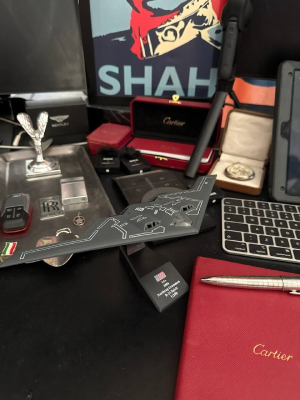

B2 رسید
@withyashar

## WithYashar — post 12297

## WithYashar — post 12296

## WithYashar — post 12295

انتقاد تند تد کروز، سناتور مطرح جمهوری‌خواه از اخبار توافق آمریکا و ایران :

به‌شدت نگران چیزهایی هستم که درباره توافق احتمالی با ایران می‌شنویم؛ توافقی که بعضی صداها داخل دولت آمریکا دارن برایش فشار میارن.
تصمیم ترامپ برای حمله به ایران، مهم‌ترین تصمیم دوره دوم ریاست‌جمهوریش بود. او کار درستی انجام داد و ما به نتایج نظامی فوق‌العاده‌ای رسیدیم؛ از جمله نابودی تمام موشک‌ها و پهپادهای ایران و غرق کردن کل نیروی دریایی‌شان.
اگر نتیجه همه این‌ها این باشد که حکومت ایران — که هنوز توسط اسلام‌گراهایی اداره می‌شود که شعار «مرگ بر آمریکا» می‌دهند — حالا میلیاردها دلار دریافت کند، بتواند اورانیوم غنی‌سازی کند و سلاح هسته‌ای توسعه دهد و کنترل مؤثری روی تنگه هرمز داشته باشد، آن وقت این یک اشتباه فاجعه‌بار خواهد بود.
جزئیات هنوز کامل منتشر نشده و امیدوارم گزارش‌های اولیه اشتباه باشند؛ اما اینکه راب مالیِ دولت بایدن از این توافق تعریف کرده، اصلاً امیدوارکننده نیست.
ترامپ به «صلح از طریق قدرت» اعتقاد دارد و رهبری قدرتمند او همین حالا آمریکا را امن‌تر کرده. او باید همچنان محکم بایستد، از آمریکا دفاع کند و خطوط قرمزی را که بارها اعلام کرده، اجرا کند.
@withyashar

## WithYashar — post 12294

دلم میخواد یه ویس بی‌پروا بدم ولی افسوس ….

## WithYashar — post 12293

خامنه ای کپک زد
ترامپ به ما کلک زد🤣
@withyashar

## mwarmonitor — post 9621

🔴ایران از ارسال ذخایر اورانیوم بسیار غنی‌شده خود به خارج از کشور خودداری کرده است و تهران تأکید دارد که مذاکرات هسته‌ای خارج از چارچوب فعلیِ در حال بررسی با واشنگتن قرار ندارد. رویترز

@mwarmonitor

## mwarmonitor — post 9620

🔵نخست وزیر انگلیس ؛ از پیشرفت در جهت رسیدن به توافق میان آمریکا و ایران استقبال می‌کنم.

🔹ما باید شاهد توافقی باشیم که به این درگیری پایان دهد و تنگه هرمز را دوباره باز کند، با آزادی کامل و بدون قید و شرط برای کشتیرانی. بسیار حیاتی است که ایران هرگز اجازه نیابد سلاح هسته‌ای توسعه دهد.

🔹دولت من همچنان هر کاری که بتواند انجام خواهد داد تا از مردم بریتانیا در برابر پیامدهای این درگیری محافظت کند.

🔹ما با شرکای بین‌المللی خود همکاری خواهیم کرد تا از این لحظه استفاده کرده و به یک راه‌حل دیپلماتیک بلندمدت دست پیدا کنیم.

@mwarmonitor

## mwarmonitor — post 9619

📌فیننشال تایمز ؛ سپاه پاسداران انقلاب اسلامی ایران از یک شبکه تأمین مستقر در امارات متحده عربی برای خرید تجهیزات پیشرفته ماهواره‌ای چینی استفاده کرده است.

@mwarmonitor

## mwarmonitor — post 9618

🔸خبرگزاری تسنیم

🔴فوری/ یک منبع مطلع: اختلاف بر سر یکی دو بند از تفاهم‌نامه همچنان ادامه دارد

▪️ یک منبع مطلع به خبرگزاری تسنیم گفت که اختلاف میان ایران و آمریکا بر سر یکی دو بند از تفاهم نامه احتمالی همچنان ادامه دارد و به دلیل مانع‌تراشی‌های آمریکا هنوز موضوع نهایی نشده است.

▪️ وی تاکید کرد: ایران بر احقاق خود مردم خود تاکید دارد و این موضوع به میانجی پاکستانی اعلام شده است که در صورت ادامه مانع‌تراشی‌های آمریکا، امکان نهایی شدن تفاهم نامه وجود ندارد.

@mwarmonitor

## mwarmonitor — post 9617

🔴ساعت ۰۸:۴۵ به وقت گرینویچ/ DERMA 84؛ ۲ فروند بمب‌افکن استراتژیک B-1B از فرودگاه فیرفورد (Fairford) به پرواز درآمده‌اند و به سمت جنوب‌غرب در حال حرکت هستند، با رعایت رویه‌های ایمنی پروازی (due regard) و در حال ارتباط با Brize با فرکانس 231.950.

@mwarmonitor

## mwarmonitor — post 9616

🔴در حالی که ترافیک دریایی در دوره 30 روزه اختصاص داده شده برای مذاکرات هسته‌ای تسهیل خواهد شد، سوال اساسی همچنان باقی است: آیا ایالات متحده این ترتیبات موقت را خواهد پذیرفت یا بر بازگشایی کامل و بدون قید و شرط تنگه قبل از امضای هرگونه توافقی اصرار خواهد ورزید؟…

## mwarmonitor — post 9615

🔴توافقی ایرانی-آمریکایی در حال شکل‌گیری است: پیچیده‌ترین اختلافات همچنان حل‌نشده باقی مانده‌اند. 🔸نویسنده: علی هاشم خبرنگار الجزیره به گفته چندین منبع منطقه‌ای آشنا با مذاکرات، طرف‌های درگیر در مذاکرات در حال بررسی پیش‌نویس چارچوبی برای یک توافق جامع احتمالی…

## mwarmonitor — post 9614

🔴توافقی ایرانی-آمریکایی در حال شکل‌گیری است: پیچیده‌ترین اختلافات همچنان حل‌نشده باقی مانده‌اند.

🔸نویسنده: علی هاشم خبرنگار الجزیره

به گفته چندین منبع منطقه‌ای آشنا با مذاکرات، طرف‌های درگیر در مذاکرات در حال بررسی پیش‌نویس چارچوبی برای یک توافق جامع احتمالی بین ایران و ایالات متحده هستند. اگر توافق نهایی حاصل شود، این مهمترین گام دیپلماتیک از زمان آتش‌بس با میانجیگری پاکستان خواهد بود که به جنگی تقریباً شش هفته‌ای پایان داد. این جنگ در 28 فوریه با ترور آیت‌الله علی خامنه‌ای، رهبر وقت ایران، در یک حمله هماهنگ علیه مقامات ارشد و زیرساخت‌های حیاتی در داخل ایران آغاز شد.

این جنگ، منطقه را به شیوه‌ای که هیچ‌کس کاملاً پیش‌بینی نکرده بود، تغییر شکل داد. این جنگ حزب‌الله را ظرف چند روز به نبرد مستقیم کشاند و منجر به بسته شدن تنگه هرمز، گلوگاه دریایی که یک پنجم نفت دریایی جهان از آن عبور می‌کند، شد. همچنین باعث یک دور مذاکرات مستقیم بین ایران و ایالات متحده در اسلام‌آباد شد که بدون نتیجه پایان یافت و همزمان یک مسیر مذاکره جداگانه، هرچند شکننده، بین لبنان و اسرائیل را گشود. امروز، با وجود آتش‌بس برقرار شده اما فاقد یک چارچوب روشن و رسمی، به نظر می‌رسد طرفین در تلاشند تا به سمت یک توافق پایدارتر حرکت کنند.

به گفته منابع عرب و ایرانی که با الجدا صحبت کردند، پیش‌نویس توافق شامل توقف خصومت‌ها در تمام جبهه‌ها، از جمله لبنان، آزادسازی میلیاردها دلار از دارایی‌های مسدود شده ایران، لغو محاصره دریایی ایالات متحده و خروج نیروهای آمریکایی از مناطق نزدیک ایران است. در مرحله بعد، طرفین یک دوره 30 روزه برای رسیدن به تفاهم در مورد مسئله هسته‌ای به خود اختصاص می‌دهند و امکان تمدید مذاکرات با توافق متقابل نیز وجود دارد.

دو ضمیمه و یک توافقنامه

ساختار توافق پیشنهادی پیچیده‌تر از یک یادداشت تفاهم واحد است. به گفته یک منبع آگاه از ساختار این توافق، آنچه دونالد ترامپ، رئیس جمهور آمریکا، علناً به آن اشاره کرد، در واقع مربوط به دو ضمیمه جداگانه است که به یادداشت اصلی پیوست خواهند شد، در حالی که مذاکرات در مورد جزئیات آنها هنوز ادامه دارد.

مهم‌ترین نکته در اینجا مسئله زمان‌بندی است. به نظر می‌رسد مفاد مالی و امنیتی به گونه‌ای طراحی شده‌اند که منافع متقابل ملموسی ایجاد کنند که هر دو طرف را وادار می‌کند با چیزی برای از دست دادن وارد مذاکرات هسته‌ای شوند: کاهش تحریم‌ها، کاهش تنش نظامی و بازگشایی تنگه هرمز.

یکی از این پیوست‌ها مربوط به دارایی‌های مسدود شده ایران در خارج از کشور به دلیل تحریم‌های ایالات متحده است. به گفته یک منبع منطقه‌ای سطح بالا، تقریباً ۵۰٪ از این وجوه، یا حدود ۱۲ میلیارد دلار، در حال حاضر در قطر، عراق و ترکیه نگهداری می‌شود. این منبع توضیح داد که قطر «نقش محوری» در پیشبرد این روند مذاکره ایفا کرده است.

در این زمینه، تهران تصمیم گرفت با امضای تفاهم‌نامه جداگانه‌ای با دوحه، به‌ویژه در مورد این وجوه، این نقش را رسمیت بخشد. در سطح وسیع‌تر توافق، نقش قطر دیگر صرفاً میانجی نیست، بلکه به یک جزء ساختاری در روند مذاکرات تبدیل شده است.

هرمز، قلب جنگ

از همان لحظه اول جنگ، تنگه هرمز به نقطه کانونی درگیری ایران، اسرائیل و آمریکا تبدیل شد. ایران عملاً ظرف چند ساعت پس از حملات ۲۸ فوریه، تنگه را بست و اعلام کرد که هیچ کشتی خارجی بدون اجازه ایران اجازه عبور نخواهد داشت. سپاه پاسداران از طریق ارتباطات دریایی هشدارهای مستقیمی را پخش کرد، در حالی که صدها نفتکش در دریا سرگردان بودند و قیمت جهانی نفت به شدت افزایش یافت.

واشنگتن با یک عملیات هوایی که از ۱۹ مارس کشتی‌ها و تأسیسات دریایی ایران را هدف قرار داد، پاسخ داد. پس از شکست مذاکرات در اسلام‌آباد، به رهبری جی. دی. ونس، معاون رئیس‌جمهور آمریکا، و محمد باقر قالیباف، رئیس مجلس ایران، در ماه آوریل، ایالات متحده محاصره دریایی کاملی را بر کشتی‌هایی که به بنادر ایران وارد یا از آنها خارج می‌شدند، اعمال کرد.

بر اساس آتش‌بس اعلام‌شده با میانجیگری پاکستان در ۸ آوریل، ایران به‌طور موقت به برخی کشتی‌ها اجازه عبور داد، اما محاصره آمریکا به‌طور کامل برداشته نشد و ایران دیگر تنگه هرمز را به‌طور کامل باز نکرد. هر طرف، دیگری را به نقض آتش‌بس متهم می‌کرد و ترافیک دریایی بسیار پایین‌تر از سطح قبل از جنگ باقی ماند.

تهران با توجه به مرز مشترک ایران و عمان با تنگه هرمز، پیش‌نویس توافق جدید را صرفاً موضوعی مربوط به ایران و عمان می‌داند و مذاکرات در مورد این موضوع در مسقط آغاز شده است. با این حال، هنوز مشخص نیست که آیا واشنگتن این رویکرد را خواهد پذیرفت یا خیر.

@mwarmonitor

## mwarmonitor — post 9613

🔴رویترز به نقل از یک منبع ایرانی: تهران با تحویل ذخایر اورانیوم با غنای بالا خود موافقت نکرده است.

@mwarmonitor

## pm_afshaa — post 91373

  <a href="telegram/content/pm_afshaa_91373_1779615454.webm" target="_blank">🎬 Download video</a>

🔴شبکه 14 اسرائیل:
نتانیاهو به وزرا دستور داد که در مورد توافق نزدیک ایران و آمریکا صحبت نکنن.

💧 Rainbet.com the #1 Non-KYC Crypto Casino & Sportsbook @rainbetcom

😁 @Pm_Afshaa

## pm_afshaa — post 91372

تسنیم: اختلاف بر سر یک یا دو بند در یادداشت تفاهم ادامه دارد. اگر آمریکا به ایجاد موانع ادامه دهد، امکان رسیدن به تفاهم وجود نخواهد داشت

💧 Rainbet.com the #1 Non-KYC Crypto Casino & Sportsbook @rainbetcom

😁 @Pm_Afshaa

## pm_afshaa — post 91371

فارس:احتمالا دوباره آمریکا دبه میکنه و توافق رو‌ بهم میزنه

💧 Rainbet.com the #1 Non-KYC Crypto Casino & Sportsbook @rainbetcom

😁 @Pm_Afshaa

## pm_afshaa — post 91370

  <a href="telegram/content/pm_afshaa_91370_1779615455.webm" target="_blank">🎬 Download video</a>

🔴کیر استارمر، نخست وزیر بریتانیا:
پیشرفت به سمت توافق بین ایران و آمریکا رو تبریک میگیم. باید به توافقی برسیم که منجر به پایان درگیری بشه. حیاتیه که ایران هرگز نتونه سلاح هسته‌ای داشته باشه. با شرکای خود در جهان پیش میریم تا از این فرصت استفاده کنیم و به یک توافق سیاسی بلندمدت دست پیدا کنیم.

💧 Rainbet.com the #1 Non-KYC Crypto Casino & Sportsbook @rainbetcom

😁 @Pm_Afshaa

## pm_afshaa — post 91369

  <a href="telegram/content/pm_afshaa_91369_1779615455.webm" target="_blank">🎬 Download video</a>

🔴رویترز به نقل از یک مقام ارشد ایرانی:
تهران با تحویل اورانیوم غنی‌شده با سطح بالا موافقت نخواهد کرد؛ مسئله هسته‌ای بخشی از توافق مقدماتی نیست.

💧 Rainbet.com the #1 Non-KYC Crypto Casino & Sportsbook @rainbetcom

😁 @Pm_Afshaa

## pm_afshaa — post 91368

🔴روبیو: هیچ مسیر آبی بین‌المللی و هیچ فضای هوایی بین‌المللی نباید هرگز توسط هیچ کشوری در جهان استفاده یا ملی‌سازی بشه.

💧 Rainbet.com the #1 Non-KYC Crypto Casino & Sportsbook @rainbetcom

😁 @Pm_Afshaa

## pm_afshaa — post 91367

  <a href="telegram/content/pm_afshaa_91367_1779615456.webm" target="_blank">🎬 Download video</a>

🔴مارکو روبیو:
احتمالاً امروز اخبار بیشتری درباره ایران منتشر بشه؛ این احتمال وجود داره که جهان در ساعات آینده اخبار خوبی بشنوه.

💧 Rainbet.com the #1 Non-KYC Crypto Casino & Sportsbook @rainbetcom

😁 @Pm_Afshaa

## pm_afshaa — post 91366

  <a href="telegram/content/pm_afshaa_91366_1779615456.webm" target="_blank">🎬 Download video</a>

🔴روبیو، وزیر خارجه آمریکا: زمانی که درگیری با ایران آغاز شد، هدف ما از بین بردن توانایی‌های دریایی و سامانه‌های موشکی آنها بود و به اهداف عملیات دست یافتیم.

ما در 48 ساعت گذشته پیشرفت هایی در طرح کلی که ممکنه بحران تنگه هرمز رو حل کنه، داشتیم.

💧 Rainbet.com the #1 Non-KYC Crypto Casino & Sportsbook @rainbetcom

😁 @Pm_Afshaa

## pm_afshaa — post 91365

  <a href="telegram/content/pm_afshaa_91365_1779615457.webm" target="_blank">🎬 Download video</a>

🔴شرایط پیشنهادی تفاهم‌نامه آمریکا و ایران طبق گزارش آکسیوس : - آتش‌بس 60 روزه بین دو طرف. - بازگشایی تنگه هرمز بدون عوارض. - پاکسازی مین‌های دریایی در تنگه توسط ایران. - رفع محاصره بنادر ایران توسط آمریکا. - معافیت‌های تحریمی که به ایران اجازه صادرات نفت…

## pm_afshaa — post 91364

  <a href="telegram/content/pm_afshaa_91364_1779615457.webm" target="_blank">🎬 Download video</a>

🔴تسنیم: برای حل و فصل موضوع تنگه هرمز و رفع محاصره دریایی یک دوره 30 روزه تعیین میشه. مهلتی 60 روزه برای مذاکرات هسته‌ای تعیین میشه. ایران در حال حاضر با هیچ چیز در زمینه هسته‌ای موافقت نکرده.

💧 Rainbet.com the #1 Non-KYC Crypto Casino & Sportsbook @rainbetcom

😁 @Pm_Afshaa

## DEJradio — post 4902

⭕️
⭕️ روبیو گفت احتمال دارد خبری در مورد توافق با جمهوری اسلامی تا شامگاه یک‌شنبه اعلام شود

مارکو روبیو، وزیر امور خارجۀ آمریکا، گفت ممکن است تا شامگاه یک‌شنبه خبری درمورد توافقی با تهران اعلام شود که می‌تواند رسما به جنگ خاورمیانه پایان بدهد.
روبیو در جمع خبرنگاران در دهلی‌نو گفت: شاید در چند ساعت آینده دنیا «خبرهای خوبی» دریافت کند.
او افزود توافق در حال شکل‌گیری به نگرانی‌های آمریکا درباره تنگۀ هرمز می‌پردازد.
به گفتۀ وزیر امور خارجۀ آمریکا، این توافق می‌تواند روندی را آغاز کند که در پایان به هدف دونالد ترامپ یعنی رفع نگرانی دربارۀ برنامه هسته‌ای تهران منجر شود.

#تفاهم #تنگه_هرمز
@DEJradio

## DEJradio — post 4901

  <a href="telegram/content/DEJradio_4901_1779615458.mp4" target="_blank">🎬 Download video</a>

👑🎥 پرفورمنس های ایرانیان در نقاط مختلف دنیا در حمایت از مردم ایران، انقلاب شیر و خورشید و زندانیان سیاسی

#همبستگی
@DEJradio

## DEJradio — post 4900

📢🎥 یک شهروند با ارسال ویدیویی با اشاره به گرانی شدید مواد خوراکی، می‌گوید حبوبات انقدر گران شده که داره به لیست آرزوها اضافه میشه".

#صدای_شما #گرانی
@DEJradio

## DEJradio — post 4897

🔸📷 تصاویر ماهواره‌ای نشان می‌دهد در جنگ ۴۰ روزه پایگاه یکم دریایی ارتش در بندرعباس به طور کامل تخریب شده است. این پایگاه به عنوان، مرکز اورهال و ساخت ناو، اهمیت بسیاری داشت.
بالا ترین داک خشک، ۳ ناو البرز (۷۲) از کلاس الوند، یک ناو از کلاس هنگام و یک ناو دیگر از کلاس کمان/سینا (احتمالی) در حال اورهال بودند که بمباران شدند.
منابع غیررسمی داخلی گزارش دادند در داک مسقف، یک زیردریایی کلاس کیلو که از سال ۹۷ در حال اورهال بوده، نیز مورد اصابت قرار گرفته اما آسیب به زیردریایی مشخص نیست. اشاره شده که این زیردریایی از قبل جنگ ۴۰ روزه وضعیت بدی داشته است.
در داک شناور نیز یک ناو از کلاس هنگام در حال اورهال بود که هدف قرار گرفته است.
براساس تصاویر ماهواره‌ای لاشه ناو زاگرس نیز در اسکله قابل مشاهده است.

#جنگ_چهل_روزه #بندرعباس
@DEJradio

## DEJradio — post 4895

🔸
⭕️ صاحبان نانوایی‌ها در استان کرمانشاه در اعتراض به گرانی آرد و هزینه‌ها و مالیات‌های سنگین روز یکشنبه سوم خرداد ۱۴۰۵ اعتصاب کردند و در مقابل استانداری دست به اعتراض زدند.
گرانی آرد، سبب افزایش قیمت نان می‌شود و شهروندانی هستند که حتی برایشان خرید نان به عنوان اولیه‌ترین غذا برای سیر کردن شکم دشوار است.

#اعتصابات #نانوایی
@DEJradio

## DEJradio — post 4894

  <a href="telegram/content/DEJradio_4894_1779615460.webm" target="_blank">🎬 Download video</a>

🔸
🔺 روزنامه «نیویورک‌تایمز» در گزارشی با اشاره به اینکه هنوز جزییات دقیق توافق احتمالی آمریکا و جمهوری اسلامی روشن نیست، به‌نقل از مقام‌های آمریکایی گزارش داد که حکومت با واگذاری اورانیوم غنی‌شده موافقت کرده است.
اشاره این روزنامه به حدود ۴۴۰ کیلوگرم اورانیوم ۶۰ درصدی است که گفته می‌شود در تأسیسات اصفهان مدفون شده است.
دو مقام آمریکایی به نیویورک‌تایمز گفتند یکی از عناصر کلیدی توافق پیشنهادی میان حکومت ایران و ایالات متحده، تعهد ظاهری تهران به واگذاری ذخایر اورانیوم با غنای بالا است.
*باید در نظر گرفت روزنامه «نیویورک تایمز» و نویسندگان آن از جمله فرناز فصیحی سوابق طولانی در تولید فیک‌نیوز و همسویی با حکومت دارند.
*دو روز پیش از اعلام توافق احتمالی، دو منبع ارشد ایرانی به رویترز گفته‌ بودند که مجتبی خامنه‌ای، رهبر جدید جمهوری اسلامی، دستور داده است که اورانیوم غنی‌شده این کشور نباید به خارج منتقل شود. به گفته این منابع، این دستور می‌تواند باعث نارضایتی بیشتر ترامپ شده و مذاکرات برای پایان جنگ را پیچیده‌تر کند.
*پیش‌تر پوتین نیز پیشنهاد داده بود اورانیوم‌ها به روسیه منتقل شوند اما سـ.ـپاه اساسا با خارج کردن این اروانیوم‌ها مخالف است و گزینه رقیق‌سازی را پیشنهاد شده بود.

#تفاهم #ترامپ #جمهوری_اسلامی
@DEJradio

## DEJradio — post 4893

  <a href="telegram/content/DEJradio_4893_1779615460.webm" target="_blank">🎬 Download video</a>

🔸
🔺 دونالد ترامپ رئیس جمهور آمریکا در «تروث سوشال» اعلام کرد که گفت‌وگوهای «بسیار خوبی» با شماری از رهبران منطقه داشته است و تنها نهایی‌سازی متن توافق باقی مانده است و تنگه هرمز هم باز می‌شود.
او افزود که به‌طور جداگانه با بنیامین نتانیاهو، نخست‌وزیر اسرائیل، نیز گفت‌وگو کرده و این تماس هم «بسیار خوب» بوده است.
در واکنش به این اظهارات خبرگزاری فارس، وابسته به سـ.ـپاه، اظهارات ترامپ مبنی بر نزدیک شدن به توافق با ایران و بازگشایی تنگه هرمز را رد کرد ونوشت: «این ادعا نیز با واقعیت‌ها فاصله دارد».
فارس در ادامه نوشت: «بر اساس آخرین متن ردوبدل‌شده، در صورت توافق احتمالی، تنگه هرمز کماکان تحت مدیریت ایران خواهد بود و اگرچه ایران موافقت کرده اجازه دهد تعداد کشتی‌های عبوری به میزان قبل از جنگ بازگردد، اما این به‌هیچ‌عنوان به معنای تردد آزاد به وضعیت قبل از جنگ نیست و مدیریت تنگه، تعیین مسیر، زمان، نحوه عبور و صدور مجوز، کماکان در انحصار و با تدبیر جمهوری اسلامی ایران خواهد بود.»
خبرگزاری سپاه در ادامه مدعی شد که برخلاف شروط پیشین ترامپ مبنی بر گنجاندن برنامه هسته‌ای در توافق، «هیچ تعهدی از سوی ایران داده نشده و پرونده هسته‌ای اساسا در این مرحله مورد بحث قرار نگرفته است.»
فارس همچنین ادعا کرد که «مقامات آمریکایی در پیغام‌های متعدد به ایران اذعان داشته‌اند که توییت‌های ترامپ عمدتا جنبه تبلیغاتی و مصرف رسانه‌ای در داخل آمریکا دارد و توصیه کرده‌اند که به این اظهارات توجهی نشود».

#ترامپ #مذاکرات #تفاهم
@DEJradio

## DEJradio — post 4892

🎤
⭕️ آنچه امروز میان جمهوری اسلامی و غرب جریان دارد، بیشتر «مدیریت بحران» است تا یک توافق واقعی؛ بازی پیچیده‌ای از تهدید، بازدارندگی و تلاش برای جلوگیری از انفجار بزرگ در خاورمیانه. پژمان گلچین دانش‌آموخته فلسفه در گفتگو با دژ به چرایی و سرانجام این مذاکره پرداخته است.

#گفتگو
@DEJradio

## kianmeli1 — post 87623

  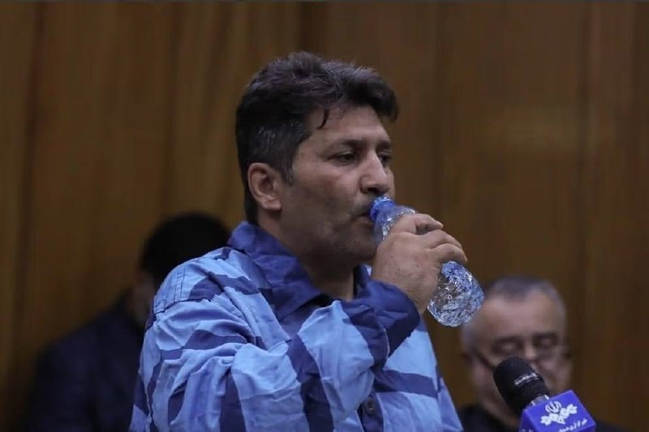

🔴اساسا چرا باید حمله کند! اگر بناست به براندازی٫ کار بزرگ را کردند تا قبل کشتن خامنه ای ، همه میگفتند با حذف خامنه ای کار تمام میشود حال می گویند منتظریم خامنه ای دوم حذف شود کار را تمام میکنیم به این حضرات که ۲۴ ساعت در تلویزیون ها نشسته اند تحت عناوین…

## IranIntlTV — post 338731

  <a href="telegram/content/IranIntlTV_338731_1779615462.mp4" target="_blank">🎬 Download video</a>

یک شهروند با ارسال پیامی به ایران‌اینترنشنال می‌گوید: «باید متحد و یکپارچه منتظر فراخوان شاهزاده باشیم. در این دنیا هرکس دلش برای خودش و کشورش می‌سوزد. کار را ما باید تمام کنیم نه آمریکا. اتحاد ما از هر بمبی خطرناکتر است و می‌‌توانیم کشورمان رو پس بگیریم.»

## IranIntlTV — post 338730

  

محمدرسول شیخی‌زاده، دبیر اول کمیسیون بهداشت و درمان مجلس به سایت دیده‌بان‌ایران گفت: «افزایش قیمت دارو به گونه‌ای است که بیمه هم پاسخگو نیست. این در حالی است که دارو جزو کالاهای استراتژیک و حیاتی برای مردم است؛ چه در شرایط جنگی و چه در شرایط عادی و غیرجنگی.»

او افزود: «ما باید حداقل تا شش ماه ذخایر دارویی داشته باشیم. اصلا اگر هیچ جنگی هم اتفاق نمی‌افتاد، وزارت بهداشت، مخصوصا سازمان غذا و دارو، باید نسبت به اجرای این قانون اهتمام بورزد.»
https://iranintl.com/202605246981

## IranIntlTV — post 338729

  

نت‌بلاکس، نهاد ناظر بر اختلال‌های اینترنتی در جهان، گزارش داد قطعی اینترنت در ایران اکنون وارد هشتادوششمین روز خود شده و مردم پس از بیش از دو هزار و ۴۰ ساعت همچنان در تاریکی دیجیتال به سر می‌برند.

بنا بر این گزارش، در حالی که دسترسی به اینترنت جهانی در طول مذاکرات تا حد زیادی قطع است، کاربران نزدیک به حکومت، تصویری مصنوعی از زندگی ایرانیان به جهان خارج ارائه می‌دهند.
iranintl.com/202605247794

## IranIntlTV — post 338728

  <a href="telegram/content/IranIntlTV_338728_1779615464.mp4" target="_blank">🎬 Download video</a>

همزمان با انتشار خبرهایی درباره احتمال توافق میان آمریکا و جمهوری اسلامی، شهروندان به آن واکنش نشان دادند.

مهدی تاجیک، عضو تحریریه ایران‌اینترنشنال، از پیام‌های ارسالی مخاطبان به ایران‌اینترنشنال می‌گوید

@iranintltv

## IranIntlTV — post 338727

ابهام در توافق احتمالی؛ جمهوری اسلامی واگذاری ذخایر اورانیوم غنی‌شده را رد کرد

یک منبع ارشد ایرانی به رویترز گفت تهران با انتقال ذخایر اورانیوم با غنای بالا موافقت نکرده و موضوع هسته‌ای بخشی از تفاهم اولیه با آمریکا نیست؛ اظهاراتی که روایت‌های منتشرشده درباره توافق قریب‌الوقوع میان دو کشور را زیر سوال می‌برد.

یک منبع ارشد ایرانی به خبرگزاری رویترز گفته است جمهوری اسلامی با انتقال ذخایر اورانیوم با غنای بالا به خارج از کشور موافقت نکرده و مساله هسته‌ای هنوز بخشی از تفاهم اولیه میان تهران و واشینگتن نیست.

این منبع که نامش فاش نشده، به رویترز گفت: «موضوع هسته‌ای در مذاکرات برای توافق نهایی بررسی خواهد شد و بخشی از تفاهم فعلی نیست. هیچ توافقی درباره خروج ذخایر اورانیوم غنی‌شده ایران از کشور حاصل نشده است.»

اظهارات این منبع در حالی مطرح می‌شود که طی ساعت‌های گذشته گزارش‌هایی از رسانه‌های آمریکایی، از جمله اکسیوس و نیویورک‌تایمز منتشر شده بود مبنی بر اینکه توافق احتمالی میان جمهوری اسلامی و آمریکا می‌تواند شامل محدودیت‌هایی بر برنامه هسته‌ای ایران، تمدید آتش‌بس و بازگشایی تنگه هرمز باشد.

وب‌سایت اکسیوس پیش‌تر گزارش داده بود توافقی که تهران و واشینگتن در آستانه دستیابی به آن هستند، احتمالاً شامل یک یادداشت تفاهم ۶۰ روزه خواهد بود که طی آن تنگه هرمز بدون دریافت عوارض باز می‌شود، ایران پاکسازی مین‌های دریایی را آغاز می‌کند و دو طرف مذاکرات درباره برنامه هسته‌ای را ادامه می‌دهند.

براساس این گزارش، آمریکا در مقابل برخی محدودیت‌های مربوط به فروش نفت ایران را کاهش داده و محاصره دریایی را تعدیل خواهد کرد. اکسیوس همچنین به نقل از منابع خود نوشته بود جمهوری اسلامی تعهدات شفاهی درباره توقف غنی‌سازی و کنار گذاشتن ذخایر اورانیوم با غنای بالا ارائه کرده است.

هم‌زمان، خبرگزاری تسنیم، وابسته به نهادهای امنیتی جمهوری اسلامی، نیز گزارش داد حتی در صورت دستیابی به تفاهم اولیه، وضعیت تنگه هرمز به شرایط پیش از جنگ بازنخواهد گشت. به نوشته تسنیم، تفاهم احتمالی تنها می‌تواند بازگشت تدریجی تعداد کشتی‌های عبوری به سطح پیش از جنگ را در برگیرد، نه بازگشت کامل وضعیت سابق.

براساس این گزارش، تهران همچنان بر «اعمال حق حاکمیت» خود بر تنگه هرمز تاکید دارد و هرگونه تغییر در عبور و مرور کشتی‌ها را به اجرای سایر تعهدات آمریکا، از جمله رفع کامل محاصره دریایی، مشروط کرده است.

در همین رابطه، مارکو روبیو، وزیر خارجه آمریکا نیز یکشنبه سوم خرداد در نشست خبری با وزیر خارجه هند گفت که آزادی ناوبری و کشتیرانی باید تضمین شود و تنگه هرمز یک آبراه بین‌المللی است و جمهوری اسلامی مالک آن نیست.

روبیو گفت که در مذاکرات با جمهوری اسلامی پیشرفت قابل توجهی حاصل شده اما پیشرفت نهایی حاصل نشده است.

در اسرائیل نیز نگرانی‌ها درباره چارچوب احتمالی توافق افزایش یافته است. یک مقام اسرائیلی به کانال ۱۲ این کشور گفته چارچوب در حال شکل‌گیری توافق «بد» است و به تهران نشان می‌دهد می‌تواند از تنگه هرمز به‌عنوان اهرمی راهبردی، با اثری مشابه یک سلاح هسته‌ای، استفاده کند.

هم‌زمان، رسانه‌های اسرائیلی گزارش داده‌اند توافق احتمالی میان آمریکا و حکومت ایران ممکن است شامل لبنان نیز شود و به کاهش یا پایان درگیری‌ها میان اسرائیل و حزب‌الله بینجامد؛ موضوعی که با مخالفت برخی مقام‌های اسرائیلی روبه‌رو شده است.

بنی گانتس، وزیر دفاع پیشین اسرائیل، هشدار داده پذیرش توقف درگیری‌ها در لبنان به‌عنوان بخشی از توافق با [حکومت] ایران، «اشتباهی راهبردی» خواهد بود که اسرائیل سال‌ها هزینه آن را خواهد پرداخت.

در همین حال، اسحاق دار، وزیر امور خارجه پاکستان، از تماس تلفنی ترامپ با رهبران کشورهای منطقه از جمله عربستان سعودی، قطر، مصر، ترکیه، امارات و پاکستان تقدیر کرد و آن را گامی مهم برای نزدیک شدن به توافق و ثبات منطقه‌ای توصیف کرده است. او همچنین از نقش پاکستان و فرمانده ارتش این کشور در روند میانجی‌گری میان تهران و واشینگتن قدردانی کرد.

با وجود نشانه‌های فزاینده از نزدیک شدن به یک تفاهم موقت، اختلاف بر سر موضوعات کلیدی از جمله سرنوشت ذخایر اورانیوم غنی‌شده، آینده برنامه هسته‌ای ایران، وضعیت تنگه هرمز و دامنه کاهش تحریم‌ها، همچنان ابهام درباره توافق نهایی را حفظ کرده است. گزارش رویترز نشان می‌دهد تهران دست‌کم در مرحله کنونی، یکی از مهم‌ترین خواسته‌های واشینگتن یعنی واگذاری ذخایر اورانیوم غنی‌شده را نپذیرفته است.

🔗متن کامل گزارش را اینجا بخوانید
@iranintltv

## IranIntlTV — post 338726

  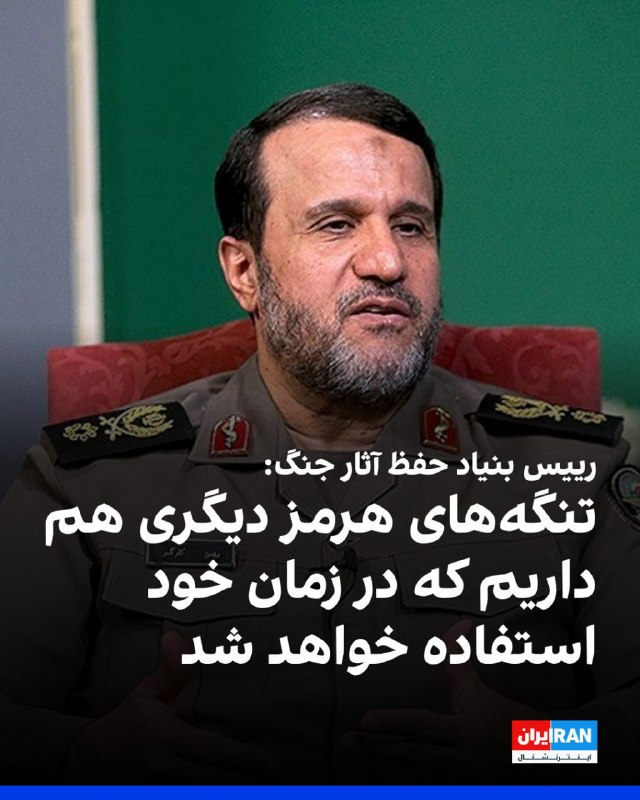

بهمن کارگر، رییس بنیاد حفظ آثار جنگ هشت‌ساله با عراق گفت: «این را بدانید که نیروهای مسلح جمهوری اسلامی محکم ایستاده‌اند؛ اگر دشمن دست از پا خطا کند، ضربه محکمی خواهد خورد و ما تنگه‌های هرمز دیگری هم داریم که در زمان خود، استفاده خواهد شد.»

او ادامه داد: «رییس جمهور قمارباز و متوهم آمریکا می‌گوید که توان موشکی، دریایی، هوایی و پدافند ما را از بین برده، اگر از بین رفته پس چرا نگران است؟ اگر از بین رفته که پس چرا نمی‌توانند از تنگه هرمز عبور کنند؟»
iranintl.com/202605244966

## IranIntlTV — post 338725

  

خبرگزاری فارس، وابسته به سپاه پاسداران نوشت: «درحالی که مذاکرات به‌سمت توافق اولیه پیش می‌رود، منابع آگاه از احتمال بازگشت آمریکا به رویه قبلی و تخطی از یکی از بندهای مورد توافق اولیه خبر می‌دهند و احتمال دبه آمریکا در یکی از بندهای توافق اولیه وجود دارد.»

این خبرگزاری افزود: «این چندمین‌بار است که واشینگتن برخلاف توافق اولیه عمل می‌کند. فارس اضافه کرد: «جمهوری اسلامی بر سر مواضع اصولی خود ایستاده است.»
iranintl.com/202605247890

## IranIntlTV — post 338724

  

مسعود پزشکیان در نشستی با مدیران سازمان صداوسیما گفت: «بنده نسبت به مشکلات اقتصادی و معیشتی مردم، به‌ویژه آسیب‌هایی که در پی شرایط جنگی تشدید شده، احساس مسئولیت جدی دارم و با تمام توان در حال تلاش برای کاهش فشارها بر مردم هستم.»

او افزود: «باید شرایطی فراهم شود که فشارهای اقتصادی و معیشتی مردم تا حد امکان کاهش یابد و همه مردم، فارغ از گرایش‌های مذهبی و فکری، با عزت و کرامت زندگی کنند. دغدغه مردم، دغدغه ماست، همانطور که دغدغه رهبر شهیدمان نیز بود.»
iranintl.com/202605248750

## IranIntlTV — post 338723

  

خبرگزاری تسنیم، وابسته به سپاه پاسداران گزارش داد اختلاف میان جمهوری اسلامی و آمریکا بر سر یکی دو بند از تفاهم‌نامه احتمالی همچنان ادامه دارد و به دلیل «مانع‌تراشی‌های آمریکا» هنوز موضوع نهایی نشده است.

همچنین رویترز به نقل از یک «منبع ارشد ایرانی» نوشت که تهران با تحویل ذخیره اورانیوم بسیار غنی شده خود موافقت نکرده و مسئله هسته‌ای بخشی از توافق اولیه نیست.
https://iranintl.com/202605249078

## IranIntlTV — post 338722

  <a href="telegram/content/IranIntlTV_338722_1779615468.mp4" target="_blank">🎬 Download video</a>

یک شهروند با ارسال پیامی به ایران‌اینترنشنال با اشاره به شرایط سخت معیشتی خود می‌گوید: «کاش ترامپ مردم را به منافع سیاسی خودش نفروشد و بداند که صلح فقط با داشتن مردم به وجود می آید، نه با موافقت با جمهوری اسلامی.»

## IranIntlTV — post 338721

  <a href="telegram/content/IranIntlTV_338721_1779615469.mp4" target="_blank">🎬 Download video</a>

دونالد ترامپ اعلام کرد با رهبران کشورهای منطقه درباره توافق با جمهوری اسلامی صحبت کرده و اکنون تنها نهایی‌سازی متن توافق باقی مانده است. او همچنین تاکید کرد که تنگه هرمز باز خواهد شد.

ارزیابی حسین آقایی، عضو تحریریه ایران‌اینترنشنال
@iranintltv

## IranIntlTV — post 338720

  <a href="telegram/content/IranIntlTV_338720_1779615471.mp4" target="_blank">🎬 Download video</a>

مسعود پزشکیان، رییس‌ دولت جمهوری اسلامی، با اشاره به روند مذاکرات با آمریکا گفت هیچ تصمیمی در کشور خارج از چارچوب شورای عالی امنیت ملی اتخاذ نمی‌شود و پس از نهایی شدن تصمیم‌ها در حوزه دیپلماسی، همه دستگاه‌ها باید از آن حمایت کنند.

گفت‌وگو با علی شیرازی، عضو تحریریه ایران‌اینترنشنال
@iranintltv

## IranIntlTV — post 338719

  <a href="telegram/content/IranIntlTV_338719_1779615472.mp4" target="_blank">🎬 Download video</a>

بر اساس ویدیوهای ارسال‌شده به ایران‌اینترنشنال گروهی از ایرانیان مقیم فنلاند، علیه جمهوری اسلامی در شهر تورکو تجمع کرده و سرود «ای ایران» را همخوانی کردند.

## IranIntlTV — post 338718

  

مارکو روبیو، وزیر خارجه آمریکا در نشست خبری با وزیر خارجه هند گفت: «ممکن است طی ساعات آینده خبرهای خوبی، دست‌کم درباره تنگه هرمز منتشر شود.» وزیر خارجه آمریکا گفت که این کشور به هدف خود برای کاهش قابل توجه توان موشکی جمهوری اسلامی دست یافته است.

او افزود: «طی ۴۸ ساعت گذشته با همکاری شرکای خود در منطقه روی چارچوبی کار کرده‌ایم که در صورت موفقیت، نه تنها به باز ماندن کامل تنگه هرمز بدون عوارض منجر می‌شود بلکه به برخی مسائل اساسی مرتبط با جاه‌طلبی‌های هسته‌ای جمهوری اسلامی نیز خواهد پرداخت.»
iranintl.com/202605244321

## IranIntlTV — post 338717

  

حسن عبدلیان‌پور، رییس مرکز وکلای قوه قضاییه گفت که بزرگ‌ترین خسارت معنوی وارده به ما، کشته شدن «ناجوانمردانه رهبر شهید» در محل کارش به دست آمریکا و اسرائیل است و ما به «خونخواهی امام شهید»، قصد داریم از ۹۰ میلیون مردم ایران برای اقامه دعوی وکالت اخذ کنیم.

او افزود: «در این مسیر کوتاه نمی‌آییم و جنایتکاران را رها نمی‌کنیم و نمی‌گذاریم خون شهدا پایمال شود.»
iranintl.com/202605247665

## IranIntlTV — post 338716

  <a href="telegram/content/IranIntlTV_338716_1779615475.mp4" target="_blank">🎬 Download video</a>

ویدیوی رسیده به ایران اینترنشنال نشان می‌دهد روز شنبه دوم خرداد تعدادی از دانش‌آموزان مدارس در خرم‌آباد برای اعتراض به شیوه امتحانات خود و اظهارات مسئولان برای حضوری کردن امتحانات، مقابل ساختمان آموزش و پرورش تجمع کردند. آن‌ها شعار «مجازی مجازی»‌ سر داده و خواستار غیرحضوری شدن امتحانات شدند.

## ManotoTV — post 105798

  <a href="telegram/content/ManotoTV_105798_1779615477.mp4" target="_blank">🎬 Download video</a>

مارکو روبیو، وزیر خارجه آمریکا، در سخنانی در دهلی گفت در پرونده ایران «پیشرفت قابل توجهی» حاصل شده، اما هنوز توافقی نهایی نشده است.

او گفت احتمالا تا ساعاتی دیگر اخبار بیشتری منتشر خواهد شد و افزود هدف اصلی واشینگتن جلوگیری از دستیابی جمهوری اسلامی به سلاح هسته‌ای است.

روبیو همچنین تنگه هرمز را یک آبراه بین‌المللی خواند و گفت جمهوری اسلامی مالک آن نیست. او تهدید کشتی‌های تجاری در این مسیر را غیرقانونی دانست و گفت دولت ترامپ طی ۴۸ ساعت گذشته با شرکای منطقه‌ای برای باز نگه داشتن کامل این آبراه کار کرده است.

وزیر خارجه آمریکا اضافه کرد ترجیح ترامپ حل مسئله از راه دیپلماسی است، اما افزود که این موضوع «به هر شکل» حل خواهد شد.

## ManotoTV — post 105797

  <a href="telegram/content/ManotoTV_105797_1779615479.mp4" target="_blank">🎬 Download video</a>

گزارشگرمنوتو: در سالگرد فاجعه متروپل آبادان، جمعی از ایرانیان مقابل کنسولگری جمهوری اسلامی در هامبورگ تجمع کردند.

این تجمع با حضور اعضای حزب پادشاهی‌خواه میهن‌پرستان ایران و شماری از نزدیکان جان‌باختگان متروپل برگزار شد. شرکت‌کنندگان جمهوری اسلامی را به ناکارآمدی، فساد و بی‌توجهی به جان شهروندان متهم کردند.

ساختمان متروپل آبادان در ۲۳ مه ۲۰۲۲ فرو ریخت؛ فاجعه‌ای که جان ده‌ها نفر را گرفت و به نمادی از بی‌مسئولیتی و فساد ساختاری در جمهوری اسلامی تبدیل شد.

## ManotoTV — post 105796

  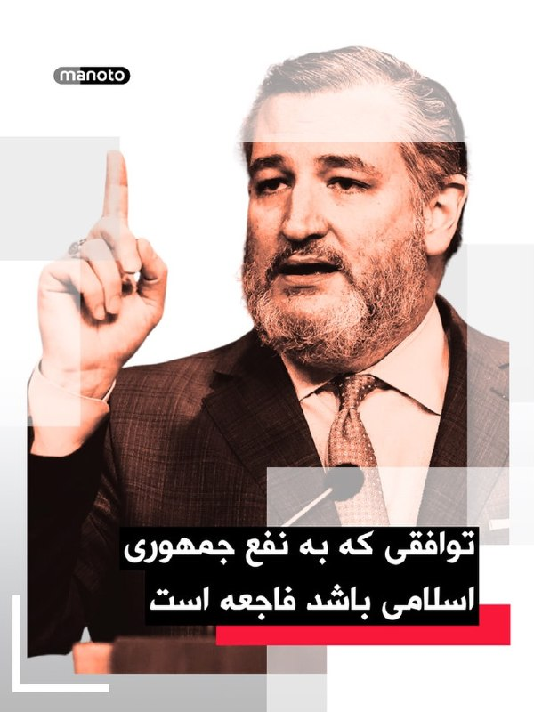

تد کروز، سناتور جمهوری‌خواه آمریکا، در پستی در شبکه اجتماعی ایکس از گزارش‌ها درباره احتمال توافق با جمهوری اسلامی ابراز نگرانی کرد.

او با دفاع از تصمیم دونالد ترامپ برای حمله به ایران، مدعی شد این اقدام به «نتایج نظامی فوق‌العاده» منجر شده و گفت اگر نتیجه نهایی، ادامه حاکمیت جمهوری اسلامی، دریافت میلیاردها دلار، امکان غنی‌سازی اورانیوم و کنترل مؤثر بر تنگه هرمز باشد، چنین توافقی «اشتباهی فاجعه‌بار» خواهد بود.

کروز همچنین نوشت جزئیات هنوز در حال روشن شدن است، اما حمایت برخی چهره‌های دولت بایدن از این توافق را «نگران‌کننده» دانست و از ترامپ خواست بر خطوط قرمز خود پافشاری کند.

## ManotoTV — post 105795

  

قوه قضائیه جمهوری اسلامی اعلام کرد مجتبی کیان، زندانی متهم به ارسال اطلاعات مربوط به مراکز تولید صنایع دفاعی، بامداد امروز اعدام شده است.

رسانه‌های وابسته به قوه قضائیه مدعی شده‌اند او در جریان آنچه مقام‌های جمهوری اسلامی «جنگ رمضان» می‌نامند، اطلاعات و مختصات واحدهای مرتبط با صنایع دفاعی را برای شبکه‌های وابسته به آمریکا و اسرائیل ارسال کرده بود.

این ادعاها به‌طور مستقل قابل راستی‌آزمایی نیست و قوه قضائیه جمهوری اسلامی تاکنون جزئیات شفافی از روند بازداشت، دسترسی متهم به وکیل مستقل، نحوه محاکمه و زمان دقیق رسیدگی منتشر نکرده است.

اجرای این حکم در حالی اعلام شده که جمهوری اسلامی در سال‌های اخیر بارها از پرونده‌های امنیتی و اتهام‌های مرتبط با «جاسوسی» برای صدور و اجرای احکام سنگین، از جمله اعدام، استفاده کرده است.

## FarsiVOA — post 218503

  <a href="telegram/content/FarsiVOA_218503_1779615481.mp4" target="_blank">🎬 Download video</a>

ویدیوی خبرنگار شبکه اِی‌بی‌سی از لحظه وقوع تیراندازی در نزدیکی کاخ سفید؛

شنبه عصر، یک تیراندازی در حوالی کاخ سفید خبر روی داد که طی آن دو نفر از جمله یک عابر و فرد مظنون تیر خوردند.

سرویس مخفی ایالات متحده اعلام کرد که کمی پس از ساعت ۶ عصر روز شنبه، فردی در محدوده خیابان ۱۷ و خیابان پنسیلوانیا، سلاحی را از کیف خود خارج کرد و شروع به تیراندازی کرد.

پلیس سرویس مخفی به تیراندازی او پاسخ داد و به مظنون شلیک کرد. مظنون به یک بیمارستان محلی منتقل شد، اما در آنجا اعلام شد که جان باخته است. به گفته این نهاد امنیی، در جریان این تیراندازی، یک عابر نیز مورد اصابت گلوله قرار گرفت و هیچ‌یک از مأموران آسیب ندیدند.

در پی این تیراندازی، نیروهای سرویس مخفی آمریکا خبرنگاران و اعضای رسانه‌ها را به داخل کاخ سفید هدایت کردند.

خبرنگار شبکه ای‌بی‌سی، سلینا ونگ، ویدیویی از لحظه وقوع حادثه حین گزارش خود منتشر کرد.
@FarsiVOA

## FarsiVOA — post 218502

🔺حصر دیجیتال ۸۵ روزه شد؛ اینترنت طبقاتی از بحران امنیتی تا شکاف اجتماعی

▪️قطع اینترنت در ایران وارد هشتاد و ششمین روز شده و مردم پس از ۲۰۴۰ ساعت «تاریکی دیجیتال» همچنان از دسترسی آزاد به اینترنت جهانی محروم‌اند.

▪️نت‌بلاکس در این باره می‌گوید در حالی که دسترسی عمومی به شبکه جهانی عمدتاً قطع مانده، گروهی از کاربران سفیدفهرست‌شده تصویری مصنوعی از زندگی عادی در ایران را به بیرون منتقل می‌کنند.

▪️به این ترتیب، بحران اینترنت در ایران وارد مرحله‌ای فراتر از قطع ارتباط شده است. مسئله امروز فقط نبود دسترسی نیست؛ شکل‌گیری دو جامعه موازی است. گروهی محدود با اینترنت سفیدفهرست‌شده و اکثریتی که از اطلاعات، فرصت، بازار کار، آموزش و ارتباط جهانی جدا شده‌اند.

⬇️ بیشتر بخوانید:
https://ir.voanews.com/a/8153268.html

## FarsiVOA — post 218501

  

احمد کرمی‌راد، عضو هیئت‌مدیره انجمن سازه‌های فولادی، می‌گوید در جریان جنگ اخیر، شماری از فولادسازی‌های مادر ایران هدف حمله قرار گرفته و این حملات برای زنجیره‌های بالادستی و پایین‌دستی فولاد مشکل ایجاد کرده است.

به گفته او، از مجموع حدود ۳۲ میلیون تن تولید فولاد کشور، نزدیک به ۱۱ میلیون تن دچار اختلال شده و فعالان این صنعت در تلاش‌اند تا راهکاری برای عبور از بحران پیدا کنند.

او همچنین از جهش شدید قیمت فولاد خبر داد و گفت قیمت‌ها «تقریباً دو برابر» شده است. به گفته او، آخرین عرضه فولاد مبارکه با نرخ ۸۵ هزار تومان برای هر کیلوگرم انجام شده، اما با احتساب هزینه‌های ارزی، زمان تحویل و نرخ بهره، قیمت مؤثر آن به حدود ۱۰۵ تا ۱۱۰ هزار تومان می‌رسد.

این افزایش قیمت می‌تواند بر ساخت‌وساز، پروژه‌های عمرانی، صنایع پایین‌دستی، سازه‌های فلزی و هزینه تمام‌شده تولید در بخش‌های مختلف اقتصاد ایران اثر مستقیم بگذارد.
@FarsiVOA

## FarsiVOA — post 218500

  <a href="telegram/content/FarsiVOA_218500_1779615483.mp4" target="_blank">🎬 Download video</a>

رزمایش نظامی آمریکا بر فراز کاراکاس؛ چند ماه پس از بازداشت مادورو؛

رویترز گزارش داد ارتش آمریکا روز شنبه یک رزمایش هوایی بر فراز کاراکاس، پایتخت ونزوئلا، انجام داد؛ نخستین رزمایش نظامی آمریکا در این کشور پس از عملیات سوم ژانویه که به بازداشت نیکلاس مادورو، رئیس‌جمهور پیشین ونزوئلا، و همسرش سیلیا فلورس منجر شد.

به گفته دولت ونزوئلا، این رزمایش به‌عنوان تمرین تخلیه برای موارد اضطراری پزشکی یا بلایای احتمالی مجوز گرفته بود و شامل دو هواپیمای اوسپری و ورود شناورهایی به آب‌های کارائیب ونزوئلا شد.

فرماندهی جنوبی ارتش آمریکا نیز در این عملیات حضور داشت و فرمانده آن با مقام‌های دولت موقت دیدار کرد.

این رزمایش در شرایطی انجام می‌شود که دولت ترامپ پس از بازداشت مادورو از طرح سه‌مرحله‌ای برای «ثبات‌سازی ونزوئلا» حمایت کرده و از دولت دلسی رودریگز پشتیبانی می‌کند؛ دولتی که همزمان قوانینی برای باز کردن بخش نفت و معدن ونزوئلا به روی شرکت‌های آمریکایی تصویب کرده است.
@FarsiVOA

## FarsiVOA — post 218499

  

دفتر رجب طیب اردوغان، رئیس‌جمهوری ترکیه، از برگزاری یک تماس ویدیویی مشترک با دونالد ترامپ، رئیس‌جمهوری آمریکا، و رهبران منطقه خبر داد و اعلام کرد که آنکارا آماده است در جریان اجرای یک توافق احتمالی با تهران، هر نوع حمایتی ارائه دهد.

دفتر ریاست‌جمهوری ترکیه روز یکشنبه در بیانیه‌ای اعلام کرد که اردوغان در این تماس گفته است توافقی برای تضمین عبور آزادانه از تنگه هرمز، به ثبات در منطقه کمک خواهد کرد و موجب آسودگی خاطر اقتصاد جهانی خواهد شد.

در بیانیه دفتر ریاست‌جمهوری ترکیه آمده است: «اردوغان همچنین در این گفت‌وگو تأکید کرد که ترکیه خواهان آغاز دوره‌ای جدید است که در آن کشورهای منطقه تهدیدی برای یکدیگر نباشند و تصریح کرد که در یک صلح عادلانه، بازنده‌ای وجود نخواهد داشت.»

پیشتر رئيس‌جمهوری آمریکا، از «یک یادداشت تفاهم» مربوط به پایان دادن جنگ با جمهوری اسلامی خبر داد و افزود که این توافق همچنین به «مدیریت رضایت‌بخش» اورانیوم غنی‌شده منجر خواهد شد.

پرزیدنت ترامپ بارها بر اراده آمریکا برای جلوگیری از دستیابی حکومت ایران به سلاح اتمی تاکید کرده است.
@FarsiVOA

## FarsiVOA — post 218498

  

محمد اسحاق دار، وزیر خارجه پاکستان، اعلام کرد که در مذاکرات میان ایالات متحده و حکومت ایران «پیشرفت معناداری» حاصل شده است.

وزیر خارجه پاکستان روز یکشنبه در شبکه ایکس نوشت که این پیشرفت، زمینه‌ای برای خوش‌بینی فراهم می‌کند که یک نتیجه «مثبت و پایدار» در دسترس باشد.

کمی قبل از آن، شهباز شریف، نخست‌وزیر پاکستان، «تلاش‌های فوق‌العاده» دونالد ترامپ، رئیس‌جمهوری ایالات متحده، برای پیگیری صلح را ستود و افزود که پاکستان همچنان متعهد به ادامه گفت‌وگوهاست و امیدوار است میزبان دور بعدی مذاکرات باشد.

پیشتر رئيس‌جمهوری آمریکا، از «یک یادداشت تفاهم» مربوط به پایان دادن جنگ با جمهوری اسلامی خبر داد و افزود که این توافق همچنین به «مدیریت رضایت‌بخش» اورانیوم غنی‌شده منجر خواهد شد.

پرزیدنت ترامپ بارها بر اراده آمریکا برای جلوگیری از دستیابی حکومت ایران به سلاح اتمی تأکید کرده است.
@FarsiVOA

## DW_Farsi — post 125073

  

📸 عکس روز: بایرن مونیخ قهرمان جام حذفی

تیم فوتبال بایرن مونیخ با هت‌تریک هری کین موفق به کسب نتیجه سه بر صفر مقابل تیم فوتبال اشتوتگارت شد و جام حذفی فوتبال آلمان را از آن خود کرد. بایرن مونیخ آخرین بار در سال ۲۰۲۰ قهرمان جام حذفی آلمان شده بود. این تیم محبوب، ۳۵ قهرمانی در لیگ آلمان و ۲۱ قهرمانی در جام حذفی در کارنامه خود دارد.

@dw_farsi

## DW_Farsi — post 125072

  

🔶 اردوغان می‌گوید ترکیه "آماده حمایت" از توافق احتمالی آمریکا و ایران است

رجب طیب اردوغان، رئیس جمهور ترکیه، اعلام کرد این کشور آماده است تا در جریان اجرای هرگونه توافق احتمالی میان ایالات متحده و ایران، تمامی حمایت‌های لازم را ارائه کند.

به گزارش خبرگزاری "آنادولو" در بیانیه‌ای که روز یکشنبه ۲۴ مه از سوی نهاد ارتباطات ریاست‌ جمهوری ترکیه منتشر شده، آمده است که اردوغان در یک کنفرانس تلفنی مشترک با دونالد ترامپ رئیس جمهور آمریکا، پادشاه بحرین، رئیس امارات عربی، امیر قطر، رئیس جمهور مصر، ولیعهد عربستان سعودی، پادشاه اردن و فرمانده کل ارتش پاکستان تأکید کرده است که آنکارا "همواره از حل و فصل مسائل از طریق گفت‌وگو و دیپلماسی حمایت کرده است".

طبق این گزارش اردوغان با قدردانی از کشورهایی که در روند مذاکرات ایران و آمریکا نقش داشته‌اند، اظهار داشت: «ترکیه در مرحله اجرای هرگونه توافق احتمالی با ایران، آماده ارائه هر نوع حمایت است.»

رئیس جمهور ترکیه همچنین ابراز امیدواری کرده است که درباره "موضوعات پیچیده نظیر پرونده هسته‌ای ایران نیز می‌توان در روند مذاکرات به راه‌حل‌های مناسب دست یافت".

به گفته دفتر ریاست‌جمهوری ترکیه، اردوغان در این تماس تلفنی تأکید کرده است که توافقی که عبور آزاد از تنگه هرمز را تضمین کند، "به ثبات منطقه‌ای کمک کرده و برای اقتصاد جهانی تسکین‌دهنده خواهد بود".

@dw_farsi

## DW_Farsi — post 125071

  

🔶 لیندزی گراهام: توافقی که اجازه دهد رژیم ایران پابرجا بماند، ریختن بنزین روی درگیری‌های منطقه است

لیندزی گراهام، سناتور پرنفوذ جمهوری‌خواه، در پستی در شبکه ایکس در واکنش به اظهارات جدید ترامپ مبنی بر "نهایی شدن توافق" با ایران هشدار داد: «اگر توافقی برای پایان دادن به درگیری با ایران حاصل شود، آن هم به این دلیل که باور بر این است که تنگه هرمز نمی‌تواند در برابر تروریسم ایران محافظت شود و ایران همچنان توانایی تخریب زیرساخت‌های اصلی نفتی خلیج فارس را دارد، در این صورت ایران به‌عنوان یک قدرت برتر تلقی خواهد شد که نیازمند یک راه‌حل دیپلماتیک است.»

او در ادامه نوشت: «این ترکیب، یعنی تصور اینکه ایران توانایی ایجاد ناامنی دائمی در تنگه را دارد و همچنین قادر است آسیب‌های گسترده‌ای به زیرساخت‌های نفتی خلیج فارس وارد کند، نشان‌دهنده تغییر بزرگی در توازن قدرت در منطقه است و در بلندمدت می‌تواند به یک کابوس برای اسرائیل تبدیل شود.»

به گفته گراهام اگر این برداشت‌ها درست باشند، "این پرسش مطرح می‌شود که اصلا چرا جنگ آغاز شد".

او افزود: «به این ایده که نمی‌تو‌ان توانایی ایران برای ایجاد ناامنی در تنگه هرمز را مهار کرد و اینکه منطقه قادر به دفاع از خود در برابر توان نظامی ایران نیست، تردید دارم.»

@dw_farsi

## Persian_Trend_Official — post 14840

https://youtube.com/live/FTUt8HfIdrc?feature=share

## Persian_Trend_Official — post 14839

  <a href="https://t.me/persian_trend_official/14839" target="_blank">📎 Download file</a>

فایل صوتی لایو اول
نسخه کم حجم - 4.28 مگابایت

اتاق جنگ یکشنبه 3 خرداد | توافق مبهم ایران و آمریکا !

📝 Nick

📌 @persian_trend_official
پرشین ترند | متفاوت‌ترین کانال نظامی

## Persian_Trend_Official — post 14838

♨️ تسنیم:
تعهد ایران به خروج مواد هسته‌ای یا تعلیق 10-20 ساله در تفاهم‌نامه کذب است.

📝 Nick

📌 @persian_trend_official
پرشین ترند | متفاوت‌ترین کانال نظامی

## Persian_Trend_Official — post 14837

  

⭕️ بنی گانتز، رئیس سابق ستاد کل ارتش اسرائیل (اپوزیسیون نتانیاهو):

دنبال کردن آتش‌بس در لبنان، تحت هیچ شرایطی نباید بخشی از توافق با ایران باشد.

نمی‌شود وضعیتی را پذیرفت که درست وقتی جامعه لبنان دارد از اقدامات حزب‌الله آسیب می‌بیند، اسرائیل اجازه بدهد این وضعیت به سپری برای لبنان تبدیل شود.

روستاهای جنوب لبنان فقط چندصد متر با مطولا، شومیرا و مسگاو عام فاصله دارند و اسرائیل وظیفه دارد از ساکنان خود، بدون وابستگی به هیچ عامل خارجی، دفاع کند.

پذیرفتن آتش‌بس در لبنان به‌عنوان بخشی از توافق با ایران، یک اشتباه راهبردی خواهد بود که تا سال‌ها بهایش را خواهیم پرداخت.

این دقیقاً همان موردی است که اسرائیل باید به آمریکا بگوید: نه.

📝 Nick

📌 @persian_trend_official
پرشین ترند | متفاوت‌ترین کانال نظامی

## RadioFarda — post 157512

  

🔸مارکو روبیو، وزیر خارجه آمریکا، گفت ممکن است تا شامگاه یک‌شنبه سوم خرداد خبری دربارهٔ توافقی با ایران اعلام شود که می‌تواند به‌طور رسمی به جنگ خاورمیانه پایان دهد.

🔸روبیو در جمع خبرنگاران در دهلی نو گفت: «فکر می‌کنم شاید این امکان وجود داشته باشد که در چند ساعت آینده جهان خبرهای خوبی دریافت کند.»

🔸روبیو، که در نخستین سفر خود به هند به‌سر می‌بَرد، گفت توافق در حال شکل‌گیری به نگرانی‌های آمریکا دربارهٔ تنگه هرمز خواهد پرداخت؛ تنگه‌ای که ایران در واکنش به حمله آمریکا و اسرائیل تا حد زیادی مسدود کرده است.

🔸او افزود این توافق همچنین روندی را آغاز خواهد کرد که «در نهایت می‌تواند ما را به جایی برساند که رئیس‌جمهور می‌خواهد، یعنی جهانی که دیگر ناچار نباشد از سلاح هسته‌ای ایران بترسد یا نگران آن باشد.»

🔸سخنان او پس از آن بیان شد که دونالد ترامپ، رئیس‌جمهور آمریکا، گفت پیشنهادی که شامل بازگشایی تنگه هرمز است، «تا حد زیادی مذاکره شده است».

@RadioFarda

## RadioFarda — post 157511

  

🔸ناهید کیانی آخرین شانس تکواندوی زنان ایران در مسابقات قهرمانی آسیا ۲۰۲۶ مغولستان با کسب مدال طلا بر‌بام آسیا ایستاد.

🔸ناهید کیانی آخرین شانس تکواندوی زنان ایران در مسابقات قهرمانی آسیا ۲۰۲۶ مغولستان با کسب مدال طلا بر‌بام آسیا ایستاد.

🔸 کیانی در دیدار فینال وزن -۵۷ کیلوگرم رقابتهای قهرمانی آسیا، با برتری ۲ بر صفر مقابل حریف ازبکستانی خود صاحب مدال طلا شد.

🔸او در حالی طلای تکواندوی زنان ایران در جهان را کسب کرد که در روزهای گذشته تیم ملی تکواندوی زنان نتوانسته بود هیچ مدالی در مسابقات قهرمانی آسیا از آن‌ خود کند.

🔸ناهید کیانی در المپیک ۲۰۲۴ پاریس اولین زن برنده مدال نقره شد.

@RadioFarda

## RadioFarda — post 157510

  

🔸 در آستانه امضای توافقی احتمالی میان آمریکا و ایران برای پایان دادن به جنگ، چند عضو برجسته حزب جمهوری‌خواه به انتقاد از این توافق دست زدند.

🔸 مایک پمپئو، وزیر خارجهٔ پیشین آمریکا، روز شنبه در مورد مفاد گزارش‌شدهٔ این توافق گفت که به باور او «به هیچ وجه در راستای شعار اول آمریکا نیست» و آن را به توافق هسته‌ای سال ۲۰۱۵ دولت باراک اوباما تشبیه کرد.

🔸 تد کروز، سناتور جمهوری‌خواه از تگزاس، نیز روز یک‌شنبه در ایکس نوشت اگر نتیجهٔ عملیات نظامی آمریکا علیه ایران این باشد که «رژیم ایران همچنان به غنی‌سازی اورانیوم، توسعهٔ سلاح هسته‌ای و کنترل مؤثر تنگه هرمز ادامه دهد»، این «اشتباهی فاجعه‌بار» خواهد بود.

🔸 لیندزی گراهام، سناتور جمهوری‌خواه از کارولینای جنوبی نیز هشدار داد توافقی که به جمهوری اسلامی اجازه دهد همچنان قدرت منطقه‌ای خود را حفظ کند، در بلندمدت «کابوسی برای اسرائیل» خواهد بود.

🔸 همزمان مورگان اورتگاس، نمایندهٔ پیشین دولت ترامپ در امور خاورمیانه، در نشست سیاست‌گذاری «فروم خاورمیانه» در واشینگتن هشدار داد که ایران ممکن است از مذاکرات هسته‌ای برای «خریدن زمان» استفاده کند.

@RadioFarda

## RadioFarda — post 157509

🔸رسانه‌های پاکستان گزارش دادند یک بمب قدرتمند در نزدیکی خط راه‌آهن شهر کویته هم‌زمان با عبور یک قطار مسافربری منفجر شد.

🔸بر اساس اعلام مقام‌های محلی، در این حادثه بیش از ۳۰ نفر زخمی شدند.

🔸پزشکان بیمارستان‌های منطقه حال شماری از مجروحان را وخیم گزارش کردند.

🔸 هنوز جزئیاتی درباره عامل یا انگیزه این انفجار منتشر نشده است.

@RadioFarda

## IranianMinds — post 20659

  

🔴 آلمان در حال بررسی پرداخت پاداش ۸۰۰۰ یورویی برای پناهجویان سوری است که داوطلبانه آلمان را ترک کنند

بیش از ۹۰۰ هزار سوریه ای بدون تابعیت آلمانی در آلمان زندگی می‌کنند!

@IranianMinds

## IranianMinds — post 20658

🔴 خبرگزاری فارس :

احتمالا دوباره آمریکا دبه میکنه و توافق رو‌ بهم میزنه.

@IranianMinds

## IranianMinds — post 20657

🔴 مارکو روبیو درباره توافق احتمالی با ایران:

پیشرفت‌هایی حاصل شده؛ پیشرفت‌های قابل‌توجه، هرچند هنوز نهایی نشده‌اند.

«نمی‌خواهم اهمیت این موضوع را کم جلوه بدهم، اما هنوز کارهایی باقی مانده که باید انجام شود.»

«شاید طی چند ساعت آینده جهان خبرهای خوبی، حداقل درباره تنگه‌ها و روند مذاکرات، دریافت کند.»

این تصور که ترامپ توافقی را می‌پذیرد که در نهایت ایران را در زمینه جاه‌طلبی هسته‌ای در موقعیت قوی‌تری قرار دهد، مضحک است. چنین چیزی اتفاق نخواهد افتاد.

@IranianMinds

## BBCPersian — post 281946

🔻استارمر: توافق باید به جنگ پایان دهد و تنگه هرمز باز شود

نخست‌وزیر بریتانیا از پیشرفت‌ گفت‌گوهای آمریکا و ایران استقبال کرد.

کی‌یر استارمر گفت: «ما باید شاهد توافقی باشیم که به درگیری پایان دهد و تنگه هرمز را با آزادی بی‌قید و شرط و نامحدود برای دریانوردی بازگشایی کند.»

نخست‌وزیر بریتانیا در عین حال تاکید کرده «بسیار مهم است که هرگز به ایران اجازه توسعه سلاح هسته‌ای داده نشود.»

آقای استارمر در شبکه اجتماعی ایکس نوشت که بریتانیا آماده همکاری با شرکای بین‌المللی خود است «تا از این فرصت استفاده کنیم و به یک توافق دیپلماتیک بلندمدت دست یابیم.»

https://bbc.in/4nOuCnR
@BBCPersian

## BBCPersian — post 281938

🖊 دیزی استفنز، بی‌بی‌سی

🔻 برج کج پیزا یکی از شاخص‌ترین نمادهای ایتالیا است.

اما این تنها سازه‌ای نیست که به یک سمت متمایل شده است. از خانه‌های رقصان در هلند گرفته تا پاگودای تپه ببر در چین، بناهای کج در گوشه‌وکنار جهان وجود دارند.

اما چرا این ساختمان‌ها کج می‌شوند؟ و چرا این موضوع لزوما به معنای فرو ریختن آن‌ها نیست؟

بیشتر بخوانید:

https://bbc.in/4dqGSau
📸Getty Images
@BBCPersian

## BBCPersian — post 281937

  

🔻مسعود پزشکیان در دیدار با مدیران صداوسیما گفت که «هیچ تصمیمی خارج از چارچوب شورای عالی امنیت ملی و بدون هماهنگی و اذن» رهبر اتخاذ نخواهد شد.

رئیس‌جمهور ایران تاکید کرد: «هنگامی که تصمیمی در حوزه دیپلماسی اتخاذ می‌شود، همه دستگاه‌ها و تریبون‌ها و جریان‌ها باید از آن حمایت کنند تا صدایی واحد و منسجم از جمهوری اسلامی ایران به جهان مخابره شود.»

او از صداوسیما خواست: «در مسیر تقویت همبستگی اجتماعی، حمایت از تصمیمات کلان نظام، و افزایش سرمایه اجتماعی کشور بیش از پیش نقش‌آفرینی کند.»

کامران غضنفری، نماینده مجلس، دیروز گفته بود که رئیس‌جمهور بدون اجازه رهبر جمهوری اسلامی آتش‌بس را قبول کرده است.

📸Reuters
@BBCPersian

## BBCPersian — post 281936

🔻اردوغان: توافق برای تضمین عبور آزاد از تنگه هرمز به اقتصاد جهانی کمک می‌کند

رجب‌طیب اردوغان گفت که در تماس تلفنی دونالد ترامپ با رهبران کشورهای منطقه از باز شدن تنگه هرمز استقبال و برای «هر نوع حمایتی در طول مراحل اجرای توافق» با ایران اعلام آمادگی کرده است.

دفتر رئیس‌جمهور ترکیه در شبکه اجتماعی ایکس نوشت که ترکیه همیشه طرفدار حل مشکلات از طریق گفتگو و دیپلماسی است و از توافق ایران و آمریکا استقبال می‌کند:

«توافق برای تضمین عبور آزاد از تنگه هرمز، ثبات منطقه را پشتیبانی می‌کند و به اقتصاد جهانی کمک خواهد کرد.»

https://bbc.in/4nOuCnR
@BBCPersian

## BBCPersian — post 281935

🔻 مخالفت روزنامه کیهان با برگشتن تنگه هرمز به وضعیت پیش از جنگ

حسین شریعتمداری، مدیر مسئول روزنامه کیهان، در یادداشتی درباره برگشتن تنگه هرمز به وضعیت پیش از جنگ، نوشت: «تنگه هرمز بخشی از آب‌های سرزمینی ایران است و این حق قانونی برای کشورمان محفوظ است که از کشتی‌ها و شناورهای عبورکننده از آب‌های سرزمینی خود عوارض عبور بگیرد.»

«این روزها در برخی از اخبار و گزارش‌ها به عبور ده‌ها کشتی از تنگه هرمز اشاره می‌شود با این تأکید که عبور آنها با کسب اجازه و تحت کنترل نیروی دریادل سپاه پاسداران صورت می‌پذیرد اما توضیحی داده نمی‌شود که آیا از این کشتی‌ها و شناورها، حق عبور نیز دریافت می‌شود یا نه؟ اگر پاسخ منفی است، باید آن را غفلت از یک اقدام ضروری تلقی کرد. چرا که عوارض عبور، حق قانونی ایران اسلامی است و نباید نادیده گرفته شود.»

او در انتها از تیم مذاکره کننده انتقاد کرد: «همین جا باید از اظهارات برخی از دیپلمات‌ها و تیم مذاکره‌کننده کشورمان گلایه کرد که انگار قرار است بعد از پایان جنگ، شرایط و قوانین حاکم بر تنگه به حالت پیش از جنگ بازگردد. و انگار نه انگار که اِعمال حاکمیت ایران بر تنگه هرمز، حق قانونی و قطعی کشورمان است‌.»

https://bbc.in/4nJgJqO
@BBCPersian

## Dirty_Kids — post 390063

  <a href="telegram/content/Dirty_Kids_390063_1779615491.mp4" target="_blank">🎬 Download video</a>

صحبت‌های عمو مراد درباره توافق شدن یا نشدن رو هم بشنوید...

@Dirty_Kids 👻

## Dirty_Kids — post 390062

  <a href="telegram/content/Dirty_Kids_390062_1779615492.mp4" target="_blank">🎬 Download video</a>

حقیقتاً لذتی که در شنیدن این جملات هست، در دیدن تپلی‌های سیدنی سویینی نیست:)))

@Dirty_Kids 👻

## Hranews — post 113128

رسول یادیار از زندان بوکان آزاد شد

❗️
❗️
❗️
❗️
❗️ – رسول یادیار، شهروند اهل بوکان، با تودیع وثیقه از زندان این شهرستان آزاد شد.

ادامه مطلب

#رسول_یادیار

↘️
@hranews_bot تماس ✉️ -  @Hranews  کانال هرانا 🆑

## Hranews — post 113127

اداره‌ اطلاعات فارس از بازداشت ۱۵ تن با اتهامات امنیتی خبر داد

❗️
❗️
❗️
❗️
❗️ – اداره‌ اطلاعات استان فارس با انتشار اطلاعیه‌ای از #بازداشت ۱۵ نفر با اتهامات امنیتی خبر داد. در این اطلاعیه اعلام شده که از بازداشت‌شدگان، اسلحه و تجهیزات ماهواره‌ای #استارلینک ضبط شده است.

ادامه مطلب

↘️
@hranews_bot تماس ✉️ -  @Hranews  کانال هرانا 🆑

## Hranews — post 113126

تداوم بازداشت و بی‌خبری از وضعیت مجتبی حاجیان

❗️
❗️
❗️
❗️
❗️ – مجتبی حاجیان، شهروند ساکن تهران، علیرغم گذشت ۱۱۹ روز از زمان بازداشت، در بلاتکلیفی به‌سر می‌برد. بی‌خبری از سرنوشت این شهروند، منجر به افزایش نگرانی‌های خانواده وی شده است.

ادامه مطلب

#مجتبی_حاجیان

↘️
@hranews_bot تماس ✉️ -  @Hranews  کانال هرانا 🆑

## Hranews — post 113125

  

آخرین داده‌های نت بلاکس نشان می‌دهد که قطع سراسری #اینترنت در ایران اکنون از ۲۰۴۰ ساعت گذشته و وارد هشتادوششمین روز خود شده است. این نهاد ناظر بر وضعیت دسترسی به اینترنت در جهان همچنین اعلام کرد: دسترسی عمومی به اینترنت جهانی همچنان به‌طور گسترده محدود مانده و تنها گروهی از کاربران که دسترسی ویژه‌ای دارند، تصاویری کنترل‌شده از وضعیت ایران را به جهان خارج ارائه می‌کنند.

↘️
@hranews_bot تماس ✉️ -  @Hranews  کانال هرانا 🆑

## Hranews — post 113124

یک زن در کرج توسط همسرش به قتل رسید

❗️
❗️
❗️
❗️
❗️ – روز گذشته، یک مرد در کرج با استفاده از سلاح گرم همسر خود را به #قتل رساند. متهم پس از ساعاتی بازداشت شد.

ادامه مطلب

#زن_کشی

↘️
@hranews_bot تماس ✉️ -  @Hranews  کانال هرانا 🆑

## manototv — post 105798

  <a href="telegram/content/manototv_105798_1779615493.mp4" target="_blank">🎬 Download video</a>

مارکو روبیو، وزیر خارجه آمریکا، در سخنانی در دهلی گفت در پرونده ایران «پیشرفت قابل توجهی» حاصل شده، اما هنوز توافقی نهایی نشده است.

او گفت احتمالا تا ساعاتی دیگر اخبار بیشتری منتشر خواهد شد و افزود هدف اصلی واشینگتن جلوگیری از دستیابی جمهوری اسلامی به سلاح هسته‌ای است.

روبیو همچنین تنگه هرمز را یک آبراه بین‌المللی خواند و گفت جمهوری اسلامی مالک آن نیست. او تهدید کشتی‌های تجاری در این مسیر را غیرقانونی دانست و گفت دولت ترامپ طی ۴۸ ساعت گذشته با شرکای منطقه‌ای برای باز نگه داشتن کامل این آبراه کار کرده است.

وزیر خارجه آمریکا اضافه کرد ترجیح ترامپ حل مسئله از راه دیپلماسی است، اما افزود که این موضوع «به هر شکل» حل خواهد شد.

## manototv — post 105797

  <a href="telegram/content/manototv_105797_1779615495.mp4" target="_blank">🎬 Download video</a>

گزارشگرمنوتو: در سالگرد فاجعه متروپل آبادان، جمعی از ایرانیان مقابل کنسولگری جمهوری اسلامی در هامبورگ تجمع کردند.

این تجمع با حضور اعضای حزب پادشاهی‌خواه میهن‌پرستان ایران و شماری از نزدیکان جان‌باختگان متروپل برگزار شد. شرکت‌کنندگان جمهوری اسلامی را به ناکارآمدی، فساد و بی‌توجهی به جان شهروندان متهم کردند.

ساختمان متروپل آبادان در ۲۳ مه ۲۰۲۲ فرو ریخت؛ فاجعه‌ای که جان ده‌ها نفر را گرفت و به نمادی از بی‌مسئولیتی و فساد ساختاری در جمهوری اسلامی تبدیل شد.

## manototv — post 105796

  

تد کروز، سناتور جمهوری‌خواه آمریکا، در پستی در شبکه اجتماعی ایکس از گزارش‌ها درباره احتمال توافق با جمهوری اسلامی ابراز نگرانی کرد.

او با دفاع از تصمیم دونالد ترامپ برای حمله به ایران، مدعی شد این اقدام به «نتایج نظامی فوق‌العاده» منجر شده و گفت اگر نتیجه نهایی، ادامه حاکمیت جمهوری اسلامی، دریافت میلیاردها دلار، امکان غنی‌سازی اورانیوم و کنترل مؤثر بر تنگه هرمز باشد، چنین توافقی «اشتباهی فاجعه‌بار» خواهد بود.

کروز همچنین نوشت جزئیات هنوز در حال روشن شدن است، اما حمایت برخی چهره‌های دولت بایدن از این توافق را «نگران‌کننده» دانست و از ترامپ خواست بر خطوط قرمز خود پافشاری کند.

## manototv — post 105795

  

قوه قضائیه جمهوری اسلامی اعلام کرد مجتبی کیان، زندانی متهم به ارسال اطلاعات مربوط به مراکز تولید صنایع دفاعی، بامداد امروز اعدام شده است.

رسانه‌های وابسته به قوه قضائیه مدعی شده‌اند او در جریان آنچه مقام‌های جمهوری اسلامی «جنگ رمضان» می‌نامند، اطلاعات و مختصات واحدهای مرتبط با صنایع دفاعی را برای شبکه‌های وابسته به آمریکا و اسرائیل ارسال کرده بود.

این ادعاها به‌طور مستقل قابل راستی‌آزمایی نیست و قوه قضائیه جمهوری اسلامی تاکنون جزئیات شفافی از روند بازداشت، دسترسی متهم به وکیل مستقل، نحوه محاکمه و زمان دقیق رسیدگی منتشر نکرده است.

اجرای این حکم در حالی اعلام شده که جمهوری اسلامی در سال‌های اخیر بارها از پرونده‌های امنیتی و اتهام‌های مرتبط با «جاسوسی» برای صدور و اجرای احکام سنگین، از جمله اعدام، استفاده کرده است.

## alonews — post 122276

  <a href="telegram/content/alonews_122276_1779615498.webm" target="_blank">🎬 Download video</a>

👈قالیباف، نقدعلی و سالاری کاندیدای ریاست مجلس در سال سوم شدند

✅ @AloNews خبر جنگ

## alonews — post 122275

  <a href="telegram/content/alonews_122275_1779615498.webm" target="_blank">🎬 Download video</a>

👈نتنياهو شلیک‌های دیروز شب در واشنگتن را محکوم کرد و از ترامپ به عنوان «بهترین دوستی که اسرائیل تاکنون در کاخ سفید داشته» یاد کرد.

✅ @AloNews خبر جنگ

## alonews — post 122274

  <a href="telegram/content/alonews_122274_1779615498.webm" target="_blank">🎬 Download video</a>

👈 وزیر امور خارجه هند: ما طرفدار دیپلماسی برای حل منازعات و تجارت دریایی امن هستیم

🔴سوبرامانیام جایشانکار: ما طرفدار گفت‌وگو و دیپلماسی برای حل منازعات هستیم.

🔴از تجارت دریایی امن و بدون مانع حمایت می‌کنیم.

🔴ما خواستار رعایت دقیق قوانین بین‌الملل هستیم.

✅ @AloNews خبر جنگ

## alonews — post 122273

  <a href="telegram/content/alonews_122273_1779615498.mp4" target="_blank">🎬 Download video</a>

👈 وزیر امور خارجه هند: ما با ایران و آمریکا و اسرائیل روابط خوبی داریم و چندجانبه گرایی هدف ماست

🔴سوبرامانیام جایشانکار: هند، به‌خاطر رشد منافعش، با تمام طرف‌های درگیر ارتباط دارد.

🔴ما به دنبال صلح و ثبات در منطقه هستیم.

✅ @AloNews خبر جنگ

## alonews — post 122272

  <a href="telegram/content/alonews_122272_1779615499.webm" target="_blank">🎬 Download video</a>

👈2040 ساعت از قطعی اینترنت توی ایران گذشت‌‌...

✅ @AloNews خبر جنگ

## alonews — post 122271

  <a href="telegram/content/alonews_122271_1779615500.mp4" target="_blank">🎬 Download video</a>

👈سوال خبرنگار هندی باعث سکوت و تعجب وزیرخارجه امریکا شد

🔴خبرنگار: «ما شاهد اظهارات نژادپرستانه زیادی از سوی آمریکا در مورد هندی‌ها بوده‌ایم. این خلاف همکاری هند و آمریکا است.»

🔴روبیو: ببخشید، چه کسی این اظهارات را مطرح کرده است؟»

🔴خبرنگار: «قربان، همه ما این اظهارات را دیده‌ایم. آنها کاملاً شناخته شده هستند.»

🔴روبیو: «سکوت و نگاه متعجبانه!»

✅ @AloNews خبر جنگ

## alonews — post 122270

👈جهت رزرو تبلیغات در کانال #الونیوز به کانال زیر مراجعه کنید👇

📃https://t.me/ads_alonews

📃https://t.me/ads_alonews

## alonews — post 122269

  <a href="telegram/content/alonews_122269_1779615501.webm" target="_blank">🎬 Download video</a>

👈ادعای رویترز به نقل از یک منبع ارشد ایرانی: مسئله هسته‌ای در مذاکرات مربوط به توافق نهایی مورد بحث قرار خواهد گرفت و بنابراین بخشی از توافق فعلی نیست

🔴 هیچ توافقی درمورد ذخایر اورانیوم با غنای بالا از کشور صورت نگرفته است.

✅ @AloNews خبر جنگ

## alonews — post 122268

  <a href="telegram/content/alonews_122268_1779615501.webm" target="_blank">🎬 Download video</a>

👈کانال ۱۴ اسرائیل: نتانیاهو به وزرا دستور داده است از بحث در مورد توافق قریب الوقوع بین تهران و واشنگتن خودداری کنند

✅ @AloNews خبر جنگ

## alonews — post 122267

  <a href="telegram/content/alonews_122267_1779615501.mp4" target="_blank">🎬 Download video</a>

👈وضعیت فعلی

✅ @AloNews خبر جنگ

## alonews — post 122266

  <a href="telegram/content/alonews_122266_1779615503.webm" target="_blank">🎬 Download video</a>

👈خبرگزاری آماتور فارس: آمریکا شاید دبه کنه

✅ @AloNews خبر جنگ

## alonews — post 122265

  <a href="telegram/content/alonews_122265_1779615503.webm" target="_blank">🎬 Download video</a>

👈 انفجار در راه‌آهن کویته پاکستان بیش از ۳۰ کشته و ۸۰ زخمی بر جای گذاشت

🔴 در پی انفجاری شدید در نزدیکی خط راه‌آهن کویته پاکستان دستکم ۳۰ نفر کشته و بیش از ۸۰ تن زخمی شدند.

✅ @AloNews خبر جنگ

## alonews — post 122264

  <a href="telegram/content/alonews_122264_1779615503.webm" target="_blank">🎬 Download video</a>

👈ادعای العربیه: دور بعدی مذاکرات بین آمریکا و ایران ممکن است در ۵ ژوئن برگزار شود.

🔴واشنگتن و تهران هنگام آغاز مذاکره برای توافق نهایی، روسای هیئت‌های خود را اعزام خواهند کرد.

✅ @AloNews خبر جنگ

## alonews — post 122263

  <a href="telegram/content/alonews_122263_1779615503.webm" target="_blank">🎬 Download video</a>

👈امیرحسین ثابتی: جنگ و ترورهای دشمن در پیش است؛ چه توافق بشود و چه نشود

✅ @AloNews خبر جنگ

## alonews — post 122262

  <a href="telegram/content/alonews_122262_1779615503.webm" target="_blank">🎬 Download video</a>

👈علی قلهکی: آمریکا شاید برا بازگشایی محاصره تنگه «پروتکل» بگذارد!/ تکلیف «غرامت» و «تحریم‌ها» در تفاهم جدید هنوز مشخص نیست/ قطر متعهد شده بخشی از دارایی‌‌های بلوکه شده ایران را بپردازد

✅ @AloNews خبر جنگ

## alonews — post 122261

  <a href="telegram/content/alonews_122261_1779615503.webm" target="_blank">🎬 Download video</a>

👈الحدث به نقل از منابع: توافق اولیه احتمالی بین ایران و ایالات متحده «اعلامیه اسلام‌آباد» نام خواهد داشت.

✅ @AloNews خبر جنگ

## alonews — post 122260

  <a href="telegram/content/alonews_122260_1779615503.webm" target="_blank">🎬 Download video</a>

👈وزیر خارجه آمریکا: امروز اخبار بیشتری از توافق با ایران منتشر می‌شود 
✅ @AloNews خبر جنگ

## alonews — post 122259

  <a href="telegram/content/alonews_122259_1779615503.mp4" target="_blank">🎬 Download video</a>

👈وزیر خارجه آمریکا: امروز اخبار بیشتری از توافق با ایران منتشر می‌شود

✅ @AloNews خبر جنگ

## alonews — post 122258

  <a href="telegram/content/alonews_122258_1779615505.webm" target="_blank">🎬 Download video</a>

👈تسنیم به نقل از یک منبع مطلع: اختلاف بر سر یکی دو بند از تفاهم‌نامه همچنان ادامه دارد

🔴یک منبع مطلع گفت که اختلاف میان ایران و آمریکا بر سر یکی دو بند از تفاهم نامه احتمالی همچنان ادامه دارد و به دلیل مانع‌تراشی‌های آمریکا هنوز موضوع نهایی نشده است.

🔴وی تاکید کرد: ایران بر احقاق خود مردم خود تاکید دارد و این موضوع به میانجی پاکستانی اعلام شده است که در صورت ادامه مانع‌تراشی‌های آمریکا، امکان نهایی شدن تفاهم نامه وجود ندارد

✅ @AloNews خبر جنگ

## alonews — post 122257

  <a href="telegram/content/alonews_122257_1779615505.webm" target="_blank">🎬 Download video</a>

👈فارس: بررسی متن نهایی‌شده توافق احتمالی، نشان می‌دهد آمریکا و متحدانش متعهد می‌شوند که به هیچ وجه به ایران یا متحدانش حمله نکنند.

🔴در مقابل، ایران نیز متعهد شده که خود و متحدانش به آمریکا و متحدان آن حملۀ نظامی پیش دستانه نداشته باشند.

🔴طبق پیش‌نویس توافق، طرفین بر سر آزادسازی تمام یا بخشی از پول‌های مسدودشدهٔ ایران به منظور ورود به مذاکره توافق کرده‌اند

🔴همچنین طبق این پیش‌نویس، امکان تردد در تنگهٔ هرمز به تعداد قبل از جنگ و با مدیریت ایران، همزمان با برداشتن محاصرهٔ دریایی فراهم می‌شود.

🔴علاوه بر این، تحریم‌های نفت، گاز، پتروشیمی و مشتقات آن در دورهٔ مذاکره به‌طور موقت لغو می‌شود تا ایران بتواند آزادانه به فروش محصولات خود بپردازد.


✅ @AloNews خبر جنگ

---
📅 بروزرسانی: 1405/03/03 11:12
---

## VahidOOnLine — post 241886

  

مارکو روبیو، وزیر خارجه آمریکا در نشست خبری با وزیر خارجه هند گفت که آزادی ناوبری و کشتیرانی باید تضمین شود و تنگه هرمز یک آبراه بین‌المللی است و جمهوری اسلامی مالک آن نیست.

روبیو گفت که در مذاکرات با جمهوری اسلامی پیشرفت قابل توجهی حاصل شده اما پیشرفت نهایی حاصل نشده است.
iranintl
‌🏁 🇬🇧 IranintlTV

🤖 @VahidOOnLine

## VahidOOnLine — post 241885

  <a href="telegram/content/VahidOOnLine_241885_1779608557.mp4" target="_blank">🎬 Download video</a>

بر اساس ویدیوهای ارسال‌شده به ایران‌اینترنشنال گروهی از ایرانیان مقیم هلیفکس در کانادا، علیه جمهوری اسلامی تجمع برگزار کردند.
‌🏁 🇬🇧 IranintlTV

🤖 @VahidOOnLine

## VahidOOnLine — post 241884

  

مسعود پزشکیان در نشستی با مدیران سازمان صداوسیما گفت: «هیچ تصمیمی خارج از چارچوب شورای‌عالی امنیت ملی و بدون هماهنگی و اذن رهبری اتخاذ نخواهد شد.»

او افزود: «هنگامی که تصمیمی در حوزه دیپلماسی اتخاذ می‌شود، همه دستگاه‌ها، تریبون‌ها و جریان‌ها باید از آن حمایت کنند.»

او ادامه داد: «همواره تلاش کرده‌ام سخنی بر خلاف نظر رهبری بیان نشود و یا موضعی اتخاذ نگردد که به اختلاف میان ارکان حاکمیت دامن بزند و دشمن از آن سوءاستفاده کند.»
‌🏁 🇬🇧 IranintlTV

🤖 @VahidOOnLine

## VahidOOnLine — post 241883

  <a href="telegram/content/VahidOOnLine_241883_1779608560.mp4" target="_blank">🎬 Download video</a>

ویدیوهای رسیده به ایران‌اینترنشنال نشان می‌دهند گروهی از ایرانیان مقیم هلند شنبه دوم خرداد علیه جمهوری اسلامی در خیابان‌های شهر لاهه راهپیمایی کردند و شعار «مرگ بر سه فاسد، ملا چپی مجاهد» سردادند.
‌🏁 🇬🇧 IranintlTV

🤖 @VahidOOnLine

## VahidOOnLine — post 241882

♦️خبرگزاری فرانسه گزارش داد، ده‌ها نفر در انفجاری که قطاری را در جنوب غربی پاکستان هدف قرار داد، کشته و زخمی شدند.

بنا بر گزارش‌ها روز یکشنبه سوم خرداد انفجاری شدید در نزدیکی یک مرکز امنیتی مشرف به ایستگاه قطار در شهر کویته پاکستان رخ داد.

منابع بیمارستانی گفتند که هشت پیکر از محل حادثه انتقال داده شده و ۳۰ نفر دیگر نیز زخمی هستند.

بابر یوسف‌زی، سخنگوی وزیر کشور، گفت که پس از انفجار در شهر، تمام نهادهای مربوطه در حالت آماده‌باش کامل قرار گرفته‌اند.

او از مردم خواست که برای اطمینان از ایمنی در نزدیکی محل انفجار تجمع نکنند و به تیم‌های امداد و نجات اجازه دهند تا عملیات نجات را بدون مانع انجام دهند.

تاکنون هیچ گروهی مسئولیت انفجار صبح روز یکشنبه در شهر کویته پاکستان را برعهده نگرفته است‌.
‌🇸🇦 Indypersian

🤖 @VahidOOnLine

## VahidOOnLine — post 241881

  <a href="telegram/content/VahidOOnLine_241881_1779608562.mp4" target="_blank">🎬 Download video</a>

بر اساس ویدیوهای رسیده به ایران‌اینترنشنال، ایرانیان مقیم بریتانیا شنبه دوم خرداد علیه جمهوری اسلامی در لندن تجمع کرده و فریاد زدند: «سپاه تروریست است»
‌🏁 🇬🇧 IranintlTV

🤖 @VahidOOnLine

## VahidOOnLine — post 241880

  

♦️مقام‌های جمهوری اسلامی به مناسبت سوم خرداد، سالروز آزادسازی خرمشهر، پیام‌ها و اظهاراتی منتشر کردند و از این روز به عنوان نماد «مقاومت» و «ایستادگی» یاد کردند.
مسعود پزشکیان، رئیس‌جمهوری اسلامی در شبکه اجتماعی اکس نوشت: «خرمشهر امروز ایران، خلیج فارس و تنگه هرمز است.» او افزود: «ملت ما امروز هم چونان مردم رزم‌ندیده اما دلیر خرمشهرند که روزها در مقابل ارتش متجاوز ایستادند تا قدرت مردم ایران را به رخ جهانیان بکشند. مقاومت، ایثار و دفع تجاوز ریشه در فرهنگ این سرزمین دارد.»
همزمان محمدباقر قالیباف، رئیس مجلس شورای اسلامی، در پیامی به مناسبت سالروز آزادسازی خرمشهر گفت: «هیچ دژخیمی را یارای ایستادن مقابل سربازان عاشق و مومن ایران نیست.»
او در بخشی از پیام خود، سوم خرداد را «طلوع فجر رشادت مجاهدانی» توصیف کرد که «خرمشهر عزیز را از حلقوم جنایتکاری چون صدام و رژیم بعث بیرون کشیدند».
خرمشهر پس از آغاز جنگ ایران و عراق در مهر ۱۳۵۹ به اشغال ارتش عراق درآمد و پس از حدود ۱۹ ماه، در سوم خرداد ۱۳۶۱ و در جریان عملیات «بیت‌المقدس» توسط نیروهای ایرانی بازپس گرفته شد.
‌🇸🇦 Indypersian

🤖 @VahidOOnLine

## VahidOOnLine — post 241879

  

نیروی دریایی بریتانیا اعلام کرده صدها ملوان این کشور در جبل‌الطارق آماده‌اند تا در صورت دستیابی آمریکا و جمهوری اسلامی به توافق صلح، برای پاکسازی احتمالی مین‌ها در تنگه هرمز اعزام شوند.

بر اساس گزارش آسوشیتدپرس، کشتی پشتیبانی آراف‌ای لایم بِی متعلق به نیروی دریایی سلطنتی بریتانیا در جبل‌الطارق مستقر است و با مهمات و پهپادهای دریایی مین‌یاب مجهز به سونار آماده عملیات احتمالی شده است. این مأموریت قرار است با همکاری بریتانیا و فرانسه انجام شود.

اولویت نخست این عملیات، در صورت اجرا، پاکسازی یک مسیر عبور در تنگه هرمز برای خروج حدود ۷۰۰ کشتی عنوان شده است. پس از آن، مسیر مقابل برای ورود کشتی‌ها پاکسازی خواهد شد؛ هرچند مقام‌ها گفته‌اند پاکسازی کامل تنگه ممکن است ماه‌ها یا حتی سال‌ها زمان ببرد.
‌🏁 🇬🇧 ManotoTV

🤖 @VahidOOnLine

## VahidOOnLine — post 241878

  

محمد اسحاق دار، وزیر خارجه پاکستان، اعلام کرد در تماس تلفنی با دونالد ترامپ درباره مذاکرات میان آمریکا و جمهوری اسلامی گفت‌وگو کرده است.

او این گفت‌وگوی «مهم» را «گامی قابل‌توجه به سوی صلح منطقه‌ای» توصیف کرد و گفت دستاوردهای مذاکرات اخیر، زمینه خوش‌بینی نسبت به یک نتیجه مثبت و پایدار را فراهم کرده است.

پاکستان در روزهای اخیر نقش میانجی کلیدی میان آمریکا و جمهوری اسلامی را برعهده داشته است. اسحاق دار همچنین از «رهبری» ترامپ و «تعهد او به گفت‌وگو و دیپلماسی» تقدیر کرد.
‌🏁 🇬🇧 ManotoTV

🤖 @VahidOOnLine

## VahidOOnLine — post 241877

  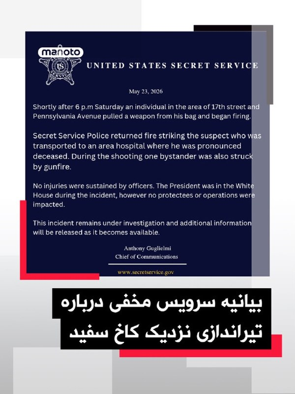

سرویس مخفی آمریکا در بیانیه‌ای اعلام کرد فردی مسلح عصر شنبه در نزدیکی خیابان ۱۷ و پنسیلوانیا، در محدوده کاخ سفید، پس از بیرون آوردن سلاح از کیف خود به سمت ماموران تیراندازی کرد.

ماموران سرویس مخفی در پاسخ به او شلیک کردند و مظنون پس از انتقال به بیمارستان جان باخت. در جریان این تیراندازی، یک رهگذر نیز هدف گلوله قرار گرفت. سرویس مخفی گفته هنوز مشخص نیست این فرد با شلیک مظنون زخمی شده یا در تبادل آتش میان او و ماموران.

بر اساس تصاویر منتشرشده از سلینا وانگ، خبرنگار ای‌بی‌سی نیوز، هم‌زمان با شنیده‌شدن صدای تیراندازی در نزدیکی کاخ سفید، خبرنگاران حاضر در محوطه به سمت اتاق نشست خبری منتقل شدند.

سرویس مخفی اعلام کرد هیچ‌یک از نیروهایش در این حادثه آسیب ندیده‌اند. دونالد ترامپ هنگام وقوع تیراندازی در کاخ سفید حضور داشت، اما این حادثه تاثیری بر او یا عملیات حفاظتی نداشته است. تحقیقات درباره این تیراندازی ادامه دارد. جزئیات اصلی با گزارش رویترز و آسوشیتدپرس هم‌خوانی دارد
‌🏁 🇬🇧 ManotoTV

🤖 @VahidOOnLine

## VahidOOnLine — post 241876

  <a href="telegram/content/VahidOOnLine_241876_1779608568.mp4" target="_blank">🎬 Download video</a>

تصاویر منتشرشده از سلینا وانگ، خبرنگار ای‌بی‌سی نیوز، لحظه‌ای را نشان می‌دهد که هم‌زمان با شنیده‌شدن صدای تیراندازی در نزدیکی کاخ سفید، خبرنگاران حاضر در محوطه به سمت اتاق نشست خبری منتقل شدند.

سرویس مخفی آمریکا اعلام کرد یک مرد مسلح در نزدیکی ایست بازرسی خیابان ۱۷ و پنسیلوانیا به سوی ماموران شلیک کرد. ماموران نیز در پاسخ تیراندازی کردند و مظنون که به بیمارستان منتقل شده بود، بعداً جان باخت.

در جریان این تیراندازی یک رهگذر نیز زخمی شد. هنوز مشخص نیست این فرد با شلیک مظنون زخمی شده یا در جریان تبادل آتش. دونالد ترامپ هنگام وقوع حادثه در کاخ سفید بود، اما آسیبی ندید.
‌🏁 🇬🇧 ManotoTV

🤖 @VahidOOnLine

## VahidOOnLine — post 241875

  

احمد کرمی‌راد، عضو هیات‌مدیره انجمن سازه‌های فولادی، گفت که تولید ۱۱ میلیون تن فولاد در جنگ اخیر مختل شده و طبق آخرین عرضه فولاد مبارکه، قیمت واقعی فولاد به حدود دو برابر رسیده است.

او ادامه داد: «ما به دنبال راهکاری هستیم تا بتوانیم از این بحران عبور کنیم.» او افزود: «تعادل بازار عرضه و تقاضا در حال حاضر از بین رفته است.»
iranintl
‌🏁 🇬🇧 IranintlTV

🤖 @VahidOOnLine

## VahidOOnLine — post 241874

  <a href="telegram/content/VahidOOnLine_241874_1779608570.mp4" target="_blank">🎬 Download video</a>

ویدیوهای رسیده به ایران‌اینترنشنال نشان می‌دهند گروهی از ایرانیان مقیم استرالیا یکشنبه سوم خرداد علیه جمهوری اسلامی در خیابان‌های شهر سیدنی راهپیمایی کردند و شعار «جانم فدای ایران» سردادند.
‌🏁 🇬🇧 IranintlTV

🤖 @VahidOOnLine

## VahidOOnLine — post 241873

  

خبرگزاری تسنیم، وابسته به سپاه پاسداران، با اشاره به توافق احتمالی میان جمهوری اسلامی و آمریکا، نوشت که شنیده‌ها از جزییات تفاهم اولیه «احتمالی»، حاکی است که واشینگتن متعهد خواهد شد در طول دوره مذاکرات، تحریم‌های نفتی ایران را به حالت اسقاط درآورد و جمهوری اسلامی در مقطع کنونی هیچ اقدامی را در حوزه هسته‌ای نپذیرفته است.

این گزارش افزود در صورتی که این تفاهم‌نامه مورد توافق قرار گیرد، بخشی از دارایی‌های بلوکه شده حکومت ایران باید در گام اول آزاد شود.
iranintl
‌🏁 🇬🇧 IranintlTV

🤖 @VahidOOnLine

## VahidOOnLine — post 241872

  <a href="telegram/content/VahidOOnLine_241872_1779608574.mp4" target="_blank">🎬 Download video</a>

⭕️ پرویز قلیچ‌خانی؛ اسطوره‌ای که فوتبال ایران را به قله آسیا رساند

♦️پرویز قلیچ‌خانی، کاپیتان پیشین تیم ملی فوتبال ایران و از بزرگ‌ترین چهره‌های تاریخ ورزش ایران، شنبه ۲ خرداد ۱۴۰۵، برابر با ۲۳ مه ۲۰۲۶، در ۸۱ سالگی در بیمارستانی در حومه پاریس درگذشت. او که سال‌های پایانی عمر را با بیماری آلزایمر گذراند، برای چند نسل از ایرانیان تنها یک فوتبالیست نبود؛ نماد دوره‌ای طلایی از فوتبال ملی ایران بود که در آن تیم ملی، با اتکا به نسل درخشانی از بازیکنان، قدرت اول آسیا محسوب می‌شد.

قلیچ‌خانی فوتبال را از زمین‌های خاکی و کوچه‌های جنوب تهران آغاز کرد؛ از محله صابون‌پزخانه حوالی میدان شوش، جایی که استعدادش خیلی زود او را از بازی‌های محلی به سطح باشگاهی و سپس تیم ملی رساند. او در باشگاه‌های کیان، تاج، پاس، عقاب، دارایی، پرسپولیس و در سال‌های پایانی فوتبالش در سن‌خوزه ارث‌کوئکس آمریکا بازی کرد. با این حال، نام او بیش از هر چیز با پیراهن تیم ملی ایران گره خورده است؛ پیراهنی که با آن به پرافتخارترین بازیکن تاریخ فوتبال ایران در رقابت‌های آسیایی تبدیل شد.

📌لینک پخش پادکست
‌🇸🇦 Indypersian

🤖 @VahidOOnLine

## VahidOOnLine — post 241871

  

فداحسین مالکی، عضو کمیسیون امنیت ملی مجلس گفت: «جنگ آینده اگر رخ دهد، دامن آن بسیاری از کشورها را درگیر خواهد کرد؛ خصوصا کشورهای عربی منطقه. اما تلاش پاکستان و تلاش برخی دیگر از کشورها، حتی قطر این است که جنگ از منطقه دور شود؛ زیرا به هر حال تبعات خاص خود را دارد.»

او افزود: «آمریکایی‌ها هنوز نتوانسته‌اند اعتماد جمهوری اسلامی را جلب کنند و کشورهای منطقه هم نگران تبعات سنگین هرگونه جنگ احتمالی هستند.»
iranintl
‌🏁 🇬🇧 IranintlTV

🤖 @VahidOOnLine

## VahidOOnLine — post 241870

  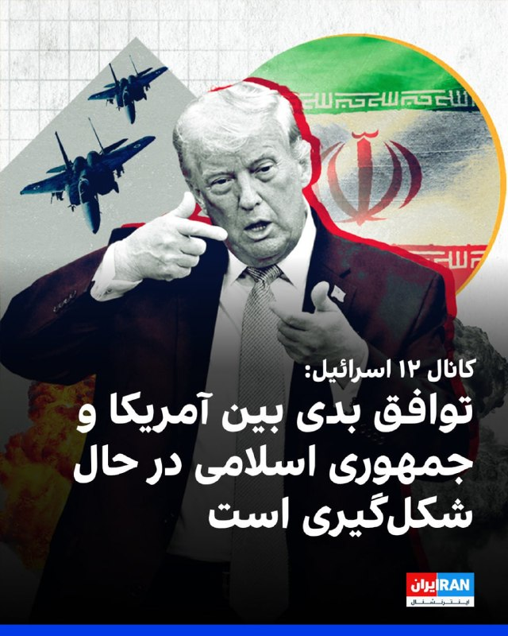

کانال ۱۲ اسرائیل به نقل از یک مقام این کشور نوشت که توافق بدی بین آمریکا و جمهوری اسلامی در حال شکل‌گیری است.

این مقام افزود که در صورت به نتیجه رسیدن این توافق، جمهوری اسلامی می‌تواند تنگه هرمز را به شکلی به کار گیرد که از سلاح هسته‌ای موثرتر باشد.

پیش‌تر اکسیوس به‌نقل از یک مقام آمریکایی گزارش داد توافقی که واشینگتن و تهران در آستانه امضای آن هستند، شامل تمدید ۶۰ روزه آتش‌بس است و در این مدت تنگه هرمز بازگشایی می‌شود، تهران قادر خواهد بود آزادانه نفت بفروشد و مذاکراتی درباره محدود کردن برنامه هسته‌ای ایران انجام می‌شود.
iranintl
‌🏁 🇬🇧 IranintlTV

🤖 @VahidOOnLine

## VahidOOnLine — post 241869

  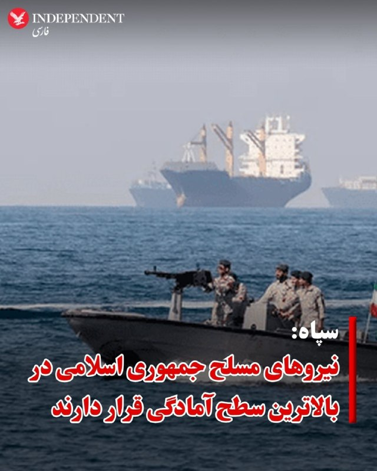

♦️فرماندهی سپاه پاسداران روز یکشنبه در پیامی به مناسبت روز سوم خرداد، روز آزادسازی خرمشهر، اعلام کرد که نیروهای مسلح جمهوری اسلامی «در بالاترین سطح آمادگی و بازدارندگی فعال در همه ابعاد «موشکی، هوایی، دریایی، زمینی، فضایی و سایبری» قرار دارند و هرگونه تعرض مجدد دشمن، پاسخی ویرانگر و جهنمی در ابعاد منطقه‌ای و فرامنطقه‌ای در پی خواهد داشت.»

سپاه در این پیام جنگ ۴۰ روزه را «جنگی ترکیبی» توصیف کرده و با اشاره به آزاد سازی خرمشهر و مذاکرات میان ایران و آمریکا تاکید کرده است که «در فضای مذاکره برای پایان جنگ، با حفظ و تعمیق وحدت و بصیرت، و رصد مواضع و رفتارهای دشمن حیله‌گر و عهد شکن، نقشه‌های او را خنثی و نقش بر آب خواهد کرد.»
‌🇸🇦 Indypersian

🤖 @VahidOOnLine

## VahidOOnLine — post 241868

⭕️ پنج پدیده کم‌نظیر طبیعی ایران؛ از گرم‌ترین بیابان‌ها تا جنگل‌های ۵۰ میلیون ساله

📌ایران یکی از مهم‌ترین مناطق جهان از نظر فراوانی گنبدهای نمکی است

♦️ایران، به دلیل موقعیت خاص زمین‌شناسی و اقلیمی خود، میزبان برخی از کم‌نظیرترین پدیده‌های طبیعی در جهان است که می‌تواند بخش بزرگی از گردشگران علمی جهان را به‌ سوی خود جذب کند. گستره‌ای که از بیابان‌های فوق‌گرم تا جنگل‌های باستانی و تالاب‌های رنگی را در برمی‌گیرد، این سرزمین را به آزمایشگاهی طبیعی برای زمین‌شناسان، زیست‌شناسان و اقلیم‌شناسان تبدیل کرده است. بسیاری از این مناطق نه‌تنها از نظر زیبایی طبیعی برای گردشگران جذاب‌اند، بلکه از دیدگاه علمی نیز ارزش بالایی دارند و در برخی موارد، در مقیاس جهانی کم‌نظیر یا بسیار نادر به شمار می‌روند.

بیشتر بخوانید...
‌🇸🇦 Indypersian

🤖 @VahidOOnLine

## VahidOOnLine — post 241867

  

علی خزایی، نماینده ورامین در مجلس گفت: «تنگه هرمز به هیچ‌وجه و تحت هیچ شرایطی به حالت قبل باز نخواهد گشت و هیچ شناور و کشتی متعلق به آمریکا، اسرائیل و همپیمانان آنها، حق تردد از تنگه هرمز را ندارد. هر کشتی تجاری یا غیرتجاری دیگر برای عبور باید از ملت ایران مجوز بگیرد.»

او ادامه داد: «جمهوری اسلامی اگر صلاح بداند، از تنگه‌های دیگر از جمله باب‌المندب نیز برای ذلیل کردن دشمن استفاده خواهد کرد.»
‌🏁 🇬🇧 IranintlTV

🤖 @VahidOOnLine

## WithYashar — post 12292

کانال 12 اسرائیل به نقل از یک مقام ارشد اسرائیلی:

توافق احتمالی اصلاً خوب نیست؛ چون به ایرانی‌ها این پیام رو میده که سلاحشون به اندازه بمب هسته‌ای خطرناکه و اونم تنگه هرمزه؛ ترامپ هم فکر میکنه این توافق فقط اقتصادی هست و شامل باز شدن متقابل تنگه هرمز میشه، ولی هر قدمی برای حل مسئله هسته‌ای وابسته به خروج اورانیوم ها هست. و اصلا معلوم نیست بعد از مرحله اول اصلاً چی پیش میاد.
@withyashar

## WithYashar — post 12291

وزیر امور خارجه آمریکا :
«ترامپ اجازه نمیده ایران به سلاح هسته ای دسترسی پیدا کنه احتمالاً جهان در ساعات آینده، به ویژه در مورد تنگه هرمز، اخبار خوبی خواهد شنید»
@withyashar

## WithYashar — post 12290

تسنیم : پیش‌نویس توافق با واشنگتن تصریح می‌کند که وضعیت حاکمیتی تنگه هرمز به شرایط قبل از جنگ برنمی‌گردد و تنها تعداد کشتی‌های عبوری ظرف ۳۰ روز، همزمان با لغو کامل محاصره دریایی و اجرای تعهدات ایالات متحده، به حالت عادی باز می‌گردند. تهران بر حفظ حق حاکمیتی خود بر این تنگه اصرار دارد.
@withyashar

## WithYashar — post 12289

وزیر امور خارجه آمریکا :
«هیچ کشوری نباید از گذرگاه‌های دریایی یا حریم هوایی سوءاستفاده کند و آزادی کشتیرانی باید تضمین شود»
@withyashar

## WithYashar — post 12288

کانال 14 اسرائیل : ایران تنگه رو بدون هیچ عوارضی باز می‌کنه و آمریکا هم هیچ پولی نمی‌ده و تحریمی رو برنمیداره فقط اجازه میده به ایران بتونه یکم نفت بفروشه ، احتمالأ اسرائیل هم حملاتش به لبنان رو قطع میکنه ، خلاصه اگه پذیرفته بشه یه آتش بس 30 الی 60 روزس که برای مذاکره داده شده بدون هیچ امتیازی اجازه نفس کشیدن میده به جهان
@withyashar

## WithYashar — post 12287

اکسیوس؛شرایط پیشنهادی تفاهم‌نامه آمریکا و ایران:
🚨🚨🚨🚨🚨🚨🚨
آتش‌بس ۶۰ روزه بین دو طرف.
بازگشایی تنگه هرمز بدون عوارض.
پاکسازی مین‌های دریایی در تنگه توسط ایران.
رفع محاصره بنادر ایران توسط آمریکا.
معافیت‌های تحریمی که به ایران اجازه صادرات نفت رو میده.
تعهد ایران به مذاکرات درباره تعلیق غنی‌سازی اورانیوم.
مذاکره ایران درباره حذف ذخایر اورانیوم بسیار غنی‌شده.
مذاکره آمریکا درباره رفع تحریم‌ها و آزادسازی دارایی‌های ایران در دوره ۶۰ روزه.
باقی‌موندن نیروهای آمریکایی در منطقه طول مذاکرات.
پایان گزارش‌شده جنگ اسرائیل و حزب‌الله در چارچوب این توافق.
@withyashar

## WithYashar — post 12286

کابینه جنگ اسرائیل امشب تشکیل خواهد داد
@withyashar

## WithYashar — post 12285

  

عکس فرد مهاجم ۲۱ ساله در نزدیکی کاخ‌سفید

@withyashar

## WithYashar — post 12284

احتمال از سرگیری روابط دیپلماتیک ایران و آمریکا

آکسیوس به نقل از مشاوران ترامپ:
رئیس جمهور آماده است در صورت برآورده شدن خواسته‌هایش در مورد برنامه هسته‌ای، روابط با ایران را از سر بگیرد.
@withyashar

## WithYashar — post 12283

  

ترامپ در تروث : از سرویس مخفی و نیروی انتظامی عالی‌مون به خاطر اقدام سریع و حرفه‌ای که امشب علیه یک فرد مسلح در نزدیکی کاخ سفید، که سابقه خشونت‌آمیز و احتمالاً وسواس فکری نسبت به گرامی‌ترین بنای کشورمون داشت، انجام شد، سپاسگزاریم.
فرد مسلح بعد از درگیری با مأموران سرویس مخفی در نزدیکی دروازه‌های کاخ سفید کشته شد.
این اتفاق یک ماه بعد از تیراندازی در ضیافت شام خبرنگاران کاخ سفید رخ داد
برای همه روسای جمهور آینده مهمه که امن‌ترین و مطمئن‌ترین فضایی رو که تاالان در واشنگتن دی سی ساخته شده، داشته باشن.
@withyashar

## WithYashar — post 12282

  <a href="telegram/content/WithYashar_12282_1779608580.webm" target="_blank">🎬 Download video</a>

🎬 Video

## mwarmonitor — post 9612

  <a href="telegram/content/mwarmonitor_9612_1779608581.mp4" target="_blank">🎬 Download video</a>

🚀این احتمالاً بهترین نمایی است که تا حالا از امواج ضربه‌ای پرواز اخیر استارشیپ دیده شده.

@mwarmonitor

## mwarmonitor — post 9611

🔸داستان واقعی پشت توافق هسته‌ایِ احتمالی، لبنان است.

🔹اگر آتش‌بس شبیه نوامبر ۲۰۲۴ باشد—جایی که اسرائیل جلوی تقویت و استقرار نیروهای حزب‌الله را می‌گیرد و آن‌ها پاسخی نمی‌دهند—این حالت ایده‌آل است؛ اما احتمال وقوعش کم است.

🔸به‌زودی اسرائیل با یک انتخاب روبه‌رو می‌شود: یا خویشتنداری شبیه ۶ اکتبر، یا یک جنگ فرسایشیِ طولانی‌مدت، یا جنگی تمام‌عیار برای از میان بردن این تهدید.« آمیت سیگال خبرنگار کانال ۱۲ اسرائیل»

@mwarmonitor

## mwarmonitor — post 9610

🚨 شبکه کان اسرائیل:
نتانیاهو درباره توافق با ‎ایران با ترامپ گفت‌وگو کرده و امشب جلسه‌ای با کابینه امنیتی کوچک برگزار خواهد کرد.

@mwarmonitor

## mwarmonitor — post 9609

🚨 آژیرهای هشدار نفوذ پهپاد در شمال اسرائیل فعال شد . i24

@mwarmonitor

## mwarmonitor — post 9608

  

🛰تصاویر ماهواره‌ای با وضوح بالا، نمای روشنی از تجهیزات نیروی هوایی ایالات متحده مستقر در فرودگاه خانیا در جزیره کرت یونان ارائه می‌دهد که شامل موارد زیر است:

✈️۳ فروند هواپیمای شنود و اطلاعات سیگنالی RC-135W Rivet Joint

✈️۶ فروند هواپیمای سوخت‌رسان هوایی KC-135R

✈️۲ فروند هواپیمای جنگ الکترونیک EA-37B Compass Call

@mwarmonitor

## mwarmonitor — post 9607

🔴 گزارش‌هایی از شنیده شدن صدای انفجار در استان (السماوه) در جنوب عراق منتشر شده است؛ جزئیات این حادثه هنوز مشخص نیست.

@mwarmonitor

## mwarmonitor — post 9606

🔴به گزارش Fox News، فردی پس از تیراندازی در نزدیکی کاخ سفید توسط سرویس مخفی ایالات متحده هدف گلوله قرار گرفت. همچنین یک رهگذر نیز در این حادثه تیر خورده است. @mwarmonitor

## mwarmonitor — post 9605

به گفته این مقام آمریکایی، این رهبران شامل محمد بن زاید، رئیس‌جمهور امارات متحده عربی نیز می‌شد. همچنین رهبران عربستان سعودی، قطر، مصر، ترکیه و پاکستان که همگی در تلاش‌های میانجی‌گرانه نقش داشته‌اند، در این تماس حضور داشتند.
پاکستانی‌ها میانجی اصلی بوده‌اند که هدایت این تلاش‌ها بر عهده فیلد مارشال عاصم منیر بود؛ کسی که روزهای جمعه و شنبه در تهران حضور داشت تا این توافق را به سرانجام برساند.
ترامپ در روزهای اخیر میان پیشبرد توافق و یا راه‌اندازی موج گسترده‌ای از حملات علیه ایران مردد بود. تا عصر شنبه، او بیشتر به سمت یک راهکار دیپلماتیک تمایل پیدا کرده بود.
چه چیزهایی را باید زیر نظر داشت؟
این مقام آمریکایی گفت کاخ سفید امیدوار است اختلافات باقی‌مانده در ساعات آینده حل و فصل شود و توافق روز یکشنبه اعلام گردد.
این مقام اشاره کرد اگر ایالات متحده احساس کند ایران در مذاکرات هسته‌ای جدی نیست، این احتمال وجود دارد که توافق حتی تا پایان ۶۰ روز هم دوام نیاورد. از سوی دیگر، ایالات متحده معتقد است بحران اقتصادی ایران انگیزه لازم را برای رسیدن به یک توافق کامل جهت رفع تحریم‌ها و آزادسازی پول‌های بلوکه‌شده‌اش فراهم می‌کند.
این مقام آمریکایی گفت: «جالب خواهد بود که ببینیم ایران واقعاً تا کجا حاضر است پیش برود، اما اگر آن‌ها توانایی و تمایل تغییر مسیر خود را داشته باشند، این مرحله بعدی آن‌ها را مجبور می‌کند تصمیمات حیاتی درباره آینده کشورشان بگیرند.»

📌مشاوران ترامپ می‌گویند اگر خواسته‌های او در رابطه با برنامه هسته‌ای ایران برآورده شود، رئیس‌جمهور آماده است گام‌های بلندی برای بازتنظیمی (Reset) روابط با ایران بردارد و این فرصت را به آن‌ها بدهد تا از پتانسیل اقتصادی کامل خود، که ترامپ آن را «فوق‌العاده بزرگ» می‌داند، بهره‌مند شوند.

@mwarmonitor

## mwarmonitor — post 9604

🔴اختصاصی آکسیوس: جزئیات توافق با ایران که ترامپ در آستانه امضای آن است

🔰به گفته یک مقام آمریکایی، توافقی که ایالات متحده و ایران به امضای آن نزدیک شده‌اند، شامل یک تمدید ۶۰ روزه آتش‌بس است. در این مدت، تنگه هرمز بازگشایی خواهد شد، ایران اجازه خواهد داشت به طور آزادانه نفت بفروشد و مذاکراتی پیرامون محدود کردن برنامه هسته‌ای ایران انجام خواهد گرفت.

چرا این موضوع اهمیت دارد؟
این توافق مانع از تشدید جنگ شده و فشار بر عرضه جهانی نفت را کاهش می‌دهد. با این حال، هنوز مشخص نیست که آیا این تفاهم به یک توافق صلح پایدار منجر خواهد شد که خواسته‌های هسته‌ای پرزیدنت ترامپ را نیز برآورده کند یا خیر.
آخرین وضعیت (State of play)
هم ترامپ و هم میانجی‌ها اشاره کرده‌اند که این توافق ممکن است روز یکشنبه (امروز) اعلام شود؛ اگرچه هنوز نهایی نشده و همچنان احتمال دارد با شکست مواجه شود.
این مقام آمریکایی طرح دقیقی از پیش‌نویس فعلی را ارائه داد که بخش زیادی از آن توسط منابع دیگر نزدیک به گفتگوها تایید شده است.
این جزئیات هنوز از سوی طرف ایرانی تایید نشده است، هرچند تهران نیز سیگنال‌هایی مبنی بر نزدیک شدن به توافق ارسال کرده است.
مفاد توافق چیست؟
هر دو طرف یک یادداشت تفاهم (MOU) امضا خواهند کرد که مدت آن ۶۰ روز خواهد بود و با رضایت دوجانبه قابل تمدید است.
بازگشایی تنگه هرمز: در طول این دوره ۶۰ روزه، تنگه هرمز بدون هیچ‌گونه عوارضی باز خواهد بود و ایران موافقت می‌کند مین‌هایی را که در این تنگه کار گذاشته است، پاکسازی کند تا کشتی‌ها بتوانند به راحتی عبور کنند.
لغو محاصره و معافیت‌های نفتی: در مقابل، ایالات متحده محاصره بنادر ایران را لغو کرده و برخی معافیت‌های تحریمی را صادر می‌کند تا ایران بتواند آزادانه نفت بفروشد.
مقام آمریکایی اذعان کرد که این امر کمکی به اقتصاد ایران خواهد بود، اما در عین حال گفت که گشایش بزرگی نیز برای بازار جهانی نفت ایجاد خواهد کرد.
این مقام گفت هرچه ایرانی‌ها سریع‌تر مین‌ها را پاکسازی کنند و کشتیرانی از سر گرفته شود، محاصره نیز سریع‌تر لغو خواهد شد.
اصل کلیدی ترامپ در این توافق، «امتیاز در ازای عملکرد» (Relief for performance) است.
به گفته این مقام، ایران خواستار آزادسازی فوری دارایی‌های مسدود شده و لغو دائمی تحریمی‌ها بود، اما طرف آمریکایی اعلام کرد که این اتفاق تنها پس از برداشتن گام‌های ملموس رخ خواهد داد.
مسائل هسته‌ای که باید درباره آن‌ها مذاکره شود
به گفته این مقام آمریکایی، پیش‌نویس یادداشت تفاهم شامل تعهداتی از سوی ایران است مبنی بر اینکه هرگز به دنبال سلاح هسته‌ای نرود و درباره تعلیق برنامه غنی‌سازی اورانیوم و همچنین واگذاری ذخایر اورانیوم با غنی‌سازی بالای خود مذاکره کند.
طبق گفته دو منبع مطلع، ایران از طریق میانجی‌ها تعهدات شفاهی به آمریکا داده است که نشان می‌دهد تا چه حد مایل به دادن امتیاز در زمینه تعلیق غنی‌سازی و تحویل مواد هسته‌ای است.
ایالات متحده موافقت خواهد کرد که در طول این دوره ۶۰ روزه درباره لغو تحریم‌ها و آزادسازی دارایی‌های مسدود شده ایران مذاکره کند؛ هرچند این گام‌ها تنها به عنوان بخشی از توافق نهایی و پس از تایید اجرای آن محقق خواهند شد.
نیروهای آمریکایی که در ماه‌های اخیر در منطقه مستقر شده‌اند، در طول این دوره ۶۰ روزه باقی خواهند ماند و تنها در صورت دستیابی به توافق نهایی منطقه را ترک خواهند کرد.
ماجرای پشت پرده (The intrigue)
پیش‌نویس این یادداشت تفاهم همچنین به وضوح نشان می‌دهد که جنگ میان اسرائیل و حزب‌الله در لبنان پایان خواهد یافت.
یک مقام اسرائیلی گفت که بنیامین نتانیاهو، نخست‌وزیر اسرائیل، روز شنبه در تماس تلفنی با ترامپ نسبت به این شرط ابراز نگرانی کرده است. یک مقام آمریکایی نیز تایید کرد که نتانیاهو نسبت به ابعاد دیگری از این توافق ابراز نگرانی کرده، اما مواضع خود را محترمانه و با تکریم مطرح کرده است.
این مقام آمریکایی گفت که این یک «آتش‌بس یک‌طرفه» نخواهد بود و اگر حزب‌الله برای تسلیح مجدد یا تحریک به حملات تلاش کند، به اسرائیل اجازه داده می‌شود برای جلوگیری از آن اقدام کند: «اگر حزب‌الله درست رفتار کند، اسرائیل هم درست رفتار خواهد کرد.»
این مقام آمریکایی با اشاره به نام مستعار نتانیاهو گفت: «بی‌بی ملاحظات داخلی خود را دارد، اما ترامپ باید به منافع ایالات متحده و اقتصاد جهانی فکر کند.»
این توافق چگونه شکل گرفت؟
سه منبع آشنا با این گفتگوها گفتند که پرزیدنت ترامپ روز شنبه در یک تماس کنفرانسی نظر چندین رهبر عرب و مسلمان را درباره این توافق جویا شد و همگی از آن حمایت کردند.

## pm_afshaa — post 91363

  <a href="telegram/content/pm_afshaa_91363_1779608584.webm" target="_blank">🎬 Download video</a>

🔴تسنیم: پیش‌نویس توافق با واشنگتن تصریح می‌کند که وضعیت حاکمیتی تنگه هرمز به شرایط قبل از جنگ برنمی‌گردد و تنها تعداد کشتی‌های عبوری ظرف ۳۰ روز، همزمان با لغو کامل محاصره دریایی و اجرای تعهدات ایالات متحده، به حالت عادی باز می‌گردند. تهران بر حفظ حق حاکمیتی خود بر این تنگه اصرار داره.

💧 Rainbet.com the #1 Non-KYC Crypto Casino & Sportsbook @rainbetcom

😁 @Pm_Afshaa

## pm_afshaa — post 91362

  <a href="telegram/content/pm_afshaa_91362_1779608585.webm" target="_blank">🎬 Download video</a>

🔴کانال 12 اسرائیل به نقل از یک مقام ارشد اسرائیلی:

توافق احتمالی اصلاً خوب نیست؛ چون به ایرانی‌ها این پیام رو میده که سلاحشون به اندازه بمب هسته‌ای خطرناکه و اونم تنگه هرمزه؛ ترامپ هم فکر میکنه این توافق فقط اقتصادی هست و شامل باز شدن متقابل تنگه هرمز میشه، ولی هر قدمی برای حل مسئله هسته‌ای وابسته به خروج اورانیوم‌ها هست و اصلا معلوم نیست بعد از مرحله اول اصلاً چی پیش میاد.

💧 Rainbet.com the #1 Non-KYC Crypto Casino & Sportsbook @rainbetcom

😁 @Pm_Afshaa

## pm_afshaa — post 91361

  <a href="telegram/content/pm_afshaa_91361_1779608586.webm" target="_blank">🎬 Download video</a>

🔴شرایط پیشنهادی تفاهم‌نامه آمریکا و ایران طبق گزارش آکسیوس :

- آتش‌بس 60 روزه بین دو طرف.
- بازگشایی تنگه هرمز بدون عوارض.
- پاکسازی مین‌های دریایی در تنگه توسط ایران.
- رفع محاصره بنادر ایران توسط آمریکا.
- معافیت‌های تحریمی که به ایران اجازه صادرات نفت رو میده.
- تعهد ایران به مذاکرات درباره تعلیق غنی‌سازی اورانیوم.
- مذاکره ایران درباره حذف ذخایر اورانیوم بسیار غنی‌شده.
- مذاکره آمریکا درباره رفع تحریم‌ها و آزادسازی دارایی‌های ایران در دوره 60 روزه
- باقی‌موندن نیروهای آمریکایی در منطقه طول مذاکرات.
- پایان گزارش‌شده جنگ اسرائیل و حزب‌الله در چارچوب این توافق.

💧Rainbet.com the #1 Non-KYC Crypto Casino & Sportsbook @rainbetcom

😁 @Pm_Afshaa

## pm_afshaa — post 91360

  

مجتبی کیان امروز صبح به دلیل ارسال پیام و دادن مختصات صنایع نظامی به شبکه های ماهواره ای معاند ( ایران اینترنشنال ) توسط جمهوری اسلامی اعدام شد

💧 Rainbet.com the #1 Non-KYC Crypto Casino & Sportsbook @rainbetcom

😁 @Pm_Afshaa

## pm_afshaa — post 91359

🔴کابینه جنگ اسرائیل امشب تشکیل خواهد شد

💧 Rainbet.com the #1 Non-KYC Crypto Casino & Sportsbook @rainbetcom

😁 @Pm_Afshaa

## pm_afshaa — post 91358

عرزشیا براتون سوال نی چرا جنگنده ای که باید بیاد تو کشور حداقل نیم ساعت پرواز کنه و تو این نیم ساعت هیچ راداری هشدار نداد و رهبرتون کتلت شد

## pm_afshaa — post 91357

  

هشدار پمپئو به ترامپ:به نظر می‌رسد توافقی که با ایران در حال انجام است، به‌طور مستقیم از روی نقشه وندی شرمن-رابرت مالی-بن رودز بیرون آمده: به سپاه پاسداران پول بدهید تا یک برنامه سلاح‌های کشتار جمعی بسازد و جهان را ترور کند.
‏این اصلا ربطی به شعار «اول آمریکا» ندارد.
‏موضوع خیلی ساده است:
‏تنگه را باز کنید.
‏دسترسی ایران به پول را قطع کنید.
‏و آن‌قدر توانایی‌های ایران را هدف قرار دهید که دیگر نتواند متحدان ما در منطقه را تهدید کند خیلی دیر شده.
‏وقتشه اقدام کنن

💧 Rainbet.com the #1 Non-KYC Crypto Casino & Sportsbook @rainbetcom

😁 @Pm_Afshaa

## pm_afshaa — post 91355

🔴نیویورک تایمز: ایران موافقت کرده است که ذخیره اورانیوم غنی‌شده خود را به عنوان بخشی از توافق برای پایان دادن به جنگ واگذار کند

💧 Rainbet.com the #1 Non-KYC Crypto Casino & Sportsbook @rainbetcom

😁 @Pm_Afshaa

## IranIntlTV — post 338715

  

مارکو روبیو، وزیر خارجه آمریکا در نشست خبری با وزیر خارجه هند گفت که آزادی ناوبری و کشتیرانی باید تضمین شود و تنگه هرمز یک آبراه بین‌المللی است و جمهوری اسلامی مالک آن نیست.

روبیو گفت که در مذاکرات با جمهوری اسلامی پیشرفت قابل توجهی حاصل شده اما پیشرفت نهایی حاصل نشده است.
iranintl.com/202605240620

## IranIntlTV — post 338714

  <a href="telegram/content/IranIntlTV_338714_1779608588.mp4" target="_blank">🎬 Download video</a>

بر اساس ویدیوهای ارسال‌شده به ایران‌اینترنشنال گروهی از ایرانیان مقیم هلیفکس در کانادا، علیه جمهوری اسلامی تجمع برگزار کردند.

## IranIntlTV — post 338713

  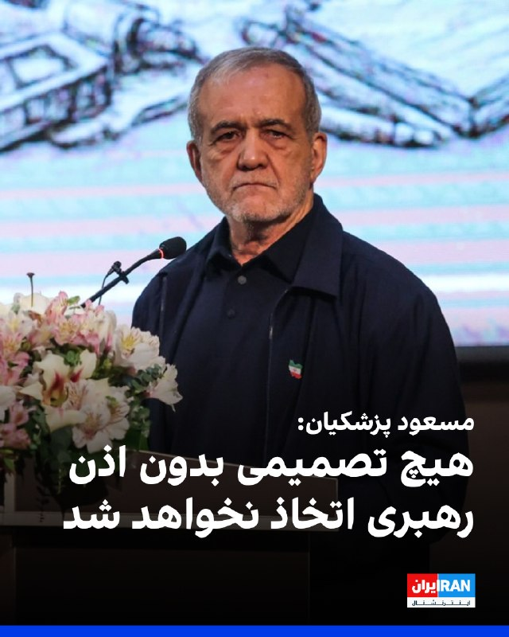

مسعود پزشکیان در نشستی با مدیران سازمان صداوسیما گفت: «هیچ تصمیمی خارج از چارچوب شورای‌عالی امنیت ملی و بدون هماهنگی و اذن رهبری اتخاذ نخواهد شد.»

او افزود: «هنگامی که تصمیمی در حوزه دیپلماسی اتخاذ می‌شود، همه دستگاه‌ها، تریبون‌ها و جریان‌ها باید از آن حمایت کنند.»

او ادامه داد: «همواره تلاش کرده‌ام سخنی بر خلاف نظر رهبری بیان نشود و یا موضعی اتخاذ نگردد که به اختلاف میان ارکان حاکمیت دامن بزند و دشمن از آن سوءاستفاده کند.»
https://iranintl.com/202605244166

## IranIntlTV — post 338712

  <a href="telegram/content/IranIntlTV_338712_1779608592.mp4" target="_blank">🎬 Download video</a>

پیر پولی‌اِور، رهبر حزب محافظه‌کار کانادا، در جمع ایرانیان مقیم ونکوور با اعلام حمایت خود از مردم ایران گفت دولت کانادا در اخراج عوامل جمهوری اسلامی ضعیف عمل کرده و تاکید کرد که به باور او حکومت ایران دیگر مشروعیت ندارد.
@iranintltv

## IranIntlTV — post 338711

  <a href="telegram/content/IranIntlTV_338711_1779608593.mp4" target="_blank">🎬 Download video</a>

ویدیوهای رسیده به ایران‌اینترنشنال نشان می‌دهند گروهی از ایرانیان مقیم هلند شنبه دوم خرداد علیه جمهوری اسلامی در خیابان‌های شهر لاهه راهپیمایی کردند و شعار «مرگ بر سه فاسد، ملا چپی مجاهد» سردادند.

## IranIntlTV — post 338710

  <a href="telegram/content/IranIntlTV_338710_1779608596.mp4" target="_blank">🎬 Download video</a>

بر اساس ویدیوهای رسیده به ایران‌اینترنشنال، ایرانیان مقیم بریتانیا شنبه دوم خرداد علیه جمهوری اسلامی در لندن تجمع کرده و فریاد زدند: «سپاه تروریست است»

## IranIntlTV — post 338709

  

احمد کرمی‌راد، عضو هیات‌مدیره انجمن سازه‌های فولادی، گفت که تولید ۱۱ میلیون تن فولاد در جنگ اخیر مختل شده و طبق آخرین عرضه فولاد مبارکه، قیمت واقعی فولاد به حدود دو برابر رسیده است.

او ادامه داد: «ما به دنبال راهکاری هستیم تا بتوانیم از این بحران عبور کنیم.» او افزود: «تعادل بازار عرضه و تقاضا در حال حاضر از بین رفته است.»
iranintl.com/202605241945

## IranIntlTV — post 338708

  <a href="telegram/content/IranIntlTV_338708_1779608599.mp4" target="_blank">🎬 Download video</a>

ویدیوهای رسیده به ایران‌اینترنشنال نشان می‌دهند گروهی از ایرانیان مقیم استرالیا یکشنبه سوم خرداد علیه جمهوری اسلامی در خیابان‌های شهر سیدنی راهپیمایی کردند و شعار «جانم فدای ایران» سردادند.

## IranIntlTV — post 338707

  <a href="telegram/content/IranIntlTV_338707_1779608601.mp4" target="_blank">🎬 Download video</a>

یک مقام اسرائیلی به کانال ۱۲ این کشور گفت توافق احتمالی میان آمریکا و جمهوری اسلامی شبیه توافقی است که در آن واشینگتن «هزینه را نقد» می‌پردازد و تعهدات طرف مقابل نامشخص می‌ماند.

گفت‌وگو با منشه امیر، کارشناس امور خاورمیانه
@iranintltv

## IranIntlTV — post 338706

  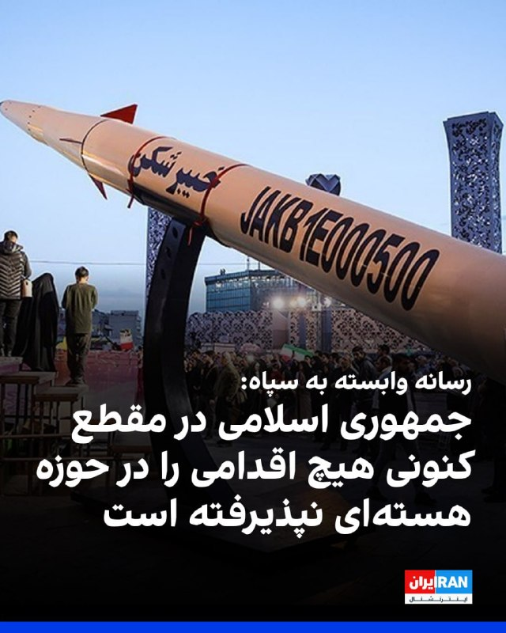

خبرگزاری تسنیم، وابسته به سپاه پاسداران، با اشاره به توافق احتمالی میان جمهوری اسلامی و آمریکا، نوشت که شنیده‌ها از جزییات تفاهم اولیه «احتمالی»، حاکی است که واشینگتن متعهد خواهد شد در طول دوره مذاکرات، تحریم‌های نفتی ایران را به حالت اسقاط درآورد و جمهوری اسلامی در مقطع کنونی هیچ اقدامی را در حوزه هسته‌ای نپذیرفته است.

این گزارش افزود در صورتی که این تفاهم‌نامه مورد توافق قرار گیرد، بخشی از دارایی‌های بلوکه شده حکومت ایران باید در گام اول آزاد شود.
iranintl.com/202605244256

## IranIntlTV — post 338705

  <a href="telegram/content/IranIntlTV_338705_1779608604.mp4" target="_blank">🎬 Download video</a>

یک شهروند با ارسال پیامی به ایران‌اینترنشنال خطاب به ترامپ می‌گوید: «شما به مردم ایران گفتی کمک در راه است، پس چرا با حکومت کودک‌کش مذاکره می‌کنی؟ تا چه زمانی می‌خواهی به ساز جمهوری اسلامی برقصی؟ آیا زمان نابودی جمهوری اسلامی نرسیده؟ تا کی باید هر روز شاهد اعدام بهترین جوان‌هایمان باشیم؟»

## IranIntlTV — post 338704

  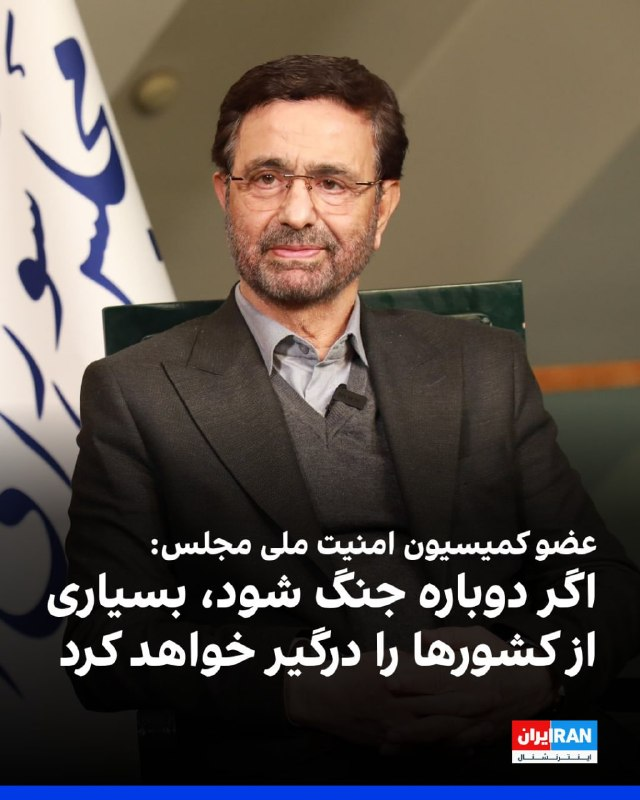

فداحسین مالکی، عضو کمیسیون امنیت ملی مجلس گفت: «جنگ آینده اگر رخ دهد، دامن آن بسیاری از کشورها را درگیر خواهد کرد؛ خصوصا کشورهای عربی منطقه. اما تلاش پاکستان و تلاش برخی دیگر از کشورها، حتی قطر این است که جنگ از منطقه دور شود؛ زیرا به هر حال تبعات خاص خود را دارد.»

او افزود: «آمریکایی‌ها هنوز نتوانسته‌اند اعتماد جمهوری اسلامی را جلب کنند و کشورهای منطقه هم نگران تبعات سنگین هرگونه جنگ احتمالی هستند.»
iranintl.com/202605240868

## IranIntlTV — post 338703

  

کانال ۱۲ اسرائیل به نقل از یک مقام این کشور نوشت که توافق بدی بین آمریکا و جمهوری اسلامی در حال شکل‌گیری است.

این مقام افزود که در صورت به نتیجه رسیدن این توافق، جمهوری اسلامی می‌تواند تنگه هرمز را به شکلی به کار گیرد که از سلاح هسته‌ای موثرتر باشد.

پیش‌تر اکسیوس به‌نقل از یک مقام آمریکایی گزارش داد توافقی که واشینگتن و تهران در آستانه امضای آن هستند، شامل تمدید ۶۰ روزه آتش‌بس است و در این مدت تنگه هرمز بازگشایی می‌شود، تهران قادر خواهد بود آزادانه نفت بفروشد و مذاکراتی درباره محدود کردن برنامه هسته‌ای ایران انجام می‌شود.
iranintl.com/202605240997

## IranIntlTV — post 338702

  <a href="telegram/content/IranIntlTV_338702_1779608607.mp4" target="_blank">🎬 Download video</a>

نسخه‌های عظیم و بازسازی‌شده از نقاشی‌های میکل‌آنژ در لندن به نمایش درآمده و فضای کلیسای سیستین واتیکان را بازآفرینی کرده‌اند؛ تجربه‌ای که برگزارکنندگان آن را حتی متفاوت از بازدید نسخه اصلی توصیف می‌کنند.

فرزیا ثابتی، خبرنگار ایران‌اینترنشنال، گزارش می‌دهد
@iranintltv

## IranIntlTV — post 338701

  <a href="telegram/content/IranIntlTV_338701_1779608609.mp4" target="_blank">🎬 Download video</a>

نیویورک تایمز به نقل از دو مقام آمریکایی گزارش داد که یکی از محورهای اصلی توافق پیشنهادی میان تهران و واشینگتن، تعهد ایران به تعیین تکلیف ذخایر اورانیوم با غنای بالا است.

گفت‌وگو با روح‌الله رحیم‌پور، روزنامه‌نگار و تحلیل‌گر سیاسی
@iranintltv

## IranIntlTV — post 338700

  <a href="telegram/content/IranIntlTV_338700_1779608611.mp4" target="_blank">🎬 Download video</a>

ارتش اسرائیل اعلام کرد به یک سایت زیرزمینی تولید تسلیحات متعلق به حزب‌الله در دره بقاع و چند منطقه در جنوب و شرق لبنان حمله کرده است. همزمان، حزب‌الله لبنان نیز چندین بار مواضع ارتش اسرائیل و شهرهای مرزی این کشور را با پهپاد هدف قرار داده است.

گزارش اشکان صفایی، خبرنگار ایران‌اینترنشنال
@iranintltv

## IranIntlTV — post 338699

  <a href="telegram/content/IranIntlTV_338699_1779608613.mp4" target="_blank">🎬 Download video</a>

ایرانیان شهر کلگری در کانادا با تجمع مقابل ساختمان شهرداری این شهر، همبستگی خود را با مردم ایران نشان دادند. شرکت‌کنندگان که این محل را «میدان اتحاد» نامیده‌اند، می‌گویند رمز آزادی مردم ایران اتحاد است.

سپیدار ولیان، خبرنگار ایران‌اینترنشنال، گزارش می‌دهد
@iranintltv

## IranIntlTV — post 338698

  <a href="https://t.me/IranintlTV/338698" target="_blank">📎 Download file</a>

🎧نسخه صوتی اخبار بامدادی | یکشنبه ۳ خرداد
@iranintlTV

## IranIntlTV — post 338697

  <a href="telegram/content/IranIntlTV_338697_1779608615.mp4" target="_blank">🎬 Download video</a>

شورای سازماندهی اعتراضات کارگران غیررسمی نفت اعلام کرد که کارگران در مناطق جنگی به‌عنوان سپر انسانی به‌کار گرفته شده‌اند و همزمان با سرکوب و بازداشت کارکنان، حقوق و مزایای متناسب با شرایط بحرانی نیز به آنان پرداخت نشده است.

جزییات بیشتر با روزبه بوالهری، عضو تحریریه ایران‌اینترنشنال
@iranintltv

## IranIntlTV — post 338696

  <a href="telegram/content/IranIntlTV_338696_1779608618.mp4" target="_blank">🎬 Download video</a>

دونالد ترامپ، رییس‌جمهوری آمریکا، اعلام کرد که با رهبران و مقام‌های ارشد چند کشور منطقه درباره صلح با جمهوری اسلامی گفت‌وگو کرده و اکنون تنها نهایی‌سازی متن توافق باقی مانده است. او همچنین گفت که تنگه هرمز باز خواهد شد.

گفت‌وگو با امیر گیتی، عضو تحریریه ایران‌اینترنشنال
@iranintltv

## ManotoTV — post 105794

  

نیروی دریایی بریتانیا اعلام کرده صدها ملوان این کشور در جبل‌الطارق آماده‌اند تا در صورت دستیابی آمریکا و جمهوری اسلامی به توافق صلح، برای پاکسازی احتمالی مین‌ها در تنگه هرمز اعزام شوند.

بر اساس گزارش آسوشیتدپرس، کشتی پشتیبانی آراف‌ای لایم بِی متعلق به نیروی دریایی سلطنتی بریتانیا در جبل‌الطارق مستقر است و با مهمات و پهپادهای دریایی مین‌یاب مجهز به سونار آماده عملیات احتمالی شده است. این مأموریت قرار است با همکاری بریتانیا و فرانسه انجام شود.

اولویت نخست این عملیات، در صورت اجرا، پاکسازی یک مسیر عبور در تنگه هرمز برای خروج حدود ۷۰۰ کشتی عنوان شده است. پس از آن، مسیر مقابل برای ورود کشتی‌ها پاکسازی خواهد شد؛ هرچند مقام‌ها گفته‌اند پاکسازی کامل تنگه ممکن است ماه‌ها یا حتی سال‌ها زمان ببرد.

## ManotoTV — post 105793

  

محمد اسحاق دار، وزیر خارجه پاکستان، اعلام کرد در تماس تلفنی با دونالد ترامپ درباره مذاکرات میان آمریکا و جمهوری اسلامی گفت‌وگو کرده است.

او این گفت‌وگوی «مهم» را «گامی قابل‌توجه به سوی صلح منطقه‌ای» توصیف کرد و گفت دستاوردهای مذاکرات اخیر، زمینه خوش‌بینی نسبت به یک نتیجه مثبت و پایدار را فراهم کرده است.

پاکستان در روزهای اخیر نقش میانجی کلیدی میان آمریکا و جمهوری اسلامی را برعهده داشته است. اسحاق دار همچنین از «رهبری» ترامپ و «تعهد او به گفت‌وگو و دیپلماسی» تقدیر کرد.

## ManotoTV — post 105792

  

سرویس مخفی آمریکا در بیانیه‌ای اعلام کرد فردی مسلح عصر شنبه در نزدیکی خیابان ۱۷ و پنسیلوانیا، در محدوده کاخ سفید، پس از بیرون آوردن سلاح از کیف خود به سمت ماموران تیراندازی کرد.

ماموران سرویس مخفی در پاسخ به او شلیک کردند و مظنون پس از انتقال به بیمارستان جان باخت. در جریان این تیراندازی، یک رهگذر نیز هدف گلوله قرار گرفت. سرویس مخفی گفته هنوز مشخص نیست این فرد با شلیک مظنون زخمی شده یا در تبادل آتش میان او و ماموران.

بر اساس تصاویر منتشرشده از سلینا وانگ، خبرنگار ای‌بی‌سی نیوز، هم‌زمان با شنیده‌شدن صدای تیراندازی در نزدیکی کاخ سفید، خبرنگاران حاضر در محوطه به سمت اتاق نشست خبری منتقل شدند.

سرویس مخفی اعلام کرد هیچ‌یک از نیروهایش در این حادثه آسیب ندیده‌اند. دونالد ترامپ هنگام وقوع تیراندازی در کاخ سفید حضور داشت، اما این حادثه تاثیری بر او یا عملیات حفاظتی نداشته است. تحقیقات درباره این تیراندازی ادامه دارد. جزئیات اصلی با گزارش رویترز و آسوشیتدپرس هم‌خوانی دارد

## ManotoTV — post 105791

  <a href="telegram/content/ManotoTV_105791_1779608622.mp4" target="_blank">🎬 Download video</a>

تصاویر منتشرشده از سلینا وانگ، خبرنگار ای‌بی‌سی نیوز، لحظه‌ای را نشان می‌دهد که هم‌زمان با شنیده‌شدن صدای تیراندازی در نزدیکی کاخ سفید، خبرنگاران حاضر در محوطه به سمت اتاق نشست خبری منتقل شدند.

سرویس مخفی آمریکا اعلام کرد یک مرد مسلح در نزدیکی ایست بازرسی خیابان ۱۷ و پنسیلوانیا به سوی ماموران شلیک کرد. ماموران نیز در پاسخ تیراندازی کردند و مظنون که به بیمارستان منتقل شده بود، بعداً جان باخت.

در جریان این تیراندازی یک رهگذر نیز زخمی شد. هنوز مشخص نیست این فرد با شلیک مظنون زخمی شده یا در جریان تبادل آتش. دونالد ترامپ هنگام وقوع حادثه در کاخ سفید بود، اما آسیبی ندید.

## FarsiVOA — post 218497

  <a href="telegram/content/FarsiVOA_218497_1779608623.mp4" target="_blank">🎬 Download video</a>

تصاویری از حمله گسترده موشکی و پهپادی روسیه به کی‌یف؛

روسیه بامداد یکشنبه کی‌یف را با موج گسترده‌ای از موشک‌ها و پهپادها هدف قرار داد.

این حمله به گفته مقام‌های اوکراینی به ساختمان‌های مسکونی و مدارس آسیب زد و دست‌کم یک کشته و ۲۰ زخمی در پایتخت برجای گذاشت. سه نفر دیگر نیز در منطقه کی‌یف زخمی شدند.

حمله ساعاتی پس از آن انجام شد که ولودیمیر زلنسکی، رئیس‌جمهور اوکراین، هشدار داده بود روسیه در حال آماده‌سازی یک حمله ترکیبی علیه اوکراین، از جمله کی‌یف، با استفاده احتمالی از موشک بالستیک مافوق‌صوت «اورشنیک» است.

در روزهای گذشته نیز حملات موشکی و پهپادی روسیه به مناطق چرنیهیف، سومی، دنیپرو و زاپوریژیا چندین کشته و زخمی برجای گذاشته بود.
@FarsiVOA

## FarsiVOA — post 218496

  

منابع خبری پاکستان گزارش دادند در پی یک حمله انتحاری در شهر کویته، مرکز ایالت بلوچستان، دست‌کم ۸ نفر کشته و ۳۰ نفر دیگر زخمی شدند. این انفجار در محدوده چمن پاتک و نزدیک خط آهن گزارش شده است.

رسانه‌های پاکستانی در ساعات اولیه آمار متفاوتی منتشر کرده بودند. دنیا نیوز پاکستان پیشتر از زخمی شدن دست‌کم ۲۰ نفر خبر داده و نوشته بود انفجار باعث آتش‌سوزی در نزدیکی خط آهن شده، بیمارستان‌ها در آماده‌باش قرار گرفته‌اند و قطار اکسپرس پس از حادثه در ایستگاه کویته متوقف شده است.

ای‌آر‌وای نیوز نیز وقوع انفجار در نزدیکی چمن پاتک را تأیید کرده، اما در گزارش اولیه آمار کشته‌ها را اعلام نکرده بود.

این حمله در ادامه موج ناامنی‌های اخیر در کویته و ایالت بلوچستان رخ می‌دهد. روزنامه داون اوایل ماه مه گزارش داده بود چهار راکت به بخش‌هایی از کویته شلیک شد و سه نفر زخمی شدند.

در ۱۸ مه نیز همین روزنامه از عملیات چهارروزه نیروهای امنیتی در ارتفاعات اطراف کویته خبر داد که در جریان آن، به گفته مقام‌های پاکستانی، ۳۵ شبه‌نظامی کشته شدند.
@FarsiVOA

## FarsiVOA — post 218495

  

اداره‌کل اطلاعات استان فارس مدعی شد «یک شبکه آموزش‌دیده» را که آن را متشکل از «عناصر آشوبگر و تروریستی» خوانده، پیش از هرگونه اقدام در این استان شناسایی و منهدم کرده است.

در اطلاعیه منتشرشده از سوی روابط عمومی این نهاد آمده است که متهمان در ایام جنگ اخیر، برای «توطئه و ترور جمعی از شهروندان» با هدف برهم زدن امنیت استان برنامه‌ریزی کرده بودند.

این ادعا از سوی نهادهای وابسته به جمهوری اسلامی مطرح شده و تاکنون جزئیات مستقلی درباره هویت بازداشت‌شدگان، مستندات پرونده یا روند دادرسی احتمالی منتشر نشده است.
@FarsiVOA

## FarsiVOA — post 218494

🔺حمله گسترده روسیه به کی‌یف پس از هشدار زلنسکی درباره موشک اورشنیک

▪️روسیه بامداد یکشنبه کی‌یف را با موج گسترده‌ای از موشک‌ها و پهپادها هدف قرار داد.

▪️این حمله به گفته مقام‌های اوکراینی به ساختمان‌های مسکونی و مدارس آسیب زد و دست‌کم یک کشته و ۲۰ زخمی در پایتخت برجای گذاشت. سه نفر دیگر نیز در منطقه کی‌یف زخمی شدند.

▪️حمله ساعاتی پس از آن انجام شد که ولودیمیر زلنسکی، رئیس‌جمهور اوکراین، هشدار داده بود روسیه در حال آماده‌سازی یک حمله ترکیبی علیه اوکراین، از جمله کی‌یف، با استفاده احتمالی از موشک بالستیک مافوق‌صوت «اورشنیک» است.

▪️در روزهای گذشته نیز حملات موشکی و پهپادی روسیه به مناطق چرنیهیف، سومی، دنیپرو و زاپوریژیا چندین کشته و زخمی برجای گذاشته بود.

⬇️ بیشتر بخوانید:
https://ir.voanews.com/a/8153267.html

## FarsiVOA — post 218493

  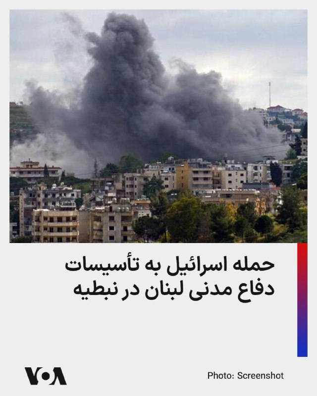

اداره دفاع مدنی لبنان اعلام کرد تأسیسات منطقه‌ای این نهاد در شهر نبطیه در جنوب لبنان، در حمله اسرائیل تخریب شده است.

به گزارش تایمز اسرائیل، این نهاد گفته ساختمان بر اثر «اصابت مستقیم» فرو ریخته و شمار زیادی از خودروها و تجهیزات امدادی آسیب دیده‌اند.

این گزارش تاکید می‌کند همه نیروهای دفاع مدنی پیش از حمله به محل دیگری منتقل شده بودند و گزارشی از تلفات میان کارکنان منتشر نشده است. ارتش اسرائیل تاکنون درباره این حمله اظهارنظر نکرده است.

این حمله در ادامه تشدید حملات اسرائیل به جنوب لبنان در روزهای اخیر انجام شد. روز جمعه نیز حملات هوایی اسرائیل در جنوب لبنان دست‌کم ۱۰ کشته برجای گذاشت.

با وجود آتش‌بس مورد حمایت آمریکا، رویترز گزارش داده درگیری اسرائیل و حزب‌الله همچنان ادامه دارد و شمار کشته‌شدگان در لبنان از سه هزار نفر گذشته است.
@FarsiVOA

## FarsiVOA — post 218492

🔺از توافق احتمالی تهران-واشنگتن چه می‌دانیم؟

▪️پس از آن که دونالد ترامپ، از «یک یادداشت تفاهم» مربوط به پایان دادن جنگ با جمهوری اسلامی خبر داد، رسانه‌ها گزارش‌های تاییدنشده‌ای از محتوای این توافق منتشر کرده‌اند.

▪️دو مقام آمریکایی به نیویورک تایمز گفته‌اند که حکومت ایران به عنوان بخشی از توافق با ایالات متحده برای پایان دادن به جنگ، پذیرفته است ذخیره اورانیوم با غنای بالای خود را واگذار کند.

▪️همچنین آکسیوس به نقل از یک مقام آمریکایی گزارش داد که ایالات متحده و حکومت ایران به امضای توافقی نزدیک شده‌اند که شامل تمدید آتش‌بس به مدت ۶۰ روز است و در این مدت، تنگه هرمز باز خواهد شد.

▪️این توافق همچنین شامل آتش‌بس میان حزب‌الله و اسرائیل خواهد بود.

⬇️ بیشتر بخوانید:
https://ir.voanews.com/a/8153265.html

## FarsiVOA — post 218491

🔺محاصره آمریکا علیه جمهوری اسلامی به «نقطه عطف» تغییر مسیر ۱۰۰ کشتی رسید

▪️سنتکام، می‌گوید در چهارچوب محاصره دریایی جمهوری اسلامی شمار کشتی‌های مرتبط با جمهوری اسلامی که وادار به تغییر مسیر شده‌اند، به «نقطه عطف» ۱۰۰ فروند رسیده است.

▪️بر اساس این اعلام، پس از شش هفته محاصره دریایی جمهوری اسلامی، بیش از ۱۵ هزار سرباز، ملوان، تفنگدار دریایی و نیروی هوایی آمریکا ۱۰۰ کشتی را تغییر مسیر داده و چهار فروند را از کار انداخته است.

▪️نیروهای نظامی آمریکا در عین حال به ۲۶ کشتی حامل کمک‌های بشردوستانه اجازه عبور به ایران را داده‌اند.

▪️ایالات متحده از اواخر فروردین ۱۴۰۵، محاصره دریایی علیه جمهوری اسلامی ایران را در واکنش به اقدام رژیم ایران در بستن تنگه هرمز آغاز کرده است.

⬇️ بیشتر بخوانید:
https://ir.voanews.com/a/8153263.html

## FarsiVOA — post 218490

  

شهباز شریف، نخست‌وزیر پاکستان، به دونالد ترامپ، رئیس‌جمهوری آمریکا، «به خاطر تلاش‌های فوق‌العاده‌اش برای پیگیری صلح» در میانه تلاش‌ها برای نهایی کردن توافقی جهت پایان دادن به جنگ آمریکا و اسرائیل با ایران، تبریک گفت.

شریف در بیانیه‌ای در شبکه ایکس نوشت که تماس تلفنی «بسیار مفید و سازنده» ترامپ با رهبران منطقه در روز شنبه، «فرصت مفیدی برای تبادل نظر درباره وضعیت کنونی منطقه و چگونگی پیشبرد تلاش‌های جاری برای صلح به منظور برقراری صلحی پایدار در منطقه فراهم کرد.»

او افزود: «پاکستان با نهایت صداقت به تلاش‌های صلح خود ادامه خواهد داد و امیدواریم که خیلی زود میزبان دور بعدی مذاکرات باشیم.»

رئيس‌جمهوری آمریکا، عصر شنبه‌ دوم خرداد به وقت واشنگتن گفت جزئیات نهایی یک یادداشت تفاهم صلح با جمهوری اسلامی «به‌زودی اعلام خواهد شد.»
@FarsiVOA

## FarsiVOA — post 218489

🔺اعدام یک شهروند بازداشت‌شده در ایام جنگ؛ دادرسی شتاب‌زده و اعدام در ۵۰ روز

▪️قوه قضائیه از اعدام مجتبی کیان، به اتهام ارسال اطلاعات مراکز تولید صنایع دفاعی به «دشمن آمریکایی ـ صهیونیستی» خبر داد.

▪️ادعا شده کیان در جریان جنگ اخیر، اطلاعات و مختصات واحدهای مرتبط با تولید قطعات صنایع دفاعی را از طریق پیام به «شبکه‌های وابسته به اسرائیل و آمریکا» ارسال کرده بود.

▪️مجتبی کیان علاوه بر اعدام، به مصادره کلیه اموال محکوم شده بود، و از زمان بازداشت تا اجرای حکم کمتر از ۵۰ روز زمان گذشته است.

▪️عفو بین‌الملل پیشتر هشدار داده بود که نگرانی از اعدام‌های بیشتر افزایش یافته، زیرا مقام‌های جمهوری اسلامی پس از آغاز جنگ خواستار رسیدگی سریع‌تر و مجازات‌های «شدید» برای بازداشت‌شدگان شده‌اند.

⬇️ بیشتر بخوانید:
https://ir.voanews.com/a/8153262.html

## DW_Farsi — post 125070

  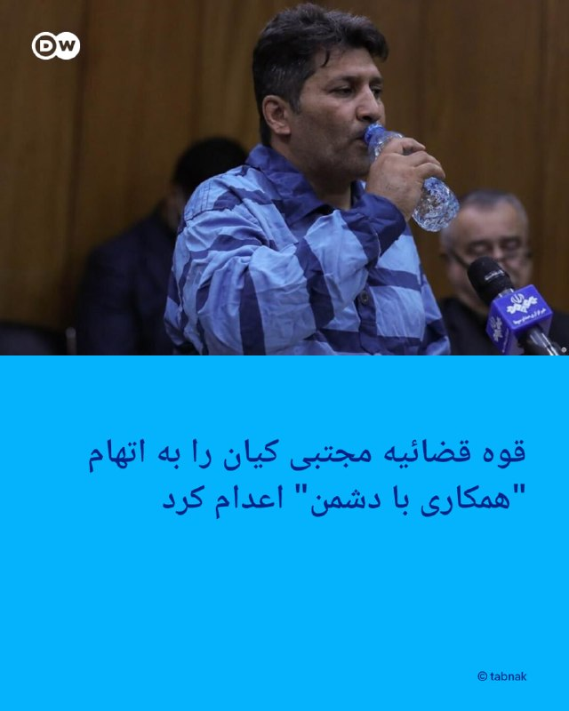

🔶 قوه قضائیه مجتبی کیان را به اتهام "همکاری با دشمن" اعدام کرد

خبرگزاری میزان، وابسته به قوه قضائیه جمهوری اسلامی، از اعدام مجتبی کیان در بامداد یکشنبه سوم خرداد (۲۴ مه) به اتهام "ارسال اطلاعات مرتبط با واحد‌های صنایع دفاعی کشور به دشمن" خبر داد.

در این گزارش ادعا شده مجتبی کیان در طول جنگ آمریکا و اسرائیل با ایران، "پیام‌های متعددی را به شبکه‌های معاند" ارسال می‌کرد که "از جمله آنها مختصات و اطلاعات محل واحد‌های تولید قطعات مرتبط با صنایع دفاعی کشور بود". در ادبیات حکومت جمهوری اسلامی اصطلاح "شبکه‌های معاند" به رسانه‌ها و شبکه‌های فارسی‌زبان خارج از کشور اشاره دارد.

میزان مدعی شده است که مجتبی کیان "در پیام‌هایی به شبکه وابسته به دشمن، اطلاعات محل شرکت مرتبط با صنایع دفاعی را ارسال کرده" و با قید نام بنیامین نتانیاهو، نخست‌وزیر اسرائیل، "در پیام ارسالی به عوامل این شبکه تأکید می‌کند که موضوع را ’به بی‌بی آمار بده‘".

قوه قضائیه جزئیاتی درباره نحوه دسترسی مجتبی کیان به این اطلاعات، شغل یا جایگاه او نداده و مشخص نکرده است که او چگونه به "اطلاعات مرتبط با صنایع دفاعی" دسترسی داشته است. در این گزارش یکی از "ادله" این پرونده "اعترافات و اقرارهای" متهم عنوان شده است. با این حال قوه قضائیه جزئیاتی درباره شرایط بازجویی و نحوه اخذ این اعترافات منتشر نکرده است.

نهادهای حقوق بشری طی سال‌های گذشته بارها نسبت به پخش و استناد به اعترافات اجباری در پرونده‌های امنیتی در ایران ابراز نگرانی کرده و از احتمال اخذ اعتراف تحت فشار یا شکنجه سخن گفته‌اند.

به نوشته خبرگزاری میزان دادگاه مجتبی کیان در دادگستری استان البرز برگزار شد و با استناد به "ماده یک قانون تشدید مجازات جاسوسی و همکاری" برای او حکم اعدام و مصادره کلیه اموال صادر شد.

@dw_farsi

## DW_Farsi — post 125069

  

🔶 ابراز امیدواری نخست‌وزیر پاکستان به برگزاری دور جدید مذاکرات

شهباز شریف، نخست‌وزیر پاکستان، در واکنش به پست تازه دونالد ترامپ در شبکه تروث سوشال در مورد "نهایی شدن" توافق با ایران، ابراز امیدواری کرد که اسلام‌آباد به‌زودی میزبان دور بعدی مذاکرات میان تهران و واشنگتن باشد.

او با انتشار پیامی در شبکه ایکس از رئیس جمهور آمریکا به دلیل "تلاش‌های فوق‌العاده‌اش برای پیگیری صلح" و "تماس‌‌های تلفنی بسیار سازنده و مفید" با رهبران عربستان، قطر، ترکیه، مصر، امارات متحده عربی، اردن و پاکستان قدردانی کرده و نوشت: «این گفت‌وگوها فرصت مفیدی را برای تبادل نظر در مورد وضعیت فعلی منطقه و چگونگی پیشبرد تلاش‌های جاری برای ایجاد صلح پایدار در منطقه فراهم کرد.»

شهباز شریف تأکید کرد پاکستان به تلاش‌های میانجی‌گرانه خود برای صلح "با نهایت صداقت" ادامه خواهد داد و امیدوار است که میزبان دور بعدی مذاکرات در "آینده‌ای بسیار نزدیک" باشد.

ترامپ در پست خود در تروث سوشال گفته بود که واشنگتن و تهران به مراحل پایانی یک توافق نزدیک شده‌اند که جزئیات آن در "دست بررسی است و به‌زودی اعلام خواهد شد."

@dw_farsi

## DW_Farsi — post 125067

  

🔶 اکسیوس: توافق پیشنهادی شامل بازگشایی تنگه هرمز در دوره آتش‌بس ۶۰ روزه است

سایت خبری "اکسیوس" روز شنبه به نقل از یک مقام آمریکایی گزارش داد که ایالات متحده و ایران به امضای یک توافق نزدیک شده‌اند که شامل تمدید ۶۰ روزه آتش‌بس است که طی آن تنگه هرمز بازگشایی خواهد شد، ایران می‌تواند آزادانه نفت بفروشد و مذاکراتی در مورد مهار برنامه هسته‌ای انجام خواهد شد.

به نوشته اکسیوس در طول این دوره ۶۰ روزه، تنگه هرمز بدون دریافت عوارض باز خواهد بود و ایران موافقت می‌کند مین‌هایی را که در این تنگه کار گذاشته، پاکسازی کند تا کشتی‌ها بتوانند آزادانه عبور کنند. در مقابل به عنوان بخشی از توافق پیشنهادی آمریکا به محاصره بنادر ایرانی پایان می‌دهد و برخی معافیت‌های تحریمی را صادر می‌کند تا به ایران اجازه دهد آزادانه نفت بفروشد.

این گزارش می‌افزاید که پیش‌نویس توافق همچنین شامل تعهداتی از سوی ایران مبنی بر عدم دستیابی به سلاح هسته‌ای و مذاکره در مورد تعلیق برنامه غنی‌سازی اورانیوم و حذف ذخایر اورانیوم با غنای بالاست.

دو منبع به اکسیوس گفته‌اند که ایران از طریق میانجی‌ها، در مورد میزان امتیازاتی که حاضر است در زمینه تعلیق غنی‌سازی و کنار گذاشتن مواد هسته‌ای ارائه دهد، تعهدات شفاهی به آمریکا داده است.

در این گزارش همچنین آمده است که ایالات متحده موافقت می‌کند در طول دوره ۶۰ روزه تمدید آتش‌بس بر سر لغو تحریم‌ها و آزادسازی دارایی‌های مسدودشده ایران مذاکره کند.

@dw_farsi

## DW_Farsi — post 125065

  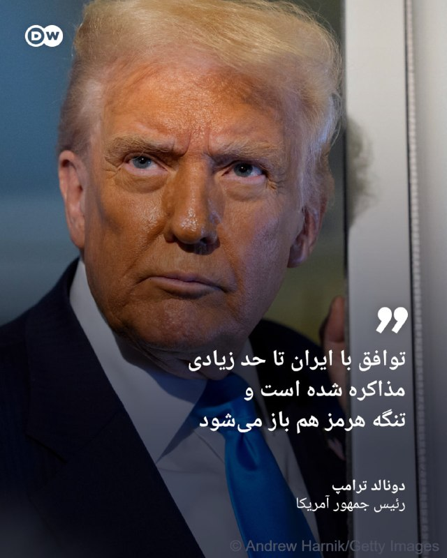

🔶 ترامپ: توافق با ایران تا حد زیادی مذاکره شده است و تنگه هرمز هم باز می‌شود

دونالد ترامپ، رئیس جمهور آمریکا، گفت توافق با ایران به مراحل پایانی رسیده است و این پیشنهاد شامل بازگشایی تنگه هرمز نیز می‌شود، هرچند این توافق "هنوز نهایی نشده است".

ترامپ روز شنبه ۲۳ مه (دوم خرداد) با انتشار پیامی در شبکه تروث سوشال نوشت: «من در دفتر بیضی کاخ سفید هستم؛ جایی که به‌تازگی تماس بسیار خوبی با محمد بن سلمان آل سعود ولیعهد عربستان سعودی، محمد بن زاید آل نهیان رئیس امارات متحده عربی، شیخ تمیم بن حمد بن خلیفه آل ثانی، نخست‌وزیر محمد بن عبدالرحمن بن جاسم بن جابر آل ثانی و وزیر علی الثوادی از قطر، فیلد مارشال سید عاصم منیر احمد شاه از پاکستان، رجب طیب اردوغان رئیس‌جمهور ترکیه، عبدالفتاح السیسی رئیس‌جمهور مصر، ملک عبدالله دوم پادشاه اردن و حمد بن عیسی آل خلیفه پادشاه بحرین درباره جمهوری اسلامی ایران و همه مسائل مرتبط با یک یادداشت تفاهم در خصوص صلح داشتیم.»

ترامپ در ادامه افزود یک توافق "تا حد زیادی" میان ایالات متحده و ایران دیگر کشورهای نا‌م‌برده شده، مذاکره شده و اکنون در انتظار نهایی‌‌سازی قرار دارد.

او همچنین نوشت که با بنیامین نتانیاهو، نخست‌وزیر اسرائیل، نیز گفت‌وگو کرده است که "این تماس نیز بسیار خوب پیش رفته است".

رئیس جمهور آمریکا در پایان پست خود خاطرنشان ساخت: «جنبه‌ها و جزئیات نهایی این توافق در حال حاضر در دست بررسی است و به زودی اعلام خواهد شد. علاوه بر بسیاری دیگر از مفاد این توافق، تنگه هرمز نیز بازگشایی خواهد شد.»

اظهارات ترامپ در حالی مطرح شده است که مقام‌های جمهوری اسلامی گفته بودند هنوز اختلاف‌هایی میان طرف‌ها وجود دارد و موضوع برنامه هسته‌ای ایران در مذاکرات اولیه مطرح نخواهد شد.

@dw_farsi

## Persian_Trend_Official — post 14836

https://youtube.com/live/FTUt8HfIdrc?feature=share

## Persian_Trend_Official — post 14834

https://youtube.com/live/FTUt8HfIdrc?feature=share

## Persian_Trend_Official — post 14833

  

⭕️ به گزارش فایننشال تایمز، نیروی هوافضای سپاه پاسداران انقلاب اسلامی از تلسان، شبکه تأمین مستقر در امارات متحده عربی، برای به‌دست آوردن تجهیزات پیشرفته ماهواره‌ای چینی مرتبط با برنامه پهپادی خود در اواخر سال 2025 استفاده کرد.

🔴این تجهیزات بعدها در حملات پهپادی ایران در طول جنگ به کار رفت. شرکت مستقر در رأس‌الخیمه حدود 1.8 تن تجهیزات آنتن ماهواره‌ای ساخت چین را از شانگهای به ایران از طریق بندر کانتینری جبل علی در دبی منتقل کرد.

پ.ن: اینم از عاقبت دور زدن تحریم برای ج.ا.

📝 Nick

📌 @persian_trend_official
پرشین ترند | متفاوت‌ترین کانال نظامی

## Persian_Trend_Official — post 14832

  <a href="telegram/content/Persian_Trend_Official_14832_1779608632.mp4" target="_blank">🎬 Download video</a>

دقت کردید باز هم از این شخص هیچ خبری نیست؟ 😁 📝 Nick 📌 @persian_trend_official پرشین ترند | متفاوت‌ترین کانال نظامی

## Persian_Trend_Official — post 14831

🔴 آکسیوس: توافق ۶۰ روزه ایران و آمریکا شامل بازگشایی رایگان تنگه هرمز خواهد بود آکسیوس گزارش داد یادداشت تفاهم ۶۰ روزه پیشنهادی میان ایران و آمریکا شامل بازگشایی تنگه هرمز بدون دریافت عوارض و ازسرگیری صادرات نفت ایران در ازای تمدید آتش‌بس و آغاز مذاکرات هسته‌ای…

## Persian_Trend_Official — post 14830

  <a href="telegram/content/Persian_Trend_Official_14830_1779608633.mp4" target="_blank">🎬 Download video</a>

⭕️ ارتش دفاعی اسرائیل:

‼️در تلاش مستمر برای رفع تهدید: ارتش اسرائیل در روزهای اخیر چندین انبار تسلیحاتی متعلق به سازمان تروریستی حماس را هدف قرار داده و نابود کرد

⭕️نیروهای ارتش اسرائیل تحت فرماندهی جنوب، طی شبانه‌روز گذشته (شنبه)، سه انبار تسلیحات متعلق به سازمان تروریستی حماس را در مرکز نوار غزه هدف قرار داده و منهدم کردند.
در میان تسلیحات موجود در این انبارها که در پی این حمله نابود شد، مواردی چون موشک‌های ضدزره، سلاح‌های سبک، آرپی‌جی (RPG)، جلیقه‌های رزمی و سایر تجهیزات نظامی وجود داشت.

⭕️در رویدادی دیگر در اوایل همین هفته (چهارشنبه)، نیروهای ارتش اسرائیل تحت فرماندهی جنوب یک انبار تسلیحاتی دیگر را در مرکز نوار غزه هدف قرار داده و منهدم کردند که در آن مواد منفجره، راکت‌اندازهای RPG، نارنجک‌های دستی و خشاب‌ها نگهداری می‌شد.

⭕️این تسلیحات برای حمله به نیروهای ارتش اسرائیل که در محدوده خط زرد فعالیت می‌کنند و همچنین غیرنظامیان اسرائیلی در نظر گرفته شده بود و به‌منظور رفع تهدید نابود شد.

⭕️پس از این حملات، انفجارهای ثانویه‌ای شناسایی شد که نشان‌دهنده وجود مهمات در این انبارها بود.

⭕️نیروهای ارتش اسرائیل تحت فرماندهی جنوب مطابق با توافق در منطقه مستقر هستند و به فعالیت خود برای رفع هرگونه تهدید فوری ادامه خواهند داد.

📝 Nick

📌 @persian_trend_official
پرشین ترند | متفاوت‌ترین کانال نظامی

## Persian_Trend_Official — post 14829

  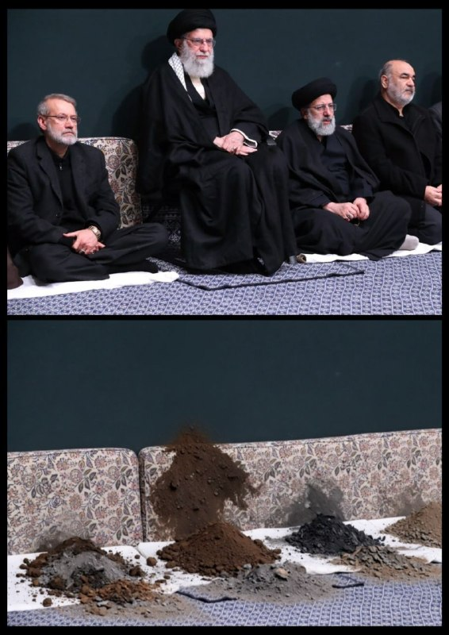

⭕️ اسرائیل به فارسی:

چرخ روزگار... از پارسال تا امسال.

📝 Nick

📌 @persian_trend_official
پرشین ترند | متفاوت‌ترین کانال نظامی

## Persian_Trend_Official — post 14828

  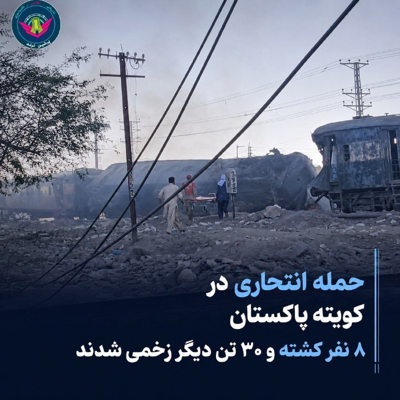

انفجار مهیب در کویته پاکستان؛ ۲۳ کشته و ده‌ها زخمی
منابع محلی در پاکستان از وقوع یک انفجار انتحاری در شهر کویته، مرکز ایالت بلوچستان، خبر دادند؛ انفجاری که در نزدیکی ایستگاه قطار و یک مرکز امنیتی رخ داد و دست‌کم ۲۳ کشته و ده‌ها زخمی برجا گذاشت.
این حادثه صبح امروز رخ داد و شدت انفجار به‌حدی بود که خسارت قابل توجهی به خودروهای اطراف، واگن‌های قطار و شماری از ساختمان‌های مسکونی وارد شد. تصاویر منتشرشده از محل، از آوار، دود غلیظ و تخریب گسترده در اطراف نقطه انفجار حکایت دارد.

هم‌زمان، گروه «ارتش آزادی‌بخش بلوچ» شاخه جیاند مسئولیت این حمله را برعهده گرفته و مدعی شده عملیات توسط تیپ مجید انجام شده است.

👩‍💻@PhantomDirective

🆔@persian_trend_official
پرشین ترند | متفاوت‌ترین کانال نظامی

## Persian_Trend_Official — post 14827

  

شهباز شریف، نخست‌وزیر پاکستان، به دونالد ترامپ، رئیس‌جمهوری آمریکا، «به خاطر تلاش‌های فوق‌العاده‌اش برای پیگیری صلح» در میانه تلاش‌ها برای نهایی کردن توافقی جهت پایان دادن به جنگ آمریکا و اسرائیل با ایران، تبریک گفت.

به گزارش «رویترز»، شریف تأکید کرد که عاصم منیر، فرمانده ارتش پاکستان، در تماس تلفنی ترامپ با شماری از رهبران منطقه برای بررسی تحولات مربوط به توافق احتمالی، نماینده پاکستان بود.

نخست‌وزیر پاکستان گفت کشورش «با نهایت صداقت به تلاش‌ها برای دستیابی به صلح ادامه خواهد داد» و افزود اسلام‌آباد همچنان نقش میانجی میان واشینگتن و تهران را دنبال می‌کند.

شریف همچنین ابراز امیدواری کرد که پاکستان «به‌زودی میزبان دور بعدی مذاکرات» باشد که نشان‌دهنده تمایل اسلام‌آباد برای ایفای نقشی پررنگ‌تر در گفت‌وگوهای جاری است.

👩‍💻@PhantomDirective

🆔@persian_trend_official
پرشین ترند | متفاوت‌ترین کانال نظامی

## Persian_Trend_Official — post 14826

  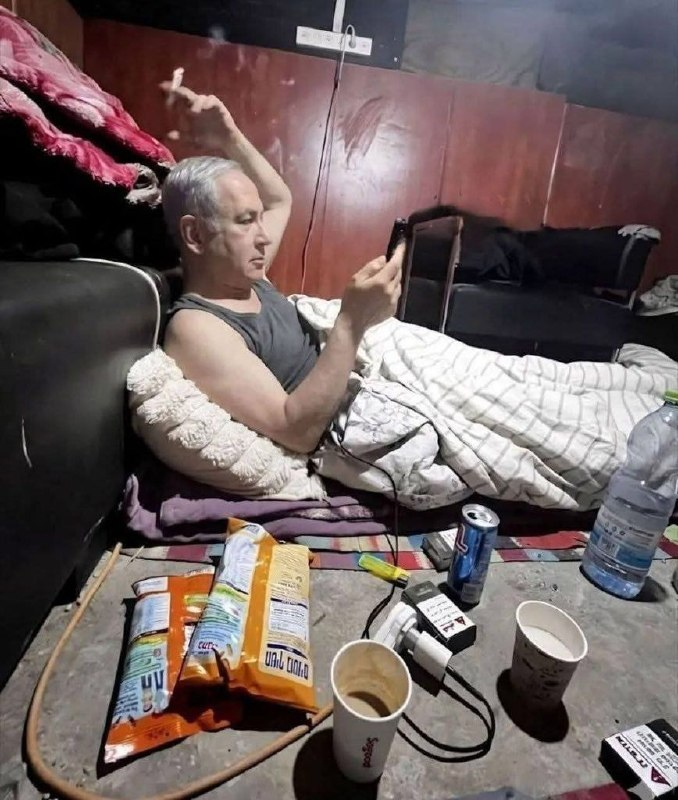

دقت کردید باز هم از این شخص هیچ خبری نیست؟ 😁

📝 Nick

📌 @persian_trend_official
پرشین ترند | متفاوت‌ترین کانال نظامی

## Persian_Trend_Official — post 14825

  

اعدام مجتبی کیان با اتهام «جاسوسی»؛ اجرای حکم در کمتر از ۵۰ روز پس از بازداشت

خبرگزاری میزان، وابسته به قوه قضاییه جمهوری اسلامی، اعلام کرد مجتبی کیان، زندانی سیاسی، پس از تشکیل پرونده‌ای در دادگستری استان البرز به اتهام ارسال اطلاعات مربوط به صنایع نظامی ایران به «دشمن» در جریان جنگ اخیر، اعدام شده است.

بر اساس گزارش منتشرشده، مقام‌های قضایی مدعی شده‌اند که مجتبی کیان اطلاعات مورد نظر را از طریق پیام‌رسانی به «یک شبکه ماهواره‌ای معاند» منتقل کرده بود.

قوه قضاییه همچنین او را به «فعالیت اطلاعاتی برای اسرائیل و آمریکا» متهم کرده و اعلام کرده است که وی علاوه بر حکم اعدام، به مصادره کلیه اموال نیز محکوم شده بود.

طبق اعلام رسمی، از زمان بازداشت مجتبی کیان تا اجرای حکم اعدام او در روز سوم خرداد ۱۴۰۵، کمتر از ۵۰ روز فاصله زمانی وجود داشته است.

حکم اعدام این زندانی در حالی اجرا شد که از روند رسیدگی پرونده او هیچ اطلاعاتی منتشر نشده است. اینکه آیا او وکیل داشته یا خیر، در شرایطی به سر برده و این اتهامات چه اندازه با واقعیت انطباق دارد، مشخص نیست.

جمهوری اسلامی در زوندی ناعادلانه و غیر شفاف شهروندان را به اتهامات مختلف متهم کرده و احکام سنگین صادر می‌کند. شهروندانی بی‌دفاع در برابر حکومتی ظالم و بی‌رحم.

👩‍💻@PhantomDirective

🆔@persian_trend_official
پرشین ترند | متفاوت‌ترین کانال نظامی

## Persian_Trend_Official — post 14823

ساعت 11 به وقت تهران لایو داریم

## Persian_Trend_Official — post 14822

  <a href="telegram/content/Persian_Trend_Official_14822_1779608638.mp4" target="_blank">🎬 Download video</a>

تصاویر ثبت شده لحظه اصابت موشک کروز روسی اسکندر-ک به کی‌یف در صبح امروز .

👩‍💻@PhantomDirective

🆔 @persian_trend_official
پرشین ترند | متفاوت‌ترین کانال نظامی

## Persian_Trend_Official — post 14821

بولتن خبری۲۴ ساعت گذشته پرشین ترند

🇮🇷 ایران

◾️ فرمانده ارتش پاکستان عاصم منیر پس از دیدار دوم با عراقچی، همچنین با قالیباف و پزشکیان دیدار کرد؛ وی روند مذاکرات مثبت خواند؛ سپس تهران را ترک کرد.

◾️ الجزیره: تهران و پاکستان بر سر یک «یادداشت تفاهم» به توافق رسیده‌اند؛ شامل پایان جنگ، بازگشایی تنگه هرمز و خروج نیروهای آمریکایی از منطقه؛ موضوع هسته‌ای به مذاکرات ۳۰ روزه بعدی موکول شده.

◾️ ایران دو پیشنهاد به میانجی پاکستانی ارائه کرده؛ خواستار بحث درباره تحریم‌ها و آزادسازی دارایی‌های مسدودشده پیش از امضای توافق شده است.

◾️ منبع نزدیک به تیم مذاکره‌کننده به فارس: سه موضوع اختلافی هنوز پابرجاست؛ پرونده هسته‌ای، آزادسازی پول‌های بلوکه‌شده، و مدیریت ایران بر تنگه هرمز
◾️ سخنگوی وزارت خارجه: تنگه هرمز به آمریکا ربطی ندارد؛ سازوکار مدیریت آن باید میان ایران و عمان تعریف شود
◾️ عضو کمیسیون امنیت ملی مجلس: در هر توافقی ایران باید غرامت جنگ دریافت کند؛ از مدیریت تنگه هرمز عقب‌نشینی نخواهد شد

◾️ ایران نماینده دائم خود نزد سازمان ملل را مأمور کرد مسئولیت بین‌المللی کشورهای خلیج فارس در تسهیل تجاوز علیه ایران را رسماً مطرح کند

◾️ حزب‌الله: عراقچی بر حمایت «قاطع و تزلزل‌ناپذیر» ایران از این گروه تأکید کرده؛ تهران خواستار گنجانده‌شدن لبنان در هرگونه توافق آتش‌بس است

◾️ جمهوری اسلامی مقر گروه کومله در اربیل عراق را با موشک و پهپاد هدف قرار داد

◾️ نیروی دریایی سپاه: ۲۵ کشتی در شبانه‌روز گذشته با مجوز سپاه از تنگه هرمز عبور کردند؛ تصاویر ماهواره‌ای از توقف ۲۴۰ کشتی در انتظار مجوز عبور خبر می‌دهد
◾️ پروازهای فرودگاه‌های اهواز و ماهشهر از سر گرفته شد.

◾️ مقامات ایران اعلام کردند اینترنت بین‌المللی در حال حاضر بازگشایی نخواهد شد؛ شورای عالی امنیت ملی قطع اینترنت را به دلایل امنیتی تأیید کرده.

◾️ راننده کنسول جمهوری آذربایجان در تبریز در سانحه رانندگی در اتوبان جلفا-تبریز جان باخت.

خبرگزاری قوه قضائیه: مجتبی کیان به اتهام ارسال اطلاعات در جنگ پس از تأیید حکم دیوان عالی کشور اعدام شد.

🇮🇱اسرائیل و خاورمیانه

◾️ اکسیوس: نتانیاهو از توافق در دست بررسی شدیداً نگران است و از ترامپ خواسته دور جدیدی از حملات به ایران آغاز شود؛ اسرائیل در حال اعمال فشار برای مختل کردن توافق است.

◾️ رسانه‌های اسرائیلی: اسرائیل سطح آماده‌باش را کاهش داده؛ برآوردها حاکی از عدم وقوع حمله قریب‌الوقوع به ایران است.

◾️ کانال ۱۳ اسرائیل: اسرائیل اطلاعاتی دریافت کرده که توافق آمریکا با ایران ممکن شده است.

◾️ فرانسه از ورود بن‌گویر، وزیر امنیت داخلی اسرائیل، به خاک خود جلوگیری کرد
◾️ نفتکشی در ۲۰۰ مایل دریایی غرب سوکوترا توسط یک قایق کوچک مورد تهدید قرار گرفت؛ با استقرار تیم امنیتی مسلح، قایق مسیر خود را تغییر داد.

🇺🇸
🇺🇳 آمریکا و جهان

◾️ ترامپ در پست توییتری اعلام کرد با رهبران عربستان، امارات، قطر، پاکستان، ترکیه، مصر، اردن و بحرین درباره ایران گفتگو کرده؛ توافق «تا حد زیادی» نهایی شده و به‌زودی اعلام می‌شود؛ تنگه هرمز بازگشایی خواهد شد.

◾️ اکسیوس: واشنگتن و تهران یادداشت تفاهم ۶۰ روزه امضا خواهند کرد؛ شامل پایان جنگ با حزب‌الله، امکان فروش نفت ایران و توقف محاصره بنادر؛ کاخ سفید امیدوار است توافق امروز یکشنبه اعلام شود.

◾️ نیویورک‌تایمز: یادداشت تفاهم ۲۵ میلیارد دلار از دارایی‌های مسدودشده ایران را آزاد می‌کند؛ مسائل هسته‌ای ظرف ۳۰ تا ۶۰ روز مذاکره خواهد شد.

◾️ فایننشال تایمز: موانع اصلی درخواست ترامپ برای تحویل ۴۴۰ کیلوگرم اورانیوم نزدیک به درجه تسلیحاتی و برچیدن سه سایت هسته‌ای نطنز، فردو و اصفهان است.

◾️ روبیو: ممکن است ایران توافق را در اوایل یکشنبه بپذیرد؛ امروز یا فردا خبری اعلام شود.

◾️ ترامپ با اکسیوس: شانس توافق یا حمله را «۵۰-۵۰» ارزیابی می‌کند؛ امروز با ویتکاف، کوشنر و ونس درباره آخرین پاسخ ایران دیدار خواهد کرد.

◾️ لیندزی گراهام هشدار داد هر توافقی که به بقای حکومت ایران و بازگشت نفوذ منطقه‌ای آن منجر شود خاورمیانه را بی‌ثبات‌تر خواهد کرد.

◾️ وزیر جنگ آمریکا هگست: نیروی هوایی آمریکا برای اعزام به خاورمیانه در آماده‌باش است.

◾️ دن اسکاوینو، معاون دفتر کاخ سفید، ویدیویی از بمب‌افکن‌های مخفی‌کار B-2 منتشر کرد؛ آخرین بار چنین پستی چند ساعت پیش از حمله به ایران منتشر شده بود.

◾️ تیراندازی مقابل کاخ سفید؛ مهاجم با ۳ گلوله به سمت ساختمان توسط سرویس مخفی کشته شد؛ یک عابر مجروح شد؛ ترامپ در سلامت کامل است؛ مهاجم فردی با سابقه اختلال روانی شناخته‌شده بود.

◾️ روسیه با بیش از ۳۰ موشک بالستیک از جمله اورشنیک کی‌یف اوکراین را بمباران کرد؛ این حمله از هفته گذشته برنامه‌ریزی شده بود.

🆔@persian_trend_official
پرشین ترند | متفاوت‌ترین کانال نظامی

## Persian_Trend_Official — post 14820

در این تماس، رهبران عربستان سعودی، قطر، مصر، ترکیه و پاکستان نیز حضور داشتند؛ کشورهایی که همگی در تلاش‌های میانجی‌گرانه نقش داشته‌اند.
پاکستانی‌ها میانجی اصلی بودند؛ با محوریت فیلدمارشال عاصم منیر که روزهای جمعه و شنبه در تهران بود تا تلاش کند این توافق را به مرحله نهایی برساند.
ترامپ در روزهای اخیر میان دو گزینه مردد بود: پیش بردن توافق یا آغاز موج گسترده‌ای از حملات علیه ایران. تا شنبه‌شب، او بیشتر به سمت راه‌حل دیپلماتیک متمایل شده بود.
مرحله بعد چیست؟
کاخ سفید امیدوار است اختلافات باقی‌مانده در ساعات آینده حل شود و توافق روز یکشنبه اعلام گردد. این را مقام ارشد آمریکایی گفته است.
او همچنین گفت ممکن است توافق حتی تمام ۶۰ روز دوام نیاورد، اگر آمریکا به این نتیجه برسد که ایران در مذاکرات مربوط به برنامه هسته‌ای جدی نیست.
از سوی دیگر، آمریکا معتقد است بحران اقتصادی در ایران انگیزه‌ای برای حکومت ایجاد کرده تا برای دستیابی به توافق کامل، رفع تحریم‌ها و آزادسازی دارایی‌ها وارد مسیر جدی‌تری شود.
این مقام آمریکایی گفت:
«جالب خواهد بود ببینیم ایران واقعاً تا چه اندازه حاضر است جلو برود؛ اما اگر ایران توانایی و اراده تغییر مسیر خود را داشته باشد، این مرحله بعدی آن را مجبور خواهد کرد تصمیم‌های بسیار مهمی بگیرد؛ اینکه می‌خواهد به‌عنوان یک کشور چه باشد.»
به گفته مشاوران ترامپ، اگر خواسته‌های او درباره برنامه هسته‌ای ایران برآورده شود، رئیس‌جمهور آمریکا آماده است برای بازتنظیم روابط با ایران بسیار جلو برود و به ایران فرصت دهد ظرفیت کامل اقتصادی خود را آزاد کند؛ ظرفیتی که ترامپ آن را «عظیم» می‌داند.

باراک راوید

## Persian_Trend_Official — post 14819

جزئیات توافق در حال شکل‌گیری میان آمریکا و ایران برای پایان جنگ

توافقی که آمریکا و ایران به امضای آن نزدیک شده‌اند، شامل تمدید ۶۰ روزه آتش‌بس است؛ دوره‌ای که در آن تنگه هرمز دوباره باز خواهد شد، ایران خواهد توانست نفت خود را آزادانه بفروشد و مذاکراتی درباره محدودسازی برنامه هسته‌ای ایران برگزار خواهد شد. این مطلب را یک مقام ارشد آمریکایی اعلام کرده است.
چرا مهم است؟
این توافق می‌تواند مانع تشدید جنگ شود و فشار بر بازار جهانی نفت را کاهش دهد. با این حال، هنوز روشن نیست که آیا این توافق به یک صلح پایدار منجر خواهد شد یا نه؛ صلحی که همزمان بتواند خواسته‌های رئیس‌جمهور ترامپ درباره برنامه هسته‌ای ایران را هم تأمین کند.
وضعیت فعلی
هم ترامپ و هم میانجی‌ها اشاره کرده‌اند که اعلام توافق ممکن است امروز، یکشنبه، انجام شود؛ هرچند توافق هنوز نهایی نشده و همچنان ممکن است فروبپاشد.
این مقام ارشد آمریکایی چارچوبی دقیق از پیش‌نویس فعلی ارائه کرده که بخش زیادی از آن توسط منابع دیگر نزدیک به مذاکرات نیز تأیید شده است.
این جزئیات از سوی طرف ایرانی تأیید نشده، هرچند تهران نیز نشانه‌هایی داده که توافق نزدیک است.
مفاد توافق چیست؟
دو طرف یک یادداشت تفاهم ۶۰ روزه امضا خواهند کرد که با توافق متقابل قابل تمدید خواهد بود.
در طول این ۶۰ روز، تنگه هرمز بدون دریافت عوارض باز خواهد بود و ایران موافقت می‌کند مین‌هایی را که در تنگه کار گذاشته، جمع‌آوری کند تا عبور آزاد کشتی‌ها ممکن شود.
در مقابل، آمریکا محاصره بنادر ایران را برمی‌دارد و برخی معافیت‌های موقت تحریمی صادر می‌کند تا ایران بتواند به مدت ۶۰ روز نفت خود را آزادانه بفروشد.
این مقام آمریکایی پذیرفته که این موضوع برای اقتصاد ایران یک مزیت خواهد بود، اما گفته این اقدام همچنین فشار قابل‌توجهی را از بازار جهانی نفت برمی‌دارد.
او گفت هرچه ایرانی‌ها سریع‌تر مین‌ها را جمع‌آوری کنند و امکان ازسرگیری کشتیرانی در تنگه هرمز را فراهم کنند، محاصره دریایی نیز سریع‌تر برداشته خواهد شد.
به گفته این مقام آمریکایی، اصل کلیدی ترامپ در این توافق این است: «امتیاز در برابر عملکرد».
ایران می‌خواست دارایی‌های مسدودشده فوراً آزاد شود و آمریکا نیز بلافاصله همه تحریم‌ها را به‌صورت دائمی بردارد، اما طرف آمریکایی گفته این اقدامات فقط پس از امتیازدهی ملموس ایران درباره برنامه هسته‌ای انجام خواهد شد.
مسائل هسته‌ای که هنوز باید حل‌وفصل شوند
پیش‌نویس یادداشت تفاهم شامل تعهداتی از سوی ایران است مبنی بر اینکه هرگز برای دستیابی به سلاح هسته‌ای تلاش نکند و درباره تعلیق برنامه غنی‌سازی اورانیوم و خارج کردن ذخایر اورانیوم با غنای بالا از کشور مذاکره کند. این را همان مقام ارشد آمریکایی گفته است.
به گفته دو منبع مطلع، ایران از طریق میانجی‌ها به آمریکا تعهدات شفاهی داده که نشان می‌دهد حاضر است در موضوع تعلیق غنی‌سازی و واگذاری ذخایر اورانیوم غنی‌شده تا چه حد امتیاز بدهد.
آمریکا موافقت خواهد کرد که در طول دوره ۶۰ روزه درباره رفع تحریم‌ها و آزادسازی دارایی‌های ایران مذاکره کند؛ هرچند این اقدامات فقط به‌عنوان بخشی از توافق نهایی و پس از اجرای قابل راستی‌آزمایی آن عملی خواهد شد.
نیروهای آمریکایی که در ماه‌های اخیر به خاورمیانه اعزام شده‌اند، در طول این ۶۰ روز در منطقه باقی خواهند ماند و فقط در صورت دستیابی به توافق نهایی عقب‌نشینی خواهند کرد.
پشت پرده
پیش‌نویس یادداشت تفاهم همچنین روشن می‌کند که جنگ میان اسرائیل و حزب‌الله در لبنان پایان خواهد یافت.
به گفته یک مقام اسرائیلی، بنیامین نتانیاهو، نخست‌وزیر اسرائیل، در تماس تلفنی روز شنبه با ترامپ نسبت به این شرط ابراز نگرانی کرده است. او همچنین درباره بخش‌های دیگر توافق نیز نگرانی‌هایی مطرح کرده، اما موضع خود را محترمانه بیان کرده و در نهایت موضوع را با نوعی تسلیم پذیرفته است؛ این را مقام آمریکایی گفته است.
این مقام آمریکایی تأکید کرد که این یک «آتش‌بس یک‌جانبه» نخواهد بود و اگر حزب‌الله تلاش کند دوباره مسلح شود یا حملاتی را آغاز کند، اسرائیل حق خواهد داشت برای جلوگیری از آن اقدام کند.
او گفت:
«اگر حزب‌الله درست رفتار کند، اسرائیل هم درست رفتار خواهد کرد.»
این مقام آمریکایی همچنین گفت:
«بی‌بی ملاحظات داخلی خودش را دارد، اما ترامپ باید به منافع آمریکا و اقتصاد جهانی فکر کند.»
این توافق چگونه شکل گرفت؟
رئیس‌جمهور ترامپ روز شنبه در یک تماس کنفرانسی، دیدگاه چند رهبر عرب و مسلمان را درباره این توافق جویا شد و همه آن‌ها گفتند از آن حمایت می‌کنند. این را سه منبع آشنا با این تماس اعلام کرده‌اند.
این رهبران شامل محمد بن زاید، رئیس امارات متحده عربی، نیز بودند؛ کسی که به گفته مقام آمریکایی، سخت‌گیرانه‌ترین موضع را در قبال ایران دارد.

## Persian_Trend_Official — post 14818

فرمانده ارتش پاکستان، ایران را ترک کرد تا در روزِ یکشنبه جواب آمریکا را به ایران منتقل و «یادداشت تفاهمِ مشترک» برای «دورانِ سختِ مذاکره هسته‌ای» نوشته و پذیرفته شود؛

محورهای مشترک مورد توافق ایران و آمریکا:
۱. پایانِ جنگ در تمامیِ جبهه‌ها
۲. بازگشایی تنگه توسط ایران در ازای رفع محاصره تنگه از طرف آمریکا
۳. آزادسازیِ بخشی از اموال بلوکه شده ایران (۱۲ میلیارد دلار از ۲۵ میلیارد دلارِ بحث شده)
۴. کم‌رنگ شدن حضور نظامی آمریکا در اطرافِ ایران (مبهم)
۵. فرصت ۳۰ روزه برای مذاکره در باب هسته‌ای

در موردِ محورهای گفته شده نکاتی مطرح است؛
۱. قرار بر این شده که اگر ساز و کار آزادسازی اموال بلوکه شده ایران زمان ببرد، قطر سریعا ۱۲ میلیارد دلار (با ۶ میلیارد دلار کُره که در بانک‌های قطر بلوکه شده) را بپردازد تا فرآیند آزادسازی بطور کامل طی شود.
۲. برخی منابع می‌گویند آمریکا ممکن است رفع محاصره تنگه را با یک پروتکل پذیرفته باشد بدین منظور که کشتی‌هایی که مبدا و مقصدشان ایران است هر روز بصورتِ لیستی چک شوند و در صورت تایید می‌توانند از تنگه هرمز تردد کنند!
۳. آیا آمریکا قصد دارد شریک ایران در مدیریت تنگه هرمز باشد؟! آیا قرار است پایگاهی در عمان تاسیس کند برای مدیریت بر تنگه؟! نقش عمان در مدیریت تنگه چه می‌شود؟! تقسیم‌کار تنگه هرمز میان ایران، عمان و آمریکا چگونه است و با چه درصدی از منافعِ آن؟!
۴. تا کنون کشتی‌هایی که از تنگه عبور کردند عموما از مسیر تعیین شده توسط ایران استفاده کردند؛ این مسیر در این تفاهم مشترک، لحاظ شده است؟! بحث عوارض ایران از کشتی‌های عبوری _که در شرایط فعلی اعمال می‌گردد_ در آینده نیز ادامه دارد یا حذف می‌شود؟!
۵. برداشتن تحریم‌ها در دور اول مذاکرات جایی نداشته و این یعنی برداشتن تحریم‌ها موکول به بخش هسته‌ای مذاکره یا ۳۰ روز مدنظر شده است!
۶. در بحث هسته‌ای آیا ایران غنی سازی ۳.۶۷ را می پذیرد یا ۲۰٪ را؟! میزان تعلیق غنی سازی توسط ایران چند سال است؛ ۵ سال، ۱۰ سال، ۱۵ سال یا ۲۰ سال یا حتی صفر؟! ۴۰۰ کیلو اورانیوم ۶۰٪ در ایران می‌ماند، به چین می‌رود یا روسیه؟! مهم‌تر از همه «آقا مجتبی»، «تعلیقِ بلند مدتِ غنی‌سازی» و «خروج اورانیوم» یا «رقیق‌سازیِ آن» در داخل را می پذیرید؟!
۷. «کاهشِ حضور نظامی آمریکا در اطراف ایران» صرفا به ناوچه‌ها و ناوشکن‌های آمریکا برمی‌گردد یا در مورد پایگاه‌های پرتعداد آمریکا در اطراف ایران هم صدق می‌کند؟!
۸. خسارت جنگ به کشور که اخیر بنا بر گزارش نهادهای اقتصادی دولت از ۹ میلیارد دلار (وزارت اقتصاد) تا ۲۷۰ میلیارد دلار (سازمان برنامه) _بصورتِ خسارت مستقیم و غیرمستقیم_ ذکر شده چه می‌شود؟! از «اخذِ غرامت» منصرف شدیم یا به مذاکرت هسته‌ای پیوند خورده یا قرار است آزادسازی پول‌های بلوکه شده را در ازای «غرامتِ جنگ» بدانیم؟!

جمع بندی نهایی: فارغ از نکات و انتقاداتِ وارده، اگر آمریکا «رفع محاصره تنگه هرمز» را «بدونِ پیش‌شرط» و «پروتکل» بپذیرد (همانطور که عضو ارشد اقتصادی دولت معتقد است در صورت عدم محاصره دریایی می‌توان کشور را گرداند)، مذاکره در مورد «پرونده هسته‌ای ایران» به آینده موکول شود _یعنی آمریکا از توافقِ یکجا بر سر همه مسائل در شرایط فعلی عدول کند_ و به سمتِ «آزاد سازیِ اموال بلوکه شده‌ی ایران» برود، تا اینجای کار «برای ایران»، «بُرد» به حساب می‌آید!

علی قلهکی

📌 @persian_trend_official
پرشین ترند | متفاوت‌ترین کانال نظامی

## RadioFarda — post 157508

  

🔸 در حالی که خبرگزاری نزدیک به سپاه پاسداران از نزدیک شدن طرفین به یک «تفاهم اولیه» خبر می‌دهد، فرمانده کل سپاه پاسداران در پیامی به مناسبت روز سوم خرداد که در ایران به عنوان «سالروز آزادسازی خرمشهر» گرامی داشته می‌شود، به آمریکا درباره «تعرض مجدد» هشدار داد.

🔸همزمان خبرگزاری تسنیم، نزدیک به سپاه پاسداران، روز یک‌شنبه از «تفاهم اولیه احتمالی» نوشته و جزئیات آن را بر اساس «شنیده‌ها»ی خود شرح داده است.

🔸 بر اساس گزارش تسنیم که بسیار نزدیک به گزارش سایت اکسیوس از جزئیات تفاهم‌نامه است، در تفاهم‌نامه «یک بازه ۳۰ روزه برای اجرای اقدامات مرتبط با محاصره دریایی و تنگه هرمز در نظر گرفته شده و همزمان، دوره‌ای ۶۰ روزه برای مذاکرات درباره موضوع هسته‌ای تعریف خواهد شد».

🔸 تسنیم در ادامه همچون خبرگزاری فارس نوشته است:‌ «ایران در مقطع کنونی هیچ اقدامی را در حوزه هسته‌ای نپذیرفته است.»

@RadioFarda

## RadioFarda — post 157507

  

🔸وب‌سایت خبری اکسیوس روز یک‌شنبه در گزارشی به نقل از منابع خود که به نام‌شان اشاره نکرد نوشت که حکومت ایران و ایالات متحده به امضای یک «یادداشت تفاهم ۶۰ روزه» نزدیک شده‌اند.

🔸به طور خلاصه، این تفاهم‌نامه که می‌تواند آتش‌بس را تمدید کرده، تنگه هرمز را باز کرده و به دور جدیدی از مذاکرات اتمی بینجامد توافق نهایی نیست.

🔸بر اساس این تفاهم‌نامه که می‌تواند با توافق طرفین تمدید شود ایران متعهد می‌شود که تنگه هرمز را بدون دریافت عوارض باز کند و مین‌هایی را که احتمالا در آب رها کرده جمع‌آوری کند.

🔸در مقابل،‌ دولت دونالد ترامپ به محاصره بنادر ایران پایان خواهد داد، و ایران را از برخی از تحریم‌ها معاف خواهد کرد تا بتواند نفت خود را در بازار جهانی به فروش برساند.

🔸مسائل اتمی میان ایران و آمریکا در این ۶۰ روز حل نخواهد شد، بلکه تفاهم‌نامه به یک دوره از مذاکره درباره مسائل اتمی ختم خواهد شد که در آن، بنا بر امیدواری موجود، حکومت ایران تعهد می‌کند که هرگز به دنبال سلاح اتمی نباشد و دو طرف درباره تعلیق برنامه عنی‌سازی اورانیوم و انتقال ذخیره اورانیوم ایران گفت‌وگو و مذاکره خواهند کرد.

@RadioFarda

## RadioFarda — post 157506

  

🔸پس از آن که دونالد ترامپ در پیامی در شبکه اجتماعی خود از نهایی شدن جزئیات توافق با جمهوری اسلامی خبر داد، نخست وزیر پاکستان در پیامی در شبکه ایکس برای برگزاری دور جدید مذاکرات ابراز امیدواری کرد و خبرگزاری فارس پیام‌های رئیس جمهور آمریکا را «تبلیغاتی و برای مصرف در داخل آمریکا» توصیف کرد.

🔸دونالد ترامپ، رئیس‌جمهور ایالات متحده، شامگاه شنبه دوم خرداد به وقت تهران اعلام کرد که با رهبران چند کشور خاورمیانه دربارهٔ جمهوری اسلامی ایران و همهٔ موضوعات مرتبط با تفاهم‌نامهٔ صلح گفت‌وگو کرده و توافق با ایران تا حد زیادی نهایی شده است.

🔸با این حال پیام پاکستان به عنوان میانجی اصلی و همین طور خبر فارس به عنوان خبرگزاری نزدیک به سپاه پاسداران در ایران حکایت از آن دارد که راه رسیدن به توافق هنوز به پایان نرسیده است.

🔸همزمان وب‌سایت خبری اکسیوس از آماده شدن پیش‌نویس تفاهم‌نامه‌ای می‌گوید که «ترامپ در شرف امضا کردن است».

🔸ساعاتی پیش خبرگزاری فارس در همین زمینه نوشته بود:‌ «هیچ تعهدی از سوی ایران داده نشده و پروندهٔ هسته‌ای اساساً در این مرحله مورد بحث قرار نگرفته است.»

@RadioFarda

## RadioFarda — post 157505

  

🔸قوه قضاییه جمهوری اسلامی روز یک‌شنبه، سوم خرداد از اعدام فردی به نام مجتبی کیان به عنوان «عامل ارسال اطلاعات مراکز تولید صنایع دفاعی»‌ ایران به آمریکا و اسرائیل خبر داد.

🔸خبرگزاری میزان نوشت که کیان «از عناصر همکار دشمن» بوده که در طول جنگ اخیر «اقدام به ارسال اطلاعات مرتبط با واحدهای صنایع دفاعی کشور» کرده و پس از رسیدگی قضایی در دادگستری استان البرز بامداد یک‌شنبه «پس از تأیید حکم از سوی دیوان عالی کشور... به دار مجازات آویخته شد».

🔸این خبرگزاری هیچ اطلاعاتی درباره حرفه این فرد نداده و مشخص نیست که مجتبی کیان چگونه به «اطلاعات صنایع دفاعی» دسترسی داشته است.

🔸همزمان در ادامه خبر میزان آمده است که او «پیام‌های متعددی را به شبکه‌های معاند» فرستاده است. در ادبیات جمهوری اسلامی، شبکه معاند اشاره به شبکه‌های فارسی‌زبان خارج از کشور دارد.

🔸ایران در ماه‌های اخیر با موج تازه‌ای از اعدام‌ها، بازداشت‌ها و صدور احکام سنگین روبه‌رو بوده است؛ موجی که به گفتهٔ نهادها و سازمان‌های حقوق بشری، در فضای جنگ، بحران امنیتی و اعتراضات، به‌عنوان ابزاری برای ایجاد ترس و کنترل جامعه عمل می‌کند.

@RadioFarda

## RadioFarda — post 157504

🔸تیراندازی در حوالی کاخ سفید در روز شنبه دوم خرداد یک کشته و یک زخمی بر جا گذاشت.

🔸به گزارش سرویس مخفی پس تیراندازی فرد مظنون به سمت ایست بازرسی کاخ سفید، مأموران به سوی او شلیک کردند و او پس از انتقال به بیمارستان جان باخت.

🔸یک مقام انتظامی به رویترز گفت که مظنون به‌عنوان فردی با اختلالات روانی شناسایی شده است.

🔸طبق یک بیانیه سرویس مخفی در جریان تیرانداری یک رهگذر نیز مورد اصابت گلوله قرار گرفت، اما مشخص نیست که این شخص چقدر آسیب دیده و چه کسی به سمت او شلیک کرده است.

🔸بنا بر اعلام سرویس مخفی دونالد ترامپ، رئیس جمهور، در زمان وقوع حادثه در کاخ سفید حضور داشته است و هیچ یک از پرسنل انتظامی زخمی نشده‌اند.

@RadioFarda

## RadioFarda — post 157503

  <a href="https://t.me/radiofarda/157503" target="_blank">📎 Download file</a>

📻بشنوید: سرخط خبرها با رادیوفردا، سوم خرداد ۱۴۰۵‌

@RadioFarda

## IranianMinds — post 20656

  

⚫️ جمهوری اسلامی یکی دیگه از هموطن هامونو هم امروز کشت.

خبرگزاری قوه قضائیه جمهوری اسلامی اعلام کرد مجتبی کیان امروز صبح به دلیل ارسال پیام و دادن مختصات صنایع نظامی به شبکه های ماهواره ای معاند ( ایران اینترنشنال ) اعدام شد.

@IranianMinds

## IranianMinds — post 20655

این اخباری که داره میاد با هیچکدوم از حرف های ترامپ و کلا باورهاش سازگار نیست. همه چیز مشکوکه و باید صبر کنیم خود ترامپ درباره جزییاتش صحبت بکنه.

وگرنه باراک اوباما بدون ریختن خون یک نفر و بدون هیچ جنگی توافقی بهتر از این با جمهوری امضا کرد

تازه تنگه هرمز هم بسته نشد
نفت هم گرون نشد
پایگاه های آمریکا هم آسیب ندیدن
کشور های منطقه هم آسیب ندیدن

جهان بینی آمریکا، مخصوصا جمهوری خواهان اصلا اجازه چنین توافقی نمیده.
حتی اگر توافق بشه، بعد از خارج کردن اورانیوم جمهوری اسلامی به احتمال زیاد بهشون حمله میشه

## IranianMinds — post 20654

🔴 فوری

تنش ها در میان مقامات آمریکایی در حال افزایش است زیرا توافق نامه صلح ترامپ در آینده با ایران واکنش ها را برانگیخته است.
بسیاری از افراد پر نفود جمهوری خواه مخالفت شدید خود را با این توافق اعلام کرده اند.

@IranianMinds

## IranianMinds — post 20653

  

🔴 هشدار شدید پمپئو به ترامپ:

‏به نظر می‌رسد توافقی که با ایران در حال انجام است، به‌طور مستقیم از روی نقشه وندی شرمن-رابرت مالی-بن رودز بیرون آمده: به سپاه پاسداران پول بدهید تا یک برنامه سلاح‌های کشتار جمعی بسازد و جهان را ترور کند.
‏این اصلا ربطی به شعار «اول آمریکا» ندارد.
‏موضوع خیلی ساده است:
‏تنگه را باز کنید.
‏دسترسی ایران به پول را قطع کنید.
‏و آن‌قدر توانایی‌های ایران را هدف قرار دهید که دیگر نتواند متحدان ما در منطقه را تهدید کند.
‏خیلی دیر شده.
‏وقتشه اقدام کنند.

@IranianMinds

## IranianMinds — post 20651

🔴 توییت‌های تد کروز و لیندسی گراهام در واکنش به اخبار منتشر شده درباره توافق احتمالی

@IranianMinds

## IranianMinds — post 20650

آمریکای جهان‌خوار به ما که رسید شد گیاهخوار

@IranianMinds

## IranianMinds — post 20649

🔴 ترامپ :

«از سرویس مخفی و مجری قانون بزرگ ما برای اقدام سریع و حرفه ای که امروز عصر علیه مرد مسلحی در نزدیکی کاخ سفید انجام شد، که سابقه خشونت آمیز و احتمال وسواس احتمالی نسبت به ارزشمندترین ساختار کشورمان داشت، سپاسگزاریم. مرد مسلح پس از تبادل آتش با ماموران سرویس مخفی در نزدیکی دروازه های کاخ سفید کشته شد. این رویداد یک ماه از تیراندازی در مراسم شام خبرنگاران کاخ سفید حذف شده است و نشان می‌دهد که برای همه روسای جمهور آینده چقدر مهم است که امن‌ترین و امن‌ترین فضایی را که در نوع خود در واشنگتن دی سی ساخته شده است، داشته باشند.

@IranianMinds

## BBCPersian — post 281934

🔻 دستفروشی در ایران؛ خوداشتغالی برای بقا و مبارزه شخصی با فقر

علی رمضانیان - روزنامه‌نگار
پدیده دستفروشی در ایران دیگر صرفا یک شغل حاشیه‌ای و موقت برای اقشار کم‌ درآمد محسوب نمی‌شود؛ بلکه در سال‌های اخیر به یکی از آشکارترین نشانه‌های بحران اقتصادی، گسترش فقر و فرسایش طبقه متوسط تبدیل شده است.

در شهرهای بزرگ ایران، از تهران و مشهد تا اهواز، تبریز، شیراز و کرج، دستفروشان اکنون به بخشی جدایی‌ناپذیر از چهره خیابان‌ها، متروها، پیاده‌روها و حتی بزرگراه‌ها بدل شده‌اند.

بسیاری از کارشناسان اقتصادی معتقدند رشد فزاینده دستفروشی، بازتاب مستقیم بیکاری، سقوط قدرت خرید خانوارها، گسترش اقتصاد غیررسمی، فرار مالیاتی، کاهش امنیت شغلی و تضعیف تدریجی بازار رسمی کار است.

https://bbc.in/4fF8Yjz
@BBCPersian

## BBCPersian — post 281933

🔻 وزارت اطلاعات ایران می‌گوید ۱۵ نفر را در استان فارس دستگیر کرده است

اداره کل اطلاعات استان فارس گفت که ۱۵ نفر را در این استان دستگیر کرده که از «عناصر آشوبگر و تروریستی» بوده‌اند.

به گفته این اداره، این «یک شبکه آموزش دیده» بود و از این افراد «مقادیری سلاح مهمات، ابزارهای خرابکاری برای هدف قرار دادن اماکن دولتی و تجمعات مردمی کشف و ضبط گردید.»

https://bbc.in/4uoSII9
@BBCPersian

## BBCPersian — post 281932

🔻 اسرائیل: در ۲۴ ساعت گذشته سه انبار سلاح حماس را در نوار غزه منهدم کردیم

ارتش اسرائیل می‌گوید در شبانه‌روز گذشته «به سه انبار سلاح حماس در مرکز نوار غزه حمله و آنها را منهدم» کرده است.

به گفته اسرائیل در این انبارها «موشک‌های ضد تانک، سلاح‌های دوربرد، آرپی‌جی، جلیقه‌های ضدگلوله و تجهیزات جنگی» وجود داشت.

روز چهارشنبه هم ارتش اسرائیل یک انبار دیگر حماس را از بین برده بود.

ارتش اسرائیل در پایان اعلام این خبر گفته «مطابق با توافق آتش‌بس» همچنان به فعالیت ادامه خواهد داد و «به عملیات خود برای رفع هرگونه تهدید فوری ادامه» می‌دهد.

https://bbc.in/4dsLOLV
@BBCPersian

## BBCPersian — post 281931

  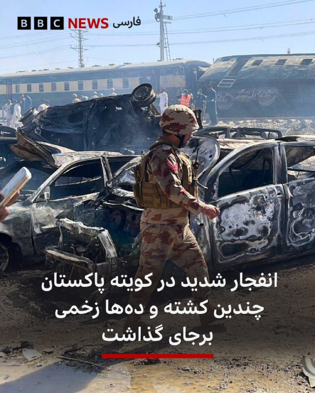

🔻انفجاری بزرگ در نزدیکی یک قطار که از گذرگاه چمن در شهر کویته در ایالت بلوچستان پاکستان عبور می‌کرد، تعداد زیادی کشته و ده‌ها نفر زخمی برجا گذاشت.

یک مقام ارشد پلیس بلوچستان و یکی از مسئولان این ایالت به محمد کاظم، خبرنگار بی‌بی‌سی اردو، گفت تاکنون کشته شدن ۲۰ نفر در این انفجار تأیید شده و دست‌کم ۷۰ نفر زخمی شده‌اند.
در پی این حادثه، در بیمارستان‌های شهر کویته وضعیت اضطراری اعلام شده است.

تصاویر منتشرشده پس از حادثه نشان می‌دهد که چندین خودرو در نزدیکی خط آهن آتش‌ گرفته‌اند و واگن‌های قطار نیز روی ریل واژگون شده‌اند.

گروه جدایی‌طلب «ارتش آزادیبخش بلوچ» مسئولیت این حمله را به عهده گرفته‌ است.

بیشتر بخوانید:

https://bbc.in/43vfz8U
@BBCPersian

## BBCPersian — post 281930

🔻 کشته شدن یک کارمند کنسولگری جمهوری آذربایجان در تصادف جاده‌ای

رسانه‌های ایران گزارش کرده‌اند که رامیل عمران‌اُف، کارمند بخش کنسولگری جمهوری آذربایجان در تبریز، در یک سانحه رانندگی در محور مرند - جلفا جان خود را از دست داده است.

حبیب آبراهه، رئیس پلیس راه آذربایجان شرقی، گفته است این تصادف در ساعت ۱۲:۵۰ روز شنبه رخ داد و «در این حادثه یک دستگاه سواری کیا اسپورتیج با پلاک دیپلماتیک جمهوری آذربایجان با یک دستگاه کامیون میکسر حمل بتن برخورد کرد.»

https://bbc.in/4o5dKtb
@BBCPersian

## BBCPersian — post 281929

  

‌ ‌ ‌
استیون چونگ، مدیر ارتباطات کاخ سفید، در واکنش به انتقادهای مایک پمپئو از توافق احتمالی با ایران، در شبکه اجتماعی ایکس حمله تندی به وزیر خارجه پیشین آمریکا کرد.

آقای چونگ نوشت: «مایک پمپئو هیچ درکی از موضوع ندارد. بهتر است دهانش را ببندد و کار واقعی را به حرفه‌ای‌ها واگذار کند.»

او همچنین گفت آقای پمپئو «در جریان اتفاقات نیست» و به همین دلیل «نمی‌داند چه می‌گذرد.»

این واکنش پس از آن مطرح شد که مایک پمپئو در پیامی در ایکس، توافق احتمالی با ایران را شبیه سیاست‌های دولت جو بایدن توصیف کرد و هشدار داد که چنین توافقی می‌تواند به ایران امکان دسترسی به منابع مالی، ادامه غنی‌سازی اورانیوم و نفوذ بیشتر بر تنگه هرمز را بدهد.

اظهارات آقای چونگ در حالی مطرح می‌شود که دونالد ترامپ ساعاتی پیش گفته بود بخش عمده توافق با ایران «مذاکره شده» و بازگشایی تنگه هرمز هم شامل آن خواهد بود.

https://bbc.in/49LCGzK
📷EPA/Shutterstock
@BBCPersian

## BBCPersian — post 281928

  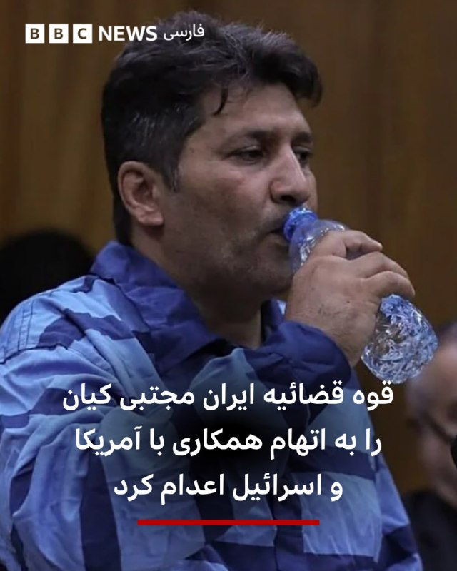

‌ ‌ ‌ ‌
خبرگزاری میزان، وابسته به قوه‌ قضائیه ایران خبر از اعدام مجتبی کیان، به اتهام «فعالیت اطلاعاتی» برای اسرائیل و آمریکا در جنگ اخیر داده است.

قوه قضائیه جمهوری اسلامی گفته که مجتبی کیان «در طول جنگ رمضان اقدام به ارسال اطلاعات مرتبط با واحد‌های صنایع دفاعی کشور به دشمن می‌کرد.»

به گفته رسانه دستگاه قضایی آقای کیان در طول جنگ اخیر «پیام‌های متعددی را به شبکه‌های معاند» ارسال می‌کرده «که از جمله آنها، مختصات و اطلاعات محل واحد‌های تولید قطعات مرتبط با صنایع دفاعی کشور بود.»

میزان تاکید کرده که یکی از دلایل صدور حکم اعدام برای آقای کیان «اعترافات» او پیش از دادگاه و در دادگاه بوده است.

نهادهای حقوق بشر از دادرسی‌های ناعادلانه، نقض حقوق متهم و موج اعدام‌ها بر اساس «اعترافات» زیر شکنجه و فشار برای صدور احکام اعدام در ایران ابراز نگرانی کرده‌اند.

https://bbc.in/4a0m5Ir
📷Getty
@BBCPersian

## idfinfarsi — post 11629

  <a href="telegram/content/idfinfarsi_11629_1779608646.mp4" target="_blank">🎬 Download video</a>

‼️به طول حدود ۱۰۰ متر: نیروهای تیپ ۸۱۰ یک مسیر زیرزمینی متعلق به سازمان تروریستی حزب‌الله را منهدم کردند

⭕️نیروهای تیپ «کوهستان‌ها» (۸۱۰) تحت فرماندهی لشکر ۲۱۰، در منطقه کوه دوو در لبنان برای شناسایی و انهدام زیرساخت‌های تروریستی سازمان تروریستی حزب‌الله در حال فعالیت هستند.

⭕️این نیروها با همکاری یگان مهندسی ویژه، یک مسیر زیرزمینی به طول حدود ۱۰۰ متر را شناسایی و منهدم کردند؛ مسیری که شامل چهار اتاق اقامت بود و توسط تروریست‌های سازمان تروریستی حزب‌الله مورد استفاده قرار می‌گرفت.

⭕️ارتش اسرائیل به فعالیت خود علیه تهدیدات علیه شهروندان این کشور و نیروهایش ادامه خواهد داد و مطابق با دستورالعمل‌های سطوح سیاسی عمل می‌کند.

## idfinfarsi — post 11628

  <a href="telegram/content/idfinfarsi_11628_1779608649.mp4" target="_blank">🎬 Download video</a>

‼️در تلاش مستمر برای رفع تهدید: ارتش اسرائیل در روزهای اخیر چندین انبار تسلیحاتی متعلق به سازمان تروریستی حماس را هدف قرار داده و نابود کرد

⭕️نیروهای ارتش اسرائیل تحت فرماندهی جنوب، طی شبانه‌روز گذشته (شنبه)، سه انبار تسلیحات متعلق به سازمان تروریستی حماس را در مرکز نوار غزه هدف قرار داده و منهدم کردند.
در میان تسلیحات موجود در این انبارها که در پی این حمله نابود شد، مواردی چون موشک‌های ضدزره، سلاح‌های سبک، آرپی‌جی (RPG)، جلیقه‌های رزمی و سایر تجهیزات نظامی وجود داشت.

⭕️در رویدادی دیگر در اوایل همین هفته (چهارشنبه)، نیروهای ارتش اسرائیل تحت فرماندهی جنوب یک انبار تسلیحاتی دیگر را در مرکز نوار غزه هدف قرار داده و منهدم کردند که در آن مواد منفجره، راکت‌اندازهای RPG، نارنجک‌های دستی و خشاب‌ها نگهداری می‌شد.

⭕️این تسلیحات برای حمله به نیروهای ارتش اسرائیل که در محدوده خط زرد فعالیت می‌کنند و همچنین غیرنظامیان اسرائیلی در نظر گرفته شده بود و به‌منظور رفع تهدید نابود شد.

⭕️پس از این حملات، انفجارهای ثانویه‌ای شناسایی شد که نشان‌دهنده وجود مهمات در این انبارها بود.

⭕️نیروهای ارتش اسرائیل تحت فرماندهی جنوب مطابق با توافق در منطقه مستقر هستند و به فعالیت خود برای رفع هرگونه تهدید فوری ادامه خواهند داد.

## Dirty_Kids — post 390061

  

ما چه‌ها از سر که نگذروندیم!

@Dirty_Kids 👻

## Dirty_Kids — post 390060

  

ولا حق داری 🫠💅

@Dirty_Kids 👻

## Dirty_Kids — post 390059

  <a href="telegram/content/Dirty_Kids_390059_1779608652.mp4" target="_blank">🎬 Download video</a>

چالش booty transitior دسته جمعی

@Dirty_Kids 👻

## Dirty_Kids — post 390058

  <a href="telegram/content/Dirty_Kids_390058_1779608653.mp4" target="_blank">🎬 Download video</a>

خدمت دوستانی که پنیک (خایه) کردن از مذاکرات

جهت یادوآری باید هر ماه اینو ببینید

+ من که فکر میکنم بعد سفر ترامپ به چین، چین داره اینارو تسلیم میکنه ولی با حفظ آبرو، ترامپم خرش از پل بگذره «اورانیوم» اینارو ول نمیکنه

@Dirty_Kids 👻

## Dirty_Kids — post 390057

  

دست خدا عیان شد
جیمی کارتر جوان شد!

@Dirty_Kids 👻

## Hranews — post 113123

  

مجتبی کیان به اتهام «جاسوسی» اعدام شد

❗️
❗️
❗️
❗️
❗️ – مرکز رسانه قوه قضاییه از اجرای حکم #اعدام مجتبی کیان، زندانی متهم به #جاسوسی و فعالیت اطلاعاتی به نفع اسرائیل و آمریکا خبر داد. این حکم بامداد امروز پس از تایید در دیوان عالی کشور به اجرا درآمد. بر اساس داده‌های گردآوری‌شده توسط هرانا، همزمان با آغاز درگیری‌های نظامی، روند صدور و اجرای احکام اعدام در پرونده‌های سیاسی و امنیتی افزایش یافته و تاکنون ۳۵ زندانی با این اتهامات در این بازه زمانی اعدام شده‌اند.

ادامه مطلب

#مجتبی_کیان

↘️
@hranews_bot تماس ✉️ -  @Hranews  کانال هرانا 🆑

## manototv — post 105794

  

نیروی دریایی بریتانیا اعلام کرده صدها ملوان این کشور در جبل‌الطارق آماده‌اند تا در صورت دستیابی آمریکا و جمهوری اسلامی به توافق صلح، برای پاکسازی احتمالی مین‌ها در تنگه هرمز اعزام شوند.

بر اساس گزارش آسوشیتدپرس، کشتی پشتیبانی آراف‌ای لایم بِی متعلق به نیروی دریایی سلطنتی بریتانیا در جبل‌الطارق مستقر است و با مهمات و پهپادهای دریایی مین‌یاب مجهز به سونار آماده عملیات احتمالی شده است. این مأموریت قرار است با همکاری بریتانیا و فرانسه انجام شود.

اولویت نخست این عملیات، در صورت اجرا، پاکسازی یک مسیر عبور در تنگه هرمز برای خروج حدود ۷۰۰ کشتی عنوان شده است. پس از آن، مسیر مقابل برای ورود کشتی‌ها پاکسازی خواهد شد؛ هرچند مقام‌ها گفته‌اند پاکسازی کامل تنگه ممکن است ماه‌ها یا حتی سال‌ها زمان ببرد.

## manototv — post 105793

  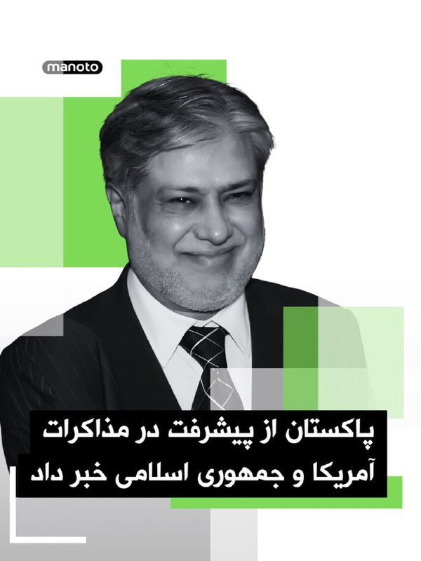

محمد اسحاق دار، وزیر خارجه پاکستان، اعلام کرد در تماس تلفنی با دونالد ترامپ درباره مذاکرات میان آمریکا و جمهوری اسلامی گفت‌وگو کرده است.

او این گفت‌وگوی «مهم» را «گامی قابل‌توجه به سوی صلح منطقه‌ای» توصیف کرد و گفت دستاوردهای مذاکرات اخیر، زمینه خوش‌بینی نسبت به یک نتیجه مثبت و پایدار را فراهم کرده است.

پاکستان در روزهای اخیر نقش میانجی کلیدی میان آمریکا و جمهوری اسلامی را برعهده داشته است. اسحاق دار همچنین از «رهبری» ترامپ و «تعهد او به گفت‌وگو و دیپلماسی» تقدیر کرد.

## manototv — post 105792

  

سرویس مخفی آمریکا در بیانیه‌ای اعلام کرد فردی مسلح عصر شنبه در نزدیکی خیابان ۱۷ و پنسیلوانیا، در محدوده کاخ سفید، پس از بیرون آوردن سلاح از کیف خود به سمت ماموران تیراندازی کرد.

ماموران سرویس مخفی در پاسخ به او شلیک کردند و مظنون پس از انتقال به بیمارستان جان باخت. در جریان این تیراندازی، یک رهگذر نیز هدف گلوله قرار گرفت. سرویس مخفی گفته هنوز مشخص نیست این فرد با شلیک مظنون زخمی شده یا در تبادل آتش میان او و ماموران.

بر اساس تصاویر منتشرشده از سلینا وانگ، خبرنگار ای‌بی‌سی نیوز، هم‌زمان با شنیده‌شدن صدای تیراندازی در نزدیکی کاخ سفید، خبرنگاران حاضر در محوطه به سمت اتاق نشست خبری منتقل شدند.

سرویس مخفی اعلام کرد هیچ‌یک از نیروهایش در این حادثه آسیب ندیده‌اند. دونالد ترامپ هنگام وقوع تیراندازی در کاخ سفید حضور داشت، اما این حادثه تاثیری بر او یا عملیات حفاظتی نداشته است. تحقیقات درباره این تیراندازی ادامه دارد. جزئیات اصلی با گزارش رویترز و آسوشیتدپرس هم‌خوانی دارد

## manototv — post 105791

  <a href="telegram/content/manototv_105791_1779608658.mp4" target="_blank">🎬 Download video</a>

تصاویر منتشرشده از سلینا وانگ، خبرنگار ای‌بی‌سی نیوز، لحظه‌ای را نشان می‌دهد که هم‌زمان با شنیده‌شدن صدای تیراندازی در نزدیکی کاخ سفید، خبرنگاران حاضر در محوطه به سمت اتاق نشست خبری منتقل شدند.

سرویس مخفی آمریکا اعلام کرد یک مرد مسلح در نزدیکی ایست بازرسی خیابان ۱۷ و پنسیلوانیا به سوی ماموران شلیک کرد. ماموران نیز در پاسخ تیراندازی کردند و مظنون که به بیمارستان منتقل شده بود، بعداً جان باخت.

در جریان این تیراندازی یک رهگذر نیز زخمی شد. هنوز مشخص نیست این فرد با شلیک مظنون زخمی شده یا در جریان تبادل آتش. دونالد ترامپ هنگام وقوع حادثه در کاخ سفید بود، اما آسیبی ندید.

## alonews — post 122249

  

🔴🔴گیگی ۱۴۹ تومن🔴🔴
🔴🔴گیگی ۱۴۹ تومن🔴🔴
🔴🔴گیگی ۱۴۹ تومن🔴🔴
______________________

لینک سابسکریشن ✅

تست رایگان✅

بدون محدودیت کاربر و زمان✅

تضمین عودت وجه✅

@darkoob_config1
@darkoob_config1
@darkoob_config1

## alonews — post 122248

  <a href="telegram/content/alonews_122248_1779608661.webm" target="_blank">🎬 Download video</a>

👈پزشکیان: بنده نسبت به مشکلات اقتصادی و معیشتی مردم، به‌ویژه آسیب‌هایی که در پی شرایط جنگی تشدید شده، احساس مسئولیت جدی دارم و با تمام توان در حال تلاش برای کاهش فشارها بر مردم هستم.

✅ @AloNews خبر جنگ

## alonews — post 122247

  <a href="telegram/content/alonews_122247_1779608661.webm" target="_blank">🎬 Download video</a>

👈پزشکیان: آنچه در مقاطع حساس، ضامن حفظ و ثبات کشور بوده، همبستگی و همدلی مردم و ارکان نظام است.

🔴با وجود مسائل و مشکلات متعدد، از بیان بسیاری از مطالب صرف‌نظر می‌کنم تا مبادا زمینه تفرقه و اختلاف فراهم شود. امروز حفظ وحدت و انسجام ملی به‌مراتب مهم‌تر از مسائل نظامی و امنیتی است

🔴همواره تلاش کرده‌ام سخنی بر خلاف نظر مقام معظم رهبری بیان نشود و یا موضعی اتخاذ نگردد که به اختلاف میان ارکان حاکمیت دامن بزند و دشمن از آن سوءاستفاده کند.

🔴هر سخن، تحلیل یا موضعی که از هر تریبونی، به‌ویژه صدا و سیما، منجر به ایجاد شکاف و تفرقه در جامعه شود، در عمل آب ریختن به آسیاب دشمن است

🔴گاهی برخی کارشناسان در رسانه ملی سخنانی مطرح می‌کنند که با واقعیت‌های جاری کشور و روندهای موجود فاصله جدی دارد، اما دولت به‌منظور جلوگیری از اختلاف و حفظ آرامش جامعه، از واکنش و موضع‌گیری پرهیز می‌کند

✅ @AloNews خبر جنگ

## alonews — post 122246

  <a href="telegram/content/alonews_122246_1779608661.webm" target="_blank">🎬 Download video</a>

👈‌فارس: بررسی متن نهایی‌شده توافق احتمالی، نشان می‌دهد آمریکا و متحدانش متعهد می‌شوند که به هیچ وجه به ایران یا متحدانش حمله نکنند.

🔴در مقابل، ایران نیز متعهد شده که خود و متحدانش به آمریکا و متحدان آن حملۀ نظامی پیش دستانه نداشته باشند.

🔴طبق پیش‌نویس توافق، طرفین بر سر آزادسازی تمام یا بخشی از پول‌های مسدودشدهٔ ایران به منظور ورود به مذاکره توافق کرده‌اند

🔴همچنین طبق این پیش‌نویس، امکان تردد در تنگهٔ هرمز به تعداد قبل از جنگ و با مدیریت ایران، همزمان با برداشتن محاصرهٔ دریایی فراهم می‌شود.

🔴علاوه بر این، تحریم‌های نفت، گاز، پتروشیمی و مشتقات آن در دورهٔ مذاکره به‌طور موقت لغو می‌شود تا ایران بتواند آزادانه به فروش محصولات خود بپردازد.

✅ @AloNews خبر جنگ

## alonews — post 122245

  <a href="telegram/content/alonews_122245_1779608662.webm" target="_blank">🎬 Download video</a>

👈خبرگزاری معتبر تسنیم: پیش نویس توافق با واشنگتن مقرر می‌کند که وضعیت حاکمیتی تنگه هرمز به شرایط پیش از جنگ باز نگردد و تنها تعداد کشتی‌های عبوری ظرف ۳۰ روز بازیابی شود، که همزمان با رفع کامل محاصره دریایی و اجرای تعهدات آمریکا است. تهران بر حفظ حق حاکمیتی خود بر این تنگه تأکید دارد

✅ @AloNews خبر جنگ

## alonews — post 122244

  <a href="telegram/content/alonews_122244_1779608662.webm" target="_blank">🎬 Download video</a>

👈العربی الجديد به نقل از منبع ایرانی:
پیش‌نویس توافق بین تهران و واشنگتن شامل پایان جنگ در تمام جبهه‌ها از جمله لبنان است
 

🔴بخش بزرگی از دارایی‌های مسدود شده ایران در خارج آزاد خواهد شد و محاصره دریایی برداشته شده و تنگه هرمز بازگشایی می‌شود

🔴 وضعیت موجود در پرونده هسته‌ای و تحریم‌ها حفظ خواهد شد
 

🔴 تهران در دوره ۶۰ روزه از کاهش تحریم‌ها برای فروش نفت خود بهره‌مند خواهد شد
 

🔴 هنوز برخی اختلافات برای حل شدن قبل از اعلام توافق موقت باقی است و توپ در زمین آمریکاست
 

🔴هیچ چیز را نمی‌توان تضمین شده یا نهایی دانست مگر اینکه همه جزئیات توافق شود

✅ @AloNews خبر جنگ

## alonews — post 122243

  <a href="telegram/content/alonews_122243_1779608662.webm" target="_blank">🎬 Download video</a>

👈راضیه عالیشوندی، معاون امور بین‌الملل و حقوق بشردوستانه جمعیت هلال‌احمر: محموله‌های کمک‌های بشردوستانه کشورهای عراق، ازبکستان و قزاقستان وارد ایران شد.

🔴این کمک‌ها شامل اقلام غذایی، دارویی و تجهیزات پزشکی است.

🔴این کمک‌ها در راستای حمایت از عملیات امدادی و تامین نیازهای اقشار آسیب‌پذیر در اختیار جمعیت هلال‌احمر قرار گرفته است

✅ @AloNews خبر جنگ

## alonews — post 122242

  <a href="telegram/content/alonews_122242_1779608663.webm" target="_blank">🎬 Download video</a>

👈نخست‌وزیر پاکستان، شہباز شریف: من به رئیس‌جمهور دونالد ترامپ بابت تلاش‌های فوق‌العاده‌اش برای پیگیری صلح و برگزاری یک تماس تلفنی بسیار مفید و سازنده در اوایل امروز با رهبران عربستان سعودی، قطر، ترکیه، مصر، امارات، اردن و پاکستان تبریک می‌گویم.

🔴فیلد مارشال سید عاصم منیر نماینده پاکستان در این تماس تلفنی بود و من از تلاش‌های بی‌وقفه او در طول کل این فرایند بسیار قدردانی می‌کنم.

🔴این گفتگوها فرصتی مفید برای تبادل نظر درباره وضعیت کنونی منطقه و چگونگی پیشبرد تلاش‌های جاری برای صلح به منظور آوردن صلح پایدار در منطقه فراهم کرد.

🔴پاکستان تلاش‌های صلح خود را با نهایت صداقت ادامه خواهد داد و امیدواریم به زودی میزبان دور بعدی مذاکرات باشیم.

✅ @AloNews خبر جنگ

## alonews — post 122241

  <a href="telegram/content/alonews_122241_1779608663.webm" target="_blank">🎬 Download video</a>

👈 مونیکا ویت کیست؛ نظامی سابق آمریکایی که به جاسوسی برای ایران متهم شد و اف‌بی‌آی برای او جایزه تعیین کرد

🔴 اف‌بی‌آی به تازگی اعلام کرده است که برای دریافت اطلاعات منجر به بازداشت و محاکمه مونیکا ویت، عضو پیشین نیروهای مسلح و مامور سابق ضدجاسوسی آمریکا، ۲۰۰ هزار دلار جایزه تعیین کرده است.

✅ @AloNews خبر جنگ

## alonews — post 122240

  <a href="telegram/content/alonews_122240_1779608663.webm" target="_blank">🎬 Download video</a>

👈آزادسازی نیمی از دارایی‌های بلوکه‌شده ایران به ارزش ۱۲ میلیارد دلار نیز در این چارچوب این یادداشت تفاهم پیش‌بینی شده است.

✅ @AloNews خبر جنگ

## alonews — post 122239

  <a href="telegram/content/alonews_122239_1779608663.webm" target="_blank">🎬 Download video</a>

👈کابینه جنگ اسرائیل امشب تشکیل جلسه میده

✅ @AloNews خبر جنگ

## alonews — post 122238

  <a href="telegram/content/alonews_122238_1779608664.webm" target="_blank">🎬 Download video</a>

👈تتر دوباره رفت بالا و الان 170,500

✅ @AloNews خبر جنگ

## alonews — post 122237

  <a href="telegram/content/alonews_122237_1779608664.webm" target="_blank">🎬 Download video</a>

👈تشکر ترامپ از سرویس مخفی برای دستگیری تیرانداز دیشب: از سرویس مخفی و نیروی انتظامی عالی‌مون به خاطر اقدام سریع و حرفه‌ای که امشب علیه یک فرد مسلح در نزدیکی کاخ سفید، که سابقه خشونت‌آمیز و احتمالاً وسواس فکری نسبت به گرامی‌ترین بنای کشورمون داشت، انجام شد، سپاسگزاریم.

🔴فرد مسلح بعد از درگیری با مأموران سرویس مخفی در نزدیکی دروازه‌های کاخ سفید کشته شد.

🔴این اتفاق یک ماه بعد از تیراندازی در ضیافت شام خبرنگاران کاخ سفید رخ داد
برای همه روسای جمهور آینده مهمه که امن‌ترین و مطمئن‌ترین فضایی رو که تاالان در واشنگتن دی سی ساخته شده، داشته باشن

✅ @AloNews خبر جنگ

## alonews — post 122236

  <a href="telegram/content/alonews_122236_1779608664.webm" target="_blank">🎬 Download video</a>

👈خبرگزاری فرانسه: کشته شدن ده‌ها نفر در انفجاری که قطاری را در جنوب غرب پاکستان هدف قرار داد

✅ @AloNews خبر جنگ

## alonews — post 122235

  <a href="telegram/content/alonews_122235_1779608665.webm" target="_blank">🎬 Download video</a>

👈تسنیم: اسقاط تحریم‌های نفتی ایران در طول دوره مذاکره از بندهای تفاهم احتمالی است

🔴 شنیده‌ها از جزئیات تفاهم اولیه «احتمالی»، میان ایران و آمریکا حاکی است که واشنگتن متعهد خواهد شد در طول دوره مذاکرات، تحریم‌های نفتی ایران را به حالت اسقاط (Waive) درآورد؛ اقدامی که به ایران امکان می‌دهد در این بازه زمانی، نفت خود را بدون محدودیت‌های ناشی از تحریم به فروش برساند.

🔴 بر اساس اطلاعات منتشرشده، در صورت تأیید مفاد تفاهم اولیه از سوی دو طرف، ابتدا یک تفاهم‌نامه (MOU) اعلام خواهد شد؛ تفاهمی که در آن پایان جنگ در تمامی جبهه‌ها، از جمله لبنان نیز مورد تأکید قرار می‌گیرد. اسرائیل نیز بر اساس این بند به عنوان متحد آمریکا باید جنگ در لبنان را پایان دهد.

🔴 پس از آن، یک بازه ۳۰ روزه برای اجرای اقدامات مرتبط با محاصره دریایی و تنگه هرمز در نظر گرفته شده و همزمان، دوره‌ای ۶۰ روزه برای مذاکرات درباره موضوع هسته‌ای تعریف خواهد شد.

🔴ایران در مقطع کنونی هیچ اقدامی را در حوزه هسته‌ای نپذیرفته است

✅ @AloNews خبر جنگ

## alonews — post 122234

  <a href="telegram/content/alonews_122234_1779608665.webm" target="_blank">🎬 Download video</a>

👈آخرین قیمت طلا و سکه

🔴طلای ۱۸ عیار: ۱۷ میلیون و ۸۶۷ هزار تومان

🔴سکه طرح جدید: ۱۸۶ میلیون و ۵۰۰ هزار تومان

✅ @AloNews خبر جنگ

## alonews — post 122233

  <a href="telegram/content/alonews_122233_1779608665.webm" target="_blank">🎬 Download video</a>

👈وزیر خارجه پاکستان: دیپلماسی و مذاکره باید بر درگیری غلبه کند

✅ @AloNews خبر جنگ

## alonews — post 122232

  <a href="telegram/content/alonews_122232_1779608665.webm" target="_blank">🎬 Download video</a>

👈اردوغان: ترکیه آماده است در مرحله اجرای هرگونه توافق جمهوری اسلامی و آمریکا، همه حمایت‌های لازم را ارائه دهد

✅ @AloNews خبر جنگ

## alonews — post 122231

  <a href="telegram/content/alonews_122231_1779608666.webm" target="_blank">🎬 Download video</a>

👈تصویر فرد مهاجم در نزدیکی کاخ‌سفید

✅ @AloNews خبر جنگ

## alonews — post 122230

  <a href="telegram/content/alonews_122230_1779608666.webm" target="_blank">🎬 Download video</a>

👈شاخص کل بورس تهران در دقایق نخست آغاز فعالیت با رشد حدود ۶۳ هزار واحدی در آستانه ورود به کانال ۳ میلیون و ۹۰۰ هزار واحدی است

✅ @AloNews خبر جنگ

---
📅 بروزرسانی: 1405/03/03 07:52
---

## VahidOOnLine — post 241858

  

آکسیوس به نقل از یک مقام آمریکایی، جزییاتی از توافق احتمالی جمهوری اسلامی و آمریکا را که ممکن است یک‌شنبه اعلام شود، منتشر کرد. این توافق شامل تمدید ۶۰ روزه آتش‌بس است که در طی آن تنگه هرمز بازگشایی می‌شود،‌ تهران می‌تواند آزادانه نفت بفروشد و مذاکرات هسته‌ای برگزار خواهد شد.
به گفته این مقام آمریکایی، این تفاهم ۶۰ روز اعتبار دارد و در صورت توافق دو طرف قابل تمدید خواهد بود.
دو طرف یک یادداشت تفاهم امضا خواهند کرد که ۶۰ روز اعتبار دارد و با رضایت متقابل قابل تمدید است.
در طول این دوره ۶۰ روزه، تنگه هرمز بدون دریافت عوارض باز خواهد بود و ایران موافقت خواهد کرد مین‌هایی را که در این آبراه مستقر کرده پاک‌سازی کند تا کشتی‌ها آزادانه عبور کنند.
در مقابل، ایالات متحده محاصره بنادر ایران را لغو خواهد کرد. این مقام گفت هرچه جمهوری اسلامی سریع‌تر مین‌ها را پاک‌سازی و عبور و مرور دریایی را از سر بگیرد، محاصره نیز سریع‌تر لغو خواهد شد. او افزود اصل کلیدی دونالد ترامپ در این توافق «کاهش فشار در برابر اقدام» است.
‌🏁 🇬🇧 IranintlTV

🤖 @VahidOOnLine

## VahidOOnLine — post 241857

  

نیویورک‌تایمز به نقل از مقام‌های آمریکایی گزارش داد جمهوری اسلامی تنها پس از دستیابی به توافق نهایی هسته‌ای به بخش عمده دارایی‌های مسدود شده خود که آمریکا و متحدانش در صندوق بازسازی قرار خواهند داد، دسترسی خواهد یافت.
آزادسازی میلیاردها دلار از دارایی‌های مسدودشده ایران در خارج از کشور یکی از مولفه‌های کلیدی هر توافقی خواهد بود و به جمهوری اسلامی انگیزه می‌دهد در مذاکرات باقی بماند و به توافق برسد.

‌🏁 🇬🇧 IranintlTV

🤖 @VahidOOnLine

## VahidOOnLine — post 241856

  

♦️یک مقام رسمی ایالات متحده در گفتگو با آکسیوس جزئیات کلیدی از پیش‌نویس یادداشت تفاهمی را فاش کرد که دونالد ترامپ به امضای آن با ایران نزدیک شده است؛ بر اساس این طرح، دو طرف وارد یک دوره آتش‌بس ۶۰ روزه خواهند شد که طی آن تهران متعهد می‌شود بدون دریافت هیچ‌گونه حق عوارضی، نسبت به پاک‌سازی مین‌های مستقر در تنگه هرمز اقدام کرده و مسیر کشتیرانی آزاد را بازگشایی کند و در مقابل، آمریکا محاصره بنادر ایران را لغو و معافیت‌های تحریمی را برای فروش آزادانه نفت ایران صادر خواهد کرد. این مقام آمریکایی با تاکید بر این‌که اصل کلیدی ترامپ در این توافق «امتیاز در برابر عملکرد» است، تصریح کرد که با وجود خواست تهران برای آزادسازی فوری دارایی‌ها، هرگونه رفع دائمی تحریم‌ها و آزادسازی اموال بلوکه‌شده تنها به فاز نهایی موکول شده است؛ با این حال، پیش‌نویس این تفاهم حاوی تعهد کتبی ایران برای عدم پیگیری سلاح هسته‌ای و توافق شفاهی برای مذاکره بر سر تعلیق غنی‌سازی و واگذاری ذخایر اورانیوم با غنی‌سازی بالا در دور بعدی گفتگوها است. در همین حال، نیروهای نظامی بسیج‌شده آمریکا تا زمان حصول توافق نهایی در منطقه باقی خواهند ماند و در صورت صلاحدید واشنگتن مبنی بر عدم جدیت ایران در مذاکرات هسته‌ای، این توافق حتی پیش از پایان ۶۰ روز ملغی خواهد شد.
براساس این گزارش، پیش‌نویس کنونی صراحتا بر پایان جنگ میان اسرائیل و حزب‌الله در لبنان دلالت دارد؛ موضوعی که اواخر روز شنبه با واکنش و ابراز نگرانی محترمانه بنیامین نتانیاهو در تماس تلفنی با ترامپ مواجه شد، هرچند یک مقام آمریکایی خاطرنشان کرد که ترامپ در کنار ملاحظات داخلی نتانیاهو، باید به منافع آمریکا و اقتصاد جهانی بیندیشد و در صورت تسلیح مجدد یا حمله حزب‌الله، اسرائیل حق اقدام متقابل را خواهد داشت. این تفاهم بزرگ پس از آن به مرحله نهایی نزدیک شد که ترامپ روز شنبه در یک کنفرانس تلفنی مشترک با رهبران عربستان سعودی، امارات، قطر، مصر، ترکیه و پاکستان، حمایت کامل آن‌ها را دریافت کرد؛ رویدادی که در آن عاصم منیر، فرمانده ارتش پاکستان، به عنوان میانجی اصلی نقشی کلیدی در رایزنی‌های فشرده تهران ایفا کرد. مشاوران ترامپ می‌گویند با وجود نوسان چند روز گذشته رئیس‌جمهوری آمریکا میان گزینه دیپلماتیک و راه‌اندازی موج عظیمی از حملات نظامی، او اکنون به گزینه اول متمایل شده و کاخ سفید امیدوار است با حل آخرین اختلافات در ساعات پیش‌رو، این توافق روز یکشنبه رسماً اعلام شود تا در صورت تغییر رفتار تهران، مسیر برای بازتعریف روابط و شکوفایی پتانسیل اقتصادی ایران هموار گردد.
‌🇸🇦 Indypersian

🤖 @VahidOOnLine

## VahidOOnLine — post 241855

  

رسانه‌های آمریکا هویت مرد مظنون به تیراندازی نزدیک کاخ‌سفید را که با گلوله ماموران کشته شد، نصیر بست، ۲۱ ساله‌ و اهل مریلند، اعلام کردند. طبق این گزارش‌ها، بست پیش‌تر نیز با سرویس مخفی آمریکا برخوردهایی داشته است و سوابق نشان می‌دهد که او پیش‌تر خود را «عیسی مسیح» و «پسر خدا» خوانده بود.
در همین حال، در شبکه‌های اجتماعی منتسب به بست، پستی دیده می‌شود که به نظر می‌رسد تهدیدی علیه ترامپ مطرح کرده و در پستی دیگر نوشته بود: «من در واقع پسر خدا هستم.»
در یک مورد به‌طور اجباری در یک بیمارستان روان‌پزشکی بستری شده بود و در موردی دیگر، زمانی که مدعی شده بود «او عیسی مسیح است»، از سوی پلیس محلی بازداشت شد.
بر اساس یک اظهارنامه دادگاهی، ماموران تابستان گذشته چندین بار در نزدیکی کاخ سفید با بست مواجه شده بودند. در این سند آمده است او به دلیل «پرسه زدن در محوطه کاخ سفید و پرس‌وجو درباره نحوه دسترسی از نقاط مختلف ورودی» برای سرویس مخفی شناخته‌شده بود.
بر اساس اسناد دادگاه، او در ۲۶ ژوئن ۲۰۲۵ به دلیل «ممانعت از ورود خودروها» به بخشی از محوطه کاخ سفید، به‌طور اجباری بستری شد.

‌🏁 🇬🇧 IranintlTV

🤖 @VahidOOnLine

## VahidOOnLine — post 241854

  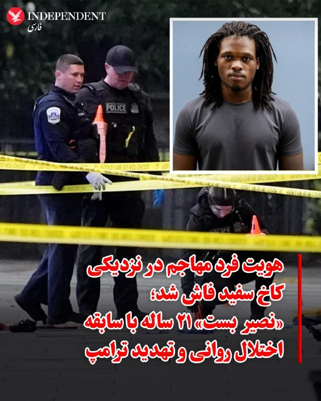

♦️رسانه‌های آمریکایی هویت عامل تیراندازی عصر شنبه در مجاورت کاخ سفید را «نصیر بست»، جوان ۲۱ ساله اهل مریلند، معرفی کردند که به عنوان فردی با اختلالات روانی و عاطفی شدید برای ماموران امنیتی شناخته‌شده بوده است؛ بر اساس گزارش‌ها، این فرد که پیش از این در ژوئن ۲۰۲۵ با ادعای این‌که «خدا» است یک مسیر ورودی کاخ سفید را مسدود کرده و پس از آن به یک مرکز روان‌پزشکی منتقل شده بود، به دلیل تلاش مجدد برای ورود به حریم کاخ سفید در ژوئیه همان سال، حکم دادگاه مبنی بر «ممنوعیت ورود و نزدیکی به این عمارت» را داشته است. گزارش‌های تکمیلی نشان می‌دهد که «نصیر بست» دست‌کم در یک پست رسانه‌های اجتماعی تمایل خود را برای آسیب رساندن به دونالد ترامپ ابراز کرده بود؛ او سرانجام پس از نقض حکم دادگاه، نزدیک شدن به ایست بازرسی خیابان هفدهم و پنسیلوانیا و گشودن آتش به سمت ماموران، در تبادل آتش متقابل با نیروهای سرویس مخفی هدف قرار گرفت و در بیمارستان جان باخت.
‌🇸🇦 Indypersian

🤖 @VahidOOnLine

## VahidOOnLine — post 241853

  

هم‌زمان با احتمال نزدیک شدن توافق جمهوری اسلامی و آمریکا، سخنگوی وزارت خارجه جمهوری اسلامی با انتشار تصویر سنگ‌نگاره نقش رستم که پیروزی شاپور بر امپراتور روم را نشان می‌دهد، نوشت: «در ذهن رومیان، روم مرکز بی‌چون‌وچرای جهان بود. اما ایرانیان این تصور را در هم شکستند.»
اسماعیل بقایی افزود: «هنگامی که مارکوس ژولیوس فیلیپوس به سوی شرق و علیه ایران لشکر کشید، این کارزار به پیروزی روم منجر نشد، بلکه به صلحی انجامید که بر اساس شروط ساسانیان برقرار شد: امپراتور ناچار شد با شرایط آنان کنار بیاید.»

‌🏁 🇬🇧 IranintlTV

🤖 @VahidOOnLine

## VahidOOnLine — post 241852

  

♦️نیویورک تایمز به نقل از دو مقام آمریکایی گزارش داد، یکی از عناصر کلیدی توافق پیشنهادی میان واشنگتن و تهران، تعهد آشکار ایران به واگذاری ذخایر اورانیوم با غنی‌سازی بالای خود است؛ اگرچه مقامات کاخ سفید هنوز به درخواست‌ها برای اظهارنظر پاسخ نداده‌اند، دونالد ترامپ روز شنبه اعلام کرد که واشنگتن به دستیابی به توافقی با تهران برای پایان دادن به جنگ و بازگشایی تنگه هرمز نزدیک شده است. با این حال، او جزئیاتی در این زمینه ارائه نکرد و مشخص نیست چه موانعی ممکن است برای نهایی شدن این توافق باقی مانده باشد. مقامات آمریکایی تصریح کردند که این پیشنهاد هنوز جزئیات دقیق نحوه واگذاری این ذخایر را تعیین نکرده و حل این مسئله را به دور بعدی گفتگوها درباره برنامه هسته‌ای ایران موکول کرده است، اما یک بیانیه کلی که ایران را متعهد به این کار کند، که هدف دیرینه ایالات متحده بوده، برای توافق بسیار حیاتی است، به‌ویژه اگر این توافق کلی با بدبینی جمهوری‌خواهان در کنگره مواجه شود. تا این لحظه، ایران هیچ بیانیه‌ عمومی درباره توافقی که ترامپ اعلام کرده، صادر نکرده است.
تهران در ابتدا با گنجاندن هرگونه توافقی درباره ذخایر اورانیوم غنی‌شده خود در این مرحله اولیه مخالفت کرده و خواستار موکول شدن آن به مرحله دوم گفتگوها بود، اما مذاکره‌کنندگان آمریکایی از طریق واسطه‌ها به صراحت اعلام کردند که بدون دستیابی به توافقی بر سر این ذخایر در فاز اولیه، میز مذاکره را ترک کرده و کارزار نظامی خود را از سر خواهند گرفت. این هشدار در حالی مطرح شد که برنامه‌ریزان نظامی در روزهای اخیر گزینه‌هایی را برای بمباران ذخایر اورانیوم ایران، که گمان می‌رود بیشتر آن در سایت هسته‌ای اصفهان باشد، به ترامپ ارائه داده بودند؛ سایتی که ژوئن گذشته هدف حمله آمریکا قرار گرفت و اورانیوم غنی‌شده در آن مدفون شد. در میان گزینه‌های بحث‌شده، حمله به اصفهان با بمب‌های سنگرشکن برای نابودی این ذخایر در زیر زمین مطرح بود و حتی پس از دسترسی مجدد تهران به اورانیوم پس از حملات تابستان گذشته، ترامپ اجازه یک عملیات مشترک تکاوری میان آمریکا و اسرائیل را برای بازپس‌گیری این ذخایر بررسی کرد؛ مأموریت خطرناکی که به دلیل احتمال تلفات سنگین نیروها هرگز توسط ترامپ تایید نشد. بر اساس اعلام آژانس بین‌المللی انرژی اتمی، ایران هم‌اکنون ذخیره‌ای در حدود ۹۷۰ پوند (حدود ۴۴۰ کیلوگرم) اورانیوم غنی‌شده تا سطح ۶۰ درصد در اختیار دارد.
براساس این گزارش، بخش دیگری از این توافق محتمل شامل آزادسازی میلیاردها دلار از دارایی‌های بلوکه‌شده ایران در خارج از کشور است؛ اما به گفته مقامات آمریکایی، ایران تنها زمانی به بخش عمده این دارایی‌ها که قرار است توسط ایالات متحده و متحدانش در یک صندوق بازسازی قرار گیرد دسترسی پیدا خواهد کرد که با یک توافق هسته‌ای نهایی موافقت کند؛ امری که انگیزه‌ای برای تهران ایجاد می‌کند تا پای میز مذاکره بماند.
‌🇸🇦 Indypersian

🤖 @VahidOOnLine

## VahidOOnLine — post 241851

  

نیویورک تایمز به نقل از دو مقام آمریکایی گزارش داد جمهوری اسلامی موافقت کرده است از اورانیوم غنی‌شده خود صرف‌نظر کند. جزییات دقیق این تفاهم هنوز روشن نیست، اما مقام‌ها گفتند آمریکا در چارچوب هر توافق اولیه، از حکومت ایران تعهدی درباره اورانیوم مطالبه کرده است.
مقام‌های کاخ سفید به درخواست‌ها برای اظهار نظر پاسخ ندادند. ترامپ روز شنبه گفت ایالات متحده به دستیابی به توافقی با ایران برای پایان دادن به جنگ و بازگشایی تنگه هرمز نزدیک شده است. اما او جزییاتی ارائه نکرد و مشخص نیست چه موانعی برای نهایی شدن توافق باقی مانده است.
مقام‌های آمریکایی گفتند این پیشنهاد موضوع چگونگی دقیق واگذاری ذخایر را حل‌وفصل نکرده و جزییات را به دور بعدی گفت‌وگوها درباره برنامه هسته‌ای ایران موکول کرده است.

‌🏁 🇬🇧 IranintlTV

🤖 @VahidOOnLine

## VahidOOnLine — post 241850

  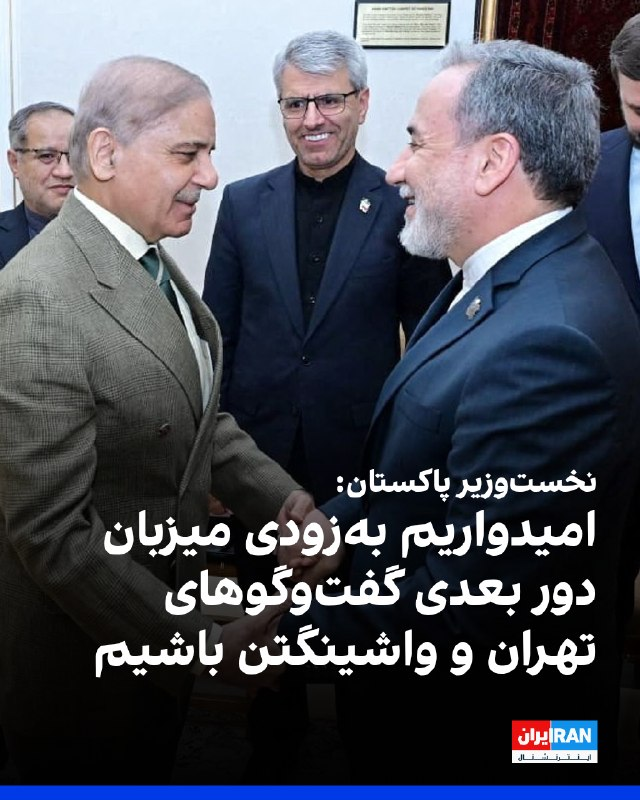

شهباز شریف، نخست‌وزیر پاکستان، تلاش‌های ترامپ برای پیگیری صلح و برگزاری تماس با کشورهای منطقه را به او تبریک گفت و ابراز امیدواری کرد پاکستان به‌زودی میزبان دور بعدی گفت‌وگوهای تهران و واشینگتن باشد.
شریف در ایکس با اشاره به تماس ترامپ با رهبران عربستان سعودی، قطر، ترکیه، مصر، امارات متحده عربی، اردن و پاکستان، گفت: «این گفت‌وگوها فرصت مفیدی برای تبادل نظر درباره وضعیت کنونی منطقه و چگونگی پیشبرد تلاش‌های جاری برای صلح به منظور دستیابی به صلحی پایدار در منطقه فراهم کرد.»

‌🏁 🇬🇧 IranintlTV

🤖 @VahidOOnLine

## VahidOOnLine — post 241849

  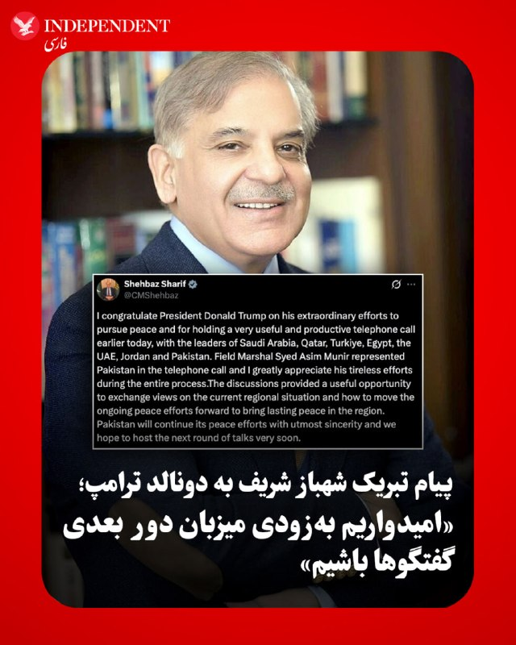

♦️شهباز شریف، نخست‌وزیر پاکستان، با انتشار پیامی در اکس، ضمن تبریک به دونالد ترامپ برای پیشبرد فرآیند صلح در منطقه نوشت: «به رئیس‌جمهور دونالد ترامپ برای تلاش‌های فوق‌العاده‌اش در مسیر دستیابی به صلح و همچنین برگزاری تماس تلفنی بسیار مفید و ثمر‌بخش امروز با رهبران عربستان سعودی، قطر، ترکیه، مصر، امارات متحده عربی، اردن و پاکستان تبریک می‌گویم؛ عاصم منیر به نمایندگی از پاکستان در این تماس تلفنی حضور داشت و من از تلاش‌های خستگی‌ناپذیر او در طول این فرآیند بسیار سپاسگزارم.» نخست‌وزیر پاکستان در ادامه با اشاره به ماهیت این گفتگوهای چندجانبه افزود: «این رایزنی‌ها فرصت مفیدی را برای تبادل نظر درباره وضعیت فعلی منطقه و چگونگی پیشبرد تلاش‌های جاری صلح جهت ایجاد صلح پایدار در منطقه فراهم کرد؛ پاکستان با صمیمیت کامل به تلاش‌های صلح‌آمیز خود ادامه خواهد داد و امیدواریم به‌زودی میزبان دور بعدی گفتگوها باشیم.»
‌🇸🇦 Indypersian

🤖 @VahidOOnLine

## VahidOOnLine — post 241848

  

♦️مایک جانسون، رئیس مجلس نمایندگان ایالات متحده، با انتشار پیامی در اکس، ضمن حمایت از سیاست‌های دولت دونالد ترامپ نوشت: «رئیس‌جمهور ترامپ تنها کسی است که می‌توانست ایران، بزرگ‌ترین دولت حامی تروریسم در جهان، را به میز مذاکره بکشاند؛ ما از این‌که متوجه شدیم یک توافق صلح با ایران در جریان است، بسیار دلگرم شده‌ایم و مشتاقانه منتظر کسب اطلاعات بیشتر درباره جزئیات آن هستیم.» جانسون در ادامه پیام خود با تمجید از عملکرد رئیس‌جمهوری آمریکا افزود که تحت رهبری ترامپ، ملت آمریکا قوی‌تر، در عرصه جهانی محترم‌تر و امن‌تر از هر زمان دیگری است.
‌🇸🇦 Indypersian

🤖 @VahidOOnLine

## VahidOOnLine — post 241847

  

سرویس مخفی آمریکا در بیانیه‌ای اعلام کرد در تیراندازی نزدیک کاخ سفید فرد مظنون کشته و یک رهگذر مجروح شد.
طبق این بیانیه، ترامپ هنگام وقوع این حادثه در کاخ سفید حضور داشت، اما هیچ‌یک از افراد تحت حفاظت سرویس مخفی و همچنین فعالیت‌های حفاظتی تحت تاثیر این رویداد قرار نگرفتند.
طبق اعلام سرویس مخفی آمریکا، عصر شنبه فردی در محدوده خیابان هفدهم و خیابان پنسیلوانیا، نزدیک کاخ سفید، سلاحی را از کیف خود خارج کرد و شروع به تیراندازی کرد، اما ماموران با تیراندازی فرد مظنون را هدف قرار دادند.
این بیانیه افزود فرد مظنون به یکی از بیمارستان‌های منطقه منتقل شد، اما در آنجا مرگ او اعلام شد. در جریان این تیراندازی، یک رهگذر نیز بر اثر اصابت گلوله مجروح شد.

‌🏁 🇬🇧 IranintlTV

🤖 @VahidOOnLine

## VahidOOnLine — post 241846

  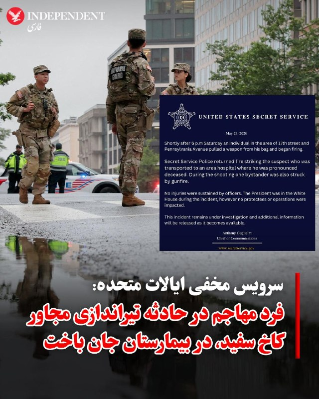

♦️به گزارش «اسکای نیوز» فرد مهاجم در حادثه تیراندازی مجاورت کاخ سفید پس از نزدیک شدن به ایست بازرسی امنیتی در تقاطع خیابان هفدهم و پنسیلوانیا، سلاح خود را از کیف خارج کرده و به سوی ماموران سرویس مخفی شلیک کرده است که در پی پاسخ متقابل نیروهای امنیتی، ضارب و یک عابر پیاده زخمی شدند. سرویس مخفی ایالات متحده با انتشار بیانیه‌ای تایید کرد که فرد مسلح بر اثر شدت جراحات ناشی از این تبادل آتش، در بیمارستان جان باخته است.
این گزارش حاکی از آن است که در زمان وقوع حادثه و شلیک ۱۵ تا ۳۰ گلوله که موجی از وحشت را در میان خبرنگاران مستقر در بخش غربی کاخ سفید ایجاد کرد، دونالد ترامپ در محل اقامت خود حضور داشته است. این حادثه تنها سه هفته پس از حادثه تیراندازی در ضیافت شام انجمن خبرنگاران کاخ سفید رخ می‌دهد. براساس این گزارش، هیچ یک از نیروهای سرویس مخفی در این درگیری آسیب ندیده‌اند و تحقیقات گسترده پلیس در محل حادثه آغاز شده است.
‌🇸🇦 Indypersian

🤖 @VahidOOnLine

## VahidOOnLine — post 241845

  

در پی اعتراضات دانش‌آموزی به برگزاری امتحانات به صورت حضوری، سعید شاهرخی، استاندار لرستان، با اشاره ‌به شرایط کنونی و با تاکید بر حفظ امنیت در استان، دستور داد امتحانات پایه‌های هفتم تا دهم غیرحضوری برگزار شود.
شورای هماهنگی تشکل‌های صنفی فرهنگیان ایران به نقل از مدیرکل آموزش‌وپرورش لرستان اعلام کرد اعتراض دانش‌آموزان این استان نتیجه داد و امتحانات نوبت دوم در لرستان به‌صورت مجازی برگزار می‌شود.
طبق این گزارش مدیرکل آموزش‌وپرورش لرستان در جمع دانش‌آموزان گفت: «صدای اعتراضات شما را شنیدیم» و آزمون‌ها غیرحضوری خواهد بود.

‌🏁 🇬🇧 IranintlTV

🤖 @VahidOOnLine

## VahidOOnLine — post 241844

  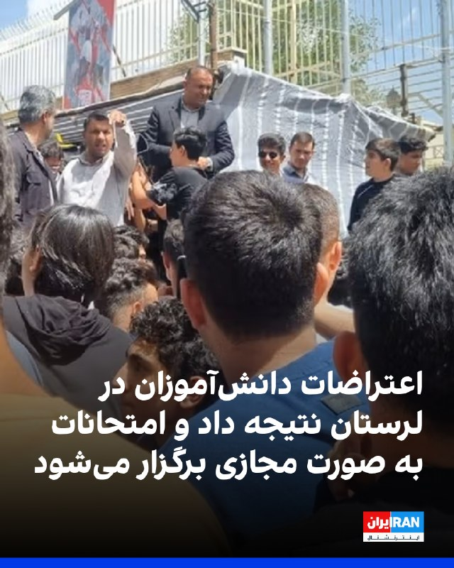

در پی اعتراضات دانش‌آموزی به برگزاری امتحانات به صورت حضوری، سعید شاهرخی، استاندار لرستان، با اشاره ‌به شرایط کنونی و با تاکید بر حفظ امنیت در استان، دستور داد امتحانات پایه‌های هفتم تا دهم غیرحضوری برگزار شود.
شورای هماهنگی تشکل‌های صنفی فرهنگیان ایران به نقل از مدیرکل آموزش‌وپرورش لرستان اعلام کرد اعتراض دانش‌آموزان این استان نتیجه داد و امتحانات نوبت دوم در لرستان به‌صورت مجازی برگزار می‌شود.
طبق این گزارش مدیرکل آموزش‌وپرورش لرستان در جمع دانش‌آموزان گفت: «صدای اعتراضات شما را شنیدیم» و آزمون‌ها غیرحضوری خواهد بود.

‌🏁 🇬🇧 IranintlTV

🤖 @VahidOOnLine

## VahidOOnLine — post 241843

  

♦️کانال ۱۲ اسرائیل گزارش داد که بنیامین نتانیاهو، نخست‌وزیر این کشور، در پی انتشار جزئیاتی از پیشرفت پیش‌نویس تفاهم میان ایالات متحده و ایران، نشست محدودی را با روسای احزاب ائتلاف و مقامات ارشد امنیتی برگزار کرده است؛ مقامات تل‌آویو با ابراز نگرانی شدید از مفاد این تفاهم محتمل، استیو ویتکاف، فرستاده ویژه دونالد ترامپ در خاورمیانه را متهم کرده‌اند که به دنبال دستیابی به یک توافق «به هر قیمتی» است و فشار سنگینی بر ترامپ وارد می‌کند تا مانع از بازگشت به درگیری‌های نظامی شود. بر اساس این گزارش، نگرانی اصلی اسرائیل از کلیات این توافق است که در آن، واشنگتن امتیازات نقد به تهران واگذار می‌کند اما مابه‌ازای آن را به صورت نسیه دریافت خواهد کرد؛ به طوری که در گام نخست بر سر بازگشایی تنگه هرمز توافق می‌شود و دارایی‌های بلوکه‌شده ایران به تدریج آزاد خواهد شد، در حالی که موضوع غنی‌سازی و تسلیحات هسته‌ای به مراحل نامعلوم بعدی موکول می‌گردد.
این شبکه تلویزیونی با استناد به گزارش روزنامه نیویورک‌تایمز اشاره کرد که اسرائیل از روند مراجع اطلاعاتی و مذاکرات مستقیم میان واشنگتن و تهران کنار گذاشته شده و ناچار است جزئیات را از طریق کشورهای ثالث یا تحرکات جاسوسی و اطلاعاتی کسب کند؛ این وضعیت با مواضع عمومی نتانیاهو و ترامپ در تضاد است، هرچند نزدیکان نخست‌وزیر اسرائیل می‌گویند هماهنگی‌ها میان دو طرف همچنان نزدیک و مستحکم باقی مانده است. این گزارش در شرایطی منتشر می‌شود که برخی رسانه‌ها مدعی شده‌اند پیش‌نویس این توافق که با میانجی‌گری پاکستان تدوین شده، ممکن است طی ۴۸ ساعت آینده نهایی شود؛ موضوعی که در صورت تحقق، به گفته تحلیل‌گران اسرائیلی یک چالش امنیتی بزرگ برای تل‌آویو خواهد بود.
‌🇸🇦 Indypersian

🤖 @VahidOOnLine

## VahidOOnLine — post 241842

  

کانال ۱۲ اسرائیل به نقل از یک مقام اسرائیلی گزارش داد استیو ویتکاف، فرستاده ویژه ترامپ، در حال پیگیری یک توافق دیپلماتیک با تهران «به هر قیمتی» است و ترامپ را تحت فشار قرار می‌دهد تا عملیات نظامی را از سر نگیرد.

این گزارش در شرایطی منتشر می‌شود که برخی قانون‌گذاران جمهوری‌خواه و مقام‌های حوزه امنیت ملی آمریکا همچنان درباره پیامدهای هرگونه توافقی که به جمهوری اسلامی امکان بازسازی سیاسی و نظامی بدهد، هشدار می‌دهند.
‌🏁 🇬🇧 IranintlTV

🤖 @VahidOOnLine

## FoxNewsTwitter — post 342178

Fox News (Twitter/X)

The White House was placed on lockdown after shots were fired near a checkpoint. President Trump was at the White House during the incident.

The suspect, identified as 21-year-old Nasire Best of Maryland, was shot by Secret Service and died on the way to GW Medical Center. One civilian bystander was injured in the shooting.

Officials said the suspect had previous encounters with Secret Service, including making threats, and also had a history of mental health issues.

No injuries were sustained by Secret Service personnel.

## FoxNewsTwitter — post 342177

  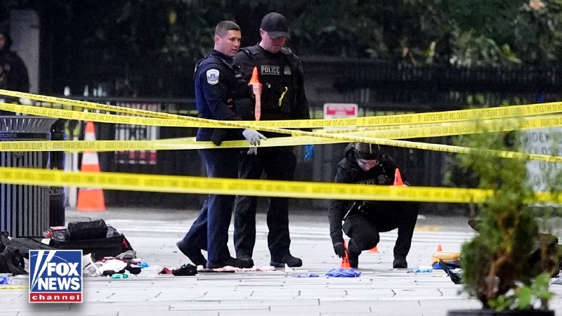

Fox News (Twitter/X)

BREAKING: The gunman who opened fire near the White House on Saturday afternoon has been identified as 21-year-old Nasire Best of Maryland. He was shot by Secret Service agents and died on the way to the hospital.

Best allegedly had multiple prior encounters with the Secret Service and had a history of mental health issues.

Best was detained by Secret Service on June 26, 2025, for flagging down agents and making threats, and again on July 10, 2025 for entering a restricted area, FOX News has learned.

## FoxNewsTwitter — post 342176

‌Fox News (Twitter/X)

Federal officials have served subpoenas to Marxist political influencer Hasan Piker and CodePink cofounder Susan Medea Benjamin as part of a wider investigation into whether U.S. organizations and leaders violated U.S. laws and sanctions in supporting Cuba's communist regime, Fox News Digital has learned.

## FoxNewsTwitter — post 342175

  <a href="telegram/content/FoxNewsTwitter_342175_1779596568.mp4" target="_blank">🎬 Download video</a>

Fox News (Twitter/X)

NEW: The suspect in the shooting near the White House is dead, and one bystander was wounded, according to the White House. FOX News' Alex Hogan breaks down the moments leading up to the incident.

## pm_afshaa — post 91353

  <a href="telegram/content/pm_afshaa_91353_1779596571.webm" target="_blank">🎬 Download video</a>

🔴ان‌بی‌سی نیوز: هم‌اکنون بیرون کاخ سفید حدود 20 تا 30 تا تیر شلیک شده! سرویس مخفی آمریکا خبرنگارهایی که تو محوطه کاخ سفید بودن رو جمع کرده و برده داخل اتاق کنفرانس خبری تا ازشون محافطت کنه. 
💧 Rainbet.com the #1 Non-KYC Crypto Casino & Sportsbook @rainbetcom…

## mamlekate — post 103575

📝 نیویورک پست از طرح ترور دختر ترامپ توسط سپاه خبر داد

به گزارش نیویورک پست، ایوانکا ترامپ هدف طرح ترور منتسب به فردی آموزش‌دیده از سوی سپاه پاسداران انقلاب اسلامی بوده است. طبق گزارش، هدف از این طرح، انتقام‌گیری به خاطر کشته شدن قاسم سلیمانی بوده است.

@mamlekate

## mamlekate — post 103574

  <a href="telegram/content/mamlekate_103574_1779596572.mp4" target="_blank">🎬 Download video</a>

📝 گزارش‌ها از تیراندازی در نزدیکی کاخ سفید

رسانه‌های آمریکایی از گزارش‌های مربوط به تیراندازی احتمالی در عصر شنبه در نزدیکی چمن شمالی کاخ سفید خبر دادند.

⚡️ ماموران امنیتی و خبرنگاران در خیابان ۱۸ام و پنسیلوانیا (شمال غربی) در واشنگتن دی‌سی، در پی تیراندازی شنبه عصر در نزدیکی کاخ سفید، در منطقه حضور دارند. فرد مظنون در این تیراندازی کشته شد.

farsivoa
@mamlekate

## mamlekate — post 103573

📝 دونالد ترامپ می‌گوید جزئیات یک «یادداشت تفاهم صلح» با جمهوری اسلامی به زودی اعلام می‌شود

دونالد ترامپ، رئيس‌جمهوری آمریکا، شنبه‌ عصر گفت با شماری از رهبران منطقه از جمله مقامات عربستان، قطر، امارات درباره یک یادداشت تفاهم مربوط به صلح ایران صحبت کرده است.

@mamlekate

## VahidOnline — post 75672

  

آکسیوس: جزئیات توافقی که ترامپ در آستانه امضای آن با ایران است

ترجمه ماشین:
توافقی که آمریکا و ایران در آستانه امضای آن هستند، شامل تمدید ۶۰ روزه آتش‌بس است؛ دوره‌ای که طی آن تنگه هرمز دوباره باز خواهد شد، ایران می‌تواند نفت خود را آزادانه بفروشد و مذاکراتی برای محدود کردن برنامه هسته‌ای ایران برگزار خواهد شد؛ این را یک مقام آمریکایی گفته است.

🔻چرا مهم است: این توافق از تشدید جنگ جلوگیری می‌کند و فشار بر عرضه جهانی نفت را کاهش می‌دهد. با این حال روشن نیست که آیا به یک توافق صلح پایدار منجر خواهد شد یا نه؛ توافقی که هم‌زمان خواسته‌های هسته‌ای رئیس‌جمهور ترامپ را نیز پوشش دهد.
▪️وضعیت فعلی: هم ترامپ و هم میانجی‌ها گفته‌اند ممکن است این توافق روز یکشنبه اعلام شود، هرچند هنوز نهایی نشده و همچنان ممکن است از هم بپاشد.
▪️این مقام آمریکایی طرح کلی مفصلی از پیش‌نویس فعلی ارائه کرده که بخش عمده آن را منابع دیگر نزدیک به مذاکرات نیز تأیید کرده‌اند.

🔻چه چیزهایی در توافق آمده است؟
دو طرف یک یادداشت تفاهم امضا خواهند کرد که ۶۰ روز اعتبار دارد و با رضایت متقابل قابل تمدید است.
▪️در این دوره ۶۰ روزه، تنگه هرمز بدون عوارض باز خواهد بود و ایران موافقت می‌کند مین‌هایی را که در این تنگه کار گذاشته پاکسازی کند تا کشتی‌ها آزادانه عبور کنند.
▪️در مقابل، آمریکا محاصره بنادر ایران را لغو می‌کند و برخی معافیت‌های تحریمی صادر خواهد کرد تا ایران بتواند نفت خود را آزادانه بفروشد.
▪️این مقام آمریکایی اذعان کرد که این موضوع به سود اقتصاد ایران خواهد بود، اما گفت در عین حال relief قابل‌توجهی برای بازار جهانی نفت به همراه خواهد داشت.

🔻این مقام آمریکایی گفت هرچه ایرانی‌ها سریع‌تر مین‌ها را پاکسازی کنند و اجازه دهند کشتیرانی از سر گرفته شود، محاصره هم سریع‌تر لغو خواهد شد.
▪️اصل کلیدی ترامپ در این توافق «امتیازدهی در برابر عملکرد» است.
▪️طبق گفته این مقام، ایران خواستار آزادسازی فوری منابع مالی مسدودشده و لغو دائمی تحریم‌ها بود، اما طرف آمریکایی گفت این موارد فقط پس از ارائه امتیازهای ملموس اجرا خواهد شد.

🔻مسائل هسته‌ای هنوز باید مذاکره شوند
▪️به گفته مقام آمریکایی، پیش‌نویس یادداشت تفاهم شامل تعهد ایران به این است که هرگز به دنبال سلاح هسته‌ای نرود و درباره تعلیق برنامه غنی‌سازی اورانیوم و خارج کردن ذخایر اورانیوم با غنای بالای خود مذاکره کند.
▪️به گفته دو منبع مطلع، ایران از طریق میانجی‌ها تعهدات شفاهی درباره دامنه امتیازهایی که حاضر است در زمینه تعلیق غنی‌سازی و واگذاری مواد هسته‌ای بدهد، به آمریکا ارائه کرده است.
▪️آمریکا موافقت خواهد کرد که در دوره ۶۰ روزه درباره لغو تحریم‌ها و آزادسازی منابع مالی ایران مذاکره کند؛ هرچند این اقدامات فقط در چارچوب توافق نهایی و پس از اجرای قابل راستی‌آزمایی آن عملی خواهند شد.
▪️نیروهای آمریکایی که در ماه‌های اخیر در منطقه مستقر شده‌اند، در دوره ۶۰ روزه در منطقه باقی خواهند ماند و فقط در صورتی خارج می‌شوند که توافق نهایی حاصل شود.

🔻نکته قابل توجه: پیش‌نویس یادداشت تفاهم همچنین تصریح می‌کند که جنگ میان اسرائیل و حزب‌الله در لبنان پایان خواهد یافت.
▪️یک مقام اسرائیلی گفت بنیامین نتانیاهو، نخست‌وزیر اسرائیل، در تماس تلفنی روز شنبه با ترامپ درباره این شرط ابراز نگرانی کرد. او همچنین درباره جنبه‌های دیگر توافق نیز نگرانی‌هایی مطرح کرد، اما به گفته یک مقام آمریکایی، دیدگاه خود را با احترام و لحنی محتاطانه بیان کرد.
▪️مقام آمریکایی گفت این یک «آتش‌بس یک‌طرفه» نخواهد بود و اگر حزب‌الله برای مسلح شدن دوباره یا تحریک حملات تلاش کند، اسرائیل اجازه خواهد داشت برای جلوگیری از آن اقدام کند.
...

🔻چه باید دید: به گفته مقام آمریکایی، کاخ سفید امیدوار است اختلافات نهایی در ساعات آینده حل‌وفصل شود و توافق روز یکشنبه اعلام شود.
▪️این مقام گفت ممکن است توافق حتی کل ۶۰ روز هم دوام نیاورد، اگر آمریکا به این نتیجه برسد که ایران درباره مذاکرات هسته‌ای جدی نیست. از سوی دیگر، آمریکا معتقد است فشار اقتصادی بر ایران انگیزه‌ای برای رسیدن به توافق کامل به‌منظور رفع تحریم‌ها و آزادسازی منابع مالی این کشور ایجاد می‌کند.
▪️این مقام آمریکایی گفت: «دیدنی خواهد بود که ایران واقعا تا کجا حاضر است پیش برود؛ اما اگر آن‌ها توانایی و تمایل تغییر مسیر خود را داشته باشند، این مرحله بعدی آن‌ها را وادار خواهد کرد تصمیم‌های حیاتی درباره این بگیرند که می‌خواهند چه نوع کشوری باشند.»
▪️مشاوران ترامپ می‌گویند اگر خواسته‌های او درباره برنامه هسته‌ای ایران برآورده شود، رئیس‌جمهور آماده است برای بازتنظیم روابط با ایران و دادن فرصت به این کشور برای دنبال کردن ظرفیت کامل اقتصادی‌اش، که به نظر ترامپ «عظیم» است، اقدامات بسیار گسترده‌ای انجام دهد.
axios

📡 @VahidOnline

## VahidOnline — post 75670

اسماعیل بقائی، سخنگوی وزارت امور خارجه، در پیامی در شبکه اجتماعی ایکس با درج تصویر سنگ‌نگاره پیروزی شاپور اول ساسانی بر امپراتور روم، نوشت: «وقتی ایرانیان مهاجمان متوهم را ناکام گذاشتند.»

او در این پیام که کنایه‌ای است به محاصره دریایی بنادر ایران توسط آمریکا نوشت: «رومیان تصور می‌کردند که رم مرکز عالم است؛ اما ایرانیان این توهم را در هم شکستند.»

پیام آقای بقایی که به نحو گسترده‌ای در کانال‌های تلگرامی رسانه‌های حکومتی ایران بازنشر شده است به نظر می‌رسد که با استفاده از سنگ‌نگاره پیروزی شاپور بر امپراتوران روم در نقش رستم استان فارس بازنقش شده است.

آقای بقایی که اخیرا با حکم محمدباقر قالیباف به عنوان سخنگوی هیئت مذاکره‌کننده ایران هم منصوب شده است با اشاره به لشگرکشی مارکوس یولیوس فیلیپوس معروف به فیلیپ عرب، امپراتور روم، علیه امپراتوری ساسانیان، نوشت که لشگرکشی او «منجر به پیروزی رومیان نشد بلکه به صلحی با شروط شاپور اول ختم شد؛ امپراتور ناچار شد با واقعیت کنار بیاید.»
@VahidHeadline

📡 @VahidOnline

## VahidOnline — post 75669

  

نیویورک تایمز به نقل از دو مقام آمریکایی گزارش داد، یکی از عناصر کلیدی توافق پیشنهادی میان واشنگتن و تهران، تعهد آشکار ایران به واگذاری ذخایر اورانیوم با غنی‌سازی بالای خود است؛

مقامات آمریکایی تصریح کردند که این پیشنهاد هنوز جزئیات دقیق نحوه واگذاری این ذخایر را تعیین نکرده و حل این مسئله را به دور بعدی گفتگوها درباره برنامه هسته‌ای ایران موکول کرده است، اما یک بیانیه کلی که ایران را متعهد به این کار کند، که هدف دیرینه ایالات متحده بوده، برای توافق بسیار حیاتی است، به‌ویژه اگر این توافق کلی با بدبینی جمهوری‌خواهان در کنگره مواجه شود. تا این لحظه، ایران هیچ بیانیه‌ عمومی درباره توافقی که ترامپ اعلام کرده، صادر نکرده است.

تهران در ابتدا با گنجاندن هرگونه توافقی درباره ذخایر اورانیوم غنی‌شده خود در این مرحله اولیه مخالفت کرده و خواستار موکول شدن آن به مرحله دوم گفتگوها بود، اما مذاکره‌کنندگان آمریکایی از طریق واسطه‌ها به صراحت اعلام کردند که بدون دستیابی به توافقی بر سر این ذخایر در فاز اولیه، میز مذاکره را ترک کرده و کارزار نظامی خود را از سر خواهند گرفت.

براساس این گزارش، بخش دیگری از این توافق محتمل شامل آزادسازی میلیاردها دلار از دارایی‌های بلوکه‌شده ایران در خارج از کشور است؛ اما به گفته مقامات آمریکایی، ایران تنها زمانی به بخش عمده این دارایی‌ها که قرار است توسط ایالات متحده و متحدانش در یک صندوق بازسازی قرار گیرد دسترسی پیدا خواهد کرد که با یک توافق هسته‌ای نهایی موافقت کند؛ امری که انگیزه‌ای برای تهران ایجاد می‌کند تا پای میز مذاکره بماند.
@VahidOOnLine

📡 @VahidOnline

## VahidOnline — post 75668

  

شهباز شریف، نخست‌وزیر پاکستان، ابراز امیدواری کرد پاکستان به‌زودی میزبان دور بعدی گفت‌وگوهای تهران و واشینگتن باشد.
CMShehbaz

📡 @VahidOnline

## VahidOnline — post 75666

توییت‌های تد کروز و لیندسی گراهام در واکنش به اخبار منتشر شده درباره توافق احتمالی
tedcruz, LindseyGrahamSC

📡 @VahidOnline

## VahidOnline — post 75665

  <a href="telegram/content/VahidOnline_75665_1779596574.mp4" target="_blank">🎬 Download video</a>

شنبه عصر، یک تیراندازی در حوالی کاخ سفید خبر روی داد که طی آن دو نفر از جمله یک عابر و فرد مظنون تیر خوردند.

سرویس مخفی ایالات متحده، در گزارشی اعلام کرد که اندکی پس از ساعت ۶ عصر روز شنبه، فردی در محدوده خیابان ۱۷ و خیابان پنسیلوانیا، (شمال غربی) سلاحی را از کیف خود خارج کرد و شروع به تیراندازی کرد.

سرویس مخفی ایالات متحده افزود پلیس سرویس مخفی به تیرانازی او پاسخ داد و به مظنون شلیک کرد.

به گفته سرویس مخفی،‌مظنون به یک بیمارستان محلی منتقل شد، اما در آنجا اعلام شد که جان باخته است.

به گفته این نهاد امنیی، در جریان این تیراندازی، یک عابر نیز مورد اصابت گلوله قرار گرفت و هیچ‌یک از مأموران آسیب ندیدند.

سرویس مخفی که وظیفه حفاظت از رئیس‌جمهوری آمریکا را دارد افزود دونالد ترامپ، رئیس‌جمهوری آمریکا، در زمان حادثه در کاخ سفید حضور داشت.
@VahidHeadline
آپدیت:
رسانه‌های آمریکایی هویت عامل تیراندازی عصر شنبه در مجاورت کاخ سفید را «نصیر بست»، جوان ۲۱ ساله اهل مریلند، معرفی کردند که به عنوان فردی با اختلالات روانی و عاطفی شدید برای ماموران امنیتی شناخته‌شده بوده است.

بر اساس گزارش‌ها، این فرد که پیش از این در ژوئن ۲۰۲۵ با ادعای این‌که «خدا» است یک مسیر ورودی کاخ سفید را مسدود کرده و پس از آن به یک مرکز روان‌پزشکی منتقل شده بود، به دلیل تلاش مجدد برای ورود به حریم کاخ سفید در ژوئیه همان سال، حکم دادگاه مبنی بر «ممنوعیت ورود و نزدیکی به این عمارت» را داشته است.

گزارش‌های تکمیلی نشان می‌دهد که «نصیر بست» دست‌کم در یک پست رسانه‌های اجتماعی تمایل خود را برای آسیب رساندن به دونالد ترامپ ابراز کرده بود؛ او سرانجام پس از نقض حکم دادگاه، نزدیک شدن به ایست بازرسی خیابان هفدهم و پنسیلوانیا و گشودن آتش به سمت ماموران، در تبادل آتش متقابل با نیروهای سرویس مخفی هدف قرار گرفت و در بیمارستان جان باخت.
📷 @VahidOOnLine

📡 @VahidOnline

## IranIntlTV — post 338688

  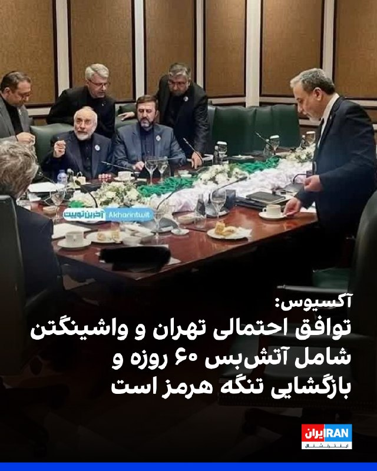

آکسیوس به نقل از یک مقام آمریکایی، جزییاتی از توافق احتمالی جمهوری اسلامی و آمریکا را که ممکن است یک‌شنبه اعلام شود، منتشر کرد. این توافق شامل تمدید ۶۰ روزه آتش‌بس است که در طی آن تنگه هرمز بازگشایی می‌شود،‌ تهران می‌تواند آزادانه نفت بفروشد و مذاکرات هسته‌ای برگزار خواهد شد.
به گفته این مقام آمریکایی، این تفاهم ۶۰ روز اعتبار دارد و در صورت توافق دو طرف قابل تمدید خواهد بود.
دو طرف یک یادداشت تفاهم امضا خواهند کرد که ۶۰ روز اعتبار دارد و با رضایت متقابل قابل تمدید است.
در طول این دوره ۶۰ روزه، تنگه هرمز بدون دریافت عوارض باز خواهد بود و ایران موافقت خواهد کرد مین‌هایی را که در این آبراه مستقر کرده پاک‌سازی کند تا کشتی‌ها آزادانه عبور کنند.
در مقابل، ایالات متحده محاصره بنادر ایران را لغو خواهد کرد. این مقام گفت هرچه جمهوری اسلامی سریع‌تر مین‌ها را پاک‌سازی و عبور و مرور دریایی را از سر بگیرد، محاصره نیز سریع‌تر لغو خواهد شد. او افزود اصل کلیدی دونالد ترامپ در این توافق «کاهش فشار در برابر اقدام» است.
https://iranintl.com/202605245382

## IranIntlTV — post 338687

  

نیویورک‌تایمز به نقل از مقام‌های آمریکایی گزارش داد جمهوری اسلامی تنها پس از دستیابی به توافق نهایی هسته‌ای به بخش عمده دارایی‌های مسدود شده خود که آمریکا و متحدانش در صندوق بازسازی قرار خواهند داد، دسترسی خواهد یافت.
آزادسازی میلیاردها دلار از دارایی‌های مسدودشده ایران در خارج از کشور یکی از مولفه‌های کلیدی هر توافقی خواهد بود و به جمهوری اسلامی انگیزه می‌دهد در مذاکرات باقی بماند و به توافق برسد.

https://iranintl.com/202605242976

## IranIntlTV — post 338686

  

رسانه‌های آمریکا هویت مرد مظنون به تیراندازی نزدیک کاخ‌سفید را که با گلوله ماموران کشته شد، نصیر بست، ۲۱ ساله‌ و اهل مریلند، اعلام کردند. طبق این گزارش‌ها، بست پیش‌تر نیز با سرویس مخفی آمریکا برخوردهایی داشته است و سوابق نشان می‌دهد که او پیش‌تر خود را «عیسی مسیح» و «پسر خدا» خوانده بود.
در همین حال، در شبکه‌های اجتماعی منتسب به بست، پستی دیده می‌شود که به نظر می‌رسد تهدیدی علیه ترامپ مطرح کرده و در پستی دیگر نوشته بود: «من در واقع پسر خدا هستم.»
در یک مورد به‌طور اجباری در یک بیمارستان روان‌پزشکی بستری شده بود و در موردی دیگر، زمانی که مدعی شده بود «او عیسی مسیح است»، از سوی پلیس محلی بازداشت شد.
بر اساس یک اظهارنامه دادگاهی، ماموران تابستان گذشته چندین بار در نزدیکی کاخ سفید با بست مواجه شده بودند. در این سند آمده است او به دلیل «پرسه زدن در محوطه کاخ سفید و پرس‌وجو درباره نحوه دسترسی از نقاط مختلف ورودی» برای سرویس مخفی شناخته‌شده بود.
بر اساس اسناد دادگاه، او در ۲۶ ژوئن ۲۰۲۵ به دلیل «ممانعت از ورود خودروها» به بخشی از محوطه کاخ سفید، به‌طور اجباری بستری شد.

https://iranintl.com/202605243058

## IranIntlTV — post 338685

  

هم‌زمان با احتمال نزدیک شدن توافق جمهوری اسلامی و آمریکا، سخنگوی وزارت خارجه جمهوری اسلامی با انتشار تصویر سنگ‌نگاره نقش رستم که پیروزی شاپور بر امپراتور روم را نشان می‌دهد، نوشت: «در ذهن رومیان، روم مرکز بی‌چون‌وچرای جهان بود. اما ایرانیان این تصور را در هم شکستند.»
اسماعیل بقایی افزود: «هنگامی که مارکوس ژولیوس فیلیپوس به سوی شرق و علیه ایران لشکر کشید، این کارزار به پیروزی روم منجر نشد، بلکه به صلحی انجامید که بر اساس شروط ساسانیان برقرار شد: امپراتور ناچار شد با شرایط آنان کنار بیاید.»

https://iranintl.com/202605244465

## IranIntlTV — post 338684

  

نیویورک تایمز به نقل از دو مقام آمریکایی گزارش داد جمهوری اسلامی موافقت کرده است از اورانیوم غنی‌شده خود صرف‌نظر کند. جزییات دقیق این تفاهم هنوز روشن نیست، اما مقام‌ها گفتند آمریکا در چارچوب هر توافق اولیه، از حکومت ایران تعهدی درباره اورانیوم مطالبه کرده است.
مقام‌های کاخ سفید به درخواست‌ها برای اظهار نظر پاسخ ندادند. ترامپ روز شنبه گفت ایالات متحده به دستیابی به توافقی با ایران برای پایان دادن به جنگ و بازگشایی تنگه هرمز نزدیک شده است. اما او جزییاتی ارائه نکرد و مشخص نیست چه موانعی برای نهایی شدن توافق باقی مانده است.
مقام‌های آمریکایی گفتند این پیشنهاد موضوع چگونگی دقیق واگذاری ذخایر را حل‌وفصل نکرده و جزییات را به دور بعدی گفت‌وگوها درباره برنامه هسته‌ای ایران موکول کرده است.

https://iranintl.com/202605248261

## IranIntlTV — post 338683

  

شهباز شریف، نخست‌وزیر پاکستان، تلاش‌های ترامپ برای پیگیری صلح و برگزاری تماس با کشورهای منطقه را به او تبریک گفت و ابراز امیدواری کرد پاکستان به‌زودی میزبان دور بعدی گفت‌وگوهای تهران و واشینگتن باشد.
شریف در ایکس با اشاره به تماس ترامپ با رهبران عربستان سعودی، قطر، ترکیه، مصر، امارات متحده عربی، اردن و پاکستان، گفت: «این گفت‌وگوها فرصت مفیدی برای تبادل نظر درباره وضعیت کنونی منطقه و چگونگی پیشبرد تلاش‌های جاری برای صلح به منظور دستیابی به صلحی پایدار در منطقه فراهم کرد.»

https://iranintl.com/202605243916

## IranIntlTV — post 338682

  

سرویس مخفی آمریکا در بیانیه‌ای اعلام کرد در تیراندازی نزدیک کاخ سفید فرد مظنون کشته و یک رهگذر مجروح شد.
طبق این بیانیه، ترامپ هنگام وقوع این حادثه در کاخ سفید حضور داشت، اما هیچ‌یک از افراد تحت حفاظت سرویس مخفی و همچنین فعالیت‌های حفاظتی تحت تاثیر این رویداد قرار نگرفتند.
طبق اعلام سرویس مخفی آمریکا، عصر شنبه فردی در محدوده خیابان هفدهم و خیابان پنسیلوانیا، نزدیک کاخ سفید، سلاحی را از کیف خود خارج کرد و شروع به تیراندازی کرد، اما ماموران با تیراندازی فرد مظنون را هدف قرار دادند.
این بیانیه افزود فرد مظنون به یکی از بیمارستان‌های منطقه منتقل شد، اما در آنجا مرگ او اعلام شد. در جریان این تیراندازی، یک رهگذر نیز بر اثر اصابت گلوله مجروح شد.

https://iranintl.com/202605246930

## IranIntlTV — post 338680

  

در پی اعتراضات دانش‌آموزی به برگزاری امتحانات به صورت حضوری، سعید شاهرخی، استاندار لرستان، با اشاره ‌به شرایط کنونی و با تاکید بر حفظ امنیت در استان، دستور داد امتحانات پایه‌های هفتم تا دهم غیرحضوری برگزار شود.
شورای هماهنگی تشکل‌های صنفی فرهنگیان ایران به نقل از مدیرکل آموزش‌وپرورش لرستان اعلام کرد اعتراض دانش‌آموزان این استان نتیجه داد و امتحانات نوبت دوم در لرستان به‌صورت مجازی برگزار می‌شود.
طبق این گزارش مدیرکل آموزش‌وپرورش لرستان در جمع دانش‌آموزان گفت: «صدای اعتراضات شما را شنیدیم» و آزمون‌ها غیرحضوری خواهد بود.

https://iranintl.com/202605249059

## IranIntlTV — post 338678

  

کانال ۱۲ اسرائیل به نقل از یک مقام اسرائیلی گزارش داد استیو ویتکاف، فرستاده ویژه ترامپ، در حال پیگیری یک توافق دیپلماتیک با تهران «به هر قیمتی» است و ترامپ را تحت فشار قرار می‌دهد تا عملیات نظامی را از سر نگیرد.

این گزارش در شرایطی منتشر می‌شود که برخی قانون‌گذاران جمهوری‌خواه و مقام‌های حوزه امنیت ملی آمریکا همچنان درباره پیامدهای هرگونه توافقی که به جمهوری اسلامی امکان بازسازی سیاسی و نظامی بدهد، هشدار می‌دهند.
https://iranintl.com/202605240801

## FarsiVOA — post 218488

  <a href="telegram/content/FarsiVOA_218488_1779596582.mp4" target="_blank">🎬 Download video</a>

⚡️گزارش مایکل لیپین، خبرنگار صدای آمریکا از تیراندازی شنبه عصر در اطراف کاخ سفید
@FarsiVOA

## FarsiVOA — post 218487

  <a href="telegram/content/FarsiVOA_218487_1779596583.mp4" target="_blank">🎬 Download video</a>

⚡️ماموران امنیتی و خبرنگاران در خیابان ۱۸ام و پنسیلوانیا (شمال غربی) در واشنگتن دی‌سی، در پی تیراندازی شنبه عصر در نزدیکی کاخ سفید، در منطقه حضور دارند. فرد مظنون در این تیراندازی کشته شد.
@FarsiVOA

## FarsiVOA — post 218486

  <a href="telegram/content/FarsiVOA_218486_1779596584.mp4" target="_blank">🎬 Download video</a>

⚡️اولین تصاویر از چمن شمالی کاخ سفید پس از آن‌که در پی حادثه تیراندازی عصر شنبه، به خبرنگاران اجازه بازگشت به محوطه داده شد.
@FarsiVOA

## FarsiVOA — post 218485

🔺گزارش‌ها از تیراندازی در نزدیکی کاخ سفید؛ سرویس مخفی می‌گوید مظنون کشته شد و یک عابر تیر خورد

▪️شنبه عصر، یک تیراندازی در حوالی کاخ سفید خبر روی داد که طی آن دو نفر از جمله یک عابر و یک فرد مظنون تیر خوردند.

⬇️ بیشتر بخوانید:
https://ir.voanews.com/a/8153104.html
@FarsiVOA

## FarsiVOA — post 218484

  <a href="telegram/content/FarsiVOA_218484_1779596584.mp4" target="_blank">🎬 Download video</a>

⚡️گزارش مایکل لیپین، خبرنگار صدای آمریکا از تیراندازی شنبه عصر در اطراف کاخ سفید
@FarsiVOA

## FarsiVOA — post 218483

🔺گزارش خبرنگار صدای آمریکا از محل تیراندازی در اطراف کاخ سفید؛ صدای ده‌ها گلوله شنیده شد

▪️خبرنگار صدای آمریکا در حوزه کاخ سفید، مایکل لیپین، عصر شنبه از نزدیکی محل تیراندازی در اطراف کاخ سفید گزارش کرد.

⬇️ بیشتر بخوانید:
https://ir.voanews.com/a/8153117.html
@FarsiVOA

## Persian_Trend_Official — post 14817

🔴 آکسیوس: توافق ۶۰ روزه ایران و آمریکا شامل بازگشایی رایگان تنگه هرمز خواهد بود

آکسیوس گزارش داد یادداشت تفاهم ۶۰ روزه پیشنهادی میان ایران و آمریکا شامل بازگشایی تنگه هرمز بدون دریافت عوارض و ازسرگیری صادرات نفت ایران در ازای تمدید آتش‌بس و آغاز مذاکرات هسته‌ای است.

بر اساس این گزارش:

▪️ ایران متعهد خواهد شد مین‌های دریایی را از تنگه هرمز پاکسازی کند
▪️ تهران وارد مذاکرات درباره تعلیق غنی‌سازی اورانیوم و انتقال ذخایر اورانیوم با غنای بالا خواهد شد
▪️ آمریکا نیز بخشی از تحریم‌ها را کاهش داده و محاصره بنادر ایران را در طول مدت توافق متوقف می‌کند

همچنین گفته شده:
▪️ این تفاهم به‌عنوان یک چارچوب موقت برای جلوگیری از بازگشت جنگ طراحی شده است

▪️ هدف اصلی آن، حفظ آتش‌بس و ایجاد زمان برای مذاکرات پیچیده‌تر هسته‌ای است

▪️ بازگشایی کامل تنگه هرمز یکی از مهم‌ترین بخش‌های توافق برای بازار جهانی انرژی محسوب می‌شود

با این حال:
▪️ هنوز توافق به‌صورت رسمی امضا یا اعلام نشده است

▪️ اختلافات درباره غنی‌سازی، ذخایر اورانیوم و تضمین‌های امنیتی همچنان پابرجاست

▪️ برخی منابع اسرائیلی نسبت به مفاد توافق و محدودشدن گزینه نظامی علیه ایران ابراز نگرانی کرده‌اند

🫆:Tony

📌 @persian_trend_official
پرشین ترند | متفاوت‌ترین کانال نظامی

## Persian_Trend_Official — post 14816

  <a href="telegram/content/Persian_Trend_Official_14816_1779596586.webm" target="_blank">🎬 Download video</a>

🔴 نظرسنجی وال‌استریت ژورنال: حمایت قاطع جمهوری‌خواهان از ترامپ کاهش یافته است

بر اساس یک نظرسنجی جدید وال‌استریت ژورنال، میزان حمایت «قاطع» جمهوری‌خواهان از دونالد ترامپ طی ماه‌های اخیر کاهش یافته است.

نتایج این نظرسنجی نشان می‌دهد:

▪️ درصد جمهوری‌خواهانی که گفته‌اند «به‌شدت» از ترامپ حمایت می‌کنند، از ۷۲٪ در ژانویه به ۵۷٪ در ماه مه کاهش یافته است

▪️ با وجود این افت، ترامپ همچنان چهره اصلی و مسلط حزب جمهوری‌خواه محسوب می‌شود

▪️ تحلیلگران این کاهش را ناشی از اختلافات داخلی حزب، جنگ ایران و نگرانی‌ها درباره انتخابات آینده می‌دانند
🫆:Tony

📌 @persian_trend_official
پرشین ترند | متفاوت‌ترین کانال نظامی

## Persian_Trend_Official — post 14815

  <a href="telegram/content/Persian_Trend_Official_14815_1779596586.webm" target="_blank">🎬 Download video</a>

💢نیویورک پست: 💢مظنون تیراندازی مقابل کاخ سفید، «نصیر بِست»، از یک هفت‌تیر استفاده کرده و پیش از آنکه توسط مأموران فدرال هدف قرار گرفته و کشته شود، چندین گلوله شلیک کرده است. 💢منابع به نیویورک پست گفته‌اند بِست «فردی دارای مشکلات شدید روانی» بوده که تصور…

## Persian_Trend_Official — post 14814

به گزارش نیویورک تایمز، مقامات آمریکایی می‌گویند ایران موافقت کرده است که به عنوان بخشی از توافق برای پایان دادن به جنگ، ذخایر اورانیوم غنی‌شده خود را واگذار کند.

مقامات آمریکایی گفتند که این پیشنهاد، مسئله چگونگی دقیق واگذاری ذخایر اورانیوم غنی‌شده توسط ایران را حل نکرده و جزئیات آن را به دور بعدی مذاکرات در مورد برنامه هسته‌ای ایران موکول کرده است.

این پیشنهاد همچنین شامل آزادسازی میلیاردها دلار از دارایی‌های مسدود شده ایران در خارج از کشور است. مقامات افزودند که بیشتر این وجوه تنها پس از دستیابی ایران به توافق نهایی هسته‌ای، از طریق یک مکانیسم بازسازی قابل دسترسی خواهد بود و انگیزه‌ای برای تهران ایجاد می‌کند تا به مذاکرات ادامه دهد.

پ.ن : این خبر اگه درست باشه یعنی تسلیم جمهوری اسلامی !
البته با توجه به شرایط بعید میدونم سپاه زیر بار این توافق بره …

## Persian_Trend_Official — post 14813

  <a href="telegram/content/Persian_Trend_Official_14813_1779596587.mp4" target="_blank">🎬 Download video</a>

صبحتون بخیر ☕️🔥

📝 Nick
📌 @persian_trend_official
پرشین ترند | متفاوت‌ترین کانال نظامی

## Persian_Trend_Official — post 14811

🔴 فوری | گزارش تیراندازی در اطراف کاخ سفید شبکه CBS گزارش داده صدای تیراندازی در اطراف کاخ سفید شنیده شده است. بر اساس گزارش اولیه: ▪️ سرویس مخفی آمریکا از خبرنگاران حاضر در ورودی کاخ سفید خواسته فوراً به اتاق توجیه خبری منتقل شوند ▪️ هنوز جزئیاتی درباره…

## BBCPersian — post 281927

🔻سی‌بی‌اس: مظنون تیراندازی در نزدیکی کاخ سفید سابقه درگیری با سرویس مخفی داشت

منابع آگاه به سی‌بی‌اس نیوز شریک خبری بی‌بی‌سی، گفتند که مظنون کشته‌شده در تیراندازی بیرون کاخ سفید، شناسایی شده است و نامش «نصیر بِست» و ۲۱ ساله بود.

https://bbc.in/4wGRQA5
@BBCPersian

## BBCPersian — post 281926

🔻تد کروز: توافقی که به ایران امکان کنترل تنگه هرمز بدهد، اشتباهی فاجعه‌بار است

تد کروز، سناتور جمهوری‌خواه آمریکا، در واکنش به گزارش‌ها درباره توافق احتمالی با ایران، در شبکه اجتماعی ایکس نوشت که نسبت به آنچه «توافق ایران» خوانده می‌شود و به گفته او برخی در دولت آمریکا در حال پیشبرد آن هستند، «عمیقا نگران» است.

او نوشت که تصمیم دونالد ترامپ برای حمله به ایران «مهم‌ترین تصمیم» دوره دوم ریاست‌جمهوری او بود و افزود که آمریکا «نتایج نظامی فوق‌العاده‌ای» به دست آورده است؛ از جمله به گفته او نابودی همه موشک‌ها و پهپادهای ایران و غرق کردن تمام نیروی دریایی آن کشور.

سناتور کروز می‌گوید که اسلامگرایان حاکم بر ایران، همچنان شعار «مرگ بر آمریکا» سر می‌دهند و نوشت که اگر نتیجه این تحولات آن باشد که این حکومت بعد از این توافق «میلیاردها دلار دریافت کند، اورانیوم غنی‌سازی کند و سلاح هسته‌ای توسعه دهد و کنترل موثر بر تنگه هرمز داشته باشد، این یک اشتباه فاجعه‌بار خواهد بود.»

او همچنین نوشت که جزئیات توافق هنوز در حال روشن شدن است، اما این‌که راب مالی، نماینده پیشین دولت جو بایدن در امور ایران، از آن حمایت کرده «دلگرم‌کننده نیست.»

سناتور کروز در پایان گفت که دونالد ترامپ به «صلح از مسیر قدرت» باور دارد و باید به دفاع از آمریکا و اجرای «خطوط قرمز» اعلام‌شده ادامه دهد.

https://bbc.in/4dIXh98
@BBCPersian

## BBCPersian — post 281925

  

🔻مایک جانسون، رئیس مجلس نمایندگان آمریکا، از توافق در حال شکل‌گیری با ایران حمایت کرد و در شبکه اجتماعی ایکس نوشت تنها دونالد ترامپ می‌توانست ایران را «پای میز مذاکره» بیاورد.

آقای جانسون نوشت: «از این‌که می‌شنویم توافق صلح با ایران در حال شکل‌گیری است، بسیار دلگرم شده‌ایم و منتظریم جزئیات بیشتری درباره آن منتشر شود.»

او همچنین افزود: «تحت رهبری رئیس‌جمهور ترامپ، کشور ما قدرتمندتر، در صحنه جهانی محترم‌تر و امن‌تر از هر زمان دیگری است.»

📸 Reuters

https://bbc.in/4dIXh98
@BBCPersian

## BBCPersian — post 281924

🔻اختلاف جمهوری‌خواهان بر سر توافق احتمالی ترامپ با ایران

اعلام دونالد ترامپ، رئیس جمهور آمریکا مبنی بر «تا حد زیادی مذاکره شدن» توافق با ایران، که به گفته او شامل بازگشایی تنگه هرمز نیز می‌شود، واکنش‌های متفاوتی را در میان جمهوری‌خواهان و متحدان سیاسی او در آمریکا برانگیخته است.

https://bbc.in/4nPu9BJ
@BBCPersian

## BBCPersian — post 281923

🔻دنیس راس: ایران در آینده از تنگه هرمز به‌عنوان اهرم فشار استفاده خواهد کرد

دنیس راس، دیپلمات باسابقه و مذاکره کننده سابق آمریکایی در شبکه اجتماعی ایکس نوشت که توافق در حال شکل‌گیری درباره بازگشایی تنگه هرمز است.

او نوشت: «ما محاصره خود را برمی‌داریم و آن‌ها اجازه عبور همه کشتی‌ها را می‌دهند؛ همان‌طور که پیش از جنگ برقرار بود.»

آقای راس افزود که قرار است طی ۶۰ روز آینده درباره برنامه هسته‌ای ایران مذاکره شود؛ توافقی که هدف آن پایان دادن به این برنامه نیست، بلکه محدود کردن آن است.

او همچنین مدعی شد که ایران در آینده از تنگه هرمز به‌عنوان اهرم فشار استفاده خواهد کرد.

https://bbc.in/4dIXh98
@BBCPersian

## BBCPersian — post 281922

🔻لیندزی گراهام: توافقی که به بقای حکومت ایران منجر شود بر درگیری‌های منطقه بنزین می‌ریزد

لیندزی گراهام، سناتور ارشد جمهوری‌خواه آمریکا، در پیامی در شبکه اجتماعی ایکس نوشت که اگر در منطقه چنین برداشت شود که توافق با ایران به حکومت آن کشور امکان بقا و قدرتمندتر شدن در گذر زمان را می‌دهد، در واقع «بر درگیری‌های لبنان و عراق بنزین ریخته‌ایم.»

او افزود توافقی که این تصور را ایجاد کند که ایران می‌تواند بقا پیدا کند و در آینده توان کنترل تنگه هرمز را داشته باشد، حزب‌الله در لبنان و شبه‌نظامیان شیعه در عراق را «به‌شدت تقویت خواهد کرد.»

پست سناتور گراهام بعد از آن است که دونالد ترامپ، رئیس جمهور آمریکا اعلام کرد که گفت‌وگوهای «بسیار خوبی» با شماری از رهبران منطقه داشته است اما جنبه‌ها و جزئیات نهایی توافق با ایران همچنان در حال بررسی است و «به‌زودی» اعلام خواهد شد.

آقای ترامپ همچنین گفت که در چارچوب این توافق، تنگه هرمز بازگشایی خواهد شد.

https://bbc.in/4dIXh98
@BBCPersian

## BBCPersian — post 281921

  

به‌گزارش خبرگزاری فرانسه، شهباز شریف، نخست‌وزیر پاکستان، ابراز امیدواری کرد که کشورش به‌زودی میزبان دور بعدی مذاکرات صلح میان ایران و آمریکا باشد.

آقای شریف در پیامی در شبکه اجتماعی ایکس نوشت: «پاکستان با نهایت صداقت به تلاش‌های صلح خود ادامه خواهد داد و امیدواریم خیلی زود میزبان دور بعدی گفت‌وگوها باشیم.»

به گزارش خبرگزاری رویترز، نخست‌وزیر پاکستان همچنین از دونالد ترامپ به‌دلیل «تلاش‌های فوق‌العاده برای پیگیری صلح»، تقدیر کرد و گفت که گفت‌وگوی تلفنی آقای ترامپ با رهبران عربستان سعودی، قطر، ترکیه، مصر، امارات متحده عربی، اردن و پاکستان «بسیار مفید و سازنده» بوده است.

به گفته آقای شریف، فیلد مارشال عاصم منیر، فرمانده کل ارتش و نیروهای مسلح پاکستان، نماینده آن کشور در تماس تلفنی با آقای ترامپ بود و از «تلاش‌های خستگی‌ناپذیر» او در تمام روند مذاکرات قدردانی کرد.

نخست‌وزیر پاکستان افزود که این گفت‌وگوها فرصتی برای تبادل نظر درباره وضعیت کنونی منطقه و پیشبرد تلاش‌ها برای دستیابی به صلحی پایدار فراهم کرده است.

📸 Reuters

https://bbc.in/4dIXh98
@BBCPersian

## BBCPersian — post 281919

🔻اسماعیل بقائی، سخنگوی وزارت امور خارجه، در پیامی در شبکه اجتماعی ایکس با درج تصویر سنگ‌نگاره پیروزی شاپور اول ساسانی بر امپراتور روم، نوشت: «وقتی ایرانیان مهاجمان متوهم را ناکام گذاشتند.»

او در این پیام که کنایه‌ای است به محاصره دریایی بنادر ایران توسط آمریکا نوشت: «رومیان تصور می‌کردند که رم مرکز عالم است؛ اما ایرانیان این توهم را در هم شکستند.»

پیام آقای بقایی که به نحو گسترده‌ای در کانال‌های تلگرامی رسانه‌های حکومتی ایران بازنشر شده است به نظر می‌رسد که با استفاده از سنگ‌نگاره پیروزی شاپور بر امپراتوران روم در نقش رستم استان فارس بازنقش شده است.

آقای بقایی که اخیرا با حکم محمدباقر قالیباف به عنوان سخنگوی هیئت مذاکره‌کننده ایران هم منصوب شده است با اشاره به لشگرکشی مارکوس یولیوس فیلیپوس معروف به فیلیپ عرب، امپراتور روم، علیه امپراتوری ساسانیان، نوشت که لشگرکشی او «منجر به پیروزی رومیان نشد بلکه به صلحی با شروط شاپور اول ختم شد؛ امپراتور ناچار شد با واقعیت کنار بیاید.»

📸 REUTERS/ IRIMFA_SPOX

https://bbc.in/4dIXh98
@BBCPersian

## BBCPersian — post 281918

  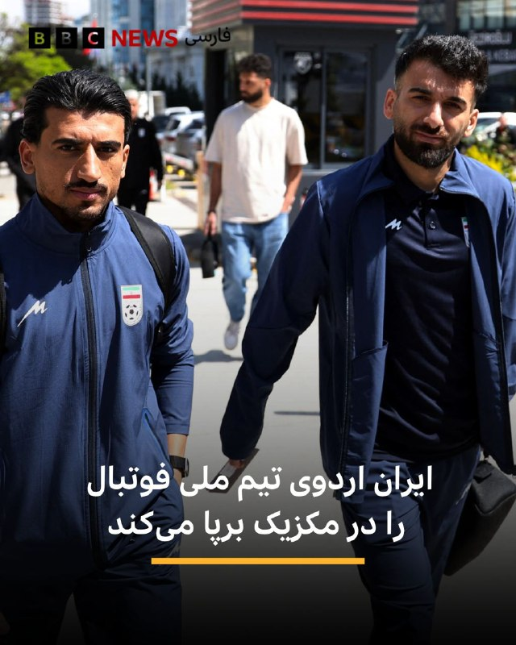

🔻ایران در جریان جام جهانی امسال، اردوی تیم ملی خود را در شهر مرزی تیخوانا در مکزیک برپا خواهد کرد. این اقدام پس از آن‌ است که فیفا با درخواست انتقال محل اردو از ایالت آریزونا موافقت کرد.

به گزارش رویترز مهدی تاج، رئیس فدراسیون فوتبال ایران، در ویدیویی که در حساب تلگرام فدراسیون منتشر شد گفت: «ما در کمپ تیخوانا مستقر خواهیم شد؛ جایی در نزدیکی اقیانوس آرام و در مرز مکزیک و آمریکا.»

او افزود که این تغییر می‌تواند از مشکلات مربوط به ویزا جلوگیری کند و اعضای تیم خواهند توانست با پروازهای مستقیم ایران‌ایر به مکزیک سفر کنند.

رویترز می‌گوید که فیفا به درخواستش برای اظهار نظر پاسخ نداده است.

ایران نخستین دو مسابقه خود در گروه جی را در لس‌آنجلس برگزار خواهد کرد؛ برابر نیوزیلند در ۲۵ خرداد و بلژیک در ۳۱ خرداد، و سپس ۵ تیر در سیاتل به مصاف مصر خواهد رفت.

مهدی تاج گفت که فاصله پروازی میان تیخوانا و محل بازی‌های تیم در لس‌آنجلس حدود ۵۵ دقیقه است و این شهر نسبت به اردوی قبلی برنامه‌ریزی‌شده در آریزونا به محل مسابقات نزدیک‌تر است.

📸 Reuters

https://bbc.in/4dIXh98
@BBCPersian

## BBCPersian — post 281910

🖌بی‌بی‌سی موندو:

🔻اف‌بی‌آی به تازگی اعلام کرده است که برای دریافت اطلاعات منجر به بازداشت و محاکمه مونیکا ویت، عضو پیشین نیروهای مسلح و مامور سابق ضدجاسوسی آمریکا، ۲۰۰ هزار دلار جایزه تعیین کرده است.

مونیکا ویت در فوریه ۲۰۱۹ از سوی یک هیئت منصفه فدرال در واشنگتن به جاسوسی، از جمله از طریق انتقال اطلاعات مربوط به دفاع ملی به حکومت ایران، متهم شد.

اف‌بی‌آی در بیانیه‌ای در ۱۴ مه ۲۰۲۶ اعلام کرد که همچنان در تلاش برای یافتن این فرد است که بر اساس اطلاعات موجود در کیفرخواست او، در سال ۲۰۱۳ به ایران پناهنده شده است.

📸GettyImages/ FBI

https://bbc.in/4dFATNH
@BBCPersian

---
📅 بروزرسانی: 1405/03/03 03:33
---

## VahidOOnLine — post 241840

  <a href="telegram/content/VahidOOnLine_241840_1779581025.mp4" target="_blank">🎬 Download video</a>

تماسی از امارات
«می‌گفت مردم ایران عوض شده‌اند…
و این بار باید هوشیارتر، عاقل‌تر و متفاوت‌تر عمل کنند.»
‌🏁 🇬🇧 ManotoTV

🤖 @VahidOOnLine

## VahidOOnLine — post 241839

  <a href="telegram/content/VahidOOnLine_241839_1779581027.mp4" target="_blank">🎬 Download video</a>

ویدیوی منتشرشده از یک خبرنگار سی‌بی‌اس، لحظات دلهره‌آور تیراندازی در نزدیکی کاخ سفید را در روز شنبه دوم خرداد نشان می‌دهد.
خبرگزاری رویترز به نقل از یک مقام پلیس نوشت که مظنون تیراندازی در نزدیکی کاخ سفید دستگیر و به بیمارستان منتقل شده است. او گفت که مظنون به ایست بازرسی نزدیک کاخ سفید نزدیک شد و به سمت ماموران شلیک کرد. به گفته این مقام پلیس، هیچ یک از ماموران آسیب ندیدند.
‌🏁 🇬🇧 IranintlTV

🤖 @VahidOOnLine

## VahidOOnLine — post 241838

  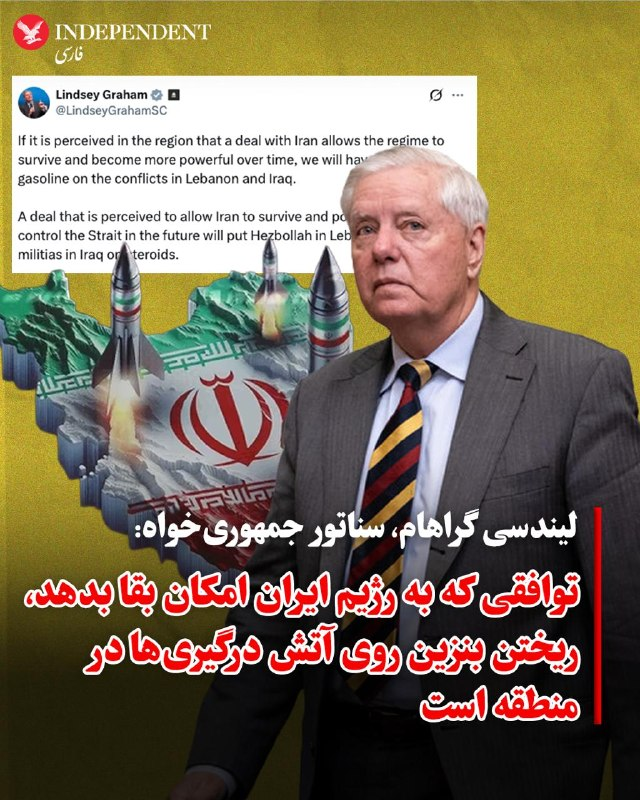

♦️لیندسی گراهام، سناتور جمهوری‌خواه آمریکا، با انتشار پیامی در اکس درباره توافق احتمالی با تهران نوشت: «اگر در منطقه این‌گونه برداشت شود که توافق با ایران به این رژیم اجازه می‌دهد بقای خود را حفظ کند و به مرور زمان قدرتمندتر شود، ما روی آتش درگیری‌ها در لبنان و عراق بنزین ریخته‌ایم.» گراهام با تاکید بر پیامدهای منطقه‌ای این تصمیم افزود: «توافقی که تصور شود به رژیم ایران اجازه بقا می‌دهد و توانایی کنترل تنگه هرمز را در آینده برای آن حفظ می‌کند، حزب‌الله در لبنان و شبه‌نظامیان شیعه در عراق را به شدت تقویت خواهد کرد.»
‌🇸🇦 Indypersian

🤖 @VahidOOnLine

## VahidOOnLine — post 241837

  

لیندزی گراهام، سناتور جمهوری‌خواه، هشدار داد هر توافقی که به بقای حکومت ایران و بازگشت تدریجی نفوذ منطقه‌ای آن منجر شود، می‌تواند خاورمیانه را بی‌ثبات‌تر کرده و گروه‌های نیابتی تهران را تقویت کند.
او در شبکه ایکس نوشت اگر در منطقه چنین برداشت شود که توافق با حکومت ایران به این رژیم اجازه می‌دهد زنده بماند و قدرتمندتر شود، «بنزین روی آتش درگیری‌ها در لبنان و عراق ریخته‌ایم» و حزب‌الله لبنان و شبه‌نظامیان شیعه در عراق به‌شدت تقویت خواهند شد.
گراهام با تاکید بر اینکه ادامه فشار بر تهران برای مهار گروه‌های نیابتی آن ضروری است، هشدار داد جمهوری اسلامی ممکن است از مذاکرات برای تجدید قوا استفاده کند.

‌🏁 🇬🇧 IranintlTV

🤖 @VahidOOnLine

## VahidOOnLine — post 241836

  

♦️به گزارش «سی‌ان‌ان»، یک مقام مجری قانون اعلام کرد که در پی تیراندازی عصر شنبه در تقاطع خیابان هفدهم و پنسیلوانیا در مجاورت کاخ سفید، دو نفر در جریان مواجهه با ماموران سرویس مخفی آمریکا هدف گلوله قرار گرفته‌اند؛ این حادثه که منجر به برقراری وضعیت قرنطینه امنیتی و واکنش فوری نیروهای امنیتی، ماموران اف‌بی‌آی و استقرار نیروهای مسلح به سلاح‌های تهاجمی در چمن شمالی شد، پس از پناه گرفتن اضطراری خبرنگاران در اتاق نشست مطبوعاتی و با لغو قرنطینه در ساعت ۶:۴۵ عصر به وقت محلی خاتمه یافت. کاش پاتل، رئیس اف‌بی‌آی، با تایید حضور مأموران این سازمان در صحنه از پشتیبانی کامل از سرویس مخفی خبر داد؛ این در حالی است که در زمان وقوع حادثه دونالد ترامپ در محل اقامت خود در کاخ سفید حضور داشت و این تیراندازی دقیقا کمتر از یک ماه پس از حادثه سوءقصد نافرجام کول توماس آلن به ترامپ در جریان شام انجمن خبرنگاران، بار دیگر واشنگتن را در وضعیت هشدار بالایی قرار داده است.
‌🇸🇦 Indypersian

🤖 @VahidOOnLine

## VahidOOnLine — post 241835

  

یک مقام ارشد پلیس آمریکا درباره تیراندازی در اطراف کاخ سفید گفت: یک مظنون به ایست بازرسی اطراف کاخ سفید نزدیک شد و به سوی ماموران شلیک کرد، اما او هدف گلوله قرار گرفت و به بیمارستان منتقل شد.
‌🏁 🇬🇧 IranintlTV

🤖 @VahidOOnLine

## VahidOOnLine — post 241834

♦️تصاویر منتشر شده توسط خبرنگار شبکه «سی‌ان‌ان»، لحظات شلیک گلوله در نزدیکی کاخ سفید در واشنگتن دی‌سی را نشان می‌دهد. بر اساس گزارش‌های اولیه، دو نفر در ضلع غربی کاخ سفید و در نزدیکی «گیت ۱۷» با سلاح کمری به سمت ساختمان کاخ سفید شلیک کرد. در پی این اقدام، ماموران سرویس مخفی ایالات متحده بلافاصله وارد عمل شدند، به این تیراندازی پاسخ دادند و ضاربان را هدف قرار داده‌اند و مهار کردند.
گزارش‌ها حاکی از آن است که در مجموع حدود ۳۰ گلوله در خارج از محوطه شلیک شده است. ماموران سرویس مخفی با حمل سلاح‌های خود در محوطه چمن شمالی مستقر شدند و خبرنگارانی را که در این بخش حضور داشتند، به سمت اتاق کنفرانس مطبوعاتی هدایت کردند تا پناه بگیرند.
‌🇸🇦 Indypersian

🤖 @VahidOOnLine

## VahidOOnLine — post 241833

  

♦️خبرنگار «فاکس‌نیوز» در گزارشی درباره تیراندازی در نزدیکی کاخ سفید اعلام کرد که یک فرد مسلح در ضلع غربی کاخ سفید و در نزدیکی «گیت ۱۷» با سلاح کمری به سمت ساختمان کاخ سفید شلیک کرده است. به گفته او، این فرد مسلح سه بار اقدام به تیراندازی کرد و در پی آن، ماموران سرویس مخفی ایالات متحده به این تیراندازی پاسخ دادند و ضارب را هدف قرار داده و مهار کردند. هنوز آماری از تعداد دقیق گلوله‌های شلیک‌شده از سوی مأموران اعلام نشده است.
‌🇸🇦 Indypersian

🤖 @VahidOOnLine

## VahidOOnLine — post 241832

  

♦️رئیس اف‌بی‌آی اعلام کرد ماموران این سازمان به همراه نیروهای سرویس مخفی در پی تیراندازی در نزدیکی کاخ سفید، در محل حادثه حضور یافته‌اند؛ همزمان خبرگزاری فرانسه نیز از حضور گسترده پلیس و نیروهای امنیتی در اطراف این عمارت خبر داد و گزارش داد که ماموران امنیتی تمام مسیرهای منتهی به کاخ سفید را مسدود کرده و نیروهای گارد ملی از ورود خبرنگاران به منطقه جلوگیری می‌کنند. این تیراندازی در شرایطی رخ داد که دونالد ترامپ، رئیس‌جمهوری آمریکا، برای رایزنی درباره توافق با ایران در محل اقامت خود در کاخ سفید حضور داشت و به دنبال شنیده شدن صدای شلیک ده‌ها گلوله، خبرنگاران مستقر در چمن شمالی با دستور اضطراری نیروهای امنیتی به داخل اتاق نشست مطبوعاتی کاخ سفید منتقل شدند و پناه گرفتند.
‌🇸🇦 Indypersian

🤖 @VahidOOnLine

## WithYashar — post 12281

تیرانداز به هلاکت رسید و فرد حاضر زنده و هوشیار است. هر دو به بیمارستان منتقل شده‌اند.
@withyashar

## WithYashar — post 12280

  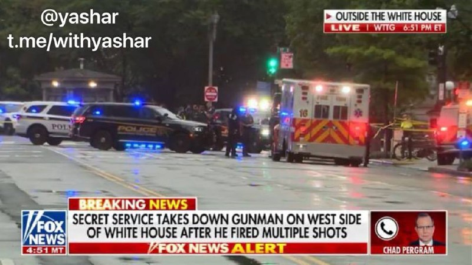

سرویس مخفی پس از شروع تیراندازی در سمت غرب کاخ سفید به یک مظنون مسلح شلیک کرد، به گزارش فاکس نیوز.

یک عابر پیاده در این حادثه زخمی شد و تأیید شده است که رئیس‌جمهور ترامپ در امنیت است.
@withyashar

## WithYashar — post 12279

بی‌بی‌اس نیوز گزارش داد: در تیراندازی نزدیک کاخ سفید دو نفر زخمی شدند که یکی از آن‌ها مظنون است.
@withyashar

## WithYashar — post 12278

  <a href="telegram/content/WithYashar_12278_1779581036.mp4" target="_blank">🎬 Download video</a>

@withyashar تیرندازی از دیدی دیگر

## mwarmonitor — post 9603

📝عجب شاهکار کمدی-استراتژیکی! آقای «کله زرد» بعد از این همه خط‌ونشان و هزینه‌های نجومی روی دست مالیات‌دهندگان آمریکایی، عملاً خاورمیانه را شخم زد تا دوباره همه‌چیز را برگرداند به پله اول؛ منتها با چند صفر اضافه‌تر در حساب بانکی تهران. 🔸این بیانیه هالیوودی…

## mwarmonitor — post 9602

🔹یک مقام سرویس مخفی به CNN گفته است که این نهاد در حال بررسی گزارش‌هایی درباره تیراندازی در تقاطع خیابان ۱۷ و خیابان پنسیلوانیا در شمال‌غرب واشینگتن است؛ محلی که درست در خارج از مجموعه کاخ سفید قرار دارد. @mwarmonitor

## FoxNewsTwitter — post 342174

  <a href="telegram/content/FoxNewsTwitter_342174_1779581038.mp4" target="_blank">🎬 Download video</a>

Fox News (Twitter/X)

JUST IN: FOX News' Chad Pergram reports that two people were wounded in a shooting near the White House, and that the lockdown has been lifted.

## FoxNewsTwitter — post 342173

  <a href="telegram/content/FoxNewsTwitter_342173_1779581040.mp4" target="_blank">🎬 Download video</a>

Fox News (Twitter/X)

BREAKING: FOX News' Chad Pergram reports on shots fired near the White House, says Secret Service took down shooter.

## pm_afshaa — post 91352

  <a href="telegram/content/pm_afshaa_91352_1779581043.webm" target="_blank">🎬 Download video</a>

🔴ان‌بی‌سی نیوز: هم‌اکنون بیرون کاخ سفید حدود 20 تا 30 تا تیر شلیک شده! سرویس مخفی آمریکا خبرنگارهایی که تو محوطه کاخ سفید بودن رو جمع کرده و برده داخل اتاق کنفرانس خبری تا ازشون محافطت کنه. 
💧 Rainbet.com the #1 Non-KYC Crypto Casino & Sportsbook @rainbetcom…

## pm_afshaa — post 91351

  <a href="telegram/content/pm_afshaa_91351_1779581043.webm" target="_blank">🎬 Download video</a>

🔴ان‌بی‌سی نیوز: هم‌اکنون بیرون کاخ سفید حدود 20 تا 30 تا تیر شلیک شده! سرویس مخفی آمریکا خبرنگارهایی که تو محوطه کاخ سفید بودن رو جمع کرده و برده داخل اتاق کنفرانس خبری تا ازشون محافطت کنه. 
💧 Rainbet.com the #1 Non-KYC Crypto Casino & Sportsbook @rainbetcom…

## IranIntlTV — post 338677

  <a href="telegram/content/IranIntlTV_338677_1779581044.mp4" target="_blank">🎬 Download video</a>

ویدیوی منتشرشده از یک خبرنگار سی‌بی‌اس، لحظات دلهره‌آور تیراندازی در نزدیکی کاخ سفید را در روز شنبه دوم خرداد نشان می‌دهد.
خبرگزاری رویترز به نقل از یک مقام پلیس نوشت که مظنون تیراندازی در نزدیکی کاخ سفید دستگیر و به بیمارستان منتقل شده است. او گفت که مظنون به ایست بازرسی نزدیک کاخ سفید نزدیک شد و به سمت ماموران شلیک کرد. به گفته این مقام پلیس، هیچ یک از ماموران آسیب ندیدند.

## IranIntlTV — post 338676

  

لیندزی گراهام، سناتور جمهوری‌خواه، هشدار داد هر توافقی که به بقای حکومت ایران و بازگشت تدریجی نفوذ منطقه‌ای آن منجر شود، می‌تواند خاورمیانه را بی‌ثبات‌تر کرده و گروه‌های نیابتی تهران را تقویت کند.
او در شبکه ایکس نوشت اگر در منطقه چنین برداشت شود که توافق با حکومت ایران به این رژیم اجازه می‌دهد زنده بماند و قدرتمندتر شود، «بنزین روی آتش درگیری‌ها در لبنان و عراق ریخته‌ایم» و حزب‌الله لبنان و شبه‌نظامیان شیعه در عراق به‌شدت تقویت خواهند شد.
گراهام با تاکید بر اینکه ادامه فشار بر تهران برای مهار گروه‌های نیابتی آن ضروری است، هشدار داد جمهوری اسلامی ممکن است از مذاکرات برای تجدید قوا استفاده کند.

https://iranintl.com/202605237902

## IranIntlTV — post 338675

  

یک مقام ارشد پلیس آمریکا درباره تیراندازی در اطراف کاخ سفید گفت: یک مظنون به ایست بازرسی اطراف کاخ سفید نزدیک شد و به سوی ماموران شلیک کرد، اما او هدف گلوله قرار گرفت و به بیمارستان منتقل شد.
https://iranintl.com/202605234529

## ManotoTV — post 105790

  <a href="telegram/content/ManotoTV_105790_1779581048.mp4" target="_blank">🎬 Download video</a>

تماسی از امارات
«می‌گفت مردم ایران عوض شده‌اند…
و این بار باید هوشیارتر، عاقل‌تر و متفاوت‌تر عمل کنند.»

## FarsiVOA — post 218482

  <a href="telegram/content/FarsiVOA_218482_1779581050.mp4" target="_blank">🎬 Download video</a>

⚡️ویدیوی صدای آمریکا از حضور نیروهای امنیتی پس از گزارش‌ها از تیراندازی شنبه عصر در نزدیکی کاخ سفید
@FarsiVOA

## FarsiVOA — post 218480

⚡️نیروهای گارد ملی و دیگر ماموران امنیتی شنبه عصر و در پی گزارش‌ها از تیراندازی در اطراف کاخ سفید، در محل استقرار یافتند.
@FarsiVOA

## FarsiVOA — post 218479

⚡️خط قرمز جدید بغداد: دولت علی الزیدی به دنبال انحلال شبه‌نظامیان وابسته به جمهوری اسلامی
@FarsiVOA

## Persian_Trend_Official — post 14809

  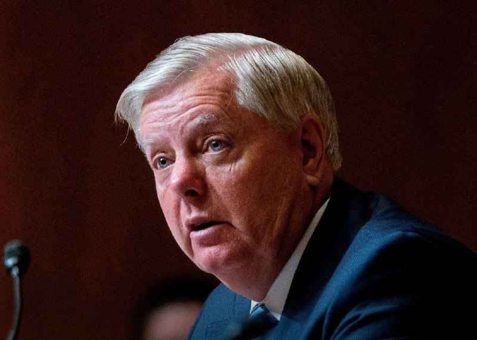

🔴لیندزی گراهام، سناتور جمهوری‌خواه،

💢هشدار داد هر توافقی که به بقای حکومت ایران و بازگشت تدریجی نفوذ منطقه‌ای آن منجر شود، می‌تواند خاورمیانه را بی‌ثبات‌تر کرده و گروه‌های نیابتی تهران را تقویت کند.

💢او در شبکه ایکس نوشت اگر در منطقه چنین برداشت شود که توافق با حکومت ایران به این رژیم اجازه می‌دهد زنده بماند و قدرتمندتر شود، «بنزین روی آتش درگیری‌ها در لبنان و عراق ریخته‌ایم» و حزب‌الله لبنان و شبه‌نظامیان شیعه در عراق به‌شدت تقویت خواهند شد.

💢گراهام با تاکید بر اینکه ادامه فشار بر تهران برای مهار گروه‌های نیابتی آن ضروری است، هشدار داد جمهوری اسلامی ممکن است از مذاکرات برای تجدید قوا استفاده کند.

🫆:Tony

📌 @persian_trend_official
پرشین ترند | متفاوت‌ترین کانال نظامی

## Persian_Trend_Official — post 14808

  <a href="telegram/content/Persian_Trend_Official_14808_1779581051.mp4" target="_blank">🎬 Download video</a>

💢همزمان با وقایع امشب روسیه هم با موشک اورشنیک مجهز به کلاهک خوشه ای حمله کرده به کی یف اوکراین

ویدئویی لحظه اصابت موشک بالستیک میان‌برد «اورشنیک» روسیه به کی‌یف.

🫆:Tony

📌 @persian_trend_official
پرشین ترند | متفاوت‌ترین کانال نظامی

## Persian_Trend_Official — post 14807

  

🔴 فوری | گزارش تیراندازی در اطراف کاخ سفید شبکه CBS گزارش داده صدای تیراندازی در اطراف کاخ سفید شنیده شده است. بر اساس گزارش اولیه: ▪️ سرویس مخفی آمریکا از خبرنگاران حاضر در ورودی کاخ سفید خواسته فوراً به اتاق توجیه خبری منتقل شوند ▪️ هنوز جزئیاتی درباره…

## Persian_Trend_Official — post 14806

  <a href="telegram/content/Persian_Trend_Official_14806_1779581054.webm" target="_blank">🎬 Download video</a>

⭕️درگذشت دیپلمات جمهوری آذربایجان در سانحه رانندگی در اتوبان جلفا-تبریز 💢وزارت امور خارجه جمهوری آذربایجان در فضای مجازی از درگذشت دیپلمات خود در شهر تبریز بر اثر تصادف خبر داد. 💢رامیل رضا اوغلو عمرانوف، کنسول جمهوری آذربایجان در جمهوری اسلامی ایران در شهر…

## BBCPersian — post 281909

🔻خبرنگاران در پی شنیده‌شدن تیراندازی احتمالی در نزدیکی کاخ سفید به پناهگاه رفتند

چند خبرنگار حاضر در کاخ سفید از شنیده شدن صدای احتمالی تیراندازی در نزدیکی این ساختمان خبر داده‌اند.

https://bbc.in/3PUAMWO
@BBCPersian

## BBCPersian — post 281908

🔻پایان پوشش زنده روز شنبه

در اینجا پوشش زنده تحولات ایران و آمریکا در روز شنبه دوم خرداد ۱۴۰۵ برابر با ۲۳ مه ۲۰۲۶ به پایان می‌رسد.

https://bbc.in/4dtIPCY
@BBCPersian

## manototv — post 105790

  <a href="telegram/content/manototv_105790_1779581055.mp4" target="_blank">🎬 Download video</a>

تماسی از امارات
«می‌گفت مردم ایران عوض شده‌اند…
و این بار باید هوشیارتر، عاقل‌تر و متفاوت‌تر عمل کنند.»

---
📅 بروزرسانی: 1405/03/03 02:28
---

## VahidOOnLine — post 241831

♦️در برنامه‌ای در صداوسیما، زنی که ادعا می‌کند همسایه بیت علی خامنه‌ای، رهبر کشته‌شده جمهوری اسلامی معرفی شد، در پاسخ به پرسشی درباره وضعیت محل اقامت او گفت: «از پشت‌بام که نگاه می‌کنی، تلی از خاک می‌بینی.»
این زن در ادامه تاکید کرد: «منطقه آقا خیلی سرسبز بود، اما حالا تبدیل به بیابان شده است؛ بیابانی بدون درخت و بدون سبزه که فقط خاک در آن دیده می‌شود.» مجری برنامه نیز در واکنش به این توضیحات اشاره کرد که با این توصیف، کاملا مشخص است چه اتفاقی برای ساختمان رخ داده است.
‌🇸🇦 Indypersian

🤖 @VahidOOnLine

## VahidOOnLine — post 241830

  

سخنگوی سرویس مخفی آمریکا در بیانیه‌ای به سی‌بی‌اس نیوز گفت این نهاد از «گزارش‌هایی درباره شلیک گلوله در نزدیکی خیابان هفدهم و خیابان پنسیلوانیا شمال غربی» آگاه است و «در حال بررسی و تایید این اطلاعات با نیروهای مستقر در محل» است.
‌🏁 🇬🇧 IranintlTV

🤖 @VahidOOnLine

## VahidOOnLine — post 241828

  

سخنگوی سرویس مخفی آمریکا در بیانیه‌ای به سی‌بی‌اس نیوز گفت این نهاد از «گزارش‌هایی درباره شلیک گلوله در نزدیکی خیابان هفدهم و خیابان پنسیلوانیا شمال غربی» آگاه است و «در حال بررسی و تایید این اطلاعات با نیروهای مستقر در محل» است.
‌🏁 🇬🇧 IranintlTV

🤖 @VahidOOnLine

## VahidOOnLine — post 241825

  

♦️«سی‌ان‌ان» عصر شنبه، دوم خردادماه، گزارش داد، شنیده شدن صدای ده‌ها شلیک احتمالی گلوله در نزدیکی کاخ سفید، منجر به برقراری وضعیت قرنطینه و واکنش سریع سرویس مخفی آمریکا شد. یک مقام سرویس مخفی به سی‌ان‌ان گفت که این آژانس در حال بررسی گزارش‌های مربوط به شلیک گلوله در تقاطع خیابان هفدهم و خیابان پنسیلوانیا در مجاورت محوطه کاخ سفید است؛ در همین حال، ماموران سرویس مخفی با فریادهای «بشینید» و هشدار درباره تیراندازی، خبرنگاران مستقر در چمن شمالی را به سرعت به داخل اتاق کنفرانس مطبوعاتی هدایت کرده و از آن‌ها خواستند در مکان‌های خود پناه بگیرند. به گفته یکی از خبرنگاران، صداها از سمت ساختمان اداری اجرایی آیزنهاور به گوش رسیده است و در پی این حادثه، ماموران سرویس مخفی مسلح به سلاح‌های تهاجمی در چمن شمالی مستقر شده و ورودی‌های اتاق کنفرانس مطبوعاتی کاخ سفید را مسدود کردند.
‌🇸🇦 Indypersian

🤖 @VahidOOnLine

## VahidOOnLine — post 241824

  <a href="telegram/content/VahidOOnLine_241824_1779577129.mp4" target="_blank">🎬 Download video</a>

ویدیوی دریافت‌شده نشان می‌دهد جمعی از ایرانیان مقیم هلیفکس کانادا، روز شنبه دوم خرداد، در همبستگی با انقلاب شیر و خورشید تجمع اعتراضی در سکوت برگزار کردند. آن‌ها با این سکوت تلاش کردند درباره قطعی اینترنت در ایران اطلاع‌رسانی کنند.
‌🏁 🇬🇧 IranintlTV

🤖 @VahidOOnLine

## VahidOOnLine — post 241823

  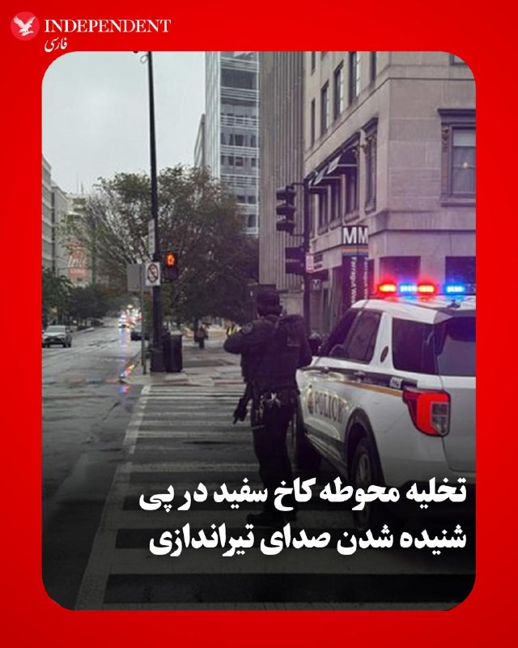

♦️به گزارش «ای‌بی‌سی نیوز»، سرویس مخفی آمریکا عصر شنبه، دوم خردادماه، در پی شنیده شدن صدایی شبیه به شلیک گلوله، چمن شمالی کاخ سفید را به طور کامل تخلیه و پاکسازی کرد. بر اساس این گزارش، از خبرنگاران مستقر در محل خواسته شد تا به سرعت به سمت اتاق نشست مطبوعاتی کاخ سفید دویده و پناه بگیرند.
‌🇸🇦 Indypersian

🤖 @VahidOOnLine

## VahidOOnLine — post 241822

  <a href="telegram/content/VahidOOnLine_241822_1779577131.mp4" target="_blank">🎬 Download video</a>

♦️تصاویر منتشر شده توسط سلینا وانگ، خبرنگار ارشد شبکه «ای‌بی‌سی نیوز»، لحظات شلیک گلوله در نزدیکی کاخ سفید در واشنگتن دی‌سی را نشان می‌دهد. بر اساس گزارش‌های اولیه، حدود ۳۰ گلوله در خارج از محوطه کاخ سفید شلیک شده و نیروهای سرویس مخفی آمریکا بلافاصله وارد عمل شدند و خبرنگارانی را که در چمن شمالی مستقر بودند، به سمت اتاق کنفرانس مطبوعاتی هدایت کردند تا پناه بگیرند. این ویدیو نشان می‌دهد سلینا وانگ در حالی که در حال ضبط گزارش زنده خود درباره توافق احتمالی با ایران بود، با شنیدن صدای شلیک گلوله‌ها ناچار به قطع گزارش و تخلیه اضطراری محل می‌شود. هنوز جزییات بیشتری از این تیراندازی منتشر نشده است.
‌🇸🇦 Indypersian

🤖 @VahidOOnLine

## VahidOOnLine — post 241821

  

گزارش‌ها از شنیده شدن ده‌ها صدای تیراندازی در نزدیکی کاخ سفید خبر می‌دهد. به گزارش رسانه‌های آمریکایی، خبرنگاران در داخل کاخ سفید در محل امن مستقر شدند و ماموران سرویس مخفی در چمن شمالی کاخ سفید در حالی دیده می‌شوند که تفنگ در دست دارند.
‌🏁 🇬🇧 IranintlTV

🤖 @VahidOOnLine

## VahidOOnLine — post 241820

  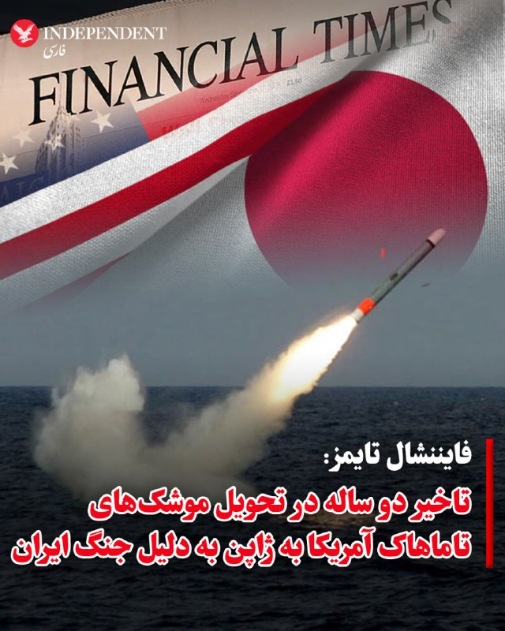

♦️روزنامه «فایننشال تایمز» در گزارشی اختصاصی نوشت که ایالات متحده به ژاپن اطلاع داده است تحویل ۴۰۰ موشک کروز «تاماهاک» به این کشور به دلیل اولویت پنتاگون برای بازسازی ذخایر تسلیحاتی خود پس از جنگ با ایران، با تاخیر مواجه خواهد شد. بر اساس این گزارش، پیت هگست، وزیر جنگ آمریکا، در تماس تلفنی اوایل ماه مه این موضوع را به همتای ژاپنی خود، شینجیرو کویزومی، اطلاع داده و واشنگتن گفته است که این موشک‌ها ممکن است با تاخیر دو ساله تحویل داده شوند. بر اساس ارزیابی مرکز مطالعات استراتژیک و بین‌المللی (CSIS)، ارتش آمریکا در طول پنج هفته عملیات نظامی علیه ایران، بیش از ۱۰۰۰ موشک تاماهاک را از مجموع ذخیره پیش از جنگ خود شلیک کرده است. براساس این گزارش، این تاخیر می‌تواند ضربه بزرگی به استراتژی دفاعی توکیو وارد کند، چرا که ژاپن این موشک‌های ۲.۳۵ میلیارد دلاری را با هدف تقویت توان بازدارندگی و ایجاد قابلیت «حمله متقابل» علیه چین سفارش داده بود.
‌🇸🇦 Indypersian

🤖 @VahidOOnLine

## VahidOOnLine — post 241819

  <a href="telegram/content/VahidOOnLine_241819_1779577134.mp4" target="_blank">🎬 Download video</a>

تجمع ایرانیان ساکن کپنهاگ، دوم خرداد ۱۴۰۵
‌🏁 🇬🇧 ManotoTV

🤖 @VahidOOnLine

## VahidOOnLine — post 241818

  <a href="telegram/content/VahidOOnLine_241818_1779577135.mp4" target="_blank">🎬 Download video</a>

♦️کریم بنزما، مهاجم باشگاه الهلال عربستان سعودی، با انتشار ویدیویی در صفحه اینستاگرام خود، حضورش در «مناسک حج» را به اشتراک گذاشت. این ستاره فوتبال با انتشار تصویری از خود در حال طواف به دور کعبه، این لحظات مذهبی را با مخاطبانش به اشتراک گذاشت و عبارت «الحمدلله برای همه‌چیز» را به عنوان پیام خود منتشر کرد.
‌🇸🇦 Indypersian

🤖 @VahidOOnLine

## WithYashar — post 12277

  

صحنه هایی از خارج از کاخ سفید.
@withyashar

## WithYashar — post 12276

مدیر اف‌بی‌آی کاش پاتل:

اف‌بی‌آی در محل حاضر است و از سرویس مخفی که به شلیک‌های نزدیک محوطه کاخ سفید پاسخ می‌دهد، حمایت می‌کند, ما به محض امکان، به‌روزرسانی‌های لازم را به عموم ارائه خواهیم داد
@withyashar

## WithYashar — post 12275

  <a href="telegram/content/WithYashar_12275_1779577137.mp4" target="_blank">🎬 Download video</a>

@withyashar

## WithYashar — post 12274

  <a href="telegram/content/WithYashar_12274_1779577138.mp4" target="_blank">🎬 Download video</a>

طبق گزارش‌ها، تیم‌های تک‌تیرانداز سرویس مخفی اکنون بر روی پشت‌بام کاخ سفید قابل مشاهده هستند.

این یک واکنش حفاظتی استاندارد پس از یک حادثه امنیتی است که در آن تیم‌ها برای ایمن‌سازی محوطه به موقعیت‌های مرتفع اعزام می‌شوند.

این با وضعیت فعال پس از گزارش‌های قبلی تیراندازی و انتقال خبرنگاران به داخل کاخ مطابقت دارد.
@withyashar

## WithYashar — post 12273

  <a href="telegram/content/WithYashar_12273_1779577139.mp4" target="_blank">🎬 Download video</a>

فیلمی از اخبار ABC لحظه‌ای را ثبت می‌کند که تیراندازی در خارج از کاخ سفید رخ داد.
@withyashar
🚨🚨🚨🚨🚨🚨🚨

## WithYashar — post 12272

طبق گزارش NBC News، صدای تیراندازی در خارج از کاخ سفید شنیده شد، با حدود ۲۰ تا ۳۰ گلوله شلیک شده. سرویس مخفی به اعضای مطبوعات که در چمن شمالی جمع شده‌اند دستور داده است که به داخل اتاق جلسه بروند.
@withyashar

## WithYashar — post 12271

  <a href="telegram/content/WithYashar_12271_1779577141.mp4" target="_blank">🎬 Download video</a>

وضعیت اعصاب و روان من الان 👺
@withyashar

## WithYashar — post 12270

الحدث: ایران و آمریکا به دشمنی طولانی مدتشون پایان دادن!
@withyashar

## WithYashar — post 12269

## mwarmonitor — post 9601

  <a href="telegram/content/mwarmonitor_9601_1779577142.mp4" target="_blank">🎬 Download video</a>

📝بررسی کارنامه مذهبی که بقای خود را در گرو ترور، سرکوب و ویرانی می‌بیند، هیچ شکلی از تردید را باقی نمی‌گذارد. شیعه سانان رافضی که با بی‌رحمی تمام، اینترنت نود میلیون انسان را ماه‌ها قطع می‌کند، دستش به خون چهل و پنج هزار انسان بیگناه آلوده است و با شلیک موشک به چهار گوشه منطقه، امنیت خاورمیانه را به گروگان می‌گیرد، هرگز به کابل‌های ارتباطی جهان و ابزارهای پیوند بشریت رحم نخواهد کرد. این فرقه، نماد عینی دنائت و تهدیدی افسارگسیخته برای تمدن بشری است؛ تفکری مخرب و ذاتاً جنایت‌کار که اگر به سلاح کشتار جمعی و بمب اتم دست یابد، حتی برای نابودی خود و اطرافیانش نیز درنگ نخواهد کرد. دنیا با جانیانی روبه‌روست که منطقشان چیزی جز قطع شریان‌های حیاتی جامعه جهانی و بازگرداندن انسان‌ها به تاریکی و انزوا نیست.

@mwarmonitor

## mwarmonitor — post 9600

  

در حالی که در محوطه شمالی کاخ سفید (North Lawn) مشغول ضبط یک ویدیوی اجتماعی با آیفونم بودم، صدای تیراندازی را شنیدیم. صدایی شبیه شلیک ده‌ها گلوله بود. به ما گفته شد با سرعت به سمت اتاق نشست خبری بدویم و اکنون در آنجا نگه داشته شده‌ایم. خبرنگار ABC @mwarmonitor

## mwarmonitor — post 9599

  <a href="telegram/content/mwarmonitor_9599_1779577144.mp4" target="_blank">🎬 Download video</a>

🚨 گزارش شده که روسیه یک موشک بالستیک میان‌برد «اورشنیک» (Oreshnik) را به سمت اوکراین شلیک کرده است که طبق اعلام نیروی هوایی اوکراین، باعث به صدا درآمدن آژیرهای حمله هوایی در سراسر این کشور شده است. @mwarmonitor

## mwarmonitor — post 9598

  <a href="telegram/content/mwarmonitor_9598_1779577145.mp4" target="_blank">🎬 Download video</a>

در حالی که در محوطه شمالی کاخ سفید (North Lawn) مشغول ضبط یک ویدیوی اجتماعی با آیفونم بودم، صدای تیراندازی را شنیدیم. صدایی شبیه شلیک ده‌ها گلوله بود. به ما گفته شد با سرعت به سمت اتاق نشست خبری بدویم و اکنون در آنجا نگه داشته شده‌ایم. خبرنگار ABC

@mwarmonitor

## mwarmonitor — post 9597

  

🚨به گزارش NBC، صدای تیراندازی در خارج از کاخ سفید شنیده شده و حدود ۲۰ تا ۳۰ گلوله شلیک شده است. سرویس مخفی به خبرنگارانی که در محوطه شمالی کاخ سفید (North Lawn) جمع شده بودند دستور داده فوراً به داخل اتاق توجیه خبری بروند.

@mwarmonitor

## mwarmonitor — post 9596

🔸هنوز مشخص نشده که امتیازهای ایران چه خواهد بود، جز بازگشایی تنگه (که خودِ ایران هم از آن منتفع می‌شود).

🔹ممکن است به این دلیل باشد که درز اطلاعات فقط از یک طرف صورت می‌گیرد، یا اینکه اساساً امتیاز دیگری در کار نیست. در حال حاضر قضاوت قطعی غیرممکن است. خبرنگار نیویورک پست

@mwarmonitor

## FoxNewsTwitter — post 342172

Fox News (Twitter/X)

BREAKING: White House locked down after as many as 30 shots fired in vicinity.

## pm_afshaa — post 91350

  <a href="telegram/content/pm_afshaa_91350_1779577146.mp4" target="_blank">🎬 Download video</a>

🔴ان‌بی‌سی نیوز: هم‌اکنون بیرون کاخ سفید حدود 20 تا 30 تا تیر شلیک شده!

سرویس مخفی آمریکا خبرنگارهایی که تو محوطه کاخ سفید بودن رو جمع کرده و برده داخل اتاق کنفرانس خبری تا ازشون محافطت کنه.

💧 Rainbet.com the #1 Non-KYC Crypto Casino & Sportsbook @rainbetcom

😁 @Pm_Afshaa

## pm_afshaa — post 91349

#مهم عزیزای دلم همگی الان چنل زاپاس‌مون رو جوین بشید کانال تحت ریپورت شدیده اگه چیزی شد زاپاس رو داشته باشید فعالیت میاد اونور
👇 https://t.me/Pm_Zapas https://t.me/Pm_Zapas

## pm_afshaa — post 91348

یا شروط توافق این که میگن نیست یا ترامپ کلکی تو کارِشه منطقی نیست اصلا اینو تو دنیا به عنوان شکست ترامپ میدونن

## pm_afshaa — post 91347

  <a href="telegram/content/pm_afshaa_91347_1779577148.webm" target="_blank">🎬 Download video</a>

🔴علی هاشم، خبرنگار الجزیره: طبق گفته منابع، پیش‌نویس پیشنهادی که قراره نهایی بشه شامل موارد زیر است: - پایان جنگ در همه جبهه‌ها از جمله لبنان - آزاد شدن میلیاردها دلار از دارایی‌های مسدود شده ایران - لغو محاصره دریایی آمریکا و گشایش تنگه هرمز - خروج نیروهای…

## pm_afshaa — post 91346

  <a href="telegram/content/pm_afshaa_91346_1779577148.webm" target="_blank">🎬 Download video</a>

🔴نیویورک تایمز به نقل از 3 مقام ایرانی: با یادداشت تفاهمی به توافق رسیدیم که جنگ متوقف بشه و تنگه هرمز هم باز بشه. این توافق منجر به آزادسازی 25 میلیارد دلار دارایی مسدود شده در خارج از کشور میشه! 
💧 Rainbet.com the #1 Non-KYC Crypto Casino & Sportsbook…

## DEJradio — post 4891

⭕️ خبرها از یک سلسله تیراندازی در اطراف کاخ سفید حکایت دارند. ویدئوی منتشر شده، سلینا وانگ، خبرنگار «ای‌بی‌سی نیوز»را در نزدیکی کاخ سفید در واشنگتن دی‌سی نشان می‌دهد. #کاخ_سفید @DEJradio

## DEJradio — post 4890

  <a href="telegram/content/DEJradio_4890_1779577148.mp4" target="_blank">🎬 Download video</a>

⭕️ خبرها از یک سلسله تیراندازی در اطراف کاخ سفید حکایت دارند.
ویدئوی منتشر شده، سلینا وانگ، خبرنگار «ای‌بی‌سی نیوز»را در نزدیکی کاخ سفید در واشنگتن دی‌سی نشان می‌دهد.

#کاخ_سفید
@DEJradio

## IranIntlTV — post 338674

  

سخنگوی سرویس مخفی آمریکا در بیانیه‌ای به سی‌بی‌اس نیوز گفت این نهاد از «گزارش‌هایی درباره شلیک گلوله در نزدیکی خیابان هفدهم و خیابان پنسیلوانیا شمال غربی» آگاه است و «در حال بررسی و تایید این اطلاعات با نیروهای مستقر در محل» است.
https://iranintl.com/202605237115

## IranIntlTV — post 338673

  

سخنگوی سرویس مخفی آمریکا در بیانیه‌ای به سی‌بی‌اس نیوز گفت این نهاد از «گزارش‌هایی درباره شلیک گلوله در نزدیکی خیابان هفدهم و خیابان پنسیلوانیا شمال غربی» آگاه است و «در حال بررسی و تایید این اطلاعات با نیروهای مستقر در محل» است.
https://iranintl.com/202605237115

## IranIntlTV — post 338672

  

سخنگوی سرویس مخفی آمریکا در بیانیه‌ای به سی‌بی‌اس نیوز گفت این نهاد از «گزارش‌هایی درباره شلیک گلوله در نزدیکی خیابان هفدهم و خیابان پنسیلوانیا شمال غربی» آگاه است و «در حال بررسی و تایید این اطلاعات با نیروهای مستقر در محل» است.
https://iranintl.com/202605237115

## IranIntlTV — post 338671

  <a href="telegram/content/IranIntlTV_338671_1779577152.mp4" target="_blank">🎬 Download video</a>

ایرانیان ساکن شهر تورین ایتالیا برای بیستمین هفته متوالی با برگزاری تجمعی اعتراضی، مخالفت خود را با سرکوب و نقض حقوق بشر در جمهوری اسلامی اعلام کردند.

گزارش صدف باغبانی، خبرنگار ایران‌اینترنشنال و گفت‌وگوی او با دو نفر از شرکت‌کنندگان
@iranintltv

## IranIntlTV — post 338670

  <a href="telegram/content/IranIntlTV_338670_1779577153.mp4" target="_blank">🎬 Download video</a>

ویدیوی دریافت‌شده نشان می‌دهد جمعی از ایرانیان مقیم هلیفکس کانادا، روز شنبه دوم خرداد، در همبستگی با انقلاب شیر و خورشید تجمع اعتراضی در سکوت برگزار کردند. آن‌ها با این سکوت تلاش کردند درباره قطعی اینترنت در ایران اطلاع‌رسانی کنند.

## IranIntlTV — post 338669

  <a href="telegram/content/IranIntlTV_338669_1779577154.mp4" target="_blank">🎬 Download video</a>

مراد ویسی، تحلیل‌گر ارشد ایران‌اینترنشنال، گفت: «خبرگزاری فارس ویدیویی از یک راه‌یافته به مجلس منتشر کرده که در آن پزشکیان متهم به زمینه‌چینی برای کشتن علی خامنه ای و زمینه چینی مجدد برای کشتن مجتبی خامنه ای شده است.»
@iranintltv

## IranIntlTV — post 338668

  <a href="telegram/content/IranIntlTV_338668_1779577155.mp4" target="_blank">🎬 Download video</a>

ایرانیان مقیم تورنتو با سر دادن شعارهایی در حمایت از شاهزاده رضا پهلوی، خواستار توقف اعدام‌ها، دسترسی به اینترنت آزاد و دموکراسی برای مردم ایران شدند.

گزارش مهسا مرتضوی، خبرنگار ایران‌اینترنشنال و گفت‌وگو با یکی از شرکت‌کنندگان
@iranintltv

## IranIntlTV — post 338667

  

گزارش‌ها از شنیده شدن ده‌ها صدای تیراندازی در نزدیکی کاخ سفید خبر می‌دهد. به گزارش رسانه‌های آمریکایی، خبرنگاران در داخل کاخ سفید در محل امن مستقر شدند و ماموران سرویس مخفی در چمن شمالی کاخ سفید در حالی دیده می‌شوند که تفنگ در دست دارند.
https://iranintl.com/202605231953

## IranIntlTV — post 338666

  <a href="telegram/content/IranIntlTV_338666_1779577157.mp4" target="_blank">🎬 Download video</a>

واشینگتن‌پست گزارش داد مقام‌ها و دیپلمات‌های آگاه از مذاکرات میان آمریکا و جمهوری اسلامی ابراز امیدواری کرده‌اند دو طرف پس از بررسی پیش‌نویس تهیه‌شده از سوی پاکستان، طی ۴۸ ساعت آینده تصمیم نهایی خود را اتخاذ کنند.

گفت‌وگو با حسین علیزاده، دیپلمات پیشین
@iranintltv

## IranIntlTV — post 338665

  <a href="telegram/content/IranIntlTV_338665_1779577158.mp4" target="_blank">🎬 Download video</a>

دونالد ترامپ از تماس تلفنی خود با رهبران کشورهای منطقه درباره ایران خبر داد. او تاکید کرد بخش زیادی از چارچوب توافق نهایی شده، اما اجرای آن همچنان به توافق نهایی میان واشینگتن، تهران و برخی کشورهای دخیل در مذاکرات بستگی دارد.

گفت‌وگو با امیر گیتی، عضو تحریریه ایران‌اینترنشنال
@iranintltv

## IranIntlTV — post 338664

  <a href="https://t.me/IranintlTV/338664" target="_blank">📎 Download file</a>

🎧نسخه صوتی سیاست با مراد ویسی: تهدید پزشکیان به استعفا
@iranintlTV

## IranIntlTV — post 338663

  <a href="telegram/content/IranIntlTV_338663_1779577160.mp4" target="_blank">🎬 Download video</a>

مراد ویسی، تحلیل‌گر ارشد ایران‌اینترنشنال، گفت: «در راس جمهوری اسلامی اختلاف بر سر توافق با آمریکا یا رفتن به سمت جنگ شدت گرفته است. مسعود پزشکیان در نامه‌ای به مجتبی خامنه‌ای نوشته توان تاب‌آوری نظام رو به پایان است و در صورت ادامه شرایط موجود تهدید به استعفا کرده است.»
@iranintltv

## Shin_Persian — post 6194

  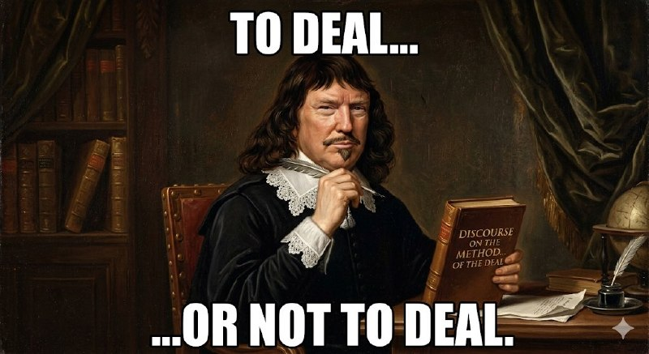

Shin ✓ @hey_itsmyturn
Sat, 23 May 2026 22:34:08 UTC

𝕏 · @shin_persian

## Shin_Persian — post 6193

  <a href="telegram/content/Shin_Persian_6193_1779577161.mp4" target="_blank">🎬 Download video</a>

Selina Wang ✓ @selinawangtv
Sat, 23 May 2026 22:20:24 UTC

I was in the middle of taping on my iPhone for a social video from the White House North Lawn when we heard the shots. It sounded like dozens of gunshots. We were told to sprint to the press briefing room where we are holding now.

فارسی

من در میانه ضبط ویدئویی برای شبکه‌های اجتماعی با آیفون خود در محوطه شمالی کاخ سفید بودم که صدای شلیک‌ها را شنیدیم. صدا شبیه به ده‌ها شلیک گلوله بود. به ما گفته شد که به سرعت به سمت اتاق کنفرانس مطبوعاتی بدویم، جایی که هم‌اکنون در آنجا پناه گرفته‌ایم.

𝕏 · @shin_persian

## Shin_Persian — post 6192

  

Faytuks Network ✓ @FaytuksNetwork
Sat, 23 May 2026 22:24:37 UTC

Police have created a perimeter around the scene of the shooting close to the White House.

فارسی

پلیس پیرامون صحنه تیراندازی در نزدیکی کاخ سفید، یک کمربند امنیتی ایجاد کرده است.

𝕏 · @shin_persian

## Shin_Persian — post 6191

Shin ✓ @hey_itsmyturn
Sat, 23 May 2026 22:14:55 UTC

Shots fired outside of the White House

فارسی

شلیک گلوله در بیرون از کاخ سفید

𝕏 · @shin_persian

## ManotoTV — post 105789

  <a href="telegram/content/ManotoTV_105789_1779577163.mp4" target="_blank">🎬 Download video</a>

تماسی از سن‌فرانسیسکو:
«می‌گفت با شنیدن صدای شما احساس می‌کنم تو ایرانم…
و از سال‌هایی گفت که با برنامه‌های منوتو خندیده، گریه کرده و زندگی کرده بود.»

## ManotoTV — post 105788

  <a href="telegram/content/ManotoTV_105788_1779577165.mp4" target="_blank">🎬 Download video</a>

تماسی از خارج ایران:
«می‌گفت بسته شدن منوتو برای خیلی‌ها دردناک بود…
و از همراهی و امیدی گفت که این سال‌ها از برنامه‌ها گرفته بودند.

## ManotoTV — post 105787

  <a href="telegram/content/ManotoTV_105787_1779577166.mp4" target="_blank">🎬 Download video</a>

تجمع ایرانیان ساکن کپنهاگ، دوم خرداد ۱۴۰۵

## FarsiVOA — post 218478

🔺گزارش‌ها از تیراندازی در نزدیکی کاخ سفید

▪️رسانه‌های آمریکایی از گزارش‌های مربوط به تیراندازی احتمالی در عصر شنبه در نزدیکی چمن شمالی کاخ سفید خبر دادند.

⬇️ بیشتر بخوانید:
https://ir.voanews.com/a/8153104.html
@FarsiVOA

## FarsiVOA — post 218477

🔺وال‌استریت ژورنال: دونالد ترامپ حق از سرگیری حملات به جمهوری اسلامی را برای خود محفوظ نگه می‌دارد

▪️روزنامه وال‌‌استریت ژورنال عصر شنبه گزارش داد که دونالد ترامپ، رئيس جمهوری آمریکا به دستیاران و همتایان خود گفته است که حق از سرگیری حملات به جمهوری اسلامی را در صورتی که رژیم ایران به «توافق موقت» عمل نکند، برای خود محفوظ نگه می‌دارد.

⬇️ بیشتر بخوانید:
https://ir.voanews.com/a/8153093.html
@FarsiVOA

## Persian_Trend_Official — post 14805

🔴 فوری | گزارش تیراندازی در اطراف کاخ سفید شبکه CBS گزارش داده صدای تیراندازی در اطراف کاخ سفید شنیده شده است. بر اساس گزارش اولیه: ▪️ سرویس مخفی آمریکا از خبرنگاران حاضر در ورودی کاخ سفید خواسته فوراً به اتاق توجیه خبری منتقل شوند ▪️ هنوز جزئیاتی درباره…

## Persian_Trend_Official — post 14804

  <a href="telegram/content/Persian_Trend_Official_14804_1779577167.webm" target="_blank">🎬 Download video</a>

💢مدیر اف‌بی‌آی، کش پاتل:

💢اف‌بی‌آی در محل حاضر است و در حال پشتیبانی از سرویس مخفی در واکنش به گزارش تیراندازی در نزدیکی محوطه کاخ سفید است .

هر زمان امکان داشته باشد، اطلاعات جدید را به اطلاع عموم خواهیم رساند.

🫆:Tony

📌 @persian_trend_official
پرشین ترند | متفاوت‌ترین کانال نظامی

## Persian_Trend_Official — post 14803

  <a href="telegram/content/Persian_Trend_Official_14803_1779577168.webm" target="_blank">🎬 Download video</a>

⚡️🇺🇸 سرویس مخفی ایالات متحده:

ما از گزارش‌هایی مبنی بر شلیک تیر در نزدیکی خیابان هفدهم و خیابان پنسیلوانیا در شمال غربی آگاهیم و در حال تأیید این اطلاعات با پرسنل حاضر در محل هستیم. اطلاعات بیشتری به محض در دسترس قرار گرفتن ارائه خواهد شد.

## Persian_Trend_Official — post 14802

  <a href="telegram/content/Persian_Trend_Official_14802_1779577168.webm" target="_blank">🎬 Download video</a>

🔴 فوری | گزارش تیراندازی در اطراف کاخ سفید شبکه CBS گزارش داده صدای تیراندازی در اطراف کاخ سفید شنیده شده است. بر اساس گزارش اولیه: ▪️ سرویس مخفی آمریکا از خبرنگاران حاضر در ورودی کاخ سفید خواسته فوراً به اتاق توجیه خبری منتقل شوند ▪️ هنوز جزئیاتی درباره…

## Persian_Trend_Official — post 14801

  <a href="telegram/content/Persian_Trend_Official_14801_1779577168.mp4" target="_blank">🎬 Download video</a>

💢استوری یکی از شهروندان امریکا از صدای تیر اندازی در نزدیکی کاخ سفید
🫆:Tony

📌 @persian_trend_official
پرشین ترند | متفاوت‌ترین کانال نظامی

## Persian_Trend_Official — post 14800

  <a href="telegram/content/Persian_Trend_Official_14800_1779577170.mp4" target="_blank">🎬 Download video</a>

💢ویدئویی دیگر از صدای ممتد شلیک در اطراف کاخ سفید
🫆:Tony

📌 @persian_trend_official
پرشین ترند | متفاوت‌ترین کانال نظامی

## Persian_Trend_Official — post 14799

  

🔴 فوری | گزارش تیراندازی در اطراف کاخ سفید شبکه CBS گزارش داده صدای تیراندازی در اطراف کاخ سفید شنیده شده است. بر اساس گزارش اولیه: ▪️ سرویس مخفی آمریکا از خبرنگاران حاضر در ورودی کاخ سفید خواسته فوراً به اتاق توجیه خبری منتقل شوند ▪️ هنوز جزئیاتی درباره…

## Persian_Trend_Official — post 14798

  <a href="telegram/content/Persian_Trend_Official_14798_1779577171.mp4" target="_blank">🎬 Download video</a>

🔴 فوری | گزارش تیراندازی در اطراف کاخ سفید شبکه CBS گزارش داده صدای تیراندازی در اطراف کاخ سفید شنیده شده است. بر اساس گزارش اولیه: ▪️ سرویس مخفی آمریکا از خبرنگاران حاضر در ورودی کاخ سفید خواسته فوراً به اتاق توجیه خبری منتقل شوند ▪️ هنوز جزئیاتی درباره…

## Persian_Trend_Official — post 14797

  <a href="telegram/content/Persian_Trend_Official_14797_1779577172.mp4" target="_blank">🎬 Download video</a>

🔴 فوری | گزارش تیراندازی در اطراف کاخ سفید شبکه CBS گزارش داده صدای تیراندازی در اطراف کاخ سفید شنیده شده است. بر اساس گزارش اولیه: ▪️ سرویس مخفی آمریکا از خبرنگاران حاضر در ورودی کاخ سفید خواسته فوراً به اتاق توجیه خبری منتقل شوند ▪️ هنوز جزئیاتی درباره…

## Persian_Trend_Official — post 14796

  <a href="telegram/content/Persian_Trend_Official_14796_1779577173.mp4" target="_blank">🎬 Download video</a>

شبتون بخیر 🤍

📝 Nick
📌 @persian_trend_official
پرشین ترند | متفاوت‌ترین کانال نظامی

## Persian_Trend_Official — post 14795

🔴 فوری | گزارش تیراندازی در اطراف کاخ سفید شبکه CBS گزارش داده صدای تیراندازی در اطراف کاخ سفید شنیده شده است. بر اساس گزارش اولیه: ▪️ سرویس مخفی آمریکا از خبرنگاران حاضر در ورودی کاخ سفید خواسته فوراً به اتاق توجیه خبری منتقل شوند ▪️ هنوز جزئیاتی درباره…

## Persian_Trend_Official — post 14794

🔴 فوری | گزارش تیراندازی در اطراف کاخ سفید

شبکه CBS گزارش داده صدای تیراندازی در اطراف کاخ سفید شنیده شده است.

بر اساس گزارش اولیه:

▪️ سرویس مخفی آمریکا از خبرنگاران حاضر در ورودی کاخ سفید خواسته فوراً به اتاق توجیه خبری منتقل شوند
▪️ هنوز جزئیاتی درباره عامل تیراندازی یا محل دقیق حادثه منتشر نشده است
▪️ وضعیت امنیتی در اطراف کاخ سفید به‌شدت تشدید شده است

◼️تاکنون هیچ مقام آمریکایی درباره ماهیت حادثه یا احتمال تهدید علیه مقامات ارشد اظهار نظر رسمی نکرده است.

🫆:Tony

📌 @persian_trend_official
پرشین ترند | متفاوت‌ترین کانال نظامی

## Persian_Trend_Official — post 14793

## Persian_Trend_Official — post 14792

  <a href="telegram/content/Persian_Trend_Official_14792_1779577174.webm" target="_blank">🎬 Download video</a>

⭕️درگذشت دیپلمات جمهوری آذربایجان در سانحه رانندگی در اتوبان جلفا-تبریز

💢وزارت امور خارجه جمهوری آذربایجان در فضای مجازی از درگذشت دیپلمات خود در شهر تبریز بر اثر تصادف خبر داد.

💢رامیل رضا اوغلو عمرانوف، کنسول جمهوری آذربایجان در جمهوری اسلامی ایران در شهر تبریز حین انجام فعالیت خدماتی در حوالی شهر مرند در اتوبان جلفا-تبریز بر اثر تصادف خودرویی که با آن در حال رانندگی بود جان خود را از دست داد

🫆:Tony

📌 @persian_trend_official
پرشین ترند | متفاوت‌ترین کانال نظامی

## IranianMinds — post 20648

  

آخرین باری که جمهوری اسلامی مخالفانش را به مذاکره و گفتگو دعوت کرد، چنین اتفاقی افتاد!

عبدالرحمان قاسملو، پای میز مذاکره رفت و ترور شد!

در قاموسِ جمهوری اسلامی، بیائید مذاکره کنیم یعنی بیائید تا شما را به قتل برسانیم.

این نکته را هرگز فراموش نکنید!
و مطمئن باشید اطلاعات آمریکا بیشتر از ماست

@IranianMinds

## IranianMinds — post 20647

ثبت نام کن ۵۰۰ هزارتومان جایزه بگیر
نیازی هم به واریز نیست
تنها سایت مورد #تایید ما با بونوس های واقعی:

🌐 Winro.io

## IranianMinds — post 20646

  

⭕️ تا حالا بدون واریزی روی فوتبال ها شرط بستی؟!

🎉 500 هزارتومن بونوس رایگان فقط با ثبت نام بدون هیچگونه واریزی!

💳 شارژ سریع و امن با درگاه ریالی ، تتر یا ترون فقط با یک کلیک!

⌛ پشتیبانی 24 ساعته

💖تنها سایت مورد اعتماد ما با بونوس های کاملا واقعی و رویایی:

🌐 Winro.io

🌐 Winro.io
کانال بونوس های رایگان aa2

📱 @winro_io

## IranianMinds — post 20645

  

در تاریخ ننگ این دوره را با آب زمزم و کوثر هم نمیشود شست..!

👤 صادق هدایت

@IranianMinds

## BBCPersian — post 281907

  

ستاد فرماندهی مرکزی آمریکا (سنتکام) اعلام کرد که در جریان اجرای محاصره دریایی علیه ایران به تغییر مسیر ۱۰۰ کشتی تجاری رسیده‌ است.

سنتکام در پیامی در شبکه اجتماعی ایکس این آمار را منتشر کرد.

ایران نیز در واکنش به جنگ آمریکا و اسرائیل، عبور و مرور کشتی ها از تنگه هرمز را به شدت محدود کرده است.

دو طرف در حال مذاکره بر سر بازگشایی تنگه هرمز و پایان محاصره دریایی ایران هستند وبر اساس گزارش‌های رسمی به «پیشرفت هایی» رسیده‌اند.

📸 X CENTCOM

https://bbc.in/4dtIPCY
@BBCPersian

## BBCPersian — post 281906

  

🔻در پی اعلام دونالد ترامپ مبنی بر این که در چارچوب توافق احتمالی تنگه هرمز بازگشایی خواهد شد، برخی از رسانه‌های حکومتی جمهوری اسلامی به اظهارات او واکنش نشان دادند.

حسین شریعتمداری، مدیر روزنامه کیهان با «گلایه» از برخی دیپملات‌ها و تیم مذاکره‌کننده ایران گفت که «انگار قرار است بعد از پایان جنگ، شرایط و قوانین حاکم بر تنگه هرمز به حالت پیش از جنگ بازگردد.»

او تاکید کرد که «عوارض عبور، حق قانونی ایران اسلامی است و نباید نادیده گرفته شود.»

خبرگزاری فارس، نزدیک به سپاه پاسداران هم نوشت که «ادعای ترامپ در باره بازگشت تنگه هرمز به حالت قبل واقعیت ندارد.»

این رسانه حکومتی نزدیک به سپاه پاسداران مدعی شد که «براساس آخرین متن ردوبدل‌شده، در صورت توافق احتمالی، تنگه هرمز کماکان تحت مدیریت ایران خواهد بود.»

خبرگزاری فارس در عین حال نوشت که «گرچه ایران موافقت کرده اجازه دهد تعداد کشتی‌های عبوری به میزان قبل از جنگ بازگردد، اما این به‌هیچ‌عنوان به معنای «تردد آزاد» به وضعیت قبل از جنگ نیست.»

📸 ایرنا

https://bbc.in/4dtIPCY
@BBCPersian

## Dirty_Kids — post 390056

  <a href="telegram/content/Dirty_Kids_390056_1779577177.webm" target="_blank">🎬 Download video</a>

☢️خفن ترین و‌ قدیمی ترین  انالیزور  ایران ینی دکتر بت 
👍 
🔴هیچ سایت بتی دوست نداره شما کانال دکتر بت رو پیدا کنین چون خیلی سود میکنید🤷‍♂ رایگان بهترین شرط هارو براتون میذاره حتی هزار تومن هم دریافت نمیکنه روزانه میتونی از پیش بینی فوتبال باهاش پول در بیاری…

## Dirty_Kids — post 390055

  <a href="telegram/content/Dirty_Kids_390055_1779577177.webm" target="_blank">🎬 Download video</a>

☢️خفن ترین و‌ قدیمی ترین  انالیزور  ایران ینی دکتر بت 
👍

🔴هیچ سایت بتی دوست نداره شما کانال دکتر بت رو پیدا کنین چون خیلی سود میکنید🤷‍♂

رایگان بهترین شرط هارو براتون میذاره
حتی هزار تومن هم دریافت نمیکنه
روزانه میتونی از پیش بینی فوتبال باهاش پول در بیاری 👌
A2
اگ اهل پیش بینی فوتبالی این کانال اصلا از دست ندین👇

✅https://t.me/+4_ADqwB9e-QwYjlk

✅https://t.me/+4_ADqwB9e-QwYjlk

## Dirty_Kids — post 390054

#بخوابیم

@Dirty_Kids 👻

## Dirty_Kids — post 390053

  

آخرین آپدیت از نمودار محبوبیت ترامپ:

@Dirty_Kids 👻

## Dirty_Kids — post 390052

جدی مملکت عالیه. در ۴-۵ ماه اخیر هرکس اندازه بضاعت خودش کیر شد. هیچ دسته یا گروهی رو نمیتونی پیدا کنی که کیر نشده باشه.

@Dirty_Kids 👻

## Dirty_Kids — post 390051

شما اگه امیدوار باشی ایران بهترین جا برای کیر شدنه…

@Dirty_Kids 👻

## Dirty_Kids — post 390050

‏می‌رفتی عروسی پسرت به قر می‌دادی جای این کسشرا!

@Dirty_Kids 👻

## Dirty_Kids — post 390049

  

اتاق جنگ اسرائیل:
ایرانِ آزاد 🦁☀️

@Dirty_Kids 👻

## Dirty_Kids — post 390048

  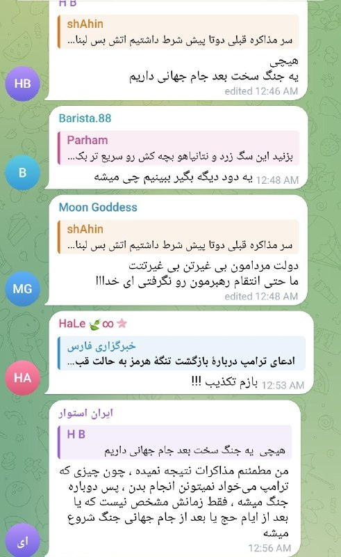

نظرات عرزشی‌ها؛
باز شروع شد زجه زدن

@Dirty_Kids 👻

## Dirty_Kids — post 390047

  

چه گوه‌خوریا، مارو درجریان بزارید 😂😂
هنوز نفهمیدن فقط برای صیغه شدنن

@Dirty_Kids 👻

## Dirty_Kids — post 390046

  <a href="telegram/content/Dirty_Kids_390046_1779577179.mp4" target="_blank">🎬 Download video</a>

بیرون کاخ سفید حدود 20 تا 30 تا تیر شلیک شده!

سرویس مخفی آمریکا هم سریع خبرنگارایی که تو محوطه کاخ سفید بودن رو جمع کرده و برده داخل اتاق کنفرانس خبری تا ازشون محافطت کنه.

@Dirty_Kids 👻

## Dirty_Kids — post 390045

  <a href="telegram/content/Dirty_Kids_390045_1779577180.mp4" target="_blank">🎬 Download video</a>

نیرو ویژه آمریکا در کاخ سفید

طبق گزارشات نزدیک کاخ سفید تیراندازی سنگینی رخ داده و 20-30 گلوله شلیک شده!

@Dirty_Kids 👻

## Dirty_Kids — post 390044

  

فارس هم خبردرمانی میکنه بچه شیعه آروم بشه
آخه با قاتل رهبرشون رفتن توافق کردن

@Dirty_Kids 👻

## Dirty_Kids — post 390043

  

۲ دسته عرزشی وجود داره:

@Dirty_Kids 👻

## manototv — post 105789

  <a href="telegram/content/manototv_105789_1779577182.mp4" target="_blank">🎬 Download video</a>

تماسی از سن‌فرانسیسکو:
«می‌گفت با شنیدن صدای شما احساس می‌کنم تو ایرانم…
و از سال‌هایی گفت که با برنامه‌های منوتو خندیده، گریه کرده و زندگی کرده بود.»

## manototv — post 105788

  <a href="telegram/content/manototv_105788_1779577183.mp4" target="_blank">🎬 Download video</a>

تماسی از خارج ایران:
«می‌گفت بسته شدن منوتو برای خیلی‌ها دردناک بود…
و از همراهی و امیدی گفت که این سال‌ها از برنامه‌ها گرفته بودند.

## manototv — post 105787

  <a href="telegram/content/manototv_105787_1779577185.mp4" target="_blank">🎬 Download video</a>

تجمع ایرانیان ساکن کپنهاگ، دوم خرداد ۱۴۰۵

## alonews — post 122203

  <a href="telegram/content/alonews_122203_1779577186.webm" target="_blank">🎬 Download video</a>

👈طبق گزارش NBC News، صدای تیراندازی در خارج از کاخ سفید شنیده شد، با حدود ۲۰ تا ۳۰ گلوله شلیک شده. سرویس مخفی به خبرنگاران دستور داده است که برای حفظ جانشان به داخل اتاق جلسه بروند

✅ @AloNews خبر جنگ

## alonews — post 122202

  <a href="telegram/content/alonews_122202_1779577186.webm" target="_blank">🎬 Download video</a>

👈وال استریت ژورنال: ترامپ به دستیارانش گفته است که در صورت عدم پایبندی ایران به چارچوب توافق، حق از سرگیری بمباران ایران را برای خود محفوظ می‌دارد.

✅ @AloNews خبر جنگ

## alonews — post 122201

  <a href="telegram/content/alonews_122201_1779577186.webm" target="_blank">🎬 Download video</a>

👈نیویورک تایمز: ۲۵ میلیارد دلار از پولای بلوکه شده‌ی ایران قراره واسشون آزاد بشه

✅ @AloNews خبر جنگ

---
📅 بروزرسانی: 1405/03/03 01:30
---

## VahidOOnLine — post 241817

  

خبرگزاری فارس، وابسته به سپاه، گزارش داد بر اساس پیگیری‌های خبرنگار این رسانه، اظهارات جدید ترامپ مبنی بر بازگشت تنگه هرمز به وضعیت پیشین و آماده‌سازی برای امضای توافق‌نامه «با واقعیت‌ها فاصله دارد».
فارس افزود: براساس آخرین متن ردوبدل‌شده بین آمریکا و جمهوری اسلامی، در صورت توافق احتمالی، تنگه هرمز کماکان تحت مدیریت حکومت ایران خواهد بود.
طبق این گزارش، اگرچه جمهوری اسلامی موافقت کرده است که اجازه دهد تعداد کشتی‌های عبوری به میزان قبل از جنگ بازگردد، اما این به‌هیچ‌عنوان به معنای «تردد آزاد» به وضعیت پیش از جنگ نیست.
خبرگزاری فارس تاکید کرد: «مدیریت تنگه، تعیین مسیر، زمان، نحوه عبور و صدور مجوز، کماکان در انحصار و با تدبیر جمهوری اسلامی خواهد بود. بنابراین ادعای ترامپ در این خصوص ناقص و فاقد انطباق با واقعیت است.»
این گزارش افزود مقام‌های آمریکایی در پیام‌های متعدد به تهران گفته‌اند که توییت‌های ترامپ عمدتاً جنبه تبلیغاتی و مصرف رسانه‌ای در داخل آمریکا دارد و توصیه کرده‌اند که به این اظهارات توجهی نشود.

‌🏁 🇬🇧 IranintlTV

🤖 @VahidOOnLine

## VahidOOnLine — post 241816

  

♦️اسماعیل بقایی، سخنگوی وزارت امور خارجه جمهوری اسلامی ایران، با انتشار پیامی در اکس با اشاره به مواجهه تاریخی ایران و روم نوشت: «در ذهن رومیان، رم مرکز بلامنازع جهان بود، اما ایرانیان آن توهم را در هم شکستند. زمانی که مارکوس ژولیوس فیلیپوس، مشهور به فیلیپ عرب، برای جنگ با ایران به شرق لشکر کشید، این نبرد به پیروزی روم ختم نشد، بلکه با صلحی پایان یافت که بر اساس شروط ساسانیان شکل گرفت. امپراتور مجبور شد کنار بیاید!» این پیام همزمان با انتشار اخبار مربوط به پیش‌نویس توافق صلح واشنگتن و تهران منتشر شد.
‌🇸🇦 Indypersian

🤖 @VahidOOnLine

## VahidOOnLine — post 241815

  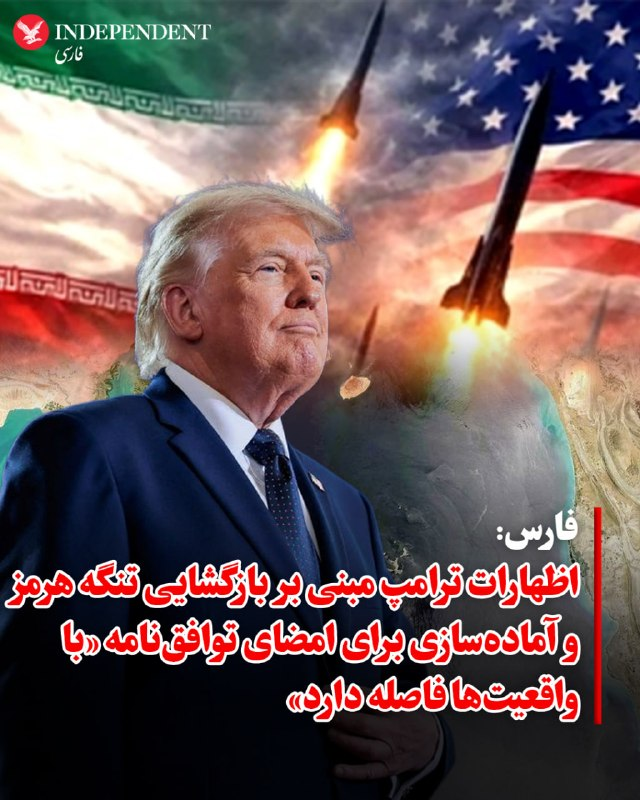

♦️فارس، خبرگزاری وابسته به سپاه، روز شنبه، دوم خردادماه، در واکنش به پیام دونالد ترامپ، رئیس‌جمهوری آمریکا مبنی بر نزدیک شدن به توافق با ایران و بازگشایی تنگه هرمز نوشت: «این ادعا نیز با واقعیت‌ها فاصله دارد». فارس در ادامه نوشت: «برخلاف ادعای لحظات قبل دونالد ترامپ در شبکه اجتماعی تروث سوشال مبنی بر بازگشت تنگه هرمز به وضعیت پیشین و آماده‌سازی برای امضای توافق‌نامه، پیگیری‌های خبرنگار فارس نشان می‌دهد که این ادعا نیز با واقعیت‌ها فاصله دارد؛ چرا که بر اساس آخرین متن ردوبدل‌شده، در صورت توافق احتمالی، تنگه هرمز کماکان تحت مدیریت ایران خواهد بود و اگرچه ایران موافقت کرده اجازه دهد تعداد کشتی‌های عبوری به میزان قبل از جنگ بازگردد، اما این به‌هیچ‌عنوان به معنای تردد آزاد به وضعیت قبل از جنگ نیست و مدیریت تنگه، تعیین مسیر، زمان، نحوه عبور و صدور مجوز، کماکان در انحصار و با تدبیر جمهوری اسلامی ایران خواهد بود.»
خبرگزاری سپاه در ادامه مدعی شد که برخلاف شروط پیشین ترامپ مبنی بر گنجاندن برنامه هسته‌ای در توافق، «هیچ تعهدی از سوی ایران داده نشده و پرونده هسته‌ای اساسا در این مرحله مورد بحث قرار نگرفته است.» فارس همچنین ادعا کرد که «مقامات آمریکایی در پیغام‌های متعدد به ایران اذعان داشته‌اند که توییت‌های ترامپ عمدتا جنبه تبلیغاتی و مصرف رسانه‌ای در داخل آمریکا دارد و توصیه کرده‌اند که به این اظهارات توجهی نشود».
‌🇸🇦 Indypersian

🤖 @VahidOOnLine

## VahidOOnLine — post 241814

  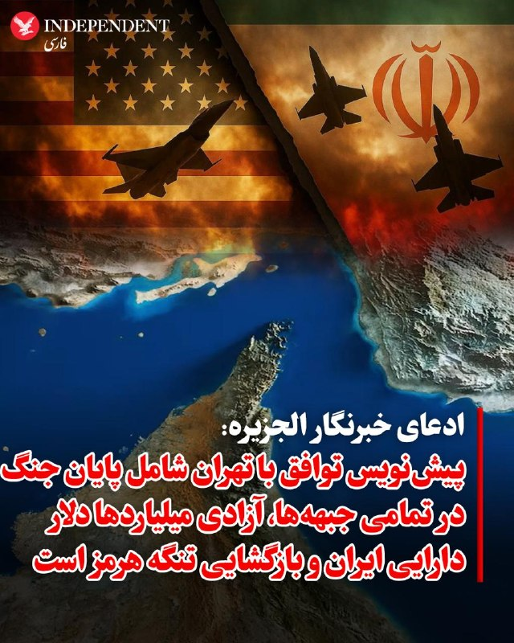

♦️خبرنگار الجزیره به نقل از «منابع خود»، مفاد کلیدی پیش‌نویس توافقی را که قرار است میان واشنگتن و تهران نهایی شود را اعلام کرد. خبرنگار الجزیره مدعی شد، توافق پیشنهادی شامل «پایان جنگ در تمامی جبهه‌ها از جمله لبنان»، «آزادسازی چندین میلیارد دلار از دارایی‌های مسدودشده ایران»، «رفع محاصره دریایی آمریکا و بازگشایی تنگه هرمز» و همچنین «عقب‌نشینی نیروهای آمریکایی از مجاورت مرزهای ایران» است. پس از اجرای این گام‌ها، طرفین یک مهلت ۳۰ روزه، که با توافق دوطرفه قابل تمدید است، خواهند داشت تا درباره مسئله هسته‌ای به توافق برسند که در طول این مدت نیز تردد از تنگه هرمز تسهیل خواهد شد. به گفته این خبرنگار، از نظر ایران، مدیریت تنگه هرمز یک موضوع دوجانبه میان تهران و مسقط تلقی می‌شود و گفتگوها در این زمینه با عمان در جریان است.
‌🇸🇦 Indypersian

🤖 @VahidOOnLine

## VahidOOnLine — post 241813

  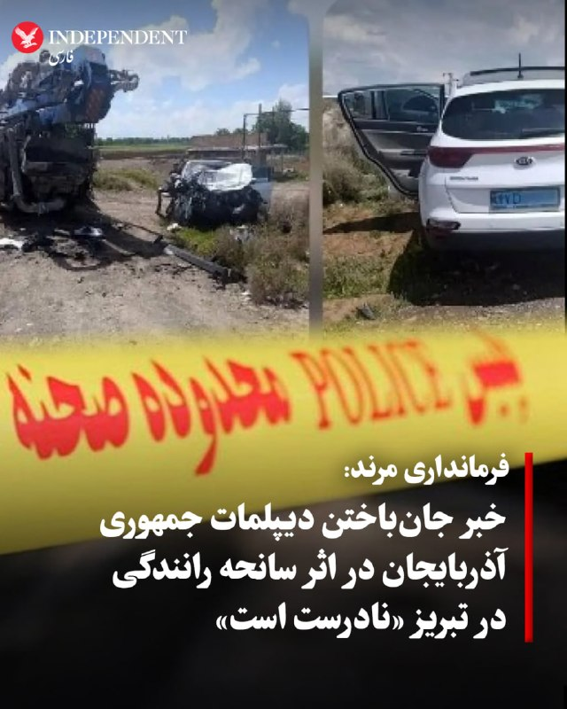

♦️فرمانداری مرند، روز شنبه، دوم خردادماه، خبر جان‌باختن دیپلمات جمهوری آذربایجان در تبریز را «نادرست» اعلام کرد و گفت: «در سانحه رانندگی، راننده کنسولگری جان باخته و رییس کنسولگری در سلامت کامل است». پیش از این، تسنیم، خبرگزاری وابسته به سپاه، به نقل از وزارت امور خارجه جمهوری آذربایجان، از جان باختن دیپلمات این کشور در تبریز خبر داده و گزارش داده بود که رامیل رضا اوغلو عمرانوف، کنسول جمهوری آذربایجان در تبریز حین انجام فعالیت خدماتی در حوالی شهر مرند در اتوبان جلفا-تبریز در اثر سانحه تصادف با خودرویی که در حال رانندگی بود جان باخته است.
‌🇸🇦 Indypersian

🤖 @VahidOOnLine

## VahidOOnLine — post 241812

  <a href="telegram/content/VahidOOnLine_241812_1779573612.mp4" target="_blank">🎬 Download video</a>

دونالد ترامپ، رئیس‌جمهور آمریکا، در پیامی در تروث‌سوشال اعلام کرد که از دفتر بیضی کاخ سفید، تماس «بسیار خوبی» با رهبران و مقام‌های چند کشور خاورمیانه و منطقه درباره جمهوری اسلامی و یک یادداشت تفاهم مرتبط با «صلح» داشته است.

او نوشت: «من در دفتر بیضی کاخ سفید هستم، جایی که همین حالا تماس بسیار خوبی با رئیس‌جمهور محمد بن سلمان آل سعود، از عربستان سعودی، محمد بن زاید آل نهیان، از امارات متحده عربی، امیر تمیم بن حمد بن خلیفه آل ثانی، نخست‌وزیر محمد بن عبدالرحمن بن جاسم بن جبر آل ثانی، و وزیر علی الثوادی، از قطر، فیلد مارشال سید عاصم منیر احمد شاه، از پاکستان، رئیس‌جمهور رجب طیب اردوغان، از ترکیه، رئیس‌جمهور عبدالفتاح السیسی، از مصر، ملک عبدالله دوم، از اردن، و ملک حمد بن عیسی آل خلیفه، از بحرین، درباره جمهوری اسلامی ایران و همه مسائل مرتبط با یک یادداشت تفاهم مربوط به صلح داشتیم.

یک توافق تا حد زیادی مذاکره شده است، مشروط به نهایی شدن میان ایالات متحده آمریکا، جمهوری اسلامی ایران، و کشورهای مختلف دیگر، همان‌طور که نام برده شدند.

به طور جداگانه، من تماسی با نخست‌وزیر بی‌بی نتانیاهو، از اسرائیل، داشتم که آن هم به همین ترتیب بسیار خوب پیش رفت.

جنبه‌ها و جزئیات نهایی توافق در حال حاضر در حال گفت‌وگو است و به‌زودی اعلام خواهد شد.

علاوه بر بسیاری عناصر دیگر این توافق، تنگه هرمز باز خواهد شد.»
‌🏁 🇬🇧 ManotoTV

🤖 @VahidOOnLine

## VahidOOnLine — post 241811

  <a href="telegram/content/VahidOOnLine_241811_1779573613.mp4" target="_blank">🎬 Download video</a>

دو تماس متفاوت از ایران؛
«اگه اجازه بدین جوابشو بدم»
‌🏁 🇬🇧 ManotoTV

🤖 @VahidOOnLine

## VahidOOnLine — post 241810

  

♦️تسنیم، خبرگزاری وابسته به سپاه پاسداران، روز شنبه به نقل از وزارت امور خارجه جمهوری آذربایجان، از جان باختن دیپلمات این کشور در تبریز خبر داد. براساس این گزارش، رامیل رضا اوغلو عمرانوف، کنسول جمهوری آذربایجان در تبریز حین انجام فعالیت خدماتی در حوالی شهر مرند در اتوبان جلفا-تبریز در اثر سانحه تصادف با خودرویی که در حال رانندگی بود جان باخت.
‌🇸🇦 Indypersian

🤖 @VahidOOnLine

## VahidOOnLine — post 241809

  

♦️«یک منبع ارشد منطقه‌ای» از جزییات گفتگوی رهبران کشورهای عربی و مسلمان با دونالد ترامپ خبر داد. خبرنگار آکسیوس نوشت: «یک منبع ارشد منطقه‌ای به من گفت که تمامی رهبران عرب و مسلمان حاضر در گفتگوی روز شنبه با ترامپ، از او خواسته‌اند تا برای پایان دادن به جنگ و مهار تنش‌ها در منطقه، توافق را پیش ببرد.» این منبع تاکید کرده است که «پیام همه این بود: لطفا به خاطر کل منطقه، جنگ را متوقف کنید.» به گفته این منبع، مذاکرات به خوبی در حال پیشرفت است و میانجی‌ها امیدوارند روز یکشنبه یک توافق چارچوب یک‌صفحه‌ای را منعقد و بلافاصله آن را اعلام کنند و پس از آن، قصد دارند ظرف چند روز مذاکرات را برای دستیابی به یک توافق دقیق و پرجزئیات آغاز کنند.
همزمان، دونالد ترامپ روز شنبه با انتشار پیامی در «تروث سوشال» از پیشرفت در مذاکرات صلح با ایران خبر داد و اعلام کرد جزئیات نهایی آن به‌زودی اعلام خواهد شد. رئیس‌جمهوری آمریکا با مثبت ارزیابی کردن تماس‌های تلفنی خود با رهبران کشورهای عربی، مسلمان و همچنین بنیامین نتانیاهو، نخست‌وزیر اسرائیل، تاکید کرد که در کنار سایر عناصر این توافق، تنگه هرمز نیز باز خواهد شد.
‌🇸🇦 Indypersian

🤖 @VahidOOnLine

## WithYashar — post 12268

«نیویورک تایمز به نقل از سه مقام ایرانی: در این توافق موضوع هسته‌ای را به مرحله‌ای بعدی موکول می‌کند.
ولی این توافق به آزادسازی ۲۵ میلیارد دلار از دارایی‌های مسدودشده در خارج از کشور منجر خواهد شد.
@withyashar

## WithYashar — post 12267

المیادین: آنچه پیشنهاد می شود یک توافق نهایی نیست، بلکه یک یادداشت تفاهم است.
این یادداشت تفاهم شامل هیچ بند مرتبط با پرونده هسته ای ایران نمی شود.
این یادداشت بر پایان جنگ و ترتیبات آتش بس متمرکز است. این تفاهم نامه شامل تسهیل دریانوردی در تنگه هرمز است.

این تفاهم نامه شامل خروج ناوگان آمریکایی از مجاورت ایران است.

این تفاهم نامه شامل آزادسازی نیمی از وجوه مسدود شده ایران است که بالغ بر 12 میلیارد دلار است.

این یادداشت شامل پایان محاصره نظامی دریایی ایالات متحده است. مهلت 30 روزه برای دستیابی به توافق هسته ای پس از امضای چارچوب توافق داده شد.
@withyashar

## WithYashar — post 12266

فارس : ایران هیچ توافق هسته ای هم با امریکا نداشته
@withyashar

## WithYashar — post 12265

دقایقی پیش صداسیما گفت ادعای ترامپ در خصوص بازگشایی تنگه هرمز دروغ است و تنگه دست ایران خواهد ماند
@withyashar

## WithYashar — post 12264

  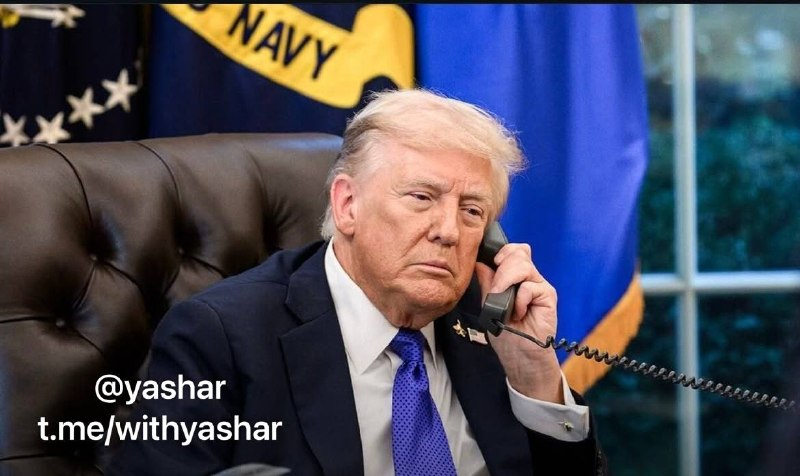

ترامپ کمی پیش در حال تماس با سران کشورها
@withyashar

## WithYashar — post 12263

خبرنگار کانال 12 اسرائیل:
ترامپ تسلیم خواسته های ایران شد
@withyashar

## WithYashar — post 12262

## WithYashar — post 12261

## WithYashar — post 12260

یاشار فکر میکنم خیلیا که پنیک میکنن تازه به جمعمون اضافه شدن
اونای که قدیمین فقط میشینن به این اتفاقات میخندن چون از چیزای با خبرن و شناخت دارن که بقیه نمیفهمن
البته این اتفاق زمانی میفته که نقشه راهو نداشته باشی
ولی ما که میدونیم چه خبره😉

## mwarmonitor — post 9595

🚨 گزارش شده که روسیه یک موشک بالستیک میان‌برد «اورشنیک» (Oreshnik) را به سمت اوکراین شلیک کرده است که طبق اعلام نیروی هوایی اوکراین، باعث به صدا درآمدن آژیرهای حمله هوایی در سراسر این کشور شده است.

@mwarmonitor

## mwarmonitor — post 9594

🔴نیویورک تایمز به نقل از ۳ مقام ایرانی: ایران با یک یادداشت تفاهم موافقت کرده است که بر اساس آن، درگیری‌ها در تمامی جبهه‌ها از جمله لبنان متوقف خواهد شد، تنگه هرمز بازگشایی می‌شود، محاصره دریایی آمریکا لغو می‌گردد، عبور و مرور تجاری آزاد خواهد شد و ۲۵ میلیارد دلار از دارایی‌های بلوکه‌شده ایران در خارج از کشور آزاد می‌شود. مسائل هسته‌ای طی ۳۰ تا ۶۰ روز آینده مورد مذاکره قرار خواهد گرفت .

@mwarmonitor

## mwarmonitor — post 9593

  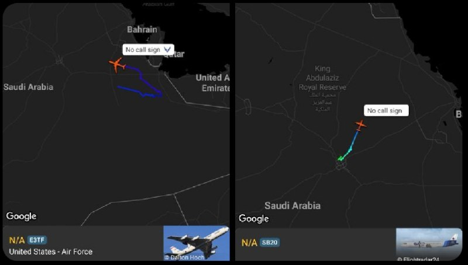

✈️یک فروند هواپیمای هشدار زودهنگام و کنترل هوابرد E-3B Sentry متعلق به نیروی هوایی آمریکا در حال حاضر پس از برخاستن از پایگاه هوایی «شاهزاده سلطان»، بر فراز شرق عربستان سعودی در حال پرواز است.

✈️همچنین یک فروند هواپیمای هشدار زودهنگام و کنترل هوابرد Saab GlobalEye متعلق به نیروی هوایی سلطنتی عربستان نیز به‌تازگی از همین پایگاه برخاسته و به سمت شمال‌شرق در حال حرکت است.

@mwarmonitor

## mwarmonitor — post 9591

📝عجب شاهکار کمدی-استراتژیکی! آقای «کله زرد» بعد از این همه خط‌ونشان و هزینه‌های نجومی روی دست مالیات‌دهندگان آمریکایی، عملاً خاورمیانه را شخم زد تا دوباره همه‌چیز را برگرداند به پله اول؛ منتها با چند صفر اضافه‌تر در حساب بانکی تهران.

🔸این بیانیه هالیوودی ترامپ بیشتر شبیه تیتراژ پایانی یک فیلم ابرقهرمانی است که در آن از شیر مرغ تا جان آدمیزاد—از محمد بن سلمان تا فیلد مارشال پاکستانی—را قطار کرده تا بگوید «من بزرگ‌ترین معامله تاریخ را کردم». اما خروجی واقعی این «هنر معامله»، بازگشت به چیزی شبیه به برجام است، با این تفاوت که میلیاردها دلار دارایی مسدودشده را آزاد کرده، مدیریت مهم‌ترین آبراه جهان را به ترکیب ایران-عمان سپرده و یک حکومت سرسخت‌تر و جسورتر را در منطقه تثبیت کرده است. این وسط، سهم مردم داخل ایران و ثبات منطقه مثل همیشه نادیده گرفته شده و آن مهلت ۳۰ روزه هسته‌ای هم بیشتر به یک وقت استراحت برای بازیابی قوا شباهت دارد. ترامپ با این کار، خود را مضحکه عام و خاص کرد؛ چرا که بعد از یک دور باطلِ خونین و پرهزینه، ثابت کرد واشنگتن در نهایت استادِ خریدنِ معامله‌های اضطراریِ دقیقه‌نودی به قیمت گزاف است، بی‌آنکه موازنه قدرت را سر سوزنی به نفع خود تغییر داده باشد.

@mwarmonitor

## mwarmonitor — post 9590

🔸خبرگزاری فارس ایران ادعای ترامپ مبنی بر اینکه تنگه هرمز به وضعیت پیش از جنگ بازخواهد گشت را رد کرده و گفته است هر توافق احتمالی فقط اجازه می‌دهد حجم تردد به سطح قبلی برگردد، در حالی که کنترل مسیرهای عبور، زمان‌بندی و صدور مجوزها همچنان در اختیار ایران خواهد بود.

@mwarmonitor

## mwarmonitor — post 9589

🔴علی هاشم خبرنگار الجزیره:

«بر اساس منابع من، پیش‌نویس پیشنهادی که قرار است نهایی شود شامل موارد زیر است:

پایان جنگ در همه جبهه‌ها، از جمله لبنان

آزادسازی چندین میلیارد دلار از دارایی‌های مسدودشده ایران

لغو محاصره دریایی آمریکا و بازگشایی تنگه هرمز

عقب‌نشینی نیروهای آمریکایی از نزدیکی فوری ایران

پس از آن، طرف‌ها ۳۰ روز فرصت خواهند داشت تا درباره موضوع هسته‌ای به توافق برسند. این ۳۰ روز می‌تواند با توافق دوطرفه تمدید شود.

در طول این ۳۰ روز، عبور و مرور از تنگه تسهیل خواهد شد.

بر اساس گفته ایران، مدیریت تنگه هرمز یک موضوع ایرانی–عمانی خواهد بود و در حال مذاکره با مسقط است.»

@mwarmonitor

## mwarmonitor — post 9588

🔴🔴🔴 من در دفتر بیضی شکل کاخ سفید هستم، جایی که همین حالا یک تماس تلفنی بسیار خوب با این مقامات داشتیم: رئیس‌جمهور محمد بن سلمان آل سعود از عربستان سعودی، محمد بن زاید آل نهیان از امارات متحده عربی، امیر تمیم بن حمد بن خلیفه آل ثانی، نخست‌وزیر محمد بن عبدالرحمن…

## FoxNewsTwitter — post 342171

  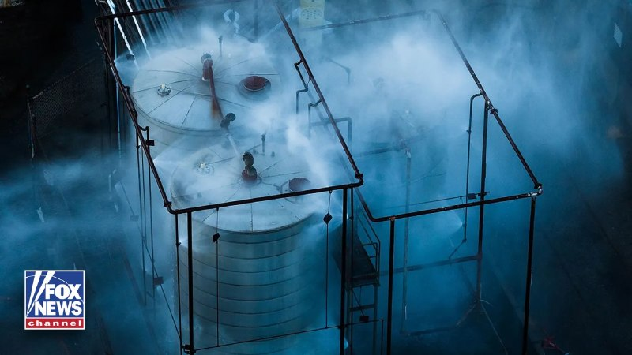

Fox News (Twitter/X)

California Gov. Newsom declares a state of emergency in Orange County as a failing chemical tank threatens a potentially catastrophic explosion.

More than 40,000 residents have been evacuated as emergency crews race to cool the overheating tank at a Southern California aerospace facility.

Officials warn the tank could either explode or spill thousands of gallons of toxic chemicals, triggering what responders called an “environmental disaster.”

## pm_afshaa — post 91345

خبر اکسیوس که گفته هم‌اکنون متن توافقنامه توسط ایران و آمریکا امضا شد رو چک کردم من ندیدم گذاشته باشه. خبر فیکه داره پخش میشه تو چنلا

## pm_afshaa — post 91343

  <a href="telegram/content/pm_afshaa_91343_1779573617.webm" target="_blank">🎬 Download video</a>

🔴نیویورک تایمز به نقل از 3 مقام ایرانی: با یادداشت تفاهمی به توافق رسیدیم که جنگ متوقف بشه و تنگه هرمز هم باز بشه. این توافق منجر به آزادسازی 25 میلیارد دلار دارایی مسدود شده در خارج از کشور میشه! 
💧 Rainbet.com the #1 Non-KYC Crypto Casino & Sportsbook…

## pm_afshaa — post 91342

خبر اکسیوس که گفته هم‌اکنون متن توافقنامه توسط ایران و آمریکا امضا شد رو چک کردم من ندیدم گذاشته باشه. خبر فیکه داره پخش میشه تو چنلا

## pm_afshaa — post 91341

  <a href="telegram/content/pm_afshaa_91341_1779573618.webm" target="_blank">🎬 Download video</a>

🔴نیویورک تایمز به نقل از 3 مقام ایرانی:
با یادداشت تفاهمی به توافق رسیدیم که جنگ متوقف بشه و تنگه هرمز هم باز بشه.

این توافق منجر به آزادسازی 25 میلیارد دلار دارایی مسدود شده در خارج از کشور میشه!

💧 Rainbet.com the #1 Non-KYC Crypto Casino & Sportsbook @rainbetcom

😁 @Pm_Afshaa

## pm_afshaa — post 91340

  <a href="telegram/content/pm_afshaa_91340_1779573618.webm" target="_blank">🎬 Download video</a>

🔴تتر بعد از خبر توافق احتمالی بین آمریکا و جمهوری اسلامی تا 170 هزار تومن ریزش کرد 
💧 Rainbet.com the #1 Non-KYC Crypto Casino & Sportsbook @rainbetcom 
😁 @Pm_Afshaa

## pm_afshaa — post 91339

  <a href="telegram/content/pm_afshaa_91339_1779573619.webm" target="_blank">🎬 Download video</a>

🔴ترامپ در تروث سوشال: من اکنون در دفتر بیضی کاخ سفید هستم؛ جایی که همین حالا گفت‌وگوی بسیار خوبی با محمد بن سلمان آل سعود، عربستان سعودی؛ محمد بن زاید آل نهیان، امارات متحده عربی؛ امیر تمیم بن حمد آل ثانی، نخست‌وزیر محمد بن عبدالرحمن بن جاسم آل ثانی و وزیر…

## pm_afshaa — post 91338

  <a href="telegram/content/pm_afshaa_91338_1779573619.webm" target="_blank">🎬 Download video</a>

🔴توییت انگلیسی بقایی، سخنگوی وزارت خارجه و کنایه به ترامپ:

تو ذهن رومیان، روم مرکز بلامنازع جهان به‌شمار می‌رفت، ولی ایرانی‌ها این توهم رو شکوندن؛ زمانی که مارکوس ژولیوس فیلیپوس (فیلیپ عرب) واسه جنگ با ایران به شرق لشکر کشید، این نبرد به پیروزی روم ختم نشد، بلکه با صلحی بر پایه شروط ساسانیان تموم شد؛ تا جایی که امپراتور ناچار شد با ایران کنار بیاد!

💧 Rainbet.com the #1 Non-KYC Crypto Casino & Sportsbook @rainbetcom

😁 @Pm_Afshaa

## pm_afshaa — post 91337

  <a href="telegram/content/pm_afshaa_91337_1779573620.webm" target="_blank">🎬 Download video</a>

🔴علی هاشم، خبرنگار الجزیره:

طبق گفته منابع، پیش‌نویس پیشنهادی که قراره نهایی بشه شامل موارد زیر است:

- پایان جنگ در همه جبهه‌ها از جمله لبنان
- آزاد شدن میلیاردها دلار از دارایی‌های مسدود شده ایران
- لغو محاصره دریایی آمریکا و گشایش تنگه هرمز
- خروج نیروهای آمریکایی از مجاورت بلافصل ایران
پس از این، طرفین 30 روز فرصت خواهند داشت تا درباره مسئله هسته‌ای به توافق برسند؛ این 30 روز با توافق طرفین قابل تمدید است.
در طول این 30 روز، عبور و مرور از طریق تنگه تسهیل خواهد شد و به گفته ایران، مدیریت تنگه هرمز موضوعی ایرانی-عمانی خواهد بود و در حال مذاکره با مسقط است.

💧Rainbet.com the #1 Non-KYC Crypto Casino & Sportsbook @rainbetcom

😁 @Pm_Afshaa

## pm_afshaa — post 91336

  <a href="telegram/content/pm_afshaa_91336_1779573621.webm" target="_blank">🎬 Download video</a>

🔴خبرنگار کانال 12 اسرائیل:
ترامپ تسلیم خواسته های ایران شد

💧 Rainbet.com the #1 Non-KYC Crypto Casino & Sportsbook @rainbetcom

😁 @Pm_Afshaa

## VahidOnline — post 75664

  

فارس، خبرگزاری وابسته به سپاه، در واکنش به پیام دونالد ترامپ، رئیس‌جمهوری آمریکا مبنی بر نزدیک شدن به توافق با ایران و بازگشایی تنگه هرمز نوشت: «این ادعا نیز با واقعیت‌ها فاصله دارد».

فارس در ادامه نوشت: «برخلاف ادعای لحظات قبل دونالد ترامپ در شبکه اجتماعی تروث سوشال مبنی بر بازگشت تنگه هرمز به وضعیت پیشین و آماده‌سازی برای امضای توافق‌نامه، پیگیری‌های خبرنگار فارس نشان می‌دهد که این ادعا نیز با واقعیت‌ها فاصله دارد؛ چرا که بر اساس آخرین متن ردوبدل‌شده، در صورت توافق احتمالی، تنگه هرمز کماکان تحت مدیریت ایران خواهد بود و اگرچه ایران موافقت کرده اجازه دهد تعداد کشتی‌های عبوری به میزان قبل از جنگ بازگردد، اما این به‌هیچ‌عنوان به معنای تردد آزاد به وضعیت قبل از جنگ نیست و مدیریت تنگه، تعیین مسیر، زمان، نحوه عبور و صدور مجوز، کماکان در انحصار و با تدبیر جمهوری اسلامی ایران خواهد بود.»

خبرگزاری سپاه در ادامه مدعی شد که برخلاف شروط پیشین ترامپ مبنی بر گنجاندن برنامه هسته‌ای در توافق، «هیچ تعهدی از سوی ایران داده نشده و پرونده هسته‌ای اساسا در این مرحله مورد بحث قرار نگرفته است.»

فارس همچنین ادعا کرد که «مقامات آمریکایی در پیغام‌های متعدد به ایران اذعان داشته‌اند که توییت‌های ترامپ عمدتا جنبه تبلیغاتی و مصرف رسانه‌ای در داخل آمریکا دارد و توصیه کرده‌اند که به این اظهارات توجهی نشود».
@VahidOOnLine

📡 @VahidOnline

## VahidOnline — post 75663

  

خبرنگار الجزیره به نقل از «منابع خود»، مفاد کلیدی پیش‌نویس توافقی را که قرار است میان واشنگتن و تهران نهایی شود را اعلام کرد.

خبرنگار الجزیره مدعی شد، توافق پیشنهادی شامل «پایان جنگ در تمامی جبهه‌ها از جمله لبنان»، «آزادسازی چندین میلیارد دلار از دارایی‌های مسدودشده ایران»، «رفع محاصره دریایی آمریکا و بازگشایی تنگه هرمز» و همچنین «عقب‌نشینی نیروهای آمریکایی از مجاورت مرزهای ایران» است.

پس از اجرای این گام‌ها، طرفین یک مهلت ۳۰ روزه، که با توافق دوطرفه قابل تمدید است، خواهند داشت تا درباره مسئله هسته‌ای به توافق برسند که در طول این مدت نیز تردد از تنگه هرمز تسهیل خواهد شد.
به گفته این خبرنگار، از نظر ایران، مدیریت تنگه هرمز یک موضوع دوجانبه میان تهران و مسقط تلقی می‌شود و گفتگوها در این زمینه با عمان در جریان است.
@VahidOOnLine

📡 @VahidOnline

## VahidOnline — post 75662

  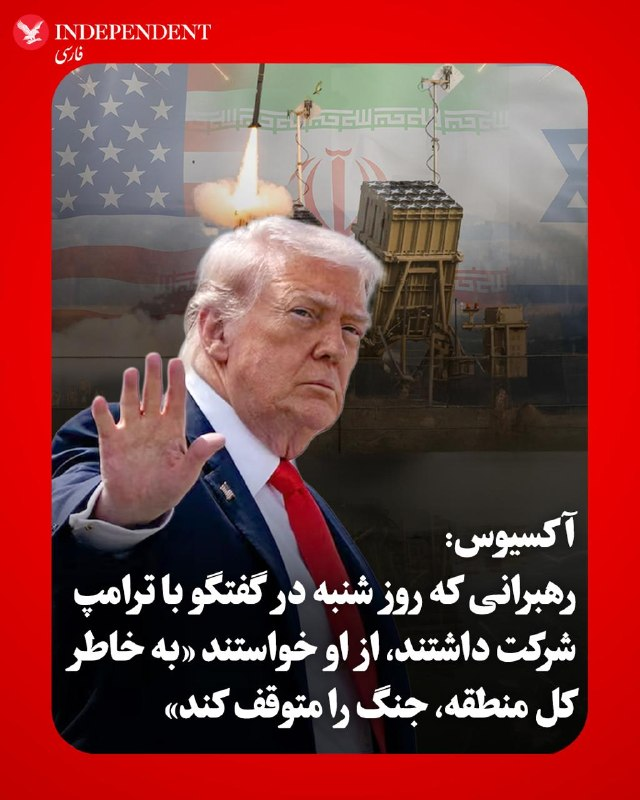

«یک منبع ارشد منطقه‌ای» از جزییات گفتگوی رهبران کشورهای عربی و مسلمان با دونالد ترامپ خبر داد.

خبرنگار آکسیوس نوشت: «یک منبع ارشد منطقه‌ای به من گفت که تمامی رهبران عرب و مسلمان حاضر در گفتگوی روز شنبه با ترامپ، از او خواسته‌اند تا برای پایان دادن به جنگ و مهار تنش‌ها در منطقه، توافق را پیش ببرد.»

این منبع تاکید کرده است که «پیام همه این بود: لطفا به خاطر کل منطقه، جنگ را متوقف کنید.»

به گفته این منبع، مذاکرات به خوبی در حال پیشرفت است و میانجی‌ها امیدوارند روز یکشنبه یک توافق چارچوب یک‌صفحه‌ای را منعقد و بلافاصله آن را اعلام کنند و پس از آن، قصد دارند ظرف چند روز مذاکرات را برای دستیابی به یک توافق دقیق و پرجزئیات آغاز کنند.
@VahidOOnLine

📡 @VahidOnline

## kianmeli1 — post 87622

  <a href="https://t.me/kianmeli1/87622" target="_blank">📎 Download file</a>

https://t.me/kianmeli1

## kianmeli1 — post 87621

  <a href="telegram/content/kianmeli1_87621_1779573623.mp4" target="_blank">🎬 Download video</a>

🔴فاطی کماندو با موزیک رقص مردگان
https://t.me/kianmeli1

## kianmeli1 — post 87620

🔴دقایقی پیش صداسیما گفت ادعای ترامپ در خصوص بازگشایی تنگه هرمز دروغ است و تنگه دست ایران خواهد ماند
https://t.me/kianmeli1

## kianmeli1 — post 87619

🔴احتمالا بزودی صدای توافق بیرون از پنجره شنیده میشه
لب پنجره نباشیم

هرگاه به مهر نهایی پای برگه میرسیدند جنگ شروع میشد
https://t.me/kianmeli1

## IranIntlTV — post 338662

  

خبرگزاری فارس، وابسته به سپاه، گزارش داد بر اساس پیگیری‌های خبرنگار این رسانه، اظهارات جدید ترامپ مبنی بر بازگشت تنگه هرمز به وضعیت پیشین و آماده‌سازی برای امضای توافق‌نامه «با واقعیت‌ها فاصله دارد».
فارس افزود: براساس آخرین متن ردوبدل‌شده بین آمریکا و جمهوری اسلامی، در صورت توافق احتمالی، تنگه هرمز کماکان تحت مدیریت حکومت ایران خواهد بود.
طبق این گزارش، اگرچه جمهوری اسلامی موافقت کرده است که اجازه دهد تعداد کشتی‌های عبوری به میزان قبل از جنگ بازگردد، اما این به‌هیچ‌عنوان به معنای «تردد آزاد» مانند وضعیت پیش از جنگ نیست.
خبرگزاری فارس تاکید کرد: «مدیریت تنگه، تعیین مسیر، زمان، نحوه عبور و صدور مجوز، کماکان در انحصار و با تدبیر جمهوری اسلامی خواهد بود. بنابراین ادعای ترامپ در این خصوص ناقص و فاقد انطباق با واقعیت است.»
این گزارش افزود مقام‌های آمریکایی در پیام‌های متعدد به تهران گفته‌اند که توییت‌های ترامپ عمدتاً جنبه تبلیغاتی و مصرف رسانه‌ای در داخل آمریکا دارد و توصیه کرده‌اند که به این اظهارات توجهی نشود.

https://iranintl.com/202605233399

## IranIntlTV — post 338661

  <a href="telegram/content/IranIntlTV_338661_1779573626.mp4" target="_blank">🎬 Download video</a>

مراد ویسی، تحلیل‌گر ارشد ایران‌اینترنشنال، گفت: «ترامپ گفته روز یکشنبه درباره توافق یا جنگ با جمهوری اسلامی تصمیم می‌گیرد و احتمال توافق را ۵۰-۵۰ دانسته، اکنون نگاه‌ها به تصمیم اوست. آخرین پیشنهاد جمهوری اسلامی از طریق عاصم منیر، فرمانده ارتش پاکستان، به آمریکا منتقل شده و او پس از دیدار با مقام‌های تهران از انتقال نظرات نهایی جمهوری اسلامی به آمریکا خبر داده است.»
@iranintltv

## Shin_Persian — post 6189

🔁 Quoting above tweet:
Shin ✓ @hey_itsmyturn
Sat, 23 May 2026 21:48:53 UTC

The only entity that wants to attack "The President" [and attempted to assassinate his daughter] is the IRGC , dingus. Same people you're "getting close" to make a deal with.
(https://x.com/HouseGOP/status/2058202848093946166)

فارسی

تنها نهادی که قصد حمله به «رئیس‌جمهور» را دارد [و برای ترور دخترش تلاش کرد]، سپاه پاسداران انقلاب اسلامی (IRGC) است، احمق. همان کسانی که برای توافق دارید به آن‌ها «نزدیک» می‌شوید.
(https://x.com/HouseGOP/status/2058202848093946166)

𝕏 · @shin_persian

## Shin_Persian — post 6188

  

↩️ Quoted tweet: Kaelan Dorr ✓ @Kaelan47 Sat, 23 May 2026 21:02:21 UTC If you find yourself reading this Truth and feeling the need to attack the President for attempting to achieve long lasting peace… Go ahead and delete your account, touch some grass…

## Shin_Persian — post 6187

↩️ Quoted tweet:
Kaelan Dorr ✓ @Kaelan47
Sat, 23 May 2026 21:02:21 UTC

If you find yourself reading this Truth and feeling the need to attack the President for attempting to achieve long lasting peace…

Go ahead and delete your account, touch some grass, and call a loved one. The TDS has set in.

↩️ توییت نقل‌قول شده — برای پاسخ، پست زیر را ببینید.

فارسی

اگر خود را در حال خواندن این «حقیقت» (در Truth Social) می‌بینید و احساس می‌کنید نیاز دارید به رئیس‌جمهور بابت تلاش برای دستیابی به صلحی پایدار حمله کنید...

بفرمایید و حساب کاربری خود را پاک کنید، با دنیای واقعی ارتباط بگیرید (کمی علف لمس کنید) و با یکی از عزیزانتان تماس بگیرید. «سندروم آشفتگی ترامپ» (TDS) در شما ریشه دوانده است.

𝕏 · @shin_persian

## Shin_Persian — post 6184

↩️ Quoted tweet:
Kaelan Dorr ✓ @Kaelan47
Sat, 23 May 2026 21:02:21 UTC

If you find yourself reading this Truth and feeling the need to attack the President for attempting to achieve long lasting peace…

Go ahead and delete your account, touch some grass, and call a loved one. The TDS has set in.

↩️ توییت نقل‌قول شده — برای پاسخ، پست زیر را ببینید.

فارسی

اگر در حال خواندن این «تروث» هستید و احساس می‌کنید باید به رئیس‌جمهور بابت تلاش برای دستیابی به صلحی پایدار حمله کنید...

بفرمایید و حساب کاربری‌تان را پاک کنید، کمی با دنیای واقعی ارتباط بگیرید (touch some grass) و با یکی از عزیزانتان تماس بگیرید. سندرم تنفر از ترامپ (TDS) در شما ریشه دوانده است.

𝕏 · @shin_persian

## Shin_Persian — post 6183

Shin ✓ @hey_itsmyturn
Sat, 23 May 2026 21:26:27 UTC

IRGC-owned Fars News:
"""
Trump's Claim Regarding the Return of the Strait of Hormuz to its Previous State Is Baseless

According to Fars News Agency, despite Donald Trump's recent claim on "Truth Social" that the Strait of Hormuz has returned to its previous condition and that an agreement is being prepared for signing, investigations by Fars reporters indicate that this assertion is unsubstantiated.

Based on the latest exchanged communications, should a potential agreement be reached, the Strait of Hormuz will remain under Iranian management.

Although Iran has agreed to allow the number of passing vessels to return to pre-war levels, this by no means signifies "free passage" to the pre-war status.

Consequently, the management of the strait, including route determination, timing, passage procedures, and permit issuance, will remain exclusively under the discretion and management of the Islamic Republic of Iran. Therefore, Trump's claim in this regard is flawed and does not align with reality.

It is worth noting that Trump had previously declared negotiations regarding Iran's nuclear program as one of the primary and inseparable conditions for any agreement. However, no commitment has been made by Iran, and the nuclear file has not been discussed at this stage.

American officials have reportedly acknowledged in numerous messages to Iran that Trump's tweets are primarily promotional and intended for media consumption within the United States, advising against paying attention to these statements.

"""

ترجمه فارسی در بخش نظرات

𝕏 · @shin_persian

## ManotoTV — post 105786

  <a href="telegram/content/ManotoTV_105786_1779573628.mp4" target="_blank">🎬 Download video</a>

دونالد ترامپ، رئیس‌جمهور آمریکا، در پیامی در تروث‌سوشال اعلام کرد که از دفتر بیضی کاخ سفید، تماس «بسیار خوبی» با رهبران و مقام‌های چند کشور خاورمیانه و منطقه درباره جمهوری اسلامی و یک یادداشت تفاهم مرتبط با «صلح» داشته است.

او نوشت: «من در دفتر بیضی کاخ سفید هستم، جایی که همین حالا تماس بسیار خوبی با رئیس‌جمهور محمد بن سلمان آل سعود، از عربستان سعودی، محمد بن زاید آل نهیان، از امارات متحده عربی، امیر تمیم بن حمد بن خلیفه آل ثانی، نخست‌وزیر محمد بن عبدالرحمن بن جاسم بن جبر آل ثانی، و وزیر علی الثوادی، از قطر، فیلد مارشال سید عاصم منیر احمد شاه، از پاکستان، رئیس‌جمهور رجب طیب اردوغان، از ترکیه، رئیس‌جمهور عبدالفتاح السیسی، از مصر، ملک عبدالله دوم، از اردن، و ملک حمد بن عیسی آل خلیفه، از بحرین، درباره جمهوری اسلامی ایران و همه مسائل مرتبط با یک یادداشت تفاهم مربوط به صلح داشتیم.

یک توافق تا حد زیادی مذاکره شده است، مشروط به نهایی شدن میان ایالات متحده آمریکا، جمهوری اسلامی ایران، و کشورهای مختلف دیگر، همان‌طور که نام برده شدند.

به طور جداگانه، من تماسی با نخست‌وزیر بی‌بی نتانیاهو، از اسرائیل، داشتم که آن هم به همین ترتیب بسیار خوب پیش رفت.

جنبه‌ها و جزئیات نهایی توافق در حال حاضر در حال گفت‌وگو است و به‌زودی اعلام خواهد شد.

علاوه بر بسیاری عناصر دیگر این توافق، تنگه هرمز باز خواهد شد.»

## ManotoTV — post 105785

  <a href="telegram/content/ManotoTV_105785_1779573629.mp4" target="_blank">🎬 Download video</a>

دو تماس متفاوت از ایران؛
«اگه اجازه بدین جوابشو بدم»

## Persian_Trend_Official — post 14791

اسرائیل نابود شده فقط یک تکون لازمه جولان تصرف بشه ...

## Persian_Trend_Official — post 14790

  <a href="telegram/content/Persian_Trend_Official_14790_1779573631.mp4" target="_blank">🎬 Download video</a>

اسرائیل نابود شده
فقط یک تکون لازمه جولان تصرف بشه ...

## Persian_Trend_Official — post 14788

ادمین هستم، با اجازه از الیاس عزیز. 📝

این صرفا نظر شخصی من هست. 🙏

به نظر من الان همه دارن از اینکه جام جهانی رویداد خیلی مهمی هست و ترامپ قبل از جام جهانی نمیزنه صحبت می‌کنند و میگن اگرم بزنه بعد از جام جهانی میزنه

و فکر میکنم این دقیقا همون تله‌ای هست که شما هم دارید توش می‌افتید

امنیت ملی آمریکا موضوعی نیست که با یک فستیوال بخواد موضوع مهمی مثل ج.ا رو به تعویق بندازه

به نظرم از الان هم دارن توافق رو بولد میکنن تا به جام جهانی که رسیدیم دیگه هیچکس فکرش رو هم نکنه که بخوان وسط جام جهانی بزنن

و خب دقیقا همونجاست که، بوووم‌ 🗿
🐭🐁تباه به ملکوت اعلی می‌پیونده 😂
البته اگر تا الان نپیوسته باشه 😈

گفتم این صرفا نظر شخصی من هست. ❤️🙏

📝 Nick

📌 @persian_trend_official
پرشین ترند | متفاوت‌ترین کانال نظامی

## Persian_Trend_Official — post 14787

  

📷 Photo

## Persian_Trend_Official — post 14786

خبرگزاری فارس | ادعای ترامپ دربارهٔ بازگشت تنگهٔ هرمز به حالت قبل واقعیت ندارد

💢به‌گزارش فارس؛ برخلاف ادعای لحظات قبل دونالد ترامپ در شبکهٔ اجتماعی «تروث سوشال» مبنی بر بازگشت تنگهٔ هرمز به وضعیت پیشین و آماده‌سازی برای امضای توافق‌نامه، پیگیری‌های خبرنگار فارس نشان می‌دهد که این ادعا نیز با واقعیت‌ها فاصله دارد.

💢براساس آخرین متن ردوبدل‌شده، در صورت توافق احتمالی، تنگهٔ هرمز کماکان تحت مدیریت ایران خواهد بود.

💢اگرچه ایران موافقت کرده اجازه دهد تعداد کشتی‌های عبوری به میزان قبل از جنگ بازگردد، اما این به‌هیچ‌عنوان به معنای «تردد آزاد» به وضعیت قبل از جنگ نیست.

🫆:Tony

📌 @persian_trend_official
پرشین ترند | متفاوت‌ترین کانال نظامی

## Persian_Trend_Official — post 14785

علی هاشم خبرنگار الجزیره:

طبق گفته منابع من، پیش‌نویس پیشنهادی که قرار است نهایی شود شامل موارد زیر است:

- پایان جنگ در همه جبهه‌ها از جمله لبنان

- آزاد شدن میلیاردها دلار از دارایی‌های مسدود شده ایران

- لغو محاصره دریایی آمریکا و گشایش تنگه هرمز

- خروج نیروهای آمریکایی از مجاورت بلافصل ایران

پس از این، طرفین ۳۰ روز فرصت خواهند داشت تا درباره مسئله هسته‌ای به توافق برسند.

این ۳۰ روز با توافق طرفین قابل تمدید است.

در طول این سی روز، عبور و مرور از طریق تنگه تسهیل خواهد شد.

به گفته ایران، مدیریت تنگه هرمز موضوعی ایرانی-عمانی خواهد بود و در حال مذاکره با مسقط است./انتخاب

😄😄😄😄😄 بخدا این ترامپ همرو سرکار گذاشته !

## Persian_Trend_Official — post 14783

💢وضعیت پرواز های نظامی ایالات متحده در آسمان منطقه . 🫆:Tony 📌 @persian_trend_official پرشین ترند | متفاوت‌ترین کانال نظامی

## Persian_Trend_Official — post 14782

https://t.me/persian_trend_official/14778?comment=576703

من فشار بخورم یا نخورم تاثیری داره ؟
فکر میکنی توافقی هم بشه از فردا دلار میشه 20 تومن و سرمایه گزار خارجی واسه ایران صف میبندن ؟
داداش من این مسیر رو به قهقراست

## Persian_Trend_Official — post 14781

  <a href="telegram/content/Persian_Trend_Official_14781_1779573633.webm" target="_blank">🎬 Download video</a>

دونالد تا حس پیروزی بهشون دست نده از سوراخ بیرون نمیان 😄

## Persian_Trend_Official — post 14780

  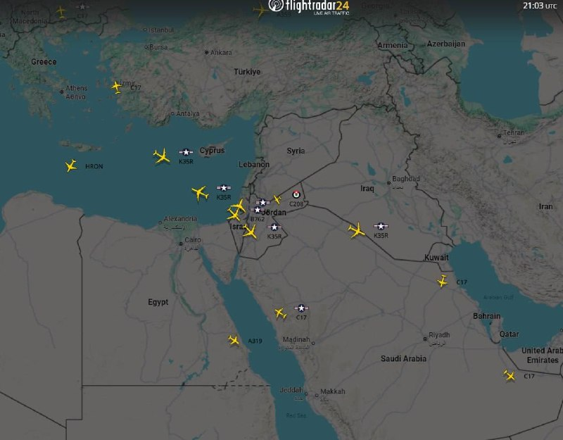

💢وضعیت پرواز های نظامی ایالات متحده در آسمان منطقه .

🫆:Tony

📌 @persian_trend_official
پرشین ترند | متفاوت‌ترین کانال نظامی

## Persian_Trend_Official — post 14779

جمهوری اسلامی و آمریکا، حتی روی چهارچوب هم تا الان به نقطه مشترک نرسیدن !

## Persian_Trend_Official — post 14778

  <a href="telegram/content/Persian_Trend_Official_14778_1779573634.webm" target="_blank">🎬 Download video</a>

متاسفانه ما ایرانی ها یا فکر میکنم توافق شده و بدبخت شدیم یا تو صف پمپ بنزینیم ! هیییچ حد وسطی نداریم ...

## IranianMinds — post 20644

  

🔴پست اتاق جنگ اسرائیل:

ایران آزاد.

@IranianMinds

## IranianMinds — post 20643

ترامپ به نفع کشورش کار میکنه
و همکاری با این رژیمی که خواهان نابودی اونهاست به نفع آمریکا نیست.

موضوعاتی هست که ما اطلاع نداریم
فقط کافیه وایستیم و ببینیم

پیچیدگی های موضوع رو اطلاعی نداریم

## BBCPersian — post 281905

  

🔻دونالد ترامپ، رئیس جمهور آمریکا در شبکه اجتماعی تروث سوشال اعلام کرد که گفت‌وگوهای «بسیار خوبی» با شماری از رهبران منطقه داشته است اما جنبه‌ها و جزئیات نهایی توافق با ایران همچنان در حال بررسی است و «به‌زودی» اعلام خواهد شد.

او همچنین گفت که در چارچوب این توافق، تنگه هرمز بازگشایی خواهد شد.

آقای ترامپ می‌گوید که از دفتر بیضی کاخ سفید در باره ایران و «تفاهم‌نامه‌ای مرتبط با صلح» این گفت‌وگوها را انجام داده است.

او گفت که بخش عمده توافق میان آمریکا، ایران و دیگر کشورهای یادشده مورد مذاکره قرار گرفته، اما هنوز نهایی نشده است.

آقای ترامپ افزود که به‌طور جداگانه با بنیامین نتانیاهو، نخست‌وزیر اسرائیل، نیز گفت‌وگو کرده و این تماس هم «بسیار خوب» بوده است.

📸 Getty

https://bbc.in/4dtIPCY
@BBCPersian

## Dirty_Kids — post 390041

‏اصلا چرا من باید شخصی به نام “عاصم منیر” رو بشناسم؟ کیرم توی این سونوشت جدی. همین که شخصی به نام “عاصم منیر” رو می‌شناسیم یعنی باید رید توی این سرنوشت.

@Dirty_Kids 👻

## Dirty_Kids — post 390040

نذارید اخبار مذاکره حواستون رو از رسیدگی به خشخاش‌ها پرت کنه، همین الان برین بهش آب بدین

@Dirty_Kids 👻

## manototv — post 105786

  <a href="telegram/content/manototv_105786_1779573635.mp4" target="_blank">🎬 Download video</a>

دونالد ترامپ، رئیس‌جمهور آمریکا، در پیامی در تروث‌سوشال اعلام کرد که از دفتر بیضی کاخ سفید، تماس «بسیار خوبی» با رهبران و مقام‌های چند کشور خاورمیانه و منطقه درباره جمهوری اسلامی و یک یادداشت تفاهم مرتبط با «صلح» داشته است.

او نوشت: «من در دفتر بیضی کاخ سفید هستم، جایی که همین حالا تماس بسیار خوبی با رئیس‌جمهور محمد بن سلمان آل سعود، از عربستان سعودی، محمد بن زاید آل نهیان، از امارات متحده عربی، امیر تمیم بن حمد بن خلیفه آل ثانی، نخست‌وزیر محمد بن عبدالرحمن بن جاسم بن جبر آل ثانی، و وزیر علی الثوادی، از قطر، فیلد مارشال سید عاصم منیر احمد شاه، از پاکستان، رئیس‌جمهور رجب طیب اردوغان، از ترکیه، رئیس‌جمهور عبدالفتاح السیسی، از مصر، ملک عبدالله دوم، از اردن، و ملک حمد بن عیسی آل خلیفه، از بحرین، درباره جمهوری اسلامی ایران و همه مسائل مرتبط با یک یادداشت تفاهم مربوط به صلح داشتیم.

یک توافق تا حد زیادی مذاکره شده است، مشروط به نهایی شدن میان ایالات متحده آمریکا، جمهوری اسلامی ایران، و کشورهای مختلف دیگر، همان‌طور که نام برده شدند.

به طور جداگانه، من تماسی با نخست‌وزیر بی‌بی نتانیاهو، از اسرائیل، داشتم که آن هم به همین ترتیب بسیار خوب پیش رفت.

جنبه‌ها و جزئیات نهایی توافق در حال حاضر در حال گفت‌وگو است و به‌زودی اعلام خواهد شد.

علاوه بر بسیاری عناصر دیگر این توافق، تنگه هرمز باز خواهد شد.»

## manototv — post 105785

  <a href="telegram/content/manototv_105785_1779573636.mp4" target="_blank">🎬 Download video</a>

دو تماس متفاوت از ایران؛
«اگه اجازه بدین جوابشو بدم»

## alonews — post 122200

  <a href="telegram/content/alonews_122200_1779573638.webm" target="_blank">🎬 Download video</a>

🔴فوری/آکسیوس: تموم شد توافق‌نامه همین الان توسط دو طرف امضا شد!

✅ @AloNews خبر جنگ

## alonews — post 122199

  <a href="telegram/content/alonews_122199_1779573638.webm" target="_blank">🎬 Download video</a>

👈نیویورک تایمز به نقل از 3 مقام ایرانی: توافق بر باز کردن تنگه هرمز و رفع محاصره دریایی آمریکا متمرکز است

🔴با یادداشت تفاهمی به توافق رسیدیم که جنگ را متوقف کند و تنگه هرمز را بازگشایی کند

🔴این توافق به جنگ در همه جبهه ها پایان می دهد

🔴توافق پرونده هسته ای را به مرحله بعدی موکول می کند

🔴در این توافقنامه آزادی کشتیرانی در تنگه هرمز بدون اعمال هزینه های ترانزیت قید شده است

✅ @AloNews خبر جنگ

## alonews — post 122198

  <a href="telegram/content/alonews_122198_1779573638.webm" target="_blank">🎬 Download video</a>

👈دلار 163000
🔽

✅ @AloNews خبر جنگ

## alonews — post 122197

  <a href="telegram/content/alonews_122197_1779573639.webm" target="_blank">🎬 Download video</a>

👈منابع موثق به المیادین:

🔴آنچه پیشنهاد می شود یک توافق نهایی نیست، بلکه یک یادداشت تفاهم است.

🔴این یادداشت تفاهم شامل هیچ بند مرتبط با پرونده هسته ای ایران نمی شود.

🔴این یادداشت بر پایان جنگ و ترتیبات آتش بس متمرکز است. این تفاهم نامه شامل تسهیل دریانوردی در تنگه هرمز است.

🔴این تفاهم نامه شامل خروج ناوگان آمریکایی از مجاورت ایران است.

🔴این تفاهم نامه شامل آزادسازی نیمی از وجوه مسدود شده ایران است که بالغ بر 12 میلیارد دلار است.

🔴این یادداشت شامل پایان محاصره نظامی دریایی ایالات متحده است. مهلت 30 روزه برای دستیابی به توافق هسته ای پس از امضای چارچوب توافق داده شد.

✅ @AloNews خبر جنگ

## alonews — post 122196

  <a href="telegram/content/alonews_122196_1779573639.webm" target="_blank">🎬 Download video</a>

👈خبرگزاری معتبر فارس: تنگه هرمز تحت کنترل ایران باقی میمونه

✅ @AloNews خبر جنگ

## alonews — post 122195

  <a href="telegram/content/alonews_122195_1779573639.webm" target="_blank">🎬 Download video</a>

👈منبعی در وزارت خارجه پاکستان به «العربی الجدید»:
توافق موقت خواهد بود نه نهایی، و پیشنهاد شامل گشایش تنگه هرمز و رفع محاصره بنادر ایران است.

🔴پیشنهاد شامل رفع محدودیت‌ها از دارایی‌های مسدود شده ایران است.

✅ @AloNews خبر جنگ

## alonews — post 122194

کانفیگ فروشا👍

## alonews — post 122193

## alonews — post 122192

  <a href="telegram/content/alonews_122192_1779573639.webm" target="_blank">🎬 Download video</a>

👈علی هاشم خبرنگار الجزیره: طبق گفته منابع من، پیش‌نویس پیشنهادی که قرار است نهایی شود شامل موارد زیر است:

🔴پایان جنگ در همه جبهه‌ها از جمله لبنان

🔴آزاد شدن میلیاردها دلار از دارایی‌های مسدود شده ایران

🔴لغو محاصره دریایی آمریکا و گشایش تنگه هرمز

🔴خروج نیروهای آمریکایی از مجاورت بلافصل ایران

🔴پس از این، طرفین ۳۰ روز فرصت خواهند داشت تا درباره مسئله هسته‌ای به توافق برسند.

🔴این ۳۰ روز با توافق طرفین قابل تمدید است.

🔴در طول این سی روز، عبور و مرور از طریق تنگه تسهیل خواهد شد.

🔴به گفته ایران، مدیریت تنگه هرمز موضوعی ایرانی-عمانی خواهد بود و در حال مذاکره با مسقط است.

✅ @AloNews خبر جنگ

## alonews — post 122191

  <a href="telegram/content/alonews_122191_1779573639.webm" target="_blank">🎬 Download video</a>

👈معاون اول ترامپ، بعد جلسه درباره ایران کاخ سفید رو ترک کرد

✅ @AloNews خبر جنگ

## alonews — post 122190

املاکی از تسلیم بی قید و شرط رسید به تنگه هرمز به زودی باز میشه

[@AloTweet]

<!-- MSG END -->

<!-- NAV START -->

<a href="https://github.com/yerbeyer/aio-downloader/blob/main/telegram/content/archive_1.md" style="display:inline-block; padding:6px 12px; margin:0 4px; background-color:#2ea44f; color:white; text-decoration:none; border-radius:4px; font-weight:bold;">صفحه بعد</a>

<!-- NAV END -->
