# خواننده تلگرام

<!-- TOP_NAV START -->

<a href="https://github.com/yerbeyer/aio-downloader/blob/main/telegram/content/archive_1.md" style="display:inline-block; padding:6px 12px; margin:0 4px; background-color:#2ea44f; color:white; text-decoration:none; border-radius:4px; font-weight:bold;">صفحه بعد</a>

<!-- TOP_NAV END -->

<!-- MSG START -->

---
📅 بروزرسانی: 1405/03/08 03:27
---

## VahidOOnLine — post 242674

  

ترامپ به فاکس‌نیوز گفت آمریکا در مذاکرات با جمهوری اسلامی همچنان از اهرم فشار گسترده‌ای برخوردار است و اگر گفت‌وگوها به توافقی مطلوب برای ایالات متحده منجر نشود، اقدام نظامی همچنان یکی از گزینه‌ها خواهد بود.
ترامپ در این مصاحبه که ویدیوی بخشی از آن روز پنج‌شنبه منتشر شد، گفت آستانه توسل دوباره به زور، توافقی است که «برای ما خوب نباشد». او افزود حملات پیشین آمریکا، از جمله با بمب‌افکن‌های بی-۲، جاه‌طلبی‌های هسته‌ای حکومت ایران را به عقب انداخته است.

‌🏁 🇬🇧 IranintlTV

🤖 @VahidOOnLine

## VahidOOnLine — post 242673

♦️پنجشنبه شب، مراسم نوحه برای اعضای کشته شده خانواده علی خامنه‌ای، رهبر سابق جمهوری اسلامی در حالی برگزار شد که هیچ‌یک از پسران او در این مراسم حضور نداشتند. علی خامنه‌ای روز نهم اسفند به همراه دختر، عروس، داماد و نوه دختری‌اش در حمله هوایی آمریکا و اسرائیل کشته شد و گفته شد که پسرش مجتبی که چند روز بعد به عنوان سومین رهبر نظام معرفی شد، در این حمله دچار جراحت سنگین شده است. با این حال در سه ماه گذشته نه مجتبی خامنه‌ای دیده شده و یا تصویر و صدایی از او منتشر شده و نه پدرش دفن شده است. در مراسم پنجشنبه شب نیز مجتبی خامنه‌ای حضور نداشت و دیگر پسران خامنه‌ای، (مصطفی، مسعود و میثم) هم دیده نشدند. در این مراسم حداد عادل دیده می‌شود که پدر عروس کشته شده خامنه‌ای (همسر مجتبی) است.
‌🇸🇦 Indypersian

🤖 @VahidOOnLine

## VahidOOnLine — post 242672

  

پلیس سیستان و بلوچستان اعلام کرد افراد مسلح ناشناس عیسی عباسی، از کارکنان فرماندهی انتظامی ایرانشهر را در مسیر رفتن به محل کار هدف تیراندازی قرار دادند و عباسی درپی این حمله کشته شد. پلیس سیستان و بلوچستان گفت تلاش‌ها برای بازداشت عاملان این حمله ادامه دارد.
‌🏁 🇬🇧 IranintlTV

🤖 @VahidOOnLine

## FoxNewsTwitter — post 342374

  <a href="telegram/content/FoxNewsTwitter_342374_1780012644.mp4" target="_blank">🎬 Download video</a>

Fox News (Twitter/X)

JESSE WATTERS: "Who cares if they don't like the food? Get 'em out of here."

"Cory Booker says this ICE facility shouldn't be in New Jersey. Why? Where should it be in?"

"You got to keep them somewhere before you send them home. https://twitter.com/TheFive/status/2060112010327511267#m

## FoxNewsTwitter — post 342373

  <a href="telegram/content/FoxNewsTwitter_342373_1780012647.mp4" target="_blank">🎬 Download video</a>

Fox News (Twitter/X)

A fire captain jumped into rushing floodwaters to save a baby deer being swept downstream in Indiana.

The Madison Township Fire Department was responding to call about a person stuck in a car in a flooded roadway, but when they arrived, the person had been able to get themselves out without help. That's when rescuers heard a baby deer in trouble.

Capt. Joe Sinclair went in the water to save it, with his crew helping to pull him and the deer back to safety. The deer was transported to a local wildlife rescue.

## FoxNewsTwitter — post 342372

  <a href="telegram/content/FoxNewsTwitter_342372_1780012648.mp4" target="_blank">🎬 Download video</a>

Fox News (Twitter/X)

RT @SpecialReport: WATCH: "I would urge the President not to take the deal... do what he does best... Get us a better deal."

@HaroldFordJr warns a 60-day ceasefire won't solve the core threat, while @BretBaier reports intel suggests Iran’s nuclear material is currently "under a bunch of rubble."

## pm_afshaa — post 91803

🔴وزارت امور خارجه عراق :ما عملیات هدف قرار دادن کویت توسط ایران با موشک‌ها و پهپادها رو محکوم میکنیم

💧 Rainbet.com the #1 Non-KYC Crypto Casino & Sportsbook @rainbetcom

😁 @Pm_Afshaa

## IranIntlTV — post 339490

  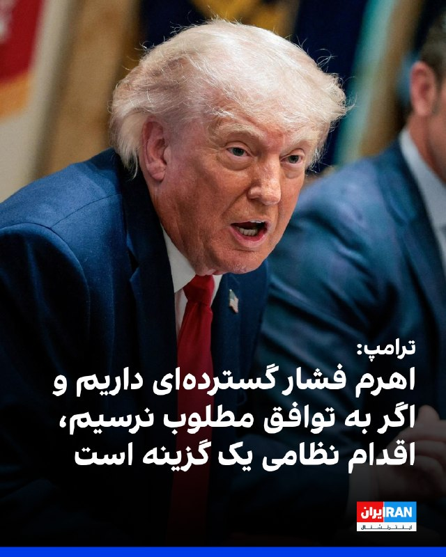

ترامپ به فاکس‌نیوز گفت آمریکا در مذاکرات با جمهوری اسلامی همچنان از اهرم فشار گسترده‌ای برخوردار است و اگر گفت‌وگوها به توافقی مطلوب برای ایالات متحده منجر نشود، اقدام نظامی همچنان یکی از گزینه‌ها خواهد بود.
ترامپ در این مصاحبه که ویدیوی بخشی از آن روز پنج‌شنبه منتشر شد، گفت آستانه توسل دوباره به زور، توافقی است که «برای ما خوب نباشد». او افزود حملات پیشین آمریکا، از جمله با بمب‌افکن‌های بی-۲، جاه‌طلبی‌های هسته‌ای حکومت ایران را به عقب انداخته است.

https://iranintl.com/202605281803

## IranIntlTV — post 339489

  <a href="telegram/content/IranIntlTV_339489_1780012651.mp4" target="_blank">🎬 Download video</a>

مرضیه از کرج: پرستارم؛ زخمی‌ها را به خانهٔ من می‌آوردند، اما امکانات کافی نداشتم

«یک ایران صدای شما را می‌شنود»
دوشنبه تا پنجشنبه ۱۱ شب تهران
از تلویزیون ایران اینترنشنال

تماشای نسخه کامل این قسمت از «برنامه» در یوتیوب:
https://youtu.be/F2EDr9JvjxU
@iranintltv

## IranIntlTV — post 339488

  <a href="telegram/content/IranIntlTV_339488_1780012652.mp4" target="_blank">🎬 Download video</a>

کارزار مردمی ایران‌اینترنشنال؛
آنچه در شب‌های جنایت رشت اتفاق افتاد

ایران‌اینترنشنال در کارزاری مردمی، به‌دنبال ثبت و مستندسازی حقیقت دربارهٔ کشتار دی‌ماه در رشت است. اگر شاهد عینی آن شب‌ها بوده‌اید یا از خانواده و نزدیکان کشته‌شدگان این شهر هستید، روایت و اطلاعات خود را از طریق چت‌بات اینتل‌مدیا با ما در میان بگذارید و در روشن شدن ابعاد این کشتار مشارکت کنید.

کامبیز حسینی در گفت‌وگو با فرنوش فرجی به این موضوع می‌پردازد.

«یک ایران صدای شما را می‌شنود»
دوشنبه تا پنجشنبه ۱۱ شب تهران
از تلویزیون ایران اینترنشنال

تماشای نسخه کامل این قسمت از «برنامه» در یوتیوب:
https://youtu.be/F2EDr9JvjxU
@iranintltv

## IranIntlTV — post 339487

  <a href="telegram/content/IranIntlTV_339487_1780012654.mp4" target="_blank">🎬 Download video</a>

فریال از تهران: تمام زندگی مان روی سه کلمه می چرخد، "جنگ آتش بس مذاکره"

«یک ایران صدای شما را می‌شنود»
دوشنبه تا پنجشنبه ۱۱ شب تهران
از تلویزیون ایران اینترنشنال

تماشای نسخه کامل این قسمت از «برنامه» در یوتیوب:
https://youtu.be/F2EDr9JvjxU
@iranintltv

## IranIntlTV — post 339486

  <a href="telegram/content/IranIntlTV_339486_1780012655.mp4" target="_blank">🎬 Download video</a>

یاسمین، خواهر جاویدنام امیرمحمد شاه‌کرمی از تهران: برادر ۱۴ ساله‌ام را کشتند

«یک ایران صدای شما را می‌شنود»
دوشنبه تا پنجشنبه ۱۱ شب تهران
از تلویزیون ایران اینترنشنال

تماشای نسخه کامل این قسمت از «برنامه» در یوتیوب:
https://youtu.be/F2EDr9JvjxU
@iranintltv

## IranIntlTV — post 339485

  

پلیس سیستان و بلوچستان اعلام کرد افراد مسلح ناشناس عیسی عباسی، از کارکنان فرماندهی انتظامی ایرانشهر را در مسیر رفتن به محل کار هدف تیراندازی قرار دادند و عباسی درپی این حمله کشته شد. پلیس سیستان و بلوچستان گفت تلاش‌ها برای بازداشت عاملان این حمله ادامه دارد.
https://iranintl.com/202605282931

## FarsiVOA — post 218945

🔺وزارت دادگستری آمریکا علیه تبعه عراقی-ایرانی عضو کتائب‌الحزب‌الله کیفرخواست صادر کرد؛ السعدی به توطئه برای بمب‌گذاری متهم است

▪️وزارت دادگستری آمریکا روز پنج‌شنبه ۷ خرداد علیه یک شهروند دو تابعیتی عراقی-ایرانی به نام محمدباقر سعد داوود السعدی، کیفرخواست صادر کرد.

⬇️ بیشتر بخوانید:
https://ir.voanews.com/a/8154996.html
@FarsiVOA

## FarsiVOA — post 218943

⚡️پوشش ویژه | وزیر خزانه‌داری آمریکا: عمان اطمینان داد برنامه‌ای برای گرفتن عوارض در تنگه هرمز ندارد
@FarsiVOA

## FarsiVOA — post 218942

⚡️ردپای نفت ایران در سوئیس؛ شبکه دور زدن تحریم‌ها و پولشویی برای سپاه
@FarsiVOA

## FarsiVOA — post 218941

  <a href="telegram/content/FarsiVOA_218941_1780012657.mp4" target="_blank">🎬 Download video</a>

⚡️بحران سلامت در ایران و افزایش شدید هزینه‌های درمانی؛ گفت‌وگو با دکتر رضا سعیدی
@FarsiVOA

## Persian_Trend_Official — post 15213

  <a href="telegram/content/Persian_Trend_Official_15213_1780012657.mp4" target="_blank">🎬 Download video</a>

⚔️
⚔️لحظه نابودی پایگاه هوایی بندرعباس توسط بمب‌های فوق سنگین 2.2 تنی GBU-72 که توسط بمب افکن استراتژیک سنگین B-1B نیروی هوایی آمریکا در این حمله استفاده شد.
💥
💥

👨‍💻:Phantom

🛰
🛰@persian_trend_official
پرشین ترند | متفاوت‌ترین کانال نظامی

## Persian_Trend_Official — post 15212

  <a href="telegram/content/Persian_Trend_Official_15212_1780012658.webm" target="_blank">🎬 Download video</a>

📰
📰یک مقام آمریکایی ادعای ایران درباره سرنگون کردن یک هواگرد آمریکایی در استان بوشهر را رد کرد. به گزارش رویترز، این مقام که از فاش شدن هویتش خودداری کرد، تأکید نمود که هیچ هواگرد آمریکایی در آن منطقه مورد اصابت قرار نگرفته است. پیش از این، رسانه‌های دولتی…

## Persian_Trend_Official — post 15211

  <a href="telegram/content/Persian_Trend_Official_15211_1780012659.webm" target="_blank">🎬 Download video</a>

تسنیم: یک پهپاد متجاوز امریکایی در نزدیکی بوشهر با موفقیت رهگیری شد. همچنین فرماندار شهرستان جم در استان بوشهر گفت: اتفاقی که امشب به وقوع پیوست مربوط به انهدام یک هواگرد متخاصم بود. هم اینک شهرستان در وضعیت عادی است. 📝 Amir 📌 @persian_trend_official پرشین…

## IranianMinds — post 20989

  <a href="telegram/content/IranianMinds_20989_1780012659.mp4" target="_blank">🎬 Download video</a>

🔴 تو‌ روز روشن تو صداوسیما دنیارو تهدید به عملیات های تروریستی میکنن

خوش چشم کارشناس صداوسیما :

دیگه دوران بمب های هسته ای گذشته اینکارارو راحت میتونن بفهمن کار کی بوده ، الان تایم جنگ های میکروبی و بیولوژیکیه کسیم نمیفهمه کار کی بوده.

@IranianMinds

## IranianMinds — post 20988

  <a href="telegram/content/IranianMinds_20988_1780012660.webm" target="_blank">🎬 Download video</a>

🚨 اگر همین الان توی سایت #وینرو عضو بشی 
🤩
🤩
🤩 هزار تومان شارژ رایگان میگیری
❕

✅ من خودم عضو شدم بدون واریز ۵۰۰ تومان گرفتم باهاش فوتبال پیش بینی کردم پولم شد ۲ میلیون 
❕

💚خیلی راحت هم برداشت کردم کل پولم رو 
💵

💳 پرداخت مستقیم و سریع بدون واسطه، بدون دردسر، واریز و برداشت در سریع‌ترین زمان ممکن

🔴این فرصت محدود رو از دست ندید:

🌐 Winro.io

🌐 Winro.io
کانال بونوس های رایگان a7

📱 @winro_io

## IranianMinds — post 20987

@IranianMindsGroup

ایدی گروه کامنتا ( تو کامنتا خیلی درخواست داده بودید )

## IranianMinds — post 20985

این تخم‌ حرومارو خب چرا تو برنامه ای که اربابات فیلتر کردن میپلکی پس؟

@IranianMinds

## IranianMinds — post 20984

🔴 تسنیم : یه پهپاد آمریکایی رو تو بوشهر زدیم بمولا. @IranianMinds

## BBCPersian — post 282287

  

‌ ‌ ‌ ‌
مقام‌های آمریکایی اعلام کردند که یک راننده کامیون سابق به دلیل نقش‌اش در توطئه برای قتل مسیح علی‌نژاد، فعال سیاسی ایرانی-آمریکایی، به ۱۰ سال زندان محکوم شد.

وزارت خارجه ایالات متحده اعلام کرد که جاناتان لودهولت، ۳۷ ساله، به پولشویی و توطئه‌‌ای که مسیح علی‌نژاد را در خانه‌اش در بروکلین در سال ۲۰۲۴ هدف قرار می‌داد، اعتراف کرده است.

اف‌بی‌آی پیش از انجام هرگونه سوءقصد علیه خانم علی‌نژاد، این توطئه را خنثی کرد.

مسیح علی‌نژاد به بی‌بی‌سی گفت که از مقامات سپاسگزار است، اما احساس آرامش نمی‌کند.

او گفت: «آرامش به معنای تمام شدن است. تمام نشده است. این سومین باری است که ایران سعی کرده است مرا در خاک آمریکا بکشد.»

خانم علی‌نژاد گفت: «هر بار که شکست می‌خورند، با چیز جدیدی برمی‌گردند.»

مقام‌های آمریکایی می‌گویند در حالی که این توطئه از ایران هدایت می‌شد، قاتلان احتمالی شهروندان آمریکایی بودند که برای پول با کشتن خانم علی‌نژاد موافقت کردند.

متن کامل این خبر را در سایت فارسی بی‌بی‌سی بخوانید.

https://bbc.in/4wWMhOa
📷 Roy Rochlin/Getty Images for ADL
@BBCPersian

---
📅 بروزرسانی: 1405/03/08 02:25
---

## VahidOOnLine — post 242671

  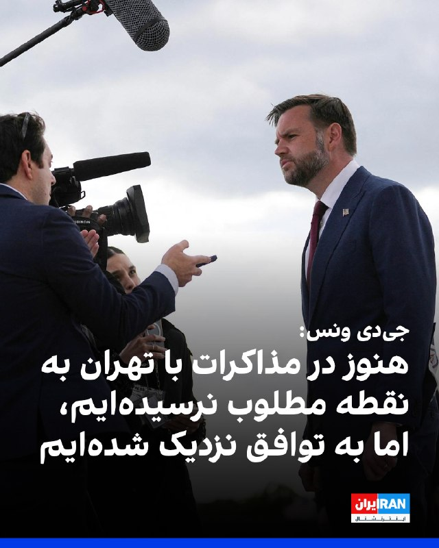

جی‌دی ونس، معاون رییس‌جمهوری آمریکا، پنج‌شنبه به خبرنگاران گفت واشینگتن هنوز در مذاکرات با حکومت ایران «به آن نقطه نرسیده»، اما طرف‌ها به توافق نزدیک شده‌اند. او افزود ایالات متحده در موقعیتی قرار دارد که می‌تواند برنامه هسته‌ای تهران را به‌طور قابل توجهی عقب بیندازد.
‌🏁 🇬🇧 IranintlTV

🤖 @VahidOOnLine

## VahidOOnLine — post 242670

  

♦️یک مقام آمریکایی ادعای صداوسیمای جمهوری اسلامی درباره سرنگونی یک هواگرد آمریکا در استان بوشهر را رد کرد.
به گزارش رویترز، این مقام آمریکایی که نخواست نامش فاش شود، گفت هیچ هواگرد آمریکایی در نزدیکی بوشهر سرنگون نشده است.
رسانه‌های حکومتی جمهوری اسلامی بامداد جمعه به نقل از مسعود تنگستانی، فرماندار جم، گزارش داده بودند که یک هواگرد آمریکایی در آسمان این شهرستان هدف قرار گرفته است.
‌🇸🇦 Indypersian

🤖 @VahidOOnLine

## VahidOOnLine — post 242669

  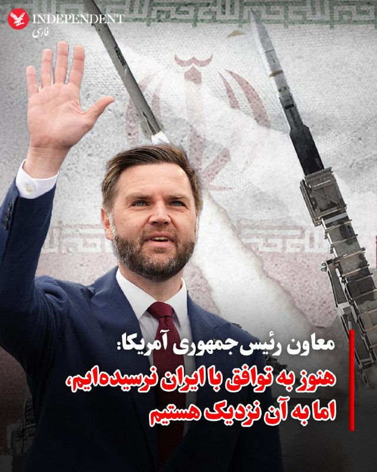

♦️جی‌دی ونس، معاون رئیس‌جمهوری آمریکا پنج‌شنبه ۷ خرداد در گفتگو با خبرنگاران اعلام کرد که واشنگتن هنوز به توافق با ایران دست نیافته، اما دو طرف به یکدیگر نزدیک هستند. به گزارش رویترز، ونس با اشاره به روند گفتگوها تاکید کرد که ایالات متحده در موقعیتی قرار دارد که در صورت لزوم می‌تواند برنامه هسته‌ای تهران را به طور قابل‌توجهی به عقب بازگرداند.
‌🇸🇦 Indypersian

🤖 @VahidOOnLine

## VahidOOnLine — post 242668

  

♦️مسعود تنگستانی، فرماندار جم، به خبرگزاری صدا و سیما گفت نیروهای مسلح جمهوری اسلامی «یک هواگرد» را در آسمان این شهرستان در استان بوشهر هدف قرار داده‌اند و اکنون وضعیت منطقه عادی است.
‌🇸🇦 Indypersian

🤖 @VahidOOnLine

## VahidOOnLine — post 242667

  

نیویورک‌تایمز به نقل از سه مقام آمریکایی گزارش داد واشینگتن و تهران، هم‌زمان با گفت‌وگو درباره خواسته‌های ترامپ برای پایان دادن به برنامه هسته‌ای ایران، به چارچوبی برای مذاکرات نزدیک شده‌اند که می‌تواند به بازگشایی تنگه هرمز منجر شود.
به نوشته نیویورک‌تایمز، ترامپ هنوز این چارچوب در حال شکل‌گیری را تایید نهایی نکرده و روشن نیست آیا این متن با برداشت طرف ایرانی نیز همخوانی دارد یا نه. مقام‌های کاخ سفید تاکنون فقط تصویری مبهم از توافق مقدماتی ارائه کرده‌اند.
بر اساس این گزارش، چارچوب پیشنهادی می‌تواند آتش‌بس را تمدید و زمینه مذاکرات جدی‌تر را سه ماه پس از آغاز جنگ فراهم کند. در این روند، با پیشرفت مذاکرات، بخشی از فشار اقتصادی بر حکومت ایران کاهش خواهد یافت.
نیویورک‌تایمز نوشت از نگاه آمریکا، هر توافقی باید شامل اعلام برائت ایران از برنامه هسته‌ای و هرگونه قصد برای دستیابی به سلاح هسته‌ای، و همچنین کنار گذاشتن اورانیوم با غنای بالای جمهوری اسلامی باشد.
‌🏁 🇬🇧 IranintlTV

🤖 @VahidOOnLine

## VahidOOnLine — post 242666

  

مسعود تنگستانی، فرماندار جم، به خبرگزاری صدا و سیما گفت نیروهای مسلح جمهوری اسلامی یک هواگرد را در آسمان جم در استان بوشهر هدف قرار دادند و هم‌اکنون شهرستان در وضعیت عادی قرار دارد.
طبق این گزارش، دلیل صدای انفجار در جم، مقابله پدافند با هواگردهای متخاصم بوده است.
‌🏁 🇬🇧 IranintlTV

🤖 @VahidOOnLine

## VahidOOnLine — post 242662

♦️ستاد فرماندهی مرکزی آمریکا، سنتکام، پنجشنبه هفتم خرداد با انتشار تصاویری اعلام کرد که ناو هواپیمابر «یواس‌اس آبراهام لینکلن» در حین عبور از دریای عرب، عملیات پروازی انجام داده است. سنتکام پیش‌تر اعلام کرده بود این ناو و نیروهای همراه آن در چارچوب عملیات‌های آمریکا در منطقه و پشتیبانی از محاصره دریایی اعمال‌شده بر بنادر ایران فعالیت می‌کنند.
‌🇸🇦 Indypersian

🤖 @VahidOOnLine

## VahidOOnLine — post 242661

  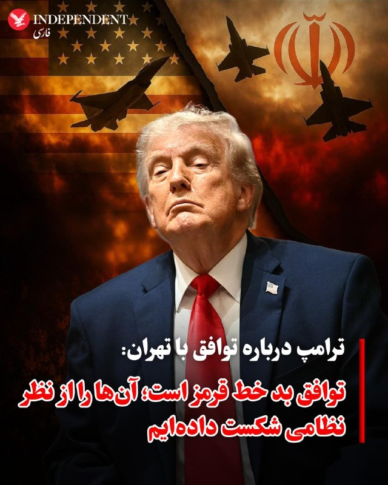

♦️دونالد ترامپ، رئیس‌جمهوری آمریکا در گفتگو با شبکه فاکس‌نیوز در پاسخ به سوالی درباره خط قرمز واشنگتن برای اقدام نظامی دوباره اعلام کرد که مرز نهایی و خط قرمز اصلی، توافقی است که برای آمریکا خوب نباشد. ترامپ با بیان اینکه شرایط را زیر نظر دارد و باید دید در آینده چه پیش می‌آید، طرف مقابل را مذاکره‌کنندگانی بسیار خوب و حیله‌گر توصیف کرد، اما تاکید کرد که در نهایت تمامی کارت‌های بازی در دست آمریکا قرار دارد، چرا که واشنگتن پیش از این آن‌ها را از نظر نظامی شکست داده است.
پیش‌تر، ان‌بی‌سی نیوز به نقل از یک مقام ارشد عرب گزارش داده بود مذاکره‌کنندگان آمریکا و جمهوری اسلامی ایران سه روز پیش در دوحه بر سر مفاد توافق آتش‌بس به تفاهم رسیده‌اند، اما اعلام نهایی آن به تعویق افتاده است. همچنین آکسیوس به نقل از منابع آمریکایی و منطقه‌ای گزارش داد طرفین بر سر یک تفاهم‌نامه ۶۰ روزه برای تمدید آتش‌بس و آغاز گفتگوها درباره برنامه هسته‌ای به توافق رسیده‌اند، اما اجرای آن همچنان نیازمند تایید نهایی دونالد ترامپ است.
‌🇸🇦 Indypersian

🤖 @VahidOOnLine

## VahidOOnLine — post 242660

  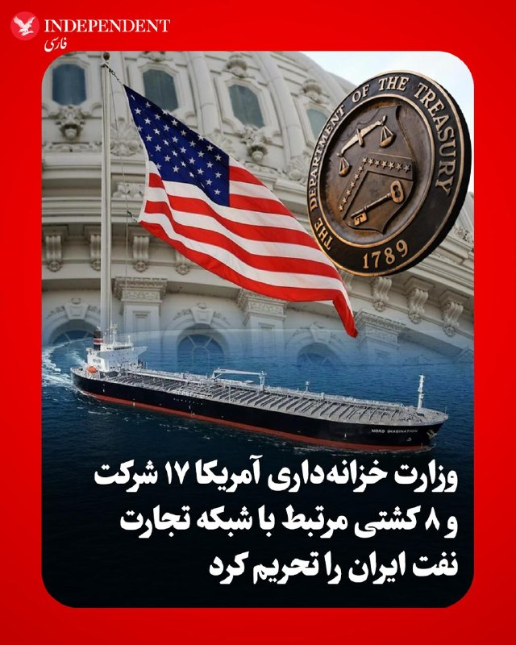

♦️وزارت خزانه‌داری آمریکا اعلام کرد تحریم‌های جدیدی مرتبط با جمهوری اسلامی ایران اعمال شده است.
بر اساس این اعلام، دفتر کنترل دارایی‌های خارجی وزارت خزانه‌داری آمریکا ۱۷ شرکت و نهاد، از جمله شرکت «سپهر انرژی جهان نمای پارس» و همچنین هشت کشتی با پرچم کشورهای مختلف را در چارچوب تلاش‌ها برای مختل کردن شبکه تجارت نفت و پتروشیمی جمهوری اسلامی ایران تحریم کرده است.
وزارت خزانه‌داری آمریکا اعلام کرد این تحریم‌ها بخشی از تلاش‌ها برای قطع منابع درآمدی مرتبط با فروش نفت جمهوری اسلامی است. اسکات بسنت، وزیر خزانه‌داری آمریکا، تاکید کرد که این اقدامات بخشی از کمپین «خشم اقتصادی» برای قطع منابع مالی رژیم ایران و متوقف کردن فعالیت‌های بی‌ثبات‌کننده آن در منطقه است.
‌🇸🇦 Indypersian

🤖 @VahidOOnLine

## FoxNewsTwitter — post 342371

  

Fox News (Twitter/X)

“They were fed a bunch of lies by Mayor Bass.”

Spencer Pratt says the Democrats who helped elect Karen Bass are now turning on her — and helping fund his campaign for LA mayor.

With the primary just days away, Pratt is leaning into voter frustration over homelessness, wildfire response and the city’s direction.

## FoxNewsTwitter — post 342370

  <a href="telegram/content/FoxNewsTwitter_342370_1780008945.mp4" target="_blank">🎬 Download video</a>

Fox News (Twitter/X)

JESSE WATTERS: "Who cares if they don't like the food? Get 'em out of here."

"Corey Booker says this ICE facility shouldn't be in New Jersey. Why? Where should it be in?"

"You got to keep them somewhere before you send them home. https://twitter.com/TheFive/status/2060112010327511267#m

## FoxNewsTwitter — post 342369

  <a href="telegram/content/FoxNewsTwitter_342369_1780008948.mp4" target="_blank">🎬 Download video</a>

Fox News (Twitter/X)

Mayor Zohran Mamdani defends his decision to skip the Israel Day Parade, making him the first New York City mayor to bypass the historic event since 1964.

"I said on the campaign trail that I wouldn't be attending the parade, and I've made my views on the Israeli government abundantly clear.”

“And I also said on that same campaign that I would have a responsibility as the mayor of the city to ensure the safety and security of each and every New Yorker.”

“And I don't believe that my presence as the mayor should determine whether or not a New Yorker is safe or secure."

## FoxNewsTwitter — post 342368

  <a href="telegram/content/FoxNewsTwitter_342368_1780008950.mp4" target="_blank">🎬 Download video</a>

Fox News (Twitter/X)

NOW: Vice President JD Vance says the U.S. has made “a lot of progress” in negotiations with Iran and believes Tehran is “negotiating at least so far in good faith.”

“The Iranians, they want a deal,” Vance said.

## FoxNewsTwitter — post 342367

  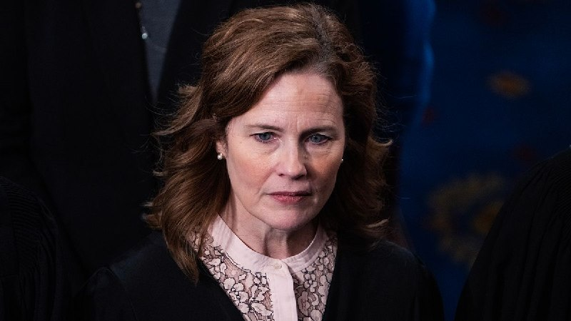

Fox News (Twitter/X)

Police responded to a swatting call at the Virginia home of Supreme Court Justice Amy Coney Barrett Wednesday night.

Authorities confirmed officers were dispatched to the residence after receiving the report, but determined it was "fictitious" after meeting with her security detail, officials say.

Barrett was on the bench Thursday morning alongside her colleagues, and read aloud summaries of two opinions she authored. She made no mention of the Wednesday incident.

## FoxNewsTwitter — post 342366

  <a href="telegram/content/FoxNewsTwitter_342366_1780008954.mp4" target="_blank">🎬 Download video</a>

Fox News (Twitter/X)

A graduating Air Force cadet went in for a chest bump with Vice President JD Vance... and Vance delivered.

The quick exchange happened right during the commencement ceremony, with the crowd cheering and laughing at the unexpected moment between the VP and the newly commissioned officer.

## FoxNewsTwitter — post 342365

  <a href="telegram/content/FoxNewsTwitter_342365_1780008956.mp4" target="_blank">🎬 Download video</a>

Fox News (Twitter/X)

A massive explosion and fire ripped through an apartment building in Dallas, sending heavy flames and smoke into the air and injuring at least four people.

Nearly 100 firefighters rushed to the scene in the city’s Oak Cliff neighborhood. It's not clear how many people were in the building at the time.

## FoxNewsTwitter — post 342364

  <a href="telegram/content/FoxNewsTwitter_342364_1780008959.mp4" target="_blank">🎬 Download video</a>

Fox News (Twitter/X)

A calm poolside moment turned terrifying in seconds.

A little girl lost her balance and slipped underwater, but her dad’s reflexes kicked in instantly, pulling her back to safety before the moment turned tragic.

## pm_afshaa — post 91802

#مهم
عزیزای دلم همگی الان چنل زاپاس‌مون رو جوین بشید کانال تحت ریپورت شدیده اگه چیزی شد زاپاس رو داشته باشید فعالیت میاد اونور
👇

https://t.me/Pm_Zapas
https://t.me/Pm_Zapas

## pm_afshaa — post 91801

  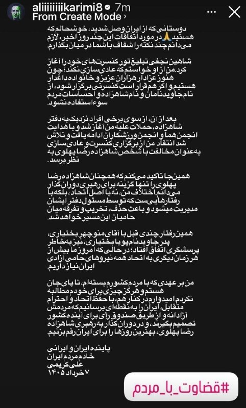

علی کریمی از شاهزاده رضا پهلوی حمایت کرد

💧 Rainbet.com the #1 Non-KYC Crypto Casino & Sportsbook @rainbetcom

😁 @Pm_Afshaa

## pm_afshaa — post 91799

https://t.me/proxy?server=tg.capycore.ru&port=443&secret=27ebe852539fb8ec5f327c73262bb721

پروکسی مخصوص دانلود فیلم و سریال سرعت بالا

💧 Rainbet.com the #1 Non-KYC Crypto Casino & Sportsbook @rainbetcom

😁 @Pm_Afshaa

## pm_afshaa — post 91798

پزشکیان :به جلیلی گفتم توام بیا یه گوشه کارو بگیر کمک کن کشورو درست کنیم. گفت نه من فقط پیشنهاد میدم. گفتم پیشنهاد به چه دردم میخوره اخه عمل میخوام; نخواستیم اصلا

💧 Rainbet.com the #1 Non-KYC Crypto Casino & Sportsbook @rainbetcom

😁 @Pm_Afshaa

## pm_afshaa — post 91797

رکنا : یه پسر 20 ساله دزفولی که دارای اختلالات روانی بود، پدر و مادر و برادر خودش رو سلاخی کرد و به قتل رسوند و در آخر خودکشی کرد

💧 Rainbet.com the #1 Non-KYC Crypto Casino & Sportsbook @rainbetcom

😁 @Pm_Afshaa

## mamlekate — post 103602

📝 الو ساعت ۰۰:۱۳ جمعه ۸ خرداد
بیدگنه صدای پدافند پشت‌ هم

📝الو جمعه فعالیت مکرر پدافند در لنجان اصفهان

📝 همدان ساعت ۱ شب چندتا صدای مهیب اومد برقم دوبار قطع و وصل شد

🚀 گزارش‌های رسانه‌های حکومتی در ایران از حملات موشکی جمهوری اسلامی

@mamlekate

## VahidOnline — post 75783

  

‌ ‌ ‌ ‌
شیخ تمیم بن حمد آل ثانی، امیر قطر، در تماسی تلفنی با دونالد ترامپ، رئیس جمهور آمریکا، در مورد تحولات منطقه‌ای گفتگو کرد.

دفتر امیر قطر در گزارشی از این مکالمه تلفنی اعلام کرد که شیخ تمیم بر اهمیت اولویت دادن به راه‌حل‌های دیپلماتیک و گفت‌وگو بین همه طرف‌ها به امید جلوگیری از تنش‌ها و تشدید بیشتر در خاورمیانه تأکید کرد.

در این بیانیه آمده است که ترامپ نیز به نوبه خود از نقش قطر در حمایت از تلاش‌های میانجیگری پاکستان بین واشنگتن و تهران قدردانی کرد و «از تلاش‌های قطر برای رفع اختلافات و ترویج کاهش تنش در منطقه» تمجید کرد.
@VahidHeadline

📡 @VahidOnline

## VahidOnline — post 75782

  <a href="telegram/content/VahidOnline_75782_1780008962.mp4" target="_blank">🎬 Download video</a>

فاکس‌نیوز: جی‌دی ونس می‌گوید ایالات متحده در مذاکرات با ایران «پیشرفت زیادی» داشته و معتقد است تهران «حداقل تا حالا با حسن نیت در حال مذاکره است.»

جی‌دی ونس: خب، فکر می‌کنم گفتن دقیق اینکه رئیس‌جمهور دقیقاً چه زمانی یا اصلاً تفاهم‌نامه را امضا خواهد کرد، سخت است. ما در حال رفت‌وآمد بر سر چند نکتهٔ زبانی هستیم.
کاملاً واضح است که به نظر من، ایرانی‌ها — آنها یک معامله می‌خواهند. آنها می‌خواهند تنگهٔ هرمز را باز کنند. ما هم می‌خواهیم تنگهٔ هرمز را باز کنیم.

🔸چند مسئله در مورد موضوع هسته‌ای وجود دارد: ذخیرهٔ اورانیوم غنی‌شدهٔ بالا و همچنین مسئلهٔ غنی‌سازی.

پس می‌دانید، ما با آنها در حال چانه‌زنی و رفت‌وآمد هستیم. ما واقعاً فکر می‌کنیم آنها حداقل تا حالا با حسن نیت مذاکره می‌کنند.
داریم پیشرفت می‌کنیم و امیدواریم به این پیشرفت ادامه دهیم تا رئیس‌جمهور در موقعیتی قرار بگیرد که بتواند توافق را تأیید کند.
FoxNews

📡 @VahidOnline

## IranIntlTV — post 339484

  <a href="telegram/content/IranIntlTV_339484_1780008963.mp4" target="_blank">🎬 Download video</a>

سازمان حقوق بشر برای ورزش به همراه ائتلافی از ۳۴ نهاد مدنی در نامه‌ای فوری به فیفا نسبت به بحران فزاینده حقوق بشر در فوتبال ایران و تداوم حضور عادی تیم ملی هشدار داد.

گفت‌وگو با زهره عبداله‌خانی، عضو هیات رییسه سازمان حقوق بشر برای ورزش
@iranintltv

## IranIntlTV — post 339483

  

جی‌دی ونس، معاون رییس‌جمهوری آمریکا، پنج‌شنبه به خبرنگاران گفت واشینگتن هنوز در مذاکرات با حکومت ایران «به آن نقطه نرسیده»، اما طرف‌ها به توافق نزدیک شده‌اند. او افزود ایالات متحده در موقعیتی قرار دارد که می‌تواند برنامه هسته‌ای تهران را به‌طور قابل توجهی عقب بیندازد.
https://iranintl.com/202605282106

## IranIntlTV — post 339482

  <a href="telegram/content/IranIntlTV_339482_1780008966.mp4" target="_blank">🎬 Download video</a>

سی‌ان‌ان در تحلیلی به قلم یک مقام پیشین امنیت ملی آمریکا نوشت حتی در صورت دستیابی به توافق میان واشینگتن و تهران، چالش جمهوری اسلامی برای آمریکا پایان نخواهد یافت.

به نوشته او، مشکل اصلی در ساختار ایدئولوژیک جمهوری اسلامی ریشه دارد.

گزارش اردوان روزبه، خبرنگار ایران‌اینترنشنال
@iranintltv

## IranIntlTV — post 339481

  <a href="telegram/content/IranIntlTV_339481_1780008968.mp4" target="_blank">🎬 Download video</a>

در ادامه سیاست‌های فشار اقتصادی بر جمهوری اسلامی، وزیر خزانه‌داری آمریکا اعلام کرد دسترسی دو شرکت هواپیمایی ایرانی به خدمات فرودگاهی، سوخت‌گیری و فروش بلیت را قطع می‌کند.او همچنین نهاد مدیریت تنگه هرمز وابسته به سپاه را تحریم کرد.

گزارش نیلوفر منصوری، خبرنگار ایران‌اینترنشنال
@iranintltv

## IranIntlTV — post 339480

  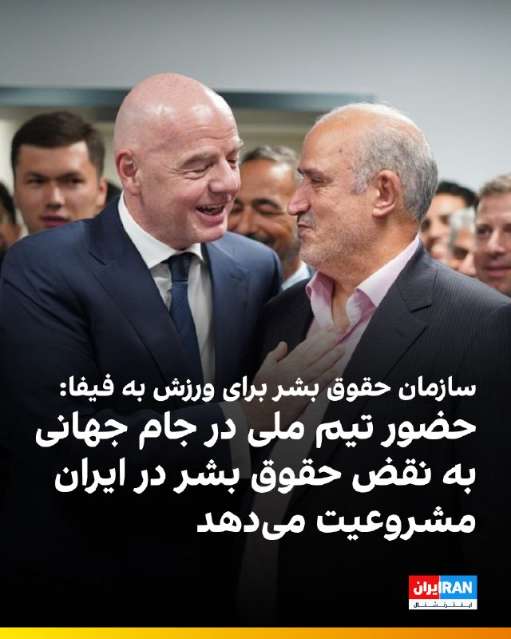

🔻سازمان «حقوق بشر برای ورزش» به همراه ائتلافی متشکل از ۳۴ نهاد جامعه مدنی از سراسر جهان، در آستانه جام جهانی ۲۰۲۶ با ارسال نامه‌ای فوری به فیفا، نگرانی‌های جدی خود را نسبت به بحران فزاینده حقوق بشر در فوتبال ایران و تداوم حضور عادی تیم ملی در رقابت‌های فیفا مطرح کرده‌اند.

🔹در این نامه با اشاره به بازداشت‌های خودسرانه فوتبالیست‌های ایرانی، گزارش‌های تأییدشده درباره کشته شدن دست‌کم ۴۴ فوتبالیست در روزهای ۱۸ و ۱۹ دی‌ماه ۱۴۰۴، حذف و سرکوب سیستماتیک زنان در فوتبال ایران، و نیز نگرانی‌ها درباره حضور و نفوذ عوامل امنیتی دولتی در ساختار مدیریتی و همراهی تیم ملی،‌تأکید شده است که وضعیت کنونی با تعهدات حقوق بشری فیفا در تضاد قرار دارد.

🔹در این نامه هشدار داده شده است که ادامه حضور عادی تیم ملی ایران در شرایط فعلی می‌تواند به مشروعیت‌بخشی به این وضعیت و تداوم آسیب‌های سیستماتیک منجر شود.

🔹فیفا در چارچوب اصول راهنمای سازمان ملل در زمینه کسب‌وکار و حقوق بشر، فیفا موظف است از نقض‌های حقوق بشری مرتبط با فعالیت‌ها و مسابقات خود پیشگیری کرده و نسبت به آن‌ها اقدام کند.

@iranintltvsport

## IranIntlTV — post 339479

  <a href="telegram/content/IranIntlTV_339479_1780008972.mp4" target="_blank">🎬 Download video</a>

شبکه سی‌بی‌اس به نقل از یک مقام ارشد عرب گزارش داد مذاکره‌کنندگان آمریکا و جمهوری اسلامی سه روز پیش بر سر مفاد توافق آتش‌بس به تفاهم رسیده‌اند، اما اعلام و نهایی شدن آن به تعویق افتاده است.
همزمان با انتشار گزارش‌ها درباره نهایی شدن توافق، درگیری‌ها در منطقه ادامه دارد.

گفت‌وگو با امیر گیتی، عضو تحریریه ایران‌اینترنشنال
@iranintltv

## IranIntlTV — post 339478

  

نیویورک‌تایمز به نقل از سه مقام آمریکایی گزارش داد واشینگتن و تهران، هم‌زمان با گفت‌وگو درباره خواسته‌های ترامپ برای پایان دادن به برنامه هسته‌ای ایران، به چارچوبی برای مذاکرات نزدیک شده‌اند که می‌تواند به بازگشایی تنگه هرمز منجر شود.
به نوشته نیویورک‌تایمز، ترامپ هنوز این چارچوب در حال شکل‌گیری را تایید نهایی نکرده و روشن نیست آیا این متن با برداشت طرف ایرانی نیز همخوانی دارد یا نه. مقام‌های کاخ سفید تاکنون فقط تصویری مبهم از توافق مقدماتی ارائه کرده‌اند.
بر اساس این گزارش، چارچوب پیشنهادی می‌تواند آتش‌بس را تمدید و زمینه مذاکرات جدی‌تر را سه ماه پس از آغاز جنگ فراهم کند. در این روند، با پیشرفت مذاکرات، بخشی از فشار اقتصادی بر حکومت ایران کاهش خواهد یافت.
نیویورک‌تایمز نوشت از نگاه آمریکا، هر توافقی باید شامل اعلام برائت ایران از برنامه هسته‌ای و هرگونه قصد برای دستیابی به سلاح هسته‌ای، و همچنین کنار گذاشتن اورانیوم با غنای بالای جمهوری اسلامی باشد.
https://iranintl.com/202605281303

## IranIntlTV — post 339477

  <a href="telegram/content/IranIntlTV_339477_1780008975.mp4" target="_blank">🎬 Download video</a>

کاخ سفید به ایران‌اینترنشنال اعلام کرد جمهوری اسلامی آمادگی خود برای امضای یادداشت تفاهم نهایی را به دونالد ترامپ اطلاع داده است؛ اکسیوس نیز از توافق بر سر تفاهم‌نامه ۶۰ روزه خبر داد، اما دونالد ترامپ هنوز آن را تایید نکرده است.

سمیرا قرایی از کاخ سفید گزارش می‌دهد.
@iranintltv

## IranIntlTV — post 339476

  

مسعود تنگستانی، فرماندار جم، به خبرگزاری صدا و سیما گفت نیروهای مسلح جمهوری اسلامی یک هواگرد را در آسمان جم در استان بوشهر هدف قرار دادند و هم‌اکنون شهرستان در وضعیت عادی قرار دارد.
طبق این گزارش، دلیل صدای انفجار در جم، مقابله پدافند با هواگردهای متخاصم بوده است.
https://iranintl.com/202605280555

## IranIntlTV — post 339475

  

مسعود تنگستانی، فرماندار جم، به خبرگزاری صدا و سیما گفت نیروهای مسلح جمهوری اسلامی یک هواگرد را در آسمان جم در استان بوشهر هدف قرار دادند و هم‌اکنون شهرستان در وضعیت عادی قرار دارد.
طبق این گزارش، دلیل صدای انفجار در جم، مقابله پدافند با هواگردهای متخاصم بوده است.
https://iranintl.com/202605280555

## IranIntlTV — post 339474

  

مسعود تنگستانی، فرماندار جم، به خبرگزاری صدا و سیما گفت نیروهای مسلح جمهوری اسلامی یک هواگرد را در آسمان جم در استان بوشهر هدف قرار دادند و هم‌اکنون شهرستان در وضعیت عادی قرار دارد.
طبق این گزارش، دلیل صدای انفجار در جم، مقابله پدافند با هواگردهای متخاصم بوده است.
https://iranintl.com/202605280555

## IranIntlTV — post 339473

  

مسعود تنگستانی، فرماندار جم، به خبرگزاری صدا و سیما گفت نیروهای مسلح جمهوری اسلامی یک هواگرد را در آسمان جم در استان بوشهر هدف قرار دادند و هم‌اکنون شهرستان در وضعیت عادی قرار دارد.
طبق این گزارش، دلیل صدای انفجار در جم، مقابله پدافند با هواگردهای متخاصم بوده است.
https://iranintl.com/202605280555

## Shin_Persian — post 6291

  

U.S. Central Command ✓ @CENTCOM
Thu, 28 May 2026 22:49:22 UTC

🚫CLAIM: Iran's state TV claimed Iranian forces downed a U.S. aircraft near Bushehr. FALSE.

✅TRUTH: No U.S. aircraft were shot down. All U.S. air assets are accounted for.

فارسی

🚫 ادعا: تلویزیون دولتی ایران ادعا کرد که نیروهای ایرانی یک هواپیمای آمریکایی را در نزدیکی بوشهر سرنگون کرده‌اند. نادرست است.

✅ حقیقت: هیچ هواپیمای آمریکایی سرنگون نشده است. وضعیت تمام تجهیزات هوایی ایالات متحده مشخص و تایید شده است.

𝕏 · @shin_persian

## Shin_Persian — post 6290

  

Shin ✓ @hey_itsmyturn
Thu, 28 May 2026 21:16:53 UTC

And IRGC's Fars confirms the earlier missile launch

فارسی

و خبرگزاری فارس (وابسته به سپاه پاسداران) شلیک موشک در زمان زودتر را تایید می‌کند.

𝕏 · @shin_persian

## Shin_Persian — post 6289

Shin ✓ @hey_itsmyturn
Thu, 28 May 2026 21:14:07 UTC

מי שלא מכסח את הדשא, הדשא מכסח אותו!

English

Whoever does not mow the lawn, the lawn mows them!

فارسی

هر کس که چمن را کوتاه نکند، چمن او را از پا در می‌آورد!

𝕏 · @shin_persian

## FarsiVOA — post 218940

  

⚡️در پی گزارش‌ها از حمله موشکی ساعات قبل جمهوری اسلامی، خبرگزاری رویترز به نقل از یک مقام آمریکایی گزارش داد که علیرغم ادعاهای تلویزیون حکومتی جمهوری اسلامی، هیچ هواپیمای آمریکایی در نزدیکی بوشهر در ایران سرنگون نشده است.
@FarsiVOA

## FarsiVOA — post 218939

  <a href="telegram/content/FarsiVOA_218939_1780008981.mp4" target="_blank">🎬 Download video</a>

⚡️دونالد ترامپ از «تورم ۲۵۰ درصدی» در ایران می‌گوید و شهروندان از بحران معیشت؛ گفت‌وگو با مریم سعیدی
@FarsiVOA

## FarsiVOA — post 218938

⚡️اینترنت در ایران نصفه‌نیمه برگشت؛ خاموشی برق و قبض‌های سنگین هم دنبالش آمد
@FarsiVOA

## FarsiVOA — post 218937

  <a href="telegram/content/FarsiVOA_218937_1780008983.mp4" target="_blank">🎬 Download video</a>

⚡️چرا جمهوری اسلامی به کویت حمله کرد؟ گفت‌وگو با یاسین اهوازی، کارشناس امور خاورمیانه
@FarsiVOA

## FarsiVOA — post 218936

⚡️توافق همکاری نظامی روسیه و حکومت طالبان؛ نگرانی‌های آمریکا
@FarsiVOA

## FarsiVOA — post 218935

  <a href="telegram/content/FarsiVOA_218935_1780008984.mp4" target="_blank">🎬 Download video</a>

⚡️کاهش علاقه جوانان در ایران به تحصیل در رشته‌های علوم پایه؛ گفت‌وگو با پیروز نامی
@FarsiVOA

## FarsiVOA — post 218934

  <a href="telegram/content/FarsiVOA_218934_1780008985.mp4" target="_blank">🎬 Download video</a>

⚡️چرا جمهوری اسلامی قیمت بنزین در ایران را با سایر کشورها مقایسه می‌کند؟ گفت‌وگو با رضا غیبی
@FarsiVOA

## FarsiVOA — post 218933

⚡️کنکور ۱۴۰۵ در سایه جنگ و بلاتکلیفی؛ دانش‌آموزان به خیابان آمدند
@FarsiVOA

## FarsiVOA — post 218932

🔺آمریکا شبکه فروش نفت مرتبط با نیروهای مسلح جمهوری اسلامی را تحریم کرد

▪️دفتر کنترل دارایی‌های خارجی وزارت خزانه‌داری آمریکا، اوفک، روز پنج‌شنبه تحریم‌های تازه‌ای را علیه فروش نفت از سوی تشکیلات نظامی جمهوری اسلامی اعلام کرد.

⬇️ بیشتر بخوانید:
https://ir.voanews.com/a/8154983.html
@FarsiVOA

## FarsiVOA — post 218931

  <a href="telegram/content/FarsiVOA_218931_1780008986.mp4" target="_blank">🎬 Download video</a>

⚡️کاربران ایرانی از «وقتی شما نبودید» می‌گویند؛ بازگشت قطره‌چکانی اینترنت
@FarsiVOA

## FarsiVOA — post 218930

  <a href="telegram/content/FarsiVOA_218930_1780008987.mp4" target="_blank">🎬 Download video</a>

⚡️گزارش عفو بین الملل در مورد افزایش سرکوب‌ها در ایران؛ گفت‌وگو با اسفندیار ابان
@FarsiVOA

## FarsiVOA — post 218929

⚡️تقویت نظامی ناتو در بالتیک؛ گوتلاند در خط مقدم بازدارندگی در برابر تهدیدهای روسیه
@FarsiVOA

## FarsiVOA — post 218928

  <a href="telegram/content/FarsiVOA_218928_1780008988.mp4" target="_blank">🎬 Download video</a>

⚡️ویدیوی سنتکام از انجام ماموریت ناو هواپیمابر آبراهام لینکلن در حین عبور از «دریای عرب»

@FarsiVOA

## FarsiVOA — post 218927

🔺گزارش‌های رسانه‌های حکومتی در ایران از حملات موشکی جمهوری اسلامی

▪️خبرگزاری فارس، وابسته به سپاه پاسداران، اواخر پنج‌شنبه ۷ خرداد از شلیک موشک از مناطق جنوبی ایران خبر داد و مدعی شد که مقصد این موشک‌ها مشخص نیست.

⬇️ بیشتر بخوانید:
https://ir.voanews.com/a/8154974.html
@FarsiVOA

## Persian_Trend_Official — post 15210

  

تسنیم: یک پهپاد متجاوز امریکایی در نزدیکی بوشهر با موفقیت رهگیری شد. همچنین فرماندار شهرستان جم در استان بوشهر گفت: اتفاقی که امشب به وقوع پیوست مربوط به انهدام یک هواگرد متخاصم بود. هم اینک شهرستان در وضعیت عادی است. 📝 Amir 📌 @persian_trend_official پرشین…

## Persian_Trend_Official — post 15209

  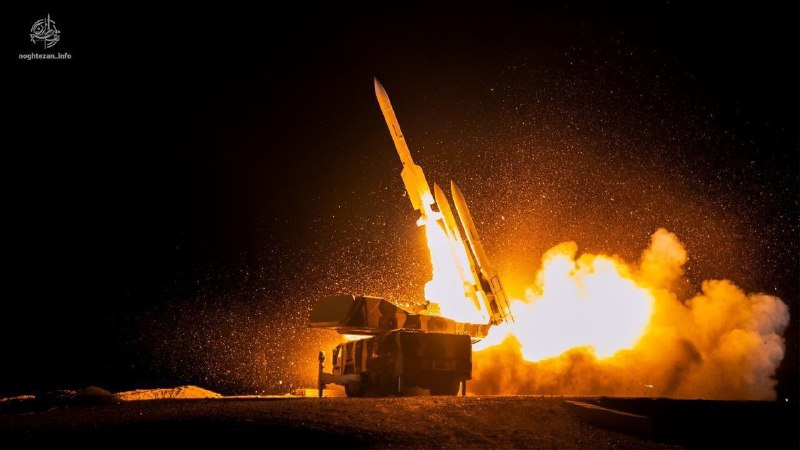

تسنیم: یک پهپاد متجاوز امریکایی در نزدیکی بوشهر با موفقیت رهگیری شد.

همچنین فرماندار شهرستان جم در استان بوشهر گفت: اتفاقی که امشب به وقوع پیوست مربوط به انهدام یک هواگرد متخاصم بود. هم اینک شهرستان در وضعیت عادی است.

📝 Amir

📌 @persian_trend_official
پرشین ترند | متفاوت‌ترین کانال نظامی

## Persian_Trend_Official — post 15208

  <a href="telegram/content/Persian_Trend_Official_15208_1780008990.webm" target="_blank">🎬 Download video</a>

https://youtube.com/live/JrqroHI5pq8?feature=share

## Persian_Trend_Official — post 15207

  <a href="telegram/content/Persian_Trend_Official_15207_1780008991.webm" target="_blank">🎬 Download video</a>

📌 @persian_trend_official
پرشین ترند | متفاوت‌ترین کانال نظامی

## IranianMinds — post 20981

سه ماه از اون روز باشکوه گذشت ... جسدشو هنوز خاک نکردن @IranianMinds

## IranianMinds — post 20980

سه ماه از اون روز باشکوه گذشت ... جسدشو هنوز خاک نکردن @IranianMinds

## IranianMinds — post 20979

  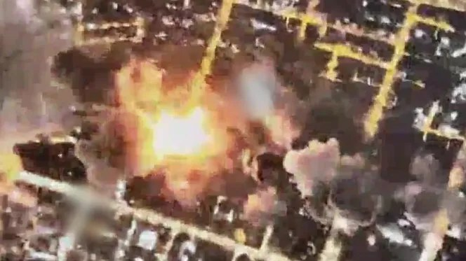

سه ماه از اون روز باشکوه گذشت ...

جسدشو هنوز خاک نکردن

@IranianMinds

## IranianMinds — post 20976

اسرائیل شبو تبدیل به روز کرد تو غزه

@IranianMinds

## IranianMinds — post 20975

🔴 تسنیم :

یه پهپاد آمریکایی رو تو بوشهر زدیم بمولا.

@IranianMinds

## IranianMinds — post 20974

  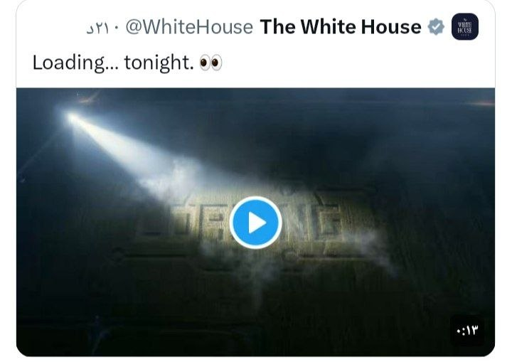

پست عجیب کاخ سفید

@IranianMinds

## IranianMinds — post 20973

  <a href="telegram/content/IranianMinds_20973_1780008993.mp4" target="_blank">🎬 Download video</a>

ترامپ درباره ایران:

آنها مذاکره‌کنندگان بسیار خوبی هستند آنها زیرک‌اند
اما ما همه کارت‌ها را در دست داریم
چون آنها را از نظر نظامی شکست داده‌ایم.

@IranianMinds

## IranianMinds — post 20972

باز شب شدو تو جنوب کشور جنگ شد

طبق معمول هیچکدومش هم نقض آتش بس نیست

@IranianMinds

## BBCPersian — post 282286

  

خبرگزاری‌های ایران به نقل از مقام‌های محلی و نظامی از «رهگیری» و «هدف قرار گرفتن» آنچه «هواگرد متخاصم» نامیده‌اند، در اطراف بوشهر خبر داده‌اند.

مسعود تنگستانی، فرماندر شهر جم - در نزدیکی بوشهر - عصر پنجشنبه در گفتگو با صدا و سیما ضمن تایید این خبر گفت: «اتفاقی که امشب به وقوع پیوست مربوط به انهدام یک هواگرد متخاصم بود توسط نیروهای مسلح. هم اینک شهرستان در وضعیت عادی است.»

در همین حال، خبرگزاری تسنیم، نزدیک به سپاه پاسداران، با اشاره به شنیدن صدای انفجار در نزدیکی سواحل تنگه هرمز نوشته است: «براساس گزارش پدافند ارتش، منشأ انفجارها از سمت دریا و مربوط به تبادل آتش در اخطار به کشتی‌های متخلف در تنگه هرمز بوده است.»

در چند روز گذشته، چند درگیری و حمله نظامی متقابل میان ایران و آمریکا روی داده که هر دو طرف ضمن متهم کردن یکدیگر به نقض آتش‌بس، از تلاش برای حفظ آن و «اقدامات نظامی تدافعی» سخن گفته‌اند.

https://bbc.in/4uFuqtC
📷 Majid Saeedi/Getty Images
@BBCPersian

## BBCPersian — post 282285

  

‌ ‌ ‌ ‌
شیخ تمیم بن حمد آل ثانی، امیر قطر، در تماسی تلفنی با دونالد ترامپ، رئیس جمهور آمریکا، در مورد تحولات منطقه‌ای گفتگو کرد.

دفتر امیر قطر در گزارشی از این مکالمه تلفنی اعلام کرد که شیخ تمیم بر اهمیت اولویت دادن به راه‌حل‌های دیپلماتیک و گفت‌وگو بین همه طرف‌ها به امید جلوگیری از تنش‌ها و تشدید بیشتر در خاورمیانه تأکید کرد.

در این بیانیه آمده است که ترامپ نیز به نوبه خود از نقش قطر در حمایت از تلاش‌های میانجیگری پاکستان بین واشنگتن و تهران قدردانی کرد و «از تلاش‌های قطر برای رفع اختلافات و ترویج کاهش تنش در منطقه» تمجید کرد.

https://bbc.in/4vgvuEb
📷Reuters
@BBCPersian

## Dirty_Kids — post 390441

  <a href="telegram/content/Dirty_Kids_390441_1780008996.webm" target="_blank">🎬 Download video</a>

☢️خفن ترین و‌ قدیمی ترین  انالیزور  ایران ینی دکتر بت 
👍 
🔴مسابقات جذاب جام جهانی به زودی شروع میشه بیا توی کانال دکتر بت و باهاش همراه شو و پول در بیار
💵 رایگان بهترین شرط هارو براتون میذاره حتی هزار تومن هم دریافت نمیکنه روزانه میتونی از پیش بینی فوتبال باهاش…

## Dirty_Kids — post 390440

  <a href="telegram/content/Dirty_Kids_390440_1780008997.webm" target="_blank">🎬 Download video</a>

☢️خفن ترین و‌ قدیمی ترین  انالیزور  ایران ینی دکتر بت 
👍

🔴مسابقات جذاب جام جهانی به زودی شروع میشه بیا توی کانال دکتر بت و باهاش همراه شو و پول در بیار
💵

رایگان بهترین شرط هارو براتون میذاره
حتی هزار تومن هم دریافت نمیکنه
روزانه میتونی از پیش بینی فوتبال باهاش پول در بیاری 👌
A7

🌟اگ اهل پیش بینی فوتبالی این کانال اصلا از دست ندین
👇

✅https://t.me/+4_ADqwB9e-QwYjlk

✅https://t.me/+4_ADqwB9e-QwYjlk

## Dirty_Kids — post 390439

  

#بخوابیم

@Dirty_Kids 👻

## Dirty_Kids — post 390438

  

🔴 به گفته کاربران؛ درحالِ حاضر و تو شرایط فعلی این فیلترشکن‌ها وصلن :

BiubiuVPN

VPN Hotspot Shield: Secure VPN

VPN - Fast VPN Super

BeePass VPN

Ostrich VPN - Proxy Master

X-VPN: VPN Fast & Secure

JumpJumpVPN: Fast & Secure

VPN Windscribe: Fast & Secure

@Dirty_Kids 👻

## Dirty_Kids — post 390437

  

این off campus عجب زناییه
عاشقش شدم

ابکی
مسخره
بی منطق
قشنگ دنبال همچین چیزی بودم

@Dirty_Kids 👻

## Dirty_Kids — post 390436

به مناسبت گذشتن ۹۰ روز از ترور خامنه‌ای، نود بده.

@Dirty_Kids 👻

## Dirty_Kids — post 390435

  

‏یه طوری تو روز روشن درباره ساده زیستی خامنه ای مهمل میبافن که انگار من بودم که bmw ضدگلوله اسکورت زیر پام بوده

@Dirty_Kids 👻

## Dirty_Kids — post 390434

  <a href="telegram/content/Dirty_Kids_390434_1780008999.mp4" target="_blank">🎬 Download video</a>

وضعیت مودم:

@Dirty_Kids 👻

## Dirty_Kids — post 390433

  <a href="telegram/content/Dirty_Kids_390433_1780009002.mp4" target="_blank">🎬 Download video</a>

این #چالش جدیده مدل تبلیغاتیش

@Dirty_Kids 👻

## alonews — post 123413

بهترین سرعت با بهترین قیمت با God Vpn🔵 تخفیف ویژه برای امشب فقط✅😍 10 گیگ فقط 280,000 تومن😍 متصل حتی در شرایط جنگی به خاطر اختصاصی بودن✅❤️😍 کانفیگ اقتصادی در ربات دوم 20 گیگ 290,000 تومن😍 برای نمایندگان پنل نمایندگی فعال میشه👍❤️ ✅تضمین بدون قطعی 🌐 اتصال…

## alonews — post 123412

  

بهترین سرعت با بهترین قیمت با God Vpn🔵
تخفیف ویژه برای امشب فقط✅😍

10 گیگ فقط 280,000 تومن😍
متصل حتی در شرایط جنگی به خاطر اختصاصی بودن✅❤️😍

کانفیگ اقتصادی در ربات دوم 20 گیگ 290,000 تومن😍

برای نمایندگان پنل نمایندگی فعال میشه👍❤️

✅تضمین بدون قطعی
🌐 اتصال با تمامی دستگاه
🔻🏪پشتیبانی ۲۴ ساعته
✔️ دور زدن نت ملی
🔘 بالاترین سرعت با تمام اپراتورها
⭐با کیفیت عالی و ضمانت بازگشت وجه
🌐🌐🌐🌐🌐🌐⭐️
➖➖➖➖➖➖➖➖➖➖
جهت خرید کانفیگ اختصاصی در این ربات:
@GodVpnV2_Bot

خرید کانفیگ اقتصادی در این ربات:
@v2raypc1bot

ایدی کانال:
t.me/God_of_Vpn
پشتیبانی و خرید عمده:
@Mmkhh00
@Pc_V2ray

## alonews — post 123408

  <a href="telegram/content/alonews_123408_1780009006.mp4" target="_blank">🎬 Download video</a>

👈حمله‌های امشب ارتش اسرائیل به جنوب لبنان

✅ @AloNews خبر جنگ

## alonews — post 123407

  <a href="telegram/content/alonews_123407_1780009007.webm" target="_blank">🎬 Download video</a>

👈بعد از سال‌ها پُرشدگی سد کرج به 70 درصد رسید!

✅ @AloNews خبر جنگ

## alonews — post 123406

  <a href="telegram/content/alonews_123406_1780009007.webm" target="_blank">🎬 Download video</a>

👈پست عجیب کاخ سفید

✅ @AloNews خبر جنگ

## alonews — post 123405

  <a href="telegram/content/alonews_123405_1780009008.mp4" target="_blank">🎬 Download video</a>

👈تصویری که الجزیره از شدت خسارت حملات آمریکا به تاسیسات فولاد اصفهان منتشر کرده است

✅ @AloNews خبر جنگ

## alonews — post 123404

  <a href="telegram/content/alonews_123404_1780009010.webm" target="_blank">🎬 Download video</a>

👈نورالدین الدغیر خبرنگار الجزیره در تهران:
یادداشت تفاهم، حاصل جمعبندی مذاکرات در سطح دیپلماتیک است.

🔴برای اجرایی شدن، نیاز به امضای مقامات عالی در تهران و واشنگتن دارد.

🔴نیت توافق وجود دارد و انتظار می‌رود که از مرحله نیت به مرحله عمل منتقل شود.

✅ @AloNews خبر جنگ

## alonews — post 123403

  <a href="telegram/content/alonews_123403_1780009010.webm" target="_blank">🎬 Download video</a>

👈ستاد فرماندهی مرکزی آمریکا «سنتکام» شامگاه پنج‌شنبه هفتم خرداد ویدیویی از عملیات پروازی انجام شده از عرشه ناو هواپیمابر ابراهام لینکولن[USS Abraham Lincoln (CVN 72)] در جریان حرکت آن در دریای عرب و پشتیبانی از محاصره دریایی اعمال شده بر بنادر ایران، منتشر کرد.

✅ @AloNews خبر جنگ

## alonews — post 123402

  <a href="telegram/content/alonews_123402_1780009010.webm" target="_blank">🎬 Download video</a>

👈پزشکیان:
به جلیلی گفتم توام بیا یه گوشه کارو بگیر کمک کن کشورو درست کنیم. گفت نه من فقط پیشنهاد میدم. گفتم پیشنهاد به چه دردم میخوره اخه. عمل میخوام. نخواستیم اصلا.

✅ @AloNews خبر جنگ

## alonews — post 123401

  <a href="telegram/content/alonews_123401_1780009011.webm" target="_blank">🎬 Download video</a>

👈سوخت رسان KC3 بریتانیا برفراز عراق

✅ @AloNews خبر جنگ

## alonews — post 123400

🚀مصرف بالا؟ حجم‌خوری زیاد؟ اینو ببین 👇 💎 همراه با ساب یعنی مصرف بهینه‌تر و تجربه بهتر ⚡️ 🚀 سرعت عالی پایدار برای استفاده روزانه و بلند مدت😍😍 @NetAazaadBot @NetAazaadBot 😍آف فقط برای امشب😍 ❌ گیگی 50T ❌ ✅ فقط گیگی 25T ✅ @NetAazaadBot @NetAazaadBot 🔥 یه…

## alonews — post 123399

  

🚀مصرف بالا؟ حجم‌خوری زیاد؟ اینو ببین 👇
💎 همراه با ساب یعنی مصرف بهینه‌تر و تجربه بهتر
⚡️
🚀 سرعت عالی پایدار برای استفاده روزانه و بلند مدت😍😍

@NetAazaadBot
@NetAazaadBot

😍آف فقط برای امشب😍
❌ گیگی 50T ❌
✅ فقط گیگی 25T ✅

@NetAazaadBot
@NetAazaadBot
🔥 یه بار امتحان کن، خودت تفاوتشو حس می‌کنی✅

## alonews — post 123396

  <a href="telegram/content/alonews_123396_1780009011.webm" target="_blank">🎬 Download video</a>

👈یواش یواش برخی از اکانتهای امنیتی حذف جانشین سردار تنگسیری را دارن تایید میکنند در حمله دیشب آمریکا به بندرعباس

✅ @AloNews خبر جنگ

---
📅 بروزرسانی: 1405/03/08 00:18
---

## VahidOOnLine — post 242659

  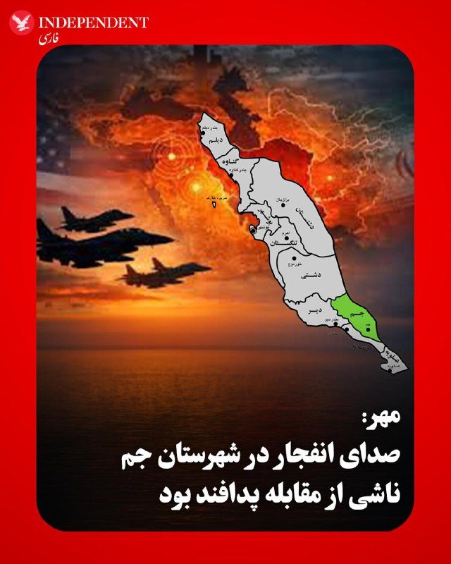

♦️به گزارش خبرگزاری مهر، در پی شنیده شدن صدای انفجار در منطقه ۷ چاه شهرستان جم واقع در استان بوشهر، مشخص شد که این رخداد ناشی از عملکرد پدافند دفاعی بوده است.
پیش‌تر، خبرگزاری تسنیم گزارش داده بود صداهای شنیده‌شده احتمالا به شلیک‌های اخطار نیروی دریایی ایران به برخی شناورها مرتبط است. خبرگزاری فارس نیز اعلام کرد نیروهای مسلح جمهوری اسلامی پنجشنبه شب از مناطق جنوبی کشور به‌سمت اهدافی نامشخص موشک شلیک کرده‌اند.
‌🇸🇦 Indypersian

🤖 @VahidOOnLine

## VahidOOnLine — post 242658

  

وب‌سایت وزارت خزانه‌داری آمریکا اعلام کرد تحریم‌های جدیدی مرتبط با جمهوری اسلامی اعمال شده است.

این وزارتخانه اعلام کرد ۱۷ شرکت را به دلیل ارتباط با شبکه‌های وابسته به جمهوری اسلامی و شرکت «سپهر انرژی جهان‌نما پارس» که در حوزه نفت و پتروشیمی فعالیت می‌کرده، در فهرست تحریم قرار داده است. شرکت سپهر انرژی پیش‌تر نیز در لیست تحریم‌های آمریکا بوده است.

همچنین هشت کشتی و نفتکش نیز در فهرست تحریم‌های جدید قرار گرفته‌اند. این کشتی‌ها با پرچم کشورهایی از جمله جزایر مارشال، پاناما، کامرون و سان‌مارینو فعالیت می‌کنند و با شرکت‌های تحریم‌شده مرتبط هستند.
‌🏁 🇬🇧 IranintlTV

🤖 @VahidOOnLine

## VahidOOnLine — post 242657

  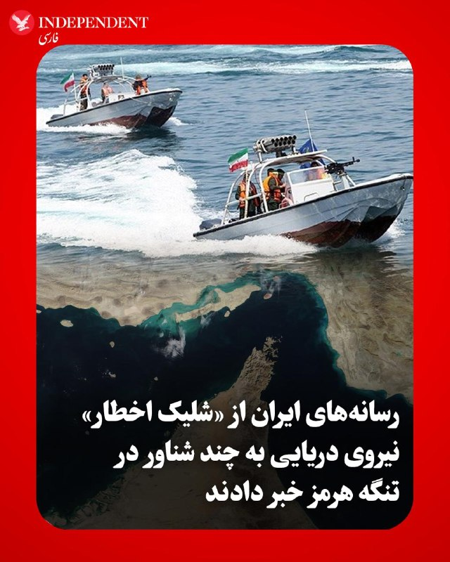

♦️رسانه‌ها در ایران از جمله خبرگزاری تسنیم وابسته به سپاه از شنیده شدن صدای شلیک در اطراف منطقه بندرعباس و تنگه هرمز خبر دادند.

تسنیم گزارش داد، صداهای شنیده شده احتمالا مربوط به شلیک اخطار نیرویی دریایی ایران به بعضی شناورها بوده است.

خبرگزاری فارس هم اعلام کرد که شامگاه پنجشنبه نیروهای مسلح ایران از مناطق جنوبی کشور به‌سمت اهداف مشخص موشک شلیک کردند.

بنا به گزارش فارس هنوز هدف دقیق این موشک‌ها مشخص نیست اما برخی منابع از احتمال درگیری بر روی آب‌های خلیج فارس خبر می‌دهند.

برخی رسانه‌ها در ایران پنجشنبه شب از وقوع انفجارهایی در استان‌های بوشهر و هرمزگان خبر داده بودند که فارس،‌ خبرگزاری نزدیک به سپاه وقوع این انفجارها را رد کرد.
‌🇸🇦 Indypersian

🤖 @VahidOOnLine

## VahidOOnLine — post 242656

  

رسانه‌های ایران گزارش دادند که نیروی دریایی سپاه شامگاه پنج‌شنبه در نزدیکی تنگه هرمز به ۴ «شناور خاطی» که قصد عبور بدون هماهنگی از تنگه هرمز را داشتند، «شلیک اخطار» کرده است.

همزمان، گزارش‌های منتشرشده در رسانه‌های اجتماعی از شنیده‌شدن صدای انفجار در هرمزگان و بوشهر حکایت دارد.
‌🏁 🇬🇧 IranintlTV

🤖 @VahidOOnLine

## VahidOOnLine — post 242655

ویدیوی رسیده به ایران اینترنشنال لحظاتی از بی‌تابی مادر جاویدنام مهرداد فلاحی را نشان می‌دهد که با قاب عکس پسرش گریه می‌کند. او شهروند ساکن گیلان و دارای دو فرزند بود که در اعتراضات انقلاب ملی در ۱۸ دی با گلوله ماموران در رشت کشته شد.
‌🏁 🇬🇧 IranintlTV

🤖 @VahidOOnLine

## VahidOOnLine — post 242654

  

♦️اسکات بسنت، وزیر خزانه‌داری آمریکا در نشست خبری کاخ سفید گفت که ایالات متحده طی ماه‌های اخیر نه‌تنها با مسئله «تغییر رژیم» مواجه نبوده، بلکه «ساختار قدرت در ایران را تغییر داده است».
او با اشاره به سخنان دونالد ترامپ گفت که «لایه اول رهبری» در ایران حذف شده و «لایه دوم» نیز از میان برداشته شده و اکنون آمریکا به گفته او در «لایه سوم» قرار دارد، بدون آنکه جزئیات بیشتری از این ادعا ارائه دهد.
بسنت همچنین گفت که حکومت ایران از سه ستون اصلی شامل دولت، سپاه پاسداران و روحانیون تشکیل شده است و این ساختارها در برقراری ارتباط موثر با یکدیگر دچار مشکل هستند. او تاکید کرد واشنگتن در مواجهه با این وضعیت «صبر دارد اما این صبر نامحدود نیست».
وزیر خزانه‌داری آمریکا در ادامه با اشاره به رویکرد دولت ترامپ گفت رئیس‌جمهور همواره ترجیح می‌دهد از مسیر توافق صلح حرکت کند و به همین دلیل، تمام اقدامات انجام‌شده تاکنون «ماهیت دفاعی» داشته است و این رویکرد در حال حاضر نیز ادامه دارد.
او هشدار داد در صورتی که ترامپ به این جمع‌بندی برسد امکان دستیابی به توافق صلح وجود ندارد، گزینه نظامی بار دیگر روی میز قرار خواهد گرفت.
‌🇸🇦 Indypersian

🤖 @VahidOOnLine

## VahidOOnLine — post 242653

♦️مارکو روبیو، وزیر امور خارجه آمریکا روز پنجشنبه هفتم خرداد تولدش را با کارکنان کاخ سفید جشن گرفت.
تصاویری که در شبکه‌های اجتماعی منتشر شده مارکو روبیو را در کنار کارکنان کاخ سفید و کیک تولد ۵۵ سالگی‌ او نشان می‌دهد.
وزیر خارجه آمریکا، روز یکشنبه نیز در جریان سفر به هند، در مراسمی غافلگیرکننده در دهلی‌نو جشن تولد ۵۵ سالگی‌اش را برگزار کرد؛ مراسمی که با اجرای گروه موسیقی «ویلیج پیپل» همراه بود.
‌🇸🇦 Indypersian

🤖 @VahidOOnLine

## VahidOOnLine — post 242652

  

اسکات بسنت، وزیر خزانه‌داری آمریکا، در نشست خبری خود در کاخ سفید، درباره اطلاعیه سنتکام درباره حمله تهران به کویت و شکستن آتش‌بس گفت: «ما صبور هستیم اما صبر نامحدود نداریم.»

او افزود: «رییس‌جمهور همیشه یک توافق صلح را ترجیح می‌دهد، بنابراین هر کاری که تا اینجا انجام داده‌ایم صرفا حالت دفاعی داشته و در حال حاضر نیز به همین روند ادامه خواهیم داد.»

وزیر خزانه‌داری آمریکا تاکید کرد: «اما اگر ترامپ فکر کند که نمی‌تواند به یک توافق صلح برسد، در آن صورت گزینه اقدام نظامی دوباره مطرح خواهد شد.»
‌🏁 🇬🇧 IranintlTV

🤖 @VahidOOnLine

## VahidOOnLine — post 242651

  

اسکات بسنت، وزیر خزانه‌داری آمریکا، در نشست خبری کاخ سفید گفت ما در ایران تغییر رژیم نداشتیم اما رژیم را تغییر داده‌ایم و همان‌طور که رییس‌جمهور ترامپ گفت و پیش‌تر هم گفته‌ایم، لایه اول رهبری حذف شد، لایه دوم نیز حذف شد و اکنون در لایه سوم هستیم.

او افزود حکومت ایران سه ستون دارد: دولت، سپاه پاسداران و روحانیون. آن‌ها در برقراری ارتباط با یکدیگر مشکل دارند، بنابراین ما صبور هستیم اما صبر ما نامحدود نیست.

بسنت اضافه کرد ترامپ همیشه توافق صلح را ترجیح می‌دهد، بنابراین هر کاری که تاکنون انجام داده‌ایم دفاعی بوده و در حال حاضر نیز همین مسیر را ادامه خواهیم داد. اما اگر رییس‌جمهور فکر کند نمی‌تواند به توافق صلح برسد، گزینه اقدام نظامی دوباره روی میز خواهد بود.
‌🏁 🇬🇧 IranintlTV

🤖 @VahidOOnLine

## VahidOOnLine — post 242650

  

♦️تسنیم، رسانه وابسته به سپاه پاسداران به نقل از «یک منبع نزدیک به تیم مذاکره‌کننده» مدعی شد برخلاف ادعای برخی منابع غربی مبنی بر اینکه متن اصطلاحا «یادداشت تفاهم» میان ایران و آمریکا نهایی شده و فقط منتظر اعلام دو طرف است، این موضوع واقعیت ندارد و هنوز متن قطعی نشده است.
این منبع افزود: «ایران تا این لحظه به میانجی پاکستانی اعلام نهایی شدن متن را انجام نداده است. در صورتی که متن واقعا نهایی شود، ایران موضوع را به میانجی ‌پاکستانی و به مردم اعلام خواهد کرد. و تا آن زمان هرگونه روایت منابع غربی درباره نهایی شدن موضوع معتبر نیست.»
روز پنجشنبه، ان‌بی‌سی نیوز به نقل از یک مقام ارشد عرب که مستقیما در میانجیگری مذاکرات بین واشنگتن و تهران نقش داشته، گزارش داد که مذاکره‌کنندگان آمریکایی و ایرانی سه روز پیش بر سر مفاد توافق آتش‌بس به نتیجه رسیدند، اما هر دو طرف نهایی کردن و اعلام آن را به تعویق انداخته‌اند.
به گفته این مقام، مذاکره‌کنندگان ایرانی ابتدا موافقت کردند و قبل از اعلام، برای مشورت با رهبری خود بازگشتند و طرف آمریکایی اکنون در حالی که منتظر تایید نهایی ترامپ است، همین کار را انجام می‌دهد.
‌🇸🇦 Indypersian

🤖 @VahidOOnLine

## VahidOOnLine — post 242649

  

خبرگزاری تسنیم، وابسته به سپاه، درباره روند مذاکرات تهران و واشینگتن نوشت: «برخلاف ادعای منابع غربی، متن تفاهم‌نامه احتمالی تا این لحظه نهایی و قطعی نشده است.»

تسنیم شامگاه پنج‌شنبه به نقل از یک منبع نزدیک به تیم مذاکره‌کننده نوشت تهران تا این لحظه نهایی شدن متن را به میانجی پاکستانی اعلام نکرده است.
‌🏁 🇬🇧 IranintlTV

🤖 @VahidOOnLine

## VahidOOnLine — post 242648

  

وزارت خارجه اسرائیل اعلام کرد تصمیم شرم‌آور و مضحک سازمان ملل برای گنجاندن نهادهای اسرائیلی در ضمیمه گزارش خشونت جنسی در درگیری‌ها، نشانه‌ای دیگر از ماهیت واقعی این سازمان است؛ نهادی سیاسی‌زده و فاسد که اصول بنیان‌گذاری خود را کنار گذاشته و به‌طور نظام‌مند اسرائیل را به‌عنوان هدف اصلی خود قرار داده است. این تصمیم نمونه‌ای دیگر از خصومت دیرینه و نهادینه‌شده سازمان ملل علیه اسرائیل است.

در این بیانیه آمده تصمیم امروز باید در بستر واقعی خود درک شود: تلاشی برای ایجاد تقارن ساختگی میان اسرائیل و جنایات جنسی واقعی ارتکاب‌یافته از سوی حماس. این تنها انگیزه آن است.

وزارت خارجه اسرائیل آنتونیو گوترش را مسئول این اقدام دانست و اعلام کرد او کشتار ۷ اکتبر را توضیح‌پذیر جلوه داده، نقش کارکنان سازمان ملل در آن جنایات را پنهان کرده و این سازمان را به پایین‌ترین نقطه خود رسانده است.

اسرائیل اعلام کرد با توجه به نقض استانداردهای صداقت، سلامت و حرفه‌ای‌گری از سوی گوترش، تمام روابط خود با دفتر دبیرکل را قطع می‌کند و تا زمان تعیین دبیرکل جدید سازمان ملل منتظر خواهد ماند.
‌🏁 🇬🇧 IranintlTV

🤖 @VahidOOnLine

## VahidOOnLine — post 242647

♦️علی باقری کنی معاون دبیر شورای عالی امنیت ملی ایران در گفتگو با اسپوتنیک آمریکا را به «تجاوزگری» متهم کرد و گفت: «اینکه آمریکا دو بار در جریان مذاکرات بدون هیچ دلیلی به ایران تجاوز کرد، نشان می‌دهد که آمریکا خوی و سرشت تجاوزگری دارد، برای همین است که ملت ایران هیچ وقت به آمریکایی‌ها در واقع اعتماد ندارد.»
پیشتر نیز برخی از مقام‌های جمهوری اسلامی گفته بودند حتی در صورت دستیابی به توافق با آمریکا، هیچ تضمینی برای اجرای آن وجود ندارد.
این اظهارات در حالی مطرح می‌شود که با وجود ادامه مذاکرات میان تهران و واشنگتن، دونالد ترامپ چهارشنبه شب از روند گفتگوها و پیشنهادهای جمهوری اسلامی، ابراز نارضایتی کرد.
‌🇸🇦 Indypersian

🤖 @VahidOOnLine

## VahidOOnLine — post 242646

  

وزارت خارجه اسرائیل اعلام کرد تصمیم شرم‌آور و مضحک سازمان ملل برای گنجاندن نهادهای اسرائیلی در ضمیمه گزارش خشونت جنسی در درگیری‌ها، نشانه‌ای دیگر از ماهیت واقعی این سازمان است؛ نهادی سیاسی‌زده و فاسد که اصول بنیان‌گذاری خود را کنار گذاشته و به‌طور نظام‌مند اسرائیل را به‌عنوان هدف اصلی خود قرار داده است. این تصمیم نمونه‌ای دیگر از خصومت دیرینه و نهادینه‌شده سازمان ملل علیه اسرائیل است.

در این بیانیه آمده تصمیم امروز باید در بستر واقعی خود درک شود: تلاشی برای ایجاد تقارن ساختگی میان اسرائیل و جنایات جنسی واقعی ارتکاب‌یافته از سوی حماس. این تنها انگیزه آن است.

وزارت خارجه اسرائیل آنتونیو گوترش را مسئول این اقدام دانست و اعلام کرد او کشتار ۷ اکتبر را توضیح‌پذیر جلوه داده، نقش کارکنان سازمان ملل در آن جنایات را پنهان کرده و این سازمان را به پایین‌ترین نقطه خود رسانده است.

اسرائیل اعلام کرد با توجه به نقض استانداردهای صداقت، سلامت و حرفه‌ای‌گری از سوی گوترش، تمام روابط خود با دفتر دبیرکل را قطع می‌کند و تا زمان تعیین دبیرکل جدید سازمان ملل منتظر خواهد ماند.
‌🏁 🇬🇧 IranintlTV

🤖 @VahidOOnLine

## VahidOOnLine — post 242645

🗣روایت شما از زندگی در آتش‌بس- پنجشنبه ۷ خرداد ۱۴۰۶

🔹از این‌که اینترنت برگشته نباید خوشحال شد. حق‌مون رو ازمون گرفتن و قطره‌قطره دارن بهمون پس می‌دن. چیزی نیست که باعث شادی بشه.

🔹من دانش‌آموز رشته کامپیوتر هستم و با یک سیستم قدیمی درس‌هام رو می‌گذرونم. یک ساله می‌خوام سیستم بخرم، اما هر روز گرون‌تر میشه. این همه پول مدرسه می‌دم، اما مجبورم برم کافی‌نت تا کارهام رو انجام بدم.

🔹الیگودرز: در حالی که آخوندا عید قربان رو با شام مفصل جشن می‌گیرن، مردم حتی نون ساده هم نمی‌تونن بخرن.

🔹از خرم‌آباد: همه‌چی روزبه‌روز داره سخت‌تر و بدتر از قبل میشه. موز کیلویی ۴۹۰ تومن شده.

🔹خیلی وقت بود گوشت از سفره حذف شده بود. الان مرغ هم رفته، فقط تونستم مقداری پای مرغ بخرم. از بوشهر.

🔹من یک کارگر نانوایی هستم. سهمیه آرد نانوایی‌ها رو کسر کردن و هیچ‌کس جوابگو نیست.

🔹آخه در کشوری که حقوق قانون کار پانزده میلیون باشه و اجاره خونه هم پنج میلیون و گوشت کیلویی دو میلیون، چه‌جوری میشه زندگی کرد؟!

🔹اینترنت رو به قولی وصل کردن و گند زدن با این وصل کردنشون. وضعیت الان بدتر از حتی جنگ شده. من دیگه روم نمی‌شه حتی فروش داشته باشم. فیلتری که می‌دادم ۴ هزار تومان، الان باید بدم ۵۰.

🔹من ۳۰ میلیون حقوق می‌گیرم، کارم فروشندگیه. حدود ۹۰ درصد خرج من ناهار سر کار هست. هیچ چیز برای خودم نمی‌خرم غیر از خوراکی برای خواهر کوچکم. نمی‌دونم چکار کنم. کار کنم؟ درس بخونم؟ بیکار بمونم؟ زندگی خیلی سخته.

🔹رفسنجان: مردم تو رو خدا امیدتون رو از دست ندید. رانندگان، بازاریان اعتصاب کنید. ما هم منتظر فراخوان شاهزاده هستیم تا برگردیم به خیابون و کار رو تموم کنیم.

🔹از اسفندماه تعدیل نیرو شدم، با سابقه بیش از ۱۰ سال بیمه. برای بیمه بیکاری هم اقدام کردم. متأسفانه هنوز هیچ‌گونه وجهی دریافت نکردم. زندگی سخته، بچه کوچک داریم.

🔹اصلاً نمی‌خوام سیاه‌نمایی کنم، ولی وضعیت جوریه که برای خریدن سیب‌زمینی و پیاز هم تردید می‌کنم. چیزی که اساساً در مورد خریدش نباید فکر کرد.

🔹بیش از سه ماه به‌خاطر قطعی اینترنت دفترمون رو تعطیل کردیم، اما سر در برابر «پرو» فرود نیاوردیم. به امید روزهای روشن.
‌🏁 🇬🇧 IranintlTV

🤖 @VahidOOnLine

## WithYashar — post 12834

https://t.me/boost/withyashar بوست داره میریزههههه

## WithYashar — post 12833

https://t.me/boost/withyashar

بوست داره میریزههههه

## WithYashar — post 12832

دیکتاتور مهربون ردبول رو امشب میزنی یا فرداشب؟👀

## WithYashar — post 12831

دیکتاتور مهربون
ردبول رو امشب میزنی یا فرداشب؟👀

## WithYashar — post 12830

پدافند اصفهان فعال شد
@withyashar

## WithYashar — post 12829

تسنیم : یک منبع نظامی رهگیری پهپاد آمریکایی را تایید کرد

به گفته این منبع نظامی، این رهگیری در اطراف بوشهر از طریق شلیک موشک پدافندی به سمت این پهپاد انجام شد.
@withyashar

## WithYashar — post 12828

درود بر یاشار جان از جم پیام میدم حوالی ساعت 22:41 بود که فک کنم صدای فرستادن موشک یا رد شدن جت و این داستانا یهو اومد صدای مهیب و خوبی بود @withyashar

## WithYashar — post 12827

  <a href="telegram/content/WithYashar_12827_1780001348.mp4" target="_blank">🎬 Download video</a>

ترامپ درباره ایران: آنها مذاکره‌کنندگان بسیار خوبی هستند آنها زیرک‌اند اما ما همه کارت‌ها را در دست داریم، چون آنها را از نظر نظامی شکست داده‌ایم.
@withyashar

## WithYashar — post 12826

  

شبکه CNN: تصاویر ماهواره ای نشان میدهد ایران به سرعت در حال بیرون کشیدن زرادخانه موشکی عظیم خود از زیرِ زمین است.
@withyashar

## WithYashar — post 12825

ویو از کانال میلیونی ‌بیشتره، ری اکشن از کانال پوشاک زیر کمتر 😕 بد میگین ما ایرانیم چه کاری ازمون برم یاد بکنیم برات !!! خوب اسمت که نمی افته کاملا مخفیه همه پستا و ری اکشن بده دست آدم به کار بره…

## WithYashar — post 12824

کانال‌های وابسته به محور شیعه ادعا می‌کنند که ۴ کشتی تجاری آمریکایی پس از تلاش برای عبور از تنگه هرمز بدون اجازه ایران، توسط سپاه پاسداران ایران مورد حمله قرار گرفته‌اند.
@withyashar

## WithYashar — post 12823

فارس: دقایقی پیش نیروهای مسلح ایران از مناطق جنوبی کشور به‌سمت اهداف مشخص موشک شلیک کردند.

بامداد امروز هم پس از تعرض دشمن یه مناطق شرقی بندرعباس پایگاه مبدأ این تجاوز مورد هدف نیروهای مسلح جمهوری اسلامی قرار گرفت.

هنوز هدف دقیق این موشک‌ها مشخص نیست اما برخی منابع از احتمال درگیری بر روی آب‌های خلیج فارس خبر می‌دهند.
@withyashar

## WithYashar — post 12822

رسانه های عبری : گزارشهای رسمی از تبادل آتش بین ایران و آمریکا در تنگه هرمز خبر می‌دهند. @withyashar

## WithYashar — post 12821

اتاق جنگ با یاشار : یا موسی 💥 یااااا موسیییی

## WithYashar — post 12820

رسانه های عبری : گزارشهای رسمی از تبادل آتش بین ایران و آمریکا در تنگه هرمز خبر می‌دهند.
@withyashar

## WithYashar — post 12819

ایلنا: شلیک اخطار نیروی دریایی به چهار شناور

نیروی دریایی در نزدیکی تنگه هرمز به ۴ فروند شناور خاطی شلیک اخطار انجام داد. این شناورها قصد عبور بدون هماهنگی از تنگه هرمز را داشتند.
@withyashar

## WithYashar — post 12818

رسانه های عبری : گزارش‌های اولیه: موشک‌های کروز «ابومهدی المهندس» از ایران به سمت کشتی‌های آمریکایی در منطقه تنگه هرمز شلیک شدند.
@withyashar

## WithYashar — post 12817

درود بر یاشار جان از جم پیام میدم
حوالی ساعت 22:41 بود که فک کنم صدای فرستادن موشک یا رد شدن جت و این داستانا یهو اومد
صدای مهیب و خوبی بود
@withyashar

## WithYashar — post 12816

اتاق جنگ با شما : هرمزگان و بوشهر هم صدای انفجار میاد
@withyashar

## WithYashar — post 12815

اتاق جنگ با شما : انفجار تو علامردشت فارس بوده
@withyashar

## mwarmonitor — post 9871

🔸دونالد ترامپ پیش از موافقت با توافق با ایران، در پی دریافت مشورت و نظر کارشناسی است. CNN

🔴مارک لوین:
من رئیس‌جمهور را سرزنش نمی‌کنم که چند روزی برای فکر کردن درباره این موضوع وقت گرفته است—یعنی درباره توافق اولیه‌ای که مذاکره‌کنندگانش از طرف رژیم ایران به او ارائه کرده‌اند.

🔸می‌فهمم چرا رژیم ایران با این موضوع موافقت کرده است: طبق گزارش‌ها، «در ازای تعهداتی برای بازگشایی تنگه هرمز و چشم‌پوشی از توسعه سلاح‌های هسته‌ای، آمریکا دارایی‌های بلوکه‌شده ایران را آزاد خواهد کرد و درباره کاهش تحریم‌ها وارد مذاکره می‌شود، و همچنین وارد گفت‌وگو درباره سازوکاری برای اجازه ورود کمک‌های انسانی و سایر کالاهای ضروری به ایران خواهد شد.»
🔹بنابراین، دارایی‌های بلوکه‌شده فوراً آزاد می‌شوند (که این یعنی میلیاردها دلار)، کاهش تحریم‌ها در آینده مطرح است، و همین‌طور «کمک‌های انسانی» (به رژیمی که مردم خودش را سرکوب می‌کند). این یک تزریق عظیم میلیاردها دلاری به ایران است، علاوه بر اینکه رژیم دوباره می‌تواند نفت صادر کند—که همه این‌ها به سپاه پاسداران و دیگر نهادهای سرکوبگر کمک مالی خواهد کرد، و مطمئناً بخش عمده پول هم به همان‌جا می‌رود. و هیچ اشاره‌ای به موشک‌های بالستیک نشده، که کاملاً موضوعی حیاتی است، و هیچ اشاره‌ای هم به خشونت علیه مردم نشده است.
🔸باید جزئیات بسیار بیشتری وجود داشته باشد تا دقیقاً روشن شود چه چیزی در این مذاکرات انجام شده که در ازای فقط ۶۰ روز گفت‌وگو، چنین تزریق عظیمی از پول به رژیم را توجیه کند. آیا در این مدت به دنبال سلاح هسته‌ای نخواهند رفت؟ من فکر می‌کردم اگر این کار را بکنند، ما به‌صورت نظامی به آن‌ها حمله خواهیم کرد. و آن‌ها تنگه هرمز را باز می‌کنند—پس یعنی بستن آن از طرف رژیم، ابزاری برای کشاندن ما به میز مذاکره بوده است؟
🔹ما در حال برداشتن فشار اقتصادی و نظامی هستیم، فقط با این تهدید که ممکن است دوباره بازگردد. چرا نباید قبل از برداشتن فشار اقتصادی، امتیازات را تضمین کرد؟ اگر آن‌ها موافقت نمی‌کردند، پس رژیم تا چه حد واقعاً برای دادن امتیازات جدی و پایدار جدی است؟
🔸من رئیس‌جمهور را سرزنش نمی‌کنم که چند روزی برای فکر کردن به این موضوع وقت بگذارد، اگر این گزارش درست باشد. و اجرای چنین توافقی، با توجه به ماهیت و سابقه این رژیم، هر چه باشد، عملاً غیرممکن خواهد بود (به‌خصوص بعد از دوران ریاست‌جمهوری ترامپ).


@mwarmonitor

## mwarmonitor — post 9870

  <a href="telegram/content/mwarmonitor_9870_1780001351.mp4" target="_blank">🎬 Download video</a>

🔴وزیر جنگ ایالات متحده ؛ به لطف سرمایه‌گذاری تاریخی ۱.۵ تریلیون دلاری رئیس‌جمهور ترامپ در حوزه نظامی، نیروهای ما بزرگ‌ترین افزایش حقوق در تاریخ معاصر را دریافت خواهند کرد.

🔸ما همچنین یک سرمایه‌گذاری نسلی در پادگان‌ها، زیرساخت‌های نظامی و سیستم‌های پشتیبانی نیروها انجام می‌دهیم.

📌«اول آمریکا» یعنی «اول نیروهای نظامی»

@mwarmonitor

## FoxNewsTwitter — post 342363

  

Fox News (Twitter/X)

A Texas man accused of threatening to kill Erika Kirk and bomb a Turning Point USA event has been charged with a third-degree felony count for making a terroristic threat.

26-year-old Jacob Wenske allegedly wrote a disturbing series of online posts and emails, including saying he knows “exactly where to bomb” after an upcoming TPUSA event was announced in San Antonio.

Authorities say he later escalated the threats, allegedly writing: “Death to Erika Kirk and every single speaker there!!” while threatening a bombing at “every single Turning Point rally and event.”

The summit is scheduled for June 5–7 at the San Antonio Marriott Rivercenter and is expected to draw more than 2,500 attendees.

TPUSA says security at the event will include “enhanced, multi-layered” protection with private security and local police following the threats.

## FoxNewsTwitter — post 342362

  <a href="telegram/content/FoxNewsTwitter_342362_1780001354.mp4" target="_blank">🎬 Download video</a>

Fox News (Twitter/X)

NOW: Treasury Sec. Bessent defends the proposal to put President Trump's face on a $250 bill to commemorate America's anniversary:

REPORTER: "Politically, do you think it's a good idea though when people are struggling to afford gas and groceries?"

BESSENT: "I don't think that there's anything untoward about having the president of the United States, the person who is president of the United States on the 250th anniversary bill."

## FoxNewsTwitter — post 342361

  <a href="telegram/content/FoxNewsTwitter_342361_1780001356.mp4" target="_blank">🎬 Download video</a>

Fox News (Twitter/X)

BREAKING: Secretary Scott Bessent issues a stark warning to Iran, revealing the regime's leadership structure is in disarray and that President Trump's patience with the Islamic Republic is wearing thin.

"We are being patient. We do not have unlimited patience.”

“President Trump always prefers a peace deal. So everything we have done thus far has been defensive... But if President Trump doesn't think he can get a peace deal, then kinetic is back."

## FoxNewsTwitter — post 342360

  <a href="telegram/content/FoxNewsTwitter_342360_1780001359.mp4" target="_blank">🎬 Download video</a>

Fox News (Twitter/X)

BREAKING: Secretary Scott Bessent shuts down rumors of a potential future presidential run after a reporter points out he is following the exact same path as Vice President Vance and Secretary Rubio, filling in for Karoline Leavitt:

"I think it just means they're run out of things on the food chain."

## FoxNewsTwitter — post 342359

  <a href="telegram/content/FoxNewsTwitter_342359_1780001361.mp4" target="_blank">🎬 Download video</a>

Fox News (Twitter/X)

NEW: Treasury Sec. Bessent weights in on the reported IRS settlement with President Trump, as well as the fund for Americans targeted by the federal government:

"President Trump is a great American who has endured more than ten years of nonstop harassment and weaponization from the federal and state government actors."

"No Americans should be targeted for political reasons, and every citizen deserves fair treatment, full protection of the law."

## FoxNewsTwitter — post 342358

  <a href="telegram/content/FoxNewsTwitter_342358_1780001363.mp4" target="_blank">🎬 Download video</a>

Fox News (Twitter/X)

BREAKING: Secretary Scott Bessent reveals the Treasury Department is actively preparing for a historic $250 bill featuring President Trump, pending proposed legislation from Congress that would allow a living person to appear on U.S. currency:

"I have two mandates for U.S. currency, at present, no living person can be on U.S. currency, and the currency must say, ‘In God we trust.’”

“So right now there is proposed legislation, in front of the House and in front of the Senate to change the first requirement so that a living person, Donald J. Trump, could be on the $250 bill.”

“At Treasury we prepare things in advance. So we have prepared in advance that if the legislation is passed, but we will stick to the law." | @pdoocy

## FoxNewsTwitter — post 342357

  <a href="telegram/content/FoxNewsTwitter_342357_1780001365.mp4" target="_blank">🎬 Download video</a>

Fox News (Twitter/X)

Treasury Secretary Scott Bessent gets the White House press corps to crack up after telling them they can call him 'Doctor Bessent' after getting an honorary degree from the University of South Carolina:

“I'm happy to ask the questions. I will mention the three weeks ago I got an honorary degree from the University of South Carolina.”

“So if you really want to get a question, you can call me Doctor Bessent.”

## FoxNewsTwitter — post 342356

  <a href="telegram/content/FoxNewsTwitter_342356_1780001367.mp4" target="_blank">🎬 Download video</a>

Fox News (Twitter/X)

NOW: Treasury Sec. Scott Bessent fills in at the podium for today's White House press briefing and touts the successes coming from President Trump's tax cuts and economic agenda:

"We had a historic tax filing season... The average refund this filing season is nearly $3,300 and 11% increase from last year. And importantly, very importantly, 62 million returns, 44% claimed at least one of the president's signature tax cuts."

"And to remind everyone, every Democrat voted against those programs."

## pm_afshaa — post 91795

  <a href="https://t.me/pm_afshaa/91795" target="_blank">📎 Download file</a>

نپسترنت سرعت بالا مخصوص اینستا و یوتیوب

💧 Rainbet.com the #1 Non-KYC Crypto Casino & Sportsbook @rainbetcom

😁 @Pm_Afshaa

## pm_afshaa — post 91794

سلام ما نزدیک بیدگنه ایم صدا پدافند میومد ۵ بار پشت سر هم درواقثع ۵ تا تق تق تق

## pm_afshaa — post 91793

صبحا صلح شبا جنگ🗿

## pm_afshaa — post 91792

🔴پدافند بندر عباس فعال شد

💧 Rainbet.com the #1 Non-KYC Crypto Casino & Sportsbook @rainbetcom

😁 @Pm_Afshaa

## pm_afshaa — post 91791

اگر هم میخوای از اخبار جا نمونی و اطلاعات نظامیت بالا باشه تو چنل پادشاهی خواه فایتر رادار جوین شو https://t.me/+9C1ENi5qn6hhZjk0 https://t.me/+9C1ENi5qn6hhZjk0

## pm_afshaa — post 91790

vless://c575c0fd-4833-4cba-937d-2342fd32544b@104.17.121.71:443?encryption=none&security=tls&sni=de.vpncustomize.cc.cd&alpn=h2%2Chttp%2F1.1&fp=chrome&type=tcp&headerType=none#PMTV%20NEWS%20%F0%9F%A6%81%E2%98%80%EF%B8%8F

نامحدود سرعت بالا مخصوص اینستا و دانلود

💧 Rainbet.com the #1 Non-KYC Crypto Casino & Sportsbook @rainbetcom

😁 @Pm_Afshaa

## pm_afshaa — post 91789

vless://478cc26d-16b3-4fdd-be64-60d5a58c1622@162.159.36.5:80?path=%2F&security=none&encryption=none&host=tt.andishehparenting.com&type=ws#PMTV%20NEWS%F0%9F%A6%81%E2%98%80%EF%B8%8F

نامحدود سرعت بالا

💧 Rainbet.com the #1 Non-KYC Crypto Casino & Sportsbook @rainbetcom

😁 @Pm_Afshaa

## pm_afshaa — post 91788

https://t.me/proxy?server=87.248.129.210&port=4455&secret=ee1603010200010001fc030386e24c3add626973636f7474692e79656b74616e65742e636f6d

💧 Rainbet.com the #1 Non-KYC Crypto Casino & Sportsbook @rainbetcom

😁 @Pm_Afshaa

## pm_afshaa — post 91787

https://t.me/proxy?server=ui.geodns.info.&port=4455&secret=7nnjRIGHSb16xRkTAiDCXQk%3D

پروکسی سرعت بالا مخصوص دانلود

💧 Rainbet.com the #1 Non-KYC Crypto Casino & Sportsbook @rainbetcom

😁 @Pm_Afshaa

## pm_afshaa — post 91786

اگر هم میخوای از اخبار جا نمونی و اطلاعات نظامیت بالا باشه
تو چنل پادشاهی خواه فایتر رادار جوین شو

https://t.me/+9C1ENi5qn6hhZjk0

https://t.me/+9C1ENi5qn6hhZjk0

## pm_afshaa — post 91785

فارس : دقایقی پیش ایران از جنوب کشور چند موشک به سمت اهداف مشخص شلیک کرد

💧 Rainbet.com the #1 Non-KYC Crypto Casino & Sportsbook @rainbetcom

😁 @Pm_Afshaa

## pm_afshaa — post 91784

https://t.me/proxy?server=87.248.129.210&port=4455&secret=ee1603010200010001fc030386e24c3add626973636f7474692e79656b74616e65742e636f6d

پروکسی مخصوص دانلود سرعت بالا

💧 Rainbet.com the #1 Non-KYC Crypto Casino & Sportsbook @rainbetcom

😁 @Pm_Afshaa

## pm_afshaa — post 91783

https://t.me/proxy?server=ams1.tlgfast.com&port=443&secret=083fe0c452e2407d835537872f097c54 پروکسی سرعت بالا مخصوص دانلود 
💧 Rainbet.com the #1 Non-KYC Crypto Casino & Sportsbook @rainbetcom 
😁 @Pm_Afshaa

## pm_afshaa — post 91782

https://t.me/proxy?server=45.86.153.138&port=443&secret=ee07266a279143bcff09a5e484abb277636972616e2e6d69642e7275

پروکسی مخصوص دانلود

💧 Rainbet.com the #1 Non-KYC Crypto Casino & Sportsbook @rainbetcom

😁 @Pm_Afshaa

## pm_afshaa — post 91781

https://t.me/proxy?server=ams1.tlgfast.com&port=443&secret=083fe0c452e2407d835537872f097c54

پروکسی سرعت بالا مخصوص دانلود

💧 Rainbet.com the #1 Non-KYC Crypto Casino & Sportsbook @rainbetcom

😁 @Pm_Afshaa

## pm_afshaa — post 91780

🔴خزانه‌داری آمریکا از اعمال تحریم‌های جدیدی مرتبط با ایران خبر داد

💧 Rainbet.com the #1 Non-KYC Crypto Casino & Sportsbook @rainbetcom

😁 @Pm_Afshaa

## pm_afshaa — post 91779

ss://Y2hhY2hhMjAtaWV0Zi1wb2x5MTMwNTpDSmpWSXZITnFickFtVzNI@4.168.201.153:443#PMTV%20NEWS%20%F0%9F%A6%81%E2%98%80%EF%B8%8F

نامحدود متصل سرعت بالا
🚀

💧 Rainbet.com the #1 Non-KYC Crypto Casino & Sportsbook @rainbetcom

😁 @Pm_Afshaa

## pm_afshaa — post 91778

vless://b51b79ef-de4e-4c88-924a-9b32ae7bfadd@108.61.198.98:80?encryption=none&security=none&type=ws&host=play.google.com&path=%2F#PMTV%20NEWS%20%F0%9F%A6%81%E2%98%80%EF%B8%8F

نامحدود سرعت موشکی مخصوص دانلود

💧 Rainbet.com the #1 Non-KYC Crypto Casino & Sportsbook @rainbetcom

😁 @Pm_Afshaa

## pm_afshaa — post 91776

منابع داخلی گفتن 4 کشتی آمریکایی رو زدیم

💧 Rainbet.com the #1 Non-KYC Crypto Casino & Sportsbook @rainbetcom

😁 @Pm_Afshaa

## pm_afshaa — post 91775

🔴رسانه های عبری : گزارش‌های اولیه: موشک‌های کروز «ابومهدی المهندس» از ایران به سمت کشتی‌های آمریکایی در منطقه تنگه هرمز شلیک شدن

💧 Rainbet.com the #1 Non-KYC Crypto Casino & Sportsbook @rainbetcom

😁 @Pm_Afshaa

## DEJradio — post 5079

  <a href="telegram/content/DEJradio_5079_1780001370.mp4" target="_blank">🎬 Download video</a>

🟪 
🔺 حمایت ایرانیان مقیم اروپا از انقلاب شیر و خورشید

#همبستگی
@DEJradio

## VahidOnline — post 75781

  

رسانه‌های ایران گزارش دادند که نیروی دریایی سپاه شامگاه پنج‌شنبه در نزدیکی تنگه هرمز به ۴ «شناور خاطی» که قصد عبور بدون هماهنگی از تنگه هرمز را داشتند، «شلیک اخطار» کرده است.

همزمان، گزارش‌های منتشرشده در رسانه‌های اجتماعی از شنیده‌شدن صدای انفجار در هرمزگان و بوشهر حکایت دارد.
@VahidOOnLine
من فقط یک پیام داشتم: صدای انفجارهایی در بندر عباس شنیده میشه.
📡 @VahidOnline

## VahidOnline — post 75780

☄️ #جم در استان بوشهر
پیام‌های دریافتی درباره شنیده شدن صداهایی:

▪️همین االان 10/42دقیقه موشک از جم پرتاب شد

▪️ الان جم رو زدن...صدای انفجار زیاد ۲۲:۴۰

▪️سلام آقا وحید
امشب ساعت ۱۰:۴۶ ۷ خرداد
بوشهر شهرستان جم نمیدونم صدای پرتاب موشک بود یا جنگنده ولی خونه ها لرزید
[معمولا این دو صدا با هم اشتباه گرفته میشن.]

▪️ درود بر وحید جان آنلاین از جم پیام میدم
حوالی ساعت 22:41 بود که فک کنم صدای فرستادن موشک یا رد شدن جت و این داستانا یهو اومد
صدای مهیب و خوبی بود

پیش‌تر پیامی هم دریافت کرده بودم از کسی درباره یکی از اعضای خانواده‌اش:
▪️الان قشم بود. پلاک موقت دادن بهشون گفتند فقط از جزیره خارج شید سریع

آپدیت:‌
همچین متنی در کانال "خبرگزاری صدا و سیما" منتشر شده:
"ساعتی پیش صدایی در منطقه ۷ چاه شهرستان جم استان بوشهر صدای انفجاری شنیده شد که گفته می شود ناشی از مقابله پدافند با هواگردها بوده است."

📡 @VahidOnline

## IranIntlTV — post 339472

  <a href="telegram/content/IranIntlTV_339472_1780001373.mp4" target="_blank">🎬 Download video</a>

نسرین ستوده، وکیل و فعال حقوق بشر، گفت پس از بازداشت توسط ماموران وزارت اطلاعات، در بازداشتگاه این نهاد مورد ضرب و جرح قرار گرفته است.

او همچنین شرایط بازداشتگاه را غیرانسانی توصیف کرد.

گفت‌وگو با رقیه رضایی، روزنامه‌نگار
@iranintltv

## IranIntlTV — post 339471

  

وب‌سایت وزارت خزانه‌داری آمریکا اعلام کرد تحریم‌های جدیدی مرتبط با جمهوری اسلامی اعمال شده است.

این وزارتخانه اعلام کرد ۱۷ شرکت را به دلیل ارتباط با شبکه‌های وابسته به جمهوری اسلامی و شرکت «سپهر انرژی جهان‌نما پارس» که در حوزه نفت و پتروشیمی فعالیت می‌کرده، در فهرست تحریم قرار داده است. شرکت سپهر انرژی پیش‌تر نیز در لیست تحریم‌های آمریکا بوده است.

همچنین هشت کشتی و نفتکش نیز در فهرست تحریم‌های جدید قرار گرفته‌اند. این کشتی‌ها با پرچم کشورهایی از جمله جزایر مارشال، پاناما، کامرون و سان‌مارینو فعالیت می‌کنند و با شرکت‌های تحریم‌شده مرتبط هستند.
https://iranintl.com/202605287485

## IranIntlTV — post 339470

کاخ سفید اعلام کرد واشینگتن و تهران بر سر یک یادداشت تفاهم ۶۰ روزه برای تمدید آتش‌بس و آغاز مذاکرات هسته‌ای به توافق اولیه رسیده‌اند، اما دونالد ترامپ هنوز آن را تایید نهایی نکرده است.

همزمان، وزیر خزانه‌داری آمریکا گفت مذاکرات ادامه دارد و ترامپ بر توقف غنی‌سازی اورانیوم و جلوگیری از دستیابی ایران به سلاح هسته‌ای به‌عنوان خطوط قرمز تاکید دارد.

گفت‌وگو با میعاد ملکی، رییس پیشین دفتر هدف‌گذاری تحریم‌های وزارت خزانه‌داری آمریکا
@iranintltv

## IranIntlTV — post 339469

  <a href="telegram/content/IranIntlTV_339469_1780001376.mp4" target="_blank">🎬 Download video</a>

نسرین ستوده، وکیل و فعال حقوق بشر، اعلام کرد پس از بازداشت توسط وزارت اطلاعات در ۱۲ فروردین، در بازداشتگاه این نهاد مورد ضرب‌وجرح قرار گرفته است. او شرایط بازداشتگاه را غیرانسانی توصیف کرده است.
@iranintltv

## IranIntlTV — post 339468

  <a href="telegram/content/IranIntlTV_339468_1780001378.mp4" target="_blank">🎬 Download video</a>

کاخ سفید اعلام کرد واشینگتن و تهران بر سر یک یادداشت تفاهم ۶۰ روزه برای تمدید آتش‌بس و آغاز مذاکرات هسته‌ای به توافق اولیه رسیده‌اند، اما دونالد ترامپ هنوز آن را تایید نهایی نکرده است. به گفته این منابع، طرف ایرانی تاییدهای لازم را دریافت کرده و آماده امضاست؛ هرچند تاکنون واکنش رسمی از تهران منتشر نشده است.
@iranintltv

## IranIntlTV — post 339467

  

رسانه‌های ایران گزارش دادند که نیروی دریایی سپاه شامگاه پنج‌شنبه در نزدیکی تنگه هرمز به ۴ «شناور خاطی» که قصد عبور بدون هماهنگی از تنگه هرمز را داشتند، «شلیک اخطار» کرده است.

همزمان، گزارش‌های منتشرشده در رسانه‌های اجتماعی از شنیده‌شدن صدای انفجار در هرمزگان و بوشهر حکایت دارد.
https://iranintl.com/202605287972

## IranIntlTV — post 339466

  <a href="https://t.me/IranintlTV/339466" target="_blank">📎 Download file</a>

🎧نسخه صوتی ۲۴ با فرداد فرحزاد: توافق تهران و واشینگتن در انتظار امضای ترامپ
@iranintlTV

## IranIntlTV — post 339465

ویدیوی رسیده به ایران اینترنشنال لحظاتی از بی‌تابی مادر جاویدنام مهرداد فلاحی را نشان می‌دهد که با قاب عکس پسرش گریه می‌کند. او شهروند ساکن گیلان و دارای دو فرزند بود که در اعتراضات انقلاب ملی در ۱۸ دی با گلوله ماموران در رشت کشته شد.

## IranIntlTV — post 339464

  

اسکات بسنت، وزیر خزانه‌داری آمریکا، در نشست خبری خود در کاخ سفید، درباره اطلاعیه سنتکام درباره حمله تهران به کویت و شکستن آتش‌بس گفت: «ما صبور هستیم اما صبر نامحدود نداریم.»

او افزود: «رییس‌جمهور همیشه یک توافق صلح را ترجیح می‌دهد، بنابراین هر کاری که تا اینجا انجام داده‌ایم صرفا حالت دفاعی داشته و در حال حاضر نیز به همین روند ادامه خواهیم داد.»

وزیر خزانه‌داری آمریکا تاکید کرد: «اما اگر ترامپ فکر کند که نمی‌تواند به یک توافق صلح برسد، در آن صورت گزینه اقدام نظامی دوباره مطرح خواهد شد.»
https://iranintl.com/202605286430

## IranIntlTV — post 339463

  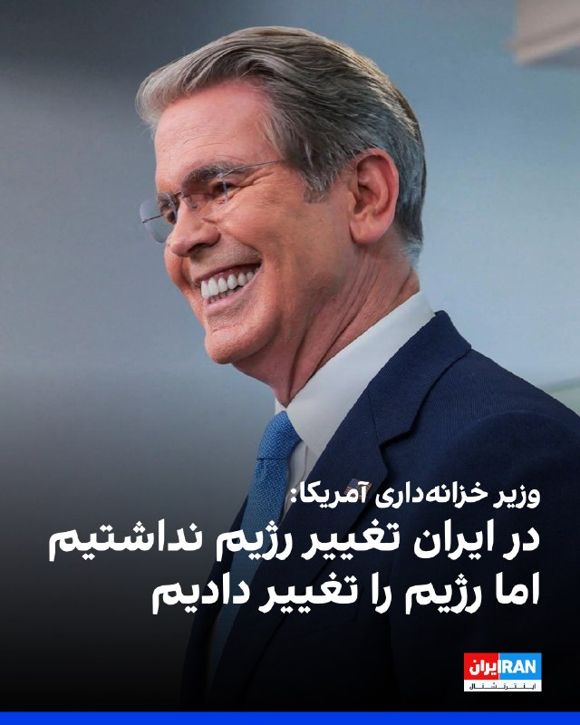

اسکات بسنت، وزیر خزانه‌داری آمریکا، در نشست خبری کاخ سفید گفت ما در ایران تغییر رژیم نداشتیم اما رژیم را تغییر داده‌ایم و همان‌طور که رییس‌جمهور ترامپ گفت و پیش‌تر هم گفته‌ایم، لایه اول رهبری حذف شد، لایه دوم نیز حذف شد و اکنون در لایه سوم هستیم.

او افزود حکومت ایران سه ستون دارد: دولت، سپاه پاسداران و روحانیون. آن‌ها در برقراری ارتباط با یکدیگر مشکل دارند، بنابراین ما صبور هستیم اما صبر ما نامحدود نیست.

بسنت اضافه کرد ترامپ همیشه توافق صلح را ترجیح می‌دهد، بنابراین هر کاری که تاکنون انجام داده‌ایم دفاعی بوده و در حال حاضر نیز همین مسیر را ادامه خواهیم داد. اما اگر رییس‌جمهور فکر کند نمی‌تواند به توافق صلح برسد، گزینه اقدام نظامی دوباره روی میز خواهد بود.
https://iranintl.com/202605282114

## IranIntlTV — post 339462

  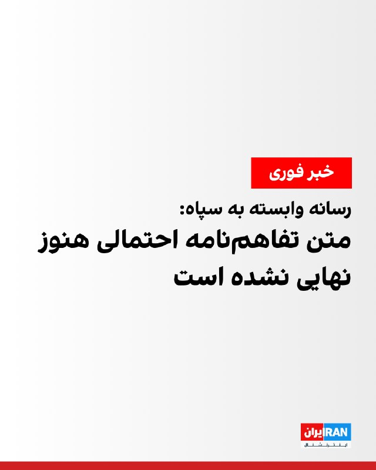

خبرگزاری تسنیم، وابسته به سپاه، درباره روند مذاکرات تهران و واشینگتن نوشت: «برخلاف ادعای منابع غربی، متن تفاهم‌نامه احتمالی تا این لحظه نهایی و قطعی نشده است.»

تسنیم شامگاه پنج‌شنبه به نقل از یک منبع نزدیک به تیم مذاکره‌کننده نوشت تهران تا این لحظه نهایی شدن متن را به میانجی پاکستانی اعلام نکرده است.
https://iranintl.com/202605282517

## IranIntlTV — post 339461

  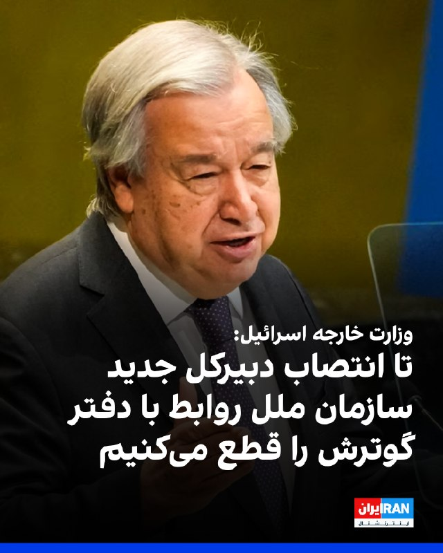

وزارت خارجه اسرائیل اعلام کرد تصمیم شرم‌آور و مضحک سازمان ملل برای گنجاندن نهادهای اسرائیلی در ضمیمه گزارش خشونت جنسی در درگیری‌ها، نشانه‌ای دیگر از ماهیت واقعی این سازمان است؛ نهادی سیاسی‌زده و فاسد که اصول بنیان‌گذاری خود را کنار گذاشته و به‌طور نظام‌مند اسرائیل را به‌عنوان هدف اصلی خود قرار داده است. این تصمیم نمونه‌ای دیگر از خصومت دیرینه و نهادینه‌شده سازمان ملل علیه اسرائیل است.

در این بیانیه آمده تصمیم امروز باید در بستر واقعی خود درک شود: تلاشی برای ایجاد تقارن ساختگی میان اسرائیل و جنایات جنسی واقعی ارتکاب‌یافته از سوی حماس. این تنها انگیزه آن است.

وزارت خارجه اسرائیل آنتونیو گوترش را مسئول این اقدام دانست و اعلام کرد او کشتار ۷ اکتبر را توضیح‌پذیر جلوه داده، نقش کارکنان سازمان ملل در آن جنایات را پنهان کرده و این سازمان را به پایین‌ترین نقطه خود رسانده است.

اسرائیل اعلام کرد با توجه به نقض استانداردهای صداقت، سلامت و حرفه‌ای‌گری از سوی گوترش، تمام روابط خود با دفتر دبیرکل را قطع می‌کند و تا زمان تعیین دبیرکل جدید سازمان ملل منتظر خواهد ماند.
https://iranintl.com/202605286441

## IranIntlTV — post 339460

  <a href="https://t.me/IranintlTV/339460" target="_blank">📎 Download file</a>

🎧نسخه صوتی دومینو: توافق برای بازگشایی تنگه هرمز
@iranintlTV

## IranIntlTV — post 339458

  <a href="telegram/content/IranIntlTV_339458_1780001384.mp4" target="_blank">🎬 Download video</a>

۲۴ با فرداد فرحزاد
@iranintltv

## IranIntlTV — post 339456

🗣روایت شما از زندگی در آتش‌بس- پنجشنبه ۷ خرداد ۱۴۰۶

🔹از این‌که اینترنت برگشته نباید خوشحال شد. حق‌مون رو ازمون گرفتن و قطره‌قطره دارن بهمون پس می‌دن. چیزی نیست که باعث شادی بشه.

🔹من دانش‌آموز رشته کامپیوتر هستم و با یک سیستم قدیمی درس‌هام رو می‌گذرونم. یک ساله می‌خوام سیستم بخرم، اما هر روز گرون‌تر میشه. این همه پول مدرسه می‌دم، اما مجبورم برم کافی‌نت تا کارهام رو انجام بدم.

🔹الیگودرز: در حالی که آخوندا عید قربان رو با شام مفصل جشن می‌گیرن، مردم حتی نون ساده هم نمی‌تونن بخرن.

🔹از خرم‌آباد: همه‌چی روزبه‌روز داره سخت‌تر و بدتر از قبل میشه. موز کیلویی ۴۹۰ تومن شده.

🔹خیلی وقت بود گوشت از سفره حذف شده بود. الان مرغ هم رفته، فقط تونستم مقداری پای مرغ بخرم. از بوشهر.

🔹من یک کارگر نانوایی هستم. سهمیه آرد نانوایی‌ها رو کسر کردن و هیچ‌کس جوابگو نیست.

🔹آخه در کشوری که حقوق قانون کار پانزده میلیون باشه و اجاره خونه هم پنج میلیون و گوشت کیلویی دو میلیون، چه‌جوری میشه زندگی کرد؟!

🔹اینترنت رو به قولی وصل کردن و گند زدن با این وصل کردنشون. وضعیت الان بدتر از حتی جنگ شده. من دیگه روم نمی‌شه حتی فروش داشته باشم. فیلتری که می‌دادم ۴ هزار تومان، الان باید بدم ۵۰.

🔹من ۳۰ میلیون حقوق می‌گیرم، کارم فروشندگیه. حدود ۹۰ درصد خرج من ناهار سر کار هست. هیچ چیز برای خودم نمی‌خرم غیر از خوراکی برای خواهر کوچکم. نمی‌دونم چکار کنم. کار کنم؟ درس بخونم؟ بیکار بمونم؟ زندگی خیلی سخته.

🔹رفسنجان: مردم تو رو خدا امیدتون رو از دست ندید. رانندگان، بازاریان اعتصاب کنید. ما هم منتظر فراخوان شاهزاده هستیم تا برگردیم به خیابون و کار رو تموم کنیم.

🔹از اسفندماه تعدیل نیرو شدم، با سابقه بیش از ۱۰ سال بیمه. برای بیمه بیکاری هم اقدام کردم. متأسفانه هنوز هیچ‌گونه وجهی دریافت نکردم. زندگی سخته، بچه کوچک داریم.

🔹اصلاً نمی‌خوام سیاه‌نمایی کنم، ولی وضعیت جوریه که برای خریدن سیب‌زمینی و پیاز هم تردید می‌کنم. چیزی که اساساً در مورد خریدش نباید فکر کرد.

🔹بیش از سه ماه به‌خاطر قطعی اینترنت دفترمون رو تعطیل کردیم، اما سر در برابر «پرو» فرود نیاوردیم. به امید روزهای روشن.

## Shin_Persian — post 6288

Shin ✓ @hey_itsmyturn
Thu, 28 May 2026 20:30:14 UTC

State-owned Mehr News reports that the "blast" in Jam city was due to Air Defense, engaging "hostile" UAV.
Bushehr Province, #Iran

فارسی

خبرگزاری دولتی مهر گزارش می‌دهد که «انفجار» در شهر جم ناشی از عملکرد پدافند هوایی در درگیری با پهپاد «متخاصم» بوده است.
استان بوشهر، #Iran_

𝕏 · @shin_persian

## Shin_Persian — post 6287

Shin ✓ @hey_itsmyturn
Thu, 28 May 2026 19:32:58 UTC

Initial:
Missile launch from Jam missile city, Bushehr Province, #Iran @ 1940Z

فارسی

شلیک موشک از شهر موشکی جم، استان بوشهر، #Iran @ ۱۹۴۰ زولو (۲۳:۱۰ به وقت تهران)

𝕏 · @shin_persian

## FarsiVOA — post 218926

  <a href="telegram/content/FarsiVOA_218926_1780001386.mp4" target="_blank">🎬 Download video</a>

⚡️شکریا برادوست در برنامه تفسیر خبر: پهپادها شمشیرهای دو لبه برای جمهوری اسلامی هستند
@FarsiVOA

## FarsiVOA — post 218925

  <a href="https://t.me/farsivoa/218925" target="_blank">📎 Download file</a>

🔴📢‌ نسخه صوتی اخبار ساعت ۲۰ پنجشنبه ۷ خرداد ۱۴۰۵

🛜در صورتی که با مشکل اینترنت مواجه هستید میتوانید اخبار صدای آمریکا را از نسخه‌های پادکست خبری ما روزانه دنبال کنید و یا از نسخه سبک وب‌سایت ما پیگیر باشید:
https://ir.voanews.com/lite

📡بروزترین فرکانسهای ماهواره‌ای را نیز میتوانید از صفحه زیر پیگیری کنید:
https://ir.voanews.com/satellite

🔔دیگر شبکه‌های اجتماعی ما را هم دنبال کنید:
https://linktr.ee/voafarsi

به اشتراک بگذارید
@farsivoa

## FarsiVOA — post 218924

  <a href="telegram/content/FarsiVOA_218924_1780001387.mp4" target="_blank">🎬 Download video</a>

⚡️مئیر جاودانفر در برنامه تفسیر خبر: در زمان جنگ فرماندهان سپاه آتش به اختیار بودند
@FarsiVOA

## FarsiVOA — post 218922

  <a href="telegram/content/FarsiVOA_218922_1780001388.mp4" target="_blank">🎬 Download video</a>

⚡️نرگس صبا در برنامه تفسیر خبر پیشینه تولید پهپاد در جمهوری اسلامی بررسی می‌کند
@FarsiVOA

## FarsiVOA — post 218921

  <a href="telegram/content/FarsiVOA_218921_1780001389.mp4" target="_blank">🎬 Download video</a>

⚡️رضا طالبی در برنامه تفسیر خبر: شکاف‌ها در جمهوری اسلامی کنترل شده است
@FarsiVOA

## FarsiVOA — post 218920

🔺ایجاد یک مرکز قرنطینه در کنیا برای آمریکایی‌های مبتلا به ایبولا

▪️آمریکا قصد دارد یک مرکز قرنطینه در کنیا برای آمریکایی‌های مبتلا به ایبولا، همزمان با سفر رئیس سازمان بهداشت جهانی به کنگو تاسیس کند.

⬇️ بیشتر بخوانید:
https://ir.voanews.com/a/ebola-who-chief-quarantine-center-america/8154849.html
@FarsiVOA

## FarsiVOA — post 218919

🔺صدور حکم علیه یک زن در پرونده «شهرک اکباتان» به ۵ سال زندان

▪️گزارش‌ها از صدور حکم برای یکی دیگر از معترضان مرتبط با پرونده بچه‌های اکباتان حکایت دارند.

⬇️ بیشتر بخوانید:
https://ir.voanews.com/a/woman-sentenced-five-years-prison/8154935.html
@FarsiVOA

## FarsiVOA — post 218918

⚡️تازه‌‏ترین جزئیات حمله دفاعی و تحریم‌‏های آمریکا علیه جمهوری اسلامی
@FarsiVOA

## FarsiVOA — post 218917

⚡️معاون رئیس جمهوری آمریکا روز پنجشنبه ۷ خرداد در جشن دانش‌آموختگی آکادمی نیروی هوایی آمریکا گفت که این نیرو در دو عملیات «خشم حماسی» و «چکش نیمه‌شب» علیه جمهوری اسلامی عملکردی درخشان داشته است. ترجمه همزمان پژواک کیومرثی
@FarsiVOA

## FarsiVOA — post 218916

⚡️علی جوانمردی: آیا جمهوری اسلامی راهی جز توافق با آمریکا دارد؟
@FarsiVOA

## FarsiVOA — post 218915

🔺تجلیل جی‌دی ونس از «عملکرد درخشان» نیروی هوایی آمریکا در عملیات خشم حماسی

▪️معاون رئیس جمهوری آمریکا روز پنجشنبه ۷ خرداد در جشن دانش‌آموختگی آکادمی نیروی هوایی آمریکا گفت که این نیرو در دو عملیات «خشم حماسی» و «چکش نیمه‌شب» علیه جمهوری اسلامی عملکردی درخشان داشته است.

⬇️ بیشتر بخوانید:
https://ir.voanews.com/a/iran-vance-us-academy-airforce-epic-fury/8154937.html
@FarsiVOA

## FarsiVOA — post 218914

  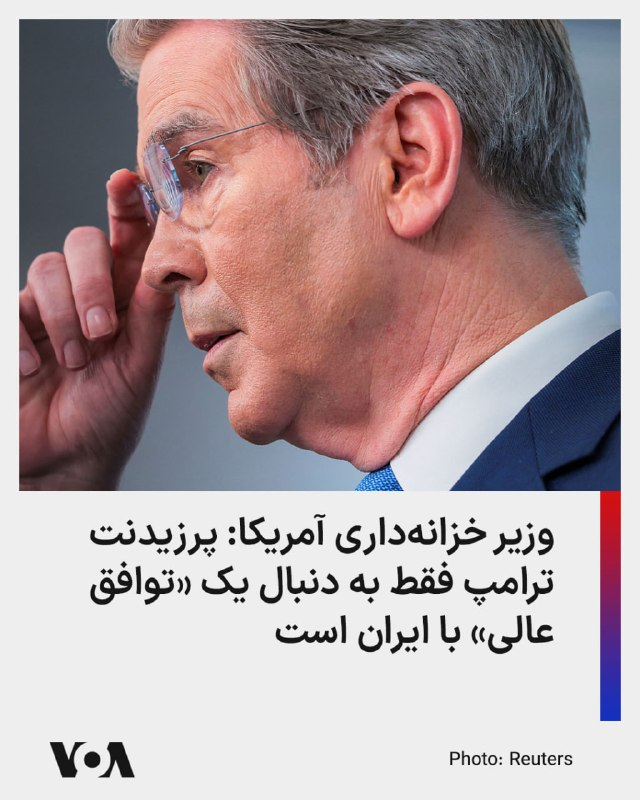

🔺وزیر خزانه‌داری آمریکا: پرزیدنت ترامپ فقط به دنبال یک «توافق عالی با ایران» است

▪️وزیر خزانه‌داری ایالات متحده روز پنجشنبه ۷ خرداد ۱۴۰۵ در یک کنفرانس خبری در کاخ سفید گفت رئیس جمهوری آمریکا «توافق بد» با رژیم ایران را نخواهد پذیرفت بلکه او تنها به دنبال یک «توافق عالی» است.

⬇️ بیشتر بخوانید:
https://ir.voanews.com/a/iran-us-treasury-press-negotiation-bessent/8154964.html
@FarsiVOA

## FarsiVOA — post 218910

مارکو روبیو، وزیر امور خارجه آمریکا، پس از نشست کابینه دولت ترامپ با انتشار این عکس‌ها نوشت: این دولت «شفاف‌ترین دولت در تاریخ» است.

@FarsiVOA

## FarsiVOA — post 218909

مقامات امریکایی به صدای امریکا دستیابی به تفاهم‌نامه ۶۰ روزه بین ایران و امریکا رو تایید کردند

## FarsiVOA — post 218908

با بالا گرفتن تنش‌ها میان جمهوری اسلامی و آمریکا و نگرانی درباره آینده تنگه هرمز، سهام شرکت‌های هواپیمایی مثل ایر فرانس و رایان‌ایر حدود ۲ درصد سقوط کرد.

## DW_Farsi — post 125257

  <a href="telegram/content/DW_Farsi_125257_1780001390.mp4" target="_blank">🎬 Download video</a>

🎥 این ربات‌ها فقط برای نمایش نیستند؛ قرار است کار کنند

ربات‌های انسان‌نما در توکیو حالا برای ورود به بازار کار آماده می‌شوند؛ از انجام کارهای ظریف مثل باز کردن پیچ‌های کوچک تا کمک به جبران کمبود نیروی کار.
ژاپن که زمانی پیشتاز این فناوری بود، حالا با رقابت جدی شرکت‌های چینی روبه‌روست.

@dw_farsi

## DW_Farsi — post 125256

  

🔶 تسنیم: متن توافق ایران و آمریکا هنوز نهایی نشده است

یک منبع نزدیک به تیم مذاکره‌کننده جمهوری اسلامی به خبرگزاری تسنیم، وابسته به سپاه پاسداران گفت که برخلاف ادعای برخی منابع غربی مبنی بر نهایی شدن متن یادداشت تفاهم میان ایران و آمریکا، برای تمدید ۶۰ روزه آتش‌بس، "این موضوع واقعیت ندارد و هنوز متن قطعی نشده است."

این منبع آگاه افزود ایران "تا این لحظه به میانجی پاکستانی اعلام نهایی شدن متن را انجام نداده است."

او همچنین تاکید کرد که در صورت نهایی شدن واقعی متن، جمهوری اسلامی این موضوع را هم به میانجی پاکستانی و هم به افکار عمومی اعلام خواهد کرد و "تا آن زمان هرگونه روایت منابع غربی درباره نهایی شدن موضوع نادرست است."

این اظهارات در حالی مطرح می‌شود که پیش‌تر چهار منبع آگاه به خبرگزاری رویترز گفته بودند ایالات متحده و ایران بر سر یک "یادداشت تفاهم اولیه" برای تمدید آتش‌بس به مدت ۶۰ روز به توافق رسیده‌اند، اما دونالد ترامپ، رئیس‌جمهور آمریکا، هنوز آن را تأیید نکرده است.

@dw_farsi

## DW_Farsi — post 125255

🔶 سه نفر در پی "حمله تروریستی" در ایستگاه قطار سوئیس زخمی شدند

مردی در شهر وینترتور سوئیس در نزدیکی زوریخ در پی حمله به سلاح سرد، سه نفر را زخمی کرد.

حال یک تن از زخمی‌ها وخیم گزارش شده است. مقام‌های سوئیسی این حمله را که روز پنجشنبه ۲۸ ماه مه صورت گرفت، یک "اقدام تروریستی" توصیف کردند.

بر اساس اعلام پلیس، مهاجم کمی پس از ساعت ۸:۳۰ صبح در ایستگاه قطار وینترتور به رهگذران حمله کرد. مظنون، مردی ۳۱ ساله و دارای تابعیت دوگانه سوئیسی-ترکی است. او اکنون از سوی پلیس بازداشت شده است.

پلیس همچنین اعلام کرد سه مجروح این حادثه که بین ۲۸ تا ۵۲ سال سن دارند، به بیمارستان منتقل شده‌اند. سخنگوی پلیس به رسانه‌ها گفت حال یکی از زخمی‌ها وخیم است. به گفته پلیس، هر سه مجروح شهروند سوئیس هستند.

چندین رسانه سوئیسی گزارش دادند که این مرد پیش از حمله در اطراف ایستگاه راه می‌رفته و فریاد "الله‌اکبر" سر می‌داده است.

تصاویر منتشرشده در رسانه‌ها و شبکه‌های آنلاین، مردی با موهای بلند تیره و ریش کامل را نشان می‌دهد که بنا بر گفته شاهدان عینی، چاقویی در دست داشته است.

شهروندی به روزنامه "بلیک" گفت که مهاجم پنج یا شش بار فریاد "الله‌اکبر" سر داده بود. به گفته او، کودکان و دیگر حاضران با وحشت از محل فرار کردند.

بر اساس گزارش رسانه‌ها، نیروهای پلیس در داخل و اطراف ایستگاه مستقر شده و محدوده را مسدود کردند. راه‌آهن فدرال سوئیس نیز به خبرگزاری فرانسه گفت این حادثه اختلالی در تردد قطارها ایجاد نکرده است.

این مرد از سال‌ها پیش برای مقام‌های امنیتی شناخته‌شده بود. ماریوس وایرمان، فرمانده پلیس کانتون زوریخ، در یک نشست خبری توضیح داد: «ما در سال ۲۰۱۵ به دلیل نقض ممنوعیت فعالیت داعش علیه او اعلام جرم کردیم، چرا که او اقدام به انتشار تبلیغات داعش کرده بود.»

به گفته او، این موضوع در ارتباط با تحقیقات مربوط به مسجد "النور" مطرح شده بود. همچنین در سال ۲۰۱۸، پلیس شهر وینترتور نیز پس از درگیر شدن این فرد در یک نزاع خیابانی، علیه او اعلام جرم کرده بود.

ماریوس وایرمان همچنین گفت انگیزه این حمله را باید در حوزه "افراط‌گرایی و رادیکالیزه شدن" جست‌وجو کرد. ماریو فِر، مدیر امنیت کانتون زوریخ نیز این حمله را "اقدام تروریستی" توصیف کرد.

به گفته مقام‌ها، آخرین تماس نیروهای امنیتی با این مرد در ۲۵ مه بوده است. او شخصا از طریق شماره اضطراری با پلیس شهر وینترتور تماس گرفته و اظهاراتی آشفته مطرح کرده بود.

در پی آن، پلیس به محل اعزام شد. به دلیل وضعیت روحی او، درخواست بستری اجباری ارائه شد و سپس او به یک مرکز روان‌پزشکی منتقل شد.

@dw_farsi

## DW_Farsi — post 125254

  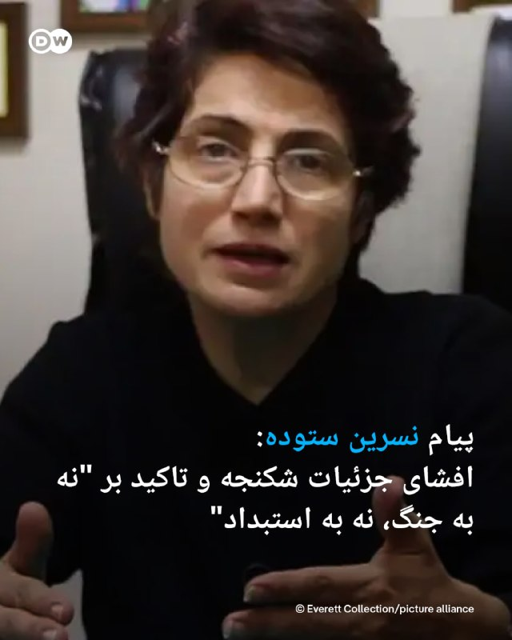

🔶 پیام نسرین ستوده: افشای جزئیات شکنجه و تاکید بر "نه به جنگ، نه به استبداد"

نسرین ستوده، وکیل دادگستری و فعال سرشناس حقوق بشر روز پنجشنبه هفتم خرداد با انتشار پیامی در حساب کاربری خود در فیسبوک، جزئیات تکان‌دهنده‌ای از بازداشت اخیر خود توسط مأموران وزارت اطلاعات، اعمال خشونت فیزیکی به دلیل مخالفت با حجاب اجباری و وضعیت بحرانی بازداشتگاه‌های امنیتی در ایران را افشا کرد.

نسرین ستوده که به تازگی به طور موقت آزاد شده است، در این پیام تاکید کرده که آزادی خود را مدیون همبستگی بین‌المللی است.
این فعال حقوق بشر با تشریح روز نخست بازداشت خود نوشت: «۱۲ فروردین سال جاری، مأموران اطلاعات با یورش به منزل‌مان مرا دستگیر و به محل بازداشتگاه این وزارت‌خانه بردند. در بدو ورود به بازداشتگاه دست و پایم را بستند و مرا بابت حجاب اجباری کتک زدند.»

او در ادامه به آسیب‌های جسمی ناشی از این برخوردها اشاره کرد و افزود: «روزهای پس از آن نشانه‌های کبودی روی پا و صورتم که در اثر چسبی که به دهانم زده بودند، زخم شده بود، خود را نشان دادند.»

@dw_farsi

## Persian_Trend_Official — post 15206

https://youtube.com/live/JrqroHI5pq8?feature=share

## Persian_Trend_Official — post 15205

  <a href="telegram/content/Persian_Trend_Official_15205_1780001394.mp4" target="_blank">🎬 Download video</a>

خبرنگار: آیا کاهش تحریم‌ها برای ایران روی میز است؟

اسکات بسنت، وزیر خزانه‌داری امریکا: تا زمانی که تنگه هرمز باز نشود و ایرانی‌ها موافقت نکنند که باید اورانیوم غنی‌شده با درصد بالا را تحویل دهند و نمی‌توانند برنامه هسته‌ای داشته باشند، هیچ گزینه‌ای روی میز نخواهد بود.

📝 Amir

📌 @persian_trend_official
پرشین ترند | متفاوت‌ترین کانال نظامی

## Persian_Trend_Official — post 15204

  <a href="telegram/content/Persian_Trend_Official_15204_1780001396.webm" target="_blank">🎬 Download video</a>

منبع ایرانی خبر نهایی شدن متن تفاهم‌نامه ایران و امریکا را تکذیب کرد. یک منبع نزدیک به تیم مذاکره‌کننده ایران به تسنیم گفت: برخلاف ادعای برخی منابع غربی مبنی بر نهایی شدن متن یادداشت تفاهم بین ایران و آمریکا و تنها منتظر ماندن برای اعلام دو طرف، این موضوع…

## Persian_Trend_Official — post 15203

یک مقام آمریکایی در گفتگو با الجزیره: ما تأیید می‌کنیم که ایالات متحده و ایران به تفاهم‌نامه‌ای در مورد تنگه هرمز و مذاکرات هسته‌ای دست یافته‌اند. توافق بر سر تفاهم‌نامه با ایران در انتظار تأیید رئیس‌جمهور ترامپ است. 📝 Amir 📌 @persian_trend_official پرشین…

## Persian_Trend_Official — post 15202

انهدام دو لانچر سامانه پدافندی گنبد آهنین توسط پرتابه های FPV حزب‌الله لبنان

حزب‌الله لبنان ویدیویی دیگر از لحظه شکار و انهدام دو لانچر سامانه گنبد آهنین منتشر کرد، تا به این لحظه حزب‌الله موفق شده بطور مستند سه لانچر واقعی گنبد آهنین را منهدم کند.

📝 Amir

📌 @persian_trend_official
پرشین ترند | متفاوت‌ترین کانال نظامی

## Persian_Trend_Official — post 15201

لایو ساعت 22:45 به وقت تهران شروع میشه

## RadioFarda — post 157673

  

🔸در پی انتشار گزارش‌هایی درباره شنیدن صدای انفجار و شلیک در جنوب ایران، رسانه‌های نزدیک به سپاه پاسداران شامگاه پنجشنبه از شلیک به سمت برخی شناورها در تنگه هرمز خبر دادند.

🔸خبرگزاری فارس مدعی شد که «نیروهای مسلح ایران از مناطق جنوبی کشور به سمت اهداف مشخص عملیات شلیک موشک را اجرایی کردند».

🔸این خبرگزاری نزدیک به سپاه گفت که «مقصد دقیق» این موشک‌ها مشخص نیست.

🔸پیش‌تر گزارش‌های منتشر شده در شبکه‌های اجتماعی از شنیده شدن صدای انفجار در برخی نقاط استان‌های بوشهر و هرمزگان حکایت داشت.

🔸خبرگزاری تسنیم، دیگر رسانه نزدیک به سپاه می‌گوید منشا این صداهایی به «درگیری‌های نظامی در دریا» ارتباط دارد.

🔸این خبرگزاری در ادامه به نقل از «مرکز کنترل فرماندهی پدافند هوایی ارتش» اعلام کرد که انفجارها «از سمت دریا و مربوط به تبادل آتش در اخطار به کشتی‌های متخلف در تنگه هرمز بوده است».

@RadioFarda

## RadioFarda — post 157672

  

🔸اسکات بسنت، وزیر خزانه‌داری آمریکا، روز پنجشنبه اعلام کرد بعد از تهدیدات ایالات متحده علیه عمان درباره تنگه هرمز، با سفیر این کشور در واشینگتن گفت‌وگو کرده و از او تضمین گرفته است که «هیچ برنامه‌ای برای دریافت عوارض» در این آبراه حیاتی وجود ندارد.

🔸او در یک نشست خبری در کاخ سفید گفت: «به او گفتم که این موضوع از اساس غیرقابل قبول است و او نباید ریسک کند که افراد عمانی یا مؤسسات مالی عمان هدف تحریم قرار بگیرند.»

🔸اسکات بسنت ساعاتی قبل در شبکه ایکس هشدار داد که عمان باید بداند دولت آمریکا به‌طور «تهاجمی» هر طرفی را که در تسهیل دریافت عوارض برای عبور از تنگه هرمز نقش داشته باشد، هدف قرار خواهد داد.

🔸این تهدید یک روز بعد از آن صورت گرفته که دونالد ترامپ، رئیس‌جمهور آمریکا، با تأکید بر لزوم باز شدن فوری تنگه هرمز بعد از توافق با ایران، عمان را تهدید کرد که اگر قصد کنترل این آبراه را داشته باشد، «نابود می‌شود».

@RadioFarda

## RadioFarda — post 157671

  <a href="https://t.me/radiofarda/157671" target="_blank">📎 Download file</a>

ریشه‌های «اختلاف و آشفتگی» در جمهوری اسلامی در گفت‌وگو با محسن سازگارا

🔸رسانه‌های ایران پیامی منسوب به مجتبی خامنه‌ای، رهبر جمهوری اسلامی، را خطاب به نمایندگان مجلس شورای اسلامی منتشر کردند که در آن می‌گوید «ایجاد تفرقه و تجزیه اجتماعی»، در کنار جنگ و فشار اقتصادی و محاصره، «طرح و نقشهٔ کور دشمن» است.مجتبی خامنه‌ای در این پیام که روز هفتم خرداد منتشر شد، همچنین به تمام کسانی که آن‌ها را «جان‌فدایانی که دل‌شان برای اسلام و انقلاب یا استقلال و سربلندی ایران می‌تپد» نامیده، هشدار داد که «اختلافات غیرموجه و حتی موجه را به تنازع و تفرقه تبدیل نکنند». درباره این بیانیه ارزیابی محسن سازگارا، تحلیلگر و فعال سیاسی ساکن آمریکا، را بشنوید.

@RadioFarda

## IranianMinds — post 20971

🔴خبر‌گزاری مهر از شنیده شدن صدای انفجار در شهر جم از توابع استان بوشهر و واکنش پدافند ضد‌هوایی ایران به جنگنده‌های دشمن در آسمان بوشهر خبر داد.

@IranianMinds

## IranianMinds — post 20970

🔴 خبرگزاری ایلنا :

چن تا کشتی میخواسن از تنگه هرمز عبور کنن که نیروی دریایی سپاه با شلیک پهپاد و موشک بهشون هشدار داد.

@IranianMinds

## IranianMinds — post 20969

  

بعد یه عده نادان میان اینارو پست میکنن تو کانالشون فک میکنن خیلی فانن و فانه براشون این موضوعات , جالبیش اینه برا دلقک بازیشون میان خودشون فیک هم درست میکنن میزارن

@IranianMinds

## IranianMinds — post 20967

🔴 ی خرزشی رندوم :

@IranianMinds

## IranianMinds — post 20966

  <a href="telegram/content/IranianMinds_20966_1780001400.webm" target="_blank">🎬 Download video</a>

⭕️ تنها جایی که در لحظه عضویت بهت 500 هزارتومان موجودی میده اینجاس 
❌

🎉 کافیه فقط عضو بشی تا #وینرو بهت 
🤩 
🤩 
🤩 هزارتومان جایزه بده ، نیازی هم به واریز نیست.

⌛ پشتیبانی 24 ساعته

🍆تنها سایت مورد اعتماد ما با بونوس های کاملا واقعی و رویایی:

🌐 Winro.io

🌐 Winro.io
کانال بونوس های رایگان g7

📱 @winro_io

## BBCPersian — post 282284

  

‌ ‌ ‌ ‌
مدیرعامل شرکت ارتباطات زیرساخت ایران از روند افزایشی ترافیک بین‌الملل اینترنت خبر داد اما گفت که بهبود کیفیت آن چند روز زمان می برد.

به گزارش ایرنا، بهزاد اکبری می‌گوید که بهبود کیفیت سرویس‌ها و بازگشت ترافیک بین‌الملل به دلیل طولانی شدن قطعی‌ اینترنت چند روز طول می‌کشد.

ایرنا به نقل از کارشناسان گزارش داد که فرآیند اینترنت باید تدریجی باشد تا از از آلودگی شبکه به انواع ویروس‌ها و بدافزارها جلوگیری شود.

بعد از چند ماه قطعی اینترنت در ایران در پی جنگ آمریکا و اسرائیل با ایران، دو روز پیش اینترنت در ایران به طور نسبی وصل شد و به‌صورت جزئی در حال بازگشت است.

پیش از این دولت مسعود پزشکیان چند بار خواستار برقراری مجدد اینترنت شده و تاکید کرده بود که قطعی اینترنت موجب ضربه به حوزه علمی کشور و خسارات اقتصادی می‌شود و مستقیم و غیرمستقیم بر کسب و کارها تاثیر می‌گذارد.

https://bbc.in/4vg4Fjo
📷Reuters
@BBCPersian

## BBCPersian — post 282283

🔻منابع آگاه در آمریکا می‌گویند که مذاکره‌کنندگان ایالات متحده و ایران بر سر چارچوب توافقی به تفاهم رسیده‌اند که بر اساس آن، آتش‌بس میان دو کشور برای ۶۰ روز تمدید شده و مذاکرات درباره آینده برنامه هسته‌ای ایران آغاز خواهد شد.

منابعی از آمریکا به بی‌بی‌سی گفتند که توافق جدید آتش‌بس هنوز به تایید نهایی رهبران دو کشور نرسیده است.

گزارش‌ها حاکی است که این توافق می‌تواند عبور «بدون محدودیت» از تنگه هرمز را امکان‌پذیر کند و ایران نیز ۳۰ روز فرصت خواهد داشت تا مین‌های کارگذاری‌شده در این گذرگاه باریک دریایی را جمع‌آوری کند.

بر اساس این گزارش‌ها، آمریکا همچنین محاصره دریایی خود را لغو کرده و با صدور معافیت‌های تحریمی، به ایران اجازه خواهد داد صادرات نفت خود را از سر بگیرد.

این توافق در حالی مطرح می‌شود که حملات در منطقه بار دیگر شدت گرفته است. سپاه پاسداران اعلام کرده یک پایگاه هوایی آمریکا در منطقه را هدف قرار داده است. اقدامی که پس از حملات تازه آمریکا به جنوب ایران در طول شب گذشته انجام شده است.

در روزهای اخیر، تهران و واشنگتن بارها یکدیگر را به نقض آتش‌بس متهم کرده‌اند.

روز چهارشنبه، رسانه‌های دولتی ایران بخش‌هایی از آنچه را «پیش‌نویس غیررسمی» یک تفاهم‌نامه ۱۴ بندی توصیف کردند، منتشر کردند.

بر اساس این گزارش، مفاد این پیش‌نویس شامل لغو محاصره دریایی بنادر ایران از سوی آمریکا، خروج نیروهای آمریکایی از «مجاورت ایران» و ازسرگیری تردد غیرنظامی از تنگه هرمز با مدیریت و هدایت کشتی‌ها توسط ایران و عمان است.

https://bbc.in/4fMsLxx
@BBCPersian

## BBCPersian — post 282282

  <a href="telegram/content/BBCPersian_282282_1780001401.mp4" target="_blank">🎬 Download video</a>

‌ ‌ ‌
آخرین خبرهای مهم پنجشنبه ۷ خرداد ۱۴۰۵

@BBCPersian

## Dirty_Kids — post 390432

  <a href="telegram/content/Dirty_Kids_390432_1780001404.mp4" target="_blank">🎬 Download video</a>

ویدیوی اصلی خامنه‌ای اینه 👆
اونی که قبلن پخش شده فیک بوده

@Dirty_Kids 👻

## Dirty_Kids — post 390431

  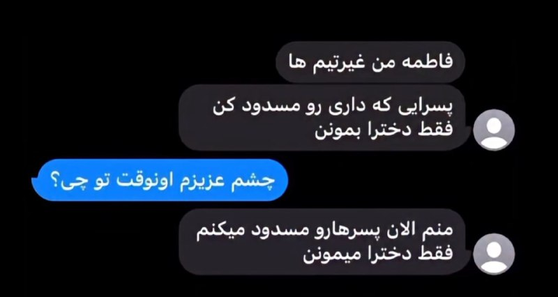

آقایی غیرتی:

@Dirty_Kids 👻

## Dirty_Kids — post 390430

وضعیت رو یه جوری ریدن توش که هیچ راهی جز خریدن استارلینک از محل درامد کشت خشخاش برامون نذاشتن.

@Dirty_Kids 👻

## Dirty_Kids — post 390428

🔴 عادی‌ترین طرفدار جمهوری اسلامی:

@Dirty_Kids 👻

## Dirty_Kids — post 390427

  <a href="telegram/content/Dirty_Kids_390427_1780001405.mp4" target="_blank">🎬 Download video</a>

خوش‌چشم 😳😱 قبل از جام جهانی فوتبال تو‌ تلویزیون ج.ا دارن پیشنهاد جنگ بیولوژیکی پنهانی علیه غیرنظامی‌های آمریکایی رو میدن.

بعد میان میزنن میگانشون میگن تقصیر مردمه

@Dirty_Kids 👻

## Hranews — post 113216

اجرای حکم اعدام ۶ زندانی در زندان‌های مختلف

❗️
❗️
❗️
❗️
❗️– حکم شش زندانی که پیشتر از بابت اتهامات مرتبط با جرائم مواد مخدر و قتل به مجازات #اعدام محکوم شده بودند، در زندان‌های نیشابور، مرودشت، کاشان و دستگرد اصفهان به اجرا درآمد.
#مجتبی_خسروی #میثم_عبدی #جعفر_صبوحی #میلاد_حیدری #فرهاد_جلیلوند #سیدعلی_بزرگی

ادامه مطلب

↘️
@hranews_bot تماس ✉️ - @Hranews کانال هرانا 🆑

## Hranews — post 113215

  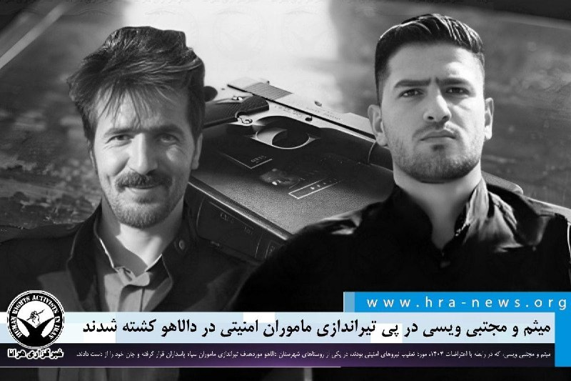

میثم و مجتبی ویسی در پی تیراندازی ماموران امنیتی در دالاهو کشته شدند

❗️
❗️
❗️
❗️
❗️– میثم و مجتبی ویسی، شهروندان پیرو آئین یارسان که در رابطه با اعتراضات سراسری ۱۴۰۴، تحت تعقیب نیروهای امنیتی بودند، صبح امروز در یکی از روستاهای شهرستان دالاهو هدف تیراندازی ماموران اطلاعات سپاه قرار گرفته و جان خود را از دست دادند.

به گزارش خبرگزاری هرانا، ارگان خبری مجموعه فعالان حقوق بشر در ایران، دو برادر در پی تیراندازی نیروهای سپاه کشته شدند.

هویت آنها، میثم و مجتبی ویسی دو برادر پیرو آئین یارسان گزارش شده که هرکدام پدر یک فرزند بودند.
#مجتبی_ویسی #میثم_ویسی #اعتراضات۱۴۰۴

ادامه مطلب

↘️
@hranews_bot تماس ✉️ - @Hranews کانال هرانا 🆑

## alonews — post 123395

  <a href="telegram/content/alonews_123395_1780001407.webm" target="_blank">🎬 Download video</a>

👈90 روز از ترور علی خامنه‌ای رهبر پیشین جمهوری اسلامی گذشت

✅ @AloNews خبر جنگ

## alonews — post 123394

  <a href="telegram/content/alonews_123394_1780001407.mp4" target="_blank">🎬 Download video</a>

👈لحظه حمله به شرکت آسا پنجره کاشان، تصاویر از دوربین‌های مداربسته گرفته شده است

🔴در حمله دوم که با شدت بیشتری انجام گرفت هیچ تصاویری موجود نیست.

✅ @AloNews خبر جنگ

## alonews — post 123390

این وسط «صابر ابر» برند خودش رو با شعار زیست پنهان راه اندازی کرده.

[@AloTweet]

## alonews — post 123389

  <a href="telegram/content/alonews_123389_1780001409.webm" target="_blank">🎬 Download video</a>

👈مهر: نیروهای مسلح ایران در نزدیکی تنگه هرمز به چهار شناور خاطی شلیک اخطار انجام دادند، این شناورها قصد عبور بدون هماهنگی از تنگه هرمز را داشتند.

✅ @AloNews خبر جنگ

## alonews — post 123388

⭕️
⭕️این روزها بعضی از سلبریتی‌ها، چه از روی فشار نهادهای امنیتی و چه از روی منفعت‌طلبی و ترس، شروع کرده‌اند به تخریب انقلاب شیر و خورشید. 
🔴بعضی‌ها هم تازه رنگ عوض کرده‌اند و می‌خواهند با حاشیه‌سازی، مسیر اصلی را کمرنگ کنند. 
🔴بهترین پاسخ، درگیر شدن با حاشیه‌هایشان…

## alonews — post 123387

  <a href="telegram/content/alonews_123387_1780001409.mp4" target="_blank">🎬 Download video</a>

👈 ترامپ درباره ایران: آنها مذاکره‌کنندگان بسیار خوبی هستند — آنها زیرک‌اند — اما ما همه کارت‌ها را در دست داریم، چون آنها را از نظر نظامی شکست داده‌ایم.

✅ @AloNews خبر جنگ

## alonews — post 123386

  <a href="telegram/content/alonews_123386_1780001411.mp4" target="_blank">🎬 Download video</a>

👈هم اکنون حملات سنگین هوایی اسرائیل به غزه

✅ @AloNews خبر جنگ

## alonews — post 123385

  <a href="telegram/content/alonews_123385_1780001412.webm" target="_blank">🎬 Download video</a>

👈تسنیم: گزارش منابع محلی حاکیست که منشا صداهایی که شنیده شده به درگیری‌های نظامی در دریا برمی‌گردد 
✅ @AloNews خبر جنگ

## alonews — post 123384

  <a href="telegram/content/alonews_123384_1780001412.webm" target="_blank">🎬 Download video</a>

⚫
🏆 به دنیای هیجان‌انگیز فوتبال خوش اومدی!

⭐️اینجا قراره باهم لحظه‌به‌لحظه‌ی جام جهانی رو زندگی کنیم؛
از بازی‌های حساس و نتایج داغ گرفته تا حاشیه‌ها، کری‌خونی‌ها و اتفاقاتی که همه درباره‌ش حرف میزنن! 
🔥
🔥

✅ پوشش کامل مسابقات

💀 ترول تیم‌ها و بازیکن‌ها

🎥 ویدیوها و لحظه‌های فان فوتبالی

📊 آمار، ترکیب‌ها و اخبار فوری

🌍 حواشی جذاب از سراسر جام جهانی

📢اینجا فقط یک کانال خبری نیست؛
یک جمع فوتبالیه برای کسایی که فوتبال رو با هیجان، شوخی و احساس واقعی دنبال میکنن 
📛
💟

🆘
🔞 آماده باش چون قراره جام جهانی رو متفاوت تجربه کنیم!

⚡ @Vaarzesh_Plus

⚡ @Vaarzesh_Plus

## alonews — post 123383

  <a href="telegram/content/alonews_123383_1780001413.webm" target="_blank">🎬 Download video</a>

👈تسنیم: گزارش منابع محلی حاکیست که منشا صداهایی که شنیده شده به درگیری‌های نظامی در دریا برمی‌گردد

✅ @AloNews خبر جنگ

## alonews — post 123382

  <a href="telegram/content/alonews_123382_1780001413.webm" target="_blank">🎬 Download video</a>

👈خبرگزاری فارس : دقایقی پیش ایران از جنوب کشور چند موشک به سمت اهداف مشخص شلیک کرد 
🔴هنوز مقصد دقیقشون معلوم نیست ولی احتمال درگیری تو خلیج فارس مطرح شده 
✅ @AloNews خبر جنگ

## alonews — post 123381

  <a href="telegram/content/alonews_123381_1780001413.webm" target="_blank">🎬 Download video</a>

👈خبرگزاری فارس : دقایقی پیش ایران از جنوب کشور چند موشک به سمت اهداف مشخص شلیک کرد

🔴هنوز مقصد دقیقشون معلوم نیست ولی احتمال درگیری تو خلیج فارس مطرح شده

✅ @AloNews خبر جنگ

## alonews — post 123380

  <a href="telegram/content/alonews_123380_1780001414.webm" target="_blank">🎬 Download video</a>

👈 تصویری از اسکناس ۲۵۰ دلاری با تصویر دونالد ترامپ که در صورت تصویب کنگره چاپ خواهد شد

✅ @AloNews خبر جنگ

## alonews — post 123379

  <a href="telegram/content/alonews_123379_1780001414.webm" target="_blank">🎬 Download video</a>

🔴فوری / هرمزگان و بوشهر صدای چند انفجار

✅ @AloNews خبر جنگ

## alonews — post 123378

  <a href="telegram/content/alonews_123378_1780001414.webm" target="_blank">🎬 Download video</a>

👈جوان ۲۰ ساله دزفولی، به دلیل اختلافات خانوادگی با سلاح سرد پدر، مادر و برادر خود را به قتل رساند و سپس خود را از کوه به پایین پرتاب کرد و به زندگی خود پایان داد

✅ @AloNews خبر جنگ

## alonews — post 123377

  <a href="telegram/content/alonews_123377_1780001414.webm" target="_blank">🎬 Download video</a>

👈وزارت بهداشت لبنان گزارش می‌دهد که از آغاز دور فعلی درگیری‌ها، ۳۲۴۳ نفر کشته و ۱۰۲۷ نفر زخمی شده‌اند

✅ @AloNews خبر جنگ

## alonews — post 123376

  <a href="telegram/content/alonews_123376_1780001414.mp4" target="_blank">🎬 Download video</a>

👈حاجی بابایی، نایب‌رئیس مجلس : ایران ابرقدرت شده و همین کار مجلس رو سخت‌تر کرده

✅ @AloNews خبر جنگ

---
📅 بروزرسانی: 1405/03/07 21:49
---

## VahidOOnLine — post 242644

  <a href="telegram/content/VahidOOnLine_242644_1779992399.mp4" target="_blank">🎬 Download video</a>

وال‌استریت پس از حملات یازده سپتامبر، فقط شش روز تعطیل بود، اما روسیه پس از حمله به اوکراین، بازار مسکو را یک ماه تعطیل کرد. بورس‌های امارات پس از حملات موشکی و پهپادی جمهوری اسلامی فقط دو روز معاملات را متوقف کردند، در حالیکه بورس تهران، در یک رکورد تاریخی، بیش از هشتاد روز تعطیل بود. در این قسمت چرتکه، محمد ماشین‌چیان رویکرد آمریکایی و روسی به بازار را در مقیاس ایران و امارات بررسی می‌کند.

تماشای نسخه کامل «چرتکه» در یوتیوب:
youtu.be
‌🏁 🇬🇧 IranintlTV

🤖 @VahidOOnLine

## VahidOOnLine — post 242643

  <a href="telegram/content/VahidOOnLine_242643_1779992401.mp4" target="_blank">🎬 Download video</a>

⭕️ غریب‌آبادی:
اجازه نمی‌دهیم با اقدامات نظامی گامی برای تضعیف حاکمیت ایران بر تنگه هرمز برداشته شود

♦️معاون وزیر امور خارجه جمهوری اسلامی با اشاره به تحولات اخیر در منطقه و افزایش تنش‌ها در خلیج فارس، مدعی شد جمهوری اسلامی اجازه نخواهد داد هیچ‌گونه اقدام نظامی یا فشار خارجی، به تضعیف حاکمیت کشور بر تنگه هرمز منجر شود.
غریب‌آبادی در مراسم یادبود فرمانده‌های کشته شده سپاه پاسداران اعلام کرد شب گذشته «شیطنت‌هایی از سوی آمریکایی‌ها» صورت گرفته که به گفته او، نقض آتش‌بس محسوب می‌شود. او افزود وزارت امور خارجه در این خصوص بیانیه رسمی صادر کرده و سپاه پاسداران نیز «واکنش مقتضی» نشان داده است.
معاون وزیر امور خارجه جمهوری اسلامی با تاکید بر اهمیت راهبردی تنگه هرمز گفت: «نکته کلیدی این است که اعمال حاکمیت جمهوری اسلامی بر تنگه هرمز در حال حاضر تثبیت شده و ما اجازه نمی‌دهیم با اقدامات نظامی، این موقعیت تضعیف شود.»
‌🇸🇦 Indypersian

🤖 @VahidOOnLine

## VahidOOnLine — post 242642

  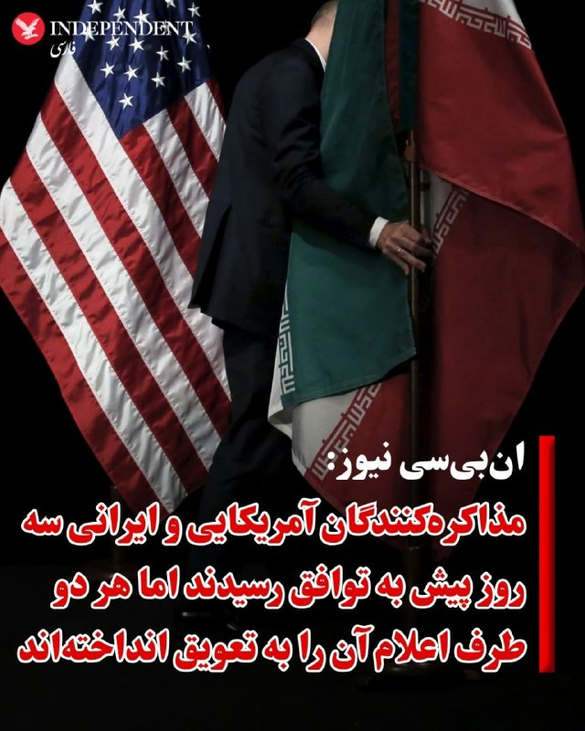

♦️ان‌بی‌سی نیوز به نقل از یک مقام ارشد عرب که مستقیما در میانجیگری مذاکرات بین واشنگتن و تهران نقش داشته، گزارش داد که مذاکره‌کنندگان آمریکایی و ایرانی سه روز پیش بر سر مفاد توافق آتش‌بس به نتیجه رسیدند، اما هر دو طرف نهایی کردن و اعلام آن را به تعویق انداخته‌اند.
این مقام با «ناامیدکننده» خواندن این تاخیرها گفت: «سه روز پیش در دوحه توافق شده بود، حالا همه دارند بازی مرغ و تخم‌مرغ را انجام می‌دهند.»
به گفته این مقام، مذاکره‌کنندگان ایرانی ابتدا موافقت کردند و قبل از اعلام، برای مشورت با رهبری خود بازگشتند و طرف آمریکایی اکنون در حالی که منتظر تأیید نهایی دونالد ترامپ، رئیس‌جمهور آمریکا است، همین کار را انجام می‌دهد.
پیشتر تارنمای آکسیوس به نقل از دو مقام آمریکایی و یک منبع منطقه‌ای گزارش داد که مذاکره‌کنندگان آمریکا و ایران بر سر یک «تفاهم‌نامه ۶۰ روزه» برای تمدید آتش‌بس و آغاز مذاکرات درباره برنامه هسته‌ای ایران به توافق رسیده‌اند، اما این توافق هنوز نیازمند تایید نهایی دونالد ترامپ است.
‌🇸🇦 Indypersian

🤖 @VahidOOnLine

## VahidOOnLine — post 242641

  

یک مقام ارشد عرب که مستقیما در میانجی‌گری مذاکرات میان واشینگتن و تهران حضور دارد، به ان‌بی‌سی نیوز گفت مذاکره‌کنندگان آمریکا و ایران سه روز پیش بر سر مفاد توافق آتش‌بس به تفاهم رسیده‌اند، اما هر دو طرف اعلام و نهایی‌کردن آن را به تعویق انداخته‌اند.

این مقام گفت: توافق سه روز پیش در دوحه نهایی شد، اما حالا همه منتظر اقدام طرف مقابل هستند و این تاخیرها را «ناامیدکننده» خواند.
‌🏁 🇬🇧 IranintlTV

🤖 @VahidOOnLine

## VahidOOnLine — post 242640

  

بنیامین نتانیاهو در مصاحبه‌ای در کنفرانس «بیکعات هاردن» اعلام کرد: «در روز اول یا دوم جنگ گفتم چهره خاورمیانه را تغییر خواهیم داد. از همان ابتدا روشن بود که فقط با حماس و حزب‌الله روبه‌رو نیستیم، بلکه محور جمهوری اسلامی پشت آن‌ها قرار دارد.»

نتانیاهو افزود: «ما نیاز به تغییر داشتیم. برای من روشن بود که دوران تحمل و جذب ضربه به پایان رسیده است. دیگر ضربه را تحمل نمی‌کنیم؛ از حالت دفاعی خارج می‌شویم و یکی‌یکی به آن‌ها ضربه می‌زنیم.»

او ادامه داد: «ما هرگز در چنین فاصله‌هایی، با چنین تداومی و با چنین شدتی در آسمان تهران عملیات انجام نداده بودیم. در آسمان یمن هم با چنین شدتی عمل نکرده بودیم.»

نتانیاهو گفت: «ضربات بسیار سنگینی به آن‌ها وارد کرده‌ایم و هرگز تا این اندازه قوی نبوده‌ایم. اما همچنان با رژیم آسیب‌دیده ایران روبه‌رو هستیم و تهدید هسته‌ای هنوز وجود دارد.»

او افزود: «هنوز باید کار را کامل کنیم. من تقریبا هر روز با رییس‌جمهور ترامپ صحبت می‌کنم. علاوه بر خنثی‌سازی تهدید هسته‌ای، باید تهدیدی را که می‌توان آن را فوق‌فناورانه دانست نیز مهار کنیم؛ یعنی تهدید پهپادها، پهپادهای فیبر نوری و نسل بعدی آن‌ها.»
h
‌🏁 🇬🇧 IranintlTV

🤖 @VahidOOnLine

## VahidOOnLine — post 242639

  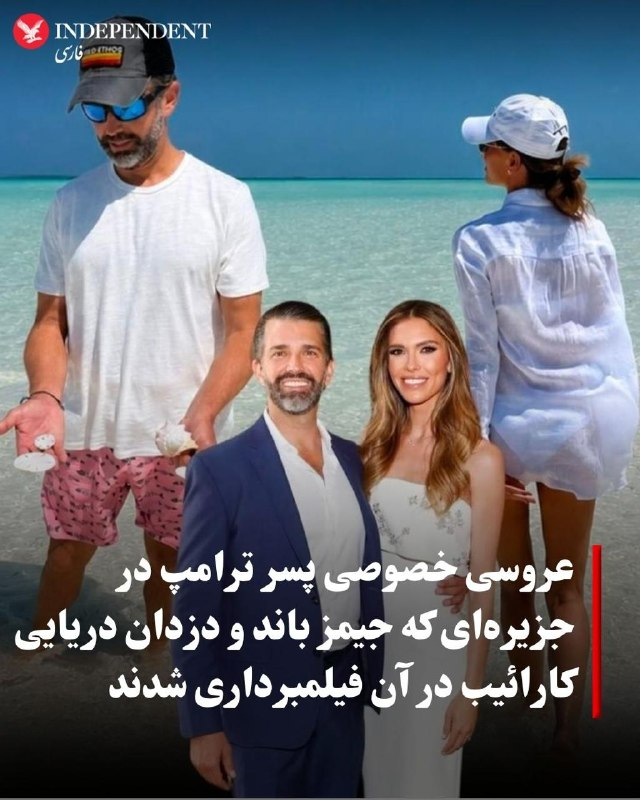

♦️دونالد ترامپ جوان و بتینا اندرسون که اکنون «بتینا ترامپ» است، ازدواج خود را در مراسمی کوچک و خانوادگی در یکی از دورافتاده‌ترین جزیره‌های خصوصی کارائیب برگزار کردند؛ مراسمی که جزئیات آن حتی چند روز بعد نیز تا حد زیادی از چشم رسانه‌ها دور مانده است.

این زوج ابتدا به‌طور رسمی در فلوریدا ازدواج قانونی خود را ثبت کردند و سپس برای برگزاری مراسم اصلی راهی مکانی خصوصی در مجمع‌الجزایر اکسوما در باهاما شدند؛ جزیره‌ای ۳۸ هکتاری که به دلیل انزوای کامل و طبیعت استوایی‌اش شناخته می‌شود.

این جزیره پیش‌تر محل فیلمبرداری آثاری مانند دزدان دریایی کارائیب: نفرین مروارید سیاه و فیلم جیمز باند کازینو رویال با بازی دنیل کریگ بوده است.

بر اساس گزارش‌ها، حدود ۴۰ مهمان در این مراسم حضور داشتند؛ جمعی محدود شامل پنج فرزند داماد از ازدواج قبلی، خواهر و برادرهایش ایوانکا، اریک و تیفانی ترامپ به همراه همسرانشان و همچنین اعضای خانواده و دوستان نزدیک عروس.
‌🇸🇦 Indypersian

🤖 @VahidOOnLine

## VahidOOnLine — post 242638

  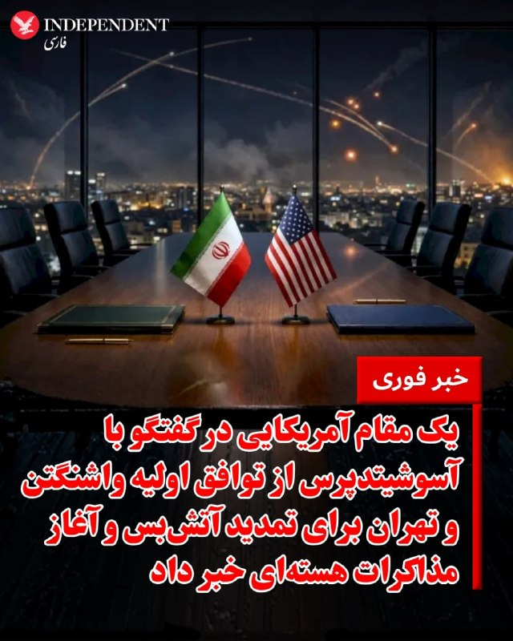

♦️بر اساس گزارش آسوشیتدپرس، مذاکره‌کنندگان آمریکا و ایران به یک توافق اولیه برای تمدید آتش‌بس در جنگ سه‌ماهه اخیر به مدت ۶۰ روز دست یافته‌اند و همزمان چارچوب آغاز گفتگوهای هسته‌ای را نیز ترسیم کرده‌اند. با این حال، این توافق هنوز نهایی نشده و اجرای آن منوط به تایید دونالد ترامپ است.
به گفته یک مقام آمریکایی آگاه از مذاکرات، این تفاهم در حالی شکل گرفته که آتش‌بس شکننده میان دو طرف طی روزهای اخیر بارها نقض شده و تنش‌های نظامی در منطقه بار دیگر افزایش یافته است. تنها یک روز پیش از این گزارش، کویت از رهگیری موشک‌های شلیک‌شده از سمت ایران خبر داد، موضوعی که فرماندهی مرکزی آمریکا آن را «نقض جدی آتش‌بس» توصیف کرد.
طبق گزارش‌ها، واشنگتن و تهران طی هفته‌های گذشته درگیر تبادل حملات محدود، عملیات پهپادی و پاسخ‌های متقابل بوده‌اند، اما در عین حال کانال‌های دیپلماتیک را باز نگه داشته‌اند. آمریکا هدف از مذاکرات را بازگشایی تنگه هرمز و مهار برنامه هسته‌ای ایران اعلام کرده و در مقابل، تهران خواستار لغو تحریم‌ها و آزادسازی دارایی‌های بلوکه‌شده است.
‌🇸🇦 Indypersian

🤖 @VahidOOnLine

## VahidOOnLine — post 242637

  

♦️فرماندهی مرکزی ایالات متحده (سنتکام) که هدایت عملیات نظامی آمریکا در خاورمیانه را بر عهده دارد، روز پنجشنبه هفتم خرداد اعلام کرد که از زمان آغاز محاصره دریایی ایران، مسیر ۱۱۱ کشتی تجاری را تغییر داده است.
سنتکام با انتشار تصویری از یک بالگرد سی‌هاوک بر روی عرشه ناو «یو‌اس‌اس تریپولی» در شبکه اجتماعی اکس نوشت این بالگرد  در حالی از روی عرضه بلند می‌شود، که این کشتی یکی از بیش از ۲۰ ناو جنگی مشارکت‌کننده در عملیات محاصره دریایی ایران است که در حال عبور در دریای عرب است.
به گفته سنتکام، این اقدام با هدف اجرای محدودیت‌های دریایی و جلوگیری از عبور کشتی‌ها در منطقه انجام شده است.
‌🇸🇦 Indypersian

🤖 @VahidOOnLine

## VahidOOnLine — post 242636

ویدیوی رسیده به ایران اینترنشنال نشان می‌دهد یک شهروند شعارهای «جاوید شاه» و «این آخرین نبرده» را روی دیواری در یکی از شهرهای ایران با اسپری نوشته است. برای حفظ امنیت شهروندان مکان این ویدئو ذکر نمی‌شود.
‌🏁 🇬🇧 IranintlTV

🤖 @VahidOOnLine

## VahidOOnLine — post 242635

  

♦️جی‌دی ونس، معاون رئیس‌جمهوری آمریکا، با تمجید از عملکرد نیروهای آمریکایی در دو عملیات «خشم حماسی» و «چکش نیمه‌شب» گفت ارتش ایالات متحده در شرایط واقعی جنگی ماموریت‌هایی را انجام داده که بسیاری آن را «غیرممکن» می‌دانستند.
ونس با اشاره به سقوط دو خلبان آمریکایی در ایران گفت در ساعات اولیه، محل دقیق آن‌ها مشخص نبود و تنها حدود یک روز بعد، نیروهای آمریکایی موفق شدند از طریق چراغ‌های اضطراری، موقعیت هر دو خدمه را شناسایی کنند.
او افزود مدتی نگرانی جدی درباره زنده بودن یکی از خلبانان وجود داشت، اما بعدا مشخص شد او زنده مانده و در پشت خطوط دشمن گرفتار شده است.
به گفته معاون رئیس‌جمهور آمریکا، نیروی هوایی این کشور با اعزام هواپیماها به مناطقی که تصور می‌شد امکان فرود در آن‌ها وجود ندارد و همچنین آماده‌سازی بالگردها در همان مناطق، موفق شد یکی از خلبانان را از داخل خاک ایران و پشت خطوط دشمن خارج کند.
ونس این عملیات را یکی از «جسورانه‌ترین صحنه‌هایی» توصیف کرد که در طول عمر خود دیده است و گفت نیروهای آمریکایی در این ماموریت توانستند توان عملیاتی و هماهنگی خود را در سطحی بی‌سابقه به نمایش بگذارند.
‌🇸🇦 Indypersian

🤖 @VahidOOnLine

## VahidOOnLine — post 242634

  

شبکه حقوق بشر کردستان از صدور حکم اعدام برای اسماعیل رمضان‌پور، ۳۸ ساله، و آرمان معرفتی، ۳۰ ساله، از معترضان انقلاب ملی ایرانیان در دی ۱۴۰۴ خبر داد.

براساس این گزارش، آرمان معرفتی، اهل سقز استان کردستان، در جریان اعتراضات توسط نیروهای امنیتی بازداشت و پس از مدتی به زندان تهران بزرگ منتقل شد. او در شعبه ۱۵ دادگاه انقلاب تهران به ریاست قاضی صلواتی به اتهام «محاربه» به اعدام محکوم شد.

همچنین اسماعیل رمضان‌پور، اهل استان فارس و ساکن یزد، در جریان اعتراضات توسط نیروهای امنیتی بازداشت و به یک بازداشتگاه امنیتی در یزد منتقل شد. به گفته این منبع، او در این بازداشتگاه برای اعترافات اجباری مورد شکنجه قرار گرفت و پس از پایان دوران بازجویی به زندان مرکزی یزد منتقل شد.

اتهامات انتسابی به رمضان‌پور از سوی دستگاه امنیتی جمهوری اسلامی شامل «اجتماع و تبانی برای ارتکاب جرم علیه امنیت داخلی کشور» و «تخریب عمدی اموال عمومی (آتش‌زدن ساختمان شهرداری یزد) به قصد مقابله با نظام جمهوری اسلامی» اعلام شده است.
‌🏁 🇬🇧 IranintlTV

🤖 @VahidOOnLine

## VahidOOnLine — post 242633

  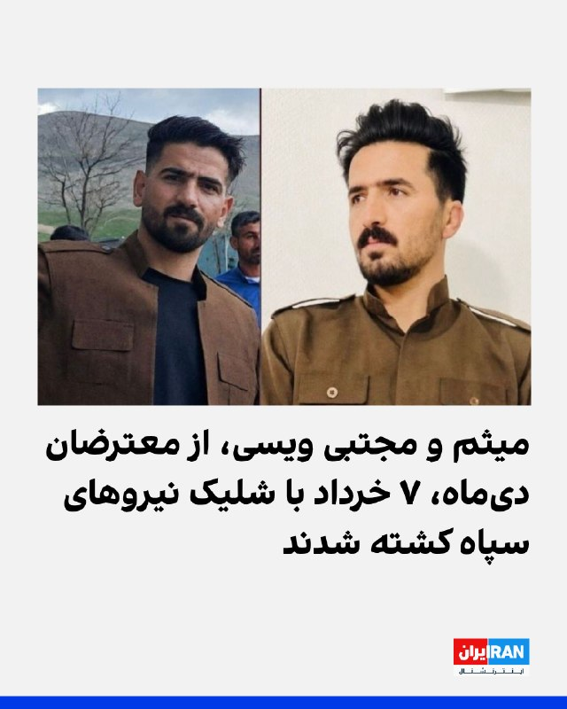

سازمان حقوق بشری هه‌نگاو گزارش داد که میثم ویسی و مجتبی ویسی، دو برادر که پس از انقلاب ملی ایرانیان در دی ۱۴۰۴ مخفیانه زندگی می‌کردند، ساعت ۴ بامداد پنج‌شنبه ۷ خرداد ۱۴۰۵ در روستای «قلعه کهوش» شهرستان دالاهو با شلیک مستقیم نیروهای سپاه پاسداران کشته شدند.

هه‌نگاو نوشت: «پناهگاه و محل اقامت این دو برادر به محاصره همه‌جانبه و سنگین نیروهای سپاه پاسداران درآمد و ماموران مسلح بدون هیچ گونه اخطار قبلی از چهار طرف به سوی این منزل مسکونی شلیک کردند و در پی این شلیک‌های هدفمند، میثم و مجتبی ویسی در دم جان باختند.»

بر اساس این گزارش، میثم و مجتبی ویسی از پیروان آیین یارسان و از فعالان سرشناس فرهنگی و از موسسان کتابخانه «دره‌دریژ» در کرمانشاه بودند.
‌🏁 🇬🇧 IranintlTV

🤖 @VahidOOnLine

## VahidOOnLine — post 242632

♦️اولین چیزی که در کلاس او جلب توجه می‌کند عصا است، عصایی که «اولین کوردرو» هنگام راه رفتن به آن تکیه می‌کند. اما همین که موسیقی آغاز می‌شود، زن ۱۰۰ ساله شیلیایی قامتش را صاف می‌کند، دستش را بالا می‌آورد و با همان دقت و ظرافت یک استاد حرفه‌ای، فرم بدن شاگردانش را اصلاح می‌کند.
اولین کوردرو، بالرین (رقصنده باله) و مربی باسابقه اهل سانتیاگو، این روزها به یکی از چهره‌های الهام‌بخش شبکه‌های اجتماعی و رسانه‌های جهان تبدیل شده است؛ زنی که در ۱۰۰ سالگی هنوز هر هفته به شاگردانش، که بسیاری از آن‌ها بین ۵۰ تا ۸۰ سال سن دارند، باله آموزش می‌دهد و می‌گوید: «حتی در رویاهایم هم در حال رقصیدن هستم.»
او از چهار سالگی رقص را آغاز کرد و در سال ۱۹۹۴ مدرسه رقص خود را در سانتیاگو تاسیس کرد، مدرسه‌ای که امروز چند نسل از زنان و دختران شیلیایی در آن آموزش دیده‌اند. دو دختر او نیز رقصنده حرفه‌ای هستند و در اداره کلاس‌ها به مادرشان کمک می‌کنند. کوردرو اکنون پنج فرزند، ۱۴ نوه و ۱۹ نتیجه دارد و به‌تازگی نامش در فهرست «۱۰۰ سالمند الهام‌بخش شیلی» قرار گرفته است.
‌🇸🇦 Indypersian

🤖 @VahidOOnLine

## VahidOOnLine — post 242631

  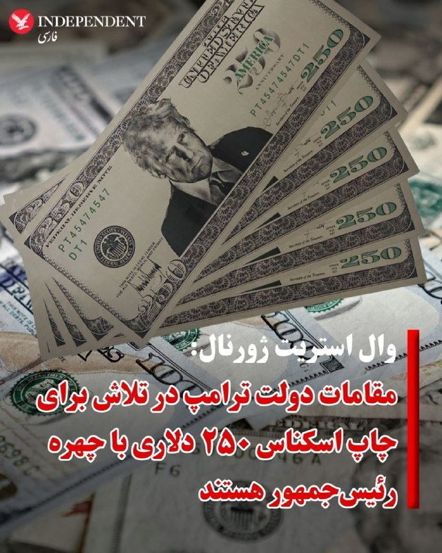

♦️وال استریت ژورنال روز پنجشنبه هفتم خرداد گزارش داد، مقامات دولت دونالد ترامپ با اعمال فشار بر «دفتر حکاکی و چاپ ایالات متحده» (BEP)، از این نهاد خواسته‌اند تا یک اسکناس ۲۵۰ دلاری با تصویر پرتره رئیس‌جمهور طراحی کند.
در صورت نهایی شدن این اقدام، این نخستین بار در بیش از ۱۵۰ سال گذشته خواهد بود که تصویر یک شخص زنده روی اسکناس‌های رایج ایالات متحده چاپ می‌شود.
این درحالی است که بر اساس قوانین فدرال فعلی آمریکا که ریشه در قرن نوزدهم دارد، چاپ تصویر افراد زنده بر روی پول ملی این کشور ممنوع است.
‌🇸🇦 Indypersian

🤖 @VahidOOnLine

## VahidOOnLine — post 242630

  

شبکه العربیه به نقل از منابع دیپلماتیک گزارش داد توافق میان واشینگتن و تهران در دو مرحله انجام خواهد شد و مرحله نخست شامل امضای یک یادداشت تفاهم است.
در این گزارش آمده است پاکستان شاهد مراسم امضای این تفاهم‌نامه خواهد بود.

پیش‌تر اکسیوس گزارش داد مذاکره‌کنندگان آمریکا و ایران بر سر یک یادداشت تفاهم ۶۰ روزه برای تمدید آتش‌بس و آغاز گفت‌وگوهای هسته‌ای به توافق رسیده‌اند، اما ترامپ هنوز تایید نهایی نداده است.
‌🏁 🇬🇧 IranintlTV

🤖 @VahidOOnLine

## VahidOOnLine — post 242629

  

جی‌دی ونس، معاون رییس‌جمهور آمریکا، اعلام کرد نیروهای این کشور در دو عملیات «خشم حماسی» و «چکش نیمه‌شب» در شرایط واقعی جنگی عملکردی درخشان داشته‌اند و ماموریت‌هایی را انجام داده‌اند که بسیاری آن را غیرممکن می‌دانستند.

او گفت پس از سقوط دو خلبان در ایران، ابتدا محل دقیق آن‌ها مشخص نبود و حدود یک روز بعد تایید شد چراغ‌های اضطراری هر دو خدمه فعال است. مدتی نگرانی درباره زنده بودن یکی از آن‌ها وجود داشت، اما سپس مشخص شد او زنده است، هرچند پشت خطوط دشمن گرفتار مانده بود.

ونس افزود نیروی هوایی آمریکا با اعزام هواپیماها به مناطقی که تصور می‌شد امکان فرود در آن‌ها وجود ندارد و آماده‌سازی بالگردها در همان محل، یکی از خلبانان را از پشت خطوط دشمن بازگرداند و این عملیات را از جسورانه‌ترین صحنه‌های عمر خود توصیف کرد.
‌🏁 🇬🇧 IranintlTV

🤖 @VahidOOnLine

## VahidOOnLine — post 242628

  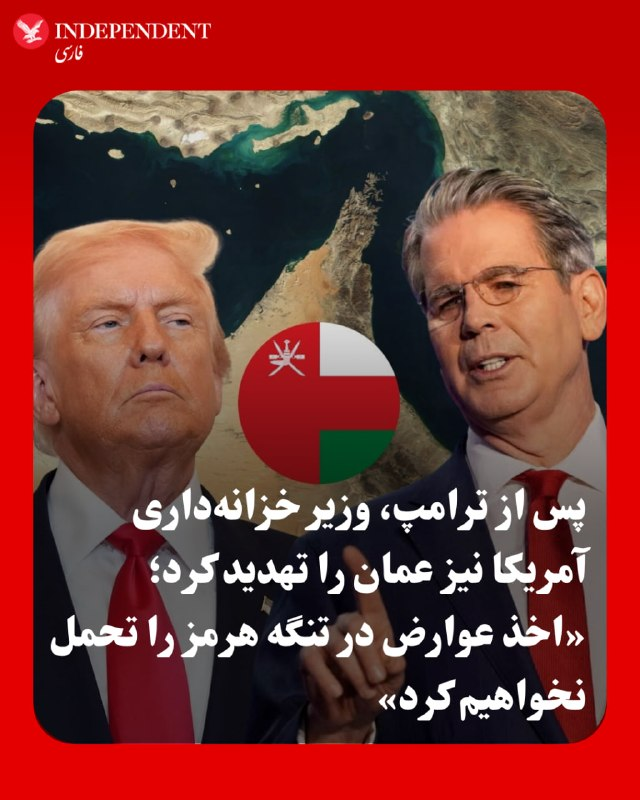

♦️دونالد ترامپ، رئیس‌جمهوری آمریکا، در اظهاراتی عمان را درباره هرگونه نقش در کنترل تنگه هرمز تهدید به اقدام نظامی کرد و گفت واشنگتن اجازه نخواهد داد هیچ کشوری بر این آبراه استراتژیک مسلط شود.
این تهدید در حالی مطرح می‌شود که عمان طی سال‌های گذشته یکی از مهم‌ترین شرکای منطقه‌ای آمریکا و میزبان همکاری‌های نظامی واشنگتن در خلیج فارس بوده است. آمریکا در عمان حضور و پایگاه نظامی دارد و مسقط در بسیاری از پرونده‌های حساس منطقه‌ای، از جمله میانجیگری میان تهران و واشینگتن و تبادل زندانیان آمریکایی، نقش کلیدی ایفا کرده است.
همزمان اسکات بسنت، وزیر خزانه‌داری آمریکا، نیز تهدیدها علیه عمان را تکرار کرد و گفت واشنگتن هیچ‌گونه تلاش برای دریافت عوارض یا اعمال محدودیت در تنگه هرمز را تحمل نخواهد کرد.
او هشدار داد وزارت خزانه‌داری آمریکا هر طرفی را که به‌صورت مستقیم یا غیرمستقیم در اجرای چنین طرحی نقش داشته باشد، هدف تحریم و مجازات قرار خواهد داد.
‌🇸🇦 Indypersian

🤖 @VahidOOnLine

## VahidOOnLine — post 242627

♦️پس از اتصال محدود اینترنت در ایران فیلم‌های شهروندان از جنگ آمریکا و اسراییل در فضای مجازی منتشر شده است. در یکی از این ویدیوها که گفته می‌شود مربوط به روز جمعه ۱۴ فروردین است، لحظه تلاش پدافند ایران برای هدف قرار دادن یک جنگنده توسط پدافند هوایی ایران را نشان می‌دهد؛ ویدئویی که در میانه یک جشن عروسی ضبط شده است. برخی منابع مکان این رویداد را مربوط به استان اصفهان اعلام کرده‌اند ولی ‏با توجه به گویش افراد حاضر در ویدئو، که لری است احتمال داده می‌شود تصویر مربوط به غرب یا جنوب‌ ایران باشد.
‏همچنین برخی منابع مدعی‌اند این ویدئو ممکن است مربوط به همان اف ۱۵ آمریکایی باشد که در روز ۱۴ فروردین بر‌فراز ایران هدف قرار‌گرفت و سرنگون شد.
آمریکا بعد از این رویداد در دو عملیات نجات، خلبانان این جنگنده را از ایران خارج کرد.
‌🇸🇦 Indypersian

🤖 @VahidOOnLine

## VahidOOnLine — post 242626

  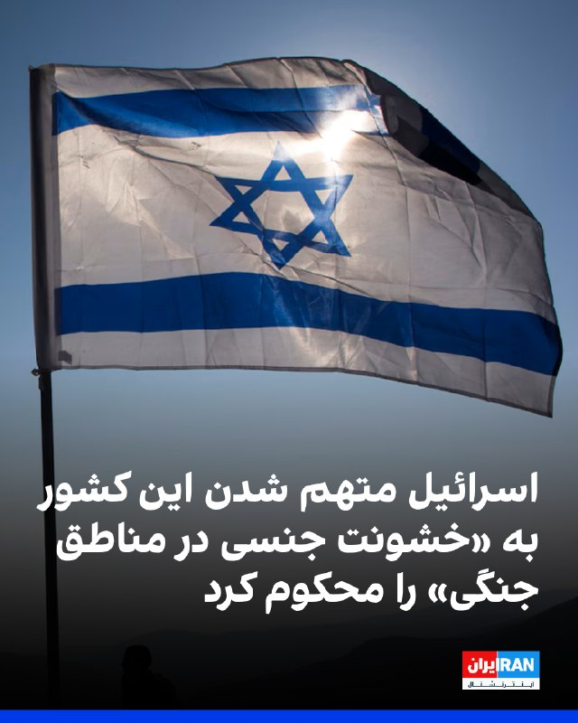

دنی دانون، سفیر اسرائیل در سازمان ملل متحد تصمیم این سازمان برای قرار دادن نام این کشور در فهرست سیاه مربوط به اتهام‌های خشونت جنسی در مناطق درگیر جنگ را محکوم کرد.

او در شبکه اجتماعی ایکس این اقدام را «یک رسوایی اخلاقی» خواند.

وزارت خارجه اسرائیل نیز در پیامی در شبکه ایکس اعلام کرد: «تصمیم شرم‌آور و مضحک سازمان ملل برای قرار دادن نهادهای اسرائیلی در ضمیمه گزارش مربوط به خشونت جنسی مرتبط با درگیری‌ها، بار دیگر ماهیت واقعی سازمان ملل را نشان می‌دهد؛ نهادی سیاسی‌زده و فاسد که اصول بنیان‌گذاری خود را کنار گذاشته و هدف اصلی آن حمله سیستماتیک به اسرائیل است.»
‌🏁 🇬🇧 IranintlTV

🤖 @VahidOOnLine

## VahidOOnLine — post 242625

  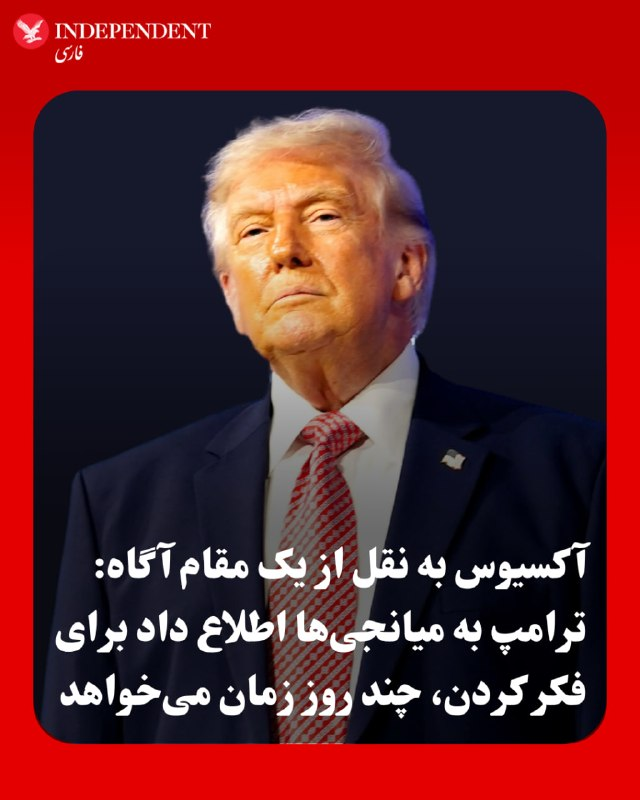

♦️تارنمای آکسیوس به نقل از دو مقام آمریکایی و یک منبع منطقه‌ای گزارش داد که مذاکره‌کنندگان آمریکا و ایران بر سر یک «تفاهم‌نامه ۶۰ روزه» برای تمدید آتش‌بس و آغاز مذاکرات درباره برنامه هسته‌ای ایران به توافق رسیده‌اند، اما این توافق هنوز نیازمند تایید نهایی دونالد ترامپ است.
بر اساس این گزارش، هدف این تفاهم‌نامه ایجاد یک چارچوب اولیه برای بازگرداندن دو طرف به میز مذاکرات و جلوگیری از تشدید تنش‌هاست. یکی از مقام‌های آمریکایی گفته: «این توافق برای آوردن همه به پای میز مذاکره است و جزئیات در جریان مذاکرات مشخص خواهد شد.»
طبق مفاد مطرح‌شده در این تفاهم‌نامه، عبور و مرور کشتی‌ها در تنگه هرمز باید «بدون محدودیت» انجام شود و ایران متعهد خواهد شد طی ۳۰ روز تمام مین‌های دریایی در این منطقه را جمع‌آوری کند. همچنین گفته شده محاصره دریایی آمریکا به‌تدریج و متناسب با بازگشت کشتیرانی تجاری لغو خواهد شد.
با این حال، مقام‌های آمریکایی می‌گویند دونالد ترامپ پس از دریافت جزئیات توافق، به میانجی‌ها اطلاع داده که «چند روز» برای فکر کردن و تصمیم‌گیری نهایی زمان می‌خواهد.
‌🇸🇦 Indypersian

🤖 @VahidOOnLine

## WithYashar — post 12807

: NBC ادعای
آمریکا و ایران سه روز پیش تو دوحه به توافق رسیدن، ولی فعلا اعلامش نمیکنن
@withyashar

## WithYashar — post 12805

اتاق جنگ با شما : تو ساحل انزلی ساعتی پیش یه کشتی وسط دریا یهو آتیش گرفت هی منفجر میشه ، ممکنه بار جدید مهمات از روسیه بوده باشه
@withyashar

## WithYashar — post 12804

## WithYashar — post 12803

https://www.ecolo.org/documents/documents_in_english/ramsar-natural-radioactivity/ramsar.html

## WithYashar — post 12802

آقا یاشار سلام خسته نباشی❤️
رامسر الان صدای جنگنده اومد یدونه بود نسبت به جنگ خیلی صداش زودتر تموم شد ولی جنگنده بود
پریروزم همین صدا اومد همینقدم بود محلیا میگفتن داره میره سمت روسیه

## WithYashar — post 12801

@withyashar 😃وضعیت سیکیم خیاری

## WithYashar — post 12800

آمریکا ۲ شرکت هواپیمایی ایران را تحریم کرد

وزیر خزانه‌داری آمریکا نوشت: دسترسی ۲ شرکت هواپیمایی ایران به نقاط فرود، سوخت‌گیری و فروش بلیت مسدود خواهد شد.
@withyashar

## WithYashar — post 12799

یک منبع اسرائیلی: رهبر ایران، مجتبی خامنه‌ای، این توافق را تأیید نکرده است، و بنابراین ترامپ نیز آن را تأیید نکرده است. قالیباف، رئیس مجلس و عراقچی، وزیر امور خارجه، حتی اگر چارچوب را پذیرفته باشند، مجاز نیستند؛ تصمیم توسط رهبر گرفته می‌شود. ما نمی‌دانیم که آیا هیچ یک از طرفین این توافق را تأیید کرده‌اند یا خیر. اختلافات هنوز هم وجود دارد، حداقل طبق آخرین به‌روزرسانی که اسرائیل دریافت کرده است.
@withyashar

## mwarmonitor — post 9869

🔸رسانه‌های اسرائیلی: «علی الحسینی»، مسئول موشکی در یگان امام حسین ترور شده است. @mwarmonitor

## mwarmonitor — post 9868

🔴اختصاصی آکسیوس: مقامات می‌گویند آمریکا و ایران به توافق رسیده‌اند، اما این توافق نیازمند تأیید نهایی ترامپ است 📝نویسنده: باراک راوید AXIOS 🔰دو مقام آمریکایی و یک منبع منطقه‌ای درگیر در تلاش‌های میانجی‌گرانه به آکسیوس گفتند که مذاکره‌کنندگان آمریکایی و…

## mwarmonitor — post 9867

  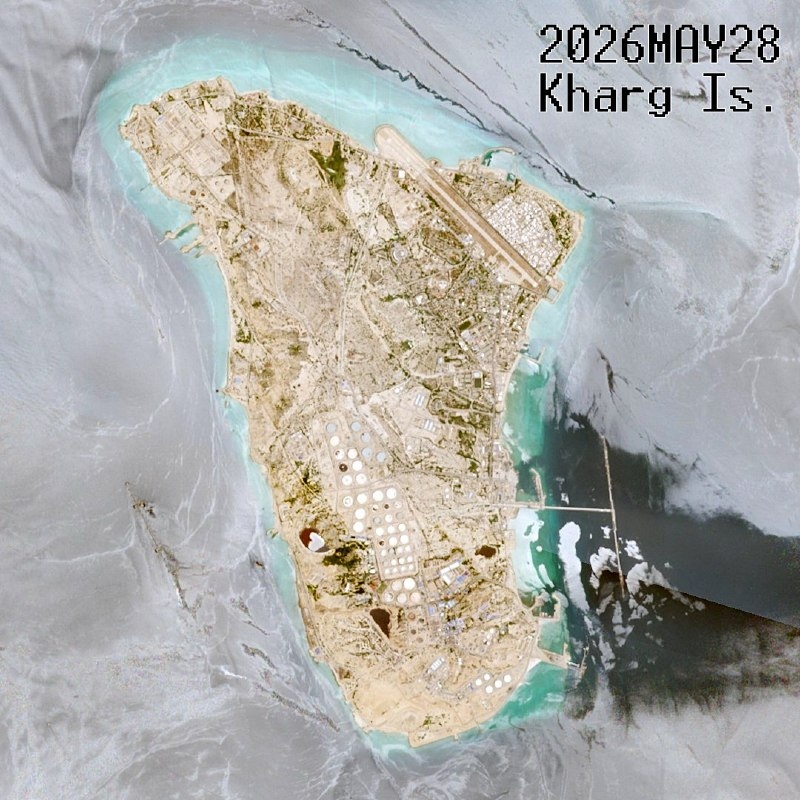

🔴امروز نیز هیچ نفتکش حامل نفت خامی در پایانه‌های جزیره خارک ایران برای بارگیری مشاهده نشد

📌بارگیری در اصلی‌ترین مرکز صادرات نفت خام کشور به‌طور کامل متوقف شده است. طی چندین روز متوالی، اسکله‌های صادرات نفت خام که معمولاً بسیار شلوغ هستند، کاملاً بدون حضور نفتکش‌های بسیار بزرگ (VLCC) بوده‌اند.

@mwarmonitor

## mwarmonitor — post 9866

  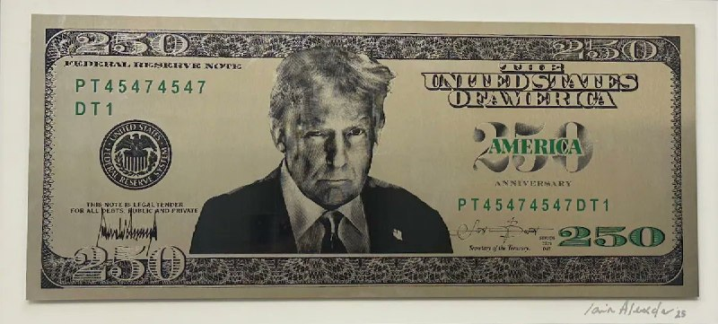

📌به گزارش Washington Post به نقل از کارکنان فعلی و سابق، منصوبان دولت دونالد ترامپ به Bureau of Engraving and Printing (مرکز چاپ پول ) فشار آوردند تا اسکناس پیشنهادی ۲۵۰ دلاری با پرتره و امضای ترامپ طراحی کند.

🔸بر اساس قانون فدرال آمریکا، در حال حاضر تنها افراد درگذشته می‌توانند روی پول رایج ایالات متحده ظاهر شوند و انتشار اسکناس ۲۵۰ دلاری نیز به تصویب کنگره نیاز دارد.

🔸مدیر این اداره که با این اقدام مخالفت کرده بود، ماه گذشته جابه‌جا (منصوب به سمت دیگری) شد.

@mwarmonitor

## mwarmonitor — post 9865

🔸وزارت خارجه اسرائیل اعلام کرد که اسرائیل تصمیم گرفته است تا زمان انتصاب دبیرکل جدید سازمان ملل متحد، تمام روابط خود را با دفتر دبیرکل سازمان ملل قطع کند. این وزارتخانه سازمان ملل را متهم کرده که «سیاسی و جانبدارانه» عمل می‌کند و به‌طور نظام‌مند تمرکز خود را بر اسرائیل گذاشته است.

@mwarmonitor

## mwarmonitor — post 9864

🔴اختصاصی آکسیوس: مقامات می‌گویند آمریکا و ایران به توافق رسیده‌اند، اما این توافق نیازمند تأیید نهایی ترامپ است 📝نویسنده: باراک راوید AXIOS 🔰دو مقام آمریکایی و یک منبع منطقه‌ای درگیر در تلاش‌های میانجی‌گرانه به آکسیوس گفتند که مذاکره‌کنندگان آمریکایی و…

## FoxNewsTwitter — post 342355

Fox News (Twitter/X)

WATCH LIVE: Treasury Secretary Scott Bessent holds White House briefing https://twitter.com/i/broadcasts/1qxoNNMolNBJv

## FoxNewsTwitter — post 342354

Fox News (Twitter/X)

BREAKING: Bahamian government approves US sending dive team to search new area in Lynette Hooker's disappearance, US official familiar with the investigation tells Fox News Digital

## FoxNewsTwitter — post 342353

  <a href="telegram/content/FoxNewsTwitter_342353_1779992414.mp4" target="_blank">🎬 Download video</a>

Fox News (Twitter/X)

BREAKING: The U.S. and Iran have agreed to the framework of a 60-day ceasefire deal, now awaiting final sign-off from President Trump and Iran’s Supreme Leader.

Negotiators are still hashing out some of the biggest sticking points, including what happens to Iran’s highly enriched uranium stockpile and restrictions tied to nuclear weapons development.

Iran has previously pulled back from the table over these exact U.S. red lines, raising questions about how durable any agreement could actually be.

@TreyYingst breaks down what would be considered a ceasefire violation as the deal moves closer to final approval.

## FoxNewsTwitter — post 342352

‌Fox News (Twitter/X)

https://www.foxnews.com/politics/us-iran-reach-ceasefire-extension-pending-trumps-final-approval

## FoxNewsTwitter — post 342351

  <a href="telegram/content/FoxNewsTwitter_342351_1779992416.mp4" target="_blank">🎬 Download video</a>

Fox News (Twitter/X)

RT @OutnumberedFNC: 🚨BREAKING: U.S. and Iran reach an agreement on a 60-day memorandum to extend a ceasefire and launch larger negotiations on Iran’s nuclear program.

Sources tell Fox it is now awaiting President Trump’s final approval.

@kayleighmcenany

## FoxNewsTwitter — post 342350

Fox News (Twitter/X)

BREAKING: U.S., Iran negotiators agree on 60-day memo of understanding to extend ceasefire and launch negotiations on Iran's nuclear program, but Trump has yet to give final approval, sources tell Fox News

## FoxNewsTwitter — post 342349

  <a href="telegram/content/FoxNewsTwitter_342349_1779992418.mp4" target="_blank">🎬 Download video</a>

Fox News (Twitter/X)

Faith in the fast lane!

Watch as Pope Leo XIV takes a seat inside Ferrari’s brand-new, all-electric Luce.

The pontiff climbed into Ferrari’s newly unveiled Luce during a special presentation at Castel Gandolfo near Rome, where Ferrari chairman John Elkann and company executives introduced the vehicle.

At one point, Ferrari's test driver knelt beside the pope explaining the Luce’s controls and driving modes while Leo examined the interior from behind the wheel.

## FoxNewsTwitter — post 342348

Fox News (Twitter/X)

WATCH LIVE: VP Vance delivers commencement address at United States Air Force Academy graduation https://twitter.com/i/broadcasts/1qxoNNMAyYjJv

## FoxNewsTwitter — post 342347

  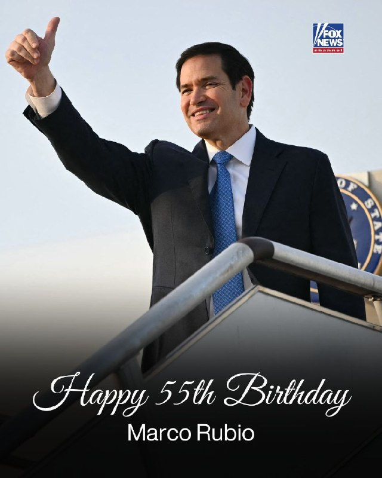

Fox News (Twitter/X)

HAPPY BIRTHDAY! Secretary of State @marcorubio is celebrating his 55th birthday today.

## pm_afshaa — post 91759

🔴سی‌ان‌ان:ترامپ قبل از امضای تفاهم‌نامه با بنیامین نتانیاهو مشورت خواهد کرد

💧 Rainbet.com the #1 Non-KYC Crypto Casino & Sportsbook @rainbetcom

😁 @Pm_Afshaa

## pm_afshaa — post 91758

پروکسی پروکسی 
💧 Rainbet.com the #1 Non-KYC Crypto Casino & Sportsbook @rainbetcom 
😁 @Pm_Afshaa

## pm_afshaa — post 91757

vless://e258977b-e413-4718-a3af-02d75492c349@50.62.198.124:443?encryption=none&security=tls&sni=jp.aniua.qzz.io&type=ws&host=jp.aniua.qzz.io&path=%2F#PMTV%20NEWS%20%F0%9F%A6%81%E2%98%80%EF%B8%8F

سرور مخصوص دانلود

💧 Rainbet.com the #1 Non-KYC Crypto Casino & Sportsbook @rainbetcom

😁 @Pm_Afshaa

## pm_afshaa — post 91756

پروکسی

پروکسی

💧 Rainbet.com the #1 Non-KYC Crypto Casino & Sportsbook @rainbetcom

😁 @Pm_Afshaa

## pm_afshaa — post 91755

🔴❗️ کانال مردمی «آورکسا» ❗️🔴 ⚡️ پوشش فوری وقایع نظامی جهان 🛰 تحلیل تجهیزات و تاکتیک‌های نظامی 🎯 اخبار سیاسی، نظامی و امنیتی 📡 آپدیت ۲۴ ساعته و لحظه‌ای ❌ سریع، دقیق، بدون حاشیه https://t.me/AverxaNews https://t.me/AverxaNews ✅همین حالا عضو شوید و یک قدم…

## pm_afshaa — post 91754

  

🔴❗️ کانال مردمی «آورکسا» ❗️🔴

⚡️ پوشش فوری وقایع نظامی جهان
🛰 تحلیل تجهیزات و تاکتیک‌های نظامی
🎯 اخبار سیاسی، نظامی و امنیتی
📡 آپدیت ۲۴ ساعته و لحظه‌ای
❌ سریع، دقیق، بدون حاشیه

https://t.me/AverxaNews
https://t.me/AverxaNews

✅همین حالا عضو شوید و یک قدم جلوتر از خبرها باشید.

## pm_afshaa — post 91753

vless://41f37ced-2021-4111-93a8-82d57ff2eb5b@217.163.76.118:2083?encryption=none&security=tls&sni=fl0.lizardshop.org&fp=360&type=ws&path=%2F%3Fed#PMTV%20NEWS%20%F0%9F%A6%81%E2%98%80%EF%B8%8F

نپسترنت سرعت بالا

💧 Rainbet.com the #1 Non-KYC Crypto Casino & Sportsbook @rainbetcom

😁 @Pm_Afshaa

## pm_afshaa — post 91752

🔴اینترنت را دوباره وصل کردند برای موج‌سازی و جنگ روانی. هدف روشن است: ضربه زدن به پیوند مردم داخل و خارج ایران و تضعیف امید و اتحاد ملی.

از امروز، کار رسانه‌ایِ متحد و هوشمند بیش از هر زمان دیگری اهمیت دارد. باید با پاسخ‌های شفاف و دقیق، در برابر تاکتیک‌های نخ‌نمای روانی جمهوری اسلامی ایستاد.

پیش از جنگ چه می‌گفتند؟
«هیچ کمکی نمی‌آید» و «همه تنها مانده‌اند»؛ اما خیلی زود نقش خائنان در عدم انتقال سلاح و استارلینک آشکار شد و به یکباره خامنه‌ای و ده‌ها چهره ارشد و جنایتکار رژیم نیز از میان رفتند.

حالا می‌گویند آتش‌بس یعنی پیروزی رژیم تروریستی؟ بگذارید هرچه دوست دارند بگویند

مبارزه مردم ایران متوقف نشده و نخواهد شد. همان‌طور که مردم بارها گفته‌اند، مسیر آزادی ادامه دارد. حتی رئیس پیشین موساد نیز تأکید کرده که فشارها تا سقوط کامل جمهوری اسلامی ادامه خواهد داشت !

امید، اتحاد و آگاهی؛ سه چیزی است که حکومت بیش از هر چیز از آن می‌ترسد.

📝  Arsames

👑 @Fighter_Radar

👑 @Pm_Afshaa

## pm_afshaa — post 91751

ss://MjAyMi1ibGFrZTMtYWVzLTI1Ni1nY206aWhRWmVvUlZVU1ovUzlwZFUvclRvSTV1V3Rld2xTdDJMT21NeDk1NS9LST06MXBsWjA5Zm01a1FtMFNHSDNXNURuazJibEtWRGZwRi83cm02NHRpUHc3TT0=@188.213.197.232:29691#PMTV%20NEWS%20%F0%9F%A6%81%E2%98%80%EF%B8%8F

نپسترنت مخصوص اینستا و دانلود

💧 Rainbet.com the #1 Non-KYC Crypto Casino & Sportsbook @rainbetcom

😁 @Pm_Afshaa

## pm_afshaa — post 91750

https://t.me/proxy?server=ams1.tlgfast.com&port=443&secret=083fe0c452e2407d835537872f097c54

پروکسی متصل سرعت بالا

💧 Rainbet.com the #1 Non-KYC Crypto Casino & Sportsbook @rainbetcom

😁 @Pm_Afshaa

## pm_afshaa — post 91749

https://t.me/proxy?server=a.artishchev.org&port=8443&secret=963a7fd525b04c4533ce776c9bd70f34

پروکسی متصل مخصوصا دانلود

💧 Rainbet.com the #1 Non-KYC Crypto Casino & Sportsbook @rainbetcom

😁 @Pm_Afshaa

## pm_afshaa — post 91748

🔴نتانیاهو:هدف ما از بین بردن کامل تهدید جمهوری اسلامی است من هر روز با ترامپ در تماس هستم؛ باید مأموریت علیه رژیم ایران را به پایان رساند

💧 Rainbet.com the #1 Non-KYC Crypto Casino & Sportsbook @rainbetcom

😁 @Pm_Afshaa

## pm_afshaa — post 91747

🔴شاید باور نکنید ولی؛ عراقچی باعث جنگ شده
توی مذاکرات چون کاملا به‌ زبان انگلیسی مسلط نبوده؛ خواسته بگه ما میتونیم 11 بمب اتم بسازیم ولی به جاش گفته ما داریم 11 بمب اتم میسازیم. ترامپ هم فورا حمله کرد.

+اینو ویتکاف هم تایید کرد که عراقچی توی مذاکرات همچین چیزی گفته

-وقتی بی سواد ها بشن همه کاره مملکت نباید بیشتر از اینا انتظار داشت

💧 Rainbet.com the #1 Non-KYC Crypto Casino & Sportsbook @rainbetcom

😁 @Pm_Afshaa

## pm_afshaa — post 91746

🔴سخنگوی ارتش اسرائیل: در هیچ جبهه‌ای عقب‌نشینی نخواهیم کرد و در صورت لزوم آماده‌ایم برای جنگ با ایران بازگردیم

💧 Rainbet.com the #1 Non-KYC Crypto Casino & Sportsbook @rainbetcom

😁 @Pm_Afshaa

## pm_afshaa — post 91745

🔴وزیر خزانه‌داری آمریکا: محدودیت‌های شدیدی علیه خطوط هوایی ایران از جمله محرومیت از حق نشست و برخاست، خدمات سوخت‌رسانی و سیستم‌های فروش بلیت وضع می‌کنیم

💧 Rainbet.com the #1 Non-KYC Crypto Casino & Sportsbook @rainbetcom

😁 @Pm_Afshaa

## pm_afshaa — post 91744

https://t.me/proxy?server=87.248.129.13&port=15&secret=ee1603010200010001fc030386e24c3add63646e2e79656b74616e65742e636f6d

پروکسی متصل سرعت بالا

💧 Rainbet.com the #1 Non-KYC Crypto Casino & Sportsbook @rainbetcom

😁 @Pm_Afshaa

## pm_afshaa — post 91743

  <a href="telegram/content/pm_afshaa_91743_1779992422.mp4" target="_blank">🎬 Download video</a>

حملات سنگین اسراییل به زیر ساخت های حزب الله

💧 Rainbet.com the #1 Non-KYC Crypto Casino & Sportsbook @rainbetcom

😁 @Pm_Afshaa

## pm_afshaa — post 91742

🔴یک مقام اسرائیلی: رهبر ایران، موش تباه خامنه‌ای، این توافق را تأیید نکرده و به همین دلیل ترامپ نیز آن را تأیید نکرد

💧 Rainbet.com the #1 Non-KYC Crypto Casino & Sportsbook @rainbetcom

😁 @Pm_Afshaa

## pm_afshaa — post 91741

  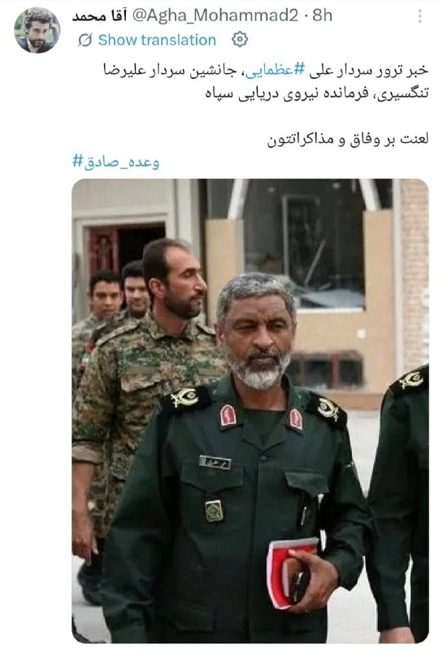

یه سری از حکومتیا خبر از کشته شدن جانشین تنگسیری میدن

💧 Rainbet.com the #1 Non-KYC Crypto Casino & Sportsbook @rainbetcom

😁 @Pm_Afshaa

## pm_afshaa — post 91740

  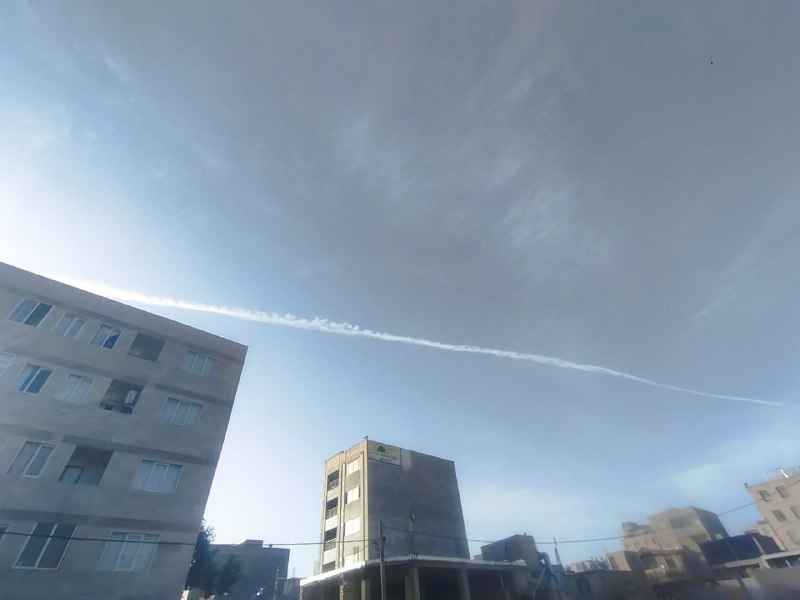

از نهاوند دوباره موشک بلند شد

💧 Rainbet.com the #1 Non-KYC Crypto Casino & Sportsbook @rainbetcom

😁 @Pm_Afshaa

## iaghapour — post 2641

  

همه‌چی قرار نیست وایرال باشه.
بعضی موزیکارو فقط باید پیداشون کنی.
اینجا همون‌جاست؛
ریمیکس، کلیپ، ادیت و ترکایی با وایب متفاوت.
برای آدمایی که سلیقه‌شون معمولی نیست.👇

⏩ 𝗡𝗢𝗫𝗕𝗘𝗔𝗧 
✅

## iaghapour — post 2640

## iaghapour — post 2639

  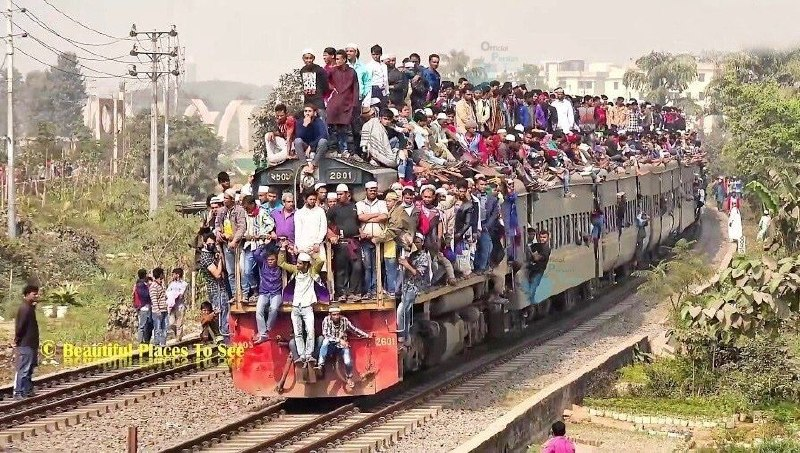

مردم ایران در حال برگشتن به تلگرام 😀

## iaghapour — post 2638

💢 وضعیت اینترنت جوری شده که وقتی نت ملی بود فیلترشکن ها راحت تر متصل میشدن!

راستی گوگل پلی و اپ‌استور در دسترس قرار گرفتن و البته ویندوز آپدیت و...

## DEJradio — post 5078

  <a href="telegram/content/DEJradio_5078_1779992425.mp4" target="_blank">🎬 Download video</a>

🚨
🔸 خبر ۲۱
پنجشنبه ۷ خرداد ۱۴۰۵

#خبر۲۱
@DEJradio

## DEJradio — post 5077

  <a href="telegram/content/DEJradio_5077_1779992428.mp4" target="_blank">🎬 Download video</a>

👑 
⭕️ شاهزاده رضا پهلوی: «تیم من به من وفادار است و من هم متقابلا به آنها وفادارم.»
بخشی از نشست آنلاین با شماری از فعالان و چهره‌های رسانه‌ای و هنری، ۱ خرداد ۲۵۸۵/۱۴۰۵

#شاهزاده_رضا_پهلوی
#ایران_را_پس_میگیریم
@DEJradio

## DEJradio — post 5076

  <a href="telegram/content/DEJradio_5076_1779992430.mp4" target="_blank">🎬 Download video</a>

🔺🎥 اعتراض یک شهروند به گرانی نان

با افزایش بهای آرد و سایر هزینه‌ها، قیمت نان افزایش یافته است.
یک شهروند در یک نانوایی نسبت به گرانی نان اعتراض می‌کند که نانوا می‌گوید آرد را گران کرده‌اند.

#نان #تورم
@DEJradio

## DEJradio — post 5075

👑
👑 همزمان با بازگشایی اینترنت در ایران، فیلم‌های بسیاری از انقلاب شیر و خورشید در ‌دی‎ماه منتشر شده است.

#انقلاب_شیر_و_خورشید #دیماه
@DEJradio

## VahidOnline — post 75779

  

ارگان خبری مجموعه فعالان حقوق بشر در ایران خبر داد که تارا و کیمیا داوودی، دو خواهر محبوس در زندان اوین، توسط شعبه ۱۵ دادگاه انقلاب تهران به ریاست قاضی ابوالقاسم صلواتی در مجموع به ۱۶ سال حبس محکوم شده‌اند.

براساس این گزارش، کیمیا داوودی به اتهاماتی از جمله «ارتباط با گروه‌ها و شبکه‌های معاند» و «اجتماع و تبانی علیه امنیت کشور» به ۱۰ سال زندان و تارا داوودی نیز به اتهاماتی شامل «اجتماع و تبانی علیه امنیت کشور» و «تبلیغ علیه نظام» به شش سال حبس محکوم شده است.

این دو خواهر در تاریخ ۲۴ دی‌ماه ۱۴۰۴ در جریان اعتراضات سراسری در تهران بازداشت شدند و هم‌اکنون در بند زنان زندان اوین نگهداری می‌شوند. به گفته منابع حقوق بشری، بازداشت آن‌ها با خشونت نیروهای امنیتی همراه بوده است.
@VahidHeadline

📡 @VahidOnline

## VahidOnline — post 75778

  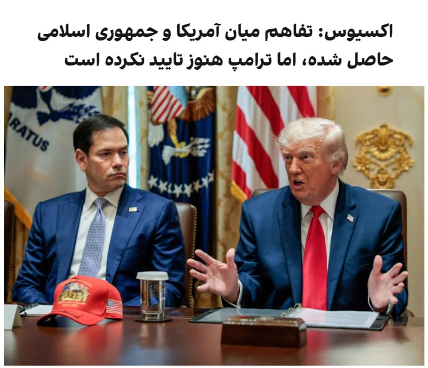

اکسیوس به نقل از مقامات آمریکایی گزارش داد که مذاکره‌کنندگان آمریکا و جمهوری اسلامی به یک یادداشت تفاهم با مدت ۶۰ روزه برای تمدید آتش‌بس و آغاز مذاکرات درباره برنامه هسته‌ای ایران رسیده‌اند، اما دونالد ترامپ، رییس‌جمهوری آمریکا، این متن را هنوز تایید نهایی نکرده است.

مقامات آمریکایی که نامشان فاش نشده به این رسانه گفتند که شرایط توافق تا سه‌شنبه تقریبا نهایی شده بود، اما هر دو طرف هنوز نیاز داشتند تایید مقامات ارشد خود را بگیرند.
مقامات آمریکایی افزودند که طرف ایرانی اعلام کرده که تاییدهای لازم را دریافت کرده و آماده امضا است.
تهران هنوز این موضوع را تایید نکرده است.

اکسیوس نوشت مذاکره‌کنندگان آمریکایی جزئیات توافق نهایی را به ترامپ گزارش دادند و او درخواست کرد چند روز برای فکر کردن زمان داشته باشد.
@VahidOOnLine
بعدا فاکس‌نیوز هم خبر مشابهی منتشر کرد.
و گویا به همین دلیل هم می‌خواستند اینترنت را باز کنند. پیروزی جلوه دادن با اعلام جشن و پروپاگاندا در جو جام‌جهانی و...
📡 @VahidOnline

## VahidOnline — post 75776

پس از انتشار پیامی منسوب به مجتبی خامنه‌ای درباره «نابودی اسرائیل تا ۱۵ سال آینده»، رسانه‌های ایران تصویری از دیوارنگاره جدید در میدان فلسطین تهران منتشر کردند که بر آن جمله «اسرائیل ۱۵ سال آینده را نخواهد دید» نوشته شده است.

در پیام منتسب به مجتبی خامنه‌ای که رسانه‌های ایران آن را منتشر کرده بودند، آمده است اسرائیل «به مراحل پایانی عمر منحوس خود نزدیک شده است.» در این پیام به سخنان علی خامنه‌ای در سال ۱۳۹۴ اشاره شده و تاکید شده است که اسرائیل «۲۵ سال بعد از آن تاریخ را نخواهد دید.»
@VahidOOnLine
سپاه پاسداران روز پنجشنبه هفتم خردادماه با انتشار بیانیه‌ای به مناسبت کشته شدن محمد عوده و عزالدین حداد، دو فرمانده حماس اعلام کرد منطقه جز با محو اسرائیل روی آرامش نمی‌بیند.
سپاه در این بیانیه از حمایت جمهوری اسلامی از «محور مقاومت» تاکید کرد.
@VahidOOnLine

📡 @VahidOnline

## VahidOnline — post 75774

اسکات بسنت، وزیر خزانه‌داری آمریکا، روز پنج‌شنبه در پیامی در شبکه ایکس نوشت که ایالات متحده در راستای افزایش فشار بر تهران و باز نگه داشتن تنگه هرمز «دسترسی هر دو شرکت هواپیمایی ایرانی به اماکن فرود، سوخت‌گیری و فروش بلیت را متوقف خواهد کرد»، اما جزئیات بیشتری ارائه نداد و به نام دو شرکت اشاره نکرد.
@VahidHeadline
اسکات بسنت، وزیر خزانه‌داری آمریکا، با تاکید بر اینکه این کشور به کارزار «خشم اقتصادی» علیه حکومت ایران ادامه می‌دهد، در شبکه ایکس نوشت نیروهای جمهوری اسلامی حقوق دریافت نمی‌کنند، پلیس‌ها سر کار حاضر نمی‌شوند و جزیره خارک تعطیل شده است و اقتصاد و ارزش پول ایران در سقوط آزاد قرار دارد.
او افزود سازمان مدیریت تنگه هرمز از سوی جمهوری اسلامی یک شوخی است و امروز وزارت خزانه‌داری آن را تحریم کرده است. ما به هر نهاد شرکتی یا دولتی درباره پرداخت عوارض یا پنهان کردن آن به‌عنوان کمک هشدار داده‌ایم.
بسنت اضافه کرد با تشکیل «دیوار فولادی»، محاصره دریایی آمریکا باعث شده میزان نفت خام ایران در دریا به پایین‌ترین سطح تاریخی برسد.
او تاکید کرد تنها یک نتیجه رضایت‌بخش در مذاکرات این روند نزولی را متوقف خواهد کرد.
@VahidOOnLine
دولت دونالد ترامپ نهاد موسوم به «سازمان تنگه خلیج فارس» جمهوری اسلامی را تحریم کرد
@VahidHeadline

📡 @VahidOnline

## VahidOnline — post 75772

وزارت خارجه کویت حملات اخیر موشکی و پهپادی رژیم ایران به خاک کویت را به عنوان یک تشدید تنش جدی و نقض آشکار حاکمیت و امنیت محکوم کرد.
این وزارتخانه روز پنج‌شنبه اعلام کرد که تهران را کاملاً مسئول حملات اخیر می‌داند و حکومت ایران خواست فوراً و بدون قید و شرط حملات را متوقف کند.
@VahidHeadline
اسماعیل بقائی سخنگوی وزارت خارجه ایران، حمله بامداد پنج‌شنبه آمریکا به مناطقی در بندرعباس، را «تجاوز» نامید و آن را محکوم کرد.
آقای بقائی این حمله را «نقض فاحش حقوق بین‌الملل و منشور ملل متحد» دانست و افزود: «شورای امنیت سازمان ملل موظف به ایفای مسئولیت قانونی خود برای پاسخگو کردن متجاوزان آمریکایی است.»
سخنگوی وزارت خارجه ایران می‌گوید آمریکا «به‌طور مستمر»، آتش‌بس میان دو کشور را که از ۱۹ فروردین اجرایی شده، «نقض» می‌کند.
سنتکام با این حال تأکید کرده که این اقدامات «سنجیده، صرفاً دفاعی و با هدف حفظ آتش‌بس» انجام شد. این دومین بار در سه روز گذشته بود که آمریکا اهدافی را در ایران هدف حمله قرار داد.
@VahidHeadline
فرماندهی مرکزی ارتش ایالات متحده، سنتکام، حمله موشکی ایران به کویت را «نفض فاحش» آتش‌بس خوانده است.
این نهاد در حساب رسمی خود در شبکه ایکس نوشته است: «ساعت ۱۰:۱۷ شب به وقت شرق آمریکا در تاریخ ۲۷ مه، ایران یک موشک بالستیک به سمت کویت شلیک کرد که با موفقیت توسط نیروهای کویتی رهگیری شد.»
سنتکام نوشته است «این نقض فاحش آتش‌بس توسط رژیم ایران، ساعاتی پس از آن رخ داد که نیروهای ایرانی پنج پهپاد تهاجمی یک‌طرفه را شلیک کردند که تهدیدی آشکار در تنگه هرمز و نزدیکی آن ایجاد کردند.»
فرماندهی مرکزی ارتش آمریکا می‌گوید: «تمام پهپادها با موفقیت توسط نیروهای آمریکایی رهگیری شدند و آنها همچنین از پرتاب ششمین پهپاد از یک سایت کنترل زمینی ایران در بندرعباس جلوگیری کردند.»
سنتکام در ادامه آورده است: «فرماندهی مرکزی ایالات متحده و شرکای منطقه‌ای کماکان هوشیار و محتاط هستند و ما همچنان به دفاع از نیروها و منافع خود در برابر تجاوز توجیه‌ناپذیر ایران ادامه می‌دهیم.»
@VahidOOnLine
وزارت خارجه عربستان سعودی در بیانیه‌ای در شبکه ایکس، حملات خصمانه با موشک و پهپاد به کویت را به‌شدت محکوم و تقبیح کرد.
@VahidOOnLine
وزارت خارجه قطر در بیانیه‌ای هدف قرار گرفتن کویت با موشک و پهپاد را به‌شدت محکوم کرد و آن را «نقض آشکار حاکمیت» این کشور و «نقض فاحش قوانین بین‌المللی» دانست.
@VahidOOnLine

📡 @VahidOnline

## VahidOnline — post 75771

  

رسانه‌های ایران پیامی منسوب به مجتبی خامنه‌ای، رهبر جمهوری اسلامی، را خطاب به نمایندگان مجلس شورای اسلامی منتشر کردند که در آن می‌گوید «ایجاد تفرقه و تجزیه اجتماعی»، در کنار جنگ و فشار اقتصادی و محاصره، «طرح و نقشهٔ کور دشمن» است.

مجتبی خامنه‌ای در این پیام که روز پنجشنبه هفتم خرداد منتشر شد، همچنین به تمام کسانی که آن‌ها را «جان‌فدایانی که دل‌شان برای اسلام و انقلاب یا استقلال و سربلندی ایران می‌تپد» نامیده، هشدار داد که «اختلافات غیرموجه و حتی موجه را به تنازع و تفرقه تبدیل نکنند».

وزارت اطلاعات جمهوری اسلامی روز گذشته در بیانیه‌ای هشدار داد که بعد از جنگ اخیر، «برخی کمبودها و گرانی‌ها» در پی فشارهای اقتصادی آمریکا می‌تواند باعث بروز ناآرامی‌های تازه در ایران شود.

وال‌استریت جورنال نیز روز پنجشنبه در گزارشی به نقل از تحلیلگران هشدار داد که ادامهٔ محاصرهٔ دریایی آمریکا علیه ایران که به کاهش ذخایر ارزی ایران انجامیده، می‌تواند احتمال بروز اعتراضات جدید در ایران را افزایش دهد.

از زمان اعلام نام مجتبی خامنه‌ای، به عنوان سومین رهبر جمهوری اسلامی، تصویر یا صدایی از او منتشر نشده و رسانه‌های ایران فقط پیام‌های کتبی از او منتشر می‌کنند.
@VahidHeadline

📡 @VahidOnline

## VahidOnline — post 75770

  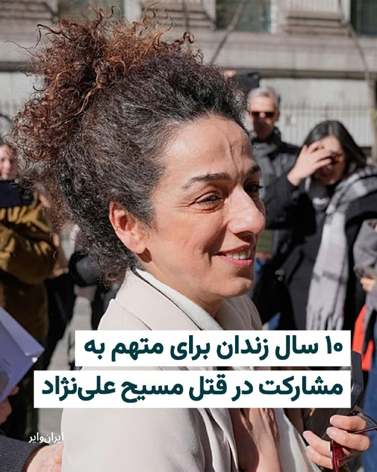

وزارت دادگستری آمریکا اعلام کرد «جاناتان لودهولت»، شهروند آمریکایی ساکن استاتن آیلند، به‌دلیل مشارکت در طرح «تعقیب و قتل» مسیح علی‌نژاد، فعال سیاسی ایرانی-آمریکایی، به ۱۰ سال زندان و سه سال آزادی تحت نظارت محکوم شده است.
@VahidHeadline

📡 @VahidOnline

## VahidOnline — post 75769

  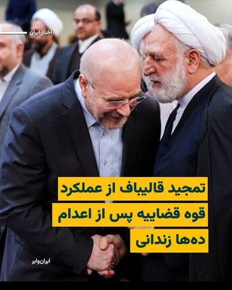

«محمدباقر قالیباف»، رییس مجلس شورای اسلامی، در پیامی به «غلامحسین محسنی اژه‌ای»، رییس قوه قضاییه نوشت: «قوه قضاییه زیر بمباران و تهدید دشمنان دست از صیانت از حقوق مردم و برخورد با قاتلان داخلی و خائنین به ملت نکشید و خوش درخشید.»

این تمجید از عملکرد قوه قضاییه درحالی صورت گرفته که در طول روزهایی که از جنگ ایران با آمریکا و اسراییل می‌گذرد دستکم ۳۹زندانی سیاسی اعدام شده‌اند.
@VahidHeadline

📡 @VahidOnline

## VahidOnline — post 75768

  

نت‌بلاکس، نهاد ناظر بر اختلالات اینترنتی، اعلام کرد که علیرغم اینکه دسترسی به شبکه جهانی تا حد زیادی در ایران بازگشته است، اما شاخص‌ها نشان می‌دهند که کاربران همچنان با فیلترینگ شدید مواجه هستند.

نت‌بلاکس، این فیلترینگ شدید را مشابه دوره مابین اعتراضات سراسری دی ماه و آغاز عملیات نظامی علیه جمهوری اسلامی، حدفاصل دی ماه تا اسفند ۱۴۰۴ توصیف کرد.
@VahidHeadline

📡 @VahidOnline

## VahidOnline — post 75767

  

⚠️ تصاویر پیکرهای بی‌جان و شیون مادر تصاویر دریافتی از: 'بیمارستان الغدیر #تهران، بامداد جمعه ۱۹ دی' Vahid #بیمارسان_الغدیر 📡 @VahidOnline

## IranIntlTV — post 339455

  <a href="telegram/content/IranIntlTV_339455_1779992435.mp4" target="_blank">🎬 Download video</a>

وال‌استریت پس از حملات یازده سپتامبر، فقط شش روز تعطیل بود، اما روسیه پس از حمله به اوکراین، بازار مسکو را یک ماه تعطیل کرد. بورس‌های امارات پس از حملات موشکی و پهپادی جمهوری اسلامی فقط دو روز معاملات را متوقف کردند، در حالیکه بورس تهران، در یک رکورد تاریخی، بیش از هشتاد روز تعطیل بود. در این قسمت چرتکه، محمد ماشین‌چیان رویکرد آمریکایی و روسی به بازار را در مقیاس ایران و امارات بررسی می‌کند.

تماشای نسخه کامل «چرتکه» در یوتیوب:
https://youtu.be/gPWijjjbR5M

## IranIntlTV — post 339454

  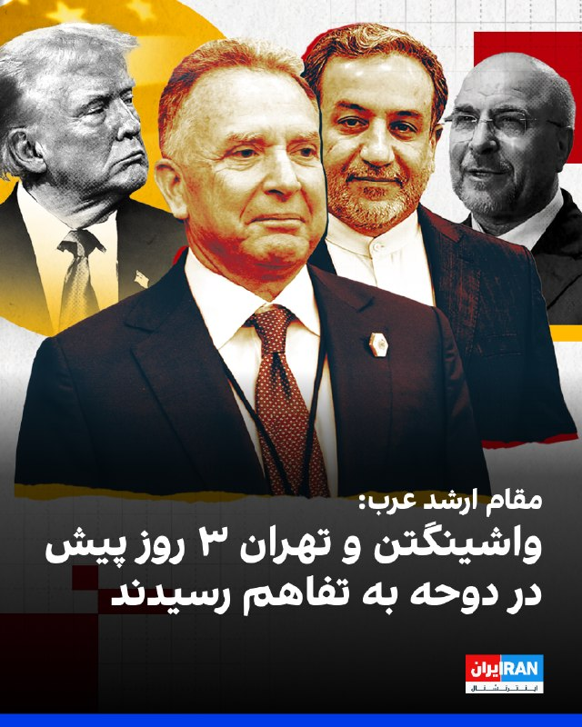

یک مقام ارشد عرب که مستقیما در میانجی‌گری مذاکرات میان واشینگتن و تهران حضور دارد، به ان‌بی‌سی نیوز گفت مذاکره‌کنندگان آمریکا و ایران سه روز پیش بر سر مفاد توافق آتش‌بس به تفاهم رسیده‌اند، اما هر دو طرف اعلام و نهایی‌کردن آن را به تعویق انداخته‌اند.

این مقام گفت: توافق سه روز پیش در دوحه نهایی شد، اما حالا همه منتظر اقدام طرف مقابل هستند و این تاخیرها را «ناامیدکننده» خواند.
https://iranintl.com/202605287097

## IranIntlTV — post 339453

  

بنیامین نتانیاهو در مصاحبه‌ای در کنفرانس «بیکعات هاردن» اعلام کرد: «در روز اول یا دوم جنگ گفتم چهره خاورمیانه را تغییر خواهیم داد. از همان ابتدا روشن بود که فقط با حماس و حزب‌الله روبه‌رو نیستیم، بلکه محور جمهوری اسلامی پشت آن‌ها قرار دارد.»

نتانیاهو افزود: «ما نیاز به تغییر داشتیم. برای من روشن بود که دوران تحمل و جذب ضربه به پایان رسیده است. دیگر ضربه را تحمل نمی‌کنیم؛ از حالت دفاعی خارج می‌شویم و یکی‌یکی به آن‌ها ضربه می‌زنیم.»

او ادامه داد: «ما هرگز در چنین فاصله‌هایی، با چنین تداومی و با چنین شدتی در آسمان تهران عملیات انجام نداده بودیم. در آسمان یمن هم با چنین شدتی عمل نکرده بودیم.»

نتانیاهو گفت: «ضربات بسیار سنگینی به آن‌ها وارد کرده‌ایم و هرگز تا این اندازه قوی نبوده‌ایم. اما همچنان با رژیم آسیب‌دیده ایران روبه‌رو هستیم و تهدید هسته‌ای هنوز وجود دارد.»

او افزود: «هنوز باید کار را کامل کنیم. من تقریبا هر روز با رییس‌جمهور ترامپ صحبت می‌کنم. علاوه بر خنثی‌سازی تهدید هسته‌ای، باید تهدیدی را که می‌توان آن را فوق‌فناورانه دانست نیز مهار کنیم؛ یعنی تهدید پهپادها، پهپادهای فیبر نوری و نسل بعدی آن‌ها.»
h

## IranIntlTV — post 339452

ویدیوی رسیده به ایران اینترنشنال نشان می‌دهد یک شهروند شعارهای «جاوید شاه» و «این آخرین نبرده» را روی دیواری در یکی از شهرهای ایران با اسپری نوشته است. برای حفظ امنیت شهروندان مکان این ویدئو ذکر نمی‌شود.

## IranIntlTV — post 339451

  <a href="telegram/content/IranIntlTV_339451_1779992438.mp4" target="_blank">🎬 Download video</a>

این گزارش به قطع ۸۸ روزه اینترنت از سوی جمهوری اسلامی می‌پردازد؛ اقدامی که به یک محاصره دیجیتال علیه مردم تبدیل شد، میلیاردها دلار خسارت بر جای گذاشت و ارتباط ایرانیان با جهان، کسب‌وکار، آموزش و حق دسترسی به حقیقت را مسدود کرد.

آرین ریسباف گزارش می‌دهد.
@iranintltv

## IranIntlTV — post 339450

  <a href="https://t.me/IranintlTV/339450" target="_blank">📎 Download file</a>

🎧نسخه صوتی چرتکه : بازگشایی بورس از ابوظبی تا تهران
@iranintlTV

## IranIntlTV — post 339449

  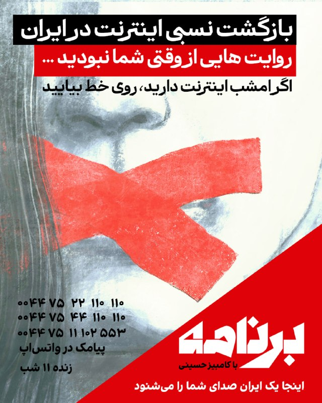

اینترنت ایران به‌طور نسبی برگشته و مردم ایران دیشب در «برنامه» توانستند صدای خود را به ایران برسانند. امشب هم، بدون این‌که موضوع مشخصی داشته باشیم، «برنامه» را در اختیار شما می‌گذاریم تا بیایید و هر حرفی را که دارید، با ایران در میان بگذارید؛ پس اگر امشب اینترنت دارید، روی خط بیایید.

«برنامه» صدای شماست.

ما شما را، بدون نوبت، مستقیم از ایران روی خط می‌آوریم.

بیایید و روایت خود را برای همیشه ثبت کنید.

تاریخ با صدای شما نوشته می‌شود.

برای شرکت در برنامه، همین حالا در واتس‌اپ پیام بدهید:

۰۰۴۴۷۵۲۲۱۱۰۱۱۰

۰۰۴۴۷۵۴۴۱۱۰۱۱۰

۰۰۴۴۷۵۱۱۱۰۲۵۵۳

«برنامه با کامبیز حسینی»

«یک ایران صدای شما را می‌شنود»
@iranintltv

## IranIntlTV — post 339448

  

شبکه حقوق بشر کردستان از صدور حکم اعدام برای اسماعیل رمضان‌پور، ۳۸ ساله، و آرمان معرفتی، ۳۰ ساله، از معترضان انقلاب ملی ایرانیان در دی ۱۴۰۴ خبر داد.

براساس این گزارش، آرمان معرفتی، اهل سقز استان کردستان، در جریان اعتراضات توسط نیروهای امنیتی بازداشت و پس از مدتی به زندان تهران بزرگ منتقل شد. او در شعبه ۱۵ دادگاه انقلاب تهران به ریاست قاضی صلواتی به اتهام «محاربه» به اعدام محکوم شد.

همچنین اسماعیل رمضان‌پور، اهل استان فارس و ساکن یزد، در جریان اعتراضات توسط نیروهای امنیتی بازداشت و به یک بازداشتگاه امنیتی در یزد منتقل شد. به گفته این منبع، او در این بازداشتگاه برای اعترافات اجباری مورد شکنجه قرار گرفت و پس از پایان دوران بازجویی به زندان مرکزی یزد منتقل شد.

اتهامات انتسابی به رمضان‌پور از سوی دستگاه امنیتی جمهوری اسلامی شامل «اجتماع و تبانی برای ارتکاب جرم علیه امنیت داخلی کشور» و «تخریب عمدی اموال عمومی (آتش‌زدن ساختمان شهرداری یزد) به قصد مقابله با نظام جمهوری اسلامی» اعلام شده است.
https://iranintl.com/202605284687

## IranIntlTV — post 339447

  

سازمان حقوق بشری هه‌نگاو گزارش داد که میثم ویسی و مجتبی ویسی، دو برادر که پس از انقلاب ملی ایرانیان در دی ۱۴۰۴ مخفیانه زندگی می‌کردند، ساعت ۴ بامداد پنج‌شنبه ۷ خرداد ۱۴۰۵ در روستای «قلعه کهوش» شهرستان دالاهو با شلیک مستقیم نیروهای سپاه پاسداران کشته شدند.

هه‌نگاو نوشت: «پناهگاه و محل اقامت این دو برادر به محاصره همه‌جانبه و سنگین نیروهای سپاه پاسداران درآمد و ماموران مسلح بدون هیچ گونه اخطار قبلی از چهار طرف به سوی این منزل مسکونی شلیک کردند و در پی این شلیک‌های هدفمند، میثم و مجتبی ویسی در دم جان باختند.»

بر اساس این گزارش، میثم و مجتبی ویسی از پیروان آیین یارسان و از فعالان سرشناس فرهنگی و از موسسان کتابخانه «دره‌دریژ» در کرمانشاه بودند.
https://iranintl.com/202605281533

## IranIntlTV — post 339446

  <a href="telegram/content/IranIntlTV_339446_1779992441.mp4" target="_blank">🎬 Download video</a>

🔻در کمتر از دو هفته تا جام جهانی ۲۰۲۶، هنوز تکلیف ویزای تیم فوتبال ایران مشخص نیست؛ فدراسیون فوتبال و مقامات جمهوری اسلامی می‌گویند آمریکا باید ویزای چندبار ورود برای اعضای تیم صادر کند.

🔹توضیحات رها پوربخش، عضو تحریریه ایران اینترنشنال

@iranintltvsport

## IranIntlTV — post 339445

  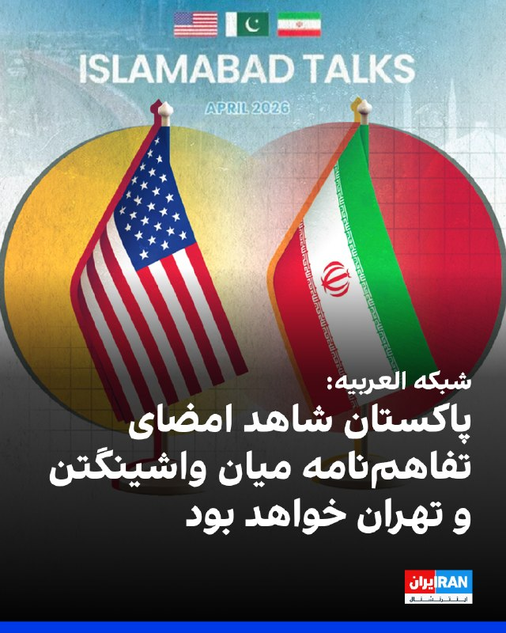

شبکه العربیه به نقل از منابع دیپلماتیک گزارش داد توافق میان واشینگتن و تهران در دو مرحله انجام خواهد شد و مرحله نخست شامل امضای یک یادداشت تفاهم است.
در این گزارش آمده است پاکستان شاهد مراسم امضای این تفاهم‌نامه خواهد بود.

پیش‌تر اکسیوس گزارش داد مذاکره‌کنندگان آمریکا و ایران بر سر یک یادداشت تفاهم ۶۰ روزه برای تمدید آتش‌بس و آغاز گفت‌وگوهای هسته‌ای به توافق رسیده‌اند، اما ترامپ هنوز تایید نهایی نداده است.
https://iranintl.com/202605284573

## IranIntlTV — post 339444

یک فرد نظامی با ارسال پیامی به ایران اینترنشنال می‌گوید که حکومت چند ماه است دیگر به آن‌ها گوشت و مرغ نمی‌دهند. پیام او با هوش مصنوعی خوانده شده است.

## IranIntlTV — post 339443

  <a href="https://t.me/IranintlTV/339443" target="_blank">📎 Download file</a>

🎧نسخه صوتی اخبار شبانگاهی | پنجشنبه ۷ خرداد
@iranintlTV

## IranIntlTV — post 339442

  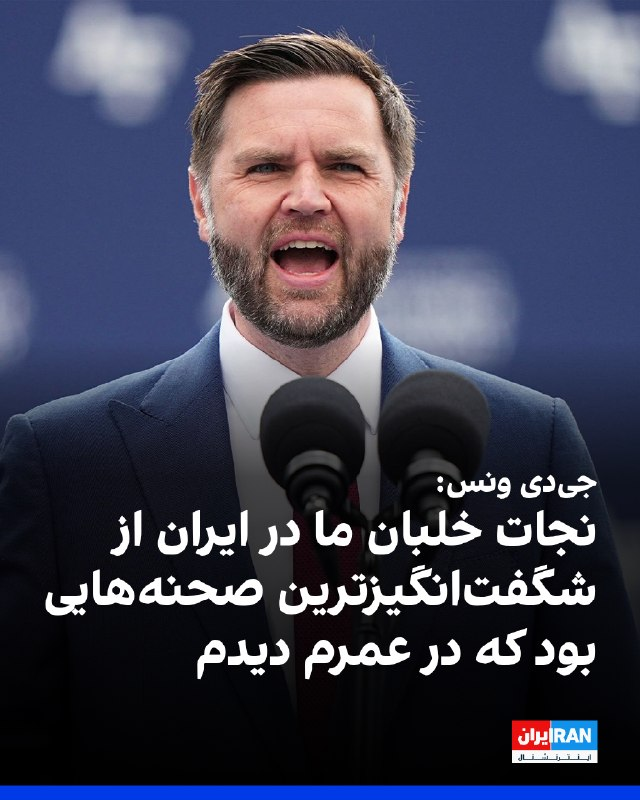

جی‌دی ونس، معاون رییس‌جمهور آمریکا، اعلام کرد نیروهای این کشور در دو عملیات «خشم حماسی» و «چکش نیمه‌شب» در شرایط واقعی جنگی عملکردی درخشان داشته‌اند و ماموریت‌هایی را انجام داده‌اند که بسیاری آن را غیرممکن می‌دانستند.

او گفت پس از سقوط دو خلبان در ایران، ابتدا محل دقیق آن‌ها مشخص نبود و حدود یک روز بعد تایید شد چراغ‌های اضطراری هر دو خدمه فعال است. مدتی نگرانی درباره زنده بودن یکی از آن‌ها وجود داشت، اما سپس مشخص شد او زنده است، هرچند پشت خطوط دشمن گرفتار مانده بود.

ونس افزود نیروی هوایی آمریکا با اعزام هواپیماها به مناطقی که تصور می‌شد امکان فرود در آن‌ها وجود ندارد و آماده‌سازی بالگردها در همان محل، یکی از خلبانان را از پشت خطوط دشمن بازگرداند و این عملیات را از جسورانه‌ترین صحنه‌های عمر خود توصیف کرد.
https://iranintl.com/202605282727

## IranIntlTV — post 339441

  

دنی دانون، سفیر اسرائیل در سازمان ملل متحد تصمیم این سازمان برای قرار دادن نام این کشور در فهرست سیاه مربوط به اتهام‌های خشونت جنسی در مناطق درگیر جنگ را محکوم کرد.

او در شبکه اجتماعی ایکس این اقدام را «یک رسوایی اخلاقی» خواند.

وزارت خارجه اسرائیل نیز در پیامی در شبکه ایکس اعلام کرد: «تصمیم شرم‌آور و مضحک سازمان ملل برای قرار دادن نهادهای اسرائیلی در ضمیمه گزارش مربوط به خشونت جنسی مرتبط با درگیری‌ها، بار دیگر ماهیت واقعی سازمان ملل را نشان می‌دهد؛ نهادی سیاسی‌زده و فاسد که اصول بنیان‌گذاری خود را کنار گذاشته و هدف اصلی آن حمله سیستماتیک به اسرائیل است.»
https://iranintl.com/202605288522

## IranIntlTV — post 339440

  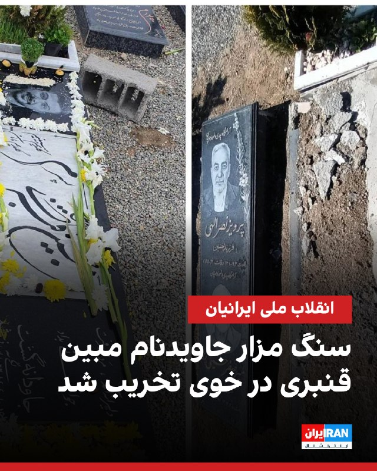

تصاویر و اطلاعات رسیده به ایران اینترنشنال نشان می‌دهد در ادامه اقدامات حکومت در مقابله با شهروندان معترض و خانواده‌های جاویدنامان،‌ سنگ مزار جاویدنام مبین قنبری در شهرستان خوی تخریب شده است.

مبین قنبری، فوتبالیست ۲۰ ساله اهل خوی و بازیکن تیم امیدهای پیکان، پنج‌شنبه ۱۸ دی ۱۴۰۴ در جریان انقلاب ملی ایرانیان در تهران به ضرب گلوله ماموران سرکوب جمهوری اسلامی کشته شد. خانواده‌ جاویدنام مبین قنبری، پیکرش را از کهریزک تحویل گرفتند.

جاویدنام مبین قنبری، دهمین فوتبالیستی است که در جریان انقلاب ملی ایرانیان، به دست ماموران سرکوب جمهوری اسلامی کشته می‌شود.
https://iranintl.com/202605286804

## IranIntlTV — post 339439

  <a href="telegram/content/IranIntlTV_339439_1779992446.mp4" target="_blank">🎬 Download video</a>

اسکات بسنت، وزیر خزانه‌داری آمریکا، اعلام کرد که وزارت خزانه‌داری این کشور نهاد مدیریت تنگه هرمز وابسته به سپاه پاسداران را تحریم کرده است. مقام‌های آمریکایی می‌گویند این اقدام در چارچوب تشدید فشارها بر شبکه‌های حمل‌ونقل و لجستیک حکومت ایران انجام شده است.
جزییات بیشتر با مریم رحمتی و مرضیه حسینی، خبرنگاران ایران‌اینترنشنال
@iranintltv

## IranIntlTV — post 339438

  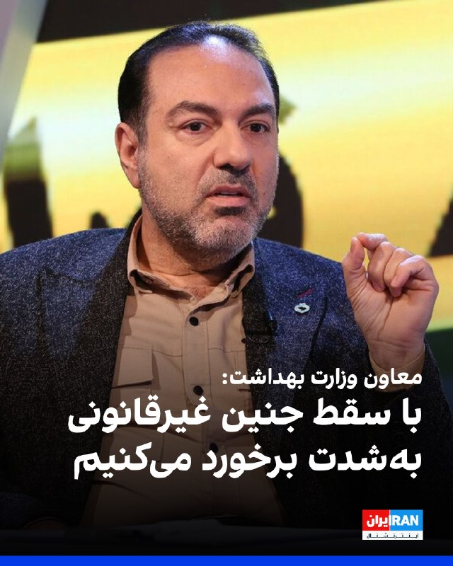

علیرضا رئیسی، معاون وزارت بهداشت، درباره «تشدید نظارت‌ها بر سقط‌های خارج از چارچوب قانون» گفت: بدون هیچ ملاحظه‌ای با هرگونه گزارش سقط غیرقانونی در مراکز درمانی و مطب‌ها برخورد می‌کنیم.

او افزود: «ابطال پروانه و معرفی به قوه قضاییه»، کمترین هزینه برای متخلفان در حوزه «سقط‌جنین غیرقانونی» است.
https://iranintl.com/202605282821

## IranIntlTV — post 339437

  <a href="telegram/content/IranIntlTV_339437_1779992448.mp4" target="_blank">🎬 Download video</a>

اکسیوس به نقل از مقام‌های آمریکایی گزارش داد که مذاکره‌کنندگان آمریکا و جمهوری اسلامی به یک یادداشت تفاهم ۶۰ روزه برای تمدید آتش‌بس و آغاز مذاکرات درباره برنامه هسته‌ای ایران رسیده‌اند، اما دونالد ترامپ، رییس‌جمهوری آمریکا، هنوز آن را به‌صورت نهایی تایید نکرده است.
گفت‌وگو با شایان سمیعی، کارشناس امنیت ملی
@iranintltv

## IranIntlTV — post 339436

یک شهروند در پیامی به ایران اینترنشنال به افزایش قیمت مواد غذایی اشاره کرده و می‌گوید از خرید بسته‌های چای نیز ناتوان شده است. پیام او با هوش مصنوعی خوانده شده است.

## Shin_Persian — post 6286

David Keyes ✓ @DavidMKeyes
Thu, 28 May 2026 15:08:26 UTC

BREAKING: Iran and US agree that they agree that they haven't agreed on the agreement. On that, they agree.

فارسی

فوری: ایران و ایالات متحده توافق دارند که موافقند بر سر این توافق به توافق نرسیده‌اند. در این مورد، آن‌ها با هم توافق دارند.

𝕏 · @shin_persian

## Shin_Persian — post 6285

📦 mhrv-rs v1.9.36 released

• Apps Script account quota tracking (#1396)
• iOS full-tunnel app scaffold (#1398)
• Prevent tunnel-node Full mode OOMs (#1401)

Files (Android APKs, Windows, macOS, Linux, OpenWRT) on the files channel:

👉 v1.9.36 — all files with SHA-256

Channel:
https://t.me/mhrv_rs
or: https://t.me/+R1OyoHX2boA1ZDgx

#v1936

## Shin_Persian — post 6283

  

Shin ✓ @hey_itsmyturn
Thu, 28 May 2026 15:10:37 UTC

I'm just sitting and watching and laughing at my timeline :))

فارسی

من فقط نشسته‌ام و تایم‌لاینم را تماشا می‌کنم و می‌خندم :))

𝕏 · @shin_persian

## ManotoTV — post 105853

  <a href="telegram/content/ManotoTV_105853_1779992450.mp4" target="_blank">🎬 Download video</a>

وقتی یک تصویر، حاشیه ساز می شود.

شاهزاده رضا پهلوی در واکنش به حاشیه‌های اخیر درباره تیشرت‌ها و نمادهای ساواک در تجمعات ایرانیان، تاکید کرد در میانه یک نبرد بزرگ برای آینده ایران، نباید اجازه داد حاشیه‌ها، اصل مبارزه را تحت‌الشعاع قرار دهند.

در هفته‌های اخیر، تصاویر پوشش برخی شهروندان در برخی تجمع‌ها، بیش از خودِ جمهوری اسلامی، به سوژه رسانه‌ها و جنگ روایت‌ها تبدیل شد.

شاهزاده رضا پهلوی در اشاره به این تصاویر تأکید کرد نماد امروز باید پرچم ملی ایران و شیر و خورشید باشد. نمادی برای وحدت، برای آینده،
و برای انقلابی ملی و فراگیر.

شاهزاده گفت هر رفتاری که تمرکز را از جمهوری اسلامی بردارد، حتی اگر از روی احساسات و حمایت باشد، می‌تواند به یک دام تبلیغاتی تبدیل شود.

از نگاه شاهزاده مسئله فقط یک تیشرت نیست. بحث بر سر انضباط سیاسی، مدیریت تصویر، و گم نکردن هدف اصلی یعنی نجات ایران است.

## FarsiVOA — post 218907

ویدیوی منتشرشده در شبکه‌های اجتماعی، مراسم جشن تولد مارکو روبیو، وزیر امور خارجه آمریکا، را در جمع همکارانش نشان می‌دهد.

@FarsiVOA

## FarsiVOA — post 218906

اختلال در استفاده از کارت سوخت شهروندان ایرانی

## FarsiVOA — post 218905

عفو بین‌الملل هشدار داد مقام‌های جمهوری اسلامی از پوشش شرایط جنگی برای تشدید سرکوب استفاده کرده‌اند. همزمان برخی خانواده کشته‌شدگان‌ دی هم از حذف نام آنها در سامانه «بهشت زهرا»ا خبر دادند.

## FarsiVOA — post 218904

🔺گزارش | اعترافات اجباری، ابهام‌ها، و ناگفته‌ها؛ نگاهی به اعدام عباس اکبری فیض‌آبادی

▪️عباس اکبری فیض‌آبادی، از معترضان بازداشت‌شده در شهرستان نائین در جریان اعتراضات دی ۱۴۰۴، روز ۴ خرداد ۱۴۰۵ اعدام شد.

⬇️ بیشتر بخوانید:

https://ir.voanews.com/a/forced-confession-protesters-abbas-akbari-feizabadi-execution/8154864.html/?nocach=1

## FarsiVOA — post 218902

در میدان پرسیدیم: هدف پادشاهی‌خواهان از برگزاری رژه ساواک در خیابان‌های جهان چیست؟

## FarsiVOA — post 218901

🔺اختصاصی | منابعی در دولت ایالات متحده خبر توافق اولیه آمریکا و رژیم ایران را تایید کردند

◾️منایعی در دولت ایالات متحده در پیامی به صدای آمریکا گزارش «اکسیوس» درباره توافق اولیه میان ایالات متحده و رژیم ایران برای تمدید آتش‌بس و آغاز مذاکرات هسته‌ای را تایید کردند.

⬇️ بیشتر بخوانید:

https://ir.voanews.com/a/axios-report-us-iran-reach-deal-but-need-president-trumps-final-approval/8154874.html

## FarsiVOA — post 218900

یکی از مخاطبان صدای آمریکا با ارسال ویدیویی می‌گوید برخی نانوایی‌ها در تهران همزمان با عید قربان قیمت نان ساده را افزایش داده‌اند. او در ادامه گفته این اقدام «بی‌انصافی» است.

@FarsiVOA

## FarsiVOA — post 218899

در میدان: از «زن، زندگی، آزادی» تا « مرگ بر سه فاسد» تجمعات اعتراضی خارج از کشور چه مسیری را طی کرده است

## FarsiVOA — post 218898

  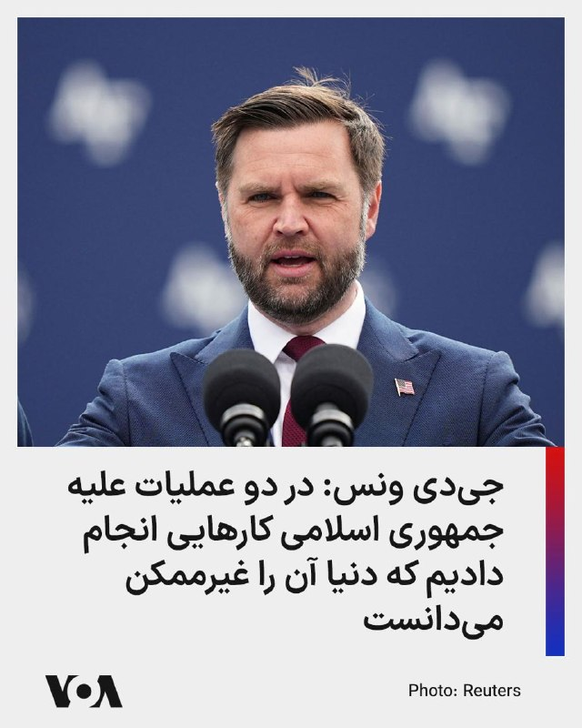

معاون رئیس جمهوری آمریکا روز پنجشنبه ۷ خرداد در جشن فارغ‌التحصیلی آکادمی نیروی هوایی آمریکا گفت که این نیرو در دو عملیات «خشم حماسی» و «چکش نیمه‌شب» علیه جمهوری اسلامی عملکردی درخشان داشته است.

جی‌دی ونس افزود: دشمنان زمانی «بیدار می‌شوند» و قدرت ایالات متحده را «درک می‌کنند» که نیروی هوایی آمریکا را بالای سر خود می‌بینند.

آقای ونس همچنین به عملیات موفقیت‌آمیز نجات خلبان آمریکایی اشاره کرد و گفت در عملیات‌های علیه جمهوری اسلامی کارهایی انجام شده که دنیا آن را غیرممکن می‌دانست.

## FarsiVOA — post 218897

🔺گسترش منطقه نبرد اسرائیل با حزب‌الله در جنوب لبنان در آستانه برگزاری مذاکرات «سطح نظامی» دو کشور در پنتاگون

▪️در آستانه دیدار هیات‌های نظامی اسرائیل و لبنان در پنتاگون که قرار است روز جمعه ۸ خرداد برگزار شود، ارتش اسرائیل ضمن اعلام خبر حمله به مناطقی در حومه جنوبی بیروت، گفت که دامنه نبرد خود علیه حزب‌الله را گسترش می‌دهد.

⬇️ بیشتر بخوانید:

https://ir.voanews.com/a/iran-us-lebanon-hezbollah-pentagon/8154853.html/?nocach=1

## FarsiVOA — post 218896

  <a href="telegram/content/FarsiVOA_218896_1779992452.mp4" target="_blank">🎬 Download video</a>

ارتش اسرائیل اعلام کرد نیروهای حزب‌الله که در نزدیکی سد «قرعون» در لبنان در تلاش برای یک عملیات نظامی بودند، هدف حملات هوایی قرار گرفته‌اند.

اسرائیل می‌گوید سد قرعون بزرگ‌ترین منبع آب لبنان و بخشی مهم از زیرساخت‌های انرژی و کشاورزی این کشور است.

@FarsiVOA

## FarsiVOA — post 218895

🔺وزارت خزانه‌داری آمریکا «نهاد مدیریت آبراه خلیج فارس» جمهوری اسلامی را تحریم کرد

▪️دولت آمریکا در راستای اعمال کارزار «خشم اقتصادی» علیه جمهوری اسلامی و در ادامه تلاش واشنگتن برای مقابله با «اخاذی دریایی» تهران، روز پنجشنبه ۷ خرداد «نهاد مدیریت آبراه خلیج فارس» جمهوری اسلامی را تحریم کرد.

⬇️ بیشتر بخوانید:

https://ir.voanews.com/a/economic-fury-targets-iranian-maritime-extortion-persian-gulf-strait-authority/8154848.html/?nocach=1

## FarsiVOA — post 218894

ادغام شاخە مسلح جریان مقتدی صدر با دولت و واکنش‌های بعد از آن در عراق

## FarsiVOA — post 218893

پاپ لئو در اقامتگاه خود در نزدیکی رم، از نخستین خودروی تمام ‌برقی شرکت فراری دیدن کرد.

این خودرو که ظاهرش با فراری‌های قبلی، تفاوت زیادی دارد، دوشنبه در رم رونمایی شد.

@FarsiVOA

## FarsiVOA — post 218892

در حالی که هنوز ویزای اعضای تیم ملی جمهوری اسلامی برای ورود به آمریکا قطعی نشده، مهدی تاج می‌گوید آمریکا «باید» ویزای مولتی بدهد تا بازیکنان بتوانند بین آمریکا و مکزیک رفت‌وآمد کنند. همزمان، محل کمپ تیم ملی به تیخوانا منتقل شده؛ شهری که در سال‌های اخیر بارها در فهرست خطرناک‌ترین شهرهای جهان قرار گرفته و نامش با کارتل‌های مواد مخدر و بالاترین نرخ‌های قتل گره خورده است.

## DW_Farsi — post 125253

  

🔶 "توافق اولیه تهران و واشنگتن برای تمدید ۶۰ روزه آتش‌بس"

چهار منبع آگاه به رویترز گفتند که ایالات متحده و ایران بر سر یک یادداشت تفاهم اولیه برای تمدید آتش‌بس به مدت ۶۰ روز به توافق رسیده‌اند، اما دونالد ترامپ، رئیس‌جمهور آمریکا، هنوز آن را تایید نکرده است.

مقامات جمهوری اسلامی نیز تاکنون هرگونه توافق اولیه با ایالات متحده را تائيد نکرده‌اند.

بر اساس گزارش پیشین وب‌سایت آکسیوس که برای نخستین‌بار این خبر را فاش کرد، در این توافق مشخص خواهد شد که چگونه به مسئله ذخایر اورانیوم با غنی‌سازی بالای ایران رسیدگی شود؛ موضوعی که در میان اولین مسائلی خواهد بود که در طول این بازه زمانی ۶۰ روزه مورد بحث و گفتگو قرار می‌گیرد.

کاخ سفید تا به این لحظه از اظهارنظر درباره این موضوع خودداری کرده است.

این توافق اولیه که میان دو طرف تنظیم شده، در شرایطی حاصل شده است که به نظر می‌رسید آتش‌بس شکننده میان آمریکا و ایران در حال تزلزل است.

ارتش آمریکا روز ۲۸ ماه مه ایران را به نقض آتش‌بس متهم کرد. این اقدام پس از آن صورت گرفت که کویت گزارش داد در پی حمله آمریکا به بندرعباس، از سوی ایران هدف حمله قرار گرفته است.

@dw_farsi

## DW_Farsi — post 125252

  

🔶 ادامه حملات اسرائيل به بیروت؛ منابع لبنانی از دست‌کم ۱۴ کشته خبر دادند

ارتش اسرائیل اعلام کرد روز پنجشنبه ۲۸ مه (هفتم خرداد) یک حمله هوایی در منطقه‌ای در بیروت انجام داده است. این دومین حمله از این نوع از زمان اعلام آتش‌بس در ماه آوریل ۲۰۲۶ است.

مقام‌های لبنانی اعلام کردند که در پی این حملات دست‌کم ۱۴ نفر از جمله سه کودک کشته‌ شده‌اند. ارتش اسرائیل اعلام کرد با دقت به اهدافی در بیروت حمله کرده است اما نامی از این اهداف نبرد.

تشدید تنش‌ها میان اسرائيل و شبه‌نظامیان حزب‌الله لبنان در حالی رخ می‌دهد که لبنان و اسرائیل خود را برای مذاکرات میان هیئت‌های نظامی در پنتاگون در روز جمعه و همچنین مذاکراتی با میانجی‌گری آمریکا در اوایل هفته آینده آماده می‌کنند. این دور چهارم مذاکرات از زمان آغاز مجدد جنگ میان اسرائیل و حزب‌الله در ۲ مارس است.

هر دو طرف برای توجیه حملات، یکدیگر را به نقض آتش‌بس متهم می‌کنند. حزب‌الله لبنان نیز روز پنجشنبه مسئولیت چندین حمله با راکت و پهپاد علیه نیروهای اسرائیلی در جنوب لبنان را بر عهده گرفت.

@dw_farsi

## DW_Farsi — post 125251

  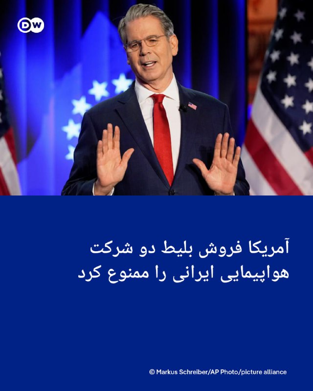

🔶 آمریکا فروش بلیط دو شرکت هواپیمایی ایرانی را ممنوع کرد

وزیر خزانه‌داری ایالات متحده روز پنجشنبه ۲۸ مه (هفتم خرداد) اعلام کرد که واشنگتن کارزار موسوم به "خشم اقتصادی "علیه ایران را ادامه داده و در این چارچوب، تحریم‌ها و اقدامات محدودکننده جدیدی علیه ساختارهای اقتصادی جمهوری اسلامی اعمال خواهد کرد.

به گفته اسکات بسنت، وزارت خزانه‌داری آمریکا در چارچوب این سیاست، نهاد موسوم به "نهاد مدیریت آبراه خلیج فارس" (PGSA) را تحریم کرده و هشدار داده است که هرگونه پرداخت عوارض برای عبور از تنگه هرمز و یا انتقال مالی مرتبط با آن از سوی شرکت‌ها یا دولت‌ها می‌تواند مشمول مجازات‌های ثانویه شود. وزیر خزانه‌داری آمریکا این نهاد را "بی‌اهمیت" خواند.

@dw_farsi

## DW_Farsi — post 125250

  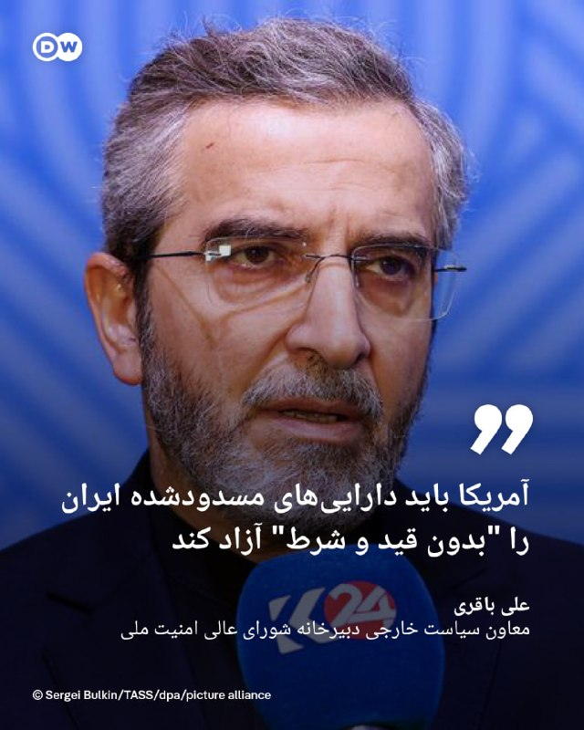

🔶 باقری: آمریکا باید دارایی‌های مسدودشده ایران را "بدون قید و شرط" آزاد کند

معاون سیاست خارجی و امنیت بین‌الملل دبیرخانه شورای عالی امنیت ملی خواستار آزادسازی تمامی دارایی‌های مسدودشده ایران، "بدون هیچ قید و شرطی" شد.

علی باقری که برای شرکت در نشست بین‌المللی امنیتی به مسکو سفر کرده، در پاسخ به پرسش رسانه‌ها درباره رقم‌های مطرح‌شده در این‌باره گفت که موضع تهران شامل بازگشت کامل "همه دارایی‌های بلوکه‌شده" می‌شود و محدود به "رقم مشخصی" نیست.

این اظهارات در شرایطی مطرح می‌شود که دونالد ترامپ، رئیس‌جمهور آمریکا روز چهارشنبه ۲۷ ماه مه (ششم خرداد) در نشست کابینه خطاب به خبرنگاران اعلام کرده بود که در توافق با ایران تحریم‌های ایران را لغو نکرده و دارایی‌های بلوکه شده ایران را نیز آزاد نمی‌کند.

ترامپ انجام این اقدامات را منوط به تغییر رفتار ایران کرد.

@dw_farsi

## DW_Farsi — post 125249

  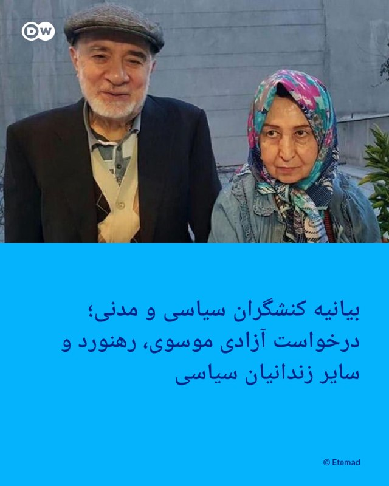

🔶 بیانیه کنشگران سیاسی و مدنی؛ درخواست آزادی موسوی، رهنورد و سایر زندانیان سیاسی

۲۲ تن از اساتید دانشگاه، پژوهشگران و کنشگران سیاسی و مدنی با انتشار بیانیه‌ای خواستار آزادی فوری میرحسین موسوی و زهرا رهنورد و همچنین تمامی زندانیان سیاسی و مدنی در ایران شدند.

در این نامه آمده است گزارش‌هایی "موثق" وجود دارد که محل اقامت موسوی و رهنورددر جریان جنگ اخیر و حمله به پاستور دچار آسیب شده و پس از آن، این دو چهره سیاسی به مکانی نامعلوم منتقل شده‌اند.

امضاکنندگان این موضوع را در کنار ادامه حصر خانگی بیش از ۱۵ ساله آنان، موجب افزایش نگرانی‌های عمومی دانسته‌اند.

در بخش دیگری از این بیانیه تاکید شده است که این دو چهره سیاسی که اکنون در سنین بالا قرار دارند، بیش از هر زمان دیگری نیازمند مراقبت‌های پزشکی، امنیت و دسترسی منظم به خدمات درمانی هستند.

با این حال، به گفته امضاکنندگان، خانواده و نزدیکان آنان همچنان از محل نگهداری دقیق‌شان بی‌اطلاع‌اند و تنها تماس‌های تلفنی محدود، امکان اطلاع از وضعیت جسمی و روحی آنان را فراهم می‌کند.

@dw_farsi

## DW_Farsi — post 125248

  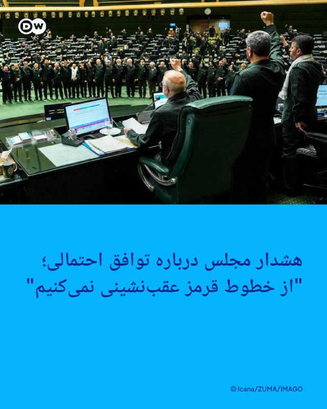

🔶 هشدار مجلس درباره توافق احتمالی؛ "از خطوط قرمز عقب‌نشینی نمی‌کنیم"

سیدمحمود نبویان، نایب‌رئیس کمیسیون امنیت ملی و سیاست خارجی مجلس، در نامه‌ای خطاب به محمدباقر قالیباف، رئیس مجلس شورای اسلامی و محمد ذوالقدر، دبیر مجمع تشخیص مصلحت نظام درباره توافق احتمالی میان ایران و آمریکا هشدار داد.

او خواستار پایبندی به "خطوط قرمز نظام" شد.

در این نامه که وب‌سایت "رویداد ۲۴" آن را منتشر کرده، بر محدود ماندن مذاکرات به پرونده هسته‌ای تأکید و نسبت به گسترش گفت‌وگوها به موضوعات منطقه‌ای و موشکی هشدار داده شده است.

نبویان در این نامه نوشته است جمهوری اسلامی نباید درباره "توان موشکی، مسائل منطقه‌ای و گروه‌های مقاومت" وارد مذاکره شود و هرگونه توافق باید صرفا به موضوعات هسته‌ای محدود بماند.

او همچنین نسبت به تضمین‌های آمریکا برای رفع تحریم‌ها ابراز تردید کرده و نوشته است که بخش عمده‌ای از تحریم‌ها با مصوبه کنگره آمریکا وضع شده‌اند و صرف وعده رؤسای‌ جمهور آمریکا برای لغو آنها کافی نیست.

@dw_farsi

## DW_Farsi — post 125247

🔶 پس از قطع طولانی اینترنت، هنوز فضای مجازی در ایران آزاد نیست

🔻 گزارشی از شبنم فون‌هاین

داده‌های زنده سازمان نت‌بلاکس و همچنین شرکت فناوری کلودفلر نشان می‌دهد ترافیک اینترنت در ایران نسبت به هفته‌های گذشته به‌طور محسوسی افزایش یافته است.

امیر رشیدی، کارشناس امنیت سایبری، در گفت‌وگو با دویچه‌وله می‌گوید: «ترافیک اینترنت هنوز هم کمتر از قبل از ژانویه است. آن زمان حدود ۵۰ درصد بود.»

رشیدی مدیر "گروه میان" است؛ نهادی که در زمینه حقوق بشر، آزادی دیجیتال و عدالت اجتماعی در ایران و منطقه خاورمیانه و شمال آفریقا فعالیت می‌کند.

او تأکید می‌کند که اینترنت در ایران از زمان اعتراضات سراسری ژانویه به‌شدت مختل شده است. در جریان اعتراضات، اینترنت به‌طور گسترده کاهش سرعت پیدا کرد تا ارتباط مردم با یکدیگر و همچنین با خارج از کشور قطع شود.

پس از حملات آمریکا و اسرائیل به ایران در ۲۸ فوریه، طولانی‌ترین قطع سراسری اینترنت در تاریخ معاصر ایران رخ داد. مقام‌های جمهوری اسلامی دلیل این اقدام را مسائل امنیتی عنوان کردند، اما منتقدان می‌گویند حکومت سال‌هاست از این روش برای کنترل جریان اطلاعات و ارتباطات استفاده می‌کند.

رشیدی می‌گوید: «به نظر می‌رسد هدف فعلی این است که اینترنت در ظاهر فعال باشد، اما ترافیک داده‌ها به‌طور هدفمند دستکاری شود.»

او اضافه می‌کند: «قرار است اتصال وجود داشته باشد، اما استفاده عادی و آزاد از اینترنت دشوار شود تا داده‌ها به‌سختی از کشور خارج شوند و اطلاعات مربوط به جنگ و اعتراضات آزادانه منتشر نشود.»

به گفته مقام‌های ایرانی، مسعود پزشکیان ، رئیس‌جمهوری ایران، روز دوشنبه دستور بازگشایی اینترنت بین‌المللی را صادر کرد. پیش از آن، یک ستاد بحران به ریاست محمدرضا عارف، معاون اول او، تشکیل شد تا به "چندصدایی" و موازی‌کاری در سیاست‌گذاری اینترنت پایان دهد.

در ایران، نهادهای مختلفی از جمله شورای عالی امنیت ملی و شورای عالی فضای مجازی در تصمیم‌گیری‌های مربوط به کنترل دیجیتال نقش دارند.

برای مثال، شورای عالی امنیت ملی در زمان قطع اینترنت، طرحی را تصویب کرد که بر اساس آن برخی گروه‌ها می‌توانستند در ازای پرداخت هزینه، به "اینترنت پرو" دسترسی پیدا کنند. این دسترسی ویژه برای اعضای اتاق بازرگانی، استارتاپ‌ها، شرکت‌های فناوری و برخی تجار در نظر گرفته شده بود.

امیر رشیدی می‌گوید: «به نظر می‌رسد سیاست اینترنت طبقاتی همچنان ادامه دارد.» او می‌افزاید: «می‌دانیم برخی گروه‌ها هنوز هم پیام‌های تبلیغاتی و اطلاع‌رسانی برای خرید این بسته‌ها دریافت می‌کنند.»

قطع اینترنت علاوه بر پیامدهای اجتماعی، خسارات اقتصادی گسترده‌ای هم به‌دنبال داشت؛ به‌ویژه برای کسب‌وکارهای کوچک، از جمله بسیاری از کسب‌وکارهای آنلاین زنان که عملاً نابود شدند.

سولماز ایکدر، پژوهشگر پروژه "فیلتر‌بان"، هفته گذشته به دویچه‌وله گفت: «زنان زیادی در شهرها و روستاهای کوچک از طریق اینترنت محصولاتی مثل میوه خشک، لباس دست‌دوز یا مواد غذایی می‌فروختند.»

او افزود: «این درآمد برای بسیاری از خانواده‌ها حیاتی بود، اما حالا این امکان از آن‌ها گرفته شده است.»

میلیون‌ها نفر همچنان از اقتصاد دیجیتال و ارتباطات محروم هستند. منابع مختلف به دویچه‌وله گفته‌اند که اپلیکیشن‌هایی مانند واتس‌اپ، که نقش مهمی در ارتباطات داخلی و خارجی دارند، هنوز هم کار نمی‌کنند؛ «حتی با استفاده از وی‌پی‌ان».

وی‌پی‌ان نرم‌افزاری است که ارتباطی رمزگذاری‌شده میان دستگاه کاربر و سروری در خارج از کشور ایجاد می‌کند و امکان دسترسی به اینترنت آزاد را فراهم می‌کند.

در حال حاضر، تنها راه باقی‌مانده برای ارتباط، تا حدی خطوط تلفن ثابت است. پیش از برقراری تماس، یک پیام خودکار پخش می‌شود که کدی را اعلام می‌کند و تنها پس از وارد کردن آن کد، تماس برقرار می‌شود. گمان می‌رود تماس‌ها در این روند شنود شوند.

اینترنت در ایران حتی در زمان صلح نیز تحت سانسور شدید قرار دارد. بسیاری از وب‌سایت‌ها و اپلیکیشن‌ها مسدود هستند و استفاده از شبکه‌های اجتماعی مانند اینستاگرام، تیک‌تاک و یوتیوب برای بخش بزرگی از کاربران بدون وی‌پی‌ان‌های محلی و گران‌قیمت ممکن نیست.

@dw_farsi

## DW_Farsi — post 125246

  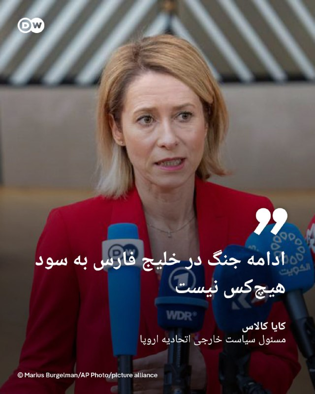

🔶 کایا کالاس: ادامه جنگ در خلیج فارس به سود هیچ‌کس نیست

کایا کالاس، مسئول سیاست خارجی اتحادیه اروپا، نسبت به وضعیت "بسیار خطرناک" میان جنگ و صلح در منطقه خلیج فارس هشدار داد.

او روز پنجشنبه ۲۸ مه (هفتم خرداد) پیش از نشست وزیران خارجه اتحادیه اروپا در شهر لیماسول قبرس گفت: «به سود هیچ‌کس نیست که این جنگ ادامه پیدا کند.»

کالاس همچنین بر اهمیت حفظ آزادی کشتیرانی در تنگه هرمز تاکید کرد و گفت: «واقعا به نفع همه است که آزادی کشتیرانی در تنگه هرمز محترم شمرده شود وگرنه همه بهای بسیار سنگینی می‌پردازند.»

مسئول سیاست خارجی اتحادیه اروپا افزود در صورت دستیابی به توافق، مسئله برنامه هسته‌ای ایران باید در مرحله بعدی مورد مذاکره قرار گیرد.

او گفت اروپا می‌تواند با استفاده از متخصصان خود در این زمینه نقش‌آفرینی کند.

@dw_farsi

## Persian_Trend_Official — post 15200

## Persian_Trend_Official — post 15199

  <a href="telegram/content/Persian_Trend_Official_15199_1779992457.webm" target="_blank">🎬 Download video</a>

بچه های تراست vpn با توجه به اینترنت این روزها که نت بین‌الملل وصله یه سرور اضافه کردن که قیمتش کاملا اقتصادیه و چندین سرور هم داره و رو حجم بالا گیگی ۱۹ هزار تومن واستون می‌افته

بهشون پیام بدین و استعلام حجم‌ها و قیمت‌هارو بگیرین 👇

@trusstvpnn_admin

## Persian_Trend_Official — post 15198

اکسیوس: ایالات متحده و ایران به پیش‌نویس تفاهم‌نامه 60 روزه ای برای تمدید آتش‌بس و آغاز مذاکرات در مورد برنامه هسته‌ای ایران دست یافته‌اند ولی ترامپ هنوز تأیید نهایی را نداده است. به گفته اکسیوس بیشتر مفاد تا سه‌شنبه این هفته نهایی شده بود و مذاکره‌کنندگان…

## Persian_Trend_Official — post 15193

حضور پدافند موشکی برد کوتاه مجید ایرانی در رژه ارتش ارمنستان چند روز پیش در پی جابه‌جایی ادوات نظامی توسط ارتش ارمنستان در سطح شهر ایروان برای برگزاری رژه روز جمهوری ارمنستان، تصاویری از سیستم پدافندی برد کوتاه مجید با نام صادراتی AD-08 در خیابان های این…

## Persian_Trend_Official — post 15192

  

ایال ضمیر، رئیس ستاد کل ارتش اسرائیل: ارتش اسرائیل آماده است در صورت لزوم به نبرد شدید علیه رژیم تروریستی ایران بازگردد.

ایال ضمیر همچنین افزود: حزب‌الله شکست خورده و در حال جنگ برای بقا و ادامه حیات خود است. حتی در همین لحظه رزمندگان ما در تمام جبهه‌ها آن را در هم می‌کوبند.

📝 Amir

📌 @persian_trend_official
پرشین ترند | متفاوت‌ترین کانال نظامی

## Persian_Trend_Official — post 15191

  <a href="telegram/content/Persian_Trend_Official_15191_1779992458.webm" target="_blank">🎬 Download video</a>

اکسیوس: ایالات متحده و ایران به پیش‌نویس تفاهم‌نامه 60 روزه ای برای تمدید آتش‌بس و آغاز مذاکرات در مورد برنامه هسته‌ای ایران دست یافته‌اند ولی ترامپ هنوز تأیید نهایی را نداده است. به گفته اکسیوس بیشتر مفاد تا سه‌شنبه این هفته نهایی شده بود و مذاکره‌کنندگان…

## Persian_Trend_Official — post 15190

  

اکسیوس: ایالات متحده و ایران به پیش‌نویس تفاهم‌نامه 60 روزه ای برای تمدید آتش‌بس و آغاز مذاکرات در مورد برنامه هسته‌ای ایران دست یافته‌اند ولی ترامپ هنوز تأیید نهایی را نداده است.

به گفته اکسیوس بیشتر مفاد تا سه‌شنبه این هفته نهایی شده بود و مذاکره‌کنندگان ایرانی اعلام کردند که تأییدیه‌های لازم برای امضا را کسب کرده‌اند. همچنین ترامپ در جریان این توافق‌نامه قرار گرفته است، اما به میانجی‌ها گفته است که برای بررسی آن چند روز زمان می‌خواهد.

این تفاهم‌نامه پیشنهادی کشتیرانی بدون محدودیت از طریق تنگه هرمز و عدم پرداخت عوارض یا مزاحمت را تضمین می‌کند و ایران را ملزم می‌کند که تمام مین‌های دریایی را ظرف 30 روز از تنگه هرمز خارج کند. در عوض، محاصره دریایی ایالات متحده به تدریج با از سرگیری کشتیرانی تجاری برداشته می‌شود.

طبق پیش‌نویس توافق، ایالات متحده همچنین موافقت می‌کند که در مورد کاهش تحریم‌ها، آزادسازی دارایی‌های مسدود شده ایران بحث کند.

📝 Amir

📌 @persian_trend_official
پرشین ترند | متفاوت‌ترین کانال نظامی

## Persian_Trend_Official — post 15189

  <a href="telegram/content/Persian_Trend_Official_15189_1779992459.webm" target="_blank">🎬 Download video</a>

وزیر خزانه‌ داری امریکا در حساب توییتری خود نوشت: دولت ایالات متحده هیچ تلاشی برای اعمال سیستم اخذ عوارض در تنگه هرمز را تحمل نخواهد کرد.

به ویژه عمان باید بداند که وزارت خزانه‌داری ایالات متحده به شدت هر بازیگری را که مستقیم یا غیرمستقیم در تسهیل عوارض عبور از تنگه هرمز دخیل باشد، هدف قرار خواهد داد و هر شریکی را مجازات خواهد شد.

همه کشورها باید هرگونه تلاش ایران برای ایجاد اختلال در جریان آزاد تجارت را قاطعانه رد کنند. روزهای ارعاب تهران در منطقه و جهان به پایان رسیده است.

📝 Amir

📌 @persian_trend_official
پرشین ترند | متفاوت‌ترین کانال نظامی

## RadioFarda — post 157670

  <a href="https://t.me/radiofarda/157670" target="_blank">📎 Download file</a>

آیا ایران سامانه پدافندی «مجید» را به ارمنستان صادر کرده است؟

🔸در رژه نظامی روز ۲۵ مه در ایروان پایتخت ارمنستان، یکی از تجهیزات به نمایش درآمده، کنجکاوی‌ها را برانگیخت. یک سامانه پدافندی، مشابه سامانه ارتفاع پست «مجید» در ایران که ارمنستان آن را سامانه «عقرب» معرفی کرده است. این تصویر بار دیگر سوال‌هایی را درباره همکاری‌های دفاعی تهران و ایروان را به میان کشید و این سوال مطرح شد که آیا در راستای این همکاری‌ها ایران سامانه پدافندی مجید خود را به ارمنستان صادر کرده است؟ سیروس عامریان، تحلیلگر نظامی ساکن ولینگتون در نیوزیلند، ارزیابی خود را از این تصاویر و مقایسه با سامانه مجید بیان کرده است.

@RadioFarda

## RadioFarda — post 157669

🔸گزارش‌های رسانه‌ای حاکی از آن است که ایالات متحده و ایران به یک توافق اولیه برای تمدید آتش‌بس دست یافته‌اند اما دونالد ترامپ، رئیس‌جمهور آمریکا، هنوز آن را تأیید نهایی نکرده است. 🔸این خبر را ابتدا وب‌سایت اکسیوس در روز پنجشنبه به نقل از مقام‌های آمریکایی…

## RadioFarda — post 157668

  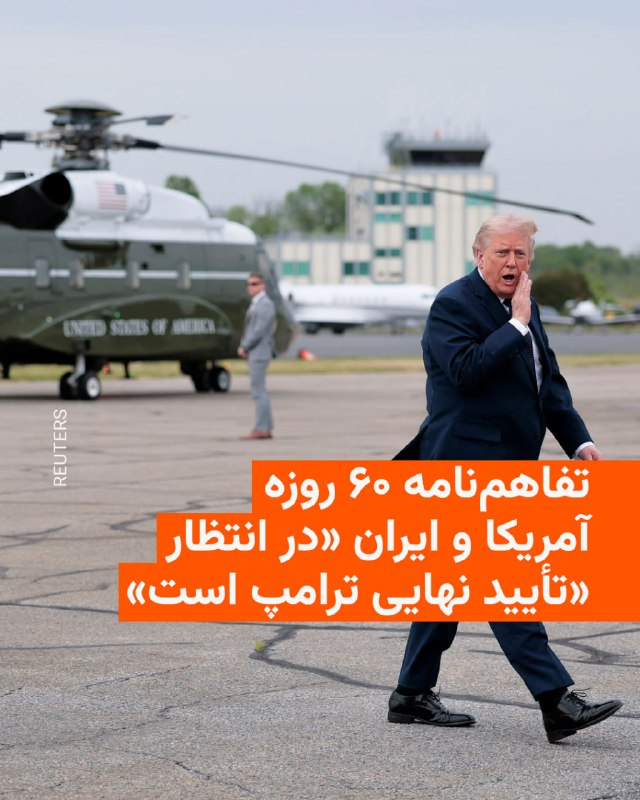

🔸گزارش‌های رسانه‌ای حاکی از آن است که ایالات متحده و ایران به یک توافق اولیه برای تمدید آتش‌بس دست یافته‌اند اما دونالد ترامپ، رئیس‌جمهور آمریکا، هنوز آن را تأیید نهایی نکرده است.

🔸این خبر را ابتدا وب‌سایت اکسیوس در روز پنجشنبه به نقل از مقام‌های آمریکایی اعلام کرد و ساعتی بعد، خبرگزاری‌های رویترز و فرانس‌پرس هم آن را به نقل از منابع خود تأیید کردند. رئیس‌جمهور آمریکا و مقام‌های ایرانی هنوز درباره این گزارش‌ها اظهارنظر نکرده‌اند.

🔸بر اساس گزارش آکسیوس، دو طرف بر سر یک تفاهم‌نامه ۶۰ روزه توافق کرده‌اند تا آتش‌بس تمدید شود و مذاکرات درباره برنامه هسته‌ای ایران آغاز گردد؛ اما این طرح همچنان نیاز به امضای نهایی ترامپ دارد.

🔸یک مقام آمریکایی به اکسیوس گفت که رئیس‌جمهور آمریکا به میانجی‌ها اطلاع داده که «می‌خواهد چند روز برای فکر کردن درباره آن زمان داشته باشد.»

@RadioFarda

## RadioFarda — post 157667

  <a href="https://t.me/radiofarda/157667" target="_blank">📎 Download file</a>

📻بشنوید: ایستگاه ۱۹ با رادیوفردا، هفتم خرداد ۱۴۰۵

@RadioFarda

## RadioFarda — post 157666

  <a href="https://t.me/radiofarda/157666" target="_blank">📎 Download file</a>

آتش‌بس «نیم‌بند» تا چه زمانی پابرجا خواهد بود؟ گفت‌وگو با سعید جعفری

🔸«شکننده» شاید بهترین توصیف برای وضعیت کنونی «نه جنگ نه صلح» میان ایران و آمریکاست. از یک سو صحبت از پیشرفت در مذاکرات است و از سوی دیگر درگیری نظامی شبانه در خلیج فارس. از سویی صحبت از تهیه یک پیش‌نویس درباره تفاهم‌ موقت است و از طرف دیگر ادامه کارزار فشار حداکثری آمریکا بر ایران در همه عرصه‌ها. درباره این وضعیت ارزیابی سعید جعفری روزنامه نگار حوزه بین‌الملل و تحلیلگر ساکن ایتالیا را بشنوید .

@RadioFarda

## RadioFarda — post 157665

  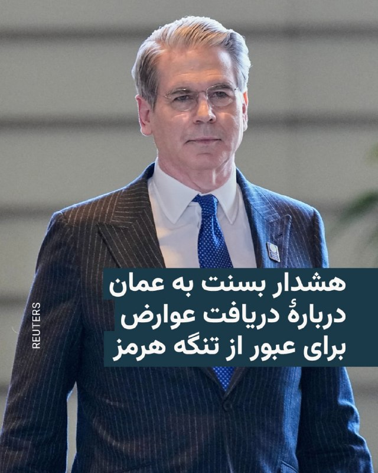

🔸اسکات بسنت، وزیر خزانه‌داری آمریکا، روز پنج‌شنبه در پیامی در شبکه ایکس هشدار داد که عمان باید بداند دولت آمریکا به‌طور «تهاجمی» هر طرفی را که در تسهیل دریافت عوارض برای عبور از تنگه هرمز نقش داشته باشد، هدف قرار خواهد داد.

🔸او افزود که هر شریک یا طرفی که در تلاش برای اعمال سیستم اخذ عوارض در تنگه هرمز مشارکت کند، با مجازات و تحریم روبه‌رو خواهد شد.

🔸این تهدید یک روز بعد از آن صورت گرفته که دونالد ترامپ، رئیس‌جمهور آمریکا، با تأکید بر لزوم باز شدن فوری تنگه هرمز بعد از توافق با ایران، عمان را تهدید کرد که نباید قصد کنترل این آبراه را داشته باشد.

🔸او در نشست کابینه خود گفت که تنگه هرمز یک آبراه بین‌المللی است و «عمان هم مثل بقیه رفتار خواهد کرد، وگرنه مجبور می‌شویم آن‌ها را نابود کنیم.»

@RadioFarda

## RadioFarda — post 157664

هشدار تازۀ سازمان ملل متحد، دربارۀ تسریع روند گرمایش زمین طی پنج سال آینده

🔸با تسریع روند گرمایش زمین و ذوب‌شدن سریع‌تر از انتظار یخچال‌های قطبی، کارشناسان پیش‌بینی می‌کنند متوسط دمای زمین طی پنج سال آینده به بالاترین دماهای ثبت‌شده نزدیک شود. این موضوع را سازمان هواشناسی بریتانیا روز پنجشنبه هفتم خردادماه به نقل از گزارش تازۀ آژانس هواشناسی سازمان ملل متحد اعلام کرد.

🔸گزارش سالانۀ سازمان ملل متحد، که وضعیت بارندگی و تغییرات دمای مناطق مختلف را پیش‌بینی می‌کند، می‌گوید متوسط سالانۀ دمای نزدیک سطح زمین، چیزی بین یک و سه‌دهم تا یک و ۹ دهم درجۀ سانتیگراد بالاتر از این دما در دورۀ سال‌های ۱۸۵۰ تا ۱۹۰۰، یعنی دورۀ پیشا صنعتی خواهد بود.

🔸ملیسا سی‌بروک، پژوهشگر در دفتر هواشناسی بریتانیا به رویترز گفت: «نشانه‌های خیلی آشکاری از ادامۀ گرمایش زمین وجود دارد و مشخص است که افزایش دمای متوسط زمین همچنان ادامه دارد».
در توافق اقلیمی پاریس که یازده سال پیش امضا شد، دولت‌ها متعهد شدند که برای ممانعت از افزایش دمای متوسط جهانی به دمایی بیش از یک‌ونیم درجۀ سانتیگراد بالاتر از دوران پیشا صنعتی تلاش کنند.

🔸گزارش سالانۀ سازمان ملل متحد می‌گوید احتمال عبور موقت متوسط دمای نزدیک سطح زمین به دمایی بیش از ۱.۵ درجه بالاتر از دورۀ پیشاصنعتی زیاد است. بر این اساس، این تحول دست‌کم یک سال به‌طول می‌انجامد و از حالا تا چهار سال دیگر بروز خواهد کرد.

🔸این گزارش همزمان پیش‌بینی کرده در همین فاصلۀ چهارساله، دمای زمین دست‌کم برای یک سال از دمای متوسط سال ۲۰۲۴ به‌عنوان گرمترین سال ثبت‌شده عبور خواهد کرد.

🔸گزارش کامل را در وب‌سایت رادیوفردا بخوانید.

@RadioFarda

## RadioFarda — post 157663

  <a href="https://t.me/radiofarda/157663" target="_blank">📎 Download file</a>

🔸 در این کافه فردا در مورد پیش‌بینی‌های اشتباه تمام نشدنی کارشناسان صدا و سیما، صحبت‌های عجیب پسر یکی از فرماندهان سپاه در مورد کشته شدن پدرش، فیلم همنت، پیشینه قرارداد دارسی و تاریخچه همبرگر(به مناسبت روز جهانی همبرگر) می‌پردازیم.

🔸 برای تماس با ما می‌توانید به شناسه کافه فردا در تلگرام صوت و متن بفرستید.

📻 کافه فردا

## RadioFarda — post 157662

  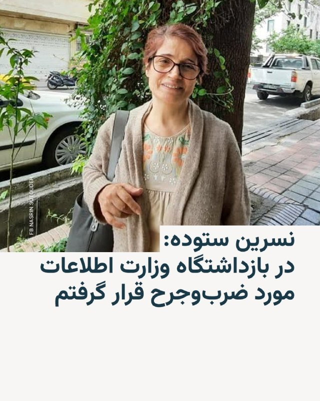

🔸نسرین ستوده، وکیل و فعال حقوق بشر، در صفحه فیس‌بوک خود اعلام کرد که ۱۲ فروردین توسط مأموران وزارت اطلاعات بازداشت و در بازداشتگاه این نهاد مورد ضرب‌وجرح قرار گرفته است.

🔸او نوشت مأموران هنگام ورود به بازداشتگاه دست و پایش را بسته و «به خاطر حجاب اجباری» او را کتک زده‌اند؛ به‌طوری که آثار کبودی روی پا و زخم روی صورتش باقی مانده است.

🔸ستوده همچنین شرایط بازداشتگاه را «غیرانسانی» توصیف کرد و گفت در آن‌جا «بازار گرفتن اعتراف اجباری داغ بود» و آزادی برخی بازداشت‌شدگان به ضبط ویدئوی اعتراف اجباری مشروط می‌شد.

🔸او افزود که ۲۳ اردیبهشت با تشکیل پرونده‌ای جدید به‌طور موقت آزاد شده است.

🔸نسرین ستوده در پایان پیام خود با اشاره به حمایت‌های داخلی و بین‌المللی از زندانیان سیاسی در ایران نوشت: «نه به جنگ، نه به استبداد».

@RadioFarda

## RadioFarda — post 157661

  <a href="https://t.me/radiofarda/157661" target="_blank">📎 Download file</a>

ملاقات با لیلی‌ فرهادپور؛ فمینیستی که بازیگر شد

🔸لیلی‌ فرهادپور، روزنامه‌نگار و بازیگر ایرانی، را در سال‌های اخیر بیش از همه با شخصیت «مهین» می‌شناسیم، زنی میان‌سال که در فیلم «کیک محبوب من» بدون سانسور رایج جمهوری اسلامی از خودش، زنانگی و نیازهایش می‌گفت. رویا کریمی مجد در ملاقاتی که با خانم فرهادپور داشته، پای صحبت‌های او نشسته است.

@RadioFarda

## IranianMinds — post 20965

🔴پزشکیان:
ما به دنبال سلاح هسته‌ای نیستیم، ناآرامی منطقه فقط به خاطر اسرائیل است.

@IranianMinds

## IranianMinds — post 20964

🔴 فوری آکسیوس: توافق ایران و آمریکا در انتظار تایید نهایی ترامپ باراک راوید، خبرنگار سرشناس آکسیوس نوشت: دو مقام آمریکایی و یک منبع منطقه‌ای درگیر در تلاش‌های میانجی‌گرانه به من گفتند که آمریکا و ایران به توافق رسیده‌اند، اما این توافق نیازمند تایید نهایی…

## IranianMinds — post 20963

  <a href="telegram/content/IranianMinds_20963_1779992463.mp4" target="_blank">🎬 Download video</a>

حرف رهخر به درک واصل شده هم گوز شده است.

@IranianMinds

## IranianMinds — post 20962

  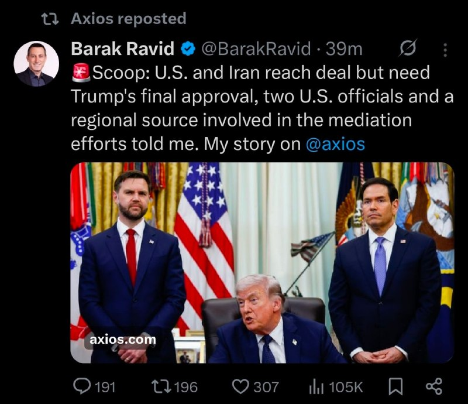

🔴 فوری آکسیوس: توافق ایران و آمریکا در انتظار تایید نهایی ترامپ

باراک راوید، خبرنگار سرشناس آکسیوس نوشت:

دو مقام آمریکایی و یک منبع منطقه‌ای درگیر در تلاش‌های میانجی‌گرانه به من گفتند که آمریکا و ایران به توافق رسیده‌اند، اما این توافق نیازمند تایید نهایی ترامپ است.

@IranianMinds

## IranianMinds — post 20961

امروز هنوز بندرعباس انفجاری رخ نداده , دارم نگران میشم

@IranianMinds

## IranianMinds — post 20959

🔴 پست های جدید اکانت اسرائیل به فارسی :

@IranianMinds

## IranianMinds — post 20958

  <a href="telegram/content/IranianMinds_20958_1779992465.mp4" target="_blank">🎬 Download video</a>

🔴 نتانیاهو:

«ما از این نبرد به عنوان قدرتمندترین نیرو در خاورمیانه خارج میشویم.»
«ما هرگز تا این حد قدرتمند نبوده‌ایم.»

@IranianMinds

## IranianMinds — post 20957

  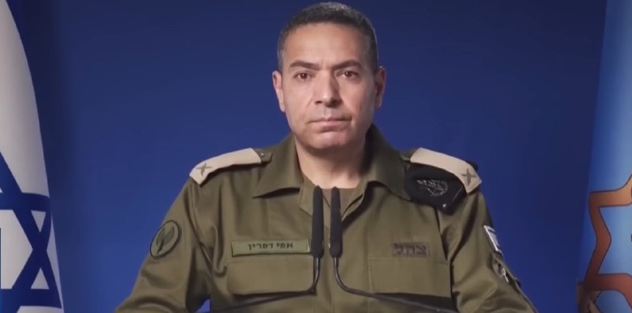

🔴 سخنگوی ارتش اسرائیل:

ما در هیچ جبهه‌ ای عقب‌نشینی نخواهیم کرد و در صورت لزوم آماده‌ایم به جنگ با ایران هم برگردیم !

@IranianMinds

## IranianMinds — post 20956

## IranianMinds — post 20955

## IranianMinds — post 20954

🔴بنیامین نتانیاهو:

با هدف از بین بردن کامل تهدید ایران هر روز با ترامپ در تماس هستم و باید مأموریت علیه ایران را به پایان رساند.

@IranianMinds

## BBCPersian — post 282281

🔻امام‌علی رحمان، رئیس‌جمهور تاجیکستان امروز، پنج‌شنبه، ۲۸ مه‌/۷ خرداد در پایان جلسه هیئت دولت به وزیر معارف و علم این کشور دستور داد که کیفیت آموزش الفبای «نیاگان» (نیاکان) در مؤسسات آموزشی بهتر شود. در تاجیکستان برای خط فارسی از اصطلاح «الفبای نیاگان» هم…

## BBCPersian — post 282280

  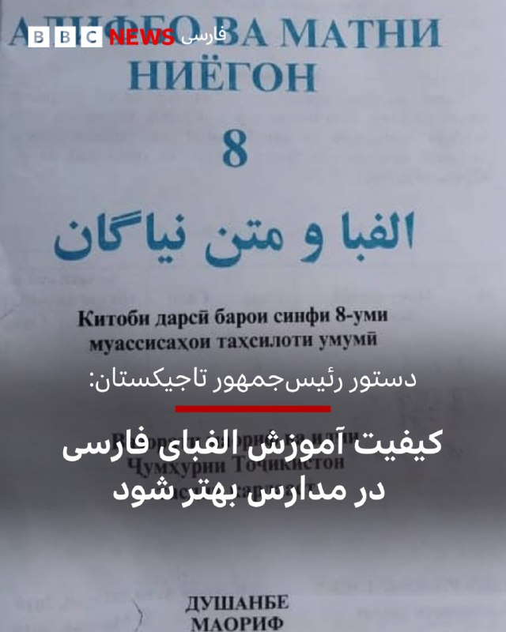

🔻امام‌علی رحمان، رئیس‌جمهور تاجیکستان امروز، پنج‌شنبه، ۲۸ مه‌/۷ خرداد در پایان جلسه هیئت دولت به وزیر معارف و علم این کشور دستور داد که کیفیت آموزش الفبای «نیاگان» (نیاکان) در مؤسسات آموزشی بهتر شود.

در تاجیکستان برای خط فارسی از اصطلاح «الفبای نیاگان» هم استفاده می‌کنند.
امام‌علی رحمان پیش‌تر هم در پیام سالانه‌اش به پارلمان تاجیکستان در دسامبر سال ۲۰۲۵ پیشنهاد کرده بود که در این کشور «کانون تمدن آریایی» تشکیل شود. بسیاری این اقدام او را نمادین می‌دانند.

تا صد سال پیش خط رایج در قلمرو امارت بخارا که تاجیکستان امروزی در آن واقع است، فارسی بود. پس از تشکیل جمهوری شوروی سوسیالیستی تاجیکستان در سال ۱۹۲۹، الفبای لاتین جایگزین خط فارسی شد. در سال ۱۹۴۰ هم نظام کمونیستی، سیریلیک را خط رسمی در تاجیکستان اعلام کرد که اصل آن همان سیریلیک رایج در روسیه است.

دو سال پیش از فروپاشی اتحاد شوروی در ۲۲ ژوئن سال ۱۹۸۹، قانون زبان دولتی در تاجیکستان با تلاش اهل ادب و فرهنگ و روشنفکران تاجیک به تصویب رسید که در آن نام رسمی زبان دولتی در این کشور «تاجیکی (فارسی)» بود.
@BBCPersian

## BBCPersian — post 282279

  <a href="https://t.me/bbcpersian/282279" target="_blank">📎 Download file</a>

🔻پادکست برنامه جام جهان‌نما پنجشنبه ۷ خرداد ۱۴۰۵

این نسخه رادیویی برنامه شصت دقیقه تلویزیون فارسی بی‌بی‌سی است که هرشب بعد از پخش، با حجم کم از اپلیکیشن‌های پادگیر و صفحه تلگرام بی‌بی‌سی فارسی در دسترس است.

با هشتگ BBCPersianRadio# با ما در ارتباط باشید

@BBCPersian

## BBCPersian — post 282278

‌ شاهزاده رضا پهلوی، چند هفته پس از برگزاری واکنش‌برانگیز تجمع‌هایی با تی‌شرت‌ها و پرچم‌هایی با نشان ساواک، سازمان اطلاعات و امنیت دوران محمدرضا پهلوی، در سخنانی از این قبیل اقدامات انتقاد کرد و گفت که این کارها «مورد تایید» او نیست. آقای پهلوی خواستار «فاصله…

## BBCPersian — post 282277

  

‌
شاهزاده رضا پهلوی، چند هفته پس از برگزاری واکنش‌برانگیز تجمع‌هایی با تی‌شرت‌ها و پرچم‌هایی با نشان ساواک، سازمان اطلاعات و امنیت دوران محمدرضا پهلوی، در سخنانی از این قبیل اقدامات انتقاد کرد و گفت که این کارها «مورد تایید» او نیست.

آقای پهلوی خواستار «فاصله گیری از این نوع رفتارها و برخوردها شد» تا به گفته او «به کل جریان که اکثریت افراد بسیار معتدل، خوشفکر و ملی هستند،‌ لطمه نزند.»

او از بعضی «دستجات افراطی» انتقاد کرد و گفت: «این از سه حالت خارج نیست: یا قطعا کار دستگاه اطلاعاتی نظام است یا کسانی که از روی شاید کوته‌فکری یا به دور از سوءنیت اما با درک نادرست مسائل، رفتارها و شعارهایی را انجام می‌دهند یا دانسته اینکار را انجام می‌دهند که از همه بدتر است.»

او توجه به این نکته را ضروری خواند و گفت: «کاملا محسوس است که این اواخر یک کمپین بسیار با دقت مهندسی شده به مفهوم از یک سو حمله به خود من و تیم من و حاشیه سازی‌های مختلف» به راه افتاده است.

📷Halil Sagirkaya /Anadolu via Getty Images
ادامه ⬇️

## BBCPersian — post 282276

  <a href="telegram/content/BBCPersian_282276_1779992469.mp4" target="_blank">🎬 Download video</a>

🔻یک بوفالوی بنگلادشی که به‌خاطر موهای طلایی و پرپشتش، «دونالد ترامپ» لقب گرفته بود، پس از مشهور شدن در شبکه‌های اجتماعی، از قربانی شدن نجات پیدا کرد و قرار است از این پس در باغ‌وحش ملی بنگلادش نگهداری شود. 

این بوفالوی نر ۷۰۰ کیلویی، که از نوع نادر آلبینو است، قرار بود برای جشن عید قربان ذبح شود.

https://bbc.in/4nXjB3p
@BBCPersian

## BBCPersian — post 282275

📽آیا تا به حال از کافه‌های سیار خیابانی یک نوشیدنی یا ساندویچ خریدید؟ به قصه‌های پشت این کافه‌ها فکر کردید؟

🔹ذکرا و فرزاد قهرمان‌های فیلم، دو تا جوان نوشکفته هستند که می‌خواهند روی پای خودشان بایستادند. با چی؟ با یک ون و ساندویچ‌های خانگی و تبلیغات اینستاگرام با آنها آشنا بشوید.

📺برنامه این هفته آپارات
«ذکرا و فرزاد»

🎬ساخته ابراهیم مختاری

🔹ساعات پخش به وقت ایران
جمعه ۹ شب
شنبه ۷ صبح
شنبه ۱۲:۰۰ ظهر
دوشنبه ۲:۳۰ صبح
دوشنبه ۸:۳۰ شب
سه‌شنبه ۱۲ ظهر
جمعه ۱۲ ظهر

🔹از برنامه آپارات همیشه فیلم متفاوت ببینید.

@BBCPersian

## Dirty_Kids — post 390418

  <a href="telegram/content/Dirty_Kids_390418_1779992470.mp4" target="_blank">🎬 Download video</a>

برای اونایی که نبودن:
۹ تا ویدیو از مجموع پربازدیدترین شادی‌های ایرانیان سراسر جهان در روزهای پس از هلاکت #خامنه‌ای رو براتون جمع کردم

۱. رقص ترامپ
۲. چهل روز عزای عمومی این طوری شروع شد. 😂🥳💃🏻✌🏻
🇮🇷
۳. چشمو دل ما روشن، خامنه‌ای turns to یه بقچه عن! 😂
۴. شادی ناب هم‌وطنان در گوشهٔ دنیا، #سیدنی استرالیا.
۵. خامنه‌ای مررررررد. 🥹💃🏻
🇮🇷✌🏻
۶. دانشجوها، هم‌خونه‌های دوران دانشگاه، دورهمیا و همه و همه در جشن مرگ پیر خرفت سر از پا نمی‌شناختن. 🥹🥳
🇮🇷✌🏻
۷. رستوران‌های ایرانی سنگ تموم گذاشتن. 😂🥳🕺🏻💃🏻
۸. هم‌وطنان سببی هم در شادی‌مون شریک بودند. 😂❤️
۹. هر کس هر کجا که بود می‌رقصید. 🥹

@Dirty_Kids 👻

## Dirty_Kids — post 390416

  <a href="telegram/content/Dirty_Kids_390416_1779992471.mp4" target="_blank">🎬 Download video</a>

🔴 امروز تولد عموی آگاه و دانشمندم «مارک‌روبیوی» عزیز، این محمدعلی فروغی زمانه‌ی آمریکایی‌هاست،

حساب وزارت خارجه آمریکا تو توییتر با این ویدیو تولدشو تبریک گفته.

اعضای دولت ترامپ هم با کیک تولد برای روبیو تولد گرفتن

@Dirty_Kids 👻

## Dirty_Kids — post 390415

  

بعد من یه بار به دوس‌دخترم گفتم فلان رفتارت ناراحتم کرد برگشت بهم گفت این رابطه تحمل دو تا پرنسسو نداره کات.

@Dirty_Kids 👻

## Dirty_Kids — post 390414

رئیس کارتل مواد مخدر مکزیک کادر تیم ملی رو تهدید کرده

لیاقت شما ویزای ۵ ساعته‌س
شما لیاقت پاسپورت شاهنشاهی نداشتین

حمله کنه اینارو بدزدن آی بخندمممممممم آی بخندممممممم 😂😂😂😂

@Dirty_Kids 👻

## Dirty_Kids — post 390413

  

راستی بچه‌ها وقتی نبودید دن بیلزریانم خوابید زیر آخوند

@Dirty_Kids 👻

## Dirty_Kids — post 390412

یه جوری اینترنتو «وصل» کردن که آدم دلش برای دورانِ قطع بودن تنگ میشه.
اون موقع حداقل تکلیف روشن بود که اینترنت نداری!
الان هر پنج دقیقه یه بار امیدوار میشی، بعد دوباره هیچی باز نمیشه.
شکنجه‌ی روانی رو اسمشو گذاشتن اینترنت!

@Dirty_Kids 👻

## Dirty_Kids — post 390411

  

بی‌بی رکسنا یجوری شده که راننده کامیونا براش رگ میزنن

@Dirty_Kids 👻

## Dirty_Kids — post 390410

  <a href="https://t.me/Dirty_Kids/390410" target="_blank">📎 Download file</a>

✅ اپلیکیشن اندروید سایت جهانی دربی بت

💰اولین سایت جهانی با امکان شارژ و برداشت ریالی(کارت به کارت)

🔗 برای ورود فیلترشکن روی کشور مناسب قرار دهید مانند فنلاند و المان و....

😀Telegram Channel
👇
https://t.me/+bcynkEgSW2dlYTc0

## Dirty_Kids — post 390409

  

😤دنبال یه سایت شرط بندی بین المللی بودی که به ایرانیا خدمات بده؟!
⛔

👍دربی بت همون انتخاب  100%

💎ویژگی های سایت جهانی Derby Bet:

⬅️امکان شارژ امن با کارت بانکی

⬅️واریز اول دوبل شارژ می شوید(بونوس۱۰۰٪)

⬅️پر اپشن ترین سایت فعال در ایران

⬅️تسویه حساب کمتر از 5 دقیقه

⬅️برگشت بخشی از باخت به صورت هفتگی

🚨کد هدیه ثبت نام:GG007

⚠️برای دانلود اپلکیشن کلیک کنید
👉

🔔کانال دربی بت :

🪙https://t.me/+bcynkEgSW2dlYTc0

## Dirty_Kids — post 390408

ادعای اکسیوس:

مقامات آمریکایی گفتند که مفاد توافق تا روز سه‌شنبه تقریباً توافق شده بود، اما هر دو طرف نیازمند دریافت تأییدیه از مقامات عالیه خود خود بودند.

مذاکره‌کنندگان آمریکایی جزییات توافق نهایی را به ترامپ گزارش دادند، اما او فوراً آن را تأیید نکرد.

یک مقام آمریکایی ادعا کرد: «رئیس‌جمهور به میانجی‌گران اعلام کرد که چند روز برای فکر کردن در این مورد فرصت می‌خواهد.»

به گفته مقامات، آمریکا و ایران به توافق رسیده‌اند اما تأیید نهایی ترامپ باقی مانده.


@Dirty_Kids 👻

## Dirty_Kids — post 390407

  <a href="telegram/content/Dirty_Kids_390407_1779992474.mp4" target="_blank">🎬 Download video</a>

استفاده از AI برای تغییر پایان بندی فیلم ها به روش دلخواه:

خطر اسپویل ⚠️

@Dirty_Kids 👻

## Hranews — post 113214

معوقات مزدی کارگران شرکت فولاد مکران چابهار

❗️
❗️
❗️
❗️
❗️– شماری از #کارگران شاغل در شرکت فولاد مکران چابهار از عدم پرداخت مطالبات مزدی خود ابراز نارضایتی کرده و خواستار رسیدگی به وضعیتشان شدند.

ادامه مطلب

↘️
@hranews_bot تماس ✉️ - @Hranews کانال هرانا 🆑

## Hranews — post 113213

منیژه خشنود توسط نیروهای امنیتی در بوکان بازداشت شد

❗️
❗️
❗️
❗️
❗️– منیژه خشنود، شهروند اهل بوکان روز سه‌شنبه ۵ خردادماه، توسط نیروهای امنیتی بازداشت و به مکان نامعلومی منتقل شد.

ادامه مطلب

#منیژه_خشنود

↘️
@hranews_bot تماس ✉️ - @Hranews کانال هرانا 🆑

## Hranews — post 113212

  

پرونده موسوم به “شهرک اکباتان”؛ یاسمین دشتانی به حبس محکوم شد

❗️
❗️
❗️
❗️
❗️– یاسمین دشتانی، یکی از متهمان پرونده موسوم به “شهرک اکباتان”، با حکم قاضی صلواتی به پنج سال حبس و مجازات های تکمیلی محکوم شد.

به گزارش خبرگزاری هرانا، ارگان خبری مجموعه فعالان حقوق بشر در ایران، یاسمین دشتانی، یکی از متهمان پرونده موسوم به “شهرک اکباتان” به حبس محکوم شد.

بر اساس حکمی که توسط شعبه ۱۵ دادگاه انقلاب تهران به ریاست قاضی ابوالقاسم صلواتی صادر و به خانم دشتانی ابلاغ شده، وی از بابت اتهام اجتماع و تبانی برای ارتکاب جرم علیه امنیت ملی به پنج سال حبس، دو سال ممنوعیت از عضویت در احزاب و گروه‌های سیاسی، دو سال منع اسکان در استان های تهران و البرز و دو سال منع فعالیت در فضای مجازی محکوم شده است.

ادامه مطلب

#یاسمین_دشتانی

↘️
@hranews_bot تماس ✉️ - @Hranews کانال هرانا 🆑

## manototv — post 105853

  <a href="telegram/content/manototv_105853_1779992476.mp4" target="_blank">🎬 Download video</a>

وقتی یک تصویر، حاشیه ساز می شود.

شاهزاده رضا پهلوی در واکنش به حاشیه‌های اخیر درباره تیشرت‌ها و نمادهای ساواک در تجمعات ایرانیان، تاکید کرد در میانه یک نبرد بزرگ برای آینده ایران، نباید اجازه داد حاشیه‌ها، اصل مبارزه را تحت‌الشعاع قرار دهند.

در هفته‌های اخیر، تصاویر پوشش برخی شهروندان در برخی تجمع‌ها، بیش از خودِ جمهوری اسلامی، به سوژه رسانه‌ها و جنگ روایت‌ها تبدیل شد.

شاهزاده رضا پهلوی در اشاره به این تصاویر تأکید کرد نماد امروز باید پرچم ملی ایران و شیر و خورشید باشد. نمادی برای وحدت، برای آینده،
و برای انقلابی ملی و فراگیر.

شاهزاده گفت هر رفتاری که تمرکز را از جمهوری اسلامی بردارد، حتی اگر از روی احساسات و حمایت باشد، می‌تواند به یک دام تبلیغاتی تبدیل شود.

از نگاه شاهزاده مسئله فقط یک تیشرت نیست. بحث بر سر انضباط سیاسی، مدیریت تصویر، و گم نکردن هدف اصلی یعنی نجات ایران است.

## alonews — post 123356

  <a href="telegram/content/alonews_123356_1779992477.webm" target="_blank">🎬 Download video</a>

👈تسنیم: برخلاف ادعای منابع غربی، متن تفاهم‌نامه احتمالی تا این لحظه نهایی و قطعی نشده است

✅ @AloNews خبر جنگ

## alonews — post 123355

  <a href="telegram/content/alonews_123355_1779992477.webm" target="_blank">🎬 Download video</a>

👈ترامپ می‌گوید توافقی برای پایان جنگ با ایران نزدیک است، اما در مسائل کلیدی همه چیز به نقطه صفر یا حتی بدتر بازگشته است — پس از یک «فاجعه حماسی» که حداقل ۲۸ میلیارد دلار هزینه داشته، باعث ایجاد محاصره فلج‌کننده هرمز شده، عرضه جهانی انرژی را مختل کرده و احتمالاً به اعتبار ایالات متحده آسیب جبران‌ناپذیری وارد کرده است، طبق گزارش نیویورکر.

🔴گزارش اشاره می‌کند که نکته اصلی طنزآمیز این است که این جنگ پرهزینه تنها یک سند یک صفحه‌ای بدون هیچ جزئیات فنی به بار آورده است.

🔴 بسیاری از نکات نوشته شده بی‌معنی هستند — مانند تعهد به «عدم تجاوز» که قابل تأیید یا اجرا نیست — که باعث شده درد تحمل شده برای رسیدن به این نقطه واقعاً تأسف‌بار باشد

✅ @AloNews خبر جنگ

## alonews — post 123354

  <a href="telegram/content/alonews_123354_1779992478.webm" target="_blank">🎬 Download video</a>

👈زهران ممدانی شهردار نیویورک دیروز با لباس آرسنال رفته بود نماز جماعت عید قربان

✅ @AloNews خبر جنگ

## alonews — post 123353

  <a href="telegram/content/alonews_123353_1779992478.webm" target="_blank">🎬 Download video</a>

👈شبکه الحدث به نقل از سفیر عربستان در واشنگتن ادعا کرد: پیت هگست، وزیر جنگ آمریکا، نخست‌وزیر قطر را در تماس تلفنی به دلیل حمایت از حماس و انعطاف‌ناپذیری در قبال ایران، تهدید به ترور کرده است

✅ @AloNews خبر جنگ

## alonews — post 123352

  <a href="telegram/content/alonews_123352_1779992478.mp4" target="_blank">🎬 Download video</a>

👈لحظه نابودی پایگاه هوایی بندرعباس توسط بمب‌های فوق سنگین 2.2 تنی GBU-72 که توسط بمب افکن استراتژیک سنگین B-1B نیروی هوایی آمریکا در این حمله استفاده شد

✅ @AloNews خبر جنگ

## alonews — post 123351

  <a href="telegram/content/alonews_123351_1779992479.webm" target="_blank">🎬 Download video</a>

👈سازمان ملل: در مورد تبادل آتش بین ایران و آمریکا در روزهای اخیر به شدت نگرانیم

✅ @AloNews خبر جنگ

## alonews — post 123350

  <a href="telegram/content/alonews_123350_1779992479.webm" target="_blank">🎬 Download video</a>

👈شبکه ان‌بی‌سی ادعا کرد: مذاکره‌کنندگان آمریکایی و ایرانی سه روز پیش در دوحه بر سر شرایط توافق آتش‌بس به توافق رسیدند، اما هر دو طرف در اعلام نهایی آن تأخیر می‌کنند.

✅ @AloNews خبر جنگ

## alonews — post 123349

  <a href="telegram/content/alonews_123349_1779992479.webm" target="_blank">🎬 Download video</a>

👈 شبکه CNN به نقل از تصاویر ماهواره‌ای: ایران با استفاده از بلدوزر و کامیون، در حال بازگشایی تأسیسات زیرزمینی موشکی و بیرون کشیدن زرادخانه عظیم خود است که ادعاهای ترامپ مبنی بر نابودی آن را زیر سؤال می‌برد.

✅ @AloNews خبر جنگ

## alonews — post 123348

  <a href="telegram/content/alonews_123348_1779992479.webm" target="_blank">🎬 Download video</a>

🔴فوری/سی‌ان‌ان: منابع آمریکایی هشدار می‌دهند که هرگونه پیشرفت در مذاکرات با ایران می‌تواند به سرعت لغو شود اگر ترامپ تصمیم بگیرد تأیید خود را بر یادداشت تفاهم پیشنهادی صادر نکند.

🔴 ترامپ به دنبال تضمین‌هایی است که هر توافقی قوی‌تر از توافق هسته‌ای دوران اوباما در سال ۲۰۱۵ که او از آن خارج شد به نظر برسد، در حالی که همچنین تحت فشار متحدان جمهوری‌خواه و نتانیاهو، برای عدم کاهش فشار بر ایران قرار دارد.

✅ @AloNews خبر جنگ

## alonews — post 123347

  <a href="telegram/content/alonews_123347_1779992479.webm" target="_blank">🎬 Download video</a>

👈سی‌ان‌ان : ترامپ تو تلاشه قبل از تایید توافق با ایران، مشورت بگیره

✅ @AloNews خبر جنگ

## alonews — post 123346

  <a href="telegram/content/alonews_123346_1779992480.webm" target="_blank">🎬 Download video</a>

👈نخبگان عمانی در واکنش به تهدید ترامپ: عمان باج نخواهد داد، این تهدیدات نشانه قلدرمآبی و شکست ترامپ در منطقه است و ما در موضع ثابت خود در قبال جنگ علیه ایران باقی می‌مانیم

✅ @AloNews خبر جنگ

## alonews — post 123345

  <a href="telegram/content/alonews_123345_1779992480.webm" target="_blank">🎬 Download video</a>

👈مدیرعامل شرکت ارتباطات زیرساخت:
بازگشت ترافیک بین‌الملل به دلیل طولانی شدن قطعی‌ها، چند روزی زمان می‌برد

✅ @AloNews خبر جنگ

## alonews — post 123344

  <a href="telegram/content/alonews_123344_1779992480.webm" target="_blank">🎬 Download video</a>

👈پزشکیان، رئیس‌جمهور: به دنبال سلاح هسته‌ای نیستیم و با ذلت دیپلماسی نمی‌کنیم؛ ناآرامی منطقه به خاطر اسرائیل است و حضور ۸۰ روزه مردم در صحنه، دنیا را متعجب کرده است

✅ @AloNews خبر جنگ

## alonews — post 123343

  <a href="telegram/content/alonews_123343_1779992480.webm" target="_blank">🎬 Download video</a>

👈کشور های دارای سریع ترین اینترنت موبایل در جهان

✅ @AloNews خبر جنگ

## alonews — post 123342

  <a href="telegram/content/alonews_123342_1779992480.webm" target="_blank">🎬 Download video</a>

👈معاون وزیر خارجه: به هرگونه نقض آتش‌بس، پاسخ قاطعانه می‌دهیم، تا زمانی که تفاهمی در راستای منافع ملی نباشد، ایران آن را امضا نخواهد کرد

✅ @AloNews خبر جنگ

## alonews — post 123341

  <a href="telegram/content/alonews_123341_1779992481.webm" target="_blank">🎬 Download video</a>

👈ادعای العربیه به نقل از یک منبع دیپلماتیک : توافق بین واشنگتن و تهران در دو مرحله خواهد بود

✅ @AloNews خبر جنگ

## alonews — post 123340

  <a href="telegram/content/alonews_123340_1779992481.webm" target="_blank">🎬 Download video</a>

👈کاخ سفید اعلام کرد تفاهم‌نامه‌ای وجود دارد که ترامپ هنوز آن را امضا نکرده است.

🔴به نقل از الجزیره، ادعا شده این یک آتش‌بس ۶۰ روزه است، تنگه هرمز بازگشایی خواهد شد، ایران قول می‌دهد ظرف ۳۰ روز تمام مین‌ها را پاکسازی کند و متعهد می‌شود که سلاح هسته‌ای نسازد.

🔴 ایالات متحده در مورد کاهش تحریم‌ها و آزاد شدن دارایی‌های ایران بحث خواهد کرد.

🔴به طور موازی، محاصره دریایی ایالات متحده لغو خواهد شد و سپس آنها در مورد اورانیوم غنی‌شده مذاکره خواهند کرد.

✅ @AloNews خبر جنگ

## alonews — post 123339

  <a href="telegram/content/alonews_123339_1779992481.webm" target="_blank">🎬 Download video</a>

👈شبکه ۱۲ اسرائیل : آمریکا از اسرائیل خواسته درباره هر نوع عملیات ترور در لبنان، از جمله جنوب لبنان، مرتب گزارش و به‌روزرسانی بده

✅ @AloNews خبر جنگ

## alonews — post 123338

  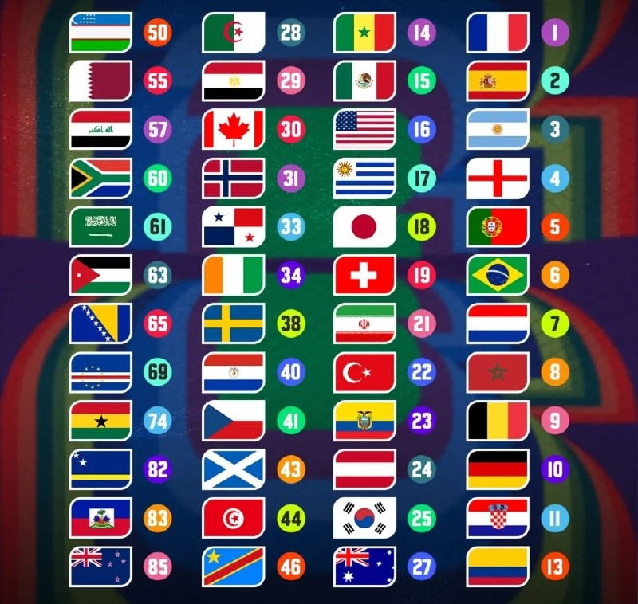

⚽️رتبه‌بندی تیم‌های جام‌جهانی در رنکینگ فیفا
@AloSport

## alonews — post 123337

اخبار جنگ الونیوز AloNews pinned a photo

---
📅 بروزرسانی: 1405/03/07 18:27
---

## VahidOOnLine — post 242615

  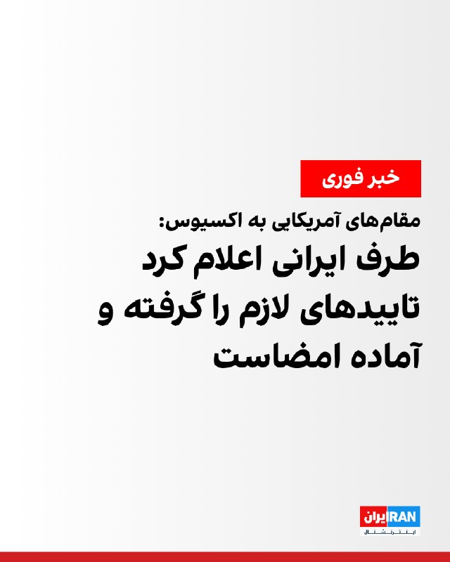

اکسیوس به نقل مقام‌های آمریکایی گزارش داد مفاد توافق تا روز سه‌شنبه عمدتا نهایی شده بود، اما هر دو طرف باید تایید مقام‌های ارشد خود را دریافت می‌کردند. آنها گفتند طرف ایرانی بعدا اعلام کرد تاییدهای لازم را گرفته و آماده امضاست.
در این گزارش آمده مذاکره‌کنندگان آمریکایی جزئیات توافق را به ترامپ ارائه کردند، اما او بلافاصله آن را تایید نکرد. یک مقام آمریکایی گفت ترامپ به میانجی‌ها اعلام کرده چند روز برای تصمیم‌گیری زمان می‌خواهد.
‌🏁 🇬🇧 IranintlTV

🤖 @VahidOOnLine

## VahidOOnLine — post 242614

  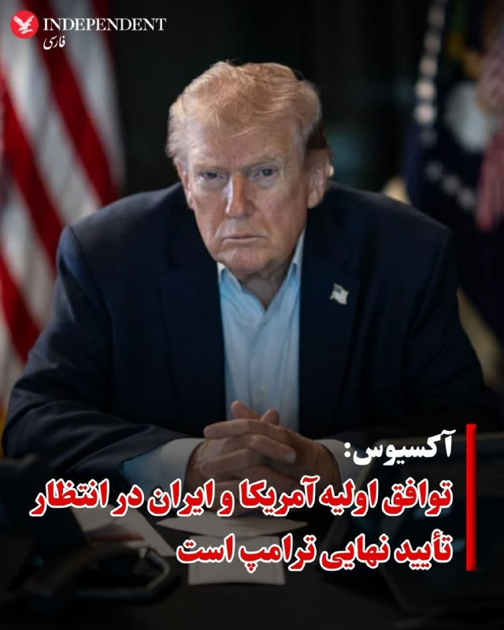

♦️آکسیوس روز پنجشنبه به نقل از دو مقام آمریکایی و یک منبع منطقه‌ای گزارش داد که مذاکره‌کنندگان آمریکایی و ایرانی بر سر یک تفاهم‌نامه ۶۰ روزه برای تمدید آتش‌بس و آغاز مذاکرات در مورد برنامه هسته‌ای ایران به توافق رسیده‌اند،با این حال، این توافق هنوز به تأیید نهایی دونالد ترامپ، رئیس‌جمهور آمریکا، نرسیده است.

به نوشته آکسیوس امضای این یادداشت تفاهم می‌تواند مهم‌ترین پیشرفت دیپلماتیک از زمان آغاز درگیری‌ها باشد، هرچند دست‌یابی به یک توافق نهایی که خواسته‌های هسته‌ای ترامپ را برآورده کند، همچنان نیازمند مذاکرات فشرده‌تری خواهد بود.

پیشتر اسرائیل هیوم گزارش داده بود که دونالد ترامپ، رئیس‌جمهوری آمریکا، متن پیش‌نویس توافق با تهران را برای شماری از رهبران منطقه، از جمله بنیامین نتانیاهو، نخست‌وزیر اسرائیل، ارسال کرده و از آن‌ها خواسته است دیدگاه‌های خود را درباره این سند ارائه کنند.
‌🇸🇦 Indypersian

🤖 @VahidOOnLine

## VahidOOnLine — post 242613

⭕️ پناهیان: وقتی عزاداری برای خامنه‌ای آغاز شود دیگر پایان نخواهد داشت و اشک‌ها متوقف نخواهد شد

♦️علیرضا پناهیان در مراسم یادبود «شهدای خانواد امام شهید و رهبر انقلاب» گفت: «هنوز مردم ما برای امام شهید عزاداری نکردند این مجلس شاید آغاز عزاداری‌ها باشد ولی این عزاداری ما هم هر زمانی آغاز شود حتی برای امام شهید دیگر پایان نخواهد داشت.»
پناهیان افزود: «نسلی که صدای امام خامنه‌ای شهید را شنیده است دیگر اشک او در سوگ این امام متوقف نخواهد شد.»
علی خامنه‌ای، رهبر پیشین جمهوری اسلامی، در جریان حملات آمریکا و اسرائیل در تاریخ ۹ اسفند ۱۴۰۴ کشته شده است.
‌🇸🇦 Indypersian

🤖 @VahidOOnLine

## VahidOOnLine — post 242612

  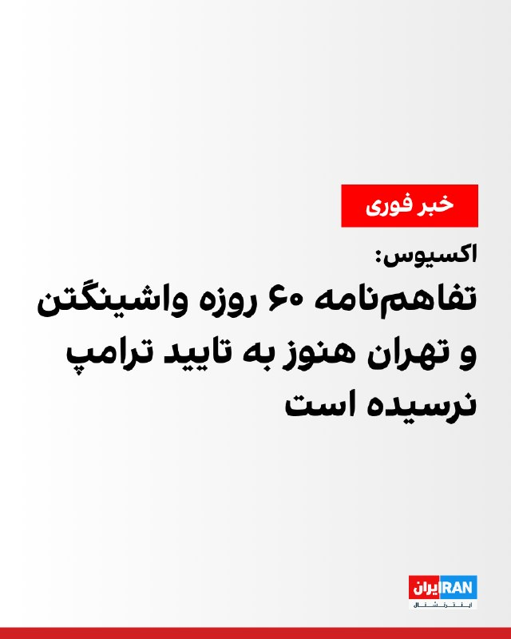

اکسیوس به نقل از دو مقام آمریکایی گزارش داد مذاکره‌کنندگان آمریکا و ایران بر سر یک یادداشت تفاهم ۶۰ روزه برای تمدید آتش‌بس و آغاز گفت‌وگوهای هسته‌ای به توافق رسیده‌اند، اما ترامپ هنوز تایید نهایی نداده است.

به نوشته این گزارش، امضای این سند یک پیشرفت بزرگ دیپلماتیک محسوب می‌شود، اما توافق نهایی همچنان نیازمند مذاکرات بیشتر است.
‌🏁 🇬🇧 IranintlTV

🤖 @VahidOOnLine

## VahidOOnLine — post 242611

  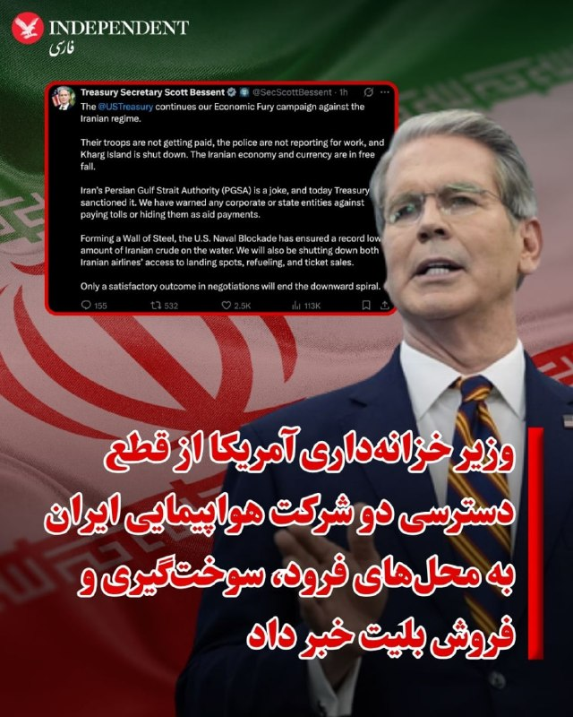

♦️اسکات بسنت، وزیر خزانه‌داری ایالات متحده، روز پنجشنبه هفتم خرداد بر ادامه کارزار «خشم اقتصادی» علیه حکومت ایران تاکید کرد.
اسکات بسنت در شبکه ایکس نوشت: «نیروهای جمهوری اسلامی حقوق دریافت نمی‌کنند، پلیس‌ها سر کار حاضر نمی‌شوند و جزیره خارک تعطیل شده است و اقتصاد و ارزش پول ایران در سقوط آزاد قرار دارد.»
وزیر خزانه‌داری آمریکا با تاکید بر اینکه سازمان مدیریت تنگه هرمز خلیج فارس ایران یک شوخی است، افزود: امروز وزارت خزانه‌داری آن را تحریم کرده است. ما به هر نهاد شرکتی یا دولتی درباره پرداخت عوارض یا پنهان کردن آن به‌عنوان کمک هشدار داده‌ایم.
بسنت همچنین اضافه کرد محاصره دریایی آمریکا با تشکیل «دیوار فولادی»، باعث شده میزان نفت خام ایران در دریا به پایین‌ترین سطح خود برسد.
او با اشاره به فشارهای بیشتر بر تهران و بدون نام بردن از شرکت‌های هواپیمایی جمهوری اسلامی ایران تاکید کرده است که آمریکا دسترسی دو شرکت هواپیمایی ایران به محل‌های فرود، سوخت‌گیری و فروش بلیت را قطع خواهد کرد.
وزیر خزانه‌داری ایالات متحده در پایان نوشت: تنها یک نتیجه رضایت‌بخش در مذاکرات این روند نزولی را متوقف خواهد کرد.
‌🇸🇦 Indypersian

🤖 @VahidOOnLine

## VahidOOnLine — post 242610

  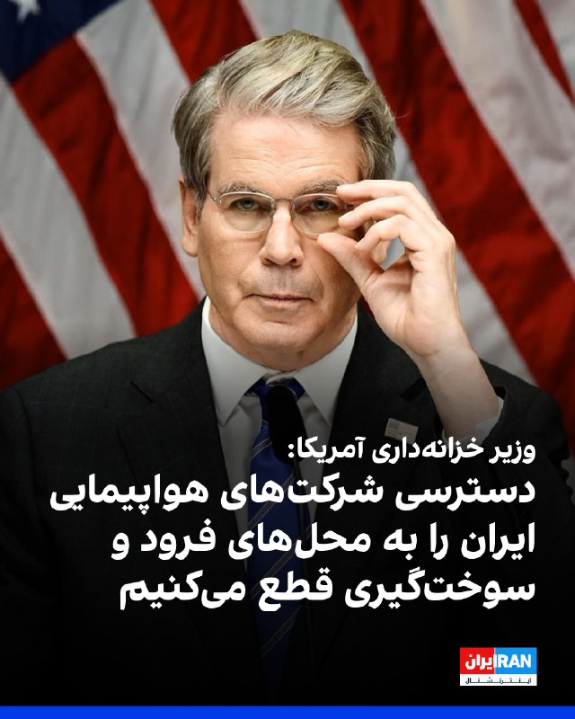

اسکات بسنت، وزیر خزانه‌داری آمریکا، با تاکید بر اینکه این کشور به کارزار «خشم اقتصادی» علیه حکومت ایران ادامه می‌دهد، در شبکه ایکس نوشت نیروهای جمهوری اسلامی حقوق دریافت نمی‌کنند، پلیس‌ها سر کار حاضر نمی‌شوند و جزیره خارک تعطیل شده است و اقتصاد و ارزش پول ایران در سقوط آزاد قرار دارد.
او افزود سازمان مدیریت تنگه هرمز از سوی جمهوری اسلامی یک شوخی است و امروز وزارت خزانه‌داری آن را تحریم کرده است. ما به هر نهاد شرکتی یا دولتی درباره پرداخت عوارض یا پنهان کردن آن به‌عنوان کمک هشدار داده‌ایم.
بسنت اضافه کرد با تشکیل «دیوار فولادی»، محاصره دریایی آمریکا باعث شده میزان نفت خام ایران در دریا به پایین‌ترین سطح تاریخی برسد. همچنین دسترسی شرکت‌های هواپیمایی ایران به محل‌های فرود، سوخت‌گیری و فروش بلیت را قطع خواهیم کرد.
او تاکید کرد تنها یک نتیجه رضایت‌بخش در مذاکرات این روند نزولی را متوقف خواهد کرد.
‌🏁 🇬🇧 IranintlTV

🤖 @VahidOOnLine

## VahidOOnLine — post 242609

  <a href="telegram/content/VahidOOnLine_242609_1779980274.mp4" target="_blank">🎬 Download video</a>

مسعود بهمنی شامگاه ۱۸ دی ۱۴۰۴ در جریان اعتراضات شهر ایذه و هنگام کمک به مجروحان، به‌دست یک مامور لباس‌شخصی با قمه زخمی و سپس بازداشت شد.

خانواده بهمنی چند روز پس از بازداشت، پیکر او را در بیمارستان گلستان اهواز شناسایی کردند. بر اساس گزارش‌ها ماموران برای تحویل پیکر، خانواده را به پرداخت مبلغی سنگین وادار کردند و زیر فشارهای امنیتی، جاویدنام مسعود بهمنی شبانه در ایذه به خاک سپرده شد.
‌🏁 🇬🇧 IranintlTV

🤖 @VahidOOnLine

## VahidOOnLine — post 242608

🗣روایت شما از زندگی در آتش‌بس- جمعه ۷ خرداد ۱۴۰۶

🔹ما خانواده‌های جاویدنامان رو تنها نمی‌ذاریم. هر وقت که بتونیم با لباس سفید به آرامستان‌ها می‌ریم و همدیگه رو پیدا می‌کنیم. به امید پیروزی نور بر تاریکی.
🔹زاهدان: بیکاری و بی‌پولی جان‌مان را به لب رسانده است. اجاره‌بها بالای ۱ و ۲ میلیارد پول پیش و چند ده میلیون اجاره، صف‌های سوخت و نان و گاز و آب و قیمت گوشت و برنج و... چه اتفاقی باید در یک کشور بیفتد که حکومت از مردم عذرخواهی کند؟
🔹از ساوه: اغلب شرکت‌ها نیروهاشون رو تعدیل کردن و مردم به آلوچینی یا کار در کافه و تولیدی روی آوردن که با این حقوق فقط می‌تونن نون شب رو جور کنن.
🔹یک کتاب و قهوه شده ۶۰۰ هزار تومان. علی‌کافه شده دونه‌ای ۵۰ هزار تومان و قهوه ساده شده کیلویی ۲ میلیون.
🔹اکثر ایرلاین‌ها تعدیل نیرو داشتن. چندین ماهه که حقوق ندادن، بیمه‌ها رد نشده و هیچ امنیت شغلی وجود نداره.
🔹قبلاً به نظامیان ماهانه گوشت، مرغ، برنج، روغن و حبوبات می‌دادن. الان چند ماهه خبری نیست، فقط شارژ کارت حکمت که باید از اتکا خرید کنی و دقیقاً چند برابر جاهای دیگه‌ست. نه شارژ کارت حکمت افزایش داشته و نه حقوق.
🔹از یزد: من نیمه‌شنوا هستم. حتی دو دقیقه هم آرامش و زندگی عادی ندارم. بهزیستی به‌جای حمایت واقعی، بیشتر از شرایط ما سوءاستفاده می‌کنه.
🔹هزینه دندان‌پزشکی به قدری بالا رفته که ۹۰ درصد مردم نمی‌تونن یه عصب‌کشی کنن تا درد نکشن.
🔹وضعیت اقتصادی توی ایران دیگه نمی‌تونه اسم وضعیت به خودش بگیره، این‌قدر فاجعه‌ست. از قیمت و کم بودن داروهای روان‌پزشکی بگیر تا یک جعبه چای که الان قیمتش شده یک میلیون و ۱۰۰ هزار تومن. دیگه چای هم نمی‌تونیم بگیریم.
🔹گروه مپنا قبل سال اعلام کرده بود که نباید برای ۱۴۰۵ تعدیل نیرو داشته باشیم، اما خیلی از زیرمجموعه‌هاش مثل شرکت مهندسان مشاور موننکو ایران این کار رو کرد.
‌🏁 🇬🇧 IranintlTV

🤖 @VahidOOnLine

## VahidOOnLine — post 242607

  

سنتکام اعلام کرد که از آغاز محاصره دریایی ایران تاکنون، ۱۱۱ کشتی تجاری مجبور به تغییر مسیر شده‌اند.
سنتکام همچنین با انتشار تصویری از ناو «یو‌اس‌اس تریپولی» اعلام کرد این ناو یکی از بیش از ۲۰ ناو جنگی مشارکت‌کننده در اجرای این محاصره است.
‌🏁 🇬🇧 IranintlTV

🤖 @VahidOOnLine

## VahidOOnLine — post 242606

♦️ششمین دوره مسابقات شترسواری روستای نصرت‌آباد شهر شاهدیه یزد، عصر چهارشنبه ۶ خرداد با حضور ۲۶ شتر و شترسوار در پنج دور برگزار شد و با استقبال گسترده خانواده‌ها و مردم محلی همراه بود.
روستای نصرت‌آباد در نزدیکی یزد، یکی از مناطق شناخته‌شده پرورش شتر در استان به شمار می‌رود و مسابقات شتردوانی در این منطقه به یکی از رویدادهای سنتی و محبوب کویر تبدیل شده است. این رقابت‌ها علاوه بر جنبه ورزشی، بخشی از فرهنگ بومی و سبک زندگی مردم مناطق کویری ایران را بازتاب می‌دهد.
در سال‌های اخیر مسابقات شترسواری شاهدیه علاوه بر جنبه محلی، رنگ و بوی حرفه‌ای‌تری هم گرفته و حتی برخی رقابت‌ها به عنوان انتخابی مسابقات آسیایی بحرین برگزار شده‌اند.
با وجود استقبال گسترده مردم، گزارش‌ها نشان می‌دهد علاقه‌مندان این رشته سال‌هاست خواستار ایجاد پیست استاندارد و ایمن برای برگزاری مسابقات در نصرت‌آباد هستند.
این تصاویر را محمدمسعود زارع ثبت کرده و در خبرگزاری ایسنا منتشر شده‌اند.
‌🇸🇦 Indypersian

🤖 @VahidOOnLine

## VahidOOnLine — post 242605

  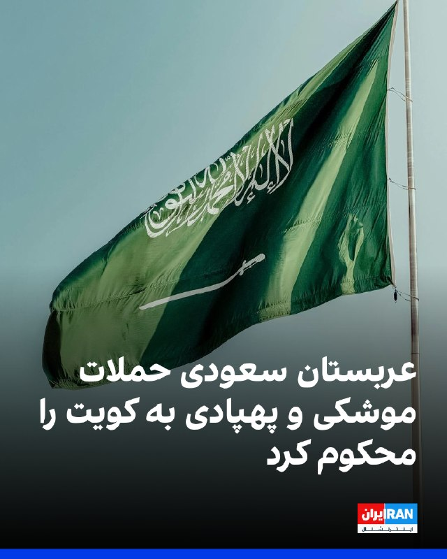

در پی حملات موشکی و پهپادی جمهوری اسلامی به کویت، وزارت خارجه عربستان سعودی در بیانیه‌ای در شبکه ایکس، حملات خصمانه با موشک و پهپاد به کویت را به‌شدت محکوم و تقبیح کرد.

این وزارتخانه همچنین بر مخالفت قاطع عربستان با نقض حاکمیت کشورها و تلاش برای تهدید امنیت و ثبات منطقه تاکید کرد.

عربستان در ادامه، همبستگی خود با دولت و مردم کویت را اعلام و تاکید کرد از هر اقدامی که کویت برای حفظ حاکمیت، امنیت و ثبات خود اتخاذ کند، حمایت می‌کند.
‌🏁 🇬🇧 IranintlTV

🤖 @VahidOOnLine

## VahidOOnLine — post 242604

  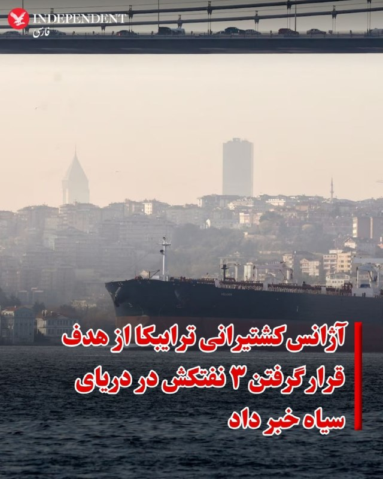

♦️یک آژانس کشتیرانی اعلام کرد که سه نفتکش در دریای سیاه مورد حمله پهپادی قرار گرفته‌اند.

به گزارش رویترز، آژانس کشتیرانی ترایبکا اعلام کرد که روز پنجشنبه حملات پهپادی به سه نفتکش در دریای سیاه در نزدیکی ساحل شمالی ترکیه گزارش شده است.

به گفته این آژانس، نفتکش جیمز ۲ که با پرچم پالائو و در حال تعادل حرکت می‌کرد، در زمان وقوع حادثه در حدود ۸۰ کیلومتری شمال منطقه تورکلی در دریای سیاه بود.

این آژانس اعلام کرد که قایق‌های ایمنی ساحلی برای کمک به محل حادثه اعزام شدند و همه خدمه نفتکش‌ها در وضعیت خوبی گزارش شده‌اند.

مسکو و کی‌یف از زمان حمله همه جانبه روسیه به اوکراین بیش از چهار سال پیش، بارها به بنادر و نفتکش‌های یکدیگر حمله کرده‌اند. هیچ یک از این دو کشور بلافاصله مسئولیت حمله جدید گزارش شده را بر عهده نگرفتند.

وزارت حمل و نقل ترکیه به دلیل تعطیلات عید قربان، برای اظهار نظر در مورد این حوادث در دسترس نبود.
‌🇸🇦 Indypersian

🤖 @VahidOOnLine

## VahidOOnLine — post 242603

  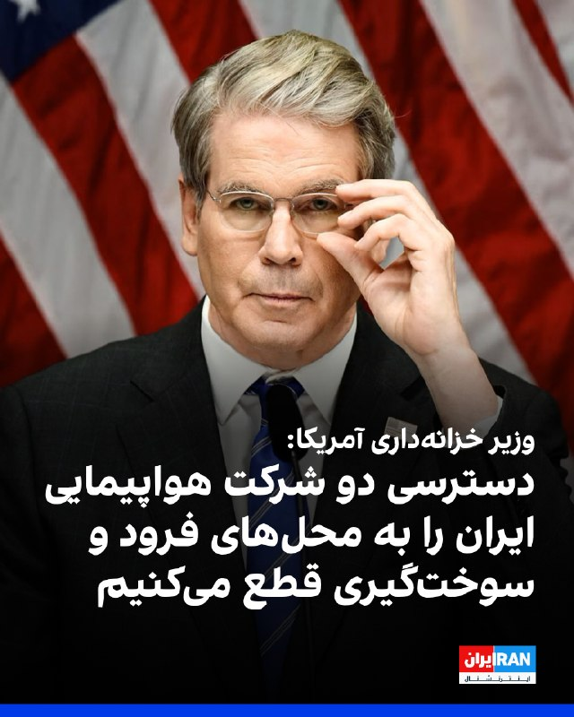

اسکات بسنت، وزیر خزانه‌داری آمریکا، با تاکید بر اینکه این کشور به کارزار «خشم اقتصادی» علیه حکومت ایران ادامه می‌دهد، در شبکه ایکس نوشت نیروهای جمهوری اسلامی حقوق دریافت نمی‌کنند، پلیس‌ها سر کار حاضر نمی‌شوند و جزیره خارک تعطیل شده است و اقتصاد و ارزش پول ایران در سقوط آزاد قرار دارد.
او افزود سازمان مدیریت تنگه هرمز از سوی جمهوری اسلامی یک شوخی است و امروز وزارت خزانه‌داری آن را تحریم کرده است. ما به هر نهاد شرکتی یا دولتی درباره پرداخت عوارض یا پنهان کردن آن به‌عنوان کمک هشدار داده‌ایم.
بسنت اضافه کرد با تشکیل «دیوار فولادی»، محاصره دریایی آمریکا باعث شده میزان نفت خام ایران در دریا به پایین‌ترین سطح تاریخی برسد. همچنین دسترسی هر دو شرکت هواپیمایی ایران به محل‌های فرود، سوخت‌گیری و فروش بلیت را قطع خواهیم کرد.
او تاکید کرد تنها یک نتیجه رضایت‌بخش در مذاکرات این روند نزولی را متوقف خواهد کرد.
‌🏁 🇬🇧 IranintlTV

🤖 @VahidOOnLine

## VahidOOnLine — post 242602

  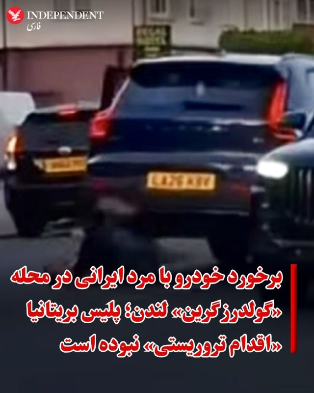

♦️در پی یک حادثه رانندگی در محله‌ «گولدرز گرین» در شمال لندن و در نزدیکی دیوار یادبود کشته‌شدگان اعتراضات دی ماه یک مرد ۴۱ ساله ایرانی شدیدا مجروح و به بیمارستان منتقل شد.

بر اساس گزارش پلیس لندن این حادثه روز چهارشنبه ششم خرداد رخ داده است و یک مرد ۳۹ ساله عراقی هم به ظن «ایجاد جراحات عمدی با رانندگی خطرناک» و خودداری از انجام آزمایش مربوط به «مواد مخدر» بازداشت شده است.

تصاویری که از این حادثه منتشر شده نشان می‌دهد که یک خودرو شاسی بلند تیره رنگ از روی یک فرد عبور می‌کند. برخی تصاویر نشان می‌دهد که پیش از این حادثه افرادی این خودرو را که یک زن و یک روحانی سرنشین آن هستند،‌ دوره کرده و با موبایل در حال فیلمبرداری از سرنشینان آن هستند.

پلیس لندن از شهروندان خواست که از بازنشر ویدئوها خودداری کنند و هر نوع اطلاعاتی که دارند را با پلیس در میان بگذارند.

پلیس بریتانیا از ادامه تحقیقات در این مورد خبر داده است اما اعلام کرده که این حادثه را یک «اقدام تروریستی» ارزیابی نمی‌کند.
‌🇸🇦 Indypersian

🤖 @VahidOOnLine

## VahidOOnLine — post 242601

  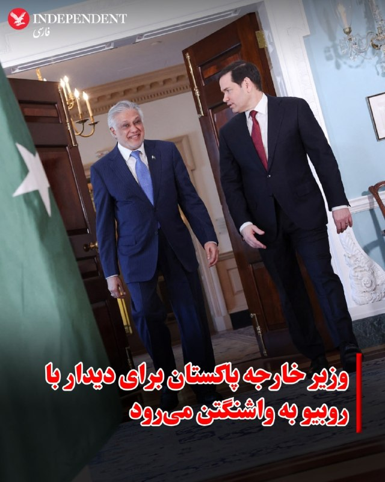

⭕️ وزیر خارجه پاکستان برای دیدار با روبیو به واشنگتن می‌رود

♦️رویترز گزارش داد محمد اسحاق دار، وزیر خارجه پاکستان، روز جمعه راهی واشنگتن خواهد شد تا با مارکو روبیو، وزیر خارجه آمریکا، دیدار و گفتگو کند.
این سفر در شرایطی انجام می‌شود که اسلام‌آباد تلاش دارد درباره دستیابی به توافقی برای پایان دائمی جنگ آمریکا و اسرائیل با جمهوری اسلامی نقش‌آفرینی و مذاکره کند.
وزارت خارجه پاکستان اعلام کرد دو طرف در این دیدار درباره روابط دوجانبه، همکاری‌های مشترک و همچنین تحولات منطقه‌ای و جهانی مورد علاقه دو کشور تبادل نظر خواهند کرد.
‌🇸🇦 Indypersian

🤖 @VahidOOnLine

## VahidOOnLine — post 242600

  

اطلاعات رسیده به ایران‌اینترنشنال نشان می‌دهد سنگ مزار مونا اسمی و بنیامین علیزاده، دو جاویدنام شهر رشت تخریب شده است. طی ماه‌های گذشته گزارش‌هایی مشابه از تخریب و مخدوش‌سازی سنگ مزار معترضان دی‌ماه در شهرهای مختلف ایران منتشر شده است.
‌🏁 🇬🇧 IranintlTV

🤖 @VahidOOnLine

## VahidOOnLine — post 242599

🗣روایت شما از زندگی در آتش‌بس- پنجشنبه ۷ خرداد

🔹می‌خواستم بگم برخلاف خیلی‌ها که از ترامپ و نتانیاهو ناراحت هستن، من برعکس خیلی‌ها ازشون تشکر می‌کنم که تا همین‌جا هم واقعاً کارهای بزرگی انجام دادن. تغییر در رژیم یک رونده و مردم هم به‌هرحال باید این سختی‌ها رو تحمل کنن به امید روزی که نجات پیدا کنیم.
🔹به‌وقتش خود ما می‌جنگیم، می‌میریم و در نهایت ما ایران رو پس می‌گیریم. درسته میگیم تا کی دیگه باید تاوان بدیم، ولی اینم می‌دونیم که آزادی به دست خودمون رقم می‌خوره.
🔹اینجا همه‌چیز داره از هم می‌پاشه؛ زندگی‌ها، کارها، پیوندها، تندرستی، سلامت روان، بهداشت، خوراک و پوشاک. تنها چیزی که ما رو سرپا نگه داشته، دیدن راهپیمایی ایرانیان خارج از کشور در ماهواره و تصور روز آزادیه.
🔹دوستان عزیز یادتون نره که این حکومت در دی‌ماه ۱۴۰۴ چه جنایاتی انجام داد. صرفا چون اینترنت رو وصل کردن نپرید بغل آخوند. این اینترنت حق ماست، پس برای گرفتن حقتون از این ستمگران سپاسگزار نباشید.
🔹اکثریت ما با جمهوری اسلامی مخالفیم و کار آخر رو باید خودمون انجام بدیم.
🔹در طول تاریخ، دیکتاتورها تا لحظه آخر شاخ و شونه می‌کشن و در نهایت به فجیع‌ترین حالت ممکن سقوط می‌کنن. ما برای آزادی بهای سنگینی دادیم؛ چه دی‌ماه و چه قبل از اون، پس صبور باشید و امیدوار.
🔹امروز وصل شدم و خواستم بگم ما در ۱۸ و ۱۹ دی شکوهی از حجم جمعیت و صدایی که خاموش نمی‌شد دیدیم که به این سادگی‌ها ناامید و تموم نمی‌شیم.
🔹خواهش می‌کنم ناامید نشید. به ۱۸ و ۱۹ دی فکر کنید، به اون همه جوان زیبا که رفتن برای آزادی و دیگه برنگشتن. ما باید این کار رو تموم کنیم.
‌🏁 🇬🇧 IranintlTV

🤖 @VahidOOnLine

## VahidOOnLine — post 242598

  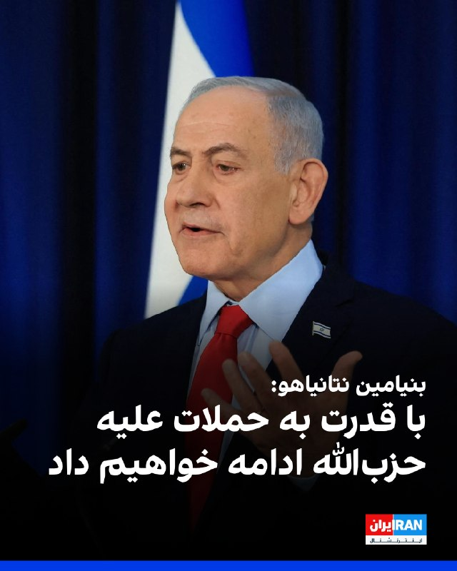

بنیامین نتانیاهو، نخست وزیر اسرائیل گفت که ارتش این کشور با قدرت به حملات علیه حزب‌الله ادامه خواهد داد.
نتانیاهو اضافه کرد که نیروهای اسرائیل از رودخانه لیتانی در جنوب لبنان عبور کرده‌اند.

بنیامین نتانیاهو، سه‌شنبه اعلام کرده بود که ارتش این کشور با «نیروهای گسترده زمینی» در جنوب لبنان در حال عملیات است و کنترل «مناطق راهبردی» را در دست می‌گیرد.
‌🏁 🇬🇧 IranintlTV

🤖 @VahidOOnLine

## VahidOOnLine — post 242597

  <a href="telegram/content/VahidOOnLine_242597_1779980280.mp4" target="_blank">🎬 Download video</a>

⭕️ حمله با چاقو در ایستگاه قطار «وینترتور» سوئیس با فریاد «الله‌اکبر»

♦️پلیس سوئیس اعلام کرد در پی حمله یک مرد مسلح به چاقو در ایستگاه قطار شهر «وینترتور» در نزدیکی زوریخ، سه نفر زخمی شدند. این حادثه صبح پنجشنبه رخ داد و نیروهای پلیس پس از عملیات گسترده امنیتی، مهاجم ۳۱ ساله سوئیسی را بازداشت کردند.
براساس بیانیه پلیس، مجروحان برای درمان به بیمارستان منتقل شده‌اند و تحقیقات درباره انگیزه مهاجم ادامه دارد.
روزنامه «بلیک» سوئیس گزارش داده ویدیویی از محل حادثه به دست آورده که در آن مردی در حالی که از سالن ایستگاه خارج می‌شود، شعار «الله‌اکبر» سر می‌دهد. شاهدان عینی گفته‌اند مهاجم چاقو در دست داشته و مردم وحشت‌زده در حال فرار و فریاد بودند.
این حادثه باعث استقرار گسترده نیروهای پلیس و ایجاد فضای امنیتی در اطراف ایستگاه شد. مقام‌های سوئیسی هنوز درباره احتمال تروریستی بودن حمله اظهار نظر رسمی نکرده‌اند.
‌🇸🇦 Indypersian

🤖 @VahidOOnLine

## VahidOOnLine — post 242596

  <a href="telegram/content/VahidOOnLine_242596_1779980282.mp4" target="_blank">🎬 Download video</a>

سخنرانی امیرعباس هویدا در جمع دانشجویان درباره نقش جوانان در توسعه و اداره کشور
‌🏁 🇬🇧 ManotoTV

🤖 @VahidOOnLine

## WithYashar — post 12798

به گفته باراک راوید خبرنگار Axios، به نقل از دو مقام آمریکایی، یک تفاهم‌نامه ۶۰ روزه توسط تیم‌های مذاکره‌کننده ایالات متحده و ایران مورد توافق قرار گرفته است و در حال حاضر منتظر تأیید دونالد ترامپ، رئیس جمهور ایالات متحده و تصمیم‌گیرندگان ارشد در ایران است. طبق این گزارش، این تفاهم‌نامه شامل بیانیه‌ای مبنی بر «بدون محدودیت» بودن تردد دریایی از طریق تنگه هرمز، رفع تدریجی محاصره کشتی‌های رفت و آمد به بنادر ایران توسط ایالات متحده متناسب با افزایش تردد آزاد دریایی، تعهد ایران به عدم پیگیری سلاح هسته‌ای و تعهد به برگزاری مذاکرات در مورد از بین بردن اورانیوم غنی‌شده با خلوص بالای ایران در بازه زمانی ۶۰ روزه خواهد بود.

علاوه بر این، طبق این گزارش، این تفاهم‌نامه شامل تعهد ایالات متحده برای بحث در مورد کاهش تحریم‌ها برای ایران و آزاد کردن دارایی‌های مسدود شده ایران خواهد بود. همچنین قرار است در مورد از سرگیری جریان تجارت و کمک‌های بشردوستانه به ایران بحث شود.
@withyashar

## WithYashar — post 12797

نخست‌وزیر اسرائیل، بنیامین نتانیاهو: اسرائیل کنترل ۶۰٪ از نوار غزه را در دست دارد، دستور من حرکت به سمت ۷۰٪ است. با این شروع خواهیم کرد. ما در فرایندی هستیم که می‌توانیم قدرت خود را در جهات مختلف به کار بگیریم. ما همچنان باید بر حزب‌الله فشار وارد کنیم؛ در…

## WithYashar — post 12796

  <a href="telegram/content/WithYashar_12796_1779980283.mp4" target="_blank">🎬 Download video</a>

نخست‌وزیر اسرائیل، بنیامین نتانیاهو:

اسرائیل کنترل ۶۰٪ از نوار غزه را در دست دارد، دستور من حرکت به سمت ۷۰٪ است. با این شروع خواهیم کرد.
ما در فرایندی هستیم که می‌توانیم قدرت خود را در جهات مختلف به کار بگیریم.
ما همچنان باید بر حزب‌الله فشار وارد کنیم؛ در حال حاضر با حماس درگیر هستیم.
@withyashar

## WithYashar — post 12795

نتانیاهو: ما باید ماموریت در ایران را تکمیل کنیم و من تقریباً هر روز در این مورد با ترامپ صحبت می‌کنم.
@withyashar
یاشار : من هم تقریباً زیر تمام پستهاش کامنت گذاشتم بیبی جون، فینیش د جاب

## WithYashar — post 12794

روسیه: ترامپ با انتقال اورانیوم غنی‌شده ایران به مسکو موافقت نکرد
@withyashar

## WithYashar — post 12793

پیغام فیکی از ترامپ که از یک پیج فیک ایکس است داره میچرخه. ترامپ هیچ پیجی در شبکه ایکس یا توییتر ندارد و فقط در تروسوشال پست میگذارد. این مسئله رو دقت کنید.
@withyashar

## WithYashar — post 12792

ابوترابی، نماینده مجلس: آمریکا بعد از جام جهانی و انتخابات کنگره دوباره حمله می‌کند
@withyashar

## WithYashar — post 12791

سیتنا: تا الان تمرکز ۹۱ درصدی ترافیک اینترنت تو تهران بوده و بازگشت توزیع عادی پهنای باند، زمان‌بره.
@withyashar

## WithYashar — post 12790

  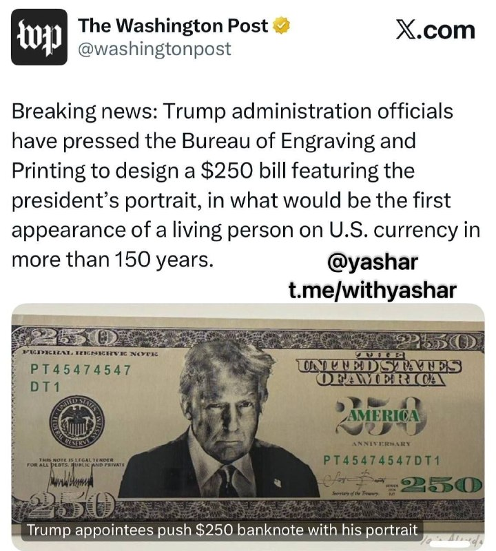

واشنگتن پست : مقامات دولت ترامپ، اداره حکاکی و چاپ را تحت فشار قرار داده‌اند تا یک اسکناس ۲۵۰ دلاری با تصویر رئیس‌جمهور طراحی کند، که این اولین بار در بیش از ۱۵۰ سال گذشته است که تصویر یک فرد زنده روی پول رایج آمریکا چاپ می‌شود.
@withyashar

## WithYashar — post 12789

بنیامین نتانیاهو، نخست وزیر اسرائیل گفت که ارتش این کشور با قدرت به حملات علیه حزب‌الله ادامه خواهد داد.
نتانیاهو اضافه کرد که نیروهای اسرائیل از رودخانه لیتانی در جنوب لبنان عبور کرده‌اند.
@withyashar

## WithYashar — post 12788

خبرگزاری والا به نقل از یک مقام امنیتی اسرائیل: یکی از اهداف در بیروت یک فرمانده ارشد ایرانی بوده است
@withyashar

## WithYashar — post 12787

سنتکام طی بیانیه‌ای ایران را به نقض فاحش آتش‌بس متهم کرد
@withyashar

## mwarmonitor — post 9863

🔴اختصاصی آکسیوس: مقامات می‌گویند آمریکا و ایران به توافق رسیده‌اند، اما این توافق نیازمند تأیید نهایی ترامپ است

📝نویسنده: باراک راوید AXIOS

🔰دو مقام آمریکایی و یک منبع منطقه‌ای درگیر در تلاش‌های میانجی‌گرانه به آکسیوس گفتند که مذاکره‌کنندگان آمریکایی و ایرانی به توافقی درباره یک یادداشت تفاهم (MOU) ۶۰ روزه برای تمدید آتش‌بس و آغاز مذاکرات پیرامون برنامه هسته‌ای ایران دست یافته‌اند، اما پرزیدنت ترامپ هنوز موافقت نهایی خود را اعلام نکرده است.

🔸چرا این موضوع مهم است؟
امضای این یادداشت تفاهم، مهم‌ترین پیشرفت دیپلماتیک از زمان آغاز جنگ خواهد بود؛ با این حال، دستیابی به یک توافق نهایی که خواسته‌های هسته‌ای ترامپ را برآورده کند، همچنان مستلزم مذاکرات فشرده‌تری خواهد بود.
یکی از مقامات آمریکایی گفت: «این توافقی است برای آوردن همه به پای میز مذاکره. ما جزئیات را در طول مذاکرات حل و فصل خواهیم کرد.»

پشت صحنه
وضعیت تأییدیه طرفین: مقامات آمریکایی اظهار داشتند که مفاد این توافق تا روز سه‌شنبه تا حد زیادی مورد توافق قرار گرفته بود، اما هر دو طرف همچنان به تأیید رهبران ارشد خود نیاز داشتند. مقامات آمریکایی ادعا کردند که ایرانی‌ها بعداً بازگشته و اعلام کردند که تاییدیه های لازم را دریافت کرده‌اند و آماده امضا هستند. ایران هنوز این موضوع را تایید نکرده است.
موضع ترامپ: مذاکره‌کنندگان آمریکایی جزئیات توافق نهایی را به اطلاع ترامپ رساندند، اما او بلافاصله آن را تایید نکرد. یک مقام آمریکایی گفت: «رئیس‌جمهور به میانجی‌ها اعلام کرده است که می‌خواهد چند روزی درباره آن فکر کند.»
نگاهی به گذشته: ترامپ و مشاورانش در چندین مرحله دیگر از این جنگ، فکر می‌کردند که به توافق نزدیک شده‌اند، اما گفتگوها بارها با بن‌بست مواجه شده بود.
جزئیات دقیق‌تر (بندهای یادداشت تفاهم)
مقامات آمریکایی اعلام کردند که این یادداشت تفاهم ۶۰ روزه تصریح می‌کند که کشتیرانی در تنگه هرمز «بدون محدودیت» خواهد بود. یک مقام آمریکایی توضیح داد که این به معنای عدم دریافت عوارض و عدم ایجاد مزاحمت است و ایران باید ظرف ۳۰ روز تمامی مین‌ها را از این تنگه پاکسازی کند.
برچیده شدن محاصره دریایی: محاصره دریایی آمریکا نیز لغو خواهد شد، اما یک مقام آمریکایی اشاره کرد که این اقدام متناسب با احیای کشتیرانی تجاری انجام می‌گیرد.
تعهدات هسته‌ای: مقامات گفتند این یادداشت تفاهم شامل تعهد ایران به عدم تلاش برای دستیابی به سلاح هسته‌ای خواهد بود. همچنین مقرر می‌کند که اولین موضوعاتی که در طول این بازه ۶۰ روزه مورد مذاکره قرار می‌گیرند، نحوه رهاسازی اورانیوم با غنای بالای ایران و چگونگی رسیدگی به موضوع غنی‌سازی ایران خواهد بود.
امتیازات آمریکا: ایالات متحده متعهد خواهد شد که به عنوان بخشی از مذاکرات، درباره رفع تحریم‌ها و آزادسازی دارایی‌های بلوکه‌شده ایران گفتگو کند. این یادداشت تفاهم همچنین شامل بحث در مورد مکانیزمی برای کمک به ایران جهت آغاز دریافت کالا و کمک‌های بشردوستانه خواهد بود.
قاب دوقلو (نمای همزمان)
حتی در شرایطی که مراحل نهایی این مذاکرات در حال طی شدن بود، ایالات متحده و ایران در ۴۸ ساعت گذشته دو درگیری پراکنده در تنگه هرمز داشته‌اند.
اظهار نظرها
یک مقام آمریکایی ادعا کرد که اکنون ایران این فرصت را دارد تا اقتصاد خود را از قید و بندها رها کند و افزود:
«افرادی در بدنه حاکمیت آن‌ها وجود دارند که درک می‌کنند این فرصتی برای حرکت در یک مسیر متفاوت است. ما در طول مذاکرات ۶۰ روزه متوجه خواهیم شد که آیا واقعاً اینطور است یا خیر.»
مقامات آمریکایی تاکید کردند که هیچ توافق جانبی یا بند محرمانه‌ای درباره رفع تحریم‌ها یا ارسال وجوه به ایران وجود نخواهد داشت. یکی از آن‌ها گفت: «ایرانی‌ها هرچه بیشتر مایل به امتیاز دادن باشند، امتیازات بیشتری نیز دریافت خواهند کرد.»

@mwarmonitor

## mwarmonitor — post 9862

🔴وزارت خزانه‌داری آمریکا به کارزار «خشم اقتصادی» خود علیه رژیم ایران ادامه می‌دهد. 🔹نیروهای آن‌ها حقوق دریافت نمی‌کنند، پلیس سرِ کار حاضر نمی‌شود و جزیره خارک تعطیل شده است. اقتصاد و پول ملی ایران در سراشیبی سقوط آزاد قرار دارد. 🔸«سازمان تنگه خلیج فارس ایران…

## mwarmonitor — post 9861

🔴بنیامین نتانیاهو می‌گوید اسرائیل هنوز «کارهای ناتمامی در ایران» دارد و این موضوع را «تقریباً هر روز» با دونالد ترامپ، رئیس‌جمهور آمریکا در میان می‌گذارد.

@mwarmonitor

## mwarmonitor — post 9860

🔴 بنیامین نتانیاهو به ارتش اسرائیل دستور داده است میزان کنترل در نوار غزه را از ۶۰٪ به ۷۰٪ افزایش دهد.

@mwarmonitor

## mwarmonitor — post 9859

🔴وزارت خزانه‌داری آمریکا به کارزار «خشم اقتصادی» خود علیه رژیم ایران ادامه می‌دهد.

🔹نیروهای آن‌ها حقوق دریافت نمی‌کنند، پلیس سرِ کار حاضر نمی‌شود و جزیره خارک تعطیل شده است. اقتصاد و پول ملی ایران در سراشیبی سقوط آزاد قرار دارد.

🔸«سازمان تنگه خلیج فارس ایران (PGSA)» مضحکه است و امروز وزارت خزانه‌داری آن را تحریم کرده است. ما به هر نهاد شرکتی یا دولتی هشدار داده‌ایم که از پرداخت عوارض یا پنهان‌کردن آن‌ها تحت عنوان کمک‌های بشردوستانه خودداری کند.

🔹با ایجاد «دیوار فولادین»، محاصره دریایی نیروی دریایی آمریکا باعث شده میزان نفت خام ایران روی آب به پایین‌ترین سطحِ بی‌سابقه برسد. همچنین دسترسی هر دو شرکت هواپیمایی ایران به فرود، سوخت‌گیری و فروش بلیت را مسدود خواهیم کرد.

🔸تنها دستیابی به نتیجه‌ای رضایت‌بخش در مذاکرات می‌تواند به این روند نزولی پایان دهد.

@mwarmonitor

## FoxNewsTwitter — post 342346

  

Fox News (Twitter/X)

“I never wanted to be the mayor. I just wanted somebody to tell the truth. And by telling the truth, now the people are behind me.”

@spencerpratt says his message to voters is simple: stop ignoring what’s happening in Los Angeles.

The reality TV star turned mayoral candidate is leaning hard into public safety and quality-of-life issues, arguing voters are responding because he’s willing to say what others won’t.

## FoxNewsTwitter — post 342345

  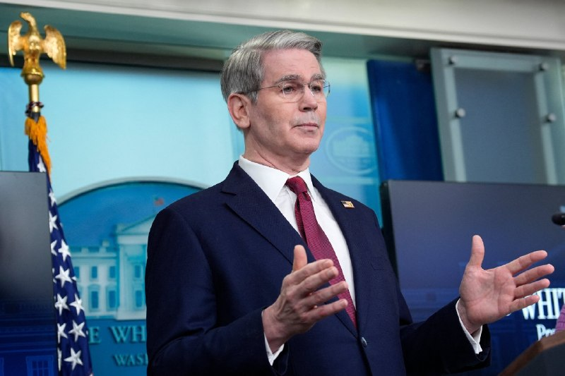

Fox News (Twitter/X)

Treasury Secretary Scott Bessent giving an update on the department's “Economic Fury” campaign ahead of his 2pm ET White House briefing today.

Bessent says the Treasury Department is crippling Iran’s economy, with unpaid troops, police absenteeism, a collapsing currency, and sanctions now targeting Iran’s Persian Gulf Strait Authority and key transportation sectors.

The Treasury Secretary adds that the U.S. will be shutting down Iranian airlines' access to landing spots, refueling, and ticket sales.

## FoxNewsTwitter — post 342344

  <a href="telegram/content/FoxNewsTwitter_342344_1779980286.mp4" target="_blank">🎬 Download video</a>

Fox News (Twitter/X)

The search is on for the next James Bond, and there’s reportedly a new favorite to take over the role of Agent 007, so that begs the question – who will play the next Bond girl?

Our sponsor Kalshi's prediction market shows it's between Zendaya, Anya Taylor-Joy, Sydney Sweeney, and Margaret Qualley.

Find out 👇

@foxandfriends

## FoxNewsTwitter — post 342343

  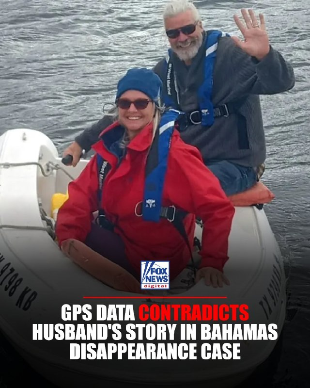

Fox News (Twitter/X)

RT @FoxTrueCrime: ROUGH SEAS: GPS data from Brian Hooker's device shows him stopping in the Sea of Abaco and returning to shore — a track that contradicts the story he told investigators about the night his wife Lynette vanished from their dinghy, according to a report and which a source confirmed to Fox News Digital.

The FBI lab in Quantico now processes additional evidence, and the Coast Guard already seized the couple's shared sailboat, named 'Soulmate.'

## FoxNewsTwitter — post 342342

  <a href="telegram/content/FoxNewsTwitter_342342_1779980288.mp4" target="_blank">🎬 Download video</a>

Fox News (Twitter/X)

NEW: Los Angeles mayoral candidate @spencerpratt says even though the race is nonpartisan and he's a registered Republican, all of his supporters are Democrats because they're fed up because "they were fed a bunch of lies" by current mayor Karen Bass:

"I'm a registered Republican, but my supporters are all Democrats because Los Angeles is all Democrats. All the people financing me are Democrats. All the meetings I take every day are Democrats. Democrats are very angry with what happened in Los Angeles."

"It's a nonpartisan race. There's no letter next to either of our names, because the mayor is not supposed to represent a party. They're supposed to make sure your moms are safe, your houses don't burn down, and your tax money is going to your infrastructure not to fund drug addicts." | @foxandfriends

## FoxNewsTwitter — post 342341

  <a href="telegram/content/FoxNewsTwitter_342341_1779980289.mp4" target="_blank">🎬 Download video</a>

Fox News (Twitter/X)

“They’re trying to get me elected so they can move back.”

L.A. mayoral candidate @spencerpratt reveals the strong support his campaign is getting from former Angelenos who feel they were pushed out of the city.

“L.A. is incredible when you don’t let drug addicts take over the street and make moms and kids scared to go to parks or the school.” | @foxandfriends

## FoxNewsTwitter — post 342340

  <a href="telegram/content/FoxNewsTwitter_342340_1779980291.mp4" target="_blank">🎬 Download video</a>

Fox News (Twitter/X)

JUST IN: Los Angeles mayoral candidate @spencerpratt says he never wanted to become mayor before, but felt the need to step up because the city deserves a leader who tells the truth.

"I don't do national politics. I don't do parties. I just say, look, they're stealing all of our tax money to give it to drug addicts, to have needles and tourniquets, and they're actually even selling the drugs to these addicts to let these people die on our sidewalks."

"I want to be the compassionate one. Get these people mandatory treatment, medical treatment with doctors to help them get off of fentanyl and super meth."

"These people have failed us. They've spent all of our tax money to increase problems... I never wanted to be the mayor. I just wanted somebody to tell the truth." | @foxandfriends

## FoxNewsTwitter — post 342339

  <a href="telegram/content/FoxNewsTwitter_342339_1779980292.mp4" target="_blank">🎬 Download video</a>

Fox News (Twitter/X)

“They’re trying to get me elected so they can move back.”

L.A. mayoral candidate Spencer Pratt reveals the strong support his campaign is getting from former Angelenos who feel they were pushed out of the city.

“L.A. is incredible when you don’t let drug addicts take over the street and make moms and kids scared to go to parks or the school.” | @foxandfriends

## FoxNewsTwitter — post 342338

  <a href="telegram/content/FoxNewsTwitter_342338_1779980294.mp4" target="_blank">🎬 Download video</a>

Fox News (Twitter/X)

JUST IN: Los Angeles mayoral candidate Spencer Pratt says he never wanted to become mayor before, but felt the need to step up because the city deserves a leader who tells the truth.

"I don't do national politics. I don't do parties. I just say, look, they're stealing all of our tax money to give it to drug addicts, to have needles and tourniquets, and they're actually even selling the drugs to these addicts to let these people die on our sidewalks."

"I want to be the compassionate one. Get these people mandatory treatment, medical treatment with doctors to help them get off of fentanyl and super meth."

"These people have failed us. They've spent all of our tax money to increase problems... I never wanted to be the mayor. I just wanted somebody to tell the truth." | @foxandfriends

## FoxNewsTwitter — post 342337

  <a href="telegram/content/FoxNewsTwitter_342337_1779980295.mp4" target="_blank">🎬 Download video</a>

Fox News (Twitter/X)

NEW: DHS Secretary Markwayne Mullin warns sanctuary cities could start seeing major disruptions to international flights as federal agents are redirected to deal with violent protests that have been targeting law enforcement and ICE facilities:

"When we have situations, what's happening in new Jersey right now, when we have to prioritize where we put federal employees because local law enforcement won't help protect their streets.”

“We're not going to halt the flights, what we're saying is we just won't be able to process them because we don't have officers there. We're going to pull out our Customs and Border Patrol officers that process these flights and put them in these facilities to help protect our employees coming out of work.”

## pm_afshaa — post 91739

🔴نتانیاهو :دستور گسترش عملیات زمینی رو دادم ، ما امروز از رودخانه لیتانی در جنوب لبنان هم عبور کردیم و عملیات نابودی حزب الله با قدرت ادامه داره

💧 Rainbet.com the #1 Non-KYC Crypto Casino & Sportsbook @rainbetcom

😁 @Pm_Afshaa

## pm_afshaa — post 91738

ابوترابی، نماینده مجلس: آمریکا بعد از جام جهانی و انتخابات کنگره دوباره حمله می‌کند

💧 Rainbet.com the #1 Non-KYC Crypto Casino & Sportsbook @rainbetcom

😁 @Pm_Afshaa

## pm_afshaa — post 91737

https://t.me/boost/pm_afshaa

## pm_afshaa — post 91736

https://t.me/boost/pm_afshaa

## pm_afshaa — post 91735

🔴جروزالم پست: کشورهای حوزه خلیج فارس احتمالاً درخواست ترامپ برای پیوستن به توافق‌نامه ابراهیم را جدی نمی‌گیرند و آن را «زودهنگام» می‌دانن

💧 Rainbet.com the #1 Non-KYC Crypto Casino & Sportsbook @rainbetcom

😁 @Pm_Afshaa

## pm_afshaa — post 91734

🔴رویترز:ترامپ گفت، نسبت به پیامدهای سیاسی یک درگیری طولانی‌مدت با ایران هیچ نگرانی ندارد و رهبران ایران اشتباه محاسبه کرده‌اند اگر تصور می‌کنند انتخابات میان‌دوره‌ای نوامبر او را مجبور به پذیرش یک معامله خواهد کرد

💧 Rainbet.com the #1 Non-KYC Crypto Casino & Sportsbook @rainbetcom

😁 @Pm_Afshaa

## pm_afshaa — post 91733

  <a href="telegram/content/pm_afshaa_91733_1779980297.webm" target="_blank">🎬 Download video</a>

PMTV NEWS🦁☀️.npvt

## pm_afshaa — post 91732

  <a href="https://t.me/pm_afshaa/91732" target="_blank">📎 Download file</a>

نپسترنت مناسب اینستا و دانلود

💧 Rainbet.com the #1 Non-KYC Crypto Casino & Sportsbook @rainbetcom

😁 @Pm_Afshaa

## pm_afshaa — post 91731

حملات ارتش اسراییل به بیروت 
💧 Rainbet.com the #1 Non-KYC Crypto Casino & Sportsbook @rainbetcom 
😁 @Pm_Afshaa

## DEJradio — post 5074

  <a href="telegram/content/DEJradio_5074_1779980298.mp4" target="_blank">🎬 Download video</a>

🛩️
🔥 جنگ ۴۰ روزه؛ تخریب تیپ ۳۲۸ ارتش در حملات هوایی روز سه‌شنبه ۱۲ اسفند ۱۴۰۴ در مریوان
بر اساس گزارش‌های دریافتی، تقریبا تمام تاسیسات ستادی و رزمی پادگان از بین رفت.

#مریوان #جنگ۴۰روزه
@DEJradio

## DEJradio — post 5073

  <a href="telegram/content/DEJradio_5073_1779980299.mp4" target="_blank">🎬 Download video</a>

📱
🔺 "من سرباز خستگی ناپذیر توئم

اشکان خطیبی
هنرمند

#همبستگی
@DEJradio

## mamlekate — post 103601

📝 واکنش سنتکام به پرتاب موشک بالستیک به کویت توسط رژیم ایران: «نقض فاحش آتش‌بس» است

ستاد فرماندهی مرکزی ایالات متحده آمریکا، سنتکام، روز پنجشنبه ۷ خرداد از پرتاب یک موشک بالستیک توسط رژیم ایران به سمت کویت در ساعت ۱۰:۱۷ شامگاه چهارشنبه به وقت شرق آمریکا (حوالی ۶ بامداد به وقت ایران) حوالی خبر داد. در این پیام آمده است که این موشک با موفقیت توسط نیروهای کویتی رهگیری شده است.

@mamlekate

## IranIntlTV — post 339426

  <a href="telegram/content/IranIntlTV_339426_1779980300.mp4" target="_blank">🎬 Download video</a>

اسکات بسنت، وزیر خزانه‌داری آمریکا، اعلام کرد که این کشور دسترسی دو شرکت هواپیمایی ایرانی به خدمات فرودگاهی، سوخت‌گیری و فروش بلیت را متوقف خواهد کرد.
گفت‌وگو با علی‌حسین قاضی‌زاده، عضو تحریریه ایران‌اینترنشنال
@iranintltv

## IranIntlTV — post 339425

  

اکسیوس به نقل از مقام‌های آمریکایی گزارش داد مفاد توافق تا روز سه‌شنبه عمدتا نهایی شده بود، اما هر دو طرف باید تایید مقام‌های ارشد خود را دریافت می‌کردند. آنها گفتند طرف ایرانی بعدا اعلام کرد تاییدهای لازم را گرفته و آماده امضاست.
در این گزارش آمده مذاکره‌کنندگان آمریکایی جزئیات توافق را به ترامپ ارائه کردند، اما او بلافاصله آن را تایید نکرد. یک مقام آمریکایی گفت ترامپ به میانجی‌ها اعلام کرده چند روز برای تصمیم‌گیری زمان می‌خواهد.
https://iranintl.com/202605285740

## IranIntlTV — post 339424

  <a href="telegram/content/IranIntlTV_339424_1779980303.mp4" target="_blank">🎬 Download video</a>

سرخط خبرهای پنجشنبه ۷ خرداد
@iranintltv

## IranIntlTV — post 339423

  

اکسیوس به نقل از دو مقام آمریکایی گزارش داد مذاکره‌کنندگان آمریکا و ایران بر سر یک یادداشت تفاهم ۶۰ روزه برای تمدید آتش‌بس و آغاز گفت‌وگوهای هسته‌ای به توافق رسیده‌اند، اما ترامپ هنوز تایید نهایی نداده است.

به نوشته این گزارش، امضای این سند یک پیشرفت بزرگ دیپلماتیک محسوب می‌شود، اما توافق نهایی همچنان نیازمند مذاکرات بیشتر است.
https://iranintl.com/202605288880

## IranIntlTV — post 339422

  <a href="telegram/content/IranIntlTV_339422_1779980304.mp4" target="_blank">🎬 Download video</a>

در ادامه کارزار ایران‌اینترنشنال برای شناسایی پیکرهای جان‌باختگانی که در حیاط پشتی و زیرزمین بیمارستان الغدیر رها شده بودند، هویت علی عنبرستانی شناسایی شد. این معترض ۳۷ ساله شامگاه ۱۸ دی‌ماه در محله هفت‌حوض تهران بر اثر شلیک مستقیم گلوله به سر کشته شد. خانواده او با مقاومت در برابر نیروهای امنیتی توانستند پیکرش را از بیمارستان خارج کرده و برای خاکسپاری به سبزوار منتقل کنند.
گفت‌وگو با فرنوش فرجی، عضو تحریریه ایران‌اینترنشنال
@iranintltv

## IranIntlTV — post 339421

  

اسکات بسنت، وزیر خزانه‌داری آمریکا، با تاکید بر اینکه این کشور به کارزار «خشم اقتصادی» علیه حکومت ایران ادامه می‌دهد، در شبکه ایکس نوشت نیروهای جمهوری اسلامی حقوق دریافت نمی‌کنند، پلیس‌ها سر کار حاضر نمی‌شوند و جزیره خارک تعطیل شده است و اقتصاد و ارزش پول ایران در سقوط آزاد قرار دارد.
او افزود سازمان مدیریت تنگه هرمز از سوی جمهوری اسلامی یک شوخی است و امروز وزارت خزانه‌داری آن را تحریم کرده است. ما به هر نهاد شرکتی یا دولتی درباره پرداخت عوارض یا پنهان کردن آن به‌عنوان کمک هشدار داده‌ایم.
بسنت اضافه کرد با تشکیل «دیوار فولادی»، محاصره دریایی آمریکا باعث شده میزان نفت خام ایران در دریا به پایین‌ترین سطح تاریخی برسد. همچنین دسترسی شرکت‌های هواپیمایی ایران به محل‌های فرود، سوخت‌گیری و فروش بلیت را قطع خواهیم کرد.
او تاکید کرد تنها یک نتیجه رضایت‌بخش در مذاکرات این روند نزولی را متوقف خواهد کرد.
https://iranintl.com/202605282964

## IranIntlTV — post 339420

  <a href="telegram/content/IranIntlTV_339420_1779980306.mp4" target="_blank">🎬 Download video</a>

مسعود بهمنی شامگاه ۱۸ دی ۱۴۰۴ در جریان اعتراضات شهر ایذه و هنگام کمک به مجروحان، به‌دست یک مامور لباس‌شخصی با قمه زخمی و سپس بازداشت شد.

خانواده بهمنی چند روز پس از بازداشت، پیکر او را در بیمارستان گلستان اهواز شناسایی کردند. بر اساس گزارش‌ها ماموران برای تحویل پیکر، خانواده را به پرداخت مبلغی سنگین وادار کردند و زیر فشارهای امنیتی، جاویدنام مسعود بهمنی شبانه در ایذه به خاک سپرده شد.

## IranIntlTV — post 339419

🗣روایت شما از زندگی در آتش‌بس- پنج‌شنبه ۷ خرداد

🔹ما خانواده‌های جاویدنامان رو تنها نمی‌ذاریم. هر وقت که بتونیم با لباس سفید به آرامستان‌ها می‌ریم و همدیگه رو پیدا می‌کنیم. به امید پیروزی نور بر تاریکی.
🔹زاهدان: بیکاری و بی‌پولی جان‌مان را به لب رسانده است. اجاره‌بها بالای ۱ و ۲ میلیارد پول پیش و چند ده میلیون اجاره، صف‌های سوخت و نان و گاز و آب و قیمت گوشت و برنج و... چه اتفاقی باید در یک کشور بیفتد که حکومت از مردم عذرخواهی کند؟
🔹از ساوه: اغلب شرکت‌ها نیروهاشون رو تعدیل کردن و مردم به آلوچینی یا کار در کافه و تولیدی روی آوردن که با این حقوق فقط می‌تونن نون شب رو جور کنن.
🔹یک کتاب و قهوه شده ۶۰۰ هزار تومان. علی‌کافه شده دونه‌ای ۵۰ هزار تومان و قهوه ساده شده کیلویی ۲ میلیون.
🔹اکثر ایرلاین‌ها تعدیل نیرو داشتن. چندین ماهه که حقوق ندادن، بیمه‌ها رد نشده و هیچ امنیت شغلی وجود نداره.
🔹قبلاً به نظامیان ماهانه گوشت، مرغ، برنج، روغن و حبوبات می‌دادن. الان چند ماهه خبری نیست، فقط شارژ کارت حکمت که باید از اتکا خرید کنی و دقیقاً چند برابر جاهای دیگه‌ست. نه شارژ کارت حکمت افزایش داشته و نه حقوق.
🔹از یزد: من نیمه‌شنوا هستم. حتی دو دقیقه هم آرامش و زندگی عادی ندارم. بهزیستی به‌جای حمایت واقعی، بیشتر از شرایط ما سوءاستفاده می‌کنه.
🔹هزینه دندان‌پزشکی به قدری بالا رفته که ۹۰ درصد مردم نمی‌تونن یه عصب‌کشی کنن تا درد نکشن.
🔹وضعیت اقتصادی توی ایران دیگه نمی‌تونه اسم وضعیت به خودش بگیره، این‌قدر فاجعه‌ست. از قیمت و کم بودن داروهای روان‌پزشکی بگیر تا یک جعبه چای که الان قیمتش شده یک میلیون و ۱۰۰ هزار تومن. دیگه چای هم نمی‌تونیم بگیریم.
🔹گروه مپنا قبل سال اعلام کرده بود که نباید برای ۱۴۰۵ تعدیل نیرو داشته باشیم، اما خیلی از زیرمجموعه‌هاش مثل شرکت مهندسان مشاور موننکو ایران این کار رو کرد.

## IranIntlTV — post 339418

  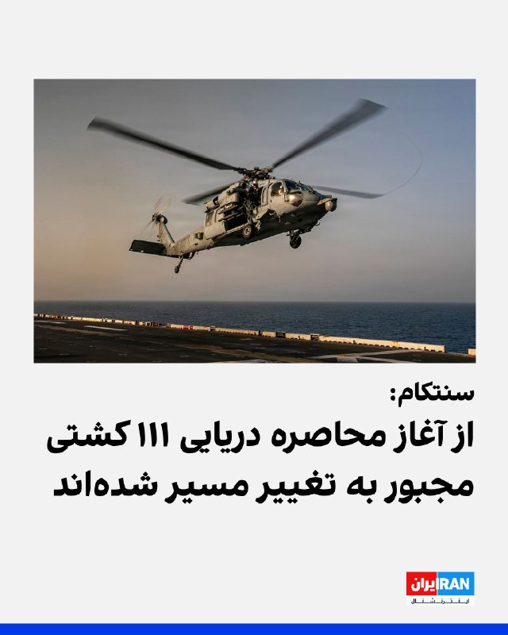

سنتکام اعلام کرد که از آغاز محاصره دریایی ایران تاکنون، ۱۱۱ کشتی تجاری مجبور به تغییر مسیر شده‌اند.
سنتکام همچنین با انتشار تصویری از ناو «یو‌اس‌اس تریپولی» اعلام کرد این ناو یکی از بیش از ۲۰ ناو جنگی مشارکت‌کننده در اجرای این محاصره است.
https://iranintl.com/202605287043

## IranIntlTV — post 339417

  <a href="telegram/content/IranIntlTV_339417_1779980308.mp4" target="_blank">🎬 Download video</a>

سنتکام اعلام کرد نیروهای کویتی یک موشک بالستیک شلیک‌شده از ایران به سمت کویت را رهگیری و منهدم کردند. سنتکام این اقدام را نقض فاحش آتش‌بس خواند و افزود که پیش از آن نیز پنج پهپاد انتحاری جمهوری اسلامی در نزدیکی تنگه هرمز رهگیری شد و از پرتاب ششمین پهپاد از یک مرکز نظامی در بندرعباس جلوگیری شد.

جزییات بیشتر با سمیرا قرایی، خبرنگار ایران‌اینترنشنال
@iranintltv

## IranIntlTV — post 339416

  

در پی حملات موشکی و پهپادی جمهوری اسلامی به کویت، وزارت خارجه عربستان سعودی در بیانیه‌ای در شبکه ایکس، حملات خصمانه با موشک و پهپاد به کویت را به‌شدت محکوم و تقبیح کرد.

این وزارتخانه همچنین بر مخالفت قاطع عربستان با نقض حاکمیت کشورها و تلاش برای تهدید امنیت و ثبات منطقه تاکید کرد.

عربستان در ادامه، همبستگی خود با دولت و مردم کویت را اعلام و تاکید کرد از هر اقدامی که کویت برای حفظ حاکمیت، امنیت و ثبات خود اتخاذ کند، حمایت می‌کند.
https://iranintl.com/202605285499

## IranIntlTV — post 339415

  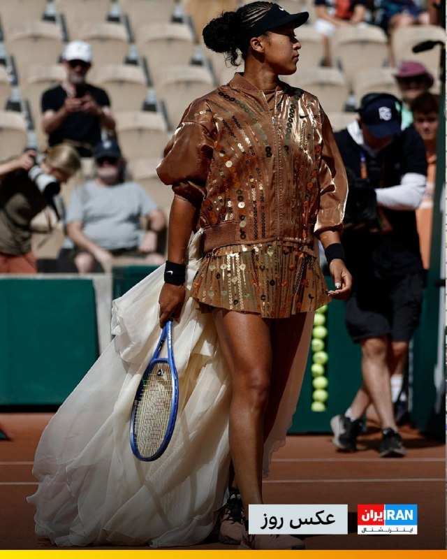

🔻نائومی اوساکا، تنیسور مطرح ژاپنی در دور دوم مسابقات آزاد فرانسه با لباسی نمادین وارد زمین مسابقه شد. ستاره ژاپنی با کت طلایی، لباس پولک‌دوزی‌شده و دنباله‌ای عاجی‌رنگ وارد زمین شد.
اوساکا بعد از صعود به دور سوم گفت دوست دارد مردم را غافلگیر کند و از این‌که لباس‌هایش در زمین تنیس به بخشی از هویت او تبدیل شده لذت می‌برد.

🔹او در مسابقه نخستش هم با دامنی مشکی و لباسی الهام‌گرفته از نورپردازی برج ایفل وارد زمین شد.

🔹او در این زمینه گفت: «ورزشکارها هم بخشی از دنیای سرگرمی هستند. وقتی به زمین مسابقات گرنداسلم‌ها پای می‌گذارم، واقعاً احساس می‌کنم یک هنرمند هستم.»

🔹با این حال، استایل‌های ویژه اوساکا با انتقاد هم روبه‌رو شده است. لورا زیگموند، حریف آلمانی او در دور اول، گفت مشکلی با لباس‌های اوساکا ندارد اما معتقد است نوع برخورد با ستاره‌های بزرگ در دنیای تنیس متفاوت است و بازیکنان معمولی مثل آنها آزادی عمل ندارند.

@iranintltvsport

## IranIntlTV — post 339414

  <a href="telegram/content/IranIntlTV_339414_1779980311.mp4" target="_blank">🎬 Download video</a>

امیرحسین ترکان، مرد ایرانی که شامگاه چهارشنبه در نزدیکی دیوار جاویدنامان در منطقه گولدرز گرین لندن زیر گرفته شد، از بیمارستان پیام داد و حمایت خود را از شاهزاده رضا پهلوی و اعتراضات مردم ایران اعلام کرد. راننده، مرد ۳۹ ساله‌ای اهل عراق است که به اتهام وارد کردن جراحات شدید، رانندگی خطرناک و خودداری از ارائه نمونه آزمایش مواد مخدر بازداشت شده است. پلیس متروپولیتن لندن اعلام کرد تحقیقات ادامه دارد و این پرونده در حال حاضر تروریستی تلقی نمی‌شود. همراه ترکان به ایران اینترنشنال گفت که او از ناحیه گردن آسیب شدید دیده، لگن در دو نقطه شکستگی دارد و شکستگی دنده‌ها منجر به پارگی ریه و خونریزی داخلی شده است.
@iranintltv

## IranIntlTV — post 339412

  <a href="telegram/content/IranIntlTV_339412_1779980311.mp4" target="_blank">🎬 Download video</a>

ارتش اسرائیل اعلام کرد که بیش از ۱۳۵ هدف مرتبط با حزب‌الله در لبنان را هدف قرار داده است. بر اساس این بیانیه، سکوهای پرتاب راکت، یک اردوگاه آموزشی در جنوب لبنان و منطقه بقاع شرقی، و همچنین زیرساخت‌هایی در شهر صور بمباران شد. ارتش اسرائیل همچنین از کشته شدن چند عضو حزب‌الله در این حملات خبر داد.

جزییات بیشتر با بابک اسحاقی، خبرنگار ایران‌اینترنشنال
@iranintltv

## IranIntlTV — post 339411

  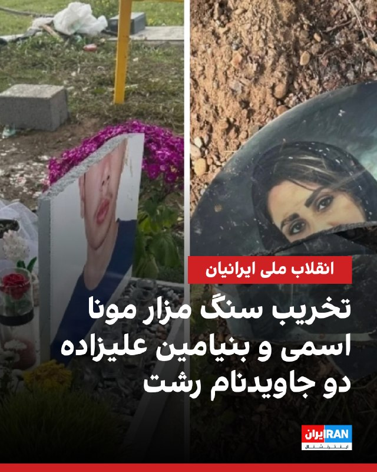

اطلاعات رسیده به ایران‌اینترنشنال نشان می‌دهد سنگ مزار مونا اسمی و بنیامین علیزاده، دو جاویدنام شهر رشت تخریب شده است. طی ماه‌های گذشته گزارش‌هایی مشابه از تخریب و مخدوش‌سازی سنگ مزار معترضان دی‌ماه در شهرهای مختلف ایران منتشر شده است.
https://iranintl.com/202605286208

## IranIntlTV — post 339410

  <a href="telegram/content/IranIntlTV_339410_1779980313.mp4" target="_blank">🎬 Download video</a>

بسیاری از خانواده‌های جاویدنامان اعتراضات در ایران، پس از وصل شدن مجدد اینترنت، اقدام به انتشار تصاویر و روایت‌هایی از آخرین لحظات زندگی عزیزان خود در رسانه‌های اجتماعی کردند.

آیه دریس، عضو تحریریه ایران‌اینترنشنال، از واکنش کاربران می‌گوید
@iranintltv

## IranIntlTV — post 339409

  <a href="telegram/content/IranIntlTV_339409_1779980315.mp4" target="_blank">🎬 Download video</a>

آژانس بین‌المللی انرژی در گزارش تازه خود اعلام کرد که جنگ با حکومت ایران و ادامه بحران در تنگه هرمز، مسیر سرمایه‌گذاری جهانی در حوزه انرژی را به‌طور کامل تغییر داده است.

جزییات بیشتر با لی‌لی نیکفر، خبرنگار ایران‌اینترنشنال
@iranintltv

## IranIntlTV — post 339408

🗣روایت شما از زندگی در آتش‌بس- پنجشنبه ۷ خرداد

🔹می‌خواستم بگم برخلاف خیلی‌ها که از ترامپ و نتانیاهو ناراحت هستن، من برعکس خیلی‌ها ازشون تشکر می‌کنم که تا همین‌جا هم واقعاً کارهای بزرگی انجام دادن. تغییر در رژیم یک رونده و مردم هم به‌هرحال باید این سختی‌ها رو تحمل کنن به امید روزی که نجات پیدا کنیم.
🔹به‌وقتش خود ما می‌جنگیم، می‌میریم و در نهایت ما ایران رو پس می‌گیریم. درسته میگیم تا کی دیگه باید تاوان بدیم، ولی اینم می‌دونیم که آزادی به دست خودمون رقم می‌خوره.
🔹اینجا همه‌چیز داره از هم می‌پاشه؛ زندگی‌ها، کارها، پیوندها، تندرستی، سلامت روان، بهداشت، خوراک و پوشاک. تنها چیزی که ما رو سرپا نگه داشته، دیدن راهپیمایی ایرانیان خارج از کشور در ماهواره و تصور روز آزادیه.
🔹دوستان عزیز یادتون نره که این حکومت در دی‌ماه ۱۴۰۴ چه جنایاتی انجام داد. صرفا چون اینترنت رو وصل کردن نپرید بغل آخوند. این اینترنت حق ماست، پس برای گرفتن حقتون از این ستمگران سپاسگزار نباشید.
🔹اکثریت ما با جمهوری اسلامی مخالفیم و کار آخر رو باید خودمون انجام بدیم.
🔹در طول تاریخ، دیکتاتورها تا لحظه آخر شاخ و شونه می‌کشن و در نهایت به فجیع‌ترین حالت ممکن سقوط می‌کنن. ما برای آزادی بهای سنگینی دادیم؛ چه دی‌ماه و چه قبل از اون، پس صبور باشید و امیدوار.
🔹امروز وصل شدم و خواستم بگم ما در ۱۸ و ۱۹ دی شکوهی از حجم جمعیت و صدایی که خاموش نمی‌شد دیدیم که به این سادگی‌ها ناامید و تموم نمی‌شیم.
🔹خواهش می‌کنم ناامید نشید. به ۱۸ و ۱۹ دی فکر کنید، به اون همه جوان زیبا که رفتن برای آزادی و دیگه برنگشتن. ما باید این کار رو تموم کنیم.

## IranIntlTV — post 339407

  

بنیامین نتانیاهو، نخست وزیر اسرائیل گفت که ارتش این کشور با قدرت به حملات علیه حزب‌الله ادامه خواهد داد.
نتانیاهو اضافه کرد که نیروهای اسرائیل از رودخانه لیتانی در جنوب لبنان عبور کرده‌اند.

بنیامین نتانیاهو، سه‌شنبه اعلام کرده بود که ارتش این کشور با «نیروهای گسترده زمینی» در جنوب لبنان در حال عملیات است و کنترل «مناطق راهبردی» را در دست می‌گیرد.
https://iranintl.com/202605286880

## IranIntlTV — post 339406

  

کایا کالاس، مسئول سیاست خارجی اتحادیه اروپا، در پایان نشست غیررسمی وزیران خارجه این اتحادیه در قبرس گفت که هر توافق اولیه میان آمریکا و جمهوری اسلامی، باید با مذاکرات عمیق‌تر درباره ذخایر هسته‌ای و دیگر مسائل حیاتی مرتبط با امنیت منطقه تکمیل شود.

مسئول سیاست خارجی اتحادیه اروپا گفت که این اتحادیه همکاری‌های امنیتی و دفاعی خود را با کشورهای خلیج فارس افزایش می‌دهد.
https://iranintl.com/202605287506

## Shin_Persian — post 6282

↩️ Quoted tweet: acceladealer ✓ @acceladealer Thu, 28 May 2026 11:38:42 UTC Damage to mid-rise building (claimed targeted assassination) in BEIRUT, Lebanon 33.808852, 35.508167 @GeoConfirmed @FaytuksNetwork geolocated by @acceladealer ↩️ توییت نقل‌قول…

## Shin_Persian — post 6281

  

↩️ Quoted tweet:
acceladealer ✓ @acceladealer
Thu, 28 May 2026 11:38:42 UTC

Damage to mid-rise building (claimed targeted assassination) in BEIRUT, Lebanon

33.808852, 35.508167

@GeoConfirmed @FaytuksNetwork

geolocated by @acceladealer

↩️ توییت نقل‌قول شده — برای پاسخ، پست زیر را ببینید.

فارسی

خسارت به یک ساختمان میان‌مرتبه (ادعای ترور هدفمند) در بیروت، لبنان

33.808852, 35.508167

@GeoConfirmed @FaytuksNetwork

تایید موقعیت جغرافیایی توسط @acceladealer_

𝕏 · @shin_persian

## Shin_Persian — post 6280

  <a href="telegram/content/Shin_Persian_6280_1779980318.mp4" target="_blank">🎬 Download video</a>

Shin ✓ @hey_itsmyturn
Thu, 28 May 2026 11:32:41 UTC

Reported video of the targeted building where Ali al-Husni, head of the IRGC-backed Imam Hussein Division's missile forces was targeted by #IAF 🇮🇱

فارسی

ویدیو منتشر شده از ساختمان مورد هدف که در آن علی‌الحسنی، رئیس نیروهای موشکی لشکر امام حسین (تحت حمایت سپاه پاسداران - IRGC)، توسط نیروی هوایی اسرائیل (#IAF) 🇮🇱 هدف قرار گرفت.

𝕏 · @shin_persian

## ManotoTV — post 105852

  <a href="telegram/content/ManotoTV_105852_1779980319.mp4" target="_blank">🎬 Download video</a>

سخنرانی امیرعباس هویدا در جمع دانشجویان درباره نقش جوانان در توسعه و اداره کشور

## ManotoTV — post 105845

  <a href="telegram/content/ManotoTV_105845_1779980320.mp4" target="_blank">🎬 Download video</a>

اینترنت در ایران فقط ابزار ارتباط نیست، میدان قدرت است. هر بار که قطع یا وصل می‌شود، حکومت در واقع در حال تنظیم سطح کنترل خود بر جامعه است، اینکه مردم چه ببینند، چه بگویند، چگونه وصل شوند و تا چه اندازه بتوانند با هم عمل کنند.

## FarsiVOA — post 218891

  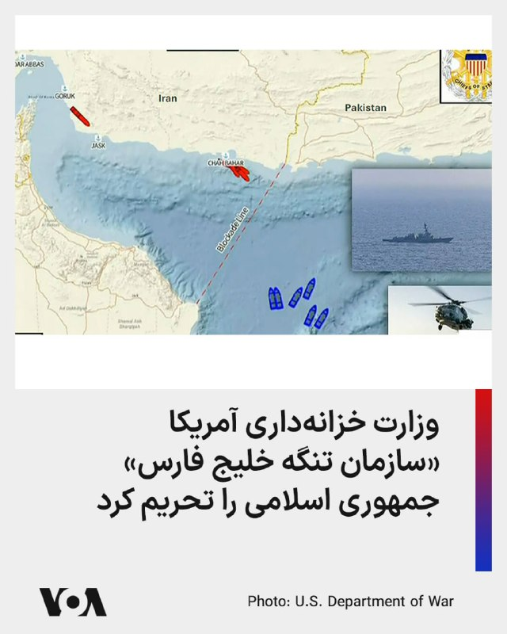

⚡️وزارت خزانه‌داری آمریکا «سازمان تنگه خلیج فارس» جمهوری اسلامی را تحریم کرد

دولت دونالد ترامپ، رئیس جمهوری ایالات متحده، در ادامه کارزار «خشم اقتصادی» علیه جمهوری اسلامی، روز پنجشنبه ۷ خرداد نهاد موسوم به «سازمان تنگه خلیج فارس» جمهوری اسلامی را تحریم کرد؛ اقدامی که مقامات آمریکایی آن را بخشی از تلاش واشنگتن برای مقابله با «اخاذی دریایی» تهران و تحمیل فشار اقتصادی حداکثری علیه رژیم ایران توصیف می‌کنند.

اسکات بسنت، وزیر خزانه‌داری آمریکا، نیز اعلام کرد دولت دونالد ترامپ فشار اقتصادی بر جمهوری اسلامی را به‌طور بی‌سابقه‌ای تشدید کرده و هشدار داد که تنها یک «نتیجه رضایت‌بخش» در مذاکرات می‌تواند مانع ادامه سقوط اقتصادی رژیم ایران شود. او افزود که کارزار «خشم اقتصادی» آمریکا، رژیم ایران را در آستانه فروپاشی قرار داده است.

## FarsiVOA — post 218890

🔺گزارش | «امروز نوبت من است، فردا نوبت دیگری»؛ اعدام ناصر بکرزاده پس از دو بار نقض حکم

▪️ناصر بکرزاده، ۲۶ ساله، که خود را «فرزند ملامنصور و دارای دو خواهر کوچک‌تر» معرفی کرده، پیش از اجرای حکم اعدامش در نامه‌ای از زندان ارومیه نوشت: «اعدام مرا کشت، متلاشی کرد و هر لحظه مردن خودم را می‌بینم و خانواده‌ام را هم از پای درآورده است.» او در این نامه، که پنجم اردیبهشت امسال و پس از تایید حکم اعدامش در دیوان عالی کشور منتشر شد، از مردم خواست: «از کنار این نامه اعدام راحت رد نشوید، امروز نوبت من است و فردا نوبت فرد دیگری.»

⬇️ بیشتر بخوانید:

https://ir.voanews.com/a/iran-execution-naser-bakrzadeh-orumieh-war/8154490.html/?nocach=1

## FarsiVOA — post 218889

🔺دیدگاه | هنرمند ایرانی؛ محتاط در بازی دو-سر-باخت

▪️«با یک کروسان، خارجی شدی خانم آهنگرانی؟»!

این تیتر نوشته‌ای است که در اواسط هفتاد و نهمین جشنواره فیلم کن در وبسایت روزنامه فرهیختگان منتشر شد. خطاب و انتقادش به پگاه آهنگرانی بازیگر سابق و فیلمساز فعلی بود که مستند جدیدش «تمرین‌هایی برای یک انقلاب» در بخش نمایش‌های ویژه جشنواره به نمایش درآمد و جایزه بهترین مستند حاضر در بخش‌های گوناگون کن ۲۰۲۶ را از آن خود کرد.

⬇️ بیشتر بخوانید:

https://ir.voanews.com/a/iran-artists-festival-actors-cannes-/8154505.html

## FarsiVOA — post 218888

🔺سنتکام: مسیر ۱۱۱ شناور تجاری را تغییر داد‌ه‌ایم

▪️فرماندهی مرکزی ایالات متحده، سنتکام، پنج‌شنبه ۷ خرداد، اعلام کرد: «نیروهای آمریکایی در ادامه اجرای محاصره علیه جمهوری اسلامی، مسیر ۱۱۱ شناور تجاری را تغییر داد‌ه‌اند.»

⬇️ بیشتر بخوانید:

https://ir.voanews.com/a/centcom-change-of-course-111-vessels-iran/8154830.html/?nocach=1

## FarsiVOA — post 218887

  <a href="telegram/content/FarsiVOA_218887_1779980322.mp4" target="_blank">🎬 Download video</a>

بنا بر گزارش‌ها، ارتش اسرائیل طی ۲۴ ساعت گذشته بیش از ۱۳۵ هدف وابسته به حزب‌الله را در صور، دره بقاع و جنوب لبنان هدف قرار داده است.

ویدیوی منتشر شده همچنین حمله به گروهی را نشان می‌دهد که به گفته اسرائیل پس از خروج از یک محل پرتاب در شهر صور هدف قرار گرفتند.

@FarsiVOA

## FarsiVOA — post 218886

پلیس سوئیس اعلام کرد در حمله با چاقو در ایستگاه قطار شهر وینترتور، سه نفر زخمی شدند.

گزارش‌ها حاکی است مهاجم ۳۱ ساله پس از حمله بازداشت شده است.

@FarsiVOA

## FarsiVOA — post 218885

🔺سه زخمی در حمله با سلاح سرد در سوئیس

◾️پلیس محلی سوئیس روز پنجشنبه ۷ خرداد اعلام کرد که مردی سه نفر را در حمله با چاقو در یک ایستگاه قطار در شهر وینترتور سوئیس در نزدیکی زوریخ زخمی کرده بود، دستگیر شد.

⬇️ بیشتر بخوانید:

https://ir.voanews.com/a/switzerland-attack-injury-allaho-akbar/8154821.html

## FarsiVOA — post 218884

  

ارگان خبری مجموعه فعالان حقوق بشر در ایران خبر داد که تارا و کیمیا داوودی، دو خواهر محبوس در زندان اوین، توسط شعبه ۱۵ دادگاه انقلاب تهران به ریاست قاضی ابوالقاسم صلواتی در مجموع به ۱۶ سال حبس محکوم شده‌اند.

براساس این گزارش، کیمیا داوودی به اتهاماتی از جمله «ارتباط با گروه‌ها و شبکه‌های معاند» و «اجتماع و تبانی علیه امنیت کشور» به ۱۰ سال زندان و تارا داوودی نیز به اتهاماتی شامل «اجتماع و تبانی علیه امنیت کشور» و «تبلیغ علیه نظام» به شش سال حبس محکوم شده است.

این دو خواهر در تاریخ ۲۴ دی‌ماه ۱۴۰۴ در جریان اعتراضات سراسری در تهران بازداشت شدند و هم‌اکنون در بند زنان زندان اوین نگهداری می‌شوند. به گفته منابع حقوق بشری، بازداشت آن‌ها با خشونت نیروهای امنیتی همراه بوده است.
@FarsiVOA

## FarsiVOA — post 218883

  

وزارت خارجه کویت حملات اخیر موشکی و پهپادی رژیم ایران به خاک کویت را به عنوان یک تشدید تنش جدی و نقض آشکار حاکمیت و امنیت محکوم کرد.

این وزارتخانه روز پنج‌شنبه اعلام کرد که تهران را کاملاً مسئول حملات اخیر می‌داند و حکومت ایران خواست فوراً و بدون قید و شرط حملات را متوقف کند.

پیشتر ستاد کل ارتش کویت اعلام کرد که پدافند هوایی این کشور در حال مقابله با «حملات موشکی و پهپادهای دشمن» است. با این حال، ارتش کویت نگفت این تهدیدها از کجا آمده‌ بودند.

بیانیه وزارت خارجه کویت همزمان با یک بیانیه سنتکام منتشر شد که در آن، ستاد فرماندهی مرکزی آمریکا، گزارش داد که در ساعت ۱۰:۱۷ شب چهارشنبه ۲۷ مه به وقت شرق آمریکا، حدود ساعت ۶ بامداد به وقت تهران، جمهوری اسلامی یک موشک بالستیک به سوی کویت شلیک کرد که با موفقیت توسط نیروهای کویتی رهگیری شد.
@FarsiVOA

## FarsiVOA — post 218882

  

خبرگزاری فارس وابسته به سپاه، با انتشار گزارشی اعلام کرد که هزینه‌های بالای دندان‌پزشکی و عدم پوشش بیمه، دلایل اصلی مراجعه نکردن شهروندان به دندانپزشکی است.

این خبرگزاری هزینه درمان هر دندان را حدود ۱۵ الی ۴۰ میلیون تومان گزارش و اعلام کرد که شرکت‌های بیمه‌ حتی یک ریال از این هزینه هنگفت را پرداخت نمی‌کنند.

طبق آمارهای موجود، هر ایرانی حداقل شش دندان پوسیده دارد و تنها هزینه عصب‌کشی یک دندان، حدود هفت میلیون است.

بر اساس گزارش خبرگزاری فارس، هزینه هر واحد «ایمپلنت» ۲۳ الی ۳۰ میلیون تومان و هزینه پرکردن هر دندان با مواد نیز چهار تا ۱۲ میلیون تومان است.

شورای عالی کار جمهوری اسلامی، حداقل دستمزد ماهانه کارگران را ۱۶ میلیون و ۶۰۰ هزار تومان تعیین کرده است.
@FarsiVOA

## FarsiVOA — post 218881

  

نت‌بلاکس، نهاد ناظر بر اختلالات اینترنتی، اعلام کرد که علیرغم اینکه دسترسی به شبکه جهانی تا حد زیادی در ایران بازگشته است، اما شاخص‌ها نشان می‌دهند که کاربران همچنان با فیلترینگ شدید مواجه هستند.

نت‌بلاکس، این فیلترینگ شدید را مشابه دوره مابین اعتراضات سراسری دی ماه و آغاز عملیات نظامی علیه جمهوری اسلامی، حدفاصل دی ماه تا اسفند ۱۴۰۴ توصیف کرد.

دسترسی شهروندان ایرانی به اینترنت بین‌المللی، از روز نهم اسفند ۱۴۰۴ قطع شد و جمهوری اسلامی پس از ۸۸ روز، در شامگاه پنجم خرداد ۱۴۰۵ به صورت ناپایدار اینترنت را وصل کرد.

بر اساس اعلام نت‌بلاکس، این زمان، طولانی‌ترین دوره قطع اینترنت در جهان از سوی یک کشور دارای زیرساخت اینترنت بوده و از این بابت جمهوری اسلامی رکورددار است.
@FarsiVOA

## FarsiVOA — post 218880

  

وزیرعلوم، تحقیقات و فناوری از احتمال برگزاری کنکور سراسری ۱۴۰۵ در دهه سوم مرداد خبر داد و هم‌زمان نسبت به کاهش چشمگیر استقبال از رشته‌های علوم پایه در کشور هشدار داد.

حسین سیمایی‌صراف اعلام کرد براساس پیش‌بینی‌ها، کنکور سراسری ۱۴۰۵ احتمالاً در دهه سوم مرداد برگزار می‌شود و جزئیات نهایی آن به ‌زودی از سوی سازمان سنجش آموزش کشور اعلام خواهد شد.

وی با اشاره به کاهش حدود ۵۰ درصدی استقبال از رشته‌های علوم پایه در سه دهه اخیر گفت این روند می‌تواند آینده علمی کشور را تحت تأثیر قرار دهد و نیازمند حمایت جدی و ایجاد مشوق‌های شغلی برای دانشجویان این حوزه است.

در حالی که زمان احتمالی برگزاری کنکور اعلام شده، هنوز زمان دقیق آزمون و همچنین امتحانات نهایی پایه دوازدهم مشخص نیست.

سازمان سنجش آموزش کشور اعلام کرده زمان نهایی کنکور و آزمون دانشجو معلم یک هفته پیش از برگزاری اطلاع‌ رسانی می‌شود. همچنین وزارت آموزش‌ و پرورش گفته است تکلیف امتحانات نهایی تا نیمه مرداد مشخص خواهد شد.
@FarsiVOA

## FarsiVOA — post 218879

🔺ریزش بازارهای جهانی سهام در پی افزایش تنش‌های نظامی خاورمیانه

▪️در پی افزایش تنش‌های نظامی میان جمهوری اسلامی و آمریکا ارزش سهام بازارهای جهانی افت کرد.

▪️شاخص فراگیر بازار سهام «استاکس اروپا ۶۰۰» با ۰.۶ درصد افت مواجه شد و تمام بورس‌های بزرگ منطقه نیز در محدوده منفی معامله شدند.

▪️افت چشمگیر شاخص سهام عمدتاً مربوط به کشورهایی است که به شدت به نفت خاورمیانه وابسته هستند و ذخایر استراتژیک نفت چندانی نیز ندارند؛ از جمله تایوان، سنگاپور، فیلیپین و تا حدودی کره جنوبی.

▪️شاخص بازار‌های سهام آسیایی به استثنای پاکستان و تا حدودی چین، در همه کشورها افت کرده است. اگرچه در خود چین برخی بازارهای سهام رشد نشان می‌دهد، اما شاخص بازارهای هنگ‌کنگ با شدت بیشتری افت کرده است.

⬇️ بیشتر بخوانید:
https://ir.voanews.com/a/global-stock-markets-plunge-as-middle-east-military-tensions-rise/8154816.html

## FarsiVOA — post 218878

🔺واکنش سنتکام به پرتاب موشک بالستیک به کویت توسط رژیم ایران: «نقض فاحش آتش‌بس» است

▪️سنتکام حمله رژیم ایران به کویت با یک فروند موشک بالستیک را «نقض فاحش آتش‌بس» توسط رژیم ایران خواند و بر تداوم هوشیاری آمریکا و شرکای منطقه‌ای برای مقابله با «تجاوزگری غیرموجه» رژیم ایران تاکید کرد.

⬇️ بیشتر بخوانید:

https://ir.voanews.com/a/centcom-says-iran-missle-strike-kuwait-egregious-ceasefire-violation/8154817.html

## DW_Farsi — post 125245

  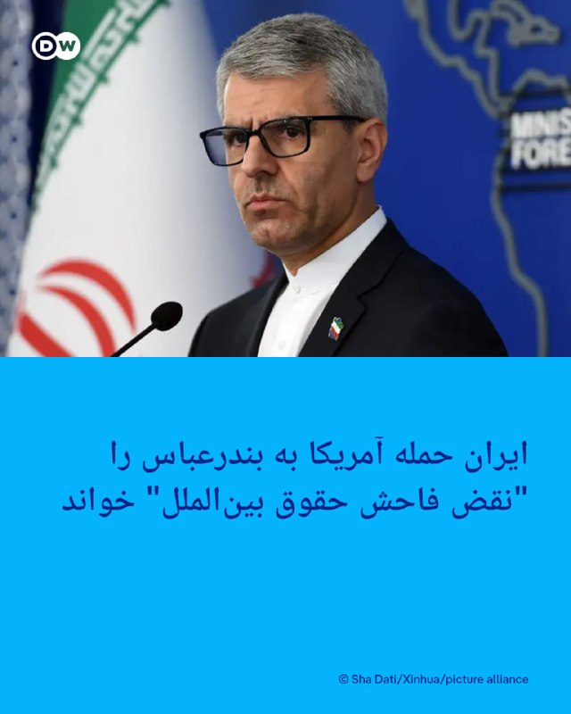

🔶 ایران حمله آمریکا به بندرعباس را "نقض فاحش حقوق بین‌الملل" خواند

سخنگوی وزارت خارجه جمهوری اسلامی حملات آمریکا به مناطقی در بندرعباس را "اقدامی تجاوزکارانه" توصیف کرد.

اسماعیل بقایی روز پنجشنبه ۷ خرداد (۲۸ مه) حملات آمریکا به مناطقی در بندرعباس را نقض "تمامیت سرزمینی و حاکمیت ملی ایران و نقض فاحش حقوق بین‌الملل و منشور ملل متحد" خواند.

بقایی همچنین آمریکا را به "نقض مستمر آتش‌بس" متهم کرد و هشدار داد که تعرض به کشتیرانی تجاری در خلیج فارس و حملات هوایی به مناطق جنوبی ایران، عزم تهران را برای "دفاع از حاکمیت ملی" تقویت می‌کند.

پیش‌تر فرماندهی مرکزی آمریکا (سنتکام) با انتشار بیانیه‌ای در شبکه ایکس اعلام کرده بود ایران در شامگاه ۲۷ مه یک موشک بالستیک به‌سوی کویت شلیک کرده که توسط نیروهای کویتی رهگیری شده است.

به گفته سنتکام، این اقدام ساعاتی پس از پرتاب پنج پهپاد انتحاری از سوی نیروهای جمهوری اسلامی در نزدیکی تنگه هرمز رخ داده است.

آمریکا می‌گوید تمامی این پهپادها رهگیری شده‌اند و نیروهای آمریکایی همچنین مانع پرتاب ششمین پهپاد از یک مرکز کنترل زمینی در بندرعباس شده‌اند.

@dw_farsi

## DW_Farsi — post 125244

  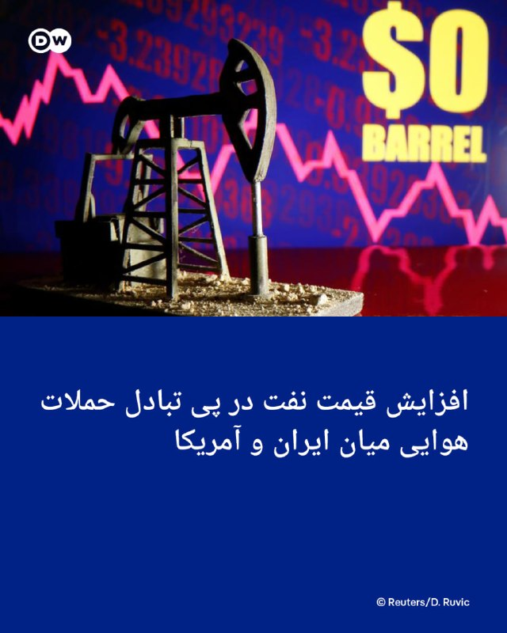

🔶 افزایش قیمت نفت در پی تبادل حملات هوایی میان ایران و آمریکا

قیمت نفت در معاملات اولیه روز پنج‌شنبه ۲۸ مه (هفتم خرداد) به‌شدت افزایش یافت. فعالان بازار دلیل این رشد را حملات تازه در منطقه خلیج فارس و همچنین دور جدید تحریم‌های آمریکا علیه ایران عنوان کردند.

به این ترتیب، قیمت هر بشکه نفت برنت، شاخص جهانی نفت خام برای تحویل در ماه ژوئیه، بیش از ۳.۵۸ درصد افزایش یافت و به ۹۷.۶۷ دلار رسید. با این حال، قیمت همچنان پایین‌تر از مرز روانی ۱۰۰ دلار باقی مانده است. روز چهارشنبه قیمت نفت برنت به‌طور موقت بیش از پنج درصد کاهش یافته بود.

آمریکا و ایران با وجود آتش‌بس و مذاکرات جاری برای پایان جنگ، بار دیگر در تنگه هرمز حملاتی علیه یکدیگر انجام دادند. دولت آمریکا اعلام کرد: «این اقدامات محدود، صرفا دفاعی و با هدف حفظ آتش‌بس انجام شده‌اند.»

سپاه پاسداران انقلاب اسلامی نیز با صدور بیانیه‌ای اعلام کرد که در واکنش به حمله بامداد پنجشنبه ارتش ایالات متحده آمریکا به مناطق اطراف فرودگاه بندرعباس، یک پایگاه هوایی آمریکا را هدف حمله قرار داده است.

@dw_farsi

## DW_Farsi — post 125243

🔶 عفو بین‌الملل: تشدید سرکوب و اعدام در سایه جنگ

عفو بین‌الملل در گزارشی تازه اعلام کرد مقام‌های جمهوری اسلامی از زمان آغاز حمله امریکا و اسرائیل به ایران در ۲۸ فوریه ۲۰۲۶، موج تازه‌ای از سرکوب را به راه انداخته‌اند که شامل بازداشت‌های گسترده خودسرانه، محاکمه‌های شتاب‌زده و ناعادلانه، اعدام‌های با انگیزه سیاسی، صدور احکام سنگین حبس، ضبط اموال و قطع طولانی‌مدت اینترنت بوده است.

این نهاد می‌گوید در این مدت بیش از ۶ هزار نفر، از جمله معترضان، روزنامه‌نگاران، وکلا، مدافعان حقوق بشر، منتقدان و اعضای اقلیت‌های قومی و مذهبی بازداشت شده‌اند و هم‌زمان دست‌کم ۳۹ نفر در پرونده‌های سیاسی اعدام شده‌اند.

عفو بین‌الملل می‌گوید مقام‌های قضایی و امنیتی در این دوره، روندهای قضایی را شتاب داده‌اند و برای شماری از بازداشت‌شدگان، اتهام‌های مستوجب اعدام مطرح کرده‌اند.

این نهاد نسبت به ناپدیدسازی قهری، شکنجه، بدرفتاری، محرومیت از وکیل و استفاده از "اعتراف"‌های اجباری در دادگاه‌های نمایشی هشدار داده است.

در این گزارش آمده که نسرین ستوده پس از بازداشت در تهران، حدود شش هفته در وضعیت ناپدیدسازی قهری قرار داشت و خانواده‌اش از محل نگهداری او بی‌خبر بودند.

همچنین نام وکلایی چون آستاره انصاری و الهام زراعت‌پیشه و نیز مری محمدی، روزنامه‌نگار و فعال حقوق بشر، در میان افرادی آمده که پس از بازداشت، مقام‌ها از اعلام سرنوشت و محل نگهداری‌شان خودداری کرده‌اند.

عفو بین‌الملل همچنین از مواردی چون اعدام ساختگی، آویزان کردن، ضرب‌وشتم، نگه‌داری طولانی‌مدت در انفرادی، محرومیت از غذا و درمان و پخش ویدیوهای "اعتراف" اجباری از رسانه‌های دولتی خبر داده است.

این نهاد می‌گوید ۱۸ ویدیو را بررسی کرده که در آن‌ها ده‌ها نفر در وضعیت آشکار فشار و درماندگی، به اقدام‌هایی مسالمت‌آمیز مانند ارسال تصاویر حملات برای رسانه‌های خارج از کشور "اعتراف" می‌کنند.

یکی از محورهای اصلی این گزارش، قطع ۸۸ روزه اینترنت جهانی در ایران است؛ اقدامی که عفو بین‌الملل آن را طولانی‌ترین و خفه‌کننده‌ترین خاموشی اینترنتی ثبت‌شده توصیف کرده است.

این نهاد می‌گوید حکومت با این اقدام، بیش از ۹۰ میلیون نفر را عملا در انزوای اطلاعاتی قرار داد و هم‌زمان فعالیت آنلاین را با برچسب "جاسوسی" و "همکاری با دشمن" جرم‌انگاری کرد.

بر اساس این گزارش، حکومت یک نظام تبعیض‌آمیز دسترسی طبقاتی ایجاد کرده که در آن فقط شمار محدودی از کاربران مورد تأیید، از جمله نهادهای حکومتی و برخی بخش‌های حرفه‌ای، به اینترنت کم‌تر محدودشده دسترسی داشتند.

در مقابل، بخش بزرگی از جامعه از اینترنت جهانی محروم ماند.

عفو بین‌الملل می‌گوید نهادهایی مانند فراجا، وزارت اطلاعات و سپاه با ارسال پیامک‌های مستقیم، مردم را تهدید کرده‌اند که استفاده از وی‌پی‌ان، اینترنت ماهواره‌ای یا حتی ثبت و انتشار تصاویر مناطق بمباران‌شده می‌تواند به بازداشت، ضبط اموال، قطع خدمات ارتباطی و پیگرد قضایی منجر شود.

در برخی از این پیام‌ها، صریحا به قانون موسوم به "جاسوسی" اشاره شده که مجازات اعدام را پیش‌بینی می‌کند.

این نهاد همچنین می‌گوید وزارت اطلاعات در ۱۷ مارس ۲۰۲۶ اعلام کرده بود "صدها" دستگاه استارلینک را ضبط کرده و استفاده از آن‌ها را جرم مستوجب مجازات سنگین، حتی اعدام، خوانده است.

اریکا گوئوارا روساس، مدیر ارشد بخش پژوهش، سیاست‌گذاری و کارزارهای عفو بین‌الملل، گفته است: «مقام‌های جمهوری اسلامی از این بحران برای فرسایش بیشتر حقوق مردم ایران استفاده می‌کنند؛ مردمی که خود پیشاپیش از پیامدهای ویرانگر حملات غیرقانونی آمریکا و اسرائیل و نیز دهه‌ها نقض حقوق بین‌الملل از سوی حکومت ایران رنج برده‌اند.»

عفو بین‌الملل می‌گوید حکومت ایران برای حفظ قدرت، "حمله‌ای همه‌جانبه" را علیه هر کسی به راه انداخته که از جمهوری اسلامی انتقاد کند، درباره حملات آمریکا و اسرائیل اطلاع‌رسانی کند، یا بخواهد با شکستن خاموشی اینترنت با جهان بیرون ارتباط بگیرد.

این نهاد خواستار آزادی همه بازداشت‌شدگان خودسرانه، توقف شکنجه و بدرفتاری، روشن شدن سرنوشت ناپدیدشدگان، رفع کامل محدودیت‌های اینترنتی و توقف فوری همه اعدام‌ها شده است.

@dw_farsi

## DW_Farsi — post 125242

🔶 موج‌های گرما؛ بحران تازه اقتصاد آلمان تا سال ۲۰۳۰

گرمای شدید به یک مشکل فزاینده برای اقتصاد آلمان تبدیل شده است.

بر اساس بررسی‌های شرکت بیمه اعتبار "آلیانتس ترید"، در صورت تکرار موج‌های گرمای دهه گذشته، اقتصاد آلمان ممکن است تا سال ۲۰۳۰ متحمل حدود ۱۱۲.۵ میلیارد یورو زیان شود.

"آلیانتس ترید" از یک فشار مضاعف بر شرکت‌ها سخن می‌گوید: از یک سو با افزایش دما بهره‌وری کاهش می‌یابد و از سوی دیگر هزینه‌های انرژی بالا می‌رود. طبق این پژوهش، به ازای هر درجه افزایش دمای بالاتر از ۳۰ درجه سانتی‌گراد، بهره‌وری حدود ۳ درصد کاهش می‌یابد.

در همین حال، هزینه‌های انرژی به دلیل نیاز بیشتر به سیستم‌های سرمایشی، به ازای هر درجه حدود ۱.۲ درصد افزایش پیدا می‌کند.

میلو بوگارتس، رئیس شرکت "آلیانتس ترید" در آلمان، اتریش و سوئیس می‌گوید: «گرمای شدید مدت‌هاست که دیگر یک پدیده هواشناسی کوتاه‌مدت نیست، بلکه یک شوک اقتصادی ساختاری است.»

او افزود بزرگ‌ترین خسارت نه امروز، بلکه در آینده رخ خواهد داد؛ زیرا کاهش انتظار سوددهی، سرمایه‌گذاری‌ها را محدود می‌کند و در نتیجه بهره‌وری و توان رقابت اقتصادی در آینده کاهش می‌یابد.

این وضعیت به‌طور محسوس رشد اقتصادی را تحت فشار قرار می‌دهد. کارشناسان هشدار می‌دهند که تا سال ۲۰۳۰ تولید اقتصادی آلمان به دلیل موج‌های گرما می‌تواند به شدت کاهش یابد.

در چهار سال آینده، کاهش تولید ناخالص داخلی (BIP) تا میزان ۳ درصد امکان‌پذیر است. طی چهار سال آینده ممکن است تولید ناخالص داخلی آلمان تا سه درصد افت کند.

با این حال، آلمان در رتبه‌بندی متوسط اروپا قرار می‌گیرد؛ بدتر از کشورهای خنک شمال اروپا مانند ایرلند و فنلاند، اما بهتر از کشورهای گرم‌تر جنوب اروپا مانند اسپانیا و ایتالیا.

از نظر آلیانتس ترید، اثرات اقتصادی گرما پس از عبور دما از آستانه ۳۰ درجه وارد فاز منفی می‌شود.

اروپا از نظر تاریخی برای مقابله با سرما طراحی شده و هنوز هم آمادگی کافی برای گرمای شدید ندارد. در مقابل، در مناطقی مانند آمریکا، خاورمیانه یا آسیا، گرما دهه‌هاست بخشی از برنامه‌ریزی شهری و اقتصادی بوده است.

این تفاوت در استفاده از سیستم‌های تهویه نیز دیده می‌شود.

در حالی که حدود ۹۰ درصد خانه‌های آمریکا مجهز به کولر هستند، این رقم در اروپا تنها حدود ۱۹ درصد است. افزون بر آن، بسیاری از ساختمان‌های اروپایی به‌گونه‌ای ساخته شده‌اند که گرما را حفظ کنند، نه اینکه آن را دفع کنند.

@dw_farsi

## DW_Farsi — post 125241

  <a href="telegram/content/DW_Farsi_125241_1779980326.mp4" target="_blank">🎬 Download video</a>

🎥 آیا هوش مصنوعی انرژی جزر و مدی را متحول می‌کند؟
 
انرژی جزر و مدی هنوز از برق خورشیدی و بادی گران‌تر است.
اما پژوهشگران می‌گویند فناوری‌های جدید و هوش مصنوعی می‌توانند تولید برق از جزر و مد دریا را ارزان‌تر و به بخشی مهم از آینده انرژی پاک تبدیل کنند.

@dw_farsi

## DW_Farsi — post 125240

  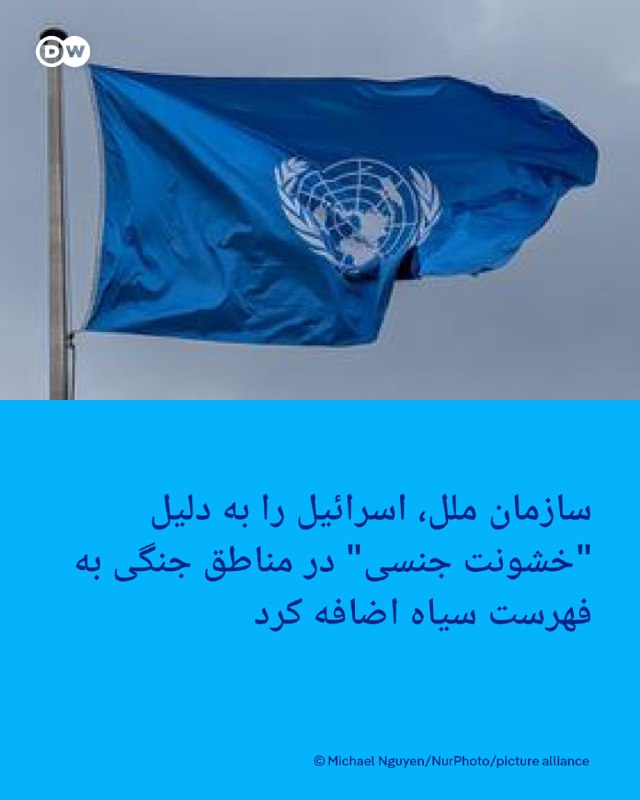

🔶 سازمان ملل، اسرائیل را به دلیل "خشونت جنسی" در مناطق جنگی به فهرست سیاه اضافه کرد

دنی دانون، سفیر اسرائیل در سازمان ملل، می‌گوید سازمان ملل، این کشور را به دلیل "خشونت جنسی در مناطق جنگی" به فهرست سیاه اضافه کرده است.

او در پستی در رسانه‌های اجتماعی، با اشاره به تصمیم سازمان ملل در این زمینه این تصمیم را "تصمیمی سیاسی" خواند.

طبق گزارش‌های رسانه‌های اسرائیلی، سازمان زندان‌های اسرائیل در کنار سایر مقامات اسرائیلی، از جمله چندین نهادی است که به فهرست سازمان ملل اضافه شده‌اند.

پیش از این شبکه تلویزیونی الجزیره در مورد آن چه که "تجاوز جنسی و خشونت انجام شده توسط نیروهای اسرائیلی علیه فلسطینیان" خوانده شده، گزارش داده بود.

اسرائیل، آنتونیو گوترش، دبیرکل سازمان ملل را به جانبداری سیاسی متهم کرده و گفته که روابط خود را با دفتر او تعلیق خواهد کرد.
حماس نیز در این فهرست قرار دارد.

سازمان ملل پیش ازاین اعلام کرده بود که این گروه، در جریان حمله هفتم اکتبر و همچنین علیه گروگان‌هایی که در غزه نگهداری می‌شدند، مرتکب خشونت جنسی شده است.

@dw_farsi

## DW_Farsi — post 125239

  <a href="telegram/content/DW_Farsi_125239_1779980327.mp4" target="_blank">🎬 Download video</a>

🎥 موضع مذاهب در برابر هوش مصنوعی چیست؟

وقتی هوش مصنوعی به دین ورود می‌کند، چه اتفاقی می‌افتد؟
پاپ و دیگر رهبران مذهبی مانند دالایی لاما برای رسیدن به پاسخ این پرسش، تلاش می‌کنند.

@dw_farsi

## DW_Farsi — post 125238

🔶 آمریکا: کمک شرکت‌های سوئیسی به ایران برای دور زدن تحریم‌ها

شماری از شرکت‌های مستقر در سوئیس، از مدیریت نفتکش‌های ناوگان سایه گرفته تا جابه‌جایی پول و سرمایه‌گذاری درآمدهای نفتی، در شبکه‌ای نقش داشته‌اند که به گفته آمریکا برای فروش نفت ایران، دور زدن تحریم‌ها و انتقال منابع مالی به سپاه پاسداران به کار رفته است. این اتهام‌ها هم شرکت‌های کشتیرانی در ژنو و هم یک صندوق سرمایه‌گذاری در تسوگ و یک بانک خصوصی در زوریخ را دربر می‌گیرد.

در گزارش که سازمان رادیو و تلویزیون دولتی سوئیس منتشر کرده است، نام شرکت "فرکتال شیپینگ" در ژنو مطرح شده؛ شرکتی که در سال ۲۰۲۲ مدیریت حدود ۳۰ نفتکش قدیمی را بر عهده گرفت. گفته می‌شود این شرکت ابتدا نفت روسیه را جابه‌جا می‌کرد، اما پس از تشدید تحریم‌های غرب علیه روسیه، مدیرعامل آن، ماتیو فیلیپ، یک شرکت تابعه در دبی تاسیس کرد. آمریکا از تابستان ۲۰۲۵ او و شرکت‌هایش در ژنو و دبی را تحریم کرد و مدعی شد این مجموعه بخشی از یک شبکه ایرانی است.

به گفته آمریکا، محور این شبکه حسین شمخانی ، پسر علی شمخانی، بوده است. واشنگتن می‌گوید او ساختاری از شرکت‌ها را هدایت می‌کرده که نفت ایران را به‌رغم تحریم‌ها به چین و هند می‌رسانده و درآمدهای آن به سپاه پاسداران می‌رسیده است. در همین چارچوب، نفتکش‌های مرتبط با شرکت‌های ماتیو فیلیپ نیز به‌عنوان بخشی از ناوگان سایه در انتقال نفت و بارگیری در بنادر روسیه به کار گرفته شده‌اند.

@dw_farsi

## DW_Farsi — post 125237

  

🔶 ده سال زندان برای دومین متهم پرونده سوءقصد به مسیح علی‌نژاد

پرونده نقشه‌ جمهوری اسلامی برای قتل مسیح علی‌نژاد، روزنامه‌نگار و فعال ایرانی-آمریکایی با محکومیت جاناتان لودهولت ۳۷ ساله به ۱۰ سال زندان وارد مرحله جدیدی شد.

این فرد به همراه همدست خود قرار بود در ازای دریافت ۱۰۰ هزار دلار آمریکا، مسیح علی‌نژاد را به قتل برسانند. وزارت دادگستری ایالات متحده روز چهارشنبه اعلام کرد لودهولت به دلیل مشارکت در طرح قتل سفارشی، به ۱۰ سال زندان محکوم شده است.

لودهولت که اهل منطقه استیتن آیلند نیویورک است، دومین متهم این پرونده است که اکنون راهی زندان می‌شود. در ژانویه نیز همدست او، کارلایل ریورا، محکوم شده بود. او حکم ۱۵ سال زندان دریافت کرده بود. در همین راستا مسیح علی‌نژاد که هدف این طرح ترور بود، پس از انتشار حکم در پستی نوشت: «تا زمانی که حکومت ایران بر سر کار باشد، هیچ‌کدام از ما، چه داخل ایران و چه خارج از آن، امنیت نخواهیم داشت.»

بر اساس اعلام وزارت دادگستری آمریکا، حکومت ایران پشت این سوءقصد نافرجام قرار داشته است. وزارت دادگستری آمریکا نوشت سپاه پاسداران انقلاب اسلامی، سال‌ها برای ربودن یا قتل این روزنامه‌نگار برنامه‌ریزی کرده بود.

@dw_farsi

## DW_Farsi — post 125236

  

🔶 فرمانده نظامی جدید حماس در نوار غزه کشته شد

کمتر از دو هفته پس از کشته شدن فرمانده پیشین گروه تروریستی حماس در غزه ، اسرائیل فرمانده نظامی جدید این گروه را نیز در جریان یک حمله از بین برد.

ارتش اسرائیل و سازمان اطلاعات داخلی شین‌بت صبح چهارشنبه با اعلام این خبر گفتند که محمد عوده پس از ماه‌ها تحت نظر بودن، روز سه‌شنبه در شهر غزه "از بین برده شد".

ارتش اسرائیل و شین‌بت همچنین اعلام کردند: «عوده از آخرین فرماندهان ارشد [زنده در] شاخه نظامی حماس بود که در برنامه‌ریزی و اجرای کشتار ۷ اکتبر نقش داشت.»

شاخه نظامی حماس عصر چهارشنبه، کشته شدن محمد عوده و اعضای خانواده او را تایید کرد. منابع پزشکی در نوار غزه نیز اعلام کردند عوده و چهار نفر از بستگانش در حملات هوایی اسرائیل در شهر غزه کشته شدند. در مجموع شش نفر در این حملات جان خود را از دست داده‌اند.

اسرائیل حدود یک هفته و نیم پیش نیز کشته شدن فرمانده پیشین عوده، یعنی عزالدین الحداد، را در یک حمله هوایی اسرائیل تایید کرده بود. وزیر دفاع اسرائیل آن زمان او را نیز یکی از طراحان اصلی حمله هفتم اکتبر توصیف کرده بود. بر اساس اعلام اسرائیل، عوده اندکی پس از کشته شدن الحداد، رهبری شاخه نظامی حماس در نوار غزه را بر عهده گرفته بود. با این حال، حماس این موضوع را به طور رسمی تایید نکرد.

@dw_farsi

## DW_Farsi — post 125235

  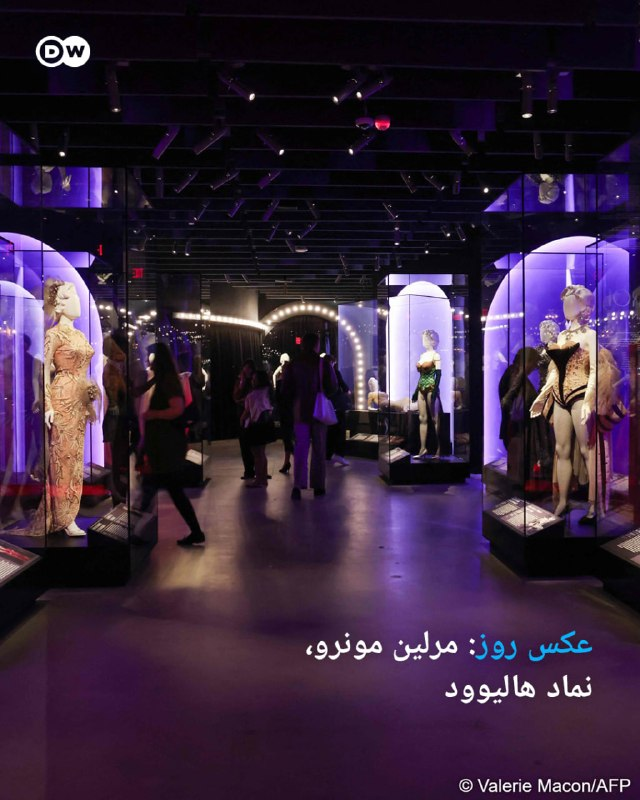

📸 عکس روز: مرلین مونرو، نماد هالیوود

در لس‌آنجلس نمایشگاهی با عنوان "مرلین مونرو: نماد هالیوود" برپا شده است. در این نمایشگاه که به ابتکار "موزه آکادمی تصاویر متحرک" ترتیب داده شده، صدها شیء اصل، از جمله لباس‌ها، پوسترها، عکس‌ها، نامه‌ها و وسایل شخصی‌ مرلین مونرو به نمایش گذاشته شده است. بسیاری از این قطعات منحصر به فرد هستند. این نمایشگاه نگاهی به سیر تحول مرلین مونرو برای تبدیل شدن به یک نماد هالیوود را ارائه می‌دهد.

@dw_farsi

## DW_Farsi — post 125234

  

🔶 تهدید‌ عمان از سوی ترامپ و حمایت ایران از این کشور

اسماعیل بقائی، سخنگوی وزارت امور خارجه جمهوری اسلامی، حملات نظامی بامداد امروز آمریکا به بندرعباس را "نقض فاحش منشور ملل متحد و آتش‌بس نوزدهم فروردین" خواند و آن چه را که "لفاظی‌های واشنگتن علیه ایران و عمان" نامید محکوم کرد.

بقائی همچنین با محکوم کردن "تعرض به کشتیرانی تجاری در منطقه‌ خلیج فارس و آب‌های آزاد و نیز تعرض هوایی به مناطق جنوبی ایران ظرف چند روز گذشته"، بر حق قانونی جمهوری اسلامی برای دفاع برای دفاع طبق ماده ۵۱ منشور سازمان ملل تأکید کرد.

سخنگوی وزارت امور خارجه جمهوری اسلامی همچنین گفت که "با کشور دوست و برادر عمان" ابراز همبستگی می‌کند. او با اشاره ضمنی به اظهارات اخیر ترامپ گفت: «تهدید به "انهدام" یک کشور عضو سازمان ملل متحد که همواره نقشی سازنده، موثر و مسئولانه در قبال صلح و امنیت منطقه داشته و طی سال‌های متمادی در مقام میانجی روندهای دیپلماتیک، مساعی جمیله خود را در خدمت صلح و ثبات منطقه به کار گرفته است، نه تنها نقض اصل بنیادین منع تهدید به استفاده از زور است، بلکه نشانه خطرناک دیگری از عادی‌سازی قانون‌شکنی و قلدرمآبی در روابط بین‌الملل است.»

ترامپ در اظهارات اخیر خود در جریان نشست کابینه درباره آینده تنگه هرمز، به عمان، شریک آمریکا، درباره همکاری با ایران هشدار داده بود.

ترامپ روز چهارشنبه در کاخ سفید با بیان این که عمان باید "مثل بقیه رفتار کند" گفته بود: «در غیر این صورت آمریکا آن‌ها را منهدم خواهد کرد.»

@dw_farsi

## Persian_Trend_Official — post 15188

  <a href="telegram/content/Persian_Trend_Official_15188_1779980331.mp4" target="_blank">🎬 Download video</a>

بنیامین نتانیاهو، نخست وزیر اسرائیل: امروز به بیروت و دیروز به صور حمله کردیم و نیروهای ما از رودخانه لیتانی عبور کرده‌اند.

ما به آنها ضربه می‌زنیم و به شدت ضربه خواهیم زد. ما تهدید پهپادها را حل خواهیم کرد. مبارزه ادامه دارد، پایانی ندارد، مگر اینکه تسلیم شوید.

📝 Amir

📌 @persian_trend_official
پرشین ترند | متفاوت‌ترین کانال نظامی

## Persian_Trend_Official — post 15187

  

عبور 26 فروند کشتی از تنگه هرمز با هماهنگی سپاه

روابط عمومی نیروی دریایی سپاه اعلام کرد: کنترل هوشمند تنگه هرمز با اقتدار کامل در حال انجام است و طی شبانه روز گذشته 26 فروند کشتی تجاری و نفتکش پس از کسب مجوز با هماهنگی نیروی دریایی سپاه از کریدور ایمن تنگه هرمز عبور کردند.

دریافت مجوز و هماهنگی برای تردد در تنگه هرمز یک امر قطعی بوده و همانطور که قبلا اعلام شد عبور از سایر مسیرها به مثابه اخلال شناخته شده و با آنها برخورد می گردد.

شب گذشته نیز چندین کشتی بصورت غیر مجاز با دستکاری و خاموش کردن سیستم های ناوبری، قصد ورود به خلیج فارس را داشتند. رزمندگان نیروی دریایی سپاه بعد از چندین نوبت اخطار رادیویی دو فروند از آنها را در جای خود متوقف و مابقی نیز مجبور به بازگشت شدند.

📝 Amir

📌 @persian_trend_official
پرشین ترند | متفاوت‌ترین کانال نظامی

## RadioFarda — post 157660

  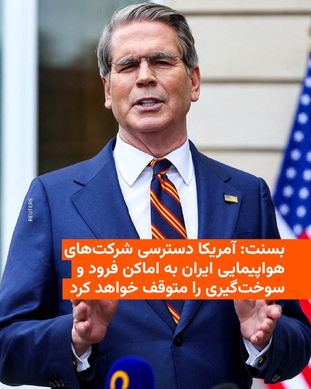

🔸اسکات بسنت، وزیر خزانه‌داری آمریکا، روز پنج‌شنبه گفت که ایالات متحده در راستای افزایش فشار بر تهران و باز نگه داشتن تنگه هرمز، دسترسی شرکت‌های هواپیمایی ایرانی به اماکن فرود را متوقف خواهد کرد.

🔸او در پیامی در شبکه ایکس نوشت که آمریکا «دسترسی هر دو شرکت هواپیمایی ایرانی به اماکن فرود، سوخت‌گیری و فروش بلیت را متوقف خواهد کرد»، اما جزئیات بیشتری ارائه نداد و به نام دو شرکت اشاره نکرد.

🔸ایالات متحده پیش‌تر تعدادی از شرکت‌های هواپیمایی ایران ازجمله ایران ایر و ماهان را در فهرست تحریم‌های خود قرار داده است.

🔸بسنت هشدار داد: «فقط یک نتیجه رضایت‌بخش در مذاکرات می‌تواند به این روند نزولی پایان دهد.»

🔸وزیر خزانه‌داری آمریکا با اشاره به اجرای برنامه «خشم اقتصادی» این وزارتخانه علیه ایران که بعد از برقراری آتش‌بس اجرا می‌شود، اعلام کرد: «نیروهای نظامی آنها حقوق دریافت نمی‌کنند، پلیس سرِ کار حاضر نمی‌شود و جزیره خارک تعطیل شده است. اقتصاد و ارزش پول ایران در وضعیت سقوط آزاد قرار دارد.»

@RadioFarda

## RadioFarda — post 157659

  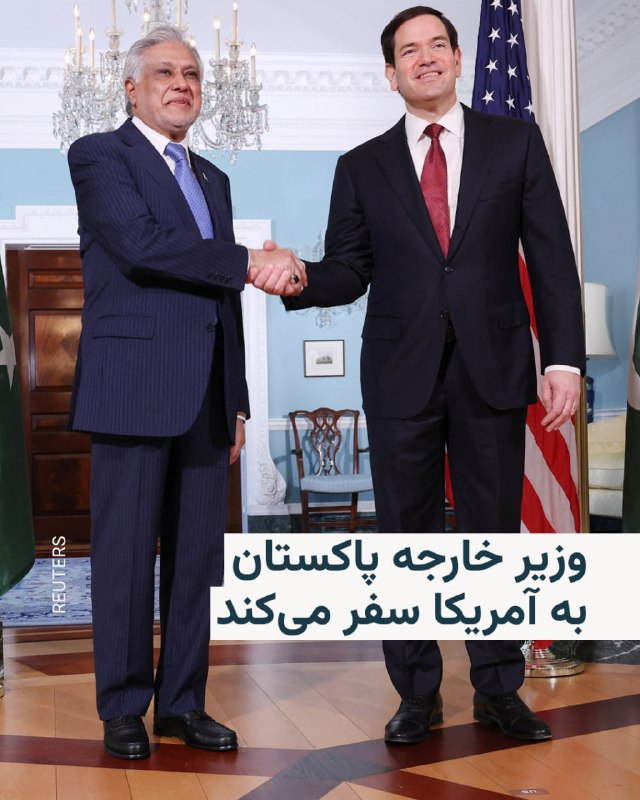

🔸وزارت خارجه پاکستان روز پنج‌شنبه اعلام کرد که اسحاق دار، وزیر خارجه، روز جمعه به واشنگتن سفر خواهد کرد و با مارکو روبیو، وزیر خارجه آمریکا، دیدار می‌کند.

🔸این سفر در حالی انجام می‌شود که اسلام‌آباد در تلاش است برای پایان دائمی جنگ آمریکا و اسرائیل علیه ایران، یک توافق صلح مذاکره کند. دولت پاکستان بعد از برقراری آتش بس میان واشینگتن و تهران میانجی اصلی مذاکرات بوده و یک دور گفت‌وگوهای حضوری نمایندگان ارشد ایران و آمریکا در پایتخت این کشور برگزار شد.

🔸وزارت خارجه پاکستان در بیانیه‌ای اعلام کرد که دار و روبیو «روابط دوجانبه را بررسی کرده و درباره تحولات منطقه‌ای و جهانیِ مورد علاقه مشترک تبادل نظر خواهند کرد.»

🔸این در حالی است که روز چهارشنبه نیز شهباز شریف، نخست‌وزیر پاکستان، با مسعود پزشکیان، رئیس‌جمهور ایران تماس تلفنی داشت.

🔸دفتر آقای شریف در بیانیه‌ای اعلام کرد که او ابراز امیدواری کرده توافق صلح بین ایران و آمریکا به‌زودی نهایی شود.

@RadioFarda

## RadioFarda — post 157658

  

📷 Photo

## RadioFarda — post 157657

مقام پیشین پنتاگون: ایران و آمریکا هر دو اهرم فشار دارند، اما به توافق هم نیاز دارند

🔸واشینگتن و تهران میان ادامه دیپلماسی و خطر ازسرگیری درگیری نظامی در رفت‌وآمدند. مایکل پاتریک مولروی، مقام پیشین وزارت دفاع آمریکا در امور خاورمیانه در دولت اول ترامپ، معتقد است در حال حاضر هر دو طرف انگیزه‌ای قوی برای جلوگیری از تشدید بحران دارند.

🔸با این حال، او هشدار می‌دهد که هرگونه پیشرفتی در نهایت به به این بستگی دارد که تهران و واشینگتن تا چه اندازه حاضر به مصالحه باشند.

🔸مولروی در گفت‌وگو با رادیو اروپای آزاد/رادیو آزادی می‌گوید که برای دستیابی به توافق هنوز «امیدواری» وجود دارد، چون هم واشینگتن و هم تهران «به پایان یافتن این وضعیت علاقه دارند»، اما هشدار می‌دهد که اگر هر یک از دو طرف در استفاده از اهرم فشار خود زیاده‌روی کند، مذاکرات ممکن است فرو بپاشد.

🔸متن کامل این گفت‌وگو را در وب‌سایت رادیوفردا بخوانید.

@RadioFarda

## RadioFarda — post 157656

🔸رسانه‌های ایران پیامی منسوب به مجتبی خامنه‌ای، رهبر جمهوری اسلامی، را خطاب به نمایندگان مجلس شورای اسلامی منتشر کردند که در آن می‌گوید «ایجاد تفرقه و تجزیه اجتماعی»، در کنار جنگ و فشار اقتصادی و محاصره، «طرح و نقشهٔ کور دشمن» است. 🔸مجتبی خامنه‌ای در این…

## RadioFarda — post 157655

  

🔸رسانه‌های ایران پیامی منسوب به مجتبی خامنه‌ای، رهبر جمهوری اسلامی، را خطاب به نمایندگان مجلس شورای اسلامی منتشر کردند که در آن می‌گوید «ایجاد تفرقه و تجزیه اجتماعی»، در کنار جنگ و فشار اقتصادی و محاصره، «طرح و نقشهٔ کور دشمن» است.

🔸مجتبی خامنه‌ای در این پیام که روز پنجشنبه هفتم خرداد منتشر شد، همچنین به تمام کسانی که آن‌ها را «جان‌فدایانی که دل‌شان برای اسلام و انقلاب یا استقلال و سربلندی ایران می‌تپد» نامیده، هشدار داد که «اختلافات غیرموجه و حتی موجه را به تنازع و تفرقه تبدیل نکنند».

🔸وزارت اطلاعات جمهوری اسلامی روز گذشته در بیانیه‌ای هشدار داد که بعد از جنگ اخیر، «برخی کمبودها و گرانی‌ها» در پی فشارهای اقتصادی آمریکا می‌تواند باعث بروز ناآرامی‌های تازه در ایران شود.

🔸وال‌استریت جورنال نیز روز پنجشنبه در گزارشی به نقل از تحلیلگران هشدار داد که ادامهٔ محاصرهٔ دریایی آمریکا علیه ایران که به کاهش ذخایر ارزی ایران انجامیده، می‌تواند احتمال بروز اعتراضات جدید در ایران را افزایش دهد.

@RadioFarda

## RadioFarda — post 157654

  <a href="https://t.me/radiofarda/157654" target="_blank">📎 Download file</a>

📻بشنوید: ساعت ۱۴ با رادیوفردا،هفتم خرداد ۱۴۰۵‌

@Radiofarda

## RadioFarda — post 157653

عفو بین‌الملل: حکومت ایران از پوشش «شرایط جنگی» برای سرکوب بیشتر استفاده می‌کند

🔸سازمان عفو بین‌الملل می‌گوید حکومت ایران، با استفاده از پوشش «شرایط جنگی»، روند سرکوب مخالفان را با بازداشت‌های گسترده و غیرقانونی، روندهای قضایی شتاب‌زده و به‌طور فاحش ناعادلانه، اعدام‌های سیاسی، احکام سنگین زندان و مصادرهٔ اموال تشدید کرده است.

🔸اریکا گووارا روساس، از مدیران ارشد عفو بین‌الملل، روز پنج‌شنبه هفتم خرداد، گفت مقامات ایران از شرایط بحرانی ناشی از جنگ، «برای تضعیف بیشتر حقوق مردم ایران استفاده می‌کنند؛ مردمی که پیش‌تر نیز از پیامدهای ویرانگر حملات هوایی غیرقانونی نیروهای آمریکا و اسرائیل و همچنین دهه‌ها جنایت مشمول قوانین بین‌المللی توسط جمهوری اسلامی رنج می‌برند».

🔸به‌گفتهٔ عفو بین‌الملل، از زمان حمله آمریکا و اسرائیل به ایران در نهم اسفند پارسال، حکومت ایران بیش از شش هزار نفر از معترضان، روزنامه‌نگاران، وکلا، مدافعان حقوق بشر، مخالفان سیاسی و اعضای اقلیت‌های قومی و مذهبی را بازداشت کرده‌ است.

🔸مقامات ارشد قضایی دستور تعقیب و محاکمهٔ سریع افراد بازداشت‌شده، از جمله در پرونده‌هایی با اتهامات مستوجب اعدام را، نیز صادر کرده‌اند؛ در حالی که نگرانی‌های گسترده‌ای دربارهٔ ناپدیدسازی قهری، شکنجه و سایر بدرفتاری‌ها و همچنین استفاده از «اعترافات» اجباری در محاکمه‌های نمایشی و به‌شدت ناعادلانهٔ دستگاه قضایی ایران وجود دارد.

🔸به نوشتهٔ عفو بین‌الملل، طی این مدت مقامات احکام زندان طولانی‌مدت برای افراد صادر کرده و دست‌کم ۳۹ اعدام سیاسی انجام داده‌اند.

🔸 گزارش کامل را در وب‌سایت رادیوفردا بخوانید.

@RadioFarda

## IranianMinds — post 20953

آکسیوس به نقل از مقام رسمی آمریکایی: ایران و آمریکا در حال حاضر به توافق رسیدن و فقط تأیید نهایی ترامپ باقی مونده. مقام آمریکایی در ادامه به آکسیوس: ترامپ چندروز وقت خواسته تا جزئیات توافق رو بررسی کنه. اگر این جزئیات تأیید شد، توافق میان ایران و آمریکا…

## IranianMinds — post 20952

آکسیوس به نقل از مقام رسمی آمریکایی:

ایران و آمریکا در حال حاضر به توافق رسیدن و فقط تأیید نهایی ترامپ باقی مونده.

مقام آمریکایی در ادامه به آکسیوس:

ترامپ چندروز وقت خواسته تا جزئیات توافق رو بررسی کنه. اگر این جزئیات تأیید شد، توافق میان ایران و آمریکا بزودی و بصورت رسمی اعلام می‌شه.

@IranianMinds

## IranianMinds — post 20951

  

🔴کم‌کم داره یه چیزایی از اکانت نیروهای امنیتی بیرون میاد.

@IranianMinds

## IranianMinds — post 20950

  <a href="telegram/content/IranianMinds_20950_1779980335.mp4" target="_blank">🎬 Download video</a>

🔴 چند وقت پیش یکی از تروریست ها و طرفدارای جمهوری اسلامی توی لندن اومد یکی از هموطنامونو با ماشین زیر گرفت و فرار کرد !

@IranianMinds

## IranianMinds — post 20949

  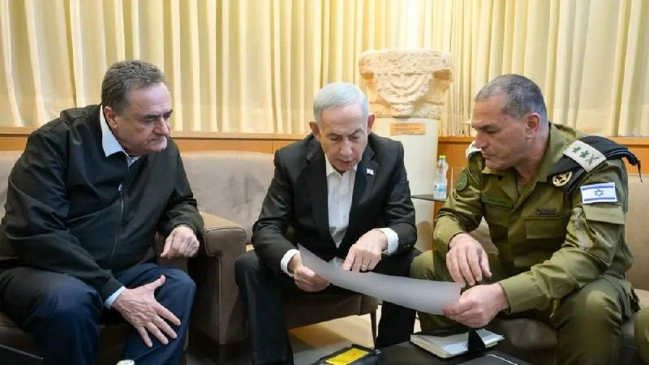

🔴 بنیامین نتانیاهو :

دستور گسترش عملیات زمینی رو دادم ، ما امروز از رودخانه لیتانی در جنوب لبنان هم عبور کردیم و عملیات نابودی حزب الله با قدرت ادامه داره.

@IranianMinds

## IranianMinds — post 20948

🔴 ارتش اسرائیل : رفتیم بالا سر حزب الله و داریم‌ جنوب لبنانو شخم‌ میزنیم. @IranianMinds

## IranianMinds — post 20947

🔴 ارتش اسرائیل :

رفتیم بالا سر حزب الله و داریم‌ جنوب لبنانو شخم‌ میزنیم.

@IranianMinds

## IranianMinds — post 20946

  

🔴❗️ کانال مردمی «آورکسا» ❗️🔴

⚡️ پوشش فوری وقایع نظامی جهان
🛰 تحلیل تجهیزات و تاکتیک‌های نظامی
🎯 اخبار سیاسی، نظامی و امنیتی
📡 آپدیت ۲۴ ساعته و لحظه‌ای
❌ سریع، دقیق، بدون حاشیه

https://t.me/AverxaNews
https://t.me/AverxaNews

✅همین حالا عضو شوید و یک قدم جلوتر از خبرها باشید.

## IranianMinds — post 20945

  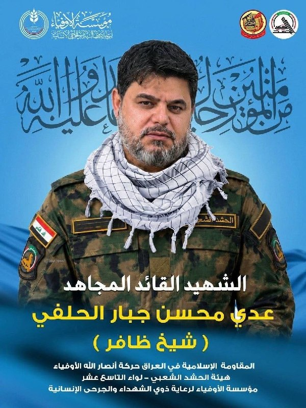

🔴عدی محسن جبار الحلفی، فرمانده تیپ ۱۹ نیروهای بسیج الحشد الشعبی، پس از آنکه شبه‌نظامیان ناشناس یک دستگاه انفجاری به سمت خودروی او در استان میسان در جنوب عراق، منفجر کردند، به هلاکت رسید.

@IranianMinds

## IranianMinds — post 20944

  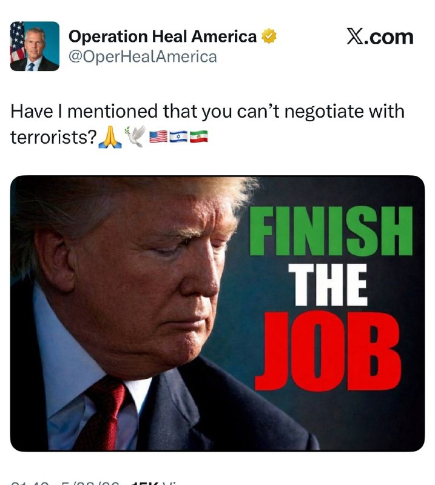

🔴 جیمز اچ اسپنس مامور سابق اف بی ای:

مگه نگفته بودم که با تروریست‌ ها نمیشه مذاکره کرد؟

نوشته تو عکس : کار‌ رو تمام کن!

@IranianMinds

## IranianMinds — post 20943

  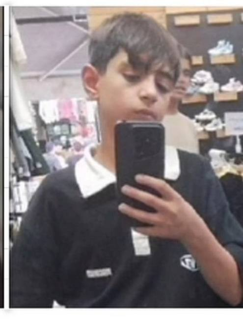

فراموش نکنید ….

@IranianMinds

## IranianMinds — post 20941

🔴وزیر امور خارجه پاکستان فردا برای دیدار به واشنگتن خواهد رفت و با وزیر امور خارجه آمریکا، مارکو روبیو، ملاقات خواهد کرد.

@IranianMinds

## IranianMinds — post 20940

  

سنتکام طی بیانیه‌ای ایران را به نقض فاحش آتش‌بس متهم کرد

@IranianMinds

## BBCPersian — post 282274

  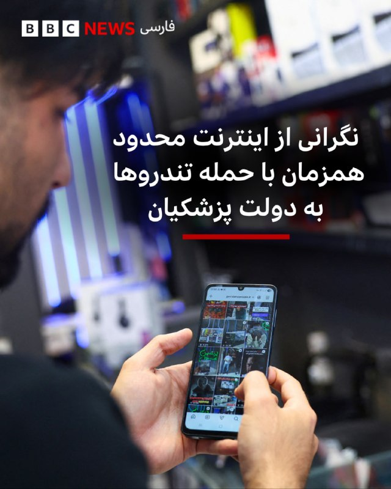

🔻 در حالی که دسترسی به اینترنت در ایران پس از سه ماه قطعی کامل تا حد زیادی برقرار شده است، اختلاف در میان مقام‌های جمهوری اسلامی بر سر بازگشت آن به وضعیت عادی و فیلترینگ شدید، این نگرانی را ایجاد کرده که ممکن است اینترنت ایران با اختلالات همراه باشد و به شکل ناپایدار باقی بماند.

نت‌بلاکس، نهاد ناظر بر دسترسی اینترنت در جهان گفته است در حالی که اکنون اتصال تا حد زیادی برقرار شده است، اما معیارها نشان می‌دهد که کاربران هنوز با فیلترینگ شدید «مشابه دوره موقت بین اعتراضات ژانویه و شروع جنگ» مواجه هستند.

اشاره این نهاد به بعد از اعتراضات دی ماه است که برای مدت کوتاهی دسترسی به اینترنت برقرار شده بود.

در پی قطع اینترنت از زمان شروع جنگ آمریکا و اسرائیل علیه در ایران در اسفندماه سال گذشته، مسعود پزشکیان «ستاد ساماندهی و راهبردی فضای مجازی» را برای بررسی بازگشت اینترنت بین‌الملل تشکیل داد.

تصمیم این ستاد برای اتصال مجدد اینترنت با واکنش تند مخالفان روبرو شده است.

بیشتر بخوانید:
https://bbc.in/4fMBLTt
📸Reuters
@BBCPersian

## BBCPersian — post 282273

  <a href="telegram/content/BBCPersian_282273_1779980340.mp4" target="_blank">🎬 Download video</a>

🔻در چمن حیاط جنوبی کاخ سفید، مقدمات برگزاری مسابقه قهرمانی ورزش رزمی «یو‌اف‌سی» یا «مبارزه نهایی» در حال انجام است. قرار است این مبارزه در قفس روز ۱۴ ژوئن (حدود دو هفته دیگر) به عنوان بخشی از جشن‌های دویست و پنجاهمین سالگرد تاسیس آمریکا برگزار شود.

دونالد ترامپ گفته که دانا وایت، رئیس اتحادیه یو‌اف‌سی و متحد قدیمی او، «یک سالن پنج هزار نفری درست مقابل ورودی کاخ سفید» به همراه هشت صفحه نمایش بزرگ در پارکی در همان نزدیکی خواهد ساخت تا هواداران بتوانند این مسابقه را تماشا کنند. این رویداد با دو مبارزه برای کسب عنوان قهرمانی برگزار خواهد شد.

الکس پریرا از برزیل برای کسب عنوان قهرمانی موقت سنگین وزن یو‌اف‌سی به مصاف سیریل گین از فرانسه خواهد رفت، و ایلیا توپوریا از گرجستان قرار است برای کسب عنوان قهرمانی سبک وزن به مصاف جاستین گِیچی، قهرمان موقت فعلی، برود.

https://bbc.in/4vf9lGm
@BBCPersian

## BBCPersian — post 282272

  <a href="https://t.me/bbcpersian/282272" target="_blank">📎 Download file</a>

📻 تازه‌ترین خبرهای جهان پنج‌شنبه ۷ خرداد ۱۴۰۵ از رادیو بی‌بی‌سی در لندن
@BBCPersian

## BBCPersian — post 282271

🔻وزیر خارجه پاکستان برای یک دیدار رسمی به واشنگتن می‌رود

محمد اسحاق دار، معاون نخست‌وزیر و وزیر خارجه پاکستان در پایان سفرش به آمریکا برای دیدار رسمی فردا، جمعه هشتم خرداد ماه به واشنگتن می‌رود.

وزارت خارجه پاکستان در یک بیانیه اعلام کرد که آقای اسحاق دار که برای شرکت در جلسه شورای امنیت سازمان ملل به نیویورک سفر کرده است،‌ فردا در واشنگتن با مارکو روبیو، وزیر خارجه آمریکا دیدار و گفت‌وگو خواهد کرد.

پاکستان میانجی رسمی میان آمریکا و ایران در جریان مذاکرات اخیر دو کشور برای برقراری صلح است.

در بیانیه وزارت خارجه پاکستان آمده است که مستحکم‌کردن همکاری بین دو کشور پاکستان و آمریکا در مسائل مهم روز از جمله تلاش‌های پاکستان برای برقراری صلح و ثبات در منطقه از طریق گفت‌وگو و دیپلماسی،‌ از محورهای سفر آقای اسحاق‌دار به واشنگتن خواهد بود.

@BBCPersian

## BBCPersian — post 282270

  <a href="telegram/content/BBCPersian_282270_1779980342.mp4" target="_blank">🎬 Download video</a>

🎶 در «رنگآهنگ» این هفته همراه می‌شویم با آرشید آذرین؛ آهنگساز، نوازنده پیانو و پزشک متخصص رادیولوژی قلب ایرانی-فرانسوی، که از تجربه زیستن میان دو دنیای موسیقی و پزشکی و پیوندی که میان آن‌ها برقرار کرده، می‌گوید.

همچنین میزبان کریستوفر فن دیلن، موزیسین آلمانی و بنیان‌گذار گروه شیلر هستیم و از سفرش به ایران و تجربه اجرا برای مخاطبان ایرانی می‌شنویم.

رنگآهنگ
پنجشنبه، ساعت ۲۰:۳۰ به وقت ایران
از تلویزیون و یوتیوب بی‌بی‌سی فارسی

@BBCPersian

## BBCPersian — post 282269

🔻روسیه از آمریکا و ایران خواست که از ادامه جنگ خودداری کنند

ماریا زاخارووا،‌ سخنگوی وزارت خارجه روسیه از آمریکا و ایران خواست که از بازگشت به جنگ خودداری کنند و به گفت‌وگو ادامه دهند.

او افزود که روسیه آماده است در زمینه خارج‌ کردن اورانیوم غنی‌شده از ایران کمک کند، اما مسکو «این پیشنهاد خود را تحمیل نمی‌کند.»

خانم زاخارووا همچنین گفت که واشنگتن تاکنون پیشنهاد روسیه در این زمینه را نپذیرفته است، پیشنهادی که از چند ماه پیش مطرح شده بود.

@BBCPersian

## BBCPersian — post 282268

🔻رسانه‌های ایران امروز، پنجشنبه، یک پیام کتبی منتسب به مجتبی خامنه‌ای، رهبر جمهوری اسلامی ایران را منتشر کرده‌اند که در آن آمده است: «آمریکا و اسرائیل در پی شکست‌های نظامی به دنبال به زانو درآوردن ملت و بی‌ثبات کردن ایران هستند.»

مجتبی خامنه‌ای ۵۶ ساله که از زمان روی کار آمدنش در انظار عمومی ظاهر نشده است در این پیام کتبی، خواستار حفظ وحدت و انسجام میان مردم شده است.

مجتبی خامنه‌ای در این پیام که به مناسبت سالگرد تاسیس مجلس شورای اسلامی منتشر شد، گفت که تمرکز مجلس باید بر «مسائل اصلی به‌ویژه اقتصاد، معیشت، مهار تورم، رونق تولید و امیدآفرینی در جامعه باشد.»

او گفت: «جامعه پیش از هر چیز نیازمند مشاهده‌ نشانه‌های واقعی امید، مسیر باثبات و چشم‌انداز روشن از آینده است تا بتواند بر اساس آن برنامه‌ریزی و حرکت کند.»

در حال حاضر ایران با رکود عمیق اقتصادی روبرو است و تخریب زیرساخت‌های صنعتی بر اثر حملات آمریکا و اسرائیل، قطعی طولانی‌مدت اینترنت و تورم شدید مردم را در وضعیت اقتصادی دشواری قرار داده است.

@BBCPersian

## BBCPersian — post 282267

🔻ارتش اسرائیل از حملات هوایی به بیروت خبر داد

ارتش اسرائیل از انجام حملات هوایی به بیروت، پایتخت لبنان خبر داده است. این اقدام پس از آن صورت گرفت که حملات پیشین به جنوب لبنان دست‌کم ۱۲ کشته بر جای گذاشته بود.

ارتش اسرائیل در بیانیه‌ای گفت: «اندکی پیش، نیروهای اسرائیل به اهدافی در بیروت حمله کردند. جزئیات به زودی اعلام خواهد شد.»

یک منبع امنیتی لبنانی گفت که این حمله در نزدیکی حومه جنوبی بیروت انجام شده است، اما هنوز مشخص نیست که هدف حمله چه بوده است. تصاویر منتشرشده از منطقه، دود غلیظی را نشان می‌دهد که در میان ساختمان‌ها به هوا برخاسته است.

قرار بود آتش‌بس میان اسرائیل و گروه حزب‌الله، که مورد حمایت ایران است، از ۱۷ آوریل (۲۸ فروردین) اجرایی شود، اما این آتش‌بس تاکنون رعایت نشده است.

@BBCPersian

## BBCPersian — post 282266

  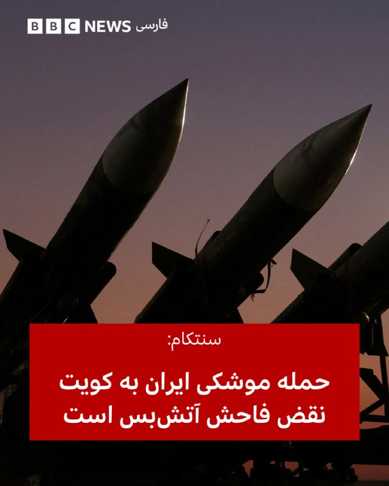

🔻سنتکام: حمله موشکی ایران به کویت نقض فاحش آتش‌بس است

فرماندهی مرکزی ارتش ایالات متحده، سنتکام، حمله موشکی ایران به کویت را «نفض فاحش» آتش‌بس خوانده است.

این نهاد در حساب رسمی خود در شبکه ایکس نوشته است: «ساعت ۱۰:۱۷ شب به وقت شرق آمریکا در تاریخ ۲۷ مه، ایران یک موشک بالستیک به سمت کویت شلیک کرد که با موفقیت توسط نیروهای کویتی رهگیری شد.»

سنتکام نوشته است «این نقض فاحش آتش‌بس توسط رژیم ایران، ساعاتی پس از آن رخ داد که نیروهای ایرانی پنج پهپاد تهاجمی یک‌طرفه را شلیک کردند که تهدیدی آشکار در تنگه هرمز و نزدیکی آن ایجاد کردند.»

فرماندهی مرکزی ارتش آمریکا می‌گوید: «تمام پهپادها با موفقیت توسط نیروهای آمریکایی رهگیری شدند و آنها همچنین از پرتاب ششمین پهپاد از یک سایت کنترل زمینی ایران در بندرعباس جلوگیری کردند.»

ارتش کویت پیشتر اعلام کرده بود سامانه‌های پدافند هوایی این کشور حملات موشکی و پهپادی «متخاصم» را رهگیری کرده‌اند.

@BBCPersian
📷 RUETERS

## BBCPersian — post 282265

🔻کویت از ایران خواست «فورا و بدون قید و شرط» حملات موشکی و پهپادی به کشورش را متوقف کند

کویت حمله پهپادی و موشکی به خاک آن کشور در اوایل صبح امروز را به ایران نسبت داد و آن را محکوم کرد.

این در حالی است که درگیری نظامی تازه میان جمهوری اسلامی ایران و نیروهای آمریکایی فشار بیشتری بر آتش‌بس شکننده در جنگ خاورمیانه وارد کرده است.

وزارت خارجه کویت در بیانیه‌ای حملات موشکی و پهپادی ایران به آن کشور را به‌شدت محکوم کرد و آن را «تشدید جدی تنش‌ها و نقض آشکار حاکمیت و امنیت ملی» دانست.

این وزارتخانه از ایران خواست «فورا و بدون قید و شرط این حملات را متوقف کند» و اعلام کرد که «مسئولیت کامل این اقدامات بر عهده تهران است.»

@BBCPersian

## BBCPersian — post 282264

  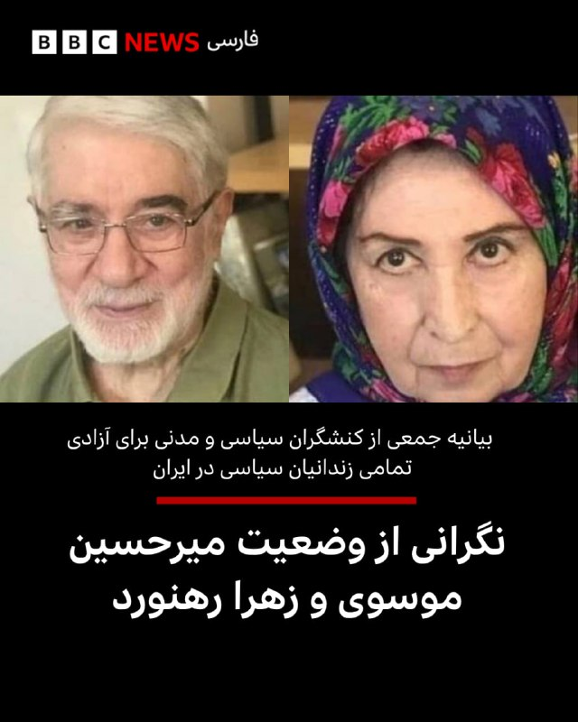

🔻بیانه جمعی از کنشگران در باره آزادی زندانیان سیاسی و نگرانی از وضعیت میرحسین موسوی و زهرا رهنورد

بیش از ۲۰ استاد دانشگاه و کنشگر سیاسی و مدنی در بیانیه‌ای خواهان آزادی میرحسین موسوی، زهرا رهنورد و همه زندانیان سیاسی و مدنی در ایران شدند.

این کنشگران در بیانیه خود گفته‌اند که بنابر «گزارش‌های موثق» اعتقاد دارند که محل اقامت میر‌حسین موسوی و خانم زهرا رهنورد در جریان جنگ اخیر و حمله هوایی به خیابان پاستور به شدت آسیب دیده و «آنان پس از این حادثه، به مکانی نامعلوم منتقل شده‌اند؛ موضوعی که پس از پانزده سال حصر خانگی، نگرانی‌های جدی و گسترده‌ای را برانگیخته است.»

در این بیاینه آمده است: «ما ضمن ابراز احترام به پایداری و ایستادگی آقای موسوی و خانم رهنورد، بار دیگر بر ضرورت پایان دادن به حصر و آزادی این دو شخصیت برجسته و همه فعالان سیاسی و مدنی که تحت فشار و در زندان‌های مختلف به بند کشیده شده‌اند، تأکید می‌کنیم و خواستار رعایت حقوق انسانی و شهروندی تمام این عزیزان هستیم.»

نام بهروز بیات، سعید پیوندی، شهلا حائری، فاطمه شمس، کاظم علمداری و فرزانه عظیمی در میان امضاءکنندگان این بیانیه دیده می‌شود.

@BBCPersian

## BBCPersian — post 282263

🔻عبدربه منصور هادی، رئیس‌جمهور سابق یمن، در عربستان سعودی درگذشت

یک منبع در ریاست‌جمهوری یمن به خبرگزاری فرانسه گفت که عبدربه منصورهادی، رئیس‌جمهور سابق یمن، در عربستان سعودی درگذشته است.

به گفته این منبع، آقای هادی که بیش از ۸۰ سال داشت، «پس از وخامت ناگهانی وضعیت جسمانی‌اش در ریاض درگذشت.»

عبدربه منصور هادی در سال ۲۰۱۵ و هم‌زمان با آغاز جنگ داخلی یمن، پس از آن که شورشیان حوثی مورد حمایت ایران دولت او را از صنعا بیرون راندند، به عربستان سعودی گریخت و از آن زمان در این کشور زندگی می‌کرد.

@BBCPersian

## BBCPersian — post 282262

  <a href="telegram/content/BBCPersian_282262_1779980344.mp4" target="_blank">🎬 Download video</a>

🔻ناسا روز سه‌شنبه در یک نشست خبری، طرح خود برای ایجاد پایگاهی دائمی در ماه را ارائه کرد؛ طرحی که شامل سکونت دائمی انسان در این قمر تا سال ۲۰۳۲ است.

جرد آیزاکمن، مدیر ناسا، گفت این سازمان فضایی در پی آن است که «هم‌زمان با بازگشت دوباره آمریکا به ماه  و این بار برای ماندن، حس کنجکاوی را برانگیزد».

این برنامه‌ها برای بازگشت دائمی به ماه در حالی مطرح می‌شود که ماموریت موفق آرتمیس ۲ ناسا در ماه آوریل، با سفر چهار فضانورد به دور ماه، تنها قمر طبیعی زمین همراه بود.

ایجاد یک پایگاه در ماه می‌تواند به ایالات متحده امکان انجام آزمایش‌های علمی، استخراج احتمالی منابع ارزشمند و همچنین سفر آسان‌تر به مریخ را بدهد.

https://bbc.in/4uFoZuK
@BBCPersian

## Dirty_Kids — post 390398

  <a href="telegram/content/Dirty_Kids_390398_1779980346.mp4" target="_blank">🎬 Download video</a>

🔴 هر چی میگذره فیلمای بیشتری بیرون میاد، لحظه ای که 18 دی ماه مردم رو به رگبار بستن و بهرام زاهدی و حمید سهرابیان که هر دو پدر بودن، همزمان باهم جاوید نام شدن...

@Dirty_Kids 👻

## Dirty_Kids — post 390397

  

گوشیم حاملست، دعا کنید آیفون باشه...😂

@Dirty_Kids 👻

## Dirty_Kids — post 390396

  <a href="telegram/content/Dirty_Kids_390396_1779980347.mp4" target="_blank">🎬 Download video</a>

انصافا همه حرکات خوب و کابردی بودن ولی ؛

امان امان از حرکت گربه گاو و مار کبری، روح آدم رو تازه میکنه...

@Dirty_Kids 👻

## Dirty_Kids — post 390395

‏وقتی شما نبودید:
• محسن چاووشی آهنگ «حسبی الله» داد، گفت حاضرم ۴۷ سال دیگر به جمهوری اسلامی فرصت بدهم نقایصش را برطرف کند، لاریجانی هم از او تشکر کرد و چند وقت بعد شد چهره هنر انقلاب.
• علی زند وکیلی، بنیامین و علی قمصری روی پل و راه‌آهن و نیروگاه برق ضجه می‌زدند.
• محسن نامجو به همه‌مان گفت وطن‌فروش.
• علی عظیمی گفت شما روسیاه تاریخید.
• ایرج طهماسب به دیاسپورا گفت برای خوشبختی به خارج رفتند، بعد فهمیدند خوشبختی را در خانه کودکی‌شان جا گذاشته‌اند.
• کینگ رام خون پدرش را فروخت و برای حکومت کنسرت برگزار کرد.
• صدف بیوتی به مردم گفت شما مثل مجاهدین هستید.
• سهیل مستجابیان هم توی کلوزفرند به مردم فحش داد که بعدش لو رفت.
• بهزاد فراهانی گفت ما بیضه داشتیم شاهو کشیدیم پایین، شما هم اگه دارید انقلاب کنید.
• حسین رزاق توی کلاب‌هاوس نقش نماینده دادستان جمهوری اسلامی را گرفته بود و برای بازداشت‌شده‌ها کیفرخواست اعدام صادر می‌کرد.

@Dirty_Kids 👻

## Dirty_Kids — post 390394

  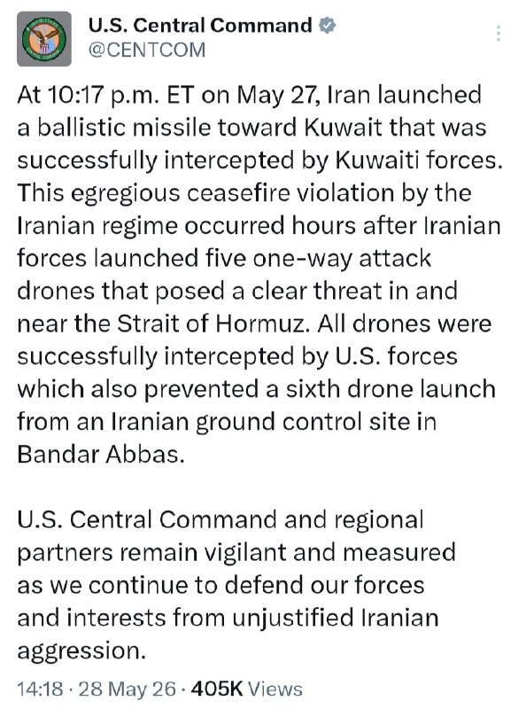

‏ستاد فرماندهی مرکزی ایالات متحده (سنتکام)، در پیامی که در شبکه اجتماعی ایکس منتشر شده است، اعلام کرد که ایران با شلیک یک فروند موشک بالستیک، آتش‌بس موجود را به طور فاحش نقض کرده است.

به گفته سنتکام، این اقدام پس از آن صورت گرفت که ایالات متحده پنج پهپاد ایرانی را در تنگه هرمز سرنگون کرد و اجازه پرتاب به ششمین پهپاد را روی زمین نداد و آن‌ را منهدم ساخت.

در پاسخ به این تحولات، ایران یک موشک بالستیک به سمت کویت شلیک کرد که این موشک توسط پدافند هوایی کویت رهگیری و منهدم شد. این اقدام از سوی سنتکام به عنوان نقض فاحش آتش‌بس خوانده شده است.

از سوی دیگر، سپاه پاسداران صبح امروز اعلام کرد که این حمله موشکی در پاسخ به حملات هوایی آمریکا به بندرعباس صورت گرفته و طی آن، یک پایگاه هوایی آمریکا در منطقه هدف قرار داده شده است. سپاه پاسداران تصریح کرد پایگاهی که هدف حمله موشکی قرار گرفته، همان پایگاهی بوده که به عنوان مبدأ حملات آمریکا علیه بندرعباس استفاده شده است.

@Dirty_Kids 👻

## Dirty_Kids — post 390393

  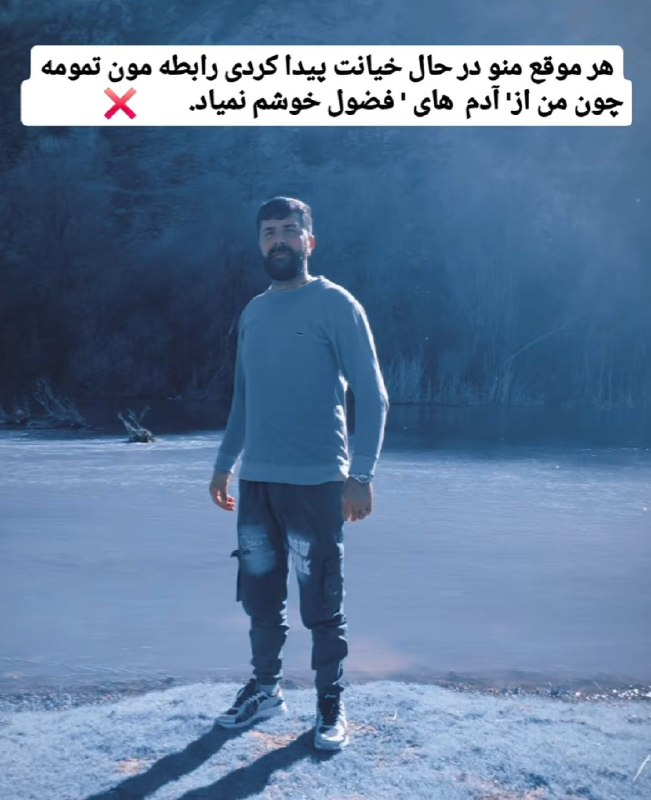

این روزا در اینستاگرام فارسی چه میگذرد:

@Dirty_Kids 👻

## Dirty_Kids — post 390392

  <a href="telegram/content/Dirty_Kids_390392_1779980349.mp4" target="_blank">🎬 Download video</a>

یه پیرمرد رو آوردن صدا و سیما تا حماسه بسازه، یه طوری حرف زد کل برنامه و مخاطبا گوز پیچ شدن😂

@Dirty_Kids 👻

## Dirty_Kids — post 390390

  <a href="telegram/content/Dirty_Kids_390390_1779980349.mp4" target="_blank">🎬 Download video</a>

عزیزان، شما که نبودید، این سهیل مستجابیان اول تو یه ویدیو کلوزفرند به مردم فحش داد، ویدیوش لو رفت، معذرت‌خواهی کرد، دوباره تو کلوز اینو گذاشت، اونم لو رفت:)))))

@Dirty_Kids 👻

## Dirty_Kids — post 390387

بهترین و بدترین پایان‌بندی‌های سریالی.

@Dirty_Kids 👻

## Dirty_Kids — post 390384

  <a href="telegram/content/Dirty_Kids_390384_1779980350.mp4" target="_blank">🎬 Download video</a>

شهاب کون، بلاگر اینستاگرامی رو یادتونه که قرار بود با مینا نامداری ازدواج کنه و یه مدت ترند اینستا فارسی شده بود؟

موقعی که جنگ شد و اینترنت‌ها قطع شدن، وقتی دید دیگه ویو نیست، به این صورت تو تیک تاک و اینستا واسه عربا کص و کونشو مینداخت بیرون تا مشتری پیدا کنه..

@Dirty_Kids 👻

## Hranews — post 113211

یک زن در دماوند توسط همسرش به قتل رسید

❗️
❗️
❗️
❗️
❗️– روز سه شنبه ۵ خردادماه، مردی در دماوند، همسر خود را به دلیل اختلافات خانوادگی به #قتل رساند. متهم توسط ماموران پلیس بازداشت شده است.

ادامه مطلب

↘️
@hranews_bot تماس ✉️ - @Hranews کانال هرانا 🆑

## Hranews — post 113210

  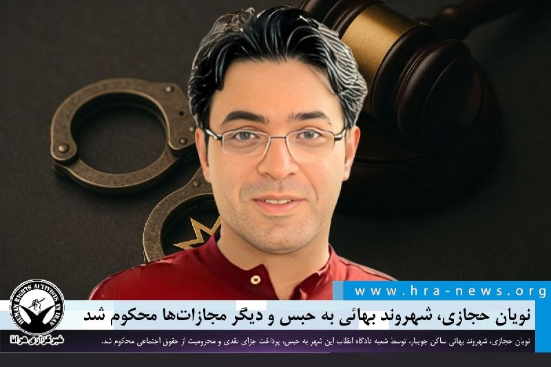

نویان حجازی، شهروند بهائی به حبس و دیگر مجازات‌ها محکوم شد

❗️
❗️
❗️
❗️
❗️– نویان حجازی، شهروند بهائی ساکن جویبار، توسط دادگاه انقلاب این شهر به حبس، پرداخت جزای نقدی و محرومیت از حقوق اجتماعی محکوم شد.

به گزارش خبرگزاری هرانا، ارگان خبری مجموعه فعالان حقوق بشر در ایران، نویان حجازی توسط دادگاه انقلاب جویبار مستقر در شعبه ۱۰۲ دادگاه کیفری این شهرستان به مجازات محکوم شد.

براساس حکمی که اخیراً توسط شعبه مذکور صادر شده است، آقای حجازی از بابت آنچه تبلیغ دین بهائی عنوان شده به پرداخت ۱۲۲ میلیون و ۵۰۱ هزار تومان جزای نقدی و محرومیت از حقوق اجتماعی به مدت ۱۰ سال و یک روز محکوم شده است. وی همچنین از بابت اتهام «تبلیغ علیه نظام» به هفت ماه و ۱۶ روز حبس محکوم شده است.

ادامه مطلب

#نویان_حجازی

↘️
@hranews_bot تماس ✉️ - @Hranews کانال هرانا 🆑

## Hranews — post 113209

  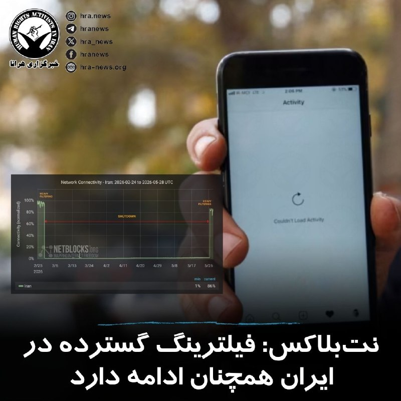

پس از بازگشت نسبی اینترنت بین‌المللی در ایران در روزهای اخیر، نت‌بلاکس در آخرین به‌روزرسانی خود اعلام کرد که داده‌ها نشان می‌دهد کاربران ایرانی همچنان با فیلترینگ و محدودیت‌های گسترده مواجه‌اند؛ وضعیتی مشابه شرایط حاکم بر دوره میان اعتراضات سراسری دی‌ماه و آغاز جنگ.
#فیلترینگ_اینترنت

↘️
@hranews_bot تماس ✉️ - @Hranews کانال هرانا 🆑

## manototv — post 105852

  <a href="telegram/content/manototv_105852_1779980351.mp4" target="_blank">🎬 Download video</a>

سخنرانی امیرعباس هویدا در جمع دانشجویان درباره نقش جوانان در توسعه و اداره کشور

## manototv — post 105845

  <a href="telegram/content/manototv_105845_1779980353.mp4" target="_blank">🎬 Download video</a>

اینترنت در ایران فقط ابزار ارتباط نیست، میدان قدرت است. هر بار که قطع یا وصل می‌شود، حکومت در واقع در حال تنظیم سطح کنترل خود بر جامعه است، اینکه مردم چه ببینند، چه بگویند، چگونه وصل شوند و تا چه اندازه بتوانند با هم عمل کنند.

## alonews — post 123315

  <a href="telegram/content/alonews_123315_1779980354.webm" target="_blank">🎬 Download video</a>

👈وزیر خزانه‌داری آمریکا: محدودیت‌های شدیدی علیه خطوط هوایی ایران از جمله محرومیت از حق نشست و برخاست، خدمات سوخت‌رسانی و سیستم‌های فروش بلیت وضع می‌کنیم.

✅ @AloNews خبر جنگ

## alonews — post 123314

  <a href="telegram/content/alonews_123314_1779980354.webm" target="_blank">🎬 Download video</a>

👈آکسیوس: اکثر شرایط تا سه‌شنبه نهایی شده بود و مذاکره‌کنندگان ایرانی بعداً اعلام کردند که تأییدیه‌های لازم برای امضا را دریافت کرده‌اند. ترامپ در جریان توافق قرار گرفت اما به میانجی‌ها گفت که «چند روز» برای بررسی آن می‌خواهد.

✅ @AloNews خبر جنگ

## alonews — post 123313

  <a href="telegram/content/alonews_123313_1779980354.webm" target="_blank">🎬 Download video</a>

👈ادعای اکسیوس: به گفته مقامات، آمریکا و ایران به توافق رسیده‌اند اما تأیید نهایی ترامپ باقی مانده 
🔴مقامات آمریکایی گفتند که مفاد توافق تا روز سه‌شنبه تقریباً توافق شده بود، اما هر دو طرف نیازمند دریافت تأییدیه از مقامات عالیه خود خود بودند 
🔴مذاکره‌کنندگان…

## alonews — post 123312

  <a href="telegram/content/alonews_123312_1779980354.webm" target="_blank">🎬 Download video</a>

👈ادعای اکسیوس: به گفته مقامات، آمریکا و ایران به توافق رسیده‌اند اما تأیید نهایی ترامپ باقی مانده

🔴مقامات آمریکایی گفتند که مفاد توافق تا روز سه‌شنبه تقریباً توافق شده بود، اما هر دو طرف نیازمند دریافت تأییدیه از مقامات عالیه خود خود بودند

🔴مذاکره‌کنندگان آمریکایی جزییات توافق نهایی را به ترامپ گزارش دادند، اما او فوراً آن را تأیید نکرد.

🔴 «رئیس‌جمهور به میانجی‌گران اعلام کرد که چند روز برای فکر کردن در این مورد فرصت می‌خواهد.»

✅ @AloNews خبر جنگ

## alonews — post 123311

  <a href="telegram/content/alonews_123311_1779980354.mp4" target="_blank">🎬 Download video</a>

👈نخست‌وزیر اسرائیل، بنیامین نتانیاهو:

اسرائیل کنترل ۶۰٪ از نوار غزه را در دست دارد، دستور من حرکت به سمت ۷۰٪ است. با این شروع خواهیم کرد.

ما در فرایندی هستیم که می‌توانیم قدرت خود را در جهات مختلف به کار بگیریم.

ما همچنان باید بر حزب‌الله فشار وارد کنیم؛ در حال حاضر با حماس درگیر هستیم.

✅ @AloNews خبر جنگ

## alonews — post 123310

  

🇵🇹ماجرای نماز خواندن کریستیانو رونالدو

سعد السبیعی، مدیر پیشین اداره حقوقی باشگاه النصر:

🔴پیش از آخرین بازی مقابل ضمک، دون (رونالدو) با بازیکنان نماز خواند و سعی کرد در رکوع و سجود از آن‌ها تقلید کند.

@AloSport

## alonews — post 123309

  <a href="telegram/content/alonews_123309_1779980356.webm" target="_blank">🎬 Download video</a>

👈روسیه:
ترامپ با انتقال اورانیوم غنی‌شده ایران به مسکو موافقت نکرد

✅ @AloNews خبر جنگ

## alonews — post 123305

  <a href="telegram/content/alonews_123305_1779980356.mp4" target="_blank">🎬 Download video</a>

👈وضعیت وخیم لبنان بعد بمباران امروز

✅ @AloNews خبر جنگ

## alonews — post 123304

  <a href="telegram/content/alonews_123304_1779980357.webm" target="_blank">🎬 Download video</a>

👈فرماندهی مرکزی ایالات متحده درباره محاصره:
نیروهای آمریکایی اکنون ۱۱۱ کشتی تجاری را برای اطمینان از رعایت قوانین هدایت کرده‌اند.

✅ @AloNews خبر جنگ

## alonews — post 123303

  <a href="telegram/content/alonews_123303_1779980357.mp4" target="_blank">🎬 Download video</a>

👈نتانیاهو: الان ما تو بیروت حمله کردیم، دیروز در صور هم حمله کردیم
- نیروهای ما از رود لیتانی عبور کردن،ما اونا رو می‌زنیم و خیلی شدیدتر هم خواهیم زد

✅ @AloNews خبر جنگ

## alonews — post 123301

  <a href="telegram/content/alonews_123301_1779980359.webm" target="_blank">🎬 Download video</a>

👈دولت ترامپ و وزارت خزانه‌داری ایالات متحده در حال طراحی اسکناس ۲۵۰ دلاری با تصویر رئیس‌جمهور ترامپ هستند

🔴اگر این اسکناس منتشر شود، رئیس‌جمهور ترامپ اولین فرد زنده‌ای خواهد بود که از سال ۱۸۶۶ روی پول ایالات متحده ظاهر می‌شود

✅ @AloNews خبر جنگ

## alonews — post 123300

  <a href="telegram/content/alonews_123300_1779980359.webm" target="_blank">🎬 Download video</a>

👈دولت عراق حملات ایران به کویت را بی‌شرمانه خواند!

✅ @AloNews خبر جنگ

## alonews — post 123299

  <a href="telegram/content/alonews_123299_1779980359.webm" target="_blank">🎬 Download video</a>

👈خوش چشم، کارشناس ارشد صدا و سیما: ایندفعه دیگه جنگی نمیشه

✅ @AloNews خبر جنگ

## alonews — post 123298

  <a href="telegram/content/alonews_123298_1779980359.webm" target="_blank">🎬 Download video</a>

👈هواشناسی: تا چند روز آینده خیلی گرم میشه

✅ @AloNews خبر جنگ

## alonews — post 123297

  <a href="telegram/content/alonews_123297_1779980359.webm" target="_blank">🎬 Download video</a>

👈ابوالفضل ابوترابی، نماینده مجلس: آمریکا بعد از جام جهانی و انتخابات کنگره دوباره حمله می‌کند.

✅ @AloNews خبر جنگ

## alonews — post 123296

  <a href="telegram/content/alonews_123296_1779980360.webm" target="_blank">🎬 Download video</a>

👈بیانیه سنتکام درباره اتفاقات دیشب :

🔴دیشب ایران یه موشک بالستیک به سمت کویت شلیک کرد که توسط پدافند کویت رهگیری و منهدم شد.
این اقدام، نقض جدی آتش‌بس بود؛ اونم فقط چند ساعت بعد از اینکه نیروهای ایرانی 5 پهپاد انتحاری رو اطراف تنگه هرمز به پرواز درآوردن که تهدید محسوب میشدن.
البته که همه این پهپادا توسط نیروهای آمریکایی ساقط شدن و حتی جلوی پرتاب ششمین پهپاد هم از یه سایت کنترل زمینی تو بندرعباس گرفته شد.

🔴نیروهای آمریکا و متحداش تو منطقه همچنان آماده‌باش هستن و واسه دفاع از نیروها و منافعشون مقابل «اقدامات تهاجمی و غیرموجه ایران» هوشیار باقی میمونن.

✅ @AloNews خبر جنگ

## alonews — post 123295

  <a href="telegram/content/alonews_123295_1779980360.webm" target="_blank">🎬 Download video</a>

👈سه نفتکش با پرچم‌های پالائو و سیرالئون در دریای سیاه هدف حمله پهپادی قرار گرفتند، اما این حادثه تلفات جانی یا آسیب به خدمه در پی نداشت

✅ @AloNews خبر جنگ

---
📅 بروزرسانی: 1405/03/07 15:02
---

## VahidOOnLine — post 242573

  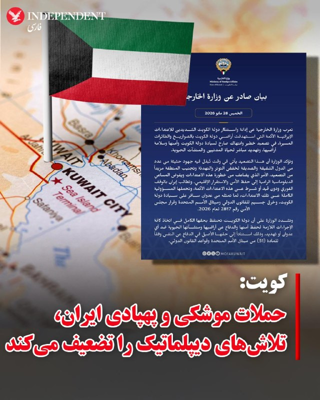

♦️وزارت امور خارجه کویت روز پنجشنبه هفتم خرداد‌ماه با انتشار بیانیه‌ای حملات پهپادی و موشکی جمهوری اسلامی ایران به خاک این کشور را به‌شدت محکوم و اعلام کرد که این حملات، تلاش‌های دیپلماتیک برای پایان دادن به جنگ و تنش در خاورمیانه را تضعیف می‌کند.

سپاه پاسداران ساعاتی پیش از این اعلام کرده بود در پاسخ به حمله موشکی آمریکا به نزدیکی فرودگاه بندرعباس، «مبداء این حمله» را هدف قرار داده‌اند. با این حال سپاه اشاره‌ای به کشور کویت نکرده است.
‌🇸🇦 Indypersian

🤖 @VahidOOnLine

## VahidOOnLine — post 242572

  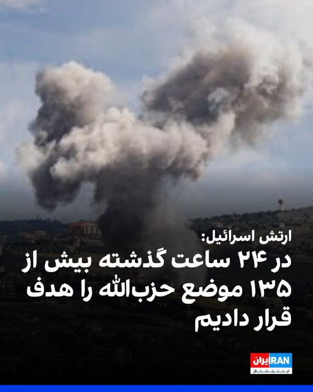

ارتش اسرائیل، ظهر پنج‌شنبه هفت خرداد اعلام کرد در ۲۴ ساعت گذشته بیش از ۱۳۵ موضع حزب‌الله را در مناطق صور، بقاع و جنوب لبنان هدف قرار داده است.

بر اساس این اطلاعیه، حدود ۱۰ محل پرتاب راکت که حزب‌الله از آن‌ها برای شلیک به سوی نیروهای ارتش اسرائیل و غیرنظامیان اسرائیلی استفاده می‌کرد، در بقاع و جنوب لبنان هدف قرار گرفت. ارتش اسرائیل همچنین اعلام کرد یک اردوگاه آموزشی حزب‌الله در بریتال، در منطقه بقاع، هدف حمله قرار گرفته است.

بر اساس این اطلاعیه، ارتش اسرائیل شب گذشته حدود ۱۵ زیرساخت نظامی در صور را که به گفته این ارتش برای پیشبرد حملات حزب‌الله استفاده می‌شد، هدف قرار داد. نیروی هوایی اسرائیل همچنین یک گروه از نیروهای حزب‌الله را هنگام خروج از محل پرتاب راکت هدف قرار داد.
iranintl
‌🏁 🇬🇧 IranintlTV

🤖 @VahidOOnLine

## VahidOOnLine — post 242571

  

فرماندهی مرکزی آمریکا، سنتکام، در شبکه ایکس اعلام کرد جمهوری اسلامی ساعت ۴:۴۷ بامداد پنج‌شنبه به وقت ایران، یک موشک بالستیک به سوی کویت شلیک کرد که نیروهای کویتی آن را رهگیری کردند.

سنتکام این اقدام را «نقض فاحش آتش‌بس» خواند و افزود چند ساعت پیش از آن، نیروهای جمهوری اسلامی پنج پهپاد انتحاری را در و نزدیک تنگه هرمز به پرواز درآوردند که «تهدیدی آشکار» ایجاد کردند.

بر اساس اعلام سنتکام، همه این پهپادها از سوی نیروهای آمریکایی رهگیری شدند و آمریکا همچنین از پرتاب ششمین پهپاد از یک مرکز کنترل زمینی جمهوری اسلامی در بندرعباس جلوگیری کرد.
‌🏁 🇬🇧 IranintlTV

🤖 @VahidOOnLine

## VahidOOnLine — post 242570

  <a href="telegram/content/VahidOOnLine_242570_1779967922.mp4" target="_blank">🎬 Download video</a>

♦️ارتش اسرائیل روز پنجشنبه هفتم خرداد اعلام کرد در جریان حملات روز سه‌شنبه به اهدافی در غزه، ایهاب خریزم، مسئول یک شبکه انتقال پول و محمد حبش، یکی از فرماندهان واحد تولید تسلیحات حماس را به قتل رسانده است.

ارتش اسرائیل می‌گوید «پیش از اجرای حمله، اقداماتی برای کاهش آسیب به غیرنظامیان، از جمله استفاده از مهمات دقیق و عملیات شناسایی هوایی انجام شده بود.»

اسرائیل در دو هفته گذشته فرمانده شاخه نظامی حماس و جانشین او را در عملیات مشابه به قتل رساند.
‌🇸🇦 Indypersian

🤖 @VahidOOnLine

## VahidOOnLine — post 242569

♦️مهدی تاج، رییس فدراسیون فوتبال، شامگاه چهارشنبه ششم خرداد ماه در گفتگو با خبرنگاران اعلام کرد آمریکا باید برای رفت و آمد کاروان تیم ملی به آمریکا، ویزای «مولتی» (ویزای مناسب ورود چندباره) صادر کند.
تاج گفت: «ما به مکزیک می‌رویم و قرار است این موضوع از سوی ایران، فیفا، مکزیک و آمریکا به صورت همزمان اعلام شود و مسئله‌ای برای نگرانی وجود ندارد. در حال حاضر هم در مکزیک مشکلی نیست.»

رئیس فدراسیون فوتبال افزود: «مسئله اصلی درباره تیم ملی و ویزاهاست. باید برای ویزاها راه‌حلی در نظر گرفته شود تا این افراد بتوانند رفت‌وآمد کنند و آمریکا باید ویزای مولتی بدهد تا بازیکنان به راحتی بروند و بیایند.»

این اظهارات در حالی مطرح می‌شود که در کمتر از ۱۴ روز باقیمانده به آغاز جام‌جهانی، هنوز صدور ویزا و شرایط اردوی تیم ملی در کشورهای مکزیک و آمریکا در ابهام است.

رئیس جمهوری مکزیک پیشتر، از آمادگی اسکان کاروان تیم ملی در شهر مرزی تیخوانا مکزیک خبر داده بود.
‌🇸🇦 Indypersian

🤖 @VahidOOnLine

## VahidOOnLine — post 242568

  

⭕️زمین‌لرزه‌ای به بزرگی ۳.۸">۳.۸ باغملک خوزستان را لرزاند

♦️زمین‌لرزه‌ای به بزرگی ۳.۸">۳.۸ ساعت ۱۲:۵۴ (به وقت ایران) حوالی باغملک در استان خوزستان را لرزاند.

بر اساس اعلام مرکز لرزه‌نگاری ایران، این زمین‌لرزه در عمق ۱۷ کیلومتری زمین رخ داده است.

تاکنون گزارشی از خسارات احتمالی این زمین‌لرزه منتشر نشده است.
‌🇸🇦 Indypersian

🤖 @VahidOOnLine

## VahidOOnLine — post 242567

  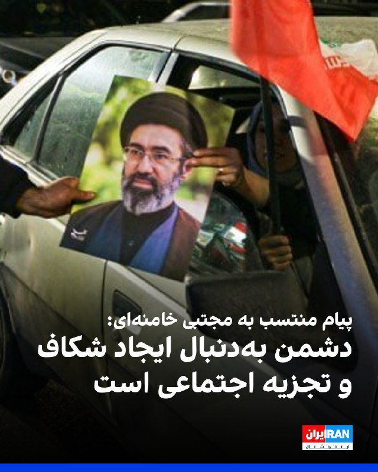

رسانه‌های ایران پیامی منتسب به مجتبی خامنه‌ای، به مناسبت سالروز افتتاح اولین دوره مجلس شورای اسلامی منتشر کردند که در بخشی از آن، رهبر جمهوری اسلامی بر «وحدت ملی» به‌عنوان یکی از مهم‌ترین عوامل پیروزی تاکید کرده است.

در این پیام آمده حفظ انسجام اجتماعی و پرهیز از اختلافات سیاسی، وظیفه نخبگان و نمایندگان مجلس است و هرگونه برجسته کردن تفاوت‌های اجتماعی می‌تواند به تفرقه منجر شود.

در این متن منتسب به مجتبی خامنه‌ای همچنین آمده است پس از فشارهای نظامی و اقتصادی، «دشمن» به‌دنبال ایجاد شکاف و تجزیه اجتماعی است و نیروهای وفادار به حکومت باید از بروز اختلاف جلوگیری کنند.
‌🏁 🇬🇧 IranintlTV

🤖 @VahidOOnLine

## VahidOOnLine — post 242566

  

امارات متحده عربی حملات موشکی و پهپادی جمهوری اسلامی به کویت را به شدت محکوم و تاکید کرد که از هر اقدام این کشور برای حفظ امنیت و ثبات خود، حمایت می‌کند.
وزارت خارجه امارات متحده عربی این حملات را «تروریستی» خواند.

در بیانیه وزارت خارجه امارات متحده عربی آمده است که این حملات نقض آشکار حاکمیت کویت و تهدیدی علیه امنیت و ثبات این کشور محسوب می‌شود.

بامداد پنج‌شنبه سپاه پاسداران اعلام کرد در واکنش به حمله آمریکا به اطراف فرودگاه بندرعباس، یک پایگاه هوایی آمریکا را هدف قرار داده است. هم‌زمان، ارتش کویت از رهگیری حملات موشکی و پهپادی «خصمانه» خبر داده بود.
‌🏁 🇬🇧 IranintlTV

🤖 @VahidOOnLine

## VahidOOnLine — post 242565

🗣روایت شما از زندگی در آتش‌بس- پنجشنبه ۷ خرداد

🔹خواهش می‌کنم ناامید نشید. به ۱۸ و ۱۹ دی فکر کنید، به اون همه جوان زیبا که رفتن برای آزادی و دیگه برنگشتن. ما باید این کار رو تموم کنیم.

🔹هر وقت پیام شکایت یا ناامیدی می‌دید، به یاد زندانیان بیفتید که به‌خاطر ما رفتن. ضعیف و بی‌انصاف نباشید. تا وقتی اکثریت برای رفتن این رژیم جان‌فدایی نکنن، چیزی عوض نمی‌شه.

🔹دوستان عزیز یادتون نره که این حکومت در دی‌ماه ۱۴۰۴ چه جنایاتی انجام داد. صرفا چون اینترنت رو وصل کردن نپرید بغل آخوند. این اینترنت حق ماست، پس برای گرفتن حقتون از این ستمگران سپاسگزار نباشید.

🔹اکثریت ما با جمهوری اسلامی مخالفیم و کار آخر رو باید خودمون انجام بدیم.

🔹در طول تاریخ، دیکتاتورها تا لحظه آخر شاخ و شونه می‌کشن و در نهایت به فجیع‌ترین حالت ممکن سقوط می‌کنن. ما برای آزادی بهای سنگینی دادیم؛ چه دی‌ماه و چه قبل از اون، پس صبور باشید و امیدوار.

🔹امروز وصل شدم و خواستم بگم ما در ۱۸ و ۱۹ دی شکوهی از حجم جمعیت و صدایی که خاموش نمی‌شد دیدیم که به این سادگی‌ها ناامید و تموم نمی‌شیم.

🔹اینجا همه‌چیز داره از هم می‌پاشه؛ زندگی‌ها، کارها، پیوندها، تندرستی، سلامت روان، بهداشت، خوراک و پوشاک. تنها چیزی که ما رو سرپا نگه داشته، دیدن راهپیمایی ایرانیان خارج از کشور در ماهواره و تصور روز آزادیه.

🔹به‌وقتش خود ما می‌جنگیم، می‌میریم و در نهایت ما ایران رو پس می‌گیریم. درسته میگیم تا کی دیگه باید تاوان بدیم، ولی اینم می‌دونیم که آزادی به دست خودمون رقم می‌خوره.

🔹می‌خواستم بگم برخلاف خیلی‌ها که از ترامپ و نتانیاهو ناراحت هستن، من برعکس خیلی‌ها ازشون تشکر می‌کنم که تا همین‌جا هم واقعاً کارهای بزرگی انجام دادن. تغییر در رژیم یک رونده و مردم هم به‌هرحال باید این سختی‌ها رو تحمل کنن به امید روزی که نجات پیدا کنیم.

🔹وضعیتمون جوریه که می‌خوایم یک کاری کنیم ولی نمی‌دونیم باید چی‌کار کنیم. عید نوروز فکر می‌کردیم تا چند وقت دیگه تمومه، اما الان خیلی وضعیت مبهمه. همچنان امید داریم.
‌🏁 🇬🇧 IranintlTV

🤖 @VahidOOnLine

## VahidOOnLine — post 242564

  <a href="telegram/content/VahidOOnLine_242564_1779967925.mp4" target="_blank">🎬 Download video</a>

ویدیویی که تازه به ایران اینترنشنال رسیده است وضعیت سالن ورزشی ایثار ذوب آهن در فولادشهر اصفهان پس از حملات هوایی اسفندماه را نشان می‌دهد. یک شهروند در این ویدیو می‌گوید: «به خیر گذشت.»

بر اساس اعلام شرکت عمران فولادشهر، این سالن روز یکشنبه ۱۷ اسفند ۱۴۰۴ هدف گرفته شد.
‌🏁 🇬🇧 IranintlTV

🤖 @VahidOOnLine

## VahidOOnLine — post 242563

  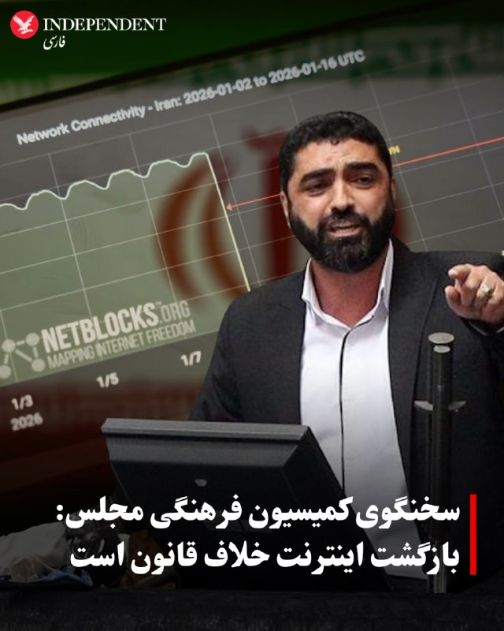

♦️احمد راستینه، سخنگوی کمیسیون فرهنگی مجلس شورای اسلامی، روز پنجشنبه هفتم خرداد و در واکنش به تصمیم دولت مسعود پزشکیان برای بازگشت اینترنت بین‌المللی،  گفت برخی وظایف «ستاد ساماندهی و راهبردی فضای مجازی» با اختیارات شورای عالی فضای مجازی تداخل دارد و رای دیوان عدالت اداری برای توقف فعالیت این ستاد «از نظر حقوقی درست و دقیق» بوده است.

او همچنین گفت بازگشایی اینترنت «خلاف قانون» محسوب می‌شود.

این اظهارات پس از آن مطرح شد که اینترنت بین‌المللی، پس از بیش از ۸۰ روز محدودیت و قطع گسترده از زمان آغاز جنگ در اسفند سال گذشته، طی دو روز اخیر بار دیگر برای کاربران فعال شده است.
‌🇸🇦 Indypersian

🤖 @VahidOOnLine

## VahidOOnLine — post 242562

  

اکسیوس به نقل از مقام‌های آمریکایی گزارش داد دولت دونالد ترامپ، رییس‌جمهوری آمریکا، در حال آماده‌سازی برای احتمال فروپاشی حکومت کوبا در اوایل تابستان امسال است و سناریوهای جدید واکنش نظامی را در صورت بروز هرج‌ومرج در این کشور شبیه‌سازی کرده است.

یکی از مقام‌های ارشد دولت گفت: «بهترین توصیف، شتاب‌دهی به فروپاشی است.» او افزود: «اما فعلا قصد نابودی کامل حکومت را نداریم. این روند مرحله‌ای است.»

بر اساس این گزارش، این فشار مرحله‌به‌مرحله همچنین به ترامپ که اکنون درگیر گفت‌وگوها با جمهوری اسلامی است، زمان می‌دهد تا در آینده بر کوبا تمرکز کند.

مقام دیگری گفت: «ترامپ می‌خواهد همه اهرم‌های ممکن را امتحان کند، اما اکنون ابزارها نسبت به گذشته کمتر است.» مقام سومی نیز افزود ابزارهای زیادی، به‌ویژه در حوزه تحریم‌ها، در اختیار دولت قرار دارد و اقدامات بیشتری در راه است.
‌🏁 🇬🇧 IranintlTV

🤖 @VahidOOnLine

## VahidOOnLine — post 242561

  

یک منبع نزدیک به مذاکرات تهران و واشینگتن، به ایران‌اینترنشنال گفت که در هماهنگی محمدباقر قالیباف و تیم مذاکره‌کننده جمهوری اسلامی با مجتبی خامنه‌ای، تردید وجود دارد.

بر اساس این گزارش، درباره میزان اطلاع مجتبی خامنه‌ای از روند گفت‌وگوها و ابعاد تفاهم تیم مذاکره‌کننده جمهوری اسلامی با دولت ترامپ، ابهام‌های جدی وجود دارد.

بنا بر اطلاعات رسیده به ایران‌اینترنشنال، سفر قالیباف و عراقچی به قطر و خودداری تیم مذاکره‌کننده جمهوری اسلامی از سفر به پاکستان یا پیشبرد گفت‌وگوها در تهران، بر این تردید و ابهام اضافه کرده است.
‌🏁 🇬🇧 IranintlTV

🤖 @VahidOOnLine

## VahidOOnLine — post 242560

  <a href="telegram/content/VahidOOnLine_242560_1779967929.mp4" target="_blank">🎬 Download video</a>

ویدیوی رسیده به ایران اینترنشنال نشان می‌دهد که در آبادن، نیروهای سرکوب حامل مسلسل سنگین سوار بر خودروی نظامی از میان جمعیت گذشتند.
‌🏁 🇬🇧 IranintlTV

🤖 @VahidOOnLine

## VahidOOnLine — post 242559

  

♦️عبدربه منصور هادی، رئیس جمهوری پیشین یمن بامداد پنجشنبه هفتم خرداد در ۸۱ سالگی درگذشت.

شبکه‌های تلویزیونی العربیه و الحدث این خبر را به نقل از منابع آگاه گزارش کردند.

به گزارش العربیه، عبدربه منصور هادی، دومین رئیس جمهوری یمن پس از یکپارچه شدن این کشور در سال ۱۹۹۱ بود. منصور هادی در سال ۲۰۱۲ و پس از شورش‌های گسترده در دوران موسوم به «بهار عربی» به‌عنوان رئیس دولت انتقالی قدرت را به دست گرفت و تا سال ۲۰۲۲ و استعفا رئیس جمهوری دولت قانونی این کشور به شمار می‌رفت.
‌🇸🇦 Indypersian

🤖 @VahidOOnLine

## VahidOOnLine — post 242558

  

پس از انتشار پیامی منسوب به مجتبی خامنه‌ای درباره «نابودی اسرائیل تا ۱۵ سال آینده»، رسانه‌های ایران تصویری از دیوارنگاره جدید در میدان فلسطین تهران منتشر کردند که بر آن جمله «اسرائیل ۱۵ سال آینده را نخواهد دید» نوشته شده است.

در پیام منتسب به مجتبی خامنه‌ای که رسانه‌های ایران آن را منتشر کرده بودند، آمده است اسرائیل «به مراحل پایانی عمر منحوس خود نزدیک شده است.» در این پیام به سخنان علی خامنه‌ای در سال ۱۳۹۴ اشاره شده و تاکید شده است که اسرائیل «۲۵ سال بعد از آن تاریخ را نخواهد دید.»
‌🏁 🇬🇧 IranintlTV

🤖 @VahidOOnLine

## VahidOOnLine — post 242557

  

نت‌بلاکس، نهاد ناظر بر اختلال‌های اینترنتی در جهان، صبح پنج‌شنبه هفت خرداد در شبکه ایکس اعلام کرد ۹۰ روز پس از قطع دسترسی کاربران در ایران به اینترنت جهانی، اگرچه اتصال تا حد زیادی بازگشته، داده‌ها نشان می‌دهد کاربران همچنان با فیلترینگ سنگین روبه‌رو هستند.

این نهاد ناظر اینترنت افزود وضعیت کنونی مشابه دوره‌ای است که میان اعتراضات دی‌ماه و آغاز جنگ برقرار بود.
‌🏁 🇬🇧 IranintlTV

🤖 @VahidOOnLine

## VahidOOnLine — post 242556

  <a href="telegram/content/VahidOOnLine_242556_1779967932.mp4" target="_blank">🎬 Download video</a>

♦️جنگنده‌های نیروی هوایی ارتش قزاقستان روز عصر چهارشنبه ششم خردادماه و همزمان با ورود ولادیمیر پوتین، رئیس جمهوری روسیه به آستانه، پایتخت این کشور، سه رنگ آبی، سفید و سرخ پرچم روسیه را در آسمان این کشور ترسیم کردند.

پوتین برای یک سفر رسمی و دیدار با قاسم جومارت توکایف، رئیس جمهوری قزاقستان، به آستانه سفر کرده است. جت‌های جنگنده میزبان پیش از این نمایش هوایی، هواپیمای حامل رئیس جمهوری روسیه را در آسمان این کشور مشایعت کرده بودند.
‌🇸🇦 Indypersian

🤖 @VahidOOnLine

## VahidOOnLine — post 242555

  

احمد راستینه، سخنگوی کمیسیون فرهنگی مجلس، اعلام کرد تصمیم‌گیری درباره اینترنت بین‌الملل باید در چارچوب مصوبات شورای عالی فضای مجازی و شورای عالی امنیت ملی جمهوری اسلامی انجام شود.

او گفت تشکیل ستاد ساماندهی و مدیریت فضای مجازی از سوی مسعود پزشکیان «به علت تداخل شرح وظایف و ماموریت با شورای عالی فضای مجازی، فاقد صلاحیت است».

راستیه برقراری مجدد اینترنت را «خلاف قانون» خواند و افزود: «دسترسی بی‌ضابطه به اینترنت بین‌الملل، به‌ویژه برای نوجوانان، آسیب‌های جدی برای کشور به همراه دارد.»

او تاکید کرد: «جمهوری اسلامی باید همه ظرفیت‌های خود را برای تکمیل شبکه ملی اطلاعات به کار گیرد.»
‌🏁 🇬🇧 IranintlTV

🤖 @VahidOOnLine

## VahidOOnLine — post 242554

  

پلیس لندن اعلام کرد یک مرد ۲۹ ساله با تابعیت عراقی پس از زیر گرفتن یک مرد ۴۱ ساله ایرانی با خودرو در چهارشنبه ششم خرداد، در منطقه گولدرز گرین بازداشت شد. به گفته پلیس، مرد ایرانی با جراحات تهدیدکننده جان به بیمارستان منتقل شده است.

پلیس لندن اعلام کرد مرد عراقی به ظن «وارد کردن صدمه شدید بدنی، ایجاد جراحت جدی از طریق رانندگی خطرناک و خودداری از ارائه نمونه آزمایش مواد مخدر» بازداشت شده است. به گفته پلیس، او همچنان در بازداشت به سر می‌برد و تحقیقات ادامه دارد.

در بیانیه پلیس آمده است که افسران واحد بررسی تصادف‌های جدی پلیس متروپولیتن هدایت تحقیقات را بر عهده دارند و این حادثه تروریستی تلقی نمی‌شود.
‌🏁 🇬🇧 IranintlTV

🤖 @VahidOOnLine

## WithYashar — post 12786

  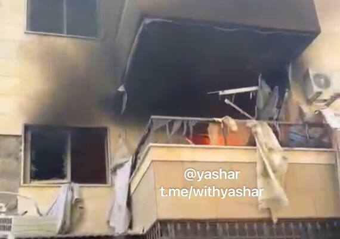

رسانه‌های عبری : «علی الحسینی»، مسئول موشکی حزب‌الله در یگان امام حسین به هلاکت رسید
@withyashar

## WithYashar — post 12785

به گزارش ان. بی. سی نیوز، پس از ارتش اسرائیل، سنتکام فرماندهی مرکزی آمریکا هم بانک اهداف خود در ایران را به روزرسانی کرد و لیستی از جدید از اهداف را تهیه کرد. هدف‌های راحت‌تر مثل رادارهای ثابت، باندها و هواپیماها تا حد زیادی قبلا زده شدن. چیزهایی که مونده بیشتر زیرزمینی، پراکنده یا سیارن و بدون شناسایی دقیق که ادامه درگیری رو سخت‌تر کرده
@withyashar

## WithYashar — post 12784

  

اشتراک Ai موشتبی رو تمدید کردن و موفق شد یه متن طولانی برای سالگرد مجلس بده ، از خالیباف تشکر کرده و به امریکام گفته شیطان بزرگ همین یه امضا بچه ۴ ساله هم با پاورپینت انداختن اون زیر 🤣
@withyashar

## WithYashar — post 12783

  

«روزنامه وال‌استریت ژورنال دیروز گزارش داد که ایران برای دور زدن تحریم‌ها و محاصره آمریکا، از سازوکاری موسوم به انتقال کشتی‌به‌کشتی(Ship-to-Ship) استفاده می‌کند؛ به این صورت که کشتی‌های تحریم‌شده حامل نفت ایران، پیش از ارسال محموله به چین، بار خود را در دریا به کشتی دیگری منتقل می‌کنند.»
@withyashar

## WithYashar — post 12782

  

ارتش اسرائیل دقایقی پیش مجدداً دستور تخلیه فوری کل جنوب لبنان را صادر کرد!
@withyashar

## WithYashar — post 12781

مقام‌های آمریکایی گفتند جمهوری اسلامی چهار پهپاد انتحاری را به سمت کشتی‌های آمریکایی و تجاری شلیک کرد، اما جنگنده‌های آمریکا آن‌ها را سرنگون کردند. به گفته این مقام‌ها، جنگنده‌های اف-۱۸ آمریکا همچنین پیش از پرواز پنجمین پهپاد، واحد کنترل زمینی جمهوری اسلامی را در بندرعباس منهدم کردند.
@withyashar

## WithYashar — post 12780

## WithYashar — post 12779

  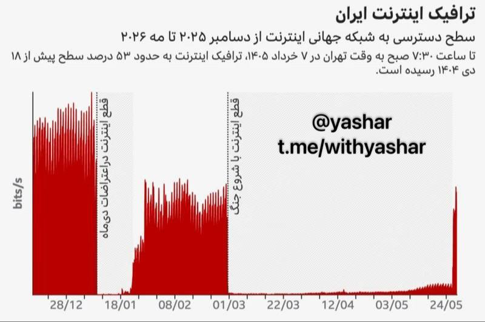

حجم ترافیک اینترنت بین‌الملل، تا ساعت ۷ و نیم صبح امروز به ۵۳ درصد حجم پیش از دی‌ماه ۱۴۰۴ رسیده است
@withyashar
حرفم که گفتم اینترنت فقط با رفتن اینا به حالت قبل بر‌میگرده هنوز پا برجاست !

## mwarmonitor — post 9858

🔴 سخنگوی ارتش اسرائیل: چند لحظه پیش یک حمله هدفمند در بیروت انجام دادیم. @mwarmonitor

## mwarmonitor — post 9857

  <a href="telegram/content/mwarmonitor_9857_1779967938.mp4" target="_blank">🎬 Download video</a>

🔴 سخنگوی ارتش اسرائیل: چند لحظه پیش یک حمله هدفمند در بیروت انجام دادیم.

@mwarmonitor

## mwarmonitor — post 9856

🔴وزارت امور خارجه عراق: ما حملات جنایتکارانه ایران را که خاک کشور کویت را هدف قرار داده‌اند، به شدت محکوم می‌کنیم.

@mwarmonitor

## mwarmonitor — post 9855

🚨در ساعت ۱۰:۱۷ شب به وقت شرقی در تاریخ ۲۷ مه، ایران یک موشک بالستیک به سمت کویت شلیک کرد که توسط نیروهای کویتی با موفقیت رهگیری شد. این نقض آشکار آتش‌بس توسط رژیم ایران، چند ساعت پس از آن رخ داد که نیروهای ایرانی پنج پهپاد تهاجمی یک‌طرفه را پرتاب کردند که تهدیدی آشکار در داخل و اطراف تنگه هرمز ایجاد می‌کردند. همه پهپادها توسط نیروهای آمریکایی با موفقیت رهگیری شدند و همچنین از پرتاب پهپاد ششم از یک مرکز کنترل زمینی ایران در بندرعباس جلوگیری شد.

🚨فرماندهی مرکزی آمریکا (سنتکام) و شرکای منطقه‌ای همچنان هوشیار و محتاط هستند و به دفاع از نیروها و منافع خود در برابر تجاوزات غیرموجه ایران ادامه می‌دهند.

@mwarmonitor

## mwarmonitor — post 9854

  <a href="telegram/content/mwarmonitor_9854_1779967939.mp4" target="_blank">🎬 Download video</a>

📝 این حجم از دنائت و فرومایگی، چیزی جز سقوطِ کاملِ انسانیت نیست؛ موجودی که سال‌ها پشت نقابِ فضل و کمالات قایق رانده، اکنون شرفِ نداشته‌اش را در لجن‌زارِ منفعت‌طلبی به حراج گذاشته است. چطور می‌توان نام انسان را بر این نون‌به‌نرخ‌روز‌خورِ حرامی گذاشت که در اوج جنایات رژیم خونخوار جمهوری اسلامی در ۱۸ و ۱۹ دی، وقتی هزاران نفر را در دو روز به خاک و خون کشیدند، لال‌مانی گرفته بود و اکنون برای بقای قاتلان، ژستِ فیلسوفانه می‌گیرد؟

🔸 نجفیان، تویی که امروز وقاحت را به اوج رسانده‌ای و می‌گویی «وای به حال مردمی که به جای فهم دچار وهم شوند»، خودت تجسمِ عینیِ توهم و بی‌شرفی هستی. کاش حداقل نطفه شیطان بودی؛ چرا که شیطان تکلیفش روشن است و مثل تو با ماسک هنر و کمالات، نان را به نرخ خونِ مظلومان ترید نمی‌کند. این ذاتِ کثیف و فریبکار که در برابر کشتار مردم سکوت کرد، امروز در پیشگاه تاریخ عریان شده و چیزی جز رسوایی، بی‌آبرویی و تفِ لعنتِ ملت را برای خود به ارمغان نیاورده است.

@mwarmonitor

## mwarmonitor — post 9853

📌دبیرکل شورای همکاری خلیج فارس: ما با شدیدترین عبارات، ادامه حملات خائنانه ایران به کشور کویت را محکوم می‌کنیم.

@mwarmonitor

## mwarmonitor — post 9852

🔴 پلیس سوئیس: در پی یک حمله با چاقو در ایستگاه قطار شهر وینترتور، ۳ نفر زخمی شدند.

@mwarmonitor

## mwarmonitor — post 9851

📰 رویترز: گزارش‌هایی از پنتاگون فاش کرده‌اند که نیروهای آمریکایی در طول جنگ از طریق داده‌های موقعیت‌یابی ماهواره ای هدف قرار گرفته‌اند.

@mwarmonitor

## mwarmonitor — post 9850

...طرف اوکراینی‌ها که دارن در برابر متجاوز از خودشون دفاع می‌کنن. و حالا اون خودش مسئول فعال شدن اون ماشه (شروع درگیری) است. بنابراین فکر می‌کنم این فاکتوری هست که در ذهن او وجود داره، هرچند در اینجا به زبان آورده نشده. این فرصت وجود داره که شاید بتونیم به…

## mwarmonitor — post 9849

🔴مجری فاکس نیوز ؛ می‌خواهیم به سراغ ژنرال بازنشسته چهار ستاره ارتش، "جک کین" (Jack Keane) برویم. او رئیس انستیتوی مطالعات جنگ، قائم‌مقام سابق ستاد مشترک ارتش و تحلیلگر ارشد استراتژیک فاکس نیوز است. ژنرال کین، بسیار خوشحالیم که امروز شما را همراه خود داریم.»…

## mwarmonitor — post 9848

🔴مجری فاکس نیوز ؛ می‌خواهیم به سراغ ژنرال بازنشسته چهار ستاره ارتش، "جک کین" (Jack Keane) برویم. او رئیس انستیتوی مطالعات جنگ، قائم‌مقام سابق ستاد مشترک ارتش و تحلیلگر ارشد استراتژیک فاکس نیوز است. ژنرال کین، بسیار خوشحالیم که امروز شما را همراه خود داریم.»
«می‌دانید، من در واقع می‌خواهم برنامه را با نشان دادن این نقل قول به همه کسانی که از خانه ما را تماشا می‌کنند شروع کنم؛ زیرا ما شاهد مطرح شدن هر دو جنبه این استدلال هستیم و تلاش می‌کنیم بفهمیم که آیا اصلاً جای انعطاف و تعدیلی در اینجا وجود دارد یا خیر. اما فکر می‌کنم این نقل قول از سوی رهبری ایران، تا حدودی کمک‌کننده باشد. آن‌ها همیشه به نوعی یک ساز را می‌زنند (یک حرف را تکرار می‌کنند)، اما فقط می‌خواهم این نکته را روشن کنم که این رهبر جدید اساساً همان چیزی را می‌گوید که آن‌ها در تمام این مدت می‌گفتند.»
مجری در حال خواندن متن روی تصویر:
«بنابراین، این بیانیه‌ای از سوی آیت‌الله مجتبی خامنه‌ای است که در طول ایام حج—یکی از بالاترین مراسم‌های مذهبی آن‌ها—بیان شده است. او می‌گوید: "عقربه‌های زمان به عقب برنخواهند گشت و ملت‌ها و سرزمین‌های منطقه دیگر به عنوان سپری برای پایگاه‌های ایالات متحده عمل نخواهند کرد. ایالات متحده نه تنها دیگر پناهگاه امنی برای شرارت‌های خود نخواهد داشت..."»
مجری در حال خواندن ادامه متن:
«"...و همچنین برای ایجاد پایگاه‌های نظامی در منطقه؛ بلکه روز به روز از موقعیت پیشین خود دورتر و دورتر می‌شود." و او در ادامه به نوعی به تخریب اسرائیل نیز می‌پردازد که البته غافلگیری بزرگی هم نیست.»
«برداشت شما از موقعیتی که آن‌ها اکنون در آن قرار دارند چیست؟ آیا این واقعاً یک رژیم جدید است؟ و آیا همان‌طور که امروز از رئیس‌جمهور شنیدیم، ما در اینجا با افراد منطقی‌تری طرف هستیم، ژنرال؟»

🔵ژنرال جک کین:
«بله، منظورم این است که... تلاش برای گمانه‌زنی در مورد اینکه در چه موقعیتی هستیم تقریباً بی‌ثمر است؛ زیرا می‌دانید که این جناح‌ها در داخل ایران وجود دارند. تندروها یک چیز می‌گویند و مذاکره‌کنندگان چیز دیگری می‌گویند.»
«و هر کسی هر از گاهی میکروفون را به دست می‌گیرد و آن را در بوق و کرنا می‌کند و شما چیزی شبیه به آنچه او (رهبر ایران) همین الان گفت یا برخی تندروهای دیگر می‌گویند را می‌شنوید که: "هیچ راهی وجود ندارد که ما در اینجا به توافق برسیم." اما این‌ها کسانی نیستند که با مذاکره‌کنندگان ما گفتگو می‌کنند.»
«فکر می‌کنم مهم است که بدانیم اصلاً چگونه به اینجا رسیده‌ایم؟ منظورم این است که واقعیت این است که زمان زیادی از آن گذشته است—یک هفته پیش—که ما در آستانه بازگشت به عملیات‌های نظامی بودیم؛ و من صادقانه معتقدم که رئیس‌جمهور همین را می‌خواست. من می‌دانم که موضع من و برخی دیگر نیز همین بود؛ و ما معتقد بودیم که این بهترین گزینه در دسترس ما در آن زمان بود.»
«اما اتفاقی که در اینجا افتاد این است که نخست‌وزیرِ... رهبریِ پاکستان و قطر و برخی دیگر نزد رئیس‌جمهور آمدند و معتقد بودند پس از گفتگو با ایرانی‌ها و فشاری که ایرانی‌ها حس می‌کردند، فرصتی برای دستیابی به یک توافق در اینجا وجود دارد.»
«بنابراین رئیس‌جمهور چه کار کرد؟ او به آن حرف‌ها گوش داد و به غریزه خود اعتماد کرد. می‌دانید، یکی از چیزهایی که در این رئیس‌جمهور ثابت است—اگر به آنچه می‌گوید توجه کنید—وقتی صحبت می‌کند، او می‌خواهد درباره توقف جنگ صحبت کند. او در واقع فراتر از این می‌رود و می‌گوید: "من می‌خواهم کشتار را متوقف کنم."»
«و حالا او خودش مسئول فعال کردن آن کشتار است. وقتی شنیدید که او در مورد اوکراین بارها و بارها می‌گفت: "من می‌خواهم کشتار را متوقف کنم"، او داشت درباره هر دو طرف صحبت می‌کرد؛ نه فقط یک طرف...

@mwarmonitor

## mwarmonitor — post 9847

## mwarmonitor — post 9846

  <a href="telegram/content/mwarmonitor_9846_1779967941.mp4" target="_blank">🎬 Download video</a>

🔴فرماندهی جنوبی ایالات متحده یک شناور را در شرق اقیانوس آرام هدف قرار داد.
بر اساس اطلاعات نهادهای اطلاعاتی آمریکا، این شناور در مسیرهای شناخته‌شده قاچاق مواد مخدر فعالیت می‌کرد و توسط یک سازمان تروریستی مورد استفاده قرار گرفته بود.

@mwarmonitor

## mwarmonitor — post 9845

🔴«یک آژانس کشتیرانی اعلام کرد: پهپادها به سه نفتکش در دریای سیاه، در نزدیکی سواحل ترکیه، حمله کردند.»

@mwarmonitor

## FoxNewsTwitter — post 342336

  <a href="telegram/content/FoxNewsTwitter_342336_1779967942.mp4" target="_blank">🎬 Download video</a>

Fox News (Twitter/X)

NEW: CENTCOM says Iran carried out an “egregious ceasefire violation” overnight, launching a ballistic missile toward Kuwait and multiple attack drones near the Strait of Hormuz.

The missile was intercepted by Kuwaiti forces while the U.S. took out five drones and prevented a sixth launch from Bandar Abbas.

President Trump still has faith a deal can happen, but he’s signaling he’s willing to finish the job if Iran keeps pushing.

@madeleinerivera reports the latest.

## pm_afshaa — post 91730

🔴سنتکام حمله ایران با یک عدد موشک بالستیک به کویت را نقض فاحش آتش‌بس خواند

💧 Rainbet.com the #1 Non-KYC Crypto Casino & Sportsbook @rainbetcom

😁 @Pm_Afshaa

## pm_afshaa — post 91729

  <a href="telegram/content/pm_afshaa_91729_1779967944.mp4" target="_blank">🎬 Download video</a>

حملات ارتش اسراییل به بیروت

💧 Rainbet.com the #1 Non-KYC Crypto Casino & Sportsbook @rainbetcom

😁 @Pm_Afshaa

## pm_afshaa — post 91728

سخنگوی شهرداری تهران : مترو و BRT همچنان رایگان است

💧 Rainbet.com the #1 Non-KYC Crypto Casino & Sportsbook @rainbetcom

😁 @Pm_Afshaa

## pm_afshaa — post 91727

پروکسیا و سرورا رو بفرستین برا دوستاتون اونا هم وصل شن

## pm_afshaa — post 91726

راستی واسه پروکسی های که میفرستی مرسی😂

## pm_afshaa — post 91725

سلام خواستم تشکرکنم بابت کانفیگ وپروکسی هایی که توچنلتون میزاریدواقعاعالیه❤️

## pm_afshaa — post 91724

https://t.me/proxy?server=tg.capycore.ru&port=443&secret=27ebe852539fb8ec5f327c73262bb721

💧 Rainbet.com the #1 Non-KYC Crypto Casino & Sportsbook @rainbetcom

😁 @Pm_Afshaa

## pm_afshaa — post 91723

https://t.me/proxy?server=tg.capycore.ru&port=443&secret=27ebe852539fb8ec5f327c73262bb721

پروکسی متصل سرعت بالا

💧 Rainbet.com the #1 Non-KYC Crypto Casino & Sportsbook @rainbetcom

😁 @Pm_Afshaa

## pm_afshaa — post 91722

https://t.me/proxy?server=arezoni9.ir&port=15&secret=ee1603010200010001fc030386e24c3add63646e2e79656b74616e65742e636f6d

پروکسی سرعت بالا متصل

💧 Rainbet.com the #1 Non-KYC Crypto Casino & Sportsbook @rainbetcom

😁 @Pm_Afshaa

## pm_afshaa — post 91721

https://t.me/proxy?server=195.254.165.4&port=8443&secret=EERighJJvXrFGRMCIMJdCQ%3D%3D

پروکسی پر سرعت مخصوص دانلود

💧 Rainbet.com the #1 Non-KYC Crypto Casino & Sportsbook @rainbetcom

😁 @Pm_Afshaa

## pm_afshaa — post 91720

🔴ارتش اسرائیل دقایقی پیش مجدداً دستور تخلیه فوری کل جنوب لبنان را صادر کرد

💧 Rainbet.com the #1 Non-KYC Crypto Casino & Sportsbook @rainbetcom

😁 @Pm_Afshaa

## pm_afshaa — post 91719

  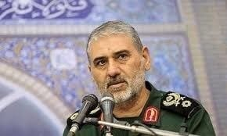

طبق اخبار حسن شاهوار پور فرمانده سپاه ولی‌عصر خوزستان در حمله دیشب آمریکا به درک واصل شده

💧 Rainbet.com the #1 Non-KYC Crypto Casino & Sportsbook @rainbetcom

😁 @Pm_Afshaa

## pm_afshaa — post 91718

🔴ان‌بی‌سی نیوز: پنتاگون فهرست جدیدی از اهداف نظامی ایران تهیه کرده

💧 Rainbet.com the #1 Non-KYC Crypto Casino & Sportsbook @rainbetcom

😁 @Pm_Afshaa

## DEJradio — post 5072

⭕️ وال‌استریت ژورنال: رژیم با سنجش توان تاب‌آوری اقتصادی خود، میزان امتیازدهی به آمریکا را تنظیم می‌کند

به گزارش وال‌استریت ژورنال، تهران می‌خواهد با توجه به میزان تاب آوری در برابر فشارهای اقتصادی، دادن و گرفتن امتیازها را در جریان مذاکرات تنظیم کند.
این روزنامۀ آمریکایی گزارش داد جمهوری اسلامی پس از جنگ و محاصرۀ دریایی آمریکا در اقتصاد با بحرانی عمیق‌تر از پیش روبه‌رو شده است.
وال‌استریت ژورنال نوشت کاهش درآمدهای نفتی و محدودیت ذخیره‌سازی نفت خام، خطر تعطیلی برخی چاه‌های نفت را افزایش می‌دهد.
بنا بر این گزارش، افزایش قیمت کالاهای اساسی، رشد بیکاری و سقوط ارزش ریال، نگرانی مقام‌های جمهوری اسلامی از ناآرامی‌های تازه را بیشتر کرده است.
وال‌استریت ژورنال همچنین گزارش داد بیش از یک میلیون نفر در جریان جنگ و پیامدهای اقتصادی آن بیکار شدند.
این روزنامه نوشت جمهوری اسلامی با وجود فشارهای داخلی، همچنان تلاش می‌کند بدون دادن امتیازهای گسترده، مذاکره با آمریکا را پیش ببرد.

#خبر #دژ
@DEJradio

## DEJradio — post 5071

⭕️ جمعیت زیر خط فقر در ایران از ۴۰ میلیون نفر عبور می‌کند

شماری از کارشناسان اقتصاد و استاد دانشگاه در ایران هشدار دادند که در سال جاری شمار افراد زیر خط فقر از چهل میلیون تن عبور می‌کند.
حجت میرزایی، عضو هیئت علمی دانشگاه علامه طباطبایی، گفت با کاهش شدید صادرات نفت و ادامۀ محاصرۀ دریایی، رشد اقتصادی ایران بین منفی ۸.۸ تا منفی ۱۰ درصد برآورد می‌شود.
او افزود پیش‌بینی‌ها نشان می‌دهد بین ۳.۵ تا ۴.۵ میلیون نفر دیگر به جمعیت فقیر کشور اضافه می‌شود.
اقتصاددانان همچنین از افزایش بیکاری، رشد پدیدۀ «شاغلان فقیر» و بلندتر شدن دوره‌های بیکاری در ایران خبر دادند.

#خبر #دژ #فقر
@DEJradio

## DEJradio — post 5070

⭕️تهران پس از تهدید ترامپ علیه عمان با این کشور اعلام همبستگی کرد

اسماعیل بقائی، سخنگوی وزارت امور خارجۀ جمهوری اسلامی، پس از تهدید دونالد ترامپ علیه عمان، با مسقط اعلام همبستگی کرد.
تهران همچنین تهدیدهای رئیس جمهوری آمریکا علیه عمان را محکوم کرده است.
دونالد ترامپ، رئیس‌ جمهوری ایالات متحده به عمان هشدار داده بود اگر بخواهد {با جمهوری اسلامی} تنگۀ هرمز را کنترل کند، توسط آمریکا نابود می‌شود.
اسماعیل بقائی همچنین مدعی شد حملات بامداد پنج‌شنبۀ آمریکا به مناطقی در بندرعباس «نقض فاحش حقوق بین‌الملل و منشور ملل متحد» است.
بقائی در مورد پهپادهایی که علیه ارتش آمریکا به پرواز درآمده بودند و رهگیری و نابود شدند، توضیحی نداد و تنها مدعی «نقض مستمر آتش‌بس» از سوی آمریکا شد.

#خبر #دژ #عمان
@DEJradio

## DEJradio — post 5069

  <a href="telegram/content/DEJradio_5069_1779967946.webm" target="_blank">🎬 Download video</a>

🚨📢 یکشنبه شب سوم خرداد ماه ۱۴۰۵ «علیرضا تمسکنی زاهدی» از نیروهای پلیس اطلاعات و امنیت استان گلستان، حین گشت‌زنی در محله اوزینه گرگان، مقابل چشمان همکارانش با اسلحه سازمانی کلاشنیکف به زندگی خود پایان داد.

رضا تمیزکار از پرسنل پیشین پلیس با اعلام این خبر به نقل از همکاران او گفت علت این تصمیم، "فشار شدید کاری، تحقیر، برخوردهای فرماندهان و فضای فرسایشی حاکم بر بدنه پلیس است که پرسنل را به این نقطه رسانده است."

تمیزکار می‌گوید، این حادثه؛ نشانه بحرانی عمیق در ساختاری است که حتی نیروهای خودش را هم از نظر روحی و روانی فرسوده کرده. افزایش فشار، بی‌انگیزگی و فروپاشی روحیه در میان نیروهای انتظامی در شهرها و شهرستان‌های مختلف، دیگر قابل کتمان نیست.

#اطلاعات #خودکشی
@DEJradio

## DEJradio — post 5068

⭕️ گزارش صداوسیما دربارۀ تفاهم تهران و واشینگتن کاملا ساختگی بود

کاخ سفید گزارش صداوسیمای جمهوری اسلامی دربارۀ پیش‌نویس تفاهم میان تهران و واشینگتن را نادرست دانست.
بنا بر اعلام دولت آمریکا، گزارش تلویزیون حکومت جمهوری اسلامی «کاملا ساختگی» است.
تلویزیون حکومت جمهوری اسلامی پیش‌تر مدعی شده بود پیش‌نویس توافق شامل رفع محاصرۀ دریایی بنادر جنوبی ایران، بازگشایی تنگۀ هرمز و خروج نیروهای آمریکایی از منطقه است.
کاخ سفید در بیانیه‌ای تأکید کرد هیچ‌کس نباید به گزارش رسانه‌های حکومت جمهوری اسلامی اعتماد کند.
مذاکرات میان تهران و واشینگتن با میانجی‌گری کشورهای منطقه ادامه دارد.

#خبر #دژ #مذاکرات
@DEJradio

## DEJradio — post 5067

⭕️ سامانه‌های پدافندی کویت تهدیدهای موشکی و پهپادی تازه را رهگیری کردند

ارتش کویت بامداد پنج‌شنبه اعلام کرد سامانه‌های پدافند هوایی این کشور تهدیدهای موشکی و پهپادی‌ را رهگیری کرده‌اند.
ارتش کویت بدون اعلام منشأ تهدیدها، خبر داد صدای انفجارهایی که به گوش رسیده، به دلیل رهگیری‌های پدافندی است.
این بیانیه ساعاتی پس از حملات آمریکا به اهدافی در جنوب ایران و به چهار پهپاد جمهوری اسلامی، منتشر شد.
سپاه اعلام کرده بود در واکنش به حملۀ آمریکا، یک پایگاه هوایی این کشور در منطقه را هدف گرفته است.

#خبر #دژ #کویت
@DEJradio

## DEJradio — post 5066

⭕️ آمریکا نهاد مدیریت آبراه خلیج فارس را به‌دلیل ارتباط با سپاه تحریم کرد

وزارت خزانه‌داری آمریکا نهاد تازه تشکیل شدۀ موسوم به «مدیریت آبراه خلیج فارس» را به‌دلیل ارتباط با سپاه پاسداران تحریم کرد.
تحریم این نهاد بر اساس رویۀ عملیات ضدتروریسم، انجام شد.
واشینگتن نهاد «مدیریت آبراه خلیج فارس» را بخشی از تلاش سپاه برای درآمدزایی از مسیر تنگۀ هرمز و دریافت عوارض از کشتی‌های عبوری عنوان کرد.
وزارت خزانه‌داری آمریکا هشدار داد هر فرد یا نهادی که با این سازمان همکاری کند، ممکن است هدف تحریم قرار بگیرد.
اسکات بسنت، وزیر خزانه‌داری آمریکا، گفت تازه‌ترین اقدامات جمهوری اسلامی در تنگۀ هرمز نشان می‌دهد رژیم حاکم بر ایران بیش از پیش به منابع مالی نیاز دارد.

#خبر #دژ #تحریم
@DEJradio

## DEJradio — post 5065

⭕️ ادعای نمایندۀ مجلس شورای اسلامی: بازگشایی اینترنت خلاف قانون است

احمد راستینه، سخنگوی کمیسیون فرهنگی مجلس شورای اسلامی گفت بازگشایی اینترنت «خلاف قانون» است. به گفتۀ او شماری از وظایف ستاد ساماندهی فضای مجازی، با شورای عالی فضای مجازی تداخل دارد.
احمد راستینه رأی دیوان «عدالت» اداری برای توقف فعالیت این ستاد را از نظر حقوقی «درست و دقیق» خواند.
دیوان عدالت اداری پیش‌تر اعلام کرده بود اجرای مصوبۀ تشکیل ستاد ساماندهی فضای مجازی تا زمان رسیدگی پایانی متوقف می‌شود.

#خبر #دژ #اینترنت
@DEJradio

## DEJradio — post 5064

⭕️ با وجود اتصال اینترنت در ایران همچنان به‌شدت زیر فیلتر قرار دارد

نت‌بلاکس، نهاد ناظر بر دسترسی اینترنت در جهان، اعلام کرد با وجود برقراری اتصال به اینترنت در ایران، کاربران همچنان با فیلترینگ شدید مواجه‌اند.
این نهاد جهانی پایش اینترنت گزارش داد وضعیت کنونی مانند دوره‌ای کوتاه پس از اعتراضات سراسری دی‌ماه است. در آن دوره اینترنت جهانی به‌صورت محدود و ناپایدار در دسترس قرار گرفته بود.
بر اساس داده‌ها حجم ترافیک اینترنت بین‌الملل ایران تا بامداد پنج‌شنبه به حدودا ۵۳ درصد از سطح پیش از اعتراضات دی‌ماه ۱۴۰۴ رسید.
نت‌بلاکس نوشت هنوز مشخص نیست اینترنت به وضعیت عادی برمی‌گردد یا محدودیت‌ و اختلال‌ ادامه پیدا می‌کند.

#خبر #دژ #اینترنت
@DEJradio

## DEJradio — post 5063

  <a href="telegram/content/DEJradio_5063_1779967946.mp4" target="_blank">🎬 Download video</a>

🔺🎥 آتش‌سوزی در برج‌ پامچال؛ بنیاد تعاون آجا بساز بنداز است

برج پامچال ارتش واقع در منطقه ۲۲ تهران (چیتگر) روز چهارشنبه ششم خرداد دچار آتش‌سوزی شد. تحت تاثیر آتش‌سوزی‌های مداوم انفجارها و آتش‌سوزی‌های زنجیره‌ای در مناطق و شهرک‌های نظامی، برخی مدعی شدند که این حادثه نیز یک حذف هدفمند بود. با این همه بررسی‌های اولیه نشان می‌دهد آتش‌سوزی ناشی از شعله‎ور شدن نمای کامپوزیتی ساختمان بوده است. یک منبع داخلی به دژ می‌گوید، «هنوز مشخص نیست پشت ماجرا چه بوده، اما در اینکه بنیاد تعاون آجا بساز بنداز است شک نکنید.»

#آتشسوزی #چیتگر
@DEJradio

## DEJradio — post 5062

⭕️ ترامپ: نه تحریم را لغو می‌کنیم نه به تهران پول می‌دهیم؛ کار را یکسره می‌کنیم

دونالد ترامپ، رئیس جمهوری آمریکا گفت در مذاکرات جاری با تهران، صحبتی درباره کاهش تحریم‌ها یا انتقال پول به جمهوری اسلامی مطرح نیست.
او تأکید کرد آمریکا کنترل دارایی‌های مسدودشده ایران را حفظ می‌کند. به گفتۀ ترامپ، هر زمان اداره کنندگان ایران رفتار درستی در پیش بگیرند، اجازه داده می‌شود که به پول‌ها دسترسی پیدا کنند.
دونالد ترامپ همچنین گفت آمریکا هنوز از وضعیت توافق احتمالی خشنود نیست، اما جمهوری اسلامی بسیار مایل است به توافق برسد.
رئیس جمهوری آمریکا هشدار داد اگر توافقی به‌دست نیاید، واشینگتن کار را یکسره می‌کند.

#دژ #خبر #ترامپ #مذاکرات #تحریم
@DEJradio

## DEJradio — post 5061

⭕️ روبیو: در مذاکراه با تهران مقداری پیشرفت رخ داد

مارکو روبیو، وزیر امور خارجۀ آمریکا در بامداد پنج‌شنبه گفت در مذاکره با جمهوری اسلامی برای رسیدن به توافق «مقداری پیشرفت» رخ داده است.
او افزود طی ساعت‌ها چند روز آینده مشخص می‌شود امکان پیشروی بیش‌تر وجود دارد یا نه.
مارکو روبیو تأکید کرد جمهوری اسلامی هرگز به سلاح هسته‌ای دست پیدا نمی‌کند.
وزیر خارجه آمریکا گفت اولویت دولت ترامپ همچنان دیپلماسی است.

#خبر #دژ #مارکو_روبیو #مذاکرات
@DEJradio

## DEJradio — post 5060

⭕️ اسرائیل از جنوب لبنان تا رود زهرانی را منطقۀ جنگی اعلام کرد

ارتش اسرائیل اعلام کردهمۀ مناطق جنوب رود زهرانی در لبنان، در فاصلۀ حدودا ۴۰ کیلومتری مرز اسرائیل، منطقۀ جنگی به شمار می‌رود.
اویخای ادرعی، سخنگوی عرب‌زبان ارتش اسرائیل از ساکنان این مناطق خواست تا به شمال رود زهرانی بروند.
ارتش اسرائیل دلیل این تصمیم را نقض مکرر آتش‌بس از سوی حزب‌الله عنوان کرد.
شبه‌نظامیان حزب‌الله که از سوی جمهوری اسلامی پشتیبانی می‌شوند، در سیاهۀ تروریستی آمریکا و اتحادیۀ اروپا قرار دارند.
ایال زمیر، رئیس ستاد ارتش اسرائیل گفت این کشور شدت عملیات علیه حزب‌الله را افزایش می‌دهد و ضرباتی سهمگین‌تر به آنها وارد می‌کند.

#خبر #دژ #اسرائیل
@DEJradio

## DEJradio — post 5059

⭕️ روسیه بازگشت کارکنان خود به نیروگاه بوشهر را به تعویق انداخت

روس‌اتم، سازمان دولتی انرژی هسته‌ای روسیه اعلام کرد بازگشت کارکنانش به نیروگاه هسته‌ای بوشهر را به تعویق می‌اندازد.
الکسی لیخاچف، مدیرعامل روس‌اتم گفت اخبار ضدونقیض دربارۀ مذاکرات جمهوری اسلامی و آمریکا و حملاتی که به نقاطی از ایران انجام شد، دلیل این تصمیم بوده است.
او افزود ولادیمیر پوتین، رئیس جمهوری روسیه در جریان این تصمیم قرار گرفته و آن را تأیید کرده است.
روس‌اتم در دوران جنگ چهل روزه ۸۱۳ نفر از کارکنان خود را از نیروگاه بوشهر خارج کرد و تنها ۲۰ تن را برای حفظ ایمنی و ادامۀ فعالیت نیروگاه، در محل نگه داشت.

#خبر #دژ #روسیه #ایران
@DEJradio

## DEJradio — post 5058

🔺 جنگ خاورمیانه مسیر سرمایه‌گذاری جهانی در انرژی را تغییر داد

آژانس جهانی انرژی اعلام کرد بحران خاورمیانه کشورها را به سمت تنوع‌بخشی به منابع و مسیرهای انرژی سوق داده است.
فاتح بیرول، مدیر اجرایی آژانس، وضعیت کنونی را بزرگ‌ترین بحران امنیت انرژی در جهان، عنوان کرد.
آژانس جهانی انرژی پیش‌بینی کرد بخش عمدۀ سرمایه‌گذاری جهانی انرژی در سال ۲۰۲۶ در برق و همچنین در انرژی هسته‌ای و تجدیدپذیر، انجام شود.
این نهاد جهانی پیش‌بینی کرد سرمایه‌گذاری در انرژی جهانی در سال جاری به ۳.۴ تریلیون دلار برسد.
بنا بر این گزارش، سرمایه‌گذاری در نفت برای سومین سال پیاپی کاهش پیدا می‌کند، اما سرمایه‌گذاری در گاز طبیعی امسال به بالاترین سطح در یک دهۀ اخیر می‌رسد.

#خبر #دژ #خاورمیانه #انرژی
@DEJradio

## DEJradio — post 5057

⭕️ سنتکام چهار پهپاد انتحاری جمهوری اسلامی را در نزدیکی تنگۀ هرمز سرنگون کرد

سنتکام، ستاد فرماندهی مرکزی ارتش آمریکا اعلام کرد در بامداد پنج‌شنبه چهار پهپاد انتحاری جمهوری اسلامی را که در اطراف تنگۀ هرمز «تهدید ایجاد کرده بودند» سرنگون کرده است.
سنتکام همچنین گفت یک ایستگاه کنترل پهپادی در بندرعباس را پیش از پرتاب پهپاد پنجم هدف قرار داده است.
سپاه پاسداران ادعا کرد یک پایگاه هوایی آمریکا را در پاسخ به آنچه «تعرض» خواند، هدف قرار داده است.
روایت سپاه از هدف گرفتن پایگاه آمریکایی هنوز توسط منابع محلی تأیید نشده است.

#خبر #دژ #سنتکام #تنگه_هرمز
@DEJradio

## DEJradio — post 5056

⭕️ افزایش دوبارۀ بهای نفت در پی حملات شبانه در تنگۀ هرمز

بهای نفت در معاملات پنج‌شنبه، در پی حملات تازه میان آمریکا و جمهوری اسلامی، بار دیگر افزایش یافت.
بهای نفت برنت با رشد ۱.۸ درصدی به حدود ۹۶ دلار رسید. همچنین هر بشکه نفت خام آمریکا روز پنج‌شنبه بیش از ۹۰ دلار معامله شد.
از سویی اکثر بورس‌های آسیایی از جمله هنگ‌کنگ، سئول و شانگهای با کاهش شاخص قیمت روبه‌رو شد.

#خبر #دژ #نفت #تنگه_هرمز
@DEJradio

## DEJradio — post 5055

⭕️ هشدار ترامپ به عمان: اگر بخواهید تنگۀ هرمز را کنترل کنید، نابودتان می‌کنیم

دونالد ترامپ، رئیس جمهوری آمریکا گفت در چارچوب توافق احتمالی با جمهوری اسلامی، تنگۀ هرمز باید بی‌درنگ باز شود و در کنترل هیچ کشوری نباشد.
ترامپ گفت آمریکا بر آبراه هرمز نظارت می‌کند، اما اجازه نمی‌دهد هیچ کشوری کنترل آن را در دست بگیرد.
ترامپ با اشاره به عمان گفت:آنها هم باید مانند بقیه رفتار کنند، وگرنه مجبور می‌شویم نابودشان کنیم.

#خبر #دژ #ترامپ #تنگه_هرمز
@DEJradio

## DEJradio — post 5054

  <a href="telegram/content/DEJradio_5054_1779967948.webm" target="_blank">🎬 Download video</a>

🔺📢 سنگ بنای فعالیت علیه جمهوری اسلامی؛

فریبرز کرمی‌زند، افسر پیشین پلیس

#اپوزیسیون #جمهوری_اسلامی
@DEJradio

## DEJradio — post 5053

  <a href="telegram/content/DEJradio_5053_1779967948.webm" target="_blank">🎬 Download video</a>

🔺🎥 هنرنمایی دختران برزیلی با توپ فوتبال.

#فوتبال #دختران_برزیلی
@DEJradio

## mamlekate — post 103595

یه دلقک دوزاری رو، یه مشت دوزاری‌تر از خودش بهش تریبون میدن گنده می‌کنن تا بیاد سفیدشویی هلاک شدن کسی رو بکنه که عضو یگان امام رضا بود (یگانی که نیروهاش به نیکا شاکرمی تجاوز کردند) و دقیقا هم تو کار سرکوب و کشتن و دستگیری بچه‌های اکباتان تو خیزش مهسا فعال بود. این مدت هم تو مجازی همه جا رو سرش اکلیل ریدن که گنده شه گنده شه این گند رو بزنه مرتیکه گه. کاری نداریم اصلا یه بخشی از همون سیستم قضایی جمهوری اسلامی با سند و مدرک هم حکم‌های اعدام بچه‌های اکباتان رو رد کرده و اینا بی‌دلیل و مدرک برا طنابشون دنبال گردن می‌گردن...

t.me/mamlekate/87072

## mamlekate — post 103594

📞 تهران جنوب شرق صدای انفجار اومد
۳ تا صدای انفجار
پنج شنبه ۱۱:۰۵

@mamlekate

## IranIntlTV — post 339393

  <a href="telegram/content/IranIntlTV_339393_1779967949.mp4" target="_blank">🎬 Download video</a>

ایران‌اینترنشنال در کارزاری مردمی، در پی ثبت و مستندسازی حقیقت درباره کشتار دی‌ماه در رشت است. صدها نفر از معترضان رشت طی دو شب ۱۸ و ۱۹ دی‌ماه در این شهر کشته شدند. با وجود اسناد و تصاویری که از این جنایت منتشر شده، هنوز هزاران روایت ناگفته باقی مانده است.
ایران‌اینترنشنال در ادامه این کارزار مردمی، از شاهدان عینی، خانواده‌ها و نزدیکان کشته‌شدگان می‌خواهد روایت‌ها، تصاویر، ویدیوها و اطلاعات خود را ارسال کنند تا نام و سرگذشت کشته‌شدگان رشت در سکوت و بی‌خبری دفن نشود.

گزارش فرزاد فتاحی، عضو تحریریه ایران‌اینترنشنال
@iranintltv

## IranIntlTV — post 339392

  <a href="telegram/content/IranIntlTV_339392_1779967950.mp4" target="_blank">🎬 Download video</a>

پلیس متروپولیتن لندن اعلام کرد یک مرد ۴۱ ساله ایرانی در پی برخورد شدید یک خودرو در نزدیکی دیوار جاویدنامان در گولدرز گرین لندن به‌شدت زخمی و به بیمارستان منتقل شد. راننده، مردی ۳۹ ساله عراقی، به اتهام وارد کردن جراحات شدید، رانندگی خطرناک و خودداری از ارائه نمونه برای آزمایش مواد مخدر بازداشت شده است. پلیس اعلام کرد این پرونده در حال حاضر تروریستی تلقی نمی‌شود.
فربد سروندی، خبرنگار ایران‌اینترنشنال، گزارش می‌دهد
@iranintltv

## IranIntlTV — post 339391

  

ارتش اسرائیل، ظهر پنج‌شنبه هفت خرداد اعلام کرد در ۲۴ ساعت گذشته بیش از ۱۳۵ موضع حزب‌الله را در مناطق صور، بقاع و جنوب لبنان هدف قرار داده است.

بر اساس این اطلاعیه، حدود ۱۰ محل پرتاب راکت که حزب‌الله از آن‌ها برای شلیک به سوی نیروهای ارتش اسرائیل و غیرنظامیان اسرائیلی استفاده می‌کرد، در بقاع و جنوب لبنان هدف قرار گرفت. ارتش اسرائیل همچنین اعلام کرد یک اردوگاه آموزشی حزب‌الله در بریتال، در منطقه بقاع، هدف حمله قرار گرفته است.

بر اساس این اطلاعیه، ارتش اسرائیل شب گذشته حدود ۱۵ زیرساخت نظامی در صور را که به گفته این ارتش برای پیشبرد حملات حزب‌الله استفاده می‌شد، هدف قرار داد. نیروی هوایی اسرائیل همچنین یک گروه از نیروهای حزب‌الله را هنگام خروج از محل پرتاب راکت هدف قرار داد.
iranintl.com/202605280529

## IranIntlTV — post 339390

  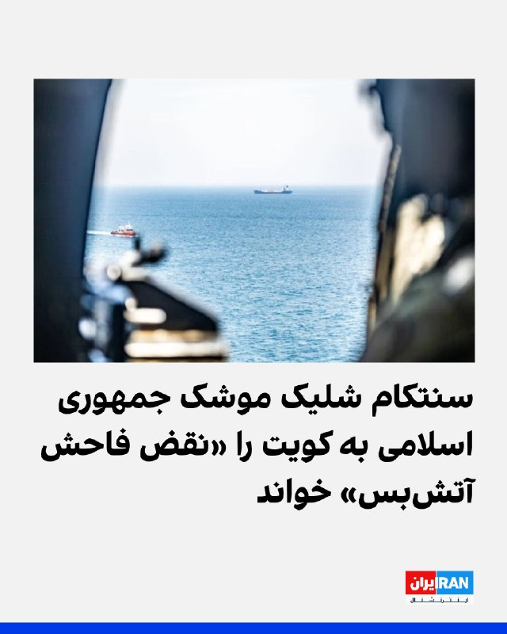

فرماندهی مرکزی آمریکا، سنتکام، در شبکه ایکس اعلام کرد جمهوری اسلامی ساعت ۴:۴۷ بامداد پنج‌شنبه به وقت ایران، یک موشک بالستیک به سوی کویت شلیک کرد که نیروهای کویتی آن را رهگیری کردند.

سنتکام این اقدام را «نقض فاحش آتش‌بس» خواند و افزود چند ساعت پیش از آن، نیروهای جمهوری اسلامی پنج پهپاد انتحاری را در و نزدیک تنگه هرمز به پرواز درآوردند که «تهدیدی آشکار» ایجاد کردند.

بر اساس اعلام سنتکام، همه این پهپادها از سوی نیروهای آمریکایی رهگیری شدند و آمریکا همچنین از پرتاب ششمین پهپاد از یک مرکز کنترل زمینی جمهوری اسلامی در بندرعباس جلوگیری کرد.
https://iranintl.com/202605288025

## IranIntlTV — post 339389

  <a href="telegram/content/IranIntlTV_339389_1779967953.mp4" target="_blank">🎬 Download video</a>

چند برابر شدن هزینه‌های روزانه زندگی و گرانی بی‌سابقه مواد غذایی و دارو در ایران از عمده پیام‌هایی است که شهروندان به مدیابات ایران‌اینترنشنال ارسال کرده‌اند.

لیلا سعادتی، عضو تحریریه ایران‌اینترنشنال، گزارش می‌دهد
@iranintltv

## IranIntlTV — post 339388

  <a href="telegram/content/IranIntlTV_339388_1779967954.mp4" target="_blank">🎬 Download video</a>

سرخط خبرهای پنجشنبه ۷ خرداد
@iranintltv

## IranIntlTV — post 339387

  

رسانه‌های ایران پیامی منتسب به مجتبی خامنه‌ای، به مناسبت سالروز افتتاح اولین دوره مجلس شورای اسلامی منتشر کردند که در بخشی از آن، رهبر جمهوری اسلامی بر «وحدت ملی» به‌عنوان یکی از مهم‌ترین عوامل پیروزی تاکید کرده است.

در این پیام آمده حفظ انسجام اجتماعی و پرهیز از اختلافات سیاسی، وظیفه نخبگان و نمایندگان مجلس است و هرگونه برجسته کردن تفاوت‌های اجتماعی می‌تواند به تفرقه منجر شود.

در این متن منتسب به مجتبی خامنه‌ای همچنین آمده است پس از فشارهای نظامی و اقتصادی، «دشمن» به‌دنبال ایجاد شکاف و تجزیه اجتماعی است و نیروهای وفادار به حکومت باید از بروز اختلاف جلوگیری کنند.
https://iranintl.com/202605281102

## IranIntlTV — post 339386

  

امارات متحده عربی حملات موشکی و پهپادی جمهوری اسلامی به کویت را به شدت محکوم و تاکید کرد که از هر اقدام این کشور برای حفظ امنیت و ثبات خود، حمایت می‌کند.
وزارت خارجه امارات متحده عربی این حملات را «تروریستی» خواند.

در بیانیه وزارت خارجه امارات متحده عربی آمده است که این حملات نقض آشکار حاکمیت کویت و تهدیدی علیه امنیت و ثبات این کشور محسوب می‌شود.

بامداد پنج‌شنبه سپاه پاسداران اعلام کرد در واکنش به حمله آمریکا به اطراف فرودگاه بندرعباس، یک پایگاه هوایی آمریکا را هدف قرار داده است. هم‌زمان، ارتش کویت از رهگیری حملات موشکی و پهپادی «خصمانه» خبر داده بود.
https://iranintl.com/202605282035

## IranIntlTV — post 339385

🗣روایت شما از زندگی در آتش‌بس- پنجشنبه ۷ خرداد

🔹خواهش می‌کنم ناامید نشید. به ۱۸ و ۱۹ دی فکر کنید، به اون همه جوان زیبا که رفتن برای آزادی و دیگه برنگشتن. ما باید این کار رو تموم کنیم.

🔹هر وقت پیام شکایت یا ناامیدی می‌دید، به یاد زندانیان بیفتید که به‌خاطر ما رفتن. ضعیف و بی‌انصاف نباشید. تا وقتی اکثریت برای رفتن این رژیم جان‌فدایی نکنن، چیزی عوض نمی‌شه.

🔹دوستان عزیز یادتون نره که این حکومت در دی‌ماه ۱۴۰۴ چه جنایاتی انجام داد. صرفا چون اینترنت رو وصل کردن نپرید بغل آخوند. این اینترنت حق ماست، پس برای گرفتن حقتون از این ستمگران سپاسگزار نباشید.

🔹اکثریت ما با جمهوری اسلامی مخالفیم و کار آخر رو باید خودمون انجام بدیم.

🔹در طول تاریخ، دیکتاتورها تا لحظه آخر شاخ و شونه می‌کشن و در نهایت به فجیع‌ترین حالت ممکن سقوط می‌کنن. ما برای آزادی بهای سنگینی دادیم؛ چه دی‌ماه و چه قبل از اون، پس صبور باشید و امیدوار.

🔹امروز وصل شدم و خواستم بگم ما در ۱۸ و ۱۹ دی شکوهی از حجم جمعیت و صدایی که خاموش نمی‌شد دیدیم که به این سادگی‌ها ناامید و تموم نمی‌شیم.

🔹اینجا همه‌چیز داره از هم می‌پاشه؛ زندگی‌ها، کارها، پیوندها، تندرستی، سلامت روان، بهداشت، خوراک و پوشاک. تنها چیزی که ما رو سرپا نگه داشته، دیدن راهپیمایی ایرانیان خارج از کشور در ماهواره و تصور روز آزادیه.

🔹به‌وقتش خود ما می‌جنگیم، می‌میریم و در نهایت ما ایران رو پس می‌گیریم. درسته میگیم تا کی دیگه باید تاوان بدیم، ولی اینم می‌دونیم که آزادی به دست خودمون رقم می‌خوره.

🔹می‌خواستم بگم برخلاف خیلی‌ها که از ترامپ و نتانیاهو ناراحت هستن، من برعکس خیلی‌ها ازشون تشکر می‌کنم که تا همین‌جا هم واقعاً کارهای بزرگی انجام دادن. تغییر در رژیم یک رونده و مردم هم به‌هرحال باید این سختی‌ها رو تحمل کنن به امید روزی که نجات پیدا کنیم.

🔹وضعیتمون جوریه که می‌خوایم یک کاری کنیم ولی نمی‌دونیم باید چی‌کار کنیم. عید نوروز فکر می‌کردیم تا چند وقت دیگه تمومه، اما الان خیلی وضعیت مبهمه. همچنان امید داریم.

## IranIntlTV — post 339384

  <a href="telegram/content/IranIntlTV_339384_1779967957.mp4" target="_blank">🎬 Download video</a>

یک منبع نزدیک به مذاکرات تهران و واشینگتن به ایران‌اینترنشنال گفت که درباره هماهنگی محمدباقر قالیباف و تیم مذاکره‌کننده جمهوری اسلامی با مجتبی خامنه‌ای، رهبر سوم جمهوری اسلامی، تردیدهای جدی وجود دارد.
جزییات بیشتر در گفت‌وگو با محمدجواد اکبرین، عضو تحریریه ایران‌اینترنشنال
@iranintltv

## IranIntlTV — post 339383

  <a href="telegram/content/IranIntlTV_339383_1779967958.mp4" target="_blank">🎬 Download video</a>

ویدیویی که تازه به ایران اینترنشنال رسیده است وضعیت سالن ورزشی ایثار ذوب آهن در فولادشهر اصفهان پس از حملات هوایی اسفندماه را نشان می‌دهد. یک شهروند در این ویدیو می‌گوید: «به خیر گذشت.»

بر اساس اعلام شرکت عمران فولادشهر، این سالن روز یکشنبه ۱۷ اسفند ۱۴۰۴ هدف گرفته شد.

## IranIntlTV — post 339382

  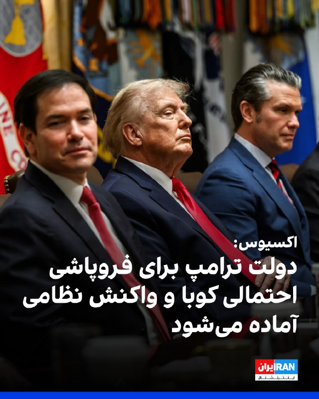

اکسیوس به نقل از مقام‌های آمریکایی گزارش داد دولت دونالد ترامپ، رییس‌جمهوری آمریکا، در حال آماده‌سازی برای احتمال فروپاشی حکومت کوبا در اوایل تابستان امسال است و سناریوهای جدید واکنش نظامی را در صورت بروز هرج‌ومرج در این کشور شبیه‌سازی کرده است.

یکی از مقام‌های ارشد دولت گفت: «بهترین توصیف، شتاب‌دهی به فروپاشی است.» او افزود: «اما فعلا قصد نابودی کامل حکومت را نداریم. این روند مرحله‌ای است.»

بر اساس این گزارش، این فشار مرحله‌به‌مرحله همچنین به ترامپ که اکنون درگیر گفت‌وگوها با جمهوری اسلامی است، زمان می‌دهد تا در آینده بر کوبا تمرکز کند.

مقام دیگری گفت: «ترامپ می‌خواهد همه اهرم‌های ممکن را امتحان کند، اما اکنون ابزارها نسبت به گذشته کمتر است.» مقام سومی نیز افزود ابزارهای زیادی، به‌ویژه در حوزه تحریم‌ها، در اختیار دولت قرار دارد و اقدامات بیشتری در راه است.
https://iranintl.com/202605283051

## IranIntlTV — post 339381

  

یک منبع نزدیک به مذاکرات تهران و واشینگتن، به ایران‌اینترنشنال گفت که در هماهنگی محمدباقر قالیباف و تیم مذاکره‌کننده جمهوری اسلامی با مجتبی خامنه‌ای، تردید وجود دارد.

بر اساس این گزارش، درباره میزان اطلاع مجتبی خامنه‌ای از روند گفت‌وگوها و ابعاد تفاهم تیم مذاکره‌کننده جمهوری اسلامی با دولت ترامپ، ابهام‌های جدی وجود دارد.

بنا بر اطلاعات رسیده به ایران‌اینترنشنال، سفر قالیباف و عراقچی به قطر و خودداری تیم مذاکره‌کننده جمهوری اسلامی از سفر به پاکستان یا پیشبرد گفت‌وگوها در تهران، بر این تردید و ابهام اضافه کرده است.
https://iranintl.com/202605287574

## IranIntlTV — post 339380

  <a href="telegram/content/IranIntlTV_339380_1779967961.mp4" target="_blank">🎬 Download video</a>

ویدیوی رسیده به ایران اینترنشنال نشان می‌دهد که در آبادن، نیروهای سرکوب حامل مسلسل سنگین سوار بر خودروی نظامی از میان جمعیت گذشتند.

## IranIntlTV — post 339379

  

پس از انتشار پیامی منسوب به مجتبی خامنه‌ای درباره «نابودی اسرائیل تا ۱۵ سال آینده»، رسانه‌های ایران تصویری از دیوارنگاره جدید در میدان فلسطین تهران منتشر کردند که بر آن جمله «اسرائیل ۱۵ سال آینده را نخواهد دید» نوشته شده است.

در پیام منتسب به مجتبی خامنه‌ای که رسانه‌های ایران آن را منتشر کرده بودند، آمده است اسرائیل «به مراحل پایانی عمر منحوس خود نزدیک شده است.» در این پیام به سخنان علی خامنه‌ای در سال ۱۳۹۴ اشاره شده و تاکید شده است که اسرائیل «۲۵ سال بعد از آن تاریخ را نخواهد دید.»
https://iranintl.com/202605288535

## IranIntlTV — post 339378

جمهوری اسلامی و آمریکا پس از رد گزارش توافق هرمز از سوی ترامپ، حملات متقابل انجام دادند

سپاه پاسداران انقلاب اسلامی پنج‌شنبه هفتم خرداد یک پایگاه هوایی آمریکا را هدف قرار داد. اقدامی که پس از حملات ارتش آمریکا به آن‌چه یک مقام واشینگتن «عملیات پهپادی ایران» در نزدیکی تنگه هرمز خواند، انجام شد.

این درگیری تنها چند ساعت پس از آن رخ داد که دونالد ترامپ، رییس‌جمهوری آمریکا، گزارش‌ها را درباره نزدیک بودن توافقی با تهران رد کرد.

تشدید دوباره درگیری‌ها، نگرانی‌ها را درباره آتش‌بس شکننده میان تهران و واشینگتن - که از ۱۹ فروردین برقرار شده - افزایش داده و امیدها به توافق صلح را تضعیف کرده است.

حمله آمریکا به پهپادهای ایرانی
یک مقام آمریکایی که نخواست نامش فاش شود، به خبرگزاری رویترز گفت ارتش آمریکا چهار پهپاد تهاجمی ایران را سرنگون کرده و یک ایستگاه کنترل زمینی در بندرعباس را هدف قرار داده است. مرکزی که به گفته او در آستانه پرتاب پنجمین پهپاد قرار داشت.

این مقام گفت: «این اقدام‌ها حساب‌شده، کاملا دفاعی و با هدف حفظ آتش‌بس انجام شدند.»

خبرگزاری تسنیم به نقل از سپاه پاسداران گزارش داد جمهوری اسلامی در پاسخ به آن‌چه «حمله بامداد آمریکا در نزدیکی فرودگاه بندرعباس» توصیف شد، یک پایگاه آمریکایی را هدف قرار داده است.

هشدار در کویت و شمال اسرائیل
کویت که میزبان یکی از پایگاه‌های بزرگ آمریکا در منطقه است، اعلام کرد در حال مقابله با حملات موشکی و پهپادی است، اما توضیح نداد این حملات از کجا انجام شده‌اند.

اسرائیل نیز از فعال شدن آژیرهای هشدار در شمال این کشور در پی «فعالیت هوایی دشمن» خبر داد.

در واکنش به تشدید تنش‌ها، قیمت نفت که چهارشنبه حدود پنج درصد کاهش یافته بود، دوباره افزایش یافت.

بهای نفت خام آمریکا بیش از سه درصد رشد کرد، بازار سهام افت کرد و ارزش دلار بالا رفت.

ترامپ: هیچ کشوری کنترل تنگه هرمز را در دست نمی‌گیرد
جنگی که از ۹ اسفند ۱۴۰۴ با حملات آمریکا و اسرائیل به جمهوری اسلامی آغاز شد، تاکنون باعث جهش شدید قیمت جهانی انرژی شده است.

او همچنین گزارش صداوسیمای جمهوری اسلامی را رد کرد. گزارشی که در آن گفته شده است تهران به پیش‌نویس غیررسمی توافقی دست یافته که بر اساس آن، کشتیرانی تجاری در تنگه هرمز ظرف یک ماه به سطح پیش از جنگ بازمی‌گردد و ایران و عمان به‌طور مشترک مدیریت تردد را بر عهده می‌گیرند.

ترامپ گفت هیچ کشوری کنترل این آبراه را در اختیار نخواهد داشت و در اظهاراتی تهدیدآمیز علیه مسقط تاکید کرد: «هیچ‌کس قرار نیست کنترل تنگه را در دست بگیرد. این آب‌های بین‌المللی است و عمان هم مثل بقیه رفتار خواهد کرد، وگرنه مجبور می‌شویم آن‌ها را نابود کنیم.»

اختلاف‌ها بر سر تحریم‌ها، برنامه هسته‌ای و تنگه هرمز
علی باقری کنی، معاون دبیر شورای عالی امنیت ملی، گفت تهران خواهان آزادسازی همه دارایی‌های بلوکه‌شده ایران از سوی آمریکاست.

او به تسنیم گفت: «آزادسازی کامل و بدون قید و شرط دارایی‌های ایران، حق قانونی ملت ایران است.»

تحریم‌ها، برچیدن برنامه هسته‌ای جمهوری اسلامی و وضعیت تنگه هرمز - که پیش از جنگ حدود یک‌پنجم تجارت جهانی نفت و گاز طبیعی مایع از آن عبور می‌کرد - همچنان مهم‌ترین نقاط اختلاف در مذاکرات برای پایان جنگ هستند.

رویترز نوشت این آبراه بر اساس قوانین بین‌المللی، مشمول حق عبور آزاد کشتی‌های خارجی است.

وزارت خزانه‌داری آمریکا نیز «سازمان مدیریت تنگه هرمز» - نهادی ایرانی که برای مدیریت عبور و مرور در این تنگه ایجاد شده - را به فهرست تحریم‌های مرتبط با تهدید امنیت ملی آمریکا اضافه کرد.

اختلاف بر سر پرونده هسته‌ای
صداوسیمای جمهوری اسلامی گزارش داد پیش‌نویس توافق با واشینگتن شامل خروج نیروهای آمریکایی از مناطق نزدیک به ایران است؛ هرچند مساله حضور نظامی آمریکا در منطقه همچنان نیازمند مذاکره بیشتر توصیف شد.

کاخ سفید این گزارش را «کاملا ساختگی» خواند و تهران نیز به آن واکنش رسمی نشان نداد.

گزارش تلویزیون جمهوری اسلامی درباره پیش‌نویس توافق، اشاره‌ای به برنامه هسته‌ای تهران نداشت. برنامه‌ای که آمریکا خواهان برچیدن آن است.

منابع ایرانی به رویترز گفته‌اند مذاکرات درباره پرونده هسته‌ای قرار است در مرحله دوم گفت‌وگوها انجام شود. موضوعی که ممکن است برای برخی از نزدیک‌ترین حامیان ترامپ، قابل قبول نباشد.

مارکو روبیو، وزیر خارجه آمریکا، در نشست کابینه دولت ترامپ گفت: «اصل ماجرا این است که ایران هرگز نباید به سلاح هسته‌ای دست پیدا کند.»
 
🔗متن کامل گزارش را اینجا بخوانید
@iranintltv

## IranIntlTV — post 339377

  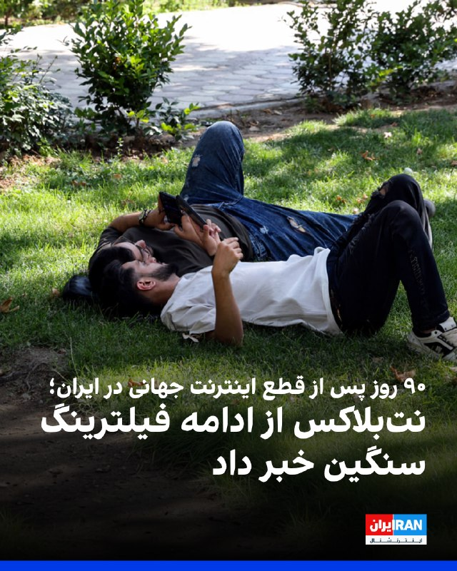

نت‌بلاکس، نهاد ناظر بر اختلال‌های اینترنتی در جهان، صبح پنج‌شنبه هفت خرداد در شبکه ایکس اعلام کرد ۹۰ روز پس از قطع دسترسی کاربران در ایران به اینترنت جهانی، اگرچه اتصال تا حد زیادی بازگشته، داده‌ها نشان می‌دهد کاربران همچنان با فیلترینگ سنگین روبه‌رو هستند.

این نهاد ناظر اینترنت افزود وضعیت کنونی مشابه دوره‌ای است که میان اعتراضات دی‌ماه و آغاز جنگ برقرار بود.
https://iranintl.com/202605286264

## IranIntlTV — post 339376

  

احمد راستینه، سخنگوی کمیسیون فرهنگی مجلس، اعلام کرد تصمیم‌گیری درباره اینترنت بین‌الملل باید در چارچوب مصوبات شورای عالی فضای مجازی و شورای عالی امنیت ملی جمهوری اسلامی انجام شود.

او گفت تشکیل ستاد ساماندهی و مدیریت فضای مجازی از سوی مسعود پزشکیان «به علت تداخل شرح وظایف و ماموریت با شورای عالی فضای مجازی، فاقد صلاحیت است».

راستیه برقراری مجدد اینترنت را «خلاف قانون» خواند و افزود: «دسترسی بی‌ضابطه به اینترنت بین‌الملل، به‌ویژه برای نوجوانان، آسیب‌های جدی برای کشور به همراه دارد.»

او تاکید کرد: «جمهوری اسلامی باید همه ظرفیت‌های خود را برای تکمیل شبکه ملی اطلاعات به کار گیرد.»
https://iranintl.com/202605289714

## IranIntlTV — post 339375

  <a href="telegram/content/IranIntlTV_339375_1779967964.mp4" target="_blank">🎬 Download video</a>

مرتضی کاظمیان، عضو تحریریه ایران‌اینترنشنال، گفت: «توافق احتمالی تهران و واشینگتن باید نگرانی متحدان آمریکا در منطقه، به‌ویژه کشورهای حاشیه خلیج فارس و اسرائیل را برطرف کند.» او افزود: «آنچه در جنگ ۴۰ روزه رخ داد، تهدیدهای تازه‌ای برای این کشورها ایجاد کرده است.»
@iranintltv

## IranIntlTV — post 339374

  

پلیس لندن اعلام کرد یک مرد ۲۹ ساله با تابعیت عراقی پس از زیر گرفتن یک مرد ۴۱ ساله ایرانی با خودرو در چهارشنبه ششم خرداد، در منطقه گولدرز گرین بازداشت شد. به گفته پلیس، مرد ایرانی با جراحات تهدیدکننده جان به بیمارستان منتقل شده است.

پلیس لندن اعلام کرد مرد عراقی به ظن «وارد کردن صدمه شدید بدنی، ایجاد جراحت جدی از طریق رانندگی خطرناک و خودداری از ارائه نمونه آزمایش مواد مخدر» بازداشت شده است. به گفته پلیس، او همچنان در بازداشت به سر می‌برد و تحقیقات ادامه دارد.

در بیانیه پلیس آمده است که افسران واحد بررسی تصادف‌های جدی پلیس متروپولیتن هدایت تحقیقات را بر عهده دارند و این حادثه تروریستی تلقی نمی‌شود.
https://iranintl.com/202605288502

## Shin_Persian — post 6279

  

↩️ Quoted tweet: Shin ✓ @hey_itsmyturn Thu, 28 May 2026 11:17:43 UTC Initial: A commander of IRGC-backed Hashed Sha'abi / PMU / PMF terror organization has been killed in Maysan governorate, #Iraq 🇮🇶 ↩️ توییت نقل‌قول شده — برای پاسخ، پست زیر را ببینید.…

## Shin_Persian — post 6278

↩️ Quoted tweet:
Shin ✓ @hey_itsmyturn
Thu, 28 May 2026 11:17:43 UTC

Initial:
A commander of IRGC-backed Hashed Sha'abi / PMU / PMF terror organization has been killed in Maysan governorate, #Iraq 🇮🇶

↩️ توییت نقل‌قول شده — برای پاسخ، پست زیر را ببینید.

فارسی

یکی از فرماندهان سازمان تروریستی حشد الشعبی (بسیج مردمی عراق) وابسته به سپاه پاسداران، در استان میسان، #Iraq 🇮🇶 کشته شده است.

𝕏 · @shin_persian

## Shin_Persian — post 6276

U.S. Central Command ✓ @CENTCOM
Thu, 28 May 2026 10:48:55 UTC

At 10:17 p.m. ET on May 27, Iran launched a ballistic missile toward Kuwait that was successfully intercepted by Kuwaiti forces. This egregious ceasefire violation by the Iranian regime occurred hours after Iranian forces launched five one-way attack drones that posed a clear threat in and near the Strait of Hormuz. All drones were successfully intercepted by U.S. forces which also prevented a sixth drone launch from an Iranian ground control site in Bandar Abbas.

U.S. Central Command and regional partners remain vigilant and measured as we continue to defend our forces and interests from unjustified Iranian aggression.

فارسی

در ساعت ۱۰:۱۷ شب به وقت منطقه زمانی شرقی در ۲۷ مه، ایران یک موشک بالستیک را به سمت کویت شلیک کرد که توسط نیروهای کویتی با موفقیت رهگیری شد. این نقض فاحش آتش‌بس توسط رژیم ایران ساعاتی پس از آن رخ داد که نیروهای ایرانی پنج پهپاد تهاجمی یک‌طرفه را پرتاب کردند که تهدیدی آشکار در داخل و نزدیکی تنگه هرمز ایجاد کرده بود. تمام پهپادها توسط نیروهای ایالات متحده با موفقیت رهگیری شدند و همچنین از پرتاب ششمین پهپاد از یک سایت کنترل زمینی ایران در بندرعباس جلوگیری به عمل آمد.

فرماندهی مرکزی ایالات متحده (سنتکام/CENTCOM) و شرکای منطقه‌ای هوشیار و خویشتندار باقی می‌مانند و ما به دفاع از نیروها و منافع خود در برابر تجاوزات توجیه‌ناپذیر ایران ادامه می‌دهیم.

𝕏 · @shin_persian

## Shin_Persian — post 6275

Shin ✓ @hey_itsmyturn
Thu, 28 May 2026 11:17:43 UTC

Initial:
A commander of IRGC-backed Hashed Sha'abi / PMU / PMF terror organization has been killed in Maysan governorate, #Iraq 🇮🇶

فارسی

یکی از فرماندهان سازمان تروریستی حشدالشعبی (بسیج مردمی عراق) وابسته به سپاه پاسداران انقلاب اسلامی در استان میسان، #Iraq 🇮🇶 کشته شد.

𝕏 · @shin_persian

## Shin_Persian — post 6274

↩️ Quoted tweet: Emanuel (Mannie) Fabian ✓ @manniefabian Thu, 28 May 2026 11:03:55 UTC The IDF says it carried out a strike in Beirut a short while ago. No further details are given. According to Lebanese media, the strike took place in Shuwayfat, just…

## Shin_Persian — post 6273

  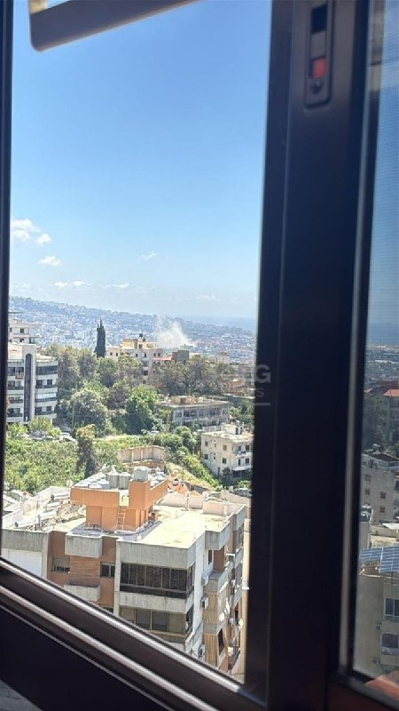

↩️ Quoted tweet:
Emanuel (Mannie) Fabian ✓ @manniefabian
Thu, 28 May 2026 11:03:55 UTC

The IDF says it carried out a strike in Beirut a short while ago.

No further details are given.

According to Lebanese media, the strike took place in Shuwayfat, just south of the capital.

↩️ توییت نقل‌قول شده — برای پاسخ، پست زیر را ببینید.

فارسی

ارتش دفاعی اسرائیل (IDF) اعلام کرد که لحظاتی پیش حمله‌ای را در بیروت انجام داده است.

جزئیات بیشتری ارائه نشده است.

به گفته رسانه‌های لبنانی، این حمله در الشویفات، در جنوب پایتخت، رخ داده است.

𝕏 · @shin_persian

## Shin_Persian — post 6272

  

MoFA وزارة الخارجية ✓ @mofauae
Thu, 28 May 2026 09:57:41 UTC

الإمارات تُدين بشدة الاعتداءات الإرهابية الإيرانية على دولة الكويت بالصواريخ والطائرات المسيّرة

English

The United Arab Emirates strongly condemns the Iranian terrorist attacks on the State of Kuwait using missiles and drones.

𝕏 · @shin_persian

## Shin_Persian — post 6271

Shin ✓ @hey_itsmyturn
Thu, 28 May 2026 11:02:57 UTC

Targeted assassination near Hariri airport, Beirut, #Lebanon

فارسی

ترور هدفمند در نزدیکی فرودگاه حریری، بیروت، #Lebanon #لبنان

𝕏 · @shin_persian

## Shin_Persian — post 6270

🔁 Quoting above tweet:
Shin ✓ @hey_itsmyturn
Thu, 28 May 2026 09:55:51 UTC

ICYMI

فارسی

جهت اطلاع کسانی که مطلع نشده‌اند (ICYMI)

𝕏 · @shin_persian

## Shin_Persian — post 6269

  

↩️ Quoted tweet: KUWAIT ARMY - الجيش الكويتي ✓ @KuwaitArmyGHQ Thu, 28 May 2026 02:40:14 UTC تتصدى حالياً الدفاعات الجوية الكويتية لهجمات صاروخية وطائرات مسيرة معادية. تنوه رئاسة الأركان العامة للجيش أن أصوات الانفجارات إن سمعت فهي نتيجة اعتراض منظومات الدفاع…

## Shin_Persian — post 6268

↩️ Quoted tweet:
KUWAIT ARMY - الجيش الكويتي ✓ @KuwaitArmyGHQ
Thu, 28 May 2026 02:40:14 UTC

تتصدى حالياً الدفاعات الجوية الكويتية لهجمات صاروخية وطائرات مسيرة معادية.

تنوه رئاسة الأركان العامة للجيش أن أصوات الانفجارات إن سمعت فهي نتيجة اعتراض منظومات الدفاع الجوي للهجمات المعادية.

يرجى من الجميع التقيد بتعليمات الأمن والسلامة الصادرة عن الجهات المختصة.

↩️ Quoted tweet — see the post below for the reply.

English

Kuwaiti air defenses are currently intercepting hostile missile and drone attacks.

The General Staff of the Army notes that any sounds of explosions heard are the result of air defense systems intercepting these hostile attacks.

Everyone is requested to adhere to the security and safety instructions issued by the competent authorities.

𝕏 · @shin_persian

## FarsiVOA — post 218877

  

ارتش لبنان اعلام کرد که یک سرباز این ارتش در جریان حمله اسرائیل در جنوب لبنان کشته شده است.

بر اساس بیانیه ارتش لبنان که روز پنجشنبه صادر شد، این سرباز زمانی هدف قرار گرفت که در جاده زغتة–دیرالزهرانی در منطقه نبطیه در جنوب لبنان در حال تردد بود.

این سومین سرباز لبنانی است که در روزهای اخیر کشته می‌شود.

ارتش لبنان چهارشنبه اعلام کرد که یک سربازش در حمله‌ای در جاده کفردون–الخردلی در همان منطقه جنوب لبنان کشته شده است. همچنین ارتش لبنان سه‌شنبه اعلام کرد که یک سربازش در حمله اسرائیل در منطقه بقاع غربی کشته شده است.
@FarsiVOA

## FarsiVOA — post 218876

🔺اکسیوس: دولت ترامپ خود را برای احتمال فروپاشی کوبا آماده می‌کند

▪️اکسیوس گزارش داد که دولت ترامپ خود را برای احتمال فروپاشی رژیم کوبا، حتی در تابستان پیش‌رو، آماده می‌کند.

▪️مقام‌های آمریکایی گفتند واشنگتن در صورت فرو رفتن این جزیره در هرج‌ومرج، طرح‌های تازه‌ای برای واکنش نظامی شبیه‌سازی و بررسی کرده است.

▪️یکی از مقام‌های ارشد دولت دونالد ترامپ به اکسیوس روز پنجشنبه با اشاره به احتمال فروپاشی حکومت کوبا گفت: «اما ما هنوز نمی‌خواهیم رژیم را کاملاً از بین ببریم. این کار روش و مرحله‌بندی دارد.»

▪️پیشتر ونزوئلا و رهبر سوسیالیست آن، نیکلاس مادورو، با ارسال نفت رایگان، کوبا را سرپا نگه داشته بود؛ نفتی که هم برق کشور را تأمین می‌کرد و هم منبع درآمد صادراتی برای هاوانا بود.

⬇️ بیشتر بخوانید:
https://ir.voanews.com/a/8154815.html

## FarsiVOA — post 218875

🔺کدام کشورها از انسداد تنگه هرمز سود بردند؟

▪️انسداد تنگه هرمز اگرچه تبعات تورمی بر اقتصاد همه کشورها داشته، اما برخی از آنها به خاطر جهش قیمت انرژی به سودهای کلانی دست یافته‌اند.

▪️در میان کشورهای همسایه ایران، عمان، روسیه و جمهوری آذربایجان درآمدهای صادرات نفت خود را به شدت افزایش داده‌اند.

▪️در خارج از خاورمیانه، کشورهای صادرکننده نفت، خصوصا آنهایی که محصولات نفتی نیز صادر می‌کنند به درآمدهای کلانی رسیده‌اند.

▪️رویترز می‌نویسد سلطان‌نشین جزیره بورنئو صادرات محصولات نفتی خود را در ماه جاری به ۴.۱۶ میلیون بشکه رسانده که بالاترین رقم از ژوئیه پارسال است. صادرات گاز مایع این کشور نیز با ۱۸ درصد رشد به ۳۳۰ هزار تن رسیده است.

⬇️ بیشتر بخوانید:
https://ir.voanews.com/a/which-countries-benefited-from-the-blockade-of-the-strait-of-hormuz/8154813.html

## FarsiVOA — post 218874

🔺ایالات متحده اعلام کرد سفارتش در کی‌یف همچنان باز است

▪️سفارت ایالات متحده در کی‌یف روز پنج‌شنبه اعلام کرد که همچنان باز است و گزارش‌ها درباره تغییر در عملیات خود را در پی هشدارهای روسیه مبنی بر اینکه دیپلمات‌ها و خارجی‌ها باید پیش از تشدید حملات، پایتخت اوکراین را ترک کنند، رد کرد.

▪️برخی رسانه‌های اوکراینی روز پنج‌شنبه به نقل کایا کالاس، مسئول سیاست خارجی اتحادیه اروپا، گزارش دادند که سفارت آمریکا در کی‌یف تعطیل شده است.

▪️اما سفارت آمریکا در کی‌یف در شبکه اجتماعی ایکس، نوشت: «سفارت آمریکا باز است. هیچ تغییری در فعالیت ما وجود ندارد و گزارش‌های خلاف آن، نادرست است.»

⬇️ بیشتر بخوانید:
https://ir.voanews.com/a/us-says-its-embassy-in-kyiv-remains-open/8154812.html

## FarsiVOA — post 218873

  <a href="telegram/content/FarsiVOA_218873_1779967969.mp4" target="_blank">🎬 Download video</a>

ارتش اسرائیل اعلام کرد که پنجشنبه موجی از حملات هوایی را علیه زیرساخت‌های حزب‌الله در شهر ساحلی صور در لبنان آغاز کرد.

آویخای ادرعی، سخنگوی ارتش اسرائیل، روز چهارشنبه درباره حمله به چندین نقطه در صور هشدار داده بود.

خبرگزاری رسمی لبنان گزارش داد که صبح پنج‌شنبه دو رشته حمله اسرائیل به شهر صور و منطقه‌ای در شرق آن انجام شد که یک ساختمان را هدف قرار داد و باعث آتش‌سوزی شد.

رویترز نیز ویدئوی منتشر شده توسط شاهدان عینی در روز پنج‌شنبه را که لحظه حمله اسرائیل به ساختمان‌هایی در شهر صور را نشان می‌دهد، تایید کرد.

ارتش اسرائیل روز چهارشنبه بخش جدیدی از جنوب لبنان را منطقه جنگی اعلام کرد و از ساکنان آن خواست به سمت شمال حرکت کنند. این ارتش هشدار داد که علیه گروه مسلح حزب‌الله در این منطقه «با قدرت بسیار زیاد» اقدام خواهد کرد.

تنش‌ها در روزهای اخیر میان اسرائیل و حزب‌الله افزایش یافته و روز سه‌شنبه نیز ارتش اسرائیل حملاتی به جنوب و شرق لبنان انجام داد.
@FarsiVOA

## FarsiVOA — post 218872

  

مهلت ثبت‌نام داوطلبان آزمون سراسری سال ۱۴۰۵ دانشگاه‌ها و موسسات آموزش عالی و همچنین آزمون پذیرش دانشجو معلم، روز جمعه هشتم خرداد پایان می‌یابد.

این در حالی است که تا این لحظه زمان دقیق برگزاری امتحانات نهایی پایه‌ دوازدهم مدارس و همچنین کنکور اعلام نشده و دانش‌آموزان نمی‌دانند چه زمانی باید در جلسه امتحان حضور یابند.

سازمان سنجش آموزش کشور روز ۳۰ اردیبهشت اعلام کرد «زمان دقیق برگزاری کنکور و پذیرش دانشجو معلمان»، یک هفته قبل از آزمون اعلام می‌شود.

از سوی دیگر، علی فرهادی، سخنگوی وزارت آموزش‌وپرورش، نیز اعلام کرده که تکلیف نحوه برگزاری امتحانات نهایی دانش‌آموزان پایه یازدهم و دوازدهم، تا نیمه مرداد ماه مشخص می‌‌شود.

امتحانات نهایی پایه دوازدهم از این جهت قابل اهمیت است که نتایج آن به صورت مستقیم در نتایج کنکور تاثیر می‌گذارد.

پیشتر حمیدرضا حاجی‌بابایی، نایب رئیس مجلس اعلام کرده بود که امتحانات نهایی، ۱۵ روز و کنکور سراسری ۴۵ روز پس از پایان جنگ برگزار خواهد شد.
@FarsiVOA

## FarsiVOA — post 218871

  <a href="telegram/content/FarsiVOA_218871_1779967971.mp4" target="_blank">🎬 Download video</a>

ارتش اسرائیل اعلام کرد در جریان یک حمله هوایی خود به جنوب نوار غزه در روز سه‌شنبه گذشته یک «مقام ارشد مالی» حماس کشته شده است.

ارتش اسرائیل روز پنجشنبه اعلام کرد که این حمله در خان‌یونس انجام شد و ایهاب کریزم، مسئول یک شبکه مرکزی برای انتقال پول به حماس در جریان این حمله کشته شد.

به گفته ارتش اسرائیل، کریزم مسئول «مدیریت انتقال میلیون‌ها دلار به شاخه نظامی حماس» بوده و اخیراً نیز «به نقض توافق آتش‌بس ادامه داده است»؛ اقداماتی که به گفته ارتش اسرائیل، باعث شد حماس بتواند حملات علیه نیروها و غیرنظامیان اسرائیلی را پیش ببرد.

طبق اعلام ارتش اسرائیل، در این حمله همچنین محمد الهباش، یک فرمانده مقر تولید تسلیحات حماس، نیز کشته شد.

همزمان ارتش اسرائیل پنجشنبه گزارش داد که نیروهای واحد کماندویی این ارتش، تحت هدایت شاباک، طی دو روز گذشته در چند عملیات در کرانه باختری هفت فلسطینی مظنون به تروریسم را بازداشت کردند؛

بر اساس این گزارش، برخی متهم به برنامه‌ریزی حملات قریب‌الوقوع علیه اسرائیل بودند.

ارتش اسرائیل اعلام کرد همه بازداشت‌شدگان برای بازجویی بیشتر به نیروهای امنیتی تحویل داده شدند.
@FarsiVOA

## FarsiVOA — post 218870

🔺افزایش ۵ تا ۴۵ برابری تعرفه برق «پرمصرف‌ها»

▪️مدیرکل دفتر مدیریت انرژی و مشتریان توانیر از افزایش ۵ تا ۴۵ برابری تعرفه برق خانوارهای «پرمصرف» خبر داد.

▪️او مدعی شد مصرف برق یک چهارم مشترکین خانگی بالاتر از الگوی مصرف است و نیم درصد مشترکین هم «بسیار بدمصرف» هستند.

▪️طبق گزارش‌های توانیر، بخش خانگی تنها حدود یک سوم برق کشور را مصرف می‌کند و سرانه مصرف برق بخش خانگی ایران حدود ۱۱۰۰ کیلووات ساعت در سال است؛ رقمی که ۶۰ درصد کمتر از اتحادیه اروپا و چندین برابر کمتر از آمریکا و کشورهای عرب حوزه خلیج فارس است.

▪️جمهوری اسلامی طی یک دهه گذشته حتی نیمی از اهداف رشد تولید برق را نتوانسته محقق کند و اکنون در فصول گرم سال با ۲۰ تا ۲۵ درصد کسری برق مواجه است.

⬇️ بیشتر بخوانید:
https://ir.voanews.com/a/iran-5-to-45-times-increase-in-electricity-tariffs-for-high-consumption-consumers/8154811.html

## DW_Farsi — post 125222

📸 فراری تمام برقی؛ سنت‌شکنی در فرم و وفاداری به قدرت

فراری در روزهای اخیر با مدل "Ferrari Luce" از نخستین خودروی تمام‌برقی خود رونمایی کرده و گامی بزرگ به سوی آینده برداشته است. مدت‌ها درباره این خودرو گمانه‌زنی می‌شد و حالا بالاخره رونمایی شده است. دلیل هیجان زیاد درباره این پروژه فقط ورود برند افسانه‌ای فراری به دنیای خودروهای برقی نبود، بلکه همکاری ویژه‌ای هم پشت آن قرار داشت: طراحی داخلی و خارجی خودرو را جاناتان آیو، طراح سابق اپل، انجام داده است.

نتیجه، خودرویی است که عمداً قواعد همیشگی فراری را می‌شکند. "لوچه" (Luce) در زبان ایتالیایی به معنای "نور" است و برخلاف سوپراسپرت‌های سنتی فراری، این مدل یک خودروی پنج‌نفره و چهاردر است که با طراحی غیرمعمول خود توجه‌ها را جلب می‌کند.

اما از نظر قدرت، این خودرو کاملاً یک فراری واقعی است. چهار موتور الکتریکی آن مجموعاً تا ۱۰۵۰ اسب‌بخار نیرو تولید می‌کنند. در حالت پرفورمنس، حداکثر سرعت خودرو به ۳۱۰ کیلومتر بر ساعت می‌رسد. همچنین به لطف قابلیت Boost، شتاب صفر تا ۱۰۰ کیلومتر را در ۲.۵ ثانیه و صفر تا ۲۰۰ کیلومتر را در ۶.۸ ثانیه طی می‌کند.
@dw_farsi

## DW_Farsi — post 125221

  

🔶 یک مقام روس: ایران از شروع یک جنگ جدید جلوگیری کند

شرکت دولتی انرژی هسته‌ای روسیه تصمیم گرفته است بازگشت کارکنان خود به نیروگاه هسته‌ای بوشهر در ایران را به تعویق بیندازد. این خبر را الکسی لیخاچف، رئیس روس‌اتم، روز چهارشنبه اعلام کرد. روس‌اتم پیش‌تر ۸۱۳ نفر از کارکنان خود را از این سایت تخلیه کرده بود و تنها ۲۰ نفر را در محل باقی گذاشته بود.

همزمان یک مقام امنیتی روسیه در دیدار با علی باقری‌کنی، معاون دبیر شورای عالی امنیت ملی جمهوری اسلامی از حکومت ایران خواست تا از شروع مجدد جنگجلوگیری کند.

به گزارش پرس‌نیوز، خبرگزاری انگلیسی‌زبان صداوسیمای جمهوری اسلامی، الکساندر وندیکتوف، معاون دبیر شورای امنیت روسیه، حکومت ایران را به دنبال کردن "یک معماری امنیتی جهانی جدید" تشویق کرده است.

ندیکتوف در دیدار با باقری‌کنی گفته است: «آنچه از اهمیت فوق‌العاده برخوردار است، جلوگیری از شعله‌ور شدن دوباره یک رویارویی نظامی و هموار کردن مسیر برای ایجاد یک نظم امنیتی جدید در منطقه است. ما آماده‌ایم این روند را از طریق همه ابزارهای موجود تسهیل کنیم.»

@dw_farsi

## DW_Farsi — post 125220

🔶 نروژ به چتر بازدارندگی هسته‌ای فرانسه پیوست

امانوئل مکرون، رئیس‌جمهوری فرانسه، و یوناس گار استوره، نخست‌وزیر نروژ، اعلام کرده‌اند اسلو به طرح بازدارندگی هسته‌ای تحت رهبری پاریس پیوسته است. بر پایه این طرح، فرانسه که تنها قدرت هسته‌ای اتحادیه اروپاست، می‌خواهد از ظرفیت هسته‌ای خود برای تقویت امنیت شرکای اروپایی استفاده کند.

به نوشته فرانس ۲۴ یوناس گار استوره گفت اروپا با جدی‌ترین وضعیت امنیتی از زمان جنگ جهانی دوم روبه‌روست و توافق دفاعی تازه با فرانسه در همین چارچوب امضا شده است. او افزود نروژ در ماه‌های گذشته با آلمان و بریتانیا نیز توافق‌های دفاعی امضا کرده و اکنون با فرانسه هم به یک چارچوب جامع همکاری رسیده است.

مکرون هم گفت نروژ، به‌عنوان یک شریک مهم جغرافیایی و راهبردی، می‌تواند ارزش افزوده‌ای جدی برای این بازدارندگی تقویت‌شده ایجاد کند.

مکرون این برنامه را در ماه مارس معرفی کرده بود. بر اساس این طرح، کشورهای عضو می‌توانند به‌طور موقت میزبان «نیروهای راهبردی هوایی» فرانسه شوند؛ حضوری که از نگاه پاریس، محاسبات دشمنان بالقوه را پیچیده‌تر می‌کند و بازدارندگی اروپا را بالا می‌برد.

پیش از نروژ، هشت کشور دیگر به این چارچوب پیوسته بودند: بلژیک، دانمارک، آلمان، یونان، هلند، لهستان، سوئد و بریتانیا.

@dw_farsi

## DW_Farsi — post 125219

  

🔶 ادامه حملات سهمگین ارتش اسرائیل به مواضع حزب‌الله در جنوب لبنان

ارتش اسرائیل از موج حملات تازه به زیرساخت‌های گروه حزب‌الله در شهر صور لبنان خبر داد. بر اساس گزارش رسانه‌های لبنانی، ارتش اسرائیل شهرک حاروف در جنوب لبنان را هدف حمله‌ هوایی هدف قرار داد.

همچنین خبرها حاکی از کشته شدن یک سرباز اسرائیلی در پی حمله پهپادی حزب‌الله به شمال اسرائیل است. در همین راستا ارتش اسرائیل تایید کرد که یک سرباز اسرائیلی در حمله پهپادی حزب‌الله به شمال این کشور در نزدیکی مرز لبنان کشته شد. حمله پهپادی حزب‌الله لبنان همچنین به مجروح شدن دو نظامی اسرائیلی منجر شد. جراحت یکی از این مجروحان جدی گزارش شده است.

درگیری میان اسرائیل و حزب‌الله روز چهارشنبه تشدید شد. بر اساس اعلام منابع اسرائیلی، ارتش این کشور بیش از ۱۵۰ هدف را در صور، نبطیه، دره بقاع و سراسر جنوب لبنان هدف قرار داد و حزب‌الله نیز پهپادهایی را به سمت روش هانیکرا و شلومی پرتاب کرد. همچنین گزارش شده که آژیرهای اعلام خطر در کریات شمونا به صدا درآمدند.

آویخای ادرعی، سخنگوی عربی‌زبان ارتش اسرائیل، در روز چهارشنبه با ارائه فهرستی طولانی‌ از شهرها و روستاها به شهروندان لبنانی ساکن این مناطق هشدار داد که از شمال رودخانه زهرانی یا دست‌کم از مناطق وابسته به حزب‌الله فاصله بگیرند.

او گفت: «با توجه به نقض توافق آتش‌بس از سوی سازمان تروریستی حزب‌الله، ارتش اسرائیل مجبور است با قدرت علیه آن اقدام کند و قصد آسیب رساندن به شما را ندارد.»

@dw_farsi

## DW_Farsi — post 125218

  

🔶 رئیس کمیسیون امنیت ملی مجلس: از "خطوط قرمز" عقب‌نشینی نخواهیم کرد

ابراهیم عزیزی، رئیس کمیسیون امنیت ملی و سیاست خارجی مجلس شورای اسلامی گفت که جمهوری اسلامی "از خطوط قرمز خود مانند حق غنی‌سازی، اورانیوم غنی‌شده، مدیریت تنگه هرمز و لغو تحریم‌ها عقب‌نشینی نخواهد کرد".

به گزارش خبرگزاری مهر، رئیس کمیسیون امنیت ملی مجلس شورای اسلامی همچنین در ادامه اظهارات خود، تهدیدات دونالد ترامپ، رئیس جمهور آمریکا را "لفاظی" خواند و مدعی شد: «دیگر همه می‌دانند ترامپ برای نجات خود از این بن‌بست راهبردی یک روز از ابزار تهدید استفاده می‌کند و روز دیگر برای توافق التماس‌ می‌کند!»

@dw_farsi

## DW_Farsi — post 125217

  

📸 کاریکاتور هفته

چند ماه از قتل‌عام دی‌ماه در ایران گذشته است؛ جنگی میان جمهوری اسلامی، آمریکا و اسرائیل درگرفت. اینترنتی که نزدیک به سه ماه قطع بود، حالا کم‌کم دارد وصل می‌شود و زمزمه‌های توافقی میان رژیم و آمریکا به گوش می‌رسد؛ توافقی که هنوز امکان تحقق و ابعادش در هاله‌ای از ابهام قرار دارد. هم‌زمان، گروه‌های مختلف اپوزیسیون سرگرم جدال، حذف معنوی و مقصر دانستن یکدیگرند. اما شاید در میان همه این آشوب‌ها، یک چیز بیش از هر چیز دیگر قطعی به نظر برسد: عادی شدن گرفتن جان شهروندان ایرانی به جرم مخالفت و خواستنِ تغییر.

این موضوع دستمایه مانا نیستانی در طراحی کاریکاتور هفته برای دویچه وله فارسی بوده است.

@dw_farsi

## DW_Farsi — post 125215

  <a href="telegram/content/DW_Farsi_125215_1779967975.mp4" target="_blank">🎬 Download video</a>

🎥 یک کانگوروی بازیگوش تحت تعقیب پلیس تگزاس

یک کانگورو به اسم بینگوس از یک مرکز حفاظت از حیات وحش در منطقه ویکو در ایالت تگزاس فرار کرد. بینگوس پس از تعقیب و گریزی کوتاه توسط مأموران پلیس، در سلامت کامل به مرکز حفاظت حیات وحش بازگردانده شد.

@dw_farsi

## Persian_Trend_Official — post 15186

💢🇮🇱🇱🇧🏴رسانه‌های اسرائیلی: «علی الحسینی»، مسئول موشکی در یگان امام حسین ترور شده است.

👩‍💻@PhantomDirective

🆔@persian_trend_official
پرشین ترند | متفاوت‌ترین کانال نظامی

## Persian_Trend_Official — post 15185

  

🇮🇱
❌
🇱🇧
🇱🇧 — عکس ساختمان هدف‌گرفته شده در حومه جنوبی بیروت (داهییه).

👩‍💻@PhantomDirective

🆔@persian_trend_official
پرشین ترند | متفاوت‌ترین کانال نظامی

## Persian_Trend_Official — post 15184

  <a href="telegram/content/Persian_Trend_Official_15184_1779967977.mp4" target="_blank">🎬 Download video</a>

یدعوت آحرونوت:

حمله جنگنده های اسرائیلی به بیروت برای ترور فرمانده‌ ای در نیروی موشکی حزب‌الله بوده است.

👩‍💻@PhantomDirective

🆔@persian_trend_official
پرشین ترند | متفاوت‌ترین کانال نظامی

## Persian_Trend_Official — post 15183

  

اسرائیل در اقدامی ظاهراً ترور، بیروت را بمباران کرد.

👩‍💻@PhantomDirective

🆔@persian_trend_official
پرشین ترند | متفاوت‌ترین کانال نظامی

## Persian_Trend_Official — post 15182

  <a href="telegram/content/Persian_Trend_Official_15182_1779967979.webm" target="_blank">🎬 Download video</a>

🎬 Video

## Persian_Trend_Official — post 15181

  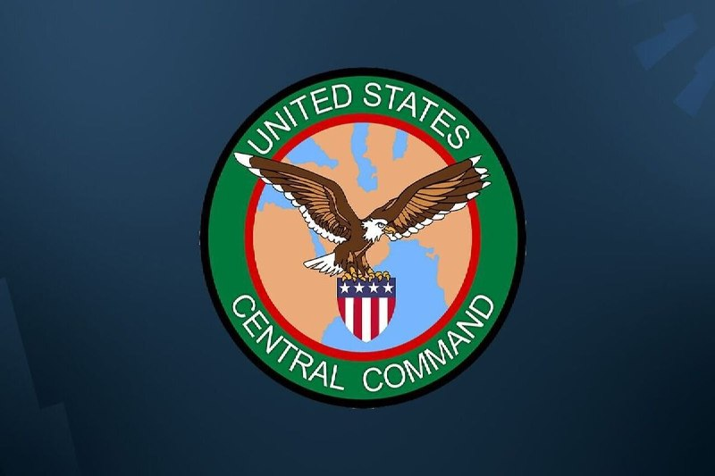

سنتکام: یک موشک پرتاب شده از سوی ایران توسط نیروهای کویتی با موفقیت رهگیری شد.

فرماندهی مرکزی ایالات متحده در بیانیه ای اعلام کرد: ایران یک موشک بالستیک به سمت کویت پرتاب کرد که با موفقیت توسط نیروهای کویت رهگیری شد. این نقض فاحش آتش بس توسط رژیم ایران ساعاتی پس از آن رخ داد که نیروهای ایرانی پنج پهپاد حمله یک طرفه را پرتاب کردند که تهدیدی آشکار در داخل و نزدیک تنگه هرمز بود. همه پهپادها با موفقیت توسط نیروهای آمریکایی رهگیری شدند و همچنین از پرتاب ششم پهپاد از یک سایت کنترل زمینی ایران در بندرعباس جلوگیری کردند.

فرماندهی مرکزی ایالات متحده و شرکای منطقه ای همچنان هوشیار و سنجیده هستند زیرا ما همچنان به دفاع از نیروها و منافع خود در برابر تجاوزات غیرموجه ایران ادامه می دهیم.

📌 @persian_trend_official
پرشین ترند | متفاوت‌ترین کانال نظامی

## Persian_Trend_Official — post 15180

  

💢کشف «آخرین تصویر» از چهره یزدگرد سوم پادشاه ساسانی در آتشکده باستانی بازه هور خراسان

باستان‌شناسان دانشگاه تهران در جریان کاوش‌های خود در شمال شرق ایران، موفق به شناسایی یک پانل گچ‌بری نفیس شده‌اند که به باور پژوهشگران، تصویری از یزدگرد سوم، آخرین پادشاه سلسله ساسانی را در روزهای پایانی عمر و در آستانه سقوط این امپراتوری به نمایش می‌گذارد.

نتایج این کشف بزرگ باستان‌شناسی که تحت سرپرستی دکتر میثم لباف خانیکی، عضو هیأت علمی گروه باستان‌شناسی دانشگاه تهران صورت گرفته، در قالب مقاله‌ای علمی با عنوان «آخرین تصویر از آخرین پادشاه» در نشریه بین‌المللی و معتبر «شرق و غرب» متعلق به مؤسسه «ایزمئو» در ایتالیا منتشر شده است.

بیشتر بخوانید: https://l.euronews.com/FzEU

## Persian_Trend_Official — post 15179

  <a href="telegram/content/Persian_Trend_Official_15179_1779967980.webm" target="_blank">🎬 Download video</a>

ارتش لبنان از کشته شدن یک گروهبان خود با نام علاء محمود در پی حمله هوایی اسرائیل به جاده زفتا-دیرالزهرانی خبر داد.

📝 Amir

📌 @persian_trend_official
پرشین ترند | متفاوت‌ترین کانال نظامی

## Persian_Trend_Official — post 15176

  <a href="telegram/content/Persian_Trend_Official_15176_1779967980.webm" target="_blank">🎬 Download video</a>

حضور پدافند موشکی برد کوتاه مجید ایرانی در رژه ارتش ارمنستان

چند روز پیش در پی جابه‌جایی ادوات نظامی توسط ارتش ارمنستان در سطح شهر ایروان برای برگزاری رژه روز جمهوری ارمنستان، تصاویری از سیستم پدافندی برد کوتاه مجید با نام صادراتی AD-08 در خیابان های این شهر منتشر شد که امروز ارتش ارمنستان با برگزاری رژه رسماً از این پدافند رونمایی کرد.

ارمنستان اولین کاربر غیرمتحد این سامانه محسوب میشود.

📝 Amir

📌 @persian_trend_official
پرشین ترند | متفاوت‌ترین کانال نظامی

## Persian_Trend_Official — post 15175

  <a href="telegram/content/Persian_Trend_Official_15175_1779967981.mp4" target="_blank">🎬 Download video</a>

ارتش روسیه در حال استقرار سامانه‌های پدافند هوایی Pantsir-S1 بر روی پشت‌بام‌برجی ۴۲ طبقه در مسکو با استفاده از هلیکوپترهای Mil Mi-26 است

👩‍💻@PhantomDirective

🆔@persian_trend_official
پرشین ترند | متفاوت‌ترین کانال نظامی

## Persian_Trend_Official — post 15174

  <a href="telegram/content/Persian_Trend_Official_15174_1779967982.webm" target="_blank">🎬 Download video</a>

🌲 - 🇱🇧🇮🇱 مردی که در جاده شبریه-صور رانندگی می‌کرد، تماس تلفنی دریافت کرد(از سمت اسرائیلی ها)که هشدار می‌داد وسیله نقلیه‌اش هدف قرار خواهد گرفت. او وسط جاده از ماشین بیرون پرید و فرار کرد.

نیروهای دفاع مدنی شاخه ای از جنبش عمل (مثل هلال احمر خودمون )به عنوان اقدام احتیاطی جاده را پیش از حمله بستند.

👩‍💻@PhantomDirective

🆔@persian_trend_official
پرشین ترند | متفاوت‌ترین کانال نظامی

## Persian_Trend_Official — post 15173

  

👑
➖
🤴
➖
🇮🇱
پست ساعاتی قبل کانال اسرائیل به فارسی

👩‍💻@PhantomDirective

🆔@persian_trend_official
پرشین ترند | متفاوت‌ترین کانال نظامی

## Persian_Trend_Official — post 15172

  <a href="telegram/content/Persian_Trend_Official_15172_1779967983.mp4" target="_blank">🎬 Download video</a>

©️تصاویری از حمله نیروی هوایی به مقر حزب‌الله در محله الاثار در شهر صور در جنوب لبنان
©️

👩‍💻@PhantomDirective

🆔@persian_trend_official
پرشین ترند | متفاوت‌ترین کانال نظامی

## Persian_Trend_Official — post 15171

  

🇮🇱
🇱🇧 اسرائیل دستور تخلیه کل جنوب لبنان را صادر کرده ، که شامل تمام مناطق جنوب رودخانه لیتانی می‌شود.

👩‍💻@PhantomDirective

🆔@persian_trend_official
پرشین ترند | متفاوت‌ترین کانال نظامی

## Persian_Trend_Official — post 15170

  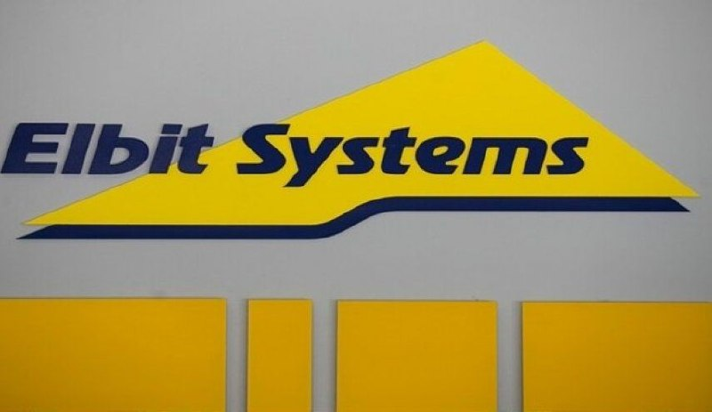

البيت سیستمز قراردادی به ارزش ۳۵۰ میلیون دلار برای ارتقاء تانک‌ها از یک مشتری بین‌المللی دریافت کرد.

، حیفا، اسرائیل، ۲۸ مه ۲۰۲۶ // — شرکت البیت سیستمز امروز اعلام کرد که قراردادی به ارزش تقریبی ۳۵۰ میلیون دلار از یک مشتری بین‌المللی برای ارتقاء تانک‌های اصلی میدان نبرد (MBT) دریافت کرده است. این برنامه شامل یکپارچه‌سازی سامانه‌های پیشرفته کنترل آتش، سامانه‌های الکتریکی هدایت توپ و برجک، راهکارهای ارتباطی و آگاهی محیطی، و همچنین بسته ارتقاء میان‌عمر (Mid Life Upgrade) است. اجرای این قرارداد طی چهار سال انجام خواهد شد.
بر اساس این قرارداد، البیت سیستمز سامانه‌های تانک‌ها را برای افزایش عمر عملیاتی و ارتقاء آمادگی رزمی آن‌ها نوسازی خواهد کرد. این برنامه ارتقاء شامل جایگزینی و بهبود سامانه‌های کلیدی روی تانک است و از جمله تجهیزاتی مانند سامانه‌های دید الکترواپتیکی سبک‌وزن و با کارایی بالا با قابلیت‌های هوش مصنوعی (AI) را در بر می‌گیرد که امکان مشاهده در روز و شب، و همچنین شناسایی و رهگیری پیشرفته اهداف را فراهم می‌کنند.
این قرارداد همچنین شامل تأمین قطعات یدکی و ارائه خدمات نگهداری و پشتیبانی فنی برای تضمین آمادگی عملیاتی بلندمدت است. افزون بر این، یک سامانه ارتباط صوتی امن و با ظرفیت بالا نیز در این پروژه یکپارچه خواهد شد.

👩‍💻@PhantomDirective

🆔@persian_trend_official
پرشین ترند | متفاوت‌ترین کانال نظامی

## Persian_Trend_Official — post 15169

  

بیانیه ارتش دفاعی اسرائیل (IDF):

در واکنشی سریع ارتش دفاعی اسرائیل سر شبکه مرکزی انتقال وجوه حماس را از بین برد.

روز سه‌شنبه، ارتش دفاعی اسرائیل در منطقه خان یونس ضربه‌ای وارد کرد و ایهاب خریزم، سر شبکه مرکزی انتقال وجوه حماس را از بین برد.

ایهاب خریزم مسئول مدیریت انتقال میلیون‌ها دلار به شاخه نظامی حماس بود. در ماه‌های اخیر، خریزم به نقض توافق آتش‌بس ادامه داد و فعالیت‌های او به سازمان تروریستی امکان داد حملات فوری علیه نیروهای ارتش دفاعی اسرائیل و غیرنظامیان اسرائیلی انجام دهد.

از بین بردن خریزم ضربه قابل توجهی به تلاش‌های بازسازی و تقویت نیروهای حماس وارد می‌کند.

علاوه بر خریزم، در جریان این حمله، ارتش دفاعی اسرائیل محمد الحباش، فرمانده واحد در ستاد تولید حماس را نیز از بین برد. در طول جنگ، الحباش در ساخت سلاح برای حماس مشارکت داشت.

قبل از حمله، اقداماتی برای کاهش آسیب به غیرنظامیان انجام شد، از جمله استفاده از مهمات دقیق و نظارت هوایی.

نیروهای ارتش دفاعی اسرائیل تحت فرماندهی جنوبی مطابق با توافق آتش‌بس مستقر باقی مانده و به عملیات برای رفع هر تهدید فوری ادامه خواهند داد.

👩‍💻@PhantomDirective

🆔@persian_trend_official
پرشین ترند | متفاوت‌ترین کانال نظامی

## RadioFarda — post 157652

🔸پاپ لئو روز سه‌شنبه در اقامتگاهش در «کاستل گاندولفو» نزدیک رم، از نخستین خودروی تمام‌برقی شرکت «فراری» را دیدن کرد.

🔸پاپ به خودرو علاقه زیادی دارد و مدل جدید «لوچه» را همراه با «جان الکان» رئیس شرکت فراری دید.

🔸الکان یک فرمان این مدل خودرو را به پاپ هدیه داد.

🔸«لوچه» یک خودروی خانوادگی چهار در و پنج‌نفره است.

🔸ظاهرش با فراری‌های اسپرت و بنزینی همیشگی فرق دارد.

🔸این خودرو دوشنبه شب در رم رونمایی شد. روز بعد هم به «سرجو ماتارلا» رئیس‌جمهور ایتالیا و پاپ لئو نشان داده شد.

🔸سهام فراری در بورس میلان ۸.۴ درصد افت کرد. یک سرمایه‌گذار به رویترز گفت دلیلش «ناامیدی از طراحی ظاهری» خودرو بوده است.

@RadioFarda

## RadioFarda — post 157651

🔸چند اقتصاددان و استاد دانشگاه ایران، در یک نشست تخصصی، از احتمال «رشد منفی ۱۰ درصدی» اقتصاد کشور پس از وقوع جنگ اخیر خبر داده و پیش‌بینی کردند که در سال جاری، حدود «چهار و نیم میلیون نفر» به جمعیت فقیر ایران اضافه شود. 🔸روزنامهٔ دنیای اقتصاد در شمارهٔ روز…

## RadioFarda — post 157650

  

🔸چند اقتصاددان و استاد دانشگاه ایران، در یک نشست تخصصی، از احتمال «رشد منفی ۱۰ درصدی» اقتصاد کشور پس از وقوع جنگ اخیر خبر داده و پیش‌بینی کردند که در سال جاری، حدود «چهار و نیم میلیون نفر» به جمعیت فقیر ایران اضافه شود.

🔸روزنامهٔ دنیای اقتصاد در شمارهٔ روز پنج‌شنبه، هفتم خرداد خود، نوشته که چهار اقتصاددان و پژوهشگر حوزهٔ اقتصاد و سیاست‌گذاری اجتماعی، باتوجه به وضعیت کشور، وضعیت «نگران‌کننده‌ای» برای اقتصاد ایران ترسیم کردند.

🔸حجت میرزایی، عضو هیئت علمی دانشکدهٔ اقتصاد علامه طباطبایی، در این نشست گفته باتوجه به محاصرهٔ دریایی و کاهش صادرات نفت ایران به نزدیک صفر درصد، «پیش‌بینی می‌شود رشد اقتصادی ایران در سال ۱۴۰۵ بین منفی ۸.۸ تا منفی ۱۰ درصد باشد.»

🔸او افزوده که «با در نظر گرفتن آثار جنگ، پیش‌بینی می‌شود بین ۳.۵ تا ۴.۵ میلیون نفر دیگر در سال ۱۴۰۵ به جمعیت فقیر ایران افزوده شوند و شمار افراد زیر خط فقر به بیش از ۴۰ میلیون نفر برسد.»

@RadioFarda

## RadioFarda — post 157649

🔸روزنامه وال‌استریت جورنال در گزارشی نوشت جمهوری اسلامی ایران در پی جنگ و محاصرهٔ دریایی آمریکا، با بحرانی عمیق‌تر از گذشته در اقتصاد خود مواجه شده و مقامات تهران در حال سنجیدن این موضوع هستند که آیا می‌توانند فشارها را برای گرفتن امتیازهای بیشتر در مذاکرات…

## RadioFarda — post 157648

  

🔸روزنامه وال‌استریت جورنال در گزارشی نوشت جمهوری اسلامی ایران در پی جنگ و محاصرهٔ دریایی آمریکا، با بحرانی عمیق‌تر از گذشته در اقتصاد خود مواجه شده و مقامات تهران در حال سنجیدن این موضوع هستند که آیا می‌توانند فشارها را برای گرفتن امتیازهای بیشتر در مذاکرات تحمل کنند یا نه.

🔸بر اساس این گزارش که روز پنجشنبه هفتم خرداد منتشر شد، محاصرهٔ دریایی آمریکا باعث کاهش درآمدهای نفتی ایران شده و خطر تعطیلی برخی چاه‌های نفت را هم به‌دلیل کمبود ظرفیت ذخیره‌سازی نفت خام افزایش داده است.

@RadioFarda

## RadioFarda — post 157647

🔸اسماعیل بقائی سخنگوی وزارت خارجه ایران، حمله بامداد پنج‌شنبه آمریکا به مناطقی در بندرعباس، را «تجاوز» نامید و آن را محکوم کرد. 🔸آقای بقائی این حمله را «نقض فاحش حقوق بین‌الملل و منشور ملل متحد» دانست و افزود: «شورای امنیت سازمان ملل موظف به ایفای مسئولیت…

## RadioFarda — post 157646

  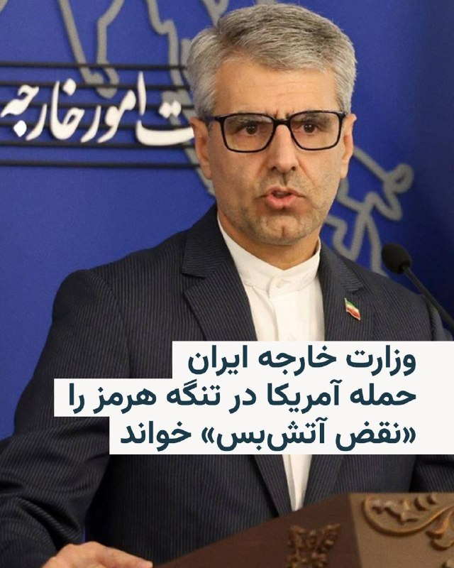

🔸اسماعیل بقائی سخنگوی وزارت خارجه ایران، حمله بامداد پنج‌شنبه آمریکا به مناطقی در بندرعباس، را «تجاوز» نامید و آن را محکوم کرد.

🔸آقای بقائی این حمله را «نقض فاحش حقوق بین‌الملل و منشور ملل متحد» دانست و افزود: «شورای امنیت سازمان ملل موظف به ایفای مسئولیت قانونی خود برای پاسخگو کردن متجاوزان آمریکایی است.»

🔸سخنگوی وزارت خارجه ایران می‌گوید آمریکا «به‌طور مستمر»، آتش‌بس میان دو کشور را که از ۱۹ فروردین اجرایی شده، «نقض» می‌کند.

🔸او افزود که «تعرض به کشتیرانی تجاری در منطقه‌ خلیج فارس و آب‌های آزاد و نیز تعرض هوایی به مناطق جنوبی ایران ظرف چند روز گذشته»، منجر به «عزم جمهوری اسلامی ایران برای اتخاذ همه تدابیر لازم جهت دفاع از حاکمیت ملی و تمامیت سرزمینی» است.

🔸بامداد پنجشنبه هفتم خرداد خبرگزاری‌های بین‌المللی به‌نقل از فرماندهی مرکزی ارتش آمریکا، سنتکام، خبر دادند که نيروهای آمریکایی «چهار پهپاد انتحاری ايرانی» را که در اطراف تنگه هرمز «تهديد ايجاد کرده بودند»، ساقط کردند و «يک ايستگاه کنترل زمينی ايران در بندرعباس را که در آستانهٔ پرتاب پنجمين پهپاد بود، هدف قرار دادند.»

@RadioFarda

## RadioFarda — post 157645

اطلاعات بریتانیا: در جنگ اوکراین، تاکنون نزدیک به ۵۰۰ هزار سرباز روسیه کشته شده‌اند

🔸یک مقام ارشد اطلاعاتی بریتانیا اعلام کرد که از زمان آغاز تهاجم گستردهٔ روسیه به اوکراین در سال ۲۰۲۲ تاکنون، نزدیک به ۵۰۰ هزار سرباز روسیه در جنگی که به وضعیتی نزدیک به بن‌بست هم رسیده، کشته شده‌اند.

🔸این عدد که رئیس سازمان ارتباطات دولتی بریتانیا روز چهارشنبه ششم خرداد اعلام کرد، با برآوردهایی که در ماه‌های اخیر از سوی دیگر دولت‌های غربی و همچنین رسانه‌های مستقل منتشر شده، همخوانی دارد.

🔸خانم کیست-باتلر همچنین هشدارهای پیشین دولت بریتانیا را تکرار کرد و گفت روسیه «بی‌وقفه زیرساخت‌های حیاتی، روندهای دموکراتیک، زنجیره‌های تأمین و اعتماد عمومی» را در بریتانیا و سراسر اروپا هدف قرار می‌دهد.

🔸سازمان ارتباطات دولتی بریتانیا نهاد اصلی اطلاعات شنود این کشور و معادل آژانس امنیت ملی آمریکا است.

🔸او گفت این سازمان بر حفاظت از کابل‌ها و خطوط لولهٔ زیردریایی متصل‌کنندهٔ بریتانیا و مقابله با «اقدامات خرابکارانه و تلاش‌ها برای ترور» تمرکز کرده است.

🔸 گزارش کامل را در وب‌سایت رادیوفردا بخوانید.

@RadioFarda

## RadioFarda — post 157643

🔸وزارت دادگستری آمریکا یک شهروند آمریکایی را به‌دلیل مشارکت در طرح «تعقیب و قتل» مسیح علی‌نژاد، فعال سیاسی ایرانی-آمریکایی، به ۱۰ سال زندان زندان محکوم کرد. 🔸در بیانیه‌ای این نهاد که روز چهارشنبه ششم خرداد منتشر کرده، آمده جاناتان لودهولت، ساکن استاتن آیلند،…

## RadioFarda — post 157642

  

🔸وزارت دادگستری آمریکا یک شهروند آمریکایی را به‌دلیل مشارکت در طرح «تعقیب و قتل» مسیح علی‌نژاد، فعال سیاسی ایرانی-آمریکایی، به ۱۰ سال زندان زندان محکوم کرد.

🔸در بیانیه‌ای این نهاد که روز چهارشنبه ششم خرداد منتشر کرده، آمده جاناتان لودهولت، ساکن استاتن آیلند، «به‌دلیل نقش خود در توطئه تعقیب و قتل یک روزنامه‌نگار و منتقد برجسته حکومت ایران، به زندان محکوم شد.»

🔸بر اساس اعلام وزارت دادگستری آمریکا، لودهولت در یک طرح «قتل سفارشی» که به‌گفته مقامات آمریکایی از سوی حکومت ایران هدایت می‌شد، علیه مسیح علی‌نژاد فعال سیاسی ایرانی-آمریکایی که به‌طور علنی با حکومت ایران مخالفت کرده است، مشارکت داشت.

🔸این متهم علاوه بر حکم زندان، به سه سال آزادی تحت نظارت نیز محکوم شد.

🔸جی کلیتون، دادستان ایالات متحده درباره این پرونده گفته که «حکومت ایران بارها تلاش کرده است تا مسیح علی‌نژاد را همین‌جا در شهر نیویورک ردیابی و به قتل برساند.»

@RadioFarda

## IranianMinds — post 20939

مجتبی خامنه‌ای برای بار هزارو یکم به صورت متنی پیامی منتشر کرد

- حداقل یکی از پیاماتو ویس بده مشتی مطمعن شیم زنده ای

@IranianMinds

## IranianMinds — post 20938

  <a href="telegram/content/IranianMinds_20938_1779967987.mp4" target="_blank">🎬 Download video</a>

دقایقی پیش
حمله هوایی جنگنده های اسرائیل به بیروت

@IranianMinds

## IranianMinds — post 20937

  

نمودار جدید نت بلاکس نشان میده همچنان بخشی از محدودیت های اینترنت باقی مونده

@IranianMinds

## IranianMinds — post 20935

  

املت 500 هزار تومان!

@IranianMinds

## IranianMinds — post 20934

  

🔴تصاویر چهار عدد سپاه تروریستی که در قایق تندرو، توسط آمریکا به درک واصل شدن.

@IranianMinds

## IranianMinds — post 20933

  

🔴 کامران غضنفری، نماینده مجلس:

آمریکایی‌ها هر روز میان مارو و مقام‌ های رسمی ما را تحقیر می‌کنند، نباید با چنین دولتی مذاکره کرد

@IranianMinds

## IranianMinds — post 20932

  <a href="telegram/content/IranianMinds_20932_1779967991.webm" target="_blank">🎬 Download video</a>

👍 
👍 #اختصاصی #وینرو :

✅ ثبت نام کن 
🤩 
🤩 
🤩 هزارتومان شارژ بی قیدوشرط بگیر!

💵 
💬 به مدت محدود 
📣

😮 تنها سایتی که با عضویت بدون واریز 500,000 تومان شارژ بی قیدو شرط میده #وینرو هست
💰

👑 #معتبرترین سایت ایرانی 
⬇️

🌐 Winro.io

🌐 Winro.io

📱کانال اخبار و هدایا r7 
🎁

📱 @winro_io

## IranianMinds — post 20931

  

اکانت اسرائیل به فارسی:

۲۵۰۰ سال پیش، کوروش بزرگ یهودیان را از اسارت آزاد کرد. این فقط تاریخ نیست… این ریشه دوستی عمیق بین مردم ایران و یهودیان است.
ما ‌و شما ثابت کردیم که این پیوند، عمیق و پایدار است و در آینده نزدیک این دوستی مانند دوران کوروش بزرگ شکوفا خواهد شد.

@IranianMinds

## IranianMinds — post 20930

  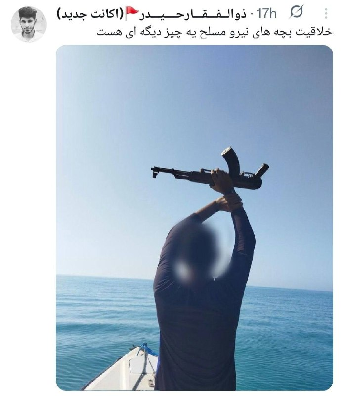

حالا چرا انقد خایه کردی از پشت هم محو کردی سرتو

@IranianMinds

## IranianMinds — post 20929

  

🔴 دیوار نگاره جدید میدان فلسطین تهران :

اسرائیل ۱۵ سال آینده را نخواهد دید!

@IranianMinds

## IranianMinds — post 20928

  

🔴 اسرائیل دستور تخلیه کل جنوب لبنان و تمام مناطقی که در‌ جنوب این کشور هستن رو داد !

@IranianMinds

## IranianMinds — post 20927

  

فک کن حدود ۹۰ روز کوچیک ترین حق انسانیتو‌ ازت بگیرن بعد با هزار منت و دردسر اونم نه درست وصلش کنن بعد یه عده شل مغز بیان برا اینکار از یارو بت بسازن.

@IranianMinds

## IranianMinds — post 20926

  <a href="telegram/content/IranianMinds_20926_1779967994.mp4" target="_blank">🎬 Download video</a>

🔴 جمهوری اسلامی یک پایگاه هوایی آمریکا در کویت را هدف قرار داد که رسانه‌ها ادعا می‌کنند از آن برای حمله به بندرعباس در جنوب ایران استفاده شده است.

@IranianMinds

## IranianMinds — post 20925

  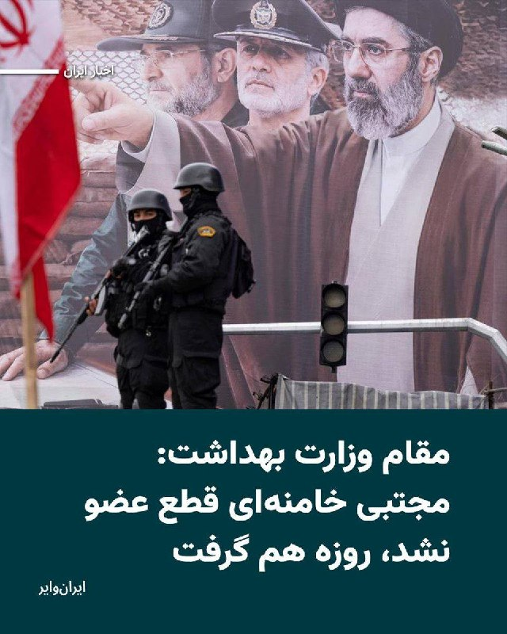

🔴 یک مقام وزارت بهداشت :

بمولا رهبرمون هیچیش نشد ی چن تا خراش بود فقط اخبارای کذبو‌ اصلا باور نکنید ، آقا موشتبی حتی روزه هم میگرفت تو ماه رمضان.

@IranianMinds

## IranianMinds — post 20924

  

🔴 سازمان ملل اسرائیل را به فهرست سیاه مربوط به خشونت جنسی مرتبط با درگیری‌ ها اضافه کرد.

@IranianMinds

## BBCPersian — post 282261

🔻ایران حمله به مناطقی در بندرعباس و اظهارات ترامپ در مورد عمان را محکوم کرد

سخنگوی وزارت امور خارجه ایران حمله بامداد امروز آمریکا به مناطقی در بندرعباس را «به شدت» محکوم کرد و آن را «نقض فاحش حقوق بین‌الملل و منشور ملل متحد» دانست.

اسماعیل بقایی گفت: «این اقدام تجاوزی علیه تمامیت ارضی و حاکمیت ملی ایران و نقض آشکار حقوق بین‌الملل و منشور سازمان ملل» است.

او همچنین تاکید کرد که «شورای امنیت سازمان ملل باید مسئولیت قانونی خود را برای پاسخگو کردن آمریکا ایفا کند.»

سخنگوی وزارت امور خارجه همچنین اظهارات اخیر دونالد ترامپ،‌ رئیس جمهور آمریکا در مورد عمان را محکوم کرد و ضمن ابراز همبستگی با آن کشور گفت: «تهدید به انهدام یک کشور عضو سازمان ملل که نقش میانجی و سازنده در منطقه داشته، نشانه خطرناک دیگری از عادی‌سازی قانون‌شکنی و قلدرمآبی در روابط بین‌الملل است.»

دونالد ترامپ دیروز در جلسه کابینه آمریکا در کاخ سفید با هشدار درباره گزارش‌ها از هماهنگی میان تهران و مسقط برای کنترل تنگه هرمز گفته بود: «عمان نیز همانند هر کشور دیگری رفتار خواهد کرد و در غیر این‌صورت مجبور خواهیم شد آن را منفجر کنیم.»

@BBCPersian

## BBCPersian — post 282260

🔻پلیس لندن می‌گوید که در پی یک حادثه رانندگی در محله‌ گولدرز گرین در شمال لندن یک مرد ۴۱ ساله ایرانی با جراحات شدید به بیمارستان منتقل شده است.

بر اساس گزارش پلیس یک مرد ۳۹ ساله عراقی هم به ظن ایجاد جراحات عمدی با رانندگی خطرناک و خودداری از انجام آزمایش مربوط به مواد مخدر بازداشت و در بازداشتگاه پلیس زندانی است.

پلیس از ادامه تحقیقات خبر داده است اما اعلام کرد که این حادثه را یک «اقدام تروریستی» ارزیابی نمی‌کند.

ویدئوهایی از این حادثه منتشر شده است که در آن یک خودرو تیره رنگ شاستی بلند از روی یک شخص عبور می‌کند.

برخی تصاویر نشان می‌دهد که پیش از این حادثه افرادی این خودرو و یک خودرو دیگر را که یک زن و یک روحانی سرنشین آن هستند،‌ دوره کرده و با موبایل در حال فیلمبرداری از سرنشینان آن هستند. صدای شعارهایی علیه سرنشینان این خودروها شنیده می‌شود.

به نظر می‌رسد یک عمامه سیاهرنگ هم روی زمین افتاده است.

پلیس لندن از شهروندان خواست که از بازنشر ویدئوها خودداری کنند و هر نوع اطلاعاتی که دارند را با پلیس در میان بگذارند.

برخی در شبکه‌های اجتماعی نوشتند که این حادثه در نزدیکی دیوار یادبود کشته‌شدگان اعتراضات دی ماه در گولدرز گرین اتفاق افتاده است.

ديوار یادبود در خیابان گولدرز گرين، در شمال لندن به‌عنوان محلی برای نمايش تصاوير کشته‌شدگان اعتراضات دی ماه سال گذشته استفاده می‌شود. در جریان سرکوب اعتراضات سراسری دی ماه هزاران نفر در ایران کشته شدند.

چندی پیش این دیوار هدف حمله قرار گرفت و پلیس چند نفر را به اتهام تلاش برای آتش زدن این محل بازداشت کرد.

@BBCPersian

## BBCPersian — post 282259

  <a href="telegram/content/BBCPersian_282259_1779967997.mp4" target="_blank">🎬 Download video</a>

🔻فراری از نخستین خودرو تمام‌برقی خود رونمایی کرد. پاپ لئو  سه‌شنبه (۷ خرداد، ۲۶ مه) از این خودرو بازدید کرد و پشت فرمان آن نشست.

این خودرو  ۶۴۰ هزار دلاری که «لوچه» نام دارد، واکنش‌های متفاوتی را در شبکه‌های اجتماعی برانگیخته است. برخی کاربران شبکه‌های اجتماعی طراحی لوچه را «فاجعه» و «ضربه به هویت فراری» توصیف کرده‌اند، در حالی که گروهی دیگر آن را «شاهکاری در طراحی» دانسته‌اند.

این خودرو که نخستین مدل پنج‌نفره فراری محسوب می‌شود، با همکاری جانی آیو، مدیر سابق طراحی اپل، طراحی شده و ظاهری متفاوت از مدل‌های سنتی این برند ایتالیایی دارد.

رونمایی از این خودرو در حالی انجام می‌شود که بسیاری از خودروسازان لوکس اروپایی، از جمله لامبورگینی و پورشه، به‌دلیل کاهش تقاضا برای خودروهای برقی لوکس، تولید خودروهای برقی خود را محدود کرده‌اند.

فراری اعلام کرده در کنار مدل‌های برقی، همچنان به تولید خودروهای بنزینی و هیبریدی ادامه خواهد داد.

https://bbc.in/4o22bms
@BBCPersian

## BBCPersian — post 282256

  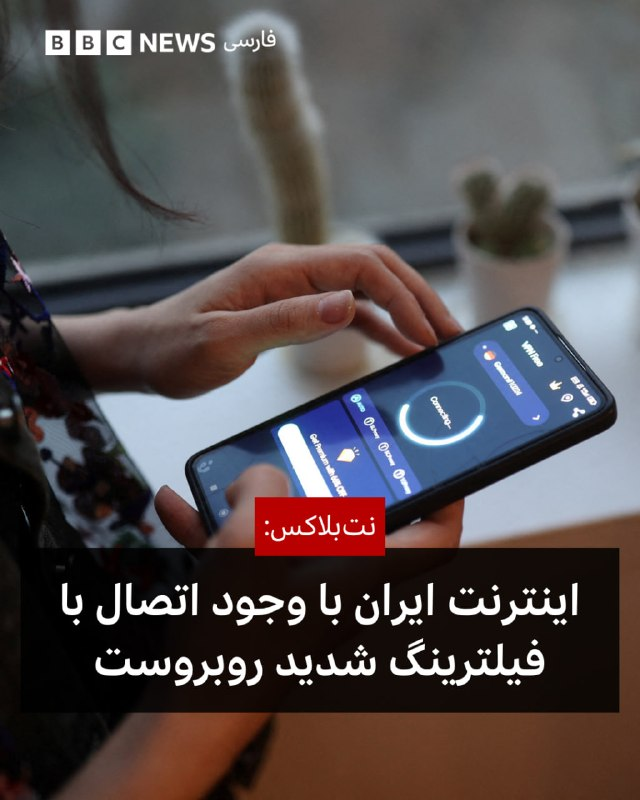

🔻نت‌بلاکس، نهاد ناظر بر دسترسی اینترنت در جهان می‌گوید که اینترنت ایران به‌رغم اتصال با فیلترینگ شدید روبروست.

نت‌بلاکس در شبکه ایکس اعلام کرد که سه ماه پیش در چنین روزی، ایران دسترسی به اینترنت جهانی را قطع کرد.

«در حالی که اکنون اتصال تا حد زیادی برقرار شده است، معیارها نشان می‌دهند که کاربران هنوز با فیلترینگ شدید مواجه هستند، مشابه دوره موقت بین اعتراضات ژانویه و شروع جنگ.»اشاره این نهاد به بعد از اعتراضات دی ماه است که برای مدت کوتاهی دسترسی به اینترنت برقرار شده بود.

در پی بازگشت تدریجی دسترسی به اینترنت جهانی در ایران، داده‌های شرکت کنتیک نشان می‌دهد که حجم ترافیک اینترنت بین‌الملل پس از هفته‌ها محدودیت شدید، تا ساعت ۷ و نیم صبح امروز به ۵۳ درصد حجم پیش از اعتراضات دی‌ماه ۱۴۰۴ رسیده است.

به‌گفته کنتیک، این روند تا حدی شبیه به وضعیت وصل شدن نسبی اینترنت بعد از اعتراضات دی ماه است.

@BBCPersian
📷 REUTERS

## BBCPersian — post 282254

با بازگشت تدریجی اتصال ایران به اینترنت جهانی، کاربران ایرانی در حال بازگشت به شبکه‌های اجتماعی هستند، و صاحبان کسب و کارهای اینترنتی در ایران امیدوارند بار دیگر رونق به کسب و کارشان بازگردد.

اما شاید شروع دوباره با چالش‌هایی هم همراه باشد.
اگر کسب‌وکار اینترنتی مانند فروشگاه اینستاگرام داشته‌اید و در چند ماه گذشته به دلیل قطع بودن اینترنت نتوانستید کار کنید، حالا که برگشته‌اید، چه تغییراتی می‌ببینید؟ آیا الگوریتم‌ها و قطعی بلندمدت بر کسب‌وکار و بازدید صفحه‌تان تاثیر گذاشته؟

آیا فکر می‌کنید رفتار مشتریان تغییر کرده باشد؟ چطور کسب‌وکارتان را بازسازی می‌کنید؟

طی این مدت پلتفرم‌ها و شبکه‌های اجتماعی داخلی ایران تا چه حد توانسته بود به ادامه کسب و کارتان کمک کند؟

نظرات و تجربیات خود را با هشتگ #اینترنت برای ما ارسال کنید:
آی‌مسج و واتس‌اپ: ۰۰۴۴۷۳۴۲۰۳۲۱۱۳
پیامگیر تلگرام t.me/bbcshoma
@BBCPersian
https://bbc.in/431n47v

## BBCPersian — post 282253

🔻نماینده مجلس ایران: بازگشایی اینترنت خلاف قانون است

احمد راستینه،‌ سخنگوی کمیسیون فرهنگی مجلس ایران در واکنش به تصمیمات مسعود پزشکیان، رئیس جمهور آن کشور برای بررسی وضعیت اینترنت، گفت که برخی از ماموریت‌ها و شرح وظایف این ستاد با ماموریت‌ها و شرح وظایف شورای عالی فضای مجازی «تداخل» دارد.

او می‌گوید که رای دیوان عدالت اداری در توقف فعالیت این ستاد از نظر حقوقی «درست و دقیق» است.

به گفته این نماینده مجلس بازگشایی اینترنت «خلاف قانون»‌ است.

در پی قطع اینترنت از زمان شروع جنگ در ایران در اسفندماه سال گذشته، مسعود پزشکیان «ستاد ساماندهی و راهبردی فضای مجازی» را برای بررسی بازگشت اینترنت بین‌الملل تشکیل داد.

تصمیم این ستاد در مورد بازگشایی مجدد اینترنت با واکنش تند مخالفان روبرو شده است.

پس از آن دیوان عدالت اداری اعلام کرد که «در پی شکایت‌هایی با درخواست ابطال سند ایجاد این ستاد، هیات تخصصی صنایع و بازرگانی با احراز فوریت موضوع، دستور توقف اجرای مصوبه را تا زمان رسیدگی نهایی صادر کرده است.»

به‌رغم این اقدام، اینترنت بین‌المللی از دو روز پیش، پس از بیش از ۸۰ روز برای کابران فعال شده است.

@BBCPersian

## BBCPersian — post 282252

🔻افزایش قیمت نفت در پی حملات تازه ایران و آمریکا

قیمت نفت در معاملات روز پنج‌شنبه بار دیگر صعود کرد، در حالی که اغلب بورس‌های آسیایی با افت مواجه شدند. این تحولات در پی حملات تازه آمریکا به ایران و افزایش نگرانی‌ها درباره شکننده بودن آتش‌بس رخ داده است.

افزایش قیمت نفت بخش زیادی از کاهش روز چهارشنبه را جبران کرد، کاهشی که به امید دستیابی قریب‌الوقوع به توافقی برای پایان دادن به درگیری‌ها شاهد آن بودیم.

نفت برنت دریای شمال، شاخص اصلی بین‌المللی، در معاملات صبح پنج‌شنبه ۱/۸ درصد افزایش یافت و به ۹۵/۹۵ دلار در هر بشکه رسید. همچنین نفت خام وست تگزاس اینترمدیت آمریکا هم با رشد ۱/۷درصدی به ۹۰/۱۷ دلار رسید.

بازارهای سهام آسیا عمدتاً نزولی بودند؛ شاخص هنگ‌کنگ بیش از ۱/۵ درصد افت کرد.

بورس سئول هم نزدیک به یک درصد کاهش یافت و شاخص شانگهای نیز ۰/۳ درصد پایین آمد.

این کاهش‌ها پس از عملکرد قابل توجه بازارهای جهانی سهام در روز چهارشنبه رخ داد.

اقتصاددانان هشدار داده‌اند اگر تورم در نتیجه جنگ تشدید شود، بانک‌های مرکزی ممکن است ناچار به افزایش نرخ بهره شوند؛ اقدامی که هزینه استقراض را بالا می‌برد و می‌تواند رشد اقتصادی را تحت فشار قرار دهد.

@BBCPersian

## Dirty_Kids — post 390383

  <a href="telegram/content/Dirty_Kids_390383_1779967999.mp4" target="_blank">🎬 Download video</a>

آرایشگر ایرانی که بخاطر پست کردن ویدیوی کارهاش در اینستاگرام توسط رژیم تهدید شده بود با انتشار این ویدیو به تهدیدها اعتراض کرد.
ویدیوش در شبکه اجتماعی انگلیسی زبان وایرال شده که کمک میکنه مردم دنیا ببینن که مردم ایران از چه حقوق ابتدایی محروم هستند.

@Dirty_Kids 👻

## Dirty_Kids — post 390382

  

امریکا هر شب اینا رو میزنه بعدش بیانیه میده ما هنوز تو آتش بس هستیم :)))))))

دیشب امریکا یه سایت نظامی که تهدیدی برای ناوها و نیروهاشون بود رو در جنوب ایران زدن و سپاه هم جوابشونو داد و مبدا حمله رو که یه پایگاه در کویت بود رو زد

+ سایت پهبادی سپاه در بندرعباس دیگر وجود ندارد.
اما آتش بس هنوز وحود دارد😂
از توجه شما سپاس گذارم

@Dirty_Kids 👻

## Dirty_Kids — post 390381

  <a href="https://t.me/Dirty_Kids/390381" target="_blank">📎 Download file</a>

📱 اپلیکیشن اندروید بدون فیلتر ریتزوبت

➖➖➖➖➖

🔹 ثبت نام آسان 
✅
🔹 رابط کاربری بسیار راحت و سریع 
✅
🔹 درگاه پرداخت کارت به کارت 
✅
🔹 درگاه پرداخت دلاری سریع 
✅
🔹 بونوس ۱۰۰ درصدی اولین واریز 
✅
🔹 بونوس ۱۰۰ درصدی واریز یکشنبه ها 
✅

➖➖➖➖➖
🌐 https://RitzoBet.com

⚡️ @RitzoBet_ir

## Dirty_Kids — post 390380

  

⚠️ برای #شرطبندی های فوتبال از سایت معتبر و بین المللی استفاده کنید ✅

سایت #ریتزوبت ، چهار سال هستش داخل ایران فعالیت میکنه 
✅

لایسنس بین المللی داره ، روش های شارژ و برداشت متنوع داره و بونوس 100% ورزشی و کش بک های جذاب
💎

⏪ اپلیکیشن بدون فیلتر ریتزوبت 
📱
⏩
R7

✅ لینک بدون‌ فیلتر ریتزوبت
🤣

🆔 @RitzoBet_ir 
🇮🇷

## Dirty_Kids — post 390379

  

این عرزشیه میگه علی عظمایی کتلت شده

@Dirty_Kids 👻

## Dirty_Kids — post 390378

  

بعضی جاها قیمت یه املت به ۵۰۰ هزار تومن رسیده!😐😐

@Dirty_Kids 👻

## Dirty_Kids — post 390377

  

به صورت کاملا اتفاقی:
_ پزشکیان ۳۰ ساله سینگله
_ اینترنت با دستور پزشکیان متصل شد
_ دقیقا فردای اتصال اینترنت روز جهانی خودارضاییه

@Dirty_Kids 👻

## Dirty_Kids — post 390376

  

🔴 فرصت از این بهتر؟؟
امروز روز جهانیه خودارضاییه تو این روز دختر پسرا به دوستاشون زنگ میزنن که دور هم جمع بشن و باهم بشینن خودارضایی کنن

@Dirty_Kids 👻

## Dirty_Kids — post 390375

  

بادبان از 100,000 عضو گذشت!
🎉

با بازگشت اینترنت درحال آماده سازی زیرساخت بادبان برای سرویس دهی برای شرایط نرمال و خروج از سرویس دهی اضطراری هستیم با نرمال شدن شرایط قیمت های کاهشی خواهد بود تا اتمام این فرایند کاربران عزیز میتونن از سرویس های اضطراری استفاده کنن
🚀

🛒به زودی در ربات سرویس های نرمال با قیمت هر گیگ 10 هزار تومان برای فروش فعال خواهند شد
🏷️

🎁 کد تخفیف خرید اول دوباره ریست شد و همه میتونن ازش استفاده کنن:
BadBanOFF

💸 با این کد، 50 هزار تومان تخفیف روی اولین خریدت بگیر!

🔥و مهم‌تر از همه...
سیستم معرفی بادبان فعال‌تر از همیشه‌ست!
از تمام خریدهای کاربرانی که معرفی میکنی، 10% خریدشون رو پورسانت دائمی دریافت کن و موجودی کیف پولت رو افزایش بده 
💼

وقتی بادبان داری،
هیچ بادی مانع نیست… حتی وقتی اینترنت ملیه
⛵️

R7

🛡@BadBan_VPN | کانال 

🤖@BadBan_VPNBot | ربات 

📞@BadBan_VPNSupport | پشتیبانی

## Dirty_Kids — post 390374

  

بچه‌های نیرو مسلح‌شون انقد بی‌خایه هستن که حتی میترسن از پشت شناسایی بشن، محو میکنن پس‌کله‌رو 😂

@Dirty_Kids 👻

## Dirty_Kids — post 390373

  <a href="telegram/content/Dirty_Kids_390373_1779968003.mp4" target="_blank">🎬 Download video</a>

مردم تو لندن هم از دست اینا آرامش ندارن

یکی از مزدورای جمهوری اسلامی رفته یکی از معترضا روبا ماشین زیر گرفته :/

@Dirty_Kids 👻

## Dirty_Kids — post 390372

  

اگه توی جنگ با اسراییل کار با سلاح به دردتون میخورد، حاجی‌زاده اون پشت تبدیل به مقوا نمیشد.

@Dirty_Kids 👻

## Hranews — post 113208

دزفول؛ یک نوجوان ۱۷ ساله پدر، مادر و برادرش را به قتل رساند

❗️
❗️
❗️
❗️
❗️– امروز پنجشنبه ۷ خردادماه، یک نوجوان ۱۷ ساله در دزفول پس از به قتل رساندن پدر و مادرش با مراجعه به محل کسب برادرش وی را نیز با ضربات سلاح سرد به #قتل رساند. او پس از این اقدام به زندگی خود پایان داد.

ادامه مطلب

↘️
@hranews_bot تماس ✉️ - @Hranews کانال هرانا 🆑

## Hranews — post 113207

  

تارا و کیمیا داوودی مجموعا به ۱۶ سال حبس محکوم شدند

❗️
❗️
❗️
❗️
❗️– تارا و کیمیا داوودی، دو خواهر محبوس در زندان اوین که در جریان اعتراضات ۱۴۰۴ بازداشت شده بودند، توسط دادگاه انقلاب تهران مجموعا به ۱۶ سال حبس محکوم شدند.

به گزارش خبرگزاری هرانا، ارگان خبری مجموعه فعالان حقوق بشر در ایران، دو خواهر در تهران به حبس محکوم شدند.

براساس حکمی که توسط شعبه ۱۵ دادگاه انقلاب تهران به ریاست قاضی ابوالقاسم صلواتی صادر شده است، کیمیا داوودی از بابت اتهاماتی از جمله ارتباط با گروه ها و شبکه های معاند و اجتماع و تبانی علیه امنیت کشور به ۱۰ سال حبس و تارا داوودی از بابت اتهاماتی از جمله اجتماع و تبانی علیه امنیت کشور و تبلیغ علیه نظام به ۶ سال زندان محکوم شده‌اند.

ادامه مطلب

#کیمیا_داوودی #تارا_داوودی

↘️
@hranews_bot تماس ✉️ - @Hranews کانال هرانا 🆑

## Hranews — post 113206

یک مرد توسط برادرش در تهران مورد اسیدپاشی قرار گرفت و جان‌باخت

❗️
❗️
❗️
❗️
❗️– مردی حدودا ۳۵ ساله در تهران توسط برادرش هدف #اسیدپاشی قرار گرفت و جان خود را از دست داد. متهم این پرونده همچنان متواری است و تحت تعقیب قضایی قرار دارد.

ادامه مطلب

↘️
@hranews_bot تماس ✉️ - @Hranews کانال هرانا 🆑

## Hranews — post 113205

  

از فیلتر تلگرام تا «اینترنت پرو»/ امیر آقایی

📡
📡
📡
📡
📡– جمهوری اسلامی در حال جابه‌جا کردن بسیاری از رکوردهای منفی در زمینه‌ی سرکوب دیجیتال است. ایرانیان در طول شاید یکی از پرالتهاب‌ترین مقاطع تاریخی خود یعنی از زمان شروع جنگ ۱۲روزه تا اعتراضات دی‌ماه و بعد از آن جنگ ۴۰روزه –که هنوز هم مشخص نیست کاملاً تمام شده یا نه– در مجموع بیش‌تر از صد روز را بدون اینترنت سپری کرده‌اند. تفاوت اساسی آخرین مقطع #قطع_اینترنت، حضور پررنگ اینترنت طبقاتی در لباس طرح جدیدی به نام «اینترنت پرو» است. این پروژه اما محصول امروز و دیروز اتاق‌های تصمیم‌گیری نظام نیست، بلکه نقطه‌ی پایانی مسیر پرپیچ‌وتابی است که نظام طی کرد تا به آن برسد. هرکدام از بزنگاه‌های اعتراضات دی‌ماه ۹۶، اعتراضات گرانی بنزین در آبان ۹۸، اعتراضات ۱۴۰۱ و در نهایت اعتراضات دی‌ماه ۱۴۰۴ برای دستگاه‌های امنیتی نظام درس‌آموخته‌هایی به دنبال داشت که در نهایت، نسخه‌ی اینترنت پرو خروجی نهایی آن بود. در ادامه بررسی خواهیم کرد که چه شد تا «اینترنت پرو» از جعبه‌ی جادویی نظام درآمد.

ادامه مطلب

ادامه مطلب در وبسایت خط صلح

#امیر_آقایی

↘️
@hranews_bot تماس ✉️ - @Hranews کانال هرانا 🆑

## Hranews — post 113204

عمر عزیزی با تودیع وثیقه از زندان زاهدان آزاد شد

❗️
❗️
❗️
❗️
❗️– عمر عزیزی، شهروند اهل شهرستان قصرقند، روز دوشنبه با تودیع وثیقه از زندان زاهدان آزاد شد. وی در آبان ماه سال گذشته بازداشت شده بود.

ادامه مطلب

#عمر_عزیزی

↘️
@hranews_bot تماس ✉️ - @Hranews کانال هرانا 🆑

## Hranews — post 113203

  

مدیر کمپین معلولان در گفتگو با ایرنا نسبت به پیامدهای کمبود بودجه در تأمین لوازم بهداشتی افراد دارای معلولیت هشدار داد و گفت: به دلیل ناکافی بودن کمک‌هزینه‌ها، بسیاری از افراد ناچارند اقلام یک‌بارمصرفی مانند پوشک، سوند و نلاتون را چندبار استفاده کنند؛ اقدامی که می‌تواند به بروز عفونت‌های شدید و حتی مرگ منجر شود. او تأکید کرد که در شرایط تورمی فعلی، عدم افزایش حق پرستاری و کمک‌هزینه‌های بهداشتی فشار مضاعفی بر زندگی افراد دارای معلولیت وارد کرده است.

در ادامه این گزارش، مادر دو فرزند دارای معلولیت "شدید"، از وضعیت معیشتی و درمانی خانواده‌اش گفت و توضیح داد که با وجود افزایش شدید قیمت پوشینه و سایر اقلام بهداشتی، مستمری و حمایت‌های بهزیستی پاسخگوی نیازهای اولیه نیست. به گفته او، تأخیر در پرداخت کمک‌هزینه‌ها و ناکافی بودن درآمد خانوار، در کنار مشکلات مسکن و نبود حمایت‌های پایدار، شرایط زندگی این خانواده را به وضعیت بحرانی رسانده است.
#افراد_دارای_معلولیت #معلولان

↘️
@hranews_bot تماس ✉️ - @Hranews کانال هرانا 🆑

## alonews — post 123275

  <a href="telegram/content/alonews_123275_1779968004.webm" target="_blank">🎬 Download video</a>

👈حملات هوایی به شهر النبطیه در جنوب لبنان

✅ @AloNews خبر جنگ

## alonews — post 123274

  <a href="telegram/content/alonews_123274_1779968005.webm" target="_blank">🎬 Download video</a>

👈آکسیوس: افزایش فشار واشنگتن بر کوبا؛ برنامه‌ریزی واشنگتن برای بحران احتمالی در تابستان

🔴طبق گزارش آکسیوس، دولت ترامپ در بحبوحه نگرانی‌ها از بی‌ثباتی بزرگ در کوبا طی تابستان امسال، فشارها بر این کشور را از طریق تحریم‌های شدیدتر افزایش داده است.

🔴مقامات آمریکایی اعلام کرده‌اند که در صورت تشدید ناآرامی‌ها، گزینه‌های نظامی احتمالی را بررسی کرده‌اند، هرچند تهاجم مستقیمی برنامه‌ریزی نشده است.

🔴این استراتژی بر فلج کردن اقتصادی کوبا از طریق هدف قرار دادن منابع اصلی درآمد و شرکت‌های وابسته به ارتش این کشور تمرکز دارد.

🔴مقامات این رویکرد را یک «شتاب‌گرایی تدریجی» توصیف می‌کنند؛ یعنی افزایش حداکثری فشارها در عین اجتناب از مداخله مستقیم در شرایط فعلی.

🔴واشنگتن بر این باور است که تشدید کمبود مواد غذایی، برق و سوخت در کوبا می‌تواند جرقه اعتراضاتی مشابه تظاهرات ضد دولتی گذشته را بزند.

✅ @AloNews خبر جنگ

## alonews — post 123273

  <a href="telegram/content/alonews_123273_1779968005.webm" target="_blank">🎬 Download video</a>

👈رسانه‌های اسرائیلی: «علی الحسینی»، مسئول موشکی حزب‌الله در یگان امام حسین ترور شده است

✅ @AloNews خبر جنگ

## alonews — post 123270

  <a href="telegram/content/alonews_123270_1779968005.mp4" target="_blank">🎬 Download video</a>

🔴فوری / کانال دوازده اسرائیل: پس از هفته ها ارتش به طور مستقیم به بیروت حمله کرد

🔴برآورد می‌شود این حمله برای ترور یک مقام ارشد حزب‌الله باشد!

✅ @AloNews خبر جنگ

## alonews — post 123269

  <a href="telegram/content/alonews_123269_1779968006.webm" target="_blank">🎬 Download video</a>

👈قطر و امارات، حمله ایران به پایگاه آمریکایی در خاک کویت را محکوم کردند.

✅ @AloNews خبر جنگ

## alonews — post 123268

  <a href="telegram/content/alonews_123268_1779968006.webm" target="_blank">🎬 Download video</a>

👈منصور هادی رئیس‌جمهور فراری یمن، در ریاض درگذشت

✅ @AloNews خبر جنگ

## alonews — post 123267

  <a href="telegram/content/alonews_123267_1779968007.webm" target="_blank">🎬 Download video</a>

🔴فوری/سنتکام حمله ایران با یک عدد موشک بالستیک به کویت را نقض فاحش آتش‌بس خواند

✅ @AloNews خبر جنگ

## alonews — post 123266

  <a href="telegram/content/alonews_123266_1779968007.webm" target="_blank">🎬 Download video</a>

👈جروزالم پست: کشورهای حوزه خلیج فارس احتمالاً درخواست ترامپ برای پیوستن به توافق‌نامه ابراهیم را جدی نمی‌گیرند و آن را «زودهنگام» می‌دانند

✅ @AloNews خبر جنگ

## alonews — post 123262

  <a href="telegram/content/alonews_123262_1779968007.webm" target="_blank">🎬 Download video</a>

👈تصاویر ماهواره‌ای که سی‌ان‌ان منتشر کرده نشون میده که تا حالا حداقل ۵۰ تا از نقاط دسترسی به ۱۸ سایت موشکی پاکسازی شده

✅ @AloNews خبر جنگ

## alonews — post 123261

  <a href="telegram/content/alonews_123261_1779968007.mp4" target="_blank">🎬 Download video</a>

👈ارتش اسرائیل : تو ۲۴ ساعت گذشته بیشتر از ۱۳۵ هدف حزب‌الله رو تو صور، بقاع و جنوب لبنان، زدیم

✅ @AloNews خبر جنگ

## alonews — post 123260

  <a href="telegram/content/alonews_123260_1779968009.mp4" target="_blank">🎬 Download video</a>

👈زلنسکی: امروز در سوئد به‌صورت کاری حضور دارم.

🔴ما در حال آماده‌سازی یک بسته دفاعی بزرگ برای اوکراین و یک گام قوی در خصوص جنگنده‌های گریفن هستیم که قطعاً نیروی هوایی رزمی ما را مؤثرتر خواهد کرد

✅ @AloNews خبر جنگ

## alonews — post 123259

  <a href="telegram/content/alonews_123259_1779968013.mp4" target="_blank">🎬 Download video</a>

👈 پوتین از ساخت نیروگاه هسته‌ای در قزاقستان خبر داد

🔴در جریان سفر رئیس‌جمهور روسیه به قزاقستان، توافقنامه ساخت نیروگاه هسته‌ای توسط شرکت روس‌اتم روسیه در قزاقستان، به امضای طرفین رسید.

✅ @AloNews خبر جنگ

## alonews — post 123258

  <a href="telegram/content/alonews_123258_1779968014.mp4" target="_blank">🎬 Download video</a>

👈 ویدیوی عجیبی که توسط کاخ سفید به جهت ۶.۷ میلیونی شدن فالوورهای اکانت کاخ سفید در تیک‌تاک منتشر شد!

✅ @AloNews خبر جنگ

## alonews — post 123257

  <a href="telegram/content/alonews_123257_1779968015.webm" target="_blank">🎬 Download video</a>

👈کویت : ما حمله‌ی دیشبِ سپاه رو محکوم میکنیم

✅ @AloNews خبر جنگ

<!-- MSG END -->

<!-- NAV START -->

<a href="https://github.com/yerbeyer/aio-downloader/blob/main/telegram/content/archive_1.md" style="display:inline-block; padding:6px 12px; margin:0 4px; background-color:#2ea44f; color:white; text-decoration:none; border-radius:4px; font-weight:bold;">صفحه بعد</a>

<!-- NAV END -->
