# خواننده تلگرام

<!-- TOP_NAV START -->

<a href="https://github.com/yerbeyer/aio-downloader/blob/main/telegram/content/archive_1.md" style="display:inline-block; padding:6px 12px; margin:0 4px; background-color:#2ea44f; color:white; text-decoration:none; border-radius:4px; font-weight:bold;">صفحه بعد</a>

<!-- TOP_NAV END -->

<!-- MSG START -->

---
📅 بروزرسانی: 1405/03/06 15:37
---

## VahidOOnLine — post 242412

  

♦️محمدباقر قالیباف، رئیس مجلس شورای اسلامی و مذاکره کننده ارشد جمهوری اسلامی در مذاکرات با آمریکا، در پیامی به مناسبت عید قربان به روسای مجالس کشورهای اسلامی نوشت:‌ «همکاری برای قو ی‌شدن بدون دخالت خارجی، نقش مؤثری در حل بحران‌های منطقه‌ای دارد.»

این پیام در حالی صادر می‌شود که همزمان با ادامه مذاکرات میان تهران و واشنگتن برای پایان جنگ، کشورهای اسلامی منطقه می‌گویند برای بازگردندان ثبات و آرامش به منطقه تمام تلاش خود را به کار بسته‌اند.
‌🇸🇦 Indypersian

🤖 @VahidOOnLine

## VahidOOnLine — post 242411

  <a href="telegram/content/VahidOOnLine_242411_1779883640.mp4" target="_blank">🎬 Download video</a>

♦️سازمان هوانوردی و فضا ایالات متحده (ناسا)، روز سه‌شنبه پنجم خرداد جزئیات جدیدی از برنامه استقرار یک پایگاه فضائی دائم در کره ماه را اعلام کرد.

مدیران این سازمان فدرال اعلام کردند برنامه ساخت این پایگاه از سه سال دیگر آغاز خواهد شد و به شرکت‌هایی که بتوانند در کار ساخت و ارسال خودروها و دیگر وسایل حمل و نقل به ماه کمک کنند، پاداش خواهند داد.

جرد ایزاکمن، مدیر ناسا در یک نشست مطبوعاتی در واشنگتن گفت قرار است در مرحله اول فرودگر (ماه نشین)‌ «بلو اوریجین مارک وان اندیورنس» (Blue Origin Mark One Endurance) محموله‌های متعددی را به نقطه تماس در قطب جنوب ماه منتقل کند.‌

در ادامه مرحله اول، ربات‌ها
ماموریت‌های سریعی را «بررسی منطقه، آزمایش فناوری‌ها و آماده‌سازی برای عملیات روی سطح ماه» آغاز خواهند کرد.

به گفته مدیران ناسا،  مرحله دوم با انتقال وسایل حمل‌ونقل،  تا سال ۲۰۲۹ طول می‌کشد و پس از آن ناسا شروع به ساخت زیرساخت‌های نیمه دائمی خواهد کرد و مرحله ۳ با هدف دستیابی به حضور پایدار روی کره ماه انجام خواهد شد.
‌🇸🇦 Indypersian

🤖 @VahidOOnLine

## VahidOOnLine — post 242410

  

محسن زنگنه، عضو کمیسیون برنامه و بودجه مجلس، گفت جمهوری اسلامی درباره «اصل غنی‌سازی» مذاکره نمی‌کند اما درباره محدودیت درصد غنی‌سازی با آمریکا گفت‌وگو می‌کند.

زنگنه همچنین گفت روند مذاکرات با «هماهنگی کامل رهبری» پیش می‌رود و ابراز امیدواری کرد جمهوری اسلامی در عید غدیر «جشن پیروزی» بگیرد.
‌🏁 🇬🇧 IranintlTV

🤖 @VahidOOnLine

## VahidOOnLine — post 242409

  

الی کوهن، وزیر انرژی اسرائیل و عضو کابینه سیاسی-امنیتی این کشور، با اشاره به آنچه «برنامه‌های راهبردی» برای دور زدن تهدیدهای جمهوری اسلامی علیه مسیرهای تجاری خواند، گفت: «تمام نبرد ایران در تنگه هرمز و آن اهرم راهبردی که به کار می‌گیرد، در حال از بین رفتن است.»

او افزود در روزهای اخیر گفت‌وگوهایی درباره ایجاد زیرساخت‌های انرژی از شرق به غرب در جریان است و هدف از این طرح‌ها، انتقال انرژی به اروپا از طریق اسرائیل عنوان شده است.

کوهن همچنین از مذاکرات برای ایجاد خطوط انتقال انرژی از مسیر کشورهای خلیج فارس خبر داد و گفت کشورهایی مانند عربستان سعودی و امارات متحده عربی، به عنوان تولیدکنندگان مهم انرژی، تمایل دارند در این طرح‌های اقتصادی مشارکت کنند.

به گفته وزیر انرژی اسرائیل، کریدور زیرساختی میان هند و اروپا از طریق کشورهای خلیج فارس و اسرائیل در دست بررسی است و استفاده از مسیر مصر نیز می‌تواند روند پیشبرد این طرح‌ها را تسریع کند. او تاکید کرد گفت‌وگوهای مشخصی در این زمینه در حال انجام است.
‌🏁 🇬🇧 IranintlTV

🤖 @VahidOOnLine

## VahidOOnLine — post 242408

♦️لندن در حالی که دمای هوا در ماه مه از ۳۰ درجه سانتیگراد فراتر می‌رود، رکورد گرم‌ترین روز ماه مه خود را شکست.
آخرین باری که لندن این دما را تجربه کرده بود سال ۱۹۴۴ بود که گرمای ۳۲.۸ درجه سانتیگراد را تجربه کرد.
هوا در یک آخر هفته طولانی از ۳۰ درجه سانتیگراد می‌گذرد و اداره هواشناسی بریتانیا هشدار کهربایی برای بخش‌هایی از انگلستان صادر کرده است و پیش‌بینی می‌شود که با تشدید گرما، دما به رکورد جدیدی برای ماه مه برسد.
موج گرمای کم‌سابقه، بریتانیا  را در روزهای اخیر حتی از بعضی سواحل گردشگری جنوب اروپا نیز گرم‌تر کرد.
بر اساس گزارش‌ها، بریتانیا روز دوشنبه گرم‌ترین دمای ثبت‌شده ماه مه در تاریخ خود را تجربه کرد و دماسنج‌ها در نزدیکی لندن عدد ۳۴.۸ درجه سانتی‌گراد را نشان دادند.
کارشناسان هواشناسی می‌گویند چنین دماهایی در اواخر بهار برای بریتانیا کم‌سابقه است؛ کشوری که معمولا با آب‌وهوای خنک‌ و بارانی شناخته می‌شود.
‌🇸🇦 Indypersian

🤖 @VahidOOnLine

## VahidOOnLine — post 242407

  

بر اساس اطلاعات رسیده به ایران‌اینترنشنال، حمیدرضا حدادی، جوان ۱۹ ساله اهل شاندیز، شامگاه ۱۸ دی‌ماه پس از اصابت گلوله به درمانگاه شاندیز منتقل شد اما از آنجا که دستور تخلیه درمانگاه صادر شده بود او بدون رسیدگی پزشکی جان باخت.

حمیدرضا تنها حدود نیم ساعت در میان جمعیت معترضان حضور داشت که از پشت هدف شلیک قرار گرفت. گلوله به ریه او اصابت کرد و او بر اثر شدت جراحات جان باخت.

حمیدرضا حدادی فوتبالیست بود و به گفته نزدیکانش آرزو داشت مسیر حرفه‌ای خود را در فوتبال دنبال کند. او همچنین قصد داشت یک مغازه فروش تلفن همراه برای خود راه‌اندازی کند.

پس از کشته شدن حمیدرضا، نیروهای حکومتی تلاش کردند او را به عنوان شهید معرفی کنند، اما خانواده با این موضوع مخالفت کردند. به گفته این منبع، نیروهای حکومتی بدون رضایت خانواده برای او مراسمی در مسجد برگزار کردند، اما اعضای خانواده در آن مراسم حضور نیافتند.

این منبع افزود خانواده حمیدرضا با وجود فشارهای شدید امنیتی، بر این روایت تاکید کرده‌اند که او در جریان اعتراضات و با شلیک نیروهای حکومتی کشته شده است.

‌🏁 🇬🇧 IranintlTV

🤖 @VahidOOnLine

## VahidOOnLine — post 242406

  <a href="telegram/content/VahidOOnLine_242406_1779883644.mp4" target="_blank">🎬 Download video</a>

♦️صدها هزار زائر مراسم حج روز چهارشنبه ششم خرداد و همزمان با عید قربان، مراسم رمی جمرات، یکی از ارکان اصلی حج را به جای آوردند.

زائران در این مراسم، به سوی نماد شیطان در صحرای منا، سنگ پرتاب می‌کنند.

مقام‌های عربستان سعودی از ۲۲ سال پیش و برای امنیت و سلامت زائران، دیوارهایی را به جای نمادهای شیطان در صحرای منا ساختند.
‌🇸🇦 Indypersian

🤖 @VahidOOnLine

## VahidOOnLine — post 242405

  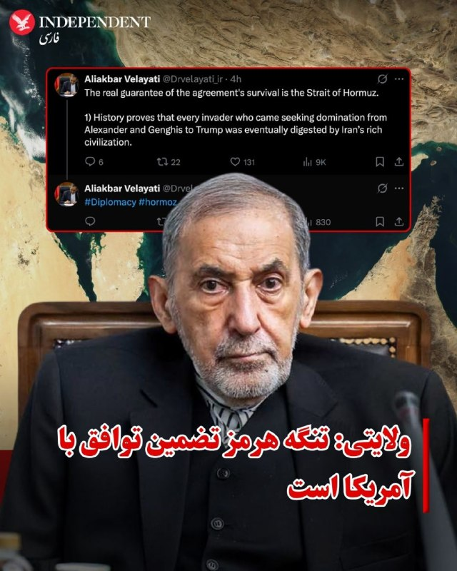

♦️همزمان با ادامه مذاکرات میان جمهوری اسلامی و آمریکا، علی‌اکبر ولایتی، مشاور رهبر جمهوری اسلامی در امور بین‌الملل، روز چهارشنبه ششم خرداد گفت که تنگه هرمز «تضمین توافق» با آمریکا است.

ولایتی با انتشار پیامی در اکس نوشت: «خط قرمز ایران روشن است...این بار کاغذها و امضاها تضمین نیستند، ضامن عینی بقای توافق، تنگه هرمز است.»
مشاور بین‌الملل رهبر جمهوری اسلامی اضافه کرد: «جغرافیا دروغ نمی‌گوید و قاضی نهایی عهدنامه، روی کاغذ نیست.»

او همچنین با اشاره به حملات بیگانگان در به ایران در دوران تاریخی نوشت: «تاریخ گواهی می‌دهد همه مهاجمانی که با سودای سلطه آمدند، از اسکندر تا چنگیز و ترامپ، همگی در هاضمه تمدن غنی ایران هضم شدند.»

پیش از این علی باقری کنی، معاون دبیر شورای عالی امنیت ملی ایران روز چهارشنبه در حاشیه مجمع بین‌المللی امنیتی در مسکو با بیان اینکه تماس‌های غیرمستقیم میان ایران و آمریکا ادامه دارد، گفته بود که «ایران و ایالات متحده هنوز در مورد رفع انسداد تنگه هرمز به توافق نرسیده‌اند.»
‌🇸🇦 Indypersian

🤖 @VahidOOnLine

## VahidOOnLine — post 242404

  <a href="telegram/content/VahidOOnLine_242404_1779883646.mp4" target="_blank">🎬 Download video</a>

♦️سخنگوی سازمان آتش‌نشانی تهران روز چهارشنبه ششم خردادماه از وقوع آتش‌سوزی در پشت‌بام یک مجتمع تجاری در خیابان شوش خبر داد.
به گفته این سازمان، آتش‌نشانان موفق شدند حریق را پیش از سرایت به انبارهای مجتمع مهار و افراد حاضر در ساختمان را در همان دقایق اولیه تخلیه کنند.
این حادثه بدون مصدومیت پایان یافت.
‌🇸🇦 Indypersian

🤖 @VahidOOnLine

## VahidOOnLine — post 242403

  

مسعود پزشکیان، رییس‌جمهور دولت جمهوری اسلامی، عامل بحران اقتصادی در کشور را «جنگ اقتصادی دشمن» خواند و گفت میدان اصلی تقابل امروز، جنگ اقتصادی و هدف‌گیری تاب‌آوری کشور است.

او افزود: «میدان اصلی تقابل امروز، جنگ اقتصادی و هدف‌گیری تاب‌آوری کشور است.»

پزشکیان ادامه داد: «دشمن پس از ناکامی در تحقق اهداف خود در عرصه نظامی، تمرکز خود را بر آسیب‌زدن به تاب‌آوری اقتصادی کشور و ایجاد اخلال در معیشت مردم قرار داده است.»
‌🏁 🇬🇧 IranintlTV

🤖 @VahidOOnLine

## VahidOOnLine — post 242402

  

♦️وزارت اطلاعات جمهوری اسلامی ایران روز چهارشنبه ششم خردادماه با صدور بیانیه‌ای معترضان و مخالفان حکومت را به پیگرد قانونی تهدید کرد.

این بیانیه که با عنوان «سخنی با ولی‌نعمتان و هشداری به دشمنان» در رسانه‌های داخلی ایران منتشر شده، ادعا می‌کند که «دشمن شکست خورده در جنگ نظامی، بدنبال تولید دستآورد برای خویش، گرچه از طریق جنگ نرم، می‌باشد.»

وزارت اطلاعات در این بیانیه علاوه بر اسرائیل و آمریکا، بریتانیا و اروپا را به همراهی با این دو قدرت متهم و کشورهای عرب حاشیه خلیج فارس را به‌عنوان «غلامان متمول» مسئول تامین مالی «جنگ ترکیبی تمام عیار» علیه «مردم قهرمان ایران» معرفی کرده است.

این بیانیه در حالی صادر می‌شود که اسماعیل خطیب، وزیر اطلاعات جمهوری اسلامی در سومین هفته جنگ در حمله اسرائیل کشته شد و دولت هنوز جانشینی برای او معرفی نکرده است.

در بیانیه وزارت اطلاعات که همزمان با افزایش گمانه‌زنی‌ها درباره توافق احتمالی میان تهران و واشنگتن صادر شده، آمده است: «دشمن شکست خورده در جنگ نظامی، بدنبال تولید دستاورد برای خویش، گرچه از طریق جنگ نرم، میباشد. اکنون دشمن، هدف براندازی و تجزیه کشور را که در ابتدای جنگ اخیر آشکارا اعلان کرده و با حمله نظامی نتوانست محقق سازد، از راههای دیگری پی می‌جوید. لذا و طبق اطلاعات موثقِ حاصل از مجاری مختلف، دشمن کینه‌توز نه تنها در صدد اجرای شگردهای گوناگون جنگ ترکیبی علیه ایران عزیز می‌باشد، بلکه با توقف جنگ سخت، قطعا تمرکز بیشتر و سنگین‌تری بر انواع شیوه‌های جنگ نرم، جنگ شناختی و توطئه‌های جنگ ترکیبی خواهد داشت.»

وزارت اطلاعات در این بیانیه معترضان و مخالفان جمهوری اسلامی در خارج از ایران را تهدید کرد و نوشت: «مزدوران ضد انقلاب و تروریست‌های مقیم خارج کشور و حامیان آن‌ها نیز از آتشی که می‌افروزند در امان نخواهند بود.»

در حالی که اعتراضات سراسری دی‌ماه ۱۴۰۴ با هزاران کشته یکی از بزرگ‌ترین و مرگ‌بارترین سرکوب‌های نیم قرن اخیر جهان به شمار می‌رود، وزارت اطلاعات ادعا کرد «طبق اطلاعات موثق و متواتر، امروز اولویت محورهای جنگ ترکیبی دشمن، انجام تحریکات اجتماعی حول محورهای اقتصادی و برخی کمبودها، و تلاش برای پیشگیری از خدمت‌رسانی دولت خدمتگزار و طراحی برای تولید و تهییج معترضین و کشاندن آنها به خیابان‌ها، در برابر نهادهای حاکمیتی و امت خداجویی است که تجمعات خیابانی را به «سنگر سراسری مقاومت ملی» تبدیل نموده‌اند.»

 وزارت اطلاعات در همین بیانیه هرگونه ارتباط با رسانه‌های مخالف که آن‌ها را «تروریستی» توصیف کرده است و «ایجاد اغتشاش و اختلاف مذهبی و قومی» و «ارتباط با کانال‌های ارتباطی» اسرائیل در شبکه‌های اجتماعی، مورد پیگرد قرار خواهد گرفت.
‌🇸🇦 Indypersian

🤖 @VahidOOnLine

## VahidOOnLine — post 242401

  

پس از گذشت حدود سه ماه از کشته شدن علی خامنه‌ای، رهبر جمهوری اسلامی، و اعضای خانواده او در حمله مشترک اسرائیل و آمریکا، رسانه‌های ایران اعلام کردند مراسم ختم خانواده علی و مجتبی خامنه‌ای هفته جاری در مصلای عبدالعظیم حسنی در شهر ری برگزار می‌شود.

بر اساس اعلامیه منتشرشده از سوی خانواده رهبر جمهوری اسلامی، این مراسم برای بشری حسینی خامنه‌ای، دختر علی خامنه‌ای، مصباح‌الهدی باقری، همسر بشری حسینی خامنه‌ای، زهرا حداد عادل، همسر مجتبی خامنه‌ای، و زهرا محمدی گلپایگانی، نوه علی خامنه‌ای، برگزار خواهد شد.

علی خامنه‌ای نهم اسفند‌ماه به همراه بخشی از خانواده و همراهانش در حملات مشترک اسرائیل و آمریکا کشته شد. با وجود گذشت سه ماه، هنوز مراسم تشییع جنازه او برگزار نشده است.
‌🏁 🇬🇧 IranintlTV

🤖 @VahidOOnLine

## VahidOOnLine — post 242400

  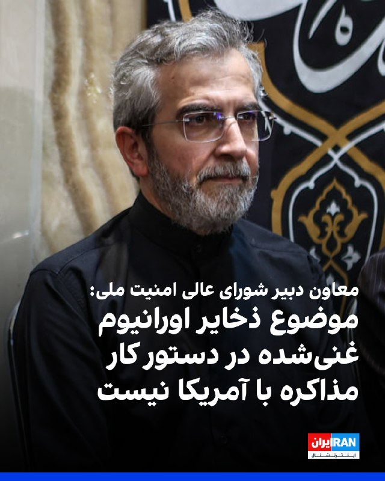

علی باقری‌کنی، معاون دبیر شورای عالی امنیت ملی، با بیان اینکه «تماس‌های غیرمستقیم میان جمهوری اسلامی و آمریکا ادامه دارد» گفت: «موضوع ذخایر اورانیوم غنی‌شده در دستور کار مذاکرات نیست.»

او افزود جمهوری اسلامی و عمان در حال مذاکره درباره رویه جدید عبور کشتی‌ها از تنگه هرمز هستند.
‌🏁 🇬🇧 IranintlTV

🤖 @VahidOOnLine

## VahidOOnLine — post 242399

🗣روایت شما پس از بازگشت به اینترنت بین‌المللی- چهارشنبه ۶ خرداد

🔹با وجود باز شدن اینترنت در ایران، حتی با فیلترشکن‌های قوی هم هیچ‌یک از اپلیکیشن‌ها باز نمی‌شود.
🔹بالاخره بعد از سه ماه وصل شدم ولی احساس غریبی می‌کنم. اینستاگرام شده مثل قبرستون هزاران هزار اکانت که دیگه صاحبی نداره.
🔹نابود شدیم از گرونی وحشتناک. این گرونی و تورم رو هیچ‌کجای دنیا نمی‌تونن حتی چند روز تحمل کنن. اینترنت که حقمونه رو با ده‌ها شرط و منت باز کردن.
🔹بعد ۳ ماه وصل شدم. تلگرام روی آپدیت می‌مونه، پیام‌ها خیلی دیر ارسال و دریافت میشه و گوگل‌پلی هنوز برای همه کار نمی‌کنه. فقط دیشب به سختی تونستم آپدیت اندروید گوشیم رو انجام بدم.
🔹بالاخره اینترنت در ایران وصل شده و خیلی خوشحال شدیم، ولی یاد جاویدنامان از ذهن ما نمیره.
🔹هر کی میگه اینترنت در ایران وصل شده واقعا مغزش خرابه. کجا وصل شده؟ گوگل‌پلی وارد نمیشه و حتی نمی‌شه برنامه‌های سامسونگ رو آپدیت کرد.
🔹اینترنت وصل شده ولی خوشحال نیستم چون وقتی اینترنت وصل بشه یعنی اینکه هیچ اتفاقی قرار نیست بیافته و جمهوری اسلامی قراره بمونه.
🔹نگران اینترنت نباش چون برمی‌گرده، نگران جوونی‌مون باش که مفت رفت.
🔹کاش همین‌جوری که اینترنت‌ها برگشت، جوون‌هامون از زیر خاک برمی‌گشتن.
🔹ببین ما چقدر بدبخت شدیم که در عصر تکنولوژی، بعد از ۸۸ روز برای بازگشت اینترنت شادی می‌کنیم.
🔹اینها اینترنت‌ها رو وصل کردن که ما لال بشیم.
🔹درک نمی‌کنم یه سری‌ها خوشحالن و هیجانی شدن از وصل شدن اینترنت. الان یعنی بدبختی‌هاتون تموم شد؟
🔹برای من عجیبه که بعضی‌ها وصل شدن اینترنت رو تبریک میگن. این حق اولیه هر انسانیه و تبریک گفتن نداره.
🔹باورم نمیشه که میگین آزاد شدیم و خوشحالیم. این فقط فیلترنت هست و هیچی عوض نشده. زندگی ما و جوونیمون به باد رفت. فیلترنت خیلی محدود وصل شده ولی زندگی ما و اون همه جاویدنام دیگه برنمی‌گرده.
‌🏁 🇬🇧 IranintlTV

🤖 @VahidOOnLine

## VahidOOnLine — post 242398

🗣روایت شما از بحران اقتصادی و زندگی در آتش‌بس- چهارشنبه ۶ خرداد:

🔹بچه‌ام در بخش کودکان بیمارستان ۱۷ شهریور رشت بستری است. داروهای سرطان نیست. بسته ۱۰۰ عددی قرص مرکاپتوپرین به سختی و فقط در بازار سیاه با قیمت چند برابری پیدا می‌شود.

🔹خیلی در فشاریم. اجاره خانه ۳ برابر شده. گوشت و مرغ را که خیلی وقت است نمی‌توانیم بخریم. روغن ۲ لیتری شده ۹۰۰ هزار تومان.

🔹من لوازم خانگی دارم. قیمت وسایل خانه از قبل عید تا الان به شدت افزایش داشته. یخچال دوقلو هیمالیا ۱۲۰ میلیون تومان بود الان شده ۲۵۰ میلیون، ماشین لباسشویی پاکشوما ۹ کیلویی ۶۰ میلیون بود، شده ۱۰۰ میلیون تومان. جوان‌هایی که می‌خواهند تازه زندگی مشترکشان را شروع کنند می‌آیند قیمت می‌کنند، با چشمان خیس از در خارج می‌شوند.

🔹فروشنده موبایلم؛ قیمت موبایل‌ها خیلی رفته بالا. عملا مشتری فقط برای خرید قاب و گلس مراجعه می‌کند و به ندرت گوشی می‌فروشیم.

🔹گرانی به شدت بیداد می‌کند. یک روغن، نوشابه و زردچوبه خریدم شد یک میلیون و ۲۰۰ هزار تومان.

🔹همه چیز گران شده. روغن پنج لیتری شده ۷۰۰ هزار تومان، چیپس ۵۵۰ هزار تومان، گوشت قرمز یک میلیون و ۳۰۰ هزار تومان.

🔹با خانه میانگین متری ۳۰۰ میلیون تومان در اصفهان چه‌کار کنیم؟ تازه کسی هم نمی‌فروشد و منتظرند گران‌تر شود.
‌🏁 🇬🇧 IranintlTV

🤖 @VahidOOnLine

## VahidOOnLine — post 242397

  

همزمان با گزارش‌ها درباره رایزنی‌ها برای دستیابی به توافق میان جمهوری اسلامی و آمریکا، علی‌اکبر ولایتی، مشاور رهبر جمهوری اسلامی در امور بین‌الملل، گفت ضامن عینی بقای توافق، تنگه هرمز است.

او در ایکس نوشت: «خط قرمز ایران روشن است، این بار کاغذها و امضاها تضمین نیستند، ضامن عینی بقای توافق، تنگه هرمز است. جغرافیا دروغ نمی‌گوید و قاضی نهایی عهدنامه، روی کاغذ نیست.»

او همچنین گفت: «تاریخ گواهی می‌دهد همه مهاجمانی که با سودای سلطه آمدند، از اسکندر تا چنگیز و ترامپ، همگی در هاضمه تمدن غنی ایران هضم شدند.»
‌🏁 🇬🇧 IranintlTV

🤖 @VahidOOnLine

## VahidOOnLine — post 242396

  

♦️دولت کره‌جنوبی روز چهارشنبه ششم خردادماه اعلام کرد سفیر جمهوری اسلامی در سئول را در اعتراض به حمله به یک کشتی احضار خواهد کرد.

مقام‌های کره‌جنوبی جزئیات بیشتری درباره این حادثه منتشر نکرده‌اند، اما تاکید کرده‌اند امنیت کشتیرانی و آزادی تردد دریایی برای سئول اهمیت حیاتی دارد.

این خبر در حالی اعلام شد که حدود چهار هفته پیش یک کشتی باری کره جنوبی در تنگه هرمز هدف حمله پهپادی قرار گرفت و به‌شدت آسیب دید.
دفتر ریاست جمهوری کره جنوبی اعلام کرد بسیار بعید است این حمله از جایی به‌جز ایران انجام شده باشد.
‌🇸🇦 Indypersian

🤖 @VahidOOnLine

## VahidOOnLine — post 242395

  

♦️علی باقری کنی، معاون دبیر شورای عالی امنیت ملی جمهوری اسلامی روز چهارشنبه ششک خرداد در حاشیه مجمع بین‌المللی امنیتی در مسکو با اشاره به مذاکرات نمایندگان تهران و واشنگتن گفت: «ذخایر اورانیوم غنی‌شده ایران در دستور کار مذاکرات نیست».

به گزارش ریانووستی، باقری کنی همچنین با بیان اینکه تماس‌های غیرمستقیم میان تهران و واشنگتن ادامه دارد، افزود: ایران و ایالات متحده هنوز در مورد رفع انسداد تنگه هرمز به توافق نرسیده‌اند.

این اظهارات در حالی مطرح می‌‌شود که دونالد ترامپ، رئیس‌جمهوری ایالات متحده، روز دوشنبه با انتشار پیامی در شبکه اجتماعی تروث نوشت: «اورانیوم غنی‌شده (گرد‌وغبار هسته‌ای) یا باید فورا به ایالات متحده تحویل داده شود تا به آمریکا منتقل و نابود گردد، یا اینکه ترجیحا در بستر همکاری و هماهنگی با جمهوری اسلامی، در همان محل یا در مکان قابل‌قبول دیگری، در حضور و با نظارت کمیسیون انرژی اتمی یا نهاد معادل آن نابود شود.»

 مقام‌های آمریکایی به سی‌ان‌ان گفته‌اند، اختلاف‌ها بر سر نحوه پرداختن به برنامه هسته‌ای ایران و لغو تحریم‌ها، نهایی شدن توافق برای پایان جنگ را به تاخیر انداخته است.
‌🇸🇦 Indypersian

🤖 @VahidOOnLine

## VahidOOnLine — post 242394

  

وزارت خارجه کره جنوبی چهارشبنه شش خرداد اعلام کرد که حمله به کشتی باری اچ‌ام‌ام نامو در تنگه هرمز ، احتمالا با استفاده از یک موشک ایرانی انجام شده است.

به گزارش رویترز، یک مقام دفتر ریاست‌جمهوری کره جنوبی ۲۱ اردیبهشت اعلام کرد سئول در حال بررسی نقش احتمالی جمهوری اسلامی در حمله به نفتکش کره‌ای «اچ‌ام‌ام نامو» در هفته گذشته است.

او با تاکید بر این که کره جنوبی قصد دارد به عامل حمله به این کشتی پاسخ دهد در عین حال گفت عامل این حمله تاکنون شناسایی نشده و تحقیقات در این زمینه ادامه دارد.
‌🏁 🇬🇧 IranintlTV

🤖 @VahidOOnLine

## VahidOOnLine — post 242393

  <a href="telegram/content/VahidOOnLine_242393_1779883652.mp4" target="_blank">🎬 Download video</a>

⭕️آتش‌‌سوزی گسترده در فروشگاه بزرگ غذای حلال یهودیان در محله «گلدرز گرین» لندن

♦️یک فروشگاه بزرگ کوشر (غذای حلال یهودیان) در محله گلدرز گرین لندن روز چهارشنبه ششم خرداد دچار آتش‌‌سوزی گسترده شد.
برخی رسانه‌های محلی گرازش دادند که این آتش‌سوزی احتمالا عمدی و به دلایل یهودستیزانه رخ داده است.
گروه‌های امدادی و آتش‌نشانی با حضور در محل حادثه مشغول خاموش کردن آتش هستند.
پلیس لندن تاکنون گزارشی درباره این حادثه منتشر نکرده است.
‌🇸🇦 Indypersian

🤖 @VahidOOnLine

## WithYashar — post 12673

  <a href="telegram/content/WithYashar_12673_1779883653.mp4" target="_blank">🎬 Download video</a>

پیمان بستم و شب و روز بیدارم 
👑
@withyashar

## WithYashar — post 12672

## WithYashar — post 12669

  <a href="telegram/content/WithYashar_12669_1779883655.mp4" target="_blank">🎬 Download video</a>

وزیر امنیت داخلی اسرائیل: توافق ترامپ و ایران یک توافق بد است که می‌تواند به اسرائیل آسیب برساند. ما اجازه نخواهیم داد این اتفاق بیفتد!
@withyashar

## WithYashar — post 12668

شبکه 12 اسرائیل:ناوگان هوایی آمریکا ظرف 72 ساعت به پایگاه‌های خود در اروپا منتقل خواهد شد و در صورت از سرگیری درگیری با ایران، هواپیماها در حالت آماده‌باش برای بازگشت به فرودگاه بن گوریون قرار خواهند گرفت
@withyashar

## WithYashar — post 12667

جلسه کمپ دیوید که قرار بود امروز برگزار شود ترامپ اعلام کرد: جلسه کابینه به دلیل شرایط آب و هوایی در کاخ سفید برگزار خواهد شد، نه در کمپ دیوید! حالا صحبت‌هایی هست که کمپ دیوید یک تله برای شناسایی فردی بود که اطلاعات را نشت می‌داد ! فرد مورد نظر گیر افتاد !…

## WithYashar — post 12666

بگو یادتون رفته پزشکیان همونی بود که ۳ ماه پیش جز شورایی بود که دستور کشتن ۵۰ هزار تا از بچه هامون رو داد واسه یه اینترنت شد ادم خوبه کاش وصل نمیشد همون 😡😡😔😔

## WithYashar — post 12665

بگو یادتون رفته پزشکیان همونی بود که ۳ ماه پیش جز شورایی بود که دستور کشتن ۵۰ هزار تا از بچه هامون رو داد واسه یه اینترنت شد ادم خوبه کاش وصل نمیشد همون 😡😡😔😔

## WithYashar — post 12664

حالا بدیش اینه که این کند ذهن این مدت نت هم داشته و پیگیر کانال هم بوده و همش پیغام میداده زر زر 😡 اخطار هم داده بودم و گفته بودم دیگه دایرکت نده کلا ، دیشب گفتم بعضی ها میخوان مغذشوت پلمپ باشه ! مگه یه معجزه اتفاق بیوفته 
🪄

## WithYashar — post 12663

واقعا فک نمیکنی تو شرایط فعلی درست نیست فعلا پزشکتان خراب کنی ؟ این همه ادم دیوث هست تو اینا یکی ک داره جلو سپاه وایمیسه رو چت نزن روش

## WithYashar — post 12662

واقعا فک نمیکنی تو شرایط فعلی درست نیست فعلا پزشکتان خراب کنی ؟ این همه ادم دیوث هست تو اینا یکی ک داره جلو سپاه وایمیسه رو چت نزن روش

## WithYashar — post 12661

  <a href="telegram/content/WithYashar_12661_1779883656.mp4" target="_blank">🎬 Download video</a>

عضو شورای اطلاع رسانی دولت : چرا رسانه‌های ضدحکومت دچار سردرگمی و بی‌برنامگی شدند؟
@withyashar
یاشار: چرتو پرتاشو کات کردم ولی اگه ویس های دیشبم رو گوش‌کرده باشید این قسمت حرفش درسته ! ما باید تغییر‌تاکتیکی‌بدیم یا منتظر همون معجزه باشیم که منم گفتم !!! ادب ازکه آموختی از بی ادبان !

## WithYashar — post 12660

رسانه I24 NEWS: نیروهای دفاعی اسرائیل (IDF) و فرماندهی مرکزی ارتش آمریکا (سنتکام) در حالت آماده‌باش بالا باقی مانده‌اند، در شرایطی که احتمال شکست مذاکرات میان واشنگتن و تهران و صدور دستور اقدام نظامی از سوی رئیس‌جمهور دونالد ترامپ وجود دارد.
@withyashar

## WithYashar — post 12659

الان نزدیک مجتمع صنایع فولاد مبارکه @withyashar

## WithYashar — post 12658

## WithYashar — post 12657

  <a href="telegram/content/WithYashar_12657_1779883658.mp4" target="_blank">🎬 Download video</a>

الان نزدیک مجتمع صنایع فولاد مبارکه
@withyashar

## WithYashar — post 12656

## WithYashar — post 12655

  <a href="telegram/content/WithYashar_12655_1779883659.mp4" target="_blank">🎬 Download video</a>

@withyashar مخصوص‌ پیرمردا

## WithYashar — post 12654

## WithYashar — post 12653

## WithYashar — post 12652

یاشار جان
اینترنشنالیا دارن میتوپن به ترامپ که بزدله و به ج ا باج داره میده و عقب نشینی کرده

تقریبا رسانه ها شدن این.

ولی من هنوز یادمه که میگفتی ترامپ فوتبالی بازی میکنه که توپشو نمیشه دید
هنوز این جملات و حرفاتو یادمه

بگو، خواهش میکنم بگو، که این رسانه ها همه دارن اشتباه می‌کنن و هنوز ما اتاق جنگی های قدیمی دارین درست میریم به سمت قاهره.
مرسی ازت❤️
#دیکتاتور_مهربون❤️

## mwarmonitor — post 9807

🔸رئیس ستاد کل ارتش اسرائیل، ایال زامیر، گفت برنامه هسته‌ای ایران “سال‌ها” به عقب رانده شده است، در حالی که گزارش‌ها از احتمال دستیابی به یک توافق در کوتاه‌مدت با تهران خبر می‌دهند.

🔹زامیر گفت “محور شرارت” به رهبری رژیم آیت‌الله‌های ایران به‌طور قابل توجهی تضعیف شده است؛ به‌طوری‌که رهبران آن تحت تعقیب هستند، بخش زیادی از توان نظامی‌اش نابود شده، اقتصادش در حال فروپاشی است و آینده ثبات آن نامطمئن است.

@mwarmonitor

## mwarmonitor — post 9806

🔸العربیه: به گفته منابع، احتمال دارد طی چند هفته یک توافق میان آمریکا و ایران حاصل شود.

@mwarmonitor

## mwarmonitor — post 9805

🔴جان بولتن ؛ هر روزی که مذاکرات میان آمریکا و ایران ادامه پیدا می‌کند، هدیه‌ای برای این رژیم است. این گفت‌وگوها روزِ حساب‌رسیِ رژیم را به تعویق انداخته‌اند. آتش‌بس و مذاکرات پس از آن یک اشتباه کامل است.

@mwarmonitor

## mwarmonitor — post 9803

📌لکه‌های نفتی مرموز همچنان در نزدیکی جزیره خارک در حال حرکت هستند. تا دیروز هیچ کشتی در حال بارگیری نبود و با این حال هنوز تعداد زیادی کشتی در لنگرگاه حضور دارند.

🔸مخازن ذخیره‌سازی در خشکیِ خارک تغییری نکرده و در سطح پر (حداکثر ظرفیت) قرار دارند. اخیراً افزایش ذخایر عمدتاً در جاسک و بندرعباس مشاهده شده است.

@mwarmonitor

## mwarmonitor — post 9802

  <a href="telegram/content/mwarmonitor_9802_1779883661.mp4" target="_blank">🎬 Download video</a>

🔴به‌روزرسانی تنگه هرمز | عبور کشتی‌ها

🚢تعداد عبورهای تأییدشده از تنگه هرمز در منطقه تحت نظارت در تاریخ ۲۵ مه به تنها دو مورد کاهش یافت و این روند الگوی معمول آخر هفته‌ها (افزایش تردد) و سپس کاهش فعالیت در روزهای کاری را ادامه می‌دهد.

🚢هر دو کشتی از مسیر ایرانی استفاده کردند، در حالی که از ۱۰ مه تاکنون هیچ حمله فیزیکی جدیدی ثبت نشده و همچنان اختلال در سیگنال‌ها ادامه دارد.

🔸این تعداد پایین نشان می‌دهد که ترافیک همچنان محدود، وابسته به مسیر و تحت تأثیر مجوزهای عبور ایران است. مذاکرات میان آمریکا و ایران همچنان عامل کلیدی محسوب می‌شود و انتظار می‌رود دسترسی تا زمان رسیدن به چارچوب روشن‌تری برای ناوبری، به‌صورت گزینشی ادامه داشته باشد.

@mwarmonitor

## mwarmonitor — post 9801

  

🔴ارتش اسرائیل (IDF) در حال حاضر در حال هدف قرار دادن عمق لبنان، از جمله دره بقاع است.

@mwarmonitor

## mwarmonitor — post 9800

🔴کره جنوبی چشم به ساخت زیردریایی هسته‌ای دوخته است

🔰کره جنوبی در نظر دارد اولین زیردریایی با سوخت هسته‌ای خود را تا اواسط دهه ۲۰۳۰ ساخته و به آب بیندازد؛ اقدامی که بخشی از هدف آن، مقابله با زرادخانه رو به رشد همسایه شمالی‌اش، کره شمالی است.

🔸چرا این موضوع اهمیت دارد؟ این پروژه عظیم، بخش کشتی‌سازی این کشور را (که اغلب در ایالات متحده مورد تمجید قرار می‌گیرد) و همچنین تعهدات بین‌المللی آن در زمینه عدم اشاعه تسلیحات هسته‌ای را محک خواهد زد. اگر این طرح با موفقیت همراه شود، می‌تواند وضعیت امنیتی موجود در آسیا را بازتعریف کند. در حال حاضر تنها انگشت‌شماری از کشورهای جهان زیردریایی‌های هسته‌ای در اختیار دارند.

رویداد جاری: وزارت دفاع کره جنوبی روز سه‌شنبه از «طرح اساسی توسعه زیردریایی‌های با سوخت هسته‌ای» رونمایی کرد. این برنامه، تعهدی چند دهه‌ای را ترسیم می‌کند و به ایجاد بیش از ۴۰ هزار موقعیت شغلی منجر خواهد شد.
جزئیات بیشتر: انتظار می‌رود سئول از سوخت اورانیوم با غنای پایین استفاده کند.
پیشینه (فلش‌بک): ایالات متحده در ماه نوامبر اعلام کرد که «مجوز ساخت زیردریایی‌های تهاجمی با سوخت هسته‌ای را به جمهوری کره (ROK) اعطا کرده است.» این تصمیم در پی دیدار رؤسای جمهور آمریکا و کره جنوبی اتخاذ شد.

@mwarmonitor

## mwarmonitor — post 9799

📌نشریه تلگراف ؛ از نظر سیاسی و تصویری، وضعیت برای یک رئیس‌جمهور نمی‌تواند بدتر از این باشد: واگذاری میلیاردها دلار به همان رژیمی که آمریکا با آن در حال جنگ بوده است.

🔸پول نقد در ازای یک تفاهم‌نامه (Memorandum of Understanding) آسیب‌پذیری رئیس‌جمهور را در برابر خشم رأی‌دهندگان آشکار می‌کند

@mwarmonitor

## mwarmonitor — post 9798

🔴اختصاصی آکسیوس : آزمایش «کامپیوتر صورت مبتنی بر هوش مصنوعیِ» شرکت ریوت توسط لشکر ۴ پیاده‌نظام ارتش آمریکا

📝نویسنده: کالین دمارست AXIOS

🔰شرکت ریوت اینداستریز (Rivet Industries) تعداد ۷۰ فروند از «سیستم‌های فرماندهی مأموریت سربازپایه» (SBMC) خود را به ارتش ایالات متحده تحویل داده و انتظار دارد ظرف کمتر از یک سال آینده، صدها فروند دیگر از این سیستم را نیز تحویل دهد.

🔸این شرکت نوپا (استارتاپ) همچنین ژنرال بازنشسته، جیمز مینگاس (James Mingus)، جانشین سابق رئیس ستاد مشترک ارتش آمریکا را به عنوان مشاور به خدمت گرفته است.

چرا این موضوع اهمیت دارد؟
رقابت بر سر پروژه SBMC که شرکت اندوریل اینداستریز (Anduril Industries) نیز در آن حضور دارد، به‌دقت زیر ذره‌بین کارشناسان قرار دارد. پروژه قبلی ارتش در این زمینه، یعنی سیستم واقعیت افزوده بصری یکپارچه (IVAS)، به یک کیسه بوکس میلیارد دلاری برای انتقادها تبدیل شده بود (شکست بزرگی خورده بود).
آخرین وضعیت
به گفته دیوید مارا (David Marra)، مدیرعامل شرکت ریوت، سربازان لشکر ۴ پیاده‌نظام ارتش آمریکا، محصول پیشنهادی این شرکت را به‌طور گسترده مورد آزمایش قرار داده‌اند.
بازخوردهای دریافتی در مجموع مثبت بوده است. برخی از سربازان خواستار عملکرد بهتر حسگر نور ضعیف (دید در شب) دستگاه شدند؛ برخی دیگر نیز خواهان مدیریت تمیزتر کابل‌ها و اصلاحاتی در رابط کاربری (UI) سیستم بودند.
دیوید مارا در گفتگو با اکسیوس گفت: «آن‌ها تا جایی که می‌توانستند، به‌طور مداوم و تا مرز نابودی از این دستگاه کار کشیدند.»
«طراحی این سیستم از یک صفحه سفید و از صفر مطلق شروع شد؛ با این پرسش‌ها که: سرباز چگونه می‌خواهد سیستم را روی سرش بگذارد؟ چگونه می‌خواهد آن را بردارد؟ چگونه آن را حمل خواهد کرد؟ تجهیزاتش را کجا می‌خواهد قرار دهد؟ و سوالاتی از این دست.»
وضعیت مالی پروژه
ارتش آمریکا سال گذشته یک قرارداد ۱۹۵ میلیون دلاری برای پروژه SBMC به شرکت ریوت واگذار کرد. این استارتاپ به‌طور جداگانه نیز موفق به جذب میلیون‌ها دلار سرمایه شده است.
نمای کلی از وضعیت شرکت
شرکت ریوت حدود ۶۰ کارمند دارد که در سواحل شرقی و غربی آمریکا مستقر هستند. این استارتاپ همکاری نزدیکی با شرکت پالانتیر تکنولوژیز (Palantir Technologies) دارد (دفاتر هر دو شرکت در محله جورج‌تاون واقع شده است).
کلام آخر
مارا در پایان اشاره کرد: «ما هیچ چیز دیگری به جز این نوع "کامپیوتر صورت مبتنی بر هوش مصنوعی" نمی‌سازیم.»
«من در ۱۸ سال گذشته هیچ کار دیگری جز فعالیت تخصصی در این دسته از فناوری انجام نداده‌ام؛ هیچ چیز دیگر.»

@mwarmonitor

## mwarmonitor — post 9797

🔴نگرانی تایوان از به تعویق افتادن ارسال تسلیحات توسط ایالات متحده

📝نویسنده: کالین دمارست AXIOS

🔰تایپه — یک بسته تسلیحاتی ۱۴ میلیارد دلاری برای تایوان که پیش از این به تصویب قانون‌گذاران آمریکایی رسیده بود، اکنون در برزخِ دولت دوم ترامپ گیر کرده است؛ وضعیتی که مقامات تایپه را به شدت نگران و مضطرب کرده است.

🔸چرا این موضوع اهمیت دارد؟ منطقه هند-آرام (ایندو‌پاسیفیک) مانند یک انبار باروت است. دولت تایوان استدلال می‌کند که تحویل این تسلیحات به حفظ صلح منطقه‌ای کمک خواهد کرد.

عامل اصلی جریان: تردید و نوسان در تصمیم‌گیری‌های پرزیدنت ترامپ و پافشاری «هانگ کائو»، سرپرست وزارت نیروی دریایی آمریکا، مبنی بر اینکه جنگ ایران باعث ارزیابی مجدد مهمات موجود شده، موجی از نگرانی را در واشنگتن و سراسر جامعه دفاعی جهان ایجاد کرده است.
در همین حال: هفته گذشته هزاران نفر در تایپه راهپیمایی کردند و خواستار سرمایه‌گذاری بیشتر در صنایع دفاعی داخلی شدند.
این راهپیمایی پس از آن صورت گرفت که حزب اپوزیسیون «کومینتانگ» (KMT) موفق شد پیشنهاد بودجه برای هزینه‌های تسلیحاتی بیشتر را تعدیل و کم‌اثر کند؛ نشانه‌ای از اینکه این موضوع حتی در سطح داخلی تا چه حد می‌تواند بحث‌برانگیز باشد.
مقامات چه می‌گویند؟
«چن مینگ-چی»، معاون وزیر امور خارجه تایوان، در جریان صرف ناهار در وزارتخانه این جزیره به آکسیوس گفت:
«جاه‌طلبی نظامی چین بسیار فراتر از تایوان است. اگر از دوستان ژاپنی ما بپرسید، یا از دوستانمان در فیلیپین جویا شوید، آن‌ها نیز تهدید چین را احساس می‌کنند.»
پس از دیدار این ماه ترامپ و همتای چینی‌اش، شی جین‌پینگ در پکن، موجی از «بیانیه‌ها برای یادآوری اهمیت فروش تسلیحات به دولت آمریکا» سرازیر شد.
چن افزود: «ما اولویت‌های خود را داریم و آن‌ها هم اولویت‌های تحویل خود را دارند. من فکر می‌کنم می‌توانیم این تلاش‌ها را همسو کنیم.»
نگاه نزدیک‌تر (بررسی جزئیات)
واشنگتن مدت‌هاست که علی‌رغم اعتراضات بیرونی، تایپه را مسلح کرده است.
ترامپ در ماه دسامبر یک توافق ۱۱ میلیارد دلاری را تایید کرد.
قراردادهای قبلی شامل جنگنده‌های F-16، هلیکوپترهای تهاجمی AH-64D، سیستم‌های پدافند هوایی پاتریوت و نسخه‌هایی از پهپاد آلتیوس (Altius) بوده است.
اما یک مشکل وجود دارد: به گزارش «دیده‌بان امنیت تایوان»، حجم سفارش‌های معوقه (تحویل داده نشده) تا ماه آوریل و به‌دنبال آخرین محموله تانک‌های M1A2T آبرامز، در مرز ۳۰ میلیارد دلار قرار داشت. محموله‌های قبلی در اواخر سال ۲۰۲۴ و اواسط ۲۰۲۵ وارد شده بودند.
چن گفت: «ما در حال رایزنی نزدیک با همتایان آمریکایی خود در مورد اولویت‌بندی هستیم. در این روند، نیاز ایالات متحده و ظرفیت آن در نظر گرفته می‌شود.»
او همچنین اضافه کرد: «همه ما باید در پایگاه صنعتی-دفاعی سرمایه‌گذاری کنیم. ما برای مدتی طولانی از مواهب و سود صلح بهره‌مند بوده‌ایم و سرمایه‌گذاری را فراموش کرده‌ایم.»
چه مواردی را زیر نظر داریم؟
به گزارش خبرگزاری «فوکوس تایوان»، انتظار می‌رود «چنگ لی-وون»، رئیس حزب کومینتانگ (KMT)، ماه آینده از بوستون، نیویورک و واشنگتن بازدید کند. او در ماه آوریل با شی جین‌پینگ دیدار کرده بود.
کلام آخر
«فرانسوا چیه‌چونگ وو»، یکی دیگر از مقامات امور خارجه تایوان، در همان ضیافت ناهار به آکسیوس گفت:
«اگر در اینجا جنگ رخ دهد، همه چیز خیلی دیر خواهد شد. بهترین کار این است که اجازه ندهیم جنگی اتفاق بیفتد.»
او گفت: «سؤال شما درباره این است که آیا این پیشرفته‌ترین سلاح آمریکایی برای دفاع ما حیاتی یا کاملاً ضروری است؟ بله، هست. اما این تنها عامل نیست. ما آن‌قدر که دنیا تصور می‌کند، ضعیف نیستیم.»

@mwarmonitor

## mwarmonitor — post 9795

🔴 در همین حال، نیروهای دفاعی اسرائیل (IDF) و فرماندهی مرکزی ارتش آمریکا (سنتکام) در حالت آماده‌باش بالا باقی مانده‌اند، در شرایطی که احتمال شکست مذاکرات میان واشنگتن و تهران و صدور دستور اقدام نظامی از سوی رئیس‌جمهور دونالد ترامپ وجود دارد.

🔹به گفته یک منبع آگاه از موضوع، هماهنگی میان دو ارتش همچنان ادامه دارد، از جمله ارتباطات مداوم میان رئیس ستاد کل ارتش اسرائیل، ایال زمیر، و فرمانده سنتکام، برد کوپر.

🔸این منبع گفته است: «در حال حاضر سطح بالایی از آمادگی، برنامه‌ریزی مستمر و هماهنگی جاری میان دو ارتش وجود دارد. همه منتظر تصمیم‌های رئیس‌جمهور ترامپ هستند، اما برخلاف آنچه برخی ممکن است تصور کنند، هماهنگی‌های امنیتی به‌صورت عادی و بدون وقفه ادامه دارد.» i24 news

@mwarmonitor

## mwarmonitor — post 9794

🔴ایالات متحده در حال کاهش نیروهایی است که در صورت بروز بحران قصد دارد به اروپا اعزام کند؛ اقدامی تازه از سوی دولت ترامپ برای کوچک‌تر کردن حمایت نظامی خود از متحدان ناتو. وال‌استریت ژورنال

@mwarmonitor

## mwarmonitor — post 9793

  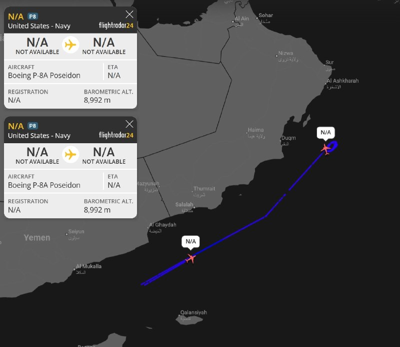

✈️پرواز هم‌زمان دو فروند Boeing P-8A Poseidon آمریکایی در دریای عرب , پایش دریایی سنگین آمریکا در نزدیکی خلیج عدن و دریای عمان

@mwarmonitor

## mwarmonitor — post 9792

  

🔴سخنگوی عرب زبان ارتش اسرائیل ؛ «به چه حال و روزی برگشتی ای عید؟ قطعاً بدون آن‌ها، عید بهتر و امن‌تر است!

🔸ترور فرمانده شاخه نظامی جدید حماس، تروریستی به نام محمد عوده، بار دیگر تأیید می‌کند: هر کسی که دستش به خون ۷ اکتبر آلوده است، و هر کسی که تمام عمرش را در ترویج ترور و ویرانی گذرانده، اکنون یکی‌یکی مانند مهره‌های دومینو سقوط می‌کنند. هر کسی که ترور را شیوه زندگی خود قرار داده باشد، از حسابرسی فرار نخواهد کرد.

🔹عید قربان امسال طعم عدالت در حال تحقق را دارد.»

@mwarmonitor

## FoxNewsTwitter — post 342296

  

Fox News (Twitter/X)

NEW: President Trump taking a victory lap after Ken Paxton’s GOP Senate primary win in Texas after his endorsement and taking aim at Democrats in the Lone Star State.

“Congratulations to Ken Paxton on such a tremendous win."

“His opponent, Alfred E. Neuman, may be the worst TEXAS candidate I have ever seen. A strong Open Borders advocate, he is WEAK ON CRIME, believes there are 6 genders, is insulting to Jesus Christ, will never support the Military, was a big Mask Wearer until recently, and is a Vegan who dislikes meat."

## pm_afshaa — post 91646

vless://47030ea3-4e8c-4dd6-b440-418a7a54c1a0@47.82.87.196:50724?encryption=none&security=none&type=tcp&headerType=none#PMTV%20NEWS%20%F0%9F%A6%81%E2%98%80%EF%B8%8F

نامحدود سرعت بالا مخصوص اینستا و دانلود

💧 Rainbet.com the #1 Non-KYC Crypto Casino & Sportsbook @rainbetcom

😁 @Pm_Afshaa

## pm_afshaa — post 91645

🔴شبکه 12 اسرائیل:ناوگان هوایی آمریکا ظرف 72 ساعت به پایگاه‌های خود در اروپا منتقل خواهد شد و در صورت از سرگیری درگیری با ایران، هواپیماها در حالت آماده‌باش برای بازگشت به فرودگاه بن گوریون قرار خواهند گرفت

💧 Rainbet.com the #1 Non-KYC Crypto Casino & Sportsbook @rainbetcom

😁 @Pm_Afshaa

## pm_afshaa — post 91644

https://t.me/proxy?server=tg.capycore.ru&port=443&secret=27ebe852539fb8ec5f327c73262bb721

پروکسی مناسب دانلود فیلم و سریال

💧 Rainbet.com the #1 Non-KYC Crypto Casino & Sportsbook @rainbetcom

😁 @Pm_Afshaa

## pm_afshaa — post 91643

🔴آمریکا اجازه اقامت به تیم ملی فوتبال جمهوری اسلامی در بازی های جام جهانی ر‌و نداده و برای هر بازی که تو آمریکا داره؛ فقط همون 2 ساعت اجازه اقامت داره و بعد از بازی سریع باید برگرده مکزیک

💧 Rainbet.com the #1 Non-KYC Crypto Casino & Sportsbook @rainbetcom

😁 @Pm_Afshaa

## pm_afshaa — post 91642

https://t.me/proxy?server=tg.capycore.ru&port=443&secret=27ebe852539fb8ec5f327c73262bb721

پروکسی سرعت بالا متصل

💧 Rainbet.com the #1 Non-KYC Crypto Casino & Sportsbook @rainbetcom

😁 @Pm_Afshaa

## pm_afshaa — post 91641

اگه میخوای از اخبار جا نمونی ٬ تو کانال مردمی Fighter Radar جوین باش

https://t.me/+9C1ENi5qn6hhZjk0
https://t.me/+9C1ENi5qn6hhZjk0

حتما جوین باشید ثانیه‌ای پوشش میدن

## pm_afshaa — post 91640

https://t.me/proxy?server=tg.capycore.ru&port=443&secret=27ebe852539fb8ec5f327c73262bb721 پروکسی متصل سرعت بالا 
💧 Rainbet.com the #1 Non-KYC Crypto Casino & Sportsbook @rainbetcom 
😁 @Pm_Afshaa

## pm_afshaa — post 91639

https://t.me/proxy?server=tg.capycore.ru&port=443&secret=27ebe852539fb8ec5f327c73262bb721

پروکسی متصل سرعت بالا

💧 Rainbet.com the #1 Non-KYC Crypto Casino & Sportsbook @rainbetcom

😁 @Pm_Afshaa

## pm_afshaa — post 91638

  <a href="https://t.me/pm_afshaa/91638" target="_blank">📎 Download file</a>

نپسترنت سرعت بالا برا تمامی اوپراتورها

بفرستین برا بقیه هم وصل شن

💧 Rainbet.com the #1 Non-KYC Crypto Casino & Sportsbook @rainbetcom

😁 @Pm_Afshaa

## pm_afshaa — post 91637

همراه اول امروز در پیامی به کاربران اینترنت پرو اعلام کرد در صورت تمایل می‌توانید اینترنت خود را به حالت قبل برگردانید

💧 Rainbet.com the #1 Non-KYC Crypto Casino & Sportsbook @rainbetcom

😁 @Pm_Afshaa

## pm_afshaa — post 91636

vless://406d8436-0eb9-4eb2-84fb-960e076ffba6@162.159.38.183:2083?encryption=none&security=tls&sni=de.lezzatzone.ir&fp=chrome&alpn=h2%2Chttp%2F1.1&insecure=0&allowInsecure=0&type=xhttp&host=de.lezzatzone.ir&path=%2Fde&mode=stream-one#PMTV%20NEWS%20%F0%9F%A6%81%E2%98%80%EF%B8%8F

نامحدود پر سرعت

💧 Rainbet.com the #1 Non-KYC Crypto Casino & Sportsbook @rainbetcom

😁 @Pm_Afshaa

## pm_afshaa — post 91635

vless://76bc8e3d-0e6b-4a35-b1a7-7f5158042666@45.76.83.35:54985?encryption=none&security=none&type=tcp&headerType=none#PMTV%20NEWS%20%F0%9F%A6%81%E2%98%80%EF%B8%8F

نپسترنت نا محدود سرعت بالا

💧 Rainbet.com the #1 Non-KYC Crypto Casino & Sportsbook @rainbetcom

😁 @Pm_Afshaa

## pm_afshaa — post 91634

vless://6af5890f-5267-40ed-bc60-1bd3ee31a88b@45.38.23.87:8080?encryption=none&security=none&type=ws&path=%2F#PMTV%20NEWS%20%F0%9F%A6%81%E2%98%80%EF%B8%8F

نامحدود سرعت موشکی
🚀

💧 Rainbet.com the #1 Non-KYC Crypto Casino & Sportsbook @rainbetcom

😁 @Pm_Afshaa

## pm_afshaa — post 91633

علم‌ الگدا: نبود گوشت تو یخچال مردم مشکل بزرگی نیست چون وضعیت کشور جنگیه و اگر گوشت هم نداشته باشن که بخورن اشکالی نداره

💧 Rainbet.com the #1 Non-KYC Crypto Casino & Sportsbook @rainbetcom

😁 @Pm_Afshaa

## pm_afshaa — post 91632

🔴معاون وزیر امور خارجه روسیه:ما آمادگی خود را برای انتقال اورانیوم غنی‌شده از ایران به واشنگتن اطلاع داده‌ایم و این پیشنهاد همچنان روی میز است

💧 Rainbet.com the #1 Non-KYC Crypto Casino & Sportsbook @rainbetcom

😁 @Pm_Afshaa

## pm_afshaa — post 91631

tg://proxy?server=r10.proxytg.space&port=8443&secret=ee65032756d1cfb78ebbd0ea8db83d43937231302e70726f787974672e7370616365

پروکسی متصل سرعت بالا

💧 Rainbet.com the #1 Non-KYC Crypto Casino & Sportsbook @rainbetcom

😁 @Pm_Afshaa

## pm_afshaa — post 91630

🔴خبر هایی داره توسط رسانه های آمریکایی پخش میشه که جی دی ونس اطلاعاتی که ترامپ فقط با اون در میون گذاشته بوده رو لو میداده

💧 Rainbet.com the #1 Non-KYC Crypto Casino & Sportsbook @rainbetcom

😁 @Pm_Afshaa

## pm_afshaa — post 91629

https://t.me/proxy?server=172.65.38.26&port=9443&secret=ee09db815a6d82a31fda76f872230c69d7706b676275696c642e6f7267 پروکسی متصل 
💧 Rainbet.com the #1 Non-KYC Crypto Casino & Sportsbook @rainbetcom 
😁 @Pm_Afshaa

## pm_afshaa — post 91628

https://t.me/proxy?server=172.65.38.26&port=9443&secret=ee09db815a6d82a31fda76f872230c69d7706b676275696c642e6f7267

پروکسی متصل

💧 Rainbet.com the #1 Non-KYC Crypto Casino & Sportsbook @rainbetcom

😁 @Pm_Afshaa

## pm_afshaa — post 91627

https://t.me/proxy?server=49.13.35.164&port=8443&secret=dd104462821249bd7ac519130220c25d09

پروکسی متصل خوراک دانلود

💧 Rainbet.com the #1 Non-KYC Crypto Casino & Sportsbook @rainbetcom

😁 @Pm_Afshaa

## iaghapour — post 2636

🔻بچه ها میگن انقدر پهنای باند دیتاسنتر ها پایین هستش که اکثر روش های تانل که اجرا میکنن سرعت بدی داره یا دچار قطع و وصلی و اختلال زیاد هستش.

خیلی به روش تانل بستگی نداره بیشتر مشکل پهنای باند ضعیف دیتاسنتر ها مربوط هست.

امیدوارم در روزهای آینده وضعیت بهتر بشه.

## DEJradio — post 5029

  

🔺احضار سفیر تهران در سئول؛ جمهوری اسلامی مسئول حمله به کشتی کره‌ای شناخته شد

کره جنوبی اعلام کرد سفیر جمهوری اسلامی را در اعتراض به حمله به یک کشتی کره‌ای در تنگۀ هرمز احضار می‌کند.
سئول پس از چند هفته بررسی اعلام کرد به احتمال بسیار قوی، یک موشک ساخت جمهوری اسلامی عامل حمله به کشتی اچ‌ام‌ام نامو، بود.
پارک یون‌جو، معاون وزیر امور خارجۀ کرۀ جنوبی، گفت تحلیل‌های فنی نشان می‌دهد پرتابۀ استفاده‌شده نسخه‌ای از موشک «نور» بود.
بنا بر داده‌ها روی برخی از قطعات موشک نیز نشانه‌هایی از یک تولیدکنندۀ ایرانی دیده شد.
این کشتی باری کره‌ای در ۱۴ اردیبهشت امسال هدف حمله قرار گرفت.
به گفته مقام‌های کره‌ای، یکی از موشک‌ها درحدود هفت متر در بدنۀ کشتی نفوذ کرده بود.

#خبر #دژ #کره_جنوبی #تنگه_هرمز
@DEJradio

## DEJradio — post 5028

⭕️ پاکستان باید به درخواست ترامپ برای پیوستن به پیمان ابراهیم پاسخ بدهد

لیندزی گراهام، سناتور جمهوری‌خواه آمریکایی گفت با توجه به درخواست دونالد ترامپ برای پیوستن کشورهای اسلامی به پیمان ابراهیم، پاکستان باید موضع خود را روشن کند.
گراهام بار دیگر از نقش پاکستان در میانجی‌گری میان جمهوری اسلامی و آمریکا انتقاد کرد.
این سناتور برجستۀ آمریکایی افزود دشمنی پاکستان با اسرائیل، پیشینه‌ای طولانی دارد.
گراهام تأکید کرد استقرار هواپیماهای نظامی جمهوری اسلامی در پایگاه‌های پاکستان غیرقابل انکار است.
این سیاستمدار نزدیک به ترامپ پیش‌تر نیز گفته بود اگر گزارش‌ مربوط به پناه گرفتن هواپیماهای جمهوری اسلامی در پاکستان درست باشد، نقش اسلام‌آباد به‌عنوان میانجی باید بازنگری شود.

#خبر #دژ #توافق_ابراهیم #پاکستان
@DEJradio

## DEJradio — post 5027

⭕️ ترامپ پس از معاینۀ سه‌ساعتۀ پزشکی از وضعیت سلامتی‌ عالی خود خبر داد

دونالد ترامپ، رئیس‌ جمهوری آمریکا شامگاه سه‌شنبه پس از انجام یک معاینۀ سه‌ساعته در مرکز پزشکی نظامی والتر رید، اعلام کرد همه چیز کاملا عالی بود.
به گزارش کاخ سفید این مراجعه بخشی از معاینات پیشگیرانۀ پزشکی و دندانپزشکی بوده است.
ترامپ در خرداد ماه ماه آینده ۸۰ ساله می‌شود. این چهارمین معاینۀ پزشکی علنی ترامپ از آغاز دور دوم ریاست‌جمهوری او به شمار می‌رود.

#خبر #دژ #ترامپ
@DEJradio

## DEJradio — post 5026

  <a href="telegram/content/DEJradio_5026_1779883665.mp4" target="_blank">🎬 Download video</a>

⭕️ اسرائیل از حذف فرماندۀ تازۀ شاخۀ نظامی حماس در غزه خبر داد

ارتش اسرائیل و شاباک اعلام کردند محمد عوده، فرماندۀ تازۀ شاخۀ نظامی حماس در غزه، در حملۀ هوایی شامگاه سه‌شنبه در شمال غزه کشته شد.
به گفتۀ مقام‌های اسرائیلی، عوده پس از کشته شدن عزالدین حداد در هفتۀ پیشین، فرماندهی شاخۀ نظامی حماس را برعهده گرفته بود.
ارتش اسرائیل اعلام کرد عوده از طراحان حملۀ تروریستی هفتم اکتبر بود.
بنا بر گزارش ارتش اسرائیل، محمد عوده در جریان جنگ نیز عملیات اطلاعاتی و حملات علیه نیروهای اسرائیلی را هدایت می‌کرد.
حماس که سال‌ها از پشتیبانی مالی و فکری جمهوری اسلامی برخوردار بود، در سیاهۀ تروریستی آمریکا و اروپا قرار دارد.
رسانه‌های نزدیک به حماس مدعی شدند محمد عوده همراه با همسر و پسرانش کشته شده است.
یسرائیل کاتز، وزیر دفاع اسرائیل نوشت: ما خود را متعهد کرده‌ایم همۀ کسانی را که کشتار هفتم اکتبر را رهبری کردند از میان برداریم.
به گفتۀ کاتز، همه این افراد، در هر جا که باشند، نشان شده‌اند.

#خبر #دژ #اسرائیل #حماس
@DEJradio

## DEJradio — post 5025

  <a href="telegram/content/DEJradio_5025_1779883666.webm" target="_blank">🎬 Download video</a>

🔺📢 پاشنه آشیل جمهوری اسلامی؛ بحران مشروعیت برای هواداران

*پژمان گلچین، پژوهشگر فلسفه

#پاشنه_آشیل #جنگ
@DEJradio

## DEJradio — post 5024

⭕️ اروپا از گسترش تهدیدهای روسیه به حوزۀ بالتیک و حملات سایبری نگران است

گزارش‌ها نشان می‌دهد نگرانی اروپا در مورد روسیه از جنگ اوکراین فراتر رفته و اکنون احتمال تهدید کشورهای بالتیک و تشدید حملات سایبری نیز مطرح است.
کایا کالاس، مسئول سیاست خارجی اتحادیۀ اروپا هشدار داد اگر کرملین برای ادامۀ جنگ به بسیج تازه نیاز پیدا کند، ممکن است به سمت تشدید تنش در منطقه حرکت کند.
همچنین رئیس سازمان اطلاعات ارتباطات در دولت بریتانیا گفت روسیه به‌طور مداوم زیرساخت‌های حیاتی، روندهای دموکراتیک و زنجیره‌های تأمین در اروپا را هدف قرار می‌دهد.

#خبر #دژ #سایبری #اروپا
@DEJradio

## DEJradio — post 5023

⭕️ از آغاز عملیات «غرش شیران» درحدود ۲۵۰۰ عضو حزب‌الله کشته شدند؛ مخالفت ترامپ با حملۀ دوبارۀ اسرائیل به بیروت

بنیامین نتانیاهو، نخست‌وزیر اسرائیل گفت از آغاز عملیات «غرش شیران» درحدود ۲۵۰۰ عضو حزب‌الله کشته شدند.
شبه‌نظامیان حزب‌الله لبنان که توسط جمهوری اسلامی هدایت می‌شوند، در سیاهۀ تروریستی اتحادیۀ اروپا و آیالات متحده قرار دارند.
نخست‌وزیر اسرائیل افزود تنها در دورۀ آتش‌بس جنگ چهل روزه ۷۰۰ عضو حزب‌الله کشته شدند.
به گفتۀ نتانیاهو، این رقم از کل تلفات حزب‌الله در جنگ دوم لبنان بیشتر بود.
رسانۀ اسرائیلی وای‌نت گزارش داد نتانیاهو و یسرائیل کاتز، وزیر دفاع در نشست کابینۀ امنیتی، دلیل خودداری از حملۀ دوباره به بیروت را مخالفت آمریکا عنوان کرده‌اند.
از سویی شرکت تسلیحاتی اسرائیلی البیت سیستمز، از امضای قرارداد ۱.۴ میلیارد دلاری فروش تسلیحات به یک کشور اروپایی خبر داد. نام این کشور اعلام نشده است.

#خبر #دژ #اسرائیل #غرش_شیران
@DEJradio

## DEJradio — post 5022

⭕️ واردات نفت به چین به پایین‌ترین سطح از سال ۲۰۱۶ سقوط کرد

شرکت اطلاع‌رسانی کالا «کپلر» اعلام کرد واردات روزانۀ نفت به چین در ماه جاری میلادی به ۶.۶ میلیون بشکه کاهش یافته است. این رقم پایین‌ترین سطح از سال ۲۰۱۶ به شمار می‌رود.
به گزارش کپلر، انسداد تنگۀ هرمز از سوی جمهوری اسلامی عامل اصلی این افت شدید بود.
چین سال گذشته روزانه درحدود ۱۱ میلیون و ۵۵۰ هزار بشکه نفت وارد می‌کرد که حدودا ۴۵ درصد آن از کشورهای حوزۀ خلیج فارس تأمین می‌شد.
به گزارش کپلر، کاهش خرید نفت توسط چین سبب شده نفت بیشتری در اختیار پالایشگاه‌های دیگر کشورهای آسیایی قرار گیرد.

#خبر #دژ #چین #نفت
@DEJradio

## DEJradio — post 5021

⭕️ جمهوری اسلامی نیروهای بسیج را برای استفاده از موشک‌های دوش‌پرتاب تحت آموزش قرار داد

شبکۀ فرانس۲۴ گزارش داد به ویدئوها و اسنادی دست یافته که نشان می‌دهد نیروهای نظامی جمهوری اسلامی آموزش گستردۀ استفاده از موشک‌های دوش‌پرتاب «منپدز» به اعضای بسیج‌ را ازسر گرفته‌اند.
سامانۀ دوش‌پرتاب مپندز، شامل موشک‌هایی سبک و هدایت‌شونده است که به‌صورت تک‌نفره قابل استفاده است.
این سامانه بدون نیاز به رادار، هواپیما را با حسگر ردیابی می‌کند و موشک‌های آن بردی بین پنج تا ده کیلومتر دارند.
بر اساس این گزارش، رژیم در جریان جنگ چهل روزه با استفاده از این سامانه‌ها سعی کرد ده‌ها هواپیمای آمریکایی را هدف بگیرد.
فرانس۲۴ همچنین گزارش داده ویدئوها و فایل‌های آموزشی در مورد موشک‌های «میثاق-۱» و «سهند-۳» نیز چند روز پس از آغاز آتش‌بس، در میان هزاران نیروی بسیج توزیع شد.
به گفتۀ کارشناسان، کار با این سامانه‌ها ساده است و حتا آموزش کوتاه‌مدت نیز می‌تواند برای یادگیری استفاده از آن و هدف قرار دادن هواپیماهایی که در ارتفاع پایین پرواز می‌کنند، کافی باشد.
فرانس۲۴ همچنین خبر داد جمهوری اسلامی علاوه بر تولید داخلی، احتمالا شماری از سامانه‌های روسی وربا و نمونه‌هایی از سامانه‌های دوش‌پرتاب چینی را نیز در اختیار دارد.

#خبر #دژ #مزدوران_بسیج
@DEJradio

## DEJradio — post 5020

⭕️ با وجود بازگشایی اینترنت، برخی کاربران هنوز امکان به‌روزرسانی ندارند

پس از بازگشایی اینترنت در ایران، شماری از کاربران همچنان از اختلال در دسترسی به گوگل‌پلی و دریافت آپدیت برنامه‌ها خبر می‌دهند.
ورود به فروشگاه گوگل‌پلی و دانلود یا نصب به‌روزرسانی اپلیکیشن‌ها برای برخی از کاربران ممکن نیست.
واتس‌اپ نیز با وجود بازگشت اینترنت همچنان در دسترس بسیاری از کاربران قرار ندارد.
پیش از قطعی سراسری اینترنت، واتس‌اپ تنها پیام‌رسان بین‌المللی پرکاربر بود که توسط رژیم فیلتر نشده بود.

#خبر #دژ #اینترنت
@DEJradio

## DEJradio — post 5019

⭕️ تهران در جست‌وجوی گشایش مالی بدون «اعلام پیروزی» ترامپ است

بنا بر گزارش‌ها، رژیم حاکم بر ایران به دلیل فشار شدید اقتصادی در پی گشایش مالی در مذاکرات و از سوی دیگر به دنبال جلوگیری از اعلام پیروزی توسط ترامپ‌ است.
وال‌استریت ژورنال به نقل از مقام‌های ایرانی و میانجی‌های عرب گزارش داد جمهوری اسلامی نمی‌خواهد شرایطی در تفاهم‌نامه ایجاد بشود که دونالد ترامپ بتواند اعلام پیروزی بکند.
بر اساس این گزارش، تهران همچنین به دنبال دسترسی به بخشی از حدود ۱۰۰ میلیارد دلار دارایی بلوکه‌شده و بازگشت به بازار جهانی نفت است.
این روزنامه نوشت با وجود حملۀ اخیر آمریکا در جنوب ایران، جمهوری اسلامی از مذاکرات دست نکشید.
وال‌استریت ژورنال، تأیید کرد محور اصلی سفر محمدباقر قالیباف به قطر، مذاکره دربارۀ آزادسازی ۲۴ میلیارد دلار از دارایی‌های بلوکه‌شدۀ جمهوری اسلامی بود.

#خبر #دژ #ترامپ #جمهوری_اسلامی
@DEJradio

## DEJradio — post 5018

⭕️ نیویورک‌تایمز: حملۀ آمریکا پس از شناسایی تهدیدهای جمهوری اسلامی انجام شد

نیویورک‌تایمز به نقل از دو مقام آمریکایی گزارش داد حملۀ شامگاه دوشنبۀ آمریکا به اهدافی در جنوب ایران، پس از شناسایی مجموعه‌ای از تهدیدها از سوی جمهوری اسلامی انجام شد.
بنا بر گزارش‌ها نیروهای آمریکایی متوجه فعالیت سامانه‌های پرتاب موشک، پرواز پهپادها و استقرار قایق‌های مین‌گذار در تنگۀ هرمز شده بودند.
سنتکام پیش‌تر اعلام کرده بود آمریکا قایق‌هایی را که در حال مین‌گذاری بودند و همچنین سامانه‌های پرتاب موشک را هدف قرار داده است.
با این که جمهوری اسلامی این حملات را «نقض آتش‌بس» خوانده، اما وال‌استریت ژورنال گزارش داد تهران خبر کشته شدن نیروهای سپاه را برای آسیب ندیدن روند مذاکرات با آمریکا، دیر منتشر کرد.

#خبر #دژ #سنتکام #تنگه_هرمز
@DEJradio

## DEJradio — post 5017

  <a href="telegram/content/DEJradio_5017_1779883666.mp4" target="_blank">🎬 Download video</a>

🚨📢 تصاویر ماهواره‌ای از ویرانه‌های فرودگاه مهرآباد در جنگ ۴۰ روزه

#جنگ۴۰روزه #فرودگاه_مهرآباد
@DEJradio

## DEJradio — post 5016

  <a href="telegram/content/DEJradio_5016_1779883668.mp4" target="_blank">🎬 Download video</a>

🔺🎥 با اتصال نسبی اینترنت در ایران، ویدیوهای زیادی از روزهای جنگ توسط شهروندان به رسانه‌ها ارسال شده است؛ یکی از آنها انهدام انبار مهمات پایگاه شکاری دزفول است. اول فروردین ۱۴۰۵ این پایگاه بمباران شد. این ویدیو در چند رسانه منتشر شده بود.
براساس گزارش‌های میدانی تقریبا تمام ظرفیت پایگاه دزفول از بین رفته است.

#اینترنت #جنگ #دزفول
@DEJradio

## DEJradio — post 5015

  <a href="telegram/content/DEJradio_5015_1779883670.webm" target="_blank">🎬 Download video</a>

🚨📢 کمک عمان و عراق به جمهوری اسلامی در دور زدن محاصره دریایی آمریکا

یک منبع داخلی به دژ می‌گوید دولت عمان از طریق بنادر صلاله، صحار و دقم به کشتی‌های جمهوری اسلامی در دور زدن محاصره دریایی بنادر ایران توسط آمریکا کمک می‌کند. شماری از عوامل سـ.ـپاه پاسداران به اسم نمایندگان گمرک و کشترانی ایران در این بنادر مستقر شدند و روند ترخیص و جابجایی کالاها را مدیریت می‌کنند. کشتی‌هی وابسته به جمهوری اسلامی با مدارک و اطلاعات جعلی در این بنادر پهلو می‌گیرند. همین وضعیت در بندر بندر ام‌القصر عراق برقرار است.
طبق اعلام سنتکام از آغاز محاصره دریایی ایران تا پنجم خرداد ۱۴۰۵ بیش از ۱۰۸ کشتی تجاری مجبور به تغییر مسیر شده‌اند.

#محاصره_دریایی #جنگ
@DEJradio

## DEJradio — post 5014

  <a href="telegram/content/DEJradio_5014_1779883670.webm" target="_blank">🎬 Download video</a>

🔺📢 انفجار هزینه‌ها در بازارهای قفل شده ایران؛

*عطا حسینیان، روزنامه‌نگار اقتصادی

#تورم #جنگ
@DEJradio

## mamlekate — post 103590

📝 ترامپ به ایران فرصت صلح داد اما نمی‌تواند به حاکمان مذهبی‌اش اعتماد کند

انتشار این خبر که دونالد ترامپ، رئيس‌جمهوری ایالات متحده، در اقدامی غیرمعمول، قرار است چهارشنبه با تمام اعضای کابینه خود جلسه داشته باشد، نشان می‌دهد او در حال بررسی راه‌هایی برای سرعت بخشیدن به مذاکرات به‌شدت کند و فرسایشی با جمهوری اسلامی ایران است.

@mamlekate

## mamlekate — post 103589

الو چهارشنبه ساعت ۱۳:۰۰ واحد هوا پتروشیمی دماوند که توی جنگ روز ۱۷ فروردین نیروگاهشون مورد اصابت قرار گرفته بود دچار انفجار شد. حداقل ۱ نفر کشته و ۴ نفر مجروح شدن. دلیل انفجار هنوز معلوم نیست.

@mamlekate

## IranIntlTV — post 339230

  

محسن زنگنه، عضو کمیسیون برنامه و بودجه مجلس، گفت جمهوری اسلامی درباره «اصل غنی‌سازی» مذاکره نمی‌کند اما درباره محدودیت درصد غنی‌سازی با آمریکا گفت‌وگو می‌کند.

زنگنه همچنین گفت روند مذاکرات با «هماهنگی کامل رهبری» پیش می‌رود و ابراز امیدواری کرد جمهوری اسلامی در عید غدیر «جشن پیروزی» بگیرد.
https://iranintl.com/202605273362

## IranIntlTV — post 339229

  <a href="telegram/content/IranIntlTV_339229_1779883671.mp4" target="_blank">🎬 Download video</a>

هم‌زمان با اعتراضات دانش‌آموزان در روزهای اخیر، صدها دانش‌آموز با ارسال پیام‌هایی به ایران‌اینترنشنال نسبت به برگزاری حضوری امتحانات پایان سال و بلاتکلیفی درباره وضعیت کنکور سراسری انتقاد کردند.

سبا حیدرخانی، عضو تحریریه ایران‌اینترنشنال، گزارش می‌دهد
@iranintltv

## IranIntlTV — post 339228

  <a href="telegram/content/IranIntlTV_339228_1779883672.mp4" target="_blank">🎬 Download video</a>

نت‌بلاکس اعلام کرد با اتصال دوباره شبکه‌های موبایل و بخشی از شبکه‌ها به اینترنت جهانی، سطح دسترسی به اینترنت در ایران به ۸۶ درصد رسیده است. با این حال کاربران همچنان از محدودیت در اینترنت خبر می‌دهند.
گفت‌وگو با نیما اکبرپور، کارشناش فناوری
@iranintltv

## IranIntlTV — post 339227

  

الی کوهن، وزیر انرژی اسرائیل و عضو کابینه سیاسی-امنیتی این کشور، با اشاره به آنچه «برنامه‌های راهبردی» برای دور زدن تهدیدهای جمهوری اسلامی علیه مسیرهای تجاری خواند، گفت: «تمام نبرد ایران در تنگه هرمز و آن اهرم راهبردی که به کار می‌گیرد، در حال از بین رفتن است.»

او افزود در روزهای اخیر گفت‌وگوهایی درباره ایجاد زیرساخت‌های انرژی از شرق به غرب در جریان است و هدف از این طرح‌ها، انتقال انرژی به اروپا از طریق اسرائیل عنوان شده است.

کوهن همچنین از مذاکرات برای ایجاد خطوط انتقال انرژی از مسیر کشورهای خلیج فارس خبر داد و گفت کشورهایی مانند عربستان سعودی و امارات متحده عربی، به عنوان تولیدکنندگان مهم انرژی، تمایل دارند در این طرح‌های اقتصادی مشارکت کنند.

به گفته وزیر انرژی اسرائیل، کریدور زیرساختی میان هند و اروپا از طریق کشورهای خلیج فارس و اسرائیل در دست بررسی است و استفاده از مسیر مصر نیز می‌تواند روند پیشبرد این طرح‌ها را تسریع کند. او تاکید کرد گفت‌وگوهای مشخصی در این زمینه در حال انجام است.
https://iranintl.com/202605274358

## IranIntlTV — post 339226

  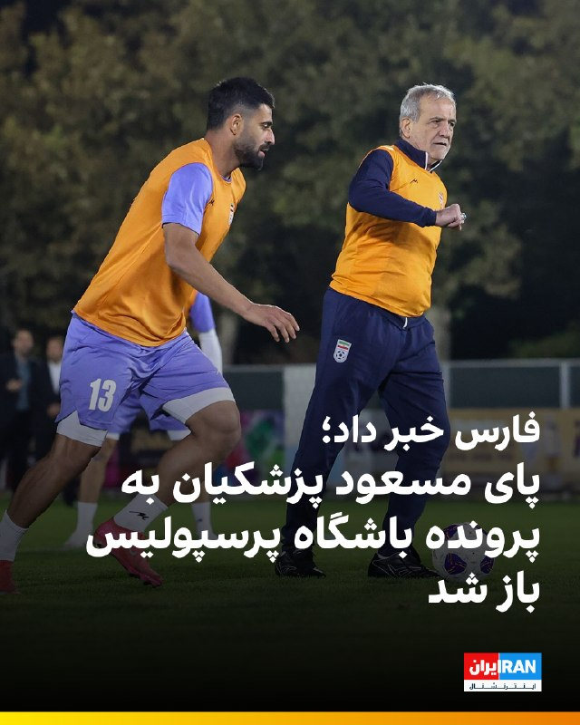

🔻خبرگزاری فارس، رسانه وابسته به سپاه پاسداران، گزارش داد نامه باشگاه پرسپولیس به مسعود پزشکیان، رییس‌جمهور دولت جمهوری اسلامی، وارد مرحله بررسی در نهاد ریاست‌جمهوری شده و در روزهای اخیر نشست‌هایی در این خصوص برگزار شده است.

🔹باشگاه پرسپولیس در نامه‌ای خطاب به پزشکیان، به شرایط فوتبال و سهمیه آسیایی اعلام شده اعتراض کرده بود.

🔹بر اساس این گزارش، دو نفر از نمایندگان نهاد ریاست‌جمهوری در روزهای اخیر با حدادی، مدیرعامل پرسپولیس، جلسه‌ای برگزار کرده و در جریان جزئیات درخواست‌ها و دغدغه‌های مطرح‌شده از سوی این باشگاه قرار گرفته‌اند.

🔹فارس نوشت این افراد همچنین جلساتی جداگانه با مهدی تاج، رییس فدراسیون فوتبال، و کشوری‌فرد، از مدیران ارشد سازمان لیگ، برگزار کرده‌اند تا ابعاد مختلف موضوع را بررسی کنند.

🔹به گزارش فارس، نمایندگان نهاد ریاست‌جمهوری پس از جمع‌بندی مباحث مطرح‌شده، قرار است به‌زودی گزارش نهایی خود را به مسعود پزشکیان ارائه دهند تا درباره درخواست‌های مطرح‌شده تصمیم‌گیری شود.

🔹جزییات بیشتر را در سایت بخوانید

@iranintltvsport

## IranIntlTV — post 339225

  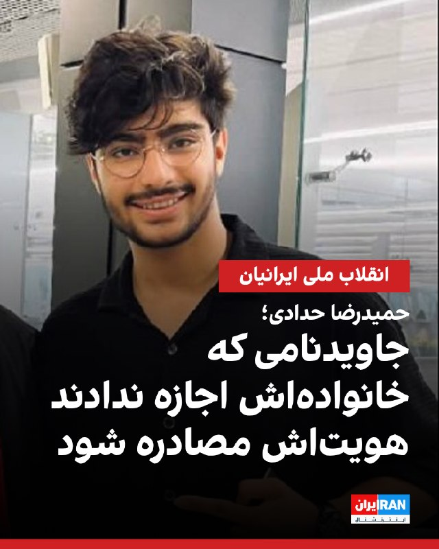

بر اساس اطلاعات رسیده به ایران‌اینترنشنال، حمیدرضا حدادی، جوان ۱۹ ساله اهل شاندیز، شامگاه ۱۸ دی‌ماه پس از اصابت گلوله به درمانگاه شاندیز منتقل شد اما از آنجا که دستور تخلیه درمانگاه صادر شده بود او بدون رسیدگی پزشکی جان باخت.

حمیدرضا تنها حدود نیم ساعت در میان جمعیت معترضان حضور داشت که از پشت هدف شلیک قرار گرفت. گلوله به ریه او اصابت کرد و او بر اثر شدت جراحات جان باخت.

حمیدرضا حدادی فوتبالیست بود و به گفته نزدیکانش آرزو داشت مسیر حرفه‌ای خود را در فوتبال دنبال کند. او همچنین قصد داشت یک مغازه فروش تلفن همراه برای خود راه‌اندازی کند.

پس از کشته شدن حمیدرضا، نیروهای حکومتی تلاش کردند او را به عنوان شهید معرفی کنند، اما خانواده با این موضوع مخالفت کردند. به گفته این منبع، نیروهای حکومتی بدون رضایت خانواده برای او مراسمی در مسجد برگزار کردند، اما اعضای خانواده در آن مراسم حضور نیافتند.

این منبع افزود خانواده حمیدرضا با وجود فشارهای شدید امنیتی، بر این روایت تاکید کرده‌اند که او در جریان اعتراضات و با شلیک نیروهای حکومتی کشته شده است.

https://iranintl.com/202605270118

## IranIntlTV — post 339224

سفیر اسرائیل در استرالیا: در صورت بی‌نتیجه ماندن مذاکرات، گزینه نظامی دوباره روی میز است

هیلل نیومن، سفیر اسرائیل در استرالیا، در گفت‌وگو با علیرضا محبی، خبرنگار ایران‌اینترنشنال، هشدار داد در صورتی که مذاکرات جاری با تهران به نتایج مورد نظر نرسد، احتمال ازسرگیری عملیات نظامی علیه جمهوری اسلامی وجود خواهد داشت.

نیومن چهارشنبه ششم خرداد اعلام کرد هدف این مذاکرات، «برچیدن توان هسته‌ای جمهوری اسلامی، توقف کامل غنی‌سازی و نبود هرگونه ذخیره اورانیوم غنی‌شده در ایران» است.

به گفته او، موضوع برنامه موشک‌های بالستیک جمهوری اسلامی و حمایت تهران از گروه‌های نیابتی که موجب بی‌ثباتی در سراسر خاورمیانه می‌شوند، از دیگر محورهای اصلی مذاکرات به شمار می‌رود.

نیومن ادامه داد: «اگر بتوانیم از طریق مذاکرات و گفت‌وگوهای دیپلماتیک به این اهداف برسیم، بسیار خوب است. در غیر این صورت ممکن است مجبور شویم دوباره به کارزار نظامی بازگردیم تا این اهداف را محقق کنیم. اما این اهداف حتما باید محقق شوند. ما نمی‌توانیم بر سر اهداف خود مصالحه کنیم.»

در روزهای گذشته، گمانه‌زنی‌ها درباره سرنوشت مذاکرات تهران و واشینگتن و مفاد توافق احتمالی دو طرف بالا گرفته است.

روزنامه وال‌استریت‌ ژورنال پنجم خرداد به نقل از مقام‌های حکومت ایران و میانجی‌های عرب گزارش داد تهران در مذاکرات با واشینگتن دو هدف اصلی را دنبال می‌کند: کاهش فشار اقتصادی و دسترسی دوباره به منابع مالی و بازار نفت.

بر اساس این گزارش، جمهوری اسلامی در عین حال تلاش دارد از ارائه امتیازهایی که بتواند از سوی دونالد ترامپ، رییس‌جمهوری آمریکا، به‌عنوان «پیروزی سیاسی» معرفی شود، خودداری کند.

تفاهم اسرائیل و آمریکا درباره مذاکرات
سفیر اسرائیل در استرالیا در ادامه مصاحبه با ایران‌اینترنشنال اعلام کرد آمریکا و اسرائیل در مورد اهداف مذاکرات با جمهوری اسلامی با یکدیگر «تفاهم» دارند و «درک مشترک» دو طرف این است که گفت‌وگوهای جاری باید به تحقق این اهداف بینجامد.

نیومن ادامه داد: «رییس‌جمهور ترامپ گفته است که درباره موضوع غنی‌سازی اورانیوم و توانایی هسته‌ای ایران مصالحه نخواهد کرد.»

او اضافه کرد: «ما مخالف راه‌حل دیپلماتیک نیستیم. ما می‌خواهیم جان انسان‌ها حفظ شود. اگر بتوانیم از طریق یک راه‌حل دیپلماتیک جان انسان‌ها را نجات دهیم، بسیار خوب است. بنابراین اکنون نیز از گفت‌وگوها حمایت می‌کنیم، به شرط آنکه مذاکرات به اهداف مورد نظر برسد.»

سفیر اسرائیل در استرالیا همچنین برجام را «توافقی بد» خواند و افزود اسرائیل در دوران ریاست‌جمهوری باراک اوباما، «تقریبا تنها کشوری» بود که به‌صراحت از این توافق انتقاد کرد.

در روزهای گذشته، ترامپ بارها رویکرد اوباما در قبال برنامه هسته‌ای جمهوری اسلامی را مورد انتقاد قرار داده و برجام را «فاجعه» خوانده است.

او پیش‌تر در واکنش به انتقادها از توافق احتمالی میان تهران و واشینگتن تاکید کرد حاضر به پذیرش «توافق بد» با جمهوری اسلامی نیست و توافق مدنظر او کاملا متفاوت از برجام خواهد بود.

ترامپ در نخستین دوره حضور خود در کاخ سفید، سیاست فشار حداکثری را در برابر حکومت ایران در پیش گرفت و سرانجام سال ۱۳۹۷ از برجام خارج شد.

نیومن: در حال ایجاد فرصت برای مردم ایران هستیم
سفیر اسرائیل در استرالیا در ادامه، از دستاوردهای کارزار نظامی اخیر علیه جمهوری اسلامی تمجید کرد و گفت تضعیف سپاه پاسداران و بسیج «موفقیت‌های عظیمی» هستند که نباید آن‌ها را نادیده گرفت.

نیومن تاکید کرد: «ما در حال ایجاد فرصت برای مردم ایران هستیم تا سرنوشت خود را به دست بگیرند و درباره رهبری آینده کشورشان تصمیم‌گیری کنند.»

او افزود اسرائیل آتش‌بس را پذیرفته، زیرا در پی آن است که «با حسن نیت، فرصت مناسبی برای گفت‌وگوها و حل‌وفصل دیپلماتیک مساله فراهم شود».

نیومن بار دیگر خاطرنشان کرد در صورت ناکامی مسیر دیپلماتیک، اسرائیل ممکن است بار دیگر گزینه نظامی را «با هماهنگی ایالات متحده» در دستور کار قرار دهد.
 
🔗وب‌سایت ایران‌اینترنشنال
@iranintltv

## IranIntlTV — post 339223

  

🔻آرینا سابالنکا، زن شماره یک تنیس جهان، که به دلیل استفاده از جواهرات ۱۰۰ هزار دلاری در رولان گاروس به ریاکاری متهم شده، اعلام کرد سبک زندگی مجلل او مانع تلاشش برای بهبود وضعیت مالی تنیس‌بازان کم‌درآمد نیست.

🔹ماجرا از جایی آغاز شد که این تنیس‌باز بلاروسی در نخستین مسابقه خود با دو گردنبند و گوشواره‌های الماس به ارزش ۱۰۰ هزار دلار وارد زمین شد. این موضوع بلافاصله جنجال‌برانگیز شد؛ زیرا ارزش این جواهرات تقریبا با جایزه ۹۴ هزار دلاری رقیب شکست‌خورده او در همان مسابقه برابری می‌کرد. از آنجا که سابالنکا یکی از چهره‌های اصلی اعتراض به توزیع ناعادلانه درآمدها در تورنمنت‌های بزرگ است، برخی رسانه‌ها و منتقدان او را به رفتار ریاکارانه متهم کردند.

🔹سابالنکا در کنفرانس خبری این اتهام را رد کرد و گفت ثروت شخصی‌اش ارتباطی به این مبارزه ندارد. او با اشاره به درآمد ۱۵ میلیون دلاری خود در فصل گذشته گفت هدفش حمایت از بازیکنان رده‌های پایین‌تر، نسل جدید و تنیس‌بازان آسیب‌دیده‌ای است که برای بقا در دنیای حرفه‌ای تنیس تلاش می‌کنند.
@iranintltvsport

## IranIntlTV — post 339222

  <a href="telegram/content/IranIntlTV_339222_1779883676.mp4" target="_blank">🎬 Download video</a>

سرخط خبرهای چهارشنبه ۶ خرداد
@iranintltv

## IranIntlTV — post 339221

  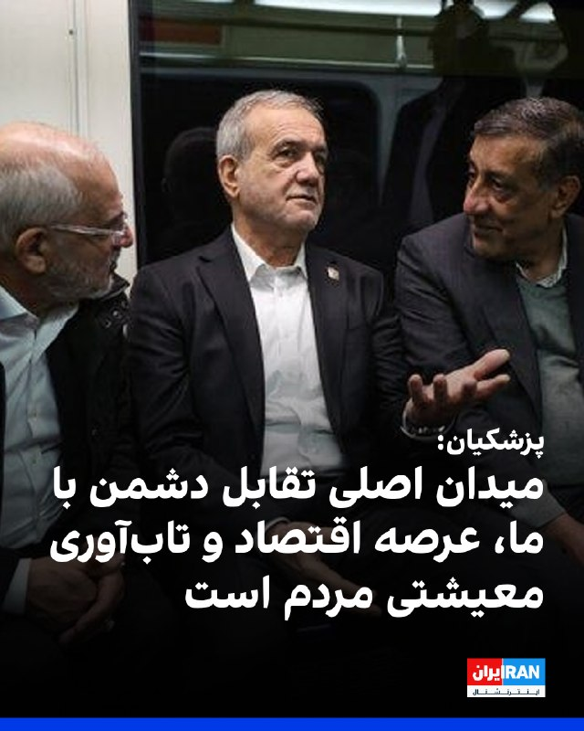

مسعود پزشکیان، رییس‌جمهور دولت جمهوری اسلامی، عامل بحران اقتصادی در کشور را «جنگ اقتصادی دشمن» خواند و گفت میدان اصلی تقابل امروز، جنگ اقتصادی و هدف‌گیری تاب‌آوری کشور است.

او افزود: «میدان اصلی تقابل امروز، جنگ اقتصادی و هدف‌گیری تاب‌آوری کشور است.»

پزشکیان ادامه داد: «دشمن پس از ناکامی در تحقق اهداف خود در عرصه نظامی، تمرکز خود را بر آسیب‌زدن به تاب‌آوری اقتصادی کشور و ایجاد اخلال در معیشت مردم قرار داده است.»
https://iranintl.com/202605273352

## IranIntlTV — post 339220

  <a href="telegram/content/IranIntlTV_339220_1779883678.mp4" target="_blank">🎬 Download video</a>

اتحادیه اروپا اعلام کرد وزیران امور خارجه این اتحادیه در یک نشست غیررسمی در شهر لیماسول قبرس درباره جنگ آمریکا و اسرائیل با جمهوری اسلامی، امنیت تنگه هرمز و ادامه جنگ در اوکراین گفت‌وگو می‌کنند.
لی‌لی نیکفر، خبرنگار ایران‌اینترنشنال، گزارش می‌دهد
@iranintltv

## IranIntlTV — post 339219

کره جنوبی: حمله به کشتی نامو در تنگه هرمز احتمالا با موشک ایرانی انجام شده است

وزارت خارجه کره جنوبی چهارشنبه ششم خرداد اعلام کرد حمله به کشتی باری نامو متعلق به شرکت کشتیرانی اچ‌ام‌ام در تنگه هرمز در اوایل ماه جاری میلادی، احتمالا با یک موشک ضدکشتی ایرانی انجام شده است.

خبرگزاری رویترز اعلام کرد که سفارت جمهوری اسلامی در سئول هنوز به درخواست این خبرگزاری برای اظهار نظر درباره این موضوع، پاسخ نداده است.

وزارت خارجه کره جنوبی این ارزیابی را هم‌زمان با اعلام نتایج تحقیقات دولتی درباره حمله ۱۴ اردیبهشت به کشتی فله‌بر «نامو» منتشر کرد. حمله‌ای که باعث آتش‌سوزی و آسیب به بخش پایینی بدنه عقب کشتی شد.

بررسی بقایای موشک
تحقیقات انجام شده بر بررسی قطعات و بقایای اشیای ناشناخته‌ای متمرکز بوده است که پس از حمله در داخل کشتی نامو پیدا شدند.

بر اساس نتایج این بررسی، کشتی دو بار هدف قرار گرفته است؛ به‌طوری‌که کلاهک نخست منفجر نشده اما کلاهک دوم انفجار ایجاد کرده است.

وزارت خارجه کره جنوبی اعلام کرد قطعات به‌دست‌‌آمده نشان می‌دهند این تسلیحات احتمالا در ایران ساخته شده‌اند.

پارک یون‌جو، معاون اول وزیر خارجه کره جنوبی، گفت موتورهای این قطعات به موتورهای توربوجت ساخت ایران شباهت دارند و یکی از قطعات نیز دارای نشانه‌هایی است که به نظر می‌رسد متعلق به یک تولیدکننده ایرانی باشد.

او افزود کلاهک‌های استفاده‌شده به نمونه‌های به‌کار رفته در موشک‌های ضدکشتی ایرانی «نور» یا «قادر» شباهت دارند.

احضار سفیر جمهوری اسلامی
پارک گفت دولت کره جنوبی سفیر جمهوری اسلامی را احضار خواهد کرد تا نتایج تحقیقات را با او در میان بگذارد و پیام اعتراضی سئول را منتقل کند.

به گفته او، سئول همچنین از تهران خواهد خواست اقدام‌های مسئولانه‌ای برای جلوگیری از تکرار چنین حادثه‌ای انجام دهد.

دونالد ترامپ، رییس‌جمهوری آمریکا، اندکی پس از این حادثه گفته بود جمهوری اسلامی به کشتی کره جنوبی شلیک کرده و از سئول خواسته بود به تلاش‌های تحت رهبری آمریکا برای تامین امنیت کشتیرانی در تنگه هرمز بپیوندد.

تهران پیش‌تر هرگونه مسئولیت در این حمله را رد کرده بود.

پس از وقوع این حمله، دفتر ریاست‌جمهوری کره‌جنوبی اعلام کرده بود در حال بررسی دقیق علت انفجار است.

در بیانیه دفتر ریاست جمهوری کره جنوبی تاکید شده بود: «شناسایی علت دقیق حادثه در اولویت قرار دارد.»

یکی از مقامات کره جنوبی به خبرگزاری دولتی یان‌هپ گفته بود: «علت آتش‌سوزی کشتی هنوز تایید نشده و به نظر می‌رسد تنها پس از انجام تحقیقات بیشتر (پس از یدک‌کشی بدنه کشتی به بندر) مشخص شود.»
 
🔗وب‌سایت ایران‌اینترنشنال
@iranintltv

## IranIntlTV — post 339218

  

پس از گذشت حدود سه ماه از کشته شدن علی خامنه‌ای، رهبر جمهوری اسلامی، و اعضای خانواده او در حمله مشترک اسرائیل و آمریکا، رسانه‌های ایران اعلام کردند مراسم ختم خانواده علی و مجتبی خامنه‌ای هفته جاری در مصلای عبدالعظیم حسنی در شهر ری برگزار می‌شود.

بر اساس اعلامیه منتشرشده از سوی خانواده رهبر جمهوری اسلامی، این مراسم برای بشری حسینی خامنه‌ای، دختر علی خامنه‌ای، مصباح‌الهدی باقری، همسر بشری حسینی خامنه‌ای، زهرا حداد عادل، همسر مجتبی خامنه‌ای، و زهرا محمدی گلپایگانی، نوه علی خامنه‌ای، برگزار خواهد شد.

علی خامنه‌ای نهم اسفند‌ماه به همراه بخشی از خانواده و همراهانش در حملات مشترک اسرائیل و آمریکا کشته شد. با وجود گذشت سه ماه، هنوز مراسم تشییع جنازه او برگزار نشده است.
https://iranintl.com/202605273113

## IranIntlTV — post 339217

  <a href="telegram/content/IranIntlTV_339217_1779883680.mp4" target="_blank">🎬 Download video</a>

کاربران به ایران‌اینترنشنال گزارش دادند که پس از حدود سه ماه قطع سراسری، دسترسی به اینترنت بین‌المللی در ایران به‌تدریج و با سرعت محدود برقرار شده است. آن‌ها با اشاره به آسیب به کسب‌وکارهای آنلاین، این وضعیت را عامل فشار اقتصادی دانسته و اینترنت را حق طبیعی خود توصیف کرده‌اند.
@iranintltv

## IranIntlTV — post 339216

  <a href="telegram/content/IranIntlTV_339216_1779883681.mp4" target="_blank">🎬 Download video</a>

شهروندان در ایران پس از اتصال دوباره به اینترنت بین‌الملل، پیام‌های زیادی برای مدیابات ایران‌اینترنشنال ارسال کردند. آنها می‌گویند اینترنت همچنان کند است و به وضعیت پیش از دی‌ماه بازنگشته است.

لیلا سعادتی، عضو تحریریه ایران‌اینترنشنال، گزارش می‌دهد
@iranintltv

## IranIntlTV — post 339215

  

🔻روزنامه آس اسپانیا در گزارشی نوشت باشگاه رئال مادرید در آستانه ثبت یک رکورد مالی بی‌سابقه در تاریخ ورزش جهان قرار دارد. بر اساس پیش‌بینی‌های اولیه، درآمد کهکشانی‌ها در سال جاری از مرز ۱ میلیارد و ۲۰۰ میلیون یورو عبور کرده است؛ رقمی که تاکنون هیچ باشگاه ورزشی در جهان به آن دست نیافته است.

🔹رئال مادرید که طبق آمار «دلویت» سه فصل متوالی پردرآمدترین باشگاه جهان بوده، بخش عمده این موفقیت را مدیون جهش چشمگیر در بخش تجاری است. مادریدی‌ها در فصل ۲۵-۲۰۲۴ با رشد ۲۳ درصدی، ۵۹۴ میلیون یورو از بازاریابی و فروش محصولات باشگاه درآمد کسب کردند. همچنین بازسازی ورزشگاه سانتیاگو برنابئو باعث شد درآمد ورزشگاه به ۲۳۳ میلیون یورو برسد.

🔹حضور در جام جهانی باشگاه‌ها با هدایت ژابی آلونسو و صعود به یک‌چهارم نهایی اروپا با آربلوآ نیز به این سودآوری کمک کرد. «آس» در پایان گزارش خود نوشت مادریدی‌ها با تمدید قرارداد با شرکت هواپیمایی امارات تا سال ۲۰۳۱ و مذاکره با آدیداس، به دنبال افزایش ارزش اسپانسرهای پیراهن خود به ۳۰۰ میلیون یورو در سال هستند.
@iranintltvsport

## IranIntlTV — post 339214

  <a href="telegram/content/IranIntlTV_339214_1779883683.mp4" target="_blank">🎬 Download video</a>

در حالی که برخی بازی‌های تدارکاتی پیش‌بینی‌شده تیم فوتبال ایران لغو شده‌اند، این تیم قرار است برابر گامبیا و مالی به میدان برود. همزمان، انتخاب تیخوانا در مکزیک به‌عنوان محل اقامت ایران در جام جهانی با انتقادهایی درباره موقعیت جغرافیایی و شرایط امنیتی این شهر همراه شده است.

ارزیابی بیشتر با رها پوربخش، عضو تحریریه ورزشی ایران‌اینترنشنال
@iranintltv

## IranIntlTV — post 339213

  

علی باقری‌کنی، معاون دبیر شورای عالی امنیت ملی، با بیان اینکه «تماس‌های غیرمستقیم میان جمهوری اسلامی و آمریکا ادامه دارد» گفت: «موضوع ذخایر اورانیوم غنی‌شده در دستور کار مذاکرات نیست.»

او افزود جمهوری اسلامی و عمان در حال مذاکره درباره رویه جدید عبور کشتی‌ها از تنگه هرمز هستند.
https://iranintl.com/202605272209

## IranIntlTV — post 339212

🗣روایت شما پس از بازگشت به اینترنت بین‌المللی- چهارشنبه ۶ خرداد

🔹با وجود باز شدن اینترنت در ایران، حتی با فیلترشکن‌های قوی هم هیچ‌یک از اپلیکیشن‌ها باز نمی‌شود.
🔹بالاخره بعد از سه ماه وصل شدم ولی احساس غریبی می‌کنم. اینستاگرام شده مثل قبرستون هزاران هزار اکانت که دیگه صاحبی نداره.
🔹نابود شدیم از گرونی وحشتناک. این گرونی و تورم رو هیچ‌کجای دنیا نمی‌تونن حتی چند روز تحمل کنن. اینترنت که حقمونه رو با ده‌ها شرط و منت باز کردن.
🔹بعد ۳ ماه وصل شدم. تلگرام روی آپدیت می‌مونه، پیام‌ها خیلی دیر ارسال و دریافت میشه و گوگل‌پلی هنوز برای همه کار نمی‌کنه. فقط دیشب به سختی تونستم آپدیت اندروید گوشیم رو انجام بدم.
🔹بالاخره اینترنت در ایران وصل شده و خیلی خوشحال شدیم، ولی یاد جاویدنامان از ذهن ما نمیره.
🔹هر کی میگه اینترنت در ایران وصل شده واقعا مغزش خرابه. کجا وصل شده؟ گوگل‌پلی وارد نمیشه و حتی نمی‌شه برنامه‌های سامسونگ رو آپدیت کرد.
🔹اینترنت وصل شده ولی خوشحال نیستم چون وقتی اینترنت وصل بشه یعنی اینکه هیچ اتفاقی قرار نیست بیافته و جمهوری اسلامی قراره بمونه.
🔹نگران اینترنت نباش چون برمی‌گرده، نگران جوونی‌مون باش که مفت رفت.
🔹کاش همین‌جوری که اینترنت‌ها برگشت، جوون‌هامون از زیر خاک برمی‌گشتن.
🔹ببین ما چقدر بدبخت شدیم که در عصر تکنولوژی، بعد از ۸۸ روز برای بازگشت اینترنت شادی می‌کنیم.
🔹اینها اینترنت‌ها رو وصل کردن که ما لال بشیم.
🔹درک نمی‌کنم یه سری‌ها خوشحالن و هیجانی شدن از وصل شدن اینترنت. الان یعنی بدبختی‌هاتون تموم شد؟
🔹برای من عجیبه که بعضی‌ها وصل شدن اینترنت رو تبریک میگن. این حق اولیه هر انسانیه و تبریک گفتن نداره.
🔹باورم نمیشه که میگین آزاد شدیم و خوشحالیم. این فقط فیلترنت هست و هیچی عوض نشده. زندگی ما و جوونیمون به باد رفت. فیلترنت خیلی محدود وصل شده ولی زندگی ما و اون همه جاویدنام دیگه برنمی‌گرده.

## IranIntlTV — post 339211

🗣روایت شما از بحران اقتصادی و زندگی در آتش‌بس- چهارشنبه ۶ خرداد:

🔹بچه‌ام در بخش کودکان بیمارستان ۱۷ شهریور رشت بستری است. داروهای سرطان نیست. بسته ۱۰۰ عددی قرص مرکاپتوپرین به سختی و فقط در بازار سیاه با قیمت چند برابری پیدا می‌شود.

🔹خیلی در فشاریم. اجاره خانه ۳ برابر شده. گوشت و مرغ را که خیلی وقت است نمی‌توانیم بخریم. روغن ۲ لیتری شده ۹۰۰ هزار تومان.

🔹من لوازم خانگی دارم. قیمت وسایل خانه از قبل عید تا الان به شدت افزایش داشته. یخچال دوقلو هیمالیا ۱۲۰ میلیون تومان بود الان شده ۲۵۰ میلیون، ماشین لباسشویی پاکشوما ۹ کیلویی ۶۰ میلیون بود، شده ۱۰۰ میلیون تومان. جوان‌هایی که می‌خواهند تازه زندگی مشترکشان را شروع کنند می‌آیند قیمت می‌کنند، با چشمان خیس از در خارج می‌شوند.

🔹فروشنده موبایلم؛ قیمت موبایل‌ها خیلی رفته بالا. عملا مشتری فقط برای خرید قاب و گلس مراجعه می‌کند و به ندرت گوشی می‌فروشیم.

🔹گرانی به شدت بیداد می‌کند. یک روغن، نوشابه و زردچوبه خریدم شد یک میلیون و ۲۰۰ هزار تومان.

🔹همه چیز گران شده. روغن پنج لیتری شده ۷۰۰ هزار تومان، چیپس ۵۵۰ هزار تومان، گوشت قرمز یک میلیون و ۳۰۰ هزار تومان.

🔹با خانه میانگین متری ۳۰۰ میلیون تومان در اصفهان چه‌کار کنیم؟ تازه کسی هم نمی‌فروشد و منتظرند گران‌تر شود.

## Shin_Persian — post 6258

  

Shin ✓ @hey_itsmyturn Wed, 27 May 2026 11:34:53 UTC #IDF 🇮🇱: "The first aircraft of its kind in the Air Force was inducted into the new refueling squadron - 'Gideon' The Chief of Staff at the induction ceremony: "The edifice of evil of the Ayatollah regime…

## Shin_Persian — post 6257

Shin ✓ @hey_itsmyturn
Wed, 27 May 2026 11:34:53 UTC

#IDF 🇮🇱:
"The first aircraft of its kind in the Air Force was inducted into the new refueling squadron - 'Gideon'

The Chief of Staff at the induction ceremony: "The edifice of evil of the Ayatollah regime has cracked significantly and its future and stability are shrouded in fog. Its leaders are pursued, most of its military capabilities have been destroyed, the nuclear program has been set back years; its economy is collapsing and its citizens have not yet understood the magnitude of the disaster to which their extremist leaders have led them""
#Iran

فارسی

#IDF 🇮🇱:
"نخستین هواپیما از این نوع در نیروی هوایی به اسکادران جدید سوخت‌رسان - 'گیدئون' ملحق شد.

رئیس ستاد کل نیروهای مسلح در مراسم الحاق: «بنای شرارت رژیم آیت‌الله‌ها به شدت ترک خورده و آینده و ثبات آن در هاله‌ای از ابهام است. رهبران آن تحت تعقیب هستند، اکثر توانمندی‌های نظامی‌اش نابود شده، برنامه هسته‌ای سال‌ها به عقب رانده شده؛ اقتصاد آن در حال فروپاشی است و شهروندانش هنوز ابعاد فاجعه‌ای را که رهبران افراطی‌شان آن‌ها را به سوی آن سوق داده‌اند، درک نکرده‌اند»"
#Iran

𝕏 · @shin_persian

## FarsiVOA — post 218795

  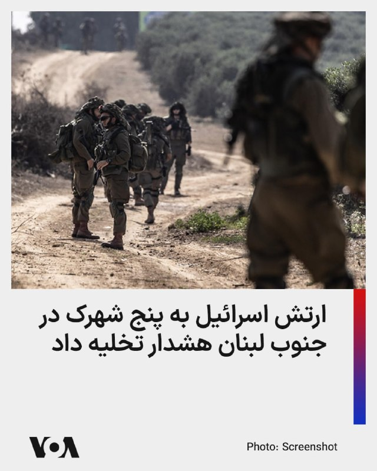

ارتش اسرائیل پیش از دور تازه حملات علیه مواضع حزب‌الله، به ساکنان پنج شهرک و روستا در جنوب لبنان هشدار تخلیه داد.

بر اساس اعلام ارتش اسرائیل، ساکنان کفار حونه، عرمتی، ملیخ، جرجوع و حومین الفوقا باید دست‌کم یک کیلومتر از محل زندگی خود دور شوند.

سخنگوی عربی ارتش اسرائیل مدعی شد این اقدام در واکنش به «نقض توافق آتش‌بس از سوی حزب‌الله» انجام می‌شود و ارتش قصد آسیب زدن به غیرنظامیان را ندارد.

این هشدار در ادامه موج تازه حملات اسرائیل در جنوب لبنان صادر شد. تایمز اسرائیل گزارش داد ارتش اسرائیل امروز بار دیگر زیرساخت‌های حزب‌الله را هدف قرار داده و دلیل آن را افزایش حملات پهپادی حزب‌الله به نیروهای اسرائیلی و مناطق شمالی اسرائیل اعلام کرده است.

آتش‌بس ۱۶ آوریل در روزهای اخیر به‌شدت شکننده شده است. رویترز گزارش داد اسرائیل روز سه‌شنبه بیش از ۱۲۰ حمله در جنوب و شرق لبنان انجام داد که دست‌کم ۳۱ کشته و ۴۰ زخمی برجا گذاشت.
@FarsiVOA

## FarsiVOA — post 218794

  

بریتانیا و لهستان قرار است پیمان دفاعی و امنیتی تازه‌ای امضا کنند؛ توافقی که هدف آن تقویت دفاع جمعی، حفاظت از مرزهای بریتانیا، مقابله با جرایم سازمان‌یافته و تعمیق همکاری لندن با اروپا اعلام شده است.

کی‌یر استارمر، نخست‌وزیر بریتانیا، در لندن میزبان دونالد توسک، نخست‌وزیر لهستان، خواهد بود. دولت بریتانیا می‌گوید این پیمان «بزرگ‌ترین گام رو به جلو» در روابط دفاعی و امنیتی دو کشور در یک نسل است.

دو طرف قرار است درباره افزایش حملات ترکیبی منتسب به روسیه، از جمله آتش‌سوزی‌های عمدی در شرق لندن، آتش‌سوزی محموله‌ها در بیرمنگام و اروپا، حملات سایبری، جاسوسی و عملیات اطلاعاتی مخرب گفت‌وگو کنند.

بر اساس این توافق، دو کشور در توسعه نسل جدید سامانه‌های پدافند هوایی، موشک‌های میان‌برد، جنگ پهپادی، جنگ الکترونیک و رزمایش‌های مشترک نیروهای زمینی همکاری گسترده‌تری خواهند داشت.

این پیمان هم‌زمان با نگرانی فزاینده اروپا از احتمال گسترش جنگ روسیه فراتر از اوکراین و تهدید کشورهای بالتیک امضا می‌شود.
@FarsiVOA

## FarsiVOA — post 218793

🔺افزایش بازداشت‌ها و اعدام ۳۷ تن در بحبوحه درگیری‌های نظامی در ایران

▪️ارگان خبری مجموعه فعالان حقوق بشر در ایران اعلام کرد همزمان با آغاز درگیری‌های نظامی میان ایران، آمریکا و اسرائیل، روند صدور و اجرای احکام اعدام در پرونده‌های سیاسی و امنیتی افزایش یافته و تاکنون ۳۷ شهروند اعدام شده‌اند.

▪️در این گزارش آمده است افزایش بازداشت‌ها و طرح اتهاماتی نظیر «جاسوسی» و «اقدام علیه امنیت ملی» علیه شهروندان، از جمله اقداماتی بوده که نهادهای امنیتی و اطلاعاتی جمهوری اسلامی در این دوره در پیش گرفته‌اند.

▪️بر اساس این گزارش، تنها در فاصله ۹ اسفند ۱۴۰۴ تا ۱۹ فروردین ۱۴۰۵ دست‌کم چهار هزار و ۲۳ شهروند توسط نیروهای اطلاعاتی و امنیتی جمهوری اسلامی بازداشت شده‌اند.

⬇️ بیشتر بخوانید:
https://ir.voanews.com/a/8154433.html

## FarsiVOA — post 218792

  <a href="telegram/content/FarsiVOA_218792_1779883686.mp4" target="_blank">🎬 Download video</a>

شناسایی و هدف قرار گرفتن اپراتور پهپادی حزب‌الله در جنوب لبنان؛

بر اساس گزارش ارتش اسرائیل، یک فروند هواپیمای نیروی هوایی این کشور در جریان عملیات خود در جنوب لبنان، یک پهپاد را که تهدیدی برای نیروهای اسرائیلی در منطقه محسوب می‌شد، در آسمان شناسایی کرد.

پس از فرود آمدن این پهپاد، یکی از نیروهای حزب‌الله برای جمع‌آوری آن به محل اعزام شد. هواپیمای نیروی هوایی اسرائیل با رهگیری موقعیت، در یک حمله دقیق این فرد را هدف قرار داد و از پا درآورد.

نیروی هوایی اسرائیل بر ادامه عملیات خود جهت پشتیبانی از نیروهایش در برابر تهدیدهای سازمان تروریستی حزب الله در جنوب لبنان تأکید کرده است.
@FarsiVOA

## FarsiVOA — post 218791

  

لتونی اعلام کرد برای مقابله با ورود پهپادها به حریم هوایی این کشور عضو ناتو، سامانه‌های دفاع ضدپهپادی خود را در امتداد مرزهای روسیه و بلاروس تقویت می‌کند.

یک مقام ارتش لتونی به رویترز گفت تیم‌های رهگیر پهپاد طی دو هفته آینده مستقر می‌شوند؛ تیم‌هایی متشکل از چند سرباز با خودروهای زمینی و پهپادهای تهاجمی که می‌توانند پهپادهای نظامی ورودی را در شعاع حدود ۱۰ کیلومتر منهدم کنند.

این تصمیم پس از چند حادثه تازه گرفته شده است. در هفته‌های اخیر، چند پهپاد اوکراینی از مسیر خود منحرف و وارد حریم هوایی کشورهای بالتیک شده‌اند.

کی‌یف می‌گوید اختلال روسیه در سیگنال آنها باعث انحراف مسیر شده است.

در هفته‌های اخیر دو پهپاد در یک تأسیسات خالی ذخیره نفت در لتونی منفجر شدند، یک پهپاد دیگر شنبه وارد دریاچه‌ای در لتونی شد، یک پهپاد در لیتوانی نمایندگان پارلمان را به پناهگاه فرستاد و جنگنده ناتو نیز پهپادی را بر فراز استونی سرنگون کرد.
@FarsiVOA

## FarsiVOA — post 218790

🔺ونس: امیدوارم جمهوری اسلامی تعهد دهد سراغ سلاح هسته‌ای نمی‌رود

▪️جی‌دی ونس، معاون رئیس‌جمهوری آمریکا، در مصاحبه‌ای با ان‌بی‌سی نیوز گفت «بسیار امیدوار» است جمهوری اسلامی با توافقی موافقت کند که شامل تعهد به عدم توسعه سلاح هسته‌ای باشد.

▪️او گفت مسئله دشوارتر این است که آیا تهران حاضر می‌شود با «نوعی سازوکار اجرایی» و «سازوکار نظارتی» موافقت کند؛ سازوکاری که به گفته او، به واشنگتن اطمینان دهد جمهوری اسلامی در آینده توافق را نقض نخواهد کرد.

▪️این اظهارات در حالی مطرح می‌شود که پرونده اورانیوم غنی‌شده به گره اصلی مذاکرات ایران و آمریکا تبدیل شده است.

▪️دولت ترامپ تأکید می‌کند هر توافقی باید فراتر از یک تعهد لفظی باشد و تهران نمی‌تواند سلاح هسته‌ای داشته باشد.

⬇️ بیشتر بخوانید:
https://ir.voanews.com/a/8154431.html

## FarsiVOA — post 218789

  

ارتش اسرائیل بار دیگر برای شهر نبطیه در جنوب لبنان هشدار تخلیه صادر کرد و اعلام کرد این هشدار پیش از حملات هوایی علیه زیرساخت‌های حزب‌الله داده شده است.

به گزارش تایمز اسرائیل، ساکنان نبطیه دستور گرفته‌اند به سمت شمال رودخانه زهرانی تخلیه شوند. سخنگوی عربی‌زبان ارتش اسرائیل اعلام کرد به‌دلیل نقض توافق آتش‌بس از سوی حزب‌الله، ارتش اسرائیل ناچار است با قدرت علیه این گروه اقدام کند و قصد آسیب رساندن به غیرنظامیان را ندارد.

بر اساس این گزارش، هشدار مشابهی نیز روز گذشته برای نبطیه صادر شده بود.
@FarsiVOA

## FarsiVOA — post 218788

  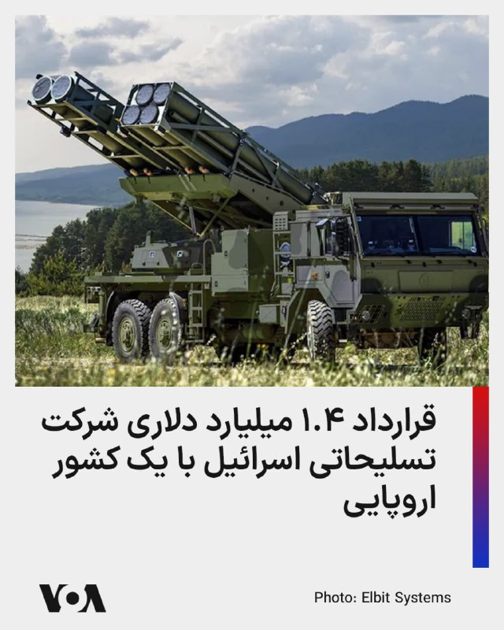

شرکت صنایع نظامی «البیت سیستمز» اسرائیل از قرارداد ۱.۴ میلیارد دلاری فروش تسلیحات به یک کشور اروپایی خبر داد.

این شرکت نام کشور اروپایی را فاش نکرد، اما می‌گوید قرارداد یاد شده شامل خودروهای بدون سرنشین، تجهیزات جنگ الکترونیک زمینی، توپخانه هدایت‌شونده دقیق و سیستم‌های شناسایی پیشرفته است و طی پنج سال عملیاتی خواهد شد.

البیت می‌گوید این پلتفرم‌ها با سیستم‌های تعیین و شناسایی الکترواپتیکی همراه خواهند شد و تمام اجزا از طریق رادیوهای نرم‌افزاری شرکت به یکدیگر متصل می‌شوند.

درآمد این شرکت اسرائیلی در سه ماهه ابتدایی امسال با رشدی ۱۵ درصدی به ۲.۲ میلیارد دلار رسیده و ۳۰ میلیارد دلار سفارش تسلیحاتی معوقه دارد.
@FarsiVOA

## FarsiVOA — post 218787

🔺کره جنوبی تهران را عامل حمله به کشتی خود دانست؛ سفیر تهران احضار می‌شود

▪️کره جنوبی قصد دارد سفیر جمهوری اسلامی در سئول را در اعتراض به حمله به کشتی «اچ‌ام‌ام نامو» احضار کند؛ کشتی باری تحت بهره‌برداری شرکت کره‌ای اچ‌ام‌ام که اوایل ماه مه در نزدیکی تنگه هرمز هدف قرار گرفت.

▪️شبکه کی‌بی‌اس کره جنوبی روز چهارشنبه گزارش داد دولت سئول اکنون تهران را در این حمله دخیل می‌داند و برای احضار سفیر تهران برنامه‌ریزی کرده است.

▪️دونالد ترامپ بلافاصله پس از حادثه گفته بود که جمهوری اسلامی به کشتی کره‌ای «شلیک کرده» و از سئول خواست به تلاش‌های دریایی تحت رهبری آمریکا برای تأمین امنیت عبور کشتی‌ها در تنگه هرمز بپیوندد.

▪️جمهوری اسلامی پیشتر هرگونه نقش در این حادثه را رد کرده است.

⬇️ بیشتر بخوانید:
https://ir.voanews.com/a/8154430.html

## FarsiVOA — post 218786

  

دو گزارش تازه از وال‌استریت ژورنال و رویترز نشان می‌دهد نگرانی اروپا از روسیه دیگر فقط به جنگ اوکراین محدود نیست؛ مقام‌های اروپایی هم‌زمان از احتمال گسترش جغرافیای جنگ به سوی قلمرو ناتو و افزایش عملیات سایبری، جاسوسی و خرابکاری روسیه در بریتانیا و اروپا سخن می‌گویند.

وال‌استریت ژورنال نوشت در پایتخت‌های اروپایی این نگرانی جدی‌تر شده که ولادیمیر پوتین، در صورت ادامه بن‌بست در اوکراین، برای تغییر موازنه جنگ به تشدید افقی بحران روی آورد؛ از جمله با تهدید کشورهای بالتیک.

این گزارش به تهدیدهای اخیر روسیه علیه لتونی و لیتوانی، هشدار مسکو درباره شرکت‌های اروپایی همکار با اوکراین در تولید پهپاد، و رزمایش‌های هسته‌ای ناگهانی روسیه اشاره کرده است.

کایا کالاس، مسئول سیاست خارجی اتحادیه اروپا، به وال‌استریت ژورنال گفته اگر کرملین برای ادامه جنگ به بسیج تازه نیاز پیدا کند، ممکن است برای توجیه آن به تشدید تنش نیاز داشته باشد؛ نقطه‌ای که او «بسیار خطرناک» توصیف کرده است.
@FarsiVOA

## FarsiVOA — post 218785

  

عضو هیئت مدیره اتحادیه مشاوران املاک از جهش ۷۰ تا ۸۰ درصدی قیمت‌های پیشنهادی مسکن پس از جنگ خبر داد.

تورج سرباز به خبرگزاری ایسنا گفته است: «مسکن» که از رشد دلار و سکه عقب مانده بود، اکنون با تورم ناشی از جنگ، جاماندگی خود را جبران کرده است.

او اعلام کرد که در حال حاضر ۷۰ درصد معاملات توسط سوداگران انجام می‌شود و متقاضی واقعی به دلیل قیمت‌های نجومی عملاً از صحنه رقابت حذف شده است.

پیش از اعلام افزایش ۸۰ درصدی قیمت خرید مسکن، خبرگزاری ایسنا از افزایش اجاره‌بها نیز خبر داده و اعلام کرده بود که در شهرهای بزرگ و مراکز استان‌ها، بین ۵۰ تا ۷۰ درصد درآمد خانوار صرف اجاره می‌شود.
@FarsiVOA

## FarsiVOA — post 218784

  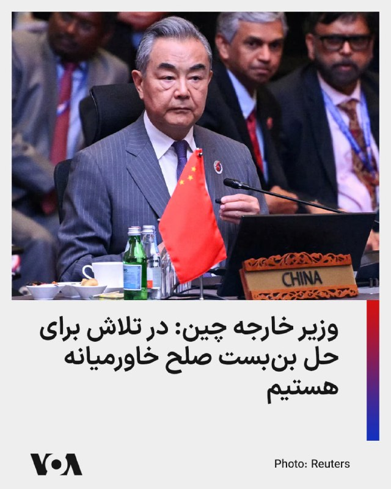

وزیر خارجه چین می‌گوید هر گام رو به جلو در مذاکرات جمهوری اسلامی و آمریکا روزنه‌ امیدی برای بازگشت صلح به خاورمیانه است.

وانگ یی در ادامه گفت حل‌وفصل اختلافات دیرینه یک‌شبه ممکن نیست، اما پکن در تلاش برای حل بن‌بست میان آمریکا و جمهوری اسلامی است.

او گفت پکن در تماس مستمر با بازیگران اصلی این پرونده - آمریکا، ایران و پاکستان ــ است و امیدواریم طرف‌ها با قاطعیت به آتش‌بس و توقف درگیری‌ها پایبند بمانند.

وانگ یی روز دوشنبه با عاصم منیر فرمانده ارتش پاکستان، از مهمترین چهره‌های میانجی مذاکرات آمریکا و جمهوری اسلامی، دیدار و پیرامون مذاکرات صلح رایزنی کرده بود.
@FarsiVOA

## DW_Farsi — post 125199

🎥 مبارزه با راست افراطی در قفس ورزش‌های رزمی (رینگ)

راست افراطی در آلمان بیش از پیش از ورزش‌های رزمی ترکیبی برای جذب نیرو استفاده می‌کند. حالا یک باشگاه در شهر کمنیتس در شرق آلمان با ایجاد فضایی فراگیر و بدون تبعیض، تلاش می‌کند در برابر این روند بایستد.
@dw_farsi

## DW_Farsi — post 125198

  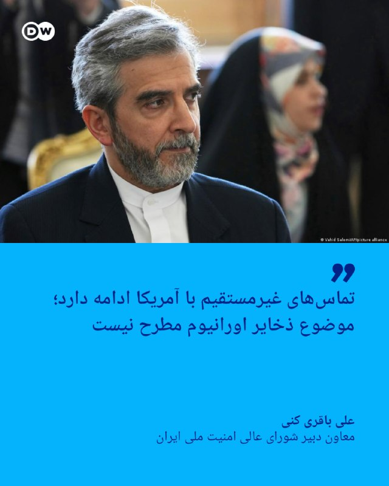

🔶 باقری: تماس‌های غیرمستقیم با آمریکا ادامه دارد؛ موضوع ذخایر اورانیوم مطرح نیست

علی باقری کنی، معاون دبیر شورای عالی امنیت ملی ایران گفته است، "تماس‌های غیرمستقیم" میان تهران و واشنگتن ادامه دارد، اما "موضوع ذخایر اورانیوم غنی‌شده ایران در مذاکرات جاری مطرح نیست".

باقری که برای شرکت در کنفرانس امنیتی مسکو به روسیه سفر کرده، اعلام کرد که ایران و عمان در حال مذاکره برای تعیین "سازوکاری جدید" برای عبور کشتی‌ها از تنگه هرمز هستند.

او با بیان اینکه شرایط عبور و مرور در تنگه هرمز پس از جنگ اخیر "با گذشته متفاوت خواهد بود"، به خبرنگاران گفت: «تا زمانی که در همه مسائل به توافق نرسیم، معتقدیم که در هیچ‌چیز به توافق نرسیده‌ایم.»

اظهارات باقری در حالی مطرح می‌شود که تهران و واشنگتن در هفته‌های اخیر، با میانجیگری پاکستان، مذاکراتی را برای دستیابی به تفاهم‌نامه پایان جنگ دنبال کرده‌اند.

بر اساس گزارش‌ها، موضوعاتی مانند بازگشایی تنگه هرمز، آزادسازی دارایی‌های بلوکه‌شده ایران و توقف درگیری‌های نظامی، از محورهای اصلی این گفت‌وگوها بوده است.

@dw_farsi

## DW_Farsi — post 125188

📸 آلمان چقدر ثروتمند دارد؟

در سال گذشته، دارایی مالی خصوصی در سراسر جهان ۷٫۴ درصد رشد کرده است. این رشد ثروت در سال ۲۰۲۵ به‌مراتب بیشتر از نرخ تورم بوده است. در مجموع، ثروت خالص جهانی شامل دارایی‌های فیزیکی به ۵۵۰ تریلیون دلار آمریکا رسیده است.

این موضوع در گزارش ثروت جهانی ۲۰۲۶ (Global Wealth Report 2026) گروه مشاوره بوستون منتشرشده است.

در آلمان نیز ثروت به‌طور چشمگیری افزایش یافته است: تا تاریخ ۳۱ دسامبر سال ۲۰۲۵، مجموع ثروت در این کشور به ۲۳٫۳ تریلیون دلار رسیده است. بیش از نیمی از این ثروت در دارایی‌های فیزیکی، به‌ویژه املاک، سرمایه‌گذاری شده است.

طبق تعریف این گزارش، هر فردی که بیش از ۱۰۰ میلیون دلار "دارایی مالی" داشته باشد، فوق‌ثروتمند محسوب می‌شود.

دارایی‌های مالی به مجموعه‌ای از منابع و سرمایه‌های پولی گفته می‌شود که ارزش آن‌ها بر اساس پول نقد، اسناد مالی و مطالبات سنجیده می‌شود.

در آلمان ۵۰۰۰ نفر در گروه فوق‌ثروتمند قرار دارند. در سراسر جهان نیز نزدیک به ۹۷ هزار فوق‌ثروتمند وجود دارد که بیش از یک‌سوم آن‌ها در آمریکا (۳۷ هزار نفر) و ۱۱ هزار نفر در چین زندگی می‌کنند.
@dw_farsi

## DW_Farsi — post 125187

  

🔶 نشست ترامپ با اعضای کابینه در کاخ سفید؛ ایران در محور بحث‌ها

واشنگتن تایید کرده که قرار است دونالد ترامپ، رئیس‌جمهور آمریکا روز چهارشنبه ۲۷ مه در کاخ سفید با اعضای کابینه خود دیدار کند؛ نشستی که یک روز پس از اظهارات مارکو روبیو، وزیر خارجه آمریکا، درباره نزدیک بودن توافق برگزار می‌شود.

با این حال، هنوز مشخص نیست که توافق احتمالی چه دستاورد سیاسی مشخصی برای دولت ترامپ خواهد داشت. پیشتر گزارش شده بود که این نشست قرار است در کمپ دیوید برگزار شود اما به دلیل شرایط آب‌وهوایی، مکان برگزاری این نشست به کاخ سفید تغییر یافت.

یکی از محورهای اصلی این توافق، بازگشایی تنگه هرمز عنوان شده است؛ مسیری راهبردی برای انتقال نفت و گاز که در جریان جنگ اخیر با محدودیت‌هایی روبه‌رو شده بود.

دونالد ترامپ، رئیس‌جمهور آمریکا، گفته است توافق آتش‌بس میان ایران و آمریکا "تا حد زیادی" نهایی شده، هرچند به گفته او، جزئیات پایانی همچنان در حال بررسی است.

@dw_farsi

## DW_Farsi — post 125186

🔶 اسرائیل از کشته‌شدن "فرمانده جدید شاخه نظامی حماس" خبر داد

اسرائیل از حمله به حزب‌الله لبنان و همچنین کشته‌شدن فرمانده جدید شاخه نظامی حماس خبر داد. حزب‌الله در روزهای اخیر حملات پهپادی به اسرائیل را افزایش داد و ارتش اسرائیل هم عملیات‌هایی علیه مواضع این گروه انجام داده است.

حدود یک‌ونیم هفته پس از کشته شدن فرمانده "گردان‌های عزالدین قسام"، شاخه نظامی حماس، اسرائیل اکنون می‌گوید جانشین او را نیز در نوار غزه هدف قرار داده و کشته است.

طبق گزارش‌ها محمد عوده نه‌تنها فرمانده جدید شاخه نظامی حماس بود، بلکه یکی از طراحان حملات ۷ اکتبر نیز به شمار می‌رفت.

@dw_farsi

## DW_Farsi — post 125185

  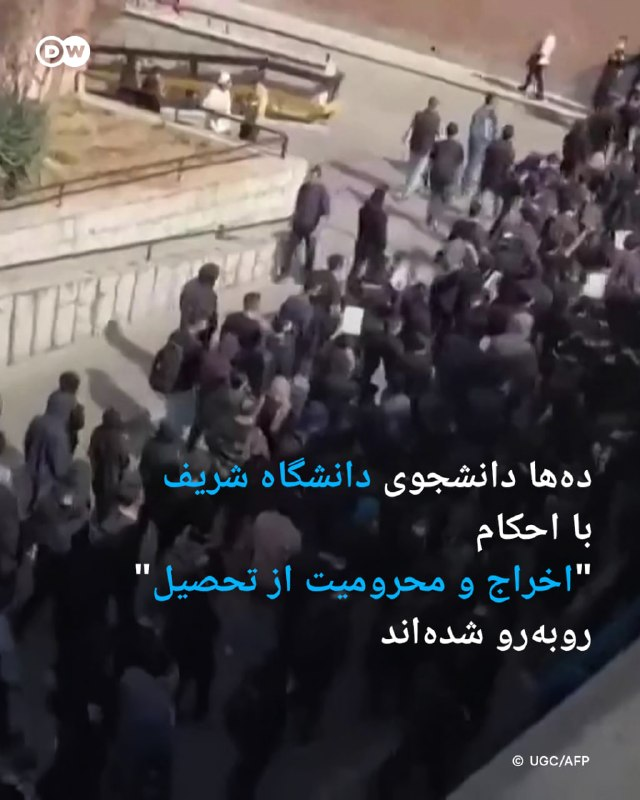

🔶 ده‌ها دانشجوی دانشگاه شریف با احکام "اخراج و محرومیت از تحصیل" روبه‌رو شده‌اند

گزارش‌ها از ایران حاکی از آن است که دست‌کم ۳۰ دانشجوی دانشگاه صنعتی شریف در ارتباط با فعالیت‌های مجازی و پرونده‌های مرتبط با اعتراضات سراسری سال گذشته، با احکام انضباطی روبه‌رو شده‌اند.

خبرگزاری هرانا به نقل از شورای صنفی دانشگاه صنعتی شریف نوشته است که ؛حکم بدوی دست‌کم شش دانشجو، اخراج از دانشگاه همراه با پنج سال محرومیت از تحصیل در تمامی دانشگاه‌های کشور بوده است؛.

بر اساس این گزارش، برای شماری دیگر از دانشجویان نیز احکامی مانند "منع موقت از تحصیل" برای یک یا چند نیم‌سال صادر شده است.

در گزارش منتشر شده آمده که برخی از این دانشجویان با اتهام‌هایی مانند "برنامه‌ریزی برای ایجاد آشوب در دانشگاه" به کمیته انضباطی احضار شده‌اند.

همچنین گفته شده، بخش قابل توجهی از پرونده‌ها به ؛فعالیت دانشجویان در فضای مجازی، از جمله محتوای پروفایل، پیام در گروه‌های خصوصی یا بازنشر مطالب در شبکه‌های اجتماعی؛ مربوط بوده است.

@dw_farsi

## DW_Farsi — post 125184

  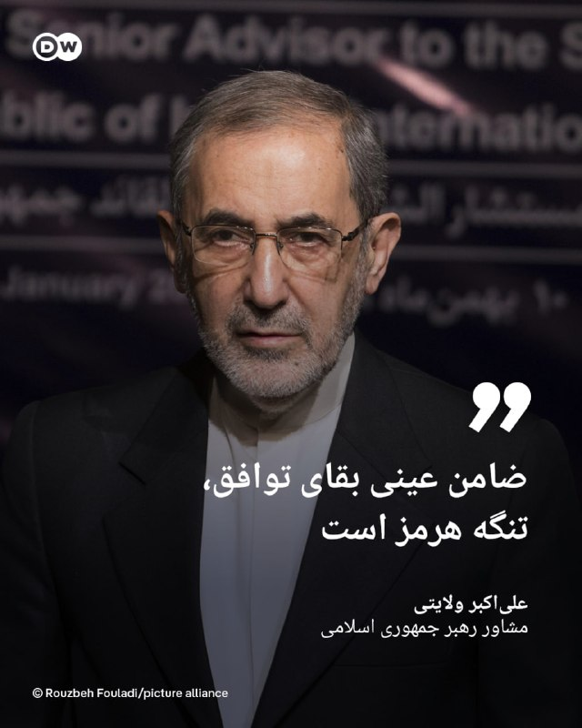

🔶ولایتی: ضامن عینی بقای توافق، تنگه هرمز است

علی‌اکبر ولایتی، مشاور رهبر جمهوری اسلامی در امور بین‌الملل، در پیامی در شبکه اجتماعی ایکس نوشته است که "ضامن عینی بقای توافق، تنگه هرمزاست". او تاکید کرده که ایران این بار تنها به "کاغذها و امضاها" تکیه نخواهد کرد.

او همچنین نوشت، "ملت بودن" ریشه‌ای تمدنی دارد و "کالایی نیست که با دلار نفتی بتوان خرید یا اجاره کرد".

اظهارات ولایتی در حالی مطرح می‌شود که تنش‌ها در منطقه و بحث درباره امنیت تنگه هرمز، یکی از مهم‌ترین مسیرهای انتقال نفت جهان، بار دیگر افزایش یافته است. شمار زیادی از مقام‌های حکومت ایران، از جمله مجتبی خامنه‌ای، رهبر کنونی جمهوری اسلامی، در ادبیاتی تهدیدآمیز گفته‌اند که وضعیت تنگه هرمز به گذشته بازنخواهد گشت.

@dw_farsi

## DW_Farsi — post 125183

  

🔶 هشدار درباره ادامه اختلال در انتقال نفت و مواد خام پس از بحران در تنگه هرمز

مدیر پیشین شرکت انرژی وینترشال آلمان هشدار داده است که حتی در صورت بازگشایی تنگه هرمز، بازگشت زنجیره‌های تأمین جهانی به وضعیت عادی "ماه‌ها" زمان خواهد برد.

راینر زیله، مدیر پیشین وینترشال و از مدیران ارشد کنونی شرکت نفتی ادنوک امارات، در گفت‌وگو با روزنامه "هاندلزبلات" گفته است که اختلال‌های ایجادشده در انتقال نفت و گاز، به سرعت جبران نخواهد شد.

او گفت: «احیای زنجیره‌های تامین یک‌شبه اتفاق نمی‌افتد، بلکه ماه‌ها طول خواهد کشید.»

به گفته او، حتی پس از بازگشایی مسیر حیاتی تنگه هرمز، نفتکش‌ها زمان زیادی نیاز خواهند داشت تا محموله‌ها را به بازارهای آسیایی برسانند. او همچنین افزود، بسیاری از کشورها ابتدا تلاش خواهند کرد ذخایر راهبردی نفت و گاز خود را دوباره پر کنند.

این مدیر صنعت انرژی هشدار داد که "کمبود مواد خام و فشار بر زنجیره تامین احتمالا تا پایان سال ادامه خواهد داشت و این موضوع به‌ویژه بر صنایع شیمیایی آسیا تاثیر خواهد گذاشت".

@dw_farsi

## Persian_Trend_Official — post 15121

🌲 — 🇮🇱 رئیس ستاد کل ارتش اسرائیل، ایال زامیر: برنامه هسته‌ای ایران سال‌ها به عقب افتاده است.

🌲 — 🇮🇱 رئیس ستاد کل ارتش اسرائیل: رهبری ایران مردم خود را به فاجعه‌ای کشانده است که هنوز به طور کامل آن را درک نکرده‌اند، و در حالی که بیشتر توانایی‌های نظامی‌شان نابود شده، در حال تعقیب هستند.

## Persian_Trend_Official — post 15120

  

🇮🇱
🇱🇧
🇱🇧
🔹 هشدار فوری به ساکنان شهرها و روستاهای زیر در لبنان صادر شد: کفر حونا، آرامتا، ملیخ، جرجوع و حومین الفوقا، با دستور تخلیه فوری و حرکت حداقل ۱۰۰۰ متر به سمت مناطق باز.

## Persian_Trend_Official — post 15119

  <a href="telegram/content/Persian_Trend_Official_15119_1779883694.mp4" target="_blank">🎬 Download video</a>

سالروز اعدام «صدام حسین عبدالمجید التکریتی»

صدام حسین تکریتی، سحرگاه عید قربان سال ۱۳۸۵ به دار مجازات آویخته شد.

👩‍💻@PhantomDirective

🆔@persian_trend_official
پرشین ترند | متفاوت‌ترین کانال نظامی

## Persian_Trend_Official — post 15118

  

عبور چهارمین کشتی LNG از تنگه هرمز در کمتر از یک هفته :

🚢 نفتکش LNG «ام‌الاشتان» متعلق به امارات، با محموله گاز طبیعی مایع از ابوظبی، در حالی که سیستم شناسایی خودکار (AIS) خود را خاموش کرده بود، از تنگه هرمز عبور کرد و به سمت هند در حال حرکت است. این کشتی چهارمین مورد از عبور نفتکش‌های LNG در یک هفته گذشته به شمار می‌رود.

👩‍💻@PhantomDirective

🆔@persian_trend_official
پرشین ترند | متفاوت‌ترین کانال نظامی

## Persian_Trend_Official — post 15117

  <a href="telegram/content/Persian_Trend_Official_15117_1779883696.mp4" target="_blank">🎬 Download video</a>

لحظه‌ ترور محمد عوده و فرماندهان شاخه نظامی حماس

👩‍💻@PhantomDirective

🆔@persian_trend_official
پرشین ترند | متفاوت‌ترین کانال نظامی

## Persian_Trend_Official — post 15116

  <a href="telegram/content/Persian_Trend_Official_15116_1779883697.webm" target="_blank">🎬 Download video</a>

https://youtube.com/live/IsX9PiIhoW4?feature=share

## RadioFarda — post 157606

  <a href="https://t.me/radiofarda/157606" target="_blank">📎 Download file</a>

📻بشنوید: ساعت ۱۴ با رادیوفردا، ششم خرداد ۱۴۰۵‌

@Radiofarda

## RadioFarda — post 157605

🔸کره جنوبی اعلام کرد سفیر ایران را در اعتراض به حمله به یک کشتی این کشور در تنگه هرمز احضار خواهد کرد. 🔸این احضار پس از آن صورت می‌گیرد که دولت سئول اعلام کرد در تحقیقات خود به این نتیجه رسیده که «به احتمال بسیار زیاد» موشکی ساخت ایران عامل حمله به این کشتی…

## RadioFarda — post 157604

  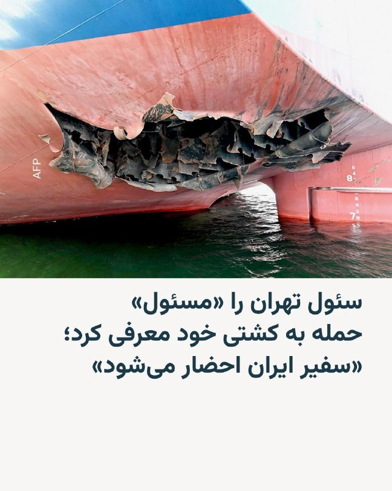

🔸کره جنوبی اعلام کرد سفیر ایران را در اعتراض به حمله به یک کشتی این کشور در تنگه هرمز احضار خواهد کرد.

🔸این احضار پس از آن صورت می‌گیرد که دولت سئول اعلام کرد در تحقیقات خود به این نتیجه رسیده که «به احتمال بسیار زیاد» موشکی ساخت ایران عامل حمله به این کشتی بوده است.

🔸این کشتی باری کره‌جنوبی ۱۴ اردیبهشت توسط یک هواگرد ناشناس در تنگه هرمز هدف قرار گرفت.

🔸دونالد ترامپ بعد از این حمله گفته بود که ایران «چند شلیک» به سوی این کشتی با پرچم پاناما انجام داده اما تهران مسئولیت این حمله را رد کرده بود.

🔸پس از چند هفته تحقیق، دولت کره‌ جنوبی اعلام کرد که تحلیل‌های فنی نشان داده‌اند پرتابه ناشناسی که به کشتی اصابت کرده «به احتمال بسیار زیاد» نسخه‌ای دیگر از موشک توسعه‌یافتهٔ «نور» بوده است.

🔸پارک یون‌جو، معاون اول وزیر خارجه کره‌ جنوبی، در یک نشست خبری گفت: «دولت ما قصد دارد سفیر ایران را احضار کند تا نتایج تحقیقات را توضیح دهد، اعتراض شدید خود را نسبت به حمله به کشتی‌مان اعلام کند و خواستار اقدامات مسئولانه، از جمله تدابیری برای جلوگیری از تکرار چنین حادثه‌ای شود.»

@RadioFarda

## RadioFarda — post 157603

استارلینک و جنگ ایران؛ «چانه‌زنی اسپیس‌ایکس با پنتاگون بر سر اینترنت ماهواره‌ای»

🔸جنگ آمریکا و ایران فقط در آسمان، دریا و خاک جریان ندارد؛ بخشی از آن در مدارهای پایین زمین می‌گذرد؛ جایی که هزاران ماهواره کوچک استارلینک، متعلق به شرکت اسپیس‌اکس ایلان ماسک، به یکی از حلقه‌های حیاتی عملیات نظامی آمریکا تبدیل شده‌اند.

🔸گزارشی اختصاصی از خبرگزاری رویترز نشان می‌دهد که در همان هفته‌هایی که پهپادهای انتحاری آمریکا، با اتکا به ارتباط ماهواره‌ای استارلینک، در جنگ علیه ایران دستاوردهای ملموس‌تری پیدا می‌کردند، مدیران ارشد اسپیس‌ایکس به این نتیجه رسیدند که پنتاگون باید برای این دسترسی پول بیشتری بپردازد.

🔸به گفته دو منبع آگاه و بر اساس اسناد پنتاگون که رویترز دیده است، اسپیس‌ایکس گفته ارتش آمریکا برای هر پایانه حدود پنج هزار دلار می‌پردازد، در حالی که در عمل از سطحی از خدمات استفاده می‌کند که به گفته این شرکت، به ماهانه حدود ۲۵ هزار دلار نزدیک‌تر است.

🔸پس از انتشار گزارش رویترز، ایلان ماسک اعلام کرد سامانه غیرنظامی استارلینک به‌طور نادرست «برای اهداف نظامی» استفاده شده و «شرکت» مقصر بوده، نه پنتاگون.

🔸سخنگوی پنتاگون نیز گزارش رویترز را «غلط» خواند، اما جزئیات بیشتری ارائه نکرد و گفت اسپیس‌اکس همچنان «شریکی قوی و ارزشمند» برای وزارت جنگ آمریکا است.

🔸 گزارش کامل را در وب‌سایت رادیوفردا بخوانید.

@RadioFarda

## RadioFarda — post 157602

  

📷 Photo

## RadioFarda — post 157601

بازگشت تدریجی و محدود اینترنت در ایران؛ «خوشحالی ایرانیان دو سوی مرز»

🔸سرانجام، پس از ۸۸ روز قطع سراسری اینترنت در ایران، شهروندان کشور توانستند به‌طور نسبی و محدود به اینترنت جهانی دست پیدا کنند و از دل خاموشی دیجیتال به جهان آزاد سرک بکشند.

🔸از بعدازظهر سه‌شنبه پنجم خرداد ۱۴۰۵ گزارش‌های شهروندی و رسمی حاکی از امکان دستیابی به اینترنت بین‌الملل در سرویس خانگی و ثابت مخابرات و بعدتر در تلفن‌های همراه بود.

🔸نت‌بلاکس، نهاد پایش وضعیت اینترنت در جهان، نیز اگرچه این خبر را تأیید کرد، اما خبر داد برخی کاربران هنوز به اینترنت دسترسی ندارند و افزود: «فیلترنت همچنان پابرجاست اما می‌توان آن را دور زد. واتس‌اپ نیز اکنون محدود شده و نیاز به دور زدن فیلتر دارد.»

🔸قطع اینترنت در ایران که بیش از ۲۰۹۳ ساعت ادامه داشت، و طولانی‌ترین قطع سراسری اینترنت در تاریخ معاصر نام گرفت، بعد از حملات مشترک آمریکا و اسرائیل به ایران در نهم اسفند ۱۴۰۴ و کشته‌شدن علی خامنه‌ای، دومین رهبر جمهوری اسلامی آغاز شد.

🔸اگرچه قطع اینترنت و فیلترینگ در ایران مسبوق به سابقه است، اما انزوای اینترنتی شهروندان ایران هرگز تا این اندازه به طول نینجامیده و هزینه‌های مالی، اجتماعی و روانی به بار نیاورده بود.

🔸آن‌چه حکومت ایران در حدود ۹۰ روز گذشته انجام داد، دیگر صرفاً محدودسازی یا کندی اینترنت نبود، بلکه قطع تقریباً کامل دسترسی عمومی به اینترنت جهانی بود؛ وضعیتی که به‌گفتۀ نت‌بلاکس، از نظر شدت و مدت، از همهٔ نمونه‌های مشابه در ایران و حتی در سطح جهانی پیشی گرفته است.

🔸افشین کلاهی، رئیس کمیسیون اقتصاد دانش‌بنیان اتاق بازرگانی ایران، اخیراً خسارت مستقیم ناشی از اختلال اینترنت را روزانه ۳۰ تا ۴۰ میلیون دلار برآورد کرده و گفته بود با احتساب خسارت‌های غیرمستقیم، این رقم می‌تواند به حدود ۸۰ میلیون دلار در روز برسد.

🔸 گزارش کامل را در وب‌سایت رادیوفردا بخوانید.

@RadioFarda

## IranianMinds — post 20869

وضعیت اینترنت اینجوریه که وصله
اما وصل نیست

@IranianMinds

## IranianMinds — post 20868

  

🔴وضعیت فیلترشکن فروش‌ها بعد از وصل شدن نت بین‌الملل.

@IranianMinds

## IranianMinds — post 20867

آخوند حمید رسایی :

قلبم به درد آمد وقتی دیدم پزشکیان اینترنت بین الملل را غیرقانونی وصل کرده است.

@IranianMinds

## IranianMinds — post 20866

  

کیر خوردن اگه قیافه داشت :

همراه اول امروز در پیامی به کاربران اینترنت پرو اعلام کرد در صورت تمایل می‌توانید اینترنت خود را به حالت قبل برگردانید

@IranianMinds

## IranianMinds — post 20865

  

پست جدید کاخ سفید :
مامویت سادست؛ صلح از طریق قدرت

@IranianMinds

## IranianMinds — post 20864

  

وضعیت تجمع های حکومتی :

@IranianMinds

## IranianMinds — post 20863

🔴 وزیر ارتباطات: اهتمام رئیس‌جمهور به بازگشایی اینترنت و احیای ثبات ارتباطی، نشانه‌ای روشن از عقلانیت و ایستادن در کنار مردم است

ملت ایران شایسته ارتباط آزاد، آینده‌ای روشن و اقتصادی پویاست

@IranianMinds

## IranianMinds — post 20862

🔴 علم‌الهدی: نبود گوشت تو یخچال مردم مشکل بزرگی نیست چون وضعیت کشور جنگیه و اگر گوشت هم نداشته باشن که بخورن اشکالی نداره.

@IranianMinds

## IranianMinds — post 20861

خوبه خودشونم اعتراف میکنن زیر زمین بودن این مدت.

🔴صداسیما:
هر مسئولی که تو جنگ زیرزمین بود رو نتونستن ترور کنن، جاشونو پیدا میکنن ولی نمیتونن بزننش، حتی با ۲۸ سنگر شکن.

@IranianMinds

## IranianMinds — post 20860

❌دیگه فریب بونوس سایت های متفرقه رو نخورید!

💖توی این سایت که مورد #تایید ماست، با عضویت 500 هزارتومان بگیر!

🌐 Winro.io

🌐 Winro.io

## IranianMinds — post 20859

  <a href="telegram/content/IranianMinds_20859_1779883700.webm" target="_blank">🎬 Download video</a>

⭕️ تنها جایی که در لحظه عضویت بهت 500 هزارتومان موجودی میده اینجاس 
❌

🎉 کافیه فقط عضو بشی تا #وینرو بهت 
🤩 
🤩 
🤩 هزارتومان جایزه بده ، نیازی هم به واریز نیست.

⌛ پشتیبانی 24 ساعته

🍆تنها سایت مورد اعتماد ما با بونوس های کاملا واقعی و رویایی:

🌐 Winro.io

🌐 Winro.io
کانال بونوس های رایگان r6

📱 @winro_io

## IranianMinds — post 20858

معاون وزیر امور خارجه روسیه:

ما آمادگی خود را برای انتقال اورانیوم غنی‌شده از ایران به واشنگتن اطلاع داده‌ایم و این پیشنهاد همچنان روی میز است

@IranianMinds

## IranianMinds — post 20857

  <a href="telegram/content/IranianMinds_20857_1779883701.mp4" target="_blank">🎬 Download video</a>

لحظه‌ ترور محمد عوده و فرماندهان شاخه نظامی حماس

@IranianMinds

## BBCPersian — post 282185

🔻رویترز: جنگ ایران برندگان و بازندگان تازه‌ای را در بازارهای جهانی ایجاد کرده است

🔻سه ماه پس از آغاز جنگ ایران، تداوم قیمت بالای نفت سیاست‌گذاران را با نگرانی‌های تازه درباره تورم روبه‌رو کرده و کاهش ارزش ارزها نیز برای برخی کشورهای آسیایی دردسرساز شده است.

به‌گزارش رویترز اما این درگیری در عین حال به رشد برخی دارایی‌ها، به‌ویژه نفت، و تقویت جایگاه دلار به‌عنوان یک دارایی امن کمک کرده است.

رویترز در گزارش خود آورده است: افزایش حدود ۴۰ درصدی قیمت نفت، چشم‌انداز تورم و نرخ بهره را دگرگون کرده است. در بازار واقعی، قیمت نفت خام به‌مراتب بالاتر از ۱۰۰ دلار در هر بشکه قرار دارد و در مقطعی در اوایل آوریل تقریبا دو برابر سطح پیش از جنگ بود.

این گزارش حاکیست که آزادسازی بی‌سابقه ۴۰۰ میلیون بشکه نفت از ذخایر راهبردی اقتصادهای بزرگ، همراه با تلاش معامله‌گران برای یافتن منابع جایگزین، تا حدی به جبران کمبود عرضه کمک کرده است. با این حال، فشار بر نظام جهانی انرژی رو به افزایش است.

https://bbc.in/4dLHuWT
@BBCPersian

## BBCPersian — post 282184

  

🔻وزارت اطلاعات ایران در بیانیه‌ای گفته است که «دشمن اکنون با توقف جنگ سخت، بر هفت محور اصلی جنگ ترکیبی» متمرکز شده و هشدارهایی به شهروندان داده است.

در این اطلاعیه آمده است: «جنگ ترکیبی شامل تشدید فشارهای اقتصادی، انجام تحریکات قومی و مذهبی، اعزام مزدوران گروهکی، ترور و خرابکاری، قاچاق انواع سلاح و ابزار ارتباطی غیرقانونی، جنگ رسانه‌ای و حملات سایبری متمرکز شده است.»

این هشدار یک روز پس از اتصال اینترنت در پی ۸۸ روز قطعی سراسری در ایران صادر شده است.

وزارت اطلاعات درباره «هرگونه اقدام برای شکستن انسجام ملی و ایجاد گسست اجتماعی، قاچاق سلاح و ابزارهای ارتباطی غیرقانونی همچون استارلینک» هشدار داده و گفته است که در ارتباط با این موضوعات «با دقت و قاطعیت هرچه بیشتر» عمل خواهد کرد.

وزارت اطلاعات ایران اکنون از سوی سرپرست اداره می‌شود. اسماعیل خطیب، وزیر اطلاعات، در جریان حملات اسرائیل و آمریکا در تهران کشته شد.

📷Getty Images
https://bbc.in/4vinAKx

@BBCPersian

## BBCPersian — post 282183

🔻پیام‌های مخاطبان بی‌بی‌سی بعد از اتصال اینترنت؛ «این مدت هیچکس غم مردم را نخورد»

🔻تعدادی از مخاطبان بی‌بی‌سی پس از اتصال نسبی به اینترنت، از کیفیت و سرعت اتصال و نظراتشان درباره کمک جامعه جهانی به مردم ایران در ۸۸ روزی که اینترنت قطع بود، نوشتند.

مخاطبی از اراک نوشت: «فیبر نوری دارم و الان وصل شدیم البته باز هم بدون فیلترشکن تلگرام وصل نمی‌شود. این مدت هیچکس غم مردم را نخورد. حیف این مردمی که این هزینه‌های سنگین برای آزادی پرداخت می‌کنند...افسوس.»یکی دیگر از مخاطبان نوشته است: «خیلی حرف‌ها دارم اما الان زمانش نیست چون خسته‌ام. حتی از اقوام درجه یک خودم که خارج کشور در رفاه بودند و من و زن و بچه‌ام زیر موشک.... دلم گرفته... بزودی خواهم گفت از تک تک روزهای لعنتی جنگ .»

مخاطب دیگری که ۱۷ ساله است و در تهران زندگی می‌کند، نوشته است: «می‌خواستم یه چیزی بگم. واقعا خسته شدیم. از گرانی، از تحریم، از نت ضیف. کارها هم خوابیده. دیگه نمی‌توانم زندگی کنم.»

تعدادی از مخاطبان گفته‌اند که اینترنت‌های خانگی وصل شده ولی هنوز اینترنت سیمکارت آنها کار نمی‌کند. چند مخاطب هم گفته‌اند که هنوز اینترنت ندارد و با همان روش‌های قبلی وصل‌ هستند.

https://bbc.in/3PM26X5
@BBCPersian

## BBCPersian — post 282182

  

‌🔻علی باقری کنی، معاون سیاست خارجی و امنیت بین‌الملل دبیرخانه شورای عالی امنیت ملی ایران می‌گوید که «موضوع ذخایر اورانیوم در دستور کار مذاکرات نیست.»

او این موضوع را در پاسخ به پرسشی در حاشیه چهاردهمین نشست بین‌المللی مقامات بلندپایه امنیتی در مسکو مطرح کرد.

پیشتر دونالد ترامپ، رئیس جمهور آمریکا، گفت که اورانيوم غنی‌شده ایران یا به تعبیر او «غبار هسته‌ای به ايالات متحده تحويل داده خواهد شد تا به آمريکا منتقل و نابود شود، يا ترجيحا با همکاری و هماهنگی ايران، در همان محل يا در مکان مورد توافق ديگری، نابود خواهد شد.»

📷EPA
https://bbc.in/3PuodBw

@BBCPersian

## BBCPersian — post 282181

🔻حماس کشته شدن فرمانده شاخه نظامی‌ خود را تایید کرد

🔻حماس کشته شدن محمد عوده، فرمانده شاخه نظامی این گروه در حمله اسرائیل را تایید کرد.

حماس در بیانیه‌ای گفته است که در حمله اخیر اسرائیل در کنار محمد عوده معروف به ابوعمرو، مادرش، همسر و سه فرزندش نیز کشته شده‌اند.

اسرائیل کاتس، وزیر دفاع اسرائیل، گفت که محمد عوده «برای دیدار با هم‌قطارانش به اعماق جهنم فرستاده شده است.»

او همچنین می‌گوید که «طرح مهاجرت داوطلبانه» ساکنان غزه، اجرا خواهد شد.

محمد عوده پس از کشته شدن عزالدین حداد، فرمانده قبلی حماس در حمله‌ مشابهی در اوایل همین ماه میلادی به این سمت منصوب شده بود.

https://bbc.in/49nK9Vw
@BBCPersian

## BBCPersian — post 282180

🔻نماینده مجتبی خامنه‌ای با سفر به چابهار، پیام او به مردم سیستان و بلوچستان را به آنها رساند

🔻بنا به گزارش رسانه‌های داخلی ایران مجتبی خامنه‌ای، رهبر جمهوری اسلامی در پیام ویژه‌ای به سیستان و بلوچستان «بر وحدت میان شیعه و سنی» تاکید کرده است.

این پیام مجتبی خامنه‌ای را محمدتقی وکیل‌پور در دیدار با روحانیان چابهار ابلاغ کرده است.

او ضمن تبریک عید قربان، به نقل از آقای خامنه‌ای به این روحانیان گفته است: «وحدت میان مردم شیعه و سنی و حضور آگاهانه آنان در میدان، ریشه دشمنی‌ها را خشک خواهد کرد.»

آقای وکیل پور گفته است برای قدردانی از مردم سیستان و بلوچستان به این استان سفر کرده و اضافه کرده است: «مردم این دیار در دوران دفاع مقدس خدمات ارزنده‌ای به کشور ارائه دادند و امروز نیز با اقدامات پرخیر و برکت خود، موجب خرسندی رهبر معظم انقلاب شده‌اند.»

مجتبی خامنه‌ای از زمان آغاز به کارش در اسفند تاکنون در انظار عمومی ظاهر نشده است. روز گذشته (سه‌شنبه) نیز یک پیام کتبی به مناسبت برگزاری مراسم حج از او منتشر شد.

https://bbc.in/4dSgnK3
@BBCPersian

## Dirty_Kids — post 390315

  <a href="telegram/content/Dirty_Kids_390315_1779883703.mp4" target="_blank">🎬 Download video</a>

سالنای آرایشگری زنونه این روزا این شکلی دارن تبلیغ میکنن:

@Dirty_Kids 👻

## Dirty_Kids — post 390311

🔴 امسال انگار سال سالِ کونه 🍑، چالش عجیب و کثافتی که این روزها تو اینستاگرام به شدت وایرال شده؛

داستان ازاین قراره که؛ ملت کونشونو به شکل قلب درمیارن، ازش عکس میگیرن و تو اینستاگرام پست میکنن.

این چالش درحال حاضر پر بازدید‌ترین چالش حالِ حاضر اینستاگرامه.

@Dirty_Kids 👻

## Dirty_Kids — post 390310

  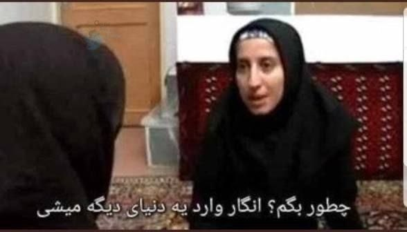

وقتی از روبیکا میای تلگرام:

@Dirty_Kids 👻

## Dirty_Kids — post 390309

  

بچه‌هایی که نبودید
یه ژانر تو توییتر درست کردن به اسم «شیکم تخت» این بانو خیلی وایرال شد

@Dirty_Kids 👻

## Dirty_Kids — post 390308

  <a href="telegram/content/Dirty_Kids_390308_1779883704.mp4" target="_blank">🎬 Download video</a>

حالا فهمیدید چرا اینترنت رو قطع کردن؟
چون نمی‌خواستن این تصاویر حماسی و پرشور مردم پادشاهی خواه داخل ایران به بیرون درز کنه.

@Dirty_Kids 👻

## Dirty_Kids — post 390307

  

🔴 آخوند حمید رسایی: از وقتی اینترنت وصل شده قلبم درد گرفته، یه لحظه‌ام نتونستم بخوابم.

وصل شدن اینترنت پایمال کردن خون رهبر شهیدمونه، با اینکار تن رهبری تو گور لرزید.
عوامل موساد باعث بازگشایی اینترنت شدن.

@Dirty_Kids 👻

## Dirty_Kids — post 390306

  <a href="https://t.me/Dirty_Kids/390306" target="_blank">📎 Download file</a>

📱 اپلیکیشن اندروید بدون فیلتر ریتزوبت

➖➖➖➖➖

🔹 ثبت نام آسان 
✅
🔹 رابط کاربری بسیار راحت و سریع 
✅
🔹 درگاه پرداخت کارت به کارت 
✅
🔹 درگاه پرداخت دلاری سریع 
✅
🔹 بونوس ۱۰۰ درصدی اولین واریز 
✅
🔹 بونوس ۱۰۰ درصدی واریز یکشنبه ها 
✅

➖➖➖➖➖
🌐 https://RitzoBet.com

⚡️ @RitzoBet_ir

## Dirty_Kids — post 390305

  

⚠️ برای #شرطبندی های فوتبال از سایت معتبر و بین المللی استفاده کنید ✅

سایت #ریتزوبت ، چهار سال هستش داخل ایران فعالیت میکنه 
✅

لایسنس بین المللی داره ، روش های شارژ و برداشت متنوع داره و بونوس 100% ورزشی و کش بک های جذاب
💎

⏪ اپلیکیشن بدون فیلتر ریتزوبت 
📱
⏩
R6

✅ لینک بدون‌ فیلتر ریتزوبت
🤣

🆔 @RitzoBet_ir 
🇮🇷

## Dirty_Kids — post 390302

‏ترامپ مادر×نده امتحانا داره حضوری میشه، خیالت راحت شد؟

@Dirty_Kids 👻

## Dirty_Kids — post 390299

خبر مهم و‌ فوری
جلسه کمپ دیوید که قرار بود چهارشنبه برگزار بشه، در واقع تله بوده برای گرفتن کسی که اطلاعات محرمانه رو لو می‌داد!
بالاخره گیر افتاد 😂
حدس بزنید کی بوده؟
جی‌دی ونس

@Dirty_Kids 👻

## Dirty_Kids — post 390298

  

تو چین یه بالشت بغل‌کردنی با شکل عجیب ساخته شده که کلی سر و صدا کرده؛

این بالشت واسه آدماییه که استرس، اضطراب یا افسردگی دارن و جوری طراحی شده که انگار یکی بغلت کرده. جالب‌تر اینکه خودش مثل آدم نفس می‌کشه و با نفس کشیدن طرف هماهنگ میشه تا آرومش کنه.
اول خیلیا به خاطر ظاهرش مسخره‌ش می‌کردن، ولی بعد کلی آدم گفتن باهاش راحت‌تر و آروم‌تر می‌خوابن.

@Dirty_Kids 👻

## Dirty_Kids — post 390297

  

بادبان با همراهی شما 110 هزار نفری شد!
🎉

🎁 کد تخفیف خرید اول دوباره ریست شد و همه میتونن ازش استفاده کنن:
BadBan4k

💸 با این کد، 50 هزار تومان تخفیف روی اولین خریدت بگیر!

🔥و مهم‌تر از همه...
سیستم معرفی بادبان فعال‌تر از همیشه‌ست!
از تمام خریدهای کاربرانی که معرفی میکنی، 10% خریدشون رو پورسانت دائمی دریافت کن و موجودی کیف پولت رو افزایش بده 
💼

وقتی بادبان داری،
هیچ بادی مانع نیست… حتی وقتی اینترنت ملیه
⛵️

R6

🛡@BadBan_VPN | کانال 

🤖@BadBan_VPNBot | ربات 

📞@BadBan_VPNSupport | پشتیبانی

## Dirty_Kids — post 390296

  

من دیگه برخط نیستم اسکایلر
من خود آنلاینم

@Dirty_Kids 👻

## Dirty_Kids — post 390295

  <a href="telegram/content/Dirty_Kids_390295_1779883707.mp4" target="_blank">🎬 Download video</a>

#علیرضا_فیروزجا، زیر پرچم فرانسه، مگنوس کارلسن نفر اول رنکینگ رو تو دور اول شطرنج کلاسیک شکست داد!
افتخاری بزرگ که میتونست به پای ایران نوشته بشه ولی...

@Dirty_Kids 👻

## Hranews — post 113192

  

محمد طریقت اسفنجانی، وکیل دادگستری به حبس محکوم شد

❗️
❗️
❗️
❗️
❗️– محمد طریقت اسفنجانی، وکیل دادگستری و عضو کانون وکلای آذربایجان شرقی توسط دادگاه انقلاب شهرستان اسکو به سه سال حبس تعزیری محکوم شد.

به گزارش خبرگزاری هرانا، ارگان خبری مجموعه فعالان حقوق بشر در ایران، محمد طریقت اسفنجانی، وکیل دادگستری به حبس محکوم شد.

بر اساس این حکم که اخیرا توسط دادگاه انقلاب شهرستان اسکو صادر و به محمد طریقت اسفنجانی ابلاغ شده، وی از بابت اتهامات تبلیغ علیه نظام به یک سال حبس و توهین به رهبری و بنیانگذار جمهوری اسلامی به دو سال حبس تعزیری محکوم شده است.

#محمد_طریقت_اسفنجانی

ادامه مطلب

↘️
@hranews_bot تماس ✉️ - @Hranews کانال هرانا 🆑

## Hranews — post 113191

  

میان موشک و سرکوب؛ گزارش مجموعه فعالان حقوق بشر درباره مخاصمه نظامی ایالات متحده-اسرائیل و ایران منتشر شد 
💥
💥
💥
💥
💥 – امروز، مجموعه فعالان حقوق بشر در ایران گزارش جدیدی را در ۲۴۰ صفحه و دو زبان منتشر کرد که به بررسی کارزار نظامی ایالات متحده و اسرائیل در ایران…

## alonews — post 123048

  <a href="telegram/content/alonews_123048_1779883710.webm" target="_blank">🎬 Download video</a>

👈فرماندهی مرکزی ایالات متحده درباره محاصره: تا امروز، ۱۰۹ کشتی تجاری برای اطمینان از رعایت قوانین محاصره به سوی مسیر دیگر هدایت شده‌اند.

✅ @AloNews خبر جنگ

## alonews — post 123047

  <a href="telegram/content/alonews_123047_1779883710.webm" target="_blank">🎬 Download video</a>

👈وضعیت امروز اینترنت بین الملل ایران از نگاه نت بلاکس

🔴اینترنت هنوز به وضعیت ۱۰۰ درصدی بازنگشته

✅ @AloNews خبر جنگ

## alonews — post 123046

  <a href="telegram/content/alonews_123046_1779883710.webm" target="_blank">🎬 Download video</a>

👈العربیه: به گفته منابع، احتمال دارد طی چند هفته یک توافق میان آمریکا و ایران حاصل شود

✅ @AloNews خبر جنگ

## alonews — post 123045

  <a href="telegram/content/alonews_123045_1779883710.webm" target="_blank">🎬 Download video</a>

👈باقری،معاون دبیر شورای عالی امنیت ملی: ایران و عمان در حال مذاکره درباره سازوکار مدیریت تنگه هرمز هستند!

✅ @AloNews خبر جنگ

## alonews — post 123044

  <a href="telegram/content/alonews_123044_1779883710.webm" target="_blank">🎬 Download video</a>

👈نیروی دریایی سپاه: ۲۳ شناور تا این لحظه از تنگه هرمز عبور کرده‌اند و عبور شناورهای دیگر نیز تا ساعات آینده ادامه دارد.

🔴عبور شناورهای کشورهای متخاصم از تنگه هرمز همچنان ممنوع است

✅ @AloNews خبر جنگ

## alonews — post 123043

  <a href="telegram/content/alonews_123043_1779883710.webm" target="_blank">🎬 Download video</a>

👈 رئیس ستاد کل ارتش اسرائیل، ایال زامیر، امروز ارقام جدیدی را به کابینه امنیتی اسرائیل ارائه داد که نشان می‌دهد از اکتبر ۲۰۲۳، نیروهای اسرائیلی حدود ۸۰۰۰ مبارز مظنون حزب‌الله را کشته‌اند، طبق گزارش ینت.

🔴تقریباً ۲۵۰۰ نفر در جریان «عملیات شیر غران» کشته شدند، در حالی که ۷۰۰ مبارز دیگر پس از اجرای آتش‌بس کشته شدند.

✅ @AloNews خبر جنگ

## alonews — post 123042

  <a href="telegram/content/alonews_123042_1779883711.webm" target="_blank">🎬 Download video</a>

👈وزیر دفاع اسرائیل کاتز: اگر به شهرک‌های ما شلیک کنند، طبق وضعیتی که در گذشته به آنها عادت داده‌ایم، باید ساکنان ضاحیه را تخلیه کنیم، حمله کنیم و آن را ویران کنیم.

🔴اگر پهپاد باشد — دیگر کسی نخواهد بود.

🔴در حال حاضر در این زمینه با آمریکا در وضعیت پیچیده‌ای هستیم. در عین حال، ما متعهد به دفاع از خود به هر طریق هستیم؛ هیچ‌کس ما را متوقف نمی‌کند

✅ @AloNews خبر جنگ

## alonews — post 123041

  <a href="telegram/content/alonews_123041_1779883711.webm" target="_blank">🎬 Download video</a>

👈عضو هیئت‌مدیره اتحادیه مشاوران املاک:پس از جنگ ۴۰ روزه، قیمت‌های پیشنهادی مسکن در مناطق مختلف تهران به طور میانگین ۷۰ تا ۸۰ درصد رشد داشته است

✅ @AloNews خبر جنگ

## alonews — post 123038

  <a href="telegram/content/alonews_123038_1779883711.webm" target="_blank">🎬 Download video</a>

👈جنگنده‌های اسرائیلی لحظاتی پیش حمله هوایی به حبوش و نبطیه الفوقا در جنوب لبنان انجام دادند

✅ @AloNews خبر جنگ

## alonews — post 123037

  <a href="telegram/content/alonews_123037_1779883711.webm" target="_blank">🎬 Download video</a>

👈علی باقری، معاون دبیر شورای عالی امنیت ملی ایران، امروز در حاشیه چهاردهمین نشست بین‌المللی امنیت در مسکو با مشاور امنیت ملی سوئیس دیدار کرد

✅ @AloNews خبر جنگ

## alonews — post 123036

  <a href="telegram/content/alonews_123036_1779883711.webm" target="_blank">🎬 Download video</a>

👈العربیه: رئیس‌جمهور ایران و نخست‌وزیر پاکستان امروز به صورت تلفنی گفتگو کردند

✅ @AloNews خبر جنگ

## alonews — post 123030

  <a href="telegram/content/alonews_123030_1779883711.mp4" target="_blank">🎬 Download video</a>

👈حملات سنگین ارتش اسرائیل به مواضع حزب‌الله در جنوب لبنان

✅ @AloNews خبر جنگ

## alonews — post 123029

  <a href="telegram/content/alonews_123029_1779883713.webm" target="_blank">🎬 Download video</a>

👈طبق گزارش کانال ۱۲ اسرائیل، زمانی که توافقی برای پایان جنگ ایران امضا شود، تمام هواپیماهای نظامی آمریکا ظرف ۷۲ ساعت از فرودگاه بن گوریون اسرائیل تخلیه شده و به پایگاه‌هایی در اروپا منتقل خواهند شد، در حالی که در حالت آماده‌باش باقی می‌مانند تا در صورت از سرگیری درگیری با ایران، وارد عمل شوند.

✅ @AloNews خبر جنگ

<!-- MSG END -->

<!-- NAV START -->

<a href="https://github.com/yerbeyer/aio-downloader/blob/main/telegram/content/archive_1.md" style="display:inline-block; padding:6px 12px; margin:0 4px; background-color:#2ea44f; color:white; text-decoration:none; border-radius:4px; font-weight:bold;">صفحه بعد</a>

<!-- NAV END -->
